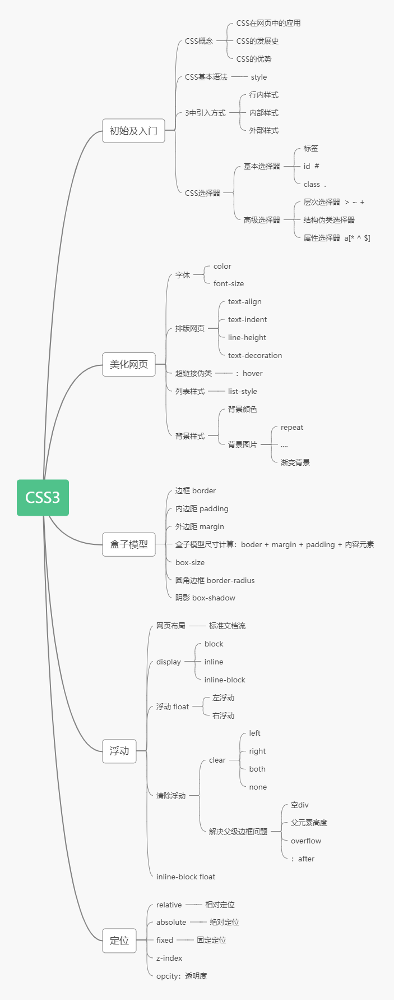

```
HTML + CSS + JavaScript
结构  +  表现  +  动作
```

## 1、什么是CSS

如何学习

1. CSS是什么
2. CSS怎么用（快速入门）
3. **CSS选择器（重点+难点）**
4. 美化网页（文字，阴影，超链接，列表，渐变...）
5. 盒子模型
6. 浮动
7. 定位
8. 网页动画（特效、效果）


### 11.什么是CSS

Cascading Style Sheet 层叠级联样式表

CSS：表现（美化网页）

字体、颜色、边距、高度、宽度、背景图片、页面定位、网页浮动...

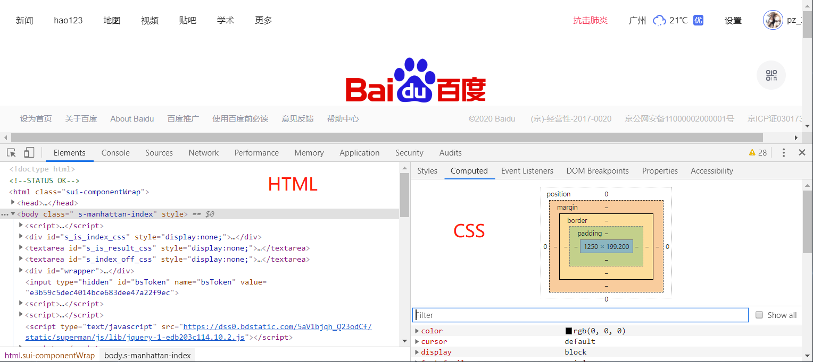


### 1.2.发展史

CSS1.0：

CSS2.0：DIV（块）+ CSS，HTML与CSS结构分离的思想，网页变得简单，SEO

CSS2.1：浮动定位

CSS3.0：圆角，阴影，动画.....（浏览器兼容~）


### 1.3.快速入门

**基本入门**

```html
<!DOCTYPE html>
<html lang="en">
<head>
    <meta charset="UTF-8">
    <title>Title</title>
    <!--规范 <style> 可以编写css的代码 ,每一个声明，最好使用分号结尾
    语法：
        选择器 {
            声明1;
            声明2;
            声明3;
        }
    -->
    <!--方式一-->
    <style>
        /*h1{
            color: red;
        }*/
    </style>

    <!--方式二，建议使用这个规范-->
    <link rel="stylesheet" href="css/style.css">

</head>
<body>
<h1>我是标题</h1>
</body>
</html>
```

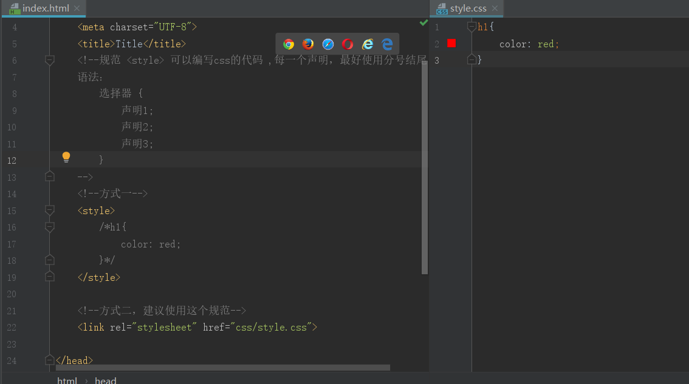


**CSS的优势：**

1、内容和表现分离

2、网页结构表现统一，可以实现复用

3、样式十分的丰富

4、建议使用独立于html的css文件

5、利用SEO，容易被搜索引擎收录！


### 1.4.CSS的三种导入方式

```html
<!DOCTYPE html>
<html lang="en">
<head>
    <meta charset="UTF-8">
    <title>Title</title>

    <!--内部样式-->
    <style>
        h1{
            color: green;
        }
    </style>

    <!--外部样式-->
    <link rel="stylesheet" href="css/style.css">
</head>
<body>

<!--优先级：就近原则（谁离h1标签近谁的优先级高）-->

<!--行内样式：在标签元素中，编写一个style属性，编写样式即可-->
<h1 style="color: red;">我是标题</h1>
</body>
</html>
```

```css
/*外部样式*/
h1{
    color: yellow;
}
```

拓展：外部样式两种写法

- 链接式（一般推荐用法）：

  html

  ```html
  <!--外部样式-->
  <link rel="stylesheet" href="css/style.css">
  ```

- 导入式：

  @import是CSS2.1特有的

  ```html
  <!--导入式-->
  <style>
  	@import url("css/style.css");
  </style>
  ```

  


## 2、选择器

> 作用：选择页面上的某一个或某一类元素

### 2.1.基本选择器

1、标签选择器：选择一类标签	标签{}

```html
<!DOCTYPE html>
<html lang="en">
<head>
    <meta charset="UTF-8">
    <title>Title</title>

    <style>
        /*标签选择*/
        h1{
            color: #a13d30;
            background: #3cbda6;/*背景色*/
            border-radius: 24px;/*圆角*/
        }
        p{
            font-size: 80px;
        }
    </style>
</head>
<body>

<h1>学Java</h1>
<h1>学Java</h1>
<p>听狂神说</p>

</body>
</html>
```


2、类选择器 class：选择所有class属性一致的标签，跨标签	.类名{}

```html
<!DOCTYPE html>
<html lang="en">
<head>
    <meta charset="UTF-8">
    <title>Title</title>

    <style>
        /*类选择器的格式   .class的名称{}
        好处：可以多个标签归类，是同一个 class,可以复用
        */
        .liusx{
            color: blue;
        }
        .kuangshen{
            color: #a13d30;
        }
    </style>
</head>
<body>

<h1 class="liusx">标题1</h1>
<h1 class="kuangshen">标题1</h1>
<h1 class="liusx">标题1</h1>
<p class="kuangshen">p标签</p>
</body>
</html>
```


3、Id 选择器：全局唯一	#id名称{}

```html
<!DOCTYPE html>
<html lang="en">
<head>
    <meta charset="UTF-8">
    <title>Title</title>

    <style>
        /* id选择器：id必须保证全局唯一
           #id名称{}
           不遵循就近原则，固定的
           id选择器 > class选择器 > 标签选择器
        */
        #liusx{
            color: red;
        }
        .style1{
            color: #3cbda6;
        }
        h1{
            color: blue;
        }
    </style>
</head>
<body>

<h1 id="liusx" class="style1">标题1</h1>
<h1 class="style1">标题2</h1>
<h1 class="style1">标题3</h1>
<h1>标题4</h1>
<h1>标题5</h1>
</body>
</html>
```


**优先级**：id选择器 > class选择器 > 标签选择器


### 2.2.层次选择器

1、后代选择器：在某个元素的后面	祖爷爷	爷爷	爸爸	你

```css
/*后代选择器*/
body p{
	background: red;
}
```

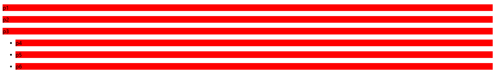

2、子选择器：一代，儿子

```css
/*子选择器*/
body>p{
    background: #3cbda6;
}
```

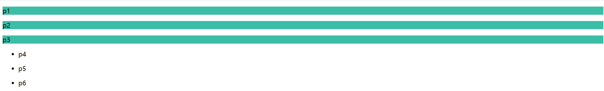

3、相邻兄弟选择器：同辈中下一i个

```css
/*相邻兄弟选择器，只有一个，相邻（向下）*/
.active + p{
    background: #a13d30;
}
```


4、通用选择器：同辈中下面所有的

```css
/*通用兄弟选择器，当前选中元素的向下所有兄弟元素*/
.active~p{
    background: blueviolet;
}
```

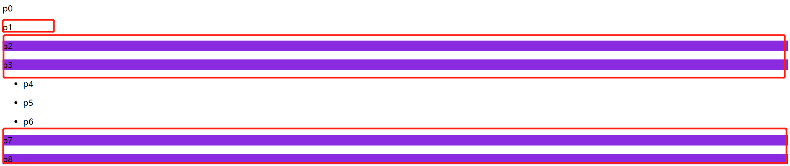

```html
<!DOCTYPE html>
<html lang="en">
<head>
    <meta charset="UTF-8">
    <title>Title</title>
    <style>
        /*p{
            background: green;
        }*/

        /*后代选择器*/
        /*body p{
            background: red;
        }*/

        /*子选择器*/
        /*body>p{
            background: #3cbda6;
        }*/

        /*相邻兄弟选择器，只有一个，相邻（向下）*/
        /*.active + p{
            background: #a13d30;
        }*/

        /*通用兄弟选择器，当前选中元素的向下所有兄弟元素*/
        .active~p{
            background: blueviolet;
        }
    </style>
</head>
<body>
<p>p0</p>
<p class="active">p1</p>
<p>p2</p>
<p>p3</p>
<ul>
    <li>
        <p>p4</p>
    </li>
    <li>
        <p>p5</p>
    </li>
    <li>
        <p>p6</p>
    </li>
</ul>

<p>p7</p>
<p>p8</p>
</body>
</html>
```


### 2.3.结构伪类选择器

伪类：条件

```css
/*ul的第一个子元素*/
ul li:first-child{
    background: #a13d30;
}

/*ul的最后一个子元素*/
ul li:last-child{
    background: red;
}

/*选中p1：定位到父元素，选择当前的第一个元素
选择当前p元素的父级元素，选中父级元素的第一个子元素为p的
按顺序
*/
p:nth-child(2){
    background: blue;
}

/*选中父元素，下的p元素的第二个，按类型*/
p:nth-of-type(1){
    background: yellow;
}
```

```html
<!DOCTYPE html>
<html lang="en">
<head>
    <meta charset="UTF-8">
    <title>Title</title>

    <!--避免使用，class，id选择器-->
    <style>
        /*ul的第一个子元素*/
        ul li:first-child{
            background: #a13d30;
        }
        /*ul的最后一个子元素*/
        ul li:last-child{
            background: red;
        }

        /*选中p1：定位到父元素，选择当前的第一个元素
        选择当前p元素的父级元素，选中父级元素的第一个子元素为p的
        按顺序
        */
        p:nth-child(2){
            background: blue;
        }

        /*选中父元素下的p元素的第二个，按类型*/
        p:nth-of-type(1){
            background: yellow;
        }

        a:hover{
            background: black;
        }
    </style>
</head>
<body>
    <!--<h1>h1</h1>-->
    <p>p1</p>
    <p>p2</p>
    <p>p3</p>
    <ul>
        <li>li1</li>
        <li>li2</li>
        <li>li3</li>
    </ul>

    <a href="">链接标签</a>
</body>
</html>
```


### 2.4.属性选择器（常用）

```html
<!DOCTYPE html>
<html lang="en">
<head>
    <meta charset="UTF-8">
    <title>Title</title>

    <style>
        .demo a{
            float: left;
            display: block;
            height: 50px;
            width: 50px;
            border-radius: 10px;
            background: blue;
            text-align: center;
            color: gainsboro;
            text-decoration: none;
            margin-right: 5px;
            font: bold 20px/50px Arial;
        }

        /*属性名，属性名 = 属性值（正则）
        = 绝对等于
        *= 包含这个元素
        ^= 以这个开头
        $= 以这个结尾
        */

        /*存在id属性的元素：a[]{}*/
        /*a[id]{!*所有带id的a标签*!
            background: yellow;
        }*/
        /*id=first的元素*/
        /*a[id=first]{
            background: blue;
        }*/
        /*class中有links的元素*/
        /*a[class*=links]{
            background: yellow;
        }*/

        /*选中href中以http开头的元素*/
        /*a[href^=http]{
            background: yellow;
        }*/
        /*选中href中以pdf结尾的*/
        a[href$=pdf]{
            background: yellow;
        }

    </style>
</head>
<body>

<p class="demo">
    <a href="http://baidu.com" class="links item first" id="first">1</a>
    <a href="" class="links item active" target="_blank" title="test">2</a>
    <a href="images/123.html" class="links item">3</a>
    <a href="images/123.png" class="links item">4</a>
    <a href="images/123.jpg" class="links item">5</a>
    <a href="abc" class="links item">6</a>
    <a href="/a.pdf" class="links item">7</a>
    <a href="/abc.pdf" class="links item">8</a>
    <a href="abc.doc" class="links item">9</a>
    <a href="abcd.doc" class="links item last">10</a>
</p>
</body>
</html>
```

```
 = 绝对等于
*= 包含这个元素
^= 以这个开头
$= 以这个结尾
```

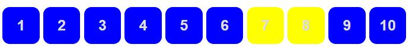


## 3、美化网页元素

### 3.1.为什么要美化网页

1、有效的传递网页信息

2、美化网页，页面漂亮，才能吸引用户

3、凸显页面的主题

4、提高用户的体验


span标签：重点要突出的字，使用span套起来

```html
<!DOCTYPE html>
<html lang="en">
<head>
    <meta charset="UTF-8">
    <title>Title</title>
    <style>
        #title1{
            font-size: 50px;
        }
    </style>
</head>
<body>
欢迎学习<span id="title1">Java</span>
</body>
</html>
```


### 3.2.字体样式

```html
<!DOCTYPE html>
<html lang="en">
<head>
    <meta charset="UTF-8">
    <title>Title</title>
    <!--
    font-family：字体
    font-size：字体大小
    font-weight：字体的粗细
    color：字体颜色
    -->
    <style>
        body{
            font-family:"Arial Black" ,楷体;
            color: #a13d30;
        }
        h1{
            font-size: 50px;
        }
        .p1{
            font-weight: lighter;
        }
    </style>
</head>
<body>

<h1>故事介绍</h1>

<p class="p1">
    物、情节、环境是小说的三要素。情节一般包括开端、发展、高潮、结局四部分，有的包括序幕、尾声。环境包括自然环境和社会环境。
    小说按照篇幅及容量可分为长篇、中篇、短篇和微型小说（小小说）。
    按照表现的内容可分为神话、仙侠、武侠、科幻、悬疑、古传、当代、浪漫青春、游戏竞技等。
</p>
<p>
    按照体制可分为章回体小说、日记体小说、书信体小说、自传体小说。按照语言形式可分为文言小说和白话小说。
</p>

<p>
    Hooray! It's snowing! It's time to make a snowman.James runs out.
    He makes a big pile of snow. He puts a big snowball on top.
    He adds a scarf and a hat. He adds an orange for the nose.
    He adds coal for the eyes and buttons.In the evening,
    James opens the door. What does he see? The snowman is moving!
    James invites him in. The snowman has never been inside a house.
    He says hello to the cat. He plays with paper towels.A moment later,
    the snowman takes James's hand and goes out.They go up, up, up into the air! They are flying!
    What a wonderful night!The next morning,
    James jumps out of bed. He runs to the door.He wants to thank the snowman. But he's gone.
</p>

</body>
</html>
```

```html
<!DOCTYPE html>
<html lang="en">
<head>
    <meta charset="UTF-8">
    <title>Title</title>

    <!--字体风格-->
    <style>
        p{
            font: oblique bolder 12px "楷体";
        }
    </style>
</head>
<body>

<p>
    按照体制可分为章回体小说、日记体小说、书信体小说、自传体小说。按照语言形式可分为文言小说和白话小说。
</p>

</body>
</html>
```

- font-family：字体
- font-size：字体大小
- font-weight：字体的粗细
- color：字体颜色


### 3.3.文本样式

1、颜色：color，rgb，rgba

2、**文本对齐方式：text-align:  center;**

3、**首行缩进：text-indext: 2em;**

4、**行高：**line-height: 100px;	单行文字上下居中！line-height = height

5、下划线：text-decoration: ;

6、文本图片水平对齐：vertical-align: middle;

```css
text-decoration:underline/*下划线*/
text-decoration:line-through/*中划线*/
text-decoration:overline/*上划线*/
text-decoration:none/*超链接去下划线*/
img,span{vetical-align:middle}/*图片、文字水平对齐*/
```

```html
<!DOCTYPE html>
<html lang="en">
<head>
    <meta charset="UTF-8">
    <title>Title</title>

    <!--
    颜色：
        单词：#FFFFFF
        RGB：0~F ,rgb(0,255,255)
        RGBA：A（透明度）：0~1,rgba(0,255,255,0.9)
        text-indent：段落首行缩进
        line-height: 300px;
            行高 和 块的高度一致，就可以上下居中
    -->
    <style>
        h1{
            color: rgba(0,255,255,0.9);
            text-align: center;
        }
        .p1{
            text-indent: 2em;
        }
        .p3{
            background: blueviolet;
            height: 300px;
            line-height: 50px;
        }

        /*下划线*/
        .l1{
            text-decoration: underline;
        }
        /*中划线*/
        .l2{
            text-decoration: line-through;
        }
        /*上划线*/
        .l3{
            text-decoration: overline;
        }
        /* a标签去除下划线 */
        a1{
            text-decoration: none;
        }

        /* 水平对齐~ 参照物， a，b */
        img,span{
            vertical-align: middle;
        }
    </style>
</head>
<body>

<a href="">a标签去除下划线</a>

<p class="l1">123321</p>
<p class="l2">123321</p>
<p class="l3">123321</p>

<h1>故事介绍</h1>

<p class="p1">
    物、情节、环境是小说的三要素。情节一般包括开端、发展、高潮、结局四部分，有的包括序幕、尾声。环境包括自然环境和社会环境。
    小说按照篇幅及容量可分为长篇、中篇、短篇和微型小说（小小说）。
    按照表现的内容可分为神话、仙侠、武侠、科幻、悬疑、古传、当代、浪漫青春、游戏竞技等。
</p>
<p>
    按照体制可分为章回体小说、日记体小说、书信体小说、自传体小说。按照语言形式可分为文言小说和白话小说。
</p>

<p class="p3">
    Hooray! It's snowing! It's time to make a snowman.James runs out.
    He makes a big pile of snow. He puts a big snowball on top.
    He adds a scarf and a hat. He adds an orange for the nose.
    He adds coal for the eyes and buttons.In the evening,
    James opens the door. What does he see? The snowman is moving!
    James invites him in. The snowman has never been inside a house.
    He says hello to the cat. He plays with paper towels.A moment later,
    the snowman takes James's hand and goes out.They go up, up, up into the air! They are flying!
    What a wonderful night!The next morning,
    James jumps out of bed. He runs to the door.He wants to thank the snowman. But he's gone.
</p>


<p>
    
    <span>abcdefghijklmnabcdefghijklmn</span>
</p>

</body>
</html>
```


### 3.4.阴影

```css
/* text-shadow: 阴影颜色，水平偏移，垂直偏移，阴影半径*/
#price{
    text-shadow: #008800 20px -10px 2px;
}
/*	第一个参数：表示水平偏移
	第二个参数：表示垂直偏移
	第三个参数：表示模糊半径
	第四个参数：表示颜色
*/
text-shadow:5px 5px 5px 颜色
```


### 3.5.超链接伪类

```css
/* 未访问的链接 */
a:link {color: #FF0000}
/* 已访问的链接,点击之后的状态*/
a:visited {color: #00FF00}
/* 鼠标移动到链接上,鼠标悬浮的状态*/
a:hover {color: #FF00FF}
/* 选定的链接,鼠标按住未释放的状态*/
a:active {color: #0000FF}
```

```html
<!DOCTYPE html>
<html lang="en">
<head>
    <meta charset="UTF-8">
    <title>Title</title>

    <style>
        /* 默认颜色 */
        a{
            text-decoration: none;
            color: #000000;
        }
        /* 鼠标悬浮的颜色 （只需要记住这个）*/
        a:hover{
            color: burlywood;
            font-size: 30px;
        }
        /* 鼠标按主未释放的状态 */
        a:active{
            color: #008800;
        }
        /* 未访问的链接 */
        a:link{
            color: maroon;
        }
        /* 已访问的链接 */
        a:visited{
            color: darkmagenta;
        }
        /* text-shadow: 阴影颜色，水平偏移，垂直偏移，阴影半径*/
        #price{
            text-shadow: #008800 20px -10px 2px;
        }
    </style>
</head>
<body>

<a href="#">
    
</a>
<p>
    <a href="#">码出高校：Java开发手册</a>
</p>
<p>
    <a href="">作者：孤尽老师</a>
</p>
<p id="price">
    ￥99
</p>

</body>
</html>
```


### 3.6.列表

```html
<!DOCTYPE html>
<html lang="en">
<head>
    <meta charset="UTF-8">
    <title>列表样式</title>
    <link rel="stylesheet" href="css/style.css" type="text/css">
</head>
<body>
    <div id="nav">
        <h2 class="title">全部商品分类</h2>
        <ul>
            <li><a href="#">图书</a>&nbsp;&nbsp;<a href="#">音响</a>&nbsp;&nbsp;<a href="#">数字商品</a></li>
            <li><a href="#">家用电器</a>&nbsp;&nbsp;<a href="#">手机</a>&nbsp;&nbsp;<a href="#">数码</a></li>
            <li><a href="#">电脑</a>&nbsp;&nbsp;<a href="#">办公</a></li>
            <li><a href="#">家居</a>&nbsp;&nbsp;<a href="#">家装</a>&nbsp;&nbsp;<a href="#">厨具</a></li>
            <li><a href="#">服饰鞋帽</a>&nbsp;&nbsp;<a href="#">个护化妆</a></li>
            <li><a href="#">礼品箱包</a>&nbsp;&nbsp;<a href="#">中标</a>&nbsp;&nbsp;<a href="#">珠宝</a></li>
            <li><a href="#">食品饮料</a>&nbsp;&nbsp;<a href="#">保健食品</a></li>
            <li><a href="#">彩票</a>&nbsp;&nbsp;<a href="#">旅行</a>&nbsp;&nbsp;<a href="#">充值</a>&nbsp;&nbsp;<a href="#">票务</a></li>
        </ul>
    </div>
</body>
</html>
```

```css
#nav{
    width: 300px;
    background: darkgrey;
}

.title{
    font-size: 18px;
    font-weight: bold;
    text-indent: 1em;
    line-height: 35px;
    background: red;
}
/*ul li
list-style:
    none：去掉圆点
    circle：空心圆
    decimal：数字
    spuare：正方形
*/
ul{
    background: darkgrey;
}
ul li{
    height: 30px;
    list-style: none;
    text-indent: 1em;
}

a{
    text-decoration: none;
    font-size: 14px;
    color: black;
}
a:hover{
    color: orange;
    text-decoration: underline;
}
```


### 3.7.背景

背景颜色：background

背景图片

```html
<!DOCTYPE html>
<html lang="en">
<head>
    <meta charset="UTF-8">
    <title>Title</title>

    <style>
        div{
            width: 1000px;
            height: 700px;
            border: 1px solid red;
            background-image: url("images/tx.jpg");
            /*默认是全部平铺的 repeat*/
        }
        .div1{
            background-repeat: repeat-x;
        }
        .div2{
            background-repeat: repeat-y;
        }
        .div3{
            background-repeat: no-repeat;
        }
    </style>
</head>
<body>

<div class="div1"></div>
<div class="div2"></div>
<div class="div3"></div>

</body>
</html>
```

延续3.6的案例，加上背景图：

```html
<!DOCTYPE html>
<html lang="en">
<head>
    <meta charset="UTF-8">
    <title>列表样式</title>
    <link rel="stylesheet" href="css/style.css" type="text/css">
</head>
<body>
    <div id="nav">
        <h2 class="title">全部商品分类</h2>
        <ul>
            <li><a href="#">图书</a>&nbsp;&nbsp;<a href="#">音响</a>&nbsp;&nbsp;<a href="#">数字商品</a></li>
            <li><a href="#">家用电器</a>&nbsp;&nbsp;<a href="#">手机</a>&nbsp;&nbsp;<a href="#">数码</a></li>
            <li><a href="#">电脑</a>&nbsp;&nbsp;<a href="#">办公</a></li>
            <li><a href="#">家居</a>&nbsp;&nbsp;<a href="#">家装</a>&nbsp;&nbsp;<a href="#">厨具</a></li>
            <li><a href="#">服饰鞋帽</a>&nbsp;&nbsp;<a href="#">个护化妆</a></li>
            <li><a href="#">礼品箱包</a>&nbsp;&nbsp;<a href="#">中标</a>&nbsp;&nbsp;<a href="#">珠宝</a></li>
            <li><a href="#">食品饮料</a>&nbsp;&nbsp;<a href="#">保健食品</a></li>
            <li><a href="#">彩票</a>&nbsp;&nbsp;<a href="#">旅行</a>&nbsp;&nbsp;<a href="#">充值</a>&nbsp;&nbsp;<a href="#">票务</a></li>
        </ul>
    </div>
</body>
</html>
```

```css
#nav{
    width: 300px;
    background: darkgrey;
}

.title{
    font-size: 18px;
    font-weight: bold;
    text-indent: 1em;
    line-height: 35px;
    background: red url("../images/c.jpg") 270px 10px no-repeat;
}
/*ul li
list-style:
    none：去掉圆点
    circle：空心圆
    decimal：数字
    spuare：正方形
*/
/*ul{
    background: darkgrey;
}*/
ul li{
    height: 30px;
    list-style: none;
    text-indent: 1em;
    background-image: url("../images/b.jpg");
    background-repeat: no-repeat;
    background-position: 236px 2px;
}

a{
    text-decoration: none;
    font-size: 14px;
    color: black;
}
a:hover{
    color: orange;
    text-decoration: underline;
}
```

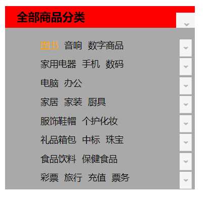


### 3.8.渐变

https://www.grabient.com/

```html
<!DOCTYPE html>
<html lang="en">
<head>
    <meta charset="UTF-8">
    <title>Title</title>

    <!--径向渐变，圆形-->
    <style>
        body{
            background-color: #FFFFFF;
            background-image: linear-gradient(66deg, #FFFFFF 0%, #6284FF 50%, #FF0000 100%);
        }
    </style>
</head>
<body>

</body>
</html>
```


## 4、盒子模型

### 4.1.什么是盒子模型

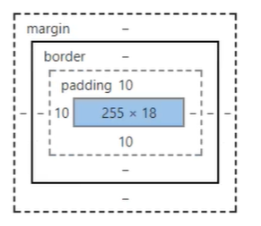

margin：外边距

padding：内边距

border：边框


### 4.2.边框

1、边框的粗细

2、边框的样式

3、边框的颜色

```html
<!DOCTYPE html>
<html lang="en">
<head>
    <meta charset="UTF-8">
    <title>Title</title>

    <style>
        /*body总有一个默认的外边框margin：0,常见的*/
        /*body{
            margin: 0;
            padding: 0;
            text-decoration: none;
        }*/
        /*border:粗细，样式，颜色*/
        #box{
            width: 300px;
            border: 1px solid red;
        }

        h2{
            font-size: 16px;
            background-color: cornflowerblue ;
            line-height: 30px;
            margin: 0px;
        }

        form{
            background: #008800;
        }
        div:nth-of-type(1) input{
            border: 3px solid black;
        }
        div:nth-of-type(2) input{
            border: 3px dashed yellow;
        }
        div:nth-of-type(3) input{
            border: 2px dashed green;
        }
    </style>
</head>
<body>

<div id="box">
    <h2>会员登录</h2>
    <form action="#">
        <div>
            <span>用户名：</span>
            <input type="text">
        </div>
        <div>
            <span>密码：</span>
            <input type="password">
        </div>
        <div>
            <span>邮箱：</span>
            <input type="text">
        </div>

    </form>
</div>

</body>
</html>
```


### 4.3.内外边距

```html
<!DOCTYPE html>
<html lang="en">
<head>
    <meta charset="UTF-8">
    <title>Title</title>

    <!--外边距的妙用：居中元素
    margin: 0 auto;
    -->
    <style>

        /*border:粗细，样式，颜色*/
        #box{
            width: 300px;
            border: 1px solid red;
            margin: 0 auto;
        }

        /*
        顺时针选中
        margin: 1px
        margin: 1px 2px 3px;
        margin: 1px 2px 3px 4px;
        */
        h2{
            font-size: 16px;
            background-color: cornflowerblue ;
            line-height: 30px;
            margin: 0px;
        }

        form{
            background: #008800;
        }

        input{
            border: 1px solid black;
        }
        div:nth-of-type(1){
            padding: 10px 5px;
        }
    </style>
</head>
<body>

<div id="box">
    <h2>会员登录</h2>
    <form action="#">
        <div>
            <span>用户名：</span>
            <input type="text">
        </div>
        <div>
            <span>密码：</span>
            <input type="password">
        </div>
        <div>
            <span>邮箱：</span>
            <input type="text">
        </div>

    </form>
</div>

</body>
</html>
```

盒子的计算方式：你这个元素到底多大？

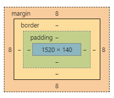

margin + border + padding + 内容宽度


### 4.4.圆角边框

4个角

```html
<!DOCTYPE html>
<html lang="en">
<head>
    <meta charset="UTF-8">
    <title>Title</title>
    <!--
    左上 右上 右下 左下，顺时针方向
    -->
    <!--
        圆圈： 圆角 = 半径
    -->
    <style>
        div{
            width: 100px;
            height: 100px;
            border: 10px solid red;
            border-radius: 100px;
        }
    </style>
</head>
<body>
<div>

</div>
</body>
</html>
```

```html
<!DOCTYPE html>
<html lang="en">
<head>
    <meta charset="UTF-8">
    <title>Title</title>
    <style>
        #div1{
            width: 100px;
            height: 100px;
            border: 10px solid red;
            border-radius: 100px;
        }
        #div2{
            width: 100px;
            height: 50px;
            border: 10px solid red;
            border-radius: 100px 100px 0 0;
        }
        #div3{
            width: 50px;
            height: 50px;
            border: 10px solid red;
            border-radius: 100px 0 0 0;
        }
        img{
            border-radius: 100px;
        }
    </style>
</head>
<body>
<div id="div1"></div>
<div id="div2"></div>
<div id="div3"></div>


</body>
</html>
```


### 4.5.盒子阴影（讲解前端知识）

```html
<!DOCTYPE html>
<html lang="en">
<head>
    <meta charset="UTF-8">
    <title>Title</title>
    <!--margin：0 auto; 居中
    要求：块元素，块元素有固定宽度-->
    <style>
        img{
            border-radius: 50px;
            box-shadow: 10px 10px 100px yellow;
        }
    </style>
</head>
<body>
<div>
    <div style="width: 500px;display: block;text-align: center ">
        <div>
            
        </div>
    </div>
</div>
</body>
</html>
```

源码之家：https://www.mycodes.net/

模板之家：http://www.cssmoban.com/


## 5、浮动

### 5.1.标准文档流


块级元素：独占一行	h1-h6 p div 列表...

行内元素：不独占一行	span a img strong

> 注：行内元素可以被包含在 块级元素中，反之，则不可以


### 5.2.display(重要)

1. block：块元素
2. inline：行内元素
3. inline-block：是块元素，但是可以内联，在一行（更多时候用float）
4. none：消失

```html
<!DOCTYPE html>
<html lang="en">
<head>
    <meta charset="UTF-8">
    <title>Title</title>

    <!--
    block 块元素
    inline 行内元素
    inline-block 是块元素，但是可以内联，在一行
    none 隐藏
    -->
    <style>
        div{
            width: 100px;
            height: 100px;
            border: 1px solid red;
            display: none;
        }
        span{
            width: 100px;
            height: 100px;
            border: 1px solid red;
            display: inline-block;
        }
    </style>
</head>
<body>

<div>div块元素</div>
<span>span行内元素</span>
</body>
</html>
```

> 这个也是一种实现行内元素排列的方式，当时我们很多情况都是用float

**QQ会员练习**：


```html
<!DOCTYPE html>
<html lang="en">
<head>
    <meta charset="UTF-8">
    <title>QQ会员</title>
    <style>
        *{
            padding:0;
            margin: 0;
        }
        a{
            text-decoration: none;
        }
        .nav-header{
            height: 90px;
            width: 100%;
            background: rgba(0,0,0,.6);
        }
        .head-contain{
            width: 1180px;
            height: 90px;
            margin: 0 auto;
            text-align: center;
        }
        .top-logo,.top-nav,.top-nav li,.top-right{
            height: 90px;
            display: inline-block;
            vertical-align: top;
        }
        .top-nav{
            margin: 0 48px;
        }
        .top-nav li{
            line-height: 90px;
            width: 90px;
        }
        .top-nav li a{
            display: block;
            text-align: center;
            font-size: 16px;
            color: #fff;
        }
        .top-nav li a:hover{
            color: blue;
        }

        .top-right a{
            display: inline-block;
            font-size: 16px;
            text-align: center;
            margin-top: 25px;
            border-radius: 35px;
        }
        .top-right a:first-of-type{
            width: 93px;
            height: 38px;
            line-height: 38px;
            color: #fad65c;
            border: 1px #fad65c solid;
        }
        .top-right a:first-of-type:hover{
            color: #986b0d;
            background: #fad65c;
        }
        .top-right a:last-of-type{
            width: 140px;
            height: 40px;
            font-weight: 700;
            line-height: 40px;
            background: #fad65c;
            color: #986b0d;
        }
        .top-right a:last-of-type:hover{
            background: #fddc6c;
        }
    </style>
</head>
<body>
<div class="wrap">
    <!--头部-->
    <header class="nav-header">
        <div class="head-contain">
            <a href="" class="top-logo"></a>
            <nav class="top-nav">
                <ul>
                    <li><a href="">功能特权</a> </li>
                    <li><a href="">游戏特权</a> </li>
                    <li><a href="">生活特权</a> </li>
                    <li><a href="">会员特权</a> </li>
                    <li><a href="">成长体系</a> </li>
                    <li><a href="">年费专区</a> </li>
                    <li><a href="">超级会员</a> </li>
                </ul>
            </nav>
            <div class="top-right">
                <a href="">登录</a>
                <a href="">开通超级会员</a>
            </div>
        </div>
    </header>
</div>
</body>
</html>
```

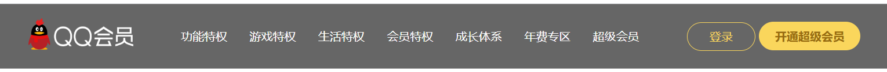


### 5.3.float

1、左右浮动 float

```html
<!DOCTYPE html>
<html lang="en">
<head>
    <meta charset="UTF-8">
    <title>Title</title>
    <link rel="stylesheet" href="css/style.css" type="text/css">
</head>
<body>
<div id="father">
    <div class="layer01"></div>
    <div class="layer02"></div>
    <div class="layer03"></div>
    <div class="layer04">
        浮动的盒子可以向左浮动，也可以向右浮动，知道它的外边缘碰到包含或另一个浮动盒子为止
    </div>
</div>
</body>
</html>
```

```css
div{
    margin: 10px;
    padding: 5px;
}
#father{
    border: 1px #000 solid;
}
.layer01{
    border: 1px #F00 dashed;
    display: inline-block;
    float: left;/*向左浮动*/
    clear: both;/*清楚浮动*/
}
.layer02{
    border: 1px #00F dashed;
    display: inline-block;
    float: left;
    clear: both;
}
.layer03{
    border: 1px #060 dashed;
    display: inline-block;
    float: left;
    clear: both;
}
.layer04{
    border: 1px #666 dashed;
    font-size: 12px;
    line-height: 23px;
    float: left;
    clear: both;
}
```


### 5.4.父级边框塌陷问题

clear

```css
/*
clear：right；右侧不允许有浮动元素
clear：left； 左侧不允许有浮动元素
clear：both； 两侧不允许有浮动元素
clear：none； 
 */
.layer04{
    border: 1px #666 dashed;
    font-size: 12px;
    line-height: 23px;
    display: inline-block;
    float: right;
    clear: left;
}
```


解决方案

1、增加父级元素的高度

```css
#father{
    border: 1px #000 solid;
    height: 800px;
}
```

2、增加一个空的div（class="clear"）标签，清除浮动

```html
<!DOCTYPE html>
<html lang="en">
<head>
    <meta charset="UTF-8">
    <title>Title</title>
    <link rel="stylesheet" href="css/style.css" type="text/css">
</head>
<body>
<div id="father">
    <div class="layer01"></div>
    <div class="layer02"></div>
    <div class="layer03"></div>
    <div class="layer04">
        浮动的盒子可以向左浮动，也可以向右浮动，知道它的外边缘碰到包含或另一个浮动盒子为止
    </div>
    <div class="clear"></div>
</div>
</body>
</html>
```

```css
div{
    margin: 10px;
    padding: 5px;
}
#father{
    border: 1px #000 solid;
    height: 800px;
}
.layer01{
    border: 1px #F00 dashed;
    display: inline-block;
    float: left;/*向左浮动*/
}
.layer02{
    border: 1px #00F dashed;
    display: inline-block;
    float: left;
}
.layer03{
    border: 1px #060 dashed;
    display: inline-block;
    float: right;
}
/*
clear：right；右侧不允许有浮动元素
clear：left； 左侧不允许有浮动元素
clear：both； 两侧不允许有浮动元素
clear：none；
 */
.layer04{
    border: 1px #666 dashed;
    font-size: 12px;
    line-height: 23px;
    display: inline-block;
    float: right;
    clear: left;
}
.clear{
    clear: both;
    margin: 0;
    padding: 0;
}
```

3、overflow

```
在父级元素中增加一个	
	overflow: hidden;
	overflow: scroll;
```

```html
<!DOCTYPE html>
<html lang="en">
<head>
    <meta charset="UTF-8">
    <title>Title</title>

    <style>
        #content{
            width: 200px;
            height: 150px;
            overflow: scroll;
        }
    </style>
</head>
<body>

<div id="content">
    
    <p>
        某雌性生物醉倒在草地上，路人对其上下其手，并在草地上翻滚，一番折腾后某雌性生物迷迷糊糊醒来步履蹒跚地离开了
    </p>
</div>
</body>
</html>
```

4、父类添加一个伪类：after

```
#father:after{
    content: '';
    display: block;
    clear: both;
}
```

```html
<!DOCTYPE html>
<html lang="en">
<head>
    <meta charset="UTF-8">
    <title>Title</title>
    <style>
    	div{
            margin: 10px;
            padding: 5px;
        }
        #father{
            border: 1px #000 solid;
        }
        #father:after{
            content: '';
            display: block;
            clear: both;
        }
        .layer01{
            border: 1px #F00 dashed;
            display: inline-block;
            float: left;/*向左浮动*/
        }
        .layer02{
            border: 1px #00F dashed;
            display: inline-block;
            float: left;
        }
        .layer03{
            border: 1px #060 dashed;
            display: inline-block;
            float: right;
        }
        /*
        clear：right；右侧不允许有浮动元素
        clear：left； 左侧不允许有浮动元素
        clear：both； 两侧不允许有浮动元素
        clear：none；
         */
        .layer04{
            border: 1px #666 dashed;
            font-size: 12px;
            line-height: 23px;
            display: inline-block;
            float: right;
        }
    </style>
</head>
<body>
<div id="father">
    <div class="layer01"></div>
    <div class="layer02"></div>
    <div class="layer03"></div>
    <div class="layer04">
        浮动的盒子可以向左浮动，也可以向右浮动，知道它的外边缘碰到包含或另一个浮动盒子为止
    </div>
    <div class="clear"></div>
</div>
</body>
</html>
```


**小结：**

1. 浮动元后面增加空div

   简单，代码中尽量避免空div

2. 设置父元素的高度

   简单，元素假设有了固定的高度，就会被限制

3. overflow

   简单，下拉的一些场景避免使用

4. 父类添加一个伪类：after

   写法稍微复杂一点，但是没有副作用，**推荐使用！**


### 5.5.display与float对比

- **display**：方向不可以控制
- **float**：浮动起来会脱离标准文档流，所以要解决父级边框塌陷的问题


## 6、定位

### 6.1.相对定位

```html
<!DOCTYPE html>
<html lang="en">
<head>
    <meta charset="UTF-8">
    <title>Title</title>
    <!-- 相对定位
    相对于自己原来的位置进行偏移~
    -->
    <style>
        body{
            padding: 20px;
        }
        div{
            margin: 10px;
            padding: 5px;
            font-size: 12px;
            line-height: 25px;
        }
        #father{
            border: 1px solid #666;
        }
        #first{
            background-color: #3cbda6;
            border: 1px solid #b27530;
            position: relative;/*相对定位 上下左右*/
            top: -20px;/*向上偏移20px*/
            left: 20px;/*向右偏移20*/
        }
        #second{
            background-color: #0000FF;
            border: 1px solid #255066;
        }
        #third{
            background-color: #008800;
            border: 1px solid #1c6615;
            position: relative;/*相对定位 上下左右*/
            bottom: -20px;/*向下偏移20px*/
            right: 20px;/*向左偏移20px*/
        }
    </style>
</head>
<body>
<div id="father">
    <div id="first">第一个盒子</div>
    <div id="second">第二个盒子</div>
    <div id="third">第三个盒子</div>
</div>
</body>
</html>
```

相对定位：position: relative;

相对于原来的位置，进行指定的偏移，相对定位的话，他仍然在标准文档流中，原来的位置会被保留。

```css
top: -20px;/*向上偏移20px*/
left: 20px;/*向右偏移20*/
bottom: -20px;/*向下偏移20px*/
right: 20px;/*向左偏移20px*/
```


**练习：**

- 使用div和a标签布局页面

- 每个超链接宽度和高度都是100px，背景颜色粉色，鼠标指针移上去变为蓝色

- 使用相对定位改变每个超链接的位置

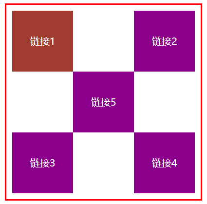

```html
<!DOCTYPE html>
<html lang="en">
<head>
    <meta charset="UTF-8">
    <title>Title</title>
    <style>
        #box{
            width: 300px;
            height: 300px;
            padding: 10px;
            border: 2px solid red;
        }
        a{
            width: 100px;
            height: 100px;
            text-decoration: none;
            background-color: darkmagenta;
            line-height: 100px;
            text-align: center;
            color: white;
            display: block;
        }
        a:hover{
            background: #a13d30;
        }
        .a2,.a4{
            position: relative;
            left: 200px;
            top: -100px;
        }
        .a5{
            position: relative;
            left: 100px;
            top: -300px;
        }
    </style>
</head>
<body>

<div id="box">
    <a class="a1" href="#">链接1</a>
    <a class="a2" href="#">链接2</a>
    <a class="a3" href="#">链接3</a>
    <a class="a4" href="#">链接4</a>
    <a class="a5" href="#">链接5</a>
</div>
</body>
</html>
```


### 6.2.绝对定位

定位：基于xxx定位。上下左右

1、没有父级元素定位的前提下，相对于浏览器定位

2、假设父级元素存在定位，我们通常会相对于父级元素进行偏移

3、在父级元素范围内

相对于父级或浏览器的位置，进行指定的偏移，相对定位的话，他仍然在标准文档流中，原来的位置不会被保留。

```html
<!DOCTYPE html>
<html lang="en">
<head>
    <meta charset="UTF-8">
    <title>Title</title>
    <style>
        div{
            margin: 10px;
            padding: 5px;
            font-size: 12px;
            line-height: 25px;
        }
        #father{
            border: 1px solid #666;
            padding: 0;
            position: relative;
        }
        #first{
            background-color: #3cbda6;
            border: 1px solid #b27530;
        }
        #second{
            background-color: #0000FF;
            border: 1px solid #255066;
            position: absolute;
            left: 100px;
            top: 20px;
        }
        #third{
            background-color: #008800;
            border: 1px solid #1c6615;
        }
    </style>
</head>
<body>
<div id="father">
    <div id="first">第一个盒子</div>
    <div id="second">第二个盒子</div>
    <div id="third">第三个盒子</div>
</div>
</body>
</html>
```


### 6.3.固定定位 fixed

```html
<!DOCTYPE html>
<html lang="en">
<head>
    <meta charset="UTF-8">
    <title>Title</title>
    <style>
        body{
            height: 10000px;
        }
        div:nth-of-type(1){/*绝对定位：相对于浏览器*/
            width: 100px;
            height: 100px;
            background: red;
            position: absolute;
            right: 0;
            bottom: 0;
        }
        div:nth-of-type(2){/*fixed：固定定位*/
            width: 50px;
            height: 50px;
            background: yellow;
            position: fixed;
            right: 0;
            bottom: 0;
        }
    </style>
</head>
<body>
<div>div1</div>
<div>div2</div>
</body>
</html>
```


### 6.4.z-index

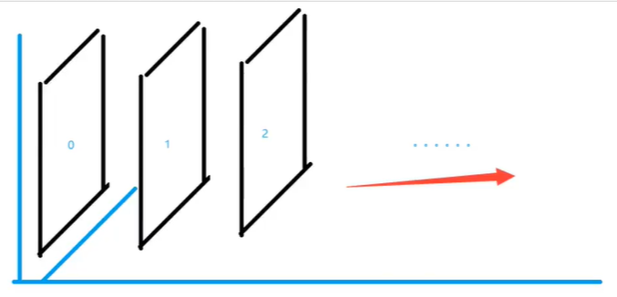

z-index：默认时0，最高无限：999

```html
<!DOCTYPE html>
<html lang="en">
<head>
    <meta charset="UTF-8">
    <title>Title</title>
    <style>
        #content{
            width: 333px;
            padding: 0px;
            margin: 0px;
            overflow: hidden;
            font-size: 12px;
            line-height: 25px;
            border: 1px #000 solid;

        }
        ul,li{
            padding: 0px;
            margin: 0px;
            list-style-type: none;
        }
        /*父级元素相对定位*/
        #content ul{
            position: relative;
        }
        .tipText,.tipBg{
            position: absolute;
            width: 333px;
            height: 25px;
            top: 320px;
        }
        .tipText{
            color: white;
            /*z-index: 0;*/
        }
        .tipBg{
            background: black;
            opacity: 0.5;   /*背景透明度*/
        }
    </style>
</head>
<body>

<ul id="content">
    <li></li>
    <li class="tipText">学习微服务，找狂神</li>
    <li class="tipBg"></li>
    <li>时间：2099-01-01</li>
    <li>地点：月球一号基地</li>
</ul>
</body>
</html>
```


### 6.5.动画

自己学习

