> - 爬虫之js逆向基础篇-浏览器开发者工具使用技巧总结：
>   - https://blog.csdn.net/qq_43308242/article/details/127747230
>   - https://mp.weixin.qq.com/s/NBlSfMrCBmbznvYQbI8P0Q
> - 【0基础学爬虫】爬虫基础之抓包工具的使用：https://mp.weixin.qq.com/s/MqoOQM31uJLQ_fV11oxKqw

# 浏览器开发者工具使用技巧总结

## 1、打开方式与面板内容

**1、打开方式**

- F12
- 快捷键 Ctrl+Shift+I
- 鼠标右键检查或者审查元素
- 浏览器右上角 —> 更多工具 —> 开发者工具

**2、面板内容**

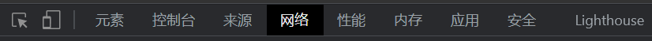

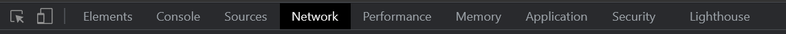

- **Elements（元素面板）**：查找网页源代码HTML中的任一元素,手动修改任一元素的属性和样式且能实时在浏览器里面得到反馈。
- **Console（控制台面板）**：在开发期间，可以使用控制台面板记录诊断信息，或者使用它作为 shell，在页面上与 JavaScript 交互。
- **Sources（源代码面板）**：在源代码面板中设置断点来调试 JavaScript ，或者通过 Workspaces（工作区）连接本地文件来使用开发者工具的实时编辑器。
- **Network（网络面板）**：从发起网页页面请求 Request 后得到的各个请求资源信息（包括状态、资源类型、大小、所用时间等），并可以根据这个进行网络性能优化。
- **Performance（性能面板）**：使用时间轴面板，可以通过记录和查看网站生命周期内发生的各种事件来提高页面运行时的性能。
- **Memory（内存面板）**：分析 web 应用或者页面的执行时间以及内存使用情况。
- **Application（应用面板）**：记录网站加载的所有资源信息，包括存储数据（Local Storage、 Session Storage、IndexedDB、Web SQL、Cookies）、缓存数据、字体、图片、脚本、样式 表等。
- **Security（安全面板）**：使用安全面板调试混合内容问题，证书问题等等。
- **Lighthouse（诊断面板）**：对当前网页进行网络利用情况、网页性能方面的诊断，并给出一些优化 建议。
- **元素选择**：可以直接点击页面的元素，会自动跳转到对应的源代码
- **终端模拟=**：模拟各种终端设备，支持自定义终端。
- **自定义=**：自定义和控制开发者工具，包括调整工具的位置、全局搜索、运行命令、其他工具等。

下面就对几个常用的做一个说明。


## 2、Elements（元素面板）

-  查看页面内容所对应的标签


通过此按钮可以查看到页面中内容所对应的标签，这个一般在定位Xpath元素等的时候会用到。

**复制(Copy)**：因为都有中文版的，所以复制啥的就不做详细说明了。

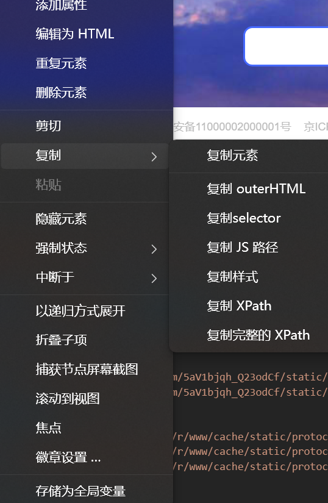

**强制状态(force state)**：我们先来说一下这个强制状态的作用是什么，强制状态就是说，你设置了伪类的格式，比如我们设置的是focus聚焦的，那么我们可能需要让其元素获得焦点才能显示focus设置的格式。但是我们可以使用强制状态让其直接显示focus设置的状态。不需要必须获得焦点。接下来再来说一下这些伪类选择器的都是些什么？

```
:active ——元素被激活时的样式，也就是元素按下的格式
:hover——鼠标悬停或划过的样式
:focus——获得焦点的样式（比如输入框通过tab获得光标，或触发该样式）
:visited——访问过链接之后的样式
:focus-within——元素本身，或子类元素获得焦点时的样式
```

**中断(break on)**：断点调试，就是当js尝试改变元素的时候，给元素添加断点就会被触发

```
subtree modifications：添加、改变、删除触发
attribute modifications：元素属性发生改变触发
node removal：移除元素触发
```

**存为全局变量(Store as global variable)**：选中元素，存储为全局变量（Store as global variable）就会在consloe（控制台）里面添加一个全局变量，然后在console中输入 monitorEvents(temp1) 会监视并打印出该元素的所有事件。这个时候你鼠标移动到该元素上，或者点击等，会发现console里面会显示你操作所触发处理的一系列事件，使用 unmonitorEvents(temp1) 停止记录事件。使用 monitorEvents(temp1, [‘mouse’, ‘focus’]) 只记录某类型的事件。可以填 mouse, key, click, touch和control等。

## 3、Console（控制台面板）

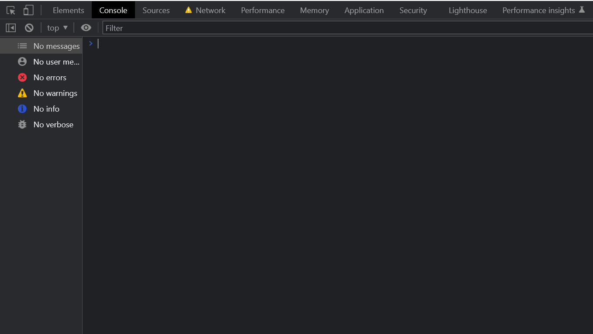

这个面板主要是用来输出日志的，也可以直接在上面输入并执行**js**，下面来列一下**console**相关的方法

```javascript
console.log() 用于输出普通信息
console.info() 用于输出提示性信息
console.error() 用于输出错误信息
console.warn() 用于输出警示信息
console.claer() 清除控制台的输出信息
console.group() 输出一组信息的开头
console.groupEnd() 结束一组输出信息
console.assert() 对输入的表达式进行断言，只有表达式为false时，才输出相应的信息到控制台
console.count() （这个方法非常实用哦）当你想统计代码被执行的次数
console.dir() (这个方法是我经常使用的 可不知道比for in方便了多少) 直接将该DOM结点以DOM树的结构进行输出，可以详细查对象的方法发展等等
console.time() 计时开始
console.timeEnd() 计时结束
console.profile() 和 console.profileEnd() 配合一起使用来查看CPU使用相关信息
console.timeLine() 和 console.timeLineEnd() 配合一起记录一段时间轴
console.trace() 堆栈跟踪相关的调试
注：当需要换到下一行而不是回车的时候，请按 Shift + Enter。
```


## 4、Sources（源代码面板）

**调试JS代码**

- 你可以点击JS代码块前面的数字外来设置断点，如果当前代码是经过压缩的话，可以点击下方的花括号`{}`来增强可读性，所有的断点都会列出右侧的断点区。
- 设置断点

断点可以在**DOM元素节点发生改变时、XHR生命周期状态改变时、指定的事件执行时**被触发

- **DOM元素节点发生改变时**：在Elements面板中指定的DOM节点上右击，在弹出的菜单中选择Break on…，可以看到三个选择项，比如我们选择Subtree modifications，那么当选择的节点里面的子节点被添加、删除、修改，则断点就会被触发。
- **XHR生命周期状态改变时**：当XHR生命周期状态发生改变或者XHR的URL与Sources面板右侧的XHR Breakpoints栏设置的字符串匹配时，则断点就会有触发。
- **指定的事件执行时**：在Sources面板右侧的XHR Breakpoints栏下面是Event Listener Breakpoints,列出了各种类型的事件，勾选你要监听的事件，在指定的事件执行时，断点就会有触发。

下面来看一下**Sources**面板中有哪些东西

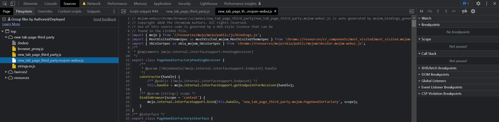

- **Page** 中可以看到有很多js文件，在调试js的时候，我们就可以在这里找到需要调试的js，然后打上断点，既然说到的断点，那就先说一下断点，断点分为以下几种：

  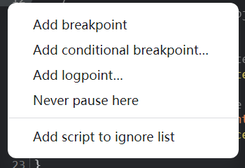

  ```
  Add breakpoint（普通断点）：在需要打断点的位置打上断点之后，当代码运行到该断点处就会停止到该地方
  Add conditional breakpoint（条件断点）:顾名思义，当满足所设定的条件时才会在所设置断点的地方停止
  Add logpoint（日志断点）:顾名思义，用来输出日志的，这个断点功能相当的强大，它会在console面板中输出相关参数的日志，这个断点还有另外一种称呼：“插桩”。
  Never pause here（永不在此处暂停）：意思就是设置了该断点的地方，它永远不会停住，该断点常用于js中有debugger，但是又不想停在debugger处的时候
  ```

  说到断点，就不得不提以下调试工具：

  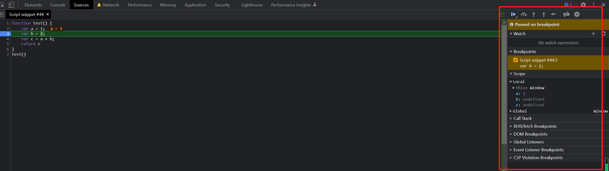

  各个选项功能：

  - 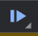：执行到下一个断点。
  - ：执行下一步，不会进入所调用的函数内部。
  - ：单步进入所调用的函数内部。
  - ：跳出函数内部。
  - ：一步步执行代码，遇到有函数调用，则进入函数。
  - 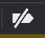：停用断点。
  - 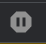：不要在出现异常时暂停。
  - Watch：这里可以监控想要看的参数。
  - Breakpoints：可以看到已经埋下的断点。
  - Scope：可以看到当前局部或者全局变量的值，可对值进行修改。
  - Call Stack：可以看到当前代码调用的堆栈信息，代码执行顺序为由下至上。
  - XHR 断点：匹配 url 中关键词，匹配到则跳转到参数生成处，适用 于url 中的加密参数全局搜索搜不到，可采用这种方式拦截。
  - DOM 断点：顾名思义，用来针对DOM元素的断点，前文中也有提及，这里就不过多说明了。
  - Event Listener(事件监听器) 断点：主要用来针对一些事件来设置的断点，当设置断点之后，比如发生鼠标点击、移动、键盘按键等行为或者其他事件时就会触发断点，比如 Mouse —> click，可快速定位点击按钮后，所执行的 JS。

- **Overrides**：这个主要用于js的替换，可以将浏览器中原有的js替换成自己本地的js，这个功能在[爬虫](https://so.csdn.net/so/search?q=爬虫&spm=1001.2101.3001.7020)中也是经常用到的，不过实现js替换的方式有很多种，这里就简单说一下：

  ```
  Overrides：直接在浏览器中实现js的替换
  Fiddler/Charles：通过抓包工具来实现js替换
  mitmproxy：通过代理的方式来实现js替换
  reres等插件：这个是通过浏览器插件的方式来实现js替换
  ```

  一般常用的就是以上几种方式了，至于各自的用法大家自行百度即可。

- **Snippets**：这个可以直接在浏览器中创建js文件，并且在里面实现js代码的编写，写完之后可以直接运行，在爬虫中这个也是调试中比较常用的一种方式，会将一些代码直接放在这里来运行。


## 5、Network（网络面板）

- ：记录请求。【是否开启抓包，抓包/停止抓包】
- 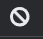：清除请求。
- 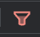：是否隐藏 Filter 过滤器 窗格。
- ：搜索。
- **Preserve log**：是否在页面重加载后【刷新】清除请求列表。勾选后刷新浏览器不会清空请求信息，会保留之前的请求。
- **Disable cache**：是否启用缓存。禁用浏览器缓存来模拟首次访问者。
- **Network Conditions**：模拟网络状态，允许在各种网络环境中测试，包括 3G，离线等，还可以自定义限制最大下载和上传流量。
  - No Throttling：
  - Fast 3G：快速 3G 网络
  - Slow 3G：慢速 3G 网络
  - Offline：离线网络状态测试
  - Custom：自定义网络状态
- **Import HAR file**：导入抓包数据。
- **Export HAR file**：导出抓包数据。

Filter 过滤器：

- **Hide data URLs**：data URLs 指一些嵌入到文档中的小型文件，在请求表里面以 data: 开头的文件就是，如较为常见的 svg 文件。勾选 Hide data URLs复选框即可隐藏此类文件。
- **All**：显示所有请求。
- **XHR**：全称 XMLHttpRequest，是一种创建 AJAX 请求的 JavaScript API，通常抓取 Ajax 请求可以选择 XHR。
- **WS**：全称 WebSocket，是 HTML5 开始提供的一种在单个 TCP 连接上进行全双工通讯的协议。
- **Manifest**：安卓开发文件名，属于 AndroidManifest.xml 文件，在简单的 Android 系统的应用中提出了重要的信息码。
- **Has blocked cookies**：仅显示具有阻止响应 cookie 的请求。
- **Blocked Requests**：仅显示被阻止的请求。
- **3rd-party request**：仅显示第三方请求。


## 6、Application（应用面板）

主要作用是检查 web 应用加载的所有资源，包括 Manifest、Service Workers、Local Storage、Session Storage、IndexedDB、Web SQL(该标准早已废弃，被 IndexedDB 干趴下)、Cookies、Cache Storage、Application Cache(已被 Service Workers 干趴下)、BackGround Services(头一回见，和 sw 相关)、Frames 等。

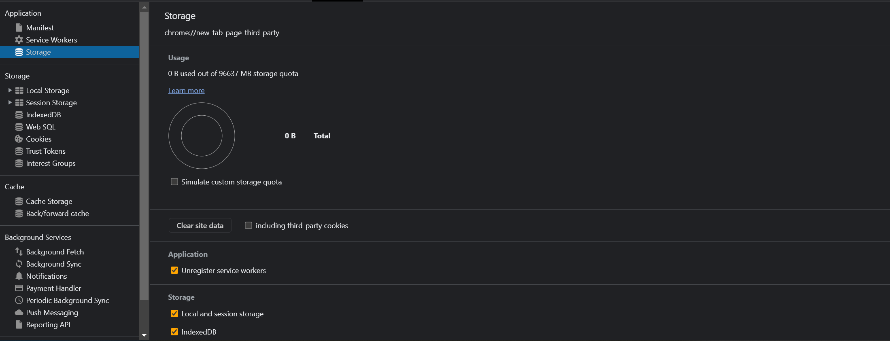

- **Application** — 应用

  - **Manifest** - 清单
  - **Service Workers** - 服务网络
  - **Storage** - 存储

- **Storage** — 存储

  - **Local Storage** - 本地存储空间

    表示访问页面储存的变量信息，这些数据只有在同一个会话中的页面才能访问并且当会话结束后数据也随之销毁（浏览器关闭）。

    | key                                                          | value                           |
    | ------------------------------------------------------------ | ------------------------------- |
    | userInfo                                                     | {key1: value1, key2: value2, …} |
    | 存储一个接口返回对象，对象名为userInfo， 值为{key1: value1, key2: value2, …}。该对象在页面存活期间都可直接引用。 |                                 |

  - **Session Storage** - 会话存储空间

    用于本地存储一个会话（session）的数据，这些数据只有在同一个会话中的页面才能访问并且当会话结束后数据也随之销毁（浏览器关闭）。因此session Storage不是一种持久化的本地存储，仅仅是会话级别的存储，操作与localStorage一样，就不细讲了。

    | **key**                        | **value** |
    | ------------------------------ | --------- |
    | React::DevTools::lastSelection | …         |

  - **IndexedDB** - 持久存储数据

    IndexedDB 是一种在浏览器中持久存储数据的方法，允许我们不考虑网络可用性，创建具有丰富查询能力的可离线web应用程序。indexedDB对于存储大量数据的应用程序和不需要持久internet链接的应用程序（例如邮件客户端、待办事项列或记事本）很有用。

  - **Cookies** - 浏览器缓存
    cookies一种保存在电脑上的一种文件，当我们使用电脑进行浏览网页的时候，服务器就会生成一个证书，并且返回给我们的电脑，这个证书就是cookie，一般情况下，cookie是服务器写入客户端的文件，我们也可以叫浏览器缓存。

    | name    | value | domain    | path | expires / max-age | size | httponly | secure | samesite | sameparty | priority |
    | ------- | ----- | --------- | ---- | ----------------- | ---- | -------- | ------ | -------- | --------- | -------- |
    | SESSION |       | localhost | /    | Session           | 55   |          |        |          |           |          |

    - domain: 指定Cookie的有效域, 决定在向该域发送请求时是否携带此Cookie
    - expires / max-age: 相对/绝对过期时间，由访问的apache服务器设置，A—相对；M—绝对；
    - httponly: 通过js脚本将无法读取到cookie信息，无法用document.cookie打出cookie的内容。这样能有效的防止XSS（cross siteScript—跨站脚本）攻击，窃取cookie内容，这样就增加了cookie的安全性；
    - secure: 这个cookie只能用https和ssl等安全协议发送给服务器，在不安全的http协议中不传输此cookie;
    - samesite: 用来限制第三方Cookie。
    - priority: chrome的提案，定义了三种优先级，Low/Medium/High，当cookie数量超出时，低优先级的cookie会被优先清除

  - **Trust Tokens** - 信任令牌

  - **Cache** - 缓存

  - **Cache Storage** - 缓存空间：用来存储Response（请求）对象，作用于需要使用请求缓存的方法。

  应用面板中剩下的就不过多介绍了，这里就只说以上可能会用到的。


## 7、终端模拟

点击可以模拟各种终端设备，适合查看手机页面的数据，点击【More tools】—> 【Sensors】可以模拟终端的地理位置、终端朝向等；工具栏可以选择要模拟的终端型号，其中 Responsive 是自适应。

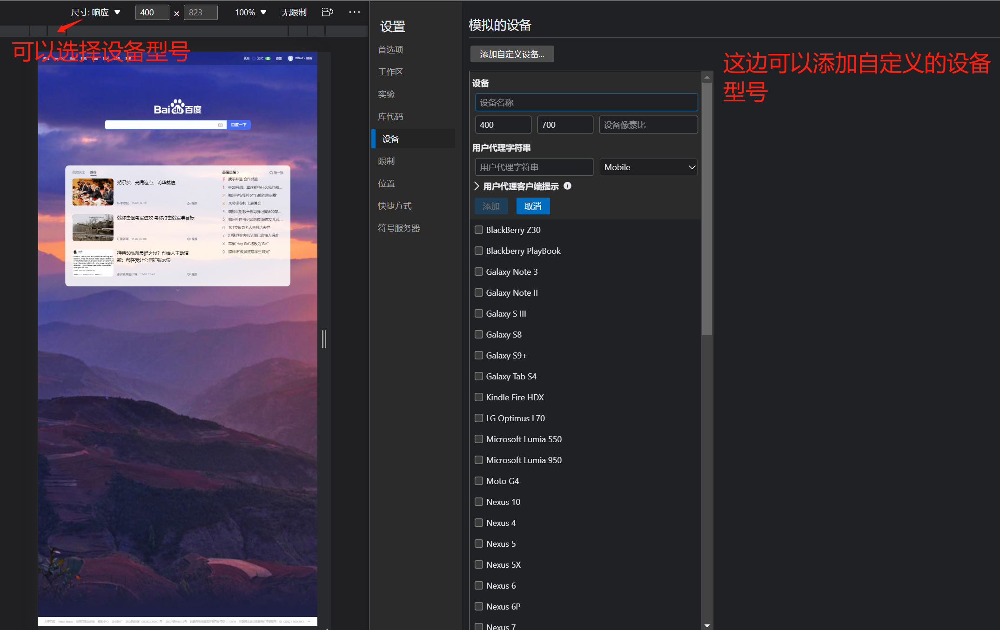