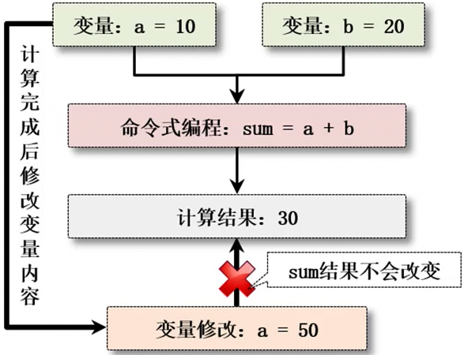
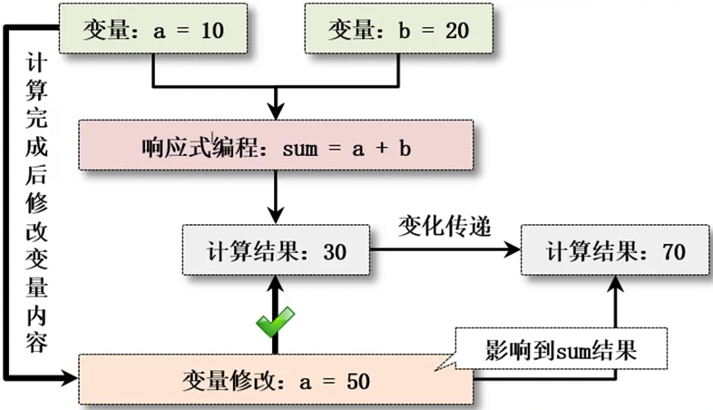
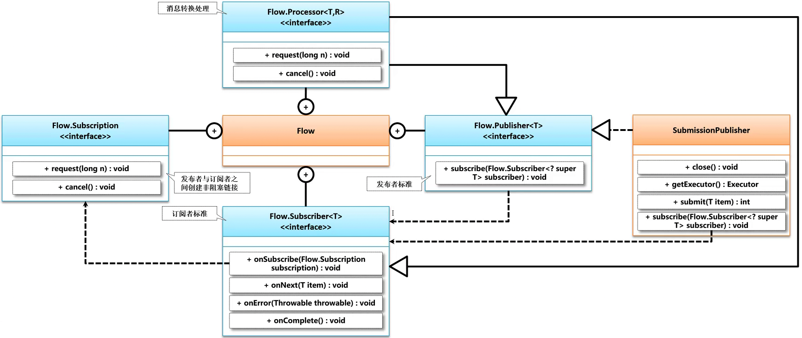
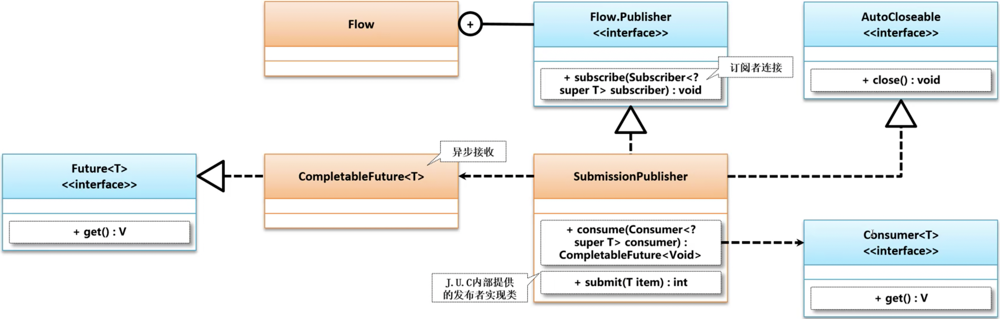
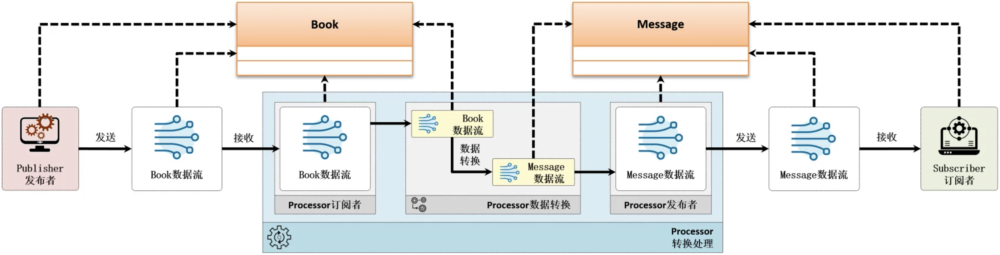

# 14、响应式数据流

## 1、ReactiveStream 简介

### 1、响应式编程产生背景

从2019年开始世界上最流行的编程模式就是响应式的编程开发，这种响应式编程最大的特点是很多操作数据的具体内容可能并不清楚，随着数据的更改，最终可能带来的计算的结果也会发生更改。

操作示例 1：实现一个最简单的计算：

```java
public class JavaAPIDemo {
    public static void main(String[] args) throws InterruptedException {
        int a = 10; // 定义整型变量
        int b = 20; // 定义整型变量
        System.out.printf("数学加法计算：" + (a + b));
    }
}
```

```java
数学加法计算：30
```

以上所接触到的是一种传统的命令式的编程，但是命令式编程在进行计算的时候内容都是固定的，可是万一有些数据的内容可能是随时更改的呢？下面来观察一种程序的实现（提示：仅仅是为了说明响应式的变化）

操作示例 2：采用响应式的计算方式进行处理

```java
import java.util.concurrent.CountDownLatch;
import java.util.concurrent.TimeUnit;

public class JavaAPIDemo {
    public static int a = 10; // 定义整型变量
    public static int b = 20; // 定义整型变量

    public static void main(String[] args) throws Exception {
        CountDownLatch latch = new CountDownLatch(1); // 倒计数的内容为1
        System.out.printf("【第一次计算】数学加法计算：%d%n", (a + b));
        new Thread(() -> {
            try {
                TimeUnit.SECONDS.sleep(1); // 延迟处理
                a = 50; // 修改b的内容
                latch.countDown(); // 减1的操作
            } catch (InterruptedException ignored) {
            }
        }, "数据修改子线程").start();
        latch.await(); // 等待计数为0
        System.out.printf("【第二次计算】数学加法计算：%d%n", (a + b));
    }
}
```

```java
【第一次计算】数学加法计算：30
【第二次计算】数学加法计算：70
```

此时在进行计算的时候，由于一个参数的内容可能已经发生了改变，最终所带来的问题就是无法进行统一的命令式编程的计算准确的操作模式（以上仅仅作为结构上的一种说明，但是太繁琐了）。

响应式编程的模型更能够拥抱程序之中所带来的数据计算结果的变化，这也就是为什么现代最流行的编程模型为响应式的所在了，那么下面来看一下基本的概念。


### 2、响应式编程概念

随着互联网技术的不断发展，用户需要更快的响应处理速度与稳定可靠的运行环境，即使在出现了错误之后也可以优雅的面对失败，同时要求构建的**系统具有灵活、松散耦合以及可伸缩性**的特点，所以在这样的背景下，响应式编程（Reactive Programming）开始大量的应用于项目开发之中。**在响应式编程之中主要实现了一种基于数据流（Data Stream）和变化传递（Propagation Of Change）的声明式（Declarative）的编程范式**。


### 3、响应式数据流模型

在响应式编程中需要基于响应式数据流（**Reactive Streams，异步非阻塞式数据流传输**）实现数据的传输，在该数据流的模型之中需要提供有一个**发布者（Publisher）和一个订阅者（Subscriber）**，而发布者与订阅者之间可以实现数据流的直接传输，也可以通过处理器（Processor）实现两者之间数据流的处理，模型结构如图所示。在整个的处理模型中，Processor即可作为订阅者也可以作为发布者。

> 基于事件的操作模型：每当产生了某些操作之后，采用事件的模式向事件监听者发布一个消息，而后监听者接收到这个消息之后再进行处理，而此时的监听者和消息源之间没有直接的联系，所以这本身就属于一种解耦合的设计。Java之中的事件处理模型，在Spring开发框架里面都是有更好的新支持结构。


### 4、响应式编程中的变化传递

在传统的命令式编程的开发模型中，如果要实现两个变量内容的计算，常用的命令格式为："sum = a + b"，这样就会根据变量a和变量b的内容一次性得到sum的结果，如图1所示，而在计算完成后如果变量a的内容进行了修改则也不会影响到最终的sum计算结果。而在响应式编程环境下，即便已经得到了sum的计算结果，而在变量a发生改变后，也会影响到sum的内容，如图2所示，而这一点就称为变化传递（Propagation Of Change）。

- 命令式编程：
- 响应式编程：


### 5、Flow 接口介绍

在Java发展的早期提供了一种观察者设计模式的概念，并且在java.util包中提供了两个与之匹配的实现结构：java.util.Observer（观察者）、java.util.Observable（被观察者），其中被观察者的所有变化都可以被观察者检测到，而这一操作可以理解为Java响应式编程的原型，但是需要注意的是，在JDK1.9后该实现类已经被标记为"Deprecated”，不再推荐使用。

如何实现响应式的编程呢？响应式的编程并不是JDK生来就有的，在JDK1.9之后为了便于响应流的开发，在J.U.C中扩充了一个Flow工具类，同时在该类中利用了一系列的内部接口用于实现订阅者、发布者的相关操作标准。




## 2、SubmissionPublisher

### 1、SubmissionPublisher 简介

在响应流的开发中最为重要的就是数据的发布者，Flow.Publisher 只是定义了发布者的核心操作方法，而具体的数据发布处理操作全部都是由 SubmissionPublisher 类实现的。在整个的处理结构之中，发布者的具体操作之中是结合了一个订阅者的信息。

```java
@FunctionalInterface
public static interface Publisher<T> {}
```



每一个响应流发布者的内部都会维护有一个缓冲区，通过该区域可以实现数据流的传输，而具体的发送处理操作则是由 SubmissionPublisher 子类实现的，下面首先打开该类的定义：

```java
public class SubmissionPublisher<T> implements Publisher<T>, AutoCloseable {
    // 数据传输缓存
    static final int BUFFER_CAPACITY_LIMIT = 1 << 30;
    // 消费处理
    public CompletableFuture<Void> consume(Consumer<? super T> consumer) {
        if (consumer == null)
            throw new NullPointerException();
        CompletableFuture<Void> status = new CompletableFuture<>(); // 异步处理
        subscribe(new ConsumerSubscriber<T>(status, consumer));
        return status;
    }
}
```

而后在当前进行消费处理的时候可以发现其内部提供有一个 ConsumerSubscriber 类型，该类型的定义如下：

```java
static final class ConsumerSubscriber<T> implements Subscriber<T> {}
```


### 2、操作示例与常用方法

操作示例 1：响应流的数据发布

```java
import java.util.List;
import java.util.concurrent.CompletableFuture;
import java.util.concurrent.SubmissionPublisher;
import java.util.concurrent.TimeUnit;

public class JavaAPIDemo {
    public static void main(String[] args) throws Exception {
        List<String> data = List.of("Java", "Python"); // 操作数据
        SubmissionPublisher<String> publisher = new SubmissionPublisher<>(); // 数据发布
        // 此时进行数据的消费处理，同时返回有一个异步的处理任务
        CompletableFuture<Void> task = publisher.consume(System.out::println); // 直接传入消费型的函数引用
        // 以上只是定义了消息生产者和消费者之间的基本关联模型，随后进行具体的数据处理
        data.forEach((tmp) -> { // 集合的迭代操作
            publisher.submit(tmp); // 发布数据
            try {
                TimeUnit.SECONDS.sleep(1); // 每次延迟1秒的时间
            } catch (InterruptedException ignored) {
            }
        });
        publisher.close(); // 数据发送完毕
        if (task != null) {
            task.get(); // 放行
        }
    }
}
```

```java
Java
Python
```

SubmissionPublisher 常用方法如下：

| 方法名                                                       | 描述                                                         |
| ------------------------------------------------------------ | ------------------------------------------------------------ |
| public void close()                                          | 关闭发布者通道                                               |
| public CompletableFuture< Void> consume(Consumer<? super T> consumer) | 定义发布项的处理函数                                         |
| public int getMaxBufferCapacity()                            | 返回每个发布者的最大缓存空间                                 |
| public List<Subscriber<? super T>> getSubscribers()          | 获取全部订阅者实例                                           |
| public boolean isSubscribed(Subscriber<? super T> subscriber) | 判断当前订阅者是否为以订阅状态                               |
| public int submit(T item)                                    | 发布者实现数据发布                                           |
| public int offer(T item, long timeout, TimeUnit unit, BiPredicate<Subscriber<? super T>, ? super T> onDrop) | 实现数据发布功能，在超时之后会根据BiPredicate返回结果进行重试 |


### 3、背压（BackPressure）策略

此时的发布者与订阅者之间的操作较为单一，发布者仅仅实现了一些字符串数据的发送，而消费端也只是实现了内容的输出，但是需要注意的是在发布者与订阅者之间都会存在有一个缓存空间。但是这个缓存空间是有限的（默认为256）

操作示例 2：观察缓冲区的大小值

```java
import java.util.concurrent.SubmissionPublisher;

public class JavaAPIDemo {
    public static void main(String[] args) throws Exception {
        SubmissionPublisher<String> publisher = new SubmissionPublisher<>(); // 数据发布
        System.out.println("缓冲区大小：" + publisher.getMaxBufferCapacity());
        publisher.close();
    }
}
```

```java
缓冲区大小：256
```

如果此时发布者发送数据流的速度要远远高于订阅者，这样订阅者的缓存空间很快会被占满，那么理论上就应该设计有一个无界限的缓冲区供订阅者使用，否则就会出现由于数据无法处理而丢弃的问题，而另外一种解决方案称为"背压（BackPressure）"策略，在该策略中订阅者会主动告知发布者减慢发送数据的速率，以备发布者准备好足够大的缓存空间后再继续进行元素的处理，遗憾的是J.U.C提供的Flow暂不支持此策略的实现，如果要想实现该操作则需要开发者自行实现或使用相关开发框架，例如：RxJava。


## 3、Reactive 编程模型

通过之前的讲解已经请楚了所谓的发布者和订阅者之间的联系，但是之前的操作毕竟是属于简化版的模型，不具有任何的实战型的使用效果，本次就结合一个实际的应用进行说明。

在响应式数据流的开发模型之中，订阅者与发布者之间可以直接进行数据通讯，为便于理解，在本节中将依据图所示的结构，实现自定义Book类对象数据的发送以及接收处理，由于此部分的代码开发较为繁琐，将采用分步的形式进行讲解。


在实际的开发之中如果要进行发布和订阅，Java 是以对象的形式实现的，为了突出这一特点，本次采用自定义的 Book 类对象实现整体的操作模型。

1、创建一个Book类进行传输数据的定义

```java
import java.util.ArrayList;
import java.util.List;

/**
 * 自定义程序类
 */
class Book {
    private long id;
    private String title;
    private String content;

    // Setter、Getter、无参构造、toString()等方法就直接略了
    public Book(long id, String title, String content) {
        this.id = id;
        this.title = title;
        this.content = content;
    }

    // 因为这种响应式编程操作一般都需要采用数据流的形式进行处理，所以为了简化定义一个List创建器
    static class BookDataCreator {  // 创造者模式
        public static List<Book> getBooks() {   // 获取数据项
            List<Book> bookList = new ArrayList<>(); // 实例化List集合
            bookList.add(new Book(1, "Java面向对象编程", "李兴华"));
            bookList.add(new Book(2, "Java就业编程实战", "李兴华"));
            bookList.add(new Book(3, "JavaWeb就业编程实战", "李兴华"));
            bookList.add(new Book(4, "SpringBoot就业编程实战", "李兴华"));
            bookList.add(new Book(5, "SpringCloud就业编程实战", "李兴华"));
            bookList.add(new Book(6, "Redis就业编程实战", "李兴华"));
            bookList.add(new Book(7, "Spring就业编程实战", "李兴华"));
            bookList.add(new Book(8, "SSM就业编程实战", "李兴华"));
            bookList.add(new Book(9, "Netty就业编程实战", "李兴华"));
            return bookList;
        }
    }

    public long getId() {
        return id;
    }

    public void setId(long id) {
        this.id = id;
    }

    public String getTitle() {
        return title;
    }

    public void setTitle(String title) {
        this.title = title;
    }

    public String getContent() {
        return content;
    }

    public void setContent(String content) {
        this.content = content;
    }
}
```

2、创建图书数据的订阅者实现类型

```java
import java.util.concurrent.Flow;

/**
 * 图书数据的订阅者
 */
class BookSubscriber implements Flow.Subscriber<Book> {
    private Flow.Subscription subscription; // 整个的订阅控制
    private int counter = 0; // 计数器

    @Override
    public void onSubscribe(Flow.Subscription subscription) {
        this.subscription = subscription; // 保存订阅控制操作
        // 由于不确定后面会同时返回多少个数据，此时的目的是触发数据的接收操作
        this.subscription.request(1); // 从发布者之中获取1个数据项
        System.out.println("【BookSubscriber】数据订阅者开启...");
    }

    @Override
    public void onNext(Book item) { // 数据接收
        System.out.printf("【BookSubscriber】图书ID = %s、图书名称 = %s、图书的内容 = %s%n",
                item.getId(), item.getTitle(), item.getContent());
        this.counter++; // 计数累加
        this.subscription.request(1); // 再次接收，继续触发onNext()
    }

    @Override
    public void onError(Throwable throwable) { // 订阅出错的时候处理
        System.err.println("【BookSubscriber】" + throwable.getMessage());
    }

    @Override
    public void onComplete() {
        System.out.printf("【BookSubscriber】订阅者数据处理完成，一共处理的数据量为：%s%n", this.counter);
    }

    public int getCounter() {
        return counter;
    }
}
```

3、最重要的实现就是要进行数据的发布处理，因为只有数据发布了，才会存在有订阅者的处理操作。

```java
import java.util.ArrayList;
import java.util.List;
import java.util.concurrent.Flow;
import java.util.concurrent.SubmissionPublisher;
import java.util.concurrent.TimeUnit;

public class JavaAPIDemo {
    public static void main(String[] args) throws Exception {
        SubmissionPublisher<Book> publisher = new SubmissionPublisher<>(); // 数据发布者
        BookSubscriber subscriber = new BookSubscriber(); // 数据订阅者
        publisher.subscribe(subscriber); // 发布者与订阅者建立连接
        // 实际的集合可能来自于数据库，或者是来自于其他的文本数据（是一些固定结构的，例如：XML、JSON）
        List<Book> books = Book.BookDataCreator.getBooks(); // 获取创建的集合
        books.forEach(publisher::submit); // 数据的发布
        // 应该实现数据的等待处理，所以增加一个停滞的判断
        while (books.size() != subscriber.getCounter()) {   // 数据量没有消费完成
            TimeUnit.SECONDS.sleep(1); // 象征性的延迟
        }
        publisher.close(); // 关闭发送者
    }
}

/**
 * 自定义程序类
 */
class Book {
    private long id;
    private String title;
    private String content;

    // Setter、Getter、无参构造、toString()等方法就直接略了
    public Book(long id, String title, String content) {
        this.id = id;
        this.title = title;
        this.content = content;
    }

    // 因为这种响应式编程操作一般都需要采用数据流的形式进行处理，所以为了简化定义一个List创建器
    static class BookDataCreator {  // 创造者模式
        public static List<Book> getBooks() {   // 获取数据项
            List<Book> bookList = new ArrayList<>(); // 实例化List集合
            bookList.add(new Book(1, "Java面向对象编程", "李兴华"));
            bookList.add(new Book(2, "Java就业编程实战", "李兴华"));
            bookList.add(new Book(3, "JavaWeb就业编程实战", "李兴华"));
            bookList.add(new Book(4, "SpringBoot就业编程实战", "李兴华"));
            bookList.add(new Book(5, "SpringCloud就业编程实战", "李兴华"));
            bookList.add(new Book(6, "Redis就业编程实战", "李兴华"));
            bookList.add(new Book(7, "Spring就业编程实战", "李兴华"));
            bookList.add(new Book(8, "SSM就业编程实战", "李兴华"));
            bookList.add(new Book(9, "Netty就业编程实战", "李兴华"));
            return bookList;
        }
    }

    public long getId() {
        return id;
    }

    public void setId(long id) {
        this.id = id;
    }

    public String getTitle() {
        return title;
    }

    public void setTitle(String title) {
        this.title = title;
    }

    public String getContent() {
        return content;
    }

    public void setContent(String content) {
        this.content = content;
    }
}

/**
 * 图书数据的订阅者
 */
class BookSubscriber implements Flow.Subscriber<Book> {
    private Flow.Subscription subscription; // 整个的订阅控制
    private int counter = 0; // 计数器

    @Override
    public void onSubscribe(Flow.Subscription subscription) {
        this.subscription = subscription; // 保存订阅控制操作
        // 由于不确定后面会同时返回多少个数据，此时的目的是触发数据的接收操作
        this.subscription.request(1); // 从发布者之中获取1个数据项
        System.out.println("【BookSubscriber】数据订阅者开启...");
    }

    @Override
    public void onNext(Book item) { // 数据接收
        System.out.printf("【BookSubscriber】图书ID = %s、图书名称 = %s、图书的内容 = %s%n",
                item.getId(), item.getTitle(), item.getContent());
        this.counter++; // 计数累加
        this.subscription.request(1); // 再次接收，继续触发onNext()
    }

    @Override
    public void onError(Throwable throwable) { // 订阅出错的时候处理
        System.err.println("【BookSubscriber】" + throwable.getMessage());
    }

    @Override
    public void onComplete() {
        System.out.printf("【BookSubscriber】订阅者数据处理完成，一共处理的数据量为：%s%n", this.counter);
    }

    public int getCounter() {
        return counter;
    }
}
```

```java
【BookSubscriber】数据订阅者开启...
【BookSubscriber】图书ID = 1、图书名称 = Java面向对象编程、图书的内容 = 李兴华
【BookSubscriber】图书ID = 2、图书名称 = Java就业编程实战、图书的内容 = 李兴华
【BookSubscriber】图书ID = 3、图书名称 = JavaWeb就业编程实战、图书的内容 = 李兴华
【BookSubscriber】图书ID = 4、图书名称 = SpringBoot就业编程实战、图书的内容 = 李兴华
【BookSubscriber】图书ID = 5、图书名称 = SpringCloud就业编程实战、图书的内容 = 李兴华
【BookSubscriber】图书ID = 6、图书名称 = Redis就业编程实战、图书的内容 = 李兴华
【BookSubscriber】图书ID = 7、图书名称 = Spring就业编程实战、图书的内容 = 李兴华
【BookSubscriber】图书ID = 8、图书名称 = SSM就业编程实战、图书的内容 = 李兴华
【BookSubscriber】图书ID = 9、图书名称 = Netty就业编程实战、图书的内容 = 李兴华
【BookSubscriber】订阅者数据处理完成，一共处理的数据量为：9
```


## 4、Flow.Processor

除了使用发布者与订阅者的直连模式之外，还可以在两者之间引入一个 Flow.Processor 转换处理器，利用转换处理器可以接收发布者发送的数据，随后将该数据进行转换处理后再发送给订阅者，即：转换器同时实现了发布者与订阅者的操作。



此时发布者发布的是一个 Book 数据流，而订阅者接收的是一个 Message 数据流，那么自然就需要做出一种转换处理，提供有一个专门的处理类，来讲 Book 的数据变为 Message 数据，首先打开该接口观察一下：

```java
// 可以发现该内部的接口就是直接继承了发布者与订阅者的处理接口【Processor 实现的子类可以同时转为发布者或者是订阅者】
public static interface Processor<T,R> extends Subscriber<T>, Publisher<R> {}
```

Flow.Processor 接口并没有定义任何的抽象方法，该接口同时继承了 Flow.Publisher 与 Flow.Subscriber 两个父接口，所以该接口中同时拥有发布者与订阅者的方法标准，而为了简化发布者的定义，可以创建一个 MessageProcessor 处理类，该类除了实现 Flow.Processor 父接口之外，还可以继承 SubmissionPublisher 父类（Publisher 接口子类）这样就可以直接利用已有类的方法实现发布者的功能。


1、既然要进行数据类型的转换，创建一个目标的类型结构：

```java
/**
 * 目标的转换类型
 */
class Message {
    private String content;
    private String author;

    public Message(String content, String author) {
        this.content = content;
        this.author = author;
    }

    public String getContent() {
        return content;
    }

    public void setContent(String content) {
        this.content = content;
    }

    public String getAuthor() {
        return author;
    }

    public void setAuthor(String author) {
        this.author = author;
    }
}
```

2、既然此时目标接受的类型是 Message 类型，那么自然要创建一个新的订阅者

```java
import java.util.concurrent.Flow;

/**
 * 订阅者
 */
class MessageSubscriber implements Flow.Subscriber<Message> {
    private Flow.Subscription subscription;
    private int counter = 0;

    @Override
    public void onSubscribe(Flow.Subscription subscription) {
        this.subscription = subscription;
        // 如果此时你需要接收的数量很多，例如设置为了5，如果不足5个数据流也接收
        this.subscription.request(1);
    }

    @Override
    public void onNext(Message item) {
        System.out.printf("【MessageSubscriber】消息内容 = %s、消息作者 = %s%n",
                item.getContent(), item.getAuthor());
        this.counter++;
        this.subscription.request(1); // 下次的执行触发
    }

    @Override
    public void onError(Throwable throwable) {
        System.err.println("【MessageSubscriber】消息订阅者出现错误：" + throwable.getMessage());
    }

    @Override
    public void onComplete() {
        System.out.println("【MessageSubscriber】消息订阅处理完成，处理的数据量为：" + this.counter);
    }

    public int getCounter() {
        return counter;
    }
}
```

3、创建 Processor 接口实现子类，以及进行传输数据Book类的定义

```java
import java.util.ArrayList;
import java.util.List;
import java.util.concurrent.Flow;
import java.util.concurrent.SubmissionPublisher;
import java.util.function.Function;

/**
 * 此时的转换器处理类拥有接收和发布的支持能力，那么建议多继承一个父类
 */
class MessageProcessor extends SubmissionPublisher<Message> implements Flow.Processor<Book, Message> {
    private Flow.Subscription subscription;
    private Function<Book, Message> function; // 实现转换功能定义

    public MessageProcessor(Function<Book, Message> function) {
        this.function = function;
    }

    @Override
    public void onSubscribe(Flow.Subscription subscription) {
        this.subscription = subscription;
        this.subscription.request(1);
    }

    @Override
    public void onNext(Book item) {
        super.submit(this.function.apply(item)); // 将转换后的数据再次发布
        this.subscription.request(1); // 重新抓取数据
    }

    @Override
    public void onError(Throwable throwable) {
        throwable.printStackTrace(); // 直接输出错误
    }

    @Override
    public void onComplete() {
    }
}

/**
 * 自定义程序类
 */
class Book {
    private long id;
    private String title;
    private String content;

    // Setter、Getter、无参构造、toString()等方法就直接略了
    public Book(long id, String title, String content) {
        this.id = id;
        this.title = title;
        this.content = content;
    }

    // 因为这种响应式编程操作一般都需要采用数据流的形式进行处理，所以为了简化定义一个List创建器
    static class BookDataCreator {  // 创造者模式
        public static List<Book> getBooks() {   // 获取数据项
            List<Book> bookList = new ArrayList<>(); // 实例化List集合
            bookList.add(new Book(1, "Java面向对象编程", "李兴华"));
            bookList.add(new Book(2, "Java就业编程实战", "李兴华"));
            bookList.add(new Book(3, "JavaWeb就业编程实战", "李兴华"));
            bookList.add(new Book(4, "SpringBoot就业编程实战", "李兴华"));
            bookList.add(new Book(5, "SpringCloud就业编程实战", "李兴华"));
            bookList.add(new Book(6, "Redis就业编程实战", "李兴华"));
            bookList.add(new Book(7, "Spring就业编程实战", "李兴华"));
            bookList.add(new Book(8, "SSM就业编程实战", "李兴华"));
            bookList.add(new Book(9, "Netty就业编程实战", "李兴华"));
            return bookList;
        }
    }

    public long getId() {
        return id;
    }

    public void setId(long id) {
        this.id = id;
    }

    public String getTitle() {
        return title;
    }

    public void setTitle(String title) {
        this.title = title;
    }

    public String getContent() {
        return content;
    }

    public void setContent(String content) {
        this.content = content;
    }
}
```

4、修改程序主类的设置，配置转换器的函数式方式的操作核心

```java

import java.util.ArrayList;
import java.util.List;
import java.util.concurrent.Flow;
import java.util.concurrent.SubmissionPublisher;
import java.util.concurrent.TimeUnit;
import java.util.function.Function;

public class JavaAPIDemo {
    public static void main(String[] args) throws Exception {
        MessageProcessor processor = new MessageProcessor((item) -> {
            String book = String.format("图书编号：%s、图书名称：%s、图书内容：%s",
                    item.getId(), item.getTitle(), item.getContent());
            return new Message(book, "李兴华");
        });
        MessageSubscriber messageSubscriber = new MessageSubscriber(); // 消息订阅者
        SubmissionPublisher<Book> publisher = new SubmissionPublisher<>(); // 数据发布
        publisher.subscribe(processor); // 发布者与订阅者建立连接
        processor.subscribe(messageSubscriber);
        // 实际的集合可能来自于数据库，或者是来自于其他的文本数据（是一些固定结构的，例如：XML、JSON）
        List<Book> books = Book.BookDataCreator.getBooks(); // 获取创建的集合
        books.forEach(publisher::submit); // 数据的发布
        // 应该实现数据的等待处理，所以增加一个停滞的判断
        while (books.size() != messageSubscriber.getCounter()) {   // 数据量没有消费完成
            TimeUnit.SECONDS.sleep(1); // 象征性的延迟
        }
        publisher.close(); // 关闭发送者
    }
}

/**
 * 目标的转换类型
 */
class Message {
    private String content;
    private String author;

    public Message(String content, String author) {
        this.content = content;
        this.author = author;
    }

    public String getContent() {
        return content;
    }

    public void setContent(String content) {
        this.content = content;
    }

    public String getAuthor() {
        return author;
    }

    public void setAuthor(String author) {
        this.author = author;
    }
}

/**
 * 订阅者
 */
class MessageSubscriber implements Flow.Subscriber<Message> {
    private Flow.Subscription subscription;
    private int counter = 0;

    @Override
    public void onSubscribe(Flow.Subscription subscription) {
        this.subscription = subscription;
        // 如果此时你需要接收的数量很多，例如设置为了5，如果不足5个数据流也接收
        this.subscription.request(1);
    }

    @Override
    public void onNext(Message item) {
        System.out.printf("【MessageSubscriber】消息内容 = %s、消息作者 = %s%n",
                item.getContent(), item.getAuthor());
        this.counter++;
        this.subscription.request(1); // 下次的执行触发
    }

    @Override
    public void onError(Throwable throwable) {
        System.err.println("【MessageSubscriber】消息订阅者出现错误：" + throwable.getMessage());
    }

    @Override
    public void onComplete() {
        System.out.println("【MessageSubscriber】消息订阅处理完成，处理的数据量为：" + this.counter);
    }

    public int getCounter() {
        return counter;
    }
}

/**
 * 此时的转换器处理类拥有接收和发布的支持能力，那么建议多继承一个父类
 */
class MessageProcessor extends SubmissionPublisher<Message> implements Flow.Processor<Book, Message> {
    private Flow.Subscription subscription;
    private final Function<Book, Message> function; // 实现转换功能定义

    public MessageProcessor(Function<Book, Message> function) {
        this.function = function;
    }

    @Override
    public void onSubscribe(Flow.Subscription subscription) {
        this.subscription = subscription;
        this.subscription.request(1);
    }

    @Override
    public void onNext(Book item) {
        super.submit(this.function.apply(item)); // 将转换后的数据再次发布
        this.subscription.request(1); // 重新抓取数据
    }

    @Override
    public void onError(Throwable throwable) {
        throwable.printStackTrace(); // 偷懒
    }

    @Override
    public void onComplete() {
    }
}

/**
 * 自定义程序类
 */
class Book {
    private long id;
    private String title;
    private String content;

    // Setter、Getter、无参构造、toString()等方法就直接略了
    public Book(long id, String title, String content) {
        this.id = id;
        this.title = title;
        this.content = content;
    }

    // 因为这种响应式编程操作一般都需要采用数据流的形式进行处理，所以为了简化定义一个List创建器
    static class BookDataCreator {  // 创造者模式
        public static List<Book> getBooks() {   // 获取数据项
            List<Book> bookList = new ArrayList<>(); // 实例化List集合
            bookList.add(new Book(1, "Java面向对象编程", "李兴华"));
            bookList.add(new Book(2, "Java就业编程实战", "李兴华"));
            bookList.add(new Book(3, "JavaWeb就业编程实战", "李兴华"));
            bookList.add(new Book(4, "SpringBoot就业编程实战", "李兴华"));
            bookList.add(new Book(5, "SpringCloud就业编程实战", "李兴华"));
            bookList.add(new Book(6, "Redis就业编程实战", "李兴华"));
            bookList.add(new Book(7, "Spring就业编程实战", "李兴华"));
            bookList.add(new Book(8, "SSM就业编程实战", "李兴华"));
            bookList.add(new Book(9, "Netty就业编程实战", "李兴华"));
            return bookList;
        }
    }

    public long getId() {
        return id;
    }

    public void setId(long id) {
        this.id = id;
    }

    public String getTitle() {
        return title;
    }

    public void setTitle(String title) {
        this.title = title;
    }

    public String getContent() {
        return content;
    }

    public void setContent(String content) {
        this.content = content;
    }
}
```

```java
【MessageSubscriber】消息内容 = 图书编号：1、图书名称：Java面向对象编程、图书内容：李兴华、消息作者 = 李兴华
【MessageSubscriber】消息内容 = 图书编号：2、图书名称：Java就业编程实战、图书内容：李兴华、消息作者 = 李兴华
【MessageSubscriber】消息内容 = 图书编号：3、图书名称：JavaWeb就业编程实战、图书内容：李兴华、消息作者 = 李兴华
【MessageSubscriber】消息内容 = 图书编号：4、图书名称：SpringBoot就业编程实战、图书内容：李兴华、消息作者 = 李兴华
【MessageSubscriber】消息内容 = 图书编号：5、图书名称：SpringCloud就业编程实战、图书内容：李兴华、消息作者 = 李兴华
【MessageSubscriber】消息内容 = 图书编号：6、图书名称：Redis就业编程实战、图书内容：李兴华、消息作者 = 李兴华
【MessageSubscriber】消息内容 = 图书编号：7、图书名称：Spring就业编程实战、图书内容：李兴华、消息作者 = 李兴华
【MessageSubscriber】消息内容 = 图书编号：8、图书名称：SSM就业编程实战、图书内容：李兴华、消息作者 = 李兴华
【MessageSubscriber】消息内容 = 图书编号：9、图书名称：Netty就业编程实战、图书内容：李兴华、消息作者 = 李兴华
```

你只要能够理解这几个 Flow 内部接口的使用，那么并且能够理解这种所谓的订阅与发布模式的思想就足够了，为的是后续的学习打下一些理论的概念。
