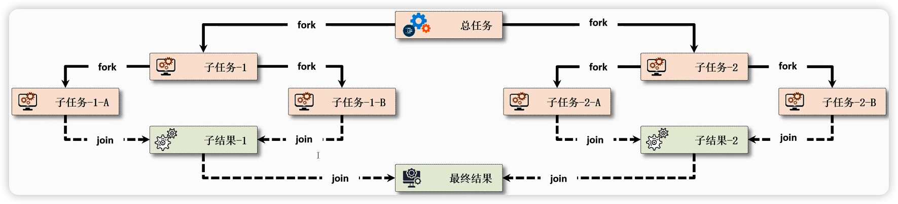
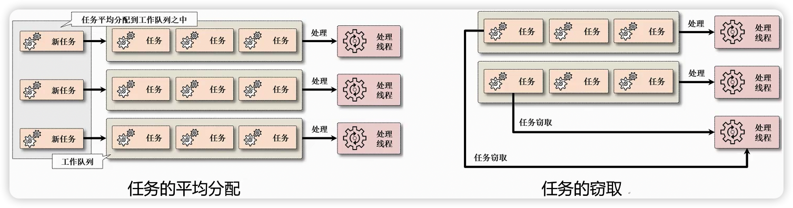
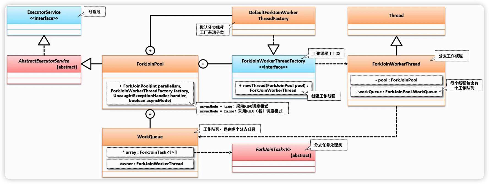
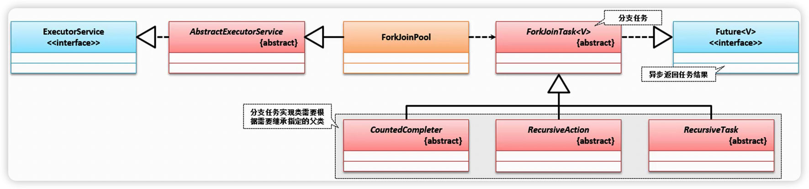
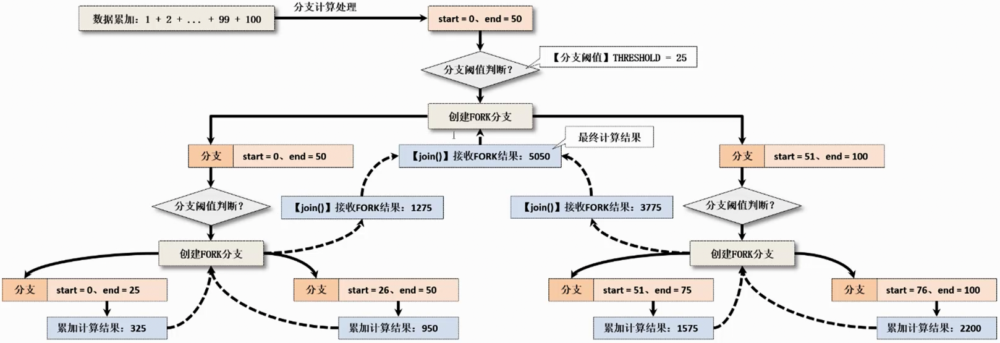
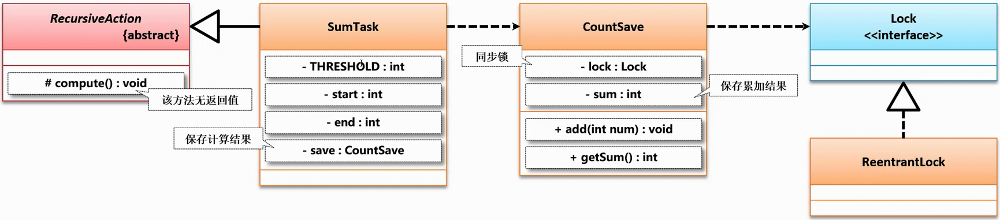

# 10、ForkJoin

Fork/Join 框架的实现非常复杂，内部大量运用了位操作和无锁算法，撇开这些实现细节不谈，该框架主要涉及三大核心组件：`ForkJoinPool`（线程池）、`ForkJoinTask`（任务）、`ForkJoinWorkerThread`（工作线程），外加`WorkQueue`（任务队列）：

- **ForkJoinPool**：ExecutorService 的实现类，负责工作线程的管理、任务队列的维护，以及控制整个任务调度流程；
- **ForkJoinTask**：Future 接口的实现类，fork 是其核心方法，用于分解任务并异步执行；而 join 方法在任务结果计算完毕之后才会运行，用来合并或返回计算结果；
- **ForkJoinWorkerThread**：Thread的子类，作为线程池中的工作线程（Worker）执行任务；
- **WorkQueue**：任务队列，用于保存任务；


## 1、ForkJoinPool 线程池

当今的时代软件开发需要与硬件进行紧密的结合，结合的时候就必须充分的发挥出所有硬件的处理性能，这个时候在 JDK1.7 之后对于 J.U.C 提供了一个新的改进机制——分支任务。

在 JDK1.7 之后为了充分利用多核 CPU 的性能优势，可以将一个复杂的业务计算进行拆分，交由多个 CPU 并行计算，这样就可以提高程序的执行性能，这一功能包括以下两个操作：

- 分解（Fork）操作：将一个大型业务拆分为若干个小任务在框架中执行；
- 合并（Join）操作：主任务将等待多个子任务执行完毕后进行结果合并；



> 从理论的提出来讲此类的操作没有任何问题，但是如果要是在实际的开发之中，那么就有可能会出现问题。

**分支任务分配与工作窃取**：从 JDK1.7 开始为了进一步提高并行计算的处理能力，提供了 **ForkJoinPool** 的任务框架，并且其在已有的线程池概念的基础上进行了扩展。同时考虑到服务的处理性能，引入了"**工作窃取（Work Stealing）机制**"，这样可以在进行线程分配的同时自动分配与之数量相等的任务队列，所有新加入的任务会被平均的分配到对应的任务队列之中，不同的线程处理各自的任务队列，当某一个线程的任务队列已经提前完成时，会从其他线程的队列尾部”窃取”未执行完的任务，如图所示。这样在任务量较大时，可以更好的发挥出多核主机的处理性能。



ForkJoinPool 是一个开发框架，而且这个开发框架是在 J.U.C 之中所提供的，那么下面直接打开相应的 JavaDoc 文档：https://docs.oracle.com/en/java/javase/17/docs/api/java.base/java/util/concurrent/ForkJoinPool.html，通过 JavaDoc 文档的结构可以清楚的发现，ForkJoinPool 属于一个线程池的应用，需要基于线程池提供所有的分支处理的操作环境。

```java
Module java.base
Package java.util.concurrent
Class ForkJoinPool
java.lang.Object
    java.util.concurrent.AbstractExecutorService
        java.util.concurrent.ForkJoinPool
All Implemented Interfaces:
Executor, ExecutorService
——————————————————————————————————————————————————————————
public class ForkJoinPool extends AbstractExecutorService
用于运行ForkJoinTask的ExecutorService。ForkJoinPool为来自非ForkJoinTask客户端的提交以及管理和监控操作提供入口点。
```

**ForkJoinPool 类实现结构**：为了实现分支任务线程池的功能，在 J.U.C 中提供了一个 ForkJoinPool 工具类，该类为 ExecutorService 线程池操作类的子类，并在 ForkJoinPool 类中自动提供有一个 WorkQueue 内部类以实现所有工作队列的维护，如图所示。在分支任务处理中会存在有多个工作线程，而每一个工作线程全部由 ForkJoinPool.ForkJoinWorkerThreadFactory 接口进行创建规范化管理（ForkJoinPool 内部提供了 DefaultForkJoinWorkerThreadFactory 内部实现子类），程序可以通过该接口所提供的 newThread() 方法创建 ForkJoinWorkerThread 线程对象，同时在每一个工作线程对象中都会保存有一个 WorkQueue 对象引用，即：不同的工作线程维护各自的任务队列。



在使用 ForkJoin 处理的时候，一定要记住，所有的具体的任务的配置是由 ForkJoinTask 抽象类来定义的，同时其内部会直接提供有完整的 ForkJoinWorkerThreadFactory 工厂接口实例。


## 2、ForkJoinTask 分支任务抽象类

**ForkJoinTask 类关联结构**：在分支任务处理时，所有的分支任务通过 ForkJoinTask 进行配置。ForkJoinTask 是分支任务，而这个分支任务在实际的开发之中也需要考虑到几种不同的实现，在 J.U.C 中主要分为三种任务类型：

- **RecursiveTask**：有返回值任务
- **RecursiveAction**：无返回值任务
- **CountedCompleter**：数量计算有关的任务，在子任务停顿或阻塞的情况下使用



| 方法名称                                                     | 描述                                 |
| ------------------------------------------------------------ | ------------------------------------ |
| public final ForkJoinTask< V > fork()                        | 建立分支任务                         |
| public final V join()                                        | 获取分支结果                         |
| public final boolean isCompletedNormally()                   | 任务是否执行完毕                     |
| public boolean isTerminated()                                | 判断工作队列是否有待执行任务未执行完 |
| public static void invokeAll(ForkJoinTask<?>... tasks)       | 启动分支任务                         |
| public final Throwable getException()                        | 获取执行异常                         |
| public boolean awaitTermination(long timeout, TimeUnit unit) | 判断线程池是否在约定时间内完成       |
| public int getCorePoolSize()                                 | 获取线程池的核心线程数               |
| public long getQueuedTaskCount()                             | 返回所有工作队列的任务数量           |
| public int getQueuedSubmissionCount()                        | 返回所有队列待执行的任务数           |
| public int getRunningThreadCount()                           | 返回正在运行的任务数量               |


## 3、RecursiveTask 有返回值任务

所有的分支任务的处理执行都需要有具体的任务的处理类，而在进行任务处理类的时候可以使用 RecursiveTask 父类来完成，首先打开该类的定义源代码观察：

```java
public abstract class RecursiveTask<V> extends ForkJoinTask<V> {
    private static final long serialVersionUID = 5232453952276485270L;
    public RecursiveTask() {}
    @SuppressWarnings("serial") // Conditionally serializable
    V result;
    protected abstract V compute(); // 最终的任务通过此方法返回计算结果
    public final V getRawResult() {
        return result;
    }
    protected final void setRawResult(V value) {
        result = value;
    }
    protected final boolean exec() {
        result = compute();
        return true;
    }
}
```

每一个分支任务在执行时可以直接将分支计算的结果进行返回，这时就需要通过 RecursiveTask 继承实现，该类中提供有一个compute()计算方法，在每次分支处理时都会递归调用此方法实现计算，下面将基于分支计算的处理形式实现一个数据累加的操作。

如果说现在要进行一个1～100的数字累加计算操作，那么比较简单的做法就是进行计算的拆分，按照如下的形式处理：

- 第1个任务：计算 "1 + 2 + ... + 50"
  1. 第1个字分支：计算 "1 + 2 + ... + 25"
  2. 第2个字分支：计算 "26 + 27 + ... + 50"
- 第2个任务：计算 "51 + 52 + ... + 100"
  1. 第1个字分支：计算 "51 + 52 + ... + 75"
  2. 第2个字分支：计算 "76 + 77 + ... + 100"

操作示例 1：使用分支任务实现数据的累加操作

```java
import java.util.concurrent.ExecutionException;
import java.util.concurrent.ForkJoinPool;
import java.util.concurrent.Future;
import java.util.concurrent.RecursiveTask;

/**
 * 实现数据累加的计算
 */
class SumTask extends RecursiveTask<Integer> {
    private static final int THRESHOLD = 25; // 分支阈值
    private final int start; // 开始计算数值
    private final int end; // 结束计算数值

    public SumTask(int start, int end) { // 数据的累加配置
        this.start = start;
        this.end = end;
    }

    @Override
    protected Integer compute() { // 完成计算的处理
        // 所有的子分支的处理，以及所有相关分支的合并处理都在此方法之中完成
        int sum = 0; // 保存最终的计算结果
        boolean isFork = (end - start) <= THRESHOLD; // 是否需要进行分支
        if (isFork) {   // 计算子分支
            for (int i = start; i <= end; i++) {
                sum += i; // 分支处理
            }
            System.out.printf("【%s】start = %d、end = %d、sum = %d%n",
                    Thread.currentThread().getName(), this.start, this.end, sum);
        } else {    // 需要开启分支
            int middle = (start + end) / 2;
            SumTask leftTask = new SumTask(this.start, middle);
            SumTask rightTask = new SumTask(middle + 1, this.end);
            leftTask.fork();  // 开启左分支
            rightTask.fork(); // 开启右分支
            sum = leftTask.join() + rightTask.join(); // 等待分支处理的执行结果返回
        }
        return sum;
    }
}

public class JavaAPIDemo {
    public static void main(String[] args) throws ExecutionException, InterruptedException {
        SumTask task = new SumTask(1, 100); // 外部的计算操作
        ForkJoinPool pool = new ForkJoinPool(); // 开启分支任务池
        Future<Integer> future = pool.submit(task); // 执行分支任务
        System.out.println("分支任务计算结果：" + future.get()); // 异步返回
    }
}
```

```java
【ForkJoinPool-1-worker-1】start = 1、end = 25、sum = 325
【ForkJoinPool-1-worker-4】start = 76、end = 100、sum = 2200
【ForkJoinPool-1-worker-2】start = 51、end = 75、sum = 1575
【ForkJoinPool-1-worker-3】start = 26、end = 50、sum = 950
分支任务计算结果：5050
```

通过执行可以发现，所有的分支任务的内部本质上包裹的还是线程池，因为如果要进行分支过多的创建，最终导致的结果就是线程资源的耗尽，所以为了保护电脑硬件资源不透支，使用的是内置的CPU内核数量进行的线程池配置。




## 4、RecursiveAction 无返回值任务

RecursiveTask 是一种常见的分支任务，该分支任务最大的技术特点在于可以返回计算的结果，但是很多时候的分支任务是不需要进行计算结果返回的，只是需要开启分支，而不需要返回结果，所以为了解决当前的需要就提供了一个 RecursiveAction 抽象类，该类没有返回数据的必要性，【如果硬是想要使用 RecursiveAction 返回值，需要通过额外的结构保存计算结果，而考虑到分支处理操作的同步性，可以考虑创建一个专属的数据存储类，并基于互斥锁实现数据的同步累加。】该类的定义源代码如下：

```java
public abstract class RecursiveAction extends ForkJoinTask<Void> {
    private static final long serialVersionUID = 5232453952276485070L;
    public RecursiveAction() {}
    protected abstract void compute();
    public final Void getRawResult() { return null; }
    protected final void setRawResult(Void mustBeNull) { }
    protected final boolean exec() {
        compute();
        return true;
    }
}
```

本次的开发不再使用新的案例，而是继续使用之前的数字累加的操作，但是这个时候的计算需要在外部额外提供有一个计算结果的保存空间。



操作示例 1：使用 RecursiveAction 实现分支任务

```java
import java.util.concurrent.*;
import java.util.concurrent.locks.Lock;
import java.util.concurrent.locks.ReentrantLock;

/**
 * 如果不想使用这个类使用原子的整型也是可以的
 */
class CountSave {
    private final Lock lock = new ReentrantLock(); // 采用一个互斥锁
    private int sum = 0; // 保存累加结果

    public void add(int num) {
        this.lock.lock(); // 同步锁定
        try {
            this.sum += num; // 进行数据的累加
        } finally {
            this.lock.unlock(); // 解锁处理
        }
    }

    public int getSum() {
        return sum;
    }
}

/**
 * 实现数据累加的计算
 */
class SumTask extends RecursiveAction {
    private static final int THRESHOLD = 25; // 分支阈值
    private final int start; // 开始计算数值
    private final int end; // 结束计算数值
    private final CountSave save; // 结果的存储

    public SumTask(int start, int end, CountSave save) { // 数据的累加配置
        this.start = start;
        this.end = end;
        this.save = save; // 保存累加结果使用
    }

    @Override
    protected void compute() { // 完成计算的处理
        // 所有的子分支的处理，以及所有相关分支的合并处理都在此方法之中完成
        int sum = 0; // 保存最终的计算结果
        boolean isFork = (end - start) <= THRESHOLD; // 是否需要进行分支
        if (isFork) {   // 计算子分支
            for (int i = start; i <= end; i++) {
                sum += i; // 分支处理
            }
            this.save.add(sum); // 保存累加结果
            System.out.printf("【%s】start = %d、end = %d、sum = %d%n",
                    Thread.currentThread().getName(), this.start, this.end, sum);
        } else {    // 需要开启分支
            int middle = (start + end) / 2;
            SumTask leftTask = new SumTask(this.start, middle, this.save);
            SumTask rightTask = new SumTask(middle + 1, this.end, this.save);
            leftTask.fork(); // 开启左分支
            rightTask.fork(); // 开启右分支
        }
    }
}

public class JavaAPIDemo {
    public static void main(String[] args) throws InterruptedException {
        CountSave save = new CountSave(); // 保存累加结果
        SumTask task = new SumTask(1, 100, save); // 外部的计算操作
        ForkJoinPool pool = new ForkJoinPool(); // 开启分支任务池
        pool.submit(task); // 执行分支任务
        while (!task.isDone()) { // 任务没有结束
            TimeUnit.MILLISECONDS.sleep(100); // 延迟一下
        }
        if (task.isCompletedNormally()) { // 任务执行完毕
            System.out.println("分支任务计算结果：" + save.getSum()); // 异步返回
        }
    }
}
```

```java
【ForkJoinPool-1-worker-3】start = 51、end = 75、sum = 1575
【ForkJoinPool-1-worker-1】start = 76、end = 100、sum = 2200
【ForkJoinPool-1-worker-4】start = 1、end = 25、sum = 325
【ForkJoinPool-1-worker-2】start = 26、end = 50、sum = 950
分支任务计算结果：5050
```

在实际的工作之中选择那种任务的处理结构，根据实际的要求进行选择即可，分支任务的处理一定要有分支任务项。


## 5、CountedCompleter 计数完成器任务

在之前已经分析了两种不同的分支任务结构，从 JDK1.8 开始为了更好的解决分支任务阻塞的操作能力，所以对 ForkJoinTask 扩充了一个新的 CountedCompleter 抽象子类，该类的基本实现与之前的任务结构相同，唯一的区别在于在该类中可以挂起指定的任务数量，同时在结束时也可以基于挂起的任务数量来实现任务完成状态的判断。

```java
public abstract class CountedCompleter<T> extends ForkJoinTask<T> {
    public abstract void compute();
}
```

使用 CountedCompleter 进行开发操作的时候，有一个执行任务的回调处理机制，只要分支处理完成，就可以触发这个回调的操作，这里面可以进行一些分支的后续的线程的释放处理能力。

操作示例 1：定义 CountedCompleter 分支任务

```java
import java.util.concurrent.CountedCompleter;
import java.util.concurrent.ForkJoinPool;
import java.util.concurrent.TimeUnit;
import java.util.concurrent.atomic.AtomicInteger;

/**
 * 实现数据累加的计算
 */
class SumTask extends CountedCompleter<AtomicInteger> {
    private static final int THRESHOLD = 25; // 分支阈值
    private final int start; // 开始计算数值
    private final int end; // 结束计算数值
    private final AtomicInteger result; // 保存最终的存储结果

    public SumTask(int start, int end, AtomicInteger result) { // 数据的累加配置
        this.start = start;
        this.end = end;
        this.result = result; // 保存累加结果使用
    }

    @Override
    public void compute() { // 完成计算的处理
        // 所有的子分支的处理，以及所有相关分支的合并处理都在此方法之中完成
        int sum = 0; // 保存最终的计算结果
        boolean isFork = (end - start) <= THRESHOLD; // 是否需要进行分支
        if (isFork) {   // 计算子分支
            for (int i = start; i <= end; i++) {
                sum += i; // 分支处理
            }
            this.result.addAndGet(sum); // 数据的累加
            // 在每一个分支执行完成之后，可以手工的进行回调操作的触发
            super.tryComplete(); // 钩子触发
        } else {    // 需要开启分支
            int middle = (start + end) / 2;
            SumTask leftTask = new SumTask(this.start, middle, this.result);
            SumTask rightTask = new SumTask(middle + 1, this.end, this.result);
            leftTask.fork(); // 开启左分支
            rightTask.fork(); // 开启右分支
        }
    }

    /**
     * 钩子的触发
     */
    @Override
    public void onCompletion(CountedCompleter<?> caller) {
        System.out.printf("【%s】start = %d、end = %d%n",
                Thread.currentThread().getName(), this.start, this.end);
    }
}

public class JavaAPIDemo {
    public static void main(String[] args) throws InterruptedException {
        AtomicInteger result = new AtomicInteger(); // 保存最终的计算结果
        SumTask task = new SumTask(1, 100, result); // 外部的计算操作
        task.addToPendingCount(1); // 设置准备执行的任务量
        ForkJoinPool pool = new ForkJoinPool(); // 开启分支任务池
        pool.submit(task); // 执行分支任务
        while (task.getPendingCount() != 0) {   // 有任务未执行完毕
            TimeUnit.MILLISECONDS.sleep(100); // 延迟一下
            if (result.get() != 0) {    // 有了计算结果
                System.out.println("分支任务计算结果：" + result); // 异步返回
                break;
            }
        }
    }
}
```

```java
【ForkJoinPool-1-worker-1】start = 76、end = 100
【ForkJoinPool-1-worker-3】start = 51、end = 75
【ForkJoinPool-1-worker-4】start = 1、end = 25
【ForkJoinPool-1-worker-2】start = 26、end = 50
分支任务计算结果：5050
```

在早期的JDK实现之中，会提供有一个 java.util.Arrays 类，这个类实现了数组的操作，但是在该类之中有一些方法是采用了并行排序的模式处理的，这个操作里面会包含有大量的分支任务的定义。

```java
public static void parallelSort(byte[] a) {
    DualPivotQuicksort.sort(a, 0, a.length);
}
```

早先的实现都是在内部通过并行任务的处理模式来完成的，也就是之前所学习到RescuiveTask、.RescuiveAction完成。此时该类之中的sort()方法的源代码定义如下【DualPivotQuicksort 类】：

```java
static void sort(byte[] a, int low, int high) {
    if (high - low > MIN_BYTE_COUNTING_SORT_SIZE) {
        countingSort(a, low, high);
    } else {
        insertionSort(a, low, high);
    }
}
```

而后内部有一些并行排序的一个实现任务类，例如：Sort、Merger【DualPivotQuicksort 的内部类】

```java
private static final class Sorter extends CountedCompleter<Void> {
    private static final long serialVersionUID = 20180818L;
    private final Object a, b;
    private final int low, size, offset, depth;

    private Sorter(CountedCompleter<?> parent,
                   Object a, Object b, int low, int size, int offset, int depth) {
        super(parent);
        this.a = a;
        this.b = b;
        this.low = low;
        this.size = size;
        this.offset = offset;
        this.depth = depth;
    }

    @Override
    public final void compute() {
        if (depth < 0) {
            setPendingCount(2);
            int half = size >> 1;
            new Sorter(this, b, a, low, half, offset, depth + 1).fork();
            new Sorter(this, b, a, low + half, size - half, offset, depth + 1).compute();
        } else {
            if (a instanceof int[]) {
                sort(this, (int[]) a, depth, low, low + size);
            } else if (a instanceof long[]) {
                sort(this, (long[]) a, depth, low, low + size);
            } else if (a instanceof float[]) {
                sort(this, (float[]) a, depth, low, low + size);
            } else if (a instanceof double[]) {
                sort(this, (double[]) a, depth, low, low + size);
            } else {
                throw new IllegalArgumentException(
                    "Unknown type of array: " + a.getClass().getName());
            }
        }
        tryComplete();
    }

    @Override
    public final void onCompletion(CountedCompleter<?> caller) {
        if (depth < 0) {
            int mi = low + (size >> 1);
            boolean src = (depth & 1) == 0;

            new Merger(null,
                       a,
                       src ? low : low - offset,
                       b,
                       src ? low - offset : low,
                       src ? mi - offset : mi,
                       b,
                       src ? mi - offset : mi,
                       src ? low + size - offset : low + size
                      ).invoke();
        }
    }

    private void forkSorter(int depth, int low, int high) {
        addToPendingCount(1);
        Object a = this.a; // Use local variable for performance
        new Sorter(this, a, b, low, high - low, offset, depth).fork();
    }
}
```

考虑到各种阻塞的使用问题，很多的JDK内部类都更换为了CountedCompleter处理结构.


## 6、ForkJoinPool.ManagedBlocker

## 7、Phaser


# 11、CompletableFuture 异步编排


CompletionService 和 CompletableFuture 是 Java 中用于处理异步任务的两个不同的类。

1. **CompletionService**：
   - **目的：** 主要用于管理一组异步任务，并在它们完成时获取结果。
   - **工作原理：** 它通过将任务提交给 Executor 来执行，然后将完成的任务放入一个队列中。你可以使用 take() 方法来获取已完成的任务，并处理其结果。
   - **适用场景：** 适用于需要并行执行一组任务，并在它们完成时按照完成的顺序处理结果的情况。
2. **CompletableFuture**：
   - **目的：** 提供了更灵活的异步编程方式，允许你以链式的方式组合多个异步操作。
   - **工作原理：** CompletableFuture 允许你将多个异步任务串联在一起，形成一个异步任务链。每个任务都可以在前一个任务完成时触发执行，而不是等待所有任务完成。
   - **适用场景：** 适用于需要更高级异步操作和任务组合的情况，比如异步的回调、组合多个异步结果等。

**总体来说**：

- 如果你有一组并行执行的任务，并希望按照它们完成的顺序处理结果，那么使用 CompletionService 更合适。
- 如果你需要更灵活的异步编程方式，可以方便地组合多个异步操作，那么选择 CompletableFuture 更为合适。

***

**简单总结**：

1. CompletionService：获取一堆线程池里面的结果，特点：能拿到先执行完的线程的结果 & 所有线程的处理返回结果类型必须一致
2. CompletableFuture：对线程进行任务编排，每个线程的返回结果类型可以不一样。

***

- 线程池——futuretask、CompletionService、CompletableFuture：https://blog.csdn.net/m0_46598535/article/details/125426506


## 参考文献 & 鸣谢

1. 【JAVA8】CompletableFuture使用详解：https://blog.csdn.net/leilei1366615/article/details/119855928b 

# 12、响应式数据流

## 1、SubmissionPublisher

## 2、Reactive 编程模型

## 3、Flow.Processor


1. CAS原理 基础篇（漫画版）https://blog.csdn.net/Abysscarry/article/details/84798224
2. CAS原理 进阶篇（漫画版）https://blog.csdn.net/Abysscarry/article/details/84798455
