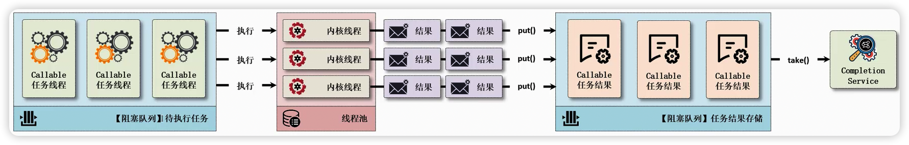

# 11、CompletionService & CompletableFuture

## 1、CompletionService 线程池异步增强

> 并发编程：浅谈CompletionService 和 CompletableFuture ：https://blog.csdn.net/weixin_44735065/article/details/124074027

### 1、简单介绍

**CompletionService 产生背景：**：

Callable + Future（线程池也是同理） 可以实现多个 Task 并行执行，但是遇到前面的 task 执行较慢时，需要阻塞等待前面的 task 执行完才能获取到后面 task 的执行结果。在线程池的开发处理中，如果使用了 Callable 接口则需要进行异步任务结果的接收，为了便于异步数据的返回，J.U.C 中提供了一个 CompletionService 操作接口，该接口可以将所有异步任务的执行结果保存到阻塞队列之中，而后再利用阻塞队列实现结果的的获取。

CompletionService 的主要功能就是一边生成任务，一边获取任务的返回值。让两件事分开执行，任务之间不会互相阻塞，可以实现执行完的先获取结果，不在依赖任务顺序。

CompletionService 内部通过 "阻塞队列 + FutureTask" 或 "阻塞队列 + 线程池" 实现了任务先完成可优先获取到，即结果按照完成先后顺序排序，内部有一个先进先出的阻塞队列，用于保存已经执行完成的Future，通过调用它的 take() 和 poll() 方法可以获取到一个已经执行完成的 Future，进而通过调用 Future 接口实现类的 get() 方法获取最终的结果。

> **如果现在去考虑到线程池的开发，永远都有一个核心的话题—“阻塞队列”，如果你现在对于阻塞队列的基本特点都无法整明白，强烈建议回顾之前的的阻塞队列，因为阻塞队列可以自动实现操作线程的等待与唤醒，在进行线程池分析的时候也要通过阻塞队列进行使用。**



CompletionService 接口是将 Executor（线程池）和 BlockingQueue（阻塞队列）整合在一起，利用阻塞队列实现所有异步任务结果的保存，而后开发者只需要通过 CompletionService 接口提供的方法即可实现异步任务结果的取出。

**CompletionService 应用场景**：

1. 当需要批量提交异步任务的时候建议你使用 CompletionService。CompletionService 将线程池 Executor 和阻塞队列 BlockingQueue 的功能融合在了一起，能够让批量异步任务的管理更简单。
2. CompletionService 能够让异步任务的执行结果有序化。先执行完的先进入阻塞队列。利用这个特性，你可以轻松实现后续处理的有序性，避免无谓的等待，同时还可以快速实现诸如Forking Cluster这样的需求。
3. 线程池隔离。CompletionService 支持自己创建线程池，这种隔离性能避免几个特别耗时的任务拖垮整个应用的风险。


### 2、接口声明

CompletionService 是一个接口，如果要想使用这个接口一定要提供有子类，或者是其他的工厂方法来进行实例化对象创建，在 J.U.C 的内部提供有一个 ExecutorCompletionService 实现子类。

- CompletionService 接口提供的方法有 5 个：

  ```java
  public interface CompletionService<V> {
      // 提交线程任务，交由 Executor 对象去执行，并将结果放入阻塞队列；
      Future<V> submit(Callable<V> task);
      // 提交线程任务，交由 Executor 对象去执行，并将结果放入阻塞队列；
      Future<V> submit(Runnable task, V result);
      // 阻塞等待，在阻塞队列中获取并移除一个元素，该方法是阻塞的，即获取不到的话线程会一直阻塞；
      Future<V> take() throws InterruptedException;
      // 非阻塞等待，在阻塞队列中获取并移除一个元素，该方法是非阻塞的，获取不到即返回 null ；
      Future<V> poll();
      // 带时间的非阻塞等待，从阻塞队列中非阻塞地获取并移除一个元素，在设置的超时时间内获取不到即返回 null ；
      Future<V> poll(long timeout, TimeUnit unit) throws InterruptedException;
  }
  ```

- ExecutorCompletionService 子类源代码：

  ```java
  package java.util.concurrent;
  
  public class ExecutorCompletionService<V> implements CompletionService<V> {
      // 执行任务的线程
      private final Executor executor;
      // 线程池父类
      private final AbstractExecutorService aes;
      // 任务完成会记录在该队列中
      private final BlockingQueue<Future<V>> completionQueue;
      // 内部类：实现了FutureTask接口，当任务执行时，会去调用FutureTask的run()
      private class QueueingFuture extends FutureTask<Void> {
          QueueingFuture(RunnableFuture<V> task) {
              super(task, null);
              this.task = task;
          }
          protected void done() { completionQueue.add(task); }
          private final Future<V> task;
      }
      // 两个封装RunnableFuture 参数 最终调用的都是FutureTask的构造方法
      // 封装RunnableFuture 参数：Callable<V> task
      private RunnableFuture<V> newTaskFor(Callable<V> task) {
          if (aes == null)
              return new FutureTask<V>(task);
          else
              return aes.newTaskFor(task);
      }
      // 封装RunnableFuture 参数：Runnable task, V result
      private RunnableFuture<V> newTaskFor(Runnable task, V result) {
          if (aes == null)
              return new FutureTask<V>(task, result);
          else
              return aes.newTaskFor(task, result);
      }
      // 构造方法 参数：Executor executor
      public ExecutorCompletionService(Executor executor) {
          if (executor == null)
              throw new NullPointerException();
          this.executor = executor;
          this.aes = (executor instanceof AbstractExecutorService) ?
              (AbstractExecutorService) executor : null;
          this.completionQueue = new LinkedBlockingQueue<Future<V>>();
      }
      // 构造方法 参数Executor executor, BlockingQueue<Future<V>> completionQueue
      public ExecutorCompletionService(Executor executor,
                                       BlockingQueue<Future<V>> completionQueue) {
          if (executor == null || completionQueue == null)
              throw new NullPointerException();
          this.executor = executor;
          this.aes = (executor instanceof AbstractExecutorService) ?
              (AbstractExecutorService) executor : null;
          this.completionQueue = completionQueue;
      }
      // 两个任务提交方法：内部都会将其转换为RunnableFutuer实例，然后再封装成QueueingFuture实例作为任务来执行
      // 任务提交方法：Callable<V> task
      public Future<V> submit(Callable<V> task) {
          if (task == null) throw new NullPointerException();
          RunnableFuture<V> f = newTaskFor(task);
          executor.execute(new QueueingFuture(f));
          return f;
      }
      // 任务提交方法： 参数 Runnable task, V result
      public Future<V> submit(Runnable task, V result) {
          if (task == null) throw new NullPointerException();
          RunnableFuture<V> f = newTaskFor(task, result);
          executor.execute(new QueueingFuture(f));
          return f;
      }
  
      public Future<V> take() throws InterruptedException {
          return completionQueue.take();
      }
  
      public Future<V> poll() {
          return completionQueue.poll();
      }
  
      public Future<V> poll(long timeout, TimeUnit unit)
          throws InterruptedException {
          return completionQueue.poll(timeout, unit);
      }
  }
  ```

  - 两个封装 RunnableFuture 方法最终调用的都是 FutureTask 的构造方法: private RunnableFuture newTaskFor(…)
  - 两个构造方法 参数 Executor executor 和 Executor executor, BlockingQueue< Future > completionQueue
  - 两个任务提交方法：内部都会将其转换为RunnableFutuer实例，然后再封装成QueueingFuture实例作为任务来执行
  - 一个内部类：实现了FutureTask接口，当任务执行时，会去调用FutureTask的run(), 在任务执行成功，记录返回记录结果的时候，会调用finishCompletion()去唤醒所有阻塞的线程并调用done()方法。而QueueingFuture内部类就实现了done() 方法，它将执行完的FutureTask放入到阻塞队列中，当调用take()方法时就可以取到任务的执行结果，如果任务都还没有执行完，就阻塞。


### 3、使用示例

操作示例 1：采用**线程池 + Future**的方案异步执行询价

```java
import java.util.HashSet;
import java.util.List;
import java.util.Set;
import java.util.concurrent.*;
import java.util.function.Function;

public class JavaAPIDemo {
    public static void main(String[] args) throws InterruptedException {
        // 模拟电商报价API
        Function<Integer, Integer> getPrice = (i) -> {
            try {
                TimeUnit.SECONDS.sleep(i);
                System.out.println("任务" + i);
            } catch (InterruptedException ignored) {
            }
            return i;
        };

        long start = System.currentTimeMillis();

        // 创建2个固定大小的线程池
        ExecutorService executor = Executors.newFixedThreadPool(5);

        // 在集合中追加所有要执行的线程的任务对象，是Callable的实现
        Set<Callable<Integer>> allThreads = new HashSet<>();
        allThreads.add(() -> getPrice.apply(2));
        allThreads.add(() -> getPrice.apply(6));
        allThreads.add(() -> getPrice.apply(4));
        // 使用invokeAll方法执行集合中的所有Callable任务
        List<Future<Integer>> futures = executor.invokeAll(allThreads);

        futures.forEach((future) -> {
            try {
                System.out.println(future.get());
            } catch (Exception ignored) {
            }
        });

        executor.shutdown();
        while (true) {
            if (executor.isTerminated()) {
                long end = System.currentTimeMillis();
                System.out.println("耗时：" + (end - start) / 1000 + " s");
                break;
            }
        }
    }
}
```

```java
任务2
任务4
任务6
6
2
4
耗时：6 s
```

操作示例 2：采用 CompletionService 的方案异步执行询价

```java
import java.util.concurrent.*;
import java.util.function.Function;

public class JavaAPIDemo {
    public static void main(String[] args) throws InterruptedException, ExecutionException {
        // 模拟电商报价API
        Function<Integer, Integer> getPrice = (i) -> {
            try {
                TimeUnit.SECONDS.sleep(i);
            } catch (InterruptedException ignored) {
            }
            return i;
        };

        long start = System.currentTimeMillis();

        // 创建2个固定大小的线程池
        ExecutorService executor = Executors.newFixedThreadPool(2);
        // 创建 CompletionService, 现在的线程池统一被CompletionService实例所管理，所有线程任务交由此接口实例操作
        ExecutorCompletionService<Integer> cs = new ExecutorCompletionService<>(executor);
        // 异步向电商S1询价
        cs.submit(() -> getPrice.apply(2));
        // 异步向电商S2询价
        cs.submit(() -> getPrice.apply(8));
        // 异步向电商S3询价
        cs.submit(() -> getPrice.apply(4));

        // 将结果异步保存到数据库
        for (int i = 0; i < 3; i++) {
            System.out.println("任务【" + cs.take().get() + "】完成");
        }

        executor.shutdown();
        while (true) {
            if (executor.isTerminated()) {
                long end = System.currentTimeMillis();
                System.out.println("耗时：" + (end - start) / 1000 + " s");
                break;
            }
        }
    }
}
```

```java
任务【2】完成
任务【4】完成
任务【8】完成
耗时：8 s
```

此时的线程池的大小为 2，所以每一次只有 2 个线程任务可以被调度，而后被调度执行完成的线程处理结果会自动的保存在结果的阻塞队列之中，后面可以交由其他线程通过此阻塞队列获取数据。

操作示例 3：并行地调用多个服务，只要有一个成功就返回结果

```java
import java.util.ArrayList;
import java.util.List;
import java.util.concurrent.*;
import java.util.function.Function;

public class JavaAPIDemo {
    public static void main(String[] args) throws InterruptedException, ExecutionException {
        // 模拟电商报价API
        Function<Integer, Integer> getPrice = (i) -> {
            try {
                TimeUnit.SECONDS.sleep(i);
            } catch (InterruptedException ignored) {
            }
            return i;
        };

        long start = System.currentTimeMillis();
        // 创建线程池
        ExecutorService executor = Executors.newFixedThreadPool(3);
        // 创建completionService
        ExecutorCompletionService<Integer> cs = new ExecutorCompletionService<>(executor);
        // 用于保存Future对象
        List<Future<Integer>> futures = new ArrayList<>();
        // 提交异步任务，并保存 future到 futures
        futures.add(cs.submit(() -> getPrice.apply(5)));
        futures.add(cs.submit(() -> getPrice.apply(3)));
        futures.add(cs.submit(() -> getPrice.apply(2)));

        Integer result = null;
        // 获取最快返回的任务执行结果
        try {
            for (int i = 0; i < 3; i++) {
                Future<Integer> future = cs.take();
                // 将有结果的任务从结果集删除
                futures.remove(future);
                result = future.get();
                if (result != null) {
                    break;
                }
            }
        } finally {
            // 取消剩下的所有任务
            for (Future<Integer> future : futures) {
                future.cancel(true);
            }
        }

        executor.shutdown();
        while (true) {
            if (executor.isTerminated()) {
                long end = System.currentTimeMillis();
                System.out.println("耗时：" + (end - start) / 1000 + " s");
                break;
            }
        }
        System.out.println("最终结果：" + result);
    }
}
```

```java
耗时：2 s
最终结果：2
```

操作示例 3：（高德笔试题）多个任务并行执行，有一个任务执行失败了，任务就结束。要求：最快

```java
import java.util.ArrayList;
import java.util.List;
import java.util.Objects;
import java.util.concurrent.*;
import java.util.function.Function;

public class JavaAPIDemo {
    public static void main(String[] args) throws InterruptedException, ExecutionException {
        // 模拟电商报价API
        Function<Integer, Integer> getPrice = (i) -> {
            try {
                if (Objects.nonNull(i)) {
                    TimeUnit.SECONDS.sleep(i);
                } else {
                    // 模拟3秒时出现错误
                    TimeUnit.SECONDS.sleep(3);
                }
            } catch (InterruptedException ignored) {
            }
            return i;
        };

        long start = System.currentTimeMillis();
        // 创建线程池
        ExecutorService executor = Executors.newFixedThreadPool(3);
        // 创建completionService
        ExecutorCompletionService<Integer> cs = new ExecutorCompletionService<>(executor);
        // 用于保存Future对象
        List<Future<Integer>> futures = new ArrayList<>();
        // 提交异步任务，并保存 future到 futures
        futures.add(cs.submit(() -> getPrice.apply(5)));
        futures.add(cs.submit(() -> getPrice.apply(null)));
        futures.add(cs.submit(() -> getPrice.apply(1)));

        Integer result = null;
        // 获取最快返回的任务执行结果
        try {
            for (int i = 0; i < 3; i++) {
                Future<Integer> future = cs.take();
                // 将有结果的任务从结果集删除
                futures.remove(future);
                result = future.get();
                if (Objects.isNull(result)) {
                    System.out.printf("【任务%s】出现异常。%n", result);
                    executor.shutdown();
                    break;
                }
                System.out.printf("【任务%s】执行完毕。%n", result);
            }
        } finally {
            // 取消剩下的所有任务
            for (Future<Integer> future : futures) {
                future.cancel(true);
            }
        }

        // executor.shutdown();
        while (true) {
            if (executor.isTerminated()) {
                long end = System.currentTimeMillis();
                System.out.println("耗时：" + (end - start) / 1000 + " s");
                break;
            }
        }
    }
}
```

```java
【任务1】执行完毕。
【任务null】出现异常。
耗时：3 s
```


## 2、CompletableFuture 多线程异步编排

CompletableFuture 是在 Java 8 中新增的主要工具，同传统的 Future 相比，其支持流式计算、函数式编程、完成通知、自定义异常处理等很多新的特性。实现 Future 和 CompletionStage 异步接口。

以前需要异步执行一个任务时，一般是用 Thread 或者线程池 Executor 去创建。如果需要返回值，则是调用 Executor.submit 获取 Future 接口以及对应的实现类 FutureTask，通过 Future 或 FutureTask 的就可以获取到异步执行的结果。但是多个线程存在依赖组合，我们又能怎么办？可使用同步组件 CountDownLatch、CyclicBarrier 等；其实有简单的方法，就是用 CompletableFuture。首先我们先来分析 Future 的局限性，以及 CompletableFuture 产生的背景。


### 01、Future 接口以及它的局限性

#### 1、串行调用的真实案例

现在我们有一个查询商品价格的接口，它需要查询商品A价格、商品B价格、商品C价格、商品D价格后然后组装数据。

```java
import java.util.concurrent.TimeUnit;
import java.util.stream.Stream;

public class JavaAPIDemo {
    public static void main(String[] args) throws InterruptedException {
        long start = System.currentTimeMillis();

        // 1. 耗时3秒
        Integer a = getPrices("商品A", 3000, 3);
        // 2. 耗时4秒
        Integer b = getPrices("商品B", 2000, 4);
        // 3. 耗时2秒
        Integer c = getPrices("商品C", 5000, 2);
        // 4. 耗时3秒
        Integer d = getPrices("商品D", 1000, 1);
        // 数据处理，对比查询到最便宜的商品
        System.out.printf("最便宜的商品价格: %s%n", Stream.of(a, b, c, d).min(Integer::compareTo).get());

        System.out.printf("耗时: %ds%n", (System.currentTimeMillis() - start)/1000);
    }

    public static Integer getPrices(String name, int price, long timeout) {
        try {
            System.out.printf("%s, 价格: %d, 耗时: %ds%n", name, price, timeout);
            TimeUnit.SECONDS.sleep(timeout);
        } catch (InterruptedException ignored) {
        }
        return price;
    }
}
```

```java
商品A, 价格: 3000, 耗时: 3s
商品B, 价格: 2000, 耗时: 4s
商品C, 价格: 5000, 耗时: 2s
商品D, 价格: 1000, 耗时: 1s
最便宜的商品价格: 1000
耗时: 10029s
```

这段代码会有什么问题？其实算是一段比较正常的代码，但是在某一个商品价格SQL查询或者HTTP请求是相对较慢的，那有没有办法优化一下呢？当前这个请求耗时总计就是10s。上面实现中查询商品价格是串行的，那串行的系统要做性能优化很常见的就是利用多线程并行了。


#### 2、并行调用实现方式一：Future + Callable

实际上，每个平台之间的操作是**互不干扰**的，那我们自然而然的可以想到，可以通过多线程的方式，同时去分别执行各个平台的逻辑处理，最后将各个平台的结果汇总到一起比对得到最低价格。这里我们使用 Future + Callable 实现多线程任务。

Future + Callable 实现异步并发调用也有2种方式：

- 第一种是直接使用 Thread 类开启多线程执行任务：Thread + Callable + FutureTask/Future
- 另一种是使用线程池方式提交多线程任务：Executor + Callable + Future

下面我们看下如何优化我们上面的查询接口，实现并行查询。

操作示例 1：Thread + Callable + FutureTask/Future

```java
import java.util.concurrent.ExecutionException;
import java.util.concurrent.FutureTask;
import java.util.concurrent.TimeUnit;
import java.util.stream.Stream;

public class JavaAPIDemo {
    public static void main(String[] args) throws InterruptedException {
        long start = System.currentTimeMillis();

        // 1. 耗时3秒
        FutureTask<Integer> taskA = new FutureTask<>(() -> getPrices("商品A", 3000, 3));
        new Thread(taskA).start();
        // 2. 耗时4秒
        FutureTask<Integer> taskB = new FutureTask<>(() -> getPrices("商品B", 2000, 4));
        new Thread(taskB).start();
        // 3. 耗时2秒
        FutureTask<Integer> taskC = new FutureTask<>(() -> getPrices("商品C", 5000, 2));
        new Thread(taskC).start();
        // 4. 耗时3秒
        FutureTask<Integer> taskD = new FutureTask<>(() -> getPrices("商品D", 1000, 1));
        new Thread(taskD).start();
        // 数据处理，对比查询到最便宜的商品
        Integer min = Stream.of(taskB, taskB, taskC, taskD).map((task) -> {
            try {
                return task.get();
            } catch (InterruptedException | ExecutionException ignored) {
            }
            return -1;
        }).min(Integer::compareTo).get();
        System.out.printf("最便宜的商品价格: %s%n", min);

        System.out.printf("耗时: %ds%n", (System.currentTimeMillis() - start)/1000);
    }

    public static Integer getPrices(String name, int price, long timeout) {
        try {
            System.out.printf("%s, 价格: %d, 耗时: %ds%n", name, price, timeout);
            TimeUnit.SECONDS.sleep(timeout);
        } catch (InterruptedException ignored) {
        }
        return price;
    }
}
```

```java
商品A, 价格: 3000, 耗时: 3s
商品D, 价格: 1000, 耗时: 1s
商品C, 价格: 5000, 耗时: 2s
商品B, 价格: 2000, 耗时: 4s
最便宜的商品价格: 1000
耗时: 4s
```

操作示例 2：ThreadPoolExecutor + Callable + Future

```java
import java.util.concurrent.*;
import java.util.stream.Stream;

public class JavaAPIDemo {
    public static void main(String[] args) throws InterruptedException {
        ExecutorService service = Executors.newFixedThreadPool(10);
        long start = System.currentTimeMillis();

        // 1. 耗时3秒
        Future<Integer> futureA = service.submit(() -> getPrices("商品A", 3000, 3));
        // 2. 耗时4秒
        Future<Integer> futureB = service.submit(() -> getPrices("商品B", 2000, 4));
        // 3. 耗时2秒
        Future<Integer> futureC = service.submit(() -> getPrices("商品C", 5000, 2));
        // 4. 耗时3秒
        Future<Integer> futureD = service.submit(() -> getPrices("商品D", 1000, 1));
        // 数据处理，对比查询到最便宜的商品
        Integer min = Stream.of(futureA, futureB, futureC, futureD).map((task) -> {
            try {
                return task.get();
            } catch (InterruptedException | ExecutionException ignored) {
            }
            return -1;
        }).min(Integer::compareTo).get();
        System.out.printf("最便宜的商品价格: %s%n", min);

        System.out.printf("耗时: %ds%n", (System.currentTimeMillis() - start)/1000);
        service.shutdown();
    }

    public static Integer getPrices(String name, int price, long timeout) {
        try {
            System.out.printf("%s, 价格: %d, 耗时: %ds%n", name, price, timeout);
            TimeUnit.SECONDS.sleep(timeout);
        } catch (InterruptedException ignored) {
        }
        return price;
    }
}
```

```java
商品A, 价格: 3000, 耗时: 3s
商品D, 价格: 1000, 耗时: 1s
商品C, 价格: 5000, 耗时: 2s
商品B, 价格: 2000, 耗时: 4s
最便宜的商品价格: 1000
耗时: 4s
```

为了提升性能，我们实际工作还是会采用**线程池**来负责多线程的处理操作。基本不会使用到 Thread 类来开启线程。最终可以发现：不管使用线程池还是Thread类，在并行调用后，整个请求的耗时减少到了4s。


#### 3、并行调用实现方式二：CompletableFuture

```java
import java.util.concurrent.*;
import java.util.stream.Stream;

public class JavaAPIDemo {
    public static void main(String[] args) throws InterruptedException {
        ExecutorService service = Executors.newFixedThreadPool(10);
        long start = System.currentTimeMillis();

        // 1. 耗时3秒
        CompletableFuture<Integer> futureA = CompletableFuture
                .supplyAsync(() -> getPrices("商品A", 3000, 3), service);
        // 2. 耗时4秒
        CompletableFuture<Integer> futureB = CompletableFuture
                .supplyAsync(() -> getPrices("商品B", 2000, 4), service);
        // 3. 耗时2秒
        CompletableFuture<Integer> futureC = CompletableFuture
                .supplyAsync(() -> getPrices("商品C", 5000, 2), service);
        // 4. 耗时3秒
        CompletableFuture<Integer> futureD = CompletableFuture
                .supplyAsync(() -> getPrices("商品D", 1000, 1), service);
        // 等待所有任务执行完毕才开始数据处理，实际上没有这一行代码也不会影响结果的正常执行
        CompletableFuture.allOf(futureA, futureB, futureC, futureD);
        // 数据处理，对比查询到最便宜的商品
        Integer min = Stream.of(futureA, futureB, futureC, futureD).map((task) -> {
            try {
                return task.get();
            } catch (InterruptedException | ExecutionException ignored) {
            }
            return -1;
        }).min(Integer::compareTo).get();
        System.out.printf("最便宜的商品价格: %s%n", min);

        System.out.printf("耗时: %ds%n", (System.currentTimeMillis() - start)/1000);
        service.shutdown();
    }

    public static Integer getPrices(String name, int price, long timeout) {
        try {
            System.out.printf("%s, 价格: %d, 耗时: %ds%n", name, price, timeout);
            TimeUnit.SECONDS.sleep(timeout);
        } catch (InterruptedException ignored) {
        }
        return price;
    }
}
```

```java
商品A, 价格: 3000, 耗时: 3s
商品D, 价格: 1000, 耗时: 1s
商品C, 价格: 5000, 耗时: 2s
商品B, 价格: 2000, 耗时: 4s
最便宜的商品价格: 1000
耗时: 4s
```

可以发现最后耗时也是4s，这时可能认为，使用了 CompletableFuture 与 Future + Callable，最后耗时都是一样的，为何我们还需要使用 CompletableFuture 来进行异步并发的操作呢？现在我们来看看另外一种情况。

如果任务之间有依赖关系，比如当前任务依赖前一个任务的执行结果，该怎么处理呢？

这种问题基本上也都可以用 Future 来解决，但是需要将对应的 FutureTask 传入到当前任务中，然后调用 get() 方法即可。

比如：我们创建了两个 FutureTask `ft1` 和 `ft2`，`ft1` 需要等待 `ft2` 执行完毕后才能做最后的数据处理，所以 ft1 内部需要引用 ft2，并在执行数据处理前，调用 `ft2` 的 `get()` 方法实现等待。


#### 4、并行任务依赖：基于 Future 实现

```java
import java.util.concurrent.Callable;
import java.util.concurrent.ExecutionException;
import java.util.concurrent.FutureTask;

public class JavaAPIDemo {
    public static void main(String[] args) throws InterruptedException, ExecutionException {
        // 创建任务TaskB的FutureTask
        FutureTask<String> taskB = new FutureTask<>(new TaskB());
        // 创建任务TaskA的FutureTask
        FutureTask<String> taskA = new FutureTask<>(new TaskA(taskB));

        new Thread(taskA).start();  // 线程执行任务taskA
        new Thread(taskB).start();  // 线程执行任务taskB

        // 等待线程taskA执行结果
        System.out.println(taskA.get());
    }

    // T1Task需要执行的任务：
    static class TaskA implements Callable<String> {
        FutureTask<String> ftB;

        // T1任务需要T2任务的FutureTask
        TaskA(FutureTask<String> ftB) {
            this.ftB = ftB;
        }

        @Override
        public String call() throws Exception {
            // 获取T2线程结果
            System.out.println(ftB.get());
            return "处理完的数据结果";
        }
    }

    // T2Task需要执行的任务:
    static class TaskB implements Callable<String> {
        @Override
        public String call() {
            return "检验 & 查询数据";
        }
    }
}
```

```java
检验 & 查询数据
处理完的数据结果
```

通过这上面的的例子，我们明显的发现 Future 实现异步编程时的一些不足之处：

- Future 对于结果的获取很不方便，只能通过 get() 方法阻塞或者轮询的方式得到任务的结果。阻塞的方式显然是效率低下的，轮询的方式又十分耗费CPU资源，如果前一个任务执行比较耗时的话，get() 方法会阻塞，形成排队等待的情况。
- 将两个异步计算合并为一个，这两个异步计算之间相互独立，同时第二个又依赖于第一个的结果。
- 等待 Future 集合中的所有任务都完成。
- 仅等待 Future 集合中最快结束的任务完成（有可能因为它们试图通过不同的方式计算同一个值），并返回它的结果。
- 应对 Future 的完成事件（即当 Future 的完成事件发生时会收到通知，并能使用 Future 计算的结果进行下一步的操作，不只是简单地阻塞等待操作的结果）。

我们很难表述 Future 结果之间的依赖性，从文字描述上这很简单。比如，下面文字描述的关系，如果用 Future 去实现时还是很复杂的。

比如：“当长时间计算任务完成时，请将该计算的结果通知到另一个长时间运行的计算任务，这两个计算任务都完成后，将计算的结果与另一个查询操作结果合并”

在 JDK8 中引入了 CompletableFuture，对 Future 进行了改进，可以在定义 CompletableFuture 时传入回调对象，任务在完成或者异常时，自动回调，再也不需要每次主动通过 Future 去询问结果了，我们接着往下看。


#### 5、并行任务依赖：基于 CompletableFuture 实现

```java
import java.util.concurrent.CompletableFuture;
import java.util.concurrent.ExecutionException;
import java.util.concurrent.TimeUnit;

public class JavaAPIDemo {
    public static void main(String[] args) throws InterruptedException, ExecutionException {
        long start = System.currentTimeMillis();

        // 异步任务一：查询数据任务
        CompletableFuture<String> queryFuture = CompletableFuture.supplyAsync(() -> {
            System.out.println("数据查询任务开始执行...");
            try {
                TimeUnit.SECONDS.sleep(2);
            } catch (InterruptedException ignored) {
            }
            return "queryFunction";
        });

        // 异步任务二：数据清洗任务，依赖任务一的返回值
        CompletableFuture<String> cleanFuture = queryFuture.thenApply(data -> {
            System.out.println("数据清理任务开始执行...");
            try {
                TimeUnit.SECONDS.sleep(1);
            } catch (InterruptedException ignored) {
            }
            return "cleanFunction";
        });

        // 异步任务三：数据更新任务，依赖任务二的返回值
        CompletableFuture<Boolean> updateFuture = cleanFuture.thenApply(data -> {
            System.out.println("数据更新任务开始执行...");
            try {
                TimeUnit.SECONDS.sleep(3);
            } catch (InterruptedException ignored) {
            }
            return true;
        }).exceptionally(ex -> {
            // 数据更新失败
            System.out.println("error: " + ex);
            return false;
        });

        // 等待结果的返回
        System.out.printf("数据更新是否成功: %s", updateFuture.join());
        System.out.printf("任务执行耗时: %ss%n", (System.currentTimeMillis() - start)/1000);
    }
}
```

```java
数据查询任务开始执行...
数据清理任务开始执行...
数据更新任务开始执行...
数据更新是否成功: true任务执行耗时: 6s
```

通过上面的代码我们可以发现 CompletableFuture 有以下优势：

1. 无需手工维护线程，省去了手工提交任务到线程池这一步；
2. 语义更清晰，例如 thenApply、  exceptionally 能够清晰地表述“然后需要执行后面的任务以及异常毁掉的处理”；
3. 代码更简练并且专注于业务逻辑，几乎所有代码都是业务逻辑相关的。


#### 6、Future 接口的局限性总结

在异步计算中，Future 确实是一个非常优秀的接口。不过通过如上的分析，我们可以知道 Future 接口依然存在一些局限性：

1. **缺乏回调机制**：Future 没有内置的回调机制，这就意味着我们必须轮询 Future 对象来检查任务是否完成，而不是等待通知。
2. **无法取消任务**：虽然可以通过 cancel() 方法来取消 Future 中的任务，但这并不保证任务会被取消。如果任务已经开始执行，那么 cancel() 方法可能无法终止任务的执行。
3. **缺乏异常处理机制**：Future 通过 get() 方法返回任务的结果或异常，但它无法提供更多的异常处理功能。如果任务抛出异常，你必须在客户端代码中捕获这些异常。
4. **单一结果**：每个 Future 对象只能关联一个任务，这就限制了它的使用，如果我们需要并行执行多个任务并收集它们的结果，我们只能自己管理多个 Future 对象。
5. **无法进行链式调用**：如果我们希望在计算完成后执行特定操作，比如通知用户，这个时候我们就无法使用 Future 来实现了。
6. **无法组合多任务**：在处理多个任务时，Future 并没有提供很好的组合方式，比如我们需要等待 10 任务全部完成后再执行特定操作，这个时候使用 Future 就不是很好操作了。


### 02、什么是 CompletableFuture

为了克服 Future 的局限性，Java 8 提供了 CompletableFuture，**实现 Future 和 CompletionStage 异步接口**，它构建在 Future 之上，CompletableFuture 提供了比传统 Future 更加强大、更加灵活的异步编程能力，能够更好地满足复杂异步任务处理的需求，能够更加方便地构建复杂的异步操作流，是 Java 8 及以后的版本中，处理异步操作的首选。

CompletableFuture 相比 Future 它具备如下优势：

1. **提供了回调机制**：CompletableFuture 提供了回调功能，我们可以注册回调函数来处理任务完成时的结果，而不必阻塞线程等待任务完成。这样可以提高并发性能，减少线程的阻塞时间。
2. **提供了异常处理**：CompletableFuture 具备丰富的异常处理机制，可以捕获任务执行中的异常，并允许我们定义自定义的异常处理策略。
3. **能够取消任务**：我们可以使用 `cancel()`取消任务的执行，同时还可以指定是否中断正在执行的任务。这提供了更好的任务控制能力。
4. **强大的异步编程能力**：CompletableFuture 提供了丰富的方法来处理异步操作，包括**组合**、**转换**、**处理异常**以及**执行自定义**的操作。这使得异步编程更加灵活，可以更轻松地实现复杂的异步任务组合。
5. **支持组合、链式操作**：CompletableFutur  提供了一系列支持组合操作的方法，例如 `thenCombine()` ， `thenCompose()`，`thenApplyAsync()`等等，使得多个 CompletableFuture 可以轻松组合成一个新的 CompletableFuture，从而更容易构建复杂的异步操作流。

CompletableFuture 的优点如下：

1. 异步函数式编程，实现优雅，易于维护；
2. 它提供了异常管理的机制，让你有机会抛出、管理异步任务执行中发生的异常，监听这些异常的发生；
3. 拥有对任务编排的能力。借助这项能力，可以轻松地组织不同任务的运行顺序、规则以及方式。

CompletableFuture 的使用场景：

1. **并行处理多个独立任务**：当一个任务可以被分解为多个独立的子任务时，可以使用 CompletableFuture 来并行执行这些子任务，从而提高系统的性能和响应速度。比如，在电商系统中，查询用户信息、订单信息、购物车信息等可以并行执行，然后在所有子任务完成后进行结果合并。
2. **异步执行耗时操作**：对于一些耗时的操作，比如远程调用、数据库查询等，可以使用CompletableFuture来异步执行这些操作，避免阻塞主线程，提高系统的吞吐量和并发能力。
3. **组合多个异步任务的结果**：有时候需要等待多个异步任务都完成后才能进行下一步处理，可以使用 CompletableFuture 的组合方法（比如 thenCombine、thenCompose 等）来等待多个异步任务的结果，并在所有任务完成后进行处理。
4. **超时处理和异常处理**：CompletableFuture 提供了丰富的异常处理和超时处理的方法，可以很方便地处理异步任务执行过程中出现的异常或者超时情况。
5. **实现异步回调**：通过 CompletableFuture 的回调方法，可以在异步任务完成后执行特定的逻辑，比如通知其他系统、记录日志等。


### 03、异步任务的创建方式

#### 1、构造函数创建

最简单的方式就是通过构造函数创建一个 CompletableFuture 实例。如下代码所示。由于新创建的 CompletableFuture 还没有任何计算结果，这时调用 get 或者 join，当前线程会一直阻塞在这里。此时如果有其它线程执行，get() / join() 就会等待到结果继续执行。想要完成计算需要调用 complete() 方法来执行任务完成。

```java
// 创建未完成的CompletableFuture
CompletableFuture<String> completableFuture = new CompletableFuture<>();
// 这将创建一个未完成的 CompletableFuture。你可以通过 complete 方法来完成它：
future.complete(null);

// 如下是静态方法创建：相当于 new CompletableFuture<>() + complete();
// 如果你想创建一个已经完成的 CompletableFuture，你可以使用 completedFuture 方，使用方法
CompletableFuture<String> future = CompletableFuture.completedFuture("Hello, world!");
```

操作示例 1：使用 CompletableFuture 无参构造简单测试

```java
import java.util.concurrent.CompletableFuture;
import java.util.concurrent.ExecutionException;

public class JavaAPIDemo {
    public static void main(String[] args) throws InterruptedException, ExecutionException {
        // 创建一个新的未完成的CompletableFuture, 可以稍后完成(调用complete方法)。
        CompletableFuture<String> completableFuture = new CompletableFuture<>();

        // 在异步线程中执行任务，并设置结果到 CompletableFuture
        new Thread(() -> {
            try {
                // 模拟耗时操作
                Thread.sleep(2000);
                // 设置 CompletableFuture 的结果
                completableFuture.complete("Hello, CompletableFuture!");
            } catch (InterruptedException e) {
                // 处理异常
                completableFuture.completeExceptionally(e);
            }
        }).start();

        // 在主线程中等待 CompletableFuture 的结果
        try {
            String result = completableFuture.get();
            System.out.println(result);
        } catch (InterruptedException | ExecutionException e) {
            completableFuture.completeExceptionally(e);
        }
    }
}
```

```java
Hello, CompletableFuture!
```

在这个示例中，我们创建了一个无参构造的 CompletableFuture 对象，并通过异步线程设置了它的结果。主线程通过 get() 方法等待异步操作的完成，并获取结果进行处理。


#### 2、静态方法汇总

除了使用构造方法构造（基本不会使用到构造方法创建），CompletableFuture 还提供了一些静态方法来创建。常用创建有4个静态方法。

1、CompletableFuture 提供了四个常用静态方法来创建一个异步任务

```java
public static CompletableFuture<Void> runAsync(Runnable runnable)；
public static CompletableFuture<Void> runAsync(Runnable runnable, Executor executor)；
 
public static <U> CompletableFuture<U> supplyAsync(Supplier<U> supplier) ；
public static <U> CompletableFuture<U> supplyAsync(Supplier<U> supplier, Executor executor)；
```

- runAsync 都是没有返回值的，supplyAsync 都是可以获取返回值的
- 提供两个入参的方法可以传入自定义的线程池，否则默认使用公用的 ForkJoinPool.commonPool() 作为执行异步任务的线程池

2、CompletableFuture 其他静态方法创建异步任务对象.

```java
// 创建并返回一个已经用给定值完成的新CompletableFuture和CompletionStage
public static <U> CompletableFuture<U> completedFuture(U value);
public static <U> CompletionStage<U> completedStage(U value);

// 创建并返回一个已经完成的CompletableFuture和CompletionStage，并且它的结果为一个异常
public static <U> CompletableFuture<U> failedFuture(Throwable ex);
public static <U> CompletionStage<U> failedStage(Throwable ex);

// 组合CompletableFutures, allof无返回值，anyOf有返回值
public static CompletableFuture<Void> allOf(CompletableFuture<?>... cfs);
public static CompletableFuture<Object> anyOf(CompletableFuture<?>... cfs);

// 用于创建一个延迟执行的 Executor。这个 Executor 可以用于指定异步操作的延迟执行。并且可以使用自定义的Executor
public static Executor delayedExecutor(long delay, TimeUnit unit);
public static Executor delayedExecutor(long delay, TimeUnit unit, Executor executor);
```


#### 3、静态方法 runAsync / supplyAsync

> runAsync 与 supplyAsync 是启动一个异步任务并且开始执行。
>

**1、根据 Runnable 创建 CompletableFuture 任务，无返回值**。

```java
// 使用默认内置线程池ForkJoinPool.commonPool()，根据runnable构建执行任务
public static CompletableFuture<Void> runAsync(Runnable runnable);
// 自定义线程，根据runnable构建执行任务  
public static CompletableFuture<Void> runAsync(Runnable runnable,Executor executor);
```

**2、根据 Supplier 创建 CompletableFuture 任务，有返回值**。

```java
// 使用默认内置线程池ForkJoinPool.commonPool()，根据supplier构建执行任务  
public static <U> CompletableFuture<U> supplyAsync(Supplier<U> supplier);
// 自定义线程，根据supplier构建执行任务  
public static <U> CompletableFuture<U> supplyAsync(Supplier<U> supplier,Executor executor);
```

操作示例 1：使用 runAsync 创建异步任务，无返回值

```java
import java.util.concurrent.CompletableFuture;
import java.util.concurrent.ExecutionException;
import java.util.concurrent.ExecutorService;
import java.util.concurrent.Executors;

public class JavaAPIDemo {
    public static void main(String[] args) throws InterruptedException, ExecutionException {
        System.out.println("主线程开始执行。。。");

        CompletableFuture<Void> completableFuture1 = CompletableFuture.runAsync(
                () -> System.out.println("无返回值，使用默认线程池"));
        System.out.println(completableFuture1.get());

        ExecutorService executor = Executors.newFixedThreadPool(2);
        CompletableFuture<Void> completableFuture2 = CompletableFuture.runAsync(
                () -> System.out.println("无返回值，使用自定义线程池"), executor);
        System.out.println(completableFuture2.join());
        executor.shutdown();

        System.out.println("主线程结束。。。");
    }
}
```

```java
主线程开始执行。。。
无返回值，使用默认线程池
null
无返回值，使用自定义线程池
null
主线程结束。。。
```

操作示例 2：使用 supplyAsync 创建异步任务，有返回值

```java
import java.util.concurrent.CompletableFuture;
import java.util.concurrent.ExecutionException;
import java.util.concurrent.ExecutorService;
import java.util.concurrent.Executors;

public class JavaAPIDemo {
    public static void main(String[] args) throws InterruptedException, ExecutionException {
        System.out.println("主线程开始执行。。。");

        CompletableFuture<Long> completableFuture1 = CompletableFuture.supplyAsync(() -> {
            System.out.println("有返回值，使用默认线程池");
            return System.currentTimeMillis();
        });
        System.out.println(completableFuture1.get());

        ExecutorService executor = Executors.newFixedThreadPool(2);
        CompletableFuture<Long> completableFuture2 = CompletableFuture.supplyAsync(() -> {
            System.out.println("有返回值，使用自定义线程池");
            return System.currentTimeMillis();
        }, executor);
        System.out.println(completableFuture2.join());
        executor.shutdown();

        System.out.println("主线程结束。。。");
    }
}
```

```java
主线程开始执行。。。
有返回值，使用默认线程池
1705991857895
有返回值，使用自定义线程池
1705991857898
主线程结束。。。
```


#### 4、静态方法 completedFuture / completedStage

创建并返回一个已经用给定值完成的新 CompletableFuture 或 CompletionStage。也可以理解为构建一个常量的 CompletableFuture 或 CompletionStage。**等价于：new CompletableFuture() + complete() 结合**。

```java
public static <U> CompletableFuture<U> completedFuture(U value);
public static <U> CompletionStage<U> completedStage(U value);
```

```java
import java.util.concurrent.CompletableFuture;
import java.util.concurrent.CompletionStage;
import java.util.function.Function;

public class JavaAPIDemo {
    public static void main(String[] args) {
        // CompletableFuture.completedFuture示例
        CompletableFuture<String> future = 
            CompletableFuture.completedFuture("使用一个常量值完成completedFuture");
        System.out.println(future.join());

        // CompletableFuture.completedStage示例
        CompletionStage<String> stage = 
            CompletableFuture.completedStage("使用一个常量值完成任务completedStage");
        CompletableFuture<String> completableFuture = stage
            .thenApply(Function.identity()).toCompletableFuture();
        System.out.println(completableFuture.join());
    }
}
```

```java
使用一个常量值完成completedFuture
使用一个常量值完成任务completedStage
```


#### 5、静态方法 failedFuture / failedStage

创建并返回一个已经完成的CompletableFuture和CompletionStage，并且它的结果为一个异常

```java
public static <U> CompletableFuture<U> failedFuture(Throwable ex);
public static <U> CompletionStage<U> failedStage(Throwable ex);
```

操作示例 1：CompletableFuture.failedFuture 方法演示

```java
import java.util.concurrent.CompletableFuture;

public class FailedFutureExample {

    public static void main(String[] args) {
        // 创建一个已经完成的 CompletableFuture，包含异常
        CompletableFuture<String> failedFuture = 
            CompletableFuture.failedFuture(new RuntimeException("Custom exception"));

        // 异常处理
        failedFuture.exceptionally(throwable -> {
            System.err.println("CompletableFuture failed with: " + throwable.getMessage());
            return "失败处理"; // Handle the exception or provide a default value
        });

        // 等待 CompletableFuture 完成，最终会在主线程中抛出异常
        System.out.println(failedFuture.join());
    }
}
```

```java
CompletableFuture failed with: Custom exception
Exception in thread "main" java.util.concurrent.CompletionException: java.lang.RuntimeException: Custom exception
```

操作示例 2：CompletableFuture.failedStage 方法演示

```java
import java.util.concurrent.CompletableFuture;
import java.util.concurrent.CompletionStage;

public class JavaAPIDemo {
    public static void main(String[] args) {
        // 创建一个已经完成的 CompletionStage，包含异常
        CompletionStage<String> failedStage = CompletableFuture
                .failedStage(new RuntimeException("Custom exception"));

        // 异常处理
        failedStage.exceptionally(throwable -> {
            System.err.println("CompletableFuture failed with: " + throwable.getMessage());
            return "失败处理"; // Handle the exception or provide a default value
        });

        // 先将 CompletionStage 转换成 CompletableFuture，然后再获取结果
        System.out.println(failedStage.toCompletableFuture().join());
    }
}
```

```java
CompletableFuture failed with: Custom exception
Exception in thread "main" java.util.concurrent.CompletionException: java.lang.RuntimeException: Custom exception
```


#### 6、静态方法 allOf / anyOf

组合多个 CompletableFutures, allof 无返回值（会等待全部任务执行完毕）, anyOf 有返回值（只要有一个任务完成，就返回执行结果）

```java
public static CompletableFuture<Void> allOf(CompletableFuture<?>... cfs);
public static CompletableFuture<Object> anyOf(CompletableFuture<?>... cfs);
```

```java
import java.util.concurrent.CompletableFuture;
import java.util.concurrent.CompletionStage;

public class JavaAPIDemo {
    public static void main(String[] args) {
        // allOf
        CompletableFuture<String> future1 = CompletableFuture.completedFuture("任务一");
        CompletableFuture<String> future2 = CompletableFuture.completedFuture("任务二");
        CompletableFuture<Void> allOf = CompletableFuture.allOf(future1, future2);
        allOf.join();
        System.out.println(future1.join());
        System.out.println(future2.join());

        // anyOf
        CompletableFuture<String> future3 = CompletableFuture.completedFuture("任务三");
        CompletableFuture<String> future4 = CompletableFuture.completedFuture("任务四");
        CompletableFuture<Object> anyOf = CompletableFuture.anyOf(future3, future4);
        Object result = anyOf.join();
        System.out.println(result);
    }
}
```

```java
任务一
任务二
任务三
```


#### 7、静态方法 delayedExecutor

创建一个延迟执行的 Executor（如果为非正数则没有延迟）。**注意：delayedExecutor 不能创建 CompletableFuture**。

```java
public static Executor delayedExecutor(long delay, TimeUnit unit);
public static Executor delayedExecutor(long delay, TimeUnit unit, Executor executor);
```

操作示例 1：使用 delayedExecutor 设置为自定义的线程池。

```java
import java.util.concurrent.CompletableFuture;
import java.util.concurrent.TimeUnit;

public class JavaAPIDemo {
    public static void main(String[] args) throws InterruptedException {
        CompletableFuture<Object> future = new CompletableFuture<>();
        future.completeAsync(() -> {
            System.out.println("Task executed after 2 seconds");
            return "OK";
        }, CompletableFuture.delayedExecutor(2, TimeUnit.SECONDS));

        // 主线程不阻塞，以便观察异步执行
        System.out.println("Main-Thread continues...");

        // 等待一些时间以确保异步任务有机会执行
        TimeUnit.SECONDS.sleep(3);
    }
}
```

```java
Main-Thread continues...
Task executed after 2 seconds
```

操作示例 2：直接使用 CompletableFuture.delayedExecutor 创建延迟线程池自己使用。

```java
import java.util.concurrent.CompletableFuture;
import java.util.concurrent.TimeUnit;

public class JavaAPIDemo {
    public static void main(String[] args) throws InterruptedException {
        CompletableFuture<Object> future = new CompletableFuture<>();
future.completeAsync(() -> input, CompletableFuture.delayedExecutor(1, TimeUnit.SECONDS));
        // 创建一个延迟 2 秒执行的 Executor
        CompletableFuture.delayedExecutor(2, TimeUnit.SECONDS)
                .execute(() -> System.out.println("Task executed after 2 seconds"));

        // 主线程不阻塞，以便观察异步执行
        System.out.println("Main-Thread continues...");

        // 等待一些时间以确保异步任务有机会执行
        TimeUnit.SECONDS.sleep(3);
    }
}
```

```java
Main-Thread continues...
Task executed after 2 seconds
```


#### 8、构造方法与静态方法创建的区别

使用静态方法的和使用构造方法主要区别就是：使用构造方法需要其它线程主动调用complete来表示任务执行完成，因为很简单，因为在构造的时候没有执行异步的任务，所以需要其它线程主动调用 complete 来表示任务执行完成。


### 04、获取任务执行的结果

对于结果的获取CompltableFuture类提供了四种方式：

```java
// 阻塞等待 获取返回值, 方法中不会抛出检查时异常
public T join();
// 阻塞等待 获取返回值, 方法中是需要返回受检异常
public T get();
// 等待阻塞一段时间, 并获取返回值
public T get(long timeout, TimeUnit unit);
// 立即返回结果，不阻塞，未完成则返回指定value
public T getNow(T valueIfAbsent);
```

- get() 和 get(long timeout, TimeUnit unit) 是实现了 Future 接口的功能，两者主要区别就是 get() 会一直阻塞直到获取到结果，后者可以指定超时时间，当到了指定的时间还未获取到任务，就会抛出 TimeoutException 异常。
- getNow：立即获取结果不阻塞，结果计算已完成将返回结果或计算过程中的异常，如果未计算完成将返回设定的valueIfAbsent值
- join： 与get()方法的主要区别就是，get() 会抛出检查时异常，join() 不会。

**需要注意：get / join 方法只是阻塞等待结果的返回，他并不影响 CompltableFuture 异步任务的执行开始，如果 CompltableFuture 没有返回值，那么即使不使用 get / join 异步任务也能够正常执行完毕。【前提是不能被主线程先跑完】**

操作示例 1：get() 与 join() 方法演示

```java
import java.util.concurrent.CompletableFuture;
import java.util.concurrent.ExecutionException;

public class JavaAPIDemo {
    public static void main(String[] args) {

        // get方法测试
        CompletableFuture<Integer> future1 = CompletableFuture.supplyAsync((() -> 1/0));
        try {
            System.out.println(future1.get());
        } catch (InterruptedException | ExecutionException e) {
            System.out.println(e.getClass());
        }

        // join 方法测试
        CompletableFuture<Integer> future2 = CompletableFuture.supplyAsync((() -> 1/0));
        System.out.println(future2.join());
    }
}
```

```java
class java.util.concurrent.ExecutionException
Exception in thread "main" java.util.concurrent.CompletionException: java.lang.ArithmeticException: / by zero
```

- get 方法获取结果方法里将抛出异常，执行结果抛出的异常为 ExecutionException
- join 方法获取结果方法里不会抛异常，但是执行结果会抛异常，抛出的异常为 CompletionException

操作示例 2：getNow() 与 get() 超时方法演示

```java
import java.util.concurrent.CompletableFuture;
import java.util.concurrent.ExecutionException;
import java.util.concurrent.TimeUnit;
import java.util.concurrent.TimeoutException;

public class JavaAPIDemo {
    public static void main(String[] args) throws ExecutionException, InterruptedException, TimeoutException {

        CompletableFuture<String> future = CompletableFuture.supplyAsync(() -> {
            try {
                Thread.sleep(2000);
            } catch (InterruptedException ignored) {
            }
            return "测试A";
        });
        // getNow方法测试
        System.out.println(future.getNow("测试B"));
        // get(long timeout, TimeUnit unit)方法测试
        System.out.println(future.get(1, TimeUnit.SECONDS));
    }
}
```

```java
测试B
Exception in thread "main" java.util.concurrent.TimeoutException
```

操作示例 3：为了学习者区别获取结果 get/join 方法与 完成方法 complete 方法的不同。

```java
import java.util.concurrent.CompletableFuture;
import java.util.concurrent.TimeUnit;

public class JavaAPIDemo {
    public static void main(String[] args) throws InterruptedException {
        // 无参构造必须要要调用 complete 方法才会执行任务，然后才能通过 get/join 方法获取结果
        CompletableFuture<String> future = new CompletableFuture<>();

        // 如下方式构造的 completedFuture 都无需调用
        CompletableFuture.completedFuture("OK-1")
                .thenAccept(System.out::println);

        CompletableFuture.completedFuture("OK-2")
                .thenApplyAsync((data) -> {
                    System.out.println(data);
                    return "result: " + data;
                });

        CompletableFuture.runAsync(() -> System.out.println("OK-3"));
        CompletableFuture.supplyAsync(() -> {
            System.out.println("OK-4");
            return "result: OK-4";
        });

        // 等待子线程执行完毕
        TimeUnit.SECONDS.sleep(2);
        future.complete("OK-5");
        System.out.println(future.join());
        System.out.println("主线程执行结束");
    }
}
```

```java
OK-1
OK-2
OK-3
OK-4
OK-5
主线程执行结束
```


### 05、异步任务的串行执行 - 异步回调方法

```java
// 只要上面的任务执行完成，就开始执行thenRun，只是处理完任务后，执行thenRun的后续操作
public CompletionStage<Void> thenRun(Runnable action);
public CompletionStage<Void> thenRunAsync(Runnable action);
public CompletionStage<Void> thenRunAsync(Runnable action,Executor executor);

// 消费处理结果。接收任务的处理结果，并消费处理，无返回结果。
public CompletionStage<Void> thenAccept(Consumer<? super T> action);
public CompletionStage<Void> thenAcceptAsync(Consumer<? super T> action);
public CompletionStage<Void> thenAcceptAsync(Consumer<? super T> action,Executor executor);

// 当一个线程依赖另一个线程时，获取上一个任务返回的结果，并返回当前任务的返回值。（有返回值）
public <U> CompletableFuture<U> thenApply(Function<? super T,? extends U> fn);
public <U> CompletableFuture<U> thenApplyAsync(Function<? super T,? extends U> fn);
public <U> CompletableFuture<U> thenApplyAsync(Function<? super T,? extends U> fn, Executor executor);

// 允许你对两个CompletableFuture任务进行流水线操作，当第一个异步任务操作完成时，会将其结果作为参数传递给第二个任务
public <U> CompletableFuture<U> thenCompose(Function<? super T, ? extends CompletionStage<U>> fn);
public <U> CompletableFuture<U> thenComposeAsync(Function<? super T, ? extends CompletionStage<U>> fn);
public <U> CompletableFuture<U> thenComposeAsync(Function<? super T, ? extends CompletionStage<U>> fn,
 Executor executor);
```

- thenRun / thenRunAsync：无入参无返回
- thenAccept / thenAcceptAsync：有入参无返回
- thenApply / thenApplyAsync：有入参有返回
- thenCompose / thenComposeAsync：有入参有返回，与 thenApply 类似，可以展开嵌套。

其中，带 Async 后缀的函数表示需要连接的后置任务**会被单独提交到线程池中**，从而相对前置任务来说是异步运行的。除此之外，两者没有其他区别。因此，为了快速理解，在接下来的介绍中，我们主要介绍带Async默认线程池的版本。


#### 1、thenRun / thenRunAsync

**上一个任务完成则运行 action，不关心上一个任务的结果，无返回值**。

```java
public CompletableFuture<Void> thenRun(Runnable action);
public CompletableFuture<Void> thenRunAsync(Runnable action);
public CompletableFuture<Void> thenRunAsync(Runnable action, Executor executor);
```

```java
import java.util.concurrent.CompletableFuture;

public class JavaAPIDemo {
    public static void main(String[] args) {
        // 异步任务会串行执行, 2个任务之间没有参数和结果的依赖
        CompletableFuture<Void> future1 = CompletableFuture
                .runAsync(() -> System.out.println("run runAsync"))
                .thenRunAsync(() -> System.out.println("run thenRunAsync - 1"));
        future1.join();

        // 异步任务会串行执行, 2个任务之间没有参数和结果的依赖
        CompletableFuture<Void> future2 = CompletableFuture
                .supplyAsync(() -> "supplyAsync")
                .thenRunAsync(() -> System.out.println("run thenRunAsync - 2"));
        future2.join();
    }
}
```

```java
run runAsync
run thenRunAsync - 1
run thenRunAsync - 2
```


#### 2、thenAccept / thenAcceptAsync

**上一个任务完成则运行 action，依赖上一个任务的结果，无返回值**。

```java
public CompletableFuture<Void> thenAccept(Consumer<? super T> action);
public CompletableFuture<Void> thenAcceptAsync(Consumer<? super T> action);
public CompletableFuture<Void> thenAcceptAsync(Consumer<? super T> action, Executor executor);
```

```java
import java.util.concurrent.CompletableFuture;

public class JavaAPIDemo {
    public static void main(String[] args) {
        // 上一个任务完成则运行 action，依赖上一个任务的结果，如果上一个任务无结果, 则入参为null
        CompletableFuture<Void> future1 = CompletableFuture
                .runAsync(() -> System.out.println("run runAsync"))
                .thenAcceptAsync(System.out::println);
        future1.join();

        // 上一个任务完成则运行 action，依赖上一个任务的结果
        CompletableFuture<Void> future2 = CompletableFuture
                .supplyAsync(() -> "run supplyAsync")
                .thenAcceptAsync((data) -> System.out.println(data));
        future2.join();
    }
}
```

```java
run runAsync
null
run supplyAsync
```


#### 3、thenApply / thenApplyAsync

**上一个任务完成则运行 fn，依赖上一个任务的结果，有返回值**。

```java
public <U> CompletableFuture<U> thenApply(Function<? super T,? extends U> fn);
public <U> CompletableFuture<U> thenApplyAsync(Function<? super T,? extends U> fn);
public <U> CompletableFuture<U> thenApplyAsync(Function<? super T,? extends U> fn, Executor executor);
```

```java
import java.util.concurrent.CompletableFuture;

public class JavaAPIDemo {
    public static void main(String[] args) {
        // 上一个任务完成则运行 action，依赖上一个任务的结果，有返回值
        CompletableFuture<String> future = CompletableFuture
                .supplyAsync(() -> "run supplyAsync")
                .thenApplyAsync((data) -> data); // (data) -> data 可替换为Function.identity()
        future.join();
    }
}
```

```java
run supplyAsync
```


#### 4、thenCompose / thenComposeAsync

**上一个任务完成则运行 fn，依赖上一个任务的结果，有返回值**。

thenCompose 非常类似 thenApply（**区别是 thenCompose 的返回值是 CompletionStage，thenApply 则是返回 U**），提供该方法为了和其他 CompletableFuture 任务更好地配套组合使用。

```java
public <U> CompletableFuture<U> thenCompose(Function<? super T, ? extends CompletionStage<U>> fn);
public <U> CompletableFuture<U> thenComposeAsync(Function<? super T, ? extends CompletionStage<U>> fn);
public <U> CompletableFuture<U> thenComposeAsync(Function<? super T, ? extends CompletionStage<U>> fn,
 Executor executor);
```

```java
import java.util.concurrent.CompletableFuture;
import java.util.function.Function;

public class JavaAPIDemo {
    public static void main(String[] args) {
        // 上一个任务完成则运行 action，依赖上一个任务的结果，有返回值，可以更好地配套组合使用
        // 第一个异步任务，常量任务
        CompletableFuture<String> completableFuture = CompletableFuture.completedFuture("OK");
        // 第二个异步任务
        CompletableFuture<String> future = CompletableFuture
                .supplyAsync(() -> "run supplyAsync")
                .thenComposeAsync(data -> {
                    System.out.println(data);
                    // 使用第一个任务作为返回
                    return completableFuture;
                });
        System.out.println(future.join());
    }
}
```

```java
run supplyAsync
OK
```

通过上面的例子可以总结出，提交给 CompletableFuture 执行的任务有四种类型：Runnable、Consumer、Supplier、Function。下面是这四种任务原型的对比。

| 四种任务原型 | 无参数                                           | 有参数                                                |
| ------------ | ------------------------------------------------ | ----------------------------------------------------- |
| 无返回值     | Runnable 接口：对应的提交方法：runAsync，thenRun | Consumer 接口：对应的提交方法：thenAccept             |
| 有返回值     | Supplier 接口：对应的提交方法：supplierAsync     | Function 接口：对应的提交方法：thenApply，thenCompose |

runAsync 与 supplierAsync 是 CompletableFuture 的静态方法；而 thenAccept、thenAsync、thenApply 是 CompletableFutre 的成员方法。因为初始的时候没有CompletableFuture 对象，也没有参数可传，所以提交的只能是 Runnable 或者 Supplier，只能是静态方法；通过静态方法生成 CompletableFuture 对象之后，便可以链式地提交其他任务了，这个时候就可以提交 Runnable、Consumer、Function，且都是成员方法。


#### 5、带 Async 后缀方法与不带的区别

1、带 Async 后缀的方法

- 异步执行： 方法调用将任务异步提交给线程池执行，不会阻塞当前线程。
- 使用指定的执行器： 如果提供了额外的 `Executor` 参数，任务将在指定的执行器上执行。

2、不带 Async 后缀的方法

- 同步执行： 方法调用将在当前线程中执行任务，可能导致阻塞当前线程。
- 提供额外的 Executor 参数： 在一些方法中，你可以提供额外的 Executor 参数以指定任务的执行器。

3、区别总结：

- 带 Async 方法的优势： 带有 Async 后缀的方法能够在异步环境中执行，避免阻塞主线程。通过提供额外的 Executor 参数，可以更灵活地选择任务执行的线程池。
- 不带 Async 方法的使用场景： 不带 Async 后缀的方法通常在当前线程中执行，适用于一些短时间运行的任务，但可能引起主线程的阻塞。
- 带 Async 后缀的函数表示需要连接的后置任务**会被单独提交到线程池中**，从而相对前置任务来说是异步运行的。除此之外，两者没有其他区别。

***

**这里使用 thenRunAsync 与 thenRun 解释说明**：

- thenRunAsync 跟 thenRun 的主要区别就是 thenRunAsync 会重新开一个线程来执行下一阶段的任务，而 thenRun 还是用上一阶段任务执行的线程执行。
- 两个重载 thenRunAsync 主要区别就是一个使用默认的线程池来执行任务，也就是 ForkJoinPool，一个是使用方法参数传入的线程池来执行任务。
- 当然除了 thenRun 方法之外，上述提到的方法还有很多带有 Async 结尾的对应的方法，他们的主要区别就是执行任务是否开启异步线程来执行的区别。

操作示例 1：这里使用 runAsync + thenRun 演示，首先 runAsync 已经使用默认线程池创建了异步任务，而后使用 thenRun 方法会沿用上一阶段的线程执行。所以可以看到输出结果使用的是同一个线程。

```java
import java.util.concurrent.CompletableFuture;

public class JavaAPIDemo {
    public static void main(String[] args) throws InterruptedException {
        CompletableFuture<Void> future = CompletableFuture
            .runAsync(() -> System.out.println(Thread.currentThread() + " future1 do something...."))
            .thenRun(() -> System.out.println(Thread.currentThread() + " future2 do something...."));
        future.join();
    }
}
```

```java
Thread[ForkJoinPool.commonPool-worker-1,5,main] future1 do something....
Thread[ForkJoinPool.commonPool-worker-1,5,main] future2 do something....
```

操作示例 2：这里使用 runAsync + thenRunAsync 演示，首先 runAsync 已经使用默认线程池创建了异步任务，而后使用 thenRunAsync 方法会重新开一个线程来执行，由于使用的是默认线程池，所以2个异步任务使用的是同一个**默认线程池**，所以可以看到输出结果使用的是两个个线程【这里注意：由于我们任务代码非常简单，所以会出现输出是同一个线程执行，这也不奇怪，因为上一个任务已经执行完毕，下一个任务拿到的是上一个任务执行完毕的线程，所以名称相同】。

```java
import java.util.concurrent.CompletableFuture;

public class JavaAPIDemo {
    public static void main(String[] args) throws InterruptedException {
        CompletableFuture<Void> futureAsync = CompletableFuture
                .runAsync(() -> System.out.println(Thread.currentThread() + " future1 do something...."))
                .thenRunAsync(() -> System.out.println(Thread.currentThread() + " future2 do something...."));
        futureAsync.join();
    }
}
```

```java
Thread[ForkJoinPool.commonPool-worker-1,5,main] future1 do something....
Thread[ForkJoinPool.commonPool-worker-2,5,main] future2 do something....
```

操作示例 3：这里使用 runAsync + thenRunAsync + runAsync 使用默认线程池 + thenRunAsync 使用自定义线程池

```java
import java.util.concurrent.CompletableFuture;
import java.util.concurrent.ExecutorService;
import java.util.concurrent.Executors;

public class JavaAPIDemo {
    public static void main(String[] args) throws InterruptedException {
        ExecutorService executorService = Executors.newFixedThreadPool(2);
        CompletableFuture<Void> futureAsync = CompletableFuture
                .runAsync(() -> System.out.println(Thread.currentThread() + " future1 do something...."))
                .thenRunAsync(() -> System.out.println(Thread.currentThread() + " future2 do something...."), executorService);
        futureAsync.join();
        executorService.shutdown();
    }
}
```

```java
Thread[ForkJoinPool.commonPool-worker-1,5,main] future1 do something....
Thread[pool-1-thread-1,5,main] future2 do something....
```

操作示例 4：这里使用 runAsync + thenRunAsync + 两者使用同一个自定义线程池

```java
import java.util.concurrent.CompletableFuture;
import java.util.concurrent.ExecutorService;
import java.util.concurrent.Executors;

public class JavaAPIDemo {
    public static void main(String[] args) throws InterruptedException {
        ExecutorService executorService = Executors.newFixedThreadPool(2);
        CompletableFuture<Void> futureAsync = CompletableFuture
                .runAsync(() -> System.out.println(Thread.currentThread() + " future1 do something...."), executorService)
                .thenRunAsync(() -> System.out.println(Thread.currentThread() + " future2 do something...."), executorService);
        futureAsync.join();
        executorService.shutdown();
    }
}
```

```java
Thread[pool-1-thread-1,5,main] future1 do something....
Thread[pool-1-thread-2,5,main] future2 do something....
```


### 06、两任务组合并行执行 - 异步组合方法 AND

thenCombine / thenAcceptBoth / runAfterBoth 表示：**将两个CompletableFuture组合起来，当任务一和任务二都完成再执行任务三**。

```java
// 两个CompletableFuture[并行]执行完，然后执行action，不依赖上两个任务的结果，无返回值
public CompletableFuture<Void> runAfterBoth(CompletionStage<?> other, Runnable action);
public CompletableFuture<Void> runAfterBothAsync(CompletionStage<?> other, Runnable action);
public CompletableFuture<Void> runAfterBothAsync(CompletionStage<?> other, Runnable action, Executor executor);

// 两个CompletableFuture[并行]执行完，然后执行action，依赖上两个任务的结果，无返回值
public <U> CompletableFuture<Void> thenAcceptBoth(CompletionStage<? extends U> other, BiConsumer<? super T, ? super U> action);
public <U> CompletableFuture<Void> thenAcceptBothAsync(CompletionStage<? extends U> other, BiConsumer<? super T, ? super U> action);
public <U> CompletableFuture<Void> thenAcceptBothAsync(CompletionStage<? extends U> other,  BiConsumer<? super T, ? super U> action, Executor executor);

// 两个CompletableFuture[并行]执行完，然后执行fn，依赖上两个任务的结果，有返回值
public <U,V> CompletableFuture<V> thenCombine(CompletionStage<? extends U> other, BiFunction<? super T,? super U,? extends V> fn);
public <U,V> CompletableFuture<V> thenCombineAsync(CompletionStage<? extends U> other, BiFunction<? super T,? super U,? extends V> fn);
public <U,V> CompletableFuture<V> thenCombineAsync(CompletionStage<? extends U> other, BiFunction<? super T,? super U,? extends V> fn, Executor executor);
```

- runAfterBoth / runAfterBothAsync：无入参无返回【不会把两个任务的执行结果当做方法入参，且没有返回值】
- thenAcceptBoth / thenAcceptBothAsync：有入参无返回【会将两个任务的执行结果作为方法入参，且有返回值】
- thenCombine / thenCombineAsync：有入参有返回【会将两个任务的执行结果作为方法入参，且无返回值】


#### 1、runAfterBoth / runAfterBothAsync

**两个CompletableFuture[并行]执行完，然后执行action，不依赖上两个任务的结果，无返回值**。

```java
public CompletableFuture<Void> runAfterBoth(CompletionStage<?> other, Runnable action);
public CompletableFuture<Void> runAfterBothAsync(CompletionStage<?> other, Runnable action);
public CompletableFuture<Void> runAfterBothAsync(CompletionStage<?> other, Runnable action, Executor executor);
```

```java
import java.util.concurrent.CompletableFuture;

public class JavaAPIDemo {
    public static void main(String[] args) {
        // 第一个异步任务，常量任务
        CompletableFuture<String> first = CompletableFuture.completedFuture("第一个异步任务");
        // 第二个异步任务，带回返回值的
        CompletableFuture<String> second = CompletableFuture.supplyAsync(() -> "第二个异步任务");
        // () -> System.out.println("OK") 是第三个任务
        CompletableFuture<Void> runAfterBothAsync = second.runAfterBothAsync(first, () -> System.out.println("OK"));
        // 获取执行结果
        runAfterBothAsync.join();
    }
}
```

```java
OK
```


#### 2、thenAcceptBoth / thenAcceptBothAsync

**两个CompletableFuture[并行]执行完，然后执行action，依赖上两个任务的结果，无返回值**。

```java
public <U> CompletableFuture<Void> thenAcceptBoth(CompletionStage<? extends U> other, BiConsumer<? super T, ? super U> action);
public <U> CompletableFuture<Void> thenAcceptBothAsync(CompletionStage<? extends U> other, BiConsumer<? super T, ? super U> action);
public <U> CompletableFuture<Void> thenAcceptBothAsync(CompletionStage<? extends U> other,  BiConsumer<? super T, ? super U> action, Executor executor);
```

```java
import java.util.concurrent.CompletableFuture;

public class JavaAPIDemo {
    public static void main(String[] args) {
        // 第一个异步任务，常量任务
        CompletableFuture<String> first = CompletableFuture.completedFuture("第一个异步任务");
        // 第二个异步任务，带回返回值的
        CompletableFuture<String> second = CompletableFuture.supplyAsync(() -> "第二个异步任务");
        // 第三个异步任务
        CompletableFuture<Void> thenAcceptBothAsync = second.thenAcceptBothAsync(first,
                (s, w) -> System.out.printf("第一个异步任务的返回值: %s%n第二个异步任务的返回值: %s", s, w));
        // 获取执行结果
        thenAcceptBothAsync.join();
    }
}
```

```java
第一个异步任务的返回值: 第二个异步任务
第二个异步任务的返回值: 第一个异步任务
```


#### 3、thenCombine / thenCombineAsync

**两个CompletableFuture[并行]执行完，然后执行fn，依赖上两个任务的结果，有返回值**。

```java
public <U,V> CompletableFuture<V> thenCombine(CompletionStage<? extends U> other, BiFunction<? super T,? super U,? extends V> fn);
public <U,V> CompletableFuture<V> thenCombineAsync(CompletionStage<? extends U> other, BiFunction<? super T,? super U,? extends V> fn);
public <U,V> CompletableFuture<V> thenCombineAsync(CompletionStage<? extends U> other, BiFunction<? super T,? super U,? extends V> fn, Executor executor);
```

```java
import java.util.concurrent.CompletableFuture;

public class JavaAPIDemo {
    public static void main(String[] args) {
        // 第一个异步任务，常量任务
        CompletableFuture<String> first = CompletableFuture.completedFuture("第一个异步任务");
        // 第二个异步任务，带回返回值的
        CompletableFuture<String> second = CompletableFuture.supplyAsync(() -> "第二个异步任务");
        // 第三个异步任务
        CompletableFuture<String> thenCombineAsync = second.thenCombineAsync(first,
                (s, w) -> String.format("第一个异步任务的返回值: %s%n第二个异步任务的返回值: %s", s, w));
        // 获取执行结果
        System.out.println(thenCombineAsync.join());
    }
}
```

```java
第一个异步任务的返回值: 第二个异步任务
第二个异步任务的返回值: 第一个异步任务
```


### 07、两任务组合并行执行 - 异步组合方法 OR

```java
// 上一个任务或者other任务完成, 运行action，不依赖前一任务的结果，无返回值
public CompletableFuture<Void> runAfterEither(CompletionStage<?> other, Runnable action);
public CompletableFuture<Void> runAfterEitherAsync(CompletionStage<?> other, Runnable action);
public CompletableFuture<Void> runAfterEitherAsync(CompletionStage<?> other, Runnable action, Executor executor);

// 上一个任务或者other任务完成, 运行action，依赖最先完成任务的结果，无返回值
public CompletableFuture<Void> acceptEither(CompletionStage<? extends T> other, Consumer<? super T> action);
public CompletableFuture<Void> acceptEitherAsync(CompletionStage<? extends T> other, Consumer<? super T> action, Executor executor);
public CompletableFuture<Void> acceptEitherAsync(CompletionStage<? extends T> other, Consumer<? super T> action, Executor executor);

// 上一个任务或者other任务完成, 运行fn，依赖最先完成任务的结果，有返回值
public <U> CompletableFuture<U> applyToEither(CompletionStage<? extends T> other, Function<? super T, U> fn);
public <U> CompletableFuture<U> applyToEitherAsync(CompletionStage<? extends T> other, Function<? super T, U> fn);
public <U> CompletableFuture<U> applyToEitherAsync(CompletionStage<? extends T> other, Function<? super T, U> fn, Executor executor);
```

- runAfterEither / runAfterEitherAsync：不会把执行结果当做方法入参，且没有返回值。
- acceptEither / acceptEitherAsync: 会将已经执行完成的任务，作为方法入参，且无返回值
- applyToEither / applyToEitherAsync：会将已经执行完成的任务，作为方法入参，且有返回值

| 方法                                 | 备注                                                     |
| ------------------------------------ | -------------------------------------------------------- |
| runAfterEither / runAfterEitherAsync | 任意一个任务执行完成，进行下一步操作（Runnable类型任务） |
| acceptEither / acceptEitherAsync     | 两个任务哪个执行的快，就消费哪一个结果，无返回值         |
| applyToEither / applyToEitherAsync   | 两个任务哪个执行的快，就使用哪一个结果，有返回值         |


#### 1、runAfterEither / runAfterEitherAsync

**上一个任务或者other任务完成, 运行action，不依赖前一任务的结果，无返回值**。

```java
public CompletableFuture<Void> runAfterEither(CompletionStage<?> other, Runnable action);
public CompletableFuture<Void> runAfterEitherAsync(CompletionStage<?> other, Runnable action);
public CompletableFuture<Void> runAfterEitherAsync(CompletionStage<?> other, Runnable action, Executor executor);
```

```java
import java.util.concurrent.CompletableFuture;

public class JavaAPIDemo {
    public static void main(String[] args) {
        // 第一个异步任务，休眠1秒，保证最晚执行晚
        CompletableFuture<String> first = CompletableFuture.supplyAsync(() -> {
            try {
                Thread.sleep(1000);
            } catch (Exception ignored) {
            }
            System.out.println("第一个异步任务");
            return "第一个异步任务";
        });
        // 第二个异步任务
        CompletableFuture<String> second = CompletableFuture
                .supplyAsync(() -> {
                    System.out.println("第二个异步任务");
                    return "第二个异步任务";
                });
        // 第三个任务
        CompletableFuture<Void> runAfterEitherAsync = second.runAfterEitherAsync(first,
                () -> System.out.println("OK"));
        // 获取执行结果
        runAfterEitherAsync.join();
    }
}
```

```java
第二个异步任务
OK
```


#### 2、acceptEither / acceptEitherAsync

 **上一个任务或者other任务完成, 运行action，依赖最先完成任务的结果，无返回值**。

```java
public CompletableFuture<Void> acceptEither(CompletionStage<? extends T> other, Consumer<? super T> action);
public CompletableFuture<Void> acceptEitherAsync(CompletionStage<? extends T> other, Consumer<? super T> action);
public CompletableFuture<Void> acceptEitherAsync(CompletionStage<? extends T> other, Consumer<? super T> action, Executor executor);
```

```java
import java.util.concurrent.CompletableFuture;

public class JavaAPIDemo {
    public static void main(String[] args) {
        // 第一个异步任务，休眠1秒，保证最晚执行晚
        CompletableFuture<String> first = CompletableFuture.supplyAsync(() -> {
            try {
                Thread.sleep(1000);
            } catch (Exception ignored) {
            }
            System.out.println("第一个异步任务");
            return "第一个异步任务";
        });
        // 第二个异步任务
        CompletableFuture<String> second = CompletableFuture
                .supplyAsync(() -> {
                    System.out.println("第二个异步任务");
                    return "第二个异步任务";
                });
        // 第三个任务
        CompletableFuture<Void> acceptEitherAsync = second.acceptEitherAsync(first,
                (data) -> System.out.println(data + "更快"));
        // 获取执行结果
        acceptEitherAsync.join();
    }
}
```

```java
第二个异步任务
第二个异步任务更快
```


#### 3、applyToEither / applyToEitherAsync

**上一个任务或者other任务完成, 运行fn，依赖最先完成任务的结果，有返回值**。

```java
public <U> CompletableFuture<U> applyToEither(CompletionStage<? extends T> other, Function<? super T, U> fn);
public <U> CompletableFuture<U> applyToEitherAsync(CompletionStage<? extends T> other, Function<? super T, U> fn);
public <U> CompletableFuture<U> applyToEitherAsync(CompletionStage<? extends T> other, Function<? super T, U> fn, Executor executor);
```

```java
import java.util.concurrent.CompletableFuture;

public class JavaAPIDemo {
    public static void main(String[] args) {
        // 第一个异步任务，休眠1秒，保证最晚执行晚
        CompletableFuture<String> first = CompletableFuture.supplyAsync(() -> {
            try {
                Thread.sleep(1000);
            } catch (Exception ignored) {
            }
            System.out.println("第一个异步任务");
            return "第一个异步任务";
        });
        // 第二个异步任务
        CompletableFuture<String> second = CompletableFuture
                .supplyAsync(() -> {
                    System.out.println("第二个异步任务");
                    return "第二个异步任务";
                });
        // 第三个任务
        CompletableFuture<String> applyToEitherAsync = second.applyToEitherAsync(first,
                (data) -> data + "更快");
        // 获取执行结果
        System.out.println(applyToEitherAsync.join());
    }
}
```

```java
第二个异步任务
第二个异步任务更快
```


### 08、多任务组合并行执行 - allOf / anyOf

```java
public static CompletableFuture<Void> allOf(CompletableFuture<?>... cfs);
public static CompletableFuture<Object> anyOf(CompletableFuture<?>... cfs);
```

- allOf：等待所有任务完成，无返回值。
- anyOf：只要有一个任务完成，并返回执行结果。

操作示例 1：allOf 和 anyOf 简单案例

```java
import java.util.concurrent.CompletableFuture;
import java.util.concurrent.TimeUnit;

public class JavaAPIDemo {
    public static void main(String[] args) {

        CompletableFuture<Void> allOf = CompletableFuture.allOf(
                // 第一个异步任务，休眠1秒，保证最晚执行晚
                CompletableFuture.supplyAsync(() -> {
                    try {
                        TimeUnit.SECONDS.sleep(1);
                    } catch (InterruptedException ignored) {}
                    System.out.printf("%s: 执行结束%n", Thread.currentThread().getName());
                    return Thread.currentThread().getName();
                }),
                // 第二个异步任务
                CompletableFuture.supplyAsync(() -> {
                    System.out.printf("%s: 执行结束%n", Thread.currentThread().getName());
                    return Thread.currentThread().getName();
                })
        );
        System.out.println("allOf 等待所有异步任务执行完成: " + allOf.join());


        CompletableFuture<Object> anyOf = CompletableFuture.anyOf(
                // 第一个异步任务，休眠1秒，保证最晚执行晚
                CompletableFuture.supplyAsync(() -> {
                    try {
                        TimeUnit.SECONDS.sleep(1);
                    } catch (InterruptedException ignored) {}
                    System.out.printf("%s: 执行结束%n", Thread.currentThread().getName());
                    return Thread.currentThread().getName();
                }),
                // 第二个异步任务
                CompletableFuture.supplyAsync(() -> {
                    System.out.printf("%s: 执行结束%n", Thread.currentThread().getName());
                    return Thread.currentThread().getName();
                })
        );
        System.out.println("allOf 等待所有异步任务执行完成: " + anyOf.join());
    }
}
```

```java
ForkJoinPool.commonPool-worker-2: 执行结束
ForkJoinPool.commonPool-worker-1: 执行结束
allOf 等待所有异步任务执行完成: null
ForkJoinPool.commonPool-worker-2: 执行结束
allOf 等待所有异步任务执行完成: ForkJoinPool.commonPool-worker-2
```

操作示例 2：allOf 等待所有任务完成

```java
import java.util.concurrent.CompletableFuture;
import java.util.concurrent.ExecutorService;
import java.util.concurrent.Executors;

public class JavaAPIDemo {
    public static void main(String[] args) {
        // 创建线程池
        ExecutorService executorService = Executors.newFixedThreadPool(10);

        // 开启异步任务1
        CompletableFuture<Integer> task1 = CompletableFuture.supplyAsync(() -> {
            System.out.println("异步任务1，当前线程是：" + Thread.currentThread().getName());
            int result = 1 + 1;
            System.out.println("异步任务1结束");
            return result;
        }, executorService);
        // 开启异步任务2
        CompletableFuture<Integer> task2 = CompletableFuture.supplyAsync(() -> {
            System.out.println("异步任务2，当前线程是：" + Thread.currentThread().getName());
            int result = 1 + 2;
            try {
                Thread.sleep(3000);
            } catch (InterruptedException ignored) {}
            System.out.println("异步任务2结束");
            return result;
        }, executorService);
        // 开启异步任务3
        CompletableFuture<Integer> task3 = CompletableFuture.supplyAsync(() -> {
            System.out.println("异步任务3，当前线程是：" + Thread.currentThread().getName());
            int result = 1 + 3;
            try {
                Thread.sleep(4000);
            } catch (InterruptedException ignored) {
            }
            System.out.println("异步任务3结束");
            return result;
        }, executorService);

        // 任务组合
        CompletableFuture<Void> allOf = CompletableFuture.allOf(task1, task2, task3);

        // 等待所有任务完成
        allOf.join();
        // 获取任务的返回结果
        System.out.println("task1结果为：" + task1.join());
        System.out.println("task2结果为：" + task2.join());
        System.out.println("task3结果为：" + task3.join());
        // 关闭线程池
        executorService.shutdown();
    }
}
```

```java
异步任务1，当前线程是：pool-1-thread-1
异步任务2，当前线程是：pool-1-thread-2
异步任务3，当前线程是：pool-1-thread-3
异步任务1结束
异步任务2结束
异步任务3结束
task1结果为：2
task2结果为：3
task3结果为：4
```

操作示例 3：anyOf 只要有一个任务完成【由于本示例中没有使用休眠，所以每次执行结果都不一样】

```java
import java.util.concurrent.CompletableFuture;
import java.util.concurrent.ExecutorService;
import java.util.concurrent.Executors;

public class JavaAPIDemo {
    public static void main(String[] args) {
        // 创建线程池
        ExecutorService executorService = Executors.newFixedThreadPool(10);

        // 开启异步任务1
        CompletableFuture<Integer> task = CompletableFuture.supplyAsync(() -> {
            System.out.println("异步任务1，当前线程是：" + Thread.currentThread().getName());
            return 1 + 1;
        }, executorService);
        // 开启异步任务2
        CompletableFuture<Integer> task2 = CompletableFuture.supplyAsync(() -> {
            System.out.println("异步任务1，当前线程是：" + Thread.currentThread().getName());
            return 1 + 2;
        }, executorService);
        // 开启异步任务3
        CompletableFuture<Integer> task3 = CompletableFuture.supplyAsync(() -> {
            System.out.println("异步任务1，当前线程是：" + Thread.currentThread().getName());
            return 1 + 3;
        }, executorService);

        // 任务组合
        CompletableFuture<Object> anyOf = CompletableFuture.anyOf(task, task2, task3);
        //只要有一个有任务完成
        Object o = anyOf.join();
        System.out.println("完成的任务的结果：" + o);
        // 线程池关闭
        executorService.shutdown();
    }
}
```

```java
异步任务1，当前线程是：pool-1-thread-2
异步任务1，当前线程是：pool-1-thread-3
异步任务1，当前线程是：pool-1-thread-1
完成的任务的结果：3
```


### 09、处理任务结果或异常

```java
// 任务出现异常时运行fn，返回值为fn的返回。如果没有出现异常，是不会回调的。
public CompletableFuture<T> exceptionally(Function<Throwable, ? extends T> fn);
public CompletableFuture<T> exceptionallyAsync(Function<Throwable, ? extends T> fn);
public CompletableFuture<T> exceptionallyAsync(Function<Throwable, ? extends T> fn, Executor executor);

// 任务完成或者异常时运行action，无返回值，注意：action 无返回值，可是 whenComplete() 还是会返回上个任务的结果
public CompletableFuture<T> whenComplete(BiConsumer<? super T, ? super Throwable> action);
public CompletableFuture<T> whenCompleteAsync(BiConsumer<? super T, ? super Throwable> action);
public CompletableFuture<T> whenCompleteAsync(BiConsumer<? super T, ? super Throwable> action, Executor executor);

// 任务完成或者异常时运行fn，返回值为fn的返回
public <U> CompletableFuture<U> handle(BiFunction<? super T, Throwable, ? extends U> fn);
public <U> CompletableFuture<U> handleAsync(BiFunction<? super T, Throwable, ? extends U> fn);
public <U> CompletableFuture<U> handleAsync(BiFunction<? super T, Throwable, ? extends U> fn, Executor executor);

// 任务出现异常时运行fn，返回值为fn的返回。如果没有出现异常，是不会回调的。对exceptionally的补充，可以嵌套使用
public CompletableFuture<T> exceptionallyCompose(Function<Throwable, ? extends CompletionStage<T>> fn);
public CompletableFuture<T> exceptionallyComposeAsync(Function<Throwable, ? extends CompletionStage<T>> fn);
public CompletableFuture<T> exceptionallyComposeAsync(Function<Throwable, ? extends CompletionStage<T>> fn, Executor executor);
```


#### 1、exceptionally / exceptionallyAsync

**任务出现异常时运行fn，返回值为fn的返回。如果没有出现异常，是不会回调的**。

如果之前的处理环节有异常问题，则会触发exceptionally的调用。其实这个exceptionally方法有点像降级或者try/catch的味道。当出现异常的时候，走到这个回调，可以返回一个默认值回去。

```java
public CompletableFuture<T> exceptionally( Function<Throwable, ? extends T> fn);
public CompletableFuture<T> exceptionallyAsync(Function<Throwable, ? extends T> fn);
public CompletableFuture<T> exceptionallyAsync(Function<Throwable, ? extends T> fn, Executor executor);
```

操作示例 1：没有异常情况下

```java
import java.util.concurrent.CompletableFuture;

public class JavaAPIDemo {
    public static void main(String[] args) {
        // 没有异常情况下
        CompletableFuture<String> completableFuture = CompletableFuture.supplyAsync(() -> {
            System.out.println("正常执行完成，返回指定值");
            return "正常执行结果";
        }).exceptionally(e -> {
            System.out.println("出现异常了，返回默认值");
            return "异常降级返回";
        });
        System.out.println(completableFuture.join());
    }
}
```

```java
正常执行完成，返回指定值
正常执行结果
```

操作示例 2：有异常情况下

```java
import java.util.concurrent.CompletableFuture;

public class JavaAPIDemo {
    public static void main(String[] args) {
        // 没有异常情况下
        CompletableFuture<String> completableFuture = CompletableFuture.supplyAsync(() -> {
            System.out.println("正常执行完成，返回指定值，马上要发生异常了");
            int i = 1 / 0;
            return "正常执行结果";
        }).exceptionally(e -> {
            System.out.println("出现异常了，返回默认值");
            return "异常降级返回";
        });
        System.out.println(completableFuture.join());
    }
}
```

```java
正常执行完成，返回指定值
出现异常了，返回默认值
异常降级返回
```

从输出结果可以发现，实际上上一个任务非异常部分，依旧会正常执行，当发生异常后才会回调 exceptionally 中的任务。类似try/catch


#### 2、whenComplete / whenCompleteAsync

**任务完成或者异常时运行action，无返回值。注意：action 无返回值，可是 whenComplete() 还是会返回上个任务的结果**。

- whenComplete 能同时接收任务执行正常和异常的回调，并且不影响上个阶段的返回值，也就是主线程能获取到上个阶段的返回值；当出现异常时，whenComplete 并不能吞了这个异常，也就是说主线程在获取执行异常任务的结果时，会抛出异常。
- whenComplete 表示某个任务执行完成后，执行的回调方法，**无返回值**；并且whenComplete方法返回的result是上个任务的结果，所以任务正常执行时，是不能够处理转换上个任务的结果，可以理解为一个监听器的作用。

```java
public CompletableFuture<T> whenComplete(BiConsumer<? super T, ? super Throwable> action);
public CompletableFuture<T> whenCompleteAsync(BiConsumer<? super T, ? super Throwable> action);
public CompletableFuture<T> whenCompleteAsync(BiConsumer<? super T, ? super Throwable> action, Executor executor);
```

操作示例 1：没有异常情况下

```java
import java.util.Objects;
import java.util.concurrent.CompletableFuture;

public class JavaAPIDemo {
    public static void main(String[] args) {
        // 没有异常情况下
        CompletableFuture<String> completableFuture = CompletableFuture.supplyAsync(() -> {
            System.out.println("正常执行完成，返回指定值");
            return "正常执行结果";
        }).whenCompleteAsync((r, e) -> {
            if (Objects.nonNull(r)) {
                System.out.println("正常执行完毕，监听到的结果为: " + r);
            }
            if (Objects.nonNull(e)) {
                System.out.println("出现异常了，返回默认值");
            }
        });
        System.out.println(completableFuture.join());
    }
}
```

```java
正常执行完成，返回指定值
正常执行完毕，监听到的结果为: 正常执行结果
正常执行结果
```

操作示例 2：有异常情况下，异常会再获取结果的时候会抛出。

```java
import java.util.Objects;
import java.util.concurrent.CompletableFuture;

public class JavaAPIDemo {
    public static void main(String[] args) {
        // 没有异常情况下
        CompletableFuture<String> completableFuture = CompletableFuture.supplyAsync(() -> {
            System.out.println("正常执行完成，返回指定值，马上要发生异常了");
            int i = 1 / 0;
            return "正常执行结果";
        }).whenCompleteAsync((r, e) -> {
            if (Objects.nonNull(r)) {
                System.out.println("正常执行完毕，监听到的结果为: " + r);
            }
            if (Objects.nonNull(e)) {
                // 异常捕捉处理, 但是异常还是会在外层复现
                System.out.println("出现异常了，返回默认值");
            }
        });
        // 获取执行结果时会把子线程中发生的异常抛出
        System.out.println(completableFuture.join());
    }
}
```

```java
正常执行完成，返回指定值，马上要发生异常了
出现异常了，返回默认值
Exception in thread "main" java.util.concurrent.CompletionException: java.lang.ArithmeticException: / by zero
```


#### 3、handle / handleAsync

**任务完成或者异常时运行fn，返回值为fn的返回**。

```java
public <U> CompletableFuture<U> handle(BiFunction<? super T, Throwable, ? extends U> fn);
public <U> CompletableFuture<U> handleAsync(BiFunction<? super T, Throwable, ? extends U> fn);
public <U> CompletableFuture<U> handleAsync(BiFunction<? super T, Throwable, ? extends U> fn, Executor executor);
```

- 相比 exceptionally 而言，即可处理上一环节的异常也可以处理其正常返回值。
- 相比 whenComplete 

操作示例 1：没有异常情况下

```java
import java.util.concurrent.CompletableFuture;

public class JavaAPIDemo {
    public static void main(String[] args) {
        // 没有异常情况下
        CompletableFuture<String> completableFuture = CompletableFuture.supplyAsync(() -> {
            System.out.println("正常执行完成，返回指定值");
            return "正常执行结果";
        }).handleAsync((r, e) -> {
            if (r != null) {
                System.out.println("正常执行完毕，对结果进行转换。");
                return "handleAsync success";
            } else {
                System.out.println("出现异常了，返回默认值");
                return "handleAsync fail";
            }

        });
        System.out.println(completableFuture.join());
    }
}
```

```java
正常执行完成，返回指定值
正常执行完毕，对结果进行转换。
handleAsync success
```

操作示例 2：有异常情况下，实现try/catch或者服务降级的操作

```java
import java.util.concurrent.CompletableFuture;

public class JavaAPIDemo {
    public static void main(String[] args) {
        // 没有异常情况下
        CompletableFuture<String> completableFuture = CompletableFuture.supplyAsync(() -> {
            System.out.println("正常执行完成，返回指定值，马上要发生异常了");
            int i = 1 / 0;
            return "正常执行结果";
        }).handleAsync((r, e) -> {
            if (r != null) {
                System.out.println("正常执行完毕，对结果进行转换。");
                return "handleAsync success";
            } else {
                System.out.println("出现异常了，返回默认值");
                return "handleAsync fail";
            }

        });
        System.out.println(completableFuture.join());
    }
}
```

```java
正常执行完成，返回指定值，马上要发生异常了
出现异常了，返回默认值
handleAsync fail
```

操作示例 3：有异常情况下，实现异常抛出，在获取结果时会自动抛出异常。

```java
import java.util.concurrent.CompletableFuture;

public class JavaAPIDemo {
    public static void main(String[] args) {
        // 没有异常情况下
        CompletableFuture<String> completableFuture = CompletableFuture.supplyAsync(() -> {
            System.out.println("正常执行完成，返回指定值，马上要发生异常了");
            int i = 1 / 0;
            return "正常执行结果";
        }).handleAsync((r, e) -> {
            if (r != null) {
                System.out.println("正常执行完毕，对结果进行转换。");
                return "handleAsync success";
            } else {
                System.out.println("出现异常了，返回默认值");
                throw new RuntimeException("出现异常了");
            }
        });
        System.out.println(completableFuture.join());
    }
}
```

```java
正常执行完成，返回指定值，马上要发生异常了
出现异常了，返回默认值
Exception in thread "main" java.util.concurrent.CompletionException: java.lang.RuntimeException: 出现异常了
```


#### 4、exceptionallyCompose / exceptionallyComposeAsync

**任务出现异常时运行fn，返回值为fn的返回。如果没有出现异常，是不会回调的**。

exceptionallyCompose 和 exceptionally 方法类似，也可以处理异常（**区别是 exceptionallyCompose 的返回值是 CompletionStage，exceptionally 则是返回 T**），提供该方法为了和其他 CompletableFuture 任务更好地配套组合使用。

```java
public CompletableFuture<T> exceptionallyCompose(Function<Throwable, ? extends CompletionStage<T>> fn);
public CompletableFuture<T> exceptionallyComposeAsync(Function<Throwable, ? extends CompletionStage<T>> fn);
public CompletableFuture<T> exceptionallyComposeAsync(Function<Throwable, ? extends CompletionStage<T>> fn, Executor executor);
```

```java
import java.util.concurrent.CompletableFuture;

public class JavaAPIDemo {
    public static void main(String[] args) {
        // 第一个异步任务，发生异常
        CompletableFuture<String> first = CompletableFuture.supplyAsync(() -> {
            // 模拟异步计算，这里抛出一个异常
            throw new RuntimeException("Error occurred");
        });

        // 使用 exceptionallyCompose 处理异常并返回新的 CompletableFuture
        CompletableFuture<String> handledFuture = first.exceptionallyCompose(ex -> {
            System.out.println("Exception occurred: " + ex.getMessage());
            // 返回一个替代的 CompletableFuture，处理替代计算
            return CompletableFuture.supplyAsync(() -> "success");
        });

        // 获取最终结果
        System.out.println("Result: " + handledFuture.join());
    }
}
```

```java
Exception occurred: java.lang.RuntimeException: Error occurred
Result: success
```


### 10、其余不常使用的方法

#### 1、任务完成与否判断

```java
// 取消中断任务，如果任务未完成，则返回异常，mayInterruptIfRunning 无影响
public boolean cancel(boolean mayInterruptIfRunning);
// 判断任务是否执行完成
public boolean isDone();
// 判断任务是否中断取消
public boolean isCancelled();
// 判断任务是否因发生异常结束的
public boolean isCompletedExceptionally();
```

```java
import java.util.concurrent.CompletableFuture;
import java.util.concurrent.TimeUnit;

public class JavaAPIDemo {
    public static void main(String[] args) {
        CompletableFuture<String> future = CompletableFuture.supplyAsync(() -> {
            // 模拟一个长时间运行的异步计算
            try {
                TimeUnit.SECONDS.sleep(5);
            } catch (InterruptedException ignored) {
            }
            return "OK";
        });

        System.out.println("任务取消前-isDone: " + future.isDone());
        System.out.println("任务取消前-isCancelled: " + future.isCancelled());
        System.out.println("任务取消前-isCompletedExceptionally: " + future.isCompletedExceptionally());
        // 如果任务未完成,则返回异常,需要对使用exceptionally，handle 对结果处理
        System.out.println("cancel: " + future.cancel(true));
        System.out.println("任务取消后-isDone: " + future.isDone());
        System.out.println("任务取消后-isCancelled: " + future.isCancelled());
        System.out.println("任务取消后-isCompletedExceptionally: " + future.isCancelled());

        future = future.exceptionally(e -> {
            e.printStackTrace();
            return "出现异常";
        });
        System.out.println(future.join());
    }
}
```

```java
任务取消前-isDone: false
任务取消前-isCancelled: false
任务取消前-isCompletedExceptionally: false
cancel: true
任务取消后-isDone: true
任务取消后-isCancelled: true
任务取消后-isCompletedExceptionally: true
java.util.concurrent.CancellationException
出现异常
java.util.concurrent.CancellationException
```


#### 2、主动触发任务完成

```java
// 如果任务没有完成，返回的值设置为给定值value，任务结束。需要future.get获取
public boolean complete(T value);
// 如果任务没有完成，则是异常调用，返回异常结果，任务结束。需要future.get获取
public boolean completeExceptionally(Throwable ex);

// 强制地将返回值设置为value，无论该之前任务是否完成；类似重写complete
public void obtrudeValue(T value);
// 强制地让异常抛出，异常返回，无论该之前任务是否完成；类似重写completeExceptionally
public void obtrudeException(Throwable ex);

// 创建完成的CompletableFuture，使用supplier构建执行任务，类似静态方法 supplyAsync()
// CompletableFuture.supplyAsync() = new CompletableFuture() + CompletableFuture.completeAsync()
public CompletableFuture<T> completeAsync(Supplier<? extends T> supplier);
public CompletableFuture<T> completeAsync(Supplier<? extends T> supplier, Executor executor);

// 如果任务在指定的时间内没有完成，将会触发超时操作，抛出 TimeoutException 异常
public CompletableFuture<T> orTimeout(long timeout, TimeUnit unit);
// 如果任务在指定的时间内没有完成，将返回默认值 value
public CompletableFuture<T> completeOnTimeout(T value, long timeout, TimeUnit unit);
```

> **completeXxx 方法注意事项**：
>
> - complete 与 completeExceptionally 方法一般配合 CompletableFuture 无参构造使用。
> - complete 可以重复使用，不过只有第一次能够生效，后面执行都会返回 false。
>
> **complete 与 obtrudeValue 方法的区别**：
>
> - complete 主要是完成任务的执行，而 obtrudeValue 是对 complete 的重写。
>
> **supplyAsync 与 completeAsync 方法的区别**：
>
> - supplyAsync 主要用于执行一个任务生成结果，并返回一个新的 CompletableFuture 对象。
> - completeAsync 主要用于异步设置 CompletableFuture 的结果，而不返回新的对象。

操作示例 1：complete() 与 completeExceptionally() 演示

```java
import java.util.concurrent.CompletableFuture;

public class JavaAPIDemo {
    public static void main(String[] args) throws InterruptedException {
        // complete()方法
        CompletableFuture<String> future1 = new CompletableFuture<>();
        future1.complete("task complete");
        // 重复调用complete是无效的
        System.out.println(future1.complete("xxx")); // false
        System.out.println(future1.join());

        // completeExceptionally()方法
        CompletableFuture<String> future2 = new CompletableFuture<>();
        future2.completeExceptionally(new RuntimeException("异常"));
        // 重复调用completeExceptionally是无效的
        System.out.println(future2.completeExceptionally(new RuntimeException("异常-2"))); // false
        System.out.println(future2.join());
    }
}
```

```java
false
task complete
false
Exception in thread "main" java.util.concurrent.CompletionException: java.lang.RuntimeException: 异常
```

操作示例 2：obtrudeValue() 与 obtrudeException() 演示

```java
import java.util.concurrent.CompletableFuture;

public class JavaAPIDemo {
    public static void main(String[] args) throws InterruptedException {
        // complete()方法
        CompletableFuture<String> future1 = new CompletableFuture<>();
        future1.complete("task complete");
        // 可以理解为重写 complete
        future1.obtrudeValue("task complete-2");
        System.out.println(future1.join());

        // completeExceptionally()方法
        CompletableFuture<String> future2 = new CompletableFuture<>();
        future2.completeExceptionally(new RuntimeException("异常"));
        // 可以理解为重写 completeExceptionally
        future2.obtrudeException(new RuntimeException("异常-2"));
        System.out.println(future2.join());
    }
}
```

```java
task complete-2
Exception in thread "main" java.util.concurrent.CompletionException: java.lang.RuntimeException: 异常-2
```

操作示例 3：completeAsync() 演示

```java
import java.util.concurrent.CompletableFuture;

public class JavaAPIDemo {
    public static void main(String[] args) throws InterruptedException {
        CompletableFuture<String> future = new CompletableFuture<>();
        CompletableFuture<Void> completableFuture = future.completeAsync(() -> "completeAsync")
                .thenAccept(System.out::println);
        // completableFuture.join(); // 因为thenAccept方法没有返回结果，所以可以不使用get/join方法
    }
}
```

```java
completeAsync
```

操作示例 4：orTimeout() 如果任务在指定的时间内没有完成，将会触发超时操作，抛出 TimeoutException 异常

```java
import java.util.concurrent.CompletableFuture;
import java.util.concurrent.TimeUnit;

public class JavaAPIDemo {
    public static void main(String[] args) {
        CompletableFuture<String> future = CompletableFuture.supplyAsync(() -> {
            // 模拟一个长时间运行的异步计算
            try {
                TimeUnit.SECONDS.sleep(5);
            } catch (InterruptedException ignored) {}
            return "Result";
        });

        // 设置超时时间为3秒
        CompletableFuture<String> resultFuture = future.orTimeout(3, TimeUnit.SECONDS);
        // 获取结果，如果超时则抛出TimeoutException
        System.out.println("Result: " + resultFuture.join());
    }
}
```

```java
Exception in thread "main" java.util.concurrent.CompletionException: java.util.concurrent.TimeoutException
```

操作示例 5：completeOnTimeout() 如果任务在指定的时间内没有完成，将返回默认值 value

```java
import java.util.concurrent.CompletableFuture;
import java.util.concurrent.TimeUnit;

public class JavaAPIDemo {
    public static void main(String[] args) {
        CompletableFuture<String> future = CompletableFuture.supplyAsync(() -> {
            // 模拟一个长时间运行的异步计算
            try {
                TimeUnit.SECONDS.sleep(5);
            } catch (InterruptedException ignored) {}
            return "Result";
        });

        // 设置超时时间为3秒
        CompletableFuture<String> resultFuture = future.completeOnTimeout("Timeout", 3, TimeUnit.SECONDS);
        // 获取结果，如果任务在指定的时间内没有完成，将返回默认值
        System.out.println("Result: " + resultFuture.join());
    }
}
```

```java
Result: Timeout
```


#### 3、其他方法

```java
// 返回此 CompletableFuture，或者将CompletionStage向下转型为CompletableFuture
public CompletableFuture<T> toCompletableFuture();
// 用于获取当前 CompletableFuture 对象的依赖数量的方法
public int getNumberOfDependents();
// 返回一个新的不完整的 CompletableFuture，其类型由 CompletionStage 方法返回。默认实现返回类 CompletableFuture 
public <U> CompletableFuture<U> newIncompleteFuture();
// 返回用于未指定执行器的异步方法的默认执行器
public Executor defaultExecutor();
// 返回一个正常完成的新 CompletableFuture，其正常完成时具有与此 CompletableFuture 相同的值。
public CompletableFuture<T> copy();
// 返回一个新的CompletionStage，其行为方式与复制方法描述的方式完全相同，但是，此类新实例在每次尝试检索或设置解析值时都会引发UnsupportedOperationException
public CompletionStage<T> minimalCompletionStage();
```

操作示例 1：toCompletableFuture 方法云演示，将CompletionStage向下转型为CompletableFuture

```java
import java.util.concurrent.CompletableFuture;
import java.util.concurrent.CompletionStage;

public class JavaAPIDemo {
    public static void main(String[] args) {
        CompletionStage<String> stage = CompletableFuture.completedStage("OK");
        CompletableFuture<Void> future = stage.thenAcceptAsync(System.out::println).toCompletableFuture();
    }
}
```

```java
OK
```

操作示例 2：getNumberOfDependents 方法演示，获取当前 CompletableFuture 对象的依赖数量的方法

```java
import java.util.concurrent.CompletableFuture;
import java.util.concurrent.TimeUnit;

public class JavaAPIDemo {
    public static void main(String[] args) {
        // 创建一个CompletableFuture
        CompletableFuture<String> completableFuture = new CompletableFuture<>();

        // 创建两个任务，它们都依赖于completableFuture
        CompletableFuture<Void> dependentFuture1 = completableFuture.thenRunAsync(() ->
                System.out.println("Dependent task 1")
        );
        CompletableFuture<Void> dependentFuture2 = completableFuture.thenRunAsync(() ->
                System.out.println("Dependent task 2")
        );

        // 获取completableFuture的依赖数量
        int numberOfDependents = completableFuture.getNumberOfDependents();
        System.out.println("Number of dependents for completableFuture: " + numberOfDependents);
        
        // 因为使用的是无参构造创建CompletableFuture所以需要complete来完成任务
        completableFuture.complete("");

        // 等待一些时间，以确保异步任务有机会执行
        try {
            TimeUnit.SECONDS.sleep(1);
        } catch (InterruptedException ignored) {}

        // 获取completableFuture的依赖数量（此时已经完成的任务将不再计入）
        numberOfDependents = completableFuture.getNumberOfDependents();
        System.out.println("Number of dependents for completableFuture: " + numberOfDependents);
    }
}
```

```java
Number of dependents for completableFuture: 2
Dependent task 2
Dependent task 1
Number of dependents for completableFuture: 0
```

操作示例 3：newIncompleteFuture 与 defaultExecutor 方法演示

```java
import java.util.concurrent.CompletableFuture;

public class JavaAPIDemo {
    public static void main(String[] args) {
        CompletableFuture<Void> future = CompletableFuture.runAsync(() -> System.out.println("OK"));
        // newIncompleteFuture方法演示
        System.out.println(future.newIncompleteFuture());
        System.out.println(future.newIncompleteFuture().getClass());
        System.out.println("======================================");
        // defaultExecutor方法演示
        System.out.println(future.defaultExecutor());
        System.out.println(future.defaultExecutor().getClass());
    }
}
```

```java
java.util.concurrent.CompletableFuture@3b9a45b3[Not completed]
class java.util.concurrent.CompletableFuture
======================================
java.util.concurrent.ForkJoinPool@58372a00[Running, parallelism = 7, size = 1, active = 1, running = 1, steals = 0, tasks = 0, submissions = 1]
class java.util.concurrent.ForkJoinPool
OK
```

操作示例 4：CompletableFuture 方法演示，copy 一个新 CompletableFuture，其正常完成时具有与此 CompletableFuture 相同的值。

```java
import java.util.concurrent.CompletableFuture;

public class JavaAPIDemo {
    public static void main(String[] args) {
        // CompletableFuture.completedFuture示例
        CompletableFuture<String> future =
                CompletableFuture.completedFuture("使用一个常量值完成completedFuture");
        System.out.println(future.join());
        System.out.println(future.copy().join());

        // 创建一个已经完成的 CompletableFuture，包含异常
        CompletableFuture<Object> failedFuture = CompletableFuture
                .failedFuture(new RuntimeException("Custom exception"))
                .exceptionally(throwable -> {
                    System.err.println("CompletableFuture failed with: " + throwable.getMessage());
                    return "失败处理"; // Handle the exception or provide a default value
                });
        System.out.println(failedFuture.join());
        System.out.println(failedFuture.copy().join());
    }
}
```

```java
使用一个常量值完成completedFuture
使用一个常量值完成completedFuture
失败处理
失败处理
CompletableFuture failed with: Custom exception
```

操作示例 5：minimalCompletionStage 方法演示，主要为了限制 CompletableFuture 方法的使用。

```java
import java.util.concurrent.CompletableFuture;
import java.util.concurrent.CompletionStage;

public class JavaAPIDemo {
    public static void main(String[] args) {
        // 要将 CompletableFuture 用法限制为仅在接口 CompletionStage 中定义的那些方法，请使用方法 minimalCompletionStage()
        CompletableFuture<String> future = CompletableFuture.completedFuture("OK-1");
        CompletionStage<String> minimal = future.minimalCompletionStage();
        CompletionStage<String> stage = minimal.thenComposeAsync(CompletableFuture::completedFuture);
        System.out.println(stage.toCompletableFuture().join());

        // 也可以直接使用CompletableFuture.completedStage来代替
        CompletionStage<String> stage2 = CompletableFuture.completedStage("OK-2");
        System.out.println(stage2.toCompletableFuture().join());
    }
}
```

```java
OK-1
OK-2
```


### 11、并行流 parallelStream 与 CompletableFuture 的选择

#### 1、parallelStream 与 CompletableFuture 介绍

Java 8 集合 parallelStream 的出现，让我们多线程开发便捷了不少。使用 parallelStream 可以轻易的将我们的串行化集合元素处理转变为多线程处理，免收代码串行化与阻塞之苦，进而提升我们的接口执行响应速度。

**并行流的底层是采用 ForkJoin.commonPool 线程池来实现的。**在 Java 代码内部实现中，很多地方默认线程池都是使用的 ForkJoinPool 比如：parallelStream、CompletableFuture；也就是说，由于多处在使用共同的线程池 ForkJoinPool，所以呢，我们普通的并行流 parallelStream 或 CompletableFuture 执行效率可能会受其他地方的影响。

ForkJoinPool.commonPool() 它默认的线程数量就是你的处理器数量 -1 (至少为1)，这个值是由 Runtime.getRuntime().availableProcessors() 得到的。

```java
private ForkJoinPool(byte forCommonPoolOnly) {
    int parallelism = Runtime.getRuntime().availableProcessors() - 1;
    ForkJoinWorkerThreadFactory fac = null;
    UncaughtExceptionHandler handler = null;
    try {  // ignore exceptions in accessing/parsing properties
        fac = (ForkJoinWorkerThreadFactory) newInstanceFromSystemProperty(
            "java.util.concurrent.ForkJoinPool.common.threadFactory");
        handler = (UncaughtExceptionHandler) newInstanceFromSystemProperty(
            "java.util.concurrent.ForkJoinPool.common.exceptionHandler");
        String pp = System.getProperty
            ("java.util.concurrent.ForkJoinPool.common.parallelism");
        if (pp != null)
            parallelism = Integer.parseInt(pp);
    } catch (Exception ignore) {
    }
    //...
}
```

**也可以通过系统属性 java.util.concurrent.ForkJoinPool.common.parallelism 来改变线程池大小，这是一个全局设置，因此它将影响代码中使用 ForkJoin 线程池的方法。修改代码如下所示：**

```java
System.setProperty("java.util.concurrent.ForkJoinPool.common.parallelism","12");
```

***

接下来，我们使用一个案例，来测试：并行流 parallelStream 与 CompletableFuture 的效率

1. 本次测试机器核心数为：8 核8 线程。
2. 定义一些商品名列表，模拟任务数等于CPU核心数
3. 模拟的获取商品详情方法，假设每次查询需耗时 1s

```java
import java.util.Arrays;
import java.util.List;
import java.util.concurrent.TimeUnit;

public class JavaAPIDemo {
    public static void main(String[] args) throws InterruptedException {
        System.out.println("CPU核心线程数: " + Runtime.getRuntime().availableProcessors()); // CPU核心线程数: 8

        // 模拟商品名列表（由于核心线程数为8，所以商品任务数也定义为8个）
        List<String> proNameList = Arrays.asList("aa", "bb", "cc", "dd", "ee", "ff", "gg", "hh");

        // TODO: 业务代码
    }

    /**
     * 模拟的获取商品详情方法，假设每次查询需耗时 1s
     */
    public static String getProduct(String name) {
        // 假设此方法 需要远程调用。且有一点耗时
        try {
            TimeUnit.SECONDS.sleep(1);
            return name.toUpperCase();
        } catch (InterruptedException ignored) {
        }
        return null;
    }
}
```


#### 2、stream

操作示例：普通串行 stream 耗时测试，串行化一个一个执行

```java
import java.util.Arrays;
import java.util.List;
import java.util.Objects;
import java.util.concurrent.TimeUnit;
import java.util.stream.Collectors;

public class JavaAPIDemo {
    public static void main(String[] args) throws InterruptedException {
        // 模拟商品名列表
        List<String> proNameList = Arrays.asList("pp", "dd", "cc", "ee", "xx", "ff", "aa", "bb");

        // 普通 stream 耗时 测试 串行化 一个一个执行
        long start = System.currentTimeMillis();
        List<String> collect = proNameList.stream().map(JavaAPIDemo::getProduct)
                .filter(Objects::nonNull)
                .collect(Collectors.toList());
        System.out.println(collect);
        long end = System.currentTimeMillis();
        System.out.println("stream:   " + (end - start));

    }
    
    public static String getProduct(String name) {
        // 假设此方法 需要远程调用。且有一点耗时
        try {
            TimeUnit.SECONDS.sleep(1);
            return name.toUpperCase();
        } catch (InterruptedException ignored) {
        }
        return null;
    }
}
```

```java
[PP, DD, CC, EE, XX, FF, AA, BB]
stream:   8017
```

由于每单次查询需要耗时1000ms左右，8个产品查询8017ms 属于正常。


#### 3、parallelStream

操作示例：并行 parallelStream 耗时，会所有任务同时执行。

```java
import java.util.Arrays;
import java.util.List;
import java.util.Objects;
import java.util.concurrent.TimeUnit;
import java.util.stream.Collectors;

public class JavaAPIDemo {
    public static void main(String[] args) throws InterruptedException {
        // 模拟商品名列表
        List<String> proNameList = Arrays.asList("pp", "dd", "cc", "ee", "xx", "ff", "aa", "bb");

        // 耗时测试
        long start = System.currentTimeMillis();
        List<String> collectParallel = proNameList.parallelStream()
                .map(x -> {
                    String product = getProduct(x);
                    System.out.println("parallel-" + Thread.currentThread().getName());
                    return product;
                })
                .filter(Objects::nonNull)
                .collect(Collectors.toList());
        System.out.println(collectParallel);
        long end = System.currentTimeMillis();
        System.out.println("stream:   " + (end - start));

    }

    public static String getProduct(String name) {
        // 假设此方法 需要远程调用。且有一点耗时
        try {
            TimeUnit.SECONDS.sleep(1);
            return name.toUpperCase();
        } catch (InterruptedException ignored) {
        }
        return null;
    }
}
```

```java
parallel-main
parallel-ForkJoinPool.commonPool-worker-5
parallel-ForkJoinPool.commonPool-worker-2
parallel-ForkJoinPool.commonPool-worker-4
parallel-ForkJoinPool.commonPool-worker-6
parallel-ForkJoinPool.commonPool-worker-1
parallel-ForkJoinPool.commonPool-worker-3
parallel-ForkJoinPool.commonPool-worker-7
[PP, DD, CC, EE, XX, FF, AA, BB]
stream:   1013
```

可以发现使用并行流时，虽然核心线程数与上方所说的 cpu-1对上了，但执行过程中，还出现了 main 线程！8个任务同时交由了8个线程执行，故最终耗时1s。

**注意点：parallelStream 在 ForkJoinPool.commonPool 线程池中线程全部使用时，如果仍有任务会使用调用线程临时接替执行！！！**


#### 4、CompletableFuture

操作示例：使用异步编排工具类测试

```java
import java.util.Arrays;
import java.util.List;
import java.util.Objects;
import java.util.concurrent.CompletableFuture;
import java.util.concurrent.TimeUnit;
import java.util.stream.Collectors;

public class JavaAPIDemo {
    public static void main(String[] args) throws InterruptedException {
        // 模拟商品名列表
        List<String> proNameList = Arrays.asList("aa", "bb", "cc", "dd", "ee", "ff", "gg", "hh");

        // 耗时测试
        long start = System.currentTimeMillis();
        // 执行异步任务
        List<CompletableFuture<String>> completableFutureList = proNameList.stream()
                .map(e -> CompletableFuture.supplyAsync(() -> {
                    String product = getProduct(e);
                    System.out.println("CompletableFuture-" + Thread.currentThread().getName());
                    return product;
                })).collect(Collectors.toList());
        // 获取异步任务结果
        List<String> strings = completableFutureList.stream()
                .map(CompletableFuture::join)
                .filter(Objects::nonNull)
                .collect(Collectors.toList());
        System.out.println(strings);
        long end = System.currentTimeMillis();
        System.out.println("stream:   " + (end - start));
    }

    public static String getProduct(String name) {
        // 假设此方法 需要远程调用。且有一点耗时
        try {
            TimeUnit.SECONDS.sleep(1);
            return name.toUpperCase();
        } catch (InterruptedException ignored) {
        }
        return null;
    }
}
```

```java
CompletableFuture-ForkJoinPool.commonPool-worker-3
CompletableFuture-ForkJoinPool.commonPool-worker-2
CompletableFuture-ForkJoinPool.commonPool-worker-7
CompletableFuture-ForkJoinPool.commonPool-worker-6
CompletableFuture-ForkJoinPool.commonPool-worker-4
CompletableFuture-ForkJoinPool.commonPool-worker-1
CompletableFuture-ForkJoinPool.commonPool-worker-5
CompletableFuture-ForkJoinPool.commonPool-worker-3
[AA, BB, CC, DD, EE, FF, GG, HH]
stream:   2020
```

可以发现在任务数等于CPU核心数的情况下，且都是使用默认 ForkJoinPool.commonPool 线程池，CompletableFuture 比 parallerStream 少了一个调用者线程【少了主线程】，导致多出的一个线程需要等待线程池释放空间，从输出也可以看出，worker-3 执行了2次任务，所以效率还低于了并行流 parallerStream。

***

再次模拟任务数大于CPU核心数的情况，我们将任务数量加到 9（大于CPU数 8）。

```java
// 模拟商品名列表
List<String> proNameList = Arrays.asList("aa", "bb", "cc", "dd", "ee", "ff", "gg", "hh", "ii");
```

其他代码不变 parallelStream 并行流的执行结果为：

```java
parallel-ForkJoinPool.commonPool-worker-2
parallel-ForkJoinPool.commonPool-worker-6
parallel-ForkJoinPool.commonPool-worker-7
parallel-main
parallel-ForkJoinPool.commonPool-worker-5
parallel-ForkJoinPool.commonPool-worker-4
parallel-ForkJoinPool.commonPool-worker-3
parallel-ForkJoinPool.commonPool-worker-1
parallel-ForkJoinPool.commonPool-worker-7
[AA, BB, CC, DD, EE, FF, GG, HH, II]
stream:   2018
```

其他代码不变 CompletableFuture 并行流的执行结果为：

```java
CompletableFuture-ForkJoinPool.commonPool-worker-3
CompletableFuture-ForkJoinPool.commonPool-worker-4
CompletableFuture-ForkJoinPool.commonPool-worker-1
CompletableFuture-ForkJoinPool.commonPool-worker-6
CompletableFuture-ForkJoinPool.commonPool-worker-2
CompletableFuture-ForkJoinPool.commonPool-worker-5
CompletableFuture-ForkJoinPool.commonPool-worker-7
CompletableFuture-ForkJoinPool.commonPool-worker-4
CompletableFuture-ForkJoinPool.commonPool-worker-3
[AA, BB, CC, DD, EE, FF, GG, HH, II]
stream:   2019
```

这时可以发现执行效率基本一样。可是任务数小于 CPU核心数时 parallelStream 效率更高？为何？这个结果让人相当失望，不是吗？使用 CompletableFuture 比使用 parallelStream 多了这么多代码，但是执行效率是差不多甚至有时候还不如。


#### 5、parallelStream 与 CompletableFuture 执行分析

当前机器 CPU 核心数为 8 个，则 ForkJoinPool.commonPool 线程数为 （cpu - 1）8 - 1 = 7 个

1. 示例任务数量为 CPU 核心数（8）时
   - 并行流 parallelStream：使用了 ForkJoinPool.commonPool 线程池中的7个线程 + 调用者线程同时执行，8个任务齐开，故此耗时需要1秒+。
   - completableFuture：使用了 ForkJoinPool.commonPool 线程池中的7个线程，但默认不会使用调用者线程，故此8个任务 被分成了两批（第一批由线程池中的五个线程执行 5个，第二批由第一批结束的某个空闲线程执行1个）故此需要耗时2秒+。
2. 示例任务数量为 CPU 核心数 +1（9）时
   - 并行流 parallelStream：使用了ForkJoinPool.commonPool线程池中的五个线程+调用者线程同时执行，但因为我们有7个任务，执行会被分为两批，（第一批由 common-pool中的五个线程与调用线程执行6个，第二批由第一批结束的某个空闲线程执行1个）由故此耗时需要2秒+。
   - completableFuture：我们有9个任务，故此因为任务会被分为两批执行，第一批使用了 ForkJoinPool.commonPool 线程池中的7个线程执行7个，第二批由第一批结束的某两个空闲线程执行2个）故此需要耗时2秒+。

那么问题来了，CompletableFuture 就是鸡肋吗？不，并不是

CompletableFuture 仍具有一定的优势，因为它允许你对执行器（Executor）进行配置，尤其是线程池的大小，让它以更适合应用需求的方式进行配置，满足程序的要求，而这是并行流API无法提供的！这样可以打破ForkJoin线程池数量限制，以及避免受其他地方余使用ForkJoin的影响。


#### 6、CompletableFuture 使用自定义线程池

操作示例 1：接下来，我们使用自定义线程池试一试

```java
import java.util.Arrays;
import java.util.List;
import java.util.Objects;
import java.util.concurrent.CompletableFuture;
import java.util.concurrent.ExecutorService;
import java.util.concurrent.Executors;
import java.util.concurrent.TimeUnit;
import java.util.stream.Collectors;

public class JavaAPIDemo {
    public static void main(String[] args) throws InterruptedException {
        // 模拟商品名列表
        List<String> proNameList = Arrays.asList("aa", "bb", "cc", "dd", "ee", "ff", "gg", "hh", "ii");

        // stream + 使用CompletableFuture实现  CompletableFuture与并行相比的优势是我们可以自定义线程池
        long startCompletableAndThreadPool = System.currentTimeMillis();
        // fixme 根据阿里规约 建议真实开发时使用 ThreadPoolExecutor 定义线程池
        ExecutorService threadPool = Executors.newFixedThreadPool(proNameList.size());
        // 执行异步任务 使用自定义线程池
        List<CompletableFuture<String>> futures = proNameList.stream()
                .map(e -> CompletableFuture.supplyAsync(() -> getProduct(e), threadPool))
                .collect(Collectors.toList());

        // 获取异步任务结果
        List<String> stringList = futures.stream()
                .map(CompletableFuture::join)
                .filter(Objects::nonNull)
                .collect(Collectors.toList());
        System.out.println(stringList);
        long endCompletableAndThreadPool = System.currentTimeMillis();
        System.out.println("completableFuture-threadPool: " +
                (endCompletableAndThreadPool - startCompletableAndThreadPool));

        // 关闭线程池
        threadPool.shutdown();
    }

    public static String getProduct(String name) {
        // 假设此方法 需要远程调用。且有一点耗时
        try {
            TimeUnit.SECONDS.sleep(1);
            return name.toUpperCase();
        } catch (InterruptedException ignored) {
        }
        return null;
    }
}
```

```java
[AA, BB, CC, DD, EE, FF, GG, HH, II]
completableFuture-threadPool:   1010
```

**可以看出，差距明显，由于我们定义了产品个数个线程池执行 CompletableFuture ，因此 可以同时并行的一次性请求完所有产品，估计共耗时1000ms左右**

操作示例 2：再次测试论证，我们将产品扩充到17个 （核心数两倍还多一）

- stream 方法的执行

  ```java
  import java.util.Arrays;
  import java.util.List;
  import java.util.Objects;
  import java.util.concurrent.TimeUnit;
  import java.util.stream.Collectors;
  
  public class JavaAPIDemo {
      public static void main(String[] args) throws InterruptedException {
          // 模拟商品名列表
          List<String> proNameList = Arrays.asList(
                  "aa", "bb", "cc", "dd", "ee", "ff", "gg", "hh", "ii",
                  "aa", "bb", "cc", "dd", "ee", "ff", "gg", "hh", "ii");
  
          // 普通 stream 耗时 测试 串行化 一个一个执行
          long start = System.currentTimeMillis();
          List<String> collect = proNameList.stream().map(JavaAPIDemo::getProduct)
                  .filter(Objects::nonNull)
                  .collect(Collectors.toList());
          System.out.println(collect);
          long end = System.currentTimeMillis();
          System.out.println("stream:   " + (end - start));
  
      }
  
      public static String getProduct(String name) {
          // 假设此方法 需要远程调用。且有一点耗时
          try {
              TimeUnit.SECONDS.sleep(1);
              return name.toUpperCase();
          } catch (InterruptedException ignored) {
          }
          return null;
      }
  }
  ```

  ```java
  [AA, BB, CC, DD, EE, FF, GG, HH, II, AA, BB, CC, DD, EE, FF, GG, HH, II]
  stream:   18039

- parallelStream 方法的执行

  ```java
  import java.util.Arrays;
  import java.util.List;
  import java.util.Objects;
  import java.util.concurrent.TimeUnit;
  import java.util.stream.Collectors;
  
  public class JavaAPIDemo {
      public static void main(String[] args) throws InterruptedException {
          // 模拟商品名列表
          List<String> proNameList = Arrays.asList(
                  "aa", "bb", "cc", "dd", "ee", "ff", "gg", "hh", "ii",
                  "aa", "bb", "cc", "dd", "ee", "ff", "gg", "hh", "ii");
  
          // 耗时测试
          long start = System.currentTimeMillis();
          List<String> collectParallel = proNameList.parallelStream()
                  .map(x -> {
                      String product = getProduct(x);
                      System.out.println("parallel-" + Thread.currentThread().getName());
                      return product;
                  })
                  .filter(Objects::nonNull)
                  .collect(Collectors.toList());
          System.out.println(collectParallel);
          long end = System.currentTimeMillis();
          System.out.println("stream:   " + (end - start));
      }
  
      public static String getProduct(String name) {
          // 假设此方法 需要远程调用。且有一点耗时
          try {
              TimeUnit.SECONDS.sleep(1);
              return name.toUpperCase();
          } catch (InterruptedException ignored) {
          }
          return null;
      }
  }
  ```

  ```java
  parallel-main
  parallel-ForkJoinPool.commonPool-worker-2
  parallel-ForkJoinPool.commonPool-worker-1
  parallel-ForkJoinPool.commonPool-worker-3
  parallel-ForkJoinPool.commonPool-worker-5
  parallel-ForkJoinPool.commonPool-worker-6
  parallel-ForkJoinPool.commonPool-worker-4
  parallel-ForkJoinPool.commonPool-worker-7
  parallel-main
  parallel-ForkJoinPool.commonPool-worker-3
  parallel-ForkJoinPool.commonPool-worker-1
  parallel-ForkJoinPool.commonPool-worker-5
  parallel-ForkJoinPool.commonPool-worker-4
  parallel-ForkJoinPool.commonPool-worker-2
  parallel-ForkJoinPool.commonPool-worker-6
  parallel-ForkJoinPool.commonPool-worker-7
  parallel-main
  parallel-ForkJoinPool.commonPool-worker-3
  [AA, BB, CC, DD, EE, FF, GG, HH, II, AA, BB, CC, DD, EE, FF, GG, HH, II]
  stream:   3018

- CompletableFuture 的执行

  ```java
  import java.util.Arrays;
  import java.util.List;
  import java.util.Objects;
  import java.util.concurrent.CompletableFuture;
  import java.util.concurrent.ExecutorService;
  import java.util.concurrent.Executors;
  import java.util.concurrent.TimeUnit;
  import java.util.stream.Collectors;
  
  public class JavaAPIDemo {
      public static void main(String[] args) throws InterruptedException {
          // 模拟商品名列表
          List<String> proNameList = Arrays.asList(
                  "aa", "bb", "cc", "dd", "ee", "ff", "gg", "hh", "ii",
                  "aa", "bb", "cc", "dd", "ee", "ff", "gg", "hh", "ii");
  
          // stream + 使用CompletableFuture实现  CompletableFuture与并行相比的优势是我们可以自定义线程池
          long startCompletableAndThreadPool = System.currentTimeMillis();
          // fixme 根据阿里规约 建议真实开发时使用 ThreadPoolExecutor 定义线程池
          ExecutorService threadPool = Executors.newFixedThreadPool(proNameList.size());
          // 执行异步任务 使用自定义线程池
          List<CompletableFuture<String>> futures = proNameList.stream()
                  .map(e -> CompletableFuture.supplyAsync(() -> getProduct(e), threadPool))
                  .collect(Collectors.toList());
  
          // 获取异步任务结果
          List<String> stringList = futures.stream()
                  .map(CompletableFuture::join)
                  .filter(Objects::nonNull)
                  .collect(Collectors.toList());
          System.out.println(stringList);
          long endCompletableAndThreadPool = System.currentTimeMillis();
          System.out.println("completableFuture-threadPool: " +
                  (endCompletableAndThreadPool - startCompletableAndThreadPool));
  
          // 关闭线程池
          threadPool.shutdown();
      }
  
      public static String getProduct(String name) {
          // 假设此方法 需要远程调用。且有一点耗时
          try {
              TimeUnit.SECONDS.sleep(1);
              return name.toUpperCase();
          } catch (InterruptedException ignored) {
          }
          return null;
      }
  }
  ```

  ```java
  [AA, BB, CC, DD, EE, FF, GG, HH, II, AA, BB, CC, DD, EE, FF, GG, HH, II]
  completableFuture-threadPool: 1011

**结果分析**：

1. stream：
   - 1000ms * 17 预计需要耗时17000ms左右
2. parallelStream：
   - 由于机器是8核 故此任务被拆分为：
   - （处理8个（7个common-pool线程+1调用者线程）：1000ms* 1）
   - （处理8个（7个common-pool线程+1调用者线程）：1000ms* 1）
   - （处理1个：(线程池或调用者线程) 1000ms *1 ）
   - 预计3000ms左右
3. completableFuture：
   - 由于机器是8核 故此任务被拆分为
   - （处理7个（7个common-pool线程）：1000ms* 1）
   - （处理7个（7个common-pool线程）：1000ms *1 ）
   - （处理3个（3个common-pool线程）：1000ms *1 ）
   - 预计3000ms左右
4. completableFuture-threadPool：
   - 由于我上边定义了线程池大小为产品大小，因此 1000ms * 1 预计共耗时 1000ms左右


#### 7、parallelStream 与 CompletableFuture 的选择

（1）如果你进行的是计算密集型的操作，并且没有I/O，那么推荐使用Stream接口，因为实现简单，同时效率也可能是最高的（如果所有的线程都是计算密集型的，那就没有必要创建比处理器核数更多的线程）。

（2）反之，如果你并行的工作单元还涉及等待I/O的操作（包括网络连接等待），那么使用CompletableFuture灵活性更好，你可以像前文讨论的那样，依据等待/计算，或者W/C的比率设定需要使用的线程数。这种情况不使用并行流的另一个原因是，处理流的流水线中如果发生I/O等待，流的延迟特性会让我们很难判断到底什么时候触发了等待。


### 12、CompletableFuture  使用注意事项及总结

#### 1、使用注意事项

CompletableFuture 使我们的异步编程更加便利的、代码更加优雅的同时，我们也要关注下它，使用的一些注意点。

##### 1、Future 需要获取返回值，才能获取异常信息

Future 需要获取返回值，才能获取到异常信息。如果不加 get() 或 join() 方法，看不到异常信息。使用的时候，考虑是否加 try/catch 或使用 exceptionally 方法。

```java
CompletableFuture<Double> future = CompletableFuture.supplyAsync(() -> {  
    System.out.println("马上将发生异常"); // 不加get方法此行也会输出
    if (1 == 1) {  
        throw new RuntimeException("出错了");  
    }
    return 0.11;  
});  

// 如果不加 get()方法这一行，看不到异常信息  
// future.get();  
```


##### 2、get 方法是阻塞的，不推荐使用 join 方法

CompletableFuture 的 get() 方法是阻塞的，如果使用它来获取异步调用的返回值，需要添加超时时间。由于join方法没有超时设置，所以也不推荐了。

```java
// 不推荐 
completableFuture.get();
completableFuture.join();
// 推荐使用
completableFuture.get(5, TimeUnit.SECONDS);  
```


##### 3、不建议使用默认线程池

CompletableFuture 代码中许多方法使用了默认的 **「ForkJoin线程池」**，处理的线程个数是电脑 **「CPU核数-1」**。所以多个异步任务执行时，其实使用的是同一个 ForkJoin.commonPool 线程池，在大量请求过来的时候，处理逻辑复杂的话，响应会很慢。一般建议使用自定义线程池，优化线程池配置参数。


##### 4、自定义线程池时，注意饱和策略

CompletableFuture.get() 方法是阻塞的，我们一般建议使用 future.get(5, TimeUnit.SECONDS)。并且一般建议使用自定义线程池。

但是如果线程池拒绝策略是 DiscardPolicy 或者 DiscardOldestPolicy，当线程池饱和时，会直接丢弃任务，不会抛弃异常。因此建议，CompletableFuture 线程池策略最好使用 AbortPolicy，然后耗时的异步线程，做好线程池隔离哦。


#### 2、发展更新历史

1、Java 8 中新增的主要工具 CompletableFuture。

2、Java 9 对 CompletableFuture 进一步强化了：添加了新的工厂方法、支持延时和超时、改进了对子类化的支持

```java
// 静态方法
static <U> CompletionStage<U> completedStage(U value);
static Executor delayedExecutor(long delay, TimeUnit unit, Executor executor);
static Executor delayedExecutor(long delay, TimeUnit unit);
static <U> CompletionStage<U> failedStage(Throwable ex);
static <U> CompletableFuture<U> failedFuture(Throwable ex);
// 成员方法
CompletableFuture<T> completeAsync(Supplier<? extends T> supplier);
CompletableFuture<T> completeAsync(Supplier<? extends T> supplier, Executor executor);
CompletableFuture<T> completeOnTimeout(T value, long timeout, TimeUnit unit);
CompletableFuture<T> copy();
Executor defaultExecutor();
CompletableFuture<U> newIncompleteFuture();
CompletionStage<T> minimalCompletionStage();
CompletableFuture<T> orTimeout(long timeout, TimeUnit unit);
```

3、Java 12 CompletableFuture 新增方法如下：

```java
public CompletableFuture<T> exceptionallyAsync(Function<Throwable, ? extends T> fn);
public CompletableFuture<T> exceptionallyAsync(Function<Throwable, ? extends T> fn, Executor executor);
public CompletableFuture<T> exceptionallyCompose(Function<Throwable, ? extends CompletionStage<T>> fn);
public CompletableFuture<T> exceptionallyComposeAsync(Function<Throwable, ? extends CompletionStage<T>> fn);
public CompletableFuture<T> exceptionallyComposeAsync(Function<Throwable, ? extends CompletionStage<T>> fn, Executor executor);
```

4、Java 19 Future 接口新增方法默认如下：

```java
default Throwable exceptionNow();
default V resultNow();
default Future.State state()
```


#### 3、常用方法总结

1、构建异步操作

| 方法            | 说明                                                         | 有无返回值 |
| :-------------- | :----------------------------------------------------------- | :--------- |
| runAsync        | 异步执行任务，默认 ForkJoinPool 线程池                       | 无返回值   |
| supplyAsync     | 异步执行任务，默认 ForkJoinPool 线程池                       | 有返回值   |
| completedFuture | 创建一个已经完成的 CompletableFuture 对象                    | 有返回值   |
| failedFuture    | 创建一个已经完成的 CompletableFuture 对象，且它的结果为一个异常 | 有返回值   |

2、两个线程依次执行

| 方法          | 说明                                                         | 有无返回值           |
| :------------ | :----------------------------------------------------------- | :------------------- |
| thenRun       | 第一个线程执行完后，再执行，它忽略第一个线程的执行结果，也不返回结果 | 无返回值             |
| thenAccept    | 获取前一个线程的执行结果，第二个线程消费结果，不会返还给调用端 | 无返回值             |
| thenApply     | 获取前一个线程的执行结果，第二个线程处理该结果，生成一个新的 CompletableFuture 对象 | 有返回值             |
| thenCompose   | 获取前一个线程的执行结果，对其进行组合，返回新的 CompletableFuture 对象 | 有返回值             |
| whenComplete  | 获取前一个线程的结果或异常，消费                             | 不影响上一线程返回值 |
| exceptionally | 线程异常执行，配合 whenComplete 使用                         | 有返回值             |
| handle        | 相当于 whenComplete + exceptionally                          | 有返回值             |

3、等待2个线程都执行完

| 方法           | 说明                                            | 有无返回值 |
| :------------- | :---------------------------------------------- | :--------- |
| runAfterBoth   | 2个线程无需要有返回值，等待都结束，执行其他逻辑 | 无返回值   |
| thenAcceptBoth | 2个线程都要有返回值，等待都结束，结果合并消费   | 无返回值   |
| thenCombine    | 2个线程都要有返回值，等待都结束，结果合并转换   | 有返回值   |

4、等待2个线程任一执行完

| 方法           | 说明                                            | 有无返回值 |
| :------------- | :---------------------------------------------- | :--------- |
| runAfterEither | 2个线程无需有返回值，等待任一结束，执行其他逻辑 | 无返回值   |
| acceptEither   | 2个线程都要有返回值，等待任一结束，消费其结果   | 无返回值   |
| applyToEither  | 2个线程都要有返回值，等待任一结束，转换其结果   | 有返回值   |

5、多个线程等待

| 方法  | 说明                   | 有无返回值 |
| :---- | :--------------------- | :--------- |
| anyOf | 多个线程任一执行完返回 | 有返回值   |
| allOf | 多个线程全部执行完返回 | 无返回值   |

6、任务的获取和完成与否判断

| 方法                     | 说明                                                         | 有无返回值 |
| :----------------------- | :----------------------------------------------------------- | :--------- |
| cancel                   | 取消中断任务，如果任务未完成，则返回异常                     | 有返回值   |
| isDone                   | 判断任务是否执行完成                                         | 有返回值   |
| isCancelled              | 判断任务是否中断取消                                         | 有返回值   |
| isCompletedExceptionally | 判断任务是否因发生异常结束的                                 | 有返回值   |
| join                     | 阻塞等待任务结果，方法中不会抛出检查时异常                   | 有返回值   |
| get                      | 阻塞等待任务结果，方法中是需要返回受检异常，可以设置超时时间 | 有返回值   |
| getNow                   | 立即返回结果，不阻塞，未完成则返回指定                       | 有返回值   |
| complete                 | 如果任务没有完成，主动完成任务并设置值                       | 有返回值   |
| completeExceptionally    | 如果任务没有完成，主动完成任务并设置异常                     | 有返回值   |
| obtrudeValue             | 相当于重写 complete，主动完成任务并设置值                    | 有返回值   |
| obtrudeException         | 相当于重写 completeExceptionally，主动完成任务并设置异常     | 有返回值   |
| orTimeout                | 任务在指定时间未完成，将会触发超时操作，抛出 TimeoutException 异常 | 有返回值   |
| completeOnTimeout        | 如果任务在指定的时间内没有完成，将返回默认值 value           | 有返回值   |


### 13、CompletableFuture 最优实践

#### 1、CompletableFuture + MyBatis 和线程池批量插入数据

```java
import java.util.ArrayList;
import java.util.List;
import java.util.concurrent.CompletableFuture;
import java.util.concurrent.ExecutorService;
import java.util.concurrent.Executors;
import java.util.stream.IntStream;

/**
 * 在处理大数据时，我们经常需要在数据库中插入大量的数据。如果我们使用传统的同步方法，可能会花费很长的时间。
 * 我将使用 CompletableFuture 进行异步处理，结合 MyBatis 和线程池来批量插入30万条数据，提高数据处理的效率。
 */
public class JavaAPIDemo {
    /**
     * 们需要创建要插入的数据。假设我们要插入一些用户数据，每个用户有一个名字和一个年龄：
     */
    record User(String name, int age) {
    }

    /**
     * 生成用户数据
     */
    static List<User> generateUsers(int count) {
        return IntStream.range(1, count).boxed()
                .map(i -> new User("User" + i, i % 100))
                .toList();
    }

    /**
     * 插入数据: 我们需要创建一个方法来插入数据。我们将使用 MyBatis 的 SqlSession 来执行插入操作
     * 注意:
     * 我们在插入所有用户后提交了事务。这是因为在大多数数据库中，事务提交是一个昂贵的操作，我们应该尽量减少事务提交的次数。
     */
    static void insertUsers(SqlSession sqlSession, List<User> users) {
        UserMapper userMapper = sqlSession.getMapper(UserMapper.class);
        for (User user : users) {
            userMapper.insert(user);
        }
        sqlSession.commit();
    }

    /**
     * 现在，我们可以使用 CompletableFuture 来并发插入数据。我们将数据分成多个批次，每个批次创建一个 CompletableFuture 来插入：
     * 在下面的代码中，我们首先生成了300000个用户数据，然后将这些数据分成大小为1000的批次。
     * 对于每个批次，我们创建一个 CompletableFuture 来插入数据，然后将这个 CompletableFuture 添加到一个列表中。
     * 最后，我们使用 CompletableFuture.allOf 来等待所有的 CompletableFuture 完成。
     */
    public static void main(String[] args) throws InterruptedException {
        ExecutorService executorService = Executors.newFixedThreadPool(10);

        List<User> users = generateUsers(300000);
        int batchSize = 1000;
        List<CompletableFuture<Void>> futures = new ArrayList<>();

        for (int i = 0; i < users.size(); i += batchSize) {
            List<User> batch = users.subList(i, Math.min(users.size(), i + batchSize));
            CompletableFuture<Void> future = CompletableFuture.runAsync(() -> {
                try (SqlSession sqlSession = sqlSessionFactory.openSession()) {
                    insertUsers(sqlSession, batch);
                }
            }, executor);
            futures.add(future);
        }

        CompletableFuture.allOf(futures.toArray(new CompletableFuture[0])).join();

        // 关闭线程池
        executorService.shutdown();
    }
}
```


### xx、参考文献 & 鸣谢

- 基础篇：异步编程不会？我教你啊！CompeletableFuture：https://mp.weixin.qq.com/s/siixcALGcVDPGqwNpJdc1w
- 奇淫巧技，CompletableFuture 异步多线程是真的优雅：https://mp.weixin.qq.com/s/Af6Y9kx3RBPfCpzf5w0OCA
- 异步编程利器：CompletableFuture详解：https://www.cnblogs.com/ludongguoa/p/15316488.html
- 【JAVA8】CompletableFuture使用详解：https://blog.csdn.net/leilei1366615/article/details/119855928
- 20个示例轻松掌握CompletableFuture，真好用！：https://mp.weixin.qq.com/s/ikybzcP_edOOlj5Hi_-tdg
- CompletableFuture 最坏实践：https://mp.weixin.qq.com/s/n-TWHFvIXEhNFujoQ6867Q


## 3、CompletionService & CompletableFuture 对比

CompletionService 和 CompletableFuture 是 Java 中用于处理异步任务的两个不同的类。

1. CompletionService：
   - 目的： 主要用于管理一组异步任务，并在它们完成时获取结果。
   - 工作原理： 它通过将任务提交给 Executor 来执行，然后将完成的任务放入一个队列中。你可以使用 take() 方法来获取已完成的任务，并处理其结果。
   - 适用场景： 适用于需要并行执行一组任务，并在它们完成时按照完成的顺序处理结果的情况。
2. CompletableFuture：
   - 目的： 提供了更灵活的异步编程方式，允许你以链式的方式组合多个异步操作。
   - 工作原理： CompletableFuture 允许你将多个异步任务串联在一起，形成一个异步任务链。每个任务都可以在前一个任务完成时触发执行，而不是等待所有任务完成。
   - 适用场景： 适用于需要更高级异步操作和任务组合的情况，比如异步的回调、组合多个异步结果等。

**总体来说**：

- 如果你有一组并行执行的任务，并希望按照它们完成的顺序处理结果，那么使用 CompletionService 更合适。
- 如果你需要更灵活的异步编程方式，可以方便地组合多个异步操作，那么选择 CompletableFuture 更为合适。

***

**简单总结**：

1. CompletionService：获取一堆线程池里面的结果，特点：能拿到先执行完的线程的结果 & 所有线程的处理返回结果类型必须一致。
2. CompletableFuture：对线程进行任务编排，特点：每个线程的返回结果类型可以不一样。

***

- 线程池——futuretask、CompletionService、CompletableFuture：https://blog.csdn.net/m0_46598535/article/details/125426506


## 参考文献 & 鸣谢

1. 【JAVA8】CompletableFuture使用详解：https://blog.csdn.net/leilei1366615/article/details/119855928

# 12、响应式数据流

## 1、SubmissionPublisher

## 2、Reactive 编程模型

## 3、Flow.Processor


1. CAS原理 基础篇（漫画版）https://blog.csdn.net/Abysscarry/article/details/84798224
2. CAS原理 进阶篇（漫画版）https://blog.csdn.net/Abysscarry/article/details/84798455
