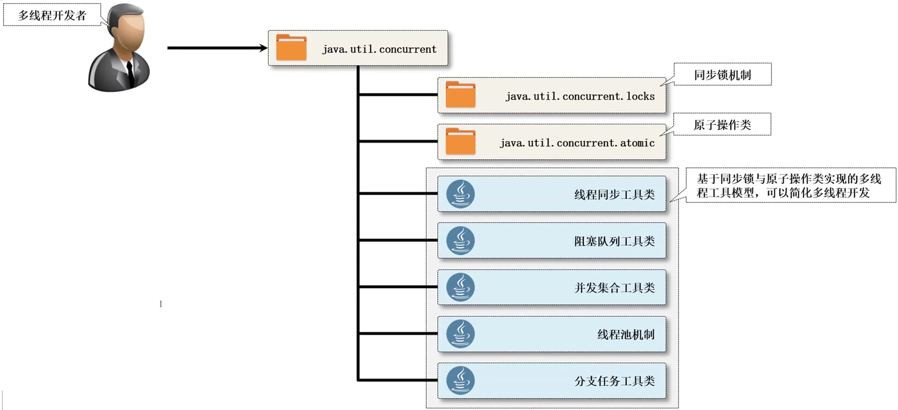

> 1. CAS原理 基础篇（漫画版）https://blog.csdn.net/Abysscarry/article/details/84798224
> 2. CAS原理 进阶篇（漫画版）https://blog.csdn.net/Abysscarry/article/details/84798455

# J.U.C 并发简介

Java 并发编程（J.U.C）本质上来讲就属于多线程的一种更加设计合理的开发框架，例如：Java 类集是对数据结构的一种开发框架，JavaIO 是对操作系统底层支持的一种开发框架，所以JDK本身也是会提供有开发框架支持的。

实际上在之前已经学习过多线程的开发机制，当时为什么现在还要去整一个J.U.C（java.util.concurrent，包名称给出的三个字母的缩写），J.U.C 的提供是为了解决并发编程过程之中的性能以及稳定性的设计问题，例如：在传统的多线程开发里面你一定可以想到如下的几个机制：

- 如果要想定义线程的主体操作类需要使用Runnable 或者 Callable 接口
- 如果要想进行数据的同步处理，那么就要使用 synchronized 关键字，这个关键字可以实现同步代码块的定义或者是同步方法的定义，但是性能很差
- 如果要想快速的实现变量内容的更新处理，要使用 volatiile 关键字
- 如果要想实现等待与唤醒机制，则需要通过 Object 类所提供的 wait()、notiffy()、notifyall() 方法
- 所有的操作全部都加在一起了，也无法有效的避免死锁之类的问题

所以多线程的开发是非常麻烦的，而且也是非常繁琐的，更是很多初学者的噩梦，如果个人没有深入的去研究过 Java，那么你可能都没有写过具体的多线程应用。

```
在现在的4G网络还没发展起来的时候，那段时间之内对于多线程基本上都属于概念上的认知，很少会有人从事专门的多线程的开发，那么也就没有太多的人去关注J.U.C（JDK1.5 的时候出现的），但是这几年技术发展动不动就搞一个高并发访问，这个时候多线程的技术又开始被人所关注，出现在面试过程之中更多。
```

J.U.C 属于一个重度多线程的编程的开发框架，在 J.U.C 里面提供了一套新的多线程处理方案，并且这些方案都有其核心实现的理论，本质上就是：CAS、AQS。而这些在最终编程的时候你是无法感觉到 synchronized 存在的。


> JDK17文档路径：https://docs.oracle.com/en/java/javase/17/docs/api/java.base/module-summary.html



1. 工具类：java.util.concurrent，是直接可以供开发者使用的程序类，用这些类就可以直接实现多线程处理
2. 锁机制：java.util.concurrent.locks，多线程的开发之中牵扯到资源的部分都是存在于锁的概念，而对于锁 J.U.C 给出了完整的新机制
3. 原子操作类：java.util.concurrent.atomic，直接提供了指定数据类型上的同步机制，避免了在进行数据操作时通过方法实现同步的处理了

J.U.C 是在 JDK1.5 的时候提出的开发框架，后来每一个版本的 JDK 都对 J.U.C 有过更新，那么本次学习将为大家完整的展示整个 J.U.C 开发包之中的全部类和接口的使用，包括源码的实现分析（主要是应对面试去使用的）


# TimeUnit 时间单元

> TimeUnit文档地址：https://docs.oracle.com/en/java/javase/17/docs/api/java.base/java/util/concurrent/TimeUnit.html

虽然本次以 J.U.C 为主，但是对于完整的 J.U.C 的开发里面还是存在一些处理机制，那么首先来看一下对于时间的处理问题。在早期的 Java 多线程开发分支中，可以使用的时间单元是什么呢？

首先可以想到的就是毫秒时间，毕竟 Thread.sleep() 方法之中所能接触到的就是毫秒：

```java
// 线程休眠方法:
public static void sleep(long millis) throws InterruptedException;
public static void sleep(long millis, int nanos) throws InterruptedException;
```

在 Object 之中提供的 wait() 方法里面也包含又同样的单位设置：

```java
// 线程等待方法:
public final void wait(long timeoutMillis) throws InterruptedException;
public final void wait(long timeoutMillis, int nanos) throws InterruptedException;
```

虽然在 Thread 的开发之中可以使用毫秒和纳秒进行线程单位配置，但是从实际的开发来说可能会使用到时、分、秒等概念，所以在 Java 里面为了进一步简化时间的计算管理，提供了一个专属的 TimeUnit 工具类，该类属于一个枚举类：

```java
package java.util.concurrent;
public enum TimeUnit extends Enum<TimeUnit>;
```

Java 枚举类的特殊点：除了可以定义一系列的常量之外，还可以实现接口，定义方法，或者是定义抽象方法，总之是一个很强大的多例设计模式。


在整个TimeUnit里面已经定义了而大量常用的时间单元：天（DAYS）、小时（HOURS）、分钟（MINUTES）、秒（SECONDS）、毫秒（MILLISECONDS）、纳秒（NANOSECONDS）、微妙（MICROSECONDS），除了这些时间单元之外还提供有一系列的处理方法，例如：时间转换方法.

操作示例 1：时间单元的转换

```java
import java.util.concurrent.TimeUnit;
public class JavaAPIDemo {
    public static void main(String[] args) {
        long hour = 1;
        // 由小时转为秒钟
        long second = TimeUnit.SECONDS.convert(hour, TimeUnit.HOURS);
        System.out.println("小时转秒数：" + second);
        // 由小时转为分钟
        long minutes = TimeUnit.MINUTES.convert(hour, TimeUnit.HOURS);
        System.out.println("小时转分钟：" + minutes);
        long day = 1;
        // 由天转为秒
        long second2 = TimeUnit.SECONDS.convert(day, TimeUnit.DAYS);
        System.out.println("一天的秒数：" + second2);
    }
}

// 输出内容
小时转秒数：3600
小时转分钟：60
一天的秒数：86400
```

虽然 TimeUnit 类很好用，但是从 JDK1.8之后提供了有一个 java.time.Duration 的操作类（间隔），这个类在实际开发之中经常会被用到，例如：在后续学习到 Spring 开发框架的时候，那么一般都要进行一个任务间隔的配置。

```java
public long convert(Duration duration); // 转换方法
```

操作示例 2：时间单元的转换（使用时间间隔类 Duration）

```java
import java.util.concurrent.TimeUnit;
public class JavaAPIDemo {
    public static void main(String[] args) {
        // 2小时 + 2小时
        java.time.Duration duration = java.time.Duration.ofHours(2).plusHours(2);
        // 以上给出的是两个小时的概念,然后加上了2小时.
        System.out.println("时间间隔：" + duration);
        // 直接实现了转换
        long second = TimeUnit.SECONDS.convert(duration);
        System.out.println("间隔的秒数：" + second);
    }
}

// 输出内容
时间间隔：PT4H
间隔的秒数：14400
```

既然 TimeUnit 的时间单元的处理如此方便，那么可以考虑基于 TimeUnit 做日期时间的计算，例如：计算180天之后的具体日期，采用当前时间戳 + 时间偏移量

操作示例 3：计算 180 天之后的日期

```java
import java.text.SimpleDateFormat;
import java.util.Date;
import java.util.concurrent.TimeUnit;
public class JavaAPIDemo {
    public static void main(String[] args) {
        // 获取当前的时间戳,当前时间为：2022/03/16
        long current = System.currentTimeMillis();
        long after = current + TimeUnit.MILLISECONDS.convert(180, TimeUnit.DAYS);
        System.out.println(new SimpleDateFormat("yyyy-MM-dd").format(new Date(after)));
    }
}

// 输出内容
2022-09-12
```

在后续的项目开发过程之中，TimeUnit 类有一个休眠的处理方法是非常好用的，这个方法可以根据当前的时间单元进行休眠的配置处理。

操作示例 4：实现线程的休眠操作

```java
import java.util.concurrent.TimeUnit;
public class JavaAPIDemo {
    public static void main(String[] args) {
        for (int x = 0; x < 100; x++) {
            try {
                // 根据秒来休眠
                TimeUnit.SECONDS.sleep(2);
            } catch (InterruptedException e) {
                e.printStackTrace();
            }
            System.out.println(x);
        }
    }
}

// 输出内容
0
1
2
```

在未来进行多线程的开发之中只要牵扯到时间单元的操作问题的话，统一都建议使用 TimeUnit 类进行定义处理，这一点不仅仅是要求，同时也是在 J.U.C 里面见到最多的参数的形式


# ThreadFactory

> https://docs.oracle.com/en/java/javase/17/docs/api/java.base/java/util/concurrent/ThreadFactory.html

在传统的项目开发之中，只要使用了 Thread 类就可以直接进行线程的创建，而这种创建形式基本如下：

操作示例 1：创建线程

```java
public class JavaAPIDemo {
    public static void main(String[] args) {
        for (int i = 0; i < 10; i++) {
            new Thread(() -> {
                System.out.println("线程名称：" + Thread.currentThread().getName());
            }).start();
        }
    }
}

// 输出内容
线程名称：Thread-5
线程名称：Thread-7
线程名称：Thread-1
....
```

既然现在要学习的是一个面向对象的编程语言，那么就需要进行不断的解耦和设计考虑，毕竟以上的代码时直接通过了关键字  new 进行线程对象的构建，按照面向对象的设计原则来讲此时的代码就不符合标准了，所以在 J.U.C 里面改进了对于线程对象的获取机制，提供了一个工厂类的标准接口。

```java
package java.util.concurrent;
public interface ThreadFactory {
    Thread newThread(Runnable r);
}
```

那么下面就直接自己手工实现以下这种线程的工厂类。

操作示例 2：自定义线程工厂类

```java
import java.util.concurrent.ThreadFactory;
/**
 * 创建线程工厂类
 */
class SimpleThreadFactory implements ThreadFactory {
    private static final ThreadFactory INSTANCE = new SimpleThreadFactory();
    // 定义线程名称的开头
    private static final String TITLE = "custom-";
    // 线程的自动计数处理
    private static int count = 0;
    // 工厂类在定义的时候一定不需要实例化对象
    private SimpleThreadFactory() {}
    // 单例返回工厂实例
    public static ThreadFactory getInstance() {
        return INSTANCE;
    }
    // 此时的操作如果有需要可以进一步改进，例如：通过反射
    @Override
    public Thread newThread(Runnable r) {
        // 实例化Thread类对象
        return new Thread(r, TITLE + count++);
    }
}

public class JavaAPIDemo {
    public static void main(String[] args) {
        for (int x = 0; x < 10; x++) {
            Thread thread = SimpleThreadFactory.getInstance().newThread(() -> {
                System.out.println("多线程执行：" + Thread.currentThread().getName());
            });
            thread.start();
        }
    }
}

// 输出内容
多线程执行：custom-6
多线程执行：custom-9
多线程执行：custom-3
...
```

此时所给出的多线程的创建，可以直接利用自定义的名称进行命名的开头配置，整个的线程对象的获取机制更加的规范了，当然了，如果要想进一步的规范，肯定要使用到反射机制。

操作示例 3：使用反射机制进行线程的创建

```java
import java.lang.reflect.Constructor;
import java.util.concurrent.ThreadFactory;
/**
 * 创建线程工厂类
 */
class SimpleThreadFactory implements ThreadFactory {
    private static final ThreadFactory INSTANCE = new SimpleThreadFactory();
    // 定义线程名称的开头
    private static final String TITLE = "custom-";
    // 线程的自动计数处理
    private static int count = 0;
    // 工厂类在定义的时候一定不需要实例化对象
    private SimpleThreadFactory() {}
    // 单例返回工厂实例
    public static ThreadFactory getInstance() {
        return INSTANCE;
    }
    // 此时的操作如果有需要可以进一步改进，例如：通过反射
    @Override
    public Thread newThread(Runnable r) {
        try {
            Class<?> clazz = Class.forName("java.lang.Thread");
            Constructor<?> constructor = clazz.getConstructor(Runnable.class, String.class);
            return (Thread) constructor.newInstance(r, TITLE + count++); // 实例化Thread类对象
        } catch (Exception e){
            return null;
        }
    }
}

public class JavaAPIDemo {
    public static void main(String[] args) {
        for (int x = 0; x < 10; x++) {
            Thread thread = SimpleThreadFactory.getInstance().newThread(() -> {
                System.out.println("多线程执行：" + Thread.currentThread().getName());
            });
            thread.start();
        }
    }
}

// 输出内容
多线程执行：custom-5
多线程执行：custom-6
多线程执行：custom-2
...
```

只要是在后续的开发之中见到 ThreadFactory，想都不要想，直接表示的就是进行子线程的创建，这点在后续分析 Java 线程池机制的时候非常有用处。


# 原子操作类简介

下面利用多线程实现一个银行存款的操作机制，这个操作机制可以通过多个线程向同一个银行账户进行存款业务办理。按照传统的实际结构来讲，此时的代码定义如下。

操作示例 1：不适用同步处理存款

```java
import java.util.concurrent.TimeUnit;
public class JavaAPIDemo {
    // 模拟银行存款
    public static int money = 0;
    public static void main(String[] args) throws InterruptedException {
        // 要存款的总额
        int [] data = new int[] {100, 200, 300};
        // 进行存款线程的配置
        for (int x = 0; x < data.length; x ++) {
            // 为内部类使用
            final int temp = x;
            new Thread(()->{
                // 模拟存款
                money += data[temp];
            }).start();
        }
        TimeUnit.SECONDS.sleep(2); // 等待2秒的时间
        System.out.println("【计算完成】最终的存款总额：" + money);
    }
}

// 输出内容
【计算完成】最终的存款总额：600
```

此时的程序通过多次执行结果的验证可以发现，一切都是“正确”的，那么下面为了可以让问题露出水面，采用一个延迟的机制来进行存款的业务办理时间模拟。

操作示例 2：通过延迟来进行存款业务办理时间的模拟

```java
import java.util.concurrent.TimeUnit;
public class JavaAPIDemo {
    // 模拟银行存款
    public static int money = 0;
    public static void main(String[] args) throws InterruptedException {
        // 要存款的总额
        int [] data = new int[] {100, 200, 300};
        // 进行存款线程的配置
        for (int x = 0; x < data.length; x ++) {
            // 为内部类使用
            final int temp = x;
            new Thread(()->{
                try {
                    // 100毫秒延迟
                    TimeUnit.MILLISECONDS.sleep(100);
                } catch (InterruptedException e) {
                    e.printStackTrace();
                }
                // 模拟存款
                money += data[temp];
            }).start();
        }
        TimeUnit.SECONDS.sleep(2); // 等待2秒的时间
        System.out.println("【计算完成】最终的存款总额：" + money);
    }
}

// 输出内容
【计算完成】最终的存款总额：200
```

此时的操作出现了一个不同步的设计问题，那么请问，这个时候按照最为传统的思路要想解决，就必须使用同步方法来进行包装处理类。

操作示例 3：使用同步方法解决当前的问题

```java
import java.util.concurrent.TimeUnit;
public class JavaAPIDemo {
    // 模拟银行存款
    public static int money = 0;
    public static void main(String[] args) throws InterruptedException {
        // 要存款的总额
        int [] data = new int[] {100, 200, 300};
        // 进行存款线程的配置
        for (int x = 0; x < data.length; x ++) {
            // 为内部类使用
            final int temp = x;
            new Thread(()->{
                try {
                    // 100毫秒延迟
                    TimeUnit.MILLISECONDS.sleep(100);
                } catch (InterruptedException e) {
                    e.printStackTrace();
                }
                save(data[temp]); // 模拟存款
            }).start();
        }
        TimeUnit.SECONDS.sleep(2); // 等待2秒的时间
        System.out.println("【计算完成】最终的存款总额：" + money);
    }
    public static synchronized void save(int m) {
        // 模拟存款
        money += m;
    }
}

// 输出内容
【计算完成】最终的存款总额：600
```

难道现在连做一个普通的数据的计算都要考虑到这种同步的处理机制吗？实在太繁琐了，所以为了解决这样的设计问题，提供有了 J.U.C 的原子操作类，那么下面首先使用一个原子的整型操作类进行配置。

操作示例 4：使用原子类实现同步

```java
import java.util.concurrent.TimeUnit;
import java.util.concurrent.atomic.AtomicInteger;

public class JavaAPIDemo {
    // 模拟银行存款
    public static AtomicInteger money = new AtomicInteger(0);
    public static void main(String[] args) throws InterruptedException {
        // 要存款的总额
        int [] data = new int[] {100, 200, 300};
        // 进行存款线程的配置
        for (int x = 0; x < data.length; x ++) {
            // 为内部类使用
            final int temp = x;
            new Thread(()->{
                try {
                    // 100毫秒延迟
                    TimeUnit.MILLISECONDS.sleep(100);
                } catch (InterruptedException e) {
                    e.printStackTrace();
                }
                // 模拟存款，原子类自带同步光环
                money.addAndGet(data[temp]);
            }).start();
        }
        TimeUnit.SECONDS.sleep(2); // 等待2秒的时间
        System.out.println("【计算完成】最终的存款总额：" + money);
    }
}

// 输出内容
【计算完成】最终的存款总额：600
```

以上的代码利用原子类解决了 synchronized 同步的设计问题，但是这个原子类并没有使用传统的同步机制，来观察一下它的源代码实现。

```java
package java.util.concurrent.atomic;
import java.lang.invoke.VarHandle;
import java.util.function.IntBinaryOperator;
import java.util.function.IntUnaryOperator;
public class AtomicInteger extends Number implements java.io.Serializable {
    private static final long serialVersionUID = 6214790243416807050L;
    private static final jdk.internal.misc.Unsafe U = jdk.internal.misc.Unsafe.getUnsafe();
    private static final long VALUE = U.objectFieldOffset(AtomicInteger.class, "value");
    private volatile int value;
    public AtomicInteger(int initialValue) {
        value = initialValue;
    }
    public final int addAndGet(int delta) {
        return U.getAndAddInt(this, VALUE, delta) + delta;
    }
}
```

原子操作类并没有使用到传统的同步机制，而是通过一种 CAS 的机制来完成的，那么 CAS 是什么？后面会进行详细的描述，整个的原子类都采用了类似的实现机制。

由于在实际的项目开发中会牵扯到多种多种数据类型的使用，所以在 java.util.concurrent.atomic 包中提供了多种原子性的操作类支持，这些操作类可以分为四类：

- 基本类型：AtomicInteger、AtomicLong、AtomicBoolean
- 数组类型：AtomicIntegerArray、AtomicLongArray、AtomicReferenceArray
- 引用类型：AtomicReference、AtomicStampedReference、AtomicMarkableReference
- 对象的数据修改类型：AtomicIntegerFieldUpdater、AtomicLongFieldUpdater、AtomicReferenceFieldUpdater
- 原子累加器（JDK1.8）：DoubleAccumulator、DoubleAdder、LongAccumulator、LongAdder


**原则：所有的原子类都具有同步的支持，但是考虑到性能问题，没有使用到 synchronized 关键字来实现，依靠底层完成的**

# 基础类型的原子操作类

# 数据原子操作类

# 引用类型原子操作类

# 属性原子操作类

# 并发计算
