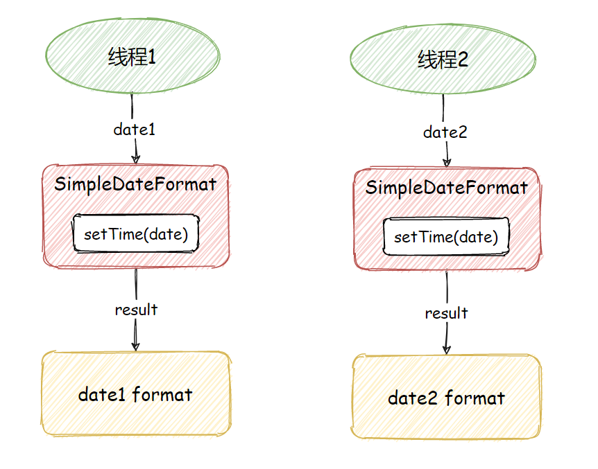
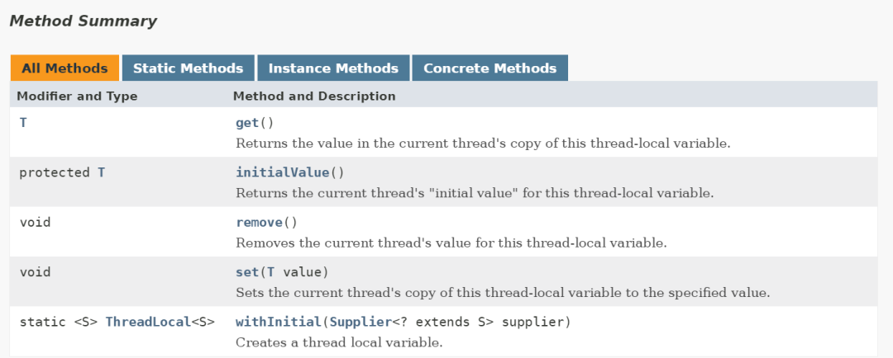
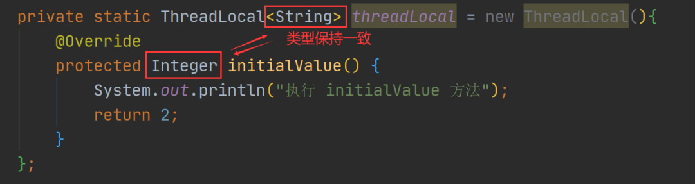
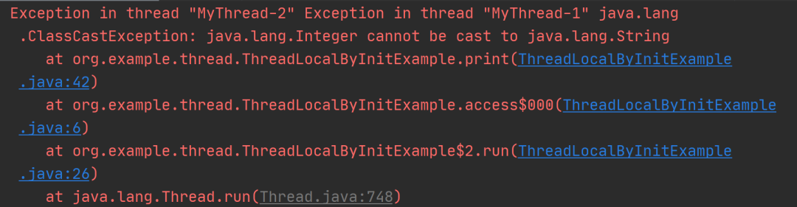

> 作者：Java 中文中文社区，来源：https://blog.csdn.net/sufu1065/article/details/116773464

在 Java 中，如果要问哪个类使用简单，但用好最不简单？我想你的脑海中一定会浮现出一次词——“ThreadLocal”。

确实如此，ThreadLocal 原本设计是为了解决并发时，线程共享变量的问题，但由于过度设计，如弱引用和哈希碰撞，从而导致它的理解难度大和使用成本高等问题。当然，如果稍有不慎还是导致脏数据、内存溢出、共享变量更新等问题，但即便如此，**ThreadLocal 依旧有适合自己的使用场景，以及无可取代的价值**，比如本文要介绍了这两种使用场景，除了 ThreadLocal 之外，还真没有合适的替代方案。

# 一、使用场景1：本地变量

我们以多线程格式化时间为例，来演示 `ThreadLocal` 的价值和作用，当我们在多个线程中格式化时间时，通常会这样操作。


## 1、2个线程格式化

当有 2 个线程进行时间格式化时，我们可以这样写：

```java
import java.text.SimpleDateFormat;
import java.util.Date;

public class Test {
    public static void main(String[] args) {
        // 创建并启动线程1
        Thread t1 = new Thread(() -> {
            // 得到时间对象
            Date date = new Date(1 * 1000);
            // 执行时间格式化
            formatAndPrint(date);
        });
        t1.start();
        // 创建并启动线程2
        Thread t2 = new Thread(() -> {
            // 得到时间对象
            Date date = new Date(2 * 1000);
            // 执行时间格式化
            formatAndPrint(date);
        });
        t2.start();
    }

    /**
     * 格式化并打印结果
     *
     * @param date 时间对象
     */
    private static void formatAndPrint(Date date) {
        // 格式化时间对象
        SimpleDateFormat simpleDateFormat = new SimpleDateFormat("mm:ss");
        // 执行格式化
        String result = simpleDateFormat.format(date);
        // 打印最终结果
        System.out.println("时间：" + result);
    }
}
```

以上程序的执行结果为：

```
时间：00:01
时间：00:02
```

上面的代码因为创建的线程数量并不多，所以我们可以给每个线程创建一个私有对象 SimpleDateFormat 来进行时间格式化。


## 2、10个线程格式化

当线程的数量从 2 个升级为 10 个时，我们可以使用 for 循环来创建多个线程执行时间格式化，具体实现代码如下：

```java
import java.text.SimpleDateFormat;
import java.util.Date;

public class Test {
    public static void main(String[] args) {
        for (int i = 0; i < 10; i++) {
            int finalI = i;
            // 创建线程
            Thread thread = new Thread(() -> {
                // 得到时间对象
                Date date = new Date(finalI * 1000);
                // 执行时间格式化
                formatAndPrint(date);
            });
            // 启动线程
            thread.start();
        }
    }

    /**
     * 格式化并打印时间
     *
     * @param date 时间对象
     */
    private static void formatAndPrint(Date date) {
        // 格式化时间对象
        SimpleDateFormat simpleDateFormat = new SimpleDateFormat("mm:ss");
        // 执行格式化
        String result = simpleDateFormat.format(date);
        // 打印最终结果
        System.out.println("时间：" + result);
    }
}
```

以上程序的执行结果为：

```
时间：00:04
时间：00:03
时间：00:06
时间：00:01
时间：00:05
时间：00:02
时间：00:09
时间：00:08
时间：00:00
时间：00:07
```

从上述结果可以看出，虽然此时创建的线程数和 SimpleDateFormat 的数量不算少，但程序还是可以正常运行的。


## 3、1000个线程格式化

然而当我们将线程的数量从 10 个变成 1000 个的时候，我们就不能单纯的使用 for 循环来创建 1000 个线程的方式来解决问题了，因为这样频繁的新建和销毁线程会造成大量的系统开销和线程过度争抢 CPU 资源的问题。

所以经过一番思考后，我们决定使用线程池来执行这 1000 次的任务，因为线程池可以复用线程资源，无需频繁的新建和销毁线程，也可以通过控制线程池中线程的数量来避免过多线程所导致的 CPU 资源过度争抢和线程频繁切换所造成的性能问题，而且我们可以将 SimpleDateFormat 提升为全局变量，从而避免每次执行都要新建 SimpleDateFormat 的问题，于是我们写下了这样的代码：

```java
import java.text.SimpleDateFormat;
import java.util.Date;
import java.util.concurrent.LinkedBlockingQueue;
import java.util.concurrent.ThreadPoolExecutor;
import java.util.concurrent.TimeUnit;

public class App {
    // 时间格式化对象
    private static final SimpleDateFormat simpleDateFormat = new SimpleDateFormat("mm:ss");

    public static void main(String[] args) {
        // 创建线程池执行任务
        ThreadPoolExecutor threadPool = new ThreadPoolExecutor(10, 10, 60, TimeUnit.SECONDS, new LinkedBlockingQueue<>(1000));
        for (int i = 0; i < 1000; i++) {
            int finalI = i;
            // 执行任务
            threadPool.execute(() -> {
                // 得到时间对象
                Date date = new Date(finalI * 1000);
                // 执行时间格式化
                formatAndPrint(date);
            });
        }
        // 线程池执行完任务之后关闭
        threadPool.shutdown();
    }

    /**
     * 格式化并打印时间
     *
     * @param date 时间对象
     */
    private static void formatAndPrint(Date date) {
        // 执行格式化
        String result = simpleDateFormat.format(date);
        // 打印最终结果
        System.out.println("时间：" + result);
    }
}
```

以上程序的执行结果为（只是抽取一段输出而已）：

```
时间：16:39
时间：16:37
时间：16:35
时间：16:29
时间：16:30
时间：16:27    ---> 重复
时间：16:27    ---> 重复
时间：16:22
时间：16:17
```

当我们怀着无比喜悦的心情去运行程序的时候，却发现意外发生了，这样写代码竟然会出现线程安全的问题。从上述结果可以看出，程序的打印结果竟然有重复内容的，正确的情况应该是没有重复的时间才对。

> PS：所谓的**线程安全问题是指：在多线程的执行中，程序的执行结果与预期结果不相符的情况**。


### 1、线程安全问题分析

为了找到问题所在，我们尝试查看 SimpleDateFormat 中 format 方法的源码来排查一下问题，format 源码如下：

```java
private StringBuffer format(Date date, StringBuffer toAppendTo,
                                FieldDelegate delegate) {
    // 注意此行代码
    calendar.setTime(date);
 
    boolean useDateFormatSymbols = useDateFormatSymbols();
 
    for (int i = 0; i < compiledPattern.length; ) {
        int tag = compiledPattern[i] >>> 8;
        int count = compiledPattern[i++] & 0xff;
        if (count == 255) {
            count = compiledPattern[i++] << 16;
            count |= compiledPattern[i++];
        }
 
        switch (tag) {
            case TAG_QUOTE_ASCII_CHAR:
                toAppendTo.append((char)count);
                break;
 
            case TAG_QUOTE_CHARS:
                toAppendTo.append(compiledPattern, i, count);
                i += count;
                break;
 
            default:
                subFormat(tag, count, delegate, toAppendTo, useDateFormatSymbols);
                break;
        }
    }
    return toAppendTo;
}
```

从上述源码可以看出，在执行 SimpleDateFormat.format 方法时，会使用 calendar.setTime 方法将输入的时间进行转换，那么我们想想一下这样的场景：

1. 线程 1 执行了 calendar.setTime(date) 方法，将用户输入的时间转换成了后面格式化时所需要的时间；

2. 线程 1 暂停执行，线程 2 得到 CPU 时间片开始执行；

3. 线程 2 执行了 calendar.setTime(date) 方法，对时间进行了修改；

4. 线程 2 暂停执行，线程 1 得出 CPU 时间片继续执行，因为线程 1 和线程 2 使用的是同一对象，而时间已经被线程 2 修改了，所以此时当线程 1 继续执行的时候就会出现线程安全的问题了。


正常的情况下，程序的执行是这样的：



非线程安全的执行流程是这样的：


### 2、解决线程安全问题：synchronized

当出现线程安全问题时，我们想到的第一解决方案就是**加锁**，具体的实现代码如下：

```java
import java.text.SimpleDateFormat;
import java.util.Date;
import java.util.concurrent.LinkedBlockingQueue;
import java.util.concurrent.ThreadPoolExecutor;
import java.util.concurrent.TimeUnit;
 
public class App {
    // 时间格式化对象
    private static SimpleDateFormat simpleDateFormat = new SimpleDateFormat("mm:ss");
 
    public static void main(String[] args) throws InterruptedException {
        // 创建线程池执行任务
        ThreadPoolExecutor threadPool = new ThreadPoolExecutor(10, 10, 60,
                TimeUnit.SECONDS, new LinkedBlockingQueue<>(1000));
        for (int i = 0; i < 1000; i++) {
            int finalI = i;
            // 执行任务
            threadPool.execute(new Runnable() {
                @Override
                public void run() {
                    // 得到时间对象
                    Date date = new Date(finalI * 1000);
                    // 执行时间格式化
                    formatAndPrint(date);
                }
            });
        }
        // 线程池执行完任务之后关闭
        threadPool.shutdown();
    }
 
    /**
     * 格式化并打印时间
     * @param date 时间对象
     */
    private static void formatAndPrint(Date date) {
        // 执行格式化
        String result = null;
        // 加锁
        synchronized (App.class) {
            result = simpleDateFormat.format(date);
        }
        // 打印最终结果
        System.out.println("时间：" + result);
    }
}
```

以上程序的执行结果为（抽取部分输出）：

```
时间：16:16
时间：16:15
时间：16:14
时间：16:10
时间：16:09
时间：16:04
时间：16:31
时间：16:23
```

从上述结果可以看出，使用了 synchronized 加锁之后程序就可以正常的执行了。

**加锁的缺点：**

加锁的方式虽然可以解决线程安全的问题，但同时也带来了新的问题，当程序加锁之后，所有的线程必须排队执行某些业务才行，这样无形中就降低了程序的运行效率了。

有没有既能解决线程安全问题，又能提高程序的执行速度的解决方案呢？

答案是：有的，这个时候 ThreadLocal就要上场了。


### 3、解决线程安全问题：ThreadLocal

#### 1、ThreadLocal 基本介绍

ThreadLocal 从字面的意思来理解是线程本地变量的意思，也就是说它是线程中的私有变量，每个线程只能使用自己的变量。

以上面线程池格式化时间为例，当线程池中有 10 个线程时，SimpleDateFormat 会存入 ThreadLocal 中，它也只会创建 10 个对象，即使要执行 1000 次时间格式化任务，依然只会新建 10 个 SimpleDateFormat 对象，每个线程调用自己的 ThreadLocal 变量。

#### 2、ThreadLocal 基础使用

ThreadLocal 常用的核心方法有三个：

1. set 方法：用于设置线程独立变量副本。没有 set 操作的 ThreadLocal 容易引起脏数据。

2. get 方法：用于获取线程独立变量副本。没有 get 操作的 ThreadLocal 对象没有意义。

3. remove 方法：用于移除线程独立变量副本。没有 remove 操作容易引起内存泄漏。


ThreadLocal 所有方法如下图所示：



官方说明文档：https://docs.oracle.com/javase/8/docs/api/

ThreadLocal 基础用法如下：

```java
public class ThreadLocalExample {
    // 创建一个 ThreadLocal 对象
    private static final ThreadLocal<String> threadLocal = new ThreadLocal<>();

    public static void main(String[] args) {
        // 线程执行任务
        Runnable runnable = () -> {
            String threadName = Thread.currentThread().getName();
            System.out.println(threadName + " 存入值：" + threadName);
            // 在 ThreadLocal 中设置值
            threadLocal.set(threadName);
            // 执行方法，打印线程中设置的值
            print(threadName);
        };
        // 创建并启动线程 1
        new Thread(runnable, "MyThread-1").start();
        // 创建并启动线程 2
        new Thread(runnable, "MyThread-2").start();
    }

    /**
     * 打印线程中的 ThreadLocal 值
     *
     * @param threadName 线程名称
     */
    private static void print(String threadName) {
        try {
            // 得到 ThreadLocal 中的值
            String result = threadLocal.get();
            // 打印结果
            System.out.println(threadName + " 取出值：" + result);
        } finally {
            // 移除 ThreadLocal 中的值（防止内存溢出）
            threadLocal.remove();
        }
    }
}
```

以上程序的执行结果为：

```
MyThread-2 存入值：MyThread-2
MyThread-1 存入值：MyThread-1
MyThread-1 取出值：MyThread-1
MyThread-2 取出值：MyThread-2
```

从上述结果可以看出，每个线程只会读取到属于自己的 ThreadLocal 值


#### 3、ThreadLocal 高级用法

##### 1、初始化：initialValue

```java
public class ThreadLocalByInitExample {
    // 定义 ThreadLocal, ThreadLocal.withInitial(() -> {}) 可以代码 new ThreadLocal() {...}
    private static final ThreadLocal<String> threadLocal = new ThreadLocal() {
        @Override
        protected String initialValue() {
            System.out.println("执行 initialValue() 方法");
            return "默认值";
        }
    };

    public static void main(String[] args) {
        // 线程执行任务
        Runnable runnable = () -> {
            // 执行方法，打印线程中数据（未设置值打印）
            print(Thread.currentThread().getName());
        };
        // 创建并启动线程 1
        new Thread(runnable, "MyThread-1").start();
        // 创建并启动线程 2
        new Thread(runnable, "MyThread-2").start();
    }

    /**
     * 打印线程中的 ThreadLocal 值
     *
     * @param threadName 线程名称
     */
    private static void print(String threadName) {
        // 得到 ThreadLocal 中的值
        String result = threadLocal.get();
        // 打印结果
        System.out.println(threadName + " 得到值：" + result);
    }
}
```

以上程序的执行结果为：

```
执行 initialValue() 方法
执行 initialValue() 方法
MyThread-2 得到值：默认值
MyThread-1 得到值：默认值
```

当使用了 #threadLocal.set 方法之后，initialValue 方法就不会被执行了，如下代码所示：

```java
public class ThreadLocalByInitExample {
    // 定义 ThreadLocal
    private static final ThreadLocal<String> threadLocal = new ThreadLocal() {
        @Override
        protected String initialValue() {
            System.out.println("执行 initialValue() 方法");
            return "默认值";
        }
    };

    public static void main(String[] args) {
        // 线程执行任务
        Runnable runnable = () -> {
            String threadName = Thread.currentThread().getName();
            System.out.println(threadName + " 存入值：" + threadName);
            // 在 ThreadLocal 中设置值
            threadLocal.set(threadName);
            // 执行方法，打印线程中设置的值
            print(threadName);
        };
        // 创建并启动线程 1
        new Thread(runnable, "MyThread-1").start();
        // 创建并启动线程 2
        new Thread(runnable, "MyThread-2").start();
    }

    /**
     * 打印线程中的 ThreadLocal 值
     *
     * @param threadName 线程名称
     */
    private static void print(String threadName) {
        try {
            // 得到 ThreadLocal 中的值
            String result = threadLocal.get();
            // 打印结果
            System.out.println(threadName + "取出值：" + result);
        } finally {
            // 移除 ThreadLocal 中的值（防止内存溢出）
            threadLocal.remove();
        }
    }
}
```

以上程序的执行结果为：

```
MyThread-2 存入值：MyThread-2
MyThread-1 存入值：MyThread-1
MyThread-2取出值：MyThread-2
MyThread-1取出值：MyThread-1
```

为什么 set 之后，初始化代码就不执行了？

要理解这个问题，需要从 ThreadLocal.get() 方法的源码中得到答案，因为初始化方法 initialValue 在 ThreadLocal 创建时并不会立即执行，而是在调用了 get 方法只会才会执行，测试代码如下：

```java
import java.util.Date;

public class ThreadLocalByInitExample {
    // 定义 ThreadLocal
    private static final ThreadLocal<String> threadLocal = new ThreadLocal() {
        @Override
        protected String initialValue() {
            System.out.println("执行 initialValue() 方法 " + new Date());
            return "默认值";
        }
    };

    public static void main(String[] args) {
        // 线程执行任务
        Runnable runnable = () -> {
            // 得到当前线程名称
            String threadName = Thread.currentThread().getName();
            // 执行方法，打印线程中设置的值
            print(threadName);
        };
        // 创建并启动线程 1
        new Thread(runnable, "MyThread-1").start();
        // 创建并启动线程 2
        new Thread(runnable, "MyThread-2").start();
    }

    /**
     * 打印线程中的 ThreadLocal 值
     *
     * @param threadName 线程名称
     */
    private static void print(String threadName) {
        System.out.println("进入 print() 方法 " + new Date());
        try {
            // 休眠 1s
            Thread.sleep(1000);
        } catch (InterruptedException e) {
            e.printStackTrace();
        }
        // 得到 ThreadLocal 中的值
        String result = threadLocal.get();
        // 打印结果
        System.out.printf("%s 取得值：%s %s%n", threadName, result, new Date());
    }
}
```

以上程序的执行结果为：

```
进入 print() 方法 Thu Nov 10 21:42:15 CST 2022
进入 print() 方法 Thu Nov 10 21:42:15 CST 2022
执行 initialValue() 方法 Thu Nov 10 21:42:16 CST 2022
执行 initialValue() 方法 Thu Nov 10 21:42:16 CST 2022
MyThread-2 取得值：默认值 Thu Nov 10 21:42:16 CST 2022
MyThread-1 取得值：默认值 Thu Nov 10 21:42:16 CST 2022
```

从上述打印的时间可以看出：initialValue 方法并不是在 ThreadLocal 创建时执行的，而是在调用 Thread.get 方法时才执行的。

接下来来看 Threadlocal.get 源码的实现：

```java
public T get() {
    // 得到当前的线程
    Thread t = Thread.currentThread();
    ThreadLocalMap map = getMap(t);
    // 判断 ThreadLocal 中是否有数据
    if (map != null) {
        ThreadLocalMap.Entry e = map.getEntry(this);
        if (e != null) {
            @SuppressWarnings("unchecked")
            T result = (T)e.value;
            // 有 set 值，直接返回数据
            return result;
        }
    }
    // 执行初始化方法【重点关注】
    return setInitialValue();
}
private T setInitialValue() {
    // 执行初始化方法【重点关注】
    T value = initialValue();
    Thread t = Thread.currentThread();
    ThreadLocalMap map = getMap(t);
    if (map != null)
        map.set(this, value);
    else
        createMap(t, value);
    return value;
}
```

从上述源码可以看出，当 ThreadLocal 中有值时会直接返回值 e.value，只有 Threadlocal 中没有任何值时才会执行初始化方法 initialValue。

注意事项—类型必须保持一致

注意在使用 initialValue 时，返回值的类型要和 ThreadLoca 定义的数据类型保持一致，如下图所示：




如果数据不一致就会造成 ClassCaseException 类型转换异常，如下图所示：




##### 2、初始化2：withInitial

```java
public class ThreadLocalByInitExample {
    // 定义 ThreadLocal
    private static final ThreadLocal<String> threadLocal = ThreadLocal.withInitial(() -> {
        System.out.println("执行 withInitial() 方法");
        return "默认值";
    });

    public static void main(String[] args) {
        // 线程执行任务
        Runnable runnable = () -> {
            String threadName = Thread.currentThread().getName();
            // 执行方法，打印线程中设置的值
            print(threadName);
        };
        // 创建并启动线程 1
        new Thread(runnable, "MyThread-1").start();
        // 创建并启动线程 2
        new Thread(runnable, "MyThread-2").start();
    }

    /**
     * 打印线程中的 ThreadLocal 值
     *
     * @param threadName 线程名称
     */
    private static void print(String threadName) {
        // 得到 ThreadLocal 中的值
        String result = threadLocal.get();
        // 打印结果
        System.out.println(threadName + " 得到值：" + result);
    }
}
```

以上程序的执行结果为：

```
执行 withInitial() 方法
执行 withInitial() 方法
MyThread-2 得到值：默认值
MyThread-1 得到值：默认值
```

通过上述的代码发现，withInitial 方法的使用好和 initialValue 好像没啥区别，那为啥还要造出两个类似的方法呢？客官莫着急，继续往下看。如下是不是非常简洁：

```java
private static final ThreadLocal<String> threadLocal = ThreadLocal.withInitial(() -> "默认值");
```


#### 4、ThreadLocal 版时间格式化

了解了 ThreadLocal 的使用之后，我们回到本文的主题，接下来我们将使用 ThreadLocal 来实现 1000 个时间的格式化，具体实现代码如下：

```java
import java.text.SimpleDateFormat;
import java.util.Date;
import java.util.concurrent.LinkedBlockingQueue;
import java.util.concurrent.ThreadPoolExecutor;
import java.util.concurrent.TimeUnit;

public class MyThreadLocalByDateFormat {
    // 创建 ThreadLocal 并设置默认值
    private static final ThreadLocal<SimpleDateFormat> dateFormatThreadLocal =
            ThreadLocal.withInitial(() -> new SimpleDateFormat("mm:ss"));

    public static void main(String[] args) {
        // 创建线程池执行任务
        ThreadPoolExecutor threadPool = new ThreadPoolExecutor(10, 10, 60,
                TimeUnit.SECONDS, new LinkedBlockingQueue<>(1000));
        // 执行任务
        for (int i = 0; i < 1000; i++) {
            int finalI = i;
            // 执行任务
            threadPool.execute(() -> {
                // 得到时间对象
                Date date = new Date(finalI * 1000);
                // 执行时间格式化
                formatAndPrint(date);
            });
        }
        // 线程池执行完任务之后关闭
        threadPool.shutdown();
        // 线程池执行完任务之后关闭
        threadPool.shutdown();
    }

    /**
     * 格式化并打印时间
     *
     * @param date 时间对象
     */
    private static void formatAndPrint(Date date) {
        // 执行格式化
        String result = dateFormatThreadLocal.get().format(date);
        // 打印最终结果
        System.out.println("时间：" + result);
    }
}
```

以上程序的执行结果为（抽取一部分输出）：

```
时间：16:25
时间：16:24
时间：16:22
时间：16:20
时间：16:12
时间：16:09
时间：16:35
时间：16:34
```

从上述结果可以看出，使用 ThreadLocal 也可以解决线程并发问题，并且避免了代码加锁排队执行的问题。


# 二、使用场景2：跨类传递数据

除了上面的使用场景之外，我们还可以使用 ThreadLocal 来实现线程中跨类、跨方法的数据传递。比如登录用户的 User 对象信息，我们需要在不同的子系统中多次使用，如果使用传统的方式，我们需要使用方法传参和返回值的方式来传递 User 对象，然而这样就无形中造成了类和类之间，甚至是系统和系统之间的相互耦合了，所以此时我们可以使用 ThreadLocal 来实现 User 对象的传递。

确定了方案之后，接下来我们来实现具体的业务代码。我们可以先在主线程中构造并初始化一个 User 对象，并将此 User 对象存储在 ThreadLocal 中，存储完成之后，我们就可以在同一个线程的其他类中，如仓储类或订单类中直接获取并使用 User 对象了，具体实现代码如下。

主线程中的业务代码：

```java
public class ThreadLocalByUser {
    public static void main(String[] args) {
        // 初始化用户信息
        User user = new User("Java");
        // 将 User 对象存储在 ThreadLocal 中
        UserStorage.setUser(user);
        // 调用订单系统
        OrderSystem orderSystem = new OrderSystem();
        // 添加订单（方法内获取用户信息）
        orderSystem.add();
        // 调用仓储系统
        RepertorySystem repertory = new RepertorySystem();
        // 减库存（方法内获取用户信息）
        repertory.decrement();
    }
}
```

User 实体类：

```java
/**
 * 用户实体类
 */
class User {
    public User(String name) {
        this.name = name;
    }
    private String name;
    public String getName() {
        return name;
    }
    public void setName(String name) {
        this.name = name;
    }
}
```

ThreadLocal 操作类：

```java
/**
 * 用户信息存储类
 */
class UserStorage {
    // 用户信息
    public static ThreadLocal<User> USER = new ThreadLocal();

    /**
     * 存储用户信息
     * @param user 用户数据
     */
    public static void setUser(User user) {
        USER.set(user);
    }
}
```

订单类：

```java
/**
 * 订单类
 */
class OrderSystem {
    /**
     * 订单添加方法
     */
    public void add() {
        // 得到用户信息
        User user = UserStorage.USER.get();
        // 业务处理代码（忽略）...
        System.out.println(String.format("订单系统收到用户：%s 的请求。",  user.getName()));
    }
}
```

仓储类：

```java
/**
 * 仓储类
 */
class RepertorySystem {
    /**
     * 减库存方法
     */
    public void decrement() {
        // 得到用户信息
        User user = UserStorage.USER.get();
        // 业务处理代码（忽略）...
        System.out.println(String.format("仓储系统收到用户：%s 的请求。", user.getName()));
    }
}
```

以上程序的最终执行结果：

```java
订单系统收到用户：Java 的请求。
仓储系统收到用户：Java 的请求。
```

从上述结果可以看出，当我们在主线程中先初始化了 User 对象之后，订单类和仓储类无需进行任何的参数传递也可以正常获得 User 对象了，从而**实现了一个线程中，跨类和跨方法的数据传递**。


# 三、参考 & 鸣谢 & 总结

1、总结：

使用 ThreadLocal 可以创建线程私有变量，所以不会导致线程安全问题，同时使用 `ThreadLocal` 还可以避免因为引入锁而造成线程排队执行所带来的性能消耗；再者使用 `ThreadLocal` 还可以实现一个线程内跨类、跨方法的数据传递。

2、参考

- 作者：Java 中文中文社区
- 《码出高效：Java开发手册》
- 《Java 并发编程 78 讲》