> 常用类库方法解析：https://blog.csdn.net/goodbye_youth/category_9124345.html

# 基础的类库

## 1、StringBuffer【类】

使用StringBuffer创建可修改的“字符串”。String类时在所有项目开发之中一定会使用的功能类，并且这个类拥有如下的特点：

1. 每一个字符串的常量都属于String类的匿名对象，并且不可更改
2. String有两个常量池，静态常量池、运行时常量池
3. String类对象实例化建议使用直接赋值的形式完成，这样可以直接将对象保存在对象池之中以方便下次重用

虽然String类很好使用，但是如果认真去思考也会发现其最大的弊端：内容不允许修改。虽然大部分情况下不会涉及到字符串内容的频繁修改，但是依然可能会存在有这样的情况，所以为了解决此问题，专门提供有一个StringBuffer类可以实现字符串内容的修改处理。

StringBuffer并不像String类那样拥有两种对象实例化方式，StringBuffer必须像普通类对象那样首先进行对象实例化，而后才可以调用方法执行处理，而这个时候可以考虑使用StringBuffer类中的如下方法：

| 方法名                                                | 类型 | 描述                                   |
| ----------------------------------------------------- | ---- | -------------------------------------- |
| public StringBuffer()                                 | 构造 | 创建一个空StringBuffer对象             |
| public StringBuffer(String str)                       | 构造 | 接收初始化字符串内容的StringBuffer对象 |
| public StringBuffer append(数据类型 变量)             | 普通 | 数据追加，相当于字符串中的“+”操作      |
| public StringBuffer insert(int offset, 数据类型 变量) | 普通 | 在指定索引位置处插入数据               |
| public StringBuffer delete(int start, int end)        | 普通 | 删除指定索引范围内的数据               |
| public StringBuffer reverse()                         | 普通 | 内容反转                               |

【操作示例 1】观察String和StringBuffer对比，String类对象引用传递

```java
public class JavaAPIDemo {
    public static void main(String[] args) {
        String str = "Hello ";
        change(str);
        System.out.println(str); // hello
    }

    public static void change(String temp) {
        // 内容并没有发生改变
        temp += "World !";
    }
}

// 输出内容
Hello
```

【操作示例 2】观察String和StringBuffer对比，StringBuffer类对象引用传递

```java
public class JavaAPIDemo {
    public static void main(String[] args) {
        StringBuffer buf = new StringBuffer("Hello ");
        change(buf);
        System.out.println(buf.toString()); // Hello World !
    }

    public static void change(StringBuffer temp) {
        // 内容并没有发生改变
        temp.append("World !");
    }
}

// 输出内容
Hello World !
```

实际上大部分的情况下，很少会出现有字符串内容的改变，这种改变指的并不是针对于静态常量池的改变。

【操作示例 3】分析已有问题，观察静态常量池

```java
public class JavaAPIDemo {
    public static void main(String[] args) {
        String strA = "www.xxxx.cn";
        String strB = "www." + "xxxx" + ".cn";
        System.out.println(strA == strB); // true
    }
}
// 输出内容
true
```

这时的strB对象的内容并不是改变，从更加严格的意义上说，对于现在的strB当程序编译后会变成如下的形式：

```java
public class JavaAPIDemo {
    public static void main(String[] args) {
        // String strB = "www." + "xxxx" + ".cn"; 等同于
        StringBuffer strB=new StringBuffer();
        strB.append("www.").append("xxxx").append(".cn");
    }
}
```

所有的 “+” 在编译后都变为了StringBuffer中的append()方法，并且在程序之中StringBuffer和String类对象之间本来就可以直接互相转换：

1. String类对象变为StringBuffer可以依靠StringBuffer类的构造方法或者使用append()方法
2. 所有的类对象都可以通过toString()方法将其变为String类型

在StringBuffer类中除了可以支持有字符串内容的修改之外，实际上还提供了一些String类不具备的方法：

【操作示例 4】插入数据

```java
public class JavaAPIDemo {
    public static void main(String[] args) {
        StringBuffer buf = new StringBuffer() ;
        buf.append(".cn").insert(0, "www.").insert(4, "xxxx") ;
        System.out.println(buf); // www.xxxx.cn
    }
}
```

【操作示例 5】删除指定范围的数据

```java
public class JavaAPIDemo {
    public static void main(String[] args) {
        StringBuffer buf = new StringBuffer() ;
        buf.append("Hello World !").delete(6, 12).insert(6, "XXXX") ;
        System.out.println(buf);  // Hello XXXX!
    }
}
```

【操作示例 6】字符串内容反转

```java
public class JavaAPIDemo {
    public static void main(String[] args) {
        StringBuffer buf = new StringBuffer() ;
        buf.append("Hello World !") ;
        System.out.println(buf.reverse());  // ! dlroW olleH
    }
}
```

实际上与StringBuffer类还有一个类似的功能类：StringBuilder类，这个类是在JDK1.5的时候提供的，该类中提供的方法与StringBuffer功能相同，最大区别在于StringBuffer类中的方法属于线程安全的，全部使用了synchronized关键字进行标注，而StringBuilder类属于非线程安全的，

**面试题：请解释 String、StringBuffer、StringBuilder 的区别？**

1. String类是字符串的首选类型，其最大的特点是内容不允许修改
2. StringBuffer 与 StringBuilder 类的内容允许修改
3. StringBuffer是在JDK1.0的时候提供的，属于线程安全的操作，而StringBuilder是在JDK1.5之后提供的，属于非线程安全的操作


## 2、CharSequence【接口】

使用CharSequenc进行统一操作，初步了解字符串相关方法及其作用，并对字符串的相关操作有更深的理解。

CharSequence是从JDK1.4开始提供的一个描述字符串结构的接口，常见子类有String、StringBuffer、StringBuilder：

```java
public final class String extends Object implements Serializable, Comparable<String>,CharSequence {}
public final class StringBuffer extends Object implements Serializable, CharSequence {}
public final class extends Object implements Serializable, CharSequence {}
```

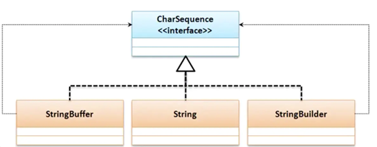

CharSequence 本身是一个接口，在该接口之中也定义有如下操作方法：

| 方法名                                              | 类型 | 描述             |
| --------------------------------------------------- | ---- | ---------------- |
| public char charAt(int index)                       | 普通 | 获取指定索引字符 |
| public int length()                                 | 普通 | 获取字符串的长度 |
| public CharSequence subSequence(int start, int end) | 普通 | 截取部分字符串   |

【操作示例 1】现在只要有字符串就可以为CharSequence接口实例化。

```java
public class JavaAPIDemo {
    public static void main(String[] args) {
        CharSequence str = "www.xxxx.cn" ;	// 子类实例向父接口转型
    }
}
```

【操作示例 2】字符串截取

```java
public class JavaAPIDemo {
    public static void main(String[] args) {
        CharSequence str = "www.xxxx.cn" ;	// 子类实例向父接口转型
        CharSequence sub = str.subSequence(4, 8) ;
        System.out.println(sub); // xxxx
    }
}
```

以后只要看到 CharSequence 描述的就是一个字符串。

PS：开发中优先考虑String类，StringBuffer类和StringBuild类主要用于频繁修改字符串的操作上，但是在任何开发之中，面对字符串的操作，大部分情况下都优先考虑String，只有频繁修改这一操作才会考虑StringBuffer和StringBuild。


## 3、AutoCloseable【接口】

AutoCloseable主要是用于日后进行资源开发的处理上，以实现资源的自动关闭（释放资源），例如：在以后进行文件、网络以及数据库开发的过程中，由于服务器的资源有限，所以使用之后一定要关闭资源，这样才可以被更多的使用者所使用。

下面为了更好的说明资源的问题，将通过一个消息的发送处理来完成。操作示例 1：手工实现资源处理

```java
interface IMessage {
    // 消息发送
    public void send();
}

/**
 * 实现消息的处理机制
 */
class NetMessage implements IMessage {
    private String msg;
    public NetMessage(String msg) {
        this.msg = msg;
    }

    // 获取资源连接
    public boolean open() {
        System.out.println("【OPEN】获取消息发送连接资源。");
        return true;
    }

    @Override
    public void send() {
        if (this.open()) {
            System.out.println("【*** 发送消息 ***】" + this.msg);
        }
    }

    public void close() {
        System.out.println("【CLOSE】关闭消息发送通道。");
    }
}

public class JavaAPIDemo {
    public static void main(String[] args) {
        // 定义要发送的处理
        NetMessage nm = new NetMessage("www.xxxx.cn");
        // 消息发送
        nm.send();
        // 关闭连接
        nm.close();
    }
}

// 输出内容
【OPEN】获取消息发送连接资源。
【*** 发送消息 ***】www.xxxx.cn
【CLOSE】关闭消息发送通道。
```

此时有人说，既然所有的资源完成处理后都必须进行关闭操作，那么能否实现一种自动关闭呢？在这样的要求下，由此推出了AutoCloseable访问接口，这个接口是在JDK1.7的时候提供的，并且该接口只提供有一个方法：

| 方法名                                | 类型 | 描述     |
| ------------------------------------- | ---- | -------- |
| public void close() throws Exception; | 普通 | 关闭方法 |

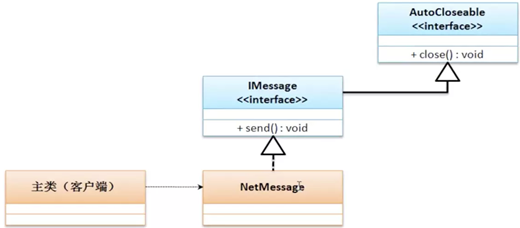

要想实现自动关闭处理，除了要使用AutoCloseable外，还需要结合异常处理语句才可以正常调用。

【操作示例 1】实现自动关闭处理

```java
interface IMessage extends AutoCloseable {
    // 消息发送
    public void send();
}

/**
 * 实现消息的处理机制
 */
class NetMessage implements IMessage {
    private String msg ;
    public NetMessage(String msg) {
        this.msg = msg ;
    }
    // 获取资源连接
    public boolean open() {
        System.out.println("【OPEN】获取消息发送连接资源。");
        return true ;
    }
    @Override
    public void send() {
        if (this.open()) {
            System.out.println("【*** 发送消息 ***】" + this.msg);
        }
    }
    @Override
    public void close() {
        System.out.println("【CLOSE】关闭消息发送通道。");
    }
}

public class JavaAPIDemo {
    public static void main(String[] args) throws Exception {
        try (IMessage nm = new NetMessage("www.xxxx.cn")) {
            nm.send();
        }
    }
}

// 输出内容
【OPEN】获取消息发送连接资源。
【*** 发送消息 ***】www.xxxx.cn
【CLOSE】关闭消息发送通道。
```

在以后的章节之中会接触到资源的关闭问题，往往都会见到AutoCloseable接口的使用。


## 4、Runtime【类】

Runtime类是唯一一个与JVM运行状态有关的类，它可以支持开发者完成对程序运行时内存的诸如查看最大空间、获取可用/空闲内存空间、手动GC等一系列操作。

Runtime描述的是运行时的状态，也就是说在整个JVM中，Runtime类是唯一一个与JVM运行状态有关的类，并且都会默认提供有一个该类的实例化对象。

由于在每一个JVM进程里面只允许提供有一个Runtime类的对象，所以这个类的构造方法被默认私有化了，那么就证明该类使用的是单例设计模式，并且单例设计模式一定会提供一个static方法获取本类实例。

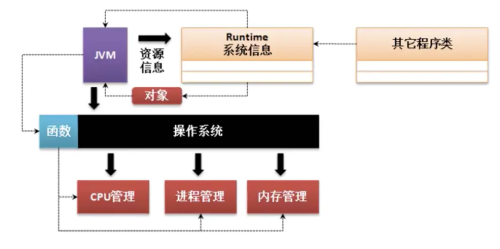

由于Runtime类属于单例设计模式，如果想要获取实例化对象，那么就可以依靠类中的getRuntime()方法完成：

| 方法名                              | 类型 | 描述                                                   |
| ----------------------------------- | ---- | ------------------------------------------------------ |
| public static Runtime getRuntime()  | 普通 | 获取实例化对象                                         |
| public int availableProcessors()    | 普通 | 获得本机可用CPU内核数                                  |
| public long maxMemory()             | 普通 | 获取最大可用内存空间：默认的配置为本机系统内存的4分之1 |
| public long totalMemory()           | 普通 | 获取可用内存空间，默认的配置问本机系统内存的64分支1    |
| public long freeMemory()            | 普通 | 获取空闲内存空间                                       |
| public void gc()                    | 普通 | 手工进行GC处理                                         |
| public Process exec(String command) | 普通 | 执行进程命令                                           |

【操作示例 1】获得Runtime类对象，并获取处理器数据（CPU内核数）

```java
public class JavaAPIDemo {
    public static void main(String[] args) {
        // 获取实例化对象
        Runtime run = Runtime.getRuntime();
        // 获取处理器数据（CPU内核数）
        System.out.println(run.availableProcessors());
    }
}

// 输出内容
8
```

【操作示例 2】观察内存状态

```java
public class JavaAPIDemo {
    public static void main(String[] args) throws Exception {
        // 获取实例化对象
        Runtime run = Runtime.getRuntime();
        System.out.println("【1】MAX_MEMORY：" + run.maxMemory());
        System.out.println("【1】TOTAL_MEMORY：" + run.totalMemory());
        System.out.println("【1】FREE_MEMORY：" + run.freeMemory());
        String str = "";
        for (int x = 0; x < 30000; x++) {
            // 产生大量的垃圾空间
            str += x;
        }
        System.out.println("【2】MAX_MEMORY：" + run.maxMemory());
        System.out.println("【2】TOTAL_MEMORY：" + run.totalMemory());
        System.out.println("【2】FREE_MEMORY：" + run.freeMemory());
        run.gc();
        System.out.println("【3】MAX_MEMORY：" + run.maxMemory());
        System.out.println("【3】TOTAL_MEMORY：" + run.totalMemory());
        System.out.println("【3】FREE_MEMORY：" + run.freeMemory());
    }
}

// 输出内容
【1】MAX_MEMORY：4263510016
【1】TOTAL_MEMORY：268435456
【1】FREE_MEMORY：264784312
【2】MAX_MEMORY：4263510016
【2】TOTAL_MEMORY：419430400
【2】FREE_MEMORY：269720952
【3】MAX_MEMORY：4263510016（TOTAL - FREE = 使用的内存空间）
【3】TOTAL_MEMORY：14680064（JDK1.9后执行GC时，Total会因为伸缩区变更而改变）
【3】FREE_MEMORY：13084248（释放了部分内存空间）
```

本程序通过空闲内存的对比实现演示了垃圾产生前后的内存空间大小及GC之后的空间内存大小。

---

**面试题：请问什么是GC？如何处理？**

- GC（Garbage Collector）垃圾收集器，是可以由系统自动调用的垃圾释放功能，或者使用Runtime类中的gc()手工调用。


## 5、System【类】

通过本节内容，你将了解到贯穿整个程序的System类及其提供的几个实用方法，了解到与AutoCloseable有相同功能的Cleaner类。

System类是一直陪伴着我们学习的程序类，之前使用的系统输出采用的就是System类中的方法，而后在System类里面也定义有一些其他的处理方法：

| 方法名                                                       | 描述                   |
| ------------------------------------------------------------ | ---------------------- |
| public static void arraycopy(Object src, int srcPos, Object dest, int destPos, int length) | 数组拷贝               |
| public static long currentTimeMillis()                       | 获取当前的日期时间数值 |
| public static void gc()                                      | 进行垃圾回收           |
| public static Properties getProperties()                     | 确定当前的系统属性     |

数组拷贝：其中：src表示源数组，srcPos表示源数组要复制的起始位置，desc表示目标数组，length表示要复制的长度。

确定当前的系统属性：public static Properties getProperties();，其中返回的参数解释如下：

| 名称           | 描述                              |
| -------------- | --------------------------------- |
| os.arch        | 操作系统的架构                    |
| os.version     | 操作系统的版本                    |
| file.separator | 文件分隔符（在 UNIX 系统中是“/”） |
| path.separator | 路径分隔符（在 UNIX 系统中是“:”） |
| line.separator | 行分隔符（在 UNIX 系统中是“/n”）  |
| user.name      | 用户的账户名称                    |
| user.home      | 用户的主目录                      |
| user.dir       | 用户的当前工作目录                |

```java
System.out.println(System.getProperties().getProperty("os.arch"));
```

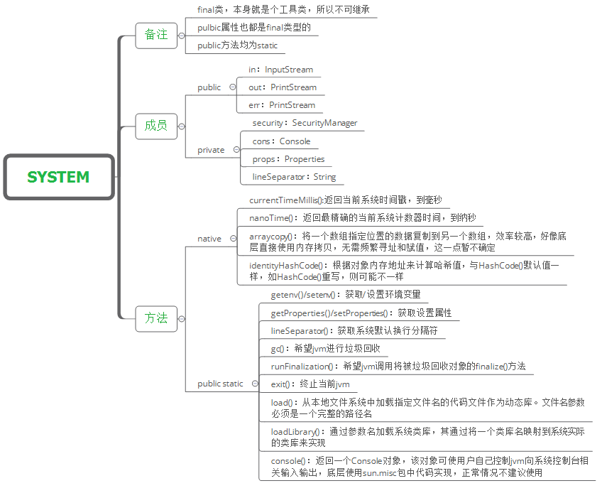

【操作示例 1】操作耗时的统计

```java
public class JavaAPIDemo {
    public static void main(String[] args) {
        long start = System.currentTimeMillis();
        String str = "";
        for (int x = 0; x < 30000; x++) {
            // 产生大量的垃圾空间
            str += x;
        }
        long end = System.currentTimeMillis();
        System.out.println("操作耗时：" + (end - start));
    }
}

// 输出内容
操作耗时：364
```

【操作示例 2】数组拷贝

```java
public class JavaAPIDemo {
    public static void main(String[] args) throws Exception {
        String[] arr1 = {"a1", "a2", "a3", "a4", "a5"};
        String[] arr2 = {"b1", "b2", "b3", "b4", "b5"};
        System.arraycopy(arr1, 1, arr2, 1, 3);
        for (String s : arr2) {
            System.out.println(s);
        }
        System.out.println("=======================");
        String[] arr3 = {"a1", "a2", "a3", "a4", "a5"};
        String[] arr4 = new String[5];
        System.arraycopy(arr3, 1, arr4, 1, 3);
        for (String s : arr4) {
            System.out.println(s);
        }
    }
}

// 输出内容
b1
a2
a3
a4
b5
=======================
null
a2
a3
a4
null
```

【操作示例 3】获取当前系统属性

```java
public class JavaAPIDemo {
    public static void main(String[] args) throws Exception {
        // 获的当前系统指定属性
        System.out.println(System.getProperties().getProperty("os.arch"));
        // 获的当前系统所有属性
        System.out.println(System.getProperties());
    }
}

// 输出内容
amd64
{sun.desktop=windows, awt.toolkit=sun.awt.windows.WToolkit, java.specification.version=10, file.encoding.pkg=sun.io, sun.cpu.isalist=amd64, sun.jnu.encoding=GBK, java.class.path=D:\Code\IDEA_WS\Study_JavaSE\Java-IO\target\classes, java.vm.vendor="Oracle Corporation", sun.arch.data.model=64, user.variant=, java.vendor.url=http://java.oracle.com/, user.timezone=, os.name=Windows 10, java.vm.specification.version=10, sun.java.launcher=SUN_STANDARD, user.country=CN, sun.boot.library.path=D:\Environment\java\jdk-10.0.2\bin, sun.java.command=JavaAPIDemo, jdk.debug=release, sun.cpu.endian=little, user.home=C:\Users\lenovo, user.language=zh, java.specification.vendor=Oracle Corporation, java.version.date=2018-07-17, java.home=D:\Environment\java\jdk-10.0.2, file.separator=\, java.vm.compressedOopsMode=Zero based, line.separator=
, java.specification.name=Java Platform API Specification, java.vm.specification.vendor=Oracle Corporation, java.awt.graphicsenv=sun.awt.Win32GraphicsEnvironment, user.script=, sun.management.compiler=HotSpot 64-Bit Tiered Compilers, java.runtime.version=10.0.2+13, user.name=lenovo, path.separator=;, os.version=10.0, java.runtime.name=Java(TM) SE Runtime Environment, file.encoding=UTF-8, java.vm.name=Java HotSpot(TM) 64-Bit Server VM, java.vendor.version=18.3, java.vendor.url.bug=http://bugreport.java.com/bugreport/, java.io.tmpdir=C:\Users\lenovo\AppData\Local\Temp\, java.version=10.0.2, user.dir=D:\Code\IDEA_WS\Study_JavaSE, os.arch=amd64, java.vm.specification.name=Java Virtual Machine Specification, java.awt.printerjob=sun.awt.windows.WPrinterJob, sun.os.patch.level=, java.library.path=D:\Environment\java\jdk-10.0.2\bin;C:\WINDOWS\Sun\Java\bin;C:\WINDOWS\system32;C:\WINDOWS;C:\Program Files\Common Files\Oracle\Java\javapath;C:\Program Files (x86)\Common Files\Oracle\Java\javapath;C:\WINDOWS\system32;C:\WINDOWS;C:\WINDOWS\System32\Wbem;C:\WINDOWS\System32\WindowsPowerShell\v1.0\;C:\WINDOWS\System32\OpenSSH\;D:\Environment\java\jdk1.8.0_121\bin;D:\Environment\java\jdk1.8.0_121\jre\bin;D:\Environment\tomcat\apache-tomcat-8.5.42\bin;D:\Environment\maven\apache-maven-3.5.0\bin;D:\Program Files\Git\cmd;C:\Users\lenovo\AppData\Local\Microsoft\WindowsApps;C:\Users\lenovo\AppData\Local\BypassRuntm;C:\Users\lenovo\AppData\Local\Microsoft\WindowsApps;D:\Environment\MongoDB\Server\4.4\bin;D:\Environment\erl-23.2\bin;D:\Environment\RabbitMQ Server\rabbitmq_server-3.8.14\sbin;C:\Users\lenovo\AppData\Local\Microsoft\WindowsApps;C:\Users\lenovo\AppData\Local\BypassRuntm;C:\Users\lenovo\AppData\Local\Microsoft\WindowsApps;D:\Environment\nvm-noinstall;D:\Environment\nodejs;;D:\Program Files\Microsoft VS Code\bin;., java.vendor=Oracle Corporation, java.vm.info=mixed mode, java.vm.version=10.0.2+13, sun.io.unicode.encoding=UnicodeLittle, java.class.version=54.0}
```

**PS**：在System类里面也提供有一个gc()方法。但是这个gc()方法并不是重新定义的新方法，而是继续调用Runtime类中的gc()操作（Runtime.getRuntime().gc();）


## 6、Cleaner【类】

通过本节内容，你将了解到与AutoCloseable有相同功能的Cleaner类。

Cleaner是在JDK1.9之后提供的一个对象清理操作，其主要的功能是进行finalize()方法的替代。在C++语言里面有两种特殊的函数：构造函数、析构函数（对象手工回收），在Java里面所有的垃圾空间都是通过GC自动回收的，所以很多情况下是不需要使用这类析构函数的，也正是因为如此，所以Java并没有提供这方面支持。

但是Java本身依然提供了给用户收尾的操作，每一个实例化对象在回收之前至少给它一个喘息的机会。最初实现对象收尾处理的方法是Object类中所提供的finalize()方法，这个方法的定义如下：

```java
@Deprecated(since="9")
protected void finalize() throws Throwable;
```

该替换指的是不建议继续使用这个方法了，而是说子类可以继续使用这个方法名称。 但是这个方法上最大的特点就是抛出了一个Throwable异常类型，而这个异常类型分为两个子类型：Error、Exception，平常所处理的都是Exception。

【操作示例 1】观察传统回收

```java
class Member {
    public Member() {
        System.out.println("【构造】在一个雷电交加的日子里面，林强诞生了。");
    }

    @Override
    protected void finalize() throws Throwable {
        System.out.println("【回收】最终你一定要死的");
        throw new Exception("我还要再活500年...");
    }
}

public class JavaAPIDemo {
    public static void main(String[] args) throws Exception {
        // 诞生
        Member mem = new Member();
        // 成为垃圾
        mem = null;
        System.gc();
        System.out.println("太阳照常升起，地球照样转动。");
    }
}

// 输出内容
【构造】在一个雷电交加的日子里面，林强诞生了。
太阳照常升起，地球照样转动。
【回收】最终你一定要死的
```

但是从JDK1.9开始，这一操作已经不建议使用了，而对于对象回收释放，从JDK1.9开始建议开发者使用AutoCloseable或者使用java.lang.ref.Cleaner类进行回收处理（Cleaner也支持有AutoCloseable处理）；

```java
import java.lang.ref.Cleaner;

class Member implements Runnable {
    public Member() {
        System.out.println("【构造】在一个雷电交加的日子里面，林强诞生了。");
    }
    @Override
    public void run() {
        // 执行清除的时候执行的是此操作
        System.out.println("【回收】最终你一定要死的");
    }
}

/**
 * 实现清除的处理
 */
class MemberCleaning implements AutoCloseable {
    // 创建一个清除处理
    private static final Cleaner cleaner = Cleaner.create();
    private Member member;
    private Cleaner.Cleanable cleanable;
    public MemberCleaning() {
        // 创建新对象
        this.member = new Member();
        // 注册使用的对象
        this.cleanable = this.cleaner.register(this, this.member);
    }

    @Override
    public void close() throws Exception {
        this.cleanable.clean();   //启动多线程
    }
}

public class JavaAPIDemo {
    public static void main(String[] args) throws Exception {
        try (MemberCleaning mc = new MemberCleaning()) {
            // 中间可以执行一些相关的代码
        }
    }
}

// 输出内容
【构造】在一个雷电交加的日子里面，林强诞生了。
【回收】最终你一定要死的
```

在新一代的清除回收处理的过程之中，更多的情况下考虑的是多线程的使用，即：为了防止有可能造成的延迟处理，所以许多对象回收前的处理都是单独通过一个线程完成的。


## 7、Objects【类】

java.util.Objects类是JDK1.7后出现，提供静态方法操作对象，可以实现对对象的比较、生成hash code之类的功能，很多方法里考虑了对象是null的情况，在输入的参数是null时有特定的处理方式。是一个工具类。

Objects 类及其常用方法如下：

```java
// 比较对象a和对象b，使用的是第一个参数的equals()方法，如果两个参数中有一个是null，则返回false，如果两个参数都是null，则返回true
public static boolean equals(Object a, Object b);
// 比较对象a和b是否深度相等，使用的其实是Arrays.deepEquals()方法，只有a和b对应位置的元素都相等才返回true，a好b都是null也返回true，否则返回false
public static boolean deepEquals(Object a, Object b);
// 得到一列对象的hash code，使用的其实是Arrays.hashCode(Object[])，Object[]数组元素就是hash方法传入的参数值
public static int hash(Object... values);
// 得到一个对象的hash code，如果参数为null，返回0
public static int hashCode(Object o);
// 调用对象的toString()方法，如果参数是null，返回字符串"null"
public static String toString(Object o);
// 调用对象的toString()方法，如果参数是null，返回第二个参数表示的字符串
public static String toString(Object o, String nullDefault);
// 比较对象a和对象b，如果a和b是相等的，返回0，如果不相等，调用c的compare方法。
// 注意：如果a或者b是null的情况下，调用c的compare方法时有可能报空指针异常，看c的compare方法怎么写了。
public static <T> int compare(T a, T b, Comparator<? super T> c);
// 判断一个对象是不是null，如果不是null则返回对象本身，如果是null则抛出空指针异常。
public static <T> T requireNonNull(T obj);
// 判断一个对象是不是null，如果不是null则返回对象本身，如果是null则抛出空指针异常，并把第二个参数message写在异常信息中
public static <T> T requireNonNull(T obj, String message);
// 判断obj是否为null，等于null返回true
public static boolean isNull(Object obj);
// 判断obj是否为null，不等于null返回true
public static boolean nonNull(Object obj);
// 对传进来的数据进行判断，返回第一个非空值（obj）否则返回第二个非空值（defaultObj）
public static <T> T requireNonNullElse(T obj, T defaultObj);
// 具体用法是这样，在调用时传入一个对象，和一个Supplier的实现类,
// 如果传入的对象是null则调用Supplier的get方法，非空则调用其toString方法,尖括号里的类型要与传入对象一样
public static <T> T requireNonNullElseGet(T obj, Supplier<? extends T> supplier);
// 判断一个对象是不是null，如果不是null则返回对象本身，如果是null则抛出空指针异常，利用表达式处理
public static <T> T requireNonNull(T obj, Supplier<String> messageSupplier);
// 判断传入的index是否在0到给定的数组长度的范围内（简单来说就是看给的数组下标越界了没有）如果没有超出范围则返回index的值，超出范围或给的index值小于0会显示下标越界异常
public static int checkIndex(int index, int length);
// 此方法是比较从fromIndex开始到toIndex（不包括）的范围，是否在给定数组范围内，返回值同样为fromIndex
public static int checkFromToIndex(int fromIndex, int toIndex, int length);
// 这个方法判断的时传入的fromIndex到fromIndex与size的范围（下面简称这个范围为fs，fromIndex简称为f），是否在0到给定数组长度的范围内。返回值为f，超出length的范围报错（下标越界）
public static int checkFromIndexSize(int fromIndex, int size, int length);
```

使用案例参考：https://blog.csdn.net/Cosmoshur/article/details/119180229


## 8、对象克隆方法【方法】

所谓的对象克隆指的就是对象的复制，而且属于全新的复制。即：使用已有对象内容创建一个新的对象，如果要想使用对象克隆需要使用到Object类中提供的clone()方法：

```java
protected Object clone() throws CloneNotSupportedException;
```

所有的类都会继承Object父类，所以所有的类都一定会有clone()方法，但是并不是所有的类都希望被克隆。所以如果要想实现对象克隆，那么对象所在的类需要实现一个Cloneable接口，此接口并没有任何的方法提供，是因为它描述的是一种能力。

【操作示例 1】实现对象克隆

```java
class Member implements Cloneable {
    private String name ;
    private int age ;
    public Member(String name,int age) {
        this.name = name ;
        this.age = age ;
    }
    @Override
    public String toString() {
        return "【" + super.toString() + "】name = " + this.name + "、age = " + this.age ;
    }
    @Override
    protected Object clone() throws CloneNotSupportedException {
        // 调用父类中提供的clone()方法
        return super.clone();
    }
}

public class JavaAPIDemo {
    public static void main(String[] args) throws Exception {
        Member memberA = new Member("林强",30) ;
        Member memberB = (Member) memberA.clone() ;
        System.out.println(memberA);
        System.out.println(memberB);
    }
}

// 输出内容
【Member@50cbc42f】name = 林强、age = 30
【Member@3796751b】name = 林强、age = 30
```

如果在开发之中不是非常特别的需求下，很少会出现有对象克隆的需求。


# 数字操作类

## 1、Math 数学计算类

通过本节内容，你将接触到Math类，了解其各个内部方法的功能，熟悉其调用方法，并能够自己定制一些有特殊功能的数学方法，满足现实开发中的特定需求。程序就是一个数学的处理过程，所以在Java语言本身也提供有相应的数字处理的类库支持。

Math类的主要功能是进行数学计算的操作类，提供有基础的计算公式，这个类的构造方法被私有化了，而且该类之中提供的所有方法都是static型的方法，即：这些方法都可以通过类名称直接调用。常用方法如下：（PS：以下的数据类型可以为：int、long、double、float）

| 方法名                                      | 描述                                           |
| ------------------------------------------- | ---------------------------------------------- |
| public static int abs(double x)             | 取绝对值                                       |
| public static int round(float a)            | 四舍五入，参数也可以为double                   |
| public static double ceil(double a)         | ceil天花板，获取向上取整。结果是一个double类型 |
| public static double floor(double a)        | floor地板，获取向下取整。结果是一个double类型  |
| public static int max(int a,int b)          | 获取两个值中的最大值                           |
| public static int min(int a,int b)          | 获取两个值中的最小值                           |
| public static double pow(double a,double b) | a是底数。b是指数。a的b次方                     |
| public static double sqrt(double a)         | 平方根                                         |
| public static double random()               | 0.0~1.0   之间的小数。包括0.0不包括1.0         |

 java.lang.Math类中包含基本的数字操作，如指数、对数、平方根和三角函数。

```java
// java.lang.Math类中包含E和PI两个静态常量
public static final Double E = 2.7182818284590452354;
public static final Double PI = 3.14159265358979323846;
// 进行科学计算的静态方法，可以直接通过类名调用
public static long abs(double x);               // 传回 x 的绝对值。X也可int long float
public static long sin(double x);               // 传回x径度的正弦函数值  
public static long cos(double x);               // 传回x径度的余弦函数值   
public static long tan(double x);               // 传回x径度的正切函数值 
public static long asin(double x);              // 传回x值的反正弦函数值
public static long acos(double x);              // 传回x值的反余弦函数值
public static long atan(double x);              // 传回x值的反正切函数值
public static long atan2(double x, double y);   // 传回极坐标（polar）的θ值 
public static long floor(double x);             // 传回不大于x的最大整数值 
public static long ceil(double x);              // 传回不小于x的最小整数值
public static long exp(double x);               // 传回相当于ex值 
public static long log(double x);               // 传回x的自然对数函数值 
public static long max(double x,double y);      // 传回x、y较大数 
public static long min(double x,double y);      // 传回x、y较小数 
public static long pow(double x,double y);      // 传回x的y次幂值 
public static long sqrt(double x);              // 传回x开平方值 
public static long rint(double x);              // 传回最接近x的整数值 
public static long round(double x);             // 传回x的四舍五入值 
public static long toDegrees(double angrad);    // 传回将angrad径度转换成角度 
public static long toRadians(double angdeg);    // 传回将angdeg角度转换成径度
public static long random();                    // 传回随机数值,产生一个0-1之间的随机数(不包括0和1)
```

【操作示例 1】简单方法

```java
public class JavaAPIDemo {
    public static void main(String[] args) throws Exception {
        System.out.println(Math.abs(-10.1));         // 10.1
        System.out.println(Math.max(10.2, 20.3));    // 20.3
        System.out.println(Math.log(5));             // 1.6094379124341003
        System.out.println(Math.round(15.1));        // 15
        System.out.println(Math.round(-15.5));       // -15
        System.out.println(Math.round(-15.51));      // -16
        System.out.println(Math.pow(10.2, 20.2));    // 2.364413713591828E20

        // TODO Auto-generated method stub
        System.out.println(Math.E);  // 比任何其他值都更接近 e（即自然对数的底数）的 double 值。
        System.out.println(Math.PI); // 比任何其他值都更接近 pi（即圆的周长与直径之比）的 double 值。
        /*
         * 1.abs绝对值函数
         * 对各种数据类型求绝对值
         */
        System.out.println(Math.abs(-10)); // 输出10

        /*
         * 2.三角函数与反三角函数
         * cos求余弦
         * sin求正弦
         * tan求正切
         * acos求反余弦
         * asin求反正弦
         * atan求反正切
         * atan2(y,x)求向量(x,y)与x轴夹角
         */
        System.out.println(Math.acos(-1.0)); // 输出圆周率3.14...
        System.out.println(Math.atan2(1.0, 1.0)); // 输出 π/4 的小数值

        /*
         * 3.开根号
         * cbrt(x)开立方
         * sqrt(x)开平方
         * hypot(x,y)求sqrt(x*x+y*y)在求两点间距离时有用sqrt((x1-x2)^2+(y1-y2)^2)
         */
        System.out.println(Math.sqrt(4.0)); // 输出2.0
        System.out.println(Math.cbrt(8.0)); // 输出2.0
        System.out.println(Math.hypot(3.0, 4.0)); // 输出5.0

        /*
         * 4.最值
         * max(a,b)求最大值
         * min(a,b)求最小值
         */
        System.out.println(Math.max(1, 2)); // 输出2
        System.out.println(Math.min(1.9, -0.2)); // 输出-0.2
        
        /*
         * 5.对数
         * log(a) a的自然对数(底数是e)
         * log10(a) a 的底数为10的对数
         * log1p(a) a+1的自然对数
         * 值得注意的是，前面其他函数都有重载，对数运算的函数只能传double型数据并返回double型数据
         */
        System.out.println(Math.log(Math.E)); // 输出1.0
        System.out.println(Math.log10(10)); // 输出1.0
        System.out.println(Math.log1p(Math.E - 1.0));  // 输出1.0
        
        /*
         * 6.幂
         * exp(x) 返回e^x的值
         * expm1(x) 返回e^x - 1的值
         * pow(x,y) 返回x^y的值
         * 这里可用的数据类型也只有double型
         */
        System.out.println(Math.exp(2)); // 输出E^2的值
        System.out.println(Math.pow(2.0, 3.0)); // 输出8.0

        /*
         * 7.随机数
         * random()返回[0.0,1.0)之间的double值
         * 这个产生的随机数其实可以通过*x控制
         * 比如(int)(random*100)后可以得到[0,100)之间的整数
         */
        System.out.println((int) (Math.random() * 100)); // 输出[0,100)间的随机数

        /*
         * 8.转换
         * toDegrees(a) 弧度换角度
         * toRadians(a) 角度换弧度
         */
        System.out.println(Math.toDegrees(Math.PI)); // 输出180.0
        System.out.println(Math.toRadians(180)); // 输出 π 的值
        
        /*
         * 9.其他
         */
        //copySign(x,y) 返回 用y的符号取代x的符号后新的x值
        System.out.println(Math.copySign(-1.0, 2.0)); // 输出1.0
        System.out.println(Math.copySign(2.0, -1.0)); // 输出-2.0

        //ceil(a) 返回大于a的第一个整数所对应的浮点数(值是整的，类型是浮点型)
        //可以通过强制转换将类型换成整型
        System.out.println(Math.ceil(1.3443));//输出2.0
        System.out.println((int) Math.ceil(1.3443));//输出2

        //floor(a) 返回小于a的第一个整数所对应的浮点数(值是整的，类型是浮点型)
        System.out.println(Math.floor(1.3443)); // 输出1.0

        //rint(a) 返回最接近a的整数的double值
        System.out.println(Math.rint(1.2)); // 输出1.0
        System.out.println(Math.rint(1.8)); // 输出2.0


        //nextAfter(a,b) 返回(a,b)或(b,a)间与a相邻的浮点数 b可以比a小
        System.out.println(Math.nextAfter(1.2, 2.7)); // 输出1.2000000000000002
        System.out.println(Math.nextAfter(1.2, -1)); // 输出1.1999999999999997
        //所以这里的b是控制条件

        //nextUp(a) 返回比a大一点点的浮点数
        System.out.println(Math.nextUp(1.2));//输出1.2000000000000002

        //nextDown(a) 返回比a小一点点的浮点数
        System.out.println(Math.nextDown(1.2));//输出1.1999999999999997
    }
}
```

虽然在Math类里面提供有四舍五入的处理方法，但是这个四舍五入字在进行处理的时候是直接将小数点后的所有位进行进位处理了，这样肯定不方便，那么现在最方便的做法是可以实现指定位数的保留。

【操作示例 2】自定义的四舍五入功能

```java
class MathUtil {
    private MathUtil() {}
    /**
	 * 实现数据的四舍五入操作
	 * @param num 要进行四舍五入操作的数字
	 * @param scale 四舍五入保留的小数位数
	 * @return 四舍五入处理后的结果
	 */
    public static double round(double num,int scale) {
        return Math.round(num * Math.pow(10, scale)) / Math.pow(10, scale) ;
    }
}

public class JavaAPIDemo {
    public static void main(String[] args) throws Exception {
        System.out.println(MathUtil.round(19.86273, 2)); // 19.86
    }
}
```

> 说到对`floor()`和`ceil()`的概念理解：
>
> 1. floor直接取其含义，也就是“**地板**”，地板在脚下，即**向下取整**。
>
> 2. ceil是ceiling的缩写，也就是“**天花板**”，天花板在头顶上，即**向上取整**。
>
> 这里需要**注意**，floor()和ceil()的**返回值**都是**double类型**的数值。
>
> **round**()的四舍五入也可以引入y轴来确定：
>
> 不管正数还是负数，四舍五入法要求，凡是**.5的小数**，都要**向上取整**。
>
> 因此，**负数.5小数的四舍五入**，只需**直接取绝对值**，**再加上负号**，就完成了。


## 2、Random 随机数类

通过本节内容，你将接触到Random类，了解其各个内部方法的功能，熟悉其调用方法，并能够自己定制一些有特殊功能的数学方法，满足现实开发中的特定需求。程序就是一个数学的处理过程，所以在Java语言本身也提供有相应的数字处理的类库支持。

java.util.Random类的主要功能是产生随机数，这个类主要依靠内部提供的方法来完成：

| 方法名                        | 类型 | 描述                                                         |
| ----------------------------- | ---- | ------------------------------------------------------------ |
| public Random()               | 构造 | 创建一个新的随机数生成器                                     |
| public Random(long seed)      | 构造 | 使用单个long种子创建一个新的随机数生成器                     |
| public int nextlnt(int bound) | 普通 | 产生一个不大于边界的随机正整                                 |
| public int nextInt()          | 普通 | 返回下一个伪随机数，它是此随机数生成器的序列中均匀分布的 int 值 |
| protected int next(int bits)  | 普通 | 生成下一个伪随机数                                           |
| long nextLong()               | 普通 | 返回下一个伪随机数，它是取自此随机数生成器序列的均匀分布的 long 值 |
| boolean nextBoolean()         | 普通 | 返回下一个伪随机数，它是取自此随机数生成器序列的均匀分布的boolean值 |
| void nextBytes(byte[] bytes)  | 普通 | 生成随机字节并将其置于用户提供的 byte 数组中                 |
| double nextDouble()           | 普通 | 返回下一个伪随机数，它是取自此随机数生成器序列的、在0.0和1.0之间均匀分布的 double值 |
| float nextFloat()             | 普通 | 返回下一个伪随机数，它是取自此随机数生成器序列的、在0.0和1.0之间均匀分布float值 |
| void setSeed(long seed)       | 普通 | 使用单个 long 种子设置此随机数生成器的种子                   |

【操作示例 1】产生随机数

```java
import java.util.Random;

public class JavaAPIDemo {
    public static void main(String[] args) throws Exception {
        Random rand = new Random() ;
        for (int x = 0 ; x < 10 ; x ++) {
            System.out.print(rand.nextInt(100) + "、");
        }
        System.out.println();
        System.out.println("生成[0,1.0)区间的小数：" + rand.nextDouble());            // 0.9501832099297808
        System.out.println("生成[0,5.0)区间的小数：" + rand.nextDouble() * 5);        // 2.946336926263871
        System.out.println("生成[1,2.5)区间的小数：" + rand.nextDouble() * 1.5 + 1);  // 1.326680755683811
        System.out.println("生成-231到231-1之间的整数：" + rand.nextInt());           // 2131735306
        System.out.println("生成[0,10)区间的整数：" + rand.nextInt(10));      // 1
        System.out.println("生成[0,10)区间的整数：" + Math.abs(rand.nextInt() % 10)); // 7
    }
}

// 输出内容
20、88、50、59、45、48、78、72、46、99、
生成[0,1.0)区间的小数：0.9501832099297808
生成[0,5.0)区间的小数：2.946336926263871
生成[1,2.5)区间的小数：1.326680755683811
生成-231到231-1之间的整数：2131735306
生成[0,10)区间的整数：1
生成[0,10)区间的整数：7
```

【操作示例 2】随机生成彩票号（36选7的彩票）数字不能为0且不能重复

```java
import java.util.Random;

public class JavaAPIDemo {
    public static void main(String[] args) throws Exception {
        int data [] = new int [7] ; // 开辟7个大小的空间
        Random rand = new Random() ;
        int foot = 0 ; // 操作data脚标
        while(foot < 7) {	// 选择7个数字
            int num = rand.nextInt(37) ; // 生成一个数字
            if (isUse(num,data)) {	// 该数字现在可以使用
                data[foot ++] = num ; // 保存数据
            }
        }
        java.util.Arrays.sort(data);
        for (int x = 0 ; x < data.length ; x ++) {
            System.out.print(data[x] + "、");
        }
    }
    /**
     * 判断传入的数字是否为0以及是否在数组之中存在
     * @param num 要判断的数字
     * @param temp 已经存在的数据
     * @return 如果该数字不是0并且可以使用返回true，否则返回false
     */
    public static boolean isUse(int num,int temp[]) {
        if (num == 0) {
            return false ;
        }
        for (int x = 0 ; x < temp.length ; x ++) {
            if (num == temp[x]) {
                return false ;
            }
        }
        return true ;
    }
}

// 输出内容
6、10、12、14、17、28、31、
```

我们可以在构造Random对象时指定种子：`Random r1 = new Random(20);`或者默认当前系统时间的毫秒数作为种子数：`Random r1 = new Random();`

需要说明的是：你在创建一个Random对象的时候可以给定任意一个合法的种子数，种子数只是随机算法的起源数字，和生成的随机数的区间没有任何关系。如下面的Java代码：

```java
import java.util.Random;
public class JavaAPIDemo {
    public static void main(String[] args) throws Exception {
        Random rand = new Random(25);
        System.out.println(rand.nextInt(100)); // 81
    }
}
// 输出内容
81
```

初始化时25并没有起直接作用（注意：不是没有起作用）,rand.nextInt(100);中的100是随机数的上限,产生的随机数为0-100的整数,不包括100。

【操作示例 3】对于种子相同种子的Random对象，生成的随机数序列是一样的。

```java
import java.util.Random;
public class JavaAPIDemo {
    public static void main(String[] args) throws Exception {
        Random ran1 = new Random(10);
        System.out.println("使用种子为10的Random对象生成[0,10)内随机整数序列: ");
        for (int i = 0; i < 10; i++) {
            System.out.print(ran1.nextInt(10) + " ");
        }
        System.out.println();
        Random ran2 = new Random(10);
        System.out.println("使用另一个种子为10的Random对象生成[0,10)内随机整数序列: ");
        for (int i = 0; i < 10; i++) {
            System.out.print(ran2.nextInt(10) + " ");
        }
    }
}

// 输出内容
使用种子为10的Random对象生成[0,10)内随机整数序列: 
3 0 3 0 6 6 7 8 1 4 
使用另一个种子为10的Random对象生成[0,10)内随机整数序列: 
3 0 3 0 6 6 7 8 1 4 
```

PS：在没带参数构造函数生成的Random对象的种子缺省是当前系统时间的毫秒数。另外，直接使用Random无法避免生成重复的数字，如果需要生成不重复的随机数序列，需要借助数组和集合类。


## 3、四种随机数类【进阶】

> 参考文献：https://mp.weixin.qq.com/s/ZRAgSOHVEY1HLE73vmCZww

在 Java 中，生成随机数的场景有很多，所以本文我们就来盘点一下 4 种生成随机数的方式，以及它们之间的区别和每种生成方式所对应的场景。

### 1、Random

Random 类诞生于 JDK 1.0，它产生的随机数是伪随机数，也就是有规则的随机数。Random 使用的随机算法为 linear congruential pseudorandom number generator (LGC) 线性同余法伪随机数。在随机数生成时，随机算法的起源数字称为种子数（seed），在种子数的基础上进行一定的变换，从而产生需要的随机数字。

**Random 对象在种子数相同的情况下，相同次数生成的随机数是相同的**。比如两个种子数相同的 Random 对象，第一次生成的随机数字完全相同，第二次生成的随机数字也完全相同。**默认情况下 new Random() 使用的是当前纳秒时间作为种子数的**。

1、基础使用

使用 Random 生成一个从 0 到 10 的随机数（不包含 10），实现代码如下：

```java
// 生成 Random 对象
Random random = new Random();
for (int i = 0; i < 10; i++) {
    // 生成 0-9 随机整数
    int number = random.nextInt(10);
    System.out.println("生成随机数：" + number);
}
```

以上程序的执行结果为：

```
生成随机数：8
生成随机数：4
生成随机数：7
生成随机数：3
生成随机数：3
生成随机数：7
生成随机数：0
生成随机数：9
生成随机数：2
生成随机数：1
```

2、优缺点分析

Random 使用 LGC 算法生成伪随机数的**优点是执行效率比较高，生成的速度比较快**。

它的**缺点是如果 Random 的随机种子一样的话，每次生成的随机数都是可预测的（都是一样的）**。如下代码所示，当我们给两个线程设置相同的种子数的时候，会发现每次产生的随机数也是相同的：

```java
// 创建两个线程
for (int i = 0; i < 2; i++) {
    new Thread(() -> {
        // 创建 Random 对象，设置相同的种子
        Random random = new Random(1024);
        // 生成 3 次随机数
        for (int j = 0; j < 3; j++) {
            // 生成随机数
            int number = random.nextInt();
            // 打印生成的随机数
            System.out.println(Thread.currentThread().getName() + ":" +
                               number);
            // 休眠 200 ms
            try {
                Thread.sleep(200);
            } catch (InterruptedException e) {
                e.printStackTrace();
            }
            System.out.println("---------------------");
        }
    }).start();
}
```

以上程序的执行结果为：

```
Thread-1:-1549467450
Thread-0:-1549467450
---------------------
Thread-1:1376243983
---------------------
Thread-0:1376243983
---------------------
---------------------
Thread-0:-627072921
Thread-1:-627072921
---------------------
---------------------
```

3、线程安全问题

当我们要使用一个类时，我们首先关心的第一个问题是：它是否为线程安全？对于 Random 来说，**Random 是线程安全的**。

> PS：线程安全指的是在多线程的场景下，程序的执行结果和预期的结果一致，就叫线程安全的，否则则为非线程安全的（也叫线程安全问题）。比如有两个线程，第一个线程执行 10 万次 ++ 操作，第二个线程执行 10 万次 -- 操作，那么最终的结果应该是没加也没减，如果程序最终的结果和预期不符，则为非线程安全的。

我们来看 Random 的实现源码：

```java
public Random() {
    this(seedUniquifier() ^ System.nanoTime());
}

public int nextInt() {
    return next(32);
}

protected int next(int bits) {
    long oldseed, nextseed;
    AtomicLong seed = this.seed;
    do {
        oldseed = seed.get();
        nextseed = (oldseed * multiplier + addend) & mask;
    } while (!seed.compareAndSet(oldseed, nextseed)); // CAS（Compare and Swap）生成随机数
    return (int)(nextseed >>> (48 - bits));
}
```

> PS：本文所有源码来自于 JDK 1.8.0_211

从以上源码可以看出，Random 底层使用的是 CAS（Compare and Swap，比较并替换）来解决线程安全问题的，因此对于绝大数随机数生成的场景，使用 Random 不乏为一种很好的选择。

> PS：Java 并发机制实现原子操作有两种：一种是锁，一种是 CAS。
>
> CAS 是 Compare And Swap（比较并替换）的缩写，java.util.concurrent.atomic 中的很多类，如（AtomicInteger AtomicBoolean AtomicLong等）都使用了 CAS 机制来实现。


### 2、ThreadLocalRandom

ThreadLocalRandom 是 JDK 1.7 新提供的类，它属于 JUC（java.util.concurrent）下的一员，为什么有了 Random 之后还会再创建一个 ThreadLocalRandom？

原因很简单，通过上面 Random 的源码我们可以看出，Random 在生成随机数时使用的 CAS 来解决线程安全问题的，然而 **CAS 在线程竞争比较激烈的场景中效率是非常低的**，原因是 CAS 对比时老有其他的线程在修改原来的值，所以导致 CAS 对比失败，所以它要一直循环来尝试进行 CAS 操作。所以**在多线程竞争比较激烈的场景可以使用 ThreadLocalRandom 来解决 Random 执行效率比较低的问题**。

当我们第一眼看到 ThreadLocalRandom 的时候，一定会联想到一次类 ThreadLocal，确实如此。**ThreadLocalRandom 的实现原理与 ThreadLocal 类似，它相当于给每个线程一个自己的本地种子，从而就可以避免因多个线程竞争一个种子，而带来的额外性能开销了**。

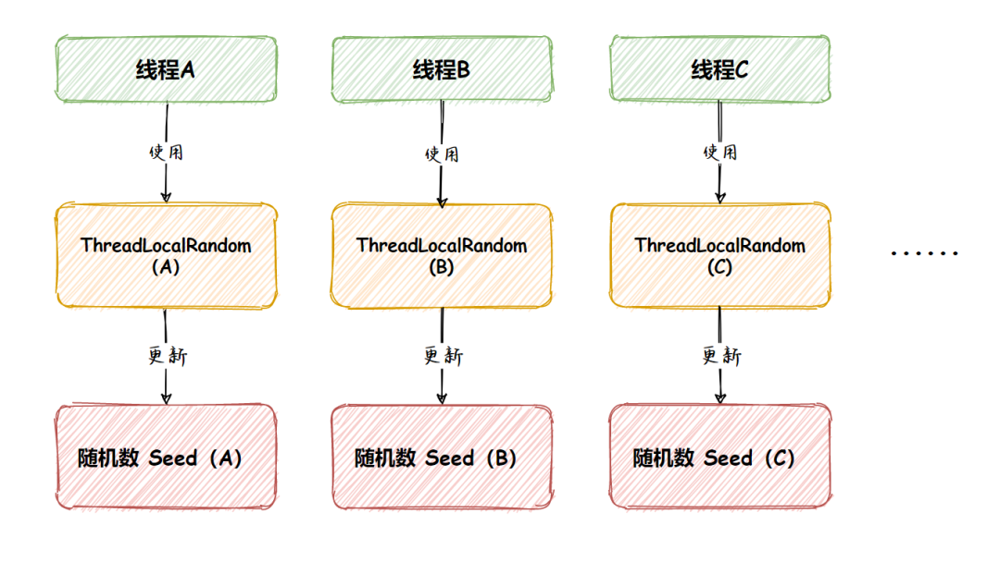

1、基础使用

接下来我们使用 ThreadLocalRandom 来生成一个 0 到 10 的随机数（不包含 10），实现代码如下：

```java
// 得到 ThreadLocalRandom 对象
ThreadLocalRandom random = ThreadLocalRandom.current();
for (int i = 0; i < 10; i++) {
    // 生成 0-9 随机整数
    int number = random.nextInt(10);
    // 打印结果
    System.out.println("生成随机数：" + number);
}
```

以上程序的执行结果为：

```
生成随机数：1
生成随机数：2
生成随机数：8
生成随机数：6
生成随机数：0
生成随机数：0
生成随机数：5
生成随机数：2
生成随机数：3
生成随机数：5
```


2、实现原理

ThreadLocalRandom 的实现原理和 ThreadLocal 类似，它是让每个线程持有自己的本地种子，该种子在生成随机数时候才会被初始化，实现源码如下：

```java
public int nextInt(int bound) {
    // 参数效验
    if (bound <= 0)
        thrownew IllegalArgumentException(BadBound);
    // 根据当前线程中种子计算新种子
    int r = mix32(nextSeed());
    int m = bound - 1;
    // 根据新种子和 bound 计算随机数
    if ((bound & m) == 0) // power of two
        r &= m;
    else { // reject over-represented candidates
        for (int u = r >>> 1;
             u + m - (r = u % bound) < 0;
             u = mix32(nextSeed()) >>> 1)
            ;
    }
    return r;
}

final long nextSeed() {
    Thread t; long r; // read and update per-thread seed
    // 获取当前线程中 threadLocalRandomSeed 变量，然后在种子的基础上累加 GAMMA 值作为新种子
    // 再使用 UNSAFE.putLong 将新种子存放到当前线程的 threadLocalRandomSeed 变量中
    UNSAFE.putLong(t = Thread.currentThread(), SEED,
                   r = UNSAFE.getLong(t, SEED) + GAMMA); 
    return r;
}
```


3、优缺点分析

ThreadLocalRandom 结合了 Random 和 ThreadLocal 类，并被隔离在当前线程中。因此它通过避免竞争操作种子数，从而**在多线程运行的环境中实现了更好的性能**，而且也保证了它的**线程安全**。

另外，不同于 Random， ThreadLocalRandom 明确不支持设置随机种子。它重写了 Random 的`setSeed(long seed)` 方法并直接抛出了 `UnsupportedOperationException` 异常，因此**降低了多个线程出现随机数重复的可能性**。

源码如下：

```java
public void setSeed(long seed) {
    // only allow call from super() constructor
    if (initialized)
        thrownew UnsupportedOperationException();
}
```

只要程序中调用了 setSeed() 方法就会抛出 `UnsupportedOperationException` 异常，如下所示：

```bash
Exception in thread "main" java.lang.UnsupportedOperationException
	at java.base/java.util.concurrent.ThreadLocalRandom.setSeed(ThreadLocalRandom.java:191)
	at Test.main(Test.java:13)
```


4、ThreadLocalRandom 缺点分析

虽然 ThreadLocalRandom 不支持手动设置随机种子的方法，但并不代表 ThreadLocalRandom 就是完美的，当我们查看 ThreadLocalRandom 初始化随机种子的方法 initialSeed() 源码时发现，默认情况下它的随机种子也是以当前时间有关，源码如下：

```
private static long initialSeed() {
    // 尝试获取 JVM 的启动参数
    String sec = VM.getSavedProperty("java.util.secureRandomSeed");
    // 如果启动参数设置的值为 true，则参数一个随机 8 位的种子
    if (Boolean.parseBoolean(sec)) {
        byte[] seedBytes = java.security.SecureRandom.getSeed(8);
        long s = (long)(seedBytes[0]) & 0xffL;
        for (int i = 1; i < 8; ++i)
            s = (s << 8) | ((long)(seedBytes[i]) & 0xffL);
        return s;
    }
    // 如果没有设置启动参数，则使用当前时间有关的随机种子算法
    return (mix64(System.currentTimeMillis()) ^
            mix64(System.nanoTime()));
}
```

从上述源码可以看出，当我们设置了启动参数“-Djava.util.secureRandomSeed=true”时，ThreadLocalRandom 会产生一个随机种子，一定程度上能缓解随机种子相同所带来随机数可预测的问题，然而**默认情况下如果不设置此参数，那么在多线程中就可以因为启动时间相同，而导致多个线程在每一步操作中都会生成相同的随机数**。


### 3、SecureRandom

SecureRandom 继承自 Random，该类提供加密强随机数生成器。**SecureRandom 不同于 Random，它收集了一些随机事件，比如鼠标点击，键盘点击等，SecureRandom 使用这些随机事件作为种子。这意味着，种子是不可预测的**，而不像 Random 默认使用系统当前时间的毫秒数作为种子，从而避免了生成相同随机数的可能性。

1、基础使用

```java
// 创建 SecureRandom 对象，并设置加密算法
SecureRandom random = SecureRandom.getInstance("SHA1PRNG");
for (int i = 0; i < 10; i++) {
    // 生成 0-9 随机整数
    int number = random.nextInt(10);
    // 打印结果
    System.out.println("生成随机数：" + number);
}
```

以上程序的执行结果为：

```
生成随机数：8
生成随机数：4
生成随机数：9
生成随机数：3
生成随机数：4
生成随机数：5
生成随机数：9
生成随机数：1
生成随机数：0
生成随机数：7
```

SecureRandom 默认支持两种加密算法：

1. SHA1PRNG 算法，提供者 sun.security.provider.SecureRandom；
2. NativePRNG 算法，提供者 sun.security.provider.NativePRNG。

当然除了上述的操作方式之外，你还可以选择使用 `new SecureRandom()` 来创建 SecureRandom 对象，实现代码如下：

```java
SecureRandom secureRandom = new SecureRandom();
```

通过 new 初始化 SecureRandom，默认会使用 NativePRNG 算法来生成随机数，但是也可以配置 JVM 启动参数“-Djava.security”参数来修改生成随机数的算法，或选择使用 `getInstance("算法名称")` 的方式来指定生成随机数的算法。


### 4、Math

Math 类诞生于 JDK 1.0，它里面包含了用于执行基本数学运算的属性和方法，如初等指数、对数、平方根和三角函数，当然它里面也包含了生成随机数的静态方法 `Math.random()` ，**此方法会产生一个 0 到 1 的 double 值**，如下代码所示。

1、基础使用

```java
for (int i = 0; i < 10; i++) {
    // 产生随机数
    double number = Math.random();
    System.out.println("生成随机数：" + number);
}
```

以上程序的执行结果为：

```
生成随机数：0.714761831483171
生成随机数：0.9875534037551428
生成随机数：0.046301631507104535
生成随机数：0.6951014628075509
生成随机数：0.6391679108096979
生成随机数：0.2584146537359995
生成随机数：0.9342791813455087
生成随机数：0.2994373924807304
生成随机数：0.44223112655955477
生成随机数：0.9035224571402414
```

2、扩展

当然如果你想**用它来生成一个一定范围的 int 值**也是可以的，你可以这样写：

```java
for (int i = 0; i < 10; i++) {
    // 生成一个从 0-99 的整数
    int number = (int) (Math.random() * 100);
    System.out.println("生成随机数：" + number);
}
```

以上程序的执行结果为：

```
生成随机数：37
生成随机数：92
生成随机数：29
生成随机数：60
生成随机数：18
生成随机数：42
生成随机数：1
生成随机数：43
生成随机数：68
生成随机数：41
```

3、实现原理

通过分析 `Math` 的源码我们可以得知：当第一次调用 `Math.random()` 方法时，自动创建了一个伪随机数生成器，实际上用的是 `new java.util.Random()`，当下一次继续调用 `Math.random()` 方法时，就会使用这个新的伪随机数生成器。

源码如下：

```java
public static double random() {
    return RandomNumberGeneratorHolder.randomNumberGenerator.nextDouble();
}

privatestaticfinalclass RandomNumberGeneratorHolder {
    staticfinal Random randomNumberGenerator = new Random();
}
```


### 5、四种随机数类总结

本文我们介绍了 4 种生成随机数的方法，其中 Math 是对 Random 的封装，所以二者比较类似。Random 生成的是伪随机数，是以当前纳秒时间作为种子数的，并且在多线程竞争比较激烈的情况下因为要进行 CAS 操作，所以存在一定的性能问题，但**对于绝大数应用场景来说，使用 Random 已经足够了。当在竞争比较激烈的场景下可以使用 ThreadLocalRandom 来替代 Random，但如果对安全性要求比较高的情况下，可以使用 SecureRandom 来生成随机数**，因为 SecureRandom 会收集一些随机事件来作为随机种子，所以 SecureRandom 可以看作是生成真正随机数的一个工具类。


## 4、BigInteger 大数字操作类

> 随着科技的发展，计算机对运算的要求变得越来越高，传统的float甚至double已经无法满足。为了解决这类问题，出现了BigInteger、BigDecimal两个操作大数字的类。通过本节内容，你将了解到BigInteger、BigDecimal两个类的相关内容，学会其兑现的简单创建与方法调用，并能够自行开发一些方法完成大数字运算时的性能调优。

> 参考：https://blog.csdn.net/xiaoxiaole0313/article/details/107328700/

在进行数学计算的过程里面还有一个大数字的操作类，可以实现海量数字的计算（能提供的也只是基础计算），现在假设一个数字很大，超过了double的范围，那么这个时候并没有任何一种数据类型可以保存下此类的内容，最早的时候只能通过String保存。

```java
String strA="120";
String strB="230";
```

如果现在想要进行加法计算，那么就需要逐位拆分，每一位自己计算，而后自己独立控制进位处理，那么这样的开发难度是非常高的，所以为了解决这类问题，提供有两个大数字的操作类：BigInteger、BigDecimal。

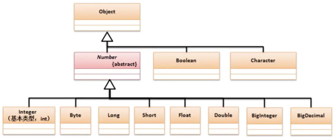

之前分析了，当数字很大的时候只能利用字符串描述数字操作，所以这一点可以观察两个大数字操作类的构造方法：

| 方法名                        | 类型 | 描述             |
| ----------------------------- | ---- | ---------------- |
| public BigInteger(String val) | 构造 | BigInteger类构造 |
| public BigDecimal(String val) | 构造 | BigDecimal类构造 |

【操作示例 1】使用BigInteger实现四则运算

```java
public class JavaAPIDemo {
    public static void main(String[] args) throws Exception {
        BigInteger bigA = new BigInteger("234234234234234234") ;
        BigInteger bigB = new BigInteger("23423423") ;
        System.out.println("加法操作：" + bigA.add(bigB));
        System.out.println("减法操作：" + bigA.subtract(bigB));
        System.out.println("乘法操作：" + bigA.multiply(bigB));
        System.out.println("除法操作：" + bigA.divide(bigB));
    }
}

// 输出内容
加法操作：234234234257657657
减法操作：234234234210810811
乘法操作：5486567549549549544062982
除法操作：10000000180
```

需要注意的是，虽然提供有大数字操作类，但是整体的操作之中还是需要考虑到一个性能问题。

【操作示例 2】观察性能

```java
public class JavaAPIDemo {
    public static void main(String[] args) throws Exception {
        BigInteger bigA = new BigInteger("234234234234234234") ;
        System.out.println(bigA.pow(Integer.MAX_VALUE)); 
    }
}
```

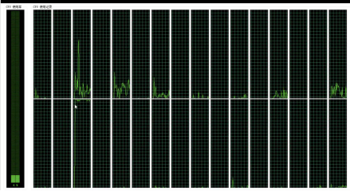

查看CPU处理的图片。此时的计算过程是非常缓慢的，所以任何的电脑是有极限的。

既然在进行数学除法的时候有可能无法进行整除处理，那么就可以使用其他的除法计算来求出余数：	

| 方法名                                                 | 类型 | 描述                                   |
| ------------------------------------------------------ | ---- | -------------------------------------- |
| public BigInteger[] divideAndRemainder(BigInteger val) | 普通 | 求余，数组第一个元素为商，第二个为余数 |

【操作示例 3】求余除法

```java
import java.math.BigInteger;
public class JavaAPIDemo {
    public static void main(String[] args) throws Exception {
        BigInteger bigA = new BigInteger("234234234234234234") ;
        BigInteger bigB = new BigInteger("23423423") ;
        BigInteger result [] = bigA.divideAndRemainder(bigB) ;
        System.out.println("商：" + result[0] + "、余数：" + result[1]);
    }
}

// 输出
商：10000000180、余数：18018094
```

如果在开发中真进行计算的时候，该计算没有超过基本数据类型所包含的位数强烈不建议使用大数字类，因为这种计算性能很差的。


## 5、BigDecimal 大小数操作类

> Java 中的 BigDecimal ，80% 的人都用错了：https://mp.weixin.qq.com/s/DDTnC6joLAaGqP0ghpAwrA

### 1、BigDecimal 概述

Java 在j ava.math 包中提供的 API 类 BigDecimal，用来对超过 16 位有效位的数进行精确的运算。双精度浮点型变量 Double 可以处理 16 位有效数，但在实际应用中，可能需要对更大或者更小的数进行运算和处理。

一般情况下，对于那些不需要准确计算精度的数字，我们可以直接使用 Float 和 Double 处理，但是 Double.valueOf(String) 和 Float.valueOf(String) 会丢失精度。所以开发中，如果我们需要精确计算的结果，则必须使用BigDecimal类来操作。

BigDecimal 所创建的是对象，故我们不能使用传统的+、-、*、/等算术运算符直接对其对象进行数学运算，而必须调用其相对应的方法。方法中的参数也必须是BigDecimal的对象。构造器是类的特殊方法，专门用来创建对象，特别是带有参数的对象。


### 2、BigDecimal  构造方法

| 方法名                    | 描述                                                     |
| ------------------------- | -------------------------------------------------------- |
| public BigDecimal(int)    | 创建一个具有参数所指定整数值的对象                       |
| public BigDecimal(double) | 创建一个具有参数所指定双精度值的对象。不推荐使用         |
| public BigDecimal(long)   | 创建一个具有参数所指定长整数值的对象                     |
| public BigDecimal(String) | 创建一个具有参数所指定以字符串表示的数值的对象。推荐使用 |

1、构造方法使用的问题分析

```java
BigDecimal a = new BigDecimal(0.1);
System.out.println("a values is:" + a);
System.out.println("=====================");
BigDecimal b = new BigDecimal("0.1");
System.out.println("b values is:"+b);
```

```
a values is:0.1000000000000000055511151231257827021181583404541015625
=====================
b values is:0.1
```

原因分析：

1. 参数类型为 double 的构造方法的结果有一定的不可预知性。有人可能认为在 Java 中写入 newBigDecimal(0.1) 所创建的 BigDecimal正好等于 0.1（非标度值 1，其标度为 1），但是它实际上等于0.1000000000000000055511151231257827021181583404541015625。这是因为 0.1 无法准确地表示为 double（或者说对于该情况，不能表示为任何有限长度的二进制小数）。这样，传入到构造方法的值不会正好等于 0.1（虽然表面上等于该值）。
2. String 构造方法是完全可预知的：写入 newBigDecimal(“0.1”) 将创建一个 BigDecimal，它正好等于预期的 0.1。因此，比较而言， 通常建议优先使用 String 构造方法。
3. 当 double 必须用作 BigDecimal 的源时，请注意，此构造方法提供了一个准确转换；它不提供与以下操作相同的结果：先使用 Double.toString(double) 方法，然后使用 BigDecimal(String) 构造方法，将 double 转换为 String。要获取该结果，请使用 static valueOf(double) 方法。


### 3、BigDecimal 成员方法

| 方法名                                              | 描述                                         |
| --------------------------------------------------- | -------------------------------------------- |
| public BigDecimal add(BigDecimal augend)            | BigDecimal对象中的值相加，返回BigDecimal对象 |
| public BigDecimal subtract(BigDecimal subtrahend)   | BigDecimal对象中的值相减，返回BigDecimal对象 |
| public BigDecimal multiply(BigDecimal multiplicand) | BigDecimal对象中的值相乘，返回BigDecimal对象 |
| public BigDecimal divide(BigDecimal divisor)        | BigDecimal对象中的值相除，返回BigDecimal对象 |
| public String toString()                            | 将BigDecimal对象的数值转换成字符串           |
| public double doubleValue()                         | 将BigDecimal对象中的值转换成双精度数         |
| public float floatValue()                           | 将BigDecimal对象中的值转换成单精度数         |
| public long longValue()                             | 将BigDecimal对象中的值转换成长整数           |
| public int intValue()                               | 将BigDecimal对象中的值转换成整数             |
| pubic int compareTo(BigDecimal val)                 | 将此BigDecimal与指定的BigDecimal进行比较     |

【操作示例 1】使用BigDecimal计算

```java
import java.math.BigDecimal;
public class JavaAPIDemo {
    public static void main(String[] args) throws Exception {
        BigDecimal bigA = new BigDecimal("32890234890") ;
        BigDecimal bigB = new BigDecimal("1892039") ;
        System.out.println("加法计算：" + bigA.add(bigB));
        BigDecimal result [] = bigA.divideAndRemainder(bigB) ;
        System.out.println("除法计算，商：" + result[0] + "、余数：" + result[1]);
    }
}
```

```
加法计算：32892126929
除法计算，商：17383、余数：920953
```

【操作示例 2】使用BigDecimal比较大小

```java
import java.math.BigDecimal;
public class JavaAPIDemo {
    public static void main(String[] args) {
        BigDecimal bigDecimal1 = new BigDecimal("1");
        BigDecimal bigDecimal2 = new BigDecimal("2");
        /*
         * 比较 bigDecimal1 与 bigDecimal2 大小
         *   a = -1,表示bigdemical小于bigdemical2；
         *   a =  0,表示bigdemical等于bigdemical2；
         *   a =  1,表示bigdemical大于bigdemical2；
         */
        int a = bigDecimal1.compareTo(bigDecimal2);
        System.out.println(a);
        
        // 查看 bigDecimal1 是否大于等于 bigDecimal2
        boolean b = bigDecimal1.compareTo(bigDecimal2) >= 0;
        System.out.println(b);
    }
}
```

```
-1
false
```


### 4、BigDecimal 常见异常

1、除法的时候出现异常

```
java.lang.ArithmeticException: Non-terminating decimal expansion; no exact representable decimal result
```

- 原因分析：通过BigDecimal的divide方法进行除法时当不整除，出现无限循环小数时，就会抛异常：java.lang.ArithmeticException: Non-terminating decimal expansion; no exact representable decimal result.
- 解决方法：divide 方法设置精确的小数点，如：divide(xxxxx, 2)【详细的可以参考如下的**舍入模式**】


### 5.1、RoundingMode 小数舍入

1. 概念：RoundingMode 是 Java java.math 包下的一个 **枚举类**，用于指定 **小数舍入（四舍五入）模式**。

常用于以下类的方法中：

- BigDecimal
- MathContext
- DecimalFormat

其作用：当小数位数需要缩减或精度有限时，定义“如何舍入”。

2. 枚举值说明（8 种）RoundingMode 枚举一共定义了 8 种舍入方式（类似会计学的不同舍入规则）：

| **枚举值**  | **含义**   | **说明**                         | **示例（保留 1 位小数）**               |
| ----------- | ---------- | -------------------------------- | --------------------------------------- |
| UP          | 远离 0     | 只要有非 0 舍弃部分，就进位      | 1.11 → 1.2； -1.11 → -1.2               |
| DOWN        | 近向 0     | 直接截断，不进位                 | 1.19 → 1.1； -1.19 → -1.1               |
| CEILING     | 向正无穷大 | 向上取整（结果 ≥ 原数）          | 1.11 → 1.2； -1.11 → -1.1               |
| FLOOR       | 向负无穷大 | 向下取整（结果 ≤ 原数）          | 1.11 → 1.1； -1.11 → -1.2               |
| HALF_UP     | 四舍五入   | 常用的四舍五入方式（≥0.5 进位）  | 1.25 → 1.3； 1.24 → 1.2                 |
| HALF_DOWN   | 五舍六入   | 0.5 舍弃，>0.5 进位              | 1.25 → 1.2； 1.26 → 1.3                 |
| HALF_EVEN   | 银行家舍入 | 最接近的数，若正好在中间则取偶数 | 1.25 → 1.2； 1.35 → 1.4                 |
| UNNECESSARY | 不允许舍入 | 如果需要舍入则抛异常             | 1.11 保留 1 位 → 抛 ArithmeticException |

3. 使用场景

- **财务计算**：避免精度丢失时用 BigDecimal.setScale(scale, roundingMode)。
- **格式化输出**：DecimalFormat.setRoundingMode(roundingMode) 控制格式化。
- **科学计算**：使用 MathContext 控制精度与舍入规则。

4. 常见用法示例

操作示例 1：BigDecimal 设置精度

```java
import java.math.BigDecimal;
import java.math.RoundingMode;

public class RoundingModeDemo {
    public static void main(String[] args) {
        BigDecimal value = new BigDecimal("1.255");

        System.out.println("UP: " + value.setScale(2, RoundingMode.UP)); // UP: 1.26
        System.out.println("DOWN: " + value.setScale(2, RoundingMode.DOWN)); // DOWN: 1.25
        System.out.println("CEILING: " + value.setScale(2, RoundingMode.CEILING)); // CEILING: 1.26
        System.out.println("FLOOR: " + value.setScale(2, RoundingMode.FLOOR)); // FLOOR: 1.25
        System.out.println("HALF_UP: " + value.setScale(2, RoundingMode.HALF_UP)); // HALF_UP: 1.26
        System.out.println("HALF_DOWN: " + value.setScale(2, RoundingMode.HALF_DOWN)); // HALF_DOWN: 1.25
        System.out.println("HALF_EVEN: " + value.setScale(2, RoundingMode.HALF_EVEN)); // HALF_EVEN: 1.26
        try {
            System.out.println("UNNECESSARY: " + value.setScale(2, RoundingMode.UNNECESSARY));
        } catch (ArithmeticException e) {
            System.out.println("UNNECESSARY: 抛异常 -> " + e.getMessage()); // UNNECESSARY: 抛异常 -> Rounding necessary
        }
    }
}
```

操作示例 2：DecimalFormat 设置舍入模式

```java
import java.text.DecimalFormat;
import java.math.RoundingMode;

public class DecimalFormatDemo {
    public static void main(String[] args) {
        double num = 1.255;
        DecimalFormat df = new DecimalFormat("#.##");
        
        df.setRoundingMode(RoundingMode.HALF_UP);
        System.out.println("HALF_UP: " + df.format(num)); // HALF_UP: 1.26

        df.setRoundingMode(RoundingMode.HALF_EVEN);
        System.out.println("HALF_EVEN: " + df.format(num)); // HALF_EVEN: 1.26
    }
}
```

操作示例 3：MathContext 使用

```java
import java.math.BigDecimal;
import java.math.MathContext;
import java.math.RoundingMode;

public class MathContextDemo {
    public static void main(String[] args) {
        BigDecimal value = new BigDecimal("12345.6789");
        // 保留 4 位有效数字
        MathContext mc = new MathContext(4, RoundingMode.HALF_UP);
        System.out.println(value.round(mc)); // 12350
    }
}
```

总结：

- RoundingMode 提供 8 种舍入策略，常用于 BigDecimal、DecimalFormat。
- **财务系统推荐**：HALF_UP（符合直觉的四舍五入）或 HALF_EVEN（银行家舍入，避免累计偏差）。
- **高精度科学计算**：建议配合 MathContext。

***

1. `UP`（向上舍入，远离零方向）

- **规则**：无论截断部分是否大于 0，都向远离零的方向进位。
- 示例（保留 2 位小数）：
  - 正数：`1.23001` → `1.24`（截断部分 > 0，进位）
  - 正数：`1.23999` → `1.24`（截断部分 > 0，进位）
  - 负数：`-1.23001` → `-1.24`（向远离零方向进位）
  - 负数：`-1.23999` → `-1.24`（向远离零方向进位）
- **适用场景**：需要确保结果不小于（正数）或不大于（负数）原数的场景（如向上取整）。

2. `DOWN`（向下舍入，趋向零方向）

- **规则**：直接截断超出指定精度的部分，不做任何进位。
- 示例（保留 2 位小数）：
  - 正数：`1.23999` → `1.23`（直接截断）
  - 负数：`-1.23999` → `-1.23`（直接截断，趋向零）
- **适用场景**：纯粹截取小数位，不希望任何舍入（如统计 “不超过某值” 的场景）。

3. `CEILING`（向正无穷大方向舍入）

- **规则**：结果向正无穷大（最大可能值）方向取整。
- 示例（保留 2 位小数）：
  - 正数：`1.23001` → `1.24`（同 `UP`）
  - 负数：`-1.23001` → `-1.23`（负数向正无穷大靠近，即趋向零）
- **特点**：对正数等价于 `UP`，对负数等价于 `DOWN`。
- **适用场景**：需要确保结果 “不小于原数” 的场景（如计算上限）。

4. `FLOOR`（向负无穷大方向舍入）

- **规则**：结果向负无穷大（最小可能值）方向取整。
- 示例（保留 2 位小数）：
  - 正数：`1.23999` → `1.23`（同 `DOWN`）
  - 负数：`-1.23001` → `-1.24`（负数向负无穷大远离，即远离零）
- **特点**：对正数等价于 `DOWN`，对负数等价于 `UP`。
- **适用场景**：需要确保结果 “不大于原数” 的场景（如计算下限）。

5. `HALF_UP`（四舍五入，中间值向上舍入）

- **规则**：若截断部分大于等于 0.5（以指定精度为基准），则向上舍入；否则截断。
- 示例（保留 1 位小数）：
  - `2.35` → `2.4`（截断部分 0.05 ≥ 0.05，进位）
  - `2.34` → `2.3`（截断部分 0.04 < 0.05，截断）
  - `-2.35` → `-2.4`（中间值向上舍入，远离零）
- **适用场景**：最常见的 “四舍五入” 场景（如金额计算、数值展示）。

6. `HALF_DOWN`（五舍六入，中间值向下舍入）

- **规则**：若截断部分大于 0.5，则向上舍入；若等于 0.5，则向下舍入；否则截断。
- 示例（保留 1 位小数）：
  - `2.35` → `2.3`（截断部分等于 0.05，向下舍入）
  - `2.36` → `2.4`（截断部分 0.06 > 0.05，进位）
  - `-2.35` → `-2.3`（中间值向下舍入，趋向零）
- **适用场景**：需要对中间值（.5）做向下处理的场景（如特殊财务规则）。

7. `HALF_EVEN`（银行家舍入法，四舍六入五成双）

- **规则**：若截断部分大于 0.5，向上舍入；小于 0.5，截断；等于 0.5 时，若前一位为偶数则截断，为奇数则进位（使结果末位为偶数）。
- 示例（保留 1 位小数）：
  - `2.35` → `2.4`（前一位 3 是奇数，进位后末位为 4 偶数）
  - `2.45` → `2.4`（前一位 4 是偶数，截断后末位保持偶数）
  - `2.34` → `2.3`（截断部分 < 0.5）
  - `2.36` → `2.4`（截断部分 > 0.5）
- **适用场景**：金融、统计等领域，减少多次计算的累计误差（如银行对账）。

8. `UNNECESSARY`（无需舍入，用于校验）

- **规则**：要求原数精度恰好等于指定精度，否则直接抛出 `ArithmeticException` 异常。
- 示例：
  - 若原数为 `1.23`，指定保留 2 位小数 → 正常返回 `1.23`。
  - 若原数为 `1.234`，指定保留 2 位小数 → 抛出异常（需要舍入，不符合 “无需舍入” 要求）。
- **适用场景**：用于严格校验数值精度，确保不发生意外舍入（如精确计算场景）。

| 模式          | 核心逻辑                      | 典型场景                                                     |
| ------------- | ----------------------------- | ------------------------------------------------------------ |
| `UP`          | 向远离零方向舍入              | 向上取整                                                     |
| `DOWN`        | 向零方向截断                  | 纯粹截取                                                     |
| `CEILING`     | 向正无穷大舍入                | 计算上限                                                     |
| `FLOOR`       | 向负无穷大舍入                | 计算下限                                                     |
| `HALF_UP`     | 四舍五入（.5 进位）           | 通用数值处理                                                 |
| `HALF_DOWN`   | 四舍五入（.5 不进位）         | 特殊财务规则                                                 |
| `HALF_EVEN`   | 银行家舍入（.5 使末位为偶数） | 金融、统计减少误差                                           |
| `UNNECESSARY` | 不允许舍入，精度不符则抛异常  | 严格校验精度以保留 1 位小数为例，观察第 2 位数字（即小数点后第 2 位）的处理： |

> `ROUND_HALF_EVEN`（在 Java 中为 `RoundingMode.HALF_EVEN`）是一种经典的舍入规则，也称为 “银行家舍入法” 或 “四舍六入五成双”，广泛应用于金融、统计等对精度要求极高的领域。其核心目的是减少多次舍入操作带来的累计误差，尤其在大量数据计算时能保证结果更均衡。
>
> 1、看第 `n+1` 位数字（即需要截断的首位数字）：
>
> - 若该数字 **小于 5** → 直接截断（不进位）。
> - 若该数字 **大于 5** → 向前一位（第 `n` 位）进位。
> - 若该数字等于 5→ 看第 n 位数字：
>   - 若第 `n` 位是 **奇数** → 进位（使第 `n` 位变为偶数）。
>   - 若第 `n` 位是 **偶数** → 不进位（保持第 `n` 位为偶数）。
>
> 简单说：**四舍六入，五成双（让末位为偶数）**。
>
> 2、以保留 1 位小数为例，观察第 2 位数字（即小数点后第 2 位）的处理：
>
> | 原始数值 | 第 2 位数字 | 第 1 位数字（需保留的末位） | 处理逻辑           | 结果 |
> | -------- | ----------- | --------------------------- | ------------------ | ---- |
> | 2.34     | 4（<5）     | 3（奇数）                   | 截断（不进位）     | 2.3  |
> | 2.36     | 6（>5）     | 3（奇数）                   | 进位（3→4，偶数）  | 2.4  |
> | 2.35     | 5（=5）     | 3（奇数）                   | 进位（3→4，偶数）  | 2.4  |
> | 2.45     | 5（=5）     | 4（偶数）                   | 不进位（保持偶数） | 2.4  |
> | 1.75     | 5（=5）     | 7（奇数）                   | 进位（7→8，偶数）  | 1.8  |
> | 1.85     | 5（=5）     | 8（偶数）                   | 不进位（保持偶数） | 1.8  |
>
> 3、负数的处理逻辑与正数完全一致，仅符号保持不变：
>
> | 原始数值 | 处理逻辑                    | 结果 |
> | -------- | --------------------------- | ---- |
> | -2.35    | 第 1 位是 3（奇数），进位   | -2.4 |
> | -2.45    | 第 1 位是 4（偶数），不进位 | -2.4 |
> | -1.75    | 第 1 位是 7（奇数），进位   | -1.8 |
>
> 4、总结：`HALF_EVEN` 的核心是通过 “五成双” 规则平衡舍入误差，尤其适合需要长期累计计算的场景。记住：**小于 5 舍，大于 5 入，等于 5 时看末位奇偶（奇进偶不进）**。


### 5.2、BigDecimal 舍入模式

这边特别提一下，如果进行除法运算的时候，结果不能整除，有余数，这个时候会报 java.lang.ArithmeticException: ，这边我们要避免这个错误产生，在进行除法运算的时候，针对可能出现的小数产生的计算，必须要多传两个参数。（除法计算数据进位问题）

```java
// divisor:除数、scale:精准小数位、roundingMode:舍入模式
// 第一个参数是除数，第二个参数代表保留几位小数，第三个代表的是使用的模式。
public BigDecimal divide(BigDecimal divisor, int scale, RoundingMode roundingMode);
```

1、与之相关的还有两个类：

1. java.math.RoundingMode：这是一种枚举类型，定义了很多常用的数据舍入方式。

2. java.math.MathContext：该对象是封装上下文设置的不可变对象，它描述数字运算符的某些规则，如数据的精度，舍入方式等。

   MathContext = scale + roundingMode；例如：**public MathContext(int setPrecision, RoundingMode setRoundingMode)**

2、RoundingMode 舍入模式说明：

```java
// 详细解释
// ROUND_UP 和 ROUND_DOWN 是早期版本（JDK 1.5 之前）的命名，而 UP 和 DOWN 是 JDK 1.5 引入 RoundingMode 枚举时新增的简洁命名。为了向后兼容，两种命名同时保留，且指向同一个枚举常量。

1、ROUND_UP/UP：
舍入远离零的舍入模式。在丢弃非零部分之前始终增加数字(始终对非零舍弃部分前面的数字加1)。注意，此舍入模式始终不会减少计算值的大小。

2、ROUND_DOWN/DOWN：
接近零的舍入模式。在丢弃某部分之前始终不增加数字(从不对舍弃部分前面的数字加1，即截短)。注意，此舍入模式始终不会增加计算值的大小。

3、ROUND_CEILING：
接近正无穷大的舍入模式。如果 BigDecimal 为正，则舍入行为与 ROUND_UP 相同；如果为负，则舍入行为与 ROUND_DOWN 相同。注意，此舍入模式始终不会减少计算值。

4、ROUND_FLOOR：
接近负无穷大的舍入模式。如果 BigDecimal 为正，则舍入行为与 ROUND_DOWN 相同；如果为负，则舍入行为与 ROUND_UP 相同。注意，此舍入模式始终不会增加计算值。

5、ROUND_HALF_UP：
向“最接近的”数字舍入，如果与两个相邻数字的距离相等，则为向上舍入的舍入模式。如果舍弃部分 >= 0.5，则舍入行为与 ROUND_UP 相同;否则舍入行为与 ROUND_DOWN 相同。注意，这是我们大多数人在小学时就学过的舍入模式(四舍五入)。

6、ROUND_HALF_DOWN：
向“最接近的”数字舍入，如果与两个相邻数字的距离相等，则为上舍入的舍入模式。如果舍弃部分 > 0.5，则舍入行为与 ROUND_UP 相同;否则舍入行为与 ROUND_DOWN 相同(五舍六入)

7、ROUND_HALF_EVEN：
向“最接近的”数字舍入，如果与两个相邻数字的距离相等，则向相邻的偶数舍入。如果舍弃部分左边的数字为奇数，则舍入行为与 ROUND_HALF_UP 相同；如果为偶数，则舍入行为与 ROUND_HALF_DOWN 相同。注意，在重复进行一系列计算时，此舍入模式可以将累加错误减到最小。此舍入模式也称为“银行家舍入法”，主要在美国使用。四舍六入，五分两种情况。如果前一位为奇数，则入位，否则舍去

以下例子为保留小数点1位，那么这种舍入方式下的结果：1.15>1.2 1.25>1.2

8、ROUND_UNNECESSARY：
断言请求的操作具有精确的结果，因此不需要舍入。如果对获得精确结果的操作指定此舍入模式，则抛出ArithmeticException。

// 简单解释
ROUND_UP          // 向远离0的方向舍入
ROUND_DOWN        // 向零方向舍入
ROUND_CEILING     // 向正无穷方向舍入
ROUND_FLOOR       // 向负无穷方向舍入
ROUND_HALF_DOWN   // 向（距离）最近的一边舍入，除非两边（的距离）是相等,如果是这样，向下舍入, 例1.55 保留一位小数结果为1.5
ROUND_HALF_EVEN   // 向（距离）最近的一边舍入，除非两边（的距离）是相等,如果是这样，如果保留位数是奇数，使用ROUND_HALF_UP，如果是偶数，使用ROUND_HALF_DOWN
ROUND_HALF_UP     // 向（距离）最近的一边舍入，除非两边（的距离）是相等,如果是这样，向上舍入, 1.55保留一位小数结果为1.6,也就是我们常说的“四舍五入”
ROUND_UNNECESSARY // 计算结果是精确的，不需要舍入模式
```

3、根据给定的舍入模式将输入数字舍入为一位数的结果总结表：

| 输入数字 | UP   | DOWN | CEILING | FLOOR | HALF_UP | HALF_DOWN | HALF_EVEN | UNNECESSARY              |
| -------- | ---- | ---- | ------- | ----- | ------- | --------- | --------- | ------------------------ |
| 5.5      | 6    | 5    | 6       | 5     | 6       | 5         | 6         | 抛出 ArithmeticException |
| 2.5      | 3    | 2    | 3       | 2     | 3       | 2         | 2         | 抛出 ArithmeticException |
| 1.6      | 2    | 1    | 2       | 1     | 2       | 2         | 2         | 抛出 ArithmeticException |
| 1.1      | 2    | 1    | 2       | 1     | 1       | 1         | 1         | 抛出 ArithmeticException |
| 1.0      | 1    | 1    | 1       | 1     | 1       | 1         | 1         | 1                        |
| -1.0     | -1   | -1   | -1      | -1    | -1      | -1        | -1        | -1                       |
| -1.1     | -2   | -1   | -1      | -2    | -1      | -1        | -1        | 抛出 ArithmeticException |
| -1.6     | -2   | -1   | -1      | -2    | -2      | -2        | -2        | 抛出 ArithmeticException |
| -2.5     | -3   | -2   | -2      | -3    | -3      | -2        | -2        | 抛出 ArithmeticException |
| -5.5     | -6   | -5   | -5      | -6    | -6      | -5        | -6        | 抛出 ArithmeticException |

4、RoundingMode 是舍入模式的抽象描述，仅仅描述了舍入的规则，MathContext 则是针对于计算的更进一步抽象是封装上下文设置的不可变对象，它描述数字运算符的某些规则。他拥有两个属性

- precision：某个操作使用的数字个数；结果舍入到此精度
- roundingMode：一个 RoundingMode 对象，该对象指定舍入使用的算法

5、RoundingMode 构造方法如下

| 方法名                                                      | 描述                                                         |
| ----------------------------------------------------------- | ------------------------------------------------------------ |
| MathContext(int setPrecision)                               | 构造 MathContext，它具有指定的精度和 HALF_UP 舍入模式        |
| MathContext(int setPrecision, RoundingMode setRoundingMode) | 构造 MathContext，它具有指定的精度和舍入模式                 |
| MathContext(String val)                                     | 根据字符串构造 MathContext<br />该字符串的格式必须与 toString() 方法生成的字符串的格式相同 |

【操作示例 1】使用BigDecimal实现四舍五入处理

```java
import java.math.BigDecimal;
import java.math.RoundingMode;

public class JavaAPIDemo {
    public static void main(String[] args) {
        System.out.println(round(19.6352, 2)); // 19.64
    }

    /**
     * 实现数据的四舍五入操作
     * @param num 要进行四舍五入操作的数字
     * @param scale 四舍五入保留的小数位数
     * @return 四舍五入处理后的结果
     */
    public static double round(double num,int scale) {
        // return new BigDecimal(num).divide(new BigDecimal(1.0), new MathContext(scale, RoundingMode.HALF_UP)).doubleValue();
        return new BigDecimal(num).divide(new BigDecimal(1.0), scale, RoundingMode.HALF_UP).doubleValue();
    }
}

```

【操作示例 2】BigDecimal.setScale() 方法用于格式化小数点

```java
import java.math.BigDecimal;
import java.math.RoundingMode;
public class JavaAPIDemo {
    public static void main(String[] args) throws Exception {
        // 表示保留一位小数，默认用四舍五入方式
        System.out.println(new BigDecimal("1.0").setScale(1)); // 1.0
        
        /**
         * RoundingMode.DOWN
         */
        {
            // 定义原来的一个数字 num = 3.14159
            BigDecimal num = new BigDecimal("3.14159");
            System.out.println("原来的数字为 = " + num); // 原来的数字为 = 3.14159

            // 1.RoundingMode.DOWN  保留3位小数,直接删除多余的小数位,结果位3.141
            BigDecimal bigDecimal = num.setScale(3, RoundingMode.DOWN);
            System.out.println("bigDecimal = " + bigDecimal); // bigDecimal = 3.141
        }
        
        /**
         * RoundingMode.DOWN
         */
        {
            // 定义原来的一个数字 num = 3.14159
            BigDecimal num = new BigDecimal("3.14159");
            System.out.println("原来的数字为 = " + num); // 原来的数字为 = 3.14159

            // RoundingMode.UP  保留3位小数,进位处理,四舍五入,结果位3.142
            BigDecimal bigDecimal = num.setScale(3, RoundingMode.UP);
            System.out.println("bigDecimal = " + bigDecimal); // bigDecimal = 3.142
        }

        /**
         * RoundingMode.HALF_UP
         */
        {
            // 定义原来的一个数字 num = 3.14159
            BigDecimal num = new BigDecimal("3.14159");
            System.out.println("原来的数字为 = " + num); // 原来的数字为 = 3.14159

            // RoundingMode.UP  保留3位小数,进位处理,四舍五入,结果位3.142
            BigDecimal bigDecimal = num.setScale(3, RoundingMode.UP);
            System.out.println("bigDecimal = " + bigDecimal); // bigDecimal = 3.142
        }

        /**
         * RoundingMode.HALF_DOWN
         */
        {
            // 定义原来的一个数字 num = 2.35
            BigDecimal num = new BigDecimal("2.35");
            System.out.println("原来的数字为 = " + num); // 原来的数字为 = 2.35

            // RoundingMode.HALF_DOWN  保留1位小数,如果是5则向下舍,结果位2.3
            BigDecimal bigDecimal = num.setScale(1, RoundingMode.HALF_DOWN);
            System.out.println("bigDecimal1 = " + bigDecimal); // bigDecimal1 = 2.3

            // RoundingMode.HALF_DOWN  保留1位小数,如果超过5则向上入,结果位2.4
            BigDecimal num1 = new BigDecimal("2.36");
            BigDecimal bigDecimal1 = num1.setScale(1, RoundingMode.HALF_DOWN);
            System.out.println("bigDecimal2 = " + bigDecimal1); // bigDecimal2 = 2.4
        }
    }
}
```


### 6、BigDecimal 去除末尾多余的0

Java有自带的 stripTrailingZeros() 方法用于去除末尾多余的0

```java
 BigDecimal num = new BigDecimal("100.000");
 BigDecimal numNoEndZero = num.stripTrailingZeros();  //numNoEndZero  ：1E+2
 System.out.println(numNoEndZero.toString());
```

按上面的方法输出结果，会显示科学计数法，所以需要处理一下，解决方法：

```java
String numNoEndZeroStr = new BigDecimal("100.000").stripTrailingZeros().toPlainString();   
System.out.println(numNoEndZeroStr); //numNoEndZeroStr  ：100
```

通过该方法处理BigDecimal类型数据后面的0的方法实现：

```java
    /**
     * @Title: clearNoUseZeroForBigDecimal
     * @Description: 去掉BigDecimal尾部多余的0，通过stripTrailingZeros().toPlainString()实现
     * @param num
     * @return BigDecimal
     */
    public static BigDecimal clearNoUseZeroForBigDecimal(BigDecimal num) {
        BigDecimal returnNum = null;
        String numStr = num.stripTrailingZeros().toPlainString();
        if (numStr.indexOf(".") == -1) {
            // 如果num 不含有小数点,使用stripTrailingZeros()处理时,变成了科学计数法
            returnNum = new BigDecimal(numStr);
        } else {
            if (num.compareTo(BigDecimal.ZERO) == 0) {
                returnNum = BigDecimal.ZERO;
            } else {
                returnNum = num.stripTrailingZeros();
            }
        }
        return returnNum;
    }
```

不通过该方法处理BigDecimal类型数据实现

```java
    /**
     * @Title: removeAmtLastZero
     * @Description: 金额处理，去掉BigDecimal尾部多余的0
     * @param num
     * @return BigDecimal
     */
    public static BigDecimal removeAmtLastZero(BigDecimal num) {
        String strNum = num.toString();
        if (strNum.indexOf('.') != -1) {
            String[] arr = strNum.split("\\.");
            String strDecimals = arr[1];
            List<String> list = new ArrayList<String>();
            boolean isCanAdd = false;
            for (int i = strDecimals.length() - 1; i > -1; i--) {
                String ss = String.valueOf(strDecimals.charAt(i));
                if (!ss.equals("0")) {
                    isCanAdd = true;// 从最后的字符开始算起，遇到第一个不是0的字符开始都是需要保留的字符
                }
                if (!ss.equals("0") || isCanAdd) {
                    list.add(ss);
                }
            }
            StringBuffer strZero = new StringBuffer();
            for (int i = list.size() - 1; i > -1; i--) {
                strZero.append(list.get(i));
            }
            strNum = String.format("%s.%s", arr[0], strZero.toString());
        }

        return new BigDecimal(strNum);
    }
```


### 7、BigDecimal 工具类

在需要精确的小数计算时再使用 BigDecimal，BigDecimal 的性能比 double 和 float 差，在处理庞大，复杂的运算时尤为明显。故一般精度的计算没必要使用 BigDecimal。尽量使用参数类型为 String 的构造函数。

BigDecimal 都是不可变的（immutable）的， 在进行每一次四则运算时，都会产生一个新的对象 ，所以在做加减乘除运算时要记得要保存操作后的值。

```java
import java.math.BigDecimal;

/**
 * 用于高精确处理常用的数学运算
 */
public class BigDecimalUtils {
    // 默认除法运算精度
    private static final int DEF_DIV_SCALE = 10;

    /**
     * 提供精确的加法运算
     *
     * @param v1 被加数
     * @param v2 加数
     * @return 两个参数的和
     */

    public static double add(double v1, double v2) {
        BigDecimal b1 = new BigDecimal(Double.toString(v1));
        BigDecimal b2 = new BigDecimal(Double.toString(v2));
        return b1.add(b2).doubleValue();
    }

    /**
     * 提供精确的加法运算
     *
     * @param v1 被加数
     * @param v2 加数
     * @return 两个参数的和
     */
    public static BigDecimal add(String v1, String v2) {
        BigDecimal b1 = new BigDecimal(v1);
        BigDecimal b2 = new BigDecimal(v2);
        return b1.add(b2);
    }

    /**
     * 提供精确的加法运算
     *
     * @param v1    被加数
     * @param v2    加数
     * @param scale 保留scale 位小数
     * @return 两个参数的和
     */
    public static String add(String v1, String v2, int scale) {
        if (scale < 0) {
            throw new IllegalArgumentException(
                "The scale must be a positive integer or zero");
        }
        BigDecimal b1 = new BigDecimal(v1);
        BigDecimal b2 = new BigDecimal(v2);
        return b1.add(b2).setScale(scale, BigDecimal.ROUND_HALF_UP).toString();
    }

    /**
     * 提供精确的减法运算
     *
     * @param v1 被减数
     * @param v2 减数
     * @return 两个参数的差
     */
    public static double sub(double v1, double v2) {
        BigDecimal b1 = new BigDecimal(Double.toString(v1));
        BigDecimal b2 = new BigDecimal(Double.toString(v2));
        return b1.subtract(b2).doubleValue();
    }

    /**
     * 提供精确的减法运算。
     *
     * @param v1 被减数
     * @param v2 减数
     * @return 两个参数的差
     */
    public static BigDecimal sub(String v1, String v2) {
        BigDecimal b1 = new BigDecimal(v1);
        BigDecimal b2 = new BigDecimal(v2);
        return b1.subtract(b2);
    }

    /**
     * 提供精确的减法运算
     *
     * @param v1    被减数
     * @param v2    减数
     * @param scale 保留scale 位小数
     * @return 两个参数的差
     */
    public static String sub(String v1, String v2, int scale) {
        if (scale < 0) {
            throw new IllegalArgumentException(
                "The scale must be a positive integer or zero");
        }
        BigDecimal b1 = new BigDecimal(v1);
        BigDecimal b2 = new BigDecimal(v2);
        return b1.subtract(b2).setScale(scale, BigDecimal.ROUND_HALF_UP).toString();
    }

    /**
     * 提供精确的乘法运算
     *
     * @param v1 被乘数
     * @param v2 乘数
     * @return 两个参数的积
     */
    public static double mul(double v1, double v2) {
        BigDecimal b1 = new BigDecimal(Double.toString(v1));
        BigDecimal b2 = new BigDecimal(Double.toString(v2));
        return b1.multiply(b2).doubleValue();
    }

    /**
     * 提供精确的乘法运算
     *
     * @param v1 被乘数
     * @param v2 乘数
     * @return 两个参数的积
     */
    public static BigDecimal mul(String v1, String v2) {
        BigDecimal b1 = new BigDecimal(v1);
        BigDecimal b2 = new BigDecimal(v2);
        return b1.multiply(b2);
    }

    /**
     * 提供精确的乘法运算
     *
     * @param v1    被乘数
     * @param v2    乘数
     * @param scale 保留scale 位小数
     * @return 两个参数的积
     */
    public static double mul(double v1, double v2, int scale) {
        BigDecimal b1 = new BigDecimal(Double.toString(v1));
        BigDecimal b2 = new BigDecimal(Double.toString(v2));
        return round(b1.multiply(b2).doubleValue(), scale);
    }

    /**
     * 提供精确的乘法运算
     *
     * @param v1    被乘数
     * @param v2    乘数
     * @param scale 保留scale 位小数
     * @return 两个参数的积
     */
    public static String mul(String v1, String v2, int scale) {
        if (scale < 0) {
            throw new IllegalArgumentException(
                "The scale must be a positive integer or zero");
        }
        BigDecimal b1 = new BigDecimal(v1);
        BigDecimal b2 = new BigDecimal(v2);
        return b1.multiply(b2).setScale(scale, BigDecimal.ROUND_HALF_UP).toString();
    }

    /**
     * 提供（相对）精确的除法运算，当发生除不尽的情况时，精确到
     * 小数点以后10位，以后的数字四舍五入
     *
     * @param v1 被除数
     * @param v2 除数
     * @return 两个参数的商
     */

    public static double div(double v1, double v2) {
        return div(v1, v2, DEF_DIV_SCALE);
    }

    /**
     * 提供（相对）精确的除法运算。当发生除不尽的情况时，由scale参数指
     * 定精度，以后的数字四舍五入
     *
     * @param v1    被除数
     * @param v2    除数
     * @param scale 表示表示需要精确到小数点以后几位。
     * @return 两个参数的商
     */
    public static double div(double v1, double v2, int scale) {
        if (scale < 0) {
            throw new IllegalArgumentException("The scale must be a positive integer or zero");
        }
        BigDecimal b1 = new BigDecimal(Double.toString(v1));
        BigDecimal b2 = new BigDecimal(Double.toString(v2));
        return b1.divide(b2, scale, BigDecimal.ROUND_HALF_UP).doubleValue();
    }

    /**
     * 提供（相对）精确的除法运算。当发生除不尽的情况时，由scale参数指
     * 定精度，以后的数字四舍五入
     *
     * @param v1    被除数
     * @param v2    除数
     * @param scale 表示需要精确到小数点以后几位
     * @return 两个参数的商
     */
    public static String div(String v1, String v2, int scale) {
        if (scale < 0) {
            throw new IllegalArgumentException("The scale must be a positive integer or zero");
        }
        BigDecimal b1 = new BigDecimal(v1);
        BigDecimal b2 = new BigDecimal(v1);
        return b1.divide(b2, scale, BigDecimal.ROUND_HALF_UP).toString();
    }

    /**
     * 提供精确的小数位四舍五入处理
     *
     * @param v     需要四舍五入的数字
     * @param scale 小数点后保留几位
     * @return 四舍五入后的结果
     */
    public static double round(double v, int scale) {
        if (scale < 0) {
            throw new IllegalArgumentException("The scale must be a positive integer or zero");
        }
        BigDecimal b = new BigDecimal(Double.toString(v));
        return b.setScale(scale, BigDecimal.ROUND_HALF_UP).doubleValue();
    }

    /**
     * 提供精确的小数位四舍五入处理
     *
     * @param v     需要四舍五入的数字
     * @param scale 小数点后保留几位
     * @return 四舍五入后的结果
     */
    public static String round(String v, int scale) {
        if (scale < 0) {
            throw new IllegalArgumentException(
                "The scale must be a positive integer or zero");
        }
        BigDecimal b = new BigDecimal(v);
        return b.setScale(scale, BigDecimal.ROUND_HALF_UP).toString();
    }

    /**
     * 取余数
     *
     * @param v1    被除数
     * @param v2    除数
     * @param scale 小数点后保留几位
     * @return 余数
     */
    public static String remainder(String v1, String v2, int scale) {
        if (scale < 0) {
            throw new IllegalArgumentException(
                "The scale must be a positive integer or zero");
        }
        BigDecimal b1 = new BigDecimal(v1);
        BigDecimal b2 = new BigDecimal(v2);
        return b1.remainder(b2).setScale(scale, BigDecimal.ROUND_HALF_UP).toString();
    }

    /**
     * 取余数  BigDecimal
     *
     * @param v1    被除数
     * @param v2    除数
     * @param scale 小数点后保留几位
     * @return 余数
     */
    public static BigDecimal remainder(BigDecimal v1, BigDecimal v2, int scale) {
        if (scale < 0) {
            throw new IllegalArgumentException(
                "The scale must be a positive integer or zero");
        }
        return v1.remainder(v2).setScale(scale, BigDecimal.ROUND_HALF_UP);
    }

    /**
     * 比较大小
     *
     * @param v1 被比较数
     * @param v2 比较数
     * @return 如果v1 大于v2 则 返回true 否则false
     */
    public static boolean compare(String v1, String v2) {
        BigDecimal b1 = new BigDecimal(v1);
        BigDecimal b2 = new BigDecimal(v2);
        int bj = b1.compareTo(b2);
        boolean res;
        if (bj > 0)
            res = true;
        else
            res = false;
        return res;
    }
}
```


## 6、DecimalFormat 数字格式化类

> 1. https://blog.csdn.net/a1064072510/article/details/89887633
> 2. https://www.jianshu.com/p/b9dd363e3ff8

数字的格式在解决实际问题时使用非常普遍，这时可以使用 DecimalFormat 类对结果进行格式化处理。

| 符号 | 说明                                                         |
| ---- | ------------------------------------------------------------ |
| 0    | 显示数字，如果位数不够则补 0                                 |
| #    | 显示数字，如果位数不够不发生变化                             |
| .    | 小数分隔符                                                   |
| -    | 减号                                                         |
| ,    | 组分隔符                                                     |
| E    | 分隔科学记数法中的尾数和小数                                 |
| %    | 前缀或后缀，乘以 100 后作为百分比显示                        |
| ?    | 乘以1000后作为千进制货币符显示,用货币符号代替。如果双写,用国际货币符号代替；如果出现在一个模式中,用货币十进制分隔符代替十进制分隔符 |

首先区分＃和０：

1. “0”——表示一位数值，如没有，显示0。如“0000.0000”，整数位或小数位>4，按实际输出，<4整数位前面补0小数位后面补0，凑足4位。
2. “#”——表示任意位数的整数。如没有，则不显示。在小数点位使用，只表示一位小数，超出部分四舍五入

【操作示例 1】

```java
import java.text.DecimalFormat;

public class JavaAPIDemo {
    public static void main(String[] args) throws Exception {
        double pi = 3.1415926;
        // 取一位整数
        System.out.println(new DecimalFormat("0").format(pi));                  // 3
        // 取一位整数和两位小数
        System.out.println(new DecimalFormat("0.00").format(pi));               // 3.14
        // 取两位整数和三位小数,整数不足一0填补
        System.out.println(new DecimalFormat("00.000").format(pi));             // 03.142
        // 取所有整数部分
        System.out.println(new DecimalFormat("#").format(pi));                  // 3
        // 以百分比方式计数，并取两位小数
        System.out.println(new DecimalFormat("0.##%").format(pi / 100));        // 3.14%

        long c = 299792458;
        // 显示为科学计数法，并取五位小数
        System.out.println(new DecimalFormat("0.00000E0").format(c));           // 2.99792E8
        // 显示为两位整数的科学计数法，并取四位小数
        System.out.println(new DecimalFormat("00.0000E0").format(c));           // 29.9792E7
        // 每三位以逗号进行分隔
        System.out.println(new DecimalFormat(",###").format(c));                // 299,792,458
        // 将格式化数字嵌入文本
        System.out.println(new DecimalFormat("光速的大小为,###m/s").format(c));  // 光速的大小为299,792,458m/s
    }
}
```


# 日期操作类

> Java8 时间处理参考教程：https://www.yiibai.com/javatime

## 1、时间类说明与对比

| 类名称                                    | 时间格式             |
| ----------------------------------------- | -------------------- |
| java.util.Date（日期类）                  | 年月日时分秒         |
| java.sql.Date extends java.util.Date      | 年月日，没有无参构造 |
| java.sql.Time extends java.util.Date      | 时分秒               |
| java.sql.Timestamp extends java.util.Date | 年月日时分秒毫秒     |
| java.util.Calendar（日历类）              | 年月日时分秒毫秒     |
| java.text.DateFormat（格式化类）          | 时间格式转换类       |

Date: 日期类（其三个字类与其类似，主要是为了兼容数据库字段类型）

- 用来表示瞬时时间，精确到毫秒，他表示的是某一刹那的时间。Date不存在时区概念。
- 是JDK中最早的时间处理类，由于Date类不易于实现国际化，所以逐渐不被推荐使用，并且废弃了大部分方法。

Calendar: 日历类，可以理解为计算机历

- 一方面是为了弥补Date的国际化缺陷，另一方面是将时间以日历的形式来表示和处理
- Calendar包含时区和语言的概念
- Calendar将时间细分成了年月日时分秒毫秒上午下午夏时令等概念，并提供这些概念的相关操作方法。


简单示例（如下显示输出时间08:00:00，是由于CST时区问题，东八区+8小时）：

```java
public class JavaDateTest {
    public static void main(String[] args) {
        java.util.Date date = new java.util.Date();
        java.sql.Date sqlDate = new java.sql.Date(date.getTime());
        java.sql.Time sqlTime = new java.sql.Time(date.getTime());
        java.sql.Timestamp sqlTimestamp = new java.sql.Timestamp(date.getTime());
        System.out.println("【java.util.Date】: " + date); // 【java.util.Date】: Fri Feb 11 13:12:39 CST 2022
        System.out.println("【java.sql.Date】: " + sqlDate); // 【java.sql.Date】: 2022-02-11
        System.out.println("【java.sql.Time】: " + sqlTime); // 【java.sql.Time】: 13:12:39
        System.out.println("【java.sql.Timestamp】: " + sqlTimestamp); // 【java.sql.Timestamp】: 2022-02-11 13:12:39.248

        java.util.Calendar calendar = java.util.Calendar.getInstance();
        System.out.println("【java.util.Calendar】: " + calendar.getTime()); // 【java.util.Calendar】: Fri Feb 11 13:12:39 CST 2022
        
        System.out.println(new java.util.Date(0L)); // Thu Jan 01 08:00:00 CST 1970
        System.out.println(new java.sql.Date(0L)); // 1970-01-01
        System.out.println(new java.sql.Time(0L)); // 08:00:00
        System.out.println(new java.sql.Timestamp(0L)); // 1970-01-01 08:00:00.0
    }
}
```


## 2、时间戳与时区说明

首先介绍计算机固定起始时间标准与时区：

- 计算机中时间原点：1970年1月1日 00:00:00（GMT：格林尼治标准时间）
- 时间换算单位：1秒 = 1000毫秒
- [UTC](https://baike.baidu.com/item/协调世界时/787659?fromtitle=UTC&fromid=5899996&fr=aladdin) ：统一的标准时间，世界协调时
- [GMT](https://baike.baidu.com/item/世界时/692237?fromtitle=GMT&fromid=6026868&fr=aladdin) ：格林尼治标准时间（Greenwich Mean Time）【不是格林威治本地时 , 格林尼治本地的时间是GMT+1】
- [CST](https://baike.baidu.com/item/CST/14822063) ：可视为中国、美国、澳大利亚或古巴的标准时间
  1. 美国：Central Standard Time (USA) UT-6:00
  2. 澳大利亚：Central Standard Time (Australia) UT+9:30
  3. 中国：China Standard Time UT+8:00
  4. 古巴：Cuba Standard Time UT-4:00

**UTC 与 GMT 的区别**：UTC 与 GMT 目前相差小于0.9秒 (理论上) 受天体运动影响。UTC 更精准(使用了原子钟)。我个人的理解是：GMT 是时区，UTC 不是时区，是一个基准，只是他们表示的时间近乎相同。

这个静态方法`System.currentTimeMillis()`将返回自1970年1月1日至现在的时间，以毫秒为单位返回一个long类型。例如：

```java
public class JavaDateTest {
    public static void main(String[] args) {
        // 从北京时间1970年1月1日08时00分00秒至今共计的毫秒数
        long time = System.currentTimeMillis(); // 时间戳
        System.out.println(time); // 1644500654429
    }
}
```

这就是全部需要做的了。返回的long值可以用来初始化`java.util.Date`, `java.sql.Date`, `java.sql.Timestamp`和`java.util.GregorianCalendar`对象。

**时间粒度**：事实上`System.currentTimeMillis()`方法的时间粒度是大于1毫秒的。如果你反复执行这个方法，你会发现短时间内得到的结果是相同的，随后又突然在某一次结果增加了几十毫秒（也可能更多）。这是很正常的，毕竟这个方法肯定不是世界上最精密的计时器。


## 3、java.util.Date【超类】

java.util.Date 是 java.sql.Date、java.sql.Time、java.sql.Timestamp 的父类，Java中的时间使用标准类库的 java.util.Date，其表示特定的时间，精确到毫秒。是用距离一个固定时间点的毫秒数（可正可负，long类型）表达一个特定的时间点。从 JDK 1.1 开始，应该使用 java.util.Calendar 类实现日期和时间字段之间转换，使用 java.text.DateFormat 类来格式化和分析日期字符串。因为 Date 的设计具有"千年虫"以及"时区"的问题，所以 Date 中的大部分方法已经不建议使用了，它们都被 java.util.Calendar 类所取代。

java.util.Date 中大部分的方法都已经被标记过期了，现在常用的大致如下：

| 方法名                                 | 类型 | 描述                                                         |
| -------------------------------------- | ---- | ------------------------------------------------------------ |
| public Date()                          | 构造 | 创建一个对应当前时间的 Date                                  |
| public Date(long date)                 | 构造 | 创建指定时间，参数long time是自 1970 年 1 月 1 日 00:00:00 GMT 以来的毫秒数 |
| public long getTime()                  | 普通 | 返回自 1970 年 1 月 1 日 00:00:00 GMT 以来此 Date 对象表示的毫秒数 |
| public long setTime(long time)         | 普通 | 设置Date对象的时间（long型）                                 |
| public String toString()               | 普通 | 显示 年、月、日、时、分、秒。例：Thu Jan 15 14:51:54 CST 1970 |
| public boolean after(Date when)        | 普通 | 如果当前时间对象比when大（晚）则返回true。反之返回false      |
| public boolean before(Date when)       | 普通 | 如果当前时间对象比when小（早）则返回true。反之返回false      |
| public int compareTo(Date anotherDate) | 普通 | 当前时间对比anotherDate，如果大于anotherDate则返回 1，反则 -1，相等返回 0 |

1、首先观察构造方法，可以发现实际上都是将 long 转成 Date 类型

```java
public Date() {
    this(System.currentTimeMillis());
}
public Date(long date) {
    fastTime = date;
}
```

2、观察 toString() 方法，把此 Date 对象转换为以下形式的 String：`dow mon dd hh:mm:ss zzz yyyy`。参数详解：

- dow：是一周中的某一天 （Sun、Mon、Tue、Wed、Thu、Fri、Sat）
- mon：月份，显示 2 位十进制
- zzz：是时区（并可以反映夏令时）标准时区缩写包括方法parse识别的时区缩写。如果不提供时区信息则zzz为空，即无任何字符
- yyyy：是年份，显示为 4 位十进制数

重写了toString每次打印输出java.util.Date类型的对象时，输出的字符串都不是标准的“2018-09-12 21:09:08”这样的形式，而是这样：

```java
Thu Jan 15 14:51:54 CST 1970
```

3、基本方法使用

```java
public class JavaDateTest {
    public static void main(String[] args) {
        /**
         * 初始化 Date
         */
        java.util.Date date1 = new java.util.Date();
        // 默认创建一个本地时间, long类型. 表示距离1970年1月1日00:00:00 毫秒值
        java.util.Date date2 = new java.util.Date(System.currentTimeMillis());
        // 创建一个指定毫秒数，从1970-1-1 00:00:00 开始增加 (国内+8小时)
        java.util.Date date3 = new java.util.Date(1000L);
        // 相当于重置时间, 实际上就是: 1970-1-1 00:00:00 (国内输出会+8小时, 可以查看ToString方法)
        java.util.Date date4 = new java.util.Date(0L);

        /**
         * 输出时间
         */
        // 打印出北京时间(ToString 方法会讲时间格式化为系统默认时区的时间输出)
        System.out.println(date1); // Fri Feb 11 13:00:14 CST 2022
        // 打印出格林标准时间（该方法已经过期）
        System.out.println(date2); // Fri Feb 11 13:00:14 CST 2022
        System.out.println(date3); // Thu Jan 01 08:00:01 CST 1970
        // 返回与格林时间的时差, 以分钟计时, 正好是8个小时, 此函数输出-480，则北京时间-480分钟等于格林时间,该方法已经过期
        System.out.println(date1.getTimezoneOffset()); // -480

        /**
         * 打印毫秒数，打印出date到1970年1月1日的毫秒数
         */
        System.out.println(date1.getTime()); // 1644555614732

        /**
         * 比较时间,after()/before()返回boolean类型,compareTo()返回-1 1 0
         */
        System.out.println(date1.after(date3)); // true
        System.out.println(date1.before(date3)); // false
        System.out.println(date1.compareTo(date3)); // 1
    }
}
```

```java
// 输出内容
Fri Feb 11 13:00:14 CST 2022
Fri Feb 11 13:00:14 CST 2022
Thu Jan 01 08:00:01 CST 1970
-480
1644555614732
true
false
1
```

PS：date.getTime()方法 从UTC时间1970年1月1日00时00分00秒（对应北京时间为1970年1月1日08时00分00秒）至今，和时间戳System.currentTimeMillis()功能一致（对应格林尼治时间为1970年1月1日00时00分00秒）


## 4、java.sql.Date【子类】

包含年月日，时分秒都被设置为 0，之所以这样设计是为了适应 SQL 中的 DATE 类型

| 方法名                               | 类型 | 描述                                                         |
| ------------------------------------ | ---- | ------------------------------------------------------------ |
| public Date(long date)               | 构造 | 创建指定date的时间（如果为0则为1970-01-01）                  |
| public String toString()             | 普通 | 格式化日期转义形式 yyyy-mm-dd 的日期，只返回日期，不返回时间 |
| public static Date valueOf(String s) | 普通 | "yyyy-mm-dd" 格式的时间字符串转换为 Date 对象： 格式错误会抛出异常 |

注意：虽然说这个类是使用年月日的，但是初始化的时候，需要一个long类型的参数，这个参数代表着January 1, 1970, 00:00:00 GMT到某个时间的毫秒数。如果是当前时间的话，可以用System.currentTimeMillis()或者new Date().getTime()获取。

```java
public class JavaDateTest {
    public static void main(String[] args) {
        // 返回的均为本地时间
        System.out.println("【java.sql.Date】: " + new java.sql.Date(System.currentTimeMillis()));
        System.out.println("【java.sql.Date】: " + new java.sql.Date(new java.util.Date().getTime()));
        System.out.println(new java.sql.Date(0));
        // 转换成格林时间和util中date输出一样
        System.out.println(new java.sql.Date(System.currentTimeMillis()).toGMTString());
        // 时间格式转换
        System.out.println(java.sql.Date.valueOf("2020-02-10").getTime());
        System.out.println(java.sql.Date.valueOf("20200210"));
    }
}
```

```java
// 输出内容
【java.sql.Date】: 2022-02-11
【java.sql.Date】: 2022-02-11
1970-01-01
11 Feb 2022 08:58:48 GMT
1581264000000
Exception in thread "main" java.lang.IllegalArgumentException
	at java.sql/java.sql.Date.valueOf(Date.java:141)
	at JavaDateTest.main(JavaDateTest.java:11)
```


## 5、java.sql.Time【子类】

包含时分秒，这个也是为了SQL中的 TIME 类型而出现的

| 方法名                               | 类型 | 描述                                                         |
| ------------------------------------ | ---- | ------------------------------------------------------------ |
| public Time(long time)               | 构造 | 创建指定time的时间（如果为0则为 00:00:00 或者 08:00:00(系统为中国时)） |
| public String toString()             | 普通 | 对时间进行格式化，返回 hh:mm:ss 格式，只返回时间，不返回日期 |
| public static Time valueOf(String s) | 普通 | "hh:mm:ss" 格式的时间字符串转换为 Time 对象，格式错误会抛出异常 |

```java
public class JavaDateTest {
    public static void main(String[] args) {
        System.out.println("【java.sql.Time】: " + new java.sql.Time(System.currentTimeMillis()));
        System.out.println("【java.sql.Time】: " + new java.sql.Time(new java.util.Date().getTime()));
        System.out.println(new java.sql.Time(0));
        System.out.println(java.sql.Time.valueOf("20:20:20").getTime());
        System.out.println(java.sql.Time.valueOf("202020"));
    }
}

// 输出内容
【java.sql.Time】: 17:53:45
【java.sql.Time】: 17:53:45
08:00:00
44420000
Exception in thread "main" java.lang.IllegalArgumentException
	at java.sql/java.sql.Time.valueOf(Time.java:109)
	at JavaDateTest.main(JavaDateTest.java:7)
```


## 6、java.sql.Timestamp【子类】

包含年月日时分秒毫秒，时间戳，适配于SQL中的 TIMESTAMP 类型而出现的，精确到纳秒级别。只有 TimeStamp 获取得到的时间才是完整的，Date 获取到的只有日期，Time 获取到的只有时间。

| 方法名                                    | 类型 | 描述                                                         |
| ----------------------------------------- | ---- | ------------------------------------------------------------ |
| public Timestamp(long time)               | 构造 | 创建一个对应指定时间的 Timestamp                             |
| public String toString()                  | 普通 | 返回 yyyy-mm-dd hh:mm:ss.fffffffff 格式                      |
| public static Timestamp valueOf(String s) | 普通 | "yyyy-mm-dd hh:mm:ss[.f...]"格式字符串转换为Timestamp：格式错会抛异常 |

```java
public class JavaDateTest {
    public static void main(String[] args) {
        /**
         * 返回的均为本地时间
         */
        System.out.println("【java.sql.Timestamp】: " + new java.sql.Timestamp(System.currentTimeMillis()));
        System.out.println("【java.sql.Timestamp】: " + new java.sql.Timestamp(new java.util.Date().getTime()));
        System.out.println(new java.sql.Timestamp(0));
        System.out.println(new java.sql.Timestamp(System.currentTimeMillis()).toLocalDateTime());
        /**
         * 返回一个格林瞬时时间
         */
        System.out.println(new java.sql.Timestamp(System.currentTimeMillis()).toInstant());
        /**
         * 时间格式转换
         */
        System.out.println(java.sql.Timestamp.valueOf("2020-02-10 20:20:20.110").getTime());
        System.out.println(java.sql.Timestamp.valueOf("202020 202020"));
    }
}
```

```java
// 输出日志
【java.sql.Timestamp】: 2022-02-11 16:56:00.171
【java.sql.Timestamp】: 2022-02-11 16:56:00.191
1970-01-01 08:00:00.0
2022-02-11T16:56:00.191
2022-02-11T08:56:00.201Z
1581337220110
Exception in thread "main" java.lang.IllegalArgumentException: Timestamp format must be yyyy-mm-dd hh:mm:ss[.fffffffff]
	at java.sql/java.sql.Timestamp.valueOf(Timestamp.java:224)
	at JavaDateTest.main(JavaDateTest.java:18)
```

**为什么有了java.util.Date类还要有java.sql.Date这个类呢**？

- 我们发现除了父类Date在util包下，它的三个子类都是在sql包下的。因为在和数据库打交道时（也就是在执行SQL语句时），我们要用到sql包下的时间类，其他情况下我们通常用util包下的Date来格式化日期或者得到当前时间。为什么和数据库打交道时不能用java.util.Date？因为PreparedStatement有三个设置时间的方法：setDate()、setTime()、setTimeStamp()，这三个方法的第二个参数分别是java.sql.Date、java.sql.Time和java.sql.TimeStamp，并没有提供参数是java.util.Date的方法。除此之外，ResultSet也有三个get()方法与之对应，且返回的时间类型也是sql包下的这三个类


## 7、java.util.Calendar【日历类】

在JDK1.1后，处理时间时，推荐使用 Calendar 类，java.util.Calendar 类是一个抽象基类，主要用于日期之间的各种计算。主要完成日期字段之间相互操作的功能，可通过 setTime 方法将 Date 类型变量转换为 Calendar 类型变量，通过 get 方法得知此刻是一年中的第几天、一月中的第几天等，或者通过 set 方法设置此刻时间变为一年中的指定天数等。获取 Calendar 实例的方法：使用 **Calendar.getInstance()** 方法或调用它子类 **GregorianCalendar** 的构造器。注意：**该类不是线程安全的**。

Java.util.Calendar 区别与 java.util.Date 的几个地方也需要注意一下 ：

1. Calendar 增加了毫秒的时间段，通过它可以获取时间点的毫秒值，而 java.util.Date 只是精确到秒
2. 两个类是可以进行相互转换的可以使用 Calendar 类的 setTime(Date date) 和 getTime() 方法

Calendar的常用方法：以下仅仅是Calendar类中的一部分常用方法，更多详细的方法大家可以参考源码。

| 方法名                                   | 类型 | 描述                                                         |
| ---------------------------------------- | ---- | ------------------------------------------------------------ |
| public static Calendar getInstance()     | 静态 | 获得一个日历对象                                             |
| public int get(int field)                | 普通 | 传入field字段获得给定日历字段的值                            |
| public void set(int field, int value)    | 普通 | 设置日历对象代表的时间（Calendar类的可变性）                 |
| public void add(int field, int amount)   | 普通 | 对当前对象日期时间进行加减操作                               |
| public final Date getTime()              | 普通 | 返回一个表示此 Calendar 时间值的 Date 对象，Calendar 类 =》Date 类 |
| public final void setTime(Date date)     | 普通 | 使用给定的 Date 设置此 Calendar 的时间，Date类 =》Calendar 类 |
| public long getTimeInMillis()            | 普通 | 返回此 Calendar 的时间值，以毫秒为单位                       |
| public void setTimeInMillis(long millis) | 普通 | 用给定的 long 值设置此 Calendar 的当前时间值                 |
| public int getActualMaximum(int field)   | 普通 | 传入Calendar.Date，得到这个月可能有多少天                    |

Calendar的常用属性：

| 属性                 | 作用                     |
| -------------------- | ------------------------ |
| YEAR                 | 年份                     |
| MONTH                | 月份                     |
| DATE                 | 同DAY_OF_MONTH，日期     |
| DAY_OF_MONTH         | 同DATE，日期             |
| DAY_OF_YEAR          | 这一天是这一年中的第几天 |
| DAY_OF_WEEK_IN_MONTH | 当前月中的第几周         |
| DAY_OF_WEEK          | 一周中的第几天 / 星期    |
| HOUR                 | 12小时制的时间           |
| HOUR_OF_DAY          | 24小时制的时间           |
| MINUTE               | 分钟数                   |
| SECOND               | 秒数                     |
| MILLISECOND          | 毫秒                     |

```java
import java.util.Calendar;
import java.util.GregorianCalendar;

public class JavaDateTest {
    public static void main(String[] args) {
        /**
         * 实例化的两种方式：
         *   方式一：创建其子类的实例化
         *   方式二：通过调用其静态方法getInstance实例化
         */
        Calendar gregorianCalendar = new GregorianCalendar();
        Calendar calendar = Calendar.getInstance();
        System.out.println("--------------------2022-02-13--------------------");

        /**
         * get()方法的形参是Calendar类中的静态整型常量
         */
        // 获得年份:2022
        System.out.println("现在是：" + calendar.get(Calendar.YEAR) + "年");
        // 获得月份:2
        System.out.println("现在是：" + (calendar.get(Calendar.MONTH)+1) + "月");
        //获得日期(本月的第几天):13
        System.out.println("现在是：" + calendar.get(Calendar.DATE) + "号");
        System.out.println("现在是：" + calendar.get(Calendar.DAY_OF_MONTH) + "号");
        // 获得这是今年的第几天:44
        System.out.println("现在是今年第" + calendar.get(Calendar.DAY_OF_YEAR) + "天");
        // 获得今天周几:0(星期天天)
        System.out.println("现在是星期：" + (calendar.get(Calendar.DAY_OF_WEEK)-1) );
        // 获得今天是这个月的第几周:2
        System.out.println("现在是第：" + calendar.get(Calendar.DAY_OF_WEEK_IN_MONTH) + "周" );
        // 12小时制的时间:9
        System.out.println("现在是：" + calendar.get(Calendar.HOUR) + "点");
        // 24小时制的时间:21
        System.out.println("现在是：" + calendar.get(Calendar.HOUR_OF_DAY) + "点");
        // 分钟数:30
        System.out.println("现在是：" + calendar.get(Calendar.MINUTE) + "分");
        // 秒数:21
        System.out.println("现在是：" + calendar.get(Calendar.SECOND) + "秒");
        // 毫秒:338
        System.out.println("现在是：" + calendar.get(Calendar.MILLISECOND) + "毫秒");

        /**
         * set()方法中的第二个参数可以把Calendar类中的静态常量值改变
         */
        // 设置当前时间为本年度的第10天
        calendar.set(Calendar.DAY_OF_YEAR,10);
        // 再次调用get()方法后返回的是更改后的值
        System.out.println(calendar.get(Calendar.DAY_OF_YEAR)); // 10

        /**
         * add()方法是在set方法的基础上进行增减，如果要减，就把数字写为负数
         */
        // 给当前日期上加上本年度的3天（现在是本年度的第10天）
        calendar.add(Calendar.DAY_OF_YEAR,3);
        System.out.println(calendar.get(Calendar.DAY_OF_YEAR)); // 13

        /**
         * getTime()方法实现 calendar 类 -> Date类
         */
        // 得到的Date类型变量是Calendar对象经过修改后的时间
        java.util.Date time = calendar.getTime();
        System.out.println(time); // Thu Jan 13 21:12:50 CST 2022

        /**
         * setTime()方法实现 Date类 -> Calendar 类
         */
        // 通过Calendar实例对象instance调用setTime将Date类型变量转变为Calendar类型变量
        calendar.setTime(new java.util.Date());
        // 通过该Calendar实例对象调用get方法得知传入Date类型变量是一年中的第几天等信息
        System.out.println(calendar.get(Calendar.DAY_OF_MONTH)); // 13
    }
}
```


## 8、java.text.DateFormat【格式化】

虽然 Date 可以获取当前的日期时间，但是默认情况下 Date 类输出的日期时间结构并不能够被国人所习惯，那么就需要对显示的格式进行格式化的处理，为了可以格式化日期，在 java.text 包中提供有 SimpleDateFormat 程序类，该类是 DateFormat 的子类。其他五种均可以被格式化同种样式的时间（它拥有`date → text` 及`text → date`的能力）。在该类中提供有如下的方法：

| 方法名                                    | 类型 | 描述                                                        |
| ----------------------------------------- | ---- | ----------------------------------------------------------- |
| public final String format(Date date)     | 普通 | 将日期格式化字符串【DateFormat继承】                        |
| public Date parse(String source)          | 普通 | 将字符串转为日期【DateFormat继承】                          |
| public void applyPattern(String pattern)  | 普通 | 设置指定格式化字符串【SimpleDateFormat类的】                |
| public SimpleDateFormat(String pattern)   | 构造 | 构造指定格式的SimpleDateFormat对象                          |
| pattern参数：日期格式（描述是常用的格式） | 参数 | 年(yyyy)、月(MM)、日(dd)、时(HH)、分(mm)、秒(ss)、毫秒(SSS) |


### 1、日期格式类型的匹配字符

日期格式字符串如下（英文版与中文版本）：

| Letter | Date or Time Component                           | Presentation       | Examples                              |
| :----- | :----------------------------------------------- | :----------------- | :------------------------------------ |
| G      | Era designator                                   | Text               | AD                                    |
| y      | Year                                             | Year               | 1996; 96                              |
| Y      | Week year                                        | Year               | 2009; 09                              |
| M      | Month in year (context sensitive)                | Month              | July; Jul; 07                         |
| L      | Month in year (standalone form)                  | Month              | July; Jul; 07                         |
| w      | Week in year                                     | Number             | 27                                    |
| W      | Week in month                                    | Number             | 2                                     |
| D      | Day in year                                      | Number             | 189                                   |
| d      | Day in month                                     | Number             | 10                                    |
| F      | Day of week in month                             | Number             | 2                                     |
| E      | Day name in week                                 | Text               | Tuesday; Tue                          |
| u      | Day number of week (1 = Monday, ..., 7 = Sunday) | Number             | 1                                     |
| a      | Am/pm marker                                     | Text               | PM                                    |
| H      | Hour in day (0-23)                               | Number             | 0                                     |
| k      | Hour in day (1-24)                               | Number             | 24                                    |
| K      | Hour in am/pm (0-11)                             | Number             | 0                                     |
| h      | Hour in am/pm (1-12)                             | Number             | 12                                    |
| m      | Minute in hour                                   | Number             | 30                                    |
| s      | Second in minute                                 | Number             | 55                                    |
| S      | Millisecond                                      | Number             | 978                                   |
| z      | Time zone                                        | General time zone  | Pacific Standard Time; PST; GMT-08:00 |
| Z      | Time zone                                        | RFC 822 time zone  | -0800                                 |
| X      | Time zone                                        | ISO 8601 time zone | -08; -0800; -08:00                    |

| 字母 | 日期或时间元素           | 表示              | 示例                                  |
| ---- | ------------------------ | ----------------- | ------------------------------------- |
| G    | Era designator           | 标志符            | Text                                  |
| y    | 年                       | Year              | 1996; 96                              |
| M    | 年中的月份               | Month             | July; Jul; 07                         |
| w    | 年中的周数               | Number            | 27                                    |
| W    | 月份中的周数             | Number            | 2                                     |
| D    | 年中的天数               | Number            | 189                                   |
| d    | 月份中的天数             | Number            | 10                                    |
| F    | 月份中的星期             | Number            | 2                                     |
| E    | 星期中的天数             | Text              | Tuesday; Tue                          |
| a    | am/pm 标记               | Text              | PM                                    |
| H    | 一天中的小时数（0-23）   | Number            | 0                                     |
| k    | 一天中的小时数（1-24）   | Number            | 24                                    |
| K    | am/pm 中的小时数（0-11） | Number            | 0                                     |
| h    | am/pm 中的小时数（1-12） | Number            | 12                                    |
| m    | 小时中的分钟数           | Number            | 30                                    |
| s    | 分钟中的秒数             | Number            | 55                                    |
| S    | 毫秒数                   | Number            | 978                                   |
| z    | 时区                     | General time zone | Pacific Standard Time; PST; GMT-08:00 |
| Z    | 时区                     | RFC 822 time zone | -0800                                 |

**其中的类型为：**

- **Text：**对于格式化，如果模式字母的数量是4以上，则使用完整的形式; 否则，如果有的话，使用简短或缩写形式。 对于解析，两种形式都是接受的，与模式字母的数量无关。

  ```java
  SimpleDateFormat sdf = new SimpleDateFormat("E");
  SimpleDateFormat sdf1 = new SimpleDateFormat("EE");
  SimpleDateFormat sdf2 = new SimpleDateFormat("EEE");
  SimpleDateFormat sdf3 = new SimpleDateFormat("EEEE");
  
  System.out.println("[java.text.SimpleDateFormat--E] " + sdf.format(new Date()));
  System.out.println("[java.text.SimpleDateFormat--EE] " + sdf1.format(new Date()));
  System.out.println("[java.text.SimpleDateFormat--EEE] " + sdf2.format(new Date()));
  System.out.println("[java.text.SimpleDateFormat--EEEE] " + sdf3.format(new Date()));
  
  // 输出内容:
  [java.text.SimpleDateFormat--E] 周五
  [java.text.SimpleDateFormat--EE] 周五
  [java.text.SimpleDateFormat--EEE] 周五
  [java.text.SimpleDateFormat--EEEE] 星期五
  ```

- **Number：**对于格式化，模式字母的数量是最小位数，而较短的数字将零填充到此数量。 对于解析，模式字母的数量将被忽略，除非需要分隔两个相邻的字段。

  ```java
  SimpleDateFormat sdf4 = new SimpleDateFormat("w");
  SimpleDateFormat sdf5 = new SimpleDateFormat("ww");
  SimpleDateFormat sdf6 = new SimpleDateFormat("www");
  SimpleDateFormat sdf7 = new SimpleDateFormat("wwww");
  
  System.out.println("[java.text.SimpleDateFormat--w] " + sdf4.format(new Date()));
  System.out.println("[java.text.SimpleDateFormat--ww] " + sdf5.format(new Date()));
  System.out.println("[java.text.SimpleDateFormat--www] " + sdf6.format(new Date()));
  System.out.println("[java.text.SimpleDateFormat--wwww] " + sdf7.format(new Date()));
  
  // 输出内容:
  [java.text.SimpleDateFormat--w] 22
  [java.text.SimpleDateFormat--ww] 22
  [java.text.SimpleDateFormat--www] 022
  [java.text.SimpleDateFormat--wwww] 0022
  ```

- **Year：**对于格式化，如果模式字母数为2，那么年份将被截断为2位数; 否则被解释为Number(不足补0)

  ```java
   SimpleDateFormat sdf8 = new SimpleDateFormat("y");
  SimpleDateFormat sdf9 = new SimpleDateFormat("yy");
  SimpleDateFormat sdf10 = new SimpleDateFormat("yyy");
  SimpleDateFormat sdf11 = new SimpleDateFormat("yyyy");
  SimpleDateFormat sdf12 = new SimpleDateFormat("yyyyy");
  
  System.out.println("[java.text.SimpleDateFormat--y] " + sdf8.format(new Date()));
  System.out.println("[java.text.SimpleDateFormat--yy] " + sdf9.format(new Date()));
  System.out.println("[java.text.SimpleDateFormat--yyy] " + sdf10.format(new Date()));
  System.out.println("[java.text.SimpleDateFormat--yyyy] " + sdf11.format(new Date()));
  System.out.println("[java.text.SimpleDateFormat--yyyyy] " + sdf12.format(new Date()));
  
  // 输出内容:
  [java.text.SimpleDateFormat--y] 2023
  [java.text.SimpleDateFormat--yy] 23
  [java.text.SimpleDateFormat--yyy] 2023
  [java.text.SimpleDateFormat--yyyy] 2023
  [java.text.SimpleDateFormat--yyyyy] 02023
  ```

- **Month：**如果模式字母数为3以上，则该月份被解释为text; 否则，它被解释为number

  ```java
  SimpleDateFormat sdf8 = new SimpleDateFormat("M");
  SimpleDateFormat sdf9 = new SimpleDateFormat("MM");
  SimpleDateFormat sdf10 = new SimpleDateFormat("MMM");
  SimpleDateFormat sdf11 = new SimpleDateFormat("MMMM");
  SimpleDateFormat sdf12 = new SimpleDateFormat("MMMMM");
  
  System.out.println("[java.text.SimpleDateFormat--M] " + sdf8.format(new Date()));
  System.out.println("[java.text.SimpleDateFormat--MM] " + sdf9.format(new Date()));
  System.out.println("[java.text.SimpleDateFormat--MMM] " + sdf10.format(new Date()));
  System.out.println("[java.text.SimpleDateFormat--MMMM] " + sdf11.format(new Date()));
  System.out.println("[java.text.SimpleDateFormat--MMMMM] " + sdf12.format(new Date()));
  
  // 输出内容:
  [java.text.SimpleDateFormat--M] 6
  [java.text.SimpleDateFormat--MM] 06
  [java.text.SimpleDateFormat--MMM] 6月
  [java.text.SimpleDateFormat--MMMM] 六月
  [java.text.SimpleDateFormat--MMMMM] 六月
  ```

- 其他的类型和时区有关，暂时不去做描述先知道上面的常见的几个


### 2、SimpleDateFormat 常见示例

【操作示例 1】简单时间格式化与解析

```java
import java.text.ParseException;
import java.text.SimpleDateFormat;
import java.util.Date;

public class JavaDateTest {
    public static void main(String[] args) throws ParseException {
        // 1.默认实例化
        SimpleDateFormat sdf1 = new SimpleDateFormat();

        // 1.1 格式化：将Date类型数据转变为字符串
        Date date = new Date();
        // 将新建的日期对象传入默认实例化的SimpleDateFormat对象中，转变为默认格式的字符串 yyyy/MM/dd 上/下午hh:mm
        String format1 = sdf1.format(date);
        // 输出字符串为：2021/12/18 下午6:19
        System.out.println(format1);

        // 1.2 解析：将字符串转换为Date类型数据
        String str = "2021/11/15 下午3:41";
        // 将与SimpleDateFormat中默认日期格式相符合的字符串转换为Date类型数据
        Date parse1 = sdf1.parse(str);
        // 输出Date类型数据为：Mon Nov 15 15:41:00 CST 2021
        System.out.println(parse1);

        // 2.带参数的实例化
        SimpleDateFormat sdf2 = new SimpleDateFormat("yyyy-MM-dd HH:mm:ss");

        // 2.1 将Date类实例对象作为实参传入SimpleDateFormat重载构造器中，转换为自定义参数格式的字符串
        String format2 = sdf2.format(date);
        // 输出字符串为：2021-11-15 15:41:00
        System.out.println(format2);

        // 2.2 将与SimpleDateFormat类的实例对象中自定义参数格式相符和的字符串解析为Date类型数据
        Date parse2 = sdf2.parse("2021-11-15 16:11:27");
        // 输出Date类型数据为：Mon Nov 15 16:11:27 CST 2021
        System.out.println(parse2);
    }
}
```

> PS：SimpleDateFormat使得可以选择任何用户定义的日期-时间格式的模式。但仍然建议通过DateFormat中的 getTimeInstance、getDateInstance或getDateTimeInstance来新的创建日期-时间格式化程序

【操作示例 2】字符串解析为时间格式示例

```java
import java.text.ParseException;
import java.text.SimpleDateFormat;
import java.util.Date;
import java.util.Locale;

public class JavaDateTest {
    public static void main(String[] args) throws ParseException {
        /**
         * a. 时间格式: “2015-08-28”， 模式: “yyyy-MM-dd”
         */
        {
            SimpleDateFormat dateFormat = new SimpleDateFormat("yyyy-MM-dd");
            Date date = dateFormat.parse("2015-08-28");
        }
        /**
         * b. 时间格式: “2015-08-28 18:28:30”， 模式: “yyyy-MM-dd HH:mm:ss”
         */
        {
            SimpleDateFormat dateFormat = new SimpleDateFormat("yyyy-MM-dd HH:mm:ss");
            Date date = dateFormat.parse("2015-08-28 18:28:30");
        }
        /**
         * c. 时间格式: “2015-8-28”， 模式: “yyyy-M-d”
         */
        {
            SimpleDateFormat dateFormat = new SimpleDateFormat("yyyy-M-d");
            Date date = dateFormat.parse("2015-8-28");
        }
        /**
         * d. 时间格式: “2015-8-28 18:8:30”， 模式: “yyyy-M-d H:m:s”
         */
        {
            SimpleDateFormat dateFormat = new SimpleDateFormat("yyyy-M-d H:m:s");
            Date date = dateFormat.parse("2015-8-28 18:8:30");
        }
        /**
         * e. 时间格式: “Aug 28, 2015 6:8:30 PM”， 模式: “MMM d, yyyy h:m:s aa”
         */
        {
            SimpleDateFormat dateFormat = new SimpleDateFormat("MMM d, yyyy h:m:s aa", Locale.ENGLISH);
            Date date = dateFormat.parse("Aug 28, 2015 6:8:30 PM");
        }
        /**
         * f. 时间格式: “Fri Aug 28 18:08:30 CST 2015”， 模式: “EEE MMM d HH:mm:ss ‘CST’ yyyy”
         */
        {
            SimpleDateFormat dateFormat = new SimpleDateFormat("EEE MMM d HH:mm:ss 'CST' yyyy", Locale.ENGLISH);
            Date date = dateFormat.parse("Fri Aug 28 18:08:30 CST 2015");
        }
    }
}
```


### 2、SimpleDateFormat 最佳实践

**方法一：**在需要执行格式化的地方都新建SimpleDateFormat实例，使用局部变量来存放SimpleDateFormat实例

```java
public static String formatDate(Date date) {
    SimpleDateFormat sdf = new SimpleDateFormat("yyyy-MM-dd HH:mm:ss");
    return sdf.format(date);
}
```

- 这种方法可能会导致短期内创建大量的SimpleDateFormat实例，如解析一个excel表格里的字符串日期。


**方法二：**为了避免创建大量的SimpleDateFormat实例，往往会考虑把SimpleDateFormat实例设为静态成员变量，共享SimpleDateFormat对象。这种情况下就得对SimpleDateFormat添加同步。

```java
private static SimpleDateFormat sdf = new SimpleDateFormat("yyyy-MM-dd HH:mm:ss");
public static String formatDate(Date date) {
    synchronized (sdf) {
        return sdf.format(date);
    }
}
```

- 这种方法的缺点也很明显，就是在高并发的环境下会导致解析被阻塞。


**方法三（推荐）：**要在高并发环境下能有比较好的体验，可以使用ThreadLocal来限制SimpleDateFormat只能在线程内共享，这样就避免了多线程导致的线程安全问题。

```java
private static ThreadLocal<DateFormat> threadLocal = new ThreadLocal<DateFormat>() {
    @Override
    protected DateFormat initialValue() {
        return new SimpleDateFormat("yyyy-MM-dd HH:mm:ss");
    }
};
public static String formatDate(Date date) {
    return threadLocal.get().format(date);
}
```


## 9、java.util.TimeZone【时区】

Java中的java.util.TimeZone类用于表达时区（又称：时区偏移量），Date 本身没有时区概念，当需要使用 SimpleDateFormat 解析与格式化时间，或者使用 Calendar 对时间需要计算的时候，才会涉及时区的概念。

### 1、Date 类本身没有时区概念

查看源码可以知道 Date 对象中存储的是一个 long 型变量，这个变量的值为自 1997-01-01 00:00:00(GMT) 至 Date 对象记录时刻所经过的毫秒数，可以通过 getTime() 方法，获取这个变量值，且这个变量值和时区没有关系，全球任意地点同时执行 new Date().getTime() 获取到的值相同。

```java
public class Date implements java.io.Serializable, Cloneable, Comparable<Date> {
    private transient long fastTime;

    /**
     * Allocates a <code>Date</code> object and initializes it so that
     * it represents the time at which it was allocated, measured to the
     * nearest millisecond.
     *
     * @see     java.lang.System#currentTimeMillis()
     */
    public Date() {
        this(System.currentTimeMillis());
    }

    /**
     * Allocates a <code>Date</code> object and initializes it to
     * represent the specified number of milliseconds since the
     * standard base time known as "the epoch", namely January 1,
     * 1970, 00:00:00 GMT.
     *
     * @param   date   the milliseconds since January 1, 1970, 00:00:00 GMT.
     * @see     java.lang.System#currentTimeMillis()
     */
    public Date(long date) {
        fastTime = date;
    }

    /**
     * Returns the number of milliseconds since January 1, 1970, 00:00:00 GMT
     * represented by this <tt>Date</tt> object.
     *
     * @return  the number of milliseconds since January 1, 1970, 00:00:00 GMT
     *          represented by this date.
     */
    public long getTime() {
        return getTimeImpl();
    }

    public String toString() {
        // "EEE MMM dd HH:mm:ss zzz yyyy";
        BaseCalendar.Date date = normalize();
        StringBuilder sb = new StringBuilder(28);
        int index = date.getDayOfWeek();
        if (index == BaseCalendar.SUNDAY) {
            index = 8;
        }
        convertToAbbr(sb, wtb[index]).append(' ');                        // EEE
        convertToAbbr(sb, wtb[date.getMonth() - 1 + 2 + 7]).append(' ');  // MMM
        CalendarUtils.sprintf0d(sb, date.getDayOfMonth(), 2).append(' '); // dd

        CalendarUtils.sprintf0d(sb, date.getHours(), 2).append(':');   // HH
        CalendarUtils.sprintf0d(sb, date.getMinutes(), 2).append(':'); // mm
        CalendarUtils.sprintf0d(sb, date.getSeconds(), 2).append(' '); // ss
        TimeZone zi = date.getZone();
        if (zi != null) {
            sb.append(zi.getDisplayName(date.isDaylightTime(), TimeZone.SHORT, Locale.US)); // zzz
        } else {
            sb.append("GMT");
        }
        sb.append(' ').append(date.getYear());  // yyyy
        return sb.toString();
    }
}
```

date.getTime()获取毫秒数，获取到的毫秒数和格式化后时间的关系。这个变量的值为自 1997-01-01 00:00:00(GMT) 至 Date 对象记录时刻所经过的毫秒数，这个毫秒数和格式化后时间是模型和视图的关系，时区（TimeZone）决定了同一模型展示成什么样的视图（格式化Date）

```java
public class JavaDateTest {
    public static void main(String[] args) {
        java.util.Date date = new java.util.Date();
        System.out.println(date); // Mon Feb 14 14:19:50 CST 2022
        System.out.println(date.getTime()); // 1644819590161
    }
}
```


### 2、SimpleDateFormat 时间格式化

**1、格式化 Date 对象成字符串**：不管是调用 Date 对象的toString方法，还是使用 SimpleDateFormat的format 方法去格式化Date对象，或者使用 parse 解析字符串成 Date 对象都会涉及到时区，也就是说 Date 对象没有时区概念，但是格式化 Date 对象，或者解析字符串成 Date对 象时，是有时区概念的。

```java
import java.text.ParseException;
import java.text.SimpleDateFormat;
import java.util.Date;
import java.util.TimeZone;

public class JavaDateTest {
    public static void main(String[] args) throws ParseException {
        /**
         * 格式化Date对象成字符串, 涉及时区
         */
        Date date = new Date();
        // 默认是系统时区
        System.out.println(date);
        // 修改默认时区
        TimeZone.setDefault(TimeZone.getTimeZone("GMT"));
        System.out.println(date);

        // 默认是系统时区
        SimpleDateFormat dateFormat1 = new SimpleDateFormat("yyyy-MM-dd HH:mm:ss");
        System.out.println(dateFormat1.format(date));
        // 设置时区
        dateFormat1.setTimeZone(TimeZone.getTimeZone("GMT+1:00"));
        System.out.println(dateFormat1.format(date));
    }
}

// 输出内容
Mon Feb 14 14:30:07 CST 2022
Mon Feb 14 06:30:07 GMT 2022
2022-02-14 06:30:07
2022-02-14 07:30:07
```

**2、解析字符串成 Date 对象**：将同一个时间字符串按照不同的时区来解析，得到的Date对象值不一样，很好理解：东八区8点当然和0时区8点不一样。

```java
import java.text.ParseException;
import java.text.SimpleDateFormat;
import java.util.Date;
import java.util.TimeZone;

public class JavaDateTest {
    public static void main(String[] args) throws ParseException {
        /**
         * 解析字符串成Date对象, 涉及时区
         */
        String dateStr = "2022-01-13 08:00:00";
        // 默认是系统时区
        SimpleDateFormat dateFormat2 = new SimpleDateFormat("yyyy-MM-dd HH:mm:ss");
        Date date1 = dateFormat2.parse(dateStr);
        System.out.println(dateFormat2.format(date1) + "、" + date1.getTime());

        // 设置时区
        dateFormat2.setTimeZone(TimeZone.getTimeZone("GMT+1:00"));
        Date date2 = dateFormat2.parse(dateStr);
        System.out.println(dateFormat2.format(date1) + "、" + date2.getTime());
    }
}

// 输出内容
2022-01-13 08:00:00、1642032000000
2022-01-13 01:00:00、1642057200000
```


### 3、Calendar 日历类计算

当你进行跨时区的 java.util.Calendar 的计算时，可以尝试使用 java.util.TimeZone 来连接不同时区的 calendar。注意：在 Java 8 中日期时间功能中，时区使用的是 java.time.ZoneId 类，但你只需要在你使用 Java 8 的日期时间类（像 ZonedDateTime 类）的时候，才需要用到 ZoneId。如果你只是使用一个 Calendar 类，那你不妨继续使用 java.util.TimeZone。

```java
import java.util.Calendar;
import java.util.TimeZone;

public class JavaDateTest {
    public static void main(String[] args) {
        /**
         * 获取与设置Calendar对象的时区
         */
        Calendar calendar = Calendar.getInstance();
        TimeZone timeZone = calendar.getTimeZone(); // 获取时区
        calendar.setTimeZone(timeZone); // 设置时区

        /**
         * 创建一个TimeZone的实例对象,有两种方式获得TimeZone实例:
         *   第一种方法返回默认的时区，即系统当前时区。
         *   第二种方法返回指定的地区ID（在这个例子里是Europe/Copenhagen）的时区，在本篇的末尾将附上一个可用地区ID表。
         */
        TimeZone timeZone1 = TimeZone.getDefault();
        TimeZone timeZone2 = TimeZone.getTimeZone("Europe/Copenhagen");

        /**
         * 获取时区的ID、名字和时差(Offset),也可以展示指定TimeZone对象的时区名字、ID和时差：
         *   timeZone.getID();
         *   timeZone.getDisplayName();
         *   timeZone.getOffset(System.currentTimeMillis());
         *   getOffset(time)方法返回的是以毫秒为单位的，与世界标准时间UTC为time的时差
         *   如此段代码若在上海时区运行，将返回28800,000，即正好8个小时，符合预期中国UTC+8的时区
         */
        System.out.println(timeZone.getID()); // 中国标准时间
        System.out.println(timeZone.getDisplayName()); // Asia/Shanghai
        System.out.println(timeZone.getOffset(System.currentTimeMillis())); // 28800000

        /**
         * 不同时区之间的转换：对一个Calendar进行转时区操作
         * 注意虽然当天的时间不同了（11点和19点）但表达的时间（自1970年初到当前时间的毫秒数）是完全相同的。
         * 可见Calendar类可正确完成更改时区这个操作。
         */
        calendar = Calendar.getInstance();
        timeZone1 = TimeZone.getTimeZone("America/Los_Angeles");

        // 当前是默认时区
        long timeCPH = calendar.getTimeInMillis();
        System.out.println("timeCPH  = " + timeCPH); // 1644810416525
        System.out.println("hour     = " + calendar.get(Calendar.HOUR_OF_DAY)); // hour     = 11

        // 设置时区
        calendar.setTimeZone(timeZone1);
        long timeLA = calendar.getTimeInMillis();
        System.out.println("timeLA   = " + timeLA); // timeLA   = 1644810416525
        System.out.println("hour     = " + calendar.get(Calendar.HOUR_OF_DAY)); // hour     = 19
    }
}
```


### 4、TimeZone 类的定义

java.util.TimeZon 是一个抽象类，主要包含了对于时区的各种操作，可以进行计算时间偏移量或夏令时等操作。类声明如下：

```java
public abstract class TimeZone extends Object  implements Serializable, Cloneable {}
```


### 5、TimeZone 类常用方法

| 方法                                                         | 描述                                                      |
| :----------------------------------------------------------- | :-------------------------------------------------------- |
| static String[] getAvailableIDs()                            | 获取所有受支持的ID                                        |
| static String[] getAvailableIDs(int rawOffset)               | 根据给定的时区偏移量（以毫秒为单位）获取可用的ID          |
| static TimeZone getDefault()                                 | 为此主机获取默认的 TimeZone                               |
| String getDisplayName()                                      | 返回适合以默认语言环境呈现给用户的时区名称                |
| String getDisplayName(boolean daylight, int style)           | 返回适合以默认语言环境呈现给用户的时区名称                |
| String getDisplayName(boolean daylight, int style, Locale locale) | 返回此时区的名称，适合在指定的语言环境中呈现给用户        |
| String getDisplayName(Locale locale)                         | 返回此时区的名称，适合在指定的语言环境中呈现给用户        |
| int getDSTSavings()                                          | 返回要添加到本地标准时间以获得本地挂钟时间的时间量。      |
| String getID()                                               | 获取该时区的ID                                            |
| int getOffset(long date)                                     | 返回指定时间与UTC的时区偏移量                             |
| abstract int getRawOffset()                                  | 以毫秒为单位返回添加到UTC以获得该时区中的标准时间的时间量 |
| static TimeZone getTimeZone(String ID)                       | 此方法获取给定ID的TimeZone                                |
| boolean hasSameRules(TimeZone other)                         | 如果此区域具有与另一个区域相同的规则和偏移，则返回true    |
| abstract boolean inDaylightTime(Date date)                   | 此方法查询给定日期是否在该时区的夏令时中                  |
| static void setDefault(TimeZone zone)                        | 此方法设置由getDefault方法返回的TimeZone                  |
| void setID(String ID)                                        | 此方法设置时区ID                                          |
| abstract void setRawOffset(int offsetMillis)                 | 此方法将基准时区偏移量设置为GMT                           |
| abstract boolean useDaylightTime()                           | 此方法查询该时区是否使用夏时制                            |


### 5、TimeZone 类操作示例

【操作示例 1】getAvailableIDs()：获取Java支持的所有时区 ID。

```java
System.out.println(Arrays.toString(TimeZone.getAvailableIDs()));

// Asia/Shanghai, Asia/Chongqing, Asia/Hong_Kong, Asia/Macao, ...
```

【操作示例 2】getAvailableIDs(int rawOffset)：根据 时间偏移量 来获取时区 ID。

```java
// 东八区时间，与标准时间相差8小时
System.out.println(Arrays.toString(TimeZone.getAvailableIDs(8*60*60*1000)));

// [Asia/Brunei, Asia/Choibalsan, Asia/Chongqing, Asia/Chungking, Asia/Harbin,
// Asia/Hong_Kong, Asia/Irkutsk, Asia/Kuala_Lumpur, Asia/Kuching, Asia/Macao, 
// Asia/Macau, Asia/Makassar, Asia/Manila, Asia/Shanghai, Asia/Singapore, 
// Asia/Taipei, Asia/Ujung_Pandang, Asia/Ulaanbaatar, Asia/Ulan_Bator, 
// Australia/Perth, Australia/West, CTT, Etc/GMT-8, Hongkong, PRC, Singapore]
```

【操作示例 3】getDefault()：获取当前系统的默认时区，中国默认为东八区。

```java
System.out.println(TimeZone.getDefault()); 

// sun.util.calendar.ZoneInfo[id="GMT+08:00",offset=28800000,
// dstSavings=0,useDaylight=false,transitions=0,lastRule=null]
```

【操作示例 4】setDefault(TimeZone zone)：设置当前系统的默认时区。

```java
TimeZone.setDefault(TimeZone.getTimeZone("Asia/Shanghai"));
System.out.println(TimeZone.getDefault());

// sun.util.calendar.ZoneInfo[id="Asia/Shanghai",offset=28800000,
// dstSavings=0,useDaylight=false,transitions=19,lastRule=null]
```

【操作示例 5】getTimeZone(String ID)：根据时区 ID 来获取其对应的时区。

```java
System.out.println(TimeZone.getTimeZone("GMT+08:00"));

// sun.util.calendar.ZoneInfo[id="GMT+08:00",offset=28800000,
// dstSavings=0,useDaylight=false,transitions=0,lastRule=null]
```

【操作示例 6】getTimeZone(ZoneId zoneId)：根据 ZoneId 对象来获取其对应的时区。

```java
System.out.println(TimeZone.getTimeZone(ZoneId.of("GMT+08:00")));

// sun.util.calendar.ZoneInfo[id="GMT+08:00",offset=28800000,
// dstSavings=0,useDaylight=false,transitions=0,lastRule=null]
```

【操作示例 7】getDisplayName()：获取该 TimeZone 对象的时区名称。

```java
TimeZone timeZone = TimeZone.getTimeZone("Asia/Shanghai");
System.out.println(timeZone.getDisplayName()); // 中国标准时间
```

【操作示例 8】getDisplayName(Locale locale)：获取该 TimeZone 对象的时区名称，并根据 Locale 对象进行国际化。

```java
TimeZone timeZone = TimeZone.getTimeZone("Asia/Shanghai");
System.out.println(timeZone.getDisplayName()); // 中国标准时间
System.out.println(timeZone.getDisplayName(Locale.ENGL设SH)); // Chi计a Standard Time
```

【操作示例 9】getDisplayName(boolean daylight, int style)：获取该 TimeZone 对象的时区名称。

- daylight：true：指定夏令时名称。false：指定标准时间名称。
- style：TimeZone.LONG：显示全称。TimeZone.SHORT：显示简称。

```java
TimeZone timeZone = TimeZone.getTimeZone("Asia/Shanghai");
System.out.println(timeZone.getDisplayName()); // 中国标准时间
System.out.println(timeZone.getDisplayName(false, TimeZone.LONG)); // 中国标准时间
System.out.println(timeZone.getDisplayName(false, TimeZone.SHORT)); // CST (China Standard Time)
```

【操作示例 10】getDisplayName(boolean daylight, int style, Locale locale)：获取该 TimeZone 对象的时区名称，并根据 Locale 对象进行国际化。

- daylight：true：指定夏令时名称。false：指定标准时间名称。
- style：TimeZone.LONG：显示全称。TimeZone.SHORT：显示简称。

```java
TimeZone timeZone = TimeZone.getTimeZone("Asia/Shanghai");
System.out.println(timeZone.getDisplayName()); // 中国标准时间
System.out.println(timeZone.getDisplayName(false, TimeZone.LONG, Locale.ENGLISH)); // China Standard Time
```

【操作示例 11】getID()：获取该 TimeZone 对象的时区 ID。

```java
TimeZone timeZone = TimeZone.getTimeZone("Asia/Shanghai");
System.out.println(timeZone.getID()); // Asia/Shanghai
```

【操作示例 12】setID(String ID)：设置该 TimeZone 对象的时区 ID。

```java
TimeZone timeZone = TimeZone.getTimeZone("Asia/Shanghai");
timeZone.setID("Asia/Chongqing");
System.out.println(timeZone.getID()); // Asia/Chongqing
```

【操作示例 13】getOffset(long date)：获取该时间所在时区的时间偏移量。

```java
TimeZone timeZone = TimeZone.getTimeZone("Asia/Shanghai");
System.out.println(timeZone.getOffset(System.currentTimeMillis())); // 28800000
```

【操作示例 14】getDSTSavings()：在夏令时规则生效时，返回相对于标准时间提前的毫秒数。如果此时区不实施夏令时，则为 0。

```java
// 中国没有夏令时，故为0
TimeZone timeZone = TimeZone.getTimeZone("Asia/Shanghai");
System.out.println(timeZone.getDSTSavings()); // 0
```

【操作示例 15】getRawOffset()：获取时间**原始偏移量**，该值不受夏令时的影响，故称为时间原始偏移量。

```java
TimeZone timeZone = TimeZone.getTimeZone("Asia/Shanghai");
System.out.println(timeZone.getRawOffset()); // 28800000
```

【操作示例 16】setRawOffset(int offsetMillis)：设置时间原始偏移量。

```java
TimeZone timeZone = TimeZone.getTimeZone("Asia/Shanghai");
timeZone.setRawOffset(25200000);
System.out.println(timeZone.getRawOffset()); // 25200000
```

【操作示例 17】toZoneId()：将 TimeZone 对象转换为 ZoneId 对象。

```java
TimeZone timeZone = TimeZone.getTimeZone("Asia/Shanghai");
ZoneId zoneId = timeZone.toZoneId();
System.out.println(zoneId); // Asia/Shanghai
```

【操作示例 18】useDaylightTime()：查询此时区是否使用夏令时。

```java
TimeZone timeZone = TimeZone.getTimeZone("Asia/Shanghai");
System.out.println(timeZone.useDaylightTime()); // false
```

【操作示例 19】inDaylightTime(Date date)：查询给定的日期是否在此时区的夏令时中。

```java
TimeZone timeZone = TimeZone.getTimeZone("Asia/Shanghai");
System.out.println(timeZone.inDaylightTime(new Date())); // false
```

【操作示例 20】如果两时区仅时区 ID 不同，但具有相同的规则和时间偏移量，则返回 true。如果另一个时区为空，则返回 false。

```java
TimeZone timeZone1 = TimeZone.getTimeZone("Asia/Shanghai");
TimeZone timeZone2 = TimeZone.getTimeZone("Asia/Chongqing");
System.out.println(timeZone1.hasSameRules(timeZone2)); // true
```


### 6、SpringBoot 设置时区

应用场景：有时候应用服务器的时间是UTC协调世界时间，我们用浏览器访问时就会出现日期快八小时，因为服务器的时区跟我们东八区差八个小时导致的。

1、在启动类中设置时区（在启动类加上 或者 在启动类run方法里加上，两者选其一即可）

```java
@SpringBootApplication
public class Application {
    public static void main(String[] args) {
        // 2、在启动类 启动run方法里加上也可以。两种选择其一即可
        // TimeZone.setDefault(TimeZone.getTimeZone("Asia/Shanghai"));
        SpringApplication.run(Application.class, args);
    }
    
    // 1、在启动类加上。两种选择其一即可
    @PostConstruct
    void started() {
        TimeZone.setDefault(TimeZone.getTimeZone("Asia/Shanghai"));
        // TimeZone.setDefault(TimeZone.getTimeZone("GMT+8"));
        // TimeZone.setDefault(TimeZone.getTimeZone("UTC"));
    }
}
```

2、在application.properties加上如下配置

```properties
spring.jackson.date-format = yyyy-MM-dd HH:mm:ss
spring.jackson.time-zone = Asia/Shanghai 
```

3、如果是MySQL（或者其他数据库）中出现时区问题，可在url上加上如下配置

```properties
url: jdbc:mysql://localhost:3306/xxxx?useUnicode=true&characterEncoding=utf8&zeroDateTimeBehavior=convertToNull&useSSL=false&autoReconnect=true&serverTimezone=Asia/Shanghai
```


## 10、时间处理类操作示例汇总

> 大概可以分为以下五大类

### 1、日期取值

获取当前系统时间（毫秒数）

```java
// 方式一
Date date = new Date();
System.out.println(date.getTime()); // 1513749728479

// 方式二
System.out.println(System.currentTimeMillis()); // 1513749728480

// 转换成指定的格式
String current = df.format(System.currentTimeMillis());
System.out.println(current); // 2017-12-20 14:02:08 
```


### 2、日期转换

1、日期转字符串、字符串转日期

```java
SimpleDateFormat sdf = new SimpleDateFormat("yyyy-MM-dd HH:mm:ss");
try {
    // 1、日期转字符串
    Calendar calendar = Calendar.getInstance();
    Date date = calendar.getTime();
    String dateStringParse = sdf.format(date);
    System.out.println(dateStringParse);
    // 2、字符串转日期
    String dateString = "2017-12-20 14:02:08";
    Date dateParse = sdf.parse(dateString);
    System.out.println(dateParse);
} catch (ParseException e) {
    e.printStackTrace();
}
```

2、将日期转换成中文年月日时分秒

```java
SimpleDateFormat sdf = new SimpleDateFormat("yyyy年MM月dd日 HH时mm分ss秒");
try {
    Date date = new Date();
    String dateStringParse = sdf.format(date);
    System.out.println(dateStringParse);
} catch (Exception e) {
    e.printStackTrace();
}
```

3、将指定日期转换成带周的格式

```java
DateFormat df = new SimpleDateFormat("yyyy-MM-dd HH:mm:ss");
Date d1 = df.parse("2017-12-20 12:19:19");
Calendar cal = df.getCalendar(); // 指定日期
Calendar cas = Calendar.getInstance(); // 当前时间
int year = cal.get(Calendar.YEAR); // 获取年份
int month=cal.get(Calendar.MONTH); // 获取月份
int day=cal.get(Calendar.DATE); // 获取日
int hour=cal.get(Calendar.HOUR); // 小时
int minute=cal.get(Calendar.MINUTE); // 分
int second=cal.get(Calendar.SECOND); // 秒
int WeekOfYear = cal.get(Calendar.DAY_OF_WEEK); // 一周的第几天
System.out.println("现在时间：" + year + "年" + month + "月" + day + "日," + hour + "时" + minute + "分" + second+"秒,星期"+WeekOfYear);
```

4、获取当前时间显示，上午，下午

```java
Date date = new Date();
DateFormat df1 = DateFormat.getDateInstance(); // 日期格式，精确到日
System.out.println(df1.format(date));
DateFormat df2 = DateFormat.getDateTimeInstance(); // 可以精确到时分秒
System.out.println(df2.format(date));
DateFormat df3 = DateFormat.getTimeInstance(); // 只显示出时分秒
System.out.println("只显示出时分秒:"+df3.format(date));
DateFormat df4 = DateFormat.getDateTimeInstance(DateFormat.FULL,DateFormat.FULL); // 显示日期，周，上下午，时间(精确到秒)
System.out.println("显示日期，周，上下午，时间(精确到秒):"+df4.format(date));
DateFormat df5 = DateFormat.getDateTimeInstance(DateFormat.LONG,DateFormat.LONG); // 显示日期,上下午，时间(精确到秒)
System.out.println("显示日期,上下午，时间(精确到秒):"+df5.format(date));
DateFormat df6 = DateFormat.getDateTimeInstance(DateFormat.SHORT,DateFormat.SHORT); // 显示日期，上下午,时间(精确到分)
System.out.println("显示日期，上下午,时间(精确到分):"+df6.format(date));
DateFormat df7 = DateFormat.getDateTimeInstance(DateFormat.MEDIUM,DateFormat.MEDIUM); // 显示日期，时间(精确到分)
System.out.println("显示日期，时间(精确到分):"+df7.format(date));
```

5、时间秒转化为多少天小时分秒

```java
// 秒转化为天小时分秒字符串
public static String formatSeconds(long seconds) {
    String timeStr = seconds + "秒";
    if (seconds > 60) {
        long second = seconds % 60;
        long min = seconds / 60;
        timeStr = min + "分" + second + "秒";
        if (min > 60) {
            min = (seconds / 60) % 60;
            long hour = (seconds / 60) / 60;
            timeStr = hour + "小时" + min + "分" + second + "秒";
            if (hour > 24) {
                hour = ((seconds / 60) / 60) % 24;
                long day = (((seconds / 60) / 60) / 24);
                timeStr = day + "天" + hour + "小时" + min + "分" + second + "秒";
            }
        }
    }
    return timeStr;    
}
```


### 3、设置时间

推荐 使用java.util.Calendar 类来进行操作，因为java.util.Date类很多方法都过时了，Calendar 类有很多重载的设置时间的方法，可以针对于某一项进行设置，也可以同时进行很多设置

1. Calendar.getInstance().getTime()：即可获取一个Date对象
2. Calendar.getInstance().add()：时间的一个部分，正数代表加，负数代表减

```java
// 将给定的日历字段设置为给定值。
set(int field, int value);
// 设置日历字段 YEAR、MONTH 和 DAY_OF_MONTH 的值。
void set(int year, int month, int date); 
// 设置日历字段 YEAR、MONTH、DAY_OF_MONTH、HOUR_OF_DAY 和 MINUTE 的值
void set(int year, int month, int date, int hourOfDay, int minute);
// 设置字段 YEAR、MONTH、DAY_OF_MONTH、HOUR、MINUTE 和 SECOND 的值
void set(int year, int month, int date, int hourOfDay, int minute, int second);
```

第一个就是给特定的字段设值，后面三个就是针对多个字段赋值


### 4、日期加减

通常来说，我们会对日期做两种加减操作：

> 一、以某个日期为基准，计算其几天前/后、几年前/后，或者其他时间单位前后的日期

A、获取当前时间的前一年时间

```java
// 根据现在时间计算
Calendar now = Calendar.getInstance();
now.add(Calendar.YEAR, 1); // 现在时间是1年后
print(now);
now.add(Calendar.YEAR, -1); // 现在时间是1年前
print(now);

// 根据某个特定的时间 date (Date 型) 计算
Calendar specialDate = Calendar.getInstance();
specialDate.setTime(new Date()); // 注意在此处将 specialDate 的值改为特定日期
specialDate.add(Calendar.YEAR, 1); // 特定时间的1年后
print(specialDate);
specialDate.add(Calendar.YEAR, -1); // 特定时间的1年前
print(specialDate); 
```

B、根据时间然后对小时，分钟，秒数进行相加

```java
// 取当前的时分-30
SimpleDateFormat df = new SimpleDateFormat("yyyy-MM-dd HH:mm");
Calendar nowTime2 = Calendar.getInstance();
nowTime2.add(Calendar.MINUTE, -30); // 30分钟前的时间
String currentTime = df.format(nowTime2.getTime());
System.out.println("30分钟前的时间" + currentTime);

// 取当前小时减一个小时
Calendar calendar = Calendar.getInstance();
calendar.set(Calendar.HOUR_OF_DAY, calendar.get(Calendar.HOUR_OF_DAY) - 1);
SimpleDateFormat dff = new SimpleDateFormat("yyyy-MM-dd HH");
System.out.println("一个小时前的时间：" + dff.format(calendar.getTime()));
System.out.println("当前的时间：" + dff.format(new Date()));

// 取当前的时分+5
Calendar nowTime = Calendar.getInstance();
nowTime.add(Calendar.MINUTE, 5);
String currentTimes = df.format(nowTime.getTime());
System.out.println("当前时间加5分钟" +currentTimes);

// 前一天的时间
Date dNow = new Date(); // 当前时间
Calendar calendars = Calendar.getInstance(); // 得到日历
calendars.setTime(dNow);// 把当前时间赋给日历
calendars.add(Calendar.DAY_OF_MONTH, -1); // 设置为前一天
Date dBefore = calendars.getTime(); // 得到前一天的时间

String defaultStartDate = df.format(dBefore); // 格式化前一天
String defaultEndDate = df.format(dNow); // 格式化当前时间

System.out.println("前一天的时间是：" + defaultStartDate);
System.out.println("生成的时间是：" + defaultEndDate);
```

C、对时分秒进行累计，比如说视频通话，第一次，通了10分钟，第二次就得把上次的时间进行累计

```java
DateFormat df = new SimpleDateFormat("yyyy-MM-dd HH:mm:ss");
// 上次挂断电话时间
Date d1 = df.parse("2017-12-20 12:19:19");
// 这次通话时长
Date d2 = df.parse("2017-12-20 11:40:34");
long nd = 1000 * 24 * 60 * 60;
long nh = 1000 * 60 * 60;
long nm = 1000 * 60;
long ns = 1000;
// 获得两个时间的毫秒时间差异
long diff = d1.getTime() - d2.getTime();
// 计算差多少天
long day = diff / nd;
// 计算差多少小时
long hour = diff % nd / nh;
// 计算差多少分钟
long min = diff % nd % nh / nm;
// 计算差多少秒/输出结果
long sec = diff % nd % nh % nm / ns;
// 根据上次挂断电话时间然后得出这次通话时长
System.out.println(day + "天" + hour + "小时" + min + "分钟"+ sec + "秒");

// 累计通话时长
String cur = "10:15:12";
SimpleDateFormat myFormatter = new SimpleDateFormat("HH:mm:ss");
Calendar cal = Calendar.getInstance();
cal.setTime(myFormatter.parse(cur));
int shi = (int)cal.get(Calendar.HOUR_OF_DAY)+(int)hour;
int fendo = (int)cal.get(Calendar.MINUTE)+(int)min;
int miao = (int)cal.get(Calendar.SECOND)+(int)sec;

// 以下算法有些问题
if(miao>60){
    miao=00;
    if(fendo>60){
        fendo = 00;
        shi = shi+1;
    }else {
        fendo = fendo + 1;
    }
}
System.out.println(shi+":"+fendo+":"+miao);
```

> 二、计算两个时间的间隔

A、例如计算 2017 年 1 月 1 日距离现在有多少天

```java
SimpleDateFormat sdf = new SimpleDateFormat("yyyy-MM-dd HH:mm:ss");
String dateString = "2017-01-01 11:11:11";
Calendar calendar = Calendar.getInstance();
long nowDate = calendar.getTime().getTime(); // Date.getTime() 获得毫秒型日期
try {
    long specialDate = sdf.parse(dateString).getTime();
    long betweenDate = (specialDate - nowDate) / (1000 * 60 * 60 * 24); // 计算间隔多少天，则除以毫秒到天的转换公式
    System.out.print(betweenDate);
} catch (ParseException e) {
    e.printStackTrace();
}
```

B、求出两个日期相差多少小时，分钟，毫秒

```java
DateFormat df = new SimpleDateFormat("yyyy-MM-dd HH:mm:ss");
Date d1 = df.parse("2017-12-20 12:19:19");
Date d2 = df.parse("2017-12-20 11:40:34");
long nd = 1000 * 24 * 60 * 60;
long nh = 1000 * 60 * 60;
long nm = 1000 * 60;
long ns = 1000;
// 获得两个时间的毫秒时间差异
long diff = d1.getTime() - d2.getTime();
// 计算差多少天
long day = diff / nd;
// 计算差多少小时
long hour = diff % nd / nh;
// 计算差多少分钟
long min = diff % nd % nh / nm;
// 计算差多少秒//输出结果
long sec = diff % nd % nh % nm / ns;
System.out.println(day + "天" + hour + "小时" + min + "分钟"+ sec + "秒");
```


### 5、日期比较

日期比较一般有两种方法，对于 java.util.Date 或者 java.util.Calendar 都是通用的。一种是通过 after() 与 before() 方法进行比较，一种是通过 compareTo() 方法进行比较。

```java
SimpleDateFormat sdf = new SimpleDateFormat("yyyy-MM-dd HH:mm:ss");
String dateString_01 = "2017-12-20 11:11:11";
String dateString_02 = "2017-12-21 11:11:11";
try {
    Date date_01 = sdf.parse(dateString_01);
    Date date_02 = sdf.parse(dateString_02);
    System.out.println(date_01.before(date_02)); // true，当 date_01 小于 date_02 时，为 true，否则为 false
    System.out.println(date_02.after(date_01)); // true，当 date_02 大于 date_01 时，为 true，否则为 false
    System.out.println(date_01.compareTo(date_02)); // -1，当 date_01 小于 date_02 时，为 -1
    System.out.println(date_02.compareTo(date_01)); // 1，当 date_02 大于 date_01 时，为 1
    System.out.println(date_02.compareTo(date_02)); // 0，当两个日期相等时，为 0
} catch (ParseException e) {
    e.printStackTrace();
}
```


## 11、Date or Calendar 面临的问题

JDK1.0 中就包含 java.util.Date 类，但是它的大多数方法已经在 JDK1.1 引入 Calendar 类后就弃用了。但 Calendar 类也面临如下问题：

1. 可变性：日期和时间这样的类应该是不可变的
2. 偏移性：Date 类中的年份是从1900 年开始的，而月份是从0开始的
3. 格式化：格式化只对 Date 有用，Calendar 则不行
4. 安全性：它们都是线程不安全的，不能处理闰秒问题
5. 设计差：Java 的日期/时间类的定义并不一致，在 java.util 和 java.sql 的包中都有日期类，此外用于格式化和解析的类在 java.text 包中定义。java.util.Date 同时包含日期和时间，而 java.sql.Date 仅包含日期，将其纳入 java.sql 包并不合理。另外这两个类都有相同的名字，这本身就是一个非常糟糕的设计。
6. 时区处理麻烦：日期类并不提供国际化，没有时区支持，因此 Java 引入了 java.util.Calendar 和j ava.util.TimeZone 类，但他们同样存在上述所有的问题。
7. 为了解决上述问题，Java 8 吸收了第三方 Joda - Time 的精华，创建了新的 java.time。


## 12、参考文献 & 鸣谢

1. Java日期时间教程【一点教程】http://www.yiidian.com/java-date
2. java.time包教程【易百教程】https://www.yiibai.com/javatime
3. Java的日期与时间（目录）https://blog.csdn.net/tjgykhulj/article/details/68952451
4. Java方向盘-日期时间：https://blog.csdn.net/f641385712/category_10749009.html、[[YourBatman]-日期时间-公众号目录](https://mp.weixin.qq.com/mp/appmsgalbum?action=getalbum&__biz=MzI0MTUwOTgyOQ==&scene=24&album_id=1696358010555547649&count=3#wechat_redirect)
5. Java8日期时间API【ThinkWon】：https://thinkwon.blog.csdn.net/article/details/111087199
6. **日期时间时区等**：https://blog.csdn.net/kfepiza/category_10948478.html


# 正则表达式

在程序中，用户输入的数据往往需要接收为字符串，而在处理时为了验证数据的格式，保证数据能够安全转换，我们可以使用正则表达式来达到这个目的。

## 1、认识正则表达式

通过本节内容，你可以了解到常用的验证字符串格式的方法是使用正则表达式，并学会简单的使用正则表达式来验证字符串是否为数字。

【操作示例 1】现在假设有一个字符串要求你判断是否由数字所组成，如果由数字所组成则将其变为数字进行乘法计算。

```java
public class JavaAPIDemo {
    public static void main(String[] args) {
        String str = "123";
        if (isNumber(str)) {
            int num = Integer.parseInt(str);
            System.out.println(num * 2);
        }
    }

    public static boolean isNumber(String str) {
        char data[] = str.toCharArray();
        for (int x = 0; x < data.length; x++) {
            if (data[x] > '9' || data[x] < '0') {
                return false;
            }
        }
        return true;
    }
}

// 输出内容
246
```

实际上这种验证的功能是非常简单的，但是这如此简单的功能却需要开发者编写大量的程序逻辑代码，那如果更加复杂的验证呢？那么在这种情况下，对于验证来讲最好的做法就是利用正则表达式来完成。

【操作示例 2】使用正则表达式实现同样的效果

```java
public class JavaAPIDemo {
    public static void main(String[] args) throws Exception {
        String str = "123" ;
        if (str.matches("\\d+")) {
            int num = Integer.parseInt(str) ;
            System.out.println(num * 2);
        }
    }
}

// 输出内容
246
```

正则表达式最早是从Perl语言里面发展而来的，而后在JDK 1.4以前如果 需要使用到正则表达式的相关定义则需要单独引入其他的*.jar文件，但是从JDK1.4后，正则已经默认被JDK所支持，并且提供有java.util.regex开发包，同时针对于String 类也进行了一些修改，使其可以有方法直接支持正则处理。

使用正则最大特点在于方便进行验证处理，以及方便进行复杂字符串的修改处理。


## 2、正则标记（必背）

通过本节内容，你将进一步了解到正则表达式进行字符串匹配的匹配规则，认识各类支持的正则标记，并初步掌握其用法。

如果想要进行正则的处理操作，那么首先需要对常用的正则标记有所掌握，从JDK1.4开始提供java.util.regex开发包，这个包里面提供有一个Pattern程序类类，在这个程序类里面定义有所有支持的正则标记。

1、【数量：单个】字符匹配

```
- 任意字符：表示由任意字符组成
- \：匹配 “\”
- \n：匹配换行
- \t：匹配制表符
```

2、【数量：单个】字符集（可以从里面任选一个字符）

```
- [abc]：表示可能是字母a、b、c中的任意一个
- [^abc]：表示不是由字母a、b、c中的任意一个
- [a-zA-Z]：表示由一个任意字母所组成,不区分大小写
- [0-9]：表示由一个数字所组成
```

3、【数量：单个】简化字符集：

```
- .：表示任意的一个字符
- \d：等价于 “\[0-9\]” 范围
- \D：等价于 \[^0-9\]”范围
- \s：匹配任意的一位空格，可能是空格、换行、制表符
- \S：匹配任意的非空格数据
- \w：匹配字母、数字、下划线，等价于“\[a-zA-Z_0-9\]”;
- \W：匹配非字母、数字、下划线,等价于"\[^a-zA-Z_0-9\]"
```

4、边界匹配：

```
- ^：匹配边界开始
- $：匹配边界结束
```

5、数量表示，默认情况下只有添加上了数量单位才可以匹配多位字符

```
- 表达式?：该正则可以出现0次或1次；
- 表达式*：该正则可以出现0次、1次或多次；
- 表达式+：该正则可以出现1次或多次；
- 表达式{n}：表达式的长度正好为n次；
- 表达式{n,}：表达式的长度为n次以上；
- 表达式{n,m}：表达式的长度在n~m次；
```

6、逻辑表达式:可以连接多个正则

```
- 表达式 X表达式 Y：X表达式之后紧跟上Y表达式
- 表达式X|表达式Y：有一个表达式满足即可
- (表达式)：为表达式设置一个整体描述，可以为整体描述设置数量单位
```

【操作示例 1】案例练习

```java
String str = "a" ; // 要判断的数据
String regex = "a" ; // 正则表达式
System.out.println(str.matches(regex)); // true

String str = "c" ; // 要判断的数据
String regex = "[abc]" ; // 正则表达式
System.out.println(str.matches(regex)); // true

String str = "1" ; // 要判断的数据
String regex = "[a-zA-Z]" ;	// 正则表达式
System.out.println(str.matches(regex)); // false

String str = "1" ; // 要判断的数据
String regex = "[0-9]" ; // 正则表达式
System.out.println(str.matches(regex)); // true

String str = "#" ; // 要判断的数据
String regex = "." ; // 正则表达式
System.out.println(str.matches(regex)); // true

String str = "a\t" ; // 要判断的数据
String regex = "\\D\\s" ; // 正则表达式
System.out.println(str.matches(regex)); // true

String str = "" ; // 要判断的数据
String regex = "\\w*" ;	// 正则表达式
System.out.println(str.matches(regex)); // true

String str = "ax" ;	// 要判断的数据
String regex = "\\w{3,}" ; // 正则表达式
System.out.println(str.matches(regex)); // false
```


## 3、String 类对正则的支持

在进行正则表达式大部分处理的情况下都会基于String类来完成，并且在String类里面提供有如下与正则有关的操作方法：

| 方法名称                                                     | 类型 | 描述                     |
| ------------------------------------------------------------ | ---- | ------------------------ |
| public boolean matches(String regex)                         | 普通 | 将指定字符串进行正则判断 |
| public String replaceAll(String regex, String replacement)   | 普通 | 替换全部                 |
| public String replaceFirst(String regex, String replacement) | 普通 | 替换首个                 |
| public String[] split(String regex)                          | 普通 | 正则拆分                 |
| public String[] split(String regex, int limit)               | 普通 | 正则拆分                 |

下面通过一些具体范例来对正则的使用进行说明。

【操作示例 1】实现字符串替换（删除掉非字母与数字）

```java
public class JavaAPIDemo {
    public static void main(String[] args) throws Exception {
        String str = "JILO&*()@#$UISD&*(#$HUK34rwyhui*()@#$*()@#$" ;	// 要判断的数据
        String regex = "[^a-zA-Z0-9]+" ;	// 正则表达式
        System.out.println(str.replaceAll(regex, ""));// JILOUISDHUK34rwyhui
    }
}

// 输出内容
JILOUISDHUK34rwyhui
```

【操作示例 2】实现字符串的拆分

```java
public class JavaAPIDemo {
    public static void main(String[] args) throws Exception {
        String str = "a1b22c333d4444e55555f666666g" ;	// 要判断的数据
        String regex = "\\d+" ;	// 正则表达式
        String result [] = str.split(regex) ;
        for (int x = 0 ; x < result.length ; x ++) {
            System.out.print(result[x] + "、");
        }
    }
}

// 输出内容
a、b、c、d、e、f、g、
```

在正则处理的时候对于拆分和替换的操作相对容易一些，但是比较麻烦的是数据验证的部分。

【操作示例 3】判断一个数据是否为小鼠，如果是小数则将其变为double类型

```java
public class JavaAPIDemo {
    public static void main(String[] args) throws Exception {
        String str = "100.1" ;	// 要判断的数据
        String regex = "\\d+(\\.\\d+)?" ;	// 正则表达式
        System.out.println(str.matches(regex));
    }
}

// 输出内容
true
```

【操作示例 4】判断一个字符串是否由日期所组成，如果是将其转为Date类型

```java
import java.text.SimpleDateFormat;
public class JavaAPIDemo {
    public static void main(String[] args) throws Exception {
        String str = "1981-20-15" ;	// 要判断的数据
        String regex = "\\d{4}-\\d{2}-\\d{2}" ;	// 正则表达式
        if (str.matches(regex)) {
            System.out.println(new SimpleDateFormat("yyyy-MM-dd").parse(str));
        }
    }
}
// 输出
Sun Aug 15 00:00:00 CST 1982
```

PS：需要注意的是，正则表达式无法对里面的内容进行判断，只能够对格式进行判断处理。

操作示例 5：判断给定的号码是否正确？

1. 电话号码：51283346、`\d{7,8}`
2. 电话号码：01051283346、`(\d{3,4})?\d{7,8}`
3. 电话号码：(010)-51283346、`((\d{3,4})|(\(\d{3,4}\)-))?\d{7,8}`

```java
public class JavaAPIDemo {
    public static void main(String[] args) {
        // 方式一
        String strA = "51283346";
        String strB = "01051283346";
        String strC = "(010)-51283346";
        String regex = "((\\d{3,4})|(\\(\\d{3,4}\\)-))?\\d{7,8}";//正则表达式
        System.out.println(strA.matches(regex));
        System.out.println(strB.matches(regex));
        System.out.println(strC.matches(regex));  //true

        // 方式二
        String strAA = "51283346" ;	// 要判断的数据
        String regexAA = "\\d{7,8}" ;	// 正则表达式
        System.out.println(strAA.matches(regexAA));
        String strBB = "01051283346" ;	// 要判断的数据
        String regexBB = "(\\d{3,4})?\\d{7,8}" ;	// 正则表达式
        System.out.println(strBB.matches(regexBB));
        String strCC = "(010)-51283346" ;	// 要判断的数据
        String regexCC = "((\\d{3,4})|(\\(\\d{3,4}\\)-))?\\d{7,8}" ;	// 正则表达式
        System.out.println(strCC.matches(regexCC));
    }
}

// 输出内容
true
true
true
true
true
true
```

既然已经可以使用正则进行验证了，那么下面就可以利用其来实现一个email地址格式的验证。

【操作示例 6】验证email格式

1. email 的用户名可以由：字母、数字、_所组成（**不应该使用“\_”开头）**
2. email 的域名可以由字母、数字、、_、- 所组成
3. 域名的后缀必须是：cn、com、net、, com. cn、gov

邮件正则的分析：

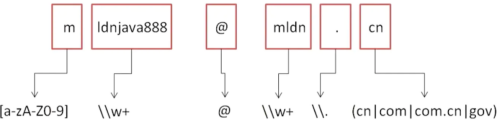

```
案例：lsx8629303@qq.com
拆分：
(开头)
l				sx8629303	@	qq		.		cn
[a-zA-Z0-9]		\\w+		@	\\w+	\\.		(cn|com|com.cn|net|gov)	
```

```java
public class JavaAPIDemo {
    public static void main(String[] args) throws Exception {
        String str = "mldnjava888@mldn.cn";
        String regex = "[a-zA-Z0-9]\\w+@\\w+\\.(cn|com|net|com\\.cn|gov)";
        System.out.println(str.matches(regex));
    }
}

// 输出内容
true
```

以上这几种匹配处理操作是最常用的几种处理形式。


## 4、java.util.regex 开发包

大多数情况下我们可以直接通过String类完成字符串正则处理，但有时我们会碰到String不易解决的问题，此时我们需要使用本节提到的java.util.regex包来进行处理。通过本节内容，你将了解到java.util.regex中的Pattern类、Matcher类的相关内容和使用方法，了解其功能及作用，并能够使用这两个类完成一些特殊的字符串操作。

虽然大部分情况下都可以利用String类实现正则的操作，但是也有一些情况需要使用java.util.regex开发包中提供的正则处理类，在这个包里面一共定义有两个类：Pattern（正则表达式编译）、Matcher（匹配）。

1、Pattern类提供有正则表达式的编译处理支持：public static Pattern compile(String regex)；
      Pattern类同时也提供有字符串的拆分操作：public String[] split(CharSequence input)；

```java
import java.util.regex.Pattern;
public class JavaAPIDemo {
    public static void main(String[] args) throws Exception {
        String str = "JKL()UI$()QR@#JKLSD()QW#EIO$RJKLOSDF" ;
        String regex = "[^a-zA-Z]+" ;
        Pattern pat = Pattern.compile(regex) ; // 编译正则表达式
        String result [] = pat.split(str) ;    // 拆分
        for (int x = 0 ; x < result.length ; x ++) {
            System.out.println(result[x]);
        }
    }
}

// 输出内容
JKL
UI
QR
JKLSD
QW
EIO
RJKLOSDF
```

2、Matcher类，实现了正则匹配的处理类，这个类的对象实例化依靠Pattern类完成：

| 方法名称                                     | 描述                |
| -------------------------------------------- | ------------------- |
| public Matcher matcher(CharSequence input)； | Pattern类提供的方法 |

当获取了Matcher类的对象之后就可以利用该类的方法进行如下操作：

| 方法名称                                       | 描述       |
| ---------------------------------------------- | ---------- |
| public boolean matches()；                     | 正则匹配   |
| public String replaceAll(String replacement)； | 字符串替换 |

【操作示例 1】字符串匹配

```java
import java.util.regex.Matcher;
import java.util.regex.Pattern;
public class JavaAPIDemo {
    public static void main(String[] args) throws Exception {
        String str = "101" ;
        String regex = "\\d+" ;
        Pattern pat = Pattern.compile(regex) ; // 编译正则表达式
        Matcher mat = pat.matcher(str) ;
        System.out.println(mat.matches());// true
    }
}

// 输出内容
true
```

【操作示例 2】字符串替换

```java
import java.util.regex.Matcher;
import java.util.regex.Pattern;
public class JavaAPIDemo {
    public static void main(String[] args) throws Exception {
        String str = "1KLKLKL()8908923892389123890JKLJKHJKL&*()&*()U" ;
        String regex = "\\D+" ;
        Pattern pat = Pattern.compile(regex) ; // 编译正则表达式
        Matcher mat = pat.matcher(str) ;
        System.out.println(mat.replaceAll(""));// 18908923892389123890
    }
}

// 输出内容
18908923892389123890
```

如果纯粹的是以拆分、替换、匹配三种操作为例，根本用不到java.util.regex开发包，只依靠String类都可以实现了。但是Matcher类里面提供有一种分组的功能，这种功能是String不具备的。操作示例 4：

```java
import java.util.regex.Matcher;
import java.util.regex.Pattern;
public class JavaAPIDemo {
    public static void main(String[] args) throws Exception {
        // 要求取出“#{内容}”标记中的所有内容
        String str = "INSERT INTO dept(deptno,dname,loc) VALUES (#{deptno},#{dname},#{loc})" ;
        String regex = "#\\{\\w+\\}" ;
        Pattern pat = Pattern.compile(regex) ; // 编译正则表达式
        Matcher mat = pat.matcher(str) ;
        while(mat.find()) {	// 是否有匹配成功的内容
            System.out.println(mat.group(0).replaceAll("#|\\{|\\}", ""));
        }
    }
}

// 输出内容
deptno
dname
loc
```

java.util.regex开发包，如果不是进行一些更为复杂的正则处理是很难使用到的，而String类所提供的功能只适合于正则的基本操作。


# 国际化程序

程序员的江湖从来不是一个人的江湖，我们开发的程序总有走出国际的时候，但我们不可能面对同样的核心业务去开发多个项目。本节将为你介绍程序国际化的概念。通过本节内容，你将了解到关于程序国际化过程中可能会遇到的问题，并通过对使用Locale类完成国家区域的语言编码设置功能的相关学习初步了解程序国际化的基本思路。所谓的国际化的程序指的是同一个程序代码可以根据不同的国家实现不同的语言描述，但是程序处理的核心业务是相同的。

## 1、国际化问题简介

现在假设有一款世界都认可的企业管理平台，那么这个企业的老板决定将这款产品推广到全世界各个大型上市公司，这些公司可以来自于不同的国家：中国、美国、德国...，那么在这样的情况下，首先要考虑的问题是什么呢？

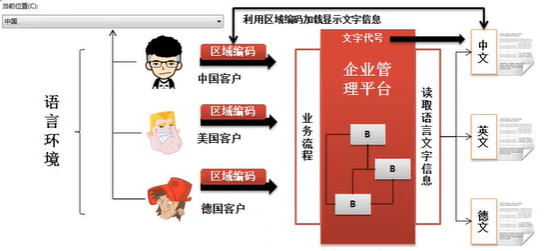

通过分析之后可以发现，如果要想实现国际化的程序开发，那么要解决的问题就在于以下两点：

1. 如何可以定义保存文字的文件信息
2. 如何可以根据不同的区域语言的编码读取指定的资源信息


## 2、Locale 类

如果要想实现国际化，那么首先需要解决的就是不同国家用户的区域和语言编码问题，而在java.util包中提供有一个专门描述区域和语言编码的类：Locale，而后主要可以使用Locale类中的两个构造方法进行实例化：

| 方法名                                                       | 类型 | 描述                              |
| ------------------------------------------------------------ | ---- | --------------------------------- |
| public Locale(String language)                               | 构造 | 指定language初始化Locale          |
| public Locale(String language, String country)               | 构造 | 指定language和country初始化Locale |
| public Locale(String language, String country, String variant) | 构造 | 创建Locale对象                    |
| public static Locale getDefault()                            | 普通 | 读取本地默认环境                  |
| Locale.CHINA、Locale.US、....                                | 常量 | 获取常量                          |

【操作示例 1】实例化Locale类对象

```java
import java.util.Locale;
public class JavaAPIDemo {
    public static void main(String[] args) throws Exception {
        Locale loc = new Locale("zh", "CN");   //中文环境
        System.out.println(loc);   //zh_CN
        System.out.println(new Locale("zh"));
        System.out.println(new Locale("zh", "CN"));
        System.out.println(new Locale("en", "US", "SiliconValley"));
    }
}

// 输出内容
zh_CN
zh
zh_CN
en_US_SiliconValley
```

【操作示例 2】读取本地默认环境，利用Locale类本身默认的方式进行实例化，自动获得当前的运行环境

```java
import java.util.Locale;
public class JavaAPIDemo {
    public static void main(String[] args) throws Exception {
        Locale loc = Locale.getDefault();  //获取默认环境
        System.out.println(loc);  //zh_CN
    }
}

// 输出内容
zh_CN
```

在实际的开发过程之中，很多人可能并不关心国家和语言的编码，所以为了简化开发，Locale类也将世界上一些比较著名的国家的编码设置为常量。

```java
import java.util.Locale;
public class JavaAPIDemo {
    public static void main(String[] args) throws Exception {
        Locale loc = Locale.CHINA;  //中文环境
        System.out.println(loc);
    }
}

// 输出内容
zh_CN
```

使用常量的优势在于可以避免一些区域编码信息的繁琐。


## 3、ResourceBundle 读取资源文件

通过本节内容，你将学会建立资源文件，并使用ResourceBundle类实现文件的获取，通过key值取得文件对应内容，进而实现资源的统一调配。

创建一个资源文件（在src目录下创建）：Messages.properties，并添加内容：

```properties
# 资源文件名称：Messages.properties
info=欢迎小强同学光临指教
```

现在已经准备好了资源文件，那么随后就需要进行资源文件的读取操作了，而读取资源文件主要依靠的是java.util.ResourceBundle类完成，此类定义如下：

```java
public abstract class ResourceBundle extends Object {}
```

ResourceBundle是一个抽象类，如果说要想进行此类对象的实例化可以直接利用该类中提供的一个静态方法完成：

| 方法名                                                       | 类型 | 描述                     |
| ------------------------------------------------------------ | ---- | ------------------------ |
| public static final ResourceBundle getBundle(String baseName) | 普通 | 获取ResourceBundle类对象 |
| public final String getString(String key)                    | 普通 | 根据key读取资源内容      |

【操作示例 1】使用ResourceBundle类读取内类

```java
import java.util.ResourceBundle;
public class JavaAPIDemo {
    public static void main(String[] args)  {
        // Messages.properties文件放在src目录下，读取的时候没有文件后缀，如果放在package下需要在前面补齐package名
        ResourceBundle messages = ResourceBundle.getBundle("Messages");
        System.out.println(messages.getString("info"));
    }
}

// 输出内容
欢迎小强同学光临指教
```

PS：如果资源没有放在包里面，则直接编写资源名称即可。如果放在package下记得写上package

在进行资源读取的时候数据的key一定要存在，如果不存在则会出现如下异常信息：java.util.MissingResourceException异常。


## 4、实现国际化程序开发

通过本节内容，你将整合之前所学，依靠预设的资源文件，使用Locale进行自动调用，或使用ResourceBundle指定一个资源文件，完整完成对一个程序的国际化改造。

现在国际化程序的实现前期准备已经全部完成了，也就是说依靠资源文件、Locale、ResourceBundle类就可以实现国际化的处理操作，那么下面来进行国际化的程序实现（核心关键：读取资源信息）

1、在 CLASSPATH（src/resources）下建立：Messages_zh_CN.properties（中文资源）

```properties
info=欢迎您的访问!
```

2、在 CLASSPATH（src/resources）下建立： Messages_en_US.properties（英文资源）

```properties
info=Welcome
```

3、在 CLASSPATH（src/resources）下建立： Messages.properties（默认资源）

```properties
info=欢迎小强同学光临指教
```

现在加上没有默认的区域的资源文件，一共定义了三个资源。三个文件都在src/resources目录下

如果想定义其他目录下也可以，读取文件的时候加上路径名称，例如：

```java
ResourceBundle resource = ResourceBundle.getBundle("cn.example.message.Messages");
```

3、通过程序进行指定区域的资源信息加载。操作示例：

```java
import java.util.ResourceBundle;
public class JavaAPIDemo {
    public static void main(String[] args)  {
        // Messages.properties文件放在src目录下，读取的时候没有文件后缀
        ResourceBundle messages = ResourceBundle.getBundle("Messages");
        System.out.println(messages.getString("info"));
    }
}

// 输出内容
欢迎您的访问!
```

此时在利用ResourceBundle类读取资源的时候并没有设置一个明确的Locale对象，但是发现“Messages_zh_CN”文件起作用了，因为这个方法里面默认加载的就是当前本地的Locale的资源：查看源码：

```java
public static final ResourceBundle getBundle(String baseName){
    return getBundleImpl(baseName, Locale.getDefault(),
                         getLoader(Reflection.getCallerClass()),
                         getDefaultControl(baseName));
}
```

4、如果现在有需要也可以修改当前的 Locale环境，则可以使用 ResourceBundle类中的如下方法：

```java
public static final ResourceBundle getBundle(String baseName, Locale locale); // 获取ResourceBundle
```

```java
import java.util.Locale;
import java.util.ResourceBundle;
public class JavaAPIDemo {
    public static void main(String[] args) {
        Locale loc = new Locale("en", "US");
        ResourceBundle resource = ResourceBundle.getBundle("Messages", loc);
        String val = resource.getString("info");
        System.out.println(val);
    }
}

// 输出内容
Welcome
```

如果现在有指定区域的资源文件存在的时候，那么没有设置区域的资源文件的信息将不会被读取。

**资源读取顺序：读取指定区域的资源文件 > 默认的本地资源 > 公共的资源（没有区域设置）**


## 5、消息格式化

通过本节内容，你将进一步优化所有的资源文件，借助MessageFormat动态替换资源文件中的占位符实现内容定制，使你的程序更加“人性化”。

如果说某一位用户登录成功了，那么一般都会显示这样的信息“Xxx，欢迎您的光临！”，也就是说这个时候会显示用户名，那么此时如果这些内容保存在资源文件里面，则需要通过占位符进行描述，同时对于读取出来的数据也需要进行消息格式化的处理。

【操作示例 1】修改资源文件（占位符方式动态传值）

| 文件路径与名称                                 | 文件内容                          |
| ---------------------------------------------- | --------------------------------- |
| 【中文】src/resouces/Messages_zh_CN.properties | info=欢迎{0}的访问，当前日期是{1} |
| 【英文】src/resouces/Messages_en_US.properties | info=Welcome {0}，date：{1}       |

如果有需要则可以继续添加“{1}”、“{2}”之类的占位符；

此时如果要进行资源文件读取则会将占位符的信息一起读取出来，所以此时就需要利用MessageFormat类进行格式化处理。

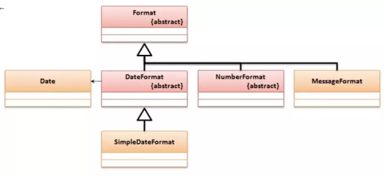

在MessageFormat类中提供有一个格式化文本的方法：

```java
public static String format(String pattern, Object... arguments);
```

【操作示例 2】格式化文本实现国际化

```java
import java.text.MessageFormat;
import java.text.SimpleDateFormat;
import java.util.Date;
import java.util.Locale;
import java.util.ResourceBundle;
public class JavaAPIDemo {
    public static void main(String[] args) throws Exception {
        Locale loc = new Locale("zn", "CN");
        ResourceBundle resource = ResourceBundle.getBundle("Messages", loc);
        // 中文乱码，将IDE的设置文件编码为UTF-8即可解决
        System.out.println(MessageFormat.format(resource.getString("info"), "xxxx",
                new SimpleDateFormat("yyyy-MM-dd").format(new Date())));

        // 解决中文乱码问题，如果没有IDE编码也可以这样处理
        String keyValue =
                new String(resource.getString("info").getBytes("ISO-8859-1"), "UTF-8");
        System.out.println(MessageFormat.format(keyValue, "xxxx",
                new SimpleDateFormat("yyyy-MM-dd").format(new Date())));
    }
}

// 输出内容
欢迎xxxx的访问，当前日期是2021-10-30
??xxxx?????????2021-10-30
```

如果在日后开发过程之中见到资源文件里面出现“{0}”、“{1}”的结构表示的都是占位符，该信息一定都要进行格式化处理。


# 开发支持类库

## 1、UUID类

UUID是一种生成无重复字符串的程序类，这种程序类的主要功能是根据时间戳实现一个自动的无重复的字符串定义。一般在获取UUID时候往往都是随机生成的一个的内容，所以可以通过如下方式获取：

| 方法名                                     | 描述                   |
| ------------------------------------------ | ---------------------- |
| public static UUID randomUUID()            | 获取UUID对象           |
| public static UUID fromString(String name) | 根据字符串获取UUID内容 |

【操作示例】在对一些文件进行自动命名处理的情况下，UUID类型非常好用。

```java
import java.util.UUID;
public class JavaAPIDemo {
	public static void main(String[] args) throws Exception {
		UUID uid = UUID.randomUUID() ;
        System.out.println(uid.toString()); // 3cdaf602-064f-46e9-aed6-341d54f63ecd
        System.out.println(UUID.fromString("53b5b824-823f-412e-ab74-caac96df4937"));
	}
}

// 输出内容
3cdaf602-064f-46e9-aed6-341d54f63ecd
53b5b824-823f-412e-ab74-caac96df4937
```


## 2、Optional类

Optional类的主要功能是进行null的相关处理，在以前进行程序开发的时候，如果为了防止程序中出现空指向异常，往往追加有null的验证。

【操作示例 1】传统的引用传递问题

```java
interface IMessage {
    public String getContent();
}

class MessageImpl implements IMessage {
    @Override
    public String getContent() {
        return "www.xxxx.cn";
    }
}

class MessageUtil{
    private MessageUtil(){}
    public static IMessage getMessage() {
        return null;
    }
    public static void useMessage(IMessage msg) {
        if (msg != null) {
            // 有可能因为null，导致空指向
            System.out.println(msg.getContent());
        }
    }
}

public class JavaAPIDemo {
    public static void main(String[] args) {
        MessageUtil.useMessage(MessageUtil.getMessage());
    }
}
```

在引用接收的一方往往都是被动的进行判断，所以为了解决这种被动的处理操作，在Java类中提供有一个Optional类，这个类可以实现null的处理操作。在这个类里面提供有如下的一些操作方法：

| 方法名                                                | 描述                   |
| ----------------------------------------------------- | ---------------------- |
| public static \<T\> Optional\<T\> of(T value)         | 保存数据，不允许为null |
| public static \<T\> Optional\<T\> ofNullable(T value) | 保存数据，允许为null   |
| public static \<T\> Optional\<T\> empty()             | 返回空数据             |
| public T get()                                        | 获取数据               |
| public T orElse(T other)                              | 空的时候返回其他数据   |

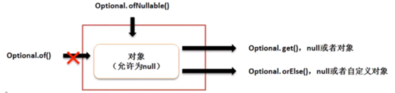

【操作示例 2】修改程序，按照正规的结构完成

```java
import java.util.Optional;

class MessageUtil{
    private MessageUtil(){}

    public static Optional<IMessage> getMessage() {
        // 有对象
        return Optional.of(new MessageImpl());
    }
    public static void useMessage(IMessage msg) {
        if (msg != null) {
            // 有可能因为null，导致空指向
            System.out.println(msg.getContent());
        }
    }
}
interface IMessage{
    String getContent();
}
class MessageImpl implements IMessage{
    @Override
    public String getContent() {
        return "www.xxxx.cn";
    }
}

public class JavaAPIDemo {
    public static void main(String[] args) throws Exception {
        IMessage temp = MessageUtil.getMessage().get();
        MessageUtil.useMessage(temp);
    }
}

// 输出内容
www.xxxx.cn
```

如果说现在数据保存的内容为null，则就会在保存处出现异常：

```java
public static Optional<IMessage> getMessage(){
    return Optional.of(null); // 有对象
}    
Exception in thread "main" java.lang.NullPointerException
	at java.base/java.util.Objects.requireNonNull(Objects.java:221)
	at java.base/java.util.Optional.<init>(Optional.java:107)
	at java.base/java.util.Optional.of(Optional.java:120)
	at MessageUtil.getMessage(JavaAPIDemo.java:8)
	at JavaAPIDemo.main(JavaAPIDemo.java:29)
```

由于Optional类中允许保存有null的内容，所以在数据获取时也可以进行null的处理，但是如果为null，则在使用get()获取数据的时候就会出现“java.util.NoSuchElementException:No value present”异常信息，所以此时可以更换为orElse()方法。

【操作示例 3】处理null

```java
import java.util.Optional;
class MessageUtil{
    public static Optional<IMessage> getMessage() {
        return Optional.ofNullable(null);
    }
    public static void useMessage(IMessage msg) {
        if (msg != null) {
            // 有可能因为null，导致空指向
            System.out.println(msg.getContent());
        }
    }
}
interface IMessage{
    String getContent();
}
class MessageImpl implements IMessage{
    @Override
    public String getContent() {
        return "www.xxxx.cn";
    }
}

public class JavaAPIDemo {
    public static void main(String[] args) {
        IMessage temp = MessageUtil.getMessage().orElse(new MessageImpl());
        MessageUtil.useMessage(temp);
    }
}

// 输出内容
www.xxxx.cn
```

在所有引用数据类型的操作处理之中，null是一个重要的技术问题，所以JDK1.8后提供的Optional类对于null的处理很有帮助，同时也是在日后进行项目开发之中使用次数很多的一种程序类。

【操作示例 4】总结用法

```java
/**
 * 初始化Optional的两种方式
 * 如果map为null opt1会报错：java.lang.NullPointerException
 */
Optional<Map<String,String>> opt1 = Optional.of(map);
Optional<Map<String,String>> opt2 = Optional.ofNullable(map);

// 如果opt2对象内为空，调用get方法也会报错
<Map<String,String> map1 = opt1.get();
<Map<String,String> map2 = opt2.get();

// 如果值存在：isPresent()⽅法会返回true，
// 调⽤get()⽅法会返回该对象⼀般使⽤get之前需要先验证是否有值，不然还会报错
Student student = null;
Optional<Student> opt = Optional.ofNullable(student);
System.out.println(opt.isPresent()); // false

Student student = null;
int result = Optional.ofNullable(student).map(obj->obj.getAge()).orElse(4);
System.out.println(result); // 4
```


## 3、ThreadLocal 类

本节结合消息发送案例简单直白地向读者展现了多线程模式下的线程安全问题，并向读者介绍了ThreadLocal类及其实现线程安全的原理，讲解了其使用方法。通过本节内容，你将了解到多线程模式下重复性业务的安全问题和ThreadLocal能够实现线程安全的原理，学会使用ThreadLocal类来解决开发过程中的线程安全问题。

在真正去了解ThreadLocal类作用的时候下面编写一个简单的程序做一个先期的分析。

【操作示例 1】现在定义这样的一个结构

```java
// 消息的发送通道
class Channel {
    private static Message message;
        public static void setMessage(Message m) {
        message = m;
    }
    // 发送消息
    public static void send() {
        System.out.println("【消息发送】" + message.getInfo());
    }
}

// 要发送的消息体
class Message {
    private String info;
    public void setInfo(String info) {
        this.info = info;
    }
    public String getInfo() {
        return info;
    }
}

public class JavaAPIDemo {
    public static void main(String[] args) throws Exception {
        Message msg = new Message();    // 实例化消息主体对象
        msg.setInfo("www.xxxx.cn");     // 设置要发送的内容
        Channel.setMessage(msg);        // 设置要发送的消息
        Channel.send();                 // 发送消息
    }
}

// 输出内容
【消息发送】www.xxxx.cn
```

对于当前的程序实际上采用的是一种单线程的模式来进行处理的；那么如果在多线程的状态下能否实现完全一致的操作效果呢？为此将启动三个线程进行处理。

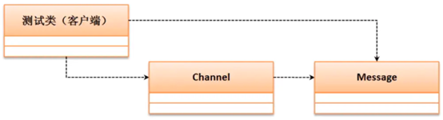

【操作示例 2】多线程的影响

```java
// 消息的发送通道
class Channel {
    private static Message message ;
    public static void setMessage(Message m) {
        message = m ;
    }
    // 发送消息
    public static void send() {
        System.out.println("【" + Thread.currentThread().getName() + "、消息发送】" + message.getInfo());
    }
}
// 要发送的消息体
class Message {
    private String info;
    public void setInfo(String info) {
        this.info = info;
    }
    public String getInfo() {
        return info;
    }
}

public class JavaAPIDemo {
    public static void main(String[] args) throws Exception {
        new Thread(()->{
            Message msg = new Message() ;	// 实例化消息主体对象
            msg.setInfo("第一个线程的消息"); // 设置要发送的内容
            Channel.setMessage(msg); // 设置要发送的消息
            Channel.send(); // 发送消息
        },"消息发送者A") .start() ;
        new Thread(()->{
            Message msg = new Message() ;	// 实例化消息主体对象
            msg.setInfo("第二个线程的消息"); // 设置要发送的内容
            Channel.setMessage(msg); // 设置要发送的消息
            Channel.send(); // 发送消息
        },"消息发送者B") .start() ;
        new Thread(()->{
            Message msg = new Message() ;	// 实例化消息主体对象
            msg.setInfo("第三个线程的消息"); // 设置要发送的内容
            Channel.setMessage(msg); // 设置要发送的消息
            Channel.send(); // 发送消息
        },"消息发送者C") .start() ;
    }
}

// 输出内容
【消息发送者B、消息发送】第三个线程的消息
【消息发送者C、消息发送】第三个线程的消息
【消息发送者A、消息发送】第三个线程的消息
```

这个时候消息的处理产生了影响。（考虑多线程ThreadLocal类）

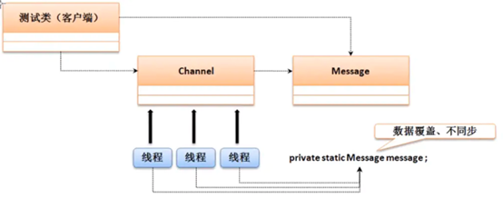

在保持Channel（所有发送的通道）核心结构不改变的情况下，需要考虑到每个线程的独立操作问题。那么在这样的情况下，发现对于Channel类而言，除了要保留有发送的消息之外，还应该多存放一个每一个线程的标记（当前线程），这个时候可以通过ThreadLocal类来存放数据。在ThreadLocal类里面提供有如下操作方法：

| 方法名                   | 类型 | 描述     |
| ------------------------ | ---- | -------- |
| public ThreadLocal()     | 构造 | 构造方法 |
| public void set(T value) | 普通 | 设置数据 |
| public T get()           | 普通 | 取出数据 |
| public void remove()     | 普通 | 删除数据 |

【操作示例 3】解决线程同步问题

```java
// 消息的发送通道
class Channel {
    private static final ThreadLocal<Message> THREADLOCAL = new ThreadLocal<>() ;
    public static void setMessage(Message m) {
        // 向ThreadLocal中保存数据
        THREADLOCAL.set(m);
    }
    public static void send() {	// 发送消息
        System.out.println("【" + Thread.currentThread().getName() + "、消息发送】" + THREADLOCAL.get().getInfo());
    }
}
// 要发送的消息体
class Message {
    private String info ;
    public void setInfo(String info) {
        this.info = info;
    }
    public String getInfo() {
        return info;
    }
}

public class JavaAPIDemo {
    public static void main(String[] args) throws Exception {
        new Thread(()->{
            Message msg = new Message() ;	// 实例化消息主体对象
            msg.setInfo("第一个线程的消息"); // 设置要发送的内容
            Channel.setMessage(msg); // 设置要发送的消息
            Channel.send(); // 发送消息
        },"消息发送者A") .start() ;
        new Thread(()->{
            Message msg = new Message() ;	// 实例化消息主体对象
            msg.setInfo("第二个线程的消息"); // 设置要发送的内容
            Channel.setMessage(msg); // 设置要发送的消息
            Channel.send(); // 发送消息
        },"消息发送者B") .start() ;
        new Thread(()->{
            Message msg = new Message() ;	// 实例化消息主体对象
            msg.setInfo("第三个线程的消息"); // 设置要发送的内容
            Channel.setMessage(msg); // 设置要发送的消息
            Channel.send(); // 发送消息
        },"消息发送者C") .start() ;
    }
}

// 输出内容
【消息发送者C、消息发送】第三个线程的消息
【消息发送者A、消息发送】第一个线程的消息
【消息发送者B、消息发送】第二个线程的消息
```

PS：每一个线程通过ThreadLocal只允许保存一个数据。


## 4、Timer 定时器

> 更多详情方法可参考：
>
> 1. https://www.cnblogs.com/xsjzhao/p/10651704.html
> 2. https://blog.csdn.net/weixin_39792935/article/details/105357000

在开发过程中经常会遇到自定义时钟的需求，这时我们可以创建一个定时任务。本节将为你讲解如何使用Timer类与TimerTask类实现定时任务的管理工作。通过本节内容，你将了解到Timer类和TimerTask类的相关方法和功能以及两个类之间的关系，学会使用这两个类去创建并启动单次的或循环的定时任务。

定时器的主要操作是进行定时任务的处理。比如每天早上起来的闹铃一样。在Java中提供有定时任务的支持，但是这种任务的处理只是实现了一种间隔触发的操作。如果要实现定时的处理操作主要需要有一个定时操作的主体类，以及一个定时任务的控制。可以使用两个类实现：

1. java.util.TimerTask类：实现自定义定时任务处理（自定义类实现TimerTask接口）
2. java util.Timer类：进行任务的启动，启动的方法：
   1. 任务启动：public void schedule(TimerTask task, long delay)、延迟单位为毫秒；
   2. 间隔触发：public void schedule(TimerTask task, long delay, long period)


java util.Timer 类的四种任务启动：

```java
// 在时间等于或超过time的时候执行且仅执行一次task (单次)。
public void schedule(TimerTask task, Date time);

// 时间等于或超过firstTime时首次执行task，之后每隔peroid毫秒重复执行一次task (多次)。
public void schedule(TimerTask task, long delay, long period);
    
// 等待delay毫秒后执行且仅执行一次task (单次)。
public void schedule(TimerTask task, long delay);
    
// 等待delay毫秒后首次执行task, 之后每个period毫秒重复执行一次task (多次)。
public void scheduleAtFixedRate(TimerTask task, long delay, long period);
```

java util.Timer 类的间隔触发：

```java
// 时间等于或超过time时首次执行task,之后每隔peroid毫秒重复执行一次task (多次, 同schedule第2种用法)。
public void scheduleAtFixedRate(TimerTask task, long delay, long period)
    
// 等待delay毫秒后首次执行task, 之后每个period毫秒重复执行一次task (多次, 同schedule第4种用法)。
public void scheduleAtFixedRate(TimerTask task, Date firstTime, long period)
```

【操作示例 1】实现定时任务的处理

```java
import java.time.LocalTime;
import java.util.Timer;
import java.util.TimerTask;
class MyTask extends TimerTask { // 任务主体
    @Override
    public void run() {
        System.out.println(Thread.currentThread().getName() +
                "、定时任务执行，当前时间：" + LocalTime.now());
    }
}
public class JavaAPIDemo {
    public static void main(String[] args) {
        // 定义间隔任务，1秒后开始执行，每2秒执行一次
        new Timer().scheduleAtFixedRate(new MyTask(), 1000, 2000);
    }
}

// 输出内容
Timer-0、定时任务执行，当前时间：11:53:39.526156600
Timer-0、定时任务执行，当前时间：11:53:41.511843
Timer-0、定时任务执行，当前时间：11:53:43.512495100
Timer-0、定时任务执行，当前时间：11:53:45.511552700
Timer-0、定时任务执行，当前时间：11:53:47.512221800
...
```

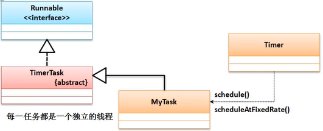

这种定时是由JDK最原始的方式提供的支持，但是实际上开发之中利用采用此类方式进行的定时处理实现的代码会非常的复杂。


## 5、Base64 加密工具

在实际场景中经常会有数据通信事件，而对于某些对安全性要求比较高的需求，简单的数据传输是不够用的，本节将为读者介绍使用Base64加密解密数据的方法。通过本节内容，你将对数据加密解密工作有一个初步的认识，并能够使用Base64结合附加盐值、多层加密解密等技巧实现对数据的简单加密。

正常来讲加密基本上永远都要伴随着解密，所谓的加密或者是解密往往都需要有一些规则。在JDK1.8开始提供有一组新的加密处理操作类，Base64处理。在这个类里面有两个内部类：

1. 加密处理类：Base64.Encoder：加密处理方法：public byte[] encode(byte[] src)
2. 解密处理类：Base64.Decoder：解密处理方法：public byte[] decode(String src)

【操作示例 1】实现加密与解密操作

```java
import java.util.Base64;
public class JavaAPIDemo {
    public static void main(String[] args) throws Exception {
        Base64.Encoder encoder = Base64.getEncoder();
        Base64.Decoder decoder = Base64.getDecoder();
        // 要发送的信息内容
        String msg = "www.xxxx.cn" ;
        // 数据加密
        String encMsg = new String(encoder.encode(msg.getBytes())) ;
        System.out.println(encMsg);
        // 数据解密
        String oldMsg = new String(decoder.decode(encMsg));
        System.out.println(oldMsg);
    }
}

// 输出内容
d3d3Lnh4eHguY24=
www.xxxx.cn
```

虽然Base64可以实现加密与解密的处理，但是其由于是一个公版的算法，所以如果直接对数据进行加密往往并不安全，所以最好的做法是使用盐值操作。

【操作示例 2】使用盐值加密

```java
import java.util.Base64;
public class JavaAPIDemo {
    public static void main(String[] args) throws Exception {
        Base64.Encoder encoder = Base64.getEncoder();
        Base64.Decoder decoder = Base64.getDecoder();
        // 要发送的信息内容
        String salt = "xxxxjava" ;
        String msg = "www.xxxx.cn" + "{" + salt + "}";
        // 数据加密
        String encMsg = new String(encoder.encode(msg.getBytes())) ;
        System.out.println(encMsg);
        String oldMsg = new String(decoder.decode(encMsg));
        System.out.println(oldMsg);
    }
}

// 输出内容
d3d3Lnh4eHguY257eHh4eGphdmF9
www.xxxx.cn{xxxxjava}
```

即便现在有盐值实际上发现加密的效果也不是很好，最好的做法是多次加密。操作示例 3：复杂加密

```java
import java.util.Base64;
class StringUtil {
    // 公共的盐值
    private static final String SALT = "xxxxjava";
    // 加密次数
    private static final int REPEAT = 5 ;
    /**
     * 加密处理
     * @param str 要加密的字符串，需要与盐值整合
     * @return 加密后的数据
     */
    public static String encode(String str) {	// 加密处理
        // 盐值对外不公布
        String temp = str + "{" + SALT + "}" ;
        // 将字符串变为字节数组
        byte data [] = temp.getBytes() ;
        // 重复加密
        for (int x = 0 ; x < REPEAT ; x ++) {
            data = Base64.getEncoder().encode(data) ;
        }
        return new String(data) ;
    }
    /**
     * 进行解密处理
     * @param str 要解密的内容
     * @return 解密后的原始数据
     */
    public static String decode(String str) {
        byte data [] = str.getBytes() ;
        for (int x = 0 ; x < REPEAT ; x ++) {
            data = Base64.getDecoder().decode(data) ;
        }
        return new String(data).replaceAll("\\{\\w+\\}", "") ;
    }
}

public class JavaAPIDemo {
    public static void main(String[] args) throws Exception {
        String str = StringUtil.encode("www.xxxx.cn");
        System.out.println(str);
        System.out.println(StringUtil.decode(str));
    }
}

// 输出内容
VjJ0U1QyRXdNSGRsU0Zab1VrWktjMVV3Wkd0TlZtUlZVMVJHVDAxc1drcFpWVkpUWWtaSmVsRnRPV0ZTZWtaSVZERkZPVkJSUFQwPQ==
www.xxxx.cn
```

最好的做法就是使用2-3种加密程序，同时再找到一些完全不可解密的加密算法。


## 6、Arrays 类

在之前讲解数组的时候将结果数组排序：java.util.Arrays.sort()。实际上Arrays类就是属于java.util包中的一个类，并且sort()方法是一个static方法，Arrays类中的全部方法都是static方法，所以这个类的构造方法肯定是被私有化了，在Arrays类之中支持如下一些常用操作方法：

| 方法名                                                      | 描述                                                         |
| ----------------------------------------------------------- | ------------------------------------------------------------ |
| public static void sort(数据类型[] a)                       | 排序                                                         |
| `public static <T> List<T> asList(T... a)`                  | 指定数组固定大小                                             |
| public static int binarySearch(数据类型[] a, 数据类型 key)  | 二分査找【依赖排序】                                         |
| public static int compare(数据类型[] a, 数据类型[] b)       | 数组比较【依赖排序】返回三类结果：大于(1)、小于(-1)、等于(0) |
| public static boolean equals(数据类型[] a, 数据类型[] a2)   | 数组相等【依赖排序】                                         |
| public static void fill(数据类型[] a，数据类型 val)         | 数组填充，数组array所有元素都赋值为val                       |
| `public static <T> T[] copyOf(T[] original, int newLength)` | 把数组array复制成长度为length的新数组                        |
| public static String toString(数据类型[] a)                 | 数组转为String                                               |
| Arrays.asList(array).contains(val)                          | 查看数组array中是否有特定的值val                             |

浅谈Arrays.asList的使用，首先该方法是将数组转化为list。有以下几点需要注意：

1. 该方法不适用于基本数据类型（byte、short、int、long,float、double、boolean）
2. 该方法将数组与列表链接起来，当更新其中之一时，另一个自动更新
3. 不支持add和remove方法

【操作示例 1】观察数组的基本操作

```java
import java.util.Arrays;
public class JavaAPIDemo {
    public static void main(String[] args) {
        int dataA [] = new int [] {1,2,3} ;
        int dataB [] = new int [] {1,2,3} ;
        System.out.println(Arrays.compare(dataA, dataB)); // 0
        System.out.println(Arrays.equals(dataA, dataB)); // true
    }
}

// 输出内容
0
true
```

【操作示例 2】数组填充

```java
import java.util.Arrays;
public class JavaAPIDemo {
    public static void main(String[] args) {
        int data[] = new int[10];
        Arrays.fill(data, 3); // 对数组内容进行填充处理
        System.out.println(Arrays.toString(data));
    }
}

// 输出内容
[3, 3, 3, 3, 3, 3, 3, 3, 3, 3]
```

在Arrays类里面提供有一个最为重要的操作方法：二分查找法，主要的功能是确定要查找的数据是否存在，二分查找的核心本质在于数组必须是排序后的结果。

【操作示例 3】执行二分查找

```java
import java.util.Arrays;
public class JavaAPIDemo {
    public static void main(String[] args) {
        int data[] = new int[] { 1, 5, 7, 2, 3, 6, 0 }; // 数组
        Arrays.sort(data); // 数组必须采用升序排序（默认）
        System.out.println(Arrays.binarySearch(data, 6));	// 二分查找
    }
}

// 输出内容
5
```

既然说到了数组中的数据查找，那么首先肯定想到的就是数据的一次对比。

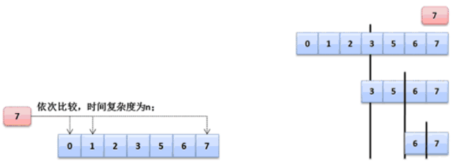

如果你现在的数据量本身并不大，也就只有20个数据,那么即便时间复杂度为n，那么也没有多慢，但是如果你现在的数据量非常大，大概有200个数组内容，那么这个时候就会发现循环要执行200次。所以为了提升数据的查询性能,可以借助于二分查找法进行处理。

**面试题：**请编写一个二分查找法实现数组内容的查询

在Arrays类中是有所提供的，使用的是binarySearche()方法，而这个查找的方式默认采用的是比较器的处理模式来完成的，那么下面可以按照同样的思路，通过循环的方式来处理。但是一旦通过循环的方式就只能够使用基本数据类型以确定大小关系了。

- 11 的二进制数据：	00000000 00000000 00000000 00001011
- 无条件向右移动1位：00000000 00000000 00000000 00000101，转为十进制5
- 使用二进制处理的最直接的优势在于：速度更快，但是在大内存的情况下这样的速度提升是很有限的。

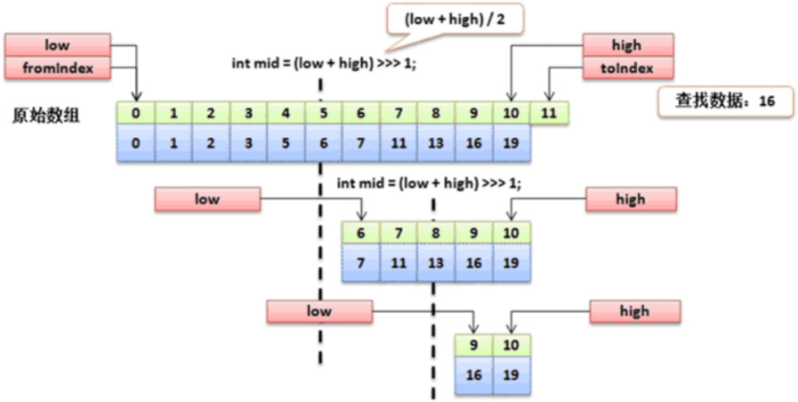

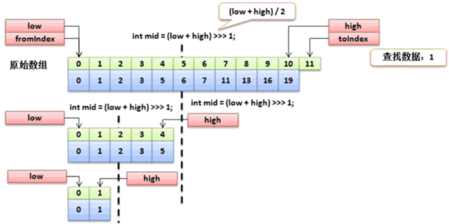

【操作示例 4】实现程序

```java
import java.util.Arrays;
class ArrayUtil {
    private ArrayUtil() {}
    /**
     * 进行数组数据的二分查找操作
     * @param data 要进行查找的数组
     * @param key 要查找的数据
     * @return 如果找到数据返回数据索引，找不到返回负数（-1）
     */
    public static int binarySearch(int data[],int key) {
        if (data == null) {
            return -1 ;
        }
        return binarySearchDefault(data, 0, data.length, key) ;
    }
    /**
     * 实现一个二分查找具体实现方法
     * @param data 要进行查找的原始数组
     * @param fromIndex 开始索引
     * @param toIndex 结束索引，数组长度
     * @param key 要查询的数据
     * @return 查找到数据返回索引，找不到返回负数（-1）
     */
    private static int binarySearchDefault(int[] data, int fromIndex, int toIndex,
                                           int key) {
        int low = fromIndex; // 左边的索引
        int high = toIndex - 1; // 右边的索引
        while (low <= high) {	// 结束条件
            int middle = (low + high) / 2 ; // 计算中间的索引数据
            if (data[middle] == key) {	// 查找到了
                return middle ; // 返回索引
            } else if (key < data[middle]) {	// 向左边开始查
                high = middle - 1 ;
            } else {
                low = middle + 1 ;
            }
        }
        return -1 ;
    }
}

public class JavaAPIDemo {
    public static void main(String[] args) throws Exception {
        int data[] = new int[] { 1, 5, 7, 2, 3, 6, 0, 11, 13, 16, 19 }; // 数组
        Arrays.sort(data);	// [0, 1, 2, 3, 5, 6, 7, 11, 13, 16, 19]
        for (int x = 0 ; x < data.length ; x ++) {
            System.out.println(data[x] + "查找、结果：" + ArrayUtil.binarySearch(data, data[x]));
        }
        System.out.println(ArrayUtil.binarySearch(data, 4));
        System.out.println(ArrayUtil.binarySearch(data, 9));
        System.out.println(ArrayUtil.binarySearch(data, 99));
        System.out.println(ArrayUtil.binarySearch(data, -99));
    }
}

// 输出内容
0查找、结果：0
1查找、结果：1
2查找、结果：2
3查找、结果：3
5查找、结果：4
6查找、结果：5
7查找、结果：6
11查找、结果：7
13查找、结果：8
16查找、结果：9
19查找、结果：10
-1
-1
-1
-1
```

在实际的开发之中，这种代码你可能永远不会写到，因为如果真有此需求，直接通过现有的功能实现即可，但是笔试之中容易问到。


# 比较器

所谓的比较器指的是进行大小关系的确定判断。下面首先来分析一下比较器存在的意义是什么。通过本节内容，你将了解到常用的数组排序功能的实现方法，并能够认识到现有的比较规则并不能直接应用于对象之间的比较。

## 1、比较器问题的引出

如果要进行数组操作，肯定使用java.util.Arrays的操作类完成，这个类里面提供有绝大部分的数组操作支持，同时在这个类里面还提供有一种对象数组的排序： public static void sort(Object[] a);

操作示例 1：实现对象数组的排序

```java
import java.util.Arrays;
public class JavaAPIDemo {
    public static void main(String[] args) {
        Integer data[] = new Integer[]{10, 9, 5, 2, 20}; // 对象数组
        Arrays.sort(data); // 进行对象数组排序
        System.out.println(Arrays.toString(data)); // [2, 5, 9, 10, 20]
    }
}

// 输出内容
[2, 5, 9, 10, 20]
```

同样，如果说现在给定的是一个String型的对象数组，那么也是可以进行排序处理的。操作示例 2：String对象数组排序

```java
import java.util.Arrays;
public class JavaAPIDemo {
    public static void main(String[] args) throws Exception {
        String data[] = new String[]{"X", "B", "A", "E", "G"}; // 对象数组
        Arrays.sort(data); // 进行对象数组排序
        System.out.println(Arrays.toString(data)); // [A, B, E, G, X]
    }
}

// 输出内容
[A, B, E, G, X]
```

java.lang.Integer与java.lang.String两个类都是由系统提供的程序类，那么如果说现在有一个自定义的类需要实现排序处理呢？

操作示例 3：采用自定义类型进行排序

```java
import java.util.Arrays;
class Person {
    private String name;
    private int age;
    public Person () {}
    public Person(String name, int age) {
        super();
        this.name = name;
        this.age = age;
    }
    // setter、getter略
    @Override
    public String toString() {
        return "【Person类对象】姓名：" + this.name + "、年龄：" + this.age + "\n";
    }
}
public class JavaAPIDemo {
    public static void main(String[] args) throws Exception {
        Person data [] = new Person []{
            new Person("小强-A",80),
            new Person("小强-B",50),
            new Person("小强-C",100),
        };
        // 进行对象数组排序（实际这一行就报错）
        Arrays.sort(data);
        // 运行时异常：Exception in thread "main" java.lang.ClassCastException: Person cannot be cast to java.base/java.lang.Comparable
        System.out.println(Arrays.toString(data));
    }
}

// 输出内容
Exception in thread "main" java.lang.ClassCastException: Person cannot be cast to java.base/java.lang.Comparable
	at java.base/java.util.ComparableTimSort.countRunAndMakeAscending(ComparableTimSort.java:320)
	at java.base/java.util.ComparableTimSort.sort(ComparableTimSort.java:188)
	at java.base/java.util.Arrays.sort(Arrays.java:1248)
	at JavaAPIDemo.main(JavaAPIDemo.java:25)
```

任意的一个类默认情况下是无法使用系统内部的类实现数组排序或比较需求的，是因为没有明确的指定出到底该如何进行比较的定义（没有比较规则），那么么这个时候在Java里面为了统一比较规则的定义，所以JDK1.2之后开始提供有比较器的接口：Comparable接口。


## 2、Comparable 比较器

通过本节内容，你将了解到Comparable接口内的方法结构，从结构图中直观地了解到Comparable的一些相关关联内容，能够通过实现Comparable接口完成对对象的比较功能。

通过分析可以发现如果要实现对象的比较肯定需要有比较器来制定比较规则，而比较的规则就通过Comparable来实现，对于Comparable而言，需要清楚其基本的定义结构：

```java
public interface Comparable<T>{
    /**
     * 实现对象的比较处理操作
     * @param o 要比较的对象
     * @return 当前数据比传入的对象小返回负数，如果大于返回正数，如果等于返回0
     */
    public int compareTo(T o);
}
```

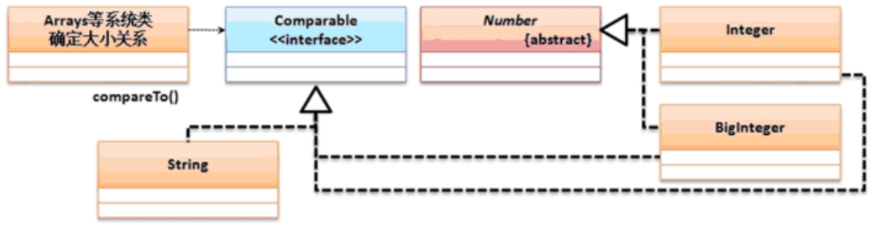

【操作示例 1】实现自定义对象数组排序操作

```java
import java.util.Arrays;
class Person implements Comparable<Person> {
    private String name;
    private int age;
    public Person(String name, int age) {
        this.name = name;
        this.age = age;
    }
    @Override
    public String toString() {
        return "【Person类对象】姓名：" + this.name + "、年龄：" + this.age;
    }
    @Override
    public int compareTo(Person per) {
        return this.age - per.age; // 升序
        // return per.age-this.age; // 降序
    }
}
public class JavaAPIDemo {
    public static void main(String[] args) throws Exception {
        Person data[] = new Person[]{
                new Person("小强-A", 80),
                new Person("小强-B", 50),
                new Person("小强-C", 100),
        };
        // 进行对象数组排序
        Arrays.sort(data);
        System.out.println(Arrays.toString(data));
    }
}

// 输出内容
[【Person类对象】姓名：小强-B、年龄：50, 【Person类对象】姓名：小强-A、年龄：80, 【Person类对象】姓名：小强-C、年龄：100]
```

排序里面只需要有一个compareTo()方法进行排序规则的定义，而后整个Java系统里面就可以为其实现排序处理了。


## 3、Comparator 比较器

在实际的开发场景中往往会遇到某些已开发完成但并未实现Comparable的类对象需要进行排序比较操作的需求，但出于某些原因不便修改该类，此时我们可以使用Comparator来提供对对象的比较功能。通过本节内容，你将接触到Comparator类，了解其功能和使用方法，学会在各种场景下灵活运用Comparable和Comparator来实现复杂的比较逻辑。

Comparator 属于一种挽救的比较器支持，其主要的目的是解决一些没有实现Comparable排序的类的对象数组排序操作。

【操作示例 1】现在程序项目已经开发完成了，并且由于先期的设计并没有去考虑到所谓的比较器功能。

```java
class Person {
    private String name;
    private int age;
    public Person(String name, int age) {
        this.name = name;
        this.age = age;
    }
    @Override
    public String toString() {
        return "【Person类对象】姓名：" + this.name + "、年龄：" + this.age;
    }
}
```

之后经过若干版本的迭代更新发现需要对Person类进行排序处理，但是又不能够去修改Person类（无法实现Comparable接口），所以这个时候就需要采用一种挽救的形式来实现比较，在Arrays类里面排序有另外一种实现：

| 方法名                                                  | 类型 | 描述                     |
| ------------------------------------------------------- | ---- | ------------------------ |
| public static void sort(T[] a, Comparator<? super T> c) | 普通 | 基于Comparator的排序处理 |

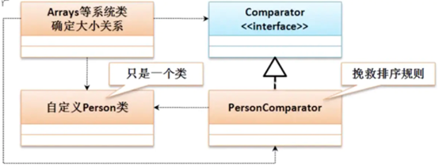

在java.util.Comparator里面，最初只定义有一个排序的compare()方法：public int compare(T o1, T o2)；但是后来持续发展又出现了许多的static方法。

【操作示例 2】定义排序规则类，在测试类进行排序处理的时候就可以利用排序规则实现操作。

```java
class PersonComparator implements Comparator<Person> {
    @Override
    public int compare(Person p1,Person p2) {
        return p1.getAge() - p2.getAge();
    }
}
```

操作示例 3：使用Comparator接口排序

```java
import java.util.Arrays;
import java.util.Comparator;
class PersonComparator implements Comparator<Person> {
    @Override
    public int compare(Person p1, Person p2) {
        return p1.getAge() - p2.getAge();
    }
}
class Person {
    private String name;
    private int age;
    public Person(String name, int age) {
        this.name = name;
        this.age = age;
    }
    @Override
    public String toString() {
        return "【Person类对象】姓名：" + this.name + "、年龄：" + this.age;
    }
    public String getName() {
        return name;
    }
    public void setName(String name) {
        this.name = name;
    }
    public int getAge() {
        return age;
    }
    public void setAge(int age) {
        this.age = age;
    }
}
public class JavaAPIDemo {
    public static void main(String[] args) {
        Person data[] = new Person[]{
                new Person("小强-A", 80),
                new Person("小强-B", 50),
                new Person("小强-C", 100),
        };
        // 进行对象数组排序
        Arrays.sort(data, new PersonComparator());
        System.out.println(Arrays.toString(data));
        // Lambda方式，从大到小排序
        Arrays.sort(data, Comparator.comparing(Person::getAge).reversed());
        System.out.println(Arrays.toString(data));
    }
}

// 输出内容
[【Person类对象】姓名：小强-B、年龄：50, 【Person类对象】姓名：小强-A、年龄：80, 【Person类对象】姓名：小强-C、年龄：100]
[【Person类对象】姓名：小强-C、年龄：100, 【Person类对象】姓名：小强-A、年龄：80, 【Person类对象】姓名：小强-B、年龄：50]
```

对于这种排序的操作如果不是必须的情况下，强烈不建议使用Comparator，最好以Comparable为主。

**面试题：请解释Comparable和Comparator的区别？**

1. java.lang.Comparable是在类定义的时候实现的父接口，主要用于定义排序规则，里面只有一个compareTo()方法
2. java.util.Comparator是挽救的比较器操作，需要设置单独的比较器规则类实现排序，里面有compare()方法


## 二叉树结构简介

> **简介：** 在之前的学习中我们接触过链表数据结构的相关内容，其查询操作的时间复杂度为O(n)，这对大量数据来说显然是很损耗性能的。本节将为读者介绍一种新的数据结构：二叉树。

**【本节目标】**通过阅读本节内容，你将初步接触树的结构，了解其结构特性和数据排布方式，并能够实现简单的二叉树，理解其执行查询时的基本逻辑，认识其常用的遍历方法。

在进行链表结构开发的过程之中会发现所有的数据按照首尾相连的状态进行保存，那么当要进行某一个数据查询的时候（判断该数据是否存在），这种情况下它所面对的时间复杂度是“O(n)”，如果说它的数据量小（不超过30个）情况下，那么性能上是不会有太大差别的，而一旦保存的数据量很大，这个时候时间复杂度就会严重损耗程序的运行性能，那么现在对于数据的存储结构就必须发生改变，应该可以尽可能的减少检索次数为出发点进行设计。对于现在的数据结构而言，最好的性能就是“O(logn)”，所以要想实现它，就可以利用二叉树的结构来完成。

如果要实现一棵树结构的定义，那么需要去考虑数据的存储形式，在二叉树的实现之中，其基本的实现原理如下：取第一个数据为保存的根节点，小于等于根节点的数据放在节点的左子树，而大于节点的数据要放在该节点的右子树。

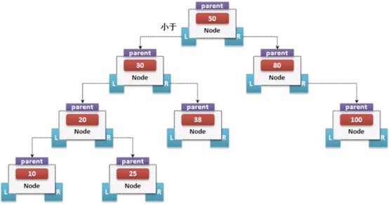

如果要进行数据检索的话，此时就需要进行每个节点的判断，但是它的判断是区分左右的，所以不会是整个结构都进行判断处理，那么它的时间复杂度就是“O(logn)”。

而对于二叉树而言，在进行数据获取的时候也有三种形式：前序遍历（根-左-右）、中序遍历（左-根-右）、后序遍历（左-右-根），那么现在只是以中序遍历为主，则以上的数据进行中序遍历的时候最终的结果：10、20、25、30、38、50、80、100；


## 二叉树基础实现（数据添加）

> **简介：** 二叉树可以优化查找效率的关键原因在于其特殊的数据保存方式，在保存时就借助比较器提前完成数据的有序摆放。本节将结合具体案例讲解实现二叉树数据保存的方法。

**【本节目标】**通过阅读本节内容，你将了解到二叉树保存数据的方式，并能够复习之前所学的比较器相关内容，借助比较器实现二叉树特殊的数据保存功能。

在实现二叉树的处理之中最为关键的问题在于数据的保存，而且数据由于牵扯到对象比较的问题，那么一定要有比较器的支持，而这个比较器首选一定是Comparable，所以本次将保存一个Person类数据：

```java
class Person implements Comparable<Person>{
    private String name;
    private int age;
    public Person(String name, int age) {
        this.name = name;
        this.age = age;
    }
    @Override
    public String toString() {
        return "【Person类对象】姓名：" + this.name + "、年龄：" + this.age + "\n";
    }

    @Override
    public int compareTo(Person per) {
        return this.age-per.age;//升序
    }
}
```

随后如果要想进行数据的保存，首先一定要有一个节点类。节点类中由于牵扯到数据保存问题，所以必须使用Comparable（可以区分大小）；

```java
import java.util.Arrays;

/**
 * 实现二叉树操作
 * @param <T> 要进行二叉树的实现
 */
class BinaryTree<T extends Comparable<T>> {
    private class Node {
        private Comparable<T> data;  // 存放Comparable,可以比较大小
        private Node parent;         // 保存父节点
        private Node left;           // 保存左子树
        private Node right;          // 保存右子树

        // 构造方法直接负责进行数据的存储
        public Node(Comparable<T> data) {
            this.data = data;
        }

        /**
         * 实现节点数据的适当位置的存储
         * @param newNode 创建的新节点
         * @throws IllegalArgumentException 保存的数据已存在
         */
        public void addNode(Node newNode) {
            if (newNode.data.compareTo((T) this.data) <= 0) {   // 比当前节点数据小
                if (this.left == null) {   //没有左子树
                    //当前没有左子树
                    this.left = newNode;   //保存左子树
                    newNode.parent = this;   //保存父节点
                } else {   //需要向左边继续判断
                    this.left.addNode(newNode);    //继续向下判断
                }
            } else {     //比根节点的数据大
                if (this.right == null) {    //当前没有右子树
                    this.right = newNode;    //保存左子树
                    newNode.parent = this;   //保存父节点
                } else {
                    this.right.addNode(newNode);  //继续向下判断
                }
            }
        }

        /**
         * 实现所有数据的获取处理，按照中序遍历的形式来完成
         */
        public void toArrayNode() {
            if (this.left != null) {     //有左子树
                this.left.toArrayNode();    //递归调用
            }
            BinaryTree.this.returnData[BinaryTree.this.foot++] = this.data;
            if (this.right != null) {
                this.right.toArrayNode();
            }
        }
    }

    //-------------------以下为二叉树的功能实现--------------
    private Node root;  //保存根节点
    private int count;   //保存数据个数
    private Object[] returnData;   //返回的数据
    private int foot = 0;   //脚标控制

    /**
     * 进行数据的保存
     *
     * @param data 要保存的数据内容
     * @throws NullPointerException 保存数据为空时抛出的异常
     */
    public void add(Comparable<T> data) {
        if (data == null) {
            throw new NullPointerException("保存的数据不允许为空！");
        }
        //所有的数据本身不具备节点关系的匹配，那么一定要将其包装在Node类之中
        Node newNode = new Node(data);   //保存节点
        if (this.root == null) {    //现在没有根节点，则第一个节点作为根节点
            this.root = newNode;
        } else {    //需要为其保存到一个合适的节点
            this.root.addNode(newNode);  //交由node类负责处理
        }
        this.count++;
    }

    /**
     * 以对象数组的形式返回全部数据，如果没有数据返回null
     * @return 全部数据
     */
    public Object[] toArray() {
        if (this.count == 0) {
            return null;
        }
        // 保存长度为数组长度
        this.returnData = new Object[this.count];
        // 脚标清零
        this.foot = 0;
        // 直接通过Node类负责
        this.root.toArrayNode();
        // 返回全部的数据
        return this.returnData;
    }
}

class Person implements Comparable<Person> {
    private String name;
    private int age;
    public Person(String name, int age) {
        this.name = name;
        this.age = age;
    }
    @Override
    public String toString() {
        return "【Person类对象】姓名：" + this.name + "、年龄：" + this.age + "\n";
    }
    @Override
    public int compareTo(Person person) {
        return this.age - person.age; // 升序
    }
}


public class JavaAPIDemo {
    public static void main(String[] args) {
        BinaryTree<Person> tree = new BinaryTree<>();
        tree.add(new Person("小强-80", 80));
        tree.add(new Person("小强-30", 30));
        tree.add(new Person("小强-50", 50));
        tree.add(new Person("小强-60", 60));
        tree.add(new Person("小强-90", 90));
        System.out.println(Arrays.toString(tree.toArray()));
    }
}

// 输出内容
[【Person类对象】姓名：小强-30、年龄：30
, 【Person类对象】姓名：小强-50、年龄：50
, 【Person类对象】姓名：小强-60、年龄：60
, 【Person类对象】姓名：小强-80、年龄：80
, 【Person类对象】姓名：小强-90、年龄：90
]
```

在进行数据添加的时候只是实现了节点关系的保存，而这种关系的保存后的结果就是所有的数据都属于有序排列。


## 二叉树数据查询


## 二叉树数据删除

> **简介：**二叉树能够提升查询效率得益于其特殊的结构，而删除节点意味着其他节点也将受到影响，删除的节点的位置也决定了该次删除操作的复杂程度。本节将具体介绍二叉树删除节点功能的实现。

**【本节目标】**通过阅读本节内容，你将通过具体的示例图了解到二叉树节点删除过程中遇到的难点问题，并理解删除时需要对其他节点做怎样的调整，学会其代码实现。

二叉树之中的数据删除操作是非常复杂的，因为在进行数据删除的时候需要考虑的情况是比较多的：

情况一、如果待删除节点没有子节点，那么直接删掉即可，数据的删除情况分析一：

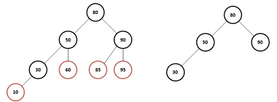


情况二、如果待删除节点只有一个子节点，那么直接删掉，并用其子节点去顶替它；这个时候考虑两种情况分析：

1、只有一个左子树。数据的删除情况分析二左子树：

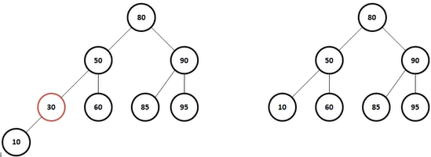


2、只有一个右子树。数据的删除情况分析二右子树：

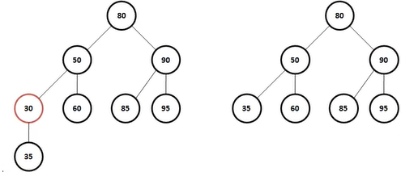


情况三、如果待删除节点有两个子节点，这种情况比较复杂，首先找出它的后继节点，然后处理“后继节点”和“被删除节点的父节点”之间的关系，最后处理“后继节点的子节点”和“被删除节点的子节点”之间的关系。数据的删除情况分析三：

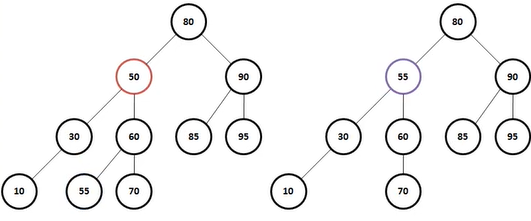


操作示例 1：下面通过具体的代码实现操作功能。

```java
import  java.util.Arrays;

/**
 *  实现二叉树操作
 *  @param  <T>  要进行二叉树的实现
 */
class  BinaryTree<T  extends  Comparable<T>> {
    private  class  Node{
        private  Comparable<T>  data;    // 存放Comparable,可以比较大小
        private  Node  parent;           // 保存父节点
        private  Node  left;             // 保存左子树
        private  Node  right;            // 保存右子树
        // 构造方法直接负责进行数据的存储
        public  Node(Comparable<T>  data){
            this.data=data;
        }
        /**
         *  实现节点数据的适当位置的存储
         *  @param  newNode  创建的新节点
         *  @throws  IllegalArgumentException  保存的数据已存在
         */
        public  void  addNode(Node  newNode)  {
            if(newNode.data.compareTo((T)this.data)  <=  0){      //比当前节点数据小
                if(this.left==null){      //没有左子树
                    //当前没有左子树
                    this.left=newNode;      //保存左子树
                    newNode.parent=this;      //保存父节点
                }else{      //需要向左边继续判断
                    this.left.addNode(newNode);        //继续向下判断
                }
            }else{          //比根节点的数据大
                if(this.right==null){        //当前没有右子树
                    this.right=newNode;        //保存左子树
                    newNode.parent=this;      //保存父节点
                }else{
                    this.right.addNode(newNode);    //继续向下判断
                }
            }
        }
        /**
         *  实现所有数据的获取处理，按照中序遍历的形式来完成
         */
        public  void  toArrayNode()  {
            if(this.left!=null){          //有左子树
                this.left.toArrayNode();        //递归调用
            }
            BinaryTree.this.returnData[BinaryTree.this.foot++]=this.data;
            if(this.right!=null){
                this.right.toArrayNode();
            }
        }
        /**
         *  检查是否包含此节点
         *  @param  data  比较的对象
         *  @return  找到返回true，找不到返回false
         */
        public  boolean  containsNode(  Comparable<T>  data)  {
            if  (data.compareTo((T)this.data)  ==0)  {
                return  true  ;  //查找到了
            }  else  if  (data.compareTo((T)this.data)  <  0){    //左边有数据
                if  (this.left  !=  null)  {
                    return  this.left.containsNode(data);
                }  else  {
                    return  false;
                }
            }  else  {
                if  (this.right  !=  null)  {
                    return  this .right.containsNode(data);
                } else {
                    return false;
                }
            }
        }
        /**
         * 获取要删除的节点对象
         * @param data 比较的对象
         * @return 要删除的节点对象，对象一定存在
         */
        public Node getRemoveNode(Comparable<T> data) {
            if(data.compareTo((T)this.data) ==0){
                return this;//查找到了
            }
            if (data.compareTo((T)this.data) < 0) {
                if (this.left != null) {
                    return this.left.getRemoveNode(data);
                }
                return null;
            }
            if (this.right != null) {
                return this.right.getRemoveNode(data);
            }
            return null;
        }
    }
    //-------------------以下为二叉树的功能实现--------------
    private Node root;  //保存根节点
    private int count;   //保存数据个数
    private Object[] returnData;   //返回的数据
    private int foot=0;   //脚标控制
    /**
     * 进行数据的保存
     * @param data 要保存的数据内容
     * @exception NullPointerException 保存数据为空时抛出的异常
     */
    public void add(Comparable<T> data){
        if(data==null){
            throw new NullPointerException("保存的数据不允许为空！");
        }
        //所有的数据本身不具备节点关系的匹配，那么一定要将其包装在Node类之中
        Node newNode=new Node(data);   //保存节点
        if(this.root==null){    //现在没有根节点，则第一个节点作为根节点
            this.root=newNode;
        }else{    //需要为其保存到一个合适的节点
            this.root.addNode(newNode);  //交由node类负责处理
        }
        this.count++;
    }
    /**
     * 以对象数组的形式返回全部数据，如果没有数据返回null
     * @return 全部数据
     */
    public Object[] toArray(){
        if(this.count==0){
            return null;
        }
        this.returnData=new Object[this.count];//保存长度为数组长度
        this.foot=0;    //脚标清零
        this.root.toArrayNode();   //直接通过Node类负责
        return this.returnData;   //返回全部的数据
    }
    /**
     * 进行数据的删除处理
     * @param data 要删除的数据
     */
    public void remove(Comparable<T> data){
        if(this.root == null) {  // 根节点不存在
            return;  // 结束调用
        } else {
            if(this.root.data.compareTo((T)data) == 0) {  // 要删除的是根节点
                Node moveNode = this.root.right; // 移动的节点
                while(moveNode.left != null) { //现在还有左边的节点
                    moveNode = moveNode.left;  //一直向左找
                }  // 就可以确定删除节点的右节点的最小的子节点
                moveNode.parent.left = null;
                moveNode.right = this.root.right;
                moveNode.left = this.root.left;
                this.root = moveNode;  // 改变根节点
            } else {
                Node removeNode = this.root.getRemoveNode(data);// 找到要删除的节点
                if(removeNode != null) { //找到要删除的对象信息
                    // 情况一：没有任何的子节点
                    if(removeNode.left == null && removeNode.right == null) {
                        removeNode.parent.left = null;
                        removeNode.parent.right = null;
                        removeNode.parent = null; //父节点直接断开引用
                    } else if(removeNode.left != null && removeNode.right == null) {  //左边不为空
                        removeNode.parent.left = removeNode.left;
                        removeNode.left.parent = removeNode.parent;
                    } else if(removeNode.left == null && removeNode.right != null) {  //右边不为空
                        removeNode.parent.left = removeNode.right;
                        removeNode.right.parent = removeNode.parent;
                    } else {  //两遍都有节点，则将右边节点中最左边的节点找到，改变其指向
                        Node moveNode = removeNode.right; // 移动的节点
                        while(moveNode.left != null) { //现在还有左边的节点
                            moveNode = moveNode.left;  //一直向左找
                        }  // 就可以确定删除节点的右节点的最小的子节点
                        removeNode.parent.left = moveNode;
                        moveNode.parent.left = null;  // 断开原本的连接
                        moveNode.parent = removeNode.parent;
                        moveNode.right = removeNode.right;  // 改变原始的右节点的指向
                        moveNode.left = removeNode.left;
                    }
                }
            }
            this.count--;
        }
    }
}

class Person implements Comparable<Person> {
    private String name;
    private int age;
    public Person(String name, int age) {
        this.name = name;
        this.age = age;
    }
    @Override
    public String toString() {
        return "【Person类对象】姓名：" + this.name + "、年龄：" + this.age + "\n";
    }
    @Override
    public int compareTo(Person person) {
        return this.age - person.age; // 升序
    }
}

public  class  JavaAPIDemo  {
    public  static  void  main(String[]  args)  throws  Exception{
        BinaryTree<Person>  tree=new  BinaryTree<Person>();
        tree.add(new  Person("小强-80",80));
        tree.add(new  Person("小强-50",50));
        tree.add(new  Person("小强-60",60));
        tree.add(new  Person("小强-30",30));
        tree.add(new  Person("小强-90",90));
        tree.add(new  Person("小强-10",10));
        tree.add(new  Person("小强-55",55));
        tree.add(new  Person("小强-70",70));
        tree.add(new  Person("小强-85",85));
        tree.add(new  Person("小强-95",95));
        tree.remove(new  Person("小强-80",80));
        System.out.println(Arrays.toString(tree.toArray()));
    }
}

// 输出内容
[【Person类对象】姓名：小强-10、年龄：10
, 【Person类对象】姓名：小强-30、年龄：30
, 【Person类对象】姓名：小强-50、年龄：50
, 【Person类对象】姓名：小强-55、年龄：55
, 【Person类对象】姓名：小强-60、年龄：60
, 【Person类对象】姓名：小强-70、年龄：70
, 【Person类对象】姓名：小强-85、年龄：85
, 【Person类对象】姓名：小强-90、年龄：90
, 【Person类对象】姓名：小强-95、年龄：95
]
```

可见，二叉树数据结构删除操作是非常繁琐的，所以如果不是必须的情况下，不建议进行删除操作。


## 红黑树原理简介


# 类库使用案例分析

