> Java温故而知新-多线程：https://blog.csdn.net/lxyoucan/article/details/112462454

# 进程与线程

## 1、概述

在Java语言之中最大的特点是支持多线程语言的开发，所以在整个Java技术的学习中，如果不能够对多线程的概念有一个全面并且细致的了解，则在日后进行一些项目设计的过程之中，尤其是并发访问设计之中就会出现严重的技术缺陷。

如果要想理解线程，那么首先需要了解一下进程的概念，在传统的DOS系统的时代，其本身有一个特征，如果你的电脑出现了病毒，那么所有的程序将无法执行，因为传统的DOS采用的是单进程处理，而单进程处理的最大特点：在同一个时间段上只允许一个程序在执行。

那么后来到了Windows的时代就开启了多进程的设计，于是就表示在一个时间段上可以同时运行多个程序，并且这些程序将进行资源的轮流抢占。所以在同一个时间段上会有多个程序依次执行，但是在同一个时间点上只会有一个进程执行，而后来到了多核CPU，由于可以处理的CPU多了，那么即便有再多的进程出现，也可以比单核CPU处理的速度有所提升。

线程是在进程基础之上划分的更小的程序单元，线程是在进程基础上创建并使用的，所以线程依赖于进程的支持，但是线程的启动速度要比进程快许多，所以当使用多线程进行并发处理时，其执行性能要高于进程。

Java是多线程的编程语言，所以Java在进行并发访问处理的时候可以得到更高的处理性能。

线程的核心概念：

1. 线程就是独立执行的路径
2. 在程序运行时，即使没有自己创建线程，后台也会有多个线程，比如 主线程，gc线程
3. main() 称之为主线程，为系统的入口，用于执行整个程序
4. 在一个进程中，如果避开了多个线程，现成的运行由调度器安排调度，调度器是与操作系统紧密相关的，先后顺序是不能人为干预的
5. 对同一份资源进行操作时，会存在资源抢夺的问题，需要加入并发控制
6. 线程会带来额外的开销，如cpu调度时间，并发控制开销
7. 每个线程在自己的工作内存交互，内存控制不当会造成数据不一致


## 2、详解

进程（Process）是系统进行资源分配和调度的基本单位，是操作系统结构的基础。在早期面向进程设计的计算机结构中，进程是程序的基本执行实体；在当代面向线程设计的计算机结构中，进程是线程的容器。

线程（Thread）是操作系统能够进行运算调度的最小单位。它被包含在进程之中，是进程中的实际运作单位。一个线程就是一个指令流，将指令流中的一条条指令以一定的顺序交给 CPU 执行。

进程（Process）与线程（Thread）的区别：

- 进程：是系统进行分配和管理资源的基本单位
- 线程：进程的一个执行单元，是进程内调度的实体、是CPU调度和分派的基本单位，是比进程更小的独立运行的基本单位。线程也被称为轻量级进程，线程是程序执行的最小单位。
- 一个程序至少一个进程，一个进程至少一个线程。

在 windows 下查看进程的命令：

- 查询进程极其占用的端口：`netstat -ano`、`netstat -ano | findstr 80`
- 查看进程：`tasklist`、`tasklist | findstr java`
- 杀死进程：`taskkill /pid <PID>`、`taskkill /pid <PID> -F`、`taskkill /IM <进程名> /F`
  - `/IM` 用于指定要终止的进程名
  - `/PID` 用于指定要终止的进程的 PID
  - `/F` 选项用于强制终止进程


```cmd
# 终止名为 notepad.exe 的进程，可以执行以下命令
taskkill /IM notepad.exe /F
# 终止 PID 为 216 的进程，可以执行以下命令：
taskkill /PID 216 /F
```

在 linux 下查看进程的命令：

- 查看进程：`ps -ef`、`ps -ef | grep java`
- 查看线程：`top -H -p <PID>`
- 杀死进程：`kill <PID>`、`kill -9 <PID>`

在 java 中查看进程的命令：

- 查看Java进程：`jps`
- 查看Java线程：`jstack <PID>`
- 图形化的工具：`jconsole`


# 线程创建方式

## 1、Thead 类实现多线程

如果想在Java中实现多线程的定义，那么就需要有一个专门的线程主体类进行线程的执行任务的定义，而这个主体类的定义是有要求的，必须实现特定的接口或者继承特定的父类才可以完成。

Java里面提供有一个`java.lang.Thread`的程序类，那么一个类只要继承了此类就表示这个类为我们线程的主体类，但是并不是说这个类就可以实现多线程处理，因为还需要覆写Thread类中提供的一个run()方法，而这个方法就属于线程的主方法。

【操作示例 1】多线程主体类

```java
/**
 * 线程的主体类
 */
public class MyThread extends Thread {
    private String title;
    public MyThread(String title) {
        this.title = title;
    }

    /**
     * 线程的主体方法
     */
    @Override
    public void run() {
        for (int x = 0; x < 10; x++) {
            System.out.println(this.title + "运行，x =" + x);
        }
    }
}
```

多线程要执行的功能都应该在run()方法中进行定义。需要说明的是：在正常情况下，如果想使用一个类中的方法，那么肯定要产生实例化对象，而后去调用类中提供的方法，但是run()方法是不能够被直接调用的，因为这里面牵扯到一个操作系统资源调度问题，所以要想启动多线程必须使用start()方法完成。

【操作示例 2】多线程启动

```java
public class ThreadDemo {
    public static void main(String[] args) {
        new MyThread("线程A").start();
        new MyThread("线程B").start();
        new MyThread("线程C").start();
    }
}
```

```java
// 输出内容
线程A运行，x =0
线程B运行，x =0
线程C运行，x =0
线程B运行，x =1
线程A运行，x =1
线程B运行，x =2
线程C运行，x =1
线程B运行，x =3
//...其他执行省略
```

通过此时的调用你可以发现，虽然调用了start()方法，但是最终执行的是run()方法，并且所有的线程对象都是交替执行的。

**疑问**：为什么多线程的启动不直接使用run()方法而必须使用Thread类中的start()方法呢？

如果要想清楚这个问题，最好的做法是查看一下start()方法的实现操作，可以直接通过源代码进行观察。

```java
public synchronized void start() {
    if (threadStatus != 0)                    // 判断线程的状态
    throw new IllegalThreadStateException();  // 抛出一个异常
    group.add(this);
    boolean started = false;
    try {
          start0();    / /在start()方法中调用了start0()
          started = true;
    } finally {
          try {
               if (!started) {
                  group.threadStartFailed(this);
               }
           } catch (Throwable ignore) {
           }
        }
    }
    private native void start0();    // 只定义了方法名称，但没有实现
    // ....
}
```

发现 start() 方法里面会抛出一个 IllegalThreadStateException 异常类对象，但是整个程序中并没有使用 throws 或者是明确的 try..catch 处理，因为该异常一定是 RuntimeException 的子类，每一个线程类的对象只允许启动一次，如果重复启动则抛出IllegalThreadStateException 异常，例如：下面的代码就会抛出异常。

```java
public class ThreadDemo {
    public static void main(String[] args) {
        MyThread mt = new MyThread("线程A");
        mt.start();
        mt.start(); // 重复进行了线程的启动
    }
}
```

```java
// 输出内容
Exception in thread "main" java.lang.IllegalThreadStateException
    at java.base/java.lang.Thread.start(Thread.java:804)
    at ThreadDemo.main(ThreadDemo.java:5)
```

在Java程序执行的过程之中，考虑到对于不同层次开发者的需求，所以其支持有本地的操作系统函数调用，而这项技术就被称为JNI(Java Native Inteface)技术，但是Java开发过程中并不推荐这样使用，利用这项技术可以使用一些操作系统提供的底层函数，进行一些特殊处理，而在Thread类中提供的start0()就表示需要将此方法依赖于不同的操作系统实现。

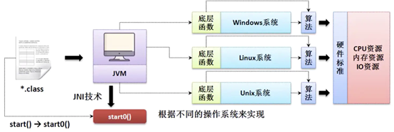

**任何情况下：只要定义了多线程，多线程的启动永远只有一种方案：Thread 类中的 start() 方法。**


## 2、Runnable 接口实现多线程

虽然可以通过 Thread 类的继承来实现多线程的定义，但是在 Java 程序中对于继承永远都是存在单继承的局限的，所以在 Java 中又提供第二种多线程的主体定义结构形式：实现`java.lang.Runnable`接口，此接口定义如下：

```java
// 从JDK1.8引入Lambda表达式后就变为了函数式的接口
@FunctionalInterface
public interface Runnable{
    public void run() ;
}
```

【操作示例 1】通过Runnable实现多线程主体类

```java
/**
 * 线程的主体类
 */
class MyThread implements Runnable {
    private String title;
    public MyThread(String title) {
        this.title = title;
    }

    /**
     * 线程的主体方法
     */
    @Override
    public void run() {
        for (int x = 0; x < 10; x++) {
            System.out.printf(this.title + "运行，x =" + x);
        }
    }
}
```

但是由于此时不再继承Thread父类了，那么对于此时的MyThread类中也就不再支持有start()这个继承的方法，可是如果不用start()方法是无法进行多线程启动的，那么这个时候就需要去观察一下Thread类所提供的构造方法。构造方法：

```java
public Thread(Runnable target);
```

操作示例 2：启动多线程

```java
public class ThreadDemo {
    public static void main(String[] args) {
        Thread threadA = new Thread(new MyThread("线程对象A"));
        Thread threadB = new Thread(new MyThread("线程对象B"));
        Thread threadC = new Thread(new MyThread("线程对象C"));
        threadA.start();      // 启动多线程
        threadB.start();      // 启动多线程
        threadC.start();      // 启动多线程
    }
}
```

```java
// 输出内容
线程对象A运行，x =0
线程对象B运行，x =0
线程对象C运行，x =0
线程对象B运行，x =1
线程对象B运行，x =2
线程对象B运行，x =3
线程对象A运行，x =1
线程对象B运行，x =4
线程对象C运行，x =1
线程对象B运行，x =5
线程对象B运行，x =6
线程对象A运行，x =2
线程对象B运行，x =7
线程对象C运行，x =2
线程对象B运行，x =8
线程对象A运行，x =3
线程对象B运行，x =9
线程对象C运行，x =3
线程对象A运行，x =4
线程对象C运行，x =4
线程对象A运行，x =5
线程对象C运行，x =5
线程对象A运行，x =6
线程对象C运行，x =6
线程对象A运行，x =7
线程对象C运行，x =7
线程对象A运行，x =8
线程对象C运行，x =8
线程对象A运行，x =9
线程对象C运行，x =9
```

这个时候的多线程实现中可以发现，由于只是实现了Runnable接口对象，所以此时线程主体类就不再有单继承局限，这样的设计才是一个标准型的设计。

可以发现从JDK1.8开始，Runnable 接口使用了函数式接口定义，所以也可以直接使用 Lambda 表达式进行线程类实现。

【操作示例 3】利用Lambda实现多线程定义

```java
public class ThreadDemo {
    public static void main(String[] args) {
        for (int x = 1; x <= 3; x++) {
            String title = "线程对象-" + x;
            new Thread(() -> {
                for (int y = 0; y < 10; y++) {
                    System.out.println(title + "运行，y =" + y);
                }
            }).start();
        }
    }
}
```

在以后的开发之中对于多线程的实现，优先考虑的就是Runnable接口实现，并且永恒都是通过Thread类对象启动多线程。


## 3、Thread 与 Runnable 区别

经过一系列的分析之后可以发现，在多线程的实现过程之中已经有了两种做法：Thread类、Runnable接口，如果从代码结构本身来讲，肯定是使用Runnable是最方便的，因为其可以避免单继承的局限，同时也可以更好的进行功能的扩充。

但是从结构上也需要来观察Thread和Runnable的联系，打开Thread的定义：

```java
public class Thread extends Object implements Runnable {}
```

发现Thread类也是Runnable接口的子类，所以继承Thread类时覆写的还是Runnable接口的run()方法，于是此时观察一下程序的类结构。

```java
class MyThread implements Runnable {
    private String title;
    public MyThread(String title) {
        this.title = title;
    }
    @Override
    public void run() {
        for (int x = 0; x < 10; x++) {
            System.out.println(this.title + "运行，x = "+ x);
        }
    }
}
public class ThreadDemo {
    public static void main(String[] args) {
        Thread threadA=new Thread(new MyThread("线程对象A"));
        Thread threadB=new Thread(new MyThread("线程对象B"));
        Thread threadC=new Thread(new MyThread("线程对象C"));
        threadA.start(); // 启动多线程
        threadB.start(); // 启动多线程
        threadC.start(); // 启动多线程
    }
}
```

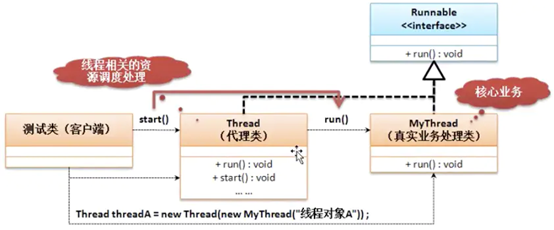

多线程的设计之中，使用了代理设计模式的结构，用户自定义的线程主体只是负责项目核心的实现，而所有的辅助实现全部交由Thread类处理。

在进行Thread启动多线程的时候调用的是start()方法，而后找到的是run()方法，但通过Thread类的构造方法传递了一个Runnable接口对象时，那么该接口对象将被Thread类中的target属性所保存，在start()方法执行时会调用Thread中的run()方法，而这个run()方法去调用Runnable接口子类被覆写过的run()方法。

多线程开发的本质实质上是在于多个线程可以进行同一资源的抢占，那么Thread主要描述的是线程，而资源的描述是通过Runnable完成的。

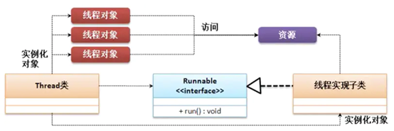

操作示例 1：利用卖票程序来实现多个线程的资源并发访问

```java
class MyThread implements Runnable {
    private int ticket = 5;
    // 线程的主体方法
    @Override
    public void run() {
        for (int x = 0; x < 100; x++) {
            if (this.ticket > 0) {
                System.out.println("卖票，ticket =" + this.ticket--);
            }
        }
    }
}

public class ThreadDemo {
    public static void main(String[] args) {
        MyThread mt = new MyThread();
        new Thread(mt).start();
        new Thread(mt).start();
        new Thread(mt).start();
    }
}
```

```java
// 输出内容
卖票，ticket =3
卖票，ticket =2
卖票，ticket =1
卖票，ticket =5
卖票，ticket =4
```

通过内存分析图来分析本程序的执行结构。

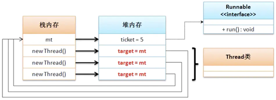

官方建议使用Runnable方式实现线程，原因主要有以下三点。

- Runnable可避免Java单继承的缺陷。如果一个类本身已经继承一个父类，那么该类将无法通过继承Thread类的方式实现线程。
- Runnable可避免子类继承Thread类中除run和start以外的方法。实现线程任务的run方法，应该要将其从该类中解耦出来。
- Runnable可以有共享数据。使用同一个Runnable构造的不同线程之间是可以共享数据的，而Thread类不能共享数据。


## 4、Callable 接口实现多线程

从最传统的开发来讲如果要进行多线程的实现肯定依靠Runnable，但是Runnable接口有一个缺点，当线程执行完毕之后无法获取一个返回值，所以从JDK1.5后提出了一个新的线程实现接口：`java.util.concurrent.Callable`接口。首先来观察这个接口的定义：

```java
@FunctionalInterface
public interface Callable<V>{
    public V call() throws Exception;
}
```

可以发现Callable定义的时候可以设置一个泛型，此泛型的类型就是返回数据的类型，这样的好处在于可以避免向下转型所带来的的安全隐患。

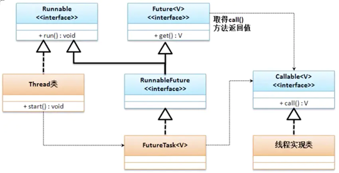

通过FutureTask类结成结构可以发现它是Runnable接口的子类，并且FutureTask类可以接收Callanle接口实例，这样依然可以利用Thread类来实现多线程的启动，而如果像接收返回结果，则利用Future接口中的get()方法即可。

FutureTask 的常用方法：

```java
// 构造方法
public FutureTask(Callable<V> callable);                        // 接收Callable接口实例（构造）
public FutureTask(Runnable runnable, V result);                 // 接收Runnable接口实例，并指定返回结果类型（构造）
// 普通方法
public V get() throws InterruptedException, ExecutionException; // 取得线程操作结果，此方法为Future接口定义
```

【操作示例 1】使用Callable实现多线程处理

```java
import java.util.concurrent.Callable;
import java.util.concurrent.FutureTask;

class MyThread implements Callable<String> {
    @Override
    public String call() {
        for (int x = 0; x < 10; x++) {
            System.out.println("*********** 线程执行、x = " + x);
        }
        return "线程执行完毕。";
    }
}

public class ThreadDemo {
    public static void main(String[] args) throws Exception {
        FutureTask<String> task = new FutureTask(new MyThread());
        new Thread(task).start();
        System.out.println("【线程返回数据】" + task.get());
    }
}
```

如下是简约版：

```java
import java.util.concurrent.Callable;
import java.util.concurrent.FutureTask;

public class ThreadDemo {
    public static void main(String[] args) throws Exception {
        Callable callable = () -> {
            for (int x = 0; x < 10; x++) {
                System.out.println("*********** 线程执行、x = " + x);
            }
            return "线程执行完毕。";
        };
        FutureTask<String> task = new FutureTask(callable);
        new Thread(task).start();
        System.out.println("【线程返回数据】" + task.get());
    }
}
```

```java
// 输出内容
*********** 线程执行、x = 0
*********** 线程执行、x = 1
*********** 线程执行、x = 2
*********** 线程执行、x = 3
*********** 线程执行、x = 4
*********** 线程执行、x = 5
*********** 线程执行、x = 6
*********** 线程执行、x = 7
*********** 线程执行、x = 8
*********** 线程执行、x = 9
【线程返回数据】线程执行完毕。
```

本程序将Callable接口的子类利用FutureTask类对象进行包装，由于FutureTask是Runnable接口的子类，所以可以利用Thread类的start()方法启动多线程，当线程执行完毕后，可以利用Future接口种的get()方法返回线程的执行结果。

**面试题：请解释Runnable和Callable的区别？**

1. Runnable是在JDK1.0时提出的多线程的实现接口，而Callable是JDK1.5后提出的
2. java.lang.Runnable接口之中只提供一个run()方法，并且没有返回值
3. java.util.concurrent.Callable接口提供有call()方法，可以有返回值


## 5、线程创建方式总结

**方式一：**

```java
Thread thread = new Thread(){
    @Override
    public void run() {
        System.out.println("thread run ...");
    }
};
thread.start();
```

简约后

```java
Thread thread = new Thread(() -> System.out.println("thread run ..."));
thread.start();
```

**方式二：**

```java
Thread thread = new Thread(new Runnable() {
    @Override
    public void run() {
        System.out.println("runnable run ...");
    }
});
thread.start();
```

简约后

```java
Thread thread = new Thread(() -> System.out.println("runnable run ..."));
thread.start();
```

**方式三：**

```java
Callable<Integer> callable = new Callable() {
    @Override
    public Object call() throws Exception {
        System.out.println("callable run ...");
        return 521;
    }
};
FutureTask futureTask = new FutureTask(callable);
Thread thread = new Thread(futureTask);
thread.start();
```

简约后

```java
Thread thread = new Thread(new FutureTask(() -> {
    System.out.println("callable run ...");
    return 521;
}));
thread.start();
```


## 6、多线程运行状态

> https://blog.csdn.net/y532798113/article/details/103997066

对于多线程的开发而言，编写程序的过程之中总是按照：定义线程主体类，然后通过Thread类进行线程的启动，但并不意味着调用了start()方法，线程就已经开始运行了，因为整体的线程处理有自己的一套运行的状态。

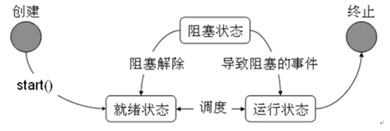

1. 任何一个线程的对象都应该使用Thread类进行封装，然后使用start()启动线程，但是启动的时候实际上若干个线程都将进入到一种就绪状态，现在并没有执行
2. 进入到就绪状态后就需要等待进行资源调度，当某一个线程调度成功之后则进入到运行状态(run()方法)，但是所有的线程不可能一直持续执行下去，中间需要产生一些暂停的状态，例如：某个线程执行一段时间之后就将需要让出资源，而后这个线程就将进入到阻塞状态，随后重新回归到就绪状态。
3. 当run()方法执行完毕之后，实际上该线程的主要任务也就结束了，那么此时就可以直接进入到停止状态。


# 线程常用方法

> 字体加粗的方法代表是 `static` 方法，可直接类名调用，无需创建对象。

| 方法名称                  | 方法描述                                                     | 注意事项                                                     |
| ------------------------- | ------------------------------------------------------------ | ------------------------------------------------------------ |
| start()                   | 启动一个新线程， 在新的线程运行 run 方法                     | start 方法只是让线程进入就绪，里面代码不一定立刻 运行（CPU 的时间片还没分给它）。每个线程对象的 start方法只能调用一次，如果调用了多次会出现 IllegalThreadStateException |
| run()                     | 新线程启动后会调用的方法                                     | 如果在构造 Thread 对象时传递了 Runnable 参数，则 线程启动后会调用 Runnable 中的 run 方法，否则默 认不执行任何操作。但可以创建 Thread 的子类对象， 来覆盖默认行为 |
| join()                    | 等待线程运行结束                                             |                                                              |
| join(long n)              | 等待线程运行结束， 最多等待 n 毫秒                           |                                                              |
| getId()                   | 获取线程长整型的 id                                          | id 唯一                                                      |
| getName()                 | 获取线程名                                                   |                                                              |
| setName(String name)      | 修改线程名                                                   |                                                              |
| getPriority()             | 获取线程优先级                                               |                                                              |
| setPriority(int priority) | 修改线程优先级                                               | Java 中规定线程优先级是1~10 的整数，较大的优先级 能提高该线程被 CPU 调度的机率 |
| getState()                | 获取线程状态                                                 | Java 中线程状态是用 6 个 enum 表示，分别为： NEW, RUNNABLE, BLOCKED, WAITING, TIMED_WAITING, TERMINATED |
| interrupt()               | 打断线程                                                     | 如果被打断线程正在 sleep，wait，join 会导致被 打断的线程抛出 InterruptedException，并清除 打断标记；如果打断正在运行的线程，则会设置 打断标记；park 的线程被打断，也会设置打断标记 |
| interrupted()             | 判断当前线程是否被打断                                       | 会清除打断标记                                               |
| isInterrupted()           | 判断当前线程是否被打断                                       | 不会清除打断标记                                             |
| isAlive()                 | 判断当前线程是否存活                                         |                                                              |
| isDaemon()                | 判断当前线程是否是守护线程                                   |                                                              |
| setDaemon(boolean on)     | 设置当前线程为守护线程                                       |                                                              |
| **currentThread()**       | 获取当前正在执行的线程                                       |                                                              |
| **sleep(long n)**         | 让当前执行的线程休眠n毫秒， 休眠时让出 CPU 的时间片 给其它线程 |                                                              |
| **yield()**               | 提示线程调度器让出当前线程 对 CPU 的使用                     | 主要是为了测试和调试，它的具体的实现依赖于 操作系统的任务调度器 |


## 1、获取当前线程

对于线程对象的获得是不可能只是依靠一个this来完成的，因为线程的状态不可控，但是有一点是明确的，所有的线程对象一定要执行run()方法，那么这时候可以考虑获取当前线程，在Thread类中有提供获取当前线程的方法：`Thread.currentThread();`

```java
// 获取当前正在执行的线程
Thread thread = Thread.currentThread();
```

【操作示例】获取主线程及普通线程的当前线程对象

```java
public class Main {
    public static void main(String[] args) {
        // 1.在主线程中获取当前线程
        Thread main = Thread.currentThread();
        System.out.println(main);
        // 2.在执行线程中获取当前线程
        new Thread(()->{
            Thread thread = Thread.currentThread();
            System.out.println(thread);
        }).start();
    }
}
```

```java
// 输出内容
Thread[main,5,main]
Thread[Thread-0,5,main]
```

解读输出内容（可以直接查看Thread类中的toString方法）：`Thread[Thread-0,5,main]`

- Thread-0：线程名称
- 5：线程的优先级
- main：线程组ThreadGroup，每个线程必须都有一个线程组


## 2、获取线程 ID

public long getId() 获取线程的唯一ID，线程的ID在整个JVM进程中都会是唯一的。并且是从0开始逐次递增。在一个JVM进程启动的时候，实际上是开辟了很多个线程，自增序列已经有了一定的消耗，因此我们自己创建的线程可能并不是第0号线程。

【操作示例】获取主线程及新建线程的 ID 值

```java
public class Main {
    public static void main(String[] args) {
        Thread main = Thread.currentThread();
        System.out.println(main.getId());
        Thread thread = new Thread(() -> System.out.println("..."));
        System.out.println(thread.getId());
    }
}
```

```java
// 输出内容
1
24
```


## 3、获取及设置线程名

多线程的运行状态是不确定的，那么在程序的开发中为了可以获取到一些需要使用的线程就只能依靠线程名字来操作。所以线程的名字是一个至关重要的概念，这样在Thread类之中就提供有线程名称的处理。

```java
// 构造方法
public Thread(Runnable target);              // 创建一个Thread，线程名随机
public Thread(Runnable target ,String name); // 创建一个指定名称的Thread

// 普通方法
public final String getName();               // 获取线程名字
public final void setName(String name);      // 设置线程名字
```

【操作示例 1】观察线程的命名操作

```java
public class Main {
    public static void main(String[] args) {
        Runnable task = () -> System.out.println("线程名：" + Thread.currentThread().getName());
        new Thread(task).start();                   // 未设置线程名字
        new Thread(task, "Thread-A").start(); // 设置了线程名字
        new Thread(task, "Thread-B").start(); // 设置了线程名字
    }
}
```

```java
// 输出内容
线程名：Thread-B
线程名：Thread-A
线程名：Thread-0
```

当开发者为线程设置名字的时候就使用设置的名字，而如果没有设置名字，则会自动生成一个不重复的名字，线程名称采用了“Thread-xxx”的形式定义，这种自动属性命名主要是依靠了static属性完成的，在Thread类里面定义有如下操作：

```java
public class Thread implements Runnable {
    private static int threadInitNumber;
    public Thread(Runnable target) {
        this(null, target, "Thread-" + nextThreadNum(), 0);
    }
    private static synchronized int nextThreadNum() {
        return threadInitNumber++;
    }
}
```


## 4、线程的休眠：sleep

sleep方法方法会使当前线程进人指定毫秒数的休眠，暂停执行，虽然给定了一个休眠的时间，但是最终要以系统的定时器和调度器的精度为准，休眠有一个非常重要的特性，那就是其不会放弃监视器锁的所有权。

在Thread类中定义的休眠方法（静态方法）如下：

```java
/**
 * 使当前正在执行的线程进入休眠状态
 * @param  millis 睡眠时间（以毫秒为单位）
 * @throws  IllegalArgumentException 如果millis 的值为负数
 * @throws  InterruptedException 如果有任何线程中断当前线程。引发此异常时，将清除当前线程的中断状态
 */
public static void sleep(long millis) throws InterruptedException;
/**
 * 使当前正在执行的线程进入休眠状态
 * @param  millis 睡眠时间（以毫秒为单位）
 * @param  nanos 额外指定睡眠事件的纳秒部分。范围为 0-999999
 * @throws  IllegalArgumentException 如果 millis/nanos 的值为负数，或者nanos值不在 0-999999 中
 * @throws  InterruptedException 如果有任何线程中断当前线程。引发此异常时，将清除当前线程的中断状态
 */
public static void sleep(long millis, int nanos) throws InterruptedException;
```

> 在JDK1.5以后，JDK引入了一个枚举TimeUnit，其对sleep方法提供了很好的封装，使用它可以省去时间单位的换算步骤。

【操作示例 1】观察休眠处理

```java
public class Main {
    public static void main(String[] args) {
        new Thread(() -> {
            for (int x = 0; x < 6; x++) {
                try {
                    // 使当前正在执行的线程进入休眠状态
                    Thread.sleep(1000);
                } catch (InterruptedException e) {
                }
                String name = Thread.currentThread().getName();
                System.out.println(name + "、x = " + x + "、" + java.time.LocalDateTime.now());
            }
        }).start();
    }
}
```

```java
// 输出内容
Thread-0、x = 0、16:14:17.423521400
Thread-0、x = 1、16:14:18.430403700
Thread-0、x = 2、16:14:19.432543300
Thread-0、x = 3、16:14:20.434513400
Thread-0、x = 4、16:14:21.437018900
Thread-0、x = 5、16:14:22.444487200
```

休眠的主要特点是可以自动实现线程的唤醒，以继续进行后续的处理。但是需要注意的是，如果现在有多个线程对象，那么休眠也是有先后顺序的。

【操作示例 2】生多个线程对象进行休眠处理

```java
public class Main {
    public static void main(String[] args) {
        Runnable run = () -> {
            for (int x = 0; x < 10; x++) {
                try {
                    // 使当前正在执行的线程进入休眠状态
                    Thread.sleep(1000);
                } catch (InterruptedException e) {
                }
                String name = Thread.currentThread().getName();
                System.out.println(name + "、x = " + x + "、" + java.time.LocalTime.now());
            }
        };
        for (int num = 0; num < 5; num++) {
            new Thread(run, "Thread-" + num).start();
        }
    }
}
```

```java
// 输出内容
Thread-1、x = 0、16:26:05.862316400
Thread-2、x = 0、16:26:05.862316400
Thread-0、x = 0、16:26:05.862316400
Thread-4、x = 0、16:26:05.862316400
Thread-3、x = 0、16:26:05.862316400
Thread-0、x = 1、16:26:06.862700300
Thread-1、x = 1、16:26:06.862700300
Thread-3、x = 1、16:26:06.862700300
Thread-2、x = 1、16:26:06.862700300
//...省略
```

此时将产生5个线程对象，并且这5个线程对象执行的方法体是相同的。此时从程序执行的感觉上好像是若干个线程一起进行了休眠，而后一起进行了自动唤醒，但是实际上是有差别的。

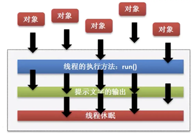


## 5、线程的中断：interrupt

在多线程变成之中一个线程是无法自己进行中断的，必须要依靠其他的线程来完成这种中断处理，在Thread类里面提供有这种中断线程与判断线程是否中断的处理方法：

```java
public void interrupt();            // 线程的中断
public boolean isInterrupted();     // 判断线程是否被中断。线程中断返回true, 否则返回false
public static boolean interruped(); // 判断线程是否被中断, 并清除中断标记。线程中断返回true, 否则返回false
```

线程的中断大致有如下两种：

1. 停止正在运行的线程
2. 停止休眠中的线程

【操作示例 1】（停止正在运行的线程）实现线程的中断处理

```java
public class Main {
    public static void main(String[] args) throws InterruptedException {
        // 创建自定义任务
        Runnable run = () -> {
            // 无限打印语句
            while (true) {
                System.out.println("正在运行");
            }
        };
        // 将任务传递给线程
        Thread thread = new Thread(run);
        // 启动线程
        thread.start();
        // 使当前线程休眠1秒
        Thread.sleep(1000);
        // 中断线程
        thread.interrupt();
    }
}
```

```java
// 输出内容(程序没有停止,一直在打印输出)
正在运行
正在运行
正在运行
......
```

> 线程没有停下来，程序也没有结束。原因使在于：interrupt方法仅仅只是将线程标记为中断状态，它没有实际去停止这个线程，如果想要线程停下来，需要手动去判断线程是否被中断，然后对此做出中断操作。

【操作示例 2】（停止正在运行的线程）线程中断判断处理：isInterrupted() 方法

```java
public class Main {
    public static void main(String[] args) throws InterruptedException {
        // 创建自定义任务
        Runnable run = () -> {
            // 无限打印语句
            while (true) {
                // 获取当前正在执行任务的线程
                Thread thread = Thread.currentThread();
                // 当线程被中断时,结束循环打印
                if (thread.isInterrupted()) {
                    break;
                }
                System.out.println("正在运行");
            }
        };
        // 将任务传递给线程
        Thread thread = new Thread(run);
        // 启动线程
        thread.start();
        // 使当前线程休眠1秒
        Thread.sleep(1000);
        // 中断线程
        thread.interrupt();
    }
}
```

```java
// 输出内容(大约输出一秒多程序就停止了)
正在运行
正在运行
正在运行
......
```

> 从运行结果来看，程序经过1秒钟后运行结束。说明线程的确被中断了。

【操作示例3】（停止正在运行的线程）线程中断判断处理：interruped() 方法

```java
public class Main {
    public static void main(String[] args) throws InterruptedException {
        // 创建自定义任务
        Runnable run = () -> {
            // 无限打印语句
            while (true) {
                // 当线程被中断时,结束循环打印
                if (Thread.interrupted()) {
                    break;
                }
                System.out.println("正在运行");
            }
        };
        // 将任务传递给线程
        Thread thread = new Thread(run);
        // 启动线程
        thread.start();
        // 使当前线程休眠1秒
        Thread.sleep(1000);
        // 中断线程
        thread.interrupt();
    }
}
```

> 从运行结果来看，程序经过1秒钟后运行结束。说明线程的确被中断了。

【操作示例 4】：对比判断线程是否被中断的两个方法：isInterrupted() 方法与interruped() 方法

```java
Runnable run = () -> {
    // 无限打印语句
    while (true) {
        /**
         * 分别注释其中一行，然后执行另一行代码
         * 可以发现：
         * Thread.interrupted()：
         *   从结果来看一开始 没有被中断，输出的结果使false，1秒钟后 线程被中断，输出的结果变为了true
         * Thread.currentThread().isInterrupted()：
         *   从结果来看和上面有点不同，线程一开始没有被中断，输出的结果为false，1秒钟后 线程被中断，结果变为了true，
         *   然后线程中断标记被清除，输出的结果又变为了false
         */
        System.out.println(Thread.interrupted());
        System.out.println(Thread.currentThread().isInterrupted());
    }
};
```

【操作示例 5】（停止休眠中的线程）：会抛`InterruptedException`异常

```java
public class Main {
    public static void main(String[] args) throws Exception {
        Thread thread = new Thread(() -> {
            try {
                System.out.println("【" + Thread.currentThread().getName() + "】准备进入到休眠状态，预计的休眠时间为20秒 ...");
                Thread.sleep(20000);    // 需要休眠20秒的时间
                System.out.println("【" + Thread.currentThread().getName() + "】休眠状态正常结束 ...");
            } catch (InterruptedException e) {  // 线程被中断就会产生中断异常
                System.out.println("【" + Thread.currentThread().getName() + "】休眠产生了异常，无法正常完成休眠处理 ...");
            }
        }, "休眠线程"); // 创建一个线程类
        thread.start(); // 启动多线程
        System.out.println("【中断状态1】" + thread.isInterrupted());
        Thread.sleep(5000); // 让线程对象适当的执行一段时间
        thread.interrupt(); // 打断当前线程的休眠状态
        System.out.println("【中断状态2】" + thread.isInterrupted());
        // 由于主线程优先级过高导致会大概率会输出false
    }
}
```

```java
// 输出内容
【中断状态1】false
【休眠线程】准备进入到休眠状态，预计的休眠时间为20秒 ...
【中断状态2】true
【休眠线程】休眠产生了异常，无法正常完成休眠处理 ...
```


## 6、线程强制执行：join

> 所谓的线程的强制执行指的是当满足于某些条件之后，某一个线程对象将可以一直独占资源，一直到该线程的程序执行结束。
>
> 简单解释：在线程中调用另一个线程的 join() 方法，会将当前线程挂起，而不是忙等待，直到目标线程结束。

在正常的执行状态下，每一个线程执行的过程之中都需要轮流进行资源的抢占，那么抢占到资源之后才可以正常的执行，但是如果说现在某一个线程非常的重要，需要强制性的霸占资源执行处理，这个时候就需要使用join方法进行控制。

```java
// 等待该线程死亡,等价于join(0)
public final void join() throws InterruptedException;
// 设置一个线程的强制占用时间,如果超过了此时间也要释放掉此资源
public final void join(long millis) throws InterruptedException;
// 设置一个线程的强制占用时间,如果超过了此时间也要释放掉此资源, 毫秒 + 纳秒
public final void join(long millis, int nanos) throws InterruptedException;
```

【操作示例 1】观察一个没有强制执行的程序

```java
public class Main {
    public static void main(String[] args) throws Exception {
        Thread joinThread = new Thread(() -> {
            for (int x = 0; x < 100; x++) {  // 将持续执行循环代码
                try {
                    Thread.sleep(100); // 追加一个延迟
                    System.out.println("〖" + Thread.currentThread().getName() + "〗子线程执行，x = " + x);
                } catch (InterruptedException e) {
                    e.printStackTrace();
                }
            }
        }, "工作线程"); // 创建一个线程类
        joinThread.start(); // 启动子线程
        for (int x = 0; x < 10; x++) {
            Thread.sleep(100); // 追加一个延迟
            System.out.println("【" + Thread.currentThread().getName() + "】主线程执行，x = " + x);
        }
    }
}
```

```java
// 输出内容
【main】主线程执行，x = 0
〖工作线程〗子线程执行，x = 0
【main】主线程执行，x = 1
〖工作线程〗子线程执行，x = 1
〖工作线程〗子线程执行，x = 2
【main】主线程执行，x = 2
〖工作线程〗子线程执行，x = 3
【main】主线程执行，x = 3
【main】主线程执行，x = 4
〖工作线程〗子线程执行，x = 4
...
```

> 这个时候主线程和子线程都在交替执行着，但是如果说现在希望主线程独占执行，那么就可以用Thread类中的join方法

【操作示例 2】观察强制执行的程序

```java
public class Main {
    public static void main(String[] args) throws Exception {
        Thread mainThread = Thread.currentThread(); // 获取当前的主线程
        Thread joinThread = new Thread(() -> {
            for (int x = 0; x < 100; x++) {  // 将持续执行循环代码
                try {
                    Thread.sleep(100); // 追加一个延迟
                    if (x >= 5) {  // 设置一个处理条件
                        mainThread.join();  // 子线程要交出全部的资源给主线程
                    }
                    System.out.println("〖" + Thread.currentThread().getName() + "〗子线程执行，x = " + x);
                } catch (InterruptedException e) {
                    e.printStackTrace();
                }
            }
        }, "工作线程"); // 创建一个线程类
        joinThread.start(); // 启动子线程
        for (int x = 0; x < 10; x++) {
            Thread.sleep(100); // 追加一个延迟
            System.out.println("【" + Thread.currentThread().getName() + "】主线程执行，x = " + x);
        }
    }
}
```

```java
// 输出内容
〖工作线程〗子线程执行，x = 0
【main】主线程执行，x = 0
〖工作线程〗子线程执行，x = 1
【main】主线程执行，x = 1
【main】主线程执行，x = 2
〖工作线程〗子线程执行，x = 2
【main】主线程执行，x = 3
【main】主线程执行，x = 4
【main】主线程执行，x = 5
【main】主线程执行，x = 6
【main】主线程执行，x = 7
【main】主线程执行，x = 8
【main】主线程执行，x = 9
〖工作线程〗子线程执行，x = 3
〖工作线程〗子线程执行，x = 4
〖工作线程〗子线程执行，x = 5
...
```

> 注意：在进行线程强制执行的时候，一定要获取强制执行线程对象之后才可以执行join()的调用

【操作示例 3】准备3个线程，分别为：线程A、线程B、线程C。必须按顺序执行输出：1、2、3

```java
class OneTask implements Runnable { // 线程A
    @Override
    public void run() {
        System.out.println(1);
    }
}
class TwoTask implements Runnable { // 线程B
    private Thread thread; // 等待的线程
    public void setThread(Thread thread) {
        this.thread = thread;
    }
    @Override
    public void run() {
        try {
            thread.join();
        } catch (InterruptedException e) {
            e.printStackTrace();
        }
        System.out.println(2);
    }
}
class ThreeTask implements Runnable { // 线程C
    private Thread thread; // 等待的线程
    public void setThread(Thread thread) {
        this.thread = thread;
    }
    @Override
    public void run() {
        try {
            thread.join();
        } catch (InterruptedException e) {
            e.printStackTrace();
        }
        System.out.println(3);
    }
}

/**
 * 主线程Main方法
 */
public class Main {
    public static void main(String[] args) {
        // 创建任务
        OneTask oneTask = new OneTask();
        TwoTask twoTask = new TwoTask();
        ThreeTask threeTask = new ThreeTask();
        // 创建线程
        Thread oneThread = new Thread(oneTask);
        Thread twoThread = new Thread(twoTask);
        Thread threeThread = new Thread(threeTask);
        // 设置等待线程
        twoTask.setThread(oneThread);
        threeTask.setThread(twoThread);
        // 启动线程
        oneThread.start();
        twoThread.start();
        threeThread.start();
    }
}
```

```java
// 输出内容
1
2
3
```


## 7、线程的礼让：yield

在多线程的执行过程之中，所有的线程肯定要轮流进行CPU资源的抢占，那么既然又这样的抢占处理，每当有一个线程抢占到了资源之后，可以通过一种礼让的形式让出当前抢占的资源。**用yield方法会使当前线程从RUNNING状态切换到RUNNABLE状态**，一般这个方法不太常用。主要是为了测试和调试。【**注意：礼让执行的时候每一次调用yield()方法都只会礼让一次当前的资源**】

线程的礼让可以使用Thread类中提供的方法：

```java
public static native void yield(); // 使当前线程放弃执行权
```

【操作示例 1】使用礼让操作

```java
public class Main {
    public static void main(String[] args) throws Exception {
        Thread joinThread = new Thread(() -> {
            for (int x = 0; x < 10000; x++) {  // 将持续执行循环代码
                try {
                    // 可以注释如下代码对比区别
                    if (x % 2 == 0) {   // 当前的循环的x内容为偶数
                        Thread.yield(); // 礼让一次
                        System.out.println("【YIELD】线程礼让执行。");
                    }
                    Thread.sleep(100); // 追加一个延迟
                    System.out.println("〖" + Thread.currentThread().getName() + "〗子线程执行，x = " + x);
                } catch (InterruptedException e) {
                    e.printStackTrace();
                }
            }
        }, "工作线程"); // 创建一个线程类
        joinThread.start(); // 启动子线程
        for (int x = 0; x < 30; x++) {
            Thread.sleep(100); // 追加一个延迟
            System.out.println("【" + Thread.currentThread().getName() + "】主线程执行，x = " + x);
        }
    }
}
```

```java
// 输出内容
【YIELD】线程礼让执行。
〖工作线程〗子线程执行，x = 0
【main】主线程执行，x = 0
【main】主线程执行，x = 1
〖工作线程〗子线程执行，x = 1
【YIELD】线程礼让执行。
〖工作线程〗子线程执行，x = 2
【main】主线程执行，x = 2
〖工作线程〗子线程执行，x = 3
【YIELD】线程礼让执行。
【main】主线程执行，x = 3
【main】主线程执行，x = 4
〖工作线程〗子线程执行，x = 4
〖工作线程〗子线程执行，x = 5
【YIELD】线程礼让执行。
【main】主线程执行，x = 5
//...省略输出
```

如下是注释掉线程礼让代码的日志输出：

```java
// Thread.yield(); // 礼让一次
```

```
【main】主线程执行，x = 0
〖工作线程〗子线程执行，x = 0
〖工作线程〗子线程执行，x = 1
【main】主线程执行，x = 1
【main】主线程执行，x = 2
〖工作线程〗子线程执行，x = 2
【main】主线程执行，x = 3
〖工作线程〗子线程执行，x = 3
〖工作线程〗子线程执行，x = 4
【main】主线程执行，x = 4
〖工作线程〗子线程执行，x = 5
【main】主线程执行，x = 5
```

【操作示例 2】使用两个线程对比，一个赋值线程，一个打印线程。

```java
/**
 * 赋值任务
 */
class ValueTask implements Runnable {
    public static int value = 0; // 值
    @Override
    public void run() {
        try {
            // 使当前线程休眠3秒钟
            Thread.sleep(3000);
        } catch (InterruptedException e) {
            e.printStackTrace();
        }
        value = 100; // 设置value的值
    }
}

/**
 * 打印任务
 */
class PrintTask implements Runnable{
    @Override
    public void run() {
        // 当value等于0时,执行礼让,可以注释掉如下循环的代码对比
        while (ValueTask.value == 0) {
            Thread.yield(); // 放弃执行权
        }
        // 打印value的值
        System.out.println(ValueTask.value);
    }
}

/**
 * 主线程Main方法
 */
public class Main {
    public static void main(String[] args) throws Exception {
        new Thread(new PrintTask()).start();
        new Thread(new ValueTask()).start();
    }
}
```

```java
// 输出内容
100
```

> 如果注释掉PrintTask类中的while循环代码，那么会直接输出0。

yield 总结如下几点：

1. yield 是一个静态的原生（native）方法。

2. yield 告诉当前正在执行的线程把运行机会交给线程池中拥有相同优先级的线程。

3. yield 不能保证使得当前正在运行的线程迅速转换到可运行的状态。

4. 它仅能使一个线程从运行状态转到可运行状态，而不是等待或阻塞状态。

5. 无法保证yield()达到让步目的，因为让步的线程还有可能被线程调度程序再次选中。


## 8、线程优先级：priority

优先级对线程至关重要，CPU优先执行优先级高的线程。从理论上来讲，线程的优先级越高，越有可能先执行（越有可能先抢占到资源）。在Thread类中针对优先级的操作提供有如下两个处理方法：

```java
public final int getPriority();                 // 获取线程优先级
public final void setPriority(int newPriority); // 设置线程优先级
```

在进行优先级定义的时候都是通过int型的数字来完成的，而对于此数字的选择在Thread类中就定义了三个常量：

```java
public static final int MAX_PRIORITY  = 10; // 最高优先级
public static final int NORM_PRIORITY = 5;  // 中等优先级
public static final int MIN_PRIORITY  = 1;  // 最低优先级
```

线程优先级说明：

- 当线程的优先级没有指定时，所有线程都携带普通优先级。
- 优先级可以用从1到10的范围指定。10表示最高优先级，1表示最低优先级，5是普通优先级。
- 优先级最高的线程在执行时被给予优先。但是不能保证线程在启动时就进入运行状态。
- 与在线程池中等待运行机会的线程相比，当前正在运行的线程可能总是拥有更高的优先级。
- 由调度程序决定哪一个线程被执行。
- t.setPriority()用来设定线程的优先级。
- 在线程开始方法被调用之前，线程的优先级应该被设定。
- 可以使用常量，如MIN_PRIORITY,MAX_PRIORITY，NORM_PRIORITY来设定优先级。

【操作示例 1】：观察优先级

```java
public class Main {
    public static void main(String[] args) {
        Runnable run = () -> {
            for (int x = 0; x < 10; x++) {
                try {
                    Thread.sleep(1000);
                } catch (InterruptedException e) {
                    e.printStackTrace();
                }
                System.out.println(Thread.currentThread().getName() + " 执行。");
            }
        };
        Thread threadA = new Thread(run, "thread-A");
        threadA.setPriority(Thread.MIN_PRIORITY);
        Thread threadB = new Thread(run, "thread-B");
        threadB.setPriority(Thread.MIN_PRIORITY);
        Thread threadC = new Thread(run, "thread-C");
        threadC.setPriority(Thread.MAX_PRIORITY);
        threadA.start();
        threadB.start();
        threadC.start();
    }
}
```

```java
// 输出内容
线程对象C执行。
线程对象A执行。
线程对象B执行。
线程对象B执行。
线程对象C执行。
线程对象A执行。
线程对象B执行。
线程对象A执行。
线程对象C执行。
//...省略输出
```

【操作示例 2】：主方法是一个主线程，那么主线程的优先级呢？默认线程对象的优先级呢？

```java
public class Main {
    public static void main(String[] args) throws Exception {
        System.out.println(Thread.currentThread().getPriority()); // 5
    }
}
```

> 可以得到结论：主线程属于中等优先级，而默认创建的线程也是中等优先级。


## 9、判断线程存活：isAlive

如何知道一个程序是否执行完成，我们可以通过判断它是否存活着，得知它是否执行完，线程若存活，则表示它没有执行完，若死亡则表示它执行完。Thread类里面的isAlive方法如下：

```java
public final native boolean isAlive(); // 判断该线程是否存活. true表示存活, false便是死亡
```

【操作示例 1】判断线程存活

```java
public class Main {
    public static void main(String[] args) throws Exception {
        // 创建任务与线程
        Thread thread = new Thread(() -> {
        });
        // 输出线程是否存活
        System.out.println("启动前:" + thread.isAlive());
        // 启动线程
        thread.start();
        // 输出线程是否存活
        System.out.println("启动后:" + thread.isAlive());
        // 使主线程休眠1秒
        Thread.sleep(1000);
        // 输出线程是否存活
        System.out.println("一秒后:" + thread.isAlive());
    }
}
```

```java
// 输出内容
启动前:false
启动后:true
一秒后:false
```


## 11、设置守护线程：Daemon

Java 中有两类线程：用户线程 (User Thread)、守护线程 (Daemon Thread)

1. **用户线程**：我们平常创建的普通线程。
2. **守护线程**：守护线程是一类比较特殊的线程，一般用于处理一些后台的工作，随着用户线程的销毁，守护线程也会随着销毁。

守护线程是指为其他线程服务的线程。在JVM中，所有非守护线程都执行完毕后，无论有没有守护线程，虚拟机都会自动退出。

Java 垃圾回收线程就是一个典型的守护线程，因为我们的垃圾回收是一个一直需要运行的机制，但是当没有用户线程的时候，也就不需要垃圾回收线程了，守护线程刚好满足这样的需求。

Thread 类中提供有如下的守护线程的操作方法：

```java
public final void setDaemon(boolean on); // 设置为守护后台线程,true：后台线程, false：非后台线程
public final boolean isDaemon();         // 判断是否为守护线程
```

【操作示例 1】场景：某个用户线程在执行时，需要一个定时无线循环线程，去检测心跳，一旦用户线程结束，这个检测线程也需要关闭。如果不设置守护线程，那个这个检测线程将无法停止，此时可以这只设置这个线程为守护线程，随着业务线程的完成而自动退出。

```java
package com.example.jpa;

public class Main {
    public static void main(String[] args) {
        Thread userThread = new Thread(() -> {
            for (int x = 0; x < 3; x++) {
                try {
                    Thread.sleep(1000);
                } catch (InterruptedException e) {
                    e.printStackTrace();
                }
                System.out.println(Thread.currentThread().getName() + "正在运行、x = " + x);
            }
        }, "用户线程");
        Thread daemonThread = new Thread(() -> {
            for (int x = 0; x < Integer.MAX_VALUE; x++) {
                try {
                    Thread.sleep(1000);
                } catch (InterruptedException e) {
                    e.printStackTrace();
                }
                System.out.println(Thread.currentThread().getName() + "检测心跳、x = " + x);
            }
        }, "守护线程");
        // 设置为守护线程
        daemonThread.setDaemon(true);
        userThread.start();
        daemonThread.start();
    }
}
```

```java
// 输出内容
守护线程检测心跳、x = 0
用户线程正在运行、x = 0
用户线程正在运行、x = 1
守护线程检测心跳、x = 1
用户线程正在运行、x = 2
守护线程检测心跳、x = 2
```

> 可以发现所有的守护线程都是围绕在用户线程的周围，如果程序执行完毕了，守护线程也就消失了，在整个JVM中最大的守护线程就是GC线程。 程序执行中GC线程会一直存在，如果程序执行完毕，GC线程也将消失。

【操作示例 2】线程A随着主线程的结束而结束

```java
public class Main {
    public static void main(String[] args) throws InterruptedException {
        // 创建用户线程
        Thread thread = new Thread(() -> {
            System.out.println("是否为后台线程：" + Thread.currentThread().isDaemon());
            while (true) {
                //System.out.println(Thread.currentThread().getName() + ":正在运行");
            }
        }, "Thread-A");
        // 设置该用户线程为后台线程
        thread.setDaemon(true);
        // 启动线程
        thread.start();
        // 为了效果更加明显给主线程休眠1秒
        Thread.sleep(1000);
    }
}
```

```java
// 输出内容
是否为后台线程：true
Thread-A:正在运行
Thread-A:正在运行
Thread-A:正在运行
Thread-A:正在运行
Thread-A:正在运行
...
// 1秒后程序结束,用户线程会随着主线程的结束而结束
```


## 12、线程组：ThreadGroup

线程组：ThreadGroup，每个线程必须都有一个线程组。即使不设置也会有一个默认的线程组。主要从如下几方面介绍线程组：获取线程组、创建线程组、设置线程组、线程组常用方法

```java
// 如下为Thread类中的方法
public final ThreadGroup getThreadGroup(); // 返回线程所属的线程组,如果此线程死亡(停止)则返回null

// 如下为ThreadGroup类中的方法
public ThreadGroup(String name);                                      // 创建一个新线程组
public ThreadGroup(ThreadGroup parent, String name);                  // 创建一个新线程组,并且加上父线程组
public ThreadGroup(ThreadGroup parent, Runnable target, String name); // 创建一个新线程组,加上父线程组和任务
public final String getName();                                        // 获取线程组名称
public final int getMaxPriority();                                    // 获取线程组最大优先级
public final void setMaxPriority(int pri);                            // 设置线程组最大优先级
public int activeCount();                                             // 获取线程组中存活的线程数量
public final void interrupt();                                        // 中断线程组中所有的线程
```

操作示例：

```java
public class Main {
    public static void main(String[] args) {
        // 输出主线程组：java.lang.ThreadGroup[name=main,maxpri=10]
        // name:线程组名称，maxpri:线程组最大优先级
        System.out.println(Thread.currentThread().getThreadGroup());

        // 创建线程组与创建线程方式一：
        ThreadGroup threadGroupA = new ThreadGroup("Group-A");
        Thread threadA = new Thread(threadGroupA, "Thread-A");
        System.out.println(threadA);

        // 创建线程组与创建线程方式二：
        ThreadGroup threadGroupB = new ThreadGroup("Group-B");
        Thread threadB = new Thread(threadGroupB, ()->{
            System.out.println(Thread.currentThread());
        }, "Thread-B");
        threadB.start();
    }
}
```

```java
// 输出内容
java.lang.ThreadGroup[name=main,maxpri=10]
Thread[Thread-A,5,Group-A]
Thread[Thread-B,5,Group-B]
```


## 13、过时方法及优雅的停止线程

在多线操作之中如果要启动多线程使用的是 Thread 类中的 start() 方法，而如果对于多线程需要进行停止处理，Thread 类原本提供有 stop() 方法，但是对于这些方法从JDK1.2版本就已经废除了，而且一直到现在也不再建议使用，而除了stop()之外还有几个方法也被禁用了：

```java
// 这些方法已过时，容易破坏同步代码块，造成线程死锁，不推荐使用。
public final void stop();    // 停止多线程
public void destroy();       // 销毁多线程
public final void suspend(); // 挂起线程、暂停执行
public final void resume();  // 恢复挂起的线程执行
```

之所以废除掉这些方法，主要原因是因为这些方法容易破坏同步代码块，可能导致线程死锁。所以，如果要想实现线程的停止需要通过一种柔和的方式来进行。

【操作示例】实现线程优雅的停止

```java
public class Main {
    public static boolean flag = true;
    public static void main(String[] args) throws Exception {
        new Thread(() -> {
            long num = 0;
            while (flag) {
                try {
                    Thread.sleep(50);
                } catch (InterruptedException e) {
                    e.printStackTrace();
                }
                System.out.println(Thread.currentThread().getName() + "正在运行、num = " + num++);
            }
        }, "执行线程").start();
        // 运行200毫秒
        Thread.sleep(200);
        // 停止线程
        flag = false;      
    }
}
```

```java
// 输出内容
执行线程正在运行、num = 0
执行线程正在运行、num = 1
执行线程正在运行、num = 2
执行线程正在运行、num = 3
```

万一现在有其他线程去控制这个flag的内容，那么这个时候对于线程的停止也不是说停就立刻停止的，而是会在执行中判断flag的内容来完成。


## 14、关键字：Volatile

在多线程定义中，volatile关键字主要是在属性上使用的，表示此属性为直接数据操作，而不进行副本的拷贝处理。这样的话在一些书上就将其错误的理解为同步属性了。

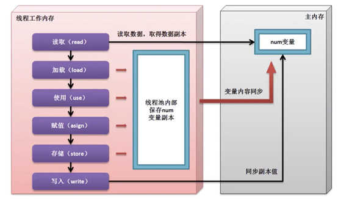

【操作示例 1】卖票程序

```java
class MyThread implements Runnable {
    // 直接内存操作
    private volatile int ticket = 5;
    @Override
    public void run() {
        synchronized (this) {
            while (this.ticket > 0) {
                try {
                    Thread.sleep(100);
                } catch (InterruptedException e) {
                    e.printStackTrace();
                }
                System.out.println(Thread.currentThread().getName() + "卖票处理，ticket = " + this.ticket--);
            }
        }
    }
}

public class ThreadDemo {
    public static void main(String[] args) {
        MyThread mt = new MyThread();
        new Thread(mt, "票贩子A").start();
        new Thread(mt, "票贩子B").start();
        new Thread(mt, "票贩子C").start();
    }
}
```

```java
// 输出
票贩子A卖票处理，ticket = 5
票贩子A卖票处理，ticket = 4
票贩子A卖票处理，ticket = 3
票贩子A卖票处理，ticket = 2
票贩子A卖票处理，ticket = 1
```

在正常进行变量处理的时候往往会经历如下的几个步骤：

1. 获取变量原有的数据内容副本
2. 利用副本为变量进行数学计算
3. 将计算后的变量，保存到原始空间之中

而如果一个属性上追加了volatile关键字，表示的就是不使用副本，而是直接操作原始变量，相当于节约了拷贝副本、重新保存的步骤。

**面试题：请解释volatile与synchronized的区别？**

1. volatile 主要在属性上使用，而 synchronized 是在代码块与方法上使用
2. volatile 无法描述同步的处理，它只是一种直接内存的处理，避免了副本的操作，而 synchronized 是实现同步的


# 线程中 run() 与 start() 的区别

## 1、位置【从run与start方法所在位置分析】

- run() 方法与start() 方法都位于Thread类中，
- 不过run() 方法是重写 Runnable 接口的

```java
public class Thread implements Runnable {
    /**
     * 存放任务代码
     */
    @Override
    public void run(){}
    /**
     * 使线程开始执行
     */
    public synchronized void start(){}
}
```


## 2、类型【从run与start方法的类型分析】

- run() 方法是非同步方法。
- start() 方法是同步方法，所以start() 方法在多线程执行中不会存在线程安全问题。


## 3、作用【从run与start方法的作用分析】

- run() 方法的作用是存放任务代码的。
- start() 方法是作用是启动线程的（线程启动以后，他会自动去执行run() 方法）


## 4、线程数量【产生新的线程的数量分析】

线程数量：也就是说我们在方法执行的过程中是否会产生新的线程

- run方法：不回产生新线程。
- start方法：只会产生一个新线程。

```java
public class Main {
    public static void main(String[] args) {
        // 创建一个Runnable接口
        Runnable task = ()-> System.out.println("线程名：" + Thread.currentThread().getName());
        new Thread(task).run();   // 线程名：main
        new Thread(task).start(); // 线程名：Thread-1
    }
}
```

```java
// 输出内容
线程名：main
线程名：Thread-1
```

通过验证得知：run方法不回产生新线程，而start方法它就会产生一个新线程


## 5、调用次数【方法调用多次会不会出问题】

- run() 方法：可调用无数次。
- start() 方法：只能调用一次。

```java
public class Main {
    public static void main(String[] args) {
        // 创建一个Runnable接口
        Runnable task = ()-> System.out.println("线程名：" + Thread.currentThread().getName());
        Thread thread = new Thread(task);
        // 多次调用run方法
        thread.run();
        thread.run();
        // 多次调用start方法
        thread.start();
        thread.start();
    }
}
```

```java
// 输出内容
线程名：main
线程名：main
线程名：Thread-0
Exception in thread "main" java.lang.IllegalThreadStateException
	at java.base/java.lang.Thread.start(Thread.java:794)
	at Main.main(Main.java:11)
```

> `java.lang.IllegalThreadStateException` 这个异常是 线程状态异常


## 6、run() 与start() 方法的区别总结

| 方法名 | 位置                        | 类型       | 作用         | 线程数量         | 调用次数 |
| :----- | --------------------------- | ---------- | ------------ | ---------------- | -------- |
| run    | Tread类（重写Runnable接口） | 非同步方法 | 存放任务代码 | 不会产生新线程   | 无数次   |
| start  | Tread类                     | 同步方法   | 启动线程     | 会产生一个新线程 | 一次     |


## 7、线程启动进程分析

通过上面的代码可以发现当使用了`task.run()`直接在主方法之中调用线程类对象的run()方法所获得的的线程对象的名字为“main”，所以可以得出一个结论：主方法也是一个线程。那么现在的问题来了，所有的线程都是在进程上的划分，那么进程在哪里？每当使用java命令执行程序的时候就表示启动了一个JVM的进程，一台电脑上可以同时启动若干个JVM进程，所以每一个JVM进程都会有各自的线程。任务管理器进程：

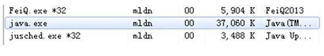

在任何的开发之中，主线程可以创建若干个子线程，创建子线程的目的是可以将一些复杂逻辑或者比较耗时的逻辑交由子线程处理；

操作示例 4：子线程处理

```java
public class ThreadDemo {
    public static void main(String[] args) throws Exception {
        System.out.println("1、执行操作任务一。");
        // 子线程负责统计
        new Thread(() -> {
            int temp = 0;
            for (int x = 0; x < Integer.MAX_VALUE; x++) {
                temp += x;
            }
        }).start();
        System.out.println("2、执行操作任务二。");
        System.out.println("n、执行操作任务N。");
    }
}
```

```java
// 输出内容
1、执行操作任务一。
2、执行操作任务二。
n、执行操作任务N。
```

主线程负责处理整体流程控制，而子线程负责处理耗时操作。


# 线程的同步与死锁 & 等待唤醒（新版）

## 1、关键字 synchronized

什么是synchronized？中文翻译为“同步”。它是一个关键字，可用来给对象和方法或者代码加锁，当它锁定一个方法或者一个代码块的时候，同一时刻最多只有一个线程执行这段代码

简而言之就是：被synchonized修饰的代码，同一时刻最多只有一个线程执行这段代码。

synchronized 关键字可以修饰哪些代码呢？（如下三者作用都是一样的）

1. 代码块
2. 普通方法
3. 静态方法

```java
// 1.同步代码块（可以是任意对象包括this）
synchronized (object) {
}
// 2.普通同步方法
访问修饰符 synchronized 返回值类型 方法名 (参数类型 参数名称) {
    // 方法体
}
// 3.静态同步方法
访问修饰符 static synchronized 返回值类型 方法名 (参数类型 参数名称) {
    // 方法体
}
```

【操作示例 1】实现多线卖票操作查看问题所在

```java
/**
 * 售票任务
 */
class TicketingTask implements Runnable {
    /**
     * 车票数量
     */
    private int ticket = 10;
    @Override
    public void run() {
        // 当车票数据大于0时
        while (ticket > 0) {
            // 打印车票，并且车票数量-1
            System.out.println(Thread.currentThread().getName() + "卖票，ticket = " + this.ticket--);
        }
    }
}

public class Main {
    public static void main(String[] args) {
        // 创建售票任务
        TicketingTask ticketingTask = new TicketingTask();
        // 创建启动线程
        new Thread(ticketingTask).start();
        new Thread(ticketingTask).start();
        new Thread(ticketingTask).start();
    }
}
```

```java
// 输出内容
Thread-2卖票，ticket = 9
Thread-1卖票，ticket = 9
Thread-1卖票，ticket = 7
Thread-1卖票，ticket = 6
Thread-1卖票，ticket = 5
Thread-1卖票，ticket = 4
Thread-1卖票，ticket = 3
Thread-1卖票，ticket = 2
Thread-1卖票，ticket = 1
Thread-0卖票，ticket = 10
Thread-2卖票，ticket = 8
```

> 从运行结果来看，程序出现了Bug，卖出了2张9号车票。出现了重复卖票的问题。

【操作示例 2】我们将使用同步代码块来解决重复卖票问题（在while循环外使用同步代码块）

```java
/**
 * 售票任务
 */
class TicketingTask implements Runnable {
    /**
     * 车票数量
     */
    private int ticket = 10;
    @Override
    public void run() {
        // 当车票数据大于0时
        synchronized (this) {
            while (ticket > 0) {
                // 打印车票，并且车票数量-1
                System.out.println(Thread.currentThread().getName() + "卖票，ticket = " + this.ticket--);
            }
        }
    }
}

public class Main {
    public static void main(String[] args) {
        // 创建售票任务
        TicketingTask ticketingTask = new TicketingTask();
        // 创建启动线程
        new Thread(ticketingTask).start();
        new Thread(ticketingTask).start();
        new Thread(ticketingTask).start();
    }
}
```

```java
// 输出内容
Thread-0卖票，ticket = 10
Thread-0卖票，ticket = 9
Thread-0卖票，ticket = 8
Thread-0卖票，ticket = 7
Thread-0卖票，ticket = 6
Thread-0卖票，ticket = 5
Thread-0卖票，ticket = 4
Thread-0卖票，ticket = 3
Thread-0卖票，ticket = 2
Thread-0卖票，ticket = 1
```

> 从运行结果来看虽然解决了重复卖票的问题，但是也引出了另一个问题，所有的票都被一个线程执行了。
>
> PS：所以我们要注意哪些内容应该放入同步代码块，哪些内容不应该放入同步代码块中。不应该将整个while循环放入同步代码块中，因为这样意味着：一个线程就可以卖完所有的车票，就失去了多线程的意义。所以不要将整个while循环放入同步代码块中

【操作示例 3】继续使用同步代码块来解决重复卖票问题（在while循环内使用同步代码块）

```java
/**
 * 售票任务
 */
class TicketingTask implements Runnable {
    /**
     * 车票数量
     */
    private int ticket = 10;
    @Override
    public void run() {
        // 当车票数据大于0时
        while (ticket > 0) {
            synchronized (this) {
                // 打印车票，并且车票数量-1
                System.out.println(Thread.currentThread().getName() + "卖票，ticket = " + this.ticket--);
            }
        }
    }
}

public class Main {
    public static void main(String[] args) {
        // 创建售票任务
        TicketingTask ticketingTask = new TicketingTask();
        // 创建启动线程
        new Thread(ticketingTask).start();
        new Thread(ticketingTask).start();
        new Thread(ticketingTask).start();
    }
}
```

```java
// 输出内容
Thread-0卖票，ticket = 10
Thread-0卖票，ticket = 9
Thread-0卖票，ticket = 8
Thread-0卖票，ticket = 7
Thread-0卖票，ticket = 6
Thread-0卖票，ticket = 5
Thread-0卖票，ticket = 4
Thread-0卖票，ticket = 3
Thread-0卖票，ticket = 2
Thread-0卖票，ticket = 1
Thread-2卖票，ticket = 0
Thread-1卖票，ticket = -1
```

> 从运行结果来看虽然解决了重复卖票和同一个线程卖票问题，当时又引出了另一个问题，卖出了2张错票：1号票和-1号票。
>
> 我们明明用了同步怎么还会出现呢？问题出现在同步代码块内部，程序运行至while循环时，当ticket=1，三个线程同时判断ticket是否大于0时，此时条件成立，于是三个线程顺利进入while循环，接下来碰到同步代码块，它们三个开始争同步锁，拿到锁的先执行，没拿到锁的等待前面执行完，但三个线程终究都会拿到锁，并且执行完。于是就产生了0、-1的情况。
>
> ```java
> // ticket = 1
> while (ticket > 0) {
>      // ⬇ Thread-0 Thread-1 Thread-2
>      synchronized (this) {
>            // 打印车票，并且车票数量-1
>            System.out.println(Thread.currentThread().getName() + "卖票，ticket = " + this.ticket--);
>      }
> }
> ```

【操作示例 4】既然找到问题那么就来解决，在同步代码块中再判断一遍ticket是否大于0，形成**同步代码块内外双重判断**

```java
/**
 * 售票任务
 */
class TicketingTask implements Runnable {
    /**
     * 车票数量
     */
    private int ticket = 10;

    @Override
    public void run() {
        // 当车票数据大于0时
        while (ticket > 0) {
            synchronized (this) {
                // 当车票数据大于0时
                if (ticket > 0) {
                    // 打印车票，并且车票数量-1
                    System.out.println(Thread.currentThread().getName() + "卖票，ticket = " + this.ticket--);
                }
            }
        }
    }
}

public class Main {
    public static void main(String[] args) {
        // 创建售票任务
        TicketingTask ticketingTask = new TicketingTask();
        // 创建启动线程
        new Thread(ticketingTask).start();
        new Thread(ticketingTask).start();
        new Thread(ticketingTask).start();
    }
}
```

```java
// 输出内容
Thread-0卖票，ticket = 10
Thread-0卖票，ticket = 9
Thread-0卖票，ticket = 8
Thread-0卖票，ticket = 7
Thread-0卖票，ticket = 6
Thread-0卖票，ticket = 5
Thread-0卖票，ticket = 4
Thread-0卖票，ticket = 3
Thread-0卖票，ticket = 2
Thread-0卖票，ticket = 1
```

> 从运行结果来看，重复卖票与错票问题都得到了解决

【操作示例 5】使用同步方法，将同步代码块抽出来，封装到同步方法

```java
/**
 * 售票任务
 */
class TicketingTask implements Runnable {
    /**
     * 车票数量
     */
    private int ticket = 10;

    @Override
    public void run() {
        // 当车票数据大于0时
        while (ticket > 0) {
            ticketing();
        }
    }

    private synchronized void ticketing() {
        // 当车票数据大于0时
        if (ticket > 0) {
            // 打印车票，并且车票数量-1
            System.out.println(Thread.currentThread().getName() + "卖票，ticket = " + this.ticket--);
        }
    }
}

public class Main {
    public static void main(String[] args) {
        // 创建售票任务
        TicketingTask ticketingTask = new TicketingTask();
        // 创建启动线程
        new Thread(ticketingTask).start();
        new Thread(ticketingTask).start();
        new Thread(ticketingTask).start();
    }
}
```

```java
// 输出内容
Thread-0卖票，ticket = 10
Thread-0卖票，ticket = 9
Thread-0卖票，ticket = 8
Thread-0卖票，ticket = 7
Thread-0卖票，ticket = 6
Thread-0卖票，ticket = 5
Thread-0卖票，ticket = 4
Thread-0卖票，ticket = 3
Thread-0卖票，ticket = 2
Thread-0卖票，ticket = 1
```


## 2、同步锁的类型介绍

什么是同步锁呢？同步锁是为了保证每个线程都能正常执行原子不可更改的操作，**同步监听对象/同步锁/同步监听器/互斥锁**的一个标记锁。

同步锁的作用：同一时刻，最多只有一个线程执行同步代码。什么样的的类型才可以称为同步锁呢？

1. 对象类型
2. 类类型

| 类型     | 示例                                                         |
| -------- | ------------------------------------------------------------ |
| 对象类型 | 1.Student student = new Student();<br />2.Object obj = new Object();<br />3.this |
| 类类型   | 1.Student.class<br />2.Object.class                          |

1、对象类型

```java
// 创建同步锁对象
Student student = new Student();
Object obj = new Object();
// 同步代码块
synchronized (student) {}
synchronized (obj) {}
synchronized (this) {}

// 同步代码块示例
class Student {
    private String name;
    public void setName(String name) {
        // 同步代码块,同步锁是this
        synchronized (this) {
            this.name = name;
        }
    }
}
```

2、类类型

```java
// 类类型同步代码块
synchronized (Student.class) {}

// 同步方法部分
class Student {
    private String name;
    // 同步方法,它的同步锁是this. 谁调用这个方法 谁就是这个锁.
    public synchronized void setName(String name) {
        this.name = name;
    }
}

// 静态同步方法部分
class Student {
    private static String name;
    // 静态同步方法,它的同步锁是Student.class. 谁调用这个方法 谁就是这个锁.
    public static synchronized void setName(String name) {
        this.name = name;
    }
}
```

同步锁的总结：

| 同步类型     | 锁类型                 |
| ------------ | ---------------------- |
| 同步代码块   | 对象类型、this、类类型 |
| 同步方法     | this                   |
| 静态同步方法 | 类类型                 |


## 3、同一把锁的争夺情况

同一把锁：多个线程争争夺同一把锁和不同锁的场景。

【操作示例 1】两个线程争夺同一把锁的情况

```java
/**
 * 自定义有任务
 */
class Task implements Runnable {
    /**
     * 切换标记
     */
    private boolean flag = true;
    public void setFlag(boolean flag) {
        this.flag = flag;
    }

    @Override
    public void run() {
        // 判断切换标记
        if (flag) {
            // 同步代码块，同步锁为：Task.class
            synchronized (Task.class) {
                try {
                    // 使当前线程休眠3秒钟
                    Thread.sleep(3000);
                } catch (InterruptedException e) {
                    e.printStackTrace();
                }
                System.out.println(Thread.currentThread().getName() + "睡醒了");
            }
        } else {
            // 同步代码块, 同步锁为：Task.class
            synchronized (Task.class) {
                System.out.println(Thread.currentThread().getName() + "人人都是程序员");
            }
        }
    }

}

public class Main {
    public static void main(String[] args) throws InterruptedException {
        // 创建任务
        Task task = new Task();
        // 创建线程
        Thread thread1 = new Thread(task, "thread-1");
        Thread thread2 = new Thread(task, "thread-2");
        // 启动thread1
        thread1.start();
        // 使主线程休眠1秒钟
        Thread.sleep(1000);
        // 切换标记
        task.setFlag(false);
        // 启动thread2
        thread2.start();
    }
}
```

```java
// 输出内容
thread-1睡醒了
thread-2人人都是程序员
```

> 从运行结果来看：两个线程的确是再争夺同一把锁，thread1拿着锁休眠了3秒钟，thread2在thread1睡醒之后输出内容，这就说明thread1拿着锁休眠的时候，thread2被阻塞了，它在等thread1释放锁，同时也说明当线程拿着锁休眠时，是不会释放锁的。以上就是同一把锁的情况。

【操作示例 2】两个线程争夺不同锁的情况（只需要把else中的同步锁修改成 Main.class 即可）

```java
/**
 * 自定义有任务
 */
class Task implements Runnable {
    /**
     * 切换标记
     */
    private boolean flag = true;
    public void setFlag(boolean flag) {
        this.flag = flag;
    }

    @Override
    public void run() {
        // 判断切换标记
        if (flag) {
            // 同步代码块
            synchronized (Task.class) {
                try {
                    // 使当前线程休眠3秒钟
                    Thread.sleep(3000);
                } catch (InterruptedException e) {
                    e.printStackTrace();
                }
                System.out.println(Thread.currentThread().getName() + "睡醒了");
            }
        } else {
            // 同步代码块
            synchronized (Main.class) {
                System.out.println(Thread.currentThread().getName() + "人人都是程序员");
            }
        }
    }

}

public class Main {
    public static void main(String[] args) throws InterruptedException {
        // 创建售票任务
        Task task = new Task();
        // 创建线程
        Thread thread1 = new Thread(task, "thread-1");
        Thread thread2 = new Thread(task, "thread-2");
        thread1.start();
        // 使主线程休眠1秒钟
        Thread.sleep(1000);
        // 切换标记
        task.setFlag(false);
        // 创建启动线程2
        thread2.start();
    }
}
```

```java
// 输出内容
thread-2人人都是程序员
thread-1睡醒了
```

> 从运行结果来看：thread2还没等thread1睡醒就已经打印了内容，整个程序时在thread1睡醒之后结束的。这就说明不同锁线程之间时不会相互争夺的，所以也就不会阻塞。

总结：

1. 多个线程争夺同一把锁，线程会阻塞
2. 多个线程争夺不同的锁，线程不会阻塞


## 4、线程死锁的介绍

下面从三点介绍死锁：

1. 什么是死锁
2. 死锁是如何产生的
3. 死锁的示例


### 1、什么是死锁？

- 死锁是指两个或两个以上的线程在执行过程中，由于竞争资源或者由于彼此通信二造成的一种阻塞的现象，若无外力的作用，它们都将无法推进下去。此时称系统处于死锁状态或系统产生了丝素偶，这些永远在互相等待的线程称为死锁线程。
- 简单概述：两个或两个以上的线程争夺彼此的锁，造成阻塞，程序用于处于阻塞状态。

```
线程A持有A锁，想要B锁。
线程B持有B锁，想要A锁。
它们互不相让，僵持住形成了死锁局面
```


### 2、死锁是如何产生的？

产生死锁的四个条件：

- 第一个条件：两个或两个以上的线程
- 第二个条件：两个或两个以上的锁
- 第三个条件：两个或两个以上的线程持有不同的锁
- 第四个条件：持有不同锁的线程争夺对方的锁


### 3、死锁的示例

按照死锁产生的四个条件一步一步编写：

1、第一个条件：两个或两个以上的线程

```java
class LockA extends Thread {
    
}

class LockB extends Thread {

}
```

2、第二个条件：两个或两个以上的锁

```java
class LockA extends Thread{
    public static synchronized void printA() {
        try {
            // 使当前线程休眠1秒钟,目的是为了不要线程太快执行完
            Thread.sleep(1000);
        } catch (InterruptedException e) {
            e.printStackTrace();
        }
        // 输出"A"
        System.out.println("A");
    }
}

class LockB extends Thread{
    public static synchronized void printB() {
        try {
            // 使当前线程休眠1秒钟,目的是为了不要线程太快执行完
            Thread.sleep(1000);
        } catch (InterruptedException e) {
            e.printStackTrace();
        }
        // 输出"B"
        System.out.println("B");
    }
}
```

3、第三个条件：两个或两个以上的线程持有不同的锁

```java
class LockA extends Thread{
    @Override
    public void run() {
        // 线程A持有的锁就是LockA.class,因为是静态不同方法,所以锁的类型就是自身类名.class
        printA();
    }

    public static synchronized void printA() {
        try {
            // 使当前线程休眠1秒钟,目的是为了不要线程太快执行完
            Thread.sleep(1000);
        } catch (InterruptedException e) {
            e.printStackTrace();
        }
        // 输出"A"
        System.out.println("A");
    }
}

class LockB extends Thread{
    @Override
    public void run() {
        // 线程B持有的锁就是LockB.class,因为是静态不同方法,所以锁的类型就是自身类名.class
        printB();
    }

    public static synchronized void printB() {
        try {
            // 使当前线程休眠1秒钟,目的是为了不要线程太快执行完
            Thread.sleep(1000);
        } catch (InterruptedException e) {
            e.printStackTrace();
        }
        // 输出"B"
        System.out.println("B");
    }
}
```

4、第四个条件：持有不同锁的线程争夺对方的锁 我们只需在printA方法里面去调用LockB.printB方法，在printB方法里面去调用LockA.printA方法即可

```java
class LockA extends Thread{
    @Override
    public void run() {
        // 线程A持有的锁就是LockA.class,因为是静态不同方法,所以锁的类型就是自身类名.class
        printA();
    }

    public static synchronized void printA() {
        try {
            // 使当前线程休眠1秒钟,目的是为了不要线程太快执行完
            Thread.sleep(1000);
        } catch (InterruptedException e) {
            e.printStackTrace();
        }
        // 输出"A"
        System.out.println("A");
        // 争夺B线程的锁
        LockB.printB();
    }
}

class LockB extends Thread{
    @Override
    public void run() {
        // 线程B持有的锁就是LockB.class,因为是静态不同方法,所以锁的类型就是自身类名.class
        printB();
    }

    public static synchronized void printB() {
        try {
            // 使当前线程休眠1秒钟,目的是为了不要线程太快执行完
            Thread.sleep(1000);
        } catch (InterruptedException e) {
            e.printStackTrace();
        }
        // 输出"B"
        System.out.println("B");
        // 争夺A线程的锁
        LockA.printA();
    }
}

public class Main {
    public static void main(String[] args) {
        new LockA().start();
        new LockB().start();
    }
}
```

```java
// 输出内容
B
A
```

> 从运行结果来看：两个线程分别打印了A和B之后，进入相互争夺锁的过程。双方僵持住形成了死锁，程序想要停下来需手动关闭


## 5、等待与唤醒机制

同步/同步锁相关的知识点：等待唤醒机制

- 等待（wait）：使当前线程等待
- 唤醒单个线程（notify）：唤醒单个等待的线程
- 唤醒所有线程（notifyAll）：唤醒所有等待的线程

```java
/**
 * 使当前线程等待,直到被唤醒
 * @throws IllegalMonitorStateExcepiton 如果当前线程没有拥有锁, 则引发该异常
 * @throws InterruptedException 如果当前线程中断, 则引发该异常
 */
public final void wait() throws InterruptedException;
public final void wait(long timeout) throws InterruptedException;            // 设置等待时间（毫秒）
public final void wait(long timeout, int nanos) throws InterruptedException; // 设置等待时间（毫秒+纳秒）

/**
 * 唤醒单个线程
 * @throws IllegalMonitorStateExcepiton 如果当前线程没有拥有锁, 则引发该异常
 */
public final native void notify();     // 唤醒第一个等待线程
public final native void notifyAll();  // 唤醒全部等待线程
```

【操作示例 1】使当前线程等待，直到被唤醒

```java
class Task implements Runnable {
    @Override
    public void run() {
        synchronized (this) {
            try {
                // 使当前线程等待
                this.wait();
            } catch (InterruptedException e) {
                e.printStackTrace();
            }
            System.out.println("人人都是程序员");
        }
    }
}

public class Main {
    public static void main(String[] args) {
        new Thread(new Task()).start();
    }
}
```

> 从运行结果来看：程序一直停在那里，也没有输出语句。说明线程在输出打印语句前已经开始等待了

【操作示例 2】唤醒刚刚上面代码中等待的线程

```java
class Task implements Runnable {
    @Override
    public void run() {
        synchronized (this) {
            try {
                // 使当前线程等待
                this.wait();
            } catch (InterruptedException e) {
                e.printStackTrace();
            }
            System.out.println("人人都是程序员");
        }
    }
}

public class Main {
    public static void main(String[] args) throws InterruptedException {
        Task task = new Task();
        new Thread(task).start();
        // 使主线程休眠1秒钟（为了唤醒效果更加明显, 1秒钟之后在唤醒等待中的线程）
        Thread.sleep(1000);
        // 必须加锁, 否则报错:java.lang.IllegalMonitorStateException
        synchronized (task) {
            // 唤醒线程
            task.notify();
        }
    }
}
```

```java
// 输出内容
人人都是程序员
```

> 从运行结果来看：1秒钟后等待的线程被唤醒，程序结束

【操作示例 3】为了证明notify方法只能唤醒单个等待的线程，我们再创建两个线程，一共三个线程等待

```java
class Task implements Runnable {
    @Override
    public void run() {
        synchronized (this) {
            try {
                // 使当前线程等待
                this.wait();
            } catch (InterruptedException e) {
                e.printStackTrace();
            }
            System.out.println("人人都是程序员");
        }
    }
}

public class Main {
    public static void main(String[] args) throws InterruptedException {
        Task task = new Task();
        new Thread(task).start();
        new Thread(task).start();
        new Thread(task).start();
        // 使主线程休眠1秒钟（为了唤醒效果更加明显, 1秒钟之后在唤醒等待中的线程）
        Thread.sleep(1000);
        // 必须加锁, 否则报错:java.lang.IllegalMonitorStateException
        synchronized (task) {
            // 唤醒线程
            task.notify();
        }
    }
}
```

```java
// 输出内容
人人都是程序员
```

> 从运行结果来看：只有一个线程被唤醒，只输出了一句话，还有两个线程依旧在等待，程序因还有线程未执行完而无法结束

【操作示例 4】唤醒全部等待线程，只需要修改上面程序代码中的notify方法为notifyAll方法即可

```java
class Task implements Runnable {
    @Override
    public void run() {
        synchronized (this) {
            try {
                // 使当前线程等待
                this.wait();
            } catch (InterruptedException e) {
                e.printStackTrace();
            }
            System.out.println("人人都是程序员");
        }
    }
}

public class Main {
    public static void main(String[] args) throws InterruptedException {
        Task task = new Task();
        new Thread(task).start();
        new Thread(task).start();
        new Thread(task).start();
        // 使主线程休眠1秒钟（为了唤醒效果更加明显, 1秒钟之后在唤醒等待中的线程）
        Thread.sleep(1000);
        // 必须加锁, 否则报错:java.lang.IllegalMonitorStateException
        synchronized (task) {
            // 唤醒线程
            task.notifyAll();
        }
    }
}
```

```java
// 输出内容
人人都是程序员
人人都是程序员
人人都是程序员
```

> 从运行结果来看：三个线程都执行完毕，输出了三句话

等待唤醒机制方法总结：

| 方法名称                      | 作用                                   |
| ----------------------------- | -------------------------------------- |
| wait()                        | 使当前线程等待                         |
| wait(long timeout)            | 使当前线程等待，经过指定时间后自动唤醒 |
| wait(long timeout, int nanos) | 使当前线程等待，经过指定时间后自动唤醒 |
| notify()                      | 唤醒单个线程                           |
| notifyAll()                   | 唤醒所有线程                           |


## 6、wait与sleep的区别

从如下方面来分析wait方法与sleep方法的区别：

1. 位置
2. 是否需要当前线程拥有锁
3. 是否支持手动唤醒
4. 是否支持自动唤醒
5. 是否支持中断
6. 是否释放锁
7. 线程状态

|                        | sleep                               | wait                                |
| ---------------------- | ----------------------------------- | ----------------------------------- |
| 位置                   | Thread类                            | Object类                            |
| 是否需要当前线程拥有锁 | 不需要                              | 需要                                |
| 是否支持手动唤醒       | 不支持                              | notify、notifyAll                   |
| 是否支持自动唤醒       | 支持：sleep(long millis)            | 支持：wait(long timeout)            |
| 是否支持中断           | interrupt（不过会发生线程中断异常） | interrupt（不过会发生线程中断异常） |
| 是否释放锁             | 是                                  | 否                                  |
| 线程状态               | TIME_WAITING                        | WAITING、TIME_WAITING               |

1、位置

```java
public class Thread implements Runnable {
    public static native void sleep(long millis);
    public static void sleep(long millis, int nanos);
}

public class Object {
    public final void wait();
    public final native void wait(long timeout);
    public final void wait(long timeout, init nanos);
}
```

2、是否需要当前线程拥有锁

```java
public class Main {
    public static void main(String[] args) throws InterruptedException {
        // 当前线程休眠一秒钟,可以发现1秒钟程序执行完毕
        Thread.sleep(1000);
    }
}

public class Main {
    public static void main(String[] args) throws InterruptedException {
        // 不加锁的情况下，执行代码会报错：java.lang.IllegalMonitorStateException
        Main.class.wait();
        // 只有加锁，才能够正常执行
        synchronized (Main.class) {
            Main.class.wait();
        }
    }
}
```

3、是否支持手动唤醒（无案例演示）、4、是否支持自动唤醒（无案例演示）5、是否支持中断

6、是否释放锁

sleep方法演示：

```java
class Task implements Runnable {
    @Override
    public void run() {
        synchronized (this) {
            try {
                // 使当前线程休眠3秒钟
                Thread.sleep(3000);
                System.out.println("我是Task线程");
            } catch (InterruptedException e) {
                e.printStackTrace();
            }
        }
    }
}
public class Main {
    public static void main(String[] args) {
        // 创建任务
        Task task = new Task();
        // 创建线程
        Thread thread = new Thread(task);
        // 启动线程
        thread.start();
        // 使主线程去争夺thread线程的锁
        synchronized (task) {
            System.out.println("我是主线程");
        }
    }
}

// 输出内容
我是主线程
我是Task线程
```

> 从运行结果来看：先输出我是主线程，3秒后输出我是Task线程。说明sleep是会释放锁

wait方法演示

```java
class Task implements Runnable {
    @Override
    public void run() {
        synchronized (this) {
            try {
                this.wait();
                System.out.println("我是Task线程");
            } catch (InterruptedException e) {
                e.printStackTrace();
            }
        }
    }
}
public class Main {
    public static void main(String[] args) {
        // 创建任务
        Task task = new Task();
        // 创建线程
        Thread thread = new Thread(task);
        // 启动线程
        thread.start();
        // 使主线程去争夺thread线程的锁
        synchronized (task) {
            System.out.println("我是主线程");
        }
    }
}

// 输出内容
我是主线程
```

> 从运行结果来看：输出我是主线程后程序就停留在这里了。说明wait方法不会释放锁

7、线程状态

sleep方法线程状态查看

```java
class Task implements Runnable {
    @Override
    public void run() {
        synchronized (this) {
            try {
                // 使当前线程休眠3秒钟
                Thread.sleep(3000);
            } catch (InterruptedException e) {
                e.printStackTrace();
            }
        }
    }
}
public class Main {
    public static void main(String[] args) throws InterruptedException {
        // 创建任务
        Task task = new Task();
        // 创建线程
        Thread thread = new Thread(task);
        // 启动线程
        thread.start();
        // 使主线程休眠1秒钟,
        Thread.sleep(1000);
        // 输出线程状态
        System.out.println(thread.getState());
    }
}

// 输出内容
TIMED_WAITING
```

wait方法线程状态查看（他有两种线程状态，首先演示WAITING状态）

```java
class Task implements Runnable {
    @Override
    public void run() {
        synchronized (this) {
            try {
                this.wait();
            } catch (InterruptedException e) {
                e.printStackTrace();
            }
        }
    }
}
public class Main {
    public static void main(String[] args) throws InterruptedException {
        // 创建任务
        Task task = new Task();
        // 创建线程
        Thread thread = new Thread(task);
        // 启动线程
        thread.start();
        // 使主线程休眠1秒钟,
        Thread.sleep(1000);
        // 输出线程状态
        System.out.println(thread.getState());
    }
}

// 输出内容
WAITING
```

wait方法线程状态查看（他有两种线程状态，首先演示TIME_WAITING状态）

```java
class Task implements Runnable {
    @Override
    public void run() {
        synchronized (this) {
            try {
                this.wait(3000);
            } catch (InterruptedException e) {
                e.printStackTrace();
            }
        }
    }
}
public class Main {
    public static void main(String[] args) throws InterruptedException {
        // 创建任务
        Task task = new Task();
        // 创建线程
        Thread thread = new Thread(task);
        // 启动线程
        thread.start();
        // 使主线程休眠1秒钟,
        Thread.sleep(1000);
        // 输出线程状态
        System.out.println(thread.getState());
    }
}

// 输出内容
TIME_WAITING
```

| 方法                          | 线程状态      |
| ----------------------------- | ------------- |
| sleep(long millis)            | TIMED_WAITING |
| sleep(long millis, int nanos) | TIMED_WAITING |
| wait()                        | WAITING       |
| wait(long timeout)            | TIME_WAITING  |
| wait(long timeout, int nanos) | TIME_WAITING  |


## 7、生产者与消费者（wait & notify）

线程间如何通讯，通讯的方式有好几种。其中有一种就是wait&notify方式，与此相关的一个比较经典的例子：生产者与消费者。

生产者线程负责生产数据，消费者线程负责消费数据，数据还没生产的时候，消费者线程先等待，与此同时，生产者开始生产数据，数据生产以后，叫醒等待中的消费者线程，起来消费数据，随后生产者线程等待，消费者线程开始消费数据，消费完数据以后，叫醒等待中的生产者线程，起来生产数据，如此反复。

操作示例：生产者与消费者例子步骤：

1. 数据类
2. 生产者线程
3. 消费者线程

```java
/**
 * 数据
 */
class Data {
    // 消息
    private String message;
    public String getMessage() {
        return message;
    }
    public void setMessage(String message) {
        this.message = message;
    }
}

/**
 * 生产者线程
 */
class Producer implements Runnable {
    // 数据
    private final Data data;
    public Producer(Data dada) {
        this.data = dada;
    }
    @Override
    public void run() {
        // 计数器
        int i = 0;
        // 无限生产数据
        while (true) {
            synchronized (data) {
                try {
                    // 休眠1秒钟,为了让打印效果更明显
                    Thread.sleep(1000);
                } catch (InterruptedException e) {
                    e.printStackTrace();
                }
                // 当数据为空时
                if (data.getMessage() == null) {
                    // 生产数据
                    data.setMessage("人人都是程序员" + i++);
                    System.out.println("生产:" + data.getMessage());
                }
                // 唤醒等待中的消费者线程
                data.notify();
                try {
                    // 使当前线程等待
                    data.wait();
                } catch (InterruptedException e) {
                    e.printStackTrace();
                }
            }
        }
    }
}

/**
 * 消费者线程
 */
class Consumer implements Runnable {
    // 数据
    private final Data data;
    public Consumer(Data data) {
        this.data = data;
    }
    @Override
    public void run() {
        // 无限消费数据
        while (true) {
            synchronized (data) {
                try {
                    // 休眠1秒钟,为了让打印效果更明显
                    Thread.sleep(1000);
                } catch (InterruptedException e) {
                    e.printStackTrace();
                }
                // 当数据不为空时
                if (data.getMessage() != null) {
                    // 消费数据
                    System.out.println("消费:" + data.getMessage());
                    // 重置数据
                    data.setMessage(null);
                }
                // 唤醒生产者线程
                data.notify();
                try {
                    // 使当前线程等待
                    data.wait();
                } catch (InterruptedException e) {
                    e.printStackTrace();
                }
            }
        }
    }
}

/**
 * Main方法,主线程
 */
public class Main {
    public static void main(String[] args) throws InterruptedException {
        // 创建数据
        Data data = new Data();
        // 创建生产者、消费者任务
        Producer producer = new Producer(data);
        Consumer consumer = new Consumer(data);
        // 创建和启动生产者、消费者线程
        new Thread(producer).start();
        new Thread(consumer).start();
    }
}
```

```java
// 输出内容
生产:人人都是程序员0
消费:人人都是程序员0
生产:人人都是程序员1
消费:人人都是程序员1
生产:人人都是程序员2
消费:人人都是程序员2
生产:人人都是程序员3
消费:人人都是程序员3
生产:人人都是程序员4
...
```

> 从运行结果来看：生产者生产一个数据，消费者就消费一个数据。


## 8、内存可见性：volatile

> 一个Java内存可见性问题的分析：https://www.cnblogs.com/frydsh/p/5720658.html

volatile：它是专门用来解决内存可见性的。

操作示例 1：定义两个线程：主线程与自定义线程，在自定义线程中定义while循环。使用主线程修改变量控制while循环

```java
public class Main {
    public static boolean stopped = true;
    public static void main(String[] args) throws Exception {
        new Thread(() -> {
            while (stopped) {
            }
        }).start();
        // 使主线程休眠1秒钟
        Thread.sleep(200);
        // 停止循环（停止线程）
        stopped = false;
    }
}
```

> 从执行结果来看：程序1秒钟之后并没有停下来，看来是发生了意外情况，这个情况就是内存可见性问题

内存可见性问题有两种情况：

| 内存可见性 | 描述                                                         |
| ---------- | ------------------------------------------------------------ |
| 可见       | 多个线程共享变量时，其中一个线程修改其变量的值，其他线程及时得到最新值 |
| 不可见     | 多个线程共享变量时，其中一个线程修改其变量的值，其他线程无法及时得到最新值 |

通过如下观察内存可见性问题：

```
除了线程和主内存以外，还有一个工作内存，stopped变量依然是在主内存中。当两个线程去获取stopped变量时，它们会先去工作内存中获取，如果有stopped变量，则直接返回，如果没有stopped变量，则去主内存中获取。主内存返回stopped变量，此时stopped变量会先缓存在工作内存中，然后返回给线程，注意：线程不缓存stopped变量，线程每次需要stopped变量时，都会先去工作内存中获取，工作内容中有的话就直接返回，工作内存中没有的话才会去主内存中获取。

                              主内存
┌───────────────────────────────────────────────────────────────┐
│                     boolean stopped = true                    │
└───────────────────────────────────────────────────────────────┘
             │                                     │
             ▼                                     ▼
┌─────────────────────────┐           ┌─────────────────────────┐
│ boolean stopped = true  │  工作内存  │ boolean stopped = true  │
└─────────────────────────┘           └─────────────────────────┘
             │                                     │
             ▼                                     ▼       
┌─────────────────────────┐           ┌─────────────────────────┐
│ boolean stopped = true  │  线程自身  │ boolean stopped = true  │
└─────────────────────────┘           └─────────────────────────┘
         Thread-0                              Thread-1
```

回顾上面代码中的问题

```
其中一个线程修改了stopped的值，它先修改的时工作内存中的值，修改完以后，再修改的时主内存中的值，主内存中的值被修改完以后，并没有主动告诉另一个线程stopped的值被修改了。所以另一个线程，当它每次获取stopped值的时候，还是获取的是工作内存中的值，而工作内存中的值不是最新的，所以循环停不下来
                              主内存
┌───────────────────────────────────────────────────────────────┐
│                     boolean stopped = true                    │
└───────────────────────────────────────────────────────────────┘
             ▲                                     │
             │                                     ▼
┌─────────────────────────┐           ┌─────────────────────────┐
│ boolean stopped = false │  工作内存  │ boolean stopped = true  │
└─────────────────────────┘           └─────────────────────────┘
             ▲                                     │
             │                                     ▼       
┌─────────────────────────┐           ┌─────────────────────────┐
│ boolean stopped = false │  线程自身  │ boolean stopped = true  │
└─────────────────────────┘           └─────────────────────────┘
         Thread-0                              Thread-1
```

下面介绍一个专门解决内存可见性问题的关键字：volatile

| 关键字   | 描述                       | 修饰 | 解决           |
| -------- | -------------------------- | ---- | -------------- |
| volatile | 表明变量必须同步地发生变化 | 变量 | 内存可见性问题 |

操作示例 2：使用volatile关键字来修饰stopped变量

```java
public class Main {
    private static volatile boolean flag = true;
    public static void main(String[] args) throws Exception {
        new Thread(() -> {
            while (flag) {
            }
        }, "执行线程").start();
        // 运行200毫秒
        Thread.sleep(1000);
        // 停止线程
        flag = false;
    }
}
```

> 从执行结果来看：程序1秒钟之后就停下来。说明volatile关键字的确可以解决内存可见性问题

注意：另外如何在while循环内有使用到`System.out.flush()`的话，即便没有使用volatile关键字也能够正常读取到字符。具体分析可参考：https://www.cnblogs.com/frydsh/p/5720658.html

# 线程的同步与死锁 & 等待唤醒（老版）

## 1、线程同步问题引出

在多线程的处理之中，可以利用Runnable描述多个线程操作的资源，而Thread描述每一个线程对象，当然多个线程访问同一资源时如果处理不当就会产生数据的错误操作。

下面编写一个简单的卖票程序，将若干个线程对象实现卖票的处理操作。

【操作示例 1】实现卖票操作

```java
/**
 * 售票任务
 */
class TicketingTask implements Runnable {
    /**
     * 车票数量
     */
    private int ticket = 10;
    @Override
    public void run() {
        // 当车票数据大于0时
        while (ticket > 0) {
            // 打印车票，并且车票数量-1
            System.out.println(Thread.currentThread().getName() + "卖票，ticket = " + this.ticket--);
        }
    }
}

public class Main {
    public static void main(String[] args) {
        // 创建售票任务
        TicketingTask ticketingTask = new TicketingTask();
        // 创建启动线程
        new Thread(ticketingTask).start();
        new Thread(ticketingTask).start();
        new Thread(ticketingTask).start();
    }
}
```

```java
// 输出内容
Thread-2卖票，ticket = 9
Thread-1卖票，ticket = 9
Thread-1卖票，ticket = 7
Thread-1卖票，ticket = 6
Thread-1卖票，ticket = 5
Thread-1卖票，ticket = 4
Thread-1卖票，ticket = 3
Thread-1卖票，ticket = 2
Thread-1卖票，ticket = 1
Thread-0卖票，ticket = 10
Thread-2卖票，ticket = 8
```

此时的程序将创建3个线程对象，并且这三个线程将进行10张票的出售。此时的程序在进行卖票处理的时候，并没有任何的问题（假象），下面可以模拟一下卖票中的延迟操作。

```java
public class Main {
    public static void main(String[] args) {
        // 创建售票任务
        TicketingTask ticketingTask = new TicketingTask();
        // 创建启动线程
        new Thread(ticketingTask).start();
        new Thread(ticketingTask).start();
        new Thread(ticketingTask).start();
    }
}

/**
 * 售票任务
 */
class TicketingTask implements Runnable {
    /**
     * 车票数量
     */
    private int ticket = 10;
    @Override
    public void run() {
        // 当车票数据大于0时
        while (ticket > 0) {
            try {
                Thread.sleep(500);
            } catch (InterruptedException e) {
                e.printStackTrace();
            }
            // 打印车票，并且车票数量-
            System.out.println(Thread.currentThread().getName() + "卖票，ticket = " + this.ticket--);
        }
    }
}
```

```java
// 输出内容
Thread-0卖票，ticket = 10
Thread-1卖票，ticket = 8
Thread-2卖票，ticket = 9
Thread-0卖票，ticket = 6
Thread-2卖票，ticket = 7
Thread-1卖票，ticket = 7
Thread-1卖票，ticket = 6
Thread-2卖票，ticket = 4
Thread-0卖票，ticket = 5
Thread-2卖票，ticket = 3
Thread-0卖票，ticket = 2
Thread-1卖票，ticket = 3
Thread-1卖票，ticket = 1
Thread-0卖票，ticket = -1
Thread-2卖票，ticket = 0
```

这个时候追加了延迟，问题就暴露出来了，而实际上这个问题一直都在。

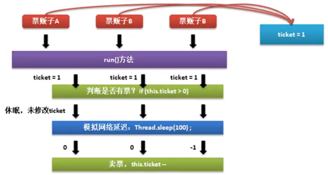


## 2、线程同步问题处理

学会使用synchronized关键字实现多个线程同时只有一个能进行调用的限制，解决线程同步问题。

经过分析之后已经可以确定同步问题产生的主要原因了，那么下面就需要进行同步问题的解决，但是解决同步问题的关键是锁，指的是当某一个线程执行操作的时候，其他线程外面等待；（问题得解决）

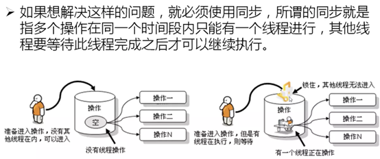

如果要想程序中实现这把锁功能，就可以使用synchronized关键字来实现，利用此关键字可以定义同步方法或同步代码块，在同步代码块的操作中的代码只允许一个线程执行。

1、利用同步代码块进行处理：

```java
synchronized (同步对象){
    // 同步代码操作
}
```

一般要进行同步对象处理的时候可以采用当前对象this进行同步。

【操作示例 1】利用同步代码块解决数据同步访问问题

```java
class MyThread implements Runnable {
    // 总票数为10张
    private int ticket = 10;

    @Override
    public void run() {
        while (true) {
            // 每一次只允许一个线程进行访问
            synchronized (this) {
                if (this.ticket > 0) {
                    try {
                        // 模拟网络延迟
                        Thread.sleep(100);
                    } catch (InterruptedException e) {
                        e.printStackTrace();
                    }
                    System.out.println(Thread.currentThread().getName() + "卖票，ticket = " + this.ticket--);
                } else {
                    System.out.println("***** 票已经卖光了 *****");
                    break;
                }
            }
        }
    }
}

public class ThreadDemo {
    public static void main(String[] args) throws Exception {
        MyThread mt = new MyThread();
        new Thread(mt, "票贩子A").start();
        new Thread(mt, "票贩子B").start();
        new Thread(mt, "票贩子C").start();
    }
}
```

```java
// 输出内容
票贩子A卖票，ticket = 10
票贩子A卖票，ticket = 9
票贩子A卖票，ticket = 8
票贩子A卖票，ticket = 7
票贩子A卖票，ticket = 6
票贩子A卖票，ticket = 5
票贩子A卖票，ticket = 4
票贩子A卖票，ticket = 3
票贩子A卖票，ticket = 2
票贩子A卖票，ticket = 1
***** 票已经卖光了 *****
***** 票已经卖光了 *****
***** 票已经卖光了 *****
```

加入同步处理之后，程序的整体性能下降了。同步实际上会造成性能的降低。

2、利用同步方法解决：只需要在方法定义上使用synchronized关键字即可。

```java
class MyThread implements Runnable {
    // 总票数为10张
    private int ticket = 10;

    public synchronized boolean sale() {
        if (this.ticket > 0) {
            try {
                // 模拟网络延迟
                Thread.sleep(100);
            } catch (InterruptedException e) {
                e.printStackTrace();
            }
            System.out.println(Thread.currentThread().getName() + "卖票，ticket = " + this.ticket--);
            return true;
        } else {
            System.out.println("***** 票已经卖光了 *****");
            return false;
        }
    }

    @Override
    public void run() {
        while (this.sale()) {
        }
    }
}

public class ThreadDemo {
    public static void main(String[] args) throws Exception {
        MyThread mt = new MyThread();
        new Thread(mt, "票贩子A").start();
        new Thread(mt, "票贩子B").start();
        new Thread(mt, "票贩子C").start();
    }
}
```

```java
// 输出内容
票贩子A卖票，ticket = 10
票贩子A卖票，ticket = 9
票贩子A卖票，ticket = 8
票贩子A卖票，ticket = 7
票贩子C卖票，ticket = 6
票贩子C卖票，ticket = 5
票贩子C卖票，ticket = 4
票贩子B卖票，ticket = 3
票贩子B卖票，ticket = 2
票贩子B卖票，ticket = 1
***** 票已经卖光了 *****
***** 票已经卖光了 *****
***** 票已经卖光了 *****
```

在日后学习Java类库的时候，系统中许多的类上使用的同步处理采用的都是同步方法。


## 3、线程死锁问题

将通过实际运行一段代码发现两个进程互相等待对方让出资源而造成死锁的问题，了解到此问题出现的原因并具有一定的避免此类问题的认识。

死锁是在进行多线程同步的处理之中有可能产生的一种问题，所谓的死锁指的是若干个线程彼此互相等待的状态。下面通过一个简单的代码来观察一下死锁的表现形式，但是对于此代码不作为重点。

操作示例 1：死锁的展示

```java
class Jian {
    public synchronized void say(XiaoQiang xq) {
        System.out.println("阿健说，此路是我开，要想从此过，留下10块钱。");
        xq.get();
    }

    public synchronized void get() {
        System.out.println("阿健说，得到了10块钱，可以买饭吃了，于是让出了路");
    }
}

class XiaoQiang {
    public synchronized void say(Jian jj) {
        System.out.println("小强说，让我先过去，然后给你钱");
        jj.get();
    }

    public synchronized void get() {
        System.out.println("小强说，逃过了一劫，可以继续送快餐了。");
    }
}

public class DeadLock implements Runnable {
    private Jian jj = new Jian();
    private XiaoQiang xq = new XiaoQiang();

    @Override
    public void run() {
        jj.say(xq);
    }

    public DeadLock() {
        new Thread(this).start();
        xq.say(jj);
    }

    public static void main(String[] args) {
        new DeadLock();
    }
}
```

```java
// 输出内容（可以发现程序一直没有结束）
小强说，让我先过去，然后给你钱
阿健说，此路是我开，要想从此过，留下10块钱。
```

现在死锁造成的主要原因是因为彼此都在互相等待着，等待着对方先让出资源。死锁实际上是一种开发中出现的不确定的状态，有的时候代码处理不当，则会不定期出现死锁，这属于正常开发中的调试问题。

若干个线程访问同一资源时一定要进行同步处理，而过多的同步则会造成死锁。


## 4、程序的基本实现【生产者与消费者】

在多线程的开发过程之中最为著名的案例就是生产者和消费者操作，该操作的主要流程如下：

1. 生产者负责信息内容的生产
2. 每当生产者生产完成一项完整的信息之后消费者要从这里面取走信息
3. 如果生产者没有生产完则消费者要等待它生产完成，如果消费者还没有对信息进行消费，则生产者应该等待消费处理完成后再继续生产

可以将生产者和消费者定义为两个独立的线程类对象，但是对于现在生产的数据，可以使用如下的组成：

1. 数据1：title = 王建、content = 宇宙大帅哥
2. 数据2：title = 小高、content = 猥琐第一人

既然生产者与消费者是两个独立的线程，那么这两个独立的线程就需要有一个数据的保存集中点，那么可以单独定义一个Message类来实现数据的保存。

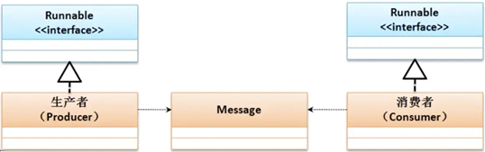

操作示例 1：程序基本结构

```java
class Message {
    private String title;   // 保存信息的标题
    private String content; // 保存信息的内容
    public void setContent(String content) {
        this.content = content;
    }
    public void setTitle(String title) {
        this.title = title;
    }
    public String getContent() {
        return content;
    }
    public String getTitle() {
        return title;
    }
}

/**
 * 定义生产者
 */
class Producer implements Runnable {
    private Message msg;
    public Producer(Message msg) {
        this.msg = msg;
    }
    @Override
    public void run() {
        // 生产5条数据
        for (int x = 0; x < 50; x++) {
            if (x % 2 == 0) {
                this.msg.setTitle("王健");
                try {
                    // 模拟网络延迟
                    Thread.sleep(100);
                } catch (InterruptedException e) {
                    e.printStackTrace();
                }
                this.msg.setContent("宇宙大帅哥");
            } else {
                this.msg.setTitle("小高");
                try {
                    // 模拟网络延迟
                    Thread.sleep(100);
                } catch (InterruptedException e) {
                    e.printStackTrace();
                }
                this.msg.setContent("猥琐第一人，常态保持。");
            }
        }
    }
}

/**
 * 定义消费者
 */
class Consumer implements Runnable {
    private Message msg;
    public Consumer(Message msg) {
        this.msg = msg;
    }
    @Override
    public void run() {
        for (int x = 0; x < 50; x++) {
            try {
                // 模拟网络延迟
                Thread.sleep(10);
            } catch (InterruptedException e) {
                e.printStackTrace();
            }
            System.out.println(this.msg.getTitle() + " - " + this.msg.getContent());
        }
    }
}

public class ThreadDemo {
    public static void main(String[] args) {
        Message msg = new Message();
        new Thread(new Producer(msg)).start();    // 启动生产者线程
        new Thread(new Consumer(msg)).start();    // 启动消费者线程
    }
}
```

```java
// 输出内容
王健 - null
王健 - null
王健 - null
王健 - null
王健 - null
王健 - null
小高 - 宇宙大帅哥
小高 - 宇宙大帅哥
小高 - 宇宙大帅哥
小高 - 宇宙大帅哥
小高 - 宇宙大帅哥
小高 - 宇宙大帅哥
小高 - 宇宙大帅哥
小高 - 宇宙大帅哥
小高 - 宇宙大帅哥
王健 - 猥琐第一人，常态保持。
王健 - 猥琐第一人，常态保持。
//...省略输出
```

通过整个代码的执行，会发现此时有两个主要问题：

1. 问题一：数据不同步了
2. 问题二：生产一个取走一个，但是发现有了重复生产和重复取出的问题


## 5、解决数据的同步【生产者与消费者】

**简介：**通过阅读本节内容，你将通过实操代码，进一步掌握synchronized关键字的使用方法，解决同步问题。

如果要解决问题，首先解决的就是数据同步的处理问题，如果要想解决数据同步最简单的做法就是使用synchronized关键字定义同步代码块或同步方法，于是这个时候对于同步的处理就可以直接在Message类中完成。

操作示例 1：解决同步操作

```java
class Message {
    private String title;   // 保存信息的标题
    private String content; // 保存信息的内容
    public synchronized void set(String title, String content) {
        this.title = title;
        try {
            // 模拟网络延迟
            Thread.sleep(100);
        } catch (InterruptedException e) {
            e.printStackTrace();
        }
        this.content = content;
    }

    public synchronized String get() {
        try {
            // 模拟网络延迟
            Thread.sleep(10);
        } catch (InterruptedException e) {
            e.printStackTrace();
        }
        return this.title + " - " + this.content;
    }
}

class Producer implements Runnable {
    private Message msg;
    public Producer(Message msg) {
        this.msg = msg;
    }
    @Override
    public void run() {
        for (int x = 0; x < 100; x++) {
            if (x % 2 == 0) {
                this.msg.set("王健", "宇宙大帅哥");
            } else {
                this.msg.set("小高", "猥琐第一人，常态保持");
            }
        }
    }
}

class Consumer implements Runnable {
    private Message msg;
    public Consumer(Message msg) {
        this.msg = msg;
    }
    @Override
    public void run() {
        for (int x = 0; x < 100; x++) {
            System.out.println(this.msg.get());
        }
    }
}

public class ThreadDemo {
    public static void main(String[] args) throws Exception {
        Message msg = new Message();
        new Thread(new Producer(msg)).start();    // 启动生产者线程
        new Thread(new Consumer(msg)).start();    // 启动消费者线程
    }
}
```

```java
// 输出内容
王健 - 宇宙大帅哥
小高 - 猥琐第一人，常态保持
小高 - 猥琐第一人，常态保持
王健 - 宇宙大帅哥
小高 - 猥琐第一人，常态保持
小高 - 猥琐第一人，常态保持
王健 - 宇宙大帅哥
王健 - 宇宙大帅哥
小高 - 猥琐第一人，常态保持
王健 - 宇宙大帅哥
小高 - 猥琐第一人，常态保持
小高 - 猥琐第一人，常态保持
小高 - 猥琐第一人，常态保持
//...省略输出
```

在进行同步处理的时候肯定需要有一个同步的处理对象，那么此时肯定要将同步操作交由Message处理是最合适的。这时数据已经可以正常保持一致了，但是对于重复操作的问题依然存在。


## 6、线程等待与唤醒【生产者与消费者】

如果说现在要想解决生产者与消费者的问题，那么最好的解决方案就是使用等待与唤醒机制。而对于等待与唤醒的操作机制主要依靠是Object类中提供的方法：

```java
// 等待机制与唤醒
public final void wait() throws InterruptedException;                        // 死等
public final void wait(long timeout) throws InterruptedException;            // 设置等待时间（毫秒）
public final void wait(long timeout, int nanos) throws InterruptedException; // 设置等待时间（毫秒+纳秒）
public final void notify();                                                  // 唤醒第一个等待线程
public final void notifyAll();                                               // 唤醒全部等待线程
```

如果此时有若干个等待线程的话，那么notify()表示的是唤醒第一个等待的，而其他的线程继续等待，而notifyAll()表示会唤醒所有等待的线程，哪个线程的优先级高就有可能先执行。

对于当前的问题主要的解决应该通过Message类完成处理。

操作示例 1：修改Message类

```java
class Producer implements Runnable {
    private Message msg;
    public Producer(Message msg) {
        this.msg = msg;
    }
    @Override
    public void run() {
        for (int x = 0; x < 100; x++) {
            if (x % 2 == 0) {
                this.msg.set("王健", "宇宙大帅哥");
            } else {
                this.msg.set("小高", "猥琐第一人，常态保持");
            }
        }
    }
}

class Consumer implements Runnable {
    private Message msg;
    public Consumer(Message msg) {
        this.msg = msg;
    }
    @Override
    public void run() {
        for (int x = 0; x < 100; x++) {
            System.out.println(this.msg.get());
        }
    }
}

class Message {
    private String title;
    private String content;
    // 表示生产或消费的形式
    private boolean flag = true;

    /**
     * flag = true：允许生产，但不允许消费
     * flag = false：允许消费，但不允许生产
     */
    public synchronized void set(String title, String content) {
        // 无法进行生产，应该等待被消费
        if (this.flag == false) {
            try {
                super.wait();
            } catch (Exception e) {
                e.printStackTrace();
            }
        }
        this.title = title;
        try {
            // 模拟网络延迟
            Thread.sleep(100);
        } catch (InterruptedException e) {
            e.printStackTrace();
        }
        this.content = content;
        // 已经生产过了
        this.flag = false;
        // 唤醒等待的线程
        super.notify();
    }

    public synchronized String get() {
        // 还未生产，需要等待
        if (this.flag == true) {
            try {
                super.wait();
            } catch (Exception e) {
                e.printStackTrace();
            }
        }
        try {
            // 模拟网络延迟
            Thread.sleep(10);
        } catch (InterruptedException e) {
            e.printStackTrace();
        }
        try {
            return this.title + " - " + this.content;
        } finally { // 不管如何都要执行
            // 继续生产
            this.flag = true;
            // 唤醒等待的线程
            super.notify();
        }
    }
}

public class ThreadDemo {
    public static void main(String[] args) throws Exception {
        Message msg = new Message();
        new Thread(new Producer(msg)).start();       // 启动生产者线程
        new Thread(new Consumer(msg)).start();       // 启动消费者线程
    }
}
```

```java
// 输出内容
王健 - 宇宙大帅哥
小高 - 猥琐第一人，常态保持
王健 - 宇宙大帅哥
小高 - 猥琐第一人，常态保持
王健 - 宇宙大帅哥
小高 - 猥琐第一人，常态保持
王健 - 宇宙大帅哥
小高 - 猥琐第一人，常态保持
王健 - 宇宙大帅哥
小高 - 猥琐第一人，常态保持
//...省略输出
```

这种处理形式就是在进行多线程开发过程之中最原始的处理方案，整个的等待、同步、唤醒机制都由开发者自行通过原生代码实现控制。


# 多线程实战案例

**简介：**通过阅读本节内容，你将通过数字加减、生产电脑、竞争抢答三则案例的多线程相关逻辑实现，进一步掌握多线程开发的相关能力，对线程的各类操作更加得心应手。

## 1、案例分析一：数字加减

设计4个线程对象，两个线程执行减操作，两个线程执行加操作。

```java
class AddThread implements Runnable {
    private Resource resource;
    public AddThread(Resource resource) {
        this.resource = resource;
    }
    @Override
    public void run() {
        for (int x = 0; x < 50; x++) {
            try {
                this.resource.add();
            } catch (Exception e) {
                e.printStackTrace();
            }
        }
    }
}

class SubThread implements Runnable {
    private Resource resource;
    public SubThread(Resource resource) {
        this.resource = resource;
    }
    @Override
    public void run() {
        for (int x = 0; x < 50; x++) {
            try {
                this.resource.sub();
            } catch (Exception e) {
                e.printStackTrace();
            }
        }
    }
}

/**
 * 定义一个操作的资源
 */
class Resource {
    // 这个是要进行加减操作的数据
    private int num = 0;
    // 加减的切换
    private boolean flag = true;

    /**
     *  flag = true： 表示可以进行加法操作，但是无法进行减法操作
     *  flag = false：表示可以进行减法操作，但是无法进行加法操作
     *  执行加法操作
     */
    public synchronized void add() throws Exception {
        // 现在需要执行的是减法操作，加法操作要等待
        if (this.flag == false) {
            super.wait();
        }
        Thread.sleep(100);
        this.num++;
        System.out.println("【加法操作 -" + Thread.currentThread().getName() + "】num = " + this.num);
        // 加法操作执行完毕，需要执行减法处理
        this.flag = false;
        // 唤醒全部等待线程
        super.notifyAll();

    }

    /**
     * 执行减法操作
     */
    public synchronized void sub() throws Exception {
        // 减法操作需要等待
        if (this.flag == true) {
            System.out.println("【减法操作 -" + Thread.currentThread().getName() + "】进行等待");
            super.wait();
        }
        Thread.sleep(200);
        this.num--;
        System.out.println("【减法操作 -" + Thread.currentThread().getName() + "】num = " + this.num);
        this.flag = true;
        super.notifyAll();
    }
}

public class ThreadDemo {
    public static void main(String[] args) throws Exception {
        Resource res = new Resource();
        SubThread st = new SubThread(res);
        AddThread at = new AddThread(res);
        new Thread(at, "加法线程-A ").start();
        new Thread(at, "加法线程-B ").start();
        new Thread(st, "减法线程-X ").start();
        new Thread(st, "减法线程-Y ").start();
    }
}
```

```
【加法操作 -加法线程-A 】num = 1
【减法操作 -减法线程-Y 】num = 0
【减法操作 -减法线程-Y 】进行等待
【减法操作 -减法线程-X 】进行等待
【加法操作 -加法线程-B 】num = 1
【减法操作 -减法线程-Y 】num = 0
【减法操作 -减法线程-Y 】进行等待
【加法操作 -加法线程-B 】num = 1
【减法操作 -减法线程-Y 】num = 0
【减法操作 -减法线程-Y 】进行等待
【加法操作 -加法线程-B 】num = 1
【减法操作 -减法线程-Y 】num = 0
【减法操作 -减法线程-Y 】进行等待
【加法操作 -加法线程-B 】num = 1
【减法操作 -减法线程-Y 】num = 0
【减法操作 -减法线程-Y 】进行等待
【加法操作 -加法线程-B 】num = 1
【减法操作 -减法线程-Y 】num = 0
【减法操作 -减法线程-Y 】进行等待
【加法操作 -加法线程-B 】num = 1
...省略输出
```

这是一个经典的多线程开发操作，这一个程序里面一定要考虑的核心本质在于：加一个、减一个，整体的计算结果应该在0、-1、1 中循环出现才是合理的。


## 2、案例分析二：生产电脑

设计一个生产电脑和搬运电脑类，要求生产出一台电脑就搬走一台电脑，如果没有新的电脑生产出来，则搬运工需要等待新电脑产出；如果生产出的电脑没有搬走，则要等待电脑搬走再生产，并统计出生产的电脑数量。

在本程序中，就是一个标准的生产者与消费者的处理模型，那么下面实现具体的程序代码。

```java
class Producer implements Runnable {
    private Resource resource;
    public Producer(Resource resource) {
        this.resource = resource;
    }
    @Override
    public void run() {
        for (int x = 0; x < 50; x++) {
            try {
                this.resource.make();
            } catch (Exception e) {
                e.printStackTrace();
            }
        }
    }
}

class Consumer implements Runnable {
    private Resource resource;
    public Consumer(Resource resource) {
        this.resource = resource;
    }
    @Override
    public void run() {
        for (int x = 0; x < 50; x++) {
            try {
                this.resource.get();
            } catch (Exception e) {
                e.printStackTrace();
            }
        }
    }
}

class Resource {
    private Computer computer;
    // 标记
    private boolean flag = true;
    public synchronized void make() throws Exception {
        // 已经生产过了
        if (this.computer != null) {
            super.wait();
        }
        Thread.sleep(100);
        this.computer = new Computer("MLDN牌电脑", 1.1);
        System.out.println("【生产电脑】" + this.computer);
        super.notifyAll();
    }

    public synchronized void get() throws Exception {
        // 没有生产过
        if (this.computer == null) {
            super.wait();
        }
        Thread.sleep(10);
        System.out.println("【取走电脑】" + this.computer);
        // 已经取走了
        this.computer = null;
        super.notifyAll();
    }
}

class Computer {
    private static int count = 0;    //表示生产的个数
    private String name;
    private double price;

    public Computer(String name, double price) {
        this.name = name;
        this.price = price;
        count++;
    }

    @Override
    public String toString() {
        return "【第" + count + "台电脑】电脑名字：" + this.name + "价值:" + this.price;
    }
}

public class ThreadDemo {
    public static void main(String[] args) throws Exception {
        Resource res = new Resource();
        new Thread(new Producer(res)).start();
        new Thread(new Consumer(res)).start();
    }
}
```

```
【生产电脑】【第1台电脑】电脑名字：MLDN牌电脑价值:1.1
【取走电脑】【第1台电脑】电脑名字：MLDN牌电脑价值:1.1
【生产电脑】【第2台电脑】电脑名字：MLDN牌电脑价值:1.1
【取走电脑】【第2台电脑】电脑名字：MLDN牌电脑价值:1.1
【生产电脑】【第3台电脑】电脑名字：MLDN牌电脑价值:1.1
【取走电脑】【第3台电脑】电脑名字：MLDN牌电脑价值:1.1
【生产电脑】【第4台电脑】电脑名字：MLDN牌电脑价值:1.1
【取走电脑】【第4台电脑】电脑名字：MLDN牌电脑价值:1.1
【生产电脑】【第5台电脑】电脑名字：MLDN牌电脑价值:1.1
【取走电脑】【第5台电脑】电脑名字：MLDN牌电脑价值:1.1
【生产电脑】【第6台电脑】电脑名字：MLDN牌电脑价值:1.1
【取走电脑】【第6台电脑】电脑名字：MLDN牌电脑价值:1.1
【生产电脑】【第7台电脑】电脑名字：MLDN牌电脑价值:1.1
【取走电脑】【第7台电脑】电脑名字：MLDN牌电脑价值:1.1
【生产电脑】【第8台电脑】电脑名字：MLDN牌电脑价值:1.1
【取走电脑】【第8台电脑】电脑名字：MLDN牌电脑价值:1.1
【生产电脑】【第9台电脑】电脑名字：MLDN牌电脑价值:1.1
【取走电脑】【第9台电脑】电脑名字：MLDN牌电脑价值:1.1
【生产电脑】【第10台电脑】电脑名字：MLDN牌电脑价值:1.1
【取走电脑】【第10台电脑】电脑名字：MLDN牌电脑价值:1.1
...省略输出
```


## 3、案例分析三：竞争抢答

实现一个竞拍抢答程序：要求设置三个抢答者（三个线程），而后同时发出抢答指令，抢答成功者给出成功提示，未抢答成功者给出失败提示。

对于这个多线程操作，由于里面需要牵扯到数据返回问题，那么现在最好使用Callable是比较方便的一种处理形式。

```java
import java.util.concurrent.Callable;
import java.util.concurrent.FutureTask;

class MyThread implements Callable<String> {
    // 抢到处理
    private boolean flag = false;
    @Override
    public String call() {
        // 数据同步
        synchronized (this) {
            // 抢答成功
            if (this.flag == false) {
                this.flag = true;
                return Thread.currentThread().getName() + "抢答成功!";
            } else {
                return Thread.currentThread().getName() + "抢答失败!";
            }
        }
    }
}

public class ThreadDemo {
    public static void main(String[] args) throws Exception {
        MyThread mt = new MyThread();
        FutureTask<String> taskA = new FutureTask(mt);
        FutureTask<String> taskB = new FutureTask(mt);
        FutureTask<String> taskC = new FutureTask(mt);
        new Thread(taskA, "竞赛者A").start();
        new Thread(taskB, "竞赛者B").start();
        new Thread(taskC, "竞赛者C").start();
        System.out.println(taskA.get());
        System.out.println(taskB.get());
        System.out.println(taskC.get());
    }
}
```

```java
竞赛者A抢答失败!
竞赛者B抢答成功!
竞赛者C抢答失败!
```

