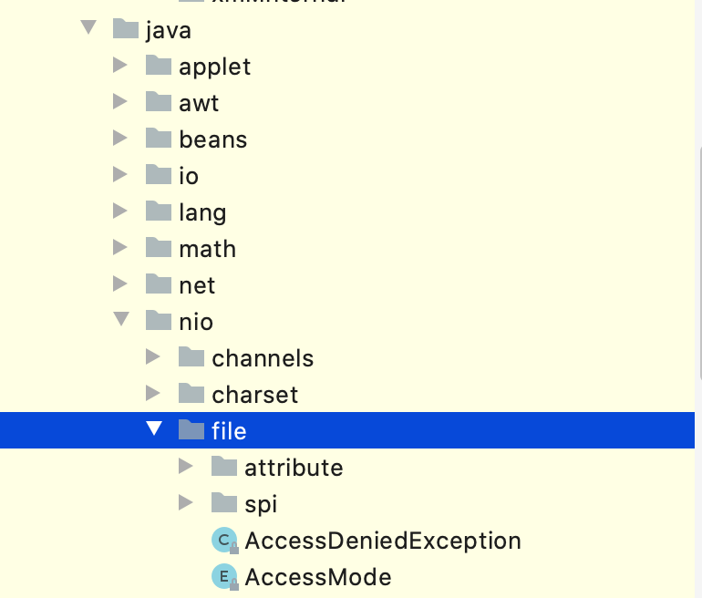
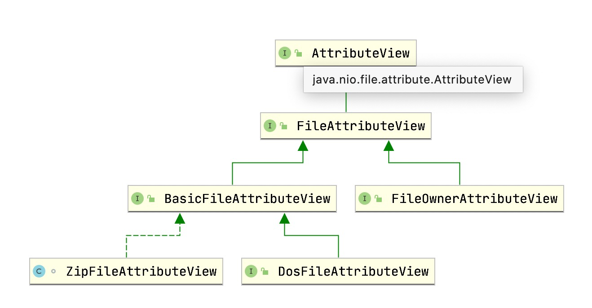

# Java 7 Files,Paths,Path 文件操作介绍

> Java 7 Files,Paths,Path 文件操作介绍：https://www.wdbyte.com/2020/09/jdk/jdk7-file-pahs/

在 Java 7 中，加强了文件操作相关功能，也就是新的 java.nio.file 包里的内容，它提供了诸如文件路径抽象、文件目录流、目录树、文件属性和变化监视服务等功能，可以大幅度提高我们对于文件的操作。



## 文件路径

在 Java 7 之前对**文件路径**的操作都是以**字符串**的操作，使用时你需要把一个字符串直接扔进去，直接使用字符串操作是低效的，比如你要拼接父路径和子目录，你只能进行字符串的拼接。而且拼接这个本身操作就丢失了它作为文件路径的含义。另外使用字符串进行各种路径操作很有可能由于拼写错误而出现各种问题。

Java 7 的到来让这一切变的不一样了，它提供了 Path 接口用来表示路径的抽象，然后提供了一系列对于路径的操作方法，让这一切变得如此简单。为了方便的创建 Path 对象，又提供了 Paths 工具类，如何使用让我们先睹为快。

```java
Path path = Paths.get("/Users/darcy/java/");
System.out.println("完整路径：" + path.toString());
// 完整路径：/Users/darcy/java

Path pathParent = path.getParent();
System.out.println("父级路径：" + pathParent.toString());
// 父级路径：/Users/darcy

Path pathRoot = path.getRoot();
System.out.println("根目录：" + pathRoot.toString());
// 根目录：/

int pathNameCount = path.getNameCount();
System.out.println("目录深度：" + pathNameCount);
// 目录深度：3

Path pathIndex3 = path.getName(2);
System.out.println("第三级目录：" + pathIndex3);
// 第三级目录：java

Path subPath = path.subpath(1, 3);
System.out.println("第1级目录到第三级目录（包左不包右）：" + subPath.toString());
// 第1级目录到第三级目录（包左不包右）：darcy/java

// resolveSibling 从当前目录父目录开始拼接目录
Path pathResolveSibling = path.resolveSibling("PathDemo.java");
System.out.println("父目录开始拼接参数：" + pathResolveSibling.toString());
// 父目录开始拼接参数：/Users/darcy/PathDemo.java

// resolve 把当前路径当作父路径，参数作为子目录或者文件
Path pathResolve = Paths.get("/Users/darcy/java/").resolve("PathDemo.java");
System.out.println("当前目录拼接后的目录：" + pathResolve.toString());
// 当前目录拼接后的目录：/Users/darcy/java/PathDem.java

// 参数路径相对于主体路径的相对路径
Path path1 = Paths.get("/Users/darcy/");
Path path2 = Paths.get("/Users/darcy/java/PathDemo.java");
Path path3 = path1.relativize(path2);
System.out.println("相对路径：" + path3.toString());
// 相对路径：java/PathDemo.java
```

可以看到上面代码里除了创建 Path 对象时输入了一次路径，后续的操作都是使用 Path 中的方法进行操作的，在此之前你可能需要各种字符串截取拼接，十分繁琐。


## 文件操作

还记得初学 Java IO 时，文件复制有多种写法，但是不管是哪一种，写起来都需要不少的代码，而且还需要考虑复制时的性能。读取文件那就更不用说了，定义各种读取和接收变量，各种验证。现在不一样了，不仅文件操作非常方便，而且像文件**复制和读取**等常用操作都可以**一行搞定**。

```java
// 如果文件不存在，则创建一个文件
Path path = Paths.get("test.txt");
Path pathBackup = Paths.get("test_bak.txt");
Path pathLink = Paths.get("test.txt.link");
Path pathDir = Paths.get("dir");

// 已存在则删除
Files.deleteIfExists(path);
Files.deleteIfExists(pathBackup);
Files.deleteIfExists(pathLink);
Files.deleteIfExists(pathDir);

// 创建文件写入内容
Path file = Files.createFile(path);
Files.write(path, "hello java".getBytes());
Files.write(path, System.lineSeparator().getBytes(), StandardOpenOption.APPEND);
Files.write(path, "test nio".getBytes(), StandardOpenOption.APPEND);
System.out.println("创建文件：" + file.toString());

// 创建文件链接
pathLink = Files.createLink(pathLink, path);
System.out.println("创建文件：" + pathLink.toString());

// 创建目录
Path directory = Files.createDirectory(pathDir);
System.out.println("创建目录：" + directory.toString());

// 文件复制
Files.copy(path, pathBackup);
System.out.println("复制文件: " + path + " --> " + pathBackup);

// 读取文件
List<String> lines = Files.readAllLines(pathBackup);
for (String line : lines) {
    System.out.println("文件读取：" + line);
}
```

上面展示了 Files 类的文件创建、删除、写入、拷贝、读取的写法，都是只有一行代码。


## 文件属性

和路径操作类似，Java 7 也提供了文件属性的抽象，增加了一系列文件属性的操作工具类。这部分代码在 `java.nio.file.attribute` 包内。它抽象出了一个 AttributeView 作为所有属性视图的父接口，然后用它的子类 Fi leAttributeView 表示文件视图，用子类 FileOwnerAttributeView 表示文件所有者的属性视图。前者属性如文件的创建时间、修改时间、是否目录等信息，后者则包含文件的相关信息。为了兼容不同的操作系统，Java 7 还提供了不同实现，如 DosFileAttributeView 视图，很明显他是为 Windows 操作系统准备的。



```java
Path path = Paths.get("/Users/darcy/git/jdk-feature/README.md");
BasicFileAttributeView fileAttributeView = Files.getFileAttributeView(path, BasicFileAttributeView.class);
BasicFileAttributes basicFileAttributes = fileAttributeView.readAttributes();
FileTime creationTime = basicFileAttributes.creationTime();
FileTime lastModifiedTime = basicFileAttributes.lastModifiedTime();
FileTime lastAccessTime = basicFileAttributes.lastAccessTime();
System.out.println("创建时间：" + creationTime);
System.out.println("上次修改时间：" + lastModifiedTime);
System.out.println("上次访问时间：" + lastAccessTime);

boolean directory = basicFileAttributes.isDirectory();
boolean regularFile = basicFileAttributes.isRegularFile();
boolean symbolicLink = basicFileAttributes.isSymbolicLink();
System.out.println("是否目录：" + directory);
System.out.println("是否普通文件：" + regularFile);
System.out.println("是否符号链接：" + symbolicLink);

long size = basicFileAttributes.size();
System.out.println("文件大小：" + size);

PosixFileAttributeView linuxFileAttributeView = Files.getFileAttributeView(path, PosixFileAttributeView.class);
UserPrincipal owner = linuxFileAttributeView.getOwner();
System.out.println("文件归属用户:" + owner.getName());
```

```
创建时间：2020-09-06T13:35:14Z
上次修改时间：2020-09-06T13:35:14.649261371Z
上次访问时间：2020-09-06T13:35:14.680968254Z
是否目录：false
是否普通文件：true
是否符号链接：false
文件大小：3636
文件归属用户:darcy
```


## 文件列表流

在 Java 7 之前遍历文件目录和文件，你应该会选择 File 类的 listFiles 方法。

```java
// 文件直接遍历，不会遍历子目录
String pathString = "/Users/darcy/project/mylab/src/main/java/com/wdbyte/java";
File file = new File(pathString);
File[] listFiles = file.listFiles();
for (File tempFile : listFiles) {
    System.out.println("file list: " + tempFile.getAbsolutePath());
}
```

这种遍历方式看起来也是十分优雅的，可是这种方式在面对大量文件时，**效率会变的很低**。所以 Java 7 也对此进行了改进，引入了 **DirectoryStream** 文件列表流。它可以进行**渐进式**的文件遍历，每次读取一定数量，降低遍历时的性能开销，但是 DirectoryStream 遍历时只会遍历它的直接目录和文件，不会递归的遍历子目录。下面是它的遍历写法。

```java
String pathString = "/Users/darcy/project/mylab/src/main/java/com/wdbyte/java";
// Path 直接遍历方式，不会遍历子目录
try (DirectoryStream<Path> directoryStream = Files.newDirectoryStream(Paths.get(pathString))) {
    for (Path pathTemp : directoryStream) {
        System.out.println("DirectoryStream: " + pathTemp);
    }
}

// Path 直接遍历方式 - 筛选 .class 文件
try (DirectoryStream<Path> directoryStream = Files.newDirectoryStream(Paths.get(pathString), "*.java")) {
    for (Path pathTemp : directoryStream) {
        System.out.println("DirectoryStream file type is class : " + pathTemp);
    }
}
```

这里扩展一下，在 Java 8 中对 Files 类进行了增强，引入了 Java 8 的 Lambda 表达式，增加了 walk 方法，遍历文件也有异曲同工之妙（下面的例子中用到了 Lambda 表达式）。

```java
// 遍历所有目录和子目录
Stream<Path> pathStream = Files.walk(Paths.get("/Users/darcy/project/mylab/src/main/java/com/wdbyte"));
pathStream.forEach(pathTemp -> {
    System.out.println("Stream: " + pathTemp.toString());
});

// 遍历所有目录和子目录 - 筛选 java 文件
pathStream = Files.walk(Paths.get("/Users/darcy/project/mylab/src/main/java/com/wdbyte"));
pathStream
    .filter(pathTemp -> pathTemp.toString().endsWith(".java"))
    .forEach(pathTemp -> {
        System.out.println("Stream filter java: " + pathTemp.toString());
    });

```


## 文件监视

文件监视，也就是可以动态的监测指定目录的文件或者内容的变化，应用场景很多，比如热部署时检查 class 文件是否更新，或者每当有文件进来时就进行操作。在这之前你只能通过循环调用 listFiles 并与上次的调用结果对比才可以找到文件的变化，而现在可以通过通知的方式进行反应式的逻辑处理，一切变的简单了。

被监视的对象要实现 Watchable 接口，然后通过 register 方法注册到监视服务 WatchService 接口的实现，同时指定要监视的事件类型。

```java
// 创建
StandardWatchEventKinds.ENTRY_CREATE,
// 删除
StandardWatchEventKinds.ENTRY_DELETE,
// 更新
StandardWatchEventKinds.ENTRY_MODIFY
```

具体怎么使用呢？通过下面这个例子看下代码如何实现，下面的代码对文件夹 `/Users/darcy/test` 进行监测，注册的感兴趣事件是创建、删除、更新操作。

```java
WatchService watchService = FileSystems.getDefault().newWatchService();
Path path = Paths.get("/Users/darcy/test");
path.register(watchService,
              StandardWatchEventKinds.ENTRY_CREATE,
              StandardWatchEventKinds.ENTRY_DELETE,
              StandardWatchEventKinds.ENTRY_MODIFY);

while (true) {
    WatchKey watchKey = watchService.take();
    // 获取事件类型
    for (WatchEvent<?> pollEvent : watchKey.pollEvents()) {
        // 具体的事件上下文信息
        Path tempPath = (Path)pollEvent.context();
        Kind<?> kind = pollEvent.kind();
        if (kind.name().equals(StandardWatchEventKinds.ENTRY_CREATE.name())) {
            System.out.println("创建了一个文件：" + tempPath.toString());
        }
        if (kind.name().equals(StandardWatchEventKinds.ENTRY_DELETE.name())) {
            System.out.println("删除了一个文件：" + tempPath.toString());
        }
        if (kind.name().equals(StandardWatchEventKinds.ENTRY_MODIFY.name())) {
            System.out.println("修改了一个文件：" + tempPath.toString());
        }
    }
    // 事件处理完毕后要进行 reset 才能继续监听事件
    watchKey.reset();
    // 取消监视
    // watchKey.cancel();
}
```

注册事件监听后，通过一个循环，调用 take () 方法获取事件结果，得到事件后再判断事件类型进行日志输出。我启动后进行了简单测试，下面是日志输出。

```bash
# 下面是我的操作
➜  test pwd 
/Users/darcy/test
➜  test touch test.txt # 创建文件
➜  test vim test.txt # 修改文件
➜  test rm test.txt # 删除文件
# 得到的日志输出
创建了一个文件：test.txt
创建了一个文件：.test.txt.swp
修改了一个文件：test.txt
删除了一个文件：.test.txt.swp
删除了一个文件：test.txt
```

因为使用 vim 编辑，所以有临时的 swp 文件生成和自动删除，也被监测到了。