# 01、J.U.C 并发编程简介

> JDK17 文档路径：https://docs.oracle.com/en/java/javase/17/docs/api/java.base/module-summary.html

Java 并发编程（J.U.C）本质上来讲就属于多线程的一种更加设计合理的开发框架，例如：Java 类集是对数据结构的一种开发框架，JavaIO 是对操作系统底层支持的一种开发框架，所以JDK本身也是会提供有开发框架支持的。

实际上在之前已经学习过多线程的开发机制，但是为什么现在还要去学习J.U.C（java.util.concurrent），J.U.C 的提供是为了解决并发编程过程之中的性能以及稳定性的设计问题，例如：在传统的多线程开发里面你一定可以想到如下的几个机制：

- 如果要想定义线程的主体操作类需要使用 Runnable 或者 Callable 接口；
- 如果要想进行数据的同步处理，那么就要使用 synchronized 关键字，这个关键字可以实现同步代码块的定义或者是同步方法的定义，但是性能很差；
- 如果要想快速的实现变量内容的更新处理，要使用 volatiile 关键字；
- 如果要想实现等待与唤醒机制，则需要通过 Object 类所提供的 wait()、notiffy()、notifyall() 方法；
- 所有的操作全部都加在一起了，也无法有效的避免死锁之类的问题。

所以多线程的开发是非常麻烦的，而且也是非常繁琐的，更是很多初学者的噩梦，如果个人没有深入的去研究过 Java，那么你可能都没有写过具体的多线程应用。

J.U.C 属于一个重度多线程的编程的开发框架，在 J.U.C 里面提供了一套新的多线程处理方案，并且这些方案都有其核心实现的理论，本质上就是：CAS、AQS。而这些在最终编程的时候你是无法感觉到 synchronized 存在的。

- 工具类：java.util.concurrent，是直接可以供开发者使用的程序类，用这些类就可以直接实现多线程处理
- 锁机制：java.util.concurrent.locks，多线程的开发之中牵扯到资源的部分都是存在于锁的概念，而对于锁 J.U.C 给出了完整的新机制
- 原子操作类：java.util.concurrent.atomic，直接提供了指定数据类型上的同步机制，避免了在进行数据操作时通过方法实现同步的处理了


J.U.C 是在 JDK1.5 的时候提出的开发框架，后来每一个版本的 JDK 都对 J.U.C 有过更新，那么本次学习将为大家完整的展示整个 J.U.C 开发包之中的全部类和接口的使用，包括源码的实现分析（主要是应对面试去使用的）。


# 02、TimeUnit 时间单元类

> - TimeUnit 文档地址：https://docs.oracle.com/en/java/javase/17/docs/api/java.base/java/util/concurrent/TimeUnit.html
> - TimeUnit 类详解及其常见用法（详解timedWait、sleep方法）：https://blog.csdn.net/AttleeTao/article/details/104242363

## 1、TimeUnit 工具类简介

虽然本次以 J.U.C 为主，但是对于完整的 J.U.C 的开发里面还是存在一些处理机制，那么首先来看一下对于时间的处理问题。在早期的 Java 多线程开发分支中，可以使用的时间单元是什么呢？

- 首先可以想到的就是毫秒时间，毕竟 Thread.sleep() 方法之中所能接触到的就是毫秒：

```java
// 线程休眠方法:
public static void sleep(long millis) throws InterruptedException;
public static void sleep(long millis, int nanos) throws InterruptedException;
```

- 在 Object 之中提供的 wait() 方法里面也包含又同样的单位设置：


```java
// 线程等待方法:
public final void wait(long timeoutMillis) throws InterruptedException;
public final void wait(long timeoutMillis, int nanos) throws InterruptedException;
```

虽然在 Thread 的开发之中可以使用毫秒和纳秒进行线程单位配置，但是从实际的开发来说可能会使用到时、分、秒等概念，所以在 Java 里面为了进一步简化时间的计算管理，提供了一个专属的 TimeUnit 工具类，该类属于一个枚举类：

```java
package java.util.concurrent;
public enum TimeUnit extends Enum<TimeUnit>
```

Java 枚举类的特殊点：除了可以定义一系列的常量之外，还可以实现接口，定义方法，或者是定义抽象方法，总之是一个很强大的多例设计模式。


## 2、TimeUnit 枚举类属性

| Enum Constant | Description          |
| ------------- | -------------------- |
| DAYS          | 天                   |
| HOURS         | 小时                 |
| MINUTES       | 分钟                 |
| SECONDS       | 秒                   |
| MILLISECONDS  | 毫秒（千分之一秒）   |
| MICROSECONDS  | 微妙（千分之一毫秒） |
| NANOSECONDS   | 纳秒（千分之一微妙） |

在整个TimeUnit里面已经定义了而大量常用的时间单元：天（DAYS）、小时（HOURS）、分钟（MINUTES）、秒（SECONDS）、毫秒（MILLISECONDS）、纳秒（NANOSECONDS）、微妙（MICROSECONDS），除了这些时间单元之外还提供有一系列的处理方法，例如：时间转换方法.


## 3、TimeUnit 类方法详解

| 方法名                                                       | 描述                                                         |
| ------------------------------------------------------------ | ------------------------------------------------------------ |
| public long convert(long sourceDuration,TimeUnit sourceUnit) | 将给定单元的时间段转换到此单元。                             |
| public long convert(Duration duration)                       | 将给定的持续时间转换为此单位。                               |
| public long toNanos(long duration)                           | 将指定时间段转换成纳秒。等效于 NANOSECONDS.convert(duration, this) |
| public long toMicros(long duration)                          | 将指定时间段转换成微秒。等效于 MICROSECONDS.convert(duration, this) |
| public long toMillis(long duration)                          | 将指定时间段转换成毫秒。等效于 MILLISECONDS.convert(duration, this) |
| public long toSeconds(long duration)                         | 将指定时间段转换成秒。等效于 SECONDS.convert(duration, this) |
| public long toMinutes(long duration)                         | 将指定时间段转换成分钟。等效于 MINUTES.convert(duration, this) |
| public long toHours(long duration)                           | 将指定时间段转换成小时。等效于 HOURS.convert(duration, this) |
| public long toDays(long duration)                            | 将指定时间段转换成天。等效于 DAYS.convert(duration, this)    |
| public static final TimeUnit[] values()                      | 返回数组，数组值为TimeUnit中定义的常量。常量值与此枚举类声明顺序一致 |
| public static TimeUnit valueOf(String name)                  | 返回带有指定名称的该类型的枚举常量。字符串必须与枚举常量完全匹配 |
| public void timedWait(Object obj, long timeout)              | 使指定对象等待指定时间                                       |
| public void timedJoin(Thread thread, long timeout)           | 使当前线程等待指定时间                                       |
| public void sleep(long timeout)                              | 使线程休眠指定时间                                           |
| static TimeUnit of(ChronoUnit chronoUnit)                    | 将 ChronoUnit 转换为等效的 TimeUnit                          |
| ChronoUnit toChronoUnit()                                    | 将此 TimeUnit 转换为等效的 ChronoUnit                        |


## 4、TimeUnit 类方法案例

操作示例 1：时间单元的转换 convert() 方法

```java
import java.util.concurrent.TimeUnit;

public class JavaAPIDemo {
    public static void main(String[] args) {
        // 由小时转为秒钟
        long second = TimeUnit.SECONDS.convert(1L, TimeUnit.HOURS);
        System.out.println("小时转秒数：" + second);
        // 由小时转为分钟
        long minutes = TimeUnit.MINUTES.convert(1L, TimeUnit.HOURS);
        System.out.println("小时转分钟：" + minutes);
        // 由天转为秒
        long second2 = TimeUnit.SECONDS.convert(1L, TimeUnit.DAYS);
        System.out.println("一天的秒数：" + second2);
    }
}
```

```
小时转秒数：3600
小时转分钟：60
一天的秒数：86400
```

> 虽然 TimeUnit 类很好用，但是从 JDK1.8之后提供了有一个 java.time.Duration 的操作类（间隔），这个类在实际开发之中经常会被用到，例如：在后续学习到 Spring 开发框架的时候，那么一般都要进行一个任务间隔的配置。

操作示例 2：时间单元的转换（Duration 转 TimeUnit）：`public long convert(Duration duration)`

```java
import java.text.SimpleDateFormat;
import java.time.Duration;
import java.util.Date;
import java.util.concurrent.TimeUnit;

public class JavaAPIDemo {
    public static void main(String[] args) {
        // 2小时 + 2小时
        Duration duration = Duration.ofHours(2).plusHours(2);
        // 以上给出的是两个小时的概念,然后加上了2小时.
        System.out.println("时间间隔：" + duration);
        // 直接实现了转换4小时转化成秒数
        long second = TimeUnit.SECONDS.convert(duration);
        System.out.println("间隔的秒数：" + second);

        // 计算180天之后的具体日期，采用当前时间戳 + 时间偏移量
        // 获取当前的时间戳,当前时间为：2023/12/05
        long current = System.currentTimeMillis();
        long after = current + TimeUnit.MILLISECONDS.convert(180, TimeUnit.DAYS);
        System.out.println(new SimpleDateFormat("yyyy-MM-dd").format(new Date(after)));
    }
}
```

```
时间间隔：PT4H
间隔的秒数：14400
2024-06-02
```

操作示例 3：toXxx() 方法，将指定时间段转换成纳秒、微妙、毫秒、秒、分钟、小时、天

```java
import java.util.concurrent.TimeUnit;

public class JavaAPIDemo {
    public static void main(String[] args) {
        // 小时转天
        System.out.println(TimeUnit.HOURS.toDays(240));
        // 天数转小时
        System.out.println(TimeUnit.DAYS.toHours(1));
        // 秒数转分钟
        System.out.println(TimeUnit.SECONDS.toMinutes(60));
        // 天数转秒数
        System.out.println(TimeUnit.DAYS.toSeconds(1));
        // 秒数转毫秒数
        System.out.println(TimeUnit.SECONDS.toMillis(60));
        // 秒数转纳秒数
        System.out.println(TimeUnit.SECONDS.toNanos(10));
    }
}
```

```
10
24
1
86400
60000
10000000000
```

操作示例 4：枚举自带方法 valueOf(String name) 与values()，这两个方法一个返回指定名称的常量类，一个返回所有常量的数组。

```java
import java.util.concurrent.TimeUnit;

public class JavaAPIDemo {
    public static void main(String[] args) {
        for (TimeUnit timeUnit : TimeUnit.values()) {
            System.out.println(timeUnit);
        }

        System.out.println("=============================");

        System.out.println(TimeUnit.valueOf("SECONDS"));
        // 有空格，抛出异常
        System.out.println(TimeUnit.valueOf(" SECONDS"));
    }
}
```

```java
NANOSECONDS
MICROSECONDS
MILLISECONDS
SECONDS
MINUTES
HOURS
DAYS
=============================
SECONDS
Exception in thread "main" java.lang.IllegalArgumentException: No enum constant java.util.concurrent.TimeUnit. SECONDS
	at java.base/java.lang.Enum.valueOf(Enum.java:240)
	at java.base/java.util.concurrent.TimeUnit.valueOf(TimeUnit.java:75)
	at com.example.springboot.tech.test.JavaAPIDemo.main(JavaAPIDemo.java:15)
```

操作示例 5：timedWait(Object obj, long timeout) 使指定对象等待指定时间。使用此时间单元执行计时的 Object.wait（也就是内部调用Object.wait，但是好处多多）。这是将超时参数转换为 Object.wait 方法所需格式的便捷方法。 

- obj - 要等待的对象
- timeout - 要等待的最长时间。如果小于等于 0，则根本不会等待。 
- 抛出： InterruptedException - 如果等待时中断。

```java
import java.util.concurrent.TimeUnit;

public class JavaAPIDemo {
    public static void main(String[] args) throws InterruptedException {
        System.out.println("start!");
        // 使当前对象等待5秒钟
        new JavaAPIDemo().poll(5L, TimeUnit.SECONDS);
        System.out.println("finish!");
    }

    public synchronized void poll(long timeout, TimeUnit unit) throws InterruptedException {
        unit.timedWait(this, timeout);
    }
}
```

```
start!
finish!
```

操作示例 6：timedJoin(Thread thread, long timeout) 使当前线程等待指定时间。使用此时间单元执行计时的 Thread.join。这是将时间参数转换为 Thread.join 方法所需格式的便捷方法。

- thread - 要等待的线程
- timeout - 要等待的最长时间。如果小于等于 0，则根本不会等待。
- 抛出：InterruptedException - 如果等待时中断。

```java
import java.util.concurrent.TimeUnit;

public class JavaAPIDemo {
    public static void main(String[] args) {
        // 创建一个示例线程
        Thread thread = new Thread(() -> {
            try {
                // 模拟线程执行一些任务
                Thread.sleep(3000);
                System.out.println("Thread completed its task.");
            } catch (InterruptedException e) {
                e.printStackTrace();
            }
        });
        // 启动线程
        thread.start();

        try {
            // 使用TimeUnit将时间单位转换为毫秒，然后使用Thread的join方法等待线程完成
            // thread.join(TimeUnit.SECONDS.toMillis(5));

            // 使用 TimeUnit.timedJoin 方法
            TimeUnit.SECONDS.timedJoin(thread, 5);
            if (thread.isAlive()) {
                // 如果线程仍然存活，表示超时
                System.out.println("等待超时");
            } else {
                System.out.println("线程已完成");
            }
        } catch (InterruptedException e) {
            e.printStackTrace();
        }
    }
}
```

```
Thread completed its task.
线程已完成
```

操作示例 7：TimeUnit 类有一个休眠的处理方法：sleep(long timeout)，这个方法可以根据当前的时间单元进行休眠的配置处理。使用此单元执行 Thread.sleep。这是将时间参数转换为 Thread.sleep 方法所需格式的便捷方法。

- timeout，休眠的最短时间。如果小于等于 0，则根本不会休眠。
- 抛出：InterruptedException，如果休眠时中断。

```java
import java.util.concurrent.TimeUnit;

public class JavaAPIDemo {
    public static void main(String[] args) {
        for (int x = 0; x < 100; x++) {
            try {
                // 根据秒来休眠
                TimeUnit.SECONDS.sleep(2);
            } catch (InterruptedException e) {
                e.printStackTrace();
            }
            System.out.println(x);
        }
    }
}
```

```
0
1
2
```

操作示例 8：of(ChronoUnit chronoUnit) 与 toChronoUnit() 通过  ChronoUnit 初始化 TimeUnit 和 返回 ChronoUnit 类型。

- 先查看下 TimeUnit of(ChronoUnit chronoUnit) 源代码，可以发现只能接收ChronoUnit中的部分属性参数。

```java
public static TimeUnit of(ChronoUnit chronoUnit) {
    switch (Objects.requireNonNull(chronoUnit, "chronoUnit")) {
        case NANOS:   return TimeUnit.NANOSECONDS;
        case MICROS:  return TimeUnit.MICROSECONDS;
        case MILLIS:  return TimeUnit.MILLISECONDS;
        case SECONDS: return TimeUnit.SECONDS;
        case MINUTES: return TimeUnit.MINUTES;
        case HOURS:   return TimeUnit.HOURS;
        case DAYS:    return TimeUnit.DAYS;
        default:
            throw new IllegalArgumentException(
                "No TimeUnit equivalent for " + chronoUnit);
    }
}
```

- 如下示例为初始化 TimeUnit 和取得 ChronoUnit：

```java
import java.time.temporal.ChronoUnit;
import java.util.concurrent.TimeUnit;

public class JavaAPIDemo {
    public static void main(String[] args) {
        TimeUnit hours = TimeUnit.of(ChronoUnit.HOURS);
        System.out.println(hours);
        ChronoUnit chronoUnit = hours.toChronoUnit();
        System.out.println(chronoUnit.toString());
    }
}
```

```
HOURS
Hours
```

在未来进行多线程的开发之中只要牵扯到时间单元的操作问题的话，统一都建议使用 TimeUnit 类进行定义处理，这一点不仅仅是要求，同时也是在 J.U.C 里面见到最多的参数的形式。


# 03、ThreadFactory 工厂类

**简单总结：ThreadFactory 的作用就是可以修饰我们创建的线程，常用操作有设置线程的名字，设置线程是否为守护线程等等。**

操作示例 1：在传统的项目开发之中，只要使用了 Thread 类就可以直接进行线程的创建，创建线程方式如下：

```java
public class JavaAPIDemo {
    public static void main(String[] args) {
        for (int i = 0; i < 10; i++) {
            new Thread(() -> {
                System.out.println("线程名称：" + Thread.currentThread().getName());
            }).start();
        }
    }
}
```

```
线程名称：Thread-5
线程名称：Thread-7
线程名称：Thread-1
....
```

传统的多线程创建过程中，开发者需要通过 Runnable 或 Callable 接口的子类来创建线程主体，而后再利用 Thread 类对线程主体包装后来进行多线程的执行，但是考虑到代码设计结构的问题，一般都建议通过工厂类进行线程的创建，所以在 J.U.C 开发包中提供了一个 ThreadFactory 工厂接口，利用该接口的子类就可以创建一个线程工厂类。

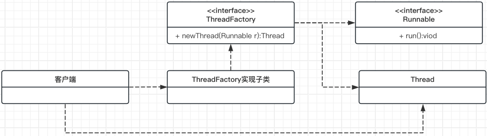

在 J.U.C 里面提供了一个工厂类的标准接口。工厂类的源码如下：

```java
package java.util.concurrent;
public interface ThreadFactory {
    Thread newThread(Runnable r);
}
```

> 那么下面就直接自己手工实现以下这种线程的工厂类。

操作示例 2：自定义线程工厂类

```java
import java.util.concurrent.ThreadFactory;

public class JavaAPIDemo {
    public static void main(String[] args) {
        for (int x = 0; x < 10; x++) {
            Thread thread = SimpleThreadFactory.getInstance().newThread(() -> {
                System.out.println("多线程执行：" + Thread.currentThread().getName());
            });
            thread.start();
        }
    }
}

/**
 * 创建线程工厂类
 */
class SimpleThreadFactory implements ThreadFactory {
    private static final ThreadFactory INSTANCE = new SimpleThreadFactory();
    // 定义线程名称的开头
    private static final String TITLE = "custom-";
    // 线程的自动计数处理
    private static int count = 0;
    // 工厂类在定义的时候一定不需要实例化对象
    private SimpleThreadFactory() {}
    // 单例返回工厂实例
    public static ThreadFactory getInstance() {
        return INSTANCE;
    }
    // 此时的操作如果有需要可以进一步改进，例如：通过反射
    @Override
    public Thread newThread(Runnable r) {
        // 实例化Thread类对象
        return new Thread(r, TITLE + count++);
    }
}
```

```
多线程执行：custom-6
多线程执行：custom-9
多线程执行：custom-3
...
```

> 此时所给出的多线程的创建，可以直接利用自定义的名称进行命名的开头配置，整个的线程对象的获取机制更加的规范了，当然了，如果要想进一步的规范，肯定要使用到反射机制。

操作示例 3：使用反射机制进行线程的创建

```java
import java.lang.reflect.Constructor;
import java.util.concurrent.ThreadFactory;

public class JavaAPIDemo {
    public static void main(String[] args) {
        for (int x = 0; x < 10; x++) {
            Thread thread = SimpleThreadFactory.getInstance().newThread(() -> {
                System.out.println("多线程执行：" + Thread.currentThread().getName());
            });
            thread.start();
        }
    }
}

/**
 * 创建线程工厂类
 */
class SimpleThreadFactory implements ThreadFactory {
    private static final ThreadFactory INSTANCE = new SimpleThreadFactory();
    // 定义线程名称的开头
    private static final String TITLE = "custom-";
    // 线程的自动计数处理
    private static int count = 0;
    // 工厂类在定义的时候一定不需要实例化对象
    private SimpleThreadFactory() {}
    // 单例返回工厂实例
    public static ThreadFactory getInstance() {
        return INSTANCE;
    }
    // 此时的操作如果有需要可以进一步改进，例如：通过反射
    @Override
    public Thread newThread(Runnable r) {
        try {
            Class<?> clazz = Class.forName("java.lang.Thread");
            Constructor<?> constructor = clazz.getConstructor(Runnable.class, String.class);
            return (Thread) constructor.newInstance(r, TITLE + count++); // 实例化Thread类对象
        } catch (Exception e) {
            return null;
        }
    }
}
```

```
多线程执行：custom-5
多线程执行：custom-6
多线程执行：custom-2
...
```

只要是在后续的开发之中见到 ThreadFactory，想都不要想，直接表示的就是进行子线程的创建，这点在后续分析 Java 线程池机制的时候非常有用处。


# 04、原子操作类

## 1、原子操作类简介

### 1、原子类产生背景

下面利用多线程实现一个银行存款的操作机制，这个操作机制可以通过多个线程向同一个银行账户进行存款业务办理。按照传统的实际结构来讲，此时的代码定义如下。

操作示例 1：不适用同步处理存款

```java
import java.util.concurrent.TimeUnit;

public class JavaAPIDemo {
    // 模拟银行存款
    public static int money = 0;
    public static void main(String[] args) throws InterruptedException {
        // 要存款的总额
        int [] data = new int[] {100, 200, 300};
        // 进行存款线程的配置
        for (int x = 0; x < data.length; x ++) {
            // 为内部类使用
            final int temp = x;
            new Thread(()->{
                // 模拟存款
                money += data[temp];
            }).start();
        }
        TimeUnit.SECONDS.sleep(2); // 等待2秒的时间
        System.out.println("【计算完成】最终的存款总额：" + money);
    }
}
```

```
【计算完成】最终的存款总额：600
```

> 此时的程序通过多次执行结果的验证可以发现，一切都是“正确”的，那么下面为了可以让问题露出水面，采用一个延迟的机制来进行存款的业务办理时间模拟。

操作示例 2：通过延迟来进行存款业务办理时间的模拟

```java
import java.util.concurrent.TimeUnit;

public class JavaAPIDemo {
    // 模拟银行存款
    public static int money = 0;
    public static void main(String[] args) throws InterruptedException {
        // 要存款的总额
        int [] data = new int[] {100, 200, 300};
        // 进行存款线程的配置
        for (int x = 0; x < data.length; x ++) {
            // 为内部类使用
            final int temp = x;
            new Thread(() -> {
                try {
                    // 100毫秒延迟
                    TimeUnit.MILLISECONDS.sleep(100);
                } catch (InterruptedException e) {
                    e.printStackTrace();
                }
                // 模拟存款
                money += data[temp];
            }).start();
        }
        TimeUnit.SECONDS.sleep(2); // 等待2秒的时间
        System.out.println("【计算完成】最终的存款总额：" + money);
    }
}
```

```
【计算完成】最终的存款总额：200
```

> 此时的操作出现了一个不同步的设计问题，那么请问，这个时候按照最为传统的思路要想解决，就必须使用同步方法来进行包装处理类。

操作示例 3：使用同步方法解决当前的问题

```java
import java.util.concurrent.TimeUnit;

public class JavaAPIDemo {
    // 模拟银行存款
    public static int money = 0;
    public static void main(String[] args) throws InterruptedException {
        // 要存款的总额
        int [] data = new int[] {100, 200, 300};
        // 进行存款线程的配置
        for (int x = 0; x < data.length; x ++) {
            // 为内部类使用
            final int temp = x;
            new Thread(()->{
                try {
                    // 100毫秒延迟
                    TimeUnit.MILLISECONDS.sleep(100);
                } catch (InterruptedException e) {
                    e.printStackTrace();
                }
                save(data[temp]); // 模拟存款
            }).start();
        }
        TimeUnit.SECONDS.sleep(2); // 等待2秒的时间
        System.out.println("【计算完成】最终的存款总额：" + money);
    }
    public static synchronized void save(int m) {
        // 模拟存款
        money += m;
    }
}
```

```java
【计算完成】最终的存款总额：600
```

> 难道现在连做一个普通的数据的计算都要考虑到这种同步的处理机制吗？实在太繁琐了，所以为了解决这样的设计问题，提供有了 J.U.C 的原子操作类，那么下面首先使用一个原子的整型操作类进行配置。

操作示例 4：使用原子类实现同步

```java
import java.util.concurrent.TimeUnit;
import java.util.concurrent.atomic.AtomicInteger;

public class JavaAPIDemo {
    // 模拟银行存款
    public static AtomicInteger money = new AtomicInteger(0);
    public static void main(String[] args) throws InterruptedException {
        // 要存款的总额
        int [] data = new int[] {100, 200, 300};
        // 进行存款线程的配置
        for (int x = 0; x < data.length; x ++) {
            // 为内部类使用
            final int temp = x;
            new Thread(()->{
                try {
                    // 100毫秒延迟
                    TimeUnit.MILLISECONDS.sleep(100);
                } catch (InterruptedException e) {
                    e.printStackTrace();
                }
                // 模拟存款，原子类自带同步光环
                money.addAndGet(data[temp]);
            }).start();
        }
        TimeUnit.SECONDS.sleep(2); // 等待2秒的时间
        System.out.println("【计算完成】最终的存款总额：" + money);
    }
}
```

```
【计算完成】最终的存款总额：600
```

以上的代码利用原子类解决了 synchronized 同步的设计问题，但是这个原子类并没有使用传统的同步机制。可以查看源码，使用的是Unsafe类和volatile关键字完成同步操作的。

源码分析 1：来观察一下它的源代码实现。

```java
package java.util.concurrent.atomic;

import java.lang.invoke.VarHandle;
import java.util.function.IntBinaryOperator;
import java.util.function.IntUnaryOperator;

public class AtomicInteger extends Number implements java.io.Serializable {
    private static final long serialVersionUID = 6214790243416807050L;
    // Unsafe类提供底层的CAS机制 
    private static final jdk.internal.misc.Unsafe U = jdk.internal.misc.Unsafe.getUnsafe();
    // VALUE是内存地址值偏移值，这个值的作用是获取value在主内存中的值
    private static final long VALUE = U.objectFieldOffset(AtomicInteger.class, "value");
    // AtomicInteger具体的值存放在这个变量中，这个变量使用volatile修饰，具有可见性
    private volatile int value;
    public AtomicInteger(int initialValue) {
        value = initialValue;
    }

    public final int addAndGet(int delta) {
        return U.getAndAddInt(this, VALUE, delta) + delta;
    }
}
```

原子操作类并没有使用到传统的同步机制，而是通过一种 CAS 的机制来完成的，那么 CAS 是什么？后面会进行详细的描述，整个的原子类都采用了类似的实现机制。


### 2、原子操作类汇总

由于在实际的项目开发中会牵扯到多种多种数据类型的使用，所以在 java.util.concurrent.atomic 包中提供了多种原子性的操作类支持，这些操作类可以分为五类：

1、基本类型原子类【提供对boolean、int、long和对象的原子性操作】：

- AtomicInteger：int 类型原子类
- AtomicLong：long 类型原子类
- AtomicBoolean：boolean 类型原子类

2、数组类型原子类【提供对数组元素的原子性操作】：

- AtomicIntegerArray：int[] 类型原子类
- AtomicLongArray：long[] 类型原子类
- AtomicReferenceArray：引用类型数组原子类

3、引用类型原子类【以版本戳的方式解决原子类型的ABA问题】：

- AtomicReference：引用类型原子类
- AtomicStampedReference：带版本戳的原子引用类型，版本戳为int类型，可以解决CAS中的ABA问题
- AtomicMarkableReference：带版本戳的原子引用类型，版本戳为boolean类型，可以解决CAS中的ABA问题

4、对象的属性修改原子类【提供对指定对象的指定字段进行原子性操作】：

- AtomicIntegerFieldUpdater：原子更新对象中int类型字段的值
- AtomicLongFieldUpdater：原子更新对象中long类型字段的值
- AtomicReferenceFieldUpdater：原子更新对象中引用类型字段的值

5、原子累加器 & 加法器【Java8提供，是 AtomicLong和AtomicDouble的升级类型，专门用于数据统计，性能更高】：

- DoubleAdder、LongAdder：原子并发加法器
- DoubleAccumulator、LongAccumulator：原子并发累加器，是加法器的增强

**原则：所有的原子类都具有同步的支持，但是考虑到性能问题，没有使用到 synchronized 关键字来实现，依靠底层完成的。所以我们也可以得出结论：**

- 在 JDK1.5 版本之前，并行代码的原子性主要通过 synchronized 关键字进行保证。
- 在 JDK1.5 版本之后，Java 提供了原子类型专门确保变量操作的原子性。

**注意事项**：

- java.concurrent.Atomic.* 包中所有类都具有原子性
- i++ 不具有原子性，但可以用 synchronized 关键字来实现原子性
- 原子操作 + 原子操作 != 原子操作


## 2、基础类型原子操作类

上面使用了 AtomicInteger 原子类，那么对于这种基础类型的原子类一共提供有三个：AtomicInteger、AtomicLong、AtomicBoolean，首先来观察一下这些类的继承结构。

```java
public class AtomicInteger extends Number implements java.io.Serializable {}
public class AtomicLong extends Number implements java.io.Serializable {}
public class AtomicBoolean implements java.io.Serializable {}
```

可以发现 AtomicInteger 和 AtomicLong 都属于 Number 的子类，而 AtomicBoolean 是 Object 子类。**本次主要以长整型原子操作类操作类AtomicLong功能为主进行分析**。


### 1、AtomicLong

| 方法                                                         | 描述                                                         |
| ------------------------------------------------------------ | ------------------------------------------------------------ |
| **构造方法**：                                               |                                                              |
| AtomicLong()                                                 | 创建一个初始值为 0 的 AtomicLong。                           |
| AtomicLong(long initialValue)                                | 创建一个指定初始值的 AtomicLong。                            |
| **基本操作方法**：                                           |                                                              |
| long get()                                                   | 获取当前值。                                                 |
| void set(long newValue)                                      | 设置为指定的值。                                             |
| long getAndSet(long newValue)                                | 获取当前值并设置为指定的值。                                 |
| **原子更新方法**：                                           |                                                              |
| void lazySet(long newValue)                                  | 最终设定为给定值。                                           |
| boolean compareAndSet(long expect, long update)              | 如果当前值等于预期值，则将该值设置为指定的更新值。           |
| boolean weakCompareAndSet(long expect, long update)          | 与 compareAndSet 一模一样，JDK9已弃用。                      |
| **加减操作方法**：                                           |                                                              |
| long incrementAndGet()                                       | 以原子方式将当前值加 1，并返回更新后的值。相当于i++。        |
| long getAndIncrement()                                       | 以原子方式获取当前值并将其加 1。相当于++i。                  |
| long decrementAndGet()                                       | 以原子方式将当前值减 1，并返回更新后的值。相当于i--。        |
| long getAndDecrement()                                       | 以原子方式获取当前值并将其减 1。相当于--i。                  |
| long addAndGet(long delta)                                   | 以原子方式将指定值与当前值相加，并返回更新后的值。           |
| long getAndAdd(long delta)                                   | 以原子方式获取当前值并加上指定值。                           |
| **其他操作方法**：                                           |                                                              |
| public double doubleValue()                                  | 以double形式返回指定数字的值。                               |
| public float floatValue()                                    | 以float形式返回指定数字的值。                                |
| public int intValue()                                        | 以int形式返回指定数字的值。                                  |
| public long longValue()                                      | 返回指定数字的值为long类型。                                 |
| public String toString()                                     | 返回当前值的String表示形式。                                 |
| **JDK1.8后的函数式接口**：                                   |                                                              |
| long getAndUpdate(LongUnaryOperator updateFunction)          | 原子更新当前值和应用给定函数的结果，返回先前的值。           |
| long updateAndGet(LongUnaryOperator updateFunction)          | 原子更新当前值和应用给定函数的结果，返回更新的值。           |
| long getAndAccumulate(long x, LongBinaryOperator accumulatorFunction) | 使用给定的累加函数对当前值和给定值进行原子更新，并返回更新前的值。 |
| long accumulateAndGet(long x, LongBinaryOperator accumulatorFunction) | 使用给定的累加函数对当前值和给定值进行原子更新，并返回更新后的值。 |

在观察原子类操作过程之中，会存在有一个CAS方法（compareAndSet()方法，是以首字母的摘取为主命名的）。这个方法是整个J.U.C之中实现数据同步处理的而且又照顾到性能的唯一支持。

操作示例 1：AtomicLong 原子操作类使用

```java
import java.util.concurrent.TimeUnit;
import java.util.concurrent.atomic.AtomicLong;

public class JavaAPIDemo {
    public static void main(String[] args) throws Exception {
        AtomicLong num = new AtomicLong(0); // 实例化原子类对象1
        for (int x = 0; x < 3; x++) {
            new Thread(() -> {
                System.out.printf("【%s】数据的加法计算：%d %n", 
                                  Thread.currentThread().getName(), num.addAndGet(100));
            }).start();
        }
        TimeUnit.SECONDS.sleep(1); // 等待1秒的时间
        System.out.println("【计算完成】最终的计算结果为：" + num);
    }
}
```

```
【Thread-0】数据的加法计算：100 
【Thread-2】数据的加法计算：300 
【Thread-1】数据的加法计算：200 
【计算完成】最终的计算结果为：300
```

通过以上的分析对于原子操作类的基本使用已经没有太大问题了，那么后面需要面对的就是如何分析具体操作实现，下面来逐步的对当前类的实现源代码进行解析：

源码分析 1、观察长整形的基本定义：

```java
package java.util.concurrent.atomic;

import java.lang.invoke.VarHandle;
import java.util.function.LongBinaryOperator;
import java.util.function.LongUnaryOperator;
import jdk.internal.misc.Unsafe;

public class AtomicLong extends Number implements java.io.Serializable {
    private static final long serialVersionUID = 1927816293512124184L;
    static final boolean VM_SUPPORTS_LONG_CAS = VMSupportsCS8();
    private static native boolean VMSupportsCS8();
    private static final Unsafe U = Unsafe.getUnsafe();
    private static final long VALUE = U.objectFieldOffset(AtomicLong.class, "value");
    private volatile long value;
    public AtomicLong(long initialValue) {
        value = initialValue;
    }
}
```

long 属于64位的长度，如果运行在了32位的系统之中，那么就需要有2位去描述long数据类型，而在进行数据修改的时候必须考虑到2位的数据同时修改完成，才可以成为正确的修改。

源码分析 2、观察增加方法的实现

```java
public final long addAndGet(long delta) {
    return U.getAndAddLong(this, VALUE, delta) + delta;
}
```

源码分析 3、数据的增加操作依靠的是一个Unsafe累提供的处理方法

```java
@IntrinsicCandidate
public final long getAndAddLong(Object o, long offset, long delta) {
    long v;
    do {
        v = getLongVolatile(o, offset);
    } while (!weakCompareAndSetLong(o, offset, v, v + delta));
    return v;
}

@IntrinsicCandidate
public native long getLongVolatile(Object o, long offset);

@IntrinsicCandidate
public final boolean weakCompareAndSetLong(Object o, long offset,
                                           long expected,
                                           long x) {
    return compareAndSetLong(o, offset, expected, x);
}

@IntrinsicCandidate
public final native boolean compareAndSetLong(Object o, long offset, long expected, long x);
```

此时的操作方法是由硬件CPU的指令完成处理的，它不再是通过Java的运行机制来完成的，这样的优势是在于速度快，同时由避免了数据在内存之中的互相拷贝所带来的额外开销。

在AtomicLong类中还提供有一个compareAndSet()方法，该方法的主要作用是进行数据内容的修改，但是在修改之前需要首先判断当前所保存的数据是否和制定的内容相同，如果相同，则允许修改，如果不同则不允许修改。

操作示例 2：观察CAS方法实现修改操作

```java
import java.util.concurrent.atomic.AtomicLong;

public class JavaAPIDemo {
    public static void main(String[] args) {
        AtomicLong num = new AtomicLong(100L); // 实例化原子类对象
        System.err.println("【×原子数据修改】数据修改的结果：" + num.compareAndSet(200L, 300L));
        System.err.println("【×原子数据获取】新的数据内容：" + num.get());
        System.out.println("【√原子数据修改】数据修改的结果：" + num.compareAndSet(100L, 300L));
        System.out.println("【√原子数据获取】新的数据内容：" + num.get());
    }
}
```

```
【×原子数据修改】数据修改的结果：false
【×原子数据获取】新的数据内容：100
【√原子数据修改】数据修改的结果：true
【√原子数据获取】新的数据内容：300
```

只有在CAS操作比较成功之后才会进行内容的修改，而如果此时的比较失败是不会进行内容修改的，这是一种乐观锁的机制，所谓的乐观锁指的就是一般不会发生任何问题，也不需要进行严格的处理，而悲观锁在多线程中就是依靠synchronized同步实现的，因为总是认为有同步的问题发生。

1、正确的数据修改操作：


2、错误的数据修改操作：


既然清楚了乐观锁实现同步的处理原则之后，那么下面可以继续观察CAS的实现源代码的调用哦结构的分析：

```java
public final boolean compareAndSet(long expectedValue, long newValue) {
    return U.compareAndSetLong(this, VALUE, expectedValue, newValue);
}

@IntrinsicCandidate
public final native boolean compareAndSetLong(Object o, long offset, long expected, long x);
```

**高性能 CAS 处理机制**：

1. compareAndSet()数据修改操作方法在J.U.C中被称为**CAS机制**，**CAS（Compare-And-Swap）**是一条CPU并发原语（是CPU的原生指令，是直接写在CPU内部的程序代码）。它的功能是判断内存某个位置的值是否位预期值，如果是则更改为新的值，反之则不进行修改，这个过程属于原子操作。
2. 在多线程进行数据修改时，为了保证数据修改的正确性，常规的做法就是使用**synchronized同步锁**，但是这种锁属于“**悲观锁（Pessimistic Lock）**”，每一个线程都需要在操作之前锁定当前的内存区域，而后才可以进行处理，这样一来在高并发环境下就会严重影响到程序的处理性能。
3. 而CAS采用的是一种“**乐观锁（Optimistic Lock）**”机制，其最大的特点是不进行强制的同步处理，而为了保证数据修改的正确性，添加了一些比较的数据（例如：**compareAndSet()在修改之前需要进行数据的比较**），采用的是一种**冲突重试**的处理机制，这样可以有效的避免线程阻塞问题的出现。在并发竞争不是很激烈的情况下，可以获得较好的处理性能，而在**JDK1.9后位了进一步提升CAS的操作性能**，又追加了硬件处理指令的支持，可以充分的发挥服务器硬件配置的优势，得到更好的处理性能。


### 2、AtomicInteger

| 方法                                                         | 描述                                                         |
| ------------------------------------------------------------ | ------------------------------------------------------------ |
| **构造方法**：                                               |                                                              |
| AtomicInteger()                                              | 创建一个初始值为0的 AtomicInteger。                          |
| AtomicInteger(int initialValue)                              | 创建一个指定初始值的 AtomicInteger。                         |
| **基本操作方法**：                                           |                                                              |
| int get()                                                    | 获取当前值。                                                 |
| void set(int newValue)                                       | 设置为指定的值。                                             |
| int getAndSet(int newValue)                                  | 获取当前值并设置为指定的值。                                 |
| **原子更新方法**：                                           |                                                              |
| void lazySet(int newValue)                                   | 最终将值设置为指定的新值，使用懒惰写入。                     |
| boolean compareAndSet(int expect, int update)                | 如果当前值等于预期值，则将该值设置为指定的更新值。           |
| boolean weakCompareAndSet(int expect, int update)            | 如果当前值等于预期值，则将该值设置为指定的更新值，JDK9已弃用 |
| **加减操作方法**：                                           |                                                              |
| int incrementAndGet()                                        | 以原子方式将当前值加 1，并返回更新后的值。相当于i++。        |
| int getAndIncrement()                                        | 以原子方式获取当前值并将其加 1。相当于++i。                  |
| int decrementAndGet()                                        | 以原子方式将当前值减 1，并返回更新后的值。相当于i--。        |
| int getAndDecrement()                                        | 以原子方式获取当前值并将其减 1。相当于--i。                  |
| int addAndGet(int delta)                                     | 以原子方式将指定值与当前值相加，并返回更新后的值。           |
| int getAndAdd(int delta)                                     | 以原子方式获取当前值并加上指定值。                           |
| **其他操作方法**：                                           |                                                              |
| public double doubleValue()                                  | 以double形式返回指定数字的值。                               |
| public float floatValue()                                    | 以float形式返回指定数字的值。                                |
| public int intValue()                                        | 以int形式返回指定数字的值。                                  |
| public long longValue()                                      | 返回指定数字的值为long类型。                                 |
| public String toString()                                     | 返回当前值的String表示形式。                                 |
| **JDK1.8后的函数式接口**：                                   |                                                              |
| int getAndUpdate(IntUnaryOperator updateFunction)            | 原子更新当前值和应用给定函数的结果，返回先前的值。           |
| int updateAndGet(IntUnaryOperator updateFunction)            | 原子更新当前值和应用给定函数的结果，返回更新的值。           |
| int getAndAccumulate(int x, IntBinaryOperator accumulatorFunction) | 使用给定的累加函数对当前值和给定值进行原子更新，并返回更新前的值。 |
| int accumulateAndGet(int x, IntBinaryOperator accumulatorFunction) | 使用给定的累加函数对当前值和给定值进行原子更新，并返回更新后的值。 |

操作示例 1：AtomicInteger 基本操作

```java
import java.util.concurrent.TimeUnit;
import java.util.concurrent.atomic.AtomicInteger;

public class JavaAPIDemo {
    public static void main(String[] args) throws Exception {
        AtomicInteger num = new AtomicInteger(0); // 实例化原子类对象
        for (int x = 0; x < 3; x++) {
            new Thread(() -> {
                System.out.printf("【%s】数据的加法计算：%d %n", Thread.currentThread().getName(), num.addAndGet(100));
            }).start();
        }
        TimeUnit.SECONDS.sleep(1); // 等待1秒的时间
        System.out.println("【计算完成】最终的计算结果为：" + num);
    }
}
```

```
【Thread-0】数据的加法计算：100 
【Thread-2】数据的加法计算：300 
【Thread-1】数据的加法计算：200 
【计算完成】最终的计算结果为：300
```


### 3、AtomicBoolean

| 方法                                                      | 描述                                                         |
| --------------------------------------------------------- | ------------------------------------------------------------ |
| AtomicBoolean()                                           | 创建一个初始值为 false 的 AtomicBoolean。                    |
| AtomicBoolean(boolean initialValue)                       | 创建一个指定初始值的 AtomicBoolean。                         |
| boolean get()                                             | 获取当前值。                                                 |
| void set(boolean newValue)                                | 设置为指定的值。                                             |
| boolean getAndSet(boolean newValue)                       | 获取当前值并设置为指定的值。                                 |
| boolean compareAndSet(boolean expect, boolean update)     | 如果当前值等于预期值，则将该值设置为指定的更新值。           |
| boolean weakCompareAndSet(boolean expect, boolean update) | 如果当前值等于预期值，则将该值设置为指定的更新值。JDK9 已废弃。 |
| void lazySet(boolean newValue)                            | 最终将值设置为指定的新值，使用懒惰写入。                     |

操作示例 1：AtomicBoolean 简单操作

```java
import java.util.concurrent.atomic.AtomicBoolean;

public class JavaAPIDemo {
    public static void main(final String[] arguments) {
        final AtomicBoolean atomicBoolean = new AtomicBoolean(false);
        new Thread("Thread 1") {
            public void run() {
                while (true) {
                    System.out.printf(
                            "%s Waiting for Thread 2 to set Atomic variable to true. Current value is %s%n",
                            Thread.currentThread().getName(),
                            atomicBoolean.get());
                    if (atomicBoolean.compareAndSet(true, false)) {
                        System.out.println("Done!");
                        break;
                    }
                }
            }
        }.start();
        new Thread("Thread 2") {
            public void run() {
                System.out.printf("%s, Atomic Variable: %s%n",
                        Thread.currentThread().getName(),
                        atomicBoolean.get());
                System.out.printf("%s is setting the variable to true %n", Thread.currentThread().getName());
                atomicBoolean.set(true);
                System.out.printf("%s, Atomic Variable: %s%n",
                        Thread.currentThread().getName(),
                        atomicBoolean.get());
            }
        }.start();
    }
}
```

```
Thread 1 Waiting for Thread 2 to set Atomic variable to true. Current value is false
Thread 2, Atomic Variable: false
Thread 2 is setting the variable to true 
Thread 2, Atomic Variable: true
Done!
```


## 3、数组类型原子操作类

数组就是进行一组数据的存储，考虑到各种开发之中可能会面对的情况，在 J.U.C 里面也提供有数组的支持了，提供三种支持类型：

- AtomicIntegerArray（int[] 类型原子类）
- AtomicLongArray（long[] 类型原子类）
- AtomicReferenceArray（引用类型数组原子类）

**本次主要以原子对象数组操作类 AtomicReferenceArray 功能为主进行分析**。


### 1、AtomicReferenceArray

java.util.concurrent.atomic.AtomicReferenceArray 类提供了可以原子读取和写入的底层引用数组的操作，并且还包含高级原子操作。 AtomicReferenceArray 支持对底层引用数组变量的原子操作。 它具有获取和设置方法，如在变量上的读取和写入。 也就是说，一个集合与同一变量上的任何后续获取相关联。 原子 compareAndSet 方法也具有这些内存一致性功能。

| 方法                                                 | 描述                                                         |
| :--------------------------------------------------- | :----------------------------------------------------------- |
| AtomicReferenceArray(int length)                     | 创建一个具有指定长度的新 AtomicReferenceArray                |
| AtomicReferenceArray(E[] array)                      | 使用给定的数组创建一个新的 AtomicReferenceArray              |
| E get(int i)                                         | 获取位置i的当前值。                                          |
| void set(int i, E newValue)                          | 将位置i处的元素设置为给定值。                                |
| E getAndSet(int i, E newValue)                       | 将位置i处的元素原子设置为给定值，并返回旧值。                |
| int length()                                         | 返回数组的长度。                                             |
| void lazySet(int i, E newValue)                      | 最终将位置i处的元素设置为给定值。                            |
| boolean compareAndSet(int i, E expect, E update)     | 如果当前值==期望值，则将位置i处的元素原子设置为给定的更新值。 |
| boolean weakCompareAndSet(int i, E expect, E update) | 如果当前值==期望值，则将位置i处的元素原子设置为给定的更新值。 |
| String toString()                                    | 返回数组的当前值的String表示形式。                           |

在数组原子类的操作过程之中，依然可以见到一系列的 CAS 的操作方法，因为毕竟都是基于乐观锁的机制来实现数据的同步处理操作。

操作示例 1：直接实现数组的操作

```java
import java.util.concurrent.atomic.AtomicReferenceArray;

public class JavaAPIDemo {
    public static void main(String[] args) {
        // 定义一个字符串数组
        String[] datas = new String[]{"www.xxx.com", "edu.xxx.com", "study.xxx.com"};
        // 下面使用String数组来实现原子数组操作类对象的实例化处理
        AtomicReferenceArray<String> array = new AtomicReferenceArray<>(datas); // 获取原子类
        System.out.println("【原子数据修改】数据修改的结果：" + 
                           array.compareAndSet(2, "study.xxx.com", "book.xxx.com"));
        System.out.print("【原子数据获取】数组内容：");
        for (int x = 0; x < array.length(); x++) {
            System.out.print(array.get(x) + "、");
        }
    }
}
```

```
【原子数据修改】数据修改的结果：true
【原子数据获取】数组内容：www.xxx.com、edu.xxx.com、book.xxx.com、
```

> 但是如果要想清楚的知道整个的原子数组操作类的实现机制，就需要进行源代码的分析了，那么下面打开该类的定义：
>

源代码分析 1：观察原子数组操作类之中的基本结构定义：

```java
package java.util.concurrent.atomic;

import java.lang.invoke.MethodHandles;
import java.lang.invoke.VarHandle;
import java.lang.reflect.Array;
import java.lang.reflect.Field;
import java.util.Arrays;
import java.util.function.BinaryOperator;
import java.util.function.UnaryOperator;

public class AtomicReferenceArray<E> implements java.io.Serializable {
    private static final long serialVersionUID = -6209656149925076980L;
    private static final VarHandle AA = MethodHandles.arrayElementVarHandle(Object[].class);
    @SuppressWarnings("serial") // Conditionally serializable
    private final Object[] array; // must have exact type Object[]

    public AtomicReferenceArray(int length) {
        array = new Object[length];
    }
    public AtomicReferenceArray(E[] array) {
        // Visibility guaranteed by final field guarantees
        this.array = Arrays.copyOf(array, array.length, Object[].class);
    }
}
```

源代码分析 2：观察原子数组操作类之中提供的CAS方法实现源代码：

```java
public final boolean compareAndSet(int i, E expectedValue, E newValue) {
    return AA.compareAndSet(array, i, expectedValue, newValue);
}
```

当前在原子数组操作类之中所提供的CAS的机制**并不是由 Unsafe 提供的**，而是由 **VarHandle类 **来提供的。

> **对于程序开发人员来讲在多线程下进行数组操作时只需要掌握AtomicReferenceArray相关的原子类实现即可，但是这个类的操作实现本质上依靠的是java.lang.invoke开发包中的VarHandle类完成处理的，如图所示。**
>
> 
>
> **该类主要用于动态操作数组元素或对象的成员属性。VarHandle类提供了一系列的标准内存屏蔽操作，用于更细粒度的控制指令排序，在安全性、可用性以及性能方面都要优于已有的程序类库，同时可以和任何类型的变量进行关联操作。**
>
> VarHandle  是一个性能更加强大，同时处理安全性更加稳定的一个特殊的工具类，该类是在 java.lang.invoke 包中提供的，是由 JDK1.7 之后才提供使用的，并且 J.U.C 里面也用到了这个类。
>
> 1、打开 VarHandle 类的源代码
>
> ```java
> package java.lang.invoke;
> public abstract class VarHandle implements Constable {
>        final VarForm vform;
>        final boolean exact;
>        VarHandle(VarForm vform) {
>            this(vform, false);
>        }
>        VarHandle(VarForm vform, boolean exact) {
>            this.vform = vform;
>            this.exact = exact;
>        }
> }
> ```
>
> 2、Java 之中描述常量的接口，该接口是在 JDK12 之后提供的：
>
> ```java
> package java.lang.constant;
> 
> import java.lang.invoke.MethodHandle;
> import java.lang.invoke.MethodType;
> import java.lang.invoke.VarHandle;
> import java.util.Optional;
> 
> public interface Constable {
>        Optional<? extends ConstantDesc> describeConstable();
> }
> ```
>
> 3、通过 MethodHandles 类可以获得 VarHandle 实例：
>
> ```java
> package java.lang.invoke;
> public class MethodHandles {
>        private MethodHandles() { }  // do not instantiate
>        public static VarHandle arrayElementVarHandle(Class<?> arrayClass) throws IllegalArgumentException {
>            return VarHandles.makeArrayElementHandle(arrayClass);
>        }
> }
> ```
>
> 为了便于理解，下面先直接使用Varhanle类实现相关代码的直接操作。

操作示例 2：使用 VarHandle 类实现数组操作

```java
import java.lang.invoke.MethodHandles;
import java.lang.invoke.VarHandle;
import java.util.Arrays;

public class JavaAPIDemo {
    public static void main(String[] args) {
        // 定义一个字符串数组
        String[] datas = new String[]{"www.xxx.com", "edu.xxx.com", "study.xxx.com"};
        // 获取VarHandle
        VarHandle varHandle = MethodHandles.arrayElementVarHandle(String[].class);
        // 依然是CAS的处理方法，依然要通过CPU指令来执行相关的处理，性能是最高的
        varHandle.compareAndSet(datas, 2, "muyan.xxx.com", "book.xxx.com"); // 修改数据
        System.out.println(Arrays.toString(datas));
    }
}
```

```java
[www.xxx.com, edu.xxx.com, study.xxx.com]
```

> Java之所以可以得到众多厂商的关注，最关键的因素是在于反射机制，但是过多的反射机制实际上也是造成了Java执行困难的问题（在后续JVM讲解中会分析），但是在Varhandle里面实际上也可以实现反射的操作。

操作示例 3：使用 VarHandle 操作对象成员属性

```java
import java.lang.invoke.MethodHandles;
import java.lang.invoke.VarHandle;

class Book {
    String title; // 此时没有进行封装，因为封装了操作不了
}
public class JavaAPIDemo {
    public static void main(String[] args) throws Exception {
        // 此时通过类的查找机制找到Book类中的Title属性，同时设置好Title属性的对应的数据类型
        VarHandle varHandle = MethodHandles.lookup().findVarHandle(Book.class, "title", String.class);
        // 所有类的对象的属性操作前提就是要进行有效的对象实例化处理。
        Object obj = Book.class.getDeclaredConstructor().newInstance(); // 对象实例化
        varHandle.set(obj, "Java就业编程实战"); // 设置属性的内容
        System.out.println("【获取属性内容】title = " + varHandle.get(obj)); // 直接获取属性
    }
}
```

```java
【获取属性内容】title = Java就业编程实战
```

未来的发展软件一定要不断的匹配硬件（反射也可以通过MethodHandles实现了），而这一切如果要想研究就必须深入源代码进行分析，只依靠表面的概念实际上真的是很难理解的。


### 2、AtomicLongArray

java.util.concurrent.atomic.AtomicLongArray 类提供了可以原子读取和写入的底层 long 类型数组的操作，并且还包含高级原子操作。  AtomicLongArray 支持对基础 long 类型数组变量的原子操作。 它具有获取和设置方法，如在变量上的读取和写入。 也就是说，一个集合与同一变量上的任何后续获取相关联。 原子 compareAndSet 方法也具有这些内存一致性功能。

| 方法                                                      | 描述                                                         |
| :-------------------------------------------------------- | :----------------------------------------------------------- |
| AtomicLongArray(int length)                               | 创建一个给定长度的新 AtomicLongArray，所有元素初始为零。     |
| AtomicLongArray(long[] array)                             | 使用给定的数组创建一个新的 AtomicLongArray                   |
| long get(int i)                                           | 获取位置i的当前值。                                          |
| void set(int i, long newValue)                            | 将位置i处的元素设置为给定值。                                |
| long getAndSet(int i, long newValue)                      | 将位置i处的元素原子设置为给定值，并返回旧值。                |
| int length()                                              | 返回数组的长度。                                             |
| boolean compareAndSet(int i, long expect, long update)    | 如果当前值==期望值，则将位置i处的元素原子设置为给定的更新值。 |
| boolean weakCompareAndSet(int i, int expect, long update) | 如果当前值==期望值，则将位置i处的元素原子设置为给定的更新值。JDK1.9已废弃。 |
| long addAndGet(int i, long delta)                         | 原子地将给定的值添加到索引i的元素。                          |
| long getAndAdd(int i, long delta)                         | 原子地将给定的值添加到索引i的元素。                          |
| long decrementAndGet(int i)                               | 索引i处的元素原子并自减1。                                   |
| long getAndDecrement(int i)                               | 索引i处的元素原子并自减1，并返回旧值。                       |
| long getAndIncrement(int i)                               | 将位置i处的元素原子设置为给定值，并返回旧值。                |
| long incrementAndGet(long i)                              | 在索引i处以原子方式自增元素。                                |
| void lazySet(int i, long newValue)                        | 最终将位置i处的元素设置为给定值。                            |
| String toString()                                         | 返回数组的当前值的String表示形式。                           |

操作示例 1：直接实现长整型数组的操作

```java
import java.util.concurrent.atomic.AtomicLongArray;

public class JavaAPIDemo {

    public static void main(String[] args) {
        // 创建一个包含5个元素的AtomicLongArray
        AtomicLongArray atomicLongArray = new AtomicLongArray(5);

        // 设置数组元素的值
        for (int i = 0; i < atomicLongArray.length(); i++) {
            atomicLongArray.set(i, i + 1);
        }

        // 打印初始数组的值
        System.out.println("初始数组的值：" + atomicLongArray);

        // 使用get方法获取数组元素的值
        long elementValue = atomicLongArray.get(2);
        System.out.println("数组索引2处的值：" + elementValue);

        // 使用incrementAndGet方法增加数组元素的值
        atomicLongArray.incrementAndGet(1);
        System.out.println("数组索引1处的值增加1后：" + atomicLongArray);

        // 使用addAndGet方法给数组元素增加指定值
        atomicLongArray.addAndGet(3, 5);
        System.out.println("数组索引3处的值增加5后：" + atomicLongArray);

        // 使用compareAndSet方法原子性地更新数组元素的值
        long expectedValue = 6;
        long newValue = 10;
        boolean updated = atomicLongArray.compareAndSet(4, expectedValue, newValue);
        if (updated) {
            System.out.println("数组索引4处的值更新成功：" + atomicLongArray);
        } else {
            System.out.println("数组索引4处的值更新失败，当前值不是期望值：" + atomicLongArray.get(4));
        }
    }
}
```

```java
初始数组的值：[1, 2, 3, 4, 5]
数组索引2处的值：3
数组索引1处的值增加1后：[1, 3, 3, 4, 5]
数组索引3处的值增加5后：[1, 3, 3, 9, 5]
数组索引4处的值更新失败，当前值不是期望值：5
```


### 3、AtomicIntegerArray

java.util.concurrent.atomic.AtomicIntegerArray 类提供了可以以原子方式读取和写入的底层int数组的操作，还包含高级原子操作。 AtomicIntegerArray 支持对底层 int 数组变量的原子操作。 它具有获取和设置方法，如在变量上的读取和写入。 也就是说，一个集合与同一变量上的任何后续get相关联。 原子 compareAndSet 方法也具有这些内存一致性功能。

| 方法                                                     | 描述                                                         |
| :------------------------------------------------------- | :----------------------------------------------------------- |
| AtomicIntegerArray(int length)                           | 创建一个给定长度的新 AtomicIntegerArray，所有元素初始为零。  |
| AtomicIntegerArray(int[] array)                          | 使用给定的数组创建一个新的 AtomicIntegerArray                |
| int addAndGet(int i, int delta)                          | 原子地将给定的值添加到索引i的元素。                          |
| boolean compareAndSet(int i, int expect, int update)     | 如果当前值==期望值，则将位置i处的元素原子设置为给定的更新值。 |
| boolean weakCompareAndSet(int i, int expect, int update) | 如果当前值==期望值，则将位置i处的元素原子设置为给定的更新值。JDK1.9已废弃。 |
| int decrementAndGet(int i)                               | 索引i处的元素原子并自减1。                                   |
| int get(int i)                                           | 获取位置i的当前值。                                          |
| int getAndAdd(int i, int delta)                          | 原子地将给定的值添加到索引i的元素。                          |
| int getAndDecrement(int i)                               | 索引i处的元素原子并自减1，并返回旧值。                       |
| int getAndIncrement(int i)                               | 将位置i处的元素原子设置为给定值，并返回旧值。                |
| int getAndSet(int i, int newValue)                       | 将位置i处的元素原子设置为给定值，并返回旧值。                |
| int incrementAndGet(int i)                               | 在索引i处以原子方式自增元素。                                |
| void lazySet(int i, int newValue)                        | 最终将位置i处的元素设置为给定值。                            |
| int length()                                             | 返回数组的长度。                                             |
| void set(int i, int newValue)                            | 将位置i处的元素设置为给定值。                                |
| String toString()                                        | 返回数组的当前值的String表示形式。                           |

操作示例 1：直接实现整型数组的操作

```java
import java.util.concurrent.atomic.AtomicIntegerArray;

/**
 * 在这个例子中，我们创建了一个具有5个元素的 AtomicIntegerArray，并启动了两个线程，一个线程负责递增数组的每个元素，另一个线程负责递减数组的每个元素。
 * 由于 AtomicIntegerArray 提供了原子性的递增和递减操作，因此可以确保在多线程环境中的安全操作。最后，我们输出了最终的数组内容。
 * 请注意，实际应用中的具体场景可能会有所不同，这里的示例仅用于演示 AtomicIntegerArray 的基本用法。
 */
public class JavaAPIDemo {
    // 创建一个具有5个元素的原子整数数组
    private static final AtomicIntegerArray atomicArray = new AtomicIntegerArray(5);

    public static void main(String[] args) throws InterruptedException {
        // 创建并启动两个线程，分别进行递增和递减操作
        Thread incrementThread = new IncrementThread();
        Thread decrementThread = new DecrementThread();

        incrementThread.start();
        decrementThread.start();

        incrementThread.join();
        decrementThread.join();

        // 输出最终的数组内容
        System.out.println("Final Array: " + atomicArray);
    }

    static class IncrementThread extends Thread {
        @Override
        public void run() {
            for (int i = 0; i < atomicArray.length(); i++) {
                // 递增数组中的每个元素
                atomicArray.getAndIncrement(i);
                System.out.println("Increment Thread: " + atomicArray);
            }
        }
    }

    static class DecrementThread extends Thread {
        @Override
        public void run() {
            for (int i = 0; i < atomicArray.length(); i++) {
                // 递减数组中的每个元素
                atomicArray.getAndDecrement(i);
                System.out.println("Decrement Thread: " + atomicArray);
            }
        }
    }
}
```

```java
Increment Thread: [0, 0, 0, 0, 0]
Increment Thread: [0, 1, 0, 0, 0]
Increment Thread: [0, 1, 1, 0, 0]
Increment Thread: [0, 1, 1, 1, 0]
Decrement Thread: [0, 0, 0, 0, 0]
Decrement Thread: [0, 0, 1, 1, 1]
Increment Thread: [0, 1, 1, 1, 1]
Decrement Thread: [0, 0, 0, 1, 1]
Decrement Thread: [0, 0, 0, 0, 1]
Decrement Thread: [0, 0, 0, 0, 0]
Final Array: [0, 0, 0, 0, 0]
```

可以发现除了最终的结果输出正确，中间的打印都出现了一些问题，这里在后面学到锁机制就会明白处理这种问题了。


## 4、引用类型原子操作类

引用类型在程序开发过程之中也是需要进行同步处理的，例如：在一个多线程的操作类之中你需要引用其它类型的对象，这个时候就要进行引用的原子类操作的使用，但是对于引用类型的原子类在 J.U.C 包里面实际上提供有三种类型：

- AtomicReference（引用类型原子类）
- AtomicStampedReference（带有引用版本号的原子类，可以解决 CAS 中的ABA问题）
- AtomicMarkableReference（带有标记的原子引用类型）

本次的讲解需要分析这三种操作类的使用特点。


### 1、AtomicReference

这个类可以直接实现引用数据类型的存储，在进行修改的时候可以实现线程安全的更新操作，更新的实现原理还是 CAS。

| 方法                                                 | 描述                                                         |
| :--------------------------------------------------- | :----------------------------------------------------------- |
| public AtomicReference()                             | 创建一个新的 AtomicReference，初始值为 null。                |
| AtomicReference(V initialValue)                      | 创建一个新的 AtomicReference，初始值为指定的值。             |
| public boolean get()                                 | 返回当前值。                                                 |
| public void set(V newValue)                          | 无条件地设置为给定的值。                                     |
| public boolean getAndSet(V newValue)                 | 将原子设置为给定值并返回上一个值。                           |
| public boolean compareAndSet(V expect, V update)     | 如果当前值==期望值，则将该值原子设置为给定的更新值。         |
| public boolean weakCompareAndSet(V expect, V update) | 如果当前值==期望值，则将该值原子设置为给定的更新值。JDK1.9废弃。 |
| public void lazySet(V newValue)                      | 最终设定为给定值。                                           |

操作示例 1：实现具体的引用数据存储

```java
import java.util.concurrent.atomic.AtomicReference;

// 自定义一个引用类
class Book {
    private String title; // 名称
    private double price; // 价格

    public Book(String title, double price) {
        this.title = title;
        this.price = price;
    }

    @Override
    public String toString() {
        return "【图书】名称 = " + this.title + "、价格 = " + this.price;
    }
}

public class JavaAPIDemo {
    public static void main(String[] args) {
        Book book = new Book("Java就业编程实战", 69.8); // 定义图书对象
        AtomicReference<Book> ref = new AtomicReference<>(book); // 原子引用
        ref.compareAndSet(book, new Book("Spring就业编程实战", 67.8)); // 数据更改
        System.out.println(ref);
    }
}
```

```java
【图书】名称 = Spring就业编程实战、价格 = 67.8
```

> 按照 Java 的基本概念来讲的话，引用数据类型和基本数据类型是完全不同的，毕竟存在了堆栈关系，而基本数据类型是直接以数值形式存储的，实际上对于CAS的操作时存在有一个局限性的。
>

操作示例 2：依靠匿名对象无法更换

```java
import java.util.concurrent.atomic.AtomicReference;

// 自定义一个引用类
class Book {
    private String title; // 名称
    private double price; // 价格

    public Book(String title, double price) {
        this.title = title;
        this.price = price;
    }

    @Override
    public String toString() {
        return "【图书】名称 = " + this.title + "、价格 = " + this.price;
    }
}

public class JavaAPIDemo {
    public static void main(String[] args) {
        // 此时的程序代码变为乐一个匿名对象，直接存储的是一个匿名对象，没有栈内存的指向
        AtomicReference<Book> ref = new AtomicReference<>(new Book("Java就业编程实战", 69.8)); // 原子引用
        ref.compareAndSet(new Book("Java就业编程实战", 69.8), new Book("Spring就业编程实战", 67.8)); // 数据更改
        System.out.println(ref);
    }
}
```

```java
【图书】名称 = Java就业编程实战、价格 = 69.8
```

> 于是这个时候就有小伙伴发出了关于灵魂的拷问，按照你之前讲解的概念来说，此时如果要想进行 CAS 的操作一般都需要有一个比较的过程，那么这个比较的过程你如果没有覆写 hashCode() 和 equals() 两个方法，那么怎么样才能实现比较操作呢？
>

操作示例 3：使用 hashCode() 和 equals() 进行相同的判断

```java
import java.util.Objects;
import java.util.concurrent.atomic.AtomicReference;

// 自定义一个引用类
class Book {
    private String title; // 名称
    private double price; // 价格

    public Book(String title, double price) {
        this.title = title;
        this.price = price;
    }
    @Override
    public boolean equals(Object o) {
        if (this == o) return true;
        if (o == null || getClass() != o.getClass()) return false;
        Book book = (Book) o;
        return Double.compare(book.price, price) == 0 && title.equals(book.title);
    }
    @Override
    public int hashCode() {
        return Objects.hash(title, price);
    }
    @Override
    public String toString() {
        return "【图书】名称 = " + this.title + "、价格 = " + this.price;
    }
}

public class JavaAPIDemo {
    public static void main(String[] args) {
        // 此时的程序代码变为乐一个匿名对象，直接存储的是一个匿名对象，没有栈内存的指向
        AtomicReference<Book> ref = new AtomicReference<>(new Book("Java就业编程实战", 69.8)); // 原子引用
        ref.compareAndSet(new Book("Java就业编程实战", 69.8), new Book("Spring就业编程实战", 67.8)); // 数据更改
        System.out.println(ref);
    }
}
```

```java
【图书】名称 = Java就业编程实战、价格 = 69.8
```

此时发现也是无法实现 CAS 的数据修改操作，之所以不能够修改就是因为无法与原始保存的数据内容进行有效的匹配，所以此时只要是**匿名对象都无法实现这种 CAS 的更换操作**。


### 2、AtomicStampedReference

在之前的 AtomicReference 类之中是直接根据保存的对象的地址数值来进行 CAS 处理，而这个类是在地址数值之前又增加了一个版本编号。如果在更改的时候版本编号相同，那么最终才允许修改，如果不同则不允许修改。

| 方法                                                         | 描述                                       |
| ------------------------------------------------------------ | ------------------------------------------ |
| AtomicStampedReference(V initialRef, int initialStamp)       | 初始化引用数据并设置初始化版本号           |
| V getReference()                                             | 获取当前引用的值。                         |
| int getStamp()                                               | 获取当前版本号。                           |
| void set(V newReference, int newStamp)                       | 无条件设置新内容与新版本号。               |
| boolean compareAndSet(V expectedReference, V newReference, int expectedStamp, int newStamp) | 原子性地比较并设置引用和标记的值。         |
| boolean weakCompareAndSet(V expectedReference, V newReference, int expectedStamp, int newStamp) | 弱一致性地原子性比较并设置引用和标记的值。 |
| boolean attemptStamp(V expectedReference, int newStamp)      | 无其他线程操作时进行内容与版本号设置       |

操作示例 1：使用带有版本戳的引用类来进行原子性的操作

```java
import java.util.concurrent.atomic.AtomicStampedReference;

// 自定义一个引用类
class Book {
    private String title; // 名称
    private double price; // 价格
    public Book(String title, double price) {
        this.title = title;
        this.price = price;
    }
    @Override
    public String toString() {
        return "【图书】名称 = " + this.title + "、价格 = " + this.price;
    }
}

public class JavaAPIDemo {
    public static void main(String[] args) {
        Book book1 = new Book("Java就业编程实战", 69.8);
        Book book2 = new Book("Spring就业编程实战", 67.8);
        // 1是一个版本编号，按照正常的设计来讲，每一次修改之后版本编号一般都需要增加1
        AtomicStampedReference<Book> ref = new AtomicStampedReference<>(book1, 1);
        // 现在保存的版本号是1，但是此时匹配的版本号是3，那么版本号不匹配，无法进行内容的修改
        System.err.println("【×引用内容修改】" + ref.compareAndSet(book1, book2, 3, 5));
        System.err.println("【×原子引用数据】版本戳：" + ref.getStamp() + "、存储内容：" + ref.getReference());
        System.out.println("【√引用内容修改】" + ref.compareAndSet(book1, book2, 1, 2));
        System.out.println("【√原子引用数据】版本戳：" + ref.getStamp() + "、存储内容：" + ref.getReference());
    }
}
```

```java
【×引用内容修改】false
【×原子引用数据】版本戳：1、存储内容：【图书】名称 = Java就业编程实战、价格 = 69.8
【√引用内容修改】true
【√原子引用数据】版本戳：2、存储内容：【图书】名称 = Spring就业编程实战、价格 = 67.8
```

此时与之前的引用的类型相比，加入了一个版本戳的支持，在进行替换之前一般都要进行版本戳的匹配，版本戳匹配成功之后才可以进行更新，但是千万要记住，一般写这种操作的程序往往都需要在每次获取之后对版本号做一个更新，实际上会存在一些同步的安全隐患问题。

> 如果之前使用过 Hibernate 开发框架，这个开发框架在国内已经很少使用了， 但是国外很多项目还在使用，毕竟国内都使用 MyBatis/MyBatisPlus 替换了，这个开发框架会有一个乐观锁机制，采用的结构是相似的。


### 3、AtomicMarkableReference 

这种原子类也属于带有版本标记的原子引用类型，但是与版本戳的操作相比，它只有两个版本类型：true、false，所以称为标记性的原子操作类。

| 方法                                                         | 描述                                                         |
| ------------------------------------------------------------ | ------------------------------------------------------------ |
| AtomicMarkableReference(V initialRef, boolean initialMark)   | 创建一个带有初始引用值和初始标记的 AtomicMarkableReference。 |
| V getReference()                                             | 获取当前引用的值。                                           |
| boolean isMarked()                                           | 检查当前引用是否被标记。                                     |
| boolean get(boolean[] markHolder)                            | 获取当前引用的值，并将当前标记的值放入提供的数组中。         |
| boolean compareAndSet(V expectedReference, V newReference, boolean expectedMark, boolean newMark) | 原子性地比较并设置引用和标记的值。                           |
| boolean weakCompareAndSet(V expectedReference, V newReference, boolean expectedMark, boolean newMark) | 弱一致性地原子性比较并设置引用和标记的值。                   |
| void set(V newReference, boolean newMark)                    | 设置引用和标记的新值。                                       |
| boolean attemptMark(V expectedReference, boolean newMark)    | 如果当前引用的值等于期望值，则原子性地将标记的值设置为新值。 |

操作示例 1：使用原子标记性的操作类

```java
import java.util.concurrent.atomic.AtomicMarkableReference;

// 自定义一个引用类
class Book {
    private String title; // 名称
    private double price; // 价格
    public Book(String title, double price) {
        this.title = title;
        this.price = price;
    }
    @Override
    public String toString() {
        return "【图书】名称 = " + this.title + "、价格 = " + this.price;
    }
}

public class JavaAPIDemo {
    public static void main(String[] args) {
        Book book1 = new Book("Java就业编程实战", 69.8);
        Book book2 = new Book("Spring就业编程实战", 67.8);
        AtomicMarkableReference<Book> ref = new AtomicMarkableReference<>(book1, true);
        // 在数据修改之前首先要进行当前标记状态的判断，此时的状态标记不符合要求，所以一定无法修改成功
        System.err.println("【×引用内容修改】" + ref.compareAndSet(book1, book2, false, true));
        System.err.println("【×原子引用数据】标记：" + ref.isMarked() + "、存储内容：" + ref.getReference());
        System.out.println("【√引用内容修改】" + ref.compareAndSet(book1, book2, true, false));
        System.out.println("【√原子引用数据】标记：" + ref.isMarked() + "、存储内容：" + ref.getReference());
    }
}
```

```java
【×引用内容修改】false
【×原子引用数据】标记：true、存储内容：【图书】名称 = Java就业编程实战、价格 = 69.8
【√引用内容修改】true
【√原子引用数据】标记：false、存储内容：【图书】名称 = Spring就业编程实战、价格 = 67.8
```

实际上不管是版本戳还是标记的原子引用类型最终都是为了去解决项目之中可能出现的 ABA 数据错乱问题，就相当于是两个线程，彼此同时对一个资源进行操作，但是 A 的操作有可能会被 B 的操作覆盖。

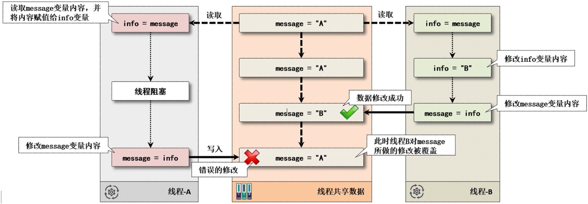

对于 ABA 问题最简单的理解就是：现在 A 和 B 两位开发工程师同时打开了一个相同的程序文件，但是 A 在打开之后由于有其他的事情要忙，所以暂时没有做任何的代码编写，而 B 却一直在进行代码编写，当 B 把代码写完并保存后关上电脑离开后，而 A 处理完其他事情后发现没有什么可写的，于是就直接保存退出，这样B的修改就消失不见了。

> 所谓的 ABA 问题指的就是两个线程并发操作时，由于更新不同步所造成的更新错误。由于 ABA 问题的存在，那么就有可能造成 CAS 的数据更新错误，因为 CAS 是基于数据内容的判断来实现的数据修改，所以此时的操作就会产生错误，为了解决这种问题，所以提出了版本号设计方案，这也就是 J.U.C 提供"AtomicStampedReference"和"AtomicMarkableReference"两个类的原因所在。


## 5、属性修改原子操作类

在一个类之中可能会存在有若干个不同的属性，但是有可能在进行线程同步处理的时候不是该类中所有的属性都会被进行所谓的同步操作，只有部分的属性需要进行同步的处理操作，所以在 J.U.C 提供的原子类里面，就包含有一个属性修改器，利用属性修改器可以安全的修改属性的内容，原子开发包中提供的属性修改器一共包含三种：

- AtomicIntegerFieldUpdater（原子整型成员修改器）
- AtomicLongFieldUpdater（原子长整型修改器）
- AtomicReferenceFieldUpdater（原子引用成员修改器）。

**本次主要使用 AtomicLongFieldUpdater 原子长整型修改器类进行操作**。


### 1、AtomicLongFieldUpdater

| 方法                                                         | 描述                                                         |
| ------------------------------------------------------------ | ------------------------------------------------------------ |
| protected AtomicLongFieldUpdater()                           | 只有一个无参protected的构造函数，并不可用。                  |
| static < U > AtomicLongFieldUpdater< U > newUpdater(Class< U > tclass, String fieldName) | 用于原子性地更新给定类中具有给定字段名称的 long 类型字段。   |
| void set(T obj, long newValue)                               | 将字段的值设置为给定的新值。                                 |
| long get(T obj)                                              | 获取给定对象的字段的当前值。                                 |
| long getAndSet(T obj, long newValue)                         | 获取给定对象的字段的当前值，并设置为给定的新值。             |
| void lazySet(Object obj, long newValue)                      | 最终将字段的值设置为给定的新值，使用懒惰写入。               |
| boolean compareAndSet(T obj, long expect, long update)       | 如果当前字段的值等于期望值，则原子性地将该字段的值设置为给定的更新值。 |
| boolean weakCompareAndSet(T obj, long expect, long update)   | 弱一致性地原子性比较并设置字段的值。                         |
| long getAndAdd(T obj, long delta)                            | 增量计算并返回旧值，具有原子性和可见性。                     |
| long addAndGet(T obj, long delta)                            | 增量计算并返回新值，具有原子性和可见性。                     |
| long getAndIncrement(T obj)                                  | 自增并返回旧值，类似 i ++，具有原子性和可见性。              |
| long incrementAndGet(T obj)                                  | 自增并返回新值，类似  ++ i，具有原子性和可见性。             |
| long getAndDecrement(T obj)                                  | 自减并返回旧值，类似i --，具有原子性和可见性。               |
| long decrementAndGet(T obj)                                  | 自减并返回新值，类似 -- i，具有原子性和可见性。              |

AtomicIntegerFieldUpdater 是一个抽象类，而后在其内部定义了两个内部实现子类，分别是：CASUpdater 子类（CAS 更新处理) 与 LockedUpdater 子类（同步锁定更新处理)，所以在使用前必须通过 newUpdater() 方法根据当前的虚拟机环境获取指定的对象实例。


源码分析 1：AtomicLongFieldUpdater.newUpdater() 方法

```java
@CallerSensitive
public static <U> AtomicLongFieldUpdater<U> newUpdater(Class<U> tclass, String fieldName) {
    Class<?> caller = Reflection.getCallerClass();
    if (AtomicLong.VM_SUPPORTS_LONG_CAS)
        return new CASUpdater<U>(tclass, fieldName, caller);
    else
        return new LockedUpdater<U>(tclass, fieldName, caller);
}
```

按照以上结构的概念来讲应该是分为两种更新器的实现，一种是基于 CAS 的方式实现的，另一种是基于锁定的方式来实现的，而这两种是需要根据一些环境的参数来决定的。

操作示例 1：观察原子性的属性修改器：

```java
import java.util.concurrent.atomic.AtomicLongFieldUpdater;

class Book {
    // 此时的属性如果要想使用原子属性修改器，则必须使用volatile关键字定义，否则执行时会出现如下的错误：
    // java.lang.IllegalArgumentException: Must be volatile type
    volatile long id; // 图书的编号，使用long类型
}
public class JavaAPIDemo {
    public static void main(String[] args)  {
        AtomicLongFieldUpdater<Book> updater = AtomicLongFieldUpdater.newUpdater(Book.class, "id");
        System.out.println(updater.getClass());
    }
}
```

```java
class java.util.concurrent.atomic.AtomicLongFieldUpdater$CASUpdater
```

> 此时默认的环境之中可以直接使用CAS的方式来实现修改器的对象实例获取，但是要进行修改器处理的属性必须要使用 volatile 关键字来定义，当然了，按照政策的使用来讲，此时的操作应该是在一个类的内部完成的。
>

操作示例 2：使用属性修改器

```java
import java.util.concurrent.atomic.AtomicLongFieldUpdater;

class Book {
    // 此时的属性如果要想使用原子属性修改器，则必须使用volatile关键字定义，否则执行时会出现如下的错误
    //  java.lang.IllegalArgumentException: Must be volatile type
    private volatile long id; // 图书的编号，使用long类型
    private String title; // 这些是不需要同步的属性
    private double price; // 这些是不需要同步的属性
    public Book(long id, String title, double price) {
        this.id = id;
        this.title = title;
        this.price = price;
    }
    public void setId(long id) { // 这个时候的id是需要进行同步处理的
        AtomicLongFieldUpdater<Book> updater = AtomicLongFieldUpdater.newUpdater(Book.class, "id");
        updater.compareAndSet(this, this.id, id); // CAS的修改操作
    }
    @Override
    public String toString() {
        return "【图书】ID = " + this.id + "、名称 = " + this.title + "、价格 = " + this.price;
    }
}
public class JavaAPIDemo {
    public static void main(String[] args) {
        Book book = new Book(1002, "Java就业编程实战", 69.8); // 实例化Book类对象
        book.setId(6609); // 修改属性的内容
        System.out.println(book);
    }
}
```

```java
【图书】ID = 6609、名称 = Java就业编程实战、价格 = 69.8
```

在整个的J.U.C的设计过程之中，不同的同步场景需要使用到不同的原子类来完成处理，除了要清楚每一个原子类的使用特点之外，对于其实现的源代码的操作机制也一定要有一定的认知，需要花时间自己去观察分析源代码的定义。 


### 2、AtomicIntegerFieldUpdater

| 方法                                                         | 描述                                                         |
| ------------------------------------------------------------ | ------------------------------------------------------------ |
| protected AtomicIntegerFieldUpdater()                        | 只有一个无参protected的构造函数，并不可用。                  |
| static < U > AtomicIntegerFieldUpdater< U > newUpdater(Class< U > tclass, String fieldName) | 用于原子性地更新给定类中具有给定字段名称的 int 类型字段。    |
| void set(T obj, int newValue)                                | 将字段的值设置为给定的新值。                                 |
| int get(T obj)                                               | 获取给定对象的字段的当前值。                                 |
| Int getAndSet(T obj, int newValue)                           | 获取给定对象的字段的当前值，并设置为给定的新值。             |
| void lazySet(Object obj, int newValue)                       | 最终将字段的值设置为给定的新值，使用懒惰写入。               |
| boolean compareAndSet(T obj, int expect, int update)         | 如果当前字段的值等于期望值，则原子性地将该字段的值设置为给定的更新值。 |
| boolean weakCompareAndSet(T obj, int expect, int update)     | 弱一致性地原子性比较并设置字段的值。                         |
| int getAndAdd(T obj, long delta)                             | 增量计算并返回旧值，具有原子性和可见性。                     |
| int addAndGet(T obj, long delta)                             | 增量计算并返回新值，具有原子性和可见性。                     |
| int getAndIncrement(T obj)                                   | 自增并返回旧值，类似 i ++，具有原子性和可见性。              |
| int incrementAndGet(T obj)                                   | 自增并返回新值，类似  ++ i，具有原子性和可见性。             |
| int getAndDecrement(T obj)                                   | 自减并返回旧值，类似i --，具有原子性和可见性。               |
| int decrementAndGet(T obj)                                   | 自减并返回新值，类似 -- i，具有原子性和可见性。              |

操作示例 1：观察原子性的属性修改器

```java
import java.util.concurrent.atomic.AtomicIntegerFieldUpdater;

/**
 * 在这个例子中，我们首先创建了一个 AtomicIntegerFieldUpdater，然后定义了一个 Counter 类，其中包含了一个 volatile int 类型的字段 count。
 * 接着，我们创建了多个线程，每个线程通过 AtomicIntegerFieldUpdater 来原子性地递增 Counter 实例的 count 字段。最后，我们输出了最终的计数值。
 * 需要注意的是，AtomicIntegerFieldUpdater 只能用于原子性地更新 volatile int 类型字段，且必须是实例变量而不是静态变量。
 * 此外，AtomicIntegerFieldUpdater 使用反射机制，因此在使用时要确保字段的可访问性。
 */
public class JavaAPIDemo {
    public static void main(String[] args) throws InterruptedException{
        // 创建 AtomicIntegerFieldUpdater
        AtomicIntegerFieldUpdater<Counter> updater = AtomicIntegerFieldUpdater.newUpdater(Counter.class, "count");

        // 创建 Counter 实例
        Counter counter = new Counter();

        // 启动多个线程进行递增操作
        Thread[] threads = new Thread[5];
        for (int i = 0; i < threads.length; i++) {
            threads[i] = new IncrementThread(updater, counter);
            threads[i].start();
        }

        // 等待所有线程执行完毕
        for (Thread thread : threads) {
            thread.join();
        }

        // 输出最终的计数值
        System.out.println("Final Count: " + counter.getCount());
    }

    // Counter 类
    static class Counter {
        // 使用 volatile 修饰的字段
        volatile int count;
        public int getCount() {
            return count;
        }
    }

    // 递增操作的线程
    static class IncrementThread extends Thread {
        private AtomicIntegerFieldUpdater<Counter> updater;
        private Counter counter;

        public IncrementThread(AtomicIntegerFieldUpdater<Counter> updater, Counter counter) {
            this.updater = updater;
            this.counter = counter;
        }
        @Override
        public void run() {
            for (int i = 0; i < 10000; i++) {
                // 使用 AtomicIntegerFieldUpdater 递增字段的值
                updater.getAndIncrement(counter);
            }
        }
    }
}
```

```java
Final Count: 50000
```


### 3、AtomicReferenceFieldUpdater

| 方法                                                         | 描述                                                         |
| ------------------------------------------------------------ | ------------------------------------------------------------ |
| protected AtomicReferenceFieldUpdater()                      | 只有一个无参protected的构造函数，并不可用。                  |
| static <U,T> AtomicReferenceFieldUpdater<U,T> newUpdater(Class< U > tclass, Class< T > vclass, String fieldName) | 创建一个新的 AtomicReferenceFieldUpdater，用于对指定类的指定 volatile 引用字段进行原子更新。 |
| void set(U obj, T newValue)                                  | 设置字段的值。                                               |
| T get(U obj)                                                 | 获取字段的当前值。                                           |
| T getAndSet(U obj, T newValue)                               | 获取当前字段的值并设置为指定的新值。                         |
| void lazySet(U obj, T newValue)                              | 最终将字段的值设置为指定的新值，使用懒惰写入。               |
| boolean compareAndSet(U obj, T expect, T update)             | 如果当前字段的值等于期望值 expect，则将字段的值原子性地设置为新值 update。 |
| boolean weakCompareAndSet(U obj, T expect, T update)         | 弱一致性地原子性比较并设置字段的值。                         |

操作示例 1：观察原子性的属性修改器

```java
import java.util.concurrent.atomic.AtomicReferenceFieldUpdater;

class Book {
    // 使用 volatile 关键字修饰字段
    volatile String name;
    public Book(String name) {
        this.name = name;
    }
    public String getName() {
        return name;
    }
}
public class JavaAPIDemo {
    public static void main(String[] args) {
        // 创建 AtomicReferenceFieldUpdater，指定要更新的类、字段类型和字段名称
        AtomicReferenceFieldUpdater<Book, String> updater = 
            AtomicReferenceFieldUpdater.newUpdater(Book.class, String.class, "name");

        // 创建 Book 对象
        Book person = new Book("Java");

        // 获取当前值并更新
        String newName = "Python";
        updater.set(person, newName);

        // 获取更新后的值
        String updatedName = updater.get(person);

        System.out.println("Updated Name: " + updatedName);
    }
}
```

```java
Updated Name: Python
```


## 6、原子并发计算操作类

在之前学习过了一些原子类，原子类里面允许直接实现数学计算的，例如：在之前使用的 AtomicInteger 类就是可以直接进行加法计算处理的，但是如果说此时有一些操作不希望使用原子类，就是一些最原始的操作数字要想安全的实现计算怎么办？所以 JDK1.8 之后提供了新的原子的计算类：**原子类型累加器**。它可以看做 **AtomicLong** 和 **AtomicDouble** 的部分加强类型。

原子计算类分为两种：**加法器（DoubleAdder、LongAdder）、累加器（DoubleAccumulator、LongAccumulator）**。

使用原子操作类可以保证多线程并发访问下的数据操作安全性，而为了进一步加强多线程下的计算操作，所以从 JDK1.8 之后开始提供有累加器（DoubleAccumulator、LongAccumulator）和加法器（DoubleAdder、LongAdder）的支持，但是对于原子性的累加器只适合于进行基础的数据统计，并不适用于其他更加细粒度的操作。

操作示例 1：快速入门加法器与累加器

```java
import java.util.concurrent.atomic.DoubleAccumulator;
import java.util.concurrent.atomic.DoubleAdder;

public class JavaAPIDemo {
    public static void main(String[] args) {
        /**
         * 1.使用加法器计算
         */
        DoubleAdder da = new DoubleAdder(); // 定义加法器
        // double和long都属于64位的数据，所以计算的时候需要考虑到2个32位数据的统一问题
        da.add(10);
        da.add(20);
        da.add(30);
        System.out.println("【加法器】计算结果：" + da.doubleValue());

        /**
         * 2.使用累加器计算
         */
        DoubleAccumulator dac = new DoubleAccumulator((x, y) -> x + y, 1.1); // 每次增长1.1数据
        System.out.println("【累加器】原始存储内容：" + dac.doubleValue());
        dac.accumulate(20); // 数据累加计算
        System.out.println("【累加器】新的存储内容：" + dac.doubleValue());
    }
}
```

```java
【加法器】计算结果：60.0
【累加器】原始存储内容：1.1
【累加器】新的存储内容：21.1
```

累加器时在一个数据的基础上不断的进行累加计算实现的，这种计算的操作是在没有使用原子类的时候保证准确计算的一种准则操作类，并且是在J.U.C之后增加进来的新功能。

由于上面四种累加器的原理类似，**下面以LongAdder为主来介绍累加器的使用**。以下内存是转载内容，原文请见[此博客](https://segmentfault.com/a/1190000015865714)。


### 1、LongAdder 简介

JDK1.8 时，java.util.concurrent.atomic 包中提供了一个新的原子类：LongAdder。根据 Oracle 官方文档的介绍，LongAdder 在高并发的场景下会比它的前辈 AtomicLong 具有更好的性能，代价是消耗更多的内存空间。

> 那么，问题来了：
>
> 为什么要引入LongAdder？ AtomicLong在高并发的场景下有什么问题吗？ 如果低并发环境下，LongAdder 和 AtomicLong 性能差不多，那 LongAdder 是否就可以替代 AtomicLong 了？


#### 1、为什么要引入 LongAdder

我们知道，AtomicLong是利用了底层的CAS操作来提供并发性的，比如addAndGet方法：

```java
public final long addAndGet(long delta) {
    return U.getAndAddLong(this, VALUE, delta) + delta;
}
```

上述方法调用了 Unsafe 类的 getAndAddLong 方法，该方法是个 native 方法，它的逻辑是采用自旋的方式不断更新目标值，直到更新成功。

在并发量较低的环境下，线程冲突的概率比较小，自旋的次数不会很多。但是，高并发环境下，N个线程同时进行自旋操作，会出现大量失败并不断自旋的情况，此时 AtomicLong 的自旋会成为瓶颈。

这就是 LongAdder 引入的初衷：**解决高并发环境下 AtomicLong 的自旋瓶颈问题**。


#### 2、LongAdder 快在哪里

既然说到 LongAdder 可以显著提升高并发环境下的性能，那么它是如何做到的？这里先简单的说下 LongAdder 的思路，第二部分会详述 LongAdder 的原理。

我们知道，AtomicLong 中有个内部变量 value 保存着实际的 long 值，所有的操作都是针对该变量进行。也就是说，高并发环境下， value 变量其实是一个热点，也就是N个线程竞争一个热点。

LongAdder 的基本思路就是分散热点，将 value 值分散到一个数组中，不同线程会命中到数组的不同槽中，各个线程只对自己槽中的那个值进行 CAS 操作，这样热点就被分散了，冲突的概率就小很多。如果要获取真正的long值，只要将各个槽中的变量值累加返回。

这种做法有没有似曾相识的感觉？没错，ConcurrentHashMap 中的“分段锁”其实就是类似的思路。


#### 3、LongAdder 能否替代 AtomicLong

回答这个问题之前，我们先来看下LongAdder提供的API：  

| 方法                 | 描述                                   |
| -------------------- | -------------------------------------- |
| LongAdder()          | 创建一个新的 `LongAdder`，初始值为 0。 |
| void add(long x)     | 将指定值添加到当前值。                 |
| void increment()     | 将当前值加1。                          |
| void decrement()     | 将当前值减1。                          |
| long sum()           | 返回当前的总和。                       |
| void reset()         | 将当前值重置为0。                      |
| long sumThenReset()  | 返回当前的总和，并将当前值重置为0。    |
| Int intValue()       | 返回当前值作为 int。                   |
| long longValue()     | 返回当前值作为 long。                  |
| double doubleValue() | 返回当前值作为 double。                |
| float floatValue()   | 返回当前值作为 float。                 |

可以看到，LongAdder 提供的 API 和 AtomicLong 比较接近，两者都能以原子的方式对 long 型变量进行增减。

但是AtomicLong提供的功能其实更丰富，尤其是 addAndGet、decrementAndGet、compareAndSet 这些方法。addAndGet、decrementAndGet 除了单纯的做自增自减外，还可以立即获取增减后的值，而 LongAdder 则需要做同步控制才能精确获取增减后的值。如果业务需求需要精确的控制计数，做计数比较，AtomicLong 也更合适。

另外，从空间方面考虑，LongAdder其实是一种“空间换时间”的思想，从这一点来讲 AtomicLong 更适合。当然，如果你一定要跟我杠现代主机的内存对于这点消耗根本不算什么，那我也办法。

总之，低并发、一般的业务场景下 AtomicLong 是足够了。如果并发量很多，存在大量写多读少的情况，那 LongAdder 可能更合适。适合的才是最好的，如果真出现了需要考虑到底用 AtomicLong 好还是 LongAdder 的业务场景，那么这样的讨论是没有意义的，因为这种情况下要么进行性能测试，以准确评估在当前业务场景下两者的性能，要么换个思路寻求其它解决方案。


### 2、LongAdder 原理

之前说了，AtomicLong 是多个线程针对单个热点值 value 进行原子操作。而 LongAdder 是每个线程拥有自己的槽，各个线程一般只对自己槽中的那个值进行 CAS 操作。

> 比如有三个 ThreadA、ThreadB、ThreadC，每个线程对 value 增加 10。

对于 AtomicLong，最终结果的计算始终是下面这个形式：  

```java
value = 10 + 10 + 10 = 30
```

但是对于 LongAdder 来说，内部有一个 base 变量，一个 Cell[] 数组。 

1. base变量：非竞态条件下，直接累加到该变量上  
2. Cell[]数组：竞态条件下，累加个各个线程自己的槽`Cell[i]`中

最终结果的计算是下面这个形式：  

```java
value = base + \sum_{i=0}^nCell[i]
```


#### 1、LongAdder 内部结构

LongAdder只有一个空构造器，其本身也没有什么特殊的地方，所有复杂的逻辑都在它的父类Striped64中。

```java
public class LongAdder extends Striped64 implements Serializable {
    public LongAdder() {
    }
}
```

看下 Striped64 的内部结构，这个类实现一些核心操作，处理64位数据。Striped64 只有一个空构造器，初始化时，通过 Unsafe 获取到类字段的偏移量，以便后续 CAS 操作：

```java
abstract class Striped64 extends Number {
    // VarHandle mechanics
    private static final VarHandle BASE;
    private static final VarHandle CELLSBUSY;
    private static final VarHandle THREAD_PROBE;
    static {
        try {
            MethodHandles.Lookup l = MethodHandles.lookup();
            BASE = l.findVarHandle(Striped64.class, "base", long.class);
            CELLSBUSY = l.findVarHandle(Striped64.class, "cellsBusy", int.class);
            l = java.security.AccessController.doPrivileged(
                new java.security.PrivilegedAction<>() {
                    public MethodHandles.Lookup run() {
                        try {
                            return MethodHandles.privateLookupIn(Thread.class, MethodHandles.lookup());
                        } catch (ReflectiveOperationException e) {
                            throw new ExceptionInInitializerError(e);
                        }
                    }});
            THREAD_PROBE = l.findVarHandle(Thread.class, "threadLocalRandomProbe", int.class);
        } catch (ReflectiveOperationException e) {
            throw new ExceptionInInitializerError(e);
        }
    }
}
```

上面有个比较特殊的字段是 threadLocalRandomProbe，可以把它看成是线程的 hash 值。这个后面我们会讲到。

Striped64 中定义了一个内部Cell类，这就是我们之前所说的槽，每个 Cell 对象存有一个 value 值，可以通过 MethodHandles 来 CAS 操作它的值：

```java
abstract class Striped64 extends Number {
    @jdk.internal.vm.annotation.Contended static final class Cell {
        volatile long value;
        Cell(long x) { value = x; }
        final boolean cas(long cmp, long val) {
            return VALUE.weakCompareAndSetRelease(this, cmp, val);
        }
        final void reset() {
            VALUE.setVolatile(this, 0L);
        }
        final void reset(long identity) {
            VALUE.setVolatile(this, identity);
        }
        final long getAndSet(long val) {
            return (long)VALUE.getAndSet(this, val);
        }

        // VarHandle mechanics
        private static final VarHandle VALUE;
        static {
            try {
                MethodHandles.Lookup l = MethodHandles.lookup();
                VALUE = l.findVarHandle(Cell.class, "value", long.class);
            } catch (ReflectiveOperationException e) {
                throw new ExceptionInInitializerError(e);
            }
        }
    }
}
```

其它的字段： 可以看到 Cell[] 就是之前提到的槽数组，base 就是非并发条件下的基数累计值。

```java
// CPU核数，用来决定槽数组的大小
static final int NCPU = Runtime.getRuntime().availableProcessors();
// 槽数组，大小为2的幂次
transient volatile Cell[] cells;
// 基数，在两种情况下会使用
// 1.没有遇到并发竞争时，直接使用base累加数值
// 2.初始化cell数组时，必须要保证cells数组只被初始化一次（即只有一个线程能对cells初始化），其他竞争失败的线程会将 数值累加到base上
transient volatile long base;
// 锁标识：cells初始化或扩容时，通过CAS操作此标识设置为1-加锁状态；初始化或扩容完毕时，将此标识设置为0-无锁状态
transient volatile int cellsBusy;
```


#### 2、LongAdder 核心方法

还是通过例子来看： 假设现在有一个 LongAdder 对象 la，四个线程 A、B、C、D 同时对 la 进行累加操作。

```java
LongAdder la = new LongAdder();
la.add(10);
```

1. ThreadA 调用 add 方法（假设此时没有并发）

   ```java
   public void add(long x) {
       Cell[] cs; long b, v; int m; Cell c;
       if ((cs = cells) != null || !casBase(b = base, b + x)) {
           int index = getProbe();
           boolean uncontended = true;
           if (cs == null || (m = cs.length - 1) < 0 ||
               (c = cs[index & m]) == null ||
               !(uncontended = c.cas(v = c.value, v + x)))
               longAccumulate(x, null, uncontended, index);
       }
   }
   ```

2. 初始时 Cell\[\] 为 null，base 为 0。所以 ThreadA 会调用 casBase 方法（定义在 Striped64 中），因为没有并发，CAS 操作成功将 base 变为 10：

   ```java
   // CAS操作base的值
   final boolean casBase(long cmp, long val) {
       return BASE.weakCompareAndSetRelease(this, cmp, val);
   }
   ```

3. 可以看到，如果线程A、B、C、D线性执行，那**casBase**永远不会失败，也就永远不会进入到**base**方法的if块中，所有的值都会累积到**base**中。  
   那么，如果任意线程有并发冲突，导致**caseBase**失败呢？

4. 失败就会进入if方法体：

   ```java
   boolean uncontended = true;
   if (cs == null || (m = cs.length - 1) < 0 ||
       (c = cs[index & m]) == null ||
       !(uncontended = c.cas(v = c.value, v + x)))
       longAccumulate(x, null, uncontended, index);
   }
   ```

5. 这个方法体会先再次判断Cell[]槽数组有没初始化过，如果初始化过了，以后所有的CAS操作都只针对槽中的Cell；否则，进入longAccumulate方法。

整个LongAdder.add()方法的逻辑如下图： 

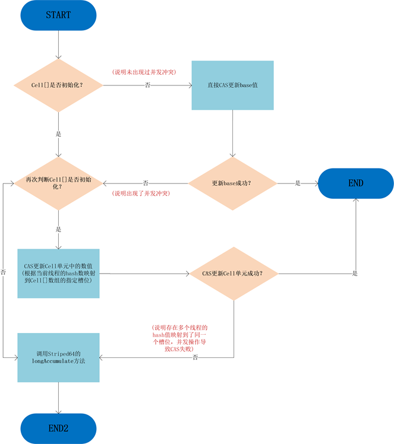

> 可以看到，只有从未出现过并发冲突的时候，base基数才会使用到，一旦出现了并发冲突，之后所有的操作都只针对Cell[]数组中的单元Cell。如果Cell[]数组未初始化，会调用父类的longAccumelate去初始化Cell[]，如果Cell[]已经初始化但是冲突发生在Cell单元内，则也调用父类的longAccumelate，此时可能就需要对Cell[]扩容了。

**这也是 LongAdder 设计的精妙之处：尽量减少热点冲突，不到最后万不得已，尽量将 CAS 操作延迟。**


### 3、Striped64 核心方法

我们来看下 Striped64 的核心方法 longAccumulate 到底做了什么：

```java
final void longAccumulate(long x, LongBinaryOperator fn, boolean wasUncontended, int index) {
    // 这个if相当于给当前线程生成一个非0的hash值
    if (index == 0) {
        ThreadLocalRandom.current(); // force initialization
        index = getProbe();
        wasUncontended = true;
    }
    // 如果hash取模映射得到的Cell单元不是null，则为true，此值也可以看作是扩容意向
    boolean collide = false
    for (;;) {       // True if last slot nonempty
        Cell[] cs; Cell c; int n; long v;
        // CASE1: cells已经被初始化
        if ((cs = cells) != null && (n = cs.length) > 0) {
            // ...
        }
        // CASE2: cells没有加锁且没有初始化，则尝试对它进行加锁，并初始化cells数组
        else if (cellsBusy == 0 && cells == cs && casCellsBusy()) {
            // ...
        }
        // CASE3: cells正在进行初始化，则尝试直接在基数base上进行累加操作
        else if (casBase(v = base, (fn == null) ? v + x : fn.applyAsLong(v, x)))
            break;
    }
}
```

上述代码首先给当前线程分配一个hash值，然后进入一个自旋，这个自旋分为三个分支：

*   **CASE1：Cell[]数组已经初始化**

*   **CASE2：Cell[]数组未初始化**

*   **CASE3：Cell[]数组正在初始化中**


#### 1、CASE2：Cell[]数组未初始化

我们之前讨论了，初始时Cell[]数组还没有初始化，所以会进入分支②：

```java
// CASE2: cells没有加锁且没有初始化，则尝试对它进行加锁，并初始化cells数组
else if (cellsBusy == 0 && cells == cs && casCellsBusy()) {
    try {                           // Initialize table
        if (cells == cs) {
            Cell[] rs = new Cell[2];     // 初始化大小2（必须为2的幂次）
            rs[index & 1] = new Cell(x); // 将其中初始化，并附初值x
            cells = rs;
            break;
        }
    } finally {
        cellsBusy = 0;
    }
}
```

首先会将cellsBusy置为**1-加锁状态**：

```java
// CAS操作cellsBusy值，将其置为1-加锁状态
final boolean casCellsBusy() {
    return CELLSBUSY.compareAndSet(this, 0, 1);
}
```

然后，初始化Cell[]数组（初始大小为2），根据当前线程的hash值计算映射的索引，并创建对应的Cell对象，Cell单元中的初始值x就是本次要累加的值。


#### 2、CASE3：Cell[]数组正在初始化中

如果在初始化过程中，另一个线程ThreadB也进入了longAccumulate方法，就会进入分支③：

```java
// CASE3: cells正在进行初始化，则尝试直接在基数base上进行累加操作
else if (casBase(v = base, (fn == null) ? v + x : fn.applyAsLong(v, x)))
    break;
```

可以看到，分支③直接操作base基数，将值累加到base上。


#### 3、CASE1：Cell[]数组已经初始化

如果初始化完成后，其它线程也进入了longAccumulate方法，就会进入分支①：

```java
if ((cs = cells) != null && (n = cs.length) > 0) {
    if ((c = cs[(n - 1) & index]) == null) { // 当前线程的hash值运算后映射得到的Cell单元为null，说明该Cell没有被使用
        if (cellsBusy == 0) {       // Cell[]数组没有正在扩容
            Cell r = new Cell(x);   // 创建一个Cell单元
            if (cellsBusy == 0 && casCellsBusy()) { // 尝试加锁，成功后cellsBusy==1
                try {                               // 在有锁的情况下再检测一遍之前的判断
                    Cell[] rs; int m, j;            // 将Cell单元附到Cell[]数组上
                    if ((rs = cells) != null &&
                        (m = rs.length) > 0 &&
                        rs[j = (m - 1) & index] == null) {
                        rs[j] = r;
                        break;
                    }
                } finally {
                    cellsBusy = 0;
                }
                continue;           // Slot is now non-empty
            }
        }
        collide = false;
    }
    else if (!wasUncontended)       // wasUncontended表示前一次CAS更新Cell单元是否成功
        wasUncontended = true;      // 重新置为true，后面会重新计算线程的hash值
    else if (c.cas(v = c.value, (fn == null) ? v + x : fn.applyAsLong(v, x))) // 尝试CAS更新Cell单元值
        break;
    else if (n >= NCPU || cells != cs) // 当Cell数组的大小超过CPU核数后，永远不会再进行扩容
        collide = false;               // 扩容标识，置为false，表示不会再进行扩容
    else if (!collide)
        collide = true;
    else if (cellsBusy == 0 && casCellsBusy()) {  // 尝试加锁进行扩容
        try {
            if (cells == cs)        // Expand table unless stale
                cells = Arrays.copyOf(cs, n << 1); // 扩容后的大小 == 当前容量*2
        } finally {
            cellsBusy = 0;
        }
        collide = false;
        continue;                   // Retry with expanded table
    }
    index = advanceProbe(index);    // 计算当前线程新的hash值
}
```

整个Striped64.longAccumulate()方法的流程图如下：

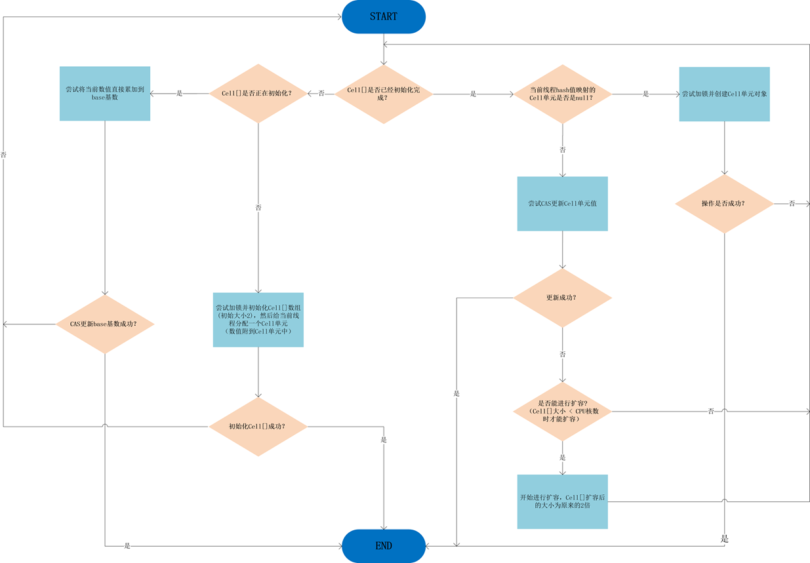


#### 4、LongAdder.sum() 方法

最后，我们来看下**LongAdder**的**sum**方法：

```java
/**
 * 返回累加的和，也就是“当前时刻”的计算值
 * 此返回值可能不是绝对准确的，因为调用这个方法时还有其他线程可能正在进行计数累加，
 * 方法的返回时刻和调用时刻不是同一个点，在有并发的情况下，这个值只是近似准确的计数值
 * 高并发时，除非全局加锁，否则得不到程序运行中某个时刻绝对准确的值
 * @return the sum
 */
public long sum() {
    Striped64.Cell[] cs = cells;
    long sum = base;
    if (cs != null) {
        for (Striped64.Cell c : cs)
            if (c != null)
                sum += c.value;
    }
    return sum;
}
```

sum求和的公式就是我们开头说的：  

```java
value = base + \sum_{i=0}^nCell[i]
```

需要注意的是：**这个方法只能得到某个时刻的近似值，这也就是LongAdder并不能完全替代LongAtomic的原因之一**。


### 3、LongAdder 其他兄弟

JDK1.8时，java.util.concurrent.atomic包中，除了新引入LongAdder外，还有它的三个兄弟类：LongAccumulator、DoubleAdder、DoubleAccumulator


#### 1、LongAccumulator

LongAccumulator是LongAdder的增强版。LongAdder只能针对数值的进行加减运算，而LongAccumulator提供了自定义的函数操作。其构造函数如下：

```java
public LongAccumulator(LongBinaryOperator accumulatorFunction, long identity) {
    this.function = accumulatorFunction;
    base = this.identity = identity;
}
```

通过LongBinaryOperator，可以自定义对入参的任意操作，并返回结果（LongBinaryOperator接收2个long作为参数，并返回1个long）

LongAccumulator内部原理和LongAdder几乎完全一样，都是利用了父类Striped64的longAccumulate方法。这里就不再赘述了，读者可以自己阅读源码。


#### 2、DoubleAdder

DoubleAdder 类是 Java 中 java.util.concurrent.atomic 包中的一部分，用于在多线程环境中执行原子性的 double 类型的累加操作。它是线程安全的，并且通常在高并发场景下比传统的 double 累加方式更高效。以下是一些基本用法示例：

操作示例 1：创建 DoubleAdder 实例：

```java
import java.util.concurrent.atomic.DoubleAdder;

public class JavaAPIDemo {
    public static void main(String[] args) {
        // 创建 DoubleAdder 实例
        DoubleAdder doubleAdder = new DoubleAdder();

        // 执行累加操作
        doubleAdder.add(5.0);
        doubleAdder.add(3.5);

        // 获取累加结果
        double result = doubleAdder.sum();
        System.out.println("Result: " + result); // 输出：Result: 8.5
    }
}
```

```java
Result: 8.5
```

操作示例 2：在多线程环境中使用 DoubleAdder：

```java
import java.util.concurrent.ExecutorService;
import java.util.concurrent.Executors;
import java.util.concurrent.atomic.DoubleAdder;

public class JavaAPIDemo {
    public static void main(String[] args) {
        // 创建 DoubleAdder 实例
        DoubleAdder doubleAdder = new DoubleAdder();

        // 创建线程池
        ExecutorService executorService = Executors.newFixedThreadPool(5);

        // 启动多个线程执行累加操作
        for (int i = 0; i < 10; i++) {
            executorService.submit(() -> {
                // 执行累加操作
                doubleAdder.add(1.0);
            });
        }

        // 关闭线程池
        executorService.shutdown();

        // 等待所有任务完成
        while (!executorService.isTerminated()) {
            // 等待
        }

        // 获取累加结果
        double result = doubleAdder.sum();
        System.out.println("Result: " + result); // 输出：Result: 10.0
    }
}
```

```java
Result: 10.0
```

这个示例演示了如何在多线程环境中使用 DoubleAdder。多个线程可以并发执行累加操作，而无需使用额外的同步手段，因为 DoubleAdder 已经提供了线程安全的累加操作。

DoubleAdder 类还提供了其他一些方法，如 sumThenReset() 可以获取当前总和并将累加器重置为零，以便下一轮的累加操作。在实际应用中，根据需求选择适当的方法以及是否需要重置累加器。

**DoubleAdder 源码分析已经与 LongAdder 对比**：

DoubleAdder 和 DoubleAccumulator 用于操作double原始类型。与LongAdder的唯一区别就是，其内部会通过一些方法，将原始的double类型，转换为long类型，其余和LongAdder完全一样：

```java
public class DoubleAdder extends Striped64 implements Serializable {
    public DoubleAdder() {
    }
    public void add(double x) {
        Cell[] cs; long b, v; int m; Cell c;
        if ((cs = cells) != null ||
            !casBase(b = base,
                     Double.doubleToRawLongBits // 重点在这里：将原始的double类型，转换为long类型
                     (Double.longBitsToDouble(b) + x))) {
            int index = getProbe();
            boolean uncontended = true;
            if (cs == null || (m = cs.length - 1) < 0 ||
                (c = cs[index & m]) == null ||
                !(uncontended = c.cas(v = c.value,
                                      Double.doubleToRawLongBits
                                      (Double.longBitsToDouble(v) + x))))
                doubleAccumulate(x, null, uncontended, index);
        }
    }
}
```


#### 3、DoubleAccumulator

DoubleAccumulator 类是 Java 中 java.util.concurrent.atomic 包中的一部分，它提供了对 double 类型的原子累加操作。该类是线程安全的，并用于在多线程环境中执行原子性的累加操作。以下是 DoubleAccumulator 类的一些基本用法示例：

操作示例 1：创建 DoubleAccumulator 实例

```java
import java.util.concurrent.atomic.DoubleAccumulator;

public class JavaAPIDemo {
    public static void main(String[] args) {
        // 创建 DoubleAccumulator 实例，初始值为0，累加操作为简单的加法
        DoubleAccumulator accumulator = new DoubleAccumulator((x, y) -> x + y, 0.0);

        // 执行累加操作
        accumulator.accumulate(5.0);
        accumulator.accumulate(3.5);

        // 获取累加结果
        double result = accumulator.get();
        System.out.println("Result: " + result); // 输出：Result: 8.5
    }
}
```

```java
Result: 8.5
```

操作示例 2：自定义累加操作

```java
import java.util.concurrent.atomic.DoubleAccumulator;

public class JavaAPIDemo {
    public static void main(String[] args) {
        // 自定义累加操作，计算平方和
        DoubleAccumulator accumulator = new DoubleAccumulator((x, y) -> x + y * y, 0.0);

        // 执行累加操作
        accumulator.accumulate(2.0);
        accumulator.accumulate(3.0);

        // 获取累加结果
        double result = accumulator.get();
        System.out.println("Result: " + result); // 输出：Result: 13.0
    }
}
```

```java
Result: 13.0
```

操作示例 3：更新累加器的函数

```java
import java.util.concurrent.atomic.DoubleAccumulator;

public class JavaAPIDemo {
    public static void main(String[] args) {
        // 自定义累加操作，计算平方和
        DoubleAccumulator accumulator = new DoubleAccumulator((x, y) -> x + y * y, 0.0);

        // 执行累加操作
        accumulator.accumulate(2.0);
        accumulator.accumulate(3.0);

        // 使用更新函数更新累加器
        accumulator.updateAndGet(value -> value * 2);

        // 获取累加结果
        double result = accumulator.get();
        System.out.println("Result: " + result); // 输出：Result: 26.0
    }
}
```

```java
Result: 26.0
```

这些示例演示了如何创建 DoubleAccumulator 实例，定义不同的累加操作，执行累加操作，并在需要时使用自定义的更新函数更新累加器的值。请注意，累加器是线程安全的，可以在多线程环境中使用。


# 05、并发线程锁

## 1、J.U.C 并发线程锁简介

### 1、J.U.C 线程锁

在多线程并发访问处理下，如果要想保证操作资源的线程安全性，则必须对资源的处理使用synchronized关键字进行标注，同时还需要通过线程等待与唤醒的机制来实现多个线程的协作处理，但是这样的实现机制实在是过于繁琐，同时也会存在有死锁问题的隐患。为了更好的解决线程同步处理的操作问题，在J.U.C中提供了一个新的锁处理机制，而为了实现这一机制，扩充了两个新的锁接口：

**1、java.util.concurrent.locks.Lock 接口：支持各种不同语义的锁规则，在Lock接口之中分为以下不同的锁类型：**

- 公平机制锁：不同的线程获取锁的过程是公平的；
- 非公平机制锁：不同的线程获取锁的机制是不公平的，可以允许竞争获取；
- 可重入锁：同一个锁可以被一个线程多次获取，最大的特点是避免了死锁的出现。

**2、java.util.concurrent.locks.ReadWriteLock 接口：针对于线程的读或写提供不同的锁处理机制，在数据读取的时候会采用共享锁，而在数据修改的时候将采用独占锁，这样就可以保证数据访问的高性能。**


### 2、J.U.C 锁实现结构

对于以上的两个锁处理接口，在 J.U.C 中分别提供了 ReentrantLock 子类（实现Lock接口）与 ReentrantReadWriteLock 子类（实现ReadWriteLock接口）

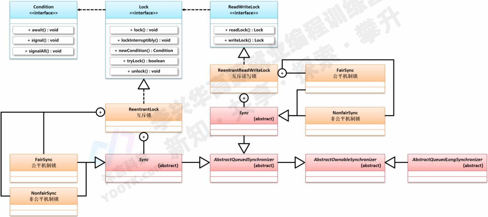


### 3、AQS 的介绍

如果要想进行锁的分析，那么就要通过 Lock 接口来展开了，因为这个接口里面有很多其他接口要使用到的结构，基本的确定关系如上图所示，最终在进行读写锁处理的时候，都是通过Lock接口提供的方法来实现最终的线程的锁定操作，但是这些操作都是接口，接口在实际的使用过程之中必须考虑到具体的应用子类，**此时观察两个子类：ReentrantLock（互斥锁&独占锁，是Lock接口的实现子类）、ReentrantReadWriteLock（互斥读写锁，是ReadWriteLock的接口实现子类）**。

1、ReentrantLock 子类的源代码：

```java
package java.util.concurrent.locks;
public class ReentrantLock implements Lock, java.io.Serializable {
    private static final long serialVersionUID = 7373984872572414699L;
    /** Synchronizer providing all implementation mechanics */
    private final Sync sync;
}
```

2、打开 Sync 类的定义：

```java
abstract static class Sync extends AbstractQueuedSynchronizer {}
```

3、AbstractQueuedSynchronizer 抽象类的定义（AQS）：

```java
public abstract class AbstractQueuedSynchronizer 
    extends AbstractOwnableSynchronizer 
    implements java.io.Serializable {}
```

4、AbstractOwnableSynchronizer 抽象类定义：

```java
public abstract class AbstractOwnableSynchronizer implements java.io.Serializable {}
```

5、获取锁的机制是由 Sync 定义的，而 Sync 又属于 AQS 的子类：FairSync（公平锁）、NonFairSync（非公平锁）。

ReentrantLock 子类与 ReentrantReadWriteLock 子类的内部都会提供有一个 Sync 的同步锁处理类，并且这个 Sync 类继承了 AbstractQueuedSynchronizer 父类（简称"**AQS**")，该类的主要作用是保存所有等待获取锁的线程队列，而对于锁的获取又分为两种类型：

- 公平锁（FairSync子类）：按照通过CLH等待线程按照先来先得的规则，公平的获取锁；
- 非公平锁（NonfairSync子类）：则当线程要获取锁时，它会无视CLH等待队列而直接获取锁。

> CLH（Craig，Landin，and Hagersten）锁是一种基于链表的可扩展、高性能、公平的自旋锁，申请线程只在本地变量上自旋，它不断轮询前驱的状态，如果发现前驱释放了锁就结束自旋。即：在J.U.C中利用了CLH队列机制可以有效的避免线程死锁问题的出现。
>
> ```java
> // CLH Node
> public abstract class AbstractQueuedSynchronizer 
>        extends AbstractOwnableSynchronizer implements java.io.Serializable {
>        abstract static class Node {  // 所有的待执行的线程都在队列中等待调度
>            volatile Node prev;       // initially attached via casTail
>            volatile Node next;       // visibly nonnull when signallable
>            Thread waiter;            // visibly nonnull when enqueued
>            volatile int status;      // written by owner, atomic bit ops by others
>        }
> }
> ```


### 4、AQS 锁机制

AbstractQueuedSynchronizer：实现了一个FIFO的线程等待队列，而后其会根据不同的应用场景来实现具体的独占锁模式（多线程更新数据时需要单个线程运行）或者是共享锁模式（多线程数据读取时读线程不需要同步，只需要和写线程做同步处理即可)，如图所示。为了便于这两种锁机制的处理，在AbstractQueuedSynchronizer也提供了相应的锁获取与锁释放的处理方法，这些方法全部都要根据实际的环境由不同的子类来实现。【**AQS 的本质就是一个执行队列，所有的待执行的线程全部都保存在一个队列之中，实际上这样做的目的是为了考虑到解决死锁的问题，在J.U.C的AQS里面提供有一个CLH队列。**】

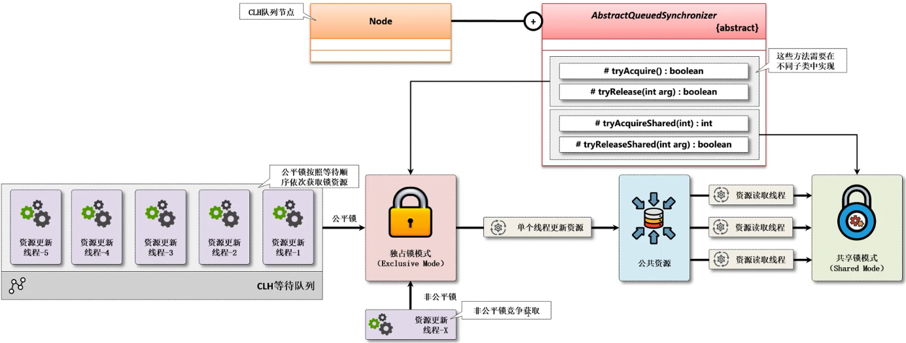


## 2、ReentrantLock 独占锁

互斥锁（ReentrantLock）或者被称为独占锁，指的是一旦获取到了锁之后，其他的线程都不允许操作（不管这个线程是要进行读操作还是写操作，其他的线程都无法进行处理），实际上在之前学习过的 synchronized 就属于一种独占锁，首先打开这个实现类的定义：

```java
public class ReentrantLock implements Lock, java.io.Serializable {}
```

java.util.concurrent.locks.ReentrantLock 是 Lock 接口的直接子类，提供了一种互斥锁（或称"独占锁"、"排它锁"）的处理机制，这样可以保证在多线程并发访问时，只能有一个线程实现资源的处理操作，如下图所示。在该线程进行操作的过程中，其他的现程将进行等待与重新获取互斥锁资源的状态。

由于互斥锁要进行独立的锁定操作机制处理，所以在互斥锁处理的时候一般会考虑到如下两种形式：

1、多个线程抢占互斥锁资源


2、互斥锁抢夺与等待


使用 ReentrantLock 最大的特点是可以避免传统的线程与唤醒机制的繁琐处理，开发者只需要通过 lock() 方法即可实现资源锁定，而在资源锁定过程中其他未竞争到的资源则自动进入等待状态，等到当前的线程调用 unlock() 方法后，才会让出当前的互斥锁资源，并根据默认的竞争策略（公平机制与非公平机制）唤醒其他等待线程，所以 ReentrantLock 属于一个可重用锁，这就意味着该锁可以被线程重复获取。

| 方法                                                         | 描述                                                         |
| ------------------------------------------------------------ | ------------------------------------------------------------ |
| public ReentrantLock()                                       | 采用非公平锁机制构造。                                       |
| public ReentrantLock(boolean fair)                           | 自定义公平锁机制构造，true 为公平锁，false 为非公平锁。      |
| public void lock()                                           | 获取锁。如果锁不可用，调用线程将阻塞直到可用。               |
| boolean tryLock()                                            | 尝试获取锁。如果获取成功返回 true，否则返回 false。          |
| public boolean tryLock(long timeout, TimeUnit unit)          | 尝试在指定时间内获取锁。如果成功则返回 true，否则返回 false。 |
| boolean isLocked()                                           | 判断当前是否已锁定，锁定返回 true，否则返回 false。          |
| public Condition newCondition()                              | 创建并返回与此 ReentrantLock 关联的新 Condition 实例。       |
| public void lockInterruptibly()                              | 获取锁，但允许其他线程中断锁获取。                           |
| public boolean isFair()                                      | 如果是公平锁返回true，否则返回false                          |
| public void unlock()                                         | 释放锁。                                                     |
| public int getHoldCount()                                    | 返回当前持有锁的次数（当前线程已经获取锁的次数）。           |
| protected Collection< Thread > getQueuedThreads()            | 返回等待获取锁的线程集合。                                   |
| public int getQueueLength()                                  | 返回等待获取锁的线程数。                                     |
| protected Collection< Thread > getWaitingThreads(Condition condition) | 返回在指定条件上等待获取锁的线程集合。                       |
| public int getWaitQueueLength(Condition condition)           | 返回在指定条件上等待获取锁的线程数。                         |
| public boolean hasQueuedThreads()                            | 如果有任何线程在等待获取锁，则返回 true，否则返回 false。    |
| public boolean hasWaiters(Condition condition)               | 如果有任何线程在指定条件上等待，则返回 true，否则返回 false  |
| public boolean isHeldByCurrentThread()                       | 如果锁被当前线程持有，返回 true，否则返回 false。            |

ReentrantLock 在使用无参构造方法进行对象实例化时所采用的是非公平锁获取机制，如果开发者有需要也可以通过单参构造进行锁获取机制的变更，典于其所使用的是独占锁模式，所以会使用 AQS 类中所提供的相关方法进行资源锁定操作，这一点可以通过  ReentrantLock 类的源代码观察到。

所有的等待线程都会保存在 AQS 等待队列的节点之中，但是在整个的 J.U.C 里面还需要分析锁获取的公平机制问题，这个公平机制是由 Lock 接口子类来决定的。

```java
private final Sync sync;
public ReentrantLock() {                               // 无参构造
    sync = new NonfairSync();                          // 非公平机制锁
}
public ReentrantLock(boolean fair) {                   // 有参构造
    sync = fair ? new FairSync() : new NonfairSync();  // 会通过判断来决定那种竞争机制
}
```

> 如果要想进一步实现这种 Lock 接口的使用，那么下面最佳的做法就是采用订票程序来进行操作的实现（多个线程的抢票操作是一个独占的处理机制）。
>

操作示例 1：使用 ReentrantLock 实现抢票操作

```java
import java.util.concurrent.TimeUnit;
import java.util.concurrent.locks.Lock;
import java.util.concurrent.locks.ReentrantLock;

/**
 * 实现抢票的处理机制
 */
class Ticket {
    private int count = 3; // 总票数
    private final Lock lock = new ReentrantLock(); // 定义互斥锁

    public void sale() {    // 售票处理
        this.lock.lock(); // 对当前的线程锁定
        try {
            if (this.count > 0) {   // 【业务处理1】判断今年是否有剩余的票数
                // 在进行操作延迟的过程之中，独占锁会始终锁定当前的资源
                TimeUnit.SECONDS.sleep(1); // 模拟一下操作的延迟
                System.out.printf("【%s】卖票，剩余票数：%d%n", Thread.currentThread().getName(), this.count--);
            } else {
                System.out.printf("【%s】票已经卖完了，明天请早！%n", Thread.currentThread().getName());
            }
        } catch (Exception ignored) {
        } finally {
            this.lock.unlock(); // 进行解锁配置
        }
    }
}

public class JavaAPIDemo {
    public static void main(String[] args) {
        Ticket ticket = new Ticket(); // 共享一个售票应用
        for (int x = 0; x < 5; x++) {
            new Thread(ticket::sale, "售票员 - " + x).start();
        }
    }
}
```

```java
【售票员 - 0】卖票，剩余票数：3
【售票员 - 1】卖票，剩余票数：2
【售票员 - 2】卖票，剩余票数：1
【售票员 - 3】票已经卖完了，明天请早！
【售票员 - 4】票已经卖完了，明天请早！
```

在进行线程锁定的过程之中（lock()方法调用），那么最终依靠的是一个线程锁定数量的控制，每一次锁定的时候都会调用一个锁定计数的方法：acquire(1)，每当一个线程被锁定了，这个时候计数就会“+1”，CLH就依靠数量是否为0来确定是否有锁定的线程，从而解决这种线程死锁的问题。


## 3、ReentrantReadWriteLock 读写锁

ReetrantLock 是一种完全独占的操作锁，这种锁不管是面对读或者是写的时候都属于独占的操作形式，于是在这样的开发环境之中就有可能出现这样一种情况：现在的业务修改线程比较少，但是读取的线程比较多，那么请问，按照独占锁的设计原则来讲，一旦要进行修改或读取操作的时候，那么所有的读线程将无法工作，那么在这样的过程之中，为了进一步提高读写操作的性能，在J.U.C里面就设计了一个读写互斥锁。它最大的特点是提供了两把锁：一把是写锁，另外一把是读锁，读锁属于共享锁，所有的读取线程共享一个共享锁，当写锁工作的时候，整个的共享锁将进入到暂停阶段，等待写入完成后再进行多个并发读取。

图一：ReentrantLock 在操作的时候，不管是读还是写都要进行操作的锁定，这样就产生了读取的性能问题。

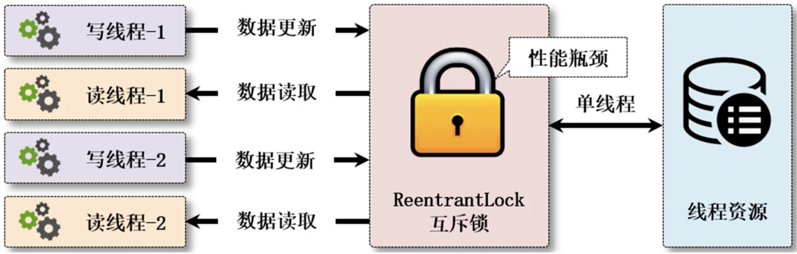

图二：读写锁将读操作和写操作分开了，读操作使用共享锁，写操作使用互斥的写锁（毕竟只有一个线程可以修改，但是却可以有多个线程可以去读取）。

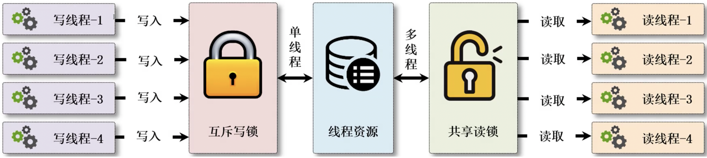

首先可以打开 ReentrantReadWriteLock 锁的内部源代码，观察类中的属性定义以及构造方法的定义。

```java
public class ReentrantReadWriteLock implements ReadWriteLock, java.io.Serializable {
    private static final long serialVersionUID = -6992448646407690164L;
    /** Inner class providing readlock */
    private final ReentrantReadWriteLock.ReadLock readerLock;
    /** Inner class providing writelock */
    private final ReentrantReadWriteLock.WriteLock writerLock;
    /** Performs all synchronization mechanics */
    final Sync sync;
    public ReentrantReadWriteLock() {
        this(false); // 调用本地的单参构造，传入了一个锁的获取机制，默认非公平
    }
    public ReentrantReadWriteLock(boolean fair) {
        sync = fair ? new FairSync() : new NonfairSync();
        readerLock = new ReadLock(this);
        writerLock = new WriteLock(this);
    }
    public ReentrantReadWriteLock.WriteLock writeLock() { return writerLock; }
    public ReentrantReadWriteLock.ReadLock  readLock()  { return readerLock; }
}
```

ReentrantReadWriteLock 是 J.U.C 提供的互斥读写锁的实现类，该类实现了 ReadWriteLock 接口 ，这样就可以利用 readLock() 方法创建一个读锁，利用 writeLock() 方法创建一个写锁。在这一操作过程中读锁和写锁互斥，写锁和写锁互斥，以保证气入的时候不允许进行数据的读取，但是读取的时候不会产生互斥操作，这样即保证了数据读取的性能，同时又保证了数据更新的安全。

TODO: 差一张图

> 为了可以更加清楚的观察到读写锁的操作方式，那么下面将采用银行账户的读写操作来进行观察，在进行银行账户金额修改的时候肯定要使用写锁，而在进行银行账户读取的时候肯定要使用读锁。

操作示例 1：实现一个银行账户的操作类

```java
import java.util.concurrent.TimeUnit;
import java.util.concurrent.locks.ReadWriteLock;
import java.util.concurrent.locks.ReentrantReadWriteLock;

/**
 * 模拟银行账户
 */
class Account {
    private final String name; // 账户的名称
    // 不要使用double描述金额，因为会有一个浮点的进位的bug，出现金额漏洞
    private int asset; // 账户的资金，资金使用整型
    // 因为读不需要考虑到线程同步处理，但是写需要考虑到线程同步处理
    private final ReadWriteLock readWriteLock = new ReentrantReadWriteLock(); // 读写锁

    public Account(String name, int asset) {
        this.name = name;
        this.asset = asset;
    }

    public void save(int asset) { // 向银行账户之中进行存款操作
        this.readWriteLock.writeLock().lock(); // 写入锁定
        try {
            this.asset += asset; // 存款处理
            TimeUnit.SECONDS.sleep(1); // 模拟业务的处理延迟
            System.err.printf("【%s】修改银行资产，当前的资产为：%10.2f%n", Thread.currentThread().getName(), this.asset / 100.0);
        } catch (Exception ignored) {
        } finally {
            this.readWriteLock.writeLock().unlock(); // 解除锁定
        }
    }

    @Override
    public String toString() {
        this.readWriteLock.readLock().lock(); // 读锁属于共享锁
        try {
            TimeUnit.MILLISECONDS.sleep(200); // 模拟业务延迟
            return String.format("〖%s〗账户名称：%s、账户余额：%10.2f %n", Thread.currentThread().getName(), this.name, this.asset / 100.0);
        } catch (Exception e) {
            return null;
        } finally {
            this.readWriteLock.readLock().unlock(); // 解除锁定
        }
    }
}

public class JavaAPIDemo {
    public static void main(String[] args) {
        Account account = new Account("李兴华", 0); // 定义银行账户信息
        int[] money = new int[]{110, 230, 10_000}; // 定义要存款的金额
        for (int x = 0; x < 10; x++) {  // 通过循环模拟操作线程
            if (x % 2 == 0) { // 存款线程
                new Thread(() -> {
                    for (int i : money) {
                        account.save(i); // 存款操作
                    }
                }, "存款线程 - " + x).start();
            } else {    // 取款线程
                new Thread(() -> {
                    while (true) {
                        System.out.print(account);
                    }
                }, "取款线程 - " + x).start();
            }
        }
    }
}
```

```java
【存款线程 - 0】修改银行资产，当前的资产为：      1.10
【存款线程 - 0】修改银行资产，当前的资产为：      3.40
【存款线程 - 0】修改银行资产，当前的资产为：    103.40
〖取款线程 - 1〗账户名称：李兴华、账户余额：    103.40 
【存款线程 - 2】修改银行资产，当前的资产为：    104.50
【存款线程 - 2】修改银行资产，当前的资产为：    106.80
【存款线程 - 2】修改银行资产，当前的资产为：    206.80
〖取款线程 - 3〗账户名称：李兴华、账户余额：    206.80 
【存款线程 - 4】修改银行资产，当前的资产为：    207.90
【存款线程 - 4】修改银行资产，当前的资产为：    210.20
【存款线程 - 4】修改银行资产，当前的资产为：    310.20
〖取款线程 - 5〗账户名称：李兴华、账户余额：    310.20 
【存款线程 - 6】修改银行资产，当前的资产为：    311.30
【存款线程 - 6】修改银行资产，当前的资产为：    313.60
【存款线程 - 6】修改银行资产，当前的资产为：    413.60
〖取款线程 - 7〗账户名称：李兴华、账户余额：    413.60 
【存款线程 - 8】修改银行资产，当前的资产为：    414.70
【存款线程 - 8】修改银行资产，当前的资产为：    417.00
【存款线程 - 8】修改银行资产，当前的资产为：    517.00
〖取款线程 - 1〗账户名称：李兴华、账户余额：    517.00 
〖取款线程 - 9〗账户名称：李兴华、账户余额：    517.00 
〖取款线程 - 5〗账户名称：李兴华、账户余额：    517.00 
〖取款线程 - 3〗账户名称：李兴华、账户余额：    517.00 
〖取款线程 - 7〗账户名称：李兴华、账户余额：    517.00 
〖取款线程 - 1〗账户名称：李兴华、账户余额：    517.00 
〖取款线程 - 9〗账户名称：李兴华、账户余额：    517.00 
```

这种读写锁最终可以带来的优势就是保证写安全的前提下，实现了较高的读取操作的支持，在边读边写的并发操作之中时最为常见的一种基础用法。


## 4、StampedLock 更强的读写锁

使用读写锁进行多线程访问控制时，独占锁与共享锁之间属于互斥的关系，如果在读写线程个数平衡的环境下，使用读写锁进行操作没有任何问题。但是如果此时读取的线程很多，而写入的线程很少，则可能会出现写入线程饥饿（Starvation）的问题，即：写入线程有可能长时间无法竞争到独占锁，而一直处于等待状态。

为了解决这种并发负载不均衡的问题，在 JDK1.8 时引入了 StampedLock 类，是对读写锁 ReentrantReadWriteLock 的增强，该类提供了一些功能，优化了读锁、写锁的访问，同时使读写锁之间可以互相转换，更细粒度控制并发。首先明确下，该类的设计初衷是作为一个内部工具类，用于辅助开发其它线程安全组件，用得好，该类可以提升系统性能，用不好，容易产生死锁和其它莫名其妙的问题。

ReadWriteLock / ReentrantReadWriteLock 支持两种模式：一种是读锁，一种是写锁。而 StampedLock 支持三种模式，分别是：**写锁（WriteLock）**、**悲观读锁（PessimisticLock）**和**乐观读（OptimisticLock）**。其中，写锁、悲观读锁的语义和 ReadWriteLock / ReentrantReadWriteLock 的写锁、读锁的语义非常类似，允许多个线程同时获取悲观读锁，但是只允许一个线程获取写锁，写锁和悲观读锁是互斥的。不同的是：StampedLock 里的写锁和悲观读锁加锁成功之后，都会返回一个 stamp；然后解锁的时候，需要传入这个 stamp。

> 注意这里，用的是“乐观读”这个词，而不是“乐观读锁”，是要提醒你，**乐观读这个操作是无锁的**，所以相比较 ReadWriteLock / ReentrantReadWriteLock 的读锁，乐观读的性能更好一些。

StampedLock 的性能之所以比 ReadWriteLock/ReentrantReadWriteLock 还要好，其关键是 **StampedLock 支持乐观读**的方式。

- ReadWriteLock 支持多个线程同时读，但是当多个线程同时读的时候，所有的写操作会被阻塞；
- StampedLock 提供的乐观读，是允许一个线程获取写锁的，也就是说不是所有的写操作都被阻塞。

对于读多写少的场景 StampedLock 性能很好，简单的应用场景基本上可以替代 ReadWriteLock / ReentrantReadWriteLock，但是 **StampedLock 的功能仅仅是 ReadWriteLock 的子集**，在使用的时候，还是有几个地方需要注意一下。

- **StampedLock 不支持重入**
- StampedLock 的悲观读锁、写锁都不支持条件变量。
- 如果线程阻塞在 StampedLock 的 readLock() 或者 writeLock() 上时，此时调用该阻塞线程的 interrupt() 方法，会导致 CPU 飙升。**使用 StampedLock 一定不要调用中断操作，如果需要支持中断功能，一定使用可中断的悲观读锁 readLockInterruptibly() 和写锁 writeLockInterruptibly()**。

优点：相比于ReentrantReadWriteLock，**吞吐量大幅提升**

缺点：API 复杂，容易用错。实现原理相比于 ReentrantReadWriteLock 复杂的多。

【模版示例 1】StampedLock 阻塞时，调用 interrupt() 导致 CPU 飙升

```java
final StampedLock lock = new StampedLock();
Thread T1 = new Thread(()->{
    // 获取写锁
    lock.writeLock();
    // 永远阻塞在此处，不释放写锁
    LockSupport.park();
});
T1.start();

// 保证 T1 获取写锁
Thread.sleep(100);

Thread T2 = new Thread(()->{
    // 阻塞在悲观读锁
    lock.readLock();
});
T2.start();

// 保证 T2 阻塞在读锁
Thread.sleep(100);

// 中断线程 T2
// 会导致线程 T2 所在 CPU 飙升
T2.interrupt();
T2.join();
```

【模版示例 2】StampedLock 读模板：

```java
final StampedLock sl = new StampedLock();

// 乐观读
long stamp =
    sl.tryOptimisticRead();
// 读入方法局部变量
// ......
// 校验 stamp
if (!sl.validate(stamp)){
    // 升级为悲观读锁
    stamp = sl.readLock();
    try {
        // 读入方法局部变量
        .....
    } finally {
        // 释放悲观读锁
        sl.unlockRead(stamp);
    }
}
// 使用方法局部变量执行业务操作
// ......
```

***

### 1、StampedLock 产生的背景

StampedLock 是一个依据时间戳来实现锁定处理的操作机制，使用 StampedLock 可以有效的解决读写资源存在的不平衡的设计问题，首先先通过之前的读写锁来分析当前存在的问题。

操作示例 1：观察读写锁存在的设计问题（读取线程远大于写入线程操作）

```java
import java.util.concurrent.TimeUnit;
import java.util.concurrent.locks.ReadWriteLock;
import java.util.concurrent.locks.ReentrantReadWriteLock;

/**
 * 模拟银行账户
 */
class Account {
    private final String name; // 账户的名称
    private int asset; // 账户的资金，资金使用整型
    private final ReadWriteLock readWriteLock = new ReentrantReadWriteLock(); // 读写锁

    public Account(String name, int asset) {
        this.name = name;
        this.asset = asset;
    }

    public void save(int asset) { // 向银行账户之中进行存款操作
        this.readWriteLock.writeLock().lock(); // 写入锁定
        try {
            this.asset += asset; // 存款处理
            TimeUnit.SECONDS.sleep(1); // 模拟业务的处理延迟
            System.err.printf("【%s】修改银行资产，当前的资产为：%10.2f%n", Thread.currentThread().getName(), this.asset / 100.0);
        } catch (Exception ignored) {
        } finally {
            this.readWriteLock.writeLock().unlock(); // 解除锁定
        }
    }

    @Override
    public String toString() {
        this.readWriteLock.readLock().lock(); // 读锁属于共享锁
        try {
            TimeUnit.MILLISECONDS.sleep(200); // 模拟业务延迟
            return String.format("〖%s〗账户名称：%s、账户余额：%10.2f %n", Thread.currentThread().getName(), this.name, this.asset / 100.0);
        } catch (Exception e) {
            return null;
        } finally {
            this.readWriteLock.readLock().unlock(); // 解除锁定
        }
    }
}

public class JavaAPIDemo {
    public static void main(String[] args) {
        Account account = new Account("李兴华", 0); // 定义银行账户信息
        int[] money = new int[]{110, 230, 10_000}; // 定义要存款的金额
        for (int x = 0; x < 10; x++) { // 10个读锁
            new Thread(() -> {
                while (true) {
                    System.out.print(account);
                }
            }, "取款线程 - " + x).start();
        }
        for (int x = 0; x < 2; x++) {  // 2个写锁
            new Thread(() -> {
                for (int i : money) {
                    account.save(i); // 存款操作
                }
            }, "存款线程 - " + x).start();
        }
    }
}
```

```java
〖取款线程 - 8〗账户名称：李兴华、账户余额：      0.00 
〖取款线程 - 3〗账户名称：李兴华、账户余额：      0.00 
〖取款线程 - 9〗账户名称：李兴华、账户余额：      0.00 
〖取款线程 - 7〗账户名称：李兴华、账户余额：      0.00 
〖取款线程 - 6〗账户名称：李兴华、账户余额：      0.00 
〖取款线程 - 0〗账户名称：李兴华、账户余额：      0.00 
〖取款线程 - 1〗账户名称：李兴华、账户余额：      0.00 
〖取款线程 - 5〗账户名称：李兴华、账户余额：      0.00 
〖取款线程 - 2〗账户名称：李兴华、账户余额：      0.00 
〖取款线程 - 4〗账户名称：李兴华、账户余额：      0.00 
【存款线程 - 0】修改银行资产，当前的资产为：      1.10
【存款线程 - 0】修改银行资产，当前的资产为：      3.40
【存款线程 - 0】修改银行资产，当前的资产为：    103.40
【存款线程 - 1】修改银行资产，当前的资产为：    104.50
【存款线程 - 1】修改银行资产，当前的资产为：    106.80
【存款线程 - 1】修改银行资产，当前的资产为：    206.80
〖取款线程 - 3〗账户名称：李兴华、账户余额：    206.80 
〖取款线程 - 1〗账户名称：李兴华、账户余额：    206.80 
〖取款线程 - 0〗账户名称：李兴华、账户余额：    206.80 
```

此时读取线程的次数远远高于写的线程，而随着读取线程的数量持续攀升，会带来很难写入的问题出现。所以为了解决这种资源不平衡分配的问题，从JDK1.8开始提供了一个 StampedLock 处理类，这个类最大的特点是可以根据所谓的时间戳来进行锁定以及锁的释放处理操作。


### 2、StampedLock 介绍

在该类中支持有三种锁的处理模式，分别为写锁（Write Lock）、悲观锁（Pessimistic Lock）、乐观锁（Optimistic Lock），每一个完整的 StampedLock 是由版本和模式两个部分所组成，在获取相关锁时会返回有一个数字标记戳，用于控制锁的状态，并利用该标记戳实现解锁的处理。悲观锁就是如果抢占到了资源一定要时刻进行同步处理，而如果使用了乐观锁至少还有释放的机会。

| 方法名                                             | 描述             |
| -------------------------------------------------- | ---------------- |
| public long readLock()                             | 获取读锁         |
| public long tryReadLock()                          | 非强制获取读锁   |
| public long tryOptimisticRead()                    | 获取乐观读锁     |
| public long tryConvertToOptimisticRead(long stamp) | 转为乐观读锁     |
| public long tryConvertToReadLock(long stamp)       | 转为读锁         |
| public long writeLock()                            | 获取写锁         |
| public long tryWriteLock()                         | 非强制获取写锁   |
| public long tryConvertToWriteLock(long stamp)      | 转换为写锁       |
| public void unlock(long stamp)                     | 释放锁           |
| public void unlockRead(long stamp)                 | 释放读锁         |
| public void unlockWrite(long stamp)                | 释放写锁         |
| public boolean validate(long stamp)                | 验证状态是否合法 |


### 3、StampedLock 实战

操作示例 1：通过 StampedLock 实现悲观锁

```java
import java.util.concurrent.TimeUnit;
import java.util.concurrent.locks.StampedLock;

/**
 * 模拟银行账户
 */
class Account {
    private final String name; // 账户的名称
    private int asset; // 账户的资金，资金使用整型
    private final StampedLock stampedLock = new StampedLock(); // 标记戳锁

    public Account(String name, int asset) {
        this.name = name;
        this.asset = asset;
    }

    public void save(int asset) { // 向银行账户之中进行存款操作
        long stamp = this.stampedLock.writeLock(); // 获取写锁，这个时间戳用于解锁
        try {
            this.asset += asset; // 存款处理
            TimeUnit.SECONDS.sleep(1); // 模拟业务的处理延迟
            System.err.printf("【%s】修改银行资产，当前的资产为：%10.2f%n", Thread.currentThread().getName(), this.asset / 100.0);
        } catch (Exception ignored) {
        } finally {
            this.stampedLock.unlockWrite(stamp); // 解除写锁
        }
    }

    @Override
    public String toString() {
        long stamp = this.stampedLock.readLock(); // 获取读锁
        try {
            TimeUnit.MILLISECONDS.sleep(200); // 模拟业务延迟
            return String.format("〖%s〗账户名称：%s、账户余额：%10.2f %n", Thread.currentThread().getName(), this.name, this.asset / 100.0);
        } catch (Exception e) {
            return null;
        } finally {
            this.stampedLock.unlockRead(stamp); // 释放读锁
        }
    }
}

public class JavaAPIDemo {
    public static void main(String[] args) {
        Account account = new Account("李兴华", 0); // 定义银行账户信息
        int[] money = new int[]{110, 230, 10_000}; // 定义要存款的金额
        for (int x = 0; x < 2; x++) { // 2个读锁
            new Thread(() -> {
                while (true) {
                    System.out.print(account);
                }
            }, "取款线程 - " + x).start();
        }
        for (int x = 0; x < 2; x++) {  // 2个写锁
            new Thread(() -> {
                for (int i : money) {
                    account.save(i); // 存款操作
                }
            }, "存款线程 - " + x).start();
        }
    }
}
```

```java
〖取款线程 - 0〗账户名称：李兴华、账户余额：      0.00 
〖取款线程 - 1〗账户名称：李兴华、账户余额：      0.00 
【存款线程 - 0】修改银行资产，当前的资产为：      1.10
【存款线程 - 0】修改银行资产，当前的资产为：      3.40
【存款线程 - 0】修改银行资产，当前的资产为：    103.40
【存款线程 - 1】修改银行资产，当前的资产为：    104.50
【存款线程 - 1】修改银行资产，当前的资产为：    106.80
【存款线程 - 1】修改银行资产，当前的资产为：    206.80
〖取款线程 - 1〗账户名称：李兴华、账户余额：    206.80 
〖取款线程 - 0〗账户名称：李兴华、账户余额：    206.80 
〖取款线程 - 0〗账户名称：李兴华、账户余额：    206.80 
```

由于悲观锁在每次操作的时候都会强制性的直接锁定，所以对于资源的切换操作其实并不是很方便，那么如果此时使用的是乐观锁，可以考虑在读的时候假设要发生写操作，那么就让出一下资源，将读锁变为写锁出现。

操作示例 2：实现乐观锁

```java
import java.util.concurrent.TimeUnit;
import java.util.concurrent.locks.StampedLock;

/**
 * 模拟银行账户
 */
class Account {
    private final String name; // 账户的名称
    private int asset; // 账户的资金，资金使用整型
    private final StampedLock stampedLock = new StampedLock(); // 标记戳锁

    public Account(String name, int asset) {
        this.name = name;
        this.asset = asset;
    }

    public void save(int asset) { // 向银行账户之中进行存款操作
        long stamp = this.stampedLock.writeLock(); // 获取写锁，这个时间戳用于解锁
        boolean flag = true; // 循环控制
        try {
            long writeStamp = this.stampedLock.tryConvertToWriteLock(stamp); // 将读锁转给写锁
            while (flag) { // 循环性的尝试转化
                if (writeStamp != 0) { // 可以获取到读锁转化后的写锁
                    stamp = writeStamp; // 修改标记戳
                    this.asset += asset; // 存款处理
                    TimeUnit.SECONDS.sleep(2); // 模拟业务的处理延迟
                    System.err.printf("【%s】修改银行资产，当前的资产为：%10.2f%n", Thread.currentThread().getName(), this.asset / 100.0);
                    flag = false; // 退出当前循环
                } else {
                    this.stampedLock.unlockRead(stamp); // 强制性的释放读锁
                    writeStamp = this.stampedLock.writeLock(); // 获取写锁
                    stamp = writeStamp; // 修改标记戳
                }
            }
        } catch (Exception ignored) {
        } finally {
            this.stampedLock.unlockWrite(stamp); // 解除写锁
        }
    }

    @Override
    public String toString() {
        long stamp = this.stampedLock.tryOptimisticRead(); // 尝试获取乐观锁
        try {
            int current = this.asset; // 获取当前的金额，这个金额有可能过时
            TimeUnit.SECONDS.sleep(1); // 模拟业务的处理延迟
            if (!this.stampedLock.validate(stamp)) { // 标记戳不正确
                stamp = this.stampedLock.readLock(); // 重新创建一个读锁
                try {
                    current = this.asset; // 因为有可能数据被修改
                } finally {
                    this.stampedLock.unlockRead(stamp); // 释放读锁
                }
            }
            return String.format("〖%s〗账户名称：%s、账户余额：%10.2f %n", Thread.currentThread().getName(), this.name, current / 100.0);
        } catch (Exception e) {
            return null;
        }
    }
}

public class JavaAPIDemo {
    public static void main(String[] args) {
        Account account = new Account("李兴华", 0); // 定义银行账户信息
        int[] money = new int[]{110, 230, 10_000}; // 定义要存款的金额
        for (int x = 0; x < 2; x++) { // 2个读锁
            new Thread(() -> {
                while (true) {
                    System.out.print(account);
                }
            }, "取款线程 - " + x).start();
        }
        for (int x = 0; x < 2; x++) {  // 2个写锁
            new Thread(() -> {
                for (int i : money) {
                    account.save(i); // 存款操作
                }
            }, "存款线程 - " + x).start();
        }
    }
}
```

```java
【存款线程 - 0】修改银行资产，当前的资产为：      1.10
【存款线程 - 0】修改银行资产，当前的资产为：      3.40
【存款线程 - 0】修改银行资产，当前的资产为：    103.40
【存款线程 - 1】修改银行资产，当前的资产为：    104.50
【存款线程 - 1】修改银行资产，当前的资产为：    106.80
【存款线程 - 1】修改银行资产，当前的资产为：    206.80
〖取款线程 - 0〗账户名称：李兴华、账户余额：    206.80 
〖取款线程 - 1〗账户名称：李兴华、账户余额：    206.80 
〖取款线程 - 0〗账户名称：李兴华、账户余额：    206.80 
〖取款线程 - 1〗账户名称：李兴华、账户余额：    206.80 
〖取款线程 - 0〗账户名称：李兴华、账户余额：    206.80 
〖取款线程 - 1〗账户名称：李兴华、账户余额：    206.80 
〖取款线程 - 1〗账户名称：李兴华、账户余额：    206.80 
```

如果日后的开发之中你出现了这种资源读写不平衡的问题，那么就可以通过 StampedLock 操作类来解决最终的设计你问题。


## 5、Condition 精准控制

Java 1.5 之前，主要是利用 Object 类中的 wait、notify、notifyAll 配合 synchronized 来进行线程间通信。wait、notify、notifyAll 需要配合 synchronized 使用，不适用于 Lock。而使用 Lock 的线程，彼此间通信应该使用 Condition 。这可以理解为，什么样的锁配什么样的钥匙。**内置锁（synchronized）配合内置条件队列（wait、notify、notifyAll ），显式锁（Lock）配合显式条件队列（Condition ）**。

但是 Condition 表示的是一个接口，既然是接口如何能够使用呢？按照传统的做法肯定是直接依靠子类进行接口对象的实例化，但是现在可以依靠 Lock 接口提供的方法来实现【Condition newCondition()】，Lock 接口之中存在有一个 ReentranLock 子类，这个子类之中提供有对应的 newCondition() 方法的实现。

1. 在 ReentrantLock 类之中可以发现该方法是由 sync.newCondition() 方法调用的；

2. sync 对象为 AQS 实现子类，所以最终的 newCondition() 方法是由 AQS 来完成的；

   ```java
   final ConditionObject newCondition() {
       return new ConditionObject();
   }
   ```

3. Sync 类中实现了 newCondition() 方法是手工实力化了一个 ConditionObject() 对象，该类为 AQS 内部实现类，定义如下：

   ```java
   public class ConditionObject implements Condition, java.io.Serializable {
       private static final long serialVersionUID = 1173984872572414699L;
       /** First node of condition queue. */
       private transient ConditionNode firstWaiter; // 队列节点
       /** Last node of condition queue. */
       private transient ConditionNode lastWaiter;  // 队列节点
       public ConditionObject() {}
   }
   ```

经过分析之后可以发现，在 Condition 内部实际上是将所有的等待的操作线程保存在了队列之中，因为可以依靠 AQS 提供的 CLH 机制实现死锁线程的控制。

Condition 接口与实现子类 ConditionObject 的方法如下：

| 方法名称                                       | 描述                                                       |
| :--------------------------------------------- | :--------------------------------------------------------- |
| public void await()                            | 使当前线程等待，直到发出信号或中断信号。                   |
| public boolean await(long time, TimeUnit unit) | 使当前线程等待直到发出信号或中断，或指定的等待时间过去。   |
| public long awaitNanos(long nanosTimeout)      | 使当前线程等待直到发出信号或中断，或指定的等待时间过去。   |
| public long awaitUninterruptibly()             | 使当前线程等待直到发出信号。                               |
| public long awaitUntil(Date deadline)          | 使当前线程等待直到发出信号或中断，或者指定的最后期限过去。 |
| public void signal()                           | 唤醒一个等待线程。                                         |
| public void signalAll()                        | 唤醒所有等待线程。                                         |

1. 以 await 开头的方法使当前线程进入等待队列；
2. 以 signal 开头的方法使当前线程从等待队列进入到 AQS 的同步队列中；
3. Condition 对象是由 Lock 对象创建的，condition 需要由 Lock 对象调用。 

操作示例 1：使用 Condition 实现线程同步【**重点注意：Condition 对象是由 Lock 对象创建的，condition 需要由 lock 对象调用** 】

```java
import java.util.concurrent.TimeUnit;
import java.util.concurrent.locks.Condition;
import java.util.concurrent.locks.Lock;
import java.util.concurrent.locks.ReentrantLock;

public class JavaAPIDemo {
    public static String msg = null; // 保存信息
    // 第一个锁定是为了让主线程可以等待（只有锁定了才能加入AQS队列），第二个锁定是把子线程的锁定加到condition队列中（需要置定到锁定上下文之中）
    public static void main(String[] args) {
        Lock lock = new ReentrantLock(); // 获取一个互斥锁
        Condition condition = lock.newCondition(); // 获取Condition接口实例
        try {
            lock.lock(); // 锁定主线程
            new Thread(() -> {    // 创建子线程，修改msg的属性内容
                lock.lock(); // 锁定子线程
                try {
                    System.out.printf("【%s】准备进行数据的处理操作%n", Thread.currentThread().getName());
                    TimeUnit.SECONDS.sleep(2); // 模拟数据修改的操作延迟
                    msg = "课程下载：www.xxx.com/resources"; // 修改数据内容
                    condition.signal(); // 唤醒第一个等待的线程
                } catch (Exception e) {
                    e.printStackTrace();
                } finally {
                    lock.unlock();
                }
            }, "子线程").start();
            condition.await(); // 主线程等待
            System.out.println("【主线程】得到最终处理的结果：" + msg);
        } catch (Exception e) {
            lock.unlock();
        }
    }
}
```

```java
【子线程】准备进行数据的处理操作
【主线程】得到最终处理的结果：课程下载：www.xxx.com/resources
```

如果要想操作 Condition，那么就必须结合 Lock 锁定环境之中，否则就将出现非法状态异常。


## 6、LockSupport 阻塞原语

LockSupport 又被称为阻塞原语，其最重要的一点是因为它的实现并不是依靠 Java 代码完成，而是通过了 Unsafe 类转为了硬件指令。

LockSupport 处理类是和 Thread 类之中的那些很早以前就被废除的操作方法对应的，因为像 Thread 类所提供的线程挂起（suspend() 方法），线程的停止（stop() 方法）、线程的恢复执行（resume() 方法）的有可能造成死锁。所以在 J.U.C 里面针对于这些方法提供了一个 LockSupport 处理类，这个类中提供的方法的作用与 Object 中的方法相同。

| 方法名称                                                    | 描述               |
| ----------------------------------------------------------- | ------------------ |
| public static void park()                                   | 暂停当前的对象执行 |
| public static void park(Object blocker)                     | 设置一个阻塞对象   |
| public static void parkUntil(Object blocker, long deadline) | 设置一个阻塞的时间 |
| public static void unpack(Thread thread)                    | 恢复运行           |

LockSupport 类中所提供的方法全部都属 于static 类型的，所以可以直接进行方法的调用，而后对应的方法功能就是 park()、unpark()。

操作示例 1：使用LockSupport类实现暂停和恢复执行

```java
import java.util.concurrent.TimeUnit;
import java.util.concurrent.locks.LockSupport;

public class JavaAPIDemo {
    public static String msg = null; // 保存信息

    public static void main(String[] args) {
        Thread mainThread = Thread.currentThread(); // 获取当前的主线程
        new Thread(() -> {    // 创建子线程，修改msg的属性内容
            try {
                System.out.printf("【%s】准备进行数据的处理操作%n", Thread.currentThread().getName());
                TimeUnit.SECONDS.sleep(2); // 模拟数据修改的操作延迟
                msg = "课程下载：www.xxx.com/resources"; // 修改数据内容
            } catch (Exception e) {
                e.printStackTrace();
            } finally {
                LockSupport.unpark(mainThread); // 恢复主线程
            }
        }, "子线程").start();
        LockSupport.park(mainThread); // 挂起主线程
        System.out.println("【主线程】得到最终处理的结果：" + msg);
    }
}
```

```java
【子线程】准备进行数据的处理操作
【主线程】得到最终处理的结果：课程下载：www.xxx.com/resources
```

所有J.U.C里面所提供的类实际上都是非常简单的，但是唯一麻烦的地方在于里面的具体实现，而LockSupport具体实现更是麻烦，因为它不再牵扯到Java实现了，而是由JVM进程底层来控制的。

源码分析 1、观察park()方法的定义

```java
public class LockSupport {
    // Hotspot implementation via intrinsics API
    private static final Unsafe U = Unsafe.getUnsafe();
    private static final long PARKBLOCKER = U.objectFieldOffset(Thread.class, "parkBlocker");
    private static final long TID = U.objectFieldOffset(Thread.class, "tid");
    private static void setBlocker(Thread t, Object arg) {
        U.putReferenceOpaque(t, PARKBLOCKER, arg);
    }
    public static void park(Object blocker) {
        Thread t = Thread.currentThread();
        setBlocker(t, blocker);
        U.park(false, 0L);
        setBlocker(t, null);
    }
}
```

源码分析 2、Unsafe 类的实现

```java
@IntrinsicCandidate
public native void park(boolean isAbsolute, long time);
```

这种挂起与恢复执行的操作，本质上都是通过底层的操作系统来完成的，避免了Java层次上的控制，从而就解决了传统的Thread类之中那些会产生死锁方法的问题了。


## 7、LockSupport vs Condition

LockSupport 和 Condition 是 Java 中用于线程同步的两个不同的工具，它们提供了不同的功能和用法。

1、LockSupport：

- 基本概念：LockSupport 是 Java 并发包中的工具类，提供了线程阻塞和唤醒的功能。
- 作用：主要用于实现线程的阻塞和唤醒，但是它不需要使用锁的概念，因此更加灵活。
- 使用方式：LockSupport 提供了 park() 和 unpark(Thread thread) 方法。park() 用于阻塞当前线程，而 unpark(Thread thread) 用于唤醒指定线程。
- 不依赖于锁：不需要获得锁就可以进行线程的阻塞和唤醒。

2、Condition：

- 基本概念：Condition 是 ``Lock`` 接口提供的一部分，用于在锁的基础上实现更复杂的线程通信。
- 作用：主要用于在锁的基础上实现线程的等待和通知机制，允许线程在等待某个条件时释放锁，以及在条件满足时重新获取锁。
- 使用方式：通过 Lock 接口的 newCondition() 方法创建一个 Condition 对象，然后使用 await() 等待条件，使用 signal() 或 signalAll() 通知等待的线程。
- 依赖于锁：Condition 是基于锁的，需要在获取锁的基础上使用。

3、区别总结:

- 功能:
  - LockSupport 主要用于线程的阻塞和唤醒，而不涉及锁的概念。
  - Condition 用于在锁的基础上实现更复杂的线程通信，包括等待和通知机制。
- 依赖:
  - LockSupport 不依赖于锁，可以独立使用。
  - Condition 是基于锁的，需要在获取锁的基础上使用。
- 等待与通知:
  - LockSupport 的 park() 和 unpark(Thread thread) 提供了一对一的阻塞和唤醒机制。
  - Condition 的 await() 提供了等待机制，signal() 和 signalAll() 提供了通知机制。
  - 实现机制不同，lockSupport 调用 native 的 park，unpark 方法。

在实际应用中，Condition 通常用于实现复杂的线程同步和通信，而 LockSupport 则更适用于一些简单的线程阻塞和唤醒场景。


## 8、并发线程锁分类与总结

确保线程安全最常见的做法是利用锁机制（Lock、sychronized）来对共享数据做互斥同步，这样在同一个时刻，只有一个线程可以执行某个方法或者某个代码块，那么操作必然是原子性的，线程安全的。

在工作、面试中，经常会听到各种五花八门的锁，听的人云里雾里。锁的概念术语很多，它们是针对不同的问题所提出的，通过简单的梳理，也不难理解。

### 1、可重入锁

**可重入锁，顾名思义，指的是线程可以重复获取同一把锁**。即同一个线程在外层方法获取了锁，在进入内层方法会自动获取锁。

**可重入锁可以在一定程度上避免死锁**。

- **ReentrantLock 、ReentrantReadWriteLock 是可重入锁**。这点，从其命名也不难看出。
- **synchronized 也是一个可重入锁**。

【操作示例 1】synchronized 的可重入示例

```java
synchronized void setA() throws Exception{
    Thread.sleep(1000);
    setB();
}

synchronized void setB() throws Exception{
    Thread.sleep(1000);
}
```

上面的代码就是一个典型场景：如果使用的锁不是可重入锁的话，setB 可能不会被当前线程执行，从而造成死锁。

【操作示例 2】ReentrantLock 的可重入示例

```java
class Task {

    private int value;
    private final Lock lock = new ReentrantLock();

    public Task() {
        this.value = 0;
    }

    public int get() {
        // 获取锁
        lock.lock();
        try {
            return value;
        } finally {
            // 保证锁能释放
            lock.unlock();
        }
    }

    public void addOne() {
        // 获取锁
        lock.lock();
        try {
            // 注意：此处已经成功获取锁，进入 get 方法后，又尝试获取锁，
            // 如果锁不是可重入的，会导致死锁
            value = 1 + get();
        } finally {
            // 保证锁能释放
            lock.unlock();
        }
    }

}
```


### 2、公平锁与非公平锁

- **公平锁** - 公平锁是指 **多线程按照申请锁的顺序来获取锁**。
- **非公平锁** - 非公平锁是指 **多线程不按照申请锁的顺序来获取锁** 。这就可能会出现优先级反转（后来者居上）或者饥饿现象（某线程总是抢不过别的线程，导致始终无法执行）。

公平锁为了保证线程申请顺序，势必要付出一定的性能代价，因此其吞吐量一般低于非公平锁。

公平锁与非公平锁 在 Java 中的典型实现：

- **synchronized 只支持非公平锁**。
- **ReentrantLock 、ReentrantReadWriteLock，默认是非公平锁，但支持公平锁**。


### 3、独享锁与共享锁

独享锁与共享锁是一种广义上的说法，从实际用途上来看，也常被称为互斥锁与读写锁。

- **独享锁** - 独享锁是指 **锁一次只能被一个线程所持有**。
- **共享锁** - 共享锁是指 **锁可被多个线程所持有**。

独享锁与共享锁在 Java 中的典型实现：

- **synchronized 、ReentrantLock 只支持独享锁**。
- **ReentrantReadWriteLock 其写锁是独享锁，其读锁是共享锁**。读锁是共享锁使得并发读是非常高效的，读写，写读 ，写写的过程是互斥的。


### 4、悲观锁与乐观锁

乐观锁与悲观锁不是指具体的什么类型的锁，而是**处理并发同步的策略**。

- **悲观锁** - 悲观锁对于并发采取悲观的态度，认为：**不加锁的并发操作一定会出问题**。**悲观锁适合写操作频繁的场景**。
- **乐观锁** - 乐观锁对于并发采取乐观的态度，认为：**不加锁的并发操作也没什么问题。对于同一个数据的并发操作，是不会发生修改的**。在更新数据的时候，会采用不断尝试更新的方式更新数据。**乐观锁适合读多写少的场景**。

悲观锁与乐观锁在 Java 中的典型实现：

- 悲观锁在 Java 中的应用就是通过使用 synchronized 和 Lock 显示加锁来进行互斥同步，这是一种阻塞同步。

- 乐观锁在 Java 中的应用就是采用 CAS 机制（CAS 操作通过 Unsafe 类提供，但这个类不直接暴露为 API，所以都是间接使用，如各种原子类）。


### 5、偏向锁、轻量级锁、重量级锁

所谓轻量级锁与重量级锁，指的是锁控制粒度的粗细。显然，控制粒度越细，阻塞开销越小，并发性也就越高。

Java 1.6 以前，重量级锁一般指的是 synchronized ，而轻量级锁指的是 volatile。

Java 1.6 以后，针对 synchronized 做了大量优化，引入 4 种锁状态： 无锁状态、偏向锁、轻量级锁和重量级锁。锁可以单向的从偏向锁升级到轻量级锁，再从轻量级锁升级到重量级锁 。

- **偏向锁** - 偏向锁是指一段同步代码一直被一个线程所访问，那么该线程会自动获取锁。降低获取锁的代价。
- **轻量级锁** - 是指当锁是偏向锁的时候，被另一个线程所访问，偏向锁就会升级为轻量级锁，其他线程会通过自旋的形式尝试获取锁，不会阻塞，提高性能。

- **重量级锁** - 是指当锁为轻量级锁的时候，另一个线程虽然是自旋，但自旋不会一直持续下去，当自旋一定次数的时候，还没有获取到锁，就会进入阻塞，该锁膨胀为重量级锁。重量级锁会让其他申请的线程进入阻塞，性能降低。


### 6、分段锁

分段锁其实是一种锁的设计，并不是具体的一种锁。所谓分段锁，就是把锁的对象分成多段，每段独立控制，使得锁粒度更细，减少阻塞开销，从而提高并发性。这其实很好理解，就像高速公路上的收费站，如果只有一个收费口，那所有的车只能排成一条队缴费；如果有多个收费口，就可以分流了。

Hashtable 使用 synchronized 修饰方法来保证线程安全性，那么面对线程的访问，Hashtable 就会锁住整个对象，所有的其它线程只能等待，这种阻塞方式的吞吐量显然很低。

Java 1.7 以前的 ConcurrentHashMap 就是分段锁的典型案例。ConcurrentHashMap 维护了一个 Segment 数组，一般称为分段桶。

```java
final Segment<K,V>[] segments;
```

当有线程访问 ConcurrentHashMap 的数据时，ConcurrentHashMap 会先根据 hashCode 计算出数据在哪个桶（即哪个 Segment），然后锁住这个 Segment。


### 7、显示锁和内置锁

Java 1.5 之前，协调对共享对象的访问时可以使用的机制只有 synchronized 和 volatile。这两个都属于内置锁，即锁的申请和释放都是由 JVM 所控制。

Java 1.5 之后，增加了新的机制：ReentrantLock、ReentrantReadWriteLock ，这类锁的申请和释放都可以由程序所控制，所以常被称为显示锁。

> synchronized 的用法和原理可以参考：[Java 并发基础机制 - synchronized](https://dunwu.github.io/blog/pages/2c6488/#%E4%BA%8Csynchronized) 。
>
> 注意：如果不需要 ReentrantLock、ReentrantReadWriteLock 所提供的高级同步特性，**应该优先考虑使用 synchronized** 。理由如下：
>
> - Java 1.6 以后，synchronized 做了大量的优化，其性能已经与 ReentrantLock、ReentrantReadWriteLock 基本上持平。
> - 从趋势来看，Java 未来更可能会优化 synchronized ，而不是 ReentrantLock、ReentrantReadWriteLock ，因为 synchronized 是 JVM 内置属性，它能执行一些优化。
> - ReentrantLock、ReentrantReadWriteLock 申请和释放锁都是由程序控制，如果使用不当，可能造成死锁，这是很危险的。

以下对比一下显示锁和内置锁的差异：

- **主动获取锁和释放锁**
  - synchronized 不能主动获取锁和释放锁。获取锁和释放锁都是 JVM 控制的。
  - ReentrantLock 可以主动获取锁和释放锁。（如果忘记释放锁，就可能产生死锁）。
- **响应中断**
  - synchronized 不能响应中断。
  - ReentrantLock 可以响应中断。
- **超时机制**
  - synchronized 没有超时机制。
  - ReentrantLock 有超时机制。ReentrantLock 可以设置超时时间，超时后自动释放锁，避免一直等待。
- **支持公平锁**
  - synchronized 只支持非公平锁。
  - ReentrantLock 支持非公平锁和公平锁。
- **是否支持共享**
  - 被 synchronized 修饰的方法或代码块，只能被一个线程访问（独享）。如果这个线程被阻塞，其他线程也只能等待
  - ReentrantLock 可以基于 Condition 灵活的控制同步条件。
- **是否支持读写分离**
  - synchronized 不支持读写锁分离；
  - ReentrantReadWriteLock 支持读写锁，从而使阻塞读写的操作分开，有效提高并发性。


# 06、同步工具类

从本部分开始，所讲解的 J.U.C 是其应用的部分，而不是其理论的基础实现部分（java.util.concurrent.locks 子包为锁的实现机制）。

## 1、Semaphore 信号量

在大部分的应用环境下，很多资源实际上都属于有限提供的，例如：服务器提供了4核8线程的CPU资源，这样所有的应用不管如何抢占，最终可以抢占的也只有这固定的8个线程来进行应用的处理，实际上这就属于一种有限的资源。在面对大规模并发访问的应用环境中，为了合理的安排有限资源的调度，在 J.U.C 中提供了 Semaphore（信号量）处理类。

**Semaphore 类常用方法如下**：

| 方法                                                         | 描述                                                         |
| ------------------------------------------------------------ | ------------------------------------------------------------ |
| Semaphore(int permits)                                       | 创建具有给定数量的许可和非公平公平设置的 Semaphore。         |
| Semaphore(int permits, boolean fair)                         | 创建一个具有给定许可数量的Semaphore，并指定是否启用公平竞争。 |
| void acquire()                                               | 获取一个许可，如果没有可用的许可，则阻塞直到有可用的许可。   |
| void acquireUninterruptibly()                                | 获取一个许可，忽略中断。如果没有可用的许可，则一直阻塞，直到有可用的许可。 |
| void acquireUninterruptibly(int permits)                     | 从此信号量获取给定数量的许可，阻塞直到所有许可可用。         |
| int availablePermits()                                       | 返回当前可用的许可数。                                       |
| int drainPermits()                                           | 获取并返回立即可用的所有许可数，并将许可数置为零。           |
| int getQueueLength()                                         | 返回等待获取许可的线程数。                                   |
| Collection< Thread > getQueuedThreads()                      | 返回等待获取许可的线程集合。                                 |
| boolean hasQueuedThreads()                                   | 查询是否有线程正在等待获取许可。                             |
| boolean isFair()                                             | 查询是否启用了公平竞争。                                     |
| void reducePermits(int reduction)                            | 减少许可数，如果许可数小于当前许可数，将不会阻塞任何线程。   |
| void release()                                               | 释放一个许可。                                               |
| String toString()                                            | 返回Semaphore对象的字符串表示。                              |
| boolean tryAcquire()                                         | 尝试获取一个许可，如果成功返回true，否则返回false，不会阻塞线程。 |
| boolean tryAcquire(long timeout, TimeUnit unit)              | 尝试获取一个许可，在指定的时间内等待，如果成功返回true，否则返回false。 |
| boolean tryAcquire(int permits)                              | 尝试获取指定个许可，如果成功返回true，否则返回false，不会阻塞线程。 |
| boolean tryAcquire(int permits, long timeout, TimeUnit unit) | 尝试获取指定个许可，在指定的时间内等待，如果成功返回true，否则返回false。 |

> 在生活之中如果你现在要去银行办理业务，那么银行一般只会开有限的几个窗口，于是如果现在要办理业务人数较多，那么就需要进行一个叫号系统的开发，因为在资源有限的时候，利用叫号系统可以帮助使用者减少办理的时间，同时保证可用资源的正常处理。实际上银行办理业务的窗口可以理解为有限资源，而资源的访问者远远大于资源数量的时候，如果直接进行抢占，那么最终就有可能产生资源的服务停止。

操作示例 1：实现一个简单的调度处理

```java
import java.util.concurrent.Semaphore;
import java.util.concurrent.TimeUnit;

public class JavaAPIDemo {
    public static void main(String[] args) {
        // 此时只有两个资源
        Semaphore semaphore = new Semaphore(2);
        // 给出5个线程资源
        for (int x = 0; x < 5; x++) {
            // 此时5个用户需要抢占2个资源
            new Thread(() -> {
                try {
                    semaphore.acquire(); // 尝试获取到一个资源
                    if (semaphore.availablePermits() >= 0) {    // 当前有了空余资源
                        System.out.printf("【业务办理 - 开始】当前办理业务人员的信息为：%s %n", 
                                          Thread.currentThread().getName());
                        TimeUnit.SECONDS.sleep(2); // 模拟业务办理的时间
                        System.out.printf("〖业务办理 - 结束〗当前办理业务人员的信息为：%s %n", 
                                          Thread.currentThread().getName());
                        semaphore.release(); // 释放资源
                    }
                } catch (Exception ignored) {
                }
            }, "用户 - " + x).start();
        }
    }
}
```

```java
【业务办理 - 开始】当前办理业务人员的信息为：用户 - 0 
【业务办理 - 开始】当前办理业务人员的信息为：用户 - 1 
〖业务办理 - 结束〗当前办理业务人员的信息为：用户 - 1 
〖业务办理 - 结束〗当前办理业务人员的信息为：用户 - 0 
【业务办理 - 开始】当前办理业务人员的信息为：用户 - 4 
【业务办理 - 开始】当前办理业务人员的信息为：用户 - 3 
〖业务办理 - 结束〗当前办理业务人员的信息为：用户 - 4 
〖业务办理 - 结束〗当前办理业务人员的信息为：用户 - 3 
【业务办理 - 开始】当前办理业务人员的信息为：用户 - 2 
〖业务办理 - 结束〗当前办理业务人员的信息为：用户 - 2 
```

在未来进行项目开发的过程之中，一定会出现有限资源的保护问题，例如：对于整个的应用来讲数据库的资源是非常宝贵，数据库的资源不是无限制的，往往都是有限制的，那么如果说你的数据库只允许创建10个连接，那么此时有1W个用户需要进行数据库的访问，这个时候就需要对连接的资源进行有效的保护。


## 2、CountDownLatch 倒数计数器

CountDownLatch 是一种基于倒计数同步的线程管理机制，例如：咱们跟团出去旅游的时候，一般都会对未归队的人员进行一个统计，每当归队一位，就进行计数的减少，一直到计数为0的时候才进行后续的活动。

线程同步处理过程中经常会出现某一个线程去等待其他若千个子线程执行完毕的情况出现，现在在主线程里面创建了三个子线程，而后主线程必须在这三个子线程全部执行完成之后再继续向下执行，所以此时就可以基于一个 CountDownLatch 设置等待的线程数量为 3，每当一个子线程执行完毕后就进行一个计数的减 1 操作。

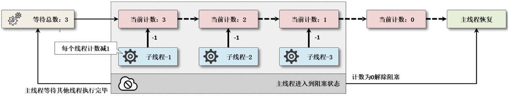

**CountDownLatch 常用方法如下**：

| 方法                                       | 描述                                                         |
| ------------------------------------------ | ------------------------------------------------------------ |
| CountDownLatch(int count)                  | 创建一个CountDownLatch对象，初始计数为指定值。               |
| void await()                               | 使当前线程等待计数器达到零，如果计数器为零则立即返回，否则阻塞等待。 |
| boolean await(long timeout, TimeUnit unit) | 使当前线程等待计数器达到零，如果计数器为零则立即返回，否则最多等待指定的时间。 |
| void countDown()                           | 递减计数器的值。                                             |
| long getCount()                            | 返回当前计数器的值。                                         |
| String toString()                          | 返回CountDownLatch对象的字符串表示。                         |

操作示例 1：使用 CountDownLatch 计数统计

```java
import java.util.concurrent.CountDownLatch;
import java.util.concurrent.TimeUnit;

public class JavaAPIDemo {
    public static void main(String[] args) throws Exception {
        CountDownLatch latch = new CountDownLatch(3); // 总共的等待的数量为3
        for (int x = 0; x < 3; x++) {
            new Thread(() -> {
                try {
                    TimeUnit.SECONDS.sleep(1);
                } catch (InterruptedException e) {
                    e.printStackTrace();
                }
                System.out.printf("【%s】到达，并且已上车%n", Thread.currentThread().getName());
                latch.countDown(); // 减1
            }, "游客 - " + x).start();
        }
        latch.await(); // 等待计数为0后再解除阻塞
        System.out.println("【主线程】所有的旅客都到齐了，开车走人，去下一个景点购物消费。");
    }
}
```

```java
【游客 - 0】到达，并且已上车
【游客 - 2】到达，并且已上车
【游客 - 1】到达，并且已上车
【主线程】所有的旅客都到齐了，开车走人，去下一个景点购物消费。
```

需要注意的是，由于 CountDownLatch 没有所谓的公平与非公平的机制，所以其内部只是创建了一个 Sync 子类，所以在该类的构造方法之中仅仅只是提供了一个 Sync（AQS子类）对象实例化。

```java
public CountDownLatch(int count) {
    if (count < 0) throw new IllegalArgumentException("count < 0");
    this.sync = new Sync(count);
}
```

> **注意：**CountDownLatch 的初始计数值一旦降到 0，无法重置。如果需要重置，可以考虑使用 CyclicBarrier。


## 3、CyclicBarrier 循环栅栏

CyclicBarrier 可以保证多个线程达到某一个公共屏障点（Common Barier Point）的时候才进行执行，如果没有达到此屏障点，那么线程将持续等待。

CyclicBarrier 的实现就好比栅栏一样，这样可以保证若干个线程的并行执行，同时还可以利用方法更新屏障点的状态进行更加方便的控制。

Barrier 表示的是一个栅栏，而 Cyclic 表示的是一个循环概念。下面描述一个大家常见的场景，就是说，此时有一个双人的飞车娱乐项目，必须达到2个人才能启动出发。

**CyclicBarrier 常用方法如下**：

| 方法名称                                           | 描述                                                         |
| -------------------------------------------------- | ------------------------------------------------------------ |
| CyclicBarrier(int parties)                         | 创建 CyclicBarrier，它将在给定数量的参与方（线程）等待时触发，并且在障碍触发时不执行预定义的操作。 |
| CyclicBarrier(int parties, Runnable barrierAction) | 创建 CyclicBarrier，当给定数量的参与方（线程）等待它时，它将触发，并在触发障碍时执行给定的障碍操作，由进入障碍的最后一个线程执行。 |
| int await()                                        | 在所有参与者线程都调用此方法之前，当前线程将一直阻塞。一旦足够数量的线程调用此方法，屏障将打开，线程将被释放，并执行可选的屏障动作。返回到达屏障的线程在等待中的位置。 |
| int await(long timeout, TimeUnit unit)             | 在所有参与者线程都调用此方法之前，当前线程将一直阻塞，直到达到超时时间或足够数量的线程调用此方法，屏障将打开，线程将被释放，并执行可选的屏障动作。返回到达屏障的线程在等待中的位置。 |
| int getNumberWaiting()                             | 返回当前在屏障处等待的参与方数量。                           |
| int getParties()                                   | 返回在构造函数中指定的参与者数量。                           |
| boolean isBroken()                                 | 返回屏障是否处于损坏状态。损坏状态意味着其中一个参与者线程在屏障处等待时被中断。 |
| void reset()                                       | 重置屏障，使其恢复到初始状态。在屏障处等待的所有线程都将抛出BrokenBarrierException。 |

操作示例 1：观察 CyclicBarrier 进行等待处理

```java
import java.util.concurrent.CyclicBarrier;
import java.util.concurrent.TimeUnit;

public class JavaAPIDemo {
    public static void main(String[] args) {
        // 现在设置的栅栏的数量为2，凑够2个线程就进行触发
        CyclicBarrier barrier = new CyclicBarrier(2);
        for (int x = 0; x < 3; x++) {   // 创建3个线程
            new Thread(() -> {
                try {
                    System.out.printf("【Barrier - 等待开始】当前的线程名称：%s%n", 
                                      Thread.currentThread().getName());
                    TimeUnit.SECONDS.sleep(2); // 模拟业务延迟
                    barrier.await(); // 等待，凑够了2个等待的线程
                    System.err.printf("〖Barrier - 业务处理完毕〗当前的线程名称：%s%n", 
                                      Thread.currentThread().getName());
                } catch (Exception e) {
                    e.printStackTrace();
                }
            }, "执行者 - " + x).start();
        }
    }
}
```

```java
【Barrier - 等待开始】当前的线程名称：执行者 - 0
【Barrier - 等待开始】当前的线程名称：执行者 - 2
【Barrier - 等待开始】当前的线程名称：执行者 - 1
〖Barrier - 业务处理完毕〗当前的线程名称：执行者 - 1
〖Barrier - 业务处理完毕〗当前的线程名称：执行者 - 0
```

> 如果不想一直等待可以设置一个超时时间，则超过了等待时间会报出“**TimeoutException**”异常：

操作示例 2：观察 CyclicBarrier 进行等待处理，并且设置等待超时时间

```java
import java.util.concurrent.CyclicBarrier;
import java.util.concurrent.TimeUnit;

public class JavaAPIDemo {
    public static void main(String[] args) {
        // 现在设置的栅栏的数量为2，凑够2个线程就进行触发
        CyclicBarrier barrier = new CyclicBarrier(2);
        for (int x = 0; x < 3; x++) {   // 创建3个线程
            new Thread(() -> {
                try {
                    System.out.printf("【Barrier - 等待开始】当前的线程名称：%s%n", 
                                      Thread.currentThread().getName());
                    TimeUnit.SECONDS.sleep(2); // 模拟业务延迟
                    barrier.await(5,TimeUnit.SECONDS); // 等待处理
                    System.err.printf("〖Barrier - 业务处理完毕〗当前的线程名称：%s%n", 
                                      Thread.currentThread().getName());
                } catch (Exception e) {
                    e.printStackTrace();
                }
            }, "执行者 - " + x).start();
        }
    }
}
```

```java
【Barrier - 等待开始】当前的线程名称：执行者 - 0
【Barrier - 等待开始】当前的线程名称：执行者 - 2
【Barrier - 等待开始】当前的线程名称：执行者 - 1
〖Barrier - 业务处理完毕〗当前的线程名称：执行者 - 1
〖Barrier - 业务处理完毕〗当前的线程名称：执行者 - 2
java.util.concurrent.TimeoutException
```

操作示例 3：使用 CyclicBarrier 模拟阶段化处理

```java
import java.util.concurrent.CyclicBarrier;
import java.util.concurrent.TimeUnit;

public class JavaAPIDemo {
    public static void main(String[] args) {
        // 现在设置的栅栏的数量为2，凑够2个线程就进行触发
        CyclicBarrier barrier = new CyclicBarrier(2);
        for (int x = 0; x < 2; x++) {   // 创建3个线程
            new Thread(() -> {
                try {
                    System.out.printf("【Barrier-1 - 等待开始】当前的线程名称：%s%n", 
                                      Thread.currentThread().getName());
                    TimeUnit.SECONDS.sleep(2); // 模拟业务延迟
                    barrier.await(); // 等待，凑够了2个等待的线程
                    System.err.printf("〖Barrier-1 - 业务处理完毕〗当前的线程名称：%s%n", 
                                      Thread.currentThread().getName());

                    barrier.await();

                    System.out.printf("【Barrier-2 - 等待开始】当前的线程名称：%s%n", 
                                      Thread.currentThread().getName());
                    TimeUnit.SECONDS.sleep(2); // 模拟业务延迟
                    barrier.await(); // 等待，凑够了2个等待的线程
                    System.err.printf("〖Barrier-2 - 业务处理完毕〗当前的线程名称：%s%n", 
                                      Thread.currentThread().getName());
                } catch (Exception e) {
                    e.printStackTrace();
                }
            }, "执行者 - " + x).start();
        }
    }
}
```

```java
【Barrier-1 - 等待开始】当前的线程名称：执行者 - 0
【Barrier-1 - 等待开始】当前的线程名称：执行者 - 1
〖Barrier-1 - 业务处理完毕〗当前的线程名称：执行者 - 1
〖Barrier-1 - 业务处理完毕〗当前的线程名称：执行者 - 0
【Barrier-2 - 等待开始】当前的线程名称：执行者 - 0
【Barrier-2 - 等待开始】当前的线程名称：执行者 - 1
〖Barrier-2 - 业务处理完毕〗当前的线程名称：执行者 - 0
〖Barrier-2 - 业务处理完毕〗当前的线程名称：执行者 - 1
```

除了以上这种傻傻的等待机制之外，还可以进行一些栅栏内部操作统计的操作，例如：实现统计的重置。

操作示例 4：进行栅栏统计重置处理

```java
import java.util.concurrent.CyclicBarrier;
import java.util.concurrent.TimeUnit;

public class JavaAPIDemo {
    public static void main(String[] args) {
        // 现在设置的栅栏的数量为2，凑够2个线程就进行触发
        CyclicBarrier barrier = new CyclicBarrier(2);
        for (int x = 0; x < 3; x++) {   // 创建3个线程
            final int temp = x; // 留给内部类使用
            new Thread(() -> {
                try {
                    System.out.printf("【Barrier - 等待开始】当前的线程名称：%s%n", 
                                      Thread.currentThread().getName());
                    TimeUnit.SECONDS.sleep(2); // 模拟业务延迟
                    if (temp == 2) {    // 设置一个判断条件
                        barrier.reset(); // 重置
                    } else {
                        barrier.await(); // 等待，凑够了2个等待的线程
                    }
                    System.err.printf("〖Barrier - 业务处理完毕〗当前的线程名称：%s%n", 
                                      Thread.currentThread().getName());
                } catch (Exception e) {
                    e.printStackTrace();
                }
            }, "执行者 - " + x).start();
        }
    }
}
```

```java
【Barrier - 等待开始】当前的线程名称：执行者 - 0
【Barrier - 等待开始】当前的线程名称：执行者 - 2
【Barrier - 等待开始】当前的线程名称：执行者 - 1
〖Barrier - 业务处理完毕〗当前的线程名称：执行者 - 2
〖Barrier - 业务处理完毕〗当前的线程名称：执行者 - 1
〖Barrier - 业务处理完毕〗当前的线程名称：执行者 - 0
```

除了以上的机制之外，在 CyclicBarrier 之中还提供有一个完整线程任务的处理，当已经等待了足够的线程数量之后，可以触发另外一个子线程的运行。

```java
public int await() throws InterruptedException, BrokenBarrierException { // 描述的是达到屏障后的处理
    try {
        return dowait(false, 0L);
    } catch (TimeoutException toe) {
        throw new Error(toe); // cannot happen
    }
}
```

操作示例 5：设置达到屏障后的处理线程

```java
import java.util.concurrent.CyclicBarrier;
import java.util.concurrent.TimeUnit;

public class JavaAPIDemo {
    public static void main(String[] args) {
        // 现在设置的栅栏的数量为2，凑够2个线程就进行触发
        CyclicBarrier barrier = new CyclicBarrier(2, () -> {
            System.out.println("【屏障业务处理】两个子线程已就绪，可以开始执行屏障线程控制。");
        });
        for (int x = 0; x < 4; x++) {   // 创建4个线程
            new Thread(() -> {
                try {
                    System.out.printf("【Barrier - 等待开始】当前的线程名称：%s%n", 
                                      Thread.currentThread().getName());
                    TimeUnit.SECONDS.sleep(2); // 模拟业务延迟
                    barrier.await(); // 等待，凑够了2个等待的线程
                    System.err.printf("〖Barrier - 业务处理完毕〗当前的线程名称：%s%n", 
                                      Thread.currentThread().getName());
                } catch (Exception e) {
                    e.printStackTrace();
                }
            }, "执行者 - " + x).start();
        }
    }
}
```

```java
【Barrier - 等待开始】当前的线程名称：执行者 - 0
【Barrier - 等待开始】当前的线程名称：执行者 - 3
【Barrier - 等待开始】当前的线程名称：执行者 - 2
【Barrier - 等待开始】当前的线程名称：执行者 - 1
【屏障业务处理】两个子线程已就绪，可以开始执行屏障线程控制。
【屏障业务处理】两个子线程已就绪，可以开始执行屏障线程控制。
〖Barrier - 业务处理完毕〗当前的线程名称：执行者 - 3
〖Barrier - 业务处理完毕〗当前的线程名称：执行者 - 2
〖Barrier - 业务处理完毕〗当前的线程名称：执行者 - 1
〖Barrier - 业务处理完毕〗当前的线程名称：执行者 - 0
```

那么此时就实现了一个完整的屏障同步等待的处理机制，这样机制在以后如果某些操作需要凑够若干个线程才能够执行的场景下，一般都很好使用。

***

**面试题：请解释 CountDownLatch 与 CyclicBarrier 区别?**

- **CountDownlatch**：最大特征是进行一个数据减法的操作等待，所有的统计操作一旦开始之中就必须一直执行 countDown() 方法，如果等待个数不是0将被一直等待，并且无法重置
- **CyclicBarrier**：设置一个等待的临界点，并且可以有多个等待线程出现，只要满足了临界点触发了线程的执行代码后将重新开始进行计数处理操作，也可以直接利用 rese() 方法执行重置操作。


## 4、Exchanger 交换器

Exchanger 交换器，是 JDK1.5 时引入的一个同步器，从字面上就可以看出，这个类的主要作用是交换数据。Exchanger 有点类似于CyclicBarrier，我们知道 CyclicBarrier 是一个栅栏，到达栅栏的线程需要等待其它一定数量的线程到达后，才能通过栅栏。而 Exchanger 可以看成是一个双向栅栏。

在整个多线程之中最重要的几个核心的案例：生产者与消费者、多线程的同步资源访问，而 Exchanger 就是一个交换空间，它主要的功能就是完成生产者和消费者之间数据传输处理。


**Exchanger 常用操作方法如下**：

| 方法                                         | 描述                                                         |
| -------------------------------------------- | ------------------------------------------------------------ |
| Exchanger()                                  | 创建一个新的 Exchanger 对象。                                |
| V exchange(V x)                              | 在两个线程之间交换数据。当前线程将数据传递给另一个线程，并接收另一个线程传递过来的数据。 |
| V exchange(V x, long timeout, TimeUnit unit) | 在两个线程之间交换数据，具有超时机制。当前线程将数据传递给另一个线程，并接收另一个线程传递过来的数据。 |

操作示例 1：使用 Exchanger 来实现生产者与消费者模型

```java
import java.util.concurrent.Exchanger;
import java.util.concurrent.TimeUnit;

public class JavaAPIDemo {
    public static void main(String[] args) {
        int repeat = 10; // 定义生产和消费的次数
        Exchanger<String> exchanger = new Exchanger<>();
        new Thread(() -> {
            for (int x = 0; x < repeat; x++) {  // 生产的次数
                String info; // 保存最终的数据
                if (x % 2 == 0) {   // 奇偶数判断
                    info = "Java编程训练营";
                } else {
                    info = "Python编程训练营";
                }
                try {
                    TimeUnit.SECONDS.sleep(1); // 模拟延迟
                    exchanger.exchange(info); // 数据存储
                    System.out.printf("【%s】%s%n", Thread.currentThread().getName(), info);
                } catch (InterruptedException ignored) {
                }
            }
        }, "生产者").start();
        new Thread(() -> {
            for (int x = 0; x < repeat; x++) {  // 消费的次数
                try {
                    TimeUnit.SECONDS.sleep(2); // 模拟延迟
                    String info = exchanger.exchange(null); // 数据获取
                    System.err.printf("〖%s〗%s%n", Thread.currentThread().getName(), info);
                } catch (InterruptedException ignored) {
                }
            }
        }, "消费者").start();
    }
}
```

```java
【生产者】Java编程训练营
〖消费者〗Java编程训练营
【生产者】Python编程训练营
〖消费者〗Python编程训练营
〖消费者〗Java编程训练营
【生产者】Java编程训练营
〖消费者〗Python编程训练营
【生产者】Python编程训练营
〖消费者〗Java编程训练营
【生产者】Java编程训练营
【生产者】Python编程训练营
〖消费者〗Python编程训练营
【生产者】Java编程训练营
〖消费者〗Java编程训练营
〖消费者〗Python编程训练营
【生产者】Python编程训练营
【生产者】Java编程训练营
〖消费者〗Java编程训练营
〖消费者〗Python编程训练营
【生产者】Python编程训练营
```

在之前要想实现同样的功能，需要编写一个处理类，而后再基于 synchronized 以及 Object 类之中的 wait()、notify() 等方法才能够实现的功能，现在直接通过 Exchanger 就可以完成了，而后在该类实现过程之中全部都是基于 Node 的形式实现数据存储的，由于 Node 与 ThreadLocal 有关，所以每次操作的时候都可以获得到当前线程下保存的数据项。


## 5、Phaser 多阶段栅栏 / 阶段器

### 1、简单介绍

Phaser 是 JDK1.7 开始引入的一个同步工具类，主要适用于一些需要分阶段的任务的处理。可以理解为 CountDownLatch 与 CyclicBarrier 的功能集合，同时又支持有良好的分层计算（分支计算处理）能力。Phaser 可以应用在很多场景，如多线程数据处理、任务拆分等。

Phaser 相较于 CyclicBarrier 和 CountDownLatch，具有更高的灵活性：

- 动态注册与注销：Phaser允许在运行时动态地增加或减少参与者，而CyclicBarrier和CountDownLatch在创建时就需要确定参与者数量。
- 多阶段任务同步：Phaser支持多个阶段任务的同步，每个阶段可以有不同数量的参与者。而CyclicBarrier只支持一个阶段，CountDownLatch只支持一个倒计时阶段。
- 自定义行为：Phaser 的 onAdvance() 方法可以在每个阶段结束时执行自定义行为，提供了更多的扩展性。

同时 CountDownLatch、CyclicBarrier 和 Phaser 又被称为：Java 线程同步三剑客。

| 同步器         | 作用                                                         |
| -------------- | ------------------------------------------------------------ |
| CountDownLatch | 倒数计数器。初始时设定计数器值，线程可以在计数器上等待，当计数器值归0后，所有等待的线程继续执行 |
| CyclicBarrier  | 循环栅栏。初始时设定参与线程数，当线程到达栅栏后，会等待其它线程的到达，当到达栅栏的总数满足指定数后，所有等待的线程继续执行 |
| Phaser         | 多阶段栅栏。可以在初始时设定参与线程数，也可以中途注册/注销参与者，当到达的参与者数量满足栅栏设定的数量后，会进行阶段升级（advance） |

尽管 Phaser 具有更高的灵活性，但在某些特定场景下，CyclicBarrier 和 CountDownLatch 可能更适用。例如，当同步点是固定数量的线程且没有多阶段任务时，使用 CyclicBarrier 可能更简单。而在需要一个倒计时门闩时，使用 CountDownLatch 更直观。

以下是一些常见的 Phaser 应用场景：

1. 多线程任务分配：Phaser 可以用于将复杂的任务分配给多个线程执行，并协调线程间的合作。
2. 多级任务流程：Phaser 可以用于实现多级任务流程，在每一级任务完成后触发下一级任务的开始。
3. 模拟并行计算：Phaser 可以用于模拟并行计算，协调多个线程间的工作。
4. 阶段性任务：Phaser 可以用于实现阶段性任务，在每一阶段任务完成后触发下一阶段任务的开始。


### 2、阶段概念

#### 1、phase（阶段）

我们知道，在 CyclicBarrier 中，只有一个栅栏，线程在到达栅栏后会等待其它线程的到达。

Phaser 也有栅栏，在 Phaser 中，栅栏的名称叫做 phase（阶段），在任意时间点，Phaser 只处于某一个 phase（阶段），初始阶段为0，最大达到Integerr.MAX_VALUE，然后再次归零。当所有 parties 参与者都到达后， phase 值会递增。

如果之前学习过 CyclicBarrier 就会知道，Phaser 中的 phase（阶段）这个概念其实和 CyclicBarrier 中的 Generation 很相似，只不过 Generation 没有计数。


#### 2、parties（参与者）

parties（参与者）其实就是 CyclicBarrier 中的参与线程的概念。

CyclicBarrier 中的参与者在初始构造指定后就不能变更，而 Phaser 既可以在初始构造时指定参与者的数量，也可以中途通过register、bulkRegister、arriveAndDeregister 等方法注册于注销参与者。


#### 3、arrive（到达） / advance（进阶）

Phaser 注册完 parties（参与者） 之后，参与者的初始状态是 unarrived 的，当参与者 到达（arrive） 当前阶段（phase）后，状态就会变成 arrived 。当阶段的到达参与者数满足条件后（注册的数量等于到达的数量），阶段就会发生 进阶（advance）：也就是 phase 值 + 1。


#### 4、Termination（终止）

代表当前 Phaser 对象达到终止状态，有点类似于 CyclicBarrier 中的栅栏被破坏的概念。


#### 5、Tiering（分层）

Phaser 支持 分层（Tiering）： 一种树形结构，通过构造函数可以指定当前待构造的 Phaser 对象的父结点。之所以引入 Tiering ，是因为当一个 Phaser 有大量 参与者（parties） 的时候，内部的同步操作会使性能急剧下降，而分层可以降低竞争，从而减小因同步导致的额外开销。

在一个分层 Phasers 的树结构中，注册和撤销子 Phaser 或父 Phaser 是自动被管理的。当一个 Phaser 的 参与者（parties） 数量变成 0 时，如果有该 Phaser 有父结点，就会将它从父结点中溢移除。

关于 Phaser 的分层，后续我们在讲 Phaser 原理时会进一步讨论。


### 3、常用方法

#### 1、核心 API

| 方法名称                                           | 描述                                                         |
| -------------------------------------------------- | ------------------------------------------------------------ |
| **构造方法**：                                     |                                                              |
| Phaser()                                           | 创建Phaser对象，初始参与者数量为0.                           |
| Phaser(int parties)                                | 创建Phaser对象，初始参与者数量为指定值.                      |
| Phaser(Phaser parent)                              | 创建Phaser对象，作为指定父Phaser的子Phaser.                  |
| Phaser(Phaser parent, int parties)                 | 创建Phaser对象，作为指定父Phaser的子Phaser，初始参与者数量为指定值. |
| **增减参与任务数方法**：                           |                                                              |
| int register()                                     | 动态注册一个新的参与者，增加参与者数量，并返回分配的相对阶段号. |
| int bulkRegister(int parties)                      | 动态注册多个新的参与者，增加参与者数量，并返回分配的相对阶段号. |
| int arriveAndDeregister()                          | 通知到达并注销当前线程，不会使线程阻塞，返回当前阶段号.      |
| int arriveAndDeregister(int registeredParties)     | 通知到达并注销指定数量的参与者，返回当前阶段号.              |
| **到达、等待方法**：                               |                                                              |
| int arrive()                                       | 通知到达，但不会使线程阻塞，返回当前阶段号.                  |
| int arriveAndAwaitAdvance()                        | 通知到达并等待其他参与者到达，返回当前阶段号.                |
| int awaitAdvance(int phase)                        | 在指定阶段等待，必须是当前阶段才有效.                        |
| int awaitAdvanceInterruptibly(int phase)           | 等待指定阶段的到达，允许被中断，返回当前阶段号.              |
| int awaitAdvanceInterruptibly(int, long, TimeUnit) | 同上，并增加了超时时间.                                      |
| **查询任务数与阶段数**：                           |                                                              |
| int getPhase()                                     | 返回当前阶段号.                                              |
| long getRegisteredParties()                        | 返回当前注册的参与者数量.                                    |
| int getArrivedParties()                            | 返回已经到达的参与者数量.                                    |
| int getUnarrivedParties()                          | 返回还未到达的参与者数量.                                    |
| boolean isTerminated()                             | 检查Phaser是否终止，只有当party的数量是0或者调用forceTermination时才会结束. |
| **终止方法**：                                     |                                                              |
| void forceTermination()                            | 强制终止Phaser，使其进入终止状态，未完成的参与者将被唤醒.    |
| onAdvance(int phase, int registeredParties)        | 重写该方法来增加阶段到达动作，该方法返回true将终结Phaser对象. |


#### 2、入门案例

在 Phaser 中是根据**阶段（phase）**的概念来进行处理的，所有的阶段需要达到指定的参与者线程之后才可以进行阶段的进阶处理，现在假设定义了两个参与者，则其进阶过程是在两个参与者线程全部达到之后进行的。


操作示例 1：所有的执行阶段的控制，全部都是由 Phaser 类来完成处理的，每当触发了任务的执行，就表示阶段的增加（+1 功能）

```java
import java.util.concurrent.Phaser;
import java.util.concurrent.TimeUnit;

public class JavaAPIDemo {
    public static void main(String[] args) throws InterruptedException {
        Phaser phaser = new Phaser(2); // 设置为与线程数量相匹配
        System.out.println("【Phaser阶段1】" + phaser.getPhase()); // 初始阶段
        for (int x = 0; x < 2; x++) {   // 循环创建线程
            TimeUnit.SECONDS.sleep(1);
            new Thread(() -> {
                System.out.printf("【%s】我已就位，等待下一步的命令。%n", Thread.currentThread().getName());
                phaser.arriveAndAwaitAdvance(); // Phaser就位，拥有线程等待
                System.out.printf("【%s】人员齐备，准备执行新的任务。%n", Thread.currentThread().getName());
            }, "士兵 - " + x).start();
        }
        // TimeUnit.SECONDS.sleep(3); // 等待一下再执行，使用下面等待阶段更加合适
        phaser.awaitAdvance(phaser.getPhase()); // 确保在输出第二个阶段时，所有线程都已经完成
        System.out.println("【Phaser阶段2】" + phaser.getPhase()); // 第二个阶段
    }
}
```

```java
【Phaser阶段1】0
【士兵 - 0】我已就位，等待下一步的命令。
【士兵 - 1】我已就位，等待下一步的命令。
【士兵 - 1】人员齐备，准备执行新的任务。
【士兵 - 0】人员齐备，准备执行新的任务。
【Phaser阶段2】1
```

操作示例 2：通过如下案例了解整个 Phaser 的流程

```java
import java.util.concurrent.Phaser;
import java.util.concurrent.TimeUnit;

public class JavaAPIDemo {
    public static void main(String[] args) throws InterruptedException {
        // 初始参与者数量为5
        Phaser phaser = new Phaser(5);
        // 返回当前阶段号
        System.out.println("当前的阶段: " + phaser.getPhase());
        // 返回当前注册的参与者数量
        System.out.println("注册线程数: " + phaser.getRegisteredParties());
        // 向phaser注册一个线程
        phaser.register();
        System.out.println("注册线程数: " + phaser.getRegisteredParties());
        // 向phaser注册多个线程，批量注册
        phaser.bulkRegister(4);
        System.out.println("注册线程数: " + phaser.getRegisteredParties());

        new Thread(() -> {
            // 到达且等待
            phaser.arriveAndAwaitAdvance();
            System.out.println(Thread.currentThread().getName() + ": 执行");
        }, "子线程-1").start();

        new Thread(() -> {
            // 到达不等待，从phaser中注销一个线程
            phaser.arriveAndDeregister();
            System.out.println(Thread.currentThread().getName() + ": 执行");
        }, "子线程-2").start();

        TimeUnit.SECONDS.sleep(3);

        System.out.println("已到达线程数: " + phaser.getArrivedParties());
        System.out.println("未到达线程数: " + phaser.getUnarrivedParties());

        System.out.println("Phaser是否结束: " + phaser.isTerminated());
        phaser.forceTermination();
        System.out.println("Phaser是否结束: " + phaser.isTerminated());
    }
}
```

```java
当前的阶段: 0
注册线程数: 5
注册线程数: 6
注册线程数: 10
子线程-2: 执行
已到达线程数: 1
未到达线程数: 8
Phaser是否结束: false
子线程-1: 执行
Phaser是否结束: true
```


#### 3、arriveAndAwaitAdvance 方法解析

arriveAndAwaitAdvance() 是 Phaser 中一个重要实现阻塞的 API，其实 arriveAndAwaitAdvance 是由 arrive 方法和 awaitAdvance 方法合并而来，两个方法的作用分别为

- arrive：到达屏障但不阻塞，返回值为到达的阶段号。
- awaitAdvance(int)：接收一个 int 值的阶段号，在指定的屏障处阻塞。

```java
import java.util.Random;
import java.util.concurrent.Phaser;
import java.util.concurrent.TimeUnit;

public class JavaAPIDemo {
    public static Random random = new Random(System.currentTimeMillis());

    public static void main(String[] args) {
        Phaser phaser = new Phaser(5);
        for (int i = 0; i < 5; i++) {
            new Task(i, phaser).start();
        }
        phaser.register();
        // 主线程需要调用arrive的原因是主线程注册的第六个线程还未到达，需要手动到达，才能调用awaitAdvance阻塞屏障
        phaser.arrive();
        // 因为Phaser线程数为6，所以即使5个线程已经到达，但是还差主线程的一个，目前阶段数就是0
        phaser.awaitAdvance(0);
        System.out.println("all task is end");
    }

    static class Task extends Thread {
        Phaser phaser;

        public Task(int num, Phaser phaser) {
            super("Thread--" + num);
            this.phaser = phaser;
        }

        @Override
        public void run() {
            try {
                System.out.println(Thread.currentThread().getName() + "===task1 is start");
                TimeUnit.SECONDS.sleep(random.nextInt(3));
                System.out.println(Thread.currentThread().getName() + "===task1 is end");

                // 到达且不等待
                phaser.arrive();

                System.out.println(Thread.currentThread().getName() + "===task2 is start");
                TimeUnit.SECONDS.sleep(random.nextInt(3));
                System.out.println(Thread.currentThread().getName() + "===task2 is end");
            } catch (InterruptedException e) {
                e.printStackTrace();
            }
        }
    }
}
```

```java
Thread--2===task1 is start
Thread--4===task1 is start
Thread--0===task1 is start
Thread--1===task1 is start
Thread--3===task1 is start
Thread--2===task1 is end
Thread--3===task1 is end
Thread--2===task2 is start
Thread--3===task2 is start
Thread--1===task1 is end
Thread--0===task1 is end
Thread--4===task1 is end
Thread--0===task2 is start
Thread--1===task2 is start
Thread--4===task2 is start
Thread--0===task2 is end
all task is end
Thread--2===task2 is end
Thread--3===task2 is end
Thread--1===task2 is end
Thread--4===task2 is end
```


#### 4、awaitAdvanceInterruptibly 方法解析

我们需要特别注意的就是 Phaser 所有方法中只有 awaitAdvanceInterruptibly 是响应中断的，其余全部不会响应中断所以不需要对其进行异常处理，演示如下：

```java
import java.util.concurrent.Phaser;

public class JavaAPIDemo {
    public static void main(String[] args) {
        Phaser phaser = new Phaser(3);

        Thread T1 = new Thread(() -> {
            try {
                phaser.awaitAdvanceInterruptibly(phaser.getPhase());
            } catch (InterruptedException e) {
                System.out.println("中断异常");
                e.printStackTrace();
            }
            // phaser.arriveAndAwaitAdvance();
        });

        T1.start();
        T1.interrupt();
        phaser.arriveAndAwaitAdvance();
    }
}
```

```java
中断异常
java.lang.InterruptedException
	at java.base/java.util.concurrent.Phaser.awaitAdvanceInterruptibly(Phaser.java:755)
	at com.example.springboot.tech.test.JavaAPIDemo.lambda$main$0(JavaAPIDemo.java:11)
	at java.base/java.lang.Thread.run(Thread.java:833)
```


### 4、实战应用

#### 1、Phaser 实现多阶段任务案例

操作示例 1：假设有一个三阶段的并行任务，分别是数据读取、数据处理和数据写入。可以使用 Phaser 来同步这三个阶段。

```java
import java.util.concurrent.Phaser;
import java.util.concurrent.TimeUnit;

public class JavaAPIDemo {
    public static void main(String[] args) throws InterruptedException {
        Phaser phaser = new Phaser(2) {
            @Override
            protected boolean onAdvance(int phase, int registeredParties) {
                switch (phase) {
                    case 0:
                        System.out.printf("数据读取完成: phase = %s, registeredParties = %s%n", 
                                          phase, registeredParties);
                        break;
                    case 1:
                        System.out.printf("数据处理完成: phase = %s, registeredParties = %s%n", 
                                          phase, registeredParties);
                        break;
                    case 2:
                        System.out.printf("数据写入完成: phase = %s, registeredParties = %s%n", 
                                          phase, registeredParties);
                        break;

                }
                // 判断是否只剩下一个主线程，如果是，返回true,代表终止
                return phase == 2 || registeredParties == 0;
            }
        };
        for (int x = 0; x < 2; x++) {   // 循环创建线程
            new Thread(() -> {
                // 阶段1：数据读取
                System.out.printf("【%s】阶段1：数据读取，执行readData()%n", 
                                  Thread.currentThread().getName());
                phaser.arriveAndAwaitAdvance();

                // 阶段2：数据处理
                System.out.printf("【%s】阶段2：数据处理，执行processData()%n", 
                                  Thread.currentThread().getName());
                phaser.arriveAndAwaitAdvance();

                // 阶段3：数据写入
                System.out.printf("【%s】阶段2：数据写入，执行writeData()%n", 
                                  Thread.currentThread().getName());
                phaser.arriveAndAwaitAdvance();
            }, "线程-" + x).start();
        }
    }
}
```

```java
【线程-0】阶段1：数据读取，执行readData()
【线程-1】阶段1：数据读取，执行readData()
数据读取完成: phase = 0, registeredParties = 2
【线程-0】阶段2：数据处理，执行processData()
【线程-1】阶段2：数据处理，执行processData()
数据处理完成: phase = 1, registeredParties = 2
【线程-1】阶段2：数据写入，执行writeData()
【线程-0】阶段2：数据写入，执行writeData()
数据写入完成: phase = 2, registeredParties = 2
```


#### 2、Phaser 代替 CountDownLatch

操作示例 1：Phaser 代替 CountDownLatch：arrive & awaitAdvance 替代 countDown & await

```java
import java.util.concurrent.Phaser;
import java.util.concurrent.TimeUnit;

public class JavaAPIDemo {
    public static void main(String[] args) throws InterruptedException {
        Phaser phaser = new Phaser(2); // 定义2个任务
        for (int x = 0; x < 2; x++) {   // 循环创建线程
            TimeUnit.SECONDS.sleep(2); // 延迟
            new Thread(() -> {
                // synchronized (phaser) {} arrive方法不是线程安全的，如果不加锁，方法可能会出现很难结束。
                System.out.printf("【%s】达到已经上车。%n", Thread.currentThread().getName());
                phaser.arrive(); // 等价于countDown()方法
            }, "游客 - " + x).start();
        }
        phaser.awaitAdvance(phaser.getPhase()); // 等待达到阶段, 等价于countDownLatch.await()方法
        System.out.println("【主线程】人齐了，开车走人，下一个景点购物消费。");
    }
}
```

```java
【游客 - 0】达到已经上车。
【游客 - 1】达到已经上车。
【主线程】人齐了，开车走人，下一个景点购物消费。
```


#### 3、Phaser 代替 CyclicBarrier

操作示例 1：Phaser 代替 CyclicBarrier： arriveAndAwaitAdvance 代替 await

```java
import java.util.concurrent.Phaser;
import java.util.concurrent.TimeUnit;

public class JavaAPIDemo {
    public static void main(String[] args) throws InterruptedException {
        Phaser phaser = new Phaser(2); // 设置为与线程数量相匹配
        for (int x = 0; x < 2; x++) {   // 循环创建线程
            new Thread(() -> {
                System.out.printf("【%s】我已就位，等待下一步的命令。%n", Thread.currentThread().getName());
                phaser.arriveAndAwaitAdvance(); // Phaser就位，拥有线程等待. 等价于 cyclicBarrier.await()
                System.out.printf("【%s】人员齐备，准备执行新的任务。%n", Thread.currentThread().getName());
                phaser.arriveAndAwaitAdvance(); // Phaser就位，拥有线程等待. 等价于 cyclicBarrier.await()
                System.out.printf("【%s】任务结束，新的任务执行完毕。%n", Thread.currentThread().getName());
            }, "士兵 - " + x).start();
        }
    }
}
```

```java
【士兵 - 0】我已就位，等待下一步的命令。
【士兵 - 1】我已就位，等待下一步的命令。
【士兵 - 0】人员齐备，准备执行新的任务。
【士兵 - 1】人员齐备，准备执行新的任务。
【士兵 - 1】任务结束，新的任务执行完毕。
【士兵 - 0】任务结束，新的任务执行完毕。
```


#### 4、Phaser 让主线程等待子线程

操作示例 1：Phaser + CountDownLatch 操作，让主线程等待所有多阶段子线程执行完毕。

```java
import java.util.concurrent.CountDownLatch;
import java.util.concurrent.Phaser;

public class JavaAPIDemo {
    public static void main(String[] args) throws InterruptedException {
        Phaser phaser = new Phaser(2); // 设置为与线程数量相匹配
        CountDownLatch countDownLatch = new CountDownLatch(2);
        for (int x = 0; x < 2; x++) {   // 循环创建线程
            new Thread(() -> {
                System.out.printf("【%s】我已就位，等待下一步的命令。%n", Thread.currentThread().getName());
                phaser.arriveAndAwaitAdvance(); // Phaser就位，拥有线程等待
                System.out.printf("【%s】人员齐备，准备执行新的任务。%n", Thread.currentThread().getName());
                phaser.arriveAndAwaitAdvance(); // Phaser就位，拥有线程等待
                System.out.printf("【%s】任务结束，新的任务执行完毕。%n", Thread.currentThread().getName());
                countDownLatch.countDown(); // 主要为了让主线程等待子线程全部执行完毕
            }, "士兵 - " + x).start();
        }
        countDownLatch.await(); // 主线程执行结束
        System.out.println("主线程执行结束");
    }
}
```

```java
【士兵 - 1】我已就位，等待下一步的命令。
【士兵 - 0】我已就位，等待下一步的命令。
【士兵 - 1】人员齐备，准备执行新的任务。
【士兵 - 0】人员齐备，准备执行新的任务。
【士兵 - 0】任务结束，新的任务执行完毕。
【士兵 - 1】任务结束，新的任务执行完毕。
主线程执行结束
```

操作示例 2：使用 while (!phaser.isTerminated()) + 轮数控制 来等待子线程的完成，两者缺一不可，不推荐使用，编码复杂容易死循环。

```java
import java.util.concurrent.Phaser;

public class JavaAPIDemo {
    public static void main(String[] args) throws InterruptedException {
        Phaser phaser = new Phaser(2) {
            @Override
            protected boolean onAdvance(int phase, int registeredParties) {
                System.out.printf("【onAdvance()】phase = %s、registeredParties = %s%n",
                        phase, registeredParties);
                return phase == 2 || registeredParties == 0;
            }
        }; // 设置为与线程数量相匹配
        for (int x = 0; x < 2; x++) {   // 循环创建线程
            new Thread(() -> {
                while (!phaser.isTerminated()) {
                    System.out.printf("【%s】我已就位，等待下一步的命令。%n", Thread.currentThread().getName());
                    phaser.arriveAndAwaitAdvance(); // Phaser就位，拥有线程等待
                    System.out.printf("【%s】人员齐备，准备执行新的任务。%n", Thread.currentThread().getName());
                    phaser.arriveAndAwaitAdvance(); // Phaser就位，拥有线程等待
                }
            }, "士兵 - " + x).start();
        }
        phaser.register();
        while (!phaser.isTerminated()) {
            phaser.arriveAndAwaitAdvance();
        }
        System.out.println("主线程执行结束");
    }
}
```

```java
【士兵 - 0】我已就位，等待下一步的命令。
【士兵 - 1】我已就位，等待下一步的命令。
【onAdvance()】phase = 0、registeredParties = 3
【士兵 - 1】人员齐备，准备执行新的任务。
【士兵 - 0】人员齐备，准备执行新的任务。
【onAdvance()】phase = 1、registeredParties = 3
【士兵 - 0】我已就位，等待下一步的命令。
【士兵 - 1】我已就位，等待下一步的命令。
【onAdvance()】phase = 2、registeredParties = 3
【士兵 - 1】人员齐备，准备执行新的任务。
【士兵 - 0】人员齐备，准备执行新的任务。
主线程执行结束
```

操作示例 3：如果只有一个阶段的情况下可以使用 awaitAdvance() 方法等待解决（其实CountDownLatch更合适）

```java
import java.util.concurrent.Phaser;

public class JavaAPIDemo {
    public static void main(String[] args) {
        Phaser phaser = new Phaser();
        for (int i = 0; i < 2; i++) {
            phaser.register(); // 注册子线程
            new Thread(() -> {
                System.out.println(Thread.currentThread().getName() + ": 执行");
                phaser.arriveAndAwaitAdvance();
            }).start();
        }
        System.out.println(phaser.awaitAdvance(0));
        System.out.println("主线程结束");
    }
}
```

```java
Thread-1: 执行
Thread-0: 执行
1
主线程结束
```

操作示例 4：如果有多个阶段，可以使用主线程+arriveAndAwaitAdvance等待子线程完成。

```java
import java.util.concurrent.Phaser;

public class JavaAPIDemo {
    public static void main(String[] args) {
        // 初始化1个参与者，这个主要给主线程使用
        Phaser phaser = new Phaser(1);
        for (int i = 0; i < 2; i++) {
            phaser.register(); // 注册子线程
            new Thread(() -> {
                System.out.println(Thread.currentThread().getName() + ": 执行开始");
                phaser.arriveAndAwaitAdvance();
                System.out.println(Thread.currentThread().getName() + ": 执行完成");
                phaser.arriveAndAwaitAdvance();
            }).start();
        }
        phaser.arriveAndAwaitAdvance();
        System.out.println("主线程等待执行开始完成");
        phaser.arriveAndAwaitAdvance();
        System.out.println("主线程等待执行完成完成");
        System.out.println("主线程结束");
    }
}
```

```java
Thread-1: 执行开始
Thread-0: 执行开始
主线程等待执行开始完成
Thread-1: 执行完成
Thread-0: 执行完成
主线程等待执行完成完成
主线程结束
```


#### 5、Phaser 实现处理轮数的控制

可以发现每一次 Phaser 执行的时候都会存在有一些的处理阶段，那么可以考虑通过这个处理阶段来实现执行轮数的配置。

操作示例 1：通过 Phaser 控制任务的执行轮数，主要依靠重写 onAdvance() 方法实现。

```java
import java.util.concurrent.Phaser;

/**
 * 使用 Phaser 实现处理轮数的控制
 */
public class JavaAPIDemo {
    public static void main(String[] args) {
        int phases = 3;  // 定义阶段数
        int parties = 5; // 进入下一个阶段需要的参与数（线程数）
        // 自定义 onAdvance，可以在每个阶段结束时执行自定义行为
        Phaser phaser = new Phaser(parties) {
            @Override
            protected boolean onAdvance(int phase, int registeredParties) {
                System.out.println("阶段phase: " + (phase + 1) + " 执行完毕，registeredParties: " + registeredParties);
                return phase + 1 >= phases || registeredParties == 0; // 返回true就停止phase
            }
        };
        for (int i = 1; i <= parties; i++) {
            new Thread(() -> {
                for (int j = 1; j <= phases; j++) {
                    System.out.println(Thread.currentThread().getName() + " doing 阶段：" + j);
                    phaser.arriveAndAwaitAdvance();
                }
            }, "Thread-" + i).start();
        }
    }
}
```

```java
Thread-4 doing 阶段：1
Thread-3 doing 阶段：1
Thread-1 doing 阶段：1
Thread-2 doing 阶段：1
Thread-5 doing 阶段：1
阶段phase: 1 执行完毕，registeredParties: 5
Thread-5 doing 阶段：2
Thread-4 doing 阶段：2
Thread-3 doing 阶段：2
Thread-1 doing 阶段：2
Thread-2 doing 阶段：2
阶段phase: 2 执行完毕，registeredParties: 5
Thread-2 doing 阶段：3
Thread-4 doing 阶段：3
Thread-1 doing 阶段：3
Thread-5 doing 阶段：3
Thread-3 doing 阶段：3
阶段phase: 3 执行完毕，registeredParties: 5
```


#### 6、Phaser 实现任务层级划分

Phaser 支持分层功能，我们先来考虑下如何用利用 Phaser的分层来实现高并发时的优化，如果任务数持续增大，那么同步产生的开销会非常大，利用 Phaser 分层的功能，我们可以限定每个 Phaser 对象的最大使用线程（任务数），如下图：


可以看到，上述 Phasers 其实构成了一颗多叉树，如果任务数继续增多，还可以将 Phaser 的叶子结点继续分裂，然后将分裂出的子结点供工作线程使用。

Phaser 是一种更高级的多任务的处理，因为在整个的 Phaser 内部维持了一个链表。可以考虑通过链表的形式设置分层的 Phaser 处理，就相当于维持了一棵树的形式。

操作示例 1：Phaser 实现任务层级划分

```java
import java.util.concurrent.Phaser;

class Tasker implements Runnable { // 定义任务的处理线程
    private final Phaser phaser;

    public Tasker(Phaser phaser) {
        this.phaser = phaser;
        this.phaser.register(); // 将当前线程进行注册
    }

    @Override
    public void run() {
        while (!phaser.isTerminated()) { // 任务还在执行
            this.phaser.arriveAndAwaitAdvance(); // 等待其他参与者的线程
            // do something
            System.out.printf("【%s】业务处理。%n", Thread.currentThread().getName());
        }
    }
}

public class JavaAPIDemo {
    public static final int THRESHOLD = 4; // 定义每一个Phaser对应的任务数量

    public static void main(String[] args) {
        int repeat = 2; // 定义任务的重复的周期
        Phaser phaser = new Phaser() {
            @Override
            protected boolean onAdvance(int phase, int registeredParties) {
                System.out.printf("【onAdvance()处理】进阶处理操作，phase = %s、registeredParties = %s%n",
                        phase, registeredParties);
                return phase + 1 >= repeat || registeredParties == 0; // 终止处理
            }
        };
        Tasker[] tasters = new Tasker[10]; // 创建10个子任务
        build(tasters, 0, tasters.length, phaser); // 创建任务层级
        for (int x = 0; x < tasters.length; x++) { // 启动线程
            new Thread(tasters[x], "子线程 - " + x).start();
        }
    }

    private static void build(Tasker[] tasters, int low, int high, Phaser parent) {
        if ((high - low) > THRESHOLD) { // 层级的判断
            for (int x = low; x < high; x += THRESHOLD) {   // 每次进行2个任务的配置
                int limit = Math.min(x + THRESHOLD, high); // 获取最小值
                build(tasters, x, limit, new Phaser(parent)); // 定义层级
            }
        } else {
            for (int x = low; x < high; ++x) {  // 循环创建任务
                tasters[x] = new Tasker(parent); // 定义任务层级
            }
        }
    }
}
```

```java
【onAdvance()处理】进阶处理操作，phase = 0、registeredParties = 3
【子线程 - 7】业务处理。
【子线程 - 6】业务处理。
【子线程 - 5】业务处理。
【子线程 - 4】业务处理。
【子线程 - 2】业务处理。
【子线程 - 3】业务处理。
【子线程 - 0】业务处理。
【子线程 - 9】业务处理。
【子线程 - 8】业务处理。
【子线程 - 1】业务处理。
【onAdvance()处理】进阶处理操作，phase = 1、registeredParties = 3
【子线程 - 1】业务处理。
【子线程 - 7】业务处理。
【子线程 - 2】业务处理。
【子线程 - 9】业务处理。
【子线程 - 6】业务处理。
【子线程 - 8】业务处理。
【子线程 - 4】业务处理。
【子线程 - 3】业务处理。
【子线程 - 0】业务处理。
【子线程 - 5】业务处理。
```

所有的子节点之中的任务由子节点的 Phaser 处理，而后父节点的任务进行统一的阶段的调控，相当于实现了传统的分支任务的结构。


### 5、源码分析

#### 1、主要内部类

```java
static final class QNode implements ForkJoinPool.ManagedBlocker {
    final Phaser phaser;
    final int phase;
    final boolean interruptible;
    final boolean timed;
    boolean wasInterrupted;
    long nanos;
    final long deadline;
    volatile Thread thread; // nulled to cancel wait
    QNode next;

    QNode(Phaser phaser, int phase, boolean interruptible,
          boolean timed, long nanos) {
        this.phaser = phaser;
        this.phase = phase;
        this.interruptible = interruptible;
        this.nanos = nanos;
        this.timed = timed;
        this.deadline = timed ? System.nanoTime() + nanos : 0L;
        thread = Thread.currentThread();
    }
}
```

先完成的参与者放入队列中的节点，这里我们只需要关注thread和next两个属性即可，很明显这是一个单链表，存储着入队的线程。


#### 2、主要属性

```java
// 状态变量，用于存储当前阶段phase、参与者数parties、未完成的参与者数unarrived_count
private volatile long state;
// 最多可以有多少个参与者，即每个阶段最多有多少个任务
private static final int  MAX_PARTIES     = 0xffff;
// 最多可以有多少阶段
private static final int  MAX_PHASE       = Integer.MAX_VALUE;
// 参与者数量的偏移量
private static final int  PARTIES_SHIFT   = 16;
// 当前阶段的偏移量
private static final int  PHASE_SHIFT     = 32;
// 未完成的参与者数的掩码，低16位
private static final int  UNARRIVED_MASK  = 0xffff;      // to mask ints
// 参与者数，中间16位
private static final long PARTIES_MASK    = 0xffff0000L; // to mask longs
// counts的掩码，counts等于参与者数和未完成的参与者数的'|'操作
private static final long COUNTS_MASK     = 0xffffffffL;
private static final long TERMINATION_BIT = 1L << 63;

// 一次一个参与者完成
private static final int  ONE_ARRIVAL     = 1;
// 增加减少参与者时使用
private static final int  ONE_PARTY       = 1 << PARTIES_SHIFT;
// 减少参与者时使用
private static final int  ONE_DEREGISTER  = ONE_ARRIVAL|ONE_PARTY;
// 没有参与者时使用
private static final int  EMPTY           = 1;

// 用于求未完成参与者数量
private static int unarrivedOf(long s) {
    int counts = (int)s;
    return (counts == EMPTY) ? 0 : (counts & UNARRIVED_MASK);
}
// 用于求参与者数量（中间16位），注意int的位置
private static int partiesOf(long s) {
    return (int)s >>> PARTIES_SHIFT;
}
// 用于求阶段数（高32位），注意int的位置
private static int phaseOf(long s) {
    return (int)(s >>> PHASE_SHIFT);
}
// 已完成参与者的数量
private static int arrivedOf(long s) {
    int counts = (int)s; // 低32位
    return (counts == EMPTY) ? 0 : (counts >>> PARTIES_SHIFT) - (counts & UNARRIVED_MASK);
}
// 用于存储已完成参与者所在的线程，根据当前阶段的奇偶性选择不同的队列
private final AtomicReferenceevenQ;
private final AtomicReferenceoddQ;
```

主要属性为state和evenQ及oddQ：

1. state，状态变量，高32位存储当前阶段phase，中间16位存储参与者的数量，低16位存储未完成参与者的数量
2. evenQ和oddQ，已完成的参与者存储的队列，当最后一个参与者完成任务后唤醒队列中的参与者继续执行下一个阶段的任务，或者结束任务。


#### 3、构造方法

```java
public Phaser() {
    this(null, 0);
}

public Phaser(int parties) {
    this(null, parties);
}

public Phaser(Phaser parent) {
    this(parent, 0);
}

public Phaser(Phaser parent, int parties) {
    if (parties >>> PARTIES_SHIFT != 0)
        throw new IllegalArgumentException("Illegal number of parties");
    int phase = 0;
    this.parent = parent;
    if (parent != null) {
        final Phaser root = parent.root;
        this.root = root;
        this.evenQ = root.evenQ;
        this.oddQ = root.oddQ;
        if (parties != 0)
            phase = parent.doRegister(1);
    }
    else {
        this.root = this;
        this.evenQ = new AtomicReference();
        this.oddQ = new AtomicReference();
    }
    // 状态变量state的存储分为三段
    this.state = (parties == 0) ? (long)EMPTY :
        ((long)phase << PHASE_SHIFT) |
        ((long)parties << PARTIES_SHIFT) |
        ((long)parties);
}
```

构造函数中还有一个parent和root，这是用来构造多层级阶段的，不在本文的讨论范围之内，忽略之。

重点还是看state的赋值方式，高32位存储当前阶段phase，中间16位存储参与者的数量，低16位存储未完成参与者的数量。


#### 4、register() 方法

注册一个参与者，如果调用该方法时，onAdvance()方法正在执行，则该方法等待其执行完毕。

```java
public int register() {
    return doRegister(1);
}
private int doRegister(int registrations) {
    // state应该加的值，注意这里是相当于同时增加parties和unarrived
    long adjust = ((long)registrations << PARTIES_SHIFT) | registrations;
    final Phaser parent = this.parent;
    int phase;
    for (;;) {
        // state的值
        long s = (parent == null) ? state : reconcileState();
        // state的低32位，也就是parties和unarrived的值
        int counts = (int)s;
        // parties的值
        int parties = counts >>> PARTIES_SHIFT;
        // unarrived的值
        int unarrived = counts & UNARRIVED_MASK;
        // 检查是否溢出
        if (registrations > MAX_PARTIES - parties)
            throw new IllegalStateException(badRegister(s));
        // 当前阶段phase
        phase = (int)(s >>> PHASE_SHIFT);
        if (phase < 0)
            break;
        // 不是第一个参与者
        if (counts != EMPTY) {                  // not 1st registration
            if (parent == null || reconcileState() == s) {
                // unarrived等于0说明当前阶段正在执行onAdvance()方法，等待其执行完毕
                if (unarrived == 0)             // wait out advance
                    root.internalAwaitAdvance(phase, null);
                // 否则就修改state的值，增加adjust，如果成功就跳出循环
                else if (UNSAFE.compareAndSwapLong(this, stateOffset,
                                                   s, s + adjust))
                    break;
            }
        }
        // 是第一个参与者
        else if (parent == null) {              // 1st root registration
            // 计算state的值
            long next = ((long)phase << PHASE_SHIFT) | adjust;
            // 修改state的值，如果成功就跳出循环
            if (UNSAFE.compareAndSwapLong(this, stateOffset, s, next))
                break;
        }
        else {
            // 多层级阶段的处理方式
            synchronized (this) {               // 1st sub registration
                if (state == s) {               // recheck under lock
                    phase = parent.doRegister(1);
                    if (phase < 0)
                        break;
                    // finish registration whenever parent registration
                    // succeeded, even when racing with termination,
                    // since these are part of the same "transaction".
                    while (!UNSAFE.compareAndSwapLong
                           (this, stateOffset, s,
                            ((long)phase << PHASE_SHIFT) | adjust)) {
                        s = state;
                        phase = (int)(root.state >>> PHASE_SHIFT);
                        // assert (int)s == EMPTY;
                    }
                    break;
                }
            }
        }
    }
    return phase;
}
// 等待onAdvance()方法执行完毕
// 原理是先自旋一定次数，如果进入下一个阶段，这个方法直接就返回了，
// 如果自旋一定次数后还没有进入下一个阶段，则当前线程入队列，等待onAdvance()执行完毕唤醒
private int internalAwaitAdvance(int phase, QNode node) {
    // 保证队列为空
    releaseWaiters(phase-1);          // ensure old queue clean
    boolean queued = false;           // true when node is enqueued
    int lastUnarrived = 0;            // to increase spins upon change
    // 自旋的次数
    int spins = SPINS_PER_ARRIVAL;
    long s;
    int p;
    // 检查当前阶段是否变化，如果变化了说明进入下一个阶段了，这时候就没有必要自旋了
    while ((p = (int)((s = state) >>> PHASE_SHIFT)) == phase) {
        // 如果node为空，注册的时候传入的为空
        if (node == null) {           // spinning in noninterruptible mode
            // 未完成的参与者数量
            int unarrived = (int)s & UNARRIVED_MASK;
            // unarrived有变化，增加自旋次数
            if (unarrived != lastUnarrived &&
                (lastUnarrived = unarrived) < NCPU)
                spins += SPINS_PER_ARRIVAL;
            boolean interrupted = Thread.interrupted();
            // 自旋次数完了，则新建一个节点
            if (interrupted || --spins < 0) { // need node to record intr
                node = new QNode(this, phase, false, false, 0L);
                node.wasInterrupted = interrupted;
            }
        }
        else if (node.isReleasable()) // done or aborted
            break;
        else if (!queued) {           // push onto queue
            // 节点入队列
            AtomicReferencehead = (phase & 1) == 0 ? evenQ : oddQ;
            QNode q = node.next = head.get();
            if ((q == null || q.phase == phase) &&
                (int)(state >>> PHASE_SHIFT) == phase) // avoid stale enq
                queued = head.compareAndSet(q, node);
        }
        else {
            try {
                // 当前线程进入阻塞状态，跟调用LockSupport.park()一样，等待被唤醒
                ForkJoinPool.managedBlock(node);
            } catch (InterruptedException ie) {
                node.wasInterrupted = true;
            }
        }
    }
    
    // 到这里说明节点所在线程已经被唤醒了
    if (node != null) {
        // 置空节点中的线程
        if (node.thread != null)
            node.thread = null;       // avoid need for unpark()
        if (node.wasInterrupted && !node.interruptible)
            Thread.currentThread().interrupt();
        if (p == phase && (p = (int)(state >>> PHASE_SHIFT)) == phase)
            return abortWait(phase); // possibly clean up on abort
    }
    // 唤醒当前阶段阻塞着的线程
    releaseWaiters(phase);
    return p;
}
```

增加一个参与者总体的逻辑为：

1. 增加一个参与者，需要同时增加parties和unarrived两个数值，也就是state的中16位和低16位；
2. 如果是第一个参与者，则尝试原子更新state的值，如果成功了就退出；
3. 如果不是第一个参与者，则检查是不是在执行onAdvance()，如果是等待onAdvance()执行完成，如果否则尝试原子更新state的值，直到成功退出；
4. 等待onAdvance()完成是采用先自旋后进入队列排队的方式等待，减少线程上下文切换；


#### 5、arriveAndAwaitAdvance() 方法

当前线程当前阶段执行完毕，等待其它线程完成当前阶段。

如果当前线程是该阶段最后一个到达的，则当前线程会执行onAdvance()方法，并唤醒其它线程进入下一个阶段。

```java
public int arriveAndAwaitAdvance() {
    // Specialization of doArrive+awaitAdvance eliminating some reads/paths
    final Phaser root = this.root;
    for (;;) {
        // state的值
        long s = (root == this) ? state : reconcileState();
        // 当前阶段
        int phase = (int)(s >>> PHASE_SHIFT);
        if (phase < 0)
            return phase;
        // parties和unarrived的值
        int counts = (int)s;
        // unarrived的值（state的低16位）
        int unarrived = (counts == EMPTY) ? 0 : (counts & UNARRIVED_MASK);
        if (unarrived  1)
            // 这里是直接返回了，internalAwaitAdvance()方法的源码见register()方法解析
            return root.internalAwaitAdvance(phase, null);

        // 到这里说明是最后一个到达的参与者
        if (root != this)
            return parent.arriveAndAwaitAdvance();
        // n只保留了state中parties的部分，也就是中16位
        long n = s & PARTIES_MASK;  // base of next state
        // parties的值，即下一次需要到达的参与者数量
        int nextUnarrived = (int)n >>> PARTIES_SHIFT;
        // 执行onAdvance()方法，返回true表示下一阶段参与者数量为0了，也就是结束了
        if (onAdvance(phase, nextUnarrived))
            n |= TERMINATION_BIT;
        else if (nextUnarrived == 0)
            n |= EMPTY;
        else
            // n 加上unarrived的值
            n |= nextUnarrived;
        // 下一个阶段等待当前阶段加1
        int nextPhase = (phase + 1) & MAX_PHASE;
        // n 加上下一阶段的值
        n |= (long)nextPhase << PHASE_SHIFT;
        // 修改state的值为n
        if (!UNSAFE.compareAndSwapLong(this, stateOffset, s, n))
            return (int)(state >>> PHASE_SHIFT); // terminated
        // 唤醒其它参与者并进入下一个阶段
        releaseWaiters(phase);
        // 返回下一阶段的值
        return nextPhase;
    }
}
```

arriveAndAwaitAdvance 的大致逻辑为：

1. 修改state中unarrived部分的值减`1`；
2. 如果不是最后一个到达的，则调用internalAwaitAdvance()方法自旋或排队等待；
3. 如果是最后一个到达的，则调用onAdvance()方法，然后修改state的值为下一阶段对应的值，并唤醒其它等待的线程；
4. 返回下一阶段的值；


### 6、应用场景总结

#### 1、局限性及替代方案

尽管 Phaser 在多线程任务同步和阶段控制方面非常强大，但它也有一些局限性。以下是 Phaser 的局限性以及可能的替代方案。

1、局限性：学习曲线。

- 学习曲线：Phaser API 相对于其他同步工具类（CyclicBarrier / CountDownLatch）更加复杂。对于初学者或不熟悉 Phaser 的开发者来说，学习如何使用 Phaser 可能需要更多的时间和精力。
- 替代方案：在不需要 Phaser 的动态注册和多阶段任务同步特性时，可以考虑使用 CyclicBarrier 或 CountDownLatch。这两种工具类在某些场景下可能更简单易用。

2、局限性：性能开销

- 性能开销：Phaser 的动态注册和多阶段任务同步特性可能导致额外的性能开销，尤其是在高并发场景下。对于对性能要求较高的场景，Phaser 可能不是最佳选择。
- 替代方案：针对性能要求较高的场景，可以考虑使用 CyclicBarrier、CountDownLatch 或其他低层次的同步工具类（ReentrantLock、Semaphore 等）。

3、局限性：适用场景

- Phaser 虽然强大，但并不适用于所有场景。在有些场景下，其他同步工具类可能更为合适。
- 替代方案：根据实际项目需求，可以选择以下同步工具类：
  - CyclicBarrier：适用于固定数量的线程，且只有一个阶段的任务同步。
  - CountDownLatch：适用于倒计时门闩场景，当所有线程都完成任务后触发某个操作。
  - Semaphore：适用于限制并发线程数量的场景，如限制资源访问。

在实际项目中，应该根据具体需求和场景选择合适的同步工具类。在某些情况下，Phaser 可能是最佳选择；而在其他情况下，CyclicBarrier、CountDownLatch 或其他同步工具类可能更为合适。


#### 2、项目中的最佳实践

为了充分利用 Phaser 的特性并确保代码的可读性和可维护性，下面提供了一些在实际项目中使用 Phaser 的最佳实践。

1. 确保合理使用 Phaser：在选择 Phaser 作为同步工具时，确保你的应用场景适合使用 Phaser。Phaser 适用于需要多阶段任务同步和动态注册/取消注册参与者的场景。如果你的应用场景不需要这些特性，可以考虑使用 CyclicBarrier、CountDownLatch 或其他同步工具类。
2. 遵循 Phaser API 的规范：使用 Phaser 时，应遵循其 API 的规范。例如，使用 arriveAndAwaitAdvance() 等待其他参与者，使用 arriveAndDeregister() 取消注册等。遵循 API 规范可以确保代码的正确性和可读性。
3. 优雅地处理异常：在使用 Phaser 时，可能会遇到 InterruptedException 和其他异常。应确保在代码中优雅地处理这些异常，例如，使用 try-catch 语句捕获异常并进行适当的处理，而不是简单地忽略异常。
4. 与其他同步工具类结合使用：在实际项目中，可以考虑将 Phaser 与其他同步工具类结合使用，以满足复杂的同步需求。例如，在一个多阶段任务中，可以使用 Phaser 同步任务阶段，同时使用 Semaphore 限制每个阶段的并发线程数量。
5. 明确并发控制策略：在使用 Phaser 进行并发控制时，应明确并发控制策略，例如线程池大小、任务阶段划分等。明确的并发控制策略可以帮助你更好地理解代码，同时提高代码的可维护性。
6. 持续关注性能：在实际项目中使用 Phaser 时，应持续关注性能。如果发现性能瓶颈，可以考虑优化代码或更换同步工具类。在高并发场景下，性能可能是项目成功与否的关键因素。


### 7、参考文献 & 鸣谢

- 高级Java并发技巧：如何有效利用Phaser实现多阶段任务同步：https://www.51cto.com/article/751519.html
- Java多线程进阶（十八）—— J.U.C之synchronizer框架：CountDownLatch：https://www.tpvlog.com/article/34
- 源码分析：Phaser 之更灵活的同步屏障：https://www.bmabk.com/index.php/post/35373.html
- Java同步器之辅助类Phaser：https://www.cnblogs.com/ciel717/p/16190785.html


# 07、并发集合

并发容器关系图如下：


## 1、并发集合产生的背景

使用 J.U.C 进行项目开发的过程之中会存在有集合数据的操作，在多线程的使用环境之中，往往会对同一个集合进行数据的更新处理，那么下面可以观察一下具体的问题。

操作示例 1：以 ArrayList 类为例进行观察：

```java
import java.util.ArrayList;
import java.util.List;

public class JavaAPIDemo {
    public static void main(String[] args) {
        // ArrayList是一个基于数组的形式实现的集合存储，那么既然属于数组的形式，最终就需要考虑到索引的操作问题
        List<String> all = new ArrayList<>(); // 创建一个List集合
        for (int num = 0; num < 10; num++) {  // 创建10个线程
            new Thread(() -> {
                for (int x = 0; x < 10; x++) {  // 进行数据的循环更新操作
                    // 添加集合数据
                    all.add("【" + Thread.currentThread().getName() + "】www.xxx.com");
                    System.out.println(all); // 输出全部的数据内容
                }
            }, "集合操作线程 - " + num).start(); // 线程启动
        }
    }
}
```

```java
Exception in thread "集合操作线程 - 6" Exception in thread "集合操作线程 - 2" java.util.ConcurrentModificationException（"并发修改异常"）
	at java.base/java.util.ArrayList$Itr.checkForComodification(ArrayList.java:1013)
	at java.base/java.util.ArrayList$Itr.next(ArrayList.java:967)
	at java.base/java.util.AbstractCollection.toString(AbstractCollection.java:456)
	at java.base/java.lang.String.valueOf(String.java:4215)
	at java.base/java.io.PrintStream.println(PrintStream.java:1047)
```

在当前的设置的过程之中，既要通过 all.add() 增加数据，又需要通过 all.toString() 方法获取全部的数据内容，所以此时就有可能存在设计上的问题了。曾经分析过 ArrayList 的设计原理，这个设计原理部分存在有一个内部的 Itr 实现，这个实现继承了 lterable 接口，打开该内部类的源代码：

```java
private class Itr implements Iterator<E> {
    int cursor;       // index of next element to return
    int lastRet = -1; // index of last element returned; -1 if no such
    int expectedModCount = modCount; // 求模计算
}
```

可以发现在 ArrayList.Itr 类的内部提供有一个 modCount 属性，而这个属性是由 AbstractList 抽象类来定义的。

```java
public abstract class AbstractList<E> extends AbstractCollection<E> implements List<E> {
    protected transient int modCount = 0;
}
```

随后观察 ArrayList 类的内部实现的 add() 方法，因为在 add() 方法之中需要对 odCount 属性进行修改：

```java
public class ArrayList<E> extends AbstractList<E> 
    implements List<E>, RandomAccess, Cloneable, java.io.Serializable {
    public boolean add(E e) {
        modCount++;
        add(e, elementData, size);
        return true;
    }
}
```

在每一次保存数据的时候都会修改"modCount()”（全名：ModifiyCount），这个属性的含义的作用在于要进行一个修改的计数统计，如果说此时修改了100次的数据，则这个统计一定会随之增长，但是之前的错误从那里来的呢？

```java
private class Itr implements Iterator<E> {
    public E next() {
        checkForComodification();
        int i = cursor;
        if (i >= size)
            throw new NoSuchElementException();
        Object[] elementData = ArrayList.this.elementData;
        if (i >= elementData.length)
            throw new ConcurrentModificationException();
        cursor = i + 1;
        return (E) elementData[lastRet = i];
    }
    // next()中调用了此方法
    final void checkForComodification() {
        if (modCount != expectedModCount)
            throw new ConcurrentModificationException();
    }
}
```

最终造成此类异常出现的关键在于，由"checkForComodification()"方法进行了输出前的检查，而这个检查主要是判断当前的输出时的数据的修改次数是否与其内部修改的次数相统一，那么如果不统一的时候就认为已经产生了多线程的修改异常。


为了解决集合操作中存在的并发处理问题，在JDK1.2提供了Collections工具类，并且在该类中提供了大量的同步处理方法，即：可以将非线程安全的集合转为线程安全的集合。

| 方法名称                                                     | 描述                           |
| ------------------------------------------------------------ | ------------------------------ |
| public static < T > Collection< T > synchronizedCollection(Collection< T > c) | 将Collection集合转为同步集合   |
| public static < T > List< T > synchronizedList(List< T > list) | 将List集合转为同步集合         |
| public static < T > Set< T > synchronizedSet(Set< T > s)     | 将Set集合转为同步集合          |
| public static < T > SortedSet< T > synchronizedSortedSet(SortedSet< T > s) | 将SortedSet集合转为同步集合    |
| public static < T> NavigableSet< T > synchronizedNavigableSet(NavigableSet< T > s) | 将NavigableSet集合转为同步集合 |
| public static <K,V> Map<K,V> synchronizedMap(Map<K,V> m)     | 将Map集合转为同步集合          |
| public static <K,V> SortedMap<K,V> synchronizedSortedMap(SortedMap<K,V> m) | 将SortedMap集合转为同步集合    |
| public static <K,V> NavigableMap<K,V> synchronizedNavigableMap(NavigableMap<K,V> m) | 将NavigableMap集合转为同步集合 |

操作示例 2：使用同步集合处理

```java
import java.util.ArrayList;
import java.util.Collections;
import java.util.List;

public class JavaAPIDemo {
    public static void main(String[] args) {
        // ArrayList是一个基于数组的形式实现的集合存储，那么既然属于数组的形式，最终就需要考虑到索引的操作问题
        List<String> originAll = new ArrayList<>(); // 创建一个List集合
        List<String> all = Collections.synchronizedList(originAll); // 集合转换
        for (int num = 0; num < 10; num++) {    // 创建10个线程
            new Thread(() -> {
                for (int x = 0; x < 10; x++) {  // 进行数据的循环更新操作
                    all.add("【" + Thread.currentThread().getName() + "】www.xxx.com"); // 添加集合数据
                    System.out.println(all); // 输出全部的数据内容
                }
            }, "集合操作线程 - " + num).start(); // 线程启动
        }
    }
}
```

这个时候的程序代码在执行的时候没有任何的问题了，因为直接基于同步的方式来进行最终的操作处理，可以得到较为有效的线程资源的稳定关系，但是最重要的问题是在于：同步意味着性能下降，而异步意味着高性能，这个地方并没有真正的去解决异步方式下的集合的并发处理。

虽然 Java 追加了 Collections 工具类以实现集合的同步处理操作，但是其是对整个的集合进行同步锁处理，所以并发处理性能不高。所以为了更好的支持高并发任务处理，在J.U.C中提供了支持高并发的处理类，同时为了保证集合操作的一致性，这些高并发的集合类依然实现了集合标准接口，例如：List、Set、Map、Queue 等。

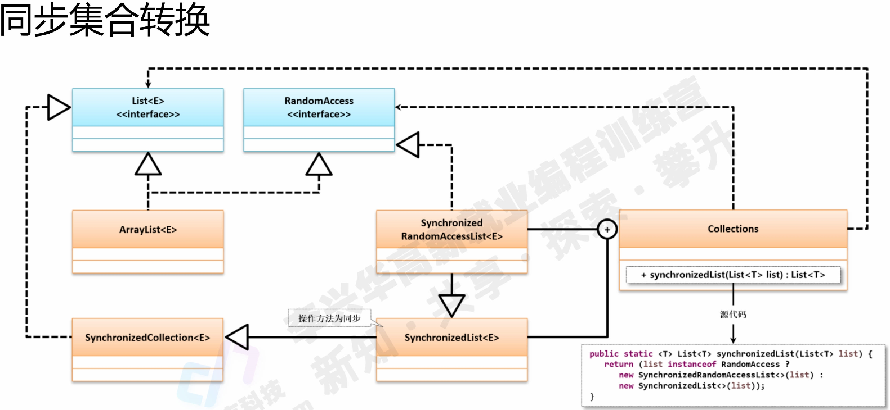


## 2、并发单值集合类 CopyOnWriteArrayList

在类集之中单值集合一般只有两种：List、Set（Collection子接口）。在J.U.C里面针对于这两个子接口也提供有对应的集合处理类，CopyOnWriteArrayList 与 CopyOnWriteArraySet 两个实现子类。


操作示例 1：CopyOnWriteArrayList 子类多并发下的同步操作

```java
import java.util.List;
import java.util.concurrent.CopyOnWriteArrayList;

public class JavaAPIDemo {
    public static void main(String[] args) {
        List<String> all = new CopyOnWriteArrayList<>(); // 创建一个List集合
        for (int num = 0; num < 10; num++) {    // 创建10个线程
            new Thread(() -> {
                for (int x = 0; x < 10; x++) {  // 进行数据的循环更新操作
                    all.add("【" + Thread.currentThread().getName() + "】www.xxx.com"); // 添加集合数据
                    System.out.println(all); // 输出全部的数据内容
                }
            }, "集合操作线程 - " + num).start(); // 线程启动
        }
    }
}
```

此时只是更换了一个 List 接口的子类，最终可以发现不用再像 Collections 那样变为同步集合了，可以直接进行异步集合的处理操作，而且边更新边读取一点问题都没有，那么首先来观察一下 CopyOnWriteArrayList 类的基本定义：

```java
public class CopyOnWriteArrayList<E>
    implements List<E>, RandomAccess, Cloneable, java.io.Serializable {
    /**
     * The lock protecting all mutators.  (We have a mild preference
     * for builtin monitors over ReentrantLock when either will do.)
     */
    final transient Object lock = new Object();  // 该lock是Object对象，不是真正的Lock锁对象 

    /** The array, accessed only via getArray/setArray. */
    private transient volatile Object[] array;  // 既然是数组实现必然要保存有Object[]
}
```

现在可以非常清楚的发现，该类实现了List子接口（传统的 ArrayList 都继承了 AbstractList 抽象类），在该类的对象之中存在有一个   lock 的属性内容，而这个属性主要是用于锁定处理，而后继续观察add()方法：

```java
public class CopyOnWriteArrayList<E>
    implements List<E>, RandomAccess, Cloneable, java.io.Serializable {

    private transient volatile Object[] array;    

    public boolean add(E e) {
        synchronized (lock) {
            Object[] es = getArray();  // 获取当前保存的全部数组元素项
            int len = es.length;  // 定义一个数组的长度
            es = Arrays.copyOf(es, len + 1);
            es[len] = e;
            setArray(es);
            return true;
        }
    }

    final Object[] getArray() {
        return array;
    }
}
```

这个时候没有了之前 ArrayList 类的内部所存在的 modCount 属性，因为每一次的处理的时候都是直接进行的复制操作，那么随后继续观察toString()方法，因为这个方法可以直接实现 Arrays.toString() 输出。

```java
public String toString() {
    return Arrays.toString(getArray());
}

// 顺便观察COWIterator内部类的方法，记住输出主要还是靠Iterator
static final class COWIterator<E> implements ListIterator<E> {
    /** Snapshot of the array */
    private final Object[] snapshot;
    /** Index of element to be returned by subsequent call to next.  */
    private int cursor;

    COWIterator(Object[] es, int initialCursor) {
        cursor = initialCursor;
        snapshot = es;
    }

    public boolean hasNext() {
        return cursor < snapshot.length;
    }

    public boolean hasPrevious() {
        return cursor > 0;
    }

    @SuppressWarnings("unchecked")
    public E next() {
        if (! hasNext())
            throw new NoSuchElementException();
        return (E) snapshot[cursor++];
    }

    @SuppressWarnings("unchecked")
    public E previous() {
        if (! hasPrevious())
            throw new NoSuchElementException();
        return (E) snapshot[--cursor];
    }

    public int nextIndex() {
        return cursor;
    }

    public int previousIndex() {
        return cursor - 1;
    }

    public void remove() {
        throw new UnsupportedOperationException();
    }

    public void set(E e) {
        throw new UnsupportedOperationException();
    }

    public void add(E e) {
        throw new UnsupportedOperationException();
    }

    @Override
    public void forEachRemaining(Consumer<? super E> action) {
        Objects.requireNonNull(action);
        final int size = snapshot.length;
        int i = cursor;
        cursor = size;
        for (; i < size; i++)
            action.accept(elementAt(snapshot, i));
    }
}
```

这个时候就是对数组的内容进行了检查，也没有了最终进行处理判断的繁琐的逻辑（像 ArrayList 子类来讲是存在有这样逻辑的，因为每一次都需要判断 modCount 类型）。

CopyOnWriteArrayList 虽然可以保证线程的处理安全性，但是其内部是依据数组拷贝的处理形式完成的，即：在每一次进行数据添加时都会将原始的数组拷贝为一个新数组进行修改，随后再将新数组的引用交给原有的数组，而为了保证该操作的同步性，在 add() 方法中会采用同步锁的方式进行处理，如图所示。由于数据修改与输出时使用了不同的数组，这样就可以解決
 ArrayList 集合同步的设计问题， 但是这样的设计操作由于每次数据存储时都需要进行新数组的拷贝， 所以必然带来大量的内存垃圾，所以并不适合于高并发修改的处理场景，但是在一定数据量的情況下可以保证较高的数据读取性能。

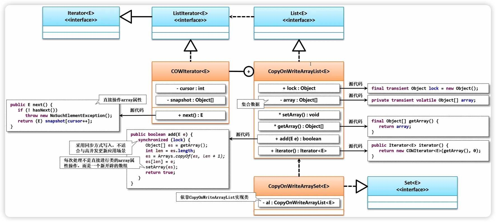


## 3、并发单值集合类 CopyOnWriteArraySet

之所以重点分析的是 CopyOnWriteArrayList 这一点可以通过 CopyOnWriteArraySet 子类来观察到：

```java
public class CopyOnWriteArraySet<E> extends AbstractSet<E> implements java.io.Serializable {
    private final CopyOnWriteArrayList<E> al;
    public CopyOnWriteArraySet() {
        al = new CopyOnWriteArrayList<E>();
    }
    public CopyOnWriteArraySet(Collection<? extends E> c) {
        if (c.getClass() == CopyOnWriteArraySet.class) {
            CopyOnWriteArraySet<E> cc = (CopyOnWriteArraySet<E>) c;
            al = new CopyOnWriteArrayList<E>(cc.al);
        } else {
            al = new CopyOnWriteArrayList<E>();
            al.addAllAbsent(c);
        }
    }
}
```

CopyOnWriteArraySet 内部是依靠 CopyOnWriteArrayList 子类来实现的，整个的 J.U.C 的单值集合其实只有一个。接下来我们再来来看下 CopyOnWriteArraySet 是如何实现API接口的功能的：

```java
public int size() {
    return al.size();
}

public boolean isEmpty() {
    return al.isEmpty();
}

public boolean contains(Object o) {
    return al.contains(o);
}

public Object[] toArray() {
    return al.toArray();
}

public <T> T[] toArray(T[] a) {
    return al.toArray(a);
}

public void clear() {
    al.clear();
}

public boolean remove(Object o) {
    return al.remove(o);
}

public boolean add(E e) {
    return al.addIfAbsent(e);
}

public boolean containsAll(Collection<?> c) {
    return al.containsAll(c);
}

public boolean addAll(Collection<? extends E> c) {
    return al.addAllAbsent(c) > 0;
}

public boolean removeAll(Collection<?> c) {
    return al.removeAll(c);
}

public boolean retainAll(Collection<?> c) {
    return al.retainAll(c);
}

public Iterator<E> iterator() {
    return al.iterator();
}

public boolean removeIf(Predicate<? super E> filter) {
    return al.removeIf(filter);
}

public void forEach(Consumer<? super E> action) {
    al.forEach(action);
}
```

操作示例 1：CopyOnWriteArraySet子类多并发下的同步操作

```java
import java.util.Set;
import java.util.concurrent.CopyOnWriteArraySet;

public class JavaAPIDemo {
    public static void main(String[] args) {
        Set<String> all = new CopyOnWriteArraySet<>(); // 创建一个Set集合
        for (int num = 0; num < 10; num++) {    // 创建10个线程
            new Thread(() -> {
                for (int x = 0; x < 10; x++) {  // 进行数据的循环更新操作
                    all.add("【" + Thread.currentThread().getName() + "】www.xxx.com"); // 添加集合数据
                    System.out.println(all); // 输出全部的数据内容
                }
            }, "集合操作线程 - " + num).start(); // 线程启动
        }
    }
}
```


## 4、并发符号表 ConcurrentHashMap

Map 集合已经不再需要重复了，因为从 JDK1.8 之后采用了哈希捅的算法来提升 Map 的存储以及红黑树的结构，但是传统的 HashMap 在多线程的访问下依然会存在有数据同步的问题。

ConcurrentMap接口提供的功能：

| 方法名称                                              | 功能                                                         |
| ----------------------------------------------------- | ------------------------------------------------------------ |
| getOrDefault(Object key, V defaultValue)              | 返回指定key对应的值；如果Map不存在该key，则返回defaultValue  |
| forEach(BiConsumer action)                            | 遍历Map的所有Entry，并对其进行指定的aciton操作               |
| putIfAbsent(K key, V value)                           | 如果Map不存在指定的key，则插入；否则，直接返回该key对应的值  |
| remove(Object key, Object value)                      | 删除与完全匹配的Entry，并返回true；否则，返回false           |
| replace(K key, V oldValue, V newValue)                | 如果存在key，且值和oldValue一致，则更新为newValue，并返回true；否则，返回false |
| replace(K key, V value)                               | 如果存在key，则更新为value，返回旧value；否则，返回null      |
| replaceAll(BiFunction function)                       | 遍历Map的所有Entry，并对其进行指定的funtion操作              |
| computeIfAbsent(K key, Function mappingFunction)      | 如果Map不存在指定的key，则通过mappingFunction计算value并插入 |
| computeIfPresent(K key, BiFunction remappingFunction) | 如果Map存在指定的key，则通过mappingFunction计算value并替换旧值 |
| compute(K key, BiFunction remappingFunction)          | 根据指定的key，查找value；然后根据得到的value和remappingFunction重新计算新值，并替换旧值 |
| merge(K key, V value, BiFunction remappingFunction)   | 如果key不存在，则插入value；否则，根据key对应的值和remappingFunction计算新值，并替换旧值 |

操作示例 1：观察 HashMap 下的数据同步

```java
import java.util.HashMap;
import java.util.Map;

public class JavaAPIDemo {
    public static void main(String[] args) {
        Map<String, String> map = new HashMap<>(); // 创建HashMap集合
        for (int num = 0; num < 10; num++) {    // 创建10个线程
            new Thread(()->{
                for (int x = 0; x < 10; x++) {  // 进行数据的循环更新操作
                    map.put("【"+Thread.currentThread().getName()+"】x = " + x, "www.xxx.com");
                    System.out.println(map); // 输出全部的数据内容
                }
            }, "集合操作线程 - " + num).start(); // 线程启动
        }
    }
}
```

```java
Exception in thread "集合操作线程 - 2" java.util.ConcurrentModificationException
	at java.base/java.util.HashMap$HashIterator.nextNode(HashMap.java:1579)
	at java.base/java.util.HashMap$EntryIterator.next(HashMap.java:1612)
	at java.base/java.util.HashMap$EntryIterator.next(HashMap.java:1610)
	at java.base/java.util.AbstractMap.toString(AbstractMap.java:550)
	at java.base/java.lang.String.valueOf(String.java:4215)
	at java.base/java.io.PrintStream.println(PrintStream.java:1047)
	at com.example.springboot.tech.JavaAPIDemo.lambda$main$0(JavaAPIDemo.java:11)
	at java.base/java.lang.Thread.run(Thread.java:833)
```

此时的程序已经出现了 “ConcurrentModificationException〞异常，那么对于这个时候的异常如果要想分析，最佳的做法就是要找到 Map 子类 HashMap 集合之中的源代码。

```java
abstract class HashIterator {
    final Node<K,V> nextNode() {
        Node<K,V>[] t;
        Node<K,V> e = next;
        if (modCount != expectedModCount)
            throw new ConcurrentModificationException();
        if (e == null)
            throw new NoSuchElementException();
        if ((next = (current = e).next) == null && (t = table) != null) {
            do {} while (index < t.length && (next = t[index++]) == null);
        }
        return e;
    }
}
```

这个时候如果要想解决此类问题，只能够使用 J.U.C 之中的 ConcurrentHashMap 类来完成，这个类的实现本身也存在有一些版本上的差异（JDK 1.8 分水岭，Map 集合都使用了哈希捅进行存储）。

操作示例 2：使用 ConcurrentHashMap 子类

```java
import java.util.Map;
import java.util.concurrent.ConcurrentHashMap;

public class JavaAPIDemo {
    public static void main(String[] args) {
        Map<String, String> map = new ConcurrentHashMap<>(); // 创建ConcurrentHashMap集合
        for (int num = 0; num < 10; num++) {    // 创建10个线程
            new Thread(() -> {
                for (int x = 0; x < 10; x++) {  // 进行数据的循环更新操作
                    map.put("【" + Thread.currentThread().getName() + "】x = " + x, "www.xxx.com");
                    System.out.println(map); // 输出全部的数据内容
                }
            }, "集合操作线程 - " + num).start(); // 线程启动
        }
    }
}
```

如果按照正常的集合操作来讲，要想保证多线程并发访问下的数据操作安全，那么就心须采用独占锁，但是如果全部都使用独占锁，最终会带来读取的性能下降，因为从实际的开发来讲，修改和读取是两个截然不同的处理次数。如果使用的是独占锁进行操作的话，读取过程就会产生性能问题，那么不可以使用。

在 ConcurrentHashMap 之中是基于了哈希捅的形式来完成了数据的存储分类（依据 HashCode 来决定保存在那一个哈希捅之中），这个桶直接决定了数据同步的环境，只有该桶中的数据可以进行更新的独占锁配置，而其他的桶不受到任何影响，但是在早先的 ConcurrentHashMap 之中它是依靠 Segament 分段的结构来实现的资源同步处理的。

```java
public class ConcurrentHashMap<K,V> extends AbstractMap<K,V> implements ConcurrentMap<K,V>, Serializable {
    // 内部类Segment
    static class Segment<K,V> extends ReentrantLock implements Serializable {
        private static final long serialVersionUID = 2249069246763182397L;
        final float loadFactor;
        Segment(float lf) { this.loadFactor = lf; }
    }
}
```

在通过 Segment 进行资源保护的时候，会依据互斥锁的结构来进行资源同步的修改，而非当前段的 Map 集合，那么就不受到这种锁的限制，即保证了更新的安全，同时又保证了数据读取的性能。

***

**面试题：HashMap 与 ConcurrentHashMap 有什么区别？请总结一下**。

- Map可以实现二元偶对象的存储，而在实际的开发中Map集合最重要的一点就是根据KEY获取对应的VALVE数据，即：查询操作要比写入的操作使用更多，考虑到性能问题，较为常用的是HashMap子类，但是如果在多线程并发环境下，HashMap是无法实现安全的线程操作，并自会出现ConcurrentModificationException异常。
- 为了进一步提高Map集合在并发处理下的性能操作，在J.U.C中提供了ConcurrentHashMap子类，该类的实现模式与HashMap相同，存储的形式采用了“数组 +链表（红黑树）”的结构。在进行数据写入时采用了"CAS〞与 "synchronized〞的方式实现了并发安全性，而在数据读取时，则会根据哈希值获取哈希捅并结合链表或红黑树的方式实现。


## 5、跳表集合类 ConcurrentSkipListMap

如果说现在给你一个数组，请问最快的数组元素存在与否的判断操作方法使用的一定是二分查找法，如果说现在是一个完整的节点数据结构，最快的数据的查找方法一定是红黑树（因为红黑树按照平衡二叉树的设置保持节点的均衡，可以保证查询性能），但是如果说现在是—个普通的链表，请问如何可以保证查询性能呢？这个时候的性能保证可以通过跳表结构来完成。


对于当前查找性能的优化可以想到最佳的处理方案，将原始 ”O(n)” 时间复杂度降低为 “log2(n)”，而这种操作的实现过程之中就需要对数据进行一系列的抽样操作，对于跳表的实现机制，是基于—个完整的有序列表链表结构，那么在里面可以考虑通过数据的抽样操作来选择一个数据的操作基点，在每一次进行数据查询的时候是依据这个基点来进行判断，而这种跳表的集合实现类在J.U.C里面是有提供的，提供了 ConcurrentSkipListMap、 ConcurrentSkipListSet。

**跳表集合的描述与实现原理**：

- 跳表集合是什么？：跳表是一种与平衡二叉树性能类似的数据结构，其主要是在有序链表上使用，在J.U.C提供的集合中有两个支持有跳表操作的集合类型：ConcurrentSkipListMap、ConcurrentSkiplListSet。
- 跳表的实现原理：数组是一种常见的线性结构，如果在进行索引查询时其时间复杂度为”O(1)"，但是在进行数据内容查询时，就必须基于有序存储并结合二分法进行查找，这样操作的时间复杂度为”O(log2n)"，但是在很多情况下对于数组由于其固定长度的限制，所以开发中会通过链表来解决，但是如果要想进一步提升链表的查询性能，就必须采用跳表结构来处理，而跳表结构的本质是需要提供有一个有序的链表集合，并从中依据二分法的原理抽取出一些样本数据，而后对样本数据的范围进行查询。

操作示例 1：使用 Map 集合子类 ConcurrentSkipListMap 实现跳表处理

```java
import java.util.Map;
import java.util.concurrent.ConcurrentSkipListMap;

public class JavaAPIDemo {
    public static void main(String[] args) {
        Map<String, String> map = new ConcurrentSkipListMap<>(); // 创建ConcurrentSkipListMap集合
        for (int num = 0; num < 10; num++) {    // 创建10个线程
            new Thread(() -> {
                for (int x = 0; x < 10; x++) {  // 进行数据的循环更新操作
                    map.put("【" + Thread.currentThread().getName() + "】x = " + x, "www.xxx.com");
                }
                System.out.println(map.get("【" + Thread.currentThread().getName() + "】x = 1"));
            }, "集合操作线程 - " + num).start(); // 线程启动
        }
    }
}
```

```java
www.xxx.com
www.xxx.com
www.xxx.com
www.xxx.com
www.xxx.com
www.xxx.com
www.xxx.com
www.xxx.com
www.xxx.com
www.xxx.com
```


## 6、跳表集合类 ConcurrentSkipListSet

除了可以在 Map 集合上使用跳表结构之外，也可以使用 Set 集合进行跳表集合的处理（在 Java 类集里面，Set 集合的内部也是依靠 Map 集合的形式实现的）

操作示例 1：使用 ConcurrentSkipListSet 集合实现跳表处理

```java
import java.util.Set;
import java.util.concurrent.ConcurrentSkipListSet;

public class JavaAPIDemo {
    public static void main(String[] args) {
        Set<String> all = new ConcurrentSkipListSet<>(); // 创建ConcurrentSkipListSet集合
        for (int num = 0; num < 10; num++) {    // 创建10个线程
            new Thread(() -> {
                for (int x = 0; x < 10; x++) {  // 进行数据的循环更新操作
                    all.add("【" + Thread.currentThread().getName() + "】www.xxx.com");
                }
                System.out.println(all.contains("【"+Thread.currentThread().getName()+"】www.xxx.com"));
            }, "集合操作线程 - " + num).start(); // 线程启动
        }
    }
}
```

```java
true
true
true
true
true
true
true
true
true
true
```

如果你现在不想使用红黑树的结构存储数据，那么最终就直接基于跳表的结构存储，这样既便于数据的查询，同时又可以在多线程并发更新下实现更新处理。


# 08、阻塞队列

整个J.U.C集合队列框架的结构如下图：

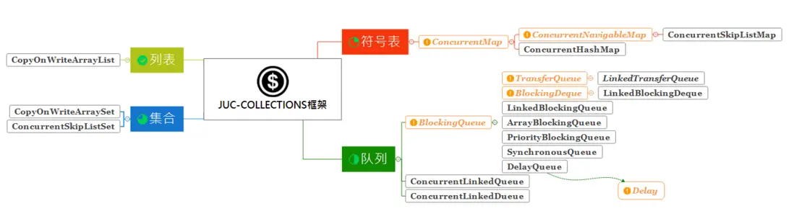

其中阻塞队列的分类及特性如下表：

| 队列特性 | 有界队列           | 近似无界队列                             | 无界队列            | 特殊队列                          |
| -------- | ------------------ | ---------------------------------------- | ------------------- | --------------------------------- |
| 有锁算法 | ArrayBlockingQueue | LinkedBlockingQueue、LinkedBlockingDeque | /                   | PriorityBlockingQueue、DelayQueue |
| 无锁算法 | /                  | /                                        | LinkedTransferQueue | SynchronousQueue                  |


## 1、阻塞队列简介

> 在项目的开发之中队列是一种较为常见的数据结构，利用队列可以实现数据缓冲的目的，生产者与消费者之间依靠队列进行存储，这个时候哪怕生产者的效率远远高于消费者的效率，那么也不会影响最终的整体的性能。
>
> 到现在为止还没有直接通过队列的机制去实现这样的生产者与消费者的模型，因为整个的处理就是不断的进行队列的轮询，如果队列有数据，消费者就要消费，如果队列已经满了，那么生产者就需要等待。而现阶段对于该模型最佳的实现就是通过 Exchanger 类来完成，但是这个类只允许保存单个数据。
>
> 为了解决项目开发之中这种多线程存储关系队列的操作问题，提供了一个阻塞队列的概念，可以把这种队列理解为自动的队列，当进行数据写入的时候，如果发现队列已经满了，则不再写入，自动进入到阻塞状态，而在进行数据读取的时候，如果发现队列是空的，则也不再直接读取，而是进入到一种阻塞状态，等待有数据出现之后再次进行自动唤醒。

**线程并发问题**：每一个项目都包含有一些核心的处理资源，而为了提高资源的处理性能往往会采用多线程的方式进行处理，但是如果无节制的持续进行线程的创建，最终就会导致核心资源处理性能的下降，从而导致系统崩溃。

**队列缓冲出现**：为了保证在高并发状态下的资源处理性能，最佳的做法就是引入一个 FIFO 的缓冲队列，这样就可以减少高并发时出现资源消耗过度的问题，从而保证了系统运行的稳定性。

**消费轮询概念**：以生产者和消费者的操作为例，现在假设生产者线程过多，而消费者线程较少，就会出现生产者大量停滞的问题，而在未增加消费者线程的环境下，就可以通过一个队列进行生产数据的存储，但是这时的消费者就需要不断的进行队列的轮询，以便及时的获取数据。

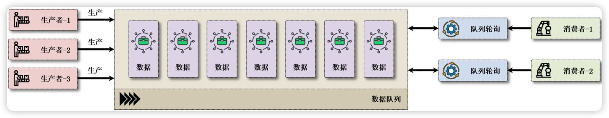

**J.U.C 阻塞队列接口**：在 Java 类集框架中提供了 Queue 队列操作接口以及 LinkedList 实现子类，但是传统队列需要开发者不断的来用轮询的形式才可以实现数据的及时获取，在队列没有数据或者队列数据已经满员的情完下还需要进行同步等待与唤醒处理，实现的难度较高。所以在 J.U.C 中为了便于多线程应用，提供了两个新的阻塞队列接又：BlockingQueue（单端队列)、BlockingDeque（双端队列）。BlockingQueue 接口属于 Queue 子接口，按照 Java 类集的继承结构（Deque 是 Queue 子接口），所以 BlockingDeque 属于 BlockingQueue 子接口。

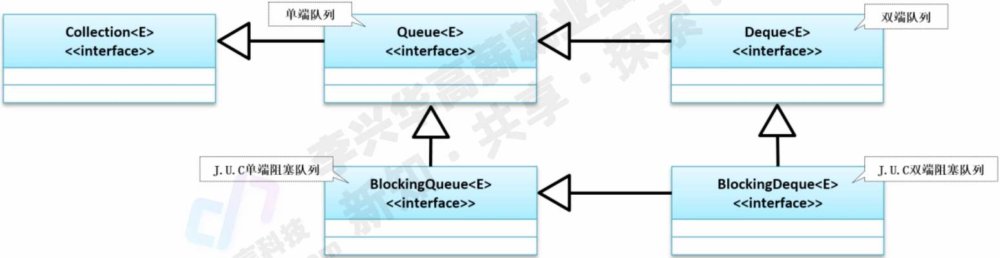


## 2、单端阻塞队列 BlockingQueue

BlockingQueue 肯定是重点分析的部分了，因为单端队列是较为常见的一种逻辑结构，首先来观察一下其对应的实现子类。

```java
Interface BlockingQueue<E>
    
Type Parameters:
E - the type of elements held in this queue
    
All Superinterfaces:
Collection<E>, Iterable<E>, Queue<E>
    
All Known Subinterfaces:
BlockingDeque<E>, TransferQueue<E>
    
All Known Implementing Classes:
ArrayBlockingQueue, DelayQueue, LinkedBlockingDeque, LinkedBlockingQueue, LinkedTransferQueue, PriorityBlockingQueue, SynchronousQueue
```

如果你现在仅仅是观察操作类的使用，那么基本上是无感的，因为如果不分析其内部的实现组成，那么这样的概念是很难清晰的区分的（总结一下：也没有大家想的这么的繁琐，只要掌握了一些基本的数据结构的概念)。

BlockingQueue 属于单端阻塞队列，所有的数据将按照 FIFO 算法进行保存与获取，BlockingQueue 提供有如下几个子类：ArrayBlockingQueue（数组结构）、LinkedBlockingQueue（链表单端阻塞队列）、PriorityBlockingQueue（优先级阻塞队列）、SynchronousQueue（同步队列）

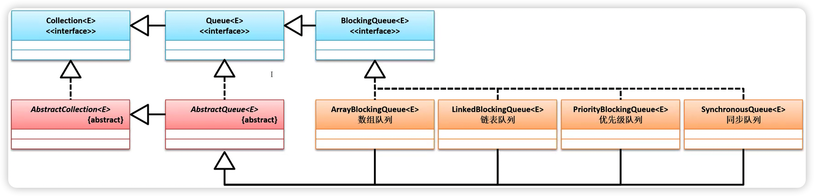


### 1、ArrayBlockingQueue

ArrayBlockingQueue 是基于数组实现的阻塞队列，在该类中主要通过了 Condition 来实现了空队列与满队列的同步处理，如果发现队列已空在获取数据时就会进入到阻塞状态，反之，如果队列数据已满，在保存数据时也会进入到阻塞状态。

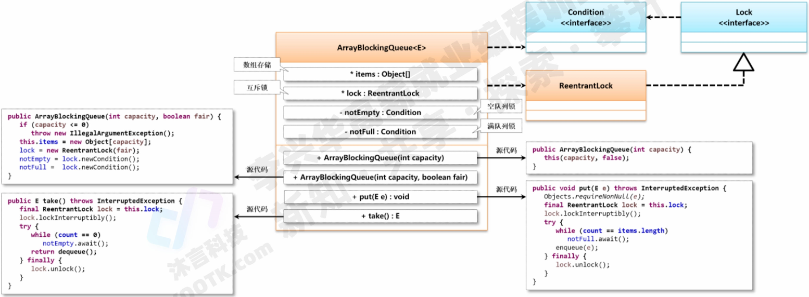

操作示例 1：使用 ArrayBlockingQueue 子类，使用链表单端阻塞队列

```java
import java.util.concurrent.ArrayBlockingQueue;
import java.util.concurrent.BlockingQueue;
import java.util.concurrent.TimeUnit;

public class JavaAPIDemo {
    public static void main(String[] args) {
        // 每一个队列在启用的时候必须明确的设置其保存的数据的个数
        BlockingQueue<String> queue = new ArrayBlockingQueue<>(5); // 数组阻塞队列
        // 如果要想观察到队列的使用，最佳的做法就是生产者与消费者的处理模型
        for (int x = 0; x < 10; x++) {  // 创建循环
            final int temp = x;
            new Thread(() -> {
                for (int y = 0; y < 100; y++) { // 持续生产
                    try {
                        TimeUnit.SECONDS.sleep(2); // 生产慢
                        String msg = "{ID = " + temp + " - " + y + "}";
                        queue.put(msg); // 向队列之中添加数据
                        System.out.printf("【%s】%s%s%n", Thread.currentThread().getName(), "生产数据 ", msg);
                    } catch (InterruptedException ignored) {
                    }
                }
            }, "生产者 - " + x).start();
        }
        for (int x = 0; x < 2; x++) {
            new Thread(() -> {
                while (true) {   // 持续性的通过队列抓取数据
                    try {
                        TimeUnit.SECONDS.sleep(3); // 生产慢
                        if (queue.isEmpty()) { // 队列内容为空了
                            break; // 结束循环
                        }
                        System.err.printf("【%s】%s%s%n", Thread.currentThread().getName(), "消费数据 ", queue.take());
                    } catch (InterruptedException ignored) {
                    }
                }
            }, "消费者 - " + x).start();
        }
    }
}
```

```java
【生产者 - 1】生产数据 {ID = 1 - 0}
【生产者 - 5】生产数据 {ID = 5 - 0}
【生产者 - 9】生产数据 {ID = 9 - 0}
【生产者 - 3】生产数据 {ID = 3 - 0}
【生产者 - 7】生产数据 {ID = 7 - 0}
【消费者 - 1】消费数据 {ID = 5 - 0}
【消费者 - 0】消费数据 {ID = 1 - 0}
【生产者 - 0】生产数据 {ID = 0 - 0}
【生产者 - 6】生产数据 {ID = 6 - 0}
【消费者 - 1】消费数据 {ID = 7 - 0}
【消费者 - 0】消费数据 {ID = 3 - 0}
【生产者 - 8】生产数据 {ID = 8 - 0}
【生产者 - 4】生产数据 {ID = 4 - 0}
【消费者 - 1】消费数据 {ID = 9 - 0}
【消费者 - 0】消费数据 {ID = 0 - 0}
【生产者 - 2】生产数据 {ID = 2 - 0}
【生产者 - 1】生产数据 {ID = 1 - 1}
【消费者 - 1】消费数据 {ID = 6 - 0}
【消费者 - 0】消费数据 {ID = 8 - 0}
【生产者 - 3】生产数据 {ID = 3 - 1}
【生产者 - 5】生产数据 {ID = 5 - 1}
【消费者 - 1】消费数据 {ID = 4 - 0}
【消费者 - 0】消费数据 {ID = 2 - 0}
【生产者 - 7】生产数据 {ID = 7 - 1}
【生产者 - 9】生产数据 {ID = 9 - 1}
```

此时的生产者，只要向延迟队列之中保存了 5 个数据，那么最终就需要等待队列有空余之后再次进行生产操作，而消费者也采用了同样的机制，如果队列现在是空队列，那么将无法进行数据的消费操作。

在 ArrayBlockingQueue 子类里面是存在有一个互斥锁的，而后由于队列需要考虑到空以及满的状态，那么依据这个互斥锁，创建了两个 Condition 接口实例。

```java
public ArrayBlockingQueue(int capacity, boolean fair) {
    if (capacity <= 0)
        throw new IllegalArgumentException();
    this.items = new Object[capacity];
    lock = new ReentrantLock(fair);
    notEmpty = lock.newCondition(); // 不为空的互斥锁
    notFull =  lock.newCondition(); // 没有满的互斥锁
}
```


### 2、LinkedBlockingQueue

使用数组的操作的确很简单，但是在 BlockingQueue 接口之中也提供有链表实现的机制。

除了可以通过数组的方式实现阻塞队列之外，也可以通过 LinkedBlockingQueue 基于链表形式实现阻塞队列的开发，在该类的内部提供有 Node 节点类，同时为了可以在多线程下明确的进行数据个数的统计，在该类中提供给了一个 count 属性，该属性为 AtomicInteger 原子类型，如果在链表结构存储中也会基于一个 count 统计变量的形式判断当前的队列中的数据存储状态，如果计数为零或保存的数据量超过了预计的容量则需要进行等待。

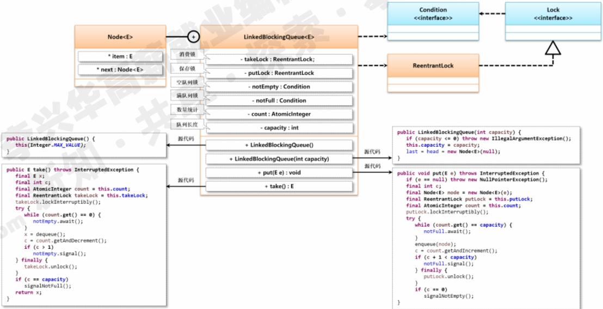

操作示例 1：使用 LinkedBlockingQueue 子类，其实就是把上面示例中的 ArrayBlockingQueue 子类更换成 LinkedBlockingQueue 子类

```java
import java.util.concurrent.BlockingQueue;
import java.util.concurrent.LinkedBlockingQueue;
import java.util.concurrent.TimeUnit;

public class JavaAPIDemo {
    public static void main(String[] args) {
        // 每一个队列在启用的时候必须明确的设置其保存的数据的个数
        BlockingQueue<String> queue = new LinkedBlockingQueue<>(5); // 数组阻塞队列
        // 如果要想观察到队列的使用，最佳的做法就是生产者与消费者的处理模型
        for (int x = 0; x < 10; x++) {  // 创建循环
            final int temp = x;
            new Thread(() -> {
                for (int y = 0; y < 100; y++) { // 持续生产
                    try {
                        TimeUnit.SECONDS.sleep(2); // 生产慢
                        String msg = "{ID = " + temp + " - " + y + "}";
                        queue.put(msg); // 向队列之中添加数据
                        System.out.printf("【%s】%s%s%n", Thread.currentThread().getName(), "生产数据 ", msg);
                    } catch (InterruptedException ignored) {
                    }
                }
            }, "生产者 - " + x).start();
        }
        for (int x = 0; x < 2; x++) {
            new Thread(() -> {
                while (true) {   // 持续性的通过队列抓取数据
                    try {
                        TimeUnit.SECONDS.sleep(3); // 生产慢
                        if (queue.isEmpty()) { // 队列内容为空了
                            break; // 结束循环
                        }
                        System.err.printf("【%s】%s%s%n", Thread.currentThread().getName(), "消费数据 ", queue.take());
                    } catch (InterruptedException ignored) {
                    }
                }
            }, "消费者 - " + x).start();
        }
    }
}
```

```java
【生产者 - 1】生产数据 {ID = 1 - 0}
【生产者 - 5】生产数据 {ID = 5 - 0}
【生产者 - 9】生产数据 {ID = 9 - 0}
【生产者 - 3】生产数据 {ID = 3 - 0}
【生产者 - 7】生产数据 {ID = 7 - 0}
【消费者 - 1】消费数据 {ID = 5 - 0}
【消费者 - 0】消费数据 {ID = 1 - 0}
【生产者 - 0】生产数据 {ID = 0 - 0}
【生产者 - 6】生产数据 {ID = 6 - 0}
【消费者 - 1】消费数据 {ID = 7 - 0}
【消费者 - 0】消费数据 {ID = 3 - 0}
【生产者 - 8】生产数据 {ID = 8 - 0}
【生产者 - 4】生产数据 {ID = 4 - 0}
【消费者 - 1】消费数据 {ID = 9 - 0}
【消费者 - 0】消费数据 {ID = 0 - 0}
【生产者 - 2】生产数据 {ID = 2 - 0}
【生产者 - 1】生产数据 {ID = 1 - 1}
【消费者 - 1】消费数据 {ID = 6 - 0}
【消费者 - 0】消费数据 {ID = 8 - 0}
【生产者 - 3】生产数据 {ID = 3 - 1}
【生产者 - 5】生产数据 {ID = 5 - 1}
【消费者 - 1】消费数据 {ID = 4 - 0}
【消费者 - 0】消费数据 {ID = 2 - 0}
【生产者 - 7】生产数据 {ID = 7 - 1}
【生产者 - 9】生产数据 {ID = 9 - 1}
```

与 Java 类集之中的 LinkedList 一样，此时的实现也是考虑到了后续的双端队列的实现机制。在队列里面还有一种优先级队列，在阻塞队列之中也提供有同样的实现。

LinkedBlockingQueue 子类，基于链表的结构来完成最终的数据存储，可以打开这个类来观察一下其实现的源代码：

```java
public class LinkedBlockingQueue<E> extends AbstractQueue<E>
    implements BlockingQueue<E>, java.io.Serializable {
    private static final long serialVersionUID = -6903933977591709194L;

    /**
     * Linked list node class.
     */
    static class Node<E> {
        E item;

        /**
         * One of:
         * - the real successor Node
         * - this Node, meaning the successor is head.next
         * - null, meaning there is no successor (this is the last node)
         */
        Node<E> next;

        Node(E x) { item = x; }
    }

    /** The capacity bound, or Integer.MAX_VALUE if none */
    private final int capacity;
    private final AtomicInteger count = new AtomicInteger(); // 计算统计
    transient Node<E> head; // 头部节点
    private transient Node<E> last; // 尾部节点

    /** Lock held by take, poll, etc */
    private final ReentrantLock takeLock = new ReentrantLock();

    /** Wait queue for waiting takes */
    @SuppressWarnings("serial") // Classes implementing Condition may be serializable.
    private final Condition notEmpty = takeLock.newCondition(); // 非满锁

    /** Lock held by put, offer, etc */
    private final ReentrantLock putLock = new ReentrantLock(); // 互斥锁

    /** Wait queue for waiting puts */
    @SuppressWarnings("serial") // Classes implementing Condition may be serializable.
    private final Condition notFull = putLock.newCondition(); // 非空锁

    private void signalNotEmpty() {
        final ReentrantLock takeLock = this.takeLock;
        takeLock.lock();
        try {
            notEmpty.signal();
        } finally {
            takeLock.unlock();
        }
    }

    private void signalNotFull() {
        final ReentrantLock putLock = this.putLock;
        putLock.lock();
        try {
            notFull.signal();
        } finally {
            putLock.unlock();
        }
    }

    private void enqueue(Node<E> node) {
        // assert putLock.isHeldByCurrentThread();
        // assert last.next == null;
        last = last.next = node;
    }

    private E dequeue() {
        // assert takeLock.isHeldByCurrentThread();
        // assert head.item == null;
        Node<E> h = head;
        Node<E> first = h.next;
        h.next = h; // help GC
        head = first;
        E x = first.item;
        first.item = null;
        return x;
    }

    void fullyLock() {
        putLock.lock();
        takeLock.lock();
    }

    void fullyUnlock() {
        takeLock.unlock();
        putLock.unlock();
    }

    public LinkedBlockingQueue() { // 如果没有设置容量，则大小为整型的最大值
        this(Integer.MAX_VALUE);
    }

    public LinkedBlockingQueue(int capacity) {
        if (capacity <= 0) throw new IllegalArgumentException();
        this.capacity = capacity;
        last = head = new Node<E>(null); // 配置节点
    }
}
```


### 3、PriorityBlockingQueue

使用 ArrayBlockingQueue 或 LinkedBlockingQueue 子类实现的阻塞队列，都是基于 数据保存顺序的结构存储的，而在 BlockingQueue 接口设计时，还考虑到了数据排序的需要，即：可以通过比较器的形式实现队列数据的排序，并根据排序的结果实现优先级调用，而这就可以通过 PriorityBlockingQueue 子类实现操作。

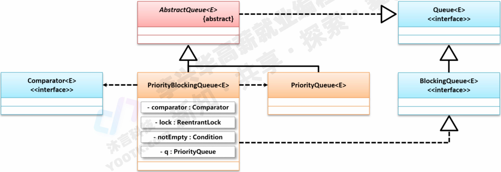

操作示例 1：使用 PriorityBlockingQueue 子类，使用优先级阻塞队列

```java
import java.util.concurrent.BlockingQueue;
import java.util.concurrent.PriorityBlockingQueue;
import java.util.concurrent.TimeUnit;

public class JavaAPIDemo {
    public static void main(String[] args) {
        // 每一个队列在启用的时候必须明确的设置其保存的数据的个数
        BlockingQueue<String> queue = new PriorityBlockingQueue<>(5); // 数组阻塞队列
        // 如果要想观察到队列的使用，最佳的做法就是生产者与消费者的处理模型
        for (int x = 0; x < 10; x++) {  // 创建循环
            final int temp = x;
            new Thread(() -> {
                for (int y = 0; y < 100; y++) { // 持续生产
                    try {
                        TimeUnit.SECONDS.sleep(2); // 生产慢
                        String msg = "{ID = " + temp + " - " + y + "}";
                        queue.put(msg); // 向队列之中添加数据
                        System.out.printf("【%s】%s%s%n", Thread.currentThread().getName(), "生产数据 ", msg);
                    } catch (InterruptedException ignored) {
                    }
                }
            }, "生产者 - " + x).start();
        }
        for (int x = 0; x < 2; x++) {
            new Thread(() -> {
                while (true) {   // 持续性的通过队列抓取数据
                    try {
                        TimeUnit.SECONDS.sleep(3); // 生产慢
                        if (queue.isEmpty()) { // 队列内容为空了
                            break; // 结束循环
                        }
                        System.err.printf("【%s】%s%s%n", Thread.currentThread().getName(), "消费数据 ", queue.take());
                    } catch (InterruptedException ignored) {
                    }
                }
            }, "消费者 - " + x).start();
        }
    }
}
```

```java
【生产者 - 6】生产数据 {ID = 6 - 0}
【生产者 - 7】生产数据 {ID = 7 - 0}
【生产者 - 4】生产数据 {ID = 4 - 0}
【生产者 - 8】生产数据 {ID = 8 - 0}
【生产者 - 0】生产数据 {ID = 0 - 0}
【生产者 - 1】生产数据 {ID = 1 - 0}
【生产者 - 3】生产数据 {ID = 3 - 0}
【生产者 - 9】生产数据 {ID = 9 - 0}
【生产者 - 5】生产数据 {ID = 5 - 0}
【生产者 - 2】生产数据 {ID = 2 - 0}
【消费者 - 0】消费数据 {ID = 0 - 0}
【消费者 - 1】消费数据 {ID = 1 - 0}
【生产者 - 7】生产数据 {ID = 7 - 1}
【生产者 - 6】生产数据 {ID = 6 - 1}
【生产者 - 4】生产数据 {ID = 4 - 1}
【生产者 - 8】生产数据 {ID = 8 - 1}
【生产者 - 5】生产数据 {ID = 5 - 1}
【生产者 - 1】生产数据 {ID = 1 - 1}
【生产者 - 3】生产数据 {ID = 3 - 1}
【生产者 - 9】生产数据 {ID = 9 - 1}
【生产者 - 0】生产数据 {ID = 0 - 1}
【生产者 - 2】生产数据 {ID = 2 - 1}
【消费者 - 1】消费数据 {ID = 0 - 1}
【消费者 - 0】消费数据 {ID = 1 - 1}
【生产者 - 7】生产数据 {ID = 7 - 2}
【生产者 - 4】生产数据 {ID = 4 - 2}
【生产者 - 5】生产数据 {ID = 5 - 2}
【生产者 - 1】生产数据 {ID = 1 - 2}
【生产者 - 8】生产数据 {ID = 8 - 2}
【生产者 - 6】生产数据 {ID = 6 - 2}
【生产者 - 0】生产数据 {ID = 0 - 2}
【生产者 - 9】生产数据 {ID = 9 - 2}
【生产者 - 3】生产数据 {ID = 3 - 2}
【生产者 - 2】生产数据 {ID = 2 - 2}
【生产者 - 7】生产数据 {ID = 7 - 3}
【生产者 - 4】生产数据 {ID = 4 - 3}
【生产者 - 1】生产数据 {ID = 1 - 3}
【生产者 - 5】生产数据 {ID = 5 - 3}
【生产者 - 0】生产数据 {ID = 0 - 3}
【生产者 - 8】生产数据 {ID = 8 - 3}
【生产者 - 6】生产数据 {ID = 6 - 3}
【生产者 - 9】生产数据 {ID = 9 - 3}
【生产者 - 3】生产数据 {ID = 3 - 3}
【生产者 - 2】生产数据 {ID = 2 - 3}
【消费者 - 0】消费数据 {ID = 0 - 2}
【消费者 - 1】消费数据 {ID = 0 - 3}
```

可以看到消费输出是有优先顺序了。


### 4、SynchronousQueue

以上的几种阻塞队列的实现子类都可以存放多个数据的信息，但是随后就会发现在 BlockingQueue 之中还存在有一个 SynchronousQueue 同步队列的支持，这个队列只能够保存单个数据内容。

SynchronousQueue 类内部依靠的是一 个 Transferer 抽象类完成的，该类提供有队列存储实现子类与栈存储实现子类，并且数据的存储与获取都是通过一个 transfer() 方法来完成的。

操作示例 1：使用 SynchronousQueue 子类，使用同步队列

```java
import java.util.concurrent.BlockingQueue;
import java.util.concurrent.SynchronousQueue;
import java.util.concurrent.TimeUnit;

public class JavaAPIDemo {
    public static void main(String[] args) {
        // 每一个队列在启用的时候必须明确的设置其保存的数据的个数
        BlockingQueue<String> queue = new SynchronousQueue<>(); // 同步阻塞队列
        // 如果要想观察到队列的使用，最佳的做法就是生产者与消费者的处理模型
        for (int x = 0; x < 10; x++) {  // 创建循环
            final int temp = x;
            new Thread(() -> {
                for (int y = 0; y < 10; y++) { // 持续生产
                    try {
                        TimeUnit.SECONDS.sleep(2); // 生产慢
                        String msg = "{ID = " + temp + " - " + y + "}";
                        queue.put(msg); // 向队列之中添加数据
                        System.out.printf("【%s】%s%s%n", Thread.currentThread().getName(), "生产数据 ", msg);
                    } catch (InterruptedException ignored) {
                    }
                }
            }, "生产者 - " + x).start();
        }
        for (int x = 0; x < 2; x++) {
            new Thread(() -> {
                while (true) {   // 持续性的通过队列抓取数据
                    try {
                        TimeUnit.SECONDS.sleep(3); // 生产慢
                        System.err.printf("【%s】%s%s%n", Thread.currentThread().getName(), "消费数据 ", queue.take());
                    } catch (InterruptedException ignored) {
                    }
                }
            }, "消费者 - " + x).start();
        }
    }
}
```

```java
【生产者 - 6】生产数据 {ID = 6 - 0}
【生产者 - 4】生产数据 {ID = 4 - 0}
【消费者 - 1】消费数据 {ID = 4 - 0}
【消费者 - 0】消费数据 {ID = 6 - 0}
【生产者 - 6】生产数据 {ID = 6 - 1}
【生产者 - 4】生产数据 {ID = 4 - 1}
【消费者 - 1】消费数据 {ID = 4 - 1}
【消费者 - 0】消费数据 {ID = 6 - 1}
【生产者 - 4】生产数据 {ID = 4 - 2}
【生产者 - 6】生产数据 {ID = 6 - 2}
【消费者 - 0】消费数据 {ID = 4 - 2}
【消费者 - 1】消费数据 {ID = 6 - 2}
【消费者 - 0】消费数据 {ID = 6 - 3}
【消费者 - 1】消费数据 {ID = 4 - 3}
【生产者 - 6】生产数据 {ID = 6 - 3}
【生产者 - 4】生产数据 {ID = 4 - 3}
【生产者 - 4】生产数据 {ID = 4 - 4}
【生产者 - 6】生产数据 {ID = 6 - 4}
【消费者 - 0】消费数据 {ID = 4 - 4}
【消费者 - 1】消费数据 {ID = 6 - 4}
【消费者 - 0】消费数据 {ID = 4 - 5}
【消费者 - 1】消费数据 {ID = 6 - 5}
【生产者 - 4】生产数据 {ID = 4 - 5}
【生产者 - 6】生产数据 {ID = 6 - 5}
【生产者 - 6】生产数据 {ID = 6 - 6}
【生产者 - 4】生产数据 {ID = 4 - 6}
【消费者 - 0】消费数据 {ID = 6 - 6}
【消费者 - 1】消费数据 {ID = 4 - 6}
【生产者 - 4】生产数据 {ID = 4 - 7}
【生产者 - 6】生产数据 {ID = 6 - 7}
【消费者 - 0】消费数据 {ID = 4 - 7}
【消费者 - 1】消费数据 {ID = 6 - 7}
【生产者 - 4】生产数据 {ID = 4 - 8}
【生产者 - 6】生产数据 {ID = 6 - 8}
【消费者 - 0】消费数据 {ID = 4 - 8}
【消费者 - 1】消费数据 {ID = 6 - 8}
【消费者 - 0】消费数据 {ID = 6 - 9}
【消费者 - 1】消费数据 {ID = 4 - 9}
【生产者 - 6】生产数据 {ID = 6 - 9}
【生产者 - 4】生产数据 {ID = 4 - 9}
【生产者 - 3】生产数据 {ID = 3 - 0}
【生产者 - 1】生产数据 {ID = 1 - 0}
【消费者 - 0】消费数据 {ID = 3 - 0}
【消费者 - 1】消费数据 {ID = 1 - 0}
【消费者 - 0】消费数据 {ID = 1 - 1}
【消费者 - 1】消费数据 {ID = 3 - 1}
【生产者 - 1】生产数据 {ID = 1 - 1}
【生产者 - 3】生产数据 {ID = 3 - 1}
```

SynchronousQueue 类实现结构：SynchronousQueue 类内部依靠的是一个 Transferer 抽象类完成的，该类提供有队列存储实现子类与栈存储实现子类，并且数据的存储与获取都是通过—个 transfer() 方法来完成的。


在 SynchronouseBlockingQueue 之中是基于 Transferer 接口来完成的，而后对于公平与非公平的机制是利用其不同的实现子类来定义的，这一点可以通过类的构造方法观察到：

```java
public class SynchronousQueue<E> extends AbstractQueue<E> implements BlockingQueue<E>, java.io.Serializable {
    public SynchronousQueue(boolean fair) {
        transferer = fair ? new TransferQueue<E>() : new TransferStack<E>();
    }
    static final class TransferStack<E> extends Transferer<E> {}
    static final class TransferQueue<E> extends Transferer<E> {}
}
```


## 3、特殊阻塞队列 TransferQueue

### 1、TransferQueue 出现的背景

BlockingQueue 可以实现阻塞队列的机制，而后其也有若干个不同的实现子类，那么下面打开这些子类的定义来观察：

- ArrayBlockingQueue（数组阻塞队列）

  ```java
  public ArrayBlockingQueue(int capacity, boolean fair) {
      if (capacity <= 0)
          throw new IllegalArgumentException();
      this.items = new Object[capacity];
      lock = new ReentrantLock(fair);
      notEmpty = lock.newCondition();
      notFull =  lock.newCondition();
  }
  ```

- LinkedBlockingQueue（链表单端阻塞队列）

  ```java
  public LinkedBlockingQueue(Collection<? extends E> c) {
      this(Integer.MAX_VALUE);
      final ReentrantLock putLock = this.putLock;
      putLock.lock(); // Never contended, but necessary for visibility
      try {
          int n = 0;
          for (E e : c) {
              if (e == null)
                  throw new NullPointerException();
              if (n == capacity)
                  throw new IllegalStateException("Queue full");
              enqueue(new Node<E>(e));
              ++n;
          }
          count.set(n);
      } finally {
          putLock.unlock();
      }
  }
  ```

- PriorityBlockingQueue（优先级阻塞队列）

  ```java
  private final ReentrantLock lock = new ReentrantLock();
  ```

以上的三种阻塞队列的实现子类都是基于锁的形式进行的项目开发，每一次在处理的时候都需要不断的考虑锁定以及解锁的设计问题，但是 SynchrounseBlockingQueue 却没有这样的担心，它是通过一个 Transfer 来实现的。

```java
public class SynchronousQueue<E> extends AbstractQueue<E> implements BlockingQueue<E>, java.io.Serializable {
    public SynchronousQueue(boolean fair) {
        transferer = fair ? new TransferQueue<E>() : new TransferStack<E>();
    }
}
```

SynchrounseBlockingQueue 类可以避免锁的存在机制对代码所带来性能影响，但是这个实现类只能够保存单个数据，不能够保存有多个的数据。所以在这样的背景下，从 JDK1.7 开始 J.U.C 提供了 TransferQueue 队列接口，该接口是 BlockingQueue 的子接口。该接口的实现子类为：LinkedTransferQueue。

**总结 TransferQueue 子接口出现的背景**：BlockingQueue 提供了一个队列的存储功能，如果使用实现子类 LinkedBlockingQueue & LinkedBlockingQueue & PriorityBlockingQueue 则会通过数组、链表、比较器的形式保存数据，但在处理时需要使用大量的锁机制所以会存在有性能问题，而使用 SynchronousQueue 虽然没有了锁机制，但是却无法实现更多数据的存储，所以在这样的背景下，从 JDK1.7 开始 J.U.C 提供了 TransferQueue 队列接口，该接口是 BlockingQueue 的子接口。


### 2、TransferQueue 子类介绍及使用

TransferQueue 接口的实现类为 LinkedTransferQueue。TransferQueue 接口的方法如下：

| 方法名称                                                     | 描述                                                         |
| ------------------------------------------------------------ | ------------------------------------------------------------ |
| public boolean tryTransfer(E e)                              | 将元素立即转移给等待消费者，如果存在消费者返回true，否则返回false并进入等待状态 |
| public void transfer(E e)                                    | 将元素转移给消费者，如果没有消费者则等待                     |
| public boolean tryTransfer(E e, long timeout, TimeUnit unit) | 将元素转移给消费者，如果没有消费者则等待指定的超时时间       |
| public boolean hasWaitingConsumer()                          | 是否有消费者在等待，如果有则返回true                         |
| public int getWaitingConsumerCount()                         | 获取等待消费者的数量                                         |

在 TransferQueue 接口中提供了一个最重要的 **transfer()** 方法，该方法可以直接实现 put 生产线程与 take 消费线程之间的转换处理，提供更高效的数据处理。同时在 J.U.C 中又提供了一个 **LinkedTransferQueue** 实现子类，该类基于链表的方式实现，同时基于 CAS 操作形式实现了无阻塞的数据处理，可以将其理解为阻塞队列中的 "LinkedBlockingQueue 多数据存储 + SynchronousQueue 无锁转换" 的结合体，在其内部维护了一个完整的数据链表，同时每当用户进行数据生产（put() 操作）或数据消费（take() 操作）时都会进行 HEAD 节点的判断，如果发现当前的队列中存在有消费线程，则会将数据之问交给消费线程取走，如果没有则会将其保存在链表的尾部，这样可以实现更高效的处理，如图所示。特别是在消费者数量较多时，利用这样的机制可以提高消费处理的性能，即：消费者的消费能力决定了生产者的生产性能。


传统的链表形式实现的队列采用的机制是统一向队列尾部进行数据的存储，而如果使用了 TransferQueue 接口实现，那么是直接会在当前的首部判断，是否要通过首部获取数据，如果要获取数据，那么这些数据就不再存储在队列节点之中了，而直接把数据拿走了。

操作示例 1 ：使用 TransferQueue 接口实现生产者与消费者机制

```java
import java.util.concurrent.BlockingQueue;
import java.util.concurrent.LinkedTransferQueue;
import java.util.concurrent.TimeUnit;

public class JavaAPIDemo {
    public static void main(String[] args) {
        // 每一个队列在启用的时候必须明确的设置其保存的数据的个数
        BlockingQueue<String> queue = new LinkedTransferQueue<>(); // 阻塞队列
        // 如果要想观察到队列的使用，最佳的做法就是生产者与消费者的处理模型
        for (int x = 0; x < 10; x++) {  // 创建循环
            final int temp = x;
            new Thread(() -> {
                for (int y = 0; y < 10; y++) { // 持续生产
                    try {
                        TimeUnit.SECONDS.sleep(2); // 生产慢
                        String msg = "{ID = " + temp + " - " + y + "}";
                        queue.put(msg); // 向队列之中添加数据
                        System.out.printf("【%s】%s%s%n", Thread.currentThread().getName(), "生产数据 ", msg);
                    } catch (InterruptedException ignored) {
                    }
                }
            }, "生产者 - " + x).start();
        }
        for (int x = 0; x < 2; x++) {
            new Thread(() -> {
                while (true) {   // 持续性的通过队列抓取数据
                    try {
                        TimeUnit.SECONDS.sleep(3); // 生产慢
                        System.err.printf("【%s】%s%s%n", Thread.currentThread().getName(), "消费数据 ", queue.take());
                    } catch (InterruptedException ignored) {
                    }
                }
            }, "消费者 - " + x).start();
        }
    }
}
```

```java
【生产者 - 5】生产数据 {ID = 5 - 0}
【生产者 - 8】生产数据 {ID = 8 - 0}
【生产者 - 0】生产数据 {ID = 0 - 0}
【生产者 - 1】生产数据 {ID = 1 - 0}
【生产者 - 4】生产数据 {ID = 4 - 0}
【生产者 - 9】生产数据 {ID = 9 - 0}
【生产者 - 2】生产数据 {ID = 2 - 0}
【生产者 - 7】生产数据 {ID = 7 - 0}
【生产者 - 3】生产数据 {ID = 3 - 0}
【生产者 - 6】生产数据 {ID = 6 - 0}
【消费者 - 0】消费数据 {ID = 5 - 0}
【消费者 - 1】消费数据 {ID = 6 - 0}
【生产者 - 9】生产数据 {ID = 9 - 1}
【生产者 - 5】生产数据 {ID = 5 - 1}
【生产者 - 8】生产数据 {ID = 8 - 1}
【生产者 - 7】生产数据 {ID = 7 - 1}
【生产者 - 6】生产数据 {ID = 6 - 1}
【生产者 - 2】生产数据 {ID = 2 - 1}
【生产者 - 0】生产数据 {ID = 0 - 1}
【生产者 - 3】生产数据 {ID = 3 - 1}
【生产者 - 1】生产数据 {ID = 1 - 1}
【生产者 - 4】生产数据 {ID = 4 - 1}
【消费者 - 1】消费数据 {ID = 2 - 0}
【消费者 - 0】消费数据 {ID = 3 - 0}
```


### 3、LinkedTransferQueue 源代码

需要注意的是：LinkedTransferQueue 类实现了 TransferQueue 该接口提供的处理方法，那么随后观察此类之中方法操作。可以发现 LinkedTransferQueue 在使用时需要在内部实现数据的 put()、take() 的处理操作，而如果开发者打开该类实现的源代码可以发现，如图所示，这些相关的队列操作方法全部都是由一个 xfer() 方法实现的，而该方法的实现原理就如图所示的方式相同，每次都要进行头节点状态判断。

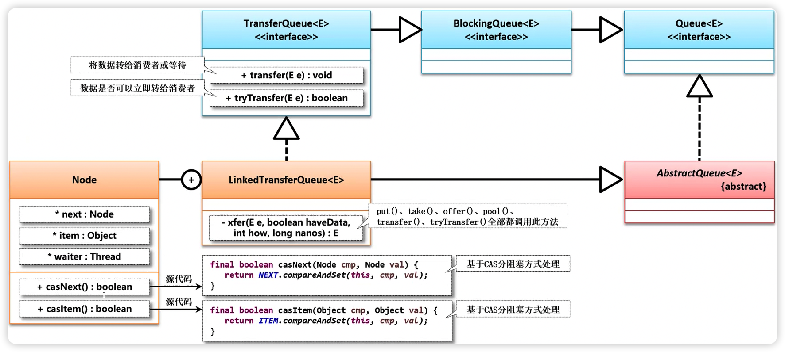

- put(): 

  ```java
  public void put(E e) {
      xfer(e, true, ASYNC, 0L);
  }
  ```

- take(): 

  ```java
  public E take() throws InterruptedException {
      E e = xfer(null, false, SYNC, 0L);
      if (e != null)
          return e;
      Thread.interrupted();
      throw new InterruptedException();
  }
  
  ```

- xfer(): 

  ```java
  private E xfer(E e, boolean haveData, int how, long nanos) {
      if (haveData && (e == null))
          throw new NullPointerException();
  
      restart: for (Node s = null, t = null, h = null;;) {
          for (Node p = (t != (t = tail) && t.isData == haveData) ? t
               : (h = head);; ) {
              final Node q; final Object item;
              if (p.isData != haveData
                  && haveData == ((item = p.item) == null)) {
                  if (h == null) h = head;
                  if (p.tryMatch(item, e)) {
                      if (h != p) skipDeadNodesNearHead(h, p);
                      return (E) item;
                  }
              }
              if ((q = p.next) == null) {
                  if (how == NOW) return e;
                  if (s == null) s = new Node(e);
                  if (!p.casNext(null, s)) continue;
                  if (p != t) casTail(t, s);
                  if (how == ASYNC) return e;
                  return awaitMatch(s, p, e, (how == TIMED), nanos);
              }
              if (p == (p = q)) continue restart;
          }
      }
  }
  ```


## 4、双端阻塞队列 BlockingDeque

BlockingQueue 提供了 FIFO 的单端队列，而在 BlockingQueue 接口的基础上又扩充了 BlockingDeque 子接口，该接又可以实现 FIFO、FILO 双端队列的处理操作，在 J.U.C 中提供了一个 LinkedBlockingDeque 实现子类，继承结构如图所示，该类通过ReentrantLock 独占锁的形式实现同步管理。


BlockingDeque 属于一个双端队列，而后其实现的子类：LinkedBlockingDeque，只要是在类中看见了是以 Linked 开头的程序类，那么其内部都是通过链表的结构来完成的定义。LinkedBlockinDeque 实现子类之中，可以发现是存在有一个 ReentrantLock 互斥锁的类型存在，在整个的双端队列里面依然是基于锁机制的形式实现了数据的存取操作。

```java
public class LinkedBlockingDeque<E> extends AbstractQueue<E> implements BlockingDeque<E>, java.io.Serializable {
    /** Doubly-linked list node class */
    static final class Node<E> {
        E item;
        Node<E> prev;
        Node<E> next;
        Node(E x) {
            item = x;
        }
    }

    transient Node<E> first;
    transient Node<E> last;
    private transient int count;
    private final int capacity;

    final ReentrantLock lock = new ReentrantLock();
    @SuppressWarnings("serial") // Classes implementing Condition may be serializable.
    private final Condition notEmpty = lock.newCondition();
    @SuppressWarnings("serial") // Classes implementing Condition may be serializable.
    private final Condition notFull = lock.newCondition();

    public LinkedBlockingDeque() {
        this(Integer.MAX_VALUE);
    }
    public LinkedBlockingDeque(int capacity) {
        if (capacity <= 0) throw new IllegalArgumentException();
        this.capacity = capacity;
    }
}
```

操作示例 1：实现双端队列的处理

```java
import java.util.concurrent.BlockingDeque;
import java.util.concurrent.LinkedBlockingDeque;
import java.util.concurrent.TimeUnit;

public class JavaAPIDemo {
    public static void main(String[] args) {
        // 每一个队列在启用的时候必须明确的设置其保存的数据的个数
        BlockingDeque<String> deque = new LinkedBlockingDeque<>(); // 双端阻塞队列
        // 如果要想观察到队列的使用，最佳的做法就是生产者与消费者的处理模型
        for (int x = 0; x < 5; x++) {  // 创建循环
            new Thread(() -> {
                for (int y = 0; y < 10; y++) { // 持续生产
                    try {
                        TimeUnit.SECONDS.sleep(2); // 生产慢
                        String msg ;
                        if (y % 2 == 0) {
                            msg = "[FIRST]生产数据 y = " + y ;
                            deque.addFirst(msg);
                        } else {
                            msg = "[LAST]生产数据 y = " + y ;
                            deque.addLast(msg);
                        }
                        deque.putFirst(msg); // 向队列之中添加数据
                        System.out.printf("【%s】%s%n", Thread.currentThread().getName(), msg);
                    } catch (InterruptedException ignored) {
                    }
                }
            }, "生产者 - " + x).start();
        }
        for (int x = 0; x < 2; x++) {
            new Thread(() -> {
                int count = 0;
                while (true) {   // 持续性的通过队列抓取数据
                    if (count % 2 == 0) {
                        try {
                            TimeUnit.SECONDS.sleep(2); // 生产慢
                            System.err.printf("【%s】%s%n", Thread.currentThread().getName(), deque.takeFirst());
                        } catch (InterruptedException ignored) {
                        }
                    } else {
                        try {
                            TimeUnit.SECONDS.sleep(2); // 生产慢
                            System.err.printf("【%s】%s%n", Thread.currentThread().getName(), deque.takeLast());
                        } catch (InterruptedException ignored) {
                        }
                    }
                    count++;
                }
            }, "消费者 - " + x).start();
        }
    }
}
```

```java
【生产者 - 4】[FIRST]生产数据 y = 0
【生产者 - 3】[FIRST]生产数据 y = 0
【生产者 - 2】[FIRST]生产数据 y = 0
【生产者 - 1】[FIRST]生产数据 y = 0
【生产者 - 0】[FIRST]生产数据 y = 0
【消费者 - 0】[FIRST]生产数据 y = 0
【消费者 - 1】[FIRST]生产数据 y = 0
【消费者 - 0】[FIRST]生产数据 y = 0
【消费者 - 1】[FIRST]生产数据 y = 0
【生产者 - 4】[LAST]生产数据 y = 1
【生产者 - 0】[LAST]生产数据 y = 1
【生产者 - 1】[LAST]生产数据 y = 1
【生产者 - 3】[LAST]生产数据 y = 1
【生产者 - 2】[LAST]生产数据 y = 1
【消费者 - 0】[LAST]生产数据 y = 1
【消费者 - 1】[FIRST]生产数据 y = 2
【生产者 - 4】[FIRST]生产数据 y = 2
【生产者 - 0】[FIRST]生产数据 y = 2
【生产者 - 1】[FIRST]生产数据 y = 2
【生产者 - 3】[FIRST]生产数据 y = 2
【生产者 - 2】[FIRST]生产数据 y = 2
【消费者 - 1】[LAST]生产数据 y = 1
【消费者 - 0】[LAST]生产数据 y = 1
```

操作示例 2：生产者和消费者模型的实现方案很多，对于双端阻塞队列一定要清楚它本身还是一个队列。如果现在first已经拽干净了，那么将继续拽last，就会有可能出现first消费last的情况。

````java
import java.util.concurrent.BlockingDeque;
import java.util.concurrent.LinkedBlockingDeque;

public class JavaAPIDemo {
    public static void main(String[] args) throws InterruptedException {
        // 每一个队列在启用的时候必须明确的设置其保存的数据的个数
        BlockingDeque<String> queue = new LinkedBlockingDeque<>(); // 阻塞队列
        // 如果要想观察到队列的使用，最佳的做法就是生产者与消费者的处理模型，利用链表来实现
        BlockingDeque<String> deque = new LinkedBlockingDeque<>();
        deque.addFirst("Hello-First");
        deque.addFirst("World-First");
        deque.addLast("Hello-Last");
        deque.addLast("World-Last");
        System.out.println(deque.takeFirst());
        System.out.println(deque.takeFirst());
        System.out.println(deque.takeFirst());
        System.out.println(deque.takeFirst());
    }
}
````

```java
World-First
Hello-First
Hello-Last
World-Last
```

折腾了一圈的阻塞队列机制，你会发现除了可以自动的实现等待与唤醒之外，整体的操作和传统的队列并没有太大的不同，这里面唯一不同的就是在 JDK1.7 之后提供的 TransferQueue 队列，避免了锁的影响，同时又提升了保存和消费的性能。


## 5、延迟阻塞队列 DelayQueue

### 1、延迟队列基本概念

在之前己经学习过了阻塞队列的概,念，在阻塞队列之中有一个最大的特点：如果现在队列的内容是空的，那么获取的线程则会自动的进入到阻塞状态，反之，如果此时的队列是满的，那么生产线程将自动进入到阻塞状态，最重要的是阻塞队列可以自动的实现这些线程的解锁控制。

在阻塞队列之中提供有一个 DelayQueue 队列类型，而这个队列就称为延迟队列，延迟队列最大的特点在于，如果到时间了，则会自动的弹出数据。阻塞队列是需要开发者通过线程的操作获取队列内容的【也就是手工的调用 put() 或 take() 方法来完成】，但是延迟队列是可以自己进行数据弹出的，延迟队列使用的时候我们开发者只能够接收弹出的数据项。


在每一个延迟队列之中所保存的数据项的內部会有两个组成部分：具体的数据内容、操作的时间（最大的操作的范围），这个操作时间就是最终完成工作预计所花费的时间，而延迟队列会根据这个时间来进行内容的弹出，延迟队列的实现有专属的实现子类，那么下面打开这个类的定义来做一个观察：

```java
public class DelayQueue<E extends Delayed> extends AbstractQueue<E> implements BlockingQueue<E> {}
```

所有类集里面提供的队列结构（Queue)，都会存在有一个 AbstractQueue 抽象父类进行一些操作的公共实现，同时这个类之中设计的泛型类型为 Delayed。

```java
public interface Delayed extends Comparable<Delayed> {
    long getDelay(TimeUnit unit);
}
```

可以看到，Delayed 接口除了自身的 getDelay 方法外，还实现了 Comparable 接口。getDelay 方法用于返回对象的剩余有效时间，实现C omparable 接口则是为了能够比较两个对象，以便排序。也就是说，如果一个类实现了 Delayed 接口，当创建该类的对象并添加到 DelayQueue 中后，**只有当该对象的 getDalay 方法返回的剩余时间 ≤ 0 时才会出队**。

在整个的延迟项的定义的时候，需要设置有一个 Delayed 接口实例，它本身属于 Comparable 接口实例。

> 回顾：在整个的 Java 类集之中，有那个队列的结构需要 Comparable 接口支持呢？如果现在要在队列之中进行排序的操作结构，则必须使用 PriorityXxxQueue【PriorityQueue、PriorityBlockingQueue】。

为便于延迟队列的实现，在 J.U.C 中提供了一个 DelayQueue 实现类，该类为 BlockingQueue 接口子类，而在该队列中所保存的具体数据内容必须为 Delayed 接口实例。根据以上的结构分析之后，就可以得到如下的实现类的关联形式。

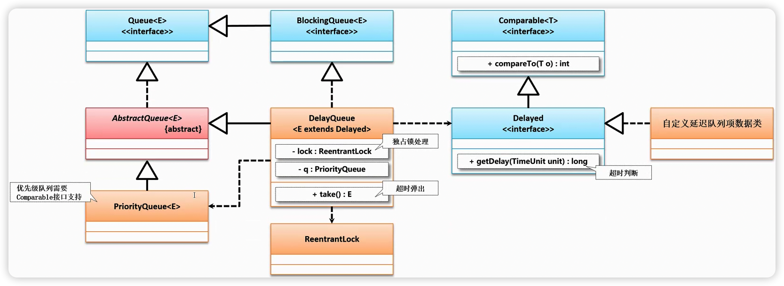

DelayQueue 内部实现源代码：

```java
public class DelayQueue<E extends Delayed> extends AbstractQueue<E> implements BlockingQueue<E> {
    private final transient ReentrantLock lock = new ReentrantLock();
    private final PriorityQueue<E> q = new PriorityQueue<E>();
}
```

由于 DelayQueue 内部委托了 PriorityBlockingQueue 对象来实现所有方法，所以能以堆的结构维护元素顺序，这样剩余时间最小的元素就在堆顶，**每次出队其实就是删除剩余时间 ≤ 0 的最小元素**。

本质上来讲所有的延迟队列的实现就是基于优先级队列的方式完成的，那个延迟时间达到了，那个队列项就自动的弹出了。

DelayQueue 的特点简要概括如下：

1. DelayQueue 是无界阻塞队列；
2. 队列中的元素必须实现 Delayed 接口，元素过期后才会从队列中取走；


### 2、延迟队列基本操作

延迟队列的实现需要通过 Delay 接口定义具体的队列存储项，为了便于理解，本次将直接创建—个 Employee 雇员处理类，同时在延迟队列保存时设置每个雇员完成工作所需要的时间（以及对应的时间单元），如图所示，这样在进行队列数据获取时，会自动进行延迟时间的判断，以达到弹出的目的。


操作示例 1：实现延迟队列自动弹出

```java
import java.util.concurrent.DelayQueue;
import java.util.concurrent.Delayed;
import java.util.concurrent.TimeUnit;

class Employee implements Delayed {
    private String name; // 雇员姓名
    private String task; // 雇员任务
    private long delay; // 设置的延迟时间以,以毫秒单位
    private long expire; // 失效时间,任务完成的时间,以毫秒单位

    public Employee(String name, String task, long delay, TimeUnit timeUnit) {
        this.name = name;
        this.task = task;
        this.delay = TimeUnit.MILLISECONDS.convert(delay, timeUnit); // 以毫秒为单位存储
        this.expire = System.currentTimeMillis() + this.delay;    // 当前时间+延迟时间=失效时间
    }

    @Override
    public long getDelay(TimeUnit unit) {
        // 计算延迟时间是否到达
        return unit.convert(this.expire - System.currentTimeMillis(), TimeUnit.MILLISECONDS);
    }

    @Override
    public int compareTo(Delayed o) {
        // 决定了你优先级队列的弹出操作
        return (int) (this.delay - o.getDelay(TimeUnit.MILLISECONDS));
    }

    @Override
    public String toString() {
        return "【任务完成】雇员" + this.name + "完成了" + this.task + "工作，一共花费了" + this.delay + "毫秒的时间！";
    }
}

public class JavaAPIDemo {
    public static void main(String[] args) throws InterruptedException {
        DelayQueue<Employee> queue = new DelayQueue<>() ;	// 设置延迟队列
        queue.put(new Employee("张三", "图书编写", 5, TimeUnit.SECONDS));
        queue.put(new Employee("李四", "视频剪辑", 2, TimeUnit.SECONDS));
        queue.put(new Employee("王五", "编程设计", 6, TimeUnit.SECONDS));
        while(!queue.isEmpty()) {	// 如果聚会还有人在呢
            // 如果通过队列里面可以获取数据，就表示当前的用户已经离开了，满足了延迟的条件了
            System.out.println(queue.take());  // 从里面取出数据内容
            TimeUnit.SECONDS.sleep(1);  // 延迟1000毫秒
        }
    }
}
```

```java
【任务完成】雇员李四完成了视频剪辑工作，一共花费了2000毫秒的时间！
【任务完成】雇员张三完成了图书编写工作，一共花费了5000毫秒的时间！
【任务完成】雇员王五完成了编程设计工作，一共花费了6000毫秒的时间！
```

操作示例 2：实现延迟队列自动弹出

```java
import java.util.concurrent.BlockingQueue;
import java.util.concurrent.DelayQueue;
import java.util.concurrent.Delayed;
import java.util.concurrent.TimeUnit;

class Employee implements Delayed {
    private String name; // 雇员姓名
    private String task; // 雇员任务
    private long start = System.currentTimeMillis(); // 任务开始时间
    private long delay; // 设置的延迟时间以,以毫秒单位
    public Employee(String name, String task, long delay, TimeUnit timeUnit) {
        this.name = name;
        this.task = task;
        this.delay = TimeUnit.MILLISECONDS.convert(delay, timeUnit); // 以毫秒为单位存储
    }

    @Override
    public long getDelay(TimeUnit unit) { // 计算失效时间
        // 计算延迟时间是否到达
        return unit.convert((this.start + this.delay) - System.currentTimeMillis(), TimeUnit.MILLISECONDS);
    }

    @Override
    public int compareTo(Delayed o) { // 队列排序
        // 决定了你优先级队列的弹出操作
        return (int) (this.getDelay(TimeUnit.MILLISECONDS) - o.getDelay(TimeUnit.MILLISECONDS));
    }

    @Override
    public String toString() {
        return "【任务完成】雇员" + this.name + "完成了" + this.task + "工作，一共花费了" + this.delay + "毫秒的时间！";
    }
}

public class JavaAPIDemo {
    public static void main(String[] args) throws InterruptedException {
        BlockingQueue<Employee> queue = new DelayQueue<>() ;	// 设置延迟队列
        queue.put(new Employee("张三", "图书编写", 5, TimeUnit.SECONDS));
        queue.put(new Employee("李四", "视频剪辑", 2, TimeUnit.SECONDS));
        queue.put(new Employee("王五", "编程设计", 6, TimeUnit.SECONDS));
        while(!queue.isEmpty()) {	// 如果聚会还有人在呢
            Delayed employee = queue.take() ;	// 从里面取出数据内容
            // 如果通过队列里面可以获取数据，就表示当前的用户已经离开了，满足了延迟的条件了
            System.out.println(employee);
            TimeUnit.SECONDS.sleep(1);	// 延迟操作
        }
    }
}
```

```java
【任务完成】雇员李四完成了视频剪辑工作，一共花费了2000毫秒的时间！
【任务完成】雇员张三完成了图书编写工作，一共花费了5000毫秒的时间！
【任务完成】雇员王五完成了编程设计工作，一共花费了6000毫秒的时间！
```

可以发现此时队列之中的所有的操作实际上都是并行计数的（延迟的时间），因为是根据当前的时间来进行的延迟操作的处理，所以当前时间基点不变，那么其他的判断自然就会同步进行了。


### 3、DelayQueue 原理

#### 1、DelayQueue 构造

DelayQueued提供了两种构造器，都非常简单：

```java
/**
 * 默认构造器.
 */
public DelayQueue() {
}

/**
 * 从已有集合构造队列.
 */
public DelayQueue(Collection<? extends E> c) {
    this.addAll(c);
}
```

可以看到，内部的**PriorityQueue**并非在构造时创建，而是对象创建时生成：

```java
public class DelayQueue<E extends Delayed> extends AbstractQueue<E>
    implements BlockingQueue<E> {

    private final transient ReentrantLock lock = new ReentrantLock();
    private final PriorityQueue<E> q = new PriorityQueue<E>();

    /**
     * leader线程是首个尝试出队元素（队列不为空）但被阻塞的线程.
     * 该线程会限时等待（队首元素的剩余有效时间），用于唤醒其它等待线程
     */
    private Thread leader = null;

    /**
     * 出队线程条件队列, 当有多个线程, 会在此条件队列上等待.
     */
    private final Condition available = lock.newCondition();

    //...
}
```

上述比较特殊的是 leader 字段，我们之前已经说过，DelayQueue 每次只会出队一个过期的元素，如果队首元素没有过期，就会阻塞出队线程，让线程在 available 这个条件队列上无限等待。

为了提升性能，DelayQueue 并不会让所有出队线程都无限等待，而是用 leader 保存了第一个尝试出队的线程，该线程的等待时间是队首元素的剩余有效期。这样，一旦 leader 线程被唤醒（此时队首元素也失效了），就可以出队成功，然后唤醒一个其它在 available 条件队列上等待的线程。之后，会重复上一步，新唤醒的线程可能取代成为新的 leader 线程。这样，就避免了无效的等待，提升了性能。这其实是一种名为 “Leader-Follower pattern” 的多线程设计模式。


#### 2、入队——put

put 方法没有什么特别，由于是无界队列，所以也不会阻塞线程。

```java
/**
 * 入队一个指定元素e.
 * 由于是无界队列, 所以该方法并不会阻塞线程.
 */
public void put(E e) {
    offer(e);
}

public boolean offer(E e) {
    final ReentrantLock lock = this.lock;
    lock.lock();
    try {
        q.offer(e);             // 调用PriorityQueue的offer方法
        if (q.peek() == e) {    // 如果入队元素在队首, 则唤醒一个出队线程
            leader = null;
            available.signal();
        }
        return true;
    } finally {
        lock.unlock();
    }
}
```

> 需要注意的是当首次入队元素时，需要唤醒一个出队线程，因为此时可能已有出队线程在空队列上等待了，如果不唤醒，会导致出队线程永远无法执行。

```java
if (q.peek() == e) {    // 如果入队元素在队首, 则唤醒一个出队线程
    leader = null;
    available.signal();
}
```


#### 3、出队——take

整个 take 方法在一个自旋中完成，其实就分为两种情况：

1.队列为空：这种情况直接阻塞出队线程。（在 available 条件队列等待）

2.队列非空：队列非空时，还要看队首元素的状态（有效期），如果队首元素过期了，那直接出队就行了；如果队首元素未过期，就要看当前线程是否是第一个到达的出队线程（即判断 leader 是否为空），如果不是，就无限等待，如果是，则限时等待。

```java
/**
 * 队首出队元素.
 * 如果队首元素（堆顶）未到期或队列为空, 则阻塞线程.
 */
public E take() throws InterruptedException {
    final ReentrantLock lock = this.lock;
    lock.lockInterruptibly();
    try {
        for (; ; ) {
            E first = q.peek();     // 读取队首元素
            if (first == null)      // CASE1: 队列为空, 直接阻塞
                available.await();
            else {                  // CASE2: 队列非空
                long delay = first.getDelay(NANOSECONDS);
                if (delay <= 0)                             // CASE2.0: 队首元素已过期
                    return q.poll();

                // 执行到此处说明队列非空, 且队首元素未过期
                first = null;
                if (leader != null)                         // CASE2.1: 已存在leader线程
                    available.await();      // 无限期阻塞当前线程
                else {                                      // CASE2.2: 不存在leader线程
                    Thread thisThread = Thread.currentThread();
                    leader = thisThread;    // 将当前线程置为leader线程
                    try {
                        available.awaitNanos(delay);        // 阻塞当前线程（限时等待剩余有效时间）
                    } finally {
                        if (leader == thisThread)
                            leader = null;
                    }
                }
            }
        }
    } finally {
        if (leader == null && q.peek() != null)             // 不存在leader线程, 则唤醒一个其它出队线程
            available.signal();
        lock.unlock();
    }
}
```

需要注意，自旋结束后如果`leader == null && q.peek() != null`，需要唤醒一个等待中的出队线程。
`leader == null && q.peek() != null`的含义就是——没有`leader`线程但队列中存在元素。我们之前说了，leader线程作用之一就是用来唤醒其它无限等待的线程，所以必须要有这个判断。

需要注意，自旋结束后如果`leader == null && q.peek() != null`，需要唤醒一个等待中的出队线程。`leader == null && q.peek() != null`的含义就是：没有 leader 线程但队列中存在元素。我们之前说了，leader 线程作用之一就是用来唤醒其它无限等待的线程，所以必须要有这个判断。


#### 4、DelayQueue 总结

DelayQueue 是阻塞队列中非常有用的一种队列，经常被用于缓存或定时任务等的设计。

考虑一种使用场景：异步通知的重试，在很多系统中，当用户完成服务调用后，系统有时需要将结果异步通知到用户的某个 URI。由于网络等原因，很多时候会通知失败，这个时候就需要一种重试机制。

这时可以用 DelayQueue 保存通知失败的请求，失效时间可以根据已通知的次数来设定（比如：2s、5s、10s、20s），这样每次从队列中 take 获取的就是剩余时间最短的请求，如果已重复通知次数超过一定阈值，则可以把消息抛弃。

后面我们在学习线程池的时候，还会再次看到 DelayQueue 的身影。JUC 线程池框架中的 ScheduledThreadPoolExecutor.DelayedWorkQueue 就是一种延时阻塞队列。


### 4、实现数据缓存操作

**操作系统执行流程**：程序的执行离不开操作系统的支持，而所有的程序在运算前一定要进行 CPU 资源的抢占，为了便于 CPU 运算时的数据读取，在运算前需要将所有的数据由存储介质（磁盘、网络）加载到内存之中，如图所示，所以此时 IO的性能就决定了整个应用程序的处理性能。


**数据缓存操作**：要想提高程序的并发处理，那么最佳的做法就是减少操作系统中的IO操作，而将所需要的核心数据保存在内存之中，即：部分数据的缓存。但是这样一来也会出现一个新的问题：内存保存的数据量会造成内存的溢出，所以应该做一个缓存的定期清理工作，此时就可以基于延迟队列的操作实现。


操作示例 1：通过延迟队列手工实现数据缓存操作

```java
import java.util.Map;
import java.util.concurrent.*;

/**
 * 缓存数据处理类
 */
class Cache<K, V> {
    private static final TimeUnit TIME = TimeUnit.SECONDS; // 时间工具类
    public static final long DELAY_SECONDS = 2; // 缓存时间
    private final Map<K, V> cacheObjects = new ConcurrentHashMap<>(); // 设置缓存集合
    private final BlockingQueue<DelayedItem<Pair>> queue = new DelayQueue<>();
    public Cache() { // 启动守护线程
        Thread thread = new Thread(() -> {
            while (true) {
                try {
                    DelayedItem<Pair> item = Cache.this.queue.take();// 数据消费
                    // 数据删除
                    Pair pair = item.getItem();
                    Cache.this.cacheObjects.remove(pair.key, pair.value);
                } catch (InterruptedException ignored) {
                }
            }
        });
        thread.setDaemon(true); // 设置后台线程
        thread.start(); // 线程启动
    }

    public void put(K key, V value) throws Exception {
        V oldValue = this.cacheObjects.put(key, value); // 数据保存
        if (oldValue != null) { // 重复数据
            this.queue.remove(oldValue); // 删除已有数据
        }
        this.queue.put(new DelayedItem<>(new Pair(key, value), DELAY_SECONDS, TIME)); // 重新保存
    }
    public V get(K key) { // 获取缓存数据
        return this.cacheObjects.get(key); // Map查询数据
    }

    public class Pair { // 封装保存数据
        private K key; // 数据key
        private V value; // 数据value
        public Pair (K key, V value) {
            this.key = key;
            this.value = value;
        }
    }
    // 延迟数据项
    private static class DelayedItem<T> implements Delayed {
        private T item;       // 数据项
        private long delay;   // 保存时间
        private long start;   // 当前时间
        public DelayedItem(T item, long delay, TimeUnit unit) {
            this.item = item;
            this.delay = TimeUnit.MILLISECONDS.convert(delay, unit);
            this.start = System.currentTimeMillis();
        }
        @Override
        public long getDelay(TimeUnit unit) { // 延迟计算
            return unit.convert((this.start + this.delay) - System.currentTimeMillis(), TimeUnit.MILLISECONDS);
        }

        @Override
        public int compareTo(Delayed o) {
            return (int)(this.getDelay(TimeUnit.MILLISECONDS) - o.getDelay(TimeUnit.MILLISECONDS));
        }
        public T getItem() { // 获取数据
            return this.item;
        }
    }
}

class News { // 新闻数据
    private long nid;
    private String title;
    public News(long nid, String title) {
        this.nid = nid;
        this.title = title;
    }

    @Override
    public String toString() {
        return "【新闻数据】新闻编号：" + this.nid + "、新闻标题：" + this.title;
    }
}

public class JavaAPIDemo {
    public static void main(String[] args) throws Exception {
        Cache<Long, News> cache = new Cache<>();
        cache.put(1L, new News(1L, "Java"));   // 向缓存保存数据
        cache.put(2L, new News(2L, "Python")); // 向缓存保存数据
        System.out.println(cache.get(1L)); // 通过缓存获取数据
        System.out.println(cache.get(2L)); // 通过缓存获取数据
        TimeUnit.SECONDS.sleep(5);  // 延迟获取
        System.out.println("--------------------5秒之后再次读取数--------------------");
        System.out.println(cache.get(1L)); // 通过缓存获取数据
    }
}
```

```java
【新闻数据】新闻编号：1、新闻标题：Java
【新闻数据】新闻编号：2、新闻标题：Python
--------------------5秒之后再次读取数--------------------
null
```


# 09、线程池

## 1、线程池简介

多线程的三种实现方式：Thread 类、Runnable 接口、Callable 接口，只有 Callable 是在 J.U.C 中提供。

**子线程调度**：多线程是 Java 语言中最为核心的部分，并且也提供了合理的多线程应用开发模型，开发者可以很方便的通过主线程创建自己所需要的子线程。每一个子线程都需要等待操作系统的执行调度，如图所示。如果一个应用中的子线程数量过多，那么最终的结果就是调度时间加长，线程竞争激励，最终导致整个系统的性能出现严重的下降。


> 一台电脑之中可以使用的线程数量毕竟是有限的（如果现在每一个多线程仅仅是完成了一个所谓的 "+1" 操作，那么自然可以创建较多的线程)，但是如果说没一个线程完成一套各自的完整的业务处理逻辑，那么这个操作一般的电脑上的线程数量就不可能特别的多，如果多了则直接造成电脑的崩溃（假死状态)。如果要想维护一个应用程序的稳定，那么首先一定要考虑到线程数量的控制，而线程数量的控制在 J.U.C 里面提供了线程池的支持，利用线程池可以有效的分配物理线程（也被称为内核线程）和用户线程之间的资源。
>

**线程池处理架构**：为了解决应用中子线程过多所造成的资源损耗问题，在JDK1.5之后提供了线程池的概念，即：在系统内部会根据需要创建若干个核心线程数量（CorePool），而后每一个要操作的任务子线程去竞争这若干个核心线程的数量，而当核心线程已经被占满时，将通过阻塞队列来保存等待执行的子线程，如图所示，这样就可以保证系统内部不会无序的进行子线程的创建，从而提高应用程序的处理性能。


> 所有的 CPU 之中一般都会存在有一个指标，多少核，多少线程，一般来说一核 CPU 只拥有一个线程，如果现在要是一核 CPU拥有两个线程，就被称为超线程技术。如果此时用户创建了200 个线程（可以理解为任务线程)，最终也是在针对于这 6个物理线程的资源抢占。这些任务线程彼此之间要进行资源抢占，会通过各种机制去抢占6个物理的线程资源。如果说此时的任务线程过多，如果全部都参与到了抢占的操作，那么整个的系统资源分配就会出现问题了，最佳的做法是采用一个延迟队列的结构，利用延迟队列进行所有新任务线程的存储。
>
> 而线程池可以完成的工作就是固定物理线程数量（一般的配置都是内核线程数量 * 2，由 Netty 决定的），而后再定义延迟队列的大小，因为延迟队列越大，可以保存的待执行任务线程就越多，但是如果太大了，也不合适，因为一旦抢占不到资源，最终就会出现等待时间超长的问题。
>
> **提示一下：在后面学习到《JavaWEB 就业编程实战》图书的时候，会存在有一个 Tomcat 的性能优化问题，而这个性能优化分为两个部分：JVM 的性能参数调整、线程池的控制。**


## 2、线程池创建

### 1、Executors 四种创建方式

如果要想进行线程池的创建，在 J.U.C 里面是直接提供有相关的工具类的，工具类的名称：java.util.concurrent.Executors，这个类可以创建四种线程池（在整个的开发过程之中，四种线程池就包含了所有可能使用到的类型）。

在 Executors 类之中如果要想进行线程池的创建，则有四种类型，这四种类型的创建方法如下：

- 无限大小线程池：newCachedThreadPool

  ```java
  /**
   * 创建一个可缓存线程的Execotor.
   * 如果线程池中没有线程可用, 则创建一个新线程并添加到池中;
   * 如果有线程长时间未被使用(默认60s, 可通过threadFactory配置), 则从缓存中移除.
   */
  public static ExecutorService newCachedThreadPool() {
      return new ThreadPoolExecutor(0, Integer.MAX_VALUE, 60L, TimeUnit.SECONDS,
              new SynchronousQueue<Runnable>());
  }
  
  /**
   * 创建一个可缓存线程的Execotor.
   * 如果线程池中没有线程可用, 则创建一个新线程并添加到池中;
   * 如果有线程长时间未被使用(默认60s, 可通过threadFactory配置), 则从缓存中移除.
   * 在需要时使用提供的 ThreadFactory 创建新线程.
   * ThreadFactory 的作用就是可以修饰我们线程池中的线程，常用操作有 设置线程的名字，设置线程是否为守护线程等等
   */
  public static ExecutorService newCachedThreadPool(ThreadFactory threadFactory) {
      return new ThreadPoolExecutor(0, Integer.MAX_VALUE, 60L, TimeUnit.SECONDS,
              new SynchronousQueue<Runnable>(), threadFactory);
  }
  ```

- 固定大小线程池：newFixedThreadPool

  ```java
  /**
   * 创建一个具有固定线程数的Executor.
   */
  public static ExecutorService newFixedThreadPool(int nThreads) {
      return new ThreadPoolExecutor(nThreads, nThreads, 0L, TimeUnit.MILLISECONDS,
              new LinkedBlockingQueue<Runnable>());
  }
  
  /**
   * 创建一个具有固定线程数的Executor.
   * 在需要时使用提供的 ThreadFactory 创建新线程.
   * ThreadFactory 的作用就是可以修饰我们线程池中的线程，常用操作有 设置线程的名字，设置线程是否为守护线程等等
   */
  public static ExecutorService newFixedThreadPool(int nThreads, ThreadFactory threadFactory) {
      return new ThreadPoolExecutor(nThreads, nThreads, 0L, TimeUnit.MILLISECONDS,
              new LinkedBlockingQueue<Runnable>(), threadFactory);
  
  }
  ```

- 单线程池：newSingleThreadExecutor

  ```java
  /**
   * 创建一个使用单个 worker 线程的 Executor.
   */
  public static ExecutorService newSingleThreadExecutor() {
      return new FinalizableDelegatedExecutorService
              (new ThreadPoolExecutor(1, 1, 0L, TimeUnit.MILLISECONDS,
                      new LinkedBlockingQueue<Runnable>()));
  }
  
  /**
   * 创建一个使用单个 worker 线程的 Executor.
   * 在需要时使用提供的 ThreadFactory 创建新线程.
   * ThreadFactory 的作用就是可以修饰我们线程池中的线程，常用操作有 设置线程的名字，设置线程是否为守护线程等等
   */
  public static ExecutorService newSingleThreadExecutor(ThreadFactory threadFactory) {
      return new FinalizableDelegatedExecutorService
              (new ThreadPoolExecutor(1, 1, 0L, TimeUnit.MILLISECONDS,
                      new LinkedBlockingQueue<Runnable>(), threadFactory));
  }
  ```

- 定时调度线程池：newScheduledThreadPool

  ```java
  /**
   * 创建一个具有固定线程数的 可调度Executor.
   * 它可安排任务在指定延迟后或周期性地执行.
   */
  public static ScheduledExecutorService newScheduledThreadPool(int corePoolSize) {
      return new ScheduledThreadPoolExecutor(corePoolSize);
  }
  
  /**
   * 创建一个具有固定线程数的 可调度Executor.
   * 它可安排任务在指定延迟后或周期性地执行.
   * 在需要时使用提供的 ThreadFactory 创建新线程.
   * ThreadFactory 的作用就是可以修饰我们线程池中的线程，常用操作有 设置线程的名字，设置线程是否为守护线程等等
   */
  public static ScheduledExecutorService newScheduledThreadPool(int corePoolSize, ThreadFactory threadFactory) {
      return new ScheduledThreadPoolExecutor(corePoolSize, threadFactory);
  }
  
  /**
   * 创建一个单线程线程池，这个线程池可以延时执行任务，或者周期性的执行任务。
   * 但是请注意，如果这个工作线程在关闭之前因为执行失败而终止，则如果需要去执行后续任务，可以新建一个线程代替它。
   * 任务是按顺序执行的，任意时刻，都不会有超过一个以上的活动线程。
   * 不同于等效的newScheduledThreadPool(1)，newSingleThreadScheduledExecutor不能通过配置而达到使用额外线程的目的。
   * 从方法定义可知：
   *  - 使用了代理类DelegatedScheduledExecutorService，使之无法修改配置。
   *  - 其实际是通过ScheduledThreadPoolExecutor构造的.
   *  - 而ScheduledThreadPoolExecutor是通过ThreadPoolExecutor构造的。
   */
  public static ScheduledExecutorService newSingleThreadScheduledExecutor() {
      return new DelegatedScheduledExecutorService
          (new ScheduledThreadPoolExecutor(1));
  }
  
  /**
   * 创建一个单线程线程池，这个线程池可以延时执行任务，或者周期性的执行任务。
   * 在需要时使用提供的 ThreadFactory 创建新线程. 其他与newSingleThreadScheduledExecutor没区别
   * ThreadFactory 的作用就是可以修饰我们线程池中的线程，常用操作有 设置线程的名字，设置线程是否为守护线程等等
   */
  public static ScheduledExecutorService newSingleThreadScheduledExecutor(ThreadFactory threadFactory) {
      return new DelegatedScheduledExecutorService
          (new ScheduledThreadPoolExecutor(1, threadFactory));
  }
  ```

通过 Executors 类所提供的方法可以分别创建 ExecutorService 接口实例以及 ScheduleExecutorsServices 接口实例，而后可以利用获取接口实例中所提供的方法，用 Runnable 或 Callable 实现线程任务的封装，而所有线程任务的返回结果可以通过 Future 或其子接口（ScheduleFuture）异步返回。

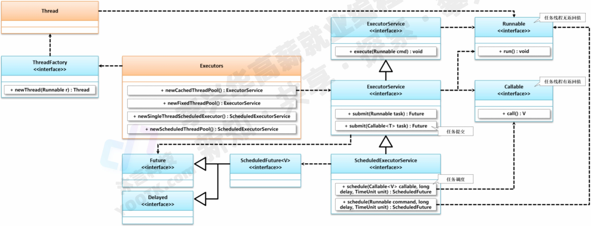

Java 里面线程池的顶级接口是 Executor，但是严格意义上讲 Executor 并不是一个线程池，而只是一个执行线程的工具。真正的线程池接口是 ExecutorService 或者 ScheduleExecutorsServices。


### 2、newCachedThreadPool

创建一个可根据需要创建新线程的线程池，但是在以前构造的线程可用时将重用它们。对于执行很多短期异步任务的程序而言，这些线程池通常可提高程序性能。调用 execute 将重用以前构造的线程（如果线程可用）。如果现有线程没有可用的，则创建一个新线程并添加到池中。终止并从缓存中移除那些已有 60 秒钟未被使用的线程。因此，长时间保持空闲的线程池不会使用任何资源。

操作示例 1：创建无限大小的线程池

```java
import java.util.concurrent.ExecutorService;
import java.util.concurrent.Executors;

public class JavaAPIDemo {
    public static void main(String[] args) {
        // 创建无限大小线程池
        ExecutorService service = Executors.newCachedThreadPool();
        for (int x = 0; x < 10; x++) {
            // 线程池会负责启动
            service.submit(() -> System.out.println(Thread.currentThread().getName() + "：执行操作。"));
        }
        service.shutdown(); // 线程池执行完毕后需要关闭
    }
}
```

```java
pool-1-thread-5：执行操作。
pool-1-thread-3：执行操作。
pool-1-thread-2：执行操作。
pool-1-thread-7：执行操作。
pool-1-thread-6：执行操作。
pool-1-thread-8：执行操作。
pool-1-thread-1：执行操作。
pool-1-thread-4：执行操作。
pool-1-thread-3：执行操作。
pool-1-thread-7：执行操作。
```

> 所谓的无限大小的线程池，指的是如果发现线程池之中的线程数量不足了，那么就会自动创建一个新的线程，而后将这个新创建的线程保存在线程池之中，由于这种操作会无限制的增长，如果超过了其允许的线程个数，则也会出现有性能瓶颈，这种操作只是提供了一个线程的统一管理。


### 3、newFixedThreadPool

创建一个可重用固定线程数的线程池，以共享的无界队列方式来运行这些线程。在任意点，在大多数 nThreads 线程会处于处理任务的活动状态。如果在所有线程处于活动状态时提交附加任务，则在有可用线程之前，附加任务将在队列中等待。如果在关闭前的执行期间由于失败而导致任何线程终止，那么一个新线程将代替它执行后续的任务（如果需要）。在某个线程被显式地关闭之前，池中的线程将一直存在。

操作示例 1：创建固定大小的线程池。

```java
import java.util.concurrent.ExecutorService;
import java.util.concurrent.Executors;

public class JavaAPIDemo {
    public static void main(String[] args) {
        // 创建固定大小线程池
        ExecutorService service = Executors.newFixedThreadPool(2);
        for (int x = 0; x < 5; x++) {
            // 线程池会负责启动
            service.submit(() -> System.out.println(Thread.currentThread().getName() + "：执行操作。"));
        }
        service.shutdown(); // 线程池执行完毕后需要关闭
    }
}
```

```java
pool-1-thread-1：执行操作。
pool-1-thread-2：执行操作。
pool-1-thread-1：执行操作。
pool-1-thread-2：执行操作。
pool-1-thread-1：执行操作。
```

操作示例 2：根据机器内核数动态创建固定大小线程池

```java
import java.util.concurrent.ExecutorService;
import java.util.concurrent.Executors;

public class JavaAPIDemo {
    public static void main(String[] args) {
        // 按照正常的设计，固定大小线程池一定要与硬件有关，而常见的做法就是：内核线程的数量*2
        int core = Runtime.getRuntime().availableProcessors();
        // 内核线程数量，当前的结果是8
        System.out.println("当前服务器的线程数：" + Runtime.getRuntime().availableProcessors());
        // 创建固定大小线程池
        ExecutorService service = Executors.newFixedThreadPool(core * 2);
        for (int x = 0; x < 50; x++) {
            // 线程池会负责启动
            service.submit(() -> System.out.println(Thread.currentThread().getName() + "：执行操作。"));
        }
        service.shutdown(); // 线程池执行完毕后需要关闭
    }
}
```

```java
pool-1-thread-15：执行操作。
pool-1-thread-2：执行操作。
pool-1-thread-6：执行操作。
pool-1-thread-15：执行操作。
pool-1-thread-16：执行操作。
pool-1-thread-15：执行操作。
pool-1-thread-7：执行操作。
pool-1-thread-15：执行操作。
pool-1-thread-3：执行操作。
```

> 由于当前的本机的物理的线程数量为 8，所以最终可以开辟的内核线程池的大小为 16（core * 2），最终所有的线程任务都会去抢占这 16 个线程的资源，那—个线程任务抢占到了此资源就可以执行当前的线程处理操作，在后续的很多项目的性能处理之中，这种操作机制的线程池是最为常见的，例如：在 Tomcat 学习的时候就会遇见此类的概念，而后在学习到 Netty 进行源代码分析的时候也会学习到此类的应用。
>


### 4、newSingleThreadExecutor

Executors.newSingleThreadExecutor() 返回一个线程池（这个线程池只有一个线程），这个线程池可以在线程死后（或发生异常时）重新启动一个线程来替代原来的线程继续执行下去！

```java
import java.util.concurrent.ExecutorService;
import java.util.concurrent.Executors;

public class JavaAPIDemo {
    public static void main(String[] args) {
        // 创建单个线程的线程池
        ExecutorService service = Executors.newSingleThreadExecutor();
        for (int x = 0; x < 5; x++) {
            // 线程池会负责启动
            service.submit(() -> System.out.println(Thread.currentThread().getName() + "：执行操作。"));
        }
        service.shutdown(); // 线程池执行完毕后需要关闭
    }
}
```

```java
pool-1-thread-1：执行操作。
pool-1-thread-1：执行操作。
pool-1-thread-1：执行操作。
pool-1-thread-1：执行操作。
pool-1-thread-1：执行操作。
```

> 现在不管有多少个线程任务，最终也是抢占同一个 CPU 的线程资源。

以上的三种线程池都有一个特点，所有创建的线程池的类型都使用 ExecutorService 接口实例来进行描述，该接口定义如下：

```java
public interface ExecutorService extends Executor {}
```

***

**面试题：请问单线程池有什么作用？能否使用一个线程代替？**

- 如果在没有任何突发情况的环境下，单个线程的确可以代替单线程池，但是之所l以去使用单线程池本质上来讲是有一个前提：线程池可以自动维护单线程，如果你的线程池之中的单线程己经由于某些原因导致中断了，线程池会自动的进行一个单线程的恢复，可是如果只是一个普通的线程呢？你需要自己来控制。

- 在后面很多的开发之中，如果现在需要做一个单线程的处理，往往会使用单线程池来代替，如果出现类似的源代码，那么请干万理解单线程池的种种作用。


### 5、newScheduledThreadPool

> 以上三种形式的线程池在创建之后全部返回了 ExecutorService 接口实例，而后再利用 submit 方法执行  Runnable 或 Callable 所定义的核心任务，而在线程池中也可以通过 ScheduledExecutorService 接口实现定时任务的执行。

任务的线程是一个独立的线程，如果某些线程消失了就不太容易找回来了，但是如果有了定时调度池，整个的操作会更加的容易，而且由线程池自己来维护调度池之中的线程分配。。所以在 J.U.C 之中还有一种调度线程池，而调度线程池有一个最重要的因素就在于是一个定时任务的方式去执行里面的线程，而后调度线程池创建的类型为：ScheduledExecutorService，ScheduledExecutorService 接口扩展了 ExecutorService 接口。它除了支持前面两个接口的所有能力以外，还支持定时调度线程。

打开 ScheduledExecutorService 接口的定义，观察这个接口存在有那些的操作：

```java
public interface ScheduledExecutorService extends ExecutorService {

    /**
     * 提交一个待执行的任务, 并在给定的延迟后执行该任务.
     *
     * @param command 待执行的任务
     * @param delay   延迟时间
     * @param unit    延迟时间的单位
     */
    public ScheduledFuture<?> schedule(Runnable command, long delay, TimeUnit unit);

    /**
     * 提交一个待执行的任务（具有返回值）, 并在给定的延迟后执行该任务.
     *
     * @param command 待执行的任务
     * @param delay   延迟时间
     * @param unit    延迟时间的单位
     * @param <V>     返回值类型
     */
    public <V> ScheduledFuture<V> schedule(Callable<V> callable, long delay, TimeUnit unit);

    /**
     * 提交一个待执行的任务.
     * 该任务在 initialDelay 后开始执行, 然后在 initialDelay+period 后执行, 接着在 initialDelay + 2 * period 后执行, 依此类推.
     *
     * @param command      待执行的任务
     * @param initialDelay 首次执行的延迟时间
     * @param period       连续执行之间的周期
     * @param unit         延迟时间的单位
     */
    public ScheduledFuture<?> scheduleAtFixedRate(Runnable command, long initialDelay, long period, TimeUnit unit);

    /**
     * 提交一个待执行的任务.
     * 该任务在 initialDelay 后开始执行, 随后在每一次执行终止和下一次执行开始之间都存在给定的延迟.
     * 如果任务的任一执行遇到异常, 就会取消后续执行. 否则, 只能通过执行程序的取消或终止方法来终止该任务.
     *
     * @param command      待执行的任务
     * @param initialDelay 首次执行的延迟时间
     * @param delay        一次执行终止和下一次执行开始之间的延迟
     * @param unit         延迟时间的单位
     */
    public ScheduledFuture<?> scheduleWithFixedDelay(Runnable command, long initialDelay, long delay, TimeUnit unit);
}

```

> 这种调度的处理操作需要设置一个调度的任务线程，而这个任务的线程可以使用 Runnable 或 Callable 来实现，最重要的一点是所有的调度任务可以进行延迟的配置，并且可以设置循环调用的问隔。
>

操作示例 1：提交一个待执行的任务（Runnable 无返回值）, 并在给定的延迟后执行该任务。

```java
import java.util.concurrent.Executors;
import java.util.concurrent.TimeUnit;
import java.util.concurrent.ScheduledExecutorService;

public class JavaAPIDemo {
    public static void main(String[] args) {
        // 这里使用的是可延时/周期调度的单线程线程池，无返回值
        ScheduledExecutorService scheduledThreadPool = Executors.newSingleThreadScheduledExecutor();
        scheduledThreadPool.schedule(() -> System.out.println("延迟3秒后执行"), 3, TimeUnit.SECONDS);
        service.shutdown(); // 线程池执行完毕后需要关闭
    }
}
```

```java
延迟3秒后执行
```

操作示例 2：提交一个待执行的任务（Callable 具有返回值）, 并在给定的延迟后执行该任务。

```java
import java.util.concurrent.*;

public class JavaAPIDemo {
    public static void main(String[] args) throws ExecutionException, InterruptedException {
        // 这里使用的是可延时/周期调度的单线程线程池，无返回值
        ScheduledExecutorService service = Executors.newSingleThreadScheduledExecutor();
        ScheduledFuture<String> schedule = service.schedule(() -> "延迟3秒后执行", 3, TimeUnit.SECONDS);
        System.out.println(schedule.get());
        service.shutdown(); // 线程池执行完毕后需要关闭
    }
}
```

```java
延迟3秒后执行
```

操作示例 3：scheduleAtFixedRate：提交一个待执行的任务，在延迟指定时间后定时执行该任务。

```java
import java.util.concurrent.Executors;
import java.util.concurrent.TimeUnit;
import java.util.concurrent.ScheduledExecutorService;

public class JavaAPIDemo {
    public static void main(String[] args) {
        ScheduledExecutorService service = Executors.newScheduledThreadPool(2);
        service.scheduleAtFixedRate(() -> {
            // 执行任务逻辑
            System.out.println("延迟3秒后每两秒执行一次");
        }, 3, 2, TimeUnit.SECONDS); // 3秒后开始，每隔两秒做一次调度
    }
}
```

```java
延迟3秒后每两秒执行一次
延迟3秒后每两秒执行一次
延迟3秒后每两秒执行一次
延迟3秒后每两秒执行一次
延迟3秒后每两秒执行一次
延迟3秒后每两秒执行一次
```

操作示例 4：scheduleAtFixedRate：提交一个待执行的任务，在延迟指定时间后定时执行该任务。

```java
import java.util.concurrent.Executors;
import java.util.concurrent.TimeUnit;
import java.util.concurrent.ScheduledExecutorService;

public class JavaAPIDemo {
    public static void main(String[] args) {
        ScheduledExecutorService scheduledExecutorService = Executors.newScheduledThreadPool(2);

        // 定义一个任务，模拟执行时间为2秒
        Runnable task = () -> {
            // 子线程运行两秒，下次任务的间隔为一秒，所以加起来是每次3秒后才会运行下一次任务
            System.out.println("延迟0秒启动，本次任务完成后，每两秒执行下一次任务");
            try {
                Thread.sleep(2000);
            } catch (InterruptedException ignored) {
            }
        };

        // scheduleWithFixedDelay：每次任务执行完成后等待1秒，然后再启动下一次任务
        scheduledExecutorService.scheduleWithFixedDelay(task, 0, 1, TimeUnit.SECONDS);

        // scheduleAtFixedRate：每次任务启动后等待1秒，然后再启动下一次任务（不考虑任务的执行时间）
        // scheduledExecutorService.scheduleAtFixedRate(task, 0, 1, TimeUnit.SECONDS);
    }
}
```

```java
延迟0秒启动，本次任务完成后，每两秒执行下一次任务
延迟0秒启动，本次任务完成后，每两秒执行下一次任务
延迟0秒启动，本次任务完成后，每两秒执行下一次任务
延迟0秒启动，本次任务完成后，每两秒执行下一次任务
延迟0秒启动，本次任务完成后，每两秒执行下一次任务
```

以上所有的操作就实现了传统的多线程与线程池之间的关联，需要注意的是在整个的线程池之中，所有用户创建的线程任务（Runnable 或 Callable 实现类），都要在线程池之中竞争内核线程资源（coreThreads），分为了任务和执行两个部分，执行线程的数量会由线程池自行维护，如果发现线程消失了，则会自动创建。


### 6、newWorkStealingPool

此方法是在 Java 8 才引入。其内部会构建 ForkJoinPool，利用 Work-Stealing（opens new window）算法，并行地处理任务，不保证处理顺序。

```java
public static ExecutorService newWorkStealingPool() {
    return new ForkJoinPool
        (Runtime.getRuntime().availableProcessors(),
         ForkJoinPool.defaultForkJoinWorkerThreadFactory,
         null, true);
}

public static ExecutorService newWorkStealingPool(int parallelism) {
    return new ForkJoinPool
        (parallelism,
         ForkJoinPool.defaultForkJoinWorkerThreadFactory,
         null, true);
}
```

更加详细用法请参考 ForkJoinPool 章节。


### 7、接收线程池返回结果

在 ExecutorService 接口中定义了一个 invokeAll() 异步结果返回方法，该方法可以通过 List 集合的形式，实现线程池中所有 Callable 接口任务返回结果的接收。

操作示例 1：在线程池执行的时候接收到多个 Callable 返回结果。按照多线程的开发来就讲，所有 Callable 处理的过程之中都需要利用 Future 接口之中 get() 方法来获取返回结果的，但是这个结果现在如果在线程池里面，可以考虑一次性接收。

```java
import java.util.*;
import java.util.concurrent.*;

public class JavaAPIDemo {
    public static void main(String[] args) throws InterruptedException {
        // 创建2个固定大小的线程池
        ExecutorService service = Executors.newCachedThreadPool();
        // 在集合中追加所有要执行的线程的任务对象，是Callable的实现
        Set<Callable<String>> allThreads = new HashSet<>();
        for (int i = 0; i < 5; i++) {
            final int temp = i;
            allThreads.add(() -> String.format("【%s】num = %d", Thread.currentThread().getName(), temp));
        }
        List<Future<String>> results = service.invokeAll(allThreads);
        results.forEach((future) -> {
            try {
                System.out.println(future.get());
            } catch (Exception ignored) {
            }
        });
        service.shutdown(); // 线程池执行完毕后需要关闭
    }
}
```

```java
【pool-1-thread-1】num = 4
【pool-1-thread-2】num = 3
【pool-1-thread-3】num = 1
【pool-1-thread-4】num = 0
【pool-1-thread-5】num = 2
```

批量的 Future + Callable 可以使用 CompletionService 替换，并且 CompletionService 更灵活。


## 3、自定义普通线程池 ThreadPoolExecutor

### 1、ThreadPoolExecutor 介绍

上面学习到的，所有的线程池现在可以看见的操作全部都是由 Executors 类来实现的， 那么下面去打开线程池创建方法的源代码：

```java
// 创建无限大小线程池
public static ExecutorService newCachedThreadPool() {
    return new ThreadPoolExecutor(0, Integer.MAX_VALUE, 60L, TimeUnit.SECONDS,
            new SynchronousQueue<Runnable>());
}
// 创建固定大小线程池
public static ExecutorService newFixedThreadPool(int nThreads) {
    return new ThreadPoolExecutor(nThreads, nThreads, 0L, TimeUnit.MILLISECONDS,
            new LinkedBlockingQueue<Runnable>());
}
// 创建单个线程线程池
public static ExecutorService newFixedThreadPool(int nThreads) {
    return new ThreadPoolExecutor(nThreads, nThreads, 0L, TimeUnit.MILLISECONDS,
            new LinkedBlockingQueue<Runnable>());
}
```

所有的线程池的创建都离不开一个重要的类型：ThreadPoolExecutor，那么下面就要打开这个类的构造方法来进行观察：

```java
/**
 * 使用给定的参数创建ThreadPoolExecutor.
 *
 * @param corePoolSize    核心线程池中的最大线程数
 * @param maximumPoolSize 总线程池中的最大线程数
 * @param keepAliveTime   空闲线程的存活时间
 * @param unit            keepAliveTime的单位
 * @param workQueue       任务队列, 保存已经提交但尚未被执行的线程
 * @param threadFactory   线程工厂(用于指定如果创建一个线程)
 * @param handler         拒绝策略 (当任务太多导致工作队列满时的处理策略)
 */
public ThreadPoolExecutor(int corePoolSize,                   // 内核线程数量
                          int maximumPoolSize,                // 线程池的最大数量
                          long keepAliveTime,                 // 线程存活时间
                          TimeUnit unit,                      // 存活时间单元
                          BlockingQueue<Runnable> workQueue,  // 阻塞队列类型
                          ThreadFactory threadFactory,        // 线程工厂
                          RejectedExecutionHandler handler) { // 线程池拒绝策略
    if (corePoolSize < 0 || maximumPoolSize <= 0 || maximumPoolSize < corePoolSize || keepAliveTime < 0)
        throw new IllegalArgumentException();
    if (workQueue == null || threadFactory == null || handler == null)
        throw new NullPointerException();
    this.corePoolSize = corePoolSize;
    this.maximumPoolSize = maximumPoolSize;
    this.workQueue = workQueue;
    this.keepAliveTime = unit.toNanos(keepAliveTime);   // 使用纳秒保存存活时间
    this.threadFactory = threadFactory;
    this.handler = handler;
}
```


### 2、ThreadPoolExecutor 方法及参数详解

1、下面对这 ThreadPoolExecutor 构造函数的七个参数进行说明：

```java
public ThreadPoolExecutor(int corePoolSize,                   // 内核线程数量
                          int maximumPoolSize,                // 线程池的最大数量
                          long keepAliveTime,                 // 线程存活时间
                          TimeUnit unit,                      // 存活时间单元
                          BlockingQueue<Runnable> workQueue,  // 阻塞队列类型
                          ThreadFactory threadFactory,        // 线程工厂
                          RejectedExecutionHandler handler){} // 线程池拒绝策略
```

**参数 1：corePoolSize**

- corePoolSize，即：核心线程池大小。
- 除了初始化之外，还可以通过 setCorePoolSize(corePoolSize) 进行动态设置。
- 核心的意思：
  - 默认情况下核心线程会一直存活，即使任务执行完毕；
  - 除非 allowCoreThreadTimeout 被设置为 true，空闲线程才会因为超时而退出。

**参数 2：maximumPoolSize**

- maximumPoolSize，即：最大线程池大小。
- 除了初始化之外，还可以通过 setMaximumPoolSize(maximumPoolSize) 进行动态设置。
- maximumPoolSize 表示线程池的最大处理能力。

当一个新任务达到线程池时：

- 如果当前线程数量 < corePoolSize，则创建新的线程处理新任务。
- 如果 corePoolSize <= 当前线程池数量 < maximumPoolSize，且 workQueue 未满，则将新任务添加到 workQueue 中。
- 如果 corePoolSize <= 当前线程池数量 < maximumPoolSize，且 workQueue 已满，则创建新线程。
- 如果当前线程数量 >= maximumPoolSize，且 workQueue 未满，则将新任务添加到 workQueue 中。
- 如果当前线程数量 >= maximumPoolSize，且 workQueue 已满，则抛出异常，拒绝任务。

**参数 3 和 4：keepAliveTime 和 TimeUnit**

- keepAliveTime 和 TimeUnit，即存活时间和时间单位。
- 除了初始化之外，还可以通过 setKeepAliveTime(long,TimeUnit) 进行动态设置。
- 当线程空闲时间达到 keepAliveTime，该线程会退出，直到线程数量等于 corePoolSize。
- 如果 allowCoreThreadTimeout 设置为 true，则所有线程均会退出直到线程数量为 0。

**参数 5：workQueue**

- workQueue，即：待执行任务工作队列。
- 当当前线程数量 >= corePoolSize，线程池会优先尝试将新任务放到 workQueue 中进行等待。
- 常用的队列有三种：
  - 直传队列：SynchronousQueue，它不会持有任务，而是直接将这些任务交给线程。
  - 无界队列：LinkedBlockingQueue，所有的核心线程都在忙着的时候，新来的任务会加入到队列中尽心等待
  - 有界队列：ArrayBlockingQueue，使用有限的 maximumPoolSize 能够防止资源枯竭，但是可能增加资源的调配难度。

**参数 6：threadFactory**

- threadFactory，即：线程工厂。
- 除了初始化之外，还可以通过 setThreadFactory(aThreadFactory) 进行动态设置。
- 默认情况下，ThreadPoolExecutor 使用 Executors#defaultThreadFactory 去创建同一线程组（ThreadGroup）的并且拥有同样优先级（NORM_PRIORITY）的非守护线程。

**参数 7：rejectedExecutionHandler**

- rejectedExecutionHandler，即：拒绝执行任务处理器。
- 除了初始化之外，还可以通过 setRejectedExecutionHandler(aRejectedExecutionHandler) 进行动态设置。
- 存在以下两种新任务被拒绝的情况：
  - 执行器已经关闭。
  - 执行器使用有限的线程池大小和工作队列大小，并且都已经饱和。
- 常用的任务拒绝策略有四种：
  - 终止策略（AbortPolicy-默认）：这种策略情况下，会在拒绝任务的时候抛出一个运行期的 RejectedExecutionException 异常。
  - 调用者自运行策略（CallerRunsPolicy）：调用 execute() 方法的线程会自己运行这个任务。这种策略提供了一种简单的反馈控制机制，可以降低新任务提交的速率。
  - 放弃策略（DiscardPolicy）：如果一个任务不能被执行，那么久放弃它。
  - 放弃最老任务策略（DiscardOldestPolicy）：当执行器并未关闭时，位于队列头部的任务将被放弃，然后执行器会再次尝试运行 execute() 方法。这种再次运行可能还会失败，导致上面的步骤重复进行。

***

2、挂钩方法

ThreadPoolExecutor 提供了两个 protected 修饰的方法，用于子类重写：

- beforeExecute(Thread, Runnable)：可以在每个任务运行之前进行调用。
- afterExecute(Runnable, Throwable)：可以在每个任务运行之后进行调用。

3、队列维护

为了监控和调试的目的，ThreadPoolExecutor一些用于方法：

- getQueue() 方法：允许访问工作队列。
- remove(Runnable) 方法：用于删除已经取消的某个任务，便于资源回收。
- purge() 方法：用于删除已经取消的全部任务，便于资源回收。


### 3、ThreadPoolExecutor 自定义拒绝策略

在每次创建固定长度线程池的时候，都会采用如下的 ThreadPoolExecutor 类的构造方法（使用的是默认拒绝策略）：

```java
public ThreadPoolExecutor(int corePoolSize,
                          int maximumPoolSize,
                          long keepAliveTime,
                          TimeUnit unit,
                          BlockingQueue<Runnable> workQueue) {
    this(corePoolSize, maximumPoolSize, keepAliveTime, unit, workQueue,
         Executors.defaultThreadFactory(), defaultHandler);
}
private static final RejectedExecutionHandler defaultHandler = new AbortPolicy(); // 默认拒绝策略
```

线程池里面如果按照不满负荷运作的情况下，那么所有的线程任务都要排队执行，但是如果此时发现有排队，希望可以委婉的或者是强硬的拒绝后续的排队者。

在创建 ThreadPoolExecutor 类对象实例时，需要通过 RejectedExecutionHandler 接口配置拒绝策略，而所谓的拒绝策略指的就是在线程池以及任务队列被占满时对于新任务的处理形式，在 ThreadPoolExecutor 定义时有四个内置的拒绝策略：

- ThreadPoolExecutor.AbortPolicy（默认）：当线程任务添加到线程池之中被拒绝的时候，会抛出一个导致执行中断的异常 RejectedExecutionException；
- ThreadPoolExecutor.CallerRunsPolicy：当线程任务被拒绝的时候，会使用**调用者的线程**进行任务处理，这样会减缓新任务提交的速度；
- ThreadPoolExecutor.DiscardPolicy：当线程任务被拒绝的时候，将直接丢弃此任务；
- ThreadPoolExecutor.DiscardOldestPolicy：当线程任务被拒绝的时候，线程池会自动放弃等待队列之中等待时间最长的任务，并且将被拒绝的任务添加到阻塞队列里面。

操作示例 1：使用 CallerRunsPolicy 拒绝策略【**推荐使用**】

```java
import java.util.concurrent.Executors;
import java.util.concurrent.LinkedBlockingQueue;
import java.util.concurrent.ThreadPoolExecutor;
import java.util.concurrent.TimeUnit;

public class JavaAPIDemo {
    public static void main(String[] args) {
        // 手工创建线程池，该线程池的大小为 2，如果线程池己满则使用当前线程处理新的任务
        ThreadPoolExecutor executor = new ThreadPoolExecutor(2, 2, 1, TimeUnit.SECONDS,
                new LinkedBlockingQueue<>(1), // 设置阻塞队列
                Executors.defaultThreadFactory(),
                new ThreadPoolExecutor.CallerRunsPolicy());
        for (int i = 0; i < 5; i++) {
            executor.submit(() -> {
                System.out.printf("【%s】处理任务%n", Thread.currentThread().getName());
                try {
                    TimeUnit.SECONDS.sleep(3);
                } catch (InterruptedException ignored) {
                }
            });
        }
        executor.shutdown(); // 关闭线程池
    }
}
```

```java
【pool-1-thread-1】处理任务
【pool-1-thread-2】处理任务
【main】处理任务 // 拒绝策略生效，由当前线程处理任务
【pool-1-thread-2】处理任务
【pool-1-thread-1】处理任务
```

> 此时线程的任务是由主方法分配的，所以在执行时如果发现线程池的资源不足了，那么最后就会由任务的发布线程来进行任务的处理执行。
>

操作示例 2：使用默认的 AbortPolicy 拒绝策略

```java
import java.util.concurrent.Executors;
import java.util.concurrent.LinkedBlockingQueue;
import java.util.concurrent.ThreadPoolExecutor;
import java.util.concurrent.TimeUnit;

public class JavaAPIDemo {
    public static void main(String[] args) {
        // 手工创建线程池，该线程池的大小为 2，使用AbortPolicy默认拒绝策略
        ThreadPoolExecutor executor = new ThreadPoolExecutor(2, 2, 1, TimeUnit.SECONDS,
                new LinkedBlockingQueue<>(1), // 设置阻塞队列
                Executors.defaultThreadFactory(),
                new ThreadPoolExecutor.AbortPolicy());
        for (int i = 0; i < 5; i++) {
            executor.submit(() -> {
                System.out.printf("【%s】处理任务%n", Thread.currentThread().getName());
                try {
                    TimeUnit.SECONDS.sleep(3);
                } catch (InterruptedException ignored) {
                }
            });
        }
        executor.shutdown(); // 关闭线程池
    }
}
```

```java
Exception in thread "main" java.util.concurrent.RejectedExecutionException: Task java.util.concurrent.FutureTask@5f184fc6[Not completed, task = java.util.concurrent.Executors$RunnableAdapter@7b23ec81[Wrapped task = com.example.springboot.tech.JavaAPIDemo$$Lambda$14/0x0000000800c01208@6acbcfc0]] rejected from java.util.concurrent.ThreadPoolExecutor@3feba861[Running, pool size = 2, active threads = 2, queued tasks = 1, completed tasks = 0]
	at java.base/java.util.concurrent.ThreadPoolExecutor$AbortPolicy.rejectedExecution(ThreadPoolExecutor.java:2065)
	at java.base/java.util.concurrent.ThreadPoolExecutor.reject(ThreadPoolExecutor.java:833)
	at java.base/java.util.concurrent.ThreadPoolExecutor.execute(ThreadPoolExecutor.java:1365)
	at java.base/java.util.concurrent.AbstractExecutorService.submit(AbstractExecutorService.java:123)
	at com.example.springboot.tech.JavaAPIDemo.main(JavaAPIDemo.java:14)
【pool-1-thread-2】处理任务
【pool-1-thread-1】处理任务
【pool-1-thread-2】处理任务
```

> 此时使用的是 Abort 拒绝策略，如果线程池的资源已经满负荷了，那么最终就会直接产生 RejectedExecutionException 异常。
>

操作示例 3：使用 DiscardPolicy 策略，该策略默默地丢弃无法处理的任务，不予任何处理。如果允许任务丢失，这是最好的一种方案。

```java
import java.util.concurrent.Executors;
import java.util.concurrent.LinkedBlockingQueue;
import java.util.concurrent.ThreadPoolExecutor;
import java.util.concurrent.TimeUnit;

public class JavaAPIDemo {
    public static void main(String[] args) {
        // 手工创建线程池，该线程池的大小为 2，使用 DiscardPolicy 拒绝策略
        ThreadPoolExecutor executor = new ThreadPoolExecutor(2, 2, 1, TimeUnit.SECONDS,
                new LinkedBlockingQueue<>(1), // 设置阻塞队列
                Executors.defaultThreadFactory(),
                new ThreadPoolExecutor.DiscardPolicy());
        for (int i = 0; i < 5; i++) {
            executor.submit(() -> {
                System.out.printf("【%s】处理任务%n", Thread.currentThread().getName());
                try {
                    TimeUnit.SECONDS.sleep(3);
                } catch (InterruptedException ignored) {
                }
            });
        }
        executor.shutdown(); // 关闭线程池
    }
}
```

```java
【pool-1-thread-2】处理任务
【pool-1-thread-1】处理任务
【pool-1-thread-1】处理任务
```

> 如果在执行时发现线程池的资源不足了，那么就会把后面的现场任务全部抛弃。
>

操作示例 4：使用 DiscardOldestPolicy 拒绝策略，丢弃最老的一个请求，也就是即将被执行的一个任务，并尝试再次提交当前任务。

```java
import java.util.concurrent.Executors;
import java.util.concurrent.LinkedBlockingQueue;
import java.util.concurrent.ThreadPoolExecutor;
import java.util.concurrent.TimeUnit;

public class JavaAPIDemo {
    public static void main(String[] args) {
        // 手工创建线程池，该线程池的大小为 2，使用DiscardOldestPolicy拒绝策略
        ThreadPoolExecutor executor = new ThreadPoolExecutor(2, 2, 1, TimeUnit.SECONDS,
                new LinkedBlockingQueue<>(1), // 设置阻塞队列
                Executors.defaultThreadFactory(),
                new ThreadPoolExecutor.DiscardOldestPolicy());
        for (int i = 0; i < 5; i++) {
            executor.submit(() -> {
                System.out.printf("【%s】处理任务%n", Thread.currentThread().getName());
                try {
                    TimeUnit.SECONDS.sleep(3);
                } catch (InterruptedException ignored) {
                }
            });
        }
        executor.shutdown(); // 关闭线程池
    }
}
```

```java
【pool-1-thread-2】处理任务
【pool-1-thread-1】处理任务
【pool-1-thread-1】处理任务
```

> 虽然从输出结果来看：DiscardOldestPolicy 与 DiscardPolicy 拒绝策略输出一致，当时拒绝方式还是有区别的，DiscardPolicy 是直接丢弃无法处理的任务，而 DiscardOldestPolicy 则是一个一个的丢弃最老的处理任务。
>


## 4、自定义计划线程池 ScheduledThreadPoolExecutor

### 1、背景及简介

前面提到过一种可对任务进行延迟/周期性调度的执行器，这类 Executor 一般实现了 ScheduledExecutorService 这个接口。ScheduledExecutorService 在普通执行器接口（ExecutorService）的基础上引入了Future模式，使得可以限时或周期性地调度任务。类继承关系如下图：


从上图中可以看到，ScheduledThreadPoolExecutor 其实是继承了 ThreadPoolExecutor 这个普通线程池，我们知道 ThreadPoolExecutor 中提交的任务都是实现了  Runnable 接口，但是 ScheduledThreadPoolExecutor比较特殊，由于要满足任务的延迟/周期调度功能，它会对所有的 Runnable 任务都进行包装，包装成一个 RunnableScheduledFuture 任务。

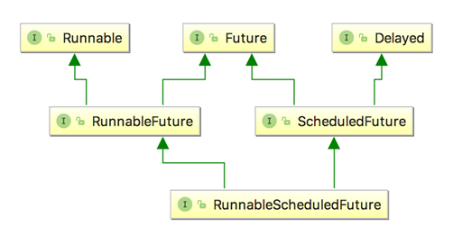

> RunnableScheduledFuture 是 Future 模式中的一个接口，RunnableScheduledFuture 的作用就是可以异步地执行【延时/周期任务】。

另外，我们知道在 ThreadPoolExecutor 中，需要指定一个阻塞队列作为任务队列。ScheduledThreadPoolExecutor 中也一样，不过特殊的是这个阻塞任务队列是一种特殊的延时队列（DelayQueue）。

我们曾经在 juc-collections 框架中，分析过该种阻塞队列，DelayQueue 底层基于优先队列（PriorityQueue）实现，是一种“堆”结构，通过该种阻塞队列可以实现任务的延迟到期执行（即每次从队列获取的任务都是最先到期的任务）。

ScheduledThreadPoolExecutor 在内部定义了 DelayQueue 的变种——`DelayedWorkQueue`，它和 DelayQueue 类似，只不过要求所有入队元素必须实现 RunnableScheduledFuture 接口。


### 2、构造线程池

我们先来看下 ScheduledThreadPoolExecutor 的构造，其实在学习 Executors 时已经接触过了，Executors 使用 newScheduledThreadPool 工厂方法创建 ScheduledThreadPoolExecutor：

```java
public static ScheduledExecutorService newScheduledThreadPool(int corePoolSize) {
    return new ScheduledThreadPoolExecutor(corePoolSize);
}

public static ScheduledExecutorService newScheduledThreadPool(int corePoolSize, ThreadFactory threadFactory) {
    return new ScheduledThreadPoolExecutor(corePoolSize, threadFactory);
}
```

我们来看下 ScheduledThreadPoolExecutor 的构造器，内部其实都是调用了父类 ThreadPoolExecutor 的构造器，这里最需要注意的就是任务队列的选择—— DelayedWorkQueue ，我们后面会详细介绍它的实现原理。

```java
public ScheduledThreadPoolExecutor(int corePoolSize) {
    super(corePoolSize, Integer.MAX_VALUE, 0, NANOSECONDS, new DelayedWorkQueue());
}

public ScheduledThreadPoolExecutor(int corePoolSize, ThreadFactory threadFactory) {
    super(corePoolSize, Integer.MAX_VALUE, 0, NANOSECONDS, new DelayedWorkQueue(), threadFactory);
}

public ScheduledThreadPoolExecutor(int corePoolSize, RejectedExecutionHandler handler) {
    super(corePoolSize, Integer.MAX_VALUE, 0, NANOSECONDS, new DelayedWorkQueue(), handler);
}

public ScheduledThreadPoolExecutor(int corePoolSize, ThreadFactory threadFactory, RejectedExecutionHandler handler) {
    super(corePoolSize, Integer.MAX_VALUE, 0, NANOSECONDS, new DelayedWorkQueue(), threadFactory, handler);
}
```


### 3、线程池的调度

ScheduledThreadPoolExecutor 的核心调度方法是 schedule、scheduleAtFixedRate、scheduleWithFixedDelay，我们通过 schedule 方法来看下整个调度流程：

```java
public ScheduledFuture<?> schedule(Runnable command, long delay, TimeUnit unit) {
    if (command == null || unit == null)
        throw new NullPointerException();
    RunnableScheduledFuture<?> t = decorateTask(command, new ScheduledFutureTask<Void>(command, null,
            triggerTime(delay, unit)));
    delayedExecute(t);
    return t;
}
```

上述的 decorateTask 方法把 Runnable 任务包装成 ScheduledFutureTask，用户可以根据自己的需要覆写该方法：

```java
protected <V> RunnableScheduledFuture<V> decorateTask(Runnable runnable, RunnableScheduledFuture<V> task) {
    return task;
}
```

> 注意：ScheduledFutureTask 是 RunnableScheduledFuture 接口的实现类，任务通过 period 字段来表示任务类型

```java
private class ScheduledFutureTask<V> extends FutureTask<V> implements RunnableScheduledFuture<V> {

    /**
     * 任务序号, 自增唯一
     */
    private final long sequenceNumber;

    /**
     * 首次执行的时间点
     */
    private long time;

    /**
     * 0: 非周期任务
     * >0: fixed-rate任务
     * <0: fixed-delay任务
     */
    private final long period;

    /**
     * 在堆中的索引
     */
    int heapIndex;

    ScheduledFutureTask(Runnable r, V result, long ns) {
        super(r, result);
        this.time = ns;
        this.period = 0;
        this.sequenceNumber = sequencer.getAndIncrement();
    }

    // ...
}
```

> ScheduledThreadPoolExecutor中的任务队列——**DelayedWorkQueue**，保存的元素就是 ScheduledFutureTask。DelayedWorkQueue 是一种**堆结构**，time 最小的任务会排在堆顶（表示最早过期），每次出队都是取堆顶元素，这样最快到期的任务就会被先执行。如果两个 ScheduledFutureTask 的 time 相同，就比较它们的序号——sequenceNumber，序号小的代表先被提交，所以就会先执行。

***

schedule 方法的核心是其中的 delayedExecute 方法：

```java
private void delayedExecute(RunnableScheduledFuture<?> task) {
    if (isShutdown())   // 线程池已关闭
        reject(task);   // 任务拒绝策略
    else {
        super.getQueue().add(task);                 // 将任务入队

        // 如果线程池已关闭且该任务是非周期任务, 则将其从队列移除
        if (isShutdown() && !canRunInCurrentRunState(task.isPeriodic()) && remove(task))
            task.cancel(false);  // 取消任务
        else
            ensurePrestart();   // 添加一个工作线程
    }
}
```

通过 delayedExecute 可以看出，ScheduledThreadPoolExecutor 的整个任务调度流程大致如下图：

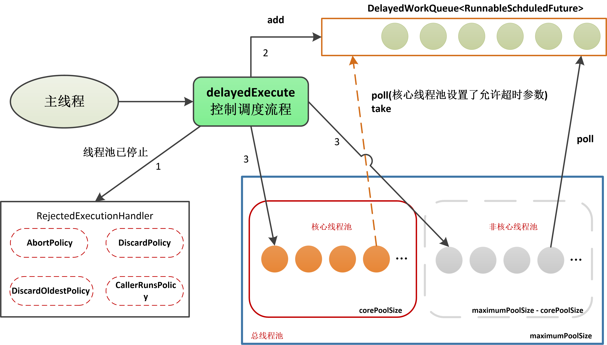

我们来分析这个过程：

1. 首先，任务被提交到线程池后，会判断线程池的状态，如果不是 ***RUNNING*** 状态会执行拒绝策略。

2. 然后，将任务添加到阻塞队列中。（注意，由于 DelayedWorkQueue 是无界队列，所以一定会 **add** 成功）

3. 然后，会创建一个工作线程，加入到核心线程池或者非核心线程池：

   ```java
   void ensurePrestart() {
       int wc = workerCountOf(ctl.get());
       if (wc < corePoolSize)
           addWorker(null, true);
       else if (wc == 0)
           addWorker(null, false);
   }
   ```

通过 ensurePrestart() 可以看到，如果核心线程池未满，则新建的工作线程会被放到核心线程池中。如果核心线程池已经满了，ScheduledThreadPoolExecutor 不会像 ThreadPoolExecutor 那样再去创建归属于非核心线程池的工作线程，而是直接返回。也就是说，在ScheduledThreadPoolExecutor 中，一旦核心线程池满了，就不会再去创建工作线程。

> ***这里思考一点，什么时候会执行 else if (wc == 0)  创建一个归属于非核心线程池的工作线程？***
> 答案是，当通过setCorePoolSize方法设置核心线程池大小为0时，这里必须要保证任务能够被执行，所以会创建一个工作线程，放到非核心线程池中。

最后，线程池中的工作线程会去任务队列获取任务并执行，当任务被执行完成后，如果该任务是周期任务，则会重置 time 字段，并重新插入队列中，等待下次执行。这里注意从队列中获取元素的方法：

- 对于核心线程池中的工作线程来说，如果没有超时设置（allowCoreThreadTimeOut == false），则会使用阻塞方法 take 获取任务（因为没有超时限制，所以会一直等待直到队列中有任务）；如果设置了超时，则会使用 poll 方法（方法入参需要超时时间），超时还没拿到任务的话，该工作线程就会被回收。
- 对于非工作线程来说，都是调用 poll 获取队列元素，超时取不到任务就会被回收。

上述就是 ScheduledThreadPoolExecutor 的核心调度流程，通过我们的分析可以看出，相比 ThreadPoolExecutor，ScheduledThreadPoolExecutor 主要有以下几点不同：

1. 总体的调度控制流程略有区别；
2. 任务的执行方式有所区别；
3. 任务队列的选择不同。

最后，我们来看下 ScheduledThreadPoolExecutor 中的延时队列：**DelayedWorkQueue**。


### 4、延时队列

DelayedWorkQueue，该队列和已经介绍过的 DelayQueue 区别不大，只不过队列元素是 RunnableScheduledFuture：

```java
static class DelayedWorkQueue extends AbstractQueue<Runnable> implements BlockingQueue<Runnable> {
    private static final int INITIAL_CAPACITY = 16;
    private RunnableScheduledFuture<?>[] queue = new RunnableScheduledFuture<?>[INITIAL_CAPACITY];
    private int size = 0;

    private final ReentrantLock lock = new ReentrantLock();
    private final Condition available = lock.newCondition();

    private Thread leader = null;

    // ...
}
```

DelayedWorkQueue 是一个无界队列，在队列元素满了以后会自动扩容，它并没有像 DelayQueue 那样，将队列操作委托给 PriorityQueue，而是自己重新实现了一遍堆的核心操作：上浮、下沉。我这里不再赘述这些堆操作，读者可以参考 PriorityBlockingQueue 自行阅读源码。

我们关键来看下 add、take、poll 这三个队列方法，因为 ScheduledThreadPoolExecutor 的核心调度流程中使用到了这三个方法：

```java
public boolean add(Runnable e) {
    return offer(e);
}

public boolean offer(Runnable e, long timeout, TimeUnit unit) {
    return offer(e);
}
```

add、offer 内部都调用了下面这个方法：

```java
public boolean offer(Runnable x) {
    if (x == null)
        throw new NullPointerException();

    RunnableScheduledFuture<?> e = (RunnableScheduledFuture<?>) x;
    final ReentrantLock lock = this.lock;
    lock.lock();
    try {
        int i = size;           // 队列已满, 扩容
        if (i >= queue.length)
            grow();
        size = i + 1;
        if (i == 0) {
            queue[0] = e;
            setIndex(e, 0);
        } else {
            siftUp(i, e);       // 堆上浮操作
        }

        if (queue[0] == e) {    // 当前元素是首个元素
            leader = null;
            available.signal(); // 唤醒一个等待线程
        }   
    } finally {
        lock.unlock();
    }
    return true;
}
```

take 方法：

```java
public RunnableScheduledFuture<?> take() throws InterruptedException {
    final ReentrantLock lock = this.lock;
    lock.lockInterruptibly();
    try {
        for (; ; ) {
            RunnableScheduledFuture<?> first = queue[0];
            if (first == null)          // 队列为空
                available.await();      // 等待元素入队
            else {
                long delay = first.getDelay(NANOSECONDS);
                if (delay <= 0)         // 元素已到期
                    return finishPoll(first);

                // 执行到此处, 说明队首元素还未到期
                first = null;
                if (leader != null)
                    available.await();
                else {
                    // 当前线程成功leader线程
                    Thread thisThread = Thread.currentThread();
                    leader = thisThread;
                    try {
                        available.awaitNanos(delay);
                    } finally {
                        if (leader == thisThread)
                            leader = null;
                    }
                }
            }
        }
    } finally {
        if (leader == null && queue[0] != null)
            available.signal();
        lock.unlock();
    }
}
```

**注意：**上述 leader 表示一个等待获取队首元素的出队线程，这是一种称为""**Leader-Follower pattern**"的多线程设计模式（可参考 DelayQueue 中的讲解）。

> 每次出队元素时，如果队列为空或者队首元素还未到期，线程就会在 condition 条件队列等待。一般的思路是无限等待，直到出现一个入队线程，入队元素后将一个出队线程唤醒。
>
> 为了提升性能，当队列非空时，用 leader 保存第一个到来并尝试出队的线程，并设置它的等待时间为队首元素的剩余期限，这样当元素过期后，线程也就自己唤醒了，不需要入队线程唤醒。这样做的好处就是提升一些性能。


### 5、调度线程池总结

此次介绍了 ScheduledThreadPoolExecutor，它是对普通线程池 ThreadPoolExecutor 的扩展，增加了延时调度、周期调度任务的功能。概括下 ScheduledThreadPoolExecutor 的主要特点：

1. 对 Runnable 任务进行包装，封装成 ScheduledFutureTask，该类任务支持任务的周期执行、延迟执行；
2. 采用 DelayedWorkQueue 作为任务队列。该队列是无界队列，所以任务一定能添加成功，但是当工作线程尝试从队列取任务执行时，只有最先到期的任务会出队，如果没有任务或者队首任务未到期，则工作线程会阻塞；
3. ScheduledThreadPoolExecutor 的任务调度流程与 ThreadPoolExecutor 略有区别，最大的区别就是，先往队列添加任务，然后创建工作线程执行任务。
   另外，maximumPoolSize 这个参数对 ScheduledThreadPoolExecutor 其实并没有作用，因为除非把 corePoolSize 设置为0，这种情况下 ScheduledThreadPoolExecutor 只会创建一个属于非核心线程池的工作线程；否则，ScheduledThreadPoolExecutor 只会新建归属于核心线程池的工作线程，一旦核心线程池满了，就不再新建工作线程。


## 5、ThreadPoolExecutor 线程池最佳实践

> - ThreadPoolExecutor线程池最佳实践：https://cloud.tencent.com/developer/article/2026557
> - JAVA 为什么不推荐使用Executors类静态方法快速创建线程池？：https://blog.csdn.net/leilei1366615/article/details/130954946

线程池初始化示例：

```java
private static final ThreadPoolExecutor pool; 
static {
    ThreadFactory threadFactory = new ThreadFactoryBuilder().setNameFormat("po-detail-pool-%d").build();
    pool = new ThreadPoolExecutor(4, 8, 60L, 
                                  TimeUnit.MILLISECONDS, 
                                  new LinkedBlockingQueue<>(512),  
                                  threadFactory, 
                                  new ThreadPoolExecutor.AbortPolicy());
    pool.allowCoreThreadTimeOut(true);
}
```

-  corePoolSize：快速启动 4 个线程处理该业务；
-  maximumPoolSize：IO 密集型业务，当服务器是 4C8G 的，最大线程数设置为 4*2=8；
-  keepAliveTime：服务器资源紧张，让空闲的线程快速释放；
-  workQueue：一个任务的执行时长在 100~300ms，业务高峰期 8 个线程，按照 10s 超时(已经很高了)。10s →8 个线程，可以处理 10 * 1000ms / 200ms * 8 = 400 个任务左右，往上再取一点，512 已经很多了；
-  threadFactory：给出带业务语义的线程命名；
-  handler：极端情况下，一些任务只能丢弃，保护服务端。
-  pool.allowCoreThreadTimeOut(true)：为了在资源紧张的时候，可以让线程释放，释放资源；


### 1、对线程池名称

创建线程或线程池时请指定有意义的线程名称，方便出错时回溯，即 threadFactory 参数要构造好。建议不同类别的业务用不同的线程池。

```java
// ThreadFactoryBuilder需要引入guava依赖
ThreadFactory threadFactory = new ThreadFactoryBuilder().setNameFormat("po-detail-pool-%d").build();
private static final ThreadPoolExecutor pool = new ThreadPoolExecutor(4, 8, 60L, 
                                                                      TimeUnit.MILLISECONDS, 
                                                                      new LinkedBlockingQueue<>(512),  
                                                                      hreadFactory, 
                                                                      new ThreadPoolExecutor.AbortPolicy());
```


### 2、工作队列的使用

workQueue 不要使用无界队列，尽量使用有界队列。

当 QPS 很高，发送数据很大，大量的任务被添加到这个无界 LinkedBlockingQueue 中，导致 CPU 和内存飙升服务器挂掉；而且会导致大量新任务在队列中堆积，最终导致 OOM。

| 类型         | 代表                                      | 特点                                                         |
| :----------- | :---------------------------------------- | :----------------------------------------------------------- |
| 无界队列     | LinkedBlockingQueue                       | 无界                                                         |
| 有界队列     | ArrayBlockingQueue、PriorityBlockingQueue | FIFO、优先级                                                 |
| 同步移交队列 | SynchronousQueue                          | 线程之间移交的机制； 只有在使用无界线程池或者有饱和策略时才建议使用该队列 |

建议优先使用：ArrayBlockingQueue、其次 LinkedBlockingQueue。【注意设置队列大小、避免 Executors 创建线程池

使用 ThreadPoolExecutor 的构造函数声明线程池，避免使用 Executors 类的 newFixedThreadPool 和 newCachedThreadPool。

Executors 常用方法如下：

1. newCachedThreadPool()：创建一个可缓存的线程池，调用 execute 将重用以前构造的线程（如果线程可用）。如果没有可用的线程，则创建一个新线程并添加到线程池中。终止并从缓存中移除那些已有 60 秒钟未被使用的线程。CachedThreadPool适用于并发执行大量短期耗时短的任务，或者负载较轻的服务器；
2. newFiexedThreadPool(int nThreads)：创建固定数目线程的线程池，线程数小于nThreads时，提交新的任务会创建新的线程，当线程数等于nThreads时，提交新的任务后任务会被加入到阻塞队列，正在执行的线程执行完毕后从队列中取任务执行，FiexedThreadPool适用于负载略重但任务不是特别多的场景，为了合理利用资源，需要限制线程数量；
3. newSingleThreadExecutor() 创建一个单线程化的 Executor，SingleThreadExecutor适用于串行执行任务的场景，每个任务按顺序执行，不需要并发执行；
4. newScheduledThreadPool(int corePoolSize) 创建一个支持定时及周期性的任务执行的线程池，多数情况下可用来替代 Timer 类。ScheduledThreadPool中，返回了一个ScheduledThreadPoolExecutor实例，而ScheduledThreadPoolExecutor实际上继承了ThreadPoolExecutor。从代码中可以看出，ScheduledThreadPool基于ThreadPoolExecutor，corePoolSize大小为传入的corePoolSize，maximumPoolSize大小为Integer.MAX_VALUE，超时时间为0，workQueue为DelayedWorkQueue。实际上ScheduledThreadPool是一个调度池，其实现了schedule、scheduleAtFixedRate、scheduleWithFixedDelay三个方法，可以实现延迟执行、周期执行等操作；
5. newSingleThreadScheduledExecutor() 创建一个corePoolSize为1的ScheduledThreadPoolExecutor；
6. newWorkStealingPool(int parallelism)返回一个ForkJoinPool实例，ForkJoinPool 主要用于实现“分而治之”的算法，适合于计算密集型的任务。

**Executors 类看起来功能比较强大、用起来还比较方便，但存在如下弊端**：

1.  FiexedThreadPool 和 SingleThreadPool 任务队列长度为 Integer.MAX_VALUE，可能会堆积大量的请求，从而导致 OOM；
2.  CachedThreadPool 和 ScheduledThreadPool 允许创建的线程数量为 Integer.MAX_VALUE，可能会创建大量的线程，从而导致 OOM；

使用线程时，可以直接调用 ThreadPoolExecutor 的构造函数来创建线程池，并根据业务实际场景来设置 corePoolSize、blockingQueue、RejectedExecuteHandler 等参数。


### 4、避免使用局部线程池

使用局部线程池时，若任务执行完后没有执行shutdown()方法或有其他不当引用，极易造成系统资源耗尽。

线程池是可以复用的，一定不要频繁创建线程池比如一个用户请求到了就单独创建一个线程池。

```java
@GetMapping("wrong")
public String wrong() throws InterruptedException {
    // 自定义线程池
    ThreadPoolExecutor executor = new ThreadPoolExecutor(5,10,1L,
                                                         TimeUnit.SECONDS,
                                                         new ArrayBlockingQueue<>(100),
                                                         new ThreadPoolExecutor.CallerRunsPolicy());
    //  处理任务
    executor.execute(() -> {
        // ......
    });
    return "OK";
}
```

出现这种问题的原因还是对于线程池认识不够，需要加强线程池的基础知识。


### **5、合理设置线程池参数**

在使用线程池时，很多同学都有这样的疑问，不知道如何配置线程数量，今天我们一起探讨一下这个问题。

#### 1、经验值 & 粗略计算

1、配置线程数量之前，首先要看任务的类型是 IO密集型，还是CPU密集型？

- 什么是 IO密集型？比如：频繁读取磁盘上的数据，或者需要通过网络远程调用接口。
- 什么是 CPU 密集型？比如：非常复杂的调用，循环次数很多，或者递归调用层次很深等。

2、有一个简单并且适用面比较广的公式：

- IO 密集型配置线程数经验值是：2N，其中 N 代表 CPU 核数。
- CPU 密集型配置线程数经验值是：N + 1，其中 N 代表 CPU 核数。

3、如果获取N的值？

```java
int availableProcessors = Runtime.getRuntime().availableProcessors();
```

4、那么问题来了，混合型（既包含IO密集型，又包含CPU密集型）的如何配置线程数？

- 混合型如果 IO 密集型，和 CPU 密集型的执行时间相差不太大，可以拆分开，以便于更好配置。如果执行时间相差太大，优化的意义不大，比如 IO 密集型耗时 60s，CPU 密集型耗时 1s。


#### 2、最佳线程数目算法

除了上面介绍是经验值之外，其实还提供了计算公式：

```
最佳线程数 = （（线程等待时间+线程CPU时间）/ 线程CPU时间 ）* CPU数目
```

很显然线程等待时间所占比例越高，需要越多线程。线程CPU时间所占比例越高，需要越少线程。

虽说最佳线程数目算法更准确，但是线程等待时间和线程CPU时间不好测量，实际情况使用得比较少，一般用经验值就差不多了。再配合系统压测，基本可以确定最适合的线程数。


### 6、增加异常处理

为了更好地发现、分析和解决问题，建议在使用多线程时增加对异常的处理，异常处理通常有下述方案：

1.  在任务代码处增加 try...catch 异常处理
2.  如果使用的 Future 方式，则可通过 Future 对象的 get 方法接收抛出的异常
3.  为工作线程设置 setUncaughtExceptionHandler，在 uncaughtException 方法中处理异常

虽然使用线程池有多种异常处理的方式，但在任务代码中，使用 try-catch 最通用，也能给不同任务的异常处理做精细化。

如下 2 个操作示例分别演示 工作线程与线程池设置 setUncaughtExceptionHandler 处理异常的方式。

操作示例 1：下面是一个示例代码，演示了如何为线程设置未捕获异常处理器

```java
public class Main {
    public static void main(String[] args) {
        // 创建一个线程
        Thread thread = new Thread(() -> {
            // 抛出一个异常
            throw new RuntimeException("Uncaught exception occurred!");
        });

        // 设置线程的未捕获异常处理器
        thread.setUncaughtExceptionHandler((t, e) -> {
            System.out.println("Unhandled exception in thread " + t.getName() + ": " + e.getMessage());
        });

        // 启动线程
        thread.start();
    }
}
```

操作示例 2：下面是一个示例代码，演示了如何通过自定义线程工厂为线程池设置未捕获异常处理器：

```java
import java.util.concurrent.*;

public class Main {
    public static void main(String[] args) {
        // 创建一个线程池，使用自定义线程工厂
        ThreadPoolExecutor executor = new ThreadPoolExecutor(
            5,
            10,
            0L,
            TimeUnit.MILLISECONDS,
            new LinkedBlockingQueue<>(),
            new CustomThreadFactory()
        );

        // 执行任务
        executor.execute(() -> {
            // 抛出一个异常
            throw new RuntimeException("Uncaught exception occurred!");
        });
    }

    // 自定义线程工厂
    static class CustomThreadFactory implements ThreadFactory {
        @Override
        public Thread newThread(Runnable r) {
            // 创建一个新线程
            Thread thread = new Thread(r);

            // 设置线程的未捕获异常处理器
            thread.setUncaughtExceptionHandler((t, e) -> {
                System.out.println("Unhandled exception in thread " + t.getName() + ": " + e.getMessage());
            });

            return thread;
        }
    }
}
```


### 7、关闭线程池

```javascript
public void destroy() {
    try {
        poolExecutor.shutdown();
        if (!poolExecutor.awaitTermination(AWAIT_TIMEOUT, TimeUnit.SECONDS)) {
            poolExecutor.shutdownNow();
        }
    } catch (InterruptedException e) {
        // 如果当前线程被中断，重新取消所有任务
        pool.shutdownNow();
        // 保持中断状态
        Thread.currentThread().interrupt();
    }
}
```

为了实现优雅停机的目标，应当先调用 shutdown 方法，调用这个方法也就意味着，这个线程池不会再接收任何新的任务，但是已经提交的任务还会继续执行。之后,还应当调用 awaitTermination 方法，这个方法可以设定线程池在关闭之前的最大超时时间，如果在超时时间结束之前线程池能够正常关闭则会返回 true，否则，超时会返回 false。通常需要根据业务场景预估一个合理的超时时间，然后调用该方法。

如果 awaitTermination 方法返回 false，但又希望尽可能在线程池关闭之后再做其他资源回收工作，可以考虑再调用一下 shutdownNow 方法，此时队列中所有尚未被处理的任务都会被丢弃，同时会设置线程池中每个线程的中断标志位。shutdownNow 并不保证一定可以让正在运行的线程停止工作，除非提交给线程的任务能够正确响应中断。


### 8、allowsCoreThreadTimeOut 参数使用

如果是资源紧张的应用，使用 allowsCoreThreadTimeOut 可以提高资源利用率。

在 JDK1.6 之前，线程池会尽量保持 corePoolSize 个核心线程，即使这些线程闲置 了很长时间。这一点曾被开发者诟病，所以从 JDK1.6 开始，提供了方法 allowsCoreThr eadTimeOut，如果传参为 true，则允许闲置的核心线程被终止。


### 9、考虑初始化所有核心线程

对于请求量比较大的服务，可以在创建线程池的时候直接初始化所有核心线程，减少创建线程池带来的服务毛刺。

调用 prestartAllCoreThreads() 方法来初始化所有的核心线程。接着，我们执行了一个任务，线程池会自动选择一个核心线程来执行任务。

```java
import java.util.concurrent.ThreadPoolExecutor;

public class Main {
    public static void main(String[] args) {
        // 创建一个ThreadPoolExecutor，指定核心线程数为5，最大线程数为10，其他参数使用默认值
        ThreadPoolExecutor executor = new ThreadPoolExecutor(5, 10, 0L, java.util.concurrent.TimeUnit.MILLISECONDS);

        // 初始化所有核心线程
        executor.prestartAllCoreThreads();

        // 执行任务
        executor.execute(() -> {
            System.out.println("Task executed by thread: " + Thread.currentThread().getName());
        });
    }
}
```


### 10、监控线程池

除了参数动态化之外，为了更好地使用线程池，需要对线程池的运行状况有感知，比如当前线程池的负载、分配的资源、任务的执行情况、任务类型（长任务、短任务）。

美团的动态线程池的监控主要包括：线程池活跃度、任务的执行 Transaction（频率、耗时）、Reject 异常、线程池内部统计信息等等，既能帮助用户从多个维度分析线程池的使用情况，又能在出现问题第一时间通知到用户，从而避免故障或加速故障恢复。


#### 1、运行时状态实时查看

对于资源紧张的应用，如果担心线程池资源使用不当，可以利用 ThreadPoolExecutor 的 API 实现简单的监控，然后进行分析和优化。

用户基于 JDK 原生线程池 ThreadPoolExecutor 提供的几个 public 的 getter 方法，可以读取到当前线程池的运行状态以及参数。

动态化线程池基于这几个接口封装了运行时状态实时查看的功能，用户基于这个功能可以了解线程池的实时状态，比如当前有多少个工作线程，执行了多少个任务，队列中等待的任务数等等。


#### 2、负载监控和告警

线程池负载关注的核心问题是：基于当前线程池参数分配的资源够不够。

-  事前，美团线程池定义了“活跃度”这个概念，让用户在发生Reject异常之前能够感知线程池负载问题（计算公式：线程池活跃度 = activeCount/maximumPoolSize），当活跃线程数趋向于 maximumPoolSize 时，表示线程负载趋高。
-  事中，从两方面来看线程池的过载判定条件，一个是发生了 Reject 异常，一个是队列中有等待任务（支持定制阈值）。


#### 3、任务级精细化监控

在传统的线程池应用场景中，线程池中的任务执行情况对于用户来说是透明的。比如在一个具体的业务场景中，业务开发申请了一个线程池同时用于执行两种任务，一个是发消息任务、一个是发短信任务，这两类任务实际执行的频率和时长对于用户来说没有一个直观的感受，很可能这两类任务不适合共享一个线程池，但是由于用户无法感知，因此也无从优化。

【美团动态化线程池内部实现了任务级别的埋点，且允许为不同的业务任务指定具有业务含义的名称，线程池内部基于这个名称做Transaction打点，基于这个功能，用户可以看到线程池内部任务级别的执行情况，且区分业务。

主要可以监控以下信息：线程池名称、核心线程数、最大线程数、活跃线程数、队列类型、队列容量、队列使用情况、已完成任务数、拒绝任务数等】


# 10、ForkJoin & ForkJoinPool

Fork/Join 框架的实现非常复杂，内部大量运用了位操作和无锁算法，撇开这些实现细节不谈，该框架主要涉及三大核心组件：ForkJoinPool（线程池）、ForkJoinTask（任务）、ForkJoinWorkerThread（工作线程），外加WorkQueue（任务队列）：

- **ForkJoinPool**：ExecutorService 的实现类，负责工作线程的管理、任务队列的维护，以及控制整个任务调度流程；
- **ForkJoinTask**：Future 接口的实现类，fork 是其核心方法，用于分解任务并异步执行；而 join 方法在任务结果计算完毕之后才会运行，用来合并或返回计算结果；
- **ForkJoinWorkerThread**：Thread的子类，作为线程池中的工作线程（Worker）执行任务；
- **WorkQueue**：任务队列，用于保存任务；


## 1、ForkJoinPool 线程池

当今的时代软件开发需要与硬件进行紧密的结合，结合的时候就必须充分的发挥出所有硬件的处理性能，这个时候在 JDK1.7 之后对于 J.U.C 提供了一个新的改进机制——分支任务。

在 JDK1.7 之后为了充分利用多核 CPU 的性能优势，可以将一个复杂的业务计算进行拆分，交由多个 CPU 并行计算，这样就可以提高程序的执行性能，这一功能包括以下两个操作：

- 分解（Fork）操作：将一个大型业务拆分为若干个小任务在框架中执行；
- 合并（Join）操作：主任务将等待多个子任务执行完毕后进行结果合并；


> 从理论的提出来讲此类的操作没有任何问题，但是如果要是在实际的开发之中，那么就有可能会出现问题。

**分支任务分配与工作窃取**：从 JDK1.7 开始为了进一步提高并行计算的处理能力，提供了 **ForkJoinPool** 的任务框架，并且其在已有的线程池概念的基础上进行了扩展。同时考虑到服务的处理性能，引入了"**工作窃取（Work Stealing）机制**"，这样可以在进行线程分配的同时自动分配与之数量相等的任务队列，所有新加入的任务会被平均的分配到对应的任务队列之中，不同的线程处理各自的任务队列，当某一个线程的任务队列已经提前完成时，会从其他线程的队列尾部”窃取”未执行完的任务，如图所示。这样在任务量较大时，可以更好的发挥出多核主机的处理性能。


ForkJoinPool 是一个开发框架，而且这个开发框架是在 J.U.C 之中所提供的，那么下面直接打开相应的 JavaDoc 文档：https://docs.oracle.com/en/java/javase/17/docs/api/java.base/java/util/concurrent/ForkJoinPool.html，通过 JavaDoc 文档的结构可以清楚的发现，ForkJoinPool 属于一个线程池的应用，需要基于线程池提供所有的分支处理的操作环境。

```java
Module java.base
Package java.util.concurrent
Class ForkJoinPool
java.lang.Object
    java.util.concurrent.AbstractExecutorService
        java.util.concurrent.ForkJoinPool
All Implemented Interfaces:
Executor, ExecutorService
——————————————————————————————————————————————————————————
public class ForkJoinPool extends AbstractExecutorService
用于运行ForkJoinTask的ExecutorService。ForkJoinPool为来自非ForkJoinTask客户端的提交以及管理和监控操作提供入口点。
```

**ForkJoinPool 类实现结构**：为了实现分支任务线程池的功能，在 J.U.C 中提供了一个 ForkJoinPool 工具类，该类为 ExecutorService 线程池操作类的子类，并在 ForkJoinPool 类中自动提供有一个 WorkQueue 内部类以实现所有工作队列的维护，如图所示。在分支任务处理中会存在有多个工作线程，而每一个工作线程全部由 ForkJoinPool.ForkJoinWorkerThreadFactory 接口进行创建规范化管理（ForkJoinPool 内部提供了 DefaultForkJoinWorkerThreadFactory 内部实现子类），程序可以通过该接口所提供的 newThread() 方法创建 ForkJoinWorkerThread 线程对象，同时在每一个工作线程对象中都会保存有一个 WorkQueue 对象引用，即：不同的工作线程维护各自的任务队列。

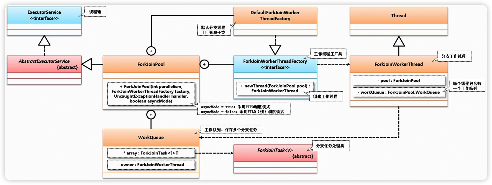

在使用 ForkJoin 处理的时候，一定要记住，所有的具体的任务的配置是由 ForkJoinTask 抽象类来定义的，同时其内部会直接提供有完整的 ForkJoinWorkerThreadFactory 工厂接口实例。


## 2、ForkJoinTask 分支任务抽象类

**ForkJoinTask 类关联结构**：在分支任务处理时，所有的分支任务通过 ForkJoinTask 进行配置。ForkJoinTask 是分支任务，而这个分支任务在实际的开发之中也需要考虑到几种不同的实现，在 J.U.C 中主要分为三种任务类型：

- **RecursiveTask**：有返回值任务
- **RecursiveAction**：无返回值任务
- **CountedCompleter**：数量计算有关的任务，在子任务停顿或阻塞的情况下使用

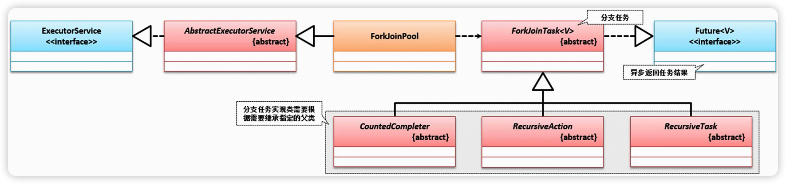

| 方法名称                                                     | 描述                                 |
| ------------------------------------------------------------ | ------------------------------------ |
| public final ForkJoinTask< V > fork()                        | 建立分支任务                         |
| public final V join()                                        | 获取分支结果                         |
| public final boolean isCompletedNormally()                   | 任务是否执行完毕                     |
| public boolean isTerminated()                                | 判断工作队列是否有待执行任务未执行完 |
| public static void invokeAll(ForkJoinTask<?>... tasks)       | 启动分支任务                         |
| public final Throwable getException()                        | 获取执行异常                         |
| public boolean awaitTermination(long timeout, TimeUnit unit) | 判断线程池是否在约定时间内完成       |
| public int getCorePoolSize()                                 | 获取线程池的核心线程数               |
| public long getQueuedTaskCount()                             | 返回所有工作队列的任务数量           |
| public int getQueuedSubmissionCount()                        | 返回所有队列待执行的任务数           |
| public int getRunningThreadCount()                           | 返回正在运行的任务数量               |


## 3、RecursiveTask 有返回值任务

所有的分支任务的处理执行都需要有具体的任务的处理类，而在进行任务处理类的时候可以使用 RecursiveTask 父类来完成，首先打开该类的定义源代码观察：

```java
public abstract class RecursiveTask<V> extends ForkJoinTask<V> {
    private static final long serialVersionUID = 5232453952276485270L;
    public RecursiveTask() {}
    @SuppressWarnings("serial") // Conditionally serializable
    V result;
    protected abstract V compute(); // 最终的任务通过此方法返回计算结果
    public final V getRawResult() {
        return result;
    }
    protected final void setRawResult(V value) {
        result = value;
    }
    protected final boolean exec() {
        result = compute();
        return true;
    }
}
```

每一个分支任务在执行时可以直接将分支计算的结果进行返回，这时就需要通过 RecursiveTask 继承实现，该类中提供有一个compute()计算方法，在每次分支处理时都会递归调用此方法实现计算，下面将基于分支计算的处理形式实现一个数据累加的操作。

如果说现在要进行一个1～100的数字累加计算操作，那么比较简单的做法就是进行计算的拆分，按照如下的形式处理：

- 第1个任务：计算 "1 + 2 + ... + 50"
  1. 第1个字分支：计算 "1 + 2 + ... + 25"
  2. 第2个字分支：计算 "26 + 27 + ... + 50"
- 第2个任务：计算 "51 + 52 + ... + 100"
  1. 第1个字分支：计算 "51 + 52 + ... + 75"
  2. 第2个字分支：计算 "76 + 77 + ... + 100"

操作示例 1：使用分支任务实现数据的累加操作

```java
import java.util.concurrent.ExecutionException;
import java.util.concurrent.ForkJoinPool;
import java.util.concurrent.Future;
import java.util.concurrent.RecursiveTask;

/**
 * 实现数据累加的计算
 */
class SumTask extends RecursiveTask<Integer> {
    private static final int THRESHOLD = 25; // 分支阈值
    private final int start; // 开始计算数值
    private final int end; // 结束计算数值

    public SumTask(int start, int end) { // 数据的累加配置
        this.start = start;
        this.end = end;
    }

    @Override
    protected Integer compute() { // 完成计算的处理
        // 所有的子分支的处理，以及所有相关分支的合并处理都在此方法之中完成
        int sum = 0; // 保存最终的计算结果
        boolean isFork = (end - start) <= THRESHOLD; // 是否需要进行分支
        if (isFork) {   // 计算子分支
            for (int i = start; i <= end; i++) {
                sum += i; // 分支处理
            }
            System.out.printf("【%s】start = %d、end = %d、sum = %d%n",
                    Thread.currentThread().getName(), this.start, this.end, sum);
        } else {    // 需要开启分支
            int middle = (start + end) / 2;
            SumTask leftTask = new SumTask(this.start, middle);
            SumTask rightTask = new SumTask(middle + 1, this.end);
            leftTask.fork();  // 开启左分支
            rightTask.fork(); // 开启右分支
            sum = leftTask.join() + rightTask.join(); // 等待分支处理的执行结果返回
        }
        return sum;
    }
}

public class JavaAPIDemo {
    public static void main(String[] args) throws ExecutionException, InterruptedException {
        SumTask task = new SumTask(1, 100); // 外部的计算操作
        ForkJoinPool pool = new ForkJoinPool(); // 开启分支任务池
        Future<Integer> future = pool.submit(task); // 执行分支任务
        System.out.println("分支任务计算结果：" + future.get()); // 异步返回
    }
}
```

```java
【ForkJoinPool-1-worker-1】start = 1、end = 25、sum = 325
【ForkJoinPool-1-worker-4】start = 76、end = 100、sum = 2200
【ForkJoinPool-1-worker-2】start = 51、end = 75、sum = 1575
【ForkJoinPool-1-worker-3】start = 26、end = 50、sum = 950
分支任务计算结果：5050
```

通过执行可以发现，所有的分支任务的内部本质上包裹的还是线程池，因为如果要进行分支过多的创建，最终导致的结果就是线程资源的耗尽，所以为了保护电脑硬件资源不透支，使用的是内置的CPU内核数量进行的线程池配置。


## 4、RecursiveAction 无返回值任务

RecursiveTask 是一种常见的分支任务，该分支任务最大的技术特点在于可以返回计算的结果，但是很多时候的分支任务是不需要进行计算结果返回的，只是需要开启分支，而不需要返回结果，所以为了解决当前的需要就提供了一个 RecursiveAction 抽象类，该类没有返回数据的必要性，【如果硬是想要使用 RecursiveAction 返回值，需要通过额外的结构保存计算结果，而考虑到分支处理操作的同步性，可以考虑创建一个专属的数据存储类，并基于互斥锁实现数据的同步累加。】该类的定义源代码如下：

```java
public abstract class RecursiveAction extends ForkJoinTask<Void> {
    private static final long serialVersionUID = 5232453952276485070L;
    public RecursiveAction() {}
    protected abstract void compute();
    public final Void getRawResult() { return null; }
    protected final void setRawResult(Void mustBeNull) { }
    protected final boolean exec() {
        compute();
        return true;
    }
}
```

本次的开发不再使用新的案例，而是继续使用之前的数字累加的操作，但是这个时候的计算需要在外部额外提供有一个计算结果的保存空间。


操作示例 1：使用 RecursiveAction 实现分支任务

```java
import java.util.concurrent.*;
import java.util.concurrent.locks.Lock;
import java.util.concurrent.locks.ReentrantLock;

/**
 * 如果不想使用这个类使用原子的整型也是可以的
 */
class CountSave {
    private final Lock lock = new ReentrantLock(); // 采用一个互斥锁
    private int sum = 0; // 保存累加结果

    public void add(int num) {
        this.lock.lock(); // 同步锁定
        try {
            this.sum += num; // 进行数据的累加
        } finally {
            this.lock.unlock(); // 解锁处理
        }
    }

    public int getSum() {
        return sum;
    }
}

/**
 * 实现数据累加的计算
 */
class SumTask extends RecursiveAction {
    private static final int THRESHOLD = 25; // 分支阈值
    private final int start; // 开始计算数值
    private final int end; // 结束计算数值
    private final CountSave save; // 结果的存储

    public SumTask(int start, int end, CountSave save) { // 数据的累加配置
        this.start = start;
        this.end = end;
        this.save = save; // 保存累加结果使用
    }

    @Override
    protected void compute() { // 完成计算的处理
        // 所有的子分支的处理，以及所有相关分支的合并处理都在此方法之中完成
        int sum = 0; // 保存最终的计算结果
        boolean isFork = (end - start) <= THRESHOLD; // 是否需要进行分支
        if (isFork) {   // 计算子分支
            for (int i = start; i <= end; i++) {
                sum += i; // 分支处理
            }
            this.save.add(sum); // 保存累加结果
            System.out.printf("【%s】start = %d、end = %d、sum = %d%n",
                    Thread.currentThread().getName(), this.start, this.end, sum);
        } else {    // 需要开启分支
            int middle = (start + end) / 2;
            SumTask leftTask = new SumTask(this.start, middle, this.save);
            SumTask rightTask = new SumTask(middle + 1, this.end, this.save);
            leftTask.fork(); // 开启左分支
            rightTask.fork(); // 开启右分支
        }
    }
}

public class JavaAPIDemo {
    public static void main(String[] args) throws InterruptedException {
        CountSave save = new CountSave(); // 保存累加结果
        SumTask task = new SumTask(1, 100, save); // 外部的计算操作
        ForkJoinPool pool = new ForkJoinPool(); // 开启分支任务池
        pool.submit(task); // 执行分支任务
        while (!task.isDone()) { // 任务没有结束
            TimeUnit.MILLISECONDS.sleep(100); // 延迟一下
        }
        if (task.isCompletedNormally()) { // 任务执行完毕
            System.out.println("分支任务计算结果：" + save.getSum()); // 异步返回
        }
    }
}
```

```java
【ForkJoinPool-1-worker-3】start = 51、end = 75、sum = 1575
【ForkJoinPool-1-worker-1】start = 76、end = 100、sum = 2200
【ForkJoinPool-1-worker-4】start = 1、end = 25、sum = 325
【ForkJoinPool-1-worker-2】start = 26、end = 50、sum = 950
分支任务计算结果：5050
```

在实际的工作之中选择那种任务的处理结构，根据实际的要求进行选择即可，分支任务的处理一定要有分支任务项。


## 5、CountedCompleter 计数完成器任务

在之前已经分析了两种不同的分支任务结构，从 JDK1.8 开始为了更好的解决分支任务阻塞的操作能力，所以对 ForkJoinTask 扩充了一个新的 CountedCompleter 抽象子类，该类的基本实现与之前的任务结构相同，唯一的区别在于在该类中可以挂起指定的任务数量，同时在结束时也可以基于挂起的任务数量来实现任务完成状态的判断。

```java
public abstract class CountedCompleter<T> extends ForkJoinTask<T> {
    public abstract void compute();
}
```

使用 CountedCompleter 进行开发操作的时候，有一个执行任务的回调处理机制，只要分支处理完成，就可以触发这个回调的操作，这里面可以进行一些分支的后续的线程的释放处理能力。

操作示例 1：定义 CountedCompleter 分支任务

```java
import java.util.concurrent.CountedCompleter;
import java.util.concurrent.ForkJoinPool;
import java.util.concurrent.TimeUnit;
import java.util.concurrent.atomic.AtomicInteger;

/**
 * 实现数据累加的计算
 */
class SumTask extends CountedCompleter<AtomicInteger> {
    private static final int THRESHOLD = 25; // 分支阈值
    private final int start; // 开始计算数值
    private final int end; // 结束计算数值
    private final AtomicInteger result; // 保存最终的存储结果

    public SumTask(int start, int end, AtomicInteger result) { // 数据的累加配置
        this.start = start;
        this.end = end;
        this.result = result; // 保存累加结果使用
    }

    @Override
    public void compute() { // 完成计算的处理
        // 所有的子分支的处理，以及所有相关分支的合并处理都在此方法之中完成
        int sum = 0; // 保存最终的计算结果
        boolean isFork = (end - start) <= THRESHOLD; // 是否需要进行分支
        if (isFork) {   // 计算子分支
            for (int i = start; i <= end; i++) {
                sum += i; // 分支处理
            }
            this.result.addAndGet(sum); // 数据的累加
            // 在每一个分支执行完成之后，可以手工的进行回调操作的触发
            super.tryComplete(); // 钩子触发
        } else {    // 需要开启分支
            int middle = (start + end) / 2;
            SumTask leftTask = new SumTask(this.start, middle, this.result);
            SumTask rightTask = new SumTask(middle + 1, this.end, this.result);
            leftTask.fork(); // 开启左分支
            rightTask.fork(); // 开启右分支
        }
    }

    /**
     * 钩子的触发
     */
    @Override
    public void onCompletion(CountedCompleter<?> caller) {
        System.out.printf("【%s】start = %d、end = %d%n",
                Thread.currentThread().getName(), this.start, this.end);
    }
}

public class JavaAPIDemo {
    public static void main(String[] args) throws InterruptedException {
        AtomicInteger result = new AtomicInteger(); // 保存最终的计算结果
        SumTask task = new SumTask(1, 100, result); // 外部的计算操作
        task.addToPendingCount(1); // 设置准备执行的任务量
        ForkJoinPool pool = new ForkJoinPool(); // 开启分支任务池
        pool.submit(task); // 执行分支任务
        while (task.getPendingCount() != 0) {   // 有任务未执行完毕
            TimeUnit.MILLISECONDS.sleep(100); // 延迟一下
            if (result.get() != 0) {    // 有了计算结果
                System.out.println("分支任务计算结果：" + result); // 异步返回
                break;
            }
        }
    }
}
```

```java
【ForkJoinPool-1-worker-1】start = 76、end = 100
【ForkJoinPool-1-worker-3】start = 51、end = 75
【ForkJoinPool-1-worker-4】start = 1、end = 25
【ForkJoinPool-1-worker-2】start = 26、end = 50
分支任务计算结果：5050
```

**面试题：CountedCompleter、RecursiveTask 和 RecursiveAction 的区别？**

CountedCompleter、RecursiveTask 和 RecursiveAction 是 Fork/Join 框架中的类，用于简化并行编程的过程。以下是它们的主要区别：

1. **用途：**
   - RecursiveTask：这个类设计用于返回结果的任务。它扩展了 ForkJoinTask 类并要求实现 compute 方法，该方法返回一个结果。
   - RecursiveAction：这个类用于不返回结果的任务。它同样扩展了 ForkJoinTask 类，但要求实现没有返回值的 compute 方法。
   - CountedCompleter：这是一个更通用的类，可用于具有对其他任务的依赖关系的任务，可以用于既有结果又没有结果的计算。
2. **完成机制：**
   - RecursiveTask 和 RecursiveAction 的任务完成时，会通知其父任务。
   - CountedCompleter 具有更灵活的完成机制。它可以在不同的任务之间建立任意的依赖关系，而不仅仅是父子关系。
3. **计数机制：**
   - RecursiveTask 和 RecursiveAction 不提供内建的计数机制。
   - CountedCompleter 具有内建的计数机制，可以方便地追踪任务的完成状态。它可以通过 `tryComplete()` 方法手动触发任务的完成。
4. **任务拆分方式：**
   - RecursiveTask 和 RecursiveAction 通常通过递归地拆分任务来实现并行计算。
   - CountedCompleter 更为灵活，可以手动管理任务的拆分方式，允许开发人员更精细地控制任务的执行流程。

总的来说，CountedCompleter 提供了更多的灵活性，适用于一些复杂的并行计算场景，而 RecursiveTask 和 RecursiveAction 更专注于简单的任务拆分和结果收集。

***

> **如下为 CountedCompleter 原理扩展知识**：

在早期的JDK实现之中，会提供有一个 java.util.Arrays 类，这个类实现了数组的操作，但是在该类之中有一些方法是采用了并行排序的模式处理的，这个操作里面会包含有大量的分支任务的定义。

```java
public static void parallelSort(byte[] a) {
    DualPivotQuicksort.sort(a, 0, a.length);
}
```

早先的实现都是在内部通过并行任务的处理模式来完成的，也就是之前所学习到RescuiveTask、.RescuiveAction完成。此时该类之中的sort()方法的源代码定义如下【DualPivotQuicksort 类】：

```java
static void sort(byte[] a, int low, int high) {
    if (high - low > MIN_BYTE_COUNTING_SORT_SIZE) {
        countingSort(a, low, high);
    } else {
        insertionSort(a, low, high);
    }
}
```

而后内部有一些并行排序的一个实现任务类，例如：Sort、Merger【DualPivotQuicksort 的内部类】

```java
private static final class Sorter extends CountedCompleter<Void> {
    private static final long serialVersionUID = 20180818L;
    private final Object a, b;
    private final int low, size, offset, depth;

    private Sorter(CountedCompleter<?> parent,
                   Object a, Object b, int low, int size, int offset, int depth) {
        super(parent);
        this.a = a;
        this.b = b;
        this.low = low;
        this.size = size;
        this.offset = offset;
        this.depth = depth;
    }

    @Override
    public final void compute() {
        if (depth < 0) {
            setPendingCount(2);
            int half = size >> 1;
            new Sorter(this, b, a, low, half, offset, depth + 1).fork();
            new Sorter(this, b, a, low + half, size - half, offset, depth + 1).compute();
        } else {
            if (a instanceof int[]) {
                sort(this, (int[]) a, depth, low, low + size);
            } else if (a instanceof long[]) {
                sort(this, (long[]) a, depth, low, low + size);
            } else if (a instanceof float[]) {
                sort(this, (float[]) a, depth, low, low + size);
            } else if (a instanceof double[]) {
                sort(this, (double[]) a, depth, low, low + size);
            } else {
                throw new IllegalArgumentException(
                    "Unknown type of array: " + a.getClass().getName());
            }
        }
        tryComplete();
    }

    @Override
    public final void onCompletion(CountedCompleter<?> caller) {
        if (depth < 0) {
            int mi = low + (size >> 1);
            boolean src = (depth & 1) == 0;

            new Merger(null,
                       a,
                       src ? low : low - offset,
                       b,
                       src ? low - offset : low,
                       src ? mi - offset : mi,
                       b,
                       src ? mi - offset : mi,
                       src ? low + size - offset : low + size
                      ).invoke();
        }
    }

    private void forkSorter(int depth, int low, int high) {
        addToPendingCount(1);
        Object a = this.a; // Use local variable for performance
        new Sorter(this, a, b, low, high - low, offset, depth).fork();
    }
}
```

考虑到各种阻塞的使用问题，很多的JDK内部类都更换为了CountedCompleter处理结构.


## 6、ForkJoinPool.ManagedBlocker 线程补偿

【**分支线程任务阻塞**】使用分支业务可以充分的发挥出电脑的硬件处理性能，然而在进行分支处理时，有可能所处理的业务会造成阻塞的情况出现。假设现在只设置有2个核心线程，但是却产生了6个分支，如图所示，这样一来只能有2个线程任务执行，而其它的任务则必须进行工作线程资源的等待，从而出现严重的性能问题。

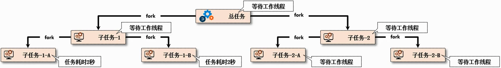

内核线程是有限的，但是你突然创建了太多的分支，导致所有的分支彼此之间出现资源等待的情况，那么最终的结果是有可能分支反而会造成处理性能的下降。

【**线程池资源补偿**】为了解决这种情况下的分支性能处理问题，在 ForkJoinPool 中提供了 **ManagedBlockerl 阻塞管理接口**，开发者可以利用此接口明确的告诉 ForkJoinPool 可能产生阻塞的操作，而后会依据 ManagedBlocker 接口所提供的方法来判断当前线程池的运行情况，如果发现此时线程池资源已经耗尽，但是还有未执行的任务时，就会自动的在线程池中进行**核心线程的补偿**，从而实现分支快速处理的需要。

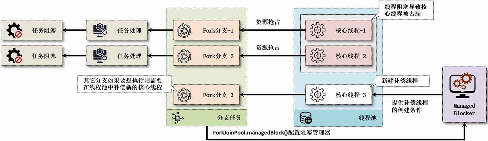

操作示例 1：观察分支线程任务阻塞的情况，这里 ForkJoinPool 只设置莫2个线程，分支阀值也改成了5，所以会产生20个分支。由于线程池大小设置为 2，所以多余的分支线程会出现等待。

```java
import java.util.concurrent.ExecutionException;
import java.util.concurrent.ForkJoinPool;
import java.util.concurrent.Future;
import java.util.concurrent.RecursiveTask;

/**
 * 实现数据累加的计算
 */
class SumTask extends RecursiveTask<Integer> {
    private static final int THRESHOLD = 5; // 分支阈值
    private final int start; // 开始计算数值
    private final int end; // 结束计算数值

    public SumTask(int start, int end) { // 数据的累加配置
        this.start = start;
        this.end = end;
    }

    @Override
    protected Integer compute() { // 完成计算的处理
        // 所有的子分支的处理，以及所有相关分支的合并处理都在此方法之中完成
        int sum = 0; // 保存最终的计算结果
        boolean isFork = (end - start) <= THRESHOLD; // 是否需要进行分支
        if (isFork) {   // 计算子分支
            for (int i = start; i <= end; i++) {
                sum += i; // 分支处理
            }
            System.out.printf("【%s】start = %d、end = %d、sum = %d%n",
                    Thread.currentThread().getName(), this.start, this.end, sum);
        } else {    // 需要开启分支
            int middle = (start + end) / 2;
            SumTask leftTask = new SumTask(this.start, middle);
            SumTask rightTask = new SumTask(middle + 1, this.end);
            leftTask.fork();  // 开启左分支
            rightTask.fork(); // 开启右分支
            sum = leftTask.join() + rightTask.join(); // 等待分支处理的执行结果返回
        }
        return sum;
    }
}

public class JavaAPIDemo {
    public static void main(String[] args) throws ExecutionException, InterruptedException {
        SumTask task = new SumTask(1, 100); // 外部的计算操作
        ForkJoinPool pool = new ForkJoinPool(2); // 开启分支任务池,线程大小设置为2
        Future<Integer> future = pool.submit(task); // 执行分支任务
        System.out.println("分支任务计算结果：" + future.get()); // 异步返回
    }
}
```

```java
【ForkJoinPool-1-worker-1】start = 1、end = 4、sum = 10
【ForkJoinPool-1-worker-2】start = 51、end = 54、sum = 210
【ForkJoinPool-1-worker-2】start = 55、end = 57、sum = 168
【ForkJoinPool-1-worker-1】start = 5、end = 7、sum = 18
【ForkJoinPool-1-worker-2】start = 58、end = 63、sum = 363
【ForkJoinPool-1-worker-1】start = 8、end = 13、sum = 63
【ForkJoinPool-1-worker-2】start = 64、end = 69、sum = 399
【ForkJoinPool-1-worker-1】start = 14、end = 19、sum = 99
【ForkJoinPool-1-worker-2】start = 70、end = 75、sum = 435
【ForkJoinPool-1-worker-1】start = 20、end = 25、sum = 135
【ForkJoinPool-1-worker-2】start = 76、end = 79、sum = 310
【ForkJoinPool-1-worker-1】start = 26、end = 29、sum = 110
【ForkJoinPool-1-worker-2】start = 80、end = 82、sum = 243
【ForkJoinPool-1-worker-1】start = 30、end = 32、sum = 93
【ForkJoinPool-1-worker-2】start = 83、end = 88、sum = 513
【ForkJoinPool-1-worker-1】start = 33、end = 38、sum = 213
【ForkJoinPool-1-worker-2】start = 89、end = 94、sum = 549
【ForkJoinPool-1-worker-1】start = 39、end = 44、sum = 249
【ForkJoinPool-1-worker-2】start = 95、end = 100、sum = 585
【ForkJoinPool-1-worker-1】start = 45、end = 50、sum = 285
分支任务计算结果：5050
```

> 可以发现打印结果中ForkJoinPool始终只使用了2个线程在工作，如果某个分支业务逻辑特别复杂，耗时特别久，那么就会产生线程阻塞等待的情况了。

操作示例 2：观察补偿线程的存在的使用

```java
import java.util.concurrent.*;
import java.util.concurrent.locks.Lock;
import java.util.concurrent.locks.ReentrantLock;

/**
 * 实现数据累加的计算
 */
class SumTask extends RecursiveTask<Integer> {
    private static final int THRESHOLD = 5; // 分支阈值
    private final int start; // 开始计算数值
    private final int end; // 结束计算数值
    private final Lock lock = new ReentrantLock(); // 互斥锁

    public SumTask(int start, int end) { // 数据的累加配置
        this.start = start;
        this.end = end;
    }

    @Override
    protected Integer compute() { // 完成计算的处理
        // 所有的子分支的处理，以及所有相关分支的合并处理都在此方法之中完成
        int sum = 0; // 保存最终的计算结果
        boolean isFork = (end - start) <= THRESHOLD; // 是否需要进行分支
        if (isFork) {   // 计算子分支
            SumHandleManagedBlocker blocker = new SumHandleManagedBlocker(this.start, this.end, this.lock);
            try {
                ForkJoinPool.managedBlock(blocker); // 加入阻塞管理
            } catch (InterruptedException e) {
                e.printStackTrace();
            }
            return blocker.result; // 返回计算的结果
        } else {    // 需要开启分支
            int middle = (start + end) / 2;
            SumTask leftTask = new SumTask(this.start, middle);
            SumTask rightTask = new SumTask(middle + 1, this.end);
            leftTask.fork();  // 开启左分支
            rightTask.fork(); // 开启右分支
            sum = leftTask.join() + rightTask.join(); // 等待分支处理的执行结果返回
        }
        return sum;
    }

    /**
     * 自定义线程管理，主要是使用补偿线程
     */
    static class SumHandleManagedBlocker implements ForkJoinPool.ManagedBlocker {
        private Integer result;
        private final int start;
        private final int end;
        private final Lock lock; // 获取一个互斥锁

        public SumHandleManagedBlocker(int start, int end, Lock lock) {
            this.start = start;
            this.end = end;
            this.lock = lock;
        }

        @Override
        public boolean block() throws InterruptedException { // 处理延迟任务
            int sum = 0;
            this.lock.lock();
            try {
                for (int x = start; x <= end; x++) {   // 数学计算
                    TimeUnit.MILLISECONDS.sleep(100); // 延迟
                    sum += x; // 执行数据的累加
                }
            } finally {
                this.result = sum; // 返回处理结果
                this.lock.unlock(); // 解锁
            }
            System.out.printf("【%s】处理数据累加业务，start = %d、end = %d、sum = %d%n",
                    Thread.currentThread().getName(), this.start, this.end, sum);
            return result != null; // 结束标记，返回是否成功阻塞
        }

        /**
         * 如果返回 true，则表示成功阻塞；
         * 如果返回 false，则表示无法阻塞，并且会创建补偿线程。
         */
        @Override
        public boolean isReleasable() { // 补偿的判断，返回false会创建补偿线程
            return this.result != null; // 阻塞解除判断
        }
    }
}


public class JavaAPIDemo {
    public static void main(String[] args) throws ExecutionException, InterruptedException {
        SumTask task = new SumTask(1, 100); // 外部的计算操作
        ForkJoinPool pool = new ForkJoinPool(2); // 开启分支任务池,线程大小设置为2
        Future<Integer> future = pool.submit(task); // 执行分支任务
        System.out.println("分支任务计算结果：" + future.get()); // 异步返回
    }
}
```

```java
【ForkJoinPool-1-worker-14】处理数据累加业务，start = 30、end = 32、sum = 93
【ForkJoinPool-1-worker-20】处理数据累加业务，start = 80、end = 82、sum = 243
【ForkJoinPool-1-worker-16】处理数据累加业务，start = 5、end = 7、sum = 18
【ForkJoinPool-1-worker-18】处理数据累加业务，start = 55、end = 57、sum = 168
【ForkJoinPool-1-worker-1】处理数据累加业务，start = 1、end = 4、sum = 10
【ForkJoinPool-1-worker-2】处理数据累加业务，start = 51、end = 54、sum = 210
【ForkJoinPool-1-worker-4】处理数据累加业务，start = 76、end = 79、sum = 310
【ForkJoinPool-1-worker-3】处理数据累加业务，start = 26、end = 29、sum = 110
【ForkJoinPool-1-worker-13】处理数据累加业务，start = 58、end = 63、sum = 363
【ForkJoinPool-1-worker-19】处理数据累加业务，start = 95、end = 100、sum = 585
【ForkJoinPool-1-worker-11】处理数据累加业务，start = 70、end = 75、sum = 435
【ForkJoinPool-1-worker-17】处理数据累加业务，start = 83、end = 88、sum = 513
【ForkJoinPool-1-worker-9】处理数据累加业务，start = 64、end = 69、sum = 399
【ForkJoinPool-1-worker-7】处理数据累加业务，start = 33、end = 38、sum = 213
【ForkJoinPool-1-worker-15】处理数据累加业务，start = 8、end = 13、sum = 63
【ForkJoinPool-1-worker-10】处理数据累加业务，start = 20、end = 25、sum = 135
【ForkJoinPool-1-worker-12】处理数据累加业务，start = 89、end = 94、sum = 549
【ForkJoinPool-1-worker-5】处理数据累加业务，start = 39、end = 44、sum = 249
【ForkJoinPool-1-worker-6】处理数据累加业务，start = 45、end = 50、sum = 285
【ForkJoinPool-1-worker-8】处理数据累加业务，start = 14、end = 19、sum = 99
分支任务计算结果：5050
```

原本只有两个线程池的 ForkJoin 结构之中，现在发现变为了20个线程池，由于产生了分支任务处理的阻塞问题，所以在 ForkJoinPool 内部会进行补偿线程的创建，可以提高整体的处理性能。

***

ForkJoinPool.ManagedBlocker 是 ForkJoinPool 框架的一部分，用于处理并行任务的阻塞情况。以下是对它的总结：

1. **所属框架：** ForkJoinPool.ManagedBlocker 是 ForkJoinPool 框架的一部分，这是一个用于执行可拆分和合并的任务的并行计算框架。
2. **用途：** 该接口用于管理工作者线程的阻塞行为。通常，当工作者线程尝试执行其他任务时，如果某些条件不满足而需要阻塞时，就可以使用 ManagedBlocker 接口。
3. **接口方法：** 主要的接口方法是 boolean block()。这个方法返回一个布尔值，指示是否成功执行阻塞。如果返回 true，表示成功阻塞；如果返回 false，表示无法阻塞。
4. **应用场景：** 一个常见的应用场景是在任务中执行可能导致线程阻塞的操作，如等待外部资源或条件满足。通过使用 ManagedBlocker 接口，可以让线程在等待时阻塞而不是一直忙等，提高线程池的效率。
5. **性能和资源利用率：** 在某些并行计算场景中，使用 ForkJoinPool.ManagedBlocker 可以提高性能和资源利用率，因为它允许线程在等待时释放 CPU 资源，而不是一直占用。

总体而言，ForkJoinPool.ManagedBlocker 提供了一种机制，使得线程在等待条件满足时可以阻塞，从而更有效地管理并行计算中的线程资源。


## 7、ForkJoinPool 自定义线程池

### 1、使用默认线程工厂自定义线程池

ForkJoinPool 是 Java 并发库中用于支持 ForkJoin 框架的线程池。您可以通过以下方式来自定义 ForkJoinPool：

1. 指定池中的线程数量。
2. 指定工作队列的类型。
3. 自定义拒绝策略。

以下是一个创建自定义 ForkJoinPool 的示例代码：

```java
import java.util.concurrent.ForkJoinPool;
import java.util.concurrent.ForkJoinWorkerThread;
import java.util.concurrent.LinkedBlockingQueue;

public class CustomForkJoinPool {
    public static void main(String[] args) {
        ForkJoinPool pool = new ForkJoinPool(
            4, // 使用4个线程
            ForkJoinPool.defaultForkJoinWorkerThreadFactory, // 使用默认的线程工厂
            null, // 拒绝策略设置为null，使用默认行为
            new LinkedBlockingQueue<>(1024) // 使用有界队列，防止溢出
        );

        // 使用pool进行并行计算
        pool.submit(() -> {
            // 你的并行任务
            return null;
        }).join();

        pool.shutdown(); // 关闭池子
    }
}
```

在这个示例中，我们创建了一个具有自定义线程工厂、拒绝策略和工作队列的 `ForkJoinPool`。您可以根据需要调整线程数、工厂类型、队列容量和拒绝策略的参数。


### 2、使用自定义线程工厂自定义线程池

要自定义 ForkJoinPool 线程池，你需要实现 ForkJoinPool.ForkJoinWorkerThreadFactory 接口，并重写 newThread() 方法来创建自定义的 ForkJoinWorkerThread 线程。然后，你可以使用自定义的 ForkJoinWorkerThreadFactory 来创建 ForkJoinPool。

下面是一个示例代码，演示了如何自定义 ForkJoinPool 线程池：

```java
import java.util.concurrent.*;

public class Main {
    public static void main(String[] args) throws InterruptedException {
        CountDownLatch count = new CountDownLatch(1);
        // 创建自定义的ForkJoinWorkerThreadFactory
        ForkJoinPool.ForkJoinWorkerThreadFactory factory = new MyForkJoinWorkerThreadFactory();

        // 创建ForkJoinPool时指定自定义的ForkJoinWorkerThreadFactory
        ForkJoinPool forkJoinPool = new ForkJoinPool(4, factory, null, false);
        // 提交一个ForkJoinTask任务
        ForkJoinTask<?> task = forkJoinPool.submit(() -> {
            // 执行任务
            System.out.println("Executing task in thread: " + Thread.currentThread().getName());
            count.countDown();
        });
        count.await();
    }

    // 自定义的ForkJoinWorkerThreadFactory
    static class MyForkJoinWorkerThreadFactory implements ForkJoinPool.ForkJoinWorkerThreadFactory {
        @Override
        public ForkJoinWorkerThread newThread(ForkJoinPool pool) {
            // 创建一个新的ForkJoinWorkerThread
            return new MyForkJoinWorkerThread(pool);
        }
    }

    // 自定义的ForkJoinWorkerThread
    static class MyForkJoinWorkerThread extends ForkJoinWorkerThread {
        protected MyForkJoinWorkerThread(ForkJoinPool pool) {
            super(pool);
        }

        @Override
        protected void onStart() {
            super.onStart();
            // 线程启动时执行的逻辑
            System.out.println("Thread started: " + Thread.currentThread().getName());
        }

        @Override
        protected void onTermination(Throwable exception) {
            super.onTermination(exception);
            // 线程终止时执行的逻辑
            System.out.println("Thread terminated: " + Thread.currentThread().getName());
        }
    }
}
```

在这个示例中，我们创建了一个自定义的 MyForkJoinWorkerThreadFactory 类来实现 ForkJoinWorkerThreadFactory 接口，并在 newThread() 方法中创建了自定义的 MyForkJoinWorkerThread 线程。然后，我们使用自定义的 ForkJoinWorkerThreadFactory 来创建 ForkJoinPool。在自定义的 MyForkJoinWorkerThread 类中，我们重写了onStart() 方法和 onTermination() 方法，分别在线程启动时和线程终止时执行一些逻辑。

通过这种方式，我们可以自定义 ForkJoinPool 中的线程，以满足特定的需求或执行一些额外的逻辑。


# 11、Future & FutureTask

> 并发编程之Future&FutureTask深入解析：https://juejin.cn/post/6903136163268132871

Java 线程实现方式主要有四种：

*   继承 Thread 类
*   实现 Runnable 接口
*   实现 Callable 接口通过 FutureTask 包装器来创建 Thread 线程
*   使用 ExecutorService、Callable、Future 实现有返回结果的多线程

> 其中前两种方式线程执行完后都没有返回值，后两种是带返回值的。


1、Callable 和 Runnable 接口
--------------------------

### 1、Runnable 接口

```java
// 实现Runnable接口的类将被Thread执行，表示一个基本的任务
public interface Runnable {
    // run方法就是它所有的内容，就是实际执行的任务
    public abstract void run();
}
```


#### 1、没有返回值

run 方法没有返回值，虽然有一些别的方法也能实现返回值得效果，比如编写日志文件或者修改共享变量等等，但是不仅容易出错，效率也不高。


#### 2、不能抛出异常

```java
public class RunThrowExceptionDemo {
    /**
     * 普通方法可以在方法签名中抛出异常
     */
    public void normalMethod() throws IOException {
        throw new IOException();
    }

    class RunnableImpl implements Runnable {
        /**
         * run 方法内无法抛出 checked Exception，除非使用 try catch 进行处理
         */
        @Override
        public void run() {
            try {
                throw new IOException();
            } catch (IOException e) {
                e.printStackTrace();
            }
        }
    }
}
```

可以看到普通方法 normalMethod 可以在方法签名上抛出异常，这样上层接口就可以捕获这个异常进行处理，但是实现 Runnable 接口的类，run 方法无法抛出 checked Exception，只能在方法内使用 try catch 进行处理，这样上层就无法得知线程中的异常。


#### 3、设计导致

其实这两个缺陷主要原因就在于 Runnable 接口设计的 run 方法，这个方法已经规定了 run() 方法的返回类型是 void，而且这个方法没有声明抛出任何异常。所以，当实现并重写这个方法时，我们既不能改返回值类型，也不能更改对于异常抛出的描述，因为在实现方法的时候，语法规定是不允许对这些内容进行修改的。


#### 4、Runnable 为什么设计成这样？

假设 run() 方法可以返回返回值，或者可以抛出异常，也无济于事，因为我们并没有办法在外层捕获并处理，这是因为调用 run() 方法的类（比如 Thread 类和线程池）是 Java 直接提供的，而不是我们编写的。 所以就算它能有一个返回值，我们也很难把这个返回值利用到，而 Callable 接口就是为了解决这两个问题。


### 2、Callable 接口

```java
public interface Callable<V> {
    // 返回接口，或者抛出异常
    V call() throws Exception;
}
```

可以看到 Callable 和 Runnable 接口其实比较相似，都只有一个方法，也就是线程任务执行的方法，区别就是 call 方法有返回值，而且声明了 throws Exception。


### 3、Callable 和 Runnable 的不同之处

*   **方法名** ：Callable 规定的执行方法是 call()，而 Runnable 规定的执行方法是 run()；
*   **返回值** ：Callable 的任务执行后有返回值，而 Runnable 的任务执行后是没有返回值的；
*   **抛出异常** ：call() 方法可抛出异常，而 run() 方法是不能抛出受检查异常的；

与 Callable 配合的有一个 Future 接口，通过 Future 可以了解任务执行情况，或者取消任务的执行，还可获取任务执行的结果，这些功能都是 Runnable 做不到的，Callable 的功能要比 Runnable 强大。


2、Future 接口
------------

### 1、Future 的作用

Future 最主要的作用是，**通过 Future 去控制子线程执行的计算过程，最后获取到计算结果。**

简单来说就是利用线程达到异步的效果，同时还可以获取子线程的返回值。

比如当做一定运算的时候，运算过程可能比较耗时，有时会去查数据库，或是繁重的计算，比如压缩、加密等，在这种情况下，如果我们一直在原地等待方法返回，显然是不明智的，整体程序的运行效率会大大降低。我们可以把运算的过程放到子线程去执行，再通过 Future 去控制子线程执行的计算过程，最后获取到计算结果。这样一来就可以把整个程序的运行效率提高，是一种异步的思想。


### 2、Future 的方法

Future 接口一共有5个方法，源代码如下：

```java
public interface Future<V> {

  /**
   * 尝试取消任务，如果任务已经完成、已取消或其他原因无法取消，则失败。
   * 1、如果任务还没开始执行，则该任务不应该运行
   * 2、如果任务已经开始执行，由参数mayInterruptIfRunning来决定执行该任务的线程是否应该被中断，这只是终止任务的一种尝试。
   *    若mayInterruptIfRunning为true，则会立即中断执行任务的线程并返回true，
   *    若mayInterruptIfRunning为false，则会返回true且不会中断任务执行线程。
   * 3、调用这个方法后，以后对isDone方法调用都返回true。
   * 4、如果这个方法返回true,以后对isCancelled返回true。
   */
    boolean cancel(boolean mayInterruptIfRunning);

   /**
    * 判断任务是否被取消了，如果调用了cance()则返回true
    */
    boolean isCancelled();

   /**
    * 如果任务完成，则返回ture
    * 任务完成包含正常终止、异常、取消任务。在这些情况下都返回true
    */
    boolean isDone();

   /**
    * 线程阻塞，直到任务完成，返回结果
    * 如果任务被取消，则引发CancellationException
    * 如果当前线程被中断，则引发InterruptedException
    * 当任务在执行的过程中出现异常，则抛出ExecutionException
    */
    V get() throws InterruptedException, ExecutionException;

   /**
    * 线程阻塞一定时间等待任务完成，并返回任务执行结果，如果则超时则抛出TimeoutException
    */
    V get(long timeout, TimeUnit unit)
        throws InterruptedException, ExecutionException, TimeoutException;
}
```


#### 1、get方法（获取结果）

get 方法最主要的作用就是获取任务执行的结果，该方法在执行时的行为取决于 Callable 任务的状态，可能会发生以下 7 种情况。

*   **任务已经执行完**，执行 get 方法可以立刻返回，获取到任务执行的结果。
*   **任务还没有开始执行**，比如我们往线程池中放一个任务，线程池中可能积压了很多任务，还没轮到我去执行的时候，就去 get 了，在这种情况下，相当于任务还没开始，我们去调用 get 的时候，会当前的线程阻塞，直到任务完成再把结果返回回来。
*   **任务正在执行中**，但是执行过程比较长，所以我去 get 的时候，它依然在执行的过程中。这种情况调用 get 方法也会阻塞当前线程，直到任务执行完返回结果。
*   **任务执行过程中抛出异常**，我们再去调用 get 的时候，就会抛出 ExecutionException 异常，不管我们执行 call 方法时里面抛出的异常类型是什么，在执行 get 方法时所获得的异常都是 ExecutionException。
*   **任务被取消了**，如果任务被取消，我们用 get 方法去获取结果时则会抛出 CancellationException。
*   **任务被中断了**，如果任务被当前线程中断，我们用 get 方法去获取结果时则会抛出InterruptedException。
*   **任务超时**，我们知道 get 方法有一个重载方法，那就是带延迟参数的，调用了这个带延迟参数的 get 方法之后，如果 call 方法在规定时间内正常顺利完成了任务，那么 get 会正常返回；但是如果到达了指定时间依然没有完成任务，get 方法则会抛出 TimeoutException，代表超时了。

```java
import java.util.Random;
import java.util.concurrent.Callable;
import java.util.concurrent.ExecutionException;
import java.util.concurrent.ExecutorService;
import java.util.concurrent.Executors;
import java.util.concurrent.Future;
import java.util.concurrent.TimeUnit;
import java.util.concurrent.TimeoutException;

public class FutureDemo {
    public static void main(String[] args) {
        ExecutorService executorService = Executors.newSingleThreadExecutor();
        Future<Integer> future = executorService.submit(new FutureTask());
        try {
            Integer res = future.get(2000, TimeUnit.MILLISECONDS);
            System.out.println("Future线程返回值：" + res);
        } catch (InterruptedException e) {
            e.printStackTrace();
        } catch (ExecutionException e) {
            e.printStackTrace();
        } catch (TimeoutException e) {
            e.printStackTrace();
        }
    }

    static class FutureTask implements Callable<Integer> {
        @Override
        public Integer call() throws Exception {
            Thread.sleep(new Random().nextInt(3000));
            return new Random().nextInt(10);
        }
    }
}
```


#### 2、isDone方法（判断是否执行完毕）

isDone() 方法，该方法是用来判断当前这个任务是否执行完毕了。

```java
import java.util.Random;
import java.util.concurrent.Callable;
import java.util.concurrent.ExecutionException;
import java.util.concurrent.ExecutorService;
import java.util.concurrent.Executors;
import java.util.concurrent.Future;
import java.util.concurrent.TimeUnit;
import java.util.concurrent.TimeoutException;

public class FutureIsDoneDemo {
    public static void main(String[] args) {
        ExecutorService executorService = Executors.newSingleThreadExecutor();
        Future<Integer> future = executorService.submit(new FutureTask());
        try {
            for (int i = 0; i < 3; i++) {
                Thread.sleep(1000);
                System.out.println("线程是否完成：" + future.isDone());
            }
            Integer res = future.get(2000, TimeUnit.MILLISECONDS);
            System.out.println("Future 线程返回值：" + res);
        } catch (InterruptedException e) {
            e.printStackTrace();
        } catch (ExecutionException e) {
            e.printStackTrace();
        } catch (TimeoutException e) {
            e.printStackTrace();
        }
    }

    static class FutureTask implements Callable<Integer> {
        @Override
        public Integer call() throws Exception {
            Thread.sleep(2000);
            return new Random().nextInt(10);
        }
    }
}
```

执行结果：

```
线程是否完成：false
线程是否完成：false
线程是否完成：true
Future 线程返回值：9
```

可以看到前两次 isDone 方法的返回结果是 false，因为线程任务还没有执行完成，第三次 isDone 方法的返回结果是 ture。

> 注意：这个方法返回 true 则代表执行完成了，返回 false 则代表还没完成。但返回 true，并不代表这个任务是成功执行的，比如说任务执行到一半抛出了异常。那么在这种情况下，对于这个 isDone 方法而言，它其实也是会返回 true 的，因为对它来说，虽然有异常发生了，但是这个任务在未来也不会再被执行，它确实已经执行完毕了。所以 isDone 方法在返回 true 的时候，不代表这个任务是成功执行的，只代表它执行完毕了。

我们将上面的示例稍作修改再来看下结果，修改 FutureTask 代码如下：

```java
static class FutureTask implements Callable<Integer> {
    @Override
    public Integer call() throws Exception {
        Thread.sleep(2000);
        throw new Exception("故意抛出异常");
    }
}
```

执行结果：

```bash
线程是否完成：false
线程是否完成：true
线程是否完成：true
java.util.concurrent.ExecutionException: java.lang.Exception: 故意抛出异常
	at java.base/java.util.concurrent.FutureTask.report(FutureTask.java:122)
	at java.base/java.util.concurrent.FutureTask.get(FutureTask.java:205)
	at com.example.springboot.tech.test.FutureIsDoneDemo.main(FutureIsDoneDemo.java:21)
Caused by: java.lang.Exception: 故意抛出异常
	at com.example.springboot.tech.test.FutureIsDoneDemo$FutureTask.call(FutureIsDoneDemo.java:36)
	at com.example.springboot.tech.test.FutureIsDoneDemo$FutureTask.call(FutureIsDoneDemo.java:32)
	at java.base/java.util.concurrent.FutureTask.run(FutureTask.java:264)
	at java.base/java.util.concurrent.ThreadPoolExecutor.runWorker(ThreadPoolExecutor.java:1136)
	at java.base/java.util.concurrent.ThreadPoolExecutor$Worker.run(ThreadPoolExecutor.java:635)
	at java.base/java.lang.Thread.run(Thread.java:833)
```

虽然抛出了异常，但是 isDone 方法的返回结果依然是 ture。

这段代码说明了：

*   即便任务抛出异常，isDone 方法依然会返回 true。
*   虽然抛出的异常是 IllegalArgumentException，但是对于 get 而言，它抛出的异常依然是 ExecutionException。
*   虽然在任务执行到2秒的时候就抛出了异常，但是真正要等到我们执行 get 的时候，才看到了异常。


#### 3、cancel 方法（取消任务的执行）

如果不想执行某个任务了，则可以使用 cancel 方法，会有以下三种情况：

*   第一种情况最简单，那就是当任务还没有开始执行时，一旦调用 cancel，这个任务就会被正常取消，未来也不会被执行，那么 cancel 方法返回 true。
*   第二种情况也比较简单。如果任务已经完成，或者之前已经被取消过了，那么执行 cancel 方法则代表取消失败，返回 false。因为任务无论是已完成还是已经被取消过了，都不能再被取消了。
*   第三种情况比较特殊，就是这个任务正在执行，这个时候执行 cancel 方法是不会直接取消这个任务的，而是会根据我们传入的参数做判断。cancel 方法是必须传入一个参数，该参数叫作 **mayInterruptIfRunning**，它是什么含义呢？
    *   如果传入的参数是 true，执行任务的线程就会收到一个中断的信号，正在执行的任务可能会有一些处理中断的逻辑，进而停止，这个比较好理解。
    *   如果传入的是 false 则就代表不中断正在运行的任务，也就是说，本次 cancel 不会有任何效果，同时 cancel 方法会返回 false。


```java
import java.util.concurrent.Callable;
import java.util.concurrent.ExecutionException;
import java.util.concurrent.ExecutorService;
import java.util.concurrent.Executors;
import java.util.concurrent.Future;
import java.util.concurrent.TimeUnit;
import java.util.concurrent.TimeoutException;

public class FutureCancelDemo {
    static ExecutorService executorService = Executors.newSingleThreadExecutor();
    public static void main(String[] args) {
        // 当任务还没有开始执行
        // demo1();

        // 如果任务已经执行完
        // demo2();

        // 如果任务正在进行中
        demo3();
    }

    private static void demo1() {
        for (int i = 0; i < 1000; i++) {
            executorService.submit(new FutureTask());
        }

        Future<String> future = executorService.submit(new FutureTask());
        try {
            boolean cancel = future.cancel(false);
            System.out.println("Future 任务是否被取消：" + cancel);
            String res = future.get(2000, TimeUnit.MILLISECONDS);
            System.out.println("Future 线程返回值：" + res);
        } catch (InterruptedException e) {
            e.printStackTrace();
        } catch (ExecutionException e) {
            e.printStackTrace();
        } catch (TimeoutException e) {
            e.printStackTrace();
        } finally {
            executorService.shutdown();
        }
    }


    private static void demo2() {
        Future<String> future = executorService.submit(new FutureTask());
        try {
            Thread.sleep(1000);
            boolean cancel = future.cancel(false);
            System.out.println("Future 任务是否被取消：" + cancel);
        } catch (InterruptedException e) {
            e.printStackTrace();
        } finally {
            executorService.shutdown();
        }
    }

    private static void demo3() {
        Future<String> future = executorService.submit(new FutureInterruptTask());
        try {
            Thread.sleep(1000);
            boolean cancel = future.cancel(true);
            System.out.println("Future 任务是否被取消：" + cancel);
        } catch (InterruptedException e) {
            e.printStackTrace();
        } finally {
            executorService.shutdown();
        }
    }


    static class FutureTask implements Callable<String> {
        @Override
        public String call() throws Exception {
            return "正常返回";
        }
    }

    static class FutureInterruptTask implements Callable<String> {
        @Override
        public String call() throws Exception {
            while (!Thread.currentThread().isInterrupted()) {
                System.out.println("循环执行");
                Thread.sleep(500);
            }
            System.out.println("线程被中断");
            return "正常返回";
        }
    }
}
```

这里，我们来分析下第三种情况（任务正在进行中），当我们设置 true 时，线程停止

```
循环执行
循环执行
Future 任务是否被取消：true
```

当我们设置 false 时，任务虽然也被取消成功，但是线程依然执行。

```
循环执行
循环执行
Future 任务是否被取消：true
循环执行
循环执行
循环执行
循环执行
......
```

那么如何选择传入 true 还是 false 呢？

*   传入 true 适用的情况是，明确知道这个任务能够处理中断。
*   传入 false 适用于什么情况呢？如果我们明确知道这个线程不能处理中断，那应该传入 false。我们不知道这个任务是否支持取消（是否能响应中断），因为在大多数情况下代码是多人协作的，对于这个任务是否支持中断，我们不一定有十足的把握，那么在这种情况下也应该传入 false。如果这个任务一旦开始运行，我们就希望它完全的执行完毕。在这种情况下，也应该传入 false。

需要注意的是，虽然示例中写了 !Thread.currentThread().isInterrupted() 方法来判断中断，但是实际上并不是通过我们的代码来进行中断，而是 Future#cancel(true) 内部调用 t.interrupt 方法修改线程的状态之后，Thread.sleep 会抛出 InterruptedException 异常，线程池中会执行异常的相关逻辑，并退出当前任务。 sleep 和 interrupt 会产生意想不到的效果。

比如我们将 FutureInterruptTask 代码修改为 while(true) 形式，调用 cancel(true) 方法线程还是会被中断。

```java
static class FutureInterruptTask implements Callable<String> {
    @Override
    public String call() throws Exception {
        while (true) {
            System.out.println("循环执行");
            Thread.sleep(500);
        }
    }
}
```


#### 4、isCancelled 方法（判断是否被取消）

isCancelled 方法，判断是否被取消，它和 cancel 方法配合使用，比较简单，可以参考上面的示例。


### 3、Callable 和 Future 的关系

Callable 接口相比于 Runnable 的一大优势是可以有返回结果，Callable 的可以用 Future 类的 get 方法来获取 。

*   Future 相当于一个存储器，存储了 Callable 的 call 方法的任务结果
*   通过 Future 的 isDone 方法来判断任务是否已经执行完毕了
*   通过 cancel 方法取消这个任务，或限时获取任务的结果等
*   总之 Future 的功能比较丰富。


3、FutureTask 实现类
--------------

Future 只是一个接口，不能直接用来创建对象，其实现类是 FutureTask，JDK1.8 修改了 FutureTask 的实现，JKD1.8 不再依赖 AQS 来实现，而是通过一个 volatile 变量 state 以及 CAS 操作来实现。FutureTask 结构如下所示：

```
                        FunctionalInterface
                            │
                        Runnable     Future
                            ⬆         ⬆
                           RunnableFuture
                                 ⬆
                             FutureTask
```

我们来看一下 FutureTask 的代码实现：

```java
public class FutureTask implements RunnableFuture {}
```

可以看到，它实现了一个接口，这个接口叫作 RunnableFuture。


### 1、RunnableFuture 接口

我们来看一下 RunnableFuture 接口的代码实现：

```java
public interface RunnableFuture<V> extends Runnable, Future<V> {
    /**
     * Sets this Future to the result of its computation
     * unless it has been cancelled.
     */
    void run();
}
```

既然 RunnableFuture 继承了 Runnable 接口和 Future 接口，而 FutureTask 又实现了 RunnableFuture 接口，所以 FutureTask 既可以作为 Runnable 被线程执行，又可以作为 Future 得到 Callable 的返回值。


### 2、FutureTask 源码分析

#### 1、成员变量

```java
/*
 * 当前任务运行状态
 * NEW -> COMPLETING -> NORMAL(正常结束，返回结果)
 * NEW -> COMPLETING -> EXCEPTIONAL(返回异常结果)
 * NEW -> CANCELLED(任务被取消，无结果)
 * NEW -> INTERRUPTING -> INTERRUPTED(任务被打断，无结果)
 */
private volatile int state;
private static final int NEW          = 0; // 新建 0
private static final int COMPLETING   = 1; // 执行中 1
private static final int NORMAL       = 2; // 正常 2
private static final int EXCEPTIONAL  = 3; // 异常 3
private static final int CANCELLED    = 4; // 取消 4
private static final int INTERRUPTING = 5; // 中断中 5
private static final int INTERRUPTED  = 6; // 被中断 6

/** 将要被执行的任务 */
private Callable<V> callable;
/** 存放执行结果，用于get()方法获取结果，也可能用于get()方法抛出异常 */
private Object outcome; // non-volatile, protected by state reads/writes
/** 执行任务Callable的线程; */
private volatile Thread runner;
/** 栈结构的等待队列，该节点是栈中最顶层的节点 */
private volatile WaitNode waiters;
```

为了后面更好的分析FutureTask的实现，这里有必要解释下各个状态。

*   **NEW** ：表示是个新的任务或者还没被执行完的任务。这是初始状态。
*   **COMPLETING** ：任务已经执行完成或者执行任务的时候发生异常，但是任务执行结果或者异常原因还没有保存到outcome字段(outcome字段用来保存任务执行结果，如果发生异常，则用来保存异常原因)的时候，状态会从NEW变更到COMPLETING。但是这个状态会时间会比较短，属于中间状态。
*   **NORMAL** ：任务已经执行完成并且任务执行结果已经保存到outcome字段，状态会从COMPLETING转换到NORMAL。这是一个最终态。
*   **EXCEPTIONAL** ：任务执行发生异常并且异常原因已经保存到outcome字段中后，状态会从COMPLETING转换到EXCEPTIONAL。这是一个最终态。
*   **CANCELLED** ：任务还没开始执行或者已经开始执行但是还没有执行完成的时候，用户调用了cancel(false)方法取消任务且不中断任务执行线程，这个时候状态会从NEW转化为CANCELLED状态。这是一个最终态。
*   **INTERRUPTING** ：任务还没开始执行或者已经执行但是还没有执行完成的时候，用户调用了cancel(true)方法取消任务并且要中断任务执行线程但是还没有中断任务执行线程之前，状态会从NEW转化为INTERRUPTING。这是一个中间状态。
*   **INTERRUPTED** ：调用interrupt()中断任务执行线程之后状态会从INTERRUPTING转换到INTERRUPTED。这是一个最终态。

> 有一点需要注意的是，所有值大于 COMPLETING 的状态都表示任务已经执行完成(任务正常执行完成，任务执行异常或者任务被取消)。


#### 2、构造方法

```java
// Callable 构造方法
public FutureTask(Callable<V> callable) {
    if (callable == null)
        throw new NullPointerException();
    this.callable = callable;
    this.state = NEW;       // ensure visibility of callable
}

// Runnable 构造方法
public FutureTask(Runnable runnable, V result) {
    this.callable = Executors.callable(runnable, result);
    this.state = NEW;       // ensure visibility of callable
}
```

Runnable 的构造器，只有一个目的，就是通过 Executors.callable 把入参转化为 RunnableAdapter，主要是因为 Callable 的功能比 Runnable 丰富，Callable 有返回值，而 Runnable 没有。

```java
/**
* A callable that runs given task and returns given result
*/
static final class RunnableAdapter<T> implements Callable<T> {
    final Runnable task;
    final T result;
    RunnableAdapter(Runnable task, T result) {
        this.task = task;
        this.result = result;
    }
    public T call() {
        task.run();
        return result;
    }
}
```

这是一个典型的适配模型，我们要把 Runnable 适配成 Callable，首先要实现 Callable 的接口，接着在 Callable 的 call 方法里面调用被适配对象（Runnable）的方法。


#### 3、内部类

```java
static final class WaitNode {
    volatile Thread thread;
    volatile WaitNode next;
    WaitNode() { thread = Thread.currentThread(); }
}
```


#### 4、run 方法

```java
/**
 * run方法可以直接被调用
 * 也可以开启新的线程调用
 */
public void run() {
    // 状态不是任务创建，或者当前任务已经有线程在执行了，直接返回
    if (state != NEW ||
        !U.compareAndSwapObject(this, RUNNER, null, Thread.currentThread()))
        return;
    try {
        Callable<V> c = callable;
        // Callable 不为空，并且已经初始化完成
        if (c != null && state == NEW) {
            V result;
            boolean ran;
            try {
                //调用执行
                result = c.call();
                ran = true;
            } catch (Throwable ex) {
                result = null;
                ran = false; // 执行失败
                // 通过CAS算法设置返回值(COMPLETING)和状态值(EXCEPTIONAL)
                setException(ex);
            }
            // 执行成功通过CAS(UNSAFE)设置返回值(COMPLETING)和状态值(NORMAL)
            if (ran)
                // 将result赋值给outcome
                set(result);
        }
    } finally {
        // runner must be non-null until state is settled to
        // prevent concurrent calls to run()
        //将任务runner设置为null,避免发生并发调用run()方法
        runner = null;
        // state must be re-read after nulling runner to prevent
        // leaked interrupts
        // 须重新读取任务状态，避免不可达(泄漏)的中断
        int s = state;
        // 确保cancle(ture)操作时，运行中的任务能接收到中断指令
        if (s >= INTERRUPTING)
            handlePossibleCancellationInterrupt(s);
    }
}
```

1.  run方法是没有返回值的，通过给 outcome 属性赋值（set(result)）,get 时就能从 outcome 属性中拿到返回值。
2.  FutureTask 两种构造器，最终都转化成了 Callable，所以在 run 方法执行的时候，只需要执行 Callable 的 call 方法即可，在执行 c.call()代码时，如果入参是 Runnable 的话， 调用路径为 c.call() -> RunnableAdapter.call() -> Runnable.run()，如果入参是 Callable 的话，直接调用。


#### 5、setException(Throwable t) 方法

```java
// 发生异常时，将返回值设置到outcome(=COMPLETING)中，并更新任务状态(EXCEPTIONAL)
protected void setException(Throwable t) {
    // 调用UNSAFE类封装的CAS算法，设置值
    if (UNSAFE.compareAndSwapInt(this, stateOffset, NEW, COMPLETING)) {
        outcome = t;
        UNSAFE.putOrderedInt(this, stateOffset, EXCEPTIONAL); // final state
        // 唤醒因等待返回值而阻塞的线程
        finishCompletion();
    }
}
```


#### 6、set(V v) 方法

```java
// 任务正常完成，将返回值设置到outcome(=COMPLETING)中，并更新任务状态(=NORMAL)
protected void set(V v) {
    if (UNSAFE.compareAndSwapInt(this, stateOffset, NEW, COMPLETING)) {
        outcome = v;
        UNSAFE.putOrderedInt(this, stateOffset, NORMAL); // final state
        finishCompletion();
    }
}
```


#### 7、finishCompletion 方法

```java
// 移除所有等待线程并发出信号，调用done（），以及将任务callable清空
private void finishCompletion() {
    // assert state > COMPLETING;
    for (WaitNode q; (q = waiters) != null;) {
        if (UNSAFE.compareAndSwapObject(this, waitersOffset, q, null)) {
            // 循环唤醒阻塞线程，直到阻塞队列为空
            for (;;) {
                Thread t = q.thread;
                if (t != null) {
                    q.thread = null;
                    LockSupport.unpark(t);
                }
                WaitNode next = q.next;
                // 一直到阻塞队列为空，跳出循环
                if (next == null)
                    break;
                q.next = null; // unlink to help gc   方便gc在适当的时候回收
                q = next;
            }
            break;
        }
    }
    done();
    callable = null;        // to reduce footprint
}
```


#### 8、handlePossibleCancellationInterrupt 方法

```java
private void handlePossibleCancellationInterrupt(int s) {
    // It is possible for our interrupter to stall before getting a
    // chance to interrupt us.  Let's spin-wait patiently.
    // 自旋等待cancle(true)结束（中断结束）
    if (s == INTERRUPTING)
        while (state == INTERRUPTING)
            Thread.yield(); // wait out pending interrupt

    // assert state == INTERRUPTED;

    // We want to clear any interrupt we may have received from
    // cancel(true).  However, it is permissible to use interrupts
    // as an independent mechanism for a task to communicate with
    // its caller, and there is no way to clear only the
    // cancellation interrupt.
    //
    // Thread.interrupted();
}
```


#### 9、cancle 方法

```java
// 取消任务执行
public boolean cancel(boolean mayInterruptIfRunning) {
    // 对NEW状态的任务进行中断，并根据参数设置state
    if (!(state == NEW &&
          UNSAFE.compareAndSwapInt(this, stateOffset, NEW,
              mayInterruptIfRunning ? INTERRUPTING : CANCELLED)))
        // 任务已完成(已发出中断或已取消)
        return false;       
    // 中断线程
    try {    // in case call to interrupt throws exception
        if (mayInterruptIfRunning) {//cancel(true)
            try {
                Thread t = runner;
                if (t != null)
                    t.interrupt();
            } finally { // final state
                // 通过CAS算法，更新状态
                UNSAFE.putOrderedInt(this, stateOffset, INTERRUPTED);
            }
        }
    } finally {
        // 唤醒阻塞线程
        finishCompletion();
    }
    return true;
}
```


#### 10、get 方法

```java
/**
 * 获取执行结果
 * @throws CancellationException {@inheritDoc}
 */
public V get() throws InterruptedException, ExecutionException {
    int s = state;
    if (s <= COMPLETING)
        // 假如任务还没有执行完，则阻塞则塞线程，直至任务执行完成（结果已经存放到对应变量中）
        s = awaitDone(false, 0L);
    // 返回结果
    return report(s);
}

/**
 * 获取任务执行结果，指定时间结束，则超时返回，不再阻塞
 * @throws CancellationException {@inheritDoc}
 */
public V get(long timeout, TimeUnit unit)
    throws InterruptedException, ExecutionException, TimeoutException {
    if (unit == null)
        throw new NullPointerException();
    int s = state;
    if (s <= COMPLETING &&
        (s = awaitDone(true, unit.toNanos(timeout))) <= COMPLETING)
        throw new TimeoutException();
    return report(s);
}
```


#### 11、awaitDone 方法

```java
/**
 * Awaits completion or aborts on interrupt or timeout.
 * 如英文注释：等待任务执行完毕或任务中断或任务超时
 *
 * @param timed true if use timed waits
 * @param nanos time to wait, if timed
 * @return state upon completion
 */
private int awaitDone(boolean timed, long nanos)
    throws InterruptedException {
    final long deadline = timed ? System.nanoTime() + nanos : 0L;
    WaitNode q = null;
    boolean queued = false;
    // 循环等待
    for (;;) {
        // 线程已经中断，则移除等待任务
        if (Thread.interrupted()) {
            removeWaiter(q);
            // 移除当前任务后，抛出中断异常
            throw new InterruptedException();
        }

        // 任务已经完成，则返回任务状态，并对当前任务清场处理
        int s = state;
        if (s > COMPLETING) {
            if (q != null) //任务不为空，则将执行线程设为null，避免并发下重复执行
                q.thread = null;
            return s;
        }
        // 设置结果，很快就能完成，自旋等待
        else if (s == COMPLETING) // cannot time out yet
            Thread.yield();  //任务提前退出
        // 正在执行或者还没开始，则构建新的节点
        else if (q == null)
            q = new WaitNode();
        // 判断是否入队，新节点一般在下一次循环入队列阻塞
        else if (!queued)
            // 没有入队列，设置q.next=waiters,并将waiters设为q
            queued = UNSAFE.compareAndSwapObject(this, waitersOffset,
                                                 q.next = waiters, q);
        // 假如有超时限制，则判断是否超时
        else if (timed) {
            nanos = deadline - System.nanoTime();
            if (nanos <= 0L) {
                // 超时则将任务节点从阻塞队列中移除，并返回状态
                removeWaiter(q);
                return state;
            }
            // 阻塞调用get方法的线程，有超时限制
            LockSupport.parkNanos(this, nanos);
        }
        else
            // 阻塞调用get方法的线程，无超时限制
            LockSupport.park(this);
    }
}
```


#### 12、removeWaiter 方法

```java
// 移除任务节点
private void removeWaiter(WaitNode node) {
    if (node != null) {
        node.thread = null;
        retry:
        for (;;) {          // restart on removeWaiter race
            for (WaitNode pred = null, q = waiters, s; q != null; q = s) {
                s = q.next;
                if (q.thread != null)
                    pred = q;
                else if (pred != null) {
                    pred.next = s;
                    if (pred.thread == null) // check for race
                        continue retry;
                }
                else if (!UNSAFE.compareAndSwapObject(this, waitersOffset,
                                                      q, s))
                    continue retry;
            }
            break;
        }
    }
}
```


#### 13、done 方法

```java
protected void done() {}
```

默认实现不起任何作用。子类可以重写，此方法调用完成回调或执行。注意：也可以在实现此方法来确定此任务是否已取消。


4、Future & FutureTask 的使用
-------------

FutureTask 可用于异步获取执行结果或取消执行任务的场景。通过传入 Runnable 或者 Callable 的任务给 FutureTask，直接调用其 run 方法或者放入线程池执行，之后可以在外部通过 FutureTask 的 get 方法异步获取执行结果，因此，FutureTask 非常适合用于耗时的计算，主线程可以在完成自己的任务后，再去获取结果。另外，FutureTask 还可以确保即使调用了多次 run 方法，它都只会执行一次 Runnable 或者 Callable 任务，或者通过 cancel 取消 FutureTask 的执行等。


### 1、使用 FutureTask 来创建 Future

除了用线程池的 submit 方法会返回一个 future 对象之外，同样还可以用 FutureTask 来获取 Future 类和任务的结果。

- FutureTask 是一个任务（Task），具有 Future 接口的语义，可以得到执行的结果。
- FutureTask 既可以作为 Runnable 被线程执行，又可以作为 Future 得到 Callable 的返回值。

```java
public class FutureTask<V> implements RunnableFuture<V>{}
public interface RunnableFuture<V> extends Runnable, Future<V> {
    void run();
}
```

典型用法：把 Callable 实例当作 FutureTask 构造函数的参数，生成 FutureTask 的对象，然后把这个对象当作一个 Runnable 对象，放到线程池中或另起线程去执行，最后还可以通过 FutureTask 获取任务执行的结果。

```java
import java.util.concurrent.Callable;
import java.util.concurrent.ExecutionException;
import java.util.concurrent.FutureTask;

public class FutureTaskDemo {

    public static void main(String[] args) {
        Task task = new Task();
        FutureTask<Integer> integerFutureTask = new FutureTask<>(task);
        new Thread(integerFutureTask).start();
        try {
            System.out.println("task运行结果："+integerFutureTask.get());
        } catch (InterruptedException e) {
            e.printStackTrace();
        } catch (ExecutionException e) {
            e.printStackTrace();
        }
    }
}

class Task implements Callable<Integer> {
    @Override
    public Integer call() throws Exception {
        System.out.println("子线程正在计算");
        int sum = 0;
        for (int i = 0; i < 100; i++) {
            sum += i;
        }
        return sum;
    }
}
```


### 2、FutureTask 执行多任务计算的使用场景

利用 FutureTask 和 ExecutorService，可以用多线程的方式提交计算任务，主线程继续执行其他任务，当主线程需要子线程的计算结果时，在异步获取子线程的执行结果。

```java
import java.util.ArrayList;
import java.util.List;
import java.util.concurrent.Callable;
import java.util.concurrent.ExecutionException;
import java.util.concurrent.ExecutorService;
import java.util.concurrent.Executors;
import java.util.concurrent.FutureTask;

/**
 * <p>
 * FutureTask执行多任务计算的使用场景
 * </p>
 */
public class FutureTaskForMultiCompute {
    public static void main(String[] args) {

        FutureTaskForMultiCompute inst = new FutureTaskForMultiCompute();

        // 创建任务集合
        List<FutureTask<Integer>> taskList = new ArrayList<FutureTask<Integer>>();

        // 创建线程池
        ExecutorService exec = Executors.newFixedThreadPool(5);

        for (int i = 0; i < 10; i++) {
            // 传入Callable对象创建FutureTask对象
            FutureTask<Integer> ft = new FutureTask<Integer>(inst.new ComputeTask(i, "" + i));

            taskList.add(ft);

            // 提交给线程池执行任务，也可以通过exec.invokeAll(taskList)一次性提交所有任务;
            exec.submit(ft);
        }

        System.out.println("所有计算任务提交完毕, 主线程接着干其他事情！");

        // 开始统计各计算线程计算结果
        Integer totalResult = 0;
        for (FutureTask<Integer> ft : taskList) {
            try {
                //FutureTask的get方法会自动阻塞,直到获取计算结果为止
                totalResult = totalResult + ft.get();
            } catch (InterruptedException e) {
                e.printStackTrace();
            } catch (ExecutionException e) {
                e.printStackTrace();
            }
        }

        // 关闭线程池
        exec.shutdown();
        System.out.println("多任务计算后的总结果是:" + totalResult);

    }

    private class ComputeTask implements Callable<Integer> {

        private Integer result = 0;
        private String taskName = "";

        public ComputeTask(Integer iniResult, String taskName) {
            result = iniResult;
            this.taskName = taskName;
            System.out.println("生成子线程计算任务: " + taskName);
        }

        public String getTaskName() {
            return this.taskName;
        }

        @Override
        public Integer call() throws Exception {
            // TODO Auto-generated method stub

            for (int i = 0; i < 100; i++) {
                result = +i;
            }
            // 休眠5秒钟，观察主线程行为，预期的结果是主线程会继续执行，到要取得FutureTask的结果是等待直至完成。
            Thread.sleep(5000);
            System.out.println("子线程计算任务: " + taskName + " 执行完成!");
            return result;
        }
    }
}
```

执行结果：

```
生成子线程计算任务: 0
生成子线程计算任务: 1
生成子线程计算任务: 2
生成子线程计算任务: 3
生成子线程计算任务: 4
生成子线程计算任务: 5
生成子线程计算任务: 6
生成子线程计算任务: 7
生成子线程计算任务: 8
生成子线程计算任务: 9
所有计算任务提交完毕, 主线程接着干其他事情！
子线程计算任务: 0 执行完成!
子线程计算任务: 1 执行完成!
子线程计算任务: 3 执行完成!
子线程计算任务: 4 执行完成!
子线程计算任务: 2 执行完成!
子线程计算任务: 5 执行完成!
子线程计算任务: 7 执行完成!
子线程计算任务: 9 执行完成!
子线程计算任务: 8 执行完成!
子线程计算任务: 6 执行完成!
多任务计算后的总结果是:990
```


### 3、FutureTask 在高并发环境下确保任务只执行一次

在很多高并发的环境下，往往我们只需要某些任务只执行一次。这种使用情景FutureTask的特性恰能胜任。举一个例子，假设有一个带 key 的连接池，当 key 存在时，即直接返回 key 对应的对象；当 key 不存在时，则创建连接。对于这样的应用场景，通常采用的方法为使用一个 Map 对象来存储 key 和连接池对应的对应关系，典型的代码如下面所示：

```java
import java.sql.Connection;
import java.sql.DriverManager;
import java.sql.SQLException;
import java.util.HashMap;
import java.util.Map;
import java.util.concurrent.locks.ReentrantLock;

/**
 * @program: 错误示例
 * @description: 在很多高并发的环境下，往往我们只需要某些任务只执行一次。
 * 这种使用情景FutureTask的特性恰能胜任。举一个例子，假设有一个带key的连接池，
 * 当key存在时，即直接返回key对应的对象；当key不存在时，则创建连接。对于这样的应用场景，
 * 通常采用的方法为使用一个Map对象来存储key和连接池对应的对应关系，典型的代码如下
 * 在例子中，我们通过加锁确保高并发环境下的线程安全，也确保了connection只创建一次，然而却牺牲了性能。
 */
public class FutureTaskConnection1 {
    private static Map<String, Connection> connectionPool = new HashMap<>();
    private static ReentrantLock lock = new ReentrantLock();

    public static Connection getConnection(String key) {
        try {
            lock.lock();
            Connection connection = connectionPool.get(key);
            if (connection == null) {
                Connection newConnection = createConnection();
                connectionPool.put(key, newConnection);
                return newConnection;
            }
            return connection;
        } finally {
            lock.unlock();
        }
    }

    private static Connection createConnection() {
        try {
            return DriverManager.getConnection("");
        } catch (SQLException e) {
            e.printStackTrace();
        }
        return null;
    }
}
```

在上面的例子中，我们通过加锁确保高并发环境下的线程安全，也确保了 connection 只创建一次，然而却牺牲了性能。改用 ConcurrentHash 的情况下，几乎可以避免加锁的操作，性能大大提高。

```java
import java.sql.Connection;
import java.sql.DriverManager;
import java.sql.SQLException;
import java.util.concurrent.ConcurrentHashMap;

/**
 * @description: 改用ConcurrentHash的情况下，几乎可以避免加锁的操作，性能大大提高。
 * <p>
 * 但是在高并发的情况下有可能出现Connection被创建多次的现象。
 * 为什么呢？因为创建Connection是一个耗时操作，假设多个线程涌入getConnection方法，都发现key对应的键不存在，
 * 于是所有涌入的线程都开始执行conn=createConnection()，只不过最终只有一个线程能将connection插入到map里。
 * 但是这样以来，其它线程创建的的connection就没啥价值，浪费系统开销。
 */
public class FutureTaskConnection2 {
    private static ConcurrentHashMap<String, Connection> connectionPool = new ConcurrentHashMap<>();

    public static Connection getConnection(String key) {
        Connection connection = connectionPool.get(key);
        if (connection == null) {
            connection = createConnection();
            //根据putIfAbsent的返回值判断是否有线程抢先插入了
            Connection returnConnection = connectionPool.putIfAbsent(key, connection);
            if (returnConnection != null) {
                connection = returnConnection;
            }
        } else {
            return connection;
        }
        return connection;
    }

    private static Connection createConnection() {
        try {
            return DriverManager.getConnection("");
        } catch (SQLException e) {
            e.printStackTrace();
        }
        return null;
    }
}
```

但是在高并发的情况下有可能出现 Connection 被创建多次的现象。 为什么呢？

因为创建 Connection 是一个耗时操作，假设多个线程涌入 getConnection 方法，都发现 key 对应的键不存在，于是所有涌入的线程都开始执行 conn=createConnection()，只不过最终只有一个线程能将 connection 插入到 map 里。但是这样以来，其它线程创建的 connection 就没啥价值，浪费系统开销。

这时最需要解决的问题就是当key不存在时，创建 Connection 的动作（conn=createConnection();）能放在 connectionPool.putIfAbsent() 之后执行，这正是 FutureTask 发挥作用的时机，基于 ConcurrentHashMap 和 FutureTask 的改造代码如下：

```java
import java.sql.Connection;
import java.sql.DriverManager;
import java.sql.SQLException;
import java.util.concurrent.Callable;
import java.util.concurrent.ConcurrentHashMap;
import java.util.concurrent.ExecutionException;
import java.util.concurrent.FutureTask;

/**
 * @description: FutureTask在高并发环境下确保任务只执行一次
 * 这时最需要解决的问题就是当key不存在时，创建Connection的动作（conn=createConnection();）
 * 能放在connectionPool.putIfAbsent()之后执行，这正是FutureTask发挥作用的时机，
 * 基于ConcurrentHashMap和FutureTask的改造代码如下：
 */
public class FutureTaskConnection3 {
    private static ConcurrentHashMap<String, FutureTask<Connection>> connectionPool = new ConcurrentHashMap<String, FutureTask<Connection>>();

    public static Connection getConnection(String key) {
        FutureTask<Connection> connectionFutureTask = connectionPool.get(key);
        try {
            if (connectionFutureTask != null) {
                return connectionFutureTask.get();
            } else {
                Callable<Connection> callable = new Callable<Connection>() {
                    @Override
                    public Connection call() throws Exception {
                        return createConnection();
                    }
                };
                FutureTask<Connection> newTask = new FutureTask<>(callable);
                FutureTask<Connection> returnFt = connectionPool.putIfAbsent(key, newTask);
                if (returnFt == null) {
                    connectionFutureTask = newTask;
                    newTask.run();
                }
                return connectionFutureTask.get();
            }
        } catch (ExecutionException e) {
            e.printStackTrace();
        } catch (InterruptedException e) {
            e.printStackTrace();
        }
        return null;
    }

    private static Connection createConnection() {
        try {
            return DriverManager.getConnection("");
        } catch (SQLException e) {
            e.printStackTrace();
        }
        return null;
    }
}
```


### 4、FutureTask任务执行完回调

FutureTask 有一个方法 void done() 会在每个线程执行完成 return 结果时回调。 假设现在需要实现每个线程完成任务执行后主动执行后续任务。

```java
import lombok.extern.slf4j.Slf4j;

import java.util.Random;
import java.util.concurrent.Callable;
import java.util.concurrent.ExecutionException;
import java.util.concurrent.ExecutorService;
import java.util.concurrent.Executors;
import java.util.concurrent.FutureTask;

/**
 * FutureTask#done()
 */
@Slf4j
public class FutureTaskDemo1 {

    public static void main(String[] args) throws InterruptedException {
        // 月饼生产者
        final Callable<Integer> productor = new Callable<Integer>() {
            @Override
            public Integer call() throws Exception {
                log.info("月饼制作中。。。。");
                Thread.sleep(5000);
                return (Integer) new Random().nextInt(1000);
            }
        };

        // 月饼消费者
        Runnable customer = new Runnable() {
            @Override
            public void run() {
                ExecutorService es = Executors.newCachedThreadPool();
                log.info("老板给我来一个月饼");
                for (int i = 0; i < 3; i++) {
                    FutureTask<Integer> futureTask = new FutureTask<Integer>(productor) {
                        @Override
                        protected void done() {
                            super.done();
                            try {
                                log.info(String.format(" 编号[%s]月饼已打包好", get()));
                            } catch (InterruptedException e) {
                                e.printStackTrace();
                            } catch (ExecutionException e) {
                                e.printStackTrace();
                            }
                        }
                    };
                    es.submit(futureTask);
                }
            }
        };
        new Thread(customer).start();
    }
}
```

执行结果：

```
11:01:37.134 [Thread-0] INFO com.niuh.future.FutureTaskDemo1 - 老板给我来一个月饼
11:01:37.139 [pool-1-thread-1] INFO com.niuh.future.FutureTaskDemo1 - 月饼制作中。。。。
11:01:37.139 [pool-1-thread-2] INFO com.niuh.future.FutureTaskDemo1 - 月饼制作中。。。。
11:01:37.139 [pool-1-thread-3] INFO com.niuh.future.FutureTaskDemo1 - 月饼制作中。。。。
11:01:42.151 [pool-1-thread-2] INFO com.niuh.future.FutureTaskDemo1 -  编号[804]月饼已打包好
11:01:42.151 [pool-1-thread-3] INFO com.niuh.future.FutureTaskDemo1 -  编号[88]月饼已打包好
11:01:42.151 [pool-1-thread-1] INFO com.niuh.future.FutureTaskDemo1 -  编号[166]月饼已打包好
```


## 5、Future 的局限性及注意点

### 1、for 循环批量获取 Future 容易 block

当 for 循环批量获取 Future 的结果时容易 block，get 方法调用时应使用 timeout 限制

操作示例 1：假设一共有四个任务需要执行，都把它放到线程池中，然后获取的时候按照从 1 到 4 的顺序，也就是执行 get() 方法来获取的，代码如下所示：

```java
import java.util.ArrayList;
import java.util.concurrent.*;

public class FutureDemo {
    public static void main(String[] args) {
        //创建线程池
        ExecutorService service = Executors.newFixedThreadPool(10);
        //提交任务，并用 Future 接收返回结果
        ArrayList<Future> allFutures = new ArrayList<>();
        for (int i = 0; i < 4; i++) {
            Future<String> future;
            if (i == 0 || i == 1) {
                future = service.submit(new SlowTask());
            } else {
                future = service.submit(new FastTask());
            }
            allFutures.add(future);
        }
        for (int i = 0; i < 4; i++) {
            Future<String> future = allFutures.get(i);
            try {
                String result = future.get();
                System.out.println(result);
            } catch (InterruptedException e) {
                e.printStackTrace();
            } catch (ExecutionException e) {
                e.printStackTrace();
            }
        }
        service.shutdown();
    }
    static class SlowTask implements Callable<String> {
        @Override
        public String call() throws Exception {
            Thread.sleep(5000);
            return "速度慢的任务";
        }
    }

    static class FastTask implements Callable<String> {
        @Override
        public String call() throws Exception {
            return "速度快的任务";
        }
    }
}
```

```
速度慢的任务
速度慢的任务
速度快的任务
速度快的任务
```

四个任务中，虽然第三个和第四个任务很早就得到结果了，但在此时使用这种 for 循环的方式去获取结果，无法及时获取到第三个和第四个任务的结果。直到 5 秒后，第一个任务出结果了，才能获取到，紧接着也可以获取到第二个任务的结果，然后才轮到第三、第四个任务。

假设由于网络原因，第一个任务可能长达 1 分钟都没办法返回结果，那么这个时候，主线程会一直卡着，影响了程序的运行效率。

此时可以用 Future 的带超时参数的 **get(long timeout, TimeUnit unit)** 方法来解决这个问题。这个方法的作用是，如果在限定的时间内没能返回结果的话，便会抛出一个 TimeoutException 异常，随后就可以把这个异常捕获住，或者是再往上抛出去，这样就不会一直卡着了。


### 2、Future 的生命周期不能后退

Future 的生命周期不能后退，一旦完成了任务，它就永久停在了“已完成”的状态，不能从头再来，也不能让一个已经完成计算的 Future 再次重新执行任务。


### 3、Future 的局限性

*   并发执行多任务：Future 只提供了 get() 方法来获取结果，并且是阻塞的。所以，除了等待你别无他法；
*   无法对多个任务进行链式调用：如果你希望在计算任务完成后执行特定动作，比如发邮件，但Future却没有提供这样的能力；
*   无法组合多个任务：如果你运行了10个任务，并期望在它们全部执行结束后执行特定动作，那么在Future中这是无能为力的
*   没有异常处理：Future 接口中没有关于异常处理的方法；

 


# 12、CompletionService 异步增强【异步】

> - 并发编程：浅谈CompletionService 和 CompletableFuture ：https://blog.csdn.net/weixin_44735065/article/details/124074027
> - 17. 如何使用CompletionService？https://www.cnblogs.com/cj8357475/p/16032850.html

## 1、CompletionService 简单介绍

**CompletionService 产生背景**：

Callable + Future（线程池也是同理） 可以实现多个 Task 并行执行，但是遇到前面的 task 执行较慢时，需要阻塞等待前面的 task 执行完才能获取到后面 task 的执行结果。在线程池的开发处理中，如果使用了 Callable 接口则需要进行异步任务结果的接收，为了便于异步数据的返回，J.U.C 中提供了一个 CompletionService 操作接口，该接口可以将所有异步任务的执行结果保存到阻塞队列之中，而后再利用阻塞队列实现结果的的获取。

CompletionService 的主要功能就是一边生成任务，一边获取任务的返回值。让两件事分开执行，任务之间不会互相阻塞，可以实现执行完的先获取结果，不在依赖任务顺序。

CompletionService 内部通过 "阻塞队列 + FutureTask" 或 "阻塞队列 + 线程池" 实现了任务先完成可优先获取到，即结果按照完成先后顺序排序，内部有一个先进先出的阻塞队列，用于保存已经执行完成的Future，通过调用它的 take() 和 poll() 方法可以获取到一个已经执行完成的 Future，进而通过调用 Future 接口实现类的 get() 方法获取最终的结果。

> **如果现在去考虑到线程池的开发，永远都有一个核心的话题—“阻塞队列”，如果你现在对于阻塞队列的基本特点都无法整明白，强烈建议回顾之前的的阻塞队列，因为阻塞队列可以自动实现操作线程的等待与唤醒，在进行线程池分析的时候也要通过阻塞队列进行使用。**

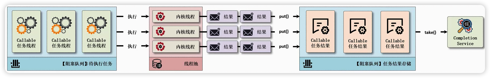

CompletionService 接口是将 Executor（线程池）和 BlockingQueue（阻塞队列）整合在一起，利用阻塞队列实现所有异步任务结果的保存，而后开发者只需要通过 CompletionService 接口提供的方法即可实现异步任务结果的取出。

**CompletionService 应用场景**：

1. 当需要批量提交异步任务的时候建议你使用 CompletionService。CompletionService 将线程池 Executor 和阻塞队列 BlockingQueue 的功能融合在了一起，能够让批量异步任务的管理更简单。
2. CompletionService 能够让异步任务的执行结果有序化。先执行完的先进入阻塞队列。利用这个特性，你可以轻松实现后续处理的有序性，避免无谓的等待，同时还可以快速实现诸如Forking Cluster这样的需求。
3. 线程池隔离。CompletionService 支持自己创建线程池，这种隔离性能避免几个特别耗时的任务拖垮整个应用的风险。


## 2、CompletionService 接口声明

CompletionService 是一个接口，如果要想使用这个接口一定要提供有子类，或者是其他的工厂方法来进行实例化对象创建，在 J.U.C 的内部提供有一个 ExecutorCompletionService 实现子类。

- CompletionService 接口提供的方法有 5 个：

  ```java
  public interface CompletionService<V> {
      // 提交线程任务，交由 Executor 对象去执行，并将结果放入阻塞队列；
      Future<V> submit(Callable<V> task);
      // 提交线程任务，交由 Executor 对象去执行，并将结果放入阻塞队列；
      Future<V> submit(Runnable task, V result);
      // 阻塞等待，在阻塞队列中获取并移除一个元素，该方法是阻塞的，即获取不到的话线程会一直阻塞；
      Future<V> take() throws InterruptedException;
      // 非阻塞等待，在阻塞队列中获取并移除一个元素，该方法是非阻塞的，获取不到即返回 null ；
      Future<V> poll();
      // 带时间的非阻塞等待，从阻塞队列中非阻塞地获取并移除一个元素，在设置的超时时间内获取不到即返回 null ；
      Future<V> poll(long timeout, TimeUnit unit) throws InterruptedException;
  }
  ```

- ExecutorCompletionService 子类源代码：

  ```java
  package java.util.concurrent;
  
  public class ExecutorCompletionService<V> implements CompletionService<V> {
      // 执行任务的线程
      private final Executor executor;
      // 线程池父类
      private final AbstractExecutorService aes;
      // 任务完成会记录在该队列中
      private final BlockingQueue<Future<V>> completionQueue;
      // 内部类：实现了FutureTask接口，当任务执行时，会去调用FutureTask的run()
      private class QueueingFuture extends FutureTask<Void> {
          QueueingFuture(RunnableFuture<V> task) {
              super(task, null);
              this.task = task;
          }
          protected void done() { completionQueue.add(task); }
          private final Future<V> task;
      }
      // 两个封装RunnableFuture 参数 最终调用的都是FutureTask的构造方法
      // 封装RunnableFuture 参数：Callable<V> task
      private RunnableFuture<V> newTaskFor(Callable<V> task) {
          if (aes == null)
              return new FutureTask<V>(task);
          else
              return aes.newTaskFor(task);
      }
      // 封装RunnableFuture 参数：Runnable task, V result
      private RunnableFuture<V> newTaskFor(Runnable task, V result) {
          if (aes == null)
              return new FutureTask<V>(task, result);
          else
              return aes.newTaskFor(task, result);
      }
      // 构造方法 参数：Executor executor
      public ExecutorCompletionService(Executor executor) {
          if (executor == null)
              throw new NullPointerException();
          this.executor = executor;
          this.aes = (executor instanceof AbstractExecutorService) ?
              (AbstractExecutorService) executor : null;
          this.completionQueue = new LinkedBlockingQueue<Future<V>>();
      }
      // 构造方法 参数Executor executor, BlockingQueue<Future<V>> completionQueue
      public ExecutorCompletionService(Executor executor,
                                       BlockingQueue<Future<V>> completionQueue) {
          if (executor == null || completionQueue == null)
              throw new NullPointerException();
          this.executor = executor;
          this.aes = (executor instanceof AbstractExecutorService) ?
              (AbstractExecutorService) executor : null;
          this.completionQueue = completionQueue;
      }
      // 两个任务提交方法：内部都会将其转换为RunnableFutuer实例，然后再封装成QueueingFuture实例作为任务来执行
      // 任务提交方法：Callable<V> task
      public Future<V> submit(Callable<V> task) {
          if (task == null) throw new NullPointerException();
          RunnableFuture<V> f = newTaskFor(task);
          executor.execute(new QueueingFuture(f));
          return f;
      }
      // 任务提交方法： 参数 Runnable task, V result
      public Future<V> submit(Runnable task, V result) {
          if (task == null) throw new NullPointerException();
          RunnableFuture<V> f = newTaskFor(task, result);
          executor.execute(new QueueingFuture(f));
          return f;
      }
  
      public Future<V> take() throws InterruptedException {
          return completionQueue.take();
      }
  
      public Future<V> poll() {
          return completionQueue.poll();
      }
  
      public Future<V> poll(long timeout, TimeUnit unit)
          throws InterruptedException {
          return completionQueue.poll(timeout, unit);
      }
  }
  ```

  - 两个封装 RunnableFuture 方法最终调用的都是 FutureTask 的构造方法: private RunnableFuture newTaskFor(…)
  - 两个构造方法 参数 Executor executor 和 Executor executor, BlockingQueue< Future > completionQueue
  - 两个任务提交方法：内部都会将其转换为RunnableFutuer实例，然后再封装成QueueingFuture实例作为任务来执行
  - 一个内部类：实现了FutureTask接口，当任务执行时，会去调用FutureTask的run(), 在任务执行成功，记录返回记录结果的时候，会调用finishCompletion()去唤醒所有阻塞的线程并调用done()方法。而QueueingFuture内部类就实现了done() 方法，它将执行完的FutureTask放入到阻塞队列中，当调用take()方法时就可以取到任务的执行结果，如果任务都还没有执行完，就阻塞。


## 3、CompletionService 使用示例

操作示例 1：采用**线程池 + Future**的方案异步执行询价

```java
import java.util.HashSet;
import java.util.List;
import java.util.Set;
import java.util.concurrent.*;
import java.util.function.Function;

public class JavaAPIDemo {
    public static void main(String[] args) throws InterruptedException {
        // 模拟电商报价API
        Function<Integer, Integer> getPrice = (i) -> {
            try {
                TimeUnit.SECONDS.sleep(i);
                System.out.println("任务" + i);
            } catch (InterruptedException ignored) {
            }
            return i;
        };

        long start = System.currentTimeMillis();

        // 创建2个固定大小的线程池
        ExecutorService executor = Executors.newFixedThreadPool(5);

        // 在集合中追加所有要执行的线程的任务对象，是Callable的实现
        Set<Callable<Integer>> allThreads = new HashSet<>();
        allThreads.add(() -> getPrice.apply(2));
        allThreads.add(() -> getPrice.apply(6));
        allThreads.add(() -> getPrice.apply(4));
        // 使用invokeAll方法执行集合中的所有Callable任务
        List<Future<Integer>> futures = executor.invokeAll(allThreads);

        futures.forEach((future) -> {
            try {
                System.out.println(future.get());
            } catch (Exception ignored) {
            }
        });

        executor.shutdown();
        while (true) {
            if (executor.isTerminated()) {
                long end = System.currentTimeMillis();
                System.out.println("耗时：" + (end - start) / 1000 + " s");
                break;
            }
        }
    }
}
```

```java
任务2
任务4
任务6
6
2
4
耗时：6 s
```

操作示例 2：采用 CompletionService 的方案异步执行询价

```java
import java.util.concurrent.*;
import java.util.function.Function;

public class JavaAPIDemo {
    public static void main(String[] args) throws InterruptedException, ExecutionException {
        // 模拟电商报价API
        Function<Integer, Integer> getPrice = (i) -> {
            try {
                TimeUnit.SECONDS.sleep(i);
            } catch (InterruptedException ignored) {
            }
            return i;
        };

        long start = System.currentTimeMillis();

        // 创建2个固定大小的线程池
        ExecutorService executor = Executors.newFixedThreadPool(2);
        // 创建 CompletionService, 现在的线程池统一被CompletionService实例所管理，所有线程任务交由此接口实例操作
        ExecutorCompletionService<Integer> cs = new ExecutorCompletionService<>(executor);
        // 异步向电商S1询价
        cs.submit(() -> getPrice.apply(2));
        // 异步向电商S2询价
        cs.submit(() -> getPrice.apply(8));
        // 异步向电商S3询价
        cs.submit(() -> getPrice.apply(4));

        // 将结果异步保存到数据库
        for (int i = 0; i < 3; i++) {
            System.out.println("任务【" + cs.take().get() + "】完成");
        }

        executor.shutdown();
        while (true) {
            if (executor.isTerminated()) {
                long end = System.currentTimeMillis();
                System.out.println("耗时：" + (end - start) / 1000 + " s");
                break;
            }
        }
    }
}
```

```java
任务【2】完成
任务【4】完成
任务【8】完成
耗时：8 s
```

此时的线程池的大小为 2，所以每一次只有 2 个线程任务可以被调度，而后被调度执行完成的线程处理结果会自动的保存在结果的阻塞队列之中，后面可以交由其他线程通过此阻塞队列获取数据。

操作示例 3：并行地调用多个服务，只要有一个成功就返回结果

```java
import java.util.ArrayList;
import java.util.List;
import java.util.concurrent.*;
import java.util.function.Function;

public class JavaAPIDemo {
    public static void main(String[] args) throws InterruptedException, ExecutionException {
        // 模拟电商报价API
        Function<Integer, Integer> getPrice = (i) -> {
            try {
                TimeUnit.SECONDS.sleep(i);
            } catch (InterruptedException ignored) {
            }
            return i;
        };

        long start = System.currentTimeMillis();
        // 创建线程池
        ExecutorService executor = Executors.newFixedThreadPool(3);
        // 创建completionService
        ExecutorCompletionService<Integer> cs = new ExecutorCompletionService<>(executor);
        // 用于保存Future对象
        List<Future<Integer>> futures = new ArrayList<>();
        // 提交异步任务，并保存 future到 futures
        futures.add(cs.submit(() -> getPrice.apply(5)));
        futures.add(cs.submit(() -> getPrice.apply(3)));
        futures.add(cs.submit(() -> getPrice.apply(2)));

        Integer result = null;
        // 获取最快返回的任务执行结果
        try {
            for (int i = 0; i < 3; i++) {
                Future<Integer> future = cs.take();
                // 将有结果的任务从结果集删除
                futures.remove(future);
                result = future.get();
                if (result != null) {
                    break;
                }
            }
        } finally {
            // 取消剩下的所有任务
            for (Future<Integer> future : futures) {
                future.cancel(true);
            }
        }

        executor.shutdown();
        while (true) {
            if (executor.isTerminated()) {
                long end = System.currentTimeMillis();
                System.out.println("耗时：" + (end - start) / 1000 + " s");
                break;
            }
        }
        System.out.println("最终结果：" + result);
    }
}
```

```java
耗时：2 s
最终结果：2
```

操作示例 3：（高德笔试题）多个任务并行执行，有一个任务执行失败了，任务就结束。要求：最快

```java
import java.util.ArrayList;
import java.util.List;
import java.util.Objects;
import java.util.concurrent.*;
import java.util.function.Function;

public class JavaAPIDemo {
    public static void main(String[] args) throws InterruptedException, ExecutionException {
        // 模拟电商报价API
        Function<Integer, Integer> getPrice = (i) -> {
            try {
                if (Objects.nonNull(i)) {
                    TimeUnit.SECONDS.sleep(i);
                } else {
                    // 模拟3秒时出现错误
                    TimeUnit.SECONDS.sleep(3);
                }
            } catch (InterruptedException ignored) {
            }
            return i;
        };

        long start = System.currentTimeMillis();
        // 创建线程池
        ExecutorService executor = Executors.newFixedThreadPool(3);
        // 创建completionService
        ExecutorCompletionService<Integer> cs = new ExecutorCompletionService<>(executor);
        // 用于保存Future对象
        List<Future<Integer>> futures = new ArrayList<>();
        // 提交异步任务，并保存 future到 futures
        futures.add(cs.submit(() -> getPrice.apply(5)));
        futures.add(cs.submit(() -> getPrice.apply(null)));
        futures.add(cs.submit(() -> getPrice.apply(1)));

        Integer result = null;
        // 获取最快返回的任务执行结果
        try {
            for (int i = 0; i < 3; i++) {
                Future<Integer> future = cs.take();
                // 将有结果的任务从结果集删除
                futures.remove(future);
                result = future.get();
                if (Objects.isNull(result)) {
                    System.out.printf("【任务%s】出现异常。%n", result);
                    executor.shutdown();
                    break;
                }
                System.out.printf("【任务%s】执行完毕。%n", result);
            }
        } finally {
            // 取消剩下的所有任务
            for (Future<Integer> future : futures) {
                future.cancel(true);
            }
        }

        // executor.shutdown();
        while (true) {
            if (executor.isTerminated()) {
                long end = System.currentTimeMillis();
                System.out.println("耗时：" + (end - start) / 1000 + " s");
                break;
            }
        }
    }
}
```

```java
【任务1】执行完毕。
【任务null】出现异常。
耗时：3 s
```


# 13、CompletableFuture 异步编排【回调】

CompletableFuture 是在 Java 8 中新增的主要工具，同传统的 Future 相比，其支持流式计算、函数式编程、完成通知、自定义异常处理等很多新的特性。实现 Future 和 CompletionStage 异步接口。

以前需要异步执行一个任务时，一般是用 Thread 或者线程池 Executor 去创建。如果需要返回值，则是调用 Executor.submit 获取 Future 接口以及对应的实现类 FutureTask，通过 Future 或 FutureTask 的就可以获取到异步执行的结果。但是多个线程存在依赖组合，我们又能怎么办？可使用同步组件 CountDownLatch、CyclicBarrier 等；其实有简单的方法，就是用 CompletableFuture。首先我们先来分析 Future 的局限性，以及 CompletableFuture 产生的背景。


## 01、Future 接口以及它的局限性

### 1、串行调用的真实案例

现在我们有一个查询商品价格的接口，它需要查询商品A价格、商品B价格、商品C价格、商品D价格后然后组装数据。

```java
import java.util.concurrent.TimeUnit;
import java.util.stream.Stream;

public class JavaAPIDemo {
    public static void main(String[] args) throws InterruptedException {
        long start = System.currentTimeMillis();

        // 1. 耗时3秒
        Integer a = getPrices("商品A", 3000, 3);
        // 2. 耗时4秒
        Integer b = getPrices("商品B", 2000, 4);
        // 3. 耗时2秒
        Integer c = getPrices("商品C", 5000, 2);
        // 4. 耗时1秒
        Integer d = getPrices("商品D", 1000, 1);
        // 数据处理，对比查询到最便宜的商品
        System.out.printf("最便宜的商品价格: %s%n", Stream.of(a, b, c, d).min(Integer::compareTo).get());

        System.out.printf("耗时: %ds%n", (System.currentTimeMillis() - start)/1000);
    }

    public static Integer getPrices(String name, int price, long timeout) {
        try {
            System.out.printf("%s, 价格: %d, 耗时: %ds%n", name, price, timeout);
            TimeUnit.SECONDS.sleep(timeout);
        } catch (InterruptedException ignored) {
        }
        return price;
    }
}
```

```java
商品A, 价格: 3000, 耗时: 3s
商品B, 价格: 2000, 耗时: 4s
商品C, 价格: 5000, 耗时: 2s
商品D, 价格: 1000, 耗时: 1s
最便宜的商品价格: 1000
耗时: 10029s
```

这段代码会有什么问题？其实算是一段比较正常的代码，但是在某一个商品价格SQL查询或者HTTP请求是相对较慢的，那有没有办法优化一下呢？当前这个请求耗时总计就是10s。上面实现中查询商品价格是串行的，那串行的系统要做性能优化很常见的就是利用多线程并行了。


### 2、并行调用实现方式一：Future + Callable

实际上，每个平台之间的操作是**互不干扰**的，那我们自然而然的可以想到，可以通过多线程的方式，同时去分别执行各个平台的逻辑处理，最后将各个平台的结果汇总到一起比对得到最低价格。这里我们使用 Future + Callable 实现多线程任务。

Future + Callable 实现异步并发调用也有2种方式：

- 第一种是直接使用 Thread 类开启多线程执行任务：Thread + Callable + FutureTask/Future
- 另一种是使用线程池方式提交多线程任务：Executor + Callable + Future

下面我们看下如何优化我们上面的查询接口，实现并行查询。

操作示例 1：Thread + Callable + FutureTask/Future

```java
import java.util.concurrent.ExecutionException;
import java.util.concurrent.FutureTask;
import java.util.concurrent.TimeUnit;
import java.util.stream.Stream;

public class JavaAPIDemo {
    public static void main(String[] args) throws InterruptedException {
        long start = System.currentTimeMillis();

        // 1. 耗时3秒
        FutureTask<Integer> taskA = new FutureTask<>(() -> getPrices("商品A", 3000, 3));
        new Thread(taskA).start();
        // 2. 耗时4秒
        FutureTask<Integer> taskB = new FutureTask<>(() -> getPrices("商品B", 2000, 4));
        new Thread(taskB).start();
        // 3. 耗时2秒
        FutureTask<Integer> taskC = new FutureTask<>(() -> getPrices("商品C", 5000, 2));
        new Thread(taskC).start();
        // 4. 耗时1秒
        FutureTask<Integer> taskD = new FutureTask<>(() -> getPrices("商品D", 1000, 1));
        new Thread(taskD).start();
        // 数据处理，对比查询到最便宜的商品
        Integer min = Stream.of(taskB, taskB, taskC, taskD).map((task) -> {
            try {
                return task.get();
            } catch (InterruptedException | ExecutionException ignored) {
            }
            return -1;
        }).min(Integer::compareTo).get();
        System.out.printf("最便宜的商品价格: %s%n", min);

        System.out.printf("耗时: %ds%n", (System.currentTimeMillis() - start)/1000);
    }

    public static Integer getPrices(String name, int price, long timeout) {
        try {
            System.out.printf("%s, 价格: %d, 耗时: %ds%n", name, price, timeout);
            TimeUnit.SECONDS.sleep(timeout);
        } catch (InterruptedException ignored) {
        }
        return price;
    }
}
```

```java
商品A, 价格: 3000, 耗时: 3s
商品D, 价格: 1000, 耗时: 1s
商品C, 价格: 5000, 耗时: 2s
商品B, 价格: 2000, 耗时: 4s
最便宜的商品价格: 1000
耗时: 4s
```

操作示例 2：ThreadPoolExecutor + Callable + Future

```java
import java.util.concurrent.*;
import java.util.stream.Stream;

public class JavaAPIDemo {
    public static void main(String[] args) throws InterruptedException {
        ExecutorService service = Executors.newFixedThreadPool(10);
        long start = System.currentTimeMillis();

        // 1. 耗时3秒
        Future<Integer> futureA = service.submit(() -> getPrices("商品A", 3000, 3));
        // 2. 耗时4秒
        Future<Integer> futureB = service.submit(() -> getPrices("商品B", 2000, 4));
        // 3. 耗时2秒
        Future<Integer> futureC = service.submit(() -> getPrices("商品C", 5000, 2));
        // 4. 耗时1秒
        Future<Integer> futureD = service.submit(() -> getPrices("商品D", 1000, 1));
        // 数据处理，对比查询到最便宜的商品
        Integer min = Stream.of(futureA, futureB, futureC, futureD).map((task) -> {
            try {
                return task.get();
            } catch (InterruptedException | ExecutionException ignored) {
            }
            return -1;
        }).min(Integer::compareTo).get();
        System.out.printf("最便宜的商品价格: %s%n", min);

        System.out.printf("耗时: %ds%n", (System.currentTimeMillis() - start)/1000);
        service.shutdown();
    }

    public static Integer getPrices(String name, int price, long timeout) {
        try {
            System.out.printf("%s, 价格: %d, 耗时: %ds%n", name, price, timeout);
            TimeUnit.SECONDS.sleep(timeout);
        } catch (InterruptedException ignored) {
        }
        return price;
    }
}
```

```java
商品A, 价格: 3000, 耗时: 3s
商品D, 价格: 1000, 耗时: 1s
商品C, 价格: 5000, 耗时: 2s
商品B, 价格: 2000, 耗时: 4s
最便宜的商品价格: 1000
耗时: 4s
```

为了提升性能，我们实际工作还是会采用**线程池**来负责多线程的处理操作。基本不会使用到 Thread 类来开启线程。最终可以发现：不管使用线程池还是Thread类，在并行调用后，整个请求的耗时减少到了4s。


### 3、并行调用实现方式二：CompletableFuture

```java
import java.util.concurrent.*;
import java.util.stream.Stream;

public class JavaAPIDemo {
    public static void main(String[] args) throws InterruptedException {
        ExecutorService service = Executors.newFixedThreadPool(10);
        long start = System.currentTimeMillis();

        // 1. 耗时3秒
        CompletableFuture<Integer> futureA = CompletableFuture
                .supplyAsync(() -> getPrices("商品A", 3000, 3), service);
        // 2. 耗时4秒
        CompletableFuture<Integer> futureB = CompletableFuture
                .supplyAsync(() -> getPrices("商品B", 2000, 4), service);
        // 3. 耗时2秒
        CompletableFuture<Integer> futureC = CompletableFuture
                .supplyAsync(() -> getPrices("商品C", 5000, 2), service);
        // 4. 耗时1秒
        CompletableFuture<Integer> futureD = CompletableFuture
                .supplyAsync(() -> getPrices("商品D", 1000, 1), service);
        // 等待所有任务执行完毕才开始数据处理，实际上没有这一行代码也不会影响结果的正常执行
        CompletableFuture.allOf(futureA, futureB, futureC, futureD);
        // 数据处理，对比查询到最便宜的商品
        Integer min = Stream.of(futureA, futureB, futureC, futureD).map((task) -> {
            try {
                return task.get();
            } catch (InterruptedException | ExecutionException ignored) {
            }
            return -1;
        }).min(Integer::compareTo).get();
        System.out.printf("最便宜的商品价格: %s%n", min);

        System.out.printf("耗时: %ds%n", (System.currentTimeMillis() - start)/1000);
        service.shutdown();
    }

    public static Integer getPrices(String name, int price, long timeout) {
        try {
            System.out.printf("%s, 价格: %d, 耗时: %ds%n", name, price, timeout);
            TimeUnit.SECONDS.sleep(timeout);
        } catch (InterruptedException ignored) {
        }
        return price;
    }
}
```

```java
商品A, 价格: 3000, 耗时: 3s
商品D, 价格: 1000, 耗时: 1s
商品C, 价格: 5000, 耗时: 2s
商品B, 价格: 2000, 耗时: 4s
最便宜的商品价格: 1000
耗时: 4s
```

可以发现最后耗时也是4s，这时可能认为，使用了 CompletableFuture 与 Future + Callable，最后耗时都是一样的，为何我们还需要使用 CompletableFuture 来进行异步并发的操作呢？现在我们来看看另外一种情况。

如果任务之间有依赖关系，比如当前任务依赖前一个任务的执行结果，该怎么处理呢？

这种问题基本上也都可以用 Future 来解决，但是需要将对应的 FutureTask 传入到当前任务中，然后调用 get() 方法即可。

比如：我们创建了两个 FutureTask `ft1` 和 `ft2`，`ft1` 需要等待 `ft2` 执行完毕后才能做最后的数据处理，所以 ft1 内部需要引用 ft2，并在执行数据处理前，调用 `ft2` 的 `get()` 方法实现等待。


### 4、并行任务依赖：基于 Future 实现

```java
import java.util.concurrent.Callable;
import java.util.concurrent.ExecutionException;
import java.util.concurrent.FutureTask;

public class JavaAPIDemo {
    public static void main(String[] args) throws InterruptedException, ExecutionException {
        // 创建任务TaskB的FutureTask
        FutureTask<String> taskB = new FutureTask<>(new TaskB());
        // 创建任务TaskA的FutureTask
        FutureTask<String> taskA = new FutureTask<>(new TaskA(taskB));

        new Thread(taskA).start();  // 线程执行任务taskA
        new Thread(taskB).start();  // 线程执行任务taskB

        // 等待线程taskA执行结果
        System.out.println(taskA.get());
    }

    // T1Task需要执行的任务：
    static class TaskA implements Callable<String> {
        FutureTask<String> ftB;

        // T1任务需要T2任务的FutureTask
        TaskA(FutureTask<String> ftB) {
            this.ftB = ftB;
        }

        @Override
        public String call() throws Exception {
            // 获取T2线程结果
            System.out.println(ftB.get());
            return "处理完的数据结果";
        }
    }

    // T2Task需要执行的任务:
    static class TaskB implements Callable<String> {
        @Override
        public String call() {
            return "检验 & 查询数据";
        }
    }
}
```

```java
检验 & 查询数据
处理完的数据结果
```

通过这上面的的例子，我们明显的发现 Future 实现异步编程时的一些不足之处：

- Future 对于结果的获取很不方便，只能通过 get() 方法阻塞或者轮询的方式得到任务的结果。阻塞的方式显然是效率低下的，轮询的方式又十分耗费CPU资源，如果前一个任务执行比较耗时的话，get() 方法会阻塞，形成排队等待的情况。
- 将两个异步计算合并为一个，这两个异步计算之间相互独立，同时第二个又依赖于第一个的结果。
- 等待 Future 集合中的所有任务都完成。
- 仅等待 Future 集合中最快结束的任务完成（有可能因为它们试图通过不同的方式计算同一个值），并返回它的结果。
- 应对 Future 的完成事件（即当 Future 的完成事件发生时会收到通知，并能使用 Future 计算的结果进行下一步的操作，不只是简单地阻塞等待操作的结果）。

我们很难表述 Future 结果之间的依赖性，从文字描述上这很简单。比如，下面文字描述的关系，如果用 Future 去实现时还是很复杂的。

比如：“当长时间计算任务完成时，请将该计算的结果通知到另一个长时间运行的计算任务，这两个计算任务都完成后，将计算的结果与另一个查询操作结果合并”

在 JDK8 中引入了 CompletableFuture，对 Future 进行了改进，可以在定义 CompletableFuture 时传入回调对象，任务在完成或者异常时，自动回调，再也不需要每次主动通过 Future 去询问结果了，我们接着往下看。


### 5、并行任务依赖：基于 CompletableFuture 实现

```java
import java.util.concurrent.CompletableFuture;
import java.util.concurrent.ExecutionException;
import java.util.concurrent.TimeUnit;

public class JavaAPIDemo {
    public static void main(String[] args) throws InterruptedException, ExecutionException {
        long start = System.currentTimeMillis();

        // 异步任务一：查询数据任务
        CompletableFuture<String> queryFuture = CompletableFuture.supplyAsync(() -> {
            System.out.println("数据查询任务开始执行...");
            try {
                TimeUnit.SECONDS.sleep(2);
            } catch (InterruptedException ignored) {
            }
            return "queryFunction";
        });

        // 异步任务二：数据清洗任务，依赖任务一的返回值
        CompletableFuture<String> cleanFuture = queryFuture.thenApply(data -> {
            System.out.println("数据清理任务开始执行...");
            try {
                TimeUnit.SECONDS.sleep(1);
            } catch (InterruptedException ignored) {
            }
            return "cleanFunction";
        });

        // 异步任务三：数据更新任务，依赖任务二的返回值
        CompletableFuture<Boolean> updateFuture = cleanFuture.thenApply(data -> {
            System.out.println("数据更新任务开始执行...");
            try {
                TimeUnit.SECONDS.sleep(3);
            } catch (InterruptedException ignored) {
            }
            return true;
        }).exceptionally(ex -> {
            // 数据更新失败
            System.out.println("error: " + ex);
            return false;
        });

        // 等待结果的返回
        System.out.printf("数据更新是否成功: %s", updateFuture.join());
        System.out.printf("任务执行耗时: %ss%n", (System.currentTimeMillis() - start)/1000);
    }
}
```

```java
数据查询任务开始执行...
数据清理任务开始执行...
数据更新任务开始执行...
数据更新是否成功: true任务执行耗时: 6s
```

通过上面的代码我们可以发现 CompletableFuture 有以下优势：

1. 无需手工维护线程，省去了手工提交任务到线程池这一步；
2. 语义更清晰，例如 thenApply、  exceptionally 能够清晰地表述“然后需要执行后面的任务以及异常毁掉的处理”；
3. 代码更简练并且专注于业务逻辑，几乎所有代码都是业务逻辑相关的。


### 6、Future 接口的局限性总结

在异步计算中，Future 确实是一个非常优秀的接口。不过通过如上的分析，我们可以知道 Future 接口依然存在一些局限性：

1. **缺乏回调机制**：Future 没有内置的回调机制，这就意味着我们必须轮询 Future 对象来检查任务是否完成，而不是等待通知。
2. **无法取消任务**：虽然可以通过 cancel() 方法来取消 Future 中的任务，但这并不保证任务会被取消。如果任务已经开始执行，那么 cancel() 方法可能无法终止任务的执行。
3. **缺乏异常处理机制**：Future 通过 get() 方法返回任务的结果或异常，但它无法提供更多的异常处理功能。如果任务抛出异常，你必须在客户端代码中捕获这些异常。
4. **单一结果**：每个 Future 对象只能关联一个任务，这就限制了它的使用，如果我们需要并行执行多个任务并收集它们的结果，我们只能自己管理多个 Future 对象。
5. **无法进行链式调用**：如果我们希望在计算完成后执行特定操作，比如通知用户，这个时候我们就无法使用 Future 来实现了。
6. **无法组合多任务**：在处理多个任务时，Future 并没有提供很好的组合方式，比如我们需要等待 10 任务全部完成后再执行特定操作，这个时候使用 Future 就不是很好操作了。


## 02、什么是 CompletableFuture

### 1、认识 CompletableFuture 类

为了克服 Future 的局限性，Java 8 提供了 CompletableFuture，**实现 Future 和 CompletionStage 异步接口**，它构建在 Future 之上，CompletableFuture 提供了比传统 Future 更加强大、更加灵活的异步编程能力，能够更好地满足复杂异步任务处理的需求，能够更加方便地构建复杂的异步操作流，是 Java 8 及以后的版本中，处理异步操作的首选。

CompletableFuture 相比 Future 它具备如下优势：

1. **提供了回调机制**：CompletableFuture 提供了回调功能，我们可以注册回调函数来处理任务完成时的结果，而不必阻塞线程等待任务完成。这样可以提高并发性能，减少线程的阻塞时间。
2. **提供了异常处理**：CompletableFuture 具备丰富的异常处理机制，可以捕获任务执行中的异常，并允许我们定义自定义的异常处理策略。
3. **能够取消任务**：我们可以使用 `cancel()`取消任务的执行，同时还可以指定是否中断正在执行的任务。这提供了更好的任务控制能力。
4. **强大的异步编程能力**：CompletableFuture 提供了丰富的方法来处理异步操作，包括**组合**、**转换**、**处理异常**以及**执行自定义**的操作。这使得异步编程更加灵活，可以更轻松地实现复杂的异步任务组合。
5. **支持组合、链式操作**：CompletableFutur  提供了一系列支持组合操作的方法，例如 `thenCombine()` ， `thenCompose()`，`thenApplyAsync()`等等，使得多个 CompletableFuture 可以轻松组合成一个新的 CompletableFuture，从而更容易构建复杂的异步操作流。

CompletableFuture 的优点如下：

1. 异步函数式编程，实现优雅，易于维护；
2. 它提供了异常管理的机制，让你有机会抛出、管理异步任务执行中发生的异常，监听这些异常的发生；
3. 拥有对任务编排的能力。借助这项能力，可以轻松地组织不同任务的运行顺序、规则以及方式。

CompletableFuture 的使用场景：

1. **并行处理多个独立任务**：当一个任务可以被分解为多个独立的子任务时，可以使用 CompletableFuture 来并行执行这些子任务，从而提高系统的性能和响应速度。比如，在电商系统中，查询用户信息、订单信息、购物车信息等可以并行执行，然后在所有子任务完成后进行结果合并。
2. **异步执行耗时操作**：对于一些耗时的操作，比如远程调用、数据库查询等，可以使用CompletableFuture来异步执行这些操作，避免阻塞主线程，提高系统的吞吐量和并发能力。
3. **组合多个异步任务的结果**：有时候需要等待多个异步任务都完成后才能进行下一步处理，可以使用 CompletableFuture 的组合方法（比如 thenCombine、thenCompose 等）来等待多个异步任务的结果，并在所有任务完成后进行处理。
4. **超时处理和异常处理**：CompletableFuture 提供了丰富的异常处理和超时处理的方法，可以很方便地处理异步任务执行过程中出现的异常或者超时情况。
5. **实现异步回调**：通过 CompletableFuture 的回调方法，可以在异步任务完成后执行特定的逻辑，比如通知其他系统、记录日志等。


### 2、理解 CompletionStage 接口

```java
/**
 * @author Doug Lea
 * @since 1.8
 */
public class CompletableFuture<T> implements Future<T>, CompletionStage<T> {}

public interface CompletionStage<T> {}
```

通过接口的继承关系，我们可以发现这里的异步操作到底什么时候结束、结果如何获取，都可以通过 Future 接口来解决。

另外 CompletableFuture 类还实现了 CompletionStage 接口，这个接口就比较关键了，之所以能实现响应式编程，都是通过这个接口提供的方法。

下面介绍下 CompletionStage 接口，看字面意思可以理解为“完成动作的一个阶段”，官方注释文档：CompletionStage 是一个可能执行异步计算的“阶段”，这个阶段会在另一个 CompletionStage 完成时调用去执行动作或者计算，一个 CompletionStage 会以正常完成或者中断的形式“完成”，并且它的“完成”会触发其他依赖的 CompletionStage 。CompletionStage 接口的方法一般都返回新的 CompletionStage，因此构成了链式的调用。

这个看完还是有点懵逼的，不清楚什么是 CompletionStage？在 Java 中什么是 CompletionStage ？

一个 Function、Comsumer、Supplier 或者 Runnable 都会被描述为一个CompletionStage。

```java
stage.thenApply(x -> square(x))
    .thenAccept(x -> System.out.print(x))
    .thenRun(() -> System.out.println());
```

- `x -> square(x)` 就是一个 Function 类型的 Stage，它返回了x。
- `x -> System.out.println(x)` 就是一个 Comsumer 类型的Stage，用于接收上一个 Stage 的结果 x。
- `() ->System.out.println()` 就是一个 Runnable 类型的 Stage，既不消耗结果也不产生结果。

但是 CompletionStage 这里面一共有40多个方法，我们该如何理解呢？

CompletionStage 接口可以清晰的描述任务之间的关系，可以分为 **顺序串行、并行、汇聚关系以及异常处理**。


## 03、异步任务的创建方式

### 1、构造函数创建

最简单的方式就是通过构造函数创建一个 CompletableFuture 实例。如下代码所示。由于新创建的 CompletableFuture 还没有任何计算结果，这时调用 get 或者 join，当前线程会一直阻塞在这里。此时如果有其它线程执行，get() / join() 就会等待到结果继续执行。想要完成计算需要调用 complete() 方法来执行任务完成。

```java
// 创建未完成的CompletableFuture
CompletableFuture<String> completableFuture = new CompletableFuture<>();
// 这将创建一个未完成的 CompletableFuture。你可以通过 complete 方法来完成它：
future.complete(null);

// 如下是静态方法创建：相当于 new CompletableFuture<>() + complete();
// 如果你想创建一个已经完成的 CompletableFuture，你可以使用 completedFuture 方，使用方法
CompletableFuture<String> future = CompletableFuture.completedFuture("Hello, world!");
```

操作示例 1：使用 CompletableFuture 无参构造简单测试

```java
import java.util.concurrent.CompletableFuture;
import java.util.concurrent.ExecutionException;

public class JavaAPIDemo {
    public static void main(String[] args) throws InterruptedException, ExecutionException {
        // 创建一个新的未完成的CompletableFuture, 可以稍后完成(调用complete方法)。
        CompletableFuture<String> completableFuture = new CompletableFuture<>();

        // 在异步线程中执行任务，并设置结果到 CompletableFuture
        new Thread(() -> {
            try {
                // 模拟耗时操作
                Thread.sleep(2000);
                // 设置 CompletableFuture 的结果
                completableFuture.complete("Hello, CompletableFuture!");
            } catch (InterruptedException e) {
                // 处理异常
                completableFuture.completeExceptionally(e);
            }
        }).start();

        // 在主线程中等待 CompletableFuture 的结果
        try {
            String result = completableFuture.get();
            System.out.println(result);
        } catch (InterruptedException | ExecutionException e) {
            completableFuture.completeExceptionally(e);
        }
    }
}
```

```java
Hello, CompletableFuture!
```

在这个示例中，我们创建了一个无参构造的 CompletableFuture 对象，并通过异步线程设置了它的结果。主线程通过 get() 方法等待异步操作的完成，并获取结果进行处理。


### 2、静态方法汇总

除了使用构造方法构造（基本不会使用到构造方法创建），CompletableFuture 还提供了一些静态方法来创建。常用创建有4个静态方法。

1、CompletableFuture 提供了四个常用静态方法来创建一个异步任务

```java
public static CompletableFuture<Void> runAsync(Runnable runnable)；
public static CompletableFuture<Void> runAsync(Runnable runnable, Executor executor)；
 
public static <U> CompletableFuture<U> supplyAsync(Supplier<U> supplier) ；
public static <U> CompletableFuture<U> supplyAsync(Supplier<U> supplier, Executor executor)；
```

- runAsync 都是没有返回值的，supplyAsync 都是可以获取返回值的
- 提供两个入参的方法可以传入自定义的线程池，否则默认使用公用的 ForkJoinPool.commonPool() 作为执行异步任务的线程池

2、CompletableFuture 其他静态方法创建异步任务对象.

```java
// 创建并返回一个已经用给定值完成的新CompletableFuture和CompletionStage
public static <U> CompletableFuture<U> completedFuture(U value);
public static <U> CompletionStage<U> completedStage(U value);

// 创建并返回一个已经完成的CompletableFuture和CompletionStage，并且它的结果为一个异常
public static <U> CompletableFuture<U> failedFuture(Throwable ex);
public static <U> CompletionStage<U> failedStage(Throwable ex);

// 组合CompletableFutures, allof无返回值，anyOf有返回值
public static CompletableFuture<Void> allOf(CompletableFuture<?>... cfs);
public static CompletableFuture<Object> anyOf(CompletableFuture<?>... cfs);

// 用于创建一个延迟执行的 Executor。这个 Executor 可以用于指定异步操作的延迟执行。并且可以使用自定义的Executor
public static Executor delayedExecutor(long delay, TimeUnit unit);
public static Executor delayedExecutor(long delay, TimeUnit unit, Executor executor);
```


### 3、静态方法 runAsync / supplyAsync

> runAsync 与 supplyAsync 是启动一个异步任务并且开始执行。

**1、根据 Runnable 创建 CompletableFuture 任务，无返回值**。

```java
// 使用默认内置线程池ForkJoinPool.commonPool()，根据runnable构建执行任务
public static CompletableFuture<Void> runAsync(Runnable runnable);
// 自定义线程，根据runnable构建执行任务  
public static CompletableFuture<Void> runAsync(Runnable runnable,Executor executor);
```

**2、根据 Supplier 创建 CompletableFuture 任务，有返回值**。

```java
// 使用默认内置线程池ForkJoinPool.commonPool()，根据supplier构建执行任务  
public static <U> CompletableFuture<U> supplyAsync(Supplier<U> supplier);
// 自定义线程，根据supplier构建执行任务  
public static <U> CompletableFuture<U> supplyAsync(Supplier<U> supplier,Executor executor);
```

这四个方法区别在于：

- runAsync 方法以 Runnable 函数式接口类型为参数，没有返回结果，supplyAsync 方法以 Supplier 函数式接口类型为参数，返回结果类型为 U；
- 没有指定 Executor 的方法会使用 ForkJoinPool.commonPool() 作为它的线程池执行异步代码。如果指定了线程池，则使用指定的线程池运行。

**注意**：如果所有 CompletableFuture 共享一个线程池，那么一旦有任务执行一些很慢的 I/O 操作，就会导致线程池中所有线程都阻塞在 I/O 操作上，从而造成线程饥饿，进而影响整个系统的性能。所以，建议你要根据不同的业务类型创建不同的线程池，以避免互相干扰。

> **追加问题：为什么 supplyAsync 方法接收一个 Supplier 函数式接口类型参数而不是一个 Callable 类型的参数呢？**
>
> ```java
> @FunctionalInterface
> public interface Callable<V> {
>     V call() throws Exception;
> }
> @FunctionalInterface
> public interface Supplier<T> {
>     T get();
> }
> ```
>
> 看了接口定义，我们发现它们其实都是一个不接受任何参数类型的函数式接口，在实践中它们做的是相同的事情（定义一个业务逻辑去处理然后有返回值），但在原则上它们的目的是做不同的事情：
>
> - 从语义上来看 Callable 是“返回结果的任务”，而 Supplier 是 “结果的供应商”。可以理解为 Callable 引用了一个未执行的工作单元，Supplier 引用了一个未知的值。侧重点可能不一样，如果关心的是提供一个什么值而不关心具体做了啥工作使用 Supplier 感觉更合适。例如，ExecutorService 与 Callable一起工作，因为它的主要目的是执行工作单元。CompletableFuture 使用 Supplier，因为它只关心提供的值，而不太关心可能需要做多少工作。
> - 两个接口定义之间的一个基本区别是，Callable允许从其实现中抛出检查异常，而Supplier不允许。

操作示例 1：使用 runAsync 创建异步任务，无返回值

```java
import java.util.concurrent.CompletableFuture;
import java.util.concurrent.ExecutionException;
import java.util.concurrent.ExecutorService;
import java.util.concurrent.Executors;

public class JavaAPIDemo {
    public static void main(String[] args) throws InterruptedException, ExecutionException {
        System.out.println("主线程开始执行。。。");

        CompletableFuture<Void> completableFuture1 = CompletableFuture.runAsync(
                () -> System.out.println("无返回值，使用默认线程池"));
        System.out.println(completableFuture1.get());

        ExecutorService executor = Executors.newFixedThreadPool(2);
        CompletableFuture<Void> completableFuture2 = CompletableFuture.runAsync(
                () -> System.out.println("无返回值，使用自定义线程池"), executor);
        System.out.println(completableFuture2.join());
        executor.shutdown();

        System.out.println("主线程结束。。。");
    }
}
```

```java
主线程开始执行。。。
无返回值，使用默认线程池
null
无返回值，使用自定义线程池
null
主线程结束。。。
```

操作示例 2：使用 supplyAsync 创建异步任务，有返回值

```java
import java.util.concurrent.CompletableFuture;
import java.util.concurrent.ExecutionException;
import java.util.concurrent.ExecutorService;
import java.util.concurrent.Executors;

public class JavaAPIDemo {
    public static void main(String[] args) throws InterruptedException, ExecutionException {
        System.out.println("主线程开始执行。。。");

        CompletableFuture<Long> completableFuture1 = CompletableFuture.supplyAsync(() -> {
            System.out.println("有返回值，使用默认线程池");
            return System.currentTimeMillis();
        });
        System.out.println(completableFuture1.get());

        ExecutorService executor = Executors.newFixedThreadPool(2);
        CompletableFuture<Long> completableFuture2 = CompletableFuture.supplyAsync(() -> {
            System.out.println("有返回值，使用自定义线程池");
            return System.currentTimeMillis();
        }, executor);
        System.out.println(completableFuture2.join());
        executor.shutdown();

        System.out.println("主线程结束。。。");
    }
}
```

```java
主线程开始执行。。。
有返回值，使用默认线程池
1705991857895
有返回值，使用自定义线程池
1705991857898
主线程结束。。。
```


### 4、静态方法 completedFuture / completedStage

创建并返回一个已经用给定值完成的新 CompletableFuture 或 CompletionStage。也可以理解为构建一个常量的 CompletableFuture 或 CompletionStage。**等价于：new CompletableFuture() + complete() 结合**。

```java
public static <U> CompletableFuture<U> completedFuture(U value);
public static <U> CompletionStage<U> completedStage(U value);
```

```java
import java.util.concurrent.CompletableFuture;
import java.util.concurrent.CompletionStage;
import java.util.function.Function;

public class JavaAPIDemo {
    public static void main(String[] args) {
        // CompletableFuture.completedFuture示例
        CompletableFuture<String> future = 
            CompletableFuture.completedFuture("使用一个常量值完成completedFuture");
        System.out.println(future.join());

        // CompletableFuture.completedStage示例
        CompletionStage<String> stage = 
            CompletableFuture.completedStage("使用一个常量值完成任务completedStage");
        CompletableFuture<String> completableFuture = stage
            .thenApply(Function.identity()).toCompletableFuture();
        System.out.println(completableFuture.join());
    }
}
```

```java
使用一个常量值完成completedFuture
使用一个常量值完成任务completedStage
```


### 5、静态方法 failedFuture / failedStage

创建并返回一个已经完成的CompletableFuture和CompletionStage，并且它的结果为一个异常

```java
public static <U> CompletableFuture<U> failedFuture(Throwable ex);
public static <U> CompletionStage<U> failedStage(Throwable ex);
```

操作示例 1：CompletableFuture.failedFuture 方法演示

```java
import java.util.concurrent.CompletableFuture;

public class FailedFutureExample {

    public static void main(String[] args) {
        // 创建一个已经完成的 CompletableFuture，包含异常
        CompletableFuture<String> failedFuture = 
            CompletableFuture.failedFuture(new RuntimeException("Custom exception"));

        // 异常处理
        failedFuture.exceptionally(throwable -> {
            System.err.println("CompletableFuture failed with: " + throwable.getMessage());
            return "失败处理"; // Handle the exception or provide a default value
        });

        // 等待 CompletableFuture 完成，最终会在主线程中抛出异常
        System.out.println(failedFuture.join());
    }
}
```

```java
CompletableFuture failed with: Custom exception
Exception in thread "main" java.util.concurrent.CompletionException: java.lang.RuntimeException: Custom exception
```

操作示例 2：CompletableFuture.failedStage 方法演示

```java
import java.util.concurrent.CompletableFuture;
import java.util.concurrent.CompletionStage;

public class JavaAPIDemo {
    public static void main(String[] args) {
        // 创建一个已经完成的 CompletionStage，包含异常
        CompletionStage<String> failedStage = CompletableFuture
                .failedStage(new RuntimeException("Custom exception"));

        // 异常处理
        failedStage.exceptionally(throwable -> {
            System.err.println("CompletableFuture failed with: " + throwable.getMessage());
            return "失败处理"; // Handle the exception or provide a default value
        });

        // 先将 CompletionStage 转换成 CompletableFuture，然后再获取结果
        System.out.println(failedStage.toCompletableFuture().join());
    }
}
```

```java
CompletableFuture failed with: Custom exception
Exception in thread "main" java.util.concurrent.CompletionException: java.lang.RuntimeException: Custom exception
```


### 6、静态方法 allOf / anyOf

组合多个 CompletableFutures, allof 无返回值（会等待全部任务执行完毕）, anyOf 有返回值（只要有一个任务完成，就返回执行结果）

```java
public static CompletableFuture<Void> allOf(CompletableFuture<?>... cfs);
public static CompletableFuture<Object> anyOf(CompletableFuture<?>... cfs);
```

```java
import java.util.concurrent.CompletableFuture;
import java.util.concurrent.CompletionStage;

public class JavaAPIDemo {
    public static void main(String[] args) {
        // allOf
        CompletableFuture<String> future1 = CompletableFuture.completedFuture("任务一");
        CompletableFuture<String> future2 = CompletableFuture.completedFuture("任务二");
        CompletableFuture<Void> allOf = CompletableFuture.allOf(future1, future2);
        allOf.join();
        System.out.println(future1.join());
        System.out.println(future2.join());

        // anyOf
        CompletableFuture<String> future3 = CompletableFuture.completedFuture("任务三");
        CompletableFuture<String> future4 = CompletableFuture.completedFuture("任务四");
        CompletableFuture<Object> anyOf = CompletableFuture.anyOf(future3, future4);
        Object result = anyOf.join();
        System.out.println(result);
    }
}
```

```java
任务一
任务二
任务三
```


### 7、静态方法 delayedExecutor

创建一个延迟执行的 Executor（如果为非正数则没有延迟）。**注意：delayedExecutor 不能创建 CompletableFuture**。

```java
public static Executor delayedExecutor(long delay, TimeUnit unit);
public static Executor delayedExecutor(long delay, TimeUnit unit, Executor executor);
```

操作示例 1：使用 delayedExecutor 设置为自定义的线程池。

```java
import java.util.concurrent.CompletableFuture;
import java.util.concurrent.TimeUnit;

public class JavaAPIDemo {
    public static void main(String[] args) throws InterruptedException {
        CompletableFuture<Object> future = new CompletableFuture<>();
        future.completeAsync(() -> {
            System.out.println("Task executed after 2 seconds");
            return "OK";
        }, CompletableFuture.delayedExecutor(2, TimeUnit.SECONDS));

        // 主线程不阻塞，以便观察异步执行
        System.out.println("Main-Thread continues...");

        // 等待一些时间以确保异步任务有机会执行
        TimeUnit.SECONDS.sleep(3);
    }
}
```

```java
Main-Thread continues...
Task executed after 2 seconds
```

操作示例 2：直接使用 CompletableFuture.delayedExecutor 创建延迟线程池自己使用。

```java
import java.util.concurrent.CompletableFuture;
import java.util.concurrent.TimeUnit;

public class JavaAPIDemo {
    public static void main(String[] args) throws InterruptedException {
        CompletableFuture<Object> future = new CompletableFuture<>();
future.completeAsync(() -> input, CompletableFuture.delayedExecutor(1, TimeUnit.SECONDS));
        // 创建一个延迟 2 秒执行的 Executor
        CompletableFuture.delayedExecutor(2, TimeUnit.SECONDS)
                .execute(() -> System.out.println("Task executed after 2 seconds"));

        // 主线程不阻塞，以便观察异步执行
        System.out.println("Main-Thread continues...");

        // 等待一些时间以确保异步任务有机会执行
        TimeUnit.SECONDS.sleep(3);
    }
}
```

```java
Main-Thread continues...
Task executed after 2 seconds
```


### 8、构造方法与静态方法创建的区别

使用静态方法的和使用构造方法主要区别就是：使用构造方法需要其它线程主动调用complete来表示任务执行完成，因为很简单，因为在构造的时候没有执行异步的任务，所以需要其它线程主动调用 complete 来表示任务执行完成。


## 04、获取任务执行的结果

对于结果的获取 CompltableFuture 类提供了四种方式：

```java
// 阻塞等待 获取返回值, 方法中不会抛出检查时异常
public T join();
// 阻塞等待 获取返回值, 方法中是需要返回受检异常
public T get();
// 等待阻塞一段时间, 并获取返回值
public T get(long timeout, TimeUnit unit);
// 立即返回结果，不阻塞，未完成则返回指定value
public T getNow(T valueIfAbsent);
```

- get() 和 get(long timeout, TimeUnit unit) 是实现了 Future 接口的功能，两者主要区别就是 get() 会一直阻塞直到获取到结果，后者可以指定超时时间，当到了指定的时间还未获取到任务，就会抛出 TimeoutException 异常。
- getNow：立即获取结果不阻塞，结果计算已完成将返回结果或计算过程中的异常，如果未计算完成将返回设定的valueIfAbsent值
- join： 与get()方法的主要区别就是，get() 会抛出检查时异常，join() 不会。

CompltableFuture 中 get 与 join 的区别：

- **不同：get 方法返回结果，抛出的是检查异常，必须用户 throw 或者 try/catch 处理，join 返回结果，抛出未检查异常。**
- **相同：join 和 get 方法都是依赖于完成信号并返回结果 T 的阻塞方法。(阻塞调用者线程，等待异步线程返回结果)。**

**需要注意：get / join 方法只是阻塞等待结果的返回，他并不影响 CompltableFuture 异步任务的执行开始，如果 CompltableFuture 没有返回值，那么即使不使用 get / join 异步任务也能够正常执行完毕。【前提是不能被主线程先跑完】**

操作示例 1：get() 与 join() 方法演示

```java
import java.util.concurrent.CompletableFuture;
import java.util.concurrent.ExecutionException;

public class JavaAPIDemo {
    public static void main(String[] args) {

        // get方法测试
        CompletableFuture<Integer> future1 = CompletableFuture.supplyAsync((() -> 1/0));
        try {
            System.out.println(future1.get());
        } catch (InterruptedException | ExecutionException e) {
            System.out.println(e.getClass());
        }

        // join 方法测试
        CompletableFuture<Integer> future2 = CompletableFuture.supplyAsync((() -> 1/0));
        System.out.println(future2.join());
    }
}
```

```java
class java.util.concurrent.ExecutionException
Exception in thread "main" java.util.concurrent.CompletionException: java.lang.ArithmeticException: / by zero
```

- get 方法获取结果方法里将抛出异常，执行结果抛出的异常为 ExecutionException
- join 方法获取结果方法里不会抛异常，但是执行结果会抛异常，抛出的异常为 CompletionException

操作示例 2：getNow() 与 get() 超时方法演示

```java
import java.util.concurrent.CompletableFuture;
import java.util.concurrent.ExecutionException;
import java.util.concurrent.TimeUnit;
import java.util.concurrent.TimeoutException;

public class JavaAPIDemo {
    public static void main(String[] args) throws ExecutionException, InterruptedException, TimeoutException {

        CompletableFuture<String> future = CompletableFuture.supplyAsync(() -> {
            try {
                Thread.sleep(2000);
            } catch (InterruptedException ignored) {
            }
            return "测试A";
        });
        // getNow方法测试
        System.out.println(future.getNow("测试B"));
        // get(long timeout, TimeUnit unit)方法测试
        System.out.println(future.get(1, TimeUnit.SECONDS));
    }
}
```

```java
测试B
Exception in thread "main" java.util.concurrent.TimeoutException
```

操作示例 3：为了学习者区别获取结果 get/join 方法与 完成方法 complete 方法的不同。

```java
import java.util.concurrent.CompletableFuture;
import java.util.concurrent.TimeUnit;

public class JavaAPIDemo {
    public static void main(String[] args) throws InterruptedException {
        // 无参构造必须要要调用 complete 方法才会执行任务，然后才能通过 get/join 方法获取结果
        CompletableFuture<String> future = new CompletableFuture<>();

        // 如下方式构造的 completedFuture 都无需调用
        CompletableFuture.completedFuture("OK-1")
                .thenAccept(System.out::println);

        CompletableFuture.completedFuture("OK-2")
                .thenApplyAsync((data) -> {
                    System.out.println(data);
                    return "result: " + data;
                });

        CompletableFuture.runAsync(() -> System.out.println("OK-3"));
        CompletableFuture.supplyAsync(() -> {
            System.out.println("OK-4");
            return "result: OK-4";
        });

        // 等待子线程执行完毕
        TimeUnit.SECONDS.sleep(2);
        future.complete("OK-5");
        System.out.println(future.join());
        System.out.println("主线程执行结束");
    }
}
```

```java
OK-1
OK-2
OK-3
OK-4
OK-5
主线程执行结束
```


## 05、异步任务的串行执行 - 异步回调方法

```java
// 只要上面的任务执行完成，就开始执行thenRun，只是处理完任务后，执行thenRun的后续操作
public CompletionStage<Void> thenRun(Runnable action);
public CompletionStage<Void> thenRunAsync(Runnable action);
public CompletionStage<Void> thenRunAsync(Runnable action,Executor executor);

// 消费处理结果。接收任务的处理结果，并消费处理，无返回结果。
public CompletionStage<Void> thenAccept(Consumer<? super T> action);
public CompletionStage<Void> thenAcceptAsync(Consumer<? super T> action);
public CompletionStage<Void> thenAcceptAsync(Consumer<? super T> action,Executor executor);

// 当一个线程依赖另一个线程时，获取上一个任务返回的结果，并返回当前任务的返回值。（有返回值）
public <U> CompletableFuture<U> thenApply(Function<? super T,? extends U> fn);
public <U> CompletableFuture<U> thenApplyAsync(Function<? super T,? extends U> fn);
public <U> CompletableFuture<U> thenApplyAsync(Function<? super T,? extends U> fn, Executor executor);

// 允许你对两个CompletableFuture任务进行流水线操作，当第一个异步任务操作完成时，会将其结果作为参数传递给第二个任务
public <U> CompletableFuture<U> thenCompose(Function<? super T, ? extends CompletionStage<U>> fn);
public <U> CompletableFuture<U> thenComposeAsync(Function<? super T, ? extends CompletionStage<U>> fn);
public <U> CompletableFuture<U> thenComposeAsync(Function<? super T, ? extends CompletionStage<U>> fn,
 Executor executor);
```

- thenRun / thenRunAsync：无入参无返回
- thenAccept / thenAcceptAsync：有入参无返回
- thenApply / thenApplyAsync：有入参有返回
- thenCompose / thenComposeAsync：有入参有返回，与 thenApply 类似，可以展开嵌套。

其中，带 Async 后缀的函数表示需要连接的后置任务**会被单独提交到线程池中**，从而相对前置任务来说是异步运行的。除此之外，两者没有其他区别。因此，为了快速理解，在接下来的介绍中，我们主要介绍带Async默认线程池的版本。


### 1、thenRun / thenRunAsync

**上一个任务完成则运行 action，不关心上一个任务的结果，无返回值**。

```java
public CompletableFuture<Void> thenRun(Runnable action);
public CompletableFuture<Void> thenRunAsync(Runnable action);
public CompletableFuture<Void> thenRunAsync(Runnable action, Executor executor);
```

```java
import java.util.concurrent.CompletableFuture;

public class JavaAPIDemo {
    public static void main(String[] args) {
        // 异步任务会串行执行, 2个任务之间没有参数和结果的依赖
        CompletableFuture<Void> future1 = CompletableFuture
                .runAsync(() -> System.out.println("run runAsync"))
                .thenRunAsync(() -> System.out.println("run thenRunAsync - 1"));
        future1.join();

        // 异步任务会串行执行, 2个任务之间没有参数和结果的依赖
        CompletableFuture<Void> future2 = CompletableFuture
                .supplyAsync(() -> "supplyAsync")
                .thenRunAsync(() -> System.out.println("run thenRunAsync - 2"));
        future2.join();
    }
}
```

```java
run runAsync
run thenRunAsync - 1
run thenRunAsync - 2
```


### 2、thenAccept / thenAcceptAsync

**上一个任务完成则运行 action，依赖上一个任务的结果，无返回值**。

```java
public CompletableFuture<Void> thenAccept(Consumer<? super T> action);
public CompletableFuture<Void> thenAcceptAsync(Consumer<? super T> action);
public CompletableFuture<Void> thenAcceptAsync(Consumer<? super T> action, Executor executor);
```

```java
import java.util.concurrent.CompletableFuture;

public class JavaAPIDemo {
    public static void main(String[] args) {
        // 上一个任务完成则运行 action，依赖上一个任务的结果，如果上一个任务无结果, 则入参为null
        CompletableFuture<Void> future1 = CompletableFuture
                .runAsync(() -> System.out.println("run runAsync"))
                .thenAcceptAsync(System.out::println);
        future1.join();

        // 上一个任务完成则运行 action，依赖上一个任务的结果
        CompletableFuture<Void> future2 = CompletableFuture
                .supplyAsync(() -> "run supplyAsync")
                .thenAcceptAsync((data) -> System.out.println(data));
        future2.join();
    }
}
```

```java
run runAsync
null
run supplyAsync
```


### 3、thenApply / thenApplyAsync

**上一个任务完成则运行 fn，依赖上一个任务的结果，有返回值**。

```java
public <U> CompletableFuture<U> thenApply(Function<? super T,? extends U> fn);
public <U> CompletableFuture<U> thenApplyAsync(Function<? super T,? extends U> fn);
public <U> CompletableFuture<U> thenApplyAsync(Function<? super T,? extends U> fn, Executor executor);
```

```java
import java.util.concurrent.CompletableFuture;

public class JavaAPIDemo {
    public static void main(String[] args) {
        // 上一个任务完成则运行 action，依赖上一个任务的结果，有返回值
        CompletableFuture<String> future = CompletableFuture
                .supplyAsync(() -> "run supplyAsync")
                .thenApplyAsync((data) -> data); // (data) -> data 可替换为Function.identity()
        future.join();
    }
}
```

```java
run supplyAsync
```


### 4、thenCompose / thenComposeAsync

**上一个任务完成则运行 fn，依赖上一个任务的结果，有返回值**。

thenCompose 非常类似 thenApply（**区别是 thenCompose 的返回值是 CompletionStage，thenApply 则是返回 U**），提供该方法为了和其他 CompletableFuture 任务更好地配套组合使用。

thenCompose 方法会在某个任务执行完成后，将该任务的执行结果，作为方法入参,去执行指定的方法。该方法会返回一个新的CompletableFuture 实例

- 如果该 CompletableFuture 实例的 result 不为 null，则返回一个基于该 result 新的 CompletableFuture 实例；
- 如果该 CompletableFuture 实例为 null，然后就执行这个新任务。

```java
public <U> CompletableFuture<U> thenCompose(Function<? super T, ? extends CompletionStage<U>> fn);
public <U> CompletableFuture<U> thenComposeAsync(Function<? super T, ? extends CompletionStage<U>> fn);
public <U> CompletableFuture<U> thenComposeAsync(Function<? super T, ? extends CompletionStage<U>> fn,
 Executor executor);
```

```java
import java.util.concurrent.CompletableFuture;
import java.util.function.Function;

public class JavaAPIDemo {
    public static void main(String[] args) {
        // 上一个任务完成则运行 action，依赖上一个任务的结果，有返回值，可以更好地配套组合使用
        // 第一个异步任务，常量任务
        CompletableFuture<String> completableFuture = CompletableFuture.completedFuture("OK");
        // 第二个异步任务
        CompletableFuture<String> future = CompletableFuture
                .supplyAsync(() -> "run supplyAsync")
                .thenComposeAsync(data -> {
                    System.out.println(data);
                    // 使用第一个任务作为返回
                    return completableFuture;
                });
        System.out.println(future.join());
    }
}
```

```java
run supplyAsync
OK
```


### 5、带 Async 后缀方法与不带的区别

1、带 Async 后缀的方法：

- 异步执行： 方法调用将任务异步提交给线程池执行，不会阻塞当前线程。
- 使用指定的执行器： 如果提供了额外的 Executor 参数，任务将在指定的执行器上执行。

2、不带 Async 后缀的方法

- 同步执行： 方法调用将在当前线程中执行任务，可能导致阻塞当前线程。
- 提供额外的 Executor 参数： 在一些方法中，你可以提供额外的 Executor 参数以指定任务的执行器。

3、两者的区别汇总：

- 带 Async 方法的优势： 带有 Async 后缀的方法能够在异步环境中执行，避免阻塞主线程。通过提供额外的 Executor 参数，可以更灵活地选择任务执行的线程池。
- 不带 Async 方法的使用场景： 不带 Async 后缀的方法通常在当前线程中执行，适用于一些短时间运行的任务，但可能引起主线程的阻塞。
- 带 Async 后缀的函数表示需要连接的后置任务**会被单独提交到线程池中**，从而相对前置任务来说是异步运行的。除此之外，两者没有其他区别。

***

**thenRun 和 thenRunAsync 有什么区别呢？可以看下源码**：

```java
private static final Executor asyncPool = useCommonPool ?
    ForkJoinPool.commonPool() : new ThreadPerTaskExecutor();

public CompletableFuture<Void> thenRun(Runnable action) {
    return uniRunStage(null, action);
}

public CompletableFuture<Void> thenRunAsync(Runnable action) {
    return uniRunStage(asyncPool, action);
}

public CompletableFuture<Void> thenRunAsync(Runnable action, Executor executor) {
    return uniRunStage(screenExecutor(executor), action);
}
```

从源码分析 thenRun 和 thenRunAsync 可以得知：

- 使用 thenRun 方法时子任务与父任务使用的是同一个线程。而 thenRunAsync 在子任务中可能是另起一个线程执行任务，并且 thenRunAsync 可以自定义线程池，默认的使用的是 ForkJoinPool.commonPool() 线程池。
- thenRun 跟 thenRunAsync 的主要区别就是 thenRunAsync 会重新开一个线程来执行下一阶段的任务，而 thenRun 还是用上一阶段任务执行的线程执行来执行下一阶段的任务。两个重载 thenRunAsync 区别是使用自定义线程池还是默认线程池执行任务。

***

操作示例 1：这里使用 runAsync + thenRun 演示，首先 runAsync 已经使用默认线程池创建了异步任务，而后使用 thenRun 方法会沿用上一阶段的线程执行。所以可以看到输出结果使用的是同一个线程。

```java
import java.util.concurrent.CompletableFuture;

public class JavaAPIDemo {
    public static void main(String[] args) throws InterruptedException {
        CompletableFuture<Void> future = CompletableFuture
            .runAsync(() -> System.out.println(Thread.currentThread() + " future1 do something...."))
            .thenRun(() -> System.out.println(Thread.currentThread() + " future2 do something...."));
        future.join();
    }
}
```

```java
Thread[ForkJoinPool.commonPool-worker-1,5,main] future1 do something....
Thread[ForkJoinPool.commonPool-worker-1,5,main] future2 do something....
```

操作示例 2：这里使用 runAsync + thenRunAsync 演示，首先 runAsync 已经使用默认线程池创建了异步任务，而后使用 thenRunAsync 方法会重新开一个线程来执行，由于使用的是默认线程池，所以2个异步任务使用的是同一个**默认线程池**，所以可以看到输出结果使用的是两个个线程【这里注意：由于我们任务代码非常简单，所以会出现输出是同一个线程执行，这也不奇怪，因为上一个任务已经执行完毕，下一个任务拿到的是上一个任务执行完毕的线程，所以名称相同】。

```java
import java.util.concurrent.CompletableFuture;

public class JavaAPIDemo {
    public static void main(String[] args) throws InterruptedException {
        CompletableFuture<Void> futureAsync = CompletableFuture
                .runAsync(() -> System.out.println(Thread.currentThread() + " future1 do something...."))
                .thenRunAsync(() -> System.out.println(Thread.currentThread() + " future2 do something...."));
        futureAsync.join();
    }
}
```

```java
Thread[ForkJoinPool.commonPool-worker-1,5,main] future1 do something....
Thread[ForkJoinPool.commonPool-worker-2,5,main] future2 do something....
```

操作示例 3：这里使用 runAsync + thenRunAsync + runAsync 使用默认线程池 + thenRunAsync 使用自定义线程池

```java
import java.util.concurrent.CompletableFuture;
import java.util.concurrent.ExecutorService;
import java.util.concurrent.Executors;

public class JavaAPIDemo {
    public static void main(String[] args) throws InterruptedException {
        ExecutorService executorService = Executors.newFixedThreadPool(2);
        CompletableFuture<Void> futureAsync = CompletableFuture
                .runAsync(() -> System.out.println(Thread.currentThread() + " future1 do something...."))
                .thenRunAsync(() -> System.out.println(Thread.currentThread() + " future2 do something...."), executorService);
        futureAsync.join();
        executorService.shutdown();
    }
}
```

```java
Thread[ForkJoinPool.commonPool-worker-1,5,main] future1 do something....
Thread[pool-1-thread-1,5,main] future2 do something....
```

操作示例 4：这里使用 runAsync + thenRunAsync + 两者使用同一个自定义线程池

```java
import java.util.concurrent.CompletableFuture;
import java.util.concurrent.ExecutorService;
import java.util.concurrent.Executors;

public class JavaAPIDemo {
    public static void main(String[] args) throws InterruptedException {
        ExecutorService executorService = Executors.newFixedThreadPool(2);
        CompletableFuture<Void> futureAsync = CompletableFuture
                .runAsync(() -> System.out.println(Thread.currentThread() + " future1 do something...."), executorService)
                .thenRunAsync(() -> System.out.println(Thread.currentThread() + " future2 do something...."), executorService);
        futureAsync.join();
        executorService.shutdown();
    }
}
```

```java
Thread[pool-1-thread-1,5,main] future1 do something....
Thread[pool-1-thread-2,5,main] future2 do something....
```


## 06、两任务组合并行执行 - 异步组合方法 AND

thenCombine / thenAcceptBoth / runAfterBoth 表示：**将两个CompletableFuture组合起来，当任务一和任务二都完成再执行任务三**。

```java
// 两个CompletableFuture[并行]执行完，然后执行action，不依赖上两个任务的结果，无返回值
public CompletableFuture<Void> runAfterBoth(CompletionStage<?> other, Runnable action);
public CompletableFuture<Void> runAfterBothAsync(CompletionStage<?> other, Runnable action);
public CompletableFuture<Void> runAfterBothAsync(CompletionStage<?> other, Runnable action, Executor executor);

// 两个CompletableFuture[并行]执行完，然后执行action，依赖上两个任务的结果，无返回值
public <U> CompletableFuture<Void> thenAcceptBoth(CompletionStage<? extends U> other, BiConsumer<? super T, ? super U> action);
public <U> CompletableFuture<Void> thenAcceptBothAsync(CompletionStage<? extends U> other, BiConsumer<? super T, ? super U> action);
public <U> CompletableFuture<Void> thenAcceptBothAsync(CompletionStage<? extends U> other,  BiConsumer<? super T, ? super U> action, Executor executor);

// 两个CompletableFuture[并行]执行完，然后执行fn，依赖上两个任务的结果，有返回值
public <U,V> CompletableFuture<V> thenCombine(CompletionStage<? extends U> other, BiFunction<? super T,? super U,? extends V> fn);
public <U,V> CompletableFuture<V> thenCombineAsync(CompletionStage<? extends U> other, BiFunction<? super T,? super U,? extends V> fn);
public <U,V> CompletableFuture<V> thenCombineAsync(CompletionStage<? extends U> other, BiFunction<? super T,? super U,? extends V> fn, Executor executor);
```

- runAfterBoth / runAfterBothAsync：无入参无返回【不会把两个任务的执行结果当做方法入参，且没有返回值】
- thenAcceptBoth / thenAcceptBothAsync：有入参无返回【会将两个任务的执行结果作为方法入参，且有返回值】
- thenCombine / thenCombineAsync：有入参有返回【会将两个任务的执行结果作为方法入参，且无返回值】


### 1、runAfterBoth / runAfterBothAsync

**两个CompletableFuture[并行]执行完，然后执行action，不依赖上两个任务的结果，无返回值**。

```java
public CompletableFuture<Void> runAfterBoth(CompletionStage<?> other, Runnable action);
public CompletableFuture<Void> runAfterBothAsync(CompletionStage<?> other, Runnable action);
public CompletableFuture<Void> runAfterBothAsync(CompletionStage<?> other, Runnable action, Executor executor);
```

```java
import java.util.concurrent.CompletableFuture;

public class JavaAPIDemo {
    public static void main(String[] args) {
        // 第一个异步任务，常量任务
        CompletableFuture<String> first = CompletableFuture.completedFuture("第一个异步任务");
        // 第二个异步任务，带回返回值的
        CompletableFuture<String> second = CompletableFuture.supplyAsync(() -> "第二个异步任务");
        // () -> System.out.println("OK") 是第三个任务
        CompletableFuture<Void> runAfterBothAsync = second.runAfterBothAsync(first, () -> System.out.println("OK"));
        // 获取执行结果
        runAfterBothAsync.join();
    }
}
```

```java
OK
```


### 2、thenAcceptBoth / thenAcceptBothAsync

**两个CompletableFuture[并行]执行完，然后执行action，依赖上两个任务的结果，无返回值**。

```java
public <U> CompletableFuture<Void> thenAcceptBoth(CompletionStage<? extends U> other, BiConsumer<? super T, ? super U> action);
public <U> CompletableFuture<Void> thenAcceptBothAsync(CompletionStage<? extends U> other, BiConsumer<? super T, ? super U> action);
public <U> CompletableFuture<Void> thenAcceptBothAsync(CompletionStage<? extends U> other,  BiConsumer<? super T, ? super U> action, Executor executor);
```

```java
import java.util.concurrent.CompletableFuture;

public class JavaAPIDemo {
    public static void main(String[] args) {
        // 第一个异步任务，常量任务
        CompletableFuture<String> first = CompletableFuture.completedFuture("第一个异步任务");
        // 第二个异步任务，带回返回值的
        CompletableFuture<String> second = CompletableFuture.supplyAsync(() -> "第二个异步任务");
        // 第三个异步任务
        CompletableFuture<Void> thenAcceptBothAsync = second.thenAcceptBothAsync(first,
                (s, w) -> System.out.printf("第一个异步任务的返回值: %s%n第二个异步任务的返回值: %s", s, w));
        // 获取执行结果
        thenAcceptBothAsync.join();
    }
}
```

```java
第一个异步任务的返回值: 第二个异步任务
第二个异步任务的返回值: 第一个异步任务
```


### 3、thenCombine / thenCombineAsync

**两个CompletableFuture[并行]执行完，然后执行fn，依赖上两个任务的结果，有返回值**。

```java
public <U,V> CompletableFuture<V> thenCombine(CompletionStage<? extends U> other, BiFunction<? super T,? super U,? extends V> fn);
public <U,V> CompletableFuture<V> thenCombineAsync(CompletionStage<? extends U> other, BiFunction<? super T,? super U,? extends V> fn);
public <U,V> CompletableFuture<V> thenCombineAsync(CompletionStage<? extends U> other, BiFunction<? super T,? super U,? extends V> fn, Executor executor);
```

```java
import java.util.concurrent.CompletableFuture;

public class JavaAPIDemo {
    public static void main(String[] args) {
        // 第一个异步任务，常量任务
        CompletableFuture<String> first = CompletableFuture.completedFuture("第一个异步任务");
        // 第二个异步任务，带回返回值的
        CompletableFuture<String> second = CompletableFuture.supplyAsync(() -> "第二个异步任务");
        // 第三个异步任务
        CompletableFuture<String> thenCombineAsync = second.thenCombineAsync(first,
                (s, w) -> String.format("第一个异步任务的返回值: %s%n第二个异步任务的返回值: %s", s, w));
        // 获取执行结果
        System.out.println(thenCombineAsync.join());
    }
}
```

```java
第一个异步任务的返回值: 第二个异步任务
第二个异步任务的返回值: 第一个异步任务
```


## 07、两任务组合并行执行 - 异步组合方法 OR

```java
// 上一个任务或者other任务完成, 运行action，不依赖前一任务的结果，无返回值
public CompletableFuture<Void> runAfterEither(CompletionStage<?> other, Runnable action);
public CompletableFuture<Void> runAfterEitherAsync(CompletionStage<?> other, Runnable action);
public CompletableFuture<Void> runAfterEitherAsync(CompletionStage<?> other, Runnable action, Executor executor);

// 上一个任务或者other任务完成, 运行action，依赖最先完成任务的结果，无返回值
public CompletableFuture<Void> acceptEither(CompletionStage<? extends T> other, Consumer<? super T> action);
public CompletableFuture<Void> acceptEitherAsync(CompletionStage<? extends T> other, Consumer<? super T> action, Executor executor);
public CompletableFuture<Void> acceptEitherAsync(CompletionStage<? extends T> other, Consumer<? super T> action, Executor executor);

// 上一个任务或者other任务完成, 运行fn，依赖最先完成任务的结果，有返回值
public <U> CompletableFuture<U> applyToEither(CompletionStage<? extends T> other, Function<? super T, U> fn);
public <U> CompletableFuture<U> applyToEitherAsync(CompletionStage<? extends T> other, Function<? super T, U> fn);
public <U> CompletableFuture<U> applyToEitherAsync(CompletionStage<? extends T> other, Function<? super T, U> fn, Executor executor);
```

- runAfterEither / runAfterEitherAsync：不会把执行结果当做方法入参，且没有返回值。
- acceptEither / acceptEitherAsync: 会将已经执行完成的任务，作为方法入参，且无返回值
- applyToEither / applyToEitherAsync：会将已经执行完成的任务，作为方法入参，且有返回值


### 1、runAfterEither / runAfterEitherAsync

**上一个任务或者other任务完成, 运行action，不依赖前一任务的结果，无返回值**。

```java
public CompletableFuture<Void> runAfterEither(CompletionStage<?> other, Runnable action);
public CompletableFuture<Void> runAfterEitherAsync(CompletionStage<?> other, Runnable action);
public CompletableFuture<Void> runAfterEitherAsync(CompletionStage<?> other, Runnable action, Executor executor);
```

```java
import java.util.concurrent.CompletableFuture;

public class JavaAPIDemo {
    public static void main(String[] args) {
        // 第一个异步任务，休眠1秒，保证最晚执行晚
        CompletableFuture<String> first = CompletableFuture.supplyAsync(() -> {
            try {
                Thread.sleep(1000);
            } catch (Exception ignored) {
            }
            System.out.println("第一个异步任务");
            return "第一个异步任务";
        });
        // 第二个异步任务
        CompletableFuture<String> second = CompletableFuture
                .supplyAsync(() -> {
                    System.out.println("第二个异步任务");
                    return "第二个异步任务";
                });
        // 第三个任务
        CompletableFuture<Void> runAfterEitherAsync = second.runAfterEitherAsync(first,
                () -> System.out.println("OK"));
        // 获取执行结果
        runAfterEitherAsync.join();
    }
}
```

```java
第二个异步任务
OK
```


### 2、acceptEither / acceptEitherAsync

 **上一个任务或者other任务完成, 运行action，依赖最先完成任务的结果，无返回值**。

```java
public CompletableFuture<Void> acceptEither(CompletionStage<? extends T> other, Consumer<? super T> action);
public CompletableFuture<Void> acceptEitherAsync(CompletionStage<? extends T> other, Consumer<? super T> action);
public CompletableFuture<Void> acceptEitherAsync(CompletionStage<? extends T> other, Consumer<? super T> action, Executor executor);
```

```java
import java.util.concurrent.CompletableFuture;

public class JavaAPIDemo {
    public static void main(String[] args) {
        // 第一个异步任务，休眠1秒，保证最晚执行晚
        CompletableFuture<String> first = CompletableFuture.supplyAsync(() -> {
            try {
                Thread.sleep(1000);
            } catch (Exception ignored) {
            }
            System.out.println("第一个异步任务");
            return "第一个异步任务";
        });
        // 第二个异步任务
        CompletableFuture<String> second = CompletableFuture
                .supplyAsync(() -> {
                    System.out.println("第二个异步任务");
                    return "第二个异步任务";
                });
        // 第三个任务
        CompletableFuture<Void> acceptEitherAsync = second.acceptEitherAsync(first,
                (data) -> System.out.println(data + "更快"));
        // 获取执行结果
        acceptEitherAsync.join();
    }
}
```

```java
第二个异步任务
第二个异步任务更快
```


### 3、applyToEither / applyToEitherAsync

**上一个任务或者other任务完成, 运行fn，依赖最先完成任务的结果，有返回值**。

```java
public <U> CompletableFuture<U> applyToEither(CompletionStage<? extends T> other, Function<? super T, U> fn);
public <U> CompletableFuture<U> applyToEitherAsync(CompletionStage<? extends T> other, Function<? super T, U> fn);
public <U> CompletableFuture<U> applyToEitherAsync(CompletionStage<? extends T> other, Function<? super T, U> fn, Executor executor);
```

```java
import java.util.concurrent.CompletableFuture;

public class JavaAPIDemo {
    public static void main(String[] args) {
        // 第一个异步任务，休眠1秒，保证最晚执行晚
        CompletableFuture<String> first = CompletableFuture.supplyAsync(() -> {
            try {
                Thread.sleep(1000);
            } catch (Exception ignored) {
            }
            System.out.println("第一个异步任务");
            return "第一个异步任务";
        });
        // 第二个异步任务
        CompletableFuture<String> second = CompletableFuture
                .supplyAsync(() -> {
                    System.out.println("第二个异步任务");
                    return "第二个异步任务";
                });
        // 第三个任务
        CompletableFuture<String> applyToEitherAsync = second.applyToEitherAsync(first,
                (data) -> data + "更快");
        // 获取执行结果
        System.out.println(applyToEitherAsync.join());
    }
}
```

```java
第二个异步任务
第二个异步任务更快
```


## 08、多任务组合并行执行 - allOf / anyOf

```java
public static CompletableFuture<Void> allOf(CompletableFuture<?>... cfs);
public static CompletableFuture<Object> anyOf(CompletableFuture<?>... cfs);
```

- allOf：等待所有任务完成，无返回值。
- anyOf：只要有一个任务完成，并返回执行结果。

操作示例 1：allOf 和 anyOf 简单案例

```java
import java.util.concurrent.CompletableFuture;
import java.util.concurrent.TimeUnit;

public class JavaAPIDemo {
    public static void main(String[] args) {

        CompletableFuture<Void> allOf = CompletableFuture.allOf(
                // 第一个异步任务，休眠1秒，保证最晚执行晚
                CompletableFuture.supplyAsync(() -> {
                    try {
                        TimeUnit.SECONDS.sleep(1);
                    } catch (InterruptedException ignored) {}
                    System.out.printf("%s: 执行结束%n", Thread.currentThread().getName());
                    return Thread.currentThread().getName();
                }),
                // 第二个异步任务
                CompletableFuture.supplyAsync(() -> {
                    System.out.printf("%s: 执行结束%n", Thread.currentThread().getName());
                    return Thread.currentThread().getName();
                })
        );
        System.out.println("allOf 等待所有异步任务执行完成: " + allOf.join());


        CompletableFuture<Object> anyOf = CompletableFuture.anyOf(
                // 第一个异步任务，休眠1秒，保证最晚执行晚
                CompletableFuture.supplyAsync(() -> {
                    try {
                        TimeUnit.SECONDS.sleep(1);
                    } catch (InterruptedException ignored) {}
                    System.out.printf("%s: 执行结束%n", Thread.currentThread().getName());
                    return Thread.currentThread().getName();
                }),
                // 第二个异步任务
                CompletableFuture.supplyAsync(() -> {
                    System.out.printf("%s: 执行结束%n", Thread.currentThread().getName());
                    return Thread.currentThread().getName();
                })
        );
        System.out.println("allOf 等待所有异步任务执行完成: " + anyOf.join());
    }
}
```

```java
ForkJoinPool.commonPool-worker-2: 执行结束
ForkJoinPool.commonPool-worker-1: 执行结束
allOf 等待所有异步任务执行完成: null
ForkJoinPool.commonPool-worker-2: 执行结束
allOf 等待所有异步任务执行完成: ForkJoinPool.commonPool-worker-2
```

操作示例 2：allOf 等待所有任务完成

```java
import java.util.concurrent.CompletableFuture;
import java.util.concurrent.ExecutorService;
import java.util.concurrent.Executors;

public class JavaAPIDemo {
    public static void main(String[] args) {
        // 创建线程池
        ExecutorService executorService = Executors.newFixedThreadPool(10);

        // 开启异步任务1
        CompletableFuture<Integer> task1 = CompletableFuture.supplyAsync(() -> {
            System.out.println("异步任务1，当前线程是：" + Thread.currentThread().getName());
            int result = 1 + 1;
            System.out.println("异步任务1结束");
            return result;
        }, executorService);
        // 开启异步任务2
        CompletableFuture<Integer> task2 = CompletableFuture.supplyAsync(() -> {
            System.out.println("异步任务2，当前线程是：" + Thread.currentThread().getName());
            int result = 1 + 2;
            try {
                Thread.sleep(3000);
            } catch (InterruptedException ignored) {}
            System.out.println("异步任务2结束");
            return result;
        }, executorService);
        // 开启异步任务3
        CompletableFuture<Integer> task3 = CompletableFuture.supplyAsync(() -> {
            System.out.println("异步任务3，当前线程是：" + Thread.currentThread().getName());
            int result = 1 + 3;
            try {
                Thread.sleep(4000);
            } catch (InterruptedException ignored) {
            }
            System.out.println("异步任务3结束");
            return result;
        }, executorService);

        // 任务组合
        CompletableFuture<Void> allOf = CompletableFuture.allOf(task1, task2, task3);

        // 等待所有任务完成
        allOf.join();
        // 获取任务的返回结果
        System.out.println("task1结果为：" + task1.join());
        System.out.println("task2结果为：" + task2.join());
        System.out.println("task3结果为：" + task3.join());
        // 关闭线程池
        executorService.shutdown();
    }
}
```

```java
异步任务1，当前线程是：pool-1-thread-1
异步任务2，当前线程是：pool-1-thread-2
异步任务3，当前线程是：pool-1-thread-3
异步任务1结束
异步任务2结束
异步任务3结束
task1结果为：2
task2结果为：3
task3结果为：4
```

操作示例 3：anyOf 只要有一个任务完成【由于本示例中没有使用休眠，所以每次执行结果都不一样】

```java
import java.util.concurrent.CompletableFuture;
import java.util.concurrent.ExecutorService;
import java.util.concurrent.Executors;

public class JavaAPIDemo {
    public static void main(String[] args) {
        // 创建线程池
        ExecutorService executorService = Executors.newFixedThreadPool(10);

        // 开启异步任务1
        CompletableFuture<Integer> task = CompletableFuture.supplyAsync(() -> {
            System.out.println("异步任务1，当前线程是：" + Thread.currentThread().getName());
            return 1 + 1;
        }, executorService);
        // 开启异步任务2
        CompletableFuture<Integer> task2 = CompletableFuture.supplyAsync(() -> {
            System.out.println("异步任务1，当前线程是：" + Thread.currentThread().getName());
            return 1 + 2;
        }, executorService);
        // 开启异步任务3
        CompletableFuture<Integer> task3 = CompletableFuture.supplyAsync(() -> {
            System.out.println("异步任务1，当前线程是：" + Thread.currentThread().getName());
            return 1 + 3;
        }, executorService);

        // 任务组合
        CompletableFuture<Object> anyOf = CompletableFuture.anyOf(task, task2, task3);
        //只要有一个有任务完成
        Object o = anyOf.join();
        System.out.println("完成的任务的结果：" + o);
        // 线程池关闭
        executorService.shutdown();
    }
}
```

```java
异步任务1，当前线程是：pool-1-thread-2
异步任务1，当前线程是：pool-1-thread-3
异步任务1，当前线程是：pool-1-thread-1
完成的任务的结果：3
```


## 09、处理任务结果或异常

```java
// 任务出现异常时运行fn，返回值为fn的返回。如果没有出现异常，是不会回调的。
public CompletableFuture<T> exceptionally(Function<Throwable, ? extends T> fn);
public CompletableFuture<T> exceptionallyAsync(Function<Throwable, ? extends T> fn);
public CompletableFuture<T> exceptionallyAsync(Function<Throwable, ? extends T> fn, Executor executor);

// 任务完成或者异常时运行action，无返回值，注意：action 无返回值，可是 whenComplete() 还是会返回上个任务的结果
public CompletableFuture<T> whenComplete(BiConsumer<? super T, ? super Throwable> action);
public CompletableFuture<T> whenCompleteAsync(BiConsumer<? super T, ? super Throwable> action);
public CompletableFuture<T> whenCompleteAsync(BiConsumer<? super T, ? super Throwable> action, Executor executor);

// 任务完成或者异常时运行fn，返回值为fn的返回
public <U> CompletableFuture<U> handle(BiFunction<? super T, Throwable, ? extends U> fn);
public <U> CompletableFuture<U> handleAsync(BiFunction<? super T, Throwable, ? extends U> fn);
public <U> CompletableFuture<U> handleAsync(BiFunction<? super T, Throwable, ? extends U> fn, Executor executor);

// 任务出现异常时运行fn，返回值为fn的返回。如果没有出现异常，是不会回调的。对exceptionally的补充，可以嵌套使用
public CompletableFuture<T> exceptionallyCompose(Function<Throwable, ? extends CompletionStage<T>> fn);
public CompletableFuture<T> exceptionallyComposeAsync(Function<Throwable, ? extends CompletionStage<T>> fn);
public CompletableFuture<T> exceptionallyComposeAsync(Function<Throwable, ? extends CompletionStage<T>> fn, Executor executor);
```


### 1、exceptionally / exceptionallyAsync

**任务出现异常时运行fn，返回值为fn的返回。如果没有出现异常，是不会回调的**。

如果之前的处理环节有异常问题，则会触发exceptionally的调用。其实这个exceptionally方法有点像降级或者try/catch的味道。当出现异常的时候，走到这个回调，可以返回一个默认值回去。

```java
public CompletableFuture<T> exceptionally( Function<Throwable, ? extends T> fn);
public CompletableFuture<T> exceptionallyAsync(Function<Throwable, ? extends T> fn);
public CompletableFuture<T> exceptionallyAsync(Function<Throwable, ? extends T> fn, Executor executor);
```

操作示例 1：没有异常情况下

```java
import java.util.concurrent.CompletableFuture;

public class JavaAPIDemo {
    public static void main(String[] args) {
        // 没有异常情况下
        CompletableFuture<String> completableFuture = CompletableFuture.supplyAsync(() -> {
            System.out.println("正常执行完成，返回指定值");
            return "正常执行结果";
        }).exceptionally(e -> {
            System.out.println("出现异常了，返回默认值");
            return "异常降级返回";
        });
        System.out.println(completableFuture.join());
    }
}
```

```java
正常执行完成，返回指定值
正常执行结果
```

操作示例 2：有异常情况下

```java
import java.util.concurrent.CompletableFuture;

public class JavaAPIDemo {
    public static void main(String[] args) {
        // 没有异常情况下
        CompletableFuture<String> completableFuture = CompletableFuture.supplyAsync(() -> {
            System.out.println("正常执行完成，返回指定值，马上要发生异常了");
            int i = 1 / 0;
            return "正常执行结果";
        }).exceptionally(e -> {
            System.out.println("出现异常了，返回默认值");
            return "异常降级返回";
        });
        System.out.println(completableFuture.join());
    }
}
```

```java
正常执行完成，返回指定值
出现异常了，返回默认值
异常降级返回
```

从输出结果可以发现，实际上上一个任务非异常部分，依旧会正常执行，当发生异常后才会回调 exceptionally 中的任务。类似try/catch


### 2、whenComplete / whenCompleteAsync

**任务完成或者异常时运行action，无返回值。注意：action 无返回值，可是 whenComplete() 还是会返回上个任务的结果**。

- whenComplete 能同时接收任务执行正常和异常的回调，并且不影响上个阶段的返回值，也就是主线程能获取到上个阶段的返回值；当出现异常时，whenComplete 并不能吞了这个异常，也就是说主线程在获取执行异常任务的结果时，会抛出异常。
- whenComplete 表示某个任务执行完成后，执行的回调方法，**无返回值**；并且whenComplete方法返回的result是上个任务的结果，所以任务正常执行时，是不能够处理转换上个任务的结果，可以理解为一个监听器的作用。

```java
public CompletableFuture<T> whenComplete(BiConsumer<? super T, ? super Throwable> action);
public CompletableFuture<T> whenCompleteAsync(BiConsumer<? super T, ? super Throwable> action);
public CompletableFuture<T> whenCompleteAsync(BiConsumer<? super T, ? super Throwable> action, Executor executor);
```

操作示例 1：没有异常情况下

```java
import java.util.Objects;
import java.util.concurrent.CompletableFuture;

public class JavaAPIDemo {
    public static void main(String[] args) {
        // 没有异常情况下
        CompletableFuture<String> completableFuture = CompletableFuture.supplyAsync(() -> {
            System.out.println("正常执行完成，返回指定值");
            return "正常执行结果";
        }).whenCompleteAsync((r, e) -> {
            if (Objects.nonNull(r)) {
                System.out.println("正常执行完毕，监听到的结果为: " + r);
            }
            if (Objects.nonNull(e)) {
                System.out.println("出现异常了，返回默认值");
            }
        });
        System.out.println(completableFuture.join());
    }
}
```

```java
正常执行完成，返回指定值
正常执行完毕，监听到的结果为: 正常执行结果
正常执行结果
```

操作示例 2：有异常情况下，异常会再获取结果的时候会抛出。

```java
import java.util.Objects;
import java.util.concurrent.CompletableFuture;

public class JavaAPIDemo {
    public static void main(String[] args) {
        // 没有异常情况下
        CompletableFuture<String> completableFuture = CompletableFuture.supplyAsync(() -> {
            System.out.println("正常执行完成，返回指定值，马上要发生异常了");
            int i = 1 / 0;
            return "正常执行结果";
        }).whenCompleteAsync((r, e) -> {
            if (Objects.nonNull(r)) {
                System.out.println("正常执行完毕，监听到的结果为: " + r);
            }
            if (Objects.nonNull(e)) {
                // 异常捕捉处理, 但是异常还是会在外层复现
                System.out.println("出现异常了，返回默认值");
            }
        });
        // 获取执行结果时会把子线程中发生的异常抛出
        System.out.println(completableFuture.join());
    }
}
```

```java
正常执行完成，返回指定值，马上要发生异常了
出现异常了，返回默认值
Exception in thread "main" java.util.concurrent.CompletionException: java.lang.ArithmeticException: / by zero
```


### 3、handle / handleAsync

**任务完成或者异常时运行fn，返回值为fn的返回**。

```java
public <U> CompletableFuture<U> handle(BiFunction<? super T, Throwable, ? extends U> fn);
public <U> CompletableFuture<U> handleAsync(BiFunction<? super T, Throwable, ? extends U> fn);
public <U> CompletableFuture<U> handleAsync(BiFunction<? super T, Throwable, ? extends U> fn, Executor executor);
```

- 相比 exceptionally 而言，即可处理上一环节的异常也可以处理其正常返回值。
- 相比 whenComplete 

操作示例 1：没有异常情况下

```java
import java.util.concurrent.CompletableFuture;

public class JavaAPIDemo {
    public static void main(String[] args) {
        // 没有异常情况下
        CompletableFuture<String> completableFuture = CompletableFuture.supplyAsync(() -> {
            System.out.println("正常执行完成，返回指定值");
            return "正常执行结果";
        }).handleAsync((r, e) -> {
            if (r != null) {
                System.out.println("正常执行完毕，对结果进行转换。");
                return "handleAsync success";
            } else {
                System.out.println("出现异常了，返回默认值");
                return "handleAsync fail";
            }

        });
        System.out.println(completableFuture.join());
    }
}
```

```java
正常执行完成，返回指定值
正常执行完毕，对结果进行转换。
handleAsync success
```

操作示例 2：有异常情况下，实现try/catch或者服务降级的操作

```java
import java.util.concurrent.CompletableFuture;

public class JavaAPIDemo {
    public static void main(String[] args) {
        // 没有异常情况下
        CompletableFuture<String> completableFuture = CompletableFuture.supplyAsync(() -> {
            System.out.println("正常执行完成，返回指定值，马上要发生异常了");
            int i = 1 / 0;
            return "正常执行结果";
        }).handleAsync((r, e) -> {
            if (r != null) {
                System.out.println("正常执行完毕，对结果进行转换。");
                return "handleAsync success";
            } else {
                System.out.println("出现异常了，返回默认值");
                return "handleAsync fail";
            }

        });
        System.out.println(completableFuture.join());
    }
}
```

```java
正常执行完成，返回指定值，马上要发生异常了
出现异常了，返回默认值
handleAsync fail
```

操作示例 3：有异常情况下，实现异常抛出，在获取结果时会自动抛出异常。

```java
import java.util.concurrent.CompletableFuture;

public class JavaAPIDemo {
    public static void main(String[] args) {
        // 没有异常情况下
        CompletableFuture<String> completableFuture = CompletableFuture.supplyAsync(() -> {
            System.out.println("正常执行完成，返回指定值，马上要发生异常了");
            int i = 1 / 0;
            return "正常执行结果";
        }).handleAsync((r, e) -> {
            if (r != null) {
                System.out.println("正常执行完毕，对结果进行转换。");
                return "handleAsync success";
            } else {
                System.out.println("出现异常了，返回默认值");
                throw new RuntimeException("出现异常了");
            }
        });
        System.out.println(completableFuture.join());
    }
}
```

```java
正常执行完成，返回指定值，马上要发生异常了
出现异常了，返回默认值
Exception in thread "main" java.util.concurrent.CompletionException: java.lang.RuntimeException: 出现异常了
```


### 4、exceptionallyCompose / exceptionallyComposeAsync

**任务出现异常时运行fn，返回值为fn的返回。如果没有出现异常，是不会回调的**。

exceptionallyCompose 和 exceptionally 方法类似，也可以处理异常（**区别是 exceptionallyCompose 的返回值是 CompletionStage，exceptionally 则是返回 T**），提供该方法为了和其他 CompletableFuture 任务更好地配套组合使用。

```java
public CompletableFuture<T> exceptionallyCompose(Function<Throwable, ? extends CompletionStage<T>> fn);
public CompletableFuture<T> exceptionallyComposeAsync(Function<Throwable, ? extends CompletionStage<T>> fn);
public CompletableFuture<T> exceptionallyComposeAsync(Function<Throwable, ? extends CompletionStage<T>> fn, Executor executor);
```

```java
import java.util.concurrent.CompletableFuture;

public class JavaAPIDemo {
    public static void main(String[] args) {
        // 第一个异步任务，发生异常
        CompletableFuture<String> first = CompletableFuture.supplyAsync(() -> {
            // 模拟异步计算，这里抛出一个异常
            throw new RuntimeException("Error occurred");
        });

        // 使用 exceptionallyCompose 处理异常并返回新的 CompletableFuture
        CompletableFuture<String> handledFuture = first.exceptionallyCompose(ex -> {
            System.out.println("Exception occurred: " + ex.getMessage());
            // 返回一个替代的 CompletableFuture，处理替代计算
            return CompletableFuture.supplyAsync(() -> "success");
        });

        // 获取最终结果
        System.out.println("Result: " + handledFuture.join());
    }
}
```

```java
Exception occurred: java.lang.RuntimeException: Error occurred
Result: success
```


## 10、其余的方法汇总

### 1、任务完成与否判断

```java
// 取消中断任务，如果任务未完成，则返回异常，mayInterruptIfRunning 无影响
public boolean cancel(boolean mayInterruptIfRunning);
// 判断任务是否执行完成
public boolean isDone();
// 判断任务是否中断取消
public boolean isCancelled();
// 判断任务是否因发生异常结束的
public boolean isCompletedExceptionally();
```

```java
import java.util.concurrent.CompletableFuture;
import java.util.concurrent.TimeUnit;

public class JavaAPIDemo {
    public static void main(String[] args) {
        CompletableFuture<String> future = CompletableFuture.supplyAsync(() -> {
            // 模拟一个长时间运行的异步计算
            try {
                TimeUnit.SECONDS.sleep(5);
            } catch (InterruptedException ignored) {
            }
            return "OK";
        });

        System.out.println("任务取消前-isDone: " + future.isDone());
        System.out.println("任务取消前-isCancelled: " + future.isCancelled());
        System.out.println("任务取消前-isCompletedExceptionally: " + future.isCompletedExceptionally());
        // 如果任务未完成,则返回异常,需要对使用exceptionally，handle 对结果处理
        System.out.println("cancel: " + future.cancel(true));
        System.out.println("任务取消后-isDone: " + future.isDone());
        System.out.println("任务取消后-isCancelled: " + future.isCancelled());
        System.out.println("任务取消后-isCompletedExceptionally: " + future.isCancelled());

        future = future.exceptionally(e -> {
            e.printStackTrace();
            return "出现异常";
        });
        System.out.println(future.join());
    }
}
```

```java
任务取消前-isDone: false
任务取消前-isCancelled: false
任务取消前-isCompletedExceptionally: false
cancel: true
任务取消后-isDone: true
任务取消后-isCancelled: true
任务取消后-isCompletedExceptionally: true
java.util.concurrent.CancellationException
出现异常
java.util.concurrent.CancellationException
```


### 2、主动触发任务完成

```java
// 如果任务没有完成，返回的值设置为给定值value，任务结束。需要future.get获取
public boolean complete(T value);
// 如果任务没有完成，则是异常调用，返回异常结果，任务结束。需要future.get获取
public boolean completeExceptionally(Throwable ex);

// 强制地将返回值设置为value，无论该之前任务是否完成；类似重写complete
public void obtrudeValue(T value);
// 强制地让异常抛出，异常返回，无论该之前任务是否完成；类似重写completeExceptionally
public void obtrudeException(Throwable ex);

// 创建完成的CompletableFuture，使用supplier构建执行任务，类似静态方法 supplyAsync()
// CompletableFuture.supplyAsync() = new CompletableFuture() + CompletableFuture.completeAsync()
public CompletableFuture<T> completeAsync(Supplier<? extends T> supplier);
public CompletableFuture<T> completeAsync(Supplier<? extends T> supplier, Executor executor);

// 如果任务在指定的时间内没有完成，将会触发超时操作，抛出 TimeoutException 异常
public CompletableFuture<T> orTimeout(long timeout, TimeUnit unit);
// 如果任务在指定的时间内没有完成，将返回默认值 value
public CompletableFuture<T> completeOnTimeout(T value, long timeout, TimeUnit unit);
```

> **completeXxx 方法注意事项**：
>
> - complete 与 completeExceptionally 方法一般配合 CompletableFuture 无参构造使用。
> - complete 可以重复使用，不过只有第一次能够生效，后面执行都会返回 false。
>
> **complete 与 obtrudeValue 方法的区别**：
>
> - complete 主要是完成任务的执行，而 obtrudeValue 是对 complete 的重写。
>
> **supplyAsync 与 completeAsync 方法的区别**：
>
> - supplyAsync 主要用于执行一个任务生成结果，并返回一个新的 CompletableFuture 对象。
> - completeAsync 主要用于异步设置 CompletableFuture 的结果，而不返回新的对象。

操作示例 1：complete() 与 completeExceptionally() 演示

```java
import java.util.concurrent.CompletableFuture;

public class JavaAPIDemo {
    public static void main(String[] args) throws InterruptedException {
        // complete()方法
        CompletableFuture<String> future1 = new CompletableFuture<>();
        future1.complete("task complete");
        // 重复调用complete是无效的
        System.out.println(future1.complete("xxx")); // false
        System.out.println(future1.join());

        // completeExceptionally()方法
        CompletableFuture<String> future2 = new CompletableFuture<>();
        future2.completeExceptionally(new RuntimeException("异常"));
        // 重复调用completeExceptionally是无效的
        System.out.println(future2.completeExceptionally(new RuntimeException("异常-2"))); // false
        System.out.println(future2.join());
    }
}
```

```java
false
task complete
false
Exception in thread "main" java.util.concurrent.CompletionException: java.lang.RuntimeException: 异常
```

操作示例 2：obtrudeValue() 与 obtrudeException() 演示

```java
import java.util.concurrent.CompletableFuture;

public class JavaAPIDemo {
    public static void main(String[] args) throws InterruptedException {
        // complete()方法
        CompletableFuture<String> future1 = new CompletableFuture<>();
        future1.complete("task complete");
        // 可以理解为重写 complete
        future1.obtrudeValue("task complete-2");
        System.out.println(future1.join());

        // completeExceptionally()方法
        CompletableFuture<String> future2 = new CompletableFuture<>();
        future2.completeExceptionally(new RuntimeException("异常"));
        // 可以理解为重写 completeExceptionally
        future2.obtrudeException(new RuntimeException("异常-2"));
        System.out.println(future2.join());
    }
}
```

```java
task complete-2
Exception in thread "main" java.util.concurrent.CompletionException: java.lang.RuntimeException: 异常-2
```

操作示例 3：completeAsync() 演示

```java
import java.util.concurrent.CompletableFuture;

public class JavaAPIDemo {
    public static void main(String[] args) throws InterruptedException {
        CompletableFuture<String> future = new CompletableFuture<>();
        CompletableFuture<Void> completableFuture = future.completeAsync(() -> "completeAsync")
                .thenAccept(System.out::println);
        // completableFuture.join(); // 因为thenAccept方法没有返回结果，所以可以不使用get/join方法
    }
}
```

```java
completeAsync
```

操作示例 4：orTimeout() 如果任务在指定的时间内没有完成，将会触发超时操作，抛出 TimeoutException 异常

```java
import java.util.concurrent.CompletableFuture;
import java.util.concurrent.TimeUnit;

public class JavaAPIDemo {
    public static void main(String[] args) {
        CompletableFuture<String> future = CompletableFuture.supplyAsync(() -> {
            // 模拟一个长时间运行的异步计算
            try {
                TimeUnit.SECONDS.sleep(5);
            } catch (InterruptedException ignored) {}
            return "Result";
        });

        // 设置超时时间为3秒
        CompletableFuture<String> resultFuture = future.orTimeout(3, TimeUnit.SECONDS);
        // 获取结果，如果超时则抛出TimeoutException
        System.out.println("Result: " + resultFuture.join());
    }
}
```

```java
Exception in thread "main" java.util.concurrent.CompletionException: java.util.concurrent.TimeoutException
```

操作示例 5：completeOnTimeout() 如果任务在指定的时间内没有完成，将返回默认值 value

```java
import java.util.concurrent.CompletableFuture;
import java.util.concurrent.TimeUnit;

public class JavaAPIDemo {
    public static void main(String[] args) {
        CompletableFuture<String> future = CompletableFuture.supplyAsync(() -> {
            // 模拟一个长时间运行的异步计算
            try {
                TimeUnit.SECONDS.sleep(5);
            } catch (InterruptedException ignored) {}
            return "Result";
        });

        // 设置超时时间为3秒
        CompletableFuture<String> resultFuture = future.completeOnTimeout("Timeout", 3, TimeUnit.SECONDS);
        // 获取结果，如果任务在指定的时间内没有完成，将返回默认值
        System.out.println("Result: " + resultFuture.join());
    }
}
```

```java
Result: Timeout
```


### 3、不常用方法

```java
// 返回此 CompletableFuture，或者将CompletionStage向下转型为CompletableFuture
public CompletableFuture<T> toCompletableFuture();
// 用于获取当前 CompletableFuture 对象的依赖数量的方法
public int getNumberOfDependents();
// 返回一个新的不完整的 CompletableFuture，其类型由 CompletionStage 方法返回。默认实现返回类 CompletableFuture 
public <U> CompletableFuture<U> newIncompleteFuture();
// 返回用于未指定执行器的异步方法的默认执行器
public Executor defaultExecutor();
// 返回一个正常完成的新 CompletableFuture，其正常完成时具有与此 CompletableFuture 相同的值。
public CompletableFuture<T> copy();
// 返回一个新的CompletionStage，其行为方式与复制方法描述的方式完全相同，但是，此类新实例在每次尝试检索或设置解析值时都会引发UnsupportedOperationException
public CompletionStage<T> minimalCompletionStage();
```

操作示例 1：toCompletableFuture 方法云演示，将CompletionStage向下转型为CompletableFuture

```java
import java.util.concurrent.CompletableFuture;
import java.util.concurrent.CompletionStage;

public class JavaAPIDemo {
    public static void main(String[] args) {
        CompletionStage<String> stage = CompletableFuture.completedStage("OK");
        CompletableFuture<Void> future = stage.thenAcceptAsync(System.out::println).toCompletableFuture();
    }
}
```

```java
OK
```

操作示例 2：getNumberOfDependents 方法演示，获取当前 CompletableFuture 对象的依赖数量的方法

```java
import java.util.concurrent.CompletableFuture;
import java.util.concurrent.TimeUnit;

public class JavaAPIDemo {
    public static void main(String[] args) {
        // 创建一个CompletableFuture
        CompletableFuture<String> completableFuture = new CompletableFuture<>();

        // 创建两个任务，它们都依赖于completableFuture
        CompletableFuture<Void> dependentFuture1 = completableFuture.thenRunAsync(() ->
                System.out.println("Dependent task 1")
        );
        CompletableFuture<Void> dependentFuture2 = completableFuture.thenRunAsync(() ->
                System.out.println("Dependent task 2")
        );

        // 获取completableFuture的依赖数量
        int numberOfDependents = completableFuture.getNumberOfDependents();
        System.out.println("Number of dependents for completableFuture: " + numberOfDependents);
        
        // 因为使用的是无参构造创建CompletableFuture所以需要complete来完成任务
        completableFuture.complete("");

        // 等待一些时间，以确保异步任务有机会执行
        try {
            TimeUnit.SECONDS.sleep(1);
        } catch (InterruptedException ignored) {}

        // 获取completableFuture的依赖数量（此时已经完成的任务将不再计入）
        numberOfDependents = completableFuture.getNumberOfDependents();
        System.out.println("Number of dependents for completableFuture: " + numberOfDependents);
    }
}
```

```java
Number of dependents for completableFuture: 2
Dependent task 2
Dependent task 1
Number of dependents for completableFuture: 0
```

操作示例 3：newIncompleteFuture 与 defaultExecutor 方法演示

```java
import java.util.concurrent.CompletableFuture;

public class JavaAPIDemo {
    public static void main(String[] args) {
        CompletableFuture<Void> future = CompletableFuture.runAsync(() -> System.out.println("OK"));
        // newIncompleteFuture方法演示
        System.out.println(future.newIncompleteFuture());
        System.out.println(future.newIncompleteFuture().getClass());
        System.out.println("======================================");
        // defaultExecutor方法演示
        System.out.println(future.defaultExecutor());
        System.out.println(future.defaultExecutor().getClass());
    }
}
```

```java
java.util.concurrent.CompletableFuture@3b9a45b3[Not completed]
class java.util.concurrent.CompletableFuture
======================================
java.util.concurrent.ForkJoinPool@58372a00[Running, parallelism = 7, size = 1, active = 1, running = 1, steals = 0, tasks = 0, submissions = 1]
class java.util.concurrent.ForkJoinPool
OK
```

操作示例 4：CompletableFuture 方法演示，copy 一个新 CompletableFuture，其正常完成时具有与此 CompletableFuture 相同的值。

```java
import java.util.concurrent.CompletableFuture;

public class JavaAPIDemo {
    public static void main(String[] args) {
        // CompletableFuture.completedFuture示例
        CompletableFuture<String> future =
                CompletableFuture.completedFuture("使用一个常量值完成completedFuture");
        System.out.println(future.join());
        System.out.println(future.copy().join());

        // 创建一个已经完成的 CompletableFuture，包含异常
        CompletableFuture<Object> failedFuture = CompletableFuture
                .failedFuture(new RuntimeException("Custom exception"))
                .exceptionally(throwable -> {
                    System.err.println("CompletableFuture failed with: " + throwable.getMessage());
                    return "失败处理"; // Handle the exception or provide a default value
                });
        System.out.println(failedFuture.join());
        System.out.println(failedFuture.copy().join());
    }
}
```

```java
使用一个常量值完成completedFuture
使用一个常量值完成completedFuture
失败处理
失败处理
CompletableFuture failed with: Custom exception
```

操作示例 5：minimalCompletionStage 方法演示，主要为了限制 CompletableFuture 方法的使用。

```java
import java.util.concurrent.CompletableFuture;
import java.util.concurrent.CompletionStage;

public class JavaAPIDemo {
    public static void main(String[] args) {
        // 要将 CompletableFuture 用法限制为仅在接口 CompletionStage 中定义的那些方法，请使用方法 minimalCompletionStage()
        CompletableFuture<String> future = CompletableFuture.completedFuture("OK-1");
        CompletionStage<String> minimal = future.minimalCompletionStage();
        CompletionStage<String> stage = minimal.thenComposeAsync(CompletableFuture::completedFuture);
        System.out.println(stage.toCompletableFuture().join());

        // 也可以直接使用CompletableFuture.completedStage来代替
        CompletionStage<String> stage2 = CompletableFuture.completedStage("OK-2");
        System.out.println(stage2.toCompletableFuture().join());
    }
}
```

```java
OK-1
OK-2
```


## 11、并行流 parallelStream 与 CompletableFuture 的选择

### 1、parallelStream 与 CompletableFuture 介绍

Java 8 集合 parallelStream 的出现，让我们多线程开发便捷了不少。使用 parallelStream 可以轻易的将我们的串行化集合元素处理转变为多线程处理，免收代码串行化与阻塞之苦，进而提升我们的接口执行响应速度。

**并行流的底层是采用 ForkJoin.commonPool 线程池来实现的。**在 Java 代码内部实现中，很多地方默认线程池都是使用的 ForkJoinPool 比如：parallelStream、CompletableFuture；也就是说，由于多处在使用共同的线程池 ForkJoinPool，所以呢，我们普通的并行流 parallelStream 或 CompletableFuture 执行效率可能会受其他地方的影响。

ForkJoinPool.commonPool() 它默认的线程数量就是你的处理器数量 -1 (至少为1)，这个值是由 Runtime.getRuntime().availableProcessors() 得到的。

```java
private ForkJoinPool(byte forCommonPoolOnly) {
    int parallelism = Runtime.getRuntime().availableProcessors() - 1;
    ForkJoinWorkerThreadFactory fac = null;
    UncaughtExceptionHandler handler = null;
    try {  // ignore exceptions in accessing/parsing properties
        fac = (ForkJoinWorkerThreadFactory) newInstanceFromSystemProperty(
            "java.util.concurrent.ForkJoinPool.common.threadFactory");
        handler = (UncaughtExceptionHandler) newInstanceFromSystemProperty(
            "java.util.concurrent.ForkJoinPool.common.exceptionHandler");
        String pp = System.getProperty
            ("java.util.concurrent.ForkJoinPool.common.parallelism");
        if (pp != null)
            parallelism = Integer.parseInt(pp);
    } catch (Exception ignore) {
    }
    //...
}
```

**也可以通过系统属性 java.util.concurrent.ForkJoinPool.common.parallelism 来改变线程池大小，这是一个全局设置，因此它将影响代码中使用 ForkJoin 线程池的方法。修改代码如下所示：**

```java
System.setProperty("java.util.concurrent.ForkJoinPool.common.parallelism","12");
```

***

接下来，我们使用一个案例，来测试：并行流 parallelStream 与 CompletableFuture 的效率

1. 本次测试机器核心数为：8 核8 线程。
2. 定义一些商品名列表，模拟任务数等于CPU核心数
3. 模拟的获取商品详情方法，假设每次查询需耗时 1s

```java
import java.util.Arrays;
import java.util.List;
import java.util.concurrent.TimeUnit;

public class JavaAPIDemo {
    public static void main(String[] args) throws InterruptedException {
        System.out.println("CPU核心线程数: " + Runtime.getRuntime().availableProcessors()); // CPU核心线程数: 8

        // 模拟商品名列表（由于核心线程数为8，所以商品任务数也定义为8个）
        List<String> proNameList = Arrays.asList("aa", "bb", "cc", "dd", "ee", "ff", "gg", "hh");

        // TODO: 业务代码
    }

    /**
     * 模拟的获取商品详情方法，假设每次查询需耗时 1s
     */
    public static String getProduct(String name) {
        // 假设此方法 需要远程调用。且有一点耗时
        try {
            TimeUnit.SECONDS.sleep(1);
            return name.toUpperCase();
        } catch (InterruptedException ignored) {
        }
        return null;
    }
}
```


### 2、stream 串行流

操作示例：普通串行 stream 耗时测试，串行化一个一个执行

```java
import java.util.Arrays;
import java.util.List;
import java.util.Objects;
import java.util.concurrent.TimeUnit;
import java.util.stream.Collectors;

public class JavaAPIDemo {
    public static void main(String[] args) throws InterruptedException {
        // 模拟商品名列表
        List<String> proNameList = Arrays.asList("pp", "dd", "cc", "ee", "xx", "ff", "aa", "bb");

        // 普通 stream 耗时 测试 串行化 一个一个执行
        long start = System.currentTimeMillis();
        List<String> collect = proNameList.stream().map(JavaAPIDemo::getProduct)
                .filter(Objects::nonNull)
                .collect(Collectors.toList());
        System.out.println(collect);
        long end = System.currentTimeMillis();
        System.out.println("stream:   " + (end - start));

    }
    
    public static String getProduct(String name) {
        // 假设此方法 需要远程调用。且有一点耗时
        try {
            TimeUnit.SECONDS.sleep(1);
            return name.toUpperCase();
        } catch (InterruptedException ignored) {
        }
        return null;
    }
}
```

```java
[PP, DD, CC, EE, XX, FF, AA, BB]
stream:   8017
```

由于每单次查询需要耗时1000ms左右，8个产品查询8017ms 属于正常。


### 3、parallelStream 并行流

操作示例：并行 parallelStream 耗时，会所有任务同时执行。

```java
import java.util.Arrays;
import java.util.List;
import java.util.Objects;
import java.util.concurrent.TimeUnit;
import java.util.stream.Collectors;

public class JavaAPIDemo {
    public static void main(String[] args) throws InterruptedException {
        // 模拟商品名列表
        List<String> proNameList = Arrays.asList("pp", "dd", "cc", "ee", "xx", "ff", "aa", "bb");

        // 耗时测试
        long start = System.currentTimeMillis();
        List<String> collectParallel = proNameList.parallelStream()
                .map(x -> {
                    String product = getProduct(x);
                    System.out.println("parallel-" + Thread.currentThread().getName());
                    return product;
                })
                .filter(Objects::nonNull)
                .collect(Collectors.toList());
        System.out.println(collectParallel);
        long end = System.currentTimeMillis();
        System.out.println("stream:   " + (end - start));

    }

    public static String getProduct(String name) {
        // 假设此方法 需要远程调用。且有一点耗时
        try {
            TimeUnit.SECONDS.sleep(1);
            return name.toUpperCase();
        } catch (InterruptedException ignored) {
        }
        return null;
    }
}
```

```java
parallel-main
parallel-ForkJoinPool.commonPool-worker-5
parallel-ForkJoinPool.commonPool-worker-2
parallel-ForkJoinPool.commonPool-worker-4
parallel-ForkJoinPool.commonPool-worker-6
parallel-ForkJoinPool.commonPool-worker-1
parallel-ForkJoinPool.commonPool-worker-3
parallel-ForkJoinPool.commonPool-worker-7
[PP, DD, CC, EE, XX, FF, AA, BB]
stream:   1013
```

可以发现使用并行流时，虽然核心线程数与上方所说的 cpu-1对上了，但执行过程中，还出现了 main 线程！8个任务同时交由了8个线程执行，故最终耗时1s。

**注意点：parallelStream 在 ForkJoinPool.commonPool 线程池中线程全部使用时，如果仍有任务会使用调用线程临时接替执行！！！**


### 4、CompletableFuture

操作示例：使用异步编排工具类测试

```java
import java.util.Arrays;
import java.util.List;
import java.util.Objects;
import java.util.concurrent.CompletableFuture;
import java.util.concurrent.TimeUnit;
import java.util.stream.Collectors;

public class JavaAPIDemo {
    public static void main(String[] args) throws InterruptedException {
        // 模拟商品名列表
        List<String> proNameList = Arrays.asList("aa", "bb", "cc", "dd", "ee", "ff", "gg", "hh");

        // 耗时测试
        long start = System.currentTimeMillis();
        // 执行异步任务
        List<CompletableFuture<String>> completableFutureList = proNameList.stream()
                .map(e -> CompletableFuture.supplyAsync(() -> {
                    String product = getProduct(e);
                    System.out.println("CompletableFuture-" + Thread.currentThread().getName());
                    return product;
                })).collect(Collectors.toList());
        // 获取异步任务结果
        List<String> strings = completableFutureList.stream()
                .map(CompletableFuture::join)
                .filter(Objects::nonNull)
                .collect(Collectors.toList());
        System.out.println(strings);
        long end = System.currentTimeMillis();
        System.out.println("stream:   " + (end - start));
    }

    public static String getProduct(String name) {
        // 假设此方法 需要远程调用。且有一点耗时
        try {
            TimeUnit.SECONDS.sleep(1);
            return name.toUpperCase();
        } catch (InterruptedException ignored) {
        }
        return null;
    }
}
```

```java
CompletableFuture-ForkJoinPool.commonPool-worker-3
CompletableFuture-ForkJoinPool.commonPool-worker-2
CompletableFuture-ForkJoinPool.commonPool-worker-7
CompletableFuture-ForkJoinPool.commonPool-worker-6
CompletableFuture-ForkJoinPool.commonPool-worker-4
CompletableFuture-ForkJoinPool.commonPool-worker-1
CompletableFuture-ForkJoinPool.commonPool-worker-5
CompletableFuture-ForkJoinPool.commonPool-worker-3
[AA, BB, CC, DD, EE, FF, GG, HH]
stream:   2020
```

可以发现在任务数等于CPU核心数的情况下，且都是使用默认 ForkJoinPool.commonPool 线程池，CompletableFuture 比 parallerStream 少了一个调用者线程【少了主线程】，导致多出的一个线程需要等待线程池释放空间，从输出也可以看出，worker-3 执行了2次任务，所以效率还低于了并行流 parallerStream。

***

再次模拟任务数大于CPU核心数的情况，我们将任务数量加到 9（大于CPU数 8）。

```java
// 模拟商品名列表
List<String> proNameList = Arrays.asList("aa", "bb", "cc", "dd", "ee", "ff", "gg", "hh", "ii");
```

其他代码不变 parallelStream 并行流的执行结果为：

```java
parallel-ForkJoinPool.commonPool-worker-2
parallel-ForkJoinPool.commonPool-worker-6
parallel-ForkJoinPool.commonPool-worker-7
parallel-main
parallel-ForkJoinPool.commonPool-worker-5
parallel-ForkJoinPool.commonPool-worker-4
parallel-ForkJoinPool.commonPool-worker-3
parallel-ForkJoinPool.commonPool-worker-1
parallel-ForkJoinPool.commonPool-worker-7
[AA, BB, CC, DD, EE, FF, GG, HH, II]
stream:   2018
```

其他代码不变 CompletableFuture 并行流的执行结果为：

```java
CompletableFuture-ForkJoinPool.commonPool-worker-3
CompletableFuture-ForkJoinPool.commonPool-worker-4
CompletableFuture-ForkJoinPool.commonPool-worker-1
CompletableFuture-ForkJoinPool.commonPool-worker-6
CompletableFuture-ForkJoinPool.commonPool-worker-2
CompletableFuture-ForkJoinPool.commonPool-worker-5
CompletableFuture-ForkJoinPool.commonPool-worker-7
CompletableFuture-ForkJoinPool.commonPool-worker-4
CompletableFuture-ForkJoinPool.commonPool-worker-3
[AA, BB, CC, DD, EE, FF, GG, HH, II]
stream:   2019
```

这时可以发现执行效率基本一样。可是任务数小于 CPU核心数时 parallelStream 效率更高？为何？这个结果让人相当失望，不是吗？使用 CompletableFuture 比使用 parallelStream 多了这么多代码，但是执行效率是差不多甚至有时候还不如。


### 5、parallelStream 与 CompletableFuture 执行分析

当前机器 CPU 核心数为 8 个，则 ForkJoinPool.commonPool 线程数为 （cpu - 1）8 - 1 = 7 个

1. 示例任务数量为 CPU 核心数（8）时
   - 并行流 parallelStream：使用了 ForkJoinPool.commonPool 线程池中的7个线程 + 调用者线程同时执行，8个任务齐开，故此耗时需要1秒+。
   - completableFuture：使用了 ForkJoinPool.commonPool 线程池中的7个线程，但默认不会使用调用者线程，故此8个任务 被分成了两批（第一批由线程池中的五个线程执行 5个，第二批由第一批结束的某个空闲线程执行1个）故此需要耗时2秒+。
2. 示例任务数量为 CPU 核心数 +1（9）时
   - 并行流 parallelStream：使用了ForkJoinPool.commonPool线程池中的五个线程+调用者线程同时执行，但因为我们有7个任务，执行会被分为两批，（第一批由 common-pool中的五个线程与调用线程执行6个，第二批由第一批结束的某个空闲线程执行1个）由故此耗时需要2秒+。
   - completableFuture：我们有9个任务，故此因为任务会被分为两批执行，第一批使用了 ForkJoinPool.commonPool 线程池中的7个线程执行7个，第二批由第一批结束的某两个空闲线程执行2个）故此需要耗时2秒+。

那么问题来了，CompletableFuture 就是鸡肋吗？不，并不是

CompletableFuture 仍具有一定的优势，因为它允许你对执行器（Executor）进行配置，尤其是线程池的大小，让它以更适合应用需求的方式进行配置，满足程序的要求，而这是并行流API无法提供的！这样可以打破ForkJoin线程池数量限制，以及避免受其他地方余使用ForkJoin的影响。


### 6、CompletableFuture 使用自定义线程池

操作示例 1：接下来，我们使用自定义线程池试一试

```java
import java.util.Arrays;
import java.util.List;
import java.util.Objects;
import java.util.concurrent.CompletableFuture;
import java.util.concurrent.ExecutorService;
import java.util.concurrent.Executors;
import java.util.concurrent.TimeUnit;
import java.util.stream.Collectors;

public class JavaAPIDemo {
    public static void main(String[] args) throws InterruptedException {
        // 模拟商品名列表
        List<String> proNameList = Arrays.asList("aa", "bb", "cc", "dd", "ee", "ff", "gg", "hh", "ii");

        // stream + 使用CompletableFuture实现  CompletableFuture与并行相比的优势是我们可以自定义线程池
        long startCompletableAndThreadPool = System.currentTimeMillis();
        // fixme 根据阿里规约 建议真实开发时使用 ThreadPoolExecutor 定义线程池
        ExecutorService threadPool = Executors.newFixedThreadPool(proNameList.size());
        // 执行异步任务 使用自定义线程池
        List<CompletableFuture<String>> futures = proNameList.stream()
                .map(e -> CompletableFuture.supplyAsync(() -> getProduct(e), threadPool))
                .collect(Collectors.toList());

        // 获取异步任务结果
        List<String> stringList = futures.stream()
                .map(CompletableFuture::join)
                .filter(Objects::nonNull)
                .collect(Collectors.toList());
        System.out.println(stringList);
        long endCompletableAndThreadPool = System.currentTimeMillis();
        System.out.println("completableFuture-threadPool: " +
                (endCompletableAndThreadPool - startCompletableAndThreadPool));

        // 关闭线程池
        threadPool.shutdown();
    }

    public static String getProduct(String name) {
        // 假设此方法 需要远程调用。且有一点耗时
        try {
            TimeUnit.SECONDS.sleep(1);
            return name.toUpperCase();
        } catch (InterruptedException ignored) {
        }
        return null;
    }
}
```

```java
[AA, BB, CC, DD, EE, FF, GG, HH, II]
completableFuture-threadPool:   1010
```

**可以看出，差距明显，由于我们定义了产品个数个线程池执行 CompletableFuture ，因此 可以同时并行的一次性请求完所有产品，估计共耗时1000ms左右**

操作示例 2：再次测试论证，我们将产品扩充到17个 （核心数两倍还多一）

- stream 方法的执行

  ```java
  import java.util.Arrays;
  import java.util.List;
  import java.util.Objects;
  import java.util.concurrent.TimeUnit;
  import java.util.stream.Collectors;
  
  public class JavaAPIDemo {
      public static void main(String[] args) throws InterruptedException {
          // 模拟商品名列表
          List<String> proNameList = Arrays.asList(
                  "aa", "bb", "cc", "dd", "ee", "ff", "gg", "hh", "ii",
                  "aa", "bb", "cc", "dd", "ee", "ff", "gg", "hh", "ii");
  
          // 普通 stream 耗时 测试 串行化 一个一个执行
          long start = System.currentTimeMillis();
          List<String> collect = proNameList.stream().map(JavaAPIDemo::getProduct)
                  .filter(Objects::nonNull)
                  .collect(Collectors.toList());
          System.out.println(collect);
          long end = System.currentTimeMillis();
          System.out.println("stream:   " + (end - start));
  
      }
  
      public static String getProduct(String name) {
          // 假设此方法 需要远程调用。且有一点耗时
          try {
              TimeUnit.SECONDS.sleep(1);
              return name.toUpperCase();
          } catch (InterruptedException ignored) {
          }
          return null;
      }
  }
  ```

  ```java
  [AA, BB, CC, DD, EE, FF, GG, HH, II, AA, BB, CC, DD, EE, FF, GG, HH, II]
  stream:   18039
  ```

- parallelStream 方法的执行

  ```java
  import java.util.Arrays;
  import java.util.List;
  import java.util.Objects;
  import java.util.concurrent.TimeUnit;
  import java.util.stream.Collectors;
  
  public class JavaAPIDemo {
      public static void main(String[] args) throws InterruptedException {
          // 模拟商品名列表
          List<String> proNameList = Arrays.asList(
                  "aa", "bb", "cc", "dd", "ee", "ff", "gg", "hh", "ii",
                  "aa", "bb", "cc", "dd", "ee", "ff", "gg", "hh", "ii");
  
          // 耗时测试
          long start = System.currentTimeMillis();
          List<String> collectParallel = proNameList.parallelStream()
                  .map(x -> {
                      String product = getProduct(x);
                      System.out.println("parallel-" + Thread.currentThread().getName());
                      return product;
                  })
                  .filter(Objects::nonNull)
                  .collect(Collectors.toList());
          System.out.println(collectParallel);
          long end = System.currentTimeMillis();
          System.out.println("stream:   " + (end - start));
      }
  
      public static String getProduct(String name) {
          // 假设此方法 需要远程调用。且有一点耗时
          try {
              TimeUnit.SECONDS.sleep(1);
              return name.toUpperCase();
          } catch (InterruptedException ignored) {
          }
          return null;
      }
  }
  ```

  ```java
  parallel-main
  parallel-ForkJoinPool.commonPool-worker-2
  parallel-ForkJoinPool.commonPool-worker-1
  parallel-ForkJoinPool.commonPool-worker-3
  parallel-ForkJoinPool.commonPool-worker-5
  parallel-ForkJoinPool.commonPool-worker-6
  parallel-ForkJoinPool.commonPool-worker-4
  parallel-ForkJoinPool.commonPool-worker-7
  parallel-main
  parallel-ForkJoinPool.commonPool-worker-3
  parallel-ForkJoinPool.commonPool-worker-1
  parallel-ForkJoinPool.commonPool-worker-5
  parallel-ForkJoinPool.commonPool-worker-4
  parallel-ForkJoinPool.commonPool-worker-2
  parallel-ForkJoinPool.commonPool-worker-6
  parallel-ForkJoinPool.commonPool-worker-7
  parallel-main
  parallel-ForkJoinPool.commonPool-worker-3
  [AA, BB, CC, DD, EE, FF, GG, HH, II, AA, BB, CC, DD, EE, FF, GG, HH, II]
  stream:   3018
  ```

- CompletableFuture 的执行

  ```java
  import java.util.Arrays;
  import java.util.List;
  import java.util.Objects;
  import java.util.concurrent.CompletableFuture;
  import java.util.concurrent.ExecutorService;
  import java.util.concurrent.Executors;
  import java.util.concurrent.TimeUnit;
  import java.util.stream.Collectors;
  
  public class JavaAPIDemo {
      public static void main(String[] args) throws InterruptedException {
          // 模拟商品名列表
          List<String> proNameList = Arrays.asList(
                  "aa", "bb", "cc", "dd", "ee", "ff", "gg", "hh", "ii",
                  "aa", "bb", "cc", "dd", "ee", "ff", "gg", "hh", "ii");
  
          // stream + 使用CompletableFuture实现  CompletableFuture与并行相比的优势是我们可以自定义线程池
          long startCompletableAndThreadPool = System.currentTimeMillis();
          // fixme 根据阿里规约 建议真实开发时使用 ThreadPoolExecutor 定义线程池
          ExecutorService threadPool = Executors.newFixedThreadPool(proNameList.size());
          // 执行异步任务 使用自定义线程池
          List<CompletableFuture<String>> futures = proNameList.stream()
                  .map(e -> CompletableFuture.supplyAsync(() -> getProduct(e), threadPool))
                  .collect(Collectors.toList());
  
          // 获取异步任务结果
          List<String> stringList = futures.stream()
                  .map(CompletableFuture::join)
                  .filter(Objects::nonNull)
                  .collect(Collectors.toList());
          System.out.println(stringList);
          long endCompletableAndThreadPool = System.currentTimeMillis();
          System.out.println("completableFuture-threadPool: " +
                  (endCompletableAndThreadPool - startCompletableAndThreadPool));
  
          // 关闭线程池
          threadPool.shutdown();
      }
  
      public static String getProduct(String name) {
          // 假设此方法 需要远程调用。且有一点耗时
          try {
              TimeUnit.SECONDS.sleep(1);
              return name.toUpperCase();
          } catch (InterruptedException ignored) {
          }
          return null;
      }
  }
  ```

  ```java
  [AA, BB, CC, DD, EE, FF, GG, HH, II, AA, BB, CC, DD, EE, FF, GG, HH, II]
  completableFuture-threadPool: 1011
  ```

**结果分析**：

1. stream：
   - 1000ms * 17 预计需要耗时17000ms左右
2. parallelStream：
   - 由于机器是8核 故此任务被拆分为：
   - （处理8个（7个common-pool线程+1调用者线程）：1000ms* 1）
   - （处理8个（7个common-pool线程+1调用者线程）：1000ms* 1）
   - （处理1个：(线程池或调用者线程) 1000ms *1 ）
   - 预计3000ms左右
3. completableFuture：
   - 由于机器是8核 故此任务被拆分为
   - （处理7个（7个common-pool线程）：1000ms* 1）
   - （处理7个（7个common-pool线程）：1000ms *1 ）
   - （处理3个（3个common-pool线程）：1000ms *1 ）
   - 预计3000ms左右
4. completableFuture-threadPool：
   - 由于我上边定义了线程池大小为产品大小，因此 1000ms * 1 预计共耗时 1000ms左右


### 7、parallelStream 与 CompletableFuture 的选择

（1）如果你进行的是计算密集型的操作，并且没有I/O，那么推荐使用Stream接口，因为实现简单，同时效率也可能是最高的（如果所有的线程都是计算密集型的，那就没有必要创建比处理器核数更多的线程）。

（2）反之，如果你并行的工作单元还涉及等待I/O的操作（包括网络连接等待），那么使用CompletableFuture灵活性更好，你可以像前文讨论的那样，依据等待/计算，或者W/C的比率设定需要使用的线程数。这种情况不使用并行流的另一个原因是，处理流的流水线中如果发生I/O等待，流的延迟特性会让我们很难判断到底什么时候触发了等待。


## 12、CompletableFuture 使用注意事项

CompletableFuture 使我们的异步编程更加便利的、代码更加优雅的同时，我们也要关注下它，使用的一些注意点。

### 1、Future 需要获取返回值，才能获取异常信息

Future 需要获取返回值，才能获取到异常信息。如果不加 get() 或 join() 方法，看不到异常信息。使用的时候，考虑是否加 try/catch 或使用 exceptionally 方法。

```java
CompletableFuture<Double> future = CompletableFuture.supplyAsync(() -> {  
    System.out.println("马上将发生异常"); // 不加get方法此行也会输出
    if (1 == 1) {  
        throw new RuntimeException("出错了");  
    }
    return 0.11;  
});  

// 如果不加 get()方法这一行，看不到异常信息  
// future.get();  
```


### 2、正确进行异常处理

使用 CompletableFuture 的时候一定要以正确的方式进行异常处理，避免异常丢失或者出现不可控问题。

下面是一些建议：

- 使用 whenComplete 方法可以在任务完成时触发回调函数，并正确地处理异常，而不是让异常被吞噬或丢失。
- 使用 exceptionally 方法可以处理异常并重新抛出，以便异常能够传播到后续阶段，而不是让异常被忽略或终止。
- 使用 handle 方法可以处理正常的返回结果和异常，并返回一个新的结果，而不是让异常影响正常的业务逻辑。
- 使用 CompletableFuture.allOf 方法可以组合多个 CompletableFuture，并统一处理所有任务的异常，而不是让异常处理过于冗长或重复。
- ……


### 3、get 方法是阻塞的，不推荐使用 join 方法

CompletableFuture 的 get() 方法是阻塞的，如果使用它来获取异步调用的返回值，需要添加超时时间。由于join方法没有超时设置，所以也不推荐了。

```java
// 不推荐 
completableFuture.get();
completableFuture.join();
// 推荐使用
completableFuture.get(5, TimeUnit.SECONDS);  
```


### 4、不建议使用默认线程池

结论：使用 CompletableFuture 异步执行任务时，请务必自定义线程池。

原因：

- CompletableFuture 默认使用的线程池是 ForkJoinPool.commonPool()，而 commonPool 是当前虚拟机进程上的所有 CompletableFuture、parallelStream（并行流） 共享的。
- CompletableFuture 是否使用默认线程池，和机器的CPU核心数有关。当CPU核心数 - 1 > 1时，CompletableFuture 才会使用默认的线程池，否则机器将会为每个 CompletableFuture 的任务创建一个新线程去执行。

所以，在单核或双核机器上，如果使用 CompletableFuture 没有自定义线程池，CompletableFuture 等于没有使用线程池，机器会为每个任务创建一个新线程，且会有资源耗尽的风险。

在多核机器上，默认线程池池内的核心线程数为机器核心数 - 1。对于一个 4 核的机器来说，最只有 3 个线程，对于 IO 密集型的任务来说，这其实远远不够用，从而导致大量的 IO 任务在等待，甚至服务挂掉。

CompletableFuture 代码中许多方法使用了默认的 **「ForkJoin线程池」**，处理的线程个数是电脑 **「CPU核数-1」**。所以多个异步任务执行时，其实使用的是同一个 ForkJoin.commonPool 线程池，在大量请求过来的时候，处理逻辑复杂的话，响应会很慢。一般建议使用自定义线程池，优化线程池配置参数。

应用场景：

1. 记一次生产环境中的问题。需求是修改一批数据，由于当时并没有提供批量修改的接口，所以只能循环去修改数据，又想到可以使用 CompletableFuture 异步去执行，于是在循环中使用了 CompletableFuture，且没有自定义线程池。本地测试时是通过 IDEA 启动项目只测试了这个功能，没有问题。合到生产环境进行发布验证时，我们组的人都在进行功能验证，并发量增大，导致服务报错。在日志中捕获到了异常信息，有一个线程一直处于等待状态，导致服务卡死。
2. 虽然在处理 IO 密集型任务时，任务越多，CPU 效率越高，但也有一个限度。所以尽量避免在循环中使用 CompletableFuture，可以将子任务放在循环中，将循环作为一个任务使用 CompletableFuture。


另外，Java 流中的并行流（parallelStream）也使用的是默认的线程池，需要谨慎使用。


### 5、自定义线程池时，注意饱和策略

CompletableFuture.get() 方法是阻塞的，我们一般建议使用 future.get(5, TimeUnit.SECONDS)。并且一般建议使用自定义线程池。

但是如果线程池拒绝策略是 DiscardPolicy 或者 DiscardOldestPolicy，当线程池饱和时，会直接丢弃任务，不会抛弃异常。因此建议，CompletableFuture 线程池策略最好使用 CallerRunsPolicy，其次是使用 AbortPolicy，然后耗时的异步线程，做好线程池隔离哦。


### 6、禁止嵌套使用 CompletableFuture

嵌套使用 CompletableFuture 可能会使相互依赖的子任务互相等待资源的释放而出现死锁，导致服务崩溃。

假设一种场景，接口 A 有一个子任务 B，B 有一个子任务 C，在编码实现时为每个任务都创建了 CompletableFuture 异步线程，且用的是同一个线程池（该线程池的最大线程数为 2）。在程序执行过程中，程序会依次给 A、B 分配一个线程去执行任务。由于线程池的最大线程数为 2，C 的线程会在队列中等待前面的某一个线程执行完成后释放资源才可执行。但是，由于 C 是 B 的子任务，B 需要等到 C 执行完自己才能执行然后释放资源，同样，A 也需要等待 B 执行完才能释放资源，此时系统进入死锁状态，服务卡死。

分析业务代码，类似如下：【外层全部占用线程池的线程，而里面有需要等待内层的CompletableFuture返回结果，而内层又需要等待外层释放线程】

```java
@Test
void test() throws Exception {
    // 使用此就会卡住
    ExecutorService pool = Executors.newFixedThreadPool(1);
    // 使用此就不会
    ExecutorService pool = ForkJoinPool.commonPool();

    CompletableFuture<String> resp = CompletableFuture.supplyAsync(() -> {
        CompletableFuture<String> result = CompletableFuture.supplyAsync(() -> {
            try {
                SECONDS.sleep(1);
            } catch (InterruptedException e) {
                e.printStackTrace();
            }
            return "dd";
        }, pool);
        try {
            result.get();
        } catch (Exception e) {
            e.printStackTrace();
        }
        return "ok";
    }, pool);
    resp.get();
}
```

结果

1. 死锁造成的，ExecutorService 配置的足够大就不会出错，但是这不治根。
2. 为什么 forkjoinpool 就不会出错呢？forkjoinpool 会源源不断的创建线程。

解决方案

1. 不要嵌套使用 CompletableFuture
2. 如果硬要嵌套使用 CompletableFuture，注意给不同的 CompletableFuture 设置不同的自定义线程池。


## 13、CompletableFuture 方法总结

### 1、发展更新历史

1、Java 8 中新增的主要工具 CompletableFuture。

2、Java 9 对 CompletableFuture 进一步强化了：添加了新的工厂方法、支持延时和超时、改进了对子类化的支持

```java
// 静态方法
static <U> CompletionStage<U> completedStage(U value);
static Executor delayedExecutor(long delay, TimeUnit unit, Executor executor);
static Executor delayedExecutor(long delay, TimeUnit unit);
static <U> CompletionStage<U> failedStage(Throwable ex);
static <U> CompletableFuture<U> failedFuture(Throwable ex);
// 成员方法
CompletableFuture<T> completeAsync(Supplier<? extends T> supplier);
CompletableFuture<T> completeAsync(Supplier<? extends T> supplier, Executor executor);
CompletableFuture<T> completeOnTimeout(T value, long timeout, TimeUnit unit);
CompletableFuture<T> copy();
Executor defaultExecutor();
CompletableFuture<U> newIncompleteFuture();
CompletionStage<T> minimalCompletionStage();
CompletableFuture<T> orTimeout(long timeout, TimeUnit unit);
```

3、Java 12 CompletableFuture 新增方法如下：

```java
public CompletableFuture<T> exceptionallyAsync(Function<Throwable, ? extends T> fn);
public CompletableFuture<T> exceptionallyAsync(Function<Throwable, ? extends T> fn, Executor executor);
public CompletableFuture<T> exceptionallyCompose(Function<Throwable, ? extends CompletionStage<T>> fn);
public CompletableFuture<T> exceptionallyComposeAsync(Function<Throwable, ? extends CompletionStage<T>> fn);
public CompletableFuture<T> exceptionallyComposeAsync(Function<Throwable, ? extends CompletionStage<T>> fn, Executor executor);
```

4、Java 19 Future 接口新增方法默认如下：

```java
default Throwable exceptionNow();
default V resultNow();
default Future.State state()
```


### 3、常用方法总结

本人整理的思维导图：https://www.processon.com/view/link/65b9ca1b46e0720e4d660951

1、构建异步操作

| 方法            | 说明                                                         | 有无返回值 |
| :-------------- | :----------------------------------------------------------- | :--------- |
| runAsync        | 异步执行任务，默认 ForkJoinPool 线程池                       | 无返回值   |
| supplyAsync     | 异步执行任务，默认 ForkJoinPool 线程池                       | 有返回值   |
| completedFuture | 创建一个已经完成的 CompletableFuture 对象                    | 有返回值   |
| failedFuture    | 创建一个已经完成的 CompletableFuture 对象，且它的结果为一个异常 | 有返回值   |

2、两个线程依次执行

| 方法          | 说明                                                         | 有无返回值           |
| :------------ | :----------------------------------------------------------- | :------------------- |
| thenRun       | 第一个线程执行完后，再执行，它忽略第一个线程的执行结果，也不返回结果 | 无返回值             |
| thenAccept    | 获取前一个线程的执行结果，第二个线程消费结果，不会返还给调用端 | 无返回值             |
| thenApply     | 获取前一个线程的执行结果，第二个线程处理该结果，生成一个新的 CompletableFuture 对象 | 有返回值             |
| thenCompose   | 获取前一个线程的执行结果，对其进行组合，返回新的 CompletableFuture 对象 | 有返回值             |
| whenComplete  | 获取前一个线程的结果或异常，消费                             | 不影响上一线程返回值 |
| exceptionally | 线程异常执行，配合 whenComplete 使用                         | 有返回值             |
| handle        | 相当于 whenComplete + exceptionally                          | 有返回值             |

3、等待2个线程都执行完

| 方法           | 说明                                            | 有无返回值 |
| :------------- | :---------------------------------------------- | :--------- |
| runAfterBoth   | 2个线程无需要有返回值，等待都结束，执行其他逻辑 | 无返回值   |
| thenAcceptBoth | 2个线程都要有返回值，等待都结束，结果合并消费   | 无返回值   |
| thenCombine    | 2个线程都要有返回值，等待都结束，结果合并转换   | 有返回值   |

4、等待2个线程任一执行完

| 方法           | 说明                                            | 有无返回值 |
| :------------- | :---------------------------------------------- | :--------- |
| runAfterEither | 2个线程无需有返回值，等待任一结束，执行其他逻辑 | 无返回值   |
| acceptEither   | 2个线程都要有返回值，等待任一结束，消费其结果   | 无返回值   |
| applyToEither  | 2个线程都要有返回值，等待任一结束，转换其结果   | 有返回值   |

5、多个线程等待

| 方法  | 说明                   | 有无返回值 |
| :---- | :--------------------- | :--------- |
| anyOf | 多个线程任一执行完返回 | 有返回值   |
| allOf | 多个线程全部执行完返回 | 无返回值   |

6、任务的获取和完成与否判断

| 方法                     | 说明                                                         | 有无返回值 |
| :----------------------- | :----------------------------------------------------------- | :--------- |
| cancel                   | 取消中断任务，如果任务未完成，则返回异常                     | 有返回值   |
| isDone                   | 判断任务是否执行完成                                         | 有返回值   |
| isCancelled              | 判断任务是否中断取消                                         | 有返回值   |
| isCompletedExceptionally | 判断任务是否因发生异常结束的                                 | 有返回值   |
| join                     | 阻塞等待任务结果，方法中不会抛出检查时异常                   | 有返回值   |
| get                      | 阻塞等待任务结果，方法中是需要返回受检异常，可以设置超时时间 | 有返回值   |
| getNow                   | 立即返回结果，不阻塞，未完成则返回指定                       | 有返回值   |
| complete                 | 如果任务没有完成，主动完成任务并设置值                       | 有返回值   |
| completeExceptionally    | 如果任务没有完成，主动完成任务并设置异常                     | 有返回值   |
| obtrudeValue             | 相当于重写 complete，主动完成任务并设置值                    | 有返回值   |
| obtrudeException         | 相当于重写 completeExceptionally，主动完成任务并设置异常     | 有返回值   |
| orTimeout                | 任务在指定时间未完成，将会触发超时操作，抛出 TimeoutException 异常 | 有返回值   |
| completeOnTimeout        | 如果任务在指定的时间内没有完成，将返回默认值 value           | 有返回值   |


## 14、CompletableFuture 最优实践

### 1、Stream + CompletableFuture 结合使用

通过 Stream 与 CompletableFuture 结合使用，可以简化我们的很多编码逻辑。但是**在使用细节方面需要注意下**，避免达不到使用 CompletableFuture 的预期效果。

操作示例 1：这里使用了两个不同的 Stream 流水线操作。

```java
import java.util.List;
import java.util.concurrent.*;
import java.util.function.Function;

public class JavaAPIDemo {

    public static void main(String[] args) throws InterruptedException {
        long start = System.currentTimeMillis();

        // 模拟http请求查询商品价格
        List<MockHttpGetPrices> mockHttpGetPrices = List.of(
                new MockHttpGetPrices("商品A", 3000, 3), // 1. 耗时3秒
                new MockHttpGetPrices("商品B", 2000, 4), // 2. 耗时4秒
                new MockHttpGetPrices("商品C", 5000, 2), // 3. 耗时2秒
                new MockHttpGetPrices("商品D", 1000, 1)  // 3. 耗时2秒
        );
        List<CompletableFuture<Integer>> completableFutures = mockHttpGetPrices.stream()
                // 使用CompletableFuture以异步方式查询数据
                .map(request -> CompletableFuture.supplyAsync(() -> getPrices(request))
                        .thenApplyAsync(Function.identity()))
                .toList();
        List<Integer> result = completableFutures.stream().map(CompletableFuture::join).toList();
        System.out.printf("%s: CompletableFuture 异步方式查询请求已完成任务: %d个, 总耗时: %ss",
                Thread.currentThread().getName(),
                result.size(),
                (System.currentTimeMillis() - start)/1000);
    }

    public record MockHttpGetPrices(String name, int price, long timeout) {}
    public static Integer getPrices(MockHttpGetPrices price) {
        try {
            System.out.printf("%s, 价格: %d¥, 耗时: %ds%n", price.name, price.price, price.timeout);
            TimeUnit.SECONDS.sleep(price.timeout);
        } catch (InterruptedException ignored) {
        }
        return price.price;
    }
}
```

```java
商品A, 价格: 3000¥, 耗时: 3s
商品D, 价格: 1000¥, 耗时: 1s
商品C, 价格: 5000¥, 耗时: 2s
商品B, 价格: 2000¥, 耗时: 4s
main: CompletableFuture 异步方式查询请求已完成任务: 4个, 总耗时: 4s
```

操作示例 2：上面使用了两个不同的 Stream 流水线，是否可以在同一个处理流的流水线上一个接一个地放置多个 map 操作。

```java
import java.util.List;
import java.util.concurrent.*;
import java.util.function.Function;

public class JavaAPIDemo {

    public static void main(String[] args) throws InterruptedException {
        long start = System.currentTimeMillis();

        // 模拟http请求查询商品价格
        List<MockHttpGetPrices> mockHttpGetPrices = List.of(
                new MockHttpGetPrices("商品A", 3000, 3), // 1. 耗时3秒
                new MockHttpGetPrices("商品B", 2000, 4), // 2. 耗时4秒
                new MockHttpGetPrices("商品C", 5000, 2), // 3. 耗时2秒
                new MockHttpGetPrices("商品D", 1000, 1)  // 3. 耗时2秒
        );
        List<Integer> result = mockHttpGetPrices.stream()
                // 使用CompletableFuture以异步方式查询数据
                .map(request -> CompletableFuture.supplyAsync(() -> getPrices(request))
                        .thenApplyAsync(Function.identity()))
                .map(CompletableFuture::join)
                .toList();
        System.out.printf("%s: CompletableFuture 异步方式查询请求已完成任务: %d个, 总耗时: %ss",
                Thread.currentThread().getName(),
                result.size(),
                (System.currentTimeMillis() - start)/1000);
    }

    public record MockHttpGetPrices(String name, int price, long timeout) {}
    public static Integer getPrices(MockHttpGetPrices price) {
        try {
            System.out.printf("%s, 价格: %d¥, 耗时: %ds%n", price.name, price.price, price.timeout);
            TimeUnit.SECONDS.sleep(price.timeout);
        } catch (InterruptedException ignored) {
        }
        return price.price;
    }
}
```

```java
商品A, 价格: 3000¥, 耗时: 3s
商品B, 价格: 2000¥, 耗时: 4s
商品C, 价格: 5000¥, 耗时: 2s
商品D, 价格: 1000¥, 耗时: 1s
main: CompletableFuture 异步方式查询请求已完成任务: 4个, 总耗时: 10s
```

为什么会出现这种实际与预期的差异呢？原因就在于我们使用的 Stream 上面！虽然 Stream 中使用两个 map 方法，但 Stream 处理的时候并不会分别遍历两遍，其实写法等同于下面这种写到1个map中处理，改为下面这种写法，其实大家也就更容易明白为啥会没有达到我们预期的整体并行效果了：

```java
List<Integer> result = mockHttpGetPrices.stream()
    // 使用CompletableFuture以异步方式查询数据
    .map(request -> CompletableFuture.supplyAsync(() -> getPrices(request))
         .thenApplyAsync(Function.identity())
         .join())
    .toList();
```

因为 Stream 的操作具有**延迟执行**的特点，且只有遇到终止操作（比如 collect 方法）的时候才会真正的执行。所以遇到这种需要并行处理且需要合并多个并行处理流程的情况下，需要将并行流程与合并逻辑放到两个 Stream 中，这样分别触发完成各自的处理逻辑，就可以了。


### 2、CompletableFuture + MyBatis 批量插入数据

```java
import java.util.ArrayList;
import java.util.List;
import java.util.concurrent.CompletableFuture;
import java.util.concurrent.ExecutorService;
import java.util.concurrent.Executors;
import java.util.stream.IntStream;

/**
 * 在处理大数据时，我们经常需要在数据库中插入大量的数据。如果我们使用传统的同步方法，可能会花费很长的时间。
 * 我将使用 CompletableFuture 进行异步处理，结合 MyBatis 和线程池来批量插入30万条数据，提高数据处理的效率。
 */
public class JavaAPIDemo {
    /**
     * 们需要创建要插入的数据。假设我们要插入一些用户数据，每个用户有一个名字和一个年龄：
     */
    record User(String name, int age) {
    }

    /**
     * 生成用户数据
     */
    static List<User> generateUsers(int count) {
        return IntStream.range(1, count).boxed()
                .map(i -> new User("User" + i, i % 100))
                .toList();
    }

    /**
     * 插入数据: 我们需要创建一个方法来插入数据。我们将使用 MyBatis 的 SqlSession 来执行插入操作
     * 注意:
     * 我们在插入所有用户后提交了事务。这是因为在大多数数据库中，事务提交是一个昂贵的操作，我们应该尽量减少事务提交的次数。
     */
    static void insertUsers(SqlSession sqlSession, List<User> users) {
        UserMapper userMapper = sqlSession.getMapper(UserMapper.class);
        for (User user : users) {
            userMapper.insert(user);
        }
        sqlSession.commit();
    }

    /**
     * 现在，我们可以使用 CompletableFuture 来并发插入数据。我们将数据分成多个批次，每个批次创建一个 CompletableFuture 来插入：
     * 在下面的代码中，我们首先生成了300000个用户数据，然后将这些数据分成大小为1000的批次。
     * 对于每个批次，我们创建一个 CompletableFuture 来插入数据，然后将这个 CompletableFuture 添加到一个列表中。
     * 最后，我们使用 CompletableFuture.allOf 来等待所有的 CompletableFuture 完成。
     */
    public static void main(String[] args) throws InterruptedException {
        ExecutorService executorService = Executors.newFixedThreadPool(10);

        List<User> users = generateUsers(300000);
        int batchSize = 1000;
        List<CompletableFuture<Void>> futures = new ArrayList<>();

        for (int i = 0; i < users.size(); i += batchSize) {
            List<User> batch = users.subList(i, Math.min(users.size(), i + batchSize));
            CompletableFuture<Void> future = CompletableFuture.runAsync(() -> {
                try (SqlSession sqlSession = sqlSessionFactory.openSession()) {
                    insertUsers(sqlSession, batch);
                }
            }, executor);
            futures.add(future);
        }

        CompletableFuture.allOf(futures.toArray(new CompletableFuture[0])).join();

        // 关闭线程池
        executorService.shutdown();
    }
}
```


## xx、参考文献 & 鸣谢

- 并发编程 14：CompletableFuture异步编程没有那么难：https://mp.weixin.qq.com/s/CjtDTDKVMRgf01LqvKux8Q
- 基础篇：异步编程不会？我教你啊！CompeletableFuture：https://mp.weixin.qq.com/s/siixcALGcVDPGqwNpJdc1w
- 奇淫巧技，CompletableFuture 异步多线程是真的优雅：https://mp.weixin.qq.com/s/Af6Y9kx3RBPfCpzf5w0OCA
- 【JAVA8】CompletableFuture使用详解：https://blog.csdn.net/leilei1366615/article/details/119855928
- CompletableFuture使用详解：https://blog.csdn.net/sermonlizhi/article/details/123356877
- 20个示例轻松掌握CompletableFuture，真好用！：https://mp.weixin.qq.com/s/ikybzcP_edOOlj5Hi_-tdg
- CompletableFuture 最坏实践：https://mp.weixin.qq.com/s/n-TWHFvIXEhNFujoQ6867Q


# 14、CompletionService & CompletableFuture 区别

CompletionService 和 CompletableFuture 是 Java 中用于处理异步任务的两个不同的类。

1. CompletionService：
   - 目的： 主要用于管理一组异步任务，并在它们完成时获取结果。
   - 工作原理： 它通过将任务提交给 Executor 来执行，然后将完成的任务放入一个队列中。你可以使用 take() 方法来获取已完成的任务，并处理其结果。
   - 适用场景： 适用于需要并行执行一组任务，并在它们完成时按照完成的顺序处理结果的情况。
2. CompletableFuture：
   - 目的： 提供了更灵活的异步编程方式，允许你以链式的方式组合多个异步操作。
   - 工作原理： CompletableFuture 允许你将多个异步任务串联在一起，形成一个异步任务链。每个任务都可以在前一个任务完成时触发执行，而不是等待所有任务完成。
   - 适用场景： 适用于需要更高级异步操作和任务组合的情况，比如异步的回调、组合多个异步结果等。

**适用场景总结**：

1. CompletionService：
   - 获取一堆线程池里面的结果，特点：能拿到先执行完的线程的结果 & 所有线程的处理返回结果类型必须一致。
   - 如果你有一组并行执行的任务，并希望按照它们完成的顺序处理结果，那么使用 CompletionService 更合适。
2. CompletableFuture：
   - 对线程进行任务编排，可以方便地组合多个异步操作，特点：每个线程的返回结果类型可以不一样。
   - 果你需要组合多个异步操作，以及更复杂的异步操作和依赖关系，那么选择 CompletableFuture 更为合适。
3. 在某些情况下，你可能会选择使用两者的组合，例如使用 CompletionService 提交任务，然后将其结果包装在 CompletableFuture 中以进行进一步的处理。


# 15、ThreadLocal & ThreadLocalRandom

## 1、ThreadLocal

> 作者：Java 中文中文社区，来源：https://blog.csdn.net/sufu1065/article/details/116773464

ThreadLocal 原本设计是为了解决并发时，线程共享变量的问题，但由于过度设计，如弱引用和哈希碰撞，从而导致它的理解难度大和使用成本高等问题。当然，如果稍有不慎还是导致脏数据、内存溢出、共享变量更新等问题，但即便如此，**ThreadLocal 依旧有适合自己的使用场景，以及无可取代的价值**，比如本文要介绍了这两种使用场景，除了 ThreadLocal 之外，还真没有合适的替代方案。


### 1、使用场景1：本地变量

我们以多线程格式化时间为例，来演示 ThreadLocal 的价值和作用，当我们在多个线程中格式化时间时，通常会这样操作。

#### 1、2 个线程格式化

操作示例 1：当有 2 个线程进行时间格式化时，我们可以这样写：

```java
import java.text.SimpleDateFormat;
import java.util.Date;

public class Test {
    public static void main(String[] args) {
        // 创建并启动线程1
        Thread t1 = new Thread(() -> {
            // 得到时间对象
            Date date = new Date(1 * 1000);
            // 执行时间格式化
            formatAndPrint(date);
        });
        t1.start();
        // 创建并启动线程2
        Thread t2 = new Thread(() -> {
            // 得到时间对象
            Date date = new Date(2 * 1000);
            // 执行时间格式化
            formatAndPrint(date);
        });
        t2.start();
    }

    /**
     * 格式化并打印结果
     *
     * @param date 时间对象
     */
    private static void formatAndPrint(Date date) {
        // 格式化时间对象
        SimpleDateFormat simpleDateFormat = new SimpleDateFormat("mm:ss");
        // 执行格式化
        String result = simpleDateFormat.format(date);
        // 打印最终结果
        System.out.println("时间：" + result);
    }
}
```

```
时间：00:01
时间：00:02
```

> 上面的代码因为创建的线程数量并不多，所以我们可以给每个线程创建一个私有对象 SimpleDateFormat 来进行时间格式化。


#### 2、10 个线程格式化

操作示例 2：当线程的数量从 2 个升级为 10 个时，我们可以使用 for 循环来创建多个线程执行时间格式化，具体实现代码如下：

```java
import java.text.SimpleDateFormat;
import java.util.Date;

public class Test {
    public static void main(String[] args) {
        for (int i = 0; i < 10; i++) {
            int finalI = i;
            // 创建线程
            Thread thread = new Thread(() -> {
                // 得到时间对象
                Date date = new Date(finalI * 1000);
                // 执行时间格式化
                formatAndPrint(date);
            });
            // 启动线程
            thread.start();
        }
    }

    /**
     * 格式化并打印时间
     *
     * @param date 时间对象
     */
    private static void formatAndPrint(Date date) {
        // 格式化时间对象
        SimpleDateFormat simpleDateFormat = new SimpleDateFormat("mm:ss");
        // 执行格式化
        String result = simpleDateFormat.format(date);
        // 打印最终结果
        System.out.println("时间：" + result);
    }
}
```

```
时间：00:04
时间：00:03
时间：00:06
时间：00:01
时间：00:05
时间：00:02
时间：00:09
时间：00:08
时间：00:00
时间：00:07
```

> 从上述结果可以看出，虽然此时创建的线程数和 SimpleDateFormat 的数量不算少，但程序还是可以正常运行的。


#### 3、1000 个线程格式化

然而当我们将线程的数量从 10 个变成 1000 个的时候，我们就不能单纯的使用 for 循环来创建 1000 个线程的方式来解决问题了，因为这样频繁的新建和销毁线程会造成大量的系统开销和线程过度争抢 CPU 资源的问题。

所以经过一番思考后，我们决定使用线程池来执行这 1000 次的任务，因为线程池可以复用线程资源，无需频繁的新建和销毁线程，也可以通过控制线程池中线程的数量来避免过多线程所导致的 CPU 资源过度争抢和线程频繁切换所造成的性能问题，而且我们可以将 SimpleDateFormat 提升为全局变量，从而避免每次执行都要新建 SimpleDateFormat 的问题，于是我们写下了这样的代码：

```java
import java.text.SimpleDateFormat;
import java.util.Date;
import java.util.concurrent.LinkedBlockingQueue;
import java.util.concurrent.ThreadPoolExecutor;
import java.util.concurrent.TimeUnit;

public class App {
    // 时间格式化对象
    private static final SimpleDateFormat simpleDateFormat = new SimpleDateFormat("mm:ss");

    public static void main(String[] args) {
        // 创建线程池执行任务
        ThreadPoolExecutor threadPool = 
            new ThreadPoolExecutor(10, 10, 60, TimeUnit.SECONDS, new LinkedBlockingQueue<>(1000));
        for (int i = 0; i < 1000; i++) {
            int finalI = i;
            // 执行任务
            threadPool.execute(() -> {
                // 得到时间对象
                Date date = new Date(finalI * 1000);
                // 执行时间格式化
                formatAndPrint(date);
            });
        }
        // 线程池执行完任务之后关闭
        threadPool.shutdown();
    }

    /**
     * 格式化并打印时间
     *
     * @param date 时间对象
     */
    private static void formatAndPrint(Date date) {
        // 执行格式化
        String result = simpleDateFormat.format(date);
        // 打印最终结果
        System.out.println("时间：" + result);
    }
}
```

```
// 以上程序的执行结果为（只是抽取一段输出而已）：
时间：16:39
时间：16:37
时间：16:35
时间：16:29
时间：16:30
时间：16:27    ---> 重复
时间：16:27    ---> 重复
时间：16:22
时间：16:17
```

当我们怀着无比喜悦的心情去运行程序的时候，却发现意外发生了，这样写代码竟然会出现线程安全的问题。从上述结果可以看出，程序的打印结果竟然有重复内容的，正确的情况应该是没有重复的时间才对。

> PS：所谓的**线程安全问题是指：在多线程的执行中，程序的执行结果与预期结果不相符的情况**。


#### 4、线程安全问题分析

为了找到问题所在，我们尝试查看 SimpleDateFormat 中 format 方法的源码来排查一下问题，format 源码如下：

```java
private StringBuffer format(Date date, StringBuffer toAppendTo, FieldDelegate delegate) {
    // 注意此行代码
    calendar.setTime(date);

    boolean useDateFormatSymbols = useDateFormatSymbols();

    for (int i = 0; i < compiledPattern.length; ) {
        int tag = compiledPattern[i] >>> 8;
        int count = compiledPattern[i++] & 0xff;
        if (count == 255) {
            count = compiledPattern[i++] << 16;
            count |= compiledPattern[i++];
        }

        switch (tag) {
            case TAG_QUOTE_ASCII_CHAR:
                toAppendTo.append((char)count);
                break;

            case TAG_QUOTE_CHARS:
                toAppendTo.append(compiledPattern, i, count);
                i += count;
                break;

            default:
                subFormat(tag, count, delegate, toAppendTo, useDateFormatSymbols);
                break;
        }
    }
    return toAppendTo;
}
```

从上述源码可以看出，在执行 SimpleDateFormat.format 方法时，会使用 calendar.setTime 方法将输入的时间进行转换，那么我们想想一下这样的场景：

1. 线程 1 执行了 calendar.setTime(date) 方法，将用户输入的时间转换成了后面格式化时所需要的时间；

2. 线程 1 暂停执行，线程 2 得到 CPU 时间片开始执行；

3. 线程 2 执行了 calendar.setTime(date) 方法，对时间进行了修改；

4. 线程 2 暂停执行，线程 1 得出 CPU 时间片继续执行，因为线程 1 和线程 2 使用的是同一对象，而时间已经被线程 2 修改了，所以此时当线程 1 继续执行的时候就会出现线程安全的问题了。


正常的情况下，程序的执行是这样的：

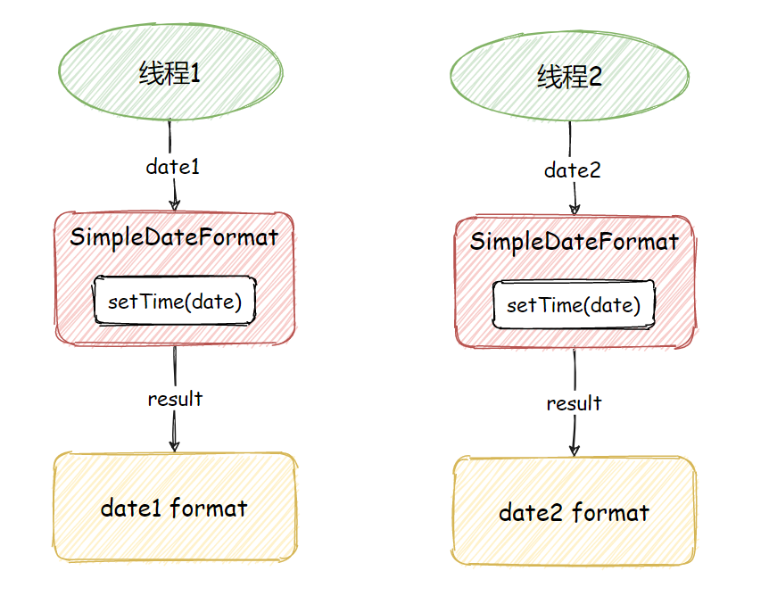

非线程安全的执行流程是这样的：

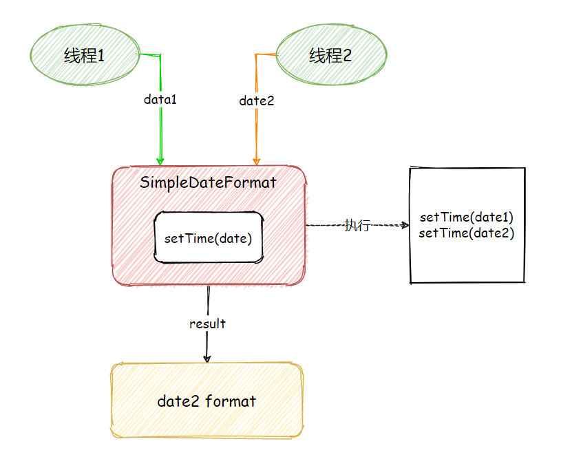


#### 5、解决线程安全问题：synchronized

当出现线程安全问题时，我们想到的第一解决方案就是**加锁**，具体的实现代码如下：

```java
import java.text.SimpleDateFormat;
import java.util.Date;
import java.util.concurrent.LinkedBlockingQueue;
import java.util.concurrent.ThreadPoolExecutor;
import java.util.concurrent.TimeUnit;
 
public class App {
    // 时间格式化对象
    private static SimpleDateFormat simpleDateFormat = new SimpleDateFormat("mm:ss");
 
    public static void main(String[] args) throws InterruptedException {
        // 创建线程池执行任务
        ThreadPoolExecutor threadPool = new ThreadPoolExecutor(10, 10, 60,
                TimeUnit.SECONDS, new LinkedBlockingQueue<>(1000));
        for (int i = 0; i < 1000; i++) {
            int finalI = i;
            // 执行任务
            threadPool.execute(new Runnable() {
                @Override
                public void run() {
                    // 得到时间对象
                    Date date = new Date(finalI * 1000);
                    // 执行时间格式化
                    formatAndPrint(date);
                }
            });
        }
        // 线程池执行完任务之后关闭
        threadPool.shutdown();
    }
 
    /**
     * 格式化并打印时间
     * @param date 时间对象
     */
    private static void formatAndPrint(Date date) {
        // 执行格式化
        String result = null;
        // 加锁
        synchronized (App.class) {
            result = simpleDateFormat.format(date);
        }
        // 打印最终结果
        System.out.println("时间：" + result);
    }
}
```

```java
// 以上程序的执行结果为（抽取部分输出）：
时间：16:16
时间：16:15
时间：16:14
时间：16:10
时间：16:09
时间：16:04
时间：16:31
时间：16:23
```

从上述结果可以看出，使用了 synchronized 加锁之后程序就可以正常的执行了。

**加锁的缺点：**加锁的方式虽然可以解决线程安全的问题，但同时也带来了新的问题，当程序加锁之后，所有的线程必须排队执行某些业务才行，这样无形中就降低了程序的运行效率了。

有没有既能解决线程安全问题，又能提高程序的执行速度的解决方案呢？

答案是：有的，这个时候 ThreadLocal就要上场了。


#### 6、解决线程安全问题：ThreadLocal

> 官方说明文档：https://docs.oracle.com/javase/8/docs/api/

##### 1、ThreadLocal 基本介绍

ThreadLocal 从字面的意思来理解是线程本地变量的意思，也就是说它是线程中的私有变量，每个线程只能使用自己的变量。

以上面线程池格式化时间为例，当线程池中有 10 个线程时，SimpleDateFormat 会存入 ThreadLocal 中，它也只会创建 10 个对象，即使要执行 1000 次时间格式化任务，依然只会新建 10 个 SimpleDateFormat 对象，每个线程调用自己的 ThreadLocal 变量。


##### 2、ThreadLocal 基础使用

ThreadLocal 常用的核心方法有三个：

1. set 方法：用于设置线程独立变量副本。没有 set 操作的 ThreadLocal 容易引起脏数据。

2. get 方法：用于获取线程独立变量副本。没有 get 操作的 ThreadLocal 对象没有意义。

3. remove 方法：用于移除线程独立变量副本。没有 remove 操作容易引起内存泄漏。

ThreadLocal 所有方法如下图所示：

| 方法名                                                       | 描述                                   |
| ------------------------------------------------------------ | -------------------------------------- |
| public ThreadLocal()                                         | 构造方法                               |
| public void set(T value)                                     | 设置数据                               |
| public T get()                                               | 取出数据                               |
| public void remove()                                         | 删除数据                               |
| protected T initialValue()                                   | 返回此线程局部变量的当前线程的“初始值” |
| public static < S> ThreadLocal< S> withInitial(Supplier<? extends S> supplier) | 创建线程局部变量                       |

操作示例 1：ThreadLocal 基础用法

```java
public class ThreadLocalExample {
    // 创建一个 ThreadLocal 对象
    private static final ThreadLocal<String> threadLocal = new ThreadLocal<>();

    public static void main(String[] args) {
        // 线程执行任务
        Runnable runnable = () -> {
            String threadName = Thread.currentThread().getName();
            System.out.println(threadName + " 存入值：" + threadName);
            // 在 ThreadLocal 中设置值
            threadLocal.set(threadName);
            // 执行方法，打印线程中设置的值
            print(threadName);
        };
        // 创建并启动线程 1
        new Thread(runnable, "MyThread-1").start();
        // 创建并启动线程 2
        new Thread(runnable, "MyThread-2").start();
    }

    /**
     * 打印线程中的 ThreadLocal 值
     *
     * @param threadName 线程名称
     */
    private static void print(String threadName) {
        try {
            // 得到 ThreadLocal 中的值
            String result = threadLocal.get();
            // 打印结果
            System.out.println(threadName + " 取出值：" + result);
        } finally {
            // 移除 ThreadLocal 中的值（防止内存溢出）
            threadLocal.remove();
        }
    }
}
```

```java
MyThread-2 存入值：MyThread-2
MyThread-1 存入值：MyThread-1
MyThread-1 取出值：MyThread-1
MyThread-2 取出值：MyThread-2
```

从上述结果可以看出，每个线程只会读取到属于自己的 ThreadLocal 值。


##### 3、ThreadLocal 高级用法

###### 1、初始化：initialValue

操作示例 1：使用 initialValue 方法初始化

```java
public class ThreadLocalByInitExample {
    // 定义 ThreadLocal, ThreadLocal.withInitial(() -> {}) 可以代码 new ThreadLocal() {...}
    private static final ThreadLocal<String> threadLocal = new ThreadLocal() {
        @Override
        protected String initialValue() {
            System.out.println("执行 initialValue() 方法");
            return "默认值";
        }
    };

    public static void main(String[] args) {
        // 线程执行任务
        Runnable runnable = () -> {
            // 执行方法，打印线程中数据（未设置值打印）
            print(Thread.currentThread().getName());
        };
        // 创建并启动线程 1
        new Thread(runnable, "MyThread-1").start();
        // 创建并启动线程 2
        new Thread(runnable, "MyThread-2").start();
    }

    /**
     * 打印线程中的 ThreadLocal 值
     *
     * @param threadName 线程名称
     */
    private static void print(String threadName) {
        // 得到 ThreadLocal 中的值
        String result = threadLocal.get();
        // 打印结果
        System.out.println(threadName + " 得到值：" + result);
    }
}
```

```java
执行 initialValue() 方法
执行 initialValue() 方法
MyThread-2 得到值：默认值
MyThread-1 得到值：默认值
```

操作示例 2：当使用了 threadLocal.set 方法之后，initialValue 方法就不会被执行了，如下代码所示：

```java
public class ThreadLocalByInitExample {
    // 定义 ThreadLocal
    private static final ThreadLocal<String> threadLocal = new ThreadLocal() {
        @Override
        protected String initialValue() {
            System.out.println("执行 initialValue() 方法");
            return "默认值";
        }
    };

    public static void main(String[] args) {
        // 线程执行任务
        Runnable runnable = () -> {
            String threadName = Thread.currentThread().getName();
            System.out.println(threadName + " 存入值：" + threadName);
            // 在 ThreadLocal 中设置值
            threadLocal.set(threadName);
            // 执行方法，打印线程中设置的值
            print(threadName);
        };
        // 创建并启动线程 1
        new Thread(runnable, "MyThread-1").start();
        // 创建并启动线程 2
        new Thread(runnable, "MyThread-2").start();
    }

    /**
     * 打印线程中的 ThreadLocal 值
     *
     * @param threadName 线程名称
     */
    private static void print(String threadName) {
        try {
            // 得到 ThreadLocal 中的值
            String result = threadLocal.get();
            // 打印结果
            System.out.println(threadName + "取出值：" + result);
        } finally {
            // 移除 ThreadLocal 中的值（防止内存溢出）
            threadLocal.remove();
        }
    }
}
```

```
MyThread-2 存入值：MyThread-2
MyThread-1 存入值：MyThread-1
MyThread-2取出值：MyThread-2
MyThread-1取出值：MyThread-1
```

为什么 set 之后，初始化代码就不执行了？

要理解这个问题，需要从 ThreadLocal.get() 方法的源码中得到答案，因为初始化方法 initialValue 在 ThreadLocal 创建时并不会立即执行，而是在调用了 get 方法只会才会执行，测试代码如下：

操作示例 3：get() 方法触发 initialValue 初始化方法

```java
import java.util.Date;

public class ThreadLocalByInitExample {
    // 定义 ThreadLocal
    private static final ThreadLocal<String> threadLocal = new ThreadLocal() {
        @Override
        protected String initialValue() {
            System.out.println("执行 initialValue() 方法 " + new Date());
            return "默认值";
        }
    };

    public static void main(String[] args) {
        // 线程执行任务
        Runnable runnable = () -> {
            // 得到当前线程名称
            String threadName = Thread.currentThread().getName();
            // 执行方法，打印线程中设置的值
            print(threadName);
        };
        // 创建并启动线程 1
        new Thread(runnable, "MyThread-1").start();
        // 创建并启动线程 2
        new Thread(runnable, "MyThread-2").start();
    }

    /**
     * 打印线程中的 ThreadLocal 值
     *
     * @param threadName 线程名称
     */
    private static void print(String threadName) {
        System.out.println("进入 print() 方法 " + new Date());
        try {
            // 休眠 1s
            Thread.sleep(1000);
        } catch (InterruptedException e) {
            e.printStackTrace();
        }
        // 得到 ThreadLocal 中的值
        String result = threadLocal.get();
        // 打印结果
        System.out.printf("%s 取得值：%s %s%n", threadName, result, new Date());
    }
}
```

```java
进入 print() 方法 Thu Nov 10 21:42:15 CST 2022
进入 print() 方法 Thu Nov 10 21:42:15 CST 2022
执行 initialValue() 方法 Thu Nov 10 21:42:16 CST 2022
执行 initialValue() 方法 Thu Nov 10 21:42:16 CST 2022
MyThread-2 取得值：默认值 Thu Nov 10 21:42:16 CST 2022
MyThread-1 取得值：默认值 Thu Nov 10 21:42:16 CST 2022
```

> 从上述打印的时间可以看出：initialValue 方法并不是在 ThreadLocal 创建时执行的，而是在调用 Thread.get 方法时才执行的。

源码分析 1：接下来来看 Threadlocal.get 源码的实现：

```java
public T get() {
    // 得到当前的线程
    Thread t = Thread.currentThread();
    ThreadLocalMap map = getMap(t);
    // 判断 ThreadLocal 中是否有数据
    if (map != null) {
        ThreadLocalMap.Entry e = map.getEntry(this);
        if (e != null) {
            @SuppressWarnings("unchecked")
            T result = (T)e.value;
            // 有 set 值，直接返回数据
            return result;
        }
    }
    // 执行初始化方法【重点关注】
    return setInitialValue();
}
private T setInitialValue() {
    // 执行初始化方法【重点关注】
    T value = initialValue();
    Thread t = Thread.currentThread();
    ThreadLocalMap map = getMap(t);
    if (map != null)
        map.set(this, value);
    else
        createMap(t, value);
    return value;
}
```

从上述源码可以看出，当 ThreadLocal 中有值时会直接返回值 e.value，只有 Threadlocal 中没有任何值时才会执行初始化方法 initialValue。

注意事项—类型必须保持一致

注意在使用 initialValue 时，返回值的类型要和 ThreadLoca 定义的数据类型保持一致，如下图所示：


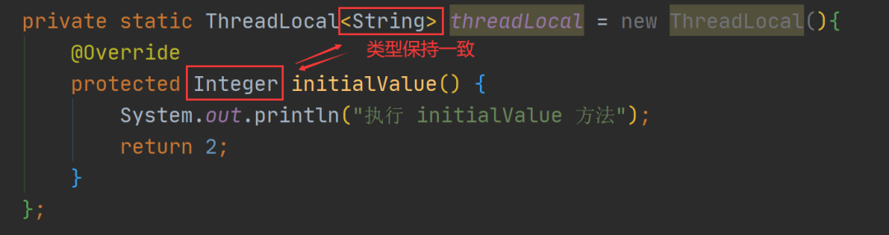

如果数据不一致就会造成 ClassCaseException 类型转换异常，如下图所示：

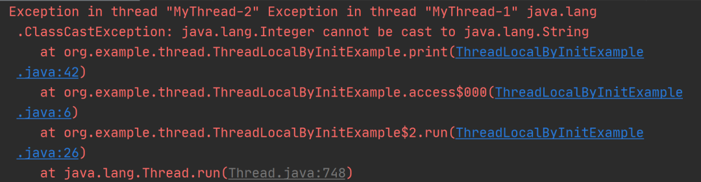


###### 2、初始化2：withInitial

操作示例 1：使用 withInitial 方法初始化

```java
public class ThreadLocalByInitExample {
    // 定义 ThreadLocal
    private static final ThreadLocal<String> threadLocal = ThreadLocal.withInitial(() -> {
        System.out.println("执行 withInitial() 方法");
        return "默认值";
    });

    public static void main(String[] args) {
        // 线程执行任务
        Runnable runnable = () -> {
            String threadName = Thread.currentThread().getName();
            // 执行方法，打印线程中设置的值
            print(threadName);
        };
        // 创建并启动线程 1
        new Thread(runnable, "MyThread-1").start();
        // 创建并启动线程 2
        new Thread(runnable, "MyThread-2").start();
    }

    /**
     * 打印线程中的 ThreadLocal 值
     *
     * @param threadName 线程名称
     */
    private static void print(String threadName) {
        // 得到 ThreadLocal 中的值
        String result = threadLocal.get();
        // 打印结果
        System.out.println(threadName + " 得到值：" + result);
    }
}
```

```java
执行 withInitial() 方法
执行 withInitial() 方法
MyThread-2 得到值：默认值
MyThread-1 得到值：默认值
```

通过上述的代码发现，withInitial 方法的使用好和 initialValue 好像没啥区别，那为啥还要造出两个类似的方法呢？客官莫着急，继续往下看。如下是不是非常简洁：

```java
private static final ThreadLocal<String> threadLocal = ThreadLocal.withInitial(() -> "默认值");
```


##### 4、ThreadLocal 版时间格式化

学习 ThreadLocal 的使用之后，我们回到本文的主题，接下来我们将使用 ThreadLocal 来实现 1000 个时间的格式化：

```java
import java.text.SimpleDateFormat;
import java.util.Date;
import java.util.concurrent.LinkedBlockingQueue;
import java.util.concurrent.ThreadPoolExecutor;
import java.util.concurrent.TimeUnit;

public class MyThreadLocalByDateFormat {
    // 创建 ThreadLocal 并设置默认值
    private static final ThreadLocal<SimpleDateFormat> dateFormatThreadLocal =
            ThreadLocal.withInitial(() -> new SimpleDateFormat("mm:ss"));

    public static void main(String[] args) {
        // 创建线程池执行任务
        ThreadPoolExecutor threadPool = new ThreadPoolExecutor(10, 10, 60,
                TimeUnit.SECONDS, new LinkedBlockingQueue<>(1000));
        // 执行任务
        for (int i = 0; i < 1000; i++) {
            int finalI = i;
            // 执行任务
            threadPool.execute(() -> {
                // 得到时间对象
                Date date = new Date(finalI * 1000);
                // 执行时间格式化
                formatAndPrint(date);
            });
        }
        // 线程池执行完任务之后关闭
        threadPool.shutdown();
        // 线程池执行完任务之后关闭
        threadPool.shutdown();
    }

    /**
     * 格式化并打印时间
     *
     * @param date 时间对象
     */
    private static void formatAndPrint(Date date) {
        // 执行格式化
        String result = dateFormatThreadLocal.get().format(date);
        // 打印最终结果
        System.out.println("时间：" + result);
    }
}
```

```java
// 以上程序的执行结果为（抽取一部分输出）：
时间：16:25
时间：16:24
时间：16:22
时间：16:20
时间：16:12
时间：16:09
时间：16:35
时间：16:34
```

从上述结果可以看出，使用 ThreadLocal 也可以解决线程并发问题，并且避免了代码加锁排队执行的问题。


### 2、使用场景2：跨类传递数据

除了上面的使用场景之外，我们还可以使用 ThreadLocal 来实现线程中跨类、跨方法的数据传递。比如登录用户的 User 对象信息，我们需要在不同的子系统中多次使用，如果使用传统的方式，我们需要使用方法传参和返回值的方式来传递 User 对象，然而这样就无形中造成了类和类之间，甚至是系统和系统之间的相互耦合了，所以此时我们可以使用 ThreadLocal 来实现 User 对象的传递。

确定了方案之后，接下来我们来实现具体的业务代码。我们可以先在主线程中构造并初始化一个 User 对象，并将此 User 对象存储在 ThreadLocal 中，存储完成之后，我们就可以在同一个线程的其他类中，如仓储类或订单类中直接获取并使用 User 对象了，具体实现代码如下。

1、User 实体类：

```java
/**
 * 用户实体类
 */
class User {
    public User(String name) {
        this.name = name;
    }
    private String name;
    public String getName() {
        return name;
    }
    public void setName(String name) {
        this.name = name;
    }
}
```

2、ThreadLocal 操作类：

```java
/**
 * 用户信息存储类
 */
class UserStorage {
    // 用户信息
    public static ThreadLocal<User> USER = new ThreadLocal();

    /**
     * 存储用户信息
     * @param user 用户数据
     */
    public static void setUser(User user) {
        USER.set(user);
    }
}
```

3、订单类：

```java
/**
 * 订单类
 */
class OrderSystem {
    /**
     * 订单添加方法
     */
    public void add() {
        // 得到用户信息
        User user = UserStorage.USER.get();
        // 业务处理代码（忽略）...
        System.out.println(String.format("订单系统收到用户：%s 的请求。",  user.getName()));
    }
}
```

4、仓储类：

```java
/**
 * 仓储类
 */
class RepertorySystem {
    /**
     * 减库存方法
     */
    public void decrement() {
        // 得到用户信息
        User user = UserStorage.USER.get();
        // 业务处理代码（忽略）...
        System.out.println(String.format("仓储系统收到用户：%s 的请求。", user.getName()));
    }
}
```

5、主线程中的业务代码：

```java
public class ThreadLocalByUser {
    public static void main(String[] args) {
        // 初始化用户信息
        User user = new User("Java");
        // 将 User 对象存储在 ThreadLocal 中
        UserStorage.setUser(user);
        // 调用订单系统
        OrderSystem orderSystem = new OrderSystem();
        // 添加订单（方法内获取用户信息）
        orderSystem.add();
        // 调用仓储系统
        RepertorySystem repertory = new RepertorySystem();
        // 减库存（方法内获取用户信息）
        repertory.decrement();
    }
}
```

```java
订单系统收到用户：Java 的请求。
仓储系统收到用户：Java 的请求。
```

从上述结果可以看出，当我们在主线程中先初始化了 User 对象之后，订单类和仓储类无需进行任何的参数传递也可以正常获得 User 对象了，从而**实现了一个线程中，跨类和跨方法的数据传递**。

> **总结**：使用 ThreadLocal 可以创建线程私有变量，所以不会导致线程安全问题，同时使用 ThreadLocal 还可以避免因为引入锁而造成线程排队执行所带来的性能消耗；再者使用 ThreadLocal 还可以实现一个线程内跨类、跨方法的数据传递。


## 2、ThreadLocalRandom

ThreadLocal 是在之前分析过的一个多线程操作的数据存储类，它可以实现当前线程的数据保存操作，而 Random 类是一个随机数操作类，于是这个时候就有人问了，不太理解，为什么现在要将这两个组合在一起呢？

操作示例 1：观察一下多线程环境中的 Random 的使用问题

```java
import java.util.Random;

public class JavaAPIDemo {
    public static void main(String[] args) {
        Random random = new Random(); // 定义一个随机数的处理类
        for (int x = 0; x < 3; x++) {
            new Thread(() -> {
                for (int y = 0; y < 3; y++) {
                    System.out.printf("【%s】〖%d〗生成随机数：%d%n", Thread.currentThread().getName(), y, random.nextInt(100));
                }
            }, "随机数生成线程 - " + x).start();
        }
    }
}
```

```java
【随机数生成线程 - 0】〖0〗生成随机数：59
【随机数生成线程 - 2】〖0〗生成随机数：51
【随机数生成线程 - 1】〖0〗生成随机数：74
【随机数生成线程 - 2】〖1〗生成随机数：17
【随机数生成线程 - 0】〖1〗生成随机数：75
【随机数生成线程 - 0】〖2〗生成随机数：19
【随机数生成线程 - 2】〖2〗生成随机数：6
【随机数生成线程 - 1】〖1〗生成随机数：49
【随机数生成线程 - 1】〖2〗生成随机数：68
```

此时执行的代码没有任何的问题，但是这个时候由于所有线程都访问同一个Random，那么最终所表现的结果就是共享了同一个随机因子的数据，而这个随机因子是用于控制随机数生成的，下面通过如下的步骤观察一下。

源码分析 1：观察 nextInt() 方法定义源代码

```java
@Override
public int nextInt(int bound) {
    if (bound <= 0)
        throw new IllegalArgumentException(BAD_BOUND);
    int r = next(31);
    int m = bound - 1;
    if ((bound & m) == 0)  // i.e., bound is a power of 2
        r = (int)((bound * (long)r) >> 31);
    else { // reject over-represented candidates
        for (int u = r;
             u - (r = u % bound) + m < 0;
             u = next(31));
    }
    return r;
}
```

源码分析 2：观察 next() 方法

```java
protected int next(int bits) {
    long oldseed, nextseed;
    AtomicLong seed = this.seed; // 考虑到了多线程的同步，所以每次只能够生成一个随机因子
    do {
        oldseed = seed.get(); // 获取已经存在的随机因子
        nextseed = (oldseed * multiplier + addend) & mask; // 计算下一个随机因子
    } while (!seed.compareAndSet(oldseed, nextseed)); // CAS替换
    return (int)(nextseed >>> (48 - bits));
}
```

> 可以发现：所有的线程将共享同一个随机因子，如果说此时希望每一个线程都独享自己的随机因子，就要使用 ThreadLocalRandom 类来实现。

操作示例 2：使用 ThreadLocalRandom 处理

```java
import java.util.concurrent.ThreadLocalRandom;

public class JavaAPIDemo {
    public static void main(String[] args) {
        for (int x = 0; x < 3; x++) {
            new Thread(() -> {
                for (int y = 0; y < 3; y++) {
                    System.out.printf("【%s】〖%d〗生成随机数：%d%n", Thread.currentThread().getName(), y,
                                      ThreadLocalRandom.current().nextInt(100));
                }
            }, "随机数生成线程 - " + x).start();
        }
    }
}
```

```java
【随机数生成线程 - 0】〖0〗生成随机数：49
【随机数生成线程 - 1】〖0〗生成随机数：84
【随机数生成线程 - 2】〖0〗生成随机数：80
【随机数生成线程 - 1】〖1〗生成随机数：15
【随机数生成线程 - 0】〖1〗生成随机数：98
【随机数生成线程 - 1】〖2〗生成随机数：1
【随机数生成线程 - 2】〖1〗生成随机数：52
【随机数生成线程 - 0】〖2〗生成随机数：45
【随机数生成线程 - 2】〖2〗生成随机数：54
```

相比较 Random 操作来讲，它可以针对每一个不同的线程保存各自的因子，从而实现准确的随机数生成，这种机制等同于每一个线程保存一个 Random。


# 16、响应式数据流

## 1、ReactiveStream 简介

### 1、响应式编程产生背景

从2019年开始世界上最流行的编程模式就是响应式的编程开发，这种响应式编程最大的特点是很多操作数据的具体内容可能并不清楚，随着数据的更改，最终可能带来的计算的结果也会发生更改。

操作示例 1：实现一个最简单的计算：

```java
public class JavaAPIDemo {
    public static void main(String[] args) throws InterruptedException {
        int a = 10; // 定义整型变量
        int b = 20; // 定义整型变量
        System.out.printf("数学加法计算：" + (a + b));
    }
}
```

```java
数学加法计算：30
```

以上所接触到的是一种传统的命令式的编程，但是命令式编程在进行计算的时候内容都是固定的，可是万一有些数据的内容可能是随时更改的呢？下面来观察一种程序的实现（提示：仅仅是为了说明响应式的变化）

操作示例 2：采用响应式的计算方式进行处理

```java
import java.util.concurrent.CountDownLatch;
import java.util.concurrent.TimeUnit;

public class JavaAPIDemo {
    public static int a = 10; // 定义整型变量
    public static int b = 20; // 定义整型变量

    public static void main(String[] args) throws Exception {
        CountDownLatch latch = new CountDownLatch(1); // 倒计数的内容为1
        System.out.printf("【第一次计算】数学加法计算：%d%n", (a + b));
        new Thread(() -> {
            try {
                TimeUnit.SECONDS.sleep(1); // 延迟处理
                a = 50; // 修改b的内容
                latch.countDown(); // 减1的操作
            } catch (InterruptedException ignored) {
            }
        }, "数据修改子线程").start();
        latch.await(); // 等待计数为0
        System.out.printf("【第二次计算】数学加法计算：%d%n", (a + b));
    }
}
```

```java
【第一次计算】数学加法计算：30
【第二次计算】数学加法计算：70
```

此时在进行计算的时候，由于一个参数的内容可能已经发生了改变，最终所带来的问题就是无法进行统一的命令式编程的计算准确的操作模式（以上仅仅作为结构上的一种说明，但是太繁琐了）。

响应式编程的模型更能够拥抱程序之中所带来的数据计算结果的变化，这也就是为什么现代最流行的编程模型为响应式的所在了，那么下面来看一下基本的概念。


### 2、响应式编程概念

随着互联网技术的不断发展，用户需要更快的响应处理速度与稳定可靠的运行环境，即使在出现了错误之后也可以优雅的面对失败，同时要求构建的**系统具有灵活、松散耦合以及可伸缩性**的特点，所以在这样的背景下，响应式编程（Reactive Programming）开始大量的应用于项目开发之中。**在响应式编程之中主要实现了一种基于数据流（Data Stream）和变化传递（Propagation Of Change）的声明式（Declarative）的编程范式**。


### 3、响应式数据流模型

在响应式编程中需要基于响应式数据流（**Reactive Streams，异步非阻塞式数据流传输**）实现数据的传输，在该数据流的模型之中需要提供有一个**发布者（Publisher）和一个订阅者（Subscriber）**，而发布者与订阅者之间可以实现数据流的直接传输，也可以通过处理器（Processor）实现两者之间数据流的处理，模型结构如图所示。在整个的处理模型中，Processor即可作为订阅者也可以作为发布者。

> 基于事件的操作模型：每当产生了某些操作之后，采用事件的模式向事件监听者发布一个消息，而后监听者接收到这个消息之后再进行处理，而此时的监听者和消息源之间没有直接的联系，所以这本身就属于一种解耦合的设计。Java之中的事件处理模型，在Spring开发框架里面都是有更好的新支持结构。


### 4、响应式编程中的变化传递

在传统的命令式编程的开发模型中，如果要实现两个变量内容的计算，常用的命令格式为："sum = a + b"，这样就会根据变量a和变量b的内容一次性得到sum的结果，如图1所示，而在计算完成后如果变量a的内容进行了修改则也不会影响到最终的sum计算结果。而在响应式编程环境下，即便已经得到了sum的计算结果，而在变量a发生改变后，也会影响到sum的内容，如图2所示，而这一点就称为变化传递（Propagation Of Change）。

- 命令式编程：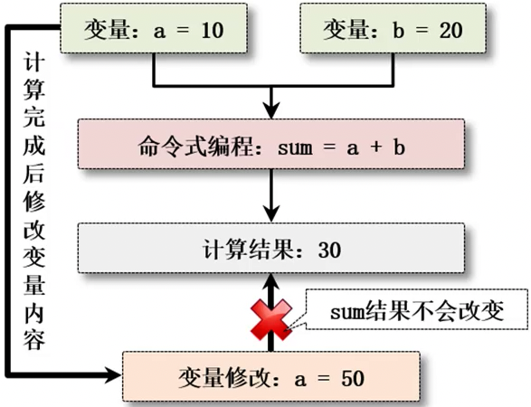
- 响应式编程：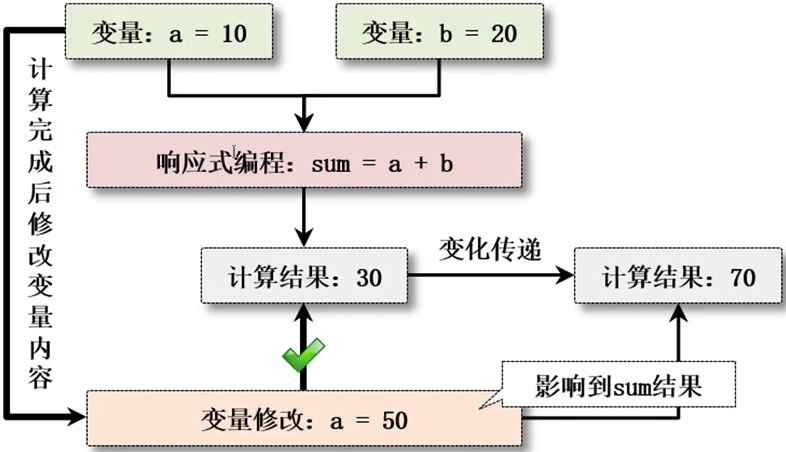


### 5、Flow 接口介绍

在Java发展的早期提供了一种观察者设计模式的概念，并且在java.util包中提供了两个与之匹配的实现结构：java.util.Observer（观察者）、java.util.Observable（被观察者），其中被观察者的所有变化都可以被观察者检测到，而这一操作可以理解为Java响应式编程的原型，但是需要注意的是，在JDK1.9后该实现类已经被标记为"Deprecated”，不再推荐使用。

如何实现响应式的编程呢？响应式的编程并不是JDK生来就有的，在JDK1.9之后为了便于响应流的开发，在J.U.C中扩充了一个Flow工具类，同时在该类中利用了一系列的内部接口用于实现订阅者、发布者的相关操作标准。

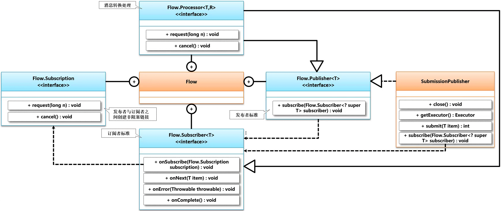


## 2、SubmissionPublisher

### 1、SubmissionPublisher 简介

在响应流的开发中最为重要的就是数据的发布者，Flow.Publisher 只是定义了发布者的核心操作方法，而具体的数据发布处理操作全部都是由 SubmissionPublisher 类实现的。在整个的处理结构之中，发布者的具体操作之中是结合了一个订阅者的信息。

```java
@FunctionalInterface
public static interface Publisher<T> {}
```

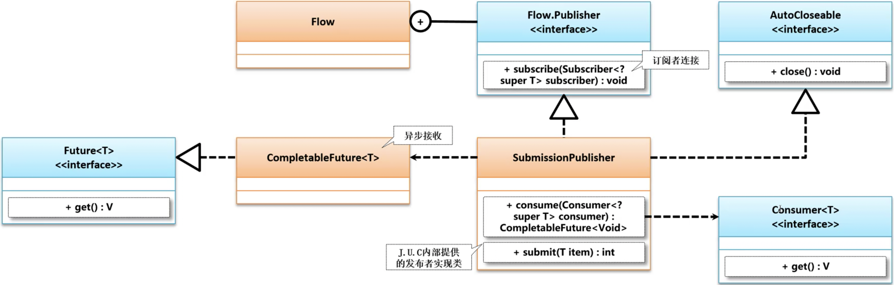

每一个响应流发布者的内部都会维护有一个缓冲区，通过该区域可以实现数据流的传输，而具体的发送处理操作则是由 SubmissionPublisher 子类实现的，下面首先打开该类的定义：

```java
public class SubmissionPublisher<T> implements Publisher<T>, AutoCloseable {
    // 数据传输缓存
    static final int BUFFER_CAPACITY_LIMIT = 1 << 30;
    // 消费处理
    public CompletableFuture<Void> consume(Consumer<? super T> consumer) {
        if (consumer == null)
            throw new NullPointerException();
        CompletableFuture<Void> status = new CompletableFuture<>(); // 异步处理
        subscribe(new ConsumerSubscriber<T>(status, consumer));
        return status;
    }
}
```

而后在当前进行消费处理的时候可以发现其内部提供有一个 ConsumerSubscriber 类型，该类型的定义如下：

```java
static final class ConsumerSubscriber<T> implements Subscriber<T> {}
```


### 2、操作示例与常用方法

操作示例 1：响应流的数据发布

```java
import java.util.List;
import java.util.concurrent.CompletableFuture;
import java.util.concurrent.SubmissionPublisher;
import java.util.concurrent.TimeUnit;

public class JavaAPIDemo {
    public static void main(String[] args) throws Exception {
        List<String> data = List.of("Java", "Python"); // 操作数据
        SubmissionPublisher<String> publisher = new SubmissionPublisher<>(); // 数据发布
        // 此时进行数据的消费处理，同时返回有一个异步的处理任务
        CompletableFuture<Void> task = publisher.consume(System.out::println); // 直接传入消费型的函数引用
        // 以上只是定义了消息生产者和消费者之间的基本关联模型，随后进行具体的数据处理
        data.forEach((tmp) -> { // 集合的迭代操作
            publisher.submit(tmp); // 发布数据
            try {
                TimeUnit.SECONDS.sleep(1); // 每次延迟1秒的时间
            } catch (InterruptedException ignored) {
            }
        });
        publisher.close(); // 数据发送完毕
        if (task != null) {
            task.get(); // 放行
        }
    }
}
```

```java
Java
Python
```

SubmissionPublisher 常用方法如下：

| 方法名                                                       | 描述                                                         |
| ------------------------------------------------------------ | ------------------------------------------------------------ |
| public void close()                                          | 关闭发布者通道                                               |
| public CompletableFuture< Void> consume(Consumer<? super T> consumer) | 定义发布项的处理函数                                         |
| public int getMaxBufferCapacity()                            | 返回每个发布者的最大缓存空间                                 |
| public List<Subscriber<? super T>> getSubscribers()          | 获取全部订阅者实例                                           |
| public boolean isSubscribed(Subscriber<? super T> subscriber) | 判断当前订阅者是否为以订阅状态                               |
| public int submit(T item)                                    | 发布者实现数据发布                                           |
| public int offer(T item, long timeout, TimeUnit unit, BiPredicate<Subscriber<? super T>, ? super T> onDrop) | 实现数据发布功能，在超时之后会根据BiPredicate返回结果进行重试 |


### 3、背压（BackPressure）策略

此时的发布者与订阅者之间的操作较为单一，发布者仅仅实现了一些字符串数据的发送，而消费端也只是实现了内容的输出，但是需要注意的是在发布者与订阅者之间都会存在有一个缓存空间。但是这个缓存空间是有限的（默认为256）

操作示例 2：观察缓冲区的大小值

```java
import java.util.concurrent.SubmissionPublisher;

public class JavaAPIDemo {
    public static void main(String[] args) throws Exception {
        SubmissionPublisher<String> publisher = new SubmissionPublisher<>(); // 数据发布
        System.out.println("缓冲区大小：" + publisher.getMaxBufferCapacity());
        publisher.close();
    }
}
```

```java
缓冲区大小：256
```

如果此时发布者发送数据流的速度要远远高于订阅者，这样订阅者的缓存空间很快会被占满，那么理论上就应该设计有一个无界限的缓冲区供订阅者使用，否则就会出现由于数据无法处理而丢弃的问题，而另外一种解决方案称为"背压（BackPressure）"策略，在该策略中订阅者会主动告知发布者减慢发送数据的速率，以备发布者准备好足够大的缓存空间后再继续进行元素的处理，遗憾的是J.U.C提供的Flow暂不支持此策略的实现，如果要想实现该操作则需要开发者自行实现或使用相关开发框架，例如：RxJava。


## 3、Reactive 编程模型

通过之前的讲解已经请楚了所谓的发布者和订阅者之间的联系，但是之前的操作毕竟是属于简化版的模型，不具有任何的实战型的使用效果，本次就结合一个实际的应用进行说明。

在响应式数据流的开发模型之中，订阅者与发布者之间可以直接进行数据通讯，为便于理解，在本节中将依据图所示的结构，实现自定义Book类对象数据的发送以及接收处理，由于此部分的代码开发较为繁琐，将采用分步的形式进行讲解。


在实际的开发之中如果要进行发布和订阅，Java 是以对象的形式实现的，为了突出这一特点，本次采用自定义的 Book 类对象实现整体的操作模型。

1、创建一个Book类进行传输数据的定义

```java
import java.util.ArrayList;
import java.util.List;

/**
 * 自定义程序类
 */
class Book {
    private long id;
    private String title;
    private String content;

    // Setter、Getter、无参构造、toString()等方法就直接略了
    public Book(long id, String title, String content) {
        this.id = id;
        this.title = title;
        this.content = content;
    }

    // 因为这种响应式编程操作一般都需要采用数据流的形式进行处理，所以为了简化定义一个List创建器
    static class BookDataCreator {  // 创造者模式
        public static List<Book> getBooks() {   // 获取数据项
            List<Book> bookList = new ArrayList<>(); // 实例化List集合
            bookList.add(new Book(1, "Java面向对象编程", "李兴华"));
            bookList.add(new Book(2, "Java就业编程实战", "李兴华"));
            bookList.add(new Book(3, "JavaWeb就业编程实战", "李兴华"));
            bookList.add(new Book(4, "SpringBoot就业编程实战", "李兴华"));
            bookList.add(new Book(5, "SpringCloud就业编程实战", "李兴华"));
            bookList.add(new Book(6, "Redis就业编程实战", "李兴华"));
            bookList.add(new Book(7, "Spring就业编程实战", "李兴华"));
            bookList.add(new Book(8, "SSM就业编程实战", "李兴华"));
            bookList.add(new Book(9, "Netty就业编程实战", "李兴华"));
            return bookList;
        }
    }

    public long getId() {
        return id;
    }

    public void setId(long id) {
        this.id = id;
    }

    public String getTitle() {
        return title;
    }

    public void setTitle(String title) {
        this.title = title;
    }

    public String getContent() {
        return content;
    }

    public void setContent(String content) {
        this.content = content;
    }
}
```

2、创建图书数据的订阅者实现类型

```java
import java.util.concurrent.Flow;

/**
 * 图书数据的订阅者
 */
class BookSubscriber implements Flow.Subscriber<Book> {
    private Flow.Subscription subscription; // 整个的订阅控制
    private int counter = 0; // 计数器

    @Override
    public void onSubscribe(Flow.Subscription subscription) {
        this.subscription = subscription; // 保存订阅控制操作
        // 由于不确定后面会同时返回多少个数据，此时的目的是触发数据的接收操作
        this.subscription.request(1); // 从发布者之中获取1个数据项
        System.out.println("【BookSubscriber】数据订阅者开启...");
    }

    @Override
    public void onNext(Book item) { // 数据接收
        System.out.printf("【BookSubscriber】图书ID = %s、图书名称 = %s、图书的内容 = %s%n",
                item.getId(), item.getTitle(), item.getContent());
        this.counter++; // 计数累加
        this.subscription.request(1); // 再次接收，继续触发onNext()
    }

    @Override
    public void onError(Throwable throwable) { // 订阅出错的时候处理
        System.err.println("【BookSubscriber】" + throwable.getMessage());
    }

    @Override
    public void onComplete() {
        System.out.printf("【BookSubscriber】订阅者数据处理完成，一共处理的数据量为：%s%n", this.counter);
    }

    public int getCounter() {
        return counter;
    }
}
```

3、最重要的实现就是要进行数据的发布处理，因为只有数据发布了，才会存在有订阅者的处理操作。

```java
import java.util.ArrayList;
import java.util.List;
import java.util.concurrent.Flow;
import java.util.concurrent.SubmissionPublisher;
import java.util.concurrent.TimeUnit;

public class JavaAPIDemo {
    public static void main(String[] args) throws Exception {
        SubmissionPublisher<Book> publisher = new SubmissionPublisher<>(); // 数据发布者
        BookSubscriber subscriber = new BookSubscriber(); // 数据订阅者
        publisher.subscribe(subscriber); // 发布者与订阅者建立连接
        // 实际的集合可能来自于数据库，或者是来自于其他的文本数据（是一些固定结构的，例如：XML、JSON）
        List<Book> books = Book.BookDataCreator.getBooks(); // 获取创建的集合
        books.forEach(publisher::submit); // 数据的发布
        // 应该实现数据的等待处理，所以增加一个停滞的判断
        while (books.size() != subscriber.getCounter()) {   // 数据量没有消费完成
            TimeUnit.SECONDS.sleep(1); // 象征性的延迟
        }
        publisher.close(); // 关闭发送者
    }
}

/**
 * 自定义程序类
 */
class Book {
    private long id;
    private String title;
    private String content;

    // Setter、Getter、无参构造、toString()等方法就直接略了
    public Book(long id, String title, String content) {
        this.id = id;
        this.title = title;
        this.content = content;
    }

    // 因为这种响应式编程操作一般都需要采用数据流的形式进行处理，所以为了简化定义一个List创建器
    static class BookDataCreator {  // 创造者模式
        public static List<Book> getBooks() {   // 获取数据项
            List<Book> bookList = new ArrayList<>(); // 实例化List集合
            bookList.add(new Book(1, "Java面向对象编程", "李兴华"));
            bookList.add(new Book(2, "Java就业编程实战", "李兴华"));
            bookList.add(new Book(3, "JavaWeb就业编程实战", "李兴华"));
            bookList.add(new Book(4, "SpringBoot就业编程实战", "李兴华"));
            bookList.add(new Book(5, "SpringCloud就业编程实战", "李兴华"));
            bookList.add(new Book(6, "Redis就业编程实战", "李兴华"));
            bookList.add(new Book(7, "Spring就业编程实战", "李兴华"));
            bookList.add(new Book(8, "SSM就业编程实战", "李兴华"));
            bookList.add(new Book(9, "Netty就业编程实战", "李兴华"));
            return bookList;
        }
    }

    public long getId() {
        return id;
    }

    public void setId(long id) {
        this.id = id;
    }

    public String getTitle() {
        return title;
    }

    public void setTitle(String title) {
        this.title = title;
    }

    public String getContent() {
        return content;
    }

    public void setContent(String content) {
        this.content = content;
    }
}

/**
 * 图书数据的订阅者
 */
class BookSubscriber implements Flow.Subscriber<Book> {
    private Flow.Subscription subscription; // 整个的订阅控制
    private int counter = 0; // 计数器

    @Override
    public void onSubscribe(Flow.Subscription subscription) {
        this.subscription = subscription; // 保存订阅控制操作
        // 由于不确定后面会同时返回多少个数据，此时的目的是触发数据的接收操作
        this.subscription.request(1); // 从发布者之中获取1个数据项
        System.out.println("【BookSubscriber】数据订阅者开启...");
    }

    @Override
    public void onNext(Book item) { // 数据接收
        System.out.printf("【BookSubscriber】图书ID = %s、图书名称 = %s、图书的内容 = %s%n",
                item.getId(), item.getTitle(), item.getContent());
        this.counter++; // 计数累加
        this.subscription.request(1); // 再次接收，继续触发onNext()
    }

    @Override
    public void onError(Throwable throwable) { // 订阅出错的时候处理
        System.err.println("【BookSubscriber】" + throwable.getMessage());
    }

    @Override
    public void onComplete() {
        System.out.printf("【BookSubscriber】订阅者数据处理完成，一共处理的数据量为：%s%n", this.counter);
    }

    public int getCounter() {
        return counter;
    }
}
```

```java
【BookSubscriber】数据订阅者开启...
【BookSubscriber】图书ID = 1、图书名称 = Java面向对象编程、图书的内容 = 李兴华
【BookSubscriber】图书ID = 2、图书名称 = Java就业编程实战、图书的内容 = 李兴华
【BookSubscriber】图书ID = 3、图书名称 = JavaWeb就业编程实战、图书的内容 = 李兴华
【BookSubscriber】图书ID = 4、图书名称 = SpringBoot就业编程实战、图书的内容 = 李兴华
【BookSubscriber】图书ID = 5、图书名称 = SpringCloud就业编程实战、图书的内容 = 李兴华
【BookSubscriber】图书ID = 6、图书名称 = Redis就业编程实战、图书的内容 = 李兴华
【BookSubscriber】图书ID = 7、图书名称 = Spring就业编程实战、图书的内容 = 李兴华
【BookSubscriber】图书ID = 8、图书名称 = SSM就业编程实战、图书的内容 = 李兴华
【BookSubscriber】图书ID = 9、图书名称 = Netty就业编程实战、图书的内容 = 李兴华
【BookSubscriber】订阅者数据处理完成，一共处理的数据量为：9
```


## 4、Flow.Processor

除了使用发布者与订阅者的直连模式之外，还可以在两者之间引入一个 Flow.Processor 转换处理器，利用转换处理器可以接收发布者发送的数据，随后将该数据进行转换处理后再发送给订阅者，即：转换器同时实现了发布者与订阅者的操作。

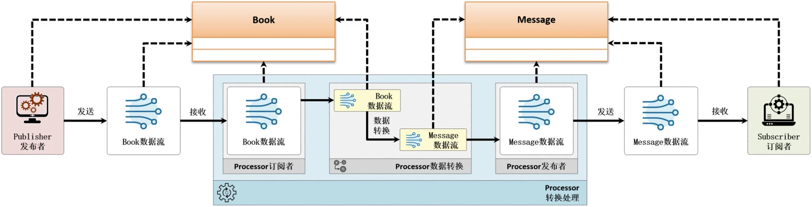

此时发布者发布的是一个 Book 数据流，而订阅者接收的是一个 Message 数据流，那么自然就需要做出一种转换处理，提供有一个专门的处理类，来讲 Book 的数据变为 Message 数据，首先打开该接口观察一下：

```java
// 可以发现该内部的接口就是直接继承了发布者与订阅者的处理接口【Processor 实现的子类可以同时转为发布者或者是订阅者】
public static interface Processor<T,R> extends Subscriber<T>, Publisher<R> {}
```

Flow.Processor 接口并没有定义任何的抽象方法，该接口同时继承了 Flow.Publisher 与 Flow.Subscriber 两个父接口，所以该接口中同时拥有发布者与订阅者的方法标准，而为了简化发布者的定义，可以创建一个 MessageProcessor 处理类，该类除了实现 Flow.Processor 父接口之外，还可以继承 SubmissionPublisher 父类（Publisher 接口子类）这样就可以直接利用已有类的方法实现发布者的功能。

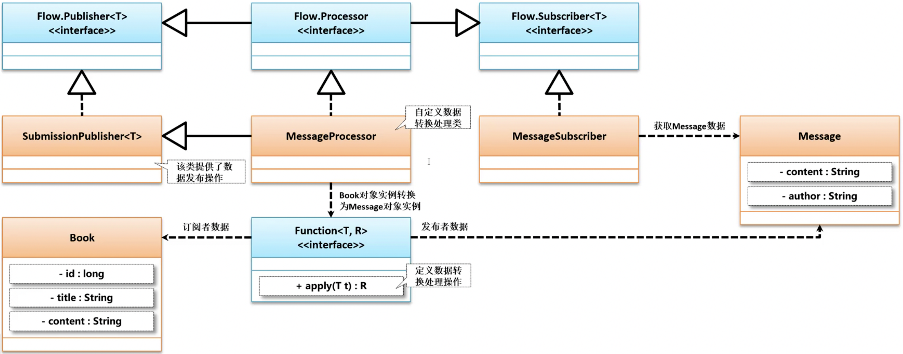

1、既然要进行数据类型的转换，创建一个目标的类型结构：

```java
/**
 * 目标的转换类型
 */
class Message {
    private String content;
    private String author;

    public Message(String content, String author) {
        this.content = content;
        this.author = author;
    }

    public String getContent() {
        return content;
    }

    public void setContent(String content) {
        this.content = content;
    }

    public String getAuthor() {
        return author;
    }

    public void setAuthor(String author) {
        this.author = author;
    }
}
```

2、既然此时目标接受的类型是 Message 类型，那么自然要创建一个新的订阅者

```java
import java.util.concurrent.Flow;

/**
 * 订阅者
 */
class MessageSubscriber implements Flow.Subscriber<Message> {
    private Flow.Subscription subscription;
    private int counter = 0;

    @Override
    public void onSubscribe(Flow.Subscription subscription) {
        this.subscription = subscription;
        // 如果此时你需要接收的数量很多，例如设置为了5，如果不足5个数据流也接收
        this.subscription.request(1);
    }

    @Override
    public void onNext(Message item) {
        System.out.printf("【MessageSubscriber】消息内容 = %s、消息作者 = %s%n",
                item.getContent(), item.getAuthor());
        this.counter++;
        this.subscription.request(1); // 下次的执行触发
    }

    @Override
    public void onError(Throwable throwable) {
        System.err.println("【MessageSubscriber】消息订阅者出现错误：" + throwable.getMessage());
    }

    @Override
    public void onComplete() {
        System.out.println("【MessageSubscriber】消息订阅处理完成，处理的数据量为：" + this.counter);
    }

    public int getCounter() {
        return counter;
    }
}
```

3、创建 Processor 接口实现子类，以及进行传输数据Book类的定义

```java
import java.util.ArrayList;
import java.util.List;
import java.util.concurrent.Flow;
import java.util.concurrent.SubmissionPublisher;
import java.util.function.Function;

/**
 * 此时的转换器处理类拥有接收和发布的支持能力，那么建议多继承一个父类
 */
class MessageProcessor extends SubmissionPublisher<Message> implements Flow.Processor<Book, Message> {
    private Flow.Subscription subscription;
    private Function<Book, Message> function; // 实现转换功能定义

    public MessageProcessor(Function<Book, Message> function) {
        this.function = function;
    }

    @Override
    public void onSubscribe(Flow.Subscription subscription) {
        this.subscription = subscription;
        this.subscription.request(1);
    }

    @Override
    public void onNext(Book item) {
        super.submit(this.function.apply(item)); // 将转换后的数据再次发布
        this.subscription.request(1); // 重新抓取数据
    }

    @Override
    public void onError(Throwable throwable) {
        throwable.printStackTrace(); // 直接输出错误
    }

    @Override
    public void onComplete() {
    }
}

/**
 * 自定义程序类
 */
class Book {
    private long id;
    private String title;
    private String content;

    // Setter、Getter、无参构造、toString()等方法就直接略了
    public Book(long id, String title, String content) {
        this.id = id;
        this.title = title;
        this.content = content;
    }

    // 因为这种响应式编程操作一般都需要采用数据流的形式进行处理，所以为了简化定义一个List创建器
    static class BookDataCreator {  // 创造者模式
        public static List<Book> getBooks() {   // 获取数据项
            List<Book> bookList = new ArrayList<>(); // 实例化List集合
            bookList.add(new Book(1, "Java面向对象编程", "李兴华"));
            bookList.add(new Book(2, "Java就业编程实战", "李兴华"));
            bookList.add(new Book(3, "JavaWeb就业编程实战", "李兴华"));
            bookList.add(new Book(4, "SpringBoot就业编程实战", "李兴华"));
            bookList.add(new Book(5, "SpringCloud就业编程实战", "李兴华"));
            bookList.add(new Book(6, "Redis就业编程实战", "李兴华"));
            bookList.add(new Book(7, "Spring就业编程实战", "李兴华"));
            bookList.add(new Book(8, "SSM就业编程实战", "李兴华"));
            bookList.add(new Book(9, "Netty就业编程实战", "李兴华"));
            return bookList;
        }
    }

    public long getId() {
        return id;
    }

    public void setId(long id) {
        this.id = id;
    }

    public String getTitle() {
        return title;
    }

    public void setTitle(String title) {
        this.title = title;
    }

    public String getContent() {
        return content;
    }

    public void setContent(String content) {
        this.content = content;
    }
}
```

4、修改程序主类的设置，配置转换器的函数式方式的操作核心

```java
import java.util.ArrayList;
import java.util.List;
import java.util.concurrent.Flow;
import java.util.concurrent.SubmissionPublisher;
import java.util.concurrent.TimeUnit;
import java.util.function.Function;

public class JavaAPIDemo {
    public static void main(String[] args) throws Exception {
        MessageProcessor processor = new MessageProcessor((item) -> {
            String book = String.format("图书编号：%s、图书名称：%s、图书内容：%s",
                    item.getId(), item.getTitle(), item.getContent());
            return new Message(book, "李兴华");
        });
        MessageSubscriber messageSubscriber = new MessageSubscriber(); // 消息订阅者
        SubmissionPublisher<Book> publisher = new SubmissionPublisher<>(); // 数据发布
        publisher.subscribe(processor); // 发布者与订阅者建立连接
        processor.subscribe(messageSubscriber);
        // 实际的集合可能来自于数据库，或者是来自于其他的文本数据（是一些固定结构的，例如：XML、JSON）
        List<Book> books = Book.BookDataCreator.getBooks(); // 获取创建的集合
        books.forEach(publisher::submit); // 数据的发布
        // 应该实现数据的等待处理，所以增加一个停滞的判断
        while (books.size() != messageSubscriber.getCounter()) {   // 数据量没有消费完成
            TimeUnit.SECONDS.sleep(1); // 象征性的延迟
        }
        publisher.close(); // 关闭发送者
    }
}

/**
 * 目标的转换类型
 */
class Message {
    private String content;
    private String author;

    public Message(String content, String author) {
        this.content = content;
        this.author = author;
    }

    public String getContent() {
        return content;
    }

    public void setContent(String content) {
        this.content = content;
    }

    public String getAuthor() {
        return author;
    }

    public void setAuthor(String author) {
        this.author = author;
    }
}

/**
 * 订阅者
 */
class MessageSubscriber implements Flow.Subscriber<Message> {
    private Flow.Subscription subscription;
    private int counter = 0;

    @Override
    public void onSubscribe(Flow.Subscription subscription) {
        this.subscription = subscription;
        // 如果此时你需要接收的数量很多，例如设置为了5，如果不足5个数据流也接收
        this.subscription.request(1);
    }

    @Override
    public void onNext(Message item) {
        System.out.printf("【MessageSubscriber】消息内容 = %s、消息作者 = %s%n",
                item.getContent(), item.getAuthor());
        this.counter++;
        this.subscription.request(1); // 下次的执行触发
    }

    @Override
    public void onError(Throwable throwable) {
        System.err.println("【MessageSubscriber】消息订阅者出现错误：" + throwable.getMessage());
    }

    @Override
    public void onComplete() {
        System.out.println("【MessageSubscriber】消息订阅处理完成，处理的数据量为：" + this.counter);
    }

    public int getCounter() {
        return counter;
    }
}

/**
 * 此时的转换器处理类拥有接收和发布的支持能力，那么建议多继承一个父类
 */
class MessageProcessor extends SubmissionPublisher<Message> implements Flow.Processor<Book, Message> {
    private Flow.Subscription subscription;
    private final Function<Book, Message> function; // 实现转换功能定义

    public MessageProcessor(Function<Book, Message> function) {
        this.function = function;
    }

    @Override
    public void onSubscribe(Flow.Subscription subscription) {
        this.subscription = subscription;
        this.subscription.request(1);
    }

    @Override
    public void onNext(Book item) {
        super.submit(this.function.apply(item)); // 将转换后的数据再次发布
        this.subscription.request(1); // 重新抓取数据
    }

    @Override
    public void onError(Throwable throwable) {
        throwable.printStackTrace(); // 偷懒
    }

    @Override
    public void onComplete() {
    }
}

/**
 * 自定义程序类
 */
class Book {
    private long id;
    private String title;
    private String content;

    // Setter、Getter、无参构造、toString()等方法就直接略了
    public Book(long id, String title, String content) {
        this.id = id;
        this.title = title;
        this.content = content;
    }

    // 因为这种响应式编程操作一般都需要采用数据流的形式进行处理，所以为了简化定义一个List创建器
    static class BookDataCreator {  // 创造者模式
        public static List<Book> getBooks() {   // 获取数据项
            List<Book> bookList = new ArrayList<>(); // 实例化List集合
            bookList.add(new Book(1, "Java面向对象编程", "李兴华"));
            bookList.add(new Book(2, "Java就业编程实战", "李兴华"));
            bookList.add(new Book(3, "JavaWeb就业编程实战", "李兴华"));
            bookList.add(new Book(4, "SpringBoot就业编程实战", "李兴华"));
            bookList.add(new Book(5, "SpringCloud就业编程实战", "李兴华"));
            bookList.add(new Book(6, "Redis就业编程实战", "李兴华"));
            bookList.add(new Book(7, "Spring就业编程实战", "李兴华"));
            bookList.add(new Book(8, "SSM就业编程实战", "李兴华"));
            bookList.add(new Book(9, "Netty就业编程实战", "李兴华"));
            return bookList;
        }
    }

    public long getId() {
        return id;
    }

    public void setId(long id) {
        this.id = id;
    }

    public String getTitle() {
        return title;
    }

    public void setTitle(String title) {
        this.title = title;
    }

    public String getContent() {
        return content;
    }

    public void setContent(String content) {
        this.content = content;
    }
}
```

```java
【MessageSubscriber】消息内容 = 图书编号：1、图书名称：Java面向对象编程、图书内容：李兴华、消息作者 = 李兴华
【MessageSubscriber】消息内容 = 图书编号：2、图书名称：Java就业编程实战、图书内容：李兴华、消息作者 = 李兴华
【MessageSubscriber】消息内容 = 图书编号：3、图书名称：JavaWeb就业编程实战、图书内容：李兴华、消息作者 = 李兴华
【MessageSubscriber】消息内容 = 图书编号：4、图书名称：SpringBoot就业编程实战、图书内容：李兴华、消息作者 = 李兴华
【MessageSubscriber】消息内容 = 图书编号：5、图书名称：SpringCloud就业编程实战、图书内容：李兴华、消息作者 = 李兴华
【MessageSubscriber】消息内容 = 图书编号：6、图书名称：Redis就业编程实战、图书内容：李兴华、消息作者 = 李兴华
【MessageSubscriber】消息内容 = 图书编号：7、图书名称：Spring就业编程实战、图书内容：李兴华、消息作者 = 李兴华
【MessageSubscriber】消息内容 = 图书编号：8、图书名称：SSM就业编程实战、图书内容：李兴华、消息作者 = 李兴华
【MessageSubscriber】消息内容 = 图书编号：9、图书名称：Netty就业编程实战、图书内容：李兴华、消息作者 = 李兴华
```

你只要能够理解这几个 Flow 内部接口的使用，那么并且能够理解这种所谓的订阅与发布模式的思想就足够了，为的是后续的学习打下一些理论的概念。


# 0x01、Java 线程池最佳实践【JavaGuide】

> Java 线程池最佳实践：https://github.com/Snailclimb/JavaGuide/blob/main/docs/java/concurrent/java-thread-pool-best-practices.md

## 1、正确声明线程池

**线程池必须手动通过 `ThreadPoolExecutor` 的构造函数来声明，避免使用`Executors` 类创建线程池，会有 OOM 风险。**

`Executors` 返回线程池对象的弊端如下(后文会详细介绍到)：

- **`FixedThreadPool` 和 `SingleThreadExecutor`**：使用的是无界的 `LinkedBlockingQueue`，任务队列最大长度为 `Integer.MAX_VALUE`,可能堆积大量的请求，从而导致 OOM。
- **`CachedThreadPool`**：使用的是同步队列 `SynchronousQueue`, 允许创建的线程数量为 `Integer.MAX_VALUE` ，可能会创建大量线程，从而导致 OOM。
- **`ScheduledThreadPool` 和 `SingleThreadScheduledExecutor`** : 使用的无界的延迟阻塞队列`DelayedWorkQueue`，任务队列最大长度为 `Integer.MAX_VALUE`,可能堆积大量的请求，从而导致 OOM。

说白了就是：**使用有界队列，控制线程创建数量。**

除了避免 OOM 的原因之外，不推荐使用 `Executors`提供的两种快捷的线程池的原因还有：

- 实际使用中需要根据自己机器的性能、业务场景来手动配置线程池的参数比如核心线程数、使用的任务队列、饱和策略等等。
- 我们应该显示地给我们的线程池命名，这样有助于我们定位问题。


## 2、监测线程池运行状态

你可以通过一些手段来检测线程池的运行状态比如 SpringBoot 中的 Actuator 组件。

除此之外，我们还可以利用 `ThreadPoolExecutor` 的相关 API 做一个简陋的监控。从下图可以看出， `ThreadPoolExecutor`提供了获取线程池当前的线程数和活跃线程数、已经执行完成的任务数、正在排队中的任务数等等。

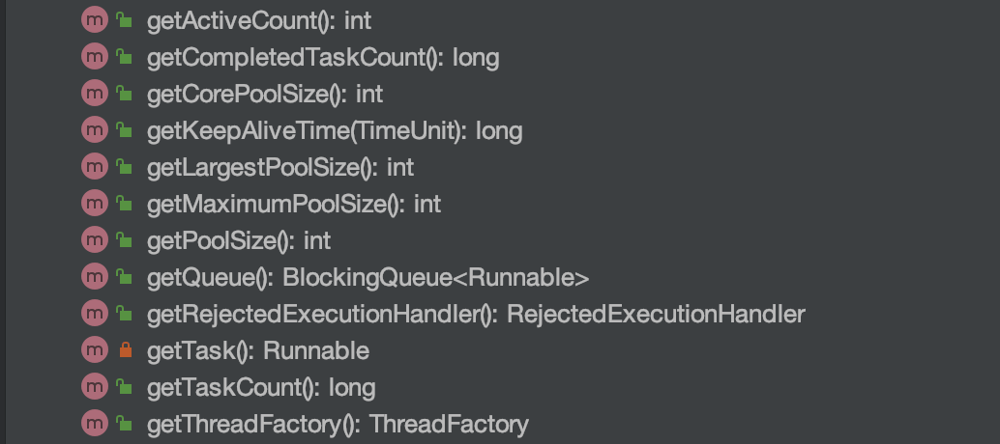

下面是一个简单的 Demo。`printThreadPoolStatus()`会每隔一秒打印出线程池的线程数、活跃线程数、完成的任务数、以及队列中的任务数。

```java
/**
 * 打印线程池的状态
 *
 * @param threadPool 线程池对象
 */
public static void printThreadPoolStatus(ThreadPoolExecutor threadPool) {
    ScheduledExecutorService scheduledExecutorService = new ScheduledThreadPoolExecutor(1, createThreadFactory("print-images/thread-pool-status", false));
    scheduledExecutorService.scheduleAtFixedRate(() -> {
        log.info("=========================");
        log.info("ThreadPool Size: [{}]", threadPool.getPoolSize());
        log.info("Active Threads: {}", threadPool.getActiveCount());
        log.info("Number of Tasks : {}", threadPool.getCompletedTaskCount());
        log.info("Number of Tasks in Queue: {}", threadPool.getQueue().size());
        log.info("=========================");
    }, 0, 1, TimeUnit.SECONDS);
}
```


## 3、建议不同类别的业务用不同的线程池

很多人在实际项目中都会有类似这样的问题：**我的项目中多个业务需要用到线程池，是为每个线程池都定义一个还是说定义一个公共的线程池呢？**

一般建议是不同的业务使用不同的线程池，配置线程池的时候根据当前业务的情况对当前线程池进行配置，因为不同的业务的并发以及对资源的使用情况都不同，重心优化系统性能瓶颈相关的业务。

**我们再来看一个真实的事故案例！** (本案例来源自：[《线程池运用不当的一次线上事故》](https://heapdump.cn/article/646639) ，很精彩的一个案例)

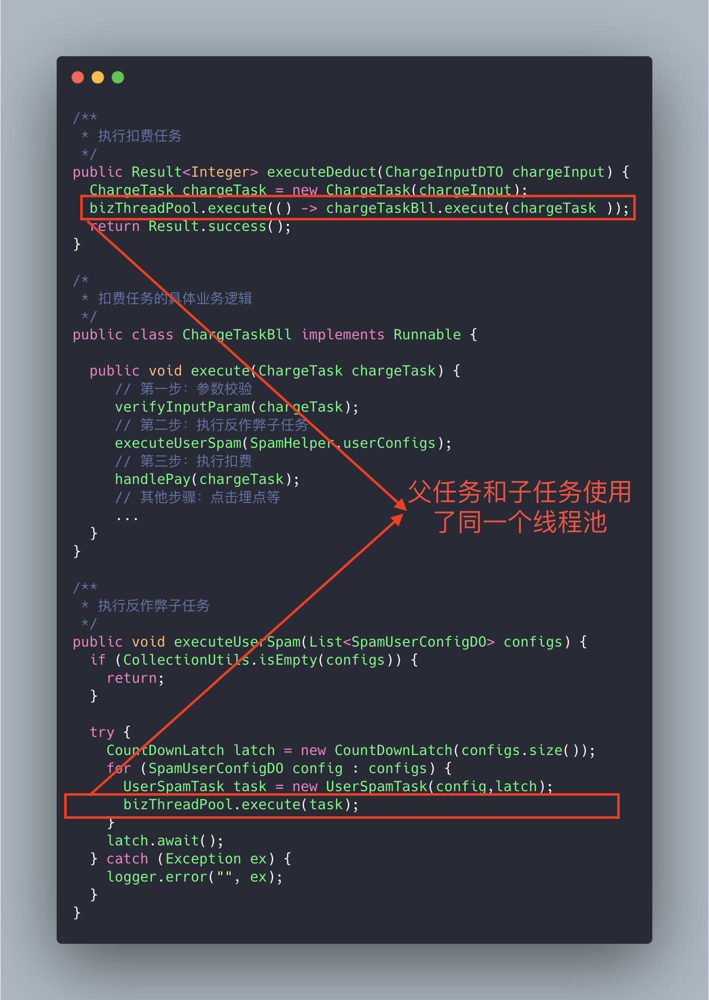

上面的代码可能会存在死锁的情况，为什么呢？画个图给大家捋一捋。

试想这样一种极端情况：假如我们线程池的核心线程数为 **n**，父任务（扣费任务）数量为 **n**，父任务下面有两个子任务（扣费任务下的子任务），其中一个已经执行完成，另外一个被放在了任务队列中。由于父任务把线程池核心线程资源用完，所以子任务因为无法获取到线程资源无法正常执行，一直被阻塞在队列中。父任务等待子任务执行完成，而子任务等待父任务释放线程池资源，这也就造成了 **"死锁"** 。

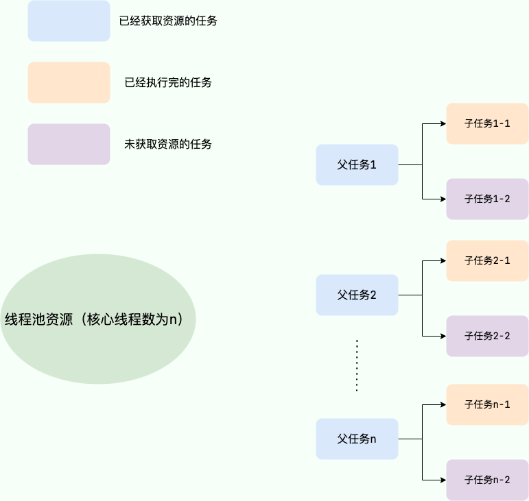

解决方法也很简单，就是新增加一个用于执行子任务的线程池专门为其服务。


## 4、别忘记给线程池命名

初始化线程池的时候需要显示命名（设置线程池名称前缀），有利于定位问题。

默认情况下创建的线程名字类似 `pool-1-thread-n` 这样的，没有业务含义，不利于我们定位问题。

给线程池里的线程命名通常有下面两种方式：

**1、利用 guava 的 `ThreadFactoryBuilder`**

```java
ThreadFactory threadFactory = new ThreadFactoryBuilder()
                        .setNameFormat(threadNamePrefix + "-%d")
                        .setDaemon(true).build();
ExecutorService threadPool = new ThreadPoolExecutor(corePoolSize, maximumPoolSize, keepAliveTime, TimeUnit.MINUTES, workQueue, threadFactory)
```

**2、自己实现 `ThreadFactory`。**

```java
import java.util.concurrent.ThreadFactory;
import java.util.concurrent.atomic.AtomicInteger;

/**
 * 线程工厂，它设置线程名称，有利于我们定位问题。
 */
public final class NamingThreadFactory implements ThreadFactory {

    private final AtomicInteger threadNum = new AtomicInteger();
    private final String name;

    /**
     * 创建一个带名字的线程池生产工厂
     */
    public NamingThreadFactory(String name) {
        this.name = name;
    }

    @Override
    public Thread newThread(Runnable r) {
        Thread t = new Thread(r);
        t.setName(name + " [#" + threadNum.incrementAndGet() + "]");
        return t;
    }
}
```


## 5、正确配置线程池参数

说到如何给线程池配置参数，美团的骚操作至今让我难忘（后面会提到）！

我们先来看一下各种书籍和博客上一般推荐的配置线程池参数的方式，可以作为参考。

### 常规操作

很多人甚至可能都会觉得把线程池配置过大一点比较好！我觉得这明显是有问题的。就拿我们生活中非常常见的一例子来说：**并不是人多就能把事情做好，增加了沟通交流成本。你本来一件事情只需要 3 个人做，你硬是拉来了 6 个人，会提升做事效率嘛？我想并不会。** 线程数量过多的影响也是和我们分配多少人做事情一样，对于多线程这个场景来说主要是增加了**上下文切换** 成本。不清楚什么是上下文切换的话，可以看我下面的介绍。

> 上下文切换：
>
> 多线程编程中一般线程的个数都大于 CPU 核心的个数，而一个 CPU 核心在任意时刻只能被一个线程使用，为了让这些线程都能得到有效执行，CPU 采取的策略是为每个线程分配时间片并轮转的形式。当一个线程的时间片用完的时候就会重新处于就绪状态让给其他线程使用，这个过程就属于一次上下文切换。概括来说就是：当前任务在执行完 CPU 时间片切换到另一个任务之前会先保存自己的状态，以便下次再切换回这个任务时，可以再加载这个任务的状态。**任务从保存到再加载的过程就是一次上下文切换**。
>
> 上下文切换通常是计算密集型的。也就是说，它需要相当可观的处理器时间，在每秒几十上百次的切换中，每次切换都需要纳秒量级的时间。所以，上下文切换对系统来说意味着消耗大量的 CPU 时间，事实上，可能是操作系统中时间消耗最大的操作。
>
> Linux 相比与其他操作系统（包括其他类 Unix 系统）有很多的优点，其中有一项就是，其上下文切换和模式切换的时间消耗非常少。

类比于实现世界中的人类通过合作做某件事情，我们可以肯定的一点是线程池大小设置过大或者过小都会有问题，合适的才是最好。

- 如果我们设置的线程池数量太小的话，如果同一时间有大量任务/请求需要处理，可能会导致大量的请求/任务在任务队列中排队等待执行，甚至会出现任务队列满了之后任务/请求无法处理的情况，或者大量任务堆积在任务队列导致 OOM。这样很明显是有问题的，CPU 根本没有得到充分利用。
- 如果我们设置线程数量太大，大量线程可能会同时在争取 CPU 资源，这样会导致大量的上下文切换，从而增加线程的执行时间，影响了整体执行效率。

有一个简单并且适用面比较广的公式：

- **CPU 密集型任务(N+1)：** 这种任务消耗的主要是 CPU 资源，可以将线程数设置为 N（CPU 核心数）+1。比 CPU 核心数多出来的一个线程是为了防止线程偶发的缺页中断，或者其它原因导致的任务暂停而带来的影响。一旦任务暂停，CPU 就会处于空闲状态，而在这种情况下多出来的一个线程就可以充分利用 CPU 的空闲时间。
- **I/O 密集型任务(2N)：** 这种任务应用起来，系统会用大部分的时间来处理 I/O 交互，而线程在处理 I/O 的时间段内不会占用 CPU 来处理，这时就可以将 CPU 交出给其它线程使用。因此在 I/O 密集型任务的应用中，我们可以多配置一些线程，具体的计算方法是 2N。

**如何判断是 CPU 密集任务还是 IO 密集任务？**

CPU 密集型简单理解就是利用 CPU 计算能力的任务比如你在内存中对大量数据进行排序。但凡涉及到网络读取，文件读取这类都是 IO 密集型，这类任务的特点是 CPU 计算耗费时间相比于等待 IO 操作完成的时间来说很少，大部分时间都花在了等待 IO 操作完成上。

拓展一下（参见：[issue#1737](https://github.com/Snailclimb/JavaGuide/issues/1737)）：

线程数更严谨的计算的方法应该是：`最佳线程数 = N（CPU 核心数）∗（1+WT（线程等待时间）/ST（线程计算时间））`，其中 `WT（线程等待时间）=线程运行总时间 - ST（线程计算时间）`。

线程等待时间所占比例越高，需要越多线程。线程计算时间所占比例越高，需要越少线程。

我们可以通过 JDK 自带的工具 VisualVM 来查看 `WT/ST` 比例。

CPU 密集型任务的 `WT/ST` 接近或者等于 0，因此， 线程数可以设置为 N（CPU 核心数）∗（1+0）= N，和我们上面说的 N（CPU 核心数）+1 差不多。

IO 密集型任务下，几乎全是线程等待时间，从理论上来说，你就可以将线程数设置为 2N（按道理来说，WT/ST 的结果应该比较大，这里选择 2N 的原因应该是为了避免创建过多线程吧）。

**注意**：上面提到的公示也只是参考，实际项目不太可能直接按照公式来设置线程池参数，毕竟不同的业务场景对应的需求不同，具体还是要根据项目实际线上运行情况来动态调整。接下来介绍的美团的线程池参数动态配置这种方案就非常不错，很实用！


### 美团的骚操作

美团技术团队在[《Java 线程池实现原理及其在美团业务中的实践》](https://tech.meituan.com/2020/04/02/java-pooling-pratice-in-meituan.html)这篇文章中介绍到对线程池参数实现可自定义配置的思路和方法。

美团技术团队的思路是主要对线程池的核心参数实现自定义可配置。这三个核心参数是：

- **`corePoolSize` :** 核心线程数线程数定义了最小可以同时运行的线程数量。
- **`maximumPoolSize` :** 当队列中存放的任务达到队列容量的时候，当前可以同时运行的线程数量变为最大线程数。
- **`workQueue`:** 当新任务来的时候会先判断当前运行的线程数量是否达到核心线程数，如果达到的话，新任务就会被存放在队列中。

**为什么是这三个参数？**

我在这篇[《新手也能看懂的线程池学习总结》](https://mp.weixin.qq.com/s?__biz=Mzg2OTA0Njk0OA==&mid=2247485808&idx=1&sn=1013253533d73450cef673aee13267ab&chksm=cea246bbf9d5cfad1c21316340a0ef1609a7457fea4113a1f8d69e8c91e7d9cd6285f5ee1490&token=510053261&lang=zh_CN&scene=21#wechat_redirect) 中就说过这三个参数是 `ThreadPoolExecutor` 最重要的参数，它们基本决定了线程池对于任务的处理策略。

**如何支持参数动态配置？** 且看 `ThreadPoolExecutor` 提供的下面这些方法。

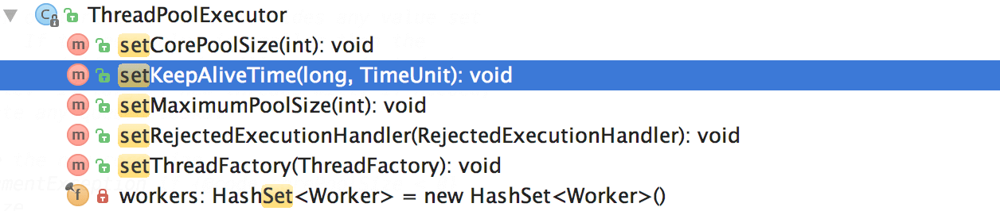

格外需要注意的是`corePoolSize`， 程序运行期间的时候，我们调用 `setCorePoolSize（）`这个方法的话，线程池会首先判断当前工作线程数是否大于`corePoolSize`，如果大于的话就会回收工作线程。

另外，你也看到了上面并没有动态指定队列长度的方法，美团的方式是自定义了一个叫做 `ResizableCapacityLinkedBlockIngQueue` 的队列（主要就是把`LinkedBlockingQueue`的 capacity 字段的 final 关键字修饰给去掉了，让它变为可变的）。

最终实现的可动态修改线程池参数效果如下。👏👏👏

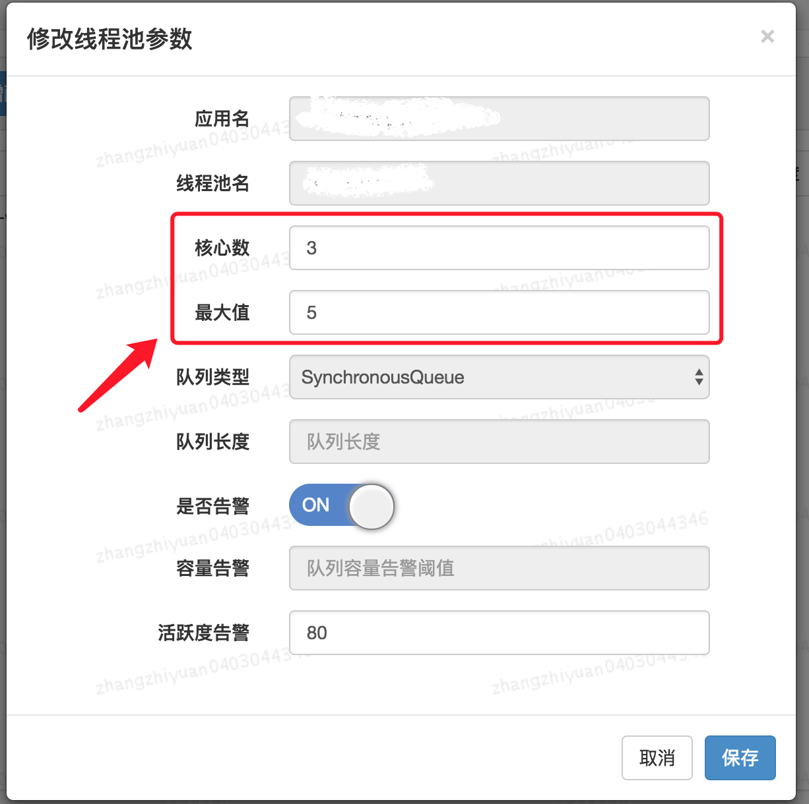

如果我们的项目也想要实现这种效果的话，可以借助现成的开源项目：

- **[Hippo4j](https://github.com/opengoofy/hippo4j)**：异步线程池框架，支持线程池动态变更&监控&报警，无需修改代码轻松引入。支持多种使用模式，轻松引入，致力于提高系统运行保障能力。
- **[Dynamic TP](https://github.com/dromara/dynamic-tp)**：轻量级动态线程池，内置监控告警功能，集成三方中间件线程池管理，基于主流配置中心（已支持 Nacos、Apollo，Zookeeper、Consul、Etcd，可通过 SPI 自定义实现）。


## 6、别忘记关闭线程池

当线程池不再需要使用时，应该显式地关闭线程池，释放线程资源。

线程池提供了两个关闭方法：

- **`shutdown（）`** :关闭线程池，线程池的状态变为 `SHUTDOWN`。线程池不再接受新任务了，但是队列里的任务得执行完毕。
- **`shutdownNow（）`** :关闭线程池，线程池的状态变为 `STOP`。线程池会终止当前正在运行的任务，停止处理排队的任务并返回正在等待执行的 List。

调用完 `shutdownNow` 和 `shuwdown` 方法后，并不代表线程池已经完成关闭操作，它只是异步的通知线程池进行关闭处理。如果要同步等待线程池彻底关闭后才继续往下执行，需要调用`awaitTermination`方法进行同步等待。

在调用 `awaitTermination()` 方法时，应该设置合理的超时时间，以避免程序长时间阻塞而导致性能问题。另外。由于线程池中的任务可能会被取消或抛出异常，因此在使用 `awaitTermination()` 方法时还需要进行异常处理。`awaitTermination()` 方法会抛出 `InterruptedException` 异常，需要捕获并处理该异常，以避免程序崩溃或者无法正常退出。

```java
// ...
// 关闭线程池
executor.shutdown();
try {
    // 等待线程池关闭，最多等待5分钟
    if (!executor.awaitTermination(5, TimeUnit.MINUTES)) {
        // 如果等待超时，则打印日志
        System.err.println("线程池未能在5分钟内完全关闭");
    }
} catch (InterruptedException e) {
    // 异常处理
}
```


## 7、线程池尽量不要放耗时任务

线程池本身的目的是为了提高任务执行效率，避免因频繁创建和销毁线程而带来的性能开销。如果将耗时任务提交到线程池中执行，可能会导致线程池中的线程被长时间占用，无法及时响应其他任务，甚至会导致线程池崩溃或者程序假死。

因此，在使用线程池时，我们应该尽量避免将耗时任务提交到线程池中执行。对于一些比较耗时的操作，如网络请求、文件读写等，可以采用异步操作的方式来处理，以避免阻塞线程池中的线程。


## 8、线程池使用的一些小坑

### 重复创建线程池的坑

线程池是可以复用的，一定不要频繁创建线程池比如一个用户请求到了就单独创建一个线程池。

```java
@GetMapping("wrong")
public String wrong() throws InterruptedException {
    // 自定义线程池
    ThreadPoolExecutor executor = new ThreadPoolExecutor(5,10,1L,TimeUnit.SECONDS,new ArrayBlockingQueue<>(100),new ThreadPoolExecutor.CallerRunsPolicy());

    //  处理任务
    executor.execute(() -> {
      // ......
    }
    return "OK";
}
```

出现这种问题的原因还是对于线程池认识不够，需要加强线程池的基础知识。


### Spring 内部线程池的坑

使用 Spring 内部线程池时，一定要手动自定义线程池，配置合理的参数，不然会出现生产问题（一个请求创建一个线程）。

```java
@Configuration
@EnableAsync
public class ThreadPoolExecutorConfig {

    @Bean(name="threadPoolExecutor")
    public Executor threadPoolExecutor(){
        ThreadPoolTaskExecutor threadPoolExecutor = new ThreadPoolTaskExecutor();
        int processNum = Runtime.getRuntime().availableProcessors(); // 返回可用处理器的Java虚拟机的数量
        int corePoolSize = (int) (processNum / (1 - 0.2));
        int maxPoolSize = (int) (processNum / (1 - 0.5));
        threadPoolExecutor.setCorePoolSize(corePoolSize); // 核心池大小
        threadPoolExecutor.setMaxPoolSize(maxPoolSize); // 最大线程数
        threadPoolExecutor.setQueueCapacity(maxPoolSize * 1000); // 队列程度
        threadPoolExecutor.setThreadPriority(Thread.MAX_PRIORITY);
        threadPoolExecutor.setDaemon(false);
        threadPoolExecutor.setKeepAliveSeconds(300); // 线程空闲时间
        threadPoolExecutor.setThreadNamePrefix("test-Executor-"); // 线程名字前缀
        return threadPoolExecutor;
    }
}
```


### 线程池和 ThreadLocal 共用的坑

线程池和 `ThreadLocal`共用，可能会导致线程从`ThreadLocal`获取到的是旧值/脏数据。这是因为线程池会复用线程对象，与线程对象绑定的类的静态属性 `ThreadLocal` 变量也会被重用，这就导致一个线程可能获取到其他线程的`ThreadLocal` 值。

不要以为代码中没有显示使用线程池就不存在线程池了，像常用的 Web 服务器 Tomcat 处理任务为了提高并发量，就使用到了线程池，并且使用的是基于原生 Java 线程池改进完善得到的自定义线程池。

当然了，你可以将 Tomcat 设置为单线程处理任务。不过，这并不合适，会严重影响其处理任务的速度。

```properties
server.tomcat.max-threads=1
```

解决上述问题比较建议的办法是使用阿里巴巴开源的 `TransmittableThreadLocal`(`TTL`)。`TransmittableThreadLocal`类继承并加强了 JDK 内置的`InheritableThreadLocal`类，在使用线程池等会池化复用线程的执行组件情况下，提供`ThreadLocal`值的传递功能，解决异步执行时上下文传递的问题。

`TransmittableThreadLocal` 项目地址：<https://github.com/alibaba/transmittable-thread-local> 。


# 0x02、Java多线程：从基本概念到避坑指南

> Java多线程：从基本概念到避坑指南：https://juejin.cn/post/7005369339747106853

## 1. 多线程基本概念

### 1、轻量级进程

在JVM中，一个线程，其实是一个轻量级进程（LWP）。所谓的轻量级进程，其实是用户进程调用系统内核，所提供的一套接口。实际上，它还要调用更加底层的内核线程（KLT）。

实际上，JVM的线程创建销毁以及调度等，都是依赖于操作系统的。如果你看一下Thread类里面的多个函数，你会发现很多都是native的，直接调用了底层操作系统的函数。

下图是JVM在Linux上简单的线程模型。

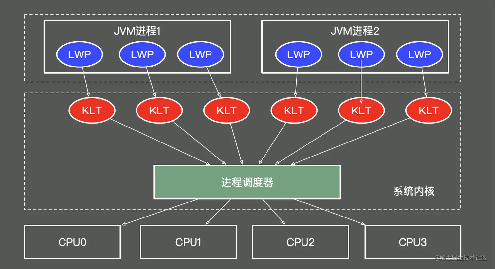

可以看到，不同的线程在进行切换的时候，会频繁在用户态和内核态进行状态转换。这种切换的代价是比较大的，也就是我们平常所说的上下文切换（Context Switch）。


### 2、JMM

在介绍线程同步之前，我们有必要介绍一个新的名词，那就是JVM的内存模型JMM。

JMM并不是说堆、metaspace这种内存的划分，它是一个完全不同的概念，指的是与线程相关的Java运行时线程内存模型。

由于Java代码在执行的时候，很多指令都不是原子的，如果这些值的执行顺序发生了错位，就会获得不同的结果。比如，i++的动作就可以翻译成以下的字节码。

```java
getfield      // Field value:I
iconst_1
iadd
putfield      // Field value:I
```

这还只是代码层面的。如果再加上CPU每核的各级缓存，这个执行过程会变得更加细腻。如果我们希望执行完`i++`之后，再执行`i--`，仅靠初级的字节码指令，是无法完成的。我们需要一些同步手段。

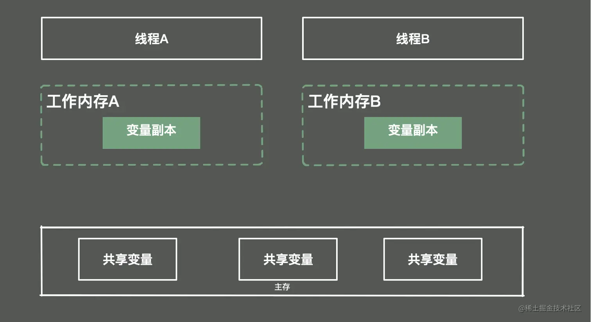

上图就是JMM的内存模型，它分为主存储器（Main Memory）和工作存储器（Working Memory）两种。我们平常在Thread中操作这些变量，其实是操作的主存储器的一个副本。当修改完之后，还需要重新刷到主存储器上，其他的线程才能够知道这些变化。

### 3、Java 中常见的线程同步方式

为了完成JMM的操作，完成线程之间的变量同步，Java提供了非常多的同步手段。

1. Java 的基类 Object 中，提供了 wait 和 notify 的原语，来完成 monitor 之间的同步。不过这种操作我们在业务编程中很少遇见
2. 使用 synchronized 对方法进行同步，或者锁住某个对象以完成代码块的同步
3. 使用 concurrent 包里面的可重入锁。这套锁是建立在 AQS   之上的
4. 使用 volatile 轻量级同步关键字，实现变量的实时可见性
5. 使用 Atomic 系列，完成自增自减
6. 使用 ThreadLocal 线程局部变量，实现线程封闭
7. 使用 concurrent 包提供的各种工具，比如 LinkedBlockingQueue 来实现生产者消费者。本质还是 AQS
8. 使用 Thread 的 join，以及各种 await 方法，完成并发任务的顺序执行

从上面的描述可以看出，多线程编程要学的东西可实在太多了。幸运的是，同步方式虽然千变万化，但我们创建线程的方式却没几种。

第一类就是 Thread 类。大家都知道有两种实现方式。第一可以继承 Thread 覆盖它的run方法；第二种是实现 Runnable 接口，实现它的 run      方法；而第三种创建线程的方法，就是通过线程池。

其实，到最后，就只有一种启动方式，那就是 Thread。线程池和 Runnable，不过是一种封装好的快捷方式罢了。

多线程这么复杂，这么容易出问题，那常见的都有那些问题，我们又该如何避免呢？下面，我将介绍10个高频出现的坑，并给出解决方案。


## 2、避坑指南

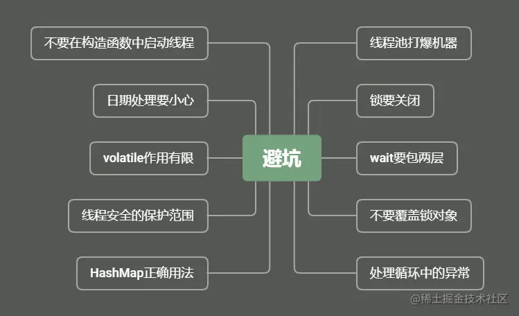

### 1、线程池打爆机器

首先，我们聊一个非常非常低级，但又产生了严重后果的多线程错误。

通常，我们创建线程的方式有 Thread，Runnable 和线程池三种。随着 Java1.8 的普及，现在最常用的就是线程池方式。

有一次，我们线上的服务器出现了僵死，就连远程ssh，都登录不上，只能无奈的重启。大家发现，只要启动某个应用，过不了几分钟，就会出现这种情况。最终定位到了几行让人啼笑皆非的代码。

有位对多线程不太熟悉的同学，使用了线程池去异步处理消息。通常，我们都会把线程池作为类的静态变量，或者是成员变量。但是这位同学，却将它放在了方法内部。也就是说，每当有一个请求到来的时候，都会创建一个新的线程池。当请求量一增加，系统资源就被耗尽，最终造成整个机器的僵死。

```java
void realJob(){
    ThreadPoolExecutor exe = new ThreadPoolExecutor(...);
    exe.submit(new Runnable(){...})
}
```

这种问题如何去避免？只能通过代码  review。所以多线程相关的代码，哪怕是非常简单的同步关键字，都要交给有经验的人去写。即使没有这种条件，也要非常仔细的对这些代码进行 review。


### 2、锁要关闭

相比较 synchronized 关键字加的独占锁，concurrent 包里面的 Lock 提供了更多的灵活性。可以根据需要，选择公平锁与非公平锁、读锁与写锁。

但 Lock 用完之后是要关闭的，也就是 lock 和 unlock 要成对出现，否则就容易出现锁泄露，造成了其他的线程永远了拿不到这个锁。

如下面的代码，我们在调用 lock 之后，发生了异常，try 中的执行逻辑将被中断，unlock 将永远没有机会执行。在这种情况下，线程获取的锁资源，将永远无法释放。

```java
private final Lock lock = new ReentrantLock();
void doJob(){
    try{
        lock.lock();
        //发生了异常
        lock.unlock();
    }catch(Exception e){
    }
}
```

正确的做法，就是将 unlock 函数，放到 finally 块中，确保它总是能够执行。

由于 lock 也是一个普通的对象，是可以作为函数的参数的。如果你把 lock 在函数之间传来传去的，同样会有时序逻辑混乱的情况。在平时的编码中，也要避免这种把 lock 当参数的情况。


### 3、wait 要包两层

Object 作为 Java 的基类，提供了四个方法`wait` `wait(timeout)` `notify` `notifyAll` ，用来处理线程同步问题，可以看出 wait 等函数的地位是多么的高大。在平常的工作中，写业务代码的同学使用这些函数的机率是比较小的，所以一旦用到很容易出问题。

但使用这些函数有一个非常大的前提，那就是必须使用 synchronized 进行包裹，否则会抛出 IllegalMonitorStateException。比如下面的代码，在执行的时候就会报错。

```java
final Object condition = new Object();
public void func(){
	condition.wait();
}
```

类似的方法，还有 concurrent 包里的 Condition 对象，使用的时候也必须出现在 lock 和 unlock 函数之间。

为什么在 wait 之前，需要先同步这个对象呢？因为 JVM 要求，在执行 wait 之时，线程需要持有这个对象的 monitor，显然同步关键字能够完成这个功能。

但是，仅仅这么做，还是不够的，wait 函数通常要放在 while 循环里才行，JDK在代码里做了明确的注释。

重点：这是因为，wait 的意思，是在 notify 的时候，能够向下执行逻辑。但在 notify 的时候，这个 wait 的条件可能已经是不成立的了，因为在等待的这段时间里条件条件可能发生了变化，需要再进行一次判断，所以写在 while 循环里是一种简单的写法。

```java
final Object condition = new Object();
public void func(){
    synchronized(condition){
        while(<条件成立>){
            condition.wait();
        }
    }
}
```

带if条件的 wait 和 notify 要包两层，一层 synchronized，一层 while，这就是 wait 等函数的正确用法。


### 4、不要覆盖锁对象

使用 synchronized 关键字时，如果是加在普通方法上的，那么锁的就是 this 对象；如果是加载 static 方法上的，那锁的就是 class。除了用在方法上， synchronized 还可以直接指定要锁定的对象，锁代码块，达到细粒度的锁控制。

如果这个锁的对象，被覆盖了会怎么样？比如下面这个。

```java
List listeners = new ArrayList();
void add(Listener listener, boolean upsert){
    synchronized(listeners){
        List results = new ArrayList();
        for(Listener ler:listeners){
            // ...
        }
        listeners = results;
    }
}
```

上面的代码，由于在逻辑中，强行给锁`listeners`对象进行了重新赋值，会造成锁的错乱或者失效。

为了保险起见，我们通常把锁对象声明成final类型的。

```java
final List listeners = new ArrayList();
```

或者直接声明专用的锁对象，定义成普通的Object对象即可。

```java
final Object listenersLock = new Object();
```


### 5、处理循环中的异常

在异步线程里处理一些定时任务，或者执行时间非常长的批量处理，是经常遇到的需求。我就不止一次看到小伙伴们的程序执行了一部分就停止的情况。

排查到这些中止的根本原因，就是其中的某行数据发生了问题，造成了整个线程的死亡。

我们还是来看一下代码的模板。

```java
volatile boolean run = true;
void loop(){
    while(run){
    	for(Task task: taskList){
            //do . sth
            int a = 1/0;
    	}
    }
}
```

在 loop 函数中，执行我们真正的业务逻辑。当执行到某个 task 的时候，发生了异常。这个时候，线程并不会继续运行下去，而是会抛出异常直接中止。在写普通函数的时候，我们都知道程序的这种行为，但一旦到了多线程，很多同学都会忘了这一环。

值得注意的是，即使是非捕获类型的`NullPointerException`，也会引起线程的中止。所以，时刻把要执行的逻辑，放在 try catch 中，是个非常好的习惯。

```java
volatile boolean run = true;
void loop(){
    while(run){
    	for(Task task: taskList){
    		try{
                // do . sth
                int a = 1/0;
    		}catch(Exception ex){
    			// log
    		}
    	}
    }
}
```


### 6、HashMap 正确用法

HashMap 在多线程环境下，会产生死循环问题。这个问题已经得到了广泛的普及，因为它会产生非常严重的后果：CPU 跑满，代码无法执行，jstack 查看时阻塞在get方法上。

至于怎么提高 HashMap 效率，什么时候转红黑树转列表，这是阳春白雪的八股界话题，我们下里巴人只关注怎么不出问题。

网络上有详细的文章描述死循环问题产生的场景，大体因为 HashMap 在进行 rehash 时，会形成环形链。某些 get 请求会走到这个环上。JDK 并不认为这是个 bug，虽然它的影响比较恶劣。

如果你判断你的集合类会被多线程使用，那就可以使用线程安全的 ConcurrentHashMap 来替代它。

HashMap 还有一个安全删除的问题，和多线程关系不大，但它抛出的是 ConcurrentModificationException，看起来像是多线程的问题。我们一块来看看它。

```java
Map<String, String> map = new HashMap<>();
map.put("xjjdog0", "狗1");
map.put("xjjdog1", "狗2");

for (Map.Entry<String, String> entry : map.entrySet()) {
    String key = entry.getKey();
    if ("xjjdog0".equals(key)) {
        map.remove(key);
    }
}
```

上面的代码会抛出异常，这是由于 HashMap 的 Fail-Fast 机制。如果我们想要安全的删除某些元素，应该使用迭代器。

```java
Iterator<Map.Entry<String, String>> iterator = map.entrySet().iterator();
while (iterator.hasNext()) {
    Map.Entry<String, String> entry = iterator.next();
    String key = entry.getKey();
    if ("xjjdog0".equals(key)) {
        iterator.remove();
    }
}
```


### 7、线程安全的保护范围

使用了线程安全的类，写出来的代码就一定是线程安全的么？答案是否定的。

线程安全的类，只负责它内部的方法是线程安全的。如我我们在外面把它包了一层，那么它是否能达到线程安全的效果，就需要重新探讨。

比如下面这种情况，我们使用了线程安全的 ConcurrentHashMap 来存储计数。虽然 ConcurrentHashMap 本身是线程安全的，不会再出现死循环的问题。但 addCounter 函数，明显是不正确的，它需要使用 synchronized 函数包裹才行。

```java
private final ConcurrentHashMap<String,Integer> counter;
public int addCounter(String name) {
    Integer current = counter.get(name);
    int newValue = ++current;
    counter.put(name,newValue);
    return newValue;
}
```

这是开发人员常踩的坑之一。要达到线程安全，需要看一下线程安全的作用范围。如果更大维度的逻辑存在同步问题，那么即使使用了线程安全的集合，也达不到想要的效果。


### 8、volatile 作用有限

volatile 关键字，解决了变量的可见性问题，可以让你的修改，立马让其他线程给读到。

虽然这个东西在面试的时候问的挺多的，包括 ConcurrentHashMap 中对 volatile 的那些优化。但在平常的使用中，你真的可能只会接触到 boolean 变量的值修改。

```java
volatile boolean closed;  
public void shutdown() {   
    closed = true;   
}  
```

千万不要把它用在计数或者线程同步上，比如下面这样。

```java
volatile count = 0;
void add(){
    ++count;
}
```

这段代码在多线程环境下，是不准确的。这是因为 volatile 只保证可见性，不保证原子性，多线程操作并不能保证其正确性。

直接用 Atomic 类或者同步关键字多好，你真的在乎这纳秒级别的差异么？


### 9、日期处理要小心

很多时候，日期处理也会出问题。这是因为使用了全局的 Calendar，SimpleDateFormat 等。当多个线程同时执行 format 函数的时候，就会出现数据错乱。

```java
SimpleDateFormat format = new SimpleDateFormat("yyyy-MM-dd hh:mm:ss");
Date getDate(String str){
    return format(str);
}
```

为了改进，我们通常将 SimpleDateFormat 放在 ThreadLocal 中，每个线程一份拷贝，这样可以避免一些问题。当然，现在我们可以使用线程安全的DateTimeFormatter 了。

```java
static DateTimeFormatter FOMATTER = DateTimeFormatter.ofPattern("MM/dd/yyyy HH:mm:ss");
public static void main(String[] args) {
    ZonedDateTime zdt = ZonedDateTime.now();
    System.out.println(FOMATTER.format(zdt));
}
```


### 10、不要在构造函数中启动线程

在构造函数，或者 static 代码块中启动新的线程，并没有什么错误。但是，强烈不推荐你这么做。

因为 Java 是有继承的，如果你在构造函数中做了这种事，那么子类的行为将变得非常魔幻。另外，this 对象可能在构造完毕之前，出递到另外一个地方被使用，造成一些不可预料的行为。

所以把线程的启动，放在一个普通方法，比如 start 中，是更好的选择。它可以减少 bug 发生的机率。


## 3、避坑总结

wait 和 notify 是非常容易出问题的地方，

编码格式要求非常严格。synchronized 关键字相对来说比较简单，但同步代码块的时候依然有许多要注意的点。这些经验，在 concurrent 包所提供的各种API中依然实用。我们还要处理多线程逻辑中遇到的各种异常问题，避免中断，避免死锁。规避了这些坑，基本上多线程代码写起来就算是入门了。

许多 Java 开发，都是刚刚接触多线程开发，在平常的工作中应用也不是很多。如果你做的是 CRUD 的业务系统，那么写一些多线程代码的时候就更少了。但总有例外，你的程序变得很慢，或者排查某个问题，你会直接参与到多线程的编码中来。

我们的各种工具软件，也在大量使用多线程。从 Tomcat，到各种中间件，再到各种数据库连接池缓存等，每个地方都充斥着多线程的代码。

即使是有经验的开发，也会陷入很多`多线程`的陷阱。因为异步会造成时序的混乱，必须要通过强制的手段达到数据的同步。多线程运行，首先要保证准确性，使用线程安全的集合进行数据存储；还要保证效率，毕竟使用多线程的目标就是如此。

希望本文中的这些实际案例，让你对多线程的理解，更上一层楼。


# xx、参考文献 & 鸣谢

**大神并发系列篇**：

1. 透彻理解Java并发编程系列 | 山海 ：https://www.tpvlog.com/article/17、https://segmentfault.com/a/1190000015558984
2. Java并发学习系列-绪论：https://blog.csdn.net/hanchao5272/article/details/79437370
3. Java 并发 | dunwu 钝悟：https://dunwu.github.io/javacore/pages/6e5393/
4. Java并发知识体系详解 | Java 全栈知识体系：https://pdai.tech/md/java/thread/java-thread-x-overview.html
5. 死磕 Java 并发：https://www.skjava.com/series/2107060030
6. 并发编程 ｜ CSDN Men-DD：https://blog.csdn.net/menxu_work/category_11645009.html
7. 《Java 并发编程核心 78 讲》：https://blog.csdn.net/fegus/article/details/124958833

**一篇学完高并发**：

1. JAVA多线程并发：https://blog.csdn.net/ma815841356/article/details/100978504
2. 面试高频——JUC并发工具包快速上手（超详细总结）：https://blog.csdn.net/qq_45173404/article/details/116256342
3. Java多线程复习（三）：并发容器、线程池、ThreadLocal、伪共享：https://blog.csdn.net/qq_40378034/article/details/103748812


