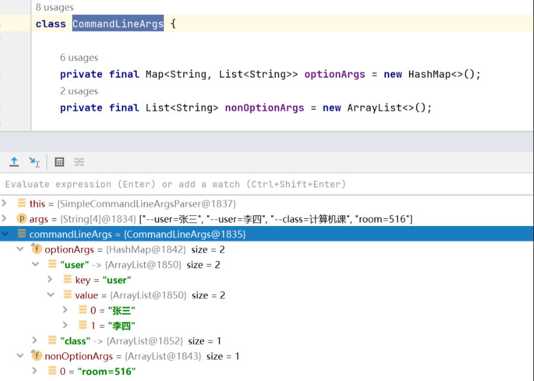
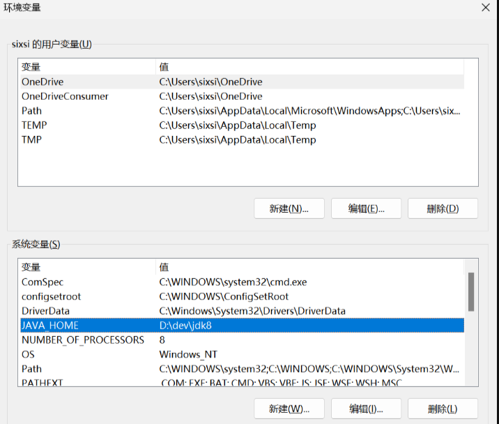

# 1、程序参数、VM 参数、环境变量

| 参数                 | 使用方式                                                     | 示例                                                         | 代码获取方式                               |
| -------------------- | ------------------------------------------------------------ | ------------------------------------------------------------ | ------------------------------------------ |
| Program Arguments    | 为我们传入main方法的字符串数组args[]，用**空格**隔开 它通常以`--`开头（也可以不以--开头，主要是为了 Spring 处理所以区分了了--） | –spring.profiles.active=dev                                  | main(String[] args)                        |
| VM Options           | 必须以 `-D 、 -X 、 -XX` 开头，每个参数用**空格**隔开 ，使用最多的就是 `-Dkey=value` | -Dvm.key=VmKey -Dvm.key2=VmKey2                              | String key = System.getProperty(“vm.key”); |
| Environment Variable | 其优先级低于 VM options ，即如果VM options 有一个变量和 Environment variable中的变量的key相同，则以VM options 中为准， 以**分号**分割多个 | env.key=env_james;server.servlet.context-path=/test;server.port=8080 | String envKey = System.getenv(“env.key”);  |

打开 IDEA 的 Run Configuration，可以看到以下参数配置：

- Program arguments：程序参数
- VM options：VM 选项
- Environment variables：环境变量

规则简介：

- Program arguments：多个参数需要以空格隔开，否则将会被识别成一个参数;
- VM options：一般以-D 、-X 或者-XX 开头，存在多个参数以空格隔开;

- Environment variables：没有前缀，存在多个参数时，以分号分割;

优先级：Program arguments（--priority=program-agrs）> VM options（-Dpriority=vm-options）> Environment variable（priority=environment-variables）

```java
/**
 * vm options：-Dkey1=zhangsan -Dkey2=lisi -Dpriority=middle
 * program arguments：--arg1=guangzhou --arg2=shenzhen --priority=high
 * environment variables：env1=uat;env2=prod;Name=123;priority=lower
 */
public class JavaAPIDemo {
    public static void main(String[] args) {

        System.out.println("===================== program arguments =====================");
        // program arguments 对应的args 参数
        // 程序参数
        for (String arg : args) {
            System.out.println(arg);
        }

        System.out.println("===================== vm options =====================");
        // JVM 变量
        String value1 = System.getProperty("key1");
        String value2 = System.getProperty("key2");
        System.out.println("System.getProperty(\"key1\")----->" + value1);
        System.out.println("System.getProperty(\"key2\")----->" + value2);
        String priority = System.getProperty("priority");
        System.out.println("System.getProperty(\"priority\")----->" + priority);

        System.out.println("===================== environment variables =====================");
        // 操作系统变量
        String env1 = System.getenv("env1");
        String env2 = System.getenv("env2");
        String env_priority = System.getenv("priority");
        System.out.println("System.getenv(\"env1\")=======>" + env1);
        System.out.println("System.getenv(\"env2\")=======>" + env2);
        System.out.println("System.getenv(\"priority\")=======>" + env_priority);
        String foo_upper = System.getenv("Name");
        String foo_lower = System.getenv("name");
        String foo_insenstive = System.getenv("fOo");
        String path_insenstive = System.getenv("PATH");
        String java_home = System.getenv("JAVA_HOME");
        System.out.println("name_upper = " + foo_upper);
        System.out.println("name_lower = " + foo_lower);
        System.out.println("name_insenstive = " + foo_insenstive);
        System.out.println("path_insenstive = " + path_insenstive);
        System.out.println("java_home = " + java_home);
    }
}
```

```
===================== program arguments =====================
--arg1=guangzhou
--arg2=shenzhen
--priority=high
===================== vm options =====================
System.getProperty("key1")----->zhangsan
System.getProperty("key2")----->lisi
System.getProperty("priority")----->middle
===================== environment variables =====================
System.getenv("env1")=======>uat
System.getenv("env2")=======>prod
System.getenv("priority")=======>lower
name_upper = 123
name_lower = null
name_insenstive = null
path_insenstive = /usr/local/bin:/System/Cryptexes/App/usr/bin:/usr/bin:/bin:/usr/sbin:/sbin:/var/run/com.apple.security.cryptexd/codex.system/bootstrap/usr/local/bin:/var/run/com.apple.security.cryptexd/codex.system/bootstrap/usr/bin:/var/run/com.apple.security.cryptexd/codex.system/bootstrap/usr/appleinternal/bin:/usr/local/bin
java_home = null
```

总结 

- Environment variable包含了JAVA_HOME 在内的系统变量
- Environment variable和操作系统有关，例如 Windows 里无区分变量大小写，Linux 与 MacOS 系统会区分变量大小写
- 优先级：程序参数 > VM选项 > 环境变量


# 2、Program arguments

Program arguments：程序参数，用于设置当前程序的参数

1、Java 配置方式

在 jar 文件后面直接进行配置，参数以空格分隔，构成一个参数数组

```bash
java -jar application-name.jar hello world
```

2、Java 取值方式

可以从 main 方法的 args 参数中拿到数据

```java
public static void main(String[] args) {
    System.out.println("获取到的值是： " + Arrays.toString(args));
}
```

3、再来看看一段 SpringBoot 程序

```java
@SpringBootApplication
public class App {
    public static void main(String[] args) {
        SpringApplication.run(App.class, args);
    }
}
```

这段代码里，SpringBoot 对 main 方法的 args 参数进行了接收，那用 args 做了什么呢？下面我摘出关键代码 解析参数。

这是一段解析 args 数组的方法，位置在：org.springframework.core.env.SimpleCommandLineArgsParser#parse

```java
package org.springframework.core.env;

class SimpleCommandLineArgsParser {
    SimpleCommandLineArgsParser() {
    }

    public CommandLineArgs parse(String... args) {
        CommandLineArgs commandLineArgs = new CommandLineArgs();
        String[] var3 = args;
        int var4 = args.length;

        for(int var5 = 0; var5 < var4; ++var5) {
            String arg = var3[var5];
            if (arg.startsWith("--")) {
                String optionText = arg.substring(2);
                String optionValue = null;
                int indexOfEqualsSign = optionText.indexOf(61);
                String optionName;
                if (indexOfEqualsSign > -1) {
                    optionName = optionText.substring(0, indexOfEqualsSign);
                    optionValue = optionText.substring(indexOfEqualsSign + 1);
                } else {
                    optionName = optionText;
                }

                if (optionName.isEmpty()) {
                    throw new IllegalArgumentException("Invalid argument syntax: " + arg);
                }

                commandLineArgs.addOptionArg(optionName, optionValue);
            } else {
                commandLineArgs.addNonOptionArg(arg);
            }
        }

        return commandLineArgs;
    }
}
```

这段代码做的事情就是对参数进行解析，将结果存储在内部的 map 或 list 中。

4、假设如下参数

```bash
java -jar app.jar --user=张三 --user=李四 --class=计算机课 room=516
```

结果如下：



由上可以得出结论：

- 可以看出对于 -- 开头的参数
- 存储到了 CommandLineArgs 的 optionArgs 中，否则就存储在 nonOptionArgs 中。

- 而对于 optionArgs 相同的 key ，其 value 会以列表的形式放在一起。

- 也就是说，Spring 将 程序参数进行了解析并存了起来，这样就可以实现通过 程序参数 来改变 Spring 行为功能了。

- 由于本文的重点不是 Spring，所以不探讨 Spring/SpringBoot 内部如何流转处理这些参数的。


# 3、VM options

这个是 JVM 虚拟机级别的参数，配置该参数可以调整当前 JVM 实例的行为。大致可分为标准（-D）和非标准（-X、-XX）两种。-D 参数用来额外增加一些配置项。格式为：-Dkey=value。常见的参数配置有 -Xms4G -Xmx4G -Xmn2G -Dfile.encoding=UTF-8  

1、配置方式

注意 -D 参数是跟在 java 后面的

```bash
java -Dnacos.standalone=true -jar nacos.jar 
```

2、取值方式

```java
public static void main(String[] args) {
    String value = System.getProperty("nacos.standalone")
}
```

```
true
```

3、除了可以自己设置参数外，VM options 也有内置的参数。可以通过 System.getProperties() 方法拿到。

```java
public static void main(String[] args) {
    System.getProperties().forEach((k, y) -> System.out.println(k + ": " + y));
}
```

```
http.proxyHost: 127.0.0.1
java.specification.version: 17
sun.jnu.encoding: UTF-8
https.proxyPort: 1082
java.vm.vendor: Oracle Corporation
sun.arch.data.model: 64
java.vendor.url: https://java.oracle.com/
java.vm.specification.version: 17
os.name: Mac OS X
sun.java.launcher: SUN_STANDARD
user.country: CN
sun.boot.library.path: /Users/lsx/Java/JDK/jdk-17.jdk/Contents/Home/lib
sun.java.command: com.example.springboot.tech.JavaAPIDemo hello world
jdk.debug: release
sun.cpu.endian: little
user.home: /Users/lsx
user.language: zh
java.specification.vendor: Oracle Corporation
java.version.date: 2021-09-14
java.home: /Users/lsx/Java/JDK/jdk-17.jdk/Contents/Home
file.separator: /
https.proxyHost: 127.0.0.1
java.vm.compressedOopsMode: Zero based
line.separator: 
java.vm.specification.vendor: Oracle Corporation
java.specification.name: Java Platform API Specification
user.script: Hans
sun.management.compiler: HotSpot 64-Bit Tiered Compilers
java.runtime.version: 17+35-2724
user.name: lsx
path.separator: :
os.version: 13.5.2
java.runtime.name: OpenJDK Runtime Environment
file.encoding: UTF-8
java.vm.name: OpenJDK 64-Bit Server VM
java.vendor.url.bug: https://bugreport.java.com/bugreport/
java.io.tmpdir: /var/folders/23/755bxtg533sb9d85vp7scsd40000gp/T/
java.version: 17
user.dir: /Users/lsx/IdeaProjects/SpringBootTech_1
os.arch: x86_64
java.vm.specification.name: Java Virtual Machine Specification
native.encoding: UTF-8
java.vm.info: mixed mode, sharing
java.vendor: Oracle Corporation
java.vm.version: 17+35-2724
sun.io.unicode.encoding: UnicodeBig
java.class.version: 61.0
http.proxyPort: 1082
```


# 4、Environment variables

Environment variables 代表系统环境参数，Windows、Linux、MacOS 环境变量的配置及区分大小写方式都是不一样的。

## 1、Windows 配置方式




## 2、Linux 配置方式

在Linux中，可以按照以下步骤配置环境变量：

1. 打开终端。

2. 运行以下命令打开.bashrc文件：

   ```bash
   vi ~/.bashrc
   ```

3. 在打开的文件中，添加以下行：

   ```bash
   export VAR1=value1
   export VAR2=value2
   export VAR3=value3
   export VAR1=value1 VAR2=value2 VAR3=value3
   ```

4. 其中，JAVA_OPTS中的参数是所需的 JVM 参数，多个参数之间使用空格分隔。或者在单个`export`语句中设置多个变量

5. 保存文件并退出。


## 3、MacOS 配置方式

在 MacOS 中，可以按照以下步骤配置环境变量：

1. 打开 Terminal 应用程序。

2. 运行以下命令打开.bash_profile文件：

   ```bash
   open -e ~/.bash_pro
   ```

3. 在打开的文件中，添加以下行：

   ```bash
   export VAR1=value1
   export VAR2=value2
   export VAR3=value3
   export MY_VAR=param1:param2:param3
   ```

4. 保存文件并关闭。


## 4、取值方式

1、获取单个参数：String value = System.getenv(key)

2、获取全部参数：Map<String, String> envs = System.getenv() 

```java
public static void main(String[] args) {
    String value = System.getenv("HOME");
    System.out.println(value);
    Map<String, String> envs = System.getenv();
    envs.forEach((k, y) -> System.out.println(k + ": " + y));
}
```

```
/Users/lsx
__CFBundleIdentifier: com.jetbrains.intellij
PATH: /usr/local/bin:/System/Cryptexes/App/usr/bin:/usr/bin:/bin:/usr/sbin:/sbin:/var/run/com.apple.security.cryptexd/codex.system/bootstrap/usr/local/bin:/var/run/com.apple.security.cryptexd/codex.system/bootstrap/usr/bin:/var/run/com.apple.security.cryptexd/codex.system/bootstrap/usr/appleinternal/bin:/usr/local/bin
SHELL: /bin/zsh
OLDPWD: /
USER: lsx
COMMAND_MODE: unix2003
TMPDIR: /var/folders/23/755bxtg533sb9d85vp7scsd40000gp/T/
SSH_AUTH_SOCK: /private/tmp/com.apple.launchd.alR0ZxqQDH/Listeners
JAVA_MAIN_CLASS_49133: com.example.springboot.tech.JavaAPIDemo
XPC_FLAGS: 0x0
__CF_USER_TEXT_ENCODING: 0x1F6:0x19:0x34
LOGNAME: lsx
LC_CTYPE: zh_CN.UTF-8
PWD: /Users/lsx/IdeaProjects/SpringBootTech_1
XPC_SERVICE_NAME: application.com.jetbrains.intellij.1765097.1765119.5AC30846-CF3B-4711-A64F-3CD3A123C20D
IDEA_INITIAL_DIRECTORY: /
HOME: /Users/lsx
TOOLBOX_VERSION: 2.3.0.30876
```


# 5、最佳实践方案

1、对于账号密码等敏感信息使用 系统环境变量方式 Environment variables

例如数据库连接地址、账号，我们就可以配置在系统环境变量里，开发人员将无法得知真实的账号，增加了安全性。（除非他有服务器权限）

```yaml
spring:
  datasource:
    type: com.alibaba.druid.pool.DruidDataSource
    druid:
      driver-class-name: com.mysql.cj.jdbc.Driver
      username: ${MYSQL-USER:user}
      password: ${MYSQL-PWD:123456}
      url: jdbc:mysql://${MYSQL-HOST:localhos}:${MYSQL-PORT:3306}/${MYSQL-DB:test}
```


2、使用 程序参数 Program arguments 改变 SpringBoot 应用行为

例如常见的不同环境、修改应用端口号

```bash
java -jar user.jar --spring.profiles.active=test
java -jar user.jar --spring.profiles.active=prod
java -jar user.jar --server.port=8888
```


# 6、SpringBoot 命令行启动时参数配置

## 1、配置方式

1、参数配置：

通过命令行参数来配置 SpringBoot 应用程序是一种常见的方式。在命令行中，可以使用`--<property>=<value>`的形式来传递参数。这些参数会被 SpringBoot 解析并应用到应用程序的配置中。例如，可以使用以下命令启动 SpringBoot 应用程序：

```bash
java -jar application-name.jar --server.port=8080
```

2、配置文件配置

SpringBoot 应用程序可以使用默认的配置文件（如 application.properties 或 application.yml），也可以通过自定义的配置文件进行配置。默认的配置文件位于类路径的根目录下，而自定义的配置文件可以通过`--spring.config.location`命令行参数指定。例如：

```bash
java -jar application-name.jar --spring.config.location=classpath:/application-config.yml
```

通过参数配置和配置文件配置，可以在运行 SpringBoot 应用程序时动态地改变应用程序的行为，而无需重新打包应用程序。这使得在不同环境下部署和运行应用程序更加灵活和便捷。


## 2、配置顺序（由高到低）

在配置信息的加载过程中，若在高优先级配置中和低优先级配置中存在同样的配置信息，则加载高优先级的配置信息。

1. 命令行参数：

  命令行参数具有最高优先级，可以覆盖配置文件中的属性。例如，--server.port=8080 将会覆盖 application.properties 或其他配置文件中的 server.port 属性。

2. 操作系统环境变量：

  SpringBoot 会加载操作系统环境变量中以 SPRING_ 为前缀的所有属性。例如，SPRING_PROFILES_ACTIVE=dev将会设置spring.profiles.active属性。

3. 自定义配置文件：

  可以通过 --spring.config.location 命令行参数指定自定义的配置文件。这些自定义配置文件可以覆盖默认的配置文件中的属性。

4. 应用配置文件：

  application.properties 或 application.yml 这是常规配置文件，包含应用程序的所有默认配置。如果没有其他配置文件指定，这些属性将作为最后的默认值。


## 3、参数形式

在命令行中，常见的参数可以分为三类：选项参数、非选项参数和系统参数。

1、选项参数

SpringBoot 应用程序可以在命令行中使用双短横线 -- 作为前缀来传递选项参数。这些参数通常用于配置和控制应用程序的行为。使用选项参数时，参数在命令中是位于 xxx.jar 之后的。例如：

```bash
java -jar application-name.jar --server.port=8080
```


2、非选项参数

非选项参数直接跟随在 SpringBoot 应用程序的 xxx.jar 包后面，它们是应用程序的实际参数。这些参数可以根据应用程序的需要进行解析和处理。例如：

```bash
java -jar application-name.jar arg1 arg2
```


3、系统参数

SpringBoot 应用程序可以在命令行中使用 -D 选项设置系统参数，用于配置 Java虚拟机（JVM）的行为。这些参数是以 `-D<property>=<value>` 的形式传递给JVM，可以在应用程序中通过 System.getProperty() 方法获取。例如：

```bash
java -Dapp.env=dev -jar your-application.jar
```


4、环境变量

环境变量是在操作系统级别设置的一组键值对，在运行程序时可以被应用程序访问（不同的系统设置方式也不同）。例如：

```bash
key1=value1;key2=value2
```


## 4、IDEA 中参数配置

1、Program arguments(程序参数)

程序参数是在运行程序时，通过命令行传递给主类的参数，并在应用内进行处理，多个参数需要以空格隔开。例如：

```bash
--arg1=value1 --arg2=value2
```


2、VM options（VM选项）

VM 选项是传递给 Java 虚拟机（JVM）的参数。JVM 选项用于配置 JVM 的运行时行为，包括堆内存大小、垃圾回收策略等。这些参数通常用于调优和优化 Java 应用程序的性能。一般以-D 、-X 或者-XX 开头，存在多个参数以空格隔开。例如：

```bash
-Dkey1=value1 -Dkey2=value2
```


3、Environment variables（环境变量）

环境变量是在操作系统级别设置的一组键值对，在运行程序时可以被应用程序访问。例如：

```bash
key1=value1;key2=value2
```


## 4、编写代码操作测试

```java
import org.springframework.beans.factory.annotation.Autowired;
import org.springframework.beans.factory.annotation.Value;
import org.springframework.boot.ApplicationArguments;
import org.springframework.web.bind.annotation.GetMapping;
import org.springframework.web.bind.annotation.RequestMapping;
import org.springframework.web.bind.annotation.RestController;
import java.util.List;
import java.util.Set;

@RestController
@RequestMapping("/arg")
public class ArgumentsController {

    @Autowired
    private ApplicationArguments applicationArguments;

    @Value("${server.port}")
    private String serverPort;

    @GetMapping("/getOptionArgs")
    public void getOptionArgs() {
        // 使用ApplicationArguments获取选项参数
        Set<String> optionArgs = applicationArguments.getOptionNames();
        System.out.print("选项参数：");
        optionArgs.forEach(e -> {
            System.out.print(e + applicationArguments.getOptionValues(e) + " ");
        });
        // 使用@value注解获取选项参数
        System.out.println();
        System.out.print("选项参数：" + serverPort);
    }

    @GetMapping("/getNonOptionArgs")
    public void getNonOptionArgs() {
        // 获取非选项参数
        List<String> nonOptionArgs = applicationArguments.getNonOptionArgs();
        System.out.print("非选项参数：");
        nonOptionArgs.forEach(e -> System.out.print(e + " "));
    }

    @GetMapping("/getSystemArgs")
    public void getSystemArgs() {
        // 使用System.get获取系统参数
        String property = System.getProperty("server.port");
        System.out.println("系统参数：" + property);
        // 使用@value获取系统参数
        System.out.println("系统参数：" + serverPort);
    }

    @GetMapping("/getEnvArgs")
    public void getEnvArgs() {
        // 使用System.get获取环境变量.
        String home = System.getenv("HOME");
        String user = System.getenv("USER");
        System.out.println("环境变量：" + home);
        System.out.println("环境变量：" + user);
    }
}
```


# xx、参考文献 & 鸣谢

- Java 中的不同参数类型：https://blog.csdn.net/weixin_42195284/article/details/128276549
- SpringBoot命令行启动时参数配置：https://blog.csdn.net/CNDN_Web/article/details/132103148
