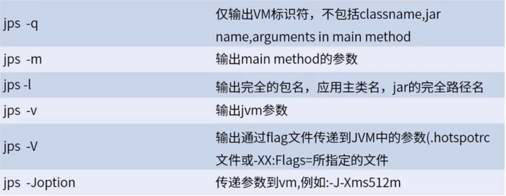
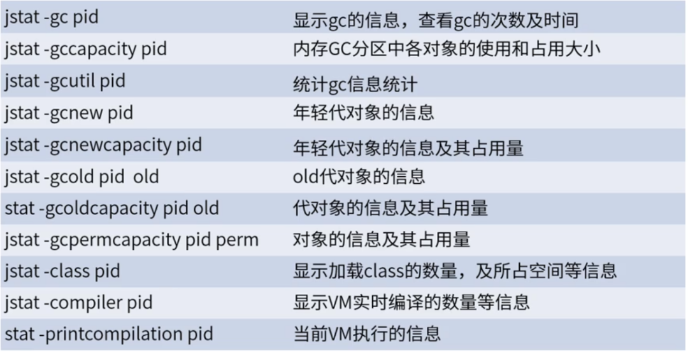
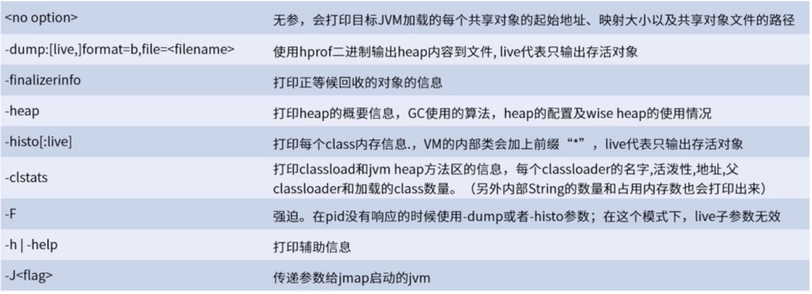
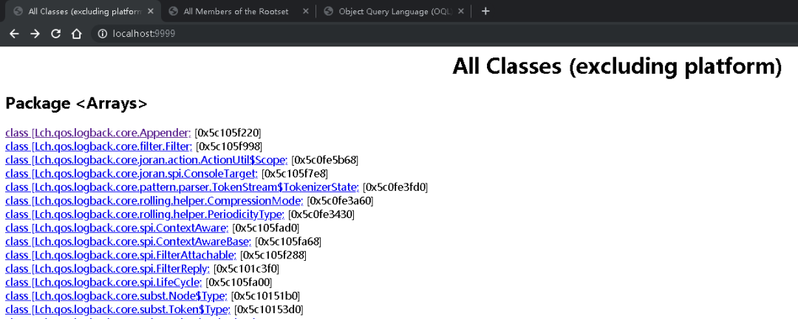
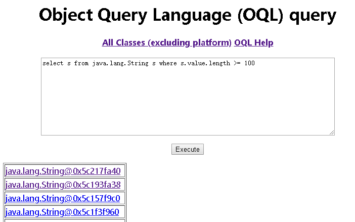
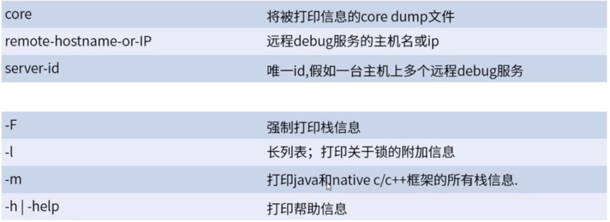

> 这篇文章主要来介绍下 JDK 内置的命令，话不多说，让我们开始吧！
>
> 参考：[不可不知的 7 个 JDK 命令 (qq.com)](https://mp.weixin.qq.com/s/vAoW0aeOK0AebW0pYSts9g)

# javap

使用 `javap` 可以查看 Java 字节码反编译的源文件，`javap` 的命令格式如下：


下面来演示下用 `javap -c` 对代码进行反编译，首先写个 `HelloWorld` 类，如下：

```java
public class HelloWorld {
    public static void main(String []args) {
        System.out.println("Hello World");
    }
}
```

接着使用 `javap -c HelloWorld.class` 就可以反编译得到如下结果：

```
Compiled from "HelloWorld.java"
public class HelloWorld {
  public HelloWorld();
    Code:
       0: aload_0
       1: invokespecial #1                  // Method java/lang/Object."<init>":()V
       4: return

  public static void main(java.lang.String[]);
    Code:
       0: getstatic     #2                  // Field java/lang/System.out:Ljava/io/PrintStream;
       3: ldc           #3                  // String Hello World
       5: invokevirtual #4                  // Method java/io/PrintStream.println:(Ljava/lang/String;)V
       8: return
}
```

# jps

`jps` 是用来查询当前所有进程 pid 的，命令的用法如下图所示：



执行 `jps` 可以获取本机 Java 程序的 pid，运行结果如下：

```bash
[root@wupx ~]# jps
8825 spring-boot-0.0.1-SNAPSHOT.jar
```

使用 `jps -mlvV` 可以获取到这个进程的 pid、jar 包的名字以及 JVM 参数等。

```bash
[root@wupx ~]# jps -mlvV
8825 /root/spring-boot-0.0.1-SNAPSHOT.jar --server.port=8090 --logging.file=/root/log/spring-boot.log -Xmx1024m -Xms1024m
```

# jstat

`jstat` 主要用于监控 JVM，主要是 GC 信息，在性能优化的时候经常用到，命令内容如下所示：



比如，上面我们通过 `jps` 查到的进程号 8825，我们使用 `jstat -gc 8825` 来查看该进程的 GC 信息：

```bash
[root@wupx ~]# jstat -gc 8825
 S0C    S1C    S0U    S1U      EC       EU        OC         OU       MC     MU    CCSC   CCSU   YGC     YGCT    FGC    FGCT     GCT
65536.0 69120.0  0.0   160.0  10425344.0 1036247.8 21135360.0 19489859.7 84608.0 81123.8 9600.0 8834.1  99517 2070.459   0      0.000 2070.459
```

其中 `S0C` 表示当前 `Survivor0` 的容量，`S1C` 表示当前 `Survivor1` 的容量，`S0U` 表示当前 `Survivor0` 的利用率，`S1U` 表示当前 `Survivor1` 的利用率，`EC` 表示 Eden 的容量，`EU` 表示 Eden 的利用率，`OC` 表示老年代的容量，`OU` 表示老年代的利用率，`MC` 表示 Metaspace 的容量，`MU` 表示 Metaspace 的利用率，`CCSC` 表示类指针压缩空间容量，`CCSU` 表示使用的类指针压缩空间，`YGC` 表示新生代 GC 的次数，`YGCT` 表示新生代 GC 的时间，`FGC` 表示 Full Gc 的次数，`FGCT` 表示 Full GC 的时间，`GCT` 表示 GC 总时间。

> 每个对象都有一个指向它自身类的指针，_klass: 指向类的 4 字节指针，64 位平台上 _klass: 指向类的 8 字节的指针，为了节约这些空间，引入了类指针压缩空间。

# jcmd

`jcmd` 可以查看 JVM 信息，常用的命令内容如下：


先使用 `jcmd 8825 help` 来查看都支持什么命令：

```bash
[root@wupx ~]# jcmd 8825 help
8825:
The following commands are available:
JFR.stop
JFR.start
JFR.dump
JFR.check
VM.native_memory
VM.check_commercial_features
VM.unlock_commercial_features
ManagementAgent.stop
ManagementAgent.start_local
ManagementAgent.start
VM.classloader_stats
GC.rotate_log
Thread.print
GC.class_stats
GC.class_histogram
GC.heap_dump
GC.finalizer_info
GC.heap_info
GC.run_finalization
GC.run
VM.uptime
VM.dynlibs
VM.flags
VM.system_properties
VM.command_line
VM.version
help
```

下面我就选一个参数给大家举个例子，比如打印堆的信息，使用 `jcmd 8825 GC.heap_dump` 命令：

```bash
[root@wupx ~]# jcmd 8825 GC.heap_info
8825:
 PSYoungGen      total 628736K, used 41772K [0x0000000715a00000, 0x0000000746480000, 0x00000007c0000000)
  eden space 609792K, 4% used [0x0000000715a00000,0x00000007173d5478,0x000000073ad80000)
  from space 18944K, 80% used [0x000000073ad80000,0x000000073bc75e68,0x000000073c000000)
  to   space 19968K, 0% used [0x0000000745100000,0x0000000745100000,0x0000000746480000)
 ParOldGen       total 250880K, used 21756K [0x00000005c0e00000, 0x00000005d0300000, 0x0000000715a00000)
  object space 250880K, 8% used [0x00000005c0e00000,0x00000005c233f160,0x00000005d0300000)
 Metaspace       used 44797K, capacity 45562K, committed 45824K, reserved 1089536K
  class space    used 5669K, capacity 5832K, committed 5888K, reserved 1048576K
```

可以看出可以获取新生代、老年代、元空间、Eden、From Survivor 以及 To Survivor 的大小和占比。

# jmap

`jmap` 打印出 Java 进程内存中 Object 的情况，或者将 JVM 中的堆以二进制输出成文本，命令内容如下：



使用 `jmap -heap 8825` 查看当前堆的使用信息：

```bash
[root@wupx ~]# jmap -heap 8825
Attaching to process ID 8825, please wait...
Debugger attached successfully.
Server compiler detected.
JVM version is 25.201-b09

using thread-local object allocation.
Parallel GC with 10 thread(s)

Heap Configuration:
   MinHeapFreeRatio         = 0
   MaxHeapFreeRatio         = 100
   MaxHeapSize              = 8575254528 (8178.0MB)
   NewSize                  = 178782208 (170.5MB)
   MaxNewSize               = 2858418176 (2726.0MB)
   OldSize                  = 358088704 (341.5MB)
   NewRatio                 = 2
   SurvivorRatio            = 8
   MetaspaceSize            = 21807104 (20.796875MB)
   CompressedClassSpaceSize = 1073741824 (1024.0MB)
   MaxMetaspaceSize         = 17592186044415 MB
   G1HeapRegionSize         = 0 (0.0MB)

Heap Usage:
PS Young Generation
Eden Space:
   capacity = 624427008 (595.5MB)
   used     = 32083672 (30.597373962402344MB)
   free     = 592343336 (564.9026260375977MB)
   5.138098062536078% used
From Space:
   capacity = 19398656 (18.5MB)
   used     = 15687272 (14.960548400878906MB)
   free     = 3711384 (3.5394515991210938MB)
   80.86782919394004% used
To Space:
   capacity = 20447232 (19.5MB)
   used     = 0 (0.0MB)
   free     = 20447232 (19.5MB)
   0.0% used
PS Old Generation
   capacity = 256901120 (245.0MB)
   used     = 22278496 (21.246429443359375MB)
   free     = 234622624 (223.75357055664062MB)
   8.672012017697703% used

24741 interned Strings occupying 2987512 bytes.
```

首先会打印**堆的一些相关配置**，比如最大新生代、元空间的大小等；下面为**堆的使用情况**，包括新生代的 Eden 区、S0 区、S1 区以及老年代。

`jmap` 还可以将堆的信息以文件的形式保存下来，相当于文件快照，执行 `jmap -dump:live,format=b,file=heap.bin 8825` 命令：

```bash
[root@wupx ~]# jmap -dump:live,format=b,file=heap.bin 8825
Dumping heap to /root/heap.bin ...
Heap dump file created
```

这个 `heap.bin` 可以使用 `jhat` 命令打开，是以 html 的形式展示的。

# jhat

`jhat` 分析 Java 堆的命令，可以将堆中对象以 `html` 的形式显示出来，支持对象查询语言 OQL，命令内容如下：


现在执行 `jhat -port 9999 heap.bin` 来将刚刚保存的 `heap.bin` 以 html 展示出来：

```bash
[root@wupx ~]# jhat -port 9999 heap.bin
Reading from heap.bin...
Dump file created Tue May 12 22:31:55 CST 2020
Snapshot read, resolving...
Resolving 570997 objects...
Chasing references, expect 114 dots..................................................................................................................
Eliminating duplicate references..................................................................................................................
Snapshot resolved.
Started HTTP server on port 9999
Server is ready.
```

执行完毕后，打开 `http://localhost:9999/` 就可以看到类的实例的堆占用情况，它是按照包名来分组的：



网页的底部还有许多 Query 方式：


下面以 OQL 为例，打开后是一个类似 SQL 查询的窗口，比如输入 `select s from java.lang.String s where s.value.length >= 100` 就可以查询字符串长度大于 100 的实例：



# jstack

`jstack` 是**堆栈跟踪工具**，主要用于打印给定进程 pid 的堆栈信息，一般在发生死锁或者 CPU 100% 的时候排查问题使用，可以去查询当前运行的线程以及线程的堆栈信息是什么情况，命令内容如下：

jstack

下面执行 `jstack -F 8825 > jstack.log` 命令，将线程的信息保存下来：

```bash
Full thread dump Java HotSpot(TM) 64-Bit Server VM (25.161-b12 mixed mode):

"Attach Listener" #51805777 daemon prio=9 os_prio=0 tid=0x00007f971c001000 nid=0x9cd6 waiting on condition [0x0000000000000000]
   java.lang.Thread.State: RUNNABLE

"DestroyJavaVM" #55 prio=5 os_prio=0 tid=0x00007f9fc8009800 nid=0x227a waiting on condition [0x0000000000000000]
   java.lang.Thread.State: RUNNABLE

"http-nio-8111-Acceptor-0" #52 daemon prio=5 os_prio=0 tid=0x00007f96c40c5800 nid=0x2653 runnable [0x00007f97c0df9000]
   java.lang.Thread.State: RUNNABLE
	at sun.nio.ch.ServerSocketChannelImpl.accept0(Native Method)
	at sun.nio.ch.ServerSocketChannelImpl.accept(ServerSocketChannelImpl.java:422)
	at sun.nio.ch.ServerSocketChannelImpl.accept(ServerSocketChannelImpl.java:250)
	- locked <0x00007f982c6213c8> (a java.lang.Object)
	at org.apache.tomcat.util.net.NioEndpoint$Acceptor.run(NioEndpoint.java:455)
	at java.lang.Thread.run(Thread.java:748)

"http-nio-8111-ClientPoller-0" #50 daemon prio=5 os_prio=0 tid=0x00007f9fc8e7e000 nid=0x2651 runnable [0x00007f97c21fb000]
   java.lang.Thread.State: RUNNABLE
	at sun.nio.ch.EPollArrayWrapper.epollWait(Native Method)
	at sun.nio.ch.EPollArrayWrapper.poll(EPollArrayWrapper.java:269)
	at sun.nio.ch.EPollSelectorImpl.doSelect(EPollSelectorImpl.java:93)
	at sun.nio.ch.SelectorImpl.lockAndDoSelect(SelectorImpl.java:86)
	- locked <0x00007f982c622460> (a sun.nio.ch.Util$3)
	- locked <0x00007f982c622450> (a java.util.Collections$UnmodifiableSet)
	- locked <0x00007f982c622408> (a sun.nio.ch.EPollSelectorImpl)
	at sun.nio.ch.SelectorImpl.select(SelectorImpl.java:97)
	at org.apache.tomcat.util.net.NioEndpoint$Poller.run(NioEndpoint.java:787)
	at java.lang.Thread.run(Thread.java:748)

"Service Thread" #17 daemon prio=9 os_prio=0 tid=0x00007f9fc8379000 nid=0x229d runnable [0x0000000000000000]
   java.lang.Thread.State: RUNNABLE

"C1 CompilerThread10" #15 daemon prio=9 os_prio=0 tid=0x00007f9fc8373800 nid=0x229b waiting on condition [0x0000000000000000]
   java.lang.Thread.State: RUNNABLE

"VM Thread" os_prio=0 tid=0x00007f9fc831c000 nid=0x228d runnable

"GC task thread#0 (ParallelGC)" os_prio=0 tid=0x00007f9fc801e800 nid=0x227b runnable

"GC task thread#1 (ParallelGC)" os_prio=0 tid=0x00007f9fc8020800 nid=0x227c runnable

"VM Periodic Task Thread" os_prio=0 tid=0x00007f9fc837e000 nid=0x229e waiting on condition

JNI global references: 357
```

因为内容比较多，截取了部分内容，可以看出会打印出线程的信息、状态以及堆栈，也会打印出 GC Task 的线程信息（ParallelGC 属于并行收集器，默认为 2 个线程），从中可以分析出每个线程都在做什么，如果服务器 CPU 占用高，可以看有多少个线程处于 `RUNNABLE` 状态，一般是由于处于 `RUNNABLE` 状态的线程过多，导致 CPU 过高；如果很多线程处于 `TIMED_WAITING` 状态，理论上 CPU 占用不会很高。

# 总结

本文主要对 JDK 常用的内置命令 `javap、jps、jstat、jcmd、jmap、jhat、jstack` 进行了简单讲解，大家可以自己在本机进行实践。

了解这些命令后会在死锁、CPU 占用过高问题的排查、程序性能调优上会有很大的帮助，以后还会介绍 JDK 自带的图形化工具以及 CPU 占用过高的排查实例。