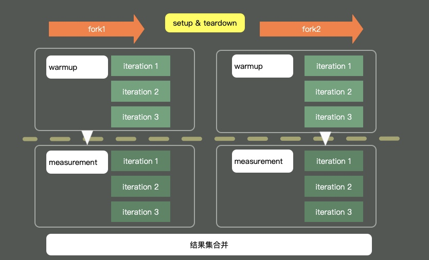
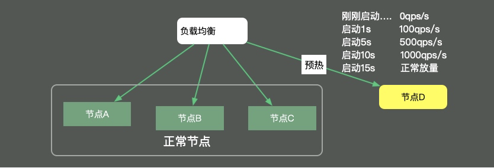
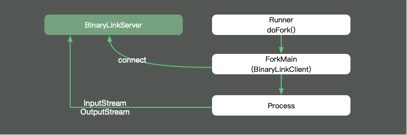
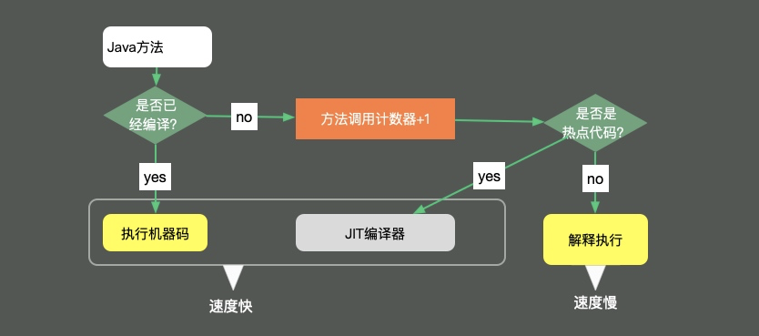
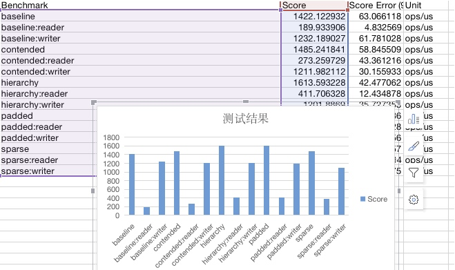

# Java 性能测试工具之 JMH

## 一、JMH 概述

JMH（Java Microbenchmark Harness），是 OpenJDK 团队开发的一款基准测试工具，一般用于代码的性能比较和调优，精度甚至可以达到纳秒级别，适用于 Java 以及其他基于 JVM 的语言。

- GitHub地址：https://github.com/openjdk/jmh

- 官方使用例子：https://github.com/openjdk/jmh/tree/master/jmh-samples/src/main/java/org/openjdk/jmh/samples

- pom 依赖导入：

  ```xml
  <dependency>
      <groupId>org.openjdk.jmh</groupId>
      <artifactId>jmh-core</artifactId>
      <version>1.36</version>
  </dependency>
  <dependency>
      <groupId>org.openjdk.jmh</groupId>
      <artifactId>jmh-generator-annprocess</artifactId>
      <version>1.36</version>
  </dependency>
  ```


## 二、配置参数

### 1、注解列表

| 注解名                  | 作用域                  | 作用                                                         |
| ----------------------- | ----------------------- | ------------------------------------------------------------ |
| AuxCounters             | TYPE                    | 辅助计数器，可以统计 @State 修饰的对象中的 public 属性被执行的情况。实验性API,将来可能删除 |
| Benchmark               | METHOD                  | 标记为基准测试方法，和 junit @Test 类似                      |
| BenchmarkMode           | TYPE,METHOD             | 指明了基准测试的模式, 模式可以任意组合，详细见下方           |
| CompilerControl         | TYPE,METHOD,CONSTRUCTOR | 编译控制选项，是否使用编译优化                               |
| Fork                    | TYPE,METHOD             | fork出 jvm 子进程进行测试，一般设置为1                       |
| Group                   | METHOD                  | 控制多线程组                                                 |
| GroupThreads            | METHOD                  | 设置参与组的线程数量                                         |
| Measurement             | TYPE,METHOD             | 设置默认测量参数                                             |
| OperationsPerInvocation | TYPE,METHOD             | 设置单个 benchmark 方法 op 个数(默认1个benchmark一个op)      |
| OutputTimeUnit          | TYPE.METHOD             | 指定输出的时间单位，可以传入 java.util.concurrent.TimeUnit 中的时间单位，最小可以到纳秒级别 |
| Param                   | FIELD                   | 允许使用一个 Benchmark 方法跑多组数据，特别适合测量方法性能和参数取值的关系 |
| Setup                   | METHOD                  | 用于基准测试前的初始化动作，可通过参数 level 确定粒度, 具体见下方 |
| State                   | TYPE                    | 声明某个类是一个“状态”，然后接受一个 Scope 参数用来表示该状态的共享范围, 当使用 @Setup 的时候，必须在类上加这个参数，不然会提示无法运行。参数设置见下方 |
| TearDown                | METHOD                  | 用于基准测试后的动作                                         |
| Threads                 | TYPE,METHOD             | 设置线程数                                                   |
| Timeout                 | TYPE,METHOD             | 设置默认超时参数，java.util.concurrent.TimeUnit              |
| Warmup                  | TYPE.METHOD             | 设置默认预热参数，详细见下方                                 |

- AuxCounters
  - Type.EVENTS： 统计发生的次数
  - Type.OPERATIONS：按指定的格式统计，如按吞吐量统计
- BenchmarkMode
  - Mode.Throughput ：吞吐量，单位时间内执行的次数，默认值
  - Mode.AverageTime：平均时间，一次执行需要的单位时间，其实是吞吐量的倒数
  - Mode.SampleTime：是基于采样的执行时间，采样频率由JMH自动控制，同时结果中也会统计出p90、p95的时间
  - Mode.SingleShotTime：单次执行时间，只执行一次，可用于冷启动的测试
- CompilerControl
  - Mode.BREAK：在生成的编译代码插入断点
  - Mode.PRINT：打印方法及配置文件
  - Mode.EXCLUDE：从编译中排除该方法
  - Mode.INLINE：强制使用内联
  - Mode.DONT_INLINE：强制跳过内联
  - Mode.COMPILE_ONLY：仅仅编译方法，其它啥都不干
- Measurement
  - iterations：测量迭代次数，不是方法执行次数
  - time：每次迭代时间
  - timeUnit：时间单位
  - batchSize：一次迭代方法需要执行次数
- Setup/TearDown
  - Level.Trial：Benchmark级别
  - Level.Iteration：执行迭代级别
  - Level.Invocation：每次方法调用级别
- State
  - Scope.Thread：作用域为线程
  - Scope.Benchmark：作用域为本次JMH测试，线程共享
  - Scope.Group：作用域为组
- WarmUp：预热是因为 JVM 的 JIT 机制的存在，如果某个函数被调用多次之后，JVM 会尝试将其编译成为机器码从而提高执行速度。为了让 benchmark 的结果更加接近真实情况就需要进行预热。
  - iterations：预热迭代次数
  - time：每次迭代时间
  - timeUnit：时间单位
  - batchSize：一次迭代方法需要执行次数


### 2、非注解配置

除了上述使用注解进行配置，还有一些参数可以通过 OptionsBuilder 这个类进行配置

- include 配置参与基准测试的类，参数是类的简单名称，不包含包名
- exclude 排除的方法名，include 会默认导入所有 @Benchmark public 方法
- addProfiler 添加分析器，能够得到更多关于 jvm 的信息。jmh 自身提供了很多分析器：如 GCProfiler, StackProfiler, ClassloaderProfiler 等等
- detectJvmArgs 从父jvm检测参数，会覆盖jvmArgs
- jvmArgs fork jvm 参数
- shouldDoGC 在mesurement 迭代之间是否GC
- verbosity 控制输出信息的级别


### 3、概念

- JMH使用OPS来表示吞吐量，OPS，Opeartion Per Second，是衡量性能的重要指标，指得是每秒操作量。数值越大，性能越好。类似的概念还有TPS，表示每秒的事务完成量，QPS，每秒的查询量。
- 如果对每次执行时间进行升序排序，取出总数的99%的最大执行时间作为 p99 的值，p99 通常是衡量系统性能重要指标，表示99%的请求的响应时间不超过某个值，类似的还有p95,p90, p999
- 测试时间，测试时间 = (测试方法数量) * (warmup迭代次数 * 时间 + measurement迭代次数 * 时间) * (@Param参数个数的乘积) * (forks)


## 三、简单示例

### 1、Throughput（吞吐量）

先用一个最简单的例子做测试, 计算 testThroughput 这个方法1s执行多少次，就是计算吞吐量

```java
import org.openjdk.jmh.annotations.*;
import org.openjdk.jmh.runner.Runner;
import org.openjdk.jmh.runner.RunnerException;
import org.openjdk.jmh.runner.options.Options;
import org.openjdk.jmh.runner.options.OptionsBuilder;

public class JmhDemo {
    @Benchmark
    public void testThroughput() throws InterruptedException {
        Thread.sleep(1000);
    }

    public static void main(String[] args) throws RunnerException {
        Options opt = new OptionsBuilder()
                .include(JmhDemo.class.getSimpleName())
                .forks(1)
                .build();
        new Runner(opt).run();
    }
}
```

```bash
Benchmark                Mode  Cnt  Score   Error  Units
JmhDemo.testThroughput  thrpt    5  0.991 ± 0.007  ops/s
```

代码中，可以看出 testThroughput 肯定会耗费1s左右的时间，结果正如所预料的一样。上述代码只是用了最基本的默认配置，更多参数配置可以通过注解和代码来控制。

- 默认的预热和迭代次数都是5，可以用@Warmup和@Measurement来自定义
- 默认输出时间单位是秒，也可以用@OutputTimeUnit 实现显示其它单位
- 默认基准测试是输出吞吐量，可以用@BenchmarkMode 设置平均时间，这两者互为倒数

```java
@Warmup(iterations = 3)
@Measurement(iterations = 6)
@OutputTimeUnit(TimeUnit.MILLISECONDS)
@BenchmarkMode(value = Mode.AverageTime)
public class JmhDemo {
    @Benchmark
    public void testThroughput() throws InterruptedException {
        Thread.sleep(1000);
    }

    public static void main(String[] args) throws RunnerException {
        Options opt = new OptionsBuilder()
                .include(JmhDemo.class.getSimpleName())
                .forks(1)
                .build();
        new Runner(opt).run();
    }
}
```

```bash
Benchmark               Mode  Cnt     Score   Error  Units
JmhDemo.testThroughput  avgt    6  1009.547 ± 3.713  ms/op
```


### 2、ArrayList vs Set

ArrayList和 Set 的查找时间复杂度分别是O ( n ) O(n)O(n)和O ( 1 ) O(1)O(1),利用 jmh 测试一下差距

使用 datafaker 准备100，1000，10000个中文姓名字符串, 再用100个随机中文姓名字符串进行查找，用这种方法进行测试

```java
@Warmup(iterations = 3)
@Measurement(iterations = 6)
@OutputTimeUnit(TimeUnit.MILLISECONDS)
@State(Scope.Benchmark)
@BenchmarkMode(value = Mode.AverageTime)
public class JmhDemo {
    
    List<String> names = new ArrayList<>();
    Set<String> namesSet = new HashSet<>();
    List<String> finds = new ArrayList<>();
    
    @Param({"100", "1000", "10000"})
    int originLen;
    
    @Setup
    public void setUp() {
        Faker faker = new Faker(Locale.CHINA);
        names = faker.collection(() -> faker.name().name()).len(originLen).generate();
        namesSet = new HashSet<>(names);
        finds =  faker.collection(() -> faker.name().name()).len(100).generate();
    }

    @Benchmark
    @OperationsPerInvocation(100)
    public boolean listFind() {
        for (String name: finds) {
            boolean b = names.contains(name);
        }
        return true;
    }

    @Benchmark
    @OperationsPerInvocation(100)
    public boolean setFind() {
        for (String name: finds) {
            boolean b = namesSet.contains(name);
        }
        return true;
    }

    public static void main(String[] args) throws RunnerException {
        Options opt = new OptionsBuilder()
                .include(JmhDemo.class.getSimpleName())
                .forks(1)
                .build();
        new Runner(opt).run();
    }
}
```

```bash
Benchmark         (originLen)  Mode  Cnt   Score    Error  Units
JmhDemo.listFind          100  avgt    6  ≈ 10⁻⁴           ms/op
JmhDemo.listFind         1000  avgt    6   0.004 ±  0.001  ms/op
JmhDemo.listFind        10000  avgt    6   0.063 ±  0.006  ms/op
JmhDemo.setFind           100  avgt    6  ≈ 10⁻⁵           ms/op
JmhDemo.setFind          1000  avgt    6  ≈ 10⁻⁵           ms/op
JmhDemo.setFind         10000  avgt    6  ≈ 10⁻⁵           ms/op
```

从结果可以看出，List 随着数据量的增大查找的速度逐渐变慢，数据量从10^2=》10^3=》10^4, 查找耗费时间10^-4=》10^-3=》10^-2，而 Set 一直保持不变，保持在10^-5。


### 3、StringBuilder vs StringBuffer

StringBuilder 和 StringBuffer 都可以用来拼接字符串。一个是线程不安全的，而另一个是线程安全的。实际用 StringBuilder 用的比较多，想知道这两者的差异，用 jmh 来比较下速度。

```java
@Warmup(iterations = 3, time = 5)
@Measurement(iterations = 6, time = 5)
@Fork(1)
@OutputTimeUnit(TimeUnit.MILLISECONDS)
@State(Scope.Benchmark)
@BenchmarkMode(value = Mode.AverageTime)
public class JmhDemo {
    List<String> names = new ArrayList<>();

    @Param({"1000", "100000", "10000000"})
    int originLen;
    
    @Setup
    public void setUp() {
        Faker faker = new Faker(Locale.CHINA);
        names = faker.collection(() -> faker.name().name()).len(originLen).generate();
    }


    @Benchmark
    public void stringBufferAppend(Blackhole bh) {
        StringBuffer sb = new StringBuffer();
        for (String name: names) {
            sb.append(name);
        }
        bh.consume(sb);
    }

    @Benchmark
    public void stringBuilderAppend(Blackhole bh) {
        StringBuilder sb = new StringBuilder();
        for (String name: names) {
            sb.append(name);
        }
        bh.consume(sb);
    }

    public static void main(String[] args) throws RunnerException {
        Options opt = new OptionsBuilder()
                .include(JmhDemo.class.getSimpleName())
                .build();
        new Runner(opt).run();
    }
}
```

```bash
Benchmark                    (originLen)  Mode  Cnt    Score   Error  Units
JmhDemo.stringBufferAppend          1000  avgt    6    0.016 ± 0.002  ms/op
JmhDemo.stringBufferAppend        100000  avgt    6    1.635 ± 0.363  ms/op
JmhDemo.stringBufferAppend      10000000  avgt    6  162.367 ± 3.866  ms/op
JmhDemo.stringBuilderAppend         1000  avgt    6    0.015 ± 0.003  ms/op
JmhDemo.stringBuilderAppend       100000  avgt    6    1.701 ± 1.013  ms/op
JmhDemo.stringBuilderAppend     10000000  avgt    6  150.966 ± 4.673  ms/op
```

从结果看，StringBuffer 和 StringBuilder 拼接字符串的效率相差不大。


### 4、Stream vs parallelStream vs for

```java
@Warmup(iterations = 3, time = 5)
@Measurement(iterations = 6, time = 5)
@Fork(1)
@OutputTimeUnit(TimeUnit.MILLISECONDS)
@State(Scope.Benchmark)
@BenchmarkMode(value = Mode.AverageTime)
public class JmhDemo {

    @Param({"100000", "1000000", "10000000", "100000000"})
    int originLen;

    @Benchmark
    public void streamGenerate(Blackhole bh) {
        int[] array = IntStream.range(0, originLen).toArray();
        bh.consume(array);
    }

    @Benchmark
    public void streamParallelGenerate(Blackhole bh) {
        int[] array = IntStream.range(0, originLen).parallel().toArray();
        bh.consume(array);
    }

    @Benchmark
    public void forGenerate(Blackhole bh) {
        int [] array = new int[originLen];
        for (int i = 0; i < originLen; i++) {
            array[i] = i;
        }
        bh.consume(array);
    }

    public static void main(String[] args) throws RunnerException {
        Options opt = new OptionsBuilder()
                .include(JmhDemo.class.getSimpleName())
                .result("E:\\list.json")
                .resultFormat(ResultFormatType.JSON)
                .build();
        new Runner(opt).run();
    }
}
```

```bash
Benchmark                       (originLen)  Mode  Cnt    Score     Error  Units
JmhDemo.forGenerate                  100000  avgt    6    0.068 ±   0.015  ms/op
JmhDemo.forGenerate                 1000000  avgt    6    0.653 ±   0.105  ms/op
JmhDemo.forGenerate                10000000  avgt    6    6.581 ±   1.462  ms/op
JmhDemo.forGenerate               100000000  avgt    6   85.288 ± 104.922  ms/op
JmhDemo.streamGenerate               100000  avgt    6    0.098 ±   0.013  ms/op
JmhDemo.streamGenerate              1000000  avgt    6    0.916 ±   0.456  ms/op
JmhDemo.streamGenerate             10000000  avgt    6   26.783 ±   3.412  ms/op
JmhDemo.streamGenerate            100000000  avgt    6  191.738 ± 173.429  ms/op
JmhDemo.streamParallelGenerate       100000  avgt    6    0.104 ±   0.004  ms/op
JmhDemo.streamParallelGenerate      1000000  avgt    6    0.622 ±   0.022  ms/op
JmhDemo.streamParallelGenerate     10000000  avgt    6   23.461 ±  11.200  ms/op
JmhDemo.streamParallelGenerate    100000000  avgt    6   65.758 ±  44.910  ms/op
```

从结果看, for的消耗时间随着数据量增大而同比增大，成正比关系。而在千万数据上，流的性能突然下降，数据在亿级别，并行流性能更好


## 四、关键注解

`JMH`是一个jar包，它和单元测试框架`JUnit`非常的像，可以通过注解进行一些基础配置。这部分配置有很多是可以通过main方法的`OptionsBuilder`进行设置的。



上图是一个典型的JMH程序执行的内容。通过开启多个进程，多个线程，首先执行预热，然后执行迭代，最后汇总所有的测试数据进行分析。在执行前后，还可以根据粒度处理一些前置和后置操作。下面，我们逐一介绍一下比较关键的注解和参数。

### 1、@Warmup

```java
@Warmup(
    iterations = 5, 
    time = 1, 
    timeUnit = TimeUnit.SECONDS
)
```

我们不止一次提到预热，warmup这个注解，可以用在类或者方法上，进行预热配置。可以看到，它有几个配置参数。

- timeUnit：时间的单位，默认的单位是秒。

- iterations：预热阶段的迭代数。

- time：每次预热的时间。

- batchSize：批处理大小，指定了每次操作调用几次方法。

上面的注解，意思是对代码预热总计5秒（迭代5次，每次一秒） 。预热过程的测试数据，是不记录测量结果的。

我们可以看一下它执行的效果：

```bash
# Warmup: 3 iterations, 1 s each
# Warmup Iteration   1: 0.281 ops/ns
# Warmup Iteration   2: 0.376 ops/ns
# Warmup Iteration   3: 0.483 ops/ns
```

一般来说，基准测试都是针对的比较小的、执行速度相对较快的代码块。这些代码有很大的可能被编译、内联，在编码的时候保持方法的精简，对JIT也是有好的。

说到预热，就不得不提一下在分布式环境下的服务预热。在对服务节点进行发布的时候，通常也会有预热过程，逐步放量到相应的服务节点，直到服务达到最优状态。如下图所示，负载均衡负责这个放量过程，一般是根据百分比进行放量。




### 2、@Measurement

```java
@Measurement(
    iterations = 5, 
    time = 1, 
    timeUnit = TimeUnit.SECONDS
)
```

`Measurement`和`Warmup`的参数是一样的。不同于预热，它指的是真正的迭代次数。我们能够从日志中看到这个执行过程：

```bash
# Measurement: 5 iterations, 1 s each
Iteration   1: 1646.000 ns/op
Iteration   2: 1243.000 ns/op
Iteration   3: 1273.000 ns/op
Iteration   4: 1395.000 ns/op
Iteration   5: 1423.000 ns/op
```

虽然经过预热之后，代码都能表现出它的最优状态，但一般和实际应用场景还是有些出入的。如果你的测试机器性能很高，或者你的测试机资源利用已经达到了极限，都会影响测试结果的数值。通常情况下，我都会在测试的时候，给机器充足的资源，保持一个稳定的环境。在分析结果的时候，也更加关注不同实现方式的性能差异，而不是测试数据本身。


### 3、@BenchmarkMode

```java
@BenchmarkMode({Mode.Throughput, Mode.AverageTime})
```

此注解用来指定基准测试类型，对应Mode选项，用来修饰类和方法都可以。这里的value，是一个数组，可以配置多个统计维度。比如：

@BenchmarkMode({Mode.Throughput, Mode.AverageTime})。统计的就是吞吐量和平均执行时间两个指标。

所谓的模式，在JMH中，可以分为以下几种：

- Throughput： 整体吞吐量，比如QPS，单位时间内的调用量等。

- AverageTime： 平均耗时，指的是每次执行的平均时间。如果这个值很小不好辨认，可以把统计的单位时间调小一点。

- SampleTime：  随机取样。

- SingleShotTime： 如果你想要测试仅仅一次的性能，比如第一次初始化花了多长时间，就可以使用这个参数，其实和传统的main方法没有什么区别。

- All：  所有的指标，都算一遍，你可以设置成这个参数看下效果。

我们拿平均时间，看一下一个大体的执行结果：

```bash
Result "com.github.xjjdog.tuning.BenchmarkTest.shift":
  2.068 ±(99.9%) 0.038 ns/op [Average]
  (min, avg, max) = (2.059, 2.068, 2.083), stdev = 0.010
  CI (99.9%): [2.030, 2.106] (assumes normal distribution)
```

由于我们声明的时间单位是纳秒，本次shift方法的平均响应时间就是2.068纳秒。我们也可以看下最终的耗时时间。

```bash
Benchmark            Mode  Cnt  Score   Error  Units
BenchmarkTest.div    avgt    5  2.072 ± 0.053  ns/op
BenchmarkTest.shift  avgt    5  2.068 ± 0.038  ns/op
```

由于是平均数，这里的Error值的是误差的意思（或者波动）。

可以看到，在衡量这些指标的时候，都有一个时间维度，它就是通过**@OutputTimeUnit**注解进行配置的。

这个就比较简单了，它指明了基准测试结果的时间类型。可用于类或者方法上。一般选择秒、毫秒、微秒，纳秒那是针对的速度非常快的方法。

举个例子，`@BenchmarkMode(Mode.Throughput)` 和 `@OutputTimeUnit(TimeUnit.MILLISECONDS)`进行组合，代表的就是每毫秒的吞吐量。

如下面的关于吞吐量的结果，就是以毫秒计算的。

```bash
Benchmark             Mode  Cnt       Score       Error   Units
BenchmarkTest.div    thrpt    5  482999.685 ±  6415.832  ops/ms
BenchmarkTest.shift  thrpt    5  480599.263 ± 20752.609  ops/ms
```

`OutputTimeUnit`注解同样可以修饰类或者方法，通过更改时间级别，可以获取更加易读的结果。


### 4、@Fork

fork的值一般设置成1，表示只使用一个进程进行测试；如果这个数字大于1，表示会启用新的进程进行测试；但如果设置成0，程序依然会运行，不过这样是在用户的JVM进程上运行的，可以看下下面的提示，但不推荐这么做。

```bash
# Fork: N/A, test runs in the host VM
# *** WARNING: Non-forked runs may silently omit JVM options, mess up profilers, disable compiler hints, etc. ***
# *** WARNING: Use non-forked runs only for debugging purposes, not for actual performance runs. ***
```

那么fork到底是在进程还是线程环境里运行呢？我们追踪一下JMH的源码，发现每个fork进程是单独运行在`Proccess`进程里的，这样就可以做完全的环境隔离，避免交叉影响。它的输入输出流，通过Socket连接的模式，发送到我们的执行终端。



在这里分享一个小技巧。其实fork注解有一个参数叫做`jvmArgsAppend`，我们可以通过它传递一些JVM的参数。

```java
@Fork(value = 3, jvmArgsAppend = {"-Xmx2048m", "-server", "-XX:+AggressiveOpts"})
```

在平常的测试中，也可以适当增加fork数，来减少测试的误差。


### 5、@Threads

fork 是面向进程的，而 Threads 是面向线程的。指定了这个注解以后，将会开启并行测试。

如果配置了 Threads.MAX ，则使用和处理机器核数相同的线程数。


### 6、@Group & @GroupThreads

@Group 注解只能加在方法上，用来把测试方法进行归类。如果你单个测试文件中方法比较多，或者需要将其归类，则可以使用这个注解。

与之关联的 @GroupThreads 注解，会在这个归类的基础上，再进行一些线程方面的设置。


### 7、@State

@State 用于声明某个类是一个“状态”，可以用 Scope 参数用来表示该状态的共享范围。这个注解必须加在类上，否则提示无法运行。

@State 指定了在类中变量的作用范围。它有三个取值。Scope 有如下3种值：

- Benchmark：表示变量的作用范围是某个基准测试类。

- Thread：每个线程一份副本，如果配置了Threads注解，则每个Thread都拥有一份变量，它们互不影响。

- Group：联系上面的@Group注解，在同一个Group里，将会共享同一个变量实例。


在 JMHSample_04_DefaultState 测试文件中，演示了变量x的默认作用范围是Thread，关键代码如下：

```java
@State(Scope.Thread)
public class JMHSample_04_DefaultState {
    double x = Math.PI;
    @Benchmark
    public void measure() {
        x++;
    }
}
```


### 8、@Setup & @TearDown

和单元测试框架JUnit类似，用于基准测试前的初始化动作， @TearDown 用于基准测试后的动作，来做一些全局的配置。

这两个注解，同样有一个Level值，标明了方法运行的时机，它有三个取值。

- **Trial**：默认的级别。也就是Benchmark级别。
- **Iteration**：每次迭代都会运行。
- **Invocation**：每次方法调用都会运行，这个是粒度最细的。


### 9、@Param

@Param 注解只能修饰字段，用来测试不同的参数，对程序性能的影响。配合@State注解，可以同时制定这些参数的执行范围。

```java
@BenchmarkMode(Mode.AverageTime)
@OutputTimeUnit(TimeUnit.NANOSECONDS)
@Warmup(iterations = 5, time = 1, timeUnit = TimeUnit.SECONDS)
@Measurement(iterations = 5, time = 1, timeUnit = TimeUnit.SECONDS)
@Fork(1)
@State(Scope.Benchmark)
public class JMHSample_27_Params {
    @Param({"1", "31", "65", "101", "103"})
    public int arg;
    @Param({"0", "1", "2", "4", "8", "16", "32"})
    public int certainty;
    @Benchmark
    public boolean bench() {
        return BigInteger.valueOf(arg).isProbablePrime(certainty);
    }
    public static void main(String[] args) throws RunnerException {
        Options opt = new OptionsBuilder()
            .include(JMHSample_27_Params.class.getSimpleName())
            // .param("arg", "41", "42") // Use this to selectively constrain/override parameters
            .build();
        new Runner(opt).run();
    }
}
```

值得注意的是，如果你设置了非常多的参数，这些参数将执行多次，通常会运行很长时间。比如参数1 M个，参数2 N个，那么总共要执行M*N次。

值得注意的是，如果你设置了非常多的参数，这些参数将执行多次，通常会运行很长时间。比如参数1 M个，参数2 N个，那么总共要执行M*N次。


### 10、@CompilerControl

这可以说是一个非常有用的功能了。

Java中方法调用的开销是比较大的，尤其是在调用量非常大的情况下。拿简单的getter/setter方法来说，这种方法在Java代码中大量存在。我们在访问的时候，就需要创建相应的栈帧，访问到需要的字段后，再弹出栈帧，恢复原程序的执行。

如果能够把这些对象的访问和操作，纳入到目标方法的调用范围之内，就少了一次方法调用，速度就能得到提升，这就是方法内联的概念。如图所示，代码经过JIT编译之后，效率会有大的提升。



这个注解可以用在类或者方法上，能够控制方法的编译行为，常用的有3种模式。

强制使用内联（INLINE），禁止使用内联（DONT_INLINE），甚至是禁止方法编译（EXCLUDE）等。


## 五、结果可视化

使用 JMH 测试的结果，可以二次加工，进行图形化展示。结合图表数据，更加直观。通过运行时，指定输出的格式文件，即可获得相应格式的性能测试结果。

比如下面这行代码，就是指定输出JSON格式的数据。

```java
public static void main(String[] args) throws RunnerException {
    Options opt = new OptionsBuilder()
            .include(JmhDemo.class.getSimpleName())
            .result("E:\\list.json")
            .resultFormat(ResultFormatType.JSON)
            .build();
    new Runner(opt).run();
}
```

JMH 支持以下 5 种格式的结果：

- **TEXT**：导出文本文件。
- **CSV**：导出csv格式文件。
- **SCSV**：导出scsv等格式的文件。
- **JSON**：导出成json文件。
- **LATEX**：导出到latex，一种基于ΤΕΧ的排版系统。

一般来说，我们导出成CSV文件，直接在Excel中操作，生成相应的图形就可以了。



另外介绍几个可以做图的工具，可以将结果可视化：

- **JMH Visualizer**：https://jmh.morethan.io/，这是一个开源的项目 ，通过导出JSON文件，上传之后，可得到简单的统计结果。个人认为它的展示方式并不是很好。
- **jmh-visual-chart**：http://deepoove.com/jmh-visual-chart/，相比较而言，这个工具就相对直观一些。
- **meta-chart**：https://www.meta-chart.com/，一个通用的在线图表生成器，导出CSV文件后，做适当处理，即可导出精美图像。
- IDEA 提供插件 JMH Java Microbenchmark Harness，能够使用快捷键 `Alt+Insert` 或 MacOS `Ctrl + N`快速生成测试方法，还可以执行单个方法，类似 junit。
- 像Jenkins等一些持续集成工具，也提供了相应的插件，用来直接显示这些测试结果。


# 参考文献 & 鸣谢

1. Java开源工具库使用之性能测试JMH：https://blog.csdn.net/qq_23091073/article/details/127087163
2. 顶级Java才懂的，基准测试JMH！：https://blog.csdn.net/lycyingO/article/details/121346880
3. 基准测试神器JMH——详解36个官方例：:https://blog.csdn.net/lkxiaolou/article/details/120778656