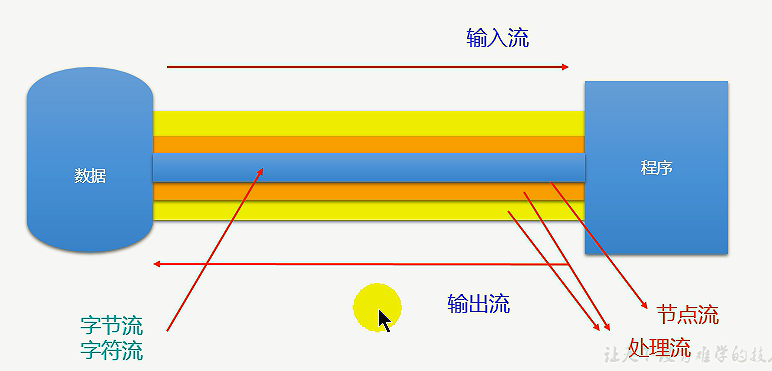
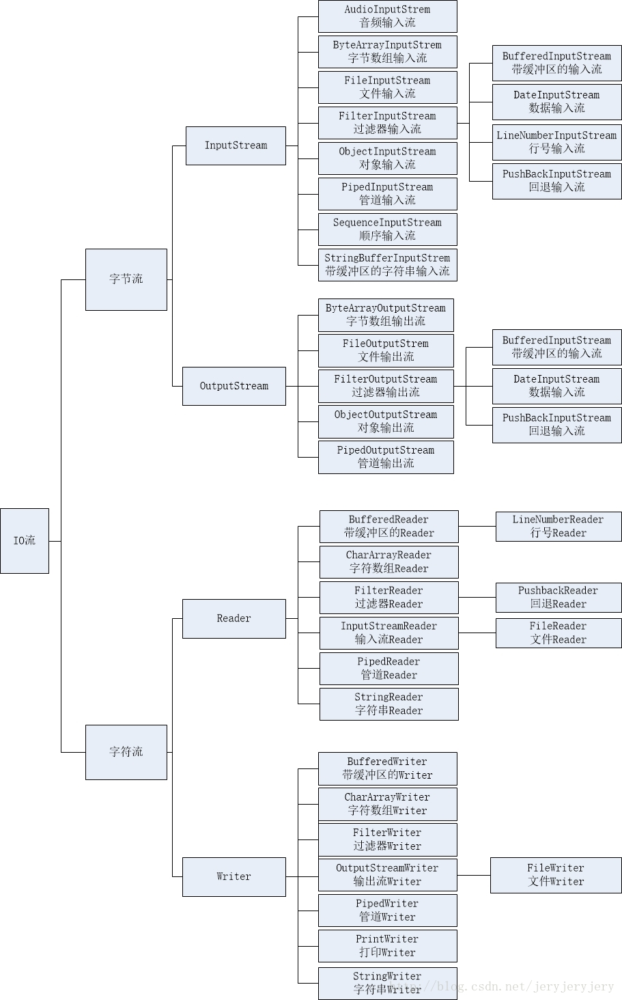
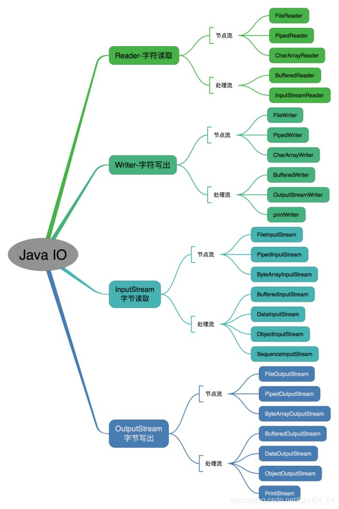
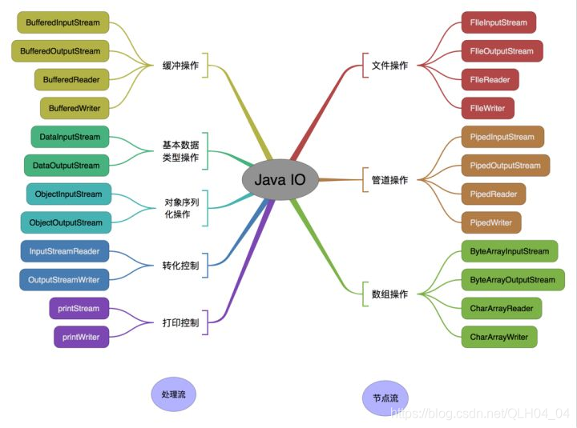
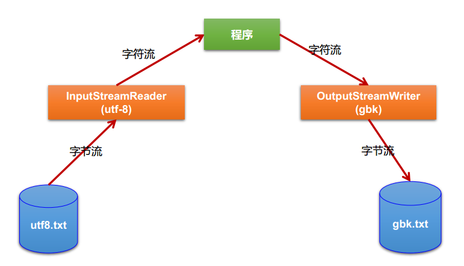
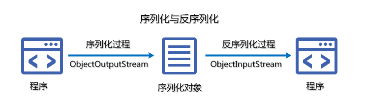
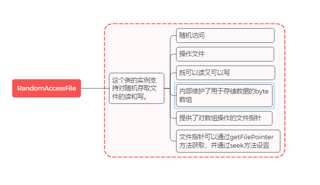

# IO 流概述及分类

Java之IO编程可以说是所有语言之最，它为了方便进行IO（Input & Output）提供有大量程序类支持，在整个`java.io`包里面核心的组成为：一个类（File）、一个接口（Serializable）、四个抽象类（InputStream、OutputStream、Reader、Writer）


## 1、流的概述

### 1、什么是 IO

Java中I/O操作主要是指使用Java进行输入与输出操作。Java所有的I/O机制都是基于数据流进行输入输出，这些数据流表示了字符或者字节数据的流动序列。Java的I/O流提供了读写数据的标准方法。任何Java中表示数据源的对象都会提供以数据流的方式读写它的数据的方法。 

I/O又分为：流I/O（java.io）、块I/O（java.nio）。java.io是大多数面向数据流的输入/输出类的主要软件包。此外，Java也对块传输提供支持，在核心库 java.nio中采用的便是块IO。流IO的好处是简单易用，缺点是效率较低。块IO效率很高，但编程比较复杂。


### 2、流的基本概念

在电脑上的数据有三种存储方式，一种是外存，一种是内存，一种是缓存。比如电脑上的硬盘，磁盘，U盘等都是外存，在电脑上有内存条，缓存是在CPU里面的。外存的存储量最大，其次是内存，最后是缓存，但是外存的数据的读取最慢，其次是内存，缓存最快。这里总结从外存读取数据到内存以及将数据从内存写到外存中。对于内存和外存的理解，我们可以简单的理解为容器，即外存是一个容器，内存又是另外一个容器。那又怎样把放在外存这个容器内的数据读取到内存这个容器以及怎么把内存这个容器里的数据存到外存中呢？

在Java类库中，I/O部分的内容是很庞大的，因为它涉及的领域很广泛：

标准输入输出，文件的操作，网络上的数据流，字符串流，对象流，zip文件流等等，**java中将输入输出抽象称为流**，就好像水管，将两个容器连接起来。将数据从外存中读取到内存中的称为输入流，将数据从内存写入外存中的称为输出流。


## 2、流的分类

`java.io`包中定义了多个流类型（类或抽象类）来实现输入/输出功能，可以从不同的角度对其进行分类：

1. 按数据流的**流向**不同分为： 输入流、输出流
2. 按操作**数据单位**不同分为： 字节流(8 bit)、字符流(16 bit) 
3. 按流的**角色/功能**不同分为： 节点流、处理流（又称：包装流）

Java中I/O流共涉及40多个类，这些类看上去很杂乱，但实际上很有规则，而且彼此之间存在非常紧密的联系， Java中IO流的40多个类都是从如下4个抽象类基类中派生出来的：

1. InputStream/OutputStream：前者所有字节输入流的基类（字节输入流），后者所有字节输出流的基类（字节输出流）
2. Reader/Writer：前者所有字符输入流的基类（字符输入流），后者所有字符输出流的基类（字符输出流）


### 1、输入流和输出流

Java中根据流的方向可以分为输入流和输出流。输入流是将文件或其它输入设备的数据加载到内存的过程；输出流恰恰相反，是将内存中的数据保存到文件或其他输出设备。

通俗理解：用一根管道一端插进文件里，一端插进程序里面，然后开始读数据，那么这是输入还是输出呢？

1. 如果站在文件的角度上，这叫输出。
2. 如果站在程序的角度上，这叫输入。

需要特别注意：Java中输入流和输出流都是站在程序的角度上来说。

1. 输出流：把程序（内存）中的内容输出到磁盘、光盘等存储设备中
2. 输入流：读取外部数据（磁盘、光盘等存储设备的数据）到程序（内存）中


### 2、字节流和字符流

根据传输数据单位分为字节流和字符流：

字节流：数据流中最小的数据单元是字节。最原始的一个流，读出来的数据就是010101这种最底层的数据表示形式，只不过它是按照字节来读的，一个字节（byte）是8位（bit）读的时候不是一个位一个位的来读，而是一个字节一个字节来读。

字符流：字符流是一个字符一个字符地往外读取数据。一个字符是2个字节（无论中文还是英文都是两个字节），Java中的字符是Unicode编码


### 3、节点流和处理流

你要是对原始的流不满意，你可以在这根管道外面再套其它的管道，套在其它管道之上的流叫处理流。为什么需要处理流呢？这就跟水流里面有杂质，你要过滤它，你可以再套一层管道过滤这些杂质一样。

1. 节点流：直接从数据源或目的地读写数据。从一个特定的数据源节点读写数据（文件，内存）
2. 处理流（包装流）：不直接连接到数据源或目的地，而是“连接”在已存在的流（节点流或处理流）之上，通过对数据的处理为程序提供更为强大的读写功能



节点流：

|     类型      |              字符流              |                   字节流                    |
| :-----------: | :------------------------------: | :-----------------------------------------: |
| File（文件）  |      FileReader、FileWriter      |      FileInputStream、FileOutputStream      |
| Memory Array  | CharArrayReader、CharArrayWriter | ByteArrayInputStream、ByteArrayOutputStream |
| Memory String |    StringReader、StringWriter    |                      -                      |
| Pipe（管道）  |     PipedReader、PipedWriter     |     PipedInputStream、PipedOutputStream     |

处理流：

|          处理类型           |                字符流                 |                  字节流                   |
| :-------------------------: | :-----------------------------------: | :---------------------------------------: |
|      Buffering 缓冲流       |    BufferedReader、BufferedWriter     | BufferedInputStream、BufferedOutputStream |
|          Filtering          |      FilterReader、FilterWriter       |   FilterInputStream，FilterOutputStream   |
|   字节和字符之间的转换流    | InputStreamReader、OutputStreamWriter |                     -                     |
| Object Serialization 对象流 |                   -                   |   ObjectInputStream、ObjectOutputStream   |
|   Data conversion 数据流    |                   -                   |     DataInputStream、DataOutputStream     |
|          Counting           |           LineNumberReader            |           LineNumberInputStream           |
|        Peeking ahead        |             PusbackReader             |            PushbackInputStream            |
|       Printing 打印流       |              PrintWriter              |                PrintStream                |


### 4、某些特殊流类型

1、转换流：转换流只有字节流转换为字符流，因为字符流使用起来更方便，我们只会向更方便使用的方向转化。如：InputStreamReader与OutputStreamWriter

2、缓冲流：有关键字Buffered，也是一种处理流，为其包装的流增加了缓存功能，提高了输入输出的效率，增加缓冲功能后需要使用flush()才能将缓冲区中内容写入到实际的物理节点。但是，在现在版本的JAVA中，只需记得关闭输出流（调用close()方法），就会自动执行输出流的flush()方法，可以保证将缓冲区中内容写入。

3、对象流：有关键字Object，主要用于将目标对象保存到磁盘中或允许在网络中直接传输对象时使用（对象序列化），具体可参看博客[Java序列化与反序列化](http://blog.csdn.net/zhangliangzi/article/details/50605640)


### 5、流分类总结【重点】

<table>
    <thead>
        <tr align="center">
            <th rowspan="2" style="text-align:center;vertical-align:middle;">流分类</th>
            <th rowspan="2" style="text-align:center;vertical-align:middle;">使用分类</th>
            <th colspan="2">字节流</th>
            <th colspan="2">字符流</th>
        </tr>
        <tr align="center">
            <th>字节输入流</th>
            <th>字节输出流</th>
            <th>字符输入流</th>
            <th>字符输出流</th>
        </tr>
    </thead>
    <tbody>
        <tr align="center">
            <td></td>
            <td>抽象基类</td>
            <td>InputStream</td>
            <td>OutputStream</td>
            <td>Reader</td>
            <td>Writer</td>
        </tr>
        <tr align="center">
            <td rowspan="4" style="text-align:center;vertical-align:middle;">节点流</td>
            <td>访问文件</td>
            <td>FileInputStream</td>
            <td>FileOutputStream</td>
            <td>FileReader</td>
            <td>FileWriter</td>
        </tr>
        <tr align="center">
            <td>访问数组</td>
            <td>ByteArrayInputStream</td>
            <td>ByteArrayOutputStream</td>
            <td>CharArrayReader</td>
            <td>CharArrayWriter</td>
        </tr>
        <tr align="center">
            <td>访问字符串</td>
            <td>-</td>
            <td>-</td>
            <td>StringReader</td>
            <td>StringWriter</td>
        </tr>
        <tr align="center">
            <td>访问管道</td>
            <td>PipedInputStream</td>
            <td>PipedOutputStream</td>
            <td>PipedReader</td>
            <td>PipedWriter</td>
        </tr>
        <tr align="center">
            <td rowspan="7" style="text-align:center;vertical-align:middle;">处理流</td>
            <td>缓冲流</td>
            <td>BufferedInputStream</td>
            <td>BufferedOutputStream</td>
            <td>BufferedReader</td>
            <td>BufferedWriter</td>
        </tr>
        <tr align="center">
            <td>转换流</td>
            <td>-</td>
            <td>-</td>
            <td>InputStreamReader</td>
            <td>OutputStreamWriter</td>
        </tr>
        <tr align="center">
            <td>对象流</td>
            <td>ObjectInputStream</td>
            <td>ObjectOutputStream</td>
            <td>-</td>
            <td>-</td>
        </tr>
        <tr align="center">
            <td>抽象基类</td>
            <td>FilterInputStream</td>
            <td>FilterOutputStream</td>
            <td>FilterReader</td>
            <td>FilterWriter</td>
        </tr>
        <tr align="center">
            <td>打印流</td>
            <td>-</td>
            <td>PrintStream</td>
            <td>-</td>
            <td>PrintWriter</td>
        </tr>
        <tr align="center">
            <td>推回输入流</td>
            <td>PushbackInputStream</td>
            <td>-</td>
            <td>PushbackReader</td>
            <td>-</td>
        </tr>
        <tr align="center">
            <td>特殊数据流</td>
            <td>DataInputStream</td>
            <td>DataOutputStream</td>
            <td>-</td>
            <td>-</td>
        </tr>
    </tbody>
</table>
***

I/O 流体系中常用的流的分类表：

|    分类    |        字节输入流        |        字节输出流         |     字符输入流      |     字符输出流      |
| :--------: | :----------------------: | :-----------------------: | :-----------------: | :-----------------: |
|  抽象基类  |      *InputStream*       |      *OutputStream*       |      *Reader*       |      *Writer*       |
|  访问文件  |   **FileInputStream**    |   **FileOutputStream**    |   **FileReader**    |   **FileWriter**    |
|  访问数组  | **ByteArrayInputStream** | **ByteArrayOutputStream** | **CharArrayReader** | **CharArrayWriter** |
|  访问管道  |   **PipedInputStream**   |   **PipedOutputStream**   |   **PipedReader**   |   **PipedWriter**   |
| 访问字符串 |            -             |             -             |  **StringReader**   |  **StringWriter**   |
|   缓冲流   |   BufferedInputStream    |   BufferedOutputStream    |   BufferedReader    |   BufferedWriter    |
|   转换流   |            -             |             -             |  InputStreamReader  | OutputStreamWriter  |
|   对象流   |    ObjectInputStream     |    ObjectOutputStream     |          -          |          -          |
|  抽象基类  |   *FilterInputStream*    |   *FilterOutputStream*    |   *FilterReader*    |   *FilterWriter*    |
|   打印流   |            -             |        PrintStream        |          -          |     PrintWriter     |
| 推回输入流 |   PushbackInputStream    |             -             |   PushbackReader    |          -          |
|   特殊流   |     DataInputStream      |     DataOutputStream      |          -          |          -          |

> 注：表中粗体字所标出的类代表节点流，必须直接与指定的物理节点关联：斜体字标出的类代表抽象基类，无法直接创建实例。


### 6、分类结构图【重点】

1、按操作方式分类结构图：





2、按操作对象分类结构图：




## 3、流的操作

### 1、流的操作流程模板

①、创建源或目标对象

1. 输入：把文件中的数据流向到程序中，此时文件是 源，程序是目标
2. 输出：把程序中的数据流向到文件中，此时文件是目标，程序是源

 ②、创建 IO 流对象

1. 输入：创建输入流对象
2. 输出：创建输出流对象

③、具体的 IO 操作

④、关闭资源

1. 输入：输入流的 close() 方法
2. 输出：输出流的 close() 方法


### 2、流的操作四点明确

①、明确要操作的数据是数据源还是数据目的（要读还是要写）

1. 源：InputStream、Reader
2. 目的：OutputStream、Writer

②、明确要操作的设备上的数据是字节还是文本

1. 源：字节：InputStream、文本：Reader
2. 目的：字节：OutputStream、文本：Writer

③、明确数据所在的具体设备

1. 源设备：
   - 硬盘：文件File开头
   - 内存：数组，字符串
   - 键盘：System.in
   - 网络：Socket
2. 目的设备：
   - 硬盘：文件File开头
   - 内存：数组，字符串
   - 屏幕：System.out
   - 网络：Socket

④、明确是否需要额外功能？

1. 需要转换——转换流 InputStreamReader、OutputStreamWriter
2. 需要高效——缓冲流BufferedXxxx
3. 多个源——序列流 SequenceInputStream
4. 对象序列化——ObjectInputStream、ObjectOutputStream
5. 保证数据的输出形式——打印流PrintStream、Printwriter
6. 操作基本数据，保证字节原样性——DataOutputStream、DataInputStream


# File 文件操作类

## 1、File 文件类

I/O流也就是输入输出流，从文件出发到文件结束，至始至终都离不开文件，所以IO流还得从文件File类讲起。

### 1、File 类概述

在java.io包里File类是唯一一个与文件本身有关的程序处理类，File只能操作文件本身不能操作文件的内容，File类只提供了描述文件和目录的操作与管理方法。它不是InputStream、OutputStream或Reader、Writer的子类，因为它不负责数据的输入输出，而专门用来管理磁盘文件与目录（与之类似还有Socket）

**File类是java.io包里唯一一个与文件本身有关的操作类，File类是Comparable接口的子类。**

1. java.io.File 类是专门对文件进行操作的类，只能对文件本身进行操作，不能对文件内容进行操作。
2. java.io.File 类是文件和目录路径名的抽象表示（相对或绝对路径都可以），主要用于文件和目录的创建、查找和删除等操作。

通俗解释：

1. 第一句就是说File跟流无关，File类不能对文件进行读和写也就是输入和输出
2. 第二句就是说File主要表示类似：D:\\文件目录1、D:\\文件目录1\\文件.txt。前者是文件夹（Directory）后者则是文件(file)，而File类就是操作这两者的类


### 2、File 属性字段

| 属性名称                             | 描述                                                     |
| :----------------------------------- | :------------------------------------------------------- |
| public static String pathSeparator   | 它是系统相关的路径分隔符，为方便起见，用字符串表示       |
| public static char pathSeparatorChar | 它是系统相关的路径分隔符                                 |
| public static String separator       | 它是与系统有关的默认名称分隔符，为方便起见，用字符串表示 |
| public static char separatorChar     | 它是系统相关的默认名称分隔符                             |

我们知道，各个平台之间的路径分隔符是不一样的。

1. 对于UNIX平台，绝对路径名的前缀始终为`"/"` 。 相对路径名没有前缀。 表示根目录的抽象路径名具有前缀`"/"`和空名称序列
2. 对于Windows平台，包含驱动器说明符的路径名的前缀由后面跟着`":"`的驱动器号组成，如果路径名是绝对的，则可能后跟`"\\"` 。 UNC路径名的前缀为`"\\\\"` ; 主机名和共享名称是名称序列中的前两个名称，没有有指定驱动器的相对路径名没有前缀

那么为了屏蔽各个平台之间的分隔符差异，我们在构造 File 类的时候，就可以使用上述 Java 为我们提供的字段。

```java
System.out.println(File.separator);     // 输出 \  
System.out.println(File.pathSeparator); // 输出 ;
```

1. File.pathSeparator：指的是分隔连续多个路径字符串的分隔符，例如：`java -cp test.jar;abc.jar HelloWorld`。就是指“;”
2. File.separator：才是用来分隔同一个路径字符串中的目录的，例如：`C:\Program Files\Common Files`。就是指“\”


### 3、File 构造方法

| 方法名称                                   | 描述                                                         |
| ------------------------------------------ | ------------------------------------------------------------ |
| public File(String pathname)               | 通过将给定的路径名字符串转换为抽象的路径名来创建一个新File实例 |
| public File(String pathname, String child) | 从父路径名字符串和子路径名字符串创建一个新File实例           |
| public File(File parent, String child)     | 从父抽象路径名和子路径名字符串创建一个新File实例             |
| public File(URI uri)                       | 通过将给定文件URI转换为抽象路径名来创建新File实例            |

如何使用上述构造方法，请看如下例子：

1. 定义文件路径时，可以用“/”或者“\\”。不过推荐使用File类提供的separator属性
2. 在创建一个文件时，如果目录下有同名文件将被覆盖

```java
// 不使用 Java 提供的分隔符字段，注意：这样写只能在 Windows 平台有效
File f1 = new File("D:\\IO\\a.txt"); // 或者 D:/IO/a.txt
// 使用 Java 提供的分隔符
File f2 = new File("D:" + File.separator + "IO" + File.separator + "a.txt");
System.out.println(f1); // 输出 D:\IO\a.txt  
System.out.println(f2); // 输出 D:\IO\a.txt

// File(File parent, String child):
File f3 = new File("D:");
File f4 = new File(f3, "IO");
System.out.println(f4); // D:\IO

// File(String pathname)
File f5 = new File("D:" + File.separator + "IO" + File.separator + "a.txt");
System.out.println(f5); // 输出 D:\IO\a.txt

// File(String parent, String child)
File f6 = new File("D:", "IO\\a.txt");
System.out.println(f6); // 输出 D:\IO\a.txt
```


### 4、File 常用方法

①、创建方法

| 方法名称                  | 描述                                           |
| ------------------------- | ---------------------------------------------- |
| boolean createNewFile()   | 创建新文件，不存在返回true，存在返回false      |
| boolean createTemplFile() | 创建临时文件，不存在返回true，存在返回false    |
| boolean mkdir()           | 创建目录，如果上一级目录不存在，则会创建失败   |
| boolean mkdirs()          | 创建多级目录，如果上一级目录不存在也会自动创建 |

②、删除方法

| 方法名称               | 描述                                                   |
| ---------------------- | ------------------------------------------------------ |
| boolean delete()       | 删除文件或目录，如果表示目录，则目录下必须为空才能删除 |
| boolean deleteOnExit() | 文件使用完成后删除。JVM退出时删除文件                  |

③、判断方法

| 方法名称              | 描述                                   |
| --------------------- | -------------------------------------- |
| boolean canExecute()  | 判断文件是否可执行                     |
| boolean canRead()     | 判断文件是否可读                       |
| boolean canWrite()    | 判断文件是否可写                       |
| boolean exists()      | 判断文件或目录是否存在                 |
| boolean isDirectory() | 判断此路径是否为一个目录               |
| boolean isFile()      | 判断是否为一个文件                     |
| boolean isHidden()    | 判断是否为隐藏文件                     |
| boolean isAbsolute()  | 判断是否是绝对路径，文件不存在也能判断 |

④、获取方法

| 方法名称                                | 描述                                                         |
| --------------------------------------- | ------------------------------------------------------------ |
| String getName()                        | 获取此路径表示的文件或目录名称（获取文件或目录名）           |
| String getPath()                        | 将此路径名转换为路径名字符串（获取相对路径）                 |
| String getAbsolutePath()                | 返回此抽象路径名的绝对形式（获取绝对路径）                   |
| String getAbsoluteFile()                | 返回此抽象路径对象的绝对形式（获取绝对路径对象）             |
| String getParent()                      | 如果没有父目录返回null                                       |
| long lastModified()                     | 获取最后一次修改的时间                                       |
| long length()                           | 返回由此抽象路径名表示的文件的长度                           |
| boolean renameTo(File f)                | 重命名由此抽象路径名表示的文件，修改失败返回false            |
| File[] liseRoots()                      | 获取机器盘符                                                 |
| String[] list()                         | 返回一个字符串数组，命名由此抽象路径名表示的目录中的文件和目录 |
| String[] list(FilenameFilter filter)    | 返回一个字符串数组，命名由此抽象路径名表示的目录中满足指定过滤器的文件和目录 |
| File[] list(FilenameFilter filter)      | 获取满足过滤器FilenameFilter条件的所有目录或文件             |
| File[] listFiles(FilenameFilter filter) | 获取满足过滤器FilenameFilter条件的所有目录或文件对象（文件类型） |

⑤、常用方法测试案例：

```java
import org.junit.Test;

import java.io.File;
import java.io.IOException;
import java.util.Date;

/*
 * java.io.File类
 * 1.凡是与输入、输出相关的类、接口等都定义在java.io包下
 * 2.File是一个类，可以有构造器创建其对象。此对象对应着一个文件（.txt .avi .doc .ppt .mp3 .jpg）或文件目录
 * 3.File类对象是与平台无关的。
 * 4.File中的方法，仅涉及到如何创建、删除、重命名等等。只要涉及文件内容的，File是无能为力的，必须由io流来完成。
 * 5.File类的对象常作为io流的具体类的构造器的形参。
 */
public class TestFile {
    /**
     * 路径：
     * 绝对路径：包括盘符在内的完整的文件路径
     * 相对路径：在当前文件目录下的文件的路径
     *  getName()
     *  getPath()
     *  getAbsoluteFile()
     *  getAbsolutePath()
     *  getParent()
     *  renameTo(File newName)
     */
    @Test
    public void test1() {
        File file1 = new File("C:/config.txt");
        File file2 = new File("C:\\co.txt");
        System.out.println(file1.getName()); // config.txt
        System.out.println(file1.getAbsoluteFile()); // C:\config.txt
        System.out.println(file1.getAbsolutePath()); // C:\config.txt
        System.out.println(file1.getPath()); // C:\config.txt
        System.out.println(file1.getParent()); // C:\
        System.out.println();
        System.out.println(file2.getName()); // co.txt
        System.out.println(file2.getAbsoluteFile()); // C:\co.txt
        System.out.println(file2.getAbsolutePath()); // C:\co.txt
        System.out.println(file2.getPath()); // C:\co.txt
        System.out.println(file2.getParent()); // C:\
        boolean b = file1.renameTo(file2); // 要提供完整路径
        System.out.println(b); // false
    }

    /**
     * 文件检测
     * exists()
     * canWrite()
     * canRead()
     * isFile()
     * isDirectory()
     */
    @Test
    public void test2() {
        // 通过改行代码确定当前路径的相对位置。
        System.out.println(System.getProperty("user.dir")); // C:\1.work\Code\study-test\JAVA-IO
        // 注意File的相对路径是相对于当前的user.dir来说的
        File file = new File("src/IO/config.txt");
        File dir = new File("src/IO/test");
        System.out.println(file.exists()); // false
        System.out.println(file.canExecute()); // false
        System.out.println(file.canRead()); // false
        System.out.println(file.canWrite()); // false
        System.out.println(file.isDirectory()); // false
        System.out.println(new Date(file.lastModified())); // Thu Jan 01 08:00:00 CST 1970
        System.out.println(file.length()); // 0
        System.out.println();
        System.out.println(dir.exists()); // false
        System.out.println(dir.canExecute()); // false
        System.out.println(dir.canRead()); // false
        System.out.println(dir.canWrite()); // false
        System.out.println(dir.isDirectory()); // false
        System.out.println(new Date(dir.lastModified())); // Thu Jan 01 08:00:00 CST 1970
        System.out.println(dir.length()); // 0
    }

    /**
     *  createNewFile()
     *  delete()
     *  mkDir():创建一个文件目录。只有在上层文件目录存在的情况下，才能返回true
     *  mkDirs():创建一个文件目录。若上层文件目录不存在，一并创建
     *  list()
     *  listFiles()
     */
    @Test
    public void test3() throws IOException {
        File file1 = new File("src/a.txt");
        // 创建新的文件
        System.out.println(file1.createNewFile()); // true
        File file2 = new File("src/a");
        file2.mkdir();// 创建相对目录，如果成功返回true否则返回false,注意要保证上级目录存在
        File file3 = new File("C:/data/TTT/TTT");
        file3.mkdirs();// 创建目录，如果上级目录不存在则一并创建。
        File file4 = new File("src");
        File[] files = file4.listFiles(); // 返回目录下的文件列表
        for (int i = 0; i < files.length; i++) {
            System.out.println(files[i]);
        }
        /**
         * 输出内容:
         * src\a
         * src\a.txt
         * src\main
         * src\test
         */
    }
    
    /**
     * 创建临时文件 : File createTempFile();
     * <p>
     * 构造方法:
     * 1. public static File createTempFile(String prefix, String suffix)
     * 2. public static File createTempFile(String prefix, String suffix, File directory)
     * <p>
     * 参数：
     * 该函数是一个重载函数，因此一个函数带有后缀，前缀和File对象，
     * 而另一个函数仅带有后缀和前缀。前缀不得少于三个字符，但后缀可以为null且如果未指定目录，则为传递一个空值，然后该函数使用默认目录。
     * <p>
     * 返回类型：
     * 该函数返回表示新创建的临时文件的抽象文件名
     * <p>
     * 异常：该方法抛出：
     * - IllegalArgumentException：如果prefix参数包含少于三个字符
     * - IOException：是否有IO错误(无法创建文件)
     * - SecurityException：如果该方法不允许创建文件
     * <p>
     * <p>
     * 方法默认的保存路径为：
     * - Windows: C:\Windows\Temp\ or %UserProfile%\AppData\Local\Temp\
     * - UNIX: /tmp or /var/tmp
     * <p>
     * 参考:
     * https://vimsky.com/examples/usage/file-createtempfile-method-in-java-with-examples.html
     */
    @Test
    public void test4() throws IOException {

        // 创建给定前缀,未指定后缀的临时文件,当后缀为null时,默认是.tmp
        File tempFile1 = File.createTempFile("temp_", null);
        System.out.println("Temp File created: " + tempFile1.getAbsolutePath());

        // 创建指定前缀,指定后缀的临时文件
        File tempFile2 = File.createTempFile("temp_", ".svp");
        System.out.println("Temp File created: " + tempFile2.getAbsolutePath());

        // 创建指定前缀,指定后缀,并且还指定临时目录,临时文件
        File tempFile3 = File.createTempFile("temp_", ".svp", new File("D:\\"));
        System.out.println("Temp File created: " + tempFile3.getAbsolutePath());

        // 查看临时目录默认路径
        System.out.println(GetPropertyAction.privilegedGetProperty("java.io.tmpdir"));

        /**
         * 输出内容:
         * Temp File created: C:\Users\lsx\AppData\Local\Temp\temp_18201444457414034778.tmp
         * Temp File created: C:\Users\lsx\AppData\Local\Temp\temp_17442542096350837163.svp
         * Temp File created: D:\temp_3854320374250718388.svp
         * C:\Users\lsx\AppData\Local\Temp\
         */
    }
}
```


### 5、File 实战案例

操作示例 1：目录文件遍历，列出指定目录中的全部文件

```java
import java.io.File;
public class JavaAPIDemo {
    public static void main(String[] args) throws Exception {
        // 这是一个目录
        File file = new File("D:" + File.separator);
        listDir(file);
    }
    public static void listDir(File file) {
        // 判断这是不是一个目录
        if (file.isDirectory()) {
            // 列出目录中的全部内容
            File results [] = file.listFiles() ;
            if (results != null) {
                for (int x = 0 ; x < results.length ; x ++) {
                    // 继续依次判断
                    listDir(results[x]);
                }
            }
        }
        // 获得完整路径
        System.out.println(file);
    }
}
```

操作示例 2：文件批量更名，批量修改文件名称

```java
import java.io.File;
public class JavaAPIDemo {
    public static void main(String[] args) throws Exception {
        // 这是一个目录
        File file = new File("D:" + File.separator + "test");
        long start = System.currentTimeMillis();
        renameDir(file) ;
        long end = System.currentTimeMillis() ;
        System.out.println("本次操作所花费的时间：" + (end - start));
    }
    
    public static void renameDir(File file) {
        // 这是一个目录
        if (file.isDirectory()) {
            // 列出子目录中的内容
            File results [] = file.listFiles();
            if (results != null) {
                for (int x = 0 ; x < results.length ; x ++) {
                    renameDir(results[x]) ;
                }
            }
        } else {
            // 如果是文件则必须进行重命名
            if (file.isFile()) {
                String fileName = null; 
                if (file.getName().contains(".")) {
                    fileName = file.getName().substring(0, file.getName().lastIndexOf(".")) + ".txt";
                } else {
                    fileName = file.getName() + ".txt";
                }
                // 新的文件名称
                File newFile = new File(file.getParentFile(),fileName);
                // 重命名
                file.renameTo(newFile);
            }
        }
    }
}
```


## 2、FileDescriptor 文件描述符类

### 1、FileDescriptor 介绍

**FileDescriptor 是文件描述符，用来表示开放文件、开放套接字等。**当 FileDescriptor 表示文件时，我们可以通俗的将 FileDescriptor 看成是该文件，但是不能直接通过 FileDescriptor 对该文件进行操作，若要通过 FileDescriptor 对该文件进行操作，则需要新创建 FileDescriptor 对应的 FileOutputStream 或 FileInputStream，然后再对文件进行操作。


### 2、FileDescriptor 属性

| 修饰符&返回值&属性名      | 描述             |
| :------------------------ | :--------------- |
| static FileDescriptor err | 标准错误流的句柄 |
| static FileDescriptor in  | 标准输入流的句柄 |
| static FileDescriptor out | 标准输出流的句柄 |


### 3、FileDescriptor 方法

| 构造方法         | 描述                        |
| :--------------- | :-------------------------- |
| FileDescriptor() | 构造一个FileDescriptor 对象 |

| 成员方法        | 描述                             |
| :-------------- | :------------------------------- |
| void sync()     | 强制所有系统缓冲区与基础设备同步 |
| boolean valid() | 判断FileDescriptor对象是否有效   |


### 4、操作实例

操作示例 1：

```java
import java.io.*;

public class FileDescriptorTest {
    public static void main(String[] args) throws Exception {
        FileInputStream in = new FileInputStream(FileDescriptor.in);
        // 标准输入
        int a = in.read();
        FileOutputStream out = new FileOutputStream(FileDescriptor.out);
        // 标准输出
        out.write(a);
        FileOutputStream err = new FileOutputStream(FileDescriptor.err);
        // 标准错误输出
        err.write(a);
        in.close();
        out.close();
        err.close();
    }
}

// 输出内容
H
HH
```

操作示例 2：

```java
import java.io.*;

public class FileDescriptorTest {
    public static void main(String[] args) {
        FileDescriptor fd;
        byte[] b = {48, 49, 50, 51, 52, 53, 54, 55, 56, 57, 58};
        try {
            FileOutputStream fos = new FileOutputStream("D:\\record.txt");
            FileInputStream fis = new FileInputStream("D:\\record.txt");
            fd = fos.getFD();
            fos.write(b);
            fos.flush();
            // confirms data to be written to the disk
            fd.sync();
            int value;
            // for every available bytes
            while ((value = fis.read()) != -1) {
                // converts bytes to char
                char c = (char) value;
                System.out.print(c);
            }
            System.out.println("\nSync() successfully executed!!");
        } catch (Exception e) {
            e.printStackTrace();
        }
    }
}
```


# IO 流四大抽象类

I/O流四大家族的首领：

1. java.io.InputStream：字节输入流

2. java.io.OutputStream：字节输出流
3. java.io.Reader：字符输入流
4. java.io.Writer：字符输出流

需要注意：

1. 四大家族的首领都是抽象类（abstract class）
2. 所有的流都实现了：java.io.Closeable接口，都是可关闭的，都有close()方法
3. 有的输出流都实现了：java.io.Flushable接口，是可刷新的，有flush()方法。刷新一下。这个刷新表示将通道/管道当中剩余未输出的数据。作用就是清空管道。没有flush()可能会导致丢失数据


## 1、字节输入流：InputStream

InputStream抽象类主要实现的就是字节数据读取，是表示字节输入流的所有类的超类（父类），该类定义如下：

```java
public abstract class InputStream extends Object implements Closeable {}
```

InputStream类实现了Closeable父接口，所以在数据输入完毕后需要进行流的关闭。

```java
// JDK1.5 提供
public interface Closeable extends AutoCloseable {
    public void close() throws IOException;
}
```

InputStream 常用方法如下：

| 方法名称                                                     | 描述                                             |
| ------------------------------------------------------------ | ------------------------------------------------ |
| public abstract int read() throws IOException                | 读取单个字节数据，如果读完返回-1                 |
| public int read(byte[] b) throws IOException                 | 读取一组字节数据，返回是读的个数，如果读完返回-1 |
| public int read(byte[] b, int off, int len) throws IOException | 读取一组字节数据（只占数字的部分）               |
| public void close() throws IOException                       | 关闭输出流                                       |
| **JDK1.9新增的方法**                                         |                                                  |
| public byte[] readAllBytes() throws IOException              | 读取输入流全部字节数据，JDK1.9新增               |
| public long transferTo(OutputStream out) throws IOException  | 输入流转存到输出流，JDK1.9新增                   |

继承关系如下：

InputStream

- 【节点流】FileInputStream
- 【节点流】PipedInputStream
- 【节点流】ByteArrayInputStream
- 【节点流】StringBufferInputStream
- 【处理流】FilterInputStream
  - LineNumberInputStream
  - DataInputStream
  - BufferedInputStream
  - PushbackInputStream
- 【处理流】SequenceInputStream
- 【处理流】ObjectInputStream


## 2、字节输出流：OutputStream

字节的数据是以byte类型为主实现的，在进行字节内容输出的时候可以使用OutputStream类完成，这个类的基本定义：

```java
public abstract class Outputstream extends Object implements Closeable, Flushable {}
```

在Outputstream类中实现了两个父接口：Closeable、Flushable，这两个接口的定义组成分别如下：

```java
// JDK1.5 提供
public interface Closeable extends AutoCloseable {
    public void close() throws IOException;
}
// JDK1.5 提供
public interface Flushable {
    public void flush() throws IOException;
}
```

这两个父接口是从JDK1.5后提供的，而在JDK1.5前，close()、flush()两个方法都是直接定义在Outputstream类中的。

OutputStream 类定义的是一个公共的输出操作标准，而这个操作标准里面定义了三个内容输出和两个父接口的方法：

| 方法名                                | 描述             |
| ------------------------------------- | ---------------- |
| abstract void write(int b)            | 输出单个字节数据 |
| void write(byte[] b)                  | 输出一组字节数据 |
| void write(byte[] b,int off, int len) | 输出部分字节数据 |
| void close()                          | 关闭输出流       |
| void flush()                          | 刷新缓冲区       |

继承关系

OutputStream

- 【节点流】FileOutputStream
- 【节点流】PipedOutputStream
- 【节点流】ByteArrayOutputStream
- 【处理流】FilterOutputStream
  - DataOutputStream
  - BufferedOutputStream
  - PrintStream
- 【处理流】ObjectOutputStream


## 3、字符输入流：Reader

Reader是实现字符输入流的一种类型，可以实现char数据类型的读取

```java
public abstract class Reader implements Readable, Closeable {}
```

Reader类实现了Readable接口和Closeable接口，其中Readable接口时在JDK1.5提供的，可以实现缓冲区的数据读取，接口定义如下：

```java
public interface Readable {
    public int read(java.nio.CharBuffer cb) throws IOException;
}
```

Reader类定义了字符数据的读取方法，常用方法如下：

| 方法名称                                | 描述                              |
| --------------------------------------- | --------------------------------- |
| int read()                              | 读取单个字符，读完则返回-1        |
| int read(char[] chuf)                   | 读取一组字符，读完则返回-1        |
| int read(char[] chuf, int off, int len) | 读取一组字节数据（只占len的部分） |
| long skip(long n)                       | 跳过指定的字符个数后读取          |
| boolean ready()                         | 是否可以开始读取数据              |
| abstract void close()                   | 关闭输入流                        |

继承关系

Reader

- 【节点流】CharArrayReader
- 【节点流】PipedReader
- 【节点流】StringReader
- 【处理流】BufferedReader
  - LineNumberReader
- 【处理流】InputStreamReader
  - 【节点流】FileReader
- 【处理流】FilterReader
  - PushbackReader


## 4、字符输出流：Writer

使用OutputStream进行字节数据输出，这类数据适合用网络传输，但是在操作时需要进行字节数组的转换。在底层通信处理中都是依靠字节实现数据交互，在程序中为了方便进行中文的数据处理，往往都会采用字符数据类型，所以在JDK1.1的时候又推出了字符串输出流Writer：

```java
public abstract class Writer extend Object implement Appendable, Closeable, Flushable {}
```

可以发现比OutputStream类多实现了一个Appendable接口（此接口从JDK1.5后开始提供），利用此接口可以实现输出内容的追加，此接口定义如下：

```java
public interface Appendable {
    Appendable append(CharSequence csq) throws IOException;
    Appendable append(CharSequence csq, int start, int end) throws IOException;
    Appendable append(char c) throws IOException;
}
```

字符流最大的特点就是可以直接进行字符串的输出，Writer类中提供常用方法如下：

| 方法名                                             | 描述               |
| -------------------------------------------------- | ------------------ |
| Writer append(CharSepquence csq)                   | 追加输出内容       |
| void write(int c)                                  | 输出单个字符       |
| void write(char[] chuf)                            | 输出字符串数组     |
| abstract void write(char[] cbuf, int off, int len) | 输出指定字符串数组 |
| void write(String str)                             | 输出字符串         |
| void write(String str, int off, int len)           | 输出指定长度字符串 |
| abstract  void close()                             | 关闭输出流         |
| abstract  void flush()                             | 刷新缓冲区         |

Writer 继承关系

- 【节点流】CharArrayWriter
- 【节点流】PipedWriter
- 【节点流】StringWriter
- 【处理流】BufferedWriter
- 【处理流】OutputStreamWriter
  - 【节点流】FileWriter
- 【处理流】FilterWriter

# 【节点流】文件流【掌握】

## 1、字节文件流

### 1、字节文件流介绍

字节流 InputStream 和 OutputStream 是字节输入流和字节输出流的超类（父类）。FileInputStream 和 FileOutputStream 是字节流用于操作文件的子类。它用于读取面向字节的数据（原始字节流），例如图像数据，音频，视频等。您还可以读取字符流数据。但是，为了读取字符流，建议使用FileReader类。


### 2、字节文件输入流：FileInputStream

FileInputStream 类从文件获取输入字节。虽然也开源读取字符，但是如果读取字符，建议使用FileReader类。

```java
public class FileInputStream extends InputStream
```

FileInputStream 的构造方法和成员方法如下：

| 构造方法                              | 描述                                                         |
| ------------------------------------- | ------------------------------------------------------------ |
| FileInputStream(File file)            | 根据File对象为参数创建对象【如无该文件会抛出FileNotFoundException，下同】 |
| FileInputStream(String name)          | 根据名称字符串为参数创建对象                                 |
| FileInputStream(FileDescriptor fdObj) | 根据FileDescriptor为参数创建对象，参数是文件描述符，可以被用来表示开放文件等 |

| 成员方法                             | 描述                                                     |
| :----------------------------------- | :------------------------------------------------------- |
| int read()                           | 用于从输入流中读取数据字节                               |
| int read(byte[\] b)                  | 用于从输入流中读取最多b.length个数据字节                 |
| int read(byte[] b, int off, int len) | 用于从输入流中读取最多len字节的数据                      |
| void close()                         | 用于关闭流                                               |
| int available()                      | 用于返回可以从输入流读取的估计字节数                     |
| long skip(long x)                    | 用于跳过并丢弃输入流中的x字节数据                        |
| FileChannel getChannel()             | 用于返回与文件输入流关联的唯一FileChannel对象            |
| FileDescriptor getFD()               | 用于返回FileDescriptor对象                               |
| protected void finalize()            | 用于确保在没有更多对文件输入流的引用时调用close方法      |
| void mark(int readlimit)()           | 此方法标记此输入流中的当前位置                           |
| boolean markSupported()              | 此方法测试此输入流是否支持mark和reset方法                |
| void reset()                         | 该方法将该流重新定位到在此输入流上最后调用mark方法的位置 |


### 3、字节文件输入流实例

操作示例 1：读取字节：read()方法，每次可以读取一个字节的数据，读取到文件末尾则返回-1

```java
import java.io.FileInputStream;
import java.io.IOException;

public class FileInputStreamTest {
    public static void main(String[] args) throws IOException {
        // 【test.txt文件中内容为：abcde】
        FileInputStream fis = new FileInputStream("D:\\test.txt");
        // 读取数据，返回一个字节
        int read = fis.read();
        System.out.println((char) read);
        read = fis.read();
        System.out.println((char) read);
        read = fis.read();
        System.out.println((char) read);
        read = fis.read();
        System.out.println((char) read);
        read = fis.read();
        System.out.println((char) read);
        // 读取到末尾,返回-1
        read = fis.read();
        System.out.println( read);
        // 关闭资源
        fis.close();
    }
}

// 输出结果
a
b
c
d
e
-1
```

使用循环方式读取单个字节，代码使用演示：

```java
import java.io.FileInputStream;
import java.io.IOException;
import java.io.InputStream;

public class FileInputStreamTest {
    public static void main(String[] args) throws IOException {
        // 使用文件名称创建流对象，并且自动关闭流
        try (InputStream input = new FileInputStream("D:\\test.txt");) {
            // 定义变量，保存数据
            int len;
            // 循环读取
            while ((len = input.read()) != -1) {
                System.out.println((char) len + "、" + len);
            }
        }
    }
}

// 输出结果
a、97
b、98
c、99
d、100
e、101
```

操作示例 2：使用字节数组读取：read(byte[] b)，每次读取b的长度个字节到数组中，返回读取到的有效字节个数，读取到末尾时返回-1（每次读取2个字节的数据）：

```java
import java.io.FileInputStream;
import java.io.IOException;
import java.io.InputStream;

public class FileInputStreamTest {
    public static void main(String[] args) throws IOException {
        // 使用文件名称创建流对象，并且自动关闭流.【test.txt文件中内容为abcde】
        try (InputStream input = new FileInputStream("D:\\test.txt")) {
            // 定义变量，保存数据
            int len;
            byte[] data = new byte[2];
            // 循环读取
            while (( len= input.read(data))!=-1) {
                // 每次读取后,把数组变成字符串打印
                System.out.println(new String(data));
            }
        }
    }
}

// 输出结果
ab
cd
ed
```

由于read.txt文件中内容为abcde，而错误数据d，是由于最后一次读取时，只读取一个字节e，数组中，上次读取的数据没有被完全**替换**【注意是替换，看下图】，所以要通过len ，获取有效的字节

```
第一次读：    a      b                = ab
第二次读：    a->c   b->d             = cd
第三次读：    c->e   d->no replace    = ed

共5个数据，一次读取2个，第三次只能被替换一个，最后没有被替换的也一起读取了
```

操作示例 3：读取指定长度字节数组：read(byte[] b, int off, int len)，每次从off索引开始，len个字节，此方法能解决示例 2中的读错数据问题（在开发中一般强烈推荐使用数组读取文件）

```java
import java.io.FileInputStream;
import java.io.IOException;
import java.io.InputStream;

public class FileInputStreamTest {
    public static void main(String[] args) throws IOException {
        // 使用文件名称创建流对象，并且自动关闭流.【test.txt文件中内容为abcde】
        try (InputStream input = new FileInputStream("D:\\test.txt")) {
            // 定义变量，保存数据
            int len;
            byte[] data = new byte[2]; // 一般情况下byte数组会使用1024来接收
            // 循环读取
            while (( len= input.read(data))!=-1) {
                // 每次读取后,把数组变成字符串打印, len 每次读取的有效字节个数
                System.out.println(new String(data, 0, len));
            }
        }
    }
}

// 输出结果
ab
cd
e
```

---

> 在使用FileInputStream读取文件内的中文字符时可能会出现乱码的情况，下面我们来模拟和解决这类问题
>

操作示例 4：一次性读取中文数据，下面2案例分别定义1024个字节数组与26个字节数组来接收保存的数据

1. 使用1024个字节数组保存数据

   ```java
   import java.io.FileInputStream;
   import java.io.IOException;
   import java.io.InputStream;
   
   public class FileInputStreamTest {
       public static void main(String[] args) throws IOException {
           // 【test.txt文件中内容为：你好啊今天出去玩吗】
           try (InputStream input = new FileInputStream("D:\\test.txt")) {
               // 开辟一个缓冲区读取数据
               byte[] data = new byte [1024] ;
               // 读取数据，数据全部保存在字节数组之中，返回读取个数
               int len = input.read(data) ;
               System.out.println(new String(data, 0, len));
           }
       }
   }
   
   // 输出内容
   你好啊今天出去玩吗
   ```

2. 使用26个字节数组保存数据

   ```java
   import java.io.FileInputStream;
   import java.io.IOException;
   import java.io.InputStream;
   
   public class FileInputStreamTest {
       public static void main(String[] args) throws IOException {
           // 【test.txt文件中内容为：你好啊今天出去玩吗】
           try (InputStream input = new FileInputStream("D:\\test.txt")) {
               // 开辟一个缓冲区读取数据
               byte[] data = new byte [26] ;
               // 读取数据，数据全部保存在字节数组之中，返回读取个数
               int len = input.read(data) ;
               System.out.println(new String(data, 0, len));
           }
       }
   }
   
   // 输出内容
   你好啊今天出去玩�
   ```

3. 结论：可以发现定义为1024个字节数组的代码读取的中文输出正常，而定义为26个字节数组的代码读取数据就会出现乱码，这是因为不同编码格式下，一个中文汉字的字节数是不一样的，以UTF-8格式为例，其占字节数为3。而本人IDEA中设置的编码为UTF-8

操作示例 5：循环读取文件内的中文数据，每次固定读取3字节数组（如果设置为1024，并且读取UTF-8的中文，当中文过长可是会出现一些乱码状况）

```java
import java.io.FileInputStream;
import java.io.IOException;
import java.io.InputStream;

public class FileInputStreamDemo {
    public static void main(String[] args) throws IOException {
        // 【test.txt文件中内容为：你好啊今天出去玩吗】
        try (InputStream input = new FileInputStream("D:\\test.txt")) {
            // 开辟一个缓冲区读取数据
            byte[] data = new byte [3] ;
            // 读取数据，数据全部保存在字节数组之中，返回读取个数
            int len ;
            while ((len = input.read(data)) != -1) {
                System.out.println(new String(data, 0, len));
            }
        }
    }
}

// 输出结果
你
好
啊
今
天
出
去
玩
吗
```

操作示例 6：JDK 1.9开始InputStream类里面增加了一个新的方法，一次性读取全部数据：`public byte[] readAllBytes();`

```java
import java.io.FileInputStream;
import java.io.IOException;
import java.io.InputStream;

public class FileInputStreamDemo {
    public static void main(String[] args) throws IOException {
        // 【test.txt文件中内容为：你好啊今天出去玩吗】
        try (InputStream input = new FileInputStream("D:\\test.txt")) {
            // 读取全部数据
            byte[] data = input.readAllBytes() ;
            System.out.println(new String(data));
        }
    }
}

// 输出结果
你好啊今天出去玩吗
```


### 4、字节文件输出流：FileOutputStream

FileOutputStream 用于将数据写入文件的输出流。如果必须将原始类型数据写入文件，请使用FileOutputStream类。您可以通过FileOutputStream类编写面向字节和面向字符的数据。但是，对于面向字符的数据，首选使用FileWriter而不是FileOutputStream

```java
public class FileOutputStream extends OutputStream
```

FileOutputStream 的构造方法与成员方法如下：

| 构造方法                                      | 描述                                                         |
| --------------------------------------------- | ------------------------------------------------------------ |
| FileOutputStream(File file)                   | 根据File参数创建字节输出流对象【覆盖】                       |
| FileOutputStream(File file, boolean append)   | 根据File参数创建字节输出流对象【追加】                       |
| FileOutputStream(String name)                 | 根据名称字符串为参数创建对象【覆盖】                         |
| FileOutputStream(String name, boolean append) | 根据名称字符串为参数创建对象【追加】                         |
| FileOutputStream(FileDescriptor fdObj)        | 根据FileDescriptor创建输出流，参数是文件描述符，可以被用来表示开放文件等 |

| 成员方法                                 | 描述                                                     |
| :--------------------------------------- | :------------------------------------------------------- |
| void write(int b)                        | 用于将指定的字节写入文件输出流                           |
| void write(byte[] ary)                   | 从指定的字节数组写入ary.length个字节到该文件输出流       |
| void write(byte[] ary, int off, int len) | 方法从指定的字节数组开始到该文件输出流关闭写入len字节    |
| void close()                             | 用于关闭文件输出流                                       |
| void flush()                             | 用于刷新此输出流，并强制将所有缓冲的输出字节写出到该流中 |
| FileChannel getChannel()                 | 用于返回与文件输出流关联的文件通道对象                   |
| FileDescriptor getFD()                   | 用于返回与流关联的文件描述符                             |
| protected void finalize()                | 用于清理与文件输出流的连接                               |

推荐使用字符串为参数的构造方法【开发常用】，创建字节输出流对象都做了三件事情：

1. 调用系统功能去创建文件【输出流对象才会自动创建】
2. 创建OutputStream对象
3. 把fileOutputStream对象指向这个文件

注意：创建输出流对象的时候，系统会自动去对应位置创建对应文件（父文件夹不会自动创建），而创建输入流对象的时候，文件或文件夹不存在则会报系统找不到指定的文件异常异常，也就是FileNotFoundException。

当你创建一个流对象时，必须直接或者间接传入一个文件路径。比如现在我们创建一个FileOutputStream流对象，在该路径下，如果没有这个文件，会创建该文件。如果有这个文件，会清空这个文件的数据。

```java
public class FileOutputStreamConstructor throws IOException {
    public static void main(String[] args) {
        // 使用File对象创建流对象
        File file = new File("D:\\自动创建的文件夹\\a.txt");
        FileOutputStream fos = new FileOutputStream(file);

        // 使用文件名称创建流对象
        FileOutputStream fos = new FileOutputStream("D:\\b.txt");
    }
}
```


### 5、字节文件输出流实例

操作示例 1：输出字节：write(int b) 方法，每次可以写出一个字节数据，代码如下：

```java
import java.io.FileOutputStream;

public class FileOutputStreamTest {
    public static void main(String[] args) throws Exception {
        // 使用文件名称创建流对象
        FileOutputStream fos = new FileOutputStream("D:\\test.txt");
        // 写出数据
        fos.write(97); // 写出第1个字节
        fos.write(98); // 写出第2个字节
        fos.write(99); // 写出第3个字节
        // 关闭资源
        fos.close();
    }
}

// 输出结果：abc
```

> 虽然参数为int类型四个字节，但是只会保留一个字节的信息写出。
>

操作示例 2：输出全部字节数组：write(byte[] b)，每次可以写出数组中的数据，代码使用演示：

```java
import java.io.File;
import java.io.FileOutputStream;
import java.io.OutputStream;

public class FileOutputStreamTest {
    public static void main(String[] args) throws Exception {
        // 1、指定要操作的文件的路径
        File file = new File("D:" + File.separator + "test.txt");
        // 2、判断父目录是否存在，如果不存在就创建父目录
        if (!file.getParentFile().exists()) {
            file.getParentFile().mkdirs();
        }
        // 3、通过子类实例化
        OutputStream output = new FileOutputStream(file);
        // 4、将要输出的字符串变为字节数组并输出
        output.write("hello".getBytes());
        // 5、关闭资源
        output.close();
    }
}

// 输出内容：hello
```

操作示例 3：写出指定长度字节数组：write(byte[] b, int off, int len)，每次写出从off索引开始，len个字节，代码如下：

```java
import java.io.FileOutputStream;

public class FileOutputStreamTest {
    public static void main(String[] args) throws Exception {
        // 使用文件名称创建流对象
        FileOutputStream fos = new FileOutputStream("D:\\test.txt");
        // 字符串转换为字节数组
        byte[] b = "abcde".getBytes();
        // 写出从索引2开始，2个字节。索引2是c，两个字节，也就是cd。
        fos.write(b, 2, 2);
        // 关闭资源
        fos.close();
    }
}

// 输出结果：cd
```

操作示例 4：实现内容的追加与换行，并且使用AutoCloseable自动关闭流处理（JDK1.7后支持）

```java
import java.io.File;
import java.io.FileOutputStream;
import java.io.IOException;
import java.io.OutputStream;

public class FileOutputStreamTest {
    public static void main(String[] args) {
        // 1、指定要操作的文件的路径
        File file = new File("D:" + File.separator + "test.txt");
        // 2、判断父目录是否存在，如果不存在就创建父目录
        if (!file.getParentFile().exists()) {
            file.getParentFile().mkdirs();
        }
        // 追加操作与自动关闭处理
        try (OutputStream output = new FileOutputStream(file, true)) {
            // 3、将要输出的字符串变为字节数组并输出
            output.write("hello\r\n".getBytes());
        } catch (IOException e) {
            e.printStackTrace();
        }
    }
}

// 输出内：hello
```


### 6、回车符与换行符介绍

1. 回车符 \r：回到一行的开头（return）
2. 换行符 \n：下一行（newline）

系统中的换行：

1. Windows系统里，每行结尾是 回车+换行 ，即\r\n
2. Unix系统里，每行结尾只有 换行 ，即\n
3. Mac系统里，每行结尾是 回车 ，即\r。从 Mac OS X开始与Linux统一


## 2、字符文件流

### 1、字符文件流介绍

FIleReader 和 FileWriter 是读写字符文件的便利类，分别继承于 InputStreamReader 和 OutputStreamWriter，同 FileInputStream 和 FileOutputStream 类似。

- FIleReader：读取字符文件的便利类，继承于InputStreamReader，是用于读取字符流的类。
- FileWriter：写入字符文件的便利类，继承于OutputStreamReader，是用于写入字符流的类。

**注意：**

- FIleReader 和 FileWriter 是读写字符流的类，如果读取字节流，考虑使用 FileInputStream 和 FileOutputStream
- FIleReader 和 FileWriter 不能指定编码集（格式），如果需要指定编码集（格式），考虑使用它们的父类 InputStreamReader 和 OutputStreamWriter


### 2、字符文件输入流：FileReader

FileReader 类用于从文件读取数据。它以字节格式返回数据，例如FileInputStream类。它是面向字符的类，用于Java中的文件处理

```java
public class FileReader extends InputStreamReader
```

FileReader 类的构造方法和成员方法如下：

| 构造方法                           | 描述                                                         |
| ---------------------------------- | ------------------------------------------------------------ |
| public FileReader(File file)       | 创建一个新的FileReader，给定要读取的File对象                 |
| public FileReader(String fileName) | 创建一个新的FileReader，给定要读取的文件的字符串名称【推荐】 |

| 成员方法                              | 描述                                        |
| :------------------------------------ | :------------------------------------------ |
| void close()                          | 用于关闭FileReader类                        |
| int read()                            | 用于返回ASCII格式的字符。它在文件末尾返回-1 |
| void write(byte[] b)                  | 输出一组字节数据【父类】                    |
| void write(byte[] b,int off, int len) | 输出部分字节数据【父类】                    |
| long skip(long n)                     | 跳过指定的字符个数后读取【父类】            |
| boolean ready()                       | 是否可以开始读取数据【父类】                |


### 3、字符文件输入流实例

操作示例 1：实现数据读取

```java
import java.io.File;
import java.io.FileReader;
import java.io.Reader;

public class FileReaderTest {
    public static void main(String[] args) throws Exception {
        // 【test.txt文件中内容为：你好啊今天出去玩吗】
        File file = new File("D:" + File.separator + "test.txt");
        // 文件存在则进行读取
        if (file.exists()) {
            // 1.单个字符读取
            Reader in1 = new FileReader(file);
            int len1;
            while ((len1 = in1.read()) != -1) {
                System.out.println((char) len1 + "、" + len1);
            }
            in1.close();

            // 2.字符数组读取
            Reader in2 = new FileReader(file);
            char[] data = new char[1024];
            int len2;
            while ((len2 = in2.read(data)) != -1) {
                System.out.println(new String(data, 0, len2));
            }
            in2.close();

            // 3.跨过3个字符长度
            Reader in3 = new FileReader(file);
            char[] data3 = new char[1024];
            in3.skip(3);
            int len3 = in3.read(data3);
            System.out.println(new String(data3, 0, len3));
            in3.close();
        }
    }
}

// 输出内容
你、20320
好、22909
啊、21834
今、20170
天、22825
出、20986
去、21435
玩、29609
吗、21527
你好啊今天出去玩吗
今天出去玩吗
```


### 4、字符文件输出流：FileWriter

FileWriter 类用于将面向字符的数据写入文件。它是面向字符的类，用于Java中的文件处理。与 FileOutputStream 类不同，您不需要将字符串转换为字节数组，因为它提供了直接写入字符串的方法。

```java
public class FileWriter extends OutputStreamWriter
```

FileWriter 类的构造方法和成员方法如下：

| 构造方法                                       | 描述                                                         |
| ---------------------------------------------- | ------------------------------------------------------------ |
| public FileWriter(File file)                   | 采用覆盖的形式创建文件输出流                                 |
| public FileWriter(File file, boolean append)   | 采用覆盖或追加形式创建文件输出流                             |
| public FileWriter(String name)                 | 采用覆盖的形式创建文件名输出流                               |
| public FileWriter(String name, boolean append) | 采用覆盖或追加形式创建文件名输出流                           |
| public FileWriter(FileDescriptor fd)           | 创建输出流，该文件描述符表示一个到文件系统中的某个实际文件的现有连接 |

| 成员方法                | 描述                         |
| :---------------------- | :--------------------------- |
| void write(String text) | 用于将字符串写入FileWriter   |
| void write(char c)      | 用于将char写入FileWriter     |
| void write(char[] c)    | 用于将char数组写入FileWriter |
| void flush()            | 用于刷新FileWriter的数据     |
| void close()            | 用于关闭FileWriter           |


### 5、字符文件输出流实例

操作示例 1：使用FileWriter输出单个字符、字符串数组、字符串到文件中

```java
import java.io.FileWriter;
import java.io.Writer;

public class FileReaderTest {
    public static void main(String[] args) throws Exception {
        try (Writer out = new FileWriter("D:\\out.txt")) {
            // 输出单个字符
            out.write(97);
            out.write('b');
            out.write('C');

            // 写出换行
            out.write("\r\n");

            // 输出字符串数组 和 输出指定字符串数组
            out.write(new char[]{'a', 'b', 'c'});
            out.write("\r\n");
            out.write(new char[]{'a', 'b', 'c'}, 0, 2);

            // 写出换行
            out.write("\r\n");

            // 输出字符串 和 输出指定长度字符串
            out.write("abc");
            out.write("\r\n");
            out.write("abc", 0, 2);
        }
    }
}

// 输出内容到文件中
abC
abc
ab
abc
ab
```

操作示例 2：使用Writer输出（会覆盖上次操作）

```java
import java.io.FileWriter;
import java.io.Writer;

public class FileReaderTest {
    public static void main(String[] args) throws Exception {
        try (Writer out = new FileWriter("D:\\out.txt")) {
            out.write("你好啊！\r\n");
            // 追加输出内容（这个追加只是在本次操作中追加，如果重新执行main方法由会覆盖了）
            out.append("中国人民万岁。");
        }
    }
}

// 输出内容到文件中
你好啊！
中国人民万岁。
```

操作示例 3：使用Writer输出（在上次内容上追加）

```java
import java.io.FileWriter;
import java.io.Writer;

public class FileReaderTest {
    public static void main(String[] args) throws Exception {
        try (Writer out = new FileWriter("D:\\out.txt", true)) {
            out.write("你好啊！\r\n");
            out.append("中国人民万岁。"); // 追加输出内容
        }
    }
}

// 输出内容到文件中
你好啊！
中国人民万岁。你好啊！
中国人民万岁。
```

> **注意：FileWriter关闭资源时与FileOutputStream不同。 如果不关闭，数据只是保存到缓冲区，并未保存到文件**

操作示例 4：字节流复制图片实战案例

```java
public class Copy {
    public static void main(String[] args) throws IOException {
        // 1.创建流对象
        // 1.1 指定数据源
        FileInputStream fis = new FileInputStream("D:\\test.jpg");
        // 1.2 指定目的地
        FileOutputStream fos = new FileOutputStream("test_copy.jpg");

        // 2.读写数据
        // 2.1 定义数组
        byte[] b = new byte[1024];
        // 2.2 定义长度
        int len;
        // 2.3 循环读取
        while ((len = fis.read(b))!=-1) {
            // 2.4 写出数据
            fos.write(b, 0 , len);
        }

        // 3.关闭资源
        fos.close();
        fis.close();
    }
}
```


### 6、close 和 flush 方法的区别

因为内置缓冲区的原因，如果不关闭输出流，无法写出字符到文件中。但是关闭的流对象，是无法继续写出数据的。如果我们既想写出数据，又想继续使用流，就需要`flush()`方法了。

1. flush() ：刷新缓冲区，流对象可以继续使用
2. close()：先刷新缓冲区，然后通知系统释放资源。流对象不可以再被使用了


## 3、字节流与字符流区别

虽然`java.io`包中提供字节流和字符流两类处理支持类，但是在数据传输（或保存磁盘）时所操作的数据依然为字节数据，字符数据都是通过缓冲区进行处理后得到的内容。

```
 ------------------OutputStream、InputStream-----------------
 ⬆⬆                                                        ⬆⬇     10001110
程序-----> Writer、Reader ---->  字符 ---->  缓存  <-----   字节  <----------> 计算机
                                             ⬇
                                    将字节数据转化为字符数据
```

两类操作流最大的区别在于字符流使用到了缓冲区（这样更适合进行中文数据的操作），而字节流时直接进行数据处理操作。所以当使用字符输出流进行输出时就必须使用`Flushable`接口中提供的`flush()`方法强制性刷新缓冲区中的内容了，否则数据将不会输出。

操作示例 1：字符流输出并强制刷新缓冲区

```java
import java.io.FileWriter;
import java.io.Writer;

public class JavaAPIDemo {
    public static void main(String[] args) throws Exception {
        Writer out = new FileWriter("D:\\out.txt") ;
        out.write("你好啊");
        out.flush();  // 强制性刷新
    }
}
```

上面使用`Writer`输出时使用了`flush()`方法，如果不使用将不会输出任务内容到文件中。在使用`Outputstream`和`Writer`输出的最后发现都使用了`close()`方法进行了关闭处理。

在使用`Outputstream`类输出的时候如果现在没有使用`close()`方法关闭输出流依然可以实现正常的输出，但是如果在使用`Wireter`的时候没有使用`close()`方法关闭输出流，那么整个时候内容将无法进行输出，因为`Writer`使用到了缓冲区，当使用了`close()`方法的时候实际上会出现有强制刷新缓冲区的情况，所以这个时候会将内容进行输出，如果没有关闭，那么将无法进行输出操作，所以此时如果在不关闭的情况下要向将全部内容输出可以使用flush()方法强制性清空。

总结：

1. 字节流在进行处理的时候并不会使用到缓冲区，而字符流会使用到缓冲区
2. 使用字符流输出时必须要使用`flush()`进行强制刷新才能把内容写入到文件中
3. 当字符流输出时没调用`flush()`方法时想把内容写入到文件也可以直接关闭输出流，字符流关闭时会自动清空缓冲区


# 【理论流】编码、解码及字符集【掌握+理解】

> **学习转换流之前我们必须要对编码、解码及字符集要有所了解，必须要知道字符及字节之间的区别**

## 1、字符编码与解码

众所周知，计算机中储存的信息都是用二进制数表示的，而我们在屏幕上看到的数字、英文、标点符号、汉字等字符是二进制数转换之后的结果。按照某种规则，将字符存储到计算机中，称为编码 。反之，将存储在计算机中的二进制数按照某种规则解析显示出来，称为解码 。比如说，按照A规则存储，同样按照A规则解析，那么就能显示正确的文本符号。反之，按照A规则存储，再按照B规则解析，就会导致乱码现象。

简单点解释：

1. 编码：字符（能看懂的）=》字节（看不懂的）
2. 解码：字节（看不懂的）=》字符（能看懂的）

代码解释则：

```java
String(byte[] bytes, String charsetName) // 通过指定的字符集解码字节数组
byte[] getBytes(String charsetName)      // 使用指定的字符集合把字符串编码为字节数组

String -- byte[]  // 编码:把看得懂的变成看不懂的
byte[] -- String  // 解码:把看不懂的变成看得懂的
```

**字符编码**`Character Encoding`： 就是一套自然语言的字符与二进制数之间的对应规则。而**编码表**则是生活中文字和计算机中二进制的对应规则


## 2、字符集

**字符集**`Charset`：也叫**编码表**。是一个系统支持的所有字符的集合，包括各国家文字、标点符号、图形符号、数字等。

计算机要准确的存储和识别各种字符集符号，需要进行字符编码，一套字符集必然至少有一套字符编码。常见字符集有：`ASCII`、`GBK`、`Unicode`、`ISO8859-1`等

```
ASCII字符集            GBK字符集                         Unicode字符集
   ⬆⬆                    ⬆⬆                                 ⬆⬆
ASCII编码               GBK编码                    UTF8编码/UTF16编码/UTF32编码
```

可见，当指定了**编码**，它所对应的**字符集**自然就指定了，所以**编码**才是我们最终要关心的。

> 常见的编码或者说字符集：

**ASCII字符集**：

1. ASCII（American Standard Code for Information Interchange，美国信息交换标准代码）是基于拉丁字母的一套电脑编码系统，用于显示现代英语，主要包括控制字符（回车键、退格、换行键等）和可显示字符（英文大小写字符、阿拉伯数字和西文符号）
2. 基本的ASCII字符集，使用7位（bits）表示一个字符，共128字符。ASCII的扩展字符集使用8位（bits）表示一个字符，共256字符，方便支持欧洲常用字符

ISO-8859-1字符集：国际通用单字节编码，最多只能表示0~255的字符范围，主要在英文传输中使用，兼容SCII编码

GBxxx字符集：（GB就是国标的意思，是为了显示中文而设计的一套字符集）

1. GB2312：简体中文码表。一个小于127的字符的意义与原来相同。但两个大于127的字符连在一起时，就表示一个汉字，这样大约可以组合了包含7000多个简体汉字，此外数学符号、罗马希腊的字母、日文的假名们都编进去了，连在ASCII里本来就有的数字、标点、字母都统统重新编了两个字节长的编码，这就是常说的"全角"字符，而原来在127号以下的那些就叫"半角"字符了
2. GBK：最常用的中文码表。是在GB2312标准基础上的扩展规范，使用了双字节编码方案，共收录了21003个汉字，完全兼容GB2312标准，同时支持繁体汉字以及日韩汉字等
3. GB18030：最新的中文码表。收录汉字70244个，采用多字节编码，每个字可以由1个、2个或4个字节组成。支持中国国内少数民族的文字，同时支持繁体汉字以及日韩汉字等

**Unicode字符集**：

1. Unicode：十六进制编码，可以表达任意语言的任意字符而设计，是业界的一种标准，也称为统一码、标准万国码。此编码不兼容ISO-8859-1编码。
2. 它最多使用4个字节的数字来表达每个字母、符号，或者文字。有三种编码方案，UTF-8、UTF-16和UTF-32。最为常用的UTF-8编码。
3. UTF编码：由于Unicode不支持ISO-8859-1编码，而且占用空间更多，，英文字母也需要使用两个字节编码，这样使用UNICODE不便于传输和存储，因此产生了UTF编码。UTF编码兼容ISO-8859-1编码，同时也可以用来表示所有的语言字符，不过UFT编码是不定长编码，每一个字符的长度从1~6个字节不等，一般在中文网页中使用此编码，因为可以节省空间。
4. UTF-8编码：可以用来表示Unicode标准中任何字符，它是电子邮件、网页及其他存储或传送文字的应用中，优先采用的编码。互联网工程工作小组（IETF）要求所有互联网协议都必须支持UTF-8编码。所以，我们开发Web应用，也要使用UTF-8编码。它使用一至四个字节为每个字符编码，编码规则：
   1. 128个US-ASCII字符，只需一个字节编码
   2. 拉丁文等字符，需要二个字节编码
   3. 大部分常用字（含中文），使用三个字节编码
   4. 其他极少使用的Unicode辅助字符，使用四字节编码

***

操作示例 1：获取本地系统默认编码（PS：从JDK1.9开始，Java中默认的编码为UTF-8）

```java
public class JavaAPIDemo {
    public static void main(String[] args) throws Exception {
        System.out.println("系统默认编码：" + System.getProperty("file.encoding"));
    }
}

// 输出内容：
系统默认编码：UTF-8
```


## 3、编码问题导致乱码

在开发工具IDEA中，使用FileReader 读取项目中的文本文件。由于IDEA的设置，都是默认的`UTF-8`编码，所以没有任何问题。但是，当读取Windows系统中创建的文本文件时，由于Windows系统的默认是GBK编码，就会出现乱码。

操作示例 1：【test.txt 文件内容为：起飞】【文件编码为GBK】

```java
import java.io.FileReader;
import java.io.Reader;

public class JavaAPIDemo {
    public static void main(String[] args) throws Exception {
        int len;
        // 创建流对象,默认UTF8编码。不过文件编码是为GBK的
        try (Reader reader = new FileReader("D:\\outB.txt")) {
            // 使用默认编码字符流读取,乱码,输出：���
            while ((len = reader.read()) != -1) {
                System.out.print((char) len);
            }
        }
    }
}

// 输出内容
���
```

操作示例 2：输出测试

```java
import java.io.FileOutputStream;
import java.io.OutputStream;

public class JavaAPIDemo {
    public static void main(String[] args) throws Exception {

        // 创建流对象,默认UTF8编码
        try (OutputStream os = new FileOutputStream("D:\\out.txt")) {
            // 使用ISO8859-1编码字符流输出,乱码,输出：?????????
            os.write("中华人民共和国万岁".getBytes("ISO8859-1"));
        }
    }
}

// 输出内容
?????????
```

那么如何读取GBK编码的文件呢？ 这个时候就得讲讲转换流了！

从另一角度来讲：**字符流 = 字节流 + 编码表**

# 【处理流】转换流【掌握】

## 1、转换流介绍



java.io 包中有两种转换流：InputStreamReader、OutputStreamWriter

- InputStreamReader ：**把字节输入流转换为字符输入流**，实际上是：InputStream转换为Reader
- OutputStreamWriter：**把字符输出流转换为字节输出流**，实际上是：Writer转换为OutputStream

转换流：属于字符流

- 作用：提供了在字节流和字符流之间操作类型的转换（设计目的）

- 解码：字节、字节数组 => 字符数组、字符串

- 编码：字符数组、字符串 => 字节、字节数组
- 原理：字节流 + 编码

```
字节 »»»»»»»»»» InputStreamReader (读取字节,解码为字符) »»»»»»»»»» 字符      
字节 «««««««««« OutputStreamWriter(写出字符,编码为字节) «««««««««« 字符
```

```
数据输出 »»» 字符数据 »»» OutputStreamWriter(字节输出流转换为字符输出流) »»» 字节数据 »»» 输出目标地(字符流到字节流的桥梁)
                                                                                           ⬇⬇
数据输入 ««« 字符数据 ««« InputStreamReader (字节输入流转换为字符输入流) ««« 字节数据 ««« 输入目标地(字节流到字符流的桥梁)
  ⬇⬇            ⬇⬇                        ⬇⬇                                 ⬇⬇            ⬇⬇
电脑程序      内存转换                    转换流                              传输           终端
```

转换流类的定义结构和构造方法：

| 转换流             | 构造方法                                    | 继承结构                                       |
| ------------------ | ------------------------------------------- | ---------------------------------------------- |
| OutputStreamWriter | public OutputStreamWriter(OutputStream out) | public class OutputStreamWriter extends Writer |
| InputStreamReader  | public InputStreamReader(InputStream in)    | public class InputStreamReader extends Reader  |


## 2、InputStreamReader

转换流InputStreamReader是Reader的子类，是从**字节流到字符流的桥梁**。它读取字节，并使用指定的字符集（charset）将其解码为字符。它的字符集可以由名称指定，也可以接受平台的默认字符集。实现的子类有FileReader ，已实现的接口：Closeable, Readable

```
Reader
 └─ InputStreamReader、BufferedReader、StringReader
       └─ FileReader
```

```java
public class InputStreamReader extends Reader
```

InputStreamReader 构造方法与常用方法如下：

| 构造方法                                              | 描述                                           |
| ----------------------------------------------------- | ---------------------------------------------- |
| InputStreamReader(InputStream in)                     | 创建默认字符集的对象【默认UTF-8】              |
| InputStreamReader(InputStream in, String charsetName) | 创建指定字符集的InputStreamReader【默认UTF-8】 |
| InputStreamReader(InputStream in, Charset cs)         | 创建给定字符集的InputStreamReader              |
| InputStreamReader(InputStream in, CharsetDecoder dec) | 创建给定字符集解码器的InputStreamReader        |

| 成员方法                                                     | 描述                             |
| ------------------------------------------------------------ | -------------------------------- |
| String getEncoding()                                         | 返回此流使用的字符编码的名称     |
| int read() throws IOException                                | 读取单个字符                     |
| int read(char[] buf, int offset, int length) throws IOException | 将字符读入数组中的某一部分       |
| boolean isOpen()                                             | 此流是否打开                     |
| boolean ready() throws IOException                           | 此流是否可以读取                 |
| void close() throws IOException                              | 关闭该流并释放与之关联的所有资源 |

操作示例 1：【reader.txt 文件内容为：起飞】【文件编码为GBK】

```java
import java.io.FileInputStream;
import java.io.InputStreamReader;

public class InputStreamReaderTest {
    public static void main(String[] args) throws Exception {
        // 文件编码为GBK
        int len;
        char[] ch = new char[1024];

        // 创建流对象,默认UTF8编码
        try (InputStreamReader isr = new InputStreamReader(new FileInputStream("D:\\outB.txt"))) {
            // 使用默认编码字符流读取,乱码,输出：���
            while ((len = isr.read(ch)) != -1) {
                System.out.println(new String(ch, 0, len));
            }
        }

        // 创建流对象,指定GBK编码
        try (InputStreamReader isr = new InputStreamReader(new FileInputStream("D:\\outB.txt"), "GBK")) {
            // 使用指定编码字符流读取,正常解析
            while ((len = isr.read(ch)) != -1) {
                System.out.println(new String(ch, 0, len));
            }
        }

    }
}

// 输出内容
��
�
起飞
```

为了达到最高效率，可以考虑在 BufferedReader 内包装 InputStreamReader。例如：

```java
BufferedReader in = new BufferedReader(new InputStreamReader(System.in));
```


## 3、OutputStreamWriter

转换流OutputStreamWriter是Writer的子类，是**从字符流到字节流的桥梁**（从字面看容易混淆会误以为是字节流转换为字符流）。使用指定的字符集（charset）将字符编码为字节。它的字符集可以由名称指定，也可以接受平台的默认字符集。所有已实现的接口： Closeable, Flushable, Appendable

```
Writer
 └─ OutputStreamWriter、BufferedWriter、StringWriter
       └─ FileWriter
```

```java
public class InputStreamReader extends Reader
```

OutputStreamWriter 构造方法与常用方法如下：

| 构造方法                                                 | 描述                                                |
| -------------------------------------------------------- | --------------------------------------------------- |
| OutputStreamWriter(OutputStream out)                     | 创建使用默认字符编码OutputStreamWriter              |
| OutputStreamWriter(OutputStream out, String charsetName) | 创建使用指定字符集的OutputStreamWriter (utf-8、GBK) |
| OutputStreamWriter(OutputStream out, Charset cs)         | 创建使用给定字符集的OutputStreamWriter              |
| OutputStreamWriter(OutputStream out, CharsetEncoder enc) | 创建使用给定字符集编码器的OutputStreamWriter        |

| 成员方法                                                     | 描述                                             |
| ------------------------------------------------------------ | ------------------------------------------------ |
| String getEncoding()                                         | 返回此流使用的字符编码的名称                     |
| void flushBuffer() throws IOException                        | 将输出缓冲区刷新到底层字节流，而不刷新字节流本身 |
| void write(int c) throws IOException                         | 写入单个字符                                     |
| void write(char[] cbuf, int off, int len) throws IOException | 写入字符数组的某一部分                           |
| void write(String str, int off, int len) throws IOException  | 写入字符串的某一部分                             |
| void flush() throws IOException                              | 刷新该流的缓冲                                   |
| void close() throws IOException                              | 关闭此流，但要先刷新它                           |

操作示例 2：

```java
import java.io.FileOutputStream;
import java.io.OutputStreamWriter;

public class OutputStreamWriterTest {
    public static void main(String[] args) throws Exception {
        // 创建流对象，使用默认编码UTF-8
        try (OutputStreamWriter osw = new OutputStreamWriter(new FileOutputStream("D:\\outA.txt"))) {
            // 写出数据，保存为6个字节
            osw.write("原地");
        }

        // 创建流对象，指定GBK编码
        try (OutputStreamWriter osw2 = new OutputStreamWriter(new FileOutputStream("D:\\outB.txt"), "GBK")) {
            // 写出数据，保存为4个字节
            osw2.write("起飞");
        }
    }
}

// 输出内容
原地
起飞
```

为了获得最高效率，可考虑将 OutputStreamWriter 包装到 BufferedWriter 中，以避免频繁调用转换器。例如：

```java
Writer out = new BufferedWriter(new OutputStreamWriter(System.out));
```


## 4、转换流和子类区别

OutputStreamWriter和InputStreamReader是字符和字节的桥梁：也可以称之为字符转换流。字符转换流原理：字节流 + 编码表

FileReader和FileWriter作为转换流的子类，仅作为操作字符文件的便捷类存在。当操作的字符文件，使用的是默认编码表时可以不用父类，而直接使用子类完成操作，简化代码。注意：一旦要指定其他编码时，不能使用子类，必须使用字符转换流。

```java
// 默认字符集utf-8
InputStreamReader isr = new InputStreamReader(new FileInputStream("a.txt"));
// 指定GBK字符集
InputStreamReader isr = new InputStreamReader(new FileInputStream(“a.txt”), "GBK");
// 默认字符集, 这句最为简便,可是它不能指定其他字符集
FileReader fr = new FileReader("a.txt");
```

字符流的读取和写出有以下两种方式：

1. FileReader 与 FileWriter
2. InputStreamReader 与 OutputStreamWriter

两种方式的区别是：

1. FileReader 和 FileWriter使用默认的字符编码和字节缓冲区进行字符流传输，是InputStreamReader和 OutputStreamWriter的子类，也是他们的简化用法
2. InputStreamReader 和 OutputStreamWriter既可以用默认的字符编码和字节缓冲区大小进行字符流的传输，也可以指定字符编码和字节缓冲区进行字符流的传输

转换流总结：

1. 字节»»»字符 ： 看不懂的»»»看的懂的。  需要读。输入流。 InputStreamReader
2. 字符»»»字节 ： 看的懂的»»»看不懂的。  需要写。输出流。 OutputStreamWriter


## 5、转换流实例

使用转换流进行文件的复制

```java
import java.io.*;

public class CopyFileTest {
    /**
     * 将 a.txt 文件 复制到 b.txt 中
     */
    public static void main(String[] args) throws Exception {
        // 1、创建源和目标
        File srcFile = new File("D:" + File.separator + "a.txt");
        File descFile = new File("D:" + File.separator + "b.txt");
        // 2、创建字节输入输出流对象
        InputStream in = new FileInputStream(srcFile);
        OutputStream out = new FileOutputStream(descFile);
        // 3、创建转换输入输出对象
        Reader rd = new InputStreamReader(in);
        Writer wt = new OutputStreamWriter(out);
        // 4、读取和写入操作
        char[] buffer = new char[10]; // 创建一个容量为 10 的字符数组，存储已经读取的数据
        int len = -1; // 表示已经读取了多少个字符，如果是 -1，表示已经读取到文件的末尾
        while ((len = rd.read(buffer)) != -1) {
            wt.write(buffer, 0, len);
        }
        // 5、关闭流资源
        rd.close();
        wt.close();
    }
}
```


# 【节点流】内存流【掌握部分】

## 1、内存数组流介绍

内存操作流实际就是用于操作数组和字符串的流对象。内存操作流是以内存作为操作终端实现`I/O`数据处理，与文件操作不同在于，内存流不会进行磁盘操作，用来操作处理临时存储的信息。所以，关闭这些流都是无效的，因为这些都未调用系统资源，不需要抛IO异常。常用内存操作流如下：

1. 字节内存操作流（操作字节数组）：ByteArrayInputStream、ByteArrayOutputStream 
2. 字符内存操作流（操作字符数组）：CharArrayReader、CharArrayWrite
3. 字符串内存操作流（操作字符串）：StringReader、StringWriter

注意：关闭这些流都是无效的，因为这些都未调用系统资源，不需要抛IO异常


## 2、字节数组内存流【掌握】

### 字节数组输入流：ByteArrayInputStream

ByteArrayInputStream 由两个词组成：ByteArray和InputStream。顾名思义，它可用于读取字节数组作为输入流。

1. ByteArrayInputStream 类包含一个内部缓冲区，该缓冲区用于读取字节数组作为流。在此流中，从字节数组中读取数据
2. ByteArrayInputStream 的缓冲区根据数据自动增长

```java
public class ByteArrayInputStream extends InputStream
```

ByteArrayInputStream 的构造方法与成员方法

| 构造方法                                                     | 描述                                                        |
| ------------------------------------------------------------ | ----------------------------------------------------------- |
| public ByteArrayInputStream(byte buf[])                      | 创建一个新的字节数组输入流，该输入流使用buf作为其缓冲区数组 |
| public ByteArrayInputStream(byte buf[], int offset, int length) | 同上创建对象，该数组可以从数组中读取指定的length字节数据    |

| 成员方法                             | 描述                                                         |
| ------------------------------------ | ------------------------------------------------------------ |
| int read()                           | 读取单个字节数据，读完返回-1                                 |
| int read(byte[] b)                   | 读取一组字节数据，返回是读的个数，如果读完返回-1【父类方法】 |
| int read(byte b[], int off, int len) | 读取一组字节数据（只占数字的部分）如果读完返回-1             |
| int available()                      | 用于返回可从输入流读取的剩余字节数                           |
| boolean markSupported()              | 用于测试输入流的标记和重置方法                               |
| long skip(long n)                    | 用于从输入流中跳过x个输入字节                                |
| mark(int readAheadLimit)             | 用于设置流中的当前标记位置                                   |
| void reset()                         | 用于重置字节数组的缓冲区                                     |
| void close() throws IOException      | 关闭输出流                                                   |

操作示例 1：字节数组输入流简单操作

```java
import java.io.ByteArrayInputStream;
import java.io.IOException;

public class ByteArrayInputStreamTest {
    public static void main(String[] args) throws IOException {
        // 字节数组输入流：内存---》程序
        ByteArrayInputStream bis = new ByteArrayInputStream("abcd".getBytes());
        int len = -1;
        byte[] buffer = new byte[1024];
        while ((len = bis.read(buffer)) != -1) {
            System.out.println(new String(buffer, 0, len));
        }
    }
}

// 输出内容
abcd
```


### 字节数组输出流：ByteArrayOutputStream

ByteArrayOutputStream 类用于将公共数据写入多个文件。在此流中，数据被写入一个字节数组，该字节数组以后可以写入多个流

1. ByteArrayOutputStream 保存数据的副本，并将其转发到多个流
2. ByteArrayOutputStream 的缓冲区根据数据自动增长

```java
public class ByteArrayOutputStream extends OutputStream
```

ByteArrayOutputStream 的构造方法与成员方法

| 构造方法                                | 描述                                             |
| --------------------------------------- | ------------------------------------------------ |
| public ByteArrayOutputStream()          | 内存当中创建一个字节数组输出流，初始容量为32字节 |
| public BuyteArrayoutputStream(int size) | 内存当中创建一个指定大小的字节数组输出流         |

| 成员方法                               | 描述                                                         |
| -------------------------------------- | ------------------------------------------------------------ |
| void write(int b)                      | 用于将指定的字节写入字节数组输出流                           |
| void write(byte b[], int off, int len) | 用于写入len个从指定字节数组从起始字节偏移量断在字节数组输出流 |
| void writeTo(OutputStream out)         | 用于将字节数组输出流的完整内容写入指定的输出流               |
| int size()                             | 用于返回缓冲区的当前大小                                     |
| byte[] toByteArray()                   | 用于创建新分配的字节数组（重要）                             |
| String toString()                      | 用于使用平台默认字符集将内容转换为解码字节的字符串（重要）   |
| String toString(String charsetName)    | 用于使用指定的charsetName将内容转换为解码字节的字符串        |
| void reset()                           | 用于将字节数组输出流的计数字段重置为零值                     |
| void close()                           | 用于关闭ByteArrayOutputStream                                |

操作示例 1：字节数组输出流简单操作

```java
import java.io.ByteArrayOutputStream;
import java.io.IOException;

public class ByteArrayOutputStreamTest {
    public static void main(String[] args) throws IOException {
        // 字节数组输出流：程序 =》内存
        ByteArrayOutputStream bos = new ByteArrayOutputStream();
        // 将数据写入到内存中
        bos.write("abcd".getBytes());
        // 创建一个新分配的字节数组。其大小是此输出流的当前大小，缓冲区的有效内容已被复制到其中
        byte[] temp = bos.toByteArray();
        System.out.println(new String(temp, 0, temp.length));
        // 释放资源,通过查看源码发可以发现这里什么都没做，所以根本不需要close()
        baos.close();
    }
}

// 输出内容
abcd
```


### 字节数组流实例

操作示例 1：简单介绍与操作

```java
import java.io.ByteArrayInputStream;
import java.io.ByteArrayOutputStream;

/**
 * 内存操作流：用户处理临时存储信息的，程序结束，数据就从内存消失。
 * 字节数组：ByteArrayInputStream、ByteArrayOutputStream
 * 字符数据：CharArrayReader、CharArrayWrite
 * 字符串：StringReader、StringWriter
 */
public class ByteArrayXxxStreamTest {
    public static void main(String[] args) throws Exception {
        // 写数据
        ByteArrayOutputStream baos = new ByteArrayOutputStream();
        baos.write("hello!".getBytes());
        byte[] bytes = baos.toByteArray();

        // 读取数据
        ByteArrayInputStream bais = new ByteArrayInputStream(bytes);
        int len;
        while ((len = bais.read()) != -1) {
            System.out.print((char)len);
        }
        
        // 释放资源,通过查看源码发可以发现这里什么都没做，所以根本不需要close()
        baos.close();
        bais.close();
    }
}

// 输出内容
hello!
```

操作示例 2：利用内存流实现一个小写字母转大写字母的操作

```java
import java.io.ByteArrayInputStream;
import java.io.ByteArrayOutputStream;
import java.io.InputStream;
import java.io.OutputStream;

public class ByteArrayXxxStreamTest {
    public static void main(String[] args) throws Exception {
        // 将数据保存到内存流,小写字母
        InputStream input = new ByteArrayInputStream("sanliu".getBytes());
        // 读取内存中的数据
        OutputStream output = new ByteArrayOutputStream();
        int data;
        // 每次读取一个字节
        while ((data = input.read()) != -1) {
            // 保存数据
            output.write(Character.toUpperCase((char) data));
        }
        System.out.println(output);
        input.close();
        output.close();
    }
}

// 输出内容
SANLIU
```

操作示例 3：如果不希望以字符串的形式返回，希望返回二进制的数据，那么此时就可以利用ByteArrayOutputStream子类的扩展功能获取全部字节数据

```java
import java.io.ByteArrayInputStream;
import java.io.ByteArrayOutputStream;
import java.io.InputStream;

public class ByteArrayXxxStreamTest {
    public static void main(String[] args) throws Exception {
        // 将数据保存到内存流,小写字母
        InputStream input = new ByteArrayInputStream("sanliu".getBytes());
        // 必须使用子类来调用子类自己的扩展方法
        ByteArrayOutputStream output = new ByteArrayOutputStream();
        int data;
        // 每次读取一个字节
        while ((data = input.read()) != -1) {
            // 保存数据
            output.write(Character.toUpperCase((char) data));
        }
        // 获取全部数据
        byte result[] = output.toByteArray();
        System.out.println(new String(result));
        input.close();
        output.close();
    }
}

// 输出内容
sanliu
```

从JDK1.9后即便不知道以上方法的使用形式，也可以实现内容的全部输出，因为InputStream类中提供了readAllBytes()方法


## 3、字符数组内存流【了解】

### 字符数组输入流：CharArrayReader

CharArrayReader由两个词组成：CharArray和Reader。CharArrayReader类用于作为读取器（流）读取字符数组。它继承了Reader类

```java
public class CharArrayReader extends Reader
```

CharArrayReader 的构造方法与成员方法

| 构造方法                                                   | 描述                                                        |
| ---------------------------------------------------------- | ----------------------------------------------------------- |
| public CharArrayReader(char buf[])                         | 创建一个新的字符数组输入流，该输入流使用buf作为其缓冲区数组 |
| public CharArrayReader(char buf[], int offset, int length) | 同上创建对象，该数组可以从数组中读取指定的length字符数据    |

| 成员方法                             | 描述                         |
| :----------------------------------- | :--------------------------- |
| int read()                           | 用于读取单个字符             |
| int read(char[] b, int off, int len) | 用于将字符读入数组的一部分   |
| boolean ready()                      | 用于告诉流是否已准备好读取   |
| boolean markSupported()              | 用于判断流是否支持mark()操作 |
| long skip(long n)                    | 用于跳过输入流中的字符       |
| void mark(int readAheadLimit)        | 用于标记流中的当前位置       |
| void reset()                         | 用于将流重置为最新标记       |
| void close()                         | 用于关闭流                   |

操作示例 1：

```java
import java.io.CharArrayReader;
import java.io.IOException;

public class CharArrayReaderTest {
    public static void main(String[] args) throws IOException {
        char[] ary = {'y', 'i', 'i', 'd', 'i', 'a', 'n'};
        CharArrayReader reader = new CharArrayReader(ary);
        int k = 0;
        // Read until the end of a file
        while ((k = reader.read()) != -1) {
            char ch = (char) k;
            System.out.print(ch + " : ");
            System.out.println(k);
        }
    }
}

// 输出内容
y : 121
i : 105
i : 105
d : 100
i : 105
a : 97
n : 110
```


### 字符数组输出流：CharArrayWrite

CharArrayWrite r类可用于将公共数据写入多个文件。该类继承Writer类。当数据写入此流时，其缓冲区自动增长。

```java
public class CharArrayWriter extends Writer
```

CharArrayWrite 的构造方法与成员方法

| 构造方法                        | 描述                                             |
| ------------------------------- | ------------------------------------------------ |
| public CharArrayWrite()         | 内存当中创建一个字符数组输出流，初始容量为32字符 |
| public CharArrayWrite(int size) | 内存当中创建一个指定大小的字符数组输出流         |

| 成员方法                                                     | 描述                               |
| :----------------------------------------------------------- | :--------------------------------- |
| int size()                                                   | 用于返回缓冲区的当前大小           |
| char toCharArray()                                           | 用于返回输入数据的副本             |
| String toString()                                            | 用于将输入数据转换为字符串         |
| CharArrayWriter append(char c)                               | 用于将指定字符附加到Writer         |
| CharArrayWriter append(CharSequence csq)                     | 用于将指定的字符序列附加到Writer   |
| CharArrayWriter append(CharSequence csq, int start, int end) | 用于将指定字符的子序列附加到Writer |
| void write(int c)                                            | 用于将字符写入缓冲区               |
| void write(char[] c, int off, int len)                       | 用于将字符写入缓冲区               |
| void write(String str, int off, int len)                     | 用于将字符串的一部分写入缓冲区     |
| void writeTo(Writer out)                                     | 用于将缓冲区的内容写入不同的字符流 |
| void flush()                                                 | 用于刷新流                         |
| void reset()                                                 | 用于重置缓冲区                     |
| void close()                                                 | 用于关闭流                         |

操作示例 1：将通用数据写入4个文件：a.txt、b.txt、c.txt、d.txt

```java
import java.io.CharArrayWriter;
import java.io.FileWriter;
import java.io.IOException;

public class CharArrayWriterTest {
    public static void main(String[] args) throws IOException {
        CharArrayWriter out = new CharArrayWriter();
        out.write("Hello!");
        FileWriter f1 = new FileWriter("D:\\a.txt");
        FileWriter f2 = new FileWriter("D:\\b.txt");
        FileWriter f3 = new FileWriter("D:\\c.txt");
        FileWriter f4 = new FileWriter("D:\\d.txt");
        out.writeTo(f1);
        out.writeTo(f2);
        out.writeTo(f3);
        out.writeTo(f4);
        f1.close();
        f2.close();
        f3.close();
        f4.close();
        System.out.println("Success...");
    }
}

// 输出内容（Hello! 被写入到a.txt、b.txt、c.txt、d.txt这个四个文件）
Success...
```


### 字符数组流实例

```java
import java.io.CharArrayReader;
import java.io.CharArrayWriter;
import java.io.FileWriter;
import java.io.IOException;

public class CharArrayXxxTest {
    public static void main(String[] args) throws IOException {
        // 字符数组输出流
        CharArrayWriter caw = new CharArrayWriter();
        caw.write("ABCD");
        // 返回内存数据的副本
        char[] temp = caw.toCharArray();
        System.out.println(new String(temp));

        // 字符数组输入流
        CharArrayReader car = new CharArrayReader(temp);
        int len;
        char[] buffer = new char[1024];
        while ((len = car.read(buffer)) != -1) {
            System.out.println(new String(buffer, 0, len));
        }
    }
}

// 输出内容
ABCD
ABCD
```


## 4、字符串内存流【了解】

### 字符串输入流：StringReader

StringReader 类是一个以字符串为源的字符流。它接受输入字符串并将其更改为字符流。它继承了Reader类

```java
public class StringReader extends Reader
```

StringReader 的构造方法和成员方法

| 构造方法                      | 描述                                                      |
| ----------------------------- | --------------------------------------------------------- |
| public StringReader(String s) | 创建一个新的字符串输入流，该输入流使用buf作为其缓冲区数组 |

| 成员方法                              | 描述                         |
| :------------------------------------ | :--------------------------- |
| int read()                            | 用于读取单个字符             |
| int read(char cbuf, int off, int len) | 用于将字符读入数组的一部分   |
| boolean ready()                       | 用于告诉流是否准备好被读取   |
| boolean markSupported()               | 用于判断流是否支持mark()操作 |
| long skip(long ns)                    | 用于跳过流中指定数量的字符   |
| void mark(int readAheadLimit)         | 用于在流中标记当前位置       |
| void reset()                          | 用于重置流                   |
| void close()                          | 用于关闭流                   |

操作示例

```java
import java.io.IOException;
import java.io.StringReader;

public class StringReaderTest {
    public static void main(String[] args) throws IOException {
        String srg = "Hello!";
        StringReader reader = new StringReader(srg);
        int k;
        while ((k = reader.read()) != -1) {
            System.out.print((char) k);
        }
    }
}

// 输出内容
Hello!
```


### 字符串输出流：StringWriter

StringWriter 类是一个字符流，它从字符串缓冲区收集输出，该缓冲区可用于构造String。StringWriter类继承Writer类

```java
public class StringWriter extends Writer  
```

StringWriter 的构造方法和成员方法

| 构造方法                             | 描述                           |
| ------------------------------------ | ------------------------------ |
| public StringWriter()                | 创建一个字符串输出流           |
| public StringWriter(int initialSize) | 创建一个指定大小的字符串输出流 |

| 成员方法                                                  | 描述                                   |
| :-------------------------------------------------------- | :------------------------------------- |
| void write(int c)                                         | 用于写入单个字符                       |
| void write(String str)                                    | 用于写入字符串                         |
| void write(String str, int off, int len)                  | 用于写入字符串的一部分                 |
| void write(char cbuf[], int off, int len)                 | 用于写入字符数组的一部分               |
| String toString()                                         | 用于以字符串形式返回缓冲区当前值       |
| StringBuffer getBuffer()                                  | 用于返回字符串缓冲区                   |
| StringWriter append(char c)                               | 用于将指定字符附加到Writer             |
| StringWriter append(CharSequence csq)                     | 用于将指定的字符序列附加到Writer       |
| StringWriter append(CharSequence csq, int start, int end) | 用于将指定字符序列的子序列附加到Writer |
| void flush()                                              | 用于冲洗流                             |
| void close()                                              | 用于关闭流                             |

操作示例 1：字符串输入流简单输出

```java
import java.io.StringWriter;

public class FileOutputStreamTest {
    public static void main(String[] args) {
        // 字符串输出流,底层采用StringBuffer进行拼接
        StringWriter stringWriter = new StringWriter();
        stringWriter.write("ABCD");
        stringWriter.write("帅锅");
        // ABCD帅锅
        System.out.println(stringWriter);
    }
}

// 输出内容
ABCD帅锅
```

操作示例 2：字符串输入流高效输出

```java
import java.io.*;
import java.nio.charset.StandardCharsets;

public class StringWriterTest {
    public static void main(String[] args) throws IOException {
        StringWriter writer = new StringWriter();
        FileInputStream input = new FileInputStream("D:\\read.txt");
        BufferedReader buffer = new BufferedReader(new InputStreamReader(input, StandardCharsets.UTF_8));
        char[] ary = new char[1024];
        int x;
        while ((x = buffer.read(ary)) != -1) {
            writer.write(ary, 0, x);
        }
        System.out.println(writer);
        writer.close();
        buffer.close();
    }
}

// 输出内容
中国人民万岁！
```


### 字符串流实例

```java
import java.io.IOException;
import java.io.StringReader;
import java.io.StringWriter;

public class StringXxxTest {
    public static void main(String[] args) throws IOException {
        // 字符串输出流,底层采用 StringBuffer 进行拼接
        StringWriter stringWriter = new StringWriter();
        stringWriter.write("ABCD");
        stringWriter.write("帅锅");
        System.out.println(stringWriter);

        // 字符串输入流
        StringReader sr = new StringReader(stringWriter.toString());
        char[] buffer = new char[1024];
        int len;
        while ((len = sr.read(buffer)) != -1) {
            System.out.println(new String(buffer, 0, len));
        }
    }
}

// 输出内容
ABCD帅锅
ABCD帅锅
```


# 【节点流】管道流【了解】

## 1、管道流简介

在之前学习IO流中不难发现，在面对线程间通信问题的时候显然无法实现IO操作，管道流主要功能是实现两个线程之间的IO处理操作

```
OutputStreamWriter                                                      InputStreamReader
          ┌────────────────────────────────连接─────────────────────────────────┐
          ⬆                                管道                                 ⬇
发送信息线程对象(Runnable)       <------------------------------->       接收信息线程对象(Runnable)
```

对于管道流也分为两类：

1. 字节管道流：PipedOutputStream、PipedInputStream
   - 字节管道流的连接处理（方式一）：public void connect(PipedInputStream snk)
   - 字节管道流的连接处理（方式二）：PipedInputStream pis = new PipedInputStream(); pis.connect(pos);
2. 字符管道流：PipedWriter、PipedReader
   - 字符管道流连接处理（方式一）：public void connect(PipedReader snk)
   - 字符管道流连接处理（方式二）：PipedWriter pw = new PipedWriter (); pir .connect(pr);

对于管道流的连接方式也有两种：

1. 直接利用构造方法来直接指定管道输入流的管道输出流：`PipedInputStream input = new PipedInputStream(output);`
2. 也可以使用 connect() 来连接两个管道流： `PipedInputStream pis = new PipedInputStream(); pis.connect(pos);`


作者：czwbig
链接：https://www.jianshu.com/p/fd90f91e3192
来源：简书
著作权归作者所有。商业转载请联系作者获得授权，非商业转载请注明出处。

| 管道流类型        | 构造方法                                | 继承结构                                            |
| ----------------- | --------------------------------------- | --------------------------------------------------- |
| PipedOutputStream | PipedOutputStream(PipedInputStream snk) | public class PipedOutputStream extends OutputStream |
| PipedInputStream  | PipedInputStream(PipedOutputStream src) | public class PipedInputStream extends InputStream   |
| PipedWriter       | PipedWriter(PipedReader snk)            | public class PipedWriter extends Writer             |
| PipedReader       | PipedReader(PipedWriter src)            | public class PipedReader extends Reader             |


## 2、字节管道流

### 1、字节管道流介绍

PipedInputStream 和 PipedOutputStream 是管道输入流和管道输出流。它们的作用就是让多线程通过管道进行线程间的通讯。在使用管道通讯时，必须 PipedInputStream 和 PipedOutputStream 配套使用。

使用管道通信时，大致的流程是：我们在线程A中向 PipedOutputStream 中写入数据，这些数据会自动的发送到与 PipedOutputStream 对应的 PipedInputStream 中，进而存储在 PipedInputStream 的缓冲中；此时，线程B通过读取 PipedInputStream 中的数据，这样就可以实现，线程A和线程B的通信。

**不建议单个线程使用这两个对象，因为它可能会使线程死锁。**


### 2、字节输入管道流：PipedInputStream

字节输入管道流 PipedInputStream 继承了 InputStream

```java
public class PipedInputStream extends InputStream
```

PipedInputStream 的构造方法和成员方法

| 构造方法                                                     | 描述                                                       |
| ------------------------------------------------------------ | ---------------------------------------------------------- |
| public PipedInputStream()                                    | 实例化对象，默认缓冲区大小是1024字节                       |
| public PipedInputStream(PipedOutputStream src)               | 指定与管道输入流关联的管道输出流，默认缓冲区大小是1024字节 |
| public PipedInputStream(int pipeSize)                        | 实例化对象，指定缓冲区大小pipeSize                         |
| public PipedInputStream(PipedOutputStream src, int pipeSize) | 指定与管道输入流关联的管道输出流，以及缓冲区大小           |

| 成员方法                                 | 描述                                              |
| ---------------------------------------- | ------------------------------------------------- |
| void connect(PipedOutputStream src)      | 使此管道输入流连接到管道输出流src                 |
| int read()                               | 从这个管道输入流读取数据的下一个字节              |
| read(byte[] b, int off, int len)         | 从这个管道输入流读取最多len个字节的数据到字节数组 |
| void receive(int b)                      | 接收一个字节的数据                                |
| void receive(byte[] b, int off, int len) | 接收指定len长度字节数据，从指定off位置开始        |
| int available()                          | 返回可以从该输入流读取而不阻塞的字节数            |
| void close()                             | 关闭此输入流并释放与流相关联的任何系统资源        |


### 3、字节输出管道流：PipedOutputStream

字节输出管道流 PipedOutputStream 继承了 OutputStream

```java
public class PipedOutputStream extends OutputStream
```

PipedOutputStream 的构造方法和成员方法

| 构造方法                                       | 描述                                     |
| ---------------------------------------------- | ---------------------------------------- |
| public PipedOutputStream()                     | 创建一个尚未连接到管道输入流的管道输出流 |
| public PipedOutputStream(PipedInputStream snk) | 创建连接到指定管道输入的管道输出流       |

| 成员方法                               | 描述                                                         |
| -------------------------------------- | ------------------------------------------------------------ |
| void connect(PipedInputStream snk)     | 将此管道输出流连接到管道输入流                               |
| void write(int b)                      | 写入指定byte到管道输出流                                     |
| void write(byte[] b, int off, int len) | 从指定的字节数组写入len个字节，从偏移量off开始输出到这个管道输出流 |
| void flush()                           | 刷新此输出流并强制任何缓冲的输出字节被写出                   |
| void close()                           | 关闭此输出流并释放与流相关联的任何系统资源                   |


### 4、字节管道流实例（一）

多线程通过 PipedInputStream 和 PipedOutputStream 进行线程间同通讯，下面例子分别定义三个类：PipedDemo（主线程main类），PipedSender（发送者对象）、PipedReceiver（接收者对象）。实例中只贴出主要代码。

注意点：

> **管道输入流 PipedInputStream 与管道输出流 PipedOutputStream 建立连接一般使用 connect() 方法连接或在创建输入流对象时，传递连接该管道的输出流对象。**
>
> connect() ，如：out.connect(in) 和 in.connect(out) 是等价的，开发时只能选择其中的一个而不能两个 connect 同时调用，否则会抛出 java.io.IOException: Already connected 异常。
>
> 创建流对象，如：PipedOutputStream out = new PipedOutputStream(in)，in 为 PipedInputStream 对象，必须先实例化使用，否则会报 java.lang.NullPointerException 异常。PipedOutputStream out = new PipedOutputStream(in) 与 PipedInputStream in = new PipedInputStream(out) 是等价的，开发时传递的流对象作为参数必须实例化，然后进行传递。

1、PipedSender（发送者对象）

```java
import java.io.IOException;
import java.io.PipedOutputStream;

public class PipedSender extends Thread {
    // 定义私有PipedOutputStream对象
    private final PipedOutputStream out = new PipedOutputStream();

    public PipedOutputStream getOutputStream() {
        return out;
    }

    // 线程执行的方法
    @Override
    public void run() {
        //writeOne();
        writeMove();
    }

    /**
     * 写入一段短数据
     */
    private void writeOne() {
        byte[] buffer = "this is a message".getBytes();
        try {
            out.write(buffer);
        } catch (IOException e) {
            e.printStackTrace();
        } finally {
            try {
                if (out != null) {
                    out.close();
                }
            } catch (Exception e) {
                e.printStackTrace();
            }
        }
    }

    /**
     * 写入较长数据
     */
    public void writeMove() {
        String str = "12345678790".repeat(100) + "abcdefghijklmnopqrstvuwxyz";
        try {
            out.write(str.getBytes());
        } catch (IOException e) {
            e.printStackTrace();
        } finally {
            try {
                if (out != null) {
                    out.close();
                }
            } catch (Exception e) {
                e.printStackTrace();
            }
        }
    }
}
```

2、PipedReceiver（接收者对象）

```java
import java.io.IOException;
import java.io.PipedInputStream;

public class PipedReceiver extends Thread {
    // 私有PipedInputStream对象
    private final PipedInputStream in = new PipedInputStream();

    public PipedInputStream getInputStream() {
        return in;

    }

    @Override
    public void run() {
        readOne(); // 读取短数据
        //readMove(); // 读取长数据
    }


    /**
     * 读取一次
     */
    public void readOne() {
        byte[] buffer = new byte[2048];
        int len;
        try {
            len = in.read(buffer);
            System.out.println(new String(buffer, 0, len));
        } catch (IOException e) {
            e.printStackTrace();
        } finally {
            try {
                if (in != null) {
                    in.close();
                }
            } catch (Exception e) {
                e.printStackTrace();
            }
        }

    }

    /**
     * 读取多次
     */
    private void readMove() {
        byte[] buffer = new byte[1024];
        int len;
        try {
            while (true) {
                len = in.read(buffer);
                // 一值读取，直到结束
                if (len == -1)
                    break;
                System.out.println(new String(buffer, 0, len));
            }
        } catch (Exception e) {
            e.printStackTrace();
        } finally {
            try {
                if (in != null) {
                    in.close();
                }
            } catch (Exception e) {
                e.printStackTrace();
            }
        }
    }
}
```

3、PipedTest（main方法类）

```java
this is a messageimport java.io.IOException;
import java.io.PipedInputStream;
import java.io.PipedOutputStream;

public class PipedTest {
    public static void main(String[] args) {
        PipedSender sender = new PipedSender();
        PipedReceiver receiver = new PipedReceiver();

        PipedOutputStream out = sender.getOutputStream();
        PipedInputStream in = receiver.getInputStream();
        try {
            // 下面两条语句是一样的，但只能允许存在一条语句
            // in.connect(out);
            out.connect(in);
            // 分别开启两个线程
            sender.start();
            receiver.start();
        } catch (IOException e) {
            e.printStackTrace();
        }

    }
}

// 输出内容
this is a message
```


### 5、字节管道流实例（二）

发送线程通过PipedOutputStream类中的 connect() 方法与接收线程的PipedInputStream类进行连接，当发送线程通过管道输出流发送数据时，接收线程就可以通过线程输入流接收到内容。管道就类似于在医院打点滴的效果，一个负责发送，一个负责接收，中间靠一个管道连接。

```java
import java.io.IOException;
import java.io.PipedInputStream;
import java.io.PipedOutputStream;

/**
 * 定义一个线程发送者
 */
class SendThread implements Runnable {
    private PipedOutputStream output = new PipedOutputStream();

    @Override
    public void run() {
        try {
            this.output.write("中华人民共和国万岁!".getBytes());
        } catch (IOException e) {
            e.printStackTrace();
        }
    }

    public PipedOutputStream getOutput() {
        return output;
    }
}

/**
 * 定义一个线程接收者
 */
class ReceiveThread implements Runnable {
    private PipedInputStream input = new PipedInputStream();

    @Override
    public void run() {
        byte[] data = new byte[1024];
        try {
            int len = this.input.read(data);
            System.out.println("接收数据：" + new String(data, 0, len));
        } catch (IOException e) {
            e.printStackTrace();
        }
    }

    public PipedInputStream getInput() {
        return input;
    }
}

/**
 * 在主类中测试
 */
public class JavaAPIDemo {
    public static void main(String[] args) throws Exception {
        SendThread send = new SendThread();
        ReceiveThread receive = new ReceiveThread();
        send.getOutput().connect(receive.getInput());
        new Thread(send).start();
        new Thread(receive).start();
    }
}

// 输出内容
接收数据：中华人民共和国万岁!
```


## 3、字符管道流

### 1、字符管道流介绍

PipedReader 和 PipedWriter 分别是管道字符输入流和管道字符输出流，它们同 PipedInputStream 和 PipedOutputStream 一样，用于管道通讯，相关功能都是类似的。它们的作用是可以通过管道进行线程间的通讯。**在使用管道通信时，必须将 PipedWriter 和 PipedReader 配套使用。**

- PipedReader ：管道字符输入流，继承于Reader
- PipedWriter：管道字符输出流，继承于Writer


### 2、字符输入管道流：PipedReader

PipedReader 类用于以字符流的形式读取管道的内容。这个类一般是用来阅读的文本。PipedReader类必须连接到相同的PipedWriter，并且由不同的线程使用。

```java
public class PipedReader extends Reader
```

PipedReader 的构造方法和成员方法如下：

| 构造方法                                          | 描述                                                       |
| ------------------------------------------------- | ---------------------------------------------------------- |
| public PipedReader()                              | 创建PipedReader，以便尚未连接。默认缓冲区大小是1024        |
| public PipedReader(PipedWriter src)               | 创建PipedReader并连接到管道输出流，默认1024【已有连接】    |
| public PipedReader(int pipeSize)                  | 创建PipedReader，以便尚未连接，指定缓冲区大小是pipeSize    |
| public PipedReader(PipedWriter src, int pipeSize) | 指定与管道输入流关联的管道输出流，及缓冲区大小【已有连接】 |

| 成员方法                                | 描述                                                   |
| :-------------------------------------- | :----------------------------------------------------- |
| void close()                            | 关闭此PipedReader并释放与该流关联的所有系统资源        |
| void connect(PipedWriter src)           | 将使此管道读取器连接到PipedWriter                      |
| int read()                              | 从此PipedReader中读取数据的下一个字符                  |
| int read(char[] cbuf, int off, int len) | 从此PipedReader中读取最多len个数据字符到一个字符数组中 |
| boolean ready()                         | 告诉此流是否已准备好被读取                             |


### 3、字符输出管道流：PipedWriter

FilterWriter类是一个抽象类，用于编写过滤的字符流。FilterWriter的子类应覆盖其某些方法，并且它可能还提供其他方法和属性

```java
public class PipedWriter extends Writer
```

PipedWriter 的成员变量、构造方法、成员方法如下：

| 成员属性             | 描述           |
| :------------------- | :------------- |
| protected Writer out | 基础字符输出流 |

| 构造方法                           | 描述                    |
| :--------------------------------- | :---------------------- |
| protected FilterWriter(Writer out) | 创建InputStream类Object |

| 成员方法                                  | 描述               |
| :---------------------------------------- | :----------------- |
| void write(int c)                         | 只写一个字符       |
| void write(char[] cbuf, int off, int len) | 写入一部分字符数组 |
| void write(String str, int off, int len)  | 写入字符串的一部分 |
| void close()                              | 关闭流             |
| void flush()                              | 刷新流             |


### 4、字符输出管道流实例（一）

多线程通过 PipedWriter 和 PipedReader 进行线程间同通讯，下面例子分别定义三个类：PipedDemo（主线程main类），PipedSender（发送者对象，PipedWriter）、PipedReceiver（接收者对象，PipedReader）。实例中只贴出主要代码。同 PipedInputStream 和 PipedOutputStream 实例类似。

**注意点：**

> **管道输入流 PipedInputStream 与管道输出流 PipedOutputStream 建立连接一般使用 connect() 方法连接或在创建输入流对象时，传递连接该管道的输出流对象。**
>
> connect() ，如：out.connect(in) 和 in.connect(out) 是等价的，开发时只能选择其中的一个而不能两个 connect 同时调用，否则会抛出 java.io.IOException: Already connected 异常。
>
> 创建流对象，如：PipedWriter out = new PipedWriter (in)，in 为 PipedReader 对象，必须先实例化使用，否则会报 java.lang.NullPointerException 异常。PipedWriter out = new PipedWriter (in) 与 PipedReader in = new PipedReader (out) 是等价的，开发时传递的流对象作为参数必须实例化，然后进行传递。

1、PipedSender（发送者对象，PipedWriter）

```java
import java.io.PipedWriter;

public class PipedSender implements Runnable {
    private static final char[] chs = new char[]
            {'a', 'b', 'c', 'd', 'e', 'f', 'g', 'h', 'i', 'j', 'k', 'l', 'm',
                    'n', 'o', 'p', 'q', 'r', 's', 't', 'u', 'v', 'w', 'x', 'y', 'z'};
    PipedWriter wr = new PipedWriter();

    public PipedWriter getPipedWriter() {
        return wr;
    }

    public void run() {
        sendOne(); // 写入较短数据
        //sendMove(); // 写入较长数据
    }

    /**
     * 写入较短数据
     */
    private void sendOne() {
        try {
            wr.write("this is a PipedSender");
        } catch (Exception e) {
            e.printStackTrace();
        } finally {
            try {
                if (wr != null)
                    wr.close();
            } catch (Exception e) {
                e.printStackTrace();
            }
        }
    }

    /**
     * 写入较长数据
     */
    private void sendMove() {
        try {
            String str = "0123456789".repeat(100) + new String(chs);
            wr.write(chs);
            wr.write(str);
        } catch (Exception e) {
            e.printStackTrace();
        } finally {
            try {
                if (wr != null)
                    wr.close();
            } catch (Exception e) {
                e.printStackTrace();
            }
        }
    }
}
```

2、PipedReceiver（接收者对象，PipedReader）

```java
import java.io.IOException;
import java.io.PipedReader;

public class PipedReceiver implements Runnable {

    PipedReader re = new PipedReader();

    public PipedReader getPipedReader() {
        return re;
    }

    @Override
    public void run() {
        readOne();  // 读取一次
        //readMove(); // 全部读取
    }

    /**
     * 读取一次数据
     */
    private void readOne() {
        char[] buff = new char[2048];
        int len;
        try {
            len = re.read(buff);
            System.out.println("readOne : " + new String(buff, 0, len));
        } catch (IOException e) {
            e.printStackTrace();
        } finally {
            try {
                if (re != null) re.close();
            } catch (Exception e) {
                e.printStackTrace();
            }
        }
    }

    /**
     * 全部读取
     */
    private void readMove() {
        char[] buff = new char[1024];
        int len;
        try {
            while (true) {
                len = re.read(buff);
                if (len == -1) break;
                System.out.println("readMove : " + new String(buff, 0, len));
            }
        } catch (IOException e) {
            e.printStackTrace();
        } finally {
            try {
                if (re != null) re.close();
            } catch (Exception e) {
                e.printStackTrace();
            }
        }
    }
}
```

3、PipedTest（主线程main类）

```java
import java.io.PipedReader;
import java.io.PipedWriter;

public class PipedTest {
    public static void main(String[] args) {
        PipedSender se = new PipedSender();
        PipedReceiver re = new PipedReceiver();

        PipedWriter out = se.getPipedWriter();
        PipedReader in = re.getPipedReader();
        try {
            // 将输入流与输出流建立连接
            in.connect(out);
            // 开启线程
            new Thread(se).start();
            new Thread(re).start();
        } catch (Exception e) {
            e.printStackTrace();
        }
    }
}
```

4、输出内容

```java
readOne : this is a PipedSender
```


### 5、字符输出管道流实例（二）

```java
import java.io.PipedReader;
import java.io.PipedWriter;

public class Demo {

    public static void main(String[] args) {
        try {

            final PipedReader read = new PipedReader();
            final PipedWriter write = new PipedWriter(read);

            Thread readerThread = new Thread(() -> {
                try {
                    int data = read.read();
                    while (data != -1) {
                        System.out.print((char) data);
                        data = read.read();
                    }
                } catch (Exception ignored) {
                }
            });

            Thread writerThread = new Thread(() -> {
                try {
                    write.write("I love my country\n".toCharArray());
                } catch (Exception ignored) {
                }
            });

            readerThread.start();
            writerThread.start();

        } catch (Exception ex) {
            System.out.println(ex.getMessage());
        }

    }
}

// 输出内容
I love my country
```


# 【处理流】缓冲流【掌握】

## 1、缓冲流介绍

1、首先抛出一个问题，有了 InputStream 为什么还要有 BufferedInputStream?

BufferedInputStream 和 BufferedOutputStream 这两个类分别是 FilterInputStream 和 FilterOutputStream 的子类，作为装饰器子类，使用它们可以防止每次读取/发送数据时进行实际的写操作，代表着使用缓冲区。

我们有必要知道不带缓冲的操作，每读一个字节就要写入一个字节，由于涉及磁盘的IO操作相比内存的操作要慢很多，所以不带缓冲的流效率很低。带缓冲的流，可以一次读很多字节，但不向磁盘中写入，只是先放到内存里。等凑够了缓冲区大小的时候一次性写入磁盘，这种方式可以减少磁盘操作次数，速度就会提高很多！

同时正因为它们实现了缓冲功能，所以要注意在使用BufferedOutputStream写完数据后，要调用 flush() 方法或 close() 方法，强行将缓冲区中的数据写出。否则可能无法写出数据。与之相似还 BufferedReader 和 BufferedWriter 两个类。

2、现在就可以回答在本文的开头提出的问题：BufferedInputStream、BufferedOutputStream类就是实现了缓冲功能的输入输出流。使用带缓冲的输入输出流，效率更高，速度更快。

3、总结：

1. BufferedInputStream 是缓冲输入流。它继承于 FilterInputStream

2. BufferedInputStream 的作用是为另一个输入流添加一些功能，例如，提供“缓冲功能”以及支持 mark() 标记和 reset() 重置方法

BufferedInputStream 本质上是通过一个内部缓冲区数组实现的。例如，在新建某输入流对应的 BufferedInputStream 后，当我们通过read()读取输入流的数据时，BufferedInputStream 会将该输入流的数据分批的填入到缓冲区中。每当缓冲区中的数据被读完之后，输入流会再次填充数据缓冲区；如此反复，直到我们读完输入流数据位置。

***

缓冲流：也叫高效流，是对4个`FileXxx` 流的“增强流”

缓冲流的基本原理：

1. 使用了底层流对象从具体设备上获取数据，并将数据存储到缓冲区的数组内
2. 通过缓冲区的`read()`方法从缓冲区获取具体的字符数据，这样就提高了效率
3. 如果用`read()`读取字符数据，并存储到另一个容器中，直到读取到了换行符时，将另一个容器临时存储的数据转成字符串返回，就形成了`readLine()`功能

也就是说在创建流对象时，会创建一个内置的默认大小的缓冲区数组，通过缓冲区读写，减少系统IO次数，从而提高读写的效率。缓冲流按照数据类型分类：

1. 字节缓冲流：BufferedInputStream、BufferedOutputStream
2. 字符缓冲流：BufferedReader、BufferedWriter


## 2、字节缓冲流

### 1、字节缓冲输入流：BufferedInputStream

BufferedInputStream 类用于从Stream读取信息。它在内部使用缓冲机制来提高性能。关于BufferedInputStream的要点是：

- 当跳过或读取流中的字节时，内部缓冲区自动从包含的输入流中重新填充，一次填充多个字节
- 创建BufferedInputStream时，将创建一个内部缓冲区数组

要在InputStream 中添加缓冲区，请使用BufferedInputStream类。让我们看看在InputStream 中添加缓冲区的语法：

```java
InputStream bis = new BufferedInputStream(new FileInputStream("D:\\test.txt"));
```

BufferedInputStream 继承 FilterInputStream，语法如下

```java
public class BufferedInputStream extends FilterInputStream
```

BufferedInputStream 构造方法和成员方法如下：

| 构造方法                                      | 描述                                   |
| --------------------------------------------- | -------------------------------------- |
| BufferedInputStream(InputStream in)           | 使用默认buf大小、底层字节输入流构建bis |
| BufferedInputStream(InputStream in, int size) | 使用指定buf大小、底层字节输入流构建bis |

| 成员方法                             | 描述                                                        |
| ------------------------------------ | ----------------------------------------------------------- |
| int available()                      | 返回底层流对应的源中有效可供读取的字节数                    |
| int read()                           | 读取buf中下一个字节                                         |
| int read(byte[] b, int off, int len) | 读取buf中下一个字节len长度                                  |
| long skip(long n)                    | 跳过n个字节、 不仅仅是buf中的有效字节、也包括in的源中的字节 |
| boolean markSupport()                | 查看此流是否支持mark                                        |
| void mark(int readLimit)             | 标记当前buf中读取下一个字节的下标                           |
| void reset()                         | 重置最后一次调用mark标记的buf中的位置                       |
| void close()                         | 关闭此流、释放与此流有关的所有资源                          |

BufferedInputStream 源码关键字段分析：

```java
// 内置缓存字节数组的大小 8KB
private static int defaultBufferSize = 8192;

// 内置缓存字节数组
protected volatile byte buf[];

// 当前buf中的字节总数、注意不是底层字节输入流的源中字节总数
protected int count;

// 当前buf中下一个被读取的字节下标
protected int pos;

// 最后一次调用mark(int readLimit)方法记录的buf中下一个被读取的字节的位置
protected int markpos = -1;

// 调用mark后、在后续调用reset()方法失败之前云寻的从in中读取的最大数据量、用于限制被标记后buffer的最大值
protected int marklimit;    
```

操作示例：

```java
/*
    java.io.BufferedInputStream extends nputStream
    BufferedInputStream:字节缓冲输入流
    继承自父类的成员方法：
         abstract int read()从输入流读取数据的下一个字节。
         int read(byte[] b)从输入流读取一定数量的字节数，并将它们存储到缓冲区 b。
         void close() 关闭此输入流并释放与流相关联的任何系统资源。
    构造方法：
         BufferedInputStream(InputStream in) 创建一个 BufferedInputStream并保存其参数，输入流 in ，供以后使用。
         BufferedInputStream(InputStream in, int size) 创建 BufferedInputStream具有指定缓冲区大小，并保存其参数，输入流 in ，供以后使用。
         参数：
            InputStream in:字节输入流
                我们可以传递FileInputStream，缓冲流会给FileInputStream增加一个缓冲区，提高FileInputStream的读取效率
            int size：指定缓冲流内部缓冲区的大小，不指定默认
     使用步骤（重点）：
          1.创建FileInputStream对象，构造方法中绑定要读取的数据源
          2.创建BufferedInputStream对象，构造方法中传递FileInputStream对象，提高FileInputStream对象的读取效率
          3.使用BufferedInputStream对象中的方法read，读取文件
          4.释放资源
 */
import java.io.BufferedInputStream;
import java.io.FileInputStream;

public class BufferedInputStreamTest {
    public static void main(String args[]) {
        try {
            FileInputStream fin = new FileInputStream("D:\\test.txt");
            BufferedInputStream bin = new BufferedInputStream(fin);
            int len;
            byte[] buffer = new byte[1024];
            while ((len = bin.read(buffer)) != -1) {
                System.out.print(new String(buffer, 0, len));
            }
            bin.close();
            fin.close();
        } catch (Exception e) {
            System.out.println(e);
        }
    }
}

// 输出内容
中国人民万岁！
```


### 2、字节缓冲输出流：BufferedOutputStream

BufferedOutputStream 类用于缓冲输出流。它在内部使用缓冲区存储数据。与将数据直接写入流相比，它提高了效率。因此，它可以提高性能。要在OutputStream中添加缓冲区，请使用BufferedOutputStream类。让我们看看在OutputStream中添加缓冲区的语法：

```java
OutputStream os= new BufferedOutputStream(new FileOutputStream("D:\\test.txt"));
```

BufferedOutputStream 继承 FilterOutputStream，语法如下

```java
public class BufferedOutputStream extends FilterOutputStream 
```

BufferedOutputStream 构造方法和成员方法如下：

| 构造方法                                         | 描述                                                         |
| ------------------------------------------------ | ------------------------------------------------------------ |
| BufferedOutputStream(OutputStream out)           | 创建缓冲输出流，该输出流用于将数据写入指定的输出流，默认大小8192 |
| BufferedOutputStream(OutputStream out, int size) | 创建缓冲输出流，该缓冲流用于将数据写入具有指定缓冲区大小的指定输出流 |

| 成员方法                          | 描述                                                      |
| --------------------------------- | --------------------------------------------------------- |
| write(byte b)                     | 将一个字节写入到buf中                                     |
| write(byte[] b, int off, int len) | 将b的一部分写入buf中                                      |
| void flush()                      | 刷新缓冲的输出流                                          |
| void close()                      | 关闭释放资源，在close()时会⾃动flush()，close为父类的方法 |

> 温馨提示：BufferedOutputStream没有自己的close()方法，当它调用父类FilterOutputStrem的关闭方法时，会间接调用自己实现的flush()方法将buf中残存的字节flush()到out中，再out.flush()到目的地中，DataOutputStream也是如此。 
>
> 注意点：
>
> 1. BufferedOutputStream在close()时会自动flush()
> 2. BufferedOutputStream在不调用close()情况下缓冲区不满，又需要把缓冲区的内容写入到文件或其他地方时，需手动调用flush()

操作示例

```java
/*
   java.io.BufferedOutputStream extends OutputStream
   BufferedOutputStream:字节缓冲输出流
   继承自父类的共性成员方法：
        public void close() 关闭此输出流并释放与此流相关联的任何系统资源。
        public void flush() 刷新此输出流并强制任何缓冲的输出字节被写出。
        public void write(byte[] b) 将 b.length字节从指定的字节数组写入此输出流。
        public void write(byte[] b, int off, int len) 从指定的字节数组写入 len个字节，从偏移 off开始输出到此输出流。
        public abstract void write(int b) 将指定的字节写入此输出流。
    构造方法：
        BufferedOutputStream(OutputStream out) 创建一个新的缓冲输出流，以将数据写入指定的底层输出流。
        BufferedOutputStream(OutputStream out, int size) 创建一个新的缓冲输出流，以便以指定的缓冲区大小将数据写入指定的底层输出流。
        参数：
            OutputStream out：字节输出流
               我们可以传递FileOutputStream，缓冲流会给FileOutputStream增加一个缓冲区，提高FileOutputStream的写入效率
            int size:指定缓冲流内部缓冲区的大小，不指定默认
    使用步骤（重点）：
        1.创建FileOutputStream对象，构造方法中绑定要输出的目的地
        2.创建BufferedOutputStream对象，构造方法中传递FileOutputStream对象，提高FileOutputStream对象效率
        3.使用BufferedOutputStream对象中的方法write，把数据写入到内部缓冲区中
        4.使用BufferedOutputStream对象中的方法flush，把内部缓冲区中的数据，刷新到文件中
        5.释放资源（会先调用flush方法刷新数据，第4步可以省略）
 */
import java.io.*;

public class BufferedOutputStreamTest {
    public static void main(String args[]) throws IOException {
        FileOutputStream fout = new FileOutputStream("D:\\test.txt");
        BufferedOutputStream bout = new BufferedOutputStream(fout);
        String s = "中国人民万岁！";
        byte b[] = s.getBytes();
        bout.write(b);
        bout.flush();
        bout.close();
        fout.close();
    }
}

// 输出如下内容到文件
中国人民万岁！
```


### 3、字节缓冲流实例

操作示例 1：拷贝文件（手动关闭流）

```java
import java.io.*;

public class BufferedXxxStreamTest {
    public static void main(String[] args) {
        try {
            BufferedInputStream bis = new BufferedInputStream(new FileInputStream("D:\\test.txt"));
            BufferedOutputStream bos = new BufferedOutputStream(new FileOutputStream("D:\\test-copy.txt"));
            byte[] buf = new byte[1024];
            int len;
            while ((len = bis.read(buf)) != -1) {
                bos.write(buf, 0, len);
            }
            // 刷新此缓冲的输出流，才可以保证数据全部输出完成,close会⾃动关闭
            bos.flush();
            // 关闭的时候只需要关闭最外层的流就⾏了，源码⾥⾯会⾃动关闭inputstream对象的
            bis.close();
            bos.close();
        } catch (Exception e) {
            e.printStackTrace();
        }
    }
}
```

操作示例 2：拷贝文件（JDK1.7自动关闭资源）

```java
import java.io.*;

public class BufferedXxxStreamTest {
    public static void main(String[] args) {
        try (BufferedInputStream bis = new BufferedInputStream(new FileInputStream("D:\\test.txt"));
             BufferedOutputStream bos = new BufferedOutputStream(new FileOutputStream("D:\\test-copy.txt"))
            ) {
            int size;
            byte[] buf = new byte[1024];
            while ((size = bis.read(buf)) != -1) {
                bos.write(buf, 0, size);
            }
        } catch (Exception e) {
            e.printStackTrace();
        }
    }
}
```

操作示例 3：使用字节流复制图片

```java
import java.io.*;

public class CopyImg {
    public static void main(String[] args) throws IOException {
        BufferedInputStream bfin = new BufferedInputStream(new FileInputStream("D:\\Img.jpg"));
        BufferedOutputStream bfout = new BufferedOutputStream(new FileOutputStream("D:\\ImgCopy.jpg"));
        int len;
        byte[] buff = new byte[1024];
        while ((len = bfin.read(buff)) != -1) {
            bfout.write(buff, 0, len);
        }
        bfin.close();
        bfout.close();
    }
}
```


## 3、字符缓冲流

### 1、字符缓冲输入流：BufferedReader

BufferedReader类用于从基于字符的输入流中读取文本。它可用于通过readLine() 方法逐行读取数据。它使性能更快。它继承了Reader类

```java
public class BufferedReader extends Reader
```

BufferedReader 构造方法和成员方法如下：

| 构造方法                            | 描述                                           |
| ----------------------------------- | ---------------------------------------------- |
| BufferedReader(Reader in)           | 创建一个使用默认大小输入缓冲区的缓冲字符输入流 |
| BufferedReader(Reader in, int size) | 创建一个使用指定大小输入缓冲区的缓冲字符输入流 |

| 成员方法                                | 描述                                                         |
| --------------------------------------- | ------------------------------------------------------------ |
| int read()                              | 读取单个字                                                   |
| int read(char[] cbuf, int off, int len) | 将字符读入数组的某一部分                                     |
| String readLine()                       | 读取一个文本行（一次性从缓冲区把内容全部读出来，读到最后返回null） |
| long skip(long n)                       | 跳过字符                                                     |
| boolean ready()                         | 判断此流是否已准备好被读取                                   |
| void mark(int readAheadLimit)           | 标记流中的当前位置                                           |
| boolean markSupported()                 | 判断此流是否支持 mark() 操作（它一定支持）                   |
| void reset()                            | 将流重置到最新的标记                                         |
| void close()                            | 关闭该流并释放与之关联的所有资源                             |

操作示例

```java
/*
     java.io.BufferedReader extends Reader
     BufferedReader:字符缓冲输入流
     继承自父类的共性方法：
           int read() 读一个字符并返回
           int read(char[] cbuf) 一次读取多个字符，将字符读入数组。
           abstract void close() 关闭流并释放与之相关联的任何系统资源。
     构造方法：
          BufferedReader(Reader in) 创建使用默认大小的输入缓冲区的缓冲字符输入流。
          BufferedReader(Reader in, int sz) 创建使用指定大小的输入缓冲区的缓冲字符输入流。
          参数：
            Reader in：字符输入流
                 我们可以传递FileReader，缓冲流会给FileReader增加一个缓冲区，提高FileReader读取效率
            int sz：指定缓冲区大小，不写默认大小
     特有的成员方法：
          String readLine() 读一行文字。
               行的终止符号：通过下列字符之一即可认为某行已终止：换行符（'\ n'），回车符（'\ r'）或回车后直接跟着换行（\r\n）。
          返回值：
               包含该行内容的字符串，不包含任何行终止符，如果已到达流末尾，则返回null
      使用步骤：
          1.创建字符缓冲输入流对象，构造方法中传递字符输入流
          2.使用字符缓冲输入流中的方法reda/readLine读取文本
          3.释放资源
 */
import java.io.*;

public class BufferedReaderTest {
    public static void main(String args[]) throws IOException {
        FileReader fr = new FileReader("D:\\test.txt");
        BufferedReader br = new BufferedReader(fr);
        int len;
        while ((len = br.read()) != -1) {
            System.out.print((char) len);
        }
        br.close();
        fr.close();
    }
}

// 输出内容
中国人民万岁！
```


### 2、字符缓冲输出流：BufferedWriter

BufferedWriter类用于为Writer实例提供缓冲。它使性能更快。它继承了Writer类。缓冲字符用于有效地写入单个数组，字符和字符串

```java
public class BufferedWriter extends Writer
```

BufferedWriter 构造方法和成员方法如下：

| 构造方法                             | 描述                                             |
| ------------------------------------ | ------------------------------------------------ |
| BufferedWriter(Writer out)           | 创建一个使用默认大小输出缓冲区的缓冲字符输出流   |
| BufferedWriter(Writer out, int size) | 创建一个使用给定大小输出缓冲区的新缓冲字符输出流 |

| 成员方法                                   | 描述                                 |
| ------------------------------------------ | ------------------------------------ |
| void  write(int c)                         | 写入单个字符                         |
| void  write(char[] cbuf, int off, int len) | 写入字符数组的某一部分               |
| void  write(String s, int off, int len)    | 写入字符串的某一部分                 |
| void  newLine()                            | 写入一个行分隔符，由系统属性定义符号 |
| void  flush()                              | 刷新该流的缓冲                       |
| void  close()                              | 关闭此流，但要先刷新它               |

操作示例

```java

/*
     java.io.BufferedWriter extends Writer
     BufferedWriter:字符缓冲输出流
     继承自父类的共性成员方法：
            void write(char[] cbuf) 写入一个字符数组。
            abstract void write(char[] cbuf, int off, int len) 写入字符数组的一部分。
            void write(int c) 写一个字符
            void write(String str) 写一个字符串
            void write(String str, int off, int len) 写一个字符串的一部分。
            abstract void flush() 刷新流。
            abstract void close() 关闭流，先刷新。
      构造方法：
         BufferedWriter(Writer out) 创建使用默认大小的输出缓冲区的缓冲字符输出流。
         BufferedWriter(Writer out, int sz) 创建一个新的缓冲字符输出流，使用给定大小的输出缓冲区。
         参数：
             Writer out：字符输出流
                 我们可以传递FileWriter，缓冲流会给FileWriter增加一个缓冲区，提高FileWriter写入效率
             int sz：指定缓冲区大小，不写默认大小
      特有的成员方法：
         void newLine() 写一行行分隔符。会根据不同的操作系统，获取不同的行分隔符
         换行：换行符号
         windows：\r\n
         linux:/n
         mac:/r
      使用步骤：
         1.创建一个字符缓冲输出流的对象，构造方法中传递字符输出流
         2.调用字符缓冲输出流中的方法write，把数据写入到内存缓冲区中
         3.调用字符缓冲输出流中的方法flush，把内存缓冲区中的数据，刷新到文件中
         4.释放资源
 */
import java.io.*;

public class BufferedWriterTest {
    public static void main(String args[]) throws IOException {
        FileWriter writer = new FileWriter("D:\\test.txt");
        BufferedWriter buffer = new BufferedWriter(writer);
        buffer.write("中国人民万岁！");
        buffer.close();
    }
}
```


### 3、字符缓冲流实例

操作示例 1：拷贝文件（JDK1.7以后自动关闭流方式）

```java
import java.io.*;

public class JavaAPIDemo {
    public static void main(String[] args) {
        try (BufferedReader bufferedReader = new BufferedReader(new FileReader("D:\\test.txt"));
             BufferedWriter bufferedWriter = new BufferedWriter(new FileWriter("D:\\test-copy.txt"))) {

            String len;
            // 每次读取一行的内容
            while ((len = bufferedReader.readLine()) != null) {
                // 把内容写入文件
                bufferedWriter.write(len);
                // 换行，len 是一行数据，所以每写一行就要换行
                bufferedWriter.newLine();
            }
            // 强制把数组内容写入文件，其实也可以不写该方法
            bufferedWriter.flush();
        } catch (IOException e) {
            e.printStackTrace();
        }
    }
}
```

操作示例 2：实现键盘数据输入

```java
import java.io.BufferedReader;
import java.io.InputStreamReader;

public class JavaAPIDemo {
    public static void main(String[] args) throws Exception {
        BufferedReader input = new BufferedReader(new InputStreamReader(System.in));
        System.out.print("请输入信息：");
        // 接收输入信息
        String msg = input.readLine();
        System.out.println("输入内容为：" + msg);
        input.close();
    }
}

// 输出内容
请输入信息：马上就放假了，我们要一起开心的学习，不放假了！
输入内容为：马上就放假了，我们要一起开心的学习，不放假了！
```

操作示例 3：接收整型输入并且验证

```java
import java.io.BufferedReader;
import java.io.InputStreamReader;

public class JavaAPIDemo {
    public static void main(String[] args) throws Exception {
        BufferedReader input = new BufferedReader(new InputStreamReader(System.in));
        System.out.print("请输入您的年龄：");
        // 接收输入信息
        String msg = input.readLine();
        // 是否由数字所组成
        if (msg.matches("\\d{1,3}")) {
            int age = Integer.parseInt(msg);
            System.out.println("年龄为：" + age);
        } else {
            System.err.println("请确保您看懂了我的提示，不要随意输入，伤不起！");
        }
    }
}

// 输出内容
请输入您的年龄：xx
请确保您看懂了我的提示，不要随意输入，伤不起！
```

BufferedReade r类最大的特点就是可以利用`readLine()`方法一次性读取多个字节的数据，并将这些数据转为字符串接收，这样就可以通过正则判断，或想各个数据类型进行转换处理


## 4、缓冲流的高效对比

缓冲流读写方法与基本的流是一致的，我们通过复制370多MB的大文件，测试它的效率。

1、基本流，代码如下：

```java
import java.io.*;

public class BufferedTest {
    public static void main(String[] args) throws FileNotFoundException {
        // 记录开始时间
        long start = System.currentTimeMillis();
        // 创建流对象
        try (FileInputStream fis = new FileInputStream("D:\\xxx.zip");
             FileOutputStream fos = new FileOutputStream("D:\\xxx-copy.zip")) {
            // 读写数据
            int b;
            while ((b = fis.read()) != -1) {
                fos.write(b);
            }
        } catch (IOException e) {
            e.printStackTrace();
        }
        // 记录结束时间
        long end = System.currentTimeMillis();
        System.out.println("普通流复制时间:" + (end - start) + " 毫秒");
    }
}

// 不好意思十分钟过去了还在玩命复制中...
```

2、缓冲流单字节读取，代码如下：

```java
import java.io.*;

public class BufferedTest {
    public static void main(String[] args) throws FileNotFoundException {
        // 记录开始时间
        long start = System.currentTimeMillis();
        // 创建流对象
        try (BufferedInputStream bis = new BufferedInputStream(new FileInputStream("D:\\xxx.zip"));
             BufferedOutputStream bos = new BufferedOutputStream(new FileOutputStream("D:\\xxx-copy.zip"));) {
            // 读写数据
            int len;
            while ((len = bis.read()) != -1) {
                bos.write(len);
            }
        } catch (IOException e) {
            e.printStackTrace();
        }
        // 记录结束时间
        long end = System.currentTimeMillis();
        System.out.println("缓冲流复制时间:" + (end - start) + " 毫秒");
    }
}

// 缓冲流复制时间:8016 毫秒
```

3、缓冲流数组读取：更快可以使用数组的方式，代码如下：

```java
import java.io.*;

public class BufferedTest {
    public static void main(String[] args) throws FileNotFoundException {
        // 记录开始时间
        long start = System.currentTimeMillis();
        // 创建流对象
        try (BufferedInputStream bis = new BufferedInputStream(new FileInputStream("D:\\xxx.zip"));
             BufferedOutputStream bos = new BufferedOutputStream(new FileOutputStream("D:\\xxx-copy.zip"));) {
            // 读写数据
            int len;
            byte[] bytes = new byte[8 * 1024];
            while ((len = bis.read(bytes)) != -1) {
                bos.write(bytes, 0, len);
            }
        } catch (IOException e) {
            e.printStackTrace();
        }
        // 记录结束时间
        long end = System.currentTimeMillis();
        System.out.println("缓冲流使用数组复制时间:" + (end - start) + " 毫秒");
    }
}

// 缓冲流使用数组复制时间:521 毫秒
```


# 【工具流】Scanner 键盘输入流【了解】

Scanner 类是JDK1.5以后出现的用于解决输入流处理问题的程序类，在整体设计上优于之前版本的BufferedReader类，其主要的目的解决输入流的访问问题的，可以理解为BufferedReader的替代功能类。

```java
public final class Scanner extends Object implements Iterator<String>   
```

Scanner 类构造方法个成员方法如下：

| 构造方法                           | 描述                         |
| ---------------------------------- | ---------------------------- |
| public Scanner(File source)        | 从文件中接收内容             |
| public Scanner(InputStream source) | 从指定的字节输入流种接收内容 |

| 成员方法                                    | 描述                                           |
| ------------------------------------------- | ---------------------------------------------- |
| public boolean hasNext()                    | 如果此扫描器有另一个标记在其输入此方法返回true |
| public boolean hasNext(Pattern pattern)     | 判断输入的数据是否符合指定的正则规则           |
| public boolean hasNextXxx()                 | 判断数据内容是否为指定类型，如hasNextInt()     |
| public String next()                        | 接收内容                                       |
| public String next(Pattern pattern)         | 接收内容，进行正则验证                         |
| public 数据类型 nextXxx()                   | 接收指定类型的数据，如nextInt()                |
| public float nextFloat()                    | 接收小数                                       |
| public Scanner useDelimiter(String pattern) | 设置读取的分隔符                               |

操作示例 1：使用Scanner实现键盘数据输入

```java
import java.util.Scanner;

public class ScannerTest {
    public static void main(String[] args) throws Exception {
        Scanner scan = new Scanner(System.in);
        System.out.print("请输入年龄：");
        // 判断是否有整数输入
        if (scan.hasNextInt()) {
            // 直接获取数字
            int age = scan.nextInt();
            System.out.println("您的年龄：" + age);
        } else {
            System.out.println("输入的不是数字，程序无法正常执行！");
        }

        // 判断是否有内容输入
        if (scan.hasNext()) {
            String msg = scan.next();
            System.out.println("输入信息为：" + msg);
        }
        scan.close();
    }
}

// 输出内容
请输入年龄：中国
输入的不是数字，程序无法正常执行！
输入信息为：中国
```

操作示例 2：输入日期并使用正则判断（yyyy-MM-dd）使用Scanner输入数据一个最大的的特点是可以直接利用正则进行验证判断

```java
import java.text.SimpleDateFormat;
import java.util.Scanner;

public class ScannerTest {
    public static void main(String[] args) throws Exception {
        Scanner scan = new Scanner(System.in);
        System.out.print("请输入您的生日：");
        if (scan.hasNext("\\d{4}-\\d{2}-\\d{2}")) {
            String str = scan.next("\\d{4}-\\d{2}-\\d{2}");
            System.out.println("输入信息为：" + new SimpleDateFormat("yyyy-MM-dd").parse(str));
        }
        scan.close();
    }
}

// 输出内容
请输入您的生日：1994-04-08
输入信息为：Fri Apr 08 00:00:00 CST 1994
```

现在可以发现Scanner的整体设计要好于BufferedReader，而且要比直接使用InputStream类读取要方便。例如，现在如果要读取一个文本文件中的所有内容信息，如果采用的是InputStream类，那么就必须依靠内存输出流，进行临时数据的保存，之后还需要判断读取的内容是否是换行。

操作示例 3：读取文件内容

```java
import java.io.File;
import java.util.Scanner;

public class ScannerTest {
    public static void main(String[] args) throws Exception {
        Scanner scan = new Scanner(new File("D:\\test.txt"));
        // 设置读取分隔符
        scan.useDelimiter("\n");
        while (scan.hasNext()) {
            System.out.println(scan.next());
        }
        scan.close();
    }
}
```

在以后的开发过程之中，如果程序需要输出数据一定使用打印流，输入数据使用Scanner（BufferedReader）


# 【处理流】打印流【掌握】

## 1、装饰设计模式

如果要想通过程序实现内容的输出，核心的本质一定要依靠OutputStream类完成，但是OutputStream有一个很大的缺点：这个类的数据输出操作功能有限：public void write(byte[] b) throws IOException，所有的数据一定要转为字节数组后才能输出，假设现在项目里面可能输出的是long、double、Date，这种情况下就必须将这些数据变为字节的形式来处理，这样的处理一定是非常麻烦的，所以在开发之中最初的时候为了解决此类的重复操作，往往会由开发者自行定义一些功能类已简化输出过程。

操作示例 1：打印流设计思想

```java
import java.io.File;
import java.io.FileOutputStream;
import java.io.IOException;
import java.io.OutputStream;

/**
 * 实现一些常用数据的输出
 */
class PrintUtil implements AutoCloseable {
    //  不管现在如何进行输出操作，核心使用的就是OutputStream
    private OutputStream output;

    // 由外部来决定输出的位置
    public PrintUtil(OutputStream output) {
        this.output = output;
    }

    @Override
    public void close() throws Exception {
        this.output.close();
    }

    public void println(String str) {
        this.print(str + "\r\n");
    }

    public void print(long num) {
        this.print(String.valueOf(num));
    }

    public void println(long num) {
        this.println(String.valueOf(num));
    }

    // 输出字符串
    public void print(String str) {
        try {
            this.output.write(str.getBytes());
        } catch (IOException e) {
            e.printStackTrace();
        }
    }
}

public class JavaAPIDemo {
    public static void main(String[] args) throws Exception {
        File file = new File("D:" + File.separator + "test.txt");
        PrintUtil pu = new PrintUtil(new FileOutputStream(file));
        pu.println("姓名：小强子");
        pu.print("年龄：");
        pu.println(78);
        pu.close();
    }
}

// 输出内容
姓名：小强子
年龄：78
```

在整个操作过程之中打印流的设计思想的本质在于：提高已有类的功能，例如：OutputStream是唯一可实现输出的操作标准类，所以应该以其为核心根本，但是这个类的输出的操作功能有限，所以不方便进行输出各个数据类型，那么就为它做出了一层包装，所以此时采用的设计思想就是“**装饰设计模式**”。


## 2、标准输出流介绍

平时我们在控制台打印输出，是调用print()方法和println()方法完成的，这两个方法都来自于`java.io.PrintStream`类

整个IO包中，打印流是输出信息最方便的类。打印流分类：

- PrintStream（字节打印流）
- PrintWriter（字符打印流）

PrintStream是OutputStream的子类，PrintWriter是Writer的子类，两者处于对等的位置上，所以它们的API是非常相似的。二者区别无非一个是字节打印流，一个是字符打印流。

打印流特点（官方方式的解释）：

- 提供了一系列重载的print()和println()方法，用于多种数据类型的输出
- PrintStream和PrintWriter的输出不会抛出IOException异常
- PrintStream和PrintWriter有自动flush功能
- PrintStream 打印的所有字符都使用平台的默认字符编码转换为字节
- System.out返回的是PrintStream的实例（在需要写入字符而不是写入字节的情况下，应该使用 PrintWriter 类）

打印流特点（简便方式的解释）：

- 只操作目的地、不操作数据源

- 可以操作任意类型的数据
- 如果启用了自动刷新，在调用println()方法的时候，能够换行并自动刷新
- 可以直接操作文件

哪些流可以直接操作文件呢？答案很简单，如果该流的构造方法能够同时接收File和String类型的参数，一般都可以直接操作文件的！


## 3、字节打印输出流：PrintStream

PrintStream 是打印输出流，它继承于 FilterOutputStream。PrintStream 为其他输出流添加了功能，使它们能够方便地打印各种数据值表示形式。它还提供其他两项功能。与其他输出流不同，PrintStream 永远不会抛出 IOException；而是异常情况仅设置可通过 checkError 方法测试的内部标志。另外，为了自动刷新，可以创建一个 PrintStream；这意味着可在写入byte 数组之后自动调用 flush 方法，可调用其中一个 println 方法，或写入一个换行符或字节 ('\n')。PrintStream 打印的所有字符都使用平台的默认字符编码转换为字节。在需要写入字符而不是写入字节的情况下，应该使用 PrintWriter 类。

PrintStream 特点总结：PrintStream 类自动刷新数据，因此无需调用flush() 方法。而且，其方法不会引发IOException异常。

```java
public class PrintStream extends FilterOutputStream implements Closeable. Appendable
```

PrintStream 的构造方法和成员方法如下：

| 构造方法                                                     | 描述                                             |
| ------------------------------------------------------------ | ------------------------------------------------ |
| public PrintStream(String fileName)【**常用**】              | 输出的目的地是一个文件路径，无需自动换行         |
| public PrintStream(String fileName, String csn)              | 创建打印流，无需自动换行切具有指定文件名和字符集 |
| public PrintStream(File file)【**常用**】                    | 输出的目的地是一个文件，不需要自动换行           |
| public PrintStream(File file, String csn)                    | 使用指定文件和字符集创建打印流，不需要自动换行   |
| public PrintStream(OutputStream out)【**常用**】             | 输出的目的地是一个字节输出流，默认刷新模式false  |
| public PrintStream(OutputStream out, boolean autoFlush)      | 创建一个指定刷新模式的打印流                     |
| public PrintStream(OutputStream out, boolean autoFlush, String encoding) | 创建一个指定刷新模式和字符集的打印流             |

| 成员方法                                                 | 描述                                                    |
| :------------------------------------------------------- | :------------------------------------------------------ |
| PrintStream append(char c)                               | 输出指定的布尔值                                        |
| PrintStream append(CharSequence csq)                     | 输出指定的char值                                        |
| PrintStream append(CharSequence csq, int start, int end) | 打印指定的字符数组值                                    |
| boolean checkError()                                     | 打印指定的int值                                         |
| protected void clearError()                              | 打印指定的long值                                        |
| void close()                                             | 此方法关闭流                                            |
| void flush()                                             | 此方法刷新流                                            |
| void print(float f)                                      | 打印指定的float值                                       |
| void print(double d)                                     | 打印指定的double值                                      |
| void print(char c)                                       | 打印指定的char值。                                      |
| void print(char[] s)                                     | 打印指定的char[]值                                      |
| void print(String s)                                     | 打印指定的字符串值                                      |
| void print(long l)                                       | 打印指定的double值                                      |
| void print(int i)                                        | 打印指定的int值                                         |
| void print(boolean b)                                    | 打印指定的boolean值                                     |
| void print(Object obj)                                   | 打印指定的对象值                                        |
| void println(boolean b)                                  | 打印指定的布尔值并换行                                  |
| void println(char c)                                     | 打印指定的char值并换行                                  |
| void println(char[] c)                                   | 打印指定的字符数组值并换行                              |
| void println(int i)                                      | 打印指定的int值并换行                                   |
| void println(long l)                                     | 打印指定的long值并换行                                  |
| void println(float f)                                    | 打印指定的float值并换行                                 |
| void println(double d)                                   | 打印指定的double值并换行                                |
| void println(String s)                                   | 打印指定的字符串值并换行                                |
| void println(Object obj)                                 | 打印指定的对象值并换行                                  |
| void println()                                           | 换行                                                    |
| void printf(Object format, Object... args)               | 将格式化的字符串写入当前流                              |
| void printf(Locale l, Object format, Object... args)     | 将格式化的字符串写入当前流                              |
| void format(Object format, Object... args)               | 将使用指定格式将格式化的字符串写入当前流                |
| void format(Locale l, Object format, Object... args)     | 将使用指定格式将格式化的字符串写入当前流                |
| void write(byte[] buf, int off, int len)                 | 此方法从偏移量处开始将指定字节数组中的len个字节写入此流 |
| void write(int b)                                        | 此方法将指定的字节写入此流                              |
| protected void setError()                                | 此方法将流的错误状态设置为true                          |


## 4、字节打印输出流实例

操作示例 1：字节打印流PrintStream输出内容到控制台及文件中

```java
import java.io.*;

/**
 * 注意:
 * 创建FileWriter对象时boolean参数表示是否追加；
 * 而创建打印流对象时boolean参数表示是否自动刷新
 */
public class PrintWriterTest {
    public static void main(String[] args) throws IOException {
        // 如下输出到控制台
        OutputStream outputStream = System.out;
        outputStream.write("www.xxxx.cn".getBytes());
        outputStream.write("\t\n".getBytes());
        outputStream.write("我们都是中国人".getBytes());
        // 如下输出到控制台
        PrintStream printStream = new PrintStream(System.out);
        outputStream.write("\t\n".getBytes());
        printStream.write("我们都是中国人".getBytes());
        
        // 如下输出到文件中
        PrintWriter pw = new PrintWriter(new FileWriter("test.txt"), true);
        pw.write("测试打印流");
        pw.println("此句之后换行");
        pw.println("特有功能：自动换行和自动刷新");
        pw.println("利用构造器设置自动刷新");
        pw.close();
    }
}

// 输出内容
www.xxxx.cn	
我们都是中国人
我们都是中国人
// 输出内容到文件中
测试打印流此句之后换行
特有功能：自动换行和自动刷新
利用构造器设置自动刷新
```

操作示例 2：字节打印流PrintStream复制文本文件

```java
import java.io.*;

public class PrintStreamTest {
    public static void main(String[] args) throws IOException {
        BufferedReader br = new BufferedReader(new FileReader("test.txt"));
        PrintStream ps = new PrintStream("test-cpoy.txt");
        String line;
        while ((line = br.readLine()) != null) {
            ps.println(line);
        }
        br.close();
        ps.close();
    }
}
```

操作示例 3：编写一个日志工具类：

```java
import java.io.FileNotFoundException;
import java.io.FileOutputStream;
import java.io.PrintStream;
import java.text.SimpleDateFormat;
import java.util.Date;

/**
 * 日志工具类
 */
public class Logger {
    public static void log(String msg) {
        try {
            PrintStream printStream = new PrintStream(new FileOutputStream("log.txt", true));
            System.setOut(printStream);
            Date nowtime = new Date();
            SimpleDateFormat simpleDateFormat = new SimpleDateFormat("yyyy MM-dd HH:mm:ss SS");
            String strTime = simpleDateFormat.format(nowtime);
            System.out.println(strTime + ":" + msg);

        } catch (FileNotFoundException e) {
            e.printStackTrace();
        }
    }

    public static void main(String[] args) {
        Logger.log("调用了System类的gc()方法，建议启动垃圾回收器");
        Logger.log("用户尝试进行登录，验证失败！");
        Logger.log("这个记录日志的非常好用，我很喜欢！");
    }
}

// 输出内容
2022 06-22 15:35:51 547:调用了System类的gc()方法，建议启动垃圾回收器
2022 06-22 15:35:51 647:用户尝试进行登录，验证失败！
2022 06-22 15:35:51 647:这个记录日志的非常好用，我很喜欢！
```


## 5、字符打印输出流：PrintWriter

PrintWriter 是字符类型的打印输出流，它继承于Writer。PrintStream 用于向文本输出流打印对象的格式化表示形式。它实现在 PrintStream 中的所有 print 方法。它不包含用于写入原始字节的方法，对于这些字节，程序应该使用未编码的字节流进行写入。

```java
public class PrintWriter extends Writer
```

PrintWriter 的构造方法和成员方法如下：

| 构造方法                                                | 描述                                                    |
| ------------------------------------------------------- | ------------------------------------------------------- |
| public PrintWriter(Writer out)                          | 实例化PrintWriter，输出目的地到字符输出流               |
| public PrintWriter(Writer out,boolean autoFlush)        | 实例化PrintWriter并开启刷新模式，输出目的地到字符输出流 |
| public PrintWriter(OutputStream out)                    | 实例化PrintWriter，输出目的地到字节输出流               |
| public PrintWriter(OutputStream out, boolean autoFlush) | 实例化PrintWriter并开启刷新模式，输出目的地到字节输出流 |
| public PrintWriter(String fileName)                     | 使用指定的文件名实例化PrintWriter，输出目的地是文件路径 |
| public PrintWriter(String fileName, String csn)         | 使用指定的文件名和字符集实例化PrintWriter               |
| public PrintWriter(File file)                           | 实例化PrintWriter，输出目的地到文件中                   |
| public PrintWriter(File file, String csn)               | 实例化PrintWriter并指定字符集，输出目的地到文件中       |

| 成员方法                                                 | 描述                                                    |
| :------------------------------------------------------- | :------------------------------------------------------ |
| PrintWriter append(char c)                               | 输出指定的布尔值                                        |
| PrintWriter append(CharSequence csq)                     | 输出指定的char值                                        |
| PrintWriter append(CharSequence csq, int start, int end) | 打印指定的字符数组值                                    |
| boolean checkError()                                     | 打印指定的int值                                         |
| protected void clearError()                              | 打印指定的long值                                        |
| void close()                                             | 此方法关闭流                                            |
| void flush()                                             | 此方法刷新流                                            |
| void print(float f)                                      | 打印指定的float值                                       |
| void print(double d)                                     | 打印指定的double值                                      |
| void print(char c)                                       | 打印指定的char值                                        |
| [void print(char\] s)                                    | 打印指定的char[]值                                      |
| void print(String s)()                                   | 打印指定的字符串值                                      |
| void print(long l)                                       | 打印指定的double值                                      |
| void print(int i)                                        | 打印指定的int值                                         |
| void print(boolean b)                                    | 打印指定的boolean值                                     |
| void print(Object obj)                                   | 打印指定的对象值                                        |
| void println(boolean b)                                  | 打印指定的布尔值并换行                                  |
| void println(char c)                                     | 打印指定的char值并换行                                  |
| void println(char[] c)                                   | 打印指定的字符数组值并换行                              |
| void println(int i)                                      | 打印指定的int值并换行                                   |
| void println(long l)                                     | 打印指定的long值并换行                                  |
| void println(float f)                                    | 打印指定的float值并换行                                 |
| void println(double d)                                   | 打印指定的double值并换行                                |
| void println(String s)                                   | 打印指定的字符串值并换行                                |
| void println(Object obj)                                 | 打印指定的对象值并换行                                  |
| void println()                                           | 换行                                                    |
| void printf(Object format, Object... args)               | 将格式化的字符串写入当前流                              |
| void printf(Locale l, Object format, Object... args)     | 将格式化的字符串写入当前流                              |
| void format(Object format, Object... args)               | 将使用指定格式将格式化的字符串写入当前流                |
| void format(Locale l, Object format, Object... args)     | 将使用指定格式将格式化的字符串写入当前流                |
| void write(byte[] buf, int off, int len)                 | 此方法从偏移量处开始将指定字节数组中的len个字节写入此流 |
| void write(int b)                                        | 此方法将指定的字节写入此流                              |
| void write(char[] buf)                                   | 方法写入字符数组的一部分                                |
| void write(String s)                                     | 方法写入一个字符串                                      |
| void write(String s, int off, int len)                   | 方法写入字符串的一部分                                  |
| protected void setError()                                | 此方法将流的错误状态设置为true                          |


## 6、字符打印输出流实例

操作示例 1：

```java
import java.io.*;

public class PrintWriterTest {
    public static void main(String[] args) throws Exception {
        // Data to write on Console using PrintWriter
        PrintWriter writer = new PrintWriter(System.out);
        writer.write("中华人民共和国！");
        writer.flush();
        writer.close();
        // Data to write in File using PrintWriter
        PrintWriter writer1;
        writer1 = new PrintWriter(new File("D:\\test.txt"));
        writer1.write("Like Java, Spring, Hibernate, Android, PHP etc.");
        writer1.flush();
        writer1.close();
    }
}

// 控制台输出
中华人民共和国！
// 控制文件输出
Like Java, Spring, Hibernate, Android, PHP etc.
```

操作示例 2：使用字符打印流复制文本文件

```java
import java.io.*;

public class PrintWriterTest {
    public static void main(String[] args) throws IOException {
        BufferedReader br = new BufferedReader(new FileReader("D:\\test.txt"));
        PrintWriter pw = new PrintWriter("D:\\test-copy.txt");
        String line;
        while ((line = br.readLine()) != null) {
            pw.println(line);
        }
        br.close();
        pw.close();
    }
}
```


# 【工具流】System 类对标准I/O支持【掌握】

System 类是一个系统类，而且是一个从头到尾一直都在使用的系统类，而在这个系统类之中提供有三个常量：

| 常量                                | 类型 | 描述               |
| ----------------------------------- | ---- | ------------------ |
| public static final PrintStream err | 常量 | 错误输出           |
| public static final PrintStream out | 常量 | 标准输出（显示器） |
| public static final InputStream in  | 常量 | 标准输入（键盘）   |

可以发现`System`类中3个常量有两个都是`PrintStream`类的示例，所以之前一直使用的`System.out.println()`操作实际上就是利用IO操作完成的输出。

> 历史遗留问题：System类由于出现比较早，存在命名不标准问题，可以发现：out、err、in 这3个全局常量名称全是小写字母

操作示例 1：通过System.out为OutputStream实例化

```java
import java.io.OutputStream;
public class SystemTest {
    public static void main(String[] args) throws Exception {
        OutputStream outputStream = System.out;
        outputStream.write("www.xxxx.cn".getBytes());
        outputStream.write("\t\n".getBytes());
        outputStream.write("我们都是中国人".getBytes());
    }
}

// 输出内容
www.xxxx.cn
我们都是中国人
```

操作示例 2：观察输出

```java
package com.example;
public class JavaAPIDemo {
    public static void main(String[] args) throws Exception {
        try {
            Integer.parseInt("a");
        } catch (Exception e) {
            // 输出黑色信息：java.lang.NumberFormatException: For input string: "a"
            System.out.println(e);
            // 输出红色信息：java.lang.NumberFormatException: For input string: "a"
            System.err.println(e);
        }
    }
}
```

System.out和System.err都是同一种类型的，如果现在使用的是IDE则在使用System.err输出的时候会使用红色字体，System.out会使用黑色字体。

最早设置两个输出的操作的目的：System.out是输出那些希望用户可以看见的信息，System.err是输出那些不希望用户看见的信息，如果有需要也可以修改输出的位置：

1. 修改out的输出位置：public static void setOut(PrintStream out);
2. 修改err的输出位置 ：public static void setErr(PrintStream err);

操作示例 3：修改System.err位置

```java
import java.io.FileOutputStream;
import java.io.PrintStream;

public class JavaAPIDemo {
    public static void main(String[] args) throws Exception {
        //System.setErr(new PrintStream("D:\\test-err.txt")); // 两种PrintStream实例化方式都可以
        System.setErr(new PrintStream(new FileOutputStream("D:\\test-err.txt")));
        try {
            Integer.valueOf("a");
        } catch (Exception e) {
            System.out.println(e);
            System.err.println(e);// 输出到文件里了
        }
    }
}
// 输出内容（如下内容输出到文件中）
java.lang.NumberFormatException: For input string: "a"
```

在System类里面还提供有一个in的常量，而这个常量对应的是标准输入设备键盘的输入处理，可以实现键盘数据输入

操作示例 3：实现键盘输入

```java
import java.io.InputStream;

public class JavaAPIDemo {
    public static void main(String[] args) throws Exception {
        // 此时的输入流为键盘输入
        InputStream input = System.in;
        System.out.print("请输入信息：");
        byte[] data = new byte[1024];
        int len = input.read(data);
        System.out.println("输入内容为：" + new String(data, 0, len));
    }
}

// 请输入信息：
www.xxxx.cn
// 输入内容为：
www.xxxx.cn
```

但是这样的键盘输入处理本身是有缺陷的：

1. 数据开辟的空间不足，那么对于数据将无法一次性的进行读取操作，所以就需要进行重复读取
2. 如果处理不当，则在进行中文操作的时候会存在乱码（文字的编码被切割）

# 【处理流】对象流【理解】

> 对向流又称序列化流
>
> 1. 可以把对象写入文本文件或者在网络中传输
> 2. 如何实现序列化呢?
>    1. 让被序列化的对象所属类实现序列化接口。
>    2. 该接口是一个标记接口。没有功能需要实现。
> 3. 注意问题：
>    1. 把数据写到文件后，在去修改类会产生一个问题。
>    2. 如何解决该问题呢?
>    3. 在类文件中，给出一个固定的序列化id值。
>    4. 而且，这样也可以解决黄色警告线问题
> 4. 面试题：
>    1. 什么时候序列化?
>    2. 如何实现序列化?
>    3. 什么是反序列化?
>       

## 1、对象流或序列化流介绍

对于对象数据的处理，Java IO 提供了 ObjectInputStream 和 ObjectOutputStream 来序列化和反序列对象数据。

ObjectOutputStream 和 ObjectInputStream 分别与 FileOutputStream 和 FileInputStream 一起使用时，可以为应用程序提供对对象图形的持久性存储。ObjectInputStream 用于恢复那些以前序列化的对象。其他用途包括使用套接字流在主机之间传递对象，或者用于编组和解组远程通信系统中的实参和形参。

1、ObjectInputStream：创建输出流对应的ObjectOutputStream对象，该ObjectOutputStream对象能提供对基本数据或对象的持久性存储

2、ObjectOutputStream：当我们需要读取这些存储的基本数据或对象时，可以创建输入流对应的 ObjectInputStream，进而读取出这些基本数据或对象。如果流是网络套接字流，则可以在另一台主机上或另一个进程中反序列化对象。

**注意： 只有支持 java.io.Serializable 或 java.io.Externalizable 接口的对象才能被 ObjectInputStream / ObjectOutputStream 所操作！**


## 2、序列化与反序列化介绍

Java 是一种完全面向对象的高级语言，所以在编写程序的时候数据大都存放在对象当中。我们有时会需要将内存中的整个对象都写入到文件中中去，然后在适当的时候再从文件中将对象还原至内存。我们可以使用ObjectInputStream 和 ObjectOutputStream 类来完成这个任务。

### 1、序列化和反序列化概念

序列化是指将对象的状态信息转换为可以存储或传输的形式（2进制数据）的过程。在序列化期间，对象将其当前状态写入到临时或持久性存储区。以后，可以通过从存储区中读取或反序列化对象的状态，重新创建该对象。

- 序列化：指把堆内存中的 Java 对象数据，通过某种方式把对象存储到磁盘文件中或者传递给其他网络节点（在网络上传输）。这个过程称为序列化。通俗来说就是将数据结构或对象转换成二进制串的过程
- 反序列化：把磁盘文件中的对象数据或者把网络节点上的对象数据，恢复成Java对象模型的过程。也就是将在序列化过程中所生成的二进制串转换成数据结构或者对象的过程


### 2、序列化和反序列化的特点

- 永久保存对象。将对象的字节序列保存到文件中
- 通过序列化可以在网络中传递对象数据
- 通过序列化可以在进程中传递对象数据


### 3、序列化与反序列化过程



一个对象要想序列化，必须满足两个条件：

1. 该类必须实现java.io.Serializable 接口，Serializable 是一个标记接口，不实现此接口的类将不会使任何状态序列化或反序列化，会抛出NotSerializableException，并且手动写出来序列化版本号。Java 中大多数类都实现了该接口（如：String、Integer）
2. 该类的所有属性必须是可序列化的。如果有一个属性不需要可序列化的，则该属性必须注明是瞬态的，使用transient 关键字修饰

> 底层会判断，如果当前对象是 Serializable 的实例，才允许做序列化，Java对象 instanceof Serializable 来判断。

在 Java 中使用对象流来完成序列化和反序列化

1. ObjectOutputStream：通过 writeObject() 方法做序列化操作
2. ObjectInputStream：通过 readObject() 方法做反序列化操作


### 4、serialVersionUID 

在对象进行序列化或者反序列化操作的时候，要考虑序列化版本的问题，如果序列化的版本和反序列化的J版本不统一则就可能造成异常，所以在序列化操作中引入了一个serialVersionUID的常量，可以通过此常量来验证版本的一致性，在进行反序列化时,JVM会将传过来的字节流中的serialVersionUID与本地相应实体的serialVersionUID进行比较，如果相同就认为是一致的，可以进行反序列化，否则就抛出不一致的异常。


### 5、序列化了哪些数据呢

所有的对象拥有各自的属性值，但是所有的方法都是公共的，所以序列化对象的时候实际上序列化的就是属性。

**注意，当我们想要向一个已经存在的文件中追加对象时，应该重写ObjectOutputStream的writeStreamHeader()方法，并空实现。因为，ObjectOutputStream在写入数据的时候会加上一个特别的流头(Stream Header)，在读取数据的时候会先检查这个流头。所以我们在向文件中追加对象的时候ObjectOutputStream就会再次向文件中写入流头，这样在读取对象的时候会发生StreamCorrupedException异常。**


### 6、Serializable 和 Externalizable 接口

1、Serivlizable接口：Serializable接口仅仅定义了接口，里面并没有代码实现，只作为标识，如果一个自定义类实现了 Serializable 接口，说明此类是可以序列化的。

2、Externalizable 接口：如果现在用户希望可以自己制定序列化的内容，则可以让自定义类实现 Externalizable 接口，然后分别实现 public void writeExternal(ObjectOutput out) 和 public void readExternal(ObjectInput in) 方法。

3、Externalizable 和 Serializable接口区别：

- 实现复杂度。Serializable 实现简单，Java对其有支持；Externalizable 复杂，需要自己实现 writeExternal 和 readExternal 方法
- 执行效率。Serializable 中所有对象数据有Java保存，效率高；Externalizable 中对象数据有开发者保存，效率较低
- 保存空间。Serializable 中所有对象数据都会保存，占用空间大；Externalizable 中保存对象数据由开发者决定，保存空间可大可小


### 7、transient 关键字

在序列化操作的时候，如果某个属性不希望被序列化，则可以直接使用 transient 关键字声明


## 3、序列化：ObjectOutputStream

ObjectOutputStream：对象的序列化流，作用：把对象转成字节数据的输出到文件中保存，对象的输出过程称为序列化，可实现对象的持久存储。

```java
public class ObjectOutputStream extends OutputStream implements ObjectOutput, ObjectStreamConstants
```

ObjectOutputStream 的方构造法与成员方法如下：

| 构造方法                                    | 描述                                               |
| ------------------------------------------- | -------------------------------------------------- |
| public ObjectOutputStream(OutputStream out) | 创建一个写入指定的OutputStream的ObjectOutputStream |

| 方法                                                  | 描述                                                         |
| :---------------------------------------------------- | :----------------------------------------------------------- |
| protected void annotateClass(Class  cl)               | 子类可以实现此方法，以允许将类数据存储在流中                 |
| protected void annotateProxyClass(Class cl)           | 子类可以实现此方法来存储自定义数据的描述符动态代理类的流中   |
| void close()                                          | 此方法关闭流                                                 |
| void defaultWriteObject()                             | 此方法将当前类的非静态和非瞬态字段写入此流                   |
| protected void drain()                                | 此方法用于清除ObjectOutputStream中所有缓冲的数据             |
| protected boolean enableReplaceObject(boolean enable) | 此方法使流执行流中的替换对象                                 |
| void flush()                                          | 此方法刷新流                                                 |
| ObjectOutputStream.PutField putFields()               | 此方法检索用于缓冲持久性字段被写入流的对象                   |
| protected Object replaceObject(Object obj)            | 此方法允许该对象的受信任子类的序列化过程中一个对象替代另一个 |
| void reset()                                          | 此方法复位将忽略已经写入流中的任何对象的状态                 |
| void useProtocolVersion(int version)                  | 将数据写入流时，此方法指定流协议版本才能使用                 |
| void write(byte[] buf)                                | 此方法写入字节数组                                           |
| void write(byte[] buf, int off, int len)              | 此方法写入字节的子数组                                       |
| void write(int val)                                   | 此方法写入一个字节                                           |
| void writeBoolean(boolean val)                        | 此方法写一个布尔值                                           |
| void writeByte(int val)                               | 此方法写入一个8位字节                                        |
| void writeBytes(String str)                           | 此方法写入一个String作为一个字节序列                         |
| void writeChar(int val)                               | 此方法写入一个16位字符                                       |
| void writeChars(String str)                           | 此方法写入一个字符串作为字符的序列                           |
| void writeDouble(double val)                          | 此方法写入64位double                                         |
| void writeClassDescriptor(ObjectStreamClass desc)     | 此方法写入指定的类描述符的对象输出流【修饰符：protected】    |
| void writeFields()                                    | 此方法将缓冲的字段写入流                                     |
| void writeFloat(float val)                            | 此方法写入32位浮点数                                         |
| void writeInt(int val)                                | 此方法写入32位int                                            |
| void writeLong(long val)                              | 此方法写入64位long                                           |
| void writeObject(Object obj)                          | 此方法将指定的对象写入ObjectOutputStream                     |
| protected void writeObjectOverride(Object obj)        | 子类使用此方法来覆盖默认的writeObject方法                    |
| void writeShort(int val)                              | 此方法写一个16位的short                                      |
| protected void writeStreamHeader()                    | 提供此方法，所以子类可以追加或预先准备自己的头流             |
| void writeUnshared(Object obj)                        | 此方法写入了“非共享”对象到对象输出流                         |

常用的构造方法及成员方法如下：

```java
// 类的结构
public class ObjectOutputStream extends OutputStream implements ObjectOutput, ObjectStreamConstans;
// 构造方法
public ObjectOutputStream(OutputStream out) throws IOException;
// 成员方法
public final void writeObject(Object obj) throws IOException;
```


## 4、反序列化：ObjectInputStream

ObjectInputStream 类反序列化的原始数据和以前写的对象使用一个ObjectOutputStream。以下是关于缓冲输入流的要点：

- 它是用来恢复先前序列化的对象。它确保所有对象的图形中从流中创建的类型匹配存在于Java虚拟机的类
- 类加载使用标准的机制，作为必需的

```java
public class ObjectInputStream extends InputStream implements ObjectInput, ObjectStreamConstants
```

ObjectInputStream 的方构造法与成员方法如下：

| 构造方法                                 | 描述                                                   |
| ---------------------------------------- | ------------------------------------------------------ |
| public ObjectInputStream(InputStream in) | 创建一个ObjectInputStream，它从指定的InputStream中读取 |

| 方法                                                         | 描述                                                         |
| :----------------------------------------------------------- | :----------------------------------------------------------- |
| int available()                                              | 此方法返回不阻塞即可读取的字节数                             |
| void close()                                                 | 此方法关闭输入流                                             |
| void defaultReadObject()                                     | 此方法从该流中读取当前类的非静态和非瞬态字段                 |
| protected boolean enableResolveObject(boolean enable)        | 此方法使流允许替换从流读取的对象                             |
| int read()                                                   | 此方法读取一个字节的数据                                     |
| int read(byte[] buf, int off, int len)                       | 此方法读入字节数组                                           |
| boolean readBoolean()                                        | 该方法读取一个布尔值                                         |
| byte readByte()                                              | 此方法读取一个8位字节                                        |
| char readChar()                                              | 此方法为16位字符                                             |
| protected ObjectStreamClass readClassDescriptor()            | 此方法从序列化流中读取类描述符                               |
| double readDouble()                                          | 此方法读取64位double                                         |
| ObjectInputStream.GetField readFields()                      | 此方法从流中读取持久字段，并使它们按名称可用                 |
| float readFloat()                                            | 此方法读取32位浮点数                                         |
| void readFully(byte[] buf)                                   | 此方法读取字节，阻塞直到读取所有字节                         |
| void readFully(byte[] buf, int off, int len)                 | 此方法读取字节，阻塞直到读取所有字节                         |
| int readInt()                                                | 此方法读取一个32位int                                        |
| long readLong()                                              | 此方法读取64位long                                           |
| Object readObject()                                          | 此方法从ObjectInputStream读取一个对象                        |
| protected Object readObjectOverride()                        | 由使用受保护的无参数构造函数构造ObjectOutputStream的ObjectOutputStream的受信任子类调用此方法 |
| short readShort()                                            | 此方法读取一个16位的short                                    |
| protected void readStreamHeader()                            | 提供此方法是为了允许子类读取和验证自己的流头                 |
| Object readUnshared()                                        | 此方法从ObjectInputStream读取“非共享”对象                    |
| int readUnsignedByte()                                       | 此方法读取一个无符号的8位字节                                |
| int readUnsignedShort()                                      | 此方法读取一个无符号的16位short                              |
| String readUTF()                                             | 此方法读取修改后的UTF-8格式的String                          |
| void registerValidation(ObjectInputValidation obj, int prio) | 此方法在返回图形之前注册要验证的对象                         |
| protected Class resolveClass(ObjectStreamClass desc)         | 方法加载与指定的流类描述等效的本地类                         |
| protected Class resolveProxyClass(String[] interfaces)       | 该方法返回一个代理类，该类实现实现在代理类描述符中命名的接口。子类可以实现此方法以从流中读取自定义数据以及动态代理类的描述符，从而允许它们为接口和代理类使用备用加载机制 |
| int skipBytes(int len)                                       | 此方法跳过字节                                               |

常用的构造方法及成员方法如下：

```java
// 类的结构
public class ObjectInputStream extends InputStream implements ObjectInput, ObjectStreamConstants
// 构造方法
public ObjectInputStream(InputStream in) throws IOException;
// 成员方法
public final Object readObject() throws IOException, ClassNotFoundException;
```


## 5、序列化与反序列化实例（一）

1、创建一个 JavaBean 对象

```java
import java.io.Serializable;

/**
 * 要实现序列化的类： 1.要求此类是可序列化的：实现Serializable接口
 * 2.要求类的属性同样的要实现Serializable接口
 * 3.提供一个版本号：private static final long serialVersionUID
 * 4.使用static或transient修饰的属性，不可实现序列化
 */
public class Person implements Serializable {
    // IDEA生成的序列化版本号
    private static final long serialVersionUID = -827425733984023668L;
    // 手动定义序列化版本号！java虚拟机识别一个类的时候，先通过类名，如果类名一致再通过序列化版本号
    // private static final long serialVersionUID = 1L;
    
    private String name;
    private int age;
    
    public Person(String name, int age) {
        super();
        this.name = name;
        this.age = age;
    }

    public String getName() {
        return name;
    }

    public void setName(String name) {
        this.name = name;
    }

    public int getAge() {
        return age;
    }

    public void setAge(int age) {
        this.age = age;
    }

    @Override
    public String toString() {
        return "Person [name=" + name + ", age=" + age + "]";
    }
}
```

2、使用 ObjectOutputStream 对象实现序列化

```java
import java.io.*;

public class ObjectOutputStreamTest {
    public static void main(String[] args) throws Exception {
        OutputStream outputStream = new FileOutputStream("D:\\test.txt");
        ObjectOutputStream objectOutputStream = new ObjectOutputStream(outputStream);
        objectOutputStream.writeObject(new Person("vae", 1));
        objectOutputStream.close();
    }
}
```

我们打开 test.txt 文件，发现里面的内容乱码，注意这不需要我们来看懂，这是二进制文件，计算机能读懂就行了。

错误一：如果新建的 Person 对象没有实现 Serializable 接口，那么上面的操作会报错：

```java
Exception in thread "main" java.io.NotSerializableException: Person
	at java.base/java.io.ObjectOutputStream.writeObject0(ObjectOutputStream.java:1185)
	at java.base/java.io.ObjectOutputStream.writeObject(ObjectOutputStream.java:349)
	at Demo.main(Demo.java:8)
```

3、使用 ObjectInputStream 对象实现反序列化【**反序列化的对象必须要提供该对象的字节码文件.class**】

```java
import java.io.*;

public class InputStreamTest {
    public static void main(String[] args) throws Exception {
        InputStream in = new FileInputStream("D:\\test.txt");
        ObjectInputStream os = new ObjectInputStream(in);
        Person p = (Person) os.readObject();
        System.out.println(p);
        os.close();
    }
}

// 输出内容
Person [name=vae, age=1]
```

4、序列化反序列化常出现的问题

问题1：如果某些数据不需要做序列化，比如密码，比如上面的年龄？

解决办法：在字段面前加上 transient

```java
private String name; // 需要序列化
transient private int age; // 不需要序列化
```

那么我们在反序列化的时候，打印出来的就是Person [name=vae, age=0]，整型数据默认值为 0

问题2：序列化版本问题，在完成序列化操作后，由于项目的升级或修改，可能我们会对序列化对象进行修改，比如增加某个字段，那么我们在进行反序列化就会报错：

```java
Exception in thread "main" java.io.InvalidClassException: Person; local class incompatible: stream classdesc serialVersionUID = -3141879171822452303, local class serialVersionUID = 4108351621568084754
	at java.base/java.io.ObjectStreamClass.initNonProxy(ObjectStreamClass.java:689)
	at java.base/java.io.ObjectInputStream.readNonProxyDesc(ObjectInputStream.java:1958)
	at java.base/java.io.ObjectInputStream.readClassDesc(ObjectInputStream.java:1827)
	at java.base/java.io.ObjectInputStream.readOrdinaryObject(ObjectInputStream.java:2115)
	at java.base/java.io.ObjectInputStream.readObject0(ObjectInputStream.java:1646)
	at java.base/java.io.ObjectInputStream.readObject(ObjectInputStream.java:464)
	at java.base/java.io.ObjectInputStream.readObject(ObjectInputStream.java:422)
	at InputStreamTest.main(InputStreamTest.java:7)
```

解决办法：在 JavaBean 对象中增加一个 serialVersionUID 字段，用来固定这个版本，无论我们怎么修改，版本都是一致的，就能进行反序列化了

```java
private static final long serialVersionUID = 8656128222714547171L;
```


## 5、序列化与反序列化实例（二）

一次序列化多个对象：可以将对象放到集合中，序列化集合。注意：参与序列化的ArrayList集合和User类都必须实现Serialable接口

1、JavaBean 还是使用之前的

2、序列化

```java
import java.io.*;
import java.util.Arrays;
import java.util.List;

public class ObjectOutputStreamTest {
    public static void main(String[] args) throws Exception {
        List<Person> peoples = Arrays.asList(
                new Person("vae", 1),
                new Person("vaf", 2),
                new Person("vag", 3)
        );
        OutputStream outputStream = new FileOutputStream("D:\\test.txt");
        ObjectOutputStream objectOutputStream = new ObjectOutputStream(outputStream);
        objectOutputStream.writeObject(peoples);
        objectOutputStream.close();
    }
}
```

3、反序列化

```java
import java.io.*;
import java.util.List;

public class InputStreamTest {
    public static void main(String[] args) throws Exception {
        InputStream in = new FileInputStream("D:\\test.txt");
        ObjectInputStream os = new ObjectInputStream(in);
        List<Person> peoples = (List<Person>) os.readObject();
        System.out.println(peoples);
        os.close();
    }
}

// 输出内容
[Person [name=vae, age=1], Person [name=vaf, age=2], Person [name=vag, age=3]]
```


# 【处理流】数据流【了解】

## 1、数据字节流介绍

> **有时没有必要存储整个对象的信息，而只是要存储一个对象的成员数据，成员数据的类型假设都是Java的基本数据类型，这样的需求不必使用到与Object输入、输出相关的流对象，可以使用DataInputStream、DataOutputStream来写入或读出数据**（DataInputStream的好处在于在从文件读出数据时，不用费心地自行判断读入字符串时或读入int类型时何时将停止，使用对应的readUTF()和readInt()方法就可以正确地读入完整的类型数据）

为了方便地操作Java的基本数据类型和String的数据，可以使用数据流。数据流有两个类 (用于读取和写出基本数据类型、 String类的数据）：DataInputStream、DataOutputStream。可以保证字节原样性。

DataInputStream 和 DataOutputStream 是数据字节流，分别继承自 FilterInputStream 和 FilterOutputStream 和 实现了 DataInput 和 DataOutput。用来装饰其他的字节流。

- DataInputStream：数据字节输入流，用来装饰其他的输入流，**允许应用程序以与机器无关方式从底层输入流中读取基本 Java 数据类型。**应用程序可以使用 DataOutputStream (数据字节输出流)写入由 DataInputStream (数据字节输入流)读取的数据。
- DataOutputStream ：数据字节输出流，用来装饰其他输出流，将 DataOutputStream 和 DataInputStream 输入流配合使用，**允许应用程序以与机器无关方式从底层输入流中读写基本 Java 数据类型**。


## 2、数据输入流：DataInputStream

DataInputStream 类允许应用程序以独立于机器的方式从输入流中读取原始数据。Java应用程序通常使用数据输出流来写入数据，这些数据以后可以由数据输入流读取。

```java
public class DataInputStream extends FilterInputStream implements DataInput
```

DataInputStream 的构造方法与成员方法

| 构造方法                               | 描述                                           |
| -------------------------------------- | ---------------------------------------------- |
| public DataInputStream(InputStream in) | 创建一个DataInputStream对象，参数为InputStream |

| 成员方法                                   | 描述                                                         |
| :----------------------------------------- | :----------------------------------------------------------- |
| int read(byte[] b)                         | 用于从输入流中读取字节数                                     |
| int read(byte[] b, int off, int len)       | 用于从输入流中读取len字节的数据                              |
| int readInt()                              | 用于读取输入字节并返回int值                                  |
| byte readByte()                            | 用于读取和返回一个输入字节                                   |
| char readChar()                            | 用于读取两个输入字节并返回一个char值                         |
| double readDouble()                        | 用于读取八个输入字节并返回一个双精度值                       |
| boolean readBoolean()                      | 用于读取一个输入字节，如果字节不为零，则返回true，如果字节为零，则返回false |
| int skipBytes(int x)                       | 用于跳过输入流中x个字节的数据                                |
| String readUTF()                           | 用于读取使用UTF-8格式编码的字符串                            |
| static String readUTF(DataInput in)        | 用于从流中读取以经修改的UTF-8格式编码的Unicode字符串的表示形式。然后返回它 |
| void readFully(byte[] b)                   | 用于从输入流中读取字节并将其存储到缓冲区数组中               |
| void readFully(byte[] b, int off, int len) | 用于从输入流中读取len个字节                                  |
| float readFloat()                          | 用于读取四个输入字节并返回一个浮点值                         |
| long readLong()                            | 用于读取八个输入字节，并返回一个long值                       |
| short readShort()                          | 用于读取两个输入字节并返回一个short值                        |
| int readUnsignedByte()                     | 用于读取一个输入字节，将其零扩展以键入int类型，然后返回结果，因此其范围为0到255 |
| int readUnsignedShort()                    | 用于读取两个输入字节，并返回一个介于0到65535之间的int值      |


## 3、数据输出流：DataOutputStream

DataOutputStream 类允许应用程序以与机器无关的方式将原始Java数据类型写入输出流。Java应用程序通常使用数据输出流来写入数据，这些数据以后可以由数据输入流读取。

```java
public class DataOutputStream extends FilterOutputStream implements DataOutput
```

DataInputStream 的构造方法与成员方法

| 方法名                                    | 描述                                             |
| ----------------------------------------- | ------------------------------------------------ |
| public DataOutputStream(OutputStream out) | 创建一个DataOutputStream对象，参数为OutputStream |

| 方法                                   | 描述                                              |
| :------------------------------------- | :------------------------------------------------ |
| int size()                             | 用于返回写入数据输出流的字节数                    |
| void write(int b)                      | 用于将指定的字节写入基础输出流                    |
| void write(byte[] b, int off, int len) | 用于将len个数据字节写入输出流                     |
| void writeBoolean(boolean v)           | 用于将布尔值作为1个字节的值写入输出流             |
| void writeChar(int v)                  | 用于将char作为2个字节的值写入输出流               |
| void writeChars(String s)              | 用于将字符串作为字符序列写入输出流                |
| void writeByte(int v)                  | 用于将字节作为1个字节的值写入输出流               |
| void writeBytes(String s)              | 用于将字节作为字节序列写入输出流                  |
| void writeInt(int v)                   | 用于将int写入输出流                               |
| void writeShort(int v)                 | 用于向输出流写入short                             |
| void writeLong(long v)                 | 用于向输出流写入long                              |
| void writeFloat(long v)                | 用于向输出流写入一个float                         |
| void writeDouble(double v)             | 用于向输出流写入一个double                        |
| void writeUTF(String str)              | 用于以可移植的方式使用UTF-8编码将字符串写入输出流 |
| void flush()                           | 用于刷新数据输出流                                |


## 4、数据字节流实例

操作示例 1：使用DataOutputStream类将数据写入文本文件test.txt

```java
import java.io.*;

public class DataOutputStreamTest {
    public static void main(String[] args) throws IOException {
        FileOutputStream file = new FileOutputStream("D:\\test.txt");
        DataOutputStream data = new DataOutputStream(file);
        data.writeInt(65);
        data.flush();
        data.close();
        System.out.println("Succcess...");
    }
}

// 控制台输出
Succcess...
// 文件中输出
   A
```

操作示例 2：从文件test.txt文件中读取数据

```java
import java.io.*;

public class DataInputStreamTest {
    public static void main(String[] args) throws IOException {
        InputStream input = new FileInputStream("D:\\test.txt");
        DataInputStream inst = new DataInputStream(input);
        int count = input.available();
        byte[] ary = new byte[count];
        inst.read(ary);
        for (byte bt : ary) {
            char k = (char) bt;
            System.out.print(k+"-");
        }
    }
}

// 控制台输出
J-A-V-A-
```

操作示例 3：使用数据字节流输出数据与读取数据

```java
import java.io.*;

/**
 * 将内存中的字符串、基本数据类型的变量写出到文件中
 * 并将文件中存储的基本数据类型变量和字符串读取到内存中，保存在变量中
 */
public class JavaAPIDemo {
    public static void main(String[] args) throws Exception {
        // 写入操作
        DataOutputStream dos = new DataOutputStream(new FileOutputStream("D:\\data.txt"));
        // 写入UTF编码的字符串
        dos.writeUTF("小强");
        // 刷新操作，将内存中的数据写入文件
        dos.flush();
        dos.writeInt(65);
        dos.flush();
        dos.writeBoolean(true);
        dos.flush();
        // 会乱码，但是再次读的时候会恢复
        dos.close();

        // 读操作
        System.out.println("开始读操作了");
        DataInputStream dis = new DataInputStream(new FileInputStream("D:\\data.txt"));
        String name = dis.readUTF();
        int age = dis.readInt();
        boolean isMale = dis.readBoolean();
        System.out.println("name = " + name);
        System.out.println("age = " + age);
        System.out.println("isMale = " + isMale);
        dis.close();
    }
}

// 文件中输出【乱码了】
 小强   A
// 控制台输出
开始读操作了
name = 小强
age = 65
isMale = true
```


# 【处理流】推回输入流【了解】

## 1、回退流介绍

在JAVA IO中所有的数据都是采用顺序的读取方式，即对于一个输入流来讲都是采用从头到尾的顺序读取的，如果在输入流中某个不需要的内容被读取进来，我们就要采取办法把不需要的数据处理掉，为了解决这样的处理问题，在JAVA中提供了一种回退输入流（PushbackInputStream、PushbackReader），可以把读取进来的某些数据重新回退到输入流的缓冲区之中。

回退操作同样分为字节流和字符流：

1. 字节回退流：PushbackInputStream
2. 字符回退流：PushbackReader

使用InputStream要使用read()方法不断读取，是采用顺序的读取方式。对于回退操作来说，提供了三个unread()的操作方法，这三个操作方法与InputStream类中的read() 方法是一一对应的。

> **注意**：回退流只有输入流，没有输出流。


## 2、字节回退流：PushbackInputStream

PushbackInputStream 旨在从 InputStream 解析数据时使用。 有时您需要先读取几个字节以查看将要发生的事情，然后才能确定如何解释当前字节， PushbackInputStream 允许这样做。 实际上，它允许将读取的字节推回到流中，这样就像流没有被动过，下次调用 read() 时，将再次重新读取。通俗来讲，就像男人对女人(Stream）说：我只看看，不动手。

PushbackInputStream 类重写 InputStream 并为另一个输入流提供额外的功能。它可以取消读取已读取的字节，然后将其推回一个字节

```java
public class PushbackInputStream extends FilterInputStream
```

PushbackInputStream 的构造方法与成员方法

| 构造方法                                      | 描述                                                         |
| --------------------------------------------- | ------------------------------------------------------------ |
| PushbackInputStream(InputStream in)           | 通过输入流 in 创建 PushbackInputStream                       |
| PushbackInputStream(InputStream in, int size) | 使用指定 size 创建  , size 代表推回缓冲区的大小【也就是回退限制】 |

| 成员方法                                | 描述                                                       |
| :-------------------------------------- | :--------------------------------------------------------- |
| int available()                         | 用于返回可从输入流读取的字节数                             |
| int read()                              | 用于从输入流中读取下一个数据字节                           |
| int read(byte[] b, int off, int len)    | 用于从输入流中读取最多len个字节的数据到一个字节数组中      |
| boolean markSupported()                 | 用于判断流是否支持mark()操作                               |
| void mark(int readlimit)                | 用于标记输入流中的当前位置                                 |
| long skip(long x)                       | 它用于跳过和丢弃x字节的数据                                |
| void unread(int b)                      | 用于通过将字节复制到推回缓冲区来推回该字节                 |
| void unread(byte[] b)                   | 用于通过将字节数组复制到推回缓冲区来推回该字节数组         |
| void unread(byte[] b, int off, int len) | 用于通过将其复制到推回缓冲区的前面推回一个字节数组的一部分 |
| void reset()                            | 用于重置输入流                                             |
| void close()                            | 用于关闭输入流                                             |

> 注意：PushbackInputStream 最重要关注的还是 unread() 三个操作方法，它们是用来回退字节数组的。

操作示例

```java
import java.io.*;

public class PushbackInputStreamTest {
    public static void main(String[] args) throws Exception {
        byte[] ary = "1##2#34###12".getBytes();
        ByteArrayInputStream array = new ByteArrayInputStream(ary);
        PushbackInputStream push = new PushbackInputStream(array);
        int i;
        while ((i = push.read()) != -1) {
            if (i == '#') {
                int j;
                if ((j = push.read()) == '#') {
                    System.out.print("**");
                } else {
                    push.unread(j);
                    System.out.print((char) i);
                }
            } else {
                System.out.print((char) i);
            }
        }
    }
}

// 输出内容
1**2#34**#12
```


## 3、字符回退流：PushbackReader

PushbackReader 类旨在从 Reader 解析数据时使用，它可以包装一个 Reader 对象。 PushbackReader 允许将读取的字符推回到 Reader 中下次调用 read() 时，将再次读取这些字符。通俗来讲，PushbackReader 提供了一种可能，让我们能读取流的部分内容而不破坏流。PushbackReader 的工作方式与 PushbackInputStream 非常相似，只是 PushbackReader 适用于字符，而 PushbackInputStream 适用于字节。

简单的说：PushbackReader 类是字符流读取器。它是用来推回一个字符流，并覆盖了 FilterReade r类。

```java
public class PushbackReader extends FilterReader
```

PushbackReader 的构造方法与成员方法

| 构造方法                            | 描述                                                         |
| ----------------------------------- | ------------------------------------------------------------ |
| PushbackReader(Reader in)           | 通过输入流 in 创建 PushbackReader                            |
| PushbackReader(Reader in, int size) | 使用指定 size 创建  , size 代表推回缓冲区的大小【也就是回退限制】 |

| 成员方法                                   | 描述                                                 |
| :----------------------------------------- | :--------------------------------------------------- |
| int read()                                 | 用于读取单个字符                                     |
| int read(char[] cbuf, int off, int len)    | 用于将字符读入数组的一部分                           |
| void mark(int readAheadLimit)              | 用于标记流中的当前位置                               |
| boolean ready()                            | 用于告诉流是否准备好被读取                           |
| boolean markSupported()                    | 用于判断流是否支持mark()操作                         |
| long skip(long n)                          | 用于跳过字符                                         |
| void unread (int c)                        | 通过将字符复制到推回缓冲区来推回字符                 |
| void unread (char[] cbuf)                  | 用于通过将字符数组复制到推回缓冲区来推回字符数组     |
| void unread(char[] cbuf, int off, int len) | 通过将字符数组的一部分复制到推回缓冲区的前面来推回它 |
| void reset()                               | 用于重置流                                           |
| void close()                               | 用于关闭流                                           |

> 注意：PushbackInputStream 最重要关注的还是 unread() 三个操作方法，它们是用来回退字符的。

操作示例

```java
import java.io.*;

public class PushbackReaderTest {
    public static void main(String[] args) throws Exception {
        char[] ary = {'1', '-', '-', '2', '-', '3', '4', '-', '-', '-', '5', '6'};
        CharArrayReader reader = new CharArrayReader(ary);
        PushbackReader push = new PushbackReader(reader);
        int i;
        while ((i = push.read()) != -1) {
            if (i == '-') {
                int j;
                if ((j = push.read()) == '-') {
                    System.out.print("#*");
                } else {
                    push.unread(j); // push back single character
                    System.out.print((char) i);
                }
            } else {
                System.out.print((char) i);
            }
        }
    }
}

// 输出内容
1#*2-34#*-56
```


# 【处理流】装饰流【了解】

## 1、装饰流介绍

FilterInputStream 和 FilterOutputStream 是过滤字节输入流和过滤字节输出流。它们的作用是封装其他的基础流，并为它们提供额外的功能。它们的子类分别有：

- 缓冲流：BufferedInputStream 和 BufferedOutputStream
- 数据流：DataInputStream 和 DataOutputStream
- 回退流：PushBackInputStream 和 PushBackOutputStream

FilterReader 和 FilterWriter 用于读写过滤后的字符流的抽象类。除了简单覆盖父类方法，没有添加额外的方法。

- FilterReader：过滤器字符输入流，用于读取过滤后的字符流的抽象类
- FilterWriter：过滤器字符输出流，用于写入过滤后的字符流的抽象类

FilterWriter没有子类，FilterReader子类只有PushBackReader类，FilterWriter与FilterReader作为字符流中一种"过滤流"，没看到实际的用处，可以留作以后扩展使用。


## 2、装饰者模式和继承

装饰者模式,就是将原有的基础流进行"装饰"，那么装饰后的方法要与原先被装饰的基础类要保持一致，也可以在对基础流进行扩展。而继承是继承父类的属性和方法，通过重写父类里面的方法也可以起到"装饰"作用，比如强化或者优化父类里面的一些方法。

两者的区别是装饰者模式可以动态地扩展一个对象，给对象添加额外的功能，而且装饰者和被装饰者之间不会产生耦合。

1、实现 BufferedInputStream 的功能，采用继承的方式

- 如果采用继承的方式，要实现 BufferedInputStream 的功能，我们就必须继承大部分的字节输入流，Java IO中还有其他的如 DataInputStream 等，如果都使用继承方式，那么Java IO 体系会变得很臃肿，而且类与类之间的耦合度特别高。

2、实现 BufferedInputStream 的功能，采用装饰者模式

- 通过上面的继承方式，通过装饰者模式可以解决继承带来的问题。
- 装饰者模式相比继承，没有这么多繁杂的类，而且类与类的之间的耦合性降低，具体做法就是将类 FilterInputStream 提取为一个父类，而其子类就是各个功能的实现类。如果想要基础输入流要某个功能，那么就可以将对应的基础输入流传到对应的子类构造方法中。


## 3、字节过滤流

### 1、字节输入过滤流：FilterInputStream

FilterInputStream类实现InputStream。它包含不同的子类，如BufferedInputStream，DataInputStream。因此，FilterInputStream在实际开发中很少单独使用。

```java
public class FilterInputStream extends InputStream
```

| 方法                                 | 描述                                                |
| :----------------------------------- | :-------------------------------------------------- |
| int available()                      | 用于返回可以从输入流读取的估计字节数                |
| int read()                           | 用于从输入流中读取下一个数据字节                    |
| int read(byte[] b)                   | 用于从输入流中读取多达byte.length个字节的数据       |
| int read(byte[] b, int off, int len) | 用于从输入流最多读取len个字节的数据到一个字节数组中 |
| long skip(long n)                    | 用于跳过并从输入流中丢弃n个字节的数据               |
| boolean markSupported()              | 用于测试输入流是否支持标记和重置方法                |
| void mark(int readlimit)             | 用于标记输入流中的当前位置                          |
| void reset()                         | 用于重置输入流                                      |
| void close()                         | 用于关闭输入流                                      |

```java
import java.io.*;

public class FilterInputStreamTest {
    // 【test.txt文件中内容为：www.xxxx.cn】
    public static void main(String[] args) throws IOException {
        File data = new File("D:\\test.txt");
        FileInputStream file = new FileInputStream(data);
        FilterInputStream filter = new BufferedInputStream(file);
        int k;
        while ((k = filter.read()) != -1) {
            System.out.print((char) k);
        }
        file.close();
        filter.close();
    }
}

// 输出内容
www.xxxx.cn
```


### 2、字节输出过滤流：FilterOutputStream

FilterOutputStream 类实现 OutputStream 类。它提供了不同的子类，例如BufferedOutputStream和DataOutputStream。因此，在实际开发中FilterOutputStream很少单独使用。

```java
public class FilterOutputStream extends OutputStream
```

| 方法                                   | 描述                              |
| :------------------------------------- | :-------------------------------- |
| void write(int b)                      | 用于将指定的字节写入输出流        |
| void write(byte[] ary)                 | 用于将ary.length个字节写入输出流  |
| void write(byte[] b, int off, int len) | 用于将len个字节从偏移量写入输出流 |
| void flush()                           | 用于刷新输出流                    |
| void close()                           | 用于关闭输出流                    |

```java
import java.io.*;

public class FilterOutputStreamTest {
    public static void main(String[] args) throws IOException {
        File data = new File("D:\\test.txt");
        FileOutputStream file = new FileOutputStream(data);
        FilterOutputStream filter = new FilterOutputStream(file);
        String s = "www.xxxx.cn";
        byte b[] = s.getBytes();
        filter.write(b);
        filter.flush();
        filter.close();
        file.close();
        System.out.println("Success...");
    }
}

// 输出内容到文件
www.xxxx.cn
// 输出内容到控制台
Success...
```


## 4、字符过滤流

### 1、字符输入过滤流：FilterReader

FilterReader用于对读取器流执行过滤操作。它是用于读取过滤的字符流的抽象类。FilterReader 提供将所有请求传递到所包含的流的默认方法。FilterReader的子类应覆盖其某些方法，并且可能还提供其他方法和属性。

1、FilterReader的属性

| 修饰符&返回值&属性名 | 描述           |
| :------------------- | :------------- |
| protected Reader in  | 底层字符输入流 |

2、FilterReader的构造方法和成员方法

| 构造方法                          | 描述                       |
| :-------------------------------- | :------------------------- |
| protected FilterReader(Reader in) | 将创建一个新的FilterReader |

| 成员方法                                | 描述                               |
| :-------------------------------------- | :--------------------------------- |
| void close()                            | 关闭流并释放与其关联的所有系统资源 |
| void mark(int readAheadLimit)           | 标记了流中的当前位置               |
| boolean markSupported()                 | 告诉此流是否支持mark()操作         |
| boolean ready()                         | 告诉此流是否已准备好被读取         |
| int read()                              | 读取一个字符                       |
| int read(char[] cbuf, int off, int len) | 将字符读入数组的一部分             |
| void reset()                            | 重置流                             |
| long skip(long n)                       | 跳过字符                           |

3、操作示例：我们使用的"Record.txt"文件中包含“i love my country”文本。我们正在转换带有问号'？'的空格。

```java
import java.io.*;

class CustomFilterReader extends FilterReader {
    CustomFilterReader(Reader in) {
        super(in);
    }

    public int read() throws IOException {
        int x = super.read();
        if ((char) x == ' ')
            return ((int) '?');
        else
            return x;
    }
}

public class FilterReaderTest {
    public static void main(String[] args) {
        try {
            // 【test.txt文件中内容为：www.xxxx.cn】
            Reader reader = new FileReader("D:\\test.txt");
            CustomFilterReader fr = new CustomFilterReader(reader);
            int i;
            while ((i = fr.read()) != -1) {
                System.out.print((char) i);
            }
            fr.close();
            reader.close();
        } catch (Exception e) {
            e.getMessage();
        }
    }
}

// 输出内容
www.xxxx.cn
```

 

### 2、字符输出过滤流：FilterWriter

FilterWriter类是一个抽象类，用于编写过滤的字符流。FilterWriter的子类应覆盖其某些方法，并且它可能还提供其他方法和属性

1、FilterWriter 的属性

| 修饰符&返回值&属性名 | 描述           |
| :------------------- | :------------- |
| protected Writer out | 基础字符输出流 |

2、FilterWriter 的构造方法和成员方法如下

| 构造方法                           | 描述                    |
| :--------------------------------- | :---------------------- |
| protected FilterWriter(Writer out) | 创建InputStream类Object |

| 成员方法                                  | 描述               |
| :---------------------------------------- | :----------------- |
| void close()                              | 关闭流             |
| void flush()                              | 刷新流             |
| void write(char[] cbuf, int off, int len) | 写入一部分字符数组 |
| void write(int c)                         | 只写一个字符       |
| void write(String str, int off, int len)  | 写入字符串的一部分 |

```java
import java.io.*;

class CustomFilterWriter extends FilterWriter {
    CustomFilterWriter(Writer out) {
        super(out);
    }

    public void write(String str) throws IOException {
        super.write(str.toLowerCase());
    }
}

public class FilterWriterTest {
    public static void main(String[] args) throws Exception {
        // 首先写入文件，并转换字母为小写
        FileWriter fw = new FileWriter("D:\\test.txt");
        CustomFilterWriter filterWriter = new CustomFilterWriter(fw);
        filterWriter.write("WWW.XXXX.CN");
        filterWriter.close();
        // 然后再次读取文件中的内容
        BufferedReader bufferedReader = new BufferedReader(new FileReader("D:\\test.txt"));
        int k;
        while ((k = bufferedReader.read()) != -1) {
            System.out.print((char) k);
        }
        bufferedReader.close();
    }
}

// 输出内容（控制台和文件中都是一样的）
www.xxxx.cn
```


# 【处理流】SequenceInputStream 合并流【了解】

## 1、SequenceInputStream 介绍

SequenceInputStream 可以将两个或多个其他 InputStream 合并为一个。 首先，SequenceInputStream 将读取第一个 InputStream 中的所有字节，然后读取第二个 InputStream 中的所有字节。 这就是它被称为 SequenceInputStream 的原因，因为 InputStream 实例是按顺序读取的。通俗的说就是：SequenceInputStream 类用于从多个流中读取数据 。它是按顺序读取数据的（也就是逐一读取）

```java
public class SequenceInputStream extends InputStream {}
```

SequenceInputStream 的构造方法和成员方法如下：

| 构造方法                                            | 描述                                                  |
| --------------------------------------------------- | ----------------------------------------------------- |
| SequenceInputStream(InputStream s1, InputStream s2) | 通过依次读取两个输入流的数据s1和s2创建新的输入流      |
| SequenceInputStream(Enumeration e)                  | 通过读取类型为InputStream的枚举的数据来创建新的输入流 |

| 成员方法                            | 描述                                          |
| ----------------------------------- | --------------------------------------------- |
| int read()                          | 用于从输入流中读取下一个数据字节              |
| int read(byte[] , int off, int len) | 用于将len个字节的数据从输入流读取到字节数组中 |
| int available()                     | 用于返回可从输入流读取的最大字节数            |
| void close()                        | 用于关闭输入流                                |


## 2、SequenceInputStream 实例

### 1、组合 2 个 InputStream

操作示例 1：把 2 个流结合

```java
import java.io.*;

public class SequenceInputStreamTest {
    public static void main(String[] args) throws Exception {
        // 【1.txt文件内容为：我们都是、2.txt文件内容：中国人】
        FileInputStream input1 = new FileInputStream("D:\\1.txt");
        FileInputStream input2 = new FileInputStream("D:\\2.txt");
        SequenceInputStream sequenceInputStream = new SequenceInputStream(input1, input2);
        byte[] data = new byte [1024] ;
        int len;
        while ((len = sequenceInputStream.read(data)) != -1) {
            System.out.print((new String(data, 0, len)));
        }
        sequenceInputStream.close();
        input1.close();
        input2.close();
    }
}

// 输出内容
我们都是中国人
```

这里使用了第一个构造函数，直接接收 2 个流，并把他们合并成一个流返回，这样可以使用被组合的两个InputStream实例，就像它是一个流一样。但是在读取完成之前，还是不可以关闭被组合的 2 个流，否则再进行读取会抛出异常。


### 2、组合 2 个以上的 InputStream

> 有两种方式，并使用两个示例演示

操作示例 1：第一种方法是将所有 InputStream 实例放入 Vector 中，并将 Vector.elements() 传递给 SequenceInputStream 构造函数。

```java
import java.io.*;
import java.util.Vector;

public class SequenceInputStreamTest {
    public static void main(String[] args) throws IOException {
        // 【1.txt文件内容为：我们都是、2.txt文件内容：中国人、3.txt文件内容：很开心】
        InputStream input1 = new FileInputStream("D:\\1.txt");
        InputStream input2 = new FileInputStream("D:\\2.txt");
        InputStream input3 = new FileInputStream("D:\\3.txt");

        // 将所有的InputStream组装到Vector内
        Vector<InputStream> streams = new Vector<>();
        streams.add(input1);
        streams.add(input2);
        streams.add(input3);

        // 将 Vector 传递给 SequenceInputStream 构造函数, 利用 vector.elements() 返回 enumeration 对象
        SequenceInputStream sequenceInputStream = new SequenceInputStream(streams.elements());
        byte[] data = new byte [1024] ;
        int len;
        while ((len = sequenceInputStream.read(data)) != -1) {
            System.out.print((new String(data, 0, len)));
        }
    }
}

// 输出内容
我们都是中国人很开心
```

操作示例 2：第二种方法是将 InputStream 实例两两组合到 SequenceInputStream 实例中，然后再和其他 SequenceInputStream 组合。

```java
import java.io.*;

public class SequenceInputStreamTest {
    public static void main(String[] args) throws IOException {
        // 【1.txt文件内容为：我们都是、2.txt文件内容：中国人、3.txt文件内容：很开心】
        InputStream input1 = new FileInputStream("D:\\1.txt");
        InputStream input2 = new FileInputStream("D:\\2.txt");
        InputStream input3 = new FileInputStream("D:\\3.txt");

        SequenceInputStream sequenceInputStream1 = new SequenceInputStream(input1, input2);
        SequenceInputStream sequenceInputStream = new SequenceInputStream(sequenceInputStream1, input3);
        byte[] data = new byte [1024] ;
        int len;
        while ((len = sequenceInputStream.read(data)) != -1) {
            System.out.print((new String(data, 0, len)));
        }
    }
}

// 输出内容
我们都是中国人很开心
```

源码分析：其实直接传进构造器的 2 个 InputStream ，也会被构造器内部包装成一个 Vector 的。部分源码如下：

```java
public SequenceInputStream(InputStream s1, InputStream s2) {
    Vector<InputStream> v = new Vector<>(2);
    v.addElement(s1);
    v.addElement(s2);
    e = v.elements();
    // ...
}
```


### 3、关闭 SequenceInputStream

当 SequenceInputStream 关闭时，它还将关闭它从中读取的 InputStream 实例，可以调用close()，还可以使用 Java7 中引入的try-with-resources自动关闭

查看 SequenceInputStream 关闭资源的源码：

```java
public void close() throws IOException {
    do {
        nextStream();
    } while (in != null);
}

final void nextStream() throws IOException {
    if (in != null) {
        in.close();
    }
    if (e.hasMoreElements()) {
        in = (InputStream) e.nextElement();
        if (in == null)
            throw new NullPointerException();
    }
    else in = null;
}
```


# 【工具流】RandomAccessFile 随机访问文件流【掌握】

## 1、RandomAccessFile 介绍

对于文件内容的处理操作主要是通过 InputStream（Reader）、OutputStream（Writer）来实现，但是利用这些类实现的内容读取，只能够将数据部分部分读取进来，如果说现在有这样一种要求。

现在有一个非常庞大的文件，这个文件的内容大小有20G，如果此时按照传统的IO操作进行读取和分析根本就不可能完成，所以这种情况下在I/O包中有一个RandomAccessFile类，这个类可以实现文件的跳跃式的读取，可以只读取中间的部分内容（前提：需要有一个完善的保存形式），数据的保存位数要确定好。

RandomAccessFile 是一个随机访问文件即可读又可写的类。随机访问文件的行为类似于大字节数组。有一个指向该数组的游标，称为**文件指针**，通过移动游标我们可以执行读写操作。如果在读取所需的字节数之前到达文件末尾，则抛出EOFException异常，它是IOException异常的一种。

RandomAccessFile 继承 DataOutput 和 DataInput 接口，拥有读取和写入Java基本数据类型和UTF-8字符串方法，有效地与I/O流继承体系中其他部分实现了分离，由于不支持装饰，所以不能与 OutputStream 和 InputStream 的子类结合起来使用。RandomAccessFile 之所以说对文件随机访问，是将文件看成是一个大型的字节数组。通过游标（cursor）或者移动文件指针理解为数组中索引对数组中任意位置字节读取或者写入。从而做到对文件的随机访问。RandomAccessFile 构造方法中会传入对应的读写模式。




## 2、RandomAccessFile 方法

```java
public class RandomAccessFile implements DataOutput, DataInput, Closeable
```

RandomAccessFile 的构造方法和成员方法如下：

| 构造方法                                   | 描述                                                         |
| ------------------------------------------ | ------------------------------------------------------------ |
| RandomAccessFile(File file, String mode)   | 创建的是指定文件名称和读写模式mode的RandomAccessFile流       |
| RandomAccessFile(String name, String mode) | 创建的是指定文件对象File和读写模式mode的RandomAccessFile流   |
| **读写模式**                               | **描述**                                                     |
| r                                          | 以只读方式打开。调用结果对象的任何 write 方法都将导致抛出 IOException. |
| rw                                         | 打开以便读取和写入                                           |
| rwd                                        | 打开以便读取和写入，同步文件内容的更新                       |
| rws                                        | 打开以便读取和写入，同步文件内容和元数据的更新               |

> 读写模式注意点：
>
> 1. 如果模式为只读r。则不会创建文件，而是会去读取一个已经存在的文件，如果读取的文件不存在则会出现异常。 如果模式为rw读写。如果文件不存在则会去创建文件，如果存在则不会创建
> 2. 如果模式为只读rws：其中"元数据"（metadata）理解为描述数据的数据。即描述数据的属性信息。比如对于文件来说，有文件创建时间，文件修改时间，文件读取权限，等等

| 方成员法                               | 描述                                                         |
| -------------------------------------- | ------------------------------------------------------------ |
| FileDescriptor getFD()                 | 返回与流关联的文件描述符对象                                 |
| FileChannel getChannel()               | 返回与文件关联的通道                                         |
| int read()                             | 此方法读取数据从该文件一个字节                               |
| int read(byte[] b)                     | 此方法读取为从该文件b.length个数据字节为字节数组             |
| int read(byte[] b, int off, int len)   | 此方法读取为从该文件len个字节数据到一个字节数组              |
| byte readByte()                        | 读取一个字节（8位）                                          |
| char readChar()                        | 此方法从文件读取一个字符                                     |
| double readDouble()                    | 此方法从文件读取一个double数                                 |
| float readFloat()                      | 此方法从文件读取一个浮点数                                   |
| int readInt()                          | 此方法从该文件中读取一个有符号的32位整数                     |
| String readLine()                      | 此方法从该文件中读取文本的下一行                             |
| long readLong()                        | 此方法从该文件中读取一个有符号的64位整数                     |
| short readShort()                      | 此方法从该文件中读取一个有符号的16位数                       |
| String readUTF()                       | 从这个文件中的字符串此方法读取                               |
| void write(byte[] b)                   | 此方法写入b.length个字节从指定的字节数组到该文件，并从当前文件指针 |
| void write(byte[] b, int off, int len) | 此方法从指定的字节数组开始到该文件偏移量off写入len字节       |
| void write(int b)                      | 此方法写入指定的字节写入此文件                               |
| void writeByte(int v)                  | 此方法写入一个字节到文件作为一个单字节值                     |
| void writeBytes(String s)              | 此方法写入字符串到文件为一个字节序列                         |
| void writeInt(int v)                   | 此方法写入一个int到文件为四个字节，高字节在前                |
| void writeLong(long v)                 | 此方法写入一个长的文件作为八个字节，高字节在前               |
| void writeShort(int v)                 | 此方法写入一个短的文件为两个字节，高字节在前                 |
| void writeUTF(String str)              | 这种方法将一个字符串写入使用经修订的UTF-8编码以与机器无关的方式的文件 |
| void setLength(long newLength)         | 此方法设置此文件的长度                                       |
| int skinpByte(int n)【**重点**】       | 指针跳过多少字节                                             |
| void seek(long pos)【**重点**】        | 此方法设置文件指针偏移量，从这个文件开始测量，进行下一个读或写操作发生 |
| void close()                           | 此方法关闭此随机存取文件流并释放与该流关联的所有系统资源     |


## 3、RandomAccessFile 实例

RandomAccessFile 的使用特点：

1. 直接继承于java.lang.Object类，实现了 DataInput 和 DataOutput 接口
2. 既可以作为一个输入流，又可以作为一个输出类；
3. 如果RandomAccessFile作为输出流时，写出到的文件如果不存在，则在执行过程中自动创建；如果写出到的文件存在，则会对原有文件内容进行覆盖。（默认情况下，从头覆盖）
4. 可以通过相关的操作，实现RandomAccessFile“插入”数据的效果

---

操作示例 1：RandomAccessFile进行文件的读写，也可以理解为文件的复制（不完全是，如果写的文件存在只会从头覆盖）

```java
import java.io.IOException;
import java.io.RandomAccessFile;

public class RandomAccessFileTest {
    public static void main(String[] args) throws IOException {
        // 【test.txt文件内容为：Hello World!    你好世界！】
        RandomAccessFile raf1 = new RandomAccessFile("D:\\test.txt", "r");
        RandomAccessFile raf2 = new RandomAccessFile("D:\\test-copy.txt", "rw");
        byte[] buffer = new byte[1024];
        int len;
        while ((len = raf1.read(buffer)) != -1) {
            raf2.write(buffer, 0, len);
        }
        raf1.close();
        raf2.close();
    }
}
```

操作示例 2：实现的是覆盖的效果。【文件内容：Hello World!    你好世界！变成：xyzlo World!    你好世界！】

```java
import java.io.IOException;
import java.io.RandomAccessFile;

public class RandomAccessFileTest {
    public static void main(String[] args) throws IOException {
        // 【test.txt文件内容为：Hello World!    你好世界！】
        RandomAccessFile randomAccessFile = new RandomAccessFile("D:\\test.txt", "rw");
        randomAccessFile.write("xyz".getBytes());
        randomAccessFile.close();
    }
}
```

操作示例 3：从指定位置插入覆盖原位置上的数据【文件内容：Hello World!    你好世界！变成：HelxyzWorld!    你好世界！】

```java
import java.io.IOException;
import java.io.RandomAccessFile;

public class RandomAccessFileTest {
    public static void main(String[] args) throws IOException {
        // 【test.txt文件内容为：Hello World!    你好世界！】
        RandomAccessFile randomAccessFile = new RandomAccessFile("D:\\test.txt", "rw");
        randomAccessFile.seek(3);
        randomAccessFile.write("xyz".getBytes());
        randomAccessFile.close();
    }
}
```

操作示例 4：实现数据的插入【文件内容：Hello World!    你好世界！变成：Hello World!xyz    你好世界！】

```java
import java.io.IOException;
import java.io.RandomAccessFile;

public class RandomAccessFileTest {
    public static void main(String[] args) throws IOException {
        // 【test.txt文件内容为：Hello World!    你好世界！】
        // 步骤1: 首先跳转到需要插入数据的位置
        RandomAccessFile randomAccessFile = new RandomAccessFile("D:\\test.txt", "rw");
        randomAccessFile.seek(12);

        // 步骤2: 把跳转插入处后面的数据全部读取出来, 并暂时保存先
        byte[] b = new byte[1024];
        int len;
        StringBuffer sb = new StringBuffer();
        while ((len = randomAccessFile.read(b)) != -1) {
            sb.append(new String(b, 0, len));
        }
        // 步骤3: 指针已经移动，需要调整回去
        randomAccessFile.seek(12);
        // 步骤4: 把需要增加的数据增加上
        randomAccessFile.write("xyz".getBytes());
        // 步骤5: 把拿出来在追加上
        randomAccessFile.write(sb.toString().getBytes());
        randomAccessFile.close();
    }
}
```

操作示例 5：指定位置读取数据，使用skipBytes() 与 seek() 方法实现.

1. public int skipBytes(int n)：向下跳
2. public void seek(long pos) ：设置文件指针偏移量（既可以向下跳又可以向回跳）

```java
import java.io.RandomAccessFile;

public class RandomAccessFileTest {
    public static void main(String[] args) throws Exception {
        writeToFile();
        readFromConsole();
    }

    /**
     * 把数据写入文件中, 数据如下:
     * zhangsan30wangwu  20lisi    16
     */
    private static void writeToFile() throws Exception {
        RandomAccessFile raf = new RandomAccessFile("D:\\test.txt", "rw");
        String[] names = new String[]{"zhangsan", "wangwu  ", "lisi    "};
        int[] ages = new int[]{30, 20, 16};
        for (int x = 0; x < names.length; x++) {
            raf.write(names[x].getBytes());
            raf.writeInt(ages[x]);
        }
        raf.close();
    }

    /**
     * 从文件中读取数据到控制台中, 文件中数据如下:
     * zhangsan30wangwu  20lisi    16
     */
    private static void readFromConsole() throws Exception {
        RandomAccessFile raf = new RandomAccessFile("D:\\test.txt", "rw");
        {
            // 读取"lisi"数据，跳过24位
            raf.skipBytes(24);
            byte[] data = new byte[8];
            int len = raf.read(data);
            // 姓名：lisi    、年龄：16
            System.out.println("姓名：" + new String(data, 0, len).trim() + "、年龄：" + raf.readInt());
        }
        {
            // 读取"zhangsan"数据，回跳到0位
            raf.seek(0);
            byte[] data = new byte[8];
            int len = raf.read(data);
            // 姓名：zhangsan、年龄：30
            System.out.println("姓名：" + new String(data, 0, len).trim() + "、年龄：" + raf.readInt());
        }
        {
            // 读取"wangwu"数据，回跳到12位
            raf.seek(12);
            byte[] data = new byte[8];
            int len = raf.read(data);
            // 姓名：wangwu  、年龄：20
            System.out.println("姓名：" + new String(data, 0, len).trim() + "、年龄：" + raf.readInt());
        }
        raf.close();
    }
}

// 输出内容
姓名：lisi、年龄：16
姓名：zhangsan、年龄：30
姓名：wangwu、年龄：20
```


## 4、RandomAccessFile 源码

```java
public class RandomAccessFile implements DataOutput, DataInput, Closeable {
    //文件描述符
    private FileDescriptor fd;
    //文件读取通道
    private FileChannel channel = null;
    //是否读写权限
    private boolean rw;
 
   //文件路径
    private final String path;
    //关闭对象锁
    private Object closeLock = new Object();
    //流是否关闭的标识
    private volatile boolean closed = false;
 
    private static final int O_RDONLY = 1;//对应读写模式中"r"
    private static final int O_RDWR =   2;//对应读写模式中"rw"
    private static final int O_SYNC =   4;//对应读写模式中"rws"
    private static final int O_DSYNC =  8;//对应读写模式中"rwd"
 
    //创建的是指定了文件名称和读取模式mode的RandomAccessFile流.其中读取模式如下几种
    /**
      "r"   以只读方式打开。调用结果对象的任何 write 方法都将导致抛出 IOException。
      "rw"  打开以便读取和写入。如果该文件尚不存在，则尝试创建该文件。
      "rws" 打开以便读取和写入，对于 "rw"，还要求对文件的内容或元数据的每个更新都同步写入到底层存储设备。
      "rwd" 打开以便读取和写入，对于 "rw"，还要求对文件内容的每个更新都同步写入到底层存储设备。
     */
    public RandomAccessFile(String name, String mode)
        throws FileNotFoundException
    {
        this(name != null ? new File(name) : null, mode);
    }
 
    //创建指定了文件对象File和读写模式mode的RandomAccessFile流.
    public RandomAccessFile(File file, String mode)
        throws FileNotFoundException
    {
        String name = (file != null ? file.getPath() : null);
        int imode = -1;
        if (mode.equals("r"))
            imode = O_RDONLY;
        else if (mode.startsWith("rw")) {
            imode = O_RDWR;
            rw = true;
            if (mode.length() > 2) {
                if (mode.equals("rws"))
                    imode |= O_SYNC;
                else if (mode.equals("rwd"))
                    imode |= O_DSYNC;
                else
                    imode = -1;
            }
        }
        if (imode < 0)
            throw new IllegalArgumentException("Illegal mode \"" + mode
                                               + "\" must be one of "
                                               + "\"r\", \"rw\", \"rws\","
                                               + " or \"rwd\"");
        SecurityManager security = System.getSecurityManager();
        if (security != null) {
          //检查读取权限
            security.checkRead(name);
            if (rw) {
              //检查读写权限
                security.checkWrite(name);
            }
        }
        if (name == null) {
            throw new NullPointerException();
        }
        //文件路径有效性
        if (file.isInvalid()) {
            throw new FileNotFoundException("Invalid file path");
        }
        fd = new FileDescriptor();
        //文件描述符对象中保存流引用
        fd.attach(this);
        path = name;
        open(name, imode);
    }
 
    //返回与流关联的文件描述符对象
    public final FileDescriptor getFD() throws IOException {
        if (fd != null) {
            return fd;
        }
        throw new IOException();
    }
 
    //返回与文件关联的通道.
    public final FileChannel getChannel() {
        synchronized (this) {
            if (channel == null) {
                channel = FileChannelImpl.open(fd, path, true, rw, this);
            }
            return channel;
        }
    }
 
    private native void open0(String name, int mode)
        throws FileNotFoundException;
 
    //封装本地方法,打开文件,获取文件描述符
    //其中mode传入O_RDWR时,可读写操作,否则只能进行读取操作
    //name路径指代文件夹时,将抛出异常
    private void open(String name, int mode)
        throws FileNotFoundException {
        open0(name, mode);
    }
 
    //读取单个字节(即十进制是0-255,十六进制是0x00-0x0ff)
    public int read() throws IOException {
        return read0();
    }
    private native int read0() throws IOException;
 
    private native int readBytes(byte b[], int off, int len) throws IOException;
 
    //从文件读取最多len个字节到字节数组b中,b中从off位置开始.
    public int read(byte b[], int off, int len) throws IOException {
        return readBytes(b, off, len);
    }
 
    //从文件中读取最多b.length个字节到字节数组b中.
    public int read(byte b[]) throws IOException {
        return readBytes(b, 0, b.length);
    }
 
    //从文件中当前文件指针开始读取b.length个字节到字节数组b中
    //方法将会重复从文件中"读满"b.length个字节.
    //在读取b.length个字节之前,方法一直阻塞,除非流结束或者抛出异常.
    public final void readFully(byte b[]) throws IOException {
        readFully(b, 0, b.length);
    }
 
    //从文件中当前文件指针开始读取len个字节到字节数组b中
    //方法将会重复从文件中"读满"len个字节.
    //在读取len个字节之前,方法一直阻塞,除非流结束或者抛出异常
    public final void readFully(byte b[], int off, int len) throws IOException {
        int n = 0;
        do {
            int count = this.read(b, off + n, len - n);
            if (count < 0)
                throw new EOFException();
            n += count;
        } while (n < len);
    }
 
    //跳过n个字节.n为负数情况,不会跳过任何字节.
    //可能存在由于文件中剩余可读取的字节数比要跳过字节n小,导致实际跳过字节小于n
    public int skipBytes(int n) throws IOException {
        long pos;
        long len;
        long newpos;
 
        if (n <= 0) {
            return 0;
        }
        pos = getFilePointer();
        len = length();//文件长度
        newpos = pos + n;
        //表示剩余可读字节少于n,实际只能跳过newpos-pos
        if (newpos > len) {
            newpos = len;
        }
        seek(newpos);
        //返回实际跳过的字节数
        return (int) (newpos - pos);
    }
    
    //从当前文件指针开始,写入一个字节到文件中
    public void write(int b) throws IOException {
        write0(b);
    }
    private native void write0(int b) throws IOException;
 
    private native void writeBytes(byte b[], int off, int len) throws IOException;
 
    //将字节数组b写到文件中.
    public void write(byte b[]) throws IOException {
        writeBytes(b, 0, b.length);
    }
 
    //将字节数组b中off位置开始,len个字节写到文件中.
    public void write(byte b[], int off, int len) throws IOException {
        writeBytes(b, off, len);
    }
 
   //返回文件中当前偏移量,即当前文件指针位置.
    public native long getFilePointer() throws IOException;
 
    //设置文件指针偏移量.表示的是文件中下一个读取数据位置.
    //值可能设置超过文件长度,但不会改变文件长度
    public void seek(long pos) throws IOException {
        if (pos < 0) {
            throw new IOException("Negative seek offset");
        } else {
            seek0(pos);
        }
    }
 
    private native void seek0(long pos) throws IOException;
 
    //返回文件长度(针对字节)
    public native long length() throws IOException;
 
    //设置文件的长度,存在两种情况:
    //1.文件长度length>参数newLength,文件将会被截断,调用此方法前,getFilePointer()>newLength,调用此方法后offset=newlength
    //2.文件长度length<参数newLenght,文件将会扩展,扩展部分的内容未定义
    public native void setLength(long newLength) throws IOException;
 
    //关闭流,释放关联的资源
    public void close() throws IOException {
        synchronized (closeLock) {
            if (closed) {
                return;
            }
            closed = true;
        }
        if (channel != null) {
            channel.close();
        }
 
        fd.closeAll(new Closeable() {
            public void close() throws IOException {
               close0();
           }
        });
    }
 
    /**
     * 下面一些读取和写入方法直接调用DataOutputStream和DataInputStream方法实现
     * 
     */
    //从文件的当前文件指针读取一个布尔类型数据.所以一次性会读取1个字节
    //在读取1个字节之前,方法会一直阻塞,除非流已经结束或者有异常抛出
    public final boolean readBoolean() throws IOException {
        int ch = this.read();
        if (ch < 0)
            throw new EOFException();
        return (ch != 0);
    }
 
    //从文件的当前文件指针读取单个字节数据.所以一次性会读取1个字节
    //在读取1个字节之前,方法会一直阻塞,除非流已经结束或者有异常抛出
    public final byte readByte() throws IOException {
        int ch = this.read();
        if (ch < 0)
            throw new EOFException();
        return (byte)(ch);
    }
 
    //从文件的当前文件指针读取无符号单个字节数据.所以一次性会读取1个字节
    //在读取1个字节之前,方法会一直阻塞,除非流已经结束或者有异常抛出
    public final int readUnsignedByte() throws IOException {
        int ch = this.read();
        if (ch < 0)
            throw new EOFException();
        return ch;
    }
 
    //从文件的当前文件指针读取一个无符号short类型数据(short占用2个字节).所以一次性会读取2个字节
    //在读取2个字节之前,方法会一直阻塞,除非流已经结束或者有异常抛出
    public final short readShort() throws IOException {
        int ch1 = this.read();
        int ch2 = this.read();
        if ((ch1 | ch2) < 0)
            throw new EOFException();
        return (short)((ch1 << 8) + (ch2 << 0));
    }
    
    //从文件的当前文件指针读取一个无符号short类型数据(short占用2个字节).所以一次性会读取2个字节
    //在读取2个字节之前,方法会一直阻塞,除非流已经结束或者有异常抛出
    public final int readUnsignedShort() throws IOException {
        int ch1 = this.read();
        int ch2 = this.read();
        if ((ch1 | ch2) < 0)
            throw new EOFException();
        return (ch1 << 8) + (ch2 << 0);
    }
 
    //从文件的当前文件指针读取一个char类型数据(char占用2个字节).所以一次性会读取2个字节
    //在读取2个字节之前,方法会一直阻塞,除非流已经结束或者有异常抛出
    public final char readChar() throws IOException {
        int ch1 = this.read();
        int ch2 = this.read();
        if ((ch1 | ch2) < 0)
            throw new EOFException();
        return (char)((ch1 << 8) + (ch2 << 0));
    }
 
    //从文件的当前文件指针读取一个int类型数据(int占用4个字节).所以一次性会读取4个字节
    //在读取4个字节之前,方法会一直阻塞,除非流已经结束或者有异常抛出
    public final int readInt() throws IOException {
        int ch1 = this.read();
        int ch2 = this.read();
        int ch3 = this.read();
        int ch4 = this.read();
        if ((ch1 | ch2 | ch3 | ch4) < 0)
            throw new EOFException();
        return ((ch1 << 24) + (ch2 << 16) + (ch3 << 8) + (ch4 << 0));
    }
 
    //从文件的当前文件指针读取一个long类型数据(long占用8个字节).所以一次性会读取8个字节
    //在读取8个字节之前,方法会一直阻塞,除非流已经结束或者有异常抛出
    //通过读取两个int类型进行位操作得到.
    public final long readLong() throws IOException {
        return ((long)(readInt()) << 32) + (readInt() & 0xFFFFFFFFL);
    }
 
    //从文件的当前文件指针读取一个float类型数据(float占用4个字节).所以一次性会读取4个字节
    //在读取4个字节之前,方法会一直阻塞,除非流已经结束或者有异常抛出
    public final float readFloat() throws IOException {
        return Float.intBitsToFloat(readInt());
    }
 
    //从文件的当前文件指针读取一个double类型数据(double占用8个字节).所以一次性会读取8个字节
    //在读取8个字节之前,方法会一直阻塞,除非流已经结束或者有异常抛出
    public final double readDouble() throws IOException {
        return Double.longBitsToDouble(readLong());
    }
 
    //从文件中读取一行数据,包含从当前文件指针到换行符之间的数据.
    //将每个字节转换成字符,只考虑低8位,高8位置为0.所以不支持全部的Unicode字符集
    //一行结束以换行符(Unicode编码\u005Cn),回车符(Unicode编码是\u005Cr)为标识,回车符或者换行符不会包含在字符串中.
    public final String readLine() throws IOException {
        StringBuffer input = new StringBuffer();
        int c = -1;
        boolean eol = false;
 
        while (!eol) {
            switch (c = read()) {
              //读取到文件末尾(-1),或者换行符('\n'),回车符('/r'),eol=true,将不再读取数据
            case -1:
            case '\n':
                eol = true;
                break;
            case '\r':
                eol = true;
                long cur = getFilePointer();
                if ((read()) != '\n') {
                    seek(cur);
                }
                break;
            default:
                input.append((char)c);
                break;
            }
        }
        //进入while循环,没有读取到数据,标记已经到达文件末尾.
        if ((c == -1) && (input.length() == 0)) {
            return null;
        }
        return input.toString();
    }
 
    //从文件中读取一个经过UTF-8编码解码的字符串
    //读取的流程与写入方法WriterUTF()相反,前两个是字符串转经过编码转成字节长度,而不是字符串长度.
    //根据前两个字节存储长度,读取对应字节,经过UTF-8解码,转换成字符串.
    public final String readUTF() throws IOException {
        return DataInputStream.readUTF(this);
    }
 
    //将一个布尔类型的数据写到文件中,从文件的当前文件指针位置开始
    public final void writeBoolean(boolean v) throws IOException {
        write(v ? 1 : 0);
        //written++;
    }
 
    //将单个字节写到文件中,从文件的当前文件指针位置开始
    public final void writeByte(int v) throws IOException {
        write(v);
        //written++;
    }
 
    //将一个short类型的数据写到文件中,从文件的当前文件指针位置开始
    //高位优先写入.
    public final void writeShort(int v) throws IOException {
        write((v >>> 8) & 0xFF);
        write((v >>> 0) & 0xFF);
        //written += 2;
    }
 
    //将一个char类型的数据写到文件中,从文件的当前文件指针位置开始
    //高位优先写入.
    public final void writeChar(int v) throws IOException {
        write((v >>> 8) & 0xFF);
        write((v >>> 0) & 0xFF);
        //written += 2;
    }
 
   //将一个int类型的数据写到文件中,从文件的当前文件指针位置开始.
    //int占用4个字节,从高位到低位依次写到文件中.
    public final void writeInt(int v) throws IOException {
        write((v >>> 24) & 0xFF);
        write((v >>> 16) & 0xFF);
        write((v >>>  8) & 0xFF);
        write((v >>>  0) & 0xFF);
        //written += 4;
    }
 
    //将long类型数据写到文件中,从文件中当前文件指针位置开始.
    //long共占用8个字节.分别是高位到低位一次写到文件中.
    public final void writeLong(long v) throws IOException {
        write((int)(v >>> 56) & 0xFF);
        write((int)(v >>> 48) & 0xFF);
        write((int)(v >>> 40) & 0xFF);
        write((int)(v >>> 32) & 0xFF);
        write((int)(v >>> 24) & 0xFF);
        write((int)(v >>> 16) & 0xFF);
        write((int)(v >>>  8) & 0xFF);
        write((int)(v >>>  0) & 0xFF);
        //written += 8;
    }
 
    //将一个float类型数据写到文件,从文件的当前文件指针位置开始(4个字节)
    public final void writeFloat(float v) throws IOException {
        writeInt(Float.floatToIntBits(v));
    }
 
    //将一个double类型数据写到文件中,从文件的当前文件指针位置开始(8个字节)
    public final void writeDouble(double v) throws IOException {
        writeLong(Double.doubleToLongBits(v));
    } 
 
    //将字符串中每个字符转成字节写到文件中,从文件的当前文件指针位置开始.
    public final void writeChars(String s) throws IOException {
        int clen = s.length();
        int blen = 2*clen;
        byte[] b = new byte[blen];
        char[] c = new char[clen];
        //获取字符串的所有的字符放到字符数组c中
        s.getChars(0, clen, c, 0);
        //一个字符占用两个字节,将每个字符对应字节写到字节数组b中
        for (int i = 0, j = 0; i < clen; i++) {
            b[j++] = (byte)(c[i] >>> 8);
            b[j++] = (byte)(c[i] >>> 0);
        }
        writeBytes(b, 0, blen);
    }
 
    //将字符串str以编码UTF-8写到文件中,从文件中现在文件指针位置开始,前两个字节表示此次要写入的字节数
    //而非字符串的长度.紧跟前两个字节写入的是字符串中每个字符以UTF-8编码的字节数据.
    public final void writeUTF(String str) throws IOException {
        DataOutputStream.writeUTF(str, this);
    }
 
    private static native void initIDs();
 
    private native void close0() throws IOException;
 
    static {
        initIDs();
    }
}
```


## 5、RandomAccessFile 断点续传

> 1. RandomAccessFile短点续传：https://blog.csdn.net/lms18811338696/article/details/122149683
> 2. Java多线程之断点续传：https://www.bilibili.com/video/BV1ab4y1v79m

### 1、什么是断点续传

FTP（文件传输协议的简称）（File Transfer Protocol、 FTP）客户端软件断点续传指的是在下载或上传时，将下载或上传任务（一个文件或一个压缩包）人为的划分为几个部分，每一个部分采用一个线程进行上传或下载，如果碰到网络故障，可以从已经上传或下载的部分开始继续上传下载未完成的部分，而没有必要从头开始上传下载。用户可以节省时间，提高速度。


### 2、读写的函数

```java
import org.junit.Test;
import java.io.File;
import java.io.RandomAccessFile;
import java.nio.charset.StandardCharsets;


/**
 * 读写函数
 * @date 2021-12-25 - 19:43
 */
public class RandomAccessFileTest {

    @Test
    public void read() throws Exception {
        RandomAccessFile randomAccessFile = new RandomAccessFile("D:\\test.txt", "r");
        // 默认读取一个字节
        randomAccessFile.read();

        // 相对路径，跳过前3个字节开始读取数据信息
        // randomAccessFile.skipBytes(3);

        // 绝对路径(从文件头开始读取数据)
        randomAccessFile.seek(3);

        byte[] bytes = new byte[1024];
        // 返回读取到的字节数
        int len = randomAccessFile.read(bytes);
        System.out.println("len = " + len); // 4
        System.out.println("str = " + new String(bytes, 0, len)); // wang
    }

    @Test
    public void write() throws Exception {
        RandomAccessFile randomAccessFile = new RandomAccessFile("D:\\test.txt", "rw");
        String str = "laowang";
        randomAccessFile.write(str.getBytes(StandardCharsets.UTF_8));
    }
}
```


### 3、单线程的文件复制

```java
import org.junit.Test;
import java.io.*;

public class RandomAccessFileTest {
    /**
     * 测试单线程的文件复制
     */
    @Test
    public void SingleFile() throws Exception {
        FileInputStream fis = new FileInputStream("D:\\xxx.zip");
        FileOutputStream fos = new FileOutputStream("D:\\xxx-copy.zip");
        // 一次读取8k字节
        byte[] bytes = new byte[1024 * 8];
        int len;
        long start = System.currentTimeMillis();
        while ((len = fis.read(bytes)) != -1) {
            fos.write(bytes, 0, len);
        }
        long end = System.currentTimeMillis();
        System.out.println("总耗时: " + (end - start));
        System.out.println("文件复制完成");
        fis.close();
        fos.close();
    }
}
```


### 4、多线程下的文件复制

```java
import java.io.*;
import java.util.ArrayList;

/**
 * 使用RandomAccessFile实现多线程文件的复制
 */
public class RandomAccessFileTest {
    public static void main(String[] args) {
        File file = new File("D:\\xxx.zip");

        // 用于存放线程
        ArrayList<Thread> threadArrayList = new ArrayList<>();

        // 线程的数量
        int threadNum = 5;
        // 计算文件的总长度
        long length = file.length();
        // 每个线程分得的长度(向上取整，因为randomAccessFile会对重叠的部分进行合并整合)
        int partLen = (int) Math.ceil(length / threadNum);

        // 创建线程
        for (int i = 0; i < threadNum; i++) {
            final int k = i;
            Thread thread = new Thread(() -> {
                // 每个线程需要做的事情
                try {
                    // 进行文件的读写
                    RandomAccessFile rafIn = new RandomAccessFile(file, "r");
                    RandomAccessFile rafOut = new RandomAccessFile("D:\\xxx-copy.zip", "rw");

                    // 计算每个线程读取文件的开始位置
                    rafIn.seek(k * partLen);
                    // 每个写文件的开始位置
                    rafOut.seek(k * partLen);

                    int plen = 0, len = -1;
                    // 每次读取的文件大小为 8k
                    byte[] bytes = new byte[1024 * 8];

                    // 不断的读取，写文件
                    while (true) {
                        // 记录当前读取的字节数
                        len = rafIn.read(bytes);

                        // -1说明整个文件已经被读取完毕
                        if (len == -1) {
                            break;
                        }
                        // 否则记录每次读取的字节数，并将其累加到plen中
                        plen += len;
                        rafOut.write(bytes, 0, len);
                        // 如果plen大于partLen，说明当前线程要写的文件长度已经达到，就执行退出操作
                        if (plen >= partLen) {
                            break;
                        }
                    }
                } catch (IOException e) {
                    e.printStackTrace();
                }

            });
            // 开启线程
            thread.start();
            threadArrayList.add(thread);
        }
        long start = System.currentTimeMillis();
        // 阻塞主线程
        for (Thread thread : threadArrayList) {
            // 等所有的线程结束之后，main线程才能继续执行
            try {
                thread.join();
            } catch (InterruptedException e) {
                e.printStackTrace();
            }
        }
        long end = System.currentTimeMillis();
        System.out.println("总耗时: " + (end - start));
        System.out.println("文件复制完成");
    }
}
```


### 5、断点续传的实现

```java
import java.io.*;
import java.nio.charset.StandardCharsets;
import java.util.ArrayList;
import java.util.StringJoiner;
import java.util.concurrent.ConcurrentHashMap;

/**
 * 基于多线程的断点续传方法
 */
public class RandomAccessFileTest {
    public static void main(String[] args) throws Exception {
        File file = new File("D:\\xxx.zip");

        // 使用ConcurrentHashMap记录每个线程读取到位置
        ConcurrentHashMap<Integer, Integer> map = new ConcurrentHashMap<>();

        // 用于存放线程
        ArrayList<Thread> threadArrayList = new ArrayList<>();

        // 线程的数量
        int threadNum = 5;
        // 计算文件的总长度
        long length = file.length();
        // 每个线程分得的长度(向上取整，因为randomAccessFile会对重叠的部分进行合并整合)
        int partLen = (int) Math.ceil(length / threadNum);
        // 日记文件
        String logFile = "D:/360Downloads/xxx.exe.log";

        // 读取日记文件
        String[] data = null;
        File fl = new File(logFile);
        if (fl.exists()) {
            BufferedReader reader = new BufferedReader(new FileReader(fl));
            String line = reader.readLine();
            // 拆分字符串
            data = line.split(",");
            reader.close();
        }
        final String[] _data = data;

        // 创建线程
        for (int i = 0; i < threadNum; i++) {
            final int k = i;
            Thread thread = new Thread(() -> {
                RandomAccessFile log = null;
                // 每个线程需要做的事情
                try {
                    // 进行文件的读写
                    RandomAccessFile rafIn = new RandomAccessFile(file, "r");
                    RandomAccessFile rafOut = new RandomAccessFile("D:\\xxx-copy.zip", "rw");
                    // 记录读到的日记文件
                    log = new RandomAccessFile(logFile, "rw");

                    // 计算每个线程读取文件的开始位置
                    // 需要从指定的位置开始读取数据，从而实现断点续传
                    rafIn.seek(_data == null ? k * partLen : Integer.parseInt(_data[k]));
                    // 每个写文件的开始位置
                    // 从指定的位置开始写输入数据
                    rafOut.seek(_data == null ? k * partLen : Integer.parseInt(_data[k]));

                    int plen = 0, len = -1;
                    // 每次读取的文件大小为 8k
                    byte[] bytes = new byte[1024 * 8];

                    // 不断的读取，写文件
                    while (true) {
                        // 记录当前读取的字节数
                        len = rafIn.read(bytes);

                        // -1说明整个文件已经被读取完毕
                        if (len == -1) {
                            break;
                        }
                        // 否则记录每次读取的字节数，并将其累加到plen中
                        plen += len;

                        // 将读取到的字节数量添加到map中
                        map.put(k, plen + (_data == null ? k * partLen : Integer.parseInt(_data[k])));
                        // 将读取到的数据进行写入
                        rafOut.write(bytes, 0, len);

                        // 写入完成之后，覆盖之前的log文件
                        log.seek(0);
                        // 以逗号进行分割，写入
                        StringJoiner joiner = new StringJoiner(",");
                        map.forEach((key, val) -> {
                            String.valueOf(val);
                        });
                        log.write(joiner.toString().getBytes(StandardCharsets.UTF_8));

                        // 如果plen大于等于下一个线程的开始位置，说明当前线程要写的文件长度已经达到，就执行退出操作
                        if (plen + (_data == null ? k * partLen : Integer.parseInt(_data[k])) >= (k + 1) * partLen) {
                            break;
                        }
                    }
                } catch (IOException e) {
                    e.printStackTrace();
                } finally {
                    if (log != null) {
                        try {
                            log.close();
                        } catch (IOException e) {
                            e.printStackTrace();
                        }
                    }
                }

            });
            // 开启线程
            thread.start();
            threadArrayList.add(thread);
        }
        long start = System.currentTimeMillis();
        // 阻塞主线程
        for (Thread thread : threadArrayList) {
            // 等所有的线程结束之后，main线程才能继续执行
            try {
                thread.join();
            } catch (InterruptedException e) {
                e.printStackTrace();
            }
        }
        // 线程读取完毕，将日记数据进行删除
        fl.delete();

        long end = System.currentTimeMillis();
        System.out.println("总耗时: " + (end - start));
        System.out.println("文件复制完成");
    }
}
```


# 【工具类】IO流 + Properties 工具类

在之前讲解国际化程序的时候讲解过资源文件（*.properties），那么这类文件的存储结构是按照“key= value”的形式存储的，而这种结构的保存形式与Map集合很相似的，但是唯一的区别在于其所保存的内容只能够是字符串，所以为了可以方便的描述属性的定义，java.util包里面提供有Properties类型，此类是Hashtable的子类。

```java
public class Properties extends Hashtable<Object, Object> {}
```

可以发现在继承Hashtable的时候为Hashtable中定义的泛型为Object，Properties是不需要操作泛型的，因为它可以操作的类型只能是String类型，在Properties之中如果要想实现属性的操作可以采用如下的方法：

```java
public Object setProperty(String key, String value);        // 设置属性
public String getProperty(String key);                      // 取得属性，key不存在返回null
public String getProperty(String key, String defaultValue); // 取得属性，不存在返回默认值
public void store(OutputStream, String comments);           // 输出属性内容（到输出流中）
public void load(InputStream instream);                     // 通过输入流读取属性内容
```

操作示例 1：观察属性的设置和取得

```java
import java.util.Properties;
public class JavaAPIDemo {
    public static void main(String[] args) {
        Properties prop = new Properties();
        // 设置的内容只允许是字符串
        prop.setProperty("name", "Sam");
        prop.setProperty("age", "18");
        System.out.println(prop.getProperty("name"));
        System.out.println(prop.getProperty("work"));
        System.out.println(prop.getProperty("work", "Java"));
    }
}

// 输出内容
Sam
null
Java
```

通过代码可以发现Properties里面可以像Map集合那样进行内容的设置与获取，但是唯一的差别是它只能够操作String类型，另外需要注意的是，之所以会提供有Properties类还有一个最重要的功能是它可以通过输出流输出属性，也可以使用输入流读取属性内容。

操作示例 2：将属性内容保存在文件之中

```java
import java.io.File;
import java.io.FileOutputStream;
import java.util.Properties;
public class JavaAPIDemo {
    public static void main(String[] args) throws Exception {
        Properties prop = new Properties();
        // 设置的内容只允许是字符串
        prop.setProperty("name", "Sam");
        prop.setProperty("age", "18");
        prop.setProperty("address", "中国");
        prop.store(new FileOutputStream("D:\\info.properties"), "中文注释会被编码-English");
    }
}

// 输出到文件中的内容
#\u4E2D\u6587\u6CE8\u91CA\u4F1A\u88AB\u7F16\u7801-English
#Wed Nov 10 15:36:57 CST 2021
address=\u4E2D\u56FD
name=Sam
age=18
```

通过程序的执行可以发现,的确可以实现资源文件的输入处理，但是如果输出的是中文则自动帮助用户进行处理。

操作示例 3：读取资源文件

```java
import java.io.FileInputStream;
import java.util.Properties;
public class JavaAPIDemo {
    public static void main(String[] args) throws Exception {
        Properties prop = new Properties() ;
        prop.load(new FileInputStream("D:\\info.properties"));
        System.out.println(prop.getProperty("name"));
    }
}

// 输出内容
Sam
```

使用Properties类型的最大特点是可以进行资源内容的输入与输出的处理操作，但是在实际的开发之中Properties往往用于读取配置资源的信息，这一点主要是在标准设计之中做程序初始化准备的时候使用。


# 【工具流】Apache Commons IO


## Commons IO 简介

Apache Commons IO是Apache基金会创建并维护的Java函数库。它提供了许多类使得开发者的常见任务变得简单，同时减少重复代码，这些代码可能遍布于每个独立的项目中，你却不得不重复的编写。这些类由经验丰富的开发者维护，对各种问题的边界条件考虑周到，并持续修复相关bug。包含了：IOUtils的使用，FileUtils的使用，FilenameUtils的使用

下载地址：http://commons.apache.org/proper/commons-io/download_io.cgi

## Commons IO-FileUtils

Commons IO - Maven引用

```xml
<dependency>
    <groupId>commons-io</groupId>
    <artifactId>commons-io</artifactId>
    <version>2.11.0</version>
</dependency>
```

### FileUtils 常用常量

```java
public static final long ONE_KB = 1024;
 
public static final BigInteger ONE_KB_BI = BigInteger.valueOf(ONE_KB);
 
public static final long ONE_MB = ONE_KB * ONE_KB;
 
public static final BigInteger ONE_MB_BI = ONE_KB_BI.multiply(ONE_KB_BI);
 
private static final long FILE_COPY_BUFFER_SIZE = ONE_MB * 30;
 
public static final long ONE_GB = ONE_KB * ONE_MB;
 
public static final BigInteger ONE_GB_BI = ONE_KB_BI.multiply(ONE_MB_BI);
 
public static final long ONE_TB = ONE_KB * ONE_GB;
 
public static final BigInteger ONE_TB_BI = ONE_KB_BI.multiply(ONE_GB_BI);
 
public static final long ONE_PB = ONE_KB * ONE_TB;
 
public static final BigInteger ONE_PB_BI = ONE_KB_BI.multiply(ONE_TB_BI);
 
public static final long ONE_EB = ONE_KB * ONE_PB;
 
public static final BigInteger ONE_EB_BI = ONE_KB_BI.multiply(ONE_PB_BI);
 
public static final BigInteger ONE_ZB = BigInteger.valueOf(ONE_KB).multiply(BigInteger.valueOf(ONE_EB));
 
public static final BigInteger ONE_YB = ONE_KB_BI.multiply(ONE_ZB);
 
public static final File[] EMPTY_FILE_ARRAY = new File[0];
```


### FileUtils 常用方法

1、FileUtils.getFile »»» 获取指定文件

```java
File file = FileUtils.getFile("D://test/test1/123.txt");
```

2、FileUtils.getFile »»» 获取指定目录下的："lalala.txt", "lalala2.txt"

```java
File file1 = FileUtils.getFile(new File("D://test/test1"), "123.txt", "456.txt");
```

3、FileUtils.getTempDirectoryPath »»» 获取临时目录 File对象

```java
File tempDirectory = FileUtils.getTempDirectory();
```

4、FileUtils.getTempDirectoryPath »»» 获取临时目录路径字符串

```java
System.out.println(FileUtils.getTempDirectoryPath()); // C:\Users\han\AppData\Local\Temp\
```

5、FileUtils.getUserDirectory »»» 获取用户主目录 File对象

```java
File userDirectory = FileUtils.getUserDirectory();
```

6、FileUtils.getUserDirectoryPath »»» 获取用户主目录路径字符串

```java
System.out.println(FileUtils.getUserDirectoryPath()); // C:\Users\Administrator
```

7、FileUtils.byteCountToDisplaySize »»» 以可读的方式，返回文件的大小EB, PB, TB, GB, MB, KB or bytes

```java
System.out.println(FileUtils.byteCountToDisplaySize(10000000)); // 9 MB
System.out.println(FileUtils.byteCountToDisplaySize(1)); // 1 bytes
```

8、FileUtils.sizeOf »»» 读取文件大小

```java
FileUtils.sizeOf(new File("D://test/test1")); // 返回Long
FileUtils.sizeOfAsBigInteger(new File("D://test/test1")); // 返回BigInteger
```

9、FileUtils.sizeOfDirectory »»» 目录，级联计算文件下的所有文件大小

```java
FileUtils.sizeOfDirectory(new File("D://test/test1")); // 返回Long
FileUtils.sizeOfDirectoryAsBigInteger(new File("D://test/test1")); // 返回BigInteger
```

10、FileUtils.copyDirectory »»» 复制文件夹（文件夹里面的文件内容也会复制）

```java
File srcDir = new File("D://test/test1");
File destDir = new File("D://test/test2");
try {
    // 复制文件夹
    FileUtils.copyDirectory(srcDir, destDir);
} catch (IOException e) {
    e.printStackTrace();
}
```

11、FileUtils.copyDirectoryToDirectory »»» 此方法将目录1所有的文件夹及文件复制到目录2下，如果有同名文件夹则合并，如果有同名文件则替换

```java
try {
    // 复制文件夹
    FileUtils.copyDirectoryToDirectory(srcDir, destDir);
} catch (IOException e) {
    e.printStackTrace();
}
```

12、FileUtils.copyDirectory »»» 复制文件夹，带有文件过滤功能

```java
// 1.仅仅拷贝目录
FileUtils.copyDirectory(srcDir, destDir, DirectoryFileFilter.DIRECTORY);

// 2.仅仅拷贝.txt结尾的文件
IOFileFilter txtSuffixFilter = FileFilterUtils.suffixFileFilter(".txt"); // 创建.txt过滤器
IOFileFilter txtFiles = FileFilterUtils.andFileFilter(FileFileFilter.FILE, txtSuffixFilter);

// 3.创建包含目录或者txt文件的过滤器
FileFilter filter = FileFilterUtils.orFileFilter(DirectoryFileFilter.DIRECTORY, txtFiles);
FileUtils.copyDirectory(srcDir, destDir, filter); // TODO 阅读doCopyDirectory源码
```

13、FileUtils.openInputStream »»» 获取文件输入流

```java
InputStream in = FileUtils.openInputStream(new File("D://test/test1"));
```

14、FileUtils.openOutputStream »»» 获取文件输出流

```java
OutputStream out = FileUtils.openOutputStream(new File("D://test/test2"));
out = FileUtils.openOutputStream(new File("D://test/test3"), true); // 是否追加的形式添加内容
```

15、FileUtils.touch »»» 创建文件，如果文件存在则更新时间；如果不存在，创建一个空文件

```java
FileUtils.touch(new File("D://test/test4"));
```

16、FileUtils.contentEquals »»» 文件内容的对比

```java
FileUtils.contentEquals(new File("D://test/test1"), new File("D://test/test2"));
// 忽略换行符，第三个参数是字符集
FileUtils.contentEqualsIgnoreEOL(new File("D://test/test1"), new File("D://test/test2"), null);
```

17、FileUtils.toFile »»» 根据URL获取文件

```java
// 1.FileUtils.toFile(URL url)使用相对路径创建一个File对象
File file = FileUtils.toFile(AjavaURLToFile.class.getResource("/ajava.txt"));
String data = FileUtils.readFileToString(file);
System.out.println("data = " + data);
 
// 2.FileUtils.toFile(URL url)使用绝对路径创建一个File对象
File file = FileUtils.toFile(new URL("file://D:/ajavademo.txt"));
String data = FileUtils.readFileToString(file);
System.out.println("data = " + data);
```

18、FileUtils.toFiles »»» 根据多个URL获取多个文件文件，返回File[]数组

```java
// File[] toFiles(final URL[] urls) 
File[] files = FileUtils.toFiles(null);
```

19、FileUtils.toURLs »»» 文件地址转为URL

```
FileUtils.toURLs(new File[]{new File("D://test/test1")});
```

20、FileUtils.copyFileToDirectory »»» 此方法将b文件夹下的123.txt拷贝到指定文件夹下，如果有同名文件则替换，前者没有报错，后者没有新建

```java
FileUtils.copyFileToDirectory(
    new File("C://Users/han/Desktop/新建文件夹/123/123.txt"),
    new File("C://Users/han/Desktop/新建文件夹/456")
);
```

21、FileUtils.copyFile »»» 此方法将b文件夹下a.doc拷贝到mm下a.doc,前者不存在会报错，后者不存在会新建，如果后者存在同名文件则替换

```java
FileUtils.copyFile(new File("d:/b/a.doc"), new File("d:/b/mm/a.doc"));
FileUtils.copyFile(new File("d:/b/a.doc"), new File("d:/b/mm","a.doc")); // 与上边功能一样
```

22、FileUtils.copyInputStreamToFile »»» 此方法将输入流的内容复制到新文件

```java
FileUtils.copyInputStreamToFile(new FileInputStream("D://test/test1"), new File("D://test/test1"));
```

23、FileUtils.copyUrlToFile »»» 此方法URL对应的文件复制一份

```java
FileUtils.copyURLToFile(new URL("file:/test"), new File("D://test/test1"));
```

24、FileUtils.deleteDirectory »»» 删除目录或文件，无法删除会抛异常

```java
FileUtils.deleteDirectory(new File("D://test/test1"));//递归删除目录
```

25、FileUtils.deleteQuietly »»» 安静删除目录或文件，无法删除时也不会抛异常

```
FileUtils.deleteQuietly(new File("D://test/test1"));//如果是目录，会级联删除；不会抛出异常,安静删除
```

26、FileUtils.directoryContains »»» 判断是否包含文件或文件夹

```java
// 判断是否包含文件或者文件夹  
boolean flag = FileUtils.directoryContains(new File("D:/cxyapi"), new File("D:/cxyapi/cxyapi.txt"));  
```

27、FileUtils.cleanDirectory »»» 清除目录中的内容,不会删除该目录, 遍历目录中的文件，如果是目录则递归删除；如果是文件则强制删除，删除失败（文件不存在或无法删除）都会抛出异常

```java
FileUtils.cleanDirectory(new File("D://test/test1"));
```

28、FileUtils.waitFor »»» 等待一个文件xx秒，知道文件创建后才返回。每max(100,remainning)循环检查一次

```java
while (FileUtils.waitFor(new File("D://test/test1"), 60)) {}
```

29、FileUtils.readFileToString »»» 读取目标文件,返回文件内容字符串

```java
String str = FileUtils.readFileToString(new File("D://test/test1"), "utf-8");
```

30、FileUtils.readFileToByteArray »»» 读取目标文件,返回文件内容的bytes数组（**重点**）

```java
byte[] bytes = FileUtils.readFileToByteArray(new File("D://test/test1"));
```

31、FileUtils.readLines »»» 读取目标文件每一行数据，返回list

```java
List<String> strs = FileUtils.readLines(new File("D://test/test1"), "utf-8");
```

31、FileUtils.lineIterator »»» 读取目标文件每一行数据，返回迭代器

```java
FileUtils.lineIterator(new File("D://test/test1"), "utf-8");
```

32、FileUtils.writeStringToFile »»» 将字符串写入文件，[目标文件] [写入的字符串] [字符集] [是否追加]

```
FileUtils.writeStringToFile(new File("D://test/test1"), "string", "utf-8", true);
```

33、write可以接受charsequence类型的数据，string,stringbuilder和stringbuffer都是实现了charsequence接口

```java
FileUtils.write(new File("D://test/test1"), "target char sequence", "utf-8", true);
FileUtils.writeByteArrayToFile(new File("D://test/test1"), "bytes".getBytes());//(file,字符数组)
FileUtils.writeByteArrayToFile(new File("D://test/test1"), "bytes".getBytes(), true);//(file,字符数组，是否追加)
FileUtils.writeByteArrayToFile(new File("D://test/test1"), "bytes".getBytes(), 0, 10);//(file,字符数组，起始位置，结束位置)
FileUtils.writeByteArrayToFile(new File("D://test/test1"), "bytes".getBytes(), 0, 10, true);//(file,字符数组，起始位置，结束位置，是否追加)
```

34、FileUtils.writeLines »»» writeLines多了一个lineEnding参数

```java
FileUtils.writeLines(new File("D://test/test1"), "utf-8", FileUtils.readLines(new File("D://test/test1"), "utf-8"));
```

35、FileUtils.forceDelete »»» 强制删除

```java
FileUtils.forceDelete(new File("D://test/test1"));
```

36、FileUtils.forceDeleteOnExit »»» 当JVM退出时，把file对象删除。如果是目录对象则递归删除子目录,跟delete的区别是一个是立马执行 一个是JVM退出后执行 forceDeleteOnExit 这个用来删除临时文件或缓存文件用的

```java
try {
    File file2 = new File("C:\\Users\\Administrator\\Desktop\\sign\\");
    // 当JVM退出时，把file对象删除。如果是目录对象则递归删除子目录,跟delete的区别是一个是立马执行 一个是JVM退出后执行 forceDeleteOnExit 这个用来删除临时文件或缓存文件用的
    FileUtils.forceDeleteOnExit(file2);
} catch (Exception e) {
    e.printStackTrace();
}
```

37、FileUtils.forceMkdir »»» 强制创建文件目录，如果文件存在，会抛出异常

```java
FileUtils.forceMkdir(new File("D://test/test1"));
```

38、FileUtils.forceMkdirParent »»» 强制创建父级目录

```java
FileUtils.forceMkdirParent(new File("D://test/test1"));
```

39、checksum、checksumCRC32：类似于校验MD5和。如long csum = FileUtils.checksum(file, new CRC32()).getValue();,一般下载来一个文件后，为了安全可以校验一下

```java
FileUtils.checksum(new File("D://test/test1"), new CRC32());
FileUtils.checksumCRC32(new File("D://test/test1"));
```

40、FileUtils.isSymlink »»» 确定指定的文件是否是符号链接而不是实际文件

```java
FileUtils.isSymlink(new File("D://test/test1"));
```

41、FileUtils.moveDirectory »»» 移动目录，移动的目录位置如果存在同名目录会报错

```java
FileUtils.moveDirectory(new File("D://test/test1"), new File("D://test/test1"));
```

42、FileUtils.moveDirectoryToDirectory »»» 移动目录到指定目录下，第3个参数为，目录不存在是否创建

```java
FileUtils.moveDirectoryToDirectory(new File("D://test/test1"), new File("D://test/test1"), true);
```

43、FileUtils.moveDirectory »»» 移动文件，移动的文件位置如果存在同名文件会报错

```java
FileUtils.moveFile(new File("D://test/test1/target"), new File("D://test/test1/file"));
```

44、FileUtils.moveFileToDirectory »»» 移动文件到指定目录下，第3个参数为，目录不存在是否创建

```java
FileUtils.moveFileToDirectory(new File("D://test/test1/target"), new File("D://test/test1/dir"), true);
```

45、FileUtils.moveToDirectory »»» 将文件或目录移动到目标目录。

```java
FileUtils.moveToDirectory(new File("D://test/test1/target"), new File("D://test/test1/dir"), true);
```

46、FileUtils.iterateFiles »»» 返回文件迭代器 [ 目录 ] [ 过滤器 ] [ 递归 ]

```java
Iterator<File> files_iter = FileUtils.iterateFiles(new File("D://test"), new String[]{"test1", "test3"}, true);
```

47、FileUtils.listFiles »»» 返回文件的列表 [ 目录 ] [ 过滤器 ] [ 递归 ]

```java
// 列出该目录下的所有doc文件，递归（扩展名不必带.doc）
List<File> files = (List<File>) FileUtils.listFiles(new File("D://test"), new String[]{"doc"}, true);
// 列出该目录下的所有文件，不递归
List<File> fileList = (List<File>)FileUtils.listFiles(dir,null,false);
```

48、FileUtils.convertFileCollectionToFileArray »»» 把`collection<File>`转换成File[]

```java
FileUtils.convertFileCollectionToFileArray(files);
```

49、FileUtils.isFileOlder »»» 该文件是否在该时间之前创建

50、FileUtils.isFileNewer »»» 该文件是否在该时间之后创建

```java
String string = "2016-12-20 10:00:00.023";
// 最后三个大写SSS代表毫秒，写1个表示前边都不补0，写两个只有是两位0补全
SimpleDateFormat sdf = new SimpleDateFormat("yyyy-MM-dd HH:mm:ss：SSS");  
boolean flag = FileUtils.isFileOlder(new File("D:/b/a.doc"),sdf.parse(string));
boolean flag = FileUtils.isFileNewer(new File("D:/b/a.doc"),sdf.parse(string))
```

51、FileUtils.innerListFiles »»» 根据一个过滤规则获取一个目录下的文件

52、FileUtils.validateListFilesParameters »»» 查找给定目录中的文件(以及可选的目录子目录)。所有找到的文件都由IOFileFilter过滤

53、FileUtils.setUpEffectiveFileFilter »»» 返回一个过滤器，该过滤器除了接受给定过滤器接受的{@link File}对象外，还接受其他文件

54、FileUtils.listFilesAndDirs »»» 查找给定目录中的文件(以及可选的目录子目录)。所有找到的文件都由IOFileFilter过滤

55、FileUtils.iterateFilesAndDirs »»» 允许对给定目录中的文件进行迭代(可选)它的子目录)

56、FileUtils.toSuffixes »»» 把指定的字符串数组变成后缀名格式字符串数组


### FileUtils 实战演练

1、复制文件夹

```java
// 复制文件夹（文件夹里面的文件内容也会复制），file1和file2平级。
// 参数1：文件夹； 参数2：文件夹
void copyDirectory( file1 , file2 );  

// 复制文件夹到另一个文件夹。 file1是file2的子文件夹.
// 参数1：文件夹； 参数2：文件夹
void copyDirectoryToDirectory( file1 , file2 );

// 复制文件夹，带有文件过滤功能
void copyDirectory(File srcDir, File destDir, FileFilter filter)
```

2、复制文件

```java
// 复制文件到另外一个文件
void copyFile(final File srcFile, final File destFile);
// 复制文件到输出流
void long copyFile(final File input, final OutputStream output);
// 复制文件到一个指定的目录
void copyFileToDirectory(file1, file2);

// 把输入流里面的内容复制到指定文件
void copyInputStreamToFile(InputStream source, File destination)；

// 把URL 里面内容复制到文件。可以下载文件。
// 参数1：URL资源 ； 参数2：目标文件
void copyURLToFile(final URL source, final File destination);

// 把URL 里面内容复制到文件。可以下载文件。
// 参数1：URL资源 ； 参数2：目标文件；参数3：http连接超时时间 ； 参数4：读取超时时间
void copyURLToFile(final URL source, final File destination, 
                   final int connectionTimeout, final int readTimeout); 
```

3、下载文件：copyURLToFile(final URL source, final File destination)

```java
String url = "http://imgsrc.baidu.com/baike/pic/item/7aec54e736d12f2ee289bffe4cc2d5628435689b.jpg";
// 把服务器上图片下载到本地F盘的abc.jpg图片
FileUtils.copyURLToFile(new URL(url), new File("F:/abc.jpg"));
```

4、把字符串写入文件

```java
// 参数1：需要写入的文件，如果文件不存在，将自动创建
// 参数2：需要写入的内容
// 参数3：编码格式
// 参数4：是否为追加模式（ ture: 追加模式，把字符串追加到原内容后面）
void writeStringToFile(final File file, final String data, final String encoding)
void writeStringToFile(final File file, final String data, final Charset encoding, final boolean append)
```

```java
String msg = "下班了";
FileUtils.writeStringToFile(new File("F:/abc.xml"), msg, "UTF-8", true); 
```

5、把字节数组写入文件

```java
// File:目标文件
// byte[]： 字节数组
// boolean append ： 是否为追加模式
// final int off: 数组开始写入的位置 ; 
// final int len ：写入的长度
void writeByteArrayToFile(final File file, final byte[] data)
void writeByteArrayToFile(final File file, final byte[] data, final boolean append)
void writeByteArrayToFile(final File file, final byte[] data, final int off, final int len)
void writeByteArrayToFile(final File file, final byte[] data, final int off, final int len, final boolean append)
```

```java
byte[] mesArray = "哈哈，下班了".getBytes() ;
FileUtils.writeByteArrayToFile(new File("F:/abc.txt"), mesArray);
```

6、把集合里面的内容写入文件

```java
// File file: 目标文件
// Collection<?> lines: 内容集合
// boolean append : 是否为追加模式
// String encoding : 编码方式，比如"UTF-8" 
// String lineEnding : 每一行以什么结尾
void writeLines(final File file, final Collection<?> lines)
void writeLines(final File file, final Collection<?> lines, final boolean append)
void writeLines(final File file, final String encoding, final Collection<?> lines)
void writeLines(final File file, final String encoding, final Collection<?> lines, 
                final boolean append)                         
void writeLines(final File file, final String encoding, final Collection<?> lines, 
                final String lineEnding)
void writeLines(final File file, final String encoding, final Collection<?> lines,
                final String lineEnding, final boolean append)
void writeLines(final File file, final Collection<?> lines, final String lineEnding)
void writeLines(final File file, final Collection<?> lines, final String lineEnding,
                final boolean append)
```

```java
ArrayList<String> list = new ArrayList<>() ;
list.add("哈哈，下班了");  // 第一行数据
list.add("回家，回家"); // 第二行数据
FileUtils.writeLines(new File("F:/abc.txt"), list);
FileUtils.writeLines(new File("F:/abc.txt"), list, "。"); // 每一行以。结尾
```

7、往文件里面写内容

```java
/**
 * 参数解释
 * File file：目标文件
 * CharSequence data ： 要写入的内容
 * Charset encoding；String encoding ： 编码格式
 * boolean append：是否为追加模式
**/
void write(final File file, final CharSequence data, final Charset encoding)
void write(final File file, final CharSequence data, final String encoding)
void write(final File file, final CharSequence data, final Charset encoding, final boolean append)
void write(final File file, final CharSequence data, final String encoding, final boolean append)
```

```java
String msg = "哈哈，下班了";
FileUtils.write(new File("F:/abc.txt"), msg, "utf-8", true); 
```

8、文件移动

```java
// 文件夹移动，文件夹在内的所有文件都将移动 
void moveDirectory(final File srcDir, final File destDir)

// 文件夹移动到另外一个文件内部。boolean createDestDir：如果destDir文件夹不存在，是否要创建一个
void moveDirectoryToDirectory(final File src, final File destDir, final boolean createDestDir)

// 移动文件
void moveFile(final File srcFile, final File destFile)

// 把文件移动到另外一个文件内部。boolean createDestDir：如果destDir文件夹不存在，是否要创建一个
void moveFileToDirectory(final File srcFile, final File destDir, final boolean createDestDir)

// 移动文件或者目录到指定的文件夹内。
// boolean createDestDir：如果destDir文件夹不存在，是否要创建一个
void moveToDirectory(final File src, final File destDir, final boolean createDestDir)
```

9、清空和删除文件夹

```java
// 删除一个文件夹，包括文件夹和文件夹里面所有的文件
void deleteDirectory(final File directory)

// 清空一个文件夹里面的所有的内容
void cleanDirectory(final File directory)

// 删除一个文件，会抛出异常
// 如果file是文件夹，就删除文件夹及文件夹里面所有的内容。如果file是文件，就删除。
// 如果某个文件/文件夹由于某些原因无法被删除，会抛出异常
void forceDelete(final File file)  

// 删除一个文件，没有任何异常抛出
// 如果file是文件夹，就删除文件夹及文件夹里面所有的内容。如果file是文件，就删除。
// 如果某个文件/文件夹由于某些原因无法被删除，不会抛出任何异常
boolean deleteQuietly(final File file) 
```

10、创建文件夹

```java
// 创建一个文件夹，如果由于某些原因导致不能创建，则抛出异常
// 一次可以创建单级或者多级目录
void forceMkdir(final File directory)

// 创建文件的父级目录
void forceMkdirParent(final File file)
```

```java
FileUtils.forceMkdir(new File("F:/123/abc/abc.txt"));
// 创建文件的父级目录
FileUtils.forceMkdirParent(new File("F:/123/abc/abc.txt"));
```

11、文件获取输入、输出流

```java
// 获取输入流
FileInputStream openInputStream(final File file)
// 获取输出流
FileOutputStream openOutputStream(final File file)
```

12、读取文件（重点）

```rust
// 把文件读取到字节数组里面
byte[] readFileToByteArray(final File file)

// 把文件读取成字符串 ；Charset encoding：编码格式
String readFileToString(final File file, final Charset encoding)

// 把文件读取成字符串 ；String encoding：编码格式
String readFileToString(final File file, final String encoding)

// 把文件读取成字符串集合 ；Charset encoding：编码格式
List<String> readLines(final File file, final Charset encoding)

// 把文件读取成字符串集合 ；String encoding：编码格式
List<String> readLines(final File file, final String encoding)
```

13、测试两个文件的修改时间那个比较新、老

```java
// 判断file文件的修改是否比reference文件新
boolean isFileNewer(final File file, final File reference) 

// 判断file文件的修改是否比 date日期新
boolean isFileNewer(final File file, final Date date)

// 判断file文件的修改是否比 timeMillis 毫秒值新
boolean isFileNewer(final File file, final long timeMillis) 

// 判断file文件的修改是否比reference文件老
boolean isFileOlder(final File file, final File reference)

// 判断file文件的修改是否比 date日期老
boolean isFileOlder(final File file, final Date date)

// 判断file文件的修改是否比 timeMillis 毫秒值老
boolean isFileOlder(final File file, final long timeMillis)
```

14、其他不常用方法

```java
// 判断文件夹内是否包含某个文件或者文件夹
boolean directoryContains(final File directory, final File child)

// 获取文件或者文件夹的大小
long sizeOf(final File file) 

// 获取临时目录文件
File getTempDirectory()

// 获取临时目录路径
String getTempDirectoryPath() 

// 获取用户目录文件  
File getUserDirectory()

// 获取用户目录路径  
static String getUserDirectoryPath()

// 如果不存在,新建文件或者创建单级目录或者多级目录、如果存在,修改文件修改时间
void touch(final File file)

// 比较两个文件内容是否相同
boolean contentEquals(final File file1, final File file2)
```


## Commons IO-IOUtils

IOUtils包含一些工具类，用于处理读,写和拷贝。这些方法基于InputStream, OutputStream, Reader 和 Writer工作。

Commons IO - Maven引用

```xml
<dependency>
    <groupId>commons-io</groupId>
    <artifactId>commons-io</artifactId>
    <version>2.11.0</version>
</dependency>
```


### IOUtils 常用常量

- static char DIR_SEPARATOR：目录分隔符
- static char DIR_SEPARATOR_UNIX：Unix系统的目录分隔符
- static char DIR_SEPARATOR_WINDOWS：Windows系统的目录分隔符
- static String LINE_SEPARATOR：行分隔符
- static String LINE_SEPARATOR_UNIX：Unix系统的行分隔符
- static String LINE_SEPARATOR_WINDOWS：Windows系统的行分隔符


### IOUtils 常用方法

- copy：拷贝流。
- copyLarge：拷贝较大的数据流。
- read：从一个流中读取内容。
- readFully：读取指定长度的流。
- readLines：
- contentEquals：比较两个流是否相等。
- contentEqualsIgnoreEOL：比较两个流，忽略换行符。
- skip：跳过指定长度的流。
- skipFully：类似skip，如果忽略的长度大于现有的长度，抛出异常。
- write：把数据写入到输出流中。
- writeLines：
- toBufferedInputStream: 把流的全部内容放在另一个流中。
- toBufferedReader: 返回输入流，。
- toByteArray: 返回字节数组。
- toCharArray: 返回字符数组。
- toInputStream: 返回输入流。
- toString: 返回字符串。
- ineIterator：读取流，返回迭代器。
- close：关闭流。

1、拷贝流

```java
IOUtils.copy(InputStream input, OutputStream output)
// 此方法有多个重载方法，满足不同的输入输出流
IOUtils.copy(InputStream input, OutputStream output, int bufferSize)
IOUtils.copy(InputStream input, Writer output, String inputEncoding)
IOUtils.copy(Reader input, Writer output)
IOUtils.copy(Reader input, OutputStream output, String outputEncoding)
// 这个方法适合拷贝较大的数据流，比如2G以上
IOUtils.copyLarge(Reader input, Writer output) // 默认会用1024*4的buffer来读取
IOUtils.copyLarge(Reader input, Writer output, char[] buffer)
```

2、获取流

```java
IOUtils.toInputStream(String input, String encoding)
// 通过文本获取输入流 ， 可以指定编码格式
IOUtils.toInputStream(String input, Charset encoding)
IOUtils.toBufferedInputStream(InputStream input)
// 获取一个缓冲输入流，默认缓冲大小 1KB
IOUtils.toBufferedInputStream(InputStream input, int size)
// 获取一个指定缓冲流的大小的输入流
IOUtils.toBufferedReader(Reader reader)
// 获取一个字符缓冲流
IOUtils.toBufferedReader(Reader reader, int size)
```

3、获取缓冲流

```java
IOUtils.buffer(InputStream inputStream)
IOUtils.buffer(OutputStream outputStream)
IOUtils.buffer(Reader reader)
IOUtils.buffer(Writer writer)
```

4、将输入流转换成字符串

```java
IOUtils.toString(Reader input)
IOUtils.toString(byte[] input, String encoding)
IOUtils.toString(InputStream input, Charset encoding)
IOUtils.toString(InputStream input, String encoding)
IOUtils.toString(URI uri, String encoding)
IOUtils.toString(URL url, String encoding)
```

5、将输入流转换成字符数组

```java
IOUtils.toByteArray(InputStream input)
IOUtils.toByteArray(InputStream input, int size)
IOUtils.toByteArray(URI uri)
IOUtils.toByteArray(URL url)
IOUtils.toByteArray(URLConnection urlConn)
IOUtils.toByteArray(Reader input, String encoding)
```

6、字符串读写

```java
IOUtils.readLines(Reader input)
IOUtils.readLines(InputStream input, Charset encoding)
IOUtils.readLines(InputStream input, String encoding)
IOUtils.writeLines(Collection<?> lines, String lineEnding, Writer writer)
IOUtils.writeLines(Collection<?> lines, String lineEnding, OutputStream output,  Charset encoding)
IOUtils.writeLines(Collection<?> lines, String lineEnding, OutputStream output, String encoding)
```

7、从一个流中读取内容

```java
IOUtils.read(InputStream input, byte[] buffer)
IOUtils.read(InputStream input, byte[] buffer, int offset, int length)
IOUtils.read(Reader input, char[] buffer)
IOUtils.read(Reader input, char[] buffer, int offset, int length)
```

8、把数据写入到输出流中

```java
IOUtils.write(byte[] data, OutputStream output)
IOUtils.write(byte[] data, Writer output, Charset encoding)
IOUtils.write(byte[] data, Writer output, String encoding)
IOUtils.write(char[] data, Writer output)
IOUtils.write(char[] data, OutputStream output, Charset encoding)
IOUtils.write(char[] data, OutputStream output, String encoding)
IOUtils.write(String data, Writer output)
IOUtils.write(CharSequence data, Writer output)
```

9、从一个流中读取内容，如果读取的长度不够，就会抛出异常

```java
IOUtils.readFully(InputStream input, int length)
IOUtils.readFully(InputStream input, byte[] buffer)
IOUtils.readFully(InputStream input, byte[] buffer, int offset, int length)
IOUtils.readFully(Reader input, char[] buffer)
IOUtils.readFully(Reader input, char[] buffer, int offset, int length)
IOUtils.contentEquals(InputStream input1, InputStream input2) 
```

10、比较两个流是否相等

```java
IOUtils.contentEquals(Reader input1, Reader input2)
// 比较两个流，忽略换行符
IOUtils.contentEqualsIgnoreEOL(Reader input1, Reader input2)
```

11、跳过执行长度的流

```java
IOUtils.skip(InputStream input, long toSkip)
// 跳过指定长度的流
IOUtils.skip(Reader input, long toSkip)
IOUtils.skipFully(InputStream input, long toSkip)
// 如果忽略的长度大于现有长度，就会抛出异常
IOUtils.skipFully(Reader input, long toSkip)
```

12、读取流，返回迭代器

```java
IOUtils.lineIterator(Reader reader)
IOUtils.lineIterator(InputStream input, Charset encoding)
IOUtils.lineIterator(InputStream input, String encoding)
```

13、关闭流

```java
IOUtils.close(URLConnection conn)
// 其他的关闭方法推荐使用 Closeable.close()
```


### IOUtils 实战演练

1、copy：这个方法可以拷贝流，算是这个工具类中使用最多的方法了。支持多种数据间的拷贝。copy内部使用的其实还是copyLarge方法。因为copy能拷贝Integer.MAX_VALUE的字节数据，即2^31-1。

```scss
int copy(inputStream, outputStream);
int copy(inputstream, writer);
int copy(inputstream, writer, encoding);
int copy(reader, outputstream);
int copy(reader, writer);
int copy(reader, writer, encoding);
```

2、copyLarge：这个方法适合拷贝较大的数据流，比如2G以上。

```scss
longcopyLarge(reader, writer); // 默认会用1024*4的buffer来读取
longcopyLarge(reader, writer, buffer);
```

3、获取输入流

```java
// 通过文本获取输入流，可以指定编码格式
InputStream toInputStream(final String input, final Charset encoding)
InputStream toInputStream(final String input, final String encoding)

// 获取一个缓冲输入流，默认缓冲大小 1KB
InputStream toBufferedInputStream(final InputStream input)  

// 获取一个指定缓冲流的大小的输入流
InputStream toBufferedInputStream(final InputStream input, int size)

// 把流的全部内容放在另一个流中
BufferedReader toBufferedReader(final Reader reader)

// 把流的全部内容放在另一个流中
BufferedReader toBufferedReader(final Reader reader, int size)
```

4、获取输入流里面的内容

```scss
// 输入流 »»» 字符串
String toString(final InputStream input, final Charset encoding)

// 输入流 »»» 字符串
String toString(final InputStream input, final String encoding)

// 字符输入流 »»» 字符串
String toString(final Reader input)

// 字符数组 »»» 字符串
String toString(final byte[] input, final String encoding)

// 输入流 »»» 字符数组
byte[] toByteArray(final InputStream input)

// 输入流 »»» 字符数组
byte[] toByteArray(final Reader input, final Charset encoding)

// 输入流 »»» 字符数组
byte[] toByteArray(final Reader input, final String encoding) 

// URL   »»» 字符数组
byte[] toByteArray(final URI uri)

// URL  »»» 字符串
String toString(final URL url, final Charset encoding)

// URL  »»» 字符串
String toString(final URL url, final String encoding)

// URLConnection »»» 字符串
byte[] toByteArray(final URLConnection urlConn)
```

5、字符串读写

```scss
List<String> readLines(InputStream input) 

List<String> readLines(InputStream input, final Charset encoding) 

List<String> readLines(InputStream input, final String encoding)

List<String> readLines(Reader input)

void writeLines(Collection<?> lines, String lineEnding, OutputStream output)

void writeLines(Collection<?> lines, String lineEnding, OutputStream output, Charset encoding)

void writeLines(Collection<?> lines, String lineEnding, OutputStream output, final encoding)

void writeLines(Collection<?> lines, String lineEnding,Writer writer)
```

```java
InputStream is = new FileInputStream("D://test1.txt");
List<String> lines = IOUtils.readLines(is);
for(String line : lines){
    System.out.println(line);
}
// 输出内容
hello
world
```

6、write：这个方法可以把数据写入到输出流中

```scss
write(byte[] data, OutputStream output)
write(byte[] data, Writer output)
write(byte[] data, Writer output, Charset encoding)
write(byte[] data, Writer output, String encoding)

write(char[] data, OutputStream output)
write(char[] data, OutputStream output, Charset encoding)
write(char[] data, OutputStream output, String encoding)
write(char[] data, Writer output)

write(CharSequence data, OutputStream output)
write(CharSequence data, OutputStream output, Charset encoding)
write(CharSequence data, OutputStream output, String encoding)
write(CharSequence data, Writer output)

write(StringBuffer data, OutputStream output)
write(StringBuffer data, OutputStream output, String encoding)
write(StringBuffer data, Writer output)

write(String data, OutputStream output)
write(String data, OutputStream output, Charset encoding)
write(String data, OutputStream output, String encoding)
write(String data, Writer output)
```

7、read：从一个流中读取内容

```scss
// offset是buffer的偏移值，length是读取的长度
read(inputstream,byte[])
read(inputstream,byte[], offset, length) 

read(reader,char[])
read(reader,char[],offset,length)
```

```csharp
byte[] bytes = new byte[4];
InputStream is = IOUtils.toInputStream("hello world");
IOUtils.read(is, bytes);
System.out.println(new String(bytes));

bytes = new byte[10];
is = IOUtils.toInputStream("hello world");
IOUtils.read(is, bytes, 2, 4);
System.out.println(new String(bytes));
```

8、readFully：这个方法会读取指定长度的流，如果读取的长度不够，就会抛出异常

```scss
readFully(inputstream,byte[])
readFully(inputstream,byte[],offset,length)
readFully(reader,charp[])
readFully(reader,char[],offset,length)
```

```csharp
byte[] bytes = new byte[4];
InputStream is  = IOUtils.toInputStream("hello world");
IOUtils.readFully(is, bytes);
System.out.println(new String(bytes)); // hell
```

报出异常：

```mipsasm
java.io.EOFException: Length to read: 20 actual: 11
    at org.apache.commons.io.IOUtils.readFully(IOUtils.java:2539)
    at org.apache.commons.io.IOUtils.readFully(IOUtils.java:2558)
    at test.java.IOUtilsTest.readFullyTest(IOUtilsTest.java:22)
    ...
    
```

9、contentEquals：比较两个流是否相等

```scss
contentEquals(InputStream input1, InputStream input2)
contentEquals(Reader input1, Reader input2)
```

10、contentEqualsIgnoreEOL：比较两个流，忽略换行符

```scss
contentEqualsIgnoreEOL(Reader input1, Reader input2)
```

11、skip：这个方法用于跳过指定长度的流

```java
long skip(inputstream,skip_length)
long skip(ReadableByteChannel,skip_length)
long skip(reader,skip_length)
```

12、skipFully：这个方法类似skip，只是如果忽略的长度大于现有的长度，就会抛出异常。

```scss
skipFully(inputstream,toSkip)
skipFully(readableByteChannel,toSkip)
skipFully(inputstream,toSkip)
```

```csharp
InputStream is = IOUtils.toInputStream("hello world");
IOUtils.skipFully(is,30);
System.out.println(IOUtils.toString(is, "utf-8"));
```

13、ineIterator：读取流，返回迭代器

```scss
LineIterator lineIterator(InputStream input, Charset encoding)
LineIterator lineIterator(InputStream input, String encoding)
LineIterator lineIterator(Reader reader)
```

14、close：关闭流

```java
// 关闭 URLConnection 
void close(final URLConnection conn)

// closeQuietly 忽略nulls和异常，关闭某个流
void closeQuietly(final Reader input)

void closeQuietly(final Writer output)

void closeQuietly(final InputStream input)

void closeQuietly(final OutputStream output)

void closeQuietly(final Socket sock)

void closeQuietly(final ServerSocket sock)
```

```java
String meString = "哈哈哈哈，下班了，hello" ;
InputStream inputStream = IOUtils.toInputStream( meString, "utf-8" ) ;
String mes = IOUtils.toString( inputStream , "utf-8" ) ;
System.out.println(mes); // 哈哈哈哈，下班了，hello

// 模拟了http请求
String mes = IOUtils.toString(new URL("http://www.baidu.com"), "utf-8") ;
System.out.println( mes );
```


## 参考文献 & 鸣谢

1. Commons IO 2.5-FileUtilshttps://blog.csdn.net/zhaoyanjun6/article/details/54972773
2. Commons IO 2.5-IOUtils：https://blog.csdn.net/zhaoyanjun6/article/details/55051917
3. Java Okio-更加高效易用的IO库：https://blog.csdn.net/zhaoyanjun6/article/details/119997762
4. FileUtils常用方法 - commons-io常用工具类：https://www.cnblogs.com/deityjian/p/11106981.html

# 【工具流】File与Base64相互转换

## 1、File转Base64

```java
public static String file2Base64(File file) {
    if(file==null) {
        return null;
    }
    String base64 = null;
    FileInputStream fin = null;
    try {
        fin = new FileInputStream(file);
        byte[] buff = new byte[fin.available()];
        fin.read(buff);
        base64 = Base64.encode(buff);
    } catch (FileNotFoundException e) {
        e.printStackTrace();
    } catch (IOException e) {
        e.printStackTrace();
    } finally {
        if (fin != null) {
            try {
                fin.close();
            } catch (IOException e) {
                e.printStackTrace();
            }
        }
    }
    return base64;
}
```

## 2、Base64转File

```java
public static File base64ToFile(String base64) {
    if(base64==null||"".equals(base64)) {
        return null;
    }
    byte[] buff=Base64.decode(base64);
    File file=null;
    FileOutputStream fout=null;
    try {
        file = File.createTempFile("tmp", null);
        fout=new FileOutputStream(file);
        fout.write(buff);
    } catch (IOException e) {
        e.printStackTrace();
    }finally {
        if(fout!=null) {
            try {
                fout.close();
            } catch (IOException e) {
                e.printStackTrace();
            }
        }
    }
    return file;
}
```


# 参考资料 & 鸣谢

1. Java中IO流的分类和BIO,NIO,AIO的区别：https://blog.csdn.net/QLH04_04/article/details/93646742
2. Java IO流学习（星期天去哪玩o）：https://www.cnblogs.com/wengshuhang/p/10133020.html
3. IO 流分类详情：https://blog.csdn.net/phliny/article/details/107301507

***

1. 一点教程（最详情）：http://www.yiidian.com/java-io/what-is-java-io.html
2. Java IO总结（目录，多）：https://www.cnblogs.com/lingq/category/1767767.html?page=1
3. Java IO总结（目录，少）：https://blog.csdn.net/lili13897741554/category_7749071.html
4. 史上最骚最全最详细的IO流教程，小白都能看懂！https://blog.csdn.net/qq_44543508/article/details/102831084
5. Java中IO流原理及流的分类（伊万夫斯基）：https://www.cnblogs.com/benjieqiang/p/11461886.html
6. Java的IO流总结（尚硅谷）：https://www.cnblogs.com/henuliulei/p/14002788.html
7. Java IO流学习总结（返回主页今夕何希）：https://www.cnblogs.com/hopeyes/p/9736642.html
8. Java IO流详解：https://www.cnblogs.com/furaywww/p/8849850.html
