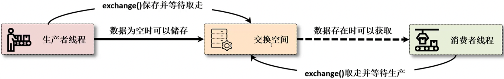
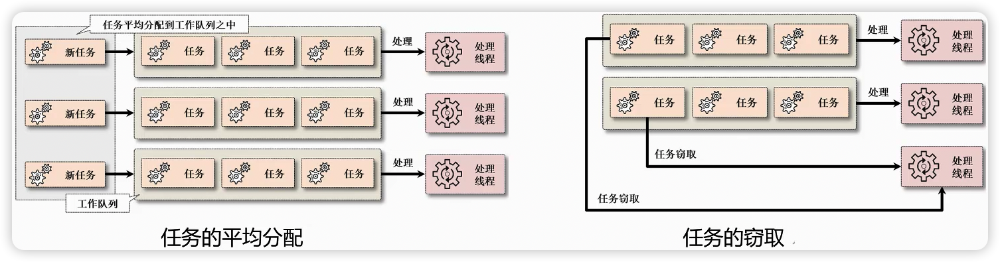

# 01、J.U.C 并发线程简介

Java 并发编程（J.U.C）本质上来讲就属于多线程的一种更加设计合理的开发框架，例如：Java 类集是对数据结构的一种开发框架，JavaIO 是对操作系统底层支持的一种开发框架，所以JDK本身也是会提供有开发框架支持的。

实际上在之前已经学习过多线程的开发机制，当时为什么现在还要去整一个J.U.C（java.util.concurrent，包名称给出的三个字母的缩写），J.U.C 的提供是为了解决并发编程过程之中的性能以及稳定性的设计问题，例如：在传统的多线程开发里面你一定可以想到如下的几个机制：

- 如果要想定义线程的主体操作类需要使用Runnable 或者 Callable 接口
- 如果要想进行数据的同步处理，那么就要使用 synchronized 关键字，这个关键字可以实现同步代码块的定义或者是同步方法的定义，但是性能很差
- 如果要想快速的实现变量内容的更新处理，要使用 volatiile 关键字
- 如果要想实现等待与唤醒机制，则需要通过 Object 类所提供的 wait()、notiffy()、notifyall() 方法
- 所有的操作全部都加在一起了，也无法有效的避免死锁之类的问题

所以多线程的开发是非常麻烦的，而且也是非常繁琐的，更是很多初学者的噩梦，如果个人没有深入的去研究过 Java，那么你可能都没有写过具体的多线程应用。

> 在4G网络还没发展起来的时候，那段时间之内对于多线程基本上都属于概念上的认知，很少会有人从事专门的多线程的开发，那么也就没有太多的人去关注J.U.C（JDK1.5 的时候出现的），但是这几年技术发展动不动就搞一个高并发访问，这个时候多线程的技术又开始被人所关注，出现在面试过程之中更多。

J.U.C 属于一个重度多线程的编程的开发框架，在 J.U.C 里面提供了一套新的多线程处理方案，并且这些方案都有其核心实现的理论，本质上就是：CAS、AQS。而这些在最终编程的时候你是无法感觉到 synchronized 存在的。

| package                     | description                                                  |
| --------------------------- | ------------------------------------------------------------ |
| java.util.concurrent        | Utility classes commonly useful in concurrent programming.   |
| java.util.concurrent.atomic | A small toolkit of classes that support lock-free thread-safe programming on single variables. |
| java.util.concurrent.locks  | Interfaces and classes providing a framework for locking and waiting for conditions that is distinct from built-in synchronization and monitors. |

- 工具类：java.util.concurrent，是直接可以供开发者使用的程序类，用这些类就可以直接实现多线程处理
- 锁机制：java.util.concurrent.locks，多线程的开发之中牵扯到资源的部分都是存在于锁的概念，而对于锁 J.U.C 给出了完整的新机制
- 原子操作类：java.util.concurrent.atomic，直接提供了指定数据类型上的同步机制，避免了在进行数据操作时通过方法实现同步的处理了

> JDK17文档路径：https://docs.oracle.com/en/java/javase/17/docs/api/java.base/module-summary.html


J.U.C 是在 JDK1.5 的时候提出的开发框架，后来每一个版本的 JDK 都对 J.U.C 有过更新，那么本次学习将为大家完整的展示整个 J.U.C 开发包之中的全部类和接口的使用，包括源码的实现分析（主要是应对面试去使用的）


# 02、TimeUnit 时间单元类

> - TimeUnit 文档地址：https://docs.oracle.com/en/java/javase/17/docs/api/java.base/java/util/concurrent/TimeUnit.html
> - TimeUnit 类详解及其常见用法（详解timedWait、sleep方法）：https://blog.csdn.net/AttleeTao/article/details/104242363

## 1、TimeUnit 工具类简介

虽然本次以 J.U.C 为主，但是对于完整的 J.U.C 的开发里面还是存在一些处理机制，那么首先来看一下对于时间的处理问题。在早期的 Java 多线程开发分支中，可以使用的时间单元是什么呢？

- 首先可以想到的就是毫秒时间，毕竟 Thread.sleep() 方法之中所能接触到的就是毫秒：

```java
// 线程休眠方法:
public static void sleep(long millis) throws InterruptedException;
public static void sleep(long millis, int nanos) throws InterruptedException;
```

- 在 Object 之中提供的 wait() 方法里面也包含又同样的单位设置：


```java
// 线程等待方法:
public final void wait(long timeoutMillis) throws InterruptedException;
public final void wait(long timeoutMillis, int nanos) throws InterruptedException;
```

虽然在 Thread 的开发之中可以使用毫秒和纳秒进行线程单位配置，但是从实际的开发来说可能会使用到时、分、秒等概念，所以在 Java 里面为了进一步简化时间的计算管理，提供了一个专属的 TimeUnit 工具类，该类属于一个枚举类：

```java
package java.util.concurrent;
public enum TimeUnit extends Enum<TimeUnit>
```

Java 枚举类的特殊点：除了可以定义一系列的常量之外，还可以实现接口，定义方法，或者是定义抽象方法，总之是一个很强大的多例设计模式。


## 2、TimeUnit 枚举类属性


| Enum Constant | Description          |
| ------------- | -------------------- |
| DAYS          | 天                   |
| HOURS         | 小时                 |
| MINUTES       | 分钟                 |
| SECONDS       | 秒                   |
| MILLISECONDS  | 毫秒（千分之一秒）   |
| MICROSECONDS  | 微妙（千分之一毫秒） |
| NANOSECONDS   | 纳秒（千分之一微妙） |

在整个TimeUnit里面已经定义了而大量常用的时间单元：天（DAYS）、小时（HOURS）、分钟（MINUTES）、秒（SECONDS）、毫秒（MILLISECONDS）、纳秒（NANOSECONDS）、微妙（MICROSECONDS），除了这些时间单元之外还提供有一系列的处理方法，例如：时间转换方法.


## 3、TimeUnit 类方法详解

| 方法名                                                       | 描述                                                         |
| ------------------------------------------------------------ | ------------------------------------------------------------ |
| public long convert(long sourceDuration,TimeUnit sourceUnit) | 将给定单元的时间段转换到此单元。                             |
| public long convert(Duration duration)                       | 将给定的持续时间转换为此单位。                               |
| public long toNanos(long duration)                           | 将指定时间段转换成纳秒。等效于 NANOSECONDS.convert(duration, this) |
| public long toMicros(long duration)                          | 将指定时间段转换成微秒。等效于 MICROSECONDS.convert(duration, this) |
| public long toMillis(long duration)                          | 将指定时间段转换成毫秒。等效于 MILLISECONDS.convert(duration, this) |
| public long toSeconds(long duration)                         | 将指定时间段转换成秒。等效于 SECONDS.convert(duration, this) |
| public long toMinutes(long duration)                         | 将指定时间段转换成分钟。等效于 MINUTES.convert(duration, this) |
| public long toHours(long duration)                           | 将指定时间段转换成小时。等效于 HOURS.convert(duration, this) |
| public long toDays(long duration)                            | 将指定时间段转换成天。等效于 DAYS.convert(duration, this)    |
| public static final TimeUnit[] values()                      | 返回数组，数组值为TimeUnit中定义的常量。常量值与此枚举类声明顺序一致 |
| public static TimeUnit valueOf(String name)                  | 返回带有指定名称的该类型的枚举常量。字符串必须与枚举常量完全匹配 |
| public void timedWait(Object obj, long timeout)              | 使指定对象等待指定时间                                       |
| public void timedJoin(Thread thread, long timeout)           | 使当前线程等待指定时间                                       |
| public void sleep(long timeout)                              | 使线程休眠指定时间                                           |
| static TimeUnit of(ChronoUnit chronoUnit)                    | 将 ChronoUnit 转换为等效的 TimeUnit                          |
| ChronoUnit toChronoUnit()                                    | 将此 TimeUnit 转换为等效的 ChronoUnit                        |

操作示例 1：时间单元的转换

```java
import java.util.concurrent.TimeUnit;

public class JavaAPIDemo {
    public static void main(String[] args) {
        // 由小时转为秒钟
        long second = TimeUnit.SECONDS.convert(1L, TimeUnit.HOURS);
        System.out.println("小时转秒数：" + second);
        // 由小时转为分钟
        long minutes = TimeUnit.MINUTES.convert(1L, TimeUnit.HOURS);
        System.out.println("小时转分钟：" + minutes);
        // 由天转为秒
        long second2 = TimeUnit.SECONDS.convert(1L, TimeUnit.DAYS);
        System.out.println("一天的秒数：" + second2);
    }
}
```

```
小时转秒数：3600
小时转分钟：60
一天的秒数：86400
```

> 虽然 TimeUnit 类很好用，但是从 JDK1.8之后提供了有一个 java.time.Duration 的操作类（间隔），这个类在实际开发之中经常会被用到，例如：在后续学习到 Spring 开发框架的时候，那么一般都要进行一个任务间隔的配置。

操作示例 2：时间单元的转换（使用时间间隔类 Duration）

```java
public long convert(Duration duration); // 转换方法
```

```java
import java.text.SimpleDateFormat;
import java.time.Duration;
import java.util.Date;
import java.util.concurrent.TimeUnit;

public class JavaAPIDemo {
    public static void main(String[] args) {
        // 2小时 + 2小时
        Duration duration = Duration.ofHours(2).plusHours(2);
        // 以上给出的是两个小时的概念,然后加上了2小时.
        System.out.println("时间间隔：" + duration);
        // 直接实现了转换4小时转化成秒数
        long second = TimeUnit.SECONDS.convert(duration);
        System.out.println("间隔的秒数：" + second);

        // 计算180天之后的具体日期，采用当前时间戳 + 时间偏移量
        // 获取当前的时间戳,当前时间为：2023/12/05
        long current = System.currentTimeMillis();
        long after = current + TimeUnit.MILLISECONDS.convert(180, TimeUnit.DAYS);
        System.out.println(new SimpleDateFormat("yyyy-MM-dd").format(new Date(after)));
    }
}
```

```
时间间隔：PT4H
间隔的秒数：14400
2024-06-02
```

操作示例 3：将指定时间段转换成纳秒、微妙、毫秒、秒、分钟、小时、天

```java
import java.util.concurrent.TimeUnit;

public class JavaAPIDemo {
    public static void main(String[] args) {
        // 小时转天
        System.out.println(TimeUnit.HOURS.toDays(240));
        // 天数转小时
        System.out.println(TimeUnit.DAYS.toHours(1));
        // 秒数转分钟
        System.out.println(TimeUnit.SECONDS.toMinutes(60));
        // 天数转秒数
        System.out.println(TimeUnit.DAYS.toSeconds(1));
        // 秒数转毫秒数
        System.out.println(TimeUnit.SECONDS.toMillis(60));
        // 秒数转纳秒数
        System.out.println(TimeUnit.SECONDS.toNanos(10));
    }
}
```

```
10
24
1
86400
60000
10000000000
```

操作示例 4：枚举自带方法 valueOf(String name) 与values()，这两个方法一个返回指定名称的常量类，一个返回所有常量的数组。

```java
import java.util.concurrent.TimeUnit;

public class JavaAPIDemo {
    public static void main(String[] args) {
        for (TimeUnit timeUnit : TimeUnit.values()) {
            System.out.println(timeUnit);
        }

        System.out.println("=============================");

        System.out.println(TimeUnit.valueOf("SECONDS"));
        // 有空格，抛出异常
        System.out.println(TimeUnit.valueOf(" SECONDS"));
    }
}
```

```java
NANOSECONDS
MICROSECONDS
MILLISECONDS
SECONDS
MINUTES
HOURS
DAYS
=============================
SECONDS
Exception in thread "main" java.lang.IllegalArgumentException: No enum constant java.util.concurrent.TimeUnit. SECONDS
	at java.base/java.lang.Enum.valueOf(Enum.java:240)
	at java.base/java.util.concurrent.TimeUnit.valueOf(TimeUnit.java:75)
	at com.example.springboot.tech.test.JavaAPIDemo.main(JavaAPIDemo.java:15)
```

操作示例 5：timedWait(Object obj, long timeout) 使指定对象等待指定时间。使用此时间单元执行计时的 Object.wait（也就是内部调用Object.wait，但是好处多多）。这是将超时参数转换为 Object.wait 方法所需格式的便捷方法。 

- obj - 要等待的对象
- timeout - 要等待的最长时间。如果小于等于 0，则根本不会等待。 
- 抛出： InterruptedException - 如果等待时中断。

```java
import java.util.concurrent.TimeUnit;

public class JavaAPIDemo {
    public static void main(String[] args) throws InterruptedException {
        System.out.println("start!");
        // 使当前对象等待5秒钟
        new JavaAPIDemo().poll(5L, TimeUnit.SECONDS);
        System.out.println("finish!");
    }

    public synchronized void poll(long timeout, TimeUnit unit) throws InterruptedException {
        unit.timedWait(this, timeout);
    }
}
```

```
start!
finish!
```

操作示例 6：timedJoin(Thread thread, long timeout) 使当前线程等待指定时间。使用此时间单元执行计时的 Thread.join。这是将时间参数转换为 Thread.join 方法所需格式的便捷方法。

- `thread` - 要等待的线程
- `timeout` - 要等待的最长时间。如果小于等于 0，则根本不会等待。
- 抛出：InterruptedException - 如果等待时中断。

```java
import java.util.concurrent.TimeUnit;

public class JavaAPIDemo {
    public static void main(String[] args) {
        // 创建一个示例线程
        Thread thread = new Thread(() -> {
            try {
                // 模拟线程执行一些任务
                Thread.sleep(3000);
                System.out.println("Thread completed its task.");
            } catch (InterruptedException e) {
                e.printStackTrace();
            }
        });
        // 启动线程
        thread.start();

        try {
            // 使用TimeUnit将时间单位转换为毫秒，然后使用Thread的join方法等待线程完成
            // thread.join(TimeUnit.SECONDS.toMillis(5));

            // 使用 TimeUnit.timedJoin 方法
            TimeUnit.SECONDS.timedJoin(thread, 5);
            if (thread.isAlive()) {
                // 如果线程仍然存活，表示超时
                System.out.println("等待超时");
            } else {
                System.out.println("线程已完成");
            }
        } catch (InterruptedException e) {
            e.printStackTrace();
        }
    }
}
```

```
Thread completed its task.
线程已完成
```

操作示例 7：TimeUnit 类有一个休眠的处理方法：sleep(long timeout)，这个方法可以根据当前的时间单元进行休眠的配置处理。使用此单元执行 Thread.sleep。这是将时间参数转换为 Thread.sleep 方法所需格式的便捷方法。

- timeout，休眠的最短时间。如果小于等于 0，则根本不会休眠。
- 抛出：InterruptedException，如果休眠时中断。

```java
import java.util.concurrent.TimeUnit;

public class JavaAPIDemo {
    public static void main(String[] args) {
        for (int x = 0; x < 100; x++) {
            try {
                // 根据秒来休眠
                TimeUnit.SECONDS.sleep(2);
            } catch (InterruptedException e) {
                e.printStackTrace();
            }
            System.out.println(x);
        }
    }
}
```

```
0
1
2
```

操作示例 8：of(ChronoUnit chronoUnit) 与 toChronoUnit() 通过  ChronoUnit 初始化 TimeUnit 和 返回 ChronoUnit 类型。

- 先查看下 TimeUnit of(ChronoUnit chronoUnit) 源代码，可以发现只能接收ChronoUnit中的部分属性参数。

```java
public static TimeUnit of(ChronoUnit chronoUnit) {
    switch (Objects.requireNonNull(chronoUnit, "chronoUnit")) {
    case NANOS:   return TimeUnit.NANOSECONDS;
    case MICROS:  return TimeUnit.MICROSECONDS;
    case MILLIS:  return TimeUnit.MILLISECONDS;
    case SECONDS: return TimeUnit.SECONDS;
    case MINUTES: return TimeUnit.MINUTES;
    case HOURS:   return TimeUnit.HOURS;
    case DAYS:    return TimeUnit.DAYS;
    default:
        throw new IllegalArgumentException(
            "No TimeUnit equivalent for " + chronoUnit);
    }
}
```

- 如下示例为初始化TimeUnit和取得ChronoUnit：

```java
import java.time.temporal.ChronoUnit;
import java.util.concurrent.TimeUnit;

public class JavaAPIDemo {
    public static void main(String[] args) {
        TimeUnit hours = TimeUnit.of(ChronoUnit.HOURS);
        System.out.println(hours);
        ChronoUnit chronoUnit = hours.toChronoUnit();
        System.out.println(chronoUnit.toString());
    }
}
```

```
HOURS
Hours
```

在未来进行多线程的开发之中只要牵扯到时间单元的操作问题的话，统一都建议使用 TimeUnit 类进行定义处理，这一点不仅仅是要求，同时也是在 J.U.C 里面见到最多的参数的形式。


# 03、ThreadFactory 工厂类

> ThreadFactory 文档地址：：https://docs.oracle.com/en/java/javase/17/docs/api/java.base/java/util/concurrent/ThreadFactory.html

在传统的项目开发之中，只要使用了 Thread 类就可以直接进行线程的创建，而这种创建形式基本如下：

操作示例 1：创建线程

```java
public class JavaAPIDemo {
    public static void main(String[] args) {
        for (int i = 0; i < 10; i++) {
            new Thread(() -> {
                System.out.println("线程名称：" + Thread.currentThread().getName());
            }).start();
        }
    }
}
```

```
线程名称：Thread-5
线程名称：Thread-7
线程名称：Thread-1
....
```

既然现在要学习的是一个面向对象的编程语言，那么就需要进行不断的解耦和设计考虑，毕竟以上的代码时直接通过了关键字  new 进行线程对象的构建，按照面向对象的设计原则来讲此时的代码就不符合标准了，所以在 J.U.C 里面改进了对于线程对象的获取机制，提供了一个工厂类的标准接口。工厂类的源码如下：

```java
package java.util.concurrent;
public interface ThreadFactory {
    Thread newThread(Runnable r);
}
```

> 那么下面就直接自己手工实现以下这种线程的工厂类。

操作示例 2：自定义线程工厂类

```java
import java.util.concurrent.ThreadFactory;

public class JavaAPIDemo {
    public static void main(String[] args) {
        for (int x = 0; x < 10; x++) {
            Thread thread = SimpleThreadFactory.getInstance().newThread(() -> {
                System.out.println("多线程执行：" + Thread.currentThread().getName());
            });
            thread.start();
        }
    }
}

/**
 * 创建线程工厂类
 */
class SimpleThreadFactory implements ThreadFactory {
    private static final ThreadFactory INSTANCE = new SimpleThreadFactory();
    // 定义线程名称的开头
    private static final String TITLE = "custom-";
    // 线程的自动计数处理
    private static int count = 0;
    // 工厂类在定义的时候一定不需要实例化对象
    private SimpleThreadFactory() {}
    // 单例返回工厂实例
    public static ThreadFactory getInstance() {
        return INSTANCE;
    }
    // 此时的操作如果有需要可以进一步改进，例如：通过反射
    @Override
    public Thread newThread(Runnable r) {
        // 实例化Thread类对象
        return new Thread(r, TITLE + count++);
    }
}
```

```
多线程执行：custom-6
多线程执行：custom-9
多线程执行：custom-3
...
```

> 此时所给出的多线程的创建，可以直接利用自定义的名称进行命名的开头配置，整个的线程对象的获取机制更加的规范了，当然了，如果要想进一步的规范，肯定要使用到反射机制。

操作示例 3：使用反射机制进行线程的创建

```java
import java.lang.reflect.Constructor;
import java.util.concurrent.ThreadFactory;

public class JavaAPIDemo {
    public static void main(String[] args) {
        for (int x = 0; x < 10; x++) {
            Thread thread = SimpleThreadFactory.getInstance().newThread(() -> {
                System.out.println("多线程执行：" + Thread.currentThread().getName());
            });
            thread.start();
        }
    }
}

/**
 * 创建线程工厂类
 */
class SimpleThreadFactory implements ThreadFactory {
    private static final ThreadFactory INSTANCE = new SimpleThreadFactory();
    // 定义线程名称的开头
    private static final String TITLE = "custom-";
    // 线程的自动计数处理
    private static int count = 0;
    // 工厂类在定义的时候一定不需要实例化对象
    private SimpleThreadFactory() {}
    // 单例返回工厂实例
    public static ThreadFactory getInstance() {
        return INSTANCE;
    }
    // 此时的操作如果有需要可以进一步改进，例如：通过反射
    @Override
    public Thread newThread(Runnable r) {
        try {
            Class<?> clazz = Class.forName("java.lang.Thread");
            Constructor<?> constructor = clazz.getConstructor(Runnable.class, String.class);
            return (Thread) constructor.newInstance(r, TITLE + count++); // 实例化Thread类对象
        } catch (Exception e) {
            return null;
        }
    }
}
```

```
多线程执行：custom-5
多线程执行：custom-6
多线程执行：custom-2
...
```

只要是在后续的开发之中见到 ThreadFactory，想都不要想，直接表示的就是进行子线程的创建，这点在后续分析 Java 线程池机制的时候非常有用处。


# 04、原子操作类

> 原子操作类文档：https://docs.oracle.com/en/java/javase/17/docs/api/java.base/java/util/concurrent/atomic/package-summary.html

## 1、原子操作类简介

### 1、原子类产生背景

下面利用多线程实现一个银行存款的操作机制，这个操作机制可以通过多个线程向同一个银行账户进行存款业务办理。按照传统的实际结构来讲，此时的代码定义如下。

操作示例 1：不适用同步处理存款

```java
import java.util.concurrent.TimeUnit;

public class JavaAPIDemo {
    // 模拟银行存款
    public static int money = 0;
    public static void main(String[] args) throws InterruptedException {
        // 要存款的总额
        int [] data = new int[] {100, 200, 300};
        // 进行存款线程的配置
        for (int x = 0; x < data.length; x ++) {
            // 为内部类使用
            final int temp = x;
            new Thread(()->{
                // 模拟存款
                money += data[temp];
            }).start();
        }
        TimeUnit.SECONDS.sleep(2); // 等待2秒的时间
        System.out.println("【计算完成】最终的存款总额：" + money);
    }
}
```

```
【计算完成】最终的存款总额：600
```

> 此时的程序通过多次执行结果的验证可以发现，一切都是“正确”的，那么下面为了可以让问题露出水面，采用一个延迟的机制来进行存款的业务办理时间模拟。

操作示例 2：通过延迟来进行存款业务办理时间的模拟

```java
import java.util.concurrent.TimeUnit;

public class JavaAPIDemo {
    // 模拟银行存款
    public static int money = 0;
    public static void main(String[] args) throws InterruptedException {
        // 要存款的总额
        int [] data = new int[] {100, 200, 300};
        // 进行存款线程的配置
        for (int x = 0; x < data.length; x ++) {
            // 为内部类使用
            final int temp = x;
            new Thread(() -> {
                try {
                    // 100毫秒延迟
                    TimeUnit.MILLISECONDS.sleep(100);
                } catch (InterruptedException e) {
                    e.printStackTrace();
                }
                // 模拟存款
                money += data[temp];
            }).start();
        }
        TimeUnit.SECONDS.sleep(2); // 等待2秒的时间
        System.out.println("【计算完成】最终的存款总额：" + money);
    }
}
```

```
【计算完成】最终的存款总额：200
```

> 此时的操作出现了一个不同步的设计问题，那么请问，这个时候按照最为传统的思路要想解决，就必须使用同步方法来进行包装处理类。

操作示例 3：使用同步方法解决当前的问题

```java
import java.util.concurrent.TimeUnit;

public class JavaAPIDemo {
    // 模拟银行存款
    public static int money = 0;
    public static void main(String[] args) throws InterruptedException {
        // 要存款的总额
        int [] data = new int[] {100, 200, 300};
        // 进行存款线程的配置
        for (int x = 0; x < data.length; x ++) {
            // 为内部类使用
            final int temp = x;
            new Thread(()->{
                try {
                    // 100毫秒延迟
                    TimeUnit.MILLISECONDS.sleep(100);
                } catch (InterruptedException e) {
                    e.printStackTrace();
                }
                save(data[temp]); // 模拟存款
            }).start();
        }
        TimeUnit.SECONDS.sleep(2); // 等待2秒的时间
        System.out.println("【计算完成】最终的存款总额：" + money);
    }
    public static synchronized void save(int m) {
        // 模拟存款
        money += m;
    }
}

// 输出内容
【计算完成】最终的存款总额：600
```

> 难道现在连做一个普通的数据的计算都要考虑到这种同步的处理机制吗？实在太繁琐了，所以为了解决这样的设计问题，提供有了 J.U.C 的原子操作类，那么下面首先使用一个原子的整型操作类进行配置。

操作示例 4：使用原子类实现同步

```java
import java.util.concurrent.TimeUnit;
import java.util.concurrent.atomic.AtomicInteger;

public class JavaAPIDemo {
    // 模拟银行存款
    public static AtomicInteger money = new AtomicInteger(0);
    public static void main(String[] args) throws InterruptedException {
        // 要存款的总额
        int [] data = new int[] {100, 200, 300};
        // 进行存款线程的配置
        for (int x = 0; x < data.length; x ++) {
            // 为内部类使用
            final int temp = x;
            new Thread(()->{
                try {
                    // 100毫秒延迟
                    TimeUnit.MILLISECONDS.sleep(100);
                } catch (InterruptedException e) {
                    e.printStackTrace();
                }
                // 模拟存款，原子类自带同步光环
                money.addAndGet(data[temp]);
            }).start();
        }
        TimeUnit.SECONDS.sleep(2); // 等待2秒的时间
        System.out.println("【计算完成】最终的存款总额：" + money);
    }
}
```

```
【计算完成】最终的存款总额：600
```

以上的代码利用原子类解决了 synchronized 同步的设计问题，但是这个原子类并没有使用传统的同步机制。可以查看源码，使用的是Unsafe类和volatile关键字完成同步操作的。

源码分析 1：来观察一下它的源代码实现。

```java
package java.util.concurrent.atomic;

import java.lang.invoke.VarHandle;
import java.util.function.IntBinaryOperator;
import java.util.function.IntUnaryOperator;

public class AtomicInteger extends Number implements java.io.Serializable {
    private static final long serialVersionUID = 6214790243416807050L;
    // Unsafe类提供底层的CAS机制 
    private static final jdk.internal.misc.Unsafe U = jdk.internal.misc.Unsafe.getUnsafe();
    // VALUE是内存地址值偏移值，这个值的作用是获取value在主内存中的值
    private static final long VALUE = U.objectFieldOffset(AtomicInteger.class, "value");
    // AtomicInteger具体的值存放在这个变量中，这个变量使用volatile修饰，具有可见性
    private volatile int value;
    public AtomicInteger(int initialValue) {
        value = initialValue;
    }

    public final int addAndGet(int delta) {
        return U.getAndAddInt(this, VALUE, delta) + delta;
    }
}
```

原子操作类并没有使用到传统的同步机制，而是通过一种 CAS 的机制来完成的，那么 CAS 是什么？后面会进行详细的描述，整个的原子类都采用了类似的实现机制。


### 2、原子操作类汇总

由于在实际的项目开发中会牵扯到多种多种数据类型的使用，所以在 java.util.concurrent.atomic 包中提供了多种原子性的操作类支持，这些操作类可以分为五类：

- 基本类型原子类【提供对boolean、int、long和对象的原子性操作】：
  - AtomicInteger：int 类型原子类
  - AtomicLong：long 类型原子类
  - AtomicBoolean：boolean 类型原子类

- 数组类型原子类【提供对数组元素的原子性操作】：
  - AtomicIntegerArray：int[] 类型原子类
  - AtomicLongArray：long[] 类型原子类
  - AtomicReferenceArray：引用类型数组原子类

- 引用类型原子类【以版本戳的方式解决原子类型的ABA问题】：
  - AtomicReference：引用类型原子类
  - AtomicStampedReference：带版本戳的原子引用类型，版本戳为int类型，可以解决CAS中的ABA问题
  - AtomicMarkableReference：带版本戳的原子引用类型，版本戳为boolean类型，可以解决CAS中的ABA问题

- 对象的属性修改原子类【提供对指定对象的指定字段进行原子性操作】：
  - AtomicIntegerFieldUpdater：原子更新对象中int类型字段的值
  - AtomicLongFieldUpdater：原子更新对象中long类型字段的值
  - AtomicReferenceFieldUpdater：原子更新对象中引用类型字段的值

- 原子累加器 & 加法器【Java8提供，是 AtomicLong和AtomicDouble的升级类型，专门用于数据统计，性能更高】：
  - DoubleAdder、LongAdder：原子并发加法器
  - DoubleAccumulator、LongAccumulator：原子并发累加器，是加法器的增强

**原则：所有的原子类都具有同步的支持，但是考虑到性能问题，没有使用到 synchronized 关键字来实现，依靠底层完成的。所以我们也可以得出结论：**

- 在JDK1.5版本之前，多行代码的原子性主要通过synchronized关键字进行保证。
- 在JDK1.5版本之后，Java 提供了原子类型专门确保变量操作的原子性。

**注意事项**：

- java.concurrent.Atomic.*包中所有类都具有原子性
- i++ 不具有原子性，但可以用synchronized关键字来实现原子性
- 原子操作 + 原子操作 != 原子操作


## 2、基础类型原子操作类

在刚刚使用过一个AtomicInteger原子类，那么对于这种基础类型的原子类一共提供有三个：AtomicInteger、AtomicLong、AtomicBoolean，首先来观察一下这些类的继承结构。

```java
public class AtomicInteger extends Number implements java.io.Serializable {}
public class AtomicLong extends Number implements java.io.Serializable {}
public class AtomicBoolean implements java.io.Serializable {}
```

可以发现AtomicInteger和AtomicLong都属于Number的子类，而AtomicBoolean是Object子类。**本次主要以长整型原子操作类操作类AtomicLong功能为主进行分析**。


### 1、AtomicLong

| 方法                                                         | 描述                                                         |
| ------------------------------------------------------------ | ------------------------------------------------------------ |
| **构造方法**：                                               |                                                              |
| AtomicLong()                                                 | 创建一个初始值为 0 的 AtomicLong。                           |
| AtomicLong(long initialValue)                                | 创建一个指定初始值的 AtomicLong。                            |
| **基本操作方法**：                                           |                                                              |
| long get()                                                   | 获取当前值。                                                 |
| void set(long newValue)                                      | 设置为指定的值。                                             |
| long getAndSet(long newValue)                                | 获取当前值并设置为指定的值。                                 |
| **原子更新方法**：                                           |                                                              |
| void lazySet(long newValue)                                  | 最终设定为给定值。                                           |
| boolean compareAndSet(long expect, long update)              | 如果当前值等于预期值，则将该值设置为指定的更新值。           |
| boolean weakCompareAndSet(long expect, long update)          | 与 compareAndSet 一模一样，JDK9已弃用。                      |
| **加减操作方法**：                                           |                                                              |
| long incrementAndGet()                                       | 以原子方式将当前值加 1，并返回更新后的值。相当于i++。        |
| long getAndIncrement()                                       | 以原子方式获取当前值并将其加 1。相当于++i。                  |
| long decrementAndGet()                                       | 以原子方式将当前值减 1，并返回更新后的值。相当于i--。        |
| long getAndDecrement()                                       | 以原子方式获取当前值并将其减 1。相当于--i。                  |
| long addAndGet(long delta)                                   | 以原子方式将指定值与当前值相加，并返回更新后的值。           |
| long getAndAdd(long delta)                                   | 以原子方式获取当前值并加上指定值。                           |
| **其他操作方法**：                                           |                                                              |
| public double doubleValue()                                  | 以double形式返回指定数字的值。                               |
| public float floatValue()                                    | 以float形式返回指定数字的值。                                |
| public int intValue()                                        | 以int形式返回指定数字的值。                                  |
| public long longValue()                                      | 返回指定数字的值为long类型。                                 |
| public String toString()                                     | 返回当前值的String表示形式。                                 |
| **JDK1.8后的函数式接口**：                                   |                                                              |
| long getAndUpdate(LongUnaryOperator updateFunction)          | 原子更新当前值和应用给定函数的结果，返回先前的值。           |
| long updateAndGet(LongUnaryOperator updateFunction)          | 原子更新当前值和应用给定函数的结果，返回更新的值。           |
| long getAndAccumulate(long x, LongBinaryOperator accumulatorFunction) | 使用给定的累加函数对当前值和给定值进行原子更新，并返回更新前的值。 |
| long accumulateAndGet(long x, LongBinaryOperator accumulatorFunction) | 使用给定的累加函数对当前值和给定值进行原子更新，并返回更新后的值。 |

在观察原子类操作过程之中，会存在有一个CAS方法（compareAndSet()方法，是以首字母的摘取为主命名的）。这个方法是整个J.U.C之中实现数据同步处理的而且又照顾到性能的唯一支持。

操作示例 1：AtomicLong 原子操作类使用

```java
import java.util.concurrent.TimeUnit;
import java.util.concurrent.atomic.AtomicLong;

public class JavaAPIDemo {
    public static void main(String[] args) throws Exception {
        AtomicLong num = new AtomicLong(0); // 实例化原子类对象1
        for (int x = 0; x < 3; x++) {
            new Thread(() -> {
                System.out.printf("【%s】数据的加法计算：%d %n", Thread.currentThread().getName(), num.addAndGet(100));
            }).start();
        }
        TimeUnit.SECONDS.sleep(1); // 等待1秒的时间
        System.out.println("【计算完成】最终的计算结果为：" + num);
    }
}
```

```
【Thread-0】数据的加法计算：100 
【Thread-2】数据的加法计算：300 
【Thread-1】数据的加法计算：200 
【计算完成】最终的计算结果为：300
```

通过以上的分析对于原子操作类的基本使用已经没有太大问题了，那么后面需要面对的就是如何分析具体操作实现，下面来逐步的对当前类的实现源代码进行解析：

源码分析 1、观察长整形的基本定义：

```java
package java.util.concurrent.atomic;

import java.lang.invoke.VarHandle;
import java.util.function.LongBinaryOperator;
import java.util.function.LongUnaryOperator;
import jdk.internal.misc.Unsafe;

public class AtomicLong extends Number implements java.io.Serializable {
    private static final long serialVersionUID = 1927816293512124184L;
    static final boolean VM_SUPPORTS_LONG_CAS = VMSupportsCS8();
    private static native boolean VMSupportsCS8();
    private static final Unsafe U = Unsafe.getUnsafe();
    private static final long VALUE = U.objectFieldOffset(AtomicLong.class, "value");
    private volatile long value;
    public AtomicLong(long initialValue) {
        value = initialValue;
    }
}
```

long 属于64位的长度，如果运行在了32位的系统之中，那么就需要有2位去描述long数据类型，而在进行数据修改的时候必须考虑到2位的数据同时修改完成，才可以成为正确的修改。

源码分析 2、观察增加方法的实现

```java
public final long addAndGet(long delta) {
    return U.getAndAddLong(this, VALUE, delta) + delta;
}
```

源码分析 3、数据的增加操作依靠的是一个Unsafe累提供的处理方法

```java
@IntrinsicCandidate
public final long getAndAddLong(Object o, long offset, long delta) {
    long v;
    do {
        v = getLongVolatile(o, offset);
    } while (!weakCompareAndSetLong(o, offset, v, v + delta));
    return v;
}

@IntrinsicCandidate
public native long getLongVolatile(Object o, long offset);

@IntrinsicCandidate
public final boolean weakCompareAndSetLong(Object o, long offset,
                                           long expected,
                                           long x) {
    return compareAndSetLong(o, offset, expected, x);
}

@IntrinsicCandidate
public final native boolean compareAndSetLong(Object o, long offset, long expected, long x);
```

此时的操作方法是由硬件CPU的指令完成处理的，它不再是通过Java的运行机制来完成的，这样的优势是在于速度快，同时由避免了数据在内存之中的互相拷贝所带来的额外开销。

在AtomicLong类中还提供有一个compareAndSet()方法，该方法的主要作用是进行数据内容的修改，但是在修改之前需要首先判断当前所保存的数据是否和制定的内容相同，如果相同，则允许修改，如果不同则不允许修改。

操作示例 2：观察CAS方法实现修改操作

```java
import java.util.concurrent.atomic.AtomicLong;

public class JavaAPIDemo {
    public static void main(String[] args) {
        AtomicLong num = new AtomicLong(100L); // 实例化原子类对象
        System.err.println("【×原子数据修改】数据修改的结果：" + num.compareAndSet(200L, 300L));
        System.err.println("【×原子数据获取】新的数据内容：" + num.get());
        System.out.println("【√原子数据修改】数据修改的结果：" + num.compareAndSet(100L, 300L));
        System.out.println("【√原子数据获取】新的数据内容：" + num.get());
    }
}
```

```
【×原子数据修改】数据修改的结果：false
【×原子数据获取】新的数据内容：100
【√原子数据修改】数据修改的结果：true
【√原子数据获取】新的数据内容：300
```

只有在CAS操作比较成功之后才会进行内容的修改，而如果此时的比较失败是不会进行内容修改的，这是一种乐观锁的机制，所谓的乐观锁指的就是一般不会发生任何问题，也不需要进行严格的处理，而悲观锁在多线程中就是依靠synchronized同步实现的，因为总是认为有同步的问题发生。

1、正确的数据修改操作：


2、错误的数据修改操作：


既然清楚了乐观锁实现同步的处理原则之后，那么下面可以继续观察CAS的实现源代码的调用哦结构的分析：

```java
public final boolean compareAndSet(long expectedValue, long newValue) {
    return U.compareAndSetLong(this, VALUE, expectedValue, newValue);
}

@IntrinsicCandidate
public final native boolean compareAndSetLong(Object o, long offset, long expected, long x);
```

**高性能CAS处理机制**：

1. compareAndSet()数据修改操作方法在J.U.C中被称为**CAS机制**，**CAS（Compare-And-Swap）**是一条CPU并发原语（是CPU的原生指令，是直接写在CPU内部的程序代码）。它的功能是判断内存某个位置的值是否位预期值，如果是则更改为新的值，反之则不进行修改，这个过程属于原子操作。
2. 在多线程进行数据修改时，为了保证数据修改的正确性，常规的做法就是使用**synchronized同步锁**，但是这种锁属于“**悲观锁（Pessimistic Lock）**”，每一个线程都需要在操作之前锁定当前的内存区域，而后才可以进行处理，这样一来在高并发环境下就会严重影响到程序的处理性能。
3. 而CAS采用的是一种“**乐观锁（Optimistic Lock）**”机制，其最大的特点是不进行强制的同步处理，而为了保证数据修改的正确性，添加了一些比较的数据（例如：**compareAndSet()在修改之前需要进行数据的比较**），采用的是一种**冲突重试**的处理机制，这样可以有效的避免线程阻塞问题的出现。在并发竞争不是很激烈的情况下，可以获得较好的处理性能，而在**JDK1.9后位了进一步提升CAS的操作性能**，又追加了硬件处理指令的支持，可以充分的发挥服务器硬件配置的优势，得到更好的处理性能。


### 2、AtomicInteger

| 方法                                                         | 描述                                                         |
| ------------------------------------------------------------ | ------------------------------------------------------------ |
| **构造方法**：                                               |                                                              |
| AtomicInteger()                                              | 创建一个初始值为0的 AtomicInteger。                          |
| AtomicInteger(int initialValue)                              | 创建一个指定初始值的 AtomicInteger。                         |
| **基本操作方法**：                                           |                                                              |
| int get()                                                    | 获取当前值。                                                 |
| void set(int newValue)                                       | 设置为指定的值。                                             |
| int getAndSet(int newValue)                                  | 获取当前值并设置为指定的值。                                 |
| **原子更新方法**：                                           |                                                              |
| void lazySet(int newValue)                                   | 最终将值设置为指定的新值，使用懒惰写入。                     |
| boolean compareAndSet(int expect, int update)                | 如果当前值等于预期值，则将该值设置为指定的更新值。           |
| boolean weakCompareAndSet(int expect, int update)            | 如果当前值等于预期值，则将该值设置为指定的更新值，JDK9已弃用 |
| **加减操作方法**：                                           |                                                              |
| int incrementAndGet()                                        | 以原子方式将当前值加 1，并返回更新后的值。相当于i++。        |
| int getAndIncrement()                                        | 以原子方式获取当前值并将其加 1。相当于++i。                  |
| int decrementAndGet()                                        | 以原子方式将当前值减 1，并返回更新后的值。相当于i--。        |
| int getAndDecrement()                                        | 以原子方式获取当前值并将其减 1。相当于--i。                  |
| int addAndGet(int delta)                                     | 以原子方式将指定值与当前值相加，并返回更新后的值。           |
| int getAndAdd(int delta)                                     | 以原子方式获取当前值并加上指定值。                           |
| **其他操作方法**：                                           |                                                              |
| public double doubleValue()                                  | 以double形式返回指定数字的值。                               |
| public float floatValue()                                    | 以float形式返回指定数字的值。                                |
| public int intValue()                                        | 以int形式返回指定数字的值。                                  |
| public long longValue()                                      | 返回指定数字的值为long类型。                                 |
| public String toString()                                     | 返回当前值的String表示形式。                                 |
| **JDK1.8后的函数式接口**：                                   |                                                              |
| int getAndUpdate(IntUnaryOperator updateFunction)            | 原子更新当前值和应用给定函数的结果，返回先前的值。           |
| int updateAndGet(IntUnaryOperator updateFunction)            | 原子更新当前值和应用给定函数的结果，返回更新的值。           |
| int getAndAccumulate(int x, IntBinaryOperator accumulatorFunction) | 使用给定的累加函数对当前值和给定值进行原子更新，并返回更新前的值。 |
| int accumulateAndGet(int x, IntBinaryOperator accumulatorFunction) | 使用给定的累加函数对当前值和给定值进行原子更新，并返回更新后的值。 |

操作示例 1：AtomicInteger 基本操作

```java
import java.util.concurrent.TimeUnit;
import java.util.concurrent.atomic.AtomicInteger;

public class JavaAPIDemo {
    public static void main(String[] args) throws Exception {
        AtomicInteger num = new AtomicInteger(0); // 实例化原子类对象
        for (int x = 0; x < 3; x++) {
            new Thread(() -> {
                System.out.printf("【%s】数据的加法计算：%d %n", Thread.currentThread().getName(), num.addAndGet(100));
            }).start();
        }
        TimeUnit.SECONDS.sleep(1); // 等待1秒的时间
        System.out.println("【计算完成】最终的计算结果为：" + num);
    }
}
```

```
【Thread-0】数据的加法计算：100 
【Thread-2】数据的加法计算：300 
【Thread-1】数据的加法计算：200 
【计算完成】最终的计算结果为：300
```


### 3、AtomicBoolean

| 方法                                                      | 描述                                                         |
| --------------------------------------------------------- | ------------------------------------------------------------ |
| AtomicBoolean()                                           | 创建一个初始值为 false 的 AtomicBoolean。                    |
| AtomicBoolean(boolean initialValue)                       | 创建一个指定初始值的 AtomicBoolean。                         |
| boolean get()                                             | 获取当前值。                                                 |
| void set(boolean newValue)                                | 设置为指定的值。                                             |
| boolean getAndSet(boolean newValue)                       | 获取当前值并设置为指定的值。                                 |
| boolean compareAndSet(boolean expect, boolean update)     | 如果当前值等于预期值，则将该值设置为指定的更新值。           |
| boolean weakCompareAndSet(boolean expect, boolean update) | 如果当前值等于预期值，则将该值设置为指定的更新值。JDK9 已废弃。 |
| void lazySet(boolean newValue)                            | 最终将值设置为指定的新值，使用懒惰写入。                     |

操作示例 1：AtomicBoolean 简单操作

```java
import java.util.concurrent.atomic.AtomicBoolean;

public class JavaAPIDemo {
    public static void main(final String[] arguments) {
        final AtomicBoolean atomicBoolean = new AtomicBoolean(false);
        new Thread("Thread 1") {
            public void run() {
                while (true) {
                    System.out.println(Thread.currentThread().getName()
                            + " Waiting for Thread 2 to set Atomic variable to true. Current value is "
                            + atomicBoolean.get());
                    if (atomicBoolean.compareAndSet(true, false)) {
                        System.out.println("Done!");
                        break;
                    }
                }
            }
        }.start();
        new Thread("Thread 2") {
            public void run() {
                System.out.println(Thread.currentThread().getName() + ", Atomic Variable: " + atomicBoolean.get());
                System.out.println(Thread.currentThread().getName() + " is setting the variable to true ");
                atomicBoolean.set(true);
                System.out.println(Thread.currentThread().getName() + ", Atomic Variable: " + atomicBoolean.get());
            }
        }.start();
    }
}
```

```
Thread 1 Waiting for Thread 2 to set Atomic variable to true. Current value is false
Thread 2, Atomic Variable: false
Thread 1 Waiting for Thread 2 to set Atomic variable to true. Current value is false
Thread 1 Waiting for Thread 2 to set Atomic variable to true. Current value is false
Thread 1 Waiting for Thread 2 to set Atomic variable to true. Current value is false
Thread 1 Waiting for Thread 2 to set Atomic variable to true. Current value is false
Thread 1 Waiting for Thread 2 to set Atomic variable to true. Current value is false
Thread 2 is setting the variable to true 
Thread 1 Waiting for Thread 2 to set Atomic variable to true. Current value is false
Done!
Thread 2, Atomic Variable: true
```


## 3、数组类型原子操作类

数组就是进行一组数据的存储，当然了，考虑到各种开发之中可能会面对的情况，在J.U.C里面也提供有数组的支持了，提供的支持类有：AtomicIntegerArray（int[] 类型原子类）、AtomicLongArray（long[] 类型原子类）、AtomicReferenceArray（引用类型数组原子类）三种类型，**本次主要以原子对象数组操作类AtomicReferenceArray功能为主进行分析**。


### 1、AtomicReferenceArray

java.util.concurrent.atomic.AtomicReferenceArray类提供了可以原子读取和写入的底层引用数组的操作，并且还包含高级原子操作。 AtomicReferenceArray支持对底层引用数组变量的原子操作。 它具有获取和设置方法，如在变量上的读取和写入。 也就是说，一个集合与同一变量上的任何后续获取相关联。 原子compareAndSet方法也具有这些内存一致性功能。

| 方法                                                 | 描述                                                         |
| :--------------------------------------------------- | :----------------------------------------------------------- |
| AtomicReferenceArray(int length)                     | 创建一个具有指定长度的新 AtomicReferenceArray                |
| AtomicReferenceArray(E[] array)                      | 使用给定的数组创建一个新的 AtomicReferenceArray              |
| E get(int i)                                         | 获取位置i的当前值。                                          |
| void set(int i, E newValue)                          | 将位置i处的元素设置为给定值。                                |
| E getAndSet(int i, E newValue)                       | 将位置i处的元素原子设置为给定值，并返回旧值。                |
| int length()                                         | 返回数组的长度。                                             |
| void lazySet(int i, E newValue)                      | 最终将位置i处的元素设置为给定值。                            |
| boolean compareAndSet(int i, E expect, E update)     | 如果当前值==期望值，则将位置i处的元素原子设置为给定的更新值。 |
| boolean weakCompareAndSet(int i, E expect, E update) | 如果当前值==期望值，则将位置i处的元素原子设置为给定的更新值。 |
| String toString()                                    | 返回数组的当前值的String表示形式。                           |

在数组原子类的操作过程之中，依然可以见到一系列的CAS的操作方法，因为毕竟都是基于乐观锁的机制来实现数据的同步处理操作。

操作示例 1：直接实现数组的操作

```java
import java.util.concurrent.atomic.AtomicReferenceArray;

public class JavaAPIDemo {
    public static void main(String[] args) {
        // 定义一个字符串数组
        String[] datas = new String[]{"www.xxx.com", "edu.xxx.com", "study.xxx.com"};
        // 下面使用String数组来实现原子数组操作类对象的实例化处理
        AtomicReferenceArray<String> array = new AtomicReferenceArray<>(datas); // 获取原子类
        System.out.println("【原子数据修改】数据修改的结果：" + array.compareAndSet(2, "study.xxx.com", "book.xxx.com"));
        System.out.print("【原子数据获取】数组内容：");
        for (int x = 0; x < array.length(); x++) {
            System.out.print(array.get(x) + "、");
        }
    }
}
```

```
【原子数据修改】数据修改的结果：true
【原子数据获取】数组内容：www.xxx.com、edu.xxx.com、book.xxx.com、
```

但是如果要想清楚的知道整个的原子数组操作类的实现机制，就需要进行源代码的分析了，那么下面打开该类的定义：

源代码分析 1、观察原子数组操作类之中的基本结构定义：

```java
package java.util.concurrent.atomic;

import java.lang.invoke.MethodHandles;
import java.lang.invoke.VarHandle;
import java.lang.reflect.Array;
import java.lang.reflect.Field;
import java.util.Arrays;
import java.util.function.BinaryOperator;
import java.util.function.UnaryOperator;

public class AtomicReferenceArray<E> implements java.io.Serializable {
    private static final long serialVersionUID = -6209656149925076980L;
    private static final VarHandle AA = MethodHandles.arrayElementVarHandle(Object[].class);
    @SuppressWarnings("serial") // Conditionally serializable
    private final Object[] array; // must have exact type Object[]

    public AtomicReferenceArray(int length) {
        array = new Object[length];
    }
    public AtomicReferenceArray(E[] array) {
        // Visibility guaranteed by final field guarantees
        this.array = Arrays.copyOf(array, array.length, Object[].class);
    }
}
```

源代码分析 2、观察原子数组操作类之中提供的CAS方法实现源代码：

```java
public final boolean compareAndSet(int i, E expectedValue, E newValue) {
    return AA.compareAndSet(array, i, expectedValue, newValue);
}
```

当前在原子数组操作类之中所提供的CAS的机制**并不是由Unsafe提供的**，而是由**VarHandle类**来提供的。

> **对于程序开发人员来讲在多线程下进行数组操作时只需要掌握AtomicReferenceArray相关的原子类实现即可，但是这个类的操作实现本质上依靠的是java.lang.invoke开发包中的VarHandle类完成处理的，如图所示。**
>
> 
>
> **该类主要用于动态操作数组元素或对象的成员属性。VarHandle类提供了一系列的标准内存屏蔽操作，用于更细粒度的控制指令排序，在安全性、可用性以及性能方面都要优于已有的程序类库，同时可以和任何类型的变量进行关联操作。**
>
> VarHandle  是一个性能更加强大，同时处理安全性更加稳定的一个特殊的工具类，该类是在java.lang.invoke包中提供的，是由JDK1.7之后才提供使用的，并且J.U.C里面也用到了这个类。
>
> 1、打开VarHandle类的源代码
>
> ```java
> package java.lang.invoke;
> public abstract class VarHandle implements Constable {
>     final VarForm vform;
>     final boolean exact;
>     VarHandle(VarForm vform) {
>         this(vform, false);
>     }
>     VarHandle(VarForm vform, boolean exact) {
>         this.vform = vform;
>         this.exact = exact;
>     }
> }
> ```
>
> 2、Java之中描述常量的接口，该接口是在JDK12之后提供的：
>
> ```java
> package java.lang.constant;
> 
> import java.lang.invoke.MethodHandle;
> import java.lang.invoke.MethodType;
> import java.lang.invoke.VarHandle;
> import java.util.Optional;
> 
> public interface Constable {
>     Optional<? extends ConstantDesc> describeConstable();
> }
> ```
>
> 3、通过MethodHandles类可以获得VarHandle实例：
>
> ```java
> package java.lang.invoke;
> public class MethodHandles {
>     private MethodHandles() { }  // do not instantiate
>     public static VarHandle arrayElementVarHandle(Class<?> arrayClass) throws IllegalArgumentException {
>         return VarHandles.makeArrayElementHandle(arrayClass);
>     }
> }
> ```
>
> 为了便于理解，下面先直接使用Varhanle类实现相关代码的直接操作。

操作示例 2：使用VarHandle类

```java
import java.lang.invoke.MethodHandles;
import java.lang.invoke.VarHandle;
import java.util.Arrays;

public class JavaAPIDemo {
    public static void main(String[] args) {
        // 定义一个字符串数组
        String[] datas = new String[]{"www.xxx.com", "edu.xxx.com", "study.xxx.com"};
        // 获取VarHandle
        VarHandle varHandle = MethodHandles.arrayElementVarHandle(String[].class);
        // 依然是CAS的处理方法，依然要通过CPU指令来执行相关的处理，性能是最高的
        varHandle.compareAndSet(datas, 2, "muyan.xxx.com", "book.xxx.com"); // 修改数据
        System.out.println(Arrays.toString(datas));
    }
}
```

```java
[www.xxx.com, edu.xxx.com, study.xxx.com]
```

> Java之所以可以得到众多厂商的关注，最关键的因素是在于反射机制，但是过多的反射机制实际上也是造成了Java执行困难的问题（在后续JVM讲解中会分析），但是在Varhandle里面实际上也可以实现反射的操作。

操作示例 3：使用VarHandle来进行对象属性操作

```java
import java.lang.invoke.MethodHandles;
import java.lang.invoke.VarHandle;

class Book {
    String title; // 此时没有进行封装，因为封装了操作不了
}
public class JavaAPIDemo {
    public static void main(String[] args) throws Exception {
        // 此时通过类的查找机制找到Book类中的Title属性，同时设置好Title属性的对应的数据类型
        VarHandle varHandle = MethodHandles.lookup().findVarHandle(Book.class, "title", String.class);
        // 所有类的对象的属性操作前提就是要进行有效的对象实例化处理。
        Object obj = Book.class.getDeclaredConstructor().newInstance(); // 对象实例化
        varHandle.set(obj, "Java就业编程实战"); // 设置属性的内容
        System.out.println("【获取属性内容】title = " + varHandle.get(obj)); // 直接获取属性
    }
}
```

```java
【获取属性内容】title = Java就业编程实战
```

未来的发展软件一定要不断的匹配硬件（反射也可以通过MethodHandles实现了），而这一切如果要想研究就必须深入源代码进行分析，只依靠表面的概念实际上真的是很难理解的。


### 2、AtomicLongArray

java.util.concurrent.atomic.AtomicLongArray类提供了可以原子读取和写入的底层long类型数组的操作，并且还包含高级原子操作。 AtomicLongArray支持对基础long类型数组变量的原子操作。 它具有获取和设置方法，如在变量上的读取和写入。 也就是说，一个集合与同一变量上的任何后续获取相关联。 原子compareAndSet方法也具有这些内存一致性功能。

| 方法                                                      | 描述                                                         |
| :-------------------------------------------------------- | :----------------------------------------------------------- |
| AtomicLongArray(int length)                               | 创建一个给定长度的新 AtomicLongArray，所有元素初始为零。     |
| AtomicLongArray(long[] array)                             | 使用给定的数组创建一个新的 AtomicLongArray                   |
| long get(int i)                                           | 获取位置i的当前值。                                          |
| void set(int i, long newValue)                            | 将位置i处的元素设置为给定值。                                |
| long getAndSet(int i, long newValue)                      | 将位置i处的元素原子设置为给定值，并返回旧值。                |
| int length()                                              | 返回数组的长度。                                             |
| boolean compareAndSet(int i, long expect, long update)    | 如果当前值==期望值，则将位置i处的元素原子设置为给定的更新值。 |
| boolean weakCompareAndSet(int i, int expect, long update) | 如果当前值==期望值，则将位置i处的元素原子设置为给定的更新值。JDK1.9已废弃。 |
| long addAndGet(int i, long delta)                         | 原子地将给定的值添加到索引i的元素。                          |
| long getAndAdd(int i, long delta)                         | 原子地将给定的值添加到索引i的元素。                          |
| long decrementAndGet(int i)                               | 索引i处的元素原子并自减1。                                   |
| long getAndDecrement(int i)                               | 索引i处的元素原子并自减1，并返回旧值。                       |
| long getAndIncrement(int i)                               | 将位置i处的元素原子设置为给定值，并返回旧值。                |
| long incrementAndGet(long i)                              | 在索引i处以原子方式自增元素。                                |
| void lazySet(int i, long newValue)                        | 最终将位置i处的元素设置为给定值。                            |
| String toString()                                         | 返回数组的当前值的String表示形式。                           |

操作示例 1：直接实现长整型数组的操作

```java
import java.util.concurrent.atomic.AtomicLongArray;

public class JavaAPIDemo {

    public static void main(String[] args) {
        // 创建一个包含5个元素的AtomicLongArray
        AtomicLongArray atomicLongArray = new AtomicLongArray(5);

        // 设置数组元素的值
        for (int i = 0; i < atomicLongArray.length(); i++) {
            atomicLongArray.set(i, i + 1);
        }

        // 打印初始数组的值
        System.out.println("初始数组的值：" + atomicLongArray);

        // 使用get方法获取数组元素的值
        long elementValue = atomicLongArray.get(2);
        System.out.println("数组索引2处的值：" + elementValue);

        // 使用incrementAndGet方法增加数组元素的值
        atomicLongArray.incrementAndGet(1);
        System.out.println("数组索引1处的值增加1后：" + atomicLongArray);

        // 使用addAndGet方法给数组元素增加指定值
        atomicLongArray.addAndGet(3, 5);
        System.out.println("数组索引3处的值增加5后：" + atomicLongArray);

        // 使用compareAndSet方法原子性地更新数组元素的值
        long expectedValue = 6;
        long newValue = 10;
        boolean updated = atomicLongArray.compareAndSet(4, expectedValue, newValue);
        if (updated) {
            System.out.println("数组索引4处的值更新成功：" + atomicLongArray);
        } else {
            System.out.println("数组索引4处的值更新失败，当前值不是期望值：" + atomicLongArray.get(4));
        }
    }
}
```

```java
初始数组的值：[1, 2, 3, 4, 5]
数组索引2处的值：3
数组索引1处的值增加1后：[1, 3, 3, 4, 5]
数组索引3处的值增加5后：[1, 3, 3, 9, 5]
数组索引4处的值更新失败，当前值不是期望值：5
```


### 3、AtomicIntegerArray

java.util.concurrent.atomic.AtomicIntegerArray类提供了可以以原子方式读取和写入的底层int数组的操作，还包含高级原子操作。 AtomicIntegerArray支持对底层int数组变量的原子操作。 它具有获取和设置方法，如在变量上的读取和写入。 也就是说，一个集合与同一变量上的任何后续get相关联。 原子compareAndSet方法也具有这些内存一致性功能。

| 方法                                                     | 描述                                                         |
| :------------------------------------------------------- | :----------------------------------------------------------- |
| AtomicIntegerArray(int length)                           | 创建一个给定长度的新 AtomicIntegerArray，所有元素初始为零。  |
| AtomicIntegerArray(int[] array)                          | 使用给定的数组创建一个新的 AtomicIntegerArray                |
| int addAndGet(int i, int delta)                          | 原子地将给定的值添加到索引i的元素。                          |
| boolean compareAndSet(int i, int expect, int update)     | 如果当前值==期望值，则将位置i处的元素原子设置为给定的更新值。 |
| boolean weakCompareAndSet(int i, int expect, int update) | 如果当前值==期望值，则将位置i处的元素原子设置为给定的更新值。JDK1.9已废弃。 |
| int decrementAndGet(int i)                               | 索引i处的元素原子并自减1。                                   |
| int get(int i)                                           | 获取位置i的当前值。                                          |
| int getAndAdd(int i, int delta)                          | 原子地将给定的值添加到索引i的元素。                          |
| int getAndDecrement(int i)                               | 索引i处的元素原子并自减1，并返回旧值。                       |
| int getAndIncrement(int i)                               | 将位置i处的元素原子设置为给定值，并返回旧值。                |
| int getAndSet(int i, int newValue)                       | 将位置i处的元素原子设置为给定值，并返回旧值。                |
| int incrementAndGet(int i)                               | 在索引i处以原子方式自增元素。                                |
| void lazySet(int i, int newValue)                        | 最终将位置i处的元素设置为给定值。                            |
| int length()                                             | 返回数组的长度。                                             |
| void set(int i, int newValue)                            | 将位置i处的元素设置为给定值。                                |
| String toString()                                        | 返回数组的当前值的String表示形式。                           |

操作示例 1：直接实现整型数组的操作

```java
import java.util.concurrent.atomic.AtomicIntegerArray;

/**
 * 在这个例子中，我们创建了一个具有5个元素的 AtomicIntegerArray，并启动了两个线程，一个线程负责递增数组的每个元素，另一个线程负责递减数组的每个元素。
 * 由于 AtomicIntegerArray 提供了原子性的递增和递减操作，因此可以确保在多线程环境中的安全操作。最后，我们输出了最终的数组内容。
 * 请注意，实际应用中的具体场景可能会有所不同，这里的示例仅用于演示 AtomicIntegerArray 的基本用法。
 */
public class JavaAPIDemo {
    // 创建一个具有5个元素的原子整数数组
    private static final AtomicIntegerArray atomicArray = new AtomicIntegerArray(5);

    public static void main(String[] args) throws InterruptedException {
        // 创建并启动两个线程，分别进行递增和递减操作
        Thread incrementThread = new IncrementThread();
        Thread decrementThread = new DecrementThread();

        incrementThread.start();
        decrementThread.start();

        incrementThread.join();
        decrementThread.join();

        // 输出最终的数组内容
        System.out.println("Final Array: " + atomicArray);
    }

    static class IncrementThread extends Thread {
        @Override
        public void run() {
            for (int i = 0; i < atomicArray.length(); i++) {
                // 递增数组中的每个元素
                atomicArray.getAndIncrement(i);
                System.out.println("Increment Thread: " + atomicArray);
            }
        }
    }

    static class DecrementThread extends Thread {
        @Override
        public void run() {
            for (int i = 0; i < atomicArray.length(); i++) {
                // 递减数组中的每个元素
                atomicArray.getAndDecrement(i);
                System.out.println("Decrement Thread: " + atomicArray);
            }
        }
    }
}
```

```java
Increment Thread: [0, 0, 0, 0, 0]
Increment Thread: [0, 1, 0, 0, 0]
Increment Thread: [0, 1, 1, 0, 0]
Increment Thread: [0, 1, 1, 1, 0]
Decrement Thread: [0, 0, 0, 0, 0]
Decrement Thread: [0, 0, 1, 1, 1]
Increment Thread: [0, 1, 1, 1, 1]
Decrement Thread: [0, 0, 0, 1, 1]
Decrement Thread: [0, 0, 0, 0, 1]
Decrement Thread: [0, 0, 0, 0, 0]
Final Array: [0, 0, 0, 0, 0]
```

可以发现除了最终的结果输出正确，中间的打印都出现了一些问题，这里在后面学到锁机制就会明白处理这种问题了。


## 4、引用类型原子操作类

引用类型在程序开发过程之中也是需要进行同步处理的，例如：在一个多线程的操作类之中你需要引用其它类型的对象，这个时候就要进行引用的原子类操作的使用，但是对于引用类型的原子类在J.U,C.A包里面实际上提供有三种类型：AtomicReference（引用类型原子类）、AtomicStampedReference（带有引用版本号的原子类，可以解决CAS中的ABA问题）、AtomicMarkableReference（带有标记的原子引用类型），本次的讲解需要分析这三种操作类的使用特点。


### 1、AtomicReference

这个类可以直接实现引用数据类型的存储，在进行修改的时候可以实现线程安全的更新操作，更新的实现原理还是CAS。

| 方法                                                 | 描述                                                         |
| :--------------------------------------------------- | :----------------------------------------------------------- |
| public AtomicReference()                             | 创建一个新的 AtomicReference，初始值为 null。                |
| AtomicReference(V initialValue)                      | 创建一个新的 AtomicReference，初始值为指定的值。             |
| public boolean get()                                 | 返回当前值。                                                 |
| public void set(V newValue)                          | 无条件地设置为给定的值。                                     |
| public boolean getAndSet(V newValue)                 | 将原子设置为给定值并返回上一个值。                           |
| public boolean compareAndSet(V expect, V update)     | 如果当前值==期望值，则将该值原子设置为给定的更新值。         |
| public boolean weakCompareAndSet(V expect, V update) | 如果当前值==期望值，则将该值原子设置为给定的更新值。JDK1.9废弃。 |
| public void lazySet(V newValue)                      | 最终设定为给定值。                                           |

操作示例 1：实现具体的引用数据存储

```java
import java.util.concurrent.atomic.AtomicReference;

// 自定义一个引用类
class Book {
    private String title; // 名称
    private double price; // 价格

    public Book(String title, double price) {
        this.title = title;
        this.price = price;
    }

    @Override
    public String toString() {
        return "【图书】名称 = " + this.title + "、价格 = " + this.price;
    }
}

public class JavaAPIDemo {
    public static void main(String[] args) {
        Book book = new Book("Java就业编程实战", 69.8); // 定义图书对象
        AtomicReference<Book> ref = new AtomicReference<>(book); // 原子引用
        ref.compareAndSet(book, new Book("Spring就业编程实战", 67.8)); // 数据更改
        System.out.println(ref);
    }
}
```

```java
【图书】名称 = Spring就业编程实战、价格 = 67.8
```

按照Java的基本概念来讲的话，引用数据类型和基本数据类型是完全不同的，毕竟存在了堆栈关系，而基本数据类型是直接以数值形式存储的，实际上对于CAS的操作时存在有一个局限性的。

操作示例 2：依靠匿名对象无法更换

```java
import java.util.concurrent.atomic.AtomicReference;

// 自定义一个引用类
class Book {
    private String title; // 名称
    private double price; // 价格

    public Book(String title, double price) {
        this.title = title;
        this.price = price;
    }

    @Override
    public String toString() {
        return "【图书】名称 = " + this.title + "、价格 = " + this.price;
    }
}

public class JavaAPIDemo {
    public static void main(String[] args) {
        // 此时的程序代码变为乐一个匿名对象，直接存储的是一个匿名对象，没有栈内存的指向
        AtomicReference<Book> ref = new AtomicReference<>(new Book("Java就业编程实战", 69.8)); // 原子引用
        ref.compareAndSet(new Book("Java就业编程实战", 69.8), new Book("Spring就业编程实战", 67.8)); // 数据更改
        System.out.println(ref);
    }
}
```

```java
【图书】名称 = Java就业编程实战、价格 = 69.8
```

于是这个时候就有小伙伴发出了关于灵魂的拷问，按照你之前讲解的概念来说，此时如果要想进行CAS的操作一般都需要有一个比较的过程，那么这个比较的过程你如果没有覆写hashCode()和equals()两个方法，那么怎么样才能实现比较操作呢？

操作示例 3：使用hashCode()和equals()进行相同的判断

```java
import java.util.Objects;
import java.util.concurrent.atomic.AtomicReference;

// 自定义一个引用类
class Book {
    private String title; // 名称
    private double price; // 价格

    public Book(String title, double price) {
        this.title = title;
        this.price = price;
    }
    @Override
    public boolean equals(Object o) {
        if (this == o) return true;
        if (o == null || getClass() != o.getClass()) return false;
        Book book = (Book) o;
        return Double.compare(book.price, price) == 0 && title.equals(book.title);
    }
    @Override
    public int hashCode() {
        return Objects.hash(title, price);
    }
    @Override
    public String toString() {
        return "【图书】名称 = " + this.title + "、价格 = " + this.price;
    }
}

public class JavaAPIDemo {
    public static void main(String[] args) {
        // 此时的程序代码变为乐一个匿名对象，直接存储的是一个匿名对象，没有栈内存的指向
        AtomicReference<Book> ref = new AtomicReference<>(new Book("Java就业编程实战", 69.8)); // 原子引用
        ref.compareAndSet(new Book("Java就业编程实战", 69.8), new Book("Spring就业编程实战", 67.8)); // 数据更改
        System.out.println(ref);
    }
}
```

```java
【图书】名称 = Java就业编程实战、价格 = 69.8
```

此时发现也是无法实现CAS的数据修改操作，之所以不能够修改就是因为无法与原始保存的数据内容进行有效的匹配，所以此时只要是**匿名对象都无法实现这种CAS的更换操作**。


### 2、AtomicStampedReference

在之前的AtomicReference类之中是直接根据保存的对象的地址数值来进行CAS处理，而这个类是在地址数值之前又增加了一个版本编号。如果在更改的时候版本编号相同，那么最终才允许修改，如果不同则不允许修改。

| 方法                                                         | 描述                                       |
| ------------------------------------------------------------ | ------------------------------------------ |
| AtomicStampedReference(V initialRef, int initialStamp)       | 初始化引用数据并设置初始化版本号           |
| V getReference()                                             | 获取当前引用的值。                         |
| int getStamp()                                               | 获取当前版本号。                           |
| void set(V newReference, int newStamp)                       | 无条件设置新内容与新版本号。               |
| boolean compareAndSet(V expectedReference, V newReference, int expectedStamp, int newStamp) | 原子性地比较并设置引用和标记的值。         |
| boolean weakCompareAndSet(V expectedReference, V newReference, int expectedStamp, int newStamp) | 弱一致性地原子性比较并设置引用和标记的值。 |
| boolean attemptStamp(V expectedReference, int newStamp)      | 无其他线程操作时进行内容与版本号设置       |

操作示例 1：使用带有版本戳的引用类来进行原子性的操作：

```java
import java.util.concurrent.atomic.AtomicStampedReference;

// 自定义一个引用类
class Book {
    private String title; // 名称
    private double price; // 价格
    public Book(String title, double price) {
        this.title = title;
        this.price = price;
    }
    @Override
    public String toString() {
        return "【图书】名称 = " + this.title + "、价格 = " + this.price;
    }
}

public class JavaAPIDemo {
    public static void main(String[] args) {
        Book book1 = new Book("Java就业编程实战", 69.8);
        Book book2 = new Book("Spring就业编程实战", 67.8);
        // 1是一个版本编号，按照正常的设计来讲，每一次修改之后版本编号一般都需要增加1
        AtomicStampedReference<Book> ref = new AtomicStampedReference<>(book1, 1);
        // 现在保存的版本号是1，但是此时匹配的版本号是3，那么版本号不匹配，无法进行内容的修改
        System.err.println("【×引用内容修改】" + ref.compareAndSet(book1, book2, 3, 5));
        System.err.println("【×原子引用数据】版本戳：" + ref.getStamp() + "、存储内容：" + ref.getReference());
        System.out.println("【√引用内容修改】" + ref.compareAndSet(book1, book2, 1, 2));
        System.out.println("【√原子引用数据】版本戳：" + ref.getStamp() + "、存储内容：" + ref.getReference());
    }
}
```

```java
【×引用内容修改】false
【×原子引用数据】版本戳：1、存储内容：【图书】名称 = Java就业编程实战、价格 = 69.8
【√引用内容修改】true
【√原子引用数据】版本戳：2、存储内容：【图书】名称 = Spring就业编程实战、价格 = 67.8
```

此时与之前的引用的类型相比，加入了一个版本戳的支持，在进行替换之前一般都要进行版本戳的匹配，版本戳匹配成功之后才可以进行更新，但是千万要记住，一般写这种操作的程序往往都需要在每次获取之后对版本号做一个更新，实际上会存在一些同步的安全隐患问题。

> 如果之前使用过Hibernate开发框架，这个开发框架在国内已经很少使用了， 但是国外很多项目还在使用，毕竟国内都使用MyBatis/MyBatisPlus替换了，这个开发框架会有一个乐观锁机制，采用的结构是相似的。


### 3、AtomicMarkableReference 

这种原子类也属于带有版本标记的原子引用类型，但是与版本戳的操作相比，它只有两个版本类型：true、false，所以称为标记性的原子操作类。

| 方法                                                         | 描述                                                         |
| ------------------------------------------------------------ | ------------------------------------------------------------ |
| AtomicMarkableReference(V initialRef, boolean initialMark)   | 创建一个带有初始引用值和初始标记的 AtomicMarkableReference。 |
| V getReference()                                             | 获取当前引用的值。                                           |
| boolean isMarked()                                           | 检查当前引用是否被标记。                                     |
| boolean get(boolean[] markHolder)                            | 获取当前引用的值，并将当前标记的值放入提供的数组中。         |
| boolean compareAndSet(V expectedReference, V newReference, boolean expectedMark, boolean newMark) | 原子性地比较并设置引用和标记的值。                           |
| boolean weakCompareAndSet(V expectedReference, V newReference, boolean expectedMark, boolean newMark) | 弱一致性地原子性比较并设置引用和标记的值。                   |
| void set(V newReference, boolean newMark)                    | 设置引用和标记的新值。                                       |
| boolean attemptMark(V expectedReference, boolean newMark)    | 如果当前引用的值等于期望值，则原子性地将标记的值设置为新值。 |

操作示例 1：使用原子标记性的操作类

```java
import java.util.concurrent.atomic.AtomicMarkableReference;

// 自定义一个引用类
class Book {
    private String title; // 名称
    private double price; // 价格
    public Book(String title, double price) {
        this.title = title;
        this.price = price;
    }
    @Override
    public String toString() {
        return "【图书】名称 = " + this.title + "、价格 = " + this.price;
    }
}

public class JavaAPIDemo {
    public static void main(String[] args) {
        Book book1 = new Book("Java就业编程实战", 69.8);
        Book book2 = new Book("Spring就业编程实战", 67.8);
        AtomicMarkableReference<Book> ref = new AtomicMarkableReference<>(book1, true);
        // 在数据修改之前首先要进行当前标记状态的判断，此时的状态标记不符合要求，所以一定无法修改成功
        System.err.println("【×引用内容修改】" + ref.compareAndSet(book1, book2, false, true));
        System.err.println("【×原子引用数据】标记：" + ref.isMarked() + "、存储内容：" + ref.getReference());
        System.out.println("【√引用内容修改】" + ref.compareAndSet(book1, book2, true, false));
        System.out.println("【√原子引用数据】标记：" + ref.isMarked() + "、存储内容：" + ref.getReference());
    }
}
```

```java
【×引用内容修改】false
【×原子引用数据】标记：true、存储内容：【图书】名称 = Java就业编程实战、价格 = 69.8
【√引用内容修改】true
【√原子引用数据】标记：false、存储内容：【图书】名称 = Spring就业编程实战、价格 = 67.8
```

实际上不管是版本戳还是标记的原子引用类型最终都是为了去解决项目之中可能出现的ABA数据错乱问题，就相当于是两个线程，彼此同时对一个资源进行操作，但是A的操作有可能会被B的操作覆盖。


对于ABA问题最简单的理解就是：现在A和B两位开发工程师同时打开了一个相同的程序文件，但是A在打开之后由于有其他的事情要忙，所以暂时没有做任何的代码编写，而B却一直在进行代码编写，当B把代码写完并保存后关上电脑离开后，而A处理完其他事情后发现没有什么可写的，于是就直接保存退出，这样B的修改就消失不见了。


## 5、属性修改原子操作类

在一个类之中可能会存在有若干个不同的属性，但是有可能在进行线程同步处理的时候不是该类中所有的属性都会被进行所谓的同步操作，只有部分的属性需要进行同步的处理操作，所以在J.U.C提供的原子类里面，就包含有一个属性修改器，利用属性修改器可以安全的修改属性的内容，原子开发包中提供的属性修改器一共包含三种：AtomicIntegerFieldUpdater（原子整型成员修改器）、AtomicLongFieldUpdater（原子长整型修改器）、AtomicReferenceFieldUpdater（原子引用成员修改器）。**本次主要使用AtomicLongFieldUpdater原子长整型修改器类进行操作**。


### 1、AtomicLongFieldUpdater

| 方法                                                         | 描述                                                         |
| ------------------------------------------------------------ | ------------------------------------------------------------ |
| protected AtomicLongFieldUpdater()                           | 只有一个无参protected的构造函数，并不可用。                  |
| static < U > AtomicLongFieldUpdater< U > newUpdater(Class< U > tclass, String fieldName) | 用于原子性地更新给定类中具有给定字段名称的 long 类型字段。   |
| void set(T obj, long newValue)                               | 将字段的值设置为给定的新值。                                 |
| long get(T obj)                                              | 获取给定对象的字段的当前值。                                 |
| long getAndSet(T obj, long newValue)                         | 获取给定对象的字段的当前值，并设置为给定的新值。             |
| void lazySet(Object obj, long newValue)                      | 最终将字段的值设置为给定的新值，使用懒惰写入。               |
| boolean compareAndSet(T obj, long expect, long update)       | 如果当前字段的值等于期望值，则原子性地将该字段的值设置为给定的更新值。 |
| boolean weakCompareAndSet(T obj, long expect, long update)   | 弱一致性地原子性比较并设置字段的值。                         |
| long getAndAdd(T obj, long delta)                            | 增量计算并返回旧值，具有原子性和可见性。                     |
| long addAndGet(T obj, long delta)                            | 增量计算并返回新值，具有原子性和可见性。                     |
| long getAndIncrement(T obj)                                  | 自增并返回旧值，类似 i ++，具有原子性和可见性。              |
| long incrementAndGet(T obj)                                  | 自增并返回新值，类似  ++ i，具有原子性和可见性。             |
| long getAndDecrement(T obj)                                  | 自减并返回旧值，类似i --，具有原子性和可见性。               |
| long decrementAndGet(T obj)                                  | 自减并返回新值，类似 -- i，具有原子性和可见性。              |

首先AtomicIntegerFieldUpdater是一个抽象类，所以如果要想使用它那么必须找到其对应的实现子类，这个时候可以分析一下该类的源代码定义。


源码分析 1：AtomicLongFieldUpdater.newUpdater() 方法

```java
@CallerSensitive
public static <U> AtomicLongFieldUpdater<U> newUpdater(Class<U> tclass, String fieldName) {
    Class<?> caller = Reflection.getCallerClass();
    if (AtomicLong.VM_SUPPORTS_LONG_CAS)
        return new CASUpdater<U>(tclass, fieldName, caller);
    else
        return new LockedUpdater<U>(tclass, fieldName, caller);
}
```

按照以上结构的概念来讲应该是分为两种更新器的实现，一种是基于CAS的方式实现的，另一种是基于锁定的方式来实现的，而这两种是需要根据一些环境的参数来决定的。

操作示例 1：观察原子性的属性修改器：

```java
import java.util.concurrent.atomic.AtomicLongFieldUpdater;

class Book {
    // 此时的属性如果要想使用原子属性修改器，则必须使用volatile关键字定义，否则执行时会出现如下的错误：
    // java.lang.IllegalArgumentException: Must be volatile type
    volatile long id; // 图书的编号，使用long类型
}
public class JavaAPIDemo {
    public static void main(String[] args)  {
        AtomicLongFieldUpdater<Book> updater = AtomicLongFieldUpdater.newUpdater(Book.class, "id");
        System.out.println(updater.getClass());
    }
}
```

```java
class java.util.concurrent.atomic.AtomicLongFieldUpdater$CASUpdater
```

此时默认的环境之中可以直接使用CAS的方式来实现修改器的对象实例获取，但是要进行修改器处理的属性必须要使用volatile关键字来定义，当然了，按照政策的使用来讲，此时的操作应该是在一个类的内部完成的。

操作示例 2：使用属性修改器

```java
import java.util.concurrent.atomic.AtomicLongFieldUpdater;

class Book {
    // 此时的属性如果要想使用原子属性修改器，则必须使用volatile关键字定义，否则执行时会出现如下的错误
    //  java.lang.IllegalArgumentException: Must be volatile type
    private volatile long id; // 图书的编号，使用long类型
    private String title; // 这些是不需要同步的属性
    private double price; // 这些是不需要同步的属性
    public Book(long id, String title, double price) {
        this.id = id;
        this.title = title;
        this.price = price;
    }
    public void setId(long id) { // 这个时候的id是需要进行同步处理的
        AtomicLongFieldUpdater<Book> updater = AtomicLongFieldUpdater.newUpdater(Book.class, "id");
        updater.compareAndSet(this, this.id, id); // CAS的修改操作
    }
    @Override
    public String toString() {
        return "【图书】ID = " + this.id + "、名称 = " + this.title + "、价格 = " + this.price;
    }
}
public class JavaAPIDemo {
    public static void main(String[] args) {
        Book book = new Book(1002, "Java就业编程实战", 69.8); // 实例化Book类对象
        book.setId(6609); // 修改属性的内容
        System.out.println(book);
    }
}
```

```java
【图书】ID = 6609、名称 = Java就业编程实战、价格 = 69.8
```

在整个的J.U.C的设计过程之中，不同的同步场景需要使用到不同的原子类来完成处理，除了要清楚每一个原子类的使用特点之外，对于其实现的源代码的操作机制也一定要有一定的认知，需要花时间自己去观察分析源代码的定义。 


### 2、AtomicIntegerFieldUpdater

| 方法                                                         | 描述                                                         |
| ------------------------------------------------------------ | ------------------------------------------------------------ |
| protected AtomicIntegerFieldUpdater()                        | 只有一个无参protected的构造函数，并不可用。                  |
| static < U > AtomicIntegerFieldUpdater< U > newUpdater(Class< U > tclass, String fieldName) | 用于原子性地更新给定类中具有给定字段名称的 int 类型字段。    |
| void set(T obj, int newValue)                                | 将字段的值设置为给定的新值。                                 |
| int get(T obj)                                               | 获取给定对象的字段的当前值。                                 |
| Int getAndSet(T obj, int newValue)                           | 获取给定对象的字段的当前值，并设置为给定的新值。             |
| void lazySet(Object obj, int newValue)                       | 最终将字段的值设置为给定的新值，使用懒惰写入。               |
| boolean compareAndSet(T obj, int expect, int update)         | 如果当前字段的值等于期望值，则原子性地将该字段的值设置为给定的更新值。 |
| boolean weakCompareAndSet(T obj, int expect, int update)     | 弱一致性地原子性比较并设置字段的值。                         |
| int getAndAdd(T obj, long delta)                             | 增量计算并返回旧值，具有原子性和可见性。                     |
| int addAndGet(T obj, long delta)                             | 增量计算并返回新值，具有原子性和可见性。                     |
| int getAndIncrement(T obj)                                   | 自增并返回旧值，类似 i ++，具有原子性和可见性。              |
| int incrementAndGet(T obj)                                   | 自增并返回新值，类似  ++ i，具有原子性和可见性。             |
| int getAndDecrement(T obj)                                   | 自减并返回旧值，类似i --，具有原子性和可见性。               |
| int decrementAndGet(T obj)                                   | 自减并返回新值，类似 -- i，具有原子性和可见性。              |

操作示例 1：观察原子性的属性修改器：

```java
import java.util.concurrent.atomic.AtomicIntegerFieldUpdater;

/**
 * 在这个例子中，我们首先创建了一个 AtomicIntegerFieldUpdater，然后定义了一个 Counter 类，其中包含了一个 volatile int 类型的字段 count。
 * 接着，我们创建了多个线程，每个线程通过 AtomicIntegerFieldUpdater 来原子性地递增 Counter 实例的 count 字段。最后，我们输出了最终的计数值。
 * 需要注意的是，AtomicIntegerFieldUpdater 只能用于原子性地更新 volatile int 类型字段，且必须是实例变量而不是静态变量。
 * 此外，AtomicIntegerFieldUpdater 使用反射机制，因此在使用时要确保字段的可访问性。
 */
public class JavaAPIDemo {
    public static void main(String[] args) throws InterruptedException{
        // 创建 AtomicIntegerFieldUpdater
        AtomicIntegerFieldUpdater<Counter> updater = AtomicIntegerFieldUpdater.newUpdater(Counter.class, "count");

        // 创建 Counter 实例
        Counter counter = new Counter();

        // 启动多个线程进行递增操作
        Thread[] threads = new Thread[5];
        for (int i = 0; i < threads.length; i++) {
            threads[i] = new IncrementThread(updater, counter);
            threads[i].start();
        }

        // 等待所有线程执行完毕
        for (Thread thread : threads) {
            thread.join();
        }

        // 输出最终的计数值
        System.out.println("Final Count: " + counter.getCount());
    }

    // Counter 类
    static class Counter {
        // 使用 volatile 修饰的字段
        volatile int count;
        public int getCount() {
            return count;
        }
    }

    // 递增操作的线程
    static class IncrementThread extends Thread {
        private AtomicIntegerFieldUpdater<Counter> updater;
        private Counter counter;

        public IncrementThread(AtomicIntegerFieldUpdater<Counter> updater, Counter counter) {
            this.updater = updater;
            this.counter = counter;
        }
        @Override
        public void run() {
            for (int i = 0; i < 10000; i++) {
                // 使用 AtomicIntegerFieldUpdater 递增字段的值
                updater.getAndIncrement(counter);
            }
        }
    }
}
```

```java
Final Count: 50000
```


### 3、AtomicReferenceFieldUpdater

| 方法                                                         | 描述                                                         |
| ------------------------------------------------------------ | ------------------------------------------------------------ |
| protected AtomicReferenceFieldUpdater()                      | 只有一个无参protected的构造函数，并不可用。                  |
| static <U,T> AtomicReferenceFieldUpdater<U,T> newUpdater(Class< U > tclass, Class< T > vclass, String fieldName) | 创建一个新的 AtomicReferenceFieldUpdater，用于对指定类的指定 volatile 引用字段进行原子更新。 |
| void set(U obj, T newValue)                                  | 设置字段的值。                                               |
| T get(U obj)                                                 | 获取字段的当前值。                                           |
| T getAndSet(U obj, T newValue)                               | 获取当前字段的值并设置为指定的新值。                         |
| void lazySet(U obj, T newValue)                              | 最终将字段的值设置为指定的新值，使用懒惰写入。               |
| boolean compareAndSet(U obj, T expect, T update)             | 如果当前字段的值等于期望值 expect，则将字段的值原子性地设置为新值 update。 |
| boolean weakCompareAndSet(U obj, T expect, T update)         | 弱一致性地原子性比较并设置字段的值。                         |

操作示例 1：观察原子性的属性修改器：

```java
import java.util.concurrent.atomic.AtomicReferenceFieldUpdater;

class Book {
    // 使用 volatile 关键字修饰字段
    volatile String name;
    public Book(String name) {
        this.name = name;
    }
    public String getName() {
        return name;
    }
}
public class JavaAPIDemo {
    public static void main(String[] args) {
        // 创建 AtomicReferenceFieldUpdater，指定要更新的类、字段类型和字段名称
        AtomicReferenceFieldUpdater<Book, String> updater = 
            AtomicReferenceFieldUpdater.newUpdater(Book.class, String.class, "name");

        // 创建 Book 对象
        Book person = new Book("Java");

        // 获取当前值并更新
        String newName = "Python";
        updater.set(person, newName);

        // 获取更新后的值
        String updatedName = updater.get(person);

        System.out.println("Updated Name: " + updatedName);
    }
}
```

```java
Updated Name: Python
```


## 6、原子并发计算操作类

在之前学习过了一些原子类，原子类里面允许直接实现数学计算的，例如：在之前使用的AtomicInteger类就是可以直接进行加法计算处理的，但是如果说此时有一些操作不希望使用原子类，就是一些最原始的操作数字要想安全的实现计算怎么办？所以JDK1.8之后提供了新的原子的计算类：**原子类型累加器**。它可以看做**AtomicLong**和**AtomicDouble**的部分加强类型。

原子计算类分为两种：加法器（DoubleAdder、LongAdder）、累加器（DoubleAccumulator、LongAccumulator）。

操作示例 1：快速入门加法器与累加器

```java
import java.util.concurrent.atomic.DoubleAccumulator;
import java.util.concurrent.atomic.DoubleAdder;

public class JavaAPIDemo {
    public static void main(String[] args) {
        /**
         * 1.使用加法器计算
         */
        DoubleAdder da = new DoubleAdder(); // 定义加法器
        // double和long都属于64位的数据，所以计算的时候需要考虑到2个32位数据的统一问题
        da.add(10);
        da.add(20);
        da.add(30);
        System.out.println("【加法器】计算结果：" + da.doubleValue());

        /**
         * 2.使用累加器计算
         */
        DoubleAccumulator dac = new DoubleAccumulator((x, y) -> x + y, 1.1); // 每次增长1.1数据
        System.out.println("【累加器】原始存储内容：" + dac.doubleValue());
        dac.accumulate(20); // 数据累加计算
        System.out.println("【累加器】新的存储内容：" + dac.doubleValue());
    }
}
```

```java
【加法器】计算结果：60.0
【累加器】原始存储内容：1.1
【累加器】新的存储内容：21.1
```

累加器时在一个数据的基础上不断的进行累加计算实现的，这种计算的操作是在没有使用原子类的时候保证准确计算的一种准则操作类，并且是在J.U.C之后增加进来的新功能。

由于上面四种累加器的原理类似，**下面以LongAdder为主来介绍累加器的使用**。以下内存是转载内容，原文请见[此博客](https://segmentfault.com/a/1190000015865714)。


### 1、LongAdder 简介

JDK1.8时，java.util.concurrent.atomic包中提供了一个新的原子类：LongAdder。根据Oracle官方文档的介绍，LongAdder在高并发的场景下会比它的前辈AtomicLong 具有更好的性能，代价是消耗更多的内存空间。

> 那么，问题来了：
>
> 为什么要引入LongAdder？ AtomicLong在高并发的场景下有什么问题吗？ 如果低并发环境下，LongAdder和AtomicLong性能差不多，那LongAdder是否就可以替代AtomicLong了？


#### 1、为什么要引入 LongAdder

我们知道，AtomicLong是利用了底层的CAS操作来提供并发性的，比如addAndGet方法：

```java
public final long addAndGet(long delta) {
    return U.getAndAddLong(this, VALUE, delta) + delta;
}
```

上述方法调用了Unsafe类的getAndAddLong方法，该方法是个native方法，它的逻辑是采用自旋的方式不断更新目标值，直到更新成功。

在并发量较低的环境下，线程冲突的概率比较小，自旋的次数不会很多。但是，高并发环境下，N个线程同时进行自旋操作，会出现大量失败并不断自旋的情况，此时AtomicLong的自旋会成为瓶颈。

这就是LongAdder引入的初衷：**解决高并发环境下AtomicLong的自旋瓶颈问题**。


#### 2、LongAdder 快在哪里

既然说到LongAdder可以显著提升高并发环境下的性能，那么它是如何做到的？这里先简单的说下LongAdder的思路，第二部分会详述LongAdder的原理。

我们知道，AtomicLong中有个内部变量value保存着实际的long值，所有的操作都是针对该变量进行。也就是说，高并发环境下，value变量其实是一个热点，也就是N个线程竞争一个热点。

LongAdder的基本思路就是分散热点，将value值分散到一个数组中，不同线程会命中到数组的不同槽中，各个线程只对自己槽中的那个值进行CAS操作，这样热点就被分散了，冲突的概率就小很多。如果要获取真正的long值，只要将各个槽中的变量值累加返回。

这种做法有没有似曾相识的感觉？没错，ConcurrentHashMap中的“分段锁”其实就是类似的思路。


#### 3、LongAdder 能否替代 AtomicLong

回答这个问题之前，我们先来看下LongAdder提供的API：  

| 方法                 | 描述                                   |
| -------------------- | -------------------------------------- |
| LongAdder()          | 创建一个新的 `LongAdder`，初始值为 0。 |
| void add(long x)     | 将指定值添加到当前值。                 |
| void increment()     | 将当前值加1。                          |
| void decrement()     | 将当前值减1。                          |
| long sum()           | 返回当前的总和。                       |
| void reset()         | 将当前值重置为0。                      |
| long sumThenReset()  | 返回当前的总和，并将当前值重置为0。    |
| Int intValue()       | 返回当前值作为 int。                   |
| long longValue()     | 返回当前值作为 long。                  |
| double doubleValue() | 返回当前值作为 double。                |
| float floatValue()   | 返回当前值作为 float。                 |

可以看到，LongAdder提供的API和AtomicLong比较接近，两者都能以原子的方式对long型变量进行增减。

但是AtomicLong提供的功能其实更丰富，尤其是addAndGet、decrementAndGet、compareAndSet这些方法。addAndGet、decrementAndGet除了单纯的做自增自减外，还可以立即获取增减后的值，而LongAdder则需要做同步控制才能精确获取增减后的值。如果业务需求需要精确的控制计数，做计数比较，AtomicLong也更合适。

另外，从空间方面考虑，LongAdder其实是一种“空间换时间”的思想，从这一点来讲AtomicLong更适合。当然，如果你一定要跟我杠现代主机的内存对于这点消耗根本不算什么，那我也办法。

总之，低并发、一般的业务场景下AtomicLong是足够了。如果并发量很多，存在大量写多读少的情况，那LongAdder可能更合适。适合的才是最好的，如果真出现了需要考虑到底用AtomicLong好还是LongAdder的业务场景，那么这样的讨论是没有意义的，因为这种情况下要么进行性能测试，以准确评估在当前业务场景下两者的性能，要么换个思路寻求其它解决方案。


### 2、LongAdder 原理

之前说了，AtomicLong是多个线程针对单个热点值value进行原子操作。而LongAdder是每个线程拥有自己的槽，各个线程一般只对自己槽中的那个值进行CAS操作。

> 比如有三个ThreadA、ThreadB、ThreadC，每个线程对value增加10。

对于AtomicLong，最终结果的计算始终是下面这个形式：  

```java
value = 10 + 10 + 10 = 30
```

但是对于LongAdder来说，内部有一个base变量，一个Cell[]数组。 

1. base变量：非竞态条件下，直接累加到该变量上  
2. Cell[]数组：竞态条件下，累加个各个线程自己的槽`Cell[i]`中

最终结果的计算是下面这个形式：  

```java
value = base + \sum_{i=0}^nCell[i]
```


#### 1、LongAdder 内部结构

LongAdder只有一个空构造器，其本身也没有什么特殊的地方，所有复杂的逻辑都在它的父类Striped64中。

```java
public class LongAdder extends Striped64 implements Serializable {
    public LongAdder() {
    }
}
```

看下Striped64的内部结构，这个类实现一些核心操作，处理64位数据。Striped64只有一个空构造器，初始化时，通过Unsafe获取到类字段的偏移量，以便后续CAS操作：

```java
abstract class Striped64 extends Number {
    // VarHandle mechanics
    private static final VarHandle BASE;
    private static final VarHandle CELLSBUSY;
    private static final VarHandle THREAD_PROBE;
    static {
        try {
            MethodHandles.Lookup l = MethodHandles.lookup();
            BASE = l.findVarHandle(Striped64.class, "base", long.class);
            CELLSBUSY = l.findVarHandle(Striped64.class, "cellsBusy", int.class);
            l = java.security.AccessController.doPrivileged(
                new java.security.PrivilegedAction<>() {
                    public MethodHandles.Lookup run() {
                        try {
                            return MethodHandles.privateLookupIn(Thread.class, MethodHandles.lookup());
                        } catch (ReflectiveOperationException e) {
                            throw new ExceptionInInitializerError(e);
                        }
                    }});
            THREAD_PROBE = l.findVarHandle(Thread.class, "threadLocalRandomProbe", int.class);
        } catch (ReflectiveOperationException e) {
            throw new ExceptionInInitializerError(e);
        }
    }
}
```

上面有个比较特殊的字段是threadLocalRandomProbe，可以把它看成是线程的hash值。这个后面我们会讲到。

Striped64中定义了一个内部Cell类，这就是我们之前所说的槽，每个Cell对象存有一个value值，可以通过MethodHandles来CAS操作它的值：  

```java
abstract class Striped64 extends Number {
    @jdk.internal.vm.annotation.Contended static final class Cell {
        volatile long value;
        Cell(long x) { value = x; }
        final boolean cas(long cmp, long val) {
            return VALUE.weakCompareAndSetRelease(this, cmp, val);
        }
        final void reset() {
            VALUE.setVolatile(this, 0L);
        }
        final void reset(long identity) {
            VALUE.setVolatile(this, identity);
        }
        final long getAndSet(long val) {
            return (long)VALUE.getAndSet(this, val);
        }

        // VarHandle mechanics
        private static final VarHandle VALUE;
        static {
            try {
                MethodHandles.Lookup l = MethodHandles.lookup();
                VALUE = l.findVarHandle(Cell.class, "value", long.class);
            } catch (ReflectiveOperationException e) {
                throw new ExceptionInInitializerError(e);
            }
        }
    }
}
```

其它的字段： 可以看到 Cell[] 就是之前提到的槽数组，base 就是非并发条件下的基数累计值。

```java
// CPU核数，用来决定槽数组的大小
static final int NCPU = Runtime.getRuntime().availableProcessors();
// 槽数组，大小为2的幂次
transient volatile Cell[] cells;
// 基数，在两种情况下会使用
// 1.没有遇到并发竞争时，直接使用base累加数值
// 2.初始化cell数组时，必须要保证cells数组只被初始化一次（即只有一个线程能对cells初始化），其他竞争失败的线程会将 数值累加到base上
transient volatile long base;
// 锁标识：cells初始化或扩容时，通过CAS操作此标识设置为1-加锁状态；初始化或扩容完毕时，将此标识设置为0-无锁状态
transient volatile int cellsBusy;
```


#### 2、LongAdder 核心方法

还是通过例子来看： 假设现在有一个LongAdder对象la，四个线程A、B、C、D同时对la进行累加操作。

```java
LongAdder la = new LongAdder();
la.add(10);
```

1. ThreadA调用add方法（假设此时没有并发）

   ```java
   public void add(long x) {
       Cell[] cs; long b, v; int m; Cell c;
       if ((cs = cells) != null || !casBase(b = base, b + x)) {
           int index = getProbe();
           boolean uncontended = true;
           if (cs == null || (m = cs.length - 1) < 0 ||
               (c = cs[index & m]) == null ||
               !(uncontended = c.cas(v = c.value, v + x)))
               longAccumulate(x, null, uncontended, index);
       }
   }
   ```

2. 初始时Cell\[\]为null，base为0。所以ThreadA会调用casBase方法（定义在Striped64中），因为没有并发，CAS操作成功将base变为10：

   ```java
   // CAS操作base的值
   final boolean casBase(long cmp, long val) {
       return BASE.weakCompareAndSetRelease(this, cmp, val);
   }
   ```

3. 可以看到，如果线程A、B、C、D线性执行，那**casBase**永远不会失败，也就永远不会进入到**base**方法的if块中，所有的值都会累积到**base**中。  
   那么，如果任意线程有并发冲突，导致**caseBase**失败呢？

4. 失败就会进入if方法体：

   ```java
   boolean uncontended = true;
   if (cs == null || (m = cs.length - 1) < 0 ||
       (c = cs[index & m]) == null ||
       !(uncontended = c.cas(v = c.value, v + x)))
       longAccumulate(x, null, uncontended, index);
   }
   ```

5. 这个方法体会先再次判断Cell[]槽数组有没初始化过，如果初始化过了，以后所有的CAS操作都只针对槽中的Cell；否则，进入longAccumulate方法。

整个LongAdder.add()方法的逻辑如下图： 


> 可以看到，只有从未出现过并发冲突的时候，base基数才会使用到，一旦出现了并发冲突，之后所有的操作都只针对Cell[]数组中的单元Cell。如果Cell[]数组未初始化，会调用父类的longAccumelate去初始化Cell[]，如果Cell[]已经初始化但是冲突发生在Cell单元内，则也调用父类的longAccumelate，此时可能就需要对Cell[]扩容了。

**这也是LongAdder设计的精妙之处：尽量减少热点冲突，不到最后万不得已，尽量将CAS操作延迟。**


### 3、Striped64 核心方法

我们来看下Striped64的核心方法longAccumulate到底做了什么：

```java
final void longAccumulate(long x, LongBinaryOperator fn, boolean wasUncontended, int index) {
    // 这个if相当于给当前线程生成一个非0的hash值
    if (index == 0) {
        ThreadLocalRandom.current(); // force initialization
        index = getProbe();
        wasUncontended = true;
    }
    // 如果hash取模映射得到的Cell单元不是null，则为true，此值也可以看作是扩容意向
    boolean collide = false
    for (;;) {       // True if last slot nonempty
        Cell[] cs; Cell c; int n; long v;
        // CASE1: cells已经被初始化
        if ((cs = cells) != null && (n = cs.length) > 0) {
            // ...
        }
        // CASE2: cells没有加锁且没有初始化，则尝试对它进行加锁，并初始化cells数组
        else if (cellsBusy == 0 && cells == cs && casCellsBusy()) {
            // ...
        }
        // CASE3: cells正在进行初始化，则尝试直接在基数base上进行累加操作
        else if (casBase(v = base, (fn == null) ? v + x : fn.applyAsLong(v, x)))
            break;
    }
}
```

上述代码首先给当前线程分配一个hash值，然后进入一个自旋，这个自旋分为三个分支：

*   **CASE1：Cell[]数组已经初始化**

*   **CASE2：Cell[]数组未初始化**

*   **CASE3：Cell[]数组正在初始化中**


#### 1、CASE2：Cell[]数组未初始化

我们之前讨论了，初始时Cell[]数组还没有初始化，所以会进入分支②：

```java
// CASE2: cells没有加锁且没有初始化，则尝试对它进行加锁，并初始化cells数组
else if (cellsBusy == 0 && cells == cs && casCellsBusy()) {
    try {                           // Initialize table
        if (cells == cs) {
            Cell[] rs = new Cell[2];     // 初始化大小2（必须为2的幂次）
            rs[index & 1] = new Cell(x); // 将其中初始化，并附初值x
            cells = rs;
            break;
        }
    } finally {
        cellsBusy = 0;
    }
}
```

首先会将cellsBusy置为**1-加锁状态**：

```java
// CAS操作cellsBusy值，将其置为1-加锁状态
final boolean casCellsBusy() {
    return CELLSBUSY.compareAndSet(this, 0, 1);
}
```

然后，初始化Cell[]数组（初始大小为2），根据当前线程的hash值计算映射的索引，并创建对应的Cell对象，Cell单元中的初始值x就是本次要累加的值。


#### 2、CASE3：Cell[]数组正在初始化中

如果在初始化过程中，另一个线程ThreadB也进入了longAccumulate方法，就会进入分支③：

```java
// CASE3: cells正在进行初始化，则尝试直接在基数base上进行累加操作
else if (casBase(v = base, (fn == null) ? v + x : fn.applyAsLong(v, x)))
    break;
```

可以看到，分支③直接操作base基数，将值累加到base上。


#### 3、CASE1：Cell[]数组已经初始化

如果初始化完成后，其它线程也进入了longAccumulate方法，就会进入分支①：

```java
if ((cs = cells) != null && (n = cs.length) > 0) {
    if ((c = cs[(n - 1) & index]) == null) { // 当前线程的hash值运算后映射得到的Cell单元为null，说明该Cell没有被使用
        if (cellsBusy == 0) {       // Cell[]数组没有正在扩容
            Cell r = new Cell(x);   // 创建一个Cell单元
            if (cellsBusy == 0 && casCellsBusy()) { // 尝试加锁，成功后cellsBusy==1
                try {                               // 在有锁的情况下再检测一遍之前的判断
                    Cell[] rs; int m, j;            // 将Cell单元附到Cell[]数组上
                    if ((rs = cells) != null &&
                        (m = rs.length) > 0 &&
                        rs[j = (m - 1) & index] == null) {
                        rs[j] = r;
                        break;
                    }
                } finally {
                    cellsBusy = 0;
                }
                continue;           // Slot is now non-empty
            }
        }
        collide = false;
    }
    else if (!wasUncontended)       // wasUncontended表示前一次CAS更新Cell单元是否成功
        wasUncontended = true;      // 重新置为true，后面会重新计算线程的hash值
    else if (c.cas(v = c.value, (fn == null) ? v + x : fn.applyAsLong(v, x))) // 尝试CAS更新Cell单元值
        break;
    else if (n >= NCPU || cells != cs) // 当Cell数组的大小超过CPU核数后，永远不会再进行扩容
        collide = false;               // 扩容标识，置为false，表示不会再进行扩容
    else if (!collide)
        collide = true;
    else if (cellsBusy == 0 && casCellsBusy()) {  // 尝试加锁进行扩容
        try {
            if (cells == cs)        // Expand table unless stale
                cells = Arrays.copyOf(cs, n << 1); // 扩容后的大小 == 当前容量*2
        } finally {
            cellsBusy = 0;
        }
        collide = false;
        continue;                   // Retry with expanded table
    }
    index = advanceProbe(index);    // 计算当前线程新的hash值
}
```

整个Striped64.longAccumulate()方法的流程图如下：


#### 4、LongAdder.sum() 方法

最后，我们来看下**LongAdder**的**sum**方法：

```java
/**
 * 返回累加的和，也就是“当前时刻”的计算值
 * 此返回值可能不是绝对准确的，因为调用这个方法时还有其他线程可能正在进行计数累加，
 * 方法的返回时刻和调用时刻不是同一个点，在有并发的情况下，这个值只是近似准确的计数值
 * 高并发时，除非全局加锁，否则得不到程序运行中某个时刻绝对准确的值
 * @return the sum
 */
public long sum() {
    Striped64.Cell[] cs = cells;
    long sum = base;
    if (cs != null) {
        for (Striped64.Cell c : cs)
            if (c != null)
                sum += c.value;
    }
    return sum;
}
```

sum求和的公式就是我们开头说的：  

```java
value = base + \sum_{i=0}^nCell[i]
```

需要注意的是：**这个方法只能得到某个时刻的近似值，这也就是LongAdder并不能完全替代LongAtomic的原因之一**。


### 3、LongAdder 其他兄弟

JDK1.8时，java.util.concurrent.atomic包中，除了新引入LongAdder外，还有它的三个兄弟类：LongAccumulator、DoubleAdder、DoubleAccumulator


#### 1、LongAccumulator

LongAccumulator是LongAdder的增强版。LongAdder只能针对数值的进行加减运算，而LongAccumulator提供了自定义的函数操作。其构造函数如下：

```java
public LongAccumulator(LongBinaryOperator accumulatorFunction, long identity) {
    this.function = accumulatorFunction;
    base = this.identity = identity;
}
```

通过LongBinaryOperator，可以自定义对入参的任意操作，并返回结果（LongBinaryOperator接收2个long作为参数，并返回1个long）

LongAccumulator内部原理和LongAdder几乎完全一样，都是利用了父类Striped64的longAccumulate方法。这里就不再赘述了，读者可以自己阅读源码。


#### 2、DoubleAdder

DoubleAdder 类是 Java 中 java.util.concurrent.atomic 包中的一部分，用于在多线程环境中执行原子性的 double 类型的累加操作。它是线程安全的，并且通常在高并发场景下比传统的 double 累加方式更高效。以下是一些基本用法示例：

操作示例 1：创建 DoubleAdder 实例：

```java
import java.util.concurrent.atomic.DoubleAdder;

public class JavaAPIDemo {
    public static void main(String[] args) {
        // 创建 DoubleAdder 实例
        DoubleAdder doubleAdder = new DoubleAdder();

        // 执行累加操作
        doubleAdder.add(5.0);
        doubleAdder.add(3.5);

        // 获取累加结果
        double result = doubleAdder.sum();
        System.out.println("Result: " + result); // 输出：Result: 8.5
    }
}
```

```java
Result: 8.5
```

操作示例 2：在多线程环境中使用 DoubleAdder：

```java
import java.util.concurrent.ExecutorService;
import java.util.concurrent.Executors;
import java.util.concurrent.atomic.DoubleAdder;

public class JavaAPIDemo {
    public static void main(String[] args) {
        // 创建 DoubleAdder 实例
        DoubleAdder doubleAdder = new DoubleAdder();

        // 创建线程池
        ExecutorService executorService = Executors.newFixedThreadPool(5);

        // 启动多个线程执行累加操作
        for (int i = 0; i < 10; i++) {
            executorService.submit(() -> {
                // 执行累加操作
                doubleAdder.add(1.0);
            });
        }

        // 关闭线程池
        executorService.shutdown();

        // 等待所有任务完成
        while (!executorService.isTerminated()) {
            // 等待
        }

        // 获取累加结果
        double result = doubleAdder.sum();
        System.out.println("Result: " + result); // 输出：Result: 10.0
    }
}
```

```java
Result: 10.0
```

这个示例演示了如何在多线程环境中使用 DoubleAdder。多个线程可以并发执行累加操作，而无需使用额外的同步手段，因为 DoubleAdder 已经提供了线程安全的累加操作。

DoubleAdder 类还提供了其他一些方法，如 sumThenReset() 可以获取当前总和并将累加器重置为零，以便下一轮的累加操作。在实际应用中，根据需求选择适当的方法以及是否需要重置累加器。

**DoubleAdder 源码分析已经与 LongAdder 对比**：

DoubleAdder 和 DoubleAccumulator 用于操作double原始类型。与LongAdder的唯一区别就是，其内部会通过一些方法，将原始的double类型，转换为long类型，其余和LongAdder完全一样：

```java
public class DoubleAdder extends Striped64 implements Serializable {
    public DoubleAdder() {
    }
    public void add(double x) {
        Cell[] cs; long b, v; int m; Cell c;
        if ((cs = cells) != null ||
            !casBase(b = base,
                     Double.doubleToRawLongBits // 重点在这里：将原始的double类型，转换为long类型
                     (Double.longBitsToDouble(b) + x))) {
            int index = getProbe();
            boolean uncontended = true;
            if (cs == null || (m = cs.length - 1) < 0 ||
                (c = cs[index & m]) == null ||
                !(uncontended = c.cas(v = c.value,
                                      Double.doubleToRawLongBits
                                      (Double.longBitsToDouble(v) + x))))
                doubleAccumulate(x, null, uncontended, index);
        }
    }
}
```


#### 3、DoubleAccumulator

DoubleAccumulator 类是 Java 中 java.util.concurrent.atomic 包中的一部分，它提供了对 double 类型的原子累加操作。该类是线程安全的，并用于在多线程环境中执行原子性的累加操作。以下是 DoubleAccumulator 类的一些基本用法示例：

操作示例 1：创建 DoubleAccumulator 实例

```java
import java.util.concurrent.atomic.DoubleAccumulator;

public class JavaAPIDemo {
    public static void main(String[] args) {
        // 创建 DoubleAccumulator 实例，初始值为0，累加操作为简单的加法
        DoubleAccumulator accumulator = new DoubleAccumulator((x, y) -> x + y, 0.0);

        // 执行累加操作
        accumulator.accumulate(5.0);
        accumulator.accumulate(3.5);

        // 获取累加结果
        double result = accumulator.get();
        System.out.println("Result: " + result); // 输出：Result: 8.5
    }
}
```

```java
Result: 8.5
```

操作示例 2：自定义累加操作

```java
import java.util.concurrent.atomic.DoubleAccumulator;

public class JavaAPIDemo {
    public static void main(String[] args) {
        // 自定义累加操作，计算平方和
        DoubleAccumulator accumulator = new DoubleAccumulator((x, y) -> x + y * y, 0.0);

        // 执行累加操作
        accumulator.accumulate(2.0);
        accumulator.accumulate(3.0);

        // 获取累加结果
        double result = accumulator.get();
        System.out.println("Result: " + result); // 输出：Result: 13.0
    }
}
```

```java
Result: 13.0
```

操作示例 3：更新累加器的函数

```java
import java.util.concurrent.atomic.DoubleAccumulator;

public class JavaAPIDemo {
    public static void main(String[] args) {
        // 自定义累加操作，计算平方和
        DoubleAccumulator accumulator = new DoubleAccumulator((x, y) -> x + y * y, 0.0);

        // 执行累加操作
        accumulator.accumulate(2.0);
        accumulator.accumulate(3.0);

        // 使用更新函数更新累加器
        accumulator.updateAndGet(value -> value * 2);

        // 获取累加结果
        double result = accumulator.get();
        System.out.println("Result: " + result); // 输出：Result: 26.0
    }
}
```

```java
Result: 26.0
```

这些示例演示了如何创建 DoubleAccumulator 实例，定义不同的累加操作，执行累加操作，并在需要时使用自定义的更新函数更新累加器的值。请注意，累加器是线程安全的，可以在多线程环境中使用。


## 7、ThreadLocalRandom

ThreadLocal是在之前分析过的一个多线程操作的数据存储类，它可以实现当前线程的数据保存操作，而Random类是一个随机数操作类，于是这个时候就有人问了，不太理解，为什么现在要将这两个组合在一起呢？

操作示例 1：观察一下多线程环境中的Random的使用问题

```java
import java.util.Random;

public class JavaAPIDemo {
    public static void main(String[] args) {
        Random random = new Random(); // 定义一个随机数的处理类
        for (int x = 0; x < 3; x++) {
            new Thread(() -> {
                for (int y = 0; y < 3; y++) {
                    System.out.printf("【%s】〖%d〗生成随机数：%d%n", Thread.currentThread().getName(), y, random.nextInt(100));
                }
            }, "随机数生成线程 - " + x).start();
        }
    }
}
```

```java
【随机数生成线程 - 0】〖0〗生成随机数：59
【随机数生成线程 - 2】〖0〗生成随机数：51
【随机数生成线程 - 1】〖0〗生成随机数：74
【随机数生成线程 - 2】〖1〗生成随机数：17
【随机数生成线程 - 0】〖1〗生成随机数：75
【随机数生成线程 - 0】〖2〗生成随机数：19
【随机数生成线程 - 2】〖2〗生成随机数：6
【随机数生成线程 - 1】〖1〗生成随机数：49
【随机数生成线程 - 1】〖2〗生成随机数：68
```

此时执行的代码没有任何的问题，但是这个时候由于所有线程都访问同一个Random，那么最终所表现的结果就是共享了同一个随机因子的数据，而这个随机因子是用于控制随机数生成的，下面通过如下的步骤观察一下。

源码分析 1：观察nextInt()方法定义源代码

```java
@Override
public int nextInt(int bound) {
    if (bound <= 0)
        throw new IllegalArgumentException(BAD_BOUND);
    int r = next(31);
    int m = bound - 1;
    if ((bound & m) == 0)  // i.e., bound is a power of 2
        r = (int)((bound * (long)r) >> 31);
    else { // reject over-represented candidates
        for (int u = r;
             u - (r = u % bound) + m < 0;
             u = next(31));
    }
    return r;
}
```

源码分析 2：观察next()方法

```java
protected int next(int bits) {
    long oldseed, nextseed;
    AtomicLong seed = this.seed; // 考虑到了多线程的同步，所以每次只能够生成一个随机因子
    do {
        oldseed = seed.get(); // 获取已经存在的随机因子
        nextseed = (oldseed * multiplier + addend) & mask; // 计算下一个随机因子
    } while (!seed.compareAndSet(oldseed, nextseed)); // CAS替换
    return (int)(nextseed >>> (48 - bits));
}
```

所有的线程将共享同一个随机因子，如果说此时希望每一个线程都独享自己的随机因子，就要使用ThreadLocalRandom类来实现。

操作示例 2：使用ThreadLocalRandom处理

```java
import java.util.concurrent.ThreadLocalRandom;

public class JavaAPIDemo {
    public static void main(String[] args) {
        for (int x = 0; x < 3; x++) {
            new Thread(() -> {
                for (int y = 0; y < 3; y++) {
                    System.out.printf("【%s】〖%d〗生成随机数：%d%n", Thread.currentThread().getName(), y,
                                      ThreadLocalRandom.current().nextInt(100));
                }
            }, "随机数生成线程 - " + x).start();
        }
    }
}
```

```java
【随机数生成线程 - 0】〖0〗生成随机数：49
【随机数生成线程 - 1】〖0〗生成随机数：84
【随机数生成线程 - 2】〖0〗生成随机数：80
【随机数生成线程 - 1】〖1〗生成随机数：15
【随机数生成线程 - 0】〖1〗生成随机数：98
【随机数生成线程 - 1】〖2〗生成随机数：1
【随机数生成线程 - 2】〖1〗生成随机数：52
【随机数生成线程 - 0】〖2〗生成随机数：45
【随机数生成线程 - 2】〖2〗生成随机数：54
```

相比较Random操作来讲，它可以针对每一个不同的线程保存各自的因子，从而实现准确的随机数生成，这种机制等同于每一个线程保存一个Random。


# 05、并发线程锁

## 1、并发线程锁分类与总结

确保线程安全最常见的做法是利用锁机制（Lock、sychronized）来对共享数据做互斥同步，这样在同一个时刻，只有一个线程可以执行某个方法或者某个代码块，那么操作必然是原子性的，线程安全的。

在工作、面试中，经常会听到各种五花八门的锁，听的人云里雾里。锁的概念术语很多，它们是针对不同的问题所提出的，通过简单的梳理，也不难理解。

### 1、可重入锁

**可重入锁，顾名思义，指的是线程可以重复获取同一把锁**。即同一个线程在外层方法获取了锁，在进入内层方法会自动获取锁。

**可重入锁可以在一定程度上避免死锁**。

- **ReentrantLock 、ReentrantReadWriteLock 是可重入锁**。这点，从其命名也不难看出。
- **synchronized 也是一个可重入锁**。

【操作示例 1】synchronized 的可重入示例

```java
synchronized void setA() throws Exception{
    Thread.sleep(1000);
    setB();
}

synchronized void setB() throws Exception{
    Thread.sleep(1000);
}
```

上面的代码就是一个典型场景：如果使用的锁不是可重入锁的话，setB 可能不会被当前线程执行，从而造成死锁。

【操作示例 2】ReentrantLock 的可重入示例

```java
class Task {

    private int value;
    private final Lock lock = new ReentrantLock();

    public Task() {
        this.value = 0;
    }

    public int get() {
        // 获取锁
        lock.lock();
        try {
            return value;
        } finally {
            // 保证锁能释放
            lock.unlock();
        }
    }

    public void addOne() {
        // 获取锁
        lock.lock();
        try {
            // 注意：此处已经成功获取锁，进入 get 方法后，又尝试获取锁，
            // 如果锁不是可重入的，会导致死锁
            value = 1 + get();
        } finally {
            // 保证锁能释放
            lock.unlock();
        }
    }

}
```


### 2、公平锁与非公平锁

- **公平锁** - 公平锁是指 **多线程按照申请锁的顺序来获取锁**。
- **非公平锁** - 非公平锁是指 **多线程不按照申请锁的顺序来获取锁** 。这就可能会出现优先级反转（后来者居上）或者饥饿现象（某线程总是抢不过别的线程，导致始终无法执行）。

公平锁为了保证线程申请顺序，势必要付出一定的性能代价，因此其吞吐量一般低于非公平锁。

公平锁与非公平锁 在 Java 中的典型实现：

- **synchronized 只支持非公平锁**。
- **ReentrantLock 、ReentrantReadWriteLock，默认是非公平锁，但支持公平锁**。


### 3、独享锁与共享锁

独享锁与共享锁是一种广义上的说法，从实际用途上来看，也常被称为互斥锁与读写锁。

- **独享锁** - 独享锁是指 **锁一次只能被一个线程所持有**。
- **共享锁** - 共享锁是指 **锁可被多个线程所持有**。

独享锁与共享锁在 Java 中的典型实现：

- **synchronized 、ReentrantLock 只支持独享锁**。
- **ReentrantReadWriteLock 其写锁是独享锁，其读锁是共享锁**。读锁是共享锁使得并发读是非常高效的，读写，写读 ，写写的过程是互斥的。


### 4、悲观锁与乐观锁

乐观锁与悲观锁不是指具体的什么类型的锁，而是**处理并发同步的策略**。

- **悲观锁** - 悲观锁对于并发采取悲观的态度，认为：**不加锁的并发操作一定会出问题**。**悲观锁适合写操作频繁的场景**。
- **乐观锁** - 乐观锁对于并发采取乐观的态度，认为：**不加锁的并发操作也没什么问题。对于同一个数据的并发操作，是不会发生修改的**。在更新数据的时候，会采用不断尝试更新的方式更新数据。**乐观锁适合读多写少的场景**。

悲观锁与乐观锁在 Java 中的典型实现：

- 悲观锁在 Java 中的应用就是通过使用 synchronized 和 Lock 显示加锁来进行互斥同步，这是一种阻塞同步。

- 乐观锁在 Java 中的应用就是采用 CAS 机制（CAS 操作通过 Unsafe 类提供，但这个类不直接暴露为 API，所以都是间接使用，如各种原子类）。


### 5、偏向锁、轻量级锁、重量级锁

所谓轻量级锁与重量级锁，指的是锁控制粒度的粗细。显然，控制粒度越细，阻塞开销越小，并发性也就越高。

Java 1.6 以前，重量级锁一般指的是 synchronized ，而轻量级锁指的是 volatile。

Java 1.6 以后，针对 synchronized 做了大量优化，引入 4 种锁状态： 无锁状态、偏向锁、轻量级锁和重量级锁。锁可以单向的从偏向锁升级到轻量级锁，再从轻量级锁升级到重量级锁 。

- **偏向锁** - 偏向锁是指一段同步代码一直被一个线程所访问，那么该线程会自动获取锁。降低获取锁的代价。
- **轻量级锁** - 是指当锁是偏向锁的时候，被另一个线程所访问，偏向锁就会升级为轻量级锁，其他线程会通过自旋的形式尝试获取锁，不会阻塞，提高性能。

- **重量级锁** - 是指当锁为轻量级锁的时候，另一个线程虽然是自旋，但自旋不会一直持续下去，当自旋一定次数的时候，还没有获取到锁，就会进入阻塞，该锁膨胀为重量级锁。重量级锁会让其他申请的线程进入阻塞，性能降低。


### 6、分段锁

分段锁其实是一种锁的设计，并不是具体的一种锁。所谓分段锁，就是把锁的对象分成多段，每段独立控制，使得锁粒度更细，减少阻塞开销，从而提高并发性。这其实很好理解，就像高速公路上的收费站，如果只有一个收费口，那所有的车只能排成一条队缴费；如果有多个收费口，就可以分流了。

Hashtable 使用 synchronized 修饰方法来保证线程安全性，那么面对线程的访问，Hashtable 就会锁住整个对象，所有的其它线程只能等待，这种阻塞方式的吞吐量显然很低。

Java 1.7 以前的 ConcurrentHashMap 就是分段锁的典型案例。ConcurrentHashMap 维护了一个 Segment 数组，一般称为分段桶。

```java
final Segment<K,V>[] segments;
```

当有线程访问 ConcurrentHashMap 的数据时，ConcurrentHashMap 会先根据 hashCode 计算出数据在哪个桶（即哪个 Segment），然后锁住这个 Segment。


### 7、显示锁和内置锁

Java 1.5 之前，协调对共享对象的访问时可以使用的机制只有 synchronized 和 volatile。这两个都属于内置锁，即锁的申请和释放都是由 JVM 所控制。

Java 1.5 之后，增加了新的机制：ReentrantLock、ReentrantReadWriteLock ，这类锁的申请和释放都可以由程序所控制，所以常被称为显示锁。

> synchronized 的用法和原理可以参考：[Java 并发基础机制 - synchronized](https://dunwu.github.io/blog/pages/2c6488/#%E4%BA%8Csynchronized) 。
>
> 注意：如果不需要 ReentrantLock、ReentrantReadWriteLock 所提供的高级同步特性，**应该优先考虑使用 synchronized** 。理由如下：
>
> - Java 1.6 以后，synchronized 做了大量的优化，其性能已经与 ReentrantLock、ReentrantReadWriteLock 基本上持平。
> - 从趋势来看，Java 未来更可能会优化 synchronized ，而不是 ReentrantLock、ReentrantReadWriteLock ，因为 synchronized 是 JVM 内置属性，它能执行一些优化。
> - ReentrantLock、ReentrantReadWriteLock 申请和释放锁都是由程序控制，如果使用不当，可能造成死锁，这是很危险的。

以下对比一下显示锁和内置锁的差异：

- **主动获取锁和释放锁**
  - synchronized 不能主动获取锁和释放锁。获取锁和释放锁都是 JVM 控制的。
  - ReentrantLock 可以主动获取锁和释放锁。（如果忘记释放锁，就可能产生死锁）。
- **响应中断**
  - synchronized 不能响应中断。
  - ReentrantLock 可以响应中断。
- **超时机制**
  - synchronized 没有超时机制。
  - ReentrantLock 有超时机制。ReentrantLock 可以设置超时时间，超时后自动释放锁，避免一直等待。
- **支持公平锁**
  - synchronized 只支持非公平锁。
  - ReentrantLock 支持非公平锁和公平锁。
- **是否支持共享**
  - 被 synchronized 修饰的方法或代码块，只能被一个线程访问（独享）。如果这个线程被阻塞，其他线程也只能等待
  - ReentrantLock 可以基于 Condition 灵活的控制同步条件。
- **是否支持读写分离**
  - synchronized 不支持读写锁分离；
  - ReentrantReadWriteLock 支持读写锁，从而使阻塞读写的操作分开，有效提高并发性。


## 2、J.U.C 并发线程锁简介

在多线程并发访问处理下，如果要想保证操作资源的线程安全性，则必须对资源的处理使用synchronized关键字进行标注，同时还需要通过线程等待与唤醒的机制来实现多个线程的协作处理，但是这样的实现机制实在是过于繁琐，同时也会存在有死锁问题的隐患。为了更好的解决线程同步处理的操作问题，在J.U.C中提供了一个新的锁处理机制，而为了实现这一机制，扩充了两个新的锁接口：

**1、java.util.concurrent.locks.Lock 接口：支持各种不同语义的锁规则，在Lock接口之中分为以下不同的锁类型：**

- 公平机制锁：不同的线程获取锁的过程是公平的；
- 非公平机制锁：不同的线程获取锁的机制是不公平的，可以允许竞争获取；
- 可重入锁：同一个锁可以被一个线程多次获取，最大的特点是避免了死锁的出现。

**2、java.util.concurrent.locks.ReadWriteLock 接口：针对于线程的读或写提供不同的锁处理机制，在数据读取的时候会采用共享锁，而在数据修改的时候将采用独占锁，这样就可以保证数据访问的高性能。**

对于以上的两个锁处理接口，在J.U.C中分别提供了ReentrantLock子类（实现Lock接口）与ReentrantReadWriteLock子类（实现ReadWriteLock）


如果要想进行锁的分析，那么就要通过Lock接口来展开了，因为这个接口里面有很多其他接口要使用到的结构，基本的确定关系如上图所示，最终在进行读写锁处理的时候，都是通过Lock接口提供的方法来实现最终的线程的锁定操作，但是这些操作都是接口，接口在实际的使用过程之中必须考虑到具体的应用子类，**此时观察两个子类：ReentrantLock（互斥锁&独占锁，是Lock接口的实现子类）、ReentrantReadWriteLock（互斥读写锁，是ReadWriteLock的接口实现子类）**。

1、ReentrantLock 子类的源代码：

```java
package java.util.concurrent.locks;
public class ReentrantLock implements Lock, java.io.Serializable {
    private static final long serialVersionUID = 7373984872572414699L;
    /** Synchronizer providing all implementation mechanics */
    private final Sync sync;
}
```

2、打开Sync类的定义：

```java
abstract static class Sync extends AbstractQueuedSynchronizer {}
```

3、AbstractQueuedSynchronizer 抽象类的定义（AQS）：

```java
public abstract class AbstractQueuedSynchronizer 
    extends AbstractOwnableSynchronizer implements java.io.Serializable {}
```

4、AbstractOwnableSynchronizer 抽象类定义：

```java
public abstract class AbstractOwnableSynchronizer implements java.io.Serializable {}
```

5、获取锁的机制是由Sync定义的，而Sync又属于AQS的子类：FairSync（公平锁）、NonFairSync（非公平锁）。

ReentrantLock子类与ReentrantReadWriteLock子类的内部都会提供有一个Sync的同步锁处理类，并且这个Sync类继承了AbstractQueuedSynchronizer父类（简称"AQS")，该类的主要作用是保存所有等待获取锁的线程队列，而对于锁的获取又分为两种类型：

- 公平锁（FairSync子类）：按照通过CLH等待线程按照先来先得的规则，公平的获取锁；
- 非公平锁（NonfairSync子类）：则当线程要获取锁时，它会无视CLH等待队列而直接获取锁。

> CLH（Craig，Landin，and Hagersten）锁是一种基于链表的可扩展、高性能、公平的自旋锁，申请线程只在本地变量上自旋，它不断轮询前驱的状态，如果发现前驱释放了锁就结束自旋。即：在J.U.C中利用了CLH队列机制可以有效的避免线程死锁问题的出现。
>
> ```java
> // CLH Node
> public abstract class AbstractQueuedSynchronizer 
>  extends AbstractOwnableSynchronizer implements java.io.Serializable {
>  abstract static class Node {  // 所有的待执行的线程都在队列中等待调度
>      volatile Node prev;       // initially attached via casTail
>      volatile Node next;       // visibly nonnull when signallable
>      Thread waiter;            // visibly nonnull when enqueued
>      volatile int status;      // written by owner, atomic bit ops by others
>  }
> }
> ```

AQS 锁机制：AbstractQueuedSynchronizer：实现了一个FIFO的线程等待队列，而后其会根据不同的应用场景来实现具体的独占锁模式（多线程更新数据时需要单个线程运行）或者是共享锁模式（多线程数据读取时读线程不需要同步，只需要和写线程做同步处理即可)，如图所示。为了便于这两种锁机制的处理，在AbstractQueuedSynchronizer也提供了相应的锁获取与锁释放的处理方法，这些方法全部都要根据实际的环境由不同的子类来实现。【**AQS 的本质就是一个执行队列，所有的待执行的线程全部都保存在一个队列之中，实际上这样做的目的是为了考虑到解决死锁的问题，在J.U.C的AQS里面提供有一个CLH队列。**】


## 3、ReentrantLock 独占锁

互斥锁（ReentrantLock）或者被称为独占锁，指的是一旦获取到了锁之后，其他的线程都不允许操作（不管这个线程是要进行读操作还是写操作，其他的线程都无法进行处理），实际上在之前学习过的 synchronized 就属于一种独占锁，首先打开这个实现类的定义：

```java
public class ReentrantLock implements Lock, java.io.Serializable {}
```

| 方法                                                         | 描述                                                         |
| ------------------------------------------------------------ | ------------------------------------------------------------ |
| public ReentrantLock()                                       | 采用非公平锁机制构造。                                       |
| public ReentrantLock(boolean fair)                           | 自定义公平锁机制构造，true 为公平锁，false 为非公平锁。      |
| public void lock()                                           | 获取锁。如果锁不可用，调用线程将阻塞直到可用。               |
| boolean tryLock()                                            | 尝试获取锁。如果获取成功返回 true，否则返回 false。          |
| public boolean tryLock(long timeout, TimeUnit unit)          | 尝试在指定时间内获取锁。如果成功则返回 true，否则返回 false。 |
| boolean isLocked()                                           | 判断当前是否已锁定，锁定返回 true，否则返回 false。          |
| public Condition newCondition()                              | 创建并返回与此 ReentrantLock 关联的新 Condition 实例。       |
| public void lockInterruptibly()                              | 获取锁，但允许其他线程中断锁获取。                           |
| public boolean isFair()                                      | 如果是公平锁返回true，否则返回false                          |
| public void unlock()                                         | 释放锁。                                                     |
| public int getHoldCount()                                    | 返回当前持有锁的次数（当前线程已经获取锁的次数）。           |
| protected Collection< Thread > getQueuedThreads()            | 返回等待获取锁的线程集合。                                   |
| public int getQueueLength()                                  | 返回等待获取锁的线程数。                                     |
| protected Collection< Thread > getWaitingThreads(Condition condition) | 返回在指定条件上等待获取锁的线程集合。                       |
| public int getWaitQueueLength(Condition condition)           | 返回在指定条件上等待获取锁的线程数。                         |
| public boolean hasQueuedThreads()                            | 如果有任何线程在等待获取锁，则返回 true，否则返回 false。    |
| public boolean hasWaiters(Condition condition)               | 如果有任何线程在指定条件上等待，则返回 true，否则返回 false  |
| public boolean isHeldByCurrentThread()                       | 如果锁被当前线程持有，返回 true，否则返回 false。            |

由于互斥锁要进行独立的锁定操作机制处理，所以在互斥锁处理的时候一般会考虑到如下两种形式：

1、多个线程抢占互斥锁资源


2、互斥锁抢夺与等待


所有的等待线程都会保存在AQS等待队列的节点之中，但是在整个的J.U.C里面还需要分析锁获取的公平机制问题，这个公平机制是由Lock接口子类来决定的。

```java
private final Sync sync;
public ReentrantLock() {                               // 无参构造
    sync = new NonfairSync();                          // 非公平机制锁
}
public ReentrantLock(boolean fair) {                   // 有参构造
    sync = fair ? new FairSync() : new NonfairSync();  // 会通过判断来决定那种竞争机制
}
```

如果要想进一步实现这种Lock接口的使用，那么下面最佳的做法就是采用订票程序来进行操作的实现（多个线程的抢票操作是一个独占的处理机制）。

操作示例 1：使用 ReentrantLock 实现抢票操作

```java
import java.util.concurrent.TimeUnit;
import java.util.concurrent.locks.Lock;
import java.util.concurrent.locks.ReentrantLock;

/**
 * 实现抢票的处理机制
 */
class Ticket {
    private int count = 3; // 总票数
    private final Lock lock = new ReentrantLock(); // 定义互斥锁

    public void sale() {    // 售票处理
        this.lock.lock(); // 对当前的线程锁定
        try {
            if (this.count > 0) {   // 【业务处理1】判断今年是否有剩余的票数
                // 在进行操作延迟的过程之中，独占锁会始终锁定当前的资源
                TimeUnit.SECONDS.sleep(1); // 模拟一下操作的延迟
                System.out.printf("【%s】卖票，剩余票数：%d%n", Thread.currentThread().getName(), this.count--);
            } else {
                System.out.printf("【%s】票已经卖完了，明天请早！%n", Thread.currentThread().getName());
            }
        } catch (Exception ignored) {
        } finally {
            this.lock.unlock(); // 进行解锁配置
        }
    }
}

public class JavaAPIDemo {
    public static void main(String[] args) {
        Ticket ticket = new Ticket(); // 共享一个售票应用
        for (int x = 0; x < 5; x++) {
            new Thread(ticket::sale, "售票员 - " + x).start();
        }
    }
}
```

```java
【售票员 - 0】卖票，剩余票数：3
【售票员 - 1】卖票，剩余票数：2
【售票员 - 2】卖票，剩余票数：1
【售票员 - 3】票已经卖完了，明天请早！
【售票员 - 4】票已经卖完了，明天请早！
```

在进行线程锁定的过程之中（lock()方法调用），那么最终依靠的是一个线程锁定数量的控制，每一次锁定的时候都会调用一个锁定计数的方法：acquire(1)，每当一个线程被锁定了，这个时候计数就会“+1”，CLH就依靠数量是否为0来确定是否有锁定的线程，从而解决这种线程死锁的问题。


## 4、ReentrantReadWriteLock 读写锁

ReetrantLock 是一种完全独占的操作锁，这种锁不管是面对读或者是写的时候都属于独占的操作形式，于是在这样的开发环境之中就有可能出现这样一种情况：现在的业务修改线程比较少，但是读取的线程比较多，那么请问，按照独占锁的设计原则来讲，一旦要进行修改或读取操作的时候，那么所有的读线程将无法工作，那么在这样的过程之中，为了进一步提高读写操作的性能，在J.U.C里面就设计了一个读写互斥锁。它最大的特点是提供了两把锁：一把是写锁，另外一把是读锁，读锁属于共享锁，所有的读取线程共享一个共享锁，当写锁工作的时候，整个的共享锁将进入到暂停阶段，等待写入完成后再进行多个并发读取。

图一：ReentrantLock 在操作的时候，不管是读还是写都要进行操作的锁定，这样就产生了读取的性能问题。


图二：读写锁将读操作和写操作分开了，读操作使用共享锁，写操作使用互斥的写锁（毕竟只有一个线程可以修改，但是却可以有多个线程可以去读取）。


首先可以打开ReentrantReadWriteLock锁的内部源代码，观察类中的属性定义以及构造方法的定义。

```java
public class ReentrantReadWriteLock implements ReadWriteLock, java.io.Serializable {
    private static final long serialVersionUID = -6992448646407690164L;
    /** Inner class providing readlock */
    private final ReentrantReadWriteLock.ReadLock readerLock;
    /** Inner class providing writelock */
    private final ReentrantReadWriteLock.WriteLock writerLock;
    /** Performs all synchronization mechanics */
    final Sync sync;
    public ReentrantReadWriteLock() {
        this(false); // 调用本地的单参构造，传入了一个锁的获取机制，默认非公平
    }
    public ReentrantReadWriteLock(boolean fair) {
        sync = fair ? new FairSync() : new NonfairSync();
        readerLock = new ReadLock(this);
        writerLock = new WriteLock(this);
    }
    public ReentrantReadWriteLock.WriteLock writeLock() { return writerLock; }
    public ReentrantReadWriteLock.ReadLock  readLock()  { return readerLock; }
}
```

为了可以更加清楚的观察到读写锁的操作方式，那么下面将采用银行账户的读写操作来进行观察，在进行银行账户金额修改的时候肯定要使用写锁，而在进行银行账户读取的时候肯定要使用读锁。

操作示例 1：实现一个银行账户的操作类

```java
import java.util.concurrent.TimeUnit;
import java.util.concurrent.locks.ReadWriteLock;
import java.util.concurrent.locks.ReentrantReadWriteLock;

/**
 * 模拟银行账户
 */
class Account {
    private final String name; // 账户的名称
    // 不要使用double描述金额，因为会有一个浮点的进位的bug，出现金额漏洞
    private int asset; // 账户的资金，资金使用整型
    // 因为读不需要考虑到线程同步处理，但是写需要考虑到线程同步处理
    private final ReadWriteLock readWriteLock = new ReentrantReadWriteLock(); // 读写锁

    public Account(String name, int asset) {
        this.name = name;
        this.asset = asset;
    }

    public void save(int asset) { // 向银行账户之中进行存款操作
        this.readWriteLock.writeLock().lock(); // 写入锁定
        try {
            this.asset += asset; // 存款处理
            TimeUnit.SECONDS.sleep(1); // 模拟业务的处理延迟
            System.err.printf("【%s】修改银行资产，当前的资产为：%10.2f%n", Thread.currentThread().getName(), this.asset / 100.0);
        } catch (Exception ignored) {
        } finally {
            this.readWriteLock.writeLock().unlock(); // 解除锁定
        }
    }

    @Override
    public String toString() {
        this.readWriteLock.readLock().lock(); // 读锁属于共享锁
        try {
            TimeUnit.MILLISECONDS.sleep(200); // 模拟业务延迟
            return String.format("〖%s〗账户名称：%s、账户余额：%10.2f %n", Thread.currentThread().getName(), this.name, this.asset / 100.0);
        } catch (Exception e) {
            return null;
        } finally {
            this.readWriteLock.readLock().unlock(); // 解除锁定
        }
    }
}

public class JavaAPIDemo {
    public static void main(String[] args) {
        Account account = new Account("李兴华", 0); // 定义银行账户信息
        int[] money = new int[]{110, 230, 10_000}; // 定义要存款的金额
        for (int x = 0; x < 10; x++) {  // 通过循环模拟操作线程
            if (x % 2 == 0) { // 存款线程
                new Thread(() -> {
                    for (int i : money) {
                        account.save(i); // 存款操作
                    }
                }, "存款线程 - " + x).start();
            } else {    // 取款线程
                new Thread(() -> {
                    while (true) {
                        System.out.print(account);
                    }
                }, "取款线程 - " + x).start();
            }
        }
    }
}
```

```java
【存款线程 - 0】修改银行资产，当前的资产为：      1.10
【存款线程 - 0】修改银行资产，当前的资产为：      3.40
【存款线程 - 0】修改银行资产，当前的资产为：    103.40
〖取款线程 - 1〗账户名称：李兴华、账户余额：    103.40 
【存款线程 - 2】修改银行资产，当前的资产为：    104.50
【存款线程 - 2】修改银行资产，当前的资产为：    106.80
【存款线程 - 2】修改银行资产，当前的资产为：    206.80
〖取款线程 - 3〗账户名称：李兴华、账户余额：    206.80 
【存款线程 - 4】修改银行资产，当前的资产为：    207.90
【存款线程 - 4】修改银行资产，当前的资产为：    210.20
【存款线程 - 4】修改银行资产，当前的资产为：    310.20
〖取款线程 - 5〗账户名称：李兴华、账户余额：    310.20 
【存款线程 - 6】修改银行资产，当前的资产为：    311.30
【存款线程 - 6】修改银行资产，当前的资产为：    313.60
【存款线程 - 6】修改银行资产，当前的资产为：    413.60
〖取款线程 - 7〗账户名称：李兴华、账户余额：    413.60 
【存款线程 - 8】修改银行资产，当前的资产为：    414.70
【存款线程 - 8】修改银行资产，当前的资产为：    417.00
【存款线程 - 8】修改银行资产，当前的资产为：    517.00
〖取款线程 - 1〗账户名称：李兴华、账户余额：    517.00 
〖取款线程 - 9〗账户名称：李兴华、账户余额：    517.00 
〖取款线程 - 5〗账户名称：李兴华、账户余额：    517.00 
〖取款线程 - 3〗账户名称：李兴华、账户余额：    517.00 
〖取款线程 - 7〗账户名称：李兴华、账户余额：    517.00 
〖取款线程 - 1〗账户名称：李兴华、账户余额：    517.00 
〖取款线程 - 9〗账户名称：李兴华、账户余额：    517.00 
```

这种读写锁最终可以带来的优势就是保证写安全的前提下，实现了较高的读取操作的支持，在边读边写的并发操作之中时最为常见的一种基础用法。


## 5、StampedLock 更强的读写锁

StampedLock 类，在JDK1.8时引入，是对读写锁 ReentrantReadWriteLock 的增强，该类提供了一些功能，优化了读锁、写锁的访问，同时使读写锁之间可以互相转换，更细粒度控制并发。首先明确下，该类的设计初衷是作为一个内部工具类，用于辅助开发其它线程安全组件，用得好，该类可以提升系统性能，用不好，容易产生死锁和其它莫名其妙的问题。

ReadWriteLock/ReentrantReadWriteLock 支持两种模式：一种是读锁，一种是写锁。而 StampedLock 支持三种模式，分别是：**写锁**、**悲观读锁**和**乐观读**。其中，写锁、悲观读锁的语义和 ReadWriteLock/ReentrantReadWriteLock 的写锁、读锁的语义非常类似，允许多个线程同时获取悲观读锁，但是只允许一个线程获取写锁，写锁和悲观读锁是互斥的。不同的是：StampedLock 里的写锁和悲观读锁加锁成功之后，都会返回一个 stamp；然后解锁的时候，需要传入这个 stamp。

> 注意这里，用的是“乐观读”这个词，而不是“乐观读锁”，是要提醒你，**乐观读这个操作是无锁的**，所以相比较 ReadWriteLock/ReentrantReadWriteLock 的读锁，乐观读的性能更好一些。

StampedLock 的性能之所以比 ReadWriteLock/ReentrantReadWriteLock 还要好，其关键是 **StampedLock 支持乐观读**的方式。

- ReadWriteLock 支持多个线程同时读，但是当多个线程同时读的时候，所有的写操作会被阻塞；
- 而 StampedLock 提供的乐观读，是允许一个线程获取写锁的，也就是说不是所有的写操作都被阻塞。

对于读多写少的场景 StampedLock 性能很好，简单的应用场景基本上可以替代 ReadWriteLock/ReentrantReadWriteLock，但是**StampedLock 的功能仅仅是 ReadWriteLock 的子集**，在使用的时候，还是有几个地方需要注意一下。

- **StampedLock 不支持重入**
- StampedLock 的悲观读锁、写锁都不支持条件变量。
- 如果线程阻塞在 StampedLock 的 readLock() 或者 writeLock() 上时，此时调用该阻塞线程的 interrupt() 方法，会导致 CPU 飙升。**使用 StampedLock 一定不要调用中断操作，如果需要支持中断功能，一定使用可中断的悲观读锁 readLockInterruptibly() 和写锁 writeLockInterruptibly()**。

优点：相比于ReentrantReadWriteLock，**吞吐量大幅提升**

缺点：API 复杂，容易用错。实现原理相比于ReentrantReadWriteLock复杂的多。

【模版示例 1】StampedLock 阻塞时，调用 interrupt() 导致 CPU 飙升

```java
final StampedLock lock = new StampedLock();
Thread T1 = new Thread(()->{
    // 获取写锁
    lock.writeLock();
    // 永远阻塞在此处，不释放写锁
    LockSupport.park();
});
T1.start();

// 保证 T1 获取写锁
Thread.sleep(100);

Thread T2 = new Thread(()->{
    // 阻塞在悲观读锁
    lock.readLock();
});
T2.start();

// 保证 T2 阻塞在读锁
Thread.sleep(100);

// 中断线程 T2
// 会导致线程 T2 所在 CPU 飙升
T2.interrupt();
T2.join();
```

【模版示例 2】StampedLock 读模板：

```java
final StampedLock sl = new StampedLock();

// 乐观读
long stamp =
    sl.tryOptimisticRead();
// 读入方法局部变量
// ......
// 校验 stamp
if (!sl.validate(stamp)){
    // 升级为悲观读锁
    stamp = sl.readLock();
    try {
        // 读入方法局部变量
        .....
    } finally {
        // 释放悲观读锁
        sl.unlockRead(stamp);
    }
}
// 使用方法局部变量执行业务操作
// ......
```

***

StampedLock 是一个依据时间戳来实现锁定处理的操作机制，使用 StampedLock 可以有效的解决读写资源存在的不平衡的设计问题，首先先通过之前的读写锁来分析当前存在的问题。

操作示例 1：观察读写锁存在的设计问题（读取线程远大于写入线程操作）

```java
import java.util.concurrent.TimeUnit;
import java.util.concurrent.locks.ReadWriteLock;
import java.util.concurrent.locks.ReentrantReadWriteLock;

/**
 * 模拟银行账户
 */
class Account {
    private final String name; // 账户的名称
    private int asset; // 账户的资金，资金使用整型
    private final ReadWriteLock readWriteLock = new ReentrantReadWriteLock(); // 读写锁

    public Account(String name, int asset) {
        this.name = name;
        this.asset = asset;
    }

    public void save(int asset) { // 向银行账户之中进行存款操作
        this.readWriteLock.writeLock().lock(); // 写入锁定
        try {
            this.asset += asset; // 存款处理
            TimeUnit.SECONDS.sleep(1); // 模拟业务的处理延迟
            System.err.printf("【%s】修改银行资产，当前的资产为：%10.2f%n", Thread.currentThread().getName(), this.asset / 100.0);
        } catch (Exception ignored) {
        } finally {
            this.readWriteLock.writeLock().unlock(); // 解除锁定
        }
    }

    @Override
    public String toString() {
        this.readWriteLock.readLock().lock(); // 读锁属于共享锁
        try {
            TimeUnit.MILLISECONDS.sleep(200); // 模拟业务延迟
            return String.format("〖%s〗账户名称：%s、账户余额：%10.2f %n", Thread.currentThread().getName(), this.name, this.asset / 100.0);
        } catch (Exception e) {
            return null;
        } finally {
            this.readWriteLock.readLock().unlock(); // 解除锁定
        }
    }
}

public class JavaAPIDemo {
    public static void main(String[] args) {
        Account account = new Account("李兴华", 0); // 定义银行账户信息
        int[] money = new int[]{110, 230, 10_000}; // 定义要存款的金额
        for (int x = 0; x < 10; x++) { // 10个读锁
            new Thread(() -> {
                while (true) {
                    System.out.print(account);
                }
            }, "取款线程 - " + x).start();
        }
        for (int x = 0; x < 2; x++) {  // 2个写锁
            new Thread(() -> {
                for (int i : money) {
                    account.save(i); // 存款操作
                }
            }, "存款线程 - " + x).start();
        }
    }
}
```

```java
〖取款线程 - 8〗账户名称：李兴华、账户余额：      0.00 
〖取款线程 - 3〗账户名称：李兴华、账户余额：      0.00 
〖取款线程 - 9〗账户名称：李兴华、账户余额：      0.00 
〖取款线程 - 7〗账户名称：李兴华、账户余额：      0.00 
〖取款线程 - 6〗账户名称：李兴华、账户余额：      0.00 
〖取款线程 - 0〗账户名称：李兴华、账户余额：      0.00 
〖取款线程 - 1〗账户名称：李兴华、账户余额：      0.00 
〖取款线程 - 5〗账户名称：李兴华、账户余额：      0.00 
〖取款线程 - 2〗账户名称：李兴华、账户余额：      0.00 
〖取款线程 - 4〗账户名称：李兴华、账户余额：      0.00 
【存款线程 - 0】修改银行资产，当前的资产为：      1.10
【存款线程 - 0】修改银行资产，当前的资产为：      3.40
【存款线程 - 0】修改银行资产，当前的资产为：    103.40
【存款线程 - 1】修改银行资产，当前的资产为：    104.50
【存款线程 - 1】修改银行资产，当前的资产为：    106.80
【存款线程 - 1】修改银行资产，当前的资产为：    206.80
〖取款线程 - 3〗账户名称：李兴华、账户余额：    206.80 
〖取款线程 - 1〗账户名称：李兴华、账户余额：    206.80 
〖取款线程 - 0〗账户名称：李兴华、账户余额：    206.80 
```

此时读取线程的次数远远高于写的线程，而随着读取线程的数量持续攀升，会带来很难写入的问题出现。所以为了解决这种资源不平衡分配的问题，从JDK1.8开始提供了一个StampedLock处理类，这个类最大的特点是可以根据所谓的时间戳来进行锁定以及锁的释放处理操作。

在该类中支持有三种锁的处理模式，分别为写锁（Write Lock）、悲观锁（Pessimistic Lock）、乐观锁（Optimistic Lock）,每一个完整的StampedLock是由版本和模式两个部分所组成，在获取相关锁时会返回有一个数字标记戳，用于控制锁的状态，并利用该标记戳实现解锁的处理。悲观锁就是如果抢占到了资源一定要时刻进行同步处理，而如果使用了乐观锁至少还有释放的机会。

操作示例 1：通过 StampedLock实现悲观锁

```java
import java.util.concurrent.TimeUnit;
import java.util.concurrent.locks.StampedLock;

/**
 * 模拟银行账户
 */
class Account {
    private final String name; // 账户的名称
    private int asset; // 账户的资金，资金使用整型
    private final StampedLock stampedLock = new StampedLock(); // 标记戳锁

    public Account(String name, int asset) {
        this.name = name;
        this.asset = asset;
    }

    public void save(int asset) { // 向银行账户之中进行存款操作
        long stamp = this.stampedLock.writeLock(); // 获取写锁，这个时间戳用于解锁
        try {
            this.asset += asset; // 存款处理
            TimeUnit.SECONDS.sleep(1); // 模拟业务的处理延迟
            System.err.printf("【%s】修改银行资产，当前的资产为：%10.2f%n", Thread.currentThread().getName(), this.asset / 100.0);
        } catch (Exception ignored) {
        } finally {
            this.stampedLock.unlockWrite(stamp); // 解除写锁
        }
    }

    @Override
    public String toString() {
        long stamp = this.stampedLock.readLock(); // 获取读锁
        try {
            TimeUnit.MILLISECONDS.sleep(200); // 模拟业务延迟
            return String.format("〖%s〗账户名称：%s、账户余额：%10.2f %n", Thread.currentThread().getName(), this.name, this.asset / 100.0);
        } catch (Exception e) {
            return null;
        } finally {
            this.stampedLock.unlockRead(stamp); // 释放读锁
        }
    }
}

public class JavaAPIDemo {
    public static void main(String[] args) {
        Account account = new Account("李兴华", 0); // 定义银行账户信息
        int[] money = new int[]{110, 230, 10_000}; // 定义要存款的金额
        for (int x = 0; x < 2; x++) { // 2个读锁
            new Thread(() -> {
                while (true) {
                    System.out.print(account);
                }
            }, "取款线程 - " + x).start();
        }
        for (int x = 0; x < 2; x++) {  // 2个写锁
            new Thread(() -> {
                for (int i : money) {
                    account.save(i); // 存款操作
                }
            }, "存款线程 - " + x).start();
        }
    }
}
```

```java
〖取款线程 - 0〗账户名称：李兴华、账户余额：      0.00 
〖取款线程 - 1〗账户名称：李兴华、账户余额：      0.00 
【存款线程 - 0】修改银行资产，当前的资产为：      1.10
【存款线程 - 0】修改银行资产，当前的资产为：      3.40
【存款线程 - 0】修改银行资产，当前的资产为：    103.40
【存款线程 - 1】修改银行资产，当前的资产为：    104.50
【存款线程 - 1】修改银行资产，当前的资产为：    106.80
【存款线程 - 1】修改银行资产，当前的资产为：    206.80
〖取款线程 - 1〗账户名称：李兴华、账户余额：    206.80 
〖取款线程 - 0〗账户名称：李兴华、账户余额：    206.80 
〖取款线程 - 0〗账户名称：李兴华、账户余额：    206.80 
```

由于悲观锁在每次操作的时候都会强制性的直接锁定，所以对于资源的切换操作其实并不是很方便，那么如果此时使用的是乐观锁，可以考虑在读的时候假设要发生写操作，那么就让出一下资源，将读锁变为写锁出现。

操作示例 2：实现乐观锁

```java
import java.util.concurrent.TimeUnit;
import java.util.concurrent.locks.StampedLock;

/**
 * 模拟银行账户
 */
class Account {
    private final String name; // 账户的名称
    private int asset; // 账户的资金，资金使用整型
    private final StampedLock stampedLock = new StampedLock(); // 标记戳锁

    public Account(String name, int asset) {
        this.name = name;
        this.asset = asset;
    }

    public void save(int asset) { // 向银行账户之中进行存款操作
        long stamp = this.stampedLock.writeLock(); // 获取写锁，这个时间戳用于解锁
        boolean flag = true; // 循环控制
        try {
            long writeStamp = this.stampedLock.tryConvertToWriteLock(stamp); // 将读锁转给写锁
            while (flag) { // 循环性的尝试转化
                if (writeStamp != 0) { // 可以获取到读锁转化后的写锁
                    stamp = writeStamp; // 修改标记戳
                    this.asset += asset; // 存款处理
                    TimeUnit.SECONDS.sleep(2); // 模拟业务的处理延迟
                    System.err.printf("【%s】修改银行资产，当前的资产为：%10.2f%n", Thread.currentThread().getName(), this.asset / 100.0);
                    flag = false; // 退出当前循环
                } else {
                    this.stampedLock.unlockRead(stamp); // 强制性的释放读锁
                    writeStamp = this.stampedLock.writeLock(); // 获取写锁
                    stamp = writeStamp; // 修改标记戳
                }
            }
        } catch (Exception ignored) {
        } finally {
            this.stampedLock.unlockWrite(stamp); // 解除写锁
        }
    }

    @Override
    public String toString() {
        long stamp = this.stampedLock.tryOptimisticRead(); // 尝试获取乐观锁
        try {
            int current = this.asset; // 获取当前的金额，这个金额有可能过时
            TimeUnit.SECONDS.sleep(1); // 模拟业务的处理延迟
            if (!this.stampedLock.validate(stamp)) { // 标记戳不正确
                stamp = this.stampedLock.readLock(); // 重新创建一个读锁
                try {
                    current = this.asset; // 因为有可能数据被修改
                } finally {
                    this.stampedLock.unlockRead(stamp); // 释放读锁
                }
            }
            return String.format("〖%s〗账户名称：%s、账户余额：%10.2f %n", Thread.currentThread().getName(), this.name, current / 100.0);
        } catch (Exception e) {
            return null;
        }
    }
}

public class JavaAPIDemo {
    public static void main(String[] args) {
        Account account = new Account("李兴华", 0); // 定义银行账户信息
        int[] money = new int[]{110, 230, 10_000}; // 定义要存款的金额
        for (int x = 0; x < 2; x++) { // 2个读锁
            new Thread(() -> {
                while (true) {
                    System.out.print(account);
                }
            }, "取款线程 - " + x).start();
        }
        for (int x = 0; x < 2; x++) {  // 2个写锁
            new Thread(() -> {
                for (int i : money) {
                    account.save(i); // 存款操作
                }
            }, "存款线程 - " + x).start();
        }
    }
}
```

```java
【存款线程 - 0】修改银行资产，当前的资产为：      1.10
【存款线程 - 0】修改银行资产，当前的资产为：      3.40
【存款线程 - 0】修改银行资产，当前的资产为：    103.40
【存款线程 - 1】修改银行资产，当前的资产为：    104.50
【存款线程 - 1】修改银行资产，当前的资产为：    106.80
【存款线程 - 1】修改银行资产，当前的资产为：    206.80
〖取款线程 - 0〗账户名称：李兴华、账户余额：    206.80 
〖取款线程 - 1〗账户名称：李兴华、账户余额：    206.80 
〖取款线程 - 0〗账户名称：李兴华、账户余额：    206.80 
〖取款线程 - 1〗账户名称：李兴华、账户余额：    206.80 
〖取款线程 - 0〗账户名称：李兴华、账户余额：    206.80 
〖取款线程 - 1〗账户名称：李兴华、账户余额：    206.80 
〖取款线程 - 1〗账户名称：李兴华、账户余额：    206.80 
```

如果日后的开发之中你出现了这种资源读写不平衡的问题，那么就可以通过StampedLock操作类来解决最终的设计你问题。


## 6、Condition 精准控制

在最早学习到多线程技术的时候，会使用Object类之中提供的wait()、notify() 方法进行等待与唤醒的处理，而后在传统的Thread类之中，又提供了一些所谓的暂停和恢复的功能（这个功能已经被废除），可是对于等待和唤醒机制的操作毕竟比较简单的，很多的开发者还是习惯于使用它的，所以在J.U.C里面提供了Condition的处理类，这个类功能非常的单一。

Java 1.5 之前，主要是利用 Object 类中的 wait、notify、notifyAll 配合 synchronized 来进行线程间通信。wait、notify、notifyAll 需要配合 synchronized 使用，不适用于 Lock。而使用 Lock 的线程，彼此间通信应该使用 Condition 。这可以理解为，什么样的锁配什么样的钥匙。**内置锁（`synchronized`）配合内置条件队列（wait、notify、notifyAll ），显式锁（Lock）配合显式条件队列（Condition ）**。

但是Condition表示的是一个接口，既然是接口如何能够使用呢？按照传统的做法肯定是直接依靠子类进行接口对象的实例化，但是现在可以依靠Lock接口提供的方法来实现【Condition newCondition()】，Lock接口之中存在有一个ReentranLock子类，这个子类之中提供有对应的newCondition()方法的实现。

1. 在ReentrantLock类之中可以发现该方法是由sync.newCondition()方法调用的；

2. sync对象为AQS实现子类，所以最终的newCondition()方法是由AQS来完成的；

   ```java
   final ConditionObject newCondition() {
       return new ConditionObject();
   }
   ```

3. Sync类中实现了newCondition()方法是手工实力化了一个ConditionObject()对象，该类为AQS内部实现类，定义如下：

   ```java
   public class ConditionObject implements Condition, java.io.Serializable {
       private static final long serialVersionUID = 1173984872572414699L;
       /** First node of condition queue. */
       private transient ConditionNode firstWaiter; // 队列节点
       /** Last node of condition queue. */
       private transient ConditionNode lastWaiter;  // 队列节点
       public ConditionObject() {}
   }
   ```

经过分析之后可以发现，在Condition内部实际上是将所有的等待的操作线程保存在了队列之中，因为可以依靠AQS提供的CLH机制实现死锁线程的控制。

Condition接口与实现子类ConditionObject的方法如下：

| 方法名称                                       | 描述                                                       |
| :--------------------------------------------- | :--------------------------------------------------------- |
| public void await()                            | 使当前线程等待，直到发出信号或中断信号。                   |
| public boolean await(long time, TimeUnit unit) | 使当前线程等待直到发出信号或中断，或指定的等待时间过去。   |
| public long awaitNanos(long nanosTimeout)      | 使当前线程等待直到发出信号或中断，或指定的等待时间过去。   |
| public long awaitUninterruptibly()             | 使当前线程等待直到发出信号。                               |
| public long awaitUntil(Date deadline)          | 使当前线程等待直到发出信号或中断，或者指定的最后期限过去。 |
| public void signal()                           | 唤醒一个等待线程。                                         |
| public void signalAll()                        | 唤醒所有等待线程。                                         |

1. 以 await 开头的方法使当前线程进入等待队列；
2. 以 signal 开头的方法使当前线程从等待队列进入到AQS的同步队列中；
3. Condition对象是由Lock对象创建的，condition需要由Lock对象调用。 

操作示例 1：使用Condition实现线程同步【**重点注意：Condition对象是由Lock对象创建的，condition需要由lock对象调用** 】

```java
import java.util.concurrent.TimeUnit;
import java.util.concurrent.locks.Condition;
import java.util.concurrent.locks.Lock;
import java.util.concurrent.locks.ReentrantLock;

public class JavaAPIDemo {
    public static String msg = null; // 保存信息
    // 第一个锁定是为了让主线程可以等待（只有锁定了才能加入AQS队列），第二个锁定是把子线程的锁定加到condition队列中（需要置定到锁定上下文之中）
    public static void main(String[] args) {
        Lock lock = new ReentrantLock(); // 获取一个互斥锁
        Condition condition = lock.newCondition(); // 获取Condition接口实例
        try {
            lock.lock(); // 锁定主线程
            new Thread(() -> {    // 创建子线程，修改msg的属性内容
                lock.lock(); // 锁定子线程
                try {
                    System.out.printf("【%s】准备进行数据的处理操作%n", Thread.currentThread().getName());
                    TimeUnit.SECONDS.sleep(2); // 模拟数据修改的操作延迟
                    msg = "课程下载：www.xxx.com/resources"; // 修改数据内容
                    condition.signal(); // 唤醒第一个等待的线程
                } catch (Exception e) {
                    e.printStackTrace();
                } finally {
                    lock.unlock();
                }
            }, "子线程").start();
            condition.await(); // 主线程等待
            System.out.println("【主线程】得到最终处理的结果：" + msg);
        } catch (Exception e) {
            lock.unlock();
        }
    }
}
```

```java
【子线程】准备进行数据的处理操作
【主线程】得到最终处理的结果：课程下载：www.xxx.com/resources
```

如果要想操作Condition，那么就必须结合Lock锁定环境之中，否则就将出现非法状态异常。


## 7、LockSupport 阻塞原语

LockSupport 处理类是和 Thread 类之中的那些很早以前就被废除的操作方法对应的，因为像 Thread 类所提供的线程挂起，线程的停止、线程的恢复执行的有可能造成死锁。所以在J.U.C里面针对于这些方法提供了一个LockSupport处理类，这个类中提供的方法的作用与Object中的方法相同。

| 方法名称                                                    | 描述               |
| ----------------------------------------------------------- | ------------------ |
| public static void park()                                   | 暂停当前的对象执行 |
| public static void park(Object blocker)                     | 设置一个阻塞对象   |
| public static void parkUntil(Object blocker, long deadline) | 设置一个阻塞的时间 |
| public static void unpack(Thread thread)                    | 恢复运行           |

LockSupport 类中所提供的方法全部都属于static 类型的，所以可以直接进行方法的调用，而后对应的方法功能就是park()、unpark()。

操作示例 1：使用LockSupport类实现暂停和恢复执行

```java
import java.util.concurrent.TimeUnit;
import java.util.concurrent.locks.LockSupport;

public class JavaAPIDemo {
    public static String msg = null; // 保存信息

    public static void main(String[] args) {
        Thread mainThread = Thread.currentThread(); // 获取当前的主线程
        new Thread(() -> {    // 创建子线程，修改msg的属性内容
            try {
                System.out.printf("【%s】准备进行数据的处理操作%n", Thread.currentThread().getName());
                TimeUnit.SECONDS.sleep(2); // 模拟数据修改的操作延迟
                msg = "课程下载：www.xxx.com/resources"; // 修改数据内容
            } catch (Exception e) {
                e.printStackTrace();
            } finally {
                LockSupport.unpark(mainThread); // 恢复主线程
            }
        }, "子线程").start();
        LockSupport.park(mainThread); // 挂起主线程
        System.out.println("【主线程】得到最终处理的结果：" + msg);
    }
}
```

```java
【子线程】准备进行数据的处理操作
【主线程】得到最终处理的结果：课程下载：www.xxx.com/resources
```

所有J.U.C里面所提供的类实际上都是非常简单的，但是唯一麻烦的地方在于里面的具体实现，而LockSupport具体实现更是麻烦，因为它不再牵扯到Java实现了，而是由JVM进程底层来控制的。

源码分析 1、观察park()方法的定义

```java
public class LockSupport {
    // Hotspot implementation via intrinsics API
    private static final Unsafe U = Unsafe.getUnsafe();
    private static final long PARKBLOCKER = U.objectFieldOffset(Thread.class, "parkBlocker");
    private static final long TID = U.objectFieldOffset(Thread.class, "tid");
    private static void setBlocker(Thread t, Object arg) {
        U.putReferenceOpaque(t, PARKBLOCKER, arg);
    }
    public static void park(Object blocker) {
        Thread t = Thread.currentThread();
        setBlocker(t, blocker);
        U.park(false, 0L);
        setBlocker(t, null);
    }
}
```

源码分析 2、Unsafe 类的实现

```java
@IntrinsicCandidate
public native void park(boolean isAbsolute, long time);
```

这种挂起与恢复执行的操作，本质上都是通过底层的操作系统来完成的，避免了Java层次上的控制，从而就解决了传统的Thread类之中那些会产生死锁方法的问题了。


## 8、LockSupport vs Condition

LockSupport 和 Condition 是 Java 中用于线程同步的两个不同的工具，它们提供了不同的功能和用法。

1、LockSupport：

- 基本概念：LockSupport 是 Java 并发包中的工具类，提供了线程阻塞和唤醒的功能。
- 作用：主要用于实现线程的阻塞和唤醒，但是它不需要使用锁的概念，因此更加灵活。
- 使用方式：LockSupport 提供了 park() 和 unpark(Thread thread) 方法。park() 用于阻塞当前线程，而 unpark(Thread thread) 用于唤醒指定线程。
- 不依赖于锁：不需要获得锁就可以进行线程的阻塞和唤醒。

2、Condition：

- 基本概念：Condition 是 ``Lock`` 接口提供的一部分，用于在锁的基础上实现更复杂的线程通信。
- 作用：主要用于在锁的基础上实现线程的等待和通知机制，允许线程在等待某个条件时释放锁，以及在条件满足时重新获取锁。
- 使用方式：通过 Lock 接口的 newCondition() 方法创建一个 Condition 对象，然后使用 await() 等待条件，使用 signal() 或 signalAll() 通知等待的线程。
- 依赖于锁：Condition 是基于锁的，需要在获取锁的基础上使用。

3、区别总结:

- 功能:
  - LockSupport 主要用于线程的阻塞和唤醒，而不涉及锁的概念。
  - Condition 用于在锁的基础上实现更复杂的线程通信，包括等待和通知机制。
- 依赖:
  - LockSupport 不依赖于锁，可以独立使用。
  - Condition 是基于锁的，需要在获取锁的基础上使用。
- 等待与通知:
  - LockSupport 的 park() 和 unpark(Thread thread) 提供了一对一的阻塞和唤醒机制。
  - Condition 的 await() 提供了等待机制，signal() 和 signalAll() 提供了通知机制。
  - 实现机制不同，lockSupport 调用 native 的 park，unpark 方法。

在实际应用中，Condition 通常用于实现复杂的线程同步和通信，而 LockSupport 则更适用于一些简单的线程阻塞和唤醒场景。


# 06、同步工具类

从本部分开始，所讲解的J.U.C是其应用的部分，而不是其理论的基础实现部分（java.util.concurrent.locks子包为锁的实现机制）。

## 1、Semaphore 信号量

在生活之中如果你现在要去银行办理业务，那么银行一般只会开有限的几个窗口，于是如果现在要办理业务人数较多，那么就需要进行一个叫号系统的开发，因为在资源有限的时候，利用叫号系统可以帮助使用者减少办理的时间，同时保证可用资源的正常处理。实际上银行办理业务的窗口可以理解为有限资源，而资源的访问者远远大于资源数量的时候，如果直接进行抢占，那么最终就有可能产生资源的服务停止。

在大部分的应用环境下，很多资源实际上都属于有限提供的，例如：服务器提供了4核8线程的CPU资源，这样所有的应用不管如何抢占，最终可以抢占的也只有这固定的8个线程来进行应用的处理，实际上这就属于一种有限的资源。在面对大规模并发访问的应用环境中，为了合理的安排有限资源的调度，在J.U.C中提供了Semaphore（信号量）处理类。

**Semaphore 类常用方法如下**：

| 方法                                                         | 描述                                                         |
| ------------------------------------------------------------ | ------------------------------------------------------------ |
| Semaphore(int permits)                                       | 创建具有给定数量的许可和非公平公平设置的 Semaphore。         |
| Semaphore(int permits, boolean fair)                         | 创建一个具有给定许可数量的Semaphore，并指定是否启用公平竞争。 |
| void acquire()                                               | 获取一个许可，如果没有可用的许可，则阻塞直到有可用的许可。   |
| void acquireUninterruptibly()                                | 获取一个许可，忽略中断。如果没有可用的许可，则一直阻塞，直到有可用的许可。 |
| void acquireUninterruptibly(int permits)                     | 从此信号量获取给定数量的许可，阻塞直到所有许可可用。         |
| int availablePermits()                                       | 返回当前可用的许可数。                                       |
| int drainPermits()                                           | 获取并返回立即可用的所有许可数，并将许可数置为零。           |
| int getQueueLength()                                         | 返回等待获取许可的线程数。                                   |
| Collection< Thread > getQueuedThreads()                      | 返回等待获取许可的线程集合。                                 |
| boolean hasQueuedThreads()                                   | 查询是否有线程正在等待获取许可。                             |
| boolean isFair()                                             | 查询是否启用了公平竞争。                                     |
| void reducePermits(int reduction)                            | 减少许可数，如果许可数小于当前许可数，将不会阻塞任何线程。   |
| void release()                                               | 释放一个许可。                                               |
| String toString()                                            | 返回Semaphore对象的字符串表示。                              |
| boolean tryAcquire()                                         | 尝试获取一个许可，如果成功返回true，否则返回false，不会阻塞线程。 |
| boolean tryAcquire(long timeout, TimeUnit unit)              | 尝试获取一个许可，在指定的时间内等待，如果成功返回true，否则返回false。 |
| boolean tryAcquire(int permits)                              | 尝试获取指定个许可，如果成功返回true，否则返回false，不会阻塞线程。 |
| boolean tryAcquire(int permits, long timeout, TimeUnit unit) | 尝试获取指定个许可，在指定的时间内等待，如果成功返回true，否则返回false。 |

操作示例 1：实现一个简单的调度处理

```java
import java.util.concurrent.Semaphore;
import java.util.concurrent.TimeUnit;

public class JavaAPIDemo {
    public static void main(String[] args) {
        // 此时只有两个资源
        Semaphore semaphore = new Semaphore(2);
        // 给出5个线程资源
        for (int x = 0; x < 5; x++) {
            // 此时5个用户需要抢占2个资源
            new Thread(() -> {
                try {
                    semaphore.acquire(); // 尝试获取到一个资源
                    if (semaphore.availablePermits() >= 0) {    // 当前有了空余资源
                        System.out.printf("【业务办理 - 开始】当前办理业务人员的信息为：%s %n", Thread.currentThread().getName());
                        TimeUnit.SECONDS.sleep(2); // 模拟业务办理的时间
                        System.out.printf("〖业务办理 - 结束〗当前办理业务人员的信息为：%s %n", Thread.currentThread().getName());
                        semaphore.release(); // 释放资源
                    }
                } catch (Exception ignored) {
                }
            }, "用户 - " + x).start();
        }
    }
}
```

```java
【业务办理 - 开始】当前办理业务人员的信息为：用户 - 0 
【业务办理 - 开始】当前办理业务人员的信息为：用户 - 1 
〖业务办理 - 结束〗当前办理业务人员的信息为：用户 - 1 
〖业务办理 - 结束〗当前办理业务人员的信息为：用户 - 0 
【业务办理 - 开始】当前办理业务人员的信息为：用户 - 4 
【业务办理 - 开始】当前办理业务人员的信息为：用户 - 3 
〖业务办理 - 结束〗当前办理业务人员的信息为：用户 - 4 
〖业务办理 - 结束〗当前办理业务人员的信息为：用户 - 3 
【业务办理 - 开始】当前办理业务人员的信息为：用户 - 2 
〖业务办理 - 结束〗当前办理业务人员的信息为：用户 - 2 
```

在未来进行项目开发的过程之中，一定会出现有限资源的保护问题，例如：对于整个的应用来讲数据库的资源是非常宝贵，数据库的资源不是无限制的，往往都是有限制的，那么如果说你的数据库只允许创建10个连接，那么此时有1W个用户需要进行数据库的访问，这个时候就需要对连接的资源进行有效的保护。


## 2、CountDownLatch 倒数计数器

CountDownLatch 是一种基于倒计数同步的线程管理机制，例如：咱们跟团出去旅游的时候，一般都会对未归队的人员进行一个统计，每当归队一位，就进行计数的减少，一直到计数为0的时候才进行后续的活动。

例如：现在在主线程里面创建了三个子线程，而后主线程必须在这三个子线程全部执行完成之后再继续向下执行，所以此时就可以基于一个CountDownLatch设置等待的线程数量为3，每当一个子线程执行完毕后就进行一个计数的减1操作。


**CountDownLatch 常用方法如下**：

| 方法                                       | 描述                                                         |
| ------------------------------------------ | ------------------------------------------------------------ |
| CountDownLatch(int count)                  | 创建一个CountDownLatch对象，初始计数为指定值。               |
| void await()                               | 使当前线程等待计数器达到零，如果计数器为零则立即返回，否则阻塞等待。 |
| boolean await(long timeout, TimeUnit unit) | 使当前线程等待计数器达到零，如果计数器为零则立即返回，否则最多等待指定的时间。 |
| void countDown()                           | 递减计数器的值。                                             |
| long getCount()                            | 返回当前计数器的值。                                         |
| String toString()                          | 返回CountDownLatch对象的字符串表示。                         |

操作示例 1：使用 CountDownLatch 计数统计

```java
import java.util.concurrent.CountDownLatch;
import java.util.concurrent.TimeUnit;

public class JavaAPIDemo {
    public static void main(String[] args) throws Exception {
        CountDownLatch latch = new CountDownLatch(3); // 总共的等待的数量为3
        for (int x = 0; x < 3; x++) {
            new Thread(() -> {
                try {
                    TimeUnit.SECONDS.sleep(1);
                } catch (InterruptedException e) {
                    e.printStackTrace();
                }
                System.out.printf("【%s】到达，并且已上车%n", Thread.currentThread().getName());
                latch.countDown(); // 减1
            }, "游客 - " + x).start();
        }
        latch.await(); // 等待计数为0后再解除阻塞
        System.out.println("【主线程】所有的旅客都到齐了，开车走人，去下一个景点购物消费。");
    }
}
```

```java
【游客 - 0】到达，并且已上车
【游客 - 2】到达，并且已上车
【游客 - 1】到达，并且已上车
【主线程】所有的旅客都到齐了，开车走人，去下一个景点购物消费。
```

需要注意的是，由于CountDownLatch没有所谓的公平与非公平的机制，所以其内部只是创建了一个Sync子类，所以在该类的构造方法之中仅仅只是提供了一个Sync（AQS子类）对象实例化。

```java
public CountDownLatch(int count) {
    if (count < 0) throw new IllegalArgumentException("count < 0");
    this.sync = new Sync(count);
}
```

> **注意：**CountDownLatch的初始计数值一旦降到0，无法重置。如果需要重置，可以考虑使用 CyclicBarrier。


## 3、CyclicBarrier 循环栅栏

Barrier 表示的是一个栅栏，而 Cyclic 表示的是一个循环概念。下面描述一个大家常见的场景，就是说，此时有一个双人的飞车娱乐项目，必须达到2个人才能启动出发。

**CyclicBarrier 常用方法如下**：

| 方法名称                                           | 描述                                                         |
| -------------------------------------------------- | ------------------------------------------------------------ |
| CyclicBarrier(int parties)                         | 创建 CyclicBarrier，它将在给定数量的参与方（线程）等待时触发，并且在障碍触发时不执行预定义的操作。 |
| CyclicBarrier(int parties, Runnable barrierAction) | 创建 CyclicBarrier，当给定数量的参与方（线程）等待它时，它将触发，并在触发障碍时执行给定的障碍操作，由进入障碍的最后一个线程执行。 |
| int await()                                        | 在所有参与者线程都调用此方法之前，当前线程将一直阻塞。一旦足够数量的线程调用此方法，屏障将打开，线程将被释放，并执行可选的屏障动作。返回到达屏障的线程在等待中的位置。 |
| int await(long timeout, TimeUnit unit)             | 在所有参与者线程都调用此方法之前，当前线程将一直阻塞，直到达到超时时间或足够数量的线程调用此方法，屏障将打开，线程将被释放，并执行可选的屏障动作。返回到达屏障的线程在等待中的位置。 |
| int getNumberWaiting()                             | 返回当前在屏障处等待的参与方数量。                           |
| int getParties()                                   | 返回在构造函数中指定的参与者数量。                           |
| boolean isBroken()                                 | 返回屏障是否处于损坏状态。损坏状态意味着其中一个参与者线程在屏障处等待时被中断。 |
| void reset()                                       | 重置屏障，使其恢复到初始状态。在屏障处等待的所有线程都将抛出BrokenBarrierException。 |

操作示例 1：观察 CyclicBarrier 进行等待处理

```java
import java.util.concurrent.CyclicBarrier;
import java.util.concurrent.TimeUnit;

public class JavaAPIDemo {
    public static void main(String[] args) {
        // 现在设置的栅栏的数量为2，凑够2个线程就进行触发
        CyclicBarrier barrier = new CyclicBarrier(2);
        for (int x = 0; x < 3; x++) {   // 创建3个线程
            new Thread(() -> {
                try {
                    System.out.printf("【Barrier - 等待开始】当前的线程名称：%s%n", 
                                      Thread.currentThread().getName());
                    TimeUnit.SECONDS.sleep(2); // 模拟业务延迟
                    barrier.await(); // 等待，凑够了2个等待的线程
                    System.err.printf("〖Barrier - 业务处理完毕〗当前的线程名称：%s%n", 
                                      Thread.currentThread().getName());
                } catch (Exception e) {
                    e.printStackTrace();
                }
            }, "执行者 - " + x).start();
        }
    }
}
```

```java
【Barrier - 等待开始】当前的线程名称：执行者 - 0
【Barrier - 等待开始】当前的线程名称：执行者 - 2
【Barrier - 等待开始】当前的线程名称：执行者 - 1
〖Barrier - 业务处理完毕〗当前的线程名称：执行者 - 1
〖Barrier - 业务处理完毕〗当前的线程名称：执行者 - 0
```

> 如果不想一直等待可以设置一个超时时间，则超过了等待时间会报出“**TimeoutException**”异常：

操作示例 2：观察 CyclicBarrier 进行等待处理，并且设置等待超时时间

```java
import java.util.concurrent.CyclicBarrier;
import java.util.concurrent.TimeUnit;

public class JavaAPIDemo {
    public static void main(String[] args) {
        // 现在设置的栅栏的数量为2，凑够2个线程就进行触发
        CyclicBarrier barrier = new CyclicBarrier(2);
        for (int x = 0; x < 3; x++) {   // 创建3个线程
            new Thread(() -> {
                try {
                    System.out.printf("【Barrier - 等待开始】当前的线程名称：%s%n", 
                                      Thread.currentThread().getName());
                    TimeUnit.SECONDS.sleep(2); // 模拟业务延迟
                    barrier.await(5,TimeUnit.SECONDS); // 等待处理
                    System.err.printf("〖Barrier - 业务处理完毕〗当前的线程名称：%s%n", 
                                      Thread.currentThread().getName());
                } catch (Exception e) {
                    e.printStackTrace();
                }
            }, "执行者 - " + x).start();
        }
    }
}
```

```java
【Barrier - 等待开始】当前的线程名称：执行者 - 0
【Barrier - 等待开始】当前的线程名称：执行者 - 2
【Barrier - 等待开始】当前的线程名称：执行者 - 1
〖Barrier - 业务处理完毕〗当前的线程名称：执行者 - 1
〖Barrier - 业务处理完毕〗当前的线程名称：执行者 - 2
java.util.concurrent.TimeoutException
```

操作示例 3：使用 CyclicBarrier 模拟阶段化处理

```java
import java.util.concurrent.CyclicBarrier;
import java.util.concurrent.TimeUnit;

public class JavaAPIDemo {
    public static void main(String[] args) {
        // 现在设置的栅栏的数量为2，凑够2个线程就进行触发
        CyclicBarrier barrier = new CyclicBarrier(2);
        for (int x = 0; x < 2; x++) {   // 创建3个线程
            new Thread(() -> {
                try {
                    System.out.printf("【Barrier-1 - 等待开始】当前的线程名称：%s%n", 
                                      Thread.currentThread().getName());
                    TimeUnit.SECONDS.sleep(2); // 模拟业务延迟
                    barrier.await(); // 等待，凑够了2个等待的线程
                    System.err.printf("〖Barrier-1 - 业务处理完毕〗当前的线程名称：%s%n", 
                                      Thread.currentThread().getName());

                    barrier.await();

                    System.out.printf("【Barrier-2 - 等待开始】当前的线程名称：%s%n", 
                                      Thread.currentThread().getName());
                    TimeUnit.SECONDS.sleep(2); // 模拟业务延迟
                    barrier.await(); // 等待，凑够了2个等待的线程
                    System.err.printf("〖Barrier-2 - 业务处理完毕〗当前的线程名称：%s%n", 
                                      Thread.currentThread().getName());
                } catch (Exception e) {
                    e.printStackTrace();
                }
            }, "执行者 - " + x).start();
        }
    }
}
```

```java
【Barrier-1 - 等待开始】当前的线程名称：执行者 - 0
【Barrier-1 - 等待开始】当前的线程名称：执行者 - 1
〖Barrier-1 - 业务处理完毕〗当前的线程名称：执行者 - 1
〖Barrier-1 - 业务处理完毕〗当前的线程名称：执行者 - 0
【Barrier-2 - 等待开始】当前的线程名称：执行者 - 0
【Barrier-2 - 等待开始】当前的线程名称：执行者 - 1
〖Barrier-2 - 业务处理完毕〗当前的线程名称：执行者 - 0
〖Barrier-2 - 业务处理完毕〗当前的线程名称：执行者 - 1
```

除了以上这种傻傻的等待机制之外，还可以进行一些栅栏内部操作统计的操作，例如：实现统计的重置。

操作示例 4：进行栅栏统计重置处理

```java
import java.util.concurrent.CyclicBarrier;
import java.util.concurrent.TimeUnit;

public class JavaAPIDemo {
    public static void main(String[] args) {
        // 现在设置的栅栏的数量为2，凑够2个线程就进行触发
        CyclicBarrier barrier = new CyclicBarrier(2);
        for (int x = 0; x < 3; x++) {   // 创建3个线程
            final int temp = x; // 留给内部类使用
            new Thread(() -> {
                try {
                    System.out.printf("【Barrier - 等待开始】当前的线程名称：%s%n", 
                                      Thread.currentThread().getName());
                    TimeUnit.SECONDS.sleep(2); // 模拟业务延迟
                    if (temp == 2) {    // 设置一个判断条件
                        barrier.reset(); // 重置
                    } else {
                        barrier.await(); // 等待，凑够了2个等待的线程
                    }
                    System.err.printf("〖Barrier - 业务处理完毕〗当前的线程名称：%s%n", 
                                      Thread.currentThread().getName());
                } catch (Exception e) {
                    e.printStackTrace();
                }
            }, "执行者 - " + x).start();
        }
    }
}
```

```java
【Barrier - 等待开始】当前的线程名称：执行者 - 0
【Barrier - 等待开始】当前的线程名称：执行者 - 2
【Barrier - 等待开始】当前的线程名称：执行者 - 1
〖Barrier - 业务处理完毕〗当前的线程名称：执行者 - 2
〖Barrier - 业务处理完毕〗当前的线程名称：执行者 - 1
〖Barrier - 业务处理完毕〗当前的线程名称：执行者 - 0
```

除了以上的机制之外，在CyclicBarrier之中还提供有一个完整线程任务的处理，当已经等待了足够的线程数量之后，可以触发另外一个子线程的运行。

```java
public int await() throws InterruptedException, BrokenBarrierException { // 描述的是达到屏障后的处理
    try {
        return dowait(false, 0L);
    } catch (TimeoutException toe) {
        throw new Error(toe); // cannot happen
    }
}
```

操作示例 5：设置达到屏障后的处理线程

```java
import java.util.concurrent.CyclicBarrier;
import java.util.concurrent.TimeUnit;

public class JavaAPIDemo {
    public static void main(String[] args) {
        // 现在设置的栅栏的数量为2，凑够2个线程就进行触发
        CyclicBarrier barrier = new CyclicBarrier(2, () -> {
            System.out.println("【屏障业务处理】两个子线程已就绪，可以开始执行屏障线程控制。");
        });
        for (int x = 0; x < 4; x++) {   // 创建4个线程
            new Thread(() -> {
                try {
                    System.out.printf("【Barrier - 等待开始】当前的线程名称：%s%n", 
                                      Thread.currentThread().getName());
                    TimeUnit.SECONDS.sleep(2); // 模拟业务延迟
                    barrier.await(); // 等待，凑够了2个等待的线程
                    System.err.printf("〖Barrier - 业务处理完毕〗当前的线程名称：%s%n", 
                                      Thread.currentThread().getName());
                } catch (Exception e) {
                    e.printStackTrace();
                }
            }, "执行者 - " + x).start();
        }
    }
}
```

```java
【Barrier - 等待开始】当前的线程名称：执行者 - 0
【Barrier - 等待开始】当前的线程名称：执行者 - 3
【Barrier - 等待开始】当前的线程名称：执行者 - 2
【Barrier - 等待开始】当前的线程名称：执行者 - 1
【屏障业务处理】两个子线程已就绪，可以开始执行屏障线程控制。
【屏障业务处理】两个子线程已就绪，可以开始执行屏障线程控制。
〖Barrier - 业务处理完毕〗当前的线程名称：执行者 - 3
〖Barrier - 业务处理完毕〗当前的线程名称：执行者 - 2
〖Barrier - 业务处理完毕〗当前的线程名称：执行者 - 1
〖Barrier - 业务处理完毕〗当前的线程名称：执行者 - 0
```

那么此时就实现了一个完整的屏障同步等待的处理机制，这样机制在以后如果某些操作需要凑够若干个线程才能够执行的场景下，一般都很好使用。

***

**面试题：请解释CountDownLatch与CyclicBarrier区别?**

- **CountDownlatch**：最大特征是进行一个数据减法的操作等待，所有的统计操作一旦开始之中就必须一直执行 countDown() 方法，如果等待个数不是0将被一直等待，并且无法重置
- **CyclicBarrier**：设置一个等待的临界点，并且可以有多个等待线程出现，只要满足了临界点触发了线程的执行代码后将重新开始进行计数处理操作，也可以直接利用 rese() 方法执行重置操作。


## 4、Exchanger 交换器

Exchanger 交换器，是JDK1.5时引入的一个同步器，从字面上就可以看出，这个类的主要作用是交换数据。Exchanger 有点类似于CyclicBarrier，我们知道 CyclicBarrier 是一个栅栏，到达栅栏的线程需要等待其它一定数量的线程到达后，才能通过栅栏。而 Exchanger 可以看成是一个双向栅栏。

在整个多线程之中最重要的几个核心的案例：生产者与消费者、多线程的同步资源访问，而 Exchanger 就是一个交换空间，它主要的功能就是完成生产者和消费者之间数据传输处理。



**Exchanger 常用操作方法如下**：

| 方法                                         | 描述                                                         |
| -------------------------------------------- | ------------------------------------------------------------ |
| Exchanger()                                  | 创建一个新的 Exchanger 对象。                                |
| V exchange(V x)                              | 在两个线程之间交换数据。当前线程将数据传递给另一个线程，并接收另一个线程传递过来的数据。 |
| V exchange(V x, long timeout, TimeUnit unit) | 在两个线程之间交换数据，具有超时机制。当前线程将数据传递给另一个线程，并接收另一个线程传递过来的数据。 |

操作示例 1：使用Exchanger来实现生产者与消费者模型

```java
import java.util.concurrent.Exchanger;
import java.util.concurrent.TimeUnit;

public class JavaAPIDemo {
    public static void main(String[] args) {
        int repeat = 10; // 定义生产和消费的次数
        Exchanger<String> exchanger = new Exchanger<>();
        new Thread(() -> {
            for (int x = 0; x < repeat; x++) {  // 生产的次数
                String info; // 保存最终的数据
                if (x % 2 == 0) {   // 奇偶数判断
                    info = "Java编程训练营";
                } else {
                    info = "Python编程训练营";
                }
                try {
                    TimeUnit.SECONDS.sleep(1); // 模拟延迟
                    exchanger.exchange(info); // 数据存储
                    System.out.printf("【%s】%s%n", Thread.currentThread().getName(), info);
                } catch (InterruptedException ignored) {
                }
            }
        }, "生产者").start();
        new Thread(() -> {
            for (int x = 0; x < repeat; x++) {  // 消费的次数
                try {
                    TimeUnit.SECONDS.sleep(2); // 模拟延迟
                    String info = exchanger.exchange(null); // 数据获取
                    System.err.printf("〖%s〗%s%n", Thread.currentThread().getName(), info);
                } catch (InterruptedException ignored) {
                }
            }
        }, "消费者").start();
    }
}
```

```java
【生产者】Java编程训练营
〖消费者〗Java编程训练营
【生产者】Python编程训练营
〖消费者〗Python编程训练营
〖消费者〗Java编程训练营
【生产者】Java编程训练营
〖消费者〗Python编程训练营
【生产者】Python编程训练营
〖消费者〗Java编程训练营
【生产者】Java编程训练营
【生产者】Python编程训练营
〖消费者〗Python编程训练营
【生产者】Java编程训练营
〖消费者〗Java编程训练营
〖消费者〗Python编程训练营
【生产者】Python编程训练营
【生产者】Java编程训练营
〖消费者〗Java编程训练营
〖消费者〗Python编程训练营
【生产者】Python编程训练营
```

在之前要想实现同样的功能，需要编写一个处理类，而后再基于 synchronized 以及 Object 类之中的 wait()、notify() 等方法才能够实现的功能，现在直接通过 Exchanger 就可以完成了，而后在该类实现过程之中全部都是基于 Node 的形式实现数据存储的，由于Node与ThreadLocal有关，所以每次操作的时候都可以获得到当前线程下保存的数据项。


## 5、Phaser 多阶段栅栏 / 阶段器

### 1、简单介绍

Phaser 是 JDK1.7 开始引入的一个同步工具类，主要适用于一些需要分阶段的任务的处理。可以理解为 CountDownLatch 与 CyclicBarrier 的功能集合，同时又支持有良好的分层计算（分支计算处理）能力。Phaser 可以应用在很多场景，如多线程数据处理、任务拆分等。

Phaser 相较于 CyclicBarrier 和 CountDownLatch，具有更高的灵活性：

- 动态注册与注销：Phaser允许在运行时动态地增加或减少参与者，而CyclicBarrier和CountDownLatch在创建时就需要确定参与者数量。
- 多阶段任务同步：Phaser支持多个阶段任务的同步，每个阶段可以有不同数量的参与者。而CyclicBarrier只支持一个阶段，CountDownLatch只支持一个倒计时阶段。
- 自定义行为：Phaser 的 onAdvance() 方法可以在每个阶段结束时执行自定义行为，提供了更多的扩展性。

同时 CountDownLatch、CyclicBarrier 和 Phaser 又被称为：Java 线程同步三剑客。

| 同步器         | 作用                                                         |
| -------------- | ------------------------------------------------------------ |
| CountDownLatch | 倒数计数器。初始时设定计数器值，线程可以在计数器上等待，当计数器值归0后，所有等待的线程继续执行 |
| CyclicBarrier  | 循环栅栏。初始时设定参与线程数，当线程到达栅栏后，会等待其它线程的到达，当到达栅栏的总数满足指定数后，所有等待的线程继续执行 |
| Phaser         | 多阶段栅栏。可以在初始时设定参与线程数，也可以中途注册/注销参与者，当到达的参与者数量满足栅栏设定的数量后，会进行阶段升级（advance） |

尽管 Phaser 具有更高的灵活性，但在某些特定场景下，CyclicBarrier 和 CountDownLatch 可能更适用。例如，当同步点是固定数量的线程且没有多阶段任务时，使用 CyclicBarrier 可能更简单。而在需要一个倒计时门闩时，使用 CountDownLatch 更直观。

以下是一些常见的 Phaser 应用场景：

1. 多线程任务分配：Phaser 可以用于将复杂的任务分配给多个线程执行，并协调线程间的合作。
2. 多级任务流程：Phaser 可以用于实现多级任务流程，在每一级任务完成后触发下一级任务的开始。
3. 模拟并行计算：Phaser 可以用于模拟并行计算，协调多个线程间的工作。
4. 阶段性任务：Phaser 可以用于实现阶段性任务，在每一阶段任务完成后触发下一阶段任务的开始。


### 2、阶段概念

#### 1、phase（阶段）

我们知道，在 CyclicBarrier 中，只有一个栅栏，线程在到达栅栏后会等待其它线程的到达。

Phaser 也有栅栏，在 Phaser 中，栅栏的名称叫做 phase（阶段），在任意时间点，Phaser 只处于某一个 phase（阶段），初始阶段为0，最大达到Integerr.MAX_VALUE，然后再次归零。当所有 parties 参与者都到达后， phase 值会递增。

如果之前学习过 CyclicBarrier 就会知道，Phaser 中的 phase（阶段）这个概念其实和 CyclicBarrier 中的 Generation 很相似，只不过 Generation 没有计数。


#### 2、parties（参与者）

parties（参与者）其实就是 CyclicBarrier 中的参与线程的概念。

CyclicBarrier 中的参与者在初始构造指定后就不能变更，而 Phaser 既可以在初始构造时指定参与者的数量，也可以中途通过register、bulkRegister、arriveAndDeregister 等方法注册于注销参与者。


#### 3、arrive（到达） / advance（进阶）

Phaser 注册完 parties（参与者） 之后，参与者的初始状态是 unarrived 的，当参与者 到达（arrive） 当前阶段（phase）后，状态就会变成 arrived 。当阶段的到达参与者数满足条件后（注册的数量等于到达的数量），阶段就会发生 进阶（advance）：也就是 phase 值 + 1。


#### 4、Termination（终止）

代表当前 Phaser 对象达到终止状态，有点类似于 CyclicBarrier 中的栅栏被破坏的概念。


#### 5、Tiering（分层）

Phaser 支持 分层（Tiering）： 一种树形结构，通过构造函数可以指定当前待构造的 Phaser 对象的父结点。之所以引入 Tiering ，是因为当一个 Phaser 有大量 参与者（parties） 的时候，内部的同步操作会使性能急剧下降，而分层可以降低竞争，从而减小因同步导致的额外开销。

在一个分层 Phasers 的树结构中，注册和撤销子 Phaser 或父 Phaser 是自动被管理的。当一个 Phaser 的 参与者（parties） 数量变成 0 时，如果有该 Phaser 有父结点，就会将它从父结点中溢移除。

关于 Phaser 的分层，后续我们在讲 Phaser 原理时会进一步讨论。


### 3、常用方法

#### 1、核心 API

| 方法名称                                           | 描述                                                         |
| -------------------------------------------------- | ------------------------------------------------------------ |
| **构造方法**：                                     |                                                              |
| Phaser()                                           | 创建Phaser对象，初始参与者数量为0.                           |
| Phaser(int parties)                                | 创建Phaser对象，初始参与者数量为指定值.                      |
| Phaser(Phaser parent)                              | 创建Phaser对象，作为指定父Phaser的子Phaser.                  |
| Phaser(Phaser parent, int parties)                 | 创建Phaser对象，作为指定父Phaser的子Phaser，初始参与者数量为指定值. |
| **增减参与任务数方法**：                           |                                                              |
| int register()                                     | 动态注册一个新的参与者，增加参与者数量，并返回分配的相对阶段号. |
| int bulkRegister(int parties)                      | 动态注册多个新的参与者，增加参与者数量，并返回分配的相对阶段号. |
| int arriveAndDeregister()                          | 通知到达并注销当前线程，不会使线程阻塞，返回当前阶段号.      |
| int arriveAndDeregister(int registeredParties)     | 通知到达并注销指定数量的参与者，返回当前阶段号.              |
| **到达、等待方法**：                               |                                                              |
| int arrive()                                       | 通知到达，但不会使线程阻塞，返回当前阶段号.                  |
| int arriveAndAwaitAdvance()                        | 通知到达并等待其他参与者到达，返回当前阶段号.                |
| int awaitAdvance(int phase)                        | 在指定阶段等待，必须是当前阶段才有效.                        |
| int awaitAdvanceInterruptibly(int phase)           | 等待指定阶段的到达，允许被中断，返回当前阶段号.              |
| int awaitAdvanceInterruptibly(int, long, TimeUnit) | 同上，并增加了超时时间.                                      |
| **查询任务数与阶段数**：                           |                                                              |
| int getPhase()                                     | 返回当前阶段号.                                              |
| long getRegisteredParties()                        | 返回当前注册的参与者数量.                                    |
| int getArrivedParties()                            | 返回已经到达的参与者数量.                                    |
| int getUnarrivedParties()                          | 返回还未到达的参与者数量.                                    |
| boolean isTerminated()                             | 检查Phaser是否终止，只有当party的数量是0或者调用forceTermination时才会结束. |
| **终止方法**：                                     |                                                              |
| void forceTermination()                            | 强制终止Phaser，使其进入终止状态，未完成的参与者将被唤醒.    |
| onAdvance(int phase, int registeredParties)        | 重写该方法来增加阶段到达动作，该方法返回true将终结Phaser对象. |


#### 2、入门案例

在 Phaser 中是根据**阶段（phase）**的概念来进行处理的，所有的阶段需要达到指定的参与者线程之后才可以进行阶段的进阶处理，现在假设定义了两个参与者，则其进阶过程是在两个参与者线程全部达到之后进行的。


操作示例 1：所有的执行阶段的控制，全部都是由 Phaser 类来完成处理的，每当触发了任务的执行，就表示阶段的增加（+1 功能）

```java
import java.util.concurrent.Phaser;
import java.util.concurrent.TimeUnit;

public class JavaAPIDemo {
    public static void main(String[] args) throws InterruptedException {
        Phaser phaser = new Phaser(2); // 设置为与线程数量相匹配
        System.out.println("【Phaser阶段1】" + phaser.getPhase()); // 初始阶段
        for (int x = 0; x < 2; x++) {   // 循环创建线程
            TimeUnit.SECONDS.sleep(1);
            new Thread(() -> {
                System.out.printf("【%s】我已就位，等待下一步的命令。%n", Thread.currentThread().getName());
                phaser.arriveAndAwaitAdvance(); // Phaser就位，拥有线程等待
                System.out.printf("【%s】人员齐备，准备执行新的任务。%n", Thread.currentThread().getName());
            }, "士兵 - " + x).start();
        }
        // TimeUnit.SECONDS.sleep(3); // 等待一下再执行，使用下面等待阶段更加合适
        phaser.awaitAdvance(phaser.getPhase()); // 确保在输出第二个阶段时，所有线程都已经完成
        System.out.println("【Phaser阶段2】" + phaser.getPhase()); // 第二个阶段
    }
}
```

```java
【Phaser阶段1】0
【士兵 - 0】我已就位，等待下一步的命令。
【士兵 - 1】我已就位，等待下一步的命令。
【士兵 - 1】人员齐备，准备执行新的任务。
【士兵 - 0】人员齐备，准备执行新的任务。
【Phaser阶段2】1
```

操作示例 2：通过如下案例了解整个 Phaser 的流程

```java
import java.util.concurrent.Phaser;
import java.util.concurrent.TimeUnit;

public class JavaAPIDemo {
    public static void main(String[] args) throws InterruptedException {
        // 初始参与者数量为5
        Phaser phaser = new Phaser(5);
        // 返回当前阶段号
        System.out.println("当前的阶段: " + phaser.getPhase());
        // 返回当前注册的参与者数量
        System.out.println("注册线程数: " + phaser.getRegisteredParties());
        // 向phaser注册一个线程
        phaser.register();
        System.out.println("注册线程数: " + phaser.getRegisteredParties());
        // 向phaser注册多个线程，批量注册
        phaser.bulkRegister(4);
        System.out.println("注册线程数: " + phaser.getRegisteredParties());

        new Thread(() -> {
            // 到达且等待
            phaser.arriveAndAwaitAdvance();
            System.out.println(Thread.currentThread().getName() + ": 执行");
        }, "子线程-1").start();

        new Thread(() -> {
            // 到达不等待，从phaser中注销一个线程
            phaser.arriveAndDeregister();
            System.out.println(Thread.currentThread().getName() + ": 执行");
        }, "子线程-2").start();

        TimeUnit.SECONDS.sleep(3);

        System.out.println("已到达线程数: " + phaser.getArrivedParties());
        System.out.println("未到达线程数: " + phaser.getUnarrivedParties());

        System.out.println("Phaser是否结束: " + phaser.isTerminated());
        phaser.forceTermination();
        System.out.println("Phaser是否结束: " + phaser.isTerminated());
    }
}
```

```java
当前的阶段: 0
注册线程数: 5
注册线程数: 6
注册线程数: 10
子线程-2: 执行
已到达线程数: 1
未到达线程数: 8
Phaser是否结束: false
子线程-1: 执行
Phaser是否结束: true
```


#### 3、arriveAndAwaitAdvance 方法解析

arriveAndAwaitAdvance() 是 Phaser 中一个重要实现阻塞的 API，其实 arriveAndAwaitAdvance 是由 arrive 方法和 awaitAdvance 方法合并而来，两个方法的作用分别为

- arrive：到达屏障但不阻塞，返回值为到达的阶段号。
- awaitAdvance(int)：接收一个 int 值的阶段号，在指定的屏障处阻塞。

```java
import java.util.Random;
import java.util.concurrent.Phaser;
import java.util.concurrent.TimeUnit;

public class JavaAPIDemo {
    public static Random random = new Random(System.currentTimeMillis());

    public static void main(String[] args) {
        Phaser phaser = new Phaser(5);
        for (int i = 0; i < 5; i++) {
            new Task(i, phaser).start();
        }
        phaser.register();
        // 主线程需要调用arrive的原因是主线程注册的第六个线程还未到达，需要手动到达，才能调用awaitAdvance阻塞屏障
        phaser.arrive();
        // 因为Phaser线程数为6，所以即使5个线程已经到达，但是还差主线程的一个，目前阶段数就是0
        phaser.awaitAdvance(0);
        System.out.println("all task is end");
    }

    static class Task extends Thread {
        Phaser phaser;

        public Task(int num, Phaser phaser) {
            super("Thread--" + num);
            this.phaser = phaser;
        }

        @Override
        public void run() {
            try {
                System.out.println(Thread.currentThread().getName() + "===task1 is start");
                TimeUnit.SECONDS.sleep(random.nextInt(3));
                System.out.println(Thread.currentThread().getName() + "===task1 is end");

                // 到达且不等待
                phaser.arrive();

                System.out.println(Thread.currentThread().getName() + "===task2 is start");
                TimeUnit.SECONDS.sleep(random.nextInt(3));
                System.out.println(Thread.currentThread().getName() + "===task2 is end");
            } catch (InterruptedException e) {
                e.printStackTrace();
            }
        }
    }
}
```

```java
Thread--2===task1 is start
Thread--4===task1 is start
Thread--0===task1 is start
Thread--1===task1 is start
Thread--3===task1 is start
Thread--2===task1 is end
Thread--3===task1 is end
Thread--2===task2 is start
Thread--3===task2 is start
Thread--1===task1 is end
Thread--0===task1 is end
Thread--4===task1 is end
Thread--0===task2 is start
Thread--1===task2 is start
Thread--4===task2 is start
Thread--0===task2 is end
all task is end
Thread--2===task2 is end
Thread--3===task2 is end
Thread--1===task2 is end
Thread--4===task2 is end
```


#### 4、awaitAdvanceInterruptibly 方法解析

我们需要特别注意的就是 Phaser 所有方法中只有 awaitAdvanceInterruptibly 是响应中断的，其余全部不会响应中断所以不需要对其进行异常处理，演示如下：

```java
import java.util.concurrent.Phaser;

public class JavaAPIDemo {
    public static void main(String[] args) {
        Phaser phaser = new Phaser(3);

        Thread T1 = new Thread(() -> {
            try {
                phaser.awaitAdvanceInterruptibly(phaser.getPhase());
            } catch (InterruptedException e) {
                System.out.println("中断异常");
                e.printStackTrace();
            }
            // phaser.arriveAndAwaitAdvance();
        });

        T1.start();
        T1.interrupt();
        phaser.arriveAndAwaitAdvance();
    }
}
```

```java
中断异常
java.lang.InterruptedException
	at java.base/java.util.concurrent.Phaser.awaitAdvanceInterruptibly(Phaser.java:755)
	at com.example.springboot.tech.test.JavaAPIDemo.lambda$main$0(JavaAPIDemo.java:11)
	at java.base/java.lang.Thread.run(Thread.java:833)
```


### 4、实战应用

#### 1、Phaser 实现多阶段任务案例

操作示例 1：假设有一个三阶段的并行任务，分别是数据读取、数据处理和数据写入。可以使用 Phaser 来同步这三个阶段。

```java
import java.util.concurrent.Phaser;
import java.util.concurrent.TimeUnit;

public class JavaAPIDemo {
    public static void main(String[] args) throws InterruptedException {
        Phaser phaser = new Phaser(2) {
            @Override
            protected boolean onAdvance(int phase, int registeredParties) {
                switch (phase) {
                    case 0:
                        System.out.printf("数据读取完成: phase = %s, registeredParties = %s%n", phase, registeredParties);
                        break;
                    case 1:
                        System.out.printf("数据处理完成: phase = %s, registeredParties = %s%n", phase, registeredParties);
                        break;
                    case 2:
                        System.out.printf("数据写入完成: phase = %s, registeredParties = %s%n", phase, registeredParties);
                        break;

                }
                // 判断是否只剩下一个主线程，如果是，返回true,代表终止
                return phase == 2 || registeredParties == 0;
            }
        };
        for (int x = 0; x < 2; x++) {   // 循环创建线程
            new Thread(() -> {
                // 阶段1：数据读取
                System.out.printf("【%s】阶段1：数据读取，执行readData()%n", Thread.currentThread().getName());
                phaser.arriveAndAwaitAdvance();

                // 阶段2：数据处理
                System.out.printf("【%s】阶段2：数据处理，执行processData()%n", Thread.currentThread().getName());
                phaser.arriveAndAwaitAdvance();

                // 阶段3：数据写入
                System.out.printf("【%s】阶段2：数据写入，执行writeData()%n", Thread.currentThread().getName());
                phaser.arriveAndAwaitAdvance();
            }, "线程-" + x).start();
        }
    }
}
```

```java
【线程-0】阶段1：数据读取，执行readData()
【线程-1】阶段1：数据读取，执行readData()
数据读取完成: phase = 0, registeredParties = 2
【线程-0】阶段2：数据处理，执行processData()
【线程-1】阶段2：数据处理，执行processData()
数据处理完成: phase = 1, registeredParties = 2
【线程-1】阶段2：数据写入，执行writeData()
【线程-0】阶段2：数据写入，执行writeData()
数据写入完成: phase = 2, registeredParties = 2
```


#### 2、Phaser 代替 CountDownLatch

操作示例 1：Phaser 代替 CountDownLatch：arrive & awaitAdvance 替代 countDown & await

```java
import java.util.concurrent.Phaser;
import java.util.concurrent.TimeUnit;

public class JavaAPIDemo {
    public static void main(String[] args) throws InterruptedException {
        Phaser phaser = new Phaser(2); // 定义2个任务
        for (int x = 0; x < 2; x++) {   // 循环创建线程
            TimeUnit.SECONDS.sleep(2); // 延迟
            new Thread(() -> {
                // synchronized (phaser) {} arrive方法不是线程安全的，如果不加锁，方法可能会出现很难结束。
                System.out.printf("【%s】达到已经上车。%n", Thread.currentThread().getName());
                phaser.arrive(); // 等价于countDown()方法
            }, "游客 - " + x).start();
        }
        phaser.awaitAdvance(phaser.getPhase()); // 等待达到阶段, 等价于countDownLatch.await()方法
        System.out.println("【主线程】人齐了，开车走人，下一个景点购物消费。");
    }
}
```

```java
【游客 - 0】达到已经上车。
【游客 - 1】达到已经上车。
【主线程】人齐了，开车走人，下一个景点购物消费。
```


#### 3、Phaser 代替 CyclicBarrier

操作示例 1：Phaser 代替 CyclicBarrier： arriveAndAwaitAdvance 代替 await

```java
import java.util.concurrent.Phaser;
import java.util.concurrent.TimeUnit;

public class JavaAPIDemo {
    public static void main(String[] args) throws InterruptedException {
        Phaser phaser = new Phaser(2); // 设置为与线程数量相匹配
        for (int x = 0; x < 2; x++) {   // 循环创建线程
            new Thread(() -> {
                System.out.printf("【%s】我已就位，等待下一步的命令。%n", Thread.currentThread().getName());
                phaser.arriveAndAwaitAdvance(); // Phaser就位，拥有线程等待. 等价于 cyclicBarrier.await()
                System.out.printf("【%s】人员齐备，准备执行新的任务。%n", Thread.currentThread().getName());
                phaser.arriveAndAwaitAdvance(); // Phaser就位，拥有线程等待. 等价于 cyclicBarrier.await()
                System.out.printf("【%s】任务结束，新的任务执行完毕。%n", Thread.currentThread().getName());
            }, "士兵 - " + x).start();
        }
    }
}
```

```java
【士兵 - 0】我已就位，等待下一步的命令。
【士兵 - 1】我已就位，等待下一步的命令。
【士兵 - 0】人员齐备，准备执行新的任务。
【士兵 - 1】人员齐备，准备执行新的任务。
【士兵 - 1】任务结束，新的任务执行完毕。
【士兵 - 0】任务结束，新的任务执行完毕。
```


#### 4、Phaser 让主线程等待子线程

操作示例 1：Phaser + CountDownLatch 操作，让主线程等待所有多阶段子线程执行完毕。

```java
import java.util.concurrent.CountDownLatch;
import java.util.concurrent.Phaser;

public class JavaAPIDemo {
    public static void main(String[] args) throws InterruptedException {
        Phaser phaser = new Phaser(2); // 设置为与线程数量相匹配
        CountDownLatch countDownLatch = new CountDownLatch(2);
        for (int x = 0; x < 2; x++) {   // 循环创建线程
            new Thread(() -> {
                System.out.printf("【%s】我已就位，等待下一步的命令。%n", Thread.currentThread().getName());
                phaser.arriveAndAwaitAdvance(); // Phaser就位，拥有线程等待
                System.out.printf("【%s】人员齐备，准备执行新的任务。%n", Thread.currentThread().getName());
                phaser.arriveAndAwaitAdvance(); // Phaser就位，拥有线程等待
                System.out.printf("【%s】任务结束，新的任务执行完毕。%n", Thread.currentThread().getName());
                countDownLatch.countDown(); // 主要为了让主线程等待子线程全部执行完毕
            }, "士兵 - " + x).start();
        }
        countDownLatch.await(); // 主线程执行结束
        System.out.println("主线程执行结束");
    }
}
```

```java
【士兵 - 1】我已就位，等待下一步的命令。
【士兵 - 0】我已就位，等待下一步的命令。
【士兵 - 1】人员齐备，准备执行新的任务。
【士兵 - 0】人员齐备，准备执行新的任务。
【士兵 - 0】任务结束，新的任务执行完毕。
【士兵 - 1】任务结束，新的任务执行完毕。
主线程执行结束
```

操作示例 2：使用 while (!phaser.isTerminated()) + 轮数控制 来等待子线程的完成，两者缺一不可，不推荐使用，编码复杂容易死循环。

```java
import java.util.concurrent.Phaser;

public class JavaAPIDemo {
    public static void main(String[] args) throws InterruptedException {
        Phaser phaser = new Phaser(2) {
            @Override
            protected boolean onAdvance(int phase, int registeredParties) {
                System.out.printf("【onAdvance()】phase = %s、registeredParties = %s%n",
                        phase, registeredParties);
                return phase == 2 || registeredParties == 0;
            }
        }; // 设置为与线程数量相匹配
        for (int x = 0; x < 2; x++) {   // 循环创建线程
            new Thread(() -> {
                while (!phaser.isTerminated()) {
                    System.out.printf("【%s】我已就位，等待下一步的命令。%n", Thread.currentThread().getName());
                    phaser.arriveAndAwaitAdvance(); // Phaser就位，拥有线程等待
                    System.out.printf("【%s】人员齐备，准备执行新的任务。%n", Thread.currentThread().getName());
                    phaser.arriveAndAwaitAdvance(); // Phaser就位，拥有线程等待
                }
            }, "士兵 - " + x).start();
        }
        phaser.register();
        while (!phaser.isTerminated()) {
            phaser.arriveAndAwaitAdvance();
        }
        System.out.println("主线程执行结束");
    }
}
```

```java
【士兵 - 0】我已就位，等待下一步的命令。
【士兵 - 1】我已就位，等待下一步的命令。
【onAdvance()】phase = 0、registeredParties = 3
【士兵 - 1】人员齐备，准备执行新的任务。
【士兵 - 0】人员齐备，准备执行新的任务。
【onAdvance()】phase = 1、registeredParties = 3
【士兵 - 0】我已就位，等待下一步的命令。
【士兵 - 1】我已就位，等待下一步的命令。
【onAdvance()】phase = 2、registeredParties = 3
【士兵 - 1】人员齐备，准备执行新的任务。
【士兵 - 0】人员齐备，准备执行新的任务。
主线程执行结束
```

操作示例 3：如果只有一个阶段的情况下可以使用 awaitAdvance() 方法等待解决（其实CountDownLatch更合适）

```java
import java.util.concurrent.Phaser;

public class JavaAPIDemo {
    public static void main(String[] args) {
        Phaser phaser = new Phaser();
        for (int i = 0; i < 2; i++) {
            phaser.register(); // 注册子线程
            new Thread(() -> {
                System.out.println(Thread.currentThread().getName() + ": 执行");
                phaser.arriveAndAwaitAdvance();
            }).start();
        }
        System.out.println(phaser.awaitAdvance(0));
        System.out.println("主线程结束");
    }
}
```

```java
Thread-1: 执行
Thread-0: 执行
1
主线程结束
```

操作示例 4：如果有多个阶段，可以使用主线程+arriveAndAwaitAdvance等待子线程完成。

```java
import java.util.concurrent.Phaser;

public class JavaAPIDemo {
    public static void main(String[] args) {
        // 初始化1个参与者，这个主要给主线程使用
        Phaser phaser = new Phaser(1);
        for (int i = 0; i < 2; i++) {
            phaser.register(); // 注册子线程
            new Thread(() -> {
                System.out.println(Thread.currentThread().getName() + ": 执行开始");
                phaser.arriveAndAwaitAdvance();
                System.out.println(Thread.currentThread().getName() + ": 执行完成");
                phaser.arriveAndAwaitAdvance();
            }).start();
        }
        phaser.arriveAndAwaitAdvance();
        System.out.println("主线程等待执行开始完成");
        phaser.arriveAndAwaitAdvance();
        System.out.println("主线程等待执行完成完成");
        System.out.println("主线程结束");
    }
}
```

```java
Thread-1: 执行开始
Thread-0: 执行开始
主线程等待执行开始完成
Thread-1: 执行完成
Thread-0: 执行完成
主线程等待执行完成完成
主线程结束
```


#### 5、Phaser 实现处理轮数的控制

可以发现每一次 Phaser 执行的时候都会存在有一些的处理阶段，那么可以考虑通过这个处理阶段来实现执行轮数的配置。

操作示例 1：通过 Phaser 控制任务的执行轮数，主要依靠重写 onAdvance() 方法实现。

```java
import java.util.concurrent.Phaser;

/**
 * 使用 Phaser 实现处理轮数的控制
 */
public class JavaAPIDemo {
    public static void main(String[] args) {
        int phases = 3;  // 定义阶段数
        int parties = 5; // 进入下一个阶段需要的参与数（线程数）
        // 自定义 onAdvance，可以在每个阶段结束时执行自定义行为
        Phaser phaser = new Phaser(parties) {
            @Override
            protected boolean onAdvance(int phase, int registeredParties) {
                System.out.println("阶段phase: " + (phase + 1) + " 执行完毕，registeredParties: " + registeredParties);
                return phase + 1 >= phases || registeredParties == 0; // 返回true就停止phase
            }
        };
        for (int i = 1; i <= parties; i++) {
            new Thread(() -> {
                for (int j = 1; j <= phases; j++) {
                    System.out.println(Thread.currentThread().getName() + " doing 阶段：" + j);
                    phaser.arriveAndAwaitAdvance();
                }
            }, "Thread-" + i).start();
        }
    }
}
```

```java
Thread-4 doing 阶段：1
Thread-3 doing 阶段：1
Thread-1 doing 阶段：1
Thread-2 doing 阶段：1
Thread-5 doing 阶段：1
阶段phase: 1 执行完毕，registeredParties: 5
Thread-5 doing 阶段：2
Thread-4 doing 阶段：2
Thread-3 doing 阶段：2
Thread-1 doing 阶段：2
Thread-2 doing 阶段：2
阶段phase: 2 执行完毕，registeredParties: 5
Thread-2 doing 阶段：3
Thread-4 doing 阶段：3
Thread-1 doing 阶段：3
Thread-5 doing 阶段：3
Thread-3 doing 阶段：3
阶段phase: 3 执行完毕，registeredParties: 5
```


#### 6、Phaser 实现任务层级划分

Phaser 支持分层功能，我们先来考虑下如何用利用 Phaser的分层来实现高并发时的优化，如果任务数持续增大，那么同步产生的开销会非常大，利用 Phaser 分层的功能，我们可以限定每个 Phaser 对象的最大使用线程（任务数），如下图：


可以看到，上述 Phasers 其实构成了一颗多叉树，如果任务数继续增多，还可以将 Phaser 的叶子结点继续分裂，然后将分裂出的子结点供工作线程使用。

Phaser 是一种更高级的多任务的处理，因为在整个的 Phaser 内部维持了一个链表。可以考虑通过链表的形式设置分层的 Phaser 处理，就相当于维持了一棵树的形式。

操作示例 1：Phaser 实现任务层级划分

```java
import java.util.concurrent.Phaser;

class Tasker implements Runnable { // 定义任务的处理线程
    private final Phaser phaser;

    public Tasker(Phaser phaser) {
        this.phaser = phaser;
        this.phaser.register(); // 将当前线程进行注册
    }

    @Override
    public void run() {
        while (!phaser.isTerminated()) { // 任务还在执行
            this.phaser.arriveAndAwaitAdvance(); // 等待其他参与者的线程
            // do something
            System.out.printf("【%s】业务处理。%n", Thread.currentThread().getName());
        }
    }
}

public class JavaAPIDemo {
    public static final int THRESHOLD = 4; // 定义每一个Phaser对应的任务数量

    public static void main(String[] args) {
        int repeat = 2; // 定义任务的重复的周期
        Phaser phaser = new Phaser() {
            @Override
            protected boolean onAdvance(int phase, int registeredParties) {
                System.out.printf("【onAdvance()处理】进阶处理操作，phase = %s、registeredParties = %s%n",
                        phase, registeredParties);
                return phase + 1 >= repeat || registeredParties == 0; // 终止处理
            }
        };
        Tasker[] tasters = new Tasker[10]; // 创建10个子任务
        build(tasters, 0, tasters.length, phaser); // 创建任务层级
        for (int x = 0; x < tasters.length; x++) { // 启动线程
            new Thread(tasters[x], "子线程 - " + x).start();
        }
    }

    private static void build(Tasker[] tasters, int low, int high, Phaser parent) {
        if ((high - low) > THRESHOLD) { // 层级的判断
            for (int x = low; x < high; x += THRESHOLD) {   // 每次进行2个任务的配置
                int limit = Math.min(x + THRESHOLD, high); // 获取最小值
                build(tasters, x, limit, new Phaser(parent)); // 定义层级
            }
        } else {
            for (int x = low; x < high; ++x) {  // 循环创建任务
                tasters[x] = new Tasker(parent); // 定义任务层级
            }
        }
    }
}
```

```java
【onAdvance()处理】进阶处理操作，phase = 0、registeredParties = 3
【子线程 - 7】业务处理。
【子线程 - 6】业务处理。
【子线程 - 5】业务处理。
【子线程 - 4】业务处理。
【子线程 - 2】业务处理。
【子线程 - 3】业务处理。
【子线程 - 0】业务处理。
【子线程 - 9】业务处理。
【子线程 - 8】业务处理。
【子线程 - 1】业务处理。
【onAdvance()处理】进阶处理操作，phase = 1、registeredParties = 3
【子线程 - 1】业务处理。
【子线程 - 7】业务处理。
【子线程 - 2】业务处理。
【子线程 - 9】业务处理。
【子线程 - 6】业务处理。
【子线程 - 8】业务处理。
【子线程 - 4】业务处理。
【子线程 - 3】业务处理。
【子线程 - 0】业务处理。
【子线程 - 5】业务处理。
```

所有的子节点之中的任务由子节点的 Phaser 处理，而后父节点的任务进行统一的阶段的调控，相当于实现了传统的分支任务的结构。


### 5、源码分析

#### 1、主要内部类

```java
static final class QNode implements ForkJoinPool.ManagedBlocker {
    final Phaser phaser;
    final int phase;
    final boolean interruptible;
    final boolean timed;
    boolean wasInterrupted;
    long nanos;
    final long deadline;
    volatile Thread thread; // nulled to cancel wait
    QNode next;

    QNode(Phaser phaser, int phase, boolean interruptible,
          boolean timed, long nanos) {
        this.phaser = phaser;
        this.phase = phase;
        this.interruptible = interruptible;
        this.nanos = nanos;
        this.timed = timed;
        this.deadline = timed ? System.nanoTime() + nanos : 0L;
        thread = Thread.currentThread();
    }
}
```

先完成的参与者放入队列中的节点，这里我们只需要关注thread和next两个属性即可，很明显这是一个单链表，存储着入队的线程。


#### 2、主要属性

```java
// 状态变量，用于存储当前阶段phase、参与者数parties、未完成的参与者数unarrived_count
private volatile long state;
// 最多可以有多少个参与者，即每个阶段最多有多少个任务
private static final int  MAX_PARTIES     = 0xffff;
// 最多可以有多少阶段
private static final int  MAX_PHASE       = Integer.MAX_VALUE;
// 参与者数量的偏移量
private static final int  PARTIES_SHIFT   = 16;
// 当前阶段的偏移量
private static final int  PHASE_SHIFT     = 32;
// 未完成的参与者数的掩码，低16位
private static final int  UNARRIVED_MASK  = 0xffff;      // to mask ints
// 参与者数，中间16位
private static final long PARTIES_MASK    = 0xffff0000L; // to mask longs
// counts的掩码，counts等于参与者数和未完成的参与者数的'|'操作
private static final long COUNTS_MASK     = 0xffffffffL;
private static final long TERMINATION_BIT = 1L << 63;

// 一次一个参与者完成
private static final int  ONE_ARRIVAL     = 1;
// 增加减少参与者时使用
private static final int  ONE_PARTY       = 1 << PARTIES_SHIFT;
// 减少参与者时使用
private static final int  ONE_DEREGISTER  = ONE_ARRIVAL|ONE_PARTY;
// 没有参与者时使用
private static final int  EMPTY           = 1;

// 用于求未完成参与者数量
private static int unarrivedOf(long s) {
    int counts = (int)s;
    return (counts == EMPTY) ? 0 : (counts & UNARRIVED_MASK);
}
// 用于求参与者数量（中间16位），注意int的位置
private static int partiesOf(long s) {
    return (int)s >>> PARTIES_SHIFT;
}
// 用于求阶段数（高32位），注意int的位置
private static int phaseOf(long s) {
    return (int)(s >>> PHASE_SHIFT);
}
// 已完成参与者的数量
private static int arrivedOf(long s) {
    int counts = (int)s; // 低32位
    return (counts == EMPTY) ? 0 : (counts >>> PARTIES_SHIFT) - (counts & UNARRIVED_MASK);
}
// 用于存储已完成参与者所在的线程，根据当前阶段的奇偶性选择不同的队列
private final AtomicReferenceevenQ;
private final AtomicReferenceoddQ;
```

主要属性为state和evenQ及oddQ：

1. state，状态变量，高32位存储当前阶段phase，中间16位存储参与者的数量，低16位存储未完成参与者的数量
2. evenQ和oddQ，已完成的参与者存储的队列，当最后一个参与者完成任务后唤醒队列中的参与者继续执行下一个阶段的任务，或者结束任务。


#### 3、构造方法

```java
public Phaser() {
    this(null, 0);
}

public Phaser(int parties) {
    this(null, parties);
}

public Phaser(Phaser parent) {
    this(parent, 0);
}

public Phaser(Phaser parent, int parties) {
    if (parties >>> PARTIES_SHIFT != 0)
        throw new IllegalArgumentException("Illegal number of parties");
    int phase = 0;
    this.parent = parent;
    if (parent != null) {
        final Phaser root = parent.root;
        this.root = root;
        this.evenQ = root.evenQ;
        this.oddQ = root.oddQ;
        if (parties != 0)
            phase = parent.doRegister(1);
    }
    else {
        this.root = this;
        this.evenQ = new AtomicReference();
        this.oddQ = new AtomicReference();
    }
    // 状态变量state的存储分为三段
    this.state = (parties == 0) ? (long)EMPTY :
        ((long)phase << PHASE_SHIFT) |
        ((long)parties << PARTIES_SHIFT) |
        ((long)parties);
}
```

构造函数中还有一个parent和root，这是用来构造多层级阶段的，不在本文的讨论范围之内，忽略之。

重点还是看state的赋值方式，高32位存储当前阶段phase，中间16位存储参与者的数量，低16位存储未完成参与者的数量。


#### 4、register() 方法

注册一个参与者，如果调用该方法时，onAdvance()方法正在执行，则该方法等待其执行完毕。

```java
public int register() {
    return doRegister(1);
}
private int doRegister(int registrations) {
    // state应该加的值，注意这里是相当于同时增加parties和unarrived
    long adjust = ((long)registrations << PARTIES_SHIFT) | registrations;
    final Phaser parent = this.parent;
    int phase;
    for (;;) {
        // state的值
        long s = (parent == null) ? state : reconcileState();
        // state的低32位，也就是parties和unarrived的值
        int counts = (int)s;
        // parties的值
        int parties = counts >>> PARTIES_SHIFT;
        // unarrived的值
        int unarrived = counts & UNARRIVED_MASK;
        // 检查是否溢出
        if (registrations > MAX_PARTIES - parties)
            throw new IllegalStateException(badRegister(s));
        // 当前阶段phase
        phase = (int)(s >>> PHASE_SHIFT);
        if (phase < 0)
            break;
        // 不是第一个参与者
        if (counts != EMPTY) {                  // not 1st registration
            if (parent == null || reconcileState() == s) {
                // unarrived等于0说明当前阶段正在执行onAdvance()方法，等待其执行完毕
                if (unarrived == 0)             // wait out advance
                    root.internalAwaitAdvance(phase, null);
                // 否则就修改state的值，增加adjust，如果成功就跳出循环
                else if (UNSAFE.compareAndSwapLong(this, stateOffset,
                                                   s, s + adjust))
                    break;
            }
        }
        // 是第一个参与者
        else if (parent == null) {              // 1st root registration
            // 计算state的值
            long next = ((long)phase << PHASE_SHIFT) | adjust;
            // 修改state的值，如果成功就跳出循环
            if (UNSAFE.compareAndSwapLong(this, stateOffset, s, next))
                break;
        }
        else {
            // 多层级阶段的处理方式
            synchronized (this) {               // 1st sub registration
                if (state == s) {               // recheck under lock
                    phase = parent.doRegister(1);
                    if (phase < 0)
                        break;
                    // finish registration whenever parent registration
                    // succeeded, even when racing with termination,
                    // since these are part of the same "transaction".
                    while (!UNSAFE.compareAndSwapLong
                           (this, stateOffset, s,
                            ((long)phase << PHASE_SHIFT) | adjust)) {
                        s = state;
                        phase = (int)(root.state >>> PHASE_SHIFT);
                        // assert (int)s == EMPTY;
                    }
                    break;
                }
            }
        }
    }
    return phase;
}
// 等待onAdvance()方法执行完毕
// 原理是先自旋一定次数，如果进入下一个阶段，这个方法直接就返回了，
// 如果自旋一定次数后还没有进入下一个阶段，则当前线程入队列，等待onAdvance()执行完毕唤醒
private int internalAwaitAdvance(int phase, QNode node) {
    // 保证队列为空
    releaseWaiters(phase-1);          // ensure old queue clean
    boolean queued = false;           // true when node is enqueued
    int lastUnarrived = 0;            // to increase spins upon change
    // 自旋的次数
    int spins = SPINS_PER_ARRIVAL;
    long s;
    int p;
    // 检查当前阶段是否变化，如果变化了说明进入下一个阶段了，这时候就没有必要自旋了
    while ((p = (int)((s = state) >>> PHASE_SHIFT)) == phase) {
        // 如果node为空，注册的时候传入的为空
        if (node == null) {           // spinning in noninterruptible mode
            // 未完成的参与者数量
            int unarrived = (int)s & UNARRIVED_MASK;
            // unarrived有变化，增加自旋次数
            if (unarrived != lastUnarrived &&
                (lastUnarrived = unarrived) < NCPU)
                spins += SPINS_PER_ARRIVAL;
            boolean interrupted = Thread.interrupted();
            // 自旋次数完了，则新建一个节点
            if (interrupted || --spins < 0) { // need node to record intr
                node = new QNode(this, phase, false, false, 0L);
                node.wasInterrupted = interrupted;
            }
        }
        else if (node.isReleasable()) // done or aborted
            break;
        else if (!queued) {           // push onto queue
            // 节点入队列
            AtomicReferencehead = (phase & 1) == 0 ? evenQ : oddQ;
            QNode q = node.next = head.get();
            if ((q == null || q.phase == phase) &&
                (int)(state >>> PHASE_SHIFT) == phase) // avoid stale enq
                queued = head.compareAndSet(q, node);
        }
        else {
            try {
                // 当前线程进入阻塞状态，跟调用LockSupport.park()一样，等待被唤醒
                ForkJoinPool.managedBlock(node);
            } catch (InterruptedException ie) {
                node.wasInterrupted = true;
            }
        }
    }
    
    // 到这里说明节点所在线程已经被唤醒了
    if (node != null) {
        // 置空节点中的线程
        if (node.thread != null)
            node.thread = null;       // avoid need for unpark()
        if (node.wasInterrupted && !node.interruptible)
            Thread.currentThread().interrupt();
        if (p == phase && (p = (int)(state >>> PHASE_SHIFT)) == phase)
            return abortWait(phase); // possibly clean up on abort
    }
    // 唤醒当前阶段阻塞着的线程
    releaseWaiters(phase);
    return p;
}
```

增加一个参与者总体的逻辑为：

1. 增加一个参与者，需要同时增加parties和unarrived两个数值，也就是state的中16位和低16位；
2. 如果是第一个参与者，则尝试原子更新state的值，如果成功了就退出；
3. 如果不是第一个参与者，则检查是不是在执行onAdvance()，如果是等待onAdvance()执行完成，如果否则尝试原子更新state的值，直到成功退出；
4. 等待onAdvance()完成是采用先自旋后进入队列排队的方式等待，减少线程上下文切换；


#### 5、arriveAndAwaitAdvance() 方法

当前线程当前阶段执行完毕，等待其它线程完成当前阶段。

如果当前线程是该阶段最后一个到达的，则当前线程会执行onAdvance()方法，并唤醒其它线程进入下一个阶段。

```java
public int arriveAndAwaitAdvance() {
    // Specialization of doArrive+awaitAdvance eliminating some reads/paths
    final Phaser root = this.root;
    for (;;) {
        // state的值
        long s = (root == this) ? state : reconcileState();
        // 当前阶段
        int phase = (int)(s >>> PHASE_SHIFT);
        if (phase < 0)
            return phase;
        // parties和unarrived的值
        int counts = (int)s;
        // unarrived的值（state的低16位）
        int unarrived = (counts == EMPTY) ? 0 : (counts & UNARRIVED_MASK);
        if (unarrived  1)
            // 这里是直接返回了，internalAwaitAdvance()方法的源码见register()方法解析
            return root.internalAwaitAdvance(phase, null);

        // 到这里说明是最后一个到达的参与者
        if (root != this)
            return parent.arriveAndAwaitAdvance();
        // n只保留了state中parties的部分，也就是中16位
        long n = s & PARTIES_MASK;  // base of next state
        // parties的值，即下一次需要到达的参与者数量
        int nextUnarrived = (int)n >>> PARTIES_SHIFT;
        // 执行onAdvance()方法，返回true表示下一阶段参与者数量为0了，也就是结束了
        if (onAdvance(phase, nextUnarrived))
            n |= TERMINATION_BIT;
        else if (nextUnarrived == 0)
            n |= EMPTY;
        else
            // n 加上unarrived的值
            n |= nextUnarrived;
        // 下一个阶段等待当前阶段加1
        int nextPhase = (phase + 1) & MAX_PHASE;
        // n 加上下一阶段的值
        n |= (long)nextPhase << PHASE_SHIFT;
        // 修改state的值为n
        if (!UNSAFE.compareAndSwapLong(this, stateOffset, s, n))
            return (int)(state >>> PHASE_SHIFT); // terminated
        // 唤醒其它参与者并进入下一个阶段
        releaseWaiters(phase);
        // 返回下一阶段的值
        return nextPhase;
    }
}
```

arriveAndAwaitAdvance 的大致逻辑为：

1. 修改state中unarrived部分的值减`1`；
2. 如果不是最后一个到达的，则调用internalAwaitAdvance()方法自旋或排队等待；
3. 如果是最后一个到达的，则调用onAdvance()方法，然后修改state的值为下一阶段对应的值，并唤醒其它等待的线程；
4. 返回下一阶段的值；


### 6、应用场景总结

#### 1、局限性及替代方案

尽管 Phaser 在多线程任务同步和阶段控制方面非常强大，但它也有一些局限性。以下是 Phaser 的局限性以及可能的替代方案。

1、局限性：学习曲线。

- 学习曲线：Phaser API 相对于其他同步工具类（CyclicBarrier / CountDownLatch）更加复杂。对于初学者或不熟悉 Phaser 的开发者来说，学习如何使用 Phaser 可能需要更多的时间和精力。
- 替代方案：在不需要 Phaser 的动态注册和多阶段任务同步特性时，可以考虑使用 CyclicBarrier 或 CountDownLatch。这两种工具类在某些场景下可能更简单易用。

2、局限性：性能开销

- 性能开销：Phaser 的动态注册和多阶段任务同步特性可能导致额外的性能开销，尤其是在高并发场景下。对于对性能要求较高的场景，Phaser 可能不是最佳选择。
- 替代方案：针对性能要求较高的场景，可以考虑使用 CyclicBarrier、CountDownLatch 或其他低层次的同步工具类（ReentrantLock、Semaphore 等）。

3、局限性：适用场景

- Phaser 虽然强大，但并不适用于所有场景。在有些场景下，其他同步工具类可能更为合适。
- 替代方案：根据实际项目需求，可以选择以下同步工具类：
  - CyclicBarrier：适用于固定数量的线程，且只有一个阶段的任务同步。
  - CountDownLatch：适用于倒计时门闩场景，当所有线程都完成任务后触发某个操作。
  - Semaphore：适用于限制并发线程数量的场景，如限制资源访问。

在实际项目中，应该根据具体需求和场景选择合适的同步工具类。在某些情况下，Phaser 可能是最佳选择；而在其他情况下，CyclicBarrier、CountDownLatch 或其他同步工具类可能更为合适。


#### 2、项目中的最佳实践

为了充分利用 Phaser 的特性并确保代码的可读性和可维护性，下面提供了一些在实际项目中使用 Phaser 的最佳实践。

1. 确保合理使用 Phaser：在选择 Phaser 作为同步工具时，确保你的应用场景适合使用 Phaser。Phaser 适用于需要多阶段任务同步和动态注册/取消注册参与者的场景。如果你的应用场景不需要这些特性，可以考虑使用 CyclicBarrier、CountDownLatch 或其他同步工具类。
2. 遵循 Phaser API 的规范：使用 Phaser 时，应遵循其 API 的规范。例如，使用 arriveAndAwaitAdvance() 等待其他参与者，使用 arriveAndDeregister() 取消注册等。遵循 API 规范可以确保代码的正确性和可读性。
3. 优雅地处理异常：在使用 Phaser 时，可能会遇到 InterruptedException 和其他异常。应确保在代码中优雅地处理这些异常，例如，使用 try-catch 语句捕获异常并进行适当的处理，而不是简单地忽略异常。
4. 与其他同步工具类结合使用：在实际项目中，可以考虑将 Phaser 与其他同步工具类结合使用，以满足复杂的同步需求。例如，在一个多阶段任务中，可以使用 Phaser 同步任务阶段，同时使用 Semaphore 限制每个阶段的并发线程数量。
5. 明确并发控制策略：在使用 Phaser 进行并发控制时，应明确并发控制策略，例如线程池大小、任务阶段划分等。明确的并发控制策略可以帮助你更好地理解代码，同时提高代码的可维护性。
6. 持续关注性能：在实际项目中使用 Phaser 时，应持续关注性能。如果发现性能瓶颈，可以考虑优化代码或更换同步工具类。在高并发场景下，性能可能是项目成功与否的关键因素。


### 7、参考文献 & 鸣谢

- 高级Java并发技巧：如何有效利用Phaser实现多阶段任务同步：https://www.51cto.com/article/751519.html
- Java多线程进阶（十八）—— J.U.C之synchronizer框架：CountDownLatch：https://www.tpvlog.com/article/34
- 源码分析：Phaser 之更灵活的同步屏障：https://www.bmabk.com/index.php/post/35373.html
- Java同步器之辅助类Phaser：https://www.cnblogs.com/ciel717/p/16190785.html


# 07、并发集合

使用J.U.C进行项目开发的过程之中会存在有集合数据的操作，在多线程的使用环境之中，往往会对同一个集合进行数据的更新处理，那么下面可以观察一下具体的问题。

操作示例 1：以ArrayList类为例进行观察：

```java
import java.util.ArrayList;
import java.util.List;

public class JavaAPIDemo {
    public static void main(String[] args) {
        // ArrayList是一个基于数组的形式实现的集合存储，那么既然属于数组的形式，最终就需要考虑到索引的操作问题
        List<String> all = new ArrayList<>(); // 创建一个List集合
        for (int num = 0; num < 10; num++) {  // 创建10个线程
            new Thread(() -> {
                for (int x = 0; x < 10; x++) {  // 进行数据的循环更新操作
                    // 添加集合数据
                    all.add("【" + Thread.currentThread().getName() + "】www.xxx.com");
                    System.out.println(all); // 输出全部的数据内容
                }
            }, "集合操作线程 - " + num).start(); // 线程启动
        }
    }
}
```

```java
Exception in thread "集合操作线程 - 6" Exception in thread "集合操作线程 - 2" java.util.ConcurrentModificationException（"并发修改异常"）
	at java.base/java.util.ArrayList$Itr.checkForComodification(ArrayList.java:1013)
	at java.base/java.util.ArrayList$Itr.next(ArrayList.java:967)
	at java.base/java.util.AbstractCollection.toString(AbstractCollection.java:456)
	at java.base/java.lang.String.valueOf(String.java:4215)
	at java.base/java.io.PrintStream.println(PrintStream.java:1047)
```

在当前的设置的过程之中，既要通过all.add()增加数据，又需要通过all.toString()方法获取全部的数据内容，所以此时就有可能存在设计上的问题了。曾经分析过ArrayList的设计原理，这个设计原理部分存在有一个内部的Itr实现，这个实现继承了lterable接口，打开该内部类的源代码：

```java
private class Itr implements Iterator<E> {
    int cursor;       // index of next element to return
    int lastRet = -1; // index of last element returned; -1 if no such
    int expectedModCount = modCount; // 求模计算
}
```

可以发现在ArrayList.Itr类的内部提供有一个modCount属性，而这个属性是由AbstractList抽象类来定义的。

```java
public abstract class AbstractList<E> extends AbstractCollection<E> implements List<E> {
    protected transient int modCount = 0;
}
```

随后观察ArrayList类的内部实现的add()方法，因为在add()方法之中需要对odCount属性进行修改：

```java
public class ArrayList<E> extends AbstractList<E> 
    implements List<E>, RandomAccess, Cloneable, java.io.Serializable {
    public boolean add(E e) {
        modCount++;
        add(e, elementData, size);
        return true;
    }
}
```

在每一次保存数据的时候都会修改"modCount()”（全名：ModifiyCount），这个属性的含义的作用在于要进行一个修改的计数统计，如果说此时修改了100次的数据，则这个统计一定会随之增长，但是之前的错误从那里来的呢？

```java
private class Itr implements Iterator<E> {
    public E next() {
        checkForComodification();
        int i = cursor;
        if (i >= size)
            throw new NoSuchElementException();
        Object[] elementData = ArrayList.this.elementData;
        if (i >= elementData.length)
            throw new ConcurrentModificationException();
        cursor = i + 1;
        return (E) elementData[lastRet = i];
    }
    // next()中调用了此方法
    final void checkForComodification() {
        if (modCount != expectedModCount)
            throw new ConcurrentModificationException();
    }
}
```

最终造成此类异常出现的关键在于，由"checkForComodification()"方法进行了输出前的检查，而这个检查主要是判断当前的输出时的数据的修改次数是否与其内部修改的次数相统一，那么如果不统一的时候就认为已经产生了多线程的修改异常。


为了解决集合操作中存在的并发处理问题，在JDK1.2提供了Collections工具类，并且在该类中提供了大量的同步处理方法，即：可以将非线程安全的集合转为线程安全的集合。

| 方法名称                                                     | 描述                           |
| ------------------------------------------------------------ | ------------------------------ |
| public static < T > Collection< T > synchronizedCollection(Collection< T > c) | 将Collection集合转为同步集合   |
| public static < T > List< T > synchronizedList(List< T > list) | 将List集合转为同步集合         |
| public static < T > Set< T > synchronizedSet(Set< T > s)     | 将Set集合转为同步集合          |
| public static < T > SortedSet< T > synchronizedSortedSet(SortedSet< T > s) | 将SortedSet集合转为同步集合    |
| public static < T> NavigableSet< T > synchronizedNavigableSet(NavigableSet< T > s) | 将NavigableSet集合转为同步集合 |
| public static <K,V> Map<K,V> synchronizedMap(Map<K,V> m)     | 将Map集合转为同步集合          |
| public static <K,V> SortedMap<K,V> synchronizedSortedMap(SortedMap<K,V> m) | 将SortedMap集合转为同步集合    |
| public static <K,V> NavigableMap<K,V> synchronizedNavigableMap(NavigableMap<K,V> m) | 将NavigableMap集合转为同步集合 |

操作示例 2：使用同步集合处理

```java
import java.util.ArrayList;
import java.util.Collections;
import java.util.List;

public class JavaAPIDemo {
    public static void main(String[] args) {
        // ArrayList是一个基于数组的形式实现的集合存储，那么既然属于数组的形式，最终就需要考虑到索引的操作问题
        List<String> originAll = new ArrayList<>(); // 创建一个List集合
        List<String> all = Collections.synchronizedList(originAll); // 集合转换
        for (int num = 0; num < 10; num++) {    // 创建10个线程
            new Thread(() -> {
                for (int x = 0; x < 10; x++) {  // 进行数据的循环更新操作
                    all.add("【" + Thread.currentThread().getName() + "】www.xxx.com"); // 添加集合数据
                    System.out.println(all); // 输出全部的数据内容
                }
            }, "集合操作线程 - " + num).start(); // 线程启动
        }
    }
}
```

这个时候的程序代码在执行的时候没有任何的问题了，因为直接基于同步的方式来进行最终的操作处理，可以得到较为有效的线程资源的稳定关系，但是最重要的问题是在于：同步意味着性能下降，而异步意味着高性能，这个地方并没有真正的去解决异步方式下的集合的并发处理。

虽然Java追加了Collections工具类以实现集合的同步处理操作，但是其是对整个的集合进行同步锁处理，所以并发处理性能不高。所以为了更好的支持高并发任务处理，在J.U.C中提供了支持高并发的处理类，同时为了保证集合操作的一致性，这些高并发的集合类依然实现了集合标准接口，例如：List、Set、Map、Queue等。


## 1、并发单值集合类 CopyOnWriteArrayList

在类集之中单值集合一般只有两种：List、Set（Collection子接口）。在J.U.C里面针对于这两个子接口也提供有对应的集合处理类，CopyOnWriteArrayList 与 CopyOnWriteArraySet 两个实现子类。


操作示例 1：CopyOnWriteArrayList子类多并发下的同步操作

```java
import java.util.List;
import java.util.concurrent.CopyOnWriteArrayList;

public class JavaAPIDemo {
    public static void main(String[] args) {
        List<String> all = new CopyOnWriteArrayList<>(); // 创建一个List集合
        for (int num = 0; num < 10; num++) {    // 创建10个线程
            new Thread(() -> {
                for (int x = 0; x < 10; x++) {  // 进行数据的循环更新操作
                    all.add("【" + Thread.currentThread().getName() + "】www.xxx.com"); // 添加集合数据
                    System.out.println(all); // 输出全部的数据内容
                }
            }, "集合操作线程 - " + num).start(); // 线程启动
        }
    }
}
```

此时只是更换了一个List接口的子类，最终可以发现不用再像Collections那样变为同步集合了，可以直接进行异步集合的处理操作，而且边更新边读取一点问题都没有，那么首先来观察一下CopyOnWriteArrayList类的基本定义：

```java
public class CopyOnWriteArrayList<E>
    implements List<E>, RandomAccess, Cloneable, java.io.Serializable {
    /**
     * The lock protecting all mutators.  (We have a mild preference
     * for builtin monitors over ReentrantLock when either will do.)
     */
    final transient Object lock = new Object();  // 该lock是Object对象，不是真正的Lock锁对象 

    /** The array, accessed only via getArray/setArray. */
    private transient volatile Object[] array;  // 既然是数组实现必然要保存有Object[]
}
```

现在可以非常清楚的发现，该类实现了List子接口（传统的ArrayList都继承了AbstractList抽象类），在该类的对象之中存在有一个lock的属性内容，而这个属性主要是用于锁定处理，而后继续观察add()方法：

```java
public class CopyOnWriteArrayList<E>
    implements List<E>, RandomAccess, Cloneable, java.io.Serializable {

    private transient volatile Object[] array;    

    public boolean add(E e) {
        synchronized (lock) {
            Object[] es = getArray();  // 获取当前保存的全部数组元素项
            int len = es.length;  // 定义一个数组的长度
            es = Arrays.copyOf(es, len + 1);
            es[len] = e;
            setArray(es);
            return true;
        }
    }

    final Object[] getArray() {
        return array;
    }
}
```

这个时候没有了之前ArrayList类的内部所存在的modCount属性，因为每一次的处理的时候都是直接进行的复制操作，那么随后继续观察toString()方法，因为这个方法可以直接实现Arrays.toString()输出。

```java
public String toString() {
    return Arrays.toString(getArray());
}

// 顺便观察COWIterator内部类的方法，记住输出主要还是靠Iterator
static final class COWIterator<E> implements ListIterator<E> {
    /** Snapshot of the array */
    private final Object[] snapshot;
    /** Index of element to be returned by subsequent call to next.  */
    private int cursor;

    COWIterator(Object[] es, int initialCursor) {
        cursor = initialCursor;
        snapshot = es;
    }

    public boolean hasNext() {
        return cursor < snapshot.length;
    }

    public boolean hasPrevious() {
        return cursor > 0;
    }

    @SuppressWarnings("unchecked")
    public E next() {
        if (! hasNext())
            throw new NoSuchElementException();
        return (E) snapshot[cursor++];
    }

    @SuppressWarnings("unchecked")
    public E previous() {
        if (! hasPrevious())
            throw new NoSuchElementException();
        return (E) snapshot[--cursor];
    }

    public int nextIndex() {
        return cursor;
    }

    public int previousIndex() {
        return cursor - 1;
    }

    public void remove() {
        throw new UnsupportedOperationException();
    }

    public void set(E e) {
        throw new UnsupportedOperationException();
    }

    public void add(E e) {
        throw new UnsupportedOperationException();
    }

    @Override
    public void forEachRemaining(Consumer<? super E> action) {
        Objects.requireNonNull(action);
        final int size = snapshot.length;
        int i = cursor;
        cursor = size;
        for (; i < size; i++)
            action.accept(elementAt(snapshot, i));
    }
}
```

这个时候就是对数组的内容进行了检查，也没有了最终进行处理判断的繁琐的逻辑（像ArrayList子类来讲是存在有这样逻辑的，因为每一次都需要判断modCount类型）。


## 2、并发单值集合类 CopyOnWriteArraySet

之所以重点分析的是 CopyOnWriteArrayList 这一点可以通过 CopyOnWriteArraySet 子类来观察到：

```java
public class CopyOnWriteArraySet<E> extends AbstractSet<E> implements java.io.Serializable {
    private final CopyOnWriteArrayList<E> al;
    public CopyOnWriteArraySet() {
        al = new CopyOnWriteArrayList<E>();
    }
    public CopyOnWriteArraySet(Collection<? extends E> c) {
        if (c.getClass() == CopyOnWriteArraySet.class) {
            CopyOnWriteArraySet<E> cc = (CopyOnWriteArraySet<E>) c;
            al = new CopyOnWriteArrayList<E>(cc.al);
        } else {
            al = new CopyOnWriteArrayList<E>();
            al.addAllAbsent(c);
        }
    }
}
```

CopyOnWriteArraySet 内部是依靠 CopyOnWriteArrayList 子类来实现的，整个的 J.U.C 的单值集合其实只有一个。接下来我们再来来看下 CopyOnWriteArraySet 是如何实现API接口的功能的：

```java
public int size() {
    return al.size();
}

public boolean isEmpty() {
    return al.isEmpty();
}

public boolean contains(Object o) {
    return al.contains(o);
}

public Object[] toArray() {
    return al.toArray();
}

public <T> T[] toArray(T[] a) {
    return al.toArray(a);
}

public void clear() {
    al.clear();
}

public boolean remove(Object o) {
    return al.remove(o);
}

public boolean add(E e) {
    return al.addIfAbsent(e);
}

public boolean containsAll(Collection<?> c) {
    return al.containsAll(c);
}

public boolean addAll(Collection<? extends E> c) {
    return al.addAllAbsent(c) > 0;
}

public boolean removeAll(Collection<?> c) {
    return al.removeAll(c);
}

public boolean retainAll(Collection<?> c) {
    return al.retainAll(c);
}

public Iterator<E> iterator() {
    return al.iterator();
}

public boolean removeIf(Predicate<? super E> filter) {
    return al.removeIf(filter);
}

public void forEach(Consumer<? super E> action) {
    al.forEach(action);
}
```

操作示例 1：CopyOnWriteArraySet子类多并发下的同步操作

```java
import java.util.Set;
import java.util.concurrent.CopyOnWriteArraySet;

public class JavaAPIDemo {
    public static void main(String[] args) {
        Set<String> all = new CopyOnWriteArraySet<>(); // 创建一个Set集合
        for (int num = 0; num < 10; num++) {    // 创建10个线程
            new Thread(() -> {
                for (int x = 0; x < 10; x++) {  // 进行数据的循环更新操作
                    all.add("【" + Thread.currentThread().getName() + "】www.xxx.com"); // 添加集合数据
                    System.out.println(all); // 输出全部的数据内容
                }
            }, "集合操作线程 - " + num).start(); // 线程启动
        }
    }
}
```


## 3、并发符号表 ConcurrentHashMap

Map 集合已经不再需要重复了，因为从JDK1.8 之后采用了哈希捅的算法来提升 Map 的存储以及红黑树的结构，但是传统的 HashMap 在多线程的访问下依然会存在有数据同步的问题。

ConcurrentMap接口提供的功能：

| 方法名称                                              | 功能                                                         |
| ----------------------------------------------------- | ------------------------------------------------------------ |
| getOrDefault(Object key, V defaultValue)              | 返回指定key对应的值；如果Map不存在该key，则返回defaultValue  |
| forEach(BiConsumer action)                            | 遍历Map的所有Entry，并对其进行指定的aciton操作               |
| putIfAbsent(K key, V value)                           | 如果Map不存在指定的key，则插入；否则，直接返回该key对应的值  |
| remove(Object key, Object value)                      | 删除与完全匹配的Entry，并返回true；否则，返回false           |
| replace(K key, V oldValue, V newValue)                | 如果存在key，且值和oldValue一致，则更新为newValue，并返回true；否则，返回false |
| replace(K key, V value)                               | 如果存在key，则更新为value，返回旧value；否则，返回null      |
| replaceAll(BiFunction function)                       | 遍历Map的所有Entry，并对其进行指定的funtion操作              |
| computeIfAbsent(K key, Function mappingFunction)      | 如果Map不存在指定的key，则通过mappingFunction计算value并插入 |
| computeIfPresent(K key, BiFunction remappingFunction) | 如果Map存在指定的key，则通过mappingFunction计算value并替换旧值 |
| compute(K key, BiFunction remappingFunction)          | 根据指定的key，查找value；然后根据得到的value和remappingFunction重新计算新值，并替换旧值 |
| merge(K key, V value, BiFunction remappingFunction)   | 如果key不存在，则插入value；否则，根据key对应的值和remappingFunction计算新值，并替换旧值 |

操作示例 1：观察 HashMap 下的数据同步

```java
import java.util.HashMap;
import java.util.Map;

public class JavaAPIDemo {
    public static void main(String[] args) {
        Map<String, String> map = new HashMap<>(); // 创建HashMap集合
        for (int num = 0; num < 10; num++) {    // 创建10个线程
            new Thread(()->{
                for (int x = 0; x < 10; x++) {  // 进行数据的循环更新操作
                    map.put("【"+Thread.currentThread().getName()+"】x = " + x, "www.xxx.com");
                    System.out.println(map); // 输出全部的数据内容
                }
            }, "集合操作线程 - " + num).start(); // 线程启动
        }
    }
}
```

```java
Exception in thread "集合操作线程 - 2" java.util.ConcurrentModificationException
	at java.base/java.util.HashMap$HashIterator.nextNode(HashMap.java:1579)
	at java.base/java.util.HashMap$EntryIterator.next(HashMap.java:1612)
	at java.base/java.util.HashMap$EntryIterator.next(HashMap.java:1610)
	at java.base/java.util.AbstractMap.toString(AbstractMap.java:550)
	at java.base/java.lang.String.valueOf(String.java:4215)
	at java.base/java.io.PrintStream.println(PrintStream.java:1047)
	at com.example.springboot.tech.JavaAPIDemo.lambda$main$0(JavaAPIDemo.java:11)
	at java.base/java.lang.Thread.run(Thread.java:833)
```

此时的程序已经出现了 “ConcurrentModificationException〞异常，那么对于这个时候的异常如果要想分析，最佳的做法就是要找到 Map 子类 HashMap 集合之中的源代码。

```java
abstract class HashIterator {
    final Node<K,V> nextNode() {
        Node<K,V>[] t;
        Node<K,V> e = next;
        if (modCount != expectedModCount)
            throw new ConcurrentModificationException();
        if (e == null)
            throw new NoSuchElementException();
        if ((next = (current = e).next) == null && (t = table) != null) {
            do {} while (index < t.length && (next = t[index++]) == null);
        }
        return e;
    }
}
```

这个时候如果要想解决此类问题，只能够使用 J.U.C 之中的 ConcurrentHashMap 类来完成，这个类的实现本身也存在有一些版本上的差异（JDK 1.8 分水岭，Map 集合都使用了哈希捅进行存储）。

操作示例 2：使用 ConcurrentHashMap 子类

```java
import java.util.Map;
import java.util.concurrent.ConcurrentHashMap;

public class JavaAPIDemo {
    public static void main(String[] args) {
        Map<String, String> map = new ConcurrentHashMap<>(); // 创建ConcurrentHashMap集合
        for (int num = 0; num < 10; num++) {    // 创建10个线程
            new Thread(() -> {
                for (int x = 0; x < 10; x++) {  // 进行数据的循环更新操作
                    map.put("【" + Thread.currentThread().getName() + "】x = " + x, "www.xxx.com");
                    System.out.println(map); // 输出全部的数据内容
                }
            }, "集合操作线程 - " + num).start(); // 线程启动
        }
    }
}
```

如果按照正常的集合操作来讲，要想保证多线程并发访问下的数据操作安全，那么就心须采用独占锁，但是如果全部都使用独占锁，最终会带来读取的性能下降，因为从实际的开发来讲，修改和读取是两个截然不同的处理次数。如果使用的是独占锁进行操作的话，读取过程就会产生性能问题，那么不可以使用。

在 ConcurrentHashMap 之中是基于了哈希捅的形式来完成了数据的存储分类（依据 HashCode 来决定保存在那一个哈希捅之中），这个桶直接决定了数据同步的环境，只有该桶中的数据可以进行更新的独占锁配置，而其他的桶不受到任何影响，但是在早先的 ConcurrentHashMap 之中它是依靠 Segament 分段的结构来实现的资源同步处理的。

```java
public class ConcurrentHashMap<K,V> extends AbstractMap<K,V> implements ConcurrentMap<K,V>, Serializable {
    // 内部类Segment
    static class Segment<K,V> extends ReentrantLock implements Serializable {
        private static final long serialVersionUID = 2249069246763182397L;
        final float loadFactor;
        Segment(float lf) { this.loadFactor = lf; }
    }
}
```

在通过 Segment 进行资源保护的时候，会依据互斥锁的结构来进行资源同步的修改，而非当前段的 Map 集合，那么就不受到这种锁的限制，即保证了更新的安全，同时又保证了数据读取的性能。

***

**面试题：HashMap 与 ConcurrentHashMap 有什么区别？请总结一下**。

- Map可以实现二元偶对象的存储，而在实际的开发中Map集合最重要的一点就是根据KEY获取对应的VALVE数据，即：查询操作要比写入的操作使用更多，考虑到性能问题，较为常用的是HashMap子类，但是如果在多线程并发环境下，HashMap是无法实现安全的线程操作，并自会出现ConcurrentModificationException异常。
- 为了进一步提高Map集合在并发处理下的性能操作，在J.U.C中提供了ConcurrentHashMap子类，该类的实现模式与HashMap相同，存储的形式采用了“数组 +链表（红黑树）”的结构。在进行数据写入时采用了"CAS〞与 "synchronized〞的方式实现了并发安全性，而在数据读取时，则会根据哈希值获取哈希捅并结合链表或红黑树的方式实现。


## 4、跳表集合 ConcurrentSkipListMap

如果说现在给你一个数组，请问最快的数组元素存在与否的判断操作方法使用的一定是二分查找法，如果说现在是一个完整的节点数据结构，最快的数据的查找方法一定是红黑树（因为红黑树按照平衡二叉树的设置保持节点的均衡，可以保证查询性能），但是如果说现在是—个普通的链表，请问如何可以保证查询性能呢？这个时候的性能保证可以通过跳表结构来完成。


对于当前查找性能的优化可以想到最佳的处理方案，将原始 ”O(n)” 时间复杂度降低为 “log2(n)”，而这种操作的实现过程之中就需要对数据进行一系列的抽样操作，对于跳表的实现机制，是基于—个完整的有序列表链表结构，那么在里面可以考虑通过数据的抽样操作来选择一个数据的操作基点，在每一次进行数据查询的时候是依据这个基点来进行判断，而这种跳表的集合实现类在J.U.C里面是有提供的，提供了 ConcurrentSkipListMap、 ConcurrentSkipListSet。

**跳表集合的描述与实现原理**：

- 跳表集合是什么？：跳表是一种与平衡二叉树性能类似的数据结构，其主要是在有序链表上使用，在J.U.C提供的集合中有两个支持有跳表操作的集合类型：ConcurrentSkipListMap、ConcurrentSkiplListSet。
- 跳表的实现原理：数组是一种常见的线性结构，如果在进行索引查询时其时间复杂度为”O(1)"，但是在进行数据内容查询时，就必须基于有序存储并结合二分法进行查找，这样操作的时间复杂度为”O(log2n)"，但是在很多情况下对于数组由于其固定长度的限制，所以开发中会通过链表来解决，但是如果要想进一步提升链表的查询性能，就必须采用跳表结构来处理，而跳表结构的本质是需要提供有一个有序的链表集合，并从中依据二分法的原理抽取出一些样本数据，而后对样本数据的范围进行查询。

操作示例 1：使用 Map 集合子类 ConcurrentSkipListMap 实现跳表处理

```java
import java.util.Map;
import java.util.concurrent.ConcurrentSkipListMap;

public class JavaAPIDemo {
    public static void main(String[] args) {
        Map<String, String> map = new ConcurrentSkipListMap<>(); // 创建ConcurrentSkipListMap集合
        for (int num = 0; num < 10; num++) {    // 创建10个线程
            new Thread(() -> {
                for (int x = 0; x < 10; x++) {  // 进行数据的循环更新操作
                    map.put("【" + Thread.currentThread().getName() + "】x = " + x, "www.xxx.com");
                }
                System.out.println(map.get("【" + Thread.currentThread().getName() + "】x = 1"));
            }, "集合操作线程 - " + num).start(); // 线程启动
        }
    }
}
```

```java
www.xxx.com
www.xxx.com
www.xxx.com
www.xxx.com
www.xxx.com
www.xxx.com
www.xxx.com
www.xxx.com
www.xxx.com
www.xxx.com
```


## 5、跳表集合 ConcurrentSkipListSet

除了可以在 Map 集合上使用跳表结构之外，也可以使用 Set 集合进行跳表集合的处理（在 Java 类集里面，Set 集合的内部也是依靠 Map 集合的形式实现的）

操作示例 1：使用 ConcurrentSkipListSet 集合实现跳表处理

```java
import java.util.Set;
import java.util.concurrent.ConcurrentSkipListSet;

public class JavaAPIDemo {
    public static void main(String[] args) {
        Set<String> all = new ConcurrentSkipListSet<>(); // 创建ConcurrentSkipListSet集合
        for (int num = 0; num < 10; num++) {    // 创建10个线程
            new Thread(() -> {
                for (int x = 0; x < 10; x++) {  // 进行数据的循环更新操作
                    all.add("【" + Thread.currentThread().getName() + "】www.xxx.com");
                }
                System.out.println(all.contains("【"+Thread.currentThread().getName()+"】www.xxx.com"));
            }, "集合操作线程 - " + num).start(); // 线程启动
        }
    }
}
```

```java
true
true
true
true
true
true
true
true
true
true
```

如果你现在不想使用红黑树的结构存储数据，那么最终就直接基于跳表的结构存储，这样既便于数据的查询，同时又可以在多线程并发更新下实现更新处理。


# 08、阻塞队列

## 1、阻塞队列简介

**线程并发问题**：每一个项目都包含有一些核心的处理资源，而为了提高资源的处理性能往往会采用多线程的方式进行处理，但是如果无节制的持续进行线程的创建，最终就会导致核心资源处理性能的下降，从而导致系统崩溃。

**队列缓冲出现**：为了保证在高并发状态下的资源处理性能，最佳的做法就是引入一个FIFO的缓冲队列，这样就可以减少高并发时出现资源消耗过度的问题，从而保证了系统运行的稳定性。

在项目的开发之中队列是一种较为常见的数据结构，利用队列可以实现数据缓冲的目的，生产者与消费者之间依靠队列进行存储，这个时候哪怕生产者的效率远远高于消费者的效率，那么也不会影响最终的整体的性能。

到现在为止还没有直接通过队列的机制去实现这样的生产者与消费者的模型，因为整个的处理就是不断的进行队列的轮询，如果队列有数据，消费者就要消费，如果队列已经满了，那么生产者就需要等待。而现阶段对于该模型最佳的实现就是通过 Exchanger类来完成，但是这个类只允许保存单个数据。


为了解决项目开发之中这种多线程存储关系队列的操作问题，提供了一个阻塞队列的概念，可以把这种队列理解为自动的队列，当进行数据写入的时候，如果发现队列已经满了，则不再写入，自动进入到阻塞状态，而在进行数据读取的时候，如果发现队列是空的，则也不再直接读取，而是进入到一种阻塞状态，等待有数据出现之后再次进行自动唤醒。

在 J.U.C 开发包中提供了一个 BlockingQueue（单端队列） 开发接口，该接口是实现阻塞队列的主要接口，而且该接口属于 Queue 子接口，既然现在强调的是队列结构，那么除了这种单端阻塞队列之外，实际上还提供有双端阻塞队列 BlockingDeque，按照 Java 类集的继承结构（Deque 是 Queue 子接口），所以 BlockingDeque 属于 BlockingQueue 子接口。


## 2、 单端阻塞队列 BlockingQueue

BlockingQueue 肯定是重点分析的部分了，因为单端队列是较为常见的一种逻辑结构，首先来观察一下其对应的实现子类。

```java
Interface BlockingQueue<E>
    
Type Parameters:
E - the type of elements held in this queue
    
All Superinterfaces:
Collection<E>, Iterable<E>, Queue<E>
    
All Known Subinterfaces:
BlockingDeque<E>, TransferQueue<E>
    
All Known Implementing Classes:
ArrayBlockingQueue, DelayQueue, LinkedBlockingDeque, LinkedBlockingQueue, LinkedTransferQueue, PriorityBlockingQueue, SynchronousQueue
```

如果你现在仅仅是观察操作类的使用，那么基本上是无感的，因为如果不分析其内部的实现组成，那么这样的概念是很难清晰的区分的（总结一下：也没有大家想的这么的繁琐，只要掌握了一些基本的数据结构的概念)。

BlockingQueue 属于单端阻塞队列，所有的数据将按照 FIFO 算法进行保存与获取，BlockingQueue 提供有如下几个子类：ArrayBlockingQueue（数组结构）、LinkedBlockingQueue（链表单端阻塞队列）、PriorityBlockingQueue（优先级阻塞队列）、SynchronousQueue（同步队列）


### 1、ArrayBlockingQueue

操作示例 1：使用 ArrayBlockingQueue 子类，使用链表单端阻塞队列

```java
import java.util.concurrent.ArrayBlockingQueue;
import java.util.concurrent.BlockingQueue;
import java.util.concurrent.TimeUnit;

public class JavaAPIDemo {
    public static void main(String[] args) {
        // 每一个队列在启用的时候必须明确的设置其保存的数据的个数
        BlockingQueue<String> queue = new ArrayBlockingQueue<>(5); // 数组阻塞队列
        // 如果要想观察到队列的使用，最佳的做法就是生产者与消费者的处理模型
        for (int x = 0; x < 10; x++) {  // 创建循环
            final int temp = x;
            new Thread(() -> {
                for (int y = 0; y < 100; y++) { // 持续生产
                    try {
                        TimeUnit.SECONDS.sleep(2); // 生产慢
                        String msg = "{ID = " + temp + " - " + y + "}";
                        queue.put(msg); // 向队列之中添加数据
                        System.out.printf("【%s】%s%s%n", Thread.currentThread().getName(), "生产数据 ", msg);
                    } catch (InterruptedException ignored) {
                    }
                }
            }, "生产者 - " + x).start();
        }
        for (int x = 0; x < 2; x++) {
            new Thread(() -> {
                while (true) {   // 持续性的通过队列抓取数据
                    try {
                        TimeUnit.SECONDS.sleep(3); // 生产慢
                        if (queue.isEmpty()) { // 队列内容为空了
                            break; // 结束循环
                        }
                        System.err.printf("【%s】%s%s%n", Thread.currentThread().getName(), "消费数据 ", queue.take());
                    } catch (InterruptedException ignored) {
                    }
                }
            }, "消费者 - " + x).start();
        }
    }
}
```

```java
【生产者 - 1】生产数据 {ID = 1 - 0}
【生产者 - 5】生产数据 {ID = 5 - 0}
【生产者 - 9】生产数据 {ID = 9 - 0}
【生产者 - 3】生产数据 {ID = 3 - 0}
【生产者 - 7】生产数据 {ID = 7 - 0}
【消费者 - 1】消费数据 {ID = 5 - 0}
【消费者 - 0】消费数据 {ID = 1 - 0}
【生产者 - 0】生产数据 {ID = 0 - 0}
【生产者 - 6】生产数据 {ID = 6 - 0}
【消费者 - 1】消费数据 {ID = 7 - 0}
【消费者 - 0】消费数据 {ID = 3 - 0}
【生产者 - 8】生产数据 {ID = 8 - 0}
【生产者 - 4】生产数据 {ID = 4 - 0}
【消费者 - 1】消费数据 {ID = 9 - 0}
【消费者 - 0】消费数据 {ID = 0 - 0}
【生产者 - 2】生产数据 {ID = 2 - 0}
【生产者 - 1】生产数据 {ID = 1 - 1}
【消费者 - 1】消费数据 {ID = 6 - 0}
【消费者 - 0】消费数据 {ID = 8 - 0}
【生产者 - 3】生产数据 {ID = 3 - 1}
【生产者 - 5】生产数据 {ID = 5 - 1}
【消费者 - 1】消费数据 {ID = 4 - 0}
【消费者 - 0】消费数据 {ID = 2 - 0}
【生产者 - 7】生产数据 {ID = 7 - 1}
【生产者 - 9】生产数据 {ID = 9 - 1}
```

此时的生产者，只要向延迟队列之中保存了 5 个数据，那么最终就需要等待队列有空余之后再次进行生产操作，而消费者也采用了同样的机制，如果队列现在是空队列，那么将无法进行数据的消费操作。

在 ArrayBlockingQueue 子类里面是存在有一个互斥锁的，而后由于队列需要考虑到空以及满的状态，那么依据这个互斥锁，创建了两个 Condition 接口实例。

```java
public ArrayBlockingQueue(int capacity, boolean fair) {
    if (capacity <= 0)
        throw new IllegalArgumentException();
    this.items = new Object[capacity];
    lock = new ReentrantLock(fair);
    notEmpty = lock.newCondition(); // 不为空的互斥锁
    notFull =  lock.newCondition(); // 没有满的互斥锁
}
```


### 2、LinkedBlockingQueue

使用数组的操作的确很简单，但是在 BlockingQueue 接口之中也提供有链表实现的机制，

操作示例 1：使用 LinkedBlockingQueue 子类，其实就是把上面示例中的 ArrayBlockingQueue 子类更换成 LinkedBlockingQueue 子类

```java
import java.util.concurrent.BlockingQueue;
import java.util.concurrent.LinkedBlockingQueue;
import java.util.concurrent.TimeUnit;

public class JavaAPIDemo {
    public static void main(String[] args) {
        // 每一个队列在启用的时候必须明确的设置其保存的数据的个数
        BlockingQueue<String> queue = new LinkedBlockingQueue<>(5); // 数组阻塞队列
        // 如果要想观察到队列的使用，最佳的做法就是生产者与消费者的处理模型
        for (int x = 0; x < 10; x++) {  // 创建循环
            final int temp = x;
            new Thread(() -> {
                for (int y = 0; y < 100; y++) { // 持续生产
                    try {
                        TimeUnit.SECONDS.sleep(2); // 生产慢
                        String msg = "{ID = " + temp + " - " + y + "}";
                        queue.put(msg); // 向队列之中添加数据
                        System.out.printf("【%s】%s%s%n", Thread.currentThread().getName(), "生产数据 ", msg);
                    } catch (InterruptedException ignored) {
                    }
                }
            }, "生产者 - " + x).start();
        }
        for (int x = 0; x < 2; x++) {
            new Thread(() -> {
                while (true) {   // 持续性的通过队列抓取数据
                    try {
                        TimeUnit.SECONDS.sleep(3); // 生产慢
                        if (queue.isEmpty()) { // 队列内容为空了
                            break; // 结束循环
                        }
                        System.err.printf("【%s】%s%s%n", Thread.currentThread().getName(), "消费数据 ", queue.take());
                    } catch (InterruptedException ignored) {
                    }
                }
            }, "消费者 - " + x).start();
        }
    }
}
```

```java
【生产者 - 1】生产数据 {ID = 1 - 0}
【生产者 - 5】生产数据 {ID = 5 - 0}
【生产者 - 9】生产数据 {ID = 9 - 0}
【生产者 - 3】生产数据 {ID = 3 - 0}
【生产者 - 7】生产数据 {ID = 7 - 0}
【消费者 - 1】消费数据 {ID = 5 - 0}
【消费者 - 0】消费数据 {ID = 1 - 0}
【生产者 - 0】生产数据 {ID = 0 - 0}
【生产者 - 6】生产数据 {ID = 6 - 0}
【消费者 - 1】消费数据 {ID = 7 - 0}
【消费者 - 0】消费数据 {ID = 3 - 0}
【生产者 - 8】生产数据 {ID = 8 - 0}
【生产者 - 4】生产数据 {ID = 4 - 0}
【消费者 - 1】消费数据 {ID = 9 - 0}
【消费者 - 0】消费数据 {ID = 0 - 0}
【生产者 - 2】生产数据 {ID = 2 - 0}
【生产者 - 1】生产数据 {ID = 1 - 1}
【消费者 - 1】消费数据 {ID = 6 - 0}
【消费者 - 0】消费数据 {ID = 8 - 0}
【生产者 - 3】生产数据 {ID = 3 - 1}
【生产者 - 5】生产数据 {ID = 5 - 1}
【消费者 - 1】消费数据 {ID = 4 - 0}
【消费者 - 0】消费数据 {ID = 2 - 0}
【生产者 - 7】生产数据 {ID = 7 - 1}
【生产者 - 9】生产数据 {ID = 9 - 1}
```

与 Java 类集之中的 LinkedList 一样，此时的实现也是考虑到了后续的双端队列的实现机制。在队列里面还有一种优先级队列，在阻塞队列之中也提供有同样的实现。

LinkedBlockingQueue 子类，基于链表的结构来完成最终的数据存储，可以打开这个类来观察一下其实现的源代码：

```java
public class LinkedBlockingQueue<E> extends AbstractQueue<E>
    implements BlockingQueue<E>, java.io.Serializable {
    private static final long serialVersionUID = -6903933977591709194L;

    /**
     * Linked list node class.
     */
    static class Node<E> {
        E item;

        /**
         * One of:
         * - the real successor Node
         * - this Node, meaning the successor is head.next
         * - null, meaning there is no successor (this is the last node)
         */
        Node<E> next;

        Node(E x) { item = x; }
    }

    /** The capacity bound, or Integer.MAX_VALUE if none */
    private final int capacity;
    private final AtomicInteger count = new AtomicInteger(); // 计算统计
    transient Node<E> head; // 头部节点
    private transient Node<E> last; // 尾部节点

    /** Lock held by take, poll, etc */
    private final ReentrantLock takeLock = new ReentrantLock();

    /** Wait queue for waiting takes */
    @SuppressWarnings("serial") // Classes implementing Condition may be serializable.
    private final Condition notEmpty = takeLock.newCondition(); // 非满锁

    /** Lock held by put, offer, etc */
    private final ReentrantLock putLock = new ReentrantLock(); // 互斥锁

    /** Wait queue for waiting puts */
    @SuppressWarnings("serial") // Classes implementing Condition may be serializable.
    private final Condition notFull = putLock.newCondition(); // 非空锁

    private void signalNotEmpty() {
        final ReentrantLock takeLock = this.takeLock;
        takeLock.lock();
        try {
            notEmpty.signal();
        } finally {
            takeLock.unlock();
        }
    }

    private void signalNotFull() {
        final ReentrantLock putLock = this.putLock;
        putLock.lock();
        try {
            notFull.signal();
        } finally {
            putLock.unlock();
        }
    }

    private void enqueue(Node<E> node) {
        // assert putLock.isHeldByCurrentThread();
        // assert last.next == null;
        last = last.next = node;
    }

    private E dequeue() {
        // assert takeLock.isHeldByCurrentThread();
        // assert head.item == null;
        Node<E> h = head;
        Node<E> first = h.next;
        h.next = h; // help GC
        head = first;
        E x = first.item;
        first.item = null;
        return x;
    }

    void fullyLock() {
        putLock.lock();
        takeLock.lock();
    }

    void fullyUnlock() {
        takeLock.unlock();
        putLock.unlock();
    }

    public LinkedBlockingQueue() { // 如果没有设置容量，则大小为整型的最大值
        this(Integer.MAX_VALUE);
    }

    public LinkedBlockingQueue(int capacity) {
        if (capacity <= 0) throw new IllegalArgumentException();
        this.capacity = capacity;
        last = head = new Node<E>(null); // 配置节点
    }
}
```


### 3、PriorityBlockingQueue

操作示例 1：使用 PriorityBlockingQueue 子类，使用优先级阻塞队列

```java
import java.util.concurrent.BlockingQueue;
import java.util.concurrent.PriorityBlockingQueue;
import java.util.concurrent.TimeUnit;

public class JavaAPIDemo {
    public static void main(String[] args) {
        // 每一个队列在启用的时候必须明确的设置其保存的数据的个数
        BlockingQueue<String> queue = new PriorityBlockingQueue<>(5); // 数组阻塞队列
        // 如果要想观察到队列的使用，最佳的做法就是生产者与消费者的处理模型
        for (int x = 0; x < 10; x++) {  // 创建循环
            final int temp = x;
            new Thread(() -> {
                for (int y = 0; y < 100; y++) { // 持续生产
                    try {
                        TimeUnit.SECONDS.sleep(2); // 生产慢
                        String msg = "{ID = " + temp + " - " + y + "}";
                        queue.put(msg); // 向队列之中添加数据
                        System.out.printf("【%s】%s%s%n", Thread.currentThread().getName(), "生产数据 ", msg);
                    } catch (InterruptedException ignored) {
                    }
                }
            }, "生产者 - " + x).start();
        }
        for (int x = 0; x < 2; x++) {
            new Thread(() -> {
                while (true) {   // 持续性的通过队列抓取数据
                    try {
                        TimeUnit.SECONDS.sleep(3); // 生产慢
                        if (queue.isEmpty()) { // 队列内容为空了
                            break; // 结束循环
                        }
                        System.err.printf("【%s】%s%s%n", Thread.currentThread().getName(), "消费数据 ", queue.take());
                    } catch (InterruptedException ignored) {
                    }
                }
            }, "消费者 - " + x).start();
        }
    }
}
```

```java
【生产者 - 6】生产数据 {ID = 6 - 0}
【生产者 - 7】生产数据 {ID = 7 - 0}
【生产者 - 4】生产数据 {ID = 4 - 0}
【生产者 - 8】生产数据 {ID = 8 - 0}
【生产者 - 0】生产数据 {ID = 0 - 0}
【生产者 - 1】生产数据 {ID = 1 - 0}
【生产者 - 3】生产数据 {ID = 3 - 0}
【生产者 - 9】生产数据 {ID = 9 - 0}
【生产者 - 5】生产数据 {ID = 5 - 0}
【生产者 - 2】生产数据 {ID = 2 - 0}
【消费者 - 0】消费数据 {ID = 0 - 0}
【消费者 - 1】消费数据 {ID = 1 - 0}
【生产者 - 7】生产数据 {ID = 7 - 1}
【生产者 - 6】生产数据 {ID = 6 - 1}
【生产者 - 4】生产数据 {ID = 4 - 1}
【生产者 - 8】生产数据 {ID = 8 - 1}
【生产者 - 5】生产数据 {ID = 5 - 1}
【生产者 - 1】生产数据 {ID = 1 - 1}
【生产者 - 3】生产数据 {ID = 3 - 1}
【生产者 - 9】生产数据 {ID = 9 - 1}
【生产者 - 0】生产数据 {ID = 0 - 1}
【生产者 - 2】生产数据 {ID = 2 - 1}
【消费者 - 1】消费数据 {ID = 0 - 1}
【消费者 - 0】消费数据 {ID = 1 - 1}
【生产者 - 7】生产数据 {ID = 7 - 2}
【生产者 - 4】生产数据 {ID = 4 - 2}
【生产者 - 5】生产数据 {ID = 5 - 2}
【生产者 - 1】生产数据 {ID = 1 - 2}
【生产者 - 8】生产数据 {ID = 8 - 2}
【生产者 - 6】生产数据 {ID = 6 - 2}
【生产者 - 0】生产数据 {ID = 0 - 2}
【生产者 - 9】生产数据 {ID = 9 - 2}
【生产者 - 3】生产数据 {ID = 3 - 2}
【生产者 - 2】生产数据 {ID = 2 - 2}
【生产者 - 7】生产数据 {ID = 7 - 3}
【生产者 - 4】生产数据 {ID = 4 - 3}
【生产者 - 1】生产数据 {ID = 1 - 3}
【生产者 - 5】生产数据 {ID = 5 - 3}
【生产者 - 0】生产数据 {ID = 0 - 3}
【生产者 - 8】生产数据 {ID = 8 - 3}
【生产者 - 6】生产数据 {ID = 6 - 3}
【生产者 - 9】生产数据 {ID = 9 - 3}
【生产者 - 3】生产数据 {ID = 3 - 3}
【生产者 - 2】生产数据 {ID = 2 - 3}
【消费者 - 0】消费数据 {ID = 0 - 2}
【消费者 - 1】消费数据 {ID = 0 - 3}
```

可以看到消费输出是有优先顺序了。


### 4、SynchronousQueue

以上的几种阻塞队列的实现子类都可以存放多个数据的信息，但是随后就会发现在 BlockingQueue 之中还存在有一个 SynchronousQueue 同步队列的支持，这个队列只能够保存单个数据内容。

操作示例 1：使用 SynchronousQueue 子类，使用同步队列

```java
import java.util.concurrent.BlockingQueue;
import java.util.concurrent.SynchronousQueue;
import java.util.concurrent.TimeUnit;

public class JavaAPIDemo {
    public static void main(String[] args) {
        // 每一个队列在启用的时候必须明确的设置其保存的数据的个数
        BlockingQueue<String> queue = new SynchronousQueue<>(); // 同步阻塞队列
        // 如果要想观察到队列的使用，最佳的做法就是生产者与消费者的处理模型
        for (int x = 0; x < 10; x++) {  // 创建循环
            final int temp = x;
            new Thread(() -> {
                for (int y = 0; y < 10; y++) { // 持续生产
                    try {
                        TimeUnit.SECONDS.sleep(2); // 生产慢
                        String msg = "{ID = " + temp + " - " + y + "}";
                        queue.put(msg); // 向队列之中添加数据
                        System.out.printf("【%s】%s%s%n", Thread.currentThread().getName(), "生产数据 ", msg);
                    } catch (InterruptedException ignored) {
                    }
                }
            }, "生产者 - " + x).start();
        }
        for (int x = 0; x < 2; x++) {
            new Thread(() -> {
                while (true) {   // 持续性的通过队列抓取数据
                    try {
                        TimeUnit.SECONDS.sleep(3); // 生产慢
                        System.err.printf("【%s】%s%s%n", Thread.currentThread().getName(), "消费数据 ", queue.take());
                    } catch (InterruptedException ignored) {
                    }
                }
            }, "消费者 - " + x).start();
        }
    }
}
```

```java
【生产者 - 6】生产数据 {ID = 6 - 0}
【生产者 - 4】生产数据 {ID = 4 - 0}
【消费者 - 1】消费数据 {ID = 4 - 0}
【消费者 - 0】消费数据 {ID = 6 - 0}
【生产者 - 6】生产数据 {ID = 6 - 1}
【生产者 - 4】生产数据 {ID = 4 - 1}
【消费者 - 1】消费数据 {ID = 4 - 1}
【消费者 - 0】消费数据 {ID = 6 - 1}
【生产者 - 4】生产数据 {ID = 4 - 2}
【生产者 - 6】生产数据 {ID = 6 - 2}
【消费者 - 0】消费数据 {ID = 4 - 2}
【消费者 - 1】消费数据 {ID = 6 - 2}
【消费者 - 0】消费数据 {ID = 6 - 3}
【消费者 - 1】消费数据 {ID = 4 - 3}
【生产者 - 6】生产数据 {ID = 6 - 3}
【生产者 - 4】生产数据 {ID = 4 - 3}
【生产者 - 4】生产数据 {ID = 4 - 4}
【生产者 - 6】生产数据 {ID = 6 - 4}
【消费者 - 0】消费数据 {ID = 4 - 4}
【消费者 - 1】消费数据 {ID = 6 - 4}
【消费者 - 0】消费数据 {ID = 4 - 5}
【消费者 - 1】消费数据 {ID = 6 - 5}
【生产者 - 4】生产数据 {ID = 4 - 5}
【生产者 - 6】生产数据 {ID = 6 - 5}
【生产者 - 6】生产数据 {ID = 6 - 6}
【生产者 - 4】生产数据 {ID = 4 - 6}
【消费者 - 0】消费数据 {ID = 6 - 6}
【消费者 - 1】消费数据 {ID = 4 - 6}
【生产者 - 4】生产数据 {ID = 4 - 7}
【生产者 - 6】生产数据 {ID = 6 - 7}
【消费者 - 0】消费数据 {ID = 4 - 7}
【消费者 - 1】消费数据 {ID = 6 - 7}
【生产者 - 4】生产数据 {ID = 4 - 8}
【生产者 - 6】生产数据 {ID = 6 - 8}
【消费者 - 0】消费数据 {ID = 4 - 8}
【消费者 - 1】消费数据 {ID = 6 - 8}
【消费者 - 0】消费数据 {ID = 6 - 9}
【消费者 - 1】消费数据 {ID = 4 - 9}
【生产者 - 6】生产数据 {ID = 6 - 9}
【生产者 - 4】生产数据 {ID = 4 - 9}
【生产者 - 3】生产数据 {ID = 3 - 0}
【生产者 - 1】生产数据 {ID = 1 - 0}
【消费者 - 0】消费数据 {ID = 3 - 0}
【消费者 - 1】消费数据 {ID = 1 - 0}
【消费者 - 0】消费数据 {ID = 1 - 1}
【消费者 - 1】消费数据 {ID = 3 - 1}
【生产者 - 1】生产数据 {ID = 1 - 1}
【生产者 - 3】生产数据 {ID = 3 - 1}
```

SynchronousQueue 类实现结构：SynchronousQueue 类内部依靠的是一个 Transferer 抽象类完成的，该类提供有队列存储实现子类与栈存储实现子类，并且数据的存储与获取都是通过—个 transfer() 方法来完成的。


在 SynchronouseBlockingQueue 之中是基于 Transferer 接口来完成的，而后对于公平与非公平的机制是利用其不同的实现子类来定义的，这一点可以通过类的构造方法观察到：

```java
public class SynchronousQueue<E> extends AbstractQueue<E> implements BlockingQueue<E>, java.io.Serializable {
    public SynchronousQueue(boolean fair) {
        transferer = fair ? new TransferQueue<E>() : new TransferStack<E>();
    }
    static final class TransferStack<E> extends Transferer<E> {}
    static final class TransferQueue<E> extends Transferer<E> {}
}
```


## 3、特殊阻塞队列 TransferQueue

BlockingQueue 可以实现阻塞队列的机制，而后其也有若干个不同的实现子类，那么下面打开这些子类的定义来观察：

- ArrayBlockingQueue（数组阻塞队列）

  ```java
  public ArrayBlockingQueue(int capacity, boolean fair) {
      if (capacity <= 0)
          throw new IllegalArgumentException();
      this.items = new Object[capacity];
      lock = new ReentrantLock(fair);
      notEmpty = lock.newCondition();
      notFull =  lock.newCondition();
  }
  ```

- LinkedBlockingQueue（链表单端阻塞队列）

  ```java
  public LinkedBlockingQueue(Collection<? extends E> c) {
      this(Integer.MAX_VALUE);
      final ReentrantLock putLock = this.putLock;
      putLock.lock(); // Never contended, but necessary for visibility
      try {
          int n = 0;
          for (E e : c) {
              if (e == null)
                  throw new NullPointerException();
              if (n == capacity)
                  throw new IllegalStateException("Queue full");
              enqueue(new Node<E>(e));
              ++n;
          }
          count.set(n);
      } finally {
          putLock.unlock();
      }
  }
  ```

- PriorityBlockingQueue（优先级阻塞队列）

  ```java
  private final ReentrantLock lock = new ReentrantLock();
  ```

以上的三种阻塞队列的实现子类都是基于锁的形式进行的项目开发，每一次在处理的时候都需要不断的考虑锁定以及解锁的设计问题，但是 SynchrounseBlockingQueue 却没有这样的担心，它是通过一个 Transfer 来实现的。

```java
public class SynchronousQueue<E> extends AbstractQueue<E> implements BlockingQueue<E>, java.io.Serializable {
    public SynchronousQueue(boolean fair) {
        transferer = fair ? new TransferQueue<E>() : new TransferStack<E>();
    }
}
```

SynchrounseBlockingQueue 类可以避免锁的存在机制对代码所带来性能影响，但是这个实现类只能够保存单个数据，不能够保存有多个的数据。所以在这样的背景下，从 JDK1.7 开始 J.U.C 提供了 TransferQueue 队列接口，该接口是 BlockingQueue 的子接口。该接口的实现子类为：LinkedTransferQueue。

**总结 BlockingQueue 子接口出现的背景**：BlockingQueue 提供了一个队列的存储功能，如果使用实现子类 LinkedBlockingQueue & LinkedBlockingQueue & PriorityBlockingQueue 则会通过数组、链表、比较器的形式保存数据，但在处理时需要使用大量的锁机制所以会存在有性能问题，而使用 SynchronousQueue 虽然没有了锁机制，但是却无法实现更多数据的存储，所以在这样的背景下，从 JDK1.7 开始 J.U.C 提供了 TransferQueue 队列接口，该接口是 BlockingQueue 的子接口。

| 方法名称                                                     | 描述                                                         |
| ------------------------------------------------------------ | ------------------------------------------------------------ |
| public boolean tryTransfer(E e)                              | 将元素立即转移给等待消费者，如果存在消费者返回true，否则返回false并进入等待状态 |
| public void transfer(E e)                                    | 将元素转移给消费者，如果没有消费者则等待                     |
| public boolean tryTransfer(E e, long timeout, TimeUnit unit) | 将元素转移给消费者，如果没有消费者则等待指定的超时时间       |
| public boolean hasWaitingConsumer()                          | 是否有消费者在等待，如果有则返回true                         |
| public int getWaitingConsumerCount()                         | 获取等待消费者的数量                                         |

在 TransferQueue 接口中提供了一个最重要的 **transfer()** 方法，该方法可以直接实现 put 生产线程与 take 消费线程之间的转换处理，提供更高效的数据处理。同时在 J.U.C 中又提供了一个 **LinkedTransferQueue** 实现子类，该类基于链表的方式实现，同时基于 CAS 操作形式实现了无阻塞的数据处理，可以将其理解为阻塞队列中的 “LinkedBlockingQueue多数据存储 + SynchronousQueue无锁转换” 的结合体，在其内部维护了一个完整的数据链表，同时每当用户进行数据生产（put() 操作）或数据消费（take() 操作）时都会进行 HEAD 节点的判断，如果发现当前的队列中存在有消费线程，则会将数据之问交给消费线程取走，如果没有则会将其保存在链表的尾部，这样可以实现更高效的处理，如图所示。特别是在消费者数量较多时，利用这样的机制可以提高消费处理的性能，即：消费者的消费能力决定了生产者的生产性能。


传统的链表形式实现的队列采用的机制是统一向队列尾部进行数据的存储，而如果使用了 TransferQueue 接口实现，那么是直接会在当前的首部判断，是否要通过首部获取数据，如果要获取数据，那么这些数据就不再存储在队列节点之中了，而直接把数据拿走了。

操作示例 1 ：使用 TransferQueue 接口实现生产者与消费者机制

```java
import java.util.concurrent.BlockingQueue;
import java.util.concurrent.LinkedTransferQueue;
import java.util.concurrent.TimeUnit;

public class JavaAPIDemo {
    public static void main(String[] args) {
        // 每一个队列在启用的时候必须明确的设置其保存的数据的个数
        BlockingQueue<String> queue = new LinkedTransferQueue<>(); // 阻塞队列
        // 如果要想观察到队列的使用，最佳的做法就是生产者与消费者的处理模型
        for (int x = 0; x < 10; x++) {  // 创建循环
            final int temp = x;
            new Thread(() -> {
                for (int y = 0; y < 10; y++) { // 持续生产
                    try {
                        TimeUnit.SECONDS.sleep(2); // 生产慢
                        String msg = "{ID = " + temp + " - " + y + "}";
                        queue.put(msg); // 向队列之中添加数据
                        System.out.printf("【%s】%s%s%n", Thread.currentThread().getName(), "生产数据 ", msg);
                    } catch (InterruptedException ignored) {
                    }
                }
            }, "生产者 - " + x).start();
        }
        for (int x = 0; x < 2; x++) {
            new Thread(() -> {
                while (true) {   // 持续性的通过队列抓取数据
                    try {
                        TimeUnit.SECONDS.sleep(3); // 生产慢
                        System.err.printf("【%s】%s%s%n", Thread.currentThread().getName(), "消费数据 ", queue.take());
                    } catch (InterruptedException ignored) {
                    }
                }
            }, "消费者 - " + x).start();
        }
    }
}
```

```java
【生产者 - 5】生产数据 {ID = 5 - 0}
【生产者 - 8】生产数据 {ID = 8 - 0}
【生产者 - 0】生产数据 {ID = 0 - 0}
【生产者 - 1】生产数据 {ID = 1 - 0}
【生产者 - 4】生产数据 {ID = 4 - 0}
【生产者 - 9】生产数据 {ID = 9 - 0}
【生产者 - 2】生产数据 {ID = 2 - 0}
【生产者 - 7】生产数据 {ID = 7 - 0}
【生产者 - 3】生产数据 {ID = 3 - 0}
【生产者 - 6】生产数据 {ID = 6 - 0}
【消费者 - 0】消费数据 {ID = 5 - 0}
【消费者 - 1】消费数据 {ID = 6 - 0}
【生产者 - 9】生产数据 {ID = 9 - 1}
【生产者 - 5】生产数据 {ID = 5 - 1}
【生产者 - 8】生产数据 {ID = 8 - 1}
【生产者 - 7】生产数据 {ID = 7 - 1}
【生产者 - 6】生产数据 {ID = 6 - 1}
【生产者 - 2】生产数据 {ID = 2 - 1}
【生产者 - 0】生产数据 {ID = 0 - 1}
【生产者 - 3】生产数据 {ID = 3 - 1}
【生产者 - 1】生产数据 {ID = 1 - 1}
【生产者 - 4】生产数据 {ID = 4 - 1}
【消费者 - 1】消费数据 {ID = 2 - 0}
【消费者 - 0】消费数据 {ID = 3 - 0}
```

需要注意的是：LinkedTransferQueue 类实现了 TransferQueue 该接口提供的处理方法，那么随后观察此类之中方法操作。可以发现 LinkedTransferQueue 在使用时需要在内部实现数据的 put()、take() 的处理操作，而如果开发者打开该类实现的源代码可以发现，如图所示，这些相关的队列操作方法全部都是由一个 xfer() 方法实现的，而该方法的实现原理就如图所示的方式相同，每次都要进行头节点状态判断。


- put(): 

  ```java
  public void put(E e) {
      xfer(e, true, ASYNC, 0L);
  }
  ```

- take(): 

  ```java
  public E take() throws InterruptedException {
      E e = xfer(null, false, SYNC, 0L);
      if (e != null)
          return e;
      Thread.interrupted();
      throw new InterruptedException();
  }
  
  ```

- xfer(): 

  ```java
  private E xfer(E e, boolean haveData, int how, long nanos) {
      if (haveData && (e == null))
          throw new NullPointerException();
  
      restart: for (Node s = null, t = null, h = null;;) {
          for (Node p = (t != (t = tail) && t.isData == haveData) ? t
               : (h = head);; ) {
              final Node q; final Object item;
              if (p.isData != haveData
                  && haveData == ((item = p.item) == null)) {
                  if (h == null) h = head;
                  if (p.tryMatch(item, e)) {
                      if (h != p) skipDeadNodesNearHead(h, p);
                      return (E) item;
                  }
              }
              if ((q = p.next) == null) {
                  if (how == NOW) return e;
                  if (s == null) s = new Node(e);
                  if (!p.casNext(null, s)) continue;
                  if (p != t) casTail(t, s);
                  if (how == ASYNC) return e;
                  return awaitMatch(s, p, e, (how == TIMED), nanos);
              }
              if (p == (p = q)) continue restart;
          }
      }
  }
  ```


## 3、双端阻塞队列 BlockingDeque

BlockingDeque 那么就属于一个双端队列，而后其实现的子类：LinkedBlockingDeque，只要是在类中看见了是以 Linked 开头的程序类，那么其内部都是通过链表的结构来完成的定义。


LinkedBlockinDeque 实现子类之中，可以发现是存在有一个 ReentrantLock 互斥锁的类型存在，在整个的双端队列里面依然是基于锁机制的形式实现了数据的存取操作。

```java
public class LinkedBlockingDeque<E> extends AbstractQueue<E> implements BlockingDeque<E>, java.io.Serializable {
    /** Doubly-linked list node class */
    static final class Node<E> {
        E item;
        Node<E> prev;
        Node<E> next;
        Node(E x) {
            item = x;
        }
    }

    transient Node<E> first;
    transient Node<E> last;
    private transient int count;
    private final int capacity;

    final ReentrantLock lock = new ReentrantLock();
    @SuppressWarnings("serial") // Classes implementing Condition may be serializable.
    private final Condition notEmpty = lock.newCondition();
    @SuppressWarnings("serial") // Classes implementing Condition may be serializable.
    private final Condition notFull = lock.newCondition();

    public LinkedBlockingDeque() {
        this(Integer.MAX_VALUE);
    }
    public LinkedBlockingDeque(int capacity) {
        if (capacity <= 0) throw new IllegalArgumentException();
        this.capacity = capacity;
    }
}
```

操作示例 1：实现双端队列的处理

```java
import java.util.concurrent.BlockingDeque;
import java.util.concurrent.LinkedBlockingDeque;
import java.util.concurrent.TimeUnit;

public class JavaAPIDemo {
    public static void main(String[] args) {
        // 每一个队列在启用的时候必须明确的设置其保存的数据的个数
        BlockingDeque<String> deque = new LinkedBlockingDeque<>(); // 双端阻塞队列
        // 如果要想观察到队列的使用，最佳的做法就是生产者与消费者的处理模型
        for (int x = 0; x < 5; x++) {  // 创建循环
            new Thread(() -> {
                for (int y = 0; y < 10; y++) { // 持续生产
                    try {
                        TimeUnit.SECONDS.sleep(2); // 生产慢
                        String msg ;
                        if (y % 2 == 0) {
                            msg = "[FIRST]生产数据 y = " + y ;
                            deque.addFirst(msg);
                        } else {
                            msg = "[LAST]生产数据 y = " + y ;
                            deque.addLast(msg);
                        }
                        deque.putFirst(msg); // 向队列之中添加数据
                        System.out.printf("【%s】%s%n", Thread.currentThread().getName(), msg);
                    } catch (InterruptedException ignored) {
                    }
                }
            }, "生产者 - " + x).start();
        }
        for (int x = 0; x < 2; x++) {
            new Thread(() -> {
                int count = 0;
                while (true) {   // 持续性的通过队列抓取数据
                    if (count % 2 == 0) {
                        try {
                            TimeUnit.SECONDS.sleep(2); // 生产慢
                            System.err.printf("【%s】%s%n", Thread.currentThread().getName(), deque.takeFirst());
                        } catch (InterruptedException ignored) {
                        }
                    } else {
                        try {
                            TimeUnit.SECONDS.sleep(2); // 生产慢
                            System.err.printf("【%s】%s%n", Thread.currentThread().getName(), deque.takeLast());
                        } catch (InterruptedException ignored) {
                        }
                    }
                    count++;
                }
            }, "消费者 - " + x).start();
        }
    }
}
```

```java
【生产者 - 4】[FIRST]生产数据 y = 0
【生产者 - 3】[FIRST]生产数据 y = 0
【生产者 - 2】[FIRST]生产数据 y = 0
【生产者 - 1】[FIRST]生产数据 y = 0
【生产者 - 0】[FIRST]生产数据 y = 0
【消费者 - 0】[FIRST]生产数据 y = 0
【消费者 - 1】[FIRST]生产数据 y = 0
【消费者 - 0】[FIRST]生产数据 y = 0
【消费者 - 1】[FIRST]生产数据 y = 0
【生产者 - 4】[LAST]生产数据 y = 1
【生产者 - 0】[LAST]生产数据 y = 1
【生产者 - 1】[LAST]生产数据 y = 1
【生产者 - 3】[LAST]生产数据 y = 1
【生产者 - 2】[LAST]生产数据 y = 1
【消费者 - 0】[LAST]生产数据 y = 1
【消费者 - 1】[FIRST]生产数据 y = 2
【生产者 - 4】[FIRST]生产数据 y = 2
【生产者 - 0】[FIRST]生产数据 y = 2
【生产者 - 1】[FIRST]生产数据 y = 2
【生产者 - 3】[FIRST]生产数据 y = 2
【生产者 - 2】[FIRST]生产数据 y = 2
【消费者 - 1】[LAST]生产数据 y = 1
【消费者 - 0】[LAST]生产数据 y = 1
```

操作示例 2：生产者和消费者模型的实现方案很多，对于双端阻塞队列一定要清楚它本身还是一个队列。如果现在first已经拽干净了，那么将继续拽last，就会有可能出现first消费last的情况。

````java
import java.util.concurrent.BlockingDeque;
import java.util.concurrent.LinkedBlockingDeque;

public class JavaAPIDemo {
    public static void main(String[] args) throws InterruptedException {
        // 每一个队列在启用的时候必须明确的设置其保存的数据的个数
        BlockingDeque<String> queue = new LinkedBlockingDeque<>(); // 阻塞队列
        // 如果要想观察到队列的使用，最佳的做法就是生产者与消费者的处理模型，利用链表来实现
        BlockingDeque<String> deque = new LinkedBlockingDeque<>();
        deque.addFirst("Hello-First");
        deque.addFirst("World-First");
        deque.addLast("Hello-Last");
        deque.addLast("World-Last");
        System.out.println(deque.takeFirst());
        System.out.println(deque.takeFirst());
        System.out.println(deque.takeFirst());
        System.out.println(deque.takeFirst());
    }
}
````

```java
World-First
Hello-First
Hello-Last
World-Last
```

折腾了一圈的阻塞队列机制，你会发现除了可以自动的实现等待与唤醒之外，整体的操作和传统的队列并没有太大的不同，这里面唯一不同的就是在 JDK1.7 之后提供的 TransferQueue 队列，避免了锁的影响，同时又提升了保存和消费的性能。


## 4、延迟阻塞队列 DelayQueue

### 1、延迟队列基本概念

在之前己经学习过了阻塞队列的概,念，在阻塞队列之中有一个最大的特点：如果现在队列的内容是空的，那么获取的线程则会自动的进入到阻塞状态，反之，如果此时的队列是满的，那么生产线程将自动进入到阻塞状态，最重要的是阻塞队列可以自动的实现这些线程的解锁控制。

在阻塞队列之中提供有一个 DelayQueue 队列类型，而这个队列就称为延迟队列，延迟队列最大的特点在于，如果到时间了，则会自动的弹出数据。阻塞队列是需要开发者通过线程的操作获取队列内容的，但是延迟队列是可以自己进行数据弹出的，延迟队列使用的时候我们开发者只能够接收弹出的数据项。


在每一个延迟队列之中所保存的数据项的內部会有两个组成部分：具体的数据内容、操作的时间（最大的操作的范围），这个操作时间就是最终完成工作预计所花费的时间，而延迟队列会根据这个时间来进行内容的弹出，延迟队列的实现有专属的实现子类，那么下面打开这个类的定义来做一个观察：

```java
public class DelayQueue<E extends Delayed> extends AbstractQueue<E> implements BlockingQueue<E> {}
```

所有类集里面提供的队列结构（Queue)，都会存在有一个 AbstractQueue 抽象父类进行一些操作的公共实现，同时这个类之中设计的泛型类型为 Delayed。

```java
public interface Delayed extends Comparable<Delayed> {
    long getDelay(TimeUnit unit);
}
```

在整个的延迟项的定义的时候，需要设置有一个 Delayed 接口实例，它本身属于 Comparable 接口实例。

> 回顾：在整个的 Java 类集之中，有那个队列的结构需要 Comparable 接口支持呢？如果现在要在队列之中进行排序的操作结构，则必须使用 PriorityXxxQueue【PriorityQueue、PriorityBlockingQueue】。

根据以上的结构分析之后，就可以得到如下的实现类的关联形式。


DelayQueue 内部实现源代码：

```java
public class DelayQueue<E extends Delayed> extends AbstractQueue<E> implements BlockingQueue<E> {
    private final transient ReentrantLock lock = new ReentrantLock();
    private final PriorityQueue<E> q = new PriorityQueue<E>();
}
```

本质上来讲所有的延迟队列的实现就是基于优先级队列的方式完成的，那个延迟时间达到了，那个队列项就自动的弹出了。


### 2、延迟队列基本操作

延迟队列的实现需要通过 Delay 接口定义具体的队列存储项，为了便于理解，本次将直接创建—个 Employee 雇员处理类，同时在延迟队列保存时设置每个雇员完成工作所需要的时间（以及对应的时间单元），如图所示，这样在进行队列数据获取时，会自动进行延迟时间的判断，以达到弹出的目的。


操作示例 1：实现延迟队列自动弹出

```java
import java.util.concurrent.DelayQueue;
import java.util.concurrent.Delayed;
import java.util.concurrent.TimeUnit;

class Employee implements Delayed {
    private String name; // 雇员姓名
    private String task; // 雇员任务
    private long delay; // 设置的延迟时间以,以毫秒单位
    private long expire; // 失效时间,任务完成的时间,以毫秒单位

    public Employee(String name, String task, long delay, TimeUnit timeUnit) {
        this.name = name;
        this.task = task;
        this.delay = TimeUnit.MILLISECONDS.convert(delay, timeUnit); // 以毫秒为单位存储
        this.expire = System.currentTimeMillis() + this.delay;    // 当前时间+延迟时间=失效时间
    }

    @Override
    public long getDelay(TimeUnit unit) {
        // 计算延迟时间是否到达
        return unit.convert(this.expire - System.currentTimeMillis(), TimeUnit.MILLISECONDS);
    }

    @Override
    public int compareTo(Delayed o) {
        // 决定了你优先级队列的弹出操作
        return (int) (this.delay - o.getDelay(TimeUnit.MILLISECONDS));
    }

    @Override
    public String toString() {
        return "【任务完成】雇员" + this.name + "完成了" + this.task + "工作，一共花费了" + this.delay + "毫秒的时间！";
    }
}

public class JavaAPIDemo {
    public static void main(String[] args) throws InterruptedException {
        DelayQueue<Employee> queue = new DelayQueue<>() ;	// 设置延迟队列
        queue.put(new Employee("张三", "图书编写", 5, TimeUnit.SECONDS));
        queue.put(new Employee("李四", "视频剪辑", 2, TimeUnit.SECONDS));
        queue.put(new Employee("王五", "编程设计", 6, TimeUnit.SECONDS));
        while(!queue.isEmpty()) {	// 如果聚会还有人在呢
            // 如果通过队列里面可以获取数据，就表示当前的用户已经离开了，满足了延迟的条件了
            System.out.println(queue.take());  // 从里面取出数据内容
            TimeUnit.SECONDS.sleep(1);  // 延迟1000毫秒
        }
    }
}
```

```java
【任务完成】雇员李四完成了视频剪辑工作，一共花费了2000毫秒的时间！
【任务完成】雇员张三完成了图书编写工作，一共花费了5000毫秒的时间！
【任务完成】雇员王五完成了编程设计工作，一共花费了6000毫秒的时间！
```

操作示例 2：实现延迟队列自动弹出

```java
import java.util.concurrent.BlockingQueue;
import java.util.concurrent.DelayQueue;
import java.util.concurrent.Delayed;
import java.util.concurrent.TimeUnit;

class Employee implements Delayed {
    private String name; // 雇员姓名
    private String task; // 雇员任务
    private long start = System.currentTimeMillis(); // 任务开始时间
    private long delay; // 设置的延迟时间以,以毫秒单位
    public Employee(String name, String task, long delay, TimeUnit timeUnit) {
        this.name = name;
        this.task = task;
        this.delay = TimeUnit.MILLISECONDS.convert(delay, timeUnit); // 以毫秒为单位存储
    }

    @Override
    public long getDelay(TimeUnit unit) { // 计算失效时间
        // 计算延迟时间是否到达
        return unit.convert((this.start + this.delay) - System.currentTimeMillis(), TimeUnit.MILLISECONDS);
    }

    @Override
    public int compareTo(Delayed o) { // 队列排序
        // 决定了你优先级队列的弹出操作
        return (int) (this.getDelay(TimeUnit.MILLISECONDS) - o.getDelay(TimeUnit.MILLISECONDS));
    }

    @Override
    public String toString() {
        return "【任务完成】雇员" + this.name + "完成了" + this.task + "工作，一共花费了" + this.delay + "毫秒的时间！";
    }
}

public class JavaAPIDemo {
    public static void main(String[] args) throws InterruptedException {
        BlockingQueue<Employee> queue = new DelayQueue<>() ;	// 设置延迟队列
        queue.put(new Employee("张三", "图书编写", 5, TimeUnit.SECONDS));
        queue.put(new Employee("李四", "视频剪辑", 2, TimeUnit.SECONDS));
        queue.put(new Employee("王五", "编程设计", 6, TimeUnit.SECONDS));
        while(!queue.isEmpty()) {	// 如果聚会还有人在呢
            Delayed employee = queue.take() ;	// 从里面取出数据内容
            // 如果通过队列里面可以获取数据，就表示当前的用户已经离开了，满足了延迟的条件了
            System.out.println(employee);
            TimeUnit.SECONDS.sleep(1);	// 延迟操作
        }
    }
}
```

```java
【任务完成】雇员李四完成了视频剪辑工作，一共花费了2000毫秒的时间！
【任务完成】雇员张三完成了图书编写工作，一共花费了5000毫秒的时间！
【任务完成】雇员王五完成了编程设计工作，一共花费了6000毫秒的时间！
```

可以发现此时队列之中的所有的操作实际上都是并行计数的（延迟的时间），因为是根据当前的时间来进行的延迟操作的处理，所以当前时间基点不变，那么其他的判断自然就会同步进行了。


### 3、实现数据缓存操作

延迟队列最大的特点是可以到时间后自动弹出，而这一个自动弹出的机制如果要想充分的发挥，最大的特点就在于数据缓存的操作上，而且再次提醒的是，你后面所面对的全部的项目应用开发之中，一定都会存在有缓存技术的使用。

程序的执行离不开操作系统的支持，而所有的程序在运算前一定要进行 CPU 资源的抢占，为了便于 CPU 运算时的数据读取，在运算前需要将所有的数据由存储介质（磁盘、网络）加载到内存之中，如图所示，所以此时 IO的性能就决定了整个应用程序的处理性能。


要想提高程序的并发处理，那么最佳的做法就是减少操作系统中的IO操作，而将所需要的核心数据保存在内存之中，即：部分数据的缓存。但是这样一来也会出现一个新的问题：内存保存的数据量会造成内存的溢出，所以应该做一个缓存的定期清理工作，此时就可以基于延迟队列的操作实现。


操作示例 1：手工实现数据缓存操作

```java
import java.util.Map;
import java.util.concurrent.*;

/**
 * 缓存数据处理类
 */
class Cache<K, V> {
    private static final TimeUnit TIME = TimeUnit.SECONDS; // 时间工具类
    public static final long DELAY_SECONDS = 2; // 缓存时间
    private final Map<K, V> cacheObjects = new ConcurrentHashMap<>(); // 设置缓存集合
    private final BlockingQueue<DelayedItem<Pair>> queue = new DelayQueue<>();
    public Cache() { // 启动守护线程
        Thread thread = new Thread(() -> {
            while (true) {
                try {
                    DelayedItem<Pair> item = Cache.this.queue.take();// 数据消费
                    // 数据删除
                    Pair pair = item.getItem();
                    Cache.this.cacheObjects.remove(pair.key, pair.value);
                } catch (InterruptedException ignored) {
                }
            }
        });
        thread.setDaemon(true); // 设置后台线程
        thread.start(); // 线程启动
    }

    public void put(K key, V value) throws Exception {
        V oldValue = this.cacheObjects.put(key, value); // 数据保存
        if (oldValue != null) { // 重复数据
            this.queue.remove(oldValue); // 删除已有数据
        }
        this.queue.put(new DelayedItem<>(new Pair(key, value), DELAY_SECONDS, TIME)); // 重新保存
    }
    public V get(K key) { // 获取缓存数据
        return this.cacheObjects.get(key); // Map查询数据
    }

    public class Pair { // 封装保存数据
        private K key; // 数据key
        private V value; // 数据value
        public Pair (K key, V value) {
            this.key = key;
            this.value = value;
        }
    }
    // 延迟数据项
    private static class DelayedItem<T> implements Delayed {
        private T item;       // 数据项
        private long delay;   // 保存时间
        private long start;   // 当前时间
        public DelayedItem(T item, long delay, TimeUnit unit) {
            this.item = item;
            this.delay = TimeUnit.MILLISECONDS.convert(delay, unit);
            this.start = System.currentTimeMillis();
        }
        @Override
        public long getDelay(TimeUnit unit) { // 延迟计算
            return unit.convert((this.start + this.delay) - System.currentTimeMillis(), TimeUnit.MILLISECONDS);
        }

        @Override
        public int compareTo(Delayed o) {
            return (int)(this.getDelay(TimeUnit.MILLISECONDS) - o.getDelay(TimeUnit.MILLISECONDS));
        }
        public T getItem() { // 获取数据
            return this.item;
        }
    }
}

class News { // 新闻数据
    private long nid;
    private String title;
    public News(long nid, String title) {
        this.nid = nid;
        this.title = title;
    }

    @Override
    public String toString() {
        return "【新闻数据】新闻编号：" + this.nid + "、新闻标题：" + this.title;
    }
}

public class JavaAPIDemo {
    public static void main(String[] args) throws Exception {
        Cache<Long, News> cache = new Cache<>();
        cache.put(1L, new News(1L, "Java"));   // 向缓存保存数据
        cache.put(2L, new News(2L, "Python")); // 向缓存保存数据
        System.out.println(cache.get(1L)); // 通过缓存获取数据
        System.out.println(cache.get(2L)); // 通过缓存获取数据
        TimeUnit.SECONDS.sleep(5);  // 延迟获取
        System.out.println("--------------------5秒之后再次读取数--------------------");
        System.out.println(cache.get(1L)); // 通过缓存获取数据
    }
}
```

```java
【新闻数据】新闻编号：1、新闻标题：Java
【新闻数据】新闻编号：2、新闻标题：Python
--------------------5秒之后再次读取数--------------------
null
```


# 09、线程池

## 1、线程池简介

多线程的三种实现方式：Thread 类、Runnable 接口、Callable 接口，只有 Callable 是在 J.U.C 中提供。

在所有项目的应用之中，线程池一定会被采用，几乎在你后面所编写的所有框架技术的底层里面都会存在有所谓的 J.U.C 部分，而线程池就是包含在 J.U.C 内部的一个组成，同时也是一种重要的多线程优化技术。

【子线程调度】多线程是 Java 语言中最为核心的部分，并且也提供了合理的多线程应用开发模型，开发者可以很方便的通过主线程创建自己所需要的子线程。每一个子线程都需要等待操作系统的执行调度，如图所示。如果一个应用中的子线程数量过多，那么最终的结果就是调度时间加长，线程竞争激励，最终导致整个系统的性能出现严重的下降。


一台电脑之中可以使用的线程数量毕竟是有限的（如果现在每一个多线程仅仅是完成了一个所谓的 "+1" 操作，那么自然可以创建较多的线程)，但是如果说没一个线程完成一套各自的完整的业务处理逻辑，那么这个操作一般的电脑上的线程数量就不可能特别的多，如果多了则直接造成电脑的崩溃（假死状态)。如果要想维护一个应用程序的稳定，那么首先一定要考虑到线程数量的控制，而线程数量的控制在 J.U.C 里面提供了线程池的支持，利用线程池可以有效的分配物理线程（也被称为内核线程）和用户线程之间的资源。

为了解决应用中子线程过多所造成的资源损耗问题，在JDK1.5之后提供了线程池的概念，即：在系统内部会根据需要创建若干个核心线程数量（CorePool），而后每一个要操作的任务子线程去竞争这若干个核心线程的数量，而当核心线程已经被占满时，将通过阻塞队列来保存等待执行的子线程，如图所示，这样就可以保证系统内部不会无序的进行子线程的创建，从而提高应用程序的处理性能。


所有的 CPU 之中一般都会存在有一个指标，多少核，多少线程，一般来说一核 CPU 只拥有一个线程，如果现在要是一核 CPU拥有两个线程，就被称为超线程技术。如果此时用户创建了200 个线程（可以理解为任务线程)，最终也是在针对于这 6个物理线程的资源抢占。这些任务线程彼此之间要进行资源抢占，会通过各种机制去抢占6个物理的线程资源。如果说此时的任务线程过多，如果全部都参与到了抢占的操作，那么整个的系统资源分配就会出现问题了，最佳的做法是采用一个延迟队列的结构，利用延迟队列进行所有新任务线程的存储。

而线程池可以完成的工作就是固定物理线程数量（一般的配置都是内核线程数量 * 2，由 Netty 决定的），而后再定义延迟队列的大小，因为延迟队列越大，可以保存的待执行任务线程就越多，但是如果太大了，也不合适，因为一旦抢占不到资源，最终就会出现等待时间超长的问题。

> 提示一下：在后面学习到《JavaWEB 就业编程实战》图书的时候，会存在有一个 Tomcat 的性能优化问题，而这个性能优化分为两个部分：JVM 的性能参数调整、线程池的控制。


## 2、线程池创建

### 1、Executors 四种创建方式

如果要想进行线程池的创建，在 J.U.C 里面是直接提供有相关的工具类的，工具类的名称：java.util.concurrent.Executors，这个类可以创建四种线程池（在整个的开发过程之中，四种线程池就包含了所有可能使用到的类型）。

在 Executors 类之中如果要想进行线程池的创建，则有四种类型，这四种类型的创建方法如下：

- 无限大小线程池：newCachedThreadPool

  ```java
  /**
   * 创建一个可缓存线程的Execotor.
   * 如果线程池中没有线程可用, 则创建一个新线程并添加到池中;
   * 如果有线程长时间未被使用(默认60s, 可通过threadFactory配置), 则从缓存中移除.
   */
  public static ExecutorService newCachedThreadPool() {
      return new ThreadPoolExecutor(0, Integer.MAX_VALUE, 60L, TimeUnit.SECONDS,
              new SynchronousQueue<Runnable>());
  }
  
  /**
   * 创建一个可缓存线程的Execotor.
   * 如果线程池中没有线程可用, 则创建一个新线程并添加到池中;
   * 如果有线程长时间未被使用(默认60s, 可通过threadFactory配置), 则从缓存中移除.
   * 在需要时使用提供的 ThreadFactory 创建新线程.
   * ThreadFactory 的作用就是可以修饰我们线程池中的线程，常用操作有 设置线程的名字，设置线程是否为守护线程等等
   */
  public static ExecutorService newCachedThreadPool(ThreadFactory threadFactory) {
      return new ThreadPoolExecutor(0, Integer.MAX_VALUE, 60L, TimeUnit.SECONDS,
              new SynchronousQueue<Runnable>(), threadFactory);
  }
  ```

- 固定大小线程池

  ```java
  /**
   * 创建一个具有固定线程数的Executor.
   */
  public static ExecutorService newFixedThreadPool(int nThreads) {
      return new ThreadPoolExecutor(nThreads, nThreads, 0L, TimeUnit.MILLISECONDS,
              new LinkedBlockingQueue<Runnable>());
  }
  
  /**
   * 创建一个具有固定线程数的Executor.
   * 在需要时使用提供的 ThreadFactory 创建新线程.
   * ThreadFactory 的作用就是可以修饰我们线程池中的线程，常用操作有 设置线程的名字，设置线程是否为守护线程等等
   */
  public static ExecutorService newFixedThreadPool(int nThreads, ThreadFactory threadFactory) {
      return new ThreadPoolExecutor(nThreads, nThreads, 0L, TimeUnit.MILLISECONDS,
              new LinkedBlockingQueue<Runnable>(), threadFactory);
  
  }
  ```

- 单线程池

  ```java
  /**
   * 创建一个使用单个 worker 线程的 Executor.
   */
  public static ExecutorService newSingleThreadExecutor() {
      return new FinalizableDelegatedExecutorService
              (new ThreadPoolExecutor(1, 1, 0L, TimeUnit.MILLISECONDS,
                      new LinkedBlockingQueue<Runnable>()));
  }
  
  /**
   * 创建一个使用单个 worker 线程的 Executor.
   * 在需要时使用提供的 ThreadFactory 创建新线程.
   * ThreadFactory 的作用就是可以修饰我们线程池中的线程，常用操作有 设置线程的名字，设置线程是否为守护线程等等
   */
  public static ExecutorService newSingleThreadExecutor(ThreadFactory threadFactory) {
      return new FinalizableDelegatedExecutorService
              (new ThreadPoolExecutor(1, 1, 0L, TimeUnit.MILLISECONDS,
                      new LinkedBlockingQueue<Runnable>(), threadFactory));
  }
  ```

- 定时调度线程池

  ```java
  /**
   * 创建一个具有固定线程数的 可调度Executor.
   * 它可安排任务在指定延迟后或周期性地执行.
   */
  public static ScheduledExecutorService newScheduledThreadPool(int corePoolSize) {
      return new ScheduledThreadPoolExecutor(corePoolSize);
  }
  
  /**
   * 创建一个具有固定线程数的 可调度Executor.
   * 它可安排任务在指定延迟后或周期性地执行.
   * 在需要时使用提供的 ThreadFactory 创建新线程.
   * ThreadFactory 的作用就是可以修饰我们线程池中的线程，常用操作有 设置线程的名字，设置线程是否为守护线程等等
   */
  public static ScheduledExecutorService newScheduledThreadPool(int corePoolSize, ThreadFactory threadFactory) {
      return new ScheduledThreadPoolExecutor(corePoolSize, threadFactory);
  }
  
  /**
   * 创建一个单线程线程池，这个线程池可以延时执行任务，或者周期性的执行任务。
   * 但是请注意，如果这个工作线程在关闭之前因为执行失败而终止，则如果需要去执行后续任务，可以新建一个线程代替它。
   * 任务是按顺序执行的，任意时刻，都不会有超过一个以上的活动线程。
   * 不同于等效的newScheduledThreadPool(1)，newSingleThreadScheduledExecutor不能通过配置而达到使用额外线程的目的。
   * 从方法定义可知：
   *  - 使用了代理类DelegatedScheduledExecutorService，使之无法修改配置。
   *  - 其实际是通过ScheduledThreadPoolExecutor构造的.
   *  - 而ScheduledThreadPoolExecutor是通过ThreadPoolExecutor构造的。
   */
  public static ScheduledExecutorService newSingleThreadScheduledExecutor() {
      return new DelegatedScheduledExecutorService
          (new ScheduledThreadPoolExecutor(1));
  }
  
  /**
   * 创建一个单线程线程池，这个线程池可以延时执行任务，或者周期性的执行任务。
   * 在需要时使用提供的 ThreadFactory 创建新线程. 其他与newSingleThreadScheduledExecutor没区别
   * ThreadFactory 的作用就是可以修饰我们线程池中的线程，常用操作有 设置线程的名字，设置线程是否为守护线程等等
   */
  public static ScheduledExecutorService newSingleThreadScheduledExecutor(ThreadFactory threadFactory) {
      return new DelegatedScheduledExecutorService
          (new ScheduledThreadPoolExecutor(1, threadFactory));
  }
  ```

Java 里面线程池的顶级接口是 Executor，但是严格意义上讲 Executor 并不是一个线程池，而只是一个执行线程的工具。真正的线程池接口是 ExecutorService。


### 2、newCachedThreadPool

创建一个可根据需要创建新线程的线程池，但是在以前构造的线程可用时将重用它们。对于执行很多短期异步任务的程序而言，这些线程池通常可提高程序性能。调用 execute 将重用以前构造的线程（如果线程可用）。如果现有线程没有可用的，则创建一个新线程并添加到池中。终止并从缓存中移除那些已有 60 秒钟未被使用的线程。因此，长时间保持空闲的线程池不会使用任何资源。

操作示例 1：创建无限大小的线程池

```java
import java.util.concurrent.ExecutorService;
import java.util.concurrent.Executors;

public class JavaAPIDemo {
    public static void main(String[] args) {
        // 创建无限大小线程池
        ExecutorService service = Executors.newCachedThreadPool();
        for (int x = 0; x < 10; x++) {
            // 线程池会负责启动
            service.submit(() -> System.out.println(Thread.currentThread().getName() + "：执行操作。"));
        }
        service.shutdown(); // 线程池执行完毕后需要关闭
    }
}
```

```java
pool-1-thread-5：执行操作。
pool-1-thread-3：执行操作。
pool-1-thread-2：执行操作。
pool-1-thread-7：执行操作。
pool-1-thread-6：执行操作。
pool-1-thread-8：执行操作。
pool-1-thread-1：执行操作。
pool-1-thread-4：执行操作。
pool-1-thread-3：执行操作。
pool-1-thread-7：执行操作。
```

> 所谓的无限大小的线程池，指的是如果发现线程池之中的线程数量不足了，那么就会自动创建一个新的线程，而后将这个新创建的线程保存在线程池之中，由于这种操作会无限制的增长，如果超过了其允许的线程个数，则也会出现有性能瓶颈，这种操作只是提供了一个线程的统一管理。

操作示例 2：在线程池执行的时候接收到多个 Callable 返回结果。按照多线程的开发来就讲，所有 Callable 处理的过程之中都需要利用 Future 接口之中 get() 方法来获取返回结果的，但是这个结果现在如果在线程池里面，可以考虑一次性接收。

```java
import java.util.*;
import java.util.concurrent.*;

public class JavaAPIDemo {
    public static void main(String[] args) throws InterruptedException {
        // 创建2个固定大小的线程池
        ExecutorService service = Executors.newCachedThreadPool();
        // 在集合中追加所有要执行的线程的任务对象，是Callable的实现
        Set<Callable<String>> allThreads = new HashSet<>();
        for (int i = 0; i < 5; i++) {
            final int temp = i;
            allThreads.add(() -> String.format("【%s】num = %d", Thread.currentThread().getName(), temp));
        }
        List<Future<String>> results = service.invokeAll(allThreads);
        results.forEach((future) -> {
            try {
                System.out.println(future.get());
            } catch (Exception ignored) {
            }
        });
        service.shutdown(); // 线程池执行完毕后需要关闭
    }
}
```

```java
【pool-1-thread-1】num = 4
【pool-1-thread-2】num = 3
【pool-1-thread-3】num = 1
【pool-1-thread-4】num = 0
【pool-1-thread-5】num = 2
```

批量的 Future + Callable 可以使用 CompletionService 替换，并且 CompletionService 更灵活。


### 3、newFixedThreadPool

创建一个可重用固定线程数的线程池，以共享的无界队列方式来运行这些线程。在任意点，在大多数 nThreads 线程会处于处理任务的活动状态。如果在所有线程处于活动状态时提交附加任务，则在有可用线程之前，附加任务将在队列中等待。如果在关闭前的执行期间由于失败而导致任何线程终止，那么一个新线程将代替它执行后续的任务（如果需要）。在某个线程被显式地关闭之前，池中的线程将一直存在。

操作示例 1：创建固定大小的线程池。

```java
import java.util.concurrent.ExecutorService;
import java.util.concurrent.Executors;

public class JavaAPIDemo {
    public static void main(String[] args) {
        // 创建固定大小线程池
        ExecutorService service = Executors.newFixedThreadPool(2);
        for (int x = 0; x < 5; x++) {
            // 线程池会负责启动
            service.submit(() -> System.out.println(Thread.currentThread().getName() + "：执行操作。"));
        }
        service.shutdown(); // 线程池执行完毕后需要关闭
    }
}
```

```java
pool-1-thread-1：执行操作。
pool-1-thread-2：执行操作。
pool-1-thread-1：执行操作。
pool-1-thread-2：执行操作。
pool-1-thread-1：执行操作。
```

操作示例 2：根据机器内核数动态创建固定大小线程池

```java
import java.util.concurrent.ExecutorService;
import java.util.concurrent.Executors;

public class JavaAPIDemo {
    public static void main(String[] args) {
        // 按照正常的设计，固定大小线程池一定要与硬件有关，而常见的做法就是：内核线程的数量*2
        int core = Runtime.getRuntime().availableProcessors();
        // 内核线程数量，当前的结果是8
        System.out.println("当前服务器的线程数：" + Runtime.getRuntime().availableProcessors());
        // 创建固定大小线程池
        ExecutorService service = Executors.newFixedThreadPool(core * 2);
        for (int x = 0; x < 50; x++) {
            // 线程池会负责启动
            service.submit(() -> System.out.println(Thread.currentThread().getName() + "：执行操作。"));
        }
        service.shutdown(); // 线程池执行完毕后需要关闭
    }
}
```

```java
pool-1-thread-15：执行操作。
pool-1-thread-2：执行操作。
pool-1-thread-6：执行操作。
pool-1-thread-15：执行操作。
pool-1-thread-16：执行操作。
pool-1-thread-15：执行操作。
pool-1-thread-7：执行操作。
pool-1-thread-15：执行操作。
pool-1-thread-3：执行操作。
```

由于当前的本机的物理的线程数量为 8，所以最终可以开辟的内核线程池的大小为 16（core * 2），最终所有的线程任务都会去抢占这 16 个线程的资源，那—个线程任务抢占到了此资源就可以执行当前的线程处理操作，在后续的很多项目的性能处理之中，这种操作机制的线程池是最为常见的，例如：在 Tomcat 学习的时候就会遇见此类的概念，而后在学习到 Netty 进行源代码分析的时候也会学习到此类的应用。


### 4、newSingleThreadExecutor

Executors.newSingleThreadExecutor() 返回一个线程池（这个线程池只有一个线程）,这个线程池可以在线程死后（或发生异常时）重新启动一个线程来替代原来的线程继续执行下去！

```java
import java.util.concurrent.ExecutorService;
import java.util.concurrent.Executors;

public class JavaAPIDemo {
    public static void main(String[] args) {
        // 创建单个线程的线程池
        ExecutorService service = Executors.newSingleThreadExecutor();
        for (int x = 0; x < 5; x++) {
            // 线程池会负责启动
            service.submit(() -> System.out.println(Thread.currentThread().getName() + "：执行操作。"));
        }
        service.shutdown(); // 线程池执行完毕后需要关闭
    }
}
```

```java
pool-1-thread-1：执行操作。
pool-1-thread-1：执行操作。
pool-1-thread-1：执行操作。
pool-1-thread-1：执行操作。
pool-1-thread-1：执行操作。
```

现在不管有多少个线程任务，最终也是抢占同一个 CPU 的线程资源。

以上的三种线程池都有一个特点，所有创建的线程池的类型都使用 ExecutorService 接口实例来进行描述，该接口定义如下：

```java
public interface ExecutorService extends Executor {
```

***

**面试题：请问单线程池有什么作用？能否使用一个线程代替？**

如果在没有任何突发情况的环境下，单个线程的确可以代替单线程池，但是之所l以去使用单线程池本质上来讲是有一个前提：线程池可以自动维护单线程，如果你的线程池之中的单线程己经由于某些原因导致中断了，线程池会自动的进行一个单线程的恢复，可是如果只是一个普通的线程呢？你需要自己来控制。

在后面很多的开发之中，如果现在需要做一个单线程的处理，往往会使用单线程池来代替，如果出现类似的源代码，那么请干万理解单线程池的种种作用。


### 5、newScheduledThreadPool

任务的线程是一个独立的线程，如果某些线程消失了就不太容易找回来了，但是如果有了定时调度池，整个的操作会更加的容易，而且由线程池自己来维护调度池之中的线程分配。。所以在 J.U.C 之中还有一种调度线程池，而调度线程池有一个最重要的因素就在于是一个定时任务的方式去执行里面的线程，而后调度线程池创建的类型为：ScheduledExecutorService，ScheduledExecutorService 接口扩展了 ExecutorService 接口。它除了支持前面两个接口的所有能力以外，还支持定时调度线程。

打开 ScheduledExecutorService 接口的定义，观察这个接口存在有那些的操作：

```java
public interface ScheduledExecutorService extends ExecutorService {

    /**
     * 提交一个待执行的任务, 并在给定的延迟后执行该任务.
     *
     * @param command 待执行的任务
     * @param delay   延迟时间
     * @param unit    延迟时间的单位
     */
    public ScheduledFuture<?> schedule(Runnable command, long delay, TimeUnit unit);

    /**
     * 提交一个待执行的任务（具有返回值）, 并在给定的延迟后执行该任务.
     *
     * @param command 待执行的任务
     * @param delay   延迟时间
     * @param unit    延迟时间的单位
     * @param <V>     返回值类型
     */
    public <V> ScheduledFuture<V> schedule(Callable<V> callable, long delay, TimeUnit unit);

    /**
     * 提交一个待执行的任务.
     * 该任务在 initialDelay 后开始执行, 然后在 initialDelay+period 后执行, 接着在 initialDelay + 2 * period 后执行, 依此类推.
     *
     * @param command      待执行的任务
     * @param initialDelay 首次执行的延迟时间
     * @param period       连续执行之间的周期
     * @param unit         延迟时间的单位
     */
    public ScheduledFuture<?> scheduleAtFixedRate(Runnable command, long initialDelay, long period, TimeUnit unit);

    /**
     * 提交一个待执行的任务.
     * 该任务在 initialDelay 后开始执行, 随后在每一次执行终止和下一次执行开始之间都存在给定的延迟.
     * 如果任务的任一执行遇到异常, 就会取消后续执行. 否则, 只能通过执行程序的取消或终止方法来终止该任务.
     *
     * @param command      待执行的任务
     * @param initialDelay 首次执行的延迟时间
     * @param delay        一次执行终止和下一次执行开始之间的延迟
     * @param unit         延迟时间的单位
     */
    public ScheduledFuture<?> scheduleWithFixedDelay(Runnable command, long initialDelay, long delay, TimeUnit unit);
}

```

这种调度的处理操作需要设置一个调度的任务线程，而这个任务的线程可以使用 Runnable 或 Callable 来实现，最重要的一点是所有的调度任务可以进行延迟的配置，并且可以设置循环调用的问隔。

操作示例 1：提交一个待执行的任务（Runnable 无返回值）, 并在给定的延迟后执行该任务。

```java
import java.util.concurrent.Executors;
import java.util.concurrent.TimeUnit;
import java.util.concurrent.ScheduledExecutorService;

public class JavaAPIDemo {
    public static void main(String[] args) {
        // 这里使用的是可延时/周期调度的单线程线程池，无返回值
        ScheduledExecutorService scheduledThreadPool = Executors.newSingleThreadScheduledExecutor();
        scheduledThreadPool.schedule(() -> System.out.println("延迟3秒后执行"), 3, TimeUnit.SECONDS);
        service.shutdown(); // 线程池执行完毕后需要关闭
    }
}
```

```java
延迟3秒后执行
```

操作示例 2：提交一个待执行的任务（Callable 具有返回值）, 并在给定的延迟后执行该任务。

```java
import java.util.concurrent.*;

public class JavaAPIDemo {
    public static void main(String[] args) throws ExecutionException, InterruptedException {
        // 这里使用的是可延时/周期调度的单线程线程池，无返回值
        ScheduledExecutorService service = Executors.newSingleThreadScheduledExecutor();
        ScheduledFuture<String> schedule = service.schedule(() -> "延迟3秒后执行", 3, TimeUnit.SECONDS);
        System.out.println(schedule.get());
        service.shutdown(); // 线程池执行完毕后需要关闭
    }
}
```

```java
延迟3秒后执行
```

操作示例 3：scheduleAtFixedRate：提交一个待执行的任务，在延迟指定时间后定时执行该任务。

```java
import java.util.concurrent.Executors;
import java.util.concurrent.TimeUnit;
import java.util.concurrent.ScheduledExecutorService;

public class JavaAPIDemo {
    public static void main(String[] args) {
        ScheduledExecutorService service = Executors.newScheduledThreadPool(2);
        service.scheduleAtFixedRate(() -> {
            // 执行任务逻辑
            System.out.println("延迟3秒后每两秒执行一次");
        }, 3, 2, TimeUnit.SECONDS); // 3秒后开始，每隔两秒做一次调度
    }
}
```

```java
延迟3秒后每两秒执行一次
延迟3秒后每两秒执行一次
延迟3秒后每两秒执行一次
延迟3秒后每两秒执行一次
延迟3秒后每两秒执行一次
延迟3秒后每两秒执行一次
```

操作示例 4：scheduleAtFixedRate：提交一个待执行的任务，在延迟指定时间后定时执行该任务。

```java
import java.util.concurrent.Executors;
import java.util.concurrent.TimeUnit;
import java.util.concurrent.ScheduledExecutorService;

public class JavaAPIDemo {
    public static void main(String[] args) {
        ScheduledExecutorService scheduledExecutorService = Executors.newScheduledThreadPool(2);

        // 定义一个任务，模拟执行时间为2秒
        Runnable task = () -> {
            // 子线程运行两秒，下次任务的间隔为一秒，所以加起来是每次3秒后才会运行下一次任务
            System.out.println("延迟0秒启动，本次任务完成后，每两秒执行下一次任务");
            try {
                Thread.sleep(2000);
            } catch (InterruptedException ignored) {
            }
        };

        // scheduleWithFixedDelay：每次任务执行完成后等待1秒，然后再启动下一次任务
        scheduledExecutorService.scheduleWithFixedDelay(task, 0, 1, TimeUnit.SECONDS);

        // scheduleAtFixedRate：每次任务启动后等待1秒，然后再启动下一次任务（不考虑任务的执行时间）
        // scheduledExecutorService.scheduleAtFixedRate(task, 0, 1, TimeUnit.SECONDS);
    }
}
```

```java
延迟0秒启动，本次任务完成后，每两秒执行下一次任务
延迟0秒启动，本次任务完成后，每两秒执行下一次任务
延迟0秒启动，本次任务完成后，每两秒执行下一次任务
延迟0秒启动，本次任务完成后，每两秒执行下一次任务
延迟0秒启动，本次任务完成后，每两秒执行下一次任务
```

以上所有的操作就实现了传统的多线程与线程池之间的关联，需要注意的是在整个的线程池之中，所有用户创建的线程任务（Runnable 或 Callable 实现类），都要在线程池之中竞争内核线程资源（coreThreads），分为了任务和执行两个部分，执行线程的数量会由线程池自行维护，如果发现线程消失了，则会自动创建。


## 3、ThreadPoolExecutor

开发之中必定要有线程池，但是所有的线程池现在可以看见的操作全部都是由 Executors 类来实现的， 那么下面去打开线程池创建方法的源代码：

```java
// 创建无限大小线程池
public static ExecutorService newCachedThreadPool() {
    return new ThreadPoolExecutor(0, Integer.MAX_VALUE, 60L, TimeUnit.SECONDS,
            new SynchronousQueue<Runnable>());
}
// 创建固定大小线程池
public static ExecutorService newFixedThreadPool(int nThreads) {
    return new ThreadPoolExecutor(nThreads, nThreads, 0L, TimeUnit.MILLISECONDS,
            new LinkedBlockingQueue<Runnable>());
}
// 创建单个线程线程池
public static ExecutorService newFixedThreadPool(int nThreads) {
    return new ThreadPoolExecutor(nThreads, nThreads, 0L, TimeUnit.MILLISECONDS,
            new LinkedBlockingQueue<Runnable>());
}
```

所有的线程池的创建都离不开一个重要的类型：ThreadPoolExecutor，那么下面就要打开这个类的构造方法来进行观察：

```java
/**
 * 使用给定的参数创建ThreadPoolExecutor.
 *
 * @param corePoolSize    核心线程池中的最大线程数
 * @param maximumPoolSize 总线程池中的最大线程数
 * @param keepAliveTime   空闲线程的存活时间
 * @param unit            keepAliveTime的单位
 * @param workQueue       任务队列, 保存已经提交但尚未被执行的线程
 * @param threadFactory   线程工厂(用于指定如果创建一个线程)
 * @param handler         拒绝策略 (当任务太多导致工作队列满时的处理策略)
 */
public ThreadPoolExecutor(int corePoolSize,                   // 内核线程数量
                          int maximumPoolSize,                // 线程池的最大数量
                          long keepAliveTime,                 // 线程存活时间
                          TimeUnit unit,                      // 存活时间单元
                          BlockingQueue<Runnable> workQueue,  // 阻塞队列类型
                          ThreadFactory threadFactory,        // 线程工厂
                          RejectedExecutionHandler handler) { // 线程池拒绝策略
    if (corePoolSize < 0 || maximumPoolSize <= 0 || maximumPoolSize < corePoolSize || keepAliveTime < 0)
        throw new IllegalArgumentException();
    if (workQueue == null || threadFactory == null || handler == null)
        throw new NullPointerException();
    this.corePoolSize = corePoolSize;
    this.maximumPoolSize = maximumPoolSize;
    this.workQueue = workQueue;
    this.keepAliveTime = unit.toNanos(keepAliveTime);   // 使用纳秒保存存活时间
    this.threadFactory = threadFactory;
    this.handler = handler;
}
```

在每次创建固定长度线程池的时候，都会采用如下的 ThreadPoolExecutor 类的构造方法（使用的是默认拒绝策略）：

```java
public ThreadPoolExecutor(int corePoolSize,
                          int maximumPoolSize,
                          long keepAliveTime,
                          TimeUnit unit,
                          BlockingQueue<Runnable> workQueue) {
    this(corePoolSize, maximumPoolSize, keepAliveTime, unit, workQueue,
         Executors.defaultThreadFactory(), defaultHandler);
}
private static final RejectedExecutionHandler defaultHandler = new AbortPolicy(); // 默认拒绝策略
```

线程池里面如果按照不满负荷运作的情况下，那么所有的线程任务都要排队执行，但是如果此时发现有排队，希望可以委婉的或者是强硬的拒绝后续的排队者。

在创建 ThreadPoolExecutor 类对象实例时，需要通过 RejectedExecutionHandler 接口配置拒绝策略，而所谓的拒绝策略指的就是在线程池以及任务队列被占满时对于新任务的处理形式，在 ThreadPoolExecutor 定义时有四个内置的拒绝策略：

- ThreadPoolExecutor.AbortPolicy（默认）：当线程任务添加到线程池之中被拒绝的时候，会抛出一个导致执行中断的异常 RejectedExecutionException；
- ThreadPoolExecutor.CallerRunsPolicy：当线程任务被拒绝的时候，会使用**调用者的线程**进行任务处理，这样会减缓新任务提交的速度；
- ThreadPoolExecutor.DiscardPolicy：当线程任务被拒绝的时候，将直接丢弃此任务；
- ThreadPoolExecutor.DiscardOldestPolicy：当线程任务被拒绝的时候，线程池会自动放弃等待队列之中等待时间最长的任务，并且将被拒绝的任务添加到阻塞队列里面。

操作示例 1：使用CallerRunsPolicy拒绝策略

```java
import java.util.concurrent.Executors;
import java.util.concurrent.LinkedBlockingQueue;
import java.util.concurrent.ThreadPoolExecutor;
import java.util.concurrent.TimeUnit;

public class JavaAPIDemo {
    public static void main(String[] args) {
        // 手工创建线程池，该线程池的大小为 2，如果线程池己满则使用当前线程处理新的任务
        ThreadPoolExecutor executor = new ThreadPoolExecutor(2, 2, 1, TimeUnit.SECONDS,
                new LinkedBlockingQueue<>(1), // 设置阻塞队列
                Executors.defaultThreadFactory(),
                new ThreadPoolExecutor.CallerRunsPolicy());
        for (int i = 0; i < 5; i++) {
            executor.submit(() -> {
                System.out.printf("【%s】处理任务%n", Thread.currentThread().getName());
                try {
                    TimeUnit.SECONDS.sleep(3);
                } catch (InterruptedException ignored) {
                }
            });
        }
        executor.shutdown(); // 关闭线程池
    }
}
```

```java
【pool-1-thread-1】处理任务
【pool-1-thread-2】处理任务
【main】处理任务 // 拒绝策略生效，由当前线程处理任务
【pool-1-thread-2】处理任务
【pool-1-thread-1】处理任务
```

此时线程的任务是由主方法分配的，所以在执行时如果发现线程池的资源不足了，那么最后就会由任务的发布线程来进行任务的处理执行。

操作示例 2：使用默认的AbortPolicy拒绝策略

```java
import java.util.concurrent.Executors;
import java.util.concurrent.LinkedBlockingQueue;
import java.util.concurrent.ThreadPoolExecutor;
import java.util.concurrent.TimeUnit;

public class JavaAPIDemo {
    public static void main(String[] args) {
        // 手工创建线程池，该线程池的大小为 2，使用AbortPolicy默认拒绝策略
        ThreadPoolExecutor executor = new ThreadPoolExecutor(2, 2, 1, TimeUnit.SECONDS,
                new LinkedBlockingQueue<>(1), // 设置阻塞队列
                Executors.defaultThreadFactory(),
                new ThreadPoolExecutor.AbortPolicy());
        for (int i = 0; i < 5; i++) {
            executor.submit(() -> {
                System.out.printf("【%s】处理任务%n", Thread.currentThread().getName());
                try {
                    TimeUnit.SECONDS.sleep(3);
                } catch (InterruptedException ignored) {
                }
            });
        }
        executor.shutdown(); // 关闭线程池
    }
}
```

```java
Exception in thread "main" java.util.concurrent.RejectedExecutionException: Task java.util.concurrent.FutureTask@5f184fc6[Not completed, task = java.util.concurrent.Executors$RunnableAdapter@7b23ec81[Wrapped task = com.example.springboot.tech.JavaAPIDemo$$Lambda$14/0x0000000800c01208@6acbcfc0]] rejected from java.util.concurrent.ThreadPoolExecutor@3feba861[Running, pool size = 2, active threads = 2, queued tasks = 1, completed tasks = 0]
	at java.base/java.util.concurrent.ThreadPoolExecutor$AbortPolicy.rejectedExecution(ThreadPoolExecutor.java:2065)
	at java.base/java.util.concurrent.ThreadPoolExecutor.reject(ThreadPoolExecutor.java:833)
	at java.base/java.util.concurrent.ThreadPoolExecutor.execute(ThreadPoolExecutor.java:1365)
	at java.base/java.util.concurrent.AbstractExecutorService.submit(AbstractExecutorService.java:123)
	at com.example.springboot.tech.JavaAPIDemo.main(JavaAPIDemo.java:14)
【pool-1-thread-2】处理任务
【pool-1-thread-1】处理任务
【pool-1-thread-2】处理任务
```

此时使用的是 Abort 拒绝策略，如果线程池的资源已经满负荷了，那么最终就会直接产生 RejectedExecutionException 异常。

操作示例 3：使用DiscardPolicy策略，该策略默默地丢弃无法处理的任务，不予任何处理。如果允许任务丢失，这是最好的一种方案。

```java
import java.util.concurrent.Executors;
import java.util.concurrent.LinkedBlockingQueue;
import java.util.concurrent.ThreadPoolExecutor;
import java.util.concurrent.TimeUnit;

public class JavaAPIDemo {
    public static void main(String[] args) {
        // 手工创建线程池，该线程池的大小为 2，使用DiscardPolicy拒绝策略
        ThreadPoolExecutor executor = new ThreadPoolExecutor(2, 2, 1, TimeUnit.SECONDS,
                new LinkedBlockingQueue<>(1), // 设置阻塞队列
                Executors.defaultThreadFactory(),
                new ThreadPoolExecutor.DiscardPolicy());
        for (int i = 0; i < 5; i++) {
            executor.submit(() -> {
                System.out.printf("【%s】处理任务%n", Thread.currentThread().getName());
                try {
                    TimeUnit.SECONDS.sleep(3);
                } catch (InterruptedException ignored) {
                }
            });
        }
        executor.shutdown(); // 关闭线程池
    }
}
```

```java
【pool-1-thread-2】处理任务
【pool-1-thread-1】处理任务
【pool-1-thread-1】处理任务
```

如果在执行时发现线程池的资源不足了，那么就会把后面的现场任务全部抛弃。

操作示例 4：使用DiscardOldestPolicy拒绝策略，丢弃最老的一个请求，也就是即将被执行的一个任务，并尝试再次提交当前任务。

```java
import java.util.concurrent.Executors;
import java.util.concurrent.LinkedBlockingQueue;
import java.util.concurrent.ThreadPoolExecutor;
import java.util.concurrent.TimeUnit;

public class JavaAPIDemo {
    public static void main(String[] args) {
        // 手工创建线程池，该线程池的大小为 2，使用DiscardOldestPolicy拒绝策略
        ThreadPoolExecutor executor = new ThreadPoolExecutor(2, 2, 1, TimeUnit.SECONDS,
                new LinkedBlockingQueue<>(1), // 设置阻塞队列
                Executors.defaultThreadFactory(),
                new ThreadPoolExecutor.DiscardOldestPolicy());
        for (int i = 0; i < 5; i++) {
            executor.submit(() -> {
                System.out.printf("【%s】处理任务%n", Thread.currentThread().getName());
                try {
                    TimeUnit.SECONDS.sleep(3);
                } catch (InterruptedException ignored) {
                }
            });
        }
        executor.shutdown(); // 关闭线程池
    }
}
```

```java
【pool-1-thread-2】处理任务
【pool-1-thread-1】处理任务
【pool-1-thread-1】处理任务
```

虽然从输出结果来看：DiscardOldestPolicy 与 DiscardPolicy 拒绝策略输出一致，当时拒绝方式还是有区别的，DiscardPolicy 是直接丢弃无法处理的任务，而 DiscardOldestPolicy 则是一个一个的丢弃最老的处理任务。


# 10、Fork/Join

Fork/Join 框架的实现非常复杂，内部大量运用了位操作和无锁算法，撇开这些实现细节不谈，该框架主要涉及三大核心组件：ForkJoinPool（线程池）、ForkJoinTask（任务）、ForkJoinWorkerThread（工作线程），外加WorkQueue（任务队列）：

- **ForkJoinPool**：ExecutorService 的实现类，负责工作线程的管理、任务队列的维护，以及控制整个任务调度流程；
- **ForkJoinTask**：Future 接口的实现类，fork 是其核心方法，用于分解任务并异步执行；而 join 方法在任务结果计算完毕之后才会运行，用来合并或返回计算结果；
- **ForkJoinWorkerThread**：Thread的子类，作为线程池中的工作线程（Worker）执行任务；
- **WorkQueue**：任务队列，用于保存任务；


## 1、ForkJoinPool 线程池

当今的时代软件开发需要与硬件进行紧密的结合，结合的时候就必须充分的发挥出所有硬件的处理性能，这个时候在 JDK1.7 之后对于 J.U.C 提供了一个新的改进机制——分支任务。

在 JDK1.7 之后为了充分利用多核 CPU 的性能优势，可以将一个复杂的业务计算进行拆分，交由多个 CPU 并行计算，这样就可以提高程序的执行性能，这一功能包括以下两个操作：

- 分解（Fork）操作：将一个大型业务拆分为若干个小任务在框架中执行；
- 合并（Join）操作：主任务将等待多个子任务执行完毕后进行结果合并；


> 从理论的提出来讲此类的操作没有任何问题，但是如果要是在实际的开发之中，那么就有可能会出现问题。

**分支任务分配与工作窃取**：从 JDK1.7 开始为了进一步提高并行计算的处理能力，提供了 **ForkJoinPool** 的任务框架，并且其在已有的线程池概念的基础上进行了扩展。同时考虑到服务的处理性能，引入了"**工作窃取（Work Stealing）机制**"，这样可以在进行线程分配的同时自动分配与之数量相等的任务队列，所有新加入的任务会被平均的分配到对应的任务队列之中，不同的线程处理各自的任务队列，当某一个线程的任务队列已经提前完成时，会从其他线程的队列尾部”窃取”未执行完的任务，如图所示。这样在任务量较大时，可以更好的发挥出多核主机的处理性能。



ForkJoinPool 是一个开发框架，而且这个开发框架是在 J.U.C 之中所提供的，那么下面直接打开相应的 JavaDoc 文档：https://docs.oracle.com/en/java/javase/17/docs/api/java.base/java/util/concurrent/ForkJoinPool.html，通过 JavaDoc 文档的结构可以清楚的发现，ForkJoinPool 属于一个线程池的应用，需要基于线程池提供所有的分支处理的操作环境。

```java
Module java.base
Package java.util.concurrent
Class ForkJoinPool
java.lang.Object
    java.util.concurrent.AbstractExecutorService
        java.util.concurrent.ForkJoinPool
All Implemented Interfaces:
Executor, ExecutorService
——————————————————————————————————————————————————————————
public class ForkJoinPool extends AbstractExecutorService
用于运行ForkJoinTask的ExecutorService。ForkJoinPool为来自非ForkJoinTask客户端的提交以及管理和监控操作提供入口点。
```

**ForkJoinPool 类实现结构**：为了实现分支任务线程池的功能，在 J.U.C 中提供了一个 ForkJoinPool 工具类，该类为 ExecutorService 线程池操作类的子类，并在 ForkJoinPool 类中自动提供有一个 WorkQueue 内部类以实现所有工作队列的维护，如图所示。在分支任务处理中会存在有多个工作线程，而每一个工作线程全部由 ForkJoinPool.ForkJoinWorkerThreadFactory 接口进行创建规范化管理（ForkJoinPool 内部提供了 DefaultForkJoinWorkerThreadFactory 内部实现子类），程序可以通过该接口所提供的 newThread() 方法创建 ForkJoinWorkerThread 线程对象，同时在每一个工作线程对象中都会保存有一个 WorkQueue 对象引用，即：不同的工作线程维护各自的任务队列。


在使用 ForkJoin 处理的时候，一定要记住，所有的具体的任务的配置是由 ForkJoinTask 抽象类来定义的，同时其内部会直接提供有完整的 ForkJoinWorkerThreadFactory 工厂接口实例。


## 2、ForkJoinTask 分支任务抽象类

**ForkJoinTask 类关联结构**：在分支任务处理时，所有的分支任务通过 ForkJoinTask 进行配置。ForkJoinTask 是分支任务，而这个分支任务在实际的开发之中也需要考虑到几种不同的实现，在 J.U.C 中主要分为三种任务类型：

- **RecursiveTask**：有返回值任务
- **RecursiveAction**：无返回值任务
- **CountedCompleter**：数量计算有关的任务，在子任务停顿或阻塞的情况下使用


| 方法名称                                                     | 描述                                 |
| ------------------------------------------------------------ | ------------------------------------ |
| public final ForkJoinTask< V > fork()                        | 建立分支任务                         |
| public final V join()                                        | 获取分支结果                         |
| public final boolean isCompletedNormally()                   | 任务是否执行完毕                     |
| public boolean isTerminated()                                | 判断工作队列是否有待执行任务未执行完 |
| public static void invokeAll(ForkJoinTask<?>... tasks)       | 启动分支任务                         |
| public final Throwable getException()                        | 获取执行异常                         |
| public boolean awaitTermination(long timeout, TimeUnit unit) | 判断线程池是否在约定时间内完成       |
| public int getCorePoolSize()                                 | 获取线程池的核心线程数               |
| public long getQueuedTaskCount()                             | 返回所有工作队列的任务数量           |
| public int getQueuedSubmissionCount()                        | 返回所有队列待执行的任务数           |
| public int getRunningThreadCount()                           | 返回正在运行的任务数量               |


## 3、RecursiveTask 有返回值任务

所有的分支任务的处理执行都需要有具体的任务的处理类，而在进行任务处理类的时候可以使用 RecursiveTask 父类来完成，首先打开该类的定义源代码观察：

```java
public abstract class RecursiveTask<V> extends ForkJoinTask<V> {
    private static final long serialVersionUID = 5232453952276485270L;
    public RecursiveTask() {}
    @SuppressWarnings("serial") // Conditionally serializable
    V result;
    protected abstract V compute(); // 最终的任务通过此方法返回计算结果
    public final V getRawResult() {
        return result;
    }
    protected final void setRawResult(V value) {
        result = value;
    }
    protected final boolean exec() {
        result = compute();
        return true;
    }
}
```

每一个分支任务在执行时可以直接将分支计算的结果进行返回，这时就需要通过 RecursiveTask 继承实现，该类中提供有一个compute()计算方法，在每次分支处理时都会递归调用此方法实现计算，下面将基于分支计算的处理形式实现一个数据累加的操作。

如果说现在要进行一个1～100的数字累加计算操作，那么比较简单的做法就是进行计算的拆分，按照如下的形式处理：

- 第1个任务：计算 "1 + 2 + ... + 50"
  1. 第1个字分支：计算 "1 + 2 + ... + 25"
  2. 第2个字分支：计算 "26 + 27 + ... + 50"
- 第2个任务：计算 "51 + 52 + ... + 100"
  1. 第1个字分支：计算 "51 + 52 + ... + 75"
  2. 第2个字分支：计算 "76 + 77 + ... + 100"

操作示例 1：使用分支任务实现数据的累加操作

```java
import java.util.concurrent.ExecutionException;
import java.util.concurrent.ForkJoinPool;
import java.util.concurrent.Future;
import java.util.concurrent.RecursiveTask;

/**
 * 实现数据累加的计算
 */
class SumTask extends RecursiveTask<Integer> {
    private static final int THRESHOLD = 25; // 分支阈值
    private final int start; // 开始计算数值
    private final int end; // 结束计算数值

    public SumTask(int start, int end) { // 数据的累加配置
        this.start = start;
        this.end = end;
    }

    @Override
    protected Integer compute() { // 完成计算的处理
        // 所有的子分支的处理，以及所有相关分支的合并处理都在此方法之中完成
        int sum = 0; // 保存最终的计算结果
        boolean isFork = (end - start) <= THRESHOLD; // 是否需要进行分支
        if (isFork) {   // 计算子分支
            for (int i = start; i <= end; i++) {
                sum += i; // 分支处理
            }
            System.out.printf("【%s】start = %d、end = %d、sum = %d%n",
                    Thread.currentThread().getName(), this.start, this.end, sum);
        } else {    // 需要开启分支
            int middle = (start + end) / 2;
            SumTask leftTask = new SumTask(this.start, middle);
            SumTask rightTask = new SumTask(middle + 1, this.end);
            leftTask.fork();  // 开启左分支
            rightTask.fork(); // 开启右分支
            sum = leftTask.join() + rightTask.join(); // 等待分支处理的执行结果返回
        }
        return sum;
    }
}

public class JavaAPIDemo {
    public static void main(String[] args) throws ExecutionException, InterruptedException {
        SumTask task = new SumTask(1, 100); // 外部的计算操作
        ForkJoinPool pool = new ForkJoinPool(); // 开启分支任务池
        Future<Integer> future = pool.submit(task); // 执行分支任务
        System.out.println("分支任务计算结果：" + future.get()); // 异步返回
    }
}
```

```java
【ForkJoinPool-1-worker-1】start = 1、end = 25、sum = 325
【ForkJoinPool-1-worker-4】start = 76、end = 100、sum = 2200
【ForkJoinPool-1-worker-2】start = 51、end = 75、sum = 1575
【ForkJoinPool-1-worker-3】start = 26、end = 50、sum = 950
分支任务计算结果：5050
```

通过执行可以发现，所有的分支任务的内部本质上包裹的还是线程池，因为如果要进行分支过多的创建，最终导致的结果就是线程资源的耗尽，所以为了保护电脑硬件资源不透支，使用的是内置的CPU内核数量进行的线程池配置。


## 4、RecursiveAction 无返回值任务

RecursiveTask 是一种常见的分支任务，该分支任务最大的技术特点在于可以返回计算的结果，但是很多时候的分支任务是不需要进行计算结果返回的，只是需要开启分支，而不需要返回结果，所以为了解决当前的需要就提供了一个 RecursiveAction 抽象类，该类没有返回数据的必要性，【如果硬是想要使用 RecursiveAction 返回值，需要通过额外的结构保存计算结果，而考虑到分支处理操作的同步性，可以考虑创建一个专属的数据存储类，并基于互斥锁实现数据的同步累加。】该类的定义源代码如下：

```java
public abstract class RecursiveAction extends ForkJoinTask<Void> {
    private static final long serialVersionUID = 5232453952276485070L;
    public RecursiveAction() {}
    protected abstract void compute();
    public final Void getRawResult() { return null; }
    protected final void setRawResult(Void mustBeNull) { }
    protected final boolean exec() {
        compute();
        return true;
    }
}
```

本次的开发不再使用新的案例，而是继续使用之前的数字累加的操作，但是这个时候的计算需要在外部额外提供有一个计算结果的保存空间。


操作示例 1：使用 RecursiveAction 实现分支任务

```java
import java.util.concurrent.*;
import java.util.concurrent.locks.Lock;
import java.util.concurrent.locks.ReentrantLock;

/**
 * 如果不想使用这个类使用原子的整型也是可以的
 */
class CountSave {
    private final Lock lock = new ReentrantLock(); // 采用一个互斥锁
    private int sum = 0; // 保存累加结果

    public void add(int num) {
        this.lock.lock(); // 同步锁定
        try {
            this.sum += num; // 进行数据的累加
        } finally {
            this.lock.unlock(); // 解锁处理
        }
    }

    public int getSum() {
        return sum;
    }
}

/**
 * 实现数据累加的计算
 */
class SumTask extends RecursiveAction {
    private static final int THRESHOLD = 25; // 分支阈值
    private final int start; // 开始计算数值
    private final int end; // 结束计算数值
    private final CountSave save; // 结果的存储

    public SumTask(int start, int end, CountSave save) { // 数据的累加配置
        this.start = start;
        this.end = end;
        this.save = save; // 保存累加结果使用
    }

    @Override
    protected void compute() { // 完成计算的处理
        // 所有的子分支的处理，以及所有相关分支的合并处理都在此方法之中完成
        int sum = 0; // 保存最终的计算结果
        boolean isFork = (end - start) <= THRESHOLD; // 是否需要进行分支
        if (isFork) {   // 计算子分支
            for (int i = start; i <= end; i++) {
                sum += i; // 分支处理
            }
            this.save.add(sum); // 保存累加结果
            System.out.printf("【%s】start = %d、end = %d、sum = %d%n",
                    Thread.currentThread().getName(), this.start, this.end, sum);
        } else {    // 需要开启分支
            int middle = (start + end) / 2;
            SumTask leftTask = new SumTask(this.start, middle, this.save);
            SumTask rightTask = new SumTask(middle + 1, this.end, this.save);
            leftTask.fork(); // 开启左分支
            rightTask.fork(); // 开启右分支
        }
    }
}

public class JavaAPIDemo {
    public static void main(String[] args) throws InterruptedException {
        CountSave save = new CountSave(); // 保存累加结果
        SumTask task = new SumTask(1, 100, save); // 外部的计算操作
        ForkJoinPool pool = new ForkJoinPool(); // 开启分支任务池
        pool.submit(task); // 执行分支任务
        while (!task.isDone()) { // 任务没有结束
            TimeUnit.MILLISECONDS.sleep(100); // 延迟一下
        }
        if (task.isCompletedNormally()) { // 任务执行完毕
            System.out.println("分支任务计算结果：" + save.getSum()); // 异步返回
        }
    }
}
```

```java
【ForkJoinPool-1-worker-3】start = 51、end = 75、sum = 1575
【ForkJoinPool-1-worker-1】start = 76、end = 100、sum = 2200
【ForkJoinPool-1-worker-4】start = 1、end = 25、sum = 325
【ForkJoinPool-1-worker-2】start = 26、end = 50、sum = 950
分支任务计算结果：5050
```

在实际的工作之中选择那种任务的处理结构，根据实际的要求进行选择即可，分支任务的处理一定要有分支任务项。


## 5、CountedCompleter 计数完成器任务

在之前已经分析了两种不同的分支任务结构，从 JDK1.8 开始为了更好的解决分支任务阻塞的操作能力，所以对 ForkJoinTask 扩充了一个新的 CountedCompleter 抽象子类，该类的基本实现与之前的任务结构相同，唯一的区别在于在该类中可以挂起指定的任务数量，同时在结束时也可以基于挂起的任务数量来实现任务完成状态的判断。

```java
public abstract class CountedCompleter<T> extends ForkJoinTask<T> {
    public abstract void compute();
}
```

使用 CountedCompleter 进行开发操作的时候，有一个执行任务的回调处理机制，只要分支处理完成，就可以触发这个回调的操作，这里面可以进行一些分支的后续的线程的释放处理能力。

操作示例 1：定义 CountedCompleter 分支任务

```java
import java.util.concurrent.CountedCompleter;
import java.util.concurrent.ForkJoinPool;
import java.util.concurrent.TimeUnit;
import java.util.concurrent.atomic.AtomicInteger;

/**
 * 实现数据累加的计算
 */
class SumTask extends CountedCompleter<AtomicInteger> {
    private static final int THRESHOLD = 25; // 分支阈值
    private final int start; // 开始计算数值
    private final int end; // 结束计算数值
    private final AtomicInteger result; // 保存最终的存储结果

    public SumTask(int start, int end, AtomicInteger result) { // 数据的累加配置
        this.start = start;
        this.end = end;
        this.result = result; // 保存累加结果使用
    }

    @Override
    public void compute() { // 完成计算的处理
        // 所有的子分支的处理，以及所有相关分支的合并处理都在此方法之中完成
        int sum = 0; // 保存最终的计算结果
        boolean isFork = (end - start) <= THRESHOLD; // 是否需要进行分支
        if (isFork) {   // 计算子分支
            for (int i = start; i <= end; i++) {
                sum += i; // 分支处理
            }
            this.result.addAndGet(sum); // 数据的累加
            // 在每一个分支执行完成之后，可以手工的进行回调操作的触发
            super.tryComplete(); // 钩子触发
        } else {    // 需要开启分支
            int middle = (start + end) / 2;
            SumTask leftTask = new SumTask(this.start, middle, this.result);
            SumTask rightTask = new SumTask(middle + 1, this.end, this.result);
            leftTask.fork(); // 开启左分支
            rightTask.fork(); // 开启右分支
        }
    }

    /**
     * 钩子的触发
     */
    @Override
    public void onCompletion(CountedCompleter<?> caller) {
        System.out.printf("【%s】start = %d、end = %d%n",
                Thread.currentThread().getName(), this.start, this.end);
    }
}

public class JavaAPIDemo {
    public static void main(String[] args) throws InterruptedException {
        AtomicInteger result = new AtomicInteger(); // 保存最终的计算结果
        SumTask task = new SumTask(1, 100, result); // 外部的计算操作
        task.addToPendingCount(1); // 设置准备执行的任务量
        ForkJoinPool pool = new ForkJoinPool(); // 开启分支任务池
        pool.submit(task); // 执行分支任务
        while (task.getPendingCount() != 0) {   // 有任务未执行完毕
            TimeUnit.MILLISECONDS.sleep(100); // 延迟一下
            if (result.get() != 0) {    // 有了计算结果
                System.out.println("分支任务计算结果：" + result); // 异步返回
                break;
            }
        }
    }
}
```

```java
【ForkJoinPool-1-worker-1】start = 76、end = 100
【ForkJoinPool-1-worker-3】start = 51、end = 75
【ForkJoinPool-1-worker-4】start = 1、end = 25
【ForkJoinPool-1-worker-2】start = 26、end = 50
分支任务计算结果：5050
```

**面试题：CountedCompleter、RecursiveTask 和 RecursiveAction 的区别？**

CountedCompleter、RecursiveTask 和 RecursiveAction 是 Fork/Join 框架中的类，用于简化并行编程的过程。以下是它们的主要区别：

1. **用途：**
   - RecursiveTask：这个类设计用于返回结果的任务。它扩展了 ForkJoinTask 类并要求实现 compute 方法，该方法返回一个结果。
   - RecursiveAction：这个类用于不返回结果的任务。它同样扩展了 ForkJoinTask 类，但要求实现没有返回值的 compute 方法。
   - CountedCompleter：这是一个更通用的类，可用于具有对其他任务的依赖关系的任务，可以用于既有结果又没有结果的计算。
2. **完成机制：**
   - RecursiveTask 和 RecursiveAction 的任务完成时，会通知其父任务。
   - CountedCompleter 具有更灵活的完成机制。它可以在不同的任务之间建立任意的依赖关系，而不仅仅是父子关系。
3. **计数机制：**
   - RecursiveTask 和 RecursiveAction 不提供内建的计数机制。
   - CountedCompleter 具有内建的计数机制，可以方便地追踪任务的完成状态。它可以通过 `tryComplete()` 方法手动触发任务的完成。
4. **任务拆分方式：**
   - RecursiveTask 和 RecursiveAction 通常通过递归地拆分任务来实现并行计算。
   - CountedCompleter 更为灵活，可以手动管理任务的拆分方式，允许开发人员更精细地控制任务的执行流程。

总的来说，CountedCompleter 提供了更多的灵活性，适用于一些复杂的并行计算场景，而 RecursiveTask 和 RecursiveAction 更专注于简单的任务拆分和结果收集。

***

> **如下为 CountedCompleter 原理扩展知识**：

在早期的JDK实现之中，会提供有一个 java.util.Arrays 类，这个类实现了数组的操作，但是在该类之中有一些方法是采用了并行排序的模式处理的，这个操作里面会包含有大量的分支任务的定义。

```java
public static void parallelSort(byte[] a) {
    DualPivotQuicksort.sort(a, 0, a.length);
}
```

早先的实现都是在内部通过并行任务的处理模式来完成的，也就是之前所学习到RescuiveTask、.RescuiveAction完成。此时该类之中的sort()方法的源代码定义如下【DualPivotQuicksort 类】：

```java
static void sort(byte[] a, int low, int high) {
    if (high - low > MIN_BYTE_COUNTING_SORT_SIZE) {
        countingSort(a, low, high);
    } else {
        insertionSort(a, low, high);
    }
}
```

而后内部有一些并行排序的一个实现任务类，例如：Sort、Merger【DualPivotQuicksort 的内部类】

```java
private static final class Sorter extends CountedCompleter<Void> {
    private static final long serialVersionUID = 20180818L;
    private final Object a, b;
    private final int low, size, offset, depth;

    private Sorter(CountedCompleter<?> parent,
                   Object a, Object b, int low, int size, int offset, int depth) {
        super(parent);
        this.a = a;
        this.b = b;
        this.low = low;
        this.size = size;
        this.offset = offset;
        this.depth = depth;
    }

    @Override
    public final void compute() {
        if (depth < 0) {
            setPendingCount(2);
            int half = size >> 1;
            new Sorter(this, b, a, low, half, offset, depth + 1).fork();
            new Sorter(this, b, a, low + half, size - half, offset, depth + 1).compute();
        } else {
            if (a instanceof int[]) {
                sort(this, (int[]) a, depth, low, low + size);
            } else if (a instanceof long[]) {
                sort(this, (long[]) a, depth, low, low + size);
            } else if (a instanceof float[]) {
                sort(this, (float[]) a, depth, low, low + size);
            } else if (a instanceof double[]) {
                sort(this, (double[]) a, depth, low, low + size);
            } else {
                throw new IllegalArgumentException(
                    "Unknown type of array: " + a.getClass().getName());
            }
        }
        tryComplete();
    }

    @Override
    public final void onCompletion(CountedCompleter<?> caller) {
        if (depth < 0) {
            int mi = low + (size >> 1);
            boolean src = (depth & 1) == 0;

            new Merger(null,
                       a,
                       src ? low : low - offset,
                       b,
                       src ? low - offset : low,
                       src ? mi - offset : mi,
                       b,
                       src ? mi - offset : mi,
                       src ? low + size - offset : low + size
                      ).invoke();
        }
    }

    private void forkSorter(int depth, int low, int high) {
        addToPendingCount(1);
        Object a = this.a; // Use local variable for performance
        new Sorter(this, a, b, low, high - low, offset, depth).fork();
    }
}
```

考虑到各种阻塞的使用问题，很多的JDK内部类都更换为了CountedCompleter处理结构.


## 6、ForkJoinPool.ManagedBlocker 线程补偿

【**分支线程任务阻塞**】使用分支业务可以充分的发挥出电脑的硬件处理性能，然而在进行分支处理时，有可能所处理的业务会造成阻塞的情况出现。假设现在只设置有2个核心线程，但是却产生了6个分支，如图所示，这样一来只能有2个线程任务执行，而其它的任务则必须进行工作线程资源的等待，从而出现严重的性能问题。


内核线程是有限的，但是你突然创建了太多的分支，导致所有的分支彼此之间出现资源等待的情况，那么最终的结果是有可能分支反而会造成处理性能的下降。

【**线程池资源补偿**】为了解决这种情况下的分支性能处理问题，在 ForkJoinPool 中提供了 **ManagedBlockerl 阻塞管理接口**，开发者可以利用此接口明确的告诉 ForkJoinPool 可能产生阻塞的操作，而后会依据 ManagedBlocker 接口所提供的方法来判断当前线程池的运行情况，如果发现此时线程池资源已经耗尽，但是还有未执行的任务时，就会自动的在线程池中进行**核心线程的补偿**，从而实现分支快速处理的需要。


操作示例 1：观察分支线程任务阻塞的情况，这里 ForkJoinPool 只设置莫2个线程，分支阀值也改成了5，所以会产生20个分支。由于线程池大小设置为 2，所以多余的分支线程会出现等待。

```java
import java.util.concurrent.ExecutionException;
import java.util.concurrent.ForkJoinPool;
import java.util.concurrent.Future;
import java.util.concurrent.RecursiveTask;

/**
 * 实现数据累加的计算
 */
class SumTask extends RecursiveTask<Integer> {
    private static final int THRESHOLD = 5; // 分支阈值
    private final int start; // 开始计算数值
    private final int end; // 结束计算数值

    public SumTask(int start, int end) { // 数据的累加配置
        this.start = start;
        this.end = end;
    }

    @Override
    protected Integer compute() { // 完成计算的处理
        // 所有的子分支的处理，以及所有相关分支的合并处理都在此方法之中完成
        int sum = 0; // 保存最终的计算结果
        boolean isFork = (end - start) <= THRESHOLD; // 是否需要进行分支
        if (isFork) {   // 计算子分支
            for (int i = start; i <= end; i++) {
                sum += i; // 分支处理
            }
            System.out.printf("【%s】start = %d、end = %d、sum = %d%n",
                    Thread.currentThread().getName(), this.start, this.end, sum);
        } else {    // 需要开启分支
            int middle = (start + end) / 2;
            SumTask leftTask = new SumTask(this.start, middle);
            SumTask rightTask = new SumTask(middle + 1, this.end);
            leftTask.fork();  // 开启左分支
            rightTask.fork(); // 开启右分支
            sum = leftTask.join() + rightTask.join(); // 等待分支处理的执行结果返回
        }
        return sum;
    }
}

public class JavaAPIDemo {
    public static void main(String[] args) throws ExecutionException, InterruptedException {
        SumTask task = new SumTask(1, 100); // 外部的计算操作
        ForkJoinPool pool = new ForkJoinPool(2); // 开启分支任务池,线程大小设置为2
        Future<Integer> future = pool.submit(task); // 执行分支任务
        System.out.println("分支任务计算结果：" + future.get()); // 异步返回
    }
}
```

```java
【ForkJoinPool-1-worker-1】start = 1、end = 4、sum = 10
【ForkJoinPool-1-worker-2】start = 51、end = 54、sum = 210
【ForkJoinPool-1-worker-2】start = 55、end = 57、sum = 168
【ForkJoinPool-1-worker-1】start = 5、end = 7、sum = 18
【ForkJoinPool-1-worker-2】start = 58、end = 63、sum = 363
【ForkJoinPool-1-worker-1】start = 8、end = 13、sum = 63
【ForkJoinPool-1-worker-2】start = 64、end = 69、sum = 399
【ForkJoinPool-1-worker-1】start = 14、end = 19、sum = 99
【ForkJoinPool-1-worker-2】start = 70、end = 75、sum = 435
【ForkJoinPool-1-worker-1】start = 20、end = 25、sum = 135
【ForkJoinPool-1-worker-2】start = 76、end = 79、sum = 310
【ForkJoinPool-1-worker-1】start = 26、end = 29、sum = 110
【ForkJoinPool-1-worker-2】start = 80、end = 82、sum = 243
【ForkJoinPool-1-worker-1】start = 30、end = 32、sum = 93
【ForkJoinPool-1-worker-2】start = 83、end = 88、sum = 513
【ForkJoinPool-1-worker-1】start = 33、end = 38、sum = 213
【ForkJoinPool-1-worker-2】start = 89、end = 94、sum = 549
【ForkJoinPool-1-worker-1】start = 39、end = 44、sum = 249
【ForkJoinPool-1-worker-2】start = 95、end = 100、sum = 585
【ForkJoinPool-1-worker-1】start = 45、end = 50、sum = 285
分支任务计算结果：5050
```

> 可以发现打印结果中ForkJoinPool始终只使用了2个线程在工作，如果某个分支业务逻辑特别复杂，耗时特别久，那么就会产生线程阻塞等待的情况了。

操作示例 2：观察补偿线程的存在的使用

```java
import java.util.concurrent.*;
import java.util.concurrent.locks.Lock;
import java.util.concurrent.locks.ReentrantLock;

/**
 * 实现数据累加的计算
 */
class SumTask extends RecursiveTask<Integer> {
    private static final int THRESHOLD = 5; // 分支阈值
    private final int start; // 开始计算数值
    private final int end; // 结束计算数值
    private final Lock lock = new ReentrantLock(); // 互斥锁

    public SumTask(int start, int end) { // 数据的累加配置
        this.start = start;
        this.end = end;
    }

    @Override
    protected Integer compute() { // 完成计算的处理
        // 所有的子分支的处理，以及所有相关分支的合并处理都在此方法之中完成
        int sum = 0; // 保存最终的计算结果
        boolean isFork = (end - start) <= THRESHOLD; // 是否需要进行分支
        if (isFork) {   // 计算子分支
            SumHandleManagedBlocker blocker = new SumHandleManagedBlocker(this.start, this.end, this.lock);
            try {
                ForkJoinPool.managedBlock(blocker); // 加入阻塞管理
            } catch (InterruptedException e) {
                e.printStackTrace();
            }
            return blocker.result; // 返回计算的结果
        } else {    // 需要开启分支
            int middle = (start + end) / 2;
            SumTask leftTask = new SumTask(this.start, middle);
            SumTask rightTask = new SumTask(middle + 1, this.end);
            leftTask.fork();  // 开启左分支
            rightTask.fork(); // 开启右分支
            sum = leftTask.join() + rightTask.join(); // 等待分支处理的执行结果返回
        }
        return sum;
    }

    /**
     * 自定义线程管理，主要是使用补偿线程
     */
    static class SumHandleManagedBlocker implements ForkJoinPool.ManagedBlocker {
        private Integer result;
        private final int start;
        private final int end;
        private final Lock lock; // 获取一个互斥锁

        public SumHandleManagedBlocker(int start, int end, Lock lock) {
            this.start = start;
            this.end = end;
            this.lock = lock;
        }

        @Override
        public boolean block() throws InterruptedException { // 处理延迟任务
            int sum = 0;
            this.lock.lock();
            try {
                for (int x = start; x <= end; x++) {   // 数学计算
                    TimeUnit.MILLISECONDS.sleep(100); // 延迟
                    sum += x; // 执行数据的累加
                }
            } finally {
                this.result = sum; // 返回处理结果
                this.lock.unlock(); // 解锁
            }
            System.out.printf("【%s】处理数据累加业务，start = %d、end = %d、sum = %d%n",
                    Thread.currentThread().getName(), this.start, this.end, sum);
            return result != null; // 结束标记，返回是否成功阻塞
        }

        /**
         * 如果返回 true，则表示成功阻塞；
         * 如果返回 false，则表示无法阻塞，并且会创建补偿线程。
         */
        @Override
        public boolean isReleasable() { // 补偿的判断，返回false会创建补偿线程
            return this.result != null; // 阻塞解除判断
        }
    }
}


public class JavaAPIDemo {
    public static void main(String[] args) throws ExecutionException, InterruptedException {
        SumTask task = new SumTask(1, 100); // 外部的计算操作
        ForkJoinPool pool = new ForkJoinPool(2); // 开启分支任务池,线程大小设置为2
        Future<Integer> future = pool.submit(task); // 执行分支任务
        System.out.println("分支任务计算结果：" + future.get()); // 异步返回
    }
}
```

```java
【ForkJoinPool-1-worker-14】处理数据累加业务，start = 30、end = 32、sum = 93
【ForkJoinPool-1-worker-20】处理数据累加业务，start = 80、end = 82、sum = 243
【ForkJoinPool-1-worker-16】处理数据累加业务，start = 5、end = 7、sum = 18
【ForkJoinPool-1-worker-18】处理数据累加业务，start = 55、end = 57、sum = 168
【ForkJoinPool-1-worker-1】处理数据累加业务，start = 1、end = 4、sum = 10
【ForkJoinPool-1-worker-2】处理数据累加业务，start = 51、end = 54、sum = 210
【ForkJoinPool-1-worker-4】处理数据累加业务，start = 76、end = 79、sum = 310
【ForkJoinPool-1-worker-3】处理数据累加业务，start = 26、end = 29、sum = 110
【ForkJoinPool-1-worker-13】处理数据累加业务，start = 58、end = 63、sum = 363
【ForkJoinPool-1-worker-19】处理数据累加业务，start = 95、end = 100、sum = 585
【ForkJoinPool-1-worker-11】处理数据累加业务，start = 70、end = 75、sum = 435
【ForkJoinPool-1-worker-17】处理数据累加业务，start = 83、end = 88、sum = 513
【ForkJoinPool-1-worker-9】处理数据累加业务，start = 64、end = 69、sum = 399
【ForkJoinPool-1-worker-7】处理数据累加业务，start = 33、end = 38、sum = 213
【ForkJoinPool-1-worker-15】处理数据累加业务，start = 8、end = 13、sum = 63
【ForkJoinPool-1-worker-10】处理数据累加业务，start = 20、end = 25、sum = 135
【ForkJoinPool-1-worker-12】处理数据累加业务，start = 89、end = 94、sum = 549
【ForkJoinPool-1-worker-5】处理数据累加业务，start = 39、end = 44、sum = 249
【ForkJoinPool-1-worker-6】处理数据累加业务，start = 45、end = 50、sum = 285
【ForkJoinPool-1-worker-8】处理数据累加业务，start = 14、end = 19、sum = 99
分支任务计算结果：5050
```

原本只有两个线程池的 ForkJoin 结构之中，现在发现变为了20个线程池，由于产生了分支任务处理的阻塞问题，所以在 ForkJoinPool 内部会进行补偿线程的创建，可以提高整体的处理性能。

***

ForkJoinPool.ManagedBlocker 是 ForkJoinPool 框架的一部分，用于处理并行任务的阻塞情况。以下是对它的总结：

1. **所属框架：** ForkJoinPool.ManagedBlocker 是 ForkJoinPool 框架的一部分，这是一个用于执行可拆分和合并的任务的并行计算框架。
2. **用途：** 该接口用于管理工作者线程的阻塞行为。通常，当工作者线程尝试执行其他任务时，如果某些条件不满足而需要阻塞时，就可以使用 ManagedBlocker 接口。
3. **接口方法：** 主要的接口方法是 boolean block()。这个方法返回一个布尔值，指示是否成功执行阻塞。如果返回 true，表示成功阻塞；如果返回 false，表示无法阻塞。
4. **应用场景：** 一个常见的应用场景是在任务中执行可能导致线程阻塞的操作，如等待外部资源或条件满足。通过使用 ManagedBlocker 接口，可以让线程在等待时阻塞而不是一直忙等，提高线程池的效率。
5. **性能和资源利用率：** 在某些并行计算场景中，使用 ForkJoinPool.ManagedBlocker 可以提高性能和资源利用率，因为它允许线程在等待时释放 CPU 资源，而不是一直占用。

总体而言，ForkJoinPool.ManagedBlocker 提供了一种机制，使得线程在等待条件满足时可以阻塞，从而更有效地管理并行计算中的线程资源。


# 12、响应式数据流

## 1、SubmissionPublisher

## 2、Reactive 编程模型

## 3、Flow.Processor


1. CAS原理 基础篇（漫画版）https://blog.csdn.net/Abysscarry/article/details/84798224
2. CAS原理 进阶篇（漫画版）https://blog.csdn.net/Abysscarry/article/details/84798455
