# Java 语言简介

## 1、Java 简介

Java是现在最流行的编程语言之一，并且自身拥有庞大且完善的生态系统（但是你不可能要求一门语言实现的功能过多，所以有些时候 Java 不擅长的部分会被其它的语言所顶替）。在国内而言，之所以咱们的 Java 使用广泛。更多的主要原因在于有许多的大户都在使用 Java 实现其各自的核心业务。

Java 是由 SUN 公司开发的一套编程语言，其前身并不是 Java。

在 1991 年的时候，美国SUN（Stanford University NetWork）公司有一个 GREEN 项目，这个项目的核心功能在于使用 EMail 控制家电产品的运行（智能家居），在 80 年代 Email 流行的时候 ，当时可以发送 Email 是一件很牛的事情。最初 SUN 公司打算竞争此项目，但是后来考虑到 C++ 语言的复杂性，所以利用 C++ 开发出一套 OAK（橡树）平台，并且利用此平台进行项目的竞标，不过遗憾的是，这个平台的竞标失败了。后来在 1995 年 5 月 23 日的时候正式推出了Java 编程语言，同时推出了 JDK 1.0 的开发包（1996年的时候才开始可以提供陆续下载使用，到了 1997 年的时候传到了中国）。
SUN公司是一家从事于硬件开发的技术性公司，SUN 最早的代表性的产品：**小型机**（被广泛的应用在了 amazon 上），后来由于网络经济的发展问题（任何的经济模式都一定会出现有瓶颈）但是对于 90 年代末--2000 年初的互联网低潮而言，这就是一个严重的伤害。而 SUN 公司经历过这么一段发展之后并没有恢复往日的经济实力，终于在后来被 Oracle 公司所收购，但是在 Oracle 公司收购前最希望收购 SUN 的实际上是 IBM ，IBM 当年软件产品线上的技术基础就是 Java 语言。

但是不管这些公司如何折腾，有一点已经达成了共识：Java依然是一个稳定的、可靠的编程语言，可以承担大型服务器的程序开发任务。

而从最初的时代到现在 Java 语言也出现了一些技术的不同发展：按其应用不同，分为三个版本。

1. Java标准开发（J2SE、Java SE）：提供底层支持，实现桌面程序开发，包括Word、Excle等
2. Java嵌入式开发（J2ME、Java ME）：智能家居就是SUN公司最初就是想做的嵌入式开发，但是这个嵌入式的发展因为当年的 Nokia 的阻拦，后来基本上被 Android 所替代了
3. Java企业开发（J2EE、Java EE）：主要进行企业平台的搭建，现在主要开发的是互联网平台


## 2、Java 语言特点

Java 之所以可以得到持续的发展力以及良好的生态系统，这完全取决于 Java 的自身的技术特征：

1. 是一个行业内通用的技术实现标准： 是一种半开源产品，所以很多的厂商得以接触到 Java 的底层，这样使得 Java 开发的更加的透明
2. 是一门面向对象的编程语言：这样就使得 Java 语言语法结构更加方便开发者接受，这些面向对象的设计思想还在不断进行着扩充（不同的 JDK 版本）
3. 提供有方便的内存回收处理机制：像一些编程语言里面需要明确的手工进行对象的回收与释放，否则你的程序将无法正常提供支持，但是 Java 可以提供有自动的内存回收操作，这样处理会更加方便一些（这里面就牵扯到了一些优化方面的问题了）
4. 避免了复杂的指针问题，而使用更加简单的引用来代替指针：指针虽然是一种高效的内存处理模式，但是其需要较强的分析，而我们的Java在设计的时候就充分的考虑到了这一点，所以开发者直接利用引用就可以简化指针的处理，而引用也是在初学者过程之中最为麻烦最为难以理解的部分
5. Java是为数不多支持多线程编程的开发语言：这样就可以使得单位时间内，处理的性能得到提升（性能的提升并不是绝对的）；多线程也是Java 开发之中最难以理解的部分，而正确的多线程处理才是提升处理性能的核心所在
6. Java提供有高效的网络处理能力：可以基于NIO实现更加高效的数据的传输处理
7. Java具有良好的可移植性：这样就可以提升一个程序的适用范围。Java的可移植性实现，依靠JVM（Java虚拟机），JVM是一个由软件和硬件模拟出来的计算机，所有的程序只要有JVM的支持，就可以实现程序的执行，不同的操作系统上会有不同版本的JVM，这样就可以实现移植性


## 3、Java 可移植性

Java 语言从诞生之初最大的特征就在于其有良好的可移植性，可以在不同的操作系统之间进行程序的移植，并且有一个所谓的称号“一次编写、处处运行”（一次编写、处处调试）Java可移植性的实现核心依据：Java虚拟机（这是一台由软件和硬件模拟出来的电脑），虚拟机是现在技术的开发潮流。

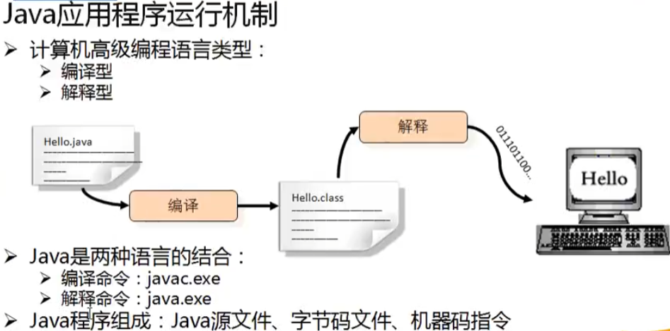

计算机编程语言的类型分为两类：

1. 编译型语言：所有的源代码文件需要进行过编译后才可以使用，例如：C语言
2. 解释型语言：所有的程序直接编写完成源代码后就可以放在服务器上执行，例如：HTML

Java是两类语言的集合，所有的Java源程序都需要进行编译，编译形成二进制字节码之后才可以在JVM上进行执行。


所有的*.java的源代码程序最终都是需要经过编译后才可以使用的，但是编译完成的程序代码并不是一个绑定在某个具体操作系统上的程序，而是一种通用的程序，而这种通用的程序就是JVM所能识别的代码。

# Java 环境搭建

## 1、JDK 的简介

 JDK（Java Development Kit）是一组实现Java程序开发与运行的本地环境，在实际的项目的开发与运行过程之中，往往都会选择一些比较好用的桌面系统（Windows、MacOS）进行开发，而后在一些稳定的服务器系统（Liniux、UNIX、Windows Sever）上进行项目的部署。

Java项目的开发里面实际上分为三个开发方向：

1. Java单机程序（Java SE）：JDK提供的就是单机版本的程序开发支持，包括一些常用的类库、系统支持
2. Java嵌入式开发（Java ME）：实现微型的Java程序开发，相当于在移动设备上植入了一个JVM，后来被Android取代了，后来由于与Oracle版权问题，Google开发了Kotlin平台代替了Android开发
3. Java企业级开发（Java EE）：构建分布式的企业系统平台，也是这么多年以来Java使用最广泛的一种开发模式，它本身基于JavaSE的基础上实现了更高级应用，是离不开原始的JDK的支持

所有的三个开发分支的发展，都离不开JDK的支持，所以可以得到如下对应结构关系

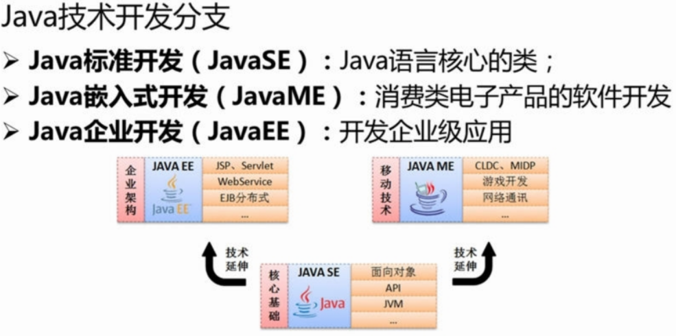


## 2、JDK 的下载

> Java最新JDK和API下载（持续同步更新于官网）：https://blog.csdn.net/jzycloud/article/details/114123530

Java语言属于编译型与解释型的开发语言，对于Java语言，如果要想进行开发，则一定要进行JDK（Java Development Kit）的安装配置，而JDK要想获取则需要通过官方网站获得，并且也需要在本机上进行配置。可简单总结为：Java开发=>JDK的安装配置=>官网获取和本机配置。

最早时JDK是由SUN公司提供的（www.sun.com）但是后来SUN公司被Oracle收购了，所以现在想获取JDK要登陆Oracle官网

1. Oracle官网：www.oracle.com，
2. Open Oracle URL=》Products=》Java=》Download Java Now=》Java Archive
3. JDK官网下载历史版本：
   1. https://www.oracle.com/java/technologies/downloads/archive/
   2. http://jdk.java.net/


**因为官网一直在更新，有时候界面一直在变化，但是链接地址没变，所以直接参考附上链接地址即可。**

对于JDK而言，有其本身的发展历史，主要有如下的几个标志性版本：

1. 1995年05月23日，JDK1.0的开发包发布，同时在1996年的时候，JDK正式提供下载，标志着Java的诞生
2. 1998年12月04日，JDK1.2版本推出，而后Java正式更名为Java2
3. 2005年05月23日，十周年大会推出JDK1.5版本，同时这个版本也是带来新特性以及开发支持更多的历史版本，可以说这一版本直接决定了Java后续十年的技术核心
4. 2014年03月18日，Java提供了JDK1.8版本，并且支持有Lambda表达式，而且可以使用函数式编程（大改革）
5. 2017年09月21日，Java提供了JDK1.9版本，进一步提升了JDK1.8的稳定性
6. 2018年03月20日，Java提供了JDK1.10版本，是属于JDK1.9的稳定版
7. 2018年09月25日，Java提供了JDK11版本，属于大版本更新（稳定长期支持版本）

注意说明JDK收费问题：Java收费了实际上与我们没有任何关系，首先只是对商业的收费，其次即便没有了Oracle提供的JDK，还有OpenJDK（免费开源），所有的JDK都需要符合有一个技术开发规范。


## 3、JDK 的安装与配置

JDK需要区分不同的操作系统，对于大部分的操作系统JDK都有支持，只需要选择好相应的版本下载即可，下载好对应的exe文件安装说明下一步即可（指定好对应的下载路径：D:\Environment\java\jdk-11.0.8）

安装完成之后就需要进行JDK配置处理，在JDK里面所有的可执行程序的路径为：D:\Environment\java\jdk-11.0.8\bin，主要使用javac.exe、java.exe两个命令。但是这两个命令并不属于windows本身，如果要想在命令行直接进行使用，那么需要在windows的系统环境之中进行可执行程序的路径配置（简称：环境变量配置）配置步骤如下：

【计算机】=》【属性】=》【高级系统设置】=》【高级】=》【环境变量】=》【修改path属性】，将可执行程序路径追加在已有的配置之中。

```
JAVA_HOME：JDK的安装路径
PATH：%JAVA_HOME%\bin;%JAVA_HOME%\jre\bin;
CLASSPATH：.;%JAVA_HOME%\lib\dt.jar;%JAVA_HOME%\lib\tools.jar;
注意：JDK8以后可以不用配置CLASSPATH中的dt.jar、rt.jar和tools.jar了
```

> JDK中tools.jar、dt.jar和rt.jar的作用：
>
> 1. dt.jar：位于%JAVA_HOME%\lib下；是关于运行环境的类库，主要是swing的包  在用到swing时最好加上
> 2. tools.jar：位于%JAVA_HOME%\lib下； 是系统用来编译一个类的时候用到的，即执行javac的时候用到
>    javac XXX.java实际上就是运行：java -Calsspath=%JAVA_HOME%\lib\tools.jar xx.xxx.Main XXX.java
>    javac就是对上面命令的封装。所以tools.jar 也不用加到classpath里面
>    Web系统都用到tool.jar。tool.jar应用服务器用来编译JSP文件，应用服务器自己会加载，不需自己设置
> 3. rt.jar：位于{Java_Home}\jre\lib下；是JAVA基础类库，也就是你在java doc里面看到的所有的类的class文件；默认就在Root Classloader的加载路径里面的，而在Claspath配置该变量是不需要的；同时jre/lib目录下大部分jar包都在Root Classloader中

配置成功后打开命令行测试一下：

```bash
C:\Users\lenovo>java --version
java 11.0.8 2020-07-14 LTS
Java(TM) SE Runtime Environment 18.9 (build 11.0.8+10-LTS)
Java HotSpot(TM) 64-Bit Server VM 18.9 (build 11.0.8+10-LTS, mixed mode)

C:\Users\lenovo>javac
用法: javac <options> <source files>
其中, 可能的选项包括:
  @<filename>                  从文件读取选项和文件名
  -Akey[=value]                传递给注释处理程序的选项
  --add-modules <模块>(,<模块>)*
        除了初始模块之外要解析的根模块; 如果 <module>
                为 ALL-MODULE-PATH, 则为模块路径中的所有模块。
# ...省略
```


## 4、JDK 安装目录说明

| 目录名称 | 说明                                                         |
| -------- | ------------------------------------------------------------ |
| bin      | 该路径下存放了JDK的各种工具命令，`javac`和`java`就存放在这个目录 |
| conf     | 该路径下存放了JDK的相关配置文件                              |
| include  | 该路径下存放了一些平台特定的头文件                           |
| jmods    | 该路径下存放了JDK的各种模块                                  |
| legal    | 该路径下存放了JDK各模块的授权文档                            |
| lib      | 该路径下存放了JDK工具的一些补充JAR包                         |

其余文件为说明性文件，且该目录结构为JDK1.9之后的

# Java 编程入门

## 1、Hello World

JDK和环境变量配置完成，我们来进行我们第一个代码实现吧。“Hello World”的源程序实现（通过记事本或者Editplus来编写）：

- 创建一个程序的保存目录：D:\study_java
- 创建一个Hello.java的文件，文件后缀必须为：*.java

```java
public class Hello{
    public static void main(String[] args){
        System.out.println(“Hello World”);
    }
}
```

所有的Java源程序要想执行，可以采用如下的步骤完成：

- 对源代码进行编译：javac Hello.java，完成后会出现 Hello.class 字节码文件，利用JVM进行编译，编译出一套与平台无关的字节码文件（*.class）
- 在JVM上执行字节码文件：java Hello（后面没有任何的后缀，但是执行的是 “*.class” 文件）

---

为了更加方便的理解java程序的主要结构，下面针对第一个程序进行完整的解释：

1、在java程序开发之中最基础的单元是类，所有的程序都必须封装在类中执行，而类的基本定义语法如下：

```java
[public] class 类名称 {}
```

在本程序之中定义的类名称为：“Hello”，而类的定义有两种形式：

- public class 类名称 {}：类名称必须与文件名称保持一致，一个*.java文件里面只允许有一个 public class 定义
- class 类型名 {}：类名称可以与文件名称不一致，但是编译后生成的 *.class 文件的名称就是类名称的定义。一个 *.java 源程序可以定义有多个 class 类，并且编译之后会形成不同的 *.class 文件

> 提示：关于以后源代码定义问题
>
> 1. 在以后进行项目开发的时候，很少会出现一个 *.java 源代码里面定义有多个 class 的情况，所以对于以后的开发而言，一个 *.java 文件里面就定义有一个 public class 类就够了。但是在整个课程学习中如果定义多个文件会产生混乱，所以初期会在一个 *.java 文件中定义有多个类方便学习
> 1. Java语言有着明确的命名要求，以后定义类名称的时候要求每一个单词的首字母必须大写，例如：HelloWorld、TestDemo等，才算标准。

2、主方法：主方法是所有程序执行的起点，并且一定要定义在类之中，Java的主方法定义：

```java
[public] class 类名称 {
    public static void main(String[] args) {
        程序的代码由此开始执行
    }
}
```

Java的主方法名称定义非常的长，具体的解释在后续说明，现在我们简称主类，所有的主类都将采用 public class 来定义。

3、屏幕打印（系统输出）可以直接在命令行方式下进行内容的显示，有两类语法形式：

- 输出之后追加换行：System.out.println(输出内容);
- 输出之后不加换行：System.out.print(输出内容);

```java
public class Hello{
    public static void main(String[] args){
        System.out.print("Hello World-A");
        System.out.println("Hello World-B");
        System.out.println("Hello World-C");
    }
}
```

```java
// 输出内容
Hello World-AHello World-B
Hello World-C

```


## 2、JShell 工具

JShell是从JDK1.9之后提供有的一种交互式的变成环境（世界上许多的语言都有交互式变成，例如：Python、golang）在最初的时候Java并没有提供这样的工具，主要是因为其认为自己是一项专业的开发语言，不应该提供有如此简化的玩具模型。如果想使用JShell，直接打开命令行窗口输入 “jshell” 即可。

操作示例 1：启动jshell工具，在jshell中编写语句

```bash
C:\Users\lenovo>jshell
|  欢迎使用 JShell -- 版本 11.0.8
|  要大致了解该版本, 请键入: /help intro

jshell> 100+100
$1 ==> 200

jshell> 100+200
$2 ==> 300

jshell> System.out.print("Hello World");
Hello World
jshell> System.out.println("Hello World");
Hello World

jshell>
```

有时候可能需要编写很多代码，为了方便JShell提供有文件数据加载功能。定义一个文件：“D:\test.txt“，内容如下：

```java
System.out.println("Hello World-A");
System.out.println("Hello World-B");
```

操作示例 2：在jshell之中读取此文件内容并执行

```bash
jshell> /open d:\test.txt
Hello World-A
Hello World-B

```

操作示例 3：退出交互式环境

```bash
jshell> /exit
|  再见
```


## 3、CLASSPATH 环境属性

如果要完整的对 CLASSPATH 进行解释需要好多的知识，所以我们本次只是对 CLASSPATH 概念做出一个先期的介绍。假设在 D: 目录下提供一个 Hello.class 的字节码文件；

假设当前用户所在的目录为“D:”，那么在这样的情况下可以直接使用 Java 命令进行 Hello.class 字节码文件的解释。但是如果说现在脱离了这个目录，将当前目录修改为了“C:”（C盘目录下并没有 Hello.class 字节码文件），如果再次执行程序解释，这个时候会出现如下的错误提示信息：

```
错误：找不到或无法加载主类 Hello
原因：java.lang.ClassNotFoundException: Hello
```

因为当前目录中没有字节码，那么现在的需求是：可以在不同的目录中都执行 D:\Hello.class 文件，在这样的处理要求下只能配置CLASSPATH环境属性完成

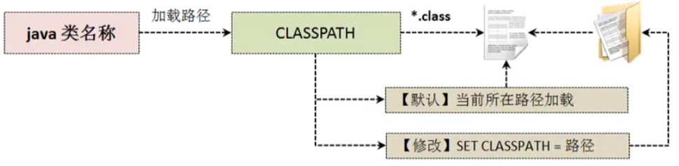

操作示例 1：定义CLASSPATH环境属性（CLASSPATH属于系统变量）

```bash
# 语法：SET CLASSPATH = 路径;...
SET CLASSPATH = D:\
```

当设置了 CLASSPATH 之后，这个时候在 Java 程序解释的时候会自动的通过 CLASSPATH 所设置的路径进行类的加载，所以可以得出一个结论：**JVM 解释程序的时候需要得到 CLASSPATH 的支持。**

但是这样做存在一个问题，一般情况下所有解释的类都是从当前所在的目录中加载的，所以可以得出一个结论：**CLASSPATH 可设置为默认从当前所在目录加载类文件。**如果到处设置 CLASSPATH 就会造成整个系统操作的混乱，那么从正常的角度来讲，对于 CLASSPATH 还是应该采用默认设置方式更为稳妥，只通过当前目录加载，可以将 CLASSPATH 设置为“.”。

操作示例 2：从当前所在路径加载类

```
SET CLASSPATH = .
```

在某些时候如果你安装一些与Java开发程序软件，它有可能会自动的修改默认的 CLASSPATH，也就是说这个“.”的配置会消失。这种情况下就必须利用命令自己重新设置回来。但是需要注意的是，现在的 CLASSPATH 是在一个命令行下的配置，如果该命令行关闭了，那么相关的属性配置也将消失。所以最好的做法是将其定义为全局属性，则可以直接在系统中追加一个属性信息。


**面试题：PATH 和 CLASSPATH 有什么区别？** 

1. PATH 和 CLASSPATH 都是操作系统中支持的环境属性
2. PATH：是操作系统提供的路径配置，定义所有可执行程序的路径
3. CLASSPATH：是由 JRE 提供的，是 JVM 执行时所需要的环境属性，用于定义类的加载路径，默认设置的为当前所在目录加载
4. 总结出 Java 运行一个程序的逻辑关系为：**JVM→CLASSPATH定义的路径→加载字节码文件**

# Java 注释与标识符

## 1、注释

注释是程序开发之中的一项重要组成技术，合理的注释可以使得你们的项目维护更加方便，但是现在很多的公司由于自身的技术管理不到位，很多的注释是不写的，所以就造成了人员更换时期的痛苦。注释的本质在于，编译器在进行程序编译的时候如果发现有注释的内容将不对此部分进行编译处理，在Java语言里面对于注释一共有3类形式：

```java
1. 单行注释：//
2. 多行注释：/*...*/
3. 文档注释：/**...*/  ,文档注释里面还需要有很多的选项，一般建议通过开发工具控制。
```

操作示例 1：定义单行注释

```java
public class JavaAPIDemo {
    public static void main(String[] args) {
        // 单行注释：下面的语句是进行一行提示信息的输出
        System.out.println("Hello World!");
    }
}
```

操作示例 2：多行注释

```java
public class JavaAPIDemo {
    public static void main(String[] args) {
        /*
          多行注释：下面的语句是进行一行提示信息的输出
          xxxx年xx月xx日，xxx改了代码
        */
        System.out.println("Hello World!") ;
    }
}
```

如果在以后使用开发工具的时候，还是单行注释会比较方便一些。而对于一些重要的类或者是方法都建议使用文档注释。


## 2、标识符与关键字

### 1、标识符

在任何一个程序中实际上都是一个结构的整合体，在Java语言里面有不同的结构，例如：类、方法、变量等，那么对于不同的结构一定要有不同的说明。那么对于结构的说明实际上是有命名要求的，但是一般都要求有意义的单词所组成，同时对于标识符的组成在Java之中的定义如下：**由字母、数字、_、$所组成，其中不能使用数字开头，其中不能使用Java保留字（关键字）。**

以后最简单的定义形式：使用英文字母开头，Student_Name、StudentName,而且对于“$”一般都有特殊含义，不建议出现在你自己所编写的代码上。


### 2、关键字

关键字是系统对于一些结构的描述处理，有着特殊的含义。Java中的关键字一共包含有如下的一些内容。

| Java关键字类别       | Java关键字   | 关键字含义                                                   |
| -------------------- | ------------ | ------------------------------------------------------------ |
| 访问控制             | private      | 一种访问控制方式：私用模式，访问控制修饰符，可以应用于类、方法或字段（在类中声明的变量） |
| 类、方法和变量修饰符 | protected    | 一种访问控制方式：保护模式，可以应用于类、方法或字段（在类中声明的变量）的访问控制修饰符 |
|                      | public       | 一种访问控制方式：共用模式，可以应用于类、方法或字段（在类中声明的变量）的访问控制修饰符 |
|                      | abstract     | 表明类或者成员方法具有抽象属性，用于修改类或方法             |
|                      | class        | 声明一个类，用来声明新的Java类                               |
|                      | extends      | 表明一个类型是另一个类型的子类型。对于类，可以是另一个类或者抽象类；对于接口，可以是另一个接口 |
|                      | final        | 表明一个类不能派生出子类，或者成员方法不能被覆盖，或者成员域的值不能被改变，用来定义常量 |
|                      | implements   | 表明一个类实现了给定的接口                                   |
|                      | interface    | 接口                                                         |
|                      | native       | 用来声明一个方法是由与计算机相关的语言（如C/C++/FORTRAN语言）实现的 |
|                      | new          | 用来创建新实例对象                                           |
|                      | static       | 表明具有静态属性                                             |
|                      | strictfp     | 用来声明FP_strict（单精度或双精度浮点数）表达式遵循IEEE 754算术规范 |
|                      | synchronized | 表明一段代码需要同步执行                                     |
|                      | transient    | 声明不用序列化的成员域                                       |
|                      | volatile     | 表明两个或者多个变量必须同步地发生变化                       |
| 程序控制             | break        | 提前跳出一个块                                               |
|                      | continue     | 回到一个块的开始处                                           |
|                      | return       | 从成员方法中返回数据                                         |
|                      | do           | 用在do-while循环结构中                                       |
|                      | while        | 用在循环结构中                                               |
|                      | if           | 条件语句的引导词                                             |
|                      | else         | 用在条件语句中，表明当条件不成立时的分支                     |
|                      | for          | 一种循环结构的引导词                                         |
|                      | instanceof   | 用来测试一个对象是否是指定类型的实例对象                     |
|                      | switch       | 分支语句结构的引导词                                         |
|                      | case         | 用在switch语句之中，表示其中的一个分支                       |
|                      | default      | 默认，例如：用在switch语句中，表明一个默认的分支。Java8 中也作用于声明接口函数的默认实现 |
| 错误处理             | try          | 尝试一个可能抛出异常的程序块                                 |
|                      | catch        | 用在异常处理中，用来捕捉异常                                 |
|                      | throw        | 抛出一个异常                                                 |
|                      | throws       | 声明在当前定义的成员方法中所有需要抛出的异常                 |
| 包相关               | import       | 表明要访问指定的类或包                                       |
|                      | package      | 包                                                           |
| 基本类型             | boolean      | 基本数据类型之一，声明布尔类型的关键字                       |
|                      | byte         | 基本数据类型之一，字节类型                                   |
|                      | char         | 基本数据类型之一，字符类型                                   |
|                      | double       | 基本数据类型之一，双精度浮点数类型                           |
|                      | float        | 基本数据类型之一，单精度浮点数类型                           |
|                      | int          | 基本数据类型之一，整数类型                                   |
|                      | long         | 基本数据类型之一，长整数类型                                 |
|                      | short        | 基本数据类型之一,短整数类型                                  |
|                      | null         | 空，表示无值，不能将null赋给原始类型（byte、short、int、long、char、float、double、boolean）变量 |
|                      | true         | 真，boolean变量的两个合法值中的一个                          |
|                      | false        | 假，boolean变量的两个合法值之一                              |
| 变量引用             | super        | 表明当前对象的父类型的引用或者父类型的构造方法               |
|                      | this         | 指向当前实例对象的引用，用于引用当前实例                     |
|                      | void         | 声明当前成员方法没有返回值，void可以用作方法的返回类型，以指示该方法不返回值 |
| 保留字               | goto         | 保留关键字，没有具体含义                                     |
|                      | const        | 保留关键字，没有具体含义，是一个类型修饰符，使用const声明的对象不能更新 |

对于所有关键字的定义是需要你简要了解的，对于以上的关键字有一些简短的说明：

1. JDK1.4的时候出现有assert关键字，用于异常处理上
2. JDK1.5的时候出现有enum关键字，用于枚举定义上
3. 未使用到的关键字：goto、const
4. 还有一些属于特殊含义的单词，严格来讲不算是关键字：true、false、null


# Java 数据类型

## 1、Java 数据分类

在Java中对于数据类型一共分为两类：

1. 基本数据类型（内置数据类型）：

   - 数值型：
     - 整型：byte、short、int、long（默认值：0）
     - 浮点型：float、double（默认值：0.0f、0.0d、实际输出是0.0）
   - 布尔型：boolean（默认值：false）
   - 字符型：char（默认值：'\u0000'，实际输出是空白）
   - 基本数据类型等级：byte--short--char--int--long--float--double，由左到右等级升高，double为最高级

2. 引用数据类型（牵扯到内存关系的使用）：数组、类、接口（默认值：null）

| 数据类型         | 大小/位 | 数据范围                                                     |
| ---------------- | ------- | ------------------------------------------------------------ |
| long（长整数）   | 64      | -9,223,372,036,854,775,808（-2^63）~  9,223,372,036,854,775,807（2^63 -1 |
| int（整数）      | 32      | -2,147,483,648（-2^31）~  2,147,483,647（2^31 - 1）          |
| short（短整数）  | 16      | -32768（-2^15）~ 32767（2^15 - 1）                           |
| byte（位）       | 8       | -128（-2^7）~ 127（2^7-1）                                   |
| char（字符）     | 16      | 0~65536                                                      |
| float（单精度）  | 32      | -3.4E38（-3.4x10^38）~ 3.4E38（3.4x10^38）                   |
| double（双精度） | 64      | -1.7E308（-1.7x10^308）~ 1.7E308（1.7x10^308）               |

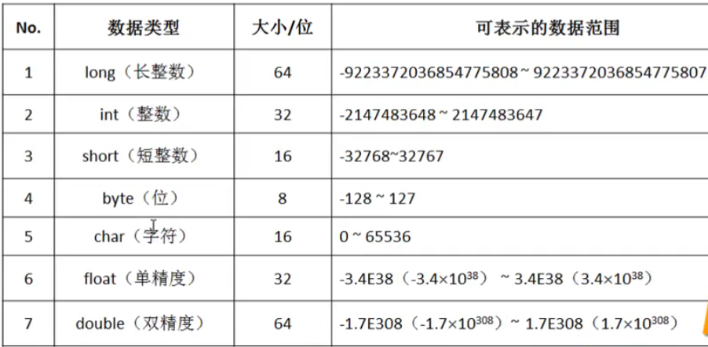

> 备注：Float 和 Double 的最小值和最大值都是以科学记数法的形式输出的，结尾的"E+数字"表示E之前的数字要乘以10的多少次方。比如3.14E3就是3.14 × 103 =3140，3.14E-3 就是 3.14 x 10-3 =0.00314。

对于数值类型的基本类型的取值范围，我们无需强制去记忆，因为它们的值都已经以常量的形式定义在对应的包装类中了。请看下面的例子：

```java
public class PrimitiveTypeTest {
    public static void main(String[] args) {  
        // byte
        System.out.println("基本类型：byte 二进制位数：" + Byte.SIZE);
        System.out.println("包装类：java.lang.Byte");
        System.out.println("最小值：Byte.MIN_VALUE=" + Byte.MIN_VALUE);
        System.out.println("最大值：Byte.MAX_VALUE=" + Byte.MAX_VALUE);
        System.out.println();

        // short
        System.out.println("基本类型：short 二进制位数：" + Short.SIZE);
        System.out.println("包装类：java.lang.Short");
        System.out.println("最小值：Short.MIN_VALUE=" + Short.MIN_VALUE);
        System.out.println("最大值：Short.MAX_VALUE=" + Short.MAX_VALUE);
        System.out.println();

        // int
        System.out.println("基本类型：int 二进制位数：" + Integer.SIZE);
        System.out.println("包装类：java.lang.Integer");
        System.out.println("最小值：Integer.MIN_VALUE=" + Integer.MIN_VALUE);
        System.out.println("最大值：Integer.MAX_VALUE=" + Integer.MAX_VALUE);
        System.out.println();

        // long
        System.out.println("基本类型：long 二进制位数：" + Long.SIZE);
        System.out.println("包装类：java.lang.Long");
        System.out.println("最小值：Long.MIN_VALUE=" + Long.MIN_VALUE);
        System.out.println("最大值：Long.MAX_VALUE=" + Long.MAX_VALUE);
        System.out.println();

        // float
        System.out.println("基本类型：float 二进制位数：" + Float.SIZE);
        System.out.println("包装类：java.lang.Float");
        System.out.println("最小值：Float.MIN_VALUE=" + Float.MIN_VALUE);
        System.out.println("最大值：Float.MAX_VALUE=" + Float.MAX_VALUE);
        System.out.println();

        // double
        System.out.println("基本类型：double 二进制位数：" + Double.SIZE);
        System.out.println("包装类：java.lang.Double");
        System.out.println("最小值：Double.MIN_VALUE=" + Double.MIN_VALUE);
        System.out.println("最大值：Double.MAX_VALUE=" + Double.MAX_VALUE);
        System.out.println();

        // char
        System.out.println("基本类型：char 二进制位数：" + Character.SIZE);  
        System.out.println("包装类：java.lang.Character");
        // 以数值形式而不是字符形式将Character.MIN_VALUE输出到控制台
        System.out.println("最小值：Character.MIN_VALUE=" + (int) Character.MIN_VALUE);
        // 以数值形式而不是字符形式将Character.MAX_VALUE输出到控制台
        System.out.println("最大值：Character.MAX_VALUE=" + (int) Character.MAX_VALUE);
    }
}
```

```java
// 输出内容
基本类型：byte 二进制位数：8
包装类：java.lang.Byte
最小值：Byte.MIN_VALUE=-128
最大值：Byte.MAX_VALUE=127

基本类型：short 二进制位数：16
包装类：java.lang.Short
最小值：Short.MIN_VALUE=-32768
最大值：Short.MAX_VALUE=32767

基本类型：int 二进制位数：32
包装类：java.lang.Integer
最小值：Integer.MIN_VALUE=-2147483648
最大值：Integer.MAX_VALUE=2147483647

基本类型：long 二进制位数：64
包装类：java.lang.Long
最小值：Long.MIN_VALUE=-9223372036854775808
最大值：Long.MAX_VALUE=9223372036854775807

基本类型：float 二进制位数：32
包装类：java.lang.Float
最小值：Float.MIN_VALUE=1.4E-45
最大值：Float.MAX_VALUE=3.4028235E38

基本类型：double 二进制位数：64
包装类：java.lang.Double
最小值：Double.MIN_VALUE=4.9E-324
最大值：Double.MAX_VALUE=1.7976931348623157E308

基本类型：char 二进制位数：16
包装类：java.lang.Character
最小值：Character.MIN_VALUE=0
最大值：Character.MAX_VALUE=65535
```

不同的类型我们保存有不同范围的数据，但是这里面实际上就牵扯到了数据类型的选择上，那么对于以上的数据类型划分我们可以给出个人的一些参考原则：

1. 如果要是描述数字首选一定是int（整数）、double（小数）
2. 如果要进行数据传输或者是进行文字编码转换使用byte类型（二进制处理）
3. 处理中文的时候最方便的操作使用的是char完成（可选）
4. 描述内存或者文件大小，描述表的主键列（自增长）可以使用long

从严格意义的角度上来讲，所有的变量在定义的时候都必须有一个明确的数据类型，但是随着技术的发展（开发规定的变化），现代的语言希望可以出现自动类型的定义，所以在JDK10的时候提供有一个var关键字，表示推测类型，但是Java中的var关键字实际上是一个很鸡肋的产物。

操作示例 1：观察var关键字的作用

```java
public class JavaAPIDemo {
    public static void main(String[] args) {
        var num = 10; // 10描述的是一个整数，所以属于int
        System.out.println(num * 2); // 20
    }
}
```

操作示例 2：var错误操作

```java
public class JavaAPIDemo {
    public static void main(String[] args) {
        var num = 10; // 10描述的是一个整数，所以属于int
        num = true; // 布偶类型，会报错，不兼容类型：boolean无法转换为int
    }
}
```

许多语言的推测类型实际上可以随意修改数据类型，例如：JavaScript、Python里面只要是一个变量任何的类型都可以保存。


## 2、整型数据

整型数据一共有四种，按照保存范围由小到大：byte、short、int、long，那么在Java里面任何的一个整型常量那么其默认的类型都是int型（只要是整数就是int类型的数据）。

### 2.1、int 数据类型

操作示例 1：定义int型变量

```java
public class JavaAPIDemo {
    public static void main(String[] args) {
        //int 变量名称 = 常量（10是一个常量，整数类型为int）
        int x = 10 ; // 定义了一个整型变量x
        //int型变量 * int型变量=int型数据
        System.out.println(x * x);
    }
}
```

```java
// 输出内容
100
```

10永远不会改变，但是x是一个变量，x的内容是可以发生改变的。

操作示例 2：修改x的内容

```java
public class JavaAPIDemo {
    public static void main(String[] args) {
        // int 变量名称 = 常量（10是一个常量，整数类型为int）;
        int x = 10;    // 定义了一个整型变量x
        x = 20;        // 改变了x的已有内容
        // int型变量 * int型变量 = int型数据
        System.out.println(x * x);
    }
}
```


### 2.2、数据溢出处理

任何的数据类型都是有其可以保存的数据范围（正常使用下你很少会出现超过此范围的数据）如果超过了会如何呢？下面通过一个具体代码来进行我们的观察。

操作示例 1：观察超过了int处理范围

```java
public class JavaAPIDemo {
    public static void main(String[] args) {
        int max = Integer.MAX_VALUE; // 获取int的最大值
        int min = Integer.MIN_VALUE; // 获取int的最小值
        System.out.println(max);    // 2147483647
        System.out.println(min);    // -2147483648
        System.out.println("------------- 无以言表的分割线 -----------");
        // int型变量 + int型常量 = int型计算结果
        System.out.println(max + 1);    // -2147483648，最大值 + 1 = 最小值
        System.out.println(max + 2);    // -2147483647，最大值 + 2 = 次最小值
        // int型变量 - int型常量 = int型计算结果
        System.out.println(min - 1);    // 2147483647，最小值 - 1 = 最大值
    }
}
```

```java
// 输出内容
2147483647
-2147483648
------------- 无以言表的分割线 -----------
-2147483648
-2147483647
2147483647
```

通过此时的执行结果可以发现这些数字在进行处理的时候如果超过了其最大的保存范围，那么将出现有循环的问题，而这种问题在Java中被称为数据溢出，那么要想解决这种溢出，可以继续扩大使用范围，比int范围更大的是long。

操作示例 2：解决数据溢出

- 在操作的时候预估数据范围，如果发现数据范围不够，就使用更大范围；

```java
public class JavaAPIDemo {
    public static void main(String[] args) {
        // long long变量 = int的数值
        long max = Integer.MAX_VALUE; // 获取int的最大值
        long min = Integer.MIN_VALUE; // 获取int的最小值
        System.out.println(max);    // 2147483647
        System.out.println(min);    // -2147483648
        System.out.println("------------- 无以言表的分割线 -----------");
        // long型变量 + int型常量 = long型计算结果
        System.out.println(max + 1);    // 2147483648
        System.out.println(max + 2);    // 2147483649
        // long型变量 - int型常量 = long型计算结果
        System.out.println(min - 1);    // -2147483649
    }
}
// 输出内容
2147483647
-2147483648
------------- 无以言表的分割线 -----------
2147483648
2147483649
-2147483649
```

- 除了可以定义long型的变量之外，也可以直接在常量上进行处理，默认的整数常量都是int型，那么可以为它追加字母“L”或直接使用“（long）”转换。

```java
public class JavaAPIDemo {
    public static void main(String[] args) {
        int max = Integer.MAX_VALUE; // 获取int的最大值
        int min = Integer.MIN_VALUE; // 获取int的最小值
        System.out.println(max);    // 2147483647
        System.out.println(min);    // -2147483648
        System.out.println("------------- 无以言表的分割线 -----------");
        // int型变量 + long型常量 = long型计算结果
        System.out.println(max + 1L);    // 2147483648
        System.out.println(max + 2l);    // 2147483649
        // long型变量 - int型常量 = long型计算结果
        System.out.println((long) min - 1);    // -2147483649
    }
}
// 输出内容
2147483647
-2147483648
------------- 无以言表的分割线 -----------
2147483648
2147483649
-2147483649
```


### 2.3、int 强制转换

现在发现数据类型之间是可以转换的，即：范围小的数据类型可以自动转为范围大的数据类型，但是如果反过来，范围大的数据类型要转为范围小的数据类型，那么就必须采用强制性的处理模式，同时还需要考虑可能带来的数据溢出。

操作示例：强制类型转换（程序支持有数据转换处理，但是如果不是必须的情况下不建议这种转换。）

```java
public class JavaAPIDemo {
    public static void main(String[] args) {
        long num = 2147483649L; // 此数据已经超过了int范围
        int temp = (int) num; // long范围比int范围大，不能够直接转换
        System.out.println(temp); // -2147483647
    }
}
```


### 2.4、byte 数据类型

在进行整型处理的时候，还有一个byte类型特别需要注意，首先这个类型的范围是：-128~127，它保存的数据量很小。

操作示例 1：定义byte变量

```java
public class JavaAPIDemo {
    public static void main(String[] args) {
        byte num = 10;
        System.out.println(num * num);  // byte * byte=byte  100

        num = 20;
        System.out.println(num); // 20
        System.out.println(num * num); // 400, 实际等于int，参考下面

        int result = num * num;
        System.out.println(result); // 400
    }
}
```

```java
// 输出内容
100
20
400
400
```


### 2.5、byte 强制转换

正常来讲在Java程序里面20这个数字应该是int型，但是在为byte赋值的时候并没有因为是int型而发生强制类型转换，这是因为Java对byte做了特殊处理，即：如果没超过byte范围的常量可以自动由int变为byte，如果超过，就必须进行强制转换。

操作示例 1：int强制转换为byte

```java
public class JavaAPIDemo {
    public static void main(String[] args) {
        byte num = (byte) 200;
        System.out.println(num); // -56
    }
}
```

由于200已经超过了byte的范围，所以产生了数据溢出的问题。需要提醒的是，对于常量可以自动适配转换，但是如果对于变量，则还是必须执行强制转换处理。

操作示例 2：变量强制转换

```java
public class JavaAPIDemo {
    public static void main(String[] args) {
        int x = 200;
        byte num = x; // 报错：java: 不兼容的类型: 从int转换到byte可能会有损失
        System.out.println(num);
    }
}
```


## 3、浮点型数据

浮点型数据描述的是小数，而在Java里面，任意的一个小数常量，其对应的类型为double，所以在以后描述小数的时候都建议直接使用double来进行定义。

操作示例 1：定义double变量

```java
public class JavaAPIDemo {
    public static void main(String[] args) {
        // 10.2是一个小数其对应的类型为double
        double x = 10.2;
        int y = 10;
        // double类型 * int类型 = double类型
        double result = x * y;
        System.out.println(result); // 102.0，double类型
    }
}
```

所有的数据类型进行自动转型的时候都是由小类型向大类型进行自动的转换处理。默认的类型为double，但是也可以定义位数相对较少的float变量，此时从赋值的时候就必须采用强制类型转换。

操作示例 2：定义float变量

```java
public class JavaAPIDemo {
    public static void main(String[] args) {
        float x = (float) 10.2;
        float y = 10.1F;
        System.out.println(x * y); // 103.02，float型
    }
}
```

通过一系列的代码分析可以发现，整型是不包含有小数点的，而浮点型是包含小数点的。

操作示例 3：观察一个程序

```java
public class JavaAPIDemo {
    public static void main(String[] args) {
        int x = 10;
        int y = 4;
        System.out.println(x / y); // 2
    }
}
```

此时计算结果为2，得到2的主要原因在于：整型是不保存有小数点的，所以现在的计算结果为“2.5”，那么抛开小数点不看，最终的结果只是2，如果现在想得到所需要的正确的计算，那么就需要我们的转型处理。

操作示例 4：数据转型

```java
public class JavaAPIDemo {
    public static void main(String[] args) {
        int x = 10;
        int y = 4;
        System.out.println((double) x / y); // 2.5
    }
}
```

在以后计算的时候千万注意你选择的数据类型，将直接决定小数点的问题，这一点至关重要。

> 为什么JAVA编程语言用float定义单精度变量时要在数值后面加F或f呢？[参考资料](https://blog.csdn.net/weixin_42467088/article/details/114027245)
>
> 原来是在JAVA中，当遇到有包含不同类型的数值在进行运算时都会自动默认向运算中最高级的数值转换，基本数据类型的等级划分如下：byte--short--char--int--long--float--double，由左到右等级升高，double为最高级；
>
> 值得一提的是，仅包含前三种类型byte，short和char任意两种类型的运算在参与运算时会自动转换为int后再进行运算，此时最终数值会变成int类型，如果不止仅前三种数值参与运算，最开始说的向最高级转换的规则依然成立，我把它们概括为“下三滥”，弱者是没有权利的，只能向int看齐，如果有出现比int更高级则转换成更高级的，趋炎附势。其中，float类型虽然只有4个字节却要比long更高级，因为它能容纳小数。
>
> 那么为什么要加F呢，那是因为跟上面说的下三滥参与运算要向int以及更高的看齐而不认同自己三个中的任何一个一样，因为他们谁也看不起谁，float也是一样的道理，他就是一个没权利的渣，每次都要自动默认转换成double类型，为了以示区分，在赋值的后面加F/f以示区分，例如：
>
> 1. float a=123.123f；为什么？因为定义变量还有一种方法
>
> 2. float a;
>
> 3. a=123.345; 先定义再赋值，如果赋值行数离定义行太远
>
> 4. 那么a=123.345这种写法就会被误以为是double值了
> 5. 所以写成a=123.345F或者小写的f，我们可以一眼看出它是float值了
>
> 至于为什么要自动转换，如图1所示，一个格子代表一个字节，分别代表1个自己的Byte和4个字节的int类型，运算时把Byte转换成int类型运算，结果还是int类型，有人说可以前面四个格子截取因为都是0没意义，但是有些情况前面任何一个格子有一个1那么截取数据是不是出问题了？这就是精度丢失。


## 4、字符型数据

字符型使用的是char进行定义的，在Java之中使用“’”定义的内容就是一个字符。

操作示例 1：定义一个字符型变量

```java
public class JavaAPIDemo {
    public static void main(String[] args) {
        char c = 'B'; // 一个字符变量
        System.out.println(c); // 输出:B
    }
}
```

在任何编程语言之中，字符都可以与int进行互相转换，也就是说，字符中所描述的内容可以通过int来获取其内容对应的系统编码。

操作示例 2：观察char与int的关系

```java
public class JavaAPIDemo {
    public static void main(String[] args) {
        char c = 'A'; // 一个字符变量
        int num = c;  // 可以获得字符的编码
        System.out.println(num); // 65
    }
}
```

对于以上的程序获得了编码，这里面有几个范围需要注意一下：

1. 大写字母范围：A（65）~Z（90）
2. 小写字母范围：a（97）~z（122）
3. 数字范围：’0’（48）~ ’9’（57）

通过编码范围可以发现大小写字母之间差了32个数字的长度，这样可以实现一个大小写的转换处理。操作示例 3：将小写字母变为大写字母

```java
public class JavaAPIDemo {
    public static void main(String[] args) {
        char c = 'x'; // 一个字符变量
        int num = c;  // 可以获得字符的编码
        num = num – 32; // 让自己的内容减少32
        System.out.println((char)num); // 结果：X
    }
}
```

到此为止所有的操作都与传统的C语言的方式是一样的，但是需要注意的是，在Java里面char主要是进行中文处理，所以，一定要记住，Java中的char类型可以保存中文数据。

操作示例 4：保存中文数据

```java
public class JavaAPIDemo {
    public static void main(String[] args) {
        char c = '仁'; // 一个字符变量
        int num = c; // 可以获得字符的编码
        System.out.println(num); // 20161
    }
}
```

之所以在Java语言里面可以使用char进行中文数据的保存，是因为Java使用的是Unicode这种十六进制的编码。主要特点是：**可以包括任意的文字内容，**所以使得程序开发变得更加的简单。


## 5、布尔数据

布尔是一位数学家的名字，布尔主要描述的是一种逻辑的处理结果，在Java中使用boolean来进行布尔类型的变量定义。需要注意的是，布尔类型的取值范围只有两个数据：**true、false**。

操作示例：定义布尔型数据

```java
public class JavaAPIDemo {
    public static void main(String[] args) {
        boolean flag = true;
        // 判断flag的内容，如果是true就执行
        if (flag) {
            System.out.println("我很帅，我很年轻！");
        }
    }
}
```

但是需要说明一点，像有一些编程语言由于没有提供有布尔类型，所以会使用0表示false，非0表示true，这样的逻辑在Java之中是不存在的。


## 6、字符串【String】

在任何语言里面都没有提供所谓的字符串这种基本数据类型，但是从实际的使用上来讲各个编程语言为了方便程序的开发也都会提供有字符串的相应描述。在Java里面使用的是String作为字符串的定义。由于String类的存在较为特殊，所以可以像普通变量那样采用直接赋值的方式进行字符串的定义，并且要求使用“”进行字符串描述。

操作示例 1：定义一个字符串

```java
public class JavaAPIDemo {
    public static void main(String[] args) {
        String str = "Hello World !"; // 使用“"”进行描述
        System.out.println(str); // Hello World !
    }
}
```

在进行字符串变量使用的时候也可以使用“+”来进行字符串的连接处理。操作示例 2：实现字符串连接

```java
public class JavaAPIDemo {
    public static void main(String[] args) {
        String str = "Hello"; // 使用“"”进行描述
        str = str + " World"; // 字符串连接
        str += " !!!" ;       // 字符串连接
        System.out.println(str); // Hello World !!!
    }
}
```

但是需要考虑另外一点，此时对于“+”就有了两种描述：字符串的连接、数字的加法计算。操作示例 3：观察“+”的问题

```java
public class JavaAPIDemo {
    public static void main(String[] args) {
        double x = 10.1;
        int y = 20;
        String str = "计算结果：" + x + y;
        System.out.println(str); // 执行结果：10.120
    }
}
```

在Java语言里面，数据范围大的数据类型与数据范围小的数据类型进行计算的时候，所有范围小的数据类型自动转型为范围大的数据类型，但是如果此时有String字符串了，则所有的类型无条件先变为String

```java
public class JavaAPIDemo {
    public static void main(String[] args) {
        double x = 10.1;
        int y = 20;
        String str = "计算结果：" + (x + y);
        System.out.println(str); // 执行结果：30.1
    }
}
```


## 7、转义字符

在描述字符串的时候也可以使用转义字符进行一些处理，例如：TAB（t）、”(”)、’(’)、换行（n）、(\)。

操作示例：观察转义字符

```java
public class JavaAPIDemo {
    public static void main(String[] args) {
        System.out.println("Hello World !!! \nHello XXXX!");
        System.out.println("Hello World !!! \nHello \"XXXX\"!");
        System.out.println("\tHello World !!! \nHello \"XXXX\"!"); 
    }
}

// 输出内容
Hello World !!! 
Hello XXXX!
Hello World !!! 
Hello "XXXX"!
	Hello World !!! 
Hello "XXXX"!
```

这些字符是可以在学习的过程中进行一些简单的格式化显示处理。


# Java 运算符

## 1、运算符简介

所有的数据都有各自的类型进行描述，但是对于数据也需要进行各种运算（不仅仅指的是计算）例如：在之前使用过的赋值运算符：

```
数据类型 变量 = 数值（或者一系列的数学计算操作）
```

这就属于一种运算符，所有的运算符都是从等号的右边执行完毕后再进行赋值处理的，而执行的步骤也是依靠从左向右的顺序完成的，但是对于运算符来讲有一点十分重要。

操作示例：观察一种神奇的操作

```java
public class JavaAPIDemo {
    public static void main(String[] args) {
        int numA = 10;
        int numB = 20;
        int result = numA * ++numB - numA/3 + ++numA -numB * ++numB;
        System.out.println(result); // 执行结果：-244
    }
}
```

| 优先级 | 运算符     | 名称                       | 结合性   | 目数 |
| ------ | ---------- | -------------------------- | -------- | ---- |
| 1      | .          | 点                         | 从左到右 | 双目 |
|        | ( )        | 圆括号                     | 从左到右 |      |
|        | [ ]        | 方括号                     | 从左到右 |      |
| 2      | +          | 正号                       | 从右到左 | 单目 |
|        | -          | 负号                       | 从右到左 | 单目 |
|        | ++         | 自增                       | 从右到左 | 单目 |
|        | - -        | 自减                       | 从右到左 |      |
|        | ~          | 按位非/取补运算            | 从右到左 | 单目 |
|        | ！         | 逻辑非                     | 从右到左 | 单目 |
| 3      | *          | 乘                         | 从左到右 | 双目 |
|        | /          | 除                         | 从左到右 | 双目 |
|        | %          | 取余                       | 从左到右 | 双目 |
| 4      | +          | 加                         | 从左到右 | 双目 |
|        | -          | 减                         | 从左到右 | 双目 |
| 5      | <<         | 左移位运算符               | 从左到右 | 双目 |
|        | >>         | 带符号右移位运算符         | 从左到右 | 双目 |
|        | >>>        | 无符号右移                 | 从左到右 | 双目 |
| 6      | <          | 小于                       | 从左到右 | 双目 |
|        | <=         | 小于或等于                 | 从左到右 | 双目 |
|        | >          | 大于                       | 从左到右 | 双目 |
|        | >=         | 大于或等于                 | 从左到右 | 双目 |
|        | instanceof | 确定某对象是否属于指定的类 | 从左到右 | 双目 |
| 7      | ==         | 等于                       | 从左到右 | 双目 |
|        | !=         | 不等于                     | 从左到右 | 双目 |
| 8      | &          | 按位与                     | 从左到右 | 双目 |
| 9      | \|         | 按位或                     | 从左到右 | 双目 |
| 10     | ^          | 按位异或                   | 从左到右 | 双目 |
| 11     | &&         | 短路与                     | 从左到右 | 双目 |
| 12     | \|\|       | 短路或                     | 从左到右 | 双目 |
| 13     | ? :        | 条件运算符                 | 从右到左 | 三目 |
| 14     | =          | 赋值运算符                 | 从右到左 | 双目 |
|        | +=         | 混合赋值运算符             | 从右到左 | 双目 |
|        | -=         | 混合赋值运算符             | 从右到左 | 双目 |
|        | *=         | 混合赋值运算符             | 从右到左 | 双目 |
|        | /=         | 混合赋值运算符             | 从右到左 | 双目 |
|        | %=         | 混合赋值运算符             | 从右到左 | 双目 |
|        | &=         | 混合赋值运算符             | 从右到左 | 双目 |
|        | \|=        | 混合赋值运算符             | 从右到左 | 双目 |
|        | ^=         | 混合赋值运算符             | 从右到左 | 双目 |
|        | <<=        | 混合赋值运算符             | 从右到左 | 双目 |
|        | >>=        | 混合赋值运算符             | 从右到左 | 双目 |
|        | >>>=       | 混合赋值运算符             | 从右到左 | 双目 |

一般来说基本上不用去记这些优先级，在开发里面需要记住一个基本原则：所有的运算符的优先级尽量通过括号来修改。


## 2、数学运算符

在Java中数学运算都提供了一个标准的支持。包括四则运算都是支持的。操作示例 1：实现一个简单的四则运算

```java
public class JavaAPIDemo {
    public static void main(String[] args) {
        int result = 890234890 * ( 2902390 + 100 ) * 2;
        System.out.println(result); // 执行结果：886891784
    }
}
```

在进行计算的时候，编程语言一般也都会提供有简化(+=、*=、-=、/=、%=)的运算符支持。操作示例 2：简化运算符

```java
public class JavaAPIDemo {
    public static void main(String[] args) {
        int num = 10;
        num += 20; // num =num + 20;
        System.out.println(num); // 执行结果：30
    }
}
```

对于以上"num =num + 20;"代码，在内存小的时代就不适合了，所以才提供有一系列的简化运算。

操作示例 3：求模

```java
public class JavaAPIDemo {
    public static void main(String[] args) {
        int num = 10;
        num %= 3;
        System.out.println(num); // 执行结果：1
    }
}
```

在数学计算里面最头疼的是“++”、“--”，因为这两种运算符有两类使用方法：

1. **++变量、--变量：**先进行变量的自增或自减，而后在进行数字的计算
2. **变量++、变量--：**先使用变量进行计算，而后再进行自增或自减

操作示例 4：实现自增与自减

```java
public class JavaAPIDemo {
    public static void main(String[] args) {
        int x = 10 ;
        int y = 20 ;
        // 1、++ x：首先x的内容要先自增1，为11；
        // 2、y --：先进行计算，使用的内容是20，计算完成后自减
        int result = ++ x - y -- ;
        System.out.println("计算结果：" + result); // -9
        System.out.println("x = " + x); // 11
        System.out.println("y = " + y); // 19
    }
}
```

这些代码程序都是在当初内存不大的情况下提供的处理方式，但是现在来看，这种计算就较为繁琐，尤其是在硬件成本降低的今天，这类操作如果不是必须的情况下，不建议这样使用。

```java
public class JavaAPIDemo {
    public static void main(String[] args) {
        int x = 10;
        int y = 20;
        ++ x;
        int result = x - y; // -9
        y --;
        System.out.println("计算结果：" + result); // -9
        System.out.println("x = " + x); // 11
        System.out.println("y = " + y); // 19
    }
}
```


## 3、关系运算符

关系运算符只要特征进行大小的比较处理，包括：大于（>）、小于（<）、大于等于（>=）、小于等于（<=）、不等（！=）、相等（==）。所有的关系运算返回值类型为布尔型。

操作示例 1：做一个大小关系的判断

```java
public class JavaAPIDemo {
    public static void main(String[] args) {
        int x = 10;
        int y = 20;
        boolean flag = x > y; // false
        System.out.println(flag); // false
    }
}
```

在进行关系判断的时候需要注意的是相等的判断问题。在Java里面“=”表示赋值运算，“==”是内容相同的比较。操作示例 2：判断相等

```java
public class JavaAPIDemo {
    public static void main(String[] args) {
        int x = 10;
        int y = 10;
        boolean flag = x == y; // true
        System.out.println(flag); // true
    }
}
```

在进行关系运算的时候可以针对所有的基本数据类型，例如：也可以直接使用字符来处理。操作示例 3：在字符处理上使用关系运算

```java
public class JavaAPIDemo {
    public static void main(String[] args) {
        char c = '建';
        boolean flag = 24314 == c; // true
        System.out.println(flag); // true
    }
}
```

数据类型之间提供有转型支持，所以在进行判断的时候字符会自动转为int而后进行数字的比较。


## 4、三目运算符

三目运算符是一个非常有特点，并且非常方便使用的赋值运算，它的主要的特征是进行相应布尔表达式的计算，而后可以根
据结果来进行最终的赋值操作，这种布尔表达式是可以进行无限制的嵌套的，基本的语法流程如下：

```
关系运算？关系满足时的内容：关系不满足时的内容。
```

操作示例 1：判断两个数字的大小，将最大值保存

```java
public class JavaAPIDemo {
    public static void main(String[] args) {
        int x = 10;
        int y = 20;
        // 判断x与y的大小关系来决定最终max变量的内容
        int max = x > y ? x : y;
        System.out.println(max); // 执行结果：20
    }
}
```

操作示例 2：不用三目运算符去编写同样的程序：

```java
public class JavaAPIDemo {
    public static void main(String[] args) {
        int x = 10;
        int y = 20;
        // 判断x与y的大小关系来决定最终max变量的内容
        int max = 0;
        if (x > y) {
            max = x;
        } else {
            max = y;
        }
        System.out.println(max); // 执行结果：20
    }
}
```

操作示例 3：三目运算嵌套，将三个数字的最大值保存下来（三目运算本身也可以进行嵌套处理，也就是说在赋值语句位置上可以进一步编写三目运算符）

```java
public class JavaAPIDemo {
    public static void main(String[] args) {
        int x = 10;
        int y = 20;
        int z = 15;
        int max = x > y ? (x > z ? x : z) : (y > z ? y : z) ;
        System.out.println(max); // 执行结果：20
    }
}
```

虽然允许进行嵌套处理，但是程序的可读性变得很差，根据实际情况判断是否使用三目运算。


## 5、逻辑运算

逻辑运算主要就三种：与（&&、&）、或（||、|）、非（!）

操作示例 1：观察非运算（非得本质就是针对于操作得结果得true变为false、false变为true）

```java
public class JavaAPIDemo {
    public static void main(String[] args) {
        boolean flag = !(1 > 2);
        System.out.println(flag); // 执行结果：true
    }
}
```

与操作得主要特征是进行若干个判断条件的连接，并且如果所有的条件都返回true的时候最终才会返回true，有一个条件为false，最终的结果就是false。具体可以参考下表：

| flagA | flagB | 计算操作      | 计算结果 |
| ----- | ----- | ------------- | -------- |
| true  | false | flagA & flagB | false    |
| true  | true  | flagA & flagB | true     |
| false | true  | flagA & flagB | false    |
| false | false | flagA & flagB | false    |

操作示例 2：观察普通与（&）操作

```java
public class JavaAPIDemo {
    public static void main(String[] args) {
        int x = 1 ;
        int y = 1 ;
        if (x == y & 2 > 1) {
            System.out.println("条件满足！") ;
        }
    }
}
```

操作示例 3：观察普通与（&）操作（现在如果要进行除法计算，被除数肯定不能是0，否则会出现：“ArithmeticException”异常信息）

```java
public class JavaAPIDemo {
    public static void main(String[] args) {
        if (1 > 2 & 10/0 == 0) {
            System.out.println("条件满足！") ;
        }
    }
}
// 输出内容
Exception in thread "main" java.lang.ArithmeticException: / by zero
	at com.example.JavaAPIDemo.main(JavaAPIDemo.java:3)
```

只有在第二个判断条件执行的情况下才会出现错误信息。但是这个时候需要思考一下，“1 > 2” 这个条件注定返回就是一个false，这样不管后面会有多少个true返回，最终的结果都是false，那么这样继续判断完成所有的条件就显得非常浪费了。为了解决这样的问题，所以提供有一种短路与（&&）的概念，即：如果前面有条件返回false，那么后续判断不再执行了，最终的结果就是false。

操作示例 4：使用短路与（&&）操作（此时程序并没有任务的错误，所以可以得出结论，第二个条件并没有执行）

```java
public class JavaAPIDemo {
    public static void main(String[] args) {
        if (1 > 2 && 10/0 == 0) {
            System.out.println("条件满足！") ;
        }
    }
}
```

---

逻辑运算中的或操作指的是有一个内容为true结果就为true，其真值表定义如下：

| flagA | flagB | 计算操作       | 计算结果 |
| ----- | ----- | -------------- | -------- |
| true  | false | flagA \| flagB | true     |
| true  | true  | flagA \| flagB | true     |
| false | true  | flagA \| flagB | true     |
| false | false | flagA \| flagB | false    |

操作示例 5：观察普通或（|）

```java
public class JavaAPIDemo {
    public static void main(String[] args) {
        if (1 != 2 | 10/0 == 0) {
            System.out.println("条件满足！") ;
        }
    }
}
Exception in thread "main" java.lang.ArithmeticException: / by zero
	at com.example.JavaAPIDemo.main(JavaAPIDemo.java:3)
```

此时出现了错误，表示两个判断条件都进行你了判断，但是或操作的本质在于：若干个条件只有一个条件返回了true，最终的结果就是true，所以按照此时的依据，如果现在第一个条件返回了true，那么后续的判断实际上就没有任何意义了，所以应判断，那么就使用短路或 “||”

操作示例 6：使用短路或（||）

```java
public class JavaAPIDemo {
    public static void main(String[] args) {
        if (1 != 2 || 10/0 == 0) {
            System.out.println("条件满足！") ;
        }
    }
}
```

以后开发，99%都是用&&、||。


## 6、位运算符

位运算指的是可以直接进行二进制数据的计算处理，主要有：**与（&）、或（|）、异或（^）、反码（~）、移位（>>、<<）处理。**如果要想理解位操作，则一定要清楚十进制与二进制之间的转换处理逻辑：数字除2取余。

十进制与二进制之间的转换原则：十进制数字 ➗ 2 取余，一直除到内容为0，而后按照倒序排序，现在假设有一个13的十进制数据，如果要想将其变为二级制，则操作步骤如下：

```java
逆序组合：1101=》1*2^0 + 0*2^1 + 1*2^2 + 1*2^3 = 13
```

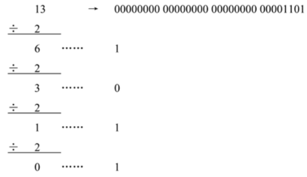

一定要清楚，Java中的整型使用32位进行定义，其中第一位是符号位：**0**0000000 00000000 00000000 00001101

操作示例 1：观察与操作，如果两位都是1结果才是1，有一位是0，结果就是0。

```java
public class JavaAPIDemo {
    public static void main(String[] args) {
        int x = 13 ;
        int y = 7 ;
        System.out.println(x & y) ; // 执行结果：5
    }
}
13的二进制：00000000000000000000000000001101
7的二进制 ：00000000000000000000000000000111
&计算     ：00000000000000000000000000000101
```

操作示例 2：观察或运算，有1位是1结果就是1,2位都是0的结果才是0

```java
public class JavaAPIDemo {
    public static void main(String[] args) {
        int x = 13 ;
        int y = 7 ;
        System.out.println(x | y) ; // 执行结果：15
    }
}
13的二进制：00000000000000000000000000001101
7的二进制 ：00000000000000000000000000000111
|计算     ：00000000000000000000000000001111
```

操作示例 3：移位处理，在进行位运算处理的时候还可以进行移位的计算。例如：以2的3次方计算为例。

```java
public class JavaAPIDemo {
    public static void main(String[] args) {
        int x = 2 ;
        System.out.println(x << 2) ; // 8
        System.out.println(x) ; // 2
    }
}
2的二进制：00000000000000000000000000000010
向左移2位：00000000000000000000000000001000
```

**面试题：请解释&和&&、|和||的区别？**

&和|两个运算符可以进行关系运算与逻辑运算：

1. 在进行逻辑运算的时候所有的判断条件都要执行
2. 在进行位运算的时候只是针对于当前的数据进行与和或处理

在逻辑运算上还可以使用&&、||：

1. &&：在若干个条件判断的时候，如果前面的条件返回了false，后续的所有条件不再判断最终的结果就是false
2. ||:在若干个条件判断的时候，如果前面的条件返回了true，后续条件不再执行最终的结果就是true

# Java 程序逻辑控制

## 1、程序的结构设计

Java的程序逻辑控制，包含了If分支结构、Switch分支语句、While循环结构、For循环结构、循环控制、循环嵌套等内容，这些都是需要重点掌握的，是Java学习中比较重要的环节。

在程序开发过程之中，一共会存在3种程序逻辑：**顺序结构、分支结构、循环结构**

1. 顺序结构：所有的代码都会按照其定义的先后顺序执行，在之前所编写的所有代码都是顺序结构
2. 分支结构：所有的程序执行可以有不同的执行流程
3. 循环结构：某一段代码的重复执行

操作示例：顺序结构

```java
public class JavaAPIDemo {
    public static void main(String[] args) {
        int x = 10;
        x = x * 19;
    }
}
```


## 2、IF 分支结构

If分支结构主要是针对于关系表达式进行判断处理的分支操作。对于分支语句主要有三类的使用形式，使用的关键字：**if、else**。

```java
// if判断：
if(布尔表达式) {
    条件满足时执行;
}

// if…else判断：
if (布尔表达式) {
    条件满足时执行;
} else {
    条件不满足时执行;
}

// 多条件判断：
if (布尔表达式) {
    条件满足时执行;
} else if (布尔表达式) {
    条件满足时执行;
} else if (布尔表达式) {
    条件满足时执行;
} [else {
    条件不满足时执行;
}]
```

操作示例 1：观察if语句

```java
public class JavaAPIDemo {
    public static void main(String[] args) {
        int age = 22 ;
        if (age >= 18 && age <= 20) {
            System.out.println("光荣的参与为人民服务的志愿活动！");
        }
        System.out.println("回到正常的生活轨迹！");
    }
}

// 输出内容
回到正常的生活轨迹！
```

操作示例 2：使用if..else。现在要进行不满足条件时的执行可以使用if..else操作

```java
public class JavaAPIDemo {
    public static void main(String[] args) {
        double money = 20.00 ;
        if (money >= 19.8) {
            System.out.println("走到售卖处，很霸气的拿出20元，说不用找了。");
        } else {
            System.out.println("在灰暗的角落等待着别人剩下的东西。");
        }
        System.out.println("好好吃饭，好好的喝！");
    }
}

// 输出内容
走到售卖处，很霸气的拿出20元，说不用找了。
好好吃饭，好好的喝！
```

操作示例 3：多条件判断。在使用if的时候最主要的特点是：可以进行若干条件的判断

```java
public class JavaAPIDemo {
    public static void main(String[] args) {
        double score = 90.00 ;
        if (score >= 90.00 && score <=100) {
            System.out.println("优等生。");
        } else if(score >=60 && score < 90) {
            System.out.println("良等生。");
        } else {
            System.out.println("差等生。");
        }
    }
}

// 输出内容
优等生。
```

PS：在进行多条件判断的时候，可以不写else语句。但一般推荐要写上else语句。


## 3、Switch 分支语句

Switch是一个开关语句，主要是根据内容来进行判断。Switch中可以判断的只能是数据（整型、char、枚举、String），而不能够使用逻辑判断。语法如下：

```java
switch(数据) {
    case 数值 : {
      数值满足时执行;
      [break ;]
    } 
    case 数值 : 
      数值满足时执行;
      [break ;]
    [default:
       所有判断数值不满足时的执行;
       [break ;]
    ]
}
```

操作示例 1：观察Switch语句

```java
public class JavaAPIDemo {
    public static void main(String[] args) {
        int ch = 2 ;
        switch (ch) {
            case 2 :
                System.out.println("设置的内容是2。");
            case 1 : {
                System.out.println("设置的内容是1。");
            }
            default : {
                System.out.println("没有内容满足。");
            }
        }
    }
}

// 输出内容
设置的内容是2。
设置的内容是1。
没有内容满足。
```

上述执行结果，**所有语句均输出**。Switch语句在进行设计的时候，如果在每一个case后面没有追加break语句，那么会在第一个匹配的case之后继续执行，一直到全部的switch中后续代码执行完毕或者遇到break。

操作示例 2：使用break

```java
public class JavaAPIDemo {
    public static void main(String[] args) {
        int ch = 2 ;
        switch (ch) {
            case 2 :
                System.out.println("设置的内容是2。") ;
                break ;
            case 1 : {
                System.out.println("设置的内容是1。") ;
                break ;
            }
            default : {
                System.out.println("没有内容满足。") ;
                break ;
            }
        }
    }
}

// 输出内容
设置的内容是2。
```

从JDK1.7开始，Oracle公司推出的JDK1.7版本里面将开发者呼吁10年以上的功能添加到了系统之中：添加字符串数据的判断。

操作示例 3：判断字符串

```java
public class JavaAPIDemo {
    public static void main(String[] args) {
        String str = "hello" ;
        switch(str) {
            case "Hello":{
                System.out.println("Hello") ;
                break ;
            }
            case "hello": {
                System.out.println("hello") ;
                break ;
            }
            default: {
                System.out.println("NoMatch") ;
            }
        }
    }
}

// 输出内容
Hello
```

注意：Switch这个语句是编程语言发展的重要技术


## 4、While 循环结构

所谓的循环结构是指某一段代码被重复执行的处理操作。在程序中提供有while语句来实现循环定义，该语句有两种使用形式：

```java
// While循环：
while (布尔表达式) {
    条件满足时执行 ;
    修改循环条件 ;
}

// do…while循环：
do {
    条件满足时执行 ;
    修改循环条件 ;
} while (布尔表达式) ;
```

操作示例 1：实现1~100的累加

```java
public class JavaAPIDemo {
    public static void main(String[] args) {
        int sum = 0 ; // 保存最终的计算总和
        int num = 1 ; // 进行循环控制
        while (num <= 100) {    // 循环的执行条件
            sum += num ; // 累加
            num ++ ;     // 修改循环条件
        }
        System.out.println(sum) ; // 5050
    }
}
```

操作示例 2：除了使用while循环之外，也可以使用do-while来进行处理。使用do…while实现累加

```java
public class JavaAPIDemo {
    public static void main(String[] args) {
        int sum = 0 ;  // 保存最终的计算总和
        int num = 1 ;  // 进行循环控制
        do {    // 循环的执行条件
            sum += num ; // 累加
            num ++ ;     // 修改循环条件
        } while (num <= 100) ;
        System.out.println(sum) ; // 5050
    }
}
```

While循环与do…while循环的最大差别在于：**While循环是先判断后执行，而do…while先执行一次后判断。**开发中能见到do…while循环的几率为1%，99%的情况下首选的是while循环。


## 5、For 循环结构

for循环也是一种常规的使用结构，其使用语法如下：

```java
for (定义循环的初始化数值 ; 循环判断 ; 修改循环数据) {
    循环语句的执行 ;
}
```

操作示例 1：使用for循环实现1~100的累加

```java
public class JavaAPIDemo {
    public static void main(String[] args) {
        int sum = 0 ;    // 保存最终的计算总和
        for (int x = 1 ; x <= 100 ; x ++) {
            sum += x ;   // 累加
        }
        System.out.println(sum) ; // 5050
    }
}
```

要想清楚观察到三个操作定义，可以拆开处理。

```java
public class JavaAPIDemo {
    public static void main(String[] args) {
        int sum = 0 ;  // 保存最终的计算总和
        int x = 1 ;    // 循环条件初始化
        for ( ; x <= 100 ; ) {
            sum += x ;    // 累加
            x ++ ; // 修改循环条件
        }
        System.out.println(sum) ; // 5050
    }
}
```

**对于while和for循环的选择只有一个参考标准：**

1. 在明确确定循环次数的情况下，for循环优先选择
2. 在不知道循环次数但知道循环结束条件的情况下使用while循环


## 6、循环控制

默认情况下，所有的循环只要开启了，在循环结束条件未满足前都会继续执行，那么如果说要进行某些特殊情况下的中断处理，就可以使用 **break、continue** 两个关键字实现。

操作示例 1：break主要功能是退出整个循环结构

```java
public class JavaAPIDemo {
    public static void main(String[] args) {
        for (int x = 0 ; x < 10 ; x ++) {
            if (x == 3) {
                break ; // 循环结束
            }
            System.out.print(x + "、") ;
        }
    }
}
```

```java
// 输出内容
0、1、2
```

操作示例 2：continue严格来讲只是结束当前的一次调用（结束当前循环）

```java
public class JavaAPIDemo {
    public static void main(String args[]) {
        for (int x = 0 ; x < 10 ; x ++) {
            if (x == 3) {
                continue ; // 循环结束
            }
            System.out.print(x + "、") ;
        }
    }
}
```

```java
// 输出内容
0、1、2、4、5、6、7、8、9、
```

当执行到continue的时候就表示在当前的语句之中后续代码不再执行，而直接进行后续的判断处理。
在C语言里有一个goto的指令，这个指令会直接造成代码混乱，所以在开发中一般都对其深恶痛绝，但是在Java中可以利用continue实现部分goto功能。

操作示例 3：利用continue实现部分goto功能（对于如下代码不建议开发者使用）

```java
public class JavaAPIDemo {
    public static void main(String[] args) {
        point: for (int x = 0 ; x < 10 ; x ++) {
            for (int y = 0 ; y < 3 ; y ++) {
                if (x == y) {
                    continue point ; // 循环结束
                }
                System.out.print(x + "、") ;
            }
            System.out.println() ;
        }
    }
}
```

```java
// 输出内容
1、2、2、3、3、3、
4、4、4、
5、5、5、
6、6、6、
7、7、7、
8、8、8、
9、9、9、
```


## 7、循环嵌套

在一个循环语句之中嵌套其它的循环语句就称为循环嵌套处理。循环嵌套层次越多时间复杂度就越高。下面通过嵌套观察两个简单的程序。这些是用来做程序逻辑训练的，实际开发不会涉及到。

操作示例 1：打印乘法口诀表

```java
public class JavaAPIDemo {
    public static void main(String[] args) {
        // 口诀表最多9行
        for (int x = 1 ; x <= 9 ; x ++) {
            for (int y = 1 ; y <= x ; y ++) {
                System.out.print(y + "*" + x + "=" + (x * y) + "\t") ;
            }
            System.out.println() ; // 换行
        }
    }
}
```

```java
// 输出内容
1*1=1	
1*2=2	2*2=4	
1*3=3	2*3=6	3*3=9	
1*4=4	2*4=8	3*4=12	4*4=16	
1*5=5	2*5=10	3*5=15	4*5=20	5*5=25	
1*6=6	2*6=12	3*6=18	4*6=24	5*6=30	6*6=36	
1*7=7	2*7=14	3*7=21	4*7=28	5*7=35	6*7=42	7*7=49	
1*8=8	2*8=16	3*8=24	4*8=32	5*8=40	6*8=48	7*8=56	8*8=64	
1*9=9	2*9=18	3*9=27	4*9=36	5*9=45	6*9=54	7*9=63	8*9=72	9*9=81	
```

操作示例 2：打印三角形

```java
public class JavaAPIDemo {
    public static void main(String[] args) {
        int line = 5 ; // 总体行数
        for (int x = 0 ; x < line ; x ++) {
            for (int y = 0 ; y < line - x ; y ++) {
                System.out.print(" ") ;
            }
            for (int y = 0 ; y <= x ; y ++) {
                System.out.print("* ") ;
            }
            System.out.println() ;
        }
    }
}

// 输出内容
     * 
    * * 
   * * * 
  * * * * 
 * * * * * 
```


# 方法的定义及使用

在程序之中很多情况下是有可能需要重复执行一些代码的。在有一些书上也会把方法（method）称为函数（function）。需要注意一点，本次进行方法定义的时候有一个前提：方法在主类中定义，并且由主方法直接调用。

## 1、方法的定义

方法是定义在主类之中并且由主方法直接调用的，所以方法的定义语法形式如下：

```java
public static 返回值类型 方法名称([参数类型 变量, ...]) {
    // 方法体：该方法要执行的代码
    [return [返回值] ;]
}
```

对于返回值而言就可以使用Java中定义的数据类型了（基本数据类型、引用数据类型）。在方法之中可以进行返回数据的处理，如果要返回数据则可以使用我们的return来描述，return所返回的数据类型与方法的返回值类型相同，如果不返回数据，则该方法上可以使用void进行声明。

**关于方法名称与变量的定义命名要求：**

1. 在进行方法名称定义的时候要求第一个单词的字母小写，而后每个单词的首字母大写
2. 在进行变量名称定义的时候要求第一个单词的字母小写，而后每个单词的首字母大写

操作示例 1：定义一个无参无返回值的方法

```java
public class JavaAPIDemo {
    public static void main(String[] args) {
        printMessage() ; // 执行方法调用
        printMessage() ; // 执行方法调用
    }
    public static void printMessage() { // 该方法包含了三行代码
        System.out.println("**************************") ;
        System.out.println("*     www.xxxx.cn        *") ;
        System.out.println("**************************") ;
    }
}
```

```java
// 输出内容
**************************
*     www.xxxx.cn        *
**************************
**************************
*     www.xxxx.cn        *
**************************
```

操作示例 2：方法的本质就是方便使用者进行重复的调用，并且所有程序一定是通过主方法开始执行的。

```java
public class JavaAPIDemo {
    public static void main(String[] args) {
        String result = get(20.0) ;
        System.out.println(result) ;
        System.out.println(get(1.0)) ; // 返回值可以直接输出
    }
    public static String get(double money) {
        if (money >= 10.0) {
            return "给你带一份快餐，找零：" + (money - 10.0) ;
        } else {
            return "对不起，您的余额不足，请先充值，或者捡漏。" ;
        }
    }
}
```

```java
// 输出内容
给你带一份快餐，找零：10.0
对不起，您的余额不足，请先充值，或者捡漏。
```

操作示例 3：使用return结束方法调用。在我们进行方法定义的时候，如果方法的返回值类型为void,那么可以利用return来结束调用。

```java
public class JavaAPIDemo {
    public static void main(String[] args) {
        sale(3) ;
        sale(-3) ;
    }
    public static void sale(int money) {
        if (money <= 0) {    // 余额不足
            return ;    // 后续代码不执行了
        }
        for (int x = 1 ; x <= money ; x ++) {
            System.out.println("王健开笑，第" + x + "次") ;
        }
    }
}
```

```java
// 输出内容
王健开笑，第1次
王健开笑，第2次
王健开笑，第3次
```

如果从定义的语法来讲，方法并不是一个难以理解的概念，就是一段可以被重复调用的一块代码而已。但是我们良好的方法设计是需要根据实际开发经验慢慢累积的，但是请千万记住一点：在Java定义方法的时候一般都不会太长。


## 2、方法的重载

方法重载的**定义**：当方法名称相同，参数类型或个数不同的时候就称为方法重载。那么先通过程序来做一个简单的分析，现在定义一个加法处理方法，该方法可以接收两个int变量、三个int变量、两个double变量的加法处理。

操作示例 1：采用方法重载进行定义

```java
public class JavaAPIDemo {
    public static void main(String[] args) {
        int resultA = sum(10,20) ;    // 调用两个int参数的方法
        int resultB = sum(10,20,30);  // 调用三个int参数的方法
        double resultC = sum(10.2,20.3) ;
        System.out.println("加法执行结果：" + resultA) ;
        System.out.println("加法执行结果：" + resultB) ;
        System.out.println("加法执行结果：" + resultC) ;
    }
    public static int sum(int x, int y) {
        return x + y ;
    }
    public static int sum(int x, int y, int z) {
        return x + y + z ;
    }
    public static double sum(double x, double y) {
        return x + y ;
    }
}
```

```java
// 输出内容
加法执行结果：30
加法执行结果：60
加法执行结果：30.5
```

这个时候可以发现同一个方法名称但是可以根据调用时传递的不同参数的类型或个数实现不同方法体的调用，这样就实现了方法重载的定义。

**注意：**方法的重载与方法的返回值类型没有任何关系，它只跟参数有关系，但是在实际的开发中要把握一个基本的开发原则：只要是方法重载，强烈建议其返回值类型相同。

操作示例 2：观察一个程序代码，可以发现，所有的输出操作支持有各种数据类型，所以System.out.println();本身就属于一个方法重载。

```java
public class JavaAPIDemo {
    public static void main(String[] args) {
        System.out.println(1) ;
        System.out.println(1.1) ;
        System.out.println(true) ;
        System.out.println("A") ;
        System.out.println("Hello World !") ;
    }
}
```


## 3、方法的递归

方法的递归调用指的是一个方法自己调用自己的情况，利用递归调用可以解决一些重复且麻烦的问题。在进行方法递归调用的时候一般需要考虑如下几点问题：

1. 一定要设置方法递归调用的结束条件
2. 每一次调用的过程之中一定要修改传递的参数条件

操作示例 1：实现一个1~100的累加、**使用while循环实现：**

```java
public class JavaAPIDemo {
    public static void main(String[] args) {
        int sum = 0 ;
        int x = 1 ;
        while (x <= 100) { // 循环的结束条件
            sum += x ;
            x ++ ; // 修改每一次循环的变量
        }
        System.out.println(sum) ; // 5050
    }
}
```

操作示例 2：实现一个1~100的累加、**使用递归实现：**

```java
public class JavaAPIDemo {
    public static void main(String[] args) {
        System.out.println(sum(100)) ; // 5050
    }
    public static int sum(int num) { // 执行累加
        if (num == 1) { // 不累加了
            return 1 ;
        }
        return num + sum(num - 1) ; // 递归调用
    }
}
```

下面对此代码进行简单分析处理：

1. 【第1次执行sum()、主方法执行】return 100+sum(99)；
2. 【第2次执行sum()、sum()递归调用】return 99+sum(98)；
3. 【第N次执行sum()、sum()递归调用】………
4. 【第99次执行sum()、sum()递归调用】return 2+sum(1)；
5. 【第100次执行sum()、sum()递归调用】return 1；

整体形式：return 100+99+98……+2+1；递归操作虽然可以简化调用，但是在实际的开发中，目前所编写的代码很少出现有递归的情况。大部分情况下考虑的都只是简单的处理逻辑。递归少去使用的另外一个原因：如果处理不当，则会造成内存溢出。

操作示例 3：计算“1！+2！+3！+4！+5！+……90!”。在进行阶乘计算的时候必须要考虑选择的数据类型，肯定不能够使用int，只能够使用double

```java
public class JavaAPIDemo {
    public static void main(String[] args) {
        System.out.println(sum (90)) ; // 输出内容: 1.502411534554385E138
    }
    public static double sum(int num) {
        if (num == 1) {
            return 1 ;
        }
        return fan(num) + sum(num - 1) ;
    }
    public static double fan(int num) { // 执行累加
        if (num == 1) { // 不累加了
            return 1 ;
        }
        return num * fan(num - 1) ; // 递归调用
    }
}
```

实际上有一部分递归是可以通过循环来完成的，但是如果使用递归要比使用循环结构看起来更加清晰一些。

# 类与对象

Java语言最大的特点在于面向对象的编程设计，并且面向对象的编程设计也在由于Java自身的发展而不断发展，同时，很多最初不支持面向对象的编程也都开始转向了面向对象，但是依然有许多的开发者认为面向过程会比较好，或者说使用函数式编程会比较好。

本章重点讲解面向对象编程的编程思想，重点需要掌握类与对象的相关概念，包括定义、声明、使用等，类与对象是面向编程的重要概念，不了解类与对象，就不能说会使用Java语言。


## 1、面向对象简介

最早并且一直到现在流行的编程C、C++、Java。其中C语言已经变为了面向过程开发的代表，而像C++或者Java都是面向对象的编程语言。

所谓的面向过程指的是面对于一个问题的解决方案，更多的情况下是不会做出重用的设计思考的，而面向对象的主要的设计形式为模块化设计，并且可以进行重用配置。在整个的面向对象的设计里面更多情况下考虑的是标准，而在使用的时候根据标准进行拼装。对于面向对象设计有三个主要特征：

1. **封装性：**内部的操作对外部而言不可见，当内部操作都不可直接使用的时候才是安全的；
2. **继承性：**在已有结构的基础上继续进行功能的扩充；
3. **多态性：**是在继承性的基础上扩充而来的概念，指的是类型的转换处理。

在进行面向对象程序开发之中一般还有三个步骤：

1. **OOA：**面向对象分析
2. **OOD：**面向对象设计
3. **OOP：**面向对象编程


## 2、类与对象简介

面向对象是一个非常庞大的话题，但是任何庞大的话题都有其核心的组成：类与对象。

类是对某一类事物的共性的抽象概念，而对象描述的是一个具体的产物。例如：我和某一位先生进行比较的时候，你们可以立刻区分出我还有别人。

我和其他人都一样，都是一个个具体可以使用的个体产物，但是这些个体都有一些共性的标志：中国人，但是人和人是不同的。所谓的人和人之间的不同依靠的是我们各自的属性。每一个属性的集合就构成了一个对象，但是所有的属性都应该是群体的定义，而群体的定义就形成了一个类。类与对象描述如下图：


类是一个模板，而对象才是类可以使用的实例，先有类，再有对象。在类之中一般都会有两个组成：

1. **成员属性（Field）：**有些时候为了简化称其为属性；（一个人的年龄、姓名都是不同的，所以这些对于整体来讲就称为属性）
2. **操作方法（Method）：**定义对象具有的处理行为；（这个人可以唱歌、跳舞、游泳、运动）


## 3、类与对象基本使用

### 3.1、类与对象的定义

在Java之中类是一个独立的结构体，所以需要使用class来进行定义，而在类之中主要由属性和方法所组成，那么属性就是一个个具体的变量，方法就是可以操作的重复执行的代码。

操作示例：定义一个类

```java
// 定义一个类
class Person {
    String name ; // 人员的姓名
    int age ;     // 人员的年龄
    public void tell() {
        System.out.println("姓名："+ name + "、年龄：" + age);
    }
}
```


### 3.2、类与对象的使用

在这个类之中定义有两个属性（name、age）和一个方法（tell()），现在有了类之后，如果要想使用类，那么就必须通过对象来完成，而如果要产生对象，而必须使用如下的语法格式来完成：

1. 声明并实例化对象：类名称 对象名称 =new 类名称();
2. 分步完成：
   1. 声明对象：类名称 对象名称 = null;
   2. 实例化对象： 对象名称 =new 类名称();

当获取了实例化对象之后，那么就需要通过对象进行类中的操作调用，此时有两种调用方式：

1. 调用类中的属性：实例化对象.成员属性
2. 调用类中的方法：实例化对象.方法名称()

操作示例：使用对象操作类

```java
// 定义一个类
class Person{
    String name ; // 人员的姓名
    int age ;     // 人员的年龄
    public void tell() {
        System.out.println("姓名："+ name + "、年龄：" + age);
    } 
}

public class JavaAPIDemo {
    public static void main(String[] args) {
        // 声明并实例化对象
        Person per = new Person();
        per.name = "张三";
        per.age = 18;
        // 进行方法的调用
        per.tell();
    }
}
```

```java
// 输出内容
姓名：张三、年龄：18
```

如果此时的程序你并没有进行属性内容的设置，则该数据内容为其对应数据类型的默认值。

```java
// 定义一个类
class Person {
    String name ; // 人员的姓名
    int age ;     // 人员的年龄
    public void tell() {
        System.out.println("姓名：" + name + "、年龄：" + age) ;
    }
}
public class JavaAPIDemo {
    public static void main(String[] args) {
        Person per = new Person() ; // 声明并实例化对象
        per.tell() ;                // 进行方法的调用
    }
}
```

```java
// 输出内容
姓名：null、年龄：0
```

String是引用数据类型所以默认值为null，而int为基本类型，默认值为0。


## 4、对象实例化操作初步分析

> 又可以称为：Java对象内存分析

初步了解到堆内存、栈内存相关的知识，学会从内存上分析创建对象的原理，明白通过堆栈地址相互联系实现引用数据类型数据的调用原理。

Java之中类属于引用数据类型，引用数据类型最大的困难之处在于要进行内存的管理，同时在进行操作的时候也会发生有内存关系的变化，所以本次针对于之前的程序的内存关系进行一些简单的分析。

操作示例：以下面的程序为主进行分析

```java
class Person {     // 定义一个类
    String name;   // 人员的姓名
    int age;       // 人员的年龄
    public void tell() {
        System.out.println("姓名：" + name + "、年龄：" + age);
    }
}

public class JavaAPIDemo {
    public static void main(String[] args) {
        // 声明并实例化对象
        Person per = new Person();
        per.name = "张三";
        per.age = 18;
        // 进行方法的调用
        per.tell();
    }
}
```

如果要进行内存分析，那么首先给出两块最为常用的内存空间：

1. **堆内存（heap）：**保存的是对象的具体信息，在程序中堆内存空间的开辟是通过new完成的
2. **栈内存（stack）：**保存的是一块堆内存的地址，即：通过地址找到堆内存，而后找到对象内容。但是为了分析简化起见，可以简单地理解为：对象名称保存在了栈内存之中

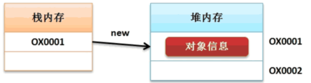

清楚了以上的对应关系后，那么下面就针对于之前的程序进行分析。对于Person per = new Person();per.name = “张三” ;和per.age = 18;的内存分析如下：

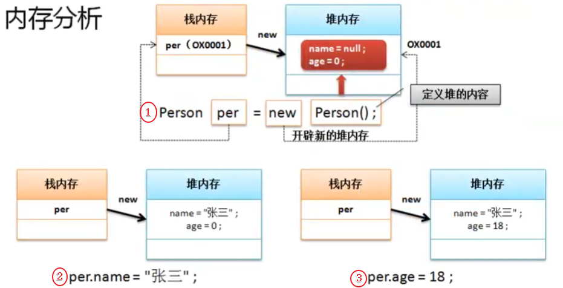

在之前进行分析的时候可以发现对象的实例化有两种语法，一种是之前使用的声明并实例化对象，另外一种就是分步完成。所以下面针对于分步的内存操作进行分析。

操作示例 1：定义程序代码

```java
public class JavaAPIDemo {
    public static void main(String[] args) {
        Person per = null;           // 声明对象
        Person per = new Person();   // 实例化对象
        per.name = "张三";
        per.age = 18;
        per.tell();                  // 进行方法的调用
    }
}
```

下面通过内存分析来进行解释，对于上述代码的内存分析：
需要特别注意的是：所有的对象在调用类中的属性或方法的时候必须要实例化完成后才可以执行。

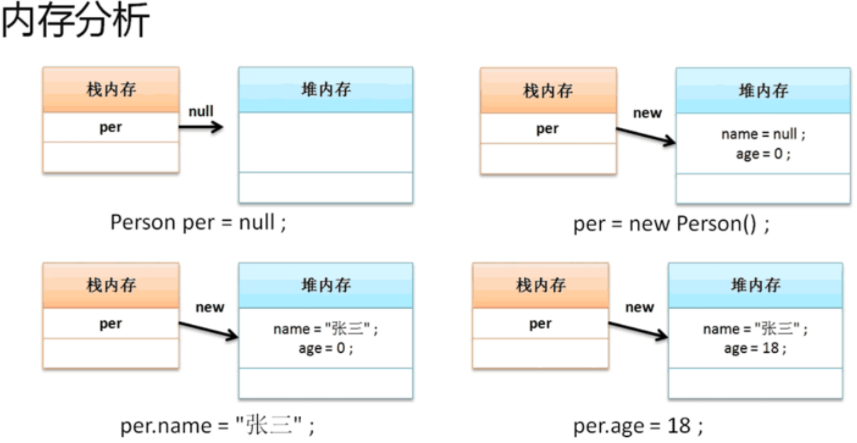

操作示例 2：错误的代码

```java
class Person {     // 定义一个类
    String name;   // 人员的姓名
    int age;       // 人员的年龄
    public void tell() {
        System.out.println("姓名：" + name + "、年龄：" + age);
    }
}

public class JavaAPIDemo {
    public static void main(String[] args) {
        Person per = null;       // 声明对象
        per.name = "张三";
        per.age = 18;
        per.tell();             // 进行方法的调用
    }
}
```

```java
// 输出内容
Exception in thread "main" java.lang.NullPointerException
	at JavaAPIDemo.main(JavaAPIDemo.java:12)
```

代码之中只是声明了对象，但是并没有为对象进行实例化，所以此时无法调用。而此时程序中出现的NullPointerException（空指向异常）就是在没有在堆内存开辟后时所产生的问题，并且只有引用数据类型存在有此问题。


## 5、对象引用传递分析

类本身属于引用数据类型，既然是引用数据类型，那么就牵扯到内存的引用传递，所谓的引用传递的本质：同一块堆内存的空间可以被不同的栈内存所指向，也可以更换指向。

操作示例 1：定义一个引用传递的分析程序

```java
class Person {     // 定义一个类
    String name;   // 人员的姓名
    int age;       // 人员的年龄
    public void tell() {
        System.out.println("姓名：" + name + "、年龄：" + age);
    }
}

public class JavaAPIDemo {
    public static void main(String[] args) {
        Person per1 = new Person(); // 声明并实例化对象
        per1.name = "张三";
        per1.age = 18;
        Person per2 = per1;       // 引用传递
        per2.age = 80;
        per1.tell();              //进行方法的调用
    }
}
```

```java
// 输出内容
姓名：张三、年龄：80
```

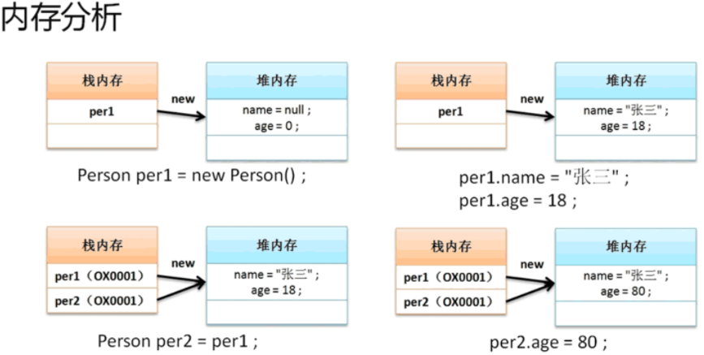

这个时候的引用传递是直接在主方法之中定义的，也可以通过方法实现引用传递

操作示例 2：利用方法实现引用传递处理

```java
class Person {     // 定义一个类
    String name;   // 人员的姓名
    int age;       // 人员的年龄
    public void tell() {
        System.out.println("姓名：" + name + "、年龄：" + age);
    }
}

public class JavaAPIDemo {
    public static void main(String[] args) {
        Person per = new Person() ;     // 声明并实例化对象
        per.name = "张三" ;
        per.age = 18 ;
        change(per) ;           // 等价于：Person temp = per ;
        per.tell() ;            //进行方法的调用
    }
    public static void change(Person  temp){
        temp.age = 80 ;
    }
}
```

```java
// 输出内容
姓名：张三、年龄：80
```

与之前的差别最大的地方在于，此时的程序是将Person类的实例化对象（内存地址、数值）传递到了change方法之中，由于传递的是一个Person类型，那么change()方法接收的也是Person类型。

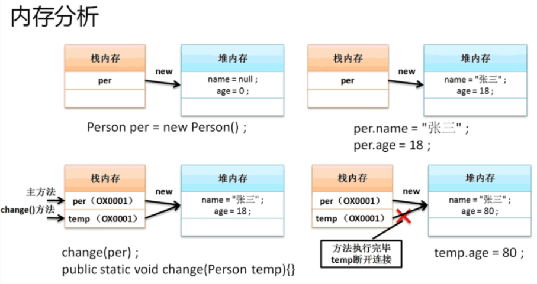

引用传递可以发生在方法上，这个时候一定要观察方法的参数类型，同时也要观察方法的执行过程。


## 6、引用传递与垃圾产生分析

经过一系列分析后，所有的引用传递的本质就是一场堆内存的调戏游戏。但是对于引用传递，如果处理不当，那么也会造成垃圾的产生，那么本次将针对于垃圾产生的原因进行简单分析。

操作示例：定义一个要分析的程序

```java
class Person {     // 定义一个类
    String name;   // 人员的姓名
    int age;       // 人员的年龄
    public void tell() {
        System.out.println("姓名：" + name + "、年龄：" + age);
    }
}

public class JavaAPIDemo {
    public static void main(String[] args) {
        Person per1 = new Person(); // 声明并实例化对象
        Person per2 = new Person();
        per1.name = "张三";
        per1.age = 18;
        per2.name = "李四";
        per2.age = 19;
        per2 = per1;  // 引用传递
        per2.age = 80;
        per1.tell(); // 进行方法的调用
    }
}
```

```java
// 输出内容
姓名：张三、年龄：80
```

此时已经明确发生了引用传递，并且也成功的完成了引用传递的处理操作，但是下面来观察一下其内存的分配与处理操作。

**一个栈内存只能够保存有一个一堆内存的地址数据，如果发生更改，则之前的地址数据将从此栈内存中彻底消失。**下面来看看它的内存分析结果。

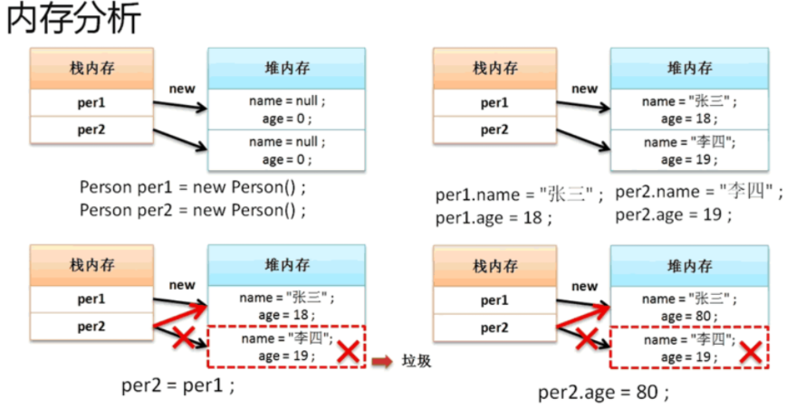

所谓的垃圾空间指的就是没有任何栈内存所指向的堆内存空间，所有的垃圾将被GC（Garbage Collector、垃圾收集器）不定期进行回收并且释放无用内存空间，但是如果垃圾过多，一定将影响到GC的处理性能，从而降低整体的程序性能。那么在实际开发之中，对于垃圾的产生应该越少越好。


# 类结构扩展

## 1、成员属性封装

在类之中的组成就是属性与方法，一般而言方法都是对外提供服务的，所以是不会提供封装处理的，而对于属性，由于其需要较高的安全性，所以往往需要对其进行保护，这种情况下，就需要采用封装性对属性进行保护。在默认情况下，对于类中的属性是可以通过其他类利用对象重复调用的。

操作示例 1：属性不封装情况下的问题

```java
class Person {     // 定义一个类
    String name;   // 人员的姓名
    int age;       // 人员的年龄
    public void tell() {
        System.out.println("姓名：" + name + "、年龄：" + age);
    }
}

public class JavaAPIDemo {
    public static void main(String[] args) {
        Person per = new Person();    // 声明并实例化对象
        per.name = "张三";            // 在类外部修改属性
        per.age = -18;                // 在类外部修改属性
        per.tell();                   // 进行方法的调用
    }
}
```

```java
// 输出内容
姓名：张三、年龄：-18
```

此时在person类中提供的name与age两个属性并没有进行封装处理，这样外部就可以直接进行调用，但是有可能设置的数据是错误的数据（per.age = -18 ;）。如果要想解决这样的问题就可以利用private关键字对属性进行封装处理。

操作示例 2：对属性进行封装

```java
class Person {     // 定义一个类
    private  String name;   // 人员的姓名
    private  int age;       // 人员的年龄
    public void tell() {
        System.out.println("姓名：" + name + "、年龄：" + age);
    }
}

public class JavaAPIDemo {
    public static void main(String[] args) {
        Person per = new Person();    // 声明并实例化对象
        per.name = "张三";            // 在类外部修改属性
        per.age = -18;                // 在类外部修改属性
        per.tell();                   // 进行方法的调用
    }
}

// 程序会报错
```

而属性一旦封装之后外部将不能够直接访问，即：对外部不可见，但是对类的内部是可见的，如果想让外部的程序可以访问封装的属性，则在Java开发标准中提供有如下要求：
【setter、getter】设置或取得属性可以使用setXxx()、getXxx()方法，以：private String name 为例：

1. 设置属性方法：public void setName(String n)
2. 获取属性方法：public String getName()

操作示例 3：实现封装

```java
class Person{               // 定义一个类
    private String name ;   // 人员的姓名
    private int age ;       // 人员的年龄
    public void tell() {
        System.out.println("姓名："+ name +"、年龄："+age) ;
    }
    public String getName(){
        return name ;
    }
    public void setName(String n){
        name = n ;
    }
    public void setAge(int a){
        age = a ;
    }
    public int getAge (){
        return age;
    }
}
public class JavaAPIDemo {
    public static void main(String[] args) {
        Person per = new Person() ;     // 声明并实例化对象
        per.setName("张三") ;           // 在类外部修改属性
        per.setAge(-18) ;               // 在类外部修改属性
        per.tell() ;                    // 进行方法的调用
    }
}
```

```java
// 输出内容
姓名：张三、年龄：-18
```

在以后进行任何类定义的时候一定要记住，类中所有属性都必须使用**private**封装，并且属性如果要进行访问，必须要提供有**setter、getter方法**。


## 2、构造方法

现在的程序在使用类的时候一般都按照如下的步骤进行：

1. 声明并实例化对象，这时实例化对象中的属性并没有任何的数据存在，都是其对应数据类型的默认值。
2. 需要通过一系列的setter方法为类中的属性设置内容。

也就是说现在要想真正获得一个可以正常使用的实例化对象，必须经过两个步骤才可以完成。

操作示例 1：传统调用

```java
class Person {
    private String name;   // 人员的姓名
    private int age;       // 人员的年龄
    public void tell() {
        System.out.println("姓名：" + name + "、年龄：" + age);
    }
    public void setName(String n) {
        name = n;
    }
    public void setAge(int a) {
        age = a;
    }
    public String getName() {
        return name;
    }
    public int getAge() {
        return age;
    }
}
public class JavaAPIDemo {
    public static void main(String[] args) {
        //1、对象的初始化准备
        Person per = new Person();  // 声明并实例化对象
        per.setName("张三");        // 在类外部修改属性
        per.setAge(-18);            // 在类外部修改属性
        //2、对象的使用
        per.tell();                 // 进行方法的调用
    }
}
```

```java
// 输出内容
姓名：张三、年龄：-18
```

但是如果按照这样的方式来进行思考的话就会发现一个问题：假设类中的属性有多个，这样一来，按照之前的做法，此时需要调用多次的setter方法进行内容设置，这样的调用比较麻烦，所以在Java中为了考虑对象初始化的问题，专门提供有构造方法，即：**可以通过构造方法实现实例化对象中的属性初始化处理。**只有在关键字new的时候使用构造方法，在Java程序中构造定义要求如下：

1. 构造方法名称必须与类名称保持一致
2. 构造方法不允许设置任何的返回值类型，即：没有返回值定义
3. 构造方法是在使用关键字new实例化对象的时候自动调用的

操作示例 2：构造定义方法

```java
class Person{
    private String name ;   // 人员的姓名
    private int age ;       // 人员的年龄
    // 方法名称与类名称相同，并且无返回值定义
    public Person (String n, int a) {   // 定义有参构造
        name = n ; // 为类中的属性赋值（初始化）
        age = a ;  // 为类中的属性赋值（初始化）
    }
    public void tell() {
        System.out.println("姓名："+ name +"、年龄："+age) ;
    }
}
public class JavaAPIDemo {      //主类
    public static void main(String[] args) {
        //1、对象的初始化准备
        Person per = new Person("张三", 18) ; // 声明并实例化对象
        //2、对象的使用
        per.tell() ; // 进行方法的调用
    }
}
```

```java
// 输出内容
姓名：张三、年龄：18
```

下面针对于当前的对象实例化格式与之前的对象实例化格式做一个比较：

- 之前的对象实例化格式：①Person ②per = ③new ④Person() ;
- 当前的对象实例化格式：①Person ②per = ③new ④Person(“张三”, 18) ;
  1. “①Person”：主要是定义对象的所属类型，类型决定了你可以调用的方法；
  2. “②per”：实例化对象的名称，所有的操作通过对象来进行访问；
  3. “③new”：开辟一块新的堆内存空间；
  4. “④Person(“张三”, 18)”：调用有参构造、“④Person()”：调用无参构造

在Java的程序中考虑到程序结构的完整性，所以所有的类都会提供有构造方法，也就是说如果现在类中没有定义任何构造方法，那么一定会默认提供一个无参的，什么都不做的构造方法，这个构造方法是在程序编译的时候自动创建的。如果现在已经在类中明确定义有一个构造方法的时候，那么这个默认的构造方法将不会被自动创建。

```java
class Person{
    private String name ;   // 人员的姓名
    private int age ;       // 人员的年龄
    // 方法名称与类名称相同，并且无返回值定义
    public Person (String n, int a) {   // 定义有参构造
        name = n ; // 为类中的属性赋值（初始化）
        age = a ;  // 为类中的属性赋值（初始化）
    }
    public void tell() {
        System.out.println("姓名："+ name +"、年龄："+age) ;
    }
}
public class JavaAPIDemo {
    public static void main(String[] args) {
        //1、对象的初始化准备
        Person per = new Person() ; // 声明并实例化对象
        //2、对象的使用
        per.tell() ; // 进行方法的调用
    }
}
```

```java
// 输出内容
Error:(16, 22) java: 无法将类 Person中的构造器 Person应用到给定类型;
  需要: java.lang.String,int
  找到: 没有参数
  原因: 实际参数列表和形式参数列表长度不同
```

结论：**一个类至少存在有一个构造方法，永恒存在。**

疑问：为什么构造方法上不允许设置返回值类型

1. 既然构造方法是一个方法，那么为什么不让它定义返回值类型呢？
2. 既然构造方法不会返回数据，那么为什么不使用viod定义呢？

**分析：**程序编译器是根据代码结构来进行编译处理的，执行的时候也是根据代码结构来处理的。

1. 构造方法：public Person (String n, int a) ；
2. 普通方法：public void Person (String n, int a) ；
3. 如果在构造方法上使用了void，那么此结构就与普通方法的结构完全相同，这样我们编译器会认为此方法是普通方法。而普通方法与构造方法最大的区别：**构造方法是在类对象实例化的时候调用的，而普通方法是在类对象实例化产生后调用的。**

既然构造方法本身是一个方法，那么方法就具有重载的特点，而构造方法重载的时候只需要考虑参数的类型及个数即可。

操作示例 3：构造方法重载

```java
class Person {
    private String name;  // 人员的姓名
    private int age;      // 人员的年龄
    public Person() {
    }
    public Person(String n) {
        name = n;
    }
    // 方法名称与类名称相同，并且无返回值定义
    public Person(String n, int a) {
        name = n; // 为类中的属性赋值（初始化）
        age = a;  // 为类中的属性赋值（初始化）
    }
    public void tell() {
        System.out.println("姓名：" + name + "、年龄：" + age);
    }
}
public class JavaAPIDemo {
    public static void main(String[] args) {
        //1、对象的初始化准备
        Person per = new Person("张三", 18); // 声明并实例化对象
        //2、对象的使用
        per.tell();  //进行方法的调用
    }
}
```

```java
// 输出内容
姓名：张三、年龄：18
```

```java
class Person {    //定义一个类
    private String name;  //人员的姓名
    private int age;       //人员的年龄
    public Person() {
        name = "无名氏";
        age = -1;
    }
    public Person(String n) {
        name = n;
    }
    // 方法名称与类名称相同，并且无返回值定义
    public Person(String n, int a) {
        name = n; // 为类中的属性赋值（初始化）
        age = a;  // 为类中的属性赋值（初始化）
    }
    public void tell() {
        System.out.println("姓名：" + name + "、年龄：" + age);
    }
}
public class JavaAPIDemo {
    public static void main(String[] args) {
        //1、对象的初始化准备
        Person per = new Person(); // 声明并实例化对象
        //2、对象的使用
        per.tell(); // 进行方法的调用
    }
}
```

```java
// 输出内容
姓名：无名氏、年龄：-1
```

在进行多个构造方法定义的时候强烈建议大家有一些定义的顺序，例如：可以按照参数的个数降序或升序排序。

经过分析可以发现，构造方法的确是可以进行数据的设置，而对于setter也可以进行数据的设置。构造方法是在对象实例化的时候为属性设置初始化内容，而setter除了拥有设置数据的功能之外，还具有修改数据的功能。


操作示例 4：使用setter修改数据

```java
class Person{
    private String name ;  // 人员的姓名
    private int age ;      // 人员的年龄
    // 方法名称与类名称相同，并且无返回值定义
    public Person (String n, int a) {
        name = n ; // 为类中的属性赋值（初始化）
        age = a ;  // 为类中的属性赋值（初始化）
    }
    public void tell() {
        System.out.println("姓名："+ name +"、年龄："+age) ;
    }
    public void setName(String n){
        name = n ;
    }
    public void setAge(int a){
        age = a ;
    }
    public String getName(){
        return name ;
    }
    public int getAge (){
        return age;
    }
}
public class JavaAPIDemo {
    public static void main(String[] args) {
        //1、对象的初始化准备
        Person per = new Person("张三", 10) ; // 声明并实例化对象
        //2、对象的使用
        per.setAge(18); // 修改属性内容
        per.tell() ; // 进行方法的调用
    }
}
```

```java
// 输出内容
姓名：张三、年龄：18
```


## 3、匿名对象

经过分析可以发现，利用构造方法可以传递属性数据，于是现在进一步分析对象的产生格式：

1. **定义对象的名称：**类名称 对象名称 = null；
2. **实例化对象：**对象名称 = new 类名称();

如果这时只通过实例化对象来进行类的操作也是可以的，而这种形式的对象由于没有名字就称为叫它匿名对象。

操作示例 1：观察匿名对象

```java
class Person {
    private String name;  //人员的姓名
    private int age;       //人员的年龄
    // 方法名称与类名称相同，并且无返回值定义
    public Person(String n, int a) {
        name = n; // 为类中的属性赋值（初始化）
        age = a;  // 为类中的属性赋值（初始化）
    }
    public void tell() {
        System.out.println("姓名：" + name + "、年龄：" + age);
    }
    public void setName(String n) {
        name = n;
    }
    public void setAge(int a) {
        age = a;
    }
    public String getName() {
        return name;
    }
    public int getAge() {
        return age;
    }
}
public class JavaAPIDemo {
    public static void main(String[] args) {
        new Person("张三", 10).tell(); // 进行方法的调用
    }
}
```

```java
// 输出内容
姓名：张三、年龄：10
```

此时依然通过了对象进行了类中tell()方法的调用，但是由于此对象没有任何的引用名称，所以该对象使用一次之后就将成为垃圾，而所有的垃圾将被GC进行回收与释放。

现在发现此时程序中已经存在有构造方法了，那么下面通过一个程序来利用构造方法进行一次内存分析。

操作示例 2：编写一个分析程序

```java
class Message {
    private String title;
    public Message(String t) {
        title = t;
    }
    public String getTitle() {
        return title;
    }
    public void setTitle(String t) {
        title = t; // 具有修改功能
    }
}

class Person {
    private String name;  // 人员的姓名
    private int age;      // 人员的年龄
    public Person(Message msg, int a) {
        name = msg.getTitle(); // 为类中的属性赋值（初始化）
        age = a;               // 为类中的属性赋值（初始化）
    }
    public Message getInfo() {
        return new Message(name + ":" + age);
    }
    public void tell() {
        System.out.println("姓名：" + name + "、年龄：" + age);
    }
}

public class JavaAPIDemo {
    public static void main(String[] args) {
        Message msg = new Message("xxx");
        Person per = new Person(msg, 20);
        msg = per.getInfo();
        System.out.println(msg.getTitle());
    }
}
```

```java
// 输出内容
xxx:20
```

通过此程序进行一个简短的内存分析。（只要是方法都可以传递任意的数据类型（基本数据类型、引用数据类型））

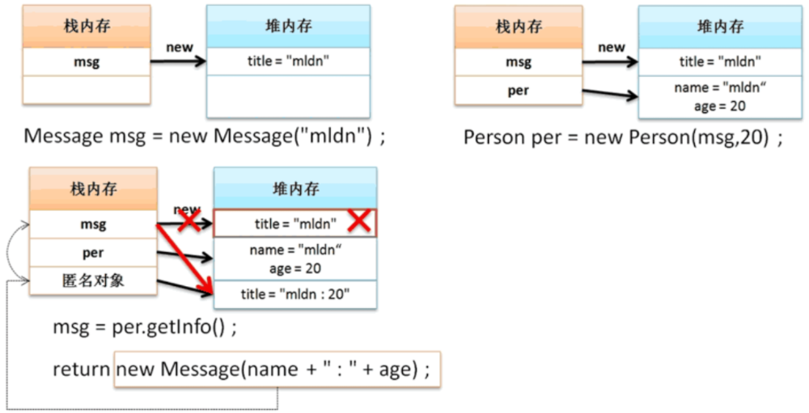


# 关键字 this

this可以算是Java中比较复杂的关键字，因为this的使用形式上决定了它的灵活性，在程序里面，使用this可以实现以下三类结构的描述：

1. 当前类中的属性：this.属性;
2. 当前类中的方法（普通方法、构造方法）：this()、this.方法名称()；
3. 描述当前对象；

## 1、this 调用本类属性

通过现在的分析可以发现，利用构造方法或者是setter方法都可以进行类中的属性的赋值，在进行赋值的时候，之前采用的是如下的定义形式：

```java
class Person{
    private String name ;
    private int age ;
    public Person(String n ,int a){
        name = n ;
        age = a ;
    }
    public void tell(){
        System.out.println("姓名："+ name + "、年龄："+ age );
    }
}
public class JavaAPIDemo {
    public static void main(String[] args) {
        Person per = new Person("王五" ,38);
        per.tell() ;
    }
}
```

```java
// 输出内容
姓名：王五、年龄：38
```

但是我们在构造方法定义的过程中会发现有问题：

```java
public Person(String n ,int a) {
    name = n ;
    age = a ;
}
```

问题出现在参数名称上，可以发现此时构造方法中两个参数的目的是为了类中的name或age属性初始化，但是，现在却发现此时的代码n和a参数名称不好
如果说现在将构造方法中的参数名称修改为name、age，则发现无法进行属性的正确设置：

```java
public Person(String name ,int age) {
    name = name ;
    age = age ;
}
```

在Java程序之中“{}”是作为一个结构体的边界符，那么在程序里面当进行变量（参数、属性）使用的时候，都会以“{}”作为一个查找边界，所以按照就近取用的原则，此时的构造方法并没有能够访问类中的属性，所以此时为了明确的标记出类中的属性与参数的区别，往往会在属性前追加一个“this”，表示本类属性。

```java
class Person{
    private String name ;
    private int age ;
    public Person(String name ,int age){
        this.name = name ;
        this.age = age ;
    }
    public void tell(){
        System.out.println("姓名："+ this.name + "、年龄："+ this.age );
    }
}
public class JavaAPIDemo {
    public static void main(String[] args) {
        Person per = new Person("王五" ,38);
        per.tell() ;
    }
}
```

在以后的程序开发过程中，只要是访问本类中属性，请一定要加上“this”实现访问。


## 2、this 调用本类方法

除了调用属性之外，this也可以实现方法的调用，但是对于方法的调用就必须考虑构造与普通方法：

1. 构造方法的调用（this()）：使用关键字new实例化对象的时候才会调用构造方法
2. 普通方法调用：（this.方法名称()）：实例化对象产生之后就可以调用普通方法

操作示例 1：调用类中的普通方法

```java
class Person {
    private String name;
    private int age;
    public Person(String name, int age) {
        // 加与不加this都表示本类方法
        this.setName(name);
        this.setAge(age);
    }
    public void tell() {
        System.out.println("姓名：" + this.name + "、年龄：" + this.age);
    }
    public void setName(String name) {
        this.name = name;
    }
    public void setAge(int age) {
        this.age = age;
    }
    public String getName() {
        return this.name;
    }
    public int getAge() {
        return this.age;
    }
}
public class JavaAPIDemo {
    public static void main(String[] args) {
        Person per = new Person("王五", 38);
        per.tell();
    }
}
```

```java
// 输出内容
姓名：王五、年龄：38
```

除了普通的方法调用之外呢，还需要进行构造方法的调用，对于构造方法的调用，肯定是要放在构造方法中执行。假设类中一共定义有三个构造方法，但是要求不管调用哪个构造方法，都执行一行输出语句“一个新的person类对象实例化了”。

操作示例 2：传统做法实现：

```java
class Person {
    private String name;
    private int age;
    public Person() {
        System.out.println("***一个新的person类对象实例化了。");
    }
    public Person(String name) {
        System.out.println("***一个新的person类对象实例化了。");
        this.name = name;
    }
    public Person(String name, int age) {
        System.out.println("***一个新的person类对象实例化了。");
        this.name = name;
        this.age = age;
    }
    public void tell() {
        System.out.println("姓名：" + this.name + "、年龄：" + this.age);
    }
    // setter、getter略
}
public class JavaAPIDemo {
    public static void main(String[] args) {
        Person per = new Person("王五", 38);
        per.tell();
    }
}
```

```java
// 输出内容
***一个新的person类对象实例化了。
姓名：王五、年龄：38
```

操作示例 3：利用this()构造调用优化

```java
class Person {
    private String name;
    private int age;
    public Person() {
        System.out.println("***一个新的person类对象实例化了。");
    }
    public Person(String name) {
        // 调用本类无参构造
        this();
        this.name = name;
    }
    public Person(String name, int age) {
        // 调用单参构造
        this(name);
        this.age = age;
    }
    public void tell() {
        System.out.println("姓名：" + this.name + "、年龄：" + this.age);
    }
    // setter、getter略
}

public class JavaAPIDemo {
    public static void main(String[] args) {
        Person per = new Person("王五", 38);
        per.tell();
    }
}
```

```java
// 输出内容
***一个新的person类对象实例化了。
姓名：王五、年龄：38
```

如果要想评价一个代码的好坏：

1. 代码结构可以重用，提供的是一个中间独立的支持；
2. 我们的目标是：没有重复。

对于本类代码的互相调用需要注意以下几点重要问题：

1. **构造方法必须在实例化新对象的时候调用，所以“this()”的语句只允许放在构造方法的首行**
2. 构造方法互相调用时请保留有程序的出口，别形成死循环

```java
public Person(){
    this.(“HAHA” , 11) ;
    System.out.println(“***一个新的person类对象实例化了。”) ;
} 
public Person(String name){
    this() ;                //调用本类无参构造
    this.name = name ;
}

public Person(String name ,int age){
    this(name) ;           //调用单参构造
    this.age = age ;              
}
```

此时的程序在进行编译的时候将会直接出现**错误提示**：告诉用户，出现了构造方法的递归调用。


## 3、构造方法互相调用案例

现在要求定义一个描述有员工信息的程序类，该类中提供有：编号、姓名、部门、工资，这个类中提供有四个构造方法：

1. 【无参构造】编号定义为1000，姓名定义为无名氏；
2. 【单参构造】传递编号，姓名定义为“新员工”，部门定义为“未定”，工资为0.0；
3. 【三参构造】传递编号、姓名、部门，工资为2500.00;
4. 【四参构造】所有的属性全部进行传递。

操作示例 1：进行代码的初期实现

```java
class Emp {
    private long empno; // 员工编号
    private String ename; // 员工姓名
    private String dept; // 部门名称
    private double salary; // 基本工资
    public Emp() {
        this.empno = 1000;
        this.ename = "无名氏";
    }
    public Emp(long empno) {
        this.empno = empno;
        this.ename = "新员工";
        this.dept = "未定";
    }
    public Emp(long empno, String ename, String dept) {
        this.empno = empno;
        this.ename = ename;
        this.dept = dept;
        this.salary = 2500.00;
    }
    public Emp(long empno, String ename, String dept, double salary) {
        this.empno = empno;
        this.ename = ename;
        this.dept = dept;
        this.salary = salary;
    }
    // setter、getter略
    public String getInfo() {
        return "雇员编号：" + this.empno +
                "、雇员姓名：" + this.ename +
                "、所在部门：" + this.dept +
                "、基本工资：" + this.salary;
    }
}
public class JavaAPIDemo {
    public static void main(String[] args) {
        Emp emp = new Emp(7369L, "史密斯", "财务部", 6500.00);
        System.out.println(emp.getInfo());
    }
}
```

```java
// 输出内容
雇员编号：7369、雇员姓名：史密斯、所在部门：财务部、基本工资：6500.0
```

此时可以发现代码有重复，所以就可以对Emp类进行简化定义：

```java
class Emp {
    private long empno; // 员工编号
    private String ename; // 员工姓名
    private String dept; // 部门名称
    private double salary; // 基本工资
    public Emp() {
        this(1000 , "无名氏" ,null ,0.0) ;
    }
    public Emp(long empno) {
        this(empno, "新员工" ,"未定",0.0) ;
    }
    public Emp(long empno, String ename, String dept) {
        this(empno, ename,dept ,2500.00) ;
    }
    public Emp(long empno, String ename, String dept, double salary) {
        this.empno = empno;
        this.ename = ename;
        this.dept = dept;
        this.salary = salary;
    }
    // setter、getter略
    public String getInfo() {
        return "雇员编号：" + this.empno +
                "、雇员姓名：" + this.ename +
                "、所在部门：" + this.dept +
                "、基本工资：" + this.salary;
    }
}
public class JavaAPIDemo {
    public static void main(String[] args) {
        Emp emp = new Emp(7369L, "史密斯", "财务部", 6500.00);
        System.out.println(emp.getInfo());
    }
}
```

```java
// 输出内容
雇员编号：7369、雇员姓名：史密斯、所在部门：财务部、基本工资：6500.0
```

代码的任何位置上都可能重复，所以消除重复的代码是先期学习之中最需要考虑的部分。


## 3、this 表示当前对象

一个类可以实例化出若干个对象，那么这些对象都可以调用类中的方法，那么对于当前正在访问类中方法的对象就可以称为当前对象，而this就可以描述出这种当前对象的概念。

操作示例 1：观察当前对象

```java
class Message {
    public void printThis() {
        System.out.println("【Message类】this = " + this);
    }
}
public class JavaAPIDemo {
    public static void main(String[] args) {
        Message msgA = new Message();
        System.out.println("【主类msgA = 】" + msgA);
        msgA.printThis();
        System.out.println("-------避免混淆的分割线-------");
        Message msgB = new Message();
        System.out.println("【主类msgB = 】" + msgB);
        msgA.printThis();
    }
}
```

```java
// 输出内容
【主类msgA = 】Message@13969fbe
【Message类】this = Message@13969fbe
-------避免混淆的分割线-------
【主类msgB = 】Message@6aaa5eb0
【Message类】this = Message@13969fbe
```

原来在之前执行的“this属性”严格意义上来讲指的就是调用当前对象中的属性。下面为了加强此概念，做一个简短的并且毫无意义的程序做出分析。

本次实现一个消息发送的处理，在进行消息具体发送的操作之前应该先进行连接的创建，连接创建成功之后才可以进行消息内容的推送,具体的实现如下。

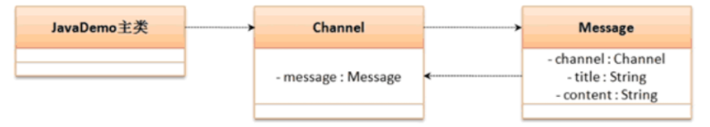

现在程序的主类是负责创建通道以及配置消息的内容，而具体的内容要通过Message进行包装与发送。

```java
class Message {
    private Channel channel ; // 保存消息发送通道
    private String title ;	// 消息标题
    private String content ;	// 消息内容
    // 4、调用此构造实例化，此时的channel = 主类ch
    public Message(Channel channel,String title,String content) {
        this.channel = channel ; // 保存消息通道
        this.title = title ;
        this.content = content ;
    }
    public void send() {
        // 6、判断当前通道是否可用，那么此时的this.channel就是主类中的ch
        if (this.channel.isConnect()) {	// 如果连接成功
            System.out.println("【消息发送】title = " + this.title + "、content = " + this.content) ;
        } else {	// 没有连接
            System.out.println("【ERROR】没有可用的连接通道，无法进行消息发送。") ;
        }
    }
}
class Channel {
    private Message message ;	// 消息发送由Message负责
    // 2、实例化Channel类对象，调用构造
    public Channel(String title,String content) {
        // 3、实例化Message，但是需要将主类中的ch传递到Message中、this = ch
        this.message = new Message(this,title,content) ;
        // 5、消息发送
        this.message.send() ;	// 发送消息
    }
    // 以后在进行方法创建的时候如果某一个方法的名称以is开头一般都返回boolean值
    public boolean isConnect() {	// 判断连接是否创建，如果创建可以发送
        return true ;
    }
}
public class JavaAPIDemo {
    public static void main(String[] args) {
        // 1、实例化一个Channel对象
        Channel ch = new Channel("XXXX运动会","大家一起跑步30公里。") ; // 实例化Channel对象就表示要发送消息
    }
}
```

```java
// 输出内容
【消息发送】title = XXXX运动会、content = 大家一起跑步30公里。
```

此类引用关系的处理对于初期学习有一点困难，如果觉得实在难以理解，可以适当的跳过一下。


## 4、综合案例：简单Java类

在以后进行项目开发与设计的过程之中，简单Java类都将作为一个重要的组成部分存在，慢慢接触到正规的项目设计之后，简单Java类无处不在，并且有可能会产生一系列变化。

所谓的简单Java类指的是可以描述某一类信息的程序类，例如：描述一个人、描述一本书、描述一个部门、描述一个雇员，并且在这个类之中并没有特别复杂的逻辑操作。只作为一种信息存储的媒介存在。

对于简单Java类而言，其核心的开发结构如下：

1. 类名称一定要有意义，可以明确的描述某一类事物；
2. 类之中的所有属性都必须使用private进行封装，同时封装后的属性必须要提供有setter、getter方法；
3. 类之中可以提供有无数多个构造方法，但是必须要保留有无参构造方法；
4. 类之中不允许出现任何的输出语句，所有内容的获取必须返回；
5. 【非必须】可以提供有一个获取对象详细信息的方法，暂时将此方法名称定义为getInfo()。

操作示例：定义一个简单Java类

```java
// 类名称可以明确描述出某类事物
class Dept {
    private long deptno;
    private String dname;
    private String loc;
    // 必须提供有无参（因为重载了有参构造）
    public Dept() {}
    public Dept(long deptno, String dname, String loc) {
        this.deptno = deptno;
        this.dname = dname;
        this.loc = loc;
    }
    public String getInfo() {
        return "【部门信息】部门编号："+this.deptno + "、部门名称："+this.dname + "、部门位置："+this.loc;
    }
    public void setDeptno(long deptno) {
        this.deptno = deptno;
    }
    public void setDname(String dname) {
        this.dname = dname;
    }
    public void setLoc(String loc) {
        this.loc = loc;
    }
    public long getDeptno() {
        return this.deptno;
    }
    public String getDname() {
        return this.dname;
    }
    public String getLoc() {
        return this.loc;
    }
}
public class JavaAPIDemo {
    public static void main(String[] args) {
        Dept dept = new Dept(10,"技术部" ,"北京");
        System.out.println(dept.getInfo());
    }
}
```

```java
// 输出内容
【部门信息】部门编号：10、部门名称：技术部、部门位置：北京
```

这种简单Java类基本上就融合了所有的现在接触到的概念，例如：数据类型划分、类的定义、private封装、构造方法、方法定义、对象实例化。

# 关键字 static

## 1、static 定义属性

Static是一个关键字，这个关键字主要可以用来定义属性和方法，下面将针对于此关键字的使用进行分析。在一个类之中，所有的属性一旦定义了实际上内容都交由各自的堆内存空间所保存。

```java
class Person {             // 创建所有同一个国家的类
    private String name;
    private int age;
    String country = "中华民国";// 暂时不封装
    public Person(String name, int age) {
        this.name = name;
        this.age = age;
    }
    //setter、getter略
    public String getInfo() {
        return "姓名：" + this.name + "、年龄：" + this.age + "、国家：" + this.country ;
    }
}

public class JavaAPIDemo {
    public static void main(String[] args) {
        Person perA = new Person("张三", 10);
        Person perB = new Person("李四", 10);
        Person perC = new Person("王五", 11);
        System.out.println(perA.getInfo());
        System.out.println(perB.getInfo());
        System.out.println(perC.getInfo());
    }
}
```

```java
// 输出内容
姓名：张三、年龄：10、国家：中华民国
姓名：李四、年龄：10、国家：中华民国
姓名：王五、年龄：11、国家：中华民国

```

为了更好的观察出程序的问题，下面对此操作做一个内存分析。

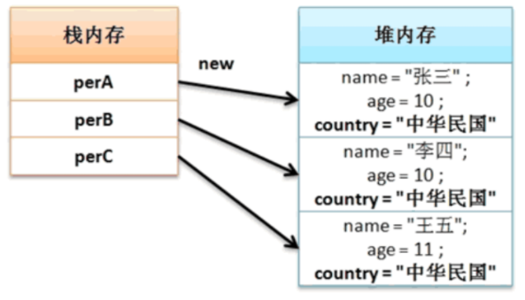

在正常开发过程之中每一个对象要保存有各自的属性，所以此时的程序没有任何问题。但是当“中华民国”变为“中华人民共和国”，且已经产生了5000W个对象，那么这将是一个大麻烦。我们先去修改一下代码。

操作示例 2：修改代码

```java
class Person {             // 创建所有同一个国家的类
    private String name;
    private int age;
    String country = "中华民国";// 暂时不封装
    public Person(String name, int age) {
        this.name = name;
        this.age = age;
    }
    //setter、getter略
    public String getInfo() {
        return "姓名：" + this.name + "、年龄：" + this.age + "、国家：" + this.country ;
    }
}

public class JavaAPIDemo {          
    public static void main(String[] args) {
        Person perA = new Person(“张三” ,10) ;
        Person perB = new Person(“李四” ,10) ;
        Person perC = new Person(“王五” ,11) ;
        perA.country = “中华人民共和国” ;
        System.out.println(perA.getInfo()) ;
        System.out.println(perB.getInfo()) ;
        System.out.println(perC.getInfo()) ;
    }
}
```

```java
// 输出内容
姓名：张三、年龄：10、国家：中华人民共和国
姓名：李四、年龄：10、国家：中华民国
姓名：王五、年龄：11、国家：中华民国
```

可以看出只有一个结果的改变，因为每一个对象都拥有各自的country属性，所以这个时候就会发现从整体的设计上就出现了问题（重复保存数据并且修改不方便）。那么这个时候最好的解决方案就是将country修改为公共属性，而这种情况下就必须使用**static**进行标注。

操作示例 3：修改Person类定义，使用static定义公共属性在上述已修改代码的基础上接着进行修改

```java
static String country = "中华民国"; // 暂时不封装

// 输出内容
姓名：张三、年龄：10、国家：中华民国
姓名：李四、年龄：10、国家：中华民国
姓名：王五、年龄：11、国家：中华民国
```

此时会发现所有对象的country属性的内容都发生了改变，所以这是一个公共属性。而此时的内存关系图是怎样呢？

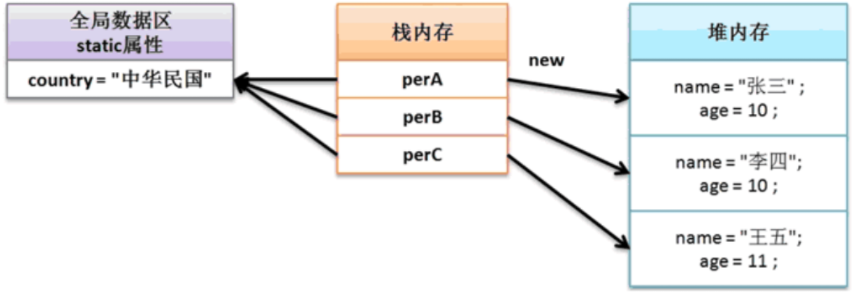

但是对于static属性的访问需要注意一点：由于其本身是一个公共的属性，虽然可以通过对象进行访问，但是最好的做法是通过所有对象的最高代表（类）来进行访问，所以**static属性可以由类名称直接调用：**`Person.country = "中华人民共和国";`

static属性虽然定义在类之中，但是其并不受到类实例化对象的控制。static属性可以在没有实例化对象的时候使用。

操作示例 4：不产生实例化对象调用static属性

```java
class Person {
    private String name;
    private int age;
    static String country = "中华民国";
    public Person(String name, int age) {
        this.name = name;
        this.age = age;
    }
    // setter、getter略
    public String getInfo() {
        return "姓名：" + this.name + "、年龄：" + this.age + "、国家：" + country;
    }
}

public class JavaAPIDemo {
    public static void main(String[] args) {
        System.out.println(Person.country);
        Person.country = "中华人民共和国";
        Person per = new Person("张三", 10);
        System.out.println(per.getInfo());
    }
}
```

```java
// 输出内容
中华民国
姓名：张三、年龄：10、国家：中华人民共和国
```

在以后进行类设计的时候，首选的一定是非static属性，而我们考虑到公共信息存储的时候才会用到static，非static属性必须在实例化对象产生之后才可以使用，而static属性可以在没有实例化对象产生的情况下直接通过类名称进行调用。


## 2、static 定义方法

static关键字也可以进行方法的定义，static方法的主要特点在于，其可以直接由类名称在没有是实例化对象的情况下进行调用。

操作示例 1：定义static方法

```java
class Person {
    private String name;
    private int age;
    private static String country = "中华民国";
    public Person(String name, int age) {
        this.name = name;
        this.age = age;
    }
    // static方法
    public static void setCountry(String c) {
        country = c;
    }
    // setter、getter略
    public String getInfo() {
        return "姓名：" + this.name + "、年龄：" + this.age + "、国家：" + country;
    }
}

public class JavaAPIDemo {
    public static void main(String args[]) {
        Person.setCountry("中华人民共和国");
        Person per = new Person("张三", 10);
        System.out.println(per.getInfo());
    }
}
```

```java
// 输出内容
姓名：张三、年龄：10、国家：中华人民共和国
```

这个时候对于程序而言方法就有了两种：static方法、非static方法。这两个方法之间在调用上就有了限制。

1. static方法只允许调用static属性或static方法
2. 非static方法允许调用static属性或static方法

所有的static定义的属性和方法都可以在没有实例化对象的前提下使用，而所有的非static定义的属性和方法必须要有实例化对象的情况下才可以使用。

如果说可以理解这个限制，那么对于之前的方法定义就可以得出新的结论：在最早讲解方法定义的时候强调过：“当前定义的方法都是在主类中定义的，并且由主方法调用的”。

```java
public class JavaAPIDemo {
    public static void main(String[] args) {
        print() ;
    }
    public static void print(){
        System.out.println("xxx.com") ;
    }
}
```

```java
public class JavaAPIDemo {
    public static void main(String[] args) {
        new JavaAPIDemo().print() ;
    }
    public void print(){
        System.out.println("xxx.com") ;
    }
}
```

static定义的方法或者是属性都不是你代码编写之初所需要考虑的内容，只有在回避实例化对象调用并且描述公共属性的情况下才会考虑使用static定义的方法或者是属性。


## 3、static 实际应用

为了加强理解，下面做两个简单的程序来进行static应用的提示。

操作示例 1：编写一个程序类，这个类可以实现实例化对象个数的统计，每一次创建新的实例化对象都可以实现一个统计操作。此时可以单独创建一个static属性，因为所有对象都共享同一个static属性，那么在构造方法中可以实现数据的统计处理。

```java
class Book {
    private String title;
    private static int count = 0;
    public Book(String title) {
        this.title = title;
        count++;
        System.out.println("第" + count + "本新的图书创建出来。");
    }
}
public class JavaAPIDemo {
    public static void main(String[] args) {
        new Book("Java");
        new Book("C++");
        new Book("Sping");
    }
}
```

```java
// 输出内容
第1本新的图书创建出来。
第2本新的图书创建出来。
第3本新的图书创建出来。
```

操作示例 2：实现属性的自动命名处理。如果现在传递了title属性，就使用传递的属性内容，而如果没有传递title属性，则自动采用“NOTITLE-编号”的形式进行该属性内容。

```java
class Book {
    private String title;
    private static int count = 0;
    public Book() {
        this("NOTITLE - " + count++);
    }
    public Book(String title) {
        this.title = title;
        count++;
    }
    public String getTitle() {
        return this.title;
    }
}
public class JavaAPIDemo {
    public static void main(String[] args) {
        System.out.println(new Book("Java").getTitle());
        System.out.println(new Book("C++").getTitle());
        System.out.println(new Book("Sping").getTitle());
        System.out.println(new Book().getTitle());
        System.out.println(new Book().getTitle());
    }
}
```

```java
// 输出内容
Java
C++
Sping
NOTITLE - 3
NOTITLE - 5
```

这样处理的好处是可以避免在没有设置title属性时内容为null的重复问题。

# 代码块

在程序之中使用“{}”定义的结构就称为代码块，而后根据代码块定义的位置以及定义的关键字的不同，代码块可以分为：普通代码块、构造块、静态块、同步代码块，其中对于同步代码块是在多线程的时候才会进行讲解。

## 1、普通代码块

普通代码块的主要特点是定义在一个方法之中的代码块。观察下面代码

```java
public class JavaAPIDemo {
    public static void main (String[] args) {
        // 条件一定满足
        if(true) {
            // 局部变量
            int x = 10 ;
            System.out.println ("x = " + x) ;
        }
        // 全局变量
        int x = 100 ;
        System.out.println ("x =" + x) ;
    }
}
```

```java
// 输出内容
x = 10
x =100
```

按照Java程序的开发标准规定相同名称的变量是不能够在同一个方法之中存在的，但是由于此时有不同的分界描述。而如果说要定义普通代码块，那么只需要将当前的if语句取消即可。

```java
public class JavaAPIDemo {
    public static void main (String[] args) {
        {
            // 局部变量
            int x = 10 ;
            System.out.println ("x = " + x) ;
        }
        // 全局变量
        int x = 100 ;
        System.out.println ("x =" + x) ;
    }
}
```

```java
// 输出内容
x = 10
x =100
```

可以在一个方法之中进行一些结构的拆分，以防止相同变量名称所带来的互相影响。


## 2、构造代码块

构造块是定义在一个类之中的，观察构造块代码

```java
class Person {
    public Person() {
        System.out.println("【构造方法】Person类构造方法执行");
    }
    // 构造代码块
    {
        System.out.println("【构造块】Person构造块执行");
    }
}

public class JavaAPIDemo {
    public static void main(String[] args) {
        new Person();
    }
}
```

```java
// 输出内容
【构造块】Person构造块执行
【构造方法】Person类构造方法执行
```

PS：构造代码块会优先于构造方法执行，并且每一次实例化新对象的时候都会调用构造块中的代码。


## 3、静态代码块

静态代码块主要指的是使用static关键字定义的代码块，静态块的定义需要考虑到两种情况：主类中定义静态块、非主类中定义静态块。

操作示例 1：在非主类中进行静态块的定义

```java
class person {
    public person() {
        System.out.println("【构造方法】Person类构造方法执行");
    }
    // 静态代码块
    static {
        System.out.println("【静态块】静态块执行。");
    }
    // 构造代码块
    {
        System.out.println("【构造块】Person构造块执行");
    }
}

public class JavaAPIDemo {
    public static void main(String[] args) {
        new person();
        new person();
    }
}
```

```java
// 输出内容
【静态块】静态块执行。
【构造块】Person构造块执行
【构造方法】Person类构造方法执行
【构造块】Person构造块执行
【构造方法】Person类构造方法执行
```

可以发现静态代码块会优先于构造块执行，**并且不管有多少个实例化对象出现静态代码块只会执行一次**，静态代码块的主要目的是为类中的静态属性初始化。

提示：利用静态代码块可以实现一些公共的初始化操作，操作示例 2：利用静态代码块执行初始化代码

```java
class Message {
    public static String getCountry() {
        // 该消息的内容可能来自于网络或其它服务器
        return "中华人民共和国";
    }
}
class Person {
    private static String country;
    static {
        // 可能有很多语句要执行,编写一部分的代码
        country = Message.getCountry();
        System.out.println(country);
    }
}

public class JavaAPIDemo {
    public static void main(String[] args) {
        new Person();
    }
}
```

```java
// 输出内容
中华人民共和国
```

对于静态代码块我们还必须考虑另外一种情况，在主类中定义的形式。操作示例 3：在主类中进行静态代码块的定义

```java
public class JavaAPIDemo {
    public static void main (String[] args) {
        System.out.println("xxx.com") ;
    }
    static {
        System.out.println("********* 程序初始化 *********") ;
    }
}
```

```java
// 输出内容
********* 程序初始化 *********
xxx.com
```

静态代码块优先于主方法先执行。

> 注意：JDK 1.7 之后的改变
>
> 在JDK 1.7 之前，实际上Java一直存在一个bubg。按照标准来讲，所有的程序应该由主方法开始执行，可是通过以上范例可以发现，静态代码块会优先于主方法执行。所以在JDK 1.7 之前，是可以使用静态代码块替代主方法的，即以下的程序是可以执行的，
>
> 操作示例：JDK 1.7 之前的bug
>
> ```java
> public class JavaAPIDemo {
>      static {
>            System.out.println("********* 程序初始化 *********") ;
>      }
> }
> ```
>
> 本程序在JDK 1.7 之后却无法执行了，这是由于版本升级所解决的问题，而这一bug从1995年开始一直到2012年都存在。


## 4、代码块执行顺序

> 参考：https://www.cnblogs.com/blknemo/p/13848051.html

1. 静态代码块：用staitc声明，jvm加载类时执行，仅执行一次
2. 构造代码块：类中直接用{}定义，每一次创建对象时执行
3. 普通代码块：每次执行方法的时候执行
4. 执行顺序优先级：静态块、main()、构造块、构造方法

```
Java的执行代码具有相应的顺序，其主要可以概括为以下一条链条：

父类静态变量 -> 父类静态代码块 -> 子类静态变量 -> 子类静态代码块 -> 父类成员变量 -> 父类非静态代码块 -> 
父类构造函数 -> 子类成员变量 -> 子类非静态块 -> 子类构造函数

父类静态变量--》父类静态代码块--》子类静态变量--》子类静态代码块--》父类非静态变量--》父类非静态代码块--》
父类构造方法--》子类非静态变量--》子类非静态代码块--》子类构造方法
```


## 5、类的实例化顺序

1、超类的静态块
2、派生类的静态块
3、超类的构造块
4、超类的构造方法
5、派生类的构造块
6、派生类的构造方法

```java
public class Example {
    public static void main(String[] args) {
        Super s = new SubClass();
    }
}

class Super {
    int a;
    static int b;

    {
        a = 4;
        System.out.println("超类的构造块...");
    }

    static {
        b = 5;
        System.out.println("超类的静态块...");
    }

    Super() {
        System.out.println("超类的构造方法...");
    }
}

class SubClass extends Super {
    int a;
    static int b;

    {
        a = 4;
        System.out.println("派生类的构造块...");
    }

    static {
        b = 5;
        System.out.println("派生类的静态块...");
    }

    SubClass() {
        System.out.println("派生类的构造方法...");
    }
}
```

```
超类的静态块...
派生类的静态块...
超类的构造块...
超类的构造方法...
派生类的构造块...
派生类的构造方法...
```


# 面向对象案例分析

通过六组案例以Java实体类分别描述各类客观事物，帮助读者进一步掌握Java简单类的编写。

## 1、案例分析一【Address】

编写并测试一个代表地址的Address类，地址信息由国家、省份、城市、街道、邮编组成，并可以返回完整的地址信息。

```java
class Address {
    private String country ;
    private String province ;
    private String city ;
    private String street ;
    private String zipcode ;
    public Address() {}
    public Address(String country,String province,String city,String street,String zipcode) {
        this.country = country ;
        this.province = province ;
        this.city = city ;
        this.street = street ;
        this.zipcode = zipcode ;
    }
    public String getInfo() {
        return "国家：" + this.country + "、省份：" + this.province + "、城市：" + this.city + "、街道：" + this.street + "、邮编：" + this.zipcode ;
    }
    public void setCountry(String country) {
        this.country = country ;
    }
    public void setProvince(String province) {
        this.province = province ;
    }
    public void setCity(String city) {
        this.city = city ;
    }
    public void setStreet(String street) {
        this.street = street ;
    }
    public void setZipcode(String zipcode) {
        this.zipcode = zipcode ;
    }
    public String getCountry() {
        return this.country ;
    }
    public String getProvince() {
        return this.province ;
    }
    public String getCity() {
        return this.city ;
    }
    public String getStreet() {
        return this.street ;
    }
    public String getZipcode() {
        return this.zipcode ;
    }
}
public class JavaDemo {
    public static void main(String[] args) {
        System.out.println(new Address("中华人民共和国","北京","北京","天安门街道","10001").getInfo()) ;
    }
}
```

```java
// 输出内容
国家：中华人民共和国、省份：北京、城市：北京、街道：天安门街道、邮编：10001
```


## 2、案例分析二【Employee】

定义并测试一个代表员工的Employee类。员工属性包括“编号”、“姓名”、“基本薪水”、“薪水增长率”，还包括计算薪水增长额及计算增长后的工资总额的操作方法。

这个程序的功能已经超过了简单Java类的定义范畴，因为简单Java类中不需要涉及到复杂的计算逻辑，但是设计的思考应该从简单Java类开始。

```java
class Employee {
    private long empno ;
    private String ename ;
    private double salary ;
    private double rate ;
    public Employee() {}
    public Employee(long empno,String ename,double salary,double rate) {
        this.empno = empno ;
        this.ename = ename ;
        this.salary = salary ;
        this.rate = rate ;
    }
    public double salaryIncValue() {	// 得到薪水增长额度
        return this.salary * this.rate ;
    }
    public double salaryIncResult() {
        this.salary = this.salary * (1 + this.rate) ;
        return this.salary ;
    }
    // setter、getter略
    public String getInfo() {
        return "雇员编号：" + this.empno + "、雇员姓名：" + this.ename + "、基本工资：" + this.salary + "、工资增长率：" + this.rate ;
    }
}
public class JavaAPIDemo {
    public static void main(String[] args) {
        Employee emp = new Employee(7369L,"史密斯",3000.0,0.3) ;
        System.out.println(emp.getInfo()) ;
        System.out.println("工资调整额度：" + emp.salaryIncValue()) ;
        System.out.println("上调后的工资：" + emp.salaryIncResult()) ;
        System.out.println(emp.getInfo()) ;
    }
}
```

```java
// 输出内容
雇员编号：7369、雇员姓名：史密斯、基本工资：3000.0、工资增长率：0.3
工资调整额度：900.0
上调后的工资：3900.0
雇员编号：7369、雇员姓名：史密斯、基本工资：3900.0、工资增长率：0.3
```


## 3、案例分析三【Dog】

设计一个Dog类，有颜色、名字、年龄等属性，定义构造方法来初始化类的这些属性，定义方法输出Dog信息，编写应用程序使用Dog类。

```java
class Dog {
    private String name ;
    private String color ;
    private int age ;
    public Dog() {}
    public Dog(String name,String color,int age) {
        this.name = name ;
        this.color = color ;
        this.age = age ;
    }
    // setter、getter略
    public String getInfo() {
        return "狗的名字：" + this.name + "、狗的颜色：" + this.color + "、狗的年龄：" + this.age ;
    }
}
public class JavaAPIDemo {
    public static void main(String[] args) {
        Dog dog = new Dog("高高","黑色",1) ;
        System.out.println(dog.getInfo()) ;
    }
}
```

```java
// 输出内容
狗的名字：高高、狗的颜色：黑色、狗的年龄：1
```


## 4、案例分析四【Account】

构造一个银行账户类，类的构成包括如下内容：

1. 数据成员用户的账户名称、用户的账户余额（private数据类型）
2. 方法包括开户（设置账户名称及余额），利用构造方法完成
3. 查询余额

```java
class Account {
    private String name ;
    private double balance ;
    public Account() {}
    public Account(String name) {
        this(name,0.0) ;	// 调用双参构造
    }
    public Account(String name,double balance) {
        this.name = name ;
        this.balance = balance ;
    }
    // setter、getter略
    public double getBalance() {
        return this.balance ;
    }
    public String getInfo() {
        return "账户名称：" + this.name + "、余额：" + this.balance ;
    }
}
public class JavaAPIDemo {
    public static void main(String[] args) {
        Account account = new Account("啊嘟嘟",9000000.00) ;
        System.out.println(account.getInfo()) ;
        System.out.println(account.getBalance()) ;
    }
}
```

```java
// 输出内容
账户名称：啊嘟嘟、余额：9000000.0
9000000.0
```


## 5、案例分析五【User】

设计一个表示用户的user类，类中的变量有用户名、口令和记录用户个数的变量，定义类的3个构造方法（无参、为用户名赋值、为用户名和口令赋值）、获取和设置口令的方法和返回类信息的方法。

在简单Java类的定义里面追加有static统计操作即可。

```java
class User {
    private String uid ;
    private String password ;
    private static int count = 0 ;
    public User() {
        this("NOID","xxx") ;
    }
    public User(String uid) {
        this(uid,"xxxjava") ;
    }
    public User(String uid,String password) {
        this.uid = uid ;
        this.password = password ;
        count ++ ;	// 个数追加
    }
    public static int getCount() {	// 获取用户个数
        return count ;
    }
    // setter、getter略
    public String getInfo() {
        return "用户名：" + this.uid + "、密码：" + this.password ;
    }
}
public class JavaAPIDemo {
    public static void main(String[] args) {
        User userA = new User() ;
        User userB = new User("小强") ;
        User userC = new User("大强","我不行") ;
        System.out.println(userA.getInfo()) ;
        System.out.println(userB.getInfo()) ;
        System.out.println(userC.getInfo()) ;
        System.out.println("用户个数：" + User.getCount()) ;
    }
}
```

```java
// 输出内容
用户名：NOID、密码：xxx
用户名：小强、密码：xxxjava
用户名：大强、密码：我不行
用户个数：3
```


## 6、案例分析六【Book】

声明一个图书类，其数据成员为书名、编号（利用静态变量实现自动编号）、书价，并拥有静态数据成员册数、记录图书总册数，在构造方法中利用此静态变量为对象的编号赋值，在主方法中定义多个对象，并求出总册数。

```java
class Book {
    private int bid ;	// 编号
    private String title ;	// 书名
    private double price ;	// 价格
    private static int count = 0 ;
    public Book(String title,double price) {
        this.bid = count + 1 ;	// 先赋值再进行count的自增
        this.title = title ;
        this.price = price ;
        count ++ ;
    }
    // setter、getter略
    public String getInfo() {
        return "图书编号：" + this.bid + "、名称：" + this.title + "、价格：" + this.price ;
    }
    public static int getCount() {
        return count ;
    }
}
public class JavaAPIDemo {
    public static void main(String[] args) {
        Book b1 = new Book("Java",89.2) ;
        Book b2 = new Book("Oracle",79.2) ;
        System.out.println(b1.getInfo()) ;
        System.out.println(b2.getInfo()) ;
        System.out.println("图书总册书：" + Book.getCount()) ;
    }
}
```

```java
// 输出内容
图书编号：1、名称：Java、价格：89.2
图书编号：2、名称：Oracle、价格：79.2
图书总册书：2
```

在面向对象最基础的开发中，简单Java类是解决先期设计最好的方案。


# 数组及方法可变参数

所有的项目开发之中都一定会存在有数组的使用，但是本次所讲解的只是数组的基本概念，而基本形式的数组出现的几率会有，但是不高，并且也不会涉及到过多复杂的操作，这只是针对于自己编写的程序代码而言。

## 1、数组的基本概念

如果说现在要定义100个整型变量，那么按照传统的做法，现在的实现如下：

```java
int i1, i2, i3, ..., i100;
```


这种方式的确是可以进行定义，但是如果说着100个变量属于关联的一组变量，则按照此种模式定义出来的变量就不适合于程序维护了（没有任何的参考规律），所以在程序开发之中考虑到一组变量的整体维护，专门提供有数组的概念。数组的本质在于：一组相关变量的集合，但是需要注意的一点是：在Java中将数组定义为引用数据类型，所以数组的使用一定要牵扯到内存分配，那么首先就一定可以想到使用关键字**new**来处理。数组的定义格式：

1. 数组的动态初始化，初始化之后数组每一个元素的保存内容为其对应数据类型的默认值；
   - 声明并初始化数组：
     - 数据类型 数组名称 [] = new 数据类型 [长度];
     - 数据类型 [] 数组名称= new 数据类型 [长度];
2. 数组的静态初始化：在数组定义的时候就为其设置好了里面的内容；
   - 简化格式：数据类型 数组名称 [] ={数据1,数据2,数据3,…};
   - 完整格式：数据类型 数组名称 [] = new 数据类型 [] {数据1,数据2,数据3,…};

当创建了一个数组之后就可以按照如下的方式进行使用：

1. 数组里面可以通过脚标进行每一个元素的访问，脚标从0开始定义，所以可以使用的脚标范围：“0~数组长度-1”，同时一定要注意，如果使用的时候超过了数组脚标范围则会出现：“ArrayIndexOutOfBoundsException”（数组越界）异常。
2. 使用数组是为了其可以进行方便的变量管理，所以在进行数组操作的时候往往会利用for循环来完成；
3. 对于数组的长度也可以使用“数组名称.length”属性进行获得。

操作示例 1：定义数组

```java
public class ArrayDemo {
    public static void main(String[] args) {
        // 使用数组的动态初始化实现了数组的定义
        int data [] = new int [3] ;
        data [0] = 11 ;	// 为数组设置内容
        data [1] = 23 ;	// 为数组设置内容
        data [2] = 56 ;	// 为数组设置内容
        for (int x = 0 ; x < data.length ; x ++) {
            System.out.println(data[x]) ;
        }
    }
}
```

```java
// 输出内容
11
23
56
```

在以后进行项目的开发过程之中，见到最多的数组使用形式：进行数组的循环处理。

数组本身分为动态初始化与静态初始化，之前所讲的是动态初始化，动态初始化之后会发现数组之中的每一个元素的内容都是其对应数据类型的默认值，随后可以通过下标为数组进行内容的设置，如果现在不希望这么复杂，而是希望数组定义的时候就已经可以提供内容，则可以采用静态初始化的方式完成。

操作示例 2：使用静态初始化定义数组

```java
public class ArrayDemo {
    public static void main(String[] args) {
        // 使用数组的静态初始化
        int data [] = new int [] {11,23,56} ;
        for (int x = 0 ; x < data.length ; x ++) {
            System.out.println(data[x]) ;
        }
    }
}
```

```java
// 输出内容
11
23
56
```

对于数组的操作而言，基本上都是拿到数据后循环控制。


## 2、数组的引用传递

通过数组的基本定义可以发现，在数组使用的过程之中依然需要关键字new进行内存空间的开辟，同理，那么这里面也一定存在有内存的关系匹配。

操作示例 1：定义一个简单代码

```java
public class ArrayDemo {
    public static void main(String[] args) {
        // 使用数组的静态初始化
        int data [] = new int [3] ;
        data [0] = 10 ;	// 为数组设置内容
        data [1] = 20 ;	// 为数组设置内容
        data [2] = 30 ;	// 为数组设置内容
        for (int x = 0 ; x < data.length ; x ++) {
            System.out.println(data[x]) ;
        }
    }
}
```

```java
// 输出内容
10
20
30
```

以上面的程序为例下面要进行一次内存的简单分析。

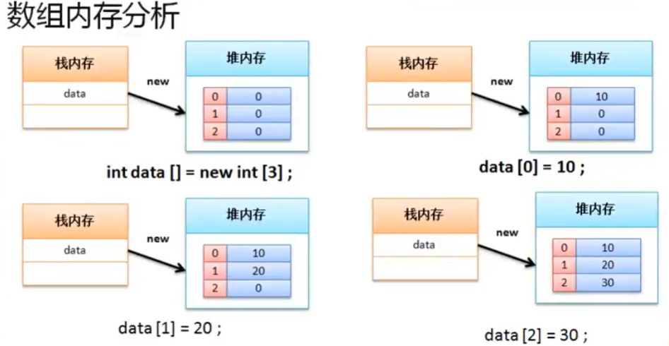

但是数组本身毕竟是属于引用数据类型，那么既然是引用数据类型，就一定会发生引用传递。引用传递应该还是按照传统的方式那样：一个堆内存可以被多个栈内存所指向。

操作示例 1：观察数组引用

```java
public class ArrayDemo {
    public static void main(String[] args) {
        int data [] = new int [] {10,20,30} ;	// 静态初始化
        int temp [] = data ;	// 引用传递
        temp [0] = 99 ;
        for (int x = 0 ; x < data.length ; x ++) {
            System.out.println(data[x]) ;
        }
    }
}
```

```java
// 输出内容
99
20
30
```

下面通过此程序进行内存的分析。

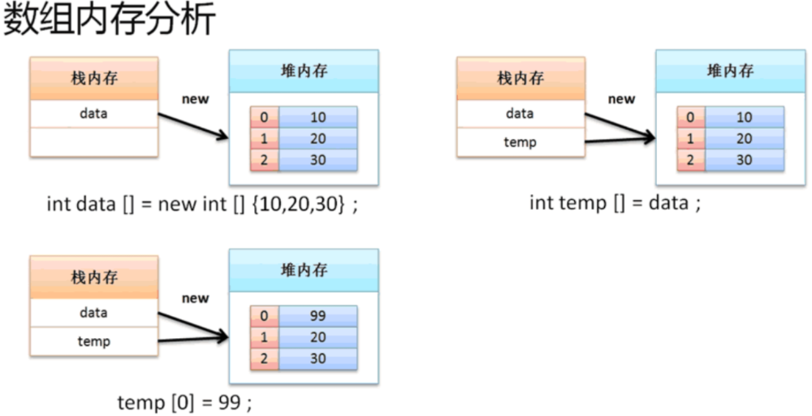

由于数组属于引用类型，所以一定要为其开辟堆内存空间后才可以使用，如果现在使用了未开辟堆内存空间的数组，会出现“NullPointerException”异常。

```java
public class ArrayDemo {
    public static void main(String[] args) {
        int data [] = null ;
        System.out.println(data[0]) ;
    }
}
```

```java
// 输出内容
Exception in thread "main" java.lang.NullPointerException
	at ArrayDemo.main(ArrayDemo.java:4)
```

必须提供有实例化对象才可以使用数组的操作形式进行数组的操作。


## 3、foreach 迭代输出

对于数组而言，一般都会使用for循环进行输出，但是在使用传统for循环输出的时候往往都采用了下标的形式进行数组元素的访问。

操作示例 1：传统形式

```java
public class ArrayDemo {
    public static void main(String[] args) {
        int data [] = new int [] {1,2,3,4,5} ;
        for (int x = 0 ; x < data.length ; x ++) {
            System.out.println(data[x]) ;
        }
    }
}
```

```java
// 输出内容
1
2
3
4
5
```

而从JDK1.5之后为了减轻下标对程序的影响（如果下标处理不当则会出现数组越界异常），所以参考.NET中的设计引入了一个增强型的for循环（foreach），利用foreach的语法结构可以自动获取数组中的每一个元素，避免下标访问，语法结构如下：

```java
for (数据类型 变量 : 数组 | 集合) {
}
```

最大的特点在于可以将数组中的每一个元素的内容取出保存在变量里面，这样就可以直接通过变量获取数据内容，而避免下标的方式来获取了。

操作示例 2：使用foreach语法形式输出

```java
public class ArrayDemo {
    public static void main (String[] args) {
        int data [ ] = new int [ ] {1,2,3,4,5} ;
        for(int temp : data) {  // 自动循环，将data数组的每个内容交给temp
            System.out.println(temp) ;
        }
    }
}
```

这种语法的好处是可以避免下标的操作。


## 4、二维数组（了解）

在之前所定义的数组里面会发现只有一个“[]”，所以这个时候的数组就好像一行数据一样，可以利用下标进行行数据的访问。

1、传统的数组就好比一行数据，如果要想找到一个数据只需要确定一个下标即可

| 下标 | 0    | 1    | 2    | 3    | 4    | 5    | 6    |
| ---- | ---- | ---- | ---- | ---- | ---- | ---- | ---- |
| 数据 | 890  | 90   | 91   | 789  | 717  | 768  | 897  |

2、如果说现在需要一个多行多列的结构（表），则就需要通过两个下标才可以描述出一个数据，行下标与列下标共同定义才可以找到，所以这样的数组形式就称为二维数组。

| 下标 | 0    | 1    | 2    | 3    | 4    | 5    | 6    |
| ---- | ---- | ---- | ---- | ---- | ---- | ---- | ---- |
| 0    | 890  | 90   | 91   | 789  | 717  | 768  | 897  |
| 1    | 1    | 23   | 3    | 4    | 5    | 56   | 7    |
| 2    | 90   | 98   | 756  | 1    | 2    | 34   | 465  |

对于二维数组可以使用的定义语法如下：

- 数组的动态初始化：数据类型 数组名称 [][] = new 数据类型 行个数
- 数组的静态初始化：数据类型 数组名称 [][] =new 数据类型 [][] { {数据,数据,……},{数据,数据,……},{数据,数据,……},……}

操作示例 1：定义二维数组

```java
public class ArrayDemo {
    public static void main(String[] args) {
        int[][] data = new int[][]{
                {1, 2, 3, 4, 5}, {1, 2, 3}, {5, 6, 7, 8}};
        for (int x = 0 ; x < data.length ; x ++) {
            for (int y = 0 ; y < data[x].length ; y ++) {
                System.out.println("data["+x+"]["+y+"] = " + data[x][y]) ;
            }
            System.out.println() ;	// 换行
        }
    }
}
```

```java
// 输出内容
data[0][0] = 1
data[0][1] = 2
data[0][2] = 3
data[0][3] = 4
data[0][4] = 5

data[1][0] = 1
data[1][1] = 2
data[1][2] = 3

data[2][0] = 5
data[2][1] = 6
data[2][2] = 7
data[2][3] = 8
```

操作示例 2：使用foreach输出二维数组

```java
public class ArrayDemo {
    public static void main(String[] args) {
        int[][] data = new int [][] {
            {1,2,3,4,5} , {1,2,3} , {5,6,7,8}} ;
        for (int temp [] : data) {
            for (int num : temp) {
                System.out.print(num + "、") ;
            }
            System.out.println() ;
        }
    }
}
```

```java
// 输出内容
1、2、3、4、5、
1、2、3、
5、6、7、8、
```

通过foreach的输出格式可以清楚地观察到，二维数组就是数组的嵌套使用。随着尅发技术的发展，如果要进行一些应用层的程序开发，那么很少会涉及到二维数组，更不用说更高级的多维数组了。


## 5、数组与方法

对于引用数据类型而言，主要的特点是可以与方法进行引用传递，而数组本身也属于引用数据类型，所以自然也可以通过方法实现引用传递操作。

操作示例 1：实现一个数组的引用传递

```java
public class ArrayDemo {
    public static void main(String[] args) {
        int data [] = new int [] {1,2,3,4,5} ;
        printArray(data) ;	// 传递数组
    }
    // 要求接收一个int型的数组
    public static void printArray(int temp []) {
        for (int x = 0 ; x < temp.length ; x ++) {
            System.out.println(temp[x]) ;
        }
    }
}
```

```java
// 输出内容
1
2
3
4
5
```

对于此时的引用传递具体的内存关系如下：

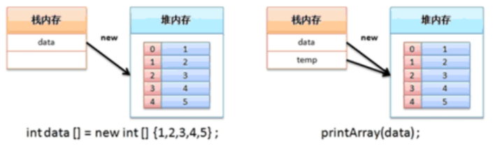

操作示例 2：定义方法返回数组（既然可以通过方法来接收一个数组，那么也就可以通过方法返回一个数组对象）

```java
public class ArrayDemo {
    public static void main(String[] args) {
        int data [] = initArray() ;	// 通过方法可以获得数组内容
        printArray(data) ;	// 传递数组
    }
    public static int [] initArray() {
        int arr [] = new int [] {1,2,3,4,5} ;
        return arr ;	// 返回一个数组
    }
    // 要求接收一个int型的数组
    public static void printArray(int temp []) {
        for (int x = 0 ; x < temp.length ; x ++) {
            System.out.println(temp[x]) ;
        }
    }
}
```

```java
// 输出内容
1
2
3
4
5
```

接下来针对于此程序进行内存关系分析。

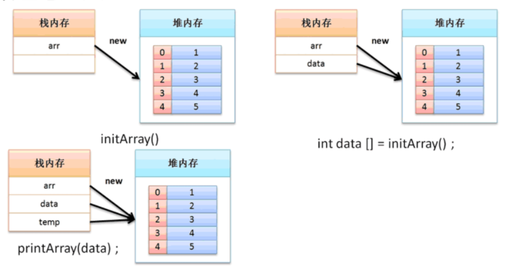

操作示例 3：通过方法修改数组内容

```java
public class ArrayDemo {
    public static void main(String[] args) {
        int data [] = new int [] {1,2,3,4,5} ;
        changeArray(data) ;	// 修改数组内容
        printArray(data) ;	// 传递数组
    }
    public static void changeArray(int arr[]) {
        for (int x = 0 ; x < arr.length ; x ++) {
            arr[x] *= 2 ;	// 每个元素的内容乘2保存
        }
    }
    // 要求接收一个int型的数组
    public static void printArray(int temp []) {
        for (int x = 0 ; x < temp.length ; x ++) {
            System.out.println(temp[x]) ;
        }
    }
}
```

```java
// 输出内容
2
4
6
8
10
```

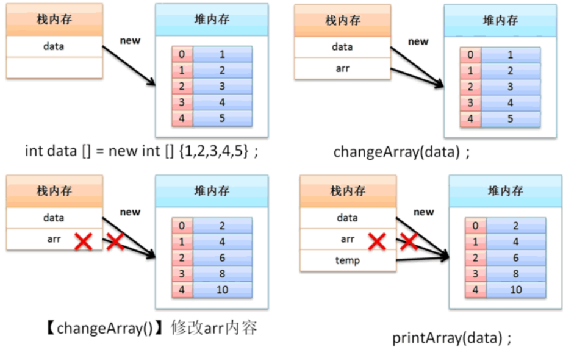

操作示例：随意定义一个int数组，要求可以计算出这个数组元素的总和、最大值、最小值、平均值。对于此程序最基本的实现如下：

```java
public class ArrayDemo {
    public static void main(String[] args) {
        int data [] = new int [] {1,2,3,4,5} ;
        int sum = 0 ; ;
        double avg = 0.0 ;
        int max = data[0] ; // 假设第一个是最大值
        int min = data[0] ;	// 假设第一个是最小值
        for (int x = 0 ; x < data.length ; x ++) {
            if (data[x] > max) {	// max地位改变了
                max = data[x] ;
            }
            if (data[x] < min) {
                min = data[x] ;
            }
            sum += data[x] ;
        }
        avg = sum / data.length ;
        System.out.println("数组内容总和：" + sum) ;
        System.out.println("数组内容平均值：" + avg) ;
        System.out.println("数组内容最大值：" + max) ;
        System.out.println("数组内容最小值：" + min) ;
    }
    public static void printArray(int temp []) {
        for (int x = 0 ; x < temp.length ; x ++) {
            System.out.println(temp[x]) ;
        }
    }
}
```

```java
// 输出内容
数组内容总和：15
数组内容平均值：3.0
数组内容最大值：5
数组内容最小值：1
```

主方法所在的类往往被称为主类，那么既然是主类肯定不希望涉及到过于复杂的功能。在进行开发的过程当中，主方法本身就相当于是一个客户端，而对于客户端的代码应该尽量简单一些，所以这个时候最好的做法是将这一系列的计算过程交给单独的程序类去完成。

操作示例：改善操作设计

```java
class ArrayUtil {	// 是一个操作工具的类
    private int sum ; // 保存总和
    private double avg ; // 保存平均值
    private int max ; // 保存最大值
    private int min ; // 保存最小值
    public ArrayUtil(int data[]) {	// 进行数组计算
        this.max = data[0] ; // 假设第一个是最大值
        this.min = data[0] ;	// 假设第一个是最小值
        for (int x = 0 ; x < data.length ; x ++) {
            if (data[x] > max) {	// max地位改变了
                this.max = data[x] ;
            }
            if (data[x] < min) {
                this.min = data[x] ;
            }
            this.sum += data[x] ;
        }
        this.avg = this.sum / data.length ;
    }
    public int getSum() {
        return this.sum ;
    }
    public double getAvg() {
        return this.avg ;
    }
    public int getMax() {
        return this.max ;
    }
    public int getMin() {
        return this.min ;
    }
}
public class ArrayDemo {
    public static void main(String[] args) {
        int data [] = new int [] {1,2,3,4,5} ;
        ArrayUtil util = new ArrayUtil(data) ;	// 数据计算
        System.out.println("数组内容总和：" + util.getSum()) ;
        System.out.println("数组内容平均值：" + util.getAvg()) ;
        System.out.println("数组内容最大值：" + util.getMax()) ;
        System.out.println("数组内容最小值：" + util.getMin()) ;
    }
}
```

```java
// 输出内容
数组内容总和：15
数组内容平均值：3.0
数组内容最大值：5
数组内容最小值：1
```

此时的主类就好比我们使用的电脑一样，只关心如何操作，而具体的操作过程被类进行包装了。


## 6、数组排序

数组排序指的是可以将一个杂乱的数组按照顺序进行码放，但是对于数组排序总是通过一个基础的模型完成的，例如：本次先通过一个升序排序的方式来观察排序的处理。

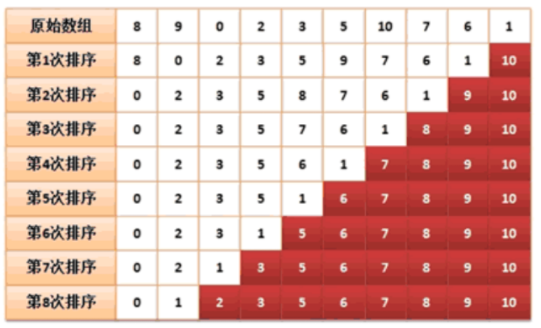

操作示例 1：数组排序分析

```java
public class ArrayDemo {
    public static void main(String[] args) {
        int data [] = new int [] {8,9,0,2,3,5,10,7,6,1} ;
        for (int x = 0 ; x < data.length ; x ++) {
            for (int y = 0 ; y < data.length - x - 1 ; y ++) {
                if (data[y] > data[y + 1]) {	// 交换数据
                    int temp = data[y] ;
                    data[y] = data[y + 1] ;
                    data[y + 1] = temp ;
                }
            }
        }
        printArray(data) ;
    }
    public static void printArray(int temp []) {
        for (int x = 0 ; x < temp.length ; x ++) {
            System.out.print(temp[x] + "、") ;
        }
        System.out.println() ;
    }
}
```

```java
// 输出内容
0、1、2、3、5、6、7、8、9、10、
```

以上的程序代码都是通过主方法完成的，不符合面向对象的设计结构，最好的做法是将这个排序处理的操作交给一个类进行处理完成。

操作示例 2：优化代码

```java
class ArrayUtil {
    public static void sort(int[] data) {	// 进行数组的排序处理
        for (int x = 0 ; x < data.length ; x ++) {
            for (int y = 0 ; y < data.length - x - 1 ; y ++) {
                if (data[y] > data[y + 1]) {	// 交换数据
                    int temp = data[y] ;
                    data[y] = data[y + 1] ;
                    data[y + 1] = temp ;
                }
            }
        }
    }
    public static void printArray(int[] temp) {
        for (int x = 0 ; x < temp.length ; x ++) {
            System.out.print(temp[x] + "、") ;
        }
        System.out.println() ;
    }
}
public class ArrayDemo {
    public static void main(String[] args) {
        int data [] = new int [] {8,9,0,2,3,5,10,7,6,1} ;
        ArrayUtil.sort(data) ;	// 排序
        ArrayUtil.printArray(data) ;
    }
}
```

```java
// 输出内容
0、1、2、3、5、6、7、8、9、10、
```

在以后进行类设计的时候，如果发现类中没有属性存在的意义，那么定义的方法就没有必要使用普通方法了，因为普通方法需要在有实例化对象产生的情况下才可以调用。


## 7、数组反转

数组的反转操作指的是进行前后转置处理，即：首尾交换，例如，现在有一个数组，其内容如下：

1. 数组原始内容：1、2、3、4、5、6、7、8、9；
2. 交换后的内容：9、8、7、6、5、4、3、2、1；

对于数组的前后交换有两种做法：

**做法一：**定义一个新的数组而后按照逆序的方式保存（会产生无用的垃圾空间）

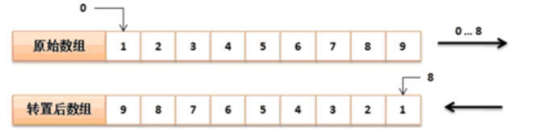

```java
class ArrayUtil {
    public static void printArray(int[] temp) {
        for (int x = 0 ; x < temp.length ; x ++) {
            System.out.print(temp[x] + "、") ;
        }
        System.out.println() ;
    }
}
public class ArrayDemo {
    public static void main(String[] args) {
        int data [] = new int [] {1,2,3,4,5,6,7,8,9} ;
        int temp [] = new int [data.length] ;	// 第二个数组
        int foot = temp.length - 1; // 第二个数组的脚标
        for (int x = 0 ; x < data.length ; x ++) {
            temp[foot --] = data[x] ;
        }
        data = temp ;
        ArrayUtil.printArray(data) ;
    }
}
```

```java
// 输出内容
9、8、7、6、5、4、3、2、1、
```

下面进行一下内存的分析处理，观察一下程序存在的问题。（以3个数据为例）

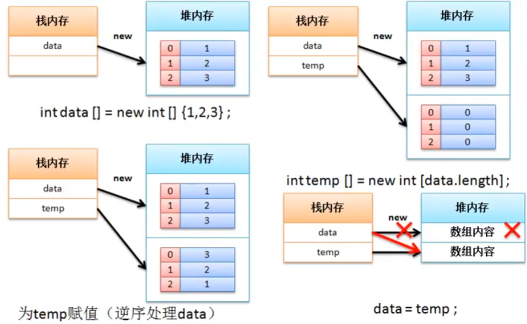


**做法二：**在一个数组上进行转置（部分数据为例）

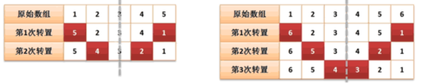

现在如果想实现这种转置最需要确定的是数组转换的次数，次数的计算：“数组长度÷2”，实际上并不需要去考虑数组是奇数个数还是偶数个数。

```java
class ArrayUtil {
    public static void printArray(int[] temp) {
        for (int x = 0 ; x < temp.length ; x ++) {
            System.out.print(temp[x] + "、") ;
        }
        System.out.println() ;
    }
}
public class ArrayDemo {
    public static void main(String[] args) {
        int data [] = new int [] {1,2,3,4,5,6,7,8,9} ;
        int center = data.length / 2 ; // 确定转换的次数
        int head = 0 ;	// 操作脚标
        int tail = data.length - 1 ; // 操作脚标
        for (int x = 0 ; x < center ; x ++) {
            int temp = data [head] ;
            data [head] = data [tail] ;
            data [tail] = temp ;
            head ++ ;
            tail -- ;
        }
        ArrayUtil.printArray(data) ;
    }
}
```

```java
// 输出内容
9、8、7、6、5、4、3、2、1、
```

两种实现如果要进行比较可以发现，第一种处理方式循环次数较多，并且还会产生垃圾。而第二种实现，循环次数降低，但是存在有if判断增加了时间复杂度，可是可以减少无用对象的产生，以提升性能。

优化示例：将转换功能变为类定义

```java
class ArrayUtil {
    public static void reverse(int[] data) {
        int center = data.length / 2 ; // 确定转换的次数
        int head = 0 ;	// 操作脚标
        int tail = data.length - 1 ; // 操作脚标
        for (int x = 0 ; x < center ; x ++) {
            int temp = data [head] ;
            data [head] = data [tail] ;
            data [tail] = temp ;
            head ++ ;
            tail -- ;
        }
    }
    public static void printArray(int temp []) {
        for (int x = 0 ; x < temp.length ; x ++) {
            System.out.print(temp[x] + "、") ;
        }
        System.out.println() ;
    }
}
public class ArrayDemo {
    public static void main(String[] args) {
        int data [] = new int [] {1,2,3,4,5,6,7,8,9} ;
        ArrayUtil.reverse(data) ;	// 转置处理
        ArrayUtil.printArray(data) ;
    }
}
```

```java
// 输出内容
9、8、7、6、5、4、3、2、1、
```

可以发现数组由于可以通过脚标进行元素的控制，所以相应的循环逻辑使用的会比较多。


## 8、数组相关操作方法

由于数组是一个重要的概念，所以在Java语言本身也提供有数组的相关支持处理，这些处理是在开发中使用的。

1、数组排序：java.util.Arrays.sort(数组名称)。操作示例 1：

```java
class ArrayUtil {
    public static void printArray(int[] temp) {
        for (int x = 0 ; x < temp.length ; x ++) {
            System.out.print(temp[x] + "、") ;
        }
        System.out.println() ;
    }
}
public class ArrayDemo {
    public static void main(String[] args) {
        int[] data = new int[]{23, 12, 1, 234, 2, 6, 12, 34, 56};
        java.util.Arrays.sort(data) ;	// 排序
        ArrayUtil.printArray(data) ;
    }
}
```

```java
// 输出内容
1、2、6、12、12、23、34、56、234、
```


2、数组拷贝（把方法做了一些变形）：System.arraycopy(源数组，源数组开始点，目标数组，目标数组开始点，拷贝长度)。

操作示例 2：实现数组拷贝，现在假设有两个数组：

1. 数组一：1、2、3、4、5、6、7、8、9；
2. 数组二：11、22、33、44、55、66、77、88、99；
3. 要求拷贝之后的数组二内容为：11、22、33、6、7、8、77、88、99；

```java
class ArrayUtil {
    public static void printArray(int[] temp) {
        for (int x = 0 ; x < temp.length ; x ++) {
            System.out.print(temp[x] + "、") ;
        }
        System.out.println() ;
    }
}
public class ArrayDemo {
    public static void main(String[] args) {
        int[] dataA = new int[]{1, 2, 3, 4, 5, 6, 7, 8, 9};
        int[] dataB = new int[]{11, 22, 33, 44, 55, 66, 77, 88, 99};
        System.arraycopy(dataA,5,dataB,3,3) ;
        ArrayUtil.printArray(dataB) ;
    }
}
```

```java
// 输出内容
11、22、33、6、7、8、77、88、99、
```

这些操作的支持都是系统本身提供的，即：都是可以在开发中使用的操作。实际上如果要自己实现拷贝也可以很容易完成。直接定义一个方法操作即可。

操作示例 3：自己实现拷贝代码

```java
class ArrayUtil {
    public static void printArray(int[] temp) {
        for (int x = 0 ; x < temp.length ; x ++) {
            System.out.print(temp[x] + "、") ;
        }
        System.out.println() ;
    }
    public static void arraycopy(int [] src,int sindex,int dsc[] ,int dindex,int len) {
        for (int x = 0 ; x < len ; x ++) {
            dsc [dindex ++] = src[sindex ++] ;
        }
    }
}
public class ArrayDemo {
    public static void main(String[] args) {
        int[] dataA = new int[]{1, 2, 3, 4, 5, 6, 7, 8, 9};
        int[] dataB = new int[]{11, 22, 33, 44, 55, 66, 77, 88, 99};
        ArrayUtil.arraycopy(dataA, 5, dataB, 3, 3);
        ArrayUtil.printArray(dataB);
    }
}
```

```java
// 输出内容
11、22、33、6、7、8、77、88、99、
```

如果是自己去定义这种拷贝或者排序的方法就需要考虑所有的数据类型。


## 9、对象数组

之前所接触到的都是基本数据类型定义的数组，但是在Java程序本身各种数据类型都可以成为数组类型，所以类也可以成为数组类型，而这样的数组就称为对象数组。对象数组的定义格式如下：

1. 动态初始化：类 对象数组名称 [] = new 类 [长度] ，每一个元素的内容都是null ；
2. 静态初始化：类 对象数组名称 [] =new 类 [] {实例化对象，实例化对象……} ；

操作示例 1：使用动态初始化定义对象数组

```java
class Person {
    private String name;
    private int age;
    public Person(String name, int age) {
        this.name = name;
        this.age = age;
    }
    public String getInfo() {
        return "姓名：" + this.name + "、年龄：" + this.age;
    }
    // setter、getter略
}

public class ArrayDemo {
    public static void main(String[] args) {
        Person per[] = new Person[3]; // 对象数组
        per[0] = new Person("张三", 20);
        per[1] = new Person("李四", 20);
        per[2] = new Person("王五", 20);
        for (int x = 0; x < per.length; x++) {
            System.out.println(per[x].getInfo());
        }
    }
}
```

```java
// 输出内容
姓名：张三、年龄：20
姓名：李四、年龄：20
姓名：王五、年龄：20
```

操作示例 2：对象数组的静态初始化

```java
class Person {
    private String name;
    private int age;
    public Person(String name, int age) {
        this.name = name;
        this.age = age;
    }
    public String getInfo() {
        return "姓名：" + this.name + "、年龄：" + this.age;
    }
    // setter、getter略
}

public class ArrayDemo {
    public static void main(String[] args) {
        Person per[] = new Person[]{
                new Person("张三", 20),
                new Person("李四", 20),
                new Person("王五", 20)}; // 对象数组
        for (int x = 0; x < per.length; x++) {
            System.out.println(per[x].getInfo());
        }
    }
}
```

```java
// 输出内容
姓名：张三、年龄：20
姓名：李四、年龄：20
姓名：王五、年龄：20
```

对于对象数组而言，本身只是更换了一种所谓数组定义的类型。但是这种情况下，内存图就比较麻烦了。观察对象数组内存图：

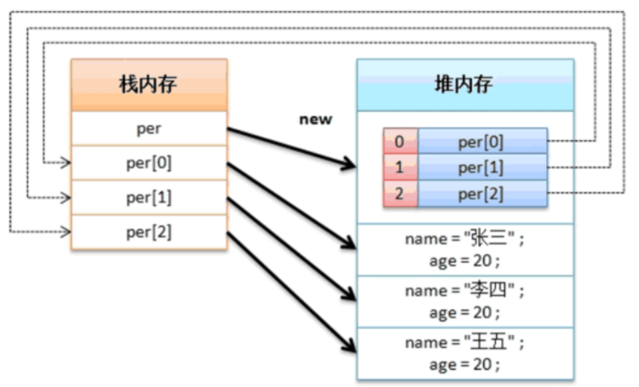

所有的开发都不可能离开对象数组，但是通过一系列的分析也应该知道一个数组中的**最大缺陷：**长度是固定的。**优势：**数据线性保存，根据索引访问，速度较快（时间复杂度为“1”）。

> 面试题：你在定义类的时候什么情况下会考虑使用 static 方法？
>
> 1. 在类之中不提供有任何成员属性的情况下，如果定义的是普通方法，那么就必须通过实例化对象来进行调用，而这样就会产生许多无用的实例化对象。那么在这样的情况下会考虑直接定义static方法，这样可以由类名称直接调用。
> 2. 在开发之中一定会使用到使用数组，但是会使用一些特殊处理后的数组，因为原始数组的定义虽然方便但是却有长度限制。


## 10、方法可变参数

如果现在要求定义一个方法，这个方法可以实现任意多个整型数据的相加处理。这样的情况下最早的时候只能通过数组进行处理。

操作示例 1：传统实现

```java
class ArrayUtil {
    public static int sum(int[] data) {
        int sum = 0 ;
        for (int temp : data) {
            sum += temp ;
        }
        return sum ;
    }
}
public class ArrayDemo {
    public static void main(String[] args) {
        System.out.println(ArrayUtil.sum(new int[]{1, 2, 3}));
    }
}
```

```java
// 输出内容
6
```

虽然以上的程序可以实现任意多个数字的参数内容传递，但是与实际的要求并不符合，实际要求的是可以传递多个参数，而不是一个数组。从JDK1.5开始为了方便开发者进行可变参数的定义，对于方法的参数提供有新的支持了。

操作示例 2：采用可变参数

```java
class ArrayUtil {
    public static int sum(int ... data) {	// 变种数组
        int sum = 0 ;
        for (int temp : data) {
            sum += temp ;
        }
        return sum ;
    }
}
public class ArrayDemo {
    public static void main(String[] args) {
        System.out.println(ArrayUtil.sum(1, 2, 3));
        System.out.println(ArrayUtil.sum(new int[]{1, 2, 3}));
    }
}
```

```java
// 输出内容
6
6
```

可变参数的最大作用在于，在以后进行一些程序类设计或者开发者调用的时候，利用此种形式就可以避免数组的传递操作了。可变参数的本质需要清楚的是：依然属于数组。


# 引用传递实际应用

## 1、引用应用分析一：（类关联结构）

假设生活品质比较好的人可以有一辆汽车，当然，一些生活较差的人是没有汽车的，只能依靠步行。要求可以通过面向对象的设计来解决实现以上的关系转换。

```java
class Car {
    private String name;
    private double price;
    private Person person; // 车应该属于一个人
    public Car(String name, double price) {
        this.name = name;
        this.price = price;
    }
    public void setPerson(Person person) {
        this.person = person;
    }
    public Person getPerson() {
        return this.person;
    }
    public String getInfo() {
        return "汽车品牌型号：" + this.name + "、汽车价值：" + this.price;
    }
}

class Person {
    private String name;
    private int age;
    private Car car; // 一个人有一辆车
    public Person(String name, int age) {
        this.name = name;
        this.age = age;
    }
    public void setCar(Car car) {
        this.car = car;
    }
    public Car getCar() {
        return this.car;
    }
    public String getInfo() {
        return "姓名：" + this.name + "、年龄：" + this.age;
    }
}

public class ArrayDemo {
    public static void main(String args[]) {
        // 第一步：声明对象并且设置彼此的关系
        Person person = new Person("林强", 29);
        Car car = new Car("宾利", 8000000.00);
        person.setCar(car);    // 一个人有一辆车
        car.setPerson(person); // 一辆车属于一个人
        // 第二步：根据关系获取数据
        System.out.println(person.getCar().getInfo()); // 代码链
        System.out.println(car.getPerson().getInfo());
    }
}
```

```java
// 输出内容
汽车品牌型号：宾利、汽车价值：8000000.0
姓名：林强、年龄：29
```

本次所操作的两个类型：Person、Car都是自定义类型，但是Person和Car都可以明确的描述出某一类群体，现在是针对于群体关系做出的一种设置。


## 2、引用应用分析二：（自身关联）

现在已经确定好人与车的关系，但是现在可以进一步进行该操作的完善，例如：一个人有孩子，孩子也可以在成年之后有车。

```java
class Car {
    private String name;
    private double price;
    private Person person; // 车应该属于一个人
    public Car(String name, double price) {
        this.name = name;
        this.price = price;
    }
    public void setPerson(Person person) {
        this.person = person;
    }
    public Person getPerson() {
        return this.person;
    }
    public String getInfo() {
        return "汽车品牌型号：" + this.name + "、汽车价值：" + this.price;
    }
}

class Person {
    private String name;
    private int age;
    private Car car; // 一个人有一辆车
    private Person[] children; // 一个人有多个孩子
    public Person(String name, int age) {
        this.name = name;
        this.age = age;
    }
    public void setChildren(Person children[]) {
        this.children = children;
    }
    public Person[] getChildren() {
        return this.children;
    }
    public void setCar(Car car) {
        this.car = car;
    }
    public Car getCar() {
        return this.car;
    }
    public String getInfo() {
        return "姓名：" + this.name + "、年龄：" + this.age;
    }
}

public class ArrayDemo {
    public static void main(String[] args) {
        // 第一步：声明对象并且设置彼此的关系
        Person person = new Person("吴硕", 29);
        Person childA = new Person("林强", 18);
        Person childB = new Person("郭仁义", 19);
        childA.setCar(new Car("BMW X1", 300000.00)); // 匿名对象
        childB.setCar(new Car("法拉利", 1500000.00)); // 匿名对象
        person.setChildren(new Person[]{childA, childB});    // 一个人有多个孩子
        Car car = new Car("宾利", 8000000.00);
        person.setCar(car);    // 一个人有一辆车
        car.setPerson(person); // 一辆车属于一个人
        // 第二步：根据关系获取数据
        System.out.println(person.getCar().getInfo()); // 代码链
        System.out.println(car.getPerson().getInfo());
        // 根据人找到所有的孩子以及孩子对应的汽车
        for (int x = 0; x < person.getChildren().length; x++) {
            System.out.println("\t|- " + person.getChildren()[x].getInfo());
            System.out.println("\t\t|- " + person.getChildren()[x].getCar().getInfo());
        }
    }
}
```

```java
// 输出内容
汽车品牌型号：宾利、汽车价值：8000000.0
姓名：吴硕、年龄：29
	|- 姓名：林强、年龄：18
		|- 汽车品牌型号：BMW X1、汽车价值：300000.0
	|- 姓名：郭仁义、年龄：19
		|- 汽车品牌型号：法拉利、汽车价值：1500000.0
```

这些关系的匹配都是通过引用数据类型的关联来完成的。


## 3、引用应用分析三（合成设计模式）

假设现在要求定义出一种可以描述电脑组成的类，那么在这样的状态下就必须进行拆分，电脑分为两部分：显示器和主机；而主机上需要设置有一系列的硬件。

```java
class 电脑 {
    private 显示器 对象数组 [];
    private 主机 对象;
}
class 显示器 {}
class 主机 {
    private 主板 对象;
    private 鼠标 对象;
    private 键盘 对象;
}
class 主板 {
    private 内存 对象数组 [];
    private CPU 对象数组 [];
    private 显卡 对象;
    private 硬盘 对象数组 [];
}
class 键盘 {}
class 鼠标 {}
class 内存 {}
class CPU {}
class 显卡 {}
class 硬盘 {}
```

任何的人类的科技产品都可以进行拆分，而后进行重新组合的，所以这样的设计在Java中被称为合成设计模式。

# 数据表与简单类映射

## 1、数据表与简单Java类映射转换

简单Java类是现在面向对象设计的主要分析基础，但是对于实际开发之中简单Java类的定义来源是有依据的，往往都是依据数据表的结构来实现简单Java类。

在数据库之中实际上是提供有若干个数据表的，那么每一张实体数据表实际上都可以描述出一些具体的事务概念，例如：雇员信息系表、部门信息表，这些一看就知道到描述的是雇员或者部门的信息。

那么按照这个思路回到程序之中会发现，程序类的定义实际上和这些实体表的差别并不大，所以在实际的开发之中，数据表与简单Java类之间的基本映射关系如下：

- 数据实体表设计 = 类的定义
- 表中的字段 = 类的成员属性
- 表的外键关联 = 引用关联
- 表的一行记录 = 类的一个实例化对象
- 表的多行记录 = 对象数组

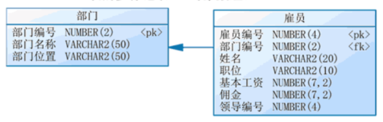

在以上所对应数据表的关系之中可以发现有如下的关联存在：

1. 一个部门有多个雇员；
2. 一个雇员属于一个部门；
3. 一个雇员有一个领导；

下面将以上数据表转为简单Java类的定义形式，在整体的程序代码之中要求可以获得如下信息：

- 根据部门信息获得以下内容：
  1. 一个部门的完整信息；
  2. 一个部门之中所有雇员的完整信息；
  3. 一个雇员对应的领导的信息；
- 根据雇员信息获得以下内容：
  1. 一个雇员对应的所在部门信息；
  2. 一个雇员对应的领导信息；

对于数据表与简单Java类之间的映射最好的解决步骤：先抛开所有的关联字段不看，写出类的基本组成，而后再通过引用配置关联字段的关系。

**第一步：**分别定义Emp、Dept两个实体类

```java
class Dept {
    private long deptno ;
    private String dname ;
    private String loc ;
    public Dept(long deptno,String dname,String loc) {
        this.deptno = deptno ;
        this.dname = dname ;
        this.loc = loc ;
    }
    // setter、getter、无参构造略
    public String getInfo() {
        return "【部门信息】部门编号 = " + this.deptno + "、部门名称 = " + this.dname + "、部门位置 = " + this.loc ;
    }
}
class Emp {
    private long empno ;
    private String ename ;
    private String job ;
    private double sal ;
    private double comm ;
    public Emp(long empno,String ename,String job,double sal,double comm) {
        this.empno = empno ;
        this.ename = ename ;
        this.job = job ;
        this.sal = sal ;
        this.comm = comm ;
    }
    // setter、getter、无参构造略
    public String getInfo() {
        return "【雇员信息】雇员编号 = " + this.empno + "、雇员姓名 = " + this.ename + "、雇员职位 = " + this.job + "、基本工资 = " + this.sal + "、佣金 = " + this.comm ;
    }
}
```

**第二步：**配置所有的关联字段

```java
class Dept {
    private long deptno ;
    private String dname ;
    private String loc ;
    private Emp emps [] ;	// 多个雇员信息
    public Dept(long deptno,String dname,String loc) {
        this.deptno = deptno ;
        this.dname = dname ;
        this.loc = loc ;
    }
    public void setEmps(Emp [] emps) {
        this.emps = emps ;
    }
    public Emp [] getEmps() {
        return this.emps ;
    }
    // setter、getter、无参构造略
    public String getInfo() {
        return "【部门信息】部门编号 = " + this.deptno + "、部门名称 = " + this.dname + "、部门位置 = " + this.loc ;
    }
}
class Emp {
    private long empno ;
    private String ename ;
    private String job ;
    private double sal ;
    private double comm ;
    private Dept dept ;	// 所属部门
    private Emp mgr ;	// 所属领导
    public Emp(long empno,String ename,String job,double sal,double comm) {
        this.empno = empno ;
        this.ename = ename ;
        this.job = job ;
        this.sal = sal ;
        this.comm = comm ;
    }
    // setter、getter、无参构造略
    public String getInfo() {
        return "【雇员信息】雇员编号 = " + this.empno + "、雇员姓名 = " + this.ename + "、雇员职位 = " + this.job + "、基本工资 = " + this.sal + "、佣金 = " + this.comm ;
    }
    public void setDept(Dept dept) {
        this.dept = dept ;
    }
    public void setMgr(Emp mgr) {
        this.mgr = mgr ;
    }
    public Dept getDept() {
        return this.dept ;
    }
    public Emp getMgr() {
        return this.mgr ;
    }
}
```

在以后进行实际项目开发的过程之中一定是分两个步骤实现的：

1. 第一步：根据表的结构关系进行对象的配置
2. 第二步：根据要求通过结构获取数据

操作示例：实现项目的开发要求

```java
class Dept {
    private long deptno;
    private String dname;
    private String loc;
    private Emp emps[];    // 多个雇员信息
    public Dept(long deptno, String dname, String loc) {
        this.deptno = deptno;
        this.dname = dname;
        this.loc = loc;
    }
    public void setEmps(Emp[] emps) {
        this.emps = emps;
    }
    public Emp[] getEmps() {
        return this.emps;
    }
    // setter、getter、无参构造略
    public String getInfo() {
        return "【部门信息】部门编号 = " + this.deptno + "、部门名称 = " + this.dname + "、部门位置 = " + this.loc;
    }
}

class Emp {
    private long empno;
    private String ename;
    private String job;
    private double sal;
    private double comm;
    private Dept dept;    // 所属部门
    private Emp mgr;    // 所属领导
    public Emp(long empno, String ename, String job, double sal, double comm) {
        this.empno = empno;
        this.ename = ename;
        this.job = job;
        this.sal = sal;
        this.comm = comm;
    }
    // setter、getter、无参构造略
    public String getInfo() {
        return "【雇员信息】雇员编号 = " + this.empno + "、雇员姓名 = " + this.ename + "、雇员职位 = " + this.job + "、基本工资 = " + this.sal + "、佣金 = " + this.comm;
    }
    public void setDept(Dept dept) {
        this.dept = dept;
    }
    public void setMgr(Emp mgr) {
        this.mgr = mgr;
    }
    public Dept getDept() {
        return this.dept;
    }
    public Emp getMgr() {
        return this.mgr;
    }
}

public class JavaAPIDemo {
    public static void main(String[] args) {
        // 第一步：根据关系进行类的定义
        // 定义出各个的实例化对象，此时并没有任何的关联定义
        Dept dept = new Dept(10, "财务部", "上海");
        Emp empA = new Emp(7369L, "SMITH", "CLERK", 800.00, 0.0);
        Emp empB = new Emp(7566L, "FORD", "MANAGER", 2450.00, 0.0);
        Emp empC = new Emp(7839L, "KING", "PRESIDENT", 5000.00, 0.0);
        // 需要为对象进行关联的设置
        empA.setDept(dept);    // 设置雇员与部门的关联
        empB.setDept(dept);    // 设置雇员与部门的关联
        empC.setDept(dept);    // 设置雇员与部门的关联
        empA.setMgr(empB);        // 设置雇员与领导的关联
        empB.setMgr(empC);        // 设置雇员与领导的关联
        dept.setEmps(new Emp[]{empA, empB, empC});    // 部门与雇员
        // 第二步：根据关系获取数据
        System.out.println(dept.getInfo());    // 部门信息
        for (int x = 0; x < dept.getEmps().length; x++) {
            System.out.println("\t|- " + dept.getEmps()[x].getInfo());
            if (dept.getEmps()[x].getMgr() != null) {
                System.out.println("\t\t|- " + dept.getEmps()[x].getMgr().getInfo());
            }
        }
        System.out.println("----------------------------------");
        System.out.println(empB.getDept().getInfo());    // 根据雇员获取部门信息
        System.out.println(empB.getMgr().getInfo());    // 根据雇员获取领导信息
    }
}
```

```java
// 输出内容
【部门信息】部门编号 = 10、部门名称 = 财务部、部门位置 = 上海
	|- 【雇员信息】雇员编号 = 7369、雇员姓名 = SMITH、雇员职位 = CLERK、基本工资 = 800.0、佣金 = 0.0
		|- 【雇员信息】雇员编号 = 7566、雇员姓名 = FORD、雇员职位 = MANAGER、基本工资 = 2450.0、佣金 = 0.0
	|- 【雇员信息】雇员编号 = 7566、雇员姓名 = FORD、雇员职位 = MANAGER、基本工资 = 2450.0、佣金 = 0.0
		|- 【雇员信息】雇员编号 = 7839、雇员姓名 = KING、雇员职位 = PRESIDENT、基本工资 = 5000.0、佣金 = 0.0
	|- 【雇员信息】雇员编号 = 7839、雇员姓名 = KING、雇员职位 = PRESIDENT、基本工资 = 5000.0、佣金 = 0.0
----------------------------------
【部门信息】部门编号 = 10、部门名称 = 财务部、部门位置 = 上海
【雇员信息】雇员编号 = 7839、雇员姓名 = KING、雇员职位 = PRESIDENT、基本工资 = 5000.0、佣金 = 0.0
```


## 2、数据表与简单Java类一对多映射

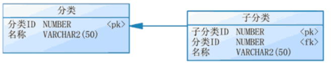

按照表的要求将表的结构转换为类结构，同时可以获取如下信息：

1. 获取一个分类的完整信息；
2. 可以根据分类获取其对应的所有子分类的信息。

```java
class Item {
    private long iid;
    private String title;
    private Subitem subitems [];
    public Item(long iid,String title) {
        this.iid = iid;
        this.title = title;
    }
    public void setSubitems(Subitem subitems [] ) {
        this.subitems = subitems;
    }
    public Subitem [] getSubitems() {
        return this.subitems;
    }
    public String getInfo() {
        return "【分类信息】iid = " + this.iid + "、title = " + this.title ;
    }
}
class Subitem {
    private long sid;
    private String title;
    private Item item;
    public Subitem(long sid,String title) {
        this.sid = sid;
        this.title = title;
    }
    public void setItem(Item item) {
        this.item = item ;
    }
    public Item getItem() {
        return this.item ;
    }
    public String getInfo() {
        return "【子分类信息】sid = " + this.sid + "、title = " + this.title ;
    }
}
public class JavaAPIDemo {
    public static void main(String[] args) {
        // 第一步：根据结构设置对象数据
        Item item = new Item(1L,"图书") ;
        Subitem subitems [] = new Subitem [] {
            new Subitem(10L,"编程图书") ,
            new Subitem(10L,"图形图像类图书") 
        } ;
        item.setSubitems(subitems) ;	// 一个分类下有多个子分类
        for (int x = 0 ; x < subitems.length ; x ++) {
            subitems[x].setItem(item) ;
        }
        // 第二步：根据要求获取数据
        System.out.println(item.getInfo()) ;
        for (int x = 0 ; x < item.getSubitems().length ; x ++) {
            System.out.println("\t|- " + item.getSubitems()[x].getInfo()) ;
        }
    }
}
```

```java
// 输出内容
【分类信息】iid = 1、title = 图书
	|- 【子分类信息】sid = 10、title = 编程图书
	|- 【子分类信息】sid = 10、title = 图形图像类图书
```


## 3、数据表与简单Java类多对多映射

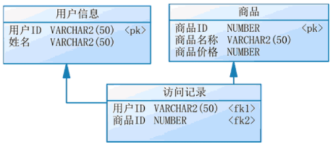

将以上的结构转换为类结构，并且可以获取如下的信息：

1. 获取一个用户访问的所有商品的信息；
2. 获取一个商品被浏览过的全部的用户信息。

对于此时的程序只需要去考虑实体表的设计即可，也就是说对于中间的访问记录信息表不要求进行转换处理，只定义两个类即可。

```java
class Member {
    private String mid ;
    private String name ;
    private Product products [] ;
    public Member(String mid,String name) {
        this.mid = mid ;
        this.name = name ;
    }
    public void setProducts(Product products []) {
        this.products = products ;
    }
    public Product [] getProducts() {
        return this.products ;
    }
    public String getInfo() {
        return "【用户信息】mid = " + this.mid + "、name = " + this.name ;
    }
}
class Product {
    private long pid ;
    private String title ;
    private double price ;
    private Member members [] ;
    public Product(long pid,String title,double price) {
        this.pid = pid ;
        this.title = title ;
        this.price = price ;
    }
    public void setMembers(Member members[]) {
        this.members = members ;
    }
    public Member [] getMembers() {
        return this.members ;
    }
    public String getInfo() {
        return "【商品信息】pid = " + this.pid + "、title = " + this.title + "、price = " + this.price ;
    }
}
public class JavaAPIDemo {
    public static void main(String[] args) {
        // 第一步：根据结构设置对象数据
        Member memA = new Member("mldn","张三") ;
        Member memB = new Member("mldnjava","李四") ;
        Product proA = new Product(1L,"Java开发图书",79.8) ;
        Product proB = new Product(2L,"非常大的B的耳机",2309.8) ;
        Product proC = new Product(3L,"小米手机",3000.8) ;
        memA.setProducts(new Product[] {proA,proB,proC} ) ;
        memB.setProducts(new Product[] {proA} ) ;
        proA.setMembers(new Member[] {memA,memB}) ;
        proB.setMembers(new Member[] {memA}) ;
        proC.setMembers(new Member[] {memA}) ;
        // 第二步：根据要求获取数据
        System.out.println("--------------- 根据用户查看浏览商品信息 -----------------") ;
        System.out.println(memA.getInfo()) ;
        for (int x = 0 ; x < memA.getProducts().length ; x ++) {
            System.out.println("\t|- " + memA.getProducts()[x].getInfo()) ;
        }
        System.out.println("--------------- 根据商品找到被浏览的记录 -----------------") ;
        System.out.println(proA.getInfo()) ;
        for (int x = 0 ; x < proA.getMembers().length ; x ++) {
            System.out.println("\t|- " + proA.getMembers()[x].getInfo()) ;
        }
    }
}
```

```java
// 输出内容
--------------- 根据用户查看浏览商品信息 -----------------
【用户信息】mid = mldn、name = 张三
	|- 【商品信息】pid = 1、title = Java开发图书、price = 79.8
	|- 【商品信息】pid = 2、title = 非常大的B的耳机、price = 2309.8
	|- 【商品信息】pid = 3、title = 小米手机、price = 3000.8
--------------- 根据商品找到被浏览的记录 -----------------
【商品信息】pid = 1、title = Java开发图书、price = 79.8
	|- 【用户信息】mid = mldn、name = 张三
	|- 【用户信息】mid = mldnjava、name = 李四
```


## 4、复杂多对多映射（角色与权限）

在进行实际项目开发过程之中，对于用户的授权管理是一项重要的任务，下面给出了一个最为常见的用户权限管理的表结构设计，基本的关系如下：

1. 一个用户可以拥有多个角色，一个角色可能有多个用户；
2. 一个角色可以拥有多个权限；

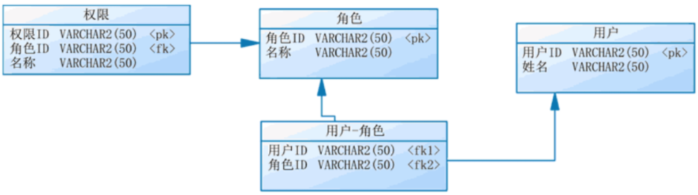

要求实现如下查询功能：

1. 可以根据一个用户找到该用户对应的所有角色，以及每一个角色对应的所有权限信息；
2. 可以根据一个角色找到该角色下的所有权限，以及拥有此角色的全部用户信息；
3. 可以根据一个权限找到具备有此权限的所有用户信息。

```java
class Member {
    private String mid ;
    private String name ;
    private Role roles [] ; 
    public Member(String mid,String name) {
        this.mid = mid ;
        this.name = name ;
    }
    public void setRoles(Role roles[]) {
        this.roles = roles ;
    }
    public Role [] getRoles() {
        return this.roles ;
    }
    public String getInfo() {
        return "【用户信息】mid = " + this.mid + "、name = " + this.name ;
    }
}
class Role {
    private long rid ;
    private String title ;
    private Member members [] ;
    private Privilege privileges [] ;
    public Role(long rid,String title) {
        this.rid = rid ;
        this.title = title ;
    }
    public void setMembers(Member members []) {
        this.members = members ;
    }
    public Member [] getMembers() {
        return this.members ;
    }
    public void setPrivileges(Privilege privileges []) {
        this.privileges = privileges ;
    }
    public Privilege [] getPrivileges() {
        return this.privileges ;
    }
    public String getInfo() {
        return "【角色信息】rid = " + this.rid + "、title = " + this.title ;
    }
}
class Privilege {
    private long pid ;
    private String title ;
    private Role role ;
    public Privilege(long pid,String title) {
        this.pid = pid ;
        this.title = title ;
    }
    public void setRole(Role role) {
        this.role = role ;
    }
    public Role getRole() {
        return this.role ;
    }
    public String getInfo() {
        return "【权限信息】pid = " + this.pid + "、title = " + this.title ;
    }
}
public class JavaAPIDemo {
    public static void main(String[] args) {
        // 第一步：根据结构设置对象数据
        Member memA = new Member("mldn-a","张三") ;
        Member memB = new Member("mldn-b","李四") ;
        Role roleA = new Role(1L,"系统配置") ;
        Role roleB = new Role(2L,"备份管理") ;
        Role roleC = new Role(3L,"人事管理") ;
        Privilege priA = new Privilege(1000L,"系统初始化") ;
        Privilege priB = new Privilege(1001L,"系统系统还原") ;
        Privilege priC = new Privilege(1002L,"系统环境修改") ;
        Privilege priD = new Privilege(2000L,"备份员工数据") ;
        Privilege priE = new Privilege(2001L,"备份部门数据") ;
        Privilege priF = new Privilege(2002L,"备份公文数据") ;
        Privilege priG = new Privilege(3000L,"增加员工") ;
        Privilege priH = new Privilege(3001L,"编辑员工") ;
        Privilege priI = new Privilege(3002L,"浏览员工") ;
        Privilege priJ = new Privilege(3003L,"员工离职") ;
        // 增加角色与权限的对应关系
        roleA.setPrivileges(new Privilege[] {priA,priB,priC}) ;
        roleB.setPrivileges(new Privilege[] {priD,priE,priF}) ;
        roleC.setPrivileges(new Privilege[] {priG,priH,priI,priJ}) ;
        // 增加权限与角色对应
        priA.setRole(roleA) ;
        priB.setRole(roleA) ;
        priC.setRole(roleA) ;
        priD.setRole(roleB) ;
        priE.setRole(roleB) ;
        priF.setRole(roleB) ;
        priG.setRole(roleC) ;
        priH.setRole(roleC) ;
        priI.setRole(roleC) ;
        priJ.setRole(roleC) ;
        // 增加用户与角色的对应关系
        memA.setRoles(new Role[] {roleA,roleB}) ;
        memB.setRoles(new Role[] {roleA,roleB,roleC}) ;
        roleA.setMembers(new Member[] {memA,memB}) ;
        roleB.setMembers(new Member[] {memA,memB}) ;
        roleC.setMembers(new Member[] {memB}) ;
        // 第二步：根据要求获取数据
        System.out.println("------ 通过用户查找信息 ------") ;
        System.out.println(memB.getInfo()) ;
        for (int x = 0 ; x < memB.getRoles().length ; x ++) {
            System.out.println("\t|- " + memB.getRoles()[x].getInfo()) ;
            for (int y = 0 ; y < memB.getRoles()[x].getPrivileges().length ; y ++) {
                System.out.println("\t\t|- " + memB.getRoles()[x].getPrivileges()[y].getInfo()) ;
            }
        }
        System.out.println("------ 通过角色查找信息 ------") ;
        System.out.println(roleB.getInfo()) ;
        System.out.println("\t|- 浏览此角色下的所有权限信息：") ;
        for (int x = 0 ; x < roleB.getPrivileges().length ; x ++) {
            System.out.println("\t\t|- " + roleB.getPrivileges()[x].getInfo()) ;
        }
        System.out.println("\t|- 浏览此角色下的所有用户信息：") ;
        for (int x = 0 ; x < roleB.getMembers().length ; x ++) {
            System.out.println("\t\t|- " + roleB.getMembers()[x].getInfo()) ;
        }
        System.out.println("------ 通过权限查找信息 ------") ;
        System.out.println(priA.getInfo()) ;
        for (int x = 0 ; x < priA.getRole().getMembers().length ; x++) {
            System.out.println("\t|- " + priA.getRole().getMembers()[x].getInfo()) ;
        }
    }
}
```

```java
// 输出内容
------ 通过用户查找信息 ------
【用户信息】mid = mldn-b、name = 李四
	|- 【角色信息】rid = 1、title = 系统配置
		|- 【权限信息】pid = 1000、title = 系统初始化
		|- 【权限信息】pid = 1001、title = 系统系统还原
		|- 【权限信息】pid = 1002、title = 系统环境修改
	|- 【角色信息】rid = 2、title = 备份管理
		|- 【权限信息】pid = 2000、title = 备份员工数据
		|- 【权限信息】pid = 2001、title = 备份部门数据
		|- 【权限信息】pid = 2002、title = 备份公文数据
	|- 【角色信息】rid = 3、title = 人事管理
		|- 【权限信息】pid = 3000、title = 增加员工
		|- 【权限信息】pid = 3001、title = 编辑员工
		|- 【权限信息】pid = 3002、title = 浏览员工
		|- 【权限信息】pid = 3003、title = 员工离职
------ 通过角色查找信息 ------
【角色信息】rid = 2、title = 备份管理
	|- 浏览此角色下的所有权限信息：
		|- 【权限信息】pid = 2000、title = 备份员工数据
		|- 【权限信息】pid = 2001、title = 备份部门数据
		|- 【权限信息】pid = 2002、title = 备份公文数据
	|- 浏览此角色下的所有用户信息：
		|- 【用户信息】mid = mldn-a、name = 张三
		|- 【用户信息】mid = mldn-b、name = 李四
------ 通过权限查找信息 ------
【权限信息】pid = 1000、title = 系统初始化
	|- 【用户信息】mid = mldn-a、name = 张三
	|- 【用户信息】mid = mldn-b、name = 李四
```


# JavaDoc 帮助文档

## 1、JavaDoc 文档简介

在以后的开发过程之中肯定要大量的去使用Java的API文档（JavaDoc），这个文档可以直接通过oracle的在线访问进行查看。地址：

1. JDK ALL DOC：https://docs.oracle.com/en/java/javase/index.html
2. JDK  8：https://docs.oracle.com/javase/8/docs/api/overview-summary.html、https://docs.oracle.com/javase/8/docs/api/index.html
3. JDK  9：https://docs.oracle.com/javase/9/docs/api/overview-summary.html
4. JDK 10：https://docs.oracle.com/javase/10/docs/api/overview-summary.html
5. JDK 11：https://docs.oracle.com/javase/11/docs/api/overview-summary.html

在JDK1.9之前，所有的Java中的常用类库都会在JVM启动的时候进行全部的加载，这样实际上性能会有所下降，所以在JDK1.9开始提供有模块化的设计，将一些程序类放在了不同的模块里面。

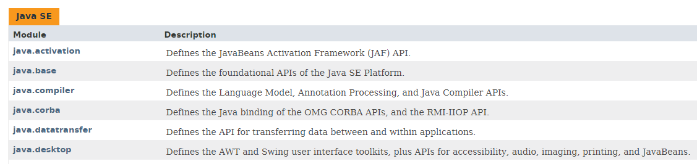

在模块之中会包含有大量的程序开发包（点击java.base模块进去）：

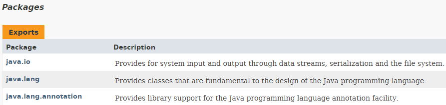

如果现在要想去看String类的相关定义，则可以打开java.lang这个包。String是一个系统提供的较为标准的类，所以现在以这个类的文档结构进行说明，一般文档里面的组成会有如下几个部分：

1. 类的完整定义
2. 类相关说明信息
3. 成员属性摘要
4. 构造方法摘要：如果看见有“Deprecated”描述的方法表示不建议使用
5. 方法摘要：左边为返回值，右边为方法名称和相应的参数
6. 详细的说明

文档一般都会有一些“假”的中文翻译版（自动翻译的），对于这些翻译版最好不要使用，整个Java的开发涉及到的文档有几十份，没有中文，如果没有习惯于阅读英文文档，后面的文档会出现看不懂的情况。


## 2、JavaDoc 使用详解

> Java文档注释用法+JavaDoc的使用详解：https://blog.csdn.net/lsy0903/article/details/89893934


## 3、JavaDoc 生成文档

> 1. JavaDoc生成API详解：https://blog.csdn.net/fanxiaobin577328725/article/details/52658781
> 2. javadoc - Java API 文档生成器（Windows版本）：https://blog.csdn.net/liaowenxiong/article/details/120380835
> 3. Java| Javadoc生成Java帮助文档：https://blog.csdn.net/u011479200/article/details/78554836
> 4. JavaDoc生成文档的两种方法：https://www.cnblogs.com/aqdm-liuliu/p/17049329.html
> 5. IDEA插件系列（29）：Easy Javadoc插件——快速生成javadoc文档注释：https://blog.csdn.net/cnds123321/article/details/119767380

# String 类特点分析

本节将为读者介绍Java世界必不可少的特殊数据类型：String类。

在实际的开发之中没有一个项目不去使用String类，也就是说String是整个系统开发之中一个至关重要的组成类，在Java程序中所有的字符串都要求使用“””进行定义，同时也可以利用“+”实现字符串的连接处理，但是对于String类还有其自身的特点。本次将进行String类的特点分析。


## 1、String 类简介

字符串严格意义上来讲并不能算是一个基本数据类型，也就是说没有任何一门语言会提供有字符串这种数据类型的，而在Java中为了方便开发者进行项目的编写，所以利用其JVM的支持制造了一种可以简单使用的String类，并且可以像基本数据类型那样进行直接的赋值处理。

操作示例 1：String类对象实例化

```java
public class StringDemo {
    public static void main(String[] args){
        String str = "www.xxxx.cn" ; // 直接赋值
        System.out.println(str) ;
    }
}
```

但是需要注意的是，String这个类中之所以可以保存字符串主要的原因是其中定义了一个数组，也就是说在String中所有的字符串中的每一个字符的数据都是保存在了数组之中。

> 提示：观察String类的源代码实现
>
> 1. 源代码目录：jdk10\lib\src.zip；
> 2. JDK1.9之后实际上针对于字符串的定义形式增多了要比JDK1.8多，类的数量对比如下：
>
> 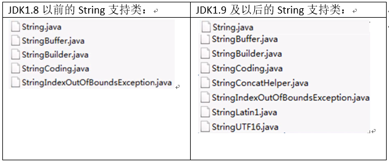
>
> 从JDK1.9开始String类之中的数组类型采用了byte类型，JDK1.9之前使用的都是字符数组。
>
> | JDK1.8以前String保存的是字符数组： | JDK1.9及以后String保存的是字节数组： |
> | :--------------------------------- | :----------------------------------- |
> | private final char[] value;        | private final byte[] value;          |
>
> 原来所谓的字符串就是对数组的一种特殊包装应用，但是同时也应该清楚一点，既然包装的是数组，所以字符串中的内容肯定是无法改变的。

另外需要注意的是，在String类里面除了可以使用直接赋值的形式为对象进行实例化之外，也可以利用传统形式利用构造方法进行对象的实例化处理：public String(String str) ;

操作示例 2：利用构造方法进行实例化

```java
public class StringDemo {
    public static void main(String[] args){
        String str = new String("www.xxxx.cn") ; // 直接赋值
        System.out.println(str) ;
    }
}
```

String本身包装的是一个数组，并且其有两种对象的实例化形式：直接赋值、构造方法实例化。


## 2、字符串比较

首先来回顾一下，如果说现在要想判断两个int型变量是否相等，那么肯定使用“==”来完成，这个是由程序直接提供的比较相等的运算符。

操作示例 1：进行“==”比较

```java
public class StringDemo {
    public static void main(String[] args) {
        int x = 10;
        int y = 10;
        System.out.println(x == y); // true
    }
}
```

但是String类实际上也牵扯到一个相等的判断问题，但是对于String类相等的判断也可以使用“==”，只不过判断的**不准确**而已。下面通过代码来观察。

操作示例 2：实现字符串的相等判断

```java
public class StringDemo {
    public static void main(String[] args) {
        String strA = "xxxx";
        String strB = new String("xxxx");
        System.out.println(strA == strB); // false
    }
}
```

此时的比较并没有成功，虽然两个字符串对象的内容是相同的，但是“==”也无法得到准确的相等判断，那么这种情况下如果要想实现准确的字符串相等判断，那么可以使用String类中所提供的一个比较方法：

```java
public boolean equals(String str); // 字符串比较（有变形）
```

操作示例 3：利用equals()实现字符串比较

```java
public class StringDemo {
    public static void main(String[] args) {
        String strA = "xxxx";
        String strB = new String("xxxx");
        System.out.println(strA.equals(strB)); // true
    }
}
```

**面试题：请解释String比较中“==”与equals()的区别？**

1. “==”：进行的是数值比较，如果用于对象比较上比较的是两个内存的地址数值；
2. equals()：是类所提供的一个比较方法，可以直接进行字符串内容的判断。


## 3、字符串常量（匿名对象）

> 字符串常量是String类的匿名对象

现在已经清楚了String类的基本操作形式，但是需要做出一个明确的定义，在程序的开发之中任何的一个整数是int型，任意的小数默认都是double，但是对于字符串而言，首先程序之中不会提供有字符串这样的基本数据类型，那么可以提供的只有一个String类，所以任何使用“"”定义的字符串常量实际上描述的都是一个String类的匿名对象。

```java
String strA= "xxxx";
```


内存分析图：

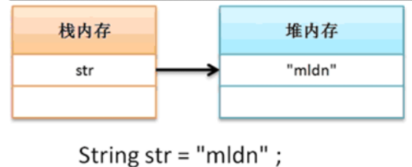

所谓的String类对象的直接赋值直接描述的是，将一个匿名对象设置一个具体的引用名字。

操作示例 1：观察匿名对象的存在

```java
public class StringDemo {
    public static void main(String[] args) {
        String str = "xxxx";
        System.out.println("xxxx".equals(str)); // true
    }
}
```

此时可以发现字符串常量已经可以明确的调用equals()方法实现对象相等的判断，所以可以得出一个结论：程序中的确没有字符串的常量这种基本类型，有的只是String类的匿名对象。

**关于对象相等判断的小技巧：**

在以后进行项目开发的时候，如果现在某些数据是由用户输入，并且要求这些数据为一个指定内容的情况下建议将字符串的一个常量写在前面。

1、接收用户输入数据的字符串调用方法：

```java
public class StringDemo {
    public static void main (String[] args) {
        String input= null; // 用户输入内容
        System.out.println(input.equals("xxxx"));     
    }
}
```

```java
// 输出内容
Exception in thread "main"java.lang.NullPointerException
```

2、换个方式，将字符串常量写在前面：

```java
public class StringDemo {
    public static void main (String[] args) {
        String input= null; // 用户输入内容
        System.out.println("xxxx".equals(input)); // false
    }
}
```

equals()方法里面提供有一个可以回避null的判断，所以如果将字符串常量写在前面，那么调用equals()方法的时候永远都不可能出现“NullPointerException”，字符串是一个匿名对象，匿名对象一定是开辟好堆内存空间的对象。


## 4、String 类两种实例化方式区别

现在已经清楚了在String类对象实例化的过程之中一共提供有两种处理模式，那么现在就需要区分好到底该使用哪种会更好。

**1、分析直接赋值的对象实例化模式**，在程序之中只需要将一个字符串赋值给String类的对象就可以实现对象的实例化，现在假设只有如下一行代码：

```java
public class StringDemo {
    public static void main(String[] args) {
        String strA = "xxxx";
    }
}
```

这种情况下肯定只会开辟出一块堆内存空间，此时的内存关系图如下： 

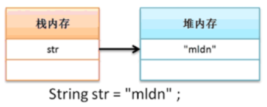

除了这种内存模式之外，利用直接赋值实例化String的形式还可以实现同一个字符串对象数据的共享操作。

操作示例 1：观察String直接赋值时的数据共享

```java
public class StringDemo {
    public static void main(String[] args) {
        String strA = "xxxx";
        String strB = "xxxx";
        System.out.println(strA == strB) ;	// 地址判断
    }
}
```

```java
// 输出内容
true
```

此时程序的判断结果返回了“true”，那么可以得出结论，这两个对象所指向的堆内存是同一个，也就是说这个时候的内存关系如图所示：

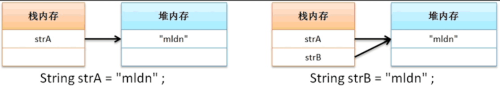

之所以现在会有这样的特点，主要的原因是在Java程序的底层里面提供有一个专门的字符串池（字符串数组）

操作示例 2：分析字符串池

```java
public class StringDemo {
    public static void main(String[] args) {
        String strA = "xxxx";
        String strB = "xxxxjava";
        String strC = "xxxx";
        System.out.println(strA == strB); // 地址判断
    }
}
```

```java
// 输出内容
false
```

在采用直接赋值的处理过程之中，对于字符串而言可以实现池数据的自动保存，这样如果再有相同数据定义时，可以减少对象的产生，以提升操作性能。

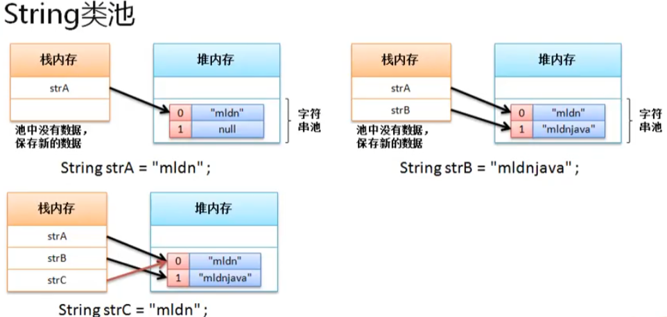


**2、构造方法实例化**，构造方法进行对象实例化可以说是在进行对象定义的时候的一种常见做法，String类为了满足于设计的结构要求也提供有构造方法实例化的做法。

```java
public class StringDemo{
    public static void main(String[] args) {
        String str = new String ("xxxx");
    } 
}
```

那么此时对于本程序而言，我们可以通过内存关系图进行观察。

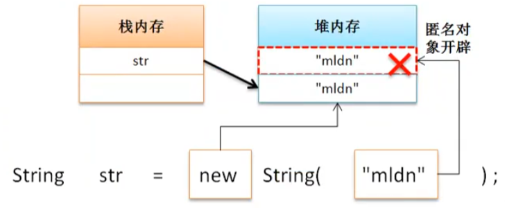

此时会开辟两块堆内存空间，而后只会使用一块，而另外一块由于字符串常量所定义的匿名对象将成为垃圾空间。

操作示例 1：更换一种形式

```java
public class StringDemo {
    public static void main(String[] args) {
        String strA = "xxxx";
        String strB = new String("xxxx");
    }
}
```

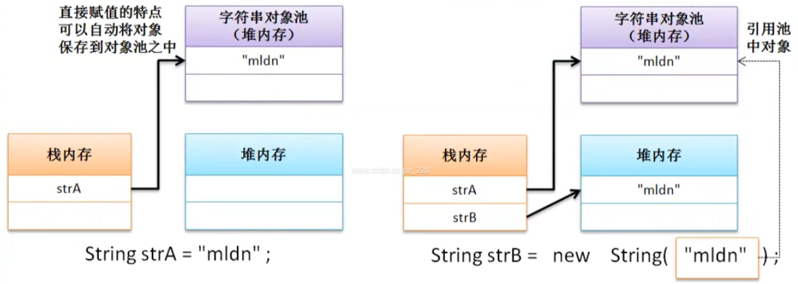

除了以上的特点之外，在使用构造方法实例化String对象时不会自动出现保存到字符串池的处理。

操作示例 2：观察构造方法实例化对象时的池操作

```java
public class StringDemo {
    public static void main(String[] args) {
        String strA = "xxxx";
        String strB = new String("xxxx");
        System.out.println(strA == strB);	// false
    }
}
```

可以发现构造方法实例化的对象实际上是属于一种自己专用的内存空间，但是在String类里面也提供有帮助开发者实现手工入池的处理情况，这个方法：

```java
public String intern(); // 手工入池
```

操作示例 3：观察手工入池

```java
public class StringDemo {
	public static void main(String[] args) {
		String strA = "xxxx";
		String strB = new String("xxxx").intern();
		System.out.println(strA == strB);	// true
	}
}
```

在使用构造方法定义对象之后由于使用了intern()方法，所以即便是构造出来的String类对象的内容也可以实现对象池的统一管理，但是这种做法太繁琐。

**面试题：请解释String类两种对象实例化方式的区别？**

1. 直接赋值：只会产生一个实例化对象，并且可以自动保存到对象池之中，以实现该字符串实例的重用。
2. 构造方法：会产生两个实例化对象，并且不会自动入池，无法实现对象重用，但是可以利用intern()方法手工入池处理。


## 5、String 对象常量池

对象池的主要目的是实现数据的共享处理。以String对象池为例，里面的对象主要就是为了重用，而重用实际上就属于共享设计，但是在Java之中对象池实际上可以分为两种：

1. 静态常量池：指的是程序（*.class）在加载的时候会自动将此程序之中保存的字符串、普通的常量、类和方法的信息等等，全部进行分配。
2. 运行时常量池：当一个程序（*.class）加载之后，里面可能有一些变量，这个时候提供的常量池，就是运行时常量池。

操作示例 1：观察静态常量池

```java
public class StringDemo {
    public static void main(String[] args) {
        String strA = "www.xxxx.cn" ;
        String strB = "www." + "xxxx" + ".cn" ;
        System.out.println(strA == strB) ;	// true
    }
}
```

本程序之中所给出的内容全部都是常量数据（字符串中的常量都是匿名对象），所以最终在程序加载的时候会自动帮助开发者处理好相应的连接。

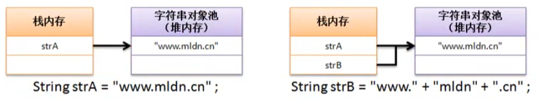

操作示例 2：观察另外一种情况

```java
public class StringDemo{
    public static void main(String[] args) {
        String info = "xxxx";
        String strA = "www.xxxx.cn";
        String strB = "www." + info + ".cn";
        System.out.println(strA == strB); // false
    }
}
```

这个时候之所以是一个false，是因为程序在加载的时候并不确定info是什么内容。因为在进行字符串连接的时候info采用的是一个变量，变量的内容是可以修改的，所以它不认为最终的strB的结果就是一个所需要的最终结果。


## 6、字符串内容不可修改

在String类之中包含的是一个数组，数组的最大缺点在于长度不可改变，当设置了一个字符串之后，会自动的进行一个数组空间的开辟，开辟的内容长度是固定的。

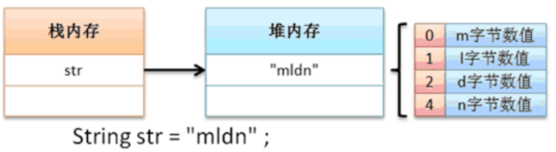

```java
public class StringDemo {
    public static void main(String[] args) {
        String str = "www.";
        str += "xxxx.";
        str = str + "cn";
        System.out.println(str); // www.xxxx.cn
    }
}
```

下面一起来分析一下本程序所进行的内存处理操作。

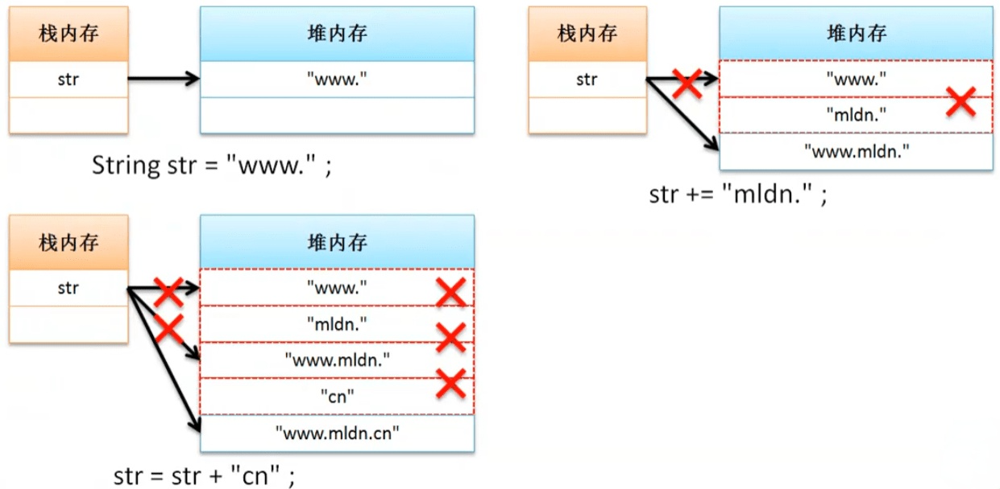

通过此时的程序可以发现，在整个处理过程之中，字符串常量的内容并没有发生任何的改变，改变的只是String类对象的引用，并且这种改变将有可能带来大量的垃圾空间。

操作示例：观察另外一种程序

```java
public class StringDemo {
    public static void main(String[] args) {
        String str = "string:" ;
        for (int x = 0 ; x < 1000 ; x ++) {
            str += x ;
        }
        System.out.println(str) ;
    }
}
```

```java
// 输出内容
string:012345678910111213141516171819202122232425262728293.....
```

如果本程序真的出现在代码之中，那么将会产生1000多个垃圾空间，并且String对象的指向需要修改1000次，这样程序的性能非常差，String类在以后的开发之中不要进行内容的频繁修改。

> **总结：**
>
> 1. 实例化 String 对象就采用直接赋值：String str = "xxxx"；
> 2. 字符串相等判断就使用equals()


# String 类常用方法


## 1、字符串与字符数组

在JDK1.9以前，所有的String都利用字符数组实现了包装的处理，所以在String类中是提供有相应的转换处理方法的，这些方法包含有构造方法与普通方法两类。

| 方法名称                                          | 类型 | 描述                                 |
| :------------------------------------------------ | :--- | :----------------------------------- |
| public String(char[] value)                       | 构造 | 将传入的全部字符数组变为字符串       |
| public String(char[] value,int offset, int count) | 构造 | 将部分字符数组变为字符串             |
| public char charAt(int index)                     | 普通 | 获取指定索引位置的字符               |
| public char[] toCharArray()                       | 普通 | 将字符串中的数据以字符数组的形式返回 |

操作示例 1：观察charAt()方法

```java
public class StringDemo {
    public static void main(String[] args) {
        String str = "www.xxxx.cn";
        char c = str.charAt(5);
        System.out.println(c);  // x
    }
}
```

利用charAt()是可以获取某一个指定索引位置的字符，但是程序之中的索引下标都是从0开始。

在程序语言之中，最早一直强调的就是字符串应该使用字符数组进行描述，所以这一操作在String类的方法中也是有所体现的。

操作示例 2：实现字符串与字符数组的转换

```java
public class StringDemo {
    public static void main(String[] args) {
        String str = "helloworld";
        char [] result = str.toCharArray(); // 将字符串变为字符数组
        for (int x = 0 ;x < result.length ; x ++) {
            result[x] -= 32; // 编码减少32
        }
        // 将处理后的字符数组交给String变为字符串
        String newStr = new String(result);
        System.out.println(newStr);
        System.out.println(new String(result,0,5));
    }
}
```

```java
// 输出内容
HELLOWORLD
HELLO
```

现在假设说要求做一个验证功能，判断某一个字符串中的数据是否全部由数字所组成。那么这个时候可以采用如下的思路：

1. 如果要想判断字符串中的每一位最好的做法是将字符串变为字符数组
2. 可以判断每一个字符是否在数字的范围之内（’0’~’9’）
3. 如果有一位不是数字则表示验证失败

操作示例 3：实现字符串的数据检查

```java
public class StringDemo {
    public static void main(String[] args) {
        String str = "helloworld";
        System.out.println(isNumber(str) ? "由数字所组成" : "不是由数字所组成");
        System.out.println(isNumber("123") ? "由数字所组成" : "不是由数字所组成");
    }
    // 该方法主要是判断字符串是否由数字所组成
    public static boolean isNumber(String str) {
        char [] result = str.toCharArray(); // 将字符串变为字符数组
        for (int x = 0; x < result.length; x ++) { // 依次判断
            if (result[x] < '0' || result[x] > '9') {
                return false; // 后面不再判断
            }
        }
        return true;
    }
}
```

```java
// 输出内容
不是由数字所组成
由数字所组成
```

在实际开发之中处理中文的时候往往使用char类型，因为其可以包含中文数据。


## 2、字符串与字节数组

字符串与字节数组之间也可以实现转换的处理操作，但是需要提醒一下，当进行了字符串与字节转换时，其主要目的是为了进行二进制的数据传输，或者是进行编码转换。

| 方法名称                                            | 类型 | 描述                       |
| :-------------------------------------------------- | :--- | :------------------------- |
| public String(byte[] bytes)                         | 构造 | 将全部的字节数组变为字符串 |
| public String(byte[] bytes, int offset, int length) | 构造 | 将部分字节数组变为字符串   |
| public byte[] getBytes()                            | 普通 | 将字符串转为字节数组       |
| public byte[] getBytes(String charsetName)          | 普通 | 编码转换                   |

操作示例 1：观察字节与字符串的转换

```java
public class StringDemo {
    public static void main(String[] args) {
        String str = "helloworld";
        byte data[] = str.getBytes(); // 将字符串变为字节数组
        for (int x = 0; x < data.length; x ++) {
            data[x] -= 32;
        }
        System.out.println(new String(data));
        System.out.println(new String(data,0,5));
    }
}
```

```java
// 输出内容
HELLOWORLD
HELLO
```

字节本身是有长度限制的，一个字节最多可以保存的范围是：-128~127之间。


## 3、字符串比较

字符串比较中最为常用的方法就是equals()方法，但是这个方法需要注意的是其是进行大小写区分的。而除了equals()之外，还有许多比较方法。

操作示例 1：观察大小写的比较

```java
public class StringDemo {
    public static void main(String[] args) {
        String strA = "sam";
        String strB = "SAM";
        System.out.println(strA.equals(strB));  // false
    }
}
```

| 方法名称                                              | 类型 | 描述                                                         |
| :---------------------------------------------------- | :--- | :----------------------------------------------------------- |
| public boolean equals(String anObject)                | 普通 | 区分大小写的相等判断                                         |
| public boolean equalsIgnoreCase(String anotherString) | 普通 | 不区分大小写比较                                             |
| public int compareTo(String anotherString)            | 普通 | 进行字符串大小比较，该方法返回一个int数据，<br />该数据有三种取值：大于（>0）、小于（<0）、等于（=0） |
| public int compareToIgnoreCase(String str)            | 普通 | 不区分大小写进行字符串大小比较                               |

操作示例 2：不区分大小写比较

```java
public class StringDemo {
    public static void main(String[] args) {
        String strA = "sam";
        String strB = "SAM";
        System.out.println(strA.equalsIgnoreCase(strB)); // true
    }
}
```

操作示例 3：进行大小写比较

```java
public class StringDemo {
    public static void main(String[] args) {
        String strA = "sam";
        String strB = "saM";
        System.out.println(strA.compareTo(strB)); // 32
        System.out.println(strB.compareTo(strA)); // -32
        System.out.println("Hello".compareTo("Hello")); // 0
    }
}
```

compareTo()方法后面还会有更加详细的解释，对于此方法很重要，而后为了可以实现忽略大小写的比较也可以使用compareToIgnoreCase()方法实现。

操作示例 4：忽略大小写比较

```java
public class StringDemo {
	public static void main(String[] args) {
		String strA = "sam";
		String strB = "saM";
		System.out.println(strA.compareToIgnoreCase(strB)); // 0
	}
}
```

由于此时的内容一样，所以在不计较大小写的情况下，两者的比较结果就是相同的。


## 4、字符串查找

从一个完整的字符串中查找子字符串的存在就属于字符串查找操作，在String类中一共提供有如下的几个查找方法。

| 方法名称                                              | 类型 | 描述                                   |
| :---------------------------------------------------- | :--- | :------------------------------------- |
| public boolean contains(String s)                     | 普通 | 判断子字符串是否存在                   |
| public int indexOf(String str)                        | 普通 | 从头查找指定字符串的位置，找不到返回-1 |
| public int indexOf(String str, int fromIndex)         | 普通 | 从指定位置查找指定字符串的位置         |
| public int lastIndexOf(String str)                    | 普通 | 由后向前查找指定字符串的位置           |
| public int lastIndexOf(String str, int fromIndex)     | 普通 | 从指定位置由后向前查找指定字符串的位置 |
| public boolean startsWith(String prefix)              | 普通 | 判断是否以指定的字符串开头             |
| public boolean startsWith(String prefix, int toffset) | 普通 | 由指定位置判断是否以指定的字符串开头   |
| public boolean endsWith(String suffix)                | 普通 | 是否以指定的字符串结尾                 |

操作示例 1：判断子字符串是否存在

```java
public class StringDemo {
    public static void main(String[] args) {
        String str = "www.xxxx.cn";
        System.out.println(str.contains("xxxx")); // true
        System.out.println(str.contains("hello")); // false
    }
}
```

此方法的操作相对而言比较直观一些，但是这个方法是从JDK1.5之后开始追加道程序中的功能。在JDK1.5之前如果要进行数据的查询往往只能够依靠indexOf()方法来完成。

操作示例 2：判断字符串是否存在

```java
public class StringDemo {
    public static void main(String[] args) {
        String str = "www.xxxx.cn";
        System.out.println(str.indexOf("xxxx"));
        System.out.println(str.indexOf("hello")); // -1
        if (str.indexOf("xxxx") != -1) {
            System.out.println("数据存在");
        }
    }
}
```

```java
// 输出内容
4
-1
数据存在
```

indexOf()是为了进行子字符串的查询，在一些开发之中就可以利用此形式来进行一些索引的确定。indexOf()是由前向后查找的，也可以由后向前查找。

操作示例 3：使用lastIndexOf()查找

```java
public class StringDemo {
    public static void main(String[] args) {
        String str = "www.xxxx.cn";
        System.out.println(str.lastIndexOf(".")); // 8
        System.out.println(str.lastIndexOf(".", 5)); // 3
    }
}
```

在进行字符串查找的时候也需要判断开头或结尾的操作。

操作示例 4：判断是否以指定的字符串开头或结尾

```java
public class StringDemo{
    public static void main(String[] args) {
        String str = "**@@www.xxxx.cn##";
        System.out.println(str.startsWith("**")); // true
        System.out.println(str.startsWith("@@", 2)); // true
        System.out.println(str.endsWith ("##")); // true
    }      
}
```

后面的许多设计都需要它的支持。


## 5、字符串替换

所谓的字符串替换指的是可以通过一个指定的内容进行指定字符串的替换显示，对于替换的方法主要有两个。

| 方法名称                                                     | 类型 | 描述                                                         |
| :----------------------------------------------------------- | :--- | :----------------------------------------------------------- |
| public String replace(char oldChar,char newChar)             | 普通 | 将newChar替换指定字符中出现的所有oldChar, 并返回一个新的字符串 |
| public String replace(CharSequence target,CharSequence replacement) | 普通 | 同上（CharSequence 是 String 的父类）                        |
| public String replaceAll(String regex, String replacement)   | 普通 | 进行全部替换                                                 |
| public String replaceFirst(String regex, String replacement) | 普通 | 替换首个                                                     |

操作示例 1：实现替换处理

```java
public class StringDemo {
    public static void main(String[] args) {
        String str = "helloworld";
        System.out.println(str.replaceAll("l","X")) ;
        System.out.println(str.replaceFirst("l","X")) ;
    }
}
```

```java
// 输出内容
heXXoworXd
heXloworld
```

**replace() 和 replaceAll() 的区别以及用法**：

区别：

1. replace的参数是char和CharSequence，即可以支持字符的替换，也支持字符串的替换(CharSequence即字符串序列的意思,说白了也就是字符串)
2. replaceAll的参数是regex，即基于正则表达式的替换，比如，可以通过`replaceAll("\\d", "*")`把一个字符串所有的数字字符都换成星号

相同点：

1. 都是全部替换，即把源字符串中的某一字符或字符串全部换成指定的字符或字符串，如果只想替换第一次出现的，可以使用replaceFirst()，这个方法也是基于规则表达式的替换，但与replaceAll()不同的是，只替换第一次出现的字符串
2. 另外，如果replaceAll()和replaceFirst()所用的参数据不是基于规则表达式的，则与replace()替换字符串的效果是一样的，即这两者也支持字符串的操作；
3. 还有一点注意：执行了替换操作后，源字符串的内容是没有发生改变的。
   


## 6、字符串拆分

在字符串处理的时候还提供有一种字符串拆分的处理方法，字符串的拆分操作主要是可以根据一个指定的字符串或者是一些表达式实现字符串的拆分，并且拆分完成的数据将以字符串数组的形式返回。

| 方法名称                                      | 类型 | 描述                                       |
| :-------------------------------------------- | :--- | :----------------------------------------- |
| public String[] split(String regex)           | 普通 | 按照指定的字符串全部拆分                   |
| public String[] split(String regex,int limit) | 普通 | 按照指定的字符串拆分为指定个数，后面不拆了 |

操作示例 1：观察字符串拆分处理

```java
public class StringDemo {
    public static void main(String[] args) {
        String str = "hello world hello xxxx" ;
        String result [] = str.split(" "); // 空格拆分
        for (int x = 0; x < result.length; x ++) {
            System.out.println(result[x]);
        }
    }
}
```

```java
// 输出内容
hello
world
hello
xxxx
```

操作示例 2：除了可以全部拆分之外，也可以拆分为指定的个数。把字符串拆分指定个数

```java
public class StringDemo {
    public static void main(String[] args) {
        String str = "hello world hello xxxx";
        String result [] = str.split(" ", 2); // 空格拆分
        for (int x = 0; x < result.length; x ++) {
            System.out.println(result[x]);
        }
    }
}
```

```java
// 输出内容
hello
world hello xxxx
```

但是在进行拆分的时候有可能会遇见拆不了的情况，这种时候最简单的理解就是使用“`\\`”进行转义。

```java
public class StringDemo {
    public static void main(String[] args) {
        String str = "192.168.1.2";
        String result [] = str.split("\\.");
        for (int x = 0 ; x < result.length ; x ++) {
            System.out.println(result[x]);
        }
    }
}
```

```java
// 输出内容
192
168
1
2
```


## 7、字符串截取

从一个完整的字符串之中截取出子字符串，对于截取操作有两个方法。

| 方法名称                                             | 类型 | 描述                         |
| :--------------------------------------------------- | :--- | :--------------------------- |
| public String substring(int beginIndex)              | 普通 | 从指定索引到结尾             |
| public String substring(int beginIndex,int endIndex) | 普通 | 截取指定索引范围中的子字符串 |

操作示例 1：观察字符串截取操作

```java
public class StringDemo {
    public static void main(String[] args) {
        String str = "www.xxxx.cn";
        System.out.println(str.substring(4));
        System.out.println(str.substring(4, 8));
    }
}
```

```java
// 输出内容
xxxx.cn
xxxx
```

操作示例 2：在实际的开发之中，有些时候的开始或结束索引往往都是通过indexOf()方法计算得来的

```java
public class StringDemo {
    public static void main(String[] args) {
        // 字符串结构：“userid-photo-姓名.后缀”
        String str = "xxxx-photo-张三.jpg";
        int beginIndex = str.indexOf("-", str.indexOf("photo")) + 1;
        int endIndex = str.lastIndexOf(".");
        System.out.println(beginIndex);
        System.out.println(endIndex);
        System.out.println(str.substring(beginIndex, endIndex));
    }
}
```

```java
// 输出内容
11
13
张三
```

在以后的实际开发之中，这种通过计算来确定索引的情况非常常见。


## 8、其它操作方法

| 方法名称                         | 类型 | 描述                   |
| :------------------------------- | :--- | :--------------------- |
| public String concat(String str) | 普通 | 描述的就是字符串的连接 |
| public String intern()           | 普通 | 字符串入池             |
| public boolean isEmpty()         | 普通 | 判断是否为空字符串     |
| public int length()              | 普通 | 计算字符串的长度       |
| public String trim()             | 普通 | 去除左右的空格信息     |
| public String toUpperCase()      | 普通 | 转大写                 |
| public String toLowerCase()      | 普通 | 转小写                 |

操作示例 1：观察字符串连接

```java
public class StringDemo {
    public static void main(String[] args) {
        String strA = "www.xxxx.cn";
        String strB = "www.".concat("xxxx").concat(".cn");
        System.out.println(strB); // www.xxxx.cn
        System.out.println(strA == strB); // false
    }
}
```

从整体的运行结果来讲，虽然内容相同，但是发现最终的结果是一个false，证明此操作并没有实现静态的定义。

在字符串定义的时候“"””和“null”不是一个概念，一个表示有实例化对象，一个表示没有实例化对象，而isEmpty()主要是判断字符串的内容，所以一定要在有实例化对象的时候进行调用。

操作示例 2：判断空字符串

```java
public class StringDemo {
    public static void main(String[] args) {
        String str = "";
        System.out.println(str.isEmpty()); // true
        System.out.println("mldn".isEmpty()); // false
    }
}
```

操作示例 3：观察length()与trim()

```java
public class StringDemo {
    public static void main(String[] args) {
        String str = "   Hello World   ";
        System.out.println(str.length()); // 长度
        String trimStr = str.trim();
        System.out.println(str);
        System.out.println(trimStr);
        System.out.println(trimStr.length());
    }
}
```

```java
// 输出内容
17
   Hello World   
Hello World
11
```

在进行一些数据输入的时候（用户名和密码）很难保证输入的数据没有空格，有空格的时候数据的查找就会出现错误，那么就必须对输入的数据进行处理，使用trim()。

操作示例 4：观察大小写转换，在String类中提供有大小写的转换，但是这种转换的特征是可以避免非字母的转换

```java
public class StringDemo {
    public static void main(String[] args) {
        String str = "Hello World !!!";
        System.out.println(str.toUpperCase());
        System.out.println(str.toLowerCase());
    }
}
```

```java
// 输出内容
HELLO WORLD !!!
hello world !!!
```

操作示例 5：自定义一个实现首字母大写的方法

```java
class StringUtil {
    public static String initcap(String str) {
        if (str == null || "".equals(str)) {
            return str; // 原样返回
        }
        if (str.length() == 1) {
            return str.toUpperCase();
        }
        return str.substring(0, 1).toUpperCase() + str.substring(1);
    }
}
public class StringDemo {
    public static void main(String[] args) {
        System.out.println(StringUtil.initcap("hello"));
        System.out.println(StringUtil.initcap("m"));
    }
}
```

```java
// 输出内容
Hello
M
```


## 9、常用方法总结

| **方法名称**                                                 | **类型** | **描述**                                                     |
| ------------------------------------------------------------ | -------- | ------------------------------------------------------------ |
| public String (char[] value)                                 | 构造     | 将字符数组变为String类对象                                   |
| public String (char[] value,  int offset, int count)         | 构造     | 将部分字符数组变为String类对象                               |
| public char charAt(int index)                                | 普通     | 返回指定索引对应的字符信息                                   |
| public char[] toCharArray()                                  | 普通     | 将字符串以字符数组的形式返回                                 |
| public String(byte[] bytes)                                  | 构造     | 将全部字节数组比埃纳维字符串                                 |
| public String(byte[] bytes ,int offset ,int length)          | 构造     | 将部分字节数组变为字符串                                     |
| public byte[]( getBytes()                                    | 普通     | 将字符串变为自己数组                                         |
| public byte[][ getBytes(String charsetName)                  | 普通     | 进行编码转换                                                 |
| public boolean equals(String Object)                         | 普通     | 进行相等判断，它区分大小写                                   |
| public boolean equalsIgnoreCase(String Object)               | 普通     | 进行相等判断，不区分大小写                                   |
| public int comparreTo(String str)                            | 普通     | 进行字符串大小比较, 返回值：大于(>0), 小于(<0), 等于(=0)     |
| public int compareToIgnoreCase(String str)                   | 普通     | 不区分大小写进行字符串大小比较                               |
| public boolean contains(String s)                            | 普通     | 判断指定的内容是否存在                                       |
| public int indexOf(String str)                               | 普通     | 从头查找指定字符串的位置，找不到返回-1                       |
| public int indexOf(String str,int index)                     | 普通     | 由指定位置从前向后查找。找不到返回-1                         |
| public int lastIndexOf(String str)                           | 普通     | 由后向前查找。找不到返回-1                                   |
| public int lastIndexOf(String str,int index)                 | 普通     | 由指定位置从后向前查找。找不到返回-1                         |
| public boolean startsWith(String prefix)                     | 普通     | 判断是否以指定的字符串开头                                   |
| public boolean startsWith(String prefix, int toffset)        | 普通     | 从指定位置开始判断是否以指定字符串开头                       |
| public boolean endsWith(String suffix)                       | 普通     | 判断是否已指定字符结尾                                       |
| public String replace(char oldChar,char newChar)             | 普通     | 将newChar替换指定字符中出现的所有oldChar, 并返回一个新的字符串 |
| public String replace(CharSequence target,CharSequence replacement) | 普通     | 同上，上面是替换字符，当前方法是替换字符串                   |
| public String replaceAll(String regex, String replacement)   | 普通     | 用新的内容替换全部旧的内容                                   |
| public String replaceFirst(String regex, String replacement) | 普通     | 替换首个满足条件的内容                                       |
| public String[] split(String regex)                          | 普通     | 按照指定的字符串出汗进行全部拆分                             |
| public String[] split(String regex, int limit)               | 普通     | 按照指定的字符串拆分为指定个数，后面不拆了                   |
| public String substring(int beginIndex)                      | 普通     | 从指定索引截取到结尾                                         |
| public String substring(int beginIndex, init endIndex)       | 普通     | 截取部分字符串的数据                                         |
| public static String format(String format,各种类型... args)  | 普通     | 根据指定结构进行文本格式化显示                               |
| public String cancat(String str)                             | 普通     | 字符串连接，与“+”类似                                        |
| public String intern()                                       | 普通     | 数据入池                                                     |
| public boolean isEmpty()                                     | 普通     | 判断是否是空字符串，不是null，而是“”，长度为0                |
| public int length()                                          | 普通     | 取得字符串长度                                               |
| public String trim()                                         | 普通     | 去掉字符串中左右两边的空格，中间保留                         |
| public String toLowerCase()                                  | 普通     | 转小写                                                       |
| public String toUpperCase()                                  | 普通     | 转大写                                                       |


# String.format 格式化

## 1、String.format 前言

从JDK1.5开始为了吸引更多的传统开发人员，Java提供有了格式化数据的处理操作。类似于C语言之中的格式化输出语句。可以利用占位符实现数据的输出，对于占位符而言，常用的：字符串（%s）、字符（%c）、整数（%d）、小数（%f）等来描述。

String.format 作为文本处理工具，为我们提供强大而丰富的字符串格式化功能，为了不止步于简单调用`String.format("Hello %s, "Sam");`我们将深入学习

```java
public class StringDemo {
    public static void main(String[] args) {
        String name = "张三";
        int age = 18;
        double score = 98.765321;
        // %5.2f 表示保留5位(包含小数点)，并且2位小数。
        String str = String.format("姓名：%s、年龄：%d、成绩：%5.2f", name, age, score);
        System.out.println(str);
    }
}
```

```java
// 输出内容
姓名：张三、年龄：18、成绩：98.77
```


## 2、format 两个重载方法

```java
public static String format(String format, Object... args); // 使用当前本地区域对象Locale.getDefault()格式化字符串
public static String format(Locale l, String format, Object... args); // 自定义本地区域对象格式化字符串
```

参数说明：

- Locale l：指定特定的语言环境
- String format：含有一个或多个占位符的字符串模板
- Object... args：用来传入format中对应占位符处的原始参数，当然会根据format中的模板语法进行相应处理


## 3、format 模板占位符

格式化参数，format模板（占位符）语法：

```
%[argument_index$][flags][width][.precision]conversion
%[index$][标识]*[最小宽度][.精度]转换符
```

针对不同数据类型的格式化，占位符的格式将有所裁剪：

- 【必选】%：占位符的其实字符，若要在占位符内部使用%，则需要写成 %% 。
- 【可选】argument_index$：是一个十进制整数，用于表明参数在参数列表中的位置。第1个参数由 "`1$`" 引用，第2个参数由 "`2$`" 引用，依此类推
- 【可选】flags：是修改输出格式的字符集。有效标志集取决于转换类型
- 【可选】width：是一个非负十进制整数，表明要向输出中写入的最少字符数
- 【可选】.precision：是一个非负十进制整数，通常用来限制字符数。特定行为取决于转换类型
- 【必选】conversion：是一个表明应该如何格式化参数的字符。给定参数的有效转换集取决于参数的数据类型


### 参数索引：argument_index$

argument_index$【参数索引】：指定要使用【Object... args】中的哪一个参数，作为此处占位符的原始参数

1. argument_index$使用方式形如 1$、2$、3$ ...
2. argument_index索引从1开始
3. 如果不显式的指定argument_index$的话，那么默认采用【Object... args】中位置与各个占位符位置对应的参数。
4. argument_index$处可以写0$，其效果就等于没写argument_index$一样，会走默认的方式

操作示例 or 辅助理解：

```java
// 输出 100, 500
System.out.printf("%d, %d", 100, 500);
// 输出 100, 100
System.out.printf("%1$d, %1$d", 100);
// 输出 500, 100
System.out.printf("%2$d, %1$d", 100, 500);
```


### 标识：flags

flags【标识】：指定格式化标识，此标识的作用有：填充、对齐、显示符号 等等。合法的flags有：

| 标识 | 含义                                                         |
| ---- | ------------------------------------------------------------ |
| -    | 在最小宽度内左对齐，不可与0标识一起使用                      |
| 0    | 若内容长度不足最小宽度，则在左边用0来填充（不适用于字符串）  |
| #    | 只适用于8进制和16进制，8进制时在结果前面增加一个0, 16进制时在结果前面增加0x |
| +    | 结果总包含一个+或-号（一般情况下只适用于10进制，若对象为BigInteger才可以用于8进制和16进制） |
| 空格 | 正数前加空格，负数前加-号（一般情况下只适用于10进制，若对象为BigInteger才可以用于8进制和16进制） |
| ,    | 只适用于10进制，每3位数字之间用“，”分隔                      |
| (    | 若参数是负数，则结果中不添加负号而是用圆括号把数字括起来（同‘+’具有同样的限制） |
| <    | 格式化前一个转换符所描述的参数                               |

下表总结了受支持的标志。*y* 表示该标志受指示参数类型支持。

| 标志 | 常规 | 字符 | 整数 | 浮点 | 日期/时间 | 说明                                                         |
| ---- | ---- | ---- | ---- | ---- | --------- | ------------------------------------------------------------ |
| -    | y    | y    | y    | y    | y         | 结果将是左对齐的。                                           |
| #    | y1   | -    | y3   | y    | -         | 结果应该使用依赖于转换类型的替换形式                         |
| +    | -    | -    | y4   | y    | -         | 结果总是包括一个符号                                         |
| 空格 | -    | -    | y4   | y    | -         | 对于正值，结果中将包括一个前导空格                           |
| 0    | -    | -    | y    | y    | -         | 结果将用零来填充                                             |
| ,    | -    | -    | y2   | y5   | -         | 结果将包括特定于语言环境的[组分隔符](http://www.yq1012.com/api/java/text/DecimalFormatSymbols.html#getGroupingSeparator()) |
| (    | -    | -    | y4   | y5   | -         | 结果将是用圆括号括起来的负数                                 |

1. 取决于`Formattable`的定义
2. 只适用于 `d` 转换。
3. 只适用于 `o`、`x` 和 `X` 转换。
4. 对 BigInteger 应用 `d`、`o`、`x` 和 `X` 转换时，对 byte 及 Byte、short 及 Short、int 及 Integer、long 及 Long 分别应用 `d` 转换时适用
5. 只适用于 `e`、`E`、`f`、`g` 和 `G` 转换。即格式化字符串s时不可加0

任何未显式定义为标志的字符都是非法字符，并且都被保留，以供扩展使用。

```java
// +号的用法
String str;
str = String.format("数字的正负表示：%+d %d %+d %d", 8, 8, -8, -8);
System.out.println(str); // 输出: 数字的正负表示：+8 8 -8 -8

// -的用法
str = String.format("左对齐：%-6d", 8);
System.out.println(str);// 输出: 左对齐：8     

// 0的用法
str = String.format("缺位补零：%06d", 8);
System.out.println(str); // 输出: 缺位补零：000008

// ' '空格的用法
str = String.format("缺位补空格：% 6d", 8);
System.out.println(str); // 输出: 缺位补空格：     8
str = String.format("缺位补空格：% 6d", -8);
System.out.println(str); // 输出: 缺位补空格：    -8

// ,的用法
str = String.format("数字分组：%,d", 123456789);
System.out.println(str); // 输出: 数字分组：123,456,789

// (的用法
str = String.format("括号用法：%(d", -8888);
System.out.println(str); // 输出: 括号用法：(8888)
str = String.format("括号用法：%(d", 8888);
System.out.println(str); // 输出: 括号用法：8888

// #的用法
str = String.format("#括号用法(十六进制)：%#x", 12);
System.out.println(str); // 输出: #括号用法(十六进制)：0xc
str = String.format("#括号用法(八进制)：%#o", 12);
System.out.println(str); // 输出: #括号用法(八进制)：014

// <的用法
str = String.format("<括号用法：%f %<3.1f", 3.14, 3.2);

// "%<3.1f"作用的对象是前一个"%f"所作用的对象
System.out.println(str); // 输出: <括号用法：3.140000 3.1
```


### 宽度：width

The width is the minimum number of characters to be written to the output. For the line separator conversion, width is not applicable; if it is provided, an exception will be thrown.（宽度是要写入输出的最小字符数。 对于行分隔符转换，宽度不适用； 如果提供，将抛出异常。）

```java
// 注: 4表示预留4个位置给参数，并且右对齐;
System.out.println(String.format("|%4d, %d|", 100, 100)); // 输出: | 100, 100|

// 注: 5表示如果参数位数不够5位就向左补齐空格，-5则相反
System.out.println(String.format("|%5s, %-5s|", "L", "R")); // 输出: |    L, R    |
```


### 精确度：.precision

对于常规参数类型，精度是将向输出中写入的最多字符数。

对于浮点转换 'e'、'E' 和 'f'，精度是小数点分隔符后的位数。如果转换是 'g' 或 'G'，那么精度是舍入计算后所得数值的所有位数。如果转换是 'a' 或 'A'，则不必指定精度。

注意：对于字符、整数和日期/时间参数类型转换，以及百分比和行分隔符转换，精度是不适用的；如果提供精度，则会抛出异常。

```java
// 注: 四舍五入
// 输出: |521.55, 5.22e+02|
System.out.println(String.format("|%.2f, %.2e|", 521.54567, 521.54567)); 
```


### 转换字符：conversion

| 转换符 | 参数类型                                     | 示例                       |
| ------ | -------------------------------------------- | -------------------------- |
| c、C   | 字符（字符）                                 | ‘c’                        |
| s、S   | 常规（字符串）                               | “hello”                    |
| b、B   | 常规（布尔）                                 | true                       |
| h、H   | 常规（散列码）                               | 不举例(基本用不到)         |
| d、    | 整数（十进制）                               | 88（十进制）               |
| o、    | 整数（八进制）                               | 77（八进制）               |
| x、X   | 整数（十六进制）                             | FF（十六进制）             |
| e、E   | 浮点（指数类型）                             | 9.38e+5                    |
| f      | 浮点                                         | 8.888                      |
| g、G   | 浮点（通用浮点类型，f 与 e中较短的）         | 不举例(基本用不到)         |
| a、A   | 浮点（十六进制浮点类型）                     | FF.35AE                    |
| %      | 百分比类型                                   | ％(%特殊字符, %%才能显示%) |
| n      | 换行符                                       | 不举例(基本用不到)         |
| tx、Tx | 日期与时间类型（x代表不同的日期与时间转换符) | 不举例(x参数详情参考下面)  |

在使用时间/日期占位符时，需要使用此前缀。如:"t"。具体示例见下面的【日期时间格式】部分。


## 4、字符串格式化【实战】

占位符格式为：`%[argument_index$][flags][width]conversion`、`%[index$][标识][最小宽度]转换符`

可用标识：

| 标识 | 含义                                    |
| ---- | --------------------------------------- |
| -    | 在最小宽度内左对齐，不可与0标识一起使用 |

可用转换符：

| 标识 | 含义                                                         |
| ---- | ------------------------------------------------------------ |
| s    | 字符串类型                                                   |
| c    | 字符类型，实参必须为char或int、short等可转换为char类型的数据类型，否则抛IllegalFormatConversionException异常 |

对字符进行格式化是非常简单的，c表示字符，s表示字符串，标识中 '-' 表示左对齐，其他就没什么了。

```java
// 右对齐
System.out.println(String.format("|%4s|", "s")); // |   s|
// 左对齐
System.out.println(String.format("|%-4c|", 'c')); // |c   |
// 参数可以为int、short等可转换为char类型的数据类型
System.out.println(String.format("|%c|", 33)); // |!|
System.out.println(String.format("|%c|", 8888)); // |⊸|
```


## 5、整数格式化【实战】

对整数进行格式化：`%[argument_index$][flags][width]conversion`、`%[index$][标识][最小宽度]转换符`

可用标识：

| 标识 | 含义                                                         |
| ---- | ------------------------------------------------------------ |
| -    | 在最小宽度内左对齐，不可与0标识一起使用                      |
| 0    | 若内容长度不足最小宽度，则在左边用0来填充                    |
| #    | 只适用于8进制和16进制，8进制时在结果前面增加一个0, 16进制时在结果前面增加0x |
| +    | 结果总包含一个+或-号（一般情况下只适用于10进制，若对象为BigInteger才可以用于8进制和16进制） |
| 空格 | 正数前加空格，负数前加-号（一般情况下只适用于10进制，若对象为BigInteger才可以用于8进制和16进制） |
| ,    | 只适用于10进制，每3位数字之间用“，”分隔                      |
| (    | 若参数是负数，则结果中不添加负号而是用圆括号把数字括起来（同‘+’具有同样的限制） |

可用转换符：

| 标识 | 含义                                     |
| ---- | ---------------------------------------- |
| d    | 整数类型（十进制）                       |
| o    | 整数类型（八进制）                       |
| x、X | 整数类型（十六进制）x字母小写、X字母大写 |

```java
System.out.println(String.format("%04d", 1)); // 将1显示为0001
System.out.println(String.format("%(,d", -1000)); // 将-1000显示为(1,000)
System.out.println(String.format("|%,09d|", -3123)); // |-0003,123|
System.out.println(String.format("|%9d|", -31));  // |      -31|
System.out.println(String.format("|%-9d|", -31)); // |-31      |
System.out.println(String.format("|%(9d|", -31)); // |     (31)|
System.out.println(String.format("|%#9x|", 5689)); // |   0x1639|
// 取两位数的16进制 x代表小写 X代表大写
System.out.println(String.format("|%02x|", 10)); // |0a|
// 取两位数的16进制 x代表小写 X代表大写
System.out.println(String.format("|%02X|", 10)); // |0A|
```


## 6、浮点数格式化【实战】

对浮点数进行格式化：`%[argument_index$][flags][width][.precision]conversion`、`%[index$][标识][最小宽度][.精度]转换符`

可用标识：

| 标识 | 含义                                                         |
| ---- | ------------------------------------------------------------ |
| -    | 在最小宽度内左对齐，不可与0标识一起使用                      |
| 0    | 若内容长度不足最小宽度，则在左边用0来填充                    |
| #    | 只适用于8进制和16进制，8进制时在结果前面增加一个0, 16进制时在结果前面增加0x |
| +    | 结果总包含一个+或-号（一般情况下只适用于10进制，若对象为BigInteger才可以用于8进制和16进制） |
| 空格 | 正数前加空格，负数前加-号（一般情况下只适用于10进制，若对象为BigInteger才可以用于8进制和16进制） |
| ,    | 每3位数字之间用“，”分隔（只适用于fgG的转换）                 |
| (    | 若参数是负数，则结果中不添加负号而是用圆括号把数字括起来（同‘+’具有同样的限制）（只适用于eEfgG的转换） |

可用转换符：

| 标识 | 含义                                                         |
| ---- | ------------------------------------------------------------ |
| f    | 结果被格式化为十进制普通表示方式                             |
| a、A | 结果被格式化为带有效位数和指数的十六进制浮点数（字母大小写） |
| e、E | 结果被格式化为用计算机科学记数法表示的十进制数（字母大小写） |
| g、G | 根据具体情况，自动选择用普通表示方式还是科学计数法方式（字母大小写） |
| n    | 平台独立的换行符, 也可通过`System.getProperty("line.separator")`获取 |

```java
System.out.printf(String.format("%f %n", 123.4567899)); // 123.456790
System.out.printf(String.format("%a %n", 123.4567899)); // 0x1.edd3c0bb46929p6
System.out.printf(String.format("%e %n", 123.4567899)); // 0x1.1.234568e+02
System.out.printf(String.format("%g %n", 123.4567899)); // 123.457

System.out.printf(String.format("%A %n", 123.4567899)); // 0X1.EDD3C0BB46929P6 
System.out.printf(String.format("%E %n", 123.4567899)); // 1.234568E+02 
System.out.printf(String.format("%G %n", 123.4567899)); // 123.457 
```


## 7、日期时间格式化【实战】

占位符格式为：`%[argument_index$]t+conversion`、`%[index$]t转换符`

可用日期和时间转换符：

**格式化日期 + 时间组合**

| 转换符 | 说明         | 结果                                                        |
| ------ | ------------ | ----------------------------------------------------------- |
| %tc    | 全部时间日期 | 周二 3月 29 12:10:50 CST 2022、Tue Mar 29 12:10:50 CST 2022 |
| %tF    | 年-月-日     | 2022-03-29                                                  |
| %tD    | 月/日/年     | 03/29/22                                                    |
| %tr    | 时分秒 PM    | 12:07:55 下午、12:07:55 PM                                  |
| %tT    | 时分秒       | 12:07:55                                                    |
| %tR    | 时分         | 12:07                                                       |

**格式化日期**

| 转换符 | 说明                                 | 结果            |
| ------ | ------------------------------------ | --------------- |
| %tb    | 指定语言环境下的月份简称             | 3月、Mar        |
| %tB    | 指定语言环境下的月份全称             | 三月、March     |
| %th    | 与 tb 相同                           | 3月、Mar        |
| %ta    | 指定语言环境下周几的简称             | 周二、Tue       |
| %tA    | 指定语言环境下周几的全称             | 星期二、Tuesday |
| %tC    | 年前两位（不足两位补零）             | 20              |
| %ty    | 2位数的年份（不足两位补零）          | 22              |
| %tY    | 4位数年份                            | 2022            |
| %tm    | 月份（不足两位补零）                 | 03              |
| %te    | 一个月中的某一天(1~31)               | 29              |
| %td    | 一个月中的某一天(01~31),不足两位补零 | 29              |
| %tj    | 一年中第几天                         | 088             |

**格式化时间**

| 转换符 | 说明                                           | 结果          |
| ------ | ---------------------------------------------- | ------------- |
| %tH    | 小时(00~23)（不足两位补零）                    | 15            |
| %tI    | 小时(01~12)（不足两位补零）                    | 03            |
| %tk    | 小时(0~23)                                     | 15            |
| %tl    | 小时(1~12)                                     | 3             |
| %tM    | 分钟(00~59)（不足两位补零）                    | 35            |
| %tS    | 秒(00~59)（不足两位补零）                      | 55            |
| %tL    | 毫秒(000~999)（不足三位补零）                  | 923           |
| %tN    | 9位数微妙(000000000~999999999)（不足九位补零） | 923000000     |
| %tp    | 当前语言环境下上午/下午/am/pm                  | 下午、pm      |
| %tz    | 时区                                           | +0800         |
| %tZ    | 时区                                           | CST           |
| %ts    | 从1970-01-01 00:00:00 到现在的秒               | 1648526699    |
| %tQ    | 从1970-01-01 00:00:00 到现在的毫秒             | 1648526699805 |

我们可以使用以下三个类去进行格式化，其中可能存在不支持的情况，比如LocalDateTime不支持c：

```java
System.out.printf("%tc", new Date()); 
System.out.printf("%tc", ZonedDateTime.now()); 
System.out.printf("%tF", LocalDateTime.now());
// LocalDateTime 使用tc会报错,使用其他都可以
System.out.printf("%tc", LocalDateTime.now());
```

操作示例，辅助理解：

```java
// 输出【19】
// 注: 当前时间点为: 2019-03-13 19:09
System.out.println(String.format("%tH", new Date()));
 
// 输出【07】
// 注: 当前时间点为: 2019-03-13 19:09
System.out.println(String.format("%tI", new Date()));
 
// 输出【19】
// 注: 当前时间点为: 2019-03-13 19:09
System.out.println(String.format("%tk", new Date()));
 
// 输出【7】
// 注: 当前时间点为: 2019-03-13 19:09
System.out.println(String.format("%tl", new Date()));
 
// 输出【09】
// 注: 当前时间点为: 2019-03-13 19:09
System.out.println(String.format("%tM", new Date()));
 
// 输出【12】
// 注: 当前时间点为: 2019-03-13 19:09:12
System.out.println(String.format("%tS", new Date()));
 
// 输出【495】
// 注: 当前时间点为: 2019-03-13 19:09:12.495
System.out.println(String.format("%tL", new Date()));
 
// 输出【496000000】
// 注: 当前时间点为: 2019-03-13 19:09:12.496000000
System.out.println(String.format("%tN", new Date()));
 
// 输出【下午】
// 注: 当前时间点为: 2019-03-13 19:09
System.out.println(String.format("%tp", new Date()));
 
// 输出【+0800】
// 注: 当前时间点为: 2019-03-13 19:09
System.out.println(String.format("%tz", new Date()));
 
// 输出【CST】
// 注: 当前时间点为: 2019-03-13 19:09
System.out.println(String.format("%tZ", new Date()));
 
// 输出【1552475352】
// 注: 当前时间点为: 2019-03-13 19:09
System.out.println(String.format("%ts", new Date()));
 
// 输出【1552475352503】
// 注: 当前时间点为: 2019-03-13 19:09
System.out.println(String.format("%tQ", new Date()));

// 输出【三月】
// 注: 当前时间点为: 2019-03-13 19:19
System.out.println(String.format("%tB", new Date()));
 
// 输出【三月】
// 注: 当前时间点为: 2019-03-13 19:19
System.out.println(String.format("%tb", new Date()));
 
// 输出【三月】
// 注: 当前时间点为: 2019-03-13 19:19
System.out.println(String.format("%th", new Date()));
 
// 输出【星期三】
// 注: 当前时间点为: 2019-03-13 19:19
System.out.println(String.format("%tA", new Date()));
 
// 输出【星期三】
// 注: 当前时间点为: 2019-03-13 19:19
System.out.println(String.format("%ta", new Date()));
 
// 输出【20】
// 注: 当前时间点为: 2019-03-13 19:19
System.out.println(String.format("%tC", new Date()));
 
// 输出【2019】
// 注: 当前时间点为: 2019-03-13 19:19
System.out.println(String.format("%tY", new Date()));
 
// 输出【19】
// 注: 当前时间点为: 2019-03-13 19:19
System.out.println(String.format("%ty", new Date()));
 
// 输出【072】
// 注: 当前时间点为: 2019-03-13 19:19
System.out.println(String.format("%tj", new Date()));
 
// 输出【03】
// 注: 当前时间点为: 2019-03-13 19:19
System.out.println(String.format("%tm", new Date()));
 
// 输出【13】
// 注: 当前时间点为: 2019-03-13 19:19
System.out.println(String.format("%td", new Date()));
 
// 输出【13】
// 注: 当前时间点为: 2019-03-13 19:19
System.out.println(String.format("%te", new Date()));

// 输出【19:31】
// 注: 当前时间点为: 2019-03-13 19:31:49
System.out.println(String.format("%tR", new Date()));
 
// 输出【19:31:49】
// 注: 当前时间点为: 2019-03-13 19:31:49
System.out.println(String.format("%tT", new Date()));
 
// 输出【07:31:49 下午】
// 注: 当前时间点为: 2019-03-13 19:31:49
System.out.println(String.format("%tr", new Date()));
 
// 输出【03/13/19】
// 注: 当前时间点为: 2019-03-13 19:31:49
System.out.println(String.format("%tD", new Date()));
 
// 输出【2019-03-13】
// 注: 当前时间点为: 2019-03-13 19:31:49
System.out.println(String.format("%tF", new Date()));
 
// 输出【星期三 三月 13 19:31:49 CST 2019】
// 注: 当前时间点为: 2019-03-13 19:31:49
System.out.println(String.format("%tc", new Date()));
```


## 8、特殊转换符与标识【实战】

转换符：

| 转换符 | 含义                                                         |
| ------ | ------------------------------------------------------------ |
| b      | 布尔类型，只要实参为非false的布尔类型，均格式化为字符串true，否则为字符串false |
| %      | 百分比类型，%特殊字符, %%才能显示%                           |
| n      | 平台独立的换行符, 也可通过`System.getProperty("line.separator")`获取 |

```java
// 参数只要不是false, 格式化结果都是true
System.out.println(String.format("%b, %b, %b, %b",8, "A", true, false));
// 输出:88.88%
System.out.println(String.format("%.2f%%", 88.88));
/**
 * 输出:
 * AA
 * aa
 */
System.out.println(String.format("AA%naa"));
```

标识符：

| 标识 | 含义                           |
| ---- | ------------------------------ |
| <    | 格式化前一个转换符所描述的参数 |

```java
// <的用法，"%<3.1f"作用的对象是前一个"%f"所作用的对象
System.out.println(String.format("<括号用法：%f %<3.1f", 3.14, 3.2)); // 输出: <括号用法：3.140000 3.1
System.out.println(String.format("%d %<,d", 1000)); // 输出: 1000 1,000
```


## 9、参考 & 鸣谢

1. 字符串格式化之String.format【CSDN：justry_deng】https://blog.csdn.net/justry_deng/article/details/88539849
2. java.util.Formatter & String.format【博客园：NightOwc】https://www.cnblogs.com/nightowc/p/4460214.html
3. Java魔法堂：String.format详解【博客园：^_^肥仔John】https://www.cnblogs.com/fsjohnhuang/p/4094777.html


# Java 中的 main 方法

Java 中的主方法组成是非常复杂的，而且单词也很多：public static void main(String args[])，那么下面来对组成进行分析：

1. public：描述的是一种访问权限，主方法是一切的开始点，开始点一定是公共的
2. static：程序的执行是通过类名称完成的，所以表示此方法是由类直接调用
3. void：主方法是一切的起点，起点一旦开始就没有返回的可能
4. main：是一个系统定义好的方法名称
5. String args[]：字符串的数组可以实现程序启动参数的接收
6. 参数传递得形式：java 类名称 参数1 参数2 参数3

操作示例 1：输出启动参数

```java
public class StringDemo {
    public static void main(String[] args) {
        for (String arg : args) {
            System.out.println(arg);
        }
    }
}
```

在程序执行的时候可以设置参数，每一个参数之间使用空格分割：

```bash
java StringDemo first second
```

但是千万要记住一点，如果参数本身拥有空格，则必须使用""包装：

```bash
java StringDemo "hello world" "hello xxxx"
```

以后可以暂时通过这种启动参数实现数据的输入的模拟。

# 继承的定义与使用

面向对象的第二大特征就是继承性，继承性的主要特点在于：可以扩充已有类的功能。使用extends实现类的继承，使用继承类调用父类的相关属性与方法。

## 1、继承问题引出

所谓的良好的代码指的是结构性合理、适合于维护、可重用性很高，但是如果现在只按照之前所学习到的概念进行程序的定义，那么不可避免要面对重复问题，下面定义两个类：人类、学生类，如果按照传统定义，则结构如下：

Person.java 与 Student.java 类：

```java
class Person {
    private String name ;
    private int age ;
    public void setName(String name) {
        this.name = name ;
    }
    public void setAge(int age) {
        this.age = age ;
    }
    public String getName() {
        return this.name ;
    }
    public int getAge() {
        return this.age ;
    }
}
class Student {
    private String name ;
    private int age ;
    private String school ;
    public void setName(String name) {
        this.name = name ;
    }
    public void setSchool(String school) {
        this.school = school; 
    }
    public void setAge(int age) {
        this.age = age ;
    }
    public String getSchool() {
        return this.school ;
    }
    public String getName() {
        return this.name ;
    }
    public int getAge() {
        return this.age ;
    }
}
```

这个时候可以发现虽然类的概念可以解决结构性的问题，但是对于之前的开发的程序代码总能够发现有一些重复的代码出现在程序之中，并且可以进一步去思索一下关系：学生是一个人，人是一个更加广泛的定义范畴，而学生是一个相对狭小的定义范畴。从另外一个角度来讲，学生之中应该包含有人的所有特点。

如果要想进行代码的重用，那么就必须使用继承的概念来解决，所谓的继承的本质：在已有类的功能上继续进行功能的扩充。


## 2、继承的实现

如果在Java程序之中要想实现继承关系，那么就必须依靠extends关键字来完成，此关键字的具体语法如下：

```java
class 子类 extends 父类 {}
```

特别需要注意的是，很多情况下会把子类称为派生类，把父类称为**超类（SuperClass）**

操作示例 1：观察继承的实现

```java
class Person {
    private String name ;
    private int age ;
    public void setName(String name) {
        this.name = name ;
    }
    public void setAge(int age) {
        this.age = age ;
    }
    public String getName() {
        return this.name ;
    }
    public int getAge() {
        return this.age ;
    }
}
// Student是子类
class Student extends Person {
    // 在子类之中不定义任何的功能
}
public class JavaAPIDemo {
    public static void main(String[] args) {
        Student stu = new Student() ;
        stu.setName("林大强"); // 父类定义
        stu.setAge(38); // 父类定义
        System.out.println("姓名：" + stu.getName() + "、年龄：" + stu.getAge());
    }
}
```

```java
// 输出内容
姓名：林大强、年龄：38
```

由于此时存在有继承关系，所以此时的子类即便没有定义任何操作，也可以直接通过父类继承而来的方法实现相应功能。而这个时候内存关系图如下：

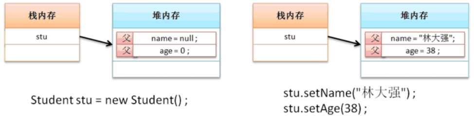

继承实现的主要目的是在于子类可以重用父类中的结构，并且也可以实现功能的扩充，那么同时强调了：子类可以定义更多的内容，并且描述的范围更小。

操作示例 2：子类扩充定义

```java
class Person {
    private String name;
    private int age;
    public void setName(String name) {
        this.name = name;
    }
    public void setAge(int age) {
        this.age = age;
    }
    public String getName() {
        return this.name;
    }
    public int getAge() {
        return this.age;
    }
}
// Student是子类
class Student extends Person {
    private String school; // 子类扩充的属性
    public void setSchool(String school) {
        this.school = school;
    }
    public String getSchool() {
        return this.school;
    }
}
public class JavaAPIDemo {
    public static void main(String[] args) {
        Student stu = new Student();
        stu.setName("林大强"); // 父类定义
        stu.setAge(38); // 父类定义
        stu.setSchool("家里蹲大学");
        System.out.println("姓名：" + stu.getName() + "、年龄：" + stu.getAge() + "、学校：" + stu.getSchool());
    }
}
```

```java
// 输出内容
姓名：林大强、年龄：38、学校：家里蹲大学
```

如果此时继续讨论内存关系，则就会出现两个范围的属性了（Person父类范畴、Student子类范畴）

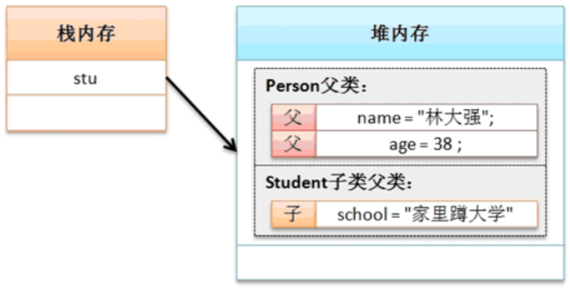


## 3、子类对象实例化流程

现在已经成功实现了继承关系，并且也已经发现了继承主要特点，但是一旦程序之中提供有继承逻辑，那么对与子类对象的实例化定义是有要求的。从正常的社会逻辑来讲：没有父亲一定没有孩子。对于继承程序的逻辑也是一样的，在进行子类对象实例化的时候一定要首先实例化好父类对象。

操作示例 1：观察一个程序

```java
class Person {
    public Person() {
        System.out.println("【Person父类】一个新的Person父类实例化对象产生了。") ;
    }
}
// Student是子类
class Student extends Person {
    // 构造方法
    public Student() {
        System.out.println("【Student子类】一个新的Student实例化对象产生了。") ;
    }
}
public class JavaAPIDemo {
    public static void main(String[] args) {
        new Student(); // 实例化子类对象
    }
}
```

```java
// 输出内容
【Person父类】一个新的Person父类实例化对象产生了。
【Student子类】一个新的Student实例化对象产生了。
```

现在即使没有进行父类对象实例化，也会由系统自动调用父类的构造方法（实例化父类对象），默认情况下的子类对象实例化流程会自动实例化父类对象。实际上就相当于子类的构造方法里面隐含了一个“`super()`”的形式。

操作示例 2：修改子类定义

```java
class Student extends Person { // Student是子类
    public Student() { // 构造方法
        super(); // 写与不写此语句效果一样
        System.out.println("【Student子类】一个新的Student实例化对象产生了。") ;
    }
}
```

`super()`表示的就是子类调用父类构造的语句，该语句只允许放在子类构造方法的首行。在默认情况下的实例化处理，子类只会调用父类中的无参构造方法，所以写与不写“super()”区别不大，但是如果父类中没有提供无参构造，这时就必须利用super()明确调用有参构造。

操作示例 3：使用super()调用父类有参构造

```java
class Person {
    private String name;
    private int age;
    public Person(String name, int age) {
        this.name = name;
        this.age = age;
        System.out.println("【Person父类】一个新的Person父类实例化对象产生了。") ;
    }
}
class Student extends Person { // Student是子类
    private String school;
    public Student(String name, int age, String school) {	// 构造方法
        super(name,age); // 明确调父类构造，并且是必须调用，不然会报错
        this.school = school;
        System.out.println("【Student子类】一个新的Student实例化对象产生了。") ;
    }
    public Student(String name, int age) {
        this(name,age, "家里蹲大学");
    }
}
public class JavaAPIDemo {
    public static void main(String[] args) {
        new Student("林小强", 48, "北京大学"); // 实例化子类对象
    }
}
```

```java
// 输出内容
【Person父类】一个新的Person父类实例化对象产生了。
【Student子类】一个新的Student实例化对象产生了。
```

**结论**：无论怎样，在实例化子类对象的同时一定会实例化父类对象，目的是对了所有的属性可以进行空间分配。

super与this都可以调用构造方法，super是由子类调用父类的构造，而this是调用本类构造，并且都一定要放在构造方法的首行，所以两个语句不允许同时出现。


## 4、继承的相关限制

现在已经清楚了整个的继承逻辑，那么下面对于继承实际上还有一些要求。

1、Java之中不允许多重继承，只允许多层继承。实际生活之中一个人只会有一个亲生父亲，在程序的逻辑之中也是遵循此标准

错误的继承：

```java
class A {}
class B {}
class C extends A,B {} // 多重继承
```

正确的继承：

```java
class A {}
class B extends A {}
class C extends B {} // 多层继承
```

继承的主要目的是扩展已有类的功能，但是多重继承目的是希望可以同时继承多个类中的方法，而面对于多继承的要求应该将范围限定在同一类中。如果现在使用了多层继承，这个时候对于C类也同样可以继承多个父类的操作。但是多层继承也有一个限度，千万别整个程序都进行继承。对于继承关系而言，如果写代码，理论上层次不应该超过三层。

---

2、在进行继承关系定义的时候，实际上子类可以继承父类中的所有操作结构。但是对于私有操作属于隐式继承，而非所有的私有操作属于隐式继承。

```java
class Person {
    private String name;
    public void setName(String name) {
        this.name = name;
    }
    public String getName() {
        return this.name;
    }
}
class Student extends Person {
    public Student(String name) {
        setName(name); // 设置name属性内容
    }
    public void fun() {
        // System.out.println(name);	// 直接访问不可能，因为私有的
        System.out.println(getName());	// 间接访问
    }
}
public class JavaAPIDemo {
    public static void main(String[] args) {
        Student student = new Student("林中强");	
        student.fun();
    }
}

// 输出内容
林中强
```

继承一旦发生，所有的操作就都可以被子类使用了，并且在程序设计里面并没有考虑到现实生活中所谓的“败家子”的概念。子类至少会维持父类的现有功能。

# 覆写 || 重写

既然出现了继承的关系，那么就存在子类和父类的联系，而在子类之中有可能定义和父类完全相同的方法或属性的名称，这个时候就称为覆写。子类与父类一旦产生了继承关系之后，实际上子类会继承父类中的全部定义，但是这里面也有可能出现不合适的场景。子类如果发现父类中设计不足并且需要保留有父类中的方法或者属性名称的情况下就会发生覆写。

## 1、方法的覆写

当子类定义了与父类方法名称相同，参数类型及个数完全相同（跟父类方法一模一样）的时候，就称为方法的覆写。

操作示例 1：观察方法覆写

```java
class Channel {
    public void connect() {
        System.out.println("【Channel父类】进行资源的连接。");
    }
}
class DatabaseChannel extends Channel {	// 要进行数据库连接
    @Override
    public void connect() {	// 保留已有的方法名称，而后进行覆写
        System.out.println("【子类】进行数据库资源的连接。");
    }
}
public class JavaAPIDemo {
    public static void main(String[] args) {
        DatabaseChannel channel = new DatabaseChannel();
        channel.connect();
    }
}
```

```java
// 输出内容
【子类】进行数据库资源的连接。
```

由于现在实例化的是子类（DatabaseChannel）对象，所以此时调用的方法一定是被子类所覆写过的方法，如果该方法没有被覆写过，那么将调用父类中提供的方法，覆写的意义是在于：优化父类的功能。

操作示例 2：在子类进行方法覆写之后，如果现在要想继续调用父类中的方法，那么就必须使用“super.方法()”

```java
class Channel {
    public void connect() {
        System.out.println("【Channel父类】进行资源的连接。");
    }
}
class DatabaseChannel extends Channel {	// 要进行数据库连接
    @Override
    public void connect() {	// 保留已有的方法名称，而后进行覆写
        super.connect(); // 直接调用父类中的方法
        System.out.println("【子类】进行数据库资源的连接。");
    }
}
public class JavaAPIDemo {
    public static void main(String[] args) {
        DatabaseChannel channel = new DatabaseChannel();
        channel.connect();
    }
}
```

```java
// 输出内容
【Channel父类】进行资源的连接。
【子类】进行数据库资源的连接。
```

**PS**：只要是在子类中调用父类方法的时候一定要在方法前(内)追加有“super.方法()”


## 2、方法覆写限制

虽然利用方法的覆写可以更好的扩充父类的功能，但是对于覆写也是有其自身要求的：被覆写的方法不能够拥有比父类方法更为严格的访问控制权限。

对于访问控制权限现在已经接触过三种了：public > default （不写）> private；private权限是最小的，也就是说如果此时父类中的方法使用了default权限定义，那么子类定义该方法的时候只能够使用public或default定义，如果父类中的方法使用了public定义，那么子类中的方法只能够使用public定义。

操作示例 1：观察错误的覆写

```java
class Channel {
    public void connect() {
        System.out.println("【Channel父类】进行资源的连接。") ;
    }
}
class DatabaseChannel extends Channel {	// 要进行数据库连接
	void connect() { // 保留已有的方法名称，而后进行丰覆写
		System.out.println("【子类】进行数据库资源的连接。") ;
	}
}
```

此时父类的方法使用了public定义，而子类的方法使用了default权限，所以权限更加严格了，那么这种覆写就是错误的了。

操作示例 2：重点注意：关于权限问题，我们就必须考虑一下private权限，private除了可以定义在属性上也可以定义在方法上。

```java
class Channel {
    private void connect() {
        System.out.println("【Channel父类】进行资源的连接。");
    }
    public void fun() {
        this.connect(); // 调用本类方法
    }
}
class DatabaseChannel extends Channel {	// 要进行数据库连接
    // 此时并不是一个覆写，因为父类的connect()方法不可见，那么这个方法对于子类而言就相当于是一个新定义的方法
    public void connect() {
        System.out.println("【子类】进行数据库资源的连接。");
    }
}
public class JavaAPIDemo {
    public static void main(String[] args) {
        DatabaseChannel channel = new DatabaseChannel();
        channel.fun();
    }
}
```

```java
// 输出内容
【Channel父类】进行资源的连接。
```

1. 此时并不是一个覆写，因为父类的connect()方法不可见，那么这个方法对于子类而言就相当于是一个新定义的方法。
2. 在以后实际开发之中只要是定义方法，95%情况下都使用public，所以覆写的时候最好也考虑public。

**面试题：**请解释Override与Overloading区别？Overloading时返回参数是否相同？

| 区别 | Overloading                        | Override                             |
| :--- | :--------------------------------- | :----------------------------------- |
| 含义 | 重载                               | 覆写                                 |
| 概念 | 方法名称相同，参数的类型及个数不同 | 方法名称、参数类型及个数、返回值相同 |
| 权限 | 没有权限限制                       | 被覆写方法不能拥有更严格的控制权限   |
| 范围 | 发生在一个类中                     | 发生在继承关系类之中                 |

在进行方法重载的时候并没有对返回类型做出限制，但是好的习惯应该保持返回类型的一致，这样更加方便处理。


## 3、属性覆写

当子类定义了与父类相同名称的成员时候就称为属性覆盖。操作示例 1：观察属性覆盖

```java
class Channel {
    String info = "www.xxxx.cn";
}
class DatabaseChannel extends Channel {	// 要进行数据库连接
    String info = "HelloXXXX"; // 名称相同
    public void fun() {
        System.out.println(super.info);
        System.out.println(this.info);
    }
}
public class JavaDemo {
    public static void main(String[] args) {
        DatabaseChannel channel = new DatabaseChannel();
        channel.fun();
    }
}
```

```java
// 输出内容
www.xxxx.cn
HelloXXXX
```

如果这个时候按照标准的开发属性进行了封装。这个时候实际上子类就和父类中的私有属性没什么关系了，即使名称一样，也只是相当于子类定义了一个新的属性而已。

```java
class Channel {
    private String info = "www.xxxx.cn";
    public String getInfo() {
        return this.info;
    }
}
class DatabaseChannel extends Channel {	// 要进行数据库连接
    String info = "HelloXXXX"; // 名称相同
    public void fun() {
        System.out.println(this.info);
        System.out.println(super.getInfo());
    }
}
public class JavaAPIDemo {
    public static void main(String[] args) {
        DatabaseChannel channel = new DatabaseChannel();
        channel.fun();
    }
}
```

```java
// 输出内容
HelloXXXX
www.xxxx.cn
```

**面试题：请解释super与this的区别？**

1. 在程序类中使用this表示先从本类查找所需要的属性或方法，如果本类不存在，则查找父类定义。如果使用super则表示不查找子类，直接查找父类
2. this与super都可以进行构造方法的调用，但是this()调用的是本类构造，而super()是由子类调用父类构造，两个语句都必须放在构造方法的首行，所以不能够同时出现
3. this可以表示当前对象


## 4、final关键字

final在程序之中描述的是种终结器的概念，在Java里面使用final关键字可以实现如下的功能：定义不能够被继承的类、不能够被覆写的方法、常量。

操作示例 1：使用final定义不能被继承类：

```java
final class Channel { // 这个类不能够有子类
}
class DatabaseChannel extends Channel {	// 错误的
}
```

操作示例 2：定义不能够被覆写的方法：
当子类继承父类之后实际上是可以进行父类中方法覆写的，但是如果不希望某一个方法被子类所覆写，就可以使用final来进行定义。

```java
class Channel {
    public final void connect() {}
}
class DatabaseChannel extends Channel {	// 错误的
    public void connect() {}
}
```

操作示例 3：使用final定义常量：
在有一些系统开发之中，可能使用1表示开关打开、使用0表示开关关闭，但是如果说现在要是直接操作0或者1，则会造成混乱。所以就希望可以通过一些名称来表示0或者1。在final关键字里面有一个重要的应用技术：可以利用其定义常量，常量的内容一旦定义则不可修改。

```java
class Channel {
    private final int ON = 1 ;	// ON就是常量
    private final int OFF = 0 ;	// OFF就是常量
    public final void connect() {
        ON = 2 ; // 程序出错
    }
}
```

实际上常量往往都是公共的定义，所以为了可以体现出共享的概念，往往会使用一种全局常量的形式来定义，使用public static final来定义全局常量。在定义全局常量的时候每一个字母必须大写表示。

```java
public static final int ON = 1  ; // ON 就是常量
public static final int OFF = 0 ; // OFF就是常量
```

操作示例 4：在方法内的时候也可以使用final来定义参数，此时也表示一个常量的概念

```java
public class JavaAPIDemo{
    public static void main(String[] args) {
        final String info = "xxxx";
        String strA = "www.xxxx.cn";
        String strB = "www." + info + ".cn";
        System.out.println(strA == strB); // true
    }
}
```


# 继承案例分析

下面将通过几个简短的程序要求对于继承的概念进行巩固。对于程序开发而言，简单Java类是其最基础的组成，也是所有概念最好的融合。

## 1、案例分析一（学生类）

建立一个人类(Person)和学生类(Student) ，功能要求如下：

1. Person中包含4个私有型的数据成员name、addr、Sex、age，分别为字符串型、字符串型、字符型及整型，表示姓名、地址、性别和年龄。一个4参构造方法、一个两参构造方法、一个无参构造方法、一个输出方法显示4种属性。
2. Student类继承Person类， 并增加成员math、english存放数学和英语成绩。一个6参构造方法、一个两参构造方法、一个无参构造方法和重写输出方法用于显示6种属性。

正常来讲，进行一个程序类开发的时候是不需要去考虑子类的问题的，也就是说现在需要做的是进行程序功能的完善定义。所以首先来定义的就是Person类。

```java
class Person {
    private String name;
    private String addr;
    private char sex;
    private int age;
    public Person() {}
    public Person(String name,String addr) {
        this(name,addr,'男',0);
    }
    public Person(String name,String addr,char sex,int age) {
        this.name = name;
        this.addr = addr;
        this.sex = sex;
        this.age = age;
    }
    public String getInfo() {
        return "姓名：" + this.name + "、地址：" + this.addr + "、性别：" + this.sex + "、年龄：" + this.age;
    }
}
class Student extends Person {
    private double math;
    private double english;
    public Student() {}
    public Student(String name,String addr) {
        super(name,addr);
    }
    public Student(String name,String addr,char sex,int age,double math,double english) {
        super(name,addr,sex,age);
        this.math = math;
        this.english = english;
    }
    @Override
    public String getInfo() {
        return super.getInfo() + "、数学成绩：" + this.math + "、英语成绩：" + this.english;
    }
}
public class JavaAPIDemo {
    public static void main(String[] args) {
        Student stu = new Student("张三","天安门",'男',12,78.99,89.98);
        System.out.println(stu.getInfo());
    }
}
```

```java
// 输出内容
姓名：张三、地址：天安门、性别：男、年龄：12、数学成绩：78.99、英语成绩：89.98
```

在这样的操作案例里面发现子类对象实例化、构造方法调用、方法覆写全部都有了。


## 2、案例分析二（管理人员与职员）

定义员工类,具有姓名、年龄、性别属性,并具有构造方法和显示数据方法。定义管理层类,继承员工类, 并有自己的属性职务和年薪。 定义职员类,继承员工类,并有自己的属性所属部门和月薪。

```java
class Employee {
    private String name;
    private int age;
    private String sex;
    public Employee() {}
    public Employee(String name,int age,String sex) {
        this.name = name;
        this.age = age;
        this.sex = sex;
    }
    public String getInfo() {
        return "姓名：" + this.name + "、年龄：" + this.age + "、性别：" + this.sex;
    }
}
class Manager extends Employee {	// 管理层
    private String job;
    private double income;
    public Manager() {}
    public Manager(String name,int age,String sex,String job,double income) {
        super(name,age,sex);
        this.job = job;
        this.income = income;
    }
    public String getInfo() {
        return "【管理层】" + super.getInfo() + "、职务：" + this.job + "、年薪：" + this.income;
    }
}
class Staff extends Employee {
    private String dept;
    private double salary;
    public Staff() {}
    public Staff(String name,int age,String sex,String dept,double salary) {
        super(name,age,sex);
        this.dept = dept;
        this.salary = salary;
    }
    public String getInfo() {
        return "【职员】" + super.getInfo() + "、部门：" + this.dept + "、月薪：" + this.salary;
    }
}
public class JavaAPIDemo {
    public static void main(String[] args) {
        Manager man = new Manager("张三",38,"女","主管",150000.00);
        Staff sta = new Staff("李四",18,"男","出纳",3000.00);
        System.out.println(man.getInfo());
        System.out.println(sta.getInfo());
    }
}
```

```java
// 输出内容
【管理层】姓名：张三、年龄：38、性别：女、职务：主管、年薪：150000.0
【职员】姓名：李四、年龄：18、性别：男、部门：出纳、月薪：3000.0
```


## 3、案例分析三（字符串统计）

编写程序， 统计出字符串“want you to know one thing”中字母n和字母o的出现次数。
对于本程序而言，最简单的操作方式就是直接在主方法里面定义一个操作，或者直接定义一个新的类进行处理。

范例：定义一个单独的处理类

```java
class StringUtil {
    // 返回的第一个内容为字母n的个数，第二个内容为字母o的个火速
    public static int[] count(String str) {
        int[] countData = new int [2];
        char [] data = str.toCharArray(); // 将字符串变为字符数组
        for (int x = 0; x < data.length; x ++) {
            if (data[x] == 'n' || data[x] == 'N') {
                countData[0] ++;
            }
            if (data[x] == 'o' || data[x] == 'O') {
                countData[1] ++;
            }
        }
        return countData;
    }
}
public class JavaAPIDemo {
    public static void main(String[] args) {
        String str = "want you to know one thing";
        int result [] = StringUtil.count(str);
        System.out.println("字母n的个数：" + result[0]);
        System.out.println("字母o的个数：" + result[1]);
    }
}
```

```java
// 输出内容
字母n的个数：4
字母o的个数：4
```

以上的解决方案严格来讲只是一种顺序式的思维模式解决的，假设说现在统计的是字母o或者n的个数，那么还有可能进行各种其它统计的设计。

字符串统计操作（StringUtil 父类 {字母统计、单词统计、Xxx统计}）：

```java
class StringUtil {
    private String content; // 需要保存字符串
    public StringUtil(String content) {
        this.content = content;
    }
    public String getContent() {
        return this.content;
    }
    public String getInfo() { // 默认的信息返回
        return this.getContent();
    }
}
class StringCount extends StringUtil {
    private int nCount;
    private int oCount;
    public StringCount(String content) {
        super(content);
        this.countChar(); // 构造方法统计
    }
    public void countChar() {
        char [] data = super.getContent().toCharArray(); // 将字符串变为字符数组
        for (int x = 0 ; x < data.length ; x ++) {
            if (data[x] == 'n' || data[x] == 'N') {
                this.nCount ++;
            }
            if (data[x] == 'o' || data[x] == 'O') {
                this.oCount ++;
            }
        }
    }
    public int getNCount() {
        return this.nCount;
    }
    public int getOCount() {
        return this.oCount;
    }
    public String getInfo() {
        return "字母n的个数：" + this.nCount + "、字母o的个数：" + this.oCount;
    }
}
public class JavaAPIDemo {
    public static void main(String[] args) {
        StringCount sc = new StringCount("want you to know one thing");
        System.out.println(sc.getInfo()) ;
    }
}
```

```java
// 输出内容
字母n的个数：4、字母o的个数：4
```

任何方案都可以，如果采用第一种方案比较直观，但是第二种方案更加适合于结构化的设计。


## 4、案例分析四（数组操作）

建立一个可以实现整型数组的操作类(Array),而后在里面可以操作的数组的大小由外部来决定,而后在Array类里面需要提供有数组的如下处理: 进行数据的增加(如果数据满了则无法增加)、可以实现数组的容量扩充、取得数组全部内容。
完成之后在此基础上再派生出两个子类:

1. 数组排序类:返回的数据必须是排序后的结果;
2. 数组反转类: 可以实现内容的首尾交换。

对于本程序而言，首先要考虑的是父类如何定义完善。

第一步：实现基本的数组操作类定义

```java
class Array {	// 数组的操作类
    private int [] data; // 整型数组
    private int foot; // 进行数组索引控制
    public Array(int len) {
        if (len > 0) {	
            this.data = new int [len]; // 开辟数组
        } else {
            this.data = new int [1]; // 开辟一个空间
        }
    }
    // 实现数组的容量扩充，给出的是扩充大小，实际大小：已有大小 + 扩充大小
    public void increment(int num) {
        int newData [] = new int [this.data.length + num];
        System.arraycopy(this.data,0,newData,0,this.data.length);
        this.data = newData; // 改变数组引用
    }
    public boolean add(int num) { // 数据增加
        if (this.foot < this.data.length) {	// 有位置
            this.data[this.foot ++] = num;
            return true;
        }
        return false;
    }
    public int[] getData() {
        return this.data;
    }
}
public class JavaAPIDemo {
    public static void main(String[] args) {
        Array arr = new Array(5);
        System.out.println(arr.add(10));
        System.out.println(arr.add(5));
        System.out.println(arr.add(20));
        System.out.println(arr.add(3));
        System.out.println(arr.add(6));
        arr.increment(3);
        System.out.println(arr.add(1));
        System.out.println(arr.add(7));
        System.out.println(arr.add(0));
    }
}
```

```java
// 输出内容
true
true
true
true
true
true
true
true
```

第二步：进行排序子类定义

```java
class Array { // 数组的操作类
    private int[] data; // 整型数组
    private int foot; // 进行数组索引控制
    public Array(int len) {
        if (len > 0) {	
            this.data = new int [len]; // 开辟数组
        } else {
            this.data = new int [1]; // 开辟一个空间
        }
    }
    // 实现数组的容量扩充，给出的是扩充大小，实际大小：已有大小 + 扩充大小
    public void increment(int num) {
        int newData [] = new int [this.data.length + num];
        System.arraycopy(this.data,0,newData,0,this.data.length);
        this.data = newData; // 改变数组引用
    }
    public boolean add(int num) { // 数据增加
        if (this.foot < this.data.length) {	// 有位置
            this.data[this.foot ++] = num;
            return true;
        }
        return false;
    }
    public int[] getData() {
        return this.data;
    }
}
class SortArray extends Array {	// 定义排序子类
    public SortArray(int len) {
        super(len);
    }
    public int[] getData() { // 获得排序结果
        java.util.Arrays.sort(super.getData());	// 排序
        return super.getData();
    }
}
public class JavaAPIDemo {
    public static void main(String[] args) {
        SortArray arr = new SortArray(5);
        System.out.println(arr.add(10));
        System.out.println(arr.add(5));
        System.out.println(arr.add(20));
        System.out.println(arr.add(3));
        System.out.println(arr.add(6));
        arr.increment(3);
        System.out.println(arr.add(1));
        System.out.println(arr.add(7));
        System.out.println(arr.add(0));
        int result [] = arr.getData();
        for (int temp : result) {
            System.out.print(temp + "、") ;
        }
    }
}
```

```java
// 输出内容
true
true
true
true
true
true
true
true
0、1、3、5、6、7、10、20、
```

第三步：定义反转子类

```java
class Array {	// 数组的操作类
    private int[] data; // 整型数组
    private int foot; // 进行数组索引控制
    public Array(int len) {
        if (len > 0) {	
            this.data = new int [len];	// 开辟数组
        } else {
            this.data = new int [1]; // 开辟一个空间
        }
    }
    // 实现数组的容量扩充，给出的是扩充大小，实际大小：已有大小 + 扩充大小
    public void increment(int num) {
        int newData [] = new int [this.data.length + num];
        System.arraycopy(this.data,0,newData,0,this.data.length);
        this.data = newData ; // 改变数组引用
    }
    public boolean add(int num) { // 数据增加
        if (this.foot < this.data.length) {	// 有位置
            this.data[this.foot ++] = num;
            return true;
        }
        return false;
    }
    public int[] getData() {
        return this.data;
    }
}
class SortArray extends Array {	// 定义排序子类
    public SortArray(int len) {
        super(len);
    }
    public int[] getData() { // 获得排序结果
        java.util.Arrays.sort(super.getData());	// 排序
        return super.getData();
    }
}
class ReverseArray extends Array { // 定义反转子类
    public ReverseArray(int len) {
        super(len);
    }
    public int[] getData() {	// 获得排序结果
        int center = super.getData().length / 2;
        int head = 0;
        int tail = super.getData().length - 1;
        for (int x = 0 ; x < center ; x ++) {
            int temp = super.getData()[head] ;
            super.getData()[head] = super.getData()[tail];
            super.getData()[tail] = temp;
            head ++;
            tail --;
        }
        return super.getData();
    }
}
public class JavaDemo {
    public static void main(String[] args) {
        ReverseArray arr = new ReverseArray(5);
        System.out.println(arr.add(10));
        System.out.println(arr.add(5));
        System.out.println(arr.add(20));
        System.out.println(arr.add(3));
        System.out.println(arr.add(6));
        arr.increment(3);
        System.out.println(arr.add(1));
        System.out.println(arr.add(7));
        System.out.println(arr.add(0));
        int result [] = arr.getData();
        for (int temp : result) {
            System.out.print(temp + "、");
        }
    }
}
```

```java
// 输出内容
true
true
true
true
true
true
true
true
0、7、1、6、3、20、5、10、
```

父类之中定义的方法名称往往都很重要，如果功能相同的时候子类应该以覆写父类的方法为优先考虑。

# 多态性

本节主要介绍了面向对象的第三大特征-多态性，并简要说明了实现方法多态性的实现模式，介绍了对象多态性这个概念。通过阅读本节内容，你将初步了解多态性的意义，并认识到在以往的编程过程中处处体现着多态的思想，初步了解实现多态性的几种模式。多态性是面向对象中的第三大主要特征，多态性是在继承性的基础之上扩展出来的概念，也就是说可以实现父子类之间的互相转换处理。

## 1、多态性的基本概念

在Java之中对于多态性有两种实现的模式：

1、方法的多态性：

1. 方法的重载：同一个方法名称可以根据传入的参数的类型或个数的不同实现不同功能的执行
2. 方法的覆写：同一个方法可能根据使用子类的不同有不同的实现

方法的重载：

```java
class Message {
    public void print() {
        System.out.println("www.xxxx.cn");  
    }
    public void print(String str) {
        System.out.println(str);
    }
}
```

方法的覆写：

```java
class Message {
    public void print() {
        System.out.println("www.xxxx.cn");
    }
}
class DataBaseMessage extends Message {
    @Override
    public void print() {
        System.out.println("Oracle数据库连接信息....");
    }
}
public class JavaAPIDemo {
    public static void main(String[] args) {
        DataBaseMessage msg = new DataBaseMessage();
        msg.print() ;
    }
}
```

```java
// 输出内容
Oracle数据库连接信息....
```

2、对象的多态性：父子实例之间的转换处理，有两种模式：

1. 对象向上转型：父类 父类实例 = 子类实例、自动完成转换 ；
2. 对象向下转型：子类 子类实例 = （子类）父类实例、强制完成转换。

从实际的转型处理来讲，大部分情况下考虑最多的一定是对象的向上转型、对于对象的向下转型往往都在使用子类特殊功能（子类可以对父类进行功能扩充）的时候要采用向下转型，还有一些时候是不会考虑转型的（String类）


## 2、对象向上转型（接收或返回参数的统一性）

对象转型的处理属于多态性，而这一特性必须在继承性的基础上实现。

操作示例 1：观察一个简单代码

```java
class Message {
    public void print() {
        System.out.println("www.xxxx.cn");
    }
}
class DataBaseMessage extends Message {
    @Override
    public void print() {
        System.out.println("Oracle数据库连接信息....");
    }
}
public class JavaAPIDemo {
    public static void main(String[] args) {
        DataBaseMessage msg = new DataBaseMessage(); // 向上转型
        msg.print();
    }
}
```

```java
// 输出内容
Oracle数据库连接信息....
```

本程序是一个简单的方法覆写操作实现，整体的程序之中可以发现，由于现在实例化的是子类对象，并且子类对象覆写了父类中的print()方法，所以调用的是被覆写过的方法。

操作示例 2：观察向上转型

```java
class Message {
    public void print() {
        System.out.println("www.xxxx.cn");
    }
}
class DataBaseMessage extends Message {
    @Override
    public void print() {
        System.out.println("Oracle数据库连接信息....");
    }
}
public class JavaAPIDemo {
    public static void main(String[] args) {
        Message msg = new DataBaseMessage(); // 向上转型
        msg.print();
    }
}
```

```java
// 输出内容
Oracle数据库连接信息....
```

那么这个时候就需要思考了，向上转型这种操作有什么主要的用处呢？

```java
class Message {
    public void print() {
        System.out.println("www.xxxx.cn");
    }
}
class DataBaseMessage extends Message {
    public void print() {
        System.out.println("Oracle数据库连接信息....");
    }
}
class WebServerMessage extends Message {
    public void print() {
        System.out.println("WEB服务器连接信息....");
    }
}
public class JavaAPIDemo {
    public static void main(String[] args) {
        fun(new DataBaseMessage()); // Message msg = new DataBaseMessage()
        fun(new WebServerMessage()); // Message msg = new WebServerMessage()
    }
    public static void fun(Message msg) { // 不管现在传递是那一个子类都可以接收
        msg.print();
    }
}
```

```java
// 输出内容
Oracle数据库连接信息....
WEB服务器连接信息....
```

向上转型的主要特点在于可以对参数进行统一的设计。但是为什么此时不使用重载来解决当前问题？

```java
public class JavaDemo{
    public static void main(String【】 args) {
        fun(new DataBaseMessage());  // Message msg = new DataBaseMessage()
        fun(new WebServerMessage()); // Message msg = new WebServerMessage()
    }
    public static void fun(DataBaseMessage msg) { // 不管传递的是哪一个子类都可以接收
        msg.print() ;
    }
    public static void fun(WebServerMessage msg) { // 不管传递的是哪一个子类都可以接收
        msg.print() ;
    }
}
```

现在的操作利用了重载解决了当前的设计，的确可以实现与之前完全一样的效果。但是在进行程序类设计的时候除了满足于当前的要求之外，还需要做出可维护性的设计。如果说现在随着项目的发展，Message产生了3W个子类，那么这个时候每当扩充一个Message子类之后就需要追加一个fun()的方法重载，这样就对程序的维护性造成很大影响。


## 3、对象向下转型

向下转型的主要特点在于需要使用一些子类自己特殊的定义处理。

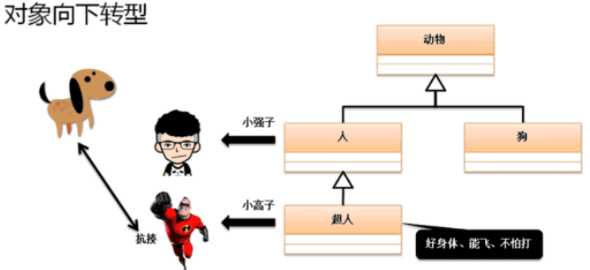

```java
class Person {
    public void print() {
        System.out.println("一个正常的人类行为，吃饭、睡觉、繁衍。");
    }
}
class SuperMan extends Person {
    public String fly() {
        return "我可以飞。。。";
    }
    public String fire() {
        return "我可以喷火。。。";
    }
}
public class JavaAPIDemo {
    public static void main(String[] args) {
        System.out.println("---------- 正常状态下的超人应该是一个普通人的状态 --------------") ;
        Person per = new SuperMan(); // 向上转型
        per.print();
        System.out.println("---------- 外星怪兽狗骚扰地球，准备消灭人类 --------------") ;
        SuperMan man = (SuperMan) per; // 向下转型
        System.out.println(man.fly());
        System.out.println(man.fire());
    }
}
```

```java
// 输出内容
---------- 正常状态下的超人应该是一个普通人的状态 --------------
一个正常的人类行为，吃饭、睡觉、繁衍。
---------- 外星怪兽狗骚扰地球，准备消灭人类 --------------
我可以飞。。。
我可以喷火。。。
```

向上描述的是一些公共的特征，而向下描述的是子类自己特殊的定义环境。但是需要明确的是，向下转型并不是一件安全的事情。因为在进行向下转型之前一定要首先发生向上转型。

操作示例：观察错误的程序

```java
class Person {
    public void print() {
        System.out.println("一个正常的人类行为，吃饭、睡觉、繁衍。");
    }
}
class SuperMan extends Person {
    public String fly() {
        return "我可以飞。。。";
    }
    public String fire() {
        return "我可以喷火。。。";
    }
}
public class JavaAPIDemo {
    public static void main(String[] args) {
        System.out.println("---------- 正常状态下的人应该是一个普通人的状态 --------------");
        Person per = new Person(); // 不转型
        per.print() ;
        System.out.println("---------- 外星怪兽狗骚扰地球，准备消灭人类 --------------");
        SuperMan man = (SuperMan) per; // SuperMan类与Person类
    }
}
```

```java
// 输出内容
---------- 正常状态下的人应该是一个普通人的状态 --------------
一个正常的人类行为，吃饭、睡觉、繁衍。
---------- 外星怪兽狗骚扰地球，准备消灭人类 --------------
Exception in thread "main" java.lang.ClassCastException: class Person cannot be cast to class SuperMan (Person and SuperMan are in unnamed module of loader 'app')
	at JavaAPIDemo.main(JavaAPIDemo.java:20)
```

以后只要是发生对象的向下转型之前一定要首先向上转型，两个没有任何关系的实例如果要发生强制转换，就会出现“ClassCastException”异常，所以向下转型并不是一件安全的事情。


## 4、关键字 instanceof

通过分析可以发现，向下转型本身是一件存在有安全隐患的操作，所以为了保证向下转型的正确性，往往需要在进行转型之前进行判断，判断某个实例是否是某个类的对象。这个就需要通过instanceof语法来实现。语法如下：

```java
实例对象 instanceof 类; // 该判断将返回一个boolean类型，如果是true表示实例是指定类对象。
```

操作示例 1：观察instanceof的使用

```java
class Person {
    public void print() {
        System.out.println("一个正常的人类行为，吃饭、睡觉、繁衍。");
    }
}
class SuperMan extends Person {
    public String fly() {
        return "我可以飞。。。";
    }
    public String fire() {
        return "我可以喷火。。。";
    }
}
public class JavaAPIDemo {
    public static void main(String[] args) {
        System.out.println("-----------不转型-----------");
        Person per1 = new Person(); // 不转型
        System.out.println(per1 instanceof Person); // true
        System.out.println(per1 instanceof SuperMan); // false
        System.out.println("-----------向上转型-----------");
        Person per2 = new SuperMan (); // 向上转型
        System.out.println(per2 instanceof Person); // true
        System.out.println(per2 instanceof SuperMan); // true
    }
}
```

```java
// 输出内容
-----------不转型-----------
true
false
-----------向上转型-----------
true
true
```

所以在日后进行项目的开发过程之中，如果要执行对象的向下转型，最好先判断一次。

```java
class Person {
    public void print() {
        System.out.println("一个正常的人类行为，吃饭、睡觉、繁衍。");
    }
}
class SuperMan extends Person {
    public String fly() {
        return "我可以飞。。。";
    }
    public String fire() {
        return "我可以喷火。。。";
    }
}
public class JavaAPIDemo {
    public static void main(String[] args) {
        Person per = new SuperMan(); // 向上转型
        if (per instanceof SuperMan) {
            SuperMan man = (SuperMan) per;
            System.out.println(man.fly());
            System.out.println(man.fire());
        }
    }
}
```

```java
// 输出内容
我可以飞。。。
我可以喷火。。。
```

在以后进行一些完善性的程序开发的过程之中，对于转型之前一定要使用instanceof判断。

# Object 类

本节介绍了可以被Java世界中所有的类向上转型的祖先类-Object类，并介绍了Object类中提供的获取信息的方法-toString()方法。通过阅读本节内容，你将认识到Object类在多态性中扮演的重要角色，并能够通过覆写toString()方法实现获取对象信息的功能。Object类的主要特点是可以解决参数的统一问题，也就是说使用Object类可以接收所有的数据类型。

## 1、Object类简介

在Java之中只有一个类是不存在有继承关系的，那么这个类就是Object，也就是说所有的类默认情况下都是Object子类。以下两种类的定义效果完全相同：

```java
class Person {}                 // 一个类
class Person extends Object {}  // 一个类
```

在Object类设计的时候考虑到了所有继承的问题，所以该类提供有无参构造方法，这样所有的类在定义时即便不知道Object类的存在也不会出现构造方法调用失败的语法错误。

那么既然Object类是所有类的父类，那么这种情况下就可以使用Object类接收所有的子类对象。

操作示例 1：观察Object类接收所有子类对象

```java
class Person {}	// 一个类
public class JavaAPIDemo {
    public static void main(String[] args) {
        Object obj = new Person(); // 向上转型
        if (obj instanceof Person) {
            Person per = (Person) obj;
            System.out.println("Person对象向下转型执行完毕。"); // Person对象向下转型执行完毕。
        }
    }
}
```

如果一个程序的方法要求可以接收所有类对象的时候就可以利用Object实现处理。但是还有一点需要注意，在Java程序之中对于所有的引用数据类型实际上都可以使用Object类进行接收，包括数组也可以。

操作示例 2：使用Object类接收数组

```java
public class JavaAPIDemo {
    public static void main(String[] args) {
        Object obj = new int [] {1,2,3} ; // 向上转型
        if (obj instanceof int[]) { // 是否为整型数组
            int data [] = (int []) obj; // 向下转型
            for (int temp : data) {
                System.out.print(temp + "、");
            }
        }
    }
}
```

```java
// 输出内容
1、2、3、
```

Object还一个万能数据类型，它更加适合于进行程序的标准设计。


## 2、获取对象信息：toString()

Object虽然是一个类，但是这个类本身也是提供有一些处理方法的。在Object类之中提供有一个“toString()”的方法，该方法可以获取一个对象的完整信息：public String toString()。

操作示例 1：观察默认的toString()使用

```java
class Person {}
public class JavaAPIDemo{
    public static void main(String[] args) {
        Person per  = new Person();
        System.out.println(per);   
        System.out.println(per.toString()); // Object类继承而来
    }
}
```

```java
// 输出内容
Person@43a25848
Person@43a25848
```

可以发现在之前进行对象直接输出的时候所调用的方法就是toString()方法，所以这个方法调用与不调用的效果是一样的。所以在以后的开发之中对象信息的获取可以直接覆写此方法。

操作示例 2：覆写toString()方法

```java
class Person {
    private String name;
    private int age;
    public Person(String name,int age) {
        this.name = name;
        this.age = age;
    }
    @Override
    public String toString() {
        return "姓名：" + this.name + "、年龄：" + this.age;
    }
}
public class JavaAPIDemo {
    public static void main(String[] args) {
        Person per = new Person("张三",20);
        System.out.println(per); // 姓名：张三、年龄：20
    }
}
```

以后在编写简单Java类的过程之中只需要覆写toString()方法即可。


## 3、对象比较：equals()

Object类之中另外一个比较重要的方法就是在于对象比较的处理上，所谓的对象比较主要的功能是比较两个对象的内容是否完全相同。如果现在有两个Person对象，要想确认这两个对象是否一致，但是两个对象本身会有不同的内存地址数值，所以此时的比较应该是通过内容的比较完成的。

操作示例 1：对象比较的基础实现

```java
class Person {
    private String name;
    private int age;
    public Person(String name,int age) {
        this.name = name;
        this.age = age;
    }
    @Override
    public String toString() {
        return "姓名：" + this.name + "、年龄：" + this.age;
    }
    public String getName() {
        return this.name;
    }
    public int getAge() {
        return this.age;
    }
}
public class JavaAPIDemo {
    public static void main(String[] args) {
        Person perA = new Person("张三",20);
        Person perB = new Person("张三",20);
        if (perA.getName().equals(perB.getName()) &&
            perA.getAge() == perB.getAge()) {
            System.out.println("是同一个对象。");
        } else {
            System.out.println("不是同一个对象。");
        }
    }
}
```

```java
// 输出内容
是同一个对象。
```

此时的确实现了对象比较的功能，但是这个功能比较麻烦。

1. 由于需要进行对象比较的时候要将每一个属性都进行相等判断，所以在外部要调用大量的getter方法；
2. 对象比较应该是一个类内部所具备的功能，而不应该在外部定义；

Object类作为所有类的父类提供了对象比较操作的支持，对于对象比较的操作实现可以使用equals()方法完成。

1. 对象比较： public boolean equals(Object obj)，可以接收所有类型；默认情况下该方法只是进行了两个对象的地址判断。

```java
public boolean equals(Object obj) {
    return (this == obj);
}
```

也就是说对于实际的使用者而言，如果要想正确实现判断处理，那么就必须要在子类中覆写此方法，并且进行属性判断。

操作示例 2：观察Object类中的equals()方法覆写

```java
class Person {
    private String name;
    private int age;
    public Person(String name,int age) {
        this.name = name;
        this.age = age;
    }
    public String toString() {
        return "姓名：" + this.name + "、年龄：" + this.age;
    }
    // equals()方法这个时候会有两个对象：当前对象this、传入的Object
    public boolean equals(Object obj) {
        if (!(obj instanceof Person)) {
            return false;
        }
        if (obj == null) { // 不关心null的比较
            return false;
        }
        if (this == obj) { // 同一个地址
            return true;
        }
        Person per = (Person) obj; // 目的是为了获取类中的属性
        return this.name.equals(per.name) &&  this.age == per.age;
    }
}
public class JavaAPIDemo {
    public static void main(String[] args) {
        Person perA = new Person("张三",20);
        Person perB = new Person("张三",20);
        System.out.println(perA.equals(perB)); // true
    }
}
```

String类作为Object子类，那么这个类里面实际上已经覆写了equals()方法。


# 抽象类的定义与使用

类继承的主要作用在于可以扩充已有类的功能，但是对于之前的继承操作而言会发现，子类可以由自己的选择任意来决定是否要覆写某一个方法，这个时候父类无法对子类做出强制性的约定（强制性子类必须覆写某些方法），这种情况下往往不会采用类的继承（在实际的开发之中很少会出现继承一个已经完善的类，可以直接使用的类），而是必须要继承抽象类。在以后进行父类（SuperClass）设计的时候，优先考虑的一定是抽象类。

## 1、抽象类的基本概念

抽象类的主要作用在于对子类中覆写方法进行约定，在抽象类里面可以去定义一些抽象方法以实现这样的约定，抽象方法指的是使用了abstract 关键字定义的并且没有提供方法体的方法，而抽象方法所在的类必须为抽象类，抽象类必须使用 abstract关键字来进行定义（在普通类的基础上追加抽象方法就是抽象类）

操作示例 1：定义一个抽象类

```java
abstract class Message { // 定义抽象类
    private String type; // 消息类型
    public abstract String getConnectInfo(); // 抽象方法
    public void setType(String type) { // 普通方法
        this.type = type;
    }
    public String getType() { // 普通方法
        return this.type; 
    }
}
```

当一个抽象类定义完成之后（切记：抽象类不是完整的类），如果要想去使用抽象类则必须按照如下原则进行：

1. 抽象类必须提供有子类，子类使用extends继承一个抽象类
2. 抽象类的子类（不是抽象类）一定要覆写抽象类中的全部抽象方法
3. 抽象类的对象实例化可以利用对象多态性通过子类向上转型的方式完成（抽象类无法通过new实例化）

操作示例 2：使用抽象类

```java
abstract class Message { // 定义抽象类
    private String type; // 消息类型
    public abstract String getConnectInfo(); // 抽象方法
    public void setType(String type) { // 普通方法
        this.type = type;
    }
    public String getType() { // 普通方法
        return this.type;
    }
}
class DatabaseMessage extends Message {	// 类的继承关系
    @Override
    public String getConnectInfo() { // 方法覆写
        return "Oracle数据库连接信息。";
    }
}

public class JavaAPIDemo {
    public static void main(String[] args) {
        Message msg = new DatabaseMessage();
        msg.setType("客户消息");
        System.out.println(msg.getConnectInfo());
        System.out.println(msg.getType());
    }
}
```

```java
// 输出内容
Oracle数据库连接信息。
客户消息
```

从整体上来讲，抽象类只是比普通类增加了抽象方法以及对子类的强制性的覆写要求而已，其它的使用过程和传统的类继承是完全相同的。对于抽象类使用的几点意见：

1. 抽象类使用很大程度上有一个核心的问题：**抽象类自己无法直接实例化**
2. 抽象类之中主要的目的是进行过渡操作使用，所以当你要使用抽象类进行开发的时候，往往都是在你设计中需要解决类继承问题时所带来的代码重复处理


## 2、抽象类的相关说明

抽象类是一个重要的面向对象设计的结构,对于抽象类使用的时候需要注意以下几点问题：

1. 在定义抽象类的时候绝对不能够使用final关键字来进行定义，因为抽象类必须有子类，而final定义的类是不能够有子类

2. 抽象类是作为一个普通类的加强版出现的（抽象类的组成就是在普通类的基础上扩展而来的，只是追加了抽象方法），既然是在普通类的基础上扩展的，那么普通类之中就可以定义属性和方法，那么这些属性一定是要求进行内存空间开辟的，所以抽象类一定可以提供有构造方法，并且子类也一定会按照子类对象的实例化原则进行构造调用。

   ```java
   abstract class Message { // 定义抽象类
       private String type; // 消息类型
       public Message(String type) { // 类中没有提供有无参构造
           this.type = type;
       }
       public abstract String getConnectInfo(); // 抽象方法
       public void setType(String type) { // 普通方法
           this.type = type;
       }
       public String getType() { // 普通方法
           return this.type;
       }
   }
   class DatabaseMessage extends Message {	// 类的继承关系
       public DatabaseMessage(String str) {
           super(str);
       }
       @Override
       public String getConnectInfo() { // 方法覆写
           return "Oracle数据库连接信息。";
       }
   }
   public class JavaAPIDemo {
       public static void main(String[] args) {
           Message msg = new DatabaseMessage("客户消息");
           System.out.println(msg.getConnectInfo());
           System.out.println(msg.getType());
       }
   }
   ```
   
   ```java
   // 输出内容
   Oracle数据库连接信息。
   客户消息
   ```
   
3. 抽象类中允许没有抽象方法，但是即便没有抽象方法，也无法直接使用关键字new直接实例化抽象类对象，必须依靠子类对象完成

4. 抽象类中可以提供有static方法，并且该方法不受到抽象类对象的局限，可以直接通过类名称进行调用

   ```java
   abstract class Message { // 定义抽象类
       public abstract String getInfo(); // 抽象方法
       public static Message getInstance() {
           return new DatabaseMessage();
       }
   }
   class DatabaseMessage extends Message {	// 类的继承关系
       @Override
       public String getInfo() {
           return "数据库连接信息。";
       }
   }
   public class JavaAPIDemo {
       public static void main(String[] args) {
           Message msg = Message.getInstance();
           System.out.println(msg.getInfo()); // 数据库连接信息。
       }
   }
   ```
   
5. 实际上在抽象类中定义的static方法还有一件比较有意思的事情就是可以隐藏子类

   ```java
   abstract class AbstractBall {
       public abstract void play();
       public static AbstractBall getInstance() {
           return new BasketBall();
       }
   }
   class BasketBall extends AbstractBall {
       @Override
       public void play() {
           System.out.println("玩篮球");
       }
   }
   class FootBall extends AbstractBall {
       @Override
       public void play() {
           System.out.println("玩足球");
       }
   }
   
   public class JavaAPIDemo {
       public static void main(String[] args) {
           AbstractBall basketA = AbstractBall.getInstance();
           basketA.play();
           AbstractBall basketB = new BasketBall();
           basketB.play();
           FootBall foot = new FootBall();
           foot.play();
       }
   }
   ```
   
   ```java
   // 输出内容
   玩篮球
   玩篮球
   玩足球
   ```
   
   


## 3、抽象类的应用（模板设计模式）

抽象类的本质上就属于一个加强型的类，那么对于类已经清楚了，可以描述一切的有关的现实事物，但是通过分析也可以发现，抽象类的设计应该是比类更高一层的定义。那么下面来研究一下抽象类的实际应用（模版设计模式在整个的Java中最为常见的应用就是Servlet程序开发）

假如说现在要描述有三类的事物：

1. 机器人：不休息,只知道补充能量和工作;
2. 人类：需要休息、需要吃饭以及努力的工作;
3. 猪：需要休息、不需要工作只需要吃饭

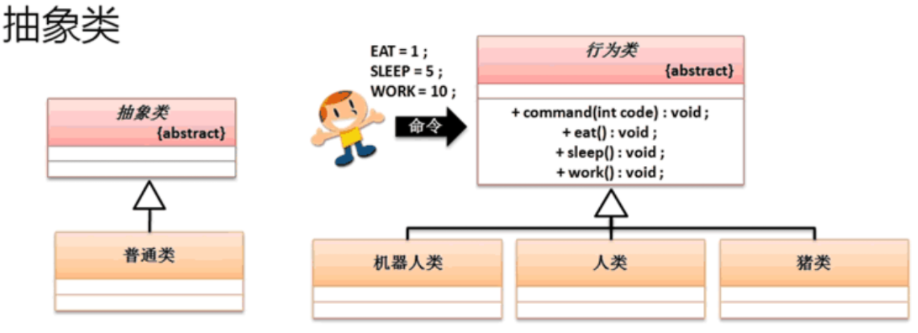

操作示例：实现代码

```java
abstract class Action {
    public static final int EAT = 1 ;
    public static final int SLEEP = 5 ;
    public static final int WORK = 10 ;
    public void command(int code) {
        switch(code) {
            case EAT : {
                this.eat() ;
                break ;
            }
            case SLEEP : {
                this.sleep() ;
                break ;
            }
            case WORK : {
                this.work() ;
                break ;
            }
            case EAT + SLEEP + WORK : {
                this.eat() ;
                this.sleep() ;
                this.work() ;
                break ;
            }
        }
    }
    public abstract void eat() ;
    public abstract void sleep() ;
    public abstract void work() ;
}
class Robot extends Action {
    @Override
    public void eat() {
        System.out.println("机器人需要接通电源充电。") ;
    }
    @Override
    public void sleep() {}
    @Override
    public void work() {
        System.out.println("机器人按照固定的套路进行工作。") ;
    }
}
class Person extends Action {
    @Override
    public void eat() {
        System.out.println("饿的时候安静的坐下吃饭。") ;
    }
    @Override
    public void sleep() {
        System.out.println("安静的躺下，慢慢的睡着，而后做着美丽的春梦。") ;
    }
    @Override
    public void work() {
        System.out.println("人类是高级脑类动物，所有要有想法的工作。") ;
    }
}
class Pig extends Action {
    @Override
    public void eat() {
        System.out.println("吃食槽中的人类的剩饭。") ;
    }
    @Override
    public void sleep() {
        System.out.println("倒地就睡。") ;
    }
    @Override
    public void work() {}
}
public class JavaAPIDemo {
    public static void main(String[] args) {
        Action robotAction = new Robot() ;
        Action personAction = new Person() ;
        Action pigAction = new Pig() ;
        System.out.println("------------ 机器人行为 -------------") ;
        robotAction.command(Action.SLEEP) ;
        robotAction.command(Action.WORK) ;
        System.out.println("------------ 人类的行为 -------------") ;
        personAction.command(Action.SLEEP + Action.EAT + Action.WORK) ;
        System.out.println("------------ 猪类的行为 -------------") ;
        pigAction.work() ;
        pigAction.eat() ;
    }
}

// 输出内容
------------ 机器人行为 -------------
机器人按照固定的套路进行工作。
------------ 人类的行为 -------------
饿的时候安静的坐下吃饭。
安静的躺下，慢慢的睡着，而后做着美丽的春梦。
人类是高级脑类动物，所有要有想法的工作。
------------ 猪类的行为 -------------
吃食槽中的人类的剩饭。
```

现在的程序已经完整的实现了一个行为的抽象处理，但是也需要做出一点点思考。现在定义的Action父类主要的目的：对所有行为规范进行统一处理。

抽象类最大的好处一是对子类方法的统一管理，二是可以自身提供有一些普通方法并且这些普通方法可以调用抽象方法（这些抽象方法必须在有子类提供实现的时候才会生效）


# 包装类

本节为读者介绍了能使基本数据实现引用传递的包装类，并重现了包装类的实现原理与相关方法。包装类的主要功能是针对于基本数据类型的对象转换而实现的，并且随着JDK版本的更新，包装类的功能也在发生改变，有着更多的支持。

## 1、认识包装类

Object类最大的特点是所有类的父类，并且可以接收所有的数据类型，但是在这个过程之中就存在有个问题：基本数据类型并不是一个类，所以现在如果要想将基本数据类型以类的形式进行处理，那么就需要对其进行包装。

操作示例 1：以int数据为例实现一个包装处理的定义

```java
class Int {
    private int data; // 包装了一个基本数据类型
    public Int(int data) {
        this.data = data;
    }
    public int intValue() {
        return this.data;
    }
}
public class JavaAPIDemo {
    public static void main(String[] args) {
        Object obj = new Int(10);	// 装箱：将基本数据类型保存在包装类之中
        int x = ((Int)obj).intValue(); // 拆箱：从包装类对象中获取基本数据类型
        System.out.println(x * 2); // 20
    }
}
```

基本数据类型进行包装处理后，可以像对象一样进行引用传递，同时也可以使用Object类进行接收，但是如果都已经可以发现基本数据类型与Object类型之间的缺陷，那么JDK也早就发现了同样的问题，所以在JDK1.0的时候就提供有了包装类的概念，基本数据类型一共有八种，所以提供有八种包装类，那么这八种包装类的基本定义如下：

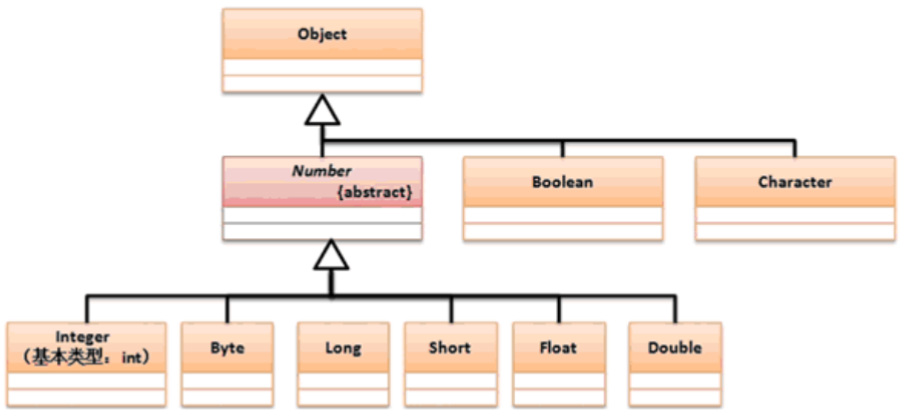

现在可以发现Java包装类一共提供有两种类型：

1. 对象型包装类（Object直接子类）：Boolean、Character
2. 数值型包装类（Number直接子类）：Byte、Short、Integer、Long、Float、Double

**Number是一个抽象类，以后只要看见了Number都应该明确的表示它是一个数字的概念，这个类有如下方法：**

| 方法名称                             | 描述                     |
| :----------------------------------- | ------------------------ |
| public byte byteValue()              | 从包装类取出 byte 数据   |
| public short shortValue()            | 从包装类取出 short 数据  |
| public abstract int intValue()       | 从包装类取出 int 数据    |
| public abstract long longValue()     | 从包装类取出 long 数据   |
| public abstract float floatValue()   | 从包装类取出 float 数据  |
| public abstract double doubleValue() | 从包装类取出 double 数据 |

Number类中的方法就是直接提供有获取包装类中基本数据类型的功能，一共只定义有六个方法。


## 2、装箱与拆箱操作

有了包装类的概念之后，就可以结合包装类与基本数据类型之间进行类型转换，这样的转换称为装箱和拆箱

- 装箱：将基本数据类型变为包装类的形式出现，一般都是通过构造完成（例如：public Integer(int value)）
- 拆箱：将包装类中的内容取出，获取基本数据类型，方法同意都是“xxxValue()”（例如：public boolean booleanValue()）

操作示例 1：手动装箱拆箱：以 int和Integer、double与Double、boolean与Boolean为例

```java
public class JavaAPIDemo {
    public static void main(String[] args) {
        Integer obj = new Integer(10);	// 装箱
        int num = obj.intValue(); // 拆箱
        System.out.println(num * num);

        Double obj2 = new Double(10.1); // 装箱
        double num2 = obj2.doubleValue(); // 拆箱
        System.out.println(num2 * num2);

        Boolean obj3 = new Boolean(true); // 装箱
        boolean num3 = obj3.booleanValue(); // 拆箱
        System.out.println(num3);
    }
}
```

```java
// 输出内容
100
102.00999999999999
true
```

可以发现从JDK1.9之后，对于所有包装类之中提供的构造方法就变为了过期处理，不建议用户继续使用了，这是因为从JDK1.5之后为了方便处理提供了自动的装箱与开箱操作，所以这种手工的模式基本上没人用了。

操作示例 2：自动装箱拆箱：接收小数

```java
public class JavaAPIDemo {
    public static void main(String[] args) {
        Integer obj = 10; // 自动装箱，此时不再关心构造方法了
        int num = obj; // 自动拆箱
        obj ++ ; // 包装类对象可以直接参与数学运算
        System.out.println(num * obj);	// 直接参与数学运算

        // 使用自动装箱最大的好处是可以实现 Object 接收基本数据类型的操作。
        Object obj2 = 19.2; // double 自动装箱为 Double，向上转型为 Object
        double num2 = (Double) obj2; // 向下转型为包装类，再自动拆箱
        System.out.println(num2 * 2);
    }
}
```

```java
// 输出内容
110
38.4
```

JDK1.5之后提供的自动支持功能，到了JDK1.9之后为了巩固此概念，所以将手动包装类的构造方法都设置为过期定义了。

操作示例 3：观察相等判断（但是对于包装类需要注意一些问题了，关于相等判断上）

```java
public class JavaAPIDemo {
    public static void main(String[] args) {
        Integer x = 127;
        Integer y = 127;
        System.out.println(x == y); // true

        Integer x = 128;
        Integer y = 128;
        System.out.println(x == y); // false
        System.out.println(x.equals(y)); // true
    }
}
```

```java
// 输出内容
true
false
true
```

以后进行包装类相等判断的时候一定要使用equals()方法完成，而包装类本身也需要考虑占位的长度，如果超过了一位的内容，那么就需要使用equals()比较，如果不超过，则使用“==”即可判断。Integer数据范围为：-128~127


## 3、数据类型转换

使用包装类还有一个最大的特点在于其可以实现字符串与基本类型之间的转换，在日后进行项目开发的过程中，用户可以输入的数据只有一种，字符串（String），那么对于程序就需要根据接受的字符串将其变为基本数据类型，这就要通过转换来完成，各个包装类提供有转换功能：

1. Integer 类：public static int parseInt(String s);
2. Double 类：public static double parseDouble(String s);
3. Boolean 类：public static boolean parseBoolean(String s);

操作示例 1：字符串转换成基本类型

```java
public class JavaAPIDemo {
    public static void main(String[] args) {
        // 如字符串不是由数字所组成,则执行时会出现“NumberFormatException”异常
        String str1 = "123" ; // 字符串由数字所组成
        int num = Integer.parseInt(str1) ;	// 字符串转为int
        System.out.println(num) ;

        // boolean取值范围只有两个内容:tue、 false,
        // 如果现在字符串的输入不是true或者是 false,则统一会按照 false进行处理
        String str2 = "abc" ; // 字符串由数字所组成
        boolean flag = Boolean.parseBoolean(str2) ;
        System.out.println(flag) ;
    }
}
```

操作示例 2：基本类型转换成字符串

1. 做法一：任意基本类型与字符串拼接后都自动变成String型（这种做法会产生无用垃圾）

   ```java
   public class JavaAPIDemo {
       public static void main(String[] args) {
           int num = 100;
           String str = num + ""; // 字符串连接
           System.out.println(str.length()); // 计算长度
       }
   }
   ```

2. 做法二：String类中提供有一系列的valueOf()方法转换（此方式进行转换的时候至少可以避免一些垃圾的产生）

   ```java
   public class JavaAPIDemo {
       public static void main(String[] args) {
           int num = 100;
           String str = String.valueOf(num); // 字符串转换
           System.out.println(str.length()); // 计算长度
       }
   }
   ```


# 接口的定义与使用

使用抽象类尽管可以针对于子类的方法覆写进行控制，但是所有类继承的结构里面永远都会存在有问题：一个子类只能够通过“extends”关键字继承一个父类，所以为了解决这样的限制问题，Java引用了接口设计，可以把接口想象成一个特殊的类。Java中只允许单继承，但在实际应用中不免会有多继承的要求，此时，接口便应运而生了。

## 1、接口基本定义

在Java中提供了一种特殊形式的类，这种类就称为接口，所有的接口使用 interface 关键字来进行定义，在传统的接口之中，接口的组成就是**全局常量和抽象方法**，而从 JDK 1.8开始接口的定义有所加强，除了抽象方法与全局常量之外，还可以定义**普通方法或静态方法**。

操作示例 1：定义一个接口

```java
// 由于类名称与接口名称的定义要求相同，所以为了区分出接口接口名称前往往会加入字母I（interface简写）
interface IMessage { // 定义了一个接口
    public static final String INFO = "www.xxxx.cn" ; // 全局常量
    public abstract String getInfo() ;                // 抽象方法
}
```

但是现在很明显的问题出现了，此时的接口肯定无法直接产生实例化对象，所以对于接口的使用原则如下：

- 接口对象无法直接实例化，一定要有子类
- 接口需要被子类实现（implements），一个子类可以实现多个父接口
- 子类（如果不是抽象类）那么一定要覆写接口之中的全部抽象方法
- 接口对象可以利用子类对象的向上转型进行实例化

操作示例 2：接口的基本使用，定义接口子类

```java
// 由于类名称与接口名称的定义要求相同，所以为了区分出接口接口名称前往往会加入字母I（interface简写）
interface IMessage { // 定义了一个接口
    public static final String INFO = "www.xxxx.cn" ; // 全局常量
    public abstract String getInfo() ; // 抽象方法
}
class MessageImpl implements IMessage {	// 实现了接口
    public String getInfo() {
        return "得到一个消息，秘密的消息，有人胖了（不是我）。" ;
    }
}
public class JavaAPIDemo {
    public static void main(String[] args) {
        IMessage msg = new MessageImpl();
        System.out.println(msg.getInfo());
        System.out.println(IMessage.INFO);	// 直接输出全局常量
    }
}
```

```java
// 输出内容
得到一个消息，秘密的消息，有人胖了。
www.xxxx.cn
```

操作示例 3：多接口与实现类，在Java里面之所以使用接口主要目的是一个子类可以实现多个接口，利用接口i可以多继承的概念。

```java
// 定义第一个接口
interface IMessage {
    public static final String INFO = "www.xxxx.cn" ; // 全局常量
    public abstract String getInfo() ; // 抽象方法
}
// 定义第二个接口
interface IChannel {
    public abstract boolean connect() ;	// 定义抽象方法
}
// 接口实现子类
class MessageImpl implements IMessage, IChannel { // 实现了接口
    public String getInfo() {
        if (this.connect()) {
            return "得到一个消息，秘密的消息，有人胖了（不是我）。" ;
        }
        return "通道创建失败，无法获取消息。" ;
    }
    public boolean connect() {
        System.out.println("消息发送通道已经成功建立。") ;
        return true ;
    }
}

public class JavaAPIDemo {
    public static void main(String[] args) {
        IMessage msg = new MessageImpl();
        System.out.println(msg.getInfo());
    }
}
```

```java
// 输出内容
消息发送通道已经成功建立。
得到一个消息，秘密的消息，有人胖了。
```


## 2、接口的变量默认是 public static final

interface（接口)）将其想象为一个“纯”抽象类。它允许创建者规定一个类的基本形式：方法名、自变量列表以及返回类型，但不实现方法主体。接口也可包含基本数据类型的数据成员，但它们都默认为public、static 和 final。接口中定义的方法默认为 public、abstract。

为什么Java接口中的成员变量默认为(public、static、final)、成员方法为（public、abstract）呢？

接口是一种高度抽象的模版，接口中的成员变量是模版的一部分，其接口的实现类必须共有这些成员变量，所以成员变量的修饰符默认为public、static、final。static使得实现这个接口的类，可以直接使用这个变量。如果是非静态变量，那么接口的多个实现类可能出现变量名重名的现象。final表示被修饰的变量为常数，不可以修改。一个既是static又是final的字段表示只占据一段不能改变的存储空间。如果是非final变量，那么接口的实现类可以修改变量的值，这与抽象类没有区别了。由于接口起到标准化和规范化的作用，所以其成员变量默认修饰符为static、final。


## 3、对象转型

但是这个时候就需要考虑一个实际的的情况了，关于对象的转型问题了。

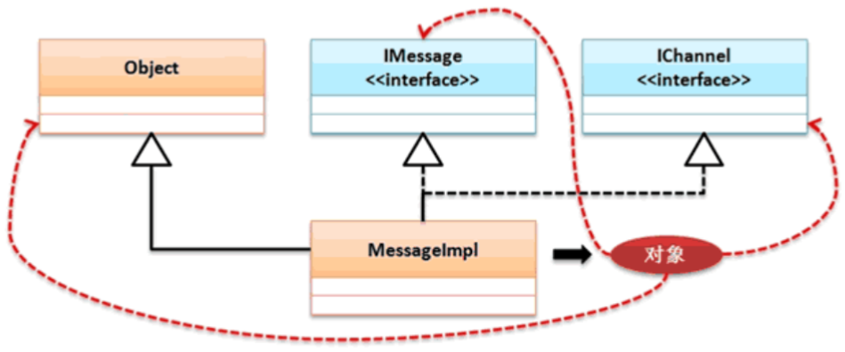

操作示例 1：观察转换（此时MessageImpl子类的对象可以任意的实现父接口的转换）

```java
public class JavaAPIDemo {
    public static void main(String[] args) {
        IMessage msg = new MessageImpl();
        IChannel chl = (IChannel) msg;
        System.out.println(chl.connect());
    }
}
```

由于MessageImpl子类实现了IMessage与IChannel两个接口，所以这个子类可以是这两个接口任意的一个接口的实例，那么就表示此时这两个接口实例之间是可以转换的。

在Java程序里面接口是不允许去继承父类的，所以接口绝对不会是Object的子类，但是根据之前的分析可以发现，Messagelmpl是Object子类，所以接口一定可以通过Object接收。

操作示例 2：观察Object与接口转换

```java
public class JavaAPIDemo {
    public static void main(String[] args) {
        IMessage msg = new MessageImpl();
        Object obj = msg ; // 向上转型
        IChannel chan = (IChannel) obj;
        System.out.println(chan.connect());
    }
}
```

**结论：Object类对象可以接口所有数据类型，包括基本数据类型、类对象、接口对象、数组。**

由于接口描述的是一个公共的定义标准，所以在接口之中所有的抽象方法的访问权限都为public，也就是说写与不写都是一样的，例如：下面的两个接口本质是完全相同的（**重点**）：

```java
// 完整定义一个接口
interface IMessage {
    public static final String INFO = "www.xxxx.cn";
    public abstract String getInfo();
}

// 简化定义一个接口
interface IMessage {
    String INFO = "www.xxxx.cn";
    String getInfo();
}
```

方法不写访问权限也是public，不是default，所以覆写的时候只能够使用public。

接口虽然已经可以成功的进行定义，但是千万不要忽略，在实际的开发过程之中，实现接口的有可能是抽象类，也就是说一个抽象类可以实现多个接口，而一个普通类只能够继承一个抽象类并且可以实现多个父接口，但是要求先继承后实现。

操作示例 3：子类继承抽象类并且实现接口

```java
interface IMessage { // 定义了一个接口
	public static final String INFO = "www.xxxx.cn" ;
	public abstract String getInfo() ;
}
interface IChannel { // 定义了一个接口
	public abstract boolean connect();
}
abstract class DatabaseAbstract { // 定义一个抽象类
	// 接口中的abstract可以省略，抽象类中不允许省略
	public abstract boolean getDatabaseConnection();
}
class MessageImpl extends DatabaseAbstract implements IMessage,IChannel { // 实现了接口和继承抽象类
	public String getInfo() {
		if (this.connect()) {
			if (this.getDatabaseConnection()) {
				return "数据库中得到一个消息，秘密的消息，有人胖了（不是我）。";
			} else {
				return "数据库消息无法访问。";
			}
		}
		return "通道创建失败，无法获取消息。";
	}
	public boolean connect() {
		System.out.println("消息发送通道已经成功建立。") ;
		return true ;
	}
	public boolean getDatabaseConnection() {
		return true ;
	}
}
public class JavaAPIDemo {
	public static void main(String[] args) {
		IMessage msg = new MessageImpl();
		System.out.println(msg.getInfo());
	}
}
```

```java
// 输出内容
消息发送通道已经成功建立。
数据库中得到一个消息，秘密的消息，有人胖了（不是我）。
```

虽然接口无法去继承一个父类，但是一个接口却可以通过extends继承若干个父接口，此时称为接口的多继承。

操作示例 4：接口的多继承实现

```java
interface IMessage {
    public abstract String getInfo();
}
interface IChannel {
    public boolean connect();
}
// extends在类继承上只能够继承一个父类，但是接口上可以继承多个
interface IService extends IMessage,IChannel {	// 接口多继承
    public String service();
}
class MessageService implements IService {
    public String getInfo() {
        return null;
    }
    public boolean connect() {
        return true;
    }
    public String service() {
        return "获取消息服务。" ;
    }
}
```

接口和类严格来讲不属于一个级别的设计产物，接口的设计要高于类的设计，所以一个接口里面是不可能继承任何五类的（一个类可以实现若干个接口），但是一个接口却可以通过extends关键字继承多个父接口

**日后的开发之中请记住如下的原则：**

1. 普通类和抽象都都可以通过implements关键字实现多个接口
2. 接口可以通过extends关键字去继承多个父接口，但是无法继承任何一种类


## 4、接口定义加强

接口最早的主要特点是全部由抽象方法和全局常量所组成。但是如果你的项目设计不当，就有可能出现一种非常严重的问题。

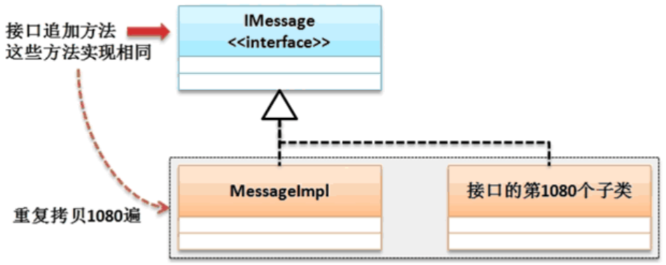

一直在强调该操作是属于结构设计不当的结果，那么在最初的时候任何人都不敢保证你的接口设计的足够完善，所以在这样的情况下为了方便子类的修改，往往不会让子类直接继承实现接口，而是中间追加一个过渡的抽象类。

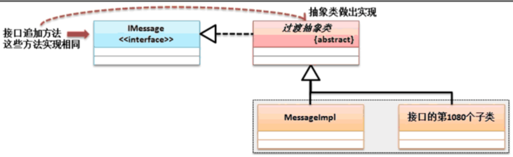

但是在JDK1.8之后开始，为了解决接口设计的缺陷，所以在接口之中允许开发者定义普通方法和静态方法。

操作示例 1：接口中定义普通方法。

接口中的普通方法必须追加default的声明，但需要提醒的是，该操作属于挽救功能，如不是必须的情况，不应该作为设计的首选

```java
interface IMessage {
    public String message();
    public default boolean connect() { // 方法是一个公共方法，都具备
        System.out.println("建立消息的发送通道。");
        return true;
    }
}
class MessageImpl implements IMessage {
    public String message() {
        return "www.xxxx.cn";
    }
}
public class JavaAPIDemo {
    public static void main(String[] args) {
        IMessage msg = new MessageImpl();
        if (msg.connect()) {
            System.out.println(msg.message());
        }
    }
}
```

```java
// 输出内容
建立消息的发送通道。
www.xxxx.cn
```

操作示例 2：接口中定义static方法。

除了可以追加普通方法之外，接口里面也可以定义static方法，而static方法就可以通过接口直接调用了

```java
interface IMessage {
    public String message();
    public default boolean connect() { // 方法是一个公共方法，都具备
        System.out.println("建立消息的发送通道。");
        return true;
    }
    public static IMessage getInstance() {
        return new MessageImpl(); // 获得子类对象
    }
}
class MessageImpl implements IMessage {
    public String message() {
        if (this.connect()) {
            return "www.xxxx.cn";
        }
        return "没有消息发送。";
    }
}
public class JavaAPIDemo {
    public static void main(String[] args) {
        IMessage msg = IMessage.getInstance();
        System.out.println(msg.message());
    }
}
```

如果现在真的可以在接口里面定义普通方法或static方法，那么这个功能就已经可以取代抽象类了，但是不应该将这两个组成作为接口的主要设计原则，通常所写的代码里面还是应该奉行：接口就是抽象方法。


## 5、接口定义标准

对于接口而言，在开发之中最为重要的应用就是进行标准的制定，实际上日常生活之中也会听见关于接口的名词，例如：USB接口、PCI接口、鼠标接口等等，这些实际上都是属于标准的应用。以USB的程序为例，电脑上可以插入各种USB的设备，所以电脑上认的只是USB的标准，而不关心这个标准的具体实现类。

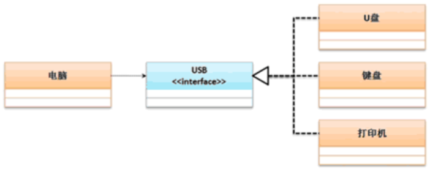

```java
interface IUSB { // 定义USB标准
    public Boolean check(); // 检查通过可以工作
    public void work();
}
class computer {
    public void plugin(IUSB usb) {
        if (usb.check()) {
            usb.work(); // 开始工作
        }else {
            System.out.println("硬件设备安装出现了问题，无法使用！");
        }
    }
}
class Keyboard implements IUSB {
    public Boolean check() {
        return true;
    }
    public void work() {
        System.out.println("开始进行码字任务。");
    }
}
class Print implements IUSB {
    public Boolean check() {
        return false;
    }
    public void work() {
        System.out.println("开始进行照片打印。");
    }
}
public class JavaAPIDemo {
    public static void main(String[] args) {
        Computer computer = new Computer();
        computer.plugin(new Keyboard()); // 插入键盘
        computer.plugin(new Print()); // 插入打印机
    }
}
```

```java
// 输出内容
开始进行码字任务。
硬件设备安装出现了问题，无法使用！
```

而在现实开发中，对于标准的概念无处不在。


## 6、工厂设计模式（Factory）

对于接口而言，已经可以明确的清楚，必须有子类，并且子类可以通过对象的向上转型来获取接口的实例化对象，但是在进行对象实例化的过程中也可能存在有设计问题。

操作示例 1：观察如下一个程序

```java
interface IFood { // 定义一个食物标准
    public void eat(); // 吃
}
class Bread implements IFood { // 定义一种食物
    public void eat() {
        System.out.println("吃面包。") ;
    }
}
public class JavaAPIDemo {
    public static void main(String[] args) {
        IFood food = new Bread();
        food.eat(); // 吃面包
    }
}
```

在本程序之中根据接口进行子类定义，并且利用对象的向上转型进行接口对象实例化处理，而此时程序的结构如下：

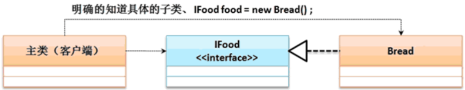

客户端需要明确的知道具体的哪一个子类，如果现在面包不想吃了，需要牛奶了，那么客户端就要做出修改。

操作示例 2：扩展一类食物

```java
interface IFood { // 定义一个食物标准
    public void eat(); // 吃
}
class Bread implements IFood { // 定义一种食物
    public void eat() {
        System.out.println("吃面包。");
    }
}
class Milk implements IFood { // 定义一种食物
    public void eat() {
        System.out.println("喝牛奶。");
    }
}
public class JavaDemo {
    public static void main(String[] args) {
        IFood food = new Milk();
        food.eat(); // 吃面包
    }
}
```

所以此时的程序就表示出现有耦合的问题，而造成耦合最直接的元凶：“关键字new”。以JVM的设计为例，Java实现可移植性的关键在于：JVM，而JVM的核心原理：利用一个虚拟机来运行Java的程序，所有的程序并不与具体的操作系统有任何关联，而是由JVM来进行匹配，所以得出结论：良好的设计应该避免耦合。

操作示例 3：工厂设计实现

```java
interface IFood { // 定义一个食物标准
    public void eat(); // 吃
}
class Bread implements IFood { // 定义一种食物
    public void eat() {
        System.out.println("吃面包。");
    }
}
class Milk implements IFood { // 定义一种食物
    public void eat() {
        System.out.println("喝牛奶。");
    }
}
class Factory {
    public static IFood getInstance(String className) {
        if ("bread".equals(className)) {
            return new Bread() ;
        } else if ("milk".equals(className)) {
            return new Milk() ;
        } else {
            return null ;
        }
    }
}
public class JavaAPIDemo {
    public static void main(String[] args) {
        IFood food = Factory.getInstance("bread");
        food.eat(); // 吃面包
        Factory.getInstance("milk").eat(); // 喝牛奶
    }
}
```

在本程序之中，客户端程序类与IFood接口的子类没有任何关联，所有的关联都是通过Factory类完成的，而在程序运行的时候可以通过初始化参数进行要使用的子类定义：

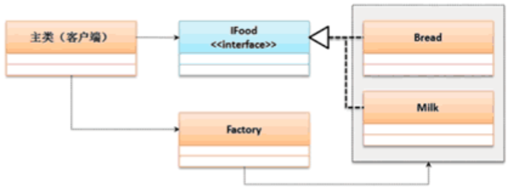

如果在日后进行子类扩充的时候只需要修改Factory程序类即可实现。


## 7、代理设计模式（Proxy）

代理设计模式的主要功能是可以帮助用户将所有的开发注意力只集中在核心业务功能的处理上，例如：肚子饿了，思考的是如何可以吃到东西。

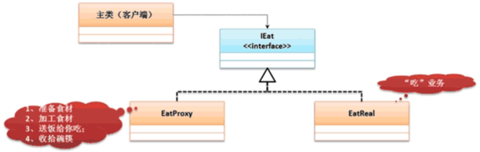

操作示例 1：实现代理设计

```java
interface IEat {
    public void get();
}
class EatReal implements IEat {
    public void get() {
        System.out.println("【真实主题】得到一份食物，而后开始品尝美味。");
    }
}
class EatProxy implements IEat { // 服务代理
    private IEat eat; // 为吃而服务
    public EatProxy(IEat eat) {	// 一定要有一个代理项
        this.eat = eat;
    }
    public void prepare() {	// 准备
        System.out.println("【代理主题】1、精心购买食材。");
        System.out.println("【代理主题】2、小心的处理食材。");
    }
    @Override
    public void get() {
        this.prepare();
        this.eat.get();
        this.clear();
    }
    public void clear() { // 结束
        System.out.println("【代理主题】3、收拾碗筷。");
    }
}
public class JavaAPIDemo {
    public static void main(String[] args) {
        IEat eat = new EatProxy(new EatReal());
        eat.get();
    }
}
```

```java
// 输出内容
【代理主题】1、精心购买食材。
【代理主题】2、小心的处理食材。
【真实主题】得到一份食物，而后开始品尝美味。
【代理主题】3、收拾碗筷。
```

操作示例 2：利用工厂设计改进代理设计（此时代理设计模式存在一些欠缺，因为客户端出现了关键字new）

```java
interface IEat {
    public void get();
}
class EatReal implements IEat {
    public void get() {
        System.out.println("【真实主题】得到一份食物，而后开始品尝美味。");
    }
}
class EatProxy implements IEat { // 服务代理
    private IEat eat; // 为吃而服务
    public EatProxy(IEat eat) {	// 一定要有一个代理项
        this.eat = eat;
    }
    public void prepare() {	// 准备
        System.out.println("【代理主题】1、精心购买食材。");
        System.out.println("【代理主题】2、小心的处理食材。");
    }
    @Override
    public void get() {
        this.prepare();
        this.eat.get();
        this.clear();
    }
    public void clear() { // 结束
        System.out.println("【代理主题】3、收拾碗筷。");
    }
}
// 增加了一个工厂方法，用来创建代理
class Factory {
    public static IEat getInstance() {
        return new EatProxy(new EatReal());
    }
}
// 主方法
public class JavaAPIDemo {
    public static void main(String[] args) {
        IEat eat = Factory.getInstance();
        eat.get();
    }
}
```

```java
// 输出内容
【代理主题】1、精心购买食材。
【代理主题】2、小心的处理食材。
【真实主题】得到一份食物，而后开始品尝美味。
【代理主题】3、收拾碗筷。
```

代理设计模式的主要特点是：一个接口提供有两个子类，其中一个子类是真实业务操作类，另外一个子类主要是代理业务操作类，没有代理业务操作，真实业务无法进行。


## 8、抽象类与接口区别

在实际的开发之中可以发现抽象类和接口的定义形式是非常相似的，这一点从JDK1.8开始就特别明显了，因为在JDK1.8里面接口也可以定义default或static方法了，但是这两者依然是有着明显的定义区别的。

| 区别     | 抽象类                                                   | 接口                                                   |
| -------- | -------------------------------------------------------- | ------------------------------------------------------ |
| 定义     | abstract class 抽象类名称 {}                             | interface 接口名称 {}                                  |
| 组成     | 构造、普通方法、静态方法、全局常量、普通成员、static方法 | 抽象方法、全局常量、普通方法、static方法               |
| 权限     | 可以使用各种权限定义                                     | 只能够使用public                                       |
| 子类使用 | 子类通过extends关键字可以继承一个抽象类                  | 子类使用implements关键字可以实现多个接口               |
| 两者关系 | 抽象类可以实现若干接口（单继承局限）                     | 接口不允许继承抽象类，但是允许继承多个父接口（无限制） |

使用方式相同点：

1. 抽象类或接口必须定义子类
2. 子类一定要覆写抽象类或接口中的全部抽象方法
3. 通过子类的向上转型实现抽象类或接口对象实例化。

当抽象类和接口都可以使用的情况下，优先要考虑接口，因为接口可以避免子类的单继承局限。另外从一个正常的设计角度而言，也需要先从接口来进行项目的整体设计。

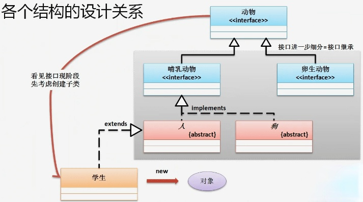


# 抽象类与接口开发案例

## 1、案例分析一（获取类信息）

定义一个ClassName接口，接口中只有一个抽象方法getClassName()；设计一个类Company，该类实现接口ClassName中的方法getClassName()，功能是获取该类的类名称；编写应用程序使用Company类。

```java
interface IClassName { // 按照要求定义接口
    public String getClassName(); // 数据一定要返回
}
class Company implements IClassName {
    public String getClassName() {
        return "Company";
    }
}
public class JavaAPIDemo {
    public static void main(String[] args) {
        IClassName ica = new Company();
        System.out.println(ica.getClassName());
    }
}
```

```java
// 输出内容
Company
```

接口前追加一个字母I是一个良好的习惯，也是这几年一直强调的定义原则。


## 2、案例分析二（绘图处理）

考虑一个绘图的标准，并且可以根据不同的图形来进行绘制；

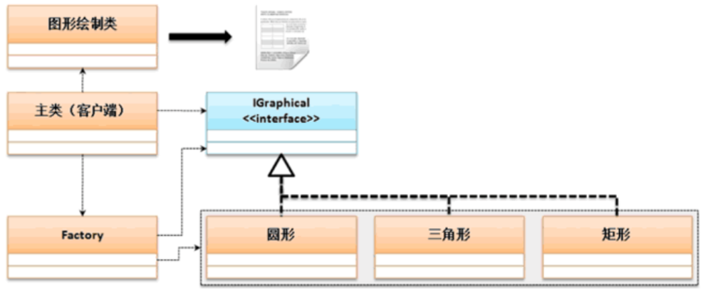

```java
interface IGraphical { // 定义绘图标准
    public void paint(); // 绘图
}

class Point {
    private double x;
    private double y;
    public Point(double x, double y) {
        this.x = x;
        this.y = y;
    }
    public double getX() {
        return this.x;
    }
    public double getY() {
        return this.y;
    }
}

class Triangle implements IGraphical { // 绘制三角形
    private Point[] x; // 保存第一条边的坐标
    private Point[] y; // 保存第二条边的坐标
    private Point[] z; // 保存第三条边的坐标
    public Triangle(Point[] x, Point[] y, Point[] z) {
        this.x = x;
        this.y = y;
        this.z = z;
    }
    public void paint() {
        System.out.println("绘制第一条边，开始坐标：[" + this.x[0].getX() + "，" + this.x[0].getY() + "]，结束坐标：[" + this.x[1].getX() + "，" + this.x[1].getY() + "]");
        System.out.println("绘制第二条边，开始坐标：[" + this.y[0].getX() + "，" + this.y[0].getY() + "]，结束坐标：[" + this.y[1].getX() + "，" + this.y[1].getY() + "]");
        System.out.println("绘制第三条边，开始坐标：[" + this.z[0].getX() + "，" + this.z[0].getY() + "]，结束坐标：[" + this.z[1].getX() + "，" + this.z[1].getY() + "]");
    }
}

class Circular implements IGraphical {
    private double radius;
    public Circular(double radius) {
        this.radius = radius;
    }
    public void paint() {
        System.out.println("以半径为“" + this.radius + "”绘制圆形。");
    }
}

class Factory {
    public static IGraphical getInstance(String className, double... args) {
        if ("triangle".equalsIgnoreCase(className)) {
            return new Triangle(
                    new Point[]{new Point(args[0], args[1]), new Point(args[2], args[3])},
                    new Point[]{new Point(args[4], args[5]), new Point(args[6], args[7])},
                    new Point[]{new Point(args[8], args[9]), new Point(args[10], args[11])}
            );
        } else if ("circular".equalsIgnoreCase(className)) {
            return new Circular(args[0]);
        } else {
            return null;
        }
    }
}

public class JavaAPIDemo {
    public static void main(String[] args) {
        IGraphical iga = Factory.getInstance("triangle", 1.1, 2.2, 3.3, 4.4, 11.11, 22.22, 33.33, 44.44, 111.111, 222.222, 333.333, 444.444);
        iga.paint();
        IGraphical igb = Factory.getInstance("circular", 88.11);
        igb.paint();
    }
}
```

```java
// 输出内容
绘制第一条边，开始坐标：[1.1，2.2]，结束坐标：[3.3，4.4]
绘制第二条边，开始坐标：[11.11，22.22]，结束坐标：[33.33，44.44]
绘制第三条边，开始坐标：[111.111，222.222]，结束坐标：[333.333，444.444]
以半径为“88.11”绘制圆形。
```


## 3、案例分析三（图形）

定义类Shape，用来表示一般二维图形。Shape具有抽象方法area和perimeter，分别用来计算形状的面积和周长。试定义一些二维形状类（如矩形、三角形、圆形、椭圆形等），这些类均为Shape类的子类。

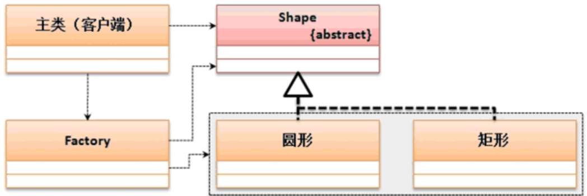

```java
abstract class AbstractShape {
    public abstract double area();
    public abstract double perimeter();
}

class Circular extends AbstractShape {
    private double radius;
    public Circular(double radius) {
        this.radius = radius;
    }
    public double area() {
        return 3.1415926 * this.radius * this.radius;
    }
    public double perimeter() {
        return 2 * 3.1415926 * this.radius;
    }
}

class Rectangle extends AbstractShape {
    private double length;
    private double width;
    public Rectangle(double length, double width) {
        this.length = length;
        this.width = width;
    }
    public double area() {
        return this.length * this.width;
    }
    public double perimeter() {
        return 2 * (this.length + this.width);
    }
}

class Factory {
    public static AbstractShape getInstance(String className, double... args) {
        if ("Circular".equalsIgnoreCase(className)) {
            return new Circular(args[0]);
        } else if ("Rectangle".equalsIgnoreCase(className)) {
            return new Rectangle(args[0], args[1]);
        } else {
            return null;
        }
    }
}

public class JavaAPIDemo {
    public static void main(String[] args) {
        AbstractShape asa = Factory.getInstance("Circular", 1.1);
        AbstractShape asb = Factory.getInstance("Rectangle", 1.5, 10.2);
        System.out.println("圆形面积：" + asa.area() + "、圆形周长：" + asa.perimeter());
        System.out.println("矩形面积：" + asb.area() + "、矩形周长：" + asb.perimeter());
    }
}
```

```java
// 输出内容
圆形面积：3.801327046000001、圆形周长：6.911503720000001
矩形面积：15.299999999999999、矩形周长：23.4
```


# 接口与抽象类七个区别

> Java 中接口和抽象类竟然有 7 点不同？https://mp.weixin.qq.com/s/B36-OwxGh36Lz6xwC1U15A

## 1、接口

接口是 Java 语言中的一个抽象类型，用于定义对象的公共行为。它的创建关键字是 interface，在接口的实现中可以定义方法和常量，其普通方法是不能有具体的代码实现的，而在 JDK 8 之后，接口中可以创建 static 和 default 方法了，并且这两种方法可以有默认的方法实现，如下代码所示：

```java
public interface Interface_1 {
    int count = 1;
    void sayHi();
    // default 方法
    default void print() {
        System.out.println("Do print method.");
    }
    // static 方法
    static void smethod() {
        System.out.println("Do static method.");
    }
}
```

接下来，创建一个类来实现以上接口：

```java
public class InterfaceImpl_1 implements Interface_1 {
    @Override
    public void sayHi() {
        System.out.println("Hi,I am InterfaceImpl 1.");
    }
    public static void main(String[] args) {
        InterfaceImpl_1 inter = new InterfaceImpl_1();
        inter.sayHi(); // Hi,I am InterfaceImpl 1.
        // 调用接口中 static 方法
        Interface_1.smethod(); // Do static method.
        // 调用接口中的常量 count
        System.out.println(Interface_1.count); // 1
    }
}
```

通过上述代码和执行结果我们可以得出以下结论：

1. JDK 8 中接口可以定义 static 和 default 方法，并且这两种方法可以包含具体的代码实现。
2. 实现接口要使用 implements 关键字。
3. 接口不能直接实例化。
4. 接口中定义的变量默认为 public static final 类型。
5. 子类可以不重写接口中的 static 和 default 方法，不重写的情况下，默认调用的是接口的方法实现。


## 2、抽象类

抽象类和接口类似，它也是用来定义对象的公共行为的，并且它也不能直接实例化，抽象类的实现关键字为 abstract class，子类用 extends 关键字继承父类。抽象类的使用如下：

```java
public abstract class AbstractExample {
    // 定义普通变量
    int count = 2;
    // 定义私有变量
    private static int total = 10;
    // 定义抽象方法
    public abstract void methodA();
    // 定义普通方法
    public void methodB() {
        System.out.println("Hi,methodB.");
    }
}
```

接下来使用一个普通类继承上面的抽象类：

```java
public class AbstractSon extends AbstractExample {
    @Override
    public void methodA() {
        System.out.println("Hi,method A.");
    }
    public static void main(String[] args) {
        AbstractSon abs = new AbstractSon();
        // 抽象类中的变量重新赋值
        abs.count = 666;
        System.out.println(abs.count);
        // 抽象类中的抽象方法
        abs.methodA();
        // 抽象类中的普通方法
        abs.methodB();
    }
}
```

通过上述代码和执行结果可以得出以下结论：

1. 抽象类使用 abstract 关键字声明。
2. 抽象类中可以包含普通方法和抽象方法，抽象方法不能有具体的代码实现。
3. 抽象类需要使用 extends 关键字实现继承。
4. 抽象类不能直接实例化。
5. 抽象类中属性控制符无限制，可以定义 private 类型的属性。

接口和抽象类的区别主要体现在以下 7 个方面。


3、区别1：定义关键字不同

接口使用关键字 interface 来定义。抽象类使用关键字 abstract 来定义。

4、区别2：继承或实现的关键字不同

5、区别3：子类扩展的数量不同

6、区别4：属性访问控制符不同

7、区别5：方法控制符不同

8、区别6：方法实现不同

9、区别7：静态代码块使用不同


# 泛型

## 1、泛型的概述

### 1、泛型简介

泛型是 Java SE 1.5 的新特性，泛型的本质是参数化类型，也就是说所操作的数据类型被指定为一个参数。这种参数类型可以用在类、接口和方法的创建中，分别称为泛型类、泛型接口、泛型方法。

在 Java SE 1.5 之前，没有泛型的情况的下，通过对类型 Object 的引用来实现参数的“任意化”，“任意化”带来的缺点是要做 显式的强制类型转换，而这种转换是要求开发者对实际参数类型可以预知的情况下进行的。对于强制类型转换错误的情况 ，编译器可能不提示错误，在运行的时候才出现异常，这是一个安全隐患。

泛型的好处：使用泛型，首先可以通过 IDE 进行代码类型初步检查，然后在编译阶段进行编译类型检查，以保证类型转换的安全性；并且所有的强制转换都是自动和隐式的，可以提高代码的重用率。


### 2、泛型由来

泛型的思想早就存在，在C++中的类模板(Template)就是用到了泛型的思想。在 JDK1.5 之前，可以通过**继承**实现这种泛型思想。
查看 ArrayList(JDK1.5) 之前的定义如下：

```java
public class ArrayList extends AbstractList implements List, RandomAccess, Cloneable, Serializable {
    private static final long serialVersionUID = 8683452581122892189L;
    private transient Object[] elementData;
    private int size;
    //...
    public boolean add(Object paramObject) {
        ensureCapacity(this.size + 1);
        this.elementData[(this.size++)] = paramObject;
        return true;
    }
    //...
    public Object get(int paramInt) {
        RangeCheck(paramInt);
        return this.elementData[paramInt];
    }
}
```

可以看到，ArrayList 的本质是一个 Object 数组 Object[] elementData。这种做法虽然实现了泛型思想，但是有以下问题：

- ArrayList实例化之后，可以随意添加任意类型的对象(Obeject是任意引用类型的基类)。
- 获取元素的前提是：需要提前知道列表元素的类型。
- 获取列表元素时，都需要进行显式类型转换。
- 容易发生类型转换出错的问题。

【操作示例 1】如下面的代码：

```java
// JDK1.5 之前的 ArrayList 的用法, 可以随意添加任意类型的对象
ArrayList arrayList = new ArrayList();
arrayList.add(1);   // Integer
arrayList.add("1"); // String

// 张三前辈知道第一个元素是Integer类型的，所以他写的程序没错
Integer integer = (Integer) arrayList.get(0);
LOGGER.info("张三前辈取值：" + integer);

// 李四不知道第二个元素是什么类型，因为张三前辈已经离职了，但他看张三前辈使用Integer取值的，
// 所以他猜测也是Integer类型的，但是他没想到实际是String类型的，所以会报类型转换错误
Integer integer1 = (Integer)arrayList.get(1);
LOGGER.info("李四后生取值：" + integer1);
```

```java
INFO - 张三前辈取值：1
2018-02-12 16:56:57 INFO  BeforJDK5:26 - 张三前辈取值：1
Exception in thread "main" java.lang.ClassCastException: java.lang.String cannot be cast to java.lang.Integer
    at pers.hanchao.generics.before.BeforJDK5.main(BeforJDK5.java:29)
```

此时的程序明显出现了问题，如果在程序编译的时候，实际上是不会有任何错误产生的，而程序执行时会出现“ClassCastException”异常类型，所以本程序的设计是存在有安全隐患的。而这个安全隐患存在的依据在于使用了Object类型，因为Object可以涵盖的范围太广了，而对于这样的错误如果可以直接出现在编译的过程之中，那么就可以避免运行时的尴尬。

为了解决上面的问题，JDK1.5加入了泛型。加入泛型是为了解决类型转换的安全隐患，具体体现如下：

- 解决泛型对象实例化之后，可以随意添加任何类型的对象的问题。
- 解决获取泛型元素前，需要提前确定元素的类型的问题。
- 解决获取元素时，需要进行显式类型转换的问题。
- 解决容易出现类型转换出错的问题。

【操作示例 2】使用泛型的解决方式：

```java
// JKD1.5 之后的 ArrayList
ArrayList<Integer> integerArrayList = new ArrayList<Integer>();
integerArrayList.add(1);      // 添加Integer正常
// integerArrayList.add("1"); // 不能添加String类型，因为无法通过IDE的初步类型检查
// 王五不需要问前辈，就很容易知道这个列表存储的是Integer
Integer integer2 = integerArrayList.get(0);
System.out.println("王五后生取值：" + integer2);
```

```java
王五后生取值：1
```


### 3、简单示例

**泛型可以应用在类、接口和方法的创建中，分别称为泛型类、泛型接口和泛型方法。**下面对这三种使用方式提供简单的入门示例：

```java
/**
 * 泛型类示例
 */
public class HelloWorld<T> {
    private T t;
    public T getValue() {
        return t;
    }
    public void setValue(T t) {
        this.t = t;
    }

    /**
     * <p>Title: 泛型方法</p>
     */
    static <T> void printHelloWorld(T t) {
        System.out.println(t);
    }

    /**
     * <p>Title: 泛型接口</p>
     */
    interface MyInterface<T extends Number> {
        void print(T t);
    }

    static class MyHelloWorld implements MyInterface {
        @Override
        public void print(Number number) {
            System.out.println(number);
        }
    }
    
    public static void main(String[] args) {
        System.out.println("泛型类示例：");
        // 泛型类示例
        HelloWorld<String> helloWorld = new HelloWorld<String>();
        helloWorld.setValue("Hello World!");
        // IDE提供的类型检查确保只能设置String类型的对象，Long类型报错
        // helloWorld.setValue(5211314L);
        System.out.println(helloWorld.getValue());

        HelloWorld<Long> helloWorld1 = new HelloWorld<Long>();
        helloWorld1.setValue(5211314L);
        // IDE提供的类型检查确保只能设置Long类型的对象，String类型报错
        // helloWorld1.setValue("Hello World!");
        System.out.println(helloWorld1.getValue() + "\n");

        System.out.println("泛型方法示例：");
        // 泛型方法示例
        printHelloWorld("Hello World!");
        printHelloWorld(5211314 + "\n");

        System.out.println("泛型接口示例");
        // 泛型接口示例
        MyInterface myHelloWorld = new MyHelloWorld();
        // Number类型都可以
        myHelloWorld.print(5211314L);
        myHelloWorld.print(521);
        // String类型不可以
        // myHelloWorld.print("S");
    }
}
```

```java
泛型类示例：
Hello World!
5211314

泛型方法示例：
Hello World!
5211314

泛型接口示例
5211314
521
```


### 4、其他说明

- 泛型是**向前兼容**的：JDK1.5 之前未使用泛型类可以不加修改的继续工作，但是却无法享受泛型的好处的。
- 泛型的**设计初衷**：是为了**减少类型转换错误产生的安全隐患**，而不是为了实现任意化，一定要记住这个初衷。


## 2、泛型的类型与规范

### 1、泛型原始类型

【操作示例 1】首先通过泛型类与泛型方法的语法，对几个概念进行说明，如下是泛型类与泛型方法示例

```java
/**
 * 泛型类语法示例
 */
public class MyGenericsType<T> {
    private T t;

    /** 这是一个普通方法 **/
    public T getT() {
        return t;
    }

    /** 这是一个泛型方法 **/
    public <T> T getNull() {
        return null;
    }
}
```

- MyGenericsType：泛型类名，即泛型原始类型。
- < T>：泛型标识，标识这是一个泛型类或者泛型方法。
- T：泛型类型。
- t：泛型类型的实例对象。

【操作示例 2】泛型原始类型可以独立使用，如下是泛型原始类型

```java
/**
 * 泛型原始类型使用
 */
public static void main(String[] args) {
    // 泛型原始类型
    MyGenericsType myGenericsType = new MyGenericsType();
    System.out.println(myGenericsType.getClass()); // class MyGenericsType

    // 泛型类型
    MyGenericsType<Integer> integerMyGenericsType = new MyGenericsType<Integer>();
    System.out.println(integerMyGenericsType.getClass()); // class MyGenericsType
}
```

发现泛型原始类型和泛型类型的实例化对象是一样的，这是由于**类型擦除**造成的，后续会进行讲解。


### 2、泛型类型命名规范

泛型类型的命名并不是必须为 T，也可以使用其他字母，如 X、K 等，只要是命名为单个大写字即可。虽然没有强制的命名规范，但是为了便于代码阅读，也形成了一些约定俗成的命名规范，如下：

- T：通用泛型类型，通常作为第一个泛型类型
- S：通用泛型类型，如果需要使用多个泛型类型，可以将S作为第二个泛型类型
- U：通用泛型类型，如果需要使用多个泛型类型，可以将U作为第三个泛型类型
- V：通用泛型类型，如果需要使用多个泛型类型，可以将V作为第四个泛型类型
- E：集合元素 泛型类型，主要用于定义集合泛型类型，或者 Exception 异常的意思
- K：映射-键 泛型类型，主要用于定义映射泛型类型
- V：映射-值 泛型类型，主要用于定义映射泛型类型
- N：数值 泛型类型，主要用于定义数值类型的泛型类型

> 下面通过一些实例加深对这些类型的理解。

**1、通用泛型类型**：T、S、U、V…，通用泛型类型：适用于所有的泛型类型。

```java
/**
 * 通用泛型类型示例
 */
public class MyMultiType<T, S, U, V, A, B> {
    private T t;
    private S s;
    private U u;
    private V v;
    private A a;
    private B b;

    public void set(T first, S second, U third, V fourth, A fifth, B sixth) {
        System.out.println(("第1个参数的类型是：" + first.getClass().getName()));
        System.out.println("第2个参数的类型是：" + second.getClass().getName());
        System.out.println("第3个参数的类型是：" + third.getClass().getName());
        System.out.println("第4个参数的类型是：" + fourth.getClass().getName());
        System.out.println("第5个参数的类型是：" + fifth.getClass().getName());
        System.out.println("第6个参数的类型是：" + sixth.getClass().getName());
    }

    /**
     * 测试通用泛型类型
     */
    public static void main(String[] args) {
        MyMultiType<Integer, Double, Float, String, Long, Short> myMultiType = new MyMultiType<>();
        myMultiType.set(1, 1D, 1F, "1", 1L, (short) 1);
    }
}
```

```
第1个参数的类型是：java.lang.Integer
第2个参数的类型是：java.lang.Double
第3个参数的类型是：java.lang.Float
第4个参数的类型是：java.lang.String
第5个参数的类型是：java.lang.Long
第6个参数的类型是：java.lang.Short
```

**2、集合泛型类型**：E。集合泛型类型：适用于泛型类型作为集合元素的泛型定义。

```java
import java.util.ArrayList;
import java.util.List;

/**
 * 集合泛型类型示例
 */
public class MyList<E> {
    private List<E> list = new ArrayList<E>();

    public void myAdd(E e) {
        list.add(e);
        System.out.println(e.toString());
    }

    public int mySize() {
        return list.size();
    }

    /**
     * 集合泛型类型示例
     */
    public static void main(String[] args) {
        MyList<String> stringMyList = new MyList<>();
        stringMyList.myAdd(new String("hello!"));
        // hello!
    }
}
```

**3、映射泛型类型：K,V**。映射泛型类型：适用于泛型类型作为键值对的泛型定义。

```java
import java.util.HashMap;
import java.util.Map;

/**
 * 映射泛型类型示例
 */
public class MySet<K, V> {
    private Map<K, V> map = new HashMap<>();

    public void myPut(K key, V value) {
        map.put(key, value);
        System.out.println("key: " + key.toString() + ", value=" + value.toString());
    }

    public int mySize() {
        return map.size();
    }

    /**
     * 映射泛型类型示例
     */
    public static void main(String[] args) {
        MySet<String, Integer> mySet = new MySet<>();
        mySet.myPut("001", 100);
        // key: 001, value=100
    }
}
```

**4、数值泛型类型：N**。映射泛型类型：适用于泛型类型作为键值对的泛型定义。

```java
/**
 * 数值泛型类型示例
 */
public class MySquare<N> {
    public void square(N number) {
        System.out.println(number.getClass().toString() + ":" + number);
    }

    /**
     * 数值泛型类型示例
     */
    public static void main(String[] args) {
        MySquare<Integer> mySquare = new MySquare<>();
        mySquare.square(1);
        // class java.lang.Integer:1
    }
}
```


### 3、有界泛型类型

如果不对泛型类型做限制，则泛型类型可以实例化成任意类型，这种情况可能产生某些安全性隐患。为了限制允许实例化的泛型类型，我们需要一种能够限制泛型类型的手段，即：**有界泛型类型**。要实现**有界泛型类型**，只需要在泛型类型后面追加**extends 父类型**即可，语法如下：

```java
// 有界泛型类型语法 - 继承自某父类
<T extends ClassA>
// 有界泛型类型语法 - 实现某接口
<T extends InterfaceB>
// 有界泛型类型语法 - 多重边界
<T extends ClassA & InterfaceB & InterfaceC ... >

// 示例
<N extends Number>                    // N标识一个泛型类型,其类型只能是Number抽象类的子类
<T extends Number & Comparable & Map> // T标识一个泛型类型,其类型只能是Person类型的子类,并且实现了Comparable和Map接口
```

- T：泛型类型
- extends：边界关键字，可以标识**extends ClassA**，也可以标识**implements InterfaceB**。
- &：多重边界，与类的继承机制类似：可以实现一个父类和实现多个接口。
- ClassA ：父类：必须在第一位。

【操作示例】下面通过程序示例加深理解。

```java
/**
 * 有界类型参数
 */
public class MyMath {
    /**
     * 有界参数类型（单重）
     */
    public static <T extends Comparable> T MyMax(T x, T y) {
        T max = x;
        if (y.compareTo(max) > 0) {
            max = y;
        }
        return max;
    }

    /**
     * 多重有界参数类型
     */
    public static <T extends Number & Comparable> T MyMax2(T x, T y) {
        T dmax = x.doubleValue() >= y.doubleValue() ? x : y;
        return dmax;
    }

    /**
     * 有界泛型类型示例
     */
    public static void main(String[] args) {
        Integer result = MyMath.MyMax(1, 2);
        System.out.println(result);  // 2

        Double result1 = MyMath.MyMax2(1D, 2D);
        System.out.println(result1); // 2.0
    }
}
```

使用**有界泛型类型**有两个好处：

1. 在一定程度上限制泛型类型，提高程序安全性
2. 因为定义了边界，所以可以调用父类或父接口的方法，如`y.doubleValue()`。这种情况比单纯的调用`Object类`提供的方法更加灵活。


## 3、泛型的定义与使用

泛型的三种使用方式：**泛型类**，**泛型方法**，**泛型接口**

### 1、泛型类

泛型类型用于类的定义中，被称为泛型类。通过泛型可以完成对一组类的操作对外开放相同的接口。最典型的就是各种容器类，如：List、Set、Map。

泛型类的基本语法如下：

```java
public class 类名 <泛型标识, ...> {
    private 泛型标识 /*(成员变量类)*/ 变量名; 
    // .....
}
```

- 注意事项：泛型类型必须是引用类型（非基本数据类型）

【操作示例 1】最普通的泛型类

```java
/**
 * 此处T可以随便写为任意标识，常见的如T、E、K、V等形式的参数常用于表示泛型
 * 在实例化泛型类时，必须指定T的具体类型
 */
public class Generic<T> {
    /**
     * 这个成员变量的类型为T,T的类型由外部指定
     */
    private T key;

    /**
     * 泛型构造方法形参key的类型也为T，T的类型由外部指定
     */
    public Generic(T key) {
        this.key = key;
    }

    /**
     * 泛型方法getKey的返回值类型为T，T的类型由外部指定
     */
    public T getKey() {
        return key;
    }

    public static void main(String[] args) {
        // 泛型的类型参数只能是类类型（包括自定义类），不能是简单类型
        // 传入 String 类型
        Generic<String> generic1 = new Generic<>("test1");
        System.out.println(generic1.getKey()); // test1

        // <> 中什么都不传入，等价于 Generic<Object> generic2 = new Generic<>();
        Generic generic2 = new Generic("test2");
        System.out.println(generic2.getKey()); // test2
    }
}
```

【操作示例 2】自定义一个泛型类，除了记录键值对，还需要记录赋值时间戳。

```java
import java.util.ArrayList;
import java.util.List;

public class GenericClassDemo {
    /**
     * 泛型类示例 (键，值，时间)
     */
    static class MyTimeMap<K, V, T> {
        private K key;
        private V value;
        private T time;

        public MyTimeMap(K key, V value, T time) {
            this.key = key;
            this.value = value;
            this.time = time;
        }

        @Override
        public String toString() {
            return "MyTimeMap{" + "key=" + key + ", value=" + value + ", time=" + time + '}';
        }
    }

    /**
     * 泛型类示例
     */
    public static void main(String[] args) throws InterruptedException {
        List<MyTimeMap<Integer, String, Long>> myContainerList = new ArrayList<MyTimeMap<>>();
        myContainerList.add(new MyTimeMap(1, "张三", System.currentTimeMillis()));
        Thread.sleep(500);
        myContainerList.add(new MyTimeMap(2, "李四", System.currentTimeMillis()));
        Thread.sleep(500);
        // [MyTimeMap{key=1, value=张三, time=1686303574911}, MyTimeMap{key=2, value=李四, time=1686303575414}]
    }
}
```


### 2、泛型接口

**泛型接口最典型的应用就是各种类的生成器。**泛型接口和泛型类的定义差不多，基本语法如下：

```java
public interface Generator<T> {
    public T next();
}

/**
 * 未传入泛型实参时，与泛型类的定义相同，在声明类的时候，需将泛型的声明也一起加到类中
 * 即：class FruitGenerator<T> implements Generator<T> {
 * 如果不声明泛型，如: class FruitGenerator implements Generator<T>，编译器会报错："Unknown class"
 */
class FruitGenerator<T> implements Generator<T>{
    @Override
    public T next() {
        return null;
    }
}
```

- **假设场景：**某个演示程序需要开发一个能够生成演示数据的生成器，可以生成指定数据类型的数据。
- **示例展示：**下面的例子中定义了一个演示数据生成器接口 IDemoDataGenerator，并实现了两个类：字符串演示数据生成器 StringDDG 和用户演示数据生成器 UserDDG。

```java
import java.util.Arrays;
import java.util.List;

/**
 * 泛型接口示例：实现多继承
 */
public class GenericInterfaceTest {
    /**
     * 演示数据生成器接口
     */
    interface IDemoDataGenerator<T> {
        List<T> generateTestData();
        // 在JDK8中，还可以在接口中使用默认方法, 默认方法可以使用泛型接口的类型参数
        default T method(T t) {
            return null;
        }
    }

    /**
     * 字符串类型的演示数据生成器
     */
    static class StringDDG implements IDemoDataGenerator<String> {
        @Override
        public List<String> generateTestData() {
            return Arrays.asList("hello!", "worker", "test", "tomorrow");
        }
    }

    static class User {
        private Integer id;
        private String  name;
        public User(Integer id, String name) {
            this.id = id;
            this.name = name;
        }
        @Override
        public String toString() {
            return "User{" + "id=" + id + ", name='" + name + '\'' + '}';
        }
    }

    /**
     * 用户演示数据生成器
     */
    static class UserDDG implements IDemoDataGenerator<User> {
        @Override
        public List<User> generateTestData() {
            return Arrays.asList(new User(1, "张三"), new User(2, "李四"), new User(3, "王五"));
        }
    }

    /**
     * 泛型接口示例
     */
    public static void main(String[] args) {
        StringDDG stringDDG = new StringDDG();
        System.out.println(stringDDG.generateTestData());
        // [hello!, worker, test, tomorrow]

        UserDDG userDDG = new UserDDG();
        System.out.println(userDDG.generateTestData());
        // [User{id=1, name='张三'}, User{id=2, name='李四'}, User{id=3, name='王五'}]
    }
}
```

对于泛型接口的子类而言有两种实现方式。

1. 在子类之中继续设置泛型定义：**implements InterfaceClass< T >**
2. 在子类实现父接口的时候直接定义出具体泛型类型：**implements InterfaceClass< String >**


### 3、泛型方法

泛型方法的使用较为复杂。尤其是我们见到的大多数泛型类中的成员方法也都使用了泛型，有的甚至泛型类中也包含着泛型方法，这样在初学者中非常容易将泛型方法理解错了。

简单理解：当在一个方法签名中的返回值前面声明了一个 < T > 时，该方法就被声明为一个泛型方法。< T >表明该方法声明了一个类型参数 T，并且这个类型参数 T 只能在该方法中使用。当然，泛型方法中也可以使用泛型类中定义的泛型参数。基本语法如下：

```java
[作用域修饰符] <泛型类型标识> [返回类型] 方法名称(参数列表){}

public <类型参数> 返回类型 方法名(类型参数 变量名) {}
public <类型参数> 返回类型 方法名(Class<类型参数> 变量名) {}
```

【操作示例 1】只有在方法签名中声明了**<类型参数>**的方法才是泛型方法，仅使用了泛型类定义的类型参数的方法并不是泛型方法。

```java
public class GenericMethod<U> {
    // 该方法只是使用了泛型类定义的类型参数，不是泛型方法
    public void testMethod1(U u) {
        System.out.println(u);
    }

    // <T> 真正声明了下面的方法是一个泛型方法
    public <T> T testMethod2(T t) {
        return t;
    }

    // 泛型方法中也可以使用泛型类中定义的泛型参数
    public <T> U testMethod3(T t, U u) {
        return u;
    }
    
    public static void main(String[] args) {
        GenericMethod<String> genericMethod = new GenericMethod<>();
        genericMethod.testMethod1("普通方法测试");
        genericMethod.testMethod2("泛型方法测试");
        genericMethod.testMethod3("泛型方法中使用泛型类的参数", "此参数为泛型类定义的参数");
    }
}
```

【操作示例 2】构造器也是一种方法，所以也就产生了所谓的泛型构造器。构造器也是一种方法，所以也就产生了所谓的泛型构造器。

```java
public class GenericMethod {
    public <T> GenericMethod(T t) {
        System.out.println(t);
    }
    public static void main(String[] args) {
        new GenericMethod(22); // 隐式
        new <String> GenericMethod("hello"); //显示
    }
}
```

【操作示例 3】静态泛型方法：

- 静态成员不能使用泛型类定义的类型参数，但可以将静态成员方法定义为一个泛型方法。
- 静态方法无法访问类上定义的泛型，所以如果静态方法要使用泛型的话，必须将静态方法也定义成泛型方法 。

```java
public class GenericMethod<T> {   
    // 泛型类定义的类型参数 T 不能在静态方法中使用
    // 但可以将静态方法声明为泛型方法，方法中便可以使用其声明的类型参数了
    public static <E> E show(E one) {     
        return null;
    }
    
    public static void main(String[] args) {
        GenericMethod.show("静态泛型方法测试");
    }
}
```

【操作示例 4】泛型方法中可以同时声明多个类型参数、或者也可以使用可变参数

```java
public class GenericMethod {
    // 泛型方法中可以同时声明多个类型参数
    public <T, S> T testMethod(T t, S s) {
        return null;
    }
    // 带可变参数的泛型方法
    public <A> void argsMethod(A ... args){
        Arrays.stream(args).forEach(System.out::println);
    }
    
    public static void main(String[] args) {
        GenericMethod<String> genericMethod = new GenericMethod<>();
        genericMethod.testMethod("泛型方法参数1", "泛型方法参数2");
        genericMethod.argsMethod("泛型方法参数1", "泛型方法参数2", "泛型方法参数3");
    }
}
```

【操作示例 5】特别注意的是：泛型类中定义的类型参数和泛型方法中定义的类型参数是相互独立的，它们一点关系都没有。

```java
public class Test<T> {
    public void testMethod1(T t) {
        System.out.println(t);
    }

    public <T> T testMethod2(T t) {
        return t;
    }
}
```

上面代码分析详解：

- Test 是泛型类。
- testMethod1() 是泛型类中的普通方法，其使用的类型参数是与泛型类中定义的类型参数。
- testMethod2() 是一个泛型方法，他使用的类型参数是与方法签名中声明的类型参数。
- 虽然泛型类中定义的类型参数标识和泛型方法中定义的类型参数标识都为< T >，但它们彼此之间是相互独立的。也就是说，泛型方法始终以自己声明的类型参数为准。


### 4、泛型方法中的类型推断

在调用泛型方法的时候，可以显式地指定类型参数，也可以不指定。

- 当泛型方法的形参列表中有多个类型参数时，在不指定类型参数的情况下，方法中声明的的类型参数为泛型方法中的几种类型参数的共同父类的最小级，直到 Object。
- 在指定了类型参数的时候，传入泛型方法中的实参的数据类型必须为指定数据类型或者其子类。

【操作示例 1】通过案例观察泛型方法的显式及不显式指定泛型参数。

```java
public class Test {

    /** 这是一个简单的泛型方法 **/
    public static <T> T add(T x, T y) {
        return y;
    }

    public static void main(String[] args) {
        // 一、不显式地指定类型参数
        //（1）传入的两个实参都是 Integer，所以泛型方法中的<T> == <Integer> 
        int i = Test.add(1, 2);

        //（2）传入的两个实参一个是 Integer，另一个是 Float，
        // 所以<T>取共同父类的最小级，<T> == <Number>
        Number f = Test.add(1, 1.2);

        // 传入的两个实参一个是 Integer，另一个是 String，
        // 所以<T>取共同父类的最小级，<T> == <Object>
        Object o = Test.add(1, "asd");

        // 二、显式地指定类型参数
        //（1）指定了<T> = <Integer>，所以传入的实参只能为 Integer 对象    
        int a = Test.<Integer>add(1, 2);

        //（2）指定了<T> = <Integer>，所以不能传入 Float 对象
        int b = Test.<Integer>add(1, 2.2); // 编译错误

        //（3）指定<T> = <Number>，所以可以传入 Number 对象
        // Integer 和 Float 都是 Number 的子类，因此可以传入两者的对象
        Number c = Test.<Number>add(1, 2.2);
    }
}
```


### 5、泛型使用注意事项

泛型方法的注意事项：

    1. < T >表明该方法声明了一个类型参数 T，并且这个类型参数 T 只能在该方法中使用。
     2. 为了避免混淆，如果在一个泛型类中存在泛型方法，**那么两者的类型参数最好不要同名**。
     3. 与泛型类的类型参数定义一样，此处泛型方法中的 T 可以写为`任意标识`，常见的如 T、E、K、V 等形式的参数常用于表示泛型。
     4. 记住一句话：**泛型方法中的泛型类型与泛型类中的泛型类型没有关系**。

泛型方法总结：泛型方法能使方法独立于类而产生变化，以下是一个基本的指导原则：

- 无论何时，如果你能做到，你就该尽量使用泛型方法。也就是说，如果使用泛型方法将整个类泛型化，那么就应该使用泛型方法。另外对于一个 static 的方法而已，无法访问泛型类型的参数。所以如果 static 方法要使用泛型能力，就必须使其成为泛型方法。

泛型类、泛型接口及泛型方法需要注意：

- 泛型类，是在实例化类的时候指明泛型的具体类型；泛型方法，是在调用方法的时候指明泛型的具体类型 。
- 泛型方法签名中声明的类型参数只能在该方法里使用，而泛型接口、泛型类中声明的类型参数则可以在整个接口、类中使用。当调用泛型方法时，根据外部传入的实际对象的数据类型，`编译器`就可以判断出类型参数 T 所代表的具体数据类型。


## 4、泛型类型擦除

### 1、什么是类型擦除

泛型的本质是将数据类型参数化，它通过擦除的方式来实现，即编译器会在编译期间擦除代码中的所有泛型语法并相应的做出一些类型转换动作。

换而言之，**泛型信息只存在于代码编译阶段**，在代码编译结束后，与泛型相关的信息会被擦除掉，专业术语叫做`类型擦除`。也就是说，成功编译过后的 class 文件中不包含任何泛型信息，泛型信息不会进入到`运行时阶段`。

【操作示例 1】假如我们给 ArrayList 集合传入两种不同的数据类型，并比较它们的类信息。

```java
public class GenericType {
    public static void main(String[] args) {  
        ArrayList<String> arrayString = new ArrayList<String>();   
        ArrayList<Integer> arrayInteger = new ArrayList<Integer>();   
        System.out.println(arrayString.getClass() == arrayInteger.getClass()); // true
    }  
}
```

- 在这个例子中，我们定义了两个 ArrayList 集合，不过一个是 ArrayList< String >，只能存储字符串。一个是 ArrayList< Integer >，只能存储整型对象。我们通过 arrayString 对象和 arrayInteger 对象的 getClass() 方法获取它们的类信息并比较，发现结果为 true。

- 明明我们在 < > 中传入了两种不同的数据类型，按照上文所说的，它们的类型参数 T 不是应该被替换成我们传入的数据类型了吗，那为什么它们的类信息还是相同呢？ 这是因为，在编译期间，所有的泛型信息都会被擦除， ArrayList< Integer > 和 ArrayList< String >类型，在编译后都会变成ArrayList< Object >类型。

【操作示例 2】假设定义一个泛型类，在该泛型类中定义了一个属性 num，该属性的数据类型是泛型类声明的类型参数 T ，这个 T 具体是什么类型，我们也不知道，它只与外部传入的数据类型有关。将这个泛型类反编译。

```java
public class Caculate<T> {
    private T num;
}

// 反编译后的代码
public class Caculate {
    public Caculate() {} // 默认构造器，不用管
    private Object num;  // T 被替换为 Object 类型
}
```

- 可以发现编译器`擦除`了 Caculate 类后面的泛型标识 < T >，并且将 num 的数据类型替换为 Object 类型，而替换了 T 的数据类型我们称之为`原始数据类型`。

> **那么是不是所有的类型参数被擦除后都以 Object 类进行替换呢？**
>
> - **答案是否定的，大部分情况下，类型参数 T 被擦除后都会以 Object 类进行替换；而有一种情况则不是，那就是使用到了 extends 和 super 语法的`有界类型参数`（即`泛型通配符`，后面我们会详细解释）。**

【操作示例 3】再看一个例子，假设定义一个泛型类及反编译代码如下：

```java
public class Caculate<T extends Number> {
    private T num;
}

// 反编译后的代码
public class Caculate {
    public Caculate() {} // 默认构造器，不用管
    private Number num;
}
```

- 可以发现，使用到了 extends 语法的类型参数 T 被擦除后会替换为 Number 而不再是 Object。

- extends 和 super 是一个限定类型参数边界的语法，extends 限定 T 只能是 Number 或者是 Number 的子类。 也就是说，在创建 Caculate 类对象的时候，尖括号 <> 中只能传入 Number 类或者 Number 的子类的数据类型，所以在创建 Caculate 类对象时无论传入什么数据类型，Number 都是其父类，于是可以使用 Number 类作为 T 的原始数据类型，进行类型擦除并替换。（这一部分涉及到了泛型通配符，在下面还会具体介绍）


### 2、类型擦除的原理

假如我们定义了一个 ArrayList< Integer > 泛型集合，若向该集合中插入 String 类型的对象，不需要运行程序，编译器就会直接报错。这里可能有小伙伴就产生了疑问：

1. 不是说泛型信息在编译的时候就会被擦除掉吗？那既然泛型信息被擦除了，如何保证我们在集合中只添加指定的数据类型的对象呢？

2. 换而言之，我们虽然定义了 ArrayList< Integer > 泛型集合，但其泛型信息最终被擦除后就变成了 ArrayList< Object > 集合，那为什么不允许向其中插入 String 对象呢？

**Java 是如何解决这个问题的？**

- 其实在创建一个泛型类的对象时， Java 编译器是先检查代码中传入 < T > 的数据类型，并记录下来，然后再对代码进行编译，`编译的同时进行类型擦除`；如果需要对被擦除了泛型信息的对象进行操作，编译器会自动将对象进行类型转换。

**可以把泛型的`类型安全检查机制`和`类型擦除`想象成演唱会的验票机制：以 ArrayList< Integer> 泛型集合为例。**

- 当我们在创建一个 ArrayList< Integer > 泛型集合的时候，ArrayList 可以看作是演唱会场馆，而< T >就是场馆的验票系统，Integer 是验票系统设置的门票类型；
- 当验票系统设置好为< Integer >后，只有持有 Integer 门票的人才可以通过验票系统，进入演唱会场馆（集合）中；若是未持有 Integer 门票的人想进场，则验票系统会发出警告（编译器报错）。
- 在通过验票系统时，门票会被收掉（类型擦除），但场馆后台（JVM）会记录下观众信息（泛型信息）。
- 进场后的观众变成了没有门票的普通人（原始数据类型）。但是，在需要查看观众的信息时（操作对象），场馆后台可以找到记录的观众信息（编译器会自动将对象进行类型转换）。

```java
public class GenericType {
    public static void main(String[] args) {  
        ArrayList<Integer> arrayInteger = new ArrayList<Integer>(); // 设置验票系统   
        arrayInteger.add(111); // 观众进场，验票系统验票，门票会被收走（类型擦除）
        Integer n = arrayInteger.get(0); // 获取观众信息，编译器会进行强制类型转换
        System.out.println(n);
    }  
}
```

擦除 ArrayList< Integer > 的泛型信息后，get() 方法的返回值将返回 Object 类型，但编译器会自动插入 Integer 的强制类型转换。也就是说，编译器把 get() 方法调用翻译为两条字节码指令：

- 对原始方法 get() 的调用，返回的是 Object 类型；
- 将返回的 Object 类型强制转换为 Integer 类型；

```java
// 这条代码底层如下:
Integer n = arrayInteger.get(0); 

//（1）get() 方法的返回值返回的是 Object 类型
Object object = arrayInteger.get(0);
//（2）编译器自动插入 Integer 的强制类型转换
Integer n = (Integer) object;
```


### 3、类型擦除小结

1. 泛型信息（包括泛型类、接口、方法）只在代码编译阶段存在，在代码成功编译后，其内的所有泛型信息都会被擦除，并且类型参数 T 会被统一替换为其原始类型（默认是 Object 类，若有 extends 或者 super 则另外分析）；

2. 在泛型信息被擦除后，若还需要使用到对象相关的泛型信息，编译器底层会自动进行类型转换（从原始类型转换为未擦除前的数据类型）。


## 5、泛型的通配符

### 1、通配符出现的背景

泛型的出现解决了数据类型的转型安全问题，但是随之而来的也会带来引用传递的麻烦。

```java
class Generator <T> {
    public T content;
    public Generator(T t) {
        this.content = t;
    }
}

public class GenericTest {
    public static void main(String[] args) throws InterruptedException {
        Generator<String> generator = new Generator<>("test");
    }
    public static void fun(Generator<String> temp){
        System.out.println(temp.content); // test
    }
}
```

但是这个时候问题也就出现了，而问题的关键在于 fun() 方法上，如果真的去使用泛型不可能只是一种类型，也就是说 fun() 方法应该可以接收任意种泛型类型的 Generator 对象。但是这个时候它只能够接收 **Generator< String >** 类型，**这种情况下有就有人提出了，不设置泛型了呢？如果不设置泛型，那么方法内就可以对该对象设置其他类型的数据了，这样就起不到泛型的意义了。所以此时就出现了泛型通配符的概念了。**


### 2、什么是泛型通配符

在 Java 泛型定义时:

- 用**< T >**等大写字母标识泛型类型，用于表示未知类型。
- 用**< T extends ClassA & InterfaceB … >**等标识有界泛型类型，用于表示有边界的未知类型。

在 Java 泛型实例化时（又称：泛型通配符有 3 种形式）：

- <?> ：被称作无限定的通配符。用于表示实例化时的未知类型。
- <? extends T> ：被称作有上界的通配符。用于表示实例化时可以确定父类型的未知类型。例：“? extends Number”：表示该泛型类型只允许设置 Number 或 Number的子类。
- <? super T> ：被称作有下界的通配符。用于表示实例化时可以确定子类型的未知类型。例：“? super String”：只能够使用 String 或其父类。

在现实编码中，确实有这样的需求，希望泛型能够处理**某一类型范围**内的类型参数，比如某个泛型类和它的子类，为此 Java 引入了**泛型通配符**这个概念。在引入泛型通配符之后，我们便得到了一个在**逻辑上**可以表示为某一类型参数范围的**父类引用类型**。举例来说，泛型通配符可以表示 Pair< Integer > 和 Pair< Number > 两者的父类引用类型。


### 3、< T > 与 < ? > 区别

1. < T >：泛型标识符，用于泛型定义（类、接口、方法等）时，可以想象成形参。
2. < ? >：通配符，用于泛型实例化时，可以想象成实参。

【操作示例 1】泛型标识符 < T >

```java
static class Test<T> {
    private T t;
}
```

【操作示例 2】通配符 < ? >

```java
// 我们可以确定具体类型时，直接使用具体类型
Test<Integer> integerList = new Test<Integer>();
// 我们不能确定具体类型时，可以使用通配符
Test<? extends Number> numberList = null;
// 我们能够确定具体类型时，再实例化成具体类型
numberList = new Test<Integer>();
numberList = new Test<Double>();
```


### 3、上界通配符 <? extends T>

上界通配符 <? extends T>：T 代表了类型参数的上界，? 表示类型参数的范围是 T 和 T 的子类。主要作用：用于表示实例化时可以确定父类型的未知类型。需要注意：<? extends T> 也是一个数据类型实参，它和 Number、String、Integer 一样都是一种实际的数据类型。

【操作示例 1】 **<? extends 父类型>**：上边界类型通配符的使用，注意：上边界类型通配符只能取值，不能设值。

```java
import java.util.ArrayList;
import java.util.Arrays;
import java.util.List;

public class GenericTest {
    public static void main(String[] args) {
        /**
         * 上边界类型通配符（<? extends 父类型>）
         * 通过如下案例, 可以分析出: 因为可以确定父类型，所以可以以父类型去获取数据（向上转型）。但是不能写入数据。
         */
        List<? extends Number> numbers = Arrays.asList(Integer.valueOf(1), Long.valueOf(2L), Double.valueOf(1.1));
        // 1. 这里我们可以取出他本身的类型(存进去是什么类型, 取出来就是什么类型)
        numbers.forEach(x -> System.out.println(x.getClass().toString()));
        // 2. 因为唯一可以确定此列表的元素类型的父类型是Number, 所以可以将取得的元素值赋值给Number对象(或Number父类,因为可以向上转型)
        Number integer = numbers.get(0);
        // 3. 因为不能确定其中的数据就是Integer类型的，所以不能将取得的值赋值给Integer对象
        // Integer integer = numbers.get(0); // 编译报错
        // 4. 不能确定之后实例化的类型是Integer、Long还是Double，所以不接受add
        // numbers.add(Integer.valueOf(1));  // 编译报错

        // 1. ArrayList<Integer> 和 ArrayList<Number> 不存在继承关系, 只是有了通配符后我们逻辑上认为他们是父子关系而已.
        // ArrayList<Number> list3 = new ArrayList<Integer>(); // 编译报错
        // 2. 使用通配符后就可以类似继承方式实例化对象了
        List<? extends Number> list1 = new ArrayList<>();
        // list1.add(Integer.valueOf(1)); // 编译报错
        List<? extends Number> list2 = new ArrayList<Integer>();
        // list1.add(Integer.valueOf(1)); // 编译报错
    }
}
```

```java
class java.lang.Integer
class java.lang.Long
class java.lang.Double
```

思考：那既然 ArrayList<? extends Number> 可以代表 ArrayList< Integer > 或 ArrayList< Double >，为什么不能向其中加入 Integer、Double 等对象呢？

- 其原因是 ArrayList< ? extends Number > 表示的是一个未知类型的 ArrayList 集合，它可以代表 ArrayList< Integer > 或 ArrayList< Float >… 等集合，但却不能确定它到底是 ArrayList< Integer > 还是 ArrayList< Float > 集合。
- 因此，泛型的特性决定了不能往 ArrayList<? extends Number> 集合中加入 Integer 、 Float 等对象，以防止在获取 ArrayList<? extends Number> 集合中元素的时候，产生 ClassCastException 异常。

【操作示例 2】上界通配符 < ? extends  T> 的**正确用法** 以及 **错误用法**

```java
/**
 * 错误使用示例
 */
public class GenericTest {
    public static void main(String[] args) {
        
        // 创建一个 ArrayList<Integer> 集合
        ArrayList<Integer> integerList = new ArrayList<>();
        integerList.add(1);
        integerList.add(2);
        // 将 ArrayList<Integer> 传入 printIntVal() 方法
        printIntVal(integerList);

        // 创建一个 ArrayList<Float> 集合
        ArrayList<Double> floatList = new ArrayList<>();
        floatList.add((double) 1.0);
        floatList.add((double) 2.0);
        // 将 ArrayList<Float> 传入 printIntVal() 方法
        printIntVal(floatList);
    }

    public static void printIntVal(ArrayList<? extends Number> list) {
        // 遍历传入的集合，并输出集合中的元素
        list.forEach(number -> System.out.print(number.intValue() + " "));
        System.out.println();
    }
}
```

```java
/**
 * 错误使用示例
 */
public class GenericTest {
    public static void main(String[] args) {
        ArrayList<? extends Number> list = new ArrayList<>();
        list.add(null); // 编译正确
        list.add(Integer.valueOf(1)); // 编译错误
        list.add(Double.valueOf(1.1)); // 编译错误

        ArrayList<? extends Number> list2 = new ArrayList<Integer>();
        list2.add(null); // 编译正确
        list2.add(Integer.valueOf(1)); // 编译错误
    }

    public static void fillNumList(ArrayList<? extends Number> list) {
        list.add(Integer.valueOf(0)); // 编译错误
        list.add(Double.valueOf(1.0)); // 编译错误
        list.set(0, Integer.valueOf(2)); // 编译错误
        list.set(0, null); // 编译成功，但不建议这样使用
    }

    public static initNumList() {
        // 1. ArrayList<Integer> 和 ArrayList<Number> 不存在继承关系, 只是有了通配符后我们逻辑上认为他们是父子关系而已.
        ArrayList<Number> list1 = new ArrayList<Integer>(); // 编译错误
    }
}
```

- 在 ArrayList<? extends Number> 集合中，不能添加任何数据类型的对象，只能添加空值 null，因为 null 可以表示任何数据类型。

【操作示例 3】上界统配符的引入：是为了拓展方法形参中类型参数的范围。请查看如下示例：修改了 fund 方法的形参。

```java
class Generator <T> {
    public T content;
    public Generator(T t) {
        this.content = t;
    }
}

public class GenericTest {
    public static void main(String[] args) throws InterruptedException {
        GenericTest.fun(new Generator<Integer>(1));  // 1
        GenericTest.fun(new Generator<Long>(1L));    // 1
        GenericTest.fun(new Generator<Double>(1.1)); // 1.1
    }
    public static void fun(Generator<? extends Number> temp){
        System.out.println(temp.content);
    }
}
```

**总结：上界通配符 <? extends T>**：

上边界类型通配符可以确定父类型，回顾向上转型与向下的概念：

1、在获取数据时 [ 返回类型 get(){ return this.t;} ]：

- 因为可以确定父类型，所以可以将返回类型设置为父类型。

- 虽然不能确定返回 this.t的是何种类型，但是this.t的类型肯定是返回类型的子类型，可以通过向上转型成功获取。

2、在写入数据时 [ void set(参数类型 t){ this.t = t;} ]

- 因为可以确定父类型，所以可以将参数类型设置为父类型。
- 虽然不能确定 this.t 字段的具体类型，但是肯定是参数类型的子类型，所以此时set方法进行的是向下转型，存在很大风险。Java泛型为了减低类型转换的安全隐患，不允许这种操作。

**一句话总结：使用 extends 通配符表示可以读，不能写。**


### 4、下界通配符 <? super T>

下界通配符 <? super T>：T 代表了类型参数的下界，? 表示类型参数的范围是 T 和 T 的超类，直至 Object。需要注意： <? super T> 也是一个数据类型实参，它和 Number、String、Integer 一样都是一种实际的数据类型。

【操作示例 1】**<? super 子类型>**：下边界类型通配符的使用，注意：下边界类型通配符只能设值，不能取值。

```java
import java.util.ArrayList;
import java.util.List;

/**
 * 为了更好的理解通配符，假设以下类层次关系:
 */
class Person {}
class Worker extends Person {}
class Programmer extends Worker {}
class JavaProgrammer extends Programmer {}

public class GenericTest {
    public static void main(String[] args) {
        // 测试下边界类型通配符
        // 定义一个列表，唯一可以确定的是：此列表被赋值成Worker的列表
        List<? super Programmer> programmerList = new ArrayList<>();
        // 因为唯一可以确定此列表的元素类型的子类是Programmer，所以可以添加Programmer类型的对象及其子类型
        programmerList.add(new Programmer());
        programmerList.add(new JavaProgrammer());
        programmerList.forEach(x -> System.out.println(x.getClass().toString()));
        // 因为无法确定对象的实例化类型是Programmer、Worker还是Person，所有不能get, 不过使用Object的情况下可以get
        //Programmer programmer = programmerList.get(0); // 编译错误
        // JavaProgrammer javaProgrammer = programmerList.get(1); // 编译错误
        Object object = programmerList.get(0);
        System.out.println(object.getClass().toString());
        System.out.println("下边界类型通配符<? super>: 因为可以确定最小类型，所以可以以最小类型去写入数据。但是不能获取数据.");
    }
}
```

```
class Programmer
class JavaProgrammer
class com.example.sp30.Programmer
下边界类型通配符（<? super>）：因为可以确定最小类型，所以可以以最小类型去写入数据。但是不能获取数据。
```

这里奇怪的地方出现了，为什么和 ArrayList< ? extends Number > 集合不同，ArrayList< ? super Number > 集合中可以添加 Number 类及其子类的对象呢？

- 其原因是：ArrayList< ? super Number > 的下界是 ArrayList< Number > 。因此，我们可以确定 Number 类及其子类的对象自然可以加入 ArrayList< ? super Number > 集合中； 而 Number 类的父类对象就不能加入 ArrayList< ? super Number > 集合中了，因为不能确定 ArrayList< ? super Number > 集合的数据类型。

***

【操作示例 2】下界通配符 <? super T> 的正确用法 以及 错误用法

```java
import java.util.ArrayList;

/**
 * 正确用法
 */
public class GenericTest {
    public static void main(String[] args) {
        // 创建一个 ArrayList<? super Number> 集合
        ArrayList<Number> list = new ArrayList();
        // 往集合中添加 Number 类及其子类对象
        list.add(Integer.valueOf(1));
        list.add(Double.valueOf(1.1));
        // 调用 fillNumList() 方法，传入 ArrayList<Number> 集合
        fillNumList(list);
        System.out.println(list); // [1, 1.1, 0, 1.0]
    }

    public static void fillNumList(ArrayList<? super Number> list) {
        list.add(Integer.valueOf(0));
        list.add(Double.valueOf(1.0));
    }
}
```

- 与带有上界通配符的集合 ArrayList<? extends T> 的用法不同，带有下界通配符的集合 ArrayList<? super Number> 中可以添加 Number 类及其子类的对象；ArrayList<? super Number> 的下界就是 ArrayList< Number >集合，因此，其中必然可以添加 Number 类及其子类的对象；但不能添加 Number 类的父类对象（不包括 Number 类）。

```java
import java.util.ArrayList;

/**
 * 错误用法
 */
public class GenericTest {
    public static void main(String[] args) {
        // 创建一个 ArrayList<Integer> 集合
        ArrayList<Integer> list = new ArrayList<>();
        list.add(Integer.valueOf(1));
        // 调用 fillNumList 方法，传入 ArrayList<Integer> 集合
        fillNumList(list); // 编译错误
    }

    public static void fillNumList(ArrayList<? super Number> list) {
        list.add(Integer.valueOf(0));  // 编译正确
        list.add(Double.valueOf(1.0));// 编译正确

        // 遍历传入集合中的元素，并赋值给 Number 对象: 会编译错误
        for (Number number : list) { // 编译错误发生在此行, Number应改为Object
            System.out.println(number);
        }
        // 遍历传入集合中的元素，并赋值给 Object 对象；可以正确编译
        // 但只能调用 Object 类的方法，不建议这样使用
        for (Object obj : list) {
            System.out.println(obj);
        }
    }
}
```

- 注意，ArrayList<? super Number> 代表了 ArrayList< Number >、 ArrayList< Object > 中的某一个集合，而 ArrayList< Integer > 并不属于 ArrayList<? super Number> 限定的范围，因此，不能往 fillNumList() 方法中传入 ArrayList< Integer > 集合。

- 并且，不能将传入集合的元素赋值给 Number 对象，因为传入的可能是 ArrayList< Object > 集合，向下转型可能会产生ClassCastException 异常。

- 不过，可以将传入集合的元素赋值给 Object 对象，因为 Object 是所有类的父类，不会产生ClassCastException 异常，但这样的话便只能调用 Object 类的方法了，不建议这样使用。

***

【操作示例 3】：下边界通配符<? super 子类型> 等同于 下边界通配符<? super 子类型> + 上边界通配符<? extends Object>。

```java
public class GenericClassTest {
    public static void main(String[] args) {
        ArrayList<? super Integer> list = new ArrayList<>();
        list.add(Integer.valueOf(1));
        // 上面已经因为无法确定类型，所以无法通过向上转型取值
        // Integer integer = list.get(0);
        // 但是可以确定其最大类型必然是 Object，是否可以通过Object取值?
        Object object = list.get(0);
        System.out.println(object.getClass().toString()); // class java.lang.Integer
        // 然后再次向下强转, 实际上没有必要和意义
        Integer integer = (Integer) object;
        System.out.println(integer); // 1
    }
}
```

- 联系到**类型擦除**，我们可以继续分析出来该结论【实际上 操作示例 1 与 2 已经体现出来了】

***

**下边界类型通配符 < ? super 子类型 > 总结：**

- 因为可以确定最小类型，所以可以以最小类型去写入数据（向上转型）。
- 因为可以确定最大类型是 Object，所以可以以 Object 去获取数据（向上转型）。但是这么做意义不大。

**一句话总结：使用 super 通配符表示可以写，不能读。**


### 5、无限定通配符 <?>

无边界通配符 < ? > 等同于 上边界通配符 < ? extends Object >。所以关于无边界通配符 < ? > 就很好理解了。

- 无界通配符< ? >：? 代表了任何一种数据类型，能代表任何一种数据类型的还有 null。需要注意的是： < ? > 也是一个数据类型实参，它和 Number、String、Integer 一样都是一种实际的数据类型。

- 注意：Object 本身也算是一种数据类型，但却不能代表任何一种数据类型，所以 ArrayList< Object > 和 ArrayList< ? > 的含义是不同的，前者类型是 Object，也就是继承树的最高父类，而后者的类型完全是未知的；ArrayList< ? > 是 ArrayList< Object > 逻辑上的父类。

【操作示例 1】ArrayList< ? > 在逻辑上表示为所有数据类型的父类，它可以代表 ArrayList< Integer>、ArrayList< Number >、ArrayList< Object > 中的某一个集合，但实质上它们之间没有继承关系。

```java
public class GenericTest {
    public static void main(String[] args) {
        ArrayList<Integer> list01 = new ArrayList<>(123, 456);
        // ArrayList<?> 在逻辑上是 ArrayList< Integer > 的父类，可以安全地向上转型。
        ArrayList<?> list02 = list01; // 安全地向上转型
    }
}
```

【操作示例 2】ArrayList< ? > 既没有上界也没有下界，因此，它可以代表所有数据类型的某一个集合，但我们不能指定 ArrayList< ? > 的数据类型。

```java
import java.util.ArrayList;

/**
 * 错误用法
 */
public class GenericClassTest {
    public static void main(String[] args) {
        ArrayList<?> list = new ArrayList<>();

        list.add(null);           // 编译正确
        Object obj = list.get(0); // 编译正确

        list.add(Integer.valueOf(1)); // 编译错误
        Integer num = list.get(0);      // 编译错误
    }
}
```

- ArrayList< ? > 集合的数据类型是不确定的，因此我们只能往集合中添加 null；而我们从 ArrayList< ? > 集合中取出的元素，也只能赋值给 Object 对象，不然会产生 ClassCastException 异常（原因可以结合上界和下界通配符理解）。其原理可以参考上界通配符，因为 < ? > 等价于 < ? extends Object >，实际上就是上界通配符。

【操作示例 3】大多数情况下，可以用类型参数 < T > 代替 < ? > 通配符。

```java
static <?> void isNull(ArrayList<?> list) {}
// 替换如下: 
static <T> void isNull(ArrayList<T> list) {}
```

【操作示例 4】

**无边界类型通配符< ? > 总结：**

- 无边界类型通配符 < ? > 等同于 上边界通配符 < ? extends Object >。
- 因为可以确定父类型是 Object，所以可以以 Object 去获取数据（向上转型）。**但是不能写入数据**。


### 6、<? extends T> 与 <? super T> 对比

**1、首先对 <? extends T> 与 <? super T> 结论进行分析：**

1. 对于<? extends 类型>，编译器将只允许读操作，不允许写操作。即只可以取值，不可以设值。
2. 对于<? super 类型>，编译器将只允许写操作，不允许读操作。即只可以设值（比如 set 操作），不可以取值（比如 get 操作）。

以上两点都是针对于源码里涉及到了类型参数的方法而言的。比如对于 List 而言，不允许的写操作有 add 方法，因为它的方法签名是 boolean add(E e);，此时这个形参 E 就变成了一个涉及了通配符的类型参数；

而不允许的读操作有 get 方法，因为它的方法签名是 E get(int index);，此时这个返回值 E 就变成了一个涉及了通配符的类型参数。

***

**2、作为方法形参：<? extends T> 类型和 <? super T> 类型的区别在于：**

1. <? extends T> 允许调用读方法T get()获取 T 的引用，但不允许调用写方法 set(T)传入 T 的引用（传入 null 除外）。
2. <? super T> 允许调用写方法set(T)传入 T 的引用，但不允许调用读方法 T get()获取 T 的引用（获取 Object 除外）。

***

**3、先记住上面的结论，我们来看 Java 标准库的 Collections 类定义的 copy() 方法。**

3.1、Collections.copy() 的作用是把一个 List 中的每个元素依次添加到另一个 List 中。它的第一个形参是 List<? super T>，表示**目标 List**，第二个形参是 List<? extends T>，表示**源 List**。

```java
public class Collections {
    // 把 src 的每个元素复制到 dest 中:
    public static <T> void copy(List<? super T> dest, List<? extends T> src) {
        for (int i = 0; i < src.size(); i++) {
            // 获取 src 集合中的元素，并赋值给变量 t，其数据类型为 T
            T t = src.get(i);
            // 将变量 t 添加进 dest 集合中 
            dest.add(t);
        }
    }
}
```

- 我们可以简单地用 for 循环实现复制。在 for 循环中，我们可以看到，对于 <? extends T> 集合 src，我们可以安全地获取**类型参数 T** 的引用（即变量 t），而对于 <? super T> 的集合 dest，我们可以安全地传入**类型参数 T** 的引用。

3.2、Collections.copy() 方法的定义完美地展示了通配符 extends 和 super 的意图：

- copy() 方法内部不会读取 dest，因为不能调用 dest.get() 方法来获取 T 的引用（如果调用则编译器会直接报错）。
- copy() 方法内部也不会修改 src，因为不能调用 src.add(T) 方法（如果调用则编译器会直接报错）。
- 这是由编译器检查来实现的。如果在方法代码中意外修改了 src 集合，或者意外读取了 dest ，就会导致一个编译错误。

```java
public class Collections {
    // 把 src 的每个元素复制到 dest 中:
    public static <T> void copy(List<? super T> dest, List<? extends T> src) {
        // ...
        // 获取 <? super T> 集合的元素只能赋值给 Object 对象
        T t = dest.get(0); // 编译错误
        // 不能向 <? extends T> 集合中添加任何类型的对象，除了 null
        src.add(t); // 编译错误
    }
}
```

- 根据上面介绍的，获取 <? super T> 集合 dest 的元素后只能赋值给 Object 对象，而不能赋值给其下界类型 T；我们不能向 <? extends T> 集合 src 中添加任何类型的对象，除了 null。

3.3、Collections.copy() 方法的另一个好处是可以安全地把一个 List< Integer > 添加到 List< Number >，但是**无法反过来添加**。

```java
List<Number> numList = new ArrayList<>();
List<Integer> intList = Arrays.asList(1, 2, 3);

// 将 List<Integer> 复制到 List<Number>
Collections.copy(numList, intList); // 编译正确

// 不能将 List<Number> 复制到 List<Integer>
Collections.copy(intList, numList); // 编译错误
```

- 这个很好理解，List< Number > 集合中可能有 Integer、Float 等对象，所以肯定不能复制到List< Integer > 集合中；而 List< Integer > 集合中只有 Integer 对象，因此肯定可以复制到 List< Number > 集合中。


### 7、通配符总结

1. 上边界类型通配符 <? extends 父类型>：因为可以确定父类型，所以可以以父类型去获取数据（向上转型）。但是不能写入数据。
2. 下边界类型通配符 <? super 子类型>：因为可以确定最小类型，所以可以以最小类型去写入数据（向上转型）。而不能获取数据。
3. 无边界类型通配符 <?> 等同于 上边界通配符<? extends Object>，所以可以以Object类去获取数据，但意义不大。
4. 下边界类型通配符 <? super 子类型> 下边界通配符 <? super 子类型> + 上边界通配符 <? extends Object>，所以可以以 Object 类去获取数据，但意义不大。


### 8、PECS 原则

我们何时使用 extends，何时使用 super 通配符呢？为了便于记忆，我们可以用 PECS 原则：Producer Extends Consumer Super。

即：如果需要返回 T，则它是生产者（Producer），要使用 extends 通配符；如果需要写入 T，则它是消费者（Consumer），要使用 super 通配符。

**还是以 Collections 的 copy() 方法为例：**

```java
public class Collections {
    public static <T> void copy(List<? super T> dest, List<? extends T> src) {
        for (int i = 0; i < src.size(); i++) {
            T t = src.get(i); // src 是 producer
            dest.add(t);      // dest 是 consumer
        }
    }
}
```

- 需要返回 T 的 src 是生产者，因此声明为 List<? extends T>，需要写入 T 的 dest 是消费者，因此声明为 List<? super T>。


## 6、泛型与反射使用

1、把泛型变量当成方法的参数，利用 Method 类的 getGenericParameterTypes 方法来获取泛型的实际类型参数

```java
import java.lang.reflect.Method;
import java.lang.reflect.ParameterizedType;
import java.lang.reflect.Type;
import java.util.Map;

public class GenericTest {

    /* 利用反射获取方法参数的实际参数类型 */
    public static void main(String[] args) throws Exception {
        Method method = GenericTest.class.getMethod("applyMap", Map.class);
        // 获取方法的泛型参数的类型
        Type[] types = method.getGenericParameterTypes();
        System.out.println(types[0]);
        // 参数化的类型
        ParameterizedType pType = (ParameterizedType) types[0];
        // 原始类型
        System.out.println(pType.getRawType());
        // 实际类型参数
        System.out.println(pType.getActualTypeArguments()[0]);
        System.out.println(pType.getActualTypeArguments()[1]);
    }

    /* 供测试参数类型的方法 */
    public static void applyMap(Map<Integer, String> map) {

    }
}
```

```java
java.util.Map<java.lang.Integer, java.lang.String>
interface java.util.Map
class java.lang.Integer
class java.lang.String
```

2、通过反射绕开编译器对泛型的类型限制

```java
/* 通过反射绕开编译器对泛型的类型限制 */
public static void main(String[] args) throws Exception {
    // 定义一个包含int的链表
    ArrayList<Integer> list = new ArrayList<>();
    list.add(1);
    list.add(2);
    // 获取链表的add方法，注意这里是Object.class，如果写int.class会抛出NoSuchMethodException异常
    Method m = list.getClass().getMethod("add", Object.class);
    // 调用反射中的add方法加入一个string类型的元素，因为add方法的实际参数是Object
    m.invoke(list, "hello");
    System.out.println(list.get(2)); // hello
}
```


## 7、泛型的使用限制

### 1、不能使用基本类型

Java 的基本类型：boolean、char、float、double、byte、int、short、long。使用基本类型的泛型会编译报错，代码如下：

```java
List<int> list = new List<int>(); // 编译前类型检查报错
```

- 因为泛型在编译时，会进行类型擦除，最后只保留原始类型。而原始类型只能是 Object 类及其子类，当然不能使用基本数据类型。


### 2、不允许进行实例化

1、错误代码如下：

```java
<T> void test(T t) {
    // 报错：Type parameter 'K' cannot be instantiated directly
    t = new T(); // 编译前类型检查报错
}
```

2、通过类型擦除，上面的泛型方法会转换为如下的原始方法：

```java
void test(Object t) {
    t = new Object();
}
```

3、而实际使用中，实参 t 一般情况下都是 Object 的子类，此时`t = new Object();`相当于：

```java
Integer t = 1;
t = new Object();
```

而 Object 肯定无法转换成 Integer 的。**Java 泛型为了防止此类类型转换错误的发生，禁止进行泛型实例化**。当然，与类型擦除一样，**可以通过 Java 反射实现泛型的实例化**，但是不建议这么做。这里就不给出代码了，有兴趣的可以自己尝试。


### 3、不允许进行静态化

静态方法无法访问类上定义的泛型；如果静态方法操作的类型不确定，必须要将泛型定义在方法上。如果静态方法要使用泛型的话，必须将静态方法定义成泛型方法。

```java
public class User<T> {
    // 错误
    private static T t;
    // 错误
    public static T getT() {
        return t;
    }
    // 正确
    public static <K> void test(K k) {
    }
}
```

- 原因：**静态变量在类中共享，而泛型类型是不确定的，因此编译器无法确定要使用的类型，所以不允许进行静态化**。
- 备注：这里的静态化针对的对象是泛型变量，并不是泛型方法。


### 4、不允许作为参数进行重载

对于泛型类 User<K, V> 而言，声明了两个泛型类参数。在类中根据不同的类型参数重载 show 方法。

```java
public class User<K, V> {
    // 报错信息：'show(K)' clashes with 'show(V)'; both methods have same erasure
    public void show(K k) {
    }
    public void show(V t) {
    }
}

```

为什么呢？由于泛型擦除，二者本质上都是Obejct类型。方法是一样的，所以编译器会报错。


### 5、不允许直接进行类型转换（通配符可以）

1、Java 泛型不允许直接进行类型转换，代码如下：

```java
List<Integer> integerList = new ArrayList<Integer>();
List<Double> doubleList = new ArrayList<Double>();
integerList = doubleList; // 不能直接进行类型转换，类型检查报错
```

- 我们已知，在编译阶段，两者都会经过类型擦除变为 ArrayList，那为什么不能进行类型强制转换呢？因为这违背了泛型设计的初衷：降低类型转换的安全隐患。integerList 内存储的是 Integer 类型的元素，doubleList 是存储的是 Double 类型的元素，如果不限制类型转换，很容易产生 ClassCastException 异常。

2、Java 泛型不允许直接进行类型转换，但是通过通配符可以实现类型转换（不建议这么做）

```java
static void cast(List<?> orgin, List<?> dest) {
    dest = orgin;
}
public static void main(String[] args) {
    List<Integer> integerList = new ArrayList<Integer>();
    List<Double> doubleList = new ArrayList<Double>();
    cast(doubleList, integerList); // 通过通配符进行类型转换
}
```


### 6、不允许instanceof类型检查（通配符可以）

1、直接使用 instanceof 运算符进行运行时类型检查：

```java
List<String> stringList = new ArrayList<String>();
// 不能直接使用instanceof，类型检查报错
System.out.println(stringList instanceof ArrayList<Double>);
```

2、但是可以直接使用 instanceof 匹配泛型通配符：

```java
List<String> stringList = new ArrayList<String>();
// 通过通配符实现运行时验证
System.out.println(stringList instanceof ArrayList<?>); // true
```


### 7、不允许创建泛型数组（通配符可以）

1、创建确切类型的泛型数组如下：

```java
public class User<T> {
    private T t;
    public User(T t) {
        this.t = t;
    }
    public T getT() {
        return this.t;
    }

    public static void main(String[] args) {
        // 编译错误，不能实例化元素类型为类型参数的数组
        User<Integer>[] users = new User<Integer>[2];
    }
}
```

2、我们可以通过通配符的方式创建泛型数组（不建议）：

```java
public class User<T> {
    private T t;
    public User(T t) {
        this.t = t;
    }
    public T getT() {
        return this.t;
    }

    public static void main(String[] args) {
        // 通过通配符实现泛型数组
        User<?>[] users = new User<?>[2];
        users[0] = new User<Integer>(1);
        users[1] = new User<String>("hello");
        for (User user : users) {
            System.out.println(user.getT().getClass().toString() + " : " + user.getT());
            // class java.lang.Integer : 1
            // class java.lang.String : hello
        }
    }
}
```

3、简单总结：不能实例化元素类型为类型参数的数组，但是可以将数组指向类型兼容的数组的引用

```java
public class User<T> {
    private T[] values;
    public User(T[] values) {
        // 编译错误，不能实例化元素类型为类型参数的数组
        this.values = new T[5];
        // 编译正确，可以将values指向类型兼容的数组的引用
        this.values = values;
    }
}
```


### 8、不允许定义泛型异常类或者catch异常（throws可以）

```java
/**
 * Java泛型不允许定义泛型异常类
 */
static class Apple<T> extends Exception {}  // 编译报错
static class Orange<T> extends Throwable {} // 编译报错

/**
 * Java泛型不允许捕获一个泛型异常， 但是Java泛型可以throws捕获泛型类型
 */
<T extends Exception> void test7(T t,Class<T> tClass) throws T {
    try {
        //...
    } catch (T t) { // 编译报错: 不允许捕获一个泛型类型的异常
        //...
    } catch (Exception e) {
        //...
    }
}
```

- 为什么 Java泛 型不允许定义泛型异常类？为什么不允许捕获一个泛型异常？先看下面的代码：

  ```java
  // 假设可以定义泛型异常类
  try {
      //...
  } catch (MyException<Integer> e) {
      //...
  } catch (MyException<Double> e) {
      //...
  }
  ```

- 上面的代码，进行类型擦除时会去掉 Integer 和 Double 信息，形成如下代码：

  ```java
  try {
      //...
  } catch (MyException e) {
      //...
  } catch (MyException e) {
      //...
  }
  ```

- 同时 catch 两个一样的异常，肯定不能通过编译。Java 泛型为了避免这种错误的产生，不允许定义泛型异常类或者 catch 异常。

对泛型异常的限制总结：

- Java泛型：不允许定义泛型异常类（直接或间接扩展 Throwable 类）
- Java泛型：不允许捕获一个泛型异常
- Java泛型：可以以异常类作为边界
- Java泛型：可以throws泛型类型


### 9、泛型的使用限制总结

Java泛型其实还有其他的使用限制，这里不再赘述。我们在理解 Java 泛型的使用限制时，应该首先用心理解下面两点：

1. Java 泛型的设计初衷：降低类型转换的安全隐患，而非为了实现任意化。
2. Java 泛型的实现原理：类型擦除。


## 8、泛型的面试题

### 1、Java中的泛型是什么 ? 使用泛型的好处是什么?

- 泛型是一种参数化类型的机制。它可以使得代码适用于各种数据类型，从而编写更加通用的代码，例如集合框架。
- 泛型是一种编译时类型确认机制。它提供了代码编译期的类型安全，确保在泛型类型（通常为泛型集合）上只能使用正确类型的对象，避免了在运行时产生 ClassCastException 异常。


### 2、Java的泛型是如何工作的 ? 什么是类型擦除 ?

- 泛型的正常工作是依赖编译器在编译源码的时候，先进行类型检查，然后进行类型擦除并且在类型参数出现的地方插入强制转换的相关指令实现的。
- 类型擦除：编译器在编译时擦除了代码中所有与泛型相关的信息，所以在运行时不存在任何泛型信息。例如 List< String > 类在运行时仅用一个 List 类型来表示。而为什么要进行擦除呢？这是为了避免类型膨胀。


### 3、什么是泛型中的限定通配符和非限定通配符 ?

- 限定通配符对类型参数的范围进行了限制。有两种限定通配符，一种是 <？ extends T> ，它通过确保泛型类型必须是T 的子类来设定类型参数的上界；另一种是 <？super T>，它通过确保泛型类型必须是T 的父类来设定类型参数的下界。
- 泛型类型必须使用限定范围内的类型来进行初始化，否则会导致编译错误。另一方面 <?> 表示了非限定通配符，因为 <?> 可以用任意数据类型来替代。


### 4、List<? extends T> 和 List <? super T> 之间有什么区别 ?

- 这和上一题有联系，有时面试官会用这个问题来评估你对泛型的理解，而不是直接问你什么是限定通配符和非限定通配符。
- 这两个 List 的声明都是限定通配符的例子，List<? extends T> 可以接受任何继承自T 的类型的 List，而 List<? super T> 可以接受任何T 的父类构成的 List。
- 例如：List<? extends Number> 可以接受 List< Integer > 或 List< Float >；List <? super Number> 可以接受 List< Object > 但不能接受 List< Integer >。


### 5、如何编写一个泛型方法，让它能接受泛型参数并返回泛型类型 ?

- 编写泛型方法并不困难，你需要用泛型类型来替代原始类型，比如使用 T，E，K，V 等被广泛认可的`类型占位符`。泛型方法的例子请参阅 Java 集合类框架，最简单的情况下，一个泛型方法可能会像这样：

```java
public class TestMethod<U> {
    public <T, S> T testMethod(T t, S s) {
        return null;
    }
}
```


### 6、Java 中如何使用泛型编写带有类型参数的类 ?

- 这是上一道题的延伸，面试官可能会要求你用泛型编写一个类型安全的类，而不是编写一个泛型方法。关键仍然是使用泛型类型来代替`原始类型`，而且要使用 JDK 中采用的`类型占位符`。举例如下：

```java
public class Generic<T> { 
    // key 这个成员变量的数据类型为 T, T 的类型由外部传入  
    private T key;

    // 泛型构造方法形参 key 的类型也为 T，T 的类型由外部传入
    public Generic(T key) { 
        this.key = key;
    }

    // 泛型方法 getKey 的返回值类型为 T，T 的类型由外部指定
    public T getKey(){ 
        return key;
    }
}
```


### 7、编写一段泛型程序来实现 LRU 缓存 ?

- 对于喜欢 Java 编程的人来说这相当于是一次练习。提示，LinkedHashMap 可以用来实现固定大小的 LRU 缓存，当 LRU 缓存已经满了的时候，它会把最老的键值对移出缓存。LinkedHashMap 提供了一个称为 removeEldestEntry() 的方法，该方法会被 put() 和 putAll() 调用来删除最老的键值对。


### 8、你可以把 List< String > 传递给一个接受 List< Object > 参数的方法吗 ？

- 对任何一个不太熟悉泛型的人来说，这个Java泛型题目看起来令人疑惑，因为乍看起来 String 是 Object 的子类，所以 List< String > 应当可以向上转型为 List< Object > 。但是事实并非如此， List< String > 与 List< Object > 之间没有继承关系，真这样做的话会导致编译错误。

```JAVA
List<Object> objectList;
List<String> stringList;
objectList = stringList; // 编译错误
```


### 9、Array 中可以用泛型吗 ?

- 这可能是 Java 泛型面试题中最简单的一个了，当然前提是你要知道 Array 事实上并不支持泛型，这也是为什么《 Effective Java》 一书中建议使用 List 来代替 Array，因为 List 可以提供编译期的`类型安全保证`，而 Array 却不能。


### 10、Java 中 List< Object > 和原始类型 List 之间的区别 ?

- 原始类型和 < Object > 之间的主要区别是，在编译时编译器不会对原始类型进行类型安全检查，却会对泛型类型 < Object > 进行检查。< Object > 通过使用 Object 作为类型参数，可以告知编译器可以接收任何数据类型的对象，比如 String 或 Integer。 这道题的考察点在于对泛型中原始类型的正确理解。
- 它们之间的第二点区别是，你可以把任何泛型类型传递给接收原始类型 List 的方法，但却不能把 List< String > 传递给 List< Object > 的方法，因为会产生编译错误。举例如下：

```java
public class Test {
    public static void main(String[] args) {
        // 创建一个 ArrayList<String> 集合
        List<String> list = new ArrayList(); 
        fillNumList(list); // 编译正确
        fillObjList(list); // 编译错误
    }

    public static void fillList(List list) {
    }

    public static void fillObjList(List<Object> list) {
    }
}
```


### 11、Java 中 List<?> 和 List< Object > 之间的区别是什么?

- 这道题跟上一道题看起来很像，实质上却完全不同。List<?> 是一个不确定的未知类型的 List，而 List< Object > 是一个确定的 Object 类型的 List。
- List< ? > 在逻辑上是所有 List< T > 的父类，你可以把 List< String >、 List< Integer > 等集合赋值给 List<?> 的引用；而 List< Object > 只代表了自己这个泛型集合类，只能把 List< Object > 赋值给 List< Object > 的引用，但是 List< Object > 集合中可以加入任意类型的数据，因为 Object 类是最高父类。 举例如下：

```java
List<?> listOfAnyType;
List<Object> listOfObject = new ArrayList<Object>();
List<String> listOfString = new ArrayList<String>();
List<Integer> listOfInteger = new ArrayList<Integer>();

listOfAnyType = listOfString;    // 编译正确
listOfAnyType = listOfInteger;   // 编译正确
listOfObjectType = listOfString; // 编译错误
```


### 12、Java 中 List< String > 和原始类型 List 之间的区别

- 该题类似于“List< Object > 和原始类型 List 之间的区别”。泛型数据类型是类型安全的，而且其类型安全是由编译器保证的，但原始类型 List 却不是类型安全的。你不能把 String 之外的任何其它类型的对象存入 List< String > 中，而你可以把任何类型的对象存入原始 List 中。
- 使用泛型数据类型你不需要进行类型转换，但是对于原始类型，你则需要进行显式的类型转换。举例如下：

```java
List listOfRawTypes = new ArrayList();
listOfRawTypes.add("abc");
listOfRawTypes.add(123);
// 获取元素时需要显式的类型转换
String item = (String) listOfRawTypes.get(0);
// 编译器不报错，但运行时会产生ClassCastException异常，因为Integer不能被转换为String
item = (String) listOfRawTypes.get(1);

List<String> listOfString = new ArrayList();
listOfString.add("abcd");
listOfString.add(1234); // 编译器直接报错
item = listOfString.get(0); // 不需要显式的类型转换，编译器会自动转换
```


## 9、泛型改进工厂

在后期进行项目开发的时候，这种泛型方法很常见，以之前的工厂设计为例。

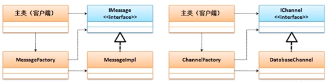

如果此时一个项目有上千个接口，就要搭配有上千个工厂类。对开发者而言，是非常绝望的一件事。当然也可以考虑写进一个工厂类里。

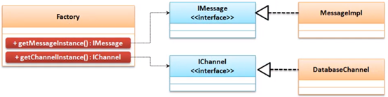

【操作示例 1】利用泛型改进工厂

```java
interface IMessage {
    public void send(String str);
}
class MessageImpl implements IMessage {
    public void send(String str) {
        System.out.println("消息发送: " + str);
    }
}
class Factory {
    public static <T> MessageImpl getInstance (String className, T t) {
        if ("messageImpl".equalsIgnoreCase(className)) {
            return new MessageImpl() ;
        }
        return null;
    }
}
public class JavaAPIDemo {
    public static void main(String[] args) {
        IMessage msg = Factory.getInstance("messageImpl", IMessage.class);
        msg.send("www.xxxx.cn") ; // 消息发送: www.xxxx.cn
    }
}
```

泛型类定义中的泛型参数E、K 和 V 都是什么意思呢？其实这些参数名称是可以任意指定，就想方法的参数名一样可以任意指定，但是我们通常会起一个有意义的名称，让别人一看就知道是什么意思。泛型参数也一样，E 一般是指元素，用来集合类中。


## 10、参考文献 & 鸣谢

1. Java泛型学习系列-绪论：https://blog.csdn.net/hanchao5272/article/details/79317213
2. Java 中的泛型（两万字超全详解）：https://blog.csdn.net/weixin_45395059/article/details/126006369

# 包及访问控制权限

对于项目而言，尤其是现代的项目是不可能一个人开发完成的，往往在一个项目的开发团队之中会有2~3位的开发者进行项目业务的实现，于是在这样的情况下就不得不去面对一个问题：有可能产生类的重名定义。

在操作系统之中已经明确严格的定义了一个要求：同一个目录之中不允许存放有相同的程序类文件。但是在实际的开发之中，我们很难保证类的不重复，所以为了进行类的方便管理，那么往往可以将程序文件放在不同的目录下，不同的目录之中是可以提供有相同文件的，而这个目录就称为包。包 = 目录。

## 1、包的定义

操作示例：定义包

```java
// 定义包，其中.表示分割子目录（子包）
package cn.xxxx.demo;
public class Hello {
    public static void main(String[] args) {
        System.out.println("Hello World !");
    }
}
```

一旦程序开发之中出现包，此时程序编译后的结果就必须将*.class文件保存在指定的目录之中，但是如果手工建立则非常麻烦，那么此时最好的做法是可以进行打包编译处理：javac -d . Hello.java

1. “-d”：表示要生成目录，而目录的结构就是package定义的结构；
2. “.”：表示在当前所在的目录中生成程序类文件；

在程序执行的时候一定要带着包执行程序类：java cn.xxxx.demo.Hello，也就是说从此之后完整的类名称是“包.类”名称。


## 2、包的导入

利用包的定义实际上就可以将不同功能的类保存在不同的包之中，但是这些类彼此之间也一定会存在有互相调用的关系，那么在这种情况下就需要使用import语句来导入其它包中的程序类。

操作示例 1：定义一个程序类“cn.xxxx.util.Message”，这个类负责进行一个消息数据的获取

```java
package cn.xxxx.util;
public class Message {
    public String getContent() {
        return "www.xxxx.cn";
    }
}
```

操作示例 2：定义一个测试类使用Message类“cn.xxxx.test.TestMessage”。

```java
package cn.xxxx.test;
import cn.xxxx.util.Message; // 导入其它包的类
public class TestMessage {
    public static void main(String[] args) {
        Message msg = new Message(); // 实例化类对象
        System.out.println(msg.getContent()); //www.xxxx.cn
    }
}
```

此时按照使用顺序来讲肯定是要先编译Message.java，而后再编译TestMessage.java，但是请思考一个问题：如果有一个程序代码，里面有100个类，彼此之间互相引用严格，此时怎么区分呢？那么这个时候最好的做法不是区分顺序，而是直接交给Java自己去完成：javac -d . *.java；

> 特别需要注意的是：关于public class 与 class 定义的区别?
>
> 1. public class：类名称必须与文件名称保持一致，一个*.java文件里面只允许有一个public class，同时如果一个类需要被其它的包所使用，那么这个类一定要定义为public class；
> 2. class：类名称可以与文件名称不一致，并且在一个*.java文件里面可以提供有多个class定义，编译后将形成不同的*.class文件，但是这些类只能被本包所访问，外包无法访问。
> 3. 在实际的开发之中往往在一个*.java源代码文件里面只会提供有一个程序，而这个程序类一般都使用public class定义；
>
> 程序类中定义的包名称必须采用小写字母的形式定义，例如：cn.xxxx.util；

但是这个时候会有一个新的问题产生，有些时候可能会使用某一个包中的很多类，于是这样分开进行类的导入会比较麻烦，为了解决这样的问题，也可以使用通配符“*”来进行处理。

```java
package cn.xxxx.test;
import cn.xxxx.util.*;    
public class TestMessage {
    public static void main(String[] args) {
        Message msg = new Message(); // 实例化类对象
        System.out.println(msg.getContent()); // www.xxxx.cn
    }
}
```

即便此时使用了“`包.*`”的导入形式，那么也不表示要进行全部的加载，它会根据自己的需要加载所需要的程序类，而不需要的程序类是不会被加载的，所以是使用“*”还是使用具体的类其最终性能是完全相同的。

但是如果在开发中采用的是“`包.*`”的形式进行包的导入时，那么会有一点比较麻烦：有可能两个不同的包中存在有相同的类名称。例如：现在假设TestMessage类由于某种需要要导入两个包：cn.xxxx.util、org.demo，但是这两个包里面都有Message类。

1. cn.mldn.util

   ```java
   package cn.mldn.util ;
   public class Message {
       public String getContent() {
           return "www.xxxx.cn";
       }
   }
   ```

2. org.demo

```java
package org.demo;
public  class Message {
    public  String getInfo() {
        return "人民万岁!";
    }
}
```

由于某种需要在TestMessage类里面导入了两个包：

```java
package cn.xxxx.test;
import cn.xxxx.util.*; // 导入其它包的类
import org.demo.*; // 导入其它包的类
public class TestMessage {
    public static void main(String[] args) {
        Message msg = new Message(); // 实例化类对象
        System.out.println(msg.getContent()); // www.xxxx.cn
    }
}
```

```java
// 程序编译：javac-d . TestMessage.java
org.demo中的类org.demo.Message和cn.xxxx.util中的类cn.xxxx.util.Message都匹配TestMessage.java：6：错误：对Message的引用不明确
Message msg = new Message(); // 实例化类对象
                ⬆
org.demo中的类org.demo.Message和cn.xxxx.util中的类cn.xxxx.util.Message都匹配2个错误
```

这个时候就会发现类名称相同的时候就会出现不明确的引用处理，所以此时最简单的处理形式就是直接写上类的完整名称。

```java
package cn.xxxx.test;
import cn.xxxx.util.*; // 导入其它包的类
import org.demo.*; // 导入其它包的类
public class TestMessage {
    public static void main(String[] args) {
        cn.xxxx.util.Message msg = new cn.xxxx.util.Message(); // 实例化类对象
        System.out.println(msg.getContent()); // www.xxxx.cn
    }
}
```

在日后的开发过程之中经常会见到大量的重名的类（包不重名），此时为了更好的解决问题，往往会使用类的完整名称进行操作。


## 3、静态导入

假如说现在有一个类，这个类中的全部方法都是static方法，那么按照原始做法肯定要导入程序所在的“包.类”，然后才可以通过类名称调用这些静态方法；

操作示例 1：定义一个MyMath数学类

```java
package cn.xxxx.util;
public class MyMath {
    public static int add(int ... args) {
        int sum = 0;
        for (int temp : args) {
            sum += temp;
        }
        return sum;
    }
    public static int sub(int x, int y) {
        return x - y;
    }
}
```

操作示例 2：原始方式使用（按照原始的方式进行导入处理，那么此时就需要导入包.类，而后通过类名称调用方法）

```java
package cn.mldn.test ;
import cn.mldn.util.MyMath ;      
public class TestMath {
   public static void main(String[] args) {
       System.out.println(MyMath.add(10, 20, 30));
       System.out.println(MyMath.sub(30, 20)); // 执行结果：60    10
   }   
}
```

操作示例 3：静态导入处理（从JDK1.5开始，对于类中全部由静态方法提供的特殊类是可以采用静态导入处理形式的）

```java
package cn.mldn.test ;
import static cn.mldn.util.MyMath.* ;      
public class TestMath {
    public static void main(String[] args) {
       System.out.println(add(10, 20, 30));
       System.out.println(sub(30, 20)); // 执行结果：60    10
    } 
}
```

当使用了静态导入处理之后就好比该方法是直接定义在主类中的，可以由主方法直接调用。一般情况不建议这样使用，因为可读性不高。


## 4、Jar 命令

当一个项目开发完成之后一定会存在有大量的*.class文件，那么对于这些文件的管理往往可以利用一种压缩结构的形式进行处理，而这样的结构在Java之中就被称为Jar文件，如果要想将程序打包为Jar文件，那么可以直接利用JDK提供的Jar命令。

在最原始的时候如果要想知道jar命令的时候直接输入jar即可，而在JDK1.9之后为了统一化，所以需要使用“--help”查看相关的说明。

```bash
D:\Environment\java\jdk-11.0.8\bin>jar
用法: jar [OPTION...] [ [--release VERSION] [-C dir] files] ...
尝试使用 `jar --help' 获取详细信息。
```

```java
D:\Environment\java\jdk-11.0.8\bin>jar --help
用法: jar [OPTION...] [ [--release VERSION] [-C dir] files] ...
jar 创建类和资源的档案, 并且可以处理档案中的
单个类或资源或者从档案中还原单个类或资源。

 示例:
 # 创建包含两个类文件的名为 classes.jar 的档案:
 jar --create --file classes.jar Foo.class Bar.class
 # 使用现有的清单创建档案, 其中包含 foo/ 中的所有文件:
 jar --create --file classes.jar --manifest mymanifest -C foo/ .
 # 创建模块化 jar 档案, 其中模块描述符位于
 # classes/module-info.class:
 jar --create --file foo.jar --main-class com.foo.Main --module-version 1.0
     -C foo/ classes resources
 # 将现有的非模块化 jar 更新为模块化 jar:
 jar --update --file foo.jar --main-class com.foo.Main --module-version 1.0
     -C foo/ module-info.class
 # 创建包含多个发行版的 jar, 并将一些文件放在 META-INF/versions/9 目录中:
 jar --create --file mr.jar -C foo classes --release 9 -C foo9 classes

要缩短或简化 jar 命令, 可以在单独的文本文件中指定参数,
并使用 @ 符号作为前缀将此文件传递给 jar 命令。

 示例:
 # 从文件 classes.list 读取附加选项和类文件列表
 jar --create --file my.jar @classes.list


 主操作模式:

  -c, --create               创建档案
  -i, --generate-index=FILE  为指定的 jar 档案生成
                             索引信息
  -t, --list                 列出档案的目录
  -u, --update               更新现有 jar 档案
  -x, --extract              从档案中提取指定的 (或全部) 文件
  -d, --describe-module      输出模块描述符或自动模块名称

 在任意模式下有效的操作修饰符:

  -C DIR                     更改为指定的目录并包含
                             以下文件
  -f, --file=FILE            档案文件名。省略时, 基于操作
                             使用 stdin 或 stdout
      --release VERSION      将下面的所有文件都放在
                             jar 的版本化目录中 (即 META-INF/versions/VERSION/)
  -v, --verbose              在标准输出中生成详细输出

 在创建和更新模式下有效的操作修饰符:

  -e, --main-class=CLASSNAME 捆绑到模块化或可执行
                             jar 档案的独立应用程序
                             的应用程序入口点
  -m, --manifest=FILE        包含指定清单文件中的
                             清单信息
  -M, --no-manifest          不为条目创建清单文件
      --module-version=VERSION    创建模块化 jar 或更新
                             非模块化 jar 时的模块版本
      --hash-modules=PATTERN 计算和记录模块的散列,
                             这些模块按指定模式匹配并直接或
                             间接依赖于所创建的模块化 jar 或
                             所更新的非模块化 jar
  -p, --module-path          模块被依赖对象的位置, 用于生成
                             散列

 只在创建, 更新和生成索引模式下有效的操作修饰符:

  -0, --no-compress          仅存储; 不使用 ZIP 压缩

 其他选项:

  -?, -h, --help[:compat]    提供此帮助，也可以选择性地提供兼容性帮助
      --help-extra           提供额外选项的帮助
      --version              输出程序版本

 如果模块描述符 'module-info.class' 位于指定目录的
 根目录中, 或者位于 jar 档案本身的根目录中, 则
 该档案是一个模块化 jar。以下操作只在创建模块化 jar,
 或更新现有的非模块化 jar 时有效: '--module-version',
 '--hash-modules' 和 '--module-path'。

 如果为长选项提供了必需参数或可选参数, 则它们对于
 任何对应的短选项也是必需或可选的。
```

下面通过程序的具体演示来实现jar的使用与配置的操作。

1、定义一个程序类，这个类的代码如下：

```java
package cn.xxxx.util;
public class Message {
    public String getContent() {
        return "www.xxxx.cn";
    }
}
```

2、对Message类进行编译处理（打包，此时会形成cn的包，包里面有相应的子包与*.class文件）：javac -d . Message.java

3、对cn的目录进行打包处理，将其打包为 xxxx.jar：jar -cvf xxxx.jar cn

- “-c”：创建一个新的jar文件
- “-v”：得到一个详细输出
- “-f”：设置要生成的jar文件的名称，此处定义的是“xxxx.jar”

4、每一个*.jar文件都是一个独立的程序路径，如果要想在Java程序中使用此路径，则必须通过CLASSPATH进行配置

```bash
SET CLASSPATH=.;D:\xxxx.jar
```

5、建立测试类，直接导入Message类，并且调用方法 

```java
package cn.xxxx.test;
public class TestMessage {
    public static void main(String[] args) {
        cn.xxxx.util.Message msg = new cn.xxxx.util.Message(); // 实例化类对象
        System.out.println(msg.getContent());
    }
}
```

随后就可以正常编译TestMessage类并且使用这个类：

- 编译程序类：javac -d . TestMessage.java
- 解释程序类：java cn.xxxx.test.TestMessage

如果此时程序编译通过之后，但是由于CLASSPATH发生了改变，类无法加载到了，则执行TestMessage类的时候将会出现如下的错误提示：

```java
// 出现这种错误只有一种情况：*.jar包没有配置正确。
Exception in thread ”main” java.lang.NoClassDefFoundError: cn/xxxx/util/Message
```

> **JDK1.9之后出现的模块化操作**
>
> 1. 在JDK1.9以前所有的历史版本之中实际上提供的是一个所有类的*.jar文件（rt.jar、tools.jar），在传统的开发之中只要启动了java的虚拟机，那么就需要加载这几十兆的类文件；
> 2. 在JDK1.9之后提供了一个模块化的设计，将原本很大的要加载的*.jar文件变成了若干个模块文件，这样在启动的时候可以根据程序加载指定的模块（模块中有包），就可以实现启动速度变快的效果。


## 5、系统常用包

Java语言从发展至今一直提供有大量的支持类库，这些类库一般由两个方面组成：

- Java自身提供的（除了JDK提供的之外还会有一些标准）；
- 由第三方厂商提供的Java的支持类库，可以完成各种你所需要的功能，并且支持的厂商很多；

而在JDK之中也会提供有大量的类库，并且这些类库都是封装在不同的开发包之中的：

1. java.lang：像String、Number、Object等类都在这个包里面，这个包在JDK1.1之后自动默认导入；
2. java.lang.reflect：反射机制处理包，所有的设计从此开始；
3. java.util：工具类的定义，包括数据结构的定义；
4. java.io：进行输入与输出流操作的程序包；
5. java.net：网络程序开发的程序包；
6. java.sql：进行数据库编程的开发包；
7. java.applet：Java最原始的使用形式，直接嵌套在网页上执行的程序类。现在的程序已经以Application为主了（有主方法的程序）；
8. java.awt、javax.swing：Java的图形界面的开发包（GUI），其中awt是属于重量级的组件，而swing是轻量级的组件；

总结：

1. 任何程序都一定有包，并且包的操作就两个关键字：package、import
2. CLASSPATH的作用


## 6、访问控制权限

在面向对象的开发过程之中有三大主要特点：封装、继承、多态。那么对于封装性而言主要的实现依靠的就是访问控制权限，而访问控制权限在程序之中一共定义有四种：private、default（不写）、protected、public，这四种权限的作用如下：

| No   | 访问范围         | private | default | protected | public |
| :--- | :--------------- | :------ | :------ | :-------- | :----- |
| 1    | 同一包中的同一类 | √       | √       | √         | √      |
| 2    | 同一包中的不同类 |         | √       | √         | √      |
| 3    | 不同包的子类     |         |         | √         | √      |
| 4    | 不同包的所有类   |         |         |           | √      |

在整个访问权限的处理之中，只有protected（受保护）的权限是比较新的概念，那么下面对这一访问权限的使用进行说明，本次要定义两个类：

1. cn.xxxx.a.Message类：提供有protected访问权限
2. cn.xxxx.b.NetMessage类：将直接访问protected属性

操作示例 1：定义Message类

```java
package cn.xxxx.a;
public class Message {
    protected String info = "www.xxxx.cn";
}
```

操作示例 2：定义子类，与父类不在同一个包中

```java
package cn.xxxx.b;
import cn.xxxx.a.Message;
public class NetMessage extends Message {
    public void println() {
        System.out.println(super.info);
    }
}
```

操作示例 3：编写测试类，通过子类实现操作

```java
package cn.xxxx.test;
import cn.xxxx.b.*;
public class TestMessage {
    public static void main(String[] args) {
        new NetMessage().print();
    }
}
```

此时的程序是通过子类访问了父类中的protected属性。但是如果此时直接通过了Message访问info属性，那么就将出现错误提示。

操作示例 4：在测试类中直接访问Message属性

```java
package cn.xxxx.test;
import cn.xxxx.a.*;     
public class TestMessage {
    public static void main(String[] args) {
        System.out.println(new Messasge().info);
    }    
}
```

```java
// 输出内容
TestMessage.java:5: 错误:info可以在Message中访问protected
```

在程序之中的封装一共有三个对应的访问权限：private、default、protected，但是如果每次在使用的时候进行区分，会比较麻烦，所以可以给出一个参考的选择方案：

1. 只要是进行属性的定义，全部使用private
2. 只要是进行方法的定义，全部使用public


# 单例多例设计模式

## 1、单例设计模式

如果说有一个程序类，假设该程序类的定义如下：

```java
class Singleton{
    public void print() {
        System.out.println("单例设计");
    }
}
public class JavaAPIDemo {
    public static void main(String[] args) {
        Singleton singletonA = new Singleton();
        Singleton singletonB = new Singleton();
        Singleton singletonC = new Singleton();
        singletonA.print();
        singletonB.print();
        singletonC.print();
    }
}
```

但是由于某些要求，现在要求Singleton这个类只允许提供有一个实例化对象。那么此时首先应该控制的就是构造方法。因为所有的新的实例化对象产生了，那么一定要调用构造方法,如果构造方法“没有了”，那么自然就无法产生实例化对象了。

操作示例 1：构造方法私有化（单例模式）

```java
class Singleton {
    private Singleton() {} // 构造方法私有化
    public void print() {
        System.out.println("www.xxxx.cn");
    }
}
public class JavaAPIDemo {
    public static void main(String args[]) {
        Singleton  instance = null; // 声明对象
        instance = new Singleton(); // 错误：Singleton()可以在Singleton中访问private
    }
}
```

但是现在是有严格要求的：必须产生有一个实例化对象。所以现在需要考虑去产生一个实例化对象交给客户端去调用。那么这个时候的分析如下：

1. private访问权限的主要特点在于：不能在类外部访问，但是可以在类本身调用，所以现在可以考虑在类的内部调用构造

   ```java
   class Singleton {
       private Singleton instance = new Singleton();
       private Singleton() {}    //构造方法私有化
       public void print() {
           System.out.println("www.xxxx.cn");
       }
   }
   public class JavaAPIDemo {
       public static void main(String[] args) {
           Singleton  instance = null; // 声明对象
           //instance = new Singleton(); // 错误：Singleton()可以在Singleton中访问private
       }
   }
   ```

2. 此时Singleton类内部的instance属于一个普通属性，而普通属性是在有实例化对象产生之后才会被调用的，那么这个时候外部无法产生实例化对象，所以这个属性就不能访问到了，那么就必须要考虑如何在没有实例化对象的时候获取此属性，那么只有一个static属性可以访问

   ```java
   class Singleton {
       static Singleton instance = new Singleton();
       private Singleton() {} // 构造方法私有化
       public void print() {
           System.out.println("www.xxxx.cn");
       }
   }
   public class JavaAPIDemo{
       public static void main(String[] args) {
           Singleton  instance = null; // 声明对象
           instance = Singleton.instance;   
           instance.print(); // www.xxxx.cn
       }
   }
   ```

3. 类中的属性应该封装后使用，所以理论上此时的instance需要被封装起来，那么就需要通过static方法获得

   ```java
   class Singleton {
       private static Singleton instance = new Singleton();
       private Singleton() {} // 构造方法私有化
       public static Singleton getInstance() {
           return instance;
       }
       public void print() {
           System.out.println("www.xxxx.cn");
       }
   }
   public class JavaAPIDemo{
       public static void main(String[] args) {
           Singleton  instance = null; // 声明对象
           instance = Singleton.getInstance();   
           instance.print(); // www.xxxx.cn
       }
   }
   ```

4. 整个代码从头强调的是只有一个实例化对象，但是这个对象依然可以被重新使用。所以需要保证此时Singleton类内部的instance无法再次实例化，那么应该使用final定义。（终极版代码如下：）

操作示例 2：构造方法私有化（饿汉式—单例模式）

```java
class Singleton{
    // 构造私有化后其他对象或方法内是无法实例化Singleton的
    private static final Singleton INSTANCE = new Singleton();
    private Singleton(){} // 构造方法私有化
    public static Singleton getInstance(){
        return INSTANCE;
    }
    public void print(){
        System.out.println("单例设计：饿汉式");
    }
}
public class JavaAPIDemo {
    public static void main(String[] args) {
        Singleton instance = null;
        instance = Singleton.getInstance();
        instance.print();
    }
}
```

对于单例设计模式也分为两种：懒汉式、饿汉式。在之前所定义的都属于饿汉式。在系统加载类的时候就会自动提供有Singleton类的实例化，而还有一种懒汉式，在第一次使用的时候进行实例化对象处理。

操作示例 2：构造方法私有化（懒汉式—单例模式）

```java
class Singleton{
    private static Singleton INSTANCE;
    private Singleton(){} // 构造方法私有化
    public static Singleton getInstance(){
        if(INSTANCE == null ){
            INSTANCE = new Singleton();
        }
        return INSTANCE;
    }
    public void print(){
        System.out.println("单例设计：懒汉式");
    }
}
public class JavaAPIDemo {
    public static void main(String[] args) {
        Singleton instance = null;
        instance = Singleton.getInstance();
        instance.print();
    }
}
```

**面试题：请编写一个 Singleton程序，并说明其主要特点？**

1. 代码如上，可以把懒汉式（后面需要考虑到线程同步问题）和饿汉式都写上
2. 特点：构造方法私有化，类内部提供 static方法获取实例化对象,这样不管外部如何操作永远都只有一个实例化对象提供


## 2、多例设计模式

与单例设计对应的还有一个多例设计，单例设计指的是只保留有一个实例化对象，而多例设计指的是可以保留有多个实例化对象。例如：如果现在定义一个描述性别的类。那么该对象只有两个：男、女。或者描述颜色基色的类，可以使用红色、绿色、蓝色。这种情况下就可以使用多例设计来解决。

操作示例：实现多例设计

```java
class Color {
    private static Color GREEN = new Color("绿色");
    private static Color RED = new Color("红色");
    private static Color BLUE = new Color("蓝色");
    private String title;
    private Color(String title){
        this.title = title;
    }
    public static Color getInstance(String color){
        switch (color){
            case "red":return RED;
            case "green":return RED;
            case "blue":return RED;
            default:return null;
        }
    }
}
public class JavaAPIDemo {
    public static void main(String[] args) {
        Color instance = Color.getInstance("red");
        System.out.println(instance);
    }
}
```

多例设计与单例设计的本质是相同的，一定都会在内部提供有static方法以返回实例化对象。**多例设计可以用枚举代替。**


# 枚举

枚举最佳实践：https://www.cnblogs.com/yungyu16/p/8662105.html

## 1、枚举的基本定义

JDK1.5之后在程序之中提供有enum的关键字，利用此关键字可以实现枚举的定义。同时在进行枚举定义的时候一定要遵循一些多例设计模式原则（构造方法私有、内部要提供有若干个对象常量）

操作示例 1：定义一个枚举

```java
enum Color { // 枚举类
    RED,GREEN,BLUE;	// 实例化对象
}
public class JavaAPIDemo {
    public static void main(String[] args) {
        Color c = Color.RED; // 获取实例化对象
        System.out.println(c); // RED
    }
}
```

```java
enum Color {
    红色,绿色,蓝色;
}
public class JavaAPIDemo {
    public static void main(String[] args) {
        Color c = Color.红色; // 获取实例化对象
        System.out.println(c); // 红色
    }
}
```

如果此时采用了多例设计模式来进行设计，那么需要编写很多的程序代码，这样对于开发的复杂度是比较高的，因为里面毕竟牵扯到了构造方法的私有化以及静态方法。多例设计与枚举设计虽然可以实现相同的功能，但是使用枚举可以在程序编译的时候就判断所使用的实例化对象是否存在。

操作示例 2：获取所有的枚举对象（在进行枚举处理的时候还可以利用`values()`方法获取所有的枚举对象进行输出）

```java
enum Color {	
    RED,GREEN,BLUE;	
}
public class JavaAPIDemo {
    public static void main(String[] args) {
        for (Color c : Color.values()) {
            System.out.println(c);
        }
    }
}
```

```java
// 输出内容
RED
GREEN
BLUE
```

如果此时同样的功能需要通过多例设计来解决的话，那么就需要使用对象数组了。

操作示例 3：观察枚举与switch处理（从JDK1.5追加了枚举结构之后，就可以在switch之中进行枚举项的判断）

```java
enum Color { // 枚举类
    RED,GREEN,BLUE; // 实例化对象
}
public class JavaAPIDemo {
    public static void main(String[] args) {
        Color c = Color.RED;
        switch(c) {	// 直接支持枚举
            case RED :
                System.out.println("红色");
                break;
            case GREEN :
                System.out.println("绿色");
                break;
            case BLUE :
                System.out.println("蓝色");
                break;
        }
    }
}
```

```java
// 输出内容
红色
```


## 2、Enum 类

严格意义上来讲，枚举并不属于一种新的结构，其本质相当于是一个类，但是这个类会默认继承Enum类，首先来观察一下Enum类的基本定义：

```java
public abstract class Enum<E extends Enum<E>> implements Comparable<E>, Serializable {}
```

现在定义的枚举类的类型就是Enum中所使用的E类型。下面来观察一下Enum类中定义的方法

| 方法名称                                           | 类型 | 描述                                            |
| :------------------------------------------------- | ---- | ----------------------------------------------- |
| protected Enum(String name, int ordinal)           | 构造 | 名字和序号，程序员无法调用此构造函数。          |
| String name()                                      | 普通 | 获得对象名称                                    |
| int ordinal()                                      | 普通 | 获得对象序号（初始常量序数为零）                |
| static values()                                    | 普通 | 将枚举的所有成员以数组形式返回                  |
| static T valueOf(String name)                      | 静态 | 返回具有指定名称的指定枚举类型的枚举常量        |
| static T valueOf(Class< T > enumType, String name) | 静态 | 返回具有指定名称的指定枚举类型的枚举常量        |
| boolean equals(Object other)                       | 普通 | 如果指定的对象等于此枚举常量，则返回true        |
| int hashCode()                                     | 普通 | 返回此枚举常量的哈希码                          |
| int compareTo(E o)                                 | 普通 | 比较此枚举与指定对象的顺序                      |
| Class< E > getDeclaringClass()                     | 普通 | 返回该枚举变量所在的枚举类                      |
| String toString()                                  | 普通 | 与name() 几乎是等同的，都是输出变量的字符串形式 |

```java
enum Color { // 枚举类
    RED,GREEN,BLUE; // 实例化对象
}
public class JavaAPIDemo { // 观察Enum类的存在
    public static void main(String[] args) {
        for (Color c : Color.values()) {
            System.out.println(c.ordinal() + " - " + c.name());
        }
    }
}
```

```java
// 输出内容
0 - RED
1 - GREEN
2 - BLUE
```

枚举定义的顺序就是其序号保存的顺序，也就是说枚举里面所有的对象都会默认调用Enum父类的构造方法，而这一切都是由JVM再编译的时候自己完成处理。

**面试题**：**请解释enum与Enum的区别？**

1. **enum**：是从JDK1.5之后提供的一个关键字，用于定义枚举类
2. **Enum**：是一个抽象类，所以使用enum关键字定义的类就默认继承了此类


## 3、定义枚举结构

一直在强调枚举本身就属于一种多例设计模式，那么既然是多例设计模式，那么在一个类之中可以定义的结构是非常多的，例如：构造方法、普通方法、属性等，那么这些内容在枚举类中依然可以直接定义，但是需要注意的是：**枚举类中定义的构造方法不能采用非私有化定义（public无法使用）**

操作示例 1：在枚举类中定义其它的结构（本程序在简化程度上一定要远远高于多例设计模式）

```java
enum Color {
    // 枚举对象要写在首行
    RED("红色"),
    GREEN("绿色"),
    BLUE("蓝色");
    private String title; // 定义属性
    private Color(String title) {
        this.title = title;
    }
    public String toString() {
        return this.title;
    }
}
public class JavaAPIDemo {
    public static void main(String[] args) {
        for (Color c : Color.values()) {
            System.out.println(c.ordinal() + " - " + c.name() + " - " + c);
        }
    }
}
```

```java
// 输出内容
0 - RED - 红色
1 - GREEN - 绿色
2 - BLUE - 蓝色
```

操作示例 2：让枚举实现接口（枚举类中也可以实现接口的继承）

```java
// 定义接口
interface IMessage {
    public String getMessage();
}
// 枚举类，实现IMessage接口
enum Color implements IMessage {
    RED("红色"),GREEN("绿色"),BLUE("蓝色"); // 枚举对象要写在首行
    private String title; // 定义属性
    private Color(String title) {
        this.title = title;
    }
    @Override
    public String toString() {
        return this.title;
    }
    @Override
    public String getMessage() {
        return this.title;
    }
}
public class JavaAPIDemo {
    public static void main(String[] args) {
        IMessage msg = Color.RED;
        System.out.println(msg.getMessage()); // 红色 
    }
}
```

操作示例 3：观察枚举中定义抽象方法（枚举类里面还可以直接定义抽象方法，并且要求每一个枚举对象都要独立覆写此抽象方法）

```java
enum Color {
    // 枚举对象要写在首行
    RED("红色") {
        @Override
        public String getMessage() {
            return this.toString() ;
        }
    },GREEN("绿色") {
        @Override
        public String getMessage() {
            return this.toString() ;
        }
    },BLUE("蓝色") {
        @Override
        public String getMessage() {
            return this.toString() ;
        }
    };
    private String title; // 定义属性
    private Color(String title) {
        this.title = title;
    }
    @Override
    public String toString() {
        return this.title;
    }
    public abstract String getMessage();
}
public class JavaAPIDemo {
    public static void main(String[] args) {
        System.out.println(Color.RED.getMessage());
    }
}

// 输出内容
红色
```

发现枚举的定义是非常灵活的，但是在实际的使用之中，枚举更多情况下还是建议使用它的正确用法，就是定义一个实例对象即可。


## 4、枚举常见用法【最佳实践】

很多人不使用枚举的一个重要的原因是对枚举不够熟悉，那么我们就先从枚举的 7 种使用方法说起。

### 1、用法一：常量

在JDK1.5 之前，我们定义常量都是： public static fianl... 现在有了枚举，可以把相关的常量分组到一个枚举类型里，而且枚举提供了比常量更多的方法。 

```java
public enum ColorEnum {  
    RED, GREEN, BLANK, YELLOW  
}
```


### 2、用法二：switch

将枚举用在 switch 判断中，使得代码可读性更高了，实现代码如下（JDK1.6之后switch才支持枚举）：

```java
enum ColorEnum {
    GREEN, YELLOW, RED
}
public class ColorTest {
    ColorEnum color = ColorEnum.RED;

    public void change() {
        switch (color) {
            case RED:
                color = ColorEnum.GREEN;
                break;
            case YELLOW:
                color = ColorEnum.RED;
                break;
            case GREEN:
                color = ColorEnum.YELLOW;
                break;
        }
    }
}
```


### 3、用法三：枚举中增加方法

我们可以在枚举中增加一些方法，让枚举具备更多的特性，实现代码如下：

```java
import java.util.Arrays;
import java.util.HashMap;
import java.util.Map;

public class EnumTest {
    public static void main(String[] args) {
        ErrorCodeEnum errorCode = ErrorCodeEnum.SUCCESS;
        System.out.println("状态码：" + errorCode.getCode() + " 状态信息：" + errorCode.getMsg());
        // 输出结果：状态码：1000 状态信息：success
    }
}

enum ErrorCodeEnum {
    SUCCESS(1000, "success"),
    PARAM_ERROR(1001, "parameter error"),
    SYS_ERROR(1003, "system error"),
    NAMESPACE_NOT_FOUND(2001, "namespace not found"),
    NODE_NOT_EXIST(3002, "node not exist"),
    NODE_ALREADY_EXIST(3003, "node already exist"),
    UNKNOWN_ERROR(9999, "unknown error");

    // 成员变量
    private int    code;
    private String msg;

    // 构造方法
    ErrorCodeEnum(int code, String msg) {
        this.code = code;
        this.msg = msg;
    }

    // 普通方法
    public int getCode() {
        return code;
    }
    public String getMsg() {
        return msg;
    }

    /**
     * 方式一: 通过 code 返回枚举示例对象
     */
    public static ErrorCodeEnum getErrorCode(int code) {
        for (ErrorCodeEnum it : ErrorCodeEnum.values()) {
            if (it.getCode() == code) {
                return it;
            }
        }
        return UNKNOWN_ERROR;
    }

    /**
     * 方式二: 通过 code 返回枚举示例对象
     * 两种方法可以选择性使用
     */
    private static final Map<Integer, ErrorCodeEnum> stringToEnum = new HashMap<>();
    static {
        Arrays.stream(values()).forEach(x -> stringToEnum.put(x.getCode(), x));
    }
    public static ErrorCodeEnum fromString (final String code) {
        return stringToEnum.getOrDefault(code, UNKNOWN_ERROR);
    }
}
```

如果打算自定义自己的方法，那么必须在enum实例序列的最后添加一个分号。而且Java要求必须先定义enum实例。 


### 4、用法四：覆盖枚举的方法

我们可以覆盖一些枚举中的方法用于实现自己的业务，比如我们可以覆盖 toString() 方法，实现代码如下：

```java
public class EnumTest {
    public static void main(String[] args) {
        ColorEnum colorEnum = ColorEnum.RED;
        System.out.println(colorEnum.toString());
        // 输出结果：1：红色
    }
}

enum ColorEnum {
    RED("红色", 1), GREEN("绿色", 2), BLANK("白色", 3), YELLOW("黄色", 4);
    //  成员变量
    private String name;
    private int index;

    //  构造方法
    private ColorEnum(String name, int index) {
        this.name = name;
        this.index = index;
    }

    //覆盖方法
    @Override
    public String toString() {
        return this.index + "：" + this.name;
    }
}
```


### 5、用法五：实现接口

枚举类可以用来实现接口，但不能用于继承类，因为枚举默认继承了java.lang.Enum类，在Java语言中允许实现多接口，但不能继承多个父类，实现代码如下：

```java
public class EnumTest {
    public static void main(String[] args) {
        ColorEnum colorEnum = ColorEnum.RED;
        colorEnum.print(); // 1：红色
        System.out.println("颜色：" + colorEnum.getInfo()); // 颜色：红色
    }
}

interface Behaviour {
    void print();
    String getInfo();
}

enum ColorEnum implements Behaviour {
    RED("红色", 1), GREEN("绿色", 2), BLANK("白色", 3), YELLOW("黄色", 4);
    private String name;
    private int index;

    private ColorEnum(String name, int index) {
        this.name = name;
        this.index = index;
    }

    // 接口方法
    @Override
    public void print() {
        System.out.println(this.index + "：" + this.name);
    }

    // 接口方法
    @Override
    public String getInfo() {
        return this.name;
    }
}
```


### 6、用法六：在接口中组织枚举类

我们可以在一个接口中创建多个枚举类，用它可以很好的实现“多态”，也就是说我们可以将拥有相同特性，但又有细微实现差别的枚举类聚集在一个接口中，实现代码如下：（使用接口组织枚举）

```java
public class EnumTest {
    public static void main(String[] args) {
        // 赋值第一个枚举类
        ColorInterface colorEnum = ColorInterface.ColorEnum.RED;
        System.out.println(colorEnum); // RED
        // 赋值第二个枚举类
        colorEnum = ColorInterface.NewColorEnum.NEW_RED;
        System.out.println(colorEnum); // NEW_RED
    }
}

interface ColorInterface {
    enum ColorEnum implements ColorInterface {
        GREEN, YELLOW, RED
    }
    enum NewColorEnum implements ColorInterface {
        NEW_GREEN, NEW_YELLOW, NEW_RED
    }
}
```


### 7、用法七：枚举集合的使用

在Java中与枚举类相关的，还有两个枚举集合类 java.util.EnumSet 和 java.util.EnumMap，使用它们可以实现更多的功能。

使用EnumSet可以保证元素不重复，并且能获取指定范围内的元素，示例代码如下：

```java
import java.util.ArrayList;
import java.util.EnumSet;
import java.util.List;

public class EnumTest {
    public static void main(String[] args) {
        List<ColorEnum> list = new ArrayList<ColorEnum>();
        list.add(ColorEnum.RED);
        list.add(ColorEnum.RED);  // 重复元素
        list.add(ColorEnum.YELLOW);
        list.add(ColorEnum.GREEN);
        // 去掉重复数据
        EnumSet<ColorEnum> enumSet = EnumSet.copyOf(list);
        System.out.println("去重：" + enumSet); // 去重：[RED, GREEN, YELLOW]

        // 获取指定范围的枚举（获取所有的失败状态）
        EnumSet<ErrorCodeEnum> errorCodeEnums = EnumSet.range(ErrorCodeEnum.ERROR, ErrorCodeEnum.UNKNOWN_ERROR);
        System.out.println("所有失败状态：" + errorCodeEnums);
        // 所有失败状态：[ERROR, SYS_ERROR, NAMESPACE_NOT_FOUND, NODE_NOT_EXIST, NODE_ALREADY_EXIST, UNKNOWN_ERROR]
    }
}

enum ColorEnum {
    RED("红色", 1), GREEN("绿色", 2), BLANK("白色", 3), YELLOW("黄色", 4);
    private String name;
    private int index;

    private ColorEnum(String name, int index) {
        this.name = name;
        this.index = index;
    }
}

enum ErrorCodeEnum {
    SUCCESS(1000, "success"),
    ERROR(2001, "parameter error"),
    SYS_ERROR(2002, "system error"),
    NAMESPACE_NOT_FOUND(2003, "namespace not found"),
    NODE_NOT_EXIST(3002, "node not exist"),
    NODE_ALREADY_EXIST(3003, "node already exist"),
    UNKNOWN_ERROR(9999, "unknown error");

    private int code;
    private String msg;

    ErrorCodeEnum(int code, String msg) {
        this.code = code;
        this.msg = msg;
    }

    public int code() {
        return code;
    }
    public String msg() {
        return msg;
    }
}
```

***

EnumMap 与 HashMap 类似，不过它是一个专门为枚举设计的 Map 集合，相比 HashMap 来说它的性能更高，因为它内部放弃使用链表和红黑树的结构，采用数组作为数据存储的结构。

EnumMap 中 key 是 enum 类型，而 value 则可以是任意类型。EnumMap 基本使用示例如下：

```java
import java.util.EnumMap;

public class EnumTest {
    public static void main(String[] args) {
        EnumMap<ColorEnum, String> enumMap = new EnumMap<>(ColorEnum.class);
        enumMap.put(ColorEnum.RED, "红色");
        enumMap.put(ColorEnum.GREEN, "绿色");
        enumMap.put(ColorEnum.BLANK, "白色");
        enumMap.put(ColorEnum.YELLOW, "黄色");
        System.out.println(ColorEnum.RED + ":" + enumMap.get(ColorEnum.RED)); // RED:红色
    }
}

enum ColorEnum {
    RED, GREEN, BLANK, YELLOW;
}
```


### 8、用法八：策略枚举模式

这种枚举通过枚举嵌套枚举的方式，将枚举实例（常量）分类处理，虽然没有通过switch语句使用简洁，但是更加灵活。

```java
public class EnumTest {
    public static void main(String[] args) {
        System.out.printf("时薪100的人在周五工作8小时的收入: %f %n", PayrollDay.FRIDAY.pay(8.0, 100));
        System.out.printf("时薪100的人在周六工作8小时的收入: %f %n", PayrollDay.SATURDAY.pay(8.0, 100));
        // 时薪100的人在周五工作8小时的收入: 800.000000 
        // 时薪100的人在周六工作8小时的收入: 1200.000000 
    }
}

enum PayrollDay {
    MONDAY(PayType.WEEKDAY),
    TUESDAY(PayType.WEEKDAY),
    WEDNESDAY(PayType.WEEKDAY),
    THURSDAY(PayType.WEEKDAY),
    FRIDAY(PayType.WEEKDAY),
    SATURDAY(PayType.WEEKEND),
    SUNDAY(PayType.WEEKEND);

    private final PayType payType;

    PayrollDay(PayType payType) {
        this.payType = payType;
    }

    double pay(double hoursWorked, double payRate) {
        return payType.pay(hoursWorked, payRate);
    }

    /**
     * 策略枚举
     */
    private enum PayType {
        WEEKDAY {
            double overtimePay(double hours, double payRate) {
                return hours <= HOURS_PER_SHIFT ? 0 : (hours - HOURS_PER_SHIFT) * payRate / 2;
            }
        },
        WEEKEND {
            double overtimePay(double hours, double payRate) {
                return hours * payRate / 2;
            }
        };
        private static final int HOURS_PER_SHIFT = 8;

        abstract double overtimePay(double hrs, double payRate);

        double pay(double hoursWorked, double payRate) {
            double basePay = hoursWorked * payRate;
            return basePay + overtimePay(hoursWorked, payRate);
        }
    }
}
```


## 5、枚举注意事项

### 1、枚举使用注意事项

阿里《Java开发手册》对枚举的相关规定如下，我们在使用时需要稍微注意一下：

1. 【强制】所有的枚举类型字段必须要有注释，说明每个数据项的用途
2. 【参考】枚举类名带上 Enum 后缀，枚举成员名称需要全大写，单词间用下划线隔开。说明：枚举其实就是特殊的常量类，且构造方法被默认强制是私有。正例：枚举名字为 ProcessStatusEnum 的成员名称：SUCCESS / UNKNOWN_REASON


### 2、假如不使用枚举

在枚举没有诞生之前，也就是 JDK 1.5 版本之前，我们通常会使用 `int` 常量来表示枚举，实现代码如下：

```java
public static final int COLOR_RED = 1;
public static final int COLOR_BLUE = 2;
public static final int COLOR_GREEN = 3;
```

但是使用 int 类型可能存在两个问题：

1. 第一：int 类型本身并不具备安全性，假如某个程序员在定义 int 时少些了一个 final 关键字，那么就会存在被其他人修改的风险，而反观枚举类，它“天然”就是一个常量类，不存在被修改的风险（原因详见下半部分）
2. 第二：使用 int 类型的语义不够明确，比如我们在控制台打印时如果只输出 1...2...3 这样的数字，我们肯定不知道它代表的是什么含义

那有人就说了，那就使用常量字符呗，这总不会还不知道语义吧？实现示例代码如下：

```java
public static final String COLOR_RED = "RED";
public static final String COLOR_BLUE = "BLUE";
public static final String COLOR_GREEN = "GREEN";
```

但是这样同样存在一个问题，有些初级程序员会不按套路出牌，他们可能会直接使用字符串的值进行比较，而不是直接使用枚举的字段，实现示例代码如下：

```java
public class EnumTest {
    public static final String COLOR_RED = "RED";
    public static final String COLOR_BLUE = "BLUE";
    public static final String COLOR_GREEN = "GREEN";
    public static void main(String[] args) {
        String color = "BLUE";
        if ("BLUE".equals(color)) {
            System.out.println("蓝色");
        }
    }
}
```

这样当我们修改了枚举中的值，那程序就凉凉了。


### 3、枚举使用场景

枚举的常见使用场景是单例，它的完整实现代码如下：

```java
public class Singleton {
    // 枚举类型是线程安全的，并且只会装载一次
    private enum SingletonEnum {
        INSTANCE;
        // 声明单例对象
        private final Singleton instance;
        // 实例化
        SingletonEnum() {
            instance = new Singleton();
        }
        private Singleton getInstance() {
            return instance;
        }
    }
    // 获取实例（单例对象）
    public static Singleton getInstance() {
        return SingletonEnum.INSTANCE.getInstance();
    }
    private Singleton() {
    }
    // 类方法
    public void sayHi() {
        System.out.println("Hi,Java.");
    }
}
class SingletonTest {
    public static void main(String[] args) {
        Singleton singleton = Singleton.getInstance();
        singleton.sayHi(); // Hi,Java.
    }
}
```

因为枚举只会在类加载时装载一次，所以它是线程安全的，这也是《Effective Java》作者极力推荐使用枚举来实现单例的主要原因


## 6、知识扩展及总结

### 1、枚举为什么是线程安全的？

这一点要从枚举最终生成的字节码说起，首先我们先来定义一个简单的枚举类：

```java
public enum ColorEnumTest {
    RED, GREEN, BLANK, YELLOW;
}
```

然后我们再将上面的那段代码编译为字节码，具体内容如下：

```java
public final class ColorEnumTest extends java.lang.Enum<ColorEnumTest> {
    public static final ColorEnumTest RED;
    public static final ColorEnumTest GREEN;
    public static final ColorEnumTest BLANK;
    public static final ColorEnumTest YELLOW;
    public static ColorEnumTest[] values();
    public static ColorEnumTest valueOf(java.lang.String);
    static {};
}
```

从上述结果可以看出枚举类最终会被编译为被 final 修饰的普通类，它的所有属性也都会被 static 和 final 关键字修饰，所以枚举类在项目启动时就会被 JVM 加载并初始化，而这个执行过程是线程安全的，所以枚举类也是线程安全的类。

> 小贴士：代码反编译的过程是先用 javac 命令将 java 代码编译字节码（.class），再使用 javap 命令查看编译的字节码


### 2、枚举比较小技巧

我们在枚举比较时使用 == 就够了，因为枚举类是在程序加载时就创建了（它并不是 new 出来的），并且枚举类不允许在外部直接使用 new 关键字来创建枚举实例，所以我们在使用枚举类时本质上只有一个对象，因此在枚举比较时使用 == 就够了。

并且我们在查看枚举的 equlas() 源码会发现，它的内部其实还是直接调用了 == 方法，源码如下：

```java
public final boolean equals(Object other) {
    return this==other;
}
```


### 3、枚举常见用法与应用总结

本文我们介绍了枚举类的 7 种使用方法：常量、switch、枚举中添加方法、覆盖枚举方法、实现接口、在接口中组织枚举类和使用枚举集合等，然后讲了如果不使用枚举类使用 `int` 类型和 `String` 类型存在的一些弊端：语义不够清晰、容易被修改、存在被误用的风险，所以我们在适合的环境下应该尽量使用枚举类。并且我们还讲了枚举类的使用场景——单例，以及枚举类为什么是安全的，最后我们讲了枚举比较的小技巧，希望本文对你有帮助。


### 4、参考文献 & 鸣谢

- Java中文社群 磊哥【微信】：https://mp.weixin.qq.com/s/HDotguLpNgtwK-Jz2UsODQ

# 异常的捕获与处理

## 1、认识异常对程序的影响

异常指的是导致程序中断执行的一种指令流。那么下面首先来观察没有异常产生的程序执行结果。

操作示例：产生异常

```java
public class JavAPIaDemo {
	public static void main(String[] args) {
		System.out.println("【1】****** 程序开始执行 ******") ;
		System.out.println("【2】****** 数学计算：" + (10 / 0)) ;
		System.out.println("【3】****** 程序执行完毕 ******") ;
	}
}
```

```java
// 输出内容
【1】****** 程序开始执行 ******
Exception in thread "main" java.lang.ArithmeticException: / by zero
	at JavaDemo.main(JavaDemo.java:4)
```

在出现错误之后，整个的程序将不会按照既定的方式进行执行，而是中断了执行。那么为了保证程序出现了非致命错误之后程序依然可以正常完成，所以就需要有一个完善的异常处理机制，以保证程序的顺利执行。


## 2、处理异常

在Java之中如果要进行异常的处理，可以使用：try、 catch、 finally这几个关键字来完成，其基本的处理结构如下：

```java
// 在此格式之中可以使用的组合为：try...catch、try… catch...finally、try...finally.
try {
    // 可能出现异常的语句	
} [catch (异常类型 异常对象) {
    // 异常处理	
} catch (异常类型 异常对象) {
    // 异常处理	
} catch (异常类型 异常对象) {
    // 异常处理	
} ... ] [finally {
    不管异常是否处理都要执行;
}]
```

操作示例 1：处理异常

```java
public class JavaAPIDemo {
	public static void main(String[] args) {
		System.out.println("【1】****** 程序开始执行 ******") ;
		try {
			System.out.println("【2】****** 数学计算：" + (10 / 0)) ;
		} catch (ArithmeticException e) {
			System.out.println("【catch】处理异常：" + e) ;	// 处理异常
		}
		System.out.println("【3】****** 程序执行API完毕 ******") ;
	}
}
```

```java
// 输出内容
【1】****** 程序开始执行 ******
【catch】处理异常：java.lang.ArithmeticException: / by zero
【3】****** 程序执行完毕 ******
```

此时可以发现现在即便出现了异常，程序也可以正常执行完毕，所以此时的设计属于一个合理设计，但是有一个问题出现了。此时在进行异常处理的时候直接输出的是一个异常类的对象，那么对于此对象如果直接打印（调用 toString()）所得到的异常信息并不完整，那么如果要想获得非常完整的异常信息，则可以使用异常类中提供的e.printStackTrace() 方法。

操作示例 2：获取完整异常信息

```java
public class JavaAPIDemo {
	public static void main(String[] args) {
		System.out.println("【1】****** 程序开始执行 ******") ;
		try {
			System.out.println("【2】****** 数学计算：" + (10 / 0)) ;
		} catch (ArithmeticException e) {
			e.printStackTrace() ;
		}
		System.out.println("【3】****** 程序执行完毕 ******") ;
	}
}
```

```java
// 输出内容
【1】****** 程序开始执行 ******
java.lang.ArithmeticException: / by zero
	at JavaDemo.main(JavaDemo.java:5)
【3】****** 程序执行完毕 ******
```

操作示例 3：使用finally语句（对于异常的处理格式也可以在最后追加有一个finally程序块，表示异常处理后的出口，不管是否出现异常都执行）

```java
public class JavaAPIDemo {
    public static void main(String[] args) {
        System.out.println("【1】****** 程序开始执行 ******") ;
        try {
            System.out.println("【2】****** 数学计算：" + (10 / 0)) ;
        } catch (ArithmeticException e) {
            e.printStackTrace() ;
        } finally {
            System.out.println("【F】不管是否出现异常，我都会执行。") ;
        }
        System.out.println("【3】****** 程序执行完毕 ******") ;
    }
}
```

```java
// 输出内容
【1】****** 程序开始执行 ******
java.lang.ArithmeticException: / by zero
	at JavaDemo.main(JavaDemo.java:5)
【F】不管是否出现异常，我都会执行。
【3】****** 程序执行完毕 ******
```


## 3、处理多个异常

很多时候在程序执行的过程之中可能会产生若干个异常，那么这种情况下也可以使用多个catch进行异常的捕获。现在假设通过初始化参数来进行两个数学计算数字的设置。

```java
public class JavaAPIDemo {
    public static void main(String[] args) {
        System.out.println("【1】****** 程序开始执行 ******") ;
        try {
            int x = Integer.parseInt(args[0]) ;
            int y = Integer.parseInt(args[1]) ;
            System.out.println("【2】****** 数学计算：" + (x / y)) ;
        } catch (ArithmeticException e) {
            e.printStackTrace() ;
        } finally {
            System.out.println("【F】不管是否出现异常，我都会执行。") ;
        }
        System.out.println("【3】****** 程序执行完毕 ******") ;
    }
}
```

那么对于此时的程序就有可能产生三类异常：

1. 【未处理】程序执行的时候没有输入初始化参数( java JavaAPIDemo)：java.lang.ArrayIndexOutOfBoundsException

   ```java
   【1】****** 程序开始执行 ******
   【F】不管是否出现异常，我都会执行。
   Exception in thread "main" java.lang.ArrayIndexOutOfBoundsException: 0
   	at JavaDemo.main(JavaDemo.java:5)
   ```

2. 【未处理】输入的数据不是数字( java JavaAPIDemo a b)：java.lang.NumberFormatException

   ```java
   【1】****** 程序开始执行 ******
   【F】不管是否出现异常，我都会执行。
   Exception in thread "main" java.lang.NumberFormatException: For input string: "a"
   	at java.lang.NumberFormatException.forInputString(NumberFormatException.java:65)
   	at java.lang.Integer.parseInt(Integer.java:580)
   	at java.lang.Integer.parseInt(Integer.java:615)
   	at JavaDemo.main(JavaDemo.java:5)
   ```

3. 【己处理】输入的被除数为0( java JavaAPIDemo10 0)：java.lang.ArithmeticException

   ```java
   【1】****** 程序开始执行 ******
   java.lang.ArithmeticException: / by zero
   	at JavaDemo.main(JavaDemo.java:7)
   【F】不管是否出现异常，我都会执行。
   【3】****** 程序执行完毕 ******
   ```

现在即便有了异常处理语句，但是如果没有进行正确的异常捕获，那么程序也会导致中断（finally的代码依然执行），所以在这样的情况下就必须进行多个异常的捕获。

操作示例 2：修改程序代码

```java
public class JavaAPIDemo {
    public static void main(String[] args) {
        System.out.println("【1】****** 程序开始执行 ******") ;
        try {
            int x = Integer.parseInt(args[0]) ;
            int y = Integer.parseInt(args[1]) ;
            System.out.println("【2】****** 数学计算：" + (x / y)) ;
        } catch (ArithmeticException e) {
            e.printStackTrace() ;
        } catch (NumberFormatException e) {
            e.printStackTrace() ;
        } catch (ArrayIndexOutOfBoundsException e) {
            e.printStackTrace() ;
        } finally {
            System.out.println("【F】不管是否出现异常，我都会执行。") ;
        }
        System.out.println("【3】****** 程序执行完毕 ******") ;
    }
}
```

此时我们开发者都已经明确的知道有那些异常了，那么又何必非要用个异常处理呢？直接多写点判断不久可以了。


## 4、异常处理流程

在进行异常处理的时候如果将所有可能已经明确知道要产生的异常都进行了捕获，虽然你可以得到非常良好的代码结构，但是这种代码编写是非常麻烦的，所以现在要想进行合理异常就必须清楚在异常产生之后程序到底做了那些处理。

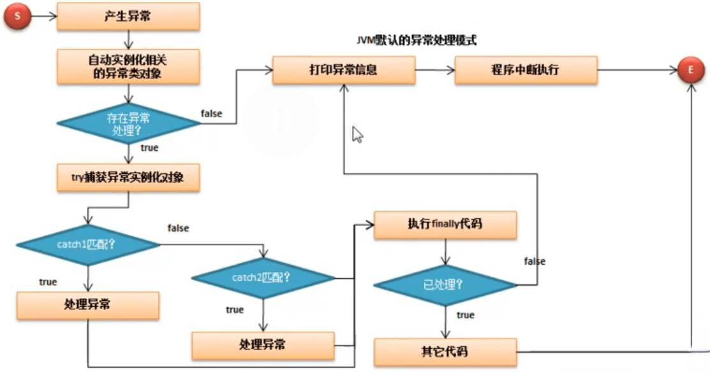

1. 在程序运行的过程之中才会产生异常，而一旦程序执行中产生了异常之后将自动进行指定类型的异常类对象实例化处理
2. 如果此时程序之中并没有提供有异常处理的支持，则会采用JVM的默认异常处理方式首先进行异常信息的打印，而后直接退出当前的程序
3. 此时程序中如果存在有异常处理，那么这个产生的异常类的实例化对象将会被try语句所捕获
4. try捕获到异常之后与其匹配的catch中的异常类型进行依次的比对，如果此时与catch中的捕获异常类型相同，则认为应该采用此catch进行异常处理，如果不匹配则继续匹配后续的catch类型，如果没有任何的catch匹配成功，那么就表示该异常无法进行处理
5. 不管异常是否进行处理最终都要执行finally的语句，但是当执行完成finally的程序之后会进一步判断当前的异常是否已经处理过了，如果已经处理过了，则继续向后执行其它代码，如果没有处理，则交由JVM进行默认的处理

通过分析可以发现在整个的异常处理流程之中实际上操作的还是一个异常类的实例化对象，那么这个异常类的实例化对象的类型就成为了理解异常处理的核心关键所在，在之前接触过了两种异常：`ArithmeticException`、`ArrayIndexOutOfBoundsException`

```java
ArithmeticException:
java.lang.Object
    |-java.lang.Throwable
    	|-java.lang.Exception
    		|-java.lang.RuntimeException
    			|-java.lang.ArithmeticException

ArrayIndexOutOfBoundsException:
java.lang.Object
    |-java.lang.Throwable
    	|-java.lang.Exception
    		|-java.lang.RuntimeException
    			|-java.lang.IndexOutOfBoundsException
    				|-java.lang.ArithmeticException
```

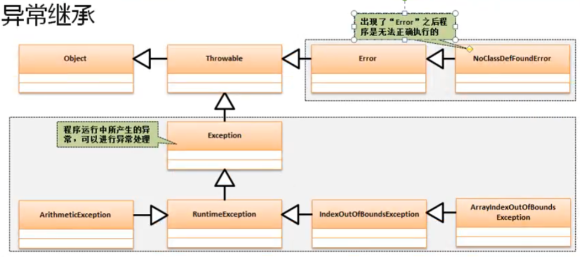

可以发现在程序之中可以处理的异常的最大的类型就是`Throwable`，而打开`Throwable`可以观察在此类中提供有两个子类：

- Error：此时程序还未执行出现的错误，开发者无法处理
- Exception：程序中出现的异常，开发者可以处理，真正在开发之中所需要关注的就是Exception

通过分析可以发现异常产生的时候会产生异常的实例化对象，那么按照对象的引用原则，可以自动向父类转型，实际上所有异常都可以使用`Exception`处理。

> 疑问？为什么不使用Throwable而只使用Exception？
>
> 答：Throwable处理的时候描述的范围太大了，因为程序不可能出现Error，所以Exception描述的就是最大的异常类型，程序里面处理的全都是Exception

操作示例 1：使用Exception简化处理

```java
public class JavaAPIDemo {
    public static void main(String[] args) {
        System.out.println("【1】****** 程序开始执行 ******");
        try {
            System.out.println("【2】****** 数学计算：" + (10 / 0));
        } catch (Exception e) {
            e.printStackTrace();
        } finally {
            System.out.println("【F】不管是否出现异常，我都会执行。");
        }
        System.out.println("【3】****** 程序执行完毕 ******");
    }
}
```

```java
// 输出内容
【1】****** 程序开始执行 ******
java.lang.ArithmeticException: / by zero
	at JavaDemo.main(JavaDemo.java:7)
【F】不管是否出现异常，我都会执行。
【3】****** 程序执行完毕 ******
```

当你不确定可能产生那些异常的时候，这种处理方式是最方便的。但是如果这样处理也会产生一个问题，这种异常的处理式虽然方便，但是它描述的错误信息不明确，所以分开处理异常是一种可以更加明确的处理方式。

**PS：在以后进行多个异常同时处理的时候要把捕获范围大的异常放在捕获范围小的异常之后。**


## 5、throws 和 throw 关键字

通过之前的程序可以发现，在执行程序的过程之中有可能会产生异常，但是如果说现在假设你定义了一个方法，实际上就应该明确的告诉使用者，这个方法可能会产生何种异常，那么此时就可以在方法的声明上使用throws关键字来进行异常类型的标注。

操作示例 1：观察throws的使用

```java
class MyMath {
    // 这个代码执行的时候可能会产生异常，如果产生异常调用处处理
    public static int div(int x,int y) throws Exception {
        return x / y ;
    }
}
public class JavaAPIDemo {
    public static void main(String[] args) {
        try {
            System.out.println(MyMath.div(10,0)) ;
        } catch (Exception e) {
            e.printStackTrace() ;
        }
    }
}
```

```java
// 输出内容
java.lang.ArithmeticException: / by zero
    at MyMath.div(JavaDemo.java:4)
    at JavaDemo.main(JavaDemo.java:10)
```

操作示例 2：在主方法上继续抛出异常（主方法本身也是一个方法，那么实际上主方法也可以继续向上抛出）

```java
class MyMath {
    // 这个代码执行的时候可能会产生异常，如果产生异常调用处处理
    public static int div(int x,int y) throws Exception {
        return x / y ;
    }
}
public class JavaAPIDemo {
    public static void main(String[] args) throws Exception {
        System.out.println(MyMath.div(10,0));
    }
}
```

操作示例 3：观察throw的使用。与**throws**对应的还有**throw**关键字，此关键字主要作用表示手工进行异常的抛出，即：此时将手工产生一个异常类的实例化对象，并且进行异常的抛出处理。

```java
public class JavaAPIDemo {
	public static void main(String[] args) {
		try {
			throw new Exception("自己抛着玩的对象"); // 异常对象不再是由系统生成的，而是由手工定义的
		} catch (Exception e) {
			e.printStackTrace() ;
		}
	}
}
```

**面试题：请解释 throw 与 throws 区别**

1. throw：是在代码块中使用的，主要是手工进行异常对象的抛出
2. throws：是在方法定义上使用的，表示将此方法中可能产生的异常明确告诉给调用处，由调用处进行处理


## 6、异常处理的标准格式

现在已经学习完成了大部分的异常处理格式：try、catch、finally、throw、throws，那么这些关键字在实际的开发之中往往会起进行使用，下面通过一个具体的程序来进行分析。现在要求定义一个可以实现除法计算的方法，在这个方法之中开发要求如下：

1. 在进行数学计算开始与结束的时候进行信息提示
2. 如果在进行计算的过程之中产生了异常，则要交给调用处来处理

```java
class MyMath {
    // 异常交给被调用处处理则一定要在方法上使用throws
    public static int div(int x, int y) throws Exception {
        int temp = 0;
        System.out.println("*** 【START】除法计算开始。");
        try {
            temp = x / y;
        } catch (Exception e) {
            throw e; // 向上抛异常对象
        } finally {
            System.out.println("*** 【END】除法计算结束。");
        }
        return temp;
    }
}
public class JavaAPIDemo {
    public static void main(String[] args) {
        try {
            System.out.println(MyMath.div(10,0));
        } catch (Exception e) {
            e.printStackTrace();
        }
    }
}
```

```java
// 输出内容
*** 【START】除法计算开始。
*** 【END】除法计算结束。
java.lang.ArithmeticException: / by zero
	at MyMath.div(JavaDemo.java:7)
	at JavaDemo.main(JavaDemo.java:19)
```

对于此类操作实际上可以简化，省略掉catch与throw的操作：

```java
class MyMath {
    // 异常交给被调用处处理则一定要在方法上使用throws
    public static int div(int x, int y) throws Exception {
        int temp = 0;
        System.out.println("*** 【START】网络资源连接。");
        try {
            temp = x / y;
        } finally {
            System.out.println("*** 【END】网络连接关闭。");
        }
        return temp;
    }
}
public class JavaAPIDemo {
    public static void main(String[] args) {
        try {
            System.out.println(MyMath.div(10,0));
        } catch (Exception e) {
            e.printStackTrace();
        }
    }
}
```

在以后实际开发过程之中，这种异常的处理格式是最为重要的，尤其是当与一些资源进行访问操作的时候尤其重要。


## 7、RuntimeException

通过之前的分析可以发现只要方法后面带有throws往往都是告诉用户本方法可能产生的异常是什么，所以这个时候来观察段代码。

```java
public class JavaAPIDemo {
    public static void main(String[] args) {
        int num = Integer.parseInt("123");
        System.out.println(num);
    }
}
```

打开Integer类中的parseInt()方法观察：public static int parseInt(String s) throws NumberFormatException
这个方法明确的抛了一个异常，但是再处理的时候并没有强制要求处理，观察以下NumberFormatException类的继承结构，同时也观察数学异常类的继承结构。

```java
ArithmeticException:
java.lang.Object
    |-java.lang.Throwable
    	|-java.lang.Exception
    		|-java.lang.RuntimeException
    			|-java.lang.ArithmeticException

NumberFormatException:
java.lang.Object
    |-java.lang.Throwable
    	|-java.lang.Exception
    		|-java.lang.RuntimeException
    			|-java.lang.IllegalArgumentException
    				|-java.lang.NumberFormatException
```

如果现在所有的程序执行上只要使用了throws定义的方法都必须要求开发者进行手工处理，那么这个代码的编写就太麻烦了，所以在设计的过程之中，考虑到代码编写的方便，所以提供有一个灵活的可选的异常处理父类**RuntimeException**，这个类的异常子类可以不需要强制性处理。

**面试题：请解释 RuntimeException与 Exception 的区别？请列举出几个你常见的RuntimeException**

1. RuntimeException是Exception的子类
2. RuntimeException标注的异常可以不需要进行强制性处理，而Exception异常必须强制性处理
3. 常见的 RuntimeException异常：NumberFormatException、 ClassCastException、NullPointerException


## 8、自定义异常类

在JDK之中提供有大量的异常类型，在实际的开发之中可能这些异常类型未必够你所使用，不可能所有的设计里面都只是抛出Exception，所以这个时候就需要考虑进行自定义异常类。但是对于自定义异常也有两种实现方案：

1. 继承Exception：此类异常强制性处理
2. 继承RuntimeException：此类异常选择性处理

操作示例 ：实现自定义异常RuntimeException，选择处理

```java
// 此时的异常可以选择性的进行处理
class BombException extends RuntimeException {
    public BombException(String msg) {
        super(msg);
    }
}
class Food {
    public static void eat(int num) throws BombException {
        if (num > 10) {
            throw new BombException("吃太多了，肚子爆了。");
        } else {
            System.out.println("正常开始吃，不怕吃胖。");
        }
    }
}
public class JavaAPIDemo {
    public static void main(String[] args) {
        Food.eat(11);
    }
}
```

```java
// 输出内容
Exception in thread "main" com.example.BombException: 吃太多了，肚子爆了。
	at com.example.Food.eat(JavaAPIDemo.java:10)
	at com.example.JavaAPIDemo.main(JavaAPIDemo.java:18)
```

操作示例 2：实现自定义异常Exception，强制处理

```java
// 此时的异常可以选择性的进行处理
class BombException extends Exception {
    public BombException(String msg) {
        super(msg);
    }
}
class Food {
    public static void eat(int num) throws BombException {
        if (num > 10) {
            throw new BombException("吃太多了，肚子爆了。");
        } else {
            System.out.println("正常开始吃，不怕吃胖。");
        }
    }
}
public class JavaAPIDemo {
    public static void main(String[] args) throws BombException {
        Food.eat(11);
    }
}
```

```java
// 输出内容
Exception in thread "main" com.example.BombException: 吃太多了，肚子爆了。
	at com.example.Food.eat(JavaAPIDemo.java:10)
	at com.example.JavaAPIDemo.main(JavaAPIDemo.java:18)
```


## 9、断言 assert

assert实在JDK1.4的时候加入到Java中的一个关键字，其主要特点是进行断言的描述，所谓的断言指的就是代码执行到某行的时候一定是所期待的结果，断言有可能出现两种结果：成功、失败。操作示例：观察断言的使用

```java
public class JavaAPIDemo {
    public static void main(String[] args) throws Exception {
        int x = 10 ;
        // 中间会经过许多的x变量的操作步骤,此处省略.
        assert x == 100 : "x的内容不是100";
        System.out.println(x) ;
    }
}
```

```java
// 输出内容
Exception in thread "main" java.lang.AssertionError: x的内容不是100
    at JavaAPIDemo.main(JavaAPIDemo.java:5)
```

如果现在要想执行断言，则必须在程序执行时候加入参数（JVM参数）：`java -ea JavaAPIDemo`。所以在Java里面并没有将断言设置为一个程序必须执行的步骤，需要特定环境下才可以开启。


## 10、finally 和 return 的执行顺序

参考：https://blog.csdn.net/a1036645146/article/details/123717258

**总结为以下几条：**

- 当 try 代码块和 catch 代码块中有 return 语句时，finally 仍然会被执行。
- 执行 try 代码块或 catch 代码块中的 return 语句之前，都会先执行 finally 语句。
- 无论在 finally 代码块中是否修改返回值，返回值都不会改变，仍然是执行 finally 代码块之前的值。
- finally 代码块中的 return 语句一定会执行。


# 异常的九个最佳实践

在Java中处理异常并不是一个简单的事情。不仅仅初学者很难理解，即使一些有经验的开发者也需要花费很多时间来思考如何处理异常，包括需要处理哪些异常，怎样处理等等。这也是绝大多数开发团队都会制定一些规则来规范对异常的处理的原因。而团队之间的这些规范往往是截然不同的。

本文给出几个被很多团队使用的异常处理最佳实践。


## 1、用finally或try-with-resource释放资源

当使用类似InputStream这种需要使用后关闭的资源时，一个常见的错误就是在try块的最后关闭资源

```java
public void doNotCloseResourceInTry() {
    FileInputStream inputStream = null;
    try {
        File file = new File("./tmp.txt");
        inputStream = new FileInputStream(file);
        // use the inputStream to read a file
        // do NOT do this
        inputStream.close();
    } catch (FileNotFoundException e) {
        log.error(e);
    } catch (IOException e) {
        log.error(e);
    }
}
```

上述代码在没有任何exception的时候运行是没有问题的。但是当try块中的语句抛出异常或者自己实现的代码抛出异常，那么就不会执行最后的关闭语句，从而资源也无法释放

合理的做法则是将所有清理的代码都放到finally块中或者使用try-with-resource语句：

```java
// 在finally块中关闭或释放资源
public void closeResourceInFinally() {
    FileInputStream inputStream = null;
    try {
        File file = new File("./tmp.txt");
        inputStream = new FileInputStream(file);
        // use the inputStream to read a file
    } catch (FileNotFoundException e) {
        log.error(e);
    } finally {
        if (inputStream != null) {
            try {
                inputStream.close();
            } catch (IOException e) {
                log.error(e);
            }
        }
    }
}

// 使用try-with-resource语句关闭或释放资源
public void automaticallyCloseResource() {
    File file = new File("./tmp.txt");
    try (FileInputStream inputStream = new FileInputStream(file);) {
        // use the inputStream to read a file
    } catch (FileNotFoundException e) {
        log.error(e);
    } catch (IOException e) {
        log.error(e);
    }
}
```


## 2、指定具体的异常

尽可能的使用最具体的异常来声明方法，这样才能使得代码更容易理解，如NumberFormatException即可以看出是数字格式化错误

```java
public void doNotDoThis() throws Exception {
    ...
}
public void doThis() throws NumberFormatException {
    ...
}
```


## 3、对指定的异常进行文档说明

当在方法上声明抛出异常时，也需要进行文档说明。和前面的一点一样，都是为了给调用者提供尽可能多的信息，从而可以更好地避免/处理异常。在Javadoc中加入throws声明，并且描述抛出异常的场景

```java
/**
 * This method does something extremely useful ...
 *
 * @param input
 * @throws MyBusinessException if ... happens
 */
public void doSomething(String input) throws MyBusinessException {
    ...
}
```


## 4、抛出异常的时候包含描述信息

在抛出异常时，需要尽可能精确地描述问题和相关信息，这样无论是打印到日志中还是监控工具中，都能够更容易被人阅读，从而可以更好地定位具体错误信息、错误的严重程度等。这里并不是说要对错误信息长篇大论，因为本来Exception的类名就能够反映错误的原因，因此只需要用一到两句话描述即可

如果抛出一个特定的异常，它的类名很可能已经描述了那种错误。因此，你无需提供大量其他信息。一个很好的例子是NumberFormatException。它会被类java.lang.Long的构造函数抛出，当你以错误的格式提供String参数

```java
try {
    new Long("xyz");
} catch (NumberFormatException e) {
    log.error(e);
}
```

NumberFormatException即告诉了这个异常是格式化错误，异常的额外信息只需要提供这个错误字符串即可。当异常的名称不够明显的时候，则需要提供尽可能具体的错误信息

```
17:17:26,386 ERROR TestExceptionHandling:52 - java.lang.NumberFormatException:
 For input string: "xyz"
```


## 5、优先捕获最具体的异常

现在很多IDE都能智能提示这个最佳实践，当你试图首先捕获最笼统的异常时，会提示不能达到的代码。当有多个catch块中，按照捕获顺序只有第一个匹配到的catch块才能执行。因此，如果先捕获IllegalArgumentException，那么则无法运行到对NumberFormatException的捕获，因为它是IllegalArgumentException的子类

始终优先捕获最具体的异常类，并将不太具体的catch块添加到列表的末尾。你可以在以下代码段中看到此类try-catch语句的示例。第一个catch块处理所有的NumberFormatException，第二个处理所有不是NumberFormatException的IllegalArgumentException异常

```java
public void catchMostSpecificExceptionFirst() {
    try {
        doSomething("A message");
    } catch (NumberFormatException e) {
        log.error(e);
    } catch (IllegalArgumentException e) {
        log.error(e)
    }
}
```


## 6、不要捕获Throwable

> Don’t Catch Throwable

Throwable是所有异常和错误的父类。你可以在catch语句中捕获，但是永远不要这么做。如果catch了throwable，那么不仅仅会捕获所有exception，还会捕获error。而error是表明无法恢复的jvm错误。因此除非绝对肯定能够处理或者被要求处理error，不要捕获throwable。典型的例子是OutOfMemoryError或StackOverflowError。两者都是由应用程序无法控制的情况引起的，无法处理

```java
public void doNotCatchThrowable() {
    try {
        // do something
    } catch (Throwable t) {
        // don't do this!
    }
}
```


## 7、不要忽略异常

> Don’t Ignore Exceptions

很多时候，开发者很有自信不会抛出异常，因此写了一个catch块，但是没有做任何处理或者记录日志

```java
public void doNotIgnoreExceptions() {
    try {
        // do something
    } catch (NumberFormatException e) {
        // this will never happen
    }
}
```

但现实是经常会出现无法预料的异常或者无法确定这里的代码未来是不是会改动（删除了阻止异常抛出的代码），而此时由于异常被捕获，使得无法拿到足够的错误信息来定位问题。合理的做法是至少要记录异常的信息

```java
public void logAnException() {
    try {
        // do something
    } catch (NumberFormatException e) {
        log.error("This should never happen: " + e);
    }
}
```


## 8、不要记录并抛出异常

> Don’t Log and Throw

可以发现很多代码甚至类库中都会有捕获异常、记录日志并再次抛出的逻辑。如下：

```java
try {
    new Long("xyz");
} catch (NumberFormatException e) {
    log.error(e);
    throw e;
}
```

这个处理逻辑看着是合理的。但这经常会给同一个异常输出多条日志。如下：

```
17:44:28,945 ERROR TestExceptionHandling:65 - java.lang.NumberFormatException: For input string: "xyz"
Exception in thread "main" java.lang.NumberFormatException: For input string: "xyz"
at java.lang.NumberFormatException.forInputString(NumberFormatException.java:65)
at java.lang.Long.parseLong(Long.java:589)
at java.lang.Long.(Long.java:965)
at com.stackify.example.TestExceptionHandling.logAndThrowException(TestExceptionHandling.java:63)
at com.stackify.example.TestExceptionHandling.main(TestExceptionHandling.java:58)
```

如上所示，后面的日志也没有附加更有用的信息。如果想要提供更加有用的信息，那么可以将异常包装为自定义异常。

```java
public void wrapException(String input) throws MyBusinessException {
    try {
        // do something
    } catch (NumberFormatException e) {
        throw new MyBusinessException("A message that describes the error.", e);
    }
}
```

因此，仅仅当想要处理异常时才去捕获，否则只需要在方法签名中声明让调用者去处理


## 9、包装异常时不要抛弃原始的异常

捕获标准异常并包装为自定义异常是一个很常见的做法。这样可以添加更为具体的异常信息并能够做针对的异常处理。

需要注意的是，包装异常时，一定要把原始的异常设置为cause(Exception有构造方法可以传入cause)。否则，丢失了原始的异常信息会让错误的分析变得困难。

```java
public void wrapException(String input) throws MyBusinessException {
    try {
        // do something
    } catch (NumberFormatException e) {
        throw new MyBusinessException("A message that describes the error.", e);
    }
}
```


## 10、Exception最佳实践总结

综上可知，当抛出或者捕获异常时，有很多不一样的东西需要考虑。其中的许多点都是为了提升代码的可阅读性或者api的可用性。异常不仅仅是一个错误控制机制，也是一个沟通媒介，因此与你的协作者讨论这些最佳实践并制定一些规范能够让每个人都理解相关的通用概念并且能够按照同样的方式使用它们

1. 线上代码不要使用printStackTrace()，真正需要记录异常，请使用日志记录
2. 永远不要在catch块中吞掉异常
3. 在需要的地方声明特定的受检异常
4. 尽量捕获特定的子类，而不是直接捕获Exception类
5. 永远不要捕获Throwable类
6. 始终在自定义异常中覆盖原有的异常，这样堆栈跟踪就不会丢失
7. 永远不要在finally中抛出异常
8. 如果您不打算处理异常，请使用finally块而不是catch块
9. 如果使用资源，请在finally中关闭或释放资源


## 11、参考文献 & 鸣谢

1. Java 处理 Exception 的 9 个最佳实践【Java后端】https://mp.weixin.qq.com/s/i7XW7jlo24KAOLaq88trjA
2. 处理Java异常的10个最佳实践【空气带糖】https://www.bilibili.com/read/cv14432402


# 内部类

面向对象之中的核心组成结构：接口、抽象类、普通类，但是所有的结构都是允许进行嵌套的，所以就有了内部类的概念。

内部类主要分为如下几类：

1. 静态内部类：定义在类内部的静态类
2. 成员内部类：定义在类内部的非静态类
3. 局部内部类：定义在方法中的类
4. 匿名内部类：继承一个父类或者实现一个接口，没有class关键字，直接使用new来生成一个对象的引用

## 1、内部类的基本定义

如果说到内部类肯定其本身是一个独立且完善的类结构，在一个类的内部除了属性和方法之外可以继续使用class定义内部类。

操作示例 1：基本类的基本定义

```java
class Outer { // 外部类
    private String msg = "www.xxxx.cn" ; // 私有成员属性
    public void fun() {	// 普通方法
        Inner in = new Inner(); // 实例化内部类对象
        in.print() ; // 调用内部类方法
    }
    class Inner { // 在Outer类的内部定义了Inner类
        public void print() {
            System.out.println(Outer.this.msg); // Outer类中的属性
        }
    }
}
public class JavaAPIDemo {
    public static void main(String[] args) {
        Outer out = new Outer(); // 实例化外部类对象
        out.fun();	// 调用外部类中的方法
    }
}
```

```java
// 输出内容
www.xxxx.cn
```

从整个代码上实际上发现内部类的结构并不难理解，甚至可以说其结构跟普通类一样清晰明了，那么为什么会提供有内部类这样的结构呢？

因为从整体的代码结构来讲，内部类的结构并不合理，所以内部类本身最大的一个缺陷在于破坏了程序的结构，但是破坏需要有目的的破坏，那么它也一定会有其优势，如果要想更好的观察出内部类的优势，就可以将内部类拿到外面。

操作示例 2：将以上程序分为两个类

```java
class Outer { // 外部类
    private String msg = "www.xxxx.cn" ; // 私有成员属性
    public void fun() {	// 普通方法
        // 思考五：需要将当前对象Outer传递到Inner类之中
        Inner in = new Inner(this) ; // 实例化内部类对象
        in.print() ; // 调用内部类方法
    }
    // 思考一：msg属性如果要被外部访问需要提供有getter方法
    public String getMsg() {
        return this.msg ;
    }
}

class Inner { // 在Outer类的内部定义了Inner类
    // 思考三：Inner这个类对象实例化的时候需要Outer类的引用
    private Outer out ;
    // 思考四：应该通过Inner类的构造方法获取Outer类对象
    public Inner(Outer out) {
        this.out = out ;
    }
    public void print() {
        // 思考二：如果要想调用外部类中的getter方法，那么一定需要有Outer类对象
        System.out.println(this.out.getMsg()) ; // Outer类中的属性
    }
}

public class JavaAPIDemo {
    public static void main(String[] args) {
        Outer out = new Outer() ; // 实例化外部类对象
        out.fun() ;	// www.xxxx.cn
    }
}
```

可以发现，整体的操作之中，折腾半天主要的目的就是为了让Inner这个内部类可以访问Outer这个类中的私有属性，但是如果不用内部类的时候整体代码非常的麻烦，所以可以得出内部类的优点：轻松的访问外部类中的私有属性。


## 2、内部类的相关说明

现在已经清楚的认识到了内部类的优势以及结构，那么随后需要对内部类进行一些相关的说明，现在所定义的内部类都属于普通的内部类的形式，普通的类内部往往会提供有属性和方法，需要注意的是，内部类虽然可以方便的访问外部类中的私有成员或私有方法，同理，外部类也可以轻松访问内部类中的私有成员或私有方法。

【操作示例 1】外部类访问内部类中的私有属性

```java
class Outer { // 外部类
    private String msg = "www.xxxx.cn" ; // 私有成员属性
    public void fun() {	// 普通方法
        Inner in = new Inner() ; // 实例化内部类对象
        in.print() ; // 调用内部类方法
        System.out.println(in.info) ; // 访问内部类的私有属性
    }
    // 在Outer类的内部定义了Inner类
    class Inner {
        private String info = "今天天气不好，收衣服啦！";
        public void print() {
            System.out.println(Outer.this.msg) ; // Outer类中的属性
        }
    }
}
public class JavaAPIDemo {
    public static void main(String[] args) {
        Outer out = new Outer() ; // 实例化外部类对象
        out.fun() ;	// 调用外部类中的方法
    }
}
```

```java
// 输出内容
www.xxxx.cn
今天天气不好，收衣服啦！
```

使用了内部类之后，内部类与外部类之间的私有操作的访问就不再需要通过seter、 getter以及其它的间接方式完成了，可以直接进行处理操作。

但是需要注意的是，内部类本身也属于一个类，虽然在大部分的情况下内部类往往是被外部类包裹的，但是外部依然可以产生内部类的实例化对象，而此时内部类实例化对象的格式如下：

```java
外部类.内部类 内部类对象 = new 外部类().new 内部类();
```

在内部类编译完成之后会自动形成一个 “Outer$Inner.class” 类文件，其中“$”这个符号换到程序之中就变为了所以内部类的全称：“外部类.内部类”。内部类与外部类之间可以直接进行私有成员的访问，这样一来内部类如果要是提供有实例化对象了，一定要先保证外部类已经实例化了。

【操作示例 2】在外部获取内部类实例化对象

```java
class Outer { // 外部类
    private String msg = "www.xxxx.cn" ; // 私有成员属性
    // 在Outer类的内部定义了Inner类
    class Inner {
        public void print() {
            System.out.println(Outer.this.msg) ; // Outer类中的属性
        }
    }
}
public class JavaAPIDemo {
    public static void main(String[] args) {
        Outer.Inner in = new Outer().new Inner();
        in.print(); // www.xxxx.cn
    }
}
```

【操作示例 3】内部类封装（如果此时Inner类只允许Outer类来使用，那么可以使用private进行私有定义，使外部不能获取内部类对象）

```java
class Outer {	// 外部类
    private String msg = "www.xxxx.cn" ; // 私有成员属性
    public void send() {
        Inner inner = new Inner();
        inner.print();
    }
    // 在Outer类的内部定义了Inner类，此时的Inner类无法再外部进行使用，只为Outer服务
    private class Inner { 
        public void print() {
            System.out.println(Outer.this.msg) ; // Outer类中的属性
        }
    }
}
```


## 3、内部接口定义使用

在Java之中类作为最基础的结构体实际上还有与之类似的抽象类或者是接口，抽象类与接口中都可以定义内部结构。

操作示例 1：定义内部接口

```java
// 定义接口
interface IChannel {	
    public void send(IMessage msg) ; // 发送消息
    // 内部接口
    interface IMessage {
        public String getContent() ; // 获取消息内容
    }
}
class ChannelImpl implements IChannel {
    public void send(IMessage msg) {
        System.out.println("发送消息：" + msg.getContent()) ;
    }
    class MessageImpl implements IMessage {
        public String getContent() {
            return "www.xxxx.cn";
        }
    }
}
public class JavaAPIDemo {
    public static void main(String[] args) {
        IChannel channel = new ChannelImpl();
        channel.send(((ChannelImpl)channel).new MessageImpl());
    }
}
```

操作示例 2：观察内部抽象类（内部抽象类可以定义在普通类、抽象类、接口内部都是可以）

```java
interface IChannel { // 定义接口
    public void send(); // 发送消息
    abstract class AbstractMessage { //内部抽象类
        public abstract String getContent();
    }
}
class ChannelImpl implements IChannel {
    public void send() {
        AbstractMessage msg = new MessageImpl();
        System.out.println(msg.getContent());
    }
    // 内部类实现内部抽象类
    class MessageImpl extends AbstractMessage {
        @Override
        public String getContent() {
            return "www.xxxx.cn";
        }
    }
}
public class JavaAPIDemo {
    public static void main(String[] args) {
        IChannel channel = new ChannelImpl();
        channel.send(); // www.xxxx.cn
    }
}
```

内部类还有一些更为有意思的结构，即：如果现在定义了一个接口，那么可以在内部利用类实现该接口，再JDK1.8之后接口中追加了static方法可以不收到实例化对象的控制，现在就可以利用此特性来完成。

操作示例 3：接口内部进行接口实现

```java
// 定义接口
interface IChannel {
    public void send();
    // 内部类实现外部接口
    class ChannelImpl implements IChannel {
        @Override
        public void send() {
            System.out.println("www.xxxx.cn");
        }
    }
    public static IChannel getInstance() {
        return new ChannelImpl();
    }
}
public class JavaAPIDemo {
    public static void main(String[] args) {
        IChannel channel = IChannel.getInstance();
        channel.send(); // www.xxxx.cn
    }
}
```

内部类是一种非常灵活的定义结构，只要你的语法满足了，各种需求都可以帮你实现。


## 4、静态内部类的定义

如果说现在在内部类上使用了static定义，那么这个内部类就变为了“外部类”，static定义的都是独立于类的结构，所以该类结构就相当于是一个独立的程序类了。需要注意的是：static不管定义的是类还是方法只能够访问static成员，所以static定义的内部类只能够访问外部类中的static属性或方法。

操作示例 1：使用static定义内部类

```java
class Outer {
    private static final String MSG = "www.xxxx.cn";
    static class Inner {
        public void print(){
            System.out.println(Outer.MSG) ;
        }
    }
}
```

这个时候的Inner类是一个独立的类，如果此时要想产生实例化Inner类对象，只需要根据“外部类.内部类”的结构实例化对象即可。格式如下：

```java
外部类.内部类 内部类对象 = new 外部类.内部类(); // 这个时候的类名称带有“.”
```

操作示例 2：实例化static内部类对象

```java
interface IMessageWarp { // 消息包装
    static interface IMessage {
        public String getContent();
    }
    static interface IChannel {
        public boolean connect(); // 消息的发送通道
    }
    public static void send(IMessage msg, IChannel channel) {
        if (channel.connect()) {
            System.out.println(msg.getContent());
        } else {
            System.out.println("消息通道无法建立，消息发送失败！");
        }
    }
}
class DefaultMessage implements IMessageWarp.IMessage {
    public String getContent() {
        return "www.xxxx.cn";
    }
}
class NetChannel implements IMessageWarp.IChannel {
    public boolean connect() {
        return true;
    }
}
public class JavaAPIDemo {
    public static void main(String[] args) {
        IMessageWarp.send(new DefaultMessage(), new NetChannel());
    }
}
```

```java
// 输出内容
www.xxxx.cn
```

之所以使用static定义内部接口，主要是因为这些操作是属于一组相关的定义，有了外部接口之后，可以更加明确的描述出这些接口的主要功能。


## 5、方法中定义内部类

内部类可以再任意的结构中进行定义，这就包括了：类中、方法中、代码块中，但是从实际的开发来讲再方法中定义内部类的形式较多。

操作示例 1：观察方法中定义的内部类

```java
class Outer {
    private String msg = "www.xxxx.cn";
    public void fun(long time) {
        // 内部类
        class Inner {
            public void print() {
                System.out.println(Outer.this.msg);
                System.out.println(time);
            }
        }
        new Inner().print(); // 方法中直接实例化内部类对象
    }
}
public class JavaAPIDemo {
    public static void main(String[] args) {
        new Outer().fun(2390239023L);
    }
}
```

```java
// 输出内容
www.xxxx.cn
2390239023
```

此时在fun()方法内部提供有Inner内部类的定义，并且可以发现内部类可以直接访问外部类中的私有属性，也可以直接访问方法中的参数，但是对于方法中的参数直接访问是从JDK1.8开始支持的。而在JDK1.8之前，如果方法中定义的内部类要想访问方法中的参数，则参数前必须追加final。

操作示例 2：在JDK1.8以前的程序结构（JDK1.8之后已经废弃，之所以取消这样的限制，主要是为了其扩展的函数式编程准备的功能）

```java
class Outer {
    private String msg = "www.xxxx.cn";
    public void fun(final long time) {
        final String info = "我很好";
        // 内部类
        class Inner {
            public void print() {
                System.out.println(Outer.this.msg);
                System.out.println(time);
                System.out.println(info);
            }
        }
        new Inner().print(); // 方法中直接实例化内部类对象
    }
}
public class JavaAPIDemo {
    public static void main(String[] args) {
        new Outer().fun(2390239023L);
    }
}
```

```java
// 输出内容
www.xxxx.cn
2390239023
我很好
```

操作示例 3：使用static定义外部接口（日后开发，使用static定义更多的是内部接口，实际上可以对于接口进行归类）

```java
interface Imessage {
    static interface IConnect {
        public boolean build();
    }
}
class ConnectImpl implements Imessage.IConnect {
    @Override
    public boolean build(){
        return true;
    }
}
public class JavaAPIDemo {
    public static void main(String[] args) {
        Imessage.IConnect connect = new ConnectImpl();
        System.out.println(connect.build()); // true
    }
}
```


## 6、匿名内部类的定义

匿名内部类是一种简化的内部类的处理形式，其主要是在抽象类和接口的子类上使用的

操作示例 1：观察一个基本的程序结构

```java
interface IMessage {
    public void send(String str);
}
class MessageImpl implements IMessage {
    public void send(String str) {
        System.out.println(str);
    }
}
public class JavaAPIDemo {
    public static void main(String[] args) {
        IMessage msg = new MessageImpl();
        msg.send("www.xxxx.cn");
    }
}
```

如果说现在IMessage接口中的Messagelmpl子类只使用唯一的一次，那么是否还有必要将其定义为单独的类，那么在这样的要求下就发现这个时候定义的子类是有些多余了，所以就可以利用匿名内部类的形式来解决此问题。

操作示例 2：使用匿名内部类

```java
interface IMessage {
    public void send(String str);
}
public class JavaAPIDemo {
    public static void main(String[] args) {
        // 匿名内部类
        IMessage msg = new IMessage() {
            public void send(String str) {
                System.out.println(str);
            }
        };
        msg.send("www.xxxx.cn");
    }
}
```

操作示例 3：接口中直接定义匿名内部类（有些时候为了更加方便的体现出匿名内部类的使用，往往可以利用静态方法做一个内部的匿名内部类实现）

```java
interface IMessage {
    public void send(String str);
    public static IMessage getInstance() {
        return new IMessage() {
            public void send(String str) {
                System.out.println(str);
            }
        };
    }
}
public class JavaAPIDemo {
    public static void main(String[] args) {
        IMessage.getInstance().send("www.xxxx.cn");
    }
}
```

使用匿名内部类可以针对于只在一个地方上使用的接口或抽象类的子类进行简单的定义，从而减少项目中`*.java`文件的出现，但是依然会有`*.class`文件出现

总结：内部类的优势就是在于方便进行私有属性访问，但是劣势破坏类结构，程序阅读困难，所以在正常的开发过程之中，内部类不会作为首要的设计选择。


## 7、内部类的使用场景

1. 每个内部类都可以独立的继承一个类，所以无论外部类是否继承了某个类，内部类依然可以继承其他类，这就完美的解决了Java没有多继承的问题。
2. 可以有效的将有一定关系的类组织在一起，又可以对外界有所隐藏。
3. 方便编写事件驱动程序
4. 方便编写多线程代码
5. 用来装逼，代码越复杂，是不是感觉越牛逼。


## 8、内部类相关注意点

注意点汇总：

1. 对于**成员内部类**，必须先产生外部类的实例化对象，才能产生内部类的实例化对象。而静态内部类不用产生外部类的实例化对象即可产生内部类的实例化对象，不依赖于外部类。

2. **静态内部类**可以访问外部类所有的静态变量和方法，即使是 private 的也一样

3. 其它类使用**静态内部类**需要使用“外部类.静态内部类”方式

4. **成员内部类**不能定义静态方法和变量（**final 修饰的除外**）。这是因为成员内部类是非静态的，类初始化的时候先初始化静态成员，如果允许成员内部类定义静态变量，那么成员内部类的静态变量初始化顺序是有歧义的

5. 虽然**成员内部类**可以无条件地访问外部类的成员，而外部类想访问成员内部类的成员却不是这么随心所欲了。在外部类中如果要访问成员内部类的成员，必须**先创建一个成员内部类的对象**，再通过指向这个对象的引用来访问；如果要创建成员内部类的对象，**前提是必须存在一个外部类的对象**（也就是说成员内部类依赖于外部类的实例，可对比第一条）

6. **局部内部类**的访问仅限于方法内或者该作用域内

7. **匿名内部类是唯一一种没有构造器的类**。正因为其没有构造器，所以匿名内部类的使用范围非常有限，大部分匿名内部类用于接口回调。匿名内部类在编译的时候由系统自动起名为Outter$1.class。一般来说，匿名内部类用于继承其他类或是实现接口，并不需要增加额外的方法，只是对继承方法的实现或是重写

8. 在JDK8之前，如果我们在匿名（局部）内部类中需要访问局部变量，那么这个局部变量必须用final修饰符修饰：

   **痛点：** 方法执行完毕，那么定义在该方法内部的局部变量a也就结束了生命周期，但该方法内部的局部内部类或匿名内部类还没结束，可能还需要继续访问局部变量a，那么怎么办呢？

   **解决办法：** 为了解决这个问题，java采用了**复制局部变量**的方式来达到目的！通过反编译可以看到，编译器默认会在匿名内部类常量池中添加一个内容与a相等的字面量，将其独立开；如果局部变量的值在编译期间就可以确定，则直接在**匿名内部里面创建一个拷贝**。如果局部变量的值无法在编译期间确定，则**通过构造器传参的方式来对拷贝进行初始化赋值；**

   **新的问题：** 那么采用副本复制的方式又会带来新的问题：因为匿名内部类中所使用的局部变量其实是编译器给内部类自己复制的副本，如果内部类副本局部变量为引用，和原变量都指向一个内存地址值，那么改变内部类局部变量是可能导致**内外部类数据不一致**，所以要**加上final保证数据一致性！**

   **注意：** 在JDK8之前是必须要加final的，但是J**DK8做了优化**，可以使用该局部变量不用加final，但实际**底层还是自动添加了final**！而且JDK8你如果不加final，但是你却对该局部变量做了修改，那么**还是会编译错误**：`Variable 'c' is accessed from within inner class,needs to be final or effectively final`，所谓的`effectively final`，指的就是代码不加final底层优化帮加上！

9. 创建的每个**匿名内部类**编译器都对应生成一个实现接口的子类，同时**创建一个构造函数**，构造函数的**参数是外部类的引用**，以及**匿名函数中访问的参数** 。所以匿名内部类不能有构造方法，只能有初始化代码块。 因为编译器会帮我们生成一个构造方法然后调用。


## 9、为什么要用内部类

使用内部类**最吸引人的原因是**：每个内部类都能独立地继承一个（接口的）实现，所以无论外围类是否已经继承了某个（接口的）实现，对于内部类都没有影响。

在我们程序设计中有时候会存在一些使用接口很难解决的问题，这个时候我们可以利用内部类提供的、可以继承多个具体的或者抽象的类的能力来解决这些程序设计问题。可以这样说，接口只是解决了部分问题，而内部类使得多重继承的解决方案变得更加完整。

相关特性：

1. 匿名内部类可以用来创建多个实例，每个实例都有自己的状态信息，并且与其他外围对象的信息相互独立。
2. 在单个外部类中，可以让多个内部类以不同的方式实现同一个接口，或者继承同一个类。
3. 创建静态内部类对象的时刻并不依赖于外围类对象的创建。
4. 内部类并没有令人迷惑的“is-a”关系，他就是一个独立的实体。
5. 内部类提供了更好的封装，除了该外围类，其他类都不能访问。
6. 方便编写事件驱动、多线程代码


# 链表的定义与使用

> 升华数组-使用链表灵活整理数据 | 带你学《Java面向对象编程》：
>
> 来源：https://developer.aliyun.com/article/741822?spm=a2c6h.12873639.0.0.643fa441m84vVT