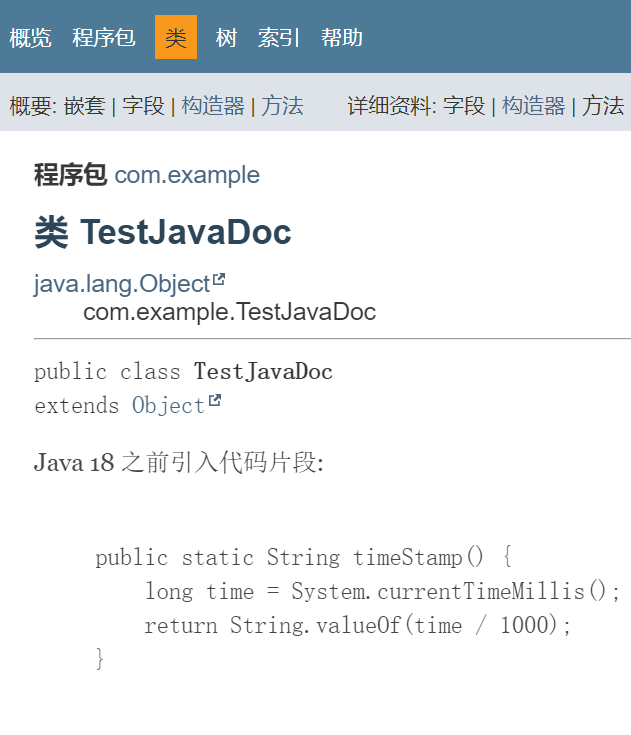
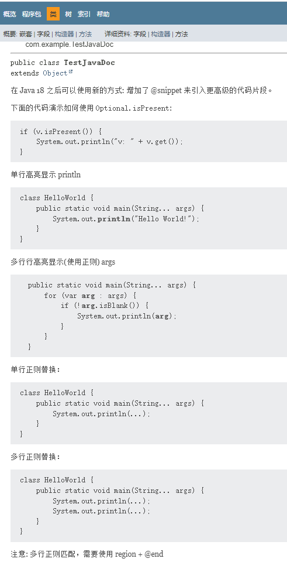
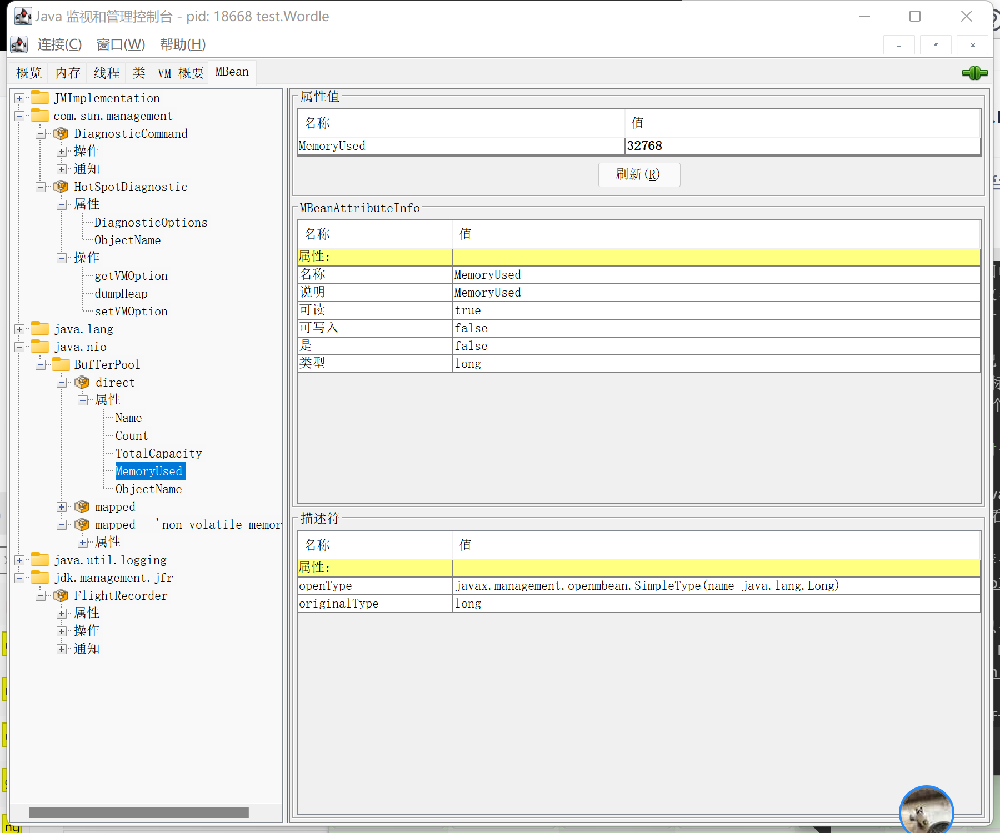

# Java 18 新特性

Java 18 在 2022 年 3 月 22 日正式发布，Java 18 不是一个长期支持版本。

这次更新共带来 9 个新特性：

- 400: UTF-8 by Default：默认 UTF-8 字符编码
- 408: Simple Web Server：简单的网络服务器
- 413: Code Snippets in Java API Documentation：Java API 文档中的代码片段
- 416: Reimplement Core Reflection with Method Handles：重构 Reflection，使用方法句柄重新实现核心反射
- 417: Vector API (Third Incubator)：计算向量的 API（三次孵化）
- 418: Internet-Address Resolution SPI：互联网地址解析 SPI
- 419: Foreign Function & Memory API (Second Incubator)：外部函数和内存 API（二次孵化）
- 420: Pattern Matching for switch (Second Preview)：Switch 模式匹配（二次预览）
- 421: Deprecate Finalization for Removal：弃用 finalize

JDK 文档查看及下载地址如下：

- Oracle OpenJDK 下载链接：https://jdk.java.net/archive/
- OpenJDK Java 18 新特性：https://openjdk.org/projects/jdk/18/
- OracleJDK Java 18 新特性：https://www.oracle.com/java/technologies/javase/18-relnote-issues.html#NewFeature
- Oracle JDK 18 文档：https://docs.oracle.com/en/java/javase/18/
- JDK 不同版本之间有何差异对比（提供下载 JDK）：https://javaalmanac.io/


## 1、JEP 420：Switch 模式匹配【二次预览】

从 Java 17 开始，对于 Switch 的改进就已经在进行了，Java 17 的 JEP 406 已经对 Switch 表达式进行了增强，使之可以减少代码量。在 Java 18 中，对 case 类型判断进行了优化（主要优化了穷举性检查），并且继续接收用户反馈。

***

Java 17 中正式发布了 Sealed Class（封闭类），在这特性的基础上，我们可以在 Switch 中进行模式匹配了，举一个简单的例子：

在某些情况下，我们可能想**枚举一个接口的所有实现类**，例如：

```java
interface Shape {}
record Circle(double radius) implements Shape {}
record Rectangle(double width, double height) implements Shape {}

double area(Shape shape) {
    if (shape instanceof Circle circle)
        return circle.radius() * circle.radius() * Math.PI;
    if (shape instanceof Rectangle rect)
        return rect.width() * rect.height();
    throw new IllegalArgumentException("Unknown shape");
}
```

我们如何能确定我们枚举完了所有的 Shape 呢？ Sealed Class 这个特性为我们解决这个问题，Sealed Class 可以在声明的时候就决定这个类可以被哪些类继承：

```java
sealed interface Shape permits Circle, Rectangle {}
record Circle(double radius) implements Shape {}
record Rectangle(double width, double height) implements Shape {}

double area(Shape shape) {
    if (shape instanceof Circle circle)
        return circle.radius() * circle.radius() * Math.PI;
    if (shape instanceof Rectangle rect)
        return rect.width() * rect.height();
    throw new IllegalArgumentException("Unknown shape");
}
```

Sealed Class（可以是 abstract class 或者 interface ）在声明时需要指定所有的实现类的名称。针对继承类，有如下限制：

- Sealed Class 的继承类必须和 Sealed Class 在**同一个模块下**，如果**没有指定模块**，就必须在**同一个包下**
- 每个继承类必须直接继承 Sealed Class，不能间接继承
- 每个继承类必须是下面三种之一：
  - final 的 class，Java Record 本身就是 final 的
  - sealed 的 class，可以进一步指定会被哪些子类实现
  - non-sealed 的 class，也是一种扩展，但是打破 Sealed Class 的限制，Sealed Class 不知道也不关心这种的继承类还会有哪些子类。

举个例子即：

```java
sealed interface Shape permits Circle, Rectangle, Triangle, WeirdShape {}
record Circle(double radius) implements Shape {}
record Rectangle(double width, double height) implements Shape {}

sealed interface Triangle extends Shape permits RightTriangle, NormalTriangle {}
record RightTriangle(double width, double height) implements Triangle {}
record NormalTriangle(double width, double height) implements Triangle {}

static non-sealed class WeirdShape implements Shape {}
class Star extends WeirdShape {}
    
double area(Shape shape) {
    if (shape instanceof Circle circle)
        return circle.radius() * circle.radius() * Math.PI;
    if (shape instanceof Rectangle rect)
        return rect.width() * rect.height();
    if (shape instanceof RightTriangle rt)
        return rt.width() * rt.height() / 2;
    if (shape instanceof NormalTriangle nt)
        return nt.width() * nt.height() / 2;
    throw new IllegalArgumentException("Unknown shape");
}
```

加入了 Switch 模式匹配之后，上面的 area 方法就可以改写成(我们需要在编译参数和启动参数中加上 `--enable-preview` 启用预览)：

```java
double area(Shape shape) {
    return switch (shape) {
        case Circle circle -> circle.radius() * circle.radius() * Math.PI;
        case Rectangle rect -> rect.width() * rect.height();
        case RightTriangle rt -> rt.width() * rt.height() / 2;
        case NormalTriangle nt -> nt.width() * nt.height() / 2;
        default -> throw new IllegalArgumentException("Unknown shape");
    }
}
```

如果你这里不写 default，并且，少了一种类型的话，那么就**会报编译错误，这就是 switch 模式匹配的穷举性检查**，例如：

```java
double area(Shape shape) {
    return switch (shape) {
        case Circle circle -> circle.radius() * circle.radius() * Math.PI;
        case Rectangle rect -> rect.width() * rect.height();
        case RightTriangle rt -> rt.width() * rt.height() / 2;
    }
} // Missing return statement
```

在 Java 18 Switch 的第二次预览中，主要修复了针对包含参数泛型的封闭类的穷举性检查，在如下封闭类，穷举性检查就不会误报编译错误了：

```java
sealed interface I<T> permits A, B {}
final class A<X> implements I<String> {}
final class B<Y> implements I<Y> {}

// 对于下面的代码，穷举性检查就不会误报编译错误了：
static int testGenericSealedExhaustive(I<String> i) {
    return switch(i) {
        // 由于形参是 Integer, 那么 A 是不可能了, 所以穷举性是对的
        case B<Ingeger> i -> 42;
    }
}
```


## 2、JEP 400：默认 UTF-8 字符编码

在 Java 17 及更早版本中，默认字符集是在 Java 虚拟机运行时才确定的，取决于不同的操作系统、区域设置等因素，因此存在潜在的风险。就比如说你在 Mac 上运行正常的一段打印文字到控制台的 Java 程序到了 Windows 上就会出现乱码，如果你不手动更改字符集的话。因为 Mac OS 默认使用 UTF-8 作为默认编码，如中国大陆的 Windows 使用 GBK 作为默认编码。

使用下面的命令可以输出 JDK 的当前编码。

```bash
# Windows 系统，默认 GBK (本人使用 git-bash 终端)
$ java -XshowSettings:properties -version 2>&1 | grep file.encoding
    file.encoding = GBK

# Mac 系统，默认 UTF-8
➜  ~ java -XshowSettings:properties -version 2>&1 | grep file.encoding
    file.encoding = UTF-8
    file.encoding.pkg = sun.io
```

下面编写一个简单的 Java 程序，输出默认字符编码，然后输出中文汉字 ” 你好 “，看看 Java 18 和 Java 17 运行区别。

```java
public class Hello{
    public static void main(String[] args) {
        System.out.println(java.nio.charset.Charset.defaultCharset());
        System.out.println("你好");
    }
}
```

```bash
lsx@DESKTOP-QG5B18P MINGW64 /d/work/Code/java-new-features/java-12/src/main/java
$ /d/work/Enviroment/JDK/jdk-17/bin/java ./Hello.java
GBK
浣犲ソ

lsx@DESKTOP-QG5B18P MINGW64 /d/work/Code/java-new-features/java-12/src/main/java
$ /d/work/Enviroment/JDK/jdk-18/bin/java ./Hello.java
UTF-8
你好
```

从运行结果中可以看到，使用 JDK 17 运行输出的默认字符编码是 GBK，输出的中文 ” 你好 “已经乱码了；乱码是因为 IDE 默认的文本编辑器编码是 UTF-8，而中国地区的 Windows 11 默认字符编码是 GBK，也是 JDK 17 默认获取到的编码，所以会在控制台输出时乱码；而使用 JDK 18 输出的默认编码就是 UTF-8，所以可以正常的输出中文” 你好 “。


## 3、JEP 408：简单的 Web 服务器

在 Java 18 中，在 bin 目录下提供了一个新命令 **jwebserver**，运行这个命令可以启动一个简单的 、最小化的静态 Web 服务器，它不支持 CGI 和 Servlet，所以最好的使用场景是用来测试、教育、演示等需求。

1、使用 jwebserver 启动一个 Web 服务器，默认发布的是当前目录。【注意：**当前目录是没有 index.html**】

```bash
D:\work\Enviroment\JDK\jdk-18\bin>jwebserver.exe
Binding to loopback by default. For all interfaces use "-b 0.0.0.0" or "-b ::".
Serving D:\work\Enviroment\JDK\jdk-18\bin and subdirectories on 127.0.0.1 port 8000
URL http://127.0.0.1:8000/
```

浏览器访问：http://127.0.0.1:8000/。可以发现会把当前目录所有文件及目录全部显示出来，**相当于是挂载目录的简单文件服务器**。

有请求时会在控制台输出请求信息，它只服务于 HEAD 和 GET 请求，不支持身份验证、访问控制、加密等。

```BASH
127.0.0.1 - - [25/4鏈?2023:18:03:56 +0800] "GET / HTTP/1.1" 200 -
```

***

2、使用 jwebserver 启动一个 Web 服务器，指定发布的目录（D:\work），并且在该目录下新建 index.html（D:\work\index.html）

```html
<html>
    <head>
        <meta http-equiv="Content-Type" content="text/html; charset=utf-8" />
    </head>
    <body>
        <h1>标题</h1>
    </body>
</html>
```

```bash
D:\work\Enviroment\JDK\jdk-18\bin>jwebserver -d D:\work
Binding to loopback by default. For all interfaces use "-b 0.0.0.0" or "-b ::".
Serving D:\ and subdirectories on 127.0.0.1 port 8000
URL http://127.0.0.1:8000/
```

浏览器再次访问：http://127.0.0.1:8000/。可以发现显示的是 index.html 的内容，尽管当前目录下其他文件夹与文件。

***

3、通过 help 参数可以查看 jwebserver 支持的参数。

```bash
➜  bin ./jwebserver --help
Usage: jwebserver [-b bind address] [-p port] [-d directory]
                  [-o none|info|verbose] [-h to show options]
                  [-version to show version information]
Options:
-b, --bind-address    - 绑定地址. Default: 127.0.0.1 (loopback).
                        For all interfaces use "-b 0.0.0.0" or "-b ::".
-d, --directory       - 指定目录. Default: current directory.
-o, --output          - Output format. none|info|verbose. Default: info.
-p, --port            - 绑定端口. Default: 8000.
-h, -?, --help        - Prints this help message and exits.
-version, --version   - Prints version information and exits.
To stop the server, press Ctrl + C.
```

***

4、细心的同学可以发现本人的 CMD 窗口出现乱码的情况。因为 Java 18 默认编码为 UTF-8，但是在 CMD 中的默认编码为 GBK。这时我们需要调整下。在 CMD 窗口输入：`chcp`

```bash
D:\work\Enviroment\JDK\jdk-18\bin>chcp
活动代码页: 936
```

- 655001：代表UTF-8编码，
- 936 : 代表GBK编码。

我们临时修改就可以了。输入：chcp 65001 可以将当前窗口的编码形式修改为 UTF-8。现在可以发现日志中已经不乱码了。

```bash
D:\work\Enviroment\JDK\jdk-18\bin>chcp 655001

Active code page: 65001

D:\work\Enviroment\JDK\jdk-18\bin>jwebserver
Binding to loopback by default. For all interfaces use "-b 0.0.0.0" or "-b ::".
Serving D:\work\Enviroment\JDK\jdk-18\bin and subdirectories on 127.0.0.1 port 8000
URL http://127.0.0.1:8000/
127.0.0.1 - - [25/4月/2023:18:17:15 +0800] "GET / HTTP/1.1" 200 -
```

***

5、你可以通过使用 `com.sun.net.httpserver` 下的类，自定义这个 HTTP 服务器的配置，自定义 HttpHandler，Filter 这些，例如：

```java
import com.sun.net.httpserver.Filter;
import com.sun.net.httpserver.HttpContext;
import com.sun.net.httpserver.HttpExchange;
import com.sun.net.httpserver.HttpServer;
import java.io.IOException;
import java.io.OutputStream;
import java.net.InetSocketAddress;

public class SimpleHttpServer {
	public static void main(String[] args) throws Exception {
		HttpServer httpServer = HttpServer.create(new InetSocketAddress(8000), 0);
		/**
		 * 创建监听的上下文, 请求 URI 根路径的匹配, 根据不同的 URI 根路径选择不同的 HttpHandler 处理请求,
		 * 路径必须以 "/" 开头。路径 "/" 表示匹配所有的请求 URI（没有其他更具体的匹配路径除外）。
		 * HttpContext createContext(String path);
		 * HttpContext createContext(String path, HttpHandler handler);
		 */
		HttpContext context = httpServer.createContext("/test", exchange -> {
			try (OutputStream os = exchange.getResponseBody()) {
				System.out.println(exchange.getAttribute("name"));
				String str = "Hello Java";
				exchange.sendResponseHeaders(200, str.length());
				os.write(str.getBytes());
			}
		});
		// 可以指定多个 Filter
		Filter filter = new Filter() {
			@Override
			public void doFilter(HttpExchange exchange, Chain chain) throws IOException {
				exchange.setAttribute("name", "Sam");
				chain.doFilter(exchange);
				exchange.getResponseHeaders().add("testHeader", "testHeaderValue");
			}

			@Override
			public String description() {
				return "test";
			}
		};
		context.getFilters().add(filter);
		httpServer.start();
	}
}
```

编译并执行。要访问本地服务器，请在浏览器中打开：http://localhost:8000/test


## 4、JEP 413：JavaDoc 中支持代码片段

在 Java 18 中新增了对 JavaDoc 的增强，在 Java 18 之前，已经支持在 JavaDoc 中引入代码片段，这样可以在某些场景下更好的展示描述信息，但是之前的支持功能有限，比如我想高亮代码片段中的某一段代码是无能为力的。现在 Java 18 优化了这些，增加了 @snippet 来引入更高级的代码片段。

1、在 Java 18 之前，想引入代码片段一般都使用 `<pre>{@code ...}</pre>` ：

```java
package com.example;

/**
 * Java 18 之前引入代码片段:
 * <p>
 * <pre>{@code
 *     public static String timeStamp() {
 *         long time = System.currentTimeMillis();
 *         return String.valueOf(time / 1000);
 *     }
 * }</pre>
 */
public class TestJavaDoc {
}
```



2、从 Java 18 开始，可以使用 @snippet 来生成注释，且可以高亮、替换（都支持正则表达式）某个代码片段。

```java
package com.example;

/**
 * 在 Java 18 之后可以使用新的方式: 增加了 @snippet 来引入更高级的代码片段。
 * <p>
 * 下面的代码演示如何使用 {@code Optional.isPresent}:
 * <p>
 * {@snippet :
 * if (v.isPresent()) {
 *     System.out.println("v: " + v.get());
 * }
 *}
 * <p>
 * 单行高亮显示 println
 * <p>
 * {@snippet :
 * class HelloWorld {
 *     public static void main(String... args) {
 *         System.out.println("Hello World!");      // @highlight substring="println"
 *     }
 * }
 *}
 * <p>
 * 多行行高亮显示(使用正则) args
 * <p>
 * {@snippet :
 *   public static void main(String... args) {
 *       for (var arg : args) {                 // @highlight region regex = "\barg\b"
 *           if (!arg.isBlank()) {
 *               System.out.println(arg);
 *           }
 *       }                                      // @end
 *   }
 *}
 *
 * <p>
 * 单行正则替换：
 * {@snippet :
 * class HelloWorld {
 *     public static void main(String... args) {
 *         System.out.println("Hello World!");  // @replace regex='".*"' replacement="..."
 *     }
 * }
 *}
 * <p>
 * 多行正则替换：
 * {@snippet :
 * class HelloWorld {
 *     public static void main(String... args) {
 *         System.out.println("Hello World!");  // @replace region regex='".*"' replacement="..."
 *         System.out.println("Hello World!");  // @end
 *     }
 * }
 *}
 * <p>
 * 注意: 多行正则匹配，需要使用 region + @end
 */
public class TestJavaDoc {
}
```



> **附：Javadoc 生成方式**：

```bash
###### Linux/MacOS  ######
# 使用 javadoc 命令生成 Javadoc 文档
$ ./java-18/bin/javadoc -public -sourcepath ./src/main/java -subpackages com -encoding utf-8 -charset utf-8 -d ./javadocout
# 使用 Java 18 的 jwebserver 把生成的 Javadoc 发布测试
$ ./java-18/bin/jwebserver -d /User/lsx/javadocout
```

```bash
###### Windows10/11  ######
# 使用 javadoc 命令生成 Javadoc 文档
$ javadoc -sourcepath .\src\main\java -subpackages com -encoding utf-8 -charset utf-8 -d D:\javadocout
# 使用 Java 18 的 jwebserver 把生成的 Javadoc 发布测试, 访问:http://127.0.0.1:8000/
$ jwebserver -d D:\javadocout
```


## 5、JEP 416：通过方法句柄重新实现反射接口

在 Java 18 之前，有三种用于反射操作的 JDK 内部机制：

- 虚拟机本地方法
- 动态生成的字节码 stub (Method::invoke, Constructor::newInstance) 和依赖 Unsafe 类的字段访问（Field::get and set）：主要在 java.lang.reflect 下
- 方法句柄（MethodHandle 类）：主要在 java.lang.invoke 下

每次给 Java 添加一些新的结构特性，例如 Record 这些，都需要同时修改这三个的代码，太费劲了。**所以 Java 18 中通过使用 java.lang.invoke 下的类实现了第二种的这些 API，来减少未来添加新的语言特性所需要的工作量**。这也是为了 **Project Valhalla** 的原生值类型（可以栈上分配，类似于 C 语言的 struct，还有其他语言的 inline class）做准备。

主要改动体现在：Java 18 改进了 java.lang.reflect.Method、java.lang.reflect.Constructor 的实现逻辑，使之性能更好，速度更快。这项改动不会改动相关 API ，这意味着开发中不需要改动反射相关代码，就可以体验到性能更好反射。

OpenJDK 官方给出了新老实现的反射性能基准测试结果。对比可以看到 Java 18 后在某些场景下性能稍微好些。

Java 18 之前：

```
Benchmark                                     Mode  Cnt   Score  Error  Units
ReflectionSpeedBenchmark.constructorConst     avgt   10  68.049 ± 0.872  ns/op
ReflectionSpeedBenchmark.constructorPoly      avgt   10  94.132 ± 1.805  ns/op
ReflectionSpeedBenchmark.constructorVar       avgt   10  64.543 ± 0.799  ns/op
ReflectionSpeedBenchmark.instanceFieldConst   avgt   10  35.361 ± 0.492  ns/op
ReflectionSpeedBenchmark.instanceFieldPoly    avgt   10  67.089 ± 3.288  ns/op
ReflectionSpeedBenchmark.instanceFieldVar     avgt   10  35.745 ± 0.554  ns/op
ReflectionSpeedBenchmark.instanceMethodConst  avgt   10  77.925 ± 2.026  ns/op
ReflectionSpeedBenchmark.instanceMethodPoly   avgt   10  96.094 ± 2.269  ns/op
ReflectionSpeedBenchmark.instanceMethodVar    avgt   10  80.002 ± 4.267  ns/op
ReflectionSpeedBenchmark.staticFieldConst     avgt   10  33.442 ± 2.659  ns/op
ReflectionSpeedBenchmark.staticFieldPoly      avgt   10  51.918 ± 1.522  ns/op
ReflectionSpeedBenchmark.staticFieldVar       avgt   10  33.967 ± 0.451  ns/op
ReflectionSpeedBenchmark.staticMethodConst    avgt   10  75.380 ± 1.660  ns/op
ReflectionSpeedBenchmark.staticMethodPoly     avgt   10  93.553 ± 1.037  ns/op
ReflectionSpeedBenchmark.staticMethodVar      avgt   10  76.728 ± 1.614  ns/op
```

Java 18 的新实现：

```
Benchmark                                     Mode  Cnt    Score   Error  Units
ReflectionSpeedBenchmark.constructorConst     avgt   10   32.392 ± 0.473  ns/op
ReflectionSpeedBenchmark.constructorPoly      avgt   10  113.947 ± 1.205  ns/op
ReflectionSpeedBenchmark.constructorVar       avgt   10   76.885 ± 1.128  ns/op
ReflectionSpeedBenchmark.instanceFieldConst   avgt   10   18.569 ± 0.161  ns/op
ReflectionSpeedBenchmark.instanceFieldPoly    avgt   10   98.671 ± 2.015  ns/op
ReflectionSpeedBenchmark.instanceFieldVar     avgt   10   54.193 ± 3.510  ns/op
ReflectionSpeedBenchmark.instanceMethodConst  avgt   10   33.421 ± 0.406  ns/op
ReflectionSpeedBenchmark.instanceMethodPoly   avgt   10  109.129 ± 1.959  ns/op
ReflectionSpeedBenchmark.instanceMethodVar    avgt   10   90.420 ± 2.187  ns/op
ReflectionSpeedBenchmark.staticFieldConst     avgt   10   19.080 ± 0.179  ns/op
ReflectionSpeedBenchmark.staticFieldPoly      avgt   10   92.130 ± 2.729  ns/op
ReflectionSpeedBenchmark.staticFieldVar       avgt   10   53.899 ± 1.051  ns/op
ReflectionSpeedBenchmark.staticMethodConst    avgt   10   35.907 ± 0.456  ns/op
ReflectionSpeedBenchmark.staticMethodPoly     avgt   10  102.895 ± 1.604  ns/op
ReflectionSpeedBenchmark.staticMethodVar      avgt   10   82.123 ± 0.629  ns/op
```


## 6、JEP 417：Vector API【三次孵化】

在 Java 16 中引入一个新的 API 来进行向量计算，它可以在运行时可靠的编译为支持的 CPU 架构，从而实现更优的计算能力。

在 Java 17 中改进了 Vector API 性能，增强了例如对字符的操作、字节向量与布尔数组之间的相互转换等功能。

现在在 Java 18 中进行第三次孵化，将继续优化其性能。


## 7、JEP 418：互联网地址解析 SPI

为主机名和地址解析定义服务提供者接口 (SPI)，以便 `java.net.InetAddress`可以使用平台内置解析器以外的解析器。

```java
InetAddress inetAddress = InetAddress.getByName("www.baidu.com");
System.out.println(inetAddress.getHostAddress()); // 157.148.69.74
```


## 8、JEP 419：外部函数和内存 API 【二次孵化】

新的 API 允许 Java 开发者与 JVM 之外的代码和数据进行交互，通过调用外部函数，可以在不使用 JNI 的情况下调用本地库。

发展历史如下：

- Java 14 [JEP 370](https://openjdk.java.net/jeps/370) 引入了外部内存访问 API（孵化器）
- Java 15 [JEP 383](https://openjdk.java.net/jeps/383) 引入了外部内存访问 API（第二孵化器）
- Java 16 [JEP 389](https://openjdk.java.net/jeps/389) 引入了外部链接器 API（孵化器）
- Java 16 [JEP 393](https://openjdk.java.net/jeps/393) 引入了外部内存访问 API（第三孵化器）
- Java 17 [JEP 412](https://openjdk.java.net/jeps/412) 引入了外部函数和内存 API（孵化器）
- Java 18 [JEP 419](https://openjdk.java.net/jeps/419) 引入了外部函数和内存 API（二次孵化器）

这是一个孵化功能；需要添加 `--add-modules jdk.incubator.foreign` 来编译和运行 Java 代码，Java 18 改进了相关 API ，使之更加简单易用。


## 9、JEP 421：Finalization 废弃完成删除

在未来将删除 Finalization，目前 Finalization 仍默认保持启用状态，但是已经可以手动禁用；在未来的版本中，将会默认禁用；在以后的版本中，它将被删除。需要进行资源管理可以尝试 `try-with-resources` 或者 `java.lang.ref.Cleaner`。

Java finalization 是 Java 一开始就有的特性，当初设计出来的时候是为了让我们避免资源泄漏：当没有人引用保存资源的实例时然后执行一段代码来回收资源。本着这个思路，就会联想到垃圾回收器知道什么时候是要回收一个对象，所以就利用垃圾回收的机制来执行这段代码就好了。所以，设计出 Object 的 finalize() 方法，Java 类可以覆盖这个方法，在里面填写关闭资源的代码。这段代码会在对象被回收的某个时候被调用。但是这种机制带来了如下几个问题：

- 假设你的 JVM 老年代增长的很慢，如果你的需要 finalize 的对象进入了老年代，那么可能很久对象都不会被回收。
- 假设你的需要 finalize 的对象突然增多，创建这种对象的速度要快于 GC 进行收集以及执行 `finalize()` 方法的速度，这样会造成雪崩
- 由于无法确定哪个线程执行 finalize() 方法，按照什么顺序执行这些 finalize() 方法，因此在这个方法中不能有影响线程安全的代码，以及乱引用外部对象导致对象又“复活”了

并且，这种 Finalization 还是一个历史包袱，所有的垃圾回收器代码都要不断维护这个执行这些 finalize() 方法的机制，影响了这些垃圾回收器的迭代，并且由于 Finalization 的存在导致 GC 要占用的内存页增加了，ZGC 估计 1.5% 的内存占用只是为了 Finalization 用的。

所以，其实从 Java 9 开始就标记 Object 的 finalize() 方法为 Deprecated 了，现在从 Java 18 开始，正式标记为 Deprecated for removal，也就是不久的将来，这个方法会被完全去掉。

> **如何验证移除 Finalization 对你的项目是否有影响？**

- 如果你使用了 JFR，可以通过 Java 18 后加入的 JFR 事件 jdk.FinalizerStatistics，来看出你的 JVM 中是否有 Finalization
- 如果你没有开启 JFR，那么我推荐你使用下 JFR，很好用，参考：[JFR 全解](https://link.segmentfault.com/?enc=ElTP0UYiHK3r3GilaxNkSw%3D%3D.pkJLjcQs7zimhF7CcXkjqyW5iMEpd7DmmKDTStbZAcVkuZ9hCwGnm1%2BBHFNS1xvvSO2BoWyxmtUdIqPn1zrCYA%3D%3D)。
- 如果你不想通过 JFR，那么你可以先在你的程序运行的时候，记录下：
  - JVM 内存使用情况，建议开启 Native Memory Tracking，参考：[JVM相关 - 深入理解 System.gc()](https://link.segmentfault.com/?enc=9ocbcJzNkuMB6zSXeycgdg%3D%3D.PadD8Tcvk%2BsSIQg83Zv02eLYNdFZdqFelzCqtKTh6FfPSkjvvOf%2BXzGDzjnifNNb)。
  - 进程相关的文件描述符数量。
  - Direct Buffer 以及 MMAP Buffer 使用量：可以通过 JMX 的 MBean 查看，例如：



记录好之后，启动参数加上 `--finalization=disabled`，这个参数**让所有的 Finalization 机制失效**，对比下内存用量，判断是否依赖了 Finalization。


## 10、参考资料 & 鸣谢

1. 作者：张哈希。关于 Java 18 你想知道的一切：https://segmentfault.com/a/1190000041585826
1. Java 新特性文档：https://www.wdbyte.com/java-feature/
3. Java New Feature：https://javaguide.cn/java/new-features/
4. Java 的新特性：https://segmentfault.com/a/1190000004417288/
5. Java 各个版本特性：https://my.oschina.net/mdxlcj?tab=newest&catalogId=6361172/
6. Java 各个版本新特性：https://blog.csdn.net/wang_luwei/category_10482191.html/