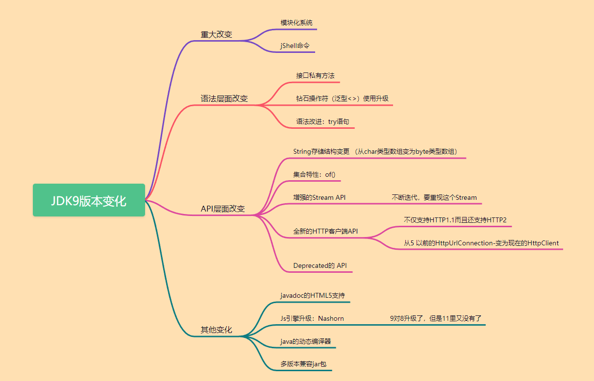
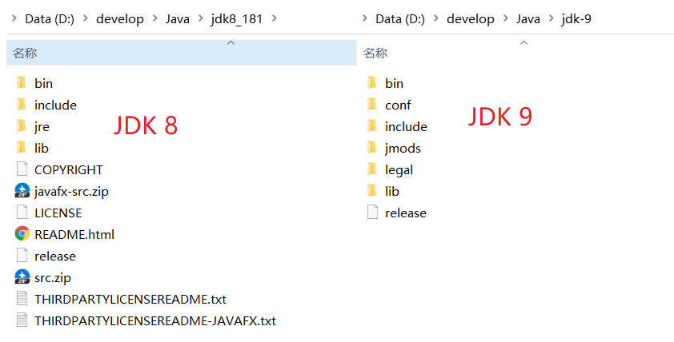

# Java 9 新特性

Java 9 发布时间为 2017-09-22，Java 9 不是一个长期支持版本。由 Oracle 发布。其中包含许多新功能。它包括对 Java 编程，JVM，工具和库的各种升级。

本次更新的新特性大致如下：

- 模块系统：模块是一个包的容器，Java 9 最大的变化之一是引入了模块系统（Jigsaw 项目）。
- REPL (JShell)：交互式编程环境。
- HTTP 2 客户端：HTTP/2标准是HTTP协议的最新版本，新的 HTTPClient API 支持 WebSocket 和 HTTP2 流以及服务器推送特性。
- 改进的 Javadoc：Javadoc 现在支持在 API 文档中的进行搜索。另外，Javadoc 的输出现在符合兼容 HTML5 标准。
- 多版本兼容 JAR 包：多版本兼容 JAR 功能能让你创建仅在特定版本的 Java 环境中运行库程序时选择使用的 class 版本。
- 集合工厂方法：List，Set 和 Map 接口中，新的静态工厂方法可以创建这些集合的不可变实例。
- 私有接口方法：在接口中使用private私有方法。我们可以使用 private 访问修饰符在接口中编写私有方法。
- 进程 API: 改进的 API 来控制和管理操作系统进程。引进 java.lang.ProcessHandle 及其嵌套接口 Info 来让开发者逃离时常因为要获取一个本地进程的 PID 而不得不使用本地代码的窘境。
- 改进的 Stream API：改进的 Stream API 添加了一些便利的方法，使流处理更容易，并使用收集器编写复杂的查询。
- 改进 try-with-resources：如果你已经有一个资源是 final 或等效于 final 变量,您可以在 try-with-resources 语句中使用该变量，而无需在 try-with-resources 语句中声明一个新变量。
- 改进的弃用注解 @Deprecated：注解 @Deprecated 可以标记 Java API 状态，可以表示被标记的 API 将会被移除，或者已经破坏。
- 改进钻石操作符(Diamond Operator) ：匿名类可以使用钻石操作符(Diamond Operator)。
- 改进 Optional 类：java.util.Optional 添加了很多新的有用方法，Optional 可以直接转为 stream。
- 多分辨率图像 API：定义多分辨率图像API，开发者可以很容易的操作和展示不同分辨率的图像了。
- 改进的 CompletableFuture API ： CompletableFuture 类的异步机制可以在 ProcessHandle.onExit 方法退出时执行操作。
- 轻量级的 JSON API：内置了一个轻量级的 JSON API
- 响应式流（Reactive Streams) API: Java 9中引入了新的响应式流 API 来支持 Java 9 中的响应式编程。

Java 9 发布的主要目标是：

- 使 JDK 和 Java 标准版平台模块化，它可以很好地缩小运行在小型计算设备中。
- 提高 JDK 和 Java 实现的整体安全性。
- 使 Java 代码库和大型应用程序的构建过程和维护变得轻松，适用于 JavaSE 和 JavaEE 平台。
- 为 Java 平台设计和实现一个标准模块系统，可以很容易地应用于平台和 JDK。

JDK 文档查看及下载地址如下：

- Oracle OpenJDK 下载链接：https://jdk.java.net/archive/
- OpenJDK Java 9 新特性：https://openjdk.org/projects/jdk9/
- Oracle JDK 9 文档：https://docs.oracle.com/javase/9/
- JDK 不同版本之间有何差异对比（提供下载 JDK）：https://javaalmanac.io/


## 1、新特性概述

经过 4 次推迟，历经曲折的 Java 9 最终在 2017 年 9 月 21 日发布。因为里面加入的模块化系统，在最初设想的时候并没有想过那么复杂，花费的时间超出预估时间。距离 Java 8 大约三年时间。

Java 9 提供了超过 150 项新功能特性，包括备受期待的模块化系统、可交互的REPL工具：Jshell，JDK 编译工具，语法层面的改变：Java 公共 API 和私有代码，以及安全增强、扩展提升、性能管理改善等。可以说 Java 9 是一个庞大的系统工程，完全做了一个整体改变。

但是这个巨大改变的功劳，都给了 Java 11 了，目前 Oracle 对 Java 8、Java 11 都长期支持，Java 9、Java 10 不支持了，只能从历史版本（http://jdk.java.net/）中下载，Java 11 将会获得 Oracle 提供的长期支持服务，直至 2026 年 9 月。

从 Java 9 这个版本开始，Java 的计划发布周期是 6 个月，下一个 Java 的主版本将于 2018 年 3 月发布，命名为 Java18.3(Java10)， 紧接着再过六个月将发布Java18.9(Java 11)。

这意味着 Java 的更新从传统的以特性驱动的发布周期，转变为以时间驱动的（6个月为周期）发布模式（更快的时间周期,oracle的理念就是小步快跑，快速迭代，像IBM（DB2 数据库，保守型内部测试才投入市场）），并逐步的将 Oracle JDK 原商业特性进行开源。针对企业客户的需求，Oracle 将以三年为周期发布长期支持版本（Long Term Support）。

Java 9 的具体变化在下面的思维导图中呈现：




## 2、目录结构变化

JDK8 与 JDK9 目录结果对比图如下：



最明显的是在 JDK 9 中 jre 文件夹不存在了。这个新特性只要了解下就可以了，这个目录结构是方便为了接下来新特性做保证。

JDK 8 目录结果介绍：

- bin：包含命令行开发和调试工具，如：javac、jar、javadoc。
- include：包含编译本地代码时使用的C/C++头部文件。
- legal：法律声明（高版本 Oracle JDK 8 中才有此文件夹）
- lib：包含 JDK 工具的几个 jar 和其他类型的文件，他有一个tools.jar文件，其中含javac编译器的Java类。
- jre/bin：目录 包含基本指令，如java指令，在windows平台上，它包含系统的运行时动态链接。
- jre/lib：包含用户可编辑的配置文件，如.properties和.policy文件，包含几个JAR文件，rt.jar文件包含运行时的Java类和资源文件。

JDK 9 目录结果介绍：

- bin：包含所有指令，在 Windows 平台上，他继续包含系统的运行时动态链接库。
- conf：包含用户可编辑的配置文件,例如之前位于jre/lib目录中的.properties和.policy文件。
- includes：包含在以前编译本地代码时使用 C/C++ 头文件,他只存在于JDK中。
- jmods：包含JMOD格式的平台模块，创建自定义运行时映像需要他,它只存在于JDK中。
- legal：法律声明。
- lib：包含非Windows平台上的动态链接本地库，其子目录和文件不应由开发人员直接编译或使用。


## 3、钻石操作符的升级

**钻石操作符**就是我们泛型使用的符号`<>`，钻石操作符与匿名内部类在 Java 8 中不能共存。但是在 Java 9 中可以。此处换成 Java 8 就报错、换成 Java 9 就正常、很小的一个特性

```java
@Test
public void test() {
    // 钻石操作符与匿名内部类在java8中不能共存。在java9可以。
    Comparator<Object> com = new Comparator<>() {
        @Override
        public int compare(Object o1, Object o2) {
            return 0;
        }
    };

    // Jdk7中的新特性：类型推断
    ArrayList<String> list = new ArrayList<>();

}
```

```java
// Java6 及以前
Map<String,String> map7 = new HashMap<String,String>();
// Java7和8 <>没有了数据类型
Map<String,String> map8 = new HashMap<>();
// Java9 添加了匿名内部类的功能 后面添加了大括号{}  可以做一些细节的操作
Map<String,String> map9 = new HashMap<>(){};
```


## 4、异常处理 try 升级

try-with-resources 是 Java 7 中一个新的异常处理机制，它能够很容易地关闭在 try-catch 语句块中使用的资源。所谓的资源（resource）是指在程序完成后，必须关闭的对象，try-with-resources 语句确保了每个资源在语句结束时关闭。所有实现了 java.lang.AutoCloseable 接口。

try-with-resources 声明在 Java 9 已得到改进。如果你已经有一个资源是 final 或等效于 final 变量，您可以在 try-with-resources 语句中使用该变量，而无需在 try-with-resources 语句中声明一个新变量。

1、 Java 7、Java 8 共同的处理方式：

```java
import java.io.BufferedReader;
import java.io.IOException;
import java.io.Reader;
import java.io.StringReader;

public class Tester {
    public static void main(String[] args) throws IOException {
        System.out.println(readData("test"));
    }
    static String readData(String message) throws IOException {
        Reader inputString = new StringReader(message);
        BufferedReader br = new BufferedReader(inputString);
        try (BufferedReader br1 = br) {
            return br1.readLine();
        }
    }
}
```

2、在 Java 9 中，我们不需要声明资源 br1 就可以使用它，并得到相同的结果

```java
import java.io.BufferedReader;
import java.io.IOException;
import java.io.Reader;
import java.io.StringReader;
/**
 * Java9及每一个流打开的时候都要关闭,但是在try的括号中来进行关闭
 * Java9在Java8的基础上进一步升级 直接在try括号中直接写入 变量就好，如果有多个流，就用分号隔开
 **/
public class Tester {
    public static void main(String[] args) throws IOException {
        System.out.println(readData("test"));
    }
    
    static String readData1(String message) throws IOException {
        Reader inputString = new StringReader(message);
        try (inputString) {
            return "";
        }
    }

    static String readData2(String message) throws IOException {
        Reader inputString = new StringReader(message);
        Writer outputString = new StringWriter();
        try(outputString; outputString) {
            return "";
        }
    }
}
```


## 5、下划线命名标识符的使用限制

标识符命名组成：字母，数字，下划线，美元符。

Java 8 中可以使用一个 _ 作为标识符的命名（String _ ="hello";）。Java 9 中就不可以使用一个 _ 作为标识符的命名了，不通过编译，但是标识符中仍然可以使用_，必须配合其他内容一起使用。


## 6、Diamond 运算符增强

Diamond 运算符在 Java 7 中引入，使代码更可读，但它无法与匿名内部类一起使用。在Java 9中，它可以与 Annonmou s类一起使用，并简化代码并提高可读性。在 Java 9 之前考虑以下代码。

```java
public class Tester {
    public static void main(String[] args) {
        Handler<Integer> intHandler = new Handler<Integer>(1) {
            @Override
            public void handle() {
                System.out.println(content);
            }
        };
        intHandler.handle();
        Handler<? extends Number> intHandler1 = new Handler<Number>(2) {
            @Override
            public void handle() {
                System.out.println(content);
            }
        };
        intHandler1.handle();
        Handler<?> handler = new Handler<Object>("test") {
            @Override
            public void handle() {
                System.out.println(content);
            }
        };
        handler.handle();
    }
}

abstract class Handler<T> {
    public T content;

    public Handler(T content) {
        this.content = content;
    }

    abstract void handle();
}
```

```java
1
2
Test
```

在 Java 9 中，可以对匿名类使用<>运算符，如下所示。

```java
public class Tester {
    public static void main(String[] args) {
        Handler<Integer> intHandler = new Handler<>(1) {
            @Override
            public void handle() {
                System.out.println(content);
            }
        };
        intHandler.handle();
        Handler<? extends Number> intHandler1 = new Handler<>(2) {
            @Override
            public void handle() {
                System.out.println(content);
            }
        };
        intHandler1.handle();
        Handler<?> handler = new Handler<>("test") {
            @Override
            public void handle() {
                System.out.println(content);
            }
        };

        handler.handle();
    }
}

abstract class Handler<T> {
    public T content;

    public Handler(T content) {
        this.content = content;
    }

    abstract void handle();
}
```

```java
1
2
Test
```


## 7、接口支持私有方法

```java
public interface FilterProcess<T> {

    // Java7 及以前特性 全局常量和抽象方法
    public static final String a ="22";
    boolean process(T t);

    // Java8 特性 静态方法和默认方法
    default void love(){
        System.out.println("Java8 特性默认方法");
    }
    static void haha(){
        System.out.println("Java8 特性静态方法");
    }

    // Java9 特性 支持私有方法
    private void java9(){
        System.out.println("Java9 特性静态方法");
    }
}
```


## 8、String 底层存储结构更换

 Java 8 之前 String 的底层结构类型都是 char [] , 但是 Java 9 就替换成 byte []，这样来讲更节省了空间和提高了性能。

```java
@Stable
private final byte[] value;
```

之所以替换是因为 之前一直是最小单位是一个 char，用到两个 byte, 但是 JDK8 是基于 latin1 的，而这个 latin1 编码可以用一个 byte 标识，所以当你数据明明可以用到一个 byte 的时候，我们用到了一个最小单位 chat 两个 byte，就多出了一个 byte 的空间。所以 JDK9 在这一方面进行了更新，现在的 JDK9 是基于 ISO/latin1/Utf-16  ,latin1 和 ISO 用一个 byte 标识，UTF-16 用两个 byte 标识，JDK9 会自动识别用哪个编码，当数据用到 1byte，就会使用 iSO 或者 latin1 ，当空间数据满足 2byte 的时候，自动使用 utf-16, 节省了很多空间。

> 同理：StringBuilder StringBuffer 也更换了底层数据结构


## 9、Stream 的增强

在原有 Stream API 新添加了 4 个方法，takeWhile、dropWhile、ofNullable、iterate（新重载方法）

1、takeWhile：从Stream中依次获取满足条件的元素，直匹配到一个不满足条件为止结束获取，不同与filter

```java
List<Integer> list = List.of(11, 33, 44, 102, 232, 454, 67, 556, 46, 78);
list.stream().takeWhile(x -> x < 100).forEach(System.out::println);
// 输出结果如下
11
33
44
```

2、dropWhile：从Stream中依次删除满足条件的元素，直到匹配到一个不满足条件为止结束删除

```java
List<Integer> list = List.of(11, 33, 44, 102, 232, 454, 67, 556, 46, 78);
list.stream().dropWhile(x -> x < 100).forEach(System.out::println);
// 输出结果如下
102
232
454
67
556
46
78
```

3、Stream.ofNullable(null), 在 Java8 中 Stream 中的元素不能完全为 null，否则空指针异常，而在 Java9 的升级中，允许创建 null，如果为null，它将返回一个空流。它有助于处理空流和NullPointerException。

```java
Stream.ofNullable(null).forEach(System.out::println);
// 该程序不会产生任何输出。
```

4、Stream.iterate，不加条件无线循环

```java
// 8 的使用方式
Stream.iterate(0, k -> k + 1).limit(12).forEach(System.out::println);
// 9 新增的重载方法
Stream.iterate(0, k -> k < 12, k -> k + 1).forEach(System.out::println);
```


## 10、新增 InputStream.transferTo 方法

InputStream 终于有了一个非常有用的方法: transferTo， 可以用来将数据直接传输到 OutputStream，这是在处理原始数据流时非常常见的一种用法，如下：

```JAVA
@Test
public void test() {
    // 获取当前类的类加载器
    ClassLoader cl = this.getClass().getClassLoader();
    try (InputStream is = cl.getResourceAsStream("hello.txt");
         OutputStream os = new FileOutputStream("src\\hello1.txt")) {
        // 把输入流中的所有数据直接自动地复制到输出流中
        is.transferTo(os); 
    } catch (IOException e) {
        e.printStackTrace();
    }
}
```


## 11、Collection 工厂方法增强

Java 9 增加新的工厂方法被添加到 List，Set 和 Map 接口以创建不可变的实例。用于以较少的冗长和简洁的方式创建集合。

1、Collections 旧方法：Java 8 创建只读集合

```java
import java.util.ArrayList;
import java.util.Collections;
import java.util.HashMap;
import java.util.HashSet;
import java.util.List;
import java.util.Map;
import java.util.Set;

public class Tester {
    public static void main(String []args) {
        Set<String> set=new HashSet<>();
        set.add("A");
        set.add("B");
        set.add("C");
        set=Collections.unmodifiableSet(set);
        System.out.println(set);
        List<String> list=new ArrayList<>();

        list.add("A");
        list.add("B");
        list.add("C");
        list=Collections.unmodifiableList(list);
        System.out.println(list);
        Map<String, String> map=new HashMap<>();

        map.put("A","Apple");
        map.put("B","Boy");
        map.put("C","Cat");
        map=Collections.unmodifiableMap(map);
        System.out.println(map);
        
        List<String> list = Collections.unmodifiableList(Arrays.asList("a", "b", "c"));
        Set<String> set = Collections.unmodifiableSet(new HashSet<>(Arrays.asList("a", "b", "c")));
        // 如下操作不适用于jdk 8 及之前版本,适用于jdk 9
        Map<String, Integer> map = Collections.unmodifiableMap(new HashMap<>() {
            {
                put("a", 1);
                put("b", 2);
                put("c", 3);
            }
        });
    }
}
```

2、Collections.of 新方法：Java 9 创建只读集合。

```java
import java.util.ArrayList;
import java.util.Collections;
import java.util.HashMap;
import java.util.HashSet;
import java.util.List;
import java.util.AbstractMap;
import java.util.Map;
import java.util.Set;

public class Tester {
   public static void main(String []args) {
      Set<String> set=Set.of("A", "B", "C");      
      System.out.println(set);
      List<String> list=List.of("A", "B", "C");
      System.out.println(list);
      Map<String, String> map=Map.of("A","Apple","B","Boy","C","Cat");
      System.out.println(map);
  
      Map<String, String> map1=Map.ofEntries (
         new AbstractMap.SimpleEntry<>("A","Apple"),
         new AbstractMap.SimpleEntry<>("B","Boy"),
         new AbstractMap.SimpleEntry<>("C","Cat"));
      System.out.println(map1);
   }
}
```

查看 Java 9 Collections 的源码会将以下方法及其重载的对应方法添加到 List，Set 和 Map 接口

```java
static <E> List<E> of(E e1, E e2, E e3);
static <E> Set<E>  of(E e1, E e2, E e3);
static <K,V> Map<K,V> of(K k1, V v1, K k2, V v2, K k3, V v3);
static <K,V> Map<K,V> ofEntries(Map.Entry<? extends K,? extends V>... entries);
```

注意事项：

- 对于 List 和 Se t接口，of(...)方法重载了0到10个参数，其中一个带有 var args 参数。
- 对于 Map 接口，of(...) 方法重载了0到10个参数。
- 如果 Map 接口的参数超过10个，则可以使用 ofEntries(...) 方法接受 var args 参数。


## 12、Optional 的增强

Java 8 中引入了可选 Optional 类，以避免空检查和 NullPointerException 问题。在 Java 9 中，添加了三个新方法来改善其功能。

- stream()
- ifPresentOrElse()
- or()

1、stream() 语法：

```java
public Stream<T> stream()
```

stream 方法的作用就是将 Optional 转为一个 Stream，如果该 Optional 中包含值，那么就返回包含这个值的 Stream，否则返回一个空的 Stream【Stream.empty()】

```java
import java.util.Arrays;
import java.util.List;
import java.util.Optional;
import java.util.stream.Collectors;
import java.util.stream.Stream;

public class Tester {
    public static void main(String[] args) {
        List<Optional<String>> list = Arrays.asList (
            Optional.empty(), 
            Optional.of("A"), 
            Optional.empty(), 
            Optional.of("B"));

        // 过滤以打印非空值的列表

        // 如果可选是非空的，则获取流中的值，否则返回空
        List<String> filteredList=list.stream()
            .flatMap(o -> o.isPresent() ? Stream.of(o.get()) : Stream.empty())
            .collect(Collectors.toList());

        // Optional::stream 方法将返回任何一个流。
        List<String> filteredListJava9=list.stream()
            .flatMap(Optional::stream)
            .collect(Collectors.toList());

        System.out.println(filteredList);
        System.out.println(filteredListJava9);
    }  
}
```

```java
[A, B]
[A, B]
```

2、ifPresentOrElse() 语法

```java
public void ifPresentOrElse(Consumer<? super T> action, Runnable emptyAction)
```

如果存在值，则使用该值执行给定的操作，否则执行给定的基于空的操作。

```java
import java.util.Optional;

public class Tester {
    public static void main(String[] args) {
        Optional<Integer> optional = Optional.of(1);

        optional.ifPresentOrElse(x -> System.out.println("Value: " + x), () ->
                System.out.println("Not Present."));

        optional = Optional.empty();

        optional.ifPresentOrElse(x -> System.out.println("Value: " + x), () ->
                System.out.println("Not Present."));
    }
}

// 输出内容
Value: 1
Not Present.
```

3、or() 语法

```java
public Optional<T> or(Supplier<? extends Optional<? extends T>> supplier)
```

如果值存在，返回 Optional 指定的值，否则返回一个预设的值。

```java
import java.util.Optional;
import java.util.function.Supplier;

public class Tester {
    public static void main(String[] args) {
        Optional<String> optional1 = Optional.of("Mahesh");
        Supplier<Optional<String>> supplierString = () -> Optional.of("Not Present");
        optional1 = optional1.or(supplierString);
        optional1.ifPresent(x -> System.out.println("Value: " + x));
        optional1 = Optional.empty();
        optional1 = optional1.or(supplierString);
        optional1.ifPresent(x -> System.out.println("Value: " + x));
    }
}

// 输出内容
Value: Mahesh
Value: Not Present
```


## 13、新增 HttpClient API【首次预览】

Java 9 内置了新的 HTTP/2 客户端，请求更加方便。

```java
import java.net.URI;
import java.net.http.HttpClient;
import java.net.http.HttpRequest;
import java.net.http.HttpResponse;

public class Tester {
    public static void main(String[] args) throws Exception {
        HttpClient httpClient = HttpClient.newHttpClient();
        HttpRequest httpRequest = HttpRequest
                .newBuilder(new URI("https://www.baidu.com"))
                .GET()
                .build();
        HttpResponse<String> response = httpClient.send(httpRequest, HttpResponse.BodyHandlers.ofString());
        System.out.println(response.statusCode());
        System.out.println(response.body());
    }
}
```

```	
200
<!DOCTYPE html>
<!--STATUS OK--><html> <head><meta http-equiv=content-type content=text/html;charset=utf-8><meta http-equiv=X-UA-Compatible content=IE=Edge><meta content=always name=referrer><link rel=stylesheet type=text/css href=https://ss1.bdstatic.com/5eN1bjq8AAUYm2zgoY3K/r/www/cache/bdorz/baidu.min.css><title>百度一下，你就知道</title></head> <body link=#0000cc> <div id=wrapper> <div id=head> <div class=head_wrapper> <div class=s_form> <div class=s_form_wrapper> <div id=lg>  </div> <form id=form name=f action=//www.baidu.com/s class=fm> <input type=hidden name=bdorz_come value=1> <input type=hidden name=ie value=utf-8> <input type=hidden name=f value=8> <input type=hidden name=rsv_bp value=1> <input type=hidden name=rsv_idx value=1> <input type=hidden name=tn value=baidu><span class="bg s_ipt_wr"><input id=kw name=wd class=s_ipt value maxlength=255 autocomplete=off autofocus=autofocus></span><span class="bg s_btn_wr"><input type=submit id=su value=百度一下 class="bg s_btn" autofocus></span> </form> </div> </div> <div id=u1> <a href=http://news.baidu.com name=tj_trnews class=mnav>新闻</a> <a href=https://www.hao123.com name=tj_trhao123 class=mnav>hao123</a> <a href=http://map.baidu.com name=tj_trmap class=mnav>地图</a> <a href=http://v.baidu.com name=tj_trvideo class=mnav>视频</a> <a href=http://tieba.baidu.com name=tj_trtieba class=mnav>贴吧</a> <noscript> <a href=http://www.baidu.com/bdorz/login.gif?login&amp;tpl=mn&amp;u=http%3A%2F%2Fwww.baidu.com%2f%3fbdorz_come%3d1 name=tj_login class=lb>登录</a> </noscript> <script>document.write('<a href="http://www.baidu.com/bdorz/login.gif?login&tpl=mn&u='+ encodeURIComponent(window.location.href+ (window.location.search === "" ? "?" : "&")+ "bdorz_come=1")+ '" name="tj_login" class="lb">登录</a>');
                </script> <a href=//www.baidu.com/more/ name=tj_briicon class=bri style="display: block;">更多产品</a> </div> </div> </div> <div id=ftCon> <div id=ftConw> <p id=lh> <a href=http://home.baidu.com>关于百度</a> <a href=http://ir.baidu.com>About Baidu</a> </p> <p id=cp>&copy;2017&nbsp;Baidu&nbsp;<a href=http://www.baidu.com/duty/>使用百度前必读</a>&nbsp; <a href=http://jianyi.baidu.com/ class=cp-feedback>意见反馈</a>&nbsp;京ICP证030173号&nbsp;  </p> </div> </div> </div> </body> </html>
```


## 14、Process API 增强

在 Java 9 Process API 中，负责控制和管理操作系统进程的 API 已得到很大改进。 ProcessHandle类 提供了检查进程活动性和销毁进程的方法。它具有 onExit 方法，CompletableFuture 类可以在进程退出时异步执行操作。

```java
import java.time.ZoneId;
import java.util.stream.Stream;
import java.util.stream.Collectors;
import java.io.IOException;

public class Tester {
    public static void main(String[] args) throws IOException {
        ProcessBuilder pb = new ProcessBuilder("notepad.exe");
        String np = "Not Present";
        Process p = pb.start();
        ProcessHandle.Info info = p.info();
        System.out.printf("Process ID : %s%n", p.pid());
        System.out.printf("Command name : %s%n", info.command().orElse(np));
        System.out.printf("Command line : %s%n", info.commandLine().orElse(np));

        System.out.printf("Start time: %s%n",
                info.startInstant().map(i -> i.atZone(ZoneId.systemDefault())
                        .toLocalDateTime().toString()).orElse(np));

        System.out.printf("Arguments : %s%n",
                info.arguments().map(a -> Stream.of(a).collect(
                        Collectors.joining(" "))).orElse(np));

        System.out.printf("User : %s%n", info.user().orElse(np));
    }
}
```

输出内容如下：

```
Process ID : 5800
Command name : C:\Windows\System32\notepad.exe
Command line : Not Present
Start time: 2017-11-04T21:35:03.626
Arguments : Not Present
User: administrator
```


## 15、CompletableFuture API 增强

Java 8 中引入了 CompletableFuture 类来表示 Future，可以通过显式设置其值和状态来完成。也可以用作java.util.concurrent.CompletionStage，这些功能和动作是在将来完成时触发的。在 Java 9 中，CompletableFuture API得到了进一步增强。以下是对API所做的相关更改。

- 支持延迟和超时
- 改进了对子类的支持

**1、支持延迟和超时**：

- 如果未在给定超时之前完成，则此方法将使用给定值完成此CompletableFuture。

  ```java
  public CompletableFuture<T> completeOnTimeout(T value, long timeout, TimeUnit unit);
  ```

- 如果未在给定超时之前完成此方法，则此方法会以TimeoutException异常完成此CompletableFuture。

  ```java
  public CompletableFuture<T> orTimeout(long timeout, TimeUnit unit);
  ```

**2、改进了对子类的支持**：

- 它返回用于未指定Executor的异步方法的默认Executor。可以在子类中重写此方法，以返回执行器以提供至少一个独立的线程。

  ```java
  public Executor defaultExecutor();
  ```

- 返回一个新的CompletionStage方法将返回的类型不完整的CompletableFuture。 CompletableFuture类的子类应重写此方法，以返回与此CompletableFuture相同类的。默认实现返回类CompletableFuture的。

  ```java
  public <U> CompletableFuture<U> newIncompleteFuture();
  ```

**3、新工厂方法**：

- 此工厂方法返回一个新的CompletableFuture，它已使用给定值完成。

  ```java
  public static <U> CompletableFuture<U> completedFuture(U value);
  ```

- 此工厂方法返回一个新的CompletionStage，它已使用给定值完成并且仅支持接口CompletionStage中存在的那些方法。

  ```java
  public static <U> CompletionStage<U> completedStage(U value);
  ```

- 此工厂方法返回一个新的CompletionStage，该异常已经完成，并且具有给定的异常，并且仅支持接口CompletionStage中存在的那些方法。

  ```java
  public static <U> CompletionStage<U> failedStage(Throwable ex);
  ```


## 16、@Deprecated 增强

@Deprecated 注释是在 Java 5 版本中引入的。用 @Deprecated 注释的程序元素表示，由于以下任何原因，不建议使用它：

- 其用法可能会导致错误。
- 它在将来的版本中可能不被兼容。
- 它在将来的版本中可能会被删除。
- 一个更好,更高效的替代方法取代了它。

每当使用不推荐使用的元素时，编译器都会生成警告。使用Java 9 @Deprecated批注进行了两项新增强。

- forRemoval：指示注释的元素是否在将来的版本中会被删除，默认值为false。
- since：返回已弃用带注释元素的版本，默认值为空字符串。


## 17、@SafeVarargs 增强

@SafeVarargs 注解适用于采用 varargs 参数的方法或构造函数。它用于确保该方法不会对其 varargs 参数执行不安全的操作。

它已包含在 Java 7 中，只能应用于：

- 最终方法
- 静态方法
- 构造方法

从 Java 9 开始，它也可以与私有实例方法一起使用。注意：@SafeVarargs 批注只能应用于无法覆盖的方法。应用到其他方法将引发编译时错误。

【操作实例 1】我们没有使用 @SafeVarargs 批注和编译代码。

```java
import java.util.ArrayList;  
import java.util.List;  
public class SafeVar {  
    // Not using @SaveVarargs  
    private void display(List<String>... products) {
        for (List<String> product : products) {  
            System.out.println(product);  
        }  
    }  
    public static void main(String[] args) {  
        SafeVar p = new SafeVar();  
        List<String> list = new ArrayList<String>();  
        list.add("Laptop");  
        list.add("Tablet");  
        p.display(list);  
    }     
}

// 输出内容
At compile time:
Note: SafeVar.java uses unchecked or unsafe operations.
Note: Recompile with -Xlint:unchecked for details.
At runtime:
[Laptop, Tablet]
```

它在编译时生成警告消息，但编译时没有错误。这是由编译器生成的有关不安全 varargs 类型的警告。

【操作实例 2】为了避免上面这种情况，我们应该对方法使用@SaveVarargs表示法，就像在下面的示例中所做的那样。

```java
import java.util.ArrayList;  
import java.util.List;  
public class SafeVar{  
    // Applying @SaveVarargs annotation  
    @SafeVarargs  
    private void display(List<String>... products) { // Not using @SaveVarargs  
        for (List<String> product : products) {  
            System.out.println(product);  
        }  
    }  
    public static void main(String[] args) {  
        SafeVar p = new SafeVar();  
        List<String> list = new ArrayList<String>();  
        list.add("Laptop");  
        list.add("Tablet");  
        p.display(list);  
    }     
}

// 输出内容
[Laptop, Tablet]
```

现在，编译器不会产生警告消息，代码可以编译并成功运行。

【操作实例 3】要将 @SaveVarargs 注释应用于私有实例方法，请仅使用 Java 9 或更高版本来编译代码。

```java
import java.util.ArrayList;  
import java.util.List;  
public class SafeVar{     
    @SafeVarargs  
    private void display(List<String>... products) {  
        for (List<String> product : products) {  
            System.out.println(product);  
        }  
    }  
    public static void main(String[] args) {  
        SafeVar v = new SafeVar();  
        List<String> list = new ArrayList<String>();  
        list.add("Laptop");  
        list.add("Tablet");  
        v.display(list);  
    }     
}  

// 输出内容
SafeVar.java:6: error: Invalid SafeVarargs annotation. Instance method display(List<String>...) is not final.
	private void display(List<String>... products) {
	             ^
Note: SafeVar.java uses unchecked or unsafe operations.
Note: Recompile with -Xlint:unchecked for details.
1 error
```


## 18、新增多分辨率 Image API

在 Java 9 中，引入了新的多分辨率图像 API，该 API 支持具有不同分辨率变量的多个图像。以下是多分辨率图像的主要操作。

- `Image getResolutionVariant(double destImageWidth，double destImageHeight)`：获取特定图像，该图像是在指定尺寸下代表此图像的最佳变体。
- `List<Image> getResolutionVariants()`：获取所有分辨率变量的可读列表。

```java
import java.io.IOException;
import java.net.URL;
import java.net.MalformedURLException;
import java.util.ArrayList;
import java.util.List;
import java.awt.Image;
import java.awt.image.MultiResolutionImage;
import java.awt.image.BaseMultiResolutionImage;
import javax.imageio.ImageIO;

public class Tester {
    public static void main(String[] args) throws IOException, MalformedURLException {

        List<String> imgUrls = List.of("http://www.learnfk.com/java9/images/logo.png",
                "http://www.learnfk.com/java9/images/mini_logo.png",
                "http://www.learnfk.com/java9/images/large_logo.png");

        List<Image> images = new ArrayList<Image>();

        for (String url : imgUrls) {
            images.add(ImageIO.read(new URL(url)));
        }

        // 将所有图像读入一个多分辨率图像
        MultiResolutionImage multiResolutionImage =
                new BaseMultiResolutionImage(images.toArray(new Image[0]));

        // 获取所有图像的变体
        List<Image> variants = multiResolutionImage.getResolutionVariants();

        System.out.println("Total number of images: " + variants.size());

        for (Image img : variants) {
            System.out.println(img);
        }

        // 获取每个指示大小的分辨率特定图像变体
        Image variant1 = multiResolutionImage.getResolutionVariant(156, 45);
        System.out.printf("\nImage for destination[%d,%d]: [%d,%d]",
                156, 45, variant1.getWidth(null), variant1.getHeight(null));

        Image variant2 = multiResolutionImage.getResolutionVariant(311, 89);
        System.out.printf("\nImage for destination[%d,%d]: [%d,%d]", 311, 89,
                variant2.getWidth(null), variant2.getHeight(null));

        Image variant3 = multiResolutionImage.getResolutionVariant(622, 178);
        System.out.printf("\nImage for destination[%d,%d]: [%d,%d]", 622, 178,
                variant3.getWidth(null), variant3.getHeight(null));

        Image variant4 = multiResolutionImage.getResolutionVariant(300, 300);
        System.out.printf("\nImage for destination[%d,%d]: [%d,%d]", 300, 300,
                variant4.getWidth(null), variant4.getHeight(null));
    }
}
```

```
Total number of images: 3
BufferedImage@7ce6a65d: type=6 ColorModel: #pixelBits=32 numComponents=4 
color space =java.awt.color.ICC_ColorSpace@548ad73b transparency=3 
has alpha=true isAlphaPre=false ByteInterleavedRaster: width =311 
height=89 #numDataElements 4 dataOff[0]=3

BufferedImage@4c762604: type=6 ColorModel: #pixelBits=32 numComponents=4 
color space =java.awt.color.ICC_ColorSpace@548ad73b transparency=3 
has alpha=true isAlphaPre=false ByteInterleavedRaster: width =156 
height=45 #numDataElements 4 dataOff[0]=3

BufferedImage@2641e737: type=6 ColorModel: #pixelBits=32 numComponents=4 
color space =java.awt.color.ICC_ColorSpace@548ad73b transparency=3 
has alpha=true isAlphaPre=false ByteInterleavedRaster: width =622 
height=178 #numDataElements 4 dataOff[0]=3

Image for destination[156,45]: [311,89]
Image for destination[311,89]: [311,89]
Image for destination[622,178]: [622,178]
Image for destination[300,300]: [622,178]
```


## 21、JShell 交互式工具

JShell 是从 Java 9 之后提供有的一种交互式的变成环境（世界上许多的语言都有交互式变成，例如：Python、Golang）在最初的时候Java 并没有提供这样的工具，主要是因为其认为自己是一项专业的开发语言，不应该提供有如此简化的玩具模型。如果想使用JShell，直接打开命令行窗口输入 “jshell” 即可。

【操作示例 1】启动 jshell 工具，在jshell中编写语句

```bash
C:\Users\lenovo>jshell
|  欢迎使用 JShell -- 版本 11.0.8
|  要大致了解该版本, 请键入: /help intro

jshell> 100+100
$1 ==> 200

jshell> 100+200
$2 ==> 300

jshell> System.out.print("Hello World");
Hello World
jshell> System.out.println("Hello World");
Hello World

jshell>
```

【操作示例 2】在jshell之中读取文件内容并执行

有时候可能需要编写很多代码，为了方便JShell提供有文件数据加载功能。定义一个文件：“D:\test.txt“，内容如下：

```java
System.out.println("Hello World-A");
System.out.println("Hello World-B");
```

```bash
jshell> /open d:\test.txt
Hello World-A
Hello World-B

```

【操作示例 3】退出交互式环境

```bash
jshell> /exit
|  再见
```

【操作示例 4】查看输入过的代码、查看输入过的代码

```bash
jshell> /list
   1 : int a =10;
   2 : for(int i=0;i<a;i++){System.out.println(i);}
   3 : List list = List.of(1,2,3,4,5);
   4 : list
jshell>
jshell> /imports
|    import java.io.*
|    import java.math.*
|    import java.net.*
|    import java.nio.file.*
|    import java.util.*
|    import java.util.concurrent.*
|    import java.util.function.*
|    import java.util.prefs.*
|    import java.util.regex.*
|    import java.util.stream.*
```

【操作示例 5】进入 JShell 查看帮助文档。

```java
C:\Users>jshell
|  欢迎使用 JShell -- 版本 9
|  要大致了解该版本, 请键入: /help intro
jshell> /help
|  键入 Java 语言表达式, 语句或声明。
|  或者键入以下命令之一:
|  /list [<名称或 id>|-all|-start]
|       列出您键入的源
|  /edit <名称或 id>
|       编辑按名称或 id 引用的源条目
|  /drop <名称或 id>
|       删除按名称或 id 引用的源条目
|  /save [-all|-history|-start] <文件>
|       将片段源保存到文件。
|  /open <file>
|       打开文件作为源输入
|  /vars [<名称或 id>|-all|-start]
|       列出已声明变量及其值
|  /methods [<名称或 id>|-all|-start]
|       列出已声明方法及其签名
|  /types [<名称或 id>|-all|-start]
|       列出已声明的类型
|  /imports
|       列出导入的项
|  /exit
|       退出 jshell
|  /env [-class-path <路径>] [-module-path <路径>] [-add-modules <模块>] ...
|       查看或更改评估上下文
|  /reset [-class-path <路径>] [-module-path <路径>] [-add-modules <模块>]...
|       重启 jshell
|  /reload [-restore] [-quiet] [-class-path <路径>] [-module-path <路径>]...
|       重置和重放相关历史记录 -- 当前历史记录或上一个历史记录 (-restore)
|  /history
|       您键入的内容的历史记录
|  /help [<command>|<subject>]
|       获取 jshell 的相关信息
|  /set editor|start|feedback|mode|prompt|truncation|format ...
|       设置 jshell 配置信息
|  /? [<command>|<subject>]
|       获取 jshell 的相关信息
|  /!
|       重新运行上一个片段
|  /<id>
|       按 id 重新运行片段
|  /-<n>
|       重新运行前面的第 n 个片段
|
|  有关详细信息, 请键入 '/help', 后跟
|  命令或主题的名称。
|  例如 '/help /list' 或 '/help intro'。主题:
|
|  intro
|       jshell 工具的简介
|  shortcuts
|       片段和命令输入提示, 信息访问以及
|       自动代码生成的按键说明
|  context
|       /env /reload 和 /reset 的评估上下文选项
```


## 20、module 模块化管理

在 Java 9 版本中 Java 语言引入了一个非常重要的概念：模块(module)。如果对javascript代码模块化管理比较熟悉的小伙伴，看到 Java 9 的模块化管理，应该有似曾相识的感觉。

### 1、什么是 Java 模块

与Java 中的 package 有些类似，module引入了Java代码分组的另一个级别。每个这样的分组（module）都包含许多子package包。通过在一个模块的源代码文件package的根部，添加文件module-info.java来声明该文件夹及其子文件夹为一个模块。该文件语法如下：

```java
module xxx.yyy{
    ....
}
```

其中xxx.yyy是模块module声明的名称，不是 package 名称。

### 2、模块导出 package

文件module-info.java可以指定该模块下面的哪些package对外可见、可访问。通过一个新的关键字`exports`来实现该功能。

```java
module xxx.yyy{
    exports com.xyz.java9;
}
```

`com.xyz.java9`代表一个package。**需要注意**的是：即使给定package包中的类是public的，如果未通过’exports’显式导出其程序包，则它们在模块外部也是不可见的（在编译时和运行时都是如此）


### 3、模块导入 package

如果另一个模块想要使用被导出的package包中的类，可以用`requires`关键字在其module-info.java文件中来导入（读取）目标模块的package包。

```java
module def.stu {
    requires xxx.yyy;
}
module LoomEx {
    requires jdk.incubator.concurrent;
}
```

### 4、module 存在意义

在笔者看来，Java 9引入 module 模块化管理系统，更多的是从安全性的角度考虑。Java 代码中90%以上的漏洞都是由反射和访问权限控制粒度不足引起的，Java 9的模块化系统正好能解决这个问题。Java 9 module提供另一个级别的Java 代码可见性、可访问性的控制。

比如说：我们都知道当一个class被修饰为private的时候，意味着这个类是内部类。对于顶级类(外部类)来说，只有两种修饰符：public和默认(default)。这也就意味着一个问题，有些public class我们本来是打算在jar包定义的范围内使用的，但是结果却是任何引入了这个jar的项目都可以使用这个jar里面所有的public class代码。

也就是我们的原意是在有限范围内提供公开访问，结果却是无限制的对外公开。在引入Java 9模块化之后，可以实现有限范围内的代码public访问权限，将代码公开区分为：模块外部有限范围的公开访问和模块内部的公开访问。


### 5、module 操作实例

在此示例中，我将创建两个模块“ common.widget” 和 “data.widget”，并将它们放置在单个文件夹“ modules-examples/src”下。文件“ module-info.java”将放置在每个模块的根文件夹下。

文件及目录格式如下：

```bash
D:\modules-example>tree /F /A
\---src
    +---common.widget
    |   |   module-info.java
    |   |   
    |   +---com
    |   |   \---xyz
    |   |           RendererSupport.java
    |   |           
    |   \---org
    |       \---jwidgets
    |               SimpleRenderer.java
    |               
    \---data.widget
        |   module-info.java
        |   
        \---com
            \---example
                    Component.java
```

#### 1、第一个模块

本代码文件目录：modules-example/src/common.widget/org/jwidgets/SimpleRenderer.java。这个package在后文中没有被exports。

```java
package org.jwidgets;

public class SimpleRenderer {
    public void renderAsString(Object object) {
        System.out.println(object);
    }
}
```

本代码文件目录：modules-example/src/common.widget/com/xyz/RendererSupport.java。这个package在后文中被exports了。

```java
package com.xyz;
import org.jwidgets.SimpleRenderer;

public class RendererSupport {
    public void render(Object object) {
        new SimpleRenderer().renderAsString(object);
    }
}
```

模块导出，本代码文件目录：modules-example/src/common.widget/module-info.java。只导出`com.xyz`包,没有导出 `org.jwidgets`包。导出的模块名称为`common.widget`

```java
module common.widget{
    exports com.xyz;
}
```


#### 2、第二个模块

模块导入`common.widget`，本代码文件目录：modules-example/src/data.widget/module-info.java

```java
module data.widget {
    requires common.widget;
}
```

使用导入模块`common.widget`中package:`com.xyz`。本代码文件路径： modules-example/src/data.widget/com/example/Component.java

```java
package com.example;
import com.xyz.RendererSupport;

public class Component {
    public static void main(String[] args) {
        RendererSupport support = new RendererSupport();
        support.render("Test Object");
    }
}
```

正常编译执行，结果如下：

```
Test Object
```


#### 3、使用未被exports的package代码

由于包“org.jwidgets”尚未通过“common.widget”模块导出，因此另一个模块“data.widget”无法使用该package包下的类`SimpleRenderer`。我们做一个反例，看看会发生什么：

```java
package com.example;
import org.jwidgets.SimpleRenderer;

public class Component {
    public static void main(String[] args) {
        SimpleRenderer simpleRenderer = new SimpleRenderer(); 
        simpleRenderer.renderAsString("Test Object");
    }
}
```

编译报错信息如下：

```bash
D:\modules-example\src\data.widget\com\example\Component.java:3: error: package org.jwidgets is not visible
import org.jwidgets.SimpleRenderer;
          ^
  (package org.jwidgets is declared in module common.widget, which does not export it)
1 error
```

正如我们所看到的，未被exports的package下面的class即使是public的也不能被访问。


## 21、多版本兼容 Jar 包

### 1、Multirelease JAR 介绍

多版本兼容 JAR 功能能让你创建仅在特定版本的 Java 环境中运行库程序时选择使用的 class 版本。通过 --release 参数指定编译版本。具体的变化就是 META-INF 目录下 MANIFEST.MF 文件新增了一个属性：

```
Multi-Release: true
```

然后 META-INF 目录下还新增了一个 versions 目录，如果是要支持 Java 9，则在 versions 目录下有 9 的目录。

```
multirelease.jar
├── META-INF
│   └── versions
│       └── 9
│           └── multirelease
│               └── Helper.class
├── multirelease
    ├── Helper.class
    └── Main.class
```


### 2、Multirelease JAR 实例

使用多版本兼容 JAR 功能将 Tester.java 文件生成了两个版本的 jar 包, 一个是 jdk 7，另一个是 jdk 9，然后我们再不同环境下执行。

1. Java 8 代码

   ```java
   public class Tester {
       public static void main(String[] args) {
           System.out.println("Inside java 8");
       }
   }
   ```

2. Java 9 代码

   ```java
   public class Tester {
       public static void main(String[] args) {
           System.out.println("Inside java 9");
       }
   }
   ```

3. 编译两个文件

   ```bash
   javac --release 8 Tester.java
   javac --release 9 Tester.java
   ```

4. 创建多版本兼容 jar 包

   ```shell
   jar -c -f test.jar -C java7 . --release 9 -C java9.
   ```

5. 在不同的jdk环境下执行打印不同的结果


## 22、参考资料 & 鸣谢

1. 无涯教程-Java9教程：https://www.learnfk.com/java/java9-overview.html
2. 一点教程-Java9教程：http://www.yiidian.com/java9/
3. Java 新特性文档：https://www.wdbyte.com/java-feature/
4. Java New Feature：https://javaguide.cn/java/new-features/
5. Java 的新特性：https://segmentfault.com/a/1190000004417288/
6. Java 各个版本特性：https://my.oschina.net/mdxlcj?tab=newest&catalogId=6361172/
7. Java 各个版本新特性：https://blog.csdn.net/wang_luwei/category_10482191.html/
