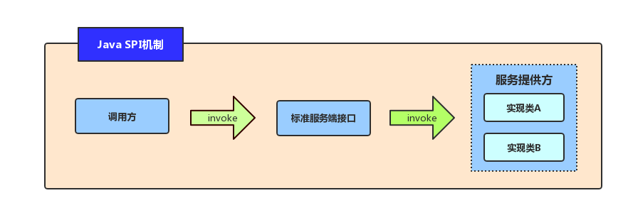
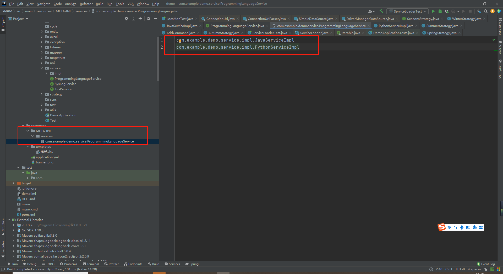

# 1、SPI 概念

## 1、什么是 SPI

在当今互联网时代，应用程序越来越复杂，对于我们开发人员来说，如何实现高效的组件化和模块化已经成为了一个重要的问题。而 Java SPI（Service Provider Interface）机制，作为一种基于接口的服务发现机制，可以帮助我们更好地解决这个问题。这样会程序具有高度的灵活性、解耦、可扩展性。

`Java SPI`（Service Provider Interface）是Java官方提供的一种**服务发现机制**，它允许在`运行时动态地加载实现`特定接口的类，而不需要在代码中显式地指定该类，从而实现**解耦和灵活性**。




## 2、为何要使用 SPI

假设现在没有使用SPI，存在一个接口，和不同的实现类，然后在使用该接口的时候，需要硬编码的形式使用哪个实现类，例如使用工厂模式+策略模式，根据指定条件硬编码，如果我们新增加一种实现，还是需要修改工厂模式的编码，所以跟业务代码存在耦合。而使用 SPI 机制，可以将第三方的实现方式作为插件的方式，可插拔方式，可以很大程度的与业务代码进行解耦。

但是，这种方式也有缺点，假设配置了多个实现类，不能很好的根据条件的来进行判断筛选，只能针对 Iterator 遍历获取。


## 3、策略模式和 SPI 的区别

如果从代码接入的级别来看，策略模式还是在原有项目中进行代码修改，只不过它不会修改原有类中的代码，而是新建了一个类。而 SPI 机制则是不会修改原有项目中的代码，其会新建一个项目，最终以 Jar 包引入的方式代码。

从这一点来看，无论策略模式还是 SPI 机制，他们都是将修改与原来的代码隔离开来，从而避免新增代码对原有代码的影响。但策略模式是类层次上的隔离，而 SPI 机制则是项目框架级别的隔离。

从应用领域来说，策略模式更多应用在业务领域，即业务代码书写以及业务代码重构。而 SPI 机制更多则是用于框架的设计领域，通过 SPI 机制提供的灵活性，让框架拥有良好的插件特性，便于扩展。

- **从设计思想来看。**策略模式和 SPI 机制其思想是类似的，都是通过一定的设计隔离变化的部分，从而让原有部分更加稳定。
- **从隔离级别来看。**策略模式的隔离是类级别的隔离，而 SPI 机制是项目级别的隔离。
- **从应用领域来看。**策略模式更多用在业务代码书写，SPI 机制更多用于框架的设计。


# 2、实现原理

Java SPI 的实现原理基于 Java 类加载机制和反射机制。

当使用 `ServiceLoader.load(Class<T> service)` 方法加载服务时，会检查 `META-INF/services` 目录下是否存在以接口全限定名命名的文件。如果存在，则读取文件内容，获取实现该接口的类的全限定名，并通过 `Class.forName()` 方法加载对应的类。

在加载类之后，ServiceLoader 会通过反射机制创建对应类的实例，并将其缓存起来。

这里涉及到一个懒加载迭代器的思想：

当我们调用 `ServiceLoader.load(Class<T> service)` 方法时，并不会立即将所有实现了该接口的类都加载进来，而是返回一个懒加载迭代器。

只有在使用迭代器遍历时，才会按需加载对应的类并创建其实例。

这种懒加载思想有以下两个好处：

- 节省内存：如果一次性将所有实现类全部加载进来，可能会导致内存占用过大，影响程序的性能。
- 增强灵活性：由于 ServiceLoader 是动态加载的，因此可以在程序运行时添加或删除实现类，而无需修改代码或重新编译。

总的来说，Java SPI 的实现原理比较简单，利用了 Java 类加载和反射机制，提供了一种轻量级的插件化机制，可以很方便地扩展功能。


# 3、优点缺点

1、优点

- 松耦合性：SPI 具有很好的松耦合性，应用程序可以在运行时动态加载实现类，而无需在编译时将实现类硬编码到代码中。
- 扩展性：通过 SPI，应用程序可以为同一个接口定义多个实现类。这使得应用程序更容易扩展和适应变化。
- 易于使用：使用 SPI，应用程序只需要定义接口并指定实现类的类名，即可轻松地使用新的服务提供者。

2、缺点

- 配置较麻烦：SPI 需要在 META-INF/services目录下创建配置文件，并将实现类的类名写入其中。这使得配置相对较为繁琐。
- 安全性不足：SPI 提供者必须将其实现类名称写入到配置文件中，因此如果未正确配置，则可能存在安全风险。
- 性能损失：每次查找服务提供者都需要重新读取配置文件，这可能会增加启动时间和内存开销。


# 4、应用场景

Java SPI  机制是一种服务提供者发现的机制，适用于需要在多个实现中选择一个进行使用的场景。

常见的应用场景包括：

| 应用名称           | 具体应用场景                                                 |
| ------------------ | ------------------------------------------------------------ |
| 数据库驱动程序加载 | JDBC为了实现可插拔的数据库驱动，在 Java.sql.Driver 接口中定义了一组标准的 API 规范，而具体的数据库厂商则需要实现这个接口，以提供自己的数据库驱动程序。在 Java 中，JDBC 驱动程序的加载就是通过 SPI 机制实现的。 |
| 日志框架的实现     | 流行的开源日志框架，如Log4j、SLF4J 和 Logback 等，都采用了 SPI 机制。用户可以根据自己的需求选择合适的日志实现，而不需要修改代码。 |
| Spring框架         | Spring 框架中的 Bean 加载机制就使用了 SPI 思想，通过读取 classpath 下的 META-INF/spring.factories 文件来加载各种自定义的 Bean。 |
| Dubbo框架          | Dubbo 框架也使用了 SPI 思想，通过接口注解 @SPI 声明扩展点接口，并在 classpath 下的 META-INF/dubbo 目录中提供实现类的配置文件，来实现扩展点的动态加载。 |
| MyBatis框架        | MyBatis 框架中的插件机制也使用了 SPI 思想，通过在 classpath 下的 META-INF/services 目录中存放插件接口的实现类路径，来实现插件的加载和执行。 |
| Netty框架          | Netty 框架也使用了 SPI 机制，让用户可以根据自己的需求选择合适的网络协议实现方式。 |
| Hadoop框架         | Hadoop 框架中的输入输出格式也使用了 SPI 思想，通过在 classpath 下的 META-INF/services 目录中存放输入输出格式接口的实现类路径，来实现输入输出格式的灵活配置和切换。 |

我们上面对 Java SPI 的缺点说了一下，我们来说一下：

Spring SPI 机制相对于 Java 原生的 SPI 机制进行了改造和扩展，主要体现在以下几个方面：

- 支持多个实现类：Spring 的 SPI 机制允许为同一个接口定义多个实现类，而 Java 原生的 SPI 机制只支持单个实现类。这使得在应用程序中使用 Spring 的 SPI 机制更加灵活和可扩展。

- 支持自动装配：Spring 的 SPI 机制支持自动装配，可以通过将实现类标记为 Spring 组件（例如@Component），从而实现自动装配和依赖注入。这在一定程度上简化了应用程序中服务提供者的配置和管理。

- 支持动态替换：Spring 的 SPI 机制支持动态替换服务提供者，可以通过修改配置文件或者其他方式来切换服务提供者。而 Java 原生的 SPI 机制只能在启动时加载一次服务提供者，并且无法在运行时动态替换。

- 提供了更多扩展点：Spring 的 SPI 机制提供了很多扩展点，例如 BeanPostProcessor、BeanFactoryPostProcessor 等，可以在服务提供者初始化和创建过程中进行自定义操作。


其他框架也是对 Java SPI 进行改造和扩展增强，从而更好的提供服务！


# 5、使用步骤

1、首先介绍几个名词

- **服务提供者**：接口服务提供者，规则定义者，通俗来说，负责写接口
- **服务消费者**：接口服务实现对象，具体的规则实现。
- **调用方**：具体的业务工程，例如在一个Main方法中使用该接口的所在类所在工程。

2、Java SPI 机制代码使用步骤如下：

1. **定义接口**：首先需要定义一个接口，所有实现该接口的类都将被注册为服务提供者。
2. **创建实现类**：创建一个或多个实现接口的类，这些类将作为服务提供者。
3. **配置文件**：在 META-INF/services 目录下创建一个以接口全限定名命名的文件，文件内容为实现该接口的类的全限定名，每个类名占一行。
4. **加载使用服务**：使用 java.util.ServiceLoader 类的静态方法 load(Class service) 加载服务，默认情况下会加载 classpath 中所有符合条件的提供者。调用 ServiceLoader 实例的 iterator() 方法获取迭代器，遍历迭代器即可获取所有实现了该接口的类的实例。

3、使用 Java SPI 时，需要注意以下几点：

- 接口必须是公共的，且只能包含抽象方法。

- 实现类必须有一个无参构造函数。

- 配置文件中指定的类必须是实现了相应接口的非抽象类。

- 配置文件必须放在 META-INF/services 目录下。

- 配置文件的文件名必须为接口的全限定名。


# 6、实操案例

## 1、定义接口

我们定义一个编程语言的接口！

```java
public interface ProgrammingLanguageService {
    /**
     * 学习方法
     */
    void study();
}
```


## 2、创建实现类

我们创建两个实现类，简单模拟一下！简单的输出一句话！

Java 的实现：

```java
public class JavaServiceImpl implements ProgrammingLanguageService {
    @Override
    public void study() {
        System.out.println("开始学习Java！！");
    }
}
```

Python 的实现：

```java
public class PythonServiceImpl implements ProgrammingLanguageService {
    @Override
    public void study() {
        System.out.println("开始学习Python！！");
    }
}
```


## 3、配置文件

我们创建两个文件夹：`META-INF`、`services`，在创建一个普通文件即可：`com.example.demo.service.ProgrammingLanguageService`

**注意**： 一定是`接口的类的全限定名`

```
com.example.demo.service.impl.JavaServiceImpl
com.example.demo.service.impl.PythonServiceImpl
```




## 4、加载使用服务

1、打包上面已经加载过的服务：mvn install

2、在新项目中引入打包好的依赖

3、在新项目中创建一个Main方法测试：

```java
public class ServiceLoaderTest {
    public static void main(String[] args) {
        ServiceLoader<ProgrammingLanguageService> serviceLoader = ServiceLoader.load(ProgrammingLanguageService.class);
        Iterator<ProgrammingLanguageService> iterator = serviceLoader.iterator();
        while (iterator.hasNext()) {
            ProgrammingLanguageService service = iterator.next();
            System.out.println(service.getClass().getName());
            service.study();
        }
    }
}
```

4、输出结果如下

```
com.example.demo.service.impl.JavaServiceImpl
开始学习Java！！
com.example.demo.service.impl.PythonServiceImpl
开始学习Python！！
```


# 7、参考文献 & 鸣谢

1. Java SPI概念、实现原理、优缺点、应用场景、使用步骤、实战SPI案例：https://blog.csdn.net/qq_52423918/article/details/130968307
2. Java的SPI机制：https://www.cnblogs.com/duguxiaobiao/p/12183135.html
3. Java SPI介绍：https://zhuanlan.zhihu.com/p/680141106