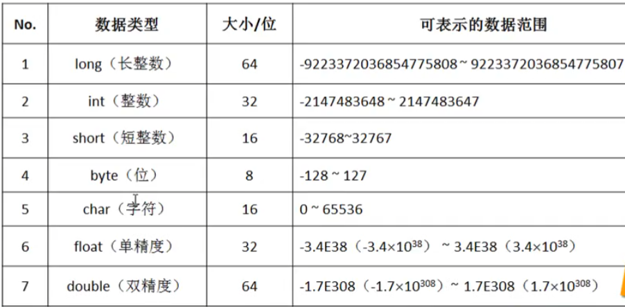
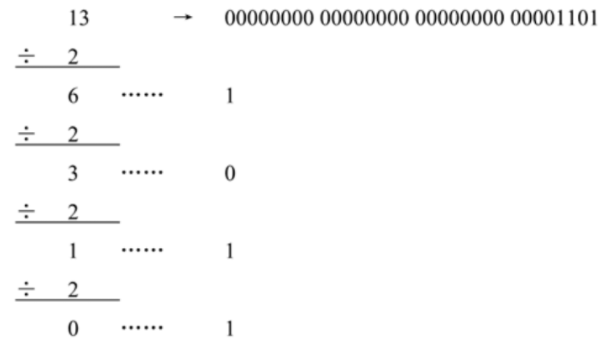

# Java 语言简介

## 1、Java 简介

Java是现在最流行的编程语言之一，并且自身拥有庞大且完善的生态系统（但是你不可能要求一门语言实现的功能过多，所以有些时候 Java 不擅长的部分会被其它的语言所顶替）。在国内而言，之所以咱们的 Java 使用广泛。更多的主要原因在于有许多的大户都在使用 Java 实现其各自的核心业务。

Java 是由 SUN 公司开发的一套编程语言，其前身并不是 Java。

在 1991 年的时候，美国SUN（Stanford University NetWork）公司有一个 GREEN 项目，这个项目的核心功能在于使用 EMail 控制家电产品的运行（智能家居），在 80 年代 Email 流行的时候 ，当时可以发送 Email 是一件很牛的事情。最初 SUN 公司打算竞争此项目，但是后来考虑到 C++ 语言的复杂性，所以利用 C++ 开发出一套 OAK（橡树）平台，并且利用此平台进行项目的竞标，不过遗憾的是，这个平台的竞标失败了。后来在 1995 年 5 月 23 日的时候正式推出了Java 编程语言，同时推出了 JDK 1.0 的开发包（1996年的时候才开始可以提供陆续下载使用，到了 1997 年的时候传到了中国）。
SUN公司是一家从事于硬件开发的技术性公司，SUN 最早的代表性的产品：**小型机**（被广泛的应用在了 amazon 上），后来由于网络经济的发展问题（任何的经济模式都一定会出现有瓶颈）但是对于 90 年代末--2000 年初的互联网低潮而言，这就是一个严重的伤害。而 SUN 公司经历过这么一段发展之后并没有恢复往日的经济实力，终于在后来被 Oracle 公司所收购，但是在 Oracle 公司收购前最希望收购 SUN 的实际上是 IBM ，IBM 当年软件产品线上的技术基础就是 Java 语言。

但是不管这些公司如何折腾，有一点已经达成了共识：Java依然是一个稳定的、可靠的编程语言，可以承担大型服务器的程序开发任务。

而从最初的时代到现在 Java 语言也出现了一些技术的不同发展：按其应用不同，分为三个版本。

1. Java标准开发（J2SE、Java SE）：提供底层支持，实现桌面程序开发，包括Word、Excle等
2. Java嵌入式开发（J2ME、Java ME）：智能家居就是SUN公司最初就是想做的嵌入式开发，但是这个嵌入式的发展因为当年的 Nokia 的阻拦，后来基本上被 Android 所替代了
3. Java企业开发（J2EE、Java EE）：主要进行企业平台的搭建，现在主要开发的是互联网平台


## 2、Java 语言特点

Java 之所以可以得到持续的发展力以及良好的生态系统，这完全取决于 Java 的自身的技术特征：

1. 是一个行业内通用的技术实现标准： 是一种半开源产品，所以很多的厂商得以接触到 Java 的底层，这样使得 Java 开发的更加的透明
2. 是一门面向对象的编程语言：这样就使得 Java 语言语法结构更加方便开发者接受，这些面向对象的设计思想还在不断进行着扩充（不同的 JDK 版本）
3. 提供有方便的内存回收处理机制：像一些编程语言里面需要明确的手工进行对象的回收与释放，否则你的程序将无法正常提供支持，但是 Java 可以提供有自动的内存回收操作，这样处理会更加方便一些（这里面就牵扯到了一些优化方面的问题了）
4. 避免了复杂的指针问题，而使用更加简单的引用来代替指针：指针虽然是一种高效的内存处理模式，但是其需要较强的分析，而我们的Java在设计的时候就充分的考虑到了这一点，所以开发者直接利用引用就可以简化指针的处理，而引用也是在初学者过程之中最为麻烦最为难以理解的部分
5. Java是为数不多支持多线程编程的开发语言：这样就可以使得单位时间内，处理的性能得到提升（性能的提升并不是绝对的）；多线程也是Java 开发之中最难以理解的部分，而正确的多线程处理才是提升处理性能的核心所在
6. Java提供有高效的网络处理能力：可以基于NIO实现更加高效的数据的传输处理
7. Java具有良好的可移植性：这样就可以提升一个程序的适用范围。Java的可移植性实现，依靠JVM（Java虚拟机），JVM是一个由软件和硬件模拟出来的计算机，所有的程序只要有JVM的支持，就可以实现程序的执行，不同的操作系统上会有不同版本的JVM，这样就可以实现移植性


## 3、Java 可移植性

Java 语言从诞生之初最大的特征就在于其有良好的可移植性，可以在不同的操作系统之间进行程序的移植，并且有一个所谓的称号“一次编写、处处运行”（一次编写、处处调试）Java可移植性的实现核心依据：Java虚拟机（这是一台由软件和硬件模拟出来的电脑），虚拟机是现在技术的开发潮流。


计算机编程语言的类型分为两类：

1. 编译型语言：所有的源代码文件需要进行过编译后才可以使用，例如：C语言
2. 解释型语言：所有的程序直接编写完成源代码后就可以放在服务器上执行，例如：HTML

Java是两类语言的集合，所有的Java源程序都需要进行编译，编译形成二进制字节码之后才可以在JVM上进行执行。


所有的*.java的源代码程序最终都是需要经过编译后才可以使用的，但是编译完成的程序代码并不是一个绑定在某个具体操作系统上的程序，而是一种通用的程序，而这种通用的程序就是JVM所能识别的代码。

# Java 环境搭建

## 1、JDK 的简介

 JDK（Java Development Kit）是一组实现Java程序开发与运行的本地环境，在实际的项目的开发与运行过程之中，往往都会选择一些比较好用的桌面系统（Windows、MacOS）进行开发，而后在一些稳定的服务器系统（Liniux、UNIX、Windows Sever）上进行项目的部署。

Java项目的开发里面实际上分为三个开发方向：

1. Java单机程序（Java SE）：JDK提供的就是单机版本的程序开发支持，包括一些常用的类库、系统支持
2. Java嵌入式开发（Java ME）：实现微型的Java程序开发，相当于在移动设备上植入了一个JVM，后来被Android取代了，后来由于与Oracle版权问题，Google开发了Kotlin平台代替了Android开发
3. Java企业级开发（Java EE）：构建分布式的企业系统平台，也是这么多年以来Java使用最广泛的一种开发模式，它本身基于JavaSE的基础上实现了更高级应用，是离不开原始的JDK的支持

所有的三个开发分支的发展，都离不开JDK的支持，所以可以得到如下对应结构关系


## 2、JDK 的下载

> Java最新JDK和API下载（持续同步更新于官网）：https://blog.csdn.net/jzycloud/article/details/114123530

Java语言属于编译型与解释型的开发语言，对于Java语言，如果要想进行开发，则一定要进行JDK（Java Development Kit）的安装配置，而JDK要想获取则需要通过官方网站获得，并且也需要在本机上进行配置。可简单总结为：Java开发=>JDK的安装配置=>官网获取和本机配置。

最早时JDK是由SUN公司提供的（www.sun.com）但是后来SUN公司被Oracle收购了，所以现在想获取JDK要登陆Oracle官网

1. Oracle官网：www.oracle.com，
2. Open Oracle URL=》Products=》Java=》Download Java Now=》Java Archive
3. JDK官网下载历史版本：
   1. https://www.oracle.com/java/technologies/downloads/archive/
   2. http://jdk.java.net/


**因为官网一直在更新，有时候界面一直在变化，但是链接地址没变，所以直接参考附上链接地址即可。**

对于JDK而言，有其本身的发展历史，主要有如下的几个标志性版本：

1. 1995年05月23日，JDK1.0的开发包发布，同时在1996年的时候，JDK正式提供下载，标志着Java的诞生
2. 1998年12月04日，JDK1.2版本推出，而后Java正式更名为Java2
3. 2005年05月23日，十周年大会推出JDK1.5版本，同时这个版本也是带来新特性以及开发支持更多的历史版本，可以说这一版本直接决定了Java后续十年的技术核心
4. 2014年03月18日，Java提供了JDK1.8版本，并且支持有Lambda表达式，而且可以使用函数式编程（大改革）
5. 2017年09月21日，Java提供了JDK1.9版本，进一步提升了JDK1.8的稳定性
6. 2018年03月20日，Java提供了JDK1.10版本，是属于JDK1.9的稳定版
7. 2018年09月25日，Java提供了JDK11版本，属于大版本更新（稳定长期支持版本）

注意说明JDK收费问题：Java收费了实际上与我们没有任何关系，首先只是对商业的收费，其次即便没有了Oracle提供的JDK，还有OpenJDK（免费开源），所有的JDK都需要符合有一个技术开发规范。


## 3、JDK 的安装与配置

JDK需要区分不同的操作系统，对于大部分的操作系统JDK都有支持，只需要选择好相应的版本下载即可，下载好对应的exe文件安装说明下一步即可（指定好对应的下载路径：D:\Environment\java\jdk-11.0.8）

安装完成之后就需要进行JDK配置处理，在JDK里面所有的可执行程序的路径为：D:\Environment\java\jdk-11.0.8\bin，主要使用javac.exe、java.exe两个命令。但是这两个命令并不属于windows本身，如果要想在命令行直接进行使用，那么需要在windows的系统环境之中进行可执行程序的路径配置（简称：环境变量配置）配置步骤如下：

【计算机】=》【属性】=》【高级系统设置】=》【高级】=》【环境变量】=》【修改path属性】，将可执行程序路径追加在已有的配置之中。

```
JAVA_HOME：JDK的安装路径
PATH：%JAVA_HOME%\bin;%JAVA_HOME%\jre\bin;
CLASSPATH：.;%JAVA_HOME%\lib\dt.jar;%JAVA_HOME%\lib\tools.jar;
注意：JDK8以后可以不用配置CLASSPATH中的dt.jar、rt.jar和tools.jar了
```

> JDK中tools.jar、dt.jar和rt.jar的作用：
>
> 1. dt.jar：位于%JAVA_HOME%\lib下；是关于运行环境的类库，主要是swing的包  在用到swing时最好加上
> 2. tools.jar：位于%JAVA_HOME%\lib下； 是系统用来编译一个类的时候用到的，即执行javac的时候用到
>    javac XXX.java实际上就是运行：java -Calsspath=%JAVA_HOME%\lib\tools.jar xx.xxx.Main XXX.java
>    javac就是对上面命令的封装。所以tools.jar 也不用加到classpath里面
>    Web系统都用到tool.jar。tool.jar应用服务器用来编译JSP文件，应用服务器自己会加载，不需自己设置
> 3. rt.jar：位于{Java_Home}\jre\lib下；是JAVA基础类库，也就是你在java doc里面看到的所有的类的class文件；默认就在Root Classloader的加载路径里面的，而在Claspath配置该变量是不需要的；同时jre/lib目录下大部分jar包都在Root Classloader中

配置成功后打开命令行测试一下：

```bash
C:\Users\lenovo>java --version
java 11.0.8 2020-07-14 LTS
Java(TM) SE Runtime Environment 18.9 (build 11.0.8+10-LTS)
Java HotSpot(TM) 64-Bit Server VM 18.9 (build 11.0.8+10-LTS, mixed mode)

C:\Users\lenovo>javac
用法: javac <options> <source files>
其中, 可能的选项包括:
  @<filename>                  从文件读取选项和文件名
  -Akey[=value]                传递给注释处理程序的选项
  --add-modules <模块>(,<模块>)*
        除了初始模块之外要解析的根模块; 如果 <module>
                为 ALL-MODULE-PATH, 则为模块路径中的所有模块。
# ...省略
```


## 4、JDK 安装目录说明

| 目录名称 | 说明                                                         |
| -------- | ------------------------------------------------------------ |
| bin      | 该路径下存放了JDK的各种工具命令，`javac`和`java`就存放在这个目录 |
| conf     | 该路径下存放了JDK的相关配置文件                              |
| include  | 该路径下存放了一些平台特定的头文件                           |
| jmods    | 该路径下存放了JDK的各种模块                                  |
| legal    | 该路径下存放了JDK各模块的授权文档                            |
| lib      | 该路径下存放了JDK工具的一些补充JAR包                         |

其余文件为说明性文件，且该目录结构为JDK1.9之后的

# Java 编程入门

## 1、Hello World

JDK和环境变量配置完成，我们来进行我们第一个代码实现吧。“Hello World”的源程序实现（通过记事本或者Editplus来编写）：

- 创建一个程序的保存目录：D:\study_java
- 创建一个Hello.java的文件，文件后缀必须为：*.java

```java
public class Hello{
    public static void main(String[] args){
        System.out.println(“Hello World”);
    }
}
```

所有的Java源程序要想执行，可以采用如下的步骤完成：

- 对源代码进行编译：javac Hello.java，完成后会出现 Hello.class 字节码文件，利用JVM进行编译，编译出一套与平台无关的字节码文件（*.class）
- 在JVM上执行字节码文件：java Hello（后面没有任何的后缀，但是执行的是 “*.class” 文件）

---

为了更加方便的理解java程序的主要结构，下面针对第一个程序进行完整的解释：

1、在java程序开发之中最基础的单元是类，所有的程序都必须封装在类中执行，而类的基本定义语法如下：

```java
[public] class 类名称 {}
```

在本程序之中定义的类名称为：“Hello”，而类的定义有两种形式：

- public class 类名称 {}：类名称必须与文件名称保持一致，一个*.java文件里面只允许有一个 public class 定义
- class 类型名 {}：类名称可以与文件名称不一致，但是编译后生成的 *.class 文件的名称就是类名称的定义。一个 *.java 源程序可以定义有多个 class 类，并且编译之后会形成不同的 *.class 文件

> 提示：关于以后源代码定义问题
>
> 1. 在以后进行项目开发的时候，很少会出现一个 *.java 源代码里面定义有多个 class 的情况，所以对于以后的开发而言，一个 *.java 文件里面就定义有一个 public class 类就够了。但是在整个课程学习中如果定义多个文件会产生混乱，所以初期会在一个 *.java 文件中定义有多个类方便学习
> 1. Java语言有着明确的命名要求，以后定义类名称的时候要求每一个单词的首字母必须大写，例如：HelloWorld、TestDemo等，才算标准。
>

2、主方法：主方法是所有程序执行的起点，并且一定要定义在类之中，Java的主方法定义：

```java
[public] class 类名称 {
    public static void main(String[] args) {
        程序的代码由此开始执行
    }
}
```

Java的主方法名称定义非常的长，具体的解释在后续说明，现在我们简称主类，所有的主类都将采用 public class 来定义。

3、屏幕打印（系统输出）可以直接在命令行方式下进行内容的显示，有两类语法形式：

- 输出之后追加换行：System.out.println(输出内容);
- 输出之后不加换行：System.out.print(输出内容);

```java
public class Hello{
    public static void main(String[] args){
        System.out.print("Hello World-A");
        System.out.println("Hello World-B");
        System.out.println("Hello World-C");
    }
}

// 输出内容
Hello World-AHello World-B
Hello World-C

```


## 2、JShell 工具

JShell是从JDK1.9之后提供有的一种交互式的变成环境（世界上许多的语言都有交互式变成，例如：Python、golang）在最初的时候Java并没有提供这样的工具，主要是因为其认为自己是一项专业的开发语言，不应该提供有如此简化的玩具模型。如果想使用JShell，直接打开命令行窗口输入 “jshell” 即可。

操作示例 1：启动jshell工具，在jshell中编写语句

```bash
C:\Users\lenovo>jshell
|  欢迎使用 JShell -- 版本 11.0.8
|  要大致了解该版本, 请键入: /help intro

jshell> 100+100
$1 ==> 200

jshell> 100+200
$2 ==> 300

jshell> System.out.print("Hello World");
Hello World
jshell> System.out.println("Hello World");
Hello World

jshell>
```

有时候可能需要编写很多代码，为了方便JShell提供有文件数据加载功能。定义一个文件：“D:\test.txt“，内容如下：

```java
System.out.println("Hello World-A");
System.out.println("Hello World-B");
```

操作示例 2：在jshell之中读取此文件内容并执行

```bash
jshell> /open d:\test.txt
Hello World-A
Hello World-B

```

操作示例 3：退出交互式环境

```bash
jshell> /exit
|  再见
```


## 3、CLASSPATH 环境属性

如果要完整的对 CLASSPATH 进行解释需要好多的知识，所以我们本次只是对 CLASSPATH 概念做出一个先期的介绍。假设在 D: 目录下提供一个 Hello.class 的字节码文件；

假设当前用户所在的目录为“D:”，那么在这样的情况下可以直接使用 Java 命令进行 Hello.class 字节码文件的解释。但是如果说现在脱离了这个目录，将当前目录修改为了“C:”（C盘目录下并没有 Hello.class 字节码文件），如果再次执行程序解释，这个时候会出现如下的错误提示信息：

```
错误：找不到或无法加载主类 Hello
原因：java.lang.ClassNotFoundException: Hello
```

因为当前目录中没有字节码，那么现在的需求是：可以在不同的目录中都执行 D:\Hello.class 文件，在这样的处理要求下只能配置CLASSPATH环境属性完成


操作示例 1：定义CLASSPATH环境属性（CLASSPATH属于系统变量）

```bash
# 语法：SET CLASSPATH = 路径;...
SET CLASSPATH = D:\
```

当设置了 CLASSPATH 之后，这个时候在 Java 程序解释的时候会自动的通过 CLASSPATH 所设置的路径进行类的加载，所以可以得出一个结论：**JVM 解释程序的时候需要得到 CLASSPATH 的支持。**

但是这样做存在一个问题，一般情况下所有解释的类都是从当前所在的目录中加载的，所以可以得出一个结论：**CLASSPATH 可设置为默认从当前所在目录加载类文件。**如果到处设置 CLASSPATH 就会造成整个系统操作的混乱，那么从正常的角度来讲，对于 CLASSPATH 还是应该采用默认设置方式更为稳妥，只通过当前目录加载，可以将 CLASSPATH 设置为“.”。

操作示例 2：从当前所在路径加载类

```
SET CLASSPATH = .
```

在某些时候如果你安装一些与Java开发程序软件，它有可能会自动的修改默认的 CLASSPATH，也就是说这个“.”的配置会消失。这种情况下就必须利用命令自己重新设置回来。但是需要注意的是，现在的 CLASSPATH 是在一个命令行下的配置，如果该命令行关闭了，那么相关的属性配置也将消失。所以最好的做法是将其定义为全局属性，则可以直接在系统中追加一个属性信息。


**面试题：PATH 和 CLASSPATH 有什么区别？** 

1. PATH 和 CLASSPATH 都是操作系统中支持的环境属性
2. PATH：是操作系统提供的路径配置，定义所有可执行程序的路径
3. CLASSPATH：是由 JRE 提供的，是 JVM 执行时所需要的环境属性，用于定义类的加载路径，默认设置的为当前所在目录加载
4. 总结出 Java 运行一个程序的逻辑关系为：**JVM→CLASSPATH定义的路径→加载字节码文件**

# Java 基本概念

## 1、注释

注释是程序开发之中的一项重要组成技术，合理的注释可以使得你们的项目维护更加方便，但是现在很多的公司由于自身的技术管理不到位，很多的注释是不写的，所以就造成了人员更换时期的痛苦。注释的本质在于，编译器在进行程序编译的时候如果发现有注释的内容将不对此部分进行编译处理，在Java语言里面对于注释一共有3类形式：

```java
1. 单行注释：//
2. 多行注释：/*...*/
3. 文档注释：/**...*/  ,文档注释里面还需要有很多的选项，一般建议通过开发工具控制。
```

操作示例 1：定义单行注释

```java
public class JavaAPIDemo {
    public static void main(String[] args) {
        // 单行注释：下面的语句是进行一行提示信息的输出
        System.out.println("Hello World!");
    }
}
```

操作示例 2：多行注释

```java
public class JavaAPIDemo {
    public static void main(String[] args) {
        /*
          多行注释：下面的语句是进行一行提示信息的输出
          xxxx年xx月xx日，xxx改了代码
        */
        System.out.println("Hello World!") ;
    }
}
```

如果在以后使用开发工具的时候，还是单行注释会比较方便一些。而对于一些重要的类或者是方法都建议使用文档注释。


## 2、标识符与关键字

> 1、标识符

在任何一个程序中实际上都是一个结构的整合体，在Java语言里面有不同的结构，例如：类、方法、变量等，那么对于不同的结构一定要有不同的说明。那么对于结构的说明实际上是有命名要求的，但是一般都要求有意义的单词所组成，同时对于标识符的组成在Java之中的定义如下：**由字母、数字、_、$所组成，其中不能使用数字开头，其中不能使用Java保留字（关键字）。**

以后最简单的定义形式：使用英文字母开头，Student_Name、StudentName,而且对于“$”一般都有特殊含义，不建议出现在你自己所编写的代码上。

> 2、关键字

关键字是系统对于一些结构的描述处理，有着特殊的含义。Java中的关键字一共包含有如下的一些内容。

| Java关键字类别       | Java关键字   | 关键字含义                                                   |
| -------------------- | ------------ | ------------------------------------------------------------ |
| 访问控制             | private      | 一种访问控制方式：私用模式，访问控制修饰符，可以应用于类、方法或字段（在类中声明的变量） |
| 类、方法和变量修饰符 | protected    | 一种访问控制方式：保护模式，可以应用于类、方法或字段（在类中声明的变量）的访问控制修饰符 |
|                      | public       | 一种访问控制方式：共用模式，可以应用于类、方法或字段（在类中声明的变量）的访问控制修饰符 |
|                      | abstract     | 表明类或者成员方法具有抽象属性，用于修改类或方法             |
|                      | class        | 声明一个类，用来声明新的Java类                               |
|                      | extends      | 表明一个类型是另一个类型的子类型。对于类，可以是另一个类或者抽象类；对于接口，可以是另一个接口 |
|                      | final        | 表明一个类不能派生出子类，或者成员方法不能被覆盖，或者成员域的值不能被改变，用来定义常量 |
|                      | implements   | 表明一个类实现了给定的接口                                   |
|                      | interface    | 接口                                                         |
|                      | native       | 用来声明一个方法是由与计算机相关的语言（如C/C++/FORTRAN语言）实现的 |
|                      | new          | 用来创建新实例对象                                           |
|                      | static       | 表明具有静态属性                                             |
|                      | strictfp     | 用来声明FP_strict（单精度或双精度浮点数）表达式遵循IEEE 754算术规范 |
|                      | synchronized | 表明一段代码需要同步执行                                     |
|                      | transient    | 声明不用序列化的成员域                                       |
|                      | volatile     | 表明两个或者多个变量必须同步地发生变化                       |
| 程序控制             | break        | 提前跳出一个块                                               |
|                      | continue     | 回到一个块的开始处                                           |
|                      | return       | 从成员方法中返回数据                                         |
|                      | do           | 用在do-while循环结构中                                       |
|                      | while        | 用在循环结构中                                               |
|                      | if           | 条件语句的引导词                                             |
|                      | else         | 用在条件语句中，表明当条件不成立时的分支                     |
|                      | for          | 一种循环结构的引导词                                         |
|                      | instanceof   | 用来测试一个对象是否是指定类型的实例对象                     |
|                      | switch       | 分支语句结构的引导词                                         |
|                      | case         | 用在switch语句之中，表示其中的一个分支                       |
|                      | default      | 默认，例如：用在switch语句中，表明一个默认的分支。Java8 中也作用于声明接口函数的默认实现 |
| 错误处理             | try          | 尝试一个可能抛出异常的程序块                                 |
|                      | catch        | 用在异常处理中，用来捕捉异常                                 |
|                      | throw        | 抛出一个异常                                                 |
|                      | throws       | 声明在当前定义的成员方法中所有需要抛出的异常                 |
| 包相关               | import       | 表明要访问指定的类或包                                       |
|                      | package      | 包                                                           |
| 基本类型             | boolean      | 基本数据类型之一，声明布尔类型的关键字                       |
|                      | byte         | 基本数据类型之一，字节类型                                   |
|                      | char         | 基本数据类型之一，字符类型                                   |
|                      | double       | 基本数据类型之一，双精度浮点数类型                           |
|                      | float        | 基本数据类型之一，单精度浮点数类型                           |
|                      | int          | 基本数据类型之一，整数类型                                   |
|                      | long         | 基本数据类型之一，长整数类型                                 |
|                      | short        | 基本数据类型之一,短整数类型                                  |
|                      | null         | 空，表示无值，不能将null赋给原始类型（byte、short、int、long、char、float、double、boolean）变量 |
|                      | true         | 真，boolean变量的两个合法值中的一个                          |
|                      | false        | 假，boolean变量的两个合法值之一                              |
| 变量引用             | super        | 表明当前对象的父类型的引用或者父类型的构造方法               |
|                      | this         | 指向当前实例对象的引用，用于引用当前实例                     |
|                      | void         | 声明当前成员方法没有返回值，void可以用作方法的返回类型，以指示该方法不返回值 |
| 保留字               | goto         | 保留关键字，没有具体含义                                     |
|                      | const        | 保留关键字，没有具体含义，是一个类型修饰符，使用const声明的对象不能更新 |

对于所有关键字的定义是需要你简要了解的，对于以上的关键字有一些简短的说明：

1. JDK1.4的时候出现有assert关键字，用于异常处理上
2. JDK1.5的时候出现有enum关键字，用于枚举定义上
3. 未使用到的关键字：goto、const
4. 还有一些属于特殊含义的单词，严格来讲不算是关键字：true、false、null


# Java 数据类型

## 1、Java 数据分类

在Java中对于数据类型一共分为两类：

1. 基本数据类型（内置数据类型）：

     - 数值型：
       - 整型：byte、short、int、long（默认值：0）
       - 浮点型：float、double（默认值：0.0f、0.0d、实际输出是0.0）
     - 布尔型：boolean（默认值：false）
     - 字符型：char（默认值：'\u0000'，实际输出是空白）
     - 基本数据类型等级：byte--short--char--int--long--float--double，由左到右等级升高，double为最高级

2. 引用数据类型（牵扯到内存关系的使用）：数组、类、接口（默认值：null）

| 数据类型         | 大小/位 | 数据范围                                                     |
| ---------------- | ------- | ------------------------------------------------------------ |
| long（长整数）   | 64      | -9,223,372,036,854,775,808（-2^63）~  9,223,372,036,854,775,807（2^63 -1 |
| int（整数）      | 32      | -2,147,483,648（-2^31）~  2,147,483,647（2^31 - 1）          |
| short（短整数）  | 16      | -32768（-2^15）~ 32767（2^15 - 1）                           |
| byte（位）       | 8       | -128（-2^7）~ 127（2^7-1）                                   |
| char（字符）     | 16      | 0~65536                                                      |
| float（单精度）  | 32      | -3.4E38（-3.4x10^38）~ 3.4E38（3.4x10^38）                   |
| double（双精度） | 64      | -1.7E308（-1.7x10^308）~ 1.7E308（1.7x10^308）               |



> 备注：Float 和 Double 的最小值和最大值都是以科学记数法的形式输出的，结尾的"E+数字"表示E之前的数字要乘以10的多少次方。比如3.14E3就是3.14 × 103 =3140，3.14E-3 就是 3.14 x 10-3 =0.00314。

对于数值类型的基本类型的取值范围，我们无需强制去记忆，因为它们的值都已经以常量的形式定义在对应的包装类中了。请看下面的例子：

```java
public class PrimitiveTypeTest {
    public static void main(String[] args) {  
        // byte
        System.out.println("基本类型：byte 二进制位数：" + Byte.SIZE);
        System.out.println("包装类：java.lang.Byte");
        System.out.println("最小值：Byte.MIN_VALUE=" + Byte.MIN_VALUE);
        System.out.println("最大值：Byte.MAX_VALUE=" + Byte.MAX_VALUE);
        System.out.println();

        // short
        System.out.println("基本类型：short 二进制位数：" + Short.SIZE);
        System.out.println("包装类：java.lang.Short");
        System.out.println("最小值：Short.MIN_VALUE=" + Short.MIN_VALUE);
        System.out.println("最大值：Short.MAX_VALUE=" + Short.MAX_VALUE);
        System.out.println();

        // int
        System.out.println("基本类型：int 二进制位数：" + Integer.SIZE);
        System.out.println("包装类：java.lang.Integer");
        System.out.println("最小值：Integer.MIN_VALUE=" + Integer.MIN_VALUE);
        System.out.println("最大值：Integer.MAX_VALUE=" + Integer.MAX_VALUE);
        System.out.println();

        // long
        System.out.println("基本类型：long 二进制位数：" + Long.SIZE);
        System.out.println("包装类：java.lang.Long");
        System.out.println("最小值：Long.MIN_VALUE=" + Long.MIN_VALUE);
        System.out.println("最大值：Long.MAX_VALUE=" + Long.MAX_VALUE);
        System.out.println();

        // float
        System.out.println("基本类型：float 二进制位数：" + Float.SIZE);
        System.out.println("包装类：java.lang.Float");
        System.out.println("最小值：Float.MIN_VALUE=" + Float.MIN_VALUE);
        System.out.println("最大值：Float.MAX_VALUE=" + Float.MAX_VALUE);
        System.out.println();

        // double
        System.out.println("基本类型：double 二进制位数：" + Double.SIZE);
        System.out.println("包装类：java.lang.Double");
        System.out.println("最小值：Double.MIN_VALUE=" + Double.MIN_VALUE);
        System.out.println("最大值：Double.MAX_VALUE=" + Double.MAX_VALUE);
        System.out.println();

        // char
        System.out.println("基本类型：char 二进制位数：" + Character.SIZE);  
        System.out.println("包装类：java.lang.Character");
        // 以数值形式而不是字符形式将Character.MIN_VALUE输出到控制台
        System.out.println("最小值：Character.MIN_VALUE=" + (int) Character.MIN_VALUE);
        // 以数值形式而不是字符形式将Character.MAX_VALUE输出到控制台
        System.out.println("最大值：Character.MAX_VALUE=" + (int) Character.MAX_VALUE);
    }
}

// 输出内容
基本类型：byte 二进制位数：8
包装类：java.lang.Byte
最小值：Byte.MIN_VALUE=-128
最大值：Byte.MAX_VALUE=127

基本类型：short 二进制位数：16
包装类：java.lang.Short
最小值：Short.MIN_VALUE=-32768
最大值：Short.MAX_VALUE=32767

基本类型：int 二进制位数：32
包装类：java.lang.Integer
最小值：Integer.MIN_VALUE=-2147483648
最大值：Integer.MAX_VALUE=2147483647

基本类型：long 二进制位数：64
包装类：java.lang.Long
最小值：Long.MIN_VALUE=-9223372036854775808
最大值：Long.MAX_VALUE=9223372036854775807

基本类型：float 二进制位数：32
包装类：java.lang.Float
最小值：Float.MIN_VALUE=1.4E-45
最大值：Float.MAX_VALUE=3.4028235E38

基本类型：double 二进制位数：64
包装类：java.lang.Double
最小值：Double.MIN_VALUE=4.9E-324
最大值：Double.MAX_VALUE=1.7976931348623157E308

基本类型：char 二进制位数：16
包装类：java.lang.Character
最小值：Character.MIN_VALUE=0
最大值：Character.MAX_VALUE=65535
```

不同的类型我们保存有不同范围的数据，但是这里面实际上就牵扯到了数据类型的选择上，那么对于以上的数据类型划分我们可以给出个人的一些参考原则：

1. 如果要是描述数字首选一定是int（整数）、double（小数）
2. 如果要进行数据传输或者是进行文字编码转换使用byte类型（二进制处理）
3. 处理中文的时候最方便的操作使用的是char完成（可选）
4. 描述内存或者文件大小，描述表的主键列（自增长）可以使用long

从严格意义的角度上来讲，所有的变量在定义的时候都必须有一个明确的数据类型，但是随着技术的发展（开发规定的变化），现代的语言希望可以出现自动类型的定义，所以在JDK10的时候提供有一个var关键字，表示推测类型，但是Java中的var关键字实际上是一个很鸡肋的产物。

操作示例 1：观察var关键字的作用

```java
public class JavaAPIDemo {
    public static void main(String[] args) {
        var num = 10; // 10描述的是一个整数，所以属于int
        System.out.println(num * 2); // 20
    }
}
```

操作示例 2：var错误操作

```java
public class JavaAPIDemo {
    public static void main(String[] args) {
        var num = 10; // 10描述的是一个整数，所以属于int
        num = true; // 布偶类型，会报错，不兼容类型：boolean无法转换为int
    }
}
```

许多语言的推测类型实际上可以随意修改数据类型，例如：JavaScript、Python里面只要是一个变量任何的类型都可以保存。


## 2、整型数据

整型数据一共有四种，按照保存范围由小到大：byte、short、int、long，那么在Java里面任何的一个整型常量那么其默认的类型都是int型（只要是整数就是int类型的数据）。

### 2.1、int 数据类型

操作示例 1：定义int型变量

```java
public class JavaAPIDemo {
    public static void main(String[] args) {
        //int 变量名称 = 常量（10是一个常量，整数类型为int）
        int x = 10 ; // 定义了一个整型变量x
        //int型变量 * int型变量=int型数据
        System.out.println(x * x);
    }
}

// 输出内容
100
```

10永远不会改变，但是x是一个变量，x的内容是可以发生改变的。

操作示例 2：修改x的内容

```java
public class JavaAPIDemo {
    public static void main(String[] args) {
        // int 变量名称 = 常量（10是一个常量，整数类型为int）;
        int x = 10;    // 定义了一个整型变量x
        x = 20;        // 改变了x的已有内容
        // int型变量 * int型变量 = int型数据
        System.out.println(x * x);
    }
}
```


### 2.2、数据溢出处理

任何的数据类型都是有其可以保存的数据范围（正常使用下你很少会出现超过此范围的数据）如果超过了会如何呢？下面通过一个具体代码来进行我们的观察。

操作示例 1：观察超过了int处理范围

```java
public class JavaAPIDemo {
    public static void main(String[] args) {
        int max = Integer.MAX_VALUE; // 获取int的最大值
        int min = Integer.MIN_VALUE; // 获取int的最小值
        System.out.println(max);    // 2147483647
        System.out.println(min);    // -2147483648
        System.out.println("------------- 无以言表的分割线 -----------");
        // int型变量 + int型常量 = int型计算结果
        System.out.println(max + 1);    // -2147483648，最大值 + 1 = 最小值
        System.out.println(max + 2);    // -2147483647，最大值 + 2 = 次最小值
        // int型变量 - int型常量 = int型计算结果
        System.out.println(min - 1);    // 2147483647，最小值 - 1 = 最大值
    }
}

// 输出内容
2147483647
-2147483648
------------- 无以言表的分割线 -----------
-2147483648
-2147483647
2147483647
```

通过此时的执行结果可以发现这些数字在进行处理的时候如果超过了其最大的保存范围，那么将出现有循环的问题，而这种问题在Java中被称为数据溢出，那么要想解决这种溢出，可以继续扩大使用范围，比int范围更大的是long。

操作示例 2：解决数据溢出

- 在操作的时候预估数据范围，如果发现数据范围不够，就使用更大范围；

```java
public class JavaAPIDemo {
    public static void main(String[] args) {
        // long long变量 = int的数值
        long max = Integer.MAX_VALUE; // 获取int的最大值
        long min = Integer.MIN_VALUE; // 获取int的最小值
        System.out.println(max);    // 2147483647
        System.out.println(min);    // -2147483648
        System.out.println("------------- 无以言表的分割线 -----------");
        // long型变量 + int型常量 = long型计算结果
        System.out.println(max + 1);    // 2147483648
        System.out.println(max + 2);    // 2147483649
        // long型变量 - int型常量 = long型计算结果
        System.out.println(min - 1);    // -2147483649
    }
}
// 输出内容
2147483647
-2147483648
------------- 无以言表的分割线 -----------
2147483648
2147483649
-2147483649
```

- 除了可以定义long型的变量之外，也可以直接在常量上进行处理，默认的整数常量都是int型，那么可以为它追加字母“L”或直接使用“（long）”转换。

```java
public class JavaAPIDemo {
    public static void main(String[] args) {
        int max = Integer.MAX_VALUE; // 获取int的最大值
        int min = Integer.MIN_VALUE; // 获取int的最小值
        System.out.println(max);    // 2147483647
        System.out.println(min);    // -2147483648
        System.out.println("------------- 无以言表的分割线 -----------");
        // int型变量 + long型常量 = long型计算结果
        System.out.println(max + 1L);    // 2147483648
        System.out.println(max + 2l);    // 2147483649
        // long型变量 - int型常量 = long型计算结果
        System.out.println((long) min - 1);    // -2147483649
    }
}
// 输出内容
2147483647
-2147483648
------------- 无以言表的分割线 -----------
2147483648
2147483649
-2147483649
```


### 2.3、int 强制转换

现在发现数据类型之间是可以转换的，即：范围小的数据类型可以自动转为范围大的数据类型，但是如果反过来，范围大的数据类型要转为范围小的数据类型，那么就必须采用强制性的处理模式，同时还需要考虑可能带来的数据溢出。

操作示例：强制类型转换（程序支持有数据转换处理，但是如果不是必须的情况下不建议这种转换。）

```java
public class JavaAPIDemo {
    public static void main(String[] args) {
        long num = 2147483649L; // 此数据已经超过了int范围
        int temp = (int) num; // long范围比int范围大，不能够直接转换
        System.out.println(temp);
    }
}

// 输出内容
-2147483647
```


### 2.4、byte 数据类型

在进行整型处理的时候，还有一个byte类型特别需要注意，首先这个类型的范围是：-128~127，它保存的数据量很小。

操作示例 1：定义byte变量

```java
public class JavaAPIDemo {
    public static void main(String[] args) {
        byte num = 10;
        System.out.println(num * num);  // byte * byte=byte  100

        num = 20;
        System.out.println(num); // 20
        System.out.println(num * num); // 400, 实际等于int，参考下面

        int result = num * num;
        System.out.println(result); // 400
    }
}

// 输出内容
100
20
400
400
```


### 2.5、byte 强制转换

正常来讲在Java程序里面20这个数字应该是int型，但是在为byte赋值的时候并没有因为是int型而发生强制类型转换，这是因为Java对byte做了特殊处理，即：如果没超过byte范围的常量可以自动由int变为byte，如果超过，就必须进行强制转换。

操作示例 1：int强制转换为byte

```java
public class JavaAPIDemo {
    public static void main(String[] args) {
        byte num = (byte) 200;
        System.out.println(num); // -56
    }
}

// 输出内容
-56
```

由于200已经超过了byte的范围，所以产生了数据溢出的问题。需要提醒的是，对于常量可以自动适配转换，但是如果对于变量，则还是必须执行强制转换处理。

操作示例 2：变量强制转换

```java
public class JavaAPIDemo {
    public static void main(String[] args) {
        int x = 200;
        byte num = x; // 报错：java: 不兼容的类型: 从int转换到byte可能会有损失
        System.out.println(num);
    }
}
```


## 3、浮点型数据

浮点型数据描述的是小数，而在Java里面，任意的一个小数常量，其对应的类型为double，所以在以后描述小数的时候都建议直接使用double来进行定义。

操作示例 1：定义double变量

```java
public class JavaAPIDemo {
    public static void main(String[] args) {
        // 10.2是一个小数其对应的类型为double
        double x = 10.2;
        int y = 10;
        // double类型 * int类型 = double类型
        double result = x * y;
        System.out.println(result); // 102.0，double类型
    }
}
```

所有的数据类型进行自动转型的时候都是由小类型向大类型进行自动的转换处理。默认的类型为double，但是也可以定义位数相对较少的float变量，此时从赋值的时候就必须采用强制类型转换。

操作示例 2：定义float变量

```java
public class JavaAPIDemo {
    public static void main(String[] args) {
        float x = (float) 10.2;
        float y = 10.1F;
        System.out.println(x * y); // 103.02，float型
    }
}
```

通过一系列的代码分析可以发现，整型是不包含有小数点的，而浮点型是包含小数点的。

操作示例 3：观察一个程序

```java
public class JavaAPIDemo {
    public static void main(String[] args) {
        int x = 10;
        int y = 4;
        System.out.println(x / y); // 2
    }
}
```

此时计算结果为2，得到2的主要原因在于：整型是不保存有小数点的，所以现在的计算结果为“2.5”，那么抛开小数点不看，最终的结果只是2，如果现在想得到所需要的正确的计算，那么就需要我们的转型处理。

操作示例 4：数据转型

```java
public class JavaAPIDemo {
    public static void main(String[] args) {
        int x = 10;
        int y = 4;
        System.out.println((double) x / y); // 2.5
    }
}
```

在以后计算的时候千万注意你选择的数据类型，将直接决定小数点的问题，这一点至关重要。

> 为什么JAVA编程语言用float定义单精度变量时要在数值后面加F或f呢？[参考资料](https://blog.csdn.net/weixin_42467088/article/details/114027245)
>
> 原来是在JAVA中，当遇到有包含不同类型的数值在进行运算时都会自动默认向运算中最高级的数值转换，基本数据类型的等级划分如下：byte--short--char--int--long--float--double，由左到右等级升高，double为最高级；
>
> 值得一提的是，仅包含前三种类型byte，short和char任意两种类型的运算在参与运算时会自动转换为int后再进行运算，此时最终数值会变成int类型，如果不止仅前三种数值参与运算，最开始说的向最高级转换的规则依然成立，我把它们概括为“下三滥”，弱者是没有权利的，只能向int看齐，如果有出现比int更高级则转换成更高级的，趋炎附势。其中，float类型虽然只有4个字节却要比long更高级，因为它能容纳小数。
>
> 那么为什么要加F呢，那是因为跟上面说的下三滥参与运算要向int以及更高的看齐而不认同自己三个中的任何一个一样，因为他们谁也看不起谁，float也是一样的道理，他就是一个没权利的渣，每次都要自动默认转换成double类型，为了以示区分，在赋值的后面加F/f以示区分，例如：
>
> 1. float a=123.123f；为什么？因为定义变量还有一种方法
>
> 2. float a;
>
> 3. a=123.345; 先定义再赋值，如果赋值行数离定义行太远
>
> 4. 那么a=123.345这种写法就会被误以为是double值了
> 5. 所以写成a=123.345F或者小写的f，我们可以一眼看出它是float值了
>
> 至于为什么要自动转换，如图1所示，一个格子代表一个字节，分别代表1个自己的Byte和4个字节的int类型，运算时把Byte转换成int类型运算，结果还是int类型，有人说可以前面四个格子截取因为都是0没意义，但是有些情况前面任何一个格子有一个1那么截取数据是不是出问题了？这就是精度丢失。


## 4、字符型数据

字符型使用的是char进行定义的，在Java之中使用“’”定义的内容就是一个字符。

操作示例 1：定义一个字符型变量

```java
public class JavaAPIDemo {
    public static void main(String[] args) {
        char c = 'B'; // 一个字符变量
        System.out.println(c); // 输出:B
    }
}
```

在任何编程语言之中，字符都可以与int进行互相转换，也就是说，字符中所描述的内容可以通过int来获取其内容对应的系统编码。

操作示例 2：观察char与int的关系

```java
public class JavaAPIDemo {
    public static void main(String[] args) {
        char c = 'A'; // 一个字符变量
        int num = c;  // 可以获得字符的编码
        System.out.println(num); // 65
    }
}
```

对于以上的程序获得了编码，这里面有几个范围需要注意一下：

1. 大写字母范围：A（65）~Z（90）
2. 小写字母范围：a（97）~z（122）
3. 数字范围：’0’（48）~ ’9’（57）

通过编码范围可以发现大小写字母之间差了32个数字的长度，这样可以实现一个大小写的转换处理。操作示例 3：将小写字母变为大写字母

```java
public class JavaAPIDemo {
    public static void main(String[] args) {
        char c = 'x'; // 一个字符变量
        int num = c;  // 可以获得字符的编码
        num = num – 32; // 让自己的内容减少32
        System.out.println((char)num); // 结果：X
    }
}
```

到此为止所有的操作都与传统的C语言的方式是一样的，但是需要注意的是，在Java里面char主要是进行中文处理，所以，一定要记住，Java中的char类型可以保存中文数据。

操作示例 4：保存中文数据

```java
public class JavaAPIDemo {
    public static void main(String[] args) {
        char c = '仁'; // 一个字符变量
        int num = c; // 可以获得字符的编码
        System.out.println(num); // 20161
    }
}
```

之所以在Java语言里面可以使用char进行中文数据的保存，是因为Java使用的是Unicode这种十六进制的编码。主要特点是：**可以包括任意的文字内容，**所以使得程序开发变得更加的简单。


## 5、布尔数据

布尔是一位数学家的名字，布尔主要描述的是一种逻辑的处理结果，在Java中使用boolean来进行布尔类型的变量定义。需要注意的是，布尔类型的取值范围只有两个数据：**true、false**。

操作示例：定义布尔型数据

```java
public class JavaAPIDemo {
    public static void main(String[] args) {
        boolean flag = true;
        // 判断flag的内容，如果是true就执行
        if (flag) {
            System.out.println("我很帅，我很年轻！");
        }
    }
}
```

但是需要说明一点，像有一些编程语言由于没有提供有布尔类型，所以会使用0表示false，非0表示true，这样的逻辑在Java之中是不存在的。


## 6、字符串（String）

在任何语言里面都没有提供所谓的字符串这种基本数据类型，但是从实际的使用上来讲各个编程语言为了方便程序的开发也都会提供有字符串的相应描述。在Java里面使用的是String作为字符串的定义。由于String类的存在较为特殊，所以可以像普通变量那样采用直接赋值的方式进行字符串的定义，并且要求使用“”进行字符串描述。

操作示例 1：定义一个字符串

```java
public class JavaAPIDemo {
    public static void main(String[] args) {
        String str = "Hello World !"; // 使用“"”进行描述
        System.out.println(str); // Hello World !
    }
}
```

在进行字符串变量使用的时候也可以使用“+”来进行字符串的连接处理。操作示例 2：实现字符串连接

```java
public class JavaAPIDemo {
    public static void main(String[] args) {
        String str = "Hello"; // 使用“"”进行描述
        str = str + " World"; // 字符串连接
        str += " !!!" ;       // 字符串连接
        System.out.println(str); // Hello World !!!
    }
}
```

但是需要考虑另外一点，此时对于“+”就有了两种描述：字符串的连接、数字的加法计算。操作示例 3：观察“+”的问题

```java
public class JavaAPIDemo {
    public static void main(String[] args) {
        double x = 10.1;
        int y = 20;
        String str = "计算结果：" + x + y;
        System.out.println(str); // 执行结果：10.120
    }
}
```

在Java语言里面，数据范围大的数据类型与数据范围小的数据类型进行计算的时候，所有范围小的数据类型自动转型为范围大的数据类型，但是如果此时有String字符串了，则所有的类型无条件先变为String

```java
public class JavaAPIDemo {
    public static void main(String[] args) {
        double x = 10.1;
        int y = 20;
        String str = "计算结果：" + (x + y);
        System.out.println(str); // 执行结果：30.1
    }
}
```


## 7、转义字符

在描述字符串的时候也可以使用转义字符进行一些处理，例如：TAB（t）、”(”)、’(’)、换行（n）、(\)。

操作示例：观察转义字符

```java
public class JavaAPIDemo {
    public static void main(String[] args) {
        System.out.println("Hello World !!! \nHello XXXX!");
        System.out.println("Hello World !!! \nHello \"XXXX\"!");
        System.out.println("\tHello World !!! \nHello \"XXXX\"!"); 
    }
}

// 输出内容
Hello World !!! 
Hello XXXX!
Hello World !!! 
Hello "XXXX"!
	Hello World !!! 
Hello "XXXX"!
```

这些字符是可以在学习的过程中进行一些简单的格式化显示处理。


# Java 运算符

## 1、运算符简介

所有的数据都有各自的类型进行描述，但是对于数据也需要进行各种运算（不仅仅指的是计算）例如：在之前使用过的赋值运算符：

```
数据类型 变量 = 数值（或者一系列的数学计算操作）
```

这就属于一种运算符，所有的运算符都是从等号的右边执行完毕后再进行赋值处理的，而执行的步骤也是依靠从左向右的顺序完成的，但是对于运算符来讲有一点十分重要。

操作示例：观察一种神奇的操作

```java
public class JavaAPIDemo {
    public static void main(String[] args) {
        int numA = 10;
        int numB = 20;
        int result = numA * ++numB - numA/3 + ++numA -numB * ++numB;
        System.out.println(result); // 执行结果：-244
    }
}
```

| 优先级 | 运算符     | 名称                       | 结合性   | 目数 |
| ------ | ---------- | -------------------------- | -------- | ---- |
| 1      | .          | 点                         | 从左到右 | 双目 |
|        | ( )        | 圆括号                     | 从左到右 |      |
|        | [ ]        | 方括号                     | 从左到右 |      |
| 2      | +          | 正号                       | 从右到左 | 单目 |
|        | -          | 负号                       | 从右到左 | 单目 |
|        | ++         | 自增                       | 从右到左 | 单目 |
|        | - -        | 自减                       | 从右到左 |      |
|        | ~          | 按位非/取补运算            | 从右到左 | 单目 |
|        | ！         | 逻辑非                     | 从右到左 | 单目 |
| 3      | *          | 乘                         | 从左到右 | 双目 |
|        | /          | 除                         | 从左到右 | 双目 |
|        | %          | 取余                       | 从左到右 | 双目 |
| 4      | +          | 加                         | 从左到右 | 双目 |
|        | -          | 减                         | 从左到右 | 双目 |
| 5      | <<         | 左移位运算符               | 从左到右 | 双目 |
|        | >>         | 带符号右移位运算符         | 从左到右 | 双目 |
|        | >>>        | 无符号右移                 | 从左到右 | 双目 |
| 6      | <          | 小于                       | 从左到右 | 双目 |
|        | <=         | 小于或等于                 | 从左到右 | 双目 |
|        | >          | 大于                       | 从左到右 | 双目 |
|        | >=         | 大于或等于                 | 从左到右 | 双目 |
|        | instanceof | 确定某对象是否属于指定的类 | 从左到右 | 双目 |
| 7      | ==         | 等于                       | 从左到右 | 双目 |
|        | !=         | 不等于                     | 从左到右 | 双目 |
| 8      | &          | 按位与                     | 从左到右 | 双目 |
| 9      | \|         | 按位或                     | 从左到右 | 双目 |
| 10     | ^          | 按位异或                   | 从左到右 | 双目 |
| 11     | &&         | 短路与                     | 从左到右 | 双目 |
| 12     | \|\|       | 短路或                     | 从左到右 | 双目 |
| 13     | ? :        | 条件运算符                 | 从右到左 | 三目 |
| 14     | =          | 赋值运算符                 | 从右到左 | 双目 |
|        | +=         | 混合赋值运算符             | 从右到左 | 双目 |
|        | -=         | 混合赋值运算符             | 从右到左 | 双目 |
|        | *=         | 混合赋值运算符             | 从右到左 | 双目 |
|        | /=         | 混合赋值运算符             | 从右到左 | 双目 |
|        | %=         | 混合赋值运算符             | 从右到左 | 双目 |
|        | &=         | 混合赋值运算符             | 从右到左 | 双目 |
|        | \|=        | 混合赋值运算符             | 从右到左 | 双目 |
|        | ^=         | 混合赋值运算符             | 从右到左 | 双目 |
|        | <<=        | 混合赋值运算符             | 从右到左 | 双目 |
|        | >>=        | 混合赋值运算符             | 从右到左 | 双目 |
|        | >>>=       | 混合赋值运算符             | 从右到左 | 双目 |

一般来说基本上不用去记这些优先级，在开发里面需要记住一个基本原则：所有的运算符的优先级尽量通过括号来修改。


## 2、数学运算符

在Java中数学运算都提供了一个标准的支持。包括四则运算都是支持的。操作示例 1：实现一个简单的四则运算

```java
public class JavaAPIDemo {
    public static void main(String[] args) {
        int result = 890234890 * ( 2902390 + 100 ) * 2;
        System.out.println(result); // 执行结果：886891784
    }
}
```

在进行计算的时候，编程语言一般也都会提供有简化(+=、*=、-=、/=、%=)的运算符支持。操作示例 2：简化运算符

```java
public class JavaAPIDemo {
    public static void main(String[] args) {
        int num = 10;
        num += 20; // num =num + 20;
        System.out.println(num); // 执行结果：30
    }
}
```

对于以上"num =num + 20;"代码，在内存小的时代就不适合了，所以才提供有一系列的简化运算。

操作示例 3：求模

```java
public class JavaAPIDemo {
    public static void main(String[] args) {
        int num = 10;
        num %= 3;
        System.out.println(num); // 执行结果：1
    }
}
```

在数学计算里面最头疼的是“++”、“--”，因为这两种运算符有两类使用方法：

1. **++变量、--变量：**先进行变量的自增或自减，而后在进行数字的计算
2. **变量++、变量--：**先使用变量进行计算，而后再进行自增或自减

操作示例 4：实现自增与自减

```java
public class JavaAPIDemo {
    public static void main(String[] args) {
        int x = 10 ;
        int y = 20 ;
        // 1、++ x：首先x的内容要先自增1，为11；
        // 2、y --：先进行计算，使用的内容是20，计算完成后自减
        int result = ++ x - y -- ;
        System.out.println("计算结果：" + result); // -9
        System.out.println("x = " + x); // 11
        System.out.println("y = " + y); // 19
    }
}
```

这些代码程序都是在当初内存不大的情况下提供的处理方式，但是现在来看，这种计算就较为繁琐，尤其是在硬件成本降低的今天，这类操作如果不是必须的情况下，不建议这样使用。

```java
public class JavaAPIDemo {
    public static void main(String[] args) {
        int x = 10;
        int y = 20;
        ++ x;
        int result = x - y; // -9
        y --;
        System.out.println("计算结果：" + result); // -9
        System.out.println("x = " + x); // 11
        System.out.println("y = " + y); // 19
    }
}
```


## 3、关系运算符

关系运算符只要特征进行大小的比较处理，包括：大于（>）、小于（<）、大于等于（>=）、小于等于（<=）、不等（！=）、相等（==）。所有的关系运算返回值类型为布尔型。

操作示例 1：做一个大小关系的判断

```java
public class JavaAPIDemo {
    public static void main(String[] args) {
        int x = 10;
        int y = 20;
        boolean flag = x > y; // false
        System.out.println(flag); // false
    }
}
```

在进行关系判断的时候需要注意的是相等的判断问题。在Java里面“=”表示赋值运算，“==”是内容相同的比较。操作示例 2：判断相等

```java
public class JavaAPIDemo {
    public static void main(String[] args) {
        int x = 10;
        int y = 10;
        boolean flag = x == y; // true
        System.out.println(flag); // true
    }
}
```

在进行关系运算的时候可以针对所有的基本数据类型，例如：也可以直接使用字符来处理。操作示例 3：在字符处理上使用关系运算

```java
public class JavaAPIDemo {
    public static void main(String[] args) {
        char c = '建';
        boolean flag = 24314 == c; // true
        System.out.println(flag); // true
    }
}
```

数据类型之间提供有转型支持，所以在进行判断的时候字符会自动转为int而后进行数字的比较。


## 4、三目运算符

三目运算符是一个非常有特点，并且非常方便使用的赋值运算，它的主要的特征是进行相应布尔表达式的计算，而后可以根
据结果来进行最终的赋值操作，这种布尔表达式是可以进行无限制的嵌套的，基本的语法流程如下：

```
关系运算？关系满足时的内容：关系不满足时的内容。
```

操作示例 1：判断两个数字的大小，将最大值保存

```java
public class JavaAPIDemo {
    public static void main(String[] args) {
        int x = 10;
        int y = 20;
        // 判断x与y的大小关系来决定最终max变量的内容
        int max = x > y ? x : y;
        System.out.println(max); // 执行结果：20
    }
}
```

操作示例 2：不用三目运算符去编写同样的程序：

```java
public class JavaAPIDemo {
    public static void main(String[] args) {
        int x = 10;
        int y = 20;
        // 判断x与y的大小关系来决定最终max变量的内容
        int max = 0;
        if (x > y) {
            max = x;
        } else {
            max = y;
        }
        System.out.println(max); // 执行结果：20
    }
}
```

操作示例 3：三目运算嵌套，将三个数字的最大值保存下来（三目运算本身也可以进行嵌套处理，也就是说在赋值语句位置上可以进一步编写三目运算符）

```java
public class JavaAPIDemo {
    public static void main(String[] args) {
        int x = 10;
        int y = 20;
        int z = 15;
        int max = x > y ? (x > z ? x : z) : (y > z ? y : z) ;
        System.out.println(max); // 执行结果：20
    }
}
```

虽然允许进行嵌套处理，但是程序的可读性变得很差，根据实际情况判断是否使用三目运算。


## 5、逻辑运算

逻辑运算主要就三种：与（&&、&）、或（||、|）、非（!）

操作示例 1：观察非运算（非得本质就是针对于操作得结果得true变为false、false变为true）

```java
public class JavaAPIDemo {
    public static void main(String[] args) {
        boolean flag = !(1 > 2);
        System.out.println(flag); // 执行结果：true
    }
}
```

与操作得主要特征是进行若干个判断条件的连接，并且如果所有的条件都返回true的时候最终才会返回true，有一个条件为false，最终的结果就是false。具体可以参考下表：

| flagA | flagB | 计算操作      | 计算结果 |
| ----- | ----- | ------------- | -------- |
| true  | false | flagA & flagB | false    |
| true  | true  | flagA & flagB | true     |
| false | true  | flagA & flagB | false    |
| false | false | flagA & flagB | false    |

操作示例 2：观察普通与（&）操作

```java
public class JavaAPIDemo {
    public static void main(String[] args) {
        int x = 1 ;
        int y = 1 ;
        if (x == y & 2 > 1) {
            System.out.println("条件满足！") ;
        }
    }
}
```

操作示例 3：观察普通与（&）操作（现在如果要进行除法计算，被除数肯定不能是0，否则会出现：“ArithmeticException”异常信息）

```java
public class JavaAPIDemo {
    public static void main(String[] args) {
        if (1 > 2 & 10/0 == 0) {
            System.out.println("条件满足！") ;
        }
    }
}
// 输出内容
Exception in thread "main" java.lang.ArithmeticException: / by zero
	at com.example.JavaAPIDemo.main(JavaAPIDemo.java:3)
```

只有在第二个判断条件执行的情况下才会出现错误信息。但是这个时候需要思考一下，“1 > 2” 这个条件注定返回就是一个false，这样不管后面会有多少个true返回，最终的结果都是false，那么这样继续判断完成所有的条件就显得非常浪费了。为了解决这样的问题，所以提供有一种短路与（&&）的概念，即：如果前面有条件返回false，那么后续判断不再执行了，最终的结果就是false。

操作示例 4：使用短路与（&&）操作（此时程序并没有任务的错误，所以可以得出结论，第二个条件并没有执行）

```java
public class JavaAPIDemo {
    public static void main(String[] args) {
        if (1 > 2 && 10/0 == 0) {
            System.out.println("条件满足！") ;
        }
    }
}
```

---

逻辑运算中的或操作指的是有一个内容为true结果就为true，其真值表定义如下：

| flagA | flagB | 计算操作       | 计算结果 |
| ----- | ----- | -------------- | -------- |
| true  | false | flagA \| flagB | true     |
| true  | true  | flagA \| flagB | true     |
| false | true  | flagA \| flagB | true     |
| false | false | flagA \| flagB | false    |

操作示例 5：观察普通或（|）

```java
public class JavaAPIDemo {
    public static void main(String[] args) {
        if (1 != 2 | 10/0 == 0) {
            System.out.println("条件满足！") ;
        }
    }
}
Exception in thread "main" java.lang.ArithmeticException: / by zero
	at com.example.JavaAPIDemo.main(JavaAPIDemo.java:3)
```

此时出现了错误，表示两个判断条件都进行你了判断，但是或操作的本质在于：若干个条件只有一个条件返回了true，最终的结果就是true，所以按照此时的依据，如果现在第一个条件返回了true，那么后续的判断实际上就没有任何意义了，所以应判断，那么就使用短路或 “||”

操作示例 6：使用短路或（||）

```java
public class JavaAPIDemo {
    public static void main(String[] args) {
        if (1 != 2 || 10/0 == 0) {
            System.out.println("条件满足！") ;
        }
    }
}
```

以后开发，99%都是用&&、||。


## 6、位运算符

位运算指的是可以直接进行二进制数据的计算处理，主要有：**与（&）、或（|）、异或（^）、反码（~）、移位（>>、<<）处理。**如果要想理解位操作，则一定要清楚十进制与二进制之间的转换处理逻辑：数字除2取余。

十进制与二进制之间的转换原则：十进制数字 ➗ 2 取余，一直除到内容为0，而后按照倒序排序，现在假设有一个13的十进制数据，如果要想将其变为二级制，则操作步骤如下：

```java
逆序组合：1101=》1*2^0 + 0*2^1 + 1*2^2 + 1*2^3 = 13
```



一定要清楚，Java中的整型使用32位进行定义，其中第一位是符号位：**0**0000000 00000000 00000000 00001101

操作示例 1：观察与操作，如果两位都是1结果才是1，有一位是0，结果就是0。

```java
public class JavaAPIDemo {
    public static void main(String[] args) {
        int x = 13 ;
        int y = 7 ;
        System.out.println(x & y) ; // 执行结果：5
    }
}
13的二进制：00000000000000000000000000001101
7的二进制 ：00000000000000000000000000000111
&计算     ：00000000000000000000000000000101
```

操作示例 2：观察或运算，有1位是1结果就是1,2位都是0的结果才是0

```java
public class JavaAPIDemo {
    public static void main(String[] args) {
        int x = 13 ;
        int y = 7 ;
        System.out.println(x | y) ; // 执行结果：15
    }
}
13的二进制：00000000000000000000000000001101
7的二进制 ：00000000000000000000000000000111
|计算     ：00000000000000000000000000001111
```

操作示例 3：移位处理，在进行位运算处理的时候还可以进行移位的计算。例如：以2的3次方计算为例。

```java
public class JavaAPIDemo {
    public static void main(String[] args) {
        int x = 2 ;
        System.out.println(x << 2) ; // 8
        System.out.println(x) ; // 2
    }
}
2的二进制：00000000000000000000000000000010
向左移2位：00000000000000000000000000001000
```

**面试题：请解释&和&&、|和||的区别？**

&和|两个运算符可以进行关系运算与逻辑运算：

1. 在进行逻辑运算的时候所有的判断条件都要执行
2. 在进行位运算的时候只是针对于当前的数据进行与和或处理

在逻辑运算上还可以使用&&、||：

1. &&：在若干个条件判断的时候，如果前面的条件返回了false，后续的所有条件不再判断最终的结果就是false
2. ||:在若干个条件判断的时候，如果前面的条件返回了true，后续条件不再执行最终的结果就是true

# Java 程序逻辑控制

## 1、程序的结构设计

Java的程序逻辑控制，包含了If分支结构、Switch分支语句、While循环结构、For循环结构、循环控制、循环嵌套等内容，这些都是需要重点掌握的，是Java学习中比较重要的环节。

在程序开发过程之中，一共会存在3种程序逻辑：**顺序结构、分支结构、循环结构**

1. 顺序结构：所有的代码都会按照其定义的先后顺序执行，在之前所编写的所有代码都是顺序结构
2. 分支结构：所有的程序执行可以有不同的执行流程
3. 循环结构：某一段代码的重复执行

操作示例：顺序结构

```java
public class JavaAPIDemo {
    public static void main(String[] args) {
        int x = 10;
        x = x * 19;
    }
}
```


## 2、IF 分支结构

If分支结构主要是针对于关系表达式进行判断处理的分支操作。对于分支语句主要有三类的使用形式，使用的关键字：**if、else**。

```java
// if判断：
if(布尔表达式) {
    条件满足时执行;
}

// if…else判断：
if (布尔表达式) {
    条件满足时执行;
} else {
    条件不满足时执行;
}

// 多条件判断：
if (布尔表达式) {
    条件满足时执行;
} else if (布尔表达式) {
    条件满足时执行;
} else if (布尔表达式) {
    条件满足时执行;
} [else {
    条件不满足时执行;
}]
```

操作示例 1：观察if语句

```java
public class JavaAPIDemo {
    public static void main(String[] args) {
        int age = 22 ;
        if (age >= 18 && age <= 20) {
            System.out.println("光荣的参与为人民服务的志愿活动！");
        }
        System.out.println("回到正常的生活轨迹！");
    }
}

// 输出内容
回到正常的生活轨迹！
```

操作示例 2：使用if..else。现在要进行不满足条件时的执行可以使用if..else操作

```java
public class JavaAPIDemo {
    public static void main(String[] args) {
        double money = 20.00 ;
        if (money >= 19.8) {
            System.out.println("走到售卖处，很霸气的拿出20元，说不用找了。");
        } else {
            System.out.println("在灰暗的角落等待着别人剩下的东西。");
        }
        System.out.println("好好吃饭，好好的喝！");
    }
}

// 输出内容
走到售卖处，很霸气的拿出20元，说不用找了。
好好吃饭，好好的喝！
```

操作示例 3：多条件判断。在使用if的时候最主要的特点是：可以进行若干条件的判断

```java
public class JavaAPIDemo {
    public static void main(String[] args) {
        double score = 90.00 ;
        if (score >= 90.00 && score <=100) {
            System.out.println("优等生。");
        } else if(score >=60 && score < 90) {
            System.out.println("良等生。");
        } else {
            System.out.println("差等生。");
        }
    }
}

// 输出内容
优等生。
```

PS：在进行多条件判断的时候，可以不写else语句。但一般推荐要写上else语句。


## 3、Switch 分支语句

Switch是一个开关语句，主要是根据内容来进行判断。Switch中可以判断的只能是数据（整型、char、枚举、String），而不能够使用逻辑判断。语法如下：

```java
switch(数据) {
    case 数值 : {
      数值满足时执行;
      [break ;]
    } 
    case 数值 : 
      数值满足时执行;
      [break ;]
    [default:
       所有判断数值不满足时的执行;
       [break ;]
    ]
}
```

操作示例 1：观察Switch语句

```java
public class JavaAPIDemo {
    public static void main(String[] args) {
        int ch = 2 ;
        switch (ch) {
            case 2 :
                System.out.println("设置的内容是2。");
            case 1 : {
                System.out.println("设置的内容是1。");
            }
            default : {
                System.out.println("没有内容满足。");
            }
        }
    }
}

// 输出内容
设置的内容是2。
设置的内容是1。
没有内容满足。
```

上述执行结果，**所有语句均输出**。Switch语句在进行设计的时候，如果在每一个case后面没有追加break语句，那么会在第一个匹配的case之后继续执行，一直到全部的switch中后续代码执行完毕或者遇到break。

操作示例 2：使用break

```java
public class JavaAPIDemo {
    public static void main(String[] args) {
        int ch = 2 ;
        switch (ch) {
            case 2 :
                System.out.println("设置的内容是2。") ;
                break ;
            case 1 : {
                System.out.println("设置的内容是1。") ;
                break ;
            }
            default : {
                System.out.println("没有内容满足。") ;
                break ;
            }
        }
    }
}

// 输出内容
设置的内容是2。
```

从JDK1.7开始，Oracle公司推出的JDK1.7版本里面将开发者呼吁10年以上的功能添加到了系统之中：添加字符串数据的判断。

操作示例 3：判断字符串

```java
public class JavaAPIDemo {
    public static void main(String[] args) {
        String str = "hello" ;
        switch(str) {
            case "Hello":{
                System.out.println("Hello") ;
                break ;
            }
            case "hello": {
                System.out.println("hello") ;
                break ;
            }
            default: {
                System.out.println("NoMatch") ;
            }
        }
    }
}

// 输出内容
Hello
```

PS：Switch这个语句是编程语言发展的重要技术


## 4、While 循环结构

所谓的循环结构是指某一段代码被重复执行的处理操作。在程序中提供有while语句来实现循环定义，该语句有两种使用形式：

```java
// While循环：
while (布尔表达式) {
    条件满足时执行 ;
    修改循环条件 ;
}

// do…while循环：
do {
    条件满足时执行 ;
    修改循环条件 ;
} while (布尔表达式) ;
```

操作示例 1：实现1~100的累加

```java
public class JavaAPIDemo {
    public static void main(String[] args) {
        int sum = 0 ; // 保存最终的计算总和
        int num = 1 ; // 进行循环控制
        while (num <= 100) {    // 循环的执行条件
            sum += num ; // 累加
            num ++ ;     // 修改循环条件
        }
        System.out.println(sum) ; // 5050
    }
}
```

操作示例 2：除了使用while循环之外，也可以使用do-while来进行处理。使用do…while实现累加

```java
public class JavaAPIDemo {
    public static void main(String[] args) {
        int sum = 0 ;  // 保存最终的计算总和
        int num = 1 ;  // 进行循环控制
        do {    // 循环的执行条件
            sum += num ; // 累加
            num ++ ;     // 修改循环条件
        } while (num <= 100) ;
        System.out.println(sum) ; // 5050
    }
}
```

While循环与do…while循环的最大差别在于：**While循环是先判断后执行，而do…while先执行一次后判断。**开发中能见到do…while循环的几率为1%，99%的情况下首选的是while循环。


## 5、For 循环结构

for循环也是一种常规的使用结构，其使用语法如下：

```java
for (定义循环的初始化数值 ; 循环判断 ; 修改循环数据) {
    循环语句的执行 ;
}
```

操作示例 1：使用for循环实现1~100的累加

```java
public class JavaAPIDemo {
    public static void main(String[] args) {
        int sum = 0 ;    // 保存最终的计算总和
        for (int x = 1 ; x <= 100 ; x ++) {
            sum += x ;   // 累加
        }
        System.out.println(sum) ; // 5050
    }
}
```

要想清楚观察到三个操作定义，可以拆开处理。

```java
public class JavaAPIDemo {
    public static void main(String[] args) {
        int sum = 0 ;  // 保存最终的计算总和
        int x = 1 ;    // 循环条件初始化
        for ( ; x <= 100 ; ) {
            sum += x ;    // 累加
            x ++ ; // 修改循环条件
        }
        System.out.println(sum) ; // 5050
    }
}
```

**对于while和for循环的选择只有一个参考标准：**

1. 在明确确定循环次数的情况下，for循环优先选择
2. 在不知道循环次数但知道循环结束条件的情况下使用while循环


## 6、循环控制

默认情况下，所有的循环只要开启了，在循环结束条件未满足前都会继续执行，那么如果说要进行某些特殊情况下的中断处理，就可以使用 **break、continue** 两个关键字实现。

操作示例 1：break主要功能是退出整个循环结构

```java
public class JavaAPIDemo {
    public static void main(String[] args) {
        for (int x = 0 ; x < 10 ; x ++) {
            if (x == 3) {
                break ; // 循环结束
            }
            System.out.print(x + "、") ;
        }
    }
}
// 输出内容
0、1、2
```

操作示例 2：continue严格来讲只是结束当前的一次调用（结束当前循环）

```java
public class JavaAPIDemo {
    public static void main(String args[]) {
        for (int x = 0 ; x < 10 ; x ++) {
            if (x == 3) {
                continue ; // 循环结束
            }
            System.out.print(x + "、") ;
        }
    }
}
// 输出内容
0、1、2、4、5、6、7、8、9、
```

当执行到continue的时候就表示在当前的语句之中后续代码不再执行，而直接进行后续的判断处理。
在C语言里有一个goto的指令，这个指令会直接造成代码混乱，所以在开发中一般都对其深恶痛绝，但是在Java中可以利用continue实现部分goto功能。

操作示例 3：利用continue实现部分goto功能（对于如下代码不建议开发者使用）

```java
public class JavaAPIDemo {
    public static void main(String[] args) {
        point: for (int x = 0 ; x < 10 ; x ++) {
            for (int y = 0 ; y < 3 ; y ++) {
                if (x == y) {
                    continue point ; // 循环结束
                }
                System.out.print(x + "、") ;
            }
            System.out.println() ;
        }
    }
}
// 输出内容
1、2、2、3、3、3、
4、4、4、
5、5、5、
6、6、6、
7、7、7、
8、8、8、
9、9、9、
```


## 7、循环嵌套

在一个循环语句之中嵌套其它的循环语句就称为循环嵌套处理。循环嵌套层次越多时间复杂度就越高。下面通过嵌套观察两个简单的程序。这些是用来做程序逻辑训练的，实际开发不会涉及到。

操作示例 1：打印乘法口诀表

```java
public class JavaAPIDemo {
    public static void main(String[] args) {
        // 口诀表最多9行
        for (int x = 1 ; x <= 9 ; x ++) {
            for (int y = 1 ; y <= x ; y ++) {
                System.out.print(y + "*" + x + "=" + (x * y) + "\t") ;
            }
            System.out.println() ; // 换行
        }
    }
}

// 输出内容
1*1=1	
1*2=2	2*2=4	
1*3=3	2*3=6	3*3=9	
1*4=4	2*4=8	3*4=12	4*4=16	
1*5=5	2*5=10	3*5=15	4*5=20	5*5=25	
1*6=6	2*6=12	3*6=18	4*6=24	5*6=30	6*6=36	
1*7=7	2*7=14	3*7=21	4*7=28	5*7=35	6*7=42	7*7=49	
1*8=8	2*8=16	3*8=24	4*8=32	5*8=40	6*8=48	7*8=56	8*8=64	
1*9=9	2*9=18	3*9=27	4*9=36	5*9=45	6*9=54	7*9=63	8*9=72	9*9=81	
```

操作示例 2：打印三角形

```java
public class JavaAPIDemo {
    public static void main(String[] args) {
        int line = 5 ; // 总体行数
        for (int x = 0 ; x < line ; x ++) {
            for (int y = 0 ; y < line - x ; y ++) {
                System.out.print(" ") ;
            }
            for (int y = 0 ; y <= x ; y ++) {
                System.out.print("* ") ;
            }
            System.out.println() ;
        }
    }
}

// 输出内容
     * 
    * * 
   * * * 
  * * * * 
 * * * * * 
```


# 方法的定义及使用

在程序之中很多情况下是有可能需要重复执行一些代码的。在有一些书上也会把方法（method）称为函数（function）。需要注意一点，本次进行方法定义的时候有一个前提：方法在主类中定义，并且由主方法直接调用。

## 1、方法的定义

方法是定义在主类之中并且由主方法直接调用的，所以方法的定义语法形式如下：

```java
public static 返回值类型 方法名称([参数类型 变量, ...]) {
    // 方法体：该方法要执行的代码
    [return [返回值] ;]
}
```

对于返回值而言就可以使用Java中定义的数据类型了（基本数据类型、引用数据类型）。在方法之中可以进行返回数据的处理，如果要返回数据则可以使用我们的return来描述，return所返回的数据类型与方法的返回值类型相同，如果不返回数据，则该方法上可以使用void进行声明。

**关于方法名称与变量的定义命名要求：**

1. 在进行方法名称定义的时候要求第一个单词的字母小写，而后每个单词的首字母大写
2. 在进行变量名称定义的时候要求第一个单词的字母小写，而后每个单词的首字母大写

操作示例 1：定义一个无参无返回值的方法

```java
public class JavaAPIDemo {
    public static void main(String[] args) {
        printMessage() ; // 执行方法调用
        printMessage() ; // 执行方法调用
    }
    public static void printMessage() { // 该方法包含了三行代码
        System.out.println("**************************") ;
        System.out.println("*     www.xxxx.cn        *") ;
        System.out.println("**************************") ;
    }
}
// 输出内容
**************************
*     www.xxxx.cn        *
**************************
**************************
*     www.xxxx.cn        *
**************************
```

操作示例 2：方法的本质就是方便使用者进行重复的调用，并且所有程序一定是通过主方法开始执行的。

```java
public class JavaAPIDemo {
    public static void main(String[] args) {
        String result = get(20.0) ;
        System.out.println(result) ;
        System.out.println(get(1.0)) ; // 返回值可以直接输出
    }
    public static String get(double money) {
        if (money >= 10.0) {
            return "给你带一份快餐，找零：" + (money - 10.0) ;
        } else {
            return "对不起，您的余额不足，请先充值，或者捡漏。" ;
        }
    }
}

// 输出内容
给你带一份快餐，找零：10.0
对不起，您的余额不足，请先充值，或者捡漏。
```

操作示例 3：使用return结束方法调用。在我们进行方法定义的时候，如果方法的返回值类型为void,那么可以利用return来结束调用。

```java
public class JavaAPIDemo {
    public static void main(String[] args) {
        sale(3) ;
        sale(-3) ;
    }
    public static void sale(int money) {
        if (money <= 0) {    // 余额不足
            return ;    // 后续代码不执行了
        }
        for (int x = 1 ; x <= money ; x ++) {
            System.out.println("王健开笑，第" + x + "次") ;
        }
    }
}

// 输出内容
王健开笑，第1次
王健开笑，第2次
王健开笑，第3次
```

如果从定义的语法来讲，方法并不是一个难以理解的概念，就是一段可以被重复调用的一块代码而已。但是我们良好的方法设计是需要根据实际开发经验慢慢累积的，但是请千万记住一点：在Java定义方法的时候一般都不会太长。


## 2、方法的重载

方法重载的**定义**：当方法名称相同，参数类型或个数不同的时候就称为方法重载。那么先通过程序来做一个简单的分析，现在定义一个加法处理方法，该方法可以接收两个int变量、三个int变量、两个double变量的加法处理。

操作示例 1：采用方法重载进行定义

```java
public class JavaAPIDemo {
    public static void main(String[] args) {
        int resultA = sum(10,20) ;    // 调用两个int参数的方法
        int resultB = sum(10,20,30);  // 调用三个int参数的方法
        double resultC = sum(10.2,20.3) ;
        System.out.println("加法执行结果：" + resultA) ;
        System.out.println("加法执行结果：" + resultB) ;
        System.out.println("加法执行结果：" + resultC) ;
    }
    public static int sum(int x, int y) {
        return x + y ;
    }
    public static int sum(int x, int y, int z) {
        return x + y + z ;
    }
    public static double sum(double x, double y) {
        return x + y ;
    }
}

// 输出内容
加法执行结果：30
加法执行结果：60
加法执行结果：30.5
```

这个时候可以发现同一个方法名称但是可以根据调用时传递的不同参数的类型或个数实现不同方法体的调用，这样就实现了方法重载的定义。

**注意：**方法的重载与方法的返回值类型没有任何关系，它只跟参数有关系，但是在实际的开发中要把握一个基本的开发原则：只要是方法重载，强烈建议其返回值类型相同。

操作示例 2：观察一个程序代码，可以发现，所有的输出操作支持有各种数据类型，所以System.out.println();本身就属于一个方法重载。

```java
public class JavaAPIDemo {
    public static void main(String[] args) {
        System.out.println(1) ;
        System.out.println(1.1) ;
        System.out.println(true) ;
        System.out.println("A") ;
        System.out.println("Hello World !") ;
    }
}
```


## 3、方法递归调用

方法的递归调用指的是一个方法自己调用自己的情况，利用递归调用可以解决一些重复且麻烦的问题。在进行方法递归调用的时候一般需要考虑如下几点问题：

1. 一定要设置方法递归调用的结束条件
2. 每一次调用的过程之中一定要修改传递的参数条件

操作示例 1：实现一个1~100的累加、**使用while循环实现：**

```java
public class JavaAPIDemo {
    public static void main(String[] args) {
        int sum = 0 ;
        int x = 1 ;
        while (x <= 100) { // 循环的结束条件
            sum += x ;
            x ++ ; // 修改每一次循环的变量
        }
        System.out.println(sum) ; // 5050
    }
}
```

操作示例 2：实现一个1~100的累加、**使用递归实现：**

```java
public class JavaAPIDemo {
    public static void main(String[] args) {
        System.out.println(sum(100)) ;
    }
    public static int sum(int num) { // 执行累加
        if (num == 1) { // 不累加了
            return 1 ;
        }
        return num + sum(num - 1) ; // 递归调用
    }
}
// 输出内容
5050
```

下面对此代码进行简单分析处理：

1. 【第1次执行sum()、主方法执行】return 100+sum(99)；
2. 【第2次执行sum()、sum()递归调用】return 99+sum(98)；
3.    ………
4. 【第99次执行sum()、sum()递归调用】return 2+sum(1)；
5. 【第100次执行sum()、sum()递归调用】return 1；

整体形式：return 100+99+98……+2+1；递归操作虽然可以简化调用，但是在实际的开发中，目前所编写的代码很少出现有递归的情况。大部分情况下考虑的都只是简单的处理逻辑。递归少去使用的另外一个原因：如果处理不当，则会造成内存溢出。

操作示例 3：计算“1！+2！+3！+4！+5！+……90!”。在进行阶乘计算的时候必须要考虑选择的数据类型，肯定不能够使用int，只能够使用double

```java
public class JavaAPIDemo {
    public static void main(String[] args) {
        System.out.println(sum (90)) ;     
    }
    public static double sum(int num) {
        if (num == 1) {
            return 1 ;
        }
        return fan(num) + sum(num - 1) ;
    }
    public static double fan(int num) { // 执行累加
        if (num == 1) { // 不累加了
            return 1 ;
        }
        return num * fan(num - 1) ; // 递归调用
    }
}
// 输出内容
1.502411534554385E138
```

实际上有一部分递归是可以通过循环来完成的，但是如果使用递归要比使用循环结构看起来更加清晰一些。
