# ⬇⬇Java多线程⬇⬇

# 进程与线程介绍

在Java语言之中最大的特点是支持多线程语言的开发（也是为数不多支持多线程的编程语言），所以在整个Java技术的学习中，如果不能够对多线程的概念有一个全面并且细致的了解，则在日后进行一些项目设计的过程之中，尤其是并发访问设计之中就会出现严重的技术缺陷。

如果要想理解线程，那么首先需要了解一下进程的概念，在传统的DOS系统的时代，其本身有一个特征，如果你的电脑出现了病毒，那么所有的程序将无法执行，因为传统的DOS采用的是单进程处理，而单进程处理的最大特点：在同一个时间段上只允许一个程序在执行。

那么后来到了Windows的时代就开启了多进程的设计，于是就表示在一个时间段上可以同时运行多个程序，并且这些程序将进行资源的轮流抢占。所以在同一个时间段上会有多个程序依次执行，但是在同一个时间点上只会有一个进程执行，而后来到了多核CPU，由于可以处理的CPU多了，那么即便有再多的进程出现，也可以比单核CPU处理的速度有所提升。

线程是在进程基础之上划分的更小的程序单元，线程是在进程基础上创建并使用的，所以线程依赖于进程的支持，但是线程的启动速度要比进程快许多，所以当使用多线程进行并发处理时，其执行性能要高于进程。

Java是多线程的编程语言，所以Java在进行并发访问处理的时候可以得到更高的处理性能。

进程与线程的区别

1. 进程：是系统进行分配和管理资源的基本单位
2. 线程：进程的一个执行单元，是进程内调度的实体、是CPU调度和分派的基本单位，是比进程更小的独立运行的基本单位。线程也被称为轻量级进程，线程是程序执行的最小单位。
3. 一个程序至少一个进程，一个进程至少一个线程。

# Java 多线程实现

## 1、Thead类实现多线程

如果想在Java中实现多线程的定义，那么就需要有一个专门的线程主体类进行线程的执行任务的定义，而这个主体类的定义是有要求的，必须实现特定的接口或者继承特定的父类才可以完成。

Java里面提供有一个`java.lang.Thread`的程序类，那么一个类只要继承了此类就表示这个类为我们线程的主体类，但是并不是说这个类就可以实现多线程处理，因为还需要覆写Thread类中提供的一个run()方法，而这个方法就属于线程的主方法。

操作示例 1：多线程主体类

```java
/**
 * 线程的主体类
 */
public class MyThread extends Thread {
    private String title;
    public MyThread(String title) {
        this.title = title;
    }

    /**
     * 线程的主体方法
     */
    @Override
    public void run() {
        for (int x = 0; x < 10; x++) {
            System.out.println(this.title + "运行，x =" + x);
        }
    }
}
```

多线程要执行的功能都应该在run()方法中进行定义。需要说明的是：在正常情况下，如果想使用一个类中的方法，那么肯定要产生实例化对象，而后去调用类中提供的方法，但是run()方法是不能够被直接调用的，因为这里面牵扯到一个操作系统资源调度问题，所以要想启动多线程必须使用start()方法完成。

操作示例 2：多线程启动

```java
public class ThreadDemo {
    public static void main(String[] args) {
        new MyThread("线程A").start();
        new MyThread("线程B").start();
        new MyThread("线程C").start();
    }
}

// 输出内容
线程A运行，x =0
线程B运行，x =0
线程C运行，x =0
线程B运行，x =1
线程A运行，x =1
线程B运行，x =2
线程C运行，x =1
线程B运行，x =3
//...其他执行省略
```

通过此时的调用你可以发现，虽然调用了start()方法，但是最终执行的是run()方法，并且所有的线程对象都是交替执行的。

**疑问**：为什么多线程的启动不直接使用run()方法而必须使用Thread类中的start()方法呢？

如果要想清楚这个问题，最好的做法是查看一下start()方法的实现操作，可以直接通过源代码进行观察。

```java
public synchronized void start() {
    if (threadStatus != 0)                    // 判断线程的状态
    throw new IllegalThreadStateException();  // 抛出一个异常
    group.add(this);
    boolean started = false;
    try {
          start0();    / /在start()方法中调用了start0()
          started = true;
    } finally {
          try {
               if (!started) {
                  group.threadStartFailed(this);
               }
           } catch (Throwable ignore) {
           }
        }
    }
    private native void start0();    // 只定义了方法名称，但没有实现
    // ....
}
```

发现start()方法里面会抛出一个IllegalThreadStateException异常类对象，但是整个程序中并没有使用throws或者是明确的try..catch处理，因为该异常一定是RuntimeException的子类，每一个线程类的对象只允许启动一次，如果重复启动则抛出IllegalThreadStateException异常，例如：下面的代码就会抛出异常。

```java
public class ThreadDemo {
    public static void main(String[] args) {
        MyThread mt = new MyThread("线程A");
        mt.start();
        mt.start(); // 重复进行了线程的启动
    }
}

// 输出内容
Exception in thread "main" java.lang.IllegalThreadStateException
	at java.base/java.lang.Thread.start(Thread.java:804)
	at ThreadDemo.main(ThreadDemo.java:5)
```

在Java程序执行的过程之中，考虑到对于不同层次开发者的需求，所以其支持有本地的操作系统函数调用，而这项技术就被称为JNI(Java Native Inteface)技术，但是Java开发过程中并不推荐这样使用，利用这项技术可以使用一些操作系统提供的底层函数，进行一些特殊处理，而在Thread类中提供的start0()就表示需要将此方法依赖于不同的操作系统实现。


任何情况下：只要定义了多线程，多线程的启动永远只有一种方案：Thread类中的start()方法。


## 2、Runnable接口实现多线程

**简介**：通过阅读本节内容，你将了解到如何实现Runnable接口并结合Thread类完成多线程的实现，并学会简单的运用。

虽然可以通过Thread类的继承来实现多线程的定义，但是在Java程序中对于继承永远都是存在单继承的局限的，所以在Java中又提供第二种多线程的主体定义结构形式：实现java.lang.Runnable接口，此接口定义如下：

```java
// 从JDK1.8引入Lambda表达式后就变为了函数式的接口
@FunctionalInterface
public interface Runnable{
    public void run() ;
}
```

操作示例 1：通过Runnable实现多线程主体类

```java
/**
 * 线程的主体类
 */
class MyThread implements Runnable {
    private String title;
    public MyThread(String title) {
        this.title = title;
    }

    /**
     * 线程的主体方法
     */
    @Override
    public void run() {
        for (int x = 0; x < 10; x++) {
            System.out.printf(this.title + "运行，x =" + x);
        }
    }
}
```

但是由于此时不再继承Thread父类了，那么对于此时的MyThread类中也就不再支持有start()这个继承的方法，可是如果不用start()方法是无法进行多线程启动的，那么这个时候就需要去观察一下Thread类所提供的构造方法。构造方法：

```java
public Thread(Runnable target);
```

操作示例 2：启动多线程

```java
public class ThreadDemo {
    public static void main(String[] args) {
        Thread threadA = new Thread(new MyThread("线程对象A"));
        Thread threadB = new Thread(new MyThread("线程对象B"));
        Thread threadC = new Thread(new MyThread("线程对象C"));
        threadA.start();      // 启动多线程
        threadB.start();      // 启动多线程
        threadC.start();      // 启动多线程
    }
}

// 输出内容
线程对象A运行，x =0
线程对象B运行，x =0
线程对象C运行，x =0
线程对象B运行，x =1
线程对象B运行，x =2
线程对象B运行，x =3
线程对象A运行，x =1
线程对象B运行，x =4
线程对象C运行，x =1
线程对象B运行，x =5
线程对象B运行，x =6
线程对象A运行，x =2
线程对象B运行，x =7
线程对象C运行，x =2
线程对象B运行，x =8
线程对象A运行，x =3
线程对象B运行，x =9
线程对象C运行，x =3
线程对象A运行，x =4
线程对象C运行，x =4
线程对象A运行，x =5
线程对象C运行，x =5
线程对象A运行，x =6
线程对象C运行，x =6
线程对象A运行，x =7
线程对象C运行，x =7
线程对象A运行，x =8
线程对象C运行，x =8
线程对象A运行，x =9
线程对象C运行，x =9
```

这个时候的多线程实现中可以发现，由于只是实现了Runnable接口对象，所以此时线程主体类就不再有单继承局限，这样的设计才是一个标准型的设计。

可以发现从JDK1.8开始，Runnable接口使用了函数式接口定义，所以也可以直接使用Lambda表达式进行线程类实现。

操作示例 3：利用Lambda实现多线程定义

```java
public class ThreadDemo {
    public static void main(String[] args) {
        for (int x = 1; x <= 3; x++) {
            String title = "线程对象-" + x;
            new Thread(() -> {
                for (int y = 0; y < 10; y++) {
                    System.out.println(title + "运行，y =" + y);
                }
            }).start();
        }
    }
}
```

在以后的开发之中对于多线程的实现，优先考虑的就是Runnable接口实现，并且永恒都是通过Thread类对象启动多线程。


## 3、Thread与Runnable关系

**简介**：通过阅读本节内容，你将通过Thread类的定义及其具体代码发现它与Runnable的内在联系，对多线程的概念有更深入的理解。

经过一系列的分析之后可以发现，在多线程的实现过程之中已经有了两种做法：Thread类、Runnable接口，如果从代码结构本身来讲，肯定是使用Runnable是最方便的，因为其可以避免单继承的局限，同时也可以更好的进行功能的扩充。

但是从结构上也需要来观察Thread和Runnable的联系，打开Thread的定义：

```java
public class Thread extends Object implements Runnable {}
```

发现Thread类也是Runnable接口的子类，所以继承Thread类时覆写的还是Runnable接口的run()方法，于是此时观察一下程序的类结构。

```java
class MyThread implements Runnable {
    private String title;
    public MyThread(String title) {
        this.title = title;
    }
    @Override
    public void run() {
        for (int x = 0; x < 10; x++) {
            System.out.println(this.title + "运行，x = "+ x);
        }
    }
}
public class ThreadDemo {
    public static void main(String[] args) {
        Thread threadA=new Thread(new MyThread("线程对象A"));
        Thread threadB=new Thread(new MyThread("线程对象B"));
        Thread threadC=new Thread(new MyThread("线程对象C"));
        threadA.start(); // 启动多线程
        threadB.start(); // 启动多线程
        threadC.start(); // 启动多线程
    }
}
```


多线程的设计之中，使用了代理设计模式的结构，用户自定义的线程主体只是负责项目核心的实现，而所有的辅助实现全部交由Thread类处理。

在进行Thread启动多线程的时候调用的是start()方法，而后找到的是run()方法，但通过Thread类的构造方法传递了一个Runnable接口对象时，那么该接口对象将被Thread类中的target属性所保存，在start()方法执行时会调用Thread中的run()方法，而这个run()方法去调用Runnable接口子类被覆写过的run()方法。

多线程开发的本质实质上是在于多个线程可以进行同一资源的抢占，那么Thread主要描述的是线程，而资源的描述是通过Runnable完成的。


操作示例 1：利用卖票程序来实现多个线程的资源并发访问

```java
class MyThread implements Runnable {
    private int ticket = 5;
    // 线程的主体方法
    @Override
    public void run() {
        for (int x = 0; x < 100; x++) {
            if (this.ticket > 0) {
                System.out.println("卖票，ticket =" + this.ticket--);
            }
        }
    }
}

public class ThreadDemo {
    public static void main(String[] args) {
        MyThread mt = new MyThread();
        new Thread(mt).start();
        new Thread(mt).start();
        new Thread(mt).start();
    }
}

// 输出内容
卖票，ticket =3
卖票，ticket =2
卖票，ticket =1
卖票，ticket =5
卖票，ticket =4
```

通过内存分析图来分析本程序的执行结构。


## 4、Callable接口实现多线程

**简介**：通过阅读本节内容，你将了解到Callable的相关功能及其实现方法，对Callable和Runnable之间的区别和联系有一定的认识，了解到多线程在正常运行中的各种状态和状态转变的时机，对多线程有更深入的理解。

从最传统的开发来讲如果要进行多线程的实现肯定依靠Runnable，但是Runnable接口有一个缺点，当线程执行完毕之后无法获取一个返回值，所以从JDK1.5后提出了一个新的线程实现接口：java.util.concurrent.Callable接口。首先来观察这个接口的定义：

```java
@FunctionalInterface
public interface Callable<V>{
    public V call() throws Exception;
}
```

可以发现Callable定义的时候可以设置一个泛型，此泛型的类型就是返回数据的类型，这样的好处在于可以避免向下转型所带来的的安全隐患。


通过FutureTask类结成结构可以发现它是Runnable接口的子类，并且FutureTask类可以接收Callanle接口实例，这样依然可以利用Thread类来实现多线程的启动，而如果像接收返回结果，则利用Future接口中的get()方法即可。

FutureTask的常用方法：

```java
public FutureTask(Callable<V> callable);                        // 接收Callable接口实例（构造）
public FutureTask(Runnable runnable, V result);                 // 接收Runnable接口实例，并指定返回结果类型（构造）
public V get() throws InterruptedException, ExecutionException; // 取得线程操作结果，此方法为Future接口定义
```

操作示例 1：使用Callable实现多线程处理

```java
import java.util.concurrent.Callable;
import java.util.concurrent.FutureTask;
class MyThread implements Callable<String> {
    @Override
    public String call() {
        for (int x = 0; x < 10; x++) {
            System.out.println("*********** 线程执行、x = " + x);
        }
        return "线程执行完毕。";
    }
}

public class ThreadDemo {
    public static void main(String[] args) throws Exception {
        FutureTask<String> task = new FutureTask(new MyThread());
        new Thread(task).start();
        System.out.println("【线程返回数据】" + task.get());
    }
}

// 输出内容
*********** 线程执行、x = 0
*********** 线程执行、x = 1
*********** 线程执行、x = 2
*********** 线程执行、x = 3
*********** 线程执行、x = 4
*********** 线程执行、x = 5
*********** 线程执行、x = 6
*********** 线程执行、x = 7
*********** 线程执行、x = 8
*********** 线程执行、x = 9
【线程返回数据】线程执行完毕。
```

本程序将Callable接口的子类利用FutureTask类对象进行包装，由于FutureTask是Runnable接口的子类，所以可以利用Thread类的start()方法启动多线程，当线程执行完毕后，可以利用Future接口种的get()方法返回线程的执行结果。

***

**面试题：请解释Runnable和Callable的区别？**

1. Runnable是在JDK1.0时提出的多线程的实现接口，而Callable是JDK1.5后提出的
2. java.lang.Runnable接口之中只提供一个run()方法，并且没有返回值
3. java.util.concurrent.Callable接口提供有call()方法，可以有返回值


## 5、多线程运行状态

对于多线程的开发而言，编写程序的过程之中总是按照：定义线程主体类，然后通过Thread类进行线程的启动，但并不意味着调用了start()方法，线程就已经开始运行了，因为整体的线程处理有自己的一套运行的状态。


1. 任何一个线程的对象都应该使用Thread类进行封装，然后使用start()启动线程，但是启动的时候实际上若干个线程都将进入到一种就绪状态，现在并没有执行
2. 进入到就绪状态后就需要等待进行资源调度，当某一个线程调度成功之后则进入到运行状态(run()方法)，但是所有的线程不可能一直持续执行下去，中间需要产生一些暂停的状态，例如：某个线程执行一段时间之后就将需要让出资源，而后这个线程就将进入到阻塞状态，随后重新回归到就绪状态。
3. 当run()方法执行完毕之后，实际上该线程的主要任务也就结束了，那么此时就可以直接进入到停止状态。


# 线程常用方法

对于线程对象的获得是不可能只是依靠一个this来完成的，因为线程的状态不可控，但是有一点是明确的，所有的线程对象一定要执行run()方法，那么这时候可以考虑获取当前线程，在Thread类中有提供获取当前线程的方法：currentThread()

```java
public static native Thread currentThread(); // 获取当前线程,返回当前正在执行任务的线程
```

```java
public class Main {
    public static void main(String[] args) {
        // 1.在主线程中获取当前线程
        Thread main = Thread.currentThread();
        System.out.println(main);
        // 2.在执行线程中获取当前线程
        new Thread(()->{
            Thread thread = Thread.currentThread();
            System.out.println(thread);
        }).start();
    }
}

// 输出内容
Thread[main,5,main]
Thread[Thread-0,5,main]
```

> 解读输出内容（可以直接查看Thread类中的toString方法）：`Thread[Thread-0,5,main]`
>
> - Thread-0：线程名称
> - 5：线程的优先级
> - main：线程组ThreadGroup，每个线程必须都有一个线程组
>


## 1、线程名的设置与获取

**简介**：通过阅读本节内容，你将学会通过线程命名实现对各个线程的准确控制，了解到线程的默认起名规则，并知晓main方法作为主线程处理总体逻辑，多个子线程分别处理各种复杂耗时的逻辑的开发模式。多线程的主要方法都在Thread中定义了

多线程的运行状态是不确定的，那么在程序的开发中为了可以获取到一些需要使用的线程就只能依靠线程名字来操作。所以线程的名字是一个至关重要的概念，这样在Thread类之中就提供有线程名称的处理。

```java
public final String getName();          // 获取线程名字
public final void setName(String name); // 设置线程名字

public Thread(Runnable target);              // 创建一个Thread，线程名随机
public Thread(Runnable target ,String name); // 创建一个指定名称的Thread
```

操作示例 1：观察线程的命名操作

```java
class Task implements Runnable {
    @Override
    public void run() {
        System.out.println("线程名：" + Thread.currentThread().getName());
    }
}

public class Main {
    public static void main(String[] args) {
        Task task = new Task();
        new Thread(task).start();                    // 未设置线程名字
        new Thread(task, "Thread-A").start(); // 设置了线程名字
        new Thread(task, "Thread-B").start(); // 设置了线程名字
    }
}

// 输出内容
线程名：Thread-B
线程名：Thread-A
线程名：Thread-0
```

当开发者为线程设置名字的时候就使用设置的名字，而如果没有设置名字，则会自动生成一个不重复的名字，线程名称采用了“Thread-xxx”的形式定义，这种自动属性命名主要是依靠了static属性完成的，在Thread类里面定义有如下操作：

```java
private static int threadInitNumber;
public Thread(Runnable target) {
    this(null, target, "Thread-" + nextThreadNum(), 0);
}
private static synchronized int nextThreadNum() {
    return threadInitNumber++;
}
```


## 2、run与start方法的区别

1、位置（从run方法与start方法所在位置分析）：run方法与start方法都位于Thread类中，不过run方法是重写 Runnable 接口的

```java
public class Thread implements Runnable {
    /**
     * 存放任务代码
     */
    @Override
    public void run(){}
    /**
     * 使线程开始执行
     */
    public synchronized void start(){}
}
```

2、类型（从run方法与start方法的类型分析）：run方法是非同步方法，start方法是同步方法，所以start方法在多线程执行中不会存在线程安全问题

3、作用（从run方法与start方法的作用分析）：run方法的作用是存放任务代码的。start方法是作用是启动线程的（线程启动以后，他会自动去执行run方法）

4、线程数量（也就是说我们在方法执行的过程中是否会产生新的线程）：run方法：不回产生新线程。start方法：只会产生一个新线程

```java
public class Main {
    public static void main(String[] args) {
        // 创建一个Runnable接口
        Runnable task = ()-> System.out.println("线程名：" + Thread.currentThread().getName());
        new Thread(task).run(); // 线程名：main
        new Thread(task).start(); // 线程名：Thread-1
    }
}

// 输出内容
线程名：main
线程名：Thread-1
```

通过验证得知：run方法不回产生新线程，而start方法它就会产生一个新线程

5、调用次数（方法调用多次会不会出问题）：run方法：可调用无数次，start方法：只能调用一次

```java
public class Main {
    public static void main(String[] args) {
        // 创建一个Runnable接口
        Runnable task = ()-> System.out.println("线程名：" + Thread.currentThread().getName());
        Thread thread = new Thread(task);
        // 多次调用run方法
        thread.run();
        thread.run();
        // 多次调用start方法
        thread.start();
        thread.start();
    }
}

// 输出内容
线程名：main
线程名：main
线程名：Thread-0
Exception in thread "main" java.lang.IllegalThreadStateException
	at java.base/java.lang.Thread.start(Thread.java:794)
	at Main.main(Main.java:11)
```

`java.lang.IllegalThreadStateException` 这个异常是 线程状态异常

总结：

| 方法名 | 位置                        | 类型       | 作用         | 线程数量         | 调用次数 |
| :----- | --------------------------- | ---------- | ------------ | ---------------- | -------- |
| run    | Tread类（重写Runnable接口） | 非同步方法 | 存放任务代码 | 不会产生新线程   | 无数次   |
| start  | Tread类                     | 同步方法   | 启动线程     | 会产生一个新线程 | 一次     |


***

通过上面的代码可以发现当使用了“task.run()”直接在主方法之中调用线程类对象的run()方法所获得的的线程对象的名字为“main”,所以可以得出一个结论：主方法也是一个线程。那么现在的问题来了，所有的线程都是在进程上的划分那么进程在哪里？每当使用java命令执行程序的时候就表示启动了一个JVM的进程，一台电脑上可以同时启动若干个JVM进程，所以每一个JVM进程都会有各自的线程。任务管理器进程：


在任何的开发之中，主线程可以创建若干个子线程，创建子线程的目的是可以将一些复杂逻辑或者比较耗时的逻辑交由子线程处理；

操作示例 4：子线程处理

```java
public class ThreadDemo {
    public static void main(String[] args) throws Exception {
        System.out.println("1、执行操作任务一。");
        // 子线程负责统计
        new Thread(() -> {
            int temp = 0;
            for (int x = 0; x < Integer.MAX_VALUE; x++) {
                temp += x;
            }
        }).start();
        System.out.println("2、执行操作任务二。");
        System.out.println("n、执行操作任务N。");
    }
}

// 输出内容
1、执行操作任务一。
2、执行操作任务二。
n、执行操作任务N。
```

主线程负责处理整体流程控制，而子线程负责处理耗时操作。


## 3、线程的休眠：sleep

如果希望某个线程可以暂缓执行，那么就可以使用休眠的处理，在Thread类中定义的休眠方法如下：

```java
/**
 * 使当前正在执行的线程进入休眠状态
 * @param  millis 睡眠时间（以毫秒为单位）
 * @throws  IllegalArgumentException 如果millis 的值为负数
 * @throws  InterruptedException 如果有任何线程中断当前线程。引发此异常时，将清除当前线程的中断状态
 */
public static void sleep(long millis) throws InterruptedException; // 
/**
 * 使当前正在执行的线程进入休眠状态
 * @param  millis 睡眠时间（以毫秒为单位）
 * @param  nanos 额外指定睡眠事件的纳秒部分。范围为 0-999999
 * @throws  IllegalArgumentException 如果 millis/nanos 的值为负数，或者nanos值不在 0-999999 中
 * @throws  InterruptedException 如果有任何线程中断当前线程。引发此异常时，将清除当前线程的中断状态
 */
public static void sleep(long millis, int nanos) throws InterruptedException;
```

操作示例 1：观察休眠处理

```java
public class Main {
    public static void main(String[] args) {
        new Thread(() -> {
            for (int x = 0; x < 10; x++) {
                try {
                    // 使当前正在执行的线程进入休眠状态
                    Thread.sleep(1000);
                } catch (InterruptedException e) {
                }
                String name = Thread.currentThread().getName();
                System.out.println(name + "、x = " + x + "、" + java.time.LocalDateTime.now());
            }
        }).start();
    }
}

// 输出内容
Thread-0、x = 0、16:14:17.423521400
Thread-0、x = 1、16:14:18.430403700
Thread-0、x = 2、16:14:19.432543300
Thread-0、x = 3、16:14:20.434513400
Thread-0、x = 4、16:14:21.437018900
Thread-0、x = 5、16:14:22.444487200
Thread-0、x = 6、16:14:23.452187100
Thread-0、x = 7、16:14:24.456716200
Thread-0、x = 8、16:14:25.458031700
Thread-0、x = 9、16:14:26.465469800
```

休眠的主要特点是可以自动实现线程的唤醒，以继续进行后续的处理。但是需要注意的是，如果现在有多个线程对象，那么休眠也是有先后顺序的。

操作示例 2：生多个线程对象进行休眠处理

```java
public class Main {
    public static void main(String[] args) {
        Runnable run = () -> {
            for (int x = 0; x < 10; x++) {
                try {
                    // 使当前正在执行的线程进入休眠状态
                    Thread.sleep(1000);
                } catch (InterruptedException e) {
                }
                String name = Thread.currentThread().getName();
                System.out.println(name + "、x = " + x + "、" + java.time.LocalTime.now());
            }
        };
        for (int num = 0; num < 5; num++) {
            new Thread(run, "Thread-" + num).start();
        }
    }
}

// 输出内容
Thread-1、x = 0、16:26:05.862316400
Thread-2、x = 0、16:26:05.862316400
Thread-0、x = 0、16:26:05.862316400
Thread-4、x = 0、16:26:05.862316400
Thread-3、x = 0、16:26:05.862316400
Thread-0、x = 1、16:26:06.862700300
Thread-1、x = 1、16:26:06.862700300
Thread-3、x = 1、16:26:06.862700300
Thread-2、x = 1、16:26:06.862700300
//...省略
```

此时将产生5个线程对象，并且这5个线程对象执行的方法体是相同的。此时从程序执行的感觉上好像是若干个线程一起进行了休眠，而后一起进行了自动唤醒，但是实际上是有差别的。


## 4、线程的中断：interrupt

在多线程变成之中一个线程是无法自己进行中断的，必须要依靠其他的线程来完成这种中断处理，在Thread类里面提供有这种中断线程与判断线程是否中断的处理方法：

```java
public void interrupt();            // 线程的中断
public boolean isInterrupted();     // 判断线程是否被中断。线程中断返回true,否则返回false
public static boolean interruped(); // 判断线程是否被中断,并清除中断标记。线程中断返回true,否则返回false
```

线程的中断大致有如下两种：

1. 停止正在运行的线程
2. 停止休眠中的线程

操作示例 1（停止正在运行的线程）：实现线程的中断处理

```java
public class Main {
    public static void main(String[] args) throws InterruptedException {
        // 创建自定义任务
        Runnable run = () -> {
            // 无限打印语句
            while (true) {
                System.out.println("正在运行");
            }
        };
        // 将任务传递给线程
        Thread thread = new Thread(run);
        // 启动线程
        thread.start();
        // 使当前线程休眠1秒
        Thread.sleep(1000);
        // 中断线程
        thread.interrupt();
    }
}

// 输出内容(程序没有停止,一直在打印输出)
正在运行
正在运行
正在运行
......
```

> 线程没有停下来，程序也没有结束。原因使在于：interrupt方法仅仅只是将线程标记为中断状态，它没有实际去停止这个线程，如果想要线程停下来，需要手动去判断线程是否被中断，然后对此做出中断操作。

操作示例 2（停止正在运行的线程）：线程中断判断处理（isInterrupted方法）

```java
public class Main {
    public static void main(String[] args) throws InterruptedException {
        // 创建自定义任务
        Runnable run = () -> {
            // 无限打印语句
            while (true) {
                // 获取当前正在执行任务的线程
                Thread thread = Thread.currentThread();
                // 当线程被中断时,结束循环打印
                if (thread.isInterrupted()) {
                    break;
                }
                System.out.println("正在运行");
            }
        };
        // 将任务传递给线程
        Thread thread = new Thread(run);
        // 启动线程
        thread.start();
        // 使当前线程休眠1秒
        Thread.sleep(1000);
        // 中断线程
        thread.interrupt();
    }
}

// 输出内容(大约输出一秒多程序就停止了)
正在运行
正在运行
正在运行
......
```

> 从运行结果来看，程序经过1秒钟后运行结束。说明线程的确被中断了。

操作示例3（停止正在运行的线程）：线程中断判断处理（interruped方法）

```java
public class Main {
    public static void main(String[] args) throws InterruptedException {
        // 创建自定义任务
        Runnable run = () -> {
            // 无限打印语句
            while (true) {
                // 当线程被中断时,结束循环打印
                if (Thread.interrupted()) {
                    break;
                }
                System.out.println("正在运行");
            }
        };
        // 将任务传递给线程
        Thread thread = new Thread(run);
        // 启动线程
        thread.start();
        // 使当前线程休眠1秒
        Thread.sleep(1000);
        // 中断线程
        thread.interrupt();
    }
}
```

> 从运行结果来看，程序经过1秒钟后运行结束。说明线程的确被中断了。

操作示例4：对比判断线程是否被中断的两个方法：isInterrupted()方法与interruped()方法

```java
Runnable run = () -> {
    // 无限打印语句
    while (true) {
        /**
         * 分别注释其中一行，然后执行另一行代码
         * 可以发现：
         * Thread.interrupted()：
         *   从结果来看一开始 没有被中断，输出的结果使false，1秒钟后 线程被中断，输出的结果变为了true
         * Thread.currentThread().isInterrupted()：
         *   从结果来看和上面有点不同，线程一开始没有被中断，输出的结果为false，1秒钟后 线程被中断，结果变为了true，
         *   然后线程中断标记被清除，输出的结果又变为了false
         */
        System.out.println(Thread.interrupted());
        System.out.println(Thread.currentThread().isInterrupted());
    }
};
```

操作示例5（停止休眠中的线程）：会抛`InterruptedException`异常

```java
public class Main {
    public static void main(String[] args) throws Exception {
        Thread thread = new Thread(() -> {
            try {
                System.out.println("【" + Thread.currentThread().getName() + "】准备进入到休眠状态，预计的休眠时间为20秒 ...");
                Thread.sleep(20000);    // 需要休眠20秒的时间
                System.out.println("【" + Thread.currentThread().getName() + "】休眠状态正常结束 ...");
            } catch (InterruptedException e) {  // 线程被中断就会产生中断异常
                System.out.println("【" + Thread.currentThread().getName() + "】休眠产生了异常，无法正常完成休眠处理 ...");
            }
        }, "休眠线程"); // 创建一个线程类
        thread.start(); // 启动多线程
        System.out.println("【中断状态1】" + thread.isInterrupted());
        Thread.sleep(5000); // 让线程对象适当的执行一段时间
        thread.interrupt(); // 打断当前线程的休眠状态
        System.out.println("【中断状态2】" + thread.isInterrupted());
        // 由于主线程优先级过高导致会大概率会输出false
    }
}

// 输出内容
【中断状态1】false
【休眠线程】准备进入到休眠状态，预计的休眠时间为20秒 ...
【中断状态2】true
【休眠线程】休眠产生了异常，无法正常完成休眠处理 ...
```


## 5、线程强制执行：join

> 所谓的线程的强制执行指的是当满足于某些条件之后，某一个线程对象将可以一直独占资源，一直到该线程的程序执行结束。

在正常的执行状态下，每一个线程执行的过程之中都需要轮流进行资源的抢占，那么抢占到资源之后才可以正常的执行，但是如果说现在某一个线程非常的重要，需要强制性的霸占资源执行处理，这个时候就需要使用join方法进行控制。

```java
public final void join() throws InterruptedException; // 等待该线程死亡,等价于join(0)
public final void join(long millis) throws InterruptedException; // 设置一个线程的强制占用时间,如果超过了此时间也要释放掉此资源
public final void join(long millis, int nanos) throws InterruptedException; // 毫秒 + 纳秒
```

操作示例 1：观察一个没有强制执行的程序

```java
public class Main {
    public static void main(String[] args) throws Exception {
        Thread joinThread = new Thread(() -> {
            for (int x = 0; x < 100; x++) {  // 将持续执行循环代码
                try {
                    Thread.sleep(100); // 追加一个延迟
                    System.out.println("〖" + Thread.currentThread().getName() + "〗子线程执行，x = " + x);
                } catch (InterruptedException e) {
                    e.printStackTrace();
                }
            }
        }, "工作线程"); // 创建一个线程类
        joinThread.start(); // 启动子线程
        for (int x = 0; x < 10; x++) {
            Thread.sleep(100); // 追加一个延迟
            System.out.println("【" + Thread.currentThread().getName() + "】主线程执行，x = " + x);
        }
    }
}

// 输出内容
【main】主线程执行，x = 0
〖工作线程〗子线程执行，x = 0
【main】主线程执行，x = 1
〖工作线程〗子线程执行，x = 1
〖工作线程〗子线程执行，x = 2
【main】主线程执行，x = 2
〖工作线程〗子线程执行，x = 3
【main】主线程执行，x = 3
【main】主线程执行，x = 4
〖工作线程〗子线程执行，x = 4
...
```

> 这个时候主线程和子线程都在交替执行着，但是如果说现在希望主线程独占执行，那么就可以用Thread类中的join方法
>

操作示例 2：观察强制执行的程序

```java
public class Main {
    public static void main(String[] args) throws Exception {
        Thread mainThread = Thread.currentThread(); // 获取当前的主线程
        Thread joinThread = new Thread(() -> {
            for (int x = 0; x < 100; x++) {  // 将持续执行循环代码
                try {
                    Thread.sleep(100); // 追加一个延迟
                    if (x >= 5) {  // 设置一个处理条件
                        mainThread.join();  // 子线程要交出全部的资源给主线程
                    }
                    System.out.println("〖" + Thread.currentThread().getName() + "〗子线程执行，x = " + x);
                } catch (InterruptedException e) {
                    e.printStackTrace();
                }
            }
        }, "工作线程"); // 创建一个线程类
        joinThread.start(); // 启动子线程
        for (int x = 0; x < 10; x++) {
            Thread.sleep(100); // 追加一个延迟
            System.out.println("【" + Thread.currentThread().getName() + "】主线程执行，x = " + x);
        }
    }
}

// 输出内容
【main】主线程执行，x = 0
〖工作线程〗子线程执行，x = 0
〖工作线程〗子线程执行，x = 1
【main】主线程执行，x = 1
〖工作线程〗子线程执行，x = 2
【main】主线程执行，x = 2
【main】主线程执行，x = 3
〖工作线程〗子线程执行，x = 3
【main】主线程执行，x = 4
〖工作线程〗子线程执行，x = 4
【main】主线程执行，x = 5
【main】主线程执行，x = 6
【main】主线程执行，x = 7
【main】主线程执行，x = 8
【main】主线程执行，x = 9
〖工作线程〗子线程执行，x = 5
〖工作线程〗子线程执行，x = 6
〖工作线程〗子线程执行，x = 7
〖工作线程〗子线程执行，x = 8
〖工作线程〗子线程执行，x = 9
〖工作线程〗子线程执行，x = 10
...
```

> 注意：在进行线程强制执行的时候，一定要获取强制执行线程对象之后才可以执行join()的调用

操作示例 3：准备3个线程，分别为：线程A、线程B、线程C。必须按顺序执行输出：1、2、3

```java
class OneTask implements Runnable { // 线程A
    @Override
    public void run() {
        System.out.println(1);
    }
}
class TwoTask implements Runnable { // 线程B
    private Thread thread; // 等待的线程
    public void setThread(Thread thread) {
        this.thread = thread;
    }
    @Override
    public void run() {
        try {
            thread.join();
        } catch (InterruptedException e) {
            e.printStackTrace();
        }
        System.out.println(2);
    }
}
class ThreeTask implements Runnable { // 线程C
    private Thread thread; // 等待的线程
    public void setThread(Thread thread) {
        this.thread = thread;
    }
    @Override
    public void run() {
        try {
            thread.join();
        } catch (InterruptedException e) {
            e.printStackTrace();
        }
        System.out.println(3);
    }
}

/**
 * 主线程Main方法
 */
public class Main {
    public static void main(String[] args) {
        // 创建任务
        OneTask oneTask = new OneTask();
        TwoTask twoTask = new TwoTask();
        ThreeTask threeTask = new ThreeTask();
        // 创建线程
        Thread oneThread = new Thread(oneTask);
        Thread twoThread = new Thread(twoTask);
        Thread threeThread = new Thread(threeTask);
        // 设置等待线程
        twoTask.setThread(oneThread);
        threeTask.setThread(twoThread);
        // 启动线程
        oneThread.start();
        twoThread.start();
        threeThread.start();
    }
}

// 输出内容
1
2
3
```


## 6、线程的礼让：yield

在多线程的执行过程之中，所有的线程肯定要轮流进行CPU资源的抢占，那么既然又这样的抢占处理，每当有一个线程抢占到了资源之后，可以通过一种礼让的形式让出当前抢占的资源。线程的礼让可以使用Thread类中提供的方法：

```java
public static native void yield(); // 使当前线程放弃执行权
```

> 注意：礼让执行的时候每一次调用yield()方法都只会礼让一次当前的资源

操作示例 1：使用礼让操作

```java
public class Main {
    public static void main(String[] args) throws Exception {
        Thread joinThread = new Thread(() -> {
            for (int x = 0; x < 10000; x++) {  // 将持续执行循环代码
                try {
                    // 可以注释如下代码对比区别
                    if (x % 2 == 0) {   // 当前的循环的x内容为偶数
                        Thread.yield(); // 礼让一次
                        System.out.println("【YIELD】线程礼让执行。");
                    }
                    Thread.sleep(100); // 追加一个延迟
                    System.out.println("〖" + Thread.currentThread().getName() + "〗子线程执行，x = " + x);
                } catch (InterruptedException e) {
                    e.printStackTrace();
                }
            }
        }, "工作线程"); // 创建一个线程类
        joinThread.start(); // 启动子线程
        for (int x = 0; x < 30; x++) {
            Thread.sleep(100); // 追加一个延迟
            System.out.println("【" + Thread.currentThread().getName() + "】主线程执行，x = " + x);
        }
    }
}

// 输出内容
【YIELD】线程礼让执行。
〖工作线程〗子线程执行，x = 0
【main】主线程执行，x = 0
【main】主线程执行，x = 1
〖工作线程〗子线程执行，x = 1
【YIELD】线程礼让执行。
〖工作线程〗子线程执行，x = 2
【main】主线程执行，x = 2
〖工作线程〗子线程执行，x = 3
【YIELD】线程礼让执行。
【main】主线程执行，x = 3
【main】主线程执行，x = 4
〖工作线程〗子线程执行，x = 4
〖工作线程〗子线程执行，x = 5
【YIELD】线程礼让执行。
【main】主线程执行，x = 5
//...省略输出
```

> 如下是注释掉线程礼让代码的日志输出：
>

```
【main】主线程执行，x = 0
〖工作线程〗子线程执行，x = 0
〖工作线程〗子线程执行，x = 1
【main】主线程执行，x = 1
【main】主线程执行，x = 2
〖工作线程〗子线程执行，x = 2
【main】主线程执行，x = 3
〖工作线程〗子线程执行，x = 3
〖工作线程〗子线程执行，x = 4
【main】主线程执行，x = 4
〖工作线程〗子线程执行，x = 5
【main】主线程执行，x = 5
```

操作示例 2：使用两个线程对比，一个赋值线程，一个打印线程。

```java
/**
 * 赋值任务
 */
class ValueTask implements Runnable {
    public static int value = 0; // 值
    @Override
    public void run() {
        try {
            // 使当前线程休眠3秒钟
            Thread.sleep(3000);
        } catch (InterruptedException e) {
            e.printStackTrace();
        }
        value = 100; // 设置value的值
    }
}

/**
 * 打印任务
 */
class PrintTask implements Runnable{
    @Override
    public void run() {
        // 当value等于0时,执行礼让,可以注释掉如下循环的代码对比
        while (ValueTask.value == 0) {
            Thread.yield(); // 放弃执行权
        }
        // 打印value的值
        System.out.println(ValueTask.value);
    }
}

/**
 * 主线程Main方法
 */
public class Main {
    public static void main(String[] args) throws Exception {
        new Thread(new PrintTask()).start();
        new Thread(new ValueTask()).start();
    }
}

// 输出内容
100
```

> 如果注释掉PrintTask类中的while循环代码，那么会直接输出0。


## 7、线程优先级：priority

优先级对线程至关重要，CPU优先执行优先级高的线程。从理论上来讲，线程的优先级越高，越有可能先执行（越有可能先抢占到资源）。在Thread类中针对优先级的操作提供有如下两个处理方法：

```java
public final int getPriority();                 // 获取线程优先级
public final void setPriority(int newPriority); // 设置线程优先级
```

在进行优先级定义的时候都是通过int型的数字来完成的，而对于此数字的选择在Thread类中就定义了三个常量：

```java
public static final int MAX_PRIORITY  = 10; // 最高优先级
public static final int NORM_PRIORITY = 5;  // 中等优先级
public static final int MIN_PRIORITY  = 1;  // 最低优先级
```

操作示例 1：观察优先级

```java
public class Main {
    public static void main(String[] args) {
        Runnable run = () -> {
            for (int x = 0; x < 10; x++) {
                try {
                    Thread.sleep(1000);
                } catch (InterruptedException e) {
                    e.printStackTrace();
                }
                System.out.println(Thread.currentThread().getName() + " 执行。");
            }
        };
        Thread threadA = new Thread(run, "thread-A");
        threadA.setPriority(Thread.MIN_PRIORITY);
        Thread threadB = new Thread(run, "thread-B");
        threadB.setPriority(Thread.MIN_PRIORITY);
        Thread threadC = new Thread(run, "thread-C");
        threadC.setPriority(Thread.MAX_PRIORITY);
        threadA.start();
        threadB.start();
        threadC.start();
    }
}

// 输出内容
线程对象C执行。
线程对象A执行。
线程对象B执行。
线程对象B执行。
线程对象C执行。
线程对象A执行。
线程对象B执行。
线程对象A执行。
线程对象C执行。
//...省略输出
```

操作示例 2：主方法是一个主线程，那么主线程的优先级呢？默认线程对象的优先级呢？

```java
public class Main {
    public static void main(String[] args) throws Exception {
        System.out.println(Thread.currentThread().getPriority()); // 5
    }
}
```

> 可以得到结论：主线程属于中等优先级，而默认创建的线程也是中等优先级。


## 8、判断线程存活：isAlive

如何知道一个程序是否执行完成，我们可以通过判断它是否存活着，得知它是否执行完，线程若存活，则表示它没有执行完，若死亡则表示它执行完。Thread类里面的isAlive方法如下：

```java
public final native boolean isAlive(); // 判断该线程是否存活. true表示存活,false便是死亡
```

操作示例 1：判断线程存活

```java
public class Main {
    public static void main(String[] args) throws Exception {
        // 创建任务与线程
        Thread thread = new Thread(() -> {
        });
        // 输出线程是否存活
        System.out.println("启动前:" + thread.isAlive());
        // 启动线程
        thread.start();
        // 输出线程是否存活
        System.out.println("启动后:" + thread.isAlive());
        // 使主线程休眠1秒
        Thread.sleep(1000);
        // 输出线程是否存活
        System.out.println("一秒后:" + thread.isAlive());
    }
}

// 输出内容
启动前:false
启动后:true
一秒后:false
```


## 9、线程组：ThreadGroup

线程组：ThreadGroup，每个线程必须都有一个线程组。即使不设置也会有一个默认的线程组。主要从如下几方面介绍线程组：获取线程组、创建线程组、设置线程组、线程组常用方法

```java
// 如下为Thread类中的方法
public final ThreadGroup getThreadGroup(); // 返回线程所属的线程组,如果此线程死亡(停止)则返回null

// 如下为ThreadGroup类中的方法
public ThreadGroup(String name); // 创建一个新线程组
public ThreadGroup(ThreadGroup parent, String name); // 创建一个新线程组,并且加上父线程组
public ThreadGroup(ThreadGroup parent, Runnable target, String name); // 创建一个新线程组,加上父线程组和任务
public final String getName(); // 获取线程组名称
public final int getMaxPriority(); // 获取线程组最大优先级
public final void setMaxPriority(int pri); // 设置线程组最大优先级
public int activeCount(); // 获取线程组中存活的线程数量
public final void interrupt(); // 中断线程组中所有的线程
```

操作示例：

```java
public class Main {
    public static void main(String[] args) {
        // 输出主线程组：java.lang.ThreadGroup[name=main,maxpri=10]
        // name:线程组名称，maxpri:线程组最大优先级
        System.out.println(Thread.currentThread().getThreadGroup());

        // 创建线程组与创建线程方式一：
        ThreadGroup threadGroupA = new ThreadGroup("Group-A");
        Thread threadA = new Thread(threadGroupA, "Thread-A");
        System.out.println(threadA);

        // 创建线程组与创建线程方式二：
        ThreadGroup threadGroupB = new ThreadGroup("Group-B");
        Thread threadB = new Thread(threadGroupB, ()->{
            System.out.println(Thread.currentThread());
        }, "Thread-B");
        threadB.start();
    }
}

// 输出内容
java.lang.ThreadGroup[name=main,maxpri=10]
Thread[Thread-A,5,Group-A]
Thread[Thread-B,5,Group-B]
```


# 线程的同步死锁与等待唤醒（新版）

## 1、synchronized 关键字

什么是synchronized？中文翻译为“同步”。它是一个关键字，可用来给对象和方法或者代码加锁，当它锁定一个方法或者一个代码块的时候，同一时刻最多只有一个线程执行这段代码

简而言之就是：被synchonized修饰的代码，同一时刻最多只有一个线程执行这段代码。

synchronized 关键字可以修饰哪些代码呢？（如下三者作用都是一样的）

1. 代码块
2. 普通方法
3. 静态方法

```java
// 1.同步代码块（可以是任意对象包括this）
synchronized (object) {
}
// 2.普通同步方法
访问修饰符 synchronized 返回值类型 方法名 (参数类型 参数名称) {
    // 方法体
}
// 3.静态同步方法
访问修饰符 static synchronized 返回值类型 方法名 (参数类型 参数名称) {
    // 方法体
}
```

操作示例 1：实现多线卖票操作查看问题所在

```java
/**
 * 售票任务
 */
class TicketingTask implements Runnable {
    /**
     * 车票数量
     */
    private int ticket = 10;
    @Override
    public void run() {
        // 当车票数据大于0时
        while (ticket > 0) {
            // 打印车票，并且车票数量-1
            System.out.println(Thread.currentThread().getName() + "卖票，ticket = " + this.ticket--);
        }
    }
}

public class Main {
    public static void main(String[] args) {
        // 创建售票任务
        TicketingTask ticketingTask = new TicketingTask();
        // 创建启动线程
        new Thread(ticketingTask).start();
        new Thread(ticketingTask).start();
        new Thread(ticketingTask).start();
    }
}

// 输出内容
Thread-2卖票，ticket = 9
Thread-1卖票，ticket = 9
Thread-1卖票，ticket = 7
Thread-1卖票，ticket = 6
Thread-1卖票，ticket = 5
Thread-1卖票，ticket = 4
Thread-1卖票，ticket = 3
Thread-1卖票，ticket = 2
Thread-1卖票，ticket = 1
Thread-0卖票，ticket = 10
Thread-2卖票，ticket = 8
```

> 从运行结果来看，程序出现了"bug，卖出了2张9号车票。出现了重复卖票的问题

操作示例 2：我们将使用同步代码块来解决重复卖票问题（在while循环外使用同步代码块）

```java
/**
 * 售票任务
 */
class TicketingTask implements Runnable {
    /**
     * 车票数量
     */
    private int ticket = 10;
    @Override
    public void run() {
        // 当车票数据大于0时
        synchronized (this) {
            while (ticket > 0) {
                // 打印车票，并且车票数量-1
                System.out.println(Thread.currentThread().getName() + "卖票，ticket = " + this.ticket--);
            }
        }
    }
}

public class Main {
    public static void main(String[] args) {
        // 创建售票任务
        TicketingTask ticketingTask = new TicketingTask();
        // 创建启动线程
        new Thread(ticketingTask).start();
        new Thread(ticketingTask).start();
        new Thread(ticketingTask).start();
    }
}

// 输出内容
Thread-0卖票，ticket = 10
Thread-0卖票，ticket = 9
Thread-0卖票，ticket = 8
Thread-0卖票，ticket = 7
Thread-0卖票，ticket = 6
Thread-0卖票，ticket = 5
Thread-0卖票，ticket = 4
Thread-0卖票，ticket = 3
Thread-0卖票，ticket = 2
Thread-0卖票，ticket = 1
```

> 从运行结果来看虽然解决了重复卖票的问题，但是也引出了另一个问题，所有的票都被一个线程执行了。
>
> PS：所以我们要注意哪些内容应该放入同步代码块，哪些内容不应该放入同步代码块中。不应该将整个while循环放入同步代码块中，因为这样意味着：一个线程就可以卖完所有的车票，就失去了多线程的意义。所以不要将整个while循环放入同步代码块中

操作示例 3：继续使用同步代码块来解决重复卖票问题（在while循环内使用同步代码块）

```java
/**
 * 售票任务
 */
class TicketingTask implements Runnable {
    /**
     * 车票数量
     */
    private int ticket = 10;
    @Override
    public void run() {
        // 当车票数据大于0时
        while (ticket > 0) {
            synchronized (this) {
                // 打印车票，并且车票数量-1
                System.out.println(Thread.currentThread().getName() + "卖票，ticket = " + this.ticket--);
            }
        }
    }
}

public class Main {
    public static void main(String[] args) {
        // 创建售票任务
        TicketingTask ticketingTask = new TicketingTask();
        // 创建启动线程
        new Thread(ticketingTask).start();
        new Thread(ticketingTask).start();
        new Thread(ticketingTask).start();
    }
}

// 输出内容
Thread-0卖票，ticket = 10
Thread-0卖票，ticket = 9
Thread-0卖票，ticket = 8
Thread-0卖票，ticket = 7
Thread-0卖票，ticket = 6
Thread-0卖票，ticket = 5
Thread-0卖票，ticket = 4
Thread-0卖票，ticket = 3
Thread-0卖票，ticket = 2
Thread-0卖票，ticket = 1
Thread-2卖票，ticket = 0
Thread-1卖票，ticket = -1
```

> 从运行结果来看虽然解决了重复卖票和同一个线程卖票问题，当时又引出了另一个问题，卖出了2张错票：1号票和-1号票。
>
> 我们明明用了同步怎么还会出现呢？问题出现在同步代码块内部，程序运行至while循环时，当ticket=1，三个线程同时判断ticket是否大于0时，此时条件成立，于是三个线程顺利进入while循环，接下来碰到同步代码块，它们三个开始争同步锁，拿到锁的先执行，没拿到锁的等待前面执行完，但三个线程终究都会拿到锁，并且执行完。于是就产生了0、-1的情况。
>
> ```java
> // ticket = 1
> while (ticket > 0) {
>     // ⬇ Thread-0 Thread-1 Thread-2
>     synchronized (this) {
>         // 打印车票，并且车票数量-1
>         System.out.println(Thread.currentThread().getName() + "卖票，ticket = " + this.ticket--);
>     }
> }
> ```

操作示例 4：既然找到问题那么就来解决，在同步代码块中再判断一遍ticket是否大于0，形成**同步代码块内外双重判断**

```java
/**
 * 售票任务
 */
class TicketingTask implements Runnable {
    /**
     * 车票数量
     */
    private int ticket = 10;

    @Override
    public void run() {
        // 当车票数据大于0时
        while (ticket > 0) {
            synchronized (this) {
                // 当车票数据大于0时
                if (ticket > 0) {
                    // 打印车票，并且车票数量-1
                    System.out.println(Thread.currentThread().getName() + "卖票，ticket = " + this.ticket--);
                }
            }
        }
    }
}

public class Main {
    public static void main(String[] args) {
        // 创建售票任务
        TicketingTask ticketingTask = new TicketingTask();
        // 创建启动线程
        new Thread(ticketingTask).start();
        new Thread(ticketingTask).start();
        new Thread(ticketingTask).start();
    }
}

// 输出内容
Thread-0卖票，ticket = 10
Thread-0卖票，ticket = 9
Thread-0卖票，ticket = 8
Thread-0卖票，ticket = 7
Thread-0卖票，ticket = 6
Thread-0卖票，ticket = 5
Thread-0卖票，ticket = 4
Thread-0卖票，ticket = 3
Thread-0卖票，ticket = 2
Thread-0卖票，ticket = 1
```

> 从运行结果来看，重复卖票与错票问题都得到了解决

操作示例 5：使用同步方法，将同步代码块抽出来，封装到同步方法

```java
/**
 * 售票任务
 */
class TicketingTask implements Runnable {
    /**
     * 车票数量
     */
    private int ticket = 10;

    @Override
    public void run() {
        // 当车票数据大于0时
        while (ticket > 0) {
            ticketing();
        }
    }

    private synchronized void ticketing() {
        // 当车票数据大于0时
        if (ticket > 0) {
            // 打印车票，并且车票数量-1
            System.out.println(Thread.currentThread().getName() + "卖票，ticket = " + this.ticket--);
        }
    }
}

public class Main {
    public static void main(String[] args) {
        // 创建售票任务
        TicketingTask ticketingTask = new TicketingTask();
        // 创建启动线程
        new Thread(ticketingTask).start();
        new Thread(ticketingTask).start();
        new Thread(ticketingTask).start();
    }
}

// 输出内容
Thread-0卖票，ticket = 10
Thread-0卖票，ticket = 9
Thread-0卖票，ticket = 8
Thread-0卖票，ticket = 7
Thread-0卖票，ticket = 6
Thread-0卖票，ticket = 5
Thread-0卖票，ticket = 4
Thread-0卖票，ticket = 3
Thread-0卖票，ticket = 2
Thread-0卖票，ticket = 1
```


## 2、同步锁的类型介绍

什么是同步锁呢？同步锁是为了保证每个线程都能正常执行原子不可更改的操作，**同步监听对象/同步锁/同步监听器/互斥锁**的一个标记锁。

同步锁的作用：同一时刻，最多只有一个线程执行同步代码。什么样的的类型才可以称为同步锁呢？

1. 对象类型
2. 类类型

| 类型     | 示例                                                         |
| -------- | ------------------------------------------------------------ |
| 对象类型 | 1.Student student = new Student();<br />2.Object obj = new Object();<br />3.this |
| 类类型   | 1.Student.class<br />2.Object.class                          |

1、对象类型

```java
// 创建同步锁对象
Student student = new Student();
Object obj = new Object();
// 同步代码块
synchronized (student) {}
synchronized (obj) {}
synchronized (this) {}

// 同步代码块示例
class Student {
    private String name;
    public void setName(String name) {
        // 同步代码块,同步锁是this
        synchronized (this) {
            this.name = name;
        }
    }
}
```

2、类类型

```java
// 类类型同步代码块
synchronized (Student.class) {}

// 同步方法部分
class Student {
    private String name;
    // 同步方法,它的同步锁是this. 谁调用这个方法 谁就是这个锁.
    public synchronized void setName(String name) {
        this.name = name;
    }
}

// 静态同步方法部分
class Student {
    private static String name;
    // 静态同步方法,它的同步锁是Student.class. 谁调用这个方法 谁就是这个锁.
    public static synchronized void setName(String name) {
        this.name = name;
    }
}
```

同步锁的总结：

| 同步类型     | 锁类型                 |
| ------------ | ---------------------- |
| 同步代码块   | 对象类型、this、类类型 |
| 同步方法     | this                   |
| 静态同步方法 | 类类型                 |


## 3、同一把锁的争夺情况

同一把锁：多个线程争争夺同一把锁和不同锁的场景。

操作示例 1：两个线程争夺同一把锁的情况

```java
/**
 * 自定义有任务
 */
class Task implements Runnable {
    /**
     * 切换标记
     */
    private boolean flag = true;
    public void setFlag(boolean flag) {
        this.flag = flag;
    }

    @Override
    public void run() {
        // 判断切换标记
        if (flag) {
            // 同步代码块，同步锁为：Task.class
            synchronized (Task.class) {
                try {
                    // 使当前线程休眠3秒钟
                    Thread.sleep(3000);
                } catch (InterruptedException e) {
                    e.printStackTrace();
                }
                System.out.println(Thread.currentThread().getName() + "睡醒了");
            }
        } else {
            // 同步代码块, 同步锁为：Task.class
            synchronized (Task.class) {
                System.out.println(Thread.currentThread().getName() + "人人都是程序员");
            }
        }
    }

}

public class Main {
    public static void main(String[] args) throws InterruptedException {
        // 创建任务
        Task task = new Task();
        // 创建线程
        Thread thread1 = new Thread(task, "thread-1");
        Thread thread2 = new Thread(task, "thread-2");
        // 启动thread1
        thread1.start();
        // 使主线程休眠1秒钟
        Thread.sleep(1000);
        // 切换标记
        task.setFlag(false);
        // 启动thread2
        thread2.start();
    }
}

// 输出内容
thread-1睡醒了
thread-2人人都是程序员
```

> 从运行结果来看：两个线程的确是再争夺同一把锁，thread1拿着锁休眠了3秒钟，thread2在thread1睡醒之后输出内容，这就说明thread1拿着锁休眠的时候，thread2被阻塞了，它在等thread1释放锁，同时也说明当线程拿着锁休眠时，是不会释放锁的。以上就是同一把锁的情况。

操作示例 2：两个线程争夺不同锁的情况（只需要把else中的同步锁修改成 Main.class 即可）

```java
/**
 * 自定义有任务
 */
class Task implements Runnable {
    /**
     * 切换标记
     */
    private boolean flag = true;
    public void setFlag(boolean flag) {
        this.flag = flag;
    }

    @Override
    public void run() {
        // 判断切换标记
        if (flag) {
            // 同步代码块
            synchronized (Task.class) {
                try {
                    // 使当前线程休眠3秒钟
                    Thread.sleep(3000);
                } catch (InterruptedException e) {
                    e.printStackTrace();
                }
                System.out.println(Thread.currentThread().getName() + "睡醒了");
            }
        } else {
            // 同步代码块
            synchronized (Main.class) {
                System.out.println(Thread.currentThread().getName() + "人人都是程序员");
            }
        }
    }

}

public class Main {
    public static void main(String[] args) throws InterruptedException {
        // 创建售票任务
        Task task = new Task();
        // 创建线程
        Thread thread1 = new Thread(task, "thread-1");
        Thread thread2 = new Thread(task, "thread-2");
        thread1.start();
        // 使主线程休眠1秒钟
        Thread.sleep(1000);
        // 切换标记
        task.setFlag(false);
        // 创建启动线程2
        thread2.start();
    }
}

// 输出内容
thread-2人人都是程序员
thread-1睡醒了
```

> 从运行结果来看：thread2还没等thread1睡醒就已经打印了内容，整个程序时在thread1睡醒之后结束的。这就说明不同锁线程之间时不会相互争夺的，所以也就不会阻塞。

总结：

1. 多个线程争夺同一把锁，线程会阻塞
2. 多个线程争夺不同的锁，线程不会阻塞


## 4、线程死锁的介绍

下面从三点介绍死锁：

1. 什么是死锁
2. 死锁是如何产生的
3. 死锁的示例

***

1、什么是死锁？

- 死锁是指两个或两个以上的线程在执行过程中，由于竞争资源或者由于彼此通信二造成的一种阻塞的现象，若无外力的作用，它们都将无法推进下去。此时称系统处于死锁状态或系统产生了丝素偶，这些永远在互相等待的线程称为死锁线程。
- 简单概述：两个或两个以上的线程争夺彼此的锁，造成阻塞，程序用于处于阻塞状态。

```
线程A持有A锁，想要B锁。
线程B持有B锁，想要A锁。
它们互不相让，僵持住形成了死锁局面
```

2、死锁是如何产生的？产生死锁的四个条件

- 第一个条件：两个或两个以上的线程
- 第二个条件：两个或两个以上的锁
- 第三个条件：两个或两个以上的线程持有不同的锁
- 第四个条件：持有不同锁的线程争夺对方的锁

3、死锁的示例，按照死锁产生的四个条件一步一步编写

1.第一个条件：两个或两个以上的线程

```java
class LockA extends Thread {
    
}

class LockB extends Thread {

}
```

2.第二个条件：两个或两个以上的锁

```java
class LockA extends Thread{
    public static synchronized void printA() {
        try {
            // 使当前线程休眠1秒钟,目的是为了不要线程太快执行完
            Thread.sleep(1000);
        } catch (InterruptedException e) {
            e.printStackTrace();
        }
        // 输出"A"
        System.out.println("A");
    }
}

class LockB extends Thread{
    public static synchronized void printB() {
        try {
            // 使当前线程休眠1秒钟,目的是为了不要线程太快执行完
            Thread.sleep(1000);
        } catch (InterruptedException e) {
            e.printStackTrace();
        }
        // 输出"B"
        System.out.println("B");
    }
}
```

3.第三个条件：两个或两个以上的线程持有不同的锁

```java
class LockA extends Thread{
    @Override
    public void run() {
        // 线程A持有的锁就是LockA.class,因为是静态不同方法,所以锁的类型就是自身类名.class
        printA();
    }

    public static synchronized void printA() {
        try {
            // 使当前线程休眠1秒钟,目的是为了不要线程太快执行完
            Thread.sleep(1000);
        } catch (InterruptedException e) {
            e.printStackTrace();
        }
        // 输出"A"
        System.out.println("A");
    }
}

class LockB extends Thread{
    @Override
    public void run() {
        // 线程B持有的锁就是LockB.class,因为是静态不同方法,所以锁的类型就是自身类名.class
        printB();
    }

    public static synchronized void printB() {
        try {
            // 使当前线程休眠1秒钟,目的是为了不要线程太快执行完
            Thread.sleep(1000);
        } catch (InterruptedException e) {
            e.printStackTrace();
        }
        // 输出"B"
        System.out.println("B");
    }
}
```

4.第四个条件：持有不同锁的线程争夺对方的锁
我们只需在printA方法里面去调用LockB.printB方法，在printB方法里面去调用LockA.printA方法即可

```java
class LockA extends Thread{
    @Override
    public void run() {
        // 线程A持有的锁就是LockA.class,因为是静态不同方法,所以锁的类型就是自身类名.class
        printA();
    }

    public static synchronized void printA() {
        try {
            // 使当前线程休眠1秒钟,目的是为了不要线程太快执行完
            Thread.sleep(1000);
        } catch (InterruptedException e) {
            e.printStackTrace();
        }
        // 输出"A"
        System.out.println("A");
        // 争夺B线程的锁
        LockB.printB();
    }
}

class LockB extends Thread{
    @Override
    public void run() {
        // 线程B持有的锁就是LockB.class,因为是静态不同方法,所以锁的类型就是自身类名.class
        printB();
    }

    public static synchronized void printB() {
        try {
            // 使当前线程休眠1秒钟,目的是为了不要线程太快执行完
            Thread.sleep(1000);
        } catch (InterruptedException e) {
            e.printStackTrace();
        }
        // 输出"B"
        System.out.println("B");
        // 争夺A线程的锁
        LockA.printA();
    }
}

public class Main {
    public static void main(String[] args) {
        new LockA().start();
        new LockB().start();
    }
}

// 输出内容
B
A

```

> 从运行结果来看：两个线程分别打印了A和B之后，进入相互争夺锁的过程。双方僵持住形成了死锁，程序想要停下来需手动关闭


## 5、等待与唤醒机制

同步/同步锁相关的知识点：等待唤醒机制

- 等待（wait）：使当前线程等待
- 唤醒单个线程（notify）：唤醒单个等待的线程
- 唤醒所有线程（notifyAll）：唤醒所有等待的线程

```java
/**
 * 使当前线程等待,直到被唤醒
 * @throws IllegalMonitorStateExcepiton 如果当前线程没有拥有锁, 则引发该异常
 * @throws InterruptedException 如果当前线程中断, 则引发该异常
 */
public final void wait() throws InterruptedException;
public final void wait(long timeout) throws InterruptedException;            // 设置等待时间（毫秒）
public final void wait(long timeout, int nanos) throws InterruptedException; // 设置等待时间（毫秒+纳秒）
/**
 * 唤醒单个线程
 * @throws IllegalMonitorStateExcepiton 如果当前线程没有拥有锁, 则引发该异常
 */
public final native void notify();     // 唤醒第一个等待线程
public final native void notifyAll();  // 唤醒全部等待线程
```

操作示例 1：使当前线程等待，直到被唤醒

```java
class Task implements Runnable {
    @Override
    public void run() {
        synchronized (this) {
            try {
                // 使当前线程等待
                this.wait();
            } catch (InterruptedException e) {
                e.printStackTrace();
            }
            System.out.println("人人都是程序员");
        }
    }
}

public class Main {
    public static void main(String[] args) {
        new Thread(new Task()).start();
    }
}
```

> 从运行结果来看：程序一直停在那里，也没有输出语句。说明线程在输出打印语句前已经开始等待了

操作示例 2：唤醒刚刚上面代码中等待的线程

```java
class Task implements Runnable {
    @Override
    public void run() {
        synchronized (this) {
            try {
                // 使当前线程等待
                this.wait();
            } catch (InterruptedException e) {
                e.printStackTrace();
            }
            System.out.println("人人都是程序员");
        }
    }
}

public class Main {
    public static void main(String[] args) throws InterruptedException {
        Task task = new Task();
        new Thread(task).start();
        // 使主线程休眠1秒钟（为了唤醒效果更加明显, 1秒钟之后在唤醒等待中的线程）
        Thread.sleep(1000);
        // 必须加锁, 否则报错:java.lang.IllegalMonitorStateException
        synchronized (task) {
            // 唤醒线程
            task.notify();
        }
    }
}

// 输出内容
人人都是程序员
```

> 从运行结果来看：1秒钟后等待的线程被唤醒，程序结束

操作示例 3：为了证明notify方法只能唤醒单个等待的线程，我们再创建两个线程，一共三个线程等待

```java
class Task implements Runnable {
    @Override
    public void run() {
        synchronized (this) {
            try {
                // 使当前线程等待
                this.wait();
            } catch (InterruptedException e) {
                e.printStackTrace();
            }
            System.out.println("人人都是程序员");
        }
    }
}

public class Main {
    public static void main(String[] args) throws InterruptedException {
        Task task = new Task();
        new Thread(task).start();
        new Thread(task).start();
        new Thread(task).start();
        // 使主线程休眠1秒钟（为了唤醒效果更加明显, 1秒钟之后在唤醒等待中的线程）
        Thread.sleep(1000);
        // 必须加锁, 否则报错:java.lang.IllegalMonitorStateException
        synchronized (task) {
            // 唤醒线程
            task.notify();
        }
    }
}

// 输出内容
人人都是程序员

```

> 从运行结果来看：只有一个线程被唤醒，只输出了一句话，还有两个线程依旧在等待，程序因还有线程未执行完而无法结束

操作示例 4：唤醒全部等待线程，只需要修改上面程序代码中的notify方法为notifyAll方法即可

```java
class Task implements Runnable {
    @Override
    public void run() {
        synchronized (this) {
            try {
                // 使当前线程等待
                this.wait();
            } catch (InterruptedException e) {
                e.printStackTrace();
            }
            System.out.println("人人都是程序员");
        }
    }
}

public class Main {
    public static void main(String[] args) throws InterruptedException {
        Task task = new Task();
        new Thread(task).start();
        new Thread(task).start();
        new Thread(task).start();
        // 使主线程休眠1秒钟（为了唤醒效果更加明显, 1秒钟之后在唤醒等待中的线程）
        Thread.sleep(1000);
        // 必须加锁, 否则报错:java.lang.IllegalMonitorStateException
        synchronized (task) {
            // 唤醒线程
            task.notifyAll();
        }
    }
}

// 输出内容
人人都是程序员
人人都是程序员
人人都是程序员
```

> 从运行结果来看：三个线程都执行完毕，输出了三句话

等待唤醒机制方法总结：

| 方法名称                      | 作用                                   |
| ----------------------------- | -------------------------------------- |
| wait()                        | 使当前线程等待                         |
| wait(long timeout)            | 使当前线程等待，经过指定时间后自动唤醒 |
| wait(long timeout, int nanos) | 使当前线程等待，经过指定时间后自动唤醒 |
| notify()                      | 唤醒单个线程                           |
| notifyAll()                   | 唤醒所有线程                           |


## 6、wait与sleep的区别

从如下方面来分析wait方法与sleep方法的区别：

1. 位置
2. 是否需要当前线程拥有锁
3. 是否支持手动唤醒
4. 是否支持自动唤醒
5. 是否支持中断
6. 是否释放锁
7. 线程状态

|                        | sleep                               | wait                                |
| ---------------------- | ----------------------------------- | ----------------------------------- |
| 位置                   | Thread类                            | Object类                            |
| 是否需要当前线程拥有锁 | 不需要                              | 需要                                |
| 是否支持手动唤醒       | 不支持                              | notify、notifyAll                   |
| 是否支持自动唤醒       | 支持：sleep(long millis)            | 支持：wait(long timeout)            |
| 是否支持中断           | interrupt（不过会发生线程中断异常） | interrupt（不过会发生线程中断异常） |
| 是否释放锁             | 是                                  | 否                                  |
| 线程状态               | TIME_WAITING                        | WAITING、TIME_WAITING               |

1、位置

```java
public class Thread implements Runnable {
    public static native void sleep(long millis);
    public static void sleep(long millis, int nanos);
}

public class Object {
    public final void wait();
    public final native void wait(long timeout);
    public final void wait(long timeout, init nanos);
}
```

2、是否需要当前线程拥有锁

```java
public class Main {
    public static void main(String[] args) throws InterruptedException {
        // 当前线程休眠一秒钟,可以发现1秒钟程序执行完毕
        Thread.sleep(1000);
    }
}

public class Main {
    public static void main(String[] args) throws InterruptedException {
        // 不加锁的情况下，执行代码会报错：java.lang.IllegalMonitorStateException
        Main.class.wait();
        // 只有加锁，才能够正常执行
        synchronized (Main.class) {
            Main.class.wait();
        }
    }
}
```

3、是否支持手动唤醒（无案例演示）、4、是否支持自动唤醒（无案例演示）5、是否支持中断

6、是否释放锁

sleep方法演示：

```java
class Task implements Runnable {
    @Override
    public void run() {
        synchronized (this) {
            try {
                // 使当前线程休眠3秒钟
                Thread.sleep(3000);
                System.out.println("我是Task线程");
            } catch (InterruptedException e) {
                e.printStackTrace();
            }
        }
    }
}
public class Main {
    public static void main(String[] args) {
        // 创建任务
        Task task = new Task();
        // 创建线程
        Thread thread = new Thread(task);
        // 启动线程
        thread.start();
        // 使主线程去争夺thread线程的锁
        synchronized (task) {
            System.out.println("我是主线程");
        }
    }
}

// 输出内容
我是主线程
我是Task线程
```

> 从运行结果来看：先输出我是主线程，3秒后输出我是Task线程。说明sleep是会释放锁

wait方法演示

```java
class Task implements Runnable {
    @Override
    public void run() {
        synchronized (this) {
            try {
                this.wait();
                System.out.println("我是Task线程");
            } catch (InterruptedException e) {
                e.printStackTrace();
            }
        }
    }
}
public class Main {
    public static void main(String[] args) {
        // 创建任务
        Task task = new Task();
        // 创建线程
        Thread thread = new Thread(task);
        // 启动线程
        thread.start();
        // 使主线程去争夺thread线程的锁
        synchronized (task) {
            System.out.println("我是主线程");
        }
    }
}

// 输出内容
我是主线程

```

> 从运行结果来看：输出我是主线程后程序就停留在这里了。说明wait方法不会释放锁

7、线程状态

sleep方法线程状态查看

```java
class Task implements Runnable {
    @Override
    public void run() {
        synchronized (this) {
            try {
                // 使当前线程休眠3秒钟
                Thread.sleep(3000);
            } catch (InterruptedException e) {
                e.printStackTrace();
            }
        }
    }
}
public class Main {
    public static void main(String[] args) throws InterruptedException {
        // 创建任务
        Task task = new Task();
        // 创建线程
        Thread thread = new Thread(task);
        // 启动线程
        thread.start();
        // 使主线程休眠1秒钟,
        Thread.sleep(1000);
        // 输出线程状态
        System.out.println(thread.getState());
    }
}

// 输出内容
TIMED_WAITING
```

wait方法线程状态查看（他有两种线程状态，首先演示WAITING状态）

```java
class Task implements Runnable {
    @Override
    public void run() {
        synchronized (this) {
            try {
                this.wait();
            } catch (InterruptedException e) {
                e.printStackTrace();
            }
        }
    }
}
public class Main {
    public static void main(String[] args) throws InterruptedException {
        // 创建任务
        Task task = new Task();
        // 创建线程
        Thread thread = new Thread(task);
        // 启动线程
        thread.start();
        // 使主线程休眠1秒钟,
        Thread.sleep(1000);
        // 输出线程状态
        System.out.println(thread.getState());
    }
}

// 输出内容
WAITING
```

wait方法线程状态查看（他有两种线程状态，首先演示TIME_WAITING状态）

```java
class Task implements Runnable {
    @Override
    public void run() {
        synchronized (this) {
            try {
                this.wait(3000);
            } catch (InterruptedException e) {
                e.printStackTrace();
            }
        }
    }
}
public class Main {
    public static void main(String[] args) throws InterruptedException {
        // 创建任务
        Task task = new Task();
        // 创建线程
        Thread thread = new Thread(task);
        // 启动线程
        thread.start();
        // 使主线程休眠1秒钟,
        Thread.sleep(1000);
        // 输出线程状态
        System.out.println(thread.getState());
    }
}

// 输出内容
TIME_WAITING
```

| 方法                          | 线程状态      |
| ----------------------------- | ------------- |
| sleep(long millis)            | TIMED_WAITING |
| sleep(long millis, int nanos) | TIMED_WAITING |
| wait()                        | WAITING       |
| wait(long timeout)            | TIME_WAITING  |
| wait(long timeout, int nanos) | TIME_WAITING  |


## 7、生产者与消费者（wait & notify应用）

线程间如何通讯，通讯的方式有好几种。其中有一种就是wait&notify方式，与此相关的一个比较经典的例子：生产者与消费者。

生产者线程负责生产数据，消费者线程负责消费数据，数据还没生产的时候，消费者线程先等待，与此同时，生产者开始生产数据，数据生产以后，叫醒等待中的消费者线程，起来消费数据，随后生产者线程等待，消费者线程开始消费数据，消费完数据以后，叫醒等待中的生产者线程，起来生产数据，如此反复。

操作示例：生产者与消费者例子步骤：

1. 数据类
2. 生产者线程
3. 消费者线程

```java
/**
 * 数据
 */
class Data {
    // 消息
    private String message;
    public String getMessage() {
        return message;
    }
    public void setMessage(String message) {
        this.message = message;
    }
}

/**
 * 生产者线程
 */
class Producer implements Runnable {
    // 数据
    private final Data data;
    public Producer(Data dada) {
        this.data = dada;
    }
    @Override
    public void run() {
        // 计数器
        int i = 0;
        // 无限生产数据
        while (true) {
            synchronized (data) {
                try {
                    // 休眠1秒钟,为了让打印效果更明显
                    Thread.sleep(1000);
                } catch (InterruptedException e) {
                    e.printStackTrace();
                }
                // 当数据为空时
                if (data.getMessage() == null) {
                    // 生产数据
                    data.setMessage("人人都是程序员" + i++);
                    System.out.println("生产:" + data.getMessage());
                }
                // 唤醒等待中的消费者线程
                data.notify();
                try {
                    // 使当前线程等待
                    data.wait();
                } catch (InterruptedException e) {
                    e.printStackTrace();
                }
            }
        }
    }
}

/**
 * 消费者线程
 */
class Consumer implements Runnable {
    // 数据
    private final Data data;
    public Consumer(Data data) {
        this.data = data;
    }
    @Override
    public void run() {
        // 无限消费数据
        while (true) {
            synchronized (data) {
                try {
                    // 休眠1秒钟,为了让打印效果更明显
                    Thread.sleep(1000);
                } catch (InterruptedException e) {
                    e.printStackTrace();
                }
                // 当数据不为空时
                if (data.getMessage() != null) {
                    // 消费数据
                    System.out.println("消费:" + data.getMessage());
                    // 重置数据
                    data.setMessage(null);
                }
                // 唤醒生产者线程
                data.notify();
                try {
                    // 使当前线程等待
                    data.wait();
                } catch (InterruptedException e) {
                    e.printStackTrace();
                }
            }
        }
    }
}

/**
 * Main方法,主线程
 */
public class Main {
    public static void main(String[] args) throws InterruptedException {
        // 创建数据
        Data data = new Data();
        // 创建生产者、消费者任务
        Producer producer = new Producer(data);
        Consumer consumer = new Consumer(data);
        // 创建和启动生产者、消费者线程
        new Thread(producer).start();
        new Thread(consumer).start();
    }
}

// 输出内容
生产:人人都是程序员0
消费:人人都是程序员0
生产:人人都是程序员1
消费:人人都是程序员1
生产:人人都是程序员2
消费:人人都是程序员2
生产:人人都是程序员3
消费:人人都是程序员3
生产:人人都是程序员4
...
```

> 从运行结果来看：生产者生产一个数据，消费者就消费一个数据。


## 8、内存可见性：volatile

> 一个Java内存可见性问题的分析：https://www.cnblogs.com/frydsh/p/5720658.html

volatile：它是专门用来解决内存可见性的。

操作示例 1：定义两个线程：主线程与自定义线程，在自定义线程中定义while循环。使用主线程修改变量控制while循环

```java
public class Main {
    public static boolean stopped = true;
    public static void main(String[] args) throws Exception {
        new Thread(() -> {
            while (stopped) {
            }
        }).start();
        // 使主线程休眠1秒钟
        Thread.sleep(200);
        // 停止循环（停止线程）
        stopped = false;
    }
}

// 输出内容

```

> 从执行结果来看：程序1秒钟之后并没有停下来，看来是发生了意外情况，这个情况就是内存可见性问题

内存可见性问题有两种情况：

| 内存可见性 | 描述                                                         |
| ---------- | ------------------------------------------------------------ |
| 可见       | 多个线程共享变量时，其中一个线程修改其变量的值，其他线程及时得到最新值 |
| 不可见     | 多个线程共享变量时，其中一个线程修改其变量的值，其他线程无法及时得到最新值 |

通过如下观察内存可见性问题：

```
除了线程和主内存以外，还有一个工作内存，stopped变量依然是在主内存中。当两个线程去获取stopped变量时，它们会先去工作内存中获取，如果有stopped变量，则直接返回，如果没有stopped变量，则去主内存中获取。主内存返回stopped变量，此时stopped变量会先缓存在工作内存中，然后返回给线程，注意：线程不缓存stopped变量，线程每次需要stopped变量时，都会先去工作内存中获取，工作内容中有的话就直接返回，工作内存中没有的话才会去主内存中获取。

                              主内存
┌───────────────────────────────────────────────────────────────┐
│                     boolean stopped = true                    │
└───────────────────────────────────────────────────────────────┘
             │                                     │
             ▼                                     ▼
┌─────────────────────────┐           ┌─────────────────────────┐
│ boolean stopped = true  │  工作内存  │ boolean stopped = true  │
└─────────────────────────┘           └─────────────────────────┘
             │                                     │
             ▼                                     ▼       
┌─────────────────────────┐           ┌─────────────────────────┐
│ boolean stopped = true  │  线程自身  │ boolean stopped = true  │
└─────────────────────────┘           └─────────────────────────┘
         Thread-0                              Thread-1
```

回顾上面代码中的问题

```
其中一个线程修改了stopped的值，它先修改的时工作内存中的值，修改完以后，再修改的时主内存中的值，主内存中的值被修改完以后，并没有主动告诉另一个线程stopped的值被修改了。所以另一个线程，当它每次获取stopped值的时候，还是获取的是工作内存中的值，而工作内存中的值不是最新的，所以循环停不下来
                              主内存
┌───────────────────────────────────────────────────────────────┐
│                     boolean stopped = true                    │
└───────────────────────────────────────────────────────────────┘
             ▲                                     │
             │                                     ▼
┌─────────────────────────┐           ┌─────────────────────────┐
│ boolean stopped = false │  工作内存  │ boolean stopped = true  │
└─────────────────────────┘           └─────────────────────────┘
             ▲                                     │
             │                                     ▼       
┌─────────────────────────┐           ┌─────────────────────────┐
│ boolean stopped = false │  线程自身  │ boolean stopped = true  │
└─────────────────────────┘           └─────────────────────────┘
         Thread-0                              Thread-1
```

下面介绍一个专门解决内存可见性问题的关键字：volatile

| 关键字   | 描述                       | 修饰 | 解决           |
| -------- | -------------------------- | ---- | -------------- |
| volatile | 表明变量必须同步地发生变化 | 变量 | 内存可见性问题 |

操作示例 2：使用volatile关键字来修饰stopped变量

```java
public class Main {
    private static volatile boolean flag = true;
    public static void main(String[] args) throws Exception {
        new Thread(() -> {
            while (flag) {
            }
        }, "执行线程").start();
        // 运行200毫秒
        Thread.sleep(1000);
        // 停止线程
        flag = false;
    }
}
```

> 从执行结果来看：程序1秒钟之后就停下来。说明volatile关键字的确可以解决内存可见性问题

PS：另外如何在while循环内有使用到`System.out.flush()`的话，即便没有使用volatile关键字也能够正常读取到字符。具体分析可参考：https://www.cnblogs.com/frydsh/p/5720658.html

# 线程的同步与死锁（老版）

## 1、线程同步问题引出

在多线程的处理之中，可以利用Runnable描述多个线程操作的资源，而Thread描述每一个线程对象，当然多个线程访问同一资源时如果处理不当就会产生数据的错误操作。

下面编写一个简单的卖票程序，将若干个线程对象实现卖票的处理操作。

操作示例 1：实现卖票操作

```java
/**
 * 售票任务
 */
class TicketingTask implements Runnable {
    /**
     * 车票数量
     */
    private int ticket = 10;
    @Override
    public void run() {
        // 当车票数据大于0时
        while (ticket > 0) {
            // 打印车票，并且车票数量-1
            System.out.println(Thread.currentThread().getName() + "卖票，ticket = " + this.ticket--);
        }
    }
}

public class Main {
    public static void main(String[] args) {
        // 创建售票任务
        TicketingTask ticketingTask = new TicketingTask();
        // 创建启动线程
        new Thread(ticketingTask).start();
        new Thread(ticketingTask).start();
        new Thread(ticketingTask).start();
    }
}

// 输出内容
Thread-2卖票，ticket = 9
Thread-1卖票，ticket = 9
Thread-1卖票，ticket = 7
Thread-1卖票，ticket = 6
Thread-1卖票，ticket = 5
Thread-1卖票，ticket = 4
Thread-1卖票，ticket = 3
Thread-1卖票，ticket = 2
Thread-1卖票，ticket = 1
Thread-0卖票，ticket = 10
Thread-2卖票，ticket = 8
```

此时的程序将创建3个线程对象，并且这三个线程将进行10张票的出售。此时的程序在进行卖票处理的时候，并没有任何的问题（假象），下面可以模拟一下卖票中的延迟操作。

```java
public class Main {
    public static void main(String[] args) {
        // 创建售票任务
        TicketingTask ticketingTask = new TicketingTask();
        // 创建启动线程
        new Thread(ticketingTask).start();
        new Thread(ticketingTask).start();
        new Thread(ticketingTask).start();
    }
}

/**
 * 售票任务
 */
class TicketingTask implements Runnable {
    /**
     * 车票数量
     */
    private int ticket = 10;
    @Override
    public void run() {
        // 当车票数据大于0时
        while (ticket > 0) {
            try {
                Thread.sleep(500);
            } catch (InterruptedException e) {
                e.printStackTrace();
            }
            // 打印车票，并且车票数量-
            System.out.println(Thread.currentThread().getName() + "卖票，ticket = " + this.ticket--);
        }
    }
}

// 输出内容
Thread-0卖票，ticket = 10
Thread-1卖票，ticket = 8
Thread-2卖票，ticket = 9
Thread-0卖票，ticket = 6
Thread-2卖票，ticket = 7
Thread-1卖票，ticket = 7
Thread-1卖票，ticket = 6
Thread-2卖票，ticket = 4
Thread-0卖票，ticket = 5
Thread-2卖票，ticket = 3
Thread-0卖票，ticket = 2
Thread-1卖票，ticket = 3
Thread-1卖票，ticket = 1
Thread-0卖票，ticket = -1
Thread-2卖票，ticket = 0
```

这个时候追加了延迟，问题就暴露出来了，而实际上这个问题一直都在。


## 2、线程同步问题处理

学会使用synchronized关键字实现多个线程同时只有一个能进行调用的限制，解决线程同步问题。

经过分析之后已经可以确定同步问题产生的主要原因了，那么下面就需要进行同步问题的解决，但是解决同步问题的关键是锁，指的是当某一个线程执行操作的时候，其他线程外面等待；（问题得解决）


如果要想程序中实现这把锁功能，就可以使用synchronized关键字来实现，利用此关键字可以定义同步方法或同步代码块，在同步代码块的操作中的代码只允许一个线程执行。

1、利用同步代码块进行处理：

```java
synchronized (同步对象){
    // 同步代码操作
}
```

一般要进行同步对象处理的时候可以采用当前对象this进行同步。

操作示例 1：利用同步代码块解决数据同步访问问题

```java
class MyThread implements Runnable {
    // 总票数为10张
    private int ticket = 10;

    @Override
    public void run() {
        while (true) {
            // 每一次只允许一个线程进行访问
            synchronized (this) {
                if (this.ticket > 0) {
                    try {
                        // 模拟网络延迟
                        Thread.sleep(100);
                    } catch (InterruptedException e) {
                        e.printStackTrace();
                    }
                    System.out.println(Thread.currentThread().getName() + "卖票，ticket = " + this.ticket--);
                } else {
                    System.out.println("***** 票已经卖光了 *****");
                    break;
                }
            }
        }
    }
}

public class ThreadDemo {
    public static void main(String[] args) throws Exception {
        MyThread mt = new MyThread();
        new Thread(mt, "票贩子A").start();
        new Thread(mt, "票贩子B").start();
        new Thread(mt, "票贩子C").start();
    }
}

// 输出内容
票贩子A卖票，ticket = 10
票贩子A卖票，ticket = 9
票贩子A卖票，ticket = 8
票贩子A卖票，ticket = 7
票贩子A卖票，ticket = 6
票贩子A卖票，ticket = 5
票贩子A卖票，ticket = 4
票贩子A卖票，ticket = 3
票贩子A卖票，ticket = 2
票贩子A卖票，ticket = 1
***** 票已经卖光了 *****
***** 票已经卖光了 *****
***** 票已经卖光了 *****
```

加入同步处理之后，程序的整体性能下降了。同步实际上会造成性能的降低。

2、利用同步方法解决：只需要在方法定义上使用synchronized关键字即可。

```java
class MyThread implements Runnable {
    // 总票数为10张
    private int ticket = 10;

    public synchronized boolean sale() {
        if (this.ticket > 0) {
            try {
                // 模拟网络延迟
                Thread.sleep(100);
            } catch (InterruptedException e) {
                e.printStackTrace();
            }
            System.out.println(Thread.currentThread().getName() + "卖票，ticket = " + this.ticket--);
            return true;
        } else {
            System.out.println("***** 票已经卖光了 *****");
            return false;
        }
    }

    @Override
    public void run() {
        while (this.sale()) {
        }
    }
}

public class ThreadDemo {
    public static void main(String[] args) throws Exception {
        MyThread mt = new MyThread();
        new Thread(mt, "票贩子A").start();
        new Thread(mt, "票贩子B").start();
        new Thread(mt, "票贩子C").start();
    }
}

// 输出内容
票贩子A卖票，ticket = 10
票贩子A卖票，ticket = 9
票贩子A卖票，ticket = 8
票贩子A卖票，ticket = 7
票贩子C卖票，ticket = 6
票贩子C卖票，ticket = 5
票贩子C卖票，ticket = 4
票贩子B卖票，ticket = 3
票贩子B卖票，ticket = 2
票贩子B卖票，ticket = 1
***** 票已经卖光了 *****
***** 票已经卖光了 *****
***** 票已经卖光了 *****
```

在日后学习Java类库的时候，系统中许多的类上使用的同步处理采用的都是同步方法。


## 3、线程死锁问题

将通过实际运行一段代码发现两个进程互相等待对方让出资源而造成死锁的问题，了解到此问题出现的原因并具有一定的避免此类问题的认识。

死锁是在进行多线程同步的处理之中有可能产生的一种问题，所谓的死锁指的是若干个线程彼此互相等待的状态。下面通过一个简单的代码来观察一下死锁的表现形式，但是对于此代码不作为重点。

操作示例 1：死锁的展示

```java
class Jian {
    public synchronized void say(XiaoQiang xq) {
        System.out.println("阿健说，此路是我开，要想从此过，留下10块钱。");
        xq.get();
    }

    public synchronized void get() {
        System.out.println("阿健说，得到了10块钱，可以买饭吃了，于是让出了路");
    }
}

class XiaoQiang {
    public synchronized void say(Jian jj) {
        System.out.println("小强说，让我先过去，然后给你钱");
        jj.get();
    }

    public synchronized void get() {
        System.out.println("小强说，逃过了一劫，可以继续送快餐了。");
    }
}

public class DeadLock implements Runnable {
    private Jian jj = new Jian();
    private XiaoQiang xq = new XiaoQiang();

    @Override
    public void run() {
        jj.say(xq);
    }

    public DeadLock() {
        new Thread(this).start();
        xq.say(jj);
    }

    public static void main(String[] args) {
        new DeadLock();
    }
}

// 输出内容（可以发现程序一直没有结束）
小强说，让我先过去，然后给你钱
阿健说，此路是我开，要想从此过，留下10块钱。
```

现在死锁造成的主要原因是因为彼此都在互相等待着，等待着对方先让出资源。死锁实际上是一种开发中出现的不确定的状态，有的时候代码处理不当，则会不定期出现死锁，这属于正常开发中的调试问题。

若干个线程访问同一资源时一定要进行同步处理，而过多的同步则会造成死锁。


# 生产者与消费者（老版）

**简介：**通过阅读本节内容，你将初步了解生产者-消费者操作的内容，并能使用线程相关方法简单实现这个操作，初步了解到这一操作中的线程不同步问题与重复操作问题。

在多线程的开发过程之中最为著名的案例就是生产者和消费者操作，该操作的主要流程如下：

1. 生产者负责信息内容的生产
2. 每当生产者生产完成一项完整的信息之后消费者要从这里面取走信息
3. 如果生产者没有生产完则消费者要等待它生产完成，如果消费者还没有对信息进行消费，则生产者应该等待消费处理完成后再继续生产


## 1、程序的基本实现

可以将生产者和消费者定义为两个独立的线程类对象，但是对于现在生产的数据，可以使用如下的组成：

1. 数据1：title = 王建、content = 宇宙大帅哥
2. 数据2：title = 小高、content = 猥琐第一人

既然生产者与消费者是两个独立的线程，那么这两个独立的线程就需要有一个数据的保存集中点，那么可以单独定义一个Message类来实现数据的保存。


操作示例 1：程序基本结构

```java
class Message {
    private String title;   // 保存信息的标题
    private String content; // 保存信息的内容
    public void setContent(String content) {
        this.content = content;
    }
    public void setTitle(String title) {
        this.title = title;
    }
    public String getContent() {
        return content;
    }
    public String getTitle() {
        return title;
    }
}

/**
 * 定义生产者
 */
class Producer implements Runnable {
    private Message msg;
    public Producer(Message msg) {
        this.msg = msg;
    }
    @Override
    public void run() {
        // 生产5条数据
        for (int x = 0; x < 50; x++) {
            if (x % 2 == 0) {
                this.msg.setTitle("王健");
                try {
                    // 模拟网络延迟
                    Thread.sleep(100);
                } catch (InterruptedException e) {
                    e.printStackTrace();
                }
                this.msg.setContent("宇宙大帅哥");
            } else {
                this.msg.setTitle("小高");
                try {
                    // 模拟网络延迟
                    Thread.sleep(100);
                } catch (InterruptedException e) {
                    e.printStackTrace();
                }
                this.msg.setContent("猥琐第一人，常态保持。");
            }
        }
    }
}

/**
 * 定义消费者
 */
class Consumer implements Runnable {
    private Message msg;
    public Consumer(Message msg) {
        this.msg = msg;
    }
    @Override
    public void run() {
        for (int x = 0; x < 50; x++) {
            try {
                // 模拟网络延迟
                Thread.sleep(10);
            } catch (InterruptedException e) {
                e.printStackTrace();
            }
            System.out.println(this.msg.getTitle() + " - " + this.msg.getContent());
        }
    }
}

public class ThreadDemo {
    public static void main(String[] args) {
        Message msg = new Message();
        new Thread(new Producer(msg)).start();    // 启动生产者线程
        new Thread(new Consumer(msg)).start();    // 启动消费者线程
    }
}

// 输出内容
王健 - null
王健 - null
王健 - null
王健 - null
王健 - null
王健 - null
小高 - 宇宙大帅哥
小高 - 宇宙大帅哥
小高 - 宇宙大帅哥
小高 - 宇宙大帅哥
小高 - 宇宙大帅哥
小高 - 宇宙大帅哥
小高 - 宇宙大帅哥
小高 - 宇宙大帅哥
小高 - 宇宙大帅哥
王健 - 猥琐第一人，常态保持。
王健 - 猥琐第一人，常态保持。
//...省略输出
```

通过整个代码的执行，会发现此时有两个主要问题：

1. 问题一：数据不同步了
2. 问题二：生产一个取走一个，但是发现有了重复生产和重复取出的问题


## 2、解决数据同步

**简介：**通过阅读本节内容，你将通过实操代码，进一步掌握synchronized关键字的使用方法，解决同步问题。

如果要解决问题，首先解决的就是数据同步的处理问题，如果要想解决数据同步最简单的做法就是使用synchronized关键字定义同步代码块或同步方法，于是这个时候对于同步的处理就可以直接在Message类中完成。

操作示例 1：解决同步操作

```java
class Message {
    private String title;   // 保存信息的标题
    private String content; // 保存信息的内容
    public synchronized void set(String title, String content) {
        this.title = title;
        try {
            // 模拟网络延迟
            Thread.sleep(100);
        } catch (InterruptedException e) {
            e.printStackTrace();
        }
        this.content = content;
    }

    public synchronized String get() {
        try {
            // 模拟网络延迟
            Thread.sleep(10);
        } catch (InterruptedException e) {
            e.printStackTrace();
        }
        return this.title + " - " + this.content;
    }
}

class Producer implements Runnable {
    private Message msg;
    public Producer(Message msg) {
        this.msg = msg;
    }
    @Override
    public void run() {
        for (int x = 0; x < 100; x++) {
            if (x % 2 == 0) {
                this.msg.set("王健", "宇宙大帅哥");
            } else {
                this.msg.set("小高", "猥琐第一人，常态保持");
            }
        }
    }
}

class Consumer implements Runnable {
    private Message msg;
    public Consumer(Message msg) {
        this.msg = msg;
    }
    @Override
    public void run() {
        for (int x = 0; x < 100; x++) {
            System.out.println(this.msg.get());
        }
    }
}

public class ThreadDemo {
    public static void main(String[] args) throws Exception {
        Message msg = new Message();
        new Thread(new Producer(msg)).start();    // 启动生产者线程
        new Thread(new Consumer(msg)).start();    // 启动消费者线程
    }
}

// 输出内容
王健 - 宇宙大帅哥
小高 - 猥琐第一人，常态保持
小高 - 猥琐第一人，常态保持
王健 - 宇宙大帅哥
小高 - 猥琐第一人，常态保持
小高 - 猥琐第一人，常态保持
王健 - 宇宙大帅哥
王健 - 宇宙大帅哥
小高 - 猥琐第一人，常态保持
王健 - 宇宙大帅哥
小高 - 猥琐第一人，常态保持
小高 - 猥琐第一人，常态保持
小高 - 猥琐第一人，常态保持
//...省略输出
```

在进行同步处理的时候肯定需要有一个同步的处理对象，那么此时肯定要将同步操作交由Message处理是最合适的。这时数据已经可以正常保持一致了，但是对于重复操作的问题依然存在。


## 3、线程等待与唤醒

如果说现在要想解决生产者与消费者的问题，那么最好的解决方案就是使用等待与唤醒机制。而对于等待与唤醒的操作机制主要依靠是Object类中提供的方法：

```java
// 等待机制与唤醒
public final void wait() throws InterruptedException;                        // 死等
public final void wait(long timeout) throws InterruptedException;            // 设置等待时间（毫秒）
public final void wait(long timeout, int nanos) throws InterruptedException; // 设置等待时间（毫秒+纳秒）
public final void notify();                                                  // 唤醒第一个等待线程
public final void notifyAll();                                               // 唤醒全部等待线程
```

如果此时有若干个等待线程的话，那么notify()表示的是唤醒第一个等待的，而其他的线程继续等待，而notifyAll()表示会唤醒所有等待的线程，哪个线程的优先级高就有可能先执行。

对于当前的问题主要的解决应该通过Message类完成处理。

操作示例 1：修改Message类

```java
class Producer implements Runnable {
    private Message msg;
    public Producer(Message msg) {
        this.msg = msg;
    }
    @Override
    public void run() {
        for (int x = 0; x < 100; x++) {
            if (x % 2 == 0) {
                this.msg.set("王健", "宇宙大帅哥");
            } else {
                this.msg.set("小高", "猥琐第一人，常态保持");
            }
        }
    }
}

class Consumer implements Runnable {
    private Message msg;
    public Consumer(Message msg) {
        this.msg = msg;
    }
    @Override
    public void run() {
        for (int x = 0; x < 100; x++) {
            System.out.println(this.msg.get());
        }
    }
}

class Message {
    private String title;
    private String content;
    // 表示生产或消费的形式
    private boolean flag = true;

    /**
     * flag = true：允许生产，但不允许消费
     * flag = false：允许消费，但不允许生产
     */
    public synchronized void set(String title, String content) {
        // 无法进行生产，应该等待被消费
        if (this.flag == false) {
            try {
                super.wait();
            } catch (Exception e) {
                e.printStackTrace();
            }
        }
        this.title = title;
        try {
            // 模拟网络延迟
            Thread.sleep(100);
        } catch (InterruptedException e) {
            e.printStackTrace();
        }
        this.content = content;
        // 已经生产过了
        this.flag = false;
        // 唤醒等待的线程
        super.notify();
    }

    public synchronized String get() {
        // 还未生产，需要等待
        if (this.flag == true) {
            try {
                super.wait();
            } catch (Exception e) {
                e.printStackTrace();
            }
        }
        try {
            // 模拟网络延迟
            Thread.sleep(10);
        } catch (InterruptedException e) {
            e.printStackTrace();
        }
        try {
            return this.title + " - " + this.content;
        } finally { // 不管如何都要执行
            // 继续生产
            this.flag = true;
            // 唤醒等待的线程
            super.notify();
        }
    }
}

public class ThreadDemo {
    public static void main(String[] args) throws Exception {
        Message msg = new Message();
        new Thread(new Producer(msg)).start();       // 启动生产者线程
        new Thread(new Consumer(msg)).start();       // 启动消费者线程
    }
}

// 输出内容
王健 - 宇宙大帅哥
小高 - 猥琐第一人，常态保持
王健 - 宇宙大帅哥
小高 - 猥琐第一人，常态保持
王健 - 宇宙大帅哥
小高 - 猥琐第一人，常态保持
王健 - 宇宙大帅哥
小高 - 猥琐第一人，常态保持
王健 - 宇宙大帅哥
小高 - 猥琐第一人，常态保持
//...省略输出
```

这种处理形式就是在进行多线程开发过程之中最原始的处理方案，整个的等待、同步、唤醒机制都由开发者自行通过原生代码实现控制。


# Java 多线程深入

## 1、优雅的停止线程

在多线操作之中如果要启动多线程使用的是 Thread 类中的 start() 方法，而如果对于多线程需要进行停止处理，Thread 类原本提供有 stop() 方法，但是对于这些方法从JDK1.2版本就已经废除了，而且一直到现在也不再建议使用，而除了stop()之外还有几个方法也被禁用了：

```java
// 如下方法都被销毁了,不可使用
public final void stop();    // 停止多线程
public void destroy();       // 销毁多线程
public final void suspend(); // 挂起线程、暂停执行
public final void resume();  // 恢复挂起的线程执行
```

> 之所以废除掉这些方法，主要原因是因为这些方法可能导致线程死锁。所以，如果要想实现线程的停止需要通过一种柔和的方式来进行。
>

操作示例 1：实现线程柔和的停止

```java
public class Main {
    public static boolean flag = true;
    public static void main(String[] args) throws Exception {
        new Thread(() -> {
            long num = 0;
            while (flag) {
                try {
                    Thread.sleep(50);
                } catch (InterruptedException e) {
                    e.printStackTrace();
                }
                System.out.println(Thread.currentThread().getName() + "正在运行、num = " + num++);
            }
        }, "执行线程").start();
        // 运行200毫秒
        Thread.sleep(200);
        // 停止线程
        flag = false;      
    }
}

// 输出内容
执行线程正在运行、num = 0
执行线程正在运行、num = 1
执行线程正在运行、num = 2
执行线程正在运行、num = 3
```

> 万一现在有其他线程去控制这个flag的内容，那么这个时候对于线程的停止也不是说停就立刻停止的，而是会在执行中判断flag的内容来完成。
>


## 2、后台守护线程：Daemon

现在假设有一个人并且他有一个保镖，那么这个保镖一定是在这个人活着时候进行守护，如果这个人死了，保镖就没用了。所以在多线程中可以进行守护线程的定义，也就是说如果现在主线程的程序或者其他线程还在执行的时候，那么守护线程将一直存在，并且运行在后台状态。

如果想让某个线程随着主线程的结束而结束该如何做？例如：线程A如何随着主线程的结束而结束。解决这个问题：我们可以将线程A设置为后台线程，这样线程A就会随着主线程的结束而结束了。

在Thread类中提供有如下的守护线程的操作方法：

```java
public final void setDaemon(boolean on); // 设置为守护后台线程,true：后台线程, false：非后台线程
public final boolean isDaemon();         // 判断是否为守护线程
```

操作示例 1：使用守护线程

```java
public class Main {
    public static void main(String[] args) {
        Thread userThread = new Thread(() -> {
            for (int x = 0; x < 5; x++) {
                try {
                    Thread.sleep(1000);
                } catch (InterruptedException e) {
                    e.printStackTrace();
                }
                System.out.println(Thread.currentThread().getName() + "正在运行、x = " + x);
            }
        }, "用户线程"); // 完成核心业务
        Thread daemonThread = new Thread(() -> {
            for (int x = 0; x < Integer.MAX_VALUE; x++) {
                try {
                    Thread.sleep(1000);
                } catch (InterruptedException e) {
                    e.printStackTrace();
                }
                System.out.println(Thread.currentThread().getName() + "正在运行、x = " + x);
            }
        }, "守护线程"); // 完成核心业务
        // 设置为守护线程
        daemonThread.setDaemon(true);
        userThread.start();
        daemonThread.start();
    }
}

// 输出内容
守护线程正在运行、x = 0
用户线程正在运行、x = 0
用户线程正在运行、x = 1
守护线程正在运行、x = 1
守护线程正在运行、x = 2
用户线程正在运行、x = 2
守护线程正在运行、x = 3
用户线程正在运行、x = 3
守护线程正在运行、x = 4
用户线程正在运行、x = 4
```

> 可以发现所有的守护线程都是围绕在用户线程的周围，如果程序执行完毕了，守护线程也就消失了，在整个JVM中最大的守护线程就是GC线程。
> 程序执行中GC线程会一直存在，如果程序执行完毕，GC线程也将消失。

操作示例 2：线程A随着主线程的结束而结束

```java
public class Main {
    public static void main(String[] args) throws InterruptedException {
        // 创建任务
        Runnable run = () -> {
            while (true) {
                System.out.println(Thread.currentThread().getName() + ":正在运行");
            }
        };
        // 创建线程
        Thread thread = new Thread(run, "Thread-A");
        // 设置该线程为后台线程
        thread.setDaemon(true);
        // 启动线程
        thread.start();
        // 为了效果更加明显给主线程休眠1秒
        Thread.sleep(1000);
    }
}

// 输出内容
Thread-A:正在运行
Thread-A:正在运行
Thread-A:正在运行
Thread-A:正在运行
Thread-A:正在运行
...
```

操作示例 3：判断是否为守护线程

```java
public class Main {
    public static void main(String[] args) throws InterruptedException {
        // 创建任务
        Runnable run = () -> {
            while (true) {
                //System.out.println(Thread.currentThread().getName() + ":正在运行");
            }
        };
        // 创建线程
        Thread thread = new Thread(run, "Thread-A");
        System.out.println("是否为后台线程：" + thread.isDaemon());
        // 设置该线程为后台线程
        thread.setDaemon(true);
        System.out.println("是否为后台线程：" + thread.isDaemon());
        // 启动线程
        thread.start();
        // 为了效果更加明显给主线程休眠1秒
        Thread.sleep(1000);
    }
}

// 输出内容
是否为后台线程：false
是否为后台线程：true
```


## 3、Volatile 关键字

掌握volatile关键字的适用范围及其作用，认识到volatile关键字虽然使数据操作直接面向原始变量，使得变量完成一定意义上的同步，但仍无法替代synchronized的作用。

在多线程定义中，volatile关键字主要是在属性上使用的，表示此属性为直接数据操作，而不进行副本的拷贝处理。这样的话在一些书上就将其错误的理解为同步属性了。


操作示例 1：卖票程序

```java
class MyThread implements Runnable {
    // 直接内存操作
    private volatile int ticket = 5;
    @Override
    public void run() {
        synchronized (this) {
            while (this.ticket > 0) {
                try {
                    Thread.sleep(100);
                } catch (InterruptedException e) {
                    e.printStackTrace();
                }
                System.out.println(Thread.currentThread().getName() + "卖票处理，ticket = " + this.ticket--);
            }
        }
    }
}

public class ThreadDemo {
    public static void main(String[] args) {
        MyThread mt = new MyThread();
        new Thread(mt, "票贩子A").start();
        new Thread(mt, "票贩子B").start();
        new Thread(mt, "票贩子C").start();
    }
}

// 输出
票贩子A卖票处理，ticket = 5
票贩子A卖票处理，ticket = 4
票贩子A卖票处理，ticket = 3
票贩子A卖票处理，ticket = 2
票贩子A卖票处理，ticket = 1
```

在正常进行变量处理的时候往往会经历如下的几个步骤：

1. 获取变量原有的数据内容副本
2. 利用副本为变量进行数学计算
3. 将计算后的变量，保存到原始空间之中

而如果一个属性上追加了volatile关键字，表示的就是不使用副本，而是直接操作原始变量，相当于节约了拷贝副本、重新保存的步骤。

---

**面试题：请解释volatile与synchronized的区别？**

1. volatile 主要在属性上使用，而 synchronized 是在代码块与方法上使用
2. volatile 无法描述同步的处理，它只是一种直接内存的处理，避免了副本的操作，而 synchronized 是实现同步的

# 多线程综合案例

**简介：**通过阅读本节内容，你将通过数字加减、生产电脑、竞争抢答三则案例的多线程相关逻辑实现，进一步掌握多线程开发的相关能力，对线程的各类操作更加得心应手。

## 1、案例分析一：数字加减

设计4个线程对象，两个线程执行减操作，两个线程执行加操作。

```java
class AddThread implements Runnable {
    private Resource resource;
    public AddThread(Resource resource) {
        this.resource = resource;
    }
    @Override
    public void run() {
        for (int x = 0; x < 50; x++) {
            try {
                this.resource.add();
            } catch (Exception e) {
                e.printStackTrace();
            }
        }
    }
}

class SubThread implements Runnable {
    private Resource resource;
    public SubThread(Resource resource) {
        this.resource = resource;
    }
    @Override
    public void run() {
        for (int x = 0; x < 50; x++) {
            try {
                this.resource.sub();
            } catch (Exception e) {
                e.printStackTrace();
            }
        }
    }
}

/**
 * 定义一个操作的资源
 */
class Resource {
    // 这个是要进行加减操作的数据
    private int num = 0;
    // 加减的切换
    private boolean flag = true;

    /**
     *  flag = true： 表示可以进行加法操作，但是无法进行减法操作
     *  flag = false：表示可以进行减法操作，但是无法进行加法操作
     *  执行加法操作
     */
    public synchronized void add() throws Exception {
        // 现在需要执行的是减法操作，加法操作要等待
        if (this.flag == false) {
            super.wait();
        }
        Thread.sleep(100);
        this.num++;
        System.out.println("【加法操作 -" + Thread.currentThread().getName() + "】num = " + this.num);
        // 加法操作执行完毕，需要执行减法处理
        this.flag = false;
        // 唤醒全部等待线程
        super.notifyAll();

    }

    /**
     * 执行减法操作
     */
    public synchronized void sub() throws Exception {
        // 减法操作需要等待
        if (this.flag == true) {
            System.out.println("【减法操作 -" + Thread.currentThread().getName() + "】进行等待");
            super.wait();
        }
        Thread.sleep(200);
        this.num--;
        System.out.println("【减法操作 -" + Thread.currentThread().getName() + "】num = " + this.num);
        this.flag = true;
        super.notifyAll();
    }
}

public class ThreadDemo {
    public static void main(String[] args) throws Exception {
        Resource res = new Resource();
        SubThread st = new SubThread(res);
        AddThread at = new AddThread(res);
        new Thread(at, "加法线程-A ").start();
        new Thread(at, "加法线程-B ").start();
        new Thread(st, "减法线程-X ").start();
        new Thread(st, "减法线程-Y ").start();
    }
}
```

输出内容：

```
【加法操作 -加法线程-A 】num = 1
【减法操作 -减法线程-Y 】num = 0
【减法操作 -减法线程-Y 】进行等待
【减法操作 -减法线程-X 】进行等待
【加法操作 -加法线程-B 】num = 1
【减法操作 -减法线程-Y 】num = 0
【减法操作 -减法线程-Y 】进行等待
【加法操作 -加法线程-B 】num = 1
【减法操作 -减法线程-Y 】num = 0
【减法操作 -减法线程-Y 】进行等待
【加法操作 -加法线程-B 】num = 1
【减法操作 -减法线程-Y 】num = 0
【减法操作 -减法线程-Y 】进行等待
【加法操作 -加法线程-B 】num = 1
【减法操作 -减法线程-Y 】num = 0
【减法操作 -减法线程-Y 】进行等待
【加法操作 -加法线程-B 】num = 1
【减法操作 -减法线程-Y 】num = 0
【减法操作 -减法线程-Y 】进行等待
【加法操作 -加法线程-B 】num = 1
...省略输出
```

这是一个经典的多线程开发操作，这一个程序里面一定要考虑的核心本质在于：加一个、减一个，整体的计算结果应该在0、-1、1 中循环出现才是合理的。


## 2、案例分析二：生产电脑

设计一个生产电脑和搬运电脑类，要求生产出一台电脑就搬走一台电脑，如果没有新的电脑生产出来，则搬运工需要等待新电脑产出；如果生产出的电脑没有搬走，则要等待电脑搬走再生产，并统计出生产的电脑数量。

在本程序中，就是一个标准的生产者与消费者的处理模型，那么下面实现具体的程序代码。

```java
class Producer implements Runnable {
    private Resource resource;
    public Producer(Resource resource) {
        this.resource = resource;
    }
    @Override
    public void run() {
        for (int x = 0; x < 50; x++) {
            try {
                this.resource.make();
            } catch (Exception e) {
                e.printStackTrace();
            }
        }
    }
}

class Consumer implements Runnable {
    private Resource resource;
    public Consumer(Resource resource) {
        this.resource = resource;
    }
    @Override
    public void run() {
        for (int x = 0; x < 50; x++) {
            try {
                this.resource.get();
            } catch (Exception e) {
                e.printStackTrace();
            }
        }
    }
}

class Resource {
    private Computer computer;
    // 标记
    private boolean flag = true;
    public synchronized void make() throws Exception {
        // 已经生产过了
        if (this.computer != null) {
            super.wait();
        }
        Thread.sleep(100);
        this.computer = new Computer("MLDN牌电脑", 1.1);
        System.out.println("【生产电脑】" + this.computer);
        super.notifyAll();
    }

    public synchronized void get() throws Exception {
        // 没有生产过
        if (this.computer == null) {
            super.wait();
        }
        Thread.sleep(10);
        System.out.println("【取走电脑】" + this.computer);
        // 已经取走了
        this.computer = null;
        super.notifyAll();
    }
}

class Computer {
    private static int count = 0;    //表示生产的个数
    private String name;
    private double price;

    public Computer(String name, double price) {
        this.name = name;
        this.price = price;
        count++;
    }

    @Override
    public String toString() {
        return "【第" + count + "台电脑】电脑名字：" + this.name + "价值:" + this.price;
    }
}

public class ThreadDemo {
    public static void main(String[] args) throws Exception {
        Resource res = new Resource();
        new Thread(new Producer(res)).start();
        new Thread(new Consumer(res)).start();
    }
}
```

输出内容：

```
【生产电脑】【第1台电脑】电脑名字：MLDN牌电脑价值:1.1
【取走电脑】【第1台电脑】电脑名字：MLDN牌电脑价值:1.1
【生产电脑】【第2台电脑】电脑名字：MLDN牌电脑价值:1.1
【取走电脑】【第2台电脑】电脑名字：MLDN牌电脑价值:1.1
【生产电脑】【第3台电脑】电脑名字：MLDN牌电脑价值:1.1
【取走电脑】【第3台电脑】电脑名字：MLDN牌电脑价值:1.1
【生产电脑】【第4台电脑】电脑名字：MLDN牌电脑价值:1.1
【取走电脑】【第4台电脑】电脑名字：MLDN牌电脑价值:1.1
【生产电脑】【第5台电脑】电脑名字：MLDN牌电脑价值:1.1
【取走电脑】【第5台电脑】电脑名字：MLDN牌电脑价值:1.1
【生产电脑】【第6台电脑】电脑名字：MLDN牌电脑价值:1.1
【取走电脑】【第6台电脑】电脑名字：MLDN牌电脑价值:1.1
【生产电脑】【第7台电脑】电脑名字：MLDN牌电脑价值:1.1
【取走电脑】【第7台电脑】电脑名字：MLDN牌电脑价值:1.1
【生产电脑】【第8台电脑】电脑名字：MLDN牌电脑价值:1.1
【取走电脑】【第8台电脑】电脑名字：MLDN牌电脑价值:1.1
【生产电脑】【第9台电脑】电脑名字：MLDN牌电脑价值:1.1
【取走电脑】【第9台电脑】电脑名字：MLDN牌电脑价值:1.1
【生产电脑】【第10台电脑】电脑名字：MLDN牌电脑价值:1.1
【取走电脑】【第10台电脑】电脑名字：MLDN牌电脑价值:1.1
...省略输出
```


## 3、案例分析三：竞争抢答

实现一个竞拍抢答程序：要求设置三个抢答者（三个线程），而后同时发出抢答指令，抢答成功者给出成功提示，未抢答成功者给出失败提示。

对于这个多线程操作，由于里面需要牵扯到数据返回问题，那么现在最好使用Callable是比较方便的一种处理形式。

```java
import java.util.concurrent.Callable;
import java.util.concurrent.FutureTask;

class MyThread implements Callable<String> {
    // 抢到处理
    private boolean flag = false;
    @Override
    public String call() {
        // 数据同步
        synchronized (this) {
            // 抢答成功
            if (this.flag == false) {
                this.flag = true;
                return Thread.currentThread().getName() + "抢答成功!";
            } else {
                return Thread.currentThread().getName() + "抢答失败!";
            }
        }
    }
}

public class ThreadDemo {
    public static void main(String[] args) throws Exception {
        MyThread mt = new MyThread();
        FutureTask<String> taskA = new FutureTask(mt);
        FutureTask<String> taskB = new FutureTask(mt);
        FutureTask<String> taskC = new FutureTask(mt);
        new Thread(taskA, "竞赛者A").start();
        new Thread(taskB, "竞赛者B").start();
        new Thread(taskC, "竞赛者C").start();
        System.out.println(taskA.get());
        System.out.println(taskB.get());
        System.out.println(taskC.get());
    }
}
```

输出内容：

```java
竞赛者A抢答失败!
竞赛者B抢答成功!
竞赛者C抢答失败!
```


# ⬇⬇Java常用类库⬇⬇

# Java基础类库

## 1、StringBuffer类

使用StringBuffer创建可修改的“字符串”。String类时在所有项目开发之中一定会使用的功能类，并且这个类拥有如下的特点：

1. 每一个字符串的常量都属于String类的匿名对象，并且不可更改
2. String有两个常量池，静态常量池、运行时常量池
3. String类对象实例化建议使用直接赋值的形式完成，这样可以直接将对象保存在对象池之中以方便下次重用

虽然String类很好使用，但是如果认真去思考也会发现其最大的弊端：内容不允许修改。虽然大部分情况下不会涉及到字符串内容的频繁修改，但是依然可能会存在有这样的情况，所以为了解决此问题，专门提供有一个StringBuffer类可以实现字符串内容的修改处理。

StringBuffer并不像String类那样拥有两种对象实例化方式，StringBuffer必须像普通类对象那样首先进行对象实例化，而后才可以调用方法执行处理，而这个时候可以考虑使用StringBuffer类中的如下方法：

| 方法名                                                | 类型 | 描述                                   |
| ----------------------------------------------------- | ---- | -------------------------------------- |
| public StringBuffer()                                 | 构造 | 创建一个空StringBuffer对象             |
| public StringBuffer(String str)                       | 构造 | 接收初始化字符串内容的StringBuffer对象 |
| public StringBuffer append(数据类型 变量)             | 普通 | 数据追加，相当于字符串中的“+”操作      |
| public StringBuffer insert(int offset, 数据类型 变量) | 普通 | 在指定索引位置处插入数据               |
| public StringBuffer delete(int start, int end)        | 普通 | 删除指定索引范围内的数据               |
| public StringBuffer reverse()                         | 普通 | 内容反转                               |

操作示例 1：观察String和StringBuffer对比，String类对象引用传递

```java
public class JavaAPIDemo {
    public static void main(String[] args) {
        String str = "Hello ";
        change(str);
        System.out.println(str); // hello
    }

    public static void change(String temp) {
        // 内容并没有发生改变
        temp += "World !";
    }
}

// 输出内容
Hello
```

操作示例 2：观察String和StringBuffer对比，StringBuffer类对象引用传递

```java
public class JavaAPIDemo {
    public static void main(String[] args) {
        StringBuffer buf = new StringBuffer("Hello ");
        change(buf);
        System.out.println(buf.toString()); // Hello World !
    }

    public static void change(StringBuffer temp) {
        // 内容并没有发生改变
        temp.append("World !");
    }
}

// 输出内容
Hello World !
```

实际上大部分的情况下，很少会出现有字符串内容的改变，这种改变指的并不是针对于静态常量池的改变。

操作示例 3：分析已有问题，观察静态常量池

```java
public class JavaAPIDemo {
    public static void main(String[] args) {
        String strA = "www.xxxx.cn";
        String strB = "www." + "xxxx" + ".cn";
        System.out.println(strA == strB); // true
    }
}
// 输出内容
true
```

这时的strB对象的内容并不是改变，从更加严格的意义上说，对于现在的strB当程序编译后会变成如下的形式：

```java
public class JavaAPIDemo {
    public static void main(String[] args) {
        // String strB = "www." + "xxxx" + ".cn"; 等同于
        StringBuffer strB=new StringBuffer();
        strB.append("www.").append("xxxx").append(".cn");
    }
}
```

所有的 “+” 在编译后都变为了StringBuffer中的append()方法，并且在程序之中StringBuffer和String类对象之间本来就可以直接互相转换：

1. String类对象变为StringBuffer可以依靠StringBuffer类的构造方法或者使用append()方法
2. 所有的类对象都可以通过toString()方法将其变为String类型

在StringBuffer类中除了可以支持有字符串内容的修改之外，实际上还提供了一些String类不具备的方法：

操作示例 4：插入数据

```java
public class JavaAPIDemo {
    public static void main(String[] args) {
        StringBuffer buf = new StringBuffer() ;
        buf.append(".cn").insert(0, "www.").insert(4, "xxxx") ;
        System.out.println(buf); // www.xxxx.cn
    }
}
```

操作示例 5：删除指定范围的数据

```java
public class JavaAPIDemo {
    public static void main(String[] args) {
        StringBuffer buf = new StringBuffer() ;
        buf.append("Hello World !").delete(6, 12).insert(6, "XXXX") ;
        System.out.println(buf);  // Hello XXXX!
    }
}
```

操作示例 6：字符串内容反转

```java
public class JavaAPIDemo {
    public static void main(String[] args) {
        StringBuffer buf = new StringBuffer() ;
        buf.append("Hello World !") ;
        System.out.println(buf.reverse());  // ! dlroW olleH
    }
}
```

实际上与StringBuffer类还有一个类似的功能类：StringBuilder类，这个类是在JDK1.5的时候提供的，该类中提供的方法与StringBuffer功能相同，最大区别在于StringBuffer类中的方法属于线程安全的，全部使用了synchronized关键字进行标注，而StringBuilder类属于非线程安全的，

**面试题：请解释 String、StringBuffer、StringBuilder 的区别？**

1. String类是字符串的首选类型，其最大的特点是内容不允许修改
2. StringBuffer 与 StringBuilder 类的内容允许修改
3. StringBuffer是在JDK1.0的时候提供的，属于线程安全的操作，而StringBuilder是在JDK1.5之后提供的，属于非线程安全的操作


## 2、CharSequence接口

使用CharSequenc进行统一操作，初步了解字符串相关方法及其作用，并对字符串的相关操作有更深的理解。

CharSequence是从JDK1.4开始提供的一个描述字符串结构的接口，常见子类有String、StringBuffer、StringBuilder：

```java
public final class String extends Object implements Serializable, Comparable<String>,CharSequence {}
public final class StringBuffer extends Object implements Serializable, CharSequence {}
public final class extends Object implements Serializable, CharSequence {}
```


CharSequence本身是一个接口，在该接口之中也定义有如下操作方法：

| 方法名                                              | 类型 | 描述             |
| --------------------------------------------------- | ---- | ---------------- |
| public char charAt(int index)                       | 普通 | 获取指定索引字符 |
| public int length()                                 | 普通 | 获取字符串的长度 |
| public CharSequence subSequence(int start, int end) | 普通 | 截取部分字符串   |

操作示例 1：现在只要有字符串就可以为CharSequence接口实例化。

```java
public class JavaAPIDemo {
    public static void main(String[] args) {
        CharSequence str = "www.xxxx.cn" ;	// 子类实例向父接口转型
    }
}
```

操作示例 2：字符串截取

```java
public class JavaAPIDemo {
    public static void main(String[] args) {
        CharSequence str = "www.xxxx.cn" ;	// 子类实例向父接口转型
        CharSequence sub = str.subSequence(4, 8) ;
        System.out.println(sub); // xxxx
    }
}
```

以后只要看到 CharSequence 描述的就是一个字符串。

PS：开发中优先考虑String类，StringBuffer类和StringBuild类主要用于频繁修改字符串的操作上，但是在任何开发之中，面对字符串的操作，大部分情况下都优先考虑String，只有频繁修改这一操作才会考虑StringBuffer和StringBuild。


## 3、AutoCloseable接口

AutoCloseable主要是用于日后进行资源开发的处理上，以实现资源的自动关闭（释放资源），例如：在以后进行文件、网络以及数据库开发的过程中，由于服务器的资源有限，所以使用之后一定要关闭资源，这样才可以被更多的使用者所使用。

下面为了更好的说明资源的问题，将通过一个消息的发送处理来完成。操作示例 1：手工实现资源处理

```java
interface IMessage {
    // 消息发送
    public void send();
}

/**
 * 实现消息的处理机制
 */
class NetMessage implements IMessage {
    private String msg;
    public NetMessage(String msg) {
        this.msg = msg;
    }

    // 获取资源连接
    public boolean open() {
        System.out.println("【OPEN】获取消息发送连接资源。");
        return true;
    }

    @Override
    public void send() {
        if (this.open()) {
            System.out.println("【*** 发送消息 ***】" + this.msg);
        }
    }

    public void close() {
        System.out.println("【CLOSE】关闭消息发送通道。");
    }
}

public class JavaAPIDemo {
    public static void main(String[] args) {
        // 定义要发送的处理
        NetMessage nm = new NetMessage("www.xxxx.cn");
        // 消息发送
        nm.send();
        // 关闭连接
        nm.close();
    }
}

// 输出内容
【OPEN】获取消息发送连接资源。
【*** 发送消息 ***】www.xxxx.cn
【CLOSE】关闭消息发送通道。
```

此时有人说，既然所有的资源完成处理后都必须进行关闭操作，那么能否实现一种自动关闭呢？在这样的要求下，由此推出了AutoCloseable访问接口，这个接口是在JDK1.7的时候提供的，并且该接口只提供有一个方法：

| 方法名                                | 类型 | 描述     |
| ------------------------------------- | ---- | -------- |
| public void close() throws Exception; | 普通 | 关闭方法 |


要想实现自动关闭处理，除了要使用AutoCloseable外，还需要结合异常处理语句才可以正常调用。

操作示例 1：实现自动关闭处理

```java
interface IMessage extends AutoCloseable {
    // 消息发送
    public void send();
}

/**
 * 实现消息的处理机制
 */
class NetMessage implements IMessage {
    private String msg ;
    public NetMessage(String msg) {
        this.msg = msg ;
    }
    // 获取资源连接
    public boolean open() {
        System.out.println("【OPEN】获取消息发送连接资源。");
        return true ;
    }
    @Override
    public void send() {
        if (this.open()) {
            System.out.println("【*** 发送消息 ***】" + this.msg);
        }
    }
    @Override
    public void close() {
        System.out.println("【CLOSE】关闭消息发送通道。");
    }
}

public class JavaAPIDemo {
    public static void main(String[] args) throws Exception {
        try (IMessage nm = new NetMessage("www.xxxx.cn")) {
            nm.send();
        }
    }
}

// 输出内容
【OPEN】获取消息发送连接资源。
【*** 发送消息 ***】www.xxxx.cn
【CLOSE】关闭消息发送通道。
```

在以后的章节之中会接触到资源的关闭问题，往往都会见到AutoCloseable接口的使用。


## 4、Runtime类

Runtime类是唯一一个与JVM运行状态有关的类，它可以支持开发者完成对程序运行时内存的诸如查看最大空间、获取可用/空闲内存空间、手动GC等一系列操作。

Runtime描述的是运行时的状态，也就是说在整个JVM中，Runtime类是唯一一个与JVM运行状态有关的类，并且都会默认提供有一个该类的实例化对象。

由于在每一个JVM进程里面只允许提供有一个Runtime类的对象，所以这个类的构造方法被默认私有化了，那么就证明该类使用的是单例设计模式，并且单例设计模式一定会提供一个static方法获取本类实例。


由于Runtime类属于单例设计模式，如果想要获取实例化对象，那么就可以依靠类中的getRuntime()方法完成：

| 方法名                              | 类型 | 描述                                                   |
| ----------------------------------- | ---- | ------------------------------------------------------ |
| public static Runtime getRuntime()  | 普通 | 获取实例化对象                                         |
| public int availableProcessors()    | 普通 | 获得本机可用CPU内核数                                  |
| public long maxMemory()             | 普通 | 获取最大可用内存空间：默认的配置为本机系统内存的4分之1 |
| public long totalMemory()           | 普通 | 获取可用内存空间，默认的配置问本机系统内存的64分支1    |
| public long freeMemory()            | 普通 | 获取空闲内存空间                                       |
| public void gc()                    | 普通 | 手工进行GC处理                                         |
| public Process exec(String command) | 普通 | 执行进程命令                                           |

操作示例 1：获得Runtime类对象，并获取处理器数据（CPU内核数）

```java
public class JavaAPIDemo {
    public static void main(String[] args) {
        // 获取实例化对象
        Runtime run = Runtime.getRuntime();
        // 获取处理器数据（CPU内核数）
        System.out.println(run.availableProcessors());
    }
}

// 输出内容
8
```

操作示例 2：观察内存状态

```java
public class JavaAPIDemo {
    public static void main(String[] args) throws Exception {
        // 获取实例化对象
        Runtime run = Runtime.getRuntime();
        System.out.println("【1】MAX_MEMORY：" + run.maxMemory());
        System.out.println("【1】TOTAL_MEMORY：" + run.totalMemory());
        System.out.println("【1】FREE_MEMORY：" + run.freeMemory());
        String str = "";
        for (int x = 0; x < 30000; x++) {
            // 产生大量的垃圾空间
            str += x;
        }
        System.out.println("【2】MAX_MEMORY：" + run.maxMemory());
        System.out.println("【2】TOTAL_MEMORY：" + run.totalMemory());
        System.out.println("【2】FREE_MEMORY：" + run.freeMemory());
        run.gc();
        System.out.println("【3】MAX_MEMORY：" + run.maxMemory());
        System.out.println("【3】TOTAL_MEMORY：" + run.totalMemory());
        System.out.println("【3】FREE_MEMORY：" + run.freeMemory());
    }
}

// 输出内容
【1】MAX_MEMORY：4263510016
【1】TOTAL_MEMORY：268435456
【1】FREE_MEMORY：264784312
【2】MAX_MEMORY：4263510016
【2】TOTAL_MEMORY：419430400
【2】FREE_MEMORY：269720952
【3】MAX_MEMORY：4263510016（TOTAL - FREE = 使用的内存空间）
【3】TOTAL_MEMORY：14680064（JDK1.9后执行GC时，Total会因为伸缩区变更而改变）
【3】FREE_MEMORY：13084248（释放了部分内存空间）
```

本程序通过空闲内存的对比实现演示了垃圾产生前后的内存空间大小及GC之后的空间内存大小。

---

**面试题：请问什么是GC？如何处理？**

GC（Garbage Collector）垃圾收集器，是可以由系统自动调用的垃圾释放功能，或者使用Runtime类中的gc()手工调用。


## 5、System类

通过本节内容，你将了解到贯穿整个程序的System类及其提供的几个实用方法，了解到与AutoCloseable有相同功能的Cleaner类。

System类是一直陪伴着我们学习的程序类，之前使用的系统输出采用的就是System类中的方法，而后在System类里面也定义有一些其他的处理方法：

| 方法名                                                       | 描述                   |
| ------------------------------------------------------------ | ---------------------- |
| public static void arraycopy(Object src, int srcPos, Object dest, int destPos, int length) | 数组拷贝               |
| public static long currentTimeMillis()                       | 获取当前的日期时间数值 |
| public static void gc()                                      | 进行垃圾回收           |
| public static Properties getProperties()                     | 确定当前的系统属性     |

数组拷贝：其中：src表示源数组，srcPos表示源数组要复制的起始位置，desc表示目标数组，length表示要复制的长度。

确定当前的系统属性：public static Properties getProperties();，其中返回的参数解释如下：

| 名称           | 描述                              |
| -------------- | --------------------------------- |
| os.arch        | 操作系统的架构                    |
| os.version     | 操作系统的版本                    |
| file.separator | 文件分隔符（在 UNIX 系统中是“/”） |
| path.separator | 路径分隔符（在 UNIX 系统中是“:”） |
| line.separator | 行分隔符（在 UNIX 系统中是“/n”）  |
| user.name      | 用户的账户名称                    |
| user.home      | 用户的主目录                      |
| user.dir       | 用户的当前工作目录                |

```java
System.out.println(System.getProperties().getProperty("os.arch"));
```

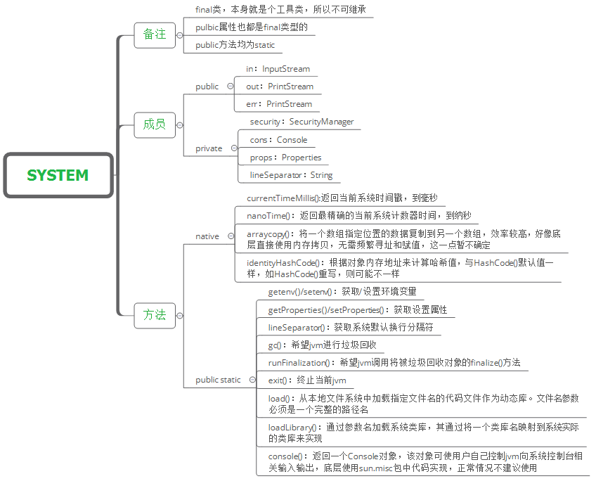

操作示例 1：操作耗时的统计

```java
public class JavaAPIDemo {
    public static void main(String[] args) {
        long start = System.currentTimeMillis();
        String str = "";
        for (int x = 0; x < 30000; x++) {
            // 产生大量的垃圾空间
            str += x;
        }
        long end = System.currentTimeMillis();
        System.out.println("操作耗时：" + (end - start));
    }
}

// 输出内容
操作耗时：364
```

操作示例 2：数组拷贝

```java
public class JavaAPIDemo {
    public static void main(String[] args) throws Exception {
        String[] arr1 = {"a1", "a2", "a3", "a4", "a5"};
        String[] arr2 = {"b1", "b2", "b3", "b4", "b5"};
        System.arraycopy(arr1, 1, arr2, 1, 3);
        for (String s : arr2) {
            System.out.println(s);
        }
        System.out.println("=======================");
        String[] arr3 = {"a1", "a2", "a3", "a4", "a5"};
        String[] arr4 = new String[5];
        System.arraycopy(arr3, 1, arr4, 1, 3);
        for (String s : arr4) {
            System.out.println(s);
        }
    }
}

// 输出内容
b1
a2
a3
a4
b5
=======================
null
a2
a3
a4
null
```

操作示例 3：获取当前系统属性

```java
public class JavaAPIDemo {
    public static void main(String[] args) throws Exception {
        // 获的当前系统指定属性
        System.out.println(System.getProperties().getProperty("os.arch"));
        // 获的当前系统所有属性
        System.out.println(System.getProperties());
    }
}

// 输出内容
amd64
{sun.desktop=windows, awt.toolkit=sun.awt.windows.WToolkit, java.specification.version=10, file.encoding.pkg=sun.io, sun.cpu.isalist=amd64, sun.jnu.encoding=GBK, java.class.path=D:\Code\IDEA_WS\Study_JavaSE\Java-IO\target\classes, java.vm.vendor="Oracle Corporation", sun.arch.data.model=64, user.variant=, java.vendor.url=http://java.oracle.com/, user.timezone=, os.name=Windows 10, java.vm.specification.version=10, sun.java.launcher=SUN_STANDARD, user.country=CN, sun.boot.library.path=D:\Environment\java\jdk-10.0.2\bin, sun.java.command=JavaAPIDemo, jdk.debug=release, sun.cpu.endian=little, user.home=C:\Users\lenovo, user.language=zh, java.specification.vendor=Oracle Corporation, java.version.date=2018-07-17, java.home=D:\Environment\java\jdk-10.0.2, file.separator=\, java.vm.compressedOopsMode=Zero based, line.separator=
, java.specification.name=Java Platform API Specification, java.vm.specification.vendor=Oracle Corporation, java.awt.graphicsenv=sun.awt.Win32GraphicsEnvironment, user.script=, sun.management.compiler=HotSpot 64-Bit Tiered Compilers, java.runtime.version=10.0.2+13, user.name=lenovo, path.separator=;, os.version=10.0, java.runtime.name=Java(TM) SE Runtime Environment, file.encoding=UTF-8, java.vm.name=Java HotSpot(TM) 64-Bit Server VM, java.vendor.version=18.3, java.vendor.url.bug=http://bugreport.java.com/bugreport/, java.io.tmpdir=C:\Users\lenovo\AppData\Local\Temp\, java.version=10.0.2, user.dir=D:\Code\IDEA_WS\Study_JavaSE, os.arch=amd64, java.vm.specification.name=Java Virtual Machine Specification, java.awt.printerjob=sun.awt.windows.WPrinterJob, sun.os.patch.level=, java.library.path=D:\Environment\java\jdk-10.0.2\bin;C:\WINDOWS\Sun\Java\bin;C:\WINDOWS\system32;C:\WINDOWS;C:\Program Files\Common Files\Oracle\Java\javapath;C:\Program Files (x86)\Common Files\Oracle\Java\javapath;C:\WINDOWS\system32;C:\WINDOWS;C:\WINDOWS\System32\Wbem;C:\WINDOWS\System32\WindowsPowerShell\v1.0\;C:\WINDOWS\System32\OpenSSH\;D:\Environment\java\jdk1.8.0_121\bin;D:\Environment\java\jdk1.8.0_121\jre\bin;D:\Environment\tomcat\apache-tomcat-8.5.42\bin;D:\Environment\maven\apache-maven-3.5.0\bin;D:\Program Files\Git\cmd;C:\Users\lenovo\AppData\Local\Microsoft\WindowsApps;C:\Users\lenovo\AppData\Local\BypassRuntm;C:\Users\lenovo\AppData\Local\Microsoft\WindowsApps;D:\Environment\MongoDB\Server\4.4\bin;D:\Environment\erl-23.2\bin;D:\Environment\RabbitMQ Server\rabbitmq_server-3.8.14\sbin;C:\Users\lenovo\AppData\Local\Microsoft\WindowsApps;C:\Users\lenovo\AppData\Local\BypassRuntm;C:\Users\lenovo\AppData\Local\Microsoft\WindowsApps;D:\Environment\nvm-noinstall;D:\Environment\nodejs;;D:\Program Files\Microsoft VS Code\bin;., java.vendor=Oracle Corporation, java.vm.info=mixed mode, java.vm.version=10.0.2+13, sun.io.unicode.encoding=UnicodeLittle, java.class.version=54.0}
```

**PS**：在System类里面也提供有一个gc()方法。但是这个gc()方法并不是重新定义的新方法，而是继续调用Runtime类中的gc()操作（Runtime.getRuntime().gc();）


## 6、Cleaner类

通过本节内容，你将了解到与AutoCloseable有相同功能的Cleaner类。

Cleaner是在JDK1.9之后提供的一个对象清理操作，其主要的功能是进行finalize()方法的替代。在C++语言里面有两种特殊的函数：构造函数、析构函数（对象手工回收），在Java里面所有的垃圾空间都是通过GC自动回收的，所以很多情况下是不需要使用这类析构函数的，也正是因为如此，所以Java并没有提供这方面支持。

但是Java本身依然提供了给用户收尾的操作，每一个实例化对象在回收之前至少给它一个喘息的机会。最初实现对象收尾处理的方法是Object类中所提供的finalize()方法，这个方法的定义如下：

```java
@Deprecated(since="9")
protected void finalize() throws Throwable;
```

该替换指的是不建议继续使用这个方法了，而是说子类可以继续使用这个方法名称。 但是这个方法上最大的特点就是抛出了一个Throwable异常类型，而这个异常类型分为两个子类型：Error、Exception，平常所处理的都是Exception。

操作示例 1：观察传统回收

```java
class Member {
    public Member() {
        System.out.println("【构造】在一个雷电交加的日子里面，林强诞生了。");
    }

    @Override
    protected void finalize() throws Throwable {
        System.out.println("【回收】最终你一定要死的");
        throw new Exception("我还要再活500年...");
    }
}

public class JavaAPIDemo {
    public static void main(String[] args) throws Exception {
        // 诞生
        Member mem = new Member();
        // 成为垃圾
        mem = null;
        System.gc();
        System.out.println("太阳照常升起，地球照样转动。");
    }
}

// 输出内容
【构造】在一个雷电交加的日子里面，林强诞生了。
太阳照常升起，地球照样转动。
【回收】最终你一定要死的
```

但是从JDK1.9开始，这一操作已经不建议使用了，而对于对象回收释放，从JDK1.9开始建议开发者使用AutoCloseable或者使用java.lang.ref.Cleaner类进行回收处理（Cleaner也支持有AutoCloseable处理）；

```java
import java.lang.ref.Cleaner;

class Member implements Runnable {
    public Member() {
        System.out.println("【构造】在一个雷电交加的日子里面，林强诞生了。");
    }
    @Override
    public void run() {
        // 执行清除的时候执行的是此操作
        System.out.println("【回收】最终你一定要死的");
    }
}

/**
 * 实现清除的处理
 */
class MemberCleaning implements AutoCloseable {
    // 创建一个清除处理
    private static final Cleaner cleaner = Cleaner.create();
    private Member member;
    private Cleaner.Cleanable cleanable;
    public MemberCleaning() {
        // 创建新对象
        this.member = new Member();
        // 注册使用的对象
        this.cleanable = this.cleaner.register(this, this.member);
    }

    @Override
    public void close() throws Exception {
        this.cleanable.clean();   //启动多线程
    }
}

public class JavaAPIDemo {
    public static void main(String[] args) throws Exception {
        try (MemberCleaning mc = new MemberCleaning()) {
            // 中间可以执行一些相关的代码
        }
    }
}

// 输出内容
【构造】在一个雷电交加的日子里面，林强诞生了。
【回收】最终你一定要死的
```

在新一代的清除回收处理的过程之中，更多的情况下考虑的是多线程的使用，即：为了防止有可能造成的延迟处理，所以许多对象回收前的处理都是单独通过一个线程完成的。


## 7、对象克隆方法

所谓的对象克隆指的就是对象的复制，而且属于全新的复制。即：使用已有对象内容创建一个新的对象，如果要想使用对象克隆需要使用到Object类中提供的clone()方法：

```java
protected Object clone() throws CloneNotSupportedException;
```

所有的类都会继承Object父类，所以所有的类都一定会有clone()方法，但是并不是所有的类都希望被克隆。所以如果要想实现对象克隆，那么对象所在的类需要实现一个Cloneable接口，此接口并没有任何的方法提供，是因为它描述的是一种能力。

操作示例 1：实现对象克隆

```java
class Member implements Cloneable {
    private String name ;
    private int age ;
    public Member(String name,int age) {
        this.name = name ;
        this.age = age ;
    }
    @Override
    public String toString() {
        return "【" + super.toString() + "】name = " + this.name + "、age = " + this.age ;
    }
    @Override
    protected Object clone() throws CloneNotSupportedException {
        // 调用父类中提供的clone()方法
        return super.clone();
    }
}

public class JavaAPIDemo {
    public static void main(String[] args) throws Exception {
        Member memberA = new Member("林强",30) ;
        Member memberB = (Member) memberA.clone() ;
        System.out.println(memberA);
        System.out.println(memberB);
    }
}

// 输出内容
【Member@50cbc42f】name = 林强、age = 30
【Member@3796751b】name = 林强、age = 30
```

如果在开发之中不是非常特别的需求下，很少会出现有对象克隆的需求。


# 数字操作类

## 1、Math数学计算类

通过本节内容，你将接触到Math类，了解其各个内部方法的功能，熟悉其调用方法，并能够自己定制一些有特殊功能的数学方法，满足现实开发中的特定需求。程序就是一个数学的处理过程，所以在Java语言本身也提供有相应的数字处理的类库支持。

Math类的主要功能是进行数学计算的操作类，提供有基础的计算公式，这个类的构造方法被私有化了，而且该类之中提供的所有方法都是static型的方法，即：这些方法都可以通过类名称直接调用。常用方法如下：（PS：以下的数据类型可以为：int、long、double、float）

| 方法名                                      | 描述                                           |
| ------------------------------------------- | ---------------------------------------------- |
| public static int abs(double x)             | 取绝对值                                       |
| public static int round(float a)            | 四舍五入，参数也可以为double                   |
| public static double ceil(double a)         | ceil天花板，获取向上取整。结果是一个double类型 |
| public static double floor(double a)        | floor地板，获取向下取整。结果是一个double类型  |
| public static int max(int a,int b)          | 获取两个值中的最大值                           |
| public static int min(int a,int b)          | 获取两个值中的最小值                           |
| public static double pow(double a,double b) | a是底数。b是指数。a的b次方                     |
| public static double sqrt(double a)         | 平方根                                         |
| public static double random()               | 0.0~1.0   之间的小数。包括0.0不包括1.0         |

 java.lang.Math类中包含基本的数字操作，如指数、对数、平方根和三角函数。

```java
// java.lang.Math类中包含E和PI两个静态常量
public static final Double E = 2.7182818284590452354;
public static final Double PI = 3.14159265358979323846;
// 进行科学计算的静态方法，可以直接通过类名调用
public static long abs(double x);               // 传回 x 的绝对值。X也可int long float
public static long sin(double x);               // 传回x径度的正弦函数值  
public static long cos(double x);               // 传回x径度的余弦函数值   
public static long tan(double x);               // 传回x径度的正切函数值 
public static long asin(double x);              // 传回x值的反正弦函数值
public static long acos(double x);              // 传回x值的反余弦函数值
public static long atan(double x);              // 传回x值的反正切函数值
public static long atan2(double x, double y);   // 传回极坐标（polar）的θ值 
public static long floor(double x);             // 传回不大于x的最大整数值 
public static long ceil(double x);              // 传回不小于x的最小整数值
public static long exp(double x);               // 传回相当于ex值 
public static long log(double x);               // 传回x的自然对数函数值 
public static long max(double x,double y);      // 传回x、y较大数 
public static long min(double x,double y);      // 传回x、y较小数 
public static long pow(double x,double y);      // 传回x的y次幂值 
public static long sqrt(double x);              // 传回x开平方值 
public static long rint(double x);              // 传回最接近x的整数值 
public static long round(double x);             // 传回x的四舍五入值 
public static long toDegrees(double angrad);    // 传回将angrad径度转换成角度 
public static long toRadians(double angdeg);    // 传回将angdeg角度转换成径度
public static long random();                    // 传回随机数值,产生一个0-1之间的随机数(不包括0和1)
```

操作示例 1：简单方法

```java
public class JavaAPIDemo {
    public static void main(String[] args) throws Exception {
        System.out.println(Math.abs(-10.1));         // 10.1
        System.out.println(Math.max(10.2, 20.3));    // 20.3
        System.out.println(Math.log(5));             // 1.6094379124341003
        System.out.println(Math.round(15.1));        // 15
        System.out.println(Math.round(-15.5));       // -15
        System.out.println(Math.round(-15.51));      // -16
        System.out.println(Math.pow(10.2, 20.2));    // 2.364413713591828E20

        // TODO Auto-generated method stub
        System.out.println(Math.E);  // 比任何其他值都更接近 e（即自然对数的底数）的 double 值。
        System.out.println(Math.PI); // 比任何其他值都更接近 pi（即圆的周长与直径之比）的 double 值。
        /*
         * 1.abs绝对值函数
         * 对各种数据类型求绝对值
         */
        System.out.println(Math.abs(-10)); // 输出10

        /*
         * 2.三角函数与反三角函数
         * cos求余弦
         * sin求正弦
         * tan求正切
         * acos求反余弦
         * asin求反正弦
         * atan求反正切
         * atan2(y,x)求向量(x,y)与x轴夹角
         */
        System.out.println(Math.acos(-1.0)); // 输出圆周率3.14...
        System.out.println(Math.atan2(1.0, 1.0)); // 输出 π/4 的小数值

        /*
         * 3.开根号
         * cbrt(x)开立方
         * sqrt(x)开平方
         * hypot(x,y)求sqrt(x*x+y*y)在求两点间距离时有用sqrt((x1-x2)^2+(y1-y2)^2)
         */
        System.out.println(Math.sqrt(4.0)); // 输出2.0
        System.out.println(Math.cbrt(8.0)); // 输出2.0
        System.out.println(Math.hypot(3.0, 4.0)); // 输出5.0

        /*
         * 4.最值
         * max(a,b)求最大值
         * min(a,b)求最小值
         */
        System.out.println(Math.max(1, 2)); // 输出2
        System.out.println(Math.min(1.9, -0.2)); // 输出-0.2
        
        /*
         * 5.对数
         * log(a) a的自然对数(底数是e)
         * log10(a) a 的底数为10的对数
         * log1p(a) a+1的自然对数
         * 值得注意的是，前面其他函数都有重载，对数运算的函数只能传double型数据并返回double型数据
         */
        System.out.println(Math.log(Math.E)); // 输出1.0
        System.out.println(Math.log10(10)); // 输出1.0
        System.out.println(Math.log1p(Math.E - 1.0));  // 输出1.0
        
        /*
         * 6.幂
         * exp(x) 返回e^x的值
         * expm1(x) 返回e^x - 1的值
         * pow(x,y) 返回x^y的值
         * 这里可用的数据类型也只有double型
         */
        System.out.println(Math.exp(2)); // 输出E^2的值
        System.out.println(Math.pow(2.0, 3.0)); // 输出8.0

        /*
         * 7.随机数
         * random()返回[0.0,1.0)之间的double值
         * 这个产生的随机数其实可以通过*x控制
         * 比如(int)(random*100)后可以得到[0,100)之间的整数
         */
        System.out.println((int) (Math.random() * 100)); // 输出[0,100)间的随机数

        /*
         * 8.转换
         * toDegrees(a) 弧度换角度
         * toRadians(a) 角度换弧度
         */
        System.out.println(Math.toDegrees(Math.PI)); // 输出180.0
        System.out.println(Math.toRadians(180)); // 输出 π 的值
        
        /*
         * 9.其他
         */
        //copySign(x,y) 返回 用y的符号取代x的符号后新的x值
        System.out.println(Math.copySign(-1.0, 2.0)); // 输出1.0
        System.out.println(Math.copySign(2.0, -1.0)); // 输出-2.0

        //ceil(a) 返回大于a的第一个整数所对应的浮点数(值是整的，类型是浮点型)
        //可以通过强制转换将类型换成整型
        System.out.println(Math.ceil(1.3443));//输出2.0
        System.out.println((int) Math.ceil(1.3443));//输出2

        //floor(a) 返回小于a的第一个整数所对应的浮点数(值是整的，类型是浮点型)
        System.out.println(Math.floor(1.3443)); // 输出1.0

        //rint(a) 返回最接近a的整数的double值
        System.out.println(Math.rint(1.2)); // 输出1.0
        System.out.println(Math.rint(1.8)); // 输出2.0


        //nextAfter(a,b) 返回(a,b)或(b,a)间与a相邻的浮点数 b可以比a小
        System.out.println(Math.nextAfter(1.2, 2.7)); // 输出1.2000000000000002
        System.out.println(Math.nextAfter(1.2, -1)); // 输出1.1999999999999997
        //所以这里的b是控制条件

        //nextUp(a) 返回比a大一点点的浮点数
        System.out.println(Math.nextUp(1.2));//输出1.2000000000000002

        //nextDown(a) 返回比a小一点点的浮点数
        System.out.println(Math.nextDown(1.2));//输出1.1999999999999997
    }
}
```

虽然在Math类里面提供有四舍五入的处理方法，但是这个四舍五入字在进行处理的时候是直接将小数点后的所有位进行进位处理了，这样肯定不方便，那么现在最方便的做法是可以实现指定位数的保留。

操作示例 2：自定义的四舍五入功能

```java
class MathUtil {
    private MathUtil() {}
    /**
	 * 实现数据的四舍五入操作
	 * @param num 要进行四舍五入操作的数字
	 * @param scale 四舍五入保留的小数位数
	 * @return 四舍五入处理后的结果
	 */
    public static double round(double num,int scale) {
        return Math.round(num * Math.pow(10, scale)) / Math.pow(10, scale) ;
    }
}

public class JavaAPIDemo {
    public static void main(String[] args) throws Exception {
        System.out.println(MathUtil.round(19.86273, 2)); // 19.86
    }
}
```

> 说到对`floor()`和`ceil()`的概念理解：
>
> 1. floor直接取其含义，也就是“**地板**”，地板在脚下，即**向下取整**。
>
> 2. ceil是ceiling的缩写，也就是“**天花板**”，天花板在头顶上，即**向上取整**。
>
> 这里需要**注意**，floor()和ceil()的**返回值**都是**double类型**的数值。
>
> **round**()的四舍五入也可以引入y轴来确定：
>
> 不管正数还是负数，四舍五入法要求，凡是**.5的小数**，都要**向上取整**。
>
> 因此，**负数.5小数的四舍五入**，只需**直接取绝对值**，**再加上负号**，就完成了。


## 2、Random随机数类

通过本节内容，你将接触到Random类，了解其各个内部方法的功能，熟悉其调用方法，并能够自己定制一些有特殊功能的数学方法，满足现实开发中的特定需求。程序就是一个数学的处理过程，所以在Java语言本身也提供有相应的数字处理的类库支持。

java.util.Random类的主要功能是产生随机数，这个类主要依靠内部提供的方法来完成：

| 方法名                        | 类型 | 描述                                                         |
| ----------------------------- | ---- | ------------------------------------------------------------ |
| public Random()               | 构造 | 创建一个新的随机数生成器                                     |
| public Random(long seed)      | 构造 | 使用单个long种子创建一个新的随机数生成器                     |
| public int nextlnt(int bound) | 普通 | 产生一个不大于边界的随机正整                                 |
| public int nextInt()          | 普通 | 返回下一个伪随机数，它是此随机数生成器的序列中均匀分布的 int 值 |
| protected int next(int bits)  | 普通 | 生成下一个伪随机数                                           |
| long nextLong()               | 普通 | 返回下一个伪随机数，它是取自此随机数生成器序列的均匀分布的 long 值 |
| boolean nextBoolean()         | 普通 | 返回下一个伪随机数，它是取自此随机数生成器序列的均匀分布的boolean值 |
| void nextBytes(byte[] bytes)  | 普通 | 生成随机字节并将其置于用户提供的 byte 数组中                 |
| double nextDouble()           | 普通 | 返回下一个伪随机数，它是取自此随机数生成器序列的、在0.0和1.0之间均匀分布的 double值 |
| float nextFloat()             | 普通 | 返回下一个伪随机数，它是取自此随机数生成器序列的、在0.0和1.0之间均匀分布float值 |
| void setSeed(long seed)       | 普通 | 使用单个 long 种子设置此随机数生成器的种子                   |

操作示例 1：产生随机数

```java
import java.util.Random;

public class JavaAPIDemo {
    public static void main(String[] args) throws Exception {
        Random rand = new Random() ;
        for (int x = 0 ; x < 10 ; x ++) {
            System.out.print(rand.nextInt(100) + "、");
        }
        System.out.println();
        System.out.println("生成[0,1.0)区间的小数：" + rand.nextDouble());            // 0.9501832099297808
        System.out.println("生成[0,5.0)区间的小数：" + rand.nextDouble() * 5);        // 2.946336926263871
        System.out.println("生成[1,2.5)区间的小数：" + rand.nextDouble() * 1.5 + 1);  // 1.326680755683811
        System.out.println("生成-231到231-1之间的整数：" + rand.nextInt());           // 2131735306
        System.out.println("生成[0,10)区间的整数：" + rand.nextInt(10));      // 1
        System.out.println("生成[0,10)区间的整数：" + Math.abs(rand.nextInt() % 10)); // 7
    }
}

// 输出内容
20、88、50、59、45、48、78、72、46、99、
生成[0,1.0)区间的小数：0.9501832099297808
生成[0,5.0)区间的小数：2.946336926263871
生成[1,2.5)区间的小数：1.326680755683811
生成-231到231-1之间的整数：2131735306
生成[0,10)区间的整数：1
生成[0,10)区间的整数：7
```

操作示例 2：随机生成彩票号（36选7的彩票）数字不能为0且不能重复

```java
import java.util.Random;

public class JavaAPIDemo {
    public static void main(String[] args) throws Exception {
        int data [] = new int [7] ; // 开辟7个大小的空间
        Random rand = new Random() ;
        int foot = 0 ; // 操作data脚标
        while(foot < 7) {	// 选择7个数字
            int num = rand.nextInt(37) ; // 生成一个数字
            if (isUse(num,data)) {	// 该数字现在可以使用
                data[foot ++] = num ; // 保存数据
            }
        }
        java.util.Arrays.sort(data);
        for (int x = 0 ; x < data.length ; x ++) {
            System.out.print(data[x] + "、");
        }
    }
    /**
     * 判断传入的数字是否为0以及是否在数组之中存在
     * @param num 要判断的数字
     * @param temp 已经存在的数据
     * @return 如果该数字不是0并且可以使用返回true，否则返回false
     */
    public static boolean isUse(int num,int temp[]) {
        if (num == 0) {
            return false ;
        }
        for (int x = 0 ; x < temp.length ; x ++) {
            if (num == temp[x]) {
                return false ;
            }
        }
        return true ;
    }
}

// 输出内容
6、10、12、14、17、28、31、
```

我们可以在构造Random对象时指定种子：`Random r1 = new Random(20);`或者默认当前系统时间的毫秒数作为种子数：`Random r1 = new Random();`

需要说明的是：你在创建一个Random对象的时候可以给定任意一个合法的种子数，种子数只是随机算法的起源数字，和生成的随机数的区间没有任何关系。如下面的Java代码：

```java
import java.util.Random;
public class JavaAPIDemo {
    public static void main(String[] args) throws Exception {
        Random rand = new Random(25);
        System.out.println(rand.nextInt(100)); // 81
    }
}
// 输出内容
81
```

初始化时25并没有起直接作用（注意：不是没有起作用）,rand.nextInt(100);中的100是随机数的上限,产生的随机数为0-100的整数,不包括100。

操作示例 3：对于种子相同种子的Random对象，生成的随机数序列是一样的。

```java
import java.util.Random;
public class JavaAPIDemo {
    public static void main(String[] args) throws Exception {
        Random ran1 = new Random(10);
        System.out.println("使用种子为10的Random对象生成[0,10)内随机整数序列: ");
        for (int i = 0; i < 10; i++) {
            System.out.print(ran1.nextInt(10) + " ");
        }
        System.out.println();
        Random ran2 = new Random(10);
        System.out.println("使用另一个种子为10的Random对象生成[0,10)内随机整数序列: ");
        for (int i = 0; i < 10; i++) {
            System.out.print(ran2.nextInt(10) + " ");
        }
    }
}

// 输出内容
使用种子为10的Random对象生成[0,10)内随机整数序列: 
3 0 3 0 6 6 7 8 1 4 
使用另一个种子为10的Random对象生成[0,10)内随机整数序列: 
3 0 3 0 6 6 7 8 1 4 
```

PS：在没带参数构造函数生成的Random对象的种子缺省是当前系统时间的毫秒数。另外，直接使用Random无法避免生成重复的数字，如果需要生成不重复的随机数序列，需要借助数组和集合类。


## 3、大数字操作类

> 参考：https://blog.csdn.net/xiaoxiaole0313/article/details/107328700/
>

随着科技的发展，计算机对运算的要求变得越来越高，传统的float甚至double已经无法满足。为了解决这类问题，出现了BigInteger、BigDecimal两个操作大数字的类。通过本节内容，你将了解到BigInteger、BigDecimal两个类的相关内容，学会其兑现的简单创建与方法调用，并能够自行开发一些方法完成大数字运算时的性能调优。

### 1、BigInteger

在进行数学计算的过程里面还有一个大数字的操作类，可以实现海量数字的计算（能提供的也只是基础计算），现在假设一个数字很大，超过了double的范围，那么这个时候并没有任何一种数据类型可以保存下此类的内容，最早的时候只能通过String保存。

```java
String strA="120";
String strB="230";
```

如果现在想要进行加法计算，那么就需要逐位拆分，每一位自己计算，而后自己独立控制进位处理，那么这样的开发难度是非常高的，所以为了解决这类问题，提供有两个大数字的操作类：BigInteger、BigDecimal。


之前分析了，当数字很大的时候只能利用字符串描述数字操作，所以这一点可以观察两个大数字操作类的构造方法：

| 方法名                        | 类型 | 描述             |
| ----------------------------- | ---- | ---------------- |
| public BigInteger(String val) | 构造 | BigInteger类构造 |
| public BigDecimal(String val) | 构造 | BigDecimal类构造 |

操作示例 1：使用BigInteger实现四则运算

```java
public class JavaAPIDemo {
    public static void main(String[] args) throws Exception {
        BigInteger bigA = new BigInteger("234234234234234234") ;
        BigInteger bigB = new BigInteger("23423423") ;
        System.out.println("加法操作：" + bigA.add(bigB));
        System.out.println("减法操作：" + bigA.subtract(bigB));
        System.out.println("乘法操作：" + bigA.multiply(bigB));
        System.out.println("除法操作：" + bigA.divide(bigB));
    }
}

// 输出内容
加法操作：234234234257657657
减法操作：234234234210810811
乘法操作：5486567549549549544062982
除法操作：10000000180
```

需要注意的是，虽然提供有大数字操作类，但是整体的操作之中还是需要考虑到一个性能问题。

操作示例 2：观察性能

```java
public class JavaAPIDemo {
    public static void main(String[] args) throws Exception {
        BigInteger bigA = new BigInteger("234234234234234234") ;
        System.out.println(bigA.pow(Integer.MAX_VALUE)); 
    }
}
```


查看CPU处理的图片。此时的计算过程是非常缓慢的，所以任何的电脑是有极限的。

既然在进行数学除法的时候有可能无法进行整除处理，那么就可以使用其他的除法计算来求出余数：	

| 方法名                                                 | 类型 | 描述                                   |
| ------------------------------------------------------ | ---- | -------------------------------------- |
| public BigInteger[] divideAndRemainder(BigInteger val) | 普通 | 求余，数组第一个元素为商，第二个为余数 |

操作示例 3：求余除法

```java
import java.math.BigInteger;
public class JavaAPIDemo {
    public static void main(String[] args) throws Exception {
        BigInteger bigA = new BigInteger("234234234234234234") ;
        BigInteger bigB = new BigInteger("23423423") ;
        BigInteger result [] = bigA.divideAndRemainder(bigB) ;
        System.out.println("商：" + result[0] + "、余数：" + result[1]);
    }
}

// 输出
商：10000000180、余数：18018094
```

如果在开发中真进行计算的时候，该计算没有超过基本数据类型所包含的位数强烈不建议使用大数字类，因为这种计算性能很差的。


### 2、BigDecimal

> Java 中的 BigDecimal ，80% 的人都用错了：https://mp.weixin.qq.com/s/DDTnC6joLAaGqP0ghpAwrA

BigDecimal操作形式和BigInteger是非常类似的，都有基础的数学支持。常用方法如下：

| 方法名                                              | 类型 | 描述                                                     |
| --------------------------------------------------- | ---- | -------------------------------------------------------- |
| public BigDecimal(int)                              | 构造 | 创建一个具有参数所指定整数值的对象                       |
| public BigDecimal(double)                           | 构造 | 创建一个具有参数所指定双精度值的对象。不推荐使用         |
| public BigDecimal(long)                             | 构造 | 创建一个具有参数所指定长整数值的对象                     |
| public BigDecimal(String)                           | 构造 | 创建一个具有参数所指定以字符串表示的数值的对象。推荐使用 |
| public BigDecimal add(BigDecimal augend)            | 普通 | BigDecimal对象中的值相加，然后返回这个对象               |
| public BigDecimal subtract(BigDecimal subtrahend)   | 普通 | BigDecimal对象中的值相减，然后返回这个对象               |
| public BigDecimal multiply(BigDecimal multiplicand) | 普通 | BigDecimal对象中的值相乘，然后返回这个对象               |
| public BigDecimal divide(BigDecimal divisor)        | 普通 | BigDecimal对象中的值相除，然后返回这个对象               |
| public String toString()                            | 普通 | 将BigDecimal对象的数值转换成字符串                       |
| public double doubleValue()                         | 普通 | 将BigDecimal对象中的值以双精度数返回                     |
| public float floatValue()                           | 普通 | 将BigDecimal对象中的值以单精度数返回                     |
| public long longValue()                             | 普通 | 将BigDecimal对象中的值以长整数返回                       |
| public int intValue()                               | 普通 | 将BigDecimal对象中的值以整数返回                         |

操作示例 4：使用BigDecimal计算

```java
import java.math.BigDecimal;
public class JavaAPIDemo {
    public static void main(String[] args) throws Exception {
        BigDecimal bigA = new BigDecimal("32890234890") ;
        BigDecimal bigB = new BigDecimal("1892039") ;
        System.out.println("加法计算：" + bigA.add(bigB));
        BigDecimal result [] = bigA.divideAndRemainder(bigB) ;
        System.out.println("除法计算，商：" + result[0] + "、余数：" + result[1]);
    }
}

// 输出
加法计算：32892126929
除法计算，商：17383、余数：920953
```

---

> Java中BigDecimal的舍入模式

这边特别提一下，如果进行除法运算的时候，结果不能整除，有余数，这个时候会报java.lang.ArithmeticException: ，这边我们要避免这个错误产生，在进行除法运算的时候，针对可能出现的小数产生的计算，必须要多传两个参数。（除法计算数据进位问题）

```java
// divisor:除数、scale:精准小数位、roundingMode:舍入模式
// 第一个参数是除数，第二个参数代表保留几位小数，第三个代表的是使用的模式。
public BigDecimal divide(BigDecimal divisor, int scale, RoundingMode roundingMode);
```

与之相关的还有两个类：

1. java.math.MathContext：该对象是封装上下文设置的不可变对象，它描述数字运算符的某些规则，如数据的精度，舍入方式等。
2. java.math.RoundingMode：这是一种枚举类型，定义了很多常用的数据舍入方式。

舍入模式：

```
// 详细解释

1、ROUND_UP：
舍入远离零的舍入模式。在丢弃非零部分之前始终增加数字(始终对非零舍弃部分前面的数字加1)。注意，此舍入模式始终不会减少计算值的大小。

2、ROUND_DOWN：
接近零的舍入模式。在丢弃某部分之前始终不增加数字(从不对舍弃部分前面的数字加1，即截短)。注意，此舍入模式始终不会增加计算值的大小。

3、ROUND_CEILING：
接近正无穷大的舍入模式。如果 BigDecimal 为正，则舍入行为与 ROUND_UP 相同；如果为负，则舍入行为与 ROUND_DOWN 相同。注意，此舍入模式始终不会减少计算值。

4、ROUND_FLOOR：
接近负无穷大的舍入模式。如果 BigDecimal 为正，则舍入行为与 ROUND_DOWN 相同；如果为负，则舍入行为与 ROUND_UP 相同。注意，此舍入模式始终不会增加计算值。

5、ROUND_HALF_UP：
向“最接近的”数字舍入，如果与两个相邻数字的距离相等，则为向上舍入的舍入模式。如果舍弃部分 >= 0.5，则舍入行为与 ROUND_UP 相同;否则舍入行为与 ROUND_DOWN 相同。注意，这是我们大多数人在小学时就学过的舍入模式(四舍五入)。

6、ROUND_HALF_DOWN：
向“最接近的”数字舍入，如果与两个相邻数字的距离相等，则为上舍入的舍入模式。如果舍弃部分 > 0.5，则舍入行为与 ROUND_UP 相同;否则舍入行为与 ROUND_DOWN 相同(五舍六入)

7、ROUND_HALF_EVEN：
向“最接近的”数字舍入，如果与两个相邻数字的距离相等，则向相邻的偶数舍入。如果舍弃部分左边的数字为奇数，则舍入行为与 ROUND_HALF_UP 相同；如果为偶数，则舍入行为与 ROUND_HALF_DOWN 相同。注意，在重复进行一系列计算时，此舍入模式可以将累加错误减到最小。此舍入模式也称为“银行家舍入法”，主要在美国使用。四舍六入，五分两种情况。如果前一位为奇数，则入位，否则舍去

以下例子为保留小数点1位，那么这种舍入方式下的结果：1.15>1.2 1.25>1.2

8、ROUND_UNNECESSARY：
断言请求的操作具有精确的结果，因此不需要舍入。如果对获得精确结果的操作指定此舍入模式，则抛出ArithmeticException。

// 简单解释
ROUND_CEILING     // 向正无穷方向舍入
ROUND_DOWN        // 向零方向舍入
ROUND_FLOOR       // 向负无穷方向舍入
ROUND_HALF_DOWN   // 向（距离）最近的一边舍入，除非两边（的距离）是相等,如果是这样，向下舍入, 例如1.55 保留一位小数结果为1.5
ROUND_HALF_EVEN   // 向（距离）最近的一边舍入，除非两边（的距离）是相等,如果是这样，如果保留位数是奇数，使用ROUND_HALF_UP，如果是偶数，使用ROUND_HALF_DOWN
ROUND_HALF_UP     // 向（距离）最近的一边舍入，除非两边（的距离）是相等,如果是这样，向上舍入, 1.55保留一位小数结果为1.6,也就是我们常说的“四舍五入”
ROUND_UNNECESSARY // 计算结果是精确的，不需要舍入模式
ROUND_UP          // 向远离0的方向舍入
```

根据给定的舍入模式将输入数字舍入为一位数的结果总结表：

| 输入数字 | UP   | DOWN | CEILING | FLOOR | HALF_UP | HALF_DOWN | HALF_EVEN | UNNECESSARY              |
| -------- | ---- | ---- | ------- | ----- | ------- | --------- | --------- | ------------------------ |
| 5.5      | 6    | 5    | 6       | 5     | 6       | 5         | 6         | 抛出 ArithmeticException |
| 2.5      | 3    | 2    | 3       | 2     | 3       | 2         | 2         | 抛出 ArithmeticException |
| 1.6      | 2    | 1    | 2       | 1     | 2       | 2         | 2         | 抛出 ArithmeticException |
| 1.1      | 2    | 1    | 2       | 1     | 1       | 1         | 1         | 抛出 ArithmeticException |
| 1.0      | 1    | 1    | 1       | 1     | 1       | 1         | 1         | 1                        |
| -1.0     | -1   | -1   | -1      | -1    | -1      | -1        | -1        | -1                       |
| -1.1     | -2   | -1   | -1      | -2    | -1      | -1        | -1        | 抛出 ArithmeticException |
| -1.6     | -2   | -1   | -1      | -2    | -2      | -2        | -2        | 抛出 ArithmeticException |
| -2.5     | -3   | -2   | -2      | -3    | -3      | -2        | -2        | 抛出 ArithmeticException |
| -5.5     | -6   | -5   | -5      | -6    | -6      | -5        | -6        | 抛出 ArithmeticException |

操作示例 1：使用BigDecimal实现四舍五入处理

```java
import java.math.BigDecimal;
import java.math.RoundingMode;
class MathUtil {
    private MathUtil() {}
    /**
	 * 实现数据的四舍五入操作
	 * @param num 要进行四舍五入操作的数字
	 * @param scale 四舍五入保留的小数位数
	 * @return 四舍五入处理后的结果
	 */
    public static double round(double num,int scale) {
        return new BigDecimal(num).divide(new BigDecimal(1.0), scale, RoundingMode.HALF_UP).doubleValue();
    } 
}

public class JavaAPIDemo {
    public static void main(String[] args) throws Exception {
        System.out.println(MathUtil.round(19.6352, 2));
    }
}
```

操作示例 2：BigDecimal.setScale()方法用于格式化小数点

```java
import java.math.BigDecimal;
import java.math.RoundingMode;
public class JavaAPIDemo {
    public static void main(String[] args) throws Exception {
        System.out.println(new BigDecimal(1.0).setScale(1)); // 表示保留一位小数，默认用四舍五入方式
        System.out.println(new BigDecimal(2.35).setScale(1, RoundingMode.DOWN)); // 直接删除多余的小数位，如2.35会变成2.3
        System.out.println(new BigDecimal(2.35).setScale(1, RoundingMode.UP)); // 进位处理，2.35变成2.4
        // 如下两种区别：如果保留的位数的后一位如果正好是5的时候，一个舍弃掉，一个进位。
        System.out.println(new BigDecimal(2.35).setScale(1, RoundingMode.HALF_DOWN)); // 四舍五入，2.35变成2.3，如果是5则向下舍
        System.out.println(new BigDecimal(2.35).setScale(1, RoundingMode.HALF_UP)); // 四舍五入，2.35变成2.4
    }
}

// 输出内容
1.0
2.3
2.4
2.4
2.4
```


## 4、数字格式化类

> 参考：https://blog.csdn.net/a1064072510/article/details/89887633、https://www.jianshu.com/p/b9dd363e3ff8

数字的格式在解决实际问题时使用非常普遍，这时可以使用 DedmalFormat 类对结果进行格式化处理。

| 符号 | 说明                                                         |
| ---- | ------------------------------------------------------------ |
| 0    | 显示数字，如果位数不够则补 0                                 |
| #    | 显示数字，如果位数不够不发生变化                             |
| .    | 小数分隔符                                                   |
| -    | 减号                                                         |
| ,    | 组分隔符                                                     |
| E    | 分隔科学记数法中的尾数和小数                                 |
| %    | 前缀或后缀，乘以 100 后作为百分比显示                        |
| ?    | 乘以1000后作为千进制货币符显示,用货币符号代替。如果双写,用国际货币符号代替；如果出现在一个模式中,用货币十进制分隔符代替十进制分隔符 |

首先区分＃和０：

1. “0”——表示一位数值，如没有，显示0。如“0000.0000”，整数位或小数位>4，按实际输出，<4整数位前面补0小数位后面补0，凑足4位。
2. “#”——表示任意位数的整数。如没有，则不显示。在小数点位使用，只表示一位小数，超出部分四舍五入

操作示例 1：

```java
import java.text.DecimalFormat;
public class JavaAPIDemo {
    public static void main(String[] args) throws Exception {
        double pi = 3.1415926;
        // 取一位整数
        System.out.println(new DecimalFormat("0").format(pi));                  // 3
        // 取一位整数和两位小数
        System.out.println(new DecimalFormat("0.00").format(pi));               // 3.14
        // 取两位整数和三位小数,整数不足一0填补
        System.out.println(new DecimalFormat("00.000").format(pi));             // 03.142
        // 取所有整数部分
        System.out.println(new DecimalFormat("#").format(pi));                  // 3
        // 以百分比方式计数，并取两位小数
        System.out.println(new DecimalFormat("0.##%").format(pi / 100));        // 3.14%

        long c = 299792458;
        // 显示为科学计数法，并取五位小数
        System.out.println(new DecimalFormat("0.00000E0").format(c));           // 2.99792E8
        // 显示为两位整数的科学计数法，并取四位小数
        System.out.println(new DecimalFormat("00.0000E0").format(c));           // 29.9792E7
        // 每三位以逗号进行分隔
        System.out.println(new DecimalFormat(",###").format(c));                // 299,792,458
        // 将格式化数字嵌入文本
        System.out.println(new DecimalFormat("光速的大小为,###m/s").format(c));  // 光速的大小为299,792,458m/s
    }
}

// 输出内容
3
3.14
03.142
3
3.14%
2.99792E8
29.9792E7
299,792,458
光速的大小为299,792,458m/s
```


# 日期操作类

学习过字符串、数值等数据的操作，常见的数据还有一类日期数据。本节将为读者展示在Java中如何通过Date类进行日期数据的处理，使用SimpleDateFormat类完成对日期数据的格式化输入与输出。

## 1、Date日期类

通过本节内容，你将对开发过程中经常涉及到的数据产生一个较为全面的掌握，并学会使用Date类日期类型数据的各类操作。

从整体的Java来讲，一直在强调简单Java类的主要设计来自于数据表的结构，那么在数据表的结构里面常用的类型：数字、字符串、日期，所以现在的程序之中只差日期了。在Java中提供有java.util.Date类，这个类如果直接实例化就可以获取当前的日期时间。

操作示例 1：观察java.util.Date类

```java
import java.util.Date;
public class JavaAPIDemo {
    public static void main(String[] args) throws Exception {
        Date date = new Date();
        System.out.println(date);
    }
}

// 输出内容
Sat Oct 30 14:47:49 CST 2021
```

这个时候需要进一步去观察Date类中的构造方法：

```java
public Date() {
    this(System.currentTimeMillis());
}
public Date(long date) {
    fastTime = date;
}
```

通过以上的源代码分析可以得出一个结论：Date类中只是对long数据的一种包装。所以Date类中一定提供有所谓的日期与long数据类型之间转换的方法：

| 方法名                 | 类型 | 描述           |
| ---------------------- | ---- | -------------- |
| public Date(long date) | 构造 | 将long转为Date |
| public long getTime()  | 普通 | 将Date转为long |

操作示例 2：观察Date与long之间的转换

```java
import java.util.Date;
public class JavaAPIDemo {
    public static void main(String[] args) throws Exception {
        Date date = new Date() ;
        long current = date.getTime() ;
        current += 864000 * 1000 ; // 10天的秒数
        System.out.println(new Date(current));	// long转为Date
    }
}

// 输出内容
Tue Nov 09 15:11:16 CST 2021
```


## 2、Date日期格式化

通过本节内容，你将学会使用SimpleDateFormat类实现日期类型数据的各类操作。

虽然Date可以获取当前的日期时间，但是默认情况下Date类输出的日期时间结构并不能够被国人所习惯，那么就需要对显示的格式进行格式化的处理，为了可以格式化日期，在java.text包中提供有SimpleDateFormat程序类。该类是DateFormat的子类，在该类中提供有如下的方法：

| 方法名                                   | 类型 | 描述                                                        |
| ---------------------------------------- | ---- | ----------------------------------------------------------- |
| public final String format(Date date)    | 普通 | 将日期格式化字符串【DateFormat继承】                        |
| public Date parse(String source)         | 普通 | 将字符串转为日期【DateFormat继承】                          |
| public Simple DateFormat(String pattern) | 构造 | 构造指定格式的SimpleDateFormat对象                          |
| pattern参数：日期格式                    | 参数 | 年(yyyy)、月(MM)、日(dd)、时(HH)、分(mm)、秒(ss)、毫秒(SSS) |

- 日期格式（pattern）：年(yyyy)、月(MM)、日(dd)、时(HH)、分(mm)、秒(ss)、毫秒(SSS);

操作示例 1：格式化日期显示（Date转字符串）

```java
import java.text.SimpleDateFormat;
import java.util.Date;
public class JavaAPIDemo {
    public static void main(String[] args) throws Exception {
        Date date = new Date() ;
        SimpleDateFormat sdf = new SimpleDateFormat("yyyy-MM-dd HH:mm:ss.SSS") ;
        String str = sdf.format(date) ;
        System.out.println(str);
    }
}

// 输出内容
2021-10-30 15:19:54.762
```

除了可以将日期格式化为字符串之后，也可以实现字符串与日期之间的转换处理。

操作示例 2：将日期转为Date（字符串转Date）

```java
import java.text.SimpleDateFormat;
import java.util.Date;
public class JavaAPIDemo {
    public static void main(String[] args) throws Exception {
        String birthday = "1846-11-11 11:11:11.111" ; // 字符串的日期 
        SimpleDateFormat sdf = new SimpleDateFormat("yyyy-MM-dd HH:mm:ss.SSS") ;
        Date date = sdf.parse(birthday) ;
        System.out.println(date);
    }
}

// 输出内容
Wed Nov 11 11:11:11 CST 1846
```

如果在进行字符串定义的时候，所使用的日期时间数字超过了指定的合理范围，则会自动进行进位处理。

操作示例 3：数字格式化

```java
import java.text.NumberFormat;
public class JavaAPIDemo {
    public static void main(String[] args) throws Exception {
        double money = 23890238923.23 ; // 字符串的日期
        String str = NumberFormat.getInstance().format(money) ;
        System.out.println(str);// 23,890,238,923.23
    }
}

// 输出内容
23,890,238,923.23
```


通过到现在的学习可以发现，String字符串可以向所有类型转换，基本类型、日期类型。


## 3、JKD8日期类

Java 8通过发布新的：Date-Time API (JSR 310)来进⼀步加强对⽇期与时间的处理

1. 新增了很多常⻅的api，如⽇期/时间的⽐较，加减，格式化等

2. 包所在位置：java.time

3. 核⼼类

```
本地日期和时间：
LocalDate：不包含具体时间的⽇期。
LocalTime：不含⽇期的时间。
LocalDateTime：包含了⽇期及时间。
Instant：时刻，它代表的是时间戳
时区：ZoneId，ZoneOffset——这是一个包含时区的完整的日期时间，偏移量是以UTC/格林威治时间为基准的。
Duration：时间间隔
```

- LocalDate常见API

```java
//获取当前日期：2020-6-14 周天
LocalDate today = LocalDate.now();
System.out.println("今天⽇期：" + today);
//获取年，⽉，⽇，周⼏
System.out.println("现在是哪年:"+today.getYear());// 现在是哪年:2020
System.out.println("现在是哪⽉:"+today.getMonth());// 现在是哪⽉:JUNE
System.out.println("现在是哪⽉(数字):"+today.getMonthValue());// 现在是哪⽉(数字):6
System.out.println("现在是⼏号:"+today.getDayOfMonth());// 现在是⼏号:14
System.out.println("现在是周⼏:"+today.getDayOfWeek());// 现在是周⼏:SUNDAY
//加减年份, 加后返回的对象才是修改后的， 旧的依旧是旧的
LocalDate changeDate = today.plusYears(1);
System.out.println("加后是哪年:"+changeDate.getYear());// 加后是哪年:2021
System.out.println("旧的是哪年:"+today.getYear());// 旧的是哪年:2020
//⽇期⽐较
System.out.println("isAfter: "+changeDate.isAfter(today));// isAfter: true

//getYear() int 获取当前⽇期的年份
//getMonth() Month 获取当前⽇期的⽉份对象
//getMonthValue() int 获取当前⽇期是第⼏⽉
//getDayOfWeek() DayOfWeek 表示该对象表示的⽇期是星期⼏
//getDayOfMonth() int 表示该对象表示的⽇期是这个⽉第⼏天
//getDayOfYear() int 表示该对象表示的⽇期是今年第⼏天
//withYear(int year) LocalDate 修改当前对象的年份
//withMonth(int month) LocalDate 修改当前对象的⽉份
//withDayOfMonth(int dayOfMonth) LocalDate 修改当前对象在当⽉的⽇期
//plusYears(long yearsToAdd) LocalDate 当前对象增加指定的年份数
//plusMonths(long monthsToAdd) LocalDate 当前对象增加指定的⽉份数
//plusWeeks(long weeksToAdd) LocalDate 当前对象增加指定的周数
//plusDays(long daysToAdd) LocalDate 当前对象增加指定的天数
//minusYears(long yearsToSubtract) LocalDate 当前对象减去指定的年数
//minusMonths(long monthsToSubtract) LocalDate 当前对象减去注定的⽉数
//minusWeeks(long weeksToSubtract) LocalDate 当前对象减去指定的周数
//minusDays(long daysToSubtract) LocalDate 当前对象减去指定的天数
//compareTo(ChronoLocalDate other) int ⽐较当前对象和other对象在时间上的⼤⼩，返回值如果为正，则当前对象时间较晚
//isBefore(ChronoLocalDate other) boolean ⽐较当前对象⽇期是否在other对象⽇期之前
//isAfter(ChronoLocalDate other) boolean ⽐较当前对象⽇期是否在other对象⽇期之后
//isEqual(ChronoLocalDate other) boolean ⽐较两个⽇期对象是否相等
```

- LocalTime常见API

```java
//获取当前时间 11:36:13.693
LocalTime localTime = LocalTime.now();
System.err.println("当前时间>" + localTime);

//获取当前时 11
System.err.println(localTime + "当前时>" + localTime.getHour());

//获取当前分 38
System.err.println(localTime + "当前分>" + localTime.getMinute());

//获取当前秒 26
System.err.println(localTime + "当前秒>" + localTime.getSecond());

//当前时间前一时,11:36:12.693 minus:（表示运算）减去
System.err.println(localTime + "前一时>" + localTime.minusHours(1));

//当前时间后一时,11:36:12.693 minus:（表示运算）减去
System.err.println(localTime + "后一时>" + localTime.plusHours(1));

//当前时间前一分,11:39:05.970 minus:（表示运算）减去
System.err.println(localTime + "前一分>" + localTime.minusMinutes(1));

//当前时间后一分,11:36:12.693 minus:（表示运算）减去
System.err.println(localTime + "后一分>" + localTime.plusMinutes(1));

//当前时间前一秒,11:36:12.693 minus:（表示运算）减去
System.err.println(localTime + "前一秒>" + localTime.minusSeconds(1));

//当前时间后一秒,11:36:12.693 minus:（表示运算）减去
System.err.println(localTime + "后一秒>" + localTime.plusSeconds(1));
```

- LocalDateTime常见API

```java
/**
 * localDateTime
 * LocalDateTime类是Java 8中日期时间功能里，用于表示当地的日期与时间的类，它的值是无时区属性的。
 * 你可以将其视为Java 8中LocalDate与LocalTime两个类的结合。
 * 你可以通过这些方法访问其日期时间
 *  getYear()			int 获取当前⽇期的年份
 *	getMonth()			Month 获取当前⽇期的⽉份对象
 *	getDayOfMonth()		int 表示该对象表示的⽇期是这个⽉第⼏天
 *	getDayOfWeek()		DayOfWeek 表示该对象表示的⽇期是星期⼏
 *	getDayOfYear()		int 表示该对象表示的⽇期是今年第⼏天
 *	getHour()			获取当前时
 *	getMinute()			获取当前分
 *	getSecond()			获取当前秒
 *	getNano()			此方法返回第二个值内的纳秒，该值始终为正，并且永远不会超过999、999、999。
 */
LocalDateTime dt = LocalDateTime.now(); // 当前日期和时间
LocalDate d = dt.toLocalDate(); // 转换到当前日期
LocalTime t = dt.toLocalTime(); // 转换到当前时间

具体可以参考上面的LocalDate与LocalTime
```


## 4、JDK8日期格式化

JDK8之前：SimpleDateFormat来进⾏格式化，但SimpleDateFormat并不是线程安全的
JDK8之后：引⼊线程安全的⽇期与时间DateTimeFormatter

**范例：**日期格式化

```java
LocalDateTime ldt = LocalDateTime.now();
System.out.println(ldt); // 2020-06-13T19:43:12.722
DateTimeFormatter dtf = DateTimeFormatter.ofPattern("yyyy-MM-dd HH:mm:ss");
String ldtStr = dtf.format(ldt);
System.out.println(ldtStr);// 2020-06-13 19:43:12
```

**范例：**获取指定的⽇期时间对象

```java
LocalDateTime ldt = LocalDateTime.of(2020, 11, 11, 8, 20, 30);
System.out.println(ldt);// 2020-11-11T08:20:30
```

**范例：**计算⽇期时间差：**java.time.Duration**

```java
LocalDateTime today = LocalDateTime.now();
System.out.println(today);
LocalDateTime changeDate = LocalDateTime.of(2020,10,1,10,40,30);
System.out.println(changeDate);
Duration duration = Duration.between( today,changeDate);//第⼆个参数减第⼀个参数
System.out.println(duration.toDays());//两个时间差的天数
System.out.println(duration.toHours());//两个时间差的⼩时数
System.out.println(duration.toMinutes());//两个时间差的分钟数
System.out.println(duration.toMillis());//两个时间差的毫秒数
System.out.println(duration.toNanos());//两个时间差的纳秒数
```

**范例：**日期格式化案例

```java
System.out.println(">>>>>>>>>localDateTime<<<<<<<<");

LocalDateTime localDateTime = LocalDateTime.now();
System.err.println("当前完整日期>" + 
                   localDateTime.format(DateTimeFormatter.ofPattern("yyyy-MM-dd HH:mm:ss")));

/**
 * 时间格式化
 */
System.out.println(">>>>>>>>>时间格式化<<<<<<<<");

DateTimeFormatter formatDataTime = DateTimeFormatter.ofPattern("yyyy-MM-dd HH:mm:ss");
DateTimeFormatter formatDate = DateTimeFormatter.ofPattern("yyyy-MM-dd");
DateTimeFormatter formatTime = DateTimeFormatter.ofPattern("HH:mm:ss");

String formatDataTimeStr = localDateTime.format(formatDataTime);
String formatDateStr = localDateTime.format(formatDate);
String formatTimeStr = localDateTime.format(formatTime);

System.err.println("完整日期格式化之后" + formatDataTimeStr);
System.err.println("日期格式化之后" + formatDateStr);
System.err.println("时间格式化之后" + formatTimeStr);

/**
 * 时间比较大小
 */
System.out.println(">>>>>时间比较大小<<<<<");

LocalDateTime time1 = LocalDateTime.parse("2018-05-12 08:30:30", formatDataTime);
LocalDateTime time2 = LocalDateTime.parse("2018-04-20 16:30:30", formatDataTime);

System.err.println("time1=" + time1);
System.err.println("time2=" + time2);

System.err.println("time1==time2:" + time1.isEqual(time2));
System.err.println("time1>time2:" + time1.isAfter(time2));
System.err.println("time1<time2:" + time1.isBefore(time2));
```

Java8时间处理参考教程：https://www.yiibai.com/javatime


## 5、JDK8封装时间处理工具类

```java
package com.util;

import java.time.*;
import java.time.format.DateTimeFormatter;
import java.util.Date;

/**
 * 基于java8封装的时间处理工具类
 * <p>
 * 创建人：leigq <br>
 * 创建时间：2018-11-07 09:21 <br>
 * <p>
 * 修改人： <br>
 * 修改时间： <br>
 * 修改备注： <br>
 * </p>
 */
public class DateUtil {

    private static final String HYPHEN = "-";
    private static final String COLON = ":";

    /*↓↓↓↓↓↓↓↓↓↓↓↓↓↓↓↓↓↓↓↓ 时间格式 DateTimeFormatter (Java8) ↓↓↓↓↓↓↓↓↓↓↓↓↓↓↓↓↓↓↓↓↓↓*/
    enum FormatEnum {
        /**
         * 返回 DateTimeFormatter "yyyy-MM-dd HH:mm:ss" 时间格式
         */
        FORMAT_DATA_TIME(DateTimeFormatter.ofPattern(DATE_TIME_FORMAT)),

        /**
         * 返回 DateTimeFormatter "yyyyMMddHHmmss"的时间格式
         */
        FORMAT_DATA_TIME_NO_SYMBOL(DateTimeFormatter.ofPattern(DATETIME_FORMAT)),

        /**
         * 返回 DateTimeFormatter "yyyy-MM-dd"的时间格式
         */
        FORMAT_DATE(DateTimeFormatter.ofPattern(DATE_FORMAT)),

        /**
         * 返回 DateTimeFormatter "HH:mm:ss"的时间格式
         */
        FORMAT_TIME(DateTimeFormatter.ofPattern(TIME_FORMAT));

        private DateTimeFormatter value;

        FormatEnum(DateTimeFormatter format) {
            this.value = format;
        }
    }
    /*↑↑↑↑↑↑↑↑↑↑↑↑↑↑↑↑↑↑↑↑ 时间格式 DateTimeFormatter (Java8) ↑↑↑↑↑↑↑↑↑↑↑↑↑↑↑↑↑↑↑↑↑↑↑*/

    /*↓↓↓↓↓↓↓↓↓↓↓↓↓↓↓↓↓↓↓↓ 时间格式 字符串 ↓↓↓↓↓↓↓↓↓↓↓↓↓↓↓↓↓↓↓↓↓↓*/

    /**
     * 年的时间格式
     * <br/>
     * 返回 "yyyy" 字符串
     */
    public static final String YEAR_FORMAT = "yyyy";

    /**
     * 月的时间格式
     * <br/>
     * 返回 "MM" 字符串
     */
    public static final String MONTH_FORMAT = "MM";

    /**
     * 日的时间格式
     * <br/>
     * 返回 "dd" 字符串
     */
    public static final String DAY_FORMAT = "dd";

    /**
     * 时的时间格式
     * <br/>
     * 返回 "HH" 字符串
     */
    public static final String HOUR_FORMAT = "HH";

    /**
     * 分的时间格式
     * <br/>
     * 返回 "mm" 字符串
     */
    public static final String MINUTE_FORMAT = "mm";

    /**
     * 秒的时间格式
     * <br/>
     * 返回 "ss" 字符串
     */
    public static final String SECOND_FORMAT = "ss";

    /**
     * <span color='red'>年-月-日</span>的时间格式
     * <br/>
     * 返回 "yyyy-MM-dd" 字符串
     */
    public static final String DATE_FORMAT = YEAR_FORMAT + HYPHEN + MONTH_FORMAT + HYPHEN + DAY_FORMAT;

    /**
     * <span color='red'>时:分:秒</span>的时间格式
     * <br/>
     * 返回 "HH:mm:ss" 字符串
     */
    public static final String TIME_FORMAT = HOUR_FORMAT + COLON + MINUTE_FORMAT + COLON + SECOND_FORMAT;

    /**
     * <span color='red'>年-月-日 时:分:秒</span>的时间格式
     * <br/>
     * 返回 "yyyy-MM-dd HH:mm:ss" 字符串
     */
    public static final String DATE_TIME_FORMAT = DATE_FORMAT + " " + TIME_FORMAT;

    /**
     * <span color='red'>年月日时分秒</span>的时间格式（无符号）
     * <br/>
     * 返回 "yyyyMMddHHmmss" 字符串
     */
    public static final String DATETIME_FORMAT = YEAR_FORMAT + MONTH_FORMAT + DAY_FORMAT + HOUR_FORMAT + MINUTE_FORMAT + SECOND_FORMAT;

    /*↑↑↑↑↑↑↑↑↑↑↑↑↑↑↑↑↑↑↑↑↑ 时间格式 字符串 ↑↑↑↑↑↑↑↑↑↑↑↑↑↑↑↑↑↑↑↑↑*/


    /*↓↓↓↓↓↓↓↓↓↓↓↓↓↓↓↓↓↓ 时间戳 ↓↓↓↓↓↓↓↓↓↓↓↓↓↓↓↓↓↓↓↓↓↓*/

    /**
     * 获取秒级时间戳
     */
    public static Long epochSecond() {
        return localDateTime().toEpochSecond(ZoneOffset.of("+8"));
    }

    /**
     * 获取毫秒级时间戳
     */
    public static Long epochMilli() {
        return localDateTime().toInstant(ZoneOffset.of("+8")).toEpochMilli();
    }

    /*↑↑↑↑↑↑↑↑↑↑↑↑↑↑↑↑↑ 时间戳 ↑↑↑↑↑↑↑↑↑↑↑↑↑↑↑↑↑↑↑↑↑↑*/


    /*↓↓↓↓↓↓↓↓↓↓↓↓↓↓↓↓↓↓ 当前时间相关 ↓↓↓↓↓↓↓↓↓↓↓↓↓↓↓↓↓↓↓↓↓↓*/

    /**
     * 获取当前详细时间，like 2018-08-27 17:20:06
     */
    public static String dateTime() {
        return localDateTime().format(FormatEnum.FORMAT_DATA_TIME.value);
    }

    /**
     * 获取当前详细时间，like 20180827172006
     */
    public static String dateTimeNoSymbol() {
        return localDateTime().format(FormatEnum.FORMAT_DATA_TIME_NO_SYMBOL.value);
    }

    /**
     * 获取当前日期，like 2018-08-27
     */
    public static String date() {
        return localDate() + "";
    }

    /**
     * 获取当前时间，like 17:20:06
     */
    public static String time() {
        return localTime().format(FormatEnum.FORMAT_TIME.value);
    }

    /**
     * 获取当前年
     */
    public static Integer year() {
        return localDate().getYear();
    }

    /**
     * 获取当前月
     */
    public static int month() {
        return localDate().getMonthValue();
    }

    /**
     * 获取当前年中的日
     */
    public static Integer dayOfYear() {
        return localDate().getDayOfYear();
    }

    /**
     * 获取当前月中的日
     */
    public static Integer dayOfMonth() {
        return localDate().getDayOfMonth();
    }

    /**
     * 获取当前星期中的日
     */
    public static Integer dayOfWeek() {
        return localDate().getDayOfWeek().getValue();
    }

    /**
     * 获取当前小时
     */
    public static Integer hour() {
        return localTime().getHour();
    }

    /**
     * 获取当前分钟
     */
    public static Integer minute() {
        return localTime().getMinute();
    }

    /**
     * 获取当前秒
     */
    public static Integer second() {
        return localTime().getSecond();
    }

    /*↑↑↑↑↑↑↑↑↑↑↑↑↑↑↑↑↑ 当前时间相关 ↑↑↑↑↑↑↑↑↑↑↑↑↑↑↑↑↑↑↑↑↑↑*/


    /*↓↓↓↓↓↓↓↓↓↓↓↓↓↓↓↓↓↓ 未来、历史时间相关 ↓↓↓↓↓↓↓↓↓↓↓↓↓↓↓↓↓↓↓↓↓↓*/

    /**
     * 获取当前年的 前几年 的日期
     * <p>
     *
     * @param years  前几年 正整数
     * @param format 格式
     * @return 当前年的 前几年 的 对应 格式 日期
     */
    public static String minusYears(Long years, FormatEnum formatEnum) {
        return minusOrPlusYears(-years, formatEnum);
    }

    /**
     * 获取当前年的 后几年 的日期
     * <p>
     *
     * @param years  后几年 正整数
     * @param format 格式
     * @return 当前年的 后几年 的 对应 格式 日期
     */
    public static String plusYears(Long years, FormatEnum formatEnum) {
        return minusOrPlusYears(years, formatEnum);
    }

    /**
     * 获取当前月的 前几月 日期
     *
     * @param months     前几月 正整数
     * @param formatEnum 格式
     * @return 当前月的 前几月 的 对应 格式 日期
     */
    public static String minusMonths(Long months, FormatEnum formatEnum) {
        return minusOrPlusMonths(-months, formatEnum);
    }

    /**
     * 获取当前月的 后几月 的日期
     *
     * @param months     后几月 正整数
     * @param formatEnum 格式
     * @return 当前月的 后几月 的 对应 格式 日期
     */
    public static String plusMonths(Long months, FormatEnum formatEnum) {
        return minusOrPlusMonths(months, formatEnum);
    }

    /**
     * 获取当前日的 前几日 的日期
     *
     * @param days       前几日 正整数
     * @param formatEnum 格式
     * @return 当前日的 前几日 的 对应 格式 日期
     */
    public static String minusDays(Long days, FormatEnum formatEnum) {
        return minusOrPlusDays(-days, formatEnum);
    }

    /**
     * 获取当前日的 后几日 的日期
     *
     * @param days       后几日 正整数
     * @param formatEnum 格式
     * @return 当前日的 后几日 的 对应 格式 日期
     */
    public static String plusDays(Long days, FormatEnum formatEnum) {
        return minusOrPlusDays(days, formatEnum);
    }

    /**
     * 获取当前星期的 前几星期 的日期
     *
     * @param weeks      前几星期 正整数
     * @param formatEnum 格式
     * @return 当前星期的 前几星期 的 对应 格式 日期
     */
    public static String minusWeeks(Long weeks, FormatEnum formatEnum) {
        return minusOrPlusWeeks(-weeks, formatEnum);
    }

    /**
     * 获取当前星期的 后几星期 的日期
     *
     * @param weeks      后几星期 正整数
     * @param formatEnum 格式
     * @return 当前星期的 后几星期 的 对应 格式 日期
     */
    public static String plusWeeks(Long weeks, FormatEnum formatEnum) {
        return minusOrPlusWeeks(weeks, formatEnum);
    }

    /**
     * 获取当前小时的 前几小时 的日期
     *
     * @param hours      前几小时 正整数
     * @param formatEnum 格式
     * @return 当前小时的 前几小时 的 对应 格式 日期
     */
    public static String minusHours(Long hours, FormatEnum formatEnum) {
        return minusOrPlusHours(-hours, formatEnum);
    }

    /**
     * 获取当前小时的 后几小时 的日期
     *
     * @param hours      后几小时 正整数
     * @param formatEnum 格式
     * @return 当前小时的 后几小时 的 对应 格式 日期
     */
    public static String plusHours(Long hours, FormatEnum formatEnum) {
        return minusOrPlusHours(hours, formatEnum);
    }

    /**
     * 获取当前分钟的 前几分钟 的日期
     *
     * @param minutes    前几分钟 正整数
     * @param formatEnum 格式
     * @return 当前分钟的 前几分钟 的 对应 格式 日期
     */
    public static String minusMinutes(Long minutes, FormatEnum formatEnum) {
        return minusOrPlusMinutes(-minutes, formatEnum);
    }

    /**
     * 获取当前分钟的 后几分钟 的日期
     *
     * @param minutes    后几分钟 正整数
     * @param formatEnum 格式
     * @return 当前分钟的 后几分钟 的 对应 格式 日期
     */
    public static String plusMinutes(Long minutes, FormatEnum formatEnum) {
        return minusOrPlusMinutes(minutes, formatEnum);
    }

    /**
     * 获取当前秒的 前几秒 的日期
     *
     * @param seconds    前几秒 正整数
     * @param formatEnum 格式
     * @return 当前秒的 前几秒 的 对应 格式 日期
     */
    public static String minusSeconds(Long seconds, FormatEnum formatEnum) {
        return minusOrPlusSeconds(-seconds, formatEnum);
    }

    /**
     * 获取当前秒的 前几秒/后几秒 的日期
     *
     * @param seconds    后几秒 正整数
     * @param formatEnum 格式
     * @return 当前秒的 后几秒 的 对应 格式 日期
     */
    public static String plusSeconds(Long seconds, FormatEnum formatEnum) {
        return minusOrPlusSeconds(seconds, formatEnum);
    }

    /*↑↑↑↑↑↑↑↑↑↑↑↑↑↑↑↑↑ 未来、历史时间相关 ↑↑↑↑↑↑↑↑↑↑↑↑↑↑↑↑↑↑↑↑↑↑*/


    /*↓↓↓↓↓↓↓↓↓↓↓↓↓↓↓↓↓↓↓↓↓↓ 时间转换相关 ↓↓↓↓↓↓↓↓↓↓↓↓↓↓↓↓↓↓↓↓↓↓↓↓*/

    /**
     * Date类型转LocalDateTime
     * <p>
     *
     * @param date date类型时间
     * @return LocalDateTime
     */
    public static LocalDateTime toLocalDateTime(Date date) {
        return LocalDateTime.ofInstant(date.toInstant(), ZoneId.systemDefault());
    }

    /**
     * Date类型转LocalDate
     * <p>
     *
     * @param date date类型时间
     * @return LocalDate
     */
    public static LocalDate toLocalDate(Date date) {
        return toLocalDateTime(date).toLocalDate();
    }

    /**
     * Date类型转LocalTime
     * <p>
     *
     * @param date date类型时间
     * @return LocalTime
     */
    public static LocalTime toLocalTime(Date date) {
        return toLocalDateTime(date).toLocalTime();
    }

    /**
     * LocalDateTime 类型转 Date
     *
     * @param localDateTime localDateTime
     * @return 转换后的Date类型日期
     */
    public static Date toDate(LocalDateTime localDateTime) {
        return Date.from(localDateTime.atZone(ZoneId.systemDefault()).toInstant());
    }

    /**
     * LocalDate类型转Date
     *
     * @param localDate localDate
     * @return 转换后的Date类型日期
     */
    public static Date toDate(LocalDate localDate) {
        return toDate(localDate.atStartOfDay());
    }

    /**
     * LocalTime类型转Date
     *
     * @param localTime localTime
     * @return 转换后的Date类型日期
     */
    public static Date toDate(LocalTime localTime) {
        return toDate(LocalDateTime.of(localDate(), localTime));
    }

    /*↑↑↑↑↑↑↑↑↑↑↑↑↑↑↑↑↑ 时间转换相关 ↑↑↑↑↑↑↑↑↑↑↑↑↑↑↑↑↑↑↑↑↑↑*/


    /*↓↓↓↓↓↓↓↓↓↓↓↓↓↓↓↓↓↓↓↓↓↓ 时间间隔相关 ↓↓↓↓↓↓↓↓↓↓↓↓↓↓↓↓↓↓↓↓↓↓↓↓*/

    /**
     * 获取 endDate-startDate 时间间隔天数
     * <br>创建人： leigq
     * <br>创建时间： 2018-11-07 09:55
     * <br>
     *
     * @param startDate 开始时间
     * @param endDate   结束时间
     * @return 时间间隔天数
     */
    public static Long daysInterval(LocalDate startDate, LocalDate endDate) {
        return endDate.toEpochDay() - startDate.toEpochDay();
    }

    /**
     * 获取 endDate-startDate 时间间隔天数
     * <br>创建人： leigq
     * <br>创建时间： 2018-11-07 09:55
     * <br>
     *
     * @param startDate 开始时间
     * @param endDate   结束时间
     * @return 时间间隔天数
     */
    public static Long daysInterval(String startDate, String endDate) {
        return daysInterval(LocalDateTime.parse(endDate, FormatEnum.FORMAT_DATA_TIME.value).toLocalDate(),
                            LocalDateTime.parse(startDate, FormatEnum.FORMAT_DATA_TIME.value).toLocalDate());
    }

    /**
     * 获取 endDate-startDate 时间间隔天数
     * <br>创建人： leigq
     * <br>创建时间： 2018-11-07 09:55
     * <br>
     *
     * @param startDate 开始时间
     * @param endDate   结束时间
     * @return 时间间隔天数
     */
    public static Long daysInterval(LocalDateTime startDate, LocalDateTime endDate) {
        return daysInterval(startDate.toLocalDate(), endDate.toLocalDate());
    }

    /*↑↑↑↑↑↑↑↑↑↑↑↑↑↑↑↑↑ 时间间隔相关 ↑↑↑↑↑↑↑↑↑↑↑↑↑↑↑↑↑↑↑↑↑↑*/

    /*↓↓↓↓↓↓↓↓↓↓↓↓↓↓↓↓↓↓↓↓↓↓ 只允许此类调用 ↓↓↓↓↓↓↓↓↓↓↓↓↓↓↓↓↓↓↓↓↓↓*/

    /**
     * 获取 当前年 的前几年/后几年的日期
     * <p>
     *
     * @param yearsToAddOrSubtract 后几年传正整数，前几年传负数
     * @param formatEnum           格式
     * @return 当前年的前几年/后几年的对应 格式 日期
     */
    private static String minusOrPlusYears(Long yearsToAddOrSubtract, FormatEnum formatEnum) {
        return localDateTime().plusYears(yearsToAddOrSubtract).format(formatEnum.value);
    }

    /**
     * 获取 当前月 的前几月/后几月的日期
     *
     * @param monthsToAddOrSubtract 后几月传正整数，前几月传负数
     * @param formatEnum            格式
     * @return 当前月的前几月/后几月的对应 格式 日期
     */
    private static String minusOrPlusMonths(Long monthsToAddOrSubtract, FormatEnum formatEnum) {
        return localDateTime().plusMonths(monthsToAddOrSubtract).format(formatEnum.value);
    }

    /**
     * 获取 当前日 的前几日/后几日的日期
     *
     * @param daysToAddOrSubtract 后几日传正整数，前几日传负数
     * @param formatEnum          格式
     * @return 当前日的前几日/后几日的 对应 格式 日期
     */
    private static String minusOrPlusDays(Long daysToAddOrSubtract, FormatEnum formatEnum) {
        return localDateTime().plusDays(daysToAddOrSubtract).format(formatEnum.value);
    }

    /**
     * 获取当前星期的前几星期/后几星期的日期
     *
     * @param weeksToAddOrSubtract 后几星期传正整数，前几星期传负数
     * @param formatEnum           格式
     * @return 当前星期的前几星期/后几星期的 对应 格式 日期
     */
    private static String minusOrPlusWeeks(Long weeksToAddOrSubtract, FormatEnum formatEnum) {
        return localDateTime().plusWeeks(weeksToAddOrSubtract).format(formatEnum.value);
    }

    /**
     * 获取当前小时的前几小时/后几小时的日期
     *
     * @param hoursToAddOrSubtract 后几小时传正整数，前几小时传负数
     * @param formatEnum           格式
     * @return 当前小时的前几小时/后几小时的 对应 格式 日期
     */
    private static String minusOrPlusHours(Long hoursToAddOrSubtract, FormatEnum formatEnum) {
        return localDateTime().plusHours(hoursToAddOrSubtract).format(formatEnum.value);
    }

    /**
     * 获取当前分钟的前几分钟/后几分钟的日期
     *
     * @param minutesToAddOrSubtract 后几分钟传正整数，前几分钟传负数
     * @param formatEnum             格式
     * @return 当前分钟的前几分钟/后几分钟的 对应 格式 日期
     */
    private static String minusOrPlusMinutes(Long minutesToAddOrSubtract, FormatEnum formatEnum) {
        return localDateTime().plusMinutes(minutesToAddOrSubtract).format(formatEnum.value);
    }

    /**
     * 获取当前秒的前几秒/后几秒的日期
     *
     * @param secondsToAddOrSubtract 后几秒传正整数，前几秒传负数
     * @param formatEnum             格式
     * @return 当前秒的前几秒/后几秒的 对应 格式 日期
     */
    private static String minusOrPlusSeconds(Long secondsToAddOrSubtract, FormatEnum formatEnum) {
        return localDateTime().plusSeconds(secondsToAddOrSubtract).format(formatEnum.value);
    }

    /**
     * 获取 LocalDate
     */
    private static LocalDate localDate() {
        return localDateTime().toLocalDate();
    }

    /**
     * 获取 LocalTime
     */
    private static LocalTime localTime() {
        return localDateTime().toLocalTime();
    }

    /**
     * 获取 LocalDateTime
     */
    private static LocalDateTime localDateTime() {
        return LocalDateTime.now();
    }

}
```


# 正则表达式

在程序中，用户输入的数据往往需要接收为字符串，而在处理时为了验证数据的格式，保证数据能够安全转换，我们可以使用正则表达式来达到这个目的。

## 1、认识正则表达式

通过本节内容，你可以了解到常用的验证字符串格式的方法是使用正则表达式，并学会简单的使用正则表达式来验证字符串是否为数字。

操作示例 1：现在假设有一个字符串要求你判断是否由数字所组成，如果由数字所组成则将其变为数字进行乘法计算。

```java
public class JavaAPIDemo {
    public static void main(String[] args) {
        String str = "123";
        if (isNumber(str)) {
            int num = Integer.parseInt(str);
            System.out.println(num * 2);
        }
    }

    public static boolean isNumber(String str) {
        char data[] = str.toCharArray();
        for (int x = 0; x < data.length; x++) {
            if (data[x] > '9' || data[x] < '0') {
                return false;
            }
        }
        return true;
    }
}

// 输出内容
246
```

实际上这种验证的功能是非常简单的，但是这如此简单的功能却需要开发者编写大量的程序逻辑代码，那如果更加复杂的验证呢？那么在这种情况下，对于验证来讲最好的做法就是利用正则表达式来完成。

操作示例 2：使用正则表达式实现同样的效果

```java
public class JavaAPIDemo {
    public static void main(String[] args) throws Exception {
        String str = "123" ;
        if (str.matches("\\d+")) {
            int num = Integer.parseInt(str) ;
            System.out.println(num * 2);
        }
    }
}

// 输出内容
246
```

正则表达式最早是从Perl语言里面发展而来的，而后在JDK 1.4以前如果 需要使用到正则表达式的相关定义则需要单独引入其他的*.jar文件，但是从JDK1.4后，正则已经默认被JDK所支持，并且提供有java.util.regex开发包，同时针对于String 类也进行了一些修改，使其可以有方法直接支持正则处理。

使用正则最大特点在于方便进行验证处理，以及方便进行复杂字符串的修改处理。


## 2、正则标记（必背）

通过本节内容，你将进一步了解到正则表达式进行字符串匹配的匹配规则，认识各类支持的正则标记，并初步掌握其用法。

如果想要进行正则的处理操作，那么首先需要对常用的正则标记有所掌握，从JDK1.4开始提供java.util.regex开发包，这个包里面提供有一个Pattern程序类类，在这个程序类里面定义有所有支持的正则标记。

1、【数量：单个】字符匹配

```
- 任意字符：表示由任意字符组成
- \：匹配 “\”
- \n：匹配换行
- \t：匹配制表符
```

2、【数量：单个】字符集（可以从里面任选一个字符）

```
- [abc]：表示可能是字母a、b、c中的任意一个
- [^abc]：表示不是由字母a、b、c中的任意一个
- [a-zA-Z]：表示由一个任意字母所组成,不区分大小写
- [0-9]：表示由一个数字所组成
```

3、【数量：单个】简化字符集：

```
- .：表示任意的一个字符
- \d：等价于 “\[0-9\]” 范围
- \D：等价于 \[^0-9\]”范围
- \s：匹配任意的一位空格，可能是空格、换行、制表符
- \S：匹配任意的非空格数据
- \w：匹配字母、数字、下划线，等价于“\[a-zA-Z_0-9\]”;
- \W：匹配非字母、数字、下划线,等价于"\[^a-zA-Z_0-9\]"
```

4、边界匹配：

```
- ^：匹配边界开始
- $：匹配边界结束
```

5、数量表示，默认情况下只有添加上了数量单位才可以匹配多位字符

```
- 表达式?：该正则可以出现0次或1次；
- 表达式*：该正则可以出现0次、1次或多次；
- 表达式+：该正则可以出现1次或多次；
- 表达式{n}：表达式的长度正好为n次；
- 表达式{n,}：表达式的长度为n次以上；
- 表达式{n,m}：表达式的长度在n~m次；
```

6、逻辑表达式:可以连接多个正则

```
- 表达式 X表达式 Y：X表达式之后紧跟上Y表达式
- 表达式X|表达式Y：有一个表达式满足即可
- (表达式)：为表达式设置一个整体描述，可以为整体描述设置数量单位
```

操作示例 1：案例练习

```java
String str = "a" ; // 要判断的数据
String regex = "a" ; // 正则表达式
System.out.println(str.matches(regex)); // true

String str = "c" ; // 要判断的数据
String regex = "[abc]" ; // 正则表达式
System.out.println(str.matches(regex)); // true

String str = "1" ; // 要判断的数据
String regex = "[a-zA-Z]" ;	// 正则表达式
System.out.println(str.matches(regex)); // false

String str = "1" ; // 要判断的数据
String regex = "[0-9]" ; // 正则表达式
System.out.println(str.matches(regex)); // true

String str = "#" ; // 要判断的数据
String regex = "." ; // 正则表达式
System.out.println(str.matches(regex)); // true

String str = "a\t" ; // 要判断的数据
String regex = "\\D\\s" ; // 正则表达式
System.out.println(str.matches(regex)); // true

String str = "" ; // 要判断的数据
String regex = "\\w*" ;	// 正则表达式
System.out.println(str.matches(regex)); // true

String str = "ax" ;	// 要判断的数据
String regex = "\\w{3,}" ; // 正则表达式
System.out.println(str.matches(regex)); // false
```


## 3、String类对正则的支持

在进行正则表达式大部分处理的情况下都会基于String类来完成，并且在String类里面提供有如下与正则有关的操作方法：

| 方法名称                                                     | 类型 | 描述                     |
| ------------------------------------------------------------ | ---- | ------------------------ |
| public boolean matches(String regex)                         | 普通 | 将指定字符串进行正则判断 |
| public String replaceAll(String regex, String replacement)   | 普通 | 替换全部                 |
| public String replaceFirst(String regex, String replacement) | 普通 | 替换首个                 |
| public String[] split(String regex)                          | 普通 | 正则拆分                 |
| public String[] split(String regex, int limit)               | 普通 | 正则拆分                 |

下面通过一些具体范例来对正则的使用进行说明。

操作示例 1：实现字符串替换（删除掉非字母与数字）

```java
public class JavaAPIDemo {
    public static void main(String[] args) throws Exception {
        String str = "JILO&*()@#$UISD&*(#$HUK34rwyhui*()@#$*()@#$" ;	// 要判断的数据
        String regex = "[^a-zA-Z0-9]+" ;	// 正则表达式
        System.out.println(str.replaceAll(regex, ""));// JILOUISDHUK34rwyhui
    }
}

// 输出内容
JILOUISDHUK34rwyhui
```

操作示例 2：实现字符串的拆分

```java
public class JavaAPIDemo {
    public static void main(String[] args) throws Exception {
        String str = "a1b22c333d4444e55555f666666g" ;	// 要判断的数据
        String regex = "\\d+" ;	// 正则表达式
        String result [] = str.split(regex) ;
        for (int x = 0 ; x < result.length ; x ++) {
            System.out.print(result[x] + "、");
        }
    }
}

// 输出内容
a、b、c、d、e、f、g、
```

在正则处理的时候对于拆分和替换的操作相对容易一些，但是比较麻烦的是数据验证的部分。

操作示例 3：判断一个数据是否为小鼠，如果是小数则将其变为double类型

```java
public class JavaAPIDemo {
    public static void main(String[] args) throws Exception {
        String str = "100.1" ;	// 要判断的数据
        String regex = "\\d+(\\.\\d+)?" ;	// 正则表达式
        System.out.println(str.matches(regex));
    }
}

// 输出内容
true
```

操作示例 4：判断一个字符串是否由日期所组成，如果是将其转为Date类型

```java
import java.text.SimpleDateFormat;
public class JavaAPIDemo {
    public static void main(String[] args) throws Exception {
        String str = "1981-20-15" ;	// 要判断的数据
        String regex = "\\d{4}-\\d{2}-\\d{2}" ;	// 正则表达式
        if (str.matches(regex)) {
            System.out.println(new SimpleDateFormat("yyyy-MM-dd").parse(str));
        }
    }
}
// 输出
Sun Aug 15 00:00:00 CST 1982
```

PS：需要注意的是，正则表达式无法对里面的内容进行判断，只能够对格式进行判断处理。

操作示例 5：判断给定的号码是否正确？

1. 电话号码：51283346、`\d{7,8}`
2. 电话号码：01051283346、`(\d{3,4})?\d{7,8}`
3. 电话号码：(010)-51283346、`((\d{3,4})|(\(\d{3,4}\)-))?\d{7,8}`

```java
public class JavaAPIDemo {
    public static void main(String[] args) {
        // 方式一
        String strA = "51283346";
        String strB = "01051283346";
        String strC = "(010)-51283346";
        String regex = "((\\d{3,4})|(\\(\\d{3,4}\\)-))?\\d{7,8}";//正则表达式
        System.out.println(strA.matches(regex));
        System.out.println(strB.matches(regex));
        System.out.println(strC.matches(regex));  //true

        // 方式二
        String strAA = "51283346" ;	// 要判断的数据
        String regexAA = "\\d{7,8}" ;	// 正则表达式
        System.out.println(strAA.matches(regexAA));
        String strBB = "01051283346" ;	// 要判断的数据
        String regexBB = "(\\d{3,4})?\\d{7,8}" ;	// 正则表达式
        System.out.println(strBB.matches(regexBB));
        String strCC = "(010)-51283346" ;	// 要判断的数据
        String regexCC = "((\\d{3,4})|(\\(\\d{3,4}\\)-))?\\d{7,8}" ;	// 正则表达式
        System.out.println(strCC.matches(regexCC));
    }
}

// 输出内容
true
true
true
true
true
true
```

既然已经可以使用正则进行验证了，那么下面就可以利用其来实现一个email地址格式的验证。

操作示例 6：验证email格式

1. email 的用户名可以由：字母、数字、_所组成（**不应该使用“\_”开头）**
2. email 的域名可以由字母、数字、、_、- 所组成
3. 域名的后缀必须是：cn、com、net、, com. cn、gov

邮件正则的分析：


```
案例：lsx8629303@qq.com
拆分：
(开头)
l				sx8629303	@	qq		.		cn
[a-zA-Z0-9]		\\w+		@	\\w+	\\.		(cn|com|com.cn|net|gov)	
```

```java
public class JavaAPIDemo {
    public static void main(String[] args) throws Exception {
        String str = "mldnjava888@mldn.cn";
        String regex = "[a-zA-Z0-9]\\w+@\\w+\\.(cn|com|net|com\\.cn|gov)";
        System.out.println(str.matches(regex));
    }
}

// 输出内容
true
```

以上这几种匹配处理操作是最常用的几种处理形式。


## 4、java.util.regex开发包

大多数情况下我们可以直接通过String类完成字符串正则处理，但有时我们会碰到String不易解决的问题，此时我们需要使用本节提到的java.util.regex包来进行处理。通过本节内容，你将了解到java.util.regex中的Pattern类、Matcher类的相关内容和使用方法，了解其功能及作用，并能够使用这两个类完成一些特殊的字符串操作。

虽然大部分情况下都可以利用String类实现正则的操作，但是也有一些情况需要使用java.util.regex开发包中提供的正则处理类，在这个包里面一共定义有两个类：Pattern（正则表达式编译）、Matcher（匹配）。

1、Pattern类提供有正则表达式的编译处理支持：public static Pattern compile(String regex)；
      Pattern类同时也提供有字符串的拆分操作：public String[] split(CharSequence input)；

```java
import java.util.regex.Pattern;
public class JavaAPIDemo {
    public static void main(String[] args) throws Exception {
        String str = "JKL()UI$()QR@#JKLSD()QW#EIO$RJKLOSDF" ;
        String regex = "[^a-zA-Z]+" ;
        Pattern pat = Pattern.compile(regex) ; // 编译正则表达式
        String result [] = pat.split(str) ;    // 拆分
        for (int x = 0 ; x < result.length ; x ++) {
            System.out.println(result[x]);
        }
    }
}

// 输出内容
JKL
UI
QR
JKLSD
QW
EIO
RJKLOSDF
```

2、Matcher类，实现了正则匹配的处理类，这个类的对象实例化依靠Pattern类完成：

| 方法名称                                     | 描述                |
| -------------------------------------------- | ------------------- |
| public Matcher matcher(CharSequence input)； | Pattern类提供的方法 |

当获取了Matcher类的对象之后就可以利用该类的方法进行如下操作：

| 方法名称                                       | 描述       |
| ---------------------------------------------- | ---------- |
| public boolean matches()；                     | 正则匹配   |
| public String replaceAll(String replacement)； | 字符串替换 |

操作示例 1：字符串匹配

```java
import java.util.regex.Matcher;
import java.util.regex.Pattern;
public class JavaAPIDemo {
    public static void main(String[] args) throws Exception {
        String str = "101" ;
        String regex = "\\d+" ;
        Pattern pat = Pattern.compile(regex) ; // 编译正则表达式
        Matcher mat = pat.matcher(str) ;
        System.out.println(mat.matches());// true
    }
}

// 输出内容
true
```

操作示例 2：字符串替换

```java
import java.util.regex.Matcher;
import java.util.regex.Pattern;
public class JavaAPIDemo {
    public static void main(String[] args) throws Exception {
        String str = "1KLKLKL()8908923892389123890JKLJKHJKL&*()&*()U" ;
        String regex = "\\D+" ;
        Pattern pat = Pattern.compile(regex) ; // 编译正则表达式
        Matcher mat = pat.matcher(str) ;
        System.out.println(mat.replaceAll(""));// 18908923892389123890
    }
}

// 输出内容
18908923892389123890
```

如果纯粹的是以拆分、替换、匹配三种操作为例，根本用不到java.util.regex开发包，只依靠String类都可以实现了。但是Matcher类里面提供有一种分组的功能，这种功能是String不具备的。操作示例 4：

```java
import java.util.regex.Matcher;
import java.util.regex.Pattern;
public class JavaAPIDemo {
    public static void main(String[] args) throws Exception {
        // 要求取出“#{内容}”标记中的所有内容
        String str = "INSERT INTO dept(deptno,dname,loc) VALUES (#{deptno},#{dname},#{loc})" ;
        String regex = "#\\{\\w+\\}" ;
        Pattern pat = Pattern.compile(regex) ; // 编译正则表达式
        Matcher mat = pat.matcher(str) ;
        while(mat.find()) {	// 是否有匹配成功的内容
            System.out.println(mat.group(0).replaceAll("#|\\{|\\}", ""));
        }
    }
}

// 输出内容
deptno
dname
loc
```

java.util.regex开发包，如果不是进行一些更为复杂的正则处理是很难使用到的，而String类所提供的功能只适合于正则的基本操作。


# 国际化程序

程序员的江湖从来不是一个人的江湖，我们开发的程序总有走出国际的时候，但我们不可能面对同样的核心业务去开发多个项目。本节将为你介绍程序国际化的概念。通过本节内容，你将了解到关于程序国际化过程中可能会遇到的问题，并通过对使用Locale类完成国家区域的语言编码设置功能的相关学习初步了解程序国际化的基本思路。所谓的国际化的程序指的是同一个程序代码可以根据不同的国家实现不同的语言描述，但是程序处理的核心业务是相同的。

## 1、国际化问题简介

现在假设有一款世界都认可的企业管理平台，那么这个企业的老板决定将这款产品推广到全世界各个大型上市公司，这些公司可以来自于不同的国家：中国、美国、德国...，那么在这样的情况下，首先要考虑的问题是什么呢？


通过分析之后可以发现，如果要想实现国际化的程序开发，那么要解决的问题就在于以下两点：

1. 如何可以定义保存文字的文件信息
2. 如何可以根据不同的区域语言的编码读取指定的资源信息


## 2、Locale类

如果要想实现国际化，那么首先需要解决的就是不同国家用户的区域和语言编码问题，而在java.util包中提供有一个专门描述区域和语言编码的类：Locale，而后主要可以使用Locale类中的两个构造方法进行实例化：

| 方法名                                                       | 类型 | 描述                              |
| ------------------------------------------------------------ | ---- | --------------------------------- |
| public Locale(String language)                               | 构造 | 指定language初始化Locale          |
| public Locale(String language, String country)               | 构造 | 指定language和country初始化Locale |
| public Locale(String language, String country, String variant) | 构造 | 创建Locale对象                    |
| public static Locale getDefault()                            | 普通 | 读取本地默认环境                  |
| Locale.CHINA、Locale.US、....                                | 常量 | 获取常量                          |

操作示例 1：实例化Locale类对象

```java
import java.util.Locale;
public class JavaAPIDemo {
    public static void main(String[] args) throws Exception {
        Locale loc = new Locale("zh", "CN");   //中文环境
        System.out.println(loc);   //zh_CN
        System.out.println(new Locale("zh"));
        System.out.println(new Locale("zh", "CN"));
        System.out.println(new Locale("en", "US", "SiliconValley"));
    }
}

// 输出内容
zh_CN
zh
zh_CN
en_US_SiliconValley
```

操作示例 2：读取本地默认环境，利用Locale类本身默认的方式进行实例化，自动获得当前的运行环境

```java
import java.util.Locale;
public class JavaAPIDemo {
    public static void main(String[] args) throws Exception {
        Locale loc = Locale.getDefault();  //获取默认环境
        System.out.println(loc);  //zh_CN
    }
}

// 输出内容
zh_CN
```

在实际的开发过程之中，很多人可能并不关心国家和语言的编码，所以为了简化开发，Locale类也将世界上一些比较著名的国家的编码设置为常量。

```java
import java.util.Locale;
public class JavaAPIDemo {
    public static void main(String[] args) throws Exception {
        Locale loc = Locale.CHINA;  //中文环境
        System.out.println(loc);
    }
}

// 输出内容
zh_CN
```

使用常量的优势在于可以避免一些区域编码信息的繁琐。


## 3、ResourceBundle读取资源文件

通过本节内容，你将学会建立资源文件，并使用ResourceBundle类实现文件的获取，通过key值取得文件对应内容，进而实现资源的统一调配。

创建一个资源文件（在src目录下创建）：Messages.properties，并添加内容：

```properties
# 资源文件名称：Messages.properties
info=欢迎小强同学光临指教
```

现在已经准备好了资源文件，那么随后就需要进行资源文件的读取操作了，而读取资源文件主要依靠的是java.util.ResourceBundle类完成，此类定义如下：

```java
public abstract class ResourceBundle extends Object {}
```

ResourceBundle是一个抽象类，如果说要想进行此类对象的实例化可以直接利用该类中提供的一个静态方法完成：

| 方法名                                                       | 类型 | 描述                     |
| ------------------------------------------------------------ | ---- | ------------------------ |
| public static final ResourceBundle getBundle(String baseName) | 普通 | 获取ResourceBundle类对象 |
| public final String getString(String key)                    | 普通 | 根据key读取资源内容      |

操作示例 1：使用ResourceBundle类读取内类

```java
import java.util.ResourceBundle;
public class JavaAPIDemo {
    public static void main(String[] args)  {
        // Messages.properties文件放在src目录下，读取的时候没有文件后缀，如果放在package下需要在前面补齐package名
        ResourceBundle messages = ResourceBundle.getBundle("Messages");
        System.out.println(messages.getString("info"));
    }
}

// 输出内容
欢迎小强同学光临指教
```

PS：如果资源没有放在包里面，则直接编写资源名称即可。如果放在package下记得写上package

在进行资源读取的时候数据的key一定要存在，如果不存在则会出现如下异常信息：java.util.MissingResourceException异常。


## 4、实现国际化程序开发

通过本节内容，你将整合之前所学，依靠预设的资源文件，使用Locale进行自动调用，或使用ResourceBundle指定一个资源文件，完整完成对一个程序的国际化改造。

现在国际化程序的实现前期准备已经全部完成了，也就是说依靠资源文件、Locale、ResourceBundle类就可以实现国际化的处理操作，那么下面来进行国际化的程序实现（核心关键：读取资源信息）

1、在 CLASSPATH（src/resources）下建立：Messages_zh_CN.properties（中文资源）

```properties
info=欢迎您的访问!
```

2、在 CLASSPATH（src/resources）下建立： Messages_en_US.properties（英文资源）

```properties
info=Welcome
```

3、在 CLASSPATH（src/resources）下建立： Messages.properties（默认资源）

```properties
info=欢迎小强同学光临指教
```

现在加上没有默认的区域的资源文件，一共定义了三个资源。三个文件都在src/resources目录下

如果想定义其他目录下也可以，读取文件的时候加上路径名称，例如：

```java
ResourceBundle resource = ResourceBundle.getBundle("cn.example.message.Messages") ;
```

3、通过程序进行指定区域的资源信息加载。操作示例：

```java
import java.util.ResourceBundle;
public class JavaAPIDemo {
    public static void main(String[] args)  {
        // Messages.properties文件放在src目录下，读取的时候没有文件后缀
        ResourceBundle messages = ResourceBundle.getBundle("Messages");
        System.out.println(messages.getString("info"));
    }
}

// 输出内容
欢迎您的访问!
```

此时在利用ResourceBundle类读取资源的时候并没有设置一个明确的Locale对象，但是发现“Messages_zh_CN”文件起作用了，因为这个方法里面默认加载的就是当前本地的Locale的资源：查看源码：

```java
public static final ResourceBundle getBundle(String baseName){
    return getBundleImpl(baseName, Locale.getDefault(),
                         getLoader(Reflection.getCallerClass()),
                         getDefaultControl(baseName));
}
```

4、如果现在有需要也可以修改当前的 Locale环境，则可以使用 ResourceBundle类中的如下方法：

```java
public static final ResourceBundle getBundle(String baseName, Locale locale); // 获取ResourceBundle
```

```java
import java.util.Locale;
import java.util.ResourceBundle;
public class JavaAPIDemo {
    public static void main(String[] args) {
        Locale loc = new Locale("en", "US");
        ResourceBundle resource = ResourceBundle.getBundle("Messages", loc);
        String val = resource.getString("info");
        System.out.println(val);
    }
}

// 输出内容
Welcome
```

如果现在有指定区域的资源文件存在的时候，那么没有设置区域的资源文件的信息将不会被读取。

**资源读取顺序：读取指定区域的资源文件 > 默认的本地资源 > 公共的资源（没有区域设置）**


## 5、消息格式化

通过本节内容，你将进一步优化所有的资源文件，借助MessageFormat动态替换资源文件中的占位符实现内容定制，使你的程序更加“人性化”。

如果说某一位用户登录成功了，那么一般都会显示这样的信息“Xxx，欢迎您的光临！”，也就是说这个时候会显示用户名，那么此时如果这些内容保存在资源文件里面，则需要通过占位符进行描述，同时对于读取出来的数据也需要进行消息格式化的处理。

操作示例 1：修改资源文件（占位符方式动态传值）

| 文件路径与名称                                 | 文件内容                          |
| ---------------------------------------------- | --------------------------------- |
| 【中文】src/resouces/Messages_zh_CN.properties | info=欢迎{0}的访问，当前日期是{1} |
| 【英文】src/resouces/Messages_en_US.properties | info=Welcome {0}，date：{1}       |

如果有需要则可以继续添加“{1}”、“{2}”之类的占位符；

此时如果要进行资源文件读取则会将占位符的信息一起读取出来，所以此时就需要利用MessageFormat类进行格式化处理。


在MessageFormat类中提供有一个格式化文本的方法：

```java
public static String format(String pattern, Object... arguments);
```

操作示例 2：格式化文本实现国际化

```java
import java.text.MessageFormat;
import java.text.SimpleDateFormat;
import java.util.Date;
import java.util.Locale;
import java.util.ResourceBundle;
public class JavaAPIDemo {
    public static void main(String[] args) throws Exception {
        Locale loc = new Locale("zn", "CN");
        ResourceBundle resource = ResourceBundle.getBundle("Messages", loc);
        // 中文乱码，将IDE的设置文件编码为UTF-8即可解决
        System.out.println(MessageFormat.format(resource.getString("info"), "xxxx",
                new SimpleDateFormat("yyyy-MM-dd").format(new Date())));

        // 解决中文乱码问题，如果没有IDE编码也可以这样处理
        String keyValue =
                new String(resource.getString("info").getBytes("ISO-8859-1"), "UTF-8");
        System.out.println(MessageFormat.format(keyValue, "xxxx",
                new SimpleDateFormat("yyyy-MM-dd").format(new Date())));
    }
}

// 输出内容
欢迎xxxx的访问，当前日期是2021-10-30
??xxxx?????????2021-10-30
```

如果在日后开发过程之中见到资源文件里面出现“{0}”、“{1}”的结构表示的都是占位符，该信息一定都要进行格式化处理。


# 开发支持类库

## 1、UUID类

UUID是一种生成无重复字符串的程序类，这种程序类的主要功能是根据时间戳实现一个自动的无重复的字符串定义。一般在获取UUID时候往往都是随机生成的一个的内容，所以可以通过如下方式获取：

| 方法名                                     | 描述                   |
| ------------------------------------------ | ---------------------- |
| public static UUID randomUUID()            | 获取UUID对象           |
| public static UUID fromString(String name) | 根据字符串获取UUID内容 |

操作示例：在对一些文件进行自动命名处理的情况下，UUID类型非常好用。

```java
import java.util.UUID;
public class JavaAPIDemo {
	public static void main(String[] args) throws Exception {
		UUID uid = UUID.randomUUID() ;
        System.out.println(uid.toString()); // 3cdaf602-064f-46e9-aed6-341d54f63ecd
        System.out.println(UUID.fromString("53b5b824-823f-412e-ab74-caac96df4937"));
	}
}

// 输出内容
3cdaf602-064f-46e9-aed6-341d54f63ecd
53b5b824-823f-412e-ab74-caac96df4937
```


## 2、Optional类

Optional类的主要功能是进行null的相关处理，在以前进行程序开发的时候，如果为了防止程序中出现空指向异常，往往追加有null的验证。

操作示例 1：传统的引用传递问题

```java
interface IMessage {
    public String getContent();
}

class MessageImpl implements IMessage {
    @Override
    public String getContent() {
        return "www.xxxx.cn";
    }
}

class MessageUtil{
    private MessageUtil(){}
    public static IMessage getMessage() {
        return null;
    }
    public static void useMessage(IMessage msg) {
        if (msg != null) {
            // 有可能因为null，导致空指向
            System.out.println(msg.getContent());
        }
    }
}

public class JavaAPIDemo {
    public static void main(String[] args) {
        MessageUtil.useMessage(MessageUtil.getMessage());
    }
}
```

在引用接收的一方往往都是被动的进行判断，所以为了解决这种被动的处理操作，在Java类中提供有一个Optional类，这个类可以实现null的处理操作。在这个类里面提供有如下的一些操作方法：

| 方法名                                                | 描述                   |
| ----------------------------------------------------- | ---------------------- |
| public static \<T\> Optional\<T\> of(T value)         | 保存数据，不允许为null |
| public static \<T\> Optional\<T\> ofNullable(T value) | 保存数据，允许为null   |
| public static \<T\> Optional\<T\> empty()             | 返回空数据             |
| public T get()                                        | 获取数据               |
| public T orElse(T other)                              | 空的时候返回其他数据   |


操作示例 2：修改程序，按照正规的结构完成

```java
import java.util.Optional;

class MessageUtil{
    private MessageUtil(){}

    public static Optional<IMessage> getMessage() {
        // 有对象
        return Optional.of(new MessageImpl());
    }
    public static void useMessage(IMessage msg) {
        if (msg != null) {
            // 有可能因为null，导致空指向
            System.out.println(msg.getContent());
        }
    }
}
interface IMessage{
    String getContent();
}
class MessageImpl implements IMessage{
    @Override
    public String getContent() {
        return "www.xxxx.cn";
    }
}

public class JavaAPIDemo {
    public static void main(String[] args) throws Exception {
        IMessage temp = MessageUtil.getMessage().get();
        MessageUtil.useMessage(temp);
    }
}

// 输出内容
www.xxxx.cn
```

如果说现在数据保存的内容为null，则就会在保存处出现异常：

```java
public static Optional<IMessage> getMessage(){
    return Optional.of(null); // 有对象
}    
Exception in thread "main" java.lang.NullPointerException
	at java.base/java.util.Objects.requireNonNull(Objects.java:221)
	at java.base/java.util.Optional.<init>(Optional.java:107)
	at java.base/java.util.Optional.of(Optional.java:120)
	at MessageUtil.getMessage(JavaAPIDemo.java:8)
	at JavaAPIDemo.main(JavaAPIDemo.java:29)
```

由于Optional类中允许保存有null的内容，所以在数据获取时也可以进行null的处理，但是如果为null，则在使用get()获取数据的时候就会出现“java.util.NoSuchElementException:No value present”异常信息，所以此时可以更换为orElse()方法。

操作示例 3：处理null

```java
import java.util.Optional;
class MessageUtil{
    public static Optional<IMessage> getMessage() {
        return Optional.ofNullable(null);
    }
    public static void useMessage(IMessage msg) {
        if (msg != null) {
            // 有可能因为null，导致空指向
            System.out.println(msg.getContent());
        }
    }
}
interface IMessage{
    String getContent();
}
class MessageImpl implements IMessage{
    @Override
    public String getContent() {
        return "www.xxxx.cn";
    }
}

public class JavaAPIDemo {
    public static void main(String[] args) {
        IMessage temp = MessageUtil.getMessage().orElse(new MessageImpl());
        MessageUtil.useMessage(temp);
    }
}

// 输出内容
www.xxxx.cn
```

在所有引用数据类型的操作处理之中，null是一个重要的技术问题，所以JDK1.8后提供的Optional类对于null的处理很有帮助，同时也是在日后进行项目开发之中使用次数很多的一种程序类。

操作示例 4：总结用法

```java
/**
 * 初始化Optional的两种方式
 * 如果map为null opt1会报错：java.lang.NullPointerException
 */
Optional<Map<String,String>> opt1 = Optional.of(map);
Optional<Map<String,String>> opt2 = Optional.ofNullable(map);

// 如果opt2对象内为空，调用get方法也会报错
<Map<String,String> map1 = opt1.get();
<Map<String,String> map2 = opt2.get();

// 如果值存在：isPresent()⽅法会返回true，
// 调⽤get()⽅法会返回该对象⼀般使⽤get之前需要先验证是否有值，不然还会报错
Student student = null;
Optional<Student> opt = Optional.ofNullable(student);
System.out.println(opt.isPresent()); // false

Student student = null;
int result = Optional.ofNullable(student).map(obj->obj.getAge()).orElse(4);
System.out.println(result); // 4
```


## 3、ThreadLocal类

本节结合消息发送案例简单直白地向读者展现了多线程模式下的线程安全问题，并向读者介绍了ThreadLocal类及其实现线程安全的原理，讲解了其使用方法。通过本节内容，你将了解到多线程模式下重复性业务的安全问题和ThreadLocal能够实现线程安全的原理，学会使用ThreadLocal类来解决开发过程中的线程安全问题。

在真正去了解ThreadLocal类作用的时候下面编写一个简单的程序做一个先期的分析。操作示例 1：现在定义这样的一个结构

```java
// 消息的发送通道
class Channel {
    private static Message message;
        public static void setMessage(Message m) {
        message = m;
    }
    // 发送消息
    public static void send() {
        System.out.println("【消息发送】" + message.getInfo());
    }
}

// 要发送的消息体
class Message {
    private String info;
    public void setInfo(String info) {
        this.info = info;
    }
    public String getInfo() {
        return info;
    }
}

public class JavaAPIDemo {
    public static void main(String[] args) throws Exception {
        Message msg = new Message();    // 实例化消息主体对象
        msg.setInfo("www.xxxx.cn");     // 设置要发送的内容
        Channel.setMessage(msg);        // 设置要发送的消息
        Channel.send();                 // 发送消息
    }
}

// 输出内容
【消息发送】www.xxxx.cn
```

对于当前的程序实际上采用的是一种单线程的模式来进行处理的；那么如果在多线程的状态下能否实现完全一致的操作效果呢？为此将启动三个线程进行处理。


操作示例 2：多线程的影响

```java
// 消息的发送通道
class Channel {
    private static Message message ;
    public static void setMessage(Message m) {
        message = m ;
    }
    // 发送消息
    public static void send() {
        System.out.println("【" + Thread.currentThread().getName() + "、消息发送】" + message.getInfo());
    }
}
// 要发送的消息体
class Message {
    private String info;
    public void setInfo(String info) {
        this.info = info;
    }
    public String getInfo() {
        return info;
    }
}

public class JavaAPIDemo {
    public static void main(String[] args) throws Exception {
        new Thread(()->{
            Message msg = new Message() ;	// 实例化消息主体对象
            msg.setInfo("第一个线程的消息"); // 设置要发送的内容
            Channel.setMessage(msg); // 设置要发送的消息
            Channel.send(); // 发送消息
        },"消息发送者A") .start() ;
        new Thread(()->{
            Message msg = new Message() ;	// 实例化消息主体对象
            msg.setInfo("第二个线程的消息"); // 设置要发送的内容
            Channel.setMessage(msg); // 设置要发送的消息
            Channel.send(); // 发送消息
        },"消息发送者B") .start() ;
        new Thread(()->{
            Message msg = new Message() ;	// 实例化消息主体对象
            msg.setInfo("第三个线程的消息"); // 设置要发送的内容
            Channel.setMessage(msg); // 设置要发送的消息
            Channel.send(); // 发送消息
        },"消息发送者C") .start() ;
    }
}

// 输出内容
【消息发送者B、消息发送】第三个线程的消息
【消息发送者C、消息发送】第三个线程的消息
【消息发送者A、消息发送】第三个线程的消息
```

这个时候消息的处理产生了影响。（考虑多线程ThreadLocal类）


在保持Channel（所有发送的通道）核心结构不改变的情况下，需要考虑到每个线程的独立操作问题。那么在这样的情况下，发现对于Channel类而言，除了要保留有发送的消息之外，还应该多存放一个每一个线程的标记（当前线程），这个时候可以通过ThreadLocal类来存放数据。在ThreadLocal类里面提供有如下操作方法：

| 方法名                   | 类型 | 描述     |
| ------------------------ | ---- | -------- |
| public ThreadLocal()     | 构造 | 构造方法 |
| public void set(T value) | 普通 | 设置数据 |
| public T get()           | 普通 | 取出数据 |
| public void remove()     | 普通 | 删除数据 |

操作示例 2：解决线程同步问题

```java
// 消息的发送通道
class Channel {
    private static final ThreadLocal<Message> THREADLOCAL = new ThreadLocal<>() ;
    public static void setMessage(Message m) {
        // 向ThreadLocal中保存数据
        THREADLOCAL.set(m);
    }
    public static void send() {	// 发送消息
        System.out.println("【" + Thread.currentThread().getName() + "、消息发送】" + THREADLOCAL.get().getInfo());
    }
}
// 要发送的消息体
class Message {
    private String info ;
    public void setInfo(String info) {
        this.info = info;
    }
    public String getInfo() {
        return info;
    }
}

public class JavaAPIDemo {
    public static void main(String[] args) throws Exception {
        new Thread(()->{
            Message msg = new Message() ;	// 实例化消息主体对象
            msg.setInfo("第一个线程的消息"); // 设置要发送的内容
            Channel.setMessage(msg); // 设置要发送的消息
            Channel.send(); // 发送消息
        },"消息发送者A") .start() ;
        new Thread(()->{
            Message msg = new Message() ;	// 实例化消息主体对象
            msg.setInfo("第二个线程的消息"); // 设置要发送的内容
            Channel.setMessage(msg); // 设置要发送的消息
            Channel.send(); // 发送消息
        },"消息发送者B") .start() ;
        new Thread(()->{
            Message msg = new Message() ;	// 实例化消息主体对象
            msg.setInfo("第三个线程的消息"); // 设置要发送的内容
            Channel.setMessage(msg); // 设置要发送的消息
            Channel.send(); // 发送消息
        },"消息发送者C") .start() ;
    }
}

// 输出内容
【消息发送者C、消息发送】第三个线程的消息
【消息发送者A、消息发送】第一个线程的消息
【消息发送者B、消息发送】第二个线程的消息
```

PS：每一个线程通过ThreadLocal只允许保存一个数据。


## 4、Timer定时器

> 更多详情方法可参考：https://www.cnblogs.com/xsjzhao/p/10651704.html、https://blog.csdn.net/weixin_39792935/article/details/105357000

在开发过程中经常会遇到自定义时钟的需求，这时我们可以创建一个定时任务。本节将为你讲解如何使用Timer类与TimerTask类实现定时任务的管理工作。通过本节内容，你将了解到Timer类和TimerTask类的相关方法和功能以及两个类之间的关系，学会使用这两个类去创建并启动单次的或循环的定时任务。

定时器的主要操作是进行定时任务的处理。比如每天早上起来的闹铃一样。在Java中提供有定时任务的支持，但是这种任务的处理只是实现了一种间隔触发的操作。如果要实现定时的处理操作主要需要有一个定时操作的主体类，以及一个定时任务的控制。可以使用两个类实现：

1. java.util.TimerTask类：实现自定义定时任务处理（自定义类实现TimerTask接口）
2. java util.Timer类：进行任务的启动，启动的方法：
   1. 任务启动：public void schedule(TimerTask task, long delay)、延迟单位为毫秒；
   2. 间隔触发：public void schedule(TimerTask task, long delay, long period)


java util.Timer类的四种任务启动：

```java
// 在时间等于或超过time的时候执行且仅执行一次task (单次)。
public void schedule(TimerTask task, Date time);

// 时间等于或超过firstTime时首次执行task，之后每隔peroid毫秒重复执行一次task (多次)。
public void schedule(TimerTask task, long delay, long period);
    
// 等待delay毫秒后执行且仅执行一次task (单次)。
public void schedule(TimerTask task, long delay);
    
// 等待delay毫秒后首次执行task, 之后每个period毫秒重复执行一次task (多次)。
public void scheduleAtFixedRate(TimerTask task, long delay, long period);
```

java util.Timer类的间隔触发：

```java
// 时间等于或超过time时首次执行task,之后每隔peroid毫秒重复执行一次task (多次, 同schedule第2种用法)。
public void scheduleAtFixedRate(TimerTask task, long delay, long period)
    
// 等待delay毫秒后首次执行task, 之后每个period毫秒重复执行一次task (多次, 同schedule第4种用法)。
public void scheduleAtFixedRate(TimerTask task, Date firstTime, long period)
```

操作示例 1：实现定时任务的处理

```java
import java.time.LocalTime;
import java.util.Timer;
import java.util.TimerTask;
class MyTask extends TimerTask { // 任务主体
    @Override
    public void run() {
        System.out.println(Thread.currentThread().getName() +
                "、定时任务执行，当前时间：" + LocalTime.now());
    }
}
public class JavaAPIDemo {
    public static void main(String[] args) {
        // 定义间隔任务，1秒后开始执行，每2秒执行一次
        new Timer().scheduleAtFixedRate(new MyTask(), 1000, 2000);
    }
}

// 输出内容
Timer-0、定时任务执行，当前时间：11:53:39.526156600
Timer-0、定时任务执行，当前时间：11:53:41.511843
Timer-0、定时任务执行，当前时间：11:53:43.512495100
Timer-0、定时任务执行，当前时间：11:53:45.511552700
Timer-0、定时任务执行，当前时间：11:53:47.512221800
...
```


这种定时是由JDK最原始的方式提供的支持，但是实际上开发之中利用采用此类方式进行的定时处理实现的代码会非常的复杂。


## 5、Base64加密工具

在实际场景中经常会有数据通信事件，而对于某些对安全性要求比较高的需求，简单的数据传输是不够用的，本节将为读者介绍使用Base64加密解密数据的方法。通过本节内容，你将对数据加密解密工作有一个初步的认识，并能够使用Base64结合附加盐值、多层加密解密等技巧实现对数据的简单加密。

正常来讲加密基本上永远都要伴随着解密，所谓的加密或者是解密往往都需要有一些规则。在JDK1.8开始提供有一组新的加密处理操作类，Base64处理。在这个类里面有两个内部类：

1. 加密处理类：Base64.Encoder：加密处理方法：public byte[] encode(byte[] src)
2. 解密处理类：Base64.Decoder：解密处理方法：public byte[] decode(String src)

操作示例 1：实现加密与解密操作

```java
import java.util.Base64;
public class JavaAPIDemo {
    public static void main(String[] args) throws Exception {
        Base64.Encoder encoder = Base64.getEncoder();
        Base64.Decoder decoder = Base64.getDecoder();
        // 要发送的信息内容
        String msg = "www.xxxx.cn" ;
        // 数据加密
        String encMsg = new String(encoder.encode(msg.getBytes())) ;
        System.out.println(encMsg);
        // 数据解密
        String oldMsg = new String(decoder.decode(encMsg));
        System.out.println(oldMsg);
    }
}

// 输出内容
d3d3Lnh4eHguY24=
www.xxxx.cn
```

虽然Base64可以实现加密与解密的处理，但是其由于是一个公版的算法，所以如果直接对数据进行加密往往并不安全，所以最好的做法是使用盐值操作。

操作示例 2：使用盐值加密

```java
import java.util.Base64;
public class JavaAPIDemo {
    public static void main(String[] args) throws Exception {
        Base64.Encoder encoder = Base64.getEncoder();
        Base64.Decoder decoder = Base64.getDecoder();
        // 要发送的信息内容
        String salt = "xxxxjava" ;
        String msg = "www.xxxx.cn" + "{" + salt + "}";
        // 数据加密
        String encMsg = new String(encoder.encode(msg.getBytes())) ;
        System.out.println(encMsg);
        String oldMsg = new String(decoder.decode(encMsg));
        System.out.println(oldMsg);
    }
}

// 输出内容
d3d3Lnh4eHguY257eHh4eGphdmF9
www.xxxx.cn{xxxxjava}
```

即便现在有盐值实际上发现加密的效果也不是很好，最好的做法是多次加密。操作示例 3：复杂加密

```java
import java.util.Base64;
class StringUtil {
    // 公共的盐值
    private static final String SALT = "xxxxjava";
    // 加密次数
    private static final int REPEAT = 5 ;
    /**
     * 加密处理
     * @param str 要加密的字符串，需要与盐值整合
     * @return 加密后的数据
     */
    public static String encode(String str) {	// 加密处理
        // 盐值对外不公布
        String temp = str + "{" + SALT + "}" ;
        // 将字符串变为字节数组
        byte data [] = temp.getBytes() ;
        // 重复加密
        for (int x = 0 ; x < REPEAT ; x ++) {
            data = Base64.getEncoder().encode(data) ;
        }
        return new String(data) ;
    }
    /**
     * 进行解密处理
     * @param str 要解密的内容
     * @return 解密后的原始数据
     */
    public static String decode(String str) {
        byte data [] = str.getBytes() ;
        for (int x = 0 ; x < REPEAT ; x ++) {
            data = Base64.getDecoder().decode(data) ;
        }
        return new String(data).replaceAll("\\{\\w+\\}", "") ;
    }
}

public class JavaAPIDemo {
    public static void main(String[] args) throws Exception {
        String str = StringUtil.encode("www.xxxx.cn");
        System.out.println(str);
        System.out.println(StringUtil.decode(str));
    }
}

// 输出内容
VjJ0U1QyRXdNSGRsU0Zab1VrWktjMVV3Wkd0TlZtUlZVMVJHVDAxc1drcFpWVkpUWWtaSmVsRnRPV0ZTZWtaSVZERkZPVkJSUFQwPQ==
www.xxxx.cn
```

最好的做法就是使用2-3种加密程序，同时再找到一些完全不可解密的加密算法。


## 6、Arrays类

在之前讲解数组的时候将结果数组排序：java.util.Arrays.sort()。实际上Arrays类就是属于java.util包中的一个类，并且sort()方法是一个static方法，Arrays类中的全部方法都是static方法，所以这个类的构造方法肯定是被私有化了，在Arrays类之中支持如下一些常用操作方法：

| 方法名                                                      | 描述                                                         |
| ----------------------------------------------------------- | ------------------------------------------------------------ |
| public static void sort(数据类型[] a)                       | 排序                                                         |
| `public static <T> List<T> asList(T... a)`                  | 指定数组固定大小                                             |
| public static int binarySearch(数据类型[] a, 数据类型 key)  | 二分査找【依赖排序】                                         |
| public static int compare(数据类型[] a, 数据类型[] b)       | 数组比较【依赖排序】返回三类结果：大于(1)、小于(-1)、等于(0) |
| public static boolean equals(数据类型[] a, 数据类型[] a2)   | 数组相等【依赖排序】                                         |
| public static void fill(数据类型[] a，数据类型 val)         | 数组填充，数组array所有元素都赋值为val                       |
| `public static <T> T[] copyOf(T[] original, int newLength)` | 把数组array复制成长度为length的新数组                        |
| public static String toString(数据类型[] a)                 | 数组转为String                                               |
| Arrays.asList(array).contains(val)                          | 查看数组array中是否有特定的值val                             |

浅谈Arrays.asList的使用，首先该方法是将数组转化为list。有以下几点需要注意：

1. 该方法不适用于基本数据类型（byte、short、int、long,float、double、boolean）
2. 该方法将数组与列表链接起来，当更新其中之一时，另一个自动更新
3. 不支持add和remove方法

操作示例 1：观察数组的基本操作

```java
import java.util.Arrays;
public class JavaAPIDemo {
    public static void main(String[] args) {
        int dataA [] = new int [] {1,2,3} ;
        int dataB [] = new int [] {1,2,3} ;
        System.out.println(Arrays.compare(dataA, dataB)); // 0
        System.out.println(Arrays.equals(dataA, dataB)); // true
    }
}

// 输出内容
0
true
```

操作示例 2：数组填充

```java
import java.util.Arrays;
public class JavaAPIDemo {
    public static void main(String[] args) {
        int data[] = new int[10];
        Arrays.fill(data, 3); // 对数组内容进行填充处理
        System.out.println(Arrays.toString(data));
    }
}

// 输出内容
[3, 3, 3, 3, 3, 3, 3, 3, 3, 3]
```

在Arrays类里面提供有一个最为重要的操作方法：二分查找法，主要的功能是确定要查找的数据是否存在，二分查找的核心本质在于数组必须是排序后的结果。

操作示例 3：执行二分查找

```java
import java.util.Arrays;
public class JavaAPIDemo {
    public static void main(String[] args) {
        int data[] = new int[] { 1, 5, 7, 2, 3, 6, 0 }; // 数组
        Arrays.sort(data); // 数组必须采用升序排序（默认）
        System.out.println(Arrays.binarySearch(data, 6));	// 二分查找
    }
}

// 输出内容
5
```

既然说到了数组中的数据查找，那么首先肯定想到的就是数据的一次对比。

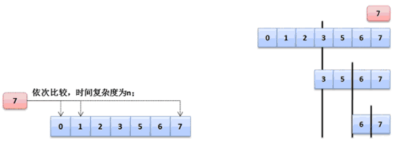

如果你现在的数据量本身并不大，也就只有20个数据,那么即便时间复杂度为n，那么也没有多慢，但是如果你现在的数据量非常大，大概有200个数组内容，那么这个时候就会发现循环要执行200次。所以为了提升数据的查询性能,可以借助于二分查找法进行处理。

**面试题：**请编写一个二分查找法实现数组内容的查询

在Arrays类中是有所提供的，使用的是binarySearche()方法，而这个查找的方式默认采用的是比较器的处理模式来完成的，那么下面可以按照同样的思路，通过循环的方式来处理。但是一旦通过循环的方式就只能够使用基本数据类型以确定大小关系了。

- 11 的二进制数据：	00000000 00000000 00000000 00001011
- 无条件向右移动1位：00000000 00000000 00000000 00000101，转为十进制5
- 使用二进制处理的最直接的优势在于：速度更快，但是在大内存的情况下这样的速度提升是很有限的。

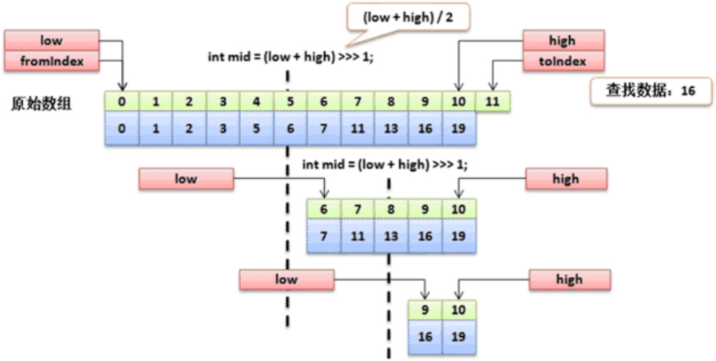

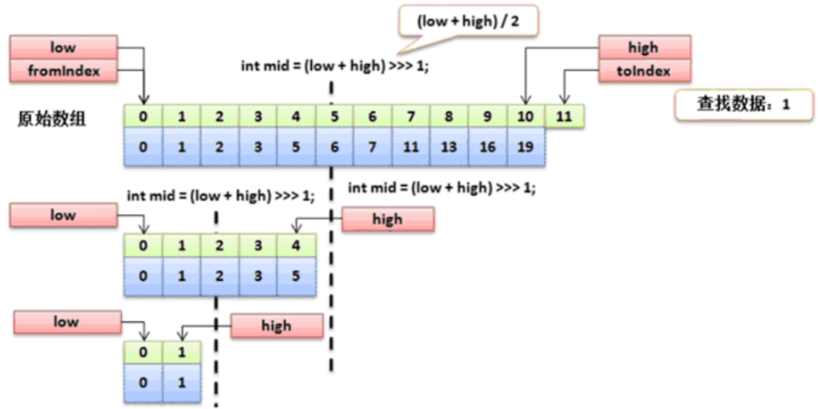

操作示例 4：实现程序

```java
import java.util.Arrays;
class ArrayUtil {
    private ArrayUtil() {}
    /**
     * 进行数组数据的二分查找操作
     * @param data 要进行查找的数组
     * @param key 要查找的数据
     * @return 如果找到数据返回数据索引，找不到返回负数（-1）
     */
    public static int binarySearch(int data[],int key) {
        if (data == null) {
            return -1 ;
        }
        return binarySearchDefault(data, 0, data.length, key) ;
    }
    /**
     * 实现一个二分查找具体实现方法
     * @param data 要进行查找的原始数组
     * @param fromIndex 开始索引
     * @param toIndex 结束索引，数组长度
     * @param key 要查询的数据
     * @return 查找到数据返回索引，找不到返回负数（-1）
     */
    private static int binarySearchDefault(int[] data, int fromIndex, int toIndex,
                                           int key) {
        int low = fromIndex; // 左边的索引
        int high = toIndex - 1; // 右边的索引
        while (low <= high) {	// 结束条件
            int middle = (low + high) / 2 ; // 计算中间的索引数据
            if (data[middle] == key) {	// 查找到了
                return middle ; // 返回索引
            } else if (key < data[middle]) {	// 向左边开始查
                high = middle - 1 ;
            } else {
                low = middle + 1 ;
            }
        }
        return -1 ;
    }
}

public class JavaAPIDemo {
    public static void main(String[] args) throws Exception {
        int data[] = new int[] { 1, 5, 7, 2, 3, 6, 0, 11, 13, 16, 19 }; // 数组
        Arrays.sort(data);	// [0, 1, 2, 3, 5, 6, 7, 11, 13, 16, 19]
        for (int x = 0 ; x < data.length ; x ++) {
            System.out.println(data[x] + "查找、结果：" + ArrayUtil.binarySearch(data, data[x]));
        }
        System.out.println(ArrayUtil.binarySearch(data, 4));
        System.out.println(ArrayUtil.binarySearch(data, 9));
        System.out.println(ArrayUtil.binarySearch(data, 99));
        System.out.println(ArrayUtil.binarySearch(data, -99));
    }
}

// 输出内容
0查找、结果：0
1查找、结果：1
2查找、结果：2
3查找、结果：3
5查找、结果：4
6查找、结果：5
7查找、结果：6
11查找、结果：7
13查找、结果：8
16查找、结果：9
19查找、结果：10
-1
-1
-1
-1
```

在实际的开发之中，这种代码你可能永远不会写到，因为如果真有此需求，直接通过现有的功能实现即可，但是笔试之中容易问到。


# 比较器

所谓的比较器指的是进行大小关系的确定判断。下面首先来分析一下比较器存在的意义是什么。通过本节内容，你将了解到常用的数组排序功能的实现方法，并能够认识到现有的比较规则并不能直接应用于对象之间的比较。

## 1、比较器问题的引出

如果要进行数组操作，肯定使用java.util.Arrays的操作类完成，这个类里面提供有绝大部分的数组操作支持，同时在这个类里面还提供有一种对象数组的排序： public static void sort(Object[] a);

操作示例 1：实现对象数组的排序

```java
import java.util.Arrays;
public class JavaAPIDemo {
    public static void main(String[] args) {
        Integer data[] = new Integer[]{10, 9, 5, 2, 20}; // 对象数组
        Arrays.sort(data); // 进行对象数组排序
        System.out.println(Arrays.toString(data)); // [2, 5, 9, 10, 20]
    }
}

// 输出内容
[2, 5, 9, 10, 20]
```

同样，如果说现在给定的是一个String型的对象数组，那么也是可以进行排序处理的。操作示例 2：String对象数组排序

```java
import java.util.Arrays;
public class JavaAPIDemo {
    public static void main(String[] args) throws Exception {
        String data[] = new String[]{"X", "B", "A", "E", "G"}; // 对象数组
        Arrays.sort(data); // 进行对象数组排序
        System.out.println(Arrays.toString(data)); // [A, B, E, G, X]
    }
}

// 输出内容
[A, B, E, G, X]
```

java.lang.Integer与java.lang.String两个类都是由系统提供的程序类，那么如果说现在有一个自定义的类需要实现排序处理呢？

操作示例 3：采用自定义类型进行排序

```java
import java.util.Arrays;
class Person {
    private String name;
    private int age;
    public Person () {}
    public Person(String name, int age) {
        super();
        this.name = name;
        this.age = age;
    }
    // setter、getter略
    @Override
    public String toString() {
        return "【Person类对象】姓名：" + this.name + "、年龄：" + this.age + "\n";
    }
}
public class JavaAPIDemo {
    public static void main(String[] args) throws Exception {
        Person data [] = new Person []{
            new Person("小强-A",80),
            new Person("小强-B",50),
            new Person("小强-C",100),
        };
        // 进行对象数组排序（实际这一行就报错）
        Arrays.sort(data);
        // 运行时异常：Exception in thread "main" java.lang.ClassCastException: Person cannot be cast to java.base/java.lang.Comparable
        System.out.println(Arrays.toString(data));
    }
}

// 输出内容
Exception in thread "main" java.lang.ClassCastException: Person cannot be cast to java.base/java.lang.Comparable
	at java.base/java.util.ComparableTimSort.countRunAndMakeAscending(ComparableTimSort.java:320)
	at java.base/java.util.ComparableTimSort.sort(ComparableTimSort.java:188)
	at java.base/java.util.Arrays.sort(Arrays.java:1248)
	at JavaAPIDemo.main(JavaAPIDemo.java:25)
```

任意的一个类默认情况下是无法使用系统内部的类实现数组排序或比较需求的，是因为没有明确的指定出到底该如何进行比较的定义（没有比较规则），那么么这个时候在Java里面为了统一比较规则的定义，所以JDK1.2之后开始提供有比较器的接口：Comparable接口。


## 2、Comparable比较器

通过本节内容，你将了解到Comparable接口内的方法结构，从结构图中直观地了解到Comparable的一些相关关联内容，能够通过实现Comparable接口完成对对象的比较功能。

通过分析可以发现如果要实现对象的比较肯定需要有比较器来制定比较规则，而比较的规则就通过Comparable来实现，对于Comparable而言，需要清楚其基本的定义结构：

```java
public interface Comparable<T>{
    /**
     * 实现对象的比较处理操作
     * @param o 要比较的对象
     * @return 当前数据比传入的对象小返回负数，如果大于返回正数，如果等于返回0
     */
    public int compareTo(T o);
}
```

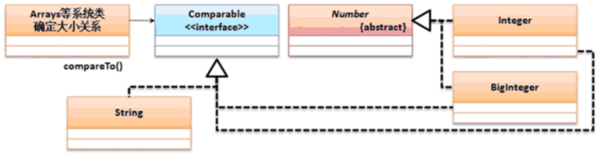

操作示例 1：实现自定义对象数组排序操作

```java
import java.util.Arrays;
class Person implements Comparable<Person> {
    private String name;
    private int age;
    public Person(String name, int age) {
        this.name = name;
        this.age = age;
    }
    @Override
    public String toString() {
        return "【Person类对象】姓名：" + this.name + "、年龄：" + this.age;
    }
    @Override
    public int compareTo(Person per) {
        return this.age - per.age; // 升序
        // return per.age-this.age; // 降序
    }
}
public class JavaAPIDemo {
    public static void main(String[] args) throws Exception {
        Person data[] = new Person[]{
                new Person("小强-A", 80),
                new Person("小强-B", 50),
                new Person("小强-C", 100),
        };
        // 进行对象数组排序
        Arrays.sort(data);
        System.out.println(Arrays.toString(data));
    }
}

// 输出内容
[【Person类对象】姓名：小强-B、年龄：50, 【Person类对象】姓名：小强-A、年龄：80, 【Person类对象】姓名：小强-C、年龄：100]
```

排序里面只需要有一个compareTo()方法进行排序规则的定义，而后整个Java系统里面就可以为其实现排序处理了。


## 3、Comparator比较器

在实际的开发场景中往往会遇到某些已开发完成但并未实现Comparable的类对象需要进行排序比较操作的需求，但出于某些原因不便修改该类，此时我们可以使用Comparator来提供对对象的比较功能。通过本节内容，你将接触到Comparator类，了解其功能和使用方法，学会在各种场景下灵活运用Comparable和Comparator来实现复杂的比较逻辑。

Comparator属于一种挽救的比较器支持，其主要的目的是解决一些没有实现Comparable排序的类的对象数组排序操作。

操作示例 1：现在程序项目已经开发完成了，并且由于先期的设计并没有去考虑到所谓的比较器功能。

```java
class Person {
    private String name;
    private int age;
    public Person(String name, int age) {
        this.name = name;
        this.age = age;
    }
    @Override
    public String toString() {
        return "【Person类对象】姓名：" + this.name + "、年龄：" + this.age;
    }
}
```

之后经过若干版本的迭代更新发现需要对Person类进行排序处理，但是又不能够去修改Person类（无法实现Comparable接口），所以这个时候就需要采用一种挽救的形式来实现比较，在Arrays类里面排序有另外一种实现：

| 方法名                                                  | 类型 | 描述                     |
| ------------------------------------------------------- | ---- | ------------------------ |
| public static void sort(T[] a, Comparator<? super T> c) | 普通 | 基于Comparator的排序处理 |

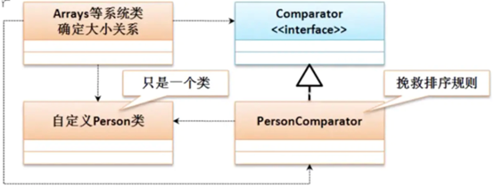

在java.util.Comparator里面，最初只定义有一个排序的compare()方法：public int compare(T o1, T o2)；但是后来持续发展又出现了许多的static方法。

操作示例 2：定义排序规则类，在测试类进行排序处理的时候就可以利用排序规则实现操作。

```java
class PersonComparator implements Comparator<Person> {
    @Override
    public int compare(Person p1,Person p2) {
        return p1.getAge() - p2.getAge();
    }
}
```

操作示例 3：使用Comparator接口排序

```java
import java.util.Arrays;
import java.util.Comparator;
class PersonComparator implements Comparator<Person> {
    @Override
    public int compare(Person p1, Person p2) {
        return p1.getAge() - p2.getAge();
    }
}
class Person {
    private String name;
    private int age;
    public Person(String name, int age) {
        this.name = name;
        this.age = age;
    }
    @Override
    public String toString() {
        return "【Person类对象】姓名：" + this.name + "、年龄：" + this.age;
    }
    public String getName() {
        return name;
    }
    public void setName(String name) {
        this.name = name;
    }
    public int getAge() {
        return age;
    }
    public void setAge(int age) {
        this.age = age;
    }
}
public class JavaAPIDemo {
    public static void main(String[] args) {
        Person data[] = new Person[]{
                new Person("小强-A", 80),
                new Person("小强-B", 50),
                new Person("小强-C", 100),
        };
        // 进行对象数组排序
        Arrays.sort(data, new PersonComparator());
        System.out.println(Arrays.toString(data));
        // Lambda方式，从大到小排序
        Arrays.sort(data, Comparator.comparing(Person::getAge).reversed());
        System.out.println(Arrays.toString(data));
    }
}

// 输出内容
[【Person类对象】姓名：小强-B、年龄：50, 【Person类对象】姓名：小强-A、年龄：80, 【Person类对象】姓名：小强-C、年龄：100]
[【Person类对象】姓名：小强-C、年龄：100, 【Person类对象】姓名：小强-A、年龄：80, 【Person类对象】姓名：小强-B、年龄：50]
```

对于这种排序的操作如果不是必须的情况下，强烈不建议使用Comparator，最好以Comparable为主。

**面试题：请解释Comparable和Comparator的区别？**

1. java.lang.Comparable是在类定义的时候实现的父接口，主要用于定义排序规则，里面只有一个compareTo()方法
2. java.util.Comparator是挽救的比较器操作，需要设置单独的比较器规则类实现排序，里面有compare()方法


## 二叉树结构简介

> **简介：** 在之前的学习中我们接触过链表数据结构的相关内容，其查询操作的时间复杂度为O(n)，这对大量数据来说显然是很损耗性能的。本节将为读者介绍一种新的数据结构：二叉树。

**【本节目标】**通过阅读本节内容，你将初步接触树的结构，了解其结构特性和数据排布方式，并能够实现简单的二叉树，理解其执行查询时的基本逻辑，认识其常用的遍历方法。

在进行链表结构开发的过程之中会发现所有的数据按照首尾相连的状态进行保存，那么当要进行某一个数据查询的时候（判断该数据是否存在），这种情况下它所面对的时间复杂度是“O(n)”，如果说它的数据量小（不超过30个）情况下，那么性能上是不会有太大差别的，而一旦保存的数据量很大，这个时候时间复杂度就会严重损耗程序的运行性能，那么现在对于数据的存储结构就必须发生改变，应该可以尽可能的减少检索次数为出发点进行设计。对于现在的数据结构而言，最好的性能就是“O(logn)”，所以要想实现它，就可以利用二叉树的结构来完成。

如果要实现一棵树结构的定义，那么需要去考虑数据的存储形式，在二叉树的实现之中，其基本的实现原理如下：取第一个数据为保存的根节点，小于等于根节点的数据放在节点的左子树，而大于节点的数据要放在该节点的右子树。


如果要进行数据检索的话，此时就需要进行每个节点的判断，但是它的判断是区分左右的，所以不会是整个结构都进行判断处理，那么它的时间复杂度就是“O(logn)”。

而对于二叉树而言，在进行数据获取的时候也有三种形式：前序遍历（根-左-右）、中序遍历（左-根-右）、后序遍历（左-右-根），那么现在只是以中序遍历为主，则以上的数据进行中序遍历的时候最终的结果：10、20、25、30、38、50、80、100；


## 二叉树基础实现（数据添加）

> **简介：** 二叉树可以优化查找效率的关键原因在于其特殊的数据保存方式，在保存时就借助比较器提前完成数据的有序摆放。本节将结合具体案例讲解实现二叉树数据保存的方法。

**【本节目标】**通过阅读本节内容，你将了解到二叉树保存数据的方式，并能够复习之前所学的比较器相关内容，借助比较器实现二叉树特殊的数据保存功能。

在实现二叉树的处理之中最为关键的问题在于数据的保存，而且数据由于牵扯到对象比较的问题，那么一定要有比较器的支持，而这个比较器首选一定是Comparable，所以本次将保存一个Person类数据：

```java
class Person implements Comparable<Person>{
    private String name;
    private int age;
    public Person(String name, int age) {
        this.name = name;
        this.age = age;
    }
    @Override
    public String toString() {
        return "【Person类对象】姓名：" + this.name + "、年龄：" + this.age + "\n";
    }

    @Override
    public int compareTo(Person per) {
        return this.age-per.age;//升序
    }
}
```

随后如果要想进行数据的保存，首先一定要有一个节点类。节点类中由于牵扯到数据保存问题，所以必须使用Comparable（可以区分大小）；

```java
import java.util.Arrays;

/**
 * 实现二叉树操作
 * @param <T> 要进行二叉树的实现
 */
class BinaryTree<T extends Comparable<T>> {
    private class Node {
        private Comparable<T> data;  // 存放Comparable,可以比较大小
        private Node parent;         // 保存父节点
        private Node left;           // 保存左子树
        private Node right;          // 保存右子树

        // 构造方法直接负责进行数据的存储
        public Node(Comparable<T> data) {
            this.data = data;
        }

        /**
         * 实现节点数据的适当位置的存储
         * @param newNode 创建的新节点
         * @throws IllegalArgumentException 保存的数据已存在
         */
        public void addNode(Node newNode) {
            if (newNode.data.compareTo((T) this.data) <= 0) {   // 比当前节点数据小
                if (this.left == null) {   //没有左子树
                    //当前没有左子树
                    this.left = newNode;   //保存左子树
                    newNode.parent = this;   //保存父节点
                } else {   //需要向左边继续判断
                    this.left.addNode(newNode);    //继续向下判断
                }
            } else {     //比根节点的数据大
                if (this.right == null) {    //当前没有右子树
                    this.right = newNode;    //保存左子树
                    newNode.parent = this;   //保存父节点
                } else {
                    this.right.addNode(newNode);  //继续向下判断
                }
            }
        }

        /**
         * 实现所有数据的获取处理，按照中序遍历的形式来完成
         */
        public void toArrayNode() {
            if (this.left != null) {     //有左子树
                this.left.toArrayNode();    //递归调用
            }
            BinaryTree.this.returnData[BinaryTree.this.foot++] = this.data;
            if (this.right != null) {
                this.right.toArrayNode();
            }
        }
    }

    //-------------------以下为二叉树的功能实现--------------
    private Node root;  //保存根节点
    private int count;   //保存数据个数
    private Object[] returnData;   //返回的数据
    private int foot = 0;   //脚标控制

    /**
     * 进行数据的保存
     *
     * @param data 要保存的数据内容
     * @throws NullPointerException 保存数据为空时抛出的异常
     */
    public void add(Comparable<T> data) {
        if (data == null) {
            throw new NullPointerException("保存的数据不允许为空！");
        }
        //所有的数据本身不具备节点关系的匹配，那么一定要将其包装在Node类之中
        Node newNode = new Node(data);   //保存节点
        if (this.root == null) {    //现在没有根节点，则第一个节点作为根节点
            this.root = newNode;
        } else {    //需要为其保存到一个合适的节点
            this.root.addNode(newNode);  //交由node类负责处理
        }
        this.count++;
    }

    /**
     * 以对象数组的形式返回全部数据，如果没有数据返回null
     * @return 全部数据
     */
    public Object[] toArray() {
        if (this.count == 0) {
            return null;
        }
        // 保存长度为数组长度
        this.returnData = new Object[this.count];
        // 脚标清零
        this.foot = 0;
        // 直接通过Node类负责
        this.root.toArrayNode();
        // 返回全部的数据
        return this.returnData;
    }
}

class Person implements Comparable<Person> {
    private String name;
    private int age;
    public Person(String name, int age) {
        this.name = name;
        this.age = age;
    }
    @Override
    public String toString() {
        return "【Person类对象】姓名：" + this.name + "、年龄：" + this.age + "\n";
    }
    @Override
    public int compareTo(Person person) {
        return this.age - person.age; // 升序
    }
}


public class JavaAPIDemo {
    public static void main(String[] args) {
        BinaryTree<Person> tree = new BinaryTree<>();
        tree.add(new Person("小强-80", 80));
        tree.add(new Person("小强-30", 30));
        tree.add(new Person("小强-50", 50));
        tree.add(new Person("小强-60", 60));
        tree.add(new Person("小强-90", 90));
        System.out.println(Arrays.toString(tree.toArray()));
    }
}

// 输出内容
[【Person类对象】姓名：小强-30、年龄：30
, 【Person类对象】姓名：小强-50、年龄：50
, 【Person类对象】姓名：小强-60、年龄：60
, 【Person类对象】姓名：小强-80、年龄：80
, 【Person类对象】姓名：小强-90、年龄：90
]
```

在进行数据添加的时候只是实现了节点关系的保存，而这种关系的保存后的结果就是所有的数据都属于有序排列。


## 二叉树数据查询


## 二叉树数据删除

> **简介：**二叉树能够提升查询效率得益于其特殊的结构，而删除节点意味着其他节点也将受到影响，删除的节点的位置也决定了该次删除操作的复杂程度。本节将具体介绍二叉树删除节点功能的实现。

**【本节目标】**通过阅读本节内容，你将通过具体的示例图了解到二叉树节点删除过程中遇到的难点问题，并理解删除时需要对其他节点做怎样的调整，学会其代码实现。

二叉树之中的数据删除操作是非常复杂的，因为在进行数据删除的时候需要考虑的情况是比较多的：

情况一、如果待删除节点没有子节点，那么直接删掉即可，数据的删除情况分析一：


情况二、如果待删除节点只有一个子节点，那么直接删掉，并用其子节点去顶替它；这个时候考虑两种情况分析：

1、只有一个左子树。数据的删除情况分析二左子树：


2、只有一个右子树。数据的删除情况分析二右子树：


情况三、如果待删除节点有两个子节点，这种情况比较复杂，首先找出它的后继节点，然后处理“后继节点”和“被删除节点的父节点”之间的关系，最后处理“后继节点的子节点”和“被删除节点的子节点”之间的关系。数据的删除情况分析三：


操作示例 1：下面通过具体的代码实现操作功能。

```java
import  java.util.Arrays;

/**
 *  实现二叉树操作
 *  @param  <T>  要进行二叉树的实现
 */
class  BinaryTree<T  extends  Comparable<T>> {
    private  class  Node{
        private  Comparable<T>  data;    // 存放Comparable,可以比较大小
        private  Node  parent;           // 保存父节点
        private  Node  left;             // 保存左子树
        private  Node  right;            // 保存右子树
        // 构造方法直接负责进行数据的存储
        public  Node(Comparable<T>  data){
            this.data=data;
        }
        /**
         *  实现节点数据的适当位置的存储
         *  @param  newNode  创建的新节点
         *  @throws  IllegalArgumentException  保存的数据已存在
         */
        public  void  addNode(Node  newNode)  {
            if(newNode.data.compareTo((T)this.data)  <=  0){      //比当前节点数据小
                if(this.left==null){      //没有左子树
                    //当前没有左子树
                    this.left=newNode;      //保存左子树
                    newNode.parent=this;      //保存父节点
                }else{      //需要向左边继续判断
                    this.left.addNode(newNode);        //继续向下判断
                }
            }else{          //比根节点的数据大
                if(this.right==null){        //当前没有右子树
                    this.right=newNode;        //保存左子树
                    newNode.parent=this;      //保存父节点
                }else{
                    this.right.addNode(newNode);    //继续向下判断
                }
            }
        }
        /**
         *  实现所有数据的获取处理，按照中序遍历的形式来完成
         */
        public  void  toArrayNode()  {
            if(this.left!=null){          //有左子树
                this.left.toArrayNode();        //递归调用
            }
            BinaryTree.this.returnData[BinaryTree.this.foot++]=this.data;
            if(this.right!=null){
                this.right.toArrayNode();
            }
        }
        /**
         *  检查是否包含此节点
         *  @param  data  比较的对象
         *  @return  找到返回true，找不到返回false
         */
        public  boolean  containsNode(  Comparable<T>  data)  {
            if  (data.compareTo((T)this.data)  ==0)  {
                return  true  ;  //查找到了
            }  else  if  (data.compareTo((T)this.data)  <  0){    //左边有数据
                if  (this.left  !=  null)  {
                    return  this.left.containsNode(data);
                }  else  {
                    return  false;
                }
            }  else  {
                if  (this.right  !=  null)  {
                    return  this .right.containsNode(data);
                } else {
                    return false;
                }
            }
        }
        /**
         * 获取要删除的节点对象
         * @param data 比较的对象
         * @return 要删除的节点对象，对象一定存在
         */
        public Node getRemoveNode(Comparable<T> data) {
            if(data.compareTo((T)this.data) ==0){
                return this;//查找到了
            }
            if (data.compareTo((T)this.data) < 0) {
                if (this.left != null) {
                    return this.left.getRemoveNode(data);
                }
                return null;
            }
            if (this.right != null) {
                return this.right.getRemoveNode(data);
            }
            return null;
        }
    }
    //-------------------以下为二叉树的功能实现--------------
    private Node root;  //保存根节点
    private int count;   //保存数据个数
    private Object[] returnData;   //返回的数据
    private int foot=0;   //脚标控制
    /**
     * 进行数据的保存
     * @param data 要保存的数据内容
     * @exception NullPointerException 保存数据为空时抛出的异常
     */
    public void add(Comparable<T> data){
        if(data==null){
            throw new NullPointerException("保存的数据不允许为空！");
        }
        //所有的数据本身不具备节点关系的匹配，那么一定要将其包装在Node类之中
        Node newNode=new Node(data);   //保存节点
        if(this.root==null){    //现在没有根节点，则第一个节点作为根节点
            this.root=newNode;
        }else{    //需要为其保存到一个合适的节点
            this.root.addNode(newNode);  //交由node类负责处理
        }
        this.count++;
    }
    /**
     * 以对象数组的形式返回全部数据，如果没有数据返回null
     * @return 全部数据
     */
    public Object[] toArray(){
        if(this.count==0){
            return null;
        }
        this.returnData=new Object[this.count];//保存长度为数组长度
        this.foot=0;    //脚标清零
        this.root.toArrayNode();   //直接通过Node类负责
        return this.returnData;   //返回全部的数据
    }
    /**
     * 进行数据的删除处理
     * @param data 要删除的数据
     */
    public void remove(Comparable<T> data){
        if(this.root == null) {  // 根节点不存在
            return;  // 结束调用
        } else {
            if(this.root.data.compareTo((T)data) == 0) {  // 要删除的是根节点
                Node moveNode = this.root.right; // 移动的节点
                while(moveNode.left != null) { //现在还有左边的节点
                    moveNode = moveNode.left;  //一直向左找
                }  // 就可以确定删除节点的右节点的最小的子节点
                moveNode.parent.left = null;
                moveNode.right = this.root.right;
                moveNode.left = this.root.left;
                this.root = moveNode;  // 改变根节点
            } else {
                Node removeNode = this.root.getRemoveNode(data);// 找到要删除的节点
                if(removeNode != null) { //找到要删除的对象信息
                    // 情况一：没有任何的子节点
                    if(removeNode.left == null && removeNode.right == null) {
                        removeNode.parent.left = null;
                        removeNode.parent.right = null;
                        removeNode.parent = null; //父节点直接断开引用
                    } else if(removeNode.left != null && removeNode.right == null) {  //左边不为空
                        removeNode.parent.left = removeNode.left;
                        removeNode.left.parent = removeNode.parent;
                    } else if(removeNode.left == null && removeNode.right != null) {  //右边不为空
                        removeNode.parent.left = removeNode.right;
                        removeNode.right.parent = removeNode.parent;
                    } else {  //两遍都有节点，则将右边节点中最左边的节点找到，改变其指向
                        Node moveNode = removeNode.right; // 移动的节点
                        while(moveNode.left != null) { //现在还有左边的节点
                            moveNode = moveNode.left;  //一直向左找
                        }  // 就可以确定删除节点的右节点的最小的子节点
                        removeNode.parent.left = moveNode;
                        moveNode.parent.left = null;  // 断开原本的连接
                        moveNode.parent = removeNode.parent;
                        moveNode.right = removeNode.right;  // 改变原始的右节点的指向
                        moveNode.left = removeNode.left;
                    }
                }
            }
            this.count--;
        }
    }
}

class Person implements Comparable<Person> {
    private String name;
    private int age;
    public Person(String name, int age) {
        this.name = name;
        this.age = age;
    }
    @Override
    public String toString() {
        return "【Person类对象】姓名：" + this.name + "、年龄：" + this.age + "\n";
    }
    @Override
    public int compareTo(Person person) {
        return this.age - person.age; // 升序
    }
}

public  class  JavaAPIDemo  {
    public  static  void  main(String[]  args)  throws  Exception{
        BinaryTree<Person>  tree=new  BinaryTree<Person>();
        tree.add(new  Person("小强-80",80));
        tree.add(new  Person("小强-50",50));
        tree.add(new  Person("小强-60",60));
        tree.add(new  Person("小强-30",30));
        tree.add(new  Person("小强-90",90));
        tree.add(new  Person("小强-10",10));
        tree.add(new  Person("小强-55",55));
        tree.add(new  Person("小强-70",70));
        tree.add(new  Person("小强-85",85));
        tree.add(new  Person("小强-95",95));
        tree.remove(new  Person("小强-80",80));
        System.out.println(Arrays.toString(tree.toArray()));
    }
}

// 输出内容
[【Person类对象】姓名：小强-10、年龄：10
, 【Person类对象】姓名：小强-30、年龄：30
, 【Person类对象】姓名：小强-50、年龄：50
, 【Person类对象】姓名：小强-55、年龄：55
, 【Person类对象】姓名：小强-60、年龄：60
, 【Person类对象】姓名：小强-70、年龄：70
, 【Person类对象】姓名：小强-85、年龄：85
, 【Person类对象】姓名：小强-90、年龄：90
, 【Person类对象】姓名：小强-95、年龄：95
]
```

可见，二叉树数据结构删除操作是非常繁琐的，所以如果不是必须的情况下，不建议进行删除操作。


## 红黑树原理简介


# 类库使用案例分析


# ⬇⬇反射机制与注解⬇⬇

# 认识反射机制

> 1. Java反射学习系列-绪论：https://hanchao.blog.csdn.net/article/details/79358924
> 2. Java-反射与注解：https://www.cnblogs.com/lishisan/p/11219404.html

Java反射机制可以让我们在编译期（Compile Time）之外的运行期（Runtime）检查类，接口，变量以及方法的信息。反射还可以让我们在运行期实例化对象，调用方法，通过调用get和set方法获取变量的值。

1、反射是框架设计的灵魂：

1. 框架：半成品软件。可以在框架的基础上进行软件开发，简化编码
2. 反射：将Java代码的各个组成部分封装为其他对象，可以在程序运行过程中操作这些对象，这就是Java的反射机制
3. 反射的好处：1：可以在程序运行过程中，操作这些对象。2：可以解耦，提高程序的可扩展性
4. **简而言之：反射是程序在运行时检查和修改对象的结构和行为的能力**

2、反射使我们能够执行以下操作：

1. 在运行时检查对象的类
2. 在运行时为类构造一个对象
3. 在运行时检查类的字段和方法
4. 在运行时调用对象的任何方法

3、在Java语言中之所以会有如此众多的开源技术支撑，很大一部分是来自于Java最大的特征—反射机制，如果不能够灵活地去使用反射机制进行项目的开发与设计，那么可以说你并未接触到Java的精髓。所有技术实现的目标只有一点：重用性。

4、对于反射技术首先考虑的是“反”与“正”的操作，所谓的“正”操作指的是使用一个类的时候，一定要先导入程序所在的包，而后根据类进行对象的实例化，并依靠对象调用类中的方法。但是“反”则是根据实例化对象反推出其类型。

- 正常方式：需要引入“包.类”名称»»»通过new实例化»»»取得实例化对象
- 反射方式：实例化对象»»»getClass方法»»»得到完整的“包.类”名称

操作示例 1：正向操作

```java
// 1、导入程序所在的包.类，知道对象的出处了
import java.util.Date;
public class JavaAPIDemo {
    public static void main(String[] args) {
        // 2、通过类产生实例化对象，「正射」
        Date date = new Date();
        // 3、根据对象调用类中的方法
        System.out.println(date.getTime());
    }
}

// 输出内容
1636077541911
```

如果要实现反的处理操作，那么首先要采用的就是Object类中所提供的一个方法：获取Class对象信息：

```java
public final Class<?> getClass();
```

操作示例 2：观察Class对象的使用

```java
package com.example;
// 1、导入程序所在的包.类，知道对象的出处了
import java.util.Date;
public class JavaAPIDemo {
    public static void main(String[] args) {
        // 2、通过类产生实例化对象
        Date date = new Date();
        //3、根据实例化对象找到对象的所属类型
        System.out.println(date.getClass());
    }
}

// 输出内容
class java.util.Date
```

PS：Object类中的getClass()方法可以帮助使用者找到对象的根源。


# 获取Class对象的方式

反射中所有的核心操作都是通过Class类对象展开的，可以说Class类是反射操作的根源所在，但是这个类如果要想获取它的实例化对象可以采用三种方式来实现。首先来观察java.lang.Class类的定义：

```java
public final class Class<T> extends Object implements Serializable, GenericDeclaration, Type, AnnotatedElement {}
```

从JDK1.5开始，Class类在定义的时可以使用泛型进行标记，这样的用法主要是希望可以避免所谓的向下转型。下面通过具体的操作讲解三种实例化形式。

| 获取Class对象方式       | 作用                         | 应用场景                                                 |
| ----------------------- | ---------------------------- | -------------------------------------------------------- |
| Class.forName("全类名") | 通过指定的字符串路径获取     | 多用于配置文件，将类名定义在配置文件中。读取文件，加载类 |
| 类名.class              | 通过类名的属性class获取      | 多用于参数的传递                                         |
| 对象.getClass()         | 通过对象的getClass()方法获取 | 多用于对象的获取字节码的方式（需要先实例化对象）         |


## 1、对象.getClass()

【Object类支持】Object类可以根据实例化对象获取Class对象：

```java
public final Class<?> getClass();
```

操作示例 1：这种方式有一个不是缺点的缺点：如果只是想获得Class类对象，则必须产生指定类对象后才可以获得。

```java
package com.example;
// 采用自定义的程序类
class Person{}
public class JavaAPIDemo {
    public static void main(String[] args) {
        Person per = new Person();  // 已经存在有指定类的实例化对象
        Class<? extends Person> cls = per.getClass();
        System.out.println(cls.getName());  // 获取的是类的完整名称
    }
}

// 输出内容
com.example.Person
```


## 2、类名.class

【JVM直接支持】采用“类.class”的形式实例化。特点：如果想获得Class类对象，就必须导入程序所对应的开发包。操作示例 2：

```java
package com.example;
// 采用自定义的程序类
class Person{}
public class JavaAPIDemo {
    public static void main(String[] args) {
        Class<? extends Person> cls = Person.class;
        System.out.println(cls.getName());
    }
}

// 输出内容
com.example.Person
```


## 3、Class.forName("全类名")

【Class类支持】在Class类中提供有一个static方法 加载类：

```java
public static Class<?> forName(String className) throws ClassNotFoundException;
```

操作示例 3：当你知道该类的全路径名时，你可以使用该方法获取 Class 类对象。

```java
package com.example;
class Person {}
public class JavaAPIDemo {
    public static void main(String[] args) throws Exception {
        // 该类必须存在
        Class<?> cls = Class.forName("com.example.Person");
        System.out.println(cls.getName());
    }
}

// 输出内容
com.example.Person
```

这种模式最大的特点：可以直接采用字符串的形式定义要使用的类型，并且程序中不需要编写任何的import语句。如果此时要使用的程序类不存在则会抛出“java.lang.ClassNotFoundException”异常。


# 反射机制与对象实例化

经过一系列分析之后可以发现虽然获得了Class类的实例化对象，但是依然觉得这个对象获取的意义不是很大，所以为了进一步理解反射的核心意义，下面将通过几个案例进行程序的说明（都是实际开发中一定会使用到的）。通过实际开发中的案例进行程序的说明，来进一步理解反射的核心意义。

## 1、反射实例化对象

获取Class对象后最大意义实际上并不是在于只是一个对象的实例化操作形式，更重要的是Class类中提供了一个对象的反射实例化方法（代替了关键字new）

1. 在JDK1.9以前的实例化：

   ```java
   @Deprecated(since="9")
   public T newInstance() throws InstantiationException, IllegalAccessException;
   ```

2. 在JDK1.9之后的实例化：

   ```java
   clazz.getDeclaredConstructor().newInstance();
   ```

操作示例 1：通过newInstance()方法实例化Person类对象

```java
package com.example;
class Person {
    // 任何情况下如果要实例化类对象，一定要调用类中的构造方法
    public Person() {
        System.out.println("*********** Person类构造方法 ************");
    }
    @Override
    public String toString() {
        return "我是一个人，一个脱离了低级趣味的好人！";
    }
}

public class JavaAPIDemo {
    public static void main(String[] args) throws Exception {
        Class<?> cls = Class.forName("com.example.Person");
        // 实例化对象，JDK1.9后被废除了
        Object obj = cls.newInstance();
        // 输出对象调用toString()方法
        System.out.println(obj);
    }
}

// 输出内容
*********** Person类构造方法 ************
我是一个人，一个脱离了低级趣味的好人！
```

操作示例 2：使用getDeclaredConstructor().newInstance()进行对象实例化

```java
package com.example;
class Person {
    // 任何情况下如果要实例化类对象，一定要调用类中的构造方法
    public Person() {
        System.out.println("*********** Person类构造方法 ************");
    }
    @Override
    public String toString() {
        return "我是一个人，一个脱离了低级趣味的好人！";
    }
}
public class JavaAPIDemo {
    public static void main(String[] args) throws Exception {
        Class<?> cls=Class.forName("com.example.Person");
        // 实例化对象，JDK1.9后
        Object obj= cls.getDeclaredConstructor().newInstance();
        System.out.println(obj);
    }
}

// 输出内容
*********** Person类构造方法 ************
我是一个人，一个脱离了低级趣味的好人！
```

从JDK1.9后，newInstance()被替代了，因为默认的Class类中的newInstance()方法只能调用无参构造，所以很多开发者会认为其描述的不准确，于是将其变换了形式（构造方法会讲解）。


## 2、反射与工厂设计模式

通过案例逐步掌握工厂设计模式，通过工厂类获取指定接口的实例化对象。

如果要想进行对象的实例化处理，除了可以使用关键字new之外，还可以使用反射机制来完成，于是此时一定会思考一个问题：为什么要提供有一个反射的实例化？那么到底是使用关键字new，还是使用反射呢？

如果要想更好的理解此类问题，最好的解决方案就是通过**工厂设计模式**来解决。

**工厂模式的最大特点：**客户端的程序类不直接牵扯到对象的实例化管理，只与接口发生关联，通过工厂类获取指定接口的实例化对象。

操作示例 1：传统的工厂设计模式

```java
package com.example;

interface IMessage {
    public void send();
}
class NetMessage implements IMessage {
    @Override
    public void send() {
        System.out.println("【网络消息发送】www.xxxx.cn");
    }
}

public class JavaAPIDemo {
    public static void main(String[] args) {
        // 如果直接实例化则一定会有耦合问题
        IMessage msg = new NetMessage();
    }
}
```

在实际的开发中，接口的主要作用是为不同层提供有一个操作的标准。但是如果此时直接将一个子类设置为接口实例化操作，那么一定会有耦合问题，所以使用了工厂设计模式来解决此问题。

操作示例 2：利用工厂设计模式解决

```java
package com.example;

interface IMessage {
    void send();
}
class NetMessage implements IMessage {
    @Override
    public void send() {
        System.out.println("【网络消息发送】www.xxxx.cn");
    }
}

class Factory {
    // 没有产生实例化对象的意义，所以构造方法私有化
    private Factory() {}
    public static IMessage getInstance(String className) {
        if ("netMessage".equalsIgnoreCase(className)) {
            return new NetMessage();
        }
        return null;
    }
}

public class JavaAPIDemo {
    public static void main(String[] args) {
        IMessage msg = Factory.getInstance("netMessage");
        msg.send();
    }
}

// 输出内容
【网络消息发送】www.xxxx.cn
```

静态工厂设计模式：


此种工厂设计模式属于静态工厂设计模式，也就是说如果现在要追加一个子类，则意味着工厂类一定要做出修改，因为如果不追加判断是无法获取指定接口对象的。

操作示例 3：为IMessage追加一个子类

```java
package com.example;

interface IMessage {
    void send();  //消息发送
}
class NetMessage implements IMessage {
    @Override
    public void send() {
        System.out.println("【网络消息发送】www.netMessage.cn");
    }
}
class CloudMessage implements IMessage {
    @Override
    public void send() {
        System.out.println("【云消息发送】www.cloudMessage.cn");
    }
}

class Factory {
    private Factory() {}
    public static IMessage getInstance(String className) {
        if ("netMessage".equalsIgnoreCase(className)) {
            return new NetMessage();
        } else if ("cloudMessage".equalsIgnoreCase(className)) {
            return new CloudMessage();
        }
        return null;
    }
}

public class JavaAPIDemo {
    public static void main(String[] args) {
        IMessage netMsg = Factory.getInstance("netMessage");
        netMsg.send();
        IMessage cloud = Factory.getInstance("cloudMessage");
        cloud.send();
    }
}
```

工厂设计模式最有效的解决的是子类与客户端的耦合问题，但是解决的核心思想是在于提供了一个工厂类作为过渡端，但是随着项目的进行，IMessage接口有可能会拥有更多的子类,而且随着时间的推移，子类产生的可能会越来越多，那么此时就意味着，工厂类永远都要进行修改，并且永无停止之日。

那么这时候最好的解决方案就是不使用关键字new来完成，因为关键字在new在使用时，需要有一个明确的类存在。而newInstance()方法只需要有一个明确表示类名称的字符串即可。

操作示例 4：

```java
package com.example;

interface IMessage{
    void send();
}
class NetMessage implements IMessage{
    @Override
    public void send() {
        System.out.println("【网络消息发送】www.netMessage.cn");
    }
}
class CloudMessage implements IMessage{
    @Override
    public void send() {
        System.out.println("【云消息发送】www.cloudMessage.cn");
    }
}

class Factory {
    private Factory() {}
    public static IMessage getInstance(String className) {
        IMessage instance = null;
        try {
            instance = (IMessage) Class.forName(className).getDeclaredConstructor().newInstance();
        } catch (Exception e) {
            e.printStackTrace();
        }
        return instance;
    }
}

public class JavaAPIDemo {
    public static void main(String[] args) {
        IMessage netMessage = Factory.getInstance("com.example.NetMessage");
        netMessage.send();
        IMessage cloudMessage = Factory.getInstance("com.example.CloudMessage");
        cloudMessage.send();
    }
}

// 输出内容
【网络消息发送】www.netMessage.cn
【云消息发送】www.cloudMessage.cn
```

这时可以发现，利用反射机制实现的工厂设计模式，最大的优势在于：对于接口子类的扩充将不再影响到工厂类的定义。

反射工厂设计模式：


但现在依然需要进一步思考，因为在实际的项目开发过程中，有可能会存在有大量的接口，并且这些接口都可能需要通过工厂类实例化，所以此时的工厂设计模式不应该只为IMessage接口服务，应该为所有接口服务。

操作示例 5：

```java
package com.example;

class Factory{
    private Factory(){}
    /**
     * 获取接口实例化对象
     * @param className 接口的子类
     * @param clazz 描述的是一个接口的类型
     * @return 如果子类存在则返回指定接口的实例化对象
     */
    @SuppressWarnings("unchecked")
    public static <T> T getInstance(String className,Class<T> clazz){
        T instance = null;
        try {
            instance=(T) Class.forName(className).getDeclaredConstructor().newInstance();
        }catch (Exception e) {
            e.printStackTrace();
        }
        return instance;
    }
}

interface IService {
    void service();
}
class HouseService implements IService {
    @Override
    public void service() {
        System.out.println("【服务】为您的住宿提供服务。");
    }
}
interface IMessage {
    void send();//消息发送
}
class NetMessage implements IMessage {
    @Override
    public void send() {
        System.out.println("【网络消息发送】www.netMessage.cn");
    }
}
class CloudMessage implements IMessage {
    @Override
    public void send() {
        System.out.println("【云消息发送】www.cloudMessage.cn");
    }
}

public class JavaAPIDemo {
    public static void main(String[] args) throws Exception {
        IMessage msg = Factory.getInstance("com.example.NetMessage",IMessage.class);
        msg.send();
        IService service=Factory.getInstance("com.example.HouseService",IService.class);
        service.service();
    }
}

// 输出内容
【网络消息发送】www.netMessage.cn
【服务】为您的住宿提供服务。
```

此时的工厂模式将不再受限于指定的接口，可以为所有的接口提供实例化服务，达到可重用性。


## 3、反射与单例设计模式

通过案例引出懒汉式的单例设计模式所出现的问题，并使用使用synchronized关键字来处理解决。

单例设计模式的核心本质在于：类内部的构造方法私有化，在类的内部产生实例化对象后通过static方法获取实例化对象,进行类中的结构调用，单例设计模式一共有两类：懒汉式、饿汉式，本节主要来讨论懒汉式的单例设计模式。

操作示例 1：观察懒汉式单例设计模式的问题，单线程状态执行：

```java
package com.example;
class Singleton {
    private static Singleton instance = null;
    private Singleton() {}
    public static Singleton getInstance() {
        if (instance == null) {
            instance = new Singleton();
        }
        return instance;
    }
    public void print() {
        System.out.println("www.xxxx.cn");
    }
}

public class JavaAPIDemo {
    public static void main(String[] args) {
        Singleton sinA = Singleton.getInstance();
        sinA.print();
    }
}

// 输出内容
www.xxxx.cn
```

操作示例 2：观察懒汉式单例设计模式的问题，多线程状态执行：

```java
package com.example;

class Singleton {
    private static Singleton instance = null;
    private Singleton() {
        System.out.println("【" + Thread.currentThread().getName() + "】****** 实例化Singleton类对象 *******");
    }
    public static Singleton getInstance() {
        if (instance == null) {
            instance = new Singleton();
        }
        return instance;
    }
    public void print() {
        System.out.println("www.xxxx.cn");
    }
}

public class JavaAPIDemo {
    public static void main(String[] args) throws Exception {
        for (int x = 0; x < 3; x++) {
            new Thread(() -> Singleton.getInstance().print(), "单例消费端-" + x).start();
        }
    }
}

// 输出内容
【单例消费端-2】****** 实例化Singleton类对象 *******
【单例消费端-0】****** 实例化Singleton类对象 *******
www.xxxx.cn
【单例消费端-1】****** 实例化Singleton类对象 *******
www.xxxx.cn
www.xxxx.cn
```

单例设计模式的最大特点是在整体的运行程序中只允许产生一个实例化对象，但当有了若干个线程之后，实际上当前的程序就会产生多个实例化对象了，此时就不是单例设计模式了。此时问题造成的关键在于代码本身出现了不同步的情况，而要想解决的关键就在于同步处理，也就是需要使用synchronized关键字。

单例设计模式问题：


操作示例 3：修改getInstance()进行同步处理

```java
package com.example;

class Singleton {
    private static Singleton instance = null;
    private Singleton() {
        System.out.println("【" + Thread.currentThread().getName() + "】****** 实例化Singleton类对象 *******");
    }
    public static synchronized Singleton getInstance() {
        if (instance == null) {
            instance = new Singleton();
        }
        return instance;
    }
    public void print() {
        System.out.println("www.xxxx.cn");
    }
}

public class JavaAPIDemo {
    public static void main(String[] args) throws Exception {
        for (int x = 0; x < 3; x++) {
            new Thread(() -> Singleton.getInstance().print(), "单例消费端-" + x).start();
        }
    }
}

// 输出内容
【单例消费端-0】****** 实例化Singleton类对象 *******
www.xxxx.cn
www.xxxx.cn
www.xxxx.cn
```

这个时候的确是进行了同步处理，但这个同步处理的代价有些大，因为效率会低。因为整体代码中实际上只有一块部分需要进行同步处理，也就是instance对象的实例化处理部分。我们可以知道，之前的同步操作是有些失误的。

操作示例 4：更加合理地进行同步处理

```java
package com.example;

class Singleton {
    private static volatile Singleton instance = null;
    private Singleton() {
        System.out.println("【" + Thread.currentThread().getName() + "】****** 实例化Singleton类对象 *******");
    }
    public static Singleton getInstance() {
        if (instance == null) {
            synchronized (Singleton.class) {
                if (instance == null) {
                    instance = new Singleton();
                }
            }
        }
        return instance;
    }

    public void print() {
        System.out.println("www.xxxx.cn");
    }
}
```

**面试题：请编写单例设计模式**

1. 【100%】直接编写一个饿汉式的单例设计模式，并且实现构造方法私有化
2. 【120%】在Java中哪里使用到了单例设计模式？Runtime类、Pattern类、Spring框架
3. 【200%】懒汉式单例模式的问题（即上面描述所出现的问题）：
   回答：单例设计模式的最大特点是在整体的运行程序中只允许产生一个实例化对象，但当有了若干个线程之后，实际上当前的程序就会产生多个实例化对象了，此时就不是单例设计模式了。此时问题造成的关键在于代码本身出现了不同步的情况，而要想解决的关键就在于同步处理，也就是需要使用synchronized关键字。


# 反射机制与类操作

利用反射获取类的基本信息（Package），一个类的基本信息主要包括类所在的包名称、父类的定义、父接口的定义。在反射机制的处理过程之中，不仅仅只是实例化对象的处理操作，更多的情况下还有类的组成结构操作，任何一个类的基本组成结构都是父类（父接口）、包、属性、方法（构造方法、普通方法）。

## 1、获取类的基本信息

一个类的基本信息主要包括类所在的包名称、父类的定义、父接口的定义。如果此时想获得该类的一些基础信息则可以通过Class类中的如下方法：

| 方法名称                                | 描述           |
| --------------------------------------- | -------------- |
| public Package getPackage()             | 获取包名称     |
| public Class<? super T> getSuperclass() | 获取继承父类   |
| public Class<?>[] getInterfaces()       | 获取实现父接口 |

操作示例 1：定义程序类，获得包名称、父类信息、父接口信息

```java
package com.example;

interface IMessageService {
    public void send();
}

interface IChannelService {
    public boolean connect();
}

abstract class AbstractBase {
}

class Person extends AbstractBase implements IChannelService,IMessageService {
    @Override
    public boolean connect() {}
    @Override
    public void send() {}
}
// 如上是程序类的定义

public class JavaAPIDemo {
    public static void main(String[] args) {
        // 获取指定类的Class对象
        Class<?> cls = Person.class;
        // 获取指定类的包定义
        Package pack = cls.getPackage();
        // 获取包名称
        System.out.println(pack.getName());
        // 获取指定父类的Class对象
        Class<?> parent = cls.getSuperclass();
        // 获取父类信息：package + 类名
        System.out.println(parent.getName());
        // 获取父类的父类信息
        System.out.println(parent.getSuperclass().getName());
        // 获取父类的父类的父类信息
        System.out.println(parent.getSuperclass().getSuperclass());
        // 获取父接口的Class对象
        Class<?> clazz[] = cls.getInterfaces();
        for (Class<?> temp : clazz) {
            // 获取父接口的对象名称
            System.out.println(temp.getName());
        }
    }
}

// 输出内容
com.example
com.example.AbstractBase
java.lang.Object
null
com.example.IChannelService
com.example.IMessageService
```

当获取了一个类的Class对象后，就意味着这个对象可以获取类中的一切继承结构信息。


## 2、反射调用构造方法

本节通过之前的案例介绍了反射调用构造方法和普通方法，实现反射实例化对象，并通过反射来获取类之中的全部方法。

在一个类中除了有继承的关系外，最为重要的操作就是类中的结构处理了，而类中的结构首先需要观察的就是构造方法的使用问题，实际上在之前通过反射实例化对象的时候就已经接触到构造方法的问题了：实例化方法替代：`clazz.getDeclaredConstructor().newInstance()`

所有类的构造方法的获取都可以直接通过Class类来完成，该类中定义有如下的几个方法：

| 方法名称                                                     | 描述                                     |
| ------------------------------------------------------------ | ---------------------------------------- |
| public Constructor<?>[] getDeclaredConstructors()            | 获取指定类所有构造方法(不包含父类, 下同) |
| `public Constructor<T> getDeclaredConstructor(Class<?>... parameterTypes)` | 获取指定类指定构造方法                   |
| public Constructor<?>[] getConstructors()                    | 获取指定类所有public的构造方法           |
| `public Constructor<T> getConstructor(Class<?>... parameterTypes)` | 获取指定类指定public的构造方法           |

Constructor类常用方法

| 方法名称                                                     | 描述                                         |
| ------------------------------------------------------------ | -------------------------------------------- |
| public T newInstance(Object ... initargs)                    | 调用构造方法传入指定参数进行对象实例化       |
| public String getName()                                      | 获取构造方法名称                             |
| public Type[] getGenericParameterTypes()                     | 获取构造方法的参数类型                       |
| public Type[] getGenericExceptionTypes()                     | 获取构造方法抛出的异常类型                   |
| public int getParameterCount()                               | 获取构造方法的参数个数                       |
| `public <T extends Annotation> T getAnnotation(Class<T> annotationClass)` | 获取全部声明的Annotation                     |
| public void setAccessible(boolean flag)                      | 设置构造方法可见性(AccessibleObject类的方法) |

操作示例 1：获取全部构造和指定构造

```java
package com.example;
import java.lang.reflect.Constructor;

class Person {
    public Person() {}
    private Person(String name) {}
}

public class JavaAPIDemo {
    public static void main(String[] args) throws Exception {
        Class<?> cls = Person.class;
        System.out.println("---------------获取本类全部构造-----------");
        // 获取本类全部构造
        Constructor<?>[] declaredConstructors = cls.getDeclaredConstructors();
        for (Constructor<?> cons : declaredConstructors) {
            System.out.println(cons);
        }
        System.out.println("---------------获取本类指定构造-----------");
        System.out.println(cls.getDeclaredConstructor(String.class));


        System.out.println("---------------获取本类全部public构造-----------");
        // 获取本类全部public构造
        Constructor<?>[] constructors = cls.getConstructors();
        for (Constructor<?> cons : constructors) {
            System.out.println(cons);
        }
        System.out.println("---------------获取本类指定public构造-----------");
        System.out.println(cls.getConstructor());
        // 如果获取private的构造则会报异常
        System.out.println(cls.getConstructor(String.class));

    }
}

// 输出内容
---------------获取本类全部构造-----------
public com.example.Person()
private com.example.Person(java.lang.String)
---------------获取本类指定构造-----------
private com.example.Person(java.lang.String)
---------------获取本类全部public构造-----------
public com.example.Person()
---------------获取本类指定public构造-----------
public com.example.Person()
Exception in thread "main" java.lang.NoSuchMethodException: com.example.Person.<init>(java.lang.String)
```

操作示例 2：反射调用指定构造实例化对象

```java
package com.example;
import java.lang.reflect.Constructor;

class Person {
    private String name;
    public Person() {}
    public Person(String name) {
        this.name = name;
    }
    @Override
    public String toString() {
        return "姓名：" + this.name;
    }
}

public class JavaAPIDemo {
    public static void main(String[] args) throws Exception {
        Class<?> cls = Person.class;
        Constructor<?> constructor = cls.getConstructor(String.class);
        Object obj = constructor.newInstance("小强");
        System.out.println(obj);
    }
}

// 输出内容
姓名：小强
```

虽然程序代码本身允许开发者调用有参构造，但是如果从实际的开发角度出发，所有使用反射的类中最好使用无参构造，因为这样的实例化可以达到统一性。


## 3、反射调用普通方法

在进行反射处理的时候也可以通过反射来获取类之中的全部方法，但是需要提醒的是，如果想通过反射调用这些方法，必须有一个前提条件：类之中要提供实例化对象。在Class类中提供了如下的操作可以获取方法对象：

| 方法名称                                                     | 描述                   |
| ------------------------------------------------------------ | ---------------------- |
| public Method[] getMethods()                                 | 获取全部方法(包括父类) |
| public Method getMethod(String name, Class<?>... parameterTypes) | 获取指定方法(包括父类) |
| public Method[] getDeclaredMethods()                         | 获取本类全部方法       |
| public Method getDeclaredMethod(String name, Class<?>... pTypes) | 获取本类指定方法       |

通过Class类获取每一个方法信息都使用了java.lang.reflect.Method类实例描述，通过该实例可以获取方法得相关信息，也可以实现方法的反射调用，Method类常用方法如下：

| 方法名称                                                     | 描述                                |
| ------------------------------------------------------------ | ----------------------------------- |
| public Object invoke(Object obj, Object... args)             | 方法调用，等价于“实例化对象.方法()” |
| public Class<?> getReturnType()                              | 获取方法返回值类型，返回Class       |
| public String getName()                                      | 获取构造方法名称                    |
| public Type[] getGenericParameterTypes()                     | 获取构造方法的参数类型              |
| public Type[] getGenericExceptionTypes()                     | 获取构造方法抛出异常类型            |
| public Type getGenericReturnType()                           | 获取方法返回值类型，返回Type        |
| public int getParameterCount()                               | 获取构造方法的参数个数              |
| `public <T extends Annotation> T getAnnotation(Class<T> annotationClass)` | 获取指定声明的Annotation            |
| public Annotation[] getAnnotations()                         | 获取全部声明的Annotation            |
| public int getModifiers()                                    | 获取方法修饰符                      |
| public void setAccessible(boolean flag)                      | 设置方法可见性                      |

操作示例 1：获取全部方法

```java
package com.example;
import java.lang.reflect.Method;

abstract class AbstractBase {
    public void send(){}
}

class Person extends AbstractBase {
    private boolean connect() {
        return true;
    }
    @Override
    public void send(){}
    @Override
    public String toString() {
        return super.toString();
    }
}

/**
 * 反射获取全部普通方法
 */
public class JavaAPIDemo {
    public static void main(String[] args) throws Exception {
        Class<?> cls = Person.class;
        System.out.println("---------------获取本类与父类中的所有public类型的方法-----------");
        {
            // 获取全部public类型的方法(包括父类中的public类型的方法)
            Method[] methods = cls.getMethods();
            for (Method met : methods) {
                System.out.println(met);
            }
        }
        System.out.println("---------------获取本类中所有的方法（包括private）-----------");
        {
            // 获取本类方法（包括private）
            Method[] methods = cls.getDeclaredMethods();
            for (Method met : methods) {
                System.out.println(met);
            }
        }
    }
}

// 输出内容
---------------获取本类与父类中的所有public类型的方法-----------
public java.lang.String com.example.Person.toString()
public void com.example.Person.send()
public final native void java.lang.Object.wait(long) throws java.lang.InterruptedException
public final void java.lang.Object.wait(long,int) throws java.lang.InterruptedException
public final void java.lang.Object.wait() throws java.lang.InterruptedException
public boolean java.lang.Object.equals(java.lang.Object)
public native int java.lang.Object.hashCode()
public final native java.lang.Class java.lang.Object.getClass()
public final native void java.lang.Object.notify()
public final native void java.lang.Object.notifyAll()
---------------获取本类中所有的方法（包括private）-----------
public java.lang.String com.example.Person.toString()
private boolean com.example.Person.connect()
public void com.example.Person.send()
```

PS：注意如果重写父方法，最终只会获取子类重写的方法名

操作示例 2：获取类中的方法信息（上例是依靠Method类提供的toString()方法完成的，现在使用方法信息拼接获取方法的详细信息）

```java
package com.example;
import java.lang.reflect.Method;
import java.lang.reflect.Modifier;


/**
 * AbstractBase
 */
abstract class AbstractBase {
    public void send(){}
}

/**
 * Person
 */
class Person extends AbstractBase {
    private boolean connect() {
        return true;
    }
    @Override
    public void send(){}
    @Override
    public String toString() {
        return super.toString();
    }
}

/**
 * 反射获取全部普通方法的详细信息
 */
public class JavaAPIDemo {
    public static void main(String[] args) {
        System.out.println("---------------获取本类与父类中的所有public类型的方法-----------");
        // 获取指定类的Class对象
        Class<?> cls = Person.class;
        Method[] methods = cls.getMethods();
        for (Method met : methods) {
            // 修饰符
            int mod = met.getModifiers();
            System.out.print(Modifier.toString(mod) + " ");
            // 方法返回类型
            System.out.print(met.getReturnType().getName() + " ");
            // 方法名称
            System.out.print(met.getName() + "(");
            // 获取参数类型
            Class<?>[] params = met.getParameterTypes();
            for (int x = 0; x < params.length; x++) {
                System.out.print(params[x].getName() + " " + "arg-" + x);
                if (x < params.length - 1) {
                    System.out.print(",");
                }
            }
            System.out.print(")");
            Class<?>[] exp = met.getExceptionTypes();
            if (exp.length > 0) {
                System.out.print(" throws");
            }
            for (int x = 0; x < exp.length; x++) {
                System.out.print(exp[x].getName());
                if (x < exp.length - 1) {
                    System.out.println(", ");
                }
            }
            System.out.println();  // 换行
        }
    }
}

// 输出内容
---------------获取本类与父类中的所有public类型的方法-----------
public java.lang.String toString()
public void send()
public final native void wait(long arg-0) throwsjava.lang.InterruptedException
public final void wait(long arg-0,int arg-1) throwsjava.lang.InterruptedException
public final void wait() throwsjava.lang.InterruptedException
public boolean equals(java.lang.Object arg-0)
public native int hashCode()
public final native java.lang.Class getClass()
public final native void notify()
public final native void notifyAll()
```

**操作示例 3**：反射调用类中的setter、getter方法。需要使用到最重要的方法：`public Object invoke(Object obj, Object... args)`

```java
package com.example;
import java.lang.reflect.Method;

class Person  {
    private String name;
    public String getName() {
        return name;
    }
    public void setName(String name) {
        this.name = name;
    }
}

/**
 * 反射方法的调用（需要注意：必须要先实例化对象）
 */
public class JavaAPIDemo {
    public static void main(String[] args) throws Exception {
        // 获取指定类的Class对象
        Class<?> cls = Class.forName("com.example.Person");
        // 要设置的属性内容
        String value = "小强子";
        // 1.任何情况下如果要想保存类中的属性或者调用类中的方法都必须保证存在有实例化对象，既然不允许导入包，那么就反射实例化，调用无参构造实例化
        Object obj = cls.getDeclaredConstructor().newInstance();
        // 2.如果要想进行方法的调用，那么一定要获取方法的名称
        String setMethodName = "setName";
        // 获取指定的方法
        Method method = cls.getDeclaredMethod(setMethodName, String.class);
        // 方法调用，等价于：Person对象.setName(value);
        method.invoke(obj, value);
        String getMethodName="getName";
        // getter没有参数
        method = cls.getDeclaredMethod(getMethodName);
        // 方法调用，等价于：Person对象.getName();
        System.out.println(method.invoke(obj));
    }
}

// 输出内容
小强子
```

利用此类操作整体的形式上不会有任何明确的类对象产生，一切都是依靠反射机制处理的，这样的处理避免了与某一个类耦合问题。


## 4、反射调用成员属性

本节需要了解反射调用成员的几种操作方法，熟练掌握Field类中获取成员类型的方法。了解反射与类的操作

类结构中的最后一个核心的组成就是成员（Field），大部分情况下都会将其称为成员属性，对于成员信息的获取也是通过Class类完成，在这个类中提供了如下两组操作方法：

| 方法名                                                       | 描述                       |
| ------------------------------------------------------------ | -------------------------- |
| public Field[] getDeclaredFields() throws SecurityException  | 获取本类全部成员信息       |
| public Field getDeclaredField(String name) throws NoSuchFieldException, SecurityException | 获取指定成员属性信息       |
| public Field[] getFields() throws SecurityException          | 获取父类全部public成员信息 |
| public Field getField(String name) throws NoSuchFieldException, SecurityException | 获取父类指定public成员信息 |

反射中成员通过java.lang.reflect.Field实例描述，Field类中提供的常用方法如下：

| 方法名                                    | 描述               |
| ----------------------------------------- | ------------------ |
| public Class<?> getType()                 | 获取成员属性类型   |
| public void set(Object obj, Object value) | 设置成员属性内容   |
| public Object get(Object obj)             | 获取成员属性内容   |
| public int getModifiers()                 | 获取成员属性修饰符 |
| public void setAccessible(boolean flag)   | 设置成员属性可见性 |

操作示例 1：获取类中的成员属性信息

```java
package com.example;
import java.lang.reflect.Field;

interface IChannelService {
    public static final String NAME = "xxxxjava";
}

abstract class AbstractBase {
    protected static final String BASE = "www.xxxx.cn";
    private String info = "HELLO XXXX";
}

class Person extends AbstractBase implements IChannelService {
    private String name;
    private int age;
}

/**
 * 反射获取成员属性
 */
public class JavaAPIDemo {
    public static void main(String[] args) throws Exception {
        Class<?> cls = Class.forName("com.example.Person");
        System.out.println("--------- 获取父类之中public类型的成员信息------------");
        {    // 获取父类之中公共成员信息
            Field[] fields = cls.getFields();
            for (Field fie : fields) {
                System.out.println(fie);
            }
        }
        System.out.println("---------获取本类中定义的成员信息------------");
        {  // 获取本类中定义的成员信息
            Field[] fields = cls.getDeclaredFields();
            for (Field fie : fields) {
                System.out.println(fie);
            }
        }
    }
}

// 输出内容
--------- 获取父类之中public类型的成员信息------------
public static final java.lang.String com.example.IChannelService.NAME
---------获取本类中定义的成员信息------------
private java.lang.String com.example.Person.name
private int com.example.Person.age
```

但是在Field类中最为重要的操作形式并不是获取全部成员，而是这三个方法：设置属性内容、获取属性内容、属性解除封装

操作示例 2：所有成员是在对象实例化后进行空间分配的，所以一定要先有实例化对象后才能对成员操作。直接调用Person类中的name私有成员

```java
package com.example;
import java.lang.reflect.Field;

/**
 * Person
 */
class Person {
    private String name;
}

/**
 * 反射设置成员属性
 */
public class JavaAPIDemo {
    public static void main(String[] args) throws Exception {
        Class<?> cls = Class.forName("com.example.Person");
        // 实例化对象（分配成员空间）
        Object obj = cls.getDeclaredConstructor().newInstance();
        // 获取成员对象
        Field nameField = cls.getDeclaredField("name");
        // 对私有属性必须先解除封装
        nameField.setAccessible(true);
        // 设置属性内容
        nameField.set(obj,"番茄强");
        // 获取属性内容
        System.out.println(nameField.get(obj));
    }
}

// 输出内容
番茄强
```

通过一系列的分析可以发现，类中的构造、方法、成员属性都可以通过反射实现调用，但是对于成员的反射很少这样直接处理，大部分操作都应该setter和getter处理，所以对于以上的代码只能够说是反射的特色，但是不具备实际的使用能力，而对于Field类在实际开发中只有一个方法最为常用：获取成员类型

操作示例 3：获取指定成员属性的类型

```java
package com.example;
import java.lang.reflect.Field;

class Person {
    private String name;
}

/**
 * 获取成员属性类型
 */
public class JavaAPIDemo {
    public static void main(String[] args) throws Exception {
        Class<?> cls = Class.forName("com.example.Person");
        Field nameField = cls.getDeclaredField("name");
        // 获取完整的名称，包.类：java.lang.String
        System.out.println(nameField.getType().getName());
        // 获取类名称：String
        System.out.println(nameField.getType().getSimpleName());
    }
}

// 输出和内容
java.lang.String
String
```

在以后开发中进行反射处理的时候，往往会利用Field类和Method类实现类中的setter方法的调用。


## 5、Unsafe工具类

本节介绍了绕过JVM的相关的对象管理机制实例化对象的Unsafe工具类，巩固加深对反射的理解。

反射是Java的第一大特点，一旦打开反射的大门就可以有更加丰富的类设计形式。除了JVM本身支持的反射处理之外，在Java中也提供了一个Unsafe类（不安全的操作），这个类的主要特点是可以利用反射来获取对象，并且直接使用底层的C++来代替JVM执行，即：可以绕过JVM的相关的对象管理机制，一旦使用Unsafe，那么项目之中将无法继续使用JVM的内存管理机制以及垃圾回收处理。

但是如果要想使用Unsafe类首先就需要确认一下这个类中定义的构造方法与常量问题：

| 方法名                                               | 描述     |
| ---------------------------------------------------- | -------- |
| private Unsafe() {}                                  | 私有构造 |
| private static final Unsafe theUnsafe = new Unsafe() | 私有常量 |

但是需要注意的是，在这个Unsafe类中并没有提供static的方法，即：不能通过类似于传统的单例设计模式中提供的样式来进行操作，如果想要获得这个类的对象，就必须利用反射机制来完成。

```java
Field field = Unsafe.class.getDeclaredField("theUnsafe");
field.setAccessible(true); // 解除封装处理
Unsafe unsafeObject = (Unsafe) field.get(null); // static属性不需要传递实例化对象
```

操作示例 1：使用Unsafe类绕过实例化对象的管理

```java
package com.example;
import sun.misc.Unsafe;
import java.lang.reflect.Field;

class Singleton {
    private Singleton() {
        // 构造不执行
        System.out.println("*****Singleton类构造******");
    }
    public void print() {
        System.out.println("www.xxxx.cn");
    }
}

public class JavaAPIDemo {
    public static void main(String[] args) throws Exception {
        // Unsafe三步曲
        Field field = Unsafe.class.getDeclaredField("theUnsafe");
        field.setAccessible(true);
        Unsafe unsafeObject = (Unsafe) field.get(null);
        // 利用Unsafe类绕过了JVM管理机制，可以在没有实例化对象的情况下获取一个Singleton类实例化对象
        Singleton instance = (Singleton) unsafeObject.allocateInstance(Singleton.class);
        // 对象调用
        instance.print();
    }
}

// 输出内容
www.xxxx.cn
```

Unsafe只能说为开发提供了一些更加方便的处理机制，但是这种操作由于不受JVM的管理，所以如果不是必须的情况下不建议使用。讲解这个类的主要目的是帮助大家巩固对于反射的理解。

# 反射与简单Java类


## 1、传统属性赋值弊端

本节介绍了传统属性赋值的弊端--编码的重复性高，唯一的解决方案就是反射机制，反射机制最大的特征是可以根据其自身的特点实现相同功能类的重复操作的抽象处理。

简单Java类主要是由属性组成，并且提供有相应的setter、getter处理方法，同时简单Java类最大的特征就是通过对象保存相应的类属性内容。但是如果使用传统的简单Java类开发，那么也会面临非常麻烦的困难。

操作示例 1：传统的简单Java类操作及调用

```java
package com.example;
class Emp{
    private String ename;
    private String job;
    public void setEname(String ename) {
        this.ename = ename;
    }
    public void setJob(String job) {
        this.job = job;
    }
    public String getEname() {
        return ename;
    }
    public String getJob() {
        return job;
    }
}

public class JavaAPIDemo {
    public static void main(String[] args) throws Exception {
        // 更多情况下开发者关注的是内容的设置
        Emp emp = new Emp();
        emp.setEname("Sam");
        emp.setJob("Java");
        // 使用为对象设置之后
        System.out.println("姓名：" + emp.getEname() + "、职位：" + emp.getJob());
    }
}

// 输出内容
姓名：Sam、职位：Java
```

特别强调，为了方便理解，本次Emp类中定义的ename、job两个属性的类型使用的都是String类型。按照传统的做法，此时应该首先实例化Emp类的对象，而后通过实例化对象进行setter方法的调用以设置属性内容。

在整个进行Emp对象实例化并设置数据的操作过程中，设置数据的部分是最麻烦的，如果Emp类中有50个属性，那么对于整个程序将会出现有一堆的setter方法调用。或者再进一步说明，在实际的开发中，简单Java类的个数是非常多的，那么如果所有的简单的Java类都牵扯到属性赋值的时候，这种情况代码的编码的重复性将非常的高。

按照传统的直观的编程方式，所带来的问题就是代码会存在大量的重复操作，如果要想解决对象的重复处理操作，那么唯一的解决方案就是反射机制，反射机制最大的特征是可以根据其自身的特点（Object类直接操作，可以直接操作属性或方法）实现相同功能类的重复操作的抽象处理。


## 2、属性自动设置解决方案

**【本节目标】**本节介绍了属性自动赋值的实现思路，需要一个专门的ClassInstanceFactory类负责所有的反射处理，即：接收反射对象与要设置的属性内容，同时可以获取指定类的实例化对象。

经过分析后已经确认了当前简单Java类操作的问题所在，而对于开发者而言就需要想办法通过一种解决方案来实现属性内容的自动设置，那么这时的设置强烈建议采用字符串的形式来描述对应的类型。

1. 在进行程序开发时String字符串可以描述的内容有很多，并且也可以由开发者自行定义字符串的结构，下面就采用“**属性名:内容|属性名:内容|**”的形式来为简单Java类中的属性初始化。
2. 类设计的基本结构：应该由一个专门的ClassInstanceFactory类负责所有的反射处理，即：接收反射对象与要设置的属性内容，同时可以获取指定类的实例化对象。

反射与简单Java类：


设计的基本结构：

```java
package com.example;
class ClassInstanceFactory{
    private ClassInstanceFactory(){}

    /**
     * 实例化对象的创建方法，该对象可以根据传入的字符串结构："属性:内容|属性:内容"
     * @param clazz 要进行反射实例化的Class对象，有Class就可以反射实例化对象
     * @param value 要设置给对象的属性内容
     * @return 一个已经配置好属性内容的Java对象
     */
    public static <T> T create(Class<?> clazz,String value){
        return null;
    }
}
public class JavaAPIDemo {
    public static void main(String[] args)throws Exception{
        String value="ename:Sam|job:Java";
        Emp emp = ClassInstanceFactory.create(Emp.class, value);
        System.out.println("姓名：" + emp.getEname() + "、职位：" + emp.getJob());
    }
}
```

那么在当前的开发中，所需要完善的就是ClassInstanceFactory.create()处理方法。


## 3、单级属性赋值

本节需要掌握需要通过反射进行指定类对象的实例化处理，进行内容的设置（Field属性类型、方法名称、要设置的内容）

对于此时的Emp类中会发现所给出的数据类型都没有其他的引用关联了，只是描述了Empty本类的对象，所以这样的设置称为单级设置处理，所以此时应该处理两件事情：

1. 需要通过反射进行指定类对象的实例化处理
2. 进行内容的设置（Field属性类型、方法名称、要设置的内容）

反射与简单Java类：


操作示例：

1. 定义StringUtils实现首字母大写功能
2. 定义BeanUtils工具类，该工具类主要实现属性的设置
3. ClassInstanceFactory负责实例化对象并且调用BeanUtils类实现属性内容的设置

```java
package com.example;

import java.lang.reflect.Field;
import java.lang.reflect.Method;

/**
 * 1、定义StringUtils实现首字母大写功能
 */
class StringUtils {
    public static String initCap(String str) {
        if (str == null || "".equals(str)) {
            return str;
        }
        if (str.length() == 1) {
            return str.toUpperCase();
        }else {
            return str.substring(0, 1).toUpperCase() + str.substring(1);
        }
    }
}

/**
 * 2、定义BeanUtils工具类，该工具类主要实现属性的设置
 */
class BeanUtils{
    private BeanUtils(){}
    /**
     * 实现指定对象的属性设置
     * @param obj 要进行反射操作的实例化对象
     * @param value 包含有指定内容的字符串，格式"属性:内容|属性:内容"
     */
    public static void setValue(Object obj,String value){
        // 按照"|"进行每一组属性的拆分
        String results [] = value.split("\\|");
        // 循环设置属性内容
        for (int x = 0; x < results.length; x ++) {
            // 获取“属性名称”和内容：attval [0]保存的是属性名称，attval [1]保存的是属性内容。
            String attval [] = results[x].split(":");
            try {
                // 获取成员
                Field field = obj.getClass().getDeclaredField(attval[0]);
                String methodName = "set" + StringUtils.initCap(attval [0]);
                Method setMethod = obj.getClass().getDeclaredMethod(methodName, field.getType());
                // 调用setter方法设置内容
                setMethod.invoke(obj, attval [1]);
            }catch (Exception e) {}
        }
    }
}

/**
 * 3、ClassInstanceFactory负责实例化对象并且调用BeanUtils类实现属性内容的设置
 */
class ClassInstanceFactory{
    private ClassInstanceFactory(){}
    /**
     * 实例化对象的创建方法，该对象可以根据传入的字符串结构："属性:内容|属性:内容"
     * @param clazz 要进行反射实例化的Class对象，有Class就可以反射实例化对象
     * @param value 要设置给对象的属性内容
     * @return 一个已经配置好属性内容的Java对象
     */
    public static <T> T create(Class<?> clazz,String value){
        // 如果要想采用反射进行简单Java类对象属性设置的时候，类中必须要有无参构造
        try {
            Object obj = clazz.getDeclaredConstructor().newInstance();
            // 通过反射设置属性
            BeanUtils.setValue(obj, value);
            // 返回对象
            return (T) obj;
        }catch (Exception e) {
            // 如果此时真的出现了错误，本质上抛出异常也没用
            e.printStackTrace();
            return null;
        }
    }
}
```

即使类中的属性再多，那么也可以轻松的实现setter的调用（类对象实例化处理）


## 4、设置多种数据类型

**【本节目标】**在实际的开发中面对简单Java类中的属性类型一般的可选为：long（Long）、int（Integer）、double（Double）、String、Date（日期、日期时间），我们需要实现各种数据类型的配置。

现在已经成功的实现了单级的属性配置，但是这里面依然需要考虑一个实际的情况：当前所给定的数据类型只是String。在实际的开发中面对简单Java类中的属性类型一般的可选为：long（Long）、int（Integer）、double（Double）、String、Date（日期、日期时间），所以这时对于当前的程序代码必须做出修改，要求可以实现各种数据类型的配置。

既然要求可以实现不同类型的内容设置，并且BeanUtils类主要是完成属性赋值处理的，那么就可以在这个类中追加一系列的处理方法。

```java
package com.example;
import java.lang.reflect.Field;
import java.lang.reflect.Method;
import java.text.ParseException;
import java.text.SimpleDateFormat;
import java.util.Date;
class Emp {
    private Long empno;
    private String ename;
    private String job;
    private double salary;
    private Date hiredate;
    public void setEname(String ename) {
        this.ename = ename;
    }
    public void setJob(String job) {
        this.job = job;
    }
    public String getEname() {
        return ename;
    }
    public String getJob() {
        return job;
    }
    public long getEmpno() {
        return empno;
    }
    public void setEmpno(Long empno) {
        this.empno = empno;
    }
    public double getSalary() {
        return salary;
    }
    public void setSalary(double salary) {
        this.salary = salary;
    }
    public Date getHiredate() {
        return hiredate;
    }
    public void setHiredate(Date hiredate) {
        this.hiredate = hiredate;
    }
}

/**
 * 1、定义StringUtils实现首字母大写功能
 */
class StringUtils {
    public static String initCap(String str) {
        if (str == null || "".equals(str)) {
            return str;
        }
        if (str.length() == 1) {
            return str.toUpperCase();
        } else {
            return str.substring(0, 1).toUpperCase() + str.substring(1);
        }
    }
}

/**
 * 2、定义BeanUtils工具类，该工具类主要实现属性的设置
 */
class BeanUtils {
    private BeanUtils() {}
    /**
     * 实现指定对象的属性设置
     * @param obj   要进行反射操作的实例化对象
     * @param value 包含有指定内容的字符串，格式"属性:内容|属性:内容"
     */
    public static void setValue(Object obj, String value) {
        // 按照"|"进行每一组属性的拆分
        String[] results = value.split("\\|");
        // 循环设置属性内容
        for (int x = 0; x < results.length; x++) {
            // 获取“属性名称”和内容：attval [0]保存的是属性名称，attval [1]保存的是属性内容
            String[] attval = results[x].split(":");
            try {
                // 获取成员
                Field field = obj.getClass().getDeclaredField(attval[0]);
                // 获得方法
                String methodName = "set" + StringUtils.initCap(attval[0]);
                Method setMethod = obj.getClass().getDeclaredMethod(methodName, field.getType());
                Object convertValue = BeanUtils.convertAttributeValue(field.getType().getName(), attval[1]);
                // 调用setter方法设置内容
                setMethod.invoke(obj, convertValue);
            } catch (Exception e) {
            }
        }
    }

    /**
     * 实现属性类型转换处理
     * @param type  属性类型，通过Field获取
     * @param value 属性的内容，传入的都是字符串，需要将其变为指定类型
     * @return 转换后的数据类型
     */
    private static Object convertAttributeValue(String type, String value) {
        if ("long".equals(type) || "java.lang.Long".equals(type)) {
            return Long.parseLong(value);
        } else if ("int".equals(type) || "java.lang.int".equals(type)) {
            return Integer.parseInt(value);
        } else if ("double".equals(type) || "java.lang.double".equals(type)) {
            return Double.parseDouble(value);
        } else if ("java.util.Date".equals(type)) {
            // 日期类型
            SimpleDateFormat sdf = null;
            if (value.matches("\\d{4}-\\d{2}-\\d{2}")) {
                sdf = new SimpleDateFormat("yyyy-MM-dd");
            } else if (value.matches("\\d{4}-\\d{2}-\\d{2} \\d{2}:\\d{2}:\\d{2}")) {
                sdf = new SimpleDateFormat("yyyy-MM-dd HH:mm:ss");
            }else{
                // 日期类型
                return new Date();
            }
            try {
                return sdf.parse(value);
            } catch (ParseException e) {
                // 当前日期
                return new Date();
            }
        } else {
            return value;
        }
    }
}

/**
 * 3、ClassInstanceFactory负责实例化对象并且调用BeanUtils类实现属性内容的设置
 */
class ClassInstanceFactory {
    private ClassInstanceFactory() {
    }
    /**
     * 实例化对象的创建方法，该对象可以根据传入的字符串结构："属性:内容|属性:内容"
     * @param clazz 要进行反射实例化的Class对象，有Class就可以反射实例化对象
     * @param value 要设置给对象的属性内容
     * @return 一个已经配置好属性内容的Java对象
     */
    public static <T> T create(Class<?> clazz, String value) {
        // 如果要想采用反射进行简单Java类对象属性设置的时候，类中必须要有无参构造
        try {
            Object obj = clazz.getDeclaredConstructor().newInstance();
            // 通过反射设置属性
            BeanUtils.setValue(obj, value);
            // 返回对象
            return (T) obj;
        } catch (Exception e) {
            // 如果此时真的出现了错误，本质上抛出异常也没用
            e.printStackTrace();
            return null;
        }
    }
}

public class JavaAPIDemo {
    public static void main(String[] args) throws Exception {
        String value = "empno:7369|ename:Smith|job:Clerk|salary:750.00|hiredate:1989-10-10";
        Emp emp = ClassInstanceFactory.create(Emp.class, value);
        System.out.println("雇员编号：" + emp.getEmpno() + "、姓名：" + emp.getEname() + "、职位：" + emp.getJob() + "、基本工资：" + emp.getSalary() + "、受雇日期：" + emp.getHiredate());
    }
}

// 输出内容
雇员编号：7369、姓名：Smith、职位：Clerk、基本工资：750.0、受雇日期：Tue Oct 10 00:00:00 CST 1989
```

此时只是列举了常用几种数据类型，如果要将其作为产品推广，必须要考虑所有可能出现的类型，同时也要考虑所有可能会出现的日期格式。


## 5、级联对象实例化

本节需要掌握实现级联对象实例化以及实现对象的级联属性设置。

如果现在给定的类对象中存在有其它的引用的级联关系的情况下，称为多级设置。例如：一个雇员属于一个部门，一个部分属于一个公司，所以这时对于简单Java类的基本关系定义如下：

```java
class Company{
    private String name;
    private Date createdate;
    public String getName() {
        return name;
    }
    public void setname(String name) {
        this.name = name;
    }
    public Date getCreatedate() {
        return createdate;
    }
    public void setCreatedate(Date createdate) {
        this.createdate = createdate;
    }
}
class Dept{
    private String dname;
    private String loc;
    private Company company;
    public String getDname() {
        return dname;
    }
    public void setDname(String dname) {
        this.dname = dname;
    }
    public String getLoc() {
        return loc;
    }
    public void setLoc(String loc) {
        this.loc = loc;
    }
    public Company getCompany() {
        return company;
    }
    public void setCompany(Company company) {
        this.company = company;
    }
}
class Emp{
    private long empno;
    private String ename;
    private String job;
    private double salary;
    private Date hiredate;
    private Dept dept;
    public Dept getDept() {
        return dept;
    }
    public void setDept(Dept dept) {
        this.dept = dept;
    }
    public void setEname(String ename) {
        this.ename = ename;
    }
    public void setJob(String job) {
        this.job = job;
    }
    public String getEname() {
        return ename;
    }
    public String getJob() {
        return job;
    }
    public long getEmpno() {
        return empno;
    }
    public void setEmpno(Long empno) {
        this.empno = empno;
    }
    public double getSalary() {
        return salary;
    }
    public void setSalary(double salary) {
        this.salary = salary;
    }
    public Date getHiredate() {
        return hiredate;
    }
    public void setHiredate(Date hiredate) {
        this.hiredate = hiredate;
    }
}
```

如果要通过Emp进行操作，则应该使用“.”作为级联关系的处理：

1. dept.dname:财务部：  Emp类实例化对象.getDept().setDname("财务部")
2. dept.company.name:XXXX：Emp类实例化对象.getDept()..getCompany().setName("XXXX")

考虑到代码的简洁性，所以应该考虑可以通过级联的配置自动实现类中属性的实例化。

```java
String value="empno:7369|ename:Sam|job:Java|salary:750.00|hiredate:1989-10-10|" + "dept.dname:财务部|dept.company.name:XXXX";
```

现在的属性存在有多级的关系，那么对于多级的关系就必须与单级的配置区分开：

```java
package com.example;

import java.lang.reflect.Field;
import java.lang.reflect.Method;
import java.text.ParseException;
import java.text.SimpleDateFormat;
import java.util.Date;

class Company{
    private String name;
    private Date createdate;
    public String getName() {
        return name;
    }
    public void setname(String name) {
        this.name = name;
    }
    public Date getCreatedate() {
        return createdate;
    }
    public void setCreatedate(Date createdate) {
        this.createdate = createdate;
    }
}
class Dept{
    private String dname;
    private String loc;
    private Company company;
    public String getDname() {
        return dname;
    }
    public void setDname(String dname) {
        this.dname = dname;
    }
    public String getLoc() {
        return loc;
    }
    public void setLoc(String loc) {
        this.loc = loc;
    }
    public Company getCompany() {
        return company;
    }
    public void setCompany(Company company) {
        this.company = company;
    }
}
class Emp{
    private Long empno;
    private String ename;
    private String job;
    private double salary;
    private Date hiredate;
    private Dept dept;
    public Long getEmpno() {
        return empno;
    }
    public void setEmpno(Long empno) {
        this.empno = empno;
    }
    public String getEname() {
        return ename;
    }
    public void setEname(String ename) {
        this.ename = ename;
    }
    public String getJob() {
        return job;
    }
    public void setJob(String job) {
        this.job = job;
    }
    public double getSalary() {
        return salary;
    }
    public void setSalary(double salary) {
        this.salary = salary;
    }
    public Date getHiredate() {
        return hiredate;
    }
    public void setHiredate(Date hiredate) {
        this.hiredate = hiredate;
    }
    public Dept getDept() {
        return dept;
    }
    public void setDept(Dept dept) {
        this.dept = dept;
    }
}

class ClassInstanceFactory{
    private ClassInstanceFactory(){}
    /**
     * 实例化对象的创建方法，该对象可以根据传入的字符串结构："属性:内容|属性:内容"
     * @param clazz 要进行反射实例化的Class对象，有Class就可以反射实例化对象
     * @param value 要设置给对象的属性内容
     * @return 一个已经配置好属性内容的Java对象
     */
    public static <T> T create(Class<?> clazz,String value){
        // 如果要想采用反射进行简单Java类对象属性设置的时候，类中必须要有无参构造
        try {
            Object obj = clazz.getDeclaredConstructor().newInstance();
            // 通过反射设置属性
            BeanUtils.setValue(obj, value);
            // 返回对象
            return (T) obj;
        }catch (Exception e) {
            // 如果此时真的出现了错误，本质上抛出异常也没用
            e.printStackTrace();
            return null;
        }
    }
}

class StringUtils {
    public static String initCap(String str) {
        if (str == null || "".equals(str)) {
            return str;
        }
        if (str.length() == 1) {
            return str.toUpperCase();
        }else {
            return str.substring(0, 1).toUpperCase() + str.substring(1);
        }
    }
}

class BeanUtils {    // 进行Bean处理的类
    private BeanUtils() {}
    /**
     * 实现指定对象的属性设置
     * @param obj   要进行反射操作的实例化对象
     * @param value 包含有指定内容的字符串，格式“属性:内容|属性:内容”
     */
    public static void setValue(Object obj, String value) {
        // 按照“|”进行每一组属性的拆分
        String results[] = value.split("\\|");
        // 循环设置属性内容
        for (int x = 0; x < results.length; x++) {
            // a获取“属性名称”与内容：ttval[0]保存的是属性名称、attval[1]保存的是属性内容
            String[] attval = results[x].split(":");
            try {
                // 多级配置
                if (attval[0].contains(".")) {
                    String temp[] = attval[0].split("\\.");
                    Object currentObject = obj;
                    // 实例化对象：最后一位肯定是指定类中的属性名称，所以不在本次实例化处理的范畴之内
                    for (int y = 0; y < temp.length - 1; y++) {
                        // 调用相应的getter方法，如果getter方法返回了null表示该对象未实例化
                        Method getMethod = currentObject.getClass().getDeclaredMethod("get" + StringUtils.initCap(temp[y]));
                        Object tempObject = getMethod.invoke(currentObject);
                        // 该对象现在并没有实例化
                        if (tempObject == null) {
                            // 获取属性类型
                            Field field = currentObject.getClass().getDeclaredField(temp[y]);
                            Method method = currentObject.getClass().getDeclaredMethod("set" + StringUtils.initCap(temp[y]), field.getType());
                            Object newObject = field.getType().getDeclaredConstructor().newInstance();
                            method.invoke(currentObject, newObject);
                            currentObject = newObject;
                        } else {
                            currentObject = tempObject;
                        }
                        System.out.println(temp[y] + "--" + currentObject);
                    }
                } else {
                    // 获取成员
                    Field field = obj.getClass().getDeclaredField(attval[0]);
                    Method setMethod = obj.getClass().getDeclaredMethod("set" + StringUtils.initCap(attval[0]), field.getType());
                    Object convertValue = BeanUtils.convertAttributeValue(field.getType().getName(), attval[1]);
                    // 调用setter方法设置内容
                    setMethod.invoke(obj, convertValue);
                }
            } catch (Exception e) {
            }
        }
    }

    /**
     * 实现属性类型转换处理
     *
     * @param type  属性类型，通过Field获取的
     * @param value 属性的内容，传入的都是字符串，需要将其变为指定类型
     * @return 转换后的数据
     */
    private static Object convertAttributeValue(String type, String value) {
        if ("long".equals(type) || "java.lang.Long".equals(type)) {
            return Long.parseLong(value);
        } else if ("int".equals(type) || "java.lang.int".equals(type)) {
            return Integer.parseInt(value);
        } else if ("double".equals(type) || "java.lang.double".equals(type)) {
            return Double.parseDouble(value);
        } else if ("java.util.Date".equals(type)) {
            SimpleDateFormat sdf = null;
            if (value.matches("\\d{4}-\\d{2}-\\d{2}")) {
                sdf = new SimpleDateFormat("yyyy-MM-dd");
            } else if (value.matches("\\d{4}-\\d{2}-\\d{2} \\d{2}:\\d{2}:\\d{2}")) {
                sdf = new SimpleDateFormat("yyyy-MM-dd HH:mm:ss");
            } else {
                // 当前日期
                return new Date();
            }
            try {
                return sdf.parse(value);
            } catch (ParseException e) {
                // 当前日期
                return new Date();
            }
        } else {
            return value;
        }
    }
}


public class JavaAPIDemo {
    public static void main(String[] args) throws Exception {
        String value = "empno:7369|ename:Sam|job:Java|salary:750.00|hiredate:1999-10-10|" + "dept.dname:财务部|dept.company.name:XXXX";
        Emp emp = ClassInstanceFactory.create(Emp.class, value);
        System.out.println("雇员编号：" + emp.getEmpno() + "、姓名：" + emp.getEname() + "、职位：" + emp.getJob() + "、基本工资：" + emp.getSalary() + "、受雇日期：" + emp.getHiredate());
        System.out.println(emp.getDept());
        System.out.println(emp.getDept().getCompany());
    }
}

// 输出内容
dept--com.example.Dept@6eebc39e
dept--com.example.Dept@6eebc39e
company--com.example.Company@f6c48ac
雇员编号：7369、姓名：Sam、职位：Java、基本工资：750.0、受雇日期：Sun Oct 10 00:00:00 CST 1999
com.example.Dept@6eebc39e
com.example.Company@f6c48ac
```


## 6、级联属性设置

现在已经成功的实现级联的对象实例化处理，那么随后就需要去考虑级联的属性的设置了，在之前考虑级联对象实例化处理时，循环时都是少了一位的。

```java
for (int y = 0 ; y < temp.length - 1 ; y ++) {  // 实例化
    // 调用了相应的getter方法，如果getter方法返回了null，表示该对象未实例化
    Method getMethod = obj.getClass().getDeclaredMethod("get" + StringUtils.initcap(temp[y]));
    Object tempObject = getMethod.invoke(currentObject); 
    if (tempObject == null) {    // 该对象现在并没有实例化
        Field field = currentObject.getClass().getDeclaredField(temp[y]);  // 获取属性类型
        Method method = currentObject.getClass().getDeclaredMethod("set" + StringUtils.initcap(temp[y]), field.getType());
        Object newObject = field.getType().getDeclaredConstructor().newInstance();
        method.invoke(currentObject, newObject);
        currentObject = newObject;
    }else {
        currentObject = tempObject;
    }
}
```

当此时代码循环处理完成之后，currentObject表示的就是可以进行setter方法调用的对象了，并且理论上该对象一定不可能为null，随后就可以按照我们之前的方式利用对象进行setter方法调用。

操作示例：实现对象的级联属性设置

```java
//进行属性内容的设置
Field field = currentObject.getClass().getDeclaredField(temp[temp.length - 1]);  //获取成员
Method setMethod = currentObject.getClass().getDeclaredMethod("set" + StringUtils.initcap(temp[temp.length - 1]), field.getType());
Object convertValue = BeanUtils.convertAttributeValue(field.getType().getName(), attval[1]);
setMethod.invoke(currentObject, convertValue);  //调用setter方法设置内容
```

操作示例：完整代码

```java
package com.example;

import java.lang.reflect.Field;
import java.lang.reflect.Method;
import java.text.ParseException;
import java.text.SimpleDateFormat;
import java.util.Date;

class ClassInstanceFactory {
    private ClassInstanceFactory() {}
    /**
     * 实例化对象的创建方法，该对象可以根据传入的字符串结构“属性:内容|属性:内容”
     * @param clazz 要进行反射实例化的Class类对象，有Class就可以反射实例化对象
     * @param value 要设置给对象的属性内容
     * @return 一个已经配置好属性内容的Java类对象
     */
    public static <T> T create(Class<?> clazz, String value) {
        try {
            // 如果要想采用反射进行简单Java类对象属性设置的时候，类中必须要有无参构造
            Object obj = clazz.getDeclaredConstructor().newInstance();
            // 通过反射设置属性
            BeanUtils.setValue(obj, value);
            // 返回对象
            return (T) obj;
        } catch (Exception e) {
            // 如果此时真的出现了错误，本质上抛出异常也没用
            e.printStackTrace();
            return null;
        }
    }
}

class StringUtils {
    public static String initcap(String str) {
        if (str == null || "".equals(str)) {
            return str;
        }
        if (str.length() == 1) {
            return str.toUpperCase();
        } else {
            return str.substring(0, 1).toUpperCase() + str.substring(1);
        }
    }
}

class BeanUtils {
    private BeanUtils() {}
    /**
     * 实现指定对象的属性设置
     * @param obj   要进行反射操作的实例化对象
     * @param value 包含有指定内容的字符串，格式“属性:内容|属性:内容”
     */
    public static void setValue(Object obj, String value) {
        // 按照“|”进行每一组属性的拆分
        String results[] = value.split("\\|");
        // 循环设置属性内容
        for (int x = 0; x < results.length; x++) {
            // 获取“属性名称”与内容：attval[0]保存的是属性名称、attval[1]保存的是属性内容
            String attval[] = results[x].split(":");
            try {
                // 多级配置
                if (attval[0].contains(".")) {
                    String temp[] = attval[0].split("\\.");
                    Object currentObject = obj;
                    // 实例化对象：最后一位肯定是指定类中的属性名称，所以不在本次实例化处理的范畴之内
                    for (int y = 0; y < temp.length - 1; y++) {
                        // 调用相应的getter方法，如果getter方法返回了null表示该对象未实例化
                        Method getMethod = currentObject.getClass().getDeclaredMethod("get" + StringUtils.initcap(temp[y]));
                        Object tempObject = getMethod.invoke(currentObject);
                        // 该对象现在并没有实例化
                        if (tempObject == null) {
                            // 获取属性类型
                            Field field = currentObject.getClass().getDeclaredField(temp[y]);
                            Method method = currentObject.getClass().getDeclaredMethod("set" + StringUtils.initcap(temp[y]), field.getType());
                            Object newObject = field.getType().getDeclaredConstructor().newInstance();
                            method.invoke(currentObject, newObject);
                            currentObject = newObject;
                        } else {
                            currentObject = tempObject;
                        }
                    }
                    // 进行属性内容的设置，获取成员
                    Field field = currentObject.getClass().getDeclaredField(temp[temp.length - 1]);
                    Method setMethod = currentObject.getClass().getDeclaredMethod("set" + StringUtils.initcap(temp[temp.length - 1]), field.getType());
                    Object convertValue = BeanUtils.convertAttributeValue(field.getType().getName(), attval[1]);
                    // 调用setter方法设置内容
                    setMethod.invoke(currentObject, convertValue);
                } else {
                    // 获取成员
                    Field field = obj.getClass().getDeclaredField(attval[0]);
                    Method setMethod = obj.getClass().getDeclaredMethod("set" + StringUtils.initcap(attval[0]), field.getType());
                    Object convertValue = BeanUtils.convertAttributeValue(field.getType().getName(), attval[1]);
                    // 调用setter方法设置内容
                    setMethod.invoke(obj, convertValue);
                }
            } catch (Exception e) {
                e.printStackTrace();
            }
        }
    }

    /**
     * 实现属性类型转换处理
     *
     * @param type  属性类型，通过Field获取的
     * @param value 属性的内容，传入的都是字符串，需要将其变为指定类型
     * @return 转换后的数据
     */
    private static Object convertAttributeValue(String type, String value) {
        if ("long".equals(type) || "java.lang.Long".equals(type)) {
            return Long.parseLong(value);
        } else if ("int".equals(type) || "java.lang.int".equals(type)) {
            return Integer.parseInt(value);
        } else if ("double".equals(type) || "java.lang.double".equals(type)) {
            return Double.parseDouble(value);
        } else if ("java.util.Date".equals(type)) {
            SimpleDateFormat sdf = null;
            if (value.matches("\\d{4}-\\d{2}-\\d{2}")) {
                sdf = new SimpleDateFormat("yyyy-MM-dd");
            } else if (value.matches("\\d{4}-\\d{2}-\\d{2} \\d{2}:\\d{2}:\\d{2}")) {
                sdf = new SimpleDateFormat("yyyy-MM-dd HH:mm:ss");
            } else {
                // 当前日期
                return new Date();
            }
            try {
                return sdf.parse(value);
            } catch (ParseException e) {
                // 当前日期
                return new Date();
            }
        } else {
            return value;
        }
    }
}

class Company {
    private String name;
    private Date createdate;
    public String getName() {
        return name;
    }
    public void setName(String name) {
        this.name = name;
    }
    public Date getCreatedate() {
        return createdate;
    }
    public void setCreatedate(Date createdate) {
        this.createdate = createdate;
    }
}

class Dept {
    private String dname;
    private String loc;
    private Company company;
    public String getDname() {
        return dname;
    }
    public void setDname(String dname) {
        this.dname = dname;
    }
    public String getLoc() {
        return loc;
    }
    public void setLoc(String loc) {
        this.loc = loc;
    }
    public Company getCompany() {
        return company;
    }
    public void setCompany(Company company) {
        this.company = company;
    }
}

class Emp {
    private long empno;
    private String ename;
    private String job;
    private double salary;
    private Date hiredate;
    private Dept dept;
    public Dept getDept() {
        return dept;
    }
    public void setDept(Dept dept) {
        this.dept = dept;
    }
    public void setEname(String ename) {
        this.ename = ename;
    }
    public void setJob(String job) {
        this.job = job;
    }
    public String getEname() {
        return ename;
    }
    public String getJob() {
        return job;
    }
    public long getEmpno() {
        return empno;
    }
    public void setEmpno(long empno) {
        this.empno = empno;
    }
    public double getSalary() {
        return salary;
    }
    public void setSalary(double salary) {
        this.salary = salary;
    }
    public Date getHiredate() {
        return hiredate;
    }
    public void setHiredate(Date hiredate) {
        this.hiredate = hiredate;
    }
}

public class JavaAPIDemo {
    public static void main(String[] args) throws Exception {
        String value = "empno:7369|ename:Smith|job:Clerk|salary:750.00|hiredate:1989-10-10|" +
                "dept.dname:财务部|dept.company.name:MLDN";
        Emp emp = ClassInstanceFactory.create(Emp.class, value);
        System.out.println("雇员编号：" + emp.getEmpno() + "姓名：" + emp.getEname() + "、职位：" + emp.getJob() + "、基本工资："
                + emp.getSalary() + "、雇佣日期：" + emp.getHiredate());
        System.out.println(emp.getDept().getDname());
        System.out.println(emp.getDept().getCompany().getName());
    }
}
```

在以后的开发中简单Java类的赋值处理将不再重复调用setter操作完成，而这种处理形式是在正规开发中普遍采用的方式。

# ClassLoader类加载器

本节介绍了ClassLoader类加载器，其中自定义的类加载器其加载的顺序是在所有系统类加载器的最后。系统类中的类加载器都是根据CLASSPATH路径进行加载的，而如果有了自定义的类加载器，就可以由开发者任意指定类的加载位置。

## 1、类加载器简介

在Java语言中提供了一个系统的环境变量：CLASSPATH，这个环境属性的作用主要是在JVM进程启动时进行类加载路径的定义，在JVM中可以根据类加载器而后进行指定路径中类的加载，也就是说找到了类的加载器就意味着找到了类的来源。ClassLoader类加载器图如下：


## 2、系统类加载器

如果现在要想获得类的加载器，那么一定要通过ClassLoader来获取，而要想获取ClassLoader类的对象，则必须利用Class类（反射的根源）实现，方法：`public ClassLoader getClassLoader()，`当获取了ClassLoader后还可以获取其父类的ClassLoader类对象：`public final ClassLoader getParent()`

操作示例 1：获取系统类加载器、自定义类加载器

```java
package com.example;
class Message {}
public class JavaAPIDemo {
    public static void main(String[] args) throws Exception {
        {
            // 获取当前类加载器（自定义类加载器）
            // 1.8：sun.misc.Launcher$AppClassLoader@6659c656
            // 1.9+：jdk.internal.loader.ClassLoaders$AppClassLoader@4f8e5cde
            System.out.println(Message.class.getClassLoader());
            // 获取父类加载器
            // 1.8：sun.misc.Launcher$ExtClassLoader@60e53b93
            // 1.9+：jdk.internal.loader.ClassLoaders$PlatformClassLoader@5d3411d
            System.out.println(Message.class.getClassLoader().getParent());
            // 获取祖父类加载器：null
            System.out.println(Message.class.getClassLoader().getParent().getParent());
        }
        {
            // 获取String类对应的类加载器：null，因为Bootstrap根加载器不是由Java编写所以只能返回null
            String str = "example";
            System.out.println(str.getClass().getClassLoader());
        }
    }
}

// 输出内容
jdk.internal.loader.ClassLoaders$AppClassLoader@4629104a
jdk.internal.loader.ClassLoaders$PlatformClassLoader@1c53fd30
null
null
```

从JDK1.8之后的版本（JDK1.9，JDK1.10）提供有一个“PlatformClassLoader”类加载器，而在JDK1.8及以前的版本中提供的加载器为“ ExtClassLoader”，因为在JDK的安装目录中提供了一个ext的目录，开发者可以将*.jar文件拷贝到此目录中，这样就可以直接执行了，但是这样的处理开发并不安全，最初的时候也是不提倡使用的，所以从JDK1.9开始将其彻底废除了，同时为了与系统类加载器和应用类加载器之间保持设计的平衡，提供有平台类加载器。


当你获得了类加载器后就可以利用类加载器来实现类的反射加载处理：

```java
protected Class<?> findClass(String name) throws ClassNotFoundException;
```


## 3、自定义类加载器

清楚了类加载器的功能后就可以根据自身的需求来实现自定义的类加载器，但是千万要记住一点：自定义的类加载器其加载的顺序是在所有系统类加载器的最后。系统类中的类加载器都是根据CLASSPATH路径进行加载的，而如果有了自定义的类加载器，就可以由开发者任意指定类的加载位置。

自定义类加载器：


1、随意编写一个程序类，并且将这个类保存在D盘（D:\Message.java）

```java
package com.example;
public class Message {
    public void send() {
        System.out.println("www.example.cn");
    }
}
```

2、将此类直接拷贝到系统磁盘上（非项目路径）进行编译处理，只编译不打包：javac Message.java，此时并没有进行打包处理，所以这个类无法通过CLASSPATH正常加载。

3、自定义一个类加载器，并且继承自ClassLoader类。在ClassLoader类中提供有一个字节转换为类结构的方法：

```java
public abstract class ClassLoader {
    protected final Class<?> defineClass(String name, byte[] b, int off, int len)
        throws ClassFormatError
    {
        return defineClass(name, b, off, len, null);
    }
    //...其他方法省略
}
```

自定义类：

```java
package com.example;
import java.io.*;
public class ExampleClassLoader extends ClassLoader {
    private static final String MESSAGE_CLASS_PATH = "D:\\Message.class";
    /**
     * 进行指定类的加载
     * @param className 类的完整名称“包.类”
     * @return 返回一个指定类的Class对象
     * @throws Exception 如果类文件不存在，则无法加载
     */
    public Class<?> loadData(String className) throws Exception {
        // 读取二进制数据文件
        byte[] data = loadClassData();
        // 读取到了
        if (data != null) {
            return super.defineClass(className, data, 0, data.length); 
        }
        return null;
    }
    // 通过文件进行类的加载
    private byte[] loadClassData() throws Exception {
        InputStream input = null;
        // 将数据加载到内存之中
        ByteArrayOutputStream bos = null;
        byte data [] = null;
        try {
            // 实例化内存流
            bos = new ByteArrayOutputStream();
            // 文件加载流
            input = new FileInputStream(new File(MESSAGE_CLASS_PATH));
            // 读取数据
            input.transferTo(bos);
            // 将所有读取到的字节数取出
            data = bos.toByteArray();
        } catch (Exception e) {
            e.printStackTrace();
        } finally {
            if (input != null) {
                input.close();
            }
            if (bos != null) {
                bos.close();
            }
        }
        return data;
    }
}
```

4、编写测试类实现类加载控制。

```java
package com.example;
import java.lang.reflect.Method;
public class JavaAPIDemo {
    public static void main(String[] args) throws Exception {
        // 实例化自定义类加载器
        ExampleClassLoader classLoader = new ExampleClassLoader();
        // 进行类的加载
        Class<?> cls = classLoader.loadData("com.example.Message");
        // 由于Message类不在CLASSPATH中，所以此时无法直接将对象转为Message类型，只能通过反射调用
        Object obj = cls.getDeclaredConstructor().newInstance(); // 实例化对象
        Method method = cls.getDeclaredMethod("send"); // 获取方法
        method.invoke(obj); // 方法调用
    }
}

// 输出内容
www.example.cn
```

如果在以后结合网络程序开发的话，就可以通过一个远程的服务器来确定一个类的功能。


5、观察当前的Message类的加载器的情况

```java
package com.example;
public class JavaAPIDemo {
    public static void main(String[] args)throws Exception{
        // 实例化自定义类加载器
        ExampleClassLoader classLoader = new ExampleClassLoader();
        Class<?> cls=classLoader.loadData("com.example.Message");
        // com.example.ExampleClassLoader@27f674d
        System.out.println(cls.getClassLoader());
        // jdk.internal.loader.ClassLoaders$AppClassLoader@2437c6dc
        System.out.println(cls.getClassLoader().getParent());
        // jdk.internal.loader.ClassLoaders$PlatformClassLoader@58ceff1
        System.out.println(cls.getClassLoader().getParent().getParent());
    }
}

// 输出内容
com.example.ExampleClassLoader@27f674d
jdk.internal.loader.ClassLoaders$AppClassLoader@2437c6dc
jdk.internal.loader.ClassLoaders$PlatformClassLoader@58ceff1
```

如果现在定义了一个类：java.lang.String，并且利用了自定义的类加载器进行加载处理，这个类将不会被加载，Java之中针对于类加载器提供有双亲加载机制，如果现在要加载的程序类是由系统提供的类则会由系统类加载器进行加载，在开发者定义的类与系统类名称相同，那么为了保证系统的安全性绝对不会加载。


# 反射与代理设计模式

## 1、静态代理设计模式

本节介绍了静态代理设计模式的弊端以及解决方案：实现动态代理机制。

代理设计模式是在程序开发中使用最多的设计模式，代理设计模式的核心是有真实业务实现类和代理业务实现类，并且代理类要完成比真实业务更多的处理操作。

> 传统代理设计模式的弊端

所有的代理设计模式如果按照设计要求来说，必须是基于接口的设计，也就是说需要首先定义出核心接口的组成。

操作示例 1：模拟一个消息发送的代理操作结构（传统代理设计）

```java
package com.example;
/**
 * 传统代理设计必须有接口
 */
interface IMessage{
    public void send();
}
class MessageReal implements IMessage {
    @Override
    public void send() {
        System.out.println("【发送消息】www.xxxx.cn");
    }
}

/**
 * 代理类
 */
class MessageProxy implements IMessage {
    // 代理对象，一定是业务接口实例
    private IMessage message;
    public MessageProxy(IMessage message) {
        this.message = message;
    }
    @Override
    public void send() {
        if(this.connect()){
            // 消息的发送处理
            this.message.send();
            this.close();
        }
    }
    public boolean connect(){
        System.out.println("【消息代理】进行消息发送通道的连接。");
        return true;
    }
    public void close(){
        System.out.println("【消息代理】关闭消息通道。");
    }
}

public class JavaAPIDemo {
    public static void main(String[] args) {
        IMessage message = new MessageProxy(new MessageReal());
        message.send();
    }
}

// 输出内容
【消息代理】进行消息发送通道的连接。
【发送消息】www.xxxx.cn
【消息代理】关闭消息通道。
```

传统代理设计：


以上的操作代码是一个最为标准的代理设计，但是如果要进一步的去思考会发现客户端的接口与具体的子类产生了耦合问题，所以这样的操作如果从实际的开发来讲，最好再引入工厂设计模式进行代理对象的获取。

以上的代理设计模式为静态代理设计，这种静态代理涉及的特点在于：一个代理类只为一个接口服务，如果现在准备有3000个业务接口，则按照此种做法就意味着需要编写3000个代理类，并且这些代理类操作形式类似。

所以现在需要解决的问题在于：如何可以让一个代理类满足于所有的业务接口操作要求。


## 2、动态代理设计模式

通过静态代理设计模式的缺陷可以发现，最好的做法是为所有功能一致的业务操作接口提供有统一的代理处理操作，而这就可以通过动态代理机制来实现，但是在动态代理机制中需要考虑到如下几点问题：

1. 不管是动态代理类还是静态代理类都一定要接收真实业务实现子类对象
2. 由于动态代理类不再与某一个具体的接口进行捆绑，所以应该可以动态获取类的接口信息

动态代理设计模式：


在进行动态代理实现的操作中，首先需要关注的就是一个InvocationHandler接口，这个接口规定了代理方法的执行。

```java
public interface InvocationHandler{
    /**
     * 代理方法调用，代理主体类中执行的方法最终都是此方法
     * @param proxy 要代理的对象
     * @param method 要执行的接口方法名称
     * @param args 传递的参数
     * @return 某一个方法的返回值
     * @throws Throwable 方法调用时出现的错误继续向上抛出
     */
    public Object invoke(Object proxy, Method method, Object[] args) throws Throwable;
}
```

在进行动态代理设计时，对于动态对象的创建是由JVM底层完成的，此时主要依靠的是java.lang.reflect.Proxy程序类，而这个类中只提供了一个核心方法：

代理对象：`public static Object newProxyInstance(ClassLoader loader, Class<?>[] interfaces, InvocationHandler h)`

1. ClassLoader loader：获取当前真实主体类的ClassLoader
2. Class<?>[] interfaces：代理是围绕接口进行的，所以一定要获取真实主体类的接口信息
3. InvocationHandler h：代理处理的方法

代理方法：


操作示例 2：实现动态代理机制

```java
package com.example;

import java.lang.reflect.InvocationHandler;
import java.lang.reflect.Method;
import java.lang.reflect.Proxy;

/**
 * 传统代理设计必须有接口
 */
interface IMessage {
    void send();
}
class MessageReal implements IMessage {
    @Override
    public void send() {
        System.out.println("【发送消息】www.xxxx.cn");
    }
}

class ExampleProxy implements InvocationHandler {
    // 保存真实业务对象
    private Object target;
    /**
     * 进行真实业务对象与代理业务对象之间的绑定处理
     * @param target 真实业务对象
     * @return Proxy生成的代理业务对象
     */
    public Object bind(Object target) {
        this.target = target;
        return Proxy.newProxyInstance(target.getClass().getClassLoader(), target.getClass().getInterfaces(), this);
    }
    public boolean connect() {
        System.out.println("【消息代理】进行消息发送通道的连接。");
        return true;
    }
    public void close() {
        System.out.println("【消息代理】关闭消息通道。");
    }

    @Override
    public Object invoke(Object pro, Method method, Object[] args) throws Throwable {
        System.out.println("*****【执行方法: 】" + method);
        Object returnData = null;
        if (this.connect()) {
            returnData = method.invoke(this.target, args);
            this.close();
        }
        return returnData;
    }
}

public class JavaAPIDemo {
    public static void main(String[] args) {
        IMessage msg = (IMessage) new ExampleProxy().bind(new MessageReal());
        msg.send();
    }
}

// 输出内容
【消息代理】进行消息发送通道的连接。
【发送消息】www.xxxx.cn
【消息代理】关闭消息通道。
```

如果认真观察系统中提供的Proxy.newProxyInstance()方法，会发现该方法会使用大量的底层机制来进行代理对象的动态创建，所有的代理类是符合所有相关功能需求的操作功能类，它不再代表具体的接口，这样在处理时就必须依赖于类加载器与接口进行代理对象的伪造。


## 3、CGLIB实现代理设计模式

本节介绍了利用第三方包：CGLIB开发包来实现代理设计模式。

从Java的官方来讲，已经明确的要求了如果想要实现代理设计模式，那么一定是基于接口的应用，所以在官方给出的Proxy类创建代理对象时，都需要传递该对象所有的接口信息：

```java
Proxy.newProxyInstance(target.getClass().getClassLoader(), target.getClass().getInterfaces(),this);
```

但是这个时候有一部分开发者就认为不应该强迫性的基于接口实现代理设计，所以一部分开发者就开发出了一个CGLIB开发包，利用这个开发包就可以实现基于类的代理设计模式。

1、CGLIB是一个第三方的程序包，需要单独在IDE中进行配置，或者直接在pom.xml引入依赖

```xml
<!-- https://mvnrepository.com/artifact/cglib/cglib-nodep -->
<dependency>
    <groupId>cglib</groupId>
    <artifactId>cglib-nodep</artifactId>
    <version>3.3.0</version>
</dependency>
```

2、编写程序类，该类不实现任何接口

```java
package com.example;
class Message {
    public void send() {
        System.out.println("【发送消息】www.xxxx.cn");
    }
}
```

3、利用CGLIB编写代理类，但是这个代理类需要做一个明确，此时相当于使用了类的形式实现了代理设计的处理，所以该代理设计需要通过CGLIB来生成代理对象，定义一个代理类：

```java
package com.example;
import net.sf.cglib.proxy.Enhancer;
import net.sf.cglib.proxy.MethodInterceptor;
import net.sf.cglib.proxy.MethodProxy;
import java.lang.reflect.Method;

class Message {
    public void send() {
        System.out.println("【发送消息】www.xxxx.cn");
    }
}

/**
 * 拦截器配置
 */
class ExampleProxy implements MethodInterceptor {
    // 保存真实主题对象
    private Object target;
    public ExampleProxy(Object target) {
        this.target = target;
    }
    @Override
    public Object intercept(Object proxy, Method method, Object[] args, MethodProxy methodProxy) throws Throwable {
        Object returnData = null;
        if (this.connect()) {
            returnData = method.invoke(this.target, args);
            this.close();
        }
        return returnData;
    }
    public boolean connect() {
        System.out.println("【消息代理】进行消息发送通道的连接。");
        return true;
    }
    public void close() {
        System.out.println("【消息代理】关闭消息通道。");
    }
}
```

4、此时如果想创建代理类对象，则就必须进行一系列的CGLIB处理

```java
package com.example;

import net.sf.cglib.proxy.Enhancer;
import net.sf.cglib.proxy.MethodInterceptor;
import net.sf.cglib.proxy.MethodProxy;
import java.lang.reflect.Method;

class Message {
    public void send() {
        System.out.println("【发送消息】www.xxxx.cn");
    }
}

/**
 * 拦截器配置
 */
class ExampleProxy implements MethodInterceptor {
    // 保存真实主题对象
    private Object target;
    public ExampleProxy(Object target) {
        this.target = target;
    }
    @Override
    public Object intercept(Object proxy, Method method, Object[] args, MethodProxy methodProxy) throws Throwable {
        Object returnData = null;
        if (this.connect()) {
            returnData = method.invoke(this.target, args);
            this.close();
        }
        return returnData;
    }
    public boolean connect() {
        System.out.println("【消息代理】进行消息发送通道的连接。");
        return true;
    }
    public void close() {
        System.out.println("【消息代理】关闭消息通道。");
    }
}

public class JavaAPIDemo {
    public static void main(String[] args) {
        // 真实主体对象
        Message realObject = new Message();
        // 负责代理操作的程序类
        Enhancer enhancer = new Enhancer();
        // 假定一个父类
        enhancer.setSuperclass(realObject.getClass());
        // 设置代理类
        enhancer.setCallback(new ExampleProxy(realObject));
        // 创建代理对象
        Message proxyObject = (Message) enhancer.create();
        proxyObject.send();
    }
}

// 输出内容
【消息代理】进行消息发送通道的连接。
【发送消息】www.xxxx.cn
【消息代理】关闭消息通道。
```

在进行代理设计模式定义的时候，除了使用可以接口之外，还可以不受接口限制而实现基于类的代理设计，但从正常的设计角度来讲，强烈建议还是基于接口的设计会比较合理。


# 注解Annotation详解

> 菜鸟教程：https://www.runoob.com/w3cnote/java-annotation.html

## 1、什么是注解

1. Annotation是从JDK5.0（JDK1.5）开始引入的新技术
2. Annotation的作用：1）可以对程序作出解释（这点和注释没什么区别）2）可以被其他程序读取（比如编译器等）
3. Annotation的格式：注解是以“@注释名”在代码中存在的，还可添加参数值，例如：@SuppressWarnings(value="unchecked")
4. Annotation如何使用：可以附加在package，class，method，field等上面，相当于给他们添加额外的辅助信息，我们可以通过反射机制访问这些元数据

官方定义：

注解是一系列元数据，它提供数据用来解释程序代码，但是注解并非是所解释的代码本身的一部分。注解对于代码的运行效果没有直接影响。注解用处主要如下：

1. 提供信息给编译器：编译器可以利用注解来探测错误和警告信息。

2. 编译阶段时的处理：软件工具可以用来利用注解信息来生成代码、Html文档或者做其它相应处理。

3. 运行时的处理：某些注解可以在程序运行的时候接受代码的提取

4. 值得注意的是，注解不是代码本身的一部分。


我们通俗一点理解就是：注解就相当于超市里面商品的标签，它不属于商品，它只是为商品做一些解释说明，而注解就是为我们的代码作解释说明，并不属于我们代码本身的部分。


## 2、Java内置注解

Java 定义了一套注解，主要在 java.lang 与 java.lang.annotation 中。

作用在代码的注解是，Java从1.5版本以后默认内置三个标注：

1. @Override：定义在java.lang.Override，此注释只适用于修辞方法，表示一个方法声明打算重写超类中的另一个方法声明。

2. @Deprecated：定义在java.lang.Deprecated，建议别人不要使用旧的API的时候用的，编译的时候会用产生警告信息，可以设定在程序里的所有的元素上

3. @SuppressWarnings：定义在java.lang.SuppressWarnings，用来抑制编译时的警告信息。

   与之前两个注释有所不同，你需要添加一个参数才能正确使用，这些参数都是已经定义好了的：

   - @SuppressWarnings("all")：压制所有的警告
   - @SuppressWarnings("unchecked")：告诉编译器忽略 unchecked 警告信息，如使用List，ArrayList等未进行参数化产生的警告信息
   - @SuppressWarnings(value={"unused","deprecation")：使用了不赞成使用的类或方法时的警告、未使用的变量。压制了2中警告

```java
@SuppressWarnings("all")         // 所有类型的警告
@SuppressWarnings("unchecked")   // 执行了未检查的转换时的警告，例如当使用集合时没有用泛型 (Generics) 来指定集合保存的类型。
@SuppressWarnings("unused")      // 未使用的变量
@SuppressWarnings("resource")    // 有泛型未指定类型
@SuppressWarnings("path")        // 在类路径、源文件路径等中有不存在的路径时的警告
@SuppressWarnings("deprecation") // 使用了不赞成使用的类或方法时的警告
@SuppressWarnings("fallthrough") // 当 Switch 程序块直接通往下一种情况而没有 break; 时的警告
@SuppressWarnings("serial")      // 某类实现Serializable(序列化)， 但没有定义 serialVersionUID 时的警告
@SuppressWarnings("rawtypes")    // 没有传递带有泛型的参数
@SuppressWarnings("try")         // 没有catch时的警告
@SuppressWarnings("finally")     // 任何finally子句不能正常完成时的警告

// 以下是源码引用中见到的，但实际很少用到的
@SuppressWarnings("FragmentNotInstantiable")
@SuppressWarnings("ReferenceEquality")
@SuppressWarnings("WeakerAccess")
@SuppressWarnings("UnusedParameters")
@SuppressWarnings("NullableProblems")
@SuppressWarnings("SameParameterValue")
@SuppressWarnings("PointlessBitwiseExpression")
```

作用在其他注解的注解（元注解）：

1. @Retention：标识这个注解怎么保存，是只在代码中，还是编入class文件中，或者是在运行时可以通过反射访问
2. @Documented：标记这些注解是否包含在用户文档中
3. @Target：标记这个注解应该是哪种 Java 成员
4. @Inherited：标记这个注解是继承于哪个注解类（默认注解并没有继承于任何子类）
5. @Repeatable：Java8开始支持，标识某注解可以在同一个声明上使用多次

从Java7后开始，额外添加了个注解：

1. @SafeVarargs：Java7开始支持，忽略任何使用参数为泛型变量的方法或构造函数调用产生的警告
1. @FunctionalInterface：函数式接口注解，这个是 Java 1.8 版本引入的新特性。


## 3、Java的元注解

元注解的作用就是负责注解其他注解，Java定义了5个标准的meta-annotation类型，他们被用来提供对其他annotation类型作说明。这些类型和它们所支持的类在java.lang.annotation包中可以找到：@Retention、@Documented、@Target、@Inherited、@Repeatable（该注解Java8开始支持）

1、@Retention：表示在什么级别保存该注解信息，描述注解的生命周期（RUNTIME>CLASS>SOURCE ）如设置RUNTIME，在CLASS和SOURCE都有效

| 范围（生命周期类型）    | 描述                                                         |
| ----------------------- | ------------------------------------------------------------ |
| RetentionPolicy.SOURCE  | 注解仅存在于源码中(*.java)，编译后不保存在class字节码文件中  |
| RetentionPolicy.CLASS   | 默认的保留策略，在源码(*.java)和class文件中都存在，但运行时不存在，即运行时无法获得 |
| RetentionPolicy.RUNTIME | 注解存在于class字节码文件中，运行时可以获取（可以通过反射机制获取到） |
| 如上是通俗的解释：      | 如下是官方解释：                                             |
| RetentionPolicy.SOURCE  | 注解只在源码阶段保留，在编译器进行编译时它将被丢弃忽视（即源文件保留） |
| RetentionPolicy.CLASS   | 注解只被保留到编译进行的时候，它并不会被加载到 JVM 中（即class保留） |
| RetentionPolicy.RUNTIME | 注解可以保留到程序运行的时候，它会被加载进入到 JVM 中，所以在程序运行时可以获取到它们（即运行时保留） |

2、@Target：用于描述注解的使用范围（即：被描述的注解的使用位置，用来说明该注解可以被声明在那些类型元素之前）

| Target类型                  | 描述                                                         |
| --------------------------- | ------------------------------------------------------------ |
| ElementType.TYPE            | 应用于类、接口（包括注解类型）、枚举                         |
| ElementType.FIELD           | 应用于属性（包括枚举中的常量）                               |
| ElementType.METHOD          | 应用于方法                                                   |
| ElementType.PARAMETER       | 应用于方法的形参                                             |
| ElementType.CONSTRUCTOR     | 应用于构造函数                                               |
| ElementType.LOCAL_VARIABLE  | 应用于局部变量                                               |
| ElementType.ANNOTATION_TYPE | 应用于注解类型                                               |
| ElementType.PACKAGE         | 应用于包                                                     |
| lementType.TYPE_PARAMETER   | 1.8版本新增，应用于类型变量                                  |
| ElementType.TYPE_USE        | 1.8版本新增，应用于任何使用类型的语句中（例如声明语句、泛型和强制转换语句中的类型） |

3、@Documented：表明该注解标记的元素可以被Javadoc或类似的工具文档化

4、@Inherited：表明使用了@Inherited 注解的注解，所标记的类的子类也会拥有这个注解。

Inherited 是继承的意思，但是它并不是说注解本身可以继承，而是说如果一个超类被 @Inherited 注解过的注解进行注解的话，那么如果它的子类没有被任何注解应用的话，那么这个子类就继承了超类的注解。说的比较抽象。代码来解释。

```java
/// 自定义注解
@Inherited
@Retention(RetentionPolicy.RUNTIME)
@interface Test {}
// 自定义Java类
@Test
public class A {}
public class B extends A {}
```

PS：注解 Test 被 @Inherited 修饰，之后类 A 被 Test 注解，类 B 继承 A，类 B 也拥有 Test 这个注解。

5、@Repeatable：标识某注解可以在同一个声明上使用多次， Java1.8增加的，所以算是一个新的特性。

案例：一个人他既是程序员又是产品经理，同时他还是个画家

```java
@interface Persons {
    Person[]  value();
}
@Repeatable(Persons.class)
@interface Person{
    String role default "";
}
@Person(role="artist")
@Person(role="coder")
@Person(role="PM")
public class SuperMan {}
```

注意上面的代码，@Repeatable 注解了 Person。而 @Repeatable 后面括号中的类相当于一个容器注解。

什么是容器注解呢？就是用来存放其它注解的地方。它本身也是一个注解。我们再看看代码中的相关容器注解。

```java
@interface Persons {
    Person[]  value();
}
```

按照规定，它里面必须要有一个 value 的属性，属性类型是一个被 @Repeatable 注解过的注解数组，注意它是数组。

如果不好理解的话，可以这样理解。Persons 是一张总的标签，上面贴满了 Person 这种同类型但内容不一样的标签。把 Persons 给一个 SuperMan 贴上，相当于同时给他贴了程序员、产品经理、画家的标签。

我们可能对于 @Person(role=”PM”) 括号里面的内容感兴趣，它其实就是给 Person 这个注解的 role 属性赋值为 PM ，大家不明白正常，马上就讲到注解的属性这一块。


## 4、注解的属性

注解的属性也叫做成员变量。注解只有成员变量，没有方法。注解的成员变量在注解的定义中以“无形参的方法”形式来声明，其方法名定义了该成员变量的名字，其返回值定义了该成员变量的类型。参数成员只能用基本类型byte、short、char、int、long、float、double、boolean八种基本数据类型和String、Enum、Class、annotations等数据类型，及这一些类型的数组。

1、在注解中定义属性时它的类型必须是 8 种基本数据类型外加类、接口、注解及它们的数组

```java
@Target(ElementType.TYPE)
@Retention(RetentionPolicy.RUNTIME)
@interface TestAnnotation {
    public int id();
    public String msg();
}

@TestAnnotation(id = 3, msg = "hello annotation")
public class JavaAPIDemo {
}
```

2、注解中属性可以有默认值，默认值需要用 default 关键值指定

```java
@Target(ElementType.TYPE)
@Retention(RetentionPolicy.RUNTIME)
@interface TestAnnotation {
    // id 属性默认值为 -1，msg 属性默认值为 ok
    public int id() default -1;
    public String msg() default "ok";
}

// 因为有默认值，所以无需要再在 @TestAnnotation 后面的括号里面进行赋值了，这一步可以省略
@TestAnnotation()
public class JavaAPIDemo {
}
```

3、在Annotation定义中，如果只有一个需要用户设置的必要属性时，可以使用value作为属性名称，这样在进行内容设置时可以不写属性名称

```java
@Retention(RetentionPolicy.RUNTIME)
@interface TestAnnotation {
    public String value();
    public String msg() default "";
}

/**
 * 1.TestAnnotation 注解只有 value 这个属性。所以可以这样应用
 * 2.TestAnnotation 注解有其他属性值时，加上默认值也能这样应用
 */
@TestAnnotation("ok")
public class JavaAPIDemo {
}
```

4、最后：还需要注意的一种情况是一个注解没有任何属性。那么在应用这个注解的时候，括号都可以省略。

```java
@interface TestAnnotation {}
@TestAnnotation
public class JavaAPIDemo {}
```


## 4、自定义注解

使用@interface自定义注解分析：

1. Annotation型定义为@interface，所有的Annotation会自动继承java.lang.Annotation接口，并且不能再去继承别的类或是接口
2. 参数成员只能用 public 或默认这两个访问权修饰，可以通过default设置成员默认值。也可以不定义成员
3. 其中的每一个方法实际上是声明一个配置参数，方法名称就是参数名称
4. 返回类型就是参数的类型（返回值只能是8种基本数据类型 和 String、Class、Enum、Annotations等数据类型）
5. 如果只有一个成员变量，一般参数名为value。注解元素必须要有值，我们定义注解元素时，经常使用空字符串，0做为默认值
6. 要获取类方法和字段的注解信息，必须通过Java的反射技术来获取 Annotation 对象，因为你除此之外没有别的获取注解对象的方法

```java
import java.lang.annotation.*;

@Target({ElementType.TYPE,ElementType.METHOD})
@Retention(RetentionPolicy.RUNTIME)
@interface TestAnnotation1{
    // 注解的参数：参数类型 + 参数名();
    String name() default "";
    int age() default 0;
    int id() default -1; // 如果默认值为-1，代表不存在
    String[] schools() default {"北京大学","清华大学"};
}

@Target({ElementType.TYPE,ElementType.METHOD})
@Retention(RetentionPolicy.RUNTIME)
@interface TestAnnotation2{
    // 如果只有一个参数成员，一般参数名为value，在调用的时候可以省略参数名称
    String value();
}

public class JavaAPIDemo {
    // 注解开源显示复制，如果没有默认值，我们就必须给注解赋值
    @TestAnnotation1(name="123",age = 2)
    public void test1(){}

    @TestAnnotation2("")
    public void test2(){}
}
```


# 反射与注解Annotation

本节介绍了获取Annotation信息的方法，以及Annotation的运行策略，通过案例解释如何实现自定义的Annotation。从JDK1.5后Java开发提供了Annotation技术支持，这种技术为项目的编写带来了新的模型，而后经过了十多年的发展，Annotation的技术得到了非常广泛的应用，并且在所有的项目开发中都会存在。


## 1、反射获取注解信息

在进行类或方法定义时，都可以使用一系列的Annotation进行声明，于是如果要想获得这些Annotation信息，那么可以直接通过反射来完成。在java.lang.reflect里面有一个AccessibleObject类，在本类中提供有获取Annotation类的方法：

| 方法名                                                       | 描述                                     |
| ------------------------------------------------------------ | ---------------------------------------- |
| public Annotation[] getAnnotations()                         | 获取全部Annotation信息                   |
| public Annotation[] getDeclaredAnnotations()                 | 获取全部Annotation信息(忽略继承的注解)   |
| `public <T extends Annotation> T getAnnotation(Class<T> annotationClass)` | 获取指定类型的Annotation                 |
| `public <T extends Annotation> T getDeclaredAnnotation(Class<T> annotationClass)` | 获取指定类型的Annotation(忽略继承的注解) |
| `public <T extends Annotation> T[] getAnnotationsByType(Class<T> annotationClass)` | 返回该元素指定类型的注解                 |
| `public <T extends Annotation> T[] getDeclaredAnnotationsByType(Class<T> annotationClass)` | 返回直接存在该元素上某类型的注释         |
| public boolean isAnnotationPresent(Class<? extends Annotation> annotationClass) | 是否存在指定的Annotation                 |


操作示例 1：获取接口和接口子类上的Annotation信息

```java
package com.example;
import java.io.Serializable;
import java.lang.annotation.Annotation;
import java.lang.reflect.Method;

// 该接口有2个Annotation，程序执行时可以获取
@FunctionalInterface
@Deprecated(since = "1.0")
interface IMessage {
    void send(String msg);
}
// 无法在程序执行时获取
@SuppressWarnings("serial")
class MessageImpl implements IMessage, Serializable {
    // 无法在程序执行时获取
    @Override
    public void send(String msg) {
        System.out.println("【消息发送】" + msg);
    }
}

public class JavaAPIDemo {
    public static void main(String[] args) throws Exception {
        {
            // 获取接口上的全部Annotation及信息
            Annotation annotations [] = IMessage.class.getAnnotations();
            for (Annotation temp : annotations) {
                System.out.println(temp);
                // @java.lang.FunctionalInterface()
                // @java.lang.Deprecated(forRemoval=false, since="1.0")
            }
        }
        System.out.println("-----------------------");
        {
            // 获取MessageImpl子类上的Annotation信息
            Annotation[] annotations = MessageImpl.class.getAnnotations();
            for (Annotation temp : annotations) {
                System.out.println(temp);
            }
        }
        System.out.println("-----------------------");
        {
            // 获取MessageImpl.toString()方法上的Annotation信息
            Method method = MessageImpl.class.getDeclaredMethod("send", String.class);
            Annotation[] annotations = method.getAnnotations();
            for (Annotation temp : annotations) {
                System.out.println(temp);
            }
        }
    }
}

// 输出内容
@java.lang.FunctionalInterface()
@java.lang.Deprecated(forRemoval=false, since="1.0")
-----------------------
-----------------------
```

本程序的主要目的是要进行接口、类、方法上的Annotation信息获取，通过结果可以发现，程序最终只获得了在接口上定义的两个Annotation信息，之所以无法获取某些Annotation，主要和Annotation的定义范围有关。

@FunctionalInterface（运行时）：

```java
@Documented
@Retention(RetentionPolicy.RUNTIME)
@Target(ElementType.TYPE)
public @interface FunctionalInterface {}
```

@SuppressWarnings（源代码）：

```java
@Retention(RetentionPolicy.SOURCE)
@Target({TYPE, FIELD, METHOD, PARAMETER, CONSTRUCTOR, LOCAL_VARIABLE, MODULE})
public @interface SuppressWarnings {}
```

现在发现“@FunctionalInterface”是在运行时生效的Annotation，所以程序执行时可以获取Annotation；而“@SuppressWarnings”是在源代码编写时有效。在RetentionPolicy枚举类中还有一个class的定义，指的是在类定义时生效。

RetentionPolicy的三个范围：

| 范围    | 描述                                                         |
| ------- | ------------------------------------------------------------ |
| SOURCE  | 注解仅存在于源码中(*.java)，编译后不保存在class字节码文件中  |
| CLASS   | 默认的保留策略，在源码(*.java)和class文件中都存在，但运行时不存在，即运行时无法获得 |
| RUNTIME | 注解存在于class字节码文件中，运行时可以获取（可以通过反射机制获取到） |


## 2、获取自定义注解信息

现在已经清楚了Annotation的获取，以及Annotation的运行策略，但是最为关键性的因素是如何实现自定义的Annotation呢？为此在Java中提供了新的语法，使用“@interface”来定义Annotation。

@Target标记Annotation操作范围：

| 范围                        | 描述                               |
| --------------------------- | ---------------------------------- |
| ElementType.ANNOTATION_TYPE | 只能用在注解声明上                 |
| ElementType.CONSTRUCTOR     | 只能用在构造方法声明上             |
| ElementType.FIELD           | 只能用在字段声明上（包括枚举常量） |
| ElementType.LOCAL_VARIABLE  | 只能用在局部变量声明上             |
| ElementType.METHOD          | 只能用在方法的声明上               |
| ElementType.PACKAGE         | 只能用在包的声明上                 |
| ElementType.PARAMETER       | 只能用在方法参数的声明上           |
| ElementType.TYPE            | 只能用在类、接口、枚举类型上       |

操作示例 1：自定义Annotation

```java
package com.example;
import java.lang.annotation.Retention;
import java.lang.annotation.RetentionPolicy;
import java.lang.reflect.Method;

/**
 * 自定义的Annotation
 * RetentionPolicy.RUNTIME：定义Annotation的运行策略
 */
@Retention(RetentionPolicy.RUNTIME)
@interface DefaultAnnotation {
    public String title();
    public String url() default "www.example.cn";
}

class Message {
    @DefaultAnnotation(title = "example")
    public void send(String msg) {
        System.out.println("【消息发送】" + msg);
    }
}

public class JavaAPIDemo {
    public static void main(String[] args) throws Exception {
        // 获取指定方法
        Method method = Message.class.getMethod("send", String.class);
        // 获取指定的Annotation
        DefaultAnnotation annotation = method.getAnnotation(DefaultAnnotation.class);
        // 直接调用Annotation中的方法，获取消息内容
        String msg = annotation.title() + "（" + annotation.url() + ")";
        method.invoke(Message.class.getDeclaredConstructor().newInstance(), msg);
    }
}

// 输出内容
【消息发送】example（www.example.cn)
```

操作示例 2：使用默认属性名称（属性简化设置）

在Annotation定义中，如果只有一个需要用户设置的必要属性时，可以使用value作为属性名称，这样在进行内容设置时可以不写属性名称。

```java
@Retention(RetentionPolicy.RUNTIME)
@interface DefaultAnnotation {
    public String value();
    public String url() default "www.example.cn";
}
class Message {
    // 也可以使用：@DefaultAnnotation(value = "example")
    @DefaultAnnotation("example")
    public void send(String msg) {
        System.out.println("【消息发送】" + msg);
    }
}
// 由于value属性名称为系统内定名称，所以在开发中可以省略此属性名称，这一点日后开发中较为常见
```

使用Annotation之后的最大特点是可以结合反射机制实现程序的处理。


## 3、整合工厂设计模式与Annotation

现在已经清楚了Annotation的整体作用，但是Annotation到底在开发中能做哪些事情呢？为了进一步理解Annotation的处理目的，下面将结合工厂设计模式来应用Annotation操作。

操作示例：Annotation整合工厂设计模式与代理设计模式

```java
package com.example;
import java.lang.annotation.Retention;
import java.lang.annotation.RetentionPolicy;
import java.lang.reflect.InvocationHandler;
import java.lang.reflect.Method;
import java.lang.reflect.Proxy;

@Retention(RetentionPolicy.RUNTIME)
@interface UseMessage {
    public Class<?> clazz() ;
}

/**
 * 利用Annotation实现了类的使用
 */
@UseMessage(clazz=NetMessageImpl.class)
class MessageService {
    private IMessage message;
    public MessageService() {
        UseMessage use = MessageService.class.getAnnotation(UseMessage.class);
        // 直接通过Annotation获取
        this.message = (IMessage) Factory.getInstance(use.clazz());
    }
    public void send(String msg) {
        this.message.send(msg);
    }
}
class Factory {
    private Factory() {}
    // 直接返回一个实例化对象
    public static <T> T getInstance(Class<T> clazz) {
        try {
            return (T) new MessageProxy().bind(clazz.getDeclaredConstructor().newInstance());
        } catch (Exception e) {
            e.printStackTrace();
            return null ;
        }
    }
}
class MessageProxy implements InvocationHandler {
    private Object target ;
    public Object bind(Object target) {
        this.target = target ;
        return Proxy.newProxyInstance(target.getClass().getClassLoader(), target.getClass().getInterfaces(), this);
    }
    public boolean connect() {
        System.out.println("〖代理操作〗进行消息发送通道的连接。");
        return true ;
    }
    public void close() {
        System.out.println("〖代理操作〗关闭连接通道。");
    }
    @Override
    public Object invoke(Object proxy, Method method, Object[] args) throws Throwable {
        try {
            if (this.connect()) {
                return method.invoke(this.target, args);
            } else {
                throw new Exception("【ERROR】消息无法进行发送！");
            }
        } finally {
            this.close();
        }
    }
}
interface IMessage {
    public void send(String msg) ;
}
class MessageImpl implements IMessage {
    @Override
    public void send(String msg) {
        System.out.println("【消息发送】" + msg);
    }
}
class NetMessageImpl implements IMessage {
    @Override
    public void send(String msg) {
        System.out.println("【网络消息发送】" + msg);
    }
}

public class JavaAPIDemo {
    public static void main(String[] args)  {
        MessageService messageService = new MessageService();
        messageService.send("www.example.cn");
    }
}

// 输出内容
〖代理操作〗进行消息发送通道的连接。
【网络消息发送】www.example.cn
〖代理操作〗关闭连接通道。
```

更换：@UserMessage(clazz =NetMessageImpl.class )，输出内容如下：

```
〖代理操作〗进行消息发送通道的连接。
【消息发送】www.example.cn
〖代理操作〗关闭连接通道。
```

由于Annotation的存在，所以面向接口的编程处理将可以直接利用Annotation的属性完成控制，从而使得整体代码变得整洁。


## 4、使用反射动态修改注解属性值

```java
package com.example;

import java.lang.annotation.*;
import java.lang.reflect.*;
import java.util.Map;

@Target({ElementType.FIELD,ElementType.TYPE})
@Retention(RetentionPolicy.RUNTIME)
@interface Name {
    String value() default "Unknown";
}

@Name("typeName")
class Member {
    @Name ("fieldName")
    private String value;
}

public class JavaAPIDemo {
    public static void main(String ...args) throws NoSuchFieldException, IllegalAccessException {
        {
            // 通过反射修改运行中的方法上的注解属性
            Field field = Member.class.getDeclaredField("value"); // 获取Member的name字段
            Name name = field.getAnnotation(Name.class); // 获取的Name注解实例
            InvocationHandler h = Proxy.getInvocationHandler(name); // 获取name这个代理实例所持有的 InvocationHandler
            Field hField = h.getClass().getDeclaredField("memberValues");  // 获取 AnnotationInvocationHandler 的 memberValues 字段
            hField.setAccessible(true); // 因为这个字段是 private final 修饰，所以要打开权限
            Map memberValues = (Map) hField.get(h); // 获取 memberValues
            memberValues.put("value", "customFiledName"); // 修改 value 属性值
            System.out.println(name.value()); // 获取 name 的 value 属性值
        }
        System.out.println("---------------------------分割线---------------------------");
        {
            // 通过反射修改运行中的类上的注解属性
            Name name = Member.class.getDeclaredAnnotation(Name.class);
            InvocationHandler h = Proxy.getInvocationHandler(name); // 获取代理实例所持有的 InvocationHandler
            Field hField = h.getClass().getDeclaredField("memberValues");  // 获取 AnnotationInvocationHandler 的 memberValues 字段
            hField.setAccessible(true); // 因为这个字段是 private final 修饰，所以要打开权限
            Map memberValues = (Map) hField.get(h); // 获取 memberValues
            memberValues.put("value", "customTypeName"); // 修改 value 属性值
            System.out.println(name.value()); // 获取 name 的 value 属性值
        }
        System.out.println("---------------------------分割线---------------------------");
        {
            // 验证
            Member member = new Member();
            System.out.println(member.getClass().getDeclaredAnnotation(Name.class).value());
            System.out.println(member.getClass().getDeclaredField("value").getDeclaredAnnotation(Name.class).value());
        }
    }
}

// 输出内容
customFiledName
---------------------------分割线---------------------------
customTypeName
---------------------------分割线---------------------------
customTypeName
customFiledName
```

PS：membervalues属性为JDK中存储所有成员变量值的Map

# ⬇⬇Java类集框架⬇⬇

# 类集简介

## 1、Java 类集框架简介

从JDK1.2开始Java引入了类集开发框架，所谓的类集指的就是一套动态对象数组的实现方案，在实际的开发之中没有任何项的开发可以离开数组，但是传统的数组实现起来非常的繁琐，而且长度是其致命伤，正是因为长度的问题，所以传统的数组是不可能大范围使用的，但是我们的开发又不可能离开数组，所以最初就只能依靠一些数据结构来实现动态的数组处理，而其中最为重要的两个结构：链表、树，但是面对这些数据结构的实现又不得不面对如下的一些问题：

1. 数据结构的代码实现困难,对于一般的开发者是无法进行使用的
2. 对于链表或二叉树当进行更新处理的时候的维护是非常麻烦的
3. 对于链表或二叉树还需要尽可能保证其操作的性能

正是因为这样的原因，所以从JDK1.2开始Java引入了类集，主要就是对常见的数据结构进行完整的实现包装，并且提供有一系列的接口与实现子类来帮助用户减少数据结构所带来的开发困难，但是最初的类集实现由于Java本身的技术所限，所以对于数据的控制并不严格，全部采用了 Object 类型进行数据接收，而在JDK1.5之后由于泛型技术的推广，所以类集本身也得到了良好的改进，可以直接利用泛型来保存相同类型的数据，并且随着数据量的不断增加，从JDK1.8开始类集中的实现算法也得到了良好的性能提升。

在整个类集框架里面提供有如下的几个核心接口：Collection、Lits、Set、Map、Iterator、ListIterator、Enumeration、Queue

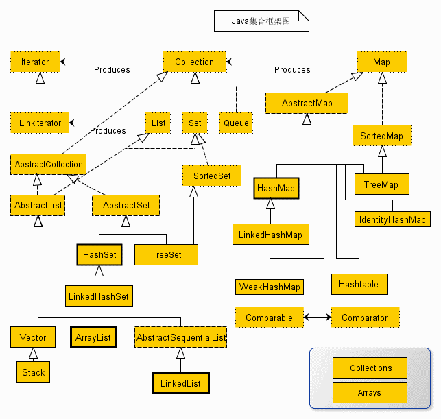


## 2、Collection 集合接口

java.util.Collection是（单值）集合操作的最大的父接口，在该接口中定义有所有的单值数据的处理操作，这个接口中定义了如下的核心操作方法：
单值集合：每次操作只能保存一个数据对象。

```java
public boolean add(E e);                          // 向集合保存数据
public boolean addAll(Collection<? extends E> c); // 追加一组数据
public void clear();                              // 清空集合，让根节点为空，同时执行GC处理
public boolean contains(Object o);                // 查询数据是否存在，需要equals()方法支持
public boolean remove(Object o);                  // 数据删除，需要equals()方法支持
public int size();                                // 获取数据长度，最大值为：Integer.MAX_VALUE
public Object[] toArray();                        // 将集合变为对象数组返回
public Iterator<E> iterator();                    // 将集合变为Iterator接口返回
public ListIterator<E> listIterator();            // 将集合变为ListIterator接口返回
```

在进行集合操作时，有两个方法最为常用：【增加】add()、【输出】iterator()

在JDK1.5版本之前，Collection只是一个独立的接口，但是从JDK1.5后，提供了Iterable父接口，并且在JDK1.8后针对于Iterable接口也得到了一些扩充。另外，在JDK1.2~JDK1.4的时代里面，如果要进行集合的使用往往会直接操作Collection接口，但是从JDK1.5时代开始更多的情况下选择的都是Collection的两个子接口：允许重复的List子接口、不允许重复的Set子接口；

Collection接口结构：


# List 集合

本节介绍了List接口的使用，在List子接口中有三个常用子类：ArrayList、Vector、LinkedList，之后会做详细说明。

## 1、List 接口简介

List是Collection的子接口，其最大的特点是允许保存有重复元素数据，该接口的定义如下：

```java
public interface List<E> extends Collection<E> {}
```

但是需要清楚的是List子接口对于Collection接口进行了方法扩充：

```java
public E get(int index);                                 // 获取指定索引上的数据
public E set(int index, E element);                      // 修改指定索引数据
public Iterator<E> iterator();                           // 返回Iterator接口对象
public ListIterator<E> listIterator();                   // 返回ListIterator接口对象
public static <E> List<E> of(E... elements);             // 将数据转为List集合（JDK1.9）
public default void forEach(Consumer<? super T> action); // 使用foreach结合消费型接口输出
```

但是List本身依然属于一个接口，那么对于接口要想使用则一定要使用子类来完成定义，在List子接口中有三个常用子类：ArrayList、Vector、LinkedList


操作示例：观察List中的静态方法（JDK1.9后的方法）从JDK1.9开始，List子接口里面追加有一些 statIc方法，以方便用户的处理

```java
import java.util.List;
public class JavaAPIDemo {
    public static void main(String[] args) throws Exception {
        List<String> all = List.of("Hello", "World", "饿了么？");
        System.out.println(all);
        System.out.println(all.getClass());
    }
}

// 输出内容
[Hello, World, 饿了么？]
class java.util.ImmutableCollections$ListN
```

这些操作方法并不是List的传统用法，是在新版本JDK1.9之后添加的新功能。


## 2、ArrayList 子类

ArrayList是List子接口中使用最多的一个子类，但是这个子类在使用时也是有前提要求的，所以本次来对这个类的相关定义以及源代码组成进行分析，在Java里面ArrayList类的定义如下：

```java
public class ArrayList<E> extends AbstractList<E> implements List<E>, RandomAccess, Cloneable, java.io.Serializable {}
```

ArrayList的继承结构


操作示例 1：使用ArrayList实例化List父接口

```java
import java.util.ArrayList;
import java.util.List;
public class JavaAPIDemo {
    public static void main(String[] args) {
        // 为List父接口进行实例化
        List<String> all = new ArrayList<>();
        all.add("Hello") ;
        all.add("Hello") ;	// 重复数据
        all.add("World") ;
        all.add("XXXX") ;
        System.out.println(all);
    }
}

// 输出内容
[Hello, Hello, World, XXXX]
```

通过本程序可以发现List存储的特征：

1. 保存的顺序就是其存储顺序
2. List集合里面允许存在有重复数据

操作示例 2：利用forEach()进行输出（不是标准输出）在JDK1.8之后Iterable父接口中定义forEach()方法输出支持：

```java
import java.util.ArrayList;
import java.util.List;
public class JavaAPIDemo {
    public static void main(String[] args) {
        // 为List父接口进行实例化
        List<String> all = new ArrayList<>();
        all.add("Hello");
        all.add("Hello");    // 重复数据
        all.add("World");
        all.add("XXXX");
        all.forEach(str -> System.out.print(str + "、"));
    }
}

// 输出内容
Hello、Hello、World、XXXX、
```

需要注意的是：此种输出并不是正常开发情况下要考虑的操作形式。

操作示例 3：观察List集合的其它操作方法

```java
import java.util.ArrayList;
import java.util.List;
public class JavaAPIDemo {
    public static void main(String[] args) {
        // 为List父接口进行实例化
        List<String> all = new ArrayList<>();
        System.out.println("集合是否为空？" + all.isEmpty() + "、集合元素个数：" + all.size());
        all.add("Hello") ;
        all.add("Hello") ;	// 重复数据
        all.add("World") ;
        all.add("XXXX") ;
        all.remove("Hello") ; // 删除元素
        System.out.println("集合是否为空？" + all.isEmpty() + "、集合元素个数：" + all.size());
        all.forEach(str -> System.out.print(str + "、"));
    }
}

// 输出内容
集合是否为空？true、集合元素个数：0
集合是否为空？false、集合元素个数：3
Hello、World、XXXX、
```

如果以方法的功能为例，那么ArrayList中操作支持与之前编写的链表形式是非常相似的，但是它并不是使用链表来实现的，通过类名称实际上就已经可以清楚的发现了，ArrayList应该封装的是一个数组。


## 3、ArrayList 源码分析

ArrayList构造：public ArrayList()

```java
public ArrayList() {
    this.elementData = DEFAULTCAPACITY_EMPTY_ELEMENTDATA;
}
private static final Object[] DEFAULTCAPACITY_EMPTY_ELEMENTDATA = {};
```

ArrayList构造：public ArrayList(int initialCapacity)

```java
public ArrayList(int initialCapacity) {
    if (initialCapacity > 0) {
        this.elementData = new Object[initialCapacity];
    } else if (initialCapacity == 0) {
        this.elementData = EMPTY_ELEMENTDATA;
    } else {
        throw new IllegalArgumentException("Illegal Capacity: "+ initialCapacity);
    }
}
```

通过有参构造方法可以发现，在ArrayList中所包含的数据实际上就是一个对象数组。在进行数据追加时发现ArrayList集合中保存的对象数组长度不够的时候将会开辟新的数组，同时将原始的旧数组内容拷贝到新数组中，而后数组的开辟操作：

```java
private int newCapacity(int minCapacity) {
    // overflow-conscious code
    int oldCapacity = elementData.length;
    int newCapacity = oldCapacity + (oldCapacity >> 1);
    if (newCapacity - minCapacity <= 0) {
        if (elementData == DEFAULTCAPACITY_EMPTY_ELEMENTDATA)
            return Math.max(DEFAULT_CAPACITY, minCapacity);
        if (minCapacity < 0) // overflow
            throw new OutOfMemoryError();
        return minCapacity;
    }
    return (newCapacity - MAX_ARRAY_SIZE <= 0) ? newCapacity  : hugeCapacity(minCapacity);
}
```

如果在实例化ArrayList类对象时没有传递初始化的长度，则默认情况下会使用空数组，但是如果在进行数据增加时，发现数组容量不够，则会判断当前的增长容量与默认的容量的大小，使用较大的一个数值进行新的数组开辟，所以可以得出结论：

1. JDK1.9之前：ArrayList默认的构造实际上就会默认开辟大小为10的数组
2. JDK1.9之后：ArrayList默认的构造只会使用默认的空数组，使用的时候才会开辟数组，默认的开辟长度为10

当 ArrayList之中保存的容量不足的时候会采用成倍的方式进行增长，原始长度为10，那么下次的增长就是20，一次类推。在使用ArrayList子类的时候一定要估算出你的数据量会有多少，如果超过了10个，那么使用有参构造方法创建，以避免垃圾数组产生。


## 3、ArrayList 保存自定义类

通过之前的分析已经清楚了ArrayList子类的实现原理以及List核心操作，但是在测试的时候使用的是系统提供的String类，这是一个设计非常完善的类，而对于类集而言也可以实现自定义类对象的保存。

操作示例：实现自定义类对象的保存

```java
import java.util.ArrayList;
import java.util.List;
class Person {
    private String name ;
    private int age ;
    public Person(String name,int age) {
        this.name = name ;
        this.age = age ;
    }
    @Override
    public boolean equals(Object obj) {
        if (this == obj) {
            return true ;
        }
        if (obj == null) {
            return false ;
        }
        if (!(obj instanceof Person)) {
            return false ;
        }
        Person per = (Person) obj ;
        return this.name.equals(per.name) && this.age == per.age ;
    }
    @Override
    public String toString() {
        return "姓名：" + this.name + "、年龄：" + this.age ;
    }
}
public class JavaAPIDemo {
    public static void main(String[] args) {
        List<Person> all = new ArrayList<>();
        all.add(new Person("张三",30)) ;
        all.add(new Person("李四",16)) ;
        all.add(new Person("小强",78)) ;
        System.out.println(all.contains(new Person("小强",78)));
        all.remove(new Person("小强",78)) ;
        all.forEach(System.out::println);
    }
}

// 输出内容
true
姓名：张三、年龄：30
姓名：李四、年龄：16
```

在使用List保存自定义对象时，如果需要使用到contains()、remove()方法进行查询或删除处理时一定要保证类中已经覆写了equals()方法。


## 4、LinkedList 子类

在List接口中还有一个比较常用的子类：LinkedList，这个类通过名称就可以发现其特点：基于链表的实现。那么首先观察一下LinkedList的定义：

```java
public class LinkedList<E> extends AbstractSequentialList<E> implements List<E>, Deque<E>, Cloneable, Serializable {}
```

LinkedList 类结构如下：


操作示例 1：使用LinkedList实现集合操作

```java
import java.util.LinkedList;
import java.util.List;
public class JavaAPIDemo {
    public static void main(String[] args) {
        List<String> all = new LinkedList<>();
        all.add("Hello");
        all.add("Hello"); // 重复数据
        all.add("Wolrd");
        all.add("XXXX");
        all.forEach(System.out::println);
    }
}

// 输出内容
Hello
Hello
Wolrd
XXXX
```


## 5、LinkedList 源码分析

如果现在只是观察程序的功能会发现和ArrayList使用是完全一样的，但是其内部实现机制是完全不同的，首先观察LinkedList构造方法里面并没有提供像ArrayList那样的初始化大小的方法，而只是提供了无参构造处理：“public LinkedList()”。随后观察add()方法的具体实现。

```java
/**
 * 在之前编写自定义链表时，是判断了传入数据是否为null，如果为null则不进行保存，
 * 但在LinkedList中并没有做这样的处理，而是所有的数据都可以保存,而后此方法调用了linkLast()方法（在最后一个节点后追加）
 */
public boolean add(E e) {
    linkLast(e);
    return true;
}
```

```java
/**
 * 在LinkedList类中保存的数据都是利用Node节点进行的封装处理，同时为了提高程序执行性能，
 * 每一次都会保存上一个追加的节点（最后一个节点），就可以在增加数据的时候避免递归处理，在增加数据时要进行数据保存个数的追加
 */
void linkLast(E e) {
    final Node<E> l = last;
    final Node<E> newNode = new Node<>(l, e, null);
    last = newNode;
    if (l == null)
        first = newNode;
    else
        l.next = newNode;
    size++;
    modCount++;
} 
```

通过上面的分析：可以发现LinkedList封装的就是一个链表实现。

**面试题：**请问ArrayList与LinkedList有什么区别？

1. ArrayList是数组实现的集合操作，而LinkedList是链表实现的集合操作
2. 在使用List集合中的get()方法根据索引获取数据时，ArrayList的时间复杂度为“O(1)”、而LinkedList时间复杂度为“O(n)”（n为集合的长度）
3. ArrayList在使用时默认的初始化对象数组的大小长度为10，如果空间不足则会采用2倍形式进行容量的扩充，如果保存大数据量的时候有可能会造成垃圾的产生以及性能的下降，但是这时候可以使用LinkedList类保存


## 6、Vector 子类

Vector是一个原始古老的程序类，这个类是在JDK1.0时提供的。到了JDK1.2时由于许多开发者已经习惯于使用Vector，并且许多系统类也是基于Vector实现的，考虑到其使用的广泛性，所以类集框架将其保留了下来，并让其多实现了一个List接口，观察Vector的定义结构：

```java
public class Vector<E> extends AbstractList<E> implements List<E>, RandomAccess, Cloneable, Serializable {}
```

继承结构与ArrayList是相同的，所以来讲Vector这个类继承结构如下：


操作示例 1：Vector的使用

```java
import java.util.List;
import java.util.Vector;
public class JavaAPIDemo {
    public static void main(String[] args) {
        // 为List父接口进行实例化
        List<String> all = new Vector<>();
        all.add("Hello");
        all.add("Hello"); // 重复数据
        all.add("World");
        all.add("XXXX");
        all.forEach(System.out::println);
    }
}

// 输出内容
Hello
Hello
World
XXXX
```

下面可以进一步的观察Vector类实现：

```java
public Vector() {
    this(10);
}
public Vector(int initialCapacity) {
    this(initialCapacity, 0);
}
public Vector(int initialCapacity, int capacityIncrement) {
    super();
    if (initialCapacity < 0)
        throw new IllegalArgumentException("Illegal Capacity: "+ initialCapacity);
    this.elementData = new Object[initialCapacity];
    this.capacityIncrement = capacityIncrement;
}
```

PS：Vector类如果使用的是无参构造方法，则一定会默认开辟一个10个长度的数组，而后其余的实现操作与ArrayList是相同的。通过源代码分析可以发现，Vector类中的操作方法采用的都是synchronized同步处理，而ArrayList并没有进行同步处理，所以Vector类中的方法在多线程访问的时候属于线程安全的，但是性能不如ArrayList高。


# Set 集合

本节介绍了Set接口继承关系以及特征，介绍了两个常用的子类：HashSet、TreeSet的使用。

## 1、Set 接口简介

Set集合最大的特点就是不允许保存重复元素,其也是 Collection子接口。

在JDK1.9以前Set集合与Collection集合的定义并无差别，Set继续使用了Collection接口中提供的方法进行操作，但是从JDK1.9后，Set集合也像List集合一样扩充了一些static方法，Set集合的定义如下：

```java
public interface Set<E> extends Collection<E> {}
```

需要注意的是Set集合并不像List集合那样扩充了许多的新方法，所以无法使用List集合中提供的get()方法，也就是说无法实现指定索引数据的获取，Set接口的继承关系如下。


从JDK1.9后，Set集合也提供了像List集合中类似的of()的静态方法。下面就使用此方法进行Set集合特点的验证。

操作示例 1：验证Set集合特征

```java
import java.util.Set;
public class JavaAPIDemo {
    public static void main(String[] args) {
        // 进行Set集合数据的保存，并且设置有重复的内容
        Set<String> all = Set.of("Hello", "World", "XXXX", "Hello", "World");
        // 直接输出
        all.forEach(System.out::println);
    }
}
// 运行会报异常：因为出现重复元素
// 输出内容
Exception in thread "main" java.lang.IllegalArgumentException: duplicate element: Hello
	at java.base/java.util.ImmutableCollections$SetN.<init>(ImmutableCollections.java:587)
	at java.base/java.util.Set.of(Set.java:541)
	at JavaAPIDemo.main(JavaAPIDemo.java:5)
```

当使用of()这个新方法的时候，如果发现集合中存在重复元素则会直接抛出异常。这与传统的Set集合不保存重复元素的特点相一致，只不过自己抛出了异常而已。

Set集合的常规使用形式一定是依靠子类进行实例化的，所以Set接口之中有两个常用的子类：HashSet、TreeSet


## 2、HashSet 子类

HashSet是Set接口中使用最多的一个子类，其最大的特点就是保存的数据是无序的，而HashSet子类的继承关系如下：

```java
public class HashSet<E> extends AbstractSet<E> implements Set<E>, Cloneable, Serializable {}
```

这种继承的形式和之前的ArrayList是非常相似的，那么现在来观察一下HashSet子类的继承结构：


操作示例 1：观察HashSet子类

```java
import java.util.HashSet;
import java.util.Set;
public class JavaAPIDemo {
    public static void main(String[] args) {
        Set<String> all = new HashSet<>();
        all.add("XXXX");
        all.add("NiHao");
        all.add("Hello");
        all.add("Hello"); // 重复元素
        all.add("World");
        all.forEach(System.out::println);
    }
}

// 输出内容
NiHao
Hello
XXXX
World
```

通过执行结果就可以发现HashSet的操作特点：不允许保存重复元素（Set接口定义的），另外一个特点就是HashSet中保存的数据是无序的。


## 3、TreeSet 子类

Set接口的另外一个子接口就是TreeSet，与HashSet最大区别在于TreeSet集合里面保存的数据是有序的，首先来观察TreeSet类的定义：

```java
public class TreeSet<E> extends AbstractSet<E> implements NavigableSet<E>, Cloneable, Serializable {}
```

在这个子类中依然继承了AbstractSet父抽象类，同时又实现了一个NavigableSet父接口。TreeSet子类继承结果：


操作示例 1：使用TreeSet子类

```java
import java.util.Set;
import java.util.TreeSet;
public class JavaAPIDemo {
    public static void main(String[] args) {
        Set<String> all = new TreeSet<>();
        all.add("XXXX");
        all.add("NiHao") ;
        all.add("Hello");
        all.add("Hello"); // 重复元素
        all.add("World");
        all.forEach(System.out::println);
    }
}
// 输出结果（是有序的，默认是升序）
Hello
NiHao
World
XXXX
```

当利用TreeSet保存数据的时候，所有的数据将按照数据的升序进行自动排序处理。


## 4、TreeSet 排序说明

经过分析后发现，TreeSet子类中保存的数据是允许排序的，但是这个类必须要实现Comparable接口，只有实现了此接口才能够确认出对象的大小关系。

**提示**：TreeSet本质上是利用TreeMap子类实现的集合数据的存储，而TreeMap（树）就需要根据Comparable来确定对象的大小关系。

操作示例 1：使用自定义的类实现排序的处理操作（实现自定义类排序）

```java
import java.util.Set;
import java.util.TreeSet;

/**
 * 比较器
 */
class Person implements Comparable <Person> {
    private String name ;
    private int age ;
    public Person(String name,int age) {
        this.name = name ;
        this.age = age ;
    }
    @Override
    public String toString() {
        return "姓名：" + this.name + "、年龄：" + this.age ;
    }
    @Override
    public int compareTo(Person per) {
        if (this.age < per.age) {
            return -1 ;
        } else if (this.age > per.age) {
            return 1 ;
        } else {
            return this.name.compareTo(per.name) ;
        }
    }
}

public class JavaAPIDemo {
    public static void main(String[] args) {
        // 为Set父接口进行实例化
        Set<Person> all = new TreeSet<>();
        all.add(new Person("张三",19)) ;
        all.add(new Person("李四",19)) ;	// 年龄相同，但是姓名不同
        all.add(new Person("王五",20)) ;	// 数据重复
        all.add(new Person("王五",20)) ;	// 数据重复
        all.add(new Person("小强",78)) ;
        all.forEach(System.out::println);
    }
}

// 输出内容
姓名：张三、年龄：19
姓名：李四、年龄：19
姓名：王五、年龄：20
姓名：小强、年龄：78
```

在使用自定义类对象进行比较处理的时候，一定要将该类中所有属性都依次进行大小关系的匹配，否则某一个或者几个属性相同的时候也会被认为是重复数据，所以TreeSet是利用了Comparable接口来确认重复数据的。

由于TreeSet在操作过程之中需要将类中的所有属性进行比对，这样的实现难度太高了，那么在实际的开发中应该首选HashSet子类进行存储。


## 5、关于重复元素说明

TreeSet类是利用了Comparable接口来实现了重复元素的判断，但是Set集合的整体特征就是不允许保存重复元素。但是HashSet判断重复元素的方式并不是利用Comparable接口完成的，它利用的是Object类中提供的方法实现的：

```java
public int hashCode();             // 对象编码
public boolean equals(Object obj); // 对象比较
```

在进行重复元素判断的时候首先利用hashCode()进行编码的匹配，如果该编码不存在则表示数据不存在，证明没有重复，如果该编码存在，则进一步进行对象比较处理，如果发现重复了，则此数据是不允许保存的。

在进行重复元素判断的时候首先利用hashCode()进行编码的匹配，如果该编码不存在，则表示数据不存在，证明没有重复，如果该编码存在，则进一步进行对象比较处理，如果发现重复了，则此数据是不允许保存的。如果使用的是IDE开发工具，则可以帮助开发者自动创建HashCode()与equals()方法。

操作示例 1：实现重复元素处理

```java
import java.util.HashSet;
import java.util.Set;

/**
 * 比较器
 */
class Person {
    private String name ;
    private int age ;
    public Person(String name,int age) {
        this.name = name ;
        this.age = age ;
    }

    @Override
    public int hashCode() {
        final int prime = 31;
        int result = 1;
        result = prime * result + age;
        result = prime * result + ((name == null) ? 0 : name.hashCode());
        return result;
    }

    @Override
    public boolean equals(Object obj) {
        if (this == obj) return true;
        if (obj == null) return false;
        if (getClass() != obj.getClass())
            return false;
        Person other = (Person) obj;
        if (age != other.age)
            return false;
        if (name == null) {
            if (other.name != null)
                return false;
        } else if (!name.equals(other.name))
            return false;
        return true;
    }
    @Override
    public String toString() {
        return "姓名：" + this.name + "、年龄：" + this.age ;
    }
}

public class JavaAPIDemo {
    public static void main(String[] args) {
        Set<Person> all = new HashSet<>();
        all.add(new Person("张三",19)) ;
        all.add(new Person("李四",19)) ;	// 年龄相同，但是姓名不同
        all.add(new Person("王五",20)) ;	// 数据重复
        all.add(new Person("王五",20)) ;	// 数据重复
        all.add(new Person("小强",78)) ;
        all.forEach(System.out::println);
    }
}

// 输出内容
姓名：小强、年龄：78
姓名：李四、年龄：19
姓名：王五、年龄：20
姓名：张三、年龄：19
```

在Java中真正的重复元素的判断处理利用的就是hashCode()和equals()两个方法共同作用完成的，而只有在排序要求的情况下（TreeSet）才会利用Comparable接口来实现。


# 集合输出

本节需要掌握集合输出的四种形式：Iterator 迭代输出、ListIterator 双向迭代输出、Enumeration 枚举输出、foreach 输出。

集合输出实际上从JDK1.8开始就在Iterable接口中提供了一个forEach()方法，但是这种方法输出并不是传统意义上集合输出形式，并且也很难在实际的开发之中出现，对于集合操作而言，一共有四种输出形式：

1. Iterator迭代输出（95%）
2. ListIterator双向迭代输出（0.1%）
3. Enumeration枚举输出（4.9%）
4. foreach输出（与Iterator相当）

## 1、Iterator 输出（核心）

通过Collection接口的继承关系可以发现，从JDK1.5开始其多继承了一个Iterable父接口，并且在这个接口里面定义有一个iterator()操作方法，通过此方法可以获取Iterator接口对象（在JDK1.5之前，这一方法直接定义在Collection接口之中）

在Iterator接口里面定义有如下的方法：

```java
public Iterator<T> iterator(); // 获取Iterator接口对象
public boolean hasNext();      // 判断是否有数据
public E next();               // 取出当前数据
default void remove();         // 删除当前数据
```

在之前使用的 java.util.Scanner 类就是 Iterator 接口的子类，所以此时（Iterator接口）类继承关系如下：


操作示例 1：使用Iterator输出

```java
import java.util.Iterator;
import java.util.Set;
public class JavaAPIDemo {
    public static void main(String[] args) {
        Set<String> all = Set.of("Hello", "World", "XXXX");
        // 实例化Iterator接口对象
        Iterator<String> iter = all.iterator();
        while (iter.hasNext()) {
            String str = iter.next() ;
            System.out.println(str);
        }
    }
}

// 输出内容
XXXX
World
Hello
```

但是对于Iterator接口中的remove()方法的使用需要特别注意一下（如果不是必须不要使用）。实际上在Collection接口中定义有数据的删除操作方法，但是在进行迭代输出的过程中如果你使用了Collection中的remove()方法会导致迭代失败。

操作示例 2：采用Collection集合中remove()方法删除

```java
import java.util.Set;
import java.util.Iterator;
import java.util.HashSet;
public class JavaAPIDemo {
    public static void main(String[] args) {
        Set<String> all = new HashSet<>();
        all.add("Hello");
        all.add("World");
        all.add("MLDN");
        // 实例化Iterator接口对象
        Iterator<String> iter = all.iterator();
        while (iter.hasNext()) {
            String str = iter.next();
            if ("World".equals(str)) {
                // Collection集合方法
                all.remove("World");
            }else {
                //  Hello   Exception in thread "main" java.util.ConcurrentModificationException
                System.out.println(str);
            }
        }
    }
}

// 输出内容（会报错）
Hello
Exception in thread "main" java.util.ConcurrentModificationException
	at java.base/java.util.HashMap$HashIterator.nextNode(HashMap.java:1493)
	at java.base/java.util.HashMap$KeyIterator.next(HashMap.java:1516)
	at JavaAPIDemo.main(JavaAPIDemo.java:13)
```

**PS：此时无法进行数据的删除处理操作，那么此时就只能够利用Iterator接口中的remove()方法删除。**

操作示例 3：使用Iterator接口删除方法

```java
import java.util.HashSet;
import java.util.Iterator;
import java.util.Set;
public class JavaAPIDemo {
    public static void main(String[] args) {
        Set<String> all = new HashSet<>();
        all.add("Hello");
        all.add("World");
        all.add("MLDN");
        // 实例化Iterator接口对象
        Iterator<String> iter = all.iterator();
        while (iter.hasNext()) {
            String str = iter.next();
            if ("World".equals(str)) {
                // 删除当前的数据
                iter.remove();
            } else {
                System.out.println(str);
            }
        }
        System.out.println("删除后集合： " + all);
    }

}

// 输出内容
Hello
MLDN
删除后集合： [Hello, MLDN]
```

此时程序执行后没有出现任何的错误，并且可以成功的删除原始集合中的数据。

**面试题：请解释Collection.remove()与Iterator.remove()的区别？**

1. 在进行迭代输出的时候，如果使用了Collection.remove()则会造成并发更新的异常，导致程序删除出错
2. 而此时只能够利用Iterator接口中remove()方法实现正常的删除处理


## 2、ListIterator 输出

使用Iterator进行的迭代输出操作有一个特点：只允许由前向后输出，而如果现在需要进行双向迭代处理，那么就必须依靠Iterator的子接口：ListIterator接口来实现了。需要注意的是，如果想要获取ListIterator接口对象，Collection中并没有定义相关的处理方法，但是List子接口有，也就是说这个输出的接口是专门为List集合准备的。ListIterator 继承 Iterator：

```java
public interface ListIterator<E> extends Iterator<E> {}
```

ListIterator接口类继承结构：


ListIterator接口中定义有如下方法（如下是ListIterator比Iterator多的方法，因为ListIterator继承Iterator所以也包含了Iterator内的方法）：

```java
public boolean hasPrevious(); // 判断是否有前一个元素（迭代器当前位置，反向遍历集合是否含有元素）
public E previous();          // 获取当前元素（迭代器当前位置，反向遍历集合，下一个元素）
public int previousIndex();   // 迭代器当前位置，反向遍历集合，返回下一个元素的下标
public int nextIndex();       // 迭代器当前位置，返回下一个元素的下标
public void add(E e);         // 将指定的元素插入列表，插入位置为迭代器当前位置之前
public void set(E e);         // 迭代器返回的最后一个元素替换参数e
```

操作示例 1：实现双向迭代

```java
import java.util.ArrayList;
import java.util.List;
import java.util.ListIterator;
public class JavaAPIDemo {
    public static void main(String[] args) {
        List<String> all = new ArrayList<>();
        all.add("Hello");
        all.add("World");
        all.add("XXXX");
        ListIterator<String> iter = all.listIterator();
        System.out.print("由前向后输出：");
        while (iter.hasNext()) {
            System.out.print(iter.next() + "、");
        }
        System.out.print("\n由后向前输出：");
        while (iter.hasPrevious()) {
            System.out.print(iter.previous() + "、");
        }
    }
}

// 输出内容
由前向后输出：Hello、World、XXXX、
由后向前输出：XXXX、World、Hello、
```

PS：如果想实现由后向前的遍历，那么首先要实现的是由前向后实现遍历处理。

**面试题：Iterator 和 ListIterator 有什么区别？**https://blog.csdn.net/meism5/article/details/89921602

1. ListIterator 继承 Iterator
2. ListIterator 比 Iterator多6个方法：add、set、hasPrevious、previous、previousIndex、nextIndex
3. 使用范围不同，Iterator可以迭代所有集合；ListIterator 只能用于List及其子类
4. ListIterator 有 add 方法，可以向 List 中添加对象；Iterator 不能
5. ListIterator 有 hasPrevious() 和 previous() 方法，可以实现逆向遍历；Iterator不可以
6. ListIterator 有 nextIndex() 和previousIndex() 方法，可定位当前索引的位置；Iterator不可以
7. ListIterator 有 set()方法，可以实现对 List 的修改；Iterator 仅能遍历，不能修改


## 3、Enumeration 输出

Enumeration是在JDK1.0的时候就使用的输出接口，这个输出接口主要是为了Vector类提供服务的，一直到后续的JDK的发展，Enumeration依然只为Vector一个类服务，所以要想获取Enumeration接口对象，那么必须依靠Vector类提供的方法：

```java
public Enumeration<E> elements(); // 获取Enumeration
public boolean hasMoreElements(); // 判断是否有下一个元素
public E nextElement();           // 获取当前元素
```

Enumeration接口类继承结构：


操作示例 1：使用Enumeration输出

```java
import java.util.Enumeration;
import java.util.Vector;
public class JavaAPIDemo {
    public static void main(String[] args) {
        Vector<String> all = new Vector<>();
        all.add("Hello") ;
        all.add("World") ;
        all.add("XXXX") ;
        Enumeration<String> enu = all.elements() ;
        while (enu.hasMoreElements()) {
            String str = enu.nextElement() ;
            System.out.print(str + "、");
        }
    } 
}

// 输出内容
Hello、World、XXXX、
```

由于该接口出现的时间比较长了，所以在一些比较早的开发过程中，也有部分的方法只支持Enumeration输出操作，但随着类方法的不断完善，大部分的操作都能直接利用Iterator实现了。


## 4、foreach 输出

除了使用迭代接口实现输出之外，从JDK1.5开始加强型for循环也可以实现集合的输出了。这种输出的形式与数组的输出操作形式类似。

操作示例：使用foreach输出

```java
import java.util.ArrayList;
import java.util.List;
public class JavaAPIDemo {
    public static void main(String[] args) {
        List<String> all = new ArrayList<>();
        all.add("Hello");
        all.add("World");
        all.add("XXXX");
        for (String str : all) {
            System.out.print(str + "、"); 
        }
    }
}

// 输出内容
Hello、World、XXXX、
```

这种输出最初出现时很多人并不建议使用，因为标准的集合操作还是以Iterator为主，但是毕竟JDK1.5都已经推出十多年了，很多语法也开始被大部分人所习惯。


# Map 集合

本节介绍了Map接口以及它的子类HashMap、LinkedHashMap、HashTable、TreeMap，需要掌握他们的基本用法。

## 1、Map 接口简介

在之前已经学习了Collection接口以及其对应的子接口，可以发现在Collection接口之中所保存的数据全部都只是单个对象，而在数据结构中除了可以进行单个对象的保存外，也可以进行二元偶对象的保存（key=value）的形式来存储，而存储二元偶对象的核心意义在于需要通过key获取对应的value。在开发中，Collection集合保存数据的目的是为了输出，Map集合保存数据的目的是为了进行key的查找。

Map接口是进行二元偶对象保存的最大父接口。该接口定义如下：

```java
public interface Map<K,V> {}
```

该接口为一个独立的父接口，并且在进行接口对象实例化的时候需要设置Key与Value的类型，也就是在整体操作的时候需要保存两个内容，在Map接口中定义有许多操作方法，但是需要记住以下的核心操作方法：

```java
public V put(K key,V vvalue)            // 向集合之中保存数据
public V get(Object key)                // 根据key查询数据
public V remove(Object key)             // 根据key删除掉指定的数据
boolean containsKey(Object key)         // 查询指定key是否存在
boolean containsValue(Object value)     // 查找指定value是否存在
public Set<Map.Entry<K,V>> entrySet()   // 将Map集合转为Set
public Set<K> keySet()                  // 将Map集合中的key转为Set集合
Collection<V> values()                  // 返回Map中所有的value
```

操作示例 1：观察Map集合的特点。从JDK1.9之后Map接口里面也扩充了一些静态方法供用户使用

```java
import java.util.Map;
public class JavaAPIDemo {
    public static void main(String[] args) {
        // {one=1,two=2}
        Map<String, Integer> map1 = Map.of("one", 1, "two", 2);
        System.out.println(map1);

        // Exception in thread "main" java.lang.IllegalArgumentException: duplicate key: one
        Map<String, Integer> map2 = Map.of("one", 1, "two", 2, "one", 101);
        //System.out.println(map2);

        // Exception in thread "main" java.lang.NullPointerException
        Map<String, Integer> map3 = Map.of("one", 1, "two", 2, null, 0);
        System.out.println(map3);
    }
}

// 输出内容
{one=1, two=2}
Exception in thread "main" java.lang.IllegalArgumentException: duplicate key: one
	at java.base/java.util.ImmutableCollections$MapN.<init>(ImmutableCollections.java:805)
	at java.base/java.util.Map.of(Map.java:1349)
	at JavaAPIDemo.main(JavaAPIDemo.java:9)
```

在Map集合之中数据的保存就是按照“key=value”的形式存储的，并且使用of()方法操作时里面的数据是不允许重复，如果重复则会出现“IllegalArgumentException”异常，如果设置的内容为null，则会出现“NullPointerException”异常。

对于现在见到的of()方法严格意义上来说并不是Map集合的标准用法，因为正常的开发中需要通过Map集合的子类来进行接口对象的实例化，而常用的子类：HashMap、HashTable、TreeMap、LinkedHashMap。


## 2、HashMap 子类

HashMap是Map接口中最为常见的一个子类,该类的主要特点是无序存储，通过Java文档首先来观察一下HashMap子类的定义：

```java
public class HashMap<K,V> extends AbstractMap<K,V> implements Map<K,V>, Cloneable, Serializable {}
```

该类的定义继承形式符合之前的集合定义形式，依然提供有抽象类并且依然需要重复实现Map接口。HashMap子类结构：


操作示例 1：HashMap集合的使用

```java
import java.util.HashMap;
import java.util.Map;
public class JavaAPIDemo {
    public static void main(String[] args) {
        Map<String, Integer> map = new HashMap<>() ;
        map.put("one", 1) ;
        map.put("two", 2) ;
        map.put("one", 101) ;	            // key重复
        map.put(null, 0) ;		            // key为null
        map.put("zero", null) ;             // value为null
        System.out.println(map.get("one"));	// key存在
        System.out.println(map.get(null));	// key存在
        System.out.println(map.get("ten"));	// key不存在
    }
}

// 输出内容
101
0
null
```

以上的操作形式为Map集合使用的最标准的处理形式，通过代码可以发现，通过HashMap实例化的Map接口可以针对key或者value保存null的数据，同时也可以发现即便保存数据的key重复，那么也不会出现错误，而是出现内容的替换。

但是对于Map接口中提供的put()方法本身是提供有返回值的，那么这个返回值指的是在重复key的情况下返回旧的value。

操作示例 2：观察put()方法。

```java
import java.util.HashMap;
import java.util.Map;
public class JavaAPIDemo {
	public static void main(String[] args) {
		Map<String, Integer> map = new HashMap<>() ;
		System.out.println(map.put("one", 1));	// key不重复，返回null
		System.out.println(map.put("one", 101));// key重复，返回旧数据
	}
}

// 输出内容
null
1
```

可以发现：在设置了相同key的内容的时候，put()方法会返回原始的数据内容。

HashMap 源码分析：

清楚了HashMap基本功能后就研究一下HashMap中的源代码。HashMap之中肯定需要存储大量的数据，那么对于数据的存储看看HashMap是如果操作：

```java
// 当使用无参构造的时候会出现有一个loadFactor属性，并且该属性的默认内容为0.75
static final float DEFAULT_LOAD_FACTOR = 0.75f;
public HashMap() {
    this.loadFactor = DEFAULT_LOAD_FACTOR; // all other fields defaulted
}
```

```java
/**
 * 在使用put()方法进行数据保存的时候会调用一个putVal()方法,同时会将key进行hash处理(生成一个hash码),
 * 而对于putVal()方法里面会发现依然会提供有一个Node节点类进行数据的保存,
 * 而在使用putVal()方法操作的过程之中会调用有个resize()方法可以进行容量的扩充。
 */
public V put(K key, V value) {
	return putVal(hash(key), key, value, false, true);
}
```

**面试题 1：在进行HashMap的put()操作时，如何实现容量扩充？**

1. 在HashMap类里面提供有一个“DEFAULT_INITIAL_CAPACITY”常量，作为初始化的容量配置，而后这个常量的默认大小为16个元素，也就是说默认可以保存的最大内容是16
2. 当保存的内容的容量超过了与个阈值（DEFAULT_LOAD_FACTOR = 0.75f），相当于 “容量 * 阈值 = 12 ” 保存12个元素的时候就会进行容量的扩充
3. 在进行扩充的时候HashMap采用的是成倍的扩充模式，即：每一次都扩充2倍的容量

**面试题 2：请解释HashMap的工作原理（JDK1.8之后开始的）**

1. 在HashMap之中进行数据存在的依然是利用Node类完成的，那么这种情况下就证明可以使用的数据结构只有两种：链表（时间复杂度“O（n）”）、二叉树（时间复杂度“O（logn）”）
2. 从JDK1.8开始，HashMap的实现出现了改变，因为其要适应于大数据时代的海量数据问题，所以对其存储发生了变化，并且在HashMap类的内部提供有一个常量：“static final int TREEIFY_THRESHOLD = 8;”，在使用HashMap进行数据保存时，如果保存的数据没有超过阈值8（TREEIFY_THRESHOLD），那么会按照链表的形式进行存储，如果超过了阈值，则会将链表转为红黑树以实现树的平衡，并且利用左旋与右旋保证数据的查询性能。


## 3、LinkedHashMap 子类

HashMap虽然是Map集合中最为常用的子类，但是其本身保存的数据都是无序的（有序与否对Map没有影响），如果现在希望Map集合中的保存的数据的顺序为其增加顺序，则就可以更换子类为LinkedHashMap（基于链表实现的），观察LinkedHashMap类的定义形式：

```java
public class LinkedHashMap<K, V> extends HashMap<K, V> implements Map<K, V> {}
```

既然是链表保存，所以一般在使用LinkedHashMap类时数据量不要特别大，因为会造成时间复杂度攀升，通过继承的结构可以发现LinkedHashMap是HashMap的子类，LinkedHashMap类继承关系如下：


操作示例：使用LinkedHashMap

```java
import java.util.LinkedHashMap;
import java.util.Map;
public class JavaAPIDemo {
    public static void main(String[] args) {
        Map<String, Integer> map = new LinkedHashMap<>() ;
        map.put("one", 1) ;
        map.put("two", 2) ;
        map.put("one", 101) ;	// key重复
        map.put(null, 0) ;		// key为null
        map.put("zero", null) ; // value为null
        System.out.println(map);	// key不存在
    }
}

// 输出内容
{one=101, two=2, null=0, zero=null}
```


## 4、HashTable 子类

HashTable类是从JDK1.0时提供的，与Vector、Enumeration属于最早的一批动态数组的实现类，后来为了将其继续保留下来，所以让其多实现了一个Map接口，HashTable类的定义如下：

```java
public class Hashtable<K, V> extends Dictionary<K, V> implements Map<K, V>, Cloneable, Serializable {}
```

HashTable的继承结构如下：


操作示例：观察HashTable子类的使用

```java
import java.util.Hashtable;
import java.util.Map;
public class JavaAPIDemo {
    public static void main(String[] args) {
        Map<String, Integer> map = new Hashtable<>();
        map.put("one", 1);
        map.put("two", 2);
        map.put("one", 101);
        // map.put(null, 0);       // 不能为空
        // map.put("zero",null);   //不能为空，Exception in thread "main" java.lang.NullPointerException
        System.out.println(map);   // {two=2, one=101}
    }
}

// 输出内容
{two=2, one=101}
```

通过观察可以发现在HashTable中进行数据存储时设置的key或value都不允许为null，否则会出现NullPointerException异常。

**面试题：**请解释HashMap与HashTable的区别？

1. HashMap中的方法都属于异步操作（非线程安全），HashMap允许保存有null的数据
2. HashTable中的方法都属于同步方法（线程安全），HashTable不允许保存null，否则会出现NullPointerException异常


## 5、TreeMap 子类

TreeMap属于有序的Map集合类型，它可以按照key进行排序，所以来讲在使用这个子类的时候一定要配合Comparable接口共同使用，TreeMap子类的定义如下：

```java
public class TreeMap<K, V> extends AbstractMap<K, V> implements NavigableMap<K, V>, Cloneable, Serializable {}
```

TreeMap继承结构：

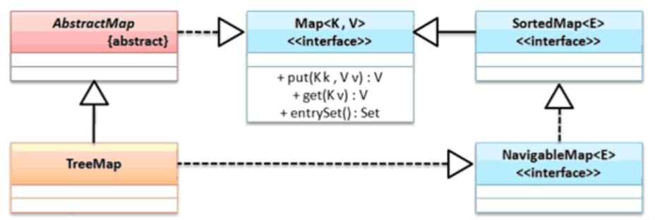

TreeMap 默认排序规则：按照key的字典顺序来排序（升序），也可以自定义排序规则：要实现Comparator接口。操作示例：使用TreeMap实现排序

```java
import java.util.Comparator;
import java.util.Map;
import java.util.TreeMap;
public class JavaAPIDemo {
    public static void main(String[] args) {
        System.out.println("---------------- 默认 排序结果（根据key排序）-----------------");
        Map<String, Integer> map1 = new TreeMap<>();
        map1.put("C", 3);
        map1.put("A", 1);
        map1.put("B", 2);
        System.out.println(map1);

        System.out.println("---------------- 自定义 排序结果（根据key排序）-----------------");
        // TreeMap<Integer, Integer> map2 = new TreeMap<>((a, b) -> b - a); // lambda形式
        TreeMap<Integer, Integer> map2 = new TreeMap<>(new Comparator<Integer>() {
            /*
             * int compare(Object o1, Object o2) 返回一个基本类型的整型，
             * 返回负数表示：o1 小于o2，
             * 返回0 表示：o1和o2相等，
             * 返回正数表示：o1大于o2。
             */
            @Override
            public int compare(Integer a, Integer b) {
                return b - a; // key倒序排序
            }
        });
        map2.put(3, 3);
        map2.put(1, 1);
        map2.put(2, 2);

        System.out.println(map2);
    }
}

// 输出内容
{A=1, B=2, C=3}
```

在使用TreeMap的时候可以根据key实现数据的排序处理，但是对于key是不允许设置为null的（因为需要依靠Comparable接口对象中的compareTo方法排序，如果传入的对象为null，那么调用方法返回的就是NullPointerException），而value允许为null。

---

> TreeMap按照value进行排序

TreeMap底层是根据红黑树的数据结构构建的，默认是根据key的自然排序来组织（比如integer的大小，String的字典排序）。所以，TreeMap只能根据key来排序，是不能根据value来排序的（否则key来排序根本就不能形成TreeMap）。

今天有个需求，就是要根据treeMap中的value排序。所以网上看了一下，大致的思路是把TreeMap的EntrySet转换成list，然后使用Collections.sor排序。代码：

```java
import java.util.*;
public class JavaAPIDemo {
    public static void main(String[] args) {
        Map map = new TreeMap<>();{{
            map.put("d", "dddd");
            map.put("a", "aaaa");
            map.put("b", "bbbb");
            map.put("c", "cccc");
        }}
        List<Map.Entry<String, String>> list = new ArrayList<>(map.entrySet());
        System.out.println("升序排序")
        Collections.sort(list, Comparator.comparing(Map.Entry::getValue)); // 升序排序
        list.forEach(e -> System.out.println(e.getKey()+":"+e.getValue()));
        System.out.println("降序排序")
        Collections.reverse(list);// 降序排序
        list.forEach(e -> System.out.println(e.getKey()+":"+e.getValue()));
    }
}

// 输出结果
升序排序
a:aaaa
b:bbbb
c:cccc
d:dddd
降序排序
d:dddd
c:cccc
b:bbbb
a:aaaa
```


## 6、Map.Entry 接口

虽然已经清楚了整个的Map集合的基本操作形式，但是依然需要有一个核心的问题要解决，Map集合里面是如何进行数据存储的？对于List而言（LinkedList子类）依靠的是链表的形式实现数据存储，那么在进行数据存储的时候一定要将数据保存在一个Node节点之中，虽然在HashMap里面也可以见到Node类型定义，通过源码定义可以发现，HashMap类中的Node内部类本身实现了Map.Entry接口：

```java
static class Node<K,V> implements Map.Entry<K,V> {}
```

所以可以得出结论：所有的key和value数据都被封装在Map.Entry接口之中，接口定义如下：

```java
public static interface Map.Entry<K,V> {}
```

并且这个接口内提供有几个重要方法：

```java
public interface Entry<K, V> {
    K getKey();	        // 获得key、
    V getValue();       // 获取value
    V setValue(V var1); //设置value
}
```

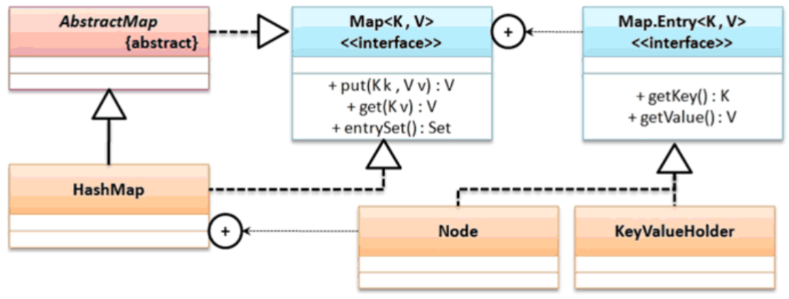

在JDK1.9以前的开发版本之中，使用者基本上都不会去考虑创建Map.Entry的对象，实际上在正常的开发过程之中使用者也不需要关心Map.Entry对象创建，可是从JDK1.9之后，Map接口里面追加有一个新的方法：

```java
public static <K, V> Map.Entry<K, V> entry(K k, V v) // 创建Map.Entry对象
```

操作示例：创建Map.Entry对象

```java
import java.util.Map;
public class JavaAPIDemo {
    public static void main(String[] args) {
        Map.Entry<String, Integer> entry = Map.entry("one", 1);
        System.out.println("获取Key：" + entry.getKey());
        System.out.println("获取Value：" + entry.getValue());
        System.out.println(entry.getClass().getName()); // 观察使用的子类
    }
}
```

通过分析可以发现在整个的Map集合里面，Map.Entry的主要作用就是作为一个Key和Value的包装类型使用，而大部分况下在进行数据存储的时候都会将key和 value包装为一个Map.Entry对象进行使用。


## 7、Map 集合的输出

对于集合的输出而言，最标准的做法就是利用Iterator接口来完成，但是需要明确一点的是在Map集合里面并没有一个方法可以直接返回Iterator接口对象，所以这种情况下就必须分析不直接提供Iterator接口实例化的方法的原因，下面对Collection与Map集合的存储结构进行一个比较：

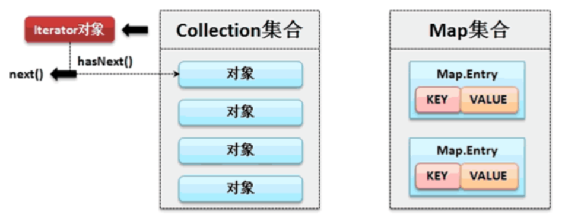

发现在Map集合里面保存的实际上是一组Map.Entry接口对象（里面包装的是Key与Value），所以整个来讲Map依然买现的是单值的保存，这样在Map集合里面提供有一个方法：将全部的Map集合转为Set集：`public Set<Map.Enty<K, V>> entrySet()`

```java
public Set<Map.Enty<K, V>> entrySet(); // 将全部的Map集合转为Set集
```

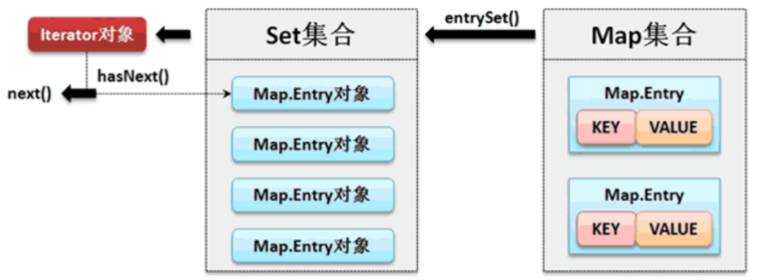

经过分析可以发现如果要想使用Iterator实现Map集合的输出则必须按照如下步骤处理：

1. 利用Map接口中提供的entrySet()方法将Map集合转为Set集合
2. 利用Set接口中的iterator()方法将Set集合转为Iterator接口实例
3. 利用Iterator进行迭代输出获取每一组的Map.Entry对象，随后通过getKey()与getValue()方法获取数据

操作示例 1：利用Iterator输出Map集合

```java
import java.util.*;
public class JavaAPIDemo {
    public static void main(String[] args) {
        Map<String, Integer> map = new HashMap<>();
        map.put("one", 1);
        map.put("two", 2);
        Set<Map.Entry<String,Integer>> set = map.entrySet(); // 将Map集合变为Set集合
        Iterator<Map.Entry<String,Integer>> iter = set.iterator();
        while (iter.hasNext()) {
            Map.Entry<String, Integer> me = iter.next() ;
            System.out.println(me.getKey() + " = " + me.getValue());
        }
    }
}

// 输出内容
one = 1
two = 2
```

操作示例 2：使用foreach输出

```java
import java.util.*;
public class JavaAPIDemo {
    public static void main(String[] args) {
        Map<String, Integer> map = new HashMap<>();
        map.put("one", 1);
        map.put("two", 2);
        // 将Map集合变为Set集合
        Set<Map.Entry<String,Integer>> set = map.entrySet() ;
        for (Map.Entry<String, Integer> entry : set) {
            System.out.println(entry.getKey() + " = " + entry.getValue());
        }
    }
}

// 输出内容
one = 1
two = 2
```


## 8、关于Key的定义

在使用Map集合的时候可以发现对于Key和Value的类型实际上都可以由使用者任意决定，那么也就意味着现在依然可以使用自定义的类来进行Key类型的设置。对于自定义Key类型所在的类中一定要覆写hashCode()与equals()方法，否则无法查找到。

```java
/**
 * 在进行数据保存的时候发现会自动使用传入的key的数据生成个hash码,也就是说存储的时候是有这个Hash数值。
 */
public V put(K key, V value) {
    return putVal(hash(key), key, value, false, true);
}

/**
 * 在根据key获取数据的时候依然要将传入的key通过hash()方法来获取其对应的hash码,
 * 那么也就证明,查询的过程之中首先要利用 hashCode()来进行数据查询,
 * 当使用 getNode()方法查询的时候还需要使用到equals()方法
 */
public V get(Object key) {
    Node<K,V> e;
    return (e = getNode(hash(key), key)) == null ? null : e.value;
}
```

操作示例：使用自定义类作为Key类型

```java
import java.util.HashMap;
import java.util.Map;
class Person {
    private String name;
    private int age;

    public Person(String name, int age) {
        this.name = name;
        this.age = age;
    }
    @Override
    public int hashCode() {
        final int prime = 31;
        int result = 1;
        result = prime * result + age;
        result = prime * result + ((name == null) ? 0 : name.hashCode());
        return result;
    }
    @Override
    public boolean equals(Object obj) {
        if (this == obj)
            return true;
        if (obj == null)
            return false;
        if (getClass() != obj.getClass())
            return false;
        Person other = (Person) obj;
        if (age != other.age)
            return false;
        if (name == null) {
            if (other.name != null)
                return false;
        } else if (!name.equals(other.name))
            return false;
        return true;
    }
}

public class JavaAPIDemo {
    public static void main(String[] args) {
        Map<Person, String> map = new HashMap<>();
        map.put(new Person("小强", 78), "林弱"); // 使用自定义类作为Key
        System.out.println(map.get(new Person("小强", 78))); // 通过key找到value
    }
}

// 输出内容
林弱
```

虽然允许你使用自定义的类作为Key的类型，但是也需要注意一点，在实际的开发之中对于Map集合的Key常用的类型就是：String、Long、 Integer，尽量使用系统类。

**面试题：**如果在进行HashMap进行数据操作的时候出现了Hash冲突（Hash码相同），HashMap是如何解决的?

当出现了Hash冲突之后为了保证程序的正常执行，会在冲突的位置上将所有Hash冲突的内容转为链表保存。

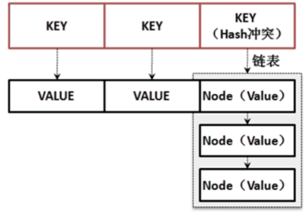


# 栈与队列

## 1、Stack 栈

栈是一种先进后出的数据结构。例如：在文本编辑器上都有撤销功能，那么每次使用的时候你会发现，最后一次的编辑操作永远是最先撤销，那么这个功能就是利用栈来实现的，栈的基本操作形式如下。

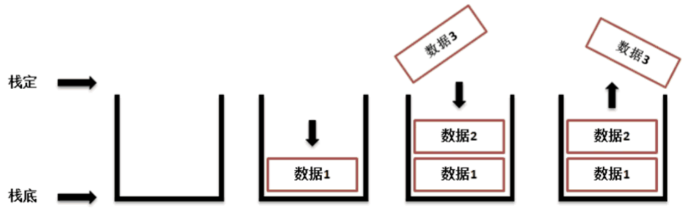

```java
public class Stack<E> extends Vector<E> {}
```

可以发现Stack是Vector子类，但是它使用的并不是Vector类之中所提供的方法，而是采用如下的两个方法：

```java
public E push(E item); // 数据入栈
public E pop(); // 数据出栈（弹出）
```

操作示例：Stack操作

```java
import java.util.Stack;
public class JavaAPIDemo {
    public static void main(String[] args) {
        Stack<String> all = new Stack<>() ;
        all.push("A") ;
        all.push("B") ;
        all.push("C") ;
        System.out.println(all.pop());
        System.out.println(all.pop());
        System.out.println(all.pop());
        System.out.println(all.pop()); // 无数据、EmptyStackException
    }
}

// 输出内容
C
B
A
Exception in thread "main" java.util.EmptyStackException
	at java.base/java.util.Stack.peek(Stack.java:102)
	at java.base/java.util.Stack.pop(Stack.java:84)
	at JavaAPIDemo.main(JavaAPIDemo.java:11)
```

通过此时的操作可以发现，所有的保存之后将按照倒序的形式进行弹出，如果栈已经空了，则会抛出空栈异常。

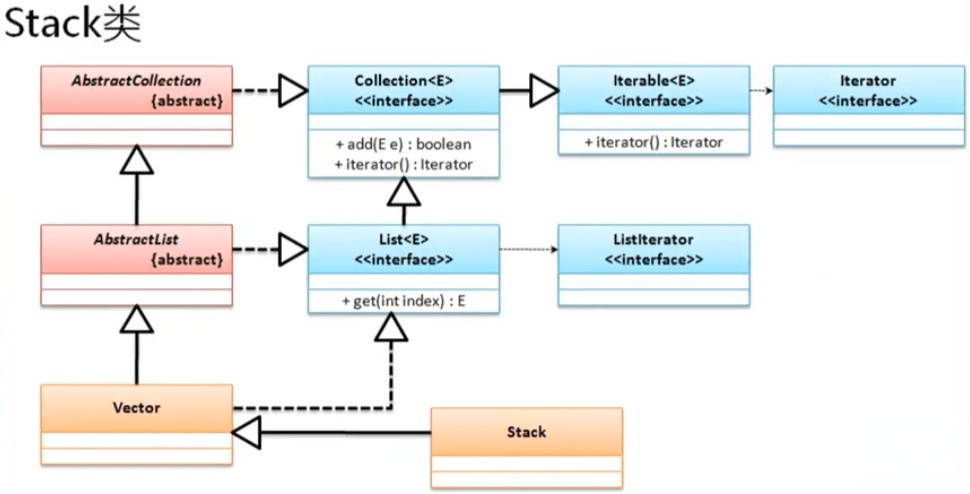


## 2、Queue 队列

Queue描述的是一个队列，而队列的主要特点是实现先进先出的操作形式。其基本的操作形式如下：


如果将队列应用在多线程的“生产者与消费者”的模型处理上，那么对于生产者过快的情况下就没有必要等待消费者获取数据了，可以将所有的内容直接保存在队列之中，队列的实现可以使用LinkedList子类来完成，观察这个类的定义。

```java
public interface Queue<E> extends Collection<E> {}
```

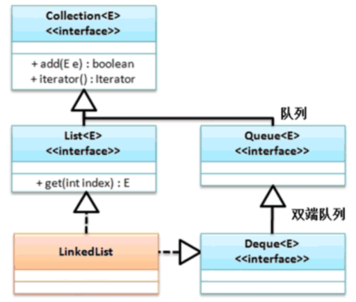

队列的使用主要依靠Queue接口之中提供的方法来处理，提供有如下的方法：

```java
public boolean offer(E e); // 向队列中追加数据，可以直接使用add()方法
public E poll();           // 通过队列获取数据，弹出后删除数据
```

操作示例 1：实现队列操作

```java
import java.util.LinkedList;
import java.util.Queue;
public class JavaAPIDemo {
    public static void main(String[] args) {
        Queue<String> queue = new LinkedList<>() ;
        // queue.add("X"); // 也可以使用父类的add()方法
        queue.offer("X") ;	// 追加队列数据，通过队尾追加
        queue.offer("A") ;	// 追加队列数据，通过队尾追加
        queue.offer("Z") ;	// 追加队列数据，通过队尾追加
        System.out.println(queue.poll()); // 弹出数据、X
        System.out.println(queue.poll()); // 弹出数据、A
        System.out.println(queue.poll()); // 弹出数据、Z
    }
}

// 输出内容
X
A
Z
```

除了Linkedlist子类之外，还有一个优先级队列的概念，可以使用PriorityQueue实现优先级队列（比较功能）

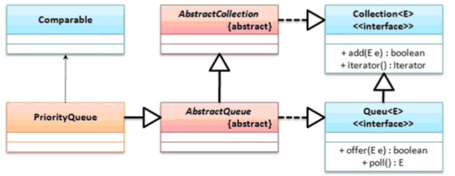

操作示例 2：使用优先级队列

```java
import java.util.PriorityQueue;
import java.util.Queue;
public class JavaAPIDemo {
    public static void main(String[] args) {
        Queue<String> queue = new PriorityQueue<>() ;
        queue.offer("X") ;	// 追加队列数据，通过队尾追加
        queue.offer("A") ;	// 追加队列数据，通过队尾追加
        queue.offer("Z") ;	// 追加队列数据，通过队尾追加
        System.out.println(queue.poll()); // 弹出数据、X
        System.out.println(queue.poll()); // 弹出数据、A
        System.out.println(queue.poll()); // 弹出数据、Z
    }
}

// 输出内容
A
X
Z
```

对于队列的选用原则也是需要根据实际的项目环境来决定的。

# Properties工具类

在之前讲解国际化程序的时候讲解过资源文件（*.properties），那么这类文件的存储结构是按照“key= value”的形式存储的，而这种结构的保存形式与Map集合很相似的，但是唯一的区别在于其所保存的内容只能够是字符串，所以为了可以方便的描述属性的定义，java.util包里面提供有Properties类型，此类是Hashtable的子类。

```java
public class Properties extends Hashtable<Object, Object> {}
```

可以发现在继承Hashtable的时候为Hashtable中定义的泛型为Object，Properties是不需要操作泛型的，因为它可以操作的类型只能是String类型，在Properties之中如果要想实现属性的操作可以采用如下的方法：

```java
public Object setProperty(String key, String value);        // 设置属性
public String getProperty(String key);                      // 取得属性，key不存在返回null
public String getProperty(String key, String defaultValue); // 取得属性，不存在返回默认值
public void store(OutputStream, String comments);           // 输出属性内容（到输出流中）
public void load(InputStream instream);                     // 通过输入流读取属性内容
```

操作示例 1：观察属性的设置和取得

```java
import java.util.Properties;
public class JavaAPIDemo {
    public static void main(String[] args) {
        Properties prop = new Properties();
        // 设置的内容只允许是字符串
        prop.setProperty("name", "Sam");
        prop.setProperty("age", "18");
        System.out.println(prop.getProperty("name"));
        System.out.println(prop.getProperty("work"));
        System.out.println(prop.getProperty("work", "Java"));
    }
}

// 输出内容
Sam
null
Java
```

通过代码可以发现Properties里面可以像Map集合那样进行内容的设置与获取，但是唯一的差别是它只能够操作String类型，另外需要注意的是，之所以会提供有Properties类还有一个最重要的功能是它可以通过输出流输出属性，也可以使用输入流读取属性内容。

操作示例 2：将属性内容保存在文件之中

```java
import java.io.File;
import java.io.FileOutputStream;
import java.util.Properties;
public class JavaAPIDemo {
    public static void main(String[] args) throws Exception {
        Properties prop = new Properties();
        // 设置的内容只允许是字符串
        prop.setProperty("name", "Sam");
        prop.setProperty("age", "18");
        prop.setProperty("address", "中国");
        prop.store(new FileOutputStream("D:\\info.properties"), "中文注释会被编码-English");
    }
}

// 输出到文件中的内容
#\u4E2D\u6587\u6CE8\u91CA\u4F1A\u88AB\u7F16\u7801-English
#Wed Nov 10 15:36:57 CST 2021
address=\u4E2D\u56FD
name=Sam
age=18
```

通过程序的执行可以发现,的确可以实现资源文件的输入处理，但是如果输出的是中文则自动帮助用户进行处理。

操作示例 3：读取资源文件

```java
import java.io.FileInputStream;
import java.util.Properties;
public class JavaAPIDemo {
    public static void main(String[] args) throws Exception {
        Properties prop = new Properties() ;
        prop.load(new FileInputStream("D:\\info.properties"));
        System.out.println(prop.getProperty("name"));
    }
}

// 输出内容
Sam
```

使用Properties类型的最大特点是可以进行资源内容的输入与输出的处理操作，但是在实际的开发之中Properties往往用于读取配置资源的信息，这一点主要是在标准设计之中做程序初始化准备的时候使用。


# Collections工具类

> 参考：https://www.cnblogs.com/guweiwei/p/6511974.html

Collections是java提供的一组集合数据的操作工具类，也就是说利用它可以实现各个集合的操作。

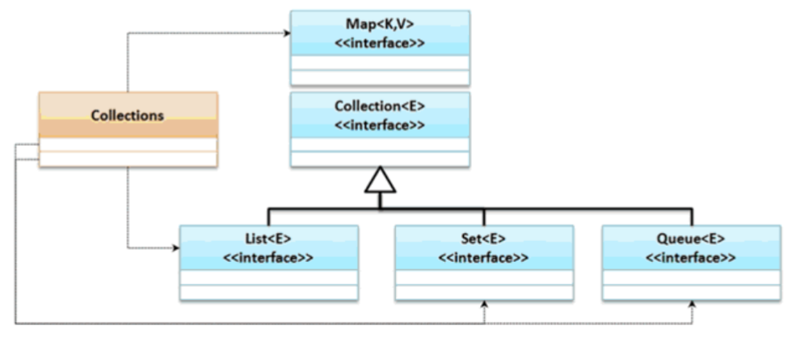

**Collections工具类常用方法：**

## 1、排序操作

（主要针对List接口相关）

```java
public static <T extends Comparable<? super T>> void sort(List<T> list); // 对List里的元素根据自然升序排序
public static <T> void sort(List<T> list, Comparator<? super T> c); // 自定义比较器进行排序
public static void reverse(List<?> list); // 反转指定List集合中元素的顺序
public static void shuffle(List<?> list); // 使用默认随机源对List中的元素进行随机排序（洗牌）
public static void swap(List<?> list, int i, int j); // 将指定List集合中i处元素和j出元素进行交换
public static void rotate(List<?> list, int distance); // 将所有元素向右移位指定长度，如果distance等于size那么结果不变

/**********************简单方法名**************************/
sort(List list)：对List里的元素根据自然升序排序
sort(List list, Comparator c)：自定义比较器进行排序
reverse(List list)：反转指定List集合中元素的顺序
shuffle(List list)：使用默认随机源对List中的元素进行随机排序（洗牌）
swap(List list, int i, int j)：将指定List集合中i处元素和j出元素进行交换
rotate(List list, int distance)：移动列表中的元素，负数向左移动，正数向右移动（集合中的元素向后移m个位置，在后面被遮盖的元素循环到前面来）
```

操作示例：

```java
import java.util.*;
public class JavaAPIDemo {
    public static void main(String[] args) {
        List<String> list = new ArrayList<>(List.of("C", "B", "A", "D" ,"F", "E"));
        // 默认正序排序
        Collections.sort(list);
        System.out.println(list); // [A, B, C, D, E, F]
        // 自定义倒序排序
        Collections.sort(list,Collections.reverseOrder()); // [F, E, D, C, B, A]
        System.out.println(list);
        // 反转集合
        Collections.reverse(list);
        System.out.println(list); // [A, B, C, D, E, F]
        // 替换集合中左边0与5的位置
        Collections.swap(list, 0, 5);
        System.out.println(list); // [F, B, C, D, E, A]
        // 将所有元素向右移位1个位置，如果参数为负数，则是向左移动
        Collections.rotate(list, 1);
        System.out.println(list); // [A, F, B, C, D, E]
        // 随机排序集合，每次输出都不一样
        Collections.shuffle(list);
        System.out.println(list); // [D, B, E, A, C, F]
    }
}

// 输出内容
[A, B, C, D, E, F]
[F, E, D, C, B, A]
[A, B, C, D, E, F]
[F, B, C, D, E, A]
[A, F, B, C, D, E]
[D, B, E, A, C, F]
```


## 2、查找替换

查找和替换（主要针对Collection接口相关）

```java
public static <T> void copy(List<? super T> dest, List<? extends T> src); // 将集合src中的元素全部复制到dest中,并且覆盖相应索引的元素
public static int indexOfSubList(List<?> source, List<?> target); // 查找target在source中首次出现位置的索引
public static int lastIndexOfSubList(List<?> source, List<?> target); // 查找target在source中末次出现位置的索引
public static <T extends Object & Comparable<? super T>> T max(Collection<? extends T> coll); // 返回最大元素
public static <T> T max(Collection<? extends T> coll, Comparator<? super T> comp); // 根据自定义比较器，返回最大元素
public static <T extends Object & Comparable<? super T>> T min(Collection<? extends T> coll); // 返回最小元素
public static <T> T min(Collection<? extends T> coll, Comparator<? super T> comp); // 根据自定义比较器，返回最小元素
public static <T> void fill(List<? super T> list, T obj); // 使用指定对象填充
public static int frequency(Collection<?> c, Object o); // 返回指定集合中指定对象出现的次数
public static <T> boolean replaceAll(List<T> list, T oldVal, T newVal); // 替换集合中指定元素
public static <T> int binarySearch(List<? extends Comparable<? super T>> list, T key); // 查找指定集合中的元素,返回该元素的索引(二分法)
    
/**********************简单方法名**************************/
copy(List dest, List src)：将集合src中的元素全部复制到dest中,并且覆盖相应索引的元素
indexOfSubList(List source, List target)：查找target在source中首次出现位置的索引
lastIndexOfSubList(List source, List target)：查找target在source中末次出现位置的索引
max(Collection coll)：返回最大元素
max(Collection coll, Comparator comp)：根据自定义比较器，返回最大元素
min(Collection coll)：返回最小元素
min(Collection coll, Comparator comp)：根据自定义比较器，返回最小元素
fill(List list, Object obj)：使用指定对象填充（用对象obj替换集合list中的所有元素）
frequency(Collection Object o)：返回指定集合中指定对象出现的次数
replaceAll(List list, Object old, Object new)：替换集合中指定元素
binarySearch(List list, Object key)：使用二分搜索法，以获得指定对象在List中的索引，前提是集合已经排序
```

操作示例：

```java
import java.util.*;
public class JavaAPIDemo {
    public static void main(String[] args) {
        {
            // 将集合src中的元素全部复制到dest中,并且覆盖相应索引的元素
            List<String> dest = new ArrayList<>(List.of("C", "B", "A", "D" ,"F", "E"));
            List<String> src = new ArrayList<>(List.of("1", "2", "3"));
            Collections.copy(dest, src);
            System.out.println(dest); // [1, 2, 3, D, F, E]
        }
        {
            // 查找subList在list中首次出现位置的索引
            List<String> initList = new ArrayList<>(List.of("C", "B", "A", "D" ,"F", "E"));
            System.out.println(Collections.indexOfSubList(initList, List.of("A", "D"))); // 2
            System.out.println(Collections.indexOfSubList(initList, List.of("A", "F"))); // -1
            // 查找subList在list中末次次出现位置的索引
            System.out.println(Collections.indexOfSubList(initList, List.of("A", "D"))); // 2
            System.out.println(Collections.indexOfSubList(initList, List.of("A", "F"))); // -1
        }
        {
            // 返回集合中最大和最小元素
            List<String> initList = new ArrayList<>(List.of("C", "B", "A", "D" ,"F", "E"));
            System.out.println(Collections.min(initList)); // A
            System.out.println(Collections.max(initList)); // F
            // 返回指定集合中指定对象出现的次数
            System.out.println(Collections.frequency(initList, "A")); // 1
            // 查找指定集合中的元素，返回所查找元素的索引，PS：前提是集合已经排序
            Collections.sort(initList);
            System.out.println(Collections.binarySearch(initList, "C")); // 2
        }
        {
            // 用对象obj替换集合list中的所有元素
            List<String> initList = new ArrayList<>(List.of("C", "B", "A", "D" ,"F", "E"));
            Collections.fill(initList, "fill");
            System.out.println(initList); // [fill, fill, fill, fill, fill, fill]
        }
        {
            // 替换批定元素为某元素,若要替换的值存在刚返回true,反之返回false
            List<String> initList = new ArrayList<>(List.of("C", "B", "A", "D" ,"E", "E"));
            Collections.replaceAll(initList, "E", "X");
            System.out.println(initList); // [C, B, A, D, X, X]
        }
    }
}
```


## 3、同步控制

同步控制Collections：https://blog.csdn.net/weixin_38192427/article/details/116330109

同步控制Collections工具类中提供了多个synchronizedXxx()方法，该方法返回指定集合对象对应的同步对象，从而解决多线程并发访问集合时线程的安全问题。HashSet、ArrayList、HashMap都是线程不安全的，如果需要考虑同步，则使用这些方法。这些方法主要有：

```java
public static <T> Collection<T> synchronizedCollection(Collection<T> c);
public static <T> List<T> synchronizedList(List<T> list);
public static <T> Set<T> synchronizedSet(Set<T> s);
public static <T> SortedSet<T> synchronizedSortedSet(SortedSet<T> s);
public static <T> NavigableSet<T> synchronizedNavigableSet(NavigableSet<T> s);
public static <K,V> Map<K,V> synchronizedMap(Map<K,V> m);
public static <K,V> SortedMap<K,V> synchronizedSortedMap(SortedMap<K,V> m);
public static <K,V> NavigableMap<K,V> synchronizedNavigableMap(NavigableMap<K,V> m);

SynchronizedXxx(Xxx x); // 创建一个SynchronizedXxx，并将指定的集合x作为内部集合,此方法会将SynchronizedXxx实例本身作为互斥体（mutex）
SynchronizedXxx(Xxx x, Object mutex); // 创建一个SynchronizedXxx，并将指定的集合作为内部集合，将指定的对象作为互斥体（mutex）
```

SynchronizedMap类解读：

> 1、SynchronizedMap概述
>
> - SynchronizedMap是集合工具类Collections的一个静态内部类
> - SynchronizedMap实现了Map接口，同时实现了接口Serializable，支持序列化
> - 在多线程的情况下，能够保证线程的安全
>
> 2、SynchronizedMap的获取示例
>
> ```java
> Map<Integer, String> map = new HashMap<>();
> Map<Integer, String> synchronizedMap = Collections.synchronizedMap(map);
> 
> // Collections 调用的 synchronizedMap 方法如下
> public static <K,V> Map<K,V> synchronizedMap(Map<K,V> m) {
>     return new SynchronizedMap<>(m);
> }
> ```
>
> 3、SynchronizedMap源码解读
>
> ```java
> private static class SynchronizedMap<K,V> implements Map<K,V>, Serializable {
>     // 1、类的基本属性
>     private final Map<K,V> m;     // 被 final 修饰的普通 Map 对象
>     final Object      mutex;        // 互斥锁对象
> 
>     // 2、构造函数
>     // 不指定锁对象
>     SynchronizedMap(Map<K,V> m) {
>         // 不指定锁对象时，锁对象就是 SynchronizedMap 本身
>         this.m = Objects.requireNonNull(m);
>         mutex = this;
>     }
>     // 自定义锁对象
>     SynchronizedMap(Map<K,V> m, Object mutex) {
>         // 锁对象为传入的 mutex
>         this.m = m;
>         this.mutex = mutex;
>     }
> 
>     // 3、常见的 API 方法
>     public int size() {
>         synchronized (mutex) {return m.size();}
>     }
>     public boolean isEmpty() {
>         synchronized (mutex) {return m.isEmpty();}
>     }
>     public boolean containsKey(Object key) {
>         synchronized (mutex) {return m.containsKey(key);}
>     }
>     public boolean containsValue(Object value) {
>         synchronized (mutex) {return m.containsValue(value);}
>     }
>     public V get(Object key) {
>         synchronized (mutex) {return m.get(key);}
>     }
>     public V put(K key, V value) {
>         synchronized (mutex) {return m.put(key, value);}
>     }
>     // ...等等方法
> }
> ```
>
> - 可以发现它的所有方法都是加了synchronized互斥锁关键字
> - 此外SynchronizedMap还重写了Map中的一些方法，也都是加了synchronized互斥锁关键字
>
> 
>
> 4、SynchronizedMap，Hashtable与ConcurrentHashMap 对比：
>
> - 相同点：1）三者都实现了Map接口。2）在多线程的情况下，都可以保证线程的安全
> - 不同点：
>   1. 底层使用的数据结构：Hashtable使用了 数组 + 链表，ConcurrentHashMap 使用了数组 + 链表 + 红黑树
>   2. 默认的初始容量：HashTable是 11，ConcurrentHashMap是 16
>   3. 保证线程安全的机制：SynchronizedMap和Hashtable都是为每个方法加了synchronized互斥锁关键字，ConcurrentHashMap使用了 Synchronized + CAS + Volatile机制来保证线程安全
>   4. 多线程的情况下执行效率：ConcurrentHashMap执行效率要高于SynchronizedMap和Hashtable

SynchronizedList类解读：

> 1、SynchronizedList 概述
>
> - SynchronizedList是集合工具类Collections的一个静态内部类
> - SynchronizedList实现了List接口
> - 在多线程的情况下，能够保证线程的安全
>
> 2、SynchronizedList的获取示例
>
> ```java
> List<Integer> newList = new ArrayList<>();
> List<Integer> synchronizedList = Collections.synchronizedList(newList);
> 
> // Collections 调用 synchronizedList 方法如下
> public static <T> List<T> synchronizedList(List<T> list) {
>     return (list instanceof RandomAccess ?
>             new SynchronizedRandomAccessList<>(list) :
>             new SynchronizedList<>(list));
> }
> ```
>
> 3、SynchronizedList源码解读
>
> ```java
> static class SynchronizedList<E>
>         extends SynchronizedCollection<E>
>         implements List<E> {
>         private static final long serialVersionUID = -7754090372962971524L;
> 
>     // 1、类的基本属性
>     final List<E> list;
> 
>     // 2、构造函数
>     SynchronizedList(List<E> list) {
>         super(list);
>         this.list = list;
>     }
>     // 指定互斥锁对象，并调用父类 SynchronizedCollection 的构造函数
>     SynchronizedList(List<E> list, Object mutex) {
>         super(list, mutex);
>         this.list = list;
>     }
> 
>     // 3、常用API
>     public E get(int index) {
>         synchronized (mutex) {return list.get(index);}
>     }
>     public E set(int index, E element) {
>         synchronized (mutex) {return list.set(index, element);}
>     }
>     public void add(int index, E element) {
>         synchronized (mutex) {list.add(index, element);}
>     }
>     public E remove(int index) {
>         synchronized (mutex) {return list.remove(index);}
>     }
>     // 其父类 SynchronizedCollection 的方法
>     public int size() {
>         synchronized (mutex) {return c.size();}
>     }
>     // ...等等方法
> }
> ```
>
> - 可以看到添加、删除、修改、查询等操作都通过 synchronized 实现了同步锁来保证这些操作是线程安全的
> - 在迭代器操作是没有添加同步锁的，因此使用迭代器进行操作使会出现线程不安全的情况，但我们也可以手动添加同步锁来实现迭代的时候线程安全
>
> 
>
> 4、SynchronizedList，Vector与CopyOnWriteArrayList 对比：
>
> - 相同点：三者都是线程安全的List
> - 不同点：
>   1. 扩容机制：Vector 每次扩容的大小都是原来数组大小的 2 倍，而 CopyOnWriteArrayList 不需要扩容，通过 COW 思想就能使数组容量满足要求
>   2. 保证线程安全机制：SynchronizedList 和 Vector 的每个方法都进行了加锁，而 CopyOnWriteArrayList 的读操作是不加锁的，因此 CopyOnWriteArrayList 的读性能远高于 SynchronizedList 和 Vector
>   3. 在多线程的读多写少的情况下执行效率：CopyOnWriteArrayList 要高于 SynchronizedList 和 Vector

SynchronizedSet类解读：

> 1、synchronizedSet 概述
>
> - SynchronizedSet 是集合工具类 Collections 的一个静态内部类
> - SynchronizedSet 实现了 Set 接口
> - 在多线程的情况下，能够保证线程的安全
>
> 2、SynchronizedSet 的获取示例
>
> ```java
> Set<String> set = new HashSet<>();
> Set<String> synchronizedSet = Collections.synchronizedSet(set);
> 
> // Collections 调用 synchronizedSet 方法如下
> public static <T> Set<T> synchronizedSet(Set<T> s) {
>     return new SynchronizedSet<>(s);
> }
> ```
>
> 3、SynchronizedSet 源码解读
>
> ```java
> static class SynchronizedSet<E> extends SynchronizedCollection<E> implements Set<E> {
>     SynchronizedSet(Set<E> s) {
>         super(s);
>     }
>     SynchronizedSet(Set<E> s, Object mutex) {
>         super(s, mutex);
>     }
>     public boolean equals(Object o) {
>         if (this == o)
>             return true;
>         synchronized (mutex) {return c.equals(o);}
>     }
>     public int hashCode() {
>         synchronized (mutex) {return c.hashCode();}
>     }
> }
> 
> // 在 synchronizedSet 中只有 equals() 和 hashCode() 方法，所以我们看其父类 SynchronizedCollection的方法
> public int size() {
> 	synchronized (mutex) {return c.size();}
> }
> public boolean isEmpty() {
> 	synchronized (mutex) {return c.isEmpty();}
> }
> public boolean contains(Object o) {
> 	synchronized (mutex) {return c.contains(o);}
> }
> public Iterator<E> iterator() {
> 	return c.iterator(); 
> }
> public boolean add(E e) {
> 	synchronized (mutex) {return c.add(e);}
> }      
> public boolean remove(Object o) {
> 	synchronized (mutex) {return c.remove(o);}
> }
> public boolean addAll(Collection<? extends E> coll) {
> 	synchronized (mutex) {return c.addAll(coll);}
> }
> public boolean removeAll(Collection<?> coll) {
> 	synchronized (mutex) {return c.removeAll(coll);}
> }     
> @Override
> public void forEach(Consumer<? super E> consumer) {
> 	synchronized (mutex) {c.forEach(consumer);}
> }
> @Override
> public Stream<E> stream() {
> 	return c.stream(); 
> }
> ```
>
> - 可以看到添加、删除等操作都通过 synchronized 实现了同步锁来保证这些操作是线程安全的
> - 在迭代器操作是没有添加同步锁的，因此使用迭代器进行操作使会出现线程不安全的情况，但我们也可以手动添加同步锁来实现迭代的时候线程安全
>
> 4、SynchronizedSet 与 CopyOnWriteArraySet 对比：
>
> - 相同点：二者都是线程安全的Set
> - 不同点：
>   1. 实现机制：CopyOnWriteArraySet 是通过 CopyOnWriteArrayList 实现的。而CopyOnWriteArrayList 本质是个动态数组，所以 CopyOnWriteArraySet 相当于通过动态数组实现的 Set，而 SynchronizedSet 的实现依据于如何创建 SynchronizedSet 的实例
>   2. 保证线程安全的机制：CopyOnWriteArraySet 通过 volatile 和 ReentrantLock 来实现的，而 SynchronizedSet 是通过给添加、删除等方法添加 synchronized 同步锁来保证的
>   3. 在多线程的读多写少的情况下执行效率：CopyOnWriteArraySet 要高于 SynchronizedSet


## 4、不可变集合

设置不可变集合，Collections有三类方法可返回一个不可变集合：

1. emptyXxx()：返回一个空的不可变的集合对象
2. singletonXxx()：返回一个只包含指定对象的，不可变的集合对象
3. unmodifiableXxx()：返回指定集合对象的不可变视图

```java
// emptyXxx()：返回一个空的不可变的集合
public static <T> ListIterator<T> emptyListIterator();
public static <T> Enumeration<T> emptyEnumeration();
public static final <T> Set<T> emptySet();
public static <E> SortedSet<E> emptySortedSet();
public static <E> NavigableSet<E> emptyNavigableSet();
public static final <T> List<T> emptyList();
public static final <K,V> Map<K,V> emptyMap();
public static final <K,V> SortedMap<K,V> emptySortedMap();
public static final <K,V> NavigableMap<K,V> emptyNavigableMap();

// singletonXxx()：返回一个只包含指定对象的，不可变的集合
public static <T> Set<T> singleton(T o);
public static <T> List<T> singletonList(T o);
public static <K,V> Map<K,V> singletonMap(K key, V value);

// unmodifiableXxx()：返回指定集合对象的不可变视图
public static <T> Collection<T> unmodifiableCollection(Collection<? extends T> c);
public static <T> Set<T> unmodifiableSet(Set<? extends T> s);
public static <T> SortedSet<T> unmodifiableSortedSet(SortedSet<T> s);
public static <T> NavigableSet<T> unmodifiableNavigableSet(NavigableSet<T> s);
public static <T> List<T> unmodifiableList(List<? extends T> list);
public static <K,V> Map<K,V> unmodifiableMap(Map<? extends K, ? extends V> m);
public static <K,V> SortedMap<K,V> unmodifiableSortedMap(SortedMap<K, ? extends V> m);
public static <K,V> NavigableMap<K,V> unmodifiableNavigableMap(NavigableMap<K, ? extends V> m);
```

操作示例：

```java
import java.util.*;
public class JavaAPIDemo {
    public static void main(String[] args) {
        // 1、emptyXxx()：返回一个空的不可变的集合
        try {
            List<String> emptyList = Collections.emptyList();
            // 抛出：java.lang.UnsupportedOperationException
            emptyList.add("X");
        } catch (UnsupportedOperationException e) {
            e.printStackTrace();
        }

        // 2、singletonXxx()：返回一个只包含指定对象的，不可变的集合
        try {
            List<String> singletonList = Collections.singletonList("X");
            System.out.println(singletonList.get(0));
            // 抛出：java.lang.UnsupportedOperationException
            singletonList.add("");
        } catch (UnsupportedOperationException e) {
            e.printStackTrace();
        }

        // 3、unmodifiableXxx()：返回指定集合对象的不可变视图
        try {
            // 初始化集合
            List<String> list = new ArrayList<>(List.of("C", "B", "A", "D" ,"F", "E"));
            List<String> unmodList = Collections.unmodifiableList(list);
            // 抛出：java.lang.UnsupportedOperationException
            unmodList.add("再加个试试！");
        } catch (UnsupportedOperationException e) {
            e.printStackTrace();
        }
    }
}

// 输出内容
java.lang.UnsupportedOperationException
	at java.base/java.util.AbstractList.add(AbstractList.java:153)
	at java.base/java.util.AbstractList.add(AbstractList.java:111)
	at JavaAPIDemo.main(JavaAPIDemo.java:8)
X
java.lang.UnsupportedOperationException
	at java.base/java.util.AbstractList.add(AbstractList.java:153)
	at java.base/java.util.AbstractList.add(AbstractList.java:111)
	at JavaAPIDemo.main(JavaAPIDemo.java:18)
java.lang.UnsupportedOperationException
	at java.base/java.util.Collections$UnmodifiableCollection.add(Collections.java:1060)
	at JavaAPIDemo.main(JavaAPIDemo.java:29)
```


## 5、其它常用方法

```java
public static <T> boolean addAll(Collection<? super T> c, T... elements); // 将所有指定元素添加(追加)到指定collection中
public static boolean disjoint(Collection<?> c1, Collection<?> c2); // 如果两个指定collection中没有相同的元素则返回true
public static <T> List<T> nCopies(int n, T o); // 返回大小为n的List，其中的所有引用都指向o，List是不可变得（与fill方法类似）
public static <T> Comparator<T> reverseOrder(); // 返回一个比较器，它强行反转指定比较器的顺序
```

操作示例：

```java
import java.util.*;
public class JavaAPIDemo {
    public static void main(String[] args) {
        // 初始化集合List
        List<String> list = new ArrayList<>(List.of("你好"));
        List<String> list1 = new ArrayList<>(List.of("list1"));
        List<String> list2 = new ArrayList<>();

        // addAll增加变长参数
        Collections.addAll(list1, "大家好", "你好","我也好");
        Collections.addAll(list2, "大家好", "a李四","我也好");
        System.out.println(list1); // [list1, 大家好, 你好, 我也好]
        System.out.println(list2); // [大家好, a李四, 我也好]

        // disjoint检查两个Collection是否的交集
        boolean b1 = Collections.disjoint(list, list1);
        boolean b2 = Collections.disjoint(list, list2);
        System.out.println(b1 + "\t" + b2); // false	true

        // 生产大小为5，内容全为 中国 的不可变的List集合
        System.out.println(Collections.nCopies(5, "中国")); // [中国, 中国, 中国, 中国, 中国]
        
        // 利用reverseOrder倒序
        Collections.sort(list1, Collections.reverseOrder());
        System.out.println(list1); // [我也好, 大家好, 你好, list1]
    }
}
```

**面试题：**请解释Collection与Collections的区别？

1. Collection 是集合接口，允许保存单值对象
2. Collections 是集合操作的工具类


## 6、参考文献 & 鸣谢

1. Java集合的详细研究：https://www.cnblogs.com/guweiwei/category/960786.html
1. 集合源码入门教程：https://www.cnblogs.com/chanshuyi/category/1366321.html


# Java 集合汇总篇

## 1、List接口与接口实现类

> 有序、不唯一

ArrayList：

1. 内部是通过数组实现的，允许对元素进行快速随机访问。
2. 当数组大小不满足时需要增加存储能力，就要将已经有数组的数据复制到新的存储空间中。
3. 适合随机查找和遍历，不适合插入和删除。当从 ArrayList 的中间位置插入或者删除元素时，需要对数组进行复制、移动、代价比较高。

LinkedList：

1. LinkedList 是用链表结构存储数据的。
2. 很适合数据的动态插入和删除，随机访问和遍历速度比较慢。
3. 有List 接口中没有定义的方法，专门用于操作表头和表尾元素，可以当作堆栈、队列和双向队列使用。

Vector（线程安全）：

- 通过数组实现的。
- 默认情况下 Vector 每次扩容时容量都会翻倍。
- 支持线程的同步，即某一时刻只有一个线程能够写 Vector，避免多线程同时写而引起的不一致性，但实现同步需要很高的花费，因此访问它比 ArrayList 慢

CopyOnWriteArrayList：

1. 写操作在一个复制的数组上进行，读操作还是在原始数组中进行，读写分离，互不影响。
2. 写操作需要加锁，防止并发写入时导致写入数据丢失。
3. 写操作结束之后需要把原始数组指向新的复制数组。
4. 在写操作的同时允许读操作，大大提高了读操作的性能，因此很适合读多写少的应用场景。
5. 内存占用：在写操作时需要复制一个新的数组，使得内存占用为原来的两倍左右。
6. 数据不一致：读操作不能读取实时性的数据，因为部分写操作的数据还未同步到读数组中。


## 2、Set接口与接口实现类

> 无序、不可重复

 HashSet：

1. 哈希表边存放的是哈希值。
2. HashSet这个类实现了Set集合，实际为一个HashMap的实例。
3. HashSet 存储元素的顺序并不是按照存入时的顺序。而是按照哈希值来存的所以取数据也是按照哈希值取得。元素的哈希值是通过元素的hashcode 方法来获取的, HashSet 首先判断两个元素的哈希值，如果哈希值一样（哈希冲突，也叫哈希碰撞），接着会比较equals 方法 如果 equls 结果为 true，HashSet 就视为同一个元素。如果 equals 为 false 就不是同一个元素。HashSet 通过 hashCode 值来确定元素在内存中的位置。 一个 hashCode 位置上可以存放多个元素。

LinkedHashSet：

1. 能保证怎么存就怎么取的set集合对象。
2. LinkedHashSet是一个哈希表和链表的结合，且是一个双向链表。
3. LinkedHashSet 底层使用 LinkedHashMap 来保存所有元素。
4. 继承与 HashSet，其所有的方法操作上又与 HashSet 相同。

TreeSet：

1. TreeSet是使用二叉树的原理对新添加的对象按照指定的顺序排序（升序、降序），每增加一个对象都会进行排序，将对象插入的二叉树指定的位置。
2. Integer 和 String 对象都可以进行默认的 TreeSet 排序，而自定义类的对象是不可以的， 自己定义的类必须实现 Comparable 接口，并且覆写相应的 compareTo()函数，才可以正常使用。
3. 在覆写 compare()函数时，要返回相应的值才能使 TreeSet 按照一定的规则来排序。
4. 比较此对象与指定对象的顺序。如果该对象小于、等于或大于指定对象，则分别返回负整数、零或正整数。


## 3、Map接口与接口实现类

> 不能包含重复的键、每个键最多只能映射到一个值

LinkedHashMap：

1. 迭代顺序可以是插入顺序。
2. Key和Value都允许空，Key重复会覆盖、Value允许重复。
3. LinkedHashMap 是 HashMap 的一个子类，保存了记录的插入顺序，在用 Iterator 遍历。
4. LinkedHashMap 时，先得到的记录肯定是先插入的，也可以在构造时带参数，按照访问次序排序。

HashMap：

1. HashMap 根据键的 hashCode 值存储数据，大多数情况下可以直接定位到它的值，因而具有很快的访问速度，但遍历顺序却是不确定的。
2. HashMap 最多只允许一条记录的键为 null，允许多条记录的值为 null。
3. HashMap 非线程安全，即任一时刻可以有多个线程同时写 HashMap，可能会导致数据的不一致。
4. 如果需要满足线程安全，可以用 Collections 的 synchronizedMap 方法使 HashMap 具有线程安全的能力，或者使用 ConcurrentHashMap。

TreeMap：

1. TreeMap 实现 SortedMap 接口，能够把它保存的记录根据键排序，默认是按键值的升序排序，也可以指定排序的比较器，当用 Iterator 遍历 TreeMap 时，得到的记录是排过序的。如果使用排序的映射，建议使用 TreeMap。
2. key 必须实现 Comparable 接口或者在构造 TreeMap 传入自定义的Comparator，否则会在运行时抛出 java.lang.ClassCastException 类型的异常。

Hashtable（线程安全）：

1. Hashtable 是遗留类，很多映射的常用功能与 HashMap 类似。
2. 承自 Dictionary 类。
3. 是线程安全的，任一时间只有一个线程能写 Hashtable。
4. 并发性不如 ConcurrentHashMap，因为 ConcurrentHashMap 引入了分段锁。 Hashtable 不建议在新代码中使用，不需要线程安全的场合可以用 HashMap 替换，需要线程安全的场合可以用 ConcurrentHashMap 替换。

ConcurrentHashMap 线程安全（Segment 继承 ReentrantLock 加锁）：

1. ConcurrentHashMap 和 HashMap 思路是差不多的。
2. 支持并发操作。
3. 整个 ConcurrentHashMap 由一个个 Segment 组成， Segment 代表”部分“或”一段“的意思，所以很多地方都会将其描述为分段锁。注意，行文中，我很多地方用了“槽”来代表一个segment。


## 4、线程安全处理方法

```java
// Collections.synchronizedXxx()
List<String> list = new ArrayList<>();
List<String> synList = Collections.synchronizedList(list);

Map<String,String> map = new HashMap<>();
Map<String,String> synMap = Collections.synchronizedMap(map);

Set<String> set = new HashSet<>();
Set<String> synset = Collections.synchronizedSet(set);
```


## 5、ArrayList、LinkedList和Vector的区别

- ArrayList: 可以看作是能够自动增长容量的数组。
- ArrayList底层的实现是Array, 数组扩容实现。
- ArrayList根据下标查询快，但是根据值查数据速度和LinkList一样。
- ArrayList线程不安全，效率高。

- LinkList是一个双链表,在添加和删除元素时具有比ArrayList更好的性能。
- LinkList线程不安全，效率高。

- LinkList是一个双链表,在添加和删除元素时具有比ArrayList更好的性能。
- LinkList线程不安全，效率高。


## 6、HashMap和HashTable的区别

1. HashMap是线程不安全的，所以效率远远高于Hashtable，当需要多线程操作的时候可以使用线程安全的ConcurrentHashMap，ConcurrentHashMap虽然也是线程安全的，但是它的效率比Hashtable要高好多倍。因为ConcurrentHashMap使用了分段锁，并不对整个数据进行锁定。
2. HashMap：key可以为null，但是这样的key只能有一个，因为必须保证key的唯一性可以有多个key值对应的value为null。

1. Hashtable是线程安全的，它的每个方法上都有synchronized 关键字。
2. Hashtable：key和value都不能为null。


## 7、HashMap和HashTable的区别

- List：有序、不唯一。
- Set ：无序、唯一。
- Map：不能包含重复的键、每个键最多只能映射到一个值、元素存储循序是无序的、以键值对存储数据。
