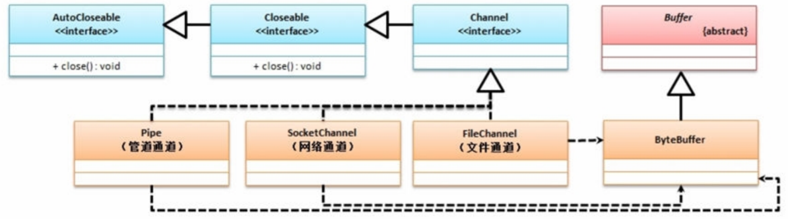
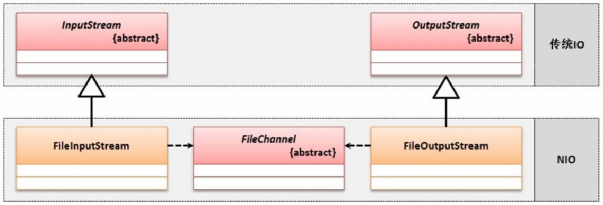
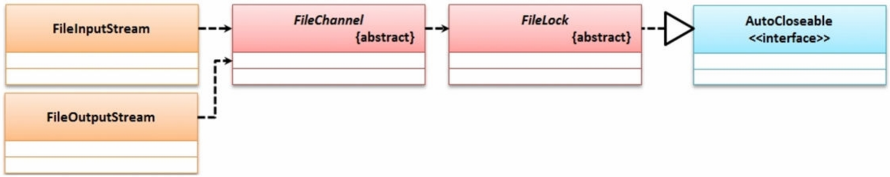

### 二、Buffer缓冲区

​		在`NIO`之中，所有的数据的读写操作都是通过`Buffer`进行载体存放的，你可以简单的把`Buffer`想象成集装箱，在设计`Buffer`的时候充分的考虑到了其在输入输出位置上的写入与读取问题，在`java.io`之中`Buffer`类定义如下：

```java
public abstract class Buffer extends Object
```

​		由于在现实的开发之中，有可能有多种类型的缓冲区，所以`Buffer`只是定义了一个公共的操作行为，随后在`java.io`包中又定义了一系列`Buffer`子类：`ByteBuffer`、 `CharBuffer`、 `DoubleBuffer`、 `FloatBuffer`、 `IntBuffer`、 `LongBuffer`、`ShortBuffer`

|  No  |               方法名称                | 类型 | 描述                             |
| :--: | :-----------------------------------: | ---- | -------------------------------- |
|  1   |        `public Buffer clear()`        | 方法 | 清空缓冲区                       |
|  2   |        `public Buffer flip()`         | 方法 | 重置缓冲区，将输入与输出结构转换 |
|  3   |      `public final int limit()`       | 方法 | 获取limit标记                    |
|  4   |     `public final int position()`     | 方法 | 获取position标记                 |
|  5   |     `public final int capacity()`     | 方法 | 获取capacity标记                 |
|  6   | `public final boolean hasRemaining()` | 方法 | 判断是否还有数据存在             |

​		在缓冲区里面实际上为了方便的进行读写处理，以及读写处理操作的转换控制，为此提供了三个最为重要的缓冲区的处理标记：`capacity`（整个缓冲区的容量）、`limit`（操作的界限）、`position`（当前的缓冲位置）


1、不管是进行数据的读取还是进行数据的写入，实质上需要提供有一个缓冲区的概念，那么每当创建了一个新的缓冲区之后，都会存在有上述的三种标记的信息。


2、向缓冲区之中进行数据写入的时候，那么就将改变`position`位置


3、当缓冲区的数据写入完成之后，肯定要进行数据的读取，既然需要数据读取，那么就需要进行缓冲区的重置（`flip()`）


​		

​		此时`position`作为数据读取的标记为，将回归到索引为 0 的位置，而`limit`将明确的描述`flip()`之前`position`的位置，此时`position`和`limit`之间的内容就是要输出的缓冲内容，那么是否有数据可以依靠`hasRemaining()`此方法来判断是否还有内容存在。


​		`Buffer`类里面只提供了缓冲区的基本操作形式，但是对于不同类型的缓冲区对于操作肯定有不同的实现，所以缓冲区的开辟依靠于`Buffer`各个子类来完成：


- 开启字节缓冲区，使用`ByteBuffer`类来完成。

  |  No  |                    方法名称                    | 类型 | 描述                                     |
  | :--: | :--------------------------------------------: | ---- | ---------------------------------------- |
  |  1   |  `public static Byte allocate(int capacity)`   | 方法 | 开辟字节缓冲区，并设置缓冲区的容量       |
  |  2   |   `public final ByteBuffer put(byte[] src)`    | 方法 | 向缓冲区中追加一组数据                   |
  |  3   |    `public ByteBuffer put(ByteBuffer src)`     | 方法 | 将一个缓冲区的内容追加到另一个缓冲区之中 |
  |  4   | `public abstract ByteBuffer putXx(类型 value)` | 方法 | 追加各个数据类型到缓冲区之中             |
  |  5   |          `public abstract byte get()`          | 方法 | 获取缓冲区的单个字节                     |
  |  6   |      `public ByteBuffer get(byte[] dst)`       | 方法 | 将一组数据保存在字节数组里面             |

  > 范例：观察缓冲区的操作：

  ```java
  package chatper3;
  
  import java.io.IOException;
  import java.nio.ByteBuffer;
  
  public class Main {
      public static void main(String[] args) throws IOException {
          //定义要保存到缓冲区的字符串
          String str = "www.mldn.cn";
          //分配20个容量的缓冲区
          ByteBuffer buffer = ByteBuffer.allocate(20);
          System.out.println("1、【开辟缓冲区】position="+buffer.position()+"、limit = "+buffer.limit() + "、capacity = "+buffer.capacity());
          //将数据保存到缓冲区之中
          buffer.put(str.getBytes());
          System.out.println("2、【写入缓冲区】position="+buffer.position()+"、limit = "+buffer.limit() + "、capacity = "+buffer.capacity());
          //重置缓冲区，才可以进行数据读取
          buffer.flip();
          System.out.println("3、【重置缓冲区】position="+buffer.position()+"、limit = "+buffer.limit() + "、capacity = "+buffer.capacity());
          //判断position与limit之间是否还有数据
          while (buffer.hasRemaining()) {
              //获取的是字节编码数据
              System.out.print(buffer.get() + "、");
          }
          System.out.println("\n4、【缓冲区操作完毕】position="+buffer.position()+"、limit = "+buffer.limit() + "、capacity = "+buffer.capacity());
          //清空缓冲区
          buffer.clear();
          System.out.println("5、【清空缓冲区】position="+buffer.position()+"、limit = "+buffer.limit() + "、capacity = "+buffer.capacity());
      }
  }
  
  ```

- 输出

```
1、【开辟缓冲区】position=0、limit = 20、capacity = 20
2、【写入缓冲区】position=11、limit = 20、capacity = 20
3、【重置缓冲区】position=0、limit = 11、capacity = 20
119、119、119、46、109、108、100、110、46、99、110、
4、【缓冲区操作完毕】position=11、limit = 11、capacity = 20
5、【清空缓冲区】position=0、limit = 20、capacity = 20
```


### 三、Channel通道

​		`Channel`描述的是一个通道的概念，在`JavaNIO`之中认为不同的操作设置不同的读取机制实在是过于复杂了，所以就希望可以进行一种简化的设计，于是有了`Channel`的接口，而且由于`Channel`都是应用在资源上的，所以该接口实现了`Closeable`父接口（其是`AutoCloseable`子接口）




#### 3.1、FileChannel

​		`FileChannel`明确的描述了一个文件通道，在进行`IO`处理的操作之中，文件是一个重要的存储终端，所以在`NIO`里面针对于文件设置有文件管道，而要想获取文件的管道对象，就必须依靠文件处理类来完成，在`FileInputStream`和`FileOutputStream`类中的`getChannel()`方法，可以直接获取`FileChannel`实例化对象。



> 范例：利用FileChannel读取文件内容

```
package chatper3;

import java.io.ByteArrayOutputStream;
import java.io.File;
import java.io.FileInputStream;
import java.io.IOException;
import java.nio.ByteBuffer;
import java.nio.channels.FileChannel;

public class Main {
    public static void main(String[] args) throws IOException {
        File file = new File("E:" + File.separator + "err.log") ;
        FileInputStream input = new FileInputStream(file) ;
        // 获取文件输入的Channel
        FileChannel channel = input.getChannel() ;
        // 开启一个缓冲区
        ByteBuffer buffer = ByteBuffer.allocate(20) ;
        // 保存所有读取的字节数据
        ByteArrayOutputStream bos = new ByteArrayOutputStream() ;
        int count = 0 ;
        // 读取数据并返回个数
        while ((count = channel.read(buffer)) != -1) {
            // 缓冲区重置
            buffer.flip() ;
            // 输出position与limit之间的数据
            while (buffer.hasRemaining()) {
                // 保存在内存流之中
                bos.write(buffer.get());
            }
            // 清空缓冲区，为下一次读取做准备
            buffer.clear() ;
        }
        System.out.println(new String(bos.toByteArray()));
        channel.close();
    }
}
```


#### 3.2、Pipe管道

​		在IO的处理之中，除了以文件或者网络作为终端之外，实际上也可以实现多线程之间的通讯处理，多个线程之间依靠管道进行联系，如果要想进行线程管道的通讯，那么就必须使用两个操作。

- 线程管道数据输出通道：`Pipe.SinkChannel`
- 线程管道数据输入通道：`Pipe.SourceChannel`

> 范例：编写Pipe通道

```java
import java.io.IOException;
import java.nio.ByteBuffer;
import java.nio.channels.Pipe;

public class Main {
    public static void main(String[] args) throws IOException {
        //打开线程管管道流
        Pipe pipe = Pipe.open();
        new Thread(()->{
            //获取输入管道流
            Pipe.SourceChannel sourceChannel = pipe.source();
            //分配缓冲空间
            ByteBuffer buffer = ByteBuffer.allocate(20);
            try {
                int count = sourceChannel.read(buffer);
                buffer.flip();
                System.out.println("{接收端}"+new String(buffer.array(),0,count));
            } catch (IOException e) {
                e.printStackTrace();
            }
        },"接受线程").start();

        new Thread(()->{
            //获取发送通道
            Pipe.SinkChannel sinkChannel = pipe.sink();
            //数据发送缓冲
            ByteBuffer buffer = ByteBuffer.allocate(20);
            //保存数据到缓冲区
            buffer.put("Hello MLDN".getBytes());
            System.out.println("{发送端}发送数据：Hello MLDN");
            //重置缓冲区
            buffer.flip();
            try {
                sinkChannel.write(buffer);
            } catch (IOException e) {
                e.printStackTrace();
            }
        },"发送线程").start();
    }

}
```

```
输出：
{发送端}发送数据：Hello MLDN
{接收端}Hello MLDN
```


### 四、文件锁

​		在`java.io`包里面，提供有一个`FileChannel`类型，进行文件通道的处理操作，而在进行文件处理的过程之中，很多时候是不希望文件被其他线程进行修改的，所以在程序里面就提供有一个文件锁的概念，文件锁可以直接通过`FileChannel`对象来进行创建，有如下方法：

```java
public final FileLock tryLock() throws IOException
```

​		此时返回的是一个FileLock抽象类对象。



> 范例：实现一个文件锁

```java
package chatper3;

import java.io.File;
import java.io.FileOutputStream;
import java.nio.channels.FileChannel;
import java.nio.channels.FileLock;
import java.util.concurrent.TimeUnit;

public class Main {
    public static void main(String[] args) throws Exception {
        File file = new File("E:" + File.separator + "err.log") ;
        FileOutputStream output = new FileOutputStream(file) ;
        // 获取文件输入的Channel
        FileChannel channel = output.getChannel() ;
        // 尝试获取文件锁
        FileLock fileLock = channel.tryLock() ;
        // 已经获取了文件锁
        if (fileLock != null) {
            System.out.println("获取了文件锁，当前文件被锁定！");
            // 30秒之内该文件被锁定
            TimeUnit.SECONDS.sleep(30);
            fileLock.release();     // 解锁
        }
        channel.close();
        output.close() ;
    }
}

```


### 五、字符集

​		在程序的开发里面实际上所有的IO交互之中最需要重点处理的部分就是传输的编码问题，如果在发送端和接收端采用的编码不同，那么就一定会造成乱码，所以现在为了进一步简化编码的处理模式，在java.io包中针对于编码设置了一个统一的管理类：java.io.charset.Charset，这个类里面进行了所有使用到的字符集的编码定义。

> 范例：观察当前系统支持的编码

```
package chatper3;

import java.nio.charset.Charset;
import java.util.Map;
import java.util.SortedMap;

public class Main {
    public static void main(String[] args)   {
        SortedMap<String, Charset> map = Charset.availableCharsets();
        for(Map.Entry<String,Charset> entry:map.entrySet()){
            System.out.println(entry.getKey()+"-"+entry.getValue());
        }
    }
}
```

```
输出：
UTF-32-UTF-32
UTF-32BE-UTF-32BE
UTF-32LE-UTF-32LE
UTF-8-UTF-8
......
```


​		使用`Charset`类型最主要的意义在于可以方便的进行编码与解码的处理，在Charset类中有两个方法，可以分别获取编码器（`CharsetEncoder`）与解码器（`CharsetDecoder`）

- `CharsetEncoder`：public abstract CharsetEncoder newEncoder();
- `CharsetDecoder`：public abstract CharsetDecoder newDecoder();

> 范例：实现编码与解码操作

```java
package chatper3;

import java.nio.ByteBuffer;
import java.nio.CharBuffer;
import java.nio.charset.CharacterCodingException;
import java.nio.charset.Charset;
import java.nio.charset.CharsetDecoder;
import java.nio.charset.CharsetEncoder;

public class Main {
    public static void main(String[] args) throws CharacterCodingException {
        // 创建一个“UTF-8”编码器
        Charset charset = Charset.forName("UTF-8") ;
        // 获取编码器
        CharsetEncoder encoder = charset.newEncoder() ;
        // 获取解码器
        CharsetDecoder decoder = charset.newDecoder() ;
        // 分配空间数据
        CharBuffer buffer = CharBuffer.allocate(20) ;
        // 向缓冲区中保存数据
        buffer.put("毛主席说：好好学习，天天向上！") ;
        // 重置缓冲区（position与limit的指向）
        buffer.flip() ;
        // 对缓冲区中的数据进行编码
        ByteBuffer encodeBuffer = encoder.encode(buffer) ; 
        System.out.println(decoder.decode(encodeBuffer));
        
    }
}
```

