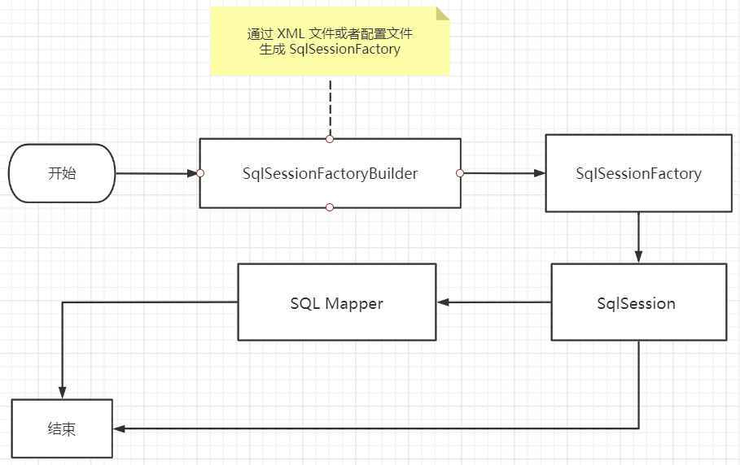
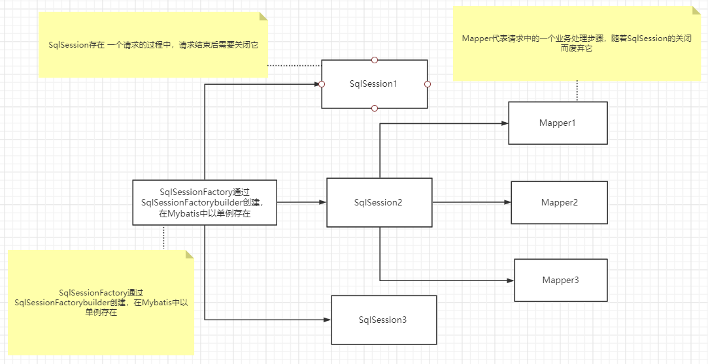
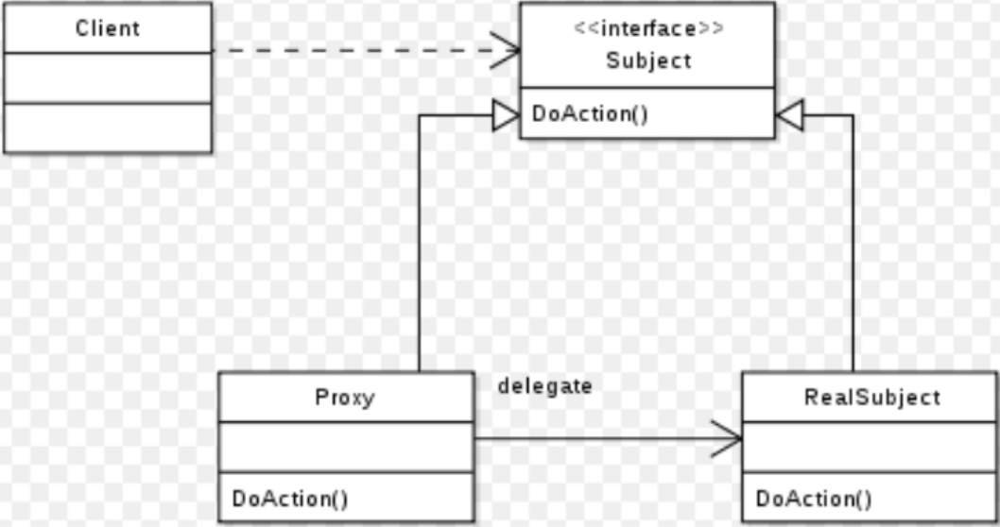
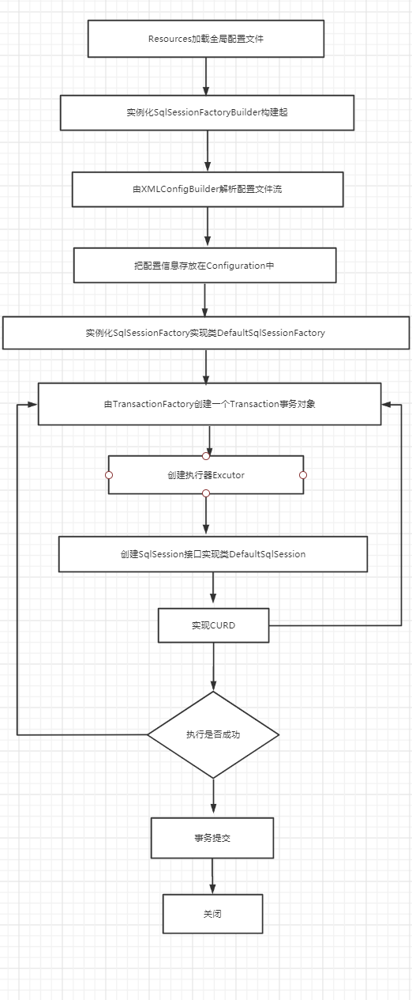
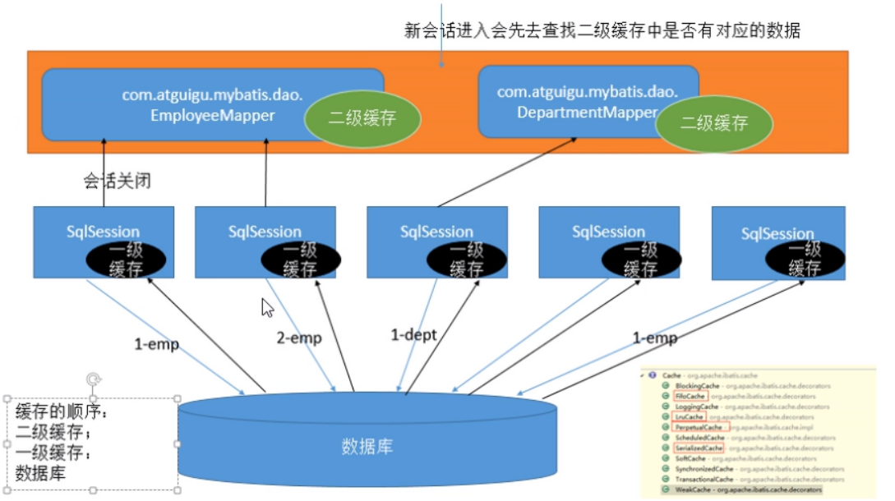

# 1、Mybatis 简介

## 1.1、什么是 MyBatis

1. MyBatis 是一款优秀的**持久层框架**
2. MyBatis 避免了几乎所有的 JDBC 代码和手动设置参数以及获取结果集的过程
3. MyBatis 可以使用简单的 XML 或 注解来配置和映射原生信息，将接口和 Java 的 实体类（Plain Old Java Objects，普通的 Java对象）映射成数据库中的记录
4. MyBatis 本是Apache的一个开源项目ibatis, 2010年这个项目由Apache迁移到了Google Code，并改名为MyBatis
5. 2013年11月迁移到 Github : https://github.com/mybatis/mybatis-3
6. Mybatis 官方文档 : https://mybatis.org/mybatis-3/
7. Mybatis 整合SpringBoot 官网教程：https://mybatis.org/spring-boot-starter/mybatis-spring-boot-autoconfigure/zh/index.html
8. Mybatis 支持技术教程：https://blog.mybatis.org/p/products.html


## 1.2、持久化

持久化是将程序数据在持久状态和瞬时状态间转换的机制。

1. 即把数据（如内存中的对象）保存到可永久保存的存储设备中（如磁盘）。持久化的主要应用是将内存中的对象存储在数据库中，或者存储在磁盘文件中、XML数据文件中等等
2. JDBC就是一种持久化机制。文件IO也是一种持久化机制
3. 在生活中 : 将鲜肉冷藏，吃的时候再解冻的方法也是。将水果做成罐头的方法也是

为什么需要持久化服务呢？那是由于内存本身的缺陷引起的

1. 内存断电后数据会丢失，但有一些数据是不能丢失的，比如银行账号等，遗憾的是人们还无法保证内存永不掉电
2. 内存过于昂贵，与硬盘、光盘等外存相比，内存的价格要高2~3个数量级，而且维持成本也高，至少需要一直供电吧。所以即使对象不需要永久保存，也会因为内存的容量限制不能一直呆在内存中，需要持久化来缓存到外存


## 1.3、持久层

什么是持久层？

1. 完成持久化工作的代码块  ==》  Dao层 【Data Access Object，数据访问对象】
2. 大多数情况下特别是企业级应用，数据持久化往往也就意味着将内存中的数据保存到磁盘上加以固化，而持久化的实现过程则大多通过各种**关系数据库**来完成
3. 不过这里有一个字需要特别强调，也就是所谓的“层”。对于应用系统而言，数据持久功能大多是必不可少的组成部分。也就是说，我们的系统中，已经天然的具备了“持久层”概念？也许是，但也许实际情况并非如此。之所以要独立出一个“持久层”的概念,而不是“持久模块”，“持久单元”，也就意味着，我们的系统架构中，应该有一个相对独立的逻辑层面，专注于数据持久化逻辑的实现.
4. 与系统其他部分相对而言，这个层面应该具有一个较为清晰和严格的逻辑边界（说白了就是用来操作数据库存在的）


## 1.4、为什么需要 Mybatis

1. Mybatis 就是帮助程序猿将数据存入数据库中 , 和从数据库中取数据 .

2. 传统的JDBC操作 , 有很多重复代码.比如：数据取出时的封装 , 数据库建立连接等等..., 通过框架可以减少重复代码,提高开发效率

3. `MyBatis` 是一个半自动化的**ORM框架 (Object Relationship Mapping) -->对象关系映射**

4. 所有的事情，不用`Mybatis`依旧可以做到，只是用了它，所有实现会更加简单！**技术没有高低之分，只有使用这个技术的人有高低之别**

5. `MyBatis`的优点

6. - 简单易学：本身就很小且简单。没有任何第三方依赖，最简单安装只要两个jar文件+配置几个sql映射文件就可以了，易于学习，易于使用，通过文档和源代码，可以比较完全的掌握它的设计思路和实现。
  - 灵活：mybatis不会对应用程序或者数据库的现有设计强加任何影响。`sql`写在`xml`里，便于统一管理和优化。通过`sql`语句可以满足操作数据库的所有需求。
  - 解除`sql`与程序代码的耦合：通过提供`DAO`层，将业务逻辑和数据访问逻辑分离，使系统的设计更清晰，更易维护，更易单元测试。sql和代码的分离，提高了可维护性。
  - 提供xml标签，支持编写动态sql。
  - .......


# 2、MyBatis 入门

**思路流程：搭建环境-->导入Mybatis-->编写代码-->测试**

## 2.1、环境搭建

1、搭建实验数据库

```sql
-- 建库
CREATE DATABASE `mybatis`;
USE `mybatis`;
DROP TABLE IF EXISTS `user`;
-- 建表
CREATE TABLE `user`
(
    `id`   int(20) NOT NULL,
    `name` varchar(30) DEFAULT NULL,
    `pwd`  varchar(30) DEFAULT NULL,
    PRIMARY KEY (`id`)
) ENGINE = InnoDB
  DEFAULT CHARSET = utf8;
-- 插入测试数据
insert into `user`(`id`, `name`, `pwd`)
values (1, '小刘', '123456'),
       (2, '张三', 'abcdef'),
       (3, '李四', '987654');
```

2、导入`MyBatis`相关 jar 包（`Github`上或者官网上找）

```xml
<dependencies>
    <!--mybatis-->
    <!-- https://mvnrepository.com/artifact/org.mybatis/mybatis -->
    <dependency>
        <groupId>org.mybatis</groupId>
        <artifactId>mybatis</artifactId>
        <version>3.5.2</version>
    </dependency>
    <!--mysql驱动-->
    <dependency>
        <groupId>mysql</groupId>
        <artifactId>mysql-connector-java</artifactId>
        <version>5.1.47</version>
    </dependency>
    <!--junit-->
    <dependency>
        <groupId>junit</groupId>
        <artifactId>junit</artifactId>
        <version>4.12</version>
        <scope>test</scope>
    </dependency>
</dependencies>
```

3、编写`MyBatis`核心配置文件（帮助文档内有）：`mybatis-config.xml`

```xml
<?xml version="1.0" encoding="UTF-8" ?>
<!DOCTYPE configuration
        PUBLIC "-//mybatis.org//DTD Config 3.0//EN"
        "http://mybatis.org/dtd/mybatis-3-config.dtd">
<configuration>
    <environments default="development">
        <environment id="development">
            <transactionManager type="JDBC"/>
            <dataSource type="POOLED">
                <property name="driver" value="com.mysql.jdbc.Driver"/>
                <property name="url"
                          value="jdbc:mysql://127.0.0.1:3306/mybatis?useSSL=false&amp;useUnicode=true&amp;characterEncoding=utf8"/>
                <property name="username" value="root"/>
                <property name="password" value="password"/>
            </dataSource>
        </environment>
    </environments>
    <mappers>
        <mapper resource="mapper/userMapper.xml"/>
    </mappers>
</configuration>
```

> 1. **configuration：核心配置文件**
> 2. **environments：配置环境组；default 设置默认的环境**
> 3. **environment：单个环境；id是环境名**
> 4. **transactionManager ：配置事务管理器**
> 5. **dataSource：配置数据库连接池**
> 6. **useSSL=true&useUnicode=true&characterEncoding=UFT-8：设置时区设置编码，复制就行**
> 7. **property：设置对应的 JDBC连接属性**
>
> 详细下面章节会介绍


## 2.2、快速入门

1、编写`MyBatis`工具类（官方帮助文档内有）：`MybatisUtils.java`

- 从 `XML` 中构建 `SqlSessionFactory`（本次使用从XML构建）
- 不使用` XML` 构建 `SqlSessionFactory`（不常用，看官网）

```java
package utils;

import org.apache.ibatis.io.Resources;
import org.apache.ibatis.session.SqlSession;
import org.apache.ibatis.session.SqlSessionFactory;
import org.apache.ibatis.session.SqlSessionFactoryBuilder;
import java.io.IOException;
import java.io.InputStream;

public class MybatisUtils {

    private static SqlSessionFactory sqlSessionFactory;
    public static final String RESOURCE = "mybatis-config.xml";
    static {
        try {
            InputStream inputStream = Resources.getResourceAsStream(RESOURCE);
            sqlSessionFactory = new SqlSessionFactoryBuilder().build(inputStream);
        } catch (IOException e) {
            e.printStackTrace();
        }
    }

    /**
     * 获取SqlSession连接
     */
    public static SqlSession getSession() {
        return sqlSessionFactory.openSession();
    }

}
```

2、创建实体类：`User.java`

```java
package pojo;

public class User {
    private int id;
    // 姓名
    private String name;
    // 密码
    private String pwd;

    public User () {}
    public User(int id, String name, String pwd) {
        this.id = id;
        this.name = name;
        this.pwd = pwd;
    }

    public int getId() {
        return id;
    }

    public void setId(int id) {
        this.id = id;
    }

    public String getName() {
        return name;
    }

    public void setName(String name) {
        this.name = name;
    }

    public String getPwd() {
        return pwd;
    }

    public void setPwd(String pwd) {
        this.pwd = pwd;
    }

    @Override
    public String toString() {
        return "User{" +
            "id=" + id +
            ", name='" + name + '\'' +
            ", pwd='" + pwd + '\'' +
            '}';
    }
}
```

3、编写`Mapper`接口类：`UserMapper.java`

```java
package mapper;

import pojo.User;
import java.util.List;

public interface UserMapper {
    // 查询全部用户
    List<User> selectUser();
}
```

4、编写`Mapper.xml`配置文件：`src/java/resources/mapper/userMapper.xml`（`namespace` 十分重要，不能写错！）

```xml
<?xml version="1.0" encoding="UTF-8" ?>
<!DOCTYPE mapper
        PUBLIC "-//mybatis.org//DTD Mapper 3.0//EN"
        "http://mybatis.org/dtd/mybatis-3-mapper.dtd">

<!--namespace：对应dao接口的package，id：对应方法名-->
<mapper namespace="mapper.UserMapper">
    <!-- 查询全部用户 -->
    <select id="selectUser" resultType="pojo.User">
      select * from user
    </select>
</mapper>
```

5、编写测试类

```java
import mapper.UserMapper;
import org.apache.ibatis.session.SqlSession;
import org.junit.Test;
import pojo.User;
import utils.MybatisUtils;
import java.util.List;

public class MyTest {
    @Test
    public void selectUser() {
        // 方法一: 直接使用SqlSession查询, 参数:package.class.method
        try (SqlSession session = MybatisUtils.getSession()) {
            List<User> users = session.selectList("mapper.UserMapper.selectUser");
            users.forEach(System.out::println);
        }

        // 方法二: 使用SqlSession获取反射的Mapper接口, 参数为mapper.class
        try (SqlSession session = MybatisUtils.getSession()) {
            UserMapper mapper = session.getMapper(UserMapper.class);
            List<User> users = mapper.selectUser();
            users.forEach(System.out::println);
        }
    }
}
```

6、运行测试，成功的查询出来的我们的数据！

```
pojo.User{id=1, name='小刘', pwd='123456'}
pojo.User{id=2, name='张三', pwd='abcdef'}
pojo.User{id=3, name='李四', pwd='987654'}
pojo.User{id=1, name='小刘', pwd='123456'}
pojo.User{id=2, name='张三', pwd='abcdef'}
pojo.User{id=3, name='李四', pwd='987654'}
```


## 2.3、静态资源过滤问题

**可能出现问题说明：Maven 静态资源过滤问题**

- 如果`xml`文件配置`src/main/java`目录下一定需要配置该插件

```xml
<build>
	<resources>
       <resource>
           <directory>src/main/java</directory>
           <includes>
               <include>**/*.properties</include>
               <include>**/*.xml</include>
           </includes>
           <filtering>false</filtering>
       </resource>
       <resource>
           <directory>src/main/resources</directory>
           <includes>
               <include>**/*.properties</include>
               <include>**/*.xml</include>
           </includes>
           <filtering>false</filtering>
       </resource>
    </resources>
</build>
```


## 2.4、SqlSessionFactory 源码

```java
public interface SqlSessionFactory {
    SqlSession openSession(); // 获取SqlSession连接
    SqlSession openSession(boolean autoCommit); // 获取SqlSession连接，并且事务自动提交
    SqlSession openSession(Connection connection);
    SqlSession openSession(TransactionIsolationLevel level);
    SqlSession openSession(ExecutorType execType);
    SqlSession openSession(ExecutorType execType, boolean autoCommit);
    SqlSession openSession(ExecutorType execType, TransactionIsolationLevel level);
    SqlSession openSession(ExecutorType execType, Connection connection);
    Configuration getConfiguration();
}
```


## 2.5、Mybatis 流程分析

使用一个查询的示例来分析：

```java
public void getUserList() throws IOException {
    
    /**
     * 根据全局配置文件创建出一个SqlSessionFactory
     * SqlSessionFactory：是SqlSession工厂，负责创建SqlSession
     **/
    String resource = "mybatis-config.xml";
    InputStream inputStream = Resources.getResourceAsStream(resource);
    SqlSessionFactory sqlSessionFactory = new SqlSessionFactoryBuilder().build(inputStream);

    /**
     * 通过sqlSessionFactory.openSession()获取和数据库的一次会话
     * 底层就是getConnection拿到一条连接
     **/
    SqlSession sqlSession = sqlSessionFactory.openSession();

    /**
     * 使用SqlSession操作数据库，获取到Dao接口的实现，然后直接调用方法
     **/
    UserDao userDao = sqlSession.getMapper(UserDao.class);
    List<User> userList = userDao.getUserList();
    userList.forEach(System.out::println);
    
    // 每一次获取sqlSession相当于一条连接，资源宝贵，用完关闭
    sqlSession.close();
}
```

**流程分析：**

1. resource 就是获取你的全局配置文件（mybatis-config.xml）
2. 通过ibatis下的Resources资源中的getResourceAsStream方法把你的全局配置文件变成输入流inputStream
3. SqlSessionFactoryBuilder 是SqlSession工厂建造者，负责创建SqlSessionFactory , 通过该类下的build方法返回值是SqlSessionFactory 也就将我们的输入流变成 SqlSessionFactory
4. 拿到SqlSessionFactory 可以调用其openSession方法得到SqlSession
5. SqlSession : sql会话 , 相当于每一次与数据库连接时候的connection
6. 通过sqlSession的getMapper会获取到Dao接口的实现
7. 我们在UserDaoMapper.xml中已经通过namespace绑定了对应的接口
8. 所以我们可以通过获取的接口对象userDao直接调用我们在Mapper中写的方法
9. 每一次获取sqlSession相当于一条连接，资源宝贵，用完关闭


# 3、Mybatis 配置解析

> XML配置：https://mybatis.org/mybatis-3/zh/configuration.html

## 3.1、核心配置文件

- `mybatis-config.xml` 系统核心配置文件
- `MyBatis` 的配置文件包含了会深深影响 `MyBatis` 行为的设置和属性信息。
- 能配置的内容如下：

```xml
<!-- 注意元素节点的顺序！顺序不对会报错 -->
configuration（配置）
	properties（属性）
	settings（设置）
	typeAliases（类型别名）
	typeHandlers（类型处理器）
    objectFactory（对象工厂）
    plugins（插件）
    environments（环境配置）
    	environment（环境变量）
            transactionManager（事务管理器）
            dataSource（数据源）
	databaseIdProvider（数据库厂商标识）
	mappers（映射器）
```

​	我们可以阅读 `mybatis-config.xml` 上面的`dtd`的头文件！


## 3.2、属性（properties）

数据库这些属性都是可外部配置且可动态替换的，既可以在典型的 Java 属性文件中配置，亦可通过 properties 元素的子元素来传递。具体的官方文档

第一步：在资源目录下新建一个 `db.properties`

```properties
driver=com.mysql.jdbc.Driver
url=jdbc:mysql://localhost:3306/mybatis?useSSL=true&useUnicode=true&characterEncoding=utf8
username=root
password=123456
```

第二步 : 将文件导入`properties` 配置文件

```XML
<configuration>
    <!--导入properties文件-->
    <properties resource="db.properties"/>
    
    <environments default="development">
        <environment id="development">
            <transactionManager type="JDBC"/>
            <dataSource type="POOLED">
                <property name="driver" value="${driver}"/>
                <property name="url" value="${url}"/>
                <property name="username" value="${username}"/>
                <property name="password" value="${password}"/>
            </dataSource>
        </environment>
    </environments>
    <mappers>
        <mapper resource="mapper/UserMapper.xml"/>
    </mappers>
</configuration>
```

- properties标签有两个值
  - resource：从类路径下开始引用
  - url：引用磁盘路径或者网络路径的资源
- 在property标签中获取db.properties的属性是通过 ${名称}


## 3.3、设置（settings）

这是 MyBatis 中极为重要的调整设置，它们会改变 MyBatis 的运行时行为。 下表描述了设置中各项的意图、默认值等。

| 设置名                           | 描述                                                         | 有效值                                                       | 默认值                                                |
| :------------------------------- | :----------------------------------------------------------- | :----------------------------------------------------------- | :---------------------------------------------------- |
| cacheEnabled                     | 全局地开启或关闭配置文件中的所有映射器已经配置的任何缓存。   | true \| false                                                | true                                                  |
| lazyLoadingEnabled               | 延迟加载的全局开关。当开启时，所有关联对象都会延迟加载。 特定关联关系中可通过设置 `fetchType` 属性来覆盖该项的开关状态。 | true \| false                                                | false                                                 |
| aggressiveLazyLoading            | 当开启时，任何方法的调用都会加载该对象的所有属性。 否则，每个属性会按需加载（参考 `lazyLoadTriggerMethods`)。 | true \| false                                                | false （在 3.4.1 及之前的版本默认值为 true）          |
| multipleResultSetsEnabled        | 是否允许单一语句返回多结果集（需要驱动支持）。               | true \| false                                                | true                                                  |
| useColumnLabel                   | 使用列标签代替列名。不同的驱动在这方面会有不同的表现，具体可参考相关驱动文档或通过测试这两种不同的模式来观察所用驱动的结果。 | true \| false                                                | true                                                  |
| useGeneratedKeys                 | 允许 JDBC 支持自动生成主键，需要驱动支持。 如果设置为 true 则这个设置强制使用自动生成主键，尽管一些驱动不能支持但仍可正常工作（比如 Derby）。 | true \| false                                                | False                                                 |
| autoMappingBehavior              | 指定 MyBatis 应如何自动映射列到字段或属性。 NONE 表示取消自动映射；PARTIAL 只会自动映射没有定义嵌套结果集映射的结果集。 FULL 会自动映射任意复杂的结果集（无论是否嵌套）。 | NONE, PARTIAL, FULL                                          | PARTIAL                                               |
| autoMappingUnknownColumnBehavior | 指定发现自动映射目标未知列（或者未知属性类型）的行为。- NONE: 不做任何反应- WARNING: 输出提醒日志 ('org.apache.ibatis.session.AutoMappingUnknownColumnBehavior' 的日志等级必须设置为 WARN)- FAILING: 映射失败 (抛出 SqlSessionException) | NONE, WARNING, FAILING                                       | NONE                                                  |
| defaultExecutorType              | 配置默认的执行器。SIMPLE 就是普通的执行器；REUSE 执行器会重用预处理语句（prepared statements）； BATCH 执行器将重用语句并执行批量更新。 | SIMPLE REUSE BATCH                                           | SIMPLE                                                |
| defaultStatementTimeout          | 设置超时时间，它决定驱动等待数据库响应的秒数。               | 任意正整数                                                   | 未设置 (null)                                         |
| defaultFetchSize                 | 为驱动的结果集获取数量（fetchSize）设置一个提示值。此参数只可以在查询设置中被覆盖。 | 任意正整数                                                   | 未设置 (null)                                         |
| defaultResultSetType             | Specifies a scroll strategy when omit it per statement settings. (Since: 3.5.2) | FORWARD_ONLY \| SCROLL_SENSITIVE \| SCROLL_INSENSITIVE \| DEFAULT(same behavior with 'Not Set') | Not Set (null)                                        |
| safeRowBoundsEnabled             | 允许在嵌套语句中使用分页（RowBounds）。如果允许使用则设置为 false。 | true \| false                                                | False                                                 |
| safeResultHandlerEnabled         | 允许在嵌套语句中使用分页（ResultHandler）。如果允许使用则设置为 false。 | true \| false                                                | True                                                  |
| mapUnderscoreToCamelCase         | 是否开启自动驼峰命名规则（camel case）映射，即从经典数据库列名 A_COLUMN 到经典 Java 属性名 aColumn 的类似映射。 | true \| false                                                | False                                                 |
| localCacheScope                  | MyBatis 利用本地缓存机制（Local Cache）防止循环引用（circular references）和加速重复嵌套查询。 默认值为 SESSION，这种情况下会缓存一个会话中执行的所有查询。 若设置值为 STATEMENT，本地会话仅用在语句执行上，对相同 SqlSession 的不同调用将不会共享数据。 | SESSION \| STATEMENT                                         | SESSION                                               |
| jdbcTypeForNull                  | 当没有为参数提供特定的 JDBC 类型时，为空值指定 JDBC 类型。 某些驱动需要指定列的 JDBC 类型，多数情况直接用一般类型即可，比如 NULL、VARCHAR 或 OTHER。 | JdbcType 常量，常用值：NULL, VARCHAR 或 OTHER。              | OTHER                                                 |
| lazyLoadTriggerMethods           | 指定哪个对象的方法触发一次延迟加载。                         | 用逗号分隔的方法列表。                                       | equals,clone,hashCode,toString                        |
| defaultScriptingLanguage         | 指定动态 SQL 生成的默认语言。                                | 一个类型别名或完全限定类名。                                 | org.apache.ibatis.scripting.xmltags.XMLLanguageDriver |
| defaultEnumTypeHandler           | 指定 Enum 使用的默认 `TypeHandler` 。（新增于 3.4.5）        | 一个类型别名或完全限定类名。                                 | org.apache.ibatis.type.EnumTypeHandler                |
| callSettersOnNulls               | 指定当结果集中值为 null 的时候是否调用映射对象的 setter（map 对象时为 put）方法，这在依赖于 Map.keySet() 或 null 值初始化的时候比较有用。注意基本类型（int、boolean 等）是不能设置成 null 的。 | true \| false                                                | false                                                 |
| returnInstanceForEmptyRow        | 当返回行的所有列都是空时，MyBatis默认返回 `null`。 当开启这个设置时，MyBatis会返回一个空实例。 请注意，它也适用于嵌套的结果集 （如集合或关联）。（新增于 3.4.2） | true \| false                                                | false                                                 |
| logPrefix                        | 指定 MyBatis 增加到日志名称的前缀。                          | 任何字符串                                                   | 未设置                                                |
| logImpl                          | 指定 MyBatis 所用日志的具体实现，未指定时将自动查找。        | SLF4J \| LOG4J \| LOG4J2 \| JDK_LOGGING \| COMMONS_LOGGING \| STDOUT_LOGGING \| NO_LOGGING | 未设置                                                |
| proxyFactory                     | 指定 Mybatis 创建具有延迟加载能力的对象所用到的代理工具。    | CGLIB \| JAVASSIST                                           | JAVASSIST （MyBatis 3.3 以上）                        |
| vfsImpl                          | 指定 VFS 的实现                                              | 自定义 VFS 的实现的类全限定名，以逗号分隔。                  | 未设置                                                |
| useActualParamName               | 允许使用方法签名中的名称作为语句参数名称。 为了使用该特性，你的项目必须采用 Java 8 编译，并且加上 `-parameters` 选项。（新增于 3.4.1） | true \| false                                                | true                                                  |
| configurationFactory             | 指定一个提供 `Configuration` 实例的类。 这个被返回的 Configuration 实例用来加载被反序列化对象的延迟加载属性值。 这个类必须包含一个签名为`static Configuration getConfiguration()` 的方法。（新增于 3.2.3） |                                                              |                                                       |

```xml
<settings>
    <setting name="cacheEnabled" value="true"/>
    <setting name="lazyLoadingEnabled" value="true"/>
    <setting name="multipleResultSetsEnabled" value="true"/>
    <setting name="useColumnLabel" value="true"/>
    <setting name="useGeneratedKeys" value="false"/>
    <setting name="autoMappingBehavior" value="PARTIAL"/>
    <setting name="autoMappingUnknownColumnBehavior" value="WARNING"/>
    <setting name="defaultExecutorType" value="SIMPLE"/>
    <setting name="defaultStatementTimeout" value="25"/>
    <setting name="defaultFetchSize" value="100"/>
    <setting name="safeRowBoundsEnabled" value="false"/>
    <setting name="mapUnderscoreToCamelCase" value="false"/>
    <setting name="localCacheScope" value="SESSION"/>
    <setting name="jdbcTypeForNull" value="OTHER"/>
    <setting name="lazyLoadTriggerMethods" value="equals,clone,hashCode,toString"/>
    <setting name="logImpl" value="LOG4J"/>
</settings>

<!-- 全局参数 -->
<settings>
    <!-- 使全局的映射器启用或禁用缓存 -->
    <setting name="cacheEnabled" value="true"/>
    <!-- 全局启用或禁用延迟加载。当禁用时，所有关联对象都会即时加载 -->
    <setting name="lazyLoadingEnabled" value="true"/>
    <!-- 当启用时，有延迟加载属性的对象在被调用时将会完全加载任意属性。否则，每种属性将会按需要加载 -->
    <setting name="aggressiveLazyLoading" value="true"/>
    <!-- 是否允许单条sql 返回多个数据集  (取决于驱动的兼容性) default:true -->
    <setting name="multipleResultSetsEnabled" value="true"/>
    <!-- 是否可以使用列的别名 (取决于驱动的兼容性) default:true -->
    <setting name="useColumnLabel" value="true"/>
    <!-- 允许JDBC 生成主键。需要驱动器支持。如果设为true，这个设置将强制使用被生成的主键，有一些驱动器不兼容不过仍然可以执行。  default:false  -->
    <setting name="useGeneratedKeys" value="true"/>
    <!-- 指定 MyBatis 如何自动映射 数据基表的列 NONE：不隐射 PARTIAL:部分  FULL:全部  -->
    <setting name="autoMappingBehavior" value="PARTIAL"/>
    <!-- 这是默认的执行类型  （SIMPLE: 简单；REUSE: 执行器可能重复使用prepared statements语句；BATCH: 执行器可以重复执行语句和批量更新）  -->
    <!-- 对于批量更新操作缓存SQL以提高性能 BATCH,SIMPLE -->
    <setting name="defaultExecutorType" value="SIMPLE"/>
    <!-- 数据库超过25000秒仍未响应则超时 -->
    <setting name="defaultStatementTimeout" value="25000"/>
    <!-- 使用驼峰命名法转换字段。 -->
    <setting name="mapUnderscoreToCamelCase" value="true"/>
    <!-- 设置本地缓存范围 session:就会有数据的共享  statement:语句范围 (这样就不会有数据的共享 ) defalut:session -->
    <setting name="localCacheScope" value="SESSION"/>
    <!-- 设置但JDBC类型为空时,某些驱动程序 要指定值,default:OTHER，插入空值时不需要指定类型 -->
    <setting name="jdbcTypeForNull" value="NULL"/>
    <!-- 设置关联对象加载的形态，此处为按需加载字段(加载字段由SQL指 定)，不会加载关联表的所有字段，以提高性能 -->
    <setting name="aggressiveLazyLoading" value="false"/>
    <setting name="logImpl" value="org.apache.ibatis.logging.stdout.StdOutImpl"/>
</settings>
```

参考文档：https://mybatis.org/mybatis-3/zh/configuration.html#settings


## 3.4、类型别名（typeAliases）

> 默认别名

类型别名：为常用的类型（javaBean）起别名；

 别名的默认就是类名（不区分大小写）配置文件中就可以直接使用

```xml
<!--配置别名,注意顺序-->
<typeAliases>
    <typeAlias type="pojo.User"/>
</typeAliases>
```

```xml
<!--此时我们用resultType的时候就可以直接写类名了-->
<select id="getUserList" resultType="user">
    select * from user
</select>
```

> 指定别名

通过alias来设置别名，此时的resultType就需要写我们alias的值

```xml
<typeAliases>
    <typeAlias type="pojo.User" alias="user"/>
</typeAliases>
```

```xml
<!--引用别名-->
<select id="getUserList" resultType="user">
    select * from user
</select>
```

> 批量起别名

当我们的项目类越来越多的时候，可能会有成百个类，这时候我们就需要使用批量别名来设置。

```xml
<typeAliases>
    <package name="com.pojo"/>
</typeAliases>
```

通过package标签来选择那个包下的类使用别名，默认都是类名。

> 批量时单独别名

```java
@Alias("userdemo")
public class User {
	...
}
```

通过注解@Alias来设置单独的别名


## 3.5、类型处理器（typeHandlers）

- 无论是 `MyBatis` 在预处理语句（`PreparedStatement`）中设置一个参数时，还是从结果集中取出一个值时， 都会用类型处理器将获取的值以合适的方式转换成 `Java` 类型。
- 你可以重写类型处理器或创建你自己的类型处理器来处理不支持的或非标准的类型。【了解即可】
- [官方文档](https://mybatis.org/mybatis-3/zh/configuration.html#typeHandlers)


## 3.6、对象工厂（objectFactory）

- `MyBatis` 每次创建结果对象的新实例时，它都会使用一个对象工厂（`ObjectFactory`）实例来完成。
- 默认的对象工厂需要做的仅仅是实例化目标类，要么通过默认构造方法，要么在参数映射存在的时候通过有参构造方法来实例化。
- 如果想覆盖对象工厂的默认行为，则可以通过创建自己的对象工厂来实现。【了解即可】
- [官方文档](https://mybatis.org/mybatis-3/zh/configuration.html#objectFactory)


## 3.7、插件（plugins）

MyBatis 允许你在已映射语句执行过程中的某一点进行拦截调用。默认情况下，MyBatis 允许使用插件来拦截的方法调用包括：

- Executor (update, query, flushStatements, commit, rollback, getTransaction, close, isClosed)
- ParameterHandler (getParameterObject, setParameters)
- ResultSetHandler (handleResultSets, handleOutputParameters)
- StatementHandler (prepare, parameterize, batch, update, query)


## 3.8、环境配置（environments）

```xml
<environments default="development">
    <environment id="development">
        <transactionManager type="JDBC">
            <property name="..." value="..."/>
        </transactionManager>
        <dataSource type="POOLED">
            <property name="driver" value="${driver}"/>
            <property name="url" value="${url}"/>
            <property name="username" value="${username}"/>
            <property name="password" value="${password}"/>
        </dataSource>
    </environment>
</environments>
```

- 配置`MyBatis`的多套运行环境，将`SQL`映射到多个不同的数据库上，必须指定其中一个为默认运行环境（通过`default`指定）
- 每个 `environment` 元素定义的环境 ID（比如：id="development"）。
- 子元素节点：`transactionManager` - [ 事务管理器 ]


  ```xml
<transactionManager type="[ JDBC | MANAGED ]"/><!-- 语法 --> 
  ```

- 子元素节点：**数据源（dataSource）**

- - `dataSource` 元素使用标准的 `JDBC`数据源接口来配置` JDBC` 连接对象的资源。
  - 有三种内建的数据源类型(`type`)：**UNPOOLED、POOLED、JNDI**
    - `unpooled`：这个数据源的实现只是每次被请求时打开和关闭连接。
    - **`pooled`**：这种数据源的实现利用“池”的概念将 `JDBC` 连接对象组织起来 , 这是一种使得并发 `Web` 应用快速响应请求的流行处理方式。
    - `jndi`：这个数据源的实现是为了能在如 `Spring` 或应用服务器这类容器中使用，容器可以集中或在外部配置数据源，然后放置一个 `JNDI` 上下文的引用。
    - 数据源也有很多第三方的实现，比如`dbcp`，`c3p0`，`druid`等等....


## 3.9、映射器（mappers）

> mappers

- 映射器 : 定义映射SQL语句文件
- 既然 `MyBatis` 的行为其他元素已经配置完了，我们现在就要定义 SQL 映射语句了。但是首先我们需要告诉 `MyBatis` 到哪里去找到这些语句。`Java` 在自动查找这方面没有提供一个很好的方法，所以最佳的方式是告诉 `MyBatis` 到哪里去找映射文件
  - url：可以从磁盘或网络路径引用
  - resource：在类路径下找sql映射文件
  - class：直接引用接口的全类名，但是需要将xml和接口放在同包下，而且名字要相同
  - package 批量注册

> 引入资源方式

第一种方式：`mapper`标签，通过`resource`属性引入`classpath`路径的相对资源

```xml
<!-- 使用相对于类路径的资源引用 -->
<mappers>
  <mapper resource="org/mybatis/builder/AuthorMapper.xml"/>
</mappers>
```

第二种方式：`mapper`标签，通过`url`引入网络资源或者本地磁盘资源

```xml
<!-- 使用完全限定资源定位符（URL） -->
<mappers>
  <mapper url="file:///var/mappers/AuthorMapper.xml"/>
</mappers>
```

第三种方式：`mapper`标签，通过`class`属性指定`mapper`接口名称

```xml
<!-- 使用映射器接口实现类的完全限定类名 -->
<!-- 需要配置文件名称和接口名称一致，并且位于同一目录下 -->
<!-- 如mapper接口采用注解的方式，则无需映射文件 -->
<mappers>
  <mapper class="org.mybatis.builder.AuthorMapper"/>
</mappers>
```

第四种方式：`package`标签，通过`name`属性指定`mapper`接口所在的包名

```xml
<!-- 将包内的映射器接口实现全部注册为映射器 -->
<!-- 但是需要配置文件名称和接口名称一致，并且位于同一目录下 -->
<!-- 如Mapper接口采用注解的方式，则无需映射文件 -->
<mappers>
     <package name="org.mybatis.builder"/>
</mappers>
```


## 3.10、Mapper映射文件（xml）

编写每一个方法都如何向数据库发送sql语句，如何执行等，相当于接口的实现类

> select元素的属性

```xml
<?xml version="1.0" encoding="UTF-8" ?>
<!DOCTYPE mapper
       PUBLIC "-//mybatis.org//DTD Mapper 3.0//EN"
       "http://mybatis.org/dtd/mybatis-3-mapper.dtd">
<mapper namespace="mapper.UserMapper">
    <!--select查询语句-->
    <select id="getUserList" resultType="com.jiang.pojo.User">
        select * from user
    </select>
</mapper>
```

- **namespace：名称空间，写接口的全类名（不包括.java）,相当于告诉MyBatis这个配置文件是实现那个接口的**
- **select对应的就是查询操作，update..都一样**
- **id是接口的方法名 相当于这个配置是对于某个方法的实现**
- **resultType : 指定方法运行后的返回值类型 ( 如果是查询操作必须指定 )**
- **#{属性名} : 代表取出传递过来的某个参数的值**

> Insert, Update, Delete 元素的属性

| 属性               | 描述                                                         |
| :----------------- | :----------------------------------------------------------- |
| `id`               | 命名空间中的唯一标识符，可被用来代表这条语句。               |
| `parameterType`    | 将要传入语句的参数的完全限定类名或别名。这个属性是可选的，因为 MyBatis 可以通过类型处理器推断出具体传入语句的参数，默认值为未设置（unset）。 |
| `parameterMap`     | 这是引用外部 parameterMap 的已经被废弃的方法。请使用内联参数映射和 parameterType 属性。 |
| `flushCache`       | 将其设置为 true 后，只要语句被调用，都会导致本地缓存和二级缓存被清空，默认值：true（对于 insert、update 和 delete 语句）。 |
| `timeout`          | 这个设置是在抛出异常之前，驱动程序等待数据库返回请求结果的秒数。默认值为未设置（unset）（依赖驱动）。 |
| `statementType`    | STATEMENT，PREPARED 或 CALLABLE 的一个。这会让 MyBatis 分别使用 Statement，PreparedStatement 或 CallableStatement，默认值：PREPARED。 |
| `useGeneratedKeys` | （仅对 insert 和 update 有用）这会令 MyBatis 使用 JDBC 的 getGeneratedKeys 方法来取出由数据库内部生成的主键（比如：像 MySQL 和 SQL Server 这样的关系数据库管理系统的自动递增字段），默认值：false。 |
| `keyProperty`      | （仅对 insert 和 update 有用）唯一标记一个属性，MyBatis 会通过 getGeneratedKeys 的返回值或者通过 insert 语句的 selectKey 子元素设置它的键值，默认值：未设置（`unset`）。如果希望得到多个生成的列，也可以是逗号分隔的属性名称列表。 |
| `keyColumn`        | （仅对 insert 和 update 有用）通过生成的键值设置表中的列名，这个设置仅在某些数据库（像 PostgreSQL）是必须的，当主键列不是表中的第一列的时候需要设置。如果希望使用多个生成的列，也可以设置为逗号分隔的属性名称列表。 |
| `databaseId`       | 如果配置了数据库厂商标识（databaseIdProvider），MyBatis 会加载所有的不带 databaseId 或匹配当前 databaseId 的语句；如果带或者不带的语句都有，则不带的会被忽略。 |


## 4.11、生命周期和作用域

理解我们目前已经讨论过的不同作用域和生命周期类是至关重要的，因为错误的使用会导致非常严重的并发问题。

我们可以先画一个流程图，分析一下`Mybatis`的执行过程！




**作用域理解**

- `SqlSessionFactoryBuilder` 的作用在于创建 `SqlSessionFactory`，创建成功后，`SqlSessionFactoryBuilder` 就失去了作用，所以它只能存在于创建 `SqlSessionFactory` 的方法中，而不要让其长期存在。因此 **SqlSessionFactoryBuilder 实例的最佳作用域是方法作用域**（也就是局部方法变量）。
- `SqlSessionFactory` 可以被认为是一个数据库连接池，它的作用是创建 `SqlSession` 接口对象。因为 `MyBatis` 的本质就是 `Java` 对数据库的操作，所以 `SqlSessionFactory` 的生命周期存在于整个 `MyBatis` 的应用之中，所以一旦创建了 `SqlSessionFactory`，就要长期保存它，直至不再使用 `MyBatis` 应用，所以可以认为 `SqlSessionFactory` 的生命周期就等同于 `MyBatis` 的应用周期。
- 由于 `SqlSessionFactory` 是一个对数据库的连接池，所以它占据着数据库的连接资源。如果创建多个 SqlSessionFactory，那么就存在多个数据库连接池，这样不利于对数据库资源的控制，也会导致数据库连接资源被消耗光，出现系统宕机等情况，所以尽量避免发生这样的情况。
- 因此在一般的应用中我们往往希望 SqlSessionFactory 作为一个单例，让它在应用中被共享。所以说 **SqlSessionFactory 的最佳作用域是应用作用域。**
- 如果说 `SqlSessionFactory` 相当于数据库连接池，那么 `SqlSession` 就相当于一个数据库连接（Connection 对象），你可以在一个事务里面执行多条 SQL，然后通过它的 commit、rollback 等方法，提交或者回滚事务。所以它应该存活在一个业务请求中，处理完整个请求后，应该关闭这条连接，让它归还给 SqlSessionFactory，否则数据库资源就很快被耗费精光，系统就会瘫痪，所以用 try...catch...finally... 语句来保证其正确关闭。
- **所以 SqlSession 的最佳的作用域是请求或方法作用域。**



>  **sqlSessionFactoryBuilder ,sqlSessionFactory, sqlSession, mapper关系**

1. `sqlSessionFactoryBuilder`：这个类可以被实例化和丢弃，一旦创建了`sqlSessionFactory`，就不在需要它了
2. `sqlSessionFactory`：一旦被创建在整个程序的运行期间都存在，可以想象为一个数据库连接池，有且只能有一个，可用单例模式来实现。
3. `sqlSession`：可以想象为一个数据库连接池中的一个连接，不是线程安全的，因此不能被共享，最佳作用域是放在方法被，用完之后需手动关闭，否则会占用资源。
4. `mapper`：相当于一个具体的业务，执行增删改查


# 4、XML CRUD 操作

## 4.1、CRUD 操作

1. 在`UserMapper.java`接口中添加对应的方法

```java
package mapper;
import pojo.User;
import java.util.List;
public interface UserMapper {
    // 根据id查询用户
    User selectUserById(int id);
    // 添加一个用户
    int addUser(User user);
    // 修改一个用户
    int updateUser(User user);
    // 根据id删除用户
    int deleteUser(int id);
}
```

2. 在`UserMapper.xml`中添加对应的语句

```xml
<!-- 根据id查询用户 -->
<select id="selectUserById" resultType="pojo.User">
	select * from user where id = #{id}
</select>

<!-- 添加一个用户 -->
<insert id="addUser" parameterType="pojo.User">
    insert into user (id,name,pwd) values (#{id},#{name},#{pwd})
</insert>

<!-- 修改一个用户 -->
<update id="updateUser" parameterType="pojo.User">
    update user set name=#{name},pwd=#{pwd} where id = #{id}
</update>

<!-- 根据id删除用户 -->
<delete id="deleteUser" parameterType="int">
    delete from user where id = #{id}
</delete>
```

3. 测试

```java
@Test
public void tsetSelectUserById() {
    SqlSession session = MybatisUtils.getSession();
    UserMapper mapper = session.getMapper(UserMapper.class);
    User user = mapper.selectUserById(1);
    System.out.println(user);
    session.close();
}

@Test
public void testAddUser() {
    SqlSession session = MybatisUtils.getSession();
    UserMapper mapper = session.getMapper(UserMapper.class);
    User user = new User(5,"王五","zxcvbn");
    int i = mapper.addUser(user);
    System.out.println(i);
    // 提交事务,重点!不写的话不会提交到数据库
    session.commit();
    session.close();
}

@Test
public void testUpdateUser() {
    SqlSession session = MybatisUtils.getSession();
    UserMapper mapper = session.getMapper(UserMapper.class);
    User user = mapper.selectUserById(1);
    user.setPwd("asdfgh");
    int i = mapper.updateUser(user);
    System.out.println(i);// 1
    // 提交事务,重点!不写的话不会提交到数据库
    session.commit(); 
    session.close();
}

@Test
public void testDeleteUser() {
    SqlSession session = MybatisUtils.getSession();
    UserMapper mapper = session.getMapper(UserMapper.class);
    int i = mapper.deleteUser(5);
    System.out.println(i);
    // 提交事务,重点!不写的话不会提交到数据库
    session.commit();
    session.close();
}
```

**注意点：增、删、改操作需要提交事务！**

**小结：**

- 所有的增删改操作都需要提交事务！
- 接口所有的普通参数，尽量都写上`@Param`参数，尤其是多个参数时，必须写上！
- 有时候根据业务的需求，可以考虑使用`map`传递参数！
- 为了规范操作，在SQL的配置文件中，我们尽量将`Parameter`参数和`resultType`都写上！


## 4.2、参数各种取值

1、单个参数，\#{参数名}

```java
// 根据id查询用户
User selectUserById(int id);
```

```xml
<!-- 根据id查询用户 -->
<select id="selectUserById" resultType="pojo.User">
	select * from user where id = #{id}
</select>
```


2、多个参数，`@Param`指定名称，接口方法的参数前加 `@Param`属性

```java
// 通过密码和名字查询用户：@Param方式
User selectUserByNP(@Param("username") String username,@Param("pwd") String pwd);
```

```xml
<!-- 通过密码和名字查询用户：@Param方式 -->
<select id="selectUserByNP1" resultType="pojo.User">
    select * from user where name = #{username} and pwd = #{pwd}
</select>
```


3、多个参数，万能的 Map

```java
// 通过密码和名字查询用户：Map方式
User selectUserByNP2(Map<String,Object> map);
```

```xml
<!-- 通过密码和名字查询用户：Map方式 -->
<select id="selectUserByNP2" parameterType="map" resultType="pojo.User">
	select * from user where name = #{username} and pwd = #{pwd}
</select>
```


4、多个参数，传入POJO或者JavaBean

```java
// 通过密码和名字查询用户：Map方式
User selectUserByNP3(User user);
```

```xml
<!-- 通过密码和名字查询用户：Map方式 -->
<select id="selectUserByNP3" parameterType="pojo.User" resultType="pojo.User">
	select * from user where name = #{username} and pwd = #{pwd}
</select>
```

> **总结**：如果参数过多，我们可以考虑直接使用Map实现，如果参数比较少，直接传递参数即可


## 4.3、模糊查询 like

> **思考题：模糊查询like语句该怎么写?**

第1种：在 Java 代码中添加 SQL 通配符

```xml
string wildcardname = “%smi%”;
list<name> names = mapper.selectlike(wildcardname);

<select id=”selectlike”>
	select * from foo where bar like #{value}
</select>
```

第2种：在 SQL 语句中拼接通配符，会引起SQL注入

```xml
string wildcardname = “smi”;
list<name> names = mapper.selectlike(wildcardname);

<select id=”selectlike”>
    select * from foo where bar like "%"#{value}"%"
</select>
```

第3种： 在 SQL 中字符串拼接（**推荐使用**）

```xml
string wildcardname = “smi”;
list<name> names = mapper.selectlike(wildcardname);

<select id=”selectlike”>
    SELECT * FROM tableName WHERE name LIKE CONCAT(CONCAT('%', #{text}), '%');
</select>
```


## 4.4、获取自增主键

首先修改建表语句，把主键改为自增。

```sql
-- 建库
CREATE DATABASE `mybatis`;
USE `mybatis`;
DROP TABLE IF EXISTS `user`;
-- 建表
CREATE TABLE `user`
(
    `id`   int(20) PRIMARY KEY AUTO_INCREMENT NOT NULL,
    `name` varchar(30) DEFAULT NULL,
    `pwd`  varchar(30) DEFAULT NULL
) ENGINE = InnoDB
  DEFAULT CHARSET = utf8;
-- 插入测试数据
insert into `user`(`id`, `name`, `pwd`)
values (1, '小刘', '123456'),
       (2, '张三', 'abcdef'),
       (3, '李四', '987654');
```

1、通过属性进行获取

| 属性             | 描述                                         |
| ---------------- | -------------------------------------------- |
| useGeneratedKeys | 为 true 则返回主键的值                       |
| keyProperty      | 实体类中属性名                               |
| keyColumn        | 数据库主键字段名(如果id是第一列可以省略不写) |

```xml
<!-- useGeneratedKeys 是否使用自动生成的主键 默认为false -->
<!-- keyProperty 传入对象保存主键的属性名 -->
<!-- keyColumn 结果集中主键列的名字 如果 主键为第一列可以省略 -->
<!-- 在执行添加后会自动将新增数据的主键赋值给对对应参数的对应属性值 -->
<insert id="addUser" parameterType="pojo.User" useGeneratedKeys="true" keyProperty="id" keyColumn="id">
    insert into user (name,pwd) values (#{name},#{pwd})
</insert>
```


2、通过selectKey标签进行获取

| 属性        | 描述                                         |
| ----------- | -------------------------------------------- |
| resultType  | 查询主键结果类型,可以不写会自动识别          |
| order       | BEFORE 或 AFTER。指定SQL执行的顺序           |
| keyProperty | 实体类中属性名                               |
| keyColumn   | 数据库主键字段名(如果id是第一列可以省略不写) |

```xml
<insert id="addUser" parameterType="pojo.User">
    <!--
    resultType 查询返回的结果
    keyProperty 传入对象保存数据的属性
    keyColumn 查询结果主键的列名
    order 执行查询语句在其他语句的时间 after之后  befor之前
    -->
    <selectKey resultType="int" keyColumn="id" keyProperty="id" order="AFTER">
        SELECT LAST_INSERT_ID()  as id
    </selectKey>
    insert into user (name,pwd) values (#{name},#{pwd})
</insert>
```


## 4.5、关于 @Param

`@Param`注解用于给方法参数起一个名字。以下是总结的使用原则：

- 在方法只接受一个参数的情况下，可以不使用`@Param`
- 在方法接受多个参数的情况下，建议一定要使用`@Param`注解给参数命名
- 如果参数是 `JavaBean` ， 则不能使用`@Param`
- 不使用`@Param`注解时，参数只能有一个，并且是`Javabean`


## 4.6、$ 与 # 的区别

- `#{}` 的作用主要是替换预编译语句`(PrepareStatement)`中的占位符? 【推荐使用】

  ```sql
  INSERT INTO user (name) VALUES (#{name});
  INSERT INTO user (name) VALUES (?);
  ```

- `${}` 的作用是直接进行字符串替换

  ```sql
  INSERT INTO user (name) VALUES ('${name}');
  INSERT INTO user (name) VALUES ('kuangshen');
  ```

**总结：**使用注解和配置文件协同开发，才是`MyBatis`的最佳实践！


## 4.7、CRUD 核心代码

1、UserMapper.java

```java
package mapper;
import org.apache.ibatis.annotations.Param;
import pojo.User;
import java.util.List;
import java.util.Map;

public interface UserMapper {
    // 查询全部用户
    List<User> selectUser();
    // 根据id查询用户
    User selectUserById(int id);
    // 通过密码和名字查询用户：@Param方式
    User selectUserByNP1(@Param("username") String username,@Param("pwd") String pwd);
    // 通过密码和名字查询用户：Map方式
    User selectUserByNP2(Map<String,Object> map);
    // 添加一个用户
    int addUser(User user);
    // 修改一个用户
    int updateUser(User user);
    // 根据id删除用户
    int deleteUser(int id);
}
```

2、userMapper.xml

```xml
<?xml version="1.0" encoding="UTF-8" ?>
<!DOCTYPE mapper
        PUBLIC "-//mybatis.org//DTD Mapper 3.0//EN"
        "http://mybatis.org/dtd/mybatis-3-mapper.dtd">
<!--namespace：对应dao接口的package，id：对应方法名-->
<mapper namespace="mapper.UserMapper">

    <!-- 查询全部用户 -->
    <select id="selectUser" resultType="pojo.User">
      select * from user
    </select>

    <!-- 根据id查询用户 -->
    <select id="selectUserById" resultType="pojo.User">
      select * from user where id = #{id}
    </select>

    <!-- 通过密码和名字查询用户：@Param方式 -->
    <select id="selectUserByNP1" resultType="pojo.User">
      select * from user where name = #{username} and pwd = #{pwd}
    </select>

    <!-- 通过密码和名字查询用户：Map方式 -->
    <select id="selectUserByNP2" parameterType="map" resultType="pojo.User">
	  select * from user where name = #{username} and pwd = #{pwd}
    </select>

    <!-- 添加一个用户 -->
    <insert id="addUser" parameterType="pojo.User">
        insert into user (id,name,pwd) values (#{id},#{name},#{pwd})
    </insert>

    <!-- 修改一个用户 -->
    <update id="updateUser" parameterType="pojo.User">
      update user set name=#{name},pwd=#{pwd} where id = #{id}
    </update>

    <!-- 根据id删除用户 -->
    <delete id="deleteUser" parameterType="int">
      delete from user where id = #{id}
    </delete>
</mapper>
```

3、Mytest.java

```java
import mapper.UserMapper;
import org.apache.ibatis.session.SqlSession;
import org.junit.Test;
import pojo.User;
import utils.MybatisUtils;
import java.util.HashMap;
import java.util.List;
import java.util.Map;

public class MyTest {
    @Test
    public void selectUser() {
        // 方法一:
        try (SqlSession session = MybatisUtils.getSession()) {
            List<User> users = session.selectList("dao.UserMapper.selectUser");
            users.forEach(System.out::println);
        }
        // 方法二:
        try (SqlSession session = MybatisUtils.getSession()) {
            UserMapper mapper = session.getMapper(UserMapper.class);
            List<User> users = mapper.selectUser();
            users.forEach(System.out::println);
        }

    }

    @Test
    public void tsetSelectUserById() {
        // 获取SqlSession连接
        SqlSession session = MybatisUtils.getSession();
        UserMapper mapper = session.getMapper(UserMapper.class);
        User user = mapper.selectUserById(1);
        System.out.println(user);
        session.close();
    }

    @Test
    public void tsetSelectUserByNP1() {
        SqlSession session = MybatisUtils.getSession();
        UserMapper mapper = session.getMapper(UserMapper.class);
        User user = mapper.selectUserByNP1("张三", "abcdef");
        System.out.println(user);
    }

    @Test
    public void tsetSelectUserByNP2() {
        SqlSession session = MybatisUtils.getSession();
        UserMapper mapper = session.getMapper(UserMapper.class);
        Map<String, Object> map = new HashMap<String, Object>();
        map.put("username","狂神");
        map.put("pwd","123456");
        User user = mapper.selectUserByNP2(map);
        System.out.println(user);
        session.close();
    }

    @Test
    public void testAddUser() {
        SqlSession session = MybatisUtils.getSession();
        UserMapper mapper = session.getMapper(UserMapper.class);
        User user = new User(5,"王五","zxcvbn");
        int i = mapper.addUser(user);
        System.out.println(i);
        // 提交事务,重点!不写的话不会提交到数据库
        session.commit();
        session.close();
    }

    @Test
    public void testUpdateUser() {
        SqlSession session = MybatisUtils.getSession();
        UserMapper mapper = session.getMapper(UserMapper.class);
        User user = mapper.selectUserById(1);
        user.setPwd("asdfgh");
        int i = mapper.updateUser(user);
        System.out.println(i);
        // 提交事务,重点!不写的话不会提交到数据库
        session.commit();
        session.close();
    }

    @Test
    public void testDeleteUser() {
        SqlSession session = MybatisUtils.getSession();
        UserMapper mapper = session.getMapper(UserMapper.class);
        int i = mapper.deleteUser(5);
        System.out.println(i);
        // 提交事务,重点!不写的话不会提交到数据库
        session.commit();
        session.close();
    }
}
```


# 5、ResultMap

## 5.1、查询字段为 null

**要解决的问题：属性名和字段名不一致**

1、查看之前的数据库的字段名

| user | field       |
| ---- | ----------- |
| id   | int(20)     |
| name | varchar(30) |
| pwd  | varchar(30) |

2、Java 中的实体类设计（**修改了密码字段的名称为 password**）

```java
package pojo;
public class User {
   private int id;
   private String name;
   private String password; // 密码字段和数据库字段不一样
   //构造、set/get、toString()
}
```

3、接口：UserMapper.java

```java
package mapper;
import pojo.User;
public interface UserMapper {
    // 根据id查询用户
    User selectUserById(int id);
}
```

4、mapper 映射文件：

```xml
<?xml version="1.0" encoding="UTF-8" ?>
<!DOCTYPE mapper
        PUBLIC "-//mybatis.org//DTD Mapper 3.0//EN"
        "http://mybatis.org/dtd/mybatis-3-mapper.dtd">
<mapper namespace="mapper.UserMapper">
    <!-- 根据id查询用户 -->
    <select id="selectUserById" resultType="pojo.User">
      select * from user where id = #{id}
    </select>
</mapper>
```

5、测试

```java
@Test
public void testSelectUserById() {
   // 获取SqlSession连接
   SqlSession session = MybatisUtils.getSession();  
   UserMapper mapper = session.getMapper(UserMapper.class);
   User user = mapper.selectUserById(1);
   System.out.println(user);
   session.close();
}
```

**结果打印：**

```
User{id=1, name='狂神', password='null'}
```

- 查询出来发现 `password` 为空 . 说明出现了问题！

**分析：**

```
select * from user where id = #{id}
==》等于
select id,name,pwd from user where id = #{id}
```

- `mybatis`会根据这些查询的列名（会将列名转化为小写,数据库不区分大小写）, 去对应的实体类中查找相应列名的`set`方法设值 , 由于找不到`setPwd()` , 所以`password`返回`null` ; 【自动映射】


## 5.2、解决方案

方案一：为列名指定别名 , 别名和 JAVA 实体类的属性名一致

```xml
<select id="selectUserById" resultType="User">
    select id , name , pwd as password from user where id = #{id}
</select>
```

方案二：使用结果集映射 -> ResultMap【**推荐**】

```xml
<resultMap id="UserMap" type="User">
    <!-- id为主键 -->
    <id column="id" property="id"/>
    <!-- column是数据库表的列名 , property是对应实体类的属性名 -->
    <result column="name" property="name"/>
    <result column="pwd" property="password"/>
</resultMap>

<select id="selectUserById" resultMap="UserMap">
    select id , name , pwd from user where id = #{id}
</select>
```


## 5.3、ResultMap

> 1、自动映射

- `resultMap` 元素是 `MyBatis` 中最重要最强大的元素。它可以让你从 `90%` 的 JDBC `ResultSets` 数据提取代码中解放出来。
- 实际上，在为一些比如连接的复杂语句编写映射代码的时候，一份 `resultMap` 能够代替实现同等功能的长达数千行的代码。
- `ResultMap` 的设计思想是，对于简单的语句根本不需要配置显式的结果映射，而对于复杂一点的语句只需要描述它们的关系就行了。

你已经见过简单映射语句的示例了，但并没有显式指定 `resultMap`。比如：

```xml
<select id="selectUserById" resultType="map">
    select id, name, pwd from user where id = #{id}
</select>
```

上述语句只是简单地将所有的列映射到 `HashMap` 的键上，这由 `resultType` 属性指定。虽然在大部分情况下都够用，但是 `HashMap` 不是一个很好的模型。你的程序更可能会使用 `JavaBean` 或 `POJO`（`Plain Old Java Objects`，普通老式 `Java` 对象）作为模型。

`ResultMap` 最优秀的地方在于，虽然你已经对它相当了解了，但是根本就不需要显式地用到他们。


> 2、手动映射

1、编写`resultMap`，实现手动映射！返回值类型为`resultMap`

```xml
<resultMap id="UserMap" type="User">
   <!-- id为主键 -->
   <id column="id" property="id"/>
   <!-- column是数据库表的列名 , property是对应实体类的属性名 -->
   <result column="name" property="name"/>
   <result column="pwd" property="password"/>
</resultMap>

<!-- 返回值类型为 resultMap -->
<select id="selectUserById" resultMap="UserMap">
	select id , name , pwd from user where id = #{id}
</select>
```

数据库存在一对多，多对一的情况，我们之后会使用到一些高级的结果集映射:`association`，`collection`


# 6、分页的实现

## 6.1、日志工厂

思考：我们在测试SQL的时候，要是能够在控制台输出 SQL 的话，是不是就能够有更快的排错效率？

如果一个 数据库相关的操作出现了问题，我们可以根据输出的SQL语句快速排查问题。

对于以往的开发过程，我们会经常使用到`debug`模式来调节，跟踪我们的代码执行过程。但是现在使用`Mybatis`是基于接口，配置文件的源代码执行过程。因此，我们必须选择日志工具来作为我们开发，调节程序的工具。

`Mybatis`内置的日志工厂提供日志功能，具体的日志实现有以下几种工具：

- `SLF4J`
- `Apache Commons Logging`
- `Log4j2`
- `Log4j`
- `JDK logging`

具体选择哪个日志实现工具由`MyBatis`的内置日志工厂确定。它会使用最先找到的（按上文列举的顺序查找）。如果一个都未找到，日志功能就会被禁用。

**标准日志实现**

指定 `MyBatis` 应该使用哪个日志记录实现。如果此设置不存在，则会自动发现日志记录实现。

```xml
<!-- mybatis-config.xml -->
<configuration>
  <settings>
    ...
    <setting name="logImpl" value="STDOUT_LOGGING"/>
    ...
  </settings>
</configuration>

<!-- 可选的值有：
SLF4J | LOG4J | LOG4J2 | JDK_LOGGING | COMMONS_LOGGING | STDOUT_LOGGING | NO_LOGGING
-->
```

测试，可以看到控制台有大量的输出！我们可以通过这些输出来判断程序到底哪里出了`Bug`

```console
Opening JDBC Connection
Created connection 1885996206.
Setting autocommit to false on JDBC Connection [com.mysql.jdbc.JDBC4Connection@706a04ae]
==>  Preparing: select * from user where id = ? 
==> Parameters: 1(Integer)
<==    Columns: id, name, pwd
<==        Row: 1, 狂神, asdfgh
<==      Total: 1
```


## 6.2、Log4j 打印日志

**简介：**

- `Log4j`是`Apache`的一个开源项目
- 通过使用`Log4j`，我们可以控制日志信息输送的目的地：控制台，文本，GUI组件....
- 我们也可以控制每一条日志的输出格式；
- 通过定义每一条日志信息的级别，我们能够更加细致地控制日志的生成过程。最令人感兴趣的就是，这些可以通过一个配置文件来灵活地进行配置，而不需要修改应用的代码。

**使用步骤：**

1、导入`log4j`的包

```xml
<!--日志log4j-->
<dependency>
    <groupId>log4j</groupId>
    <artifactId>log4j</artifactId>
    <version>1.2.17</version>
</dependency>
```

2、配置文件编写：`log4j.properties`

```properties
# 将等级为DEBUG的日志信息输出到console和file这两个目的地,console和file的定义在下面的代码
log4j.rootLogger=DEBUG,console,file

# 控制台输出的相关设置
log4j.appender.console = org.apache.log4j.ConsoleAppender
log4j.appender.console.Target = System.out
log4j.appender.console.Threshold=DEBUG
log4j.appender.console.layout = org.apache.log4j.PatternLayout
log4j.appender.console.layout.ConversionPattern=[%c]-%m%n

# 文件输出的相关设置
log4j.appender.file = org.apache.log4j.RollingFileAppender
log4j.appender.file.File=./log/mybatis.log
log4j.appender.file.MaxFileSize=10mb
log4j.appender.file.Threshold=DEBUG
log4j.appender.file.layout=org.apache.log4j.PatternLayout
log4j.appender.file.layout.ConversionPattern=[%p][%d{yy-MM-dd}][%c]%m%n

# 日志输出级别
log4j.logger.org.mybatis=DEBUG
log4j.logger.java.sql=DEBUG
log4j.logger.java.sql.Statement=DEBUG
log4j.logger.java.sql.ResultSet=DEBUG
log4j.logger.java.sql.PreparedStatement=DEBUG
```

3、`setting`设置日志实现

```xml
<settings>
    <setting name="logImpl" value="LOG4J"/>
</settings>
```

4、在程序中使用`Log4j`进行输出！

```java
// 注意导包：org.apache.log4j.Logger
public static Logger logger = Logger.getLogger(MyTest.class);

@Test
public void selectUser() {
    logger.info("info：进入selectUser方法");
    logger.debug("debug：进入selectUser方法");
    logger.error("error: 进入selectUser方法");
    SqlSession session = MybatisUtils.getSession();
    UserMapper mapper = session.getMapper(UserMapper.class);
    List<User> users = mapper.selectUser();
    users.forEach(System.out::println);
    session.close();
}
```

5、测试，看控制台输出！

- 使用`Log4j` 输出日志
- 可以看到还生成了一个日志的文件 【需要修改`file`的日志级别】

6、参考配置：

- https://www.cnblogs.com/zhangguangxiang/p/12007924.html
- https://blog.csdn.net/eagleuniversityeye/article/details/80582140


## 6.3、limit 实现分页

**思考：为什么需要分页？**

在学习`mybatis`等持久层框架的时候，会经常对数据进行增删改查操作，使用最多的是对数据库进行查询操作，如果查询大量数据的时候，我们往往使用分页进行查询，也就是每次处理小部分数据，这样对数据库压力就在可控范围内。

**使用Limit实现分页**

```sql
-- 语法
SELECT * FROM table LIMIT stratIndex，pageSize
SELECT * FROM table LIMIT 5,10; // 检索记录行 6-15  

-- 为了检索从某一个偏移量到记录集的结束所有的记录行，可以指定第二个参数为 -1：   
SELECT * FROM table LIMIT 95,-1; // 检索记录行 96-last.  

-- 如果只给定一个参数，它表示返回最大的记录行数目：   
SELECT * FROM table LIMIT 5; // 检索前 5 个记录行  

-- 换句话说，LIMIT n 等价于 LIMIT 0,n。 
```

**测试步骤：**

1、修改`Mapper`文件

```xml
<select id="selectUser" parameterType="map" resultType="user">
    select * from user limit #{startIndex},#{pageSize}
</select>
```

2、`Mapper`接口，参数为`map`

```java
// 选择全部用户实现分页
List<User> selectUser(Map<String,Integer> map);
```

3、在测试类中传入参数测试

- 推断：**起始位置 = （当前页面 - 1 ） * 页面大小**

```java
// 分页查询 , 两个参数startIndex , pageSize
@Test
public void testSelectUser() {
    SqlSession session = MybatisUtils.getSession();
    UserMapper mapper = session.getMapper(UserMapper.class);

    int currentPage = 1;  // 第几页
    int pageSize = 2;  // 每页显示几个
    Map<String,Integer> map = new HashMap<String,Integer>();
    map.put("startIndex",(currentPage-1)*pageSize);
    map.put("pageSize",pageSize);

	List<User> users = mapper.selectUser(map);
	users.forEach(System.out::println);
    session.close();
}
```


## 6.4、RowBounds 分页

我们除了使用`Limit`在`SQL`层面实现分页，也可以使用`RowBounds`在Java代码层面实现分页，当然此种方式作为了解即可。我们来看下如何实现的！

**测试步骤：**

1、`mapper`接口

```java
// 选择全部用户RowBounds实现分页
List<User> getUserByRowBounds();
```

2、`mapper`文件

```xml
<select id="getUserByRowBounds" resultType="User">
	select * from user
</select>
```

3、测试类。**我们需要使用`RowBounds`类**

```java
@Test
public void testUserByRowBounds() {
    SqlSession session = MybatisUtils.getSession();

    int currentPage = 2;  // 第几页
    int pageSize = 2;  // 每页显示几个
    RowBounds rowBounds = new RowBounds((currentPage-1)*pageSize,pageSize);

    // 通过session.**方法进行传递 rowBounds，[此种方式现在已经不推荐使用了]
    List<User> users = session.
        selectList("dao.UserMapper.getUserByRowBounds", null, rowBounds);

    users.forEach(System.out::println);
    session.close();
}
```


## 6.5、PageHelper 插件

官方文档：https://pagehelper.github.io/

### 1、单独整合 Mybatis 使用

1、导入 Pagehelper 分页插件依赖包

```xml
<!--分页插件--> 
<dependency>
     <groupId>com.github.pagehelper</groupId>
     <artifactId>pagehelper</artifactId>
     <version>5.1.2</version>
</dependency>
```

2、Mybatis 单独使用 PageHelper 分页插件，要在 xml 中配置如下代码（其他情况参考官网）：

```xml
<!--
plugins在配置文件中的位置必须符合要求，否则会报错，顺序如下：
    properties,settings,typeAliases,typeHandlers,objectFactory,
    objectWrapperFactory, plugins,environments,databaseIdProvider,mappers
-->
<!-- com.github.pagehelper为PageHelper类所在包名 -->
<plugins> 
    <!-- 使用下面的方式配置参数，推荐的两个项目中有所有的参数介绍 -->
    <plugin interceptor="com.github.pagehelper.PageInterceptor">
         <!-- 使用MySQL方言的分页 -->
        <property name="dialect" value="mysql"/>
    </plugin>
</plugins>
```

3、Mapper 接口

```java
// 选择全部用户Pagehelper实现分页
List<User> getUserByPagehelper();
```

4、`mapper`文件

```xml
<select id="getUserByPagehelper" resultType="pojo.User">
    select * from user
</select>
```

5、在代码中使用 Pagehelper 分页插件

```java
@Test
public void testUserByRowBounds() {
    SqlSession session = MybatisUtils.getSession();
    UserMapper mapper = session.getMapper(UserMapper.class);
    
    // 第一种：推荐这种使用方式。
	PageHelper.startPage(1, 10);
	List<User> users1 = mapper.getUserByPagehelper();
    users1.forEach(System.out::println);

    // 第二种
    PageHelper.offsetPage(1, 10);
    List<User> users2 = mapper.getUserByPagehelper();
    users2.forEach(System.out::println);
    
    session.close();
}
```


### 2、整合 SpringBoot 使用

整合 SpringBoot 使用时直接引入依赖即可，不需要配置核心配置文件

```xml
<dependency>
    <groupId>com.github.pagehelper</groupId>
    <artifactId>pagehelper-spring-boot-starter</artifactId>
    <version>1.2.12</version>
</dependency>
```

这个极其重要，需要在核心启动类 Application 中的 @SpringBootApplication 注解后面添加

```java
@SpringBootApplication(exclude = PageHelperAutoConfiguration.class)
```

接下来就可以进行我们的测试了。测试代码可以参考上面。


# 7、使用注解开发

> - Mybatis注解开发（超详细）「[牛哄哄的柯南](https://keafmd.blog.csdn.net/)」https://blog.csdn.net/weixin_43883917/article/details/113830667
> - 【SpringBoot教程】SpringBoot 快速整合Mybatis（去XML化+注解进阶）https://mp.weixin.qq.com/s/hCf7uZL8sFnp4pU_ylUfYQ
> - SpringBoot整合MyBatis教程Provider进阶(Insert)：https://mp.weixin.qq.com/s/7W5J1hE6vZvMKAKS4hifpg

| 注解            | 说明                                                         |
| --------------- | ------------------------------------------------------------ |
| @Insert         | 实现新增                                                     |
| @Delete         | 实现删除                                                     |
| @Update         | 实现更新                                                     |
| @Select         | 实现查询                                                     |
| @Result         | 实现结果集封装                                               |
| @Results        | 可以与@Result 一起使用，封装多个结果集                       |
| @ResultMap      | 实现引用@Results 定义的封装                                  |
| @One            | 实现一对一结果集封装                                         |
| @Many           | 实现一对多结果集封装                                         |
| @InsertProvider | 实现动态 SQL 映射新增                                        |
| @DeleteProvider | 实现动态 SQL 映射删除                                        |
| @UpdateProvider | 实现动态 SQL 映射更新                                        |
| @SelectProvider | 实现动态 SQL 映射查询                                        |
| @Options        | 设置执行 SQL 操作时附加选项，如是否使用自动生成的主键、是否使用缓存等 |
| @CacheNamespace | 实现注解二级缓存的使用                                       |


## 7.1、简单注解

**Mybatis最初配置信息是基于 XML ,映射语句(SQL)也是定义在 XML 中的。而到 MyBatis3 提供了新的基于注解的配置。不幸的是，Java 注解的的表达力和灵活性十分有限。最强大的 MyBatis 映射并不能用注解来构建。**

MyBatis 主要提供了以下CRUD注解：

- @select()
- @update()
- @Insert()
- @delete()

**注意：利用注解开发就不需要 mapper.xml 映射文件了。**

1、改造`MybatisUtils`工具类的`getSession()` 方法，使用自动提交事务

```java
package utils;

import org.apache.ibatis.io.Resources;
import org.apache.ibatis.session.SqlSession;
import org.apache.ibatis.session.SqlSessionFactory;
import org.apache.ibatis.session.SqlSessionFactoryBuilder;
import java.io.IOException;
import java.io.InputStream;

public class MybatisUtils {

    private static SqlSessionFactory sqlSessionFactory;
    public static final String RESOURCE = "mybatis-config.xml";

    static {
        try {
            InputStream inputStream = Resources.getResourceAsStream(RESOURCE);
            sqlSessionFactory = new SqlSessionFactoryBuilder().build(inputStream);
        } catch (IOException e) {
            e.printStackTrace();
        }
    }

    /**
     * 获取SqlSession连接并且自动提交事务
     */
    public static SqlSession getSession() {
        return getSession(true); // 事务自动提交
    }

    /**
     * 根据参数决定是否开启自动提交事务
     */
    public static SqlSession getSession(boolean flag) {
        return sqlSessionFactory.openSession(flag);
    }
    
    /**
     * 返回SqlSessionFactory
     */
    public static SqlSessionFactory getSqlSessionFactory() {
        return sqlSessionFactory;
    }
}
```

2、我们在我们的接口中添加注解与SQL语句。【注意】确保实体类和数据库字段对应

```java
package mapper;

import org.apache.ibatis.annotations.*;
import pojo.User;
import java.util.List;

public interface UserMapper {
    // 查询全部用户
    @Select("select id,name,pwd from user")
    List<User> getAllUser();

    // 根据id查询用户
    @Select("select * from user where id = #{id}")
    User selectUserById(@Param("id") int id);

    // 添加一个用户
    @Insert("insert into user (id,name,pwd) values (#{id},#{name},#{pwd})")
    int addUser(User user);

    // 修改一个用户
    @Update("update user set name=#{name},pwd=#{pwd} where id = #{id}")
    int updateUser(User user);

    // 根据id删除用
    @Delete("delete from user where id = #{id}")
    int deleteUser(@Param("id") int id);
}
```

3、在Mybatis的核心配置文件中注入Mapper接口，实际上也可以使用package扫描，这里使用class是为了大家加深印象。「不推荐使用」

```xml
<!-- 使用class绑定接口, 或者package也可以 -->
<mappers>
    <mapper class="mapper.UserMapper"/>
</mappers>
```

4、注意：本章节我们已经开始全面使用注解查询了，那么其实我们也可以使用 @Mapper 注解的形式或者 MapperScanner 自动扫描功能来绑定和注入 Mapper 接口。

- **场景一：使用 @Mapper 并自动扫描（不需要手动配置 < mappers >）**

  如果你使用了 @Mapper 注解，MyBatis 本身提供了一种 MapperScanner 的机制，可以通过 Java 配置自动扫描指定包路径下的所有 @Mapper 接口。这种方式可以避免在 mybatis-config.xml 中手动指定每个 Mapper。

  ```java
  package mapper;
  
  import org.apache.ibatis.annotations.*;
  import pojo.User;
  import java.util.List;
  
  @Mapper
  public interface UserMapper {
      // 查询全部用户
      @Select("select id,name,pwd from user")
      List<User> getAllUser();
  
      // 根据id查询用户
      @Select("select * from user where id = #{id}")
      User selectUserById(@Param("id") int id);
  
      // 添加一个用户
      @Insert("insert into user (id,name,pwd) values (#{id},#{name},#{pwd})")
      int addUser(User user);
  
      // 修改一个用户
      @Update("update user set name=#{name},pwd=#{pwd} where id = #{id}")
      int updateUser(User user);
  
      // 根据id删除用
      @Delete("delete from user where id = #{id}")
      int deleteUser(@Param("id") int id);
  }
  ```

  场景一测试：

  ```java
  @Test
  public void testGetAllUser() {  
      // 获取 SqlSession 并手动注册 Mapper
      try (SqlSession session = MybatisUtils.getSession()) {
          // 本质上利用了JVM的动态代理机制
          UserMapper mapper = session.getMapper(UserMapper.class);
          List<User> users = mapper.getAllUser();
          users.forEach(System.out::println);
      }
  }
  
  @Test
  public void testSelectUserById() {
      try (SqlSession session = MybatisUtils.getSession()) {
          UserMapper mapper = session.getMapper(UserMapper.class);
          User user = mapper.selectUserById(1);
          System.out.println(user);
      }
  }
  
  @Test
  public void testAddUser() {
      try (SqlSession session = MybatisUtils.getSession()) {
          UserMapper mapper = session.getMapper(UserMapper.class);
          User user = new User(6, "Sam", "123456");
          mapper.addUser(user);
      }
  }
  
  @Test
  public void testUpdateUser() {
      try (SqlSession session = MybatisUtils.getSession()) {
          UserMapper mapper = session.getMapper(UserMapper.class);
          User user = new User(6, "Sam", "zxcvbn");
          mapper.updateUser(user);     
      }
  }
  
  @Test
  public void testDeleteUser() {
      try (SqlSession session = MybatisUtils.getSession()) {
          UserMapper mapper = session.getMapper(UserMapper.class);
          mapper.deleteUser(6);
      }
  }
  ```

- **场景二：手动配置 MapperScanner**：在不使用 Spring 的情况下，使用 Java 代码来手动配置 MyBatis 的 MapperScanner 来自动扫描 Mapper

  ```java
  package mapper;
  
  import org.apache.ibatis.annotations.*;
  import pojo.User;
  import java.util.List;
  
  public interface UserMapper {
      // 查询全部用户
      @Select("select id,name,pwd from user")
      List<User> getAllUser();
  
      // 根据id查询用户
      @Select("select * from user where id = #{id}")
      User selectUserById(@Param("id") int id);
  
      // 添加一个用户
      @Insert("insert into user (id,name,pwd) values (#{id},#{name},#{pwd})")
      int addUser(User user);
  
      // 修改一个用户
      @Update("update user set name=#{name},pwd=#{pwd} where id = #{id}")
      int updateUser(User user);
  
      // 根据id删除用
      @Delete("delete from user where id = #{id}")
      int deleteUser(@Param("id") int id);
  }
  ```

  场景二测试：

  ```java
  @Test
  public void testGetAllUser() {  
      // 配置 MapperScanner 扫描 Mapper 接口
      MybatisUtils.getSqlSessionFactory.getConfiguration().addMappers("mapper");
      // 获取 SqlSession 并手动注册 Mapper
      try (SqlSession session = MybatisUtils.getSession()) {
          // 本质上利用了JVM的动态代理机制
          UserMapper mapper = session.getMapper(UserMapper.class);
          List<User> users = mapper.getAllUser();
          users.forEach(System.out::println);
      }
  }
  
  @Test
  public void testSelectUserById() {
      try (SqlSession session = MybatisUtils.getSession()) {
          UserMapper mapper = session.getMapper(UserMapper.class);
          User user = mapper.selectUserById(1);
          System.out.println(user);
      }
  }
  
  @Test
  public void testAddUser() {
      // 配置 MapperScanner 扫描 Mapper 接口
      MybatisUtils.getSqlSessionFactory.getConfiguration().addMappers("mapper");
      try (SqlSession session = MybatisUtils.getSession()) {
          UserMapper mapper = session.getMapper(UserMapper.class);
          User user = new User(6, "Sam", "123456");
          mapper.addUser(user);
      }
  }
  
  @Test
  public void testUpdateUser() {
      // 配置 MapperScanner 扫描 Mapper 接口
      MybatisUtils.getSqlSessionFactory.getConfiguration().addMappers("mapper");
      try (SqlSession session = MybatisUtils.getSession()) {
          UserMapper mapper = session.getMapper(UserMapper.class);
          User user = new User(6, "Sam", "zxcvbn");
          mapper.updateUser(user);     
      }
  }
  
  @Test
  public void testDeleteUser() {
      // 配置 MapperScanner 扫描 Mapper 接口
      MybatisUtils.getSqlSessionFactory.getConfiguration().addMappers("mapper");
      try (SqlSession session = MybatisUtils.getSession()) {
          UserMapper mapper = session.getMapper(UserMapper.class);
          mapper.deleteUser(6);
      }
  }
  ```

> 注意：增删改一定记得对事务的处理


## 7.2、映射注解

Mybatis 主要提供这些映射注解：

- @Results：用于填写结果集的多个字段的映射关系，@Results可以定义id属性并且被@ResultMap引用
- @Result：用于填写结果集的单个字段的映射关系.
- @ResultMap：根据ID关联XML里面`<resultMap>`，或者引用 @Results。

1、例如上面的getAllUser方法，我们可以在查询SQL的基础上，指定返回的结果集的映射关系，其中property表示实体对象的属性名，column表示对应的数据库字段名。

```java
// 查询全部用户
@Results({
    @Result(property = "id", column = "user_id"),
    @Result(property = "name", column = "user_name"),
    @Result(property = "pwd", column = "user_pwd")
})
@Select("select id as user_id,name as user_name,pwd as user_pwd from user")
public List<User> getAllUser();
```

```java
@Test
public void testGetAllUser() {
    SqlSession session = MybatisUtils.getSession();
    UserMapper mapper = session.getMapper(UserMapper.class);

    List<User> users = mapper.getAllUser();
	users.forEach(System.out::println);
    session.close();
}
```

```
User{id=1, name='小刘', pwd='123456'}
User{id=2, name='张三', pwd='abcdef'}
User{id=3, name='李四', pwd='987654'}
```


2、@ResultMap 引用 @Results 的值。

```java
// 查询全部用户
@Results(id = "userMap",value = {
    @Result(property = "id", column = "user_id"),
    @Result(property = "name", column = "user_name"),
    @Result(property = "pwd", column = "user_pwd")
})
@Select("select id as user_id,name as user_name,pwd as user_pwd from user")
public List<User> getAllUser();

// 根据id查询用户
@Select("select id as user_id,name as user_name,pwd as user_pwd from user where user_id = #{id}")
@ResultMap(value="empMap")
User selectUserById(@Param("id") int id);
```


3、为了方便演示和免除手工编写映射关系的烦恼，这里提供了一个快速生成映射结果集的方法，具体内容如下：

```xml
<dependency>
    <groupId>com.fasterxml.jackson.core</groupId>
    <artifactId>jackson-databind</artifactId>
    <version>2.14.3</version>
    <scope>compile</scope>
</dependency>
```

```java
package utils;

import com.fasterxml.jackson.databind.PropertyNamingStrategies;
import pojo.User;
import java.lang.reflect.Field;

public class GenerateResults {
    public static void main(String[] args) {
        System.out.println(getResultsStr(User.class));
    }

    /**
     * 1.用于获取结果集的映射关系
     */
    public static String getResultsStr(Class<?> origin) {
        StringBuilder stringBuilder = new StringBuilder();
        stringBuilder.append("@Results({\n");
        for (Field field : origin.getDeclaredFields()) {
            String property = field.getName();
            // 映射关系：对象属性(驼峰)->数据库字段(下划线)
            String column = PropertyNamingStrategies.SnakeCaseStrategy.INSTANCE
                    .translate(field.getName()).toUpperCase();
            stringBuilder.append("    ");
            String format = String.format("@Result(property = \"%s\", column = \"%s\"),\n", property, column);
            stringBuilder.append(format);
        }
        stringBuilder.append("})");
        return stringBuilder.toString();
    }
}
```

```java
@Results({
    @Result(property = "id", column = "ID"),
    @Result(property = "name", column = "NAME"),
    @Result(property = "pwd", column = "PWD"),
})
```


## 7.3、高级注解

> SQL 语句构建器：https://mybatis.org/mybatis-3/zh_CN/statement-builders.html

MyBatis-3 主要提供了以下CRUD的高级注解：

- @SelectProvider
- @InsertProvider
- @UpdateProvider
- @DeleteProvider

顾名思义，这些高级注解主要用于动态 SQL，以 @SelectProvider 为例，主要包含两个注解属性，其中 type 表示工具类，method 表示工具类的某个方法，用于返回具体的 SQL。两个参数详解如下：

- type：SQL 类的 Class 对象（写动态的 SQL 的类的类名）
- method：类中该方法名（方法可以是**静态或者非静态**的，但是必须是 public 的）

> @XxxProvider 注解 CRUD 操作动态 SQL 案例如下

1、编写 Mapper 接口，使用 @XxxProvider 注解动态编写SQL

```java
package mapper;

import org.apache.ibatis.annotations.*;
import pojo.User;
import java.util.List;

/**
 * 使用注解指定某个工具类的方法来动态编写SQL.
 */
@Mapper
public interface UserMapper {

    // 通过用户名查询用户集合
    @SelectProvider(type = UserSqlProvider.class, method = "findAllByName")
    List<User> findAllByName(@Param("name") String name);

    // 通过用户名和密码查询单个用户
    @SelectProvider(type = UserSqlProvider.class, method = "findUserByNameAndPwd")
    User findUserByNameAndPwd(@Param("name") String name, @Param("pwd") String pwd);

    // 添加一个用户
    @InsertProvider(type = UserSqlProvider.class, method = "addUserForStatic")
    int addUserForStatic(User user);

    // 添加一个用户
    @InsertProvider(type = UserSqlProvider.class, method = "addUserForDynamic")
    int addUserForDynamic(User user);

    // 修改一个用户
    @UpdateProvider(type = UserSqlProvider.class, method = "updateUser")
    int updateUser(User user);

    // 根据id删除用户
    @DeleteProvider(type = UserSqlProvider.class, method = "deleteUser")
    int deleteUser(@Param("id") int id);
}
```

2、新建 UserSqlProvider 工具类，所有的动态 SQL 都在此编写

```java
package mapper;

import org.apache.ibatis.annotations.Param;
import org.apache.ibatis.jdbc.SQL;
import pojo.User;
import java.util.Objects;

/**
 * 主要用途：根据复杂的业务需求来动态生成SQL.
 * <p>
 * 目标：使用Java工具类来替代传统的XML文件.(例如：UserSqlProvider.java <-- UserMapper.xml)
 */
public class UserSqlProvider {

    /**
     * 方式1：在工具类的方法里,可以自己手工编写SQL。可以存手动拼接动态SQL
     */
    public String findAllByName(@Param("name") String name) {
        return "select * from user where name = #{name}";
    }

    /**
     * 方式2：也可以根据官方提供的API来编写动态SQL。
     */
    public String findUserByNameAndPwd(@Param("name") String name, @Param("pwd") String pwd) {
        return new SQL() {{
            SELECT("*");
            FROM("user");
            if (name != null) {
                WHERE("name = #{name}");
            }
            if (pwd != null) {
                // WHERE("pwd like #{pwd}");
                // 此种字符串拼接方式不推荐使用, 这里只是为了演示
                WHERE("pwd like " + pwd);
            }
        }}.toString();
    }

    /**
     * 静态SQL插入
     */
    public String addUserForStatic(User user) {
        return new SQL() {{
            INSERT_INTO("user");
            INTO_COLUMNS("id", "name", "pwd");
            INTO_VALUES(String.valueOf(user.getId()), user.getName(), user.getPwd());
        }}.toString();
    }

    /**
     * 动态SQL插入数据
     */
    public String addUserForDynamic(User user) {
        return new SQL() {{
            INSERT_INTO("user");
            INTO_COLUMNS("id", "name", "pwd");
            if (Objects.nonNull(user.getName())) {
                VALUES("name", user.getName());
            }
            if (Objects.nonNull(user.getPwd())) {
                VALUES("pwd", user.getPwd());
            }
        }}.toString();
    }

    /**
     * 动态SQL修改数据
     */
    public String updateUser(User user) {
        return new SQL() {{
            UPDATE("user");
            // 动态条件写法
            if (Objects.nonNull(user.getName())) {
                SET("name = #{name}");
            }
            if (Objects.nonNull(user.getPwd())) {
                SET("pwd = #{pwd}");
            }
            WHERE("id = #{id}");
        }}.toString();
    }

    /**
     * 根据ID删除用户
     */
    public String deleteUser(@Param("id") int id) {
        return new SQL() {{
            DELETE_FROM("user");
            WHERE("id = #{id}");
        }}.toString();
    }
}
```

3、编写测试类

```java
import mapper.UserMapper;
import org.apache.ibatis.session.SqlSession;
import org.junit.Test;
import pojo.User;
import utils.MybatisUtils;
import java.util.List;

public class MyTest {
    @Test
    public void findAllByNameTest() {
        SqlSession session = MybatisUtils.getSession();
        UserMapper mapper = session.getMapper(UserMapper.class);

        List<User> users = mapper.findAllByName("小刘");
        users.forEach(System.out::println);
        session.close();
    }

    @Test
    public void findUserByNameAndPwdTest() {
        SqlSession session = MybatisUtils.getSession();
        UserMapper mapper = session.getMapper(UserMapper.class);

        User user = mapper.findUserByNameAndPwd("小刘", "123456");
        System.out.println(user);
        session.close();
    }

    @Test
    public void addUserForStaticTest() {
        SqlSession session = MybatisUtils.getSession();
        UserMapper mapper = session.getMapper(UserMapper.class);

        User user = new User(6, "Sam", "123456");
        int i = mapper.addUserForStatic(user);
        System.out.println(i);
        session.close();
    }

    @Test
    public void addUserForDynamicTest() {
        SqlSession session = MybatisUtils.getSession();
        UserMapper mapper = session.getMapper(UserMapper.class);

        User user = new User(7, "JoJo", null);
        int i = mapper.addUserForDynamic(user);
        System.out.println(i);
        session.close();
    }

    @Test
    public void updateUserTest() {
        SqlSession session = MybatisUtils.getSession();
        UserMapper mapper = session.getMapper(UserMapper.class);

        User user = new User(7, "JoJo", "666666");
        int i = mapper.updateUser(user);
        System.out.println(i);
        session.close();
    }

    @Test
    public void deleteUserTest() {
        SqlSession session = MybatisUtils.getSession();
        UserMapper mapper = session.getMapper(UserMapper.class);

        int i = mapper.deleteUser(7);
        System.out.println(i);
        session.close();
    }
}
```


4、使用注意事项：

1. 在 Mapper 接口和 @XxxtProvide 方法类中，不要使用重载，也就是说，不要使用方法名相同参数不同的方法 。
2. XxxtProvide 类中的方法可以是静态或者非静态的，但是必须是 public 的。
3. XxxtProvide 类中的方法参数：对于只有一个参数的情况也需要假 @Param。这点与 Mapper 接口不一样。在超过一个参数的情况下，可以使用多个 @Param，也可以使用 Map 作为参数，也可以使用 JavaBean 作为参数。


## 7.4、选项注解

在 MyBatis 中，`@Options` 注解用于设置执行 SQL 操作时的一些附加选项，比如是否使用自动生成的主键、是否使用缓存等。`@Options` 可以应用于增删改操作的方法（如 insert, update, delete），来控制 SQL 语句的执行行为。


### 1、常用属性

以下是 @Options 注解的一些常用属性：

1. useGeneratedKeys：
   
   - **含义**：是否允许 MyBatis 使用数据库生成的主键值。
   - **默认值**：`false`
   - **使用场景**：当插入数据时，某些数据库（例如 MySQL）会自动生成主键值。通过设置 `useGeneratedKeys = true`，MyBatis 会获取生成的主键，并可以将其赋值给 Java 对象的字段。
   
   ```java
   @Insert("INSERT INTO user (name, email) VALUES (#{name}, #{email})")
   @Options(useGeneratedKeys = true, keyProperty = "id", keyColumn = "id")
   int insertUser(User user);
   ```
   
   - **keyProperty**：指定实体对象中主键字段的名称。
   - **keyColumn**：指定数据库表中主键列的名称。
   
   **操作示例**：

   - 数据库表 `user` 有一个自增的 `id` 列，当 `insertUser` 方法被调用时，MyBatis 会自动将插入后的 `id` 值赋给 `User` 对象的 `id` 字段。
   
2. flushCache：
   
   - **含义**：指定是否在执行语句后刷新 MyBatis 一级缓存。
   - **默认值**：`true`（对于 `insert`, `update`, `delete` 语句），`false`（对于 `select` 语句）
   - **使用场景**：当你希望 SQL 语句执行后自动清空缓存时，可以设置 `flushCache = true`。这在更新或删除数据时特别有用，确保缓存中没有过期数据。
   
   ```java
   @Update("UPDATE user SET email = #{email} WHERE id = #{id}")
   @Options(flushCache = Options.FlushCachePolicy.TRUE)
   int updateUserEmail(User user);
   ```
   
   - 该选项确保 `updateUserEmail` 方法执行后，MyBatis 会清空一级缓存中的相关数据。
   
3. timeout：
   
   - **含义**：设置 SQL 操作的超时时间，单位为秒。
   - **默认值**：`-1`（表示没有超时时间）
   - **使用场景**：在一些对性能要求较高的场景中，某些 SQL 操作可能会由于数据库负载过高而执行时间过长。可以通过设置 `timeout` 属性为某个正整数，来控制 SQL 操作的超时。
   
   ```java
   @Delete("DELETE FROM user WHERE id = #{id}")
   @Options(timeout = 5) // 设置超时时间为5秒
   int deleteUserById(Long id);
   ```
   
   **操作示例**：

   - 如果 `deleteUserById` 方法执行超过 5 秒，SQL 操作会被强制中断。
   
4. fetchSize：
   - **含义**：设置从数据库获取数据时一次获取的行数。
   - **默认值**：由驱动程序决定
   - **使用场景**：在处理大量数据时，可以通过 `fetchSize` 来控制每次从数据库获取的行数，进而优化数据传输性能。

   ```java
   @Select("SELECT * FROM user")
   @Options(fetchSize = 100)
   List<User> getAllUsers();
   ```

   **操作示例**：
   
   - 当 `getAllUsers` 方法被调用时，MyBatis 会一次从数据库读取 100 行数据，进而提高查询性能。
   
5. resultSetType：
   - **含义**：设置返回的 `ResultSet` 类型。可以指定游标的行为，比如是否可以前后移动、是否可以随时更新结果集。
   - **可选值**：
     - `FORWARD_ONLY`：默认值，游标只能从前向后移动。
     - `SCROLL_INSENSITIVE`：游标可以上下移动，结果集不受其他操作影响。
     - `SCROLL_SENSITIVE`：游标可以上下移动，结果集受其他操作影响（可能会更新）。

   ```java
   @Select("SELECT * FROM user")
   @Options(resultSetType = ResultSetType.SCROLL_INSENSITIVE)
   List<User> getAllUsers();
   ```

   **操作示例**：
   
   - 这允许查询的结果集支持前后滚动，适用于需要在大量结果集上灵活移动的情况。
   
6. statementType：
   - **含义**：指定使用的 `Statement` 类型。用于控制 SQL 语句的执行方式。
   - **可选值**：
     - `PREPARED`：默认值，使用 `PreparedStatement`。
     - `STATEMENT`：使用 `Statement`。
     - `CALLABLE`：使用 `CallableStatement`，用于调用存储过程。

   ```java
   @Insert("INSERT INTO user (name, email) VALUES (#{name}, #{email})")
   @Options(statementType = StatementType.STATEMENT)
   int insertUser(User user);
   ```

   **操作示例**：
   
   - 通过设置 `statementType = StatementType.STATEMENT`，可以直接执行 SQL 语句，而不是通过预编译的 `PreparedStatement`。
   
7. useCache：
   - **含义**：指定查询操作是否使用二级缓存。
   - **默认值**：`true`，表示查询结果会存入二级缓存中。
   - **使用场景**：如果你不希望某些查询的结果缓存到 MyBatis 的二级缓存中，可以将 `useCache` 设置为 `false`。

   ```java
   @Select("SELECT * FROM user WHERE id = #{id}")
   @Options(useCache = false)
   User findUserById(Long id);
   ```

   **操作示例**：
   
   - 这个查询操作不会将结果存入二级缓存中。


### 2、综合示例

假设你有一个 UserMapper，它可以插入用户数据，同时使用 useGeneratedKeys 获取生成的主键，并且设置了超时时间和缓存策略。

```java
@Mapper
public interface UserMapper {

    @Insert("INSERT INTO user (name, email) VALUES (#{name}, #{email})")
    @Options(useGeneratedKeys = true, keyProperty = "id", keyColumn = "id", 
             timeout = 10, flushCache = Options.FlushCachePolicy.TRUE)
    int insertUser(User user);

    @Select("SELECT * FROM user WHERE id = #{id}")
    @Options(useCache = false)
    User findUserById(Long id);
}
```

在这个示例中：

- 插入用户时会自动获取数据库生成的主键，并将其设置到 `User` 对象的 `id` 字段。
- 插入操作设置了超时时间为 10 秒，如果操作超过 10 秒则会超时。
- 查询用户时，不使用二级缓存，并且直接从数据库获取最新的数据。


### 3、使用总结

- @Options 注解用于为 MyBatis 的 SQL 语句配置额外的执行选项。
- 常用的选项包括自动生成主键、缓存设置、查询超时、游标行为等。
- 通过合理设置 @Options，可以更好地控制 MyBatis SQL 语句的执行行为，提升性能或满足业务需求。


## 7.5、联表注解

### 1、注解详解

实现复杂关系映射之前我们可以在映射文件中通过配置`<resultMap>`来实现，在使用注解开发时我们需要借助@Results 注解，@Result 注解，@One 注解，@Many 注解。

复杂关系映射的注解说明：

- @Results 注解代替的是标签`<resultMap>`，该注解中可以使用单个 @Result 注解或 @Result 集合 @Results({@Result(), @Result()})或 @Results(@Result())
- @Resutl 注解代替了`<id>` 标签和`<result>`标签

@Result 中的属性介绍：

| @Result 中的属性 | 介绍                                                |
| ---------------- | --------------------------------------------------- |
| id               | 是否是主键字段                                      |
| column           | 数据库的列名                                        |
| property         | 需要装配的属性名                                    |
| one              | 需要使用的@One 注解（@Result（one=@One）（）））    |
| many             | 需要使用的@Many 注解（@Result（many=@many）（））） |

@One 注解（一对一）代替了`<assocation>`标签，是多表查询的关键，在注解中用来指定子查询返回单一对象。

@One 注解属性介绍：

- select 指定用来多表查询的 sqlmapper
- fetchType 会覆盖全局的配置参数 lazyLoadingEnabled。
- 使用格式：@Result(column=" “,property=”",one=@One(select=""))

@Many 注解（多对一）代替了`<collection>`标签,是是多表查询的关键，在注解中用来指定子查询返回对象集合。

- **注意：聚集元素用来处理“一对多”的关系。需要指定映射的 Java 实体类的属性，属性的 javaType（一般为 ArrayList）但是注解中可以不定义。**
- 使用格式：@Result(property="",column="",many=@Many(select=""))
  


### 2、一对一 & 多对一

> 多对一或者一对一中：**一端写法 @One**，这里只展示了一对多，一对一本质一样。把List去掉即可。

1、准备数据库脚本

```sql
DROP TABLE IF EXISTS `teacher`;
CREATE TABLE `teacher` (
    `id` INT(10) NOT NULL,
    `name` VARCHAR(30) DEFAULT NULL,
    PRIMARY KEY (`id`)
) ENGINE=INNODB DEFAULT CHARSET=utf8;
-- 插入测试数据
INSERT INTO teacher(`id`, `name`) VALUES (1, '码老师');

DROP TABLE IF EXISTS `student`;
CREATE TABLE `student` (
    `id` INT(10) NOT NULL,
    `name` VARCHAR(30) DEFAULT NULL,
    `tid` INT(10) DEFAULT NULL,
    PRIMARY KEY (`id`),
    KEY `fktid` (`tid`),
    CONSTRAINT `fktid` FOREIGN KEY (`tid`) REFERENCES `teacher` (`id`)
) ENGINE=INNODB DEFAULT CHARSET=utf8
-- 插入测试数据
INSERT INTO `student` (`id`, `name`, `tid`) VALUES ('1', '小明', '1');
INSERT INTO `student` (`id`, `name`, `tid`) VALUES ('2', '小红', '1');
INSERT INTO `student` (`id`, `name`, `tid`) VALUES ('3', '小张', '1');
INSERT INTO `student` (`id`, `name`, `tid`) VALUES ('4', '小李', '1');
INSERT INTO `student` (`id`, `name`, `tid`) VALUES ('5', '小王', '1');
```

2、编写数据表对应的Entity，这里使用了 Lombok 注解

```xml
<!-- https://mvnrepository.com/artifact/org.projectlombok/lombok -->
<dependency>
    <groupId>org.projectlombok</groupId>
    <artifactId>lombok</artifactId>
    <version>1.18.20</version>
</dependency>
```

```java
@Data 
public class Teacher {
    private int id;
    private String name;
}
```

```java
@Data
public class Student {
    private int id;
    private String name;
    // 多个学生可以是同一个老师，即多对一
    private Teacher teacher;
}
```

3、编写对应的Mapper接口，这里本人偷懒，只写了一个StudentMapper，TeacherMapper 中的方法放到了 StudentMapper 中：

```java
package mapper;

import org.apache.ibatis.annotations.*;
import org.apache.ibatis.mapping.FetchType;
import pojo.Student;
import pojo.Teacher;
import java.util.List;

@Mapper
public interface StudentMapper {
    /**
     * 获取所有学生及对应老师的信息
     * 先查询出每个学生的信息,然后通过tid外键字段,去查询getTeacherById方法.最后把查到的teacher设置到Student.teacher中
     * column = "tid"是mapper.StudentMapper.getTeacherById方法传递的参数，
     * property = "teacher"是Student对象的teacher属性。
     * 如果是一对一时：@One中SELECT查询返回了多行结果，则会抛出TooManyResultsException异常。
     */
    @Results(id = "studentMap", value = {
            @Result(column = "tid", 
                    property = "teacher",
                    one = @One(select = "mapper.StudentMapper.getTeacherById", fetchType = FetchType.LAZY))
    })
    @Select("select * from student")
	List<Student> getStudents();

    // 本人这里偷懒了, 没有把 getTeacherById 放到新建的 TeacherMapper 接口中
    @Select("select * from teacher where id = #{id}")
    Teacher getTeacherById(@Param("id") int id);
}
```

4、编写测试用例

```java
import mapper.StudentMapper;
import org.apache.ibatis.session.SqlSession;
import org.junit.Test;
import pojo.Student;
import utils.MybatisUtils;
import java.util.List;

public class MyTest {
    @Test
    public void findAllByNameTest() {
        SqlSession session = MybatisUtils.getSession();
        StudentMapper mapper = session.getMapper(StudentMapper.class);

        List<Student> students = mapper.getStudents();
        students.forEach(System.out::println);
        session.close();
    }
}
```

```
Student(id=1, name=小明, teacher=Teacher(id=1, name=码老师))
Student(id=2, name=小红, teacher=Teacher(id=1, name=码老师))
Student(id=3, name=小张, teacher=Teacher(id=1, name=码老师))
Student(id=4, name=小李, teacher=Teacher(id=1, name=码老师))
Student(id=5, name=小王, teacher=Teacher(id=1, name=码老师))
```


### 3、一对多

> 一对多或者多对多中的**多端写法 @Many**
>
> 一对多的理解：
>
> - 一个老师拥有多个学生
> - 如果对于老师这边，就是一个一对多的现象，即从一个老师下面拥有一群学生（集合）
>
> 通过**子查询**，先**查询老师信息**，**再通过老师主键**，在学生外键表中查询和老师相关联的学生信息

1、编写数据表对应的 Entity

```java
package pojo;
import lombok.Data;
import java.util.List;

@Data
public class Teacher {
    private int id;
    private String name;
    // 一个老师多个学生
    private List<Student> students;
}
```

```java
package pojo;
import lombok.Data;

@Data
public class Student {
    private int id;
    private String name;
    private int tid;
}
```

2、编写对应的Mapper接口，这里本人偷懒，只写了一个TeacherMapper，StudentMapper中的方法放到了TeacherMapper中：

```java
package mapper;
import org.apache.ibatis.annotations.*;
import org.apache.ibatis.mapping.FetchType;
import pojo.Student;
import pojo.Teacher;
import java.util.List;

@Mapper
public interface TeacherMapper {
    /**
     * 获取指定老师，及老师下的所有学生
     *
     * @Many 中:
     * - column是一对多的外键 , 写的是一的主键的列名
     * - property 是属性字段名 students
     */
    @Results({
            @Result(column = "id",
                    property = "students",
                    many = @Many(select = "mapper.TeacherMapper.getStudentById", fetchType = FetchType.LAZY))
    })
    @Select("select * from teacher where id = #{id}")
    Teacher getTeacherById(int id);

    // 本人这里偷懒了, 没有把 getStudentById 放到新建的 StudentMapper 接口中
    @Select("select * from student where tid = #{tid}")
    List<Student> getStudentById(@Param("tid") int tid);
}
```

3、编写测试用例

```java
import mapper.TeacherMapper;
import org.apache.ibatis.session.SqlSession;
import org.junit.Test;
import pojo.Teacher;
import utils.MybatisUtils;

public class MyTest {
    @Test
    public void findAllByNameTest() {
        SqlSession session = MybatisUtils.getSession();
        TeacherMapper mapper = session.getMapper(TeacherMapper.class);

        Teacher teacher = mapper.getTeacherById(1);
        System.out.println(teacher);
        session.close();
    }
}
```

```
Teacher(id=0, name=码老师, students=[Student(id=1, name=小明, tid=1), Student(id=2, name=小红, tid=1), Student(id=3, name=小张, tid=1), Student(id=4, name=小李, tid=1), Student(id=5, name=小王, tid=1)])
```


### 4、立即加载与懒加载

在 MyBatis 中，`FetchType` 的默认值是 `FetchType.LAZY`。这意味着在默认情况下，关联的实体不会立即加载，而是在实际访问这些属性时才会加载。这种懒加载的策略可以提高性能，尤其是在处理大量数据时。

不过，需要注意的是，MyBatis 的懒加载需要在配置中启用，通常通过在 MyBatis 的配置文件中设置 `lazyLoadingEnabled` 属性为 `true` 来实现。如果没有启用懒加载，MyBatis 会在查询时立即加载所有关联的实体。

```xml
<!-- 全局参数 -->
<settings>
    <!-- 全局启用或禁用延迟加载。当禁用时，所有关联对象都会即时加载 -->
    <setting name="lazyLoadingEnabled" value="true"/>
</settings>
```


## 7.6、注解开发原理

1、利用Debug查看本质

2、本质上利用了JVM的动态代理机制



3、Mybatis 详细的执行流程




# 8、级联查询操作


## 1、多对一的处理

多对一的理解：

- 多个学生对应一个老师
- 如果对于学生这边，就是一个多对一的现象，即从学生这边关联一个老师！

### 1、数据库设计

| student |             | tercher |             |
| ------- | ----------- | ------- | ----------- |
| id      | int(10)     | id      | int(10)     |
| name    | varchar(30) | name    | varchar(30) |
| tid     | int(10)     |         |             |

```sql
CREATE TABLE `teacher` (
    `id` INT(10) NOT NULL,
    `name` VARCHAR(30) DEFAULT NULL,
    PRIMARY KEY (`id`)
) ENGINE=INNODB DEFAULT CHARSET=utf8

INSERT INTO teacher(`id`, `name`) VALUES (1, '秦老师');

CREATE TABLE `student` (
    `id` INT(10) NOT NULL,
    `name` VARCHAR(30) DEFAULT NULL,
    `tid` INT(10) DEFAULT NULL,
    PRIMARY KEY (`id`),
    KEY `fktid` (`tid`),
    CONSTRAINT `fktid` FOREIGN KEY (`tid`) REFERENCES `teacher` (`id`)
) ENGINE=INNODB DEFAULT CHARSET=utf8

-- 插入测试数据
INSERT INTO `student` (`id`, `name`, `tid`) VALUES ('1', '小明', '1');
INSERT INTO `student` (`id`, `name`, `tid`) VALUES ('2', '小红', '1');
INSERT INTO `student` (`id`, `name`, `tid`) VALUES ('3', '小张', '1');
INSERT INTO `student` (`id`, `name`, `tid`) VALUES ('4', '小李', '1');
INSERT INTO `student` (`id`, `name`, `tid`) VALUES ('5', '小王', '1');
```


### 2、搭建测试环境

1、IDEA安装Lombok插件：Setting =》 Plugins =》 Lombok安装

2、引入Maven依赖

```xml
<!-- https://mvnrepository.com/artifact/org.projectlombok/lombok -->
<dependency>
    <groupId>org.projectlombok</groupId>
    <artifactId>lombok</artifactId>
    <version>1.16.10</version>
</dependency>
```

3、在代码中增加注解

```java
// GET,SET,ToString，有参，无参构造
@Data 
public class Teacher {
   private int id;
   private String name;
}
```

```java
@Data
public class Student {
   private int id;
   private String name;
   // 多个学生可以是同一个老师，即多对一
   private Teacher teacher;
}
```

4、编写实体类对应的`Mapper`接口 【两个】

- **无论有没有需求，都应该写上，以备后来之需！**

```java
public interface StudentMapper {
}
```

```java
public interface TeacherMapper {
}
```

5、编写`Mapper`接口对应的 `mapper.xml` 配置文件 【两个】

- **无论有没有需求，都应该写上，以备后来之需！**

```xml
<?xml version="1.0" encoding="UTF-8" ?>
<!DOCTYPE mapper
       PUBLIC "-//mybatis.org//DTD Mapper 3.0//EN"
       "http://mybatis.org/dtd/mybatis-3-mapper.dtd">
<mapper namespace="mapper.StudentMapper">

</mapper>
```

```xml
<?xml version="1.0" encoding="UTF-8" ?>
<!DOCTYPE mapper
       PUBLIC "-//mybatis.org//DTD Mapper 3.0//EN"
       "http://mybatis.org/dtd/mybatis-3-mapper.dtd">
<mapper namespace="mapper.TeacherMapper">

</mapper>
```


### 3、按查询嵌套处理

1、给`StudentMapper.java`接口增加方法

```java
public interface StudentMapper {
    // 获取所有学生及对应老师的信息
	public List<Student> getStudents();
}
```

2、编写对应的`Mapper`文件

```xml
<?xml version="1.0" encoding="UTF-8" ?>
<!DOCTYPE mapper
       PUBLIC "-//mybatis.org//DTD Mapper 3.0//EN"
       "http://mybatis.org/dtd/mybatis-3-mapper.dtd">
<mapper namespace="com.kuang.mapper.StudentMapper">

    <!--
   需求：获取所有学生及对应老师的信息
   思路：
       1. 获取所有学生的信息
       2. 根据获取的学生信息的老师ID->获取该老师的信息
       3. 思考问题，这样学生的结果集中应该包含老师，该如何处理呢，数据库中我们一般使用关联查询？
           1. 做一个结果集映射：StudentTeacher
           2. StudentTeacher结果集的类型为 Student
           3. 学生中老师的属性为teacher，对应数据库中为tid。
              多个 [1,...）学生关联一个老师=> 一对一，一对多
           4. 查看官网找到：association – 一个复杂类型的关联；使用它来处理关联查询
   -->
    <select id="getStudents" resultMap="StudentTeacher">
        select * from student
    </select>
    <resultMap id="StudentTeacher" type="Student">
        <!--association关联属性 property属性名 javaType属性类型 column在多的一方的表中的列名-->
        <association property="teacher"  column="tid" javaType="Teacher" select="getTeacher"/>
    </resultMap>

    <!--
   这里传递过来的id，只有一个属性的时候，下面可以写任何值
   association中column多参数配置：
       column="{key=value,key=value}"
       其实就是键值对的形式，key是传给下个sql的取值名称，value是片段一中sql查询的字段名。
   -->
    <select id="getTeacher" resultType="teacher">
        select * from teacher where id = #{id}
    </select>

</mapper>
```

3、编写完毕去`Mybatis`配置文件中，注册`Mapper`！

4、注意点说明：

```xml
<resultMap id="StudentTeacher" type="Student">
    <!--association关联属性 property属性名 javaType属性类型 column在多的一方的表中的列名-->
    <association property="teacher"  column="{id=tid,name=tid}" javaType="Teacher" select="getTeacher"/>
</resultMap>
<!--
这里传递过来的id，只有一个属性的时候，下面可以写任何值
association中column多参数配置：
   column="{key=value,key=value}"
   其实就是键值对的形式，key是传给下个sql的取值名称，value是片段一中sql查询的字段名。
-->
<select id="getTeacher" resultType="teacher">
    select * from teacher where id = #{id} and name = #{name}
</select>
```

5、测试

```java
@Test
public void testGetStudents(){
    SqlSession session = MybatisUtils.getSession();
    StudentMapper mapper = session.getMapper(StudentMapper.class);

    List<Student> students = mapper.getStudents();

    for (Student student : students){
        System.out.println(
            "学生名:"+ student.getName()
            +"\t老师:"+student.getTeacher().getName());
    }
}
```


### 4、按结果嵌套处理

除了上面这种方式，还有其他思路吗？

我们还可以按照结果进行嵌套处理；

1、接口方法编写

```java
public List<Student> getStudents2();
```

2、编写对应的mapper文件

```xml
<!--
按查询结果嵌套处理
思路：
   1. 直接查询出结果，进行结果集的映射
-->
<select id="getStudents2" resultMap="StudentTeacher2" >
    select s.id sid, s.name sname , t.name tname
    from student s,teacher t
    where s.tid = t.id
</select>

<resultMap id="StudentTeacher2" type="Student">
    <id property="id" column="sid"/>
    <result property="name" column="sname"/>
    <!--关联对象property 关联对象在Student实体类中的属性-->
    <association property="teacher" javaType="Teacher">
        <result property="name" column="tname"/>
    </association>
</resultMap>
```

3、去`mybatis-config`文件中注入【此处应该处理过了】

4、测试

```java
@Test
public void testGetStudents2(){
    SqlSession session = MybatisUtils.getSession();
    StudentMapper mapper = session.getMapper(StudentMapper.class);

    List<Student> students = mapper.getStudents2();

    for (Student student : students){
        System.out.println(
            "学生名:"+ student.getName()
            +"\t老师:"+student.getTeacher().getName());
    }
}
```

### 5、小结

- 按照查询进行嵌套处理就像SQL中的子查询
- 按照结果进行嵌套处理就像SQL中的联表查询


## 2、一对多的处理

一对多的理解：

- 一个老师拥有多个学生
- 如果对于老师这边，就是一个一对多的现象，即从一个老师下面拥有一群学生（集合）！


### 1、实体类的编写

```java
@Data
public class Student {
    private int id;
    private String name;
    private int tid;
}
```

```java
@Data 
public class Teacher {
    private int id;
    private String name;
    // 一个老师多个学生
    private List<Student> students;
}
```

### 2、按结果嵌套处理

1、`TeacherMapper`接口编写方法

```java
// 获取指定老师，及老师下的所有学生
public Teacher getTeacher(int id);
```

2、编写接口对应的Mapper配置文件

```xml
<mapper namespace="com.kuang.mapper.TeacherMapper">

   <!--
   思路:
       1. 从学生表和老师表中查出学生id，学生姓名，老师姓名
       2. 对查询出来的操作做结果集映射
           1. 集合的话，使用collection！
               JavaType和ofType都是用来指定对象类型的
               JavaType是用来指定pojo中属性的类型
               ofType指定的是映射到list集合属性中pojo的类型。
   -->
    <select id="getTeacher" resultMap="TeacherStudent">
        select s.id sid, s.name sname , t.name tname, t.id tid
        from student s,teacher t
        where s.tid = t.id and t.id=#{id}
    </select>

    <resultMap id="TeacherStudent" type="Teacher">
        <result  property="name" column="tname"/>
        <collection property="students" ofType="Student">
            <result property="id" column="sid" />
            <result property="name" column="sname" />
            <result property="tid" column="tid" />
        </collection>
    </resultMap>
</mapper>
```

3、将`Mapper`文件注册到`MyBatis-config`文件中

```xml
<mappers>
    <mapper resource="mapper/TeacherMapper.xml"/>
</mappers>
```

4、测试

```java
@Test
public void testGetTeacher(){
    SqlSession session = MybatisUtils.getSession();
    TeacherMapper mapper = session.getMapper(TeacherMapper.class);
    Teacher teacher = mapper.getTeacher(1);
    System.out.println(teacher.getName());
    System.out.println(teacher.getStudents());
}
```


### 3、按查询嵌套处理

1、TeacherMapper接口编写方法

```java
public Teacher getTeacher2(int id);
```

2、编写接口对应的Mapper配置文件

```xml
<select id="getTeacher2" resultMap="TeacherStudent2">
    select * from teacher where id = #{id}
</select>

<resultMap id="TeacherStudent2" type="Teacher">
    <!--column是一对多的外键 , 写的是一的主键的列名-->
    <collection property="students" 
                javaType="ArrayList" 
                ofType="Student"
                column="id" 
                select="getStudentByTeacherId"/>
</resultMap>

<select id="getStudentByTeacherId" resultType="Student">
    select * from student where tid = #{id}
</select>
```

3、将`Mapper`文件注册到`MyBatis-config`文件中

4、测试

```java
@Test
public void testGetTeacher2(){
    SqlSession session = MybatisUtils.getSession();
    TeacherMapper mapper = session.getMapper(TeacherMapper.class);
    Teacher teacher = mapper.getTeacher2(1);
    System.out.println(teacher.getName());
    System.out.println(teacher.getStudents());
}
```


### 4、小结

1、关联-association

2、集合-collection

3、所以association是用于一对一和多对一，而collection是用于一对多的关系

4、JavaType和ofType都是用来指定对象类型的

- JavaType是用来指定pojo中属性的类型
- ofType指定的是映射到list集合属性中pojo的类型。

**注意说明：**

1、保证SQL的可读性，尽量通俗易懂

2、根据实际要求，尽量编写性能更高的SQL语句

3、注意属性名和字段不一致的问题

4、注意一对多和多对一 中：字段和属性对应的问题

5、尽量使用Log4j，通过日志来查看自己的错误


9、高级映射及延迟加载
===========

## 1、多对一

多种方式，常见的包括三种：

*   第一种方式：一条SQL语句，级联属性映射

*   第二种方式：一条SQL语句，association

*   第三种方式（常用）：两条SQL语句，分步查询。 优点：可复用、支持懒加载

表的结构如下：

```sql
CREATE TABLE `class` (
    `cid` INT(10) NOT NULL,
    `cname` VARCHAR(30) DEFAULT NULL,
    PRIMARY KEY (`cid`)
) ENGINE=INNODB DEFAULT CHARSET=utf8
-- 插入测试数据
INSERT INTO teacher(`cid`, `cname`) VALUES (1000, '高三一班');
INSERT INTO teacher(`cid`, `cname`) VALUES (1001, '高三二班');

CREATE TABLE `student` (
    `sid` INT(10) NOT NULL,
    `sname` VARCHAR(30) DEFAULT NULL,
    `cid` INT(10) DEFAULT NULL,
    PRIMARY KEY (`sid`),
    KEY `fktid` (`cid`),
    CONSTRAINT `fktid` FOREIGN KEY (`cid`) REFERENCES `teacher` (`cid`)
) ENGINE=INNODB DEFAULT CHARSET=utf8
-- 插入测试数据
INSERT INTO `student` (`sid`, `sname`, `cid`) VALUES ('1', '张三', 1000);
INSERT INTO `student` (`sid`, `sname`, `cid`) VALUES ('2', '李四', 1000);
INSERT INTO `student` (`sid`, `sname`, `cid`) VALUES ('3', '王五', 1000);
INSERT INTO `student` (`sid`, `sname`, `cid`) VALUES ('4', '赵六', 1001);
INSERT INTO `student` (`sid`, `sname`, `cid`) VALUES ('5', '七七', 1001);
```

两个实体类如下：

```java
@Data
@AllArgsConstructor
@NoArgsConstructor
@ToString
public class Student {  // Student是多的一方
    private Integer sid;
    private String sname;
    private Class clazz;  // clazz是一的一方
}

@Data
@AllArgsConstructor
@NoArgsConstructor
@ToString
public class Class { // 教室类
    private Integer cid;
    private String cname;
}
```

**第一种方式：级联属性映射**：

```java
@Mapper
public interface StudentMapper {
    /**
     * 根据id获取学生信息，同时获取学生关联的班级信息
     * @param id 学生的id
     * @return 学生对象，但是学生对象当中含有班级对象
     */
    Student selectById(Integer id);
}
```

```xml
<mapper namespace="mapper.StudentMapper">
    <!--记住：前者是属性名，后者是字段名 前面了解过 这里再复习一下-->
    <!--多对一映射的第一种方式：一条SQL语句，级联属性映射-->
    <resultMap id="studentResultMap" type="Student">
        <id property="sid" column="sid" />
        <result property="sname" column="sname" />
        <result property="clazz.cid" column="cid" />
        <result property="clazz.cname" column="cname" />
    </resultMap>
    <select id="selectById" resultMap="studentResultMap">
        select
            s.sid,s.sname,c.cid,c.cname
        from
            t_stu s
        left join
            t_class c
        on
            s.cid = c.cid
        where
            s.sid = #{sid}
    </select>
</mapper>
```

```java
@Test
public void testGetStudents(){
    SqlSession session = MybatisUtils.getSession();
    StudentMapper mapper = session.getMapper(StudentMapper.class);
    List<Student> students = mapper.selectById(1);
}
```

```
Opening JDBC Connection
Created connection 1176735295.
====>  Preparing: select s.sid,s.sname,c.cid,c.cname from t_stu s left join t_class c on s.cid = c.cid where s.sid = ?
====> Parameters: 1(Integer)
<====      Total: 1
Closing JDBC Connection [com.mysql.jdbc.JDBC4Connection@46238e3f]
Returned connection 1176735295 to pool.
```

**第二种方式：association**：

```java
@Mapper
public interface StudentMapper {
    /**
     * 一条SQL语句，association
     * @param id
     * @return
     */
    Student selectByIdAssociation(Integer id);
}
```

```xml
<mapper namespace="mapper.StudentMapper">
    <!--
        association翻译为关联，一个Student对象关联一个Class对象
            property：提供要映射的POJO的参数名
            javaType：用来指定要映射的java类型
    -->
    <resultMap id="studentResultMapAssociation" type="Student">
        <id property="sid" column="sid" />
        <result property="sname" column="sname" />
        <association property="clazz" javaType="Class">
            <id property="cid" column="cid" />
            <result property="cname" column="cname" />
        </association>
    </resultMap>
    <select id="selectByIdAssociation" resultMap="studentResultMapAssociation">
        select
            s.sid,s.sname,c.cid,c.cname
        from
            t_stu s
        left join
            t_class c
        on
            s.cid = c.cid
        where
            s.sid = #{sid}
    </select>
</mapper>
```

```java
@Test
public void testGetStudents(){
    SqlSession session = MybatisUtils.getSession();
    StudentMapper mapper = session.getMapper(StudentMapper.class);
    List<Student> students = mapper.selectById(2);
}
```

```java
Opening JDBC Connection
Created connection 1176735295.
====>  Preparing: select s.sid,s.sname,c.cid,c.cname from t_stu s left join t_class c on s.cid = c.cid where s.sid = ?
====> Parameters: 2(Integer)
<====      Total: 1
Closing JDBC Connection [com.mysql.jdbc.JDBC4Connection@46238e3f]
Returned connection 1176735295 to pool.
```

**第三种方式：分步查询**：

```java
@Mapper
public interface StudentMapper {
    /**
     * 分步查询第一步：先根据学生的sid查询学生的信息
     * @param id
     * @return
     */
    Student selectByIdStep1(Integer id);
}
@Mapper
public interface ClassMapper {
    /**
     * 分步查询第二步：根据cid获取班级信息
     * @param id
     * @return
     */
    Class selectByIdStep2(Integer id);
}
```

```xml
<mapper namespace="mapper.StudentMapper">
    <!--
		分步查询的有点：
			第一：复用性增强。可以重复利用（大步分成小步，每一小步更加可以重新利用）
			第二：可以充分利用他们的延迟加载/懒加载机制
	-->
    <!--两条SQL语句，完成多对一的多步查询-->
    <!--这里是第一步：根据学生的id查询学生的所有信息，这些信息当中含有班级id(cid)-->
    <resultMap id="studentResultMapByStep" type="Student">
        <id property="sid" column="sid" />
        <result property="sname" column="sname" />
        <association property="clazz"
                     select="com.chf.mapper.ClassMapper.selectByIdStep2"
                     column="cid"
        />
    </resultMap>
    <select id="selectByIdStep1" resultMap="studentResultMapByStep">
        select
            sid,sname,cid
        from
            t_stu
        where
            sid = #{sid}
    </select>
</mapper>
```

```xml
<mapper namespace="mapper.ClassMapper">
    <!--分步查询第二步：根据cid获取班级信息-->
    <select id="selectByIdStep2" resultType="Class">
        select
            cid,cname
        from
            t_class
        where
            cid = #{cid}
    </select>
</mapper>
```

```java
@Test
public void testGetStudents(){
    SqlSession session = MybatisUtils.getSession();
    StudentMapper mapper = session.getMapper(StudentMapper.class);
    List<Student> students = mapper.selectById(4);
}
```

```java
Opening JDBC Connection
Created connection 1176735295.
====>  Preparing: select sid,sname,cid from t_stu where sid = ?
====> Parameters: 4(Integer
<====      Total: 1
====>  Preparing: select cid,cname from t_class where cid = ?
====> Parameters: 1001(Integer)
<====      Total: 1
Closing JDBC Connection [com.mysql.jdbc.JDBC4Connection@46238e3f]
Returned connection 1176735295 to pool.
```


## 2、多对一延迟加载

实际开发中的模式：把全局的延迟加载打开，如果某个映射文件不需要那么就在 association 标签里使用fetchType="eager"关闭

```xml
<mapper namespace="mapper.StudentMapper">
    <!--
		延迟加载的核心机制：用的时候再执行查询语句，不用的时候不查询，可以提高性能。
		默认情况下是没有开启延迟加载的，需要手动设置开启。
		开启延迟加载的方法：association标签中添加fetchType="lazy"
		但是这里只是开启默认的延迟加载，仅局限于此Mapper映射文件，需要在核心配置文件里设置
		
		如果开启了全局延迟加载，但又不想在某个映射文件中开启，那么就需要在association标签设置
					fetchType="eager"
	-->
    <resultMap id="studentResultMapByStep" type="Student">
        <id property="sid" column="sid" />
        <result property="sname" column="sname" />
        <association property="clazz"
                     select="com.chf.mapper.ClassMapper.selectByIdStep2"
                     column="cid"
                     fetchType="lazy"
        />
    </resultMap>
    <select id="selectByIdStep1" resultMap="studentResultMapByStep">
        select
            sid,sname,cid
        from
            t_stu
        where
            sid = #{sid}
    </select>
</mapper>
```

```yaml
mybatis:
  mapper-locations: classpath:mapper/*.xml
  type-aliases-package: org.example.pojo
  configuration:
    log-impl: org.apache.ibatis.logging.stdout.StdOutImpl
    # 实际开发中，大部分都是需要使用延迟加载的
    # 延迟加载的全局开关，默认值false为不开启
    lazy-loading-enabled: true
```


## 3、一对多

一对多的实现，通常是在一的一方中有 List 集合属性。在 Class（教室）类中添加List< Student > studentList 属性。

一对多的实现通常包括两种实现方式：

*   第一种方式：collection

*   第二种方式：分步查询

两个实体类如下：

```java
@Data
@AllArgsConstructor
@NoArgsConstructor
@ToString
public class Student {  
    private Integer sid;
    private String sname;
    private Class clazz; 
}

@Data
@AllArgsConstructor
@NoArgsConstructor
@ToString
public class Class { // 教室类
    private Integer cid;
    private String cname;
    private List<Student> studentList;
}
```

**第一种方式：collection**：

```xml
<mapper namespace="mapper.ClassMapper">
    <resultMap id="classResultMap" type="Class">
        <id property="cid" column="cid" />
        <result property="cname" column="cname" />
        <!-- 一对多，这里是collection，collection是集合的意思 -->
        <!-- ofType属性用来指定结合当中的元素类型即集合中的泛型 -->
        <collection property="studentList" ofType="Student">
            <id property="sid" column="sid" />
            <result property="sname" column="sname" />
        </collection>
    </resultMap>
    <select id="selectByCollection" resultMap="classResultMap">
        select
            c.cid,c.cname,s.sid,s.sname
        from
            t_class c
        left join
            t_stu s
        on
            c.cid = s.cid
        where
            c.cid = #{cid}
    </select>
</mapper>
```

```java
@Test
public void test() {
    SqlSession session = MybatisUtils.getSession();
    ClassMapper mapper = session.getMapper(ClassMapper.class);
    Class cls = mapper.selectByCollection(1000);
}
```

```java
Opening JDBC Connection
Created connection 1176735295.
====>  Preparing: select c.cid,c.cname,s.sid,s.sname from t_class c left join t_stu s on c.cid = s.cid where c.cid = ?
====> Parameters: 1000(Integer)
<====      Total:
Closing JDBC Connection [com.mysql.jdbc.JDBC4Connection@46238e3f]
Returned connection 1176735295 to pool.
```

注意：控制台输出的 clazz=null 是没有问题的

**第二种方式：分步查询**：

```java
@Mapper
public interface ClassMapper {
    /**
     * 分步查询第一步：根据班级编号获取班级信息
     * @param cid
     * @return
     */
    Class selectByStep1(Integer cid);
}

@Mapper
public interface StudentMapper {
    /**
     * 根据班级编号查询学生信息
     * @param cid
     * @return
     */
    List<Student> selectByStep2(Integer cid);
}
```

```xml
<mapper namespace="mapper.ClassMapper">
    <!-- 分步查询第一句：根据班级的cid查询班级信息 -->
    <resultMap id="classResultMapStep" type="Class">
        <id property="cid" column="cid" />
        <result property="cname" column="cname" />
        <association property="studentList" column="cid"
                     select="com.chf.mapper.StudentMapper.selectByStep2"
        />
    </resultMap>
    <select id="selectByStep1" resultMap="classResultMapStep">
        select
            cid,cname
        from
            t_class
        where
            cid = #{cid}
    </select>
</mapper>
```

```xml
<mapper namespace="com.chf.mapper.StudentMapper">
	<!-- 分步查询第二步：根据传过来的班级编号查询学生信息 -->
    <select id="selectByStep2" resultType="Student">
        select
            sid,sname
        from
            t_stu
        where
            cid = #{cid}
    </select>
</mapper>
```

```java
@Test
public void test() {
    SqlSession session = MybatisUtils.getSession();
    ClassMapper mapper = session.getMapper(ClassMapper.class);
    Class cls = mapper.selectByStep1(1001);
}
```

```java
Opening JDBC Connection
Created connection 1176735295.
====>  Preparing: select cid,cname from t_class where cid = ?
====> Parameters: 1001(Integer)
<====      Total: 1
Closing JDBC Connection [com.mysql.jdbc.JDBC4Connection@46238e3f]
Opening JDBC Connection
Created connection 1176735296.
====>  Preparing: select sid,sname from t_stu where cid = ?
====> Parameters: 1001(Integer)
<====      Total: 2
Closing JDBC Connection [com.mysql.jdbc.JDBC4Connection@46238e3f]
```


## 4、一对多延迟加载

与上面的多对一延迟加载相同，可以回去重新看一下。


# 10、动态 SQL

## 10.1、介绍

​	什么是动态SQL：**动态SQL指的是根据不同的查询条件 , 生成不同的Sql语句.**

```
官网描述：
	MyBatis 的强大特性之一便是它的动态 SQL。如果你有使用 JDBC 或其它类似框架的经验，你就能体会到根据不同条件拼接 SQL 语句的痛苦。例如拼接时要确保不能忘记添加必要的空格，还要注意去掉列表最后一个列名的逗号。利用动态 SQL 这一特性可以彻底摆脱这种痛苦。
	虽然在以前使用动态 SQL 并非一件易事，但正是 MyBatis 提供了可以被用在任意 SQL 映射语句中的强大的动态 SQL 语言得以改进这种情形。
	动态 SQL 元素和 JSTL 或基于类似 XML 的文本处理器相似。在 MyBatis 之前的版本中，有很多元素需要花时间了解。MyBatis 3 大大精简了元素种类，现在只需学习原来一半的元素便可。MyBatis 采用功能强大的基于 OGNL 的表达式来淘汰其它大部分元素。

    -------------------------------
    - if
    - choose (when, otherwise)
    - trim (where, set)
    - foreach
    -------------------------------
```

​	我们之前写的 SQL 语句都比较简单，如果有比较复杂的业务，我们需要写复杂的 SQL 语句，往往需要拼接，而拼接 SQL ，稍微不注意，由于引号，空格等缺失可能都会导致错误。

​	那么怎么去解决这个问题呢？这就要使用 mybatis 动态SQL，通过 if, choose, when, otherwise, trim, where, set, foreach等标签，可组合成非常灵活的SQL语句，从而在提高 SQL 语句的准确性的同时，也大大提高了开发人员的效率。


## 10.2、搭建环境

**新建一个数据库表：blog**

| blog        |              |
| ----------- | ------------ |
| id          | varchar(50)  |
| title       | varchar(100) |
| author      | varchar(30)  |
| create_time | datetime     |
| views       | int(30)      |

```sql
CREATE TABLE `blog` (
    `id` varchar(50) NOT NULL COMMENT '博客id',
    `title` varchar(100) NOT NULL COMMENT '博客标题',
    `author` varchar(30) NOT NULL COMMENT '博客作者',
    `create_time` datetime NOT NULL COMMENT '创建时间',
    `views` int(30) NOT NULL COMMENT '浏览量'
) ENGINE=InnoDB DEFAULT CHARSET=utf8
```

1、创建`Mybatis`基础工程

2、`IDutil`工具类

```java
public class IDUtil {
    public static String genId(){
        return UUID.randomUUID().toString().replaceAll("-","");
    }
}
```

3、实体类编写  【注意set方法作用】

```java
import java.util.Date;
@Data 
public class Blog {
    private String id;
    private String title;
    private String author;
    private Date createTime;
    private int views;
}
```

4、编写`Mapper`接口及`xml`文件

```java
public interface BlogMapper {
}
```

```xml
<?xml version="1.0" encoding="UTF-8" ?>
<!DOCTYPE mapper
       PUBLIC "-//mybatis.org//DTD Mapper 3.0//EN"
       "http://mybatis.org/dtd/mybatis-3-mapper.dtd">
<mapper namespace="com.kuang.mapper.BlogMapper">

</mapper>
```

5、`mybatis`核心配置文件，下划线驼峰自动转换

```xml
<settings>
    <setting name="mapUnderscoreToCamelCase" value="true"/>
    <setting name="logImpl" value="STDOUT_LOGGING"/>
</settings>
<!--注册Mapper.xml-->
<mappers>
    <mapper resource="mapper/BlogMapper.xml"/>
</mappers>
```

6、插入初始数据

- 编写接口

```java
// 新增一个博客
int addBlog(Blog blog);
```

- SQL配置文件

```xml
<insert id="addBlog" parameterType="blog">
    insert into blog (id, title, author, create_time, views)
    values (#{id},#{title},#{author},#{createTime},#{views});
</insert>
```

- 初始化博客方法

```java
@Test
public void addInitBlog(){
    SqlSession session = MybatisUtils.getSession();
    BlogMapper mapper = session.getMapper(BlogMapper.class);

    Blog blog = new Blog();
    blog.setId(IDUtil.genId());
    blog.setTitle("Mybatis如此简单");
    blog.setAuthor("狂神说");
    blog.setCreateTime(new Date());
    blog.setViews(9999);

    mapper.addBlog(blog);

    blog.setId(IDUtil.genId());
    blog.setTitle("Java如此简单");
    mapper.addBlog(blog);

    blog.setId(IDUtil.genId());
    blog.setTitle("Spring如此简单");
    mapper.addBlog(blog);

    blog.setId(IDUtil.genId());
    blog.setTitle("微服务如此简单");
    mapper.addBlog(blog);

    session.close();
}
```


## 10.3、if 语句

**需求：根据作者名字和博客名字来查询博客！如果作者名字为空，那么只根据博客名字查询，反之，则根据作者名来查询**

1、编写接口类

```java
// 需求1
List<Blog> queryBlogIf(Map map);
```

2、编写SQL语句

```xml
<!--需求1：
根据作者名字和博客名字来查询博客！
如果作者名字为空，那么只根据博客名字查询，反之，则根据作者名来查询
select * from blog where title = #{title} and author = #{author}
-->
<select id="queryBlogIf" parameterType="map" resultType="blog">
    select * from blog where
    <if test="title != null">
        title = #{title}
    </if>
    <if test="author != null">
        and author = #{author}
    </if>
</select>
```

3、测试

```java
@Test
public void testQueryBlogIf(){
    SqlSession session = MybatisUtils.getSession();
    BlogMapper mapper = session.getMapper(BlogMapper.class);

    HashMap<String, String> map = new HashMap<String, String>();
    map.put("title","Mybatis如此简单");
    map.put("author","狂神说");
    List<Blog> blogs = mapper.queryBlogIf(map);

    System.out.println(blogs);

    session.close();
}
```

​	这样写我们可以看到，如果 author 等于 null，那么查询语句为 select * from user where title=#{title},但是如果title为空呢？那么查询语句为 select * from user where and author=#{author}，这是错误的 SQL 语句，如何解决呢？请看下面的 where 语句！


## 10.4、where 语句

修改上面的SQL语句；

```xml
<select id="queryBlogIf" parameterType="map" resultType="blog">
    select * from blog
    <where>
        <if test="title != null">
            title = #{title}
        </if>
        <if test="author != null">
            and author = #{author}
        </if>
    </where>
</select>
```

这个“where”标签会知道如果它包含的标签中有返回值的话，它就插入一个‘where’。此外，如果标签返回的内容是以AND 或OR 开头的，则它会剔除掉。


## 10.5、set 语句

同理，上面的对于查询 SQL 语句包含 where 关键字，如果在进行更新操作的时候，含有 set 关键词，我们怎么处理呢？

1、编写接口方法

```java
int updateBlog(Map map);
```

2、`SQL`配置文件

```xml
<!--注意set是用的逗号隔开-->
<update id="updateBlog" parameterType="map">
    update blog
        <set>
            <if test="title != null">
                title = #{title},
            </if>
            <if test="author != null">
                author = #{author}
            </if>
        </set>
    where id = #{id};
</update>
```

3、测试

```java
@Test
public void testUpdateBlog(){
    SqlSession session = MybatisUtils.getSession();
    BlogMapper mapper = session.getMapper(BlogMapper.class);

    HashMap<String, String> map = new HashMap<String, String>();
    map.put("title","动态SQL");
    map.put("author","秦疆");
    map.put("id","9d6a763f5e1347cebda43e2a32687a77");
    mapper.updateBlog(map);

    session.close();
}
```


## 10.6、choose 语句

​		有时候，我们不想用到所有的查询条件，只想选择其中的一个，查询条件有一个满足即可，使用 choose 标签可以解决此类问题，类似于 Java 的 switch 语句

1、编写接口方法

```
List<Blog> queryBlogChoose(Map map);
```

2、sql配置文件

```xml
<select id="queryBlogChoose" parameterType="map" resultType="blog">
    select * from blog
        <where>
            <choose>
                <when test="title != null">
                    title = #{title}
                </when>
                <when test="author != null">
                    and author = #{author}
                </when>
                <otherwise>
                    and views = #{views}
                </otherwise>
            </choose>
        </where>
</select>
```

3、测试类

```java
@Test
public void testQueryBlogChoose(){
    SqlSession session = MybatisUtils.getSession();
    BlogMapper mapper = session.getMapper(BlogMapper.class);

    HashMap<String, Object> map = new HashMap<String, Object>();
    map.put("title","Java如此简单");
    map.put("author","狂神说");
    map.put("views",9999);
    List<Blog> blogs = mapper.queryBlogChoose(map);

    System.out.println(blogs);
    session.close();
}
```


## 10.7、trim 语句

​	trim标记是一个格式化的标记，可以完成set或者是where标记的功能

1、用 trim 改写 if+where 语句

```xml
<select id="selectUserByUsernameAndSex" resultType="user" parameterType="pojo.User">
    <!-- 
	select * from user
	<where>
        <if test="username != null">
           username=#{username}
        </if>
        <if test="username != null">
           and sex=#{sex}
        </if>
    </where>  
	-->
    select * from user
    <trim prefix="where" prefixOverrides="and | or">
        <if test="username != null">
            and username=#{username}
        </if>
        <if test="sex != null">
            and sex=#{sex}
        </if>
    </trim>
</select>
```

2、、用 trim 改写 if+set 语句

```xml
<!-- 根据 id 更新 user 表的数据 -->
<update id="updateUserById" parameterType="pojo.User">
    <!-- 
	update user u
    <set>
		<if test="username != null and username != ''">
			u.username = #{username},
		</if>
		<if test="sex != null and sex != ''">
			u.sex = #{sex}
		</if>
    </set> 
	-->
    update user u
    <trim prefix="set" suffixOverrides=",">
        <if test="username != null and username != ''">
            u.username = #{username},
        </if>
        <if test="sex != null and sex != ''">
            u.sex = #{sex},
        </if>
    </trim>

    where id=#{id}
</update>
```

- **suffix**：后缀　　

- **suffixoverride**：去掉最后一个逗号（也可以是其他的标记，就像是上面前缀中的and一样）


## 10.8、sql 片段

​		有时候可能某个 sql 语句我们用的特别多，为了增加代码的重用性，简化代码，我们需要将这些代码抽取出来，然后使用时直接调用。比如：假如我们需要经常根据用户名和性别来进行联合查询，那么我们就把这个代码抽取出来。

```xml
<!-- 提取SQL片段 -->
<sql id="if-title-author">
    <if test="title != null">
        title = #{title}
    </if>
    <if test="author != null">
        and author = #{author}
    </if>
</sql>

<!-- 引用SQL片段 -->
<select id="queryBlogIf" parameterType="map" resultType="blog">
    select * from blog
    <where>
        <!-- 引用 sql 片段，如果refid 指定的不在本文件中，那么需要在前面加上 namespace -->
        <include refid="if-title-author"></include>
        <!-- 在这里还可以引用其他的 sql 片段 -->
    </where>
</select>
```

注意：

1. 最好基于 单表来定义 sql 片段，提高片段的可重用性
2. 在 sql 片段中不要包括 where


## 10.8、foreach 语句

需求：我们需要查询 blog 表中 id 分别为1,2,3的博客信息

1、编写接口

```java
List<Blog> queryBlogForeach1(Map<String,Object> map);
List<Blog> queryBlogForeach2(List<String> map);
```

2、编写SQL语句

```xml
<select id="queryBlogForeach1" parameterType="map" resultType="blog">
    select * from blog
    <where>
        <!--
       collection:指定输入对象中的集合属性
       item:每次遍历生成的对象
       open:开始遍历时的拼接字符串
       close:结束时拼接的字符串
       separator:遍历对象之间需要拼接的字符串
       select * from blog where 1=1 and (id=1 or id=2 or id=3)
      -->
        <foreach collection="ids"  item="id" open="and (" close=")" separator="or">
            id=#{id}
        </foreach>
    </where>
</select>

<select id="queryBlogForeach2" parameterType="list" resultType="blog">
    select * from blog
    <where>
        <!--
            collection:指定输入对象中的集合属性
            index=""  遍历时候的索引
            item:每次遍历生成的对象
            open:开始遍历时的拼接字符串
            close:结束时拼接的字符串
            separator:遍历对象之间需要拼接的字符串
            select * from blog where 1=1 and id in (1,2,3)
          -->
        <foreach collection="ids" item="id" open="and id in (" close=") " separator=",">
            #{id}
        </foreach>
    </where>
</select>
```

3、测试

```java
@Test
public void testQueryBlogForeac1h(){
    SqlSession session = MybatisUtils.getSession();
    BlogMapper mapper = session.getMapper(BlogMapper.class);

    HashMap map = new HashMap();
    List<Integer> ids = new ArrayList<Integer>();
    ids.add(1);
    ids.add(2);
    ids.add(3);
    map.put("ids",ids);

    List<Blog> blogs = mapper.queryBlogForeach1(map);
    System.out.println(blogs);
    session.close();
}

@Test
public void testQueryBlogForeach2(){
    SqlSession session = MybatisUtils.getSession();
    BlogMapper mapper = session.getMapper(BlogMapper.class);

    List<String> ids = new ArrayList<Integer>();
    ids.add("1");
    ids.add("2");
    ids.add("3");

    List<Blog> blogs = mapper.queryBlogForeach2(ids);
    System.out.println(blogs);
    session.close();
}
```


**小结**：其实动态 sql 语句的编写往往就是一个拼接的问题，为了保证拼接准确，我们最好首先要写原生的 sql 语句出来，然后在通过 mybatis 动态sql 对照着改，防止出错。多在实践中使用才是熟练掌握它的技巧。


# 11、缓存操作

## 11.1、简介

1、什么是缓存 [`Cache`]？

- 存在内存中的临时数据。
- 将用户经常查询的数据放在缓存（内存）中，用户去查询数据就不用从磁盘上(关系型数据库数据文件)查询，从缓存中查询，从而提高查询效率，解决了高并发系统的性能问题。

2、为什么使用缓存？

- 减少和数据库的交互次数，减少系统开销，提高系统效率。

3、什么样的数据能使用缓存？

- 经常查询并且不经常改变的数据。


## 11.2、Mybatis缓存

- `MyBatis`包含一个非常强大的查询缓存特性，它可以非常方便地定制和配置缓存。缓存可以极大的提升查询效率。
- `MyBatis`系统中默认定义了两级缓存：**一级缓存**和**二级缓存**
  - 默认情况下，只有一级缓存开启。（`SqlSession`级别的缓存，也称为本地缓存）
  - 二级缓存需要手动开启和配置，他是基于`namespace`级别的缓存。
  - 为了提高扩展性，`MyBatis`定义了缓存接口`Cache`。我们可以通过实现`Cache`接口来自定义二级缓存


## 11.3、一级缓存

一级缓存也叫本地缓存：

- 与数据库同一次会话期间查询到的数据会放在本地缓存中。
- 以后如果需要获取相同的数据，直接从缓存中拿，没必须再去查询数据库；

> 测试

1、在`mybatis`中加入日志，方便测试结果

2、编写接口方法

```java
// 根据id查询用户
User queryUserById(@Param("id") int id);
```

3、接口对应的Mapper文件

```xml
<select id="queryUserById" resultType="user">
    select * from user where id = #{id}
</select>
```

4、测试

```java
@Test
public void testQueryUserById(){
    SqlSession session = MybatisUtils.getSession();
    UserMapper mapper = session.getMapper(UserMapper.class);

    User user = mapper.queryUserById(1);
    System.out.println(user);
    User user2 = mapper.queryUserById(1);
    System.out.println(user2);
    System.out.println(user==user2);

    session.close();
}
```

5、结果分析

- `SQL`语句只查询了一次
- 第二次结果，没有进行数据库查询


> 一级缓存失效的四种情况

一级缓存是`SqlSession`级别的缓存，是一直开启的，我们关闭不了它；

一级缓存失效情况：没有使用到当前的一级缓存，效果就是，还需要再向数据库中发起一次查询请求！

1、`sqlSession`不同

```java
@Test
public void testQueryUserById(){
    SqlSession session = MybatisUtils.getSession();
    SqlSession session2 = MybatisUtils.getSession();
    UserMapper mapper = session.getMapper(UserMapper.class);
    UserMapper mapper2 = session2.getMapper(UserMapper.class);

    User user = mapper.queryUserById(1);
    System.out.println(user);
    User user2 = mapper2.queryUserById(1);
    System.out.println(user2);
    System.out.println(user==user2);

    session.close();
    session2.close();
}
```

观察结果：发现发送了两条SQL语句！

结论：**每个sqlSession中的缓存相互独立**

2、`sqlSession`相同，查询条件不同

```java
@Test
public void testQueryUserById(){
    SqlSession session = MybatisUtils.getSession();
    UserMapper mapper = session.getMapper(UserMapper.class);
    UserMapper mapper2 = session.getMapper(UserMapper.class);

    User user = mapper.queryUserById(1);
    System.out.println(user);
    User user2 = mapper2.queryUserById(2);
    System.out.println(user2);
    System.out.println(user==user2);

    session.close();
}
```

观察结果：发现发送了两条SQL语句！很正常的理解

结论：**当前缓存中，不存在这个数据**

3、`sqlSession`相同，两次查询之间执行了增删改操作！

增加方法

```java
// 修改用户
int updateUser(Map map);
```

编写SQL

```xml
<update id="updateUser" parameterType="map">
    update user set name = #{name} where id = #{id}
</update>
```

测试

```java
@Test
public void testQueryUserById(){
    SqlSession session = MybatisUtils.getSession();
    UserMapper mapper = session.getMapper(UserMapper.class);

    User user = mapper.queryUserById(1);
    System.out.println(user);

    HashMap map = new HashMap();
    map.put("name","kuangshen");
    map.put("id",4);
    mapper.updateUser(map);

    User user2 = mapper.queryUserById(1);
    System.out.println(user2);

    System.out.println(user==user2);

    session.close();
}
```

观察结果：查询在中间执行了增删改操作后，重新执行了

结论：**因为增删改操作可能会对当前数据产生影响**

4、`sqlSession`相同，手动清除一级缓存

```java
@Test
public void testQueryUserById(){
    SqlSession session = MybatisUtils.getSession();
    UserMapper mapper = session.getMapper(UserMapper.class);

    User user = mapper.queryUserById(1);
    System.out.println(user);

    // 手动清除缓存
    session.clearCache();

    User user2 = mapper.queryUserById(1);
    System.out.println(user2);

    System.out.println(user==user2);

    session.close();
}
```

一级缓存就是一个 Map。


## 11.4、二级缓存

1、开启全局缓存 【`mybatis-config.xml`】

```xml
<setting name="cacheEnabled" value="true"/>
```

2、去每个`mapper.xml`中配置使用二级缓存，这个配置非常简单；【xxxMapper.xml】

```xml
<cache/>

<!-- 官方示例=====>查看官方文档 -->
<cache
 eviction="FIFO"
 flushInterval="60000"
 size="512"
 readOnly="true"/>
<!--
 这个更高级的配置创建了一个 FIFO 缓存，每隔 60 秒刷新，最多可以存储结果对象或列表的 512 个引用，而且返回的对象被认为是只读的，因此对它们进行修改可能会在不同线程中的调用者产生冲突。
-->
```

3、代码测试

- 所有的实体类先实现序列化接口
- 测试代码

```java
@Test
public void testQueryUserById(){
    SqlSession session = MybatisUtils.getSession();
    SqlSession session2 = MybatisUtils.getSession();

    UserMapper mapper = session.getMapper(UserMapper.class);
    UserMapper mapper2 = session2.getMapper(UserMapper.class);

    User user = mapper.queryUserById(1);
    System.out.println(user);
    session.close();

    User user2 = mapper2.queryUserById(1);
    System.out.println(user2);
    System.out.println(user==user2);

    session2.close();
}
```

> 结论

- 只要开启了二级缓存，我们在同一个`Mapper`中的查询，可以在二级缓存中拿到数据
- 查出的数据都会被默认先放在一级缓存中
- 只有会话提交或者关闭以后，一级缓存中的数据才会转到二级缓存中


## 11.5、缓存原理




## 11.6、EhCache

第三方缓存实现—`EhCache:` 查看百度百科

`Ehcache`是一种广泛使用的`java`分布式缓存，用于通用缓存；

要在应用程序中使用`Ehcache`，需要引入依赖的`jar`包

```xml
<!-- https://mvnrepository.com/artifact/org.mybatis.caches/mybatis-ehcache -->
<dependency>
    <groupId>org.mybatis.caches</groupId>
    <artifactId>mybatis-ehcache</artifactId>
    <version>1.1.0</version>
</dependency>
```

在`mapper.xml`中使用对应的缓存即可

```xml
<mapper namespace = “org.acme.FooMapper” > 
    <cache type = “org.mybatis.caches.ehcache.EhcacheCache” /> 
</mapper>
```

编写`ehcache.xml`文件，如果在加载时未找到`/ehcache.xml`资源或出现问题，则将使用默认配置。

```xml
<?xml version="1.0" encoding="UTF-8"?>
<ehcache xmlns:xsi="http://www.w3.org/2001/XMLSchema-instance"
        xsi:noNamespaceSchemaLocation="http://ehcache.org/ehcache.xsd"
        updateCheck="false">
   <!--
      diskStore：为缓存路径，ehcache分为内存和磁盘两级，此属性定义磁盘的缓存位置。参数解释如下：
      - user.home – 用户主目录
      - user.dir – 用户当前工作目录
      - java.io.tmpdir – 默认临时文件路径
      - 或自定义一个本地磁盘路径例如：/home、./tmpdir/Tmp_EhCache
    -->
   <!-- 磁盘缓存位置 --> 
   <diskStore path="./tmpdir/Tmp_EhCache"/>
   
   <defaultCache
           eternal="false"
           maxElementsInMemory="10000"
           overflowToDisk="false"
           diskPersistent="false"
           timeToIdleSeconds="1800"
           timeToLiveSeconds="259200"
           memoryStoreEvictionPolicy="LRU"/>

   <cache
           name="cloud_user"
           eternal="false"
           maxElementsInMemory="5000"
           overflowToDisk="false"
           diskPersistent="false"
           timeToIdleSeconds="1800"
           timeToLiveSeconds="1800"
           memoryStoreEvictionPolicy="LRU"/>
   <!--
      defaultCache：默认缓存策略，当ehcache找不到定义的缓存时，则使用这个缓存策略。只能定义一个。
    -->
   <!--
     name:缓存名称。
     maxElementsInMemory:缓存最大数目
     maxElementsOnDisk：硬盘最大缓存个数。
     eternal:对象是否永久有效，一但设置了，timeout将不起作用。
     overflowToDisk:是否保存到磁盘，当系统当机时
     timeToIdleSeconds:设置对象在失效前的允许闲置时间（单位：秒）。仅当eternal=false对象不是永久有效时使用，可选属性，默认值是0，也就是可闲置时间无穷大。
     timeToLiveSeconds:设置对象在失效前允许存活时间（单位：秒）。最大时间介于创建时间和失效时间之间。仅当eternal=false对象不是永久有效时使用，默认是0.，也就是对象存活时间无穷大。
     diskPersistent：是否缓存虚拟机重启期数据 Whether the disk store persists between restarts of the Virtual Machine. The default value is false.
     diskSpoolBufferSizeMB：这个参数设置DiskStore（磁盘缓存）的缓存区大小。默认是30MB。每个Cache都应该有自己的一个缓冲区。
     diskExpiryThreadIntervalSeconds：磁盘失效线程运行时间间隔，默认是120秒。
     memoryStoreEvictionPolicy：当达到maxElementsInMemory限制时，Ehcache将会根据指定的策略去清理内存。默认策略是LRU（最近最少使用）。你可以设置为FIFO（先进先出）或是LFU（较少使用）。
     clearOnFlush：内存数量最大时是否清除。
     memoryStoreEvictionPolicy:可选策略有：LRU（最近最少使用，默认策略）、FIFO（先进先出）、LFU（最少访问次数）。
     FIFO，first in first out，这个是大家最熟的，先进先出。
     LFU， Less Frequently Used，就是上面例子中使用的策略，直白一点就是讲一直以来最少被使用的。如上面所讲，缓存的元素有一个hit属性，hit值最小的将会被清出缓存。
     LRU，Least Recently Used，最近最少使用的，缓存的元素有一个时间戳，当缓存容量满了，而又需要腾出地方来缓存新的元素的时候，那么现有缓存元素中时间戳离当前时间最远的元素将被清出缓存。
  -->

</ehcache>
```


12、MyBatis 缓存机制
=============

缓存：Cache。缓存的作用：通过减少IO的方式来提高程序的执行效率。

MyBatis 的缓存：将 select 语句的查询结果放到缓存（内存）当中，下一次还是这条 select 语句的话，直接从缓存中取，不需要查询数据库。一方面是减少了IO，另一方面不再执行繁琐的查找算法，效率大大提升。

MyBatis 缓存包括：

*   一级缓存：将查询到的数据存储到 SqlSession 中。

*   二级缓存：将查询到的数据存储到 SqlSessionFactory 中。

*   其他集成第三方的缓存：比如 EhCache【Java 语言开发的】、Memcache 和 Redis【C 语言开发的】等。

**缓存只针对于 DQL 语句，也就是说缓存机制只对应 select 语句**


## 1、一级缓存

一级缓存是默认开启的，不需要做任何配置（后半句指在纯MyBatis框架中）。

它的作用范围是在同一个 SqlSession 中，即在同一个 SqlSession 中共享。

原理：只要使用同一个 SqlSession 对象执行同一条 SQL 语句就会走缓存。

```java
@Data
@AllArgsConstructor
@NoArgsConstructor
@ToString
public class Car {
    private Long id;
    private String carNum;
    private String brand;
    private Double guidePrice;
    private String produceTime;
    private String carType;
}
```

```java
@Mapper
public interface CarMapper {
    /**
     * 根据id获取Car信息
     * @param id
     * @return
     */
    Car selectById(Long id);
}
```

```xml
<mapper namespace="mapper.CarMapper">
    <sql id="selectAll">
        id,car_num,brand,guide_price,produce_time,car_type
    </sql>
    <select id="selectById" resultType="Car">
        select
            <include refid="selectAll" />
        from
            t_car
        where id = #{id}
    </select>
</mapper>
```

```java
@Test
public void test() {
    SqlSession session = MybatisUtils.getSession();
    CarMapper mapper = session.getMapper(CarMapper.class);
    Car car1 = mapper.selectById(1L);
    Car car2 = mapper.selectById(1L);
}
```

```java
Opening JDBC Connection
Created connection 1176735295.
====>  Preparing: select id,car_num,brand,guide_price,produce_time,car_type from t_car where id = ?
====> Parameters: 1(Integer)
<====      Total: 1
Closing JDBC Connection [com.mysql.jdbc.JDBC4Connection@46238e3f]
Opening JDBC Connection
Created connection 1176735296.
====>  Preparing: select sid,sname from t_stu where cid = ?
====> Parameters: 1001(Integer)
<====      Total: 2
Closing JDBC Connection [com.mysql.jdbc.JDBC4Connection@46238e3f]
```

可以发现最终只发送了一次查询SQL语句，并且是第一次发送的。

这里需要注意：由于我们这里没有整合Spring或者SpringBoot。如果整合 SpringBoot 后同样的代码，会发现在 SpringBoot 结合 MyBatis 中没有自动开启一级缓存机制，查询相同的 id 使用了两次查询。但是我们在方法名上添加 @Transactional 注解就会发现控制台发生了变化：只执行了一次查询语句。也就是说添加了 @Transactional 注解就能够使用一级缓存，换言之就是同一个 SqlSession。

***

简单回顾一下在纯MyBatis框架中如何使一级缓存失效：

只要在第一次 DQL 和第二次 DQL 之间做了两件事中的任意一件就会使一级缓存清空。

*   1、执行了 SqlSession 的 clearCache() 方法，这是手动清空缓存。

*   2、执行了 INSERT 或 DELETE 或 UPDATE 语句，不管是操作哪张表都会清空缓存。


## 2、二级缓存

二级缓存的范围是 SqlSessionFactory，使用二级缓存需要具备以下几个条件：

*   1、在核心配置文件添加cache-enabled: true（全局性地开启或关闭所以映射器配置文件已配置的任何缓存）

但这是默认开启的，所以可以不用添加：

*   2、在需要的 mapper 映射文件中的< mapper >< /mapper >里添加< cache />

*   3、使用二级缓存的实体类对象必须是可序化的，也就是必须实现 java.io.Serializable 接口

*   4、纯 MyBatis 中需要将 SqlSession 对象关闭或提交之后，一级缓存才会被写入二级缓存中，此时二级缓存才可用。

```xml
<mapper namespace="mapper.CarMapper">
    <cache />
    <sql id="selectAll">
        id,car_num,brand,guide_price,produce_time,car_type
    </sql>
    <select id="selectById2" resultType="Car">
        select
            <include refid="selectAll" />
        from
            t_car
        where
            id = #{id}
    </select>
</mapper>
```

```java
@Data
@AllArgsConstructor
@NoArgsConstructor
@ToString
public class Car implements Serializable {
    private Long id;
    private String carNum;
    private String brand;
    private Double guidePrice;
    private String produceTime;
    private String carType;
}
```

**二级缓存的失效：只要两次查询之间出现了增删改操作，当然这样同样使一级缓存失效**


13、插件介绍及应用
=================================================================================

> - 手把手教你开发 MyBatis 分页插件「[江南一点雨](https://www.javaboy.org/2021/0226/mybatis-plugin.html)」：https://blog.itpub.net/70027826/viewspace-3008323/
> - MyBatis 插件介绍及应用：https://blog.csdn.net/baidu_41907361/article/details/138316352
> - MyBatis插件深度解析：功能、原理、使用、应用场景与最佳实践：https://blog.csdn.net/qq_26664043/article/details/136219131
> - MyBatis基础用法--插件开发：https://blog.csdn.net/pengjunlee/article/details/78175871
> - MyBatis自定义拦截器插件：https://blog.csdn.net/x763795151/article/details/87886492

MyBatis 是一个持久层框架，它允许开发者自定义 SQL 语句并将其映射到 Java 对象中。MyBatis 提供了一种灵活的数据库操作方式，但随着项目的复杂度增加，一些通用功能如分页、缓存、事务管理等可能需要重复编写。为了解决这个问题，MyBatis 提供了插件机制，允许开发者扩展 MyBatis 的功能，实现自定义逻辑。

## 1、MyBatis 插件概述

MyBatis 插件是 MyBatis 框架的扩展点，它们可以拦截 MyBatis 的核心处理过程，包括执行器、参数处理器、结果处理器等。通过编写插件，开发者可以在不修改 MyBatis 核心代码的情况下，增加新的功能或改变 MyBatis 的行为。

### 1、插件的作用

*   **拦截器**：在 MyBatis 执行 SQL 之前或之后执行自定义逻辑。
*   **扩展功能**：实现 MyBatis 未提供的功能，如分页、性能监控等。
*   **自定义 SQL**：通过插件机制，可以自定义 SQL 片段，提高代码的复用性。


### 2、插件的工作原理

MyBatis 插件通过使用 Java 的代理机制实现。开发者需要实现 MyBatis 提供的 `Interceptor` 接口，并重写 `intercept` 方法。在 `intercept` 方法中，可以定义拦截逻辑。


### 3、拦截四种核心组件

MyBatis所允许拦截的⽅法如下：

- **Executor**：执⾏器 (update, query, flushStatements, commit, rollback, getTransaction, close, isClosed ⽅法)，负责SQL语句的执行和事务管理；
- **StatementHandler**：SQL语法构建器 (prepare, parameterize, batch, update, query ⽅法)，处理具体的SQL语句，包括预编译和参数设置等；
- **ParameterHandler**：参数处理器 (getParameterObject、setParameters ⽅法)，负责将用户传递的参数转换成JDBC可识别的参数；
- **ResultSetHandler**：结果集处理器 (handleResultSets、handleOutputParameters ⽅法)，负责将JDBC返回的结果集转换成用户所需的对象或集合；


#### 1、Executor

```java
public interface Executor {
    ResultHandler NO_RESULT_HANDLER = null;
    int update(MappedStatement ms, Object parameter) throws SQLException;
    <E> List<E> query(MappedStatement ms, Object parameter, RowBounds rowBounds, 
                      ResultHandler resultHandler, CacheKey cacheKey, BoundSql boundSql) 
        throws SQLException;
    <E> List<E> query(MappedStatement ms, Object parameter, RowBounds rowBounds, ResultHandler resultHandler) 
        throws SQLException;
    <E> Cursor<E> queryCursor(MappedStatement ms, Object parameter, RowBounds rowBounds) throws SQLException;
    List<BatchResult> flushStatements() throws SQLException;
    void commit(boolean required) throws SQLException;
    void rollback(boolean required) throws SQLException;
    CacheKey createCacheKey(MappedStatement ms, Object parameterObject, RowBounds rowBounds, BoundSql boundSql);
    boolean isCached(MappedStatement ms, CacheKey key);
    void clearLocalCache();
    void deferLoad(MappedStatement ms, MetaObject resultObject, String property, CacheKey key, Class<?> targetType);
    Transaction getTransaction();
    void close(boolean forceRollback);
    boolean isClosed();
    void setExecutorWrapper(Executor executor);
}
```

各方法含义分别如下：

- update：该方法会在所有的 INSERT、 UPDATE、 DELETE 执行时被调用，如果想要拦截这些操作，可以通过该方法实现。
- query：该方法会在 SELECT 查询方法执行时被调用，方法参数携带了很多有用的信息，如果需要获取，可以通过该方法实现。
- queryCursor：当 SELECT 的返回类型是 Cursor 时，该方法会被调用。
- flushStatements：当 SqlSession 方法调用 flushStatements 方法或执行的接口方法中带有 @Flush 注解时该方法会被触发。
- commit：当 SqlSession 方法调用 commit 方法时该方法会被触发。
- rollback：当 SqlSession 方法调用 rollback 方法时该方法会被触发。
- getTransaction：当 SqlSession 方法获取数据库连接时该方法会被触发。
- close：该方法在懒加载获取新的 Executor 后会被触发。
- isClosed：该方法在懒加载执行查询前会被触发。


#### 2、ParameterHandler

```java
public interface ParameterHandler {
    Object getParameterObject();
    void setParameters(PreparedStatement ps) throws SQLException;
}
```

各方法含义分别如下：

- getParameterObject：在执行存储过程处理出参的时候该方法会被触发。
- setParameters：设置 SQL 参数时该方法会被触发。


#### 3、ResultSetHandler

```java
public interface ResultSetHandler {
    <E> List<E> handleResultSets(Statement stmt) throws SQLException;
    <E> Cursor<E> handleCursorResultSets(Statement stmt) throws SQLException;
    void handleOutputParameters(CallableStatement cs) throws SQLException;
}
```

各方法含义分别如下：

- handleResultSets：该方法会在所有的查询方法中被触发（除去返回值类型为 Cursor
- handleCursorResultSets：当查询方法的返回值类型为 Cursor
- handleOutputParameters：使用存储过程处理出参的时候该方法会被调用。


#### 4、StatementHandler

```java
public interface StatementHandler {
    Statement prepare(Connection connection, Integer transactionTimeout)
        throws SQLException;
    void parameterize(Statement statement)
        throws SQLException;
    void batch(Statement statement)
        throws SQLException;
    int update(Statement statement)
        throws SQLException;
    <E> List<E> query(Statement statement, ResultHandler resultHandler)
        throws SQLException;
    <E> Cursor<E> queryCursor(Statement statement)
        throws SQLException;
    BoundSql getBoundSql();
    ParameterHandler getParameterHandler();
}
```

各方法含义分别如下：

- prepare：该方法在数据库执行前被触发。
- parameterize：该方法在 prepare 方法之后执行，用来处理参数信息。
- batch：如果 MyBatis 的全剧配置中配置了 `defaultExecutorType=”BATCH”`，执行数据操作时该方法会被调用。
- update：更新操作时该方法会被触发。
- query：该方法在 SELECT 方法执行时会被触发。
- queryCursor：该方法在 SELECT 方法执行时，并且返回值为 Cursor 时会被触发。

在开发一个具体的插件时，我们应当根据自己的需求来决定到底拦截哪个方法。


## 2、MyBatis 插件开发

开发 MyBatis 插件需要对 MyBatis 的工作流程有深入的理解。下面是一个简单的插件开发示例。会针对四种核心组件分别实现一个插件。

### 1、Executor 拦截器实现

#### Query 拓展点

*   **用途**：可以在查询操作执行前后添加逻辑，如记录查询时间、进行查询缓存等。
*   **拦截方法**：`query`

功能：打印查询sql耗时，以及结果集行数。

```java
package org.example.plugin;

import org.apache.ibatis.executor.Executor;
import org.apache.ibatis.mapping.MappedStatement;
import org.apache.ibatis.plugin.*;
import org.apache.ibatis.session.ResultHandler;
import org.apache.ibatis.session.RowBounds;
import org.springframework.stereotype.Component;

import java.util.*;

@Component
@Intercepts({@Signature(type = Executor.class,
        method = "query",
        args = {MappedStatement.class, Object.class, RowBounds.class, ResultHandler.class})})
public class ExecutorQueryPlugin implements Interceptor {
    @Override
    public Object intercept(Invocation invocation) throws Throwable {
        long start = System.currentTimeMillis();
        Object result = invocation.proceed(); // 执行原方法
        long end = System.currentTimeMillis();
        System.out.println("查询时间: " + (end - start) + " ms");
        // 如果查询结果是一个 List，可以打印查询到的行数
        if (result instanceof List<?>) {
            List<?> list = (List<?>) result;
            System.out.println("查询行数: " + list.size());
        }

        return result; // 返回原方法结果
    }

    @Override
    public Object plugin(Object target) {
        return Plugin.wrap(target, this);
    }

    @Override
    public void setProperties(Properties properties) {
        // 可以为插件配置属性
    }
}
```

```
查询时间：5 ms
查询行数：1
```


#### Update 拓展点

*   **用途**：可以在更新（插入、修改、删除）操作执行前后添加逻辑，如统计影响行数、记录变更日志等。
*   **拦截方法**：`update`

```java
package org.example.plugin;

import org.apache.ibatis.executor.Executor;
import org.apache.ibatis.mapping.MappedStatement;
import org.apache.ibatis.plugin.*;
import org.apache.ibatis.session.ResultHandler;
import org.springframework.stereotype.Component;

import java.util.Properties;

@Component
@Intercepts({@Signature(type = Executor.class, method = "update", args = {MappedStatement.class, Object.class})})
public class ExecutorUpdatePlugin implements Interceptor {

    @Override
    public Object intercept(Invocation invocation) throws Throwable {
        // 记录操作开始时间
        long start = System.currentTimeMillis();

        // 执行 update 操作
        Object result = invocation.proceed(); // 执行目标方法

        // 记录操作结束时间
        long end = System.currentTimeMillis();

        // 计算操作耗时
        long timeElapsed = end - start;

        // 获取影响的行数
        int affectedRows = (Integer) result;

        // 获取 MappedStatement 来获取相关的信息，如 SQL 语句和参数
        MappedStatement mappedStatement = (MappedStatement) invocation.getArgs()[0];
        Object parameter = invocation.getArgs()[1];

        // 记录变更日志
        recordChangeLog(mappedStatement, parameter, affectedRows);

        // 打印消耗时间和影响行数
        System.out.println(String.format("更新操作耗时: %d ms, 受影响的行数: %d", timeElapsed, affectedRows));

        return result; // 返回操作影响的行数
    }

    private void recordChangeLog(MappedStatement mappedStatement, Object parameter, int affectedRows) {
        // 模拟记录变更日志的逻辑
        // 这里可以根据实际需要，将变更信息写入日志系统或者存储起来
        String sql = mappedStatement.getBoundSql(parameter).getSql();
        sql = sql.replaceAll("\n", " ").replaceAll(" +", " ").toLowerCase();
        System.out.println("sql 日志打印: " + sql);

        // 可以在这里添加更多的日志记录逻辑，如记录操作的用户、时间戳等
    }

    @Override
    public Object plugin(Object target) {
        return Plugin.wrap(target, this);
    }

    @Override
    public void setProperties(Properties properties) {
        // 可以为插件配置属性
    }
}
```

```
sql 日志打印：update user sete password = ?, name = ?, user_code = ? whrer (id = ?)
更新操作耗时：23 ms, 受影响的行数：1
```


#### Commit 拓展点

*   **用途**：可以在事务提交时执行额外的操作，如记录事务提交日志、执行某些后置操作等。
*   **拦截方法**：`commit`

```java
package org.example.plugin;

import org.apache.ibatis.executor.Executor;
import org.apache.ibatis.mapping.MappedStatement;
import org.apache.ibatis.plugin.*;
import org.springframework.stereotype.Component;

import java.util.Properties;

@Component
@Intercepts({@Signature(type = Executor.class, method = "commit", args = {boolean.class})})
public class ExecutorCommitPlugin implements Interceptor {
    @Override
    public Object intercept(Invocation invocation) throws Throwable {
        // 记录事务提交前的时间
        long start = System.currentTimeMillis();

        // 执行 commit 操作
        Object result = invocation.proceed(); // 执行目标方法

        // 记录事务提交后的时间
        long end = System.currentTimeMillis();

        // 计算事务提交耗时
        long timeElapsed = end - start;

        // 打印事务提交耗时
        System.out.println("事务提交时间: " + timeElapsed + " ms");

        // 记录事务提交日志
        recordTransactionCommitLog();

        // 执行后置操作
        performPostActions();

        return result; // 返回事务提交操作的结果
    }

    private void recordTransactionCommitLog() {
        // 模拟记录事务提交日志的逻辑
        // 这里可以根据实际需要，将事务提交信息写入日志系统或者存储起来
        System.out.println("事务已经提交成功.");
    }

    private void performPostActions() {
        // 模拟执行后置操作的逻辑
        // 后置操作可以是清理缓存、发送通知、统计信息等
        System.out.println("事务提交成功后置通知.");
    }

    @Override
    public Object plugin(Object target) {
        return Plugin.wrap(target, this);
    }

    @Override
    public void setProperties(Properties properties) {
        // 可以为插件配置属性
    }
}
```

```
更新操作耗时：28 ms, 受影响的行数：1
事务提交时间：0 ms
事务已经提交成功.
事务提交成功后置通知.
```


#### Rollback 拓展点

*   **用途**：在事务回滚时执行逻辑，如记录回滚原因、清理资源等。
*   **拦截方法**：`rollback`

```java
package org.example.plugin;

import org.apache.ibatis.executor.Executor;
import org.apache.ibatis.plugin.*;
import org.springframework.stereotype.Component;

import java.util.Properties;
@Component
@Intercepts({@Signature(type = Executor.class, method = "rollback", args = {boolean.class})})
public class ExecutorRollbackPlugin implements Interceptor {

    @Override
    public Object intercept(Invocation invocation) throws Throwable {
        try {
            System.out.println(1111);
            // 执行回滚操作
            return invocation.proceed();
        } catch (Exception t) {
            // 记录回滚原因
            recordRollbackReason(t);
            throw t;
        }
    }

    private void recordRollbackReason(Throwable t) {
        // 实际应用中，这里应将异常信息记录到日志文件或数据库中
        System.err.println("事务回滚原因: " + t.getMessage());
    }

    @Override
    public Object plugin(Object target) {
        return Plugin.wrap(target, this);
    }

    @Override
    public void setProperties(Properties properties) {
        // 可以为插件配置属性
    }
}
```

### 2、StatementHandler 拦截器实现

1.  **prepare 方法**：
    *   **作用**：用于准备 `Statement` 对象。在这个方法中，会创建 `PreparedStatement` 对象，并且可能涉及动态 SQL 的解析和参数的预处理。
    *   **拓展**：可以修改 SQL 语句以添加日志、性能监控、防止 SQL 注入、实现分页逻辑等。
2.  **parameterize 方法**：
    *   **作用**：用于处理参数对象，将参数与 SQL 语句中的占位符进行绑定。
    *   **拓展**：可以修改参数绑定逻辑，例如使用自定义的类型处理器（Type Handler）或者在参数绑定前后添加额外的处理。
3.  **batch 方法**：
    *   **作用**：用于执行批量更新操作。在这个方法中，会将多个 SQL 语句打包在一起执行，以提高性能。
    *   **拓展**：可以监控批量操作的执行情况，或者对批量参数进行预处理。
4.  **update 方法**：
    *   **作用**：用于执行插入、更新或删除操作。在这个方法中，会执行 `Statement` 对象以修改数据库中的数据。
    *   **拓展**：可以统计影响行数、记录操作日志、在执行前后添加事务控制逻辑等。
5.  **query 方法**：
    *   **作用**：用于执行查询操作。在这个方法中，会执行 `Statement` 对象以获取查询结果，并将其映射到 Java 对象中。
    *   **拓展**：可以实现分页查询、缓存查询结果、修改结果集处理逻辑、添加查询性能监控等。
6.  **getBoundSql 方法**：
    *   **作用**：用于获取 `BoundSql` 对象，该对象包含了 SQL 语句、参数信息和额外的上下文信息。
    *   **拓展**：可以修改 `BoundSql` 中的 SQL 语句或参数，或者添加额外的上下文信息。
7.  **结果集处理器（ResultSetHandler）**：
    *   **作用**：用于处理 `ResultSet` 对象，将 SQL 查询的结果集映射到 Java 对象。
    *   **拓展**：可以自定义结果集的映射逻辑，实现复杂的对象映射关系，或者在结果集处理前后添加额外的处理。

#### prepare 拓展点

*   **用途**：在事务回滚时执行逻辑，如记录回滚原因、清理资源等。
*   **拦截方法**：`rollback`

```java
package org.example.plugin.statement;

import com.alibaba.fastjson.annotation.JSONField;
import com.baomidou.mybatisplus.annotation.TableField;
import com.fasterxml.jackson.annotation.JsonFormat;
import com.fasterxml.jackson.annotation.JsonIgnore;
import lombok.Data;
import org.apache.ibatis.binding.MapperMethod;
import org.apache.ibatis.executor.ExecutorException;
import org.apache.ibatis.executor.statement.StatementHandler;
import org.apache.ibatis.mapping.BoundSql;
import org.apache.ibatis.mapping.MappedStatement;
import org.apache.ibatis.mapping.ParameterMap;
import org.apache.ibatis.plugin.*;
import org.apache.ibatis.reflection.MetaObject;
import org.apache.ibatis.reflection.SystemMetaObject;
import org.apache.ibatis.session.RowBounds;
import org.springframework.stereotype.Component;
import org.springframework.util.CollectionUtils;

import java.lang.reflect.Field;
import java.sql.Connection;
import java.util.List;
import java.util.Map;
import java.util.Properties;
import java.util.stream.Collectors;

@Component
@Intercepts({
    @Signature(type = StatementHandler.class, method = "prepare", args = {Connection.class, Integer.class})
})
public class StatementHandlerPreparePlugin implements Interceptor {

    // 默认的方言类型，可以根据需要进行扩展
    private static final String DIALECT_MYSQL = "mysql";

    @Override
    public Object intercept(Invocation invocation) throws Throwable {
        StatementHandler statementHandler = (StatementHandler) invocation.getTarget();
        MetaObject metaStatementHandler = SystemMetaObject.forObject(statementHandler);

        // 分离代理对象链(由于目标类可能被多个拦截器拦截，从而形成多次代理，通过下面的两次操作可以分离出最原始的的目标类)
        while (metaStatementHandler.hasGetter("h")) {
            Object object = metaStatementHandler.getValue("h");
            metaStatementHandler = SystemMetaObject.forObject(object);
        }

        // 获取到当前的映射语句对象（MappedStatement）
        MappedStatement mappedStatement = (MappedStatement) metaStatementHandler.getValue("delegate.mappedStatement");

        // 只对需要分页的查询进行拦截
        if (mappedStatement.getId().endsWith("ByPage")) {
            BoundSql boundSql = statementHandler.getBoundSql();
            String sql = boundSql.getSql();
            PaginationParam paginationParam = null;
            // 获取分页参数
            //兼容下面两种情况，其他的遇到了再补充
            if (boundSql.getParameterObject() instanceof PaginationParam) {
                paginationParam = (PaginationParam) boundSql.getParameterObject();
            } else if (boundSql.getParameterObject() instanceof MapperMethod.ParamMap) {
                MapperMethod.ParamMap map = (MapperMethod.ParamMap) boundSql.getParameterObject();
                List<PaginationParam> collect = (List<PaginationParam>) map.values().stream()
                        .filter(e ->  e instanceof PaginationParam)
                        .collect(Collectors.toList());
                if(!CollectionUtils.isEmpty(collect)) {
                    paginationParam = collect.get(0);
                }
            } else {
            }

            String pageSql = buildPageSql(sql, paginationParam);
            pageSql = pageSql.replaceAll("\n", " ").replaceAll(" +", " ").toLowerCase();
            System.out.println("sql:" + pageSql);
            // 通过反射设置当前boundSql对应的sql为分页sql
            Field sqlField = boundSql.getClass().getDeclaredField("sql");
            sqlField.setAccessible(true);
            sqlField.set(boundSql, pageSql);

            // 采用物理分页后，就不需要mybatis的内存分页了，所以这里将这两个参数都置为null即可
            metaStatementHandler.setValue("delegate.rowBounds.offset", RowBounds.DEFAULT.getOffset());
            metaStatementHandler.setValue("delegate.rowBounds.limit", RowBounds.DEFAULT.getLimit());
        }

        // 继续执行原始方法
        return invocation.proceed();
    }

    private String buildPageSql(String sql, PaginationParam paginationParam) {
        if(paginationParam != null && paginationParam.getOffset() != null && paginationParam.getLimit() != null) {
            // 这里只提供了一个简单的MySQL分页示例，实际情况可能需要根据数据库类型动态构建SQL
            sql = sql + " LIMIT " + paginationParam.getOffset() + "," + paginationParam.getLimit();
        }
        return sql;
    }

    @Override
    public Object plugin(Object target) {
        // 创建代理对象
        return Plugin.wrap(target, this);
    }

    @Override
    public void setProperties(Properties properties) {
        // 处理插件属性（如果有的话）
    }

    // 分页参数类
    @Data
    public static class PaginationParam {
        @TableField(exist = false)
        private Integer offset; // 起始行数

        @TableField(exist = false)
        private Integer limit;  // 每页显示的数量
    }
}
```


### 3、ParameterHandler 拦截器实现

1.  **getParameterObject 方法**：
    *   **作用**：获取传递给 `StatementHandler` 的参数对象。
    *   **拓展**：可以在这个方法中修改参数对象，例如添加额外的参数、修改参数值或替换参数对象。
2.  **setParameters 方法**：
    *   **作用**：将参数对象的值设置到 `Statement` 对象的 SQL 占位符中。
    *   **拓展**：可以修改参数的设置逻辑，例如使用自定义的类型处理器（Type Handler）或在参数设置前后添加额外的处理。


#### setParameters 拓展点

```java
package org.example.plugin.parameterHandler;

import com.alibaba.fastjson.JSON;
import com.baomidou.mybatisplus.core.MybatisDefaultParameterHandler;
import org.apache.ibatis.executor.parameter.ParameterHandler;
import org.apache.ibatis.plugin.*;
import org.springframework.stereotype.Component;

import java.sql.PreparedStatement;
import java.sql.Statement;
import java.util.Properties;

@Component
@Intercepts({@Signature(type = ParameterHandler.class, method = "setParameters", args = {PreparedStatement.class})})
public class ParameterHandlerSetParametersPlugin implements Interceptor {

    @Override
    public Object intercept(Invocation invocation) throws Throwable {
        PreparedStatement statement = (PreparedStatement) invocation.getArgs()[0];
        MybatisDefaultParameterHandler parameterHandler = (MybatisDefaultParameterHandler) invocation.getTarget();

        // 打印参数对象
        Object parameter = parameterHandler.getParameterObject();
        System.out.println("Parameter object before setting: " + JSON.toJSONString(parameter));

        // 修改参数对象
        // ........

        // 继续执行参数设置
        Object result = invocation.proceed();

        // 再次打印参数对象，可能已被修改
        System.out.println("Parameter object after setting: " + JSON.toJSONString(parameter));

        return result;
    }

    @Override
    public Object plugin(Object target) {
        return Plugin.wrap(target, this);
    }

    @Override
    public void setProperties(Properties properties) {
        // 可以为插件配置属性
    }
}
```

```
参数修改前: {...}
参数修改, ...
参数修改后: {...}
```


### 4、ResultSetHandler 拦截器实现

1.  **handleResultSets 方法**：
    *   **作用**：处理 `Statement` 对象执行后返回的结果集。
    *   **拓展**：可以修改结果集的处理逻辑，例如实现自定义的结果集映射、过滤特定列的数据、实现懒加载等。
2.  **handleOutputParameters 方法**：
    *   **作用**：处理存储过程调用后的输出参数。
    *   **拓展**：可以对输出参数进行特殊处理，比如转换为特定的 Java 类型。


#### handleResultSets 拓展点

实现对查询结果中的密码 password 进行 MD5 加密。

**1、处理器实现：**

```java
package org.example.plugin.resultSetHandler;

import com.company.oneday.entity.User;
import org.apache.commons.codec.digest.DigestUtils;
import org.apache.ibatis.cursor.Cursor;
import org.apache.ibatis.executor.resultset.ResultSetHandler;

import java.sql.CallableStatement;
import java.sql.SQLException;
import java.sql.Statement;
import java.util.List;

public class EncryptingResultSetHandler implements ResultSetHandler {

    private final ResultSetHandler resultSetHandler;

    public EncryptingResultSetHandler(ResultSetHandler resultSetHandler) {
        this.resultSetHandler = resultSetHandler;
    }

    @Override
    public List<Object> handleResultSets(Statement stmt) throws SQLException {
        // 使用委托对象处理结果集
        List<Object> result = this.resultSetHandler.handleResultSets(stmt);

        // 假设我们有一个User对象，并且知道密码字段名为"password"
        // 对密码进行“加密”操作（这里只是示例，实际应该是解密）
        if (result instanceof List) {
            List<?> resultList = (List<?>) result;
            for (Object item : resultList) {
                if (item instanceof User) {
                    User user = (User) item;
                    String encryptedPassword = encryptPassword(user.getPassword());
                    user.setPassword(encryptedPassword);
                }
            }
        }

        return result;
    }

    private String encryptPassword(String password) {
        // 这里应该是你的加密逻辑，为了演示，我们使用一个简单的替换逻辑
        return DigestUtils.md5Hex(password);
    }

    @Override
    public <E> Cursor<E> handleCursorResultSets(Statement stmt) throws SQLException {
        return null;
    }

    @Override
    public void handleOutputParameters(CallableStatement cs) throws SQLException {

    }

    // 其他方法...
}
```

2、拦截器实现：

```java
package org.example.plugin.resultSetHandler;

import org.apache.ibatis.executor.resultset.ResultSetHandler;
import org.apache.ibatis.plugin.*;
import org.springframework.stereotype.Component;

import java.sql.ResultSet;
import java.sql.Statement;
import java.util.Properties;

@Component
@Intercepts({@Signature(type = ResultSetHandler.class, method = "handleResultSets", args = {Statement.class})})
public class ResultSetHandlerHandleResultSetsPlugin implements Interceptor {

    @Override
    public Object intercept(Invocation invocation) throws Throwable {

        Statement stmt = (Statement) invocation.getArgs()[0];

        // 创建自定义的 EncryptingResultSetHandler
        EncryptingResultSetHandler customResultSetHandler = 
            new EncryptingResultSetHandler((ResultSetHandler) invocation.getTarget());
        //Object result = invocation.proceed();
        // 使用自定义的 EncryptingResultSetHandler 重新处理结果集
        return customResultSetHandler.handleResultSets(stmt);
    }

    @Override
    public Object plugin(Object target) {
        return Plugin.wrap(target, this);
    }

    @Override
    public void setProperties(Properties properties) {
        // 可以为插件配置属性
    }
}
```

```json
[
    {
        "id": 1,
        "name": "张三",
        "userCode": "0001",
        "password": "252jlj423j4oj2io4n2io1n4oi2j4i2oj42okmnf"
    }
]
```


## 3、Mybatis 插件配置

插件配置有3种方式：

- 在 mybatis-config.xml 中配置插件

  ```xml
  <configuration>
      <!-- 其他配置省略 -->
      <plugins>
          <plugin interceptor="org.example.MyCustomPlugin">
              <!-- 插件的属性 -->
              <property name="someProperty" value="someValue"/>
          </plugin>
      </plugins>
  </configuration>

- Java 配置方式（SpringBoot/JavaConfig）

  ```java
  import org.apache.ibatis.session.SqlSessionFactory;
  import org.mybatis.spring.SqlSessionFactoryBean;
  import org.mybatis.spring.annotation.MapperScan;
  import org.springframework.context.annotation.Bean;
  import org.springframework.context.annotation.Configuration;
  
  import javax.sql.DataSource;
  
  @Configuration
  @MapperScan("org.example.mapper")
  public class MyBatisConfig {
  
      @Bean
      public SqlSessionFactory sqlSessionFactory(DataSource dataSource) throws Exception {
          SqlSessionFactoryBean factoryBean = new SqlSessionFactoryBean();
          factoryBean.setDataSource(dataSource);
          // 注册插件
          factoryBean.setPlugins(new Interceptor[]{new MyCustomPlugin()});
          return factoryBean.getObject();
      }
  }

- Java 配置方式 + 配置文件方式（SpringBoot/application.yml）

  ```yaml
  mybatis:
    configuration:
      plugins:
        - class-name: org.example.plugin.MyCustomPlugin
          properties:
            someProperty: someValue
  ```

  ```java
  import org.apache.ibatis.session.SqlSessionFactory;
  import org.mybatis.spring.boot.autoconfigure.ConfigurationCustomizer;
  import org.springframework.context.annotation.Bean;
  import org.springframework.context.annotation.Configuration;
  import org.springframework.core.env.Environment;
  
  @Configuration
  public class MyBatisConfig {
      @Autowired
      private Environment env;
      @Bean
      public ConfigurationCustomizer myBatisCustomizer() {
          // 读取 application.yml 中的插件配置
          String pluginClassName = env.getProperty("mybatis.configuration.plugins[0].class-name");
          String someProperty = env.getProperty("mybatis.configuration.plugins[0].properties.someProperty");
          // 动态加载并注册插件
          Interceptor myCustomPlugin = (Interceptor) Class.forName(pluginClassName).newInstance();
          Properties pluginProperties = new Properties();
          pluginProperties.setProperty("someProperty", someProperty);
          myCustomPlugin.setProperties(pluginProperties);
          // 将插件添加到 configuration
          return new ConfigurationCustomizer() {
              @Override
              public void customize(org.apache.ibatis.session.Configuration configuration) {
                  configuration.addInterceptor(myCustomPlugin);
              }
          };
      }
  }
  ```

  虽然 MyBatis 没有直接支持在 application.yml 中配置插件的功能，但我们可以通过将插件相关信息写入 application.yml，然后通过 Java 配置类读取配置文件并注册插件来实现。这种方式依然要求部分 Java 代码的介入，不过可以在很大程度上简化插件配置的管理，并且让配置更加集中。


# 14、SpringBoot + Mybatis 配置方式

## 1、单独 mybatis-config.xml 配置 Mybatis

1、mybatis-config.xml

```xml
<?xml version="1.0" encoding="UTF-8" ?>
<!DOCTYPE configuration
        PUBLIC "-//mybatis.org//DTD Config 3.0//EN"
        "http://mybatis.org/dtd/mybatis-3-config.dtd">

<!-- configuration 核心配置文件 -->
<!-- 顺序:
          properties -> settings -> typeAliases -> typeHandlers ->
          objectFactory -> objectWrapperFactory -> reflectorFactory ->
          plugins -> environments -> databaseIdProvider -> mappers
-->
<configuration>
    <!-- jdbc.properties 配置文件 -->
    <properties resource="jdbc.properties"></properties>

    <!-- 设置全局环境变量，比如缓存、懒加载等 -->
    <settings>
        <!-- 使用驼峰命名法转换字段 -->
        <setting name="mapUnderscoreToCamelCase" value="true"/>
        <!-- 使全局的映射器启用或禁用缓存。 -->
        <setting name="cacheEnabled" value="true"/>
        <!-- 全局启用或禁用延迟加载。当禁用时，所有关联对象都会即时加载。 -->
        <setting name="lazyLoadingEnabled" value="true"/>
        <!-- 当启用时，有延迟加载属性的对象在被调用时将会完全加载任意属性。否则，每种属性将会按需要加载。 -->
        <setting name="aggressiveLazyLoading" value="true"/>
        <!-- 是否允许单条sql 返回多个数据集  (取决于驱动的兼容性) default:true -->
        <setting name="multipleResultSetsEnabled" value="true"/>
        <!-- 是否可以使用列的别名 (取决于驱动的兼容性) default:true -->
        <setting name="useColumnLabel" value="true"/>
        <!-- 允许JDBC 生成主键。需要驱动器支持。如果设为了true，这个设置将强制使用被生成的主键，有一些驱动器不兼容不过仍然可以执行。  default:false  -->
        <setting name="useGeneratedKeys" value="true"/>
        <!-- 指定 MyBatis 如何自动映射 数据基表的列 NONE：不隐射 PARTIAL:部分  FULL:全部  -->
        <setting name="autoMappingBehavior" value="PARTIAL"/>
        <!-- 这是默认的执行类型  （SIMPLE: 简单；REUSE: 执行器可能重复使用prepared statements语句；BATCH: 执行器可以重复执行语句和批量更新）  -->
        <!-- 对于批量更新操作缓存SQL以提高性能 BATCH,SIMPLE -->
        <setting name="defaultExecutorType" value="SIMPLE"/>
        <!-- 数据库超过60秒仍未响应则超时 -->
        <setting name="defaultStatementTimeout" value="60"/>
        <!-- 设置本地缓存范围 session:就会有数据的共享  statement:语句范围 (这样就不会有数据的共享 ) defalut:session -->
        <setting name="localCacheScope" value="SESSION"/>
        <!-- 设置但JDBC类型为空时,某些驱动程序 要指定值,default:OTHER，插入空值时不需要指定类型 -->
        <setting name="jdbcTypeForNull" value="NULL"/>
        <!-- 设置关联对象加载的形态，此处为按需加载字段(加载字段由SQL指 定)，不会加载关联表的所有字段，以提高性能 -->
        <setting name="aggressiveLazyLoading" value="false"/>
        <!-- 设置输出日志 Mybatis 默认就是STDOUT_LOGGING-->
        <!--<setting name="logImpl" value="STDOUT_LOGGING"/>-->
        <setting name="logImpl" value="org.apache.ibatis.logging.stdout.StdOutImpl"/>
    </settings>

    <!-- 配置别名，简化 XML 中使用的类名, 指定这个后 mapper的xml文件指定返回值时候 可直接写类名(不区分大小写) 建议直接拷贝类名 -->
    <typeAliases>
        <!-- 自动扫描包中的所有类，并为这些类生成别名 -->
        <package name="com.example.model"/>
        <typeAlias alias="Integer" type="java.lang.Integer" />
        <typeAlias alias="Long" type="java.lang.Long" />
        <typeAlias alias="HashMap" type="java.util.HashMap" />
        <typeAlias alias="LinkedHashMap" type="java.util.LinkedHashMap" />
        <typeAlias alias="ArrayList" type="java.util.ArrayList" />
        <typeAlias alias="LinkedList" type="java.util.LinkedList" />
    </typeAliases>

    <!-- 配置插件（如分页、日志等） -->
    <plugins>
        <!-- 示例：自定义插件 -->
        <plugin interceptor="com.example.MyPlugin"/>
         <!-- Pagehelper 分页插件-->
        <plugin interceptor="com.github.pagehelper.PageInterceptor">
            <!-- 使用H2方言的分页 -->
            <property name="helperDialect" value="h2"/>
            <property name="pageSizeZero" value="true"/>
        </plugin>
    </plugins>

    <!-- 配置环境「按需配置，建议不配置这个，直接在application.yml 中配置数据库信息」 -->
    <environments default="development">
        <environment id="development">
            <!-- 事务管理器类型（JDBC 或 MANAGED） -->
            <transactionManager type="JDBC"/>
            <!-- 数据源配置 -->
            <dataSource type="POOLED">
                <property name="driver" value="${driver}"/>
                <property name="url" value="${url}"/>
                <property name="username" value="${username}"/>
                <property name="password" value="${password}"/>
            </dataSource>
        </environment>
    </environments>

    <!-- 映射器 每一个mapper.xml都需要在Mybatis的核心文件中注册! -->
    <!-- 注册方式1 使用xml文件 <mapper resource="com/example/mapper/UserMapper.xml"/> -->
    <!-- 注册方式2 使用class文件 <mapper class="com.example.mapper.UserMapper"/> -->
    <!-- 注册方式3 mapper代理方式 <package name="com.example.mapper"/> -->
    <!-- 注册方式2(使用class文件)和注册方式3(使用包扫描注册)
           1.接口和他的Mapper配置文件必须同名
           2.接口和他的Mapper配置文件必须在同一个包下
    -->
    <!-- 加载 SQL 映射文件 -->
    <mappers>
        <!-- 加载指定路径下的所有映射文件 -->
        <mapper resource="mapper/UserMapper.xml"/>
        <!-- 自动扫描包中的所有 Mapper 接口 -->
        <package name="com.example.mapper"/>
    </mappers>

</configuration>
```

jdbc.properties 内容如下「按需配置，建议不配置这个，直接在application.yml 中配置数据库信息」：

```properties
driver=org.h2.Driver
url=jdbc:h2:mem:test_mem
username=sa
password=sa
```

application.yml 内容如下：

```yml
spring:
  # 数据源配置
  datasource:
    driver-class-name: org.h2.Driver
    url: jdbc:h2:mem:test_mem
    username: sa
    password: sa
    hikari:                          # HikariCP 数据库连接池配置（Spring Boot 默认）
      maximum-pool-size: 10          # 最大连接数
      minimum-idle: 5                # 最小空闲连接数
      idle-timeout: 60000            # 空闲超时（毫秒）
      connection-timeout: 30000      # 连接超时（毫秒）
      max-lifetime: 1800000          # 连接的最大生命周期（毫秒）
mybatis:
  config-location: classpath:mybatis-config.xml  # 指定 MyBatis 配置文件路径
  mapper-locations: classpath:mapper/*.xml       # 指定 Mapper 映射文件的路径
```

- 注意：在 SpringBoot 项目中，如果你同时在 application.yml 配置了 mybatis.mapper-locations，并且在 mybatis-config.xml 中也配置了 <mappers>，这两者都会生效，并且最终的效果是 **合并加载**。
- 实际项目中单独配置 mybatis-config.xml 较少。一般都写在 application.yml 里。


## 2、单独 application.yml 配置Mybatis

```yaml
spring:
  # 数据源配置
  datasource:
    driver-class-name: org.h2.Driver
    url: jdbc:h2:mem:test_mem
    username: sa
    password: sa
    hikari:                          # HikariCP 数据库连接池配置（Spring Boot 默认）
      maximum-pool-size: 10          # 最大连接数
      minimum-idle: 5                # 最小空闲连接数
      idle-timeout: 60000            # 空闲超时（毫秒）
      connection-timeout: 30000      # 连接超时（毫秒）
      max-lifetime: 1800000          # 连接的最大生命周期（毫秒）

# MyBatis 配置
mybatis:
  config-location: classpath:mybatis-config.xml                 # 指定 MyBatis 配置文件位置
  mapper-locations: classpath:mapper/*.xml, com/example/*.xml   # Mapper XML 文件的位置
  type-aliases-package: com.example.model                       # 实体类的别名包路径
  type-handlers-package: com.example.handler                    # 自定义 TypeHandler 的包路径
  executor-type: simple                                         # 执行器类型，默认 simple，可选：simple, reuse, batch
  check-config-location: true                                   # 检查配置文件是否存在

  # MyBatis 全局配置
  configuration:
    map-underscore-to-camel-case: true   # 启用驼峰命名法（将数据库字段名的下划线自动映射为 Java 对象的驼峰命名）
    cache-enabled: true                  # 启用二级缓存
    lazy-loading-enabled: true           # 启用延迟加载
    aggressive-lazy-loading: false       # 激进的延迟加载
    use-generated-keys: true             # 启用 JDBC 自动生成主键
    default-fetch-size: 100              # 设置默认获取记录数
    default-statement-timeout: 30        # 设置默认语句超时时间（秒）
    use-column-label: true               # 使用别名作为列名
    # MyBatis 日志配置（可选）org.apache.ibatis.logging.slf4j.Slf4jImpl  # 日志实现，使用 slf4j 输出 MyBatis 日志
    log-impl: org.apache.ibatis.logging.stdout.StdOutImpl             # 使用标准输出作为日志实现
    default-enum-type-handler: org.apache.ibatis.type.EnumTypeHandler # 默认的枚举处理器


# 日志配置
logging:
  level:
    root: info           # 全局日志级别
    com.example: debug   # 针对项目包的日志级别
    org.mybatis: trace   # MyBatis 日志级别，便于调试
```


## 3、单独使用 JavaConfig 的形式配置Mybatis

我们可以通过 Java 配置类来手动配置 MyBatis 的 SqlSessionFactory、SqlSessionTemplate，并通过 @MapperScan 来扫描 Mapper 接口。

```java
package org.example;

import org.apache.ibatis.session.SqlSessionFactory;
import org.mybatis.spring.SqlSessionFactoryBean;
import org.mybatis.spring.SqlSessionTemplate;
import org.mybatis.spring.annotation.MapperScan;
import org.mybatis.spring.boot.autoconfigure.ConfigurationCustomizer;
import org.springframework.beans.factory.annotation.Qualifier;
import org.springframework.boot.context.properties.ConfigurationProperties;
import org.springframework.boot.jdbc.DataSourceBuilder;
import org.springframework.context.annotation.Bean;
import org.springframework.context.annotation.Configuration;
import org.springframework.core.io.Resource;
import org.springframework.core.io.support.PathMatchingResourcePatternResolver;
import org.springframework.core.io.support.ResourcePatternResolver;
import org.springframework.jdbc.datasource.DataSourceTransactionManager;
import org.springframework.transaction.PlatformTransactionManager;

import javax.sql.DataSource;
import java.io.IOException;
import java.util.ArrayList;
import java.util.Arrays;
import java.util.List;

@Configuration
@MapperScan(
        basePackages = "com.example.mapper", // 指定 Mapper 接口所在包
        sqlSessionTemplateRef = "sqlSessionTemplate"
)
public class MyBatisConfig {

    @Bean
    @ConfigurationProperties(prefix = "spring.datasource")
    public DataSource dataSource() {
        return DataSourceBuilder.create().build();
    }

    /**
     * Spring-Mybatis 配置第一步：配置 SqlSessionFactory
     */
    @Bean
    public SqlSessionFactory sqlSessionFactory(@Qualifier("dataSource") DataSource dataSource) throws Exception {
        SqlSessionFactoryBean sessionFactoryBean = new SqlSessionFactoryBean();
        sessionFactoryBean.setDataSource(dataSource);

        // 如果有 MyBatis 的 XML 映射文件，可以在这里指定路径
        //sessionFactoryBean.setMapperLocations(new PathMatchingResourcePatternResolver().getResources("classpath:mapper1/*.xml"));
        sessionFactoryBean.setMapperLocations(resolveMapperLocations());

        // 除了单独使用 ConfigurationCustomizer 配置, 还可以直接在 SqlSessionFactoryBean 中配置 Configuration
        /*org.apache.ibatis.session.Configuration configuration = new org.apache.ibatis.session.Configuration();
        configuration.setMapUnderscoreToCamelCase(true); // 开启驼峰转换
        configuration.setLogImpl(StdOutImpl.class); // 配置SQL日志
        sessionFactoryBean.setConfiguration(configuration);*/

        return sessionFactoryBean.getObject();
    }


    /**
     * Spring-Mybatis 配置第二步：配置SqlSessionTemplate
     */
    @Bean
    public SqlSessionTemplate sqlSessionTemplate(@Qualifier("sqlSessionFactory") SqlSessionFactory sqlSessionFactory) {
        return new SqlSessionTemplate(sqlSessionFactory);
    }

    /**
     * Spring-Mybatis 配置第三步：配置 DataSourceTransactionManager 事务管理
     */
    @Bean
    public PlatformTransactionManager transactionManager1(@Qualifier("dataSource") DataSource datasource) {
        return new DataSourceTransactionManager(datasource);
    }

    /**
     * Mybatis 提供了许多全局配置选项来调整其行为，比如开启驼峰命名规则、设置缓存、执行日志等。
     * 在 SpringBoot 中，除了通过 mybatis-config.xml 来进行配置外，还可以通过 ConfigurationCustomizer 来进行代码层面的定制。
     * ConfigurationCustomizer 作用
     * <p>
     * ConfigurationCustomizer 是 SpringBoot 中为 MyBatis 提供的一种便捷方式，允许我们通过 Java 配置类的方式直接定制 MyBatis 的全局配置。
     * 通过实现 ConfigurationCustomizer 接口，可以轻松配置 MyBatis 的一些核心行为，而无需使用传统的 XML 配置文件。
     * <p>
     * 常用的配置项
     * <p>
     * 1.	mapUnderscoreToCamelCase：驼峰命名法，控制字段的自动映射。
     * 2.	cacheEnabled：是否开启二级缓存。
     * 3.	lazyLoadingEnabled：是否开启懒加载。
     * 4.	multipleResultSetsEnabled：是否支持返回多个结果集。
     * 5.	useGeneratedKeys：是否允许 JDBC 支持自动生成的主键。
     * 6.	defaultExecutorType：默认的执行器类型（SIMPLE、REUSE、BATCH）。
     * 7.	defaultStatementTimeout：SQL 执行的默认超时时间。
     * 8.	logPrefix：设置 MyBatis 日志前缀。
     * <p> 
     *     重点注意：
     * SpringBoot 会自动将这个 ConfigurationCustomizer 注入到 MyBatis 的 SqlSessionFactory，并应用你配置的属性。所以 你不需要手动调用或设置它。
     */
    @Bean
    public ConfigurationCustomizer mybatisConfigurationCustomizer() {
        return configuration -> {
            // 开启驼峰命名规则
            configuration.setMapUnderscoreToCamelCase(true);
            // 开启二级缓存
            configuration.setCacheEnabled(true);
            // 开启懒加载
            configuration.setLazyLoadingEnabled(true);
            // 开启日志，打印 SQL 语句及其参数
            configuration.setLogImpl(org.apache.ibatis.logging.stdout.StdOutImpl.class);
        };
    }

    public Resource[] resolveMapperLocations() {
        ResourcePatternResolver resourceResolver = new PathMatchingResourcePatternResolver();
        List<String> mapperLocations = new ArrayList<>();
        mapperLocations.add("classpath*:com/example/mapper1/*.xml");
        mapperLocations.add("classpath*:com/example/mapper2/*.xml");
        mapperLocations.add("classpath*:com/example/mapper3/**.xml");
        List<Resource> resources = new ArrayList<>();
        for (String mapperLocation : mapperLocations) {
            try {
                Resource[] mappers = resourceResolver.getResources(mapperLocation);
                resources.addAll(Arrays.asList(mappers));
            } catch (IOException ignored) {
            }
        }
        return resources.toArray(new Resource[0]);
    }
}
```

```yaml
spring:
  # 数据源配置
  datasource:
    driver-class-name: org.h2.Driver
    url: dbc:h2:mem:test_mem
    username: sa
    password: sa
    hikari:                          # HikariCP 数据库连接池配置（Spring Boot 默认）
      maximum-pool-size: 10          # 最大连接数
      minimum-idle: 5                # 最小空闲连接数
      idle-timeout: 60000            # 空闲超时（毫秒）
      connection-timeout: 30000      # 连接超时（毫秒）
      max-lifetime: 1800000          # 连接的最大生命周期（毫秒）
```

详细配置说明

- setMapUnderscoreToCamelCase(true) : 这个配置项用于开启数据库字段与 Java 实体类属性的自动映射。具体来说，当数据库中的字段为下划线风格（如 user_name），而 Java 中的字段为驼峰命名法（如 userName）时，MyBatis 会自动将它们进行映射。默认情况下，该选项是关闭的。
- setCacheEnabled(true) : 开启 MyBatis 的二级缓存。二级缓存是跨 SQL 会话共享的，通常用于提升性能。默认情况下，这个选项也是开启的。
- setLazyLoadingEnabled(true) : 开启懒加载。懒加载允许当真正访问某个关联对象时，才从数据库中加载该对象，而不是立即加载。这种机制可以提升性能，特别是在大对象的关联查询中。
- setLogImpl(org.apache.ibatis.logging.stdout.StdOutImpl.class) : 设置 MyBatis 使用哪种日志实现。StdOutImpl 会将 SQL 语句以及参数直接输出到控制台。你还可以选择其他日志实现，例如 Slf4jImpl、Log4jImpl 等。
- setDefaultExecutorType(ExecutorType.BATCH) : 设置默认的执行器类型为 BATCH，这将使得批量处理操作更加高效。常见的执行器类型有：
- SIMPLE：每执行一次 SQL 都会打开并关闭一个 Statement，适合普通场景。
- REUSE：将 Statement 重用，用于多次执行相同 SQL 的场景。
- BATCH：适用于批量操作，可以减少数据库交互的次数，提升性能。
- setDefaultStatementTimeout(30) : 设置 SQL 语句的默认超时时间，单位是秒。如果某个查询或更新操作耗时超过这个值，SQL 执行将会被取消。
- setMultipleResultSetsEnabled(true) : 是否支持返回多个结果集。这个设置对于存储过程非常有用，因为存储过程有时会返回多个结果集。


## 4、@MapperScan + @Mapper

为了能在 SpringBoot 启动的时候找到我们的 mapper 接口文件，需要在启动类@MapperScan("org.examp;emapper") 注解指定 mapper 文件的扫描的路径。

在 Spring Boot 项目中，@MapperScan 和 @Mapper 是 MyBatis 整合时常用的注解，用于扫描和注册 MyBatis 的 Mapper 接口。它们有相似的功能，但应用的方式和范围有所不同。


### 1、@Mapper 注解

@Mapper 是 MyBatis 提供的注解，用来标记接口作为 MyBatis 的 Mapper。这些 Mapper 接口中包含了数据库操作的 SQL 语句或者映射的 XML 文件。

使用方式：你需要在每一个 Mapper 接口上添加 @Mapper 注解，以便 MyBatis 能够识别该接口为 Mapper 并加载到 SqlSession 中。

示例：

```java
@Mapper
public interface UserMapper {
    User findUserById(int id);
}
```

在这个例子中，UserMapper 接口上标注了 @Mapper 注解，这样 MyBatis 会自动将这个接口作为 Mapper 处理，执行数据库操作。

优点：

- 简单直接，针对单个 `Mapper` 文件进行注解，不需要额外配置。
- 适合项目中 `Mapper` 数量少的情况。

缺点：

- 如果项目中有很多 `Mapper` 文件，需要逐个为每个 `Mapper` 接口加上 `@Mapper` 注解，维护较为繁琐。


### 2、@MapperScan 注解

@MapperScan 是 MyBatis 与 SpringBoot 集成时提供的注解，通常用于配置类或者启动类上，指定要扫描的 Mapper 接口的包路径。它可以自动扫描指定包下的所有 Mapper 接口，并注册到 MyBatis 中，而不需要在每个接口上都加 @Mapper 注解。

使用方式：你可以在 SpringBoot 的配置类（通常是启动类）中使用 `@MapperScan` 注解，指定 `Mapper` 接口所在的包路径。

示例：

```java
import org.mybatis.spring.annotation.MapperScan;
import org.springframework.boot.SpringApplication;
import org.springframework.boot.autoconfigure.SpringBootApplication;

@SpringBootApplication
@MapperScan("org.example.mapper")
public class MyApplication {

    public static void main(String[] args) {
        SpringApplication.run(MyApplication.class, args);
    }
}
```

在这个例子中，@MapperScan("org.example.mapper") 会扫描 org.example.mapper 包下的所有 Mapper 接口，并将其自动注册为 MyBatis 的 Mapper。

优点：

- 简化了 Mapper 的注册过程，适用于大项目，有大量 Mapper 接口时非常方便。
- 你只需要指定一次包路径，MyBatis 就会自动加载该包下的所有 Mapper 接口。
  

缺点：

- 如果项目比较小、Mapper 接口不多，配置稍显冗余。


### 3、@MapperScan 和 @Mapper 的区别

| 对比点       | @Mapper                              | @MapperScan                              |
| ------------ | ------------------------------------ | ---------------------------------------- |
| **作用范围** | 标注在单个 Mapper 接口上             | 标注在配置类或启动类上                   |
| **功能**     | 将某个接口注册为 MyBatis Mapper      | 扫描并自动注册指定包下的所有 Mapper 接口 |
| **适用场景** | 项目中 Mapper 数量少                 | 项目中 Mapper 数量多，包结构清晰         |
| **优点**     | 直接且简单，适合小项目               | 只需配置一次，省去重复注解，适合大项目   |
| **缺点**     | 大量 Mapper 时，每个接口都需要加注解 | 项目小且 Mapper 不多时显得冗余           |


### 4、如何选择？

- 如果项目中只有少数几个 Mapper 接口：可以考虑在每个 Mapper 接口上使用 @Mapper 注解。
- 如果项目中有很多 Mapper 接口，且这些接口都放在特定包中：使用 @MapperScan 更为简便。

通常在较大的项目中，推荐使用 @MapperScan，这样可以统一管理所有的 Mapper 接口，省去在每个接口上添加 @Mapper 的重复工作。同时，使用 @MapperScan 也更符合 Spring Boot 的“约定优于配置”理念。

实际开发中的常见搭配：

- **小型项目：** 直接使用 @Mapper 注解在每个 Mapper 接口上。
- **大型项目：** 在启动类或配置类中使用 @MapperScan 注解统一扫描并注册所有 Mapper 接口。

# 15、参考资料 & 鸣谢

1. Mybatis注解开发（超详细）「[牛哄哄的柯南](https://keafmd.blog.csdn.net/)」https://blog.csdn.net/weixin_43883917/article/details/113830667

2. SpringBoot结合MyBatis 【超详细】「[字节尚未跳动](https://blog.csdn.net/m0_65563175)」https://blog.csdn.net/m0_65563175/article/details/127354442

3. SpringBoot学习笔记（五）——Spring Boot中使用MyBatis进阶：https://cloud.tencent.com/developer/article/1997814

4. SpringBoot+Mybatis XML配置文件详解（有系列）：https://blog.csdn.net/stopping5/article/details/108629820

5. MyBatis手把手跟我做「[Mr.Yan](http://www.yanhongzhi.com/cate/Mybatis)」：http://www.yanhongzhi.com/cate/Mybatis

6. Mybatis学习笔记 - 01~04：https://blog.csdn.net/a1092882580/article/details/104086181

   Mybatis 源码分析：

7. 【Mybatis】源码分析-深入源码「[沿途欣赏i](https://blog.csdn.net/qq_37165235)」https://blog.csdn.net/qq_37165235/article/details/139495655

8. MyBatis 的执行流程：https://mp.weixin.qq.com/s/UqgXw0qOW1H1-Dqh5NtueA

   Mybatis 面试相关：

9. 知识点整理，MyBatis面试题「[BoCong-Deng](https://dengbocong.blog.csdn.net/)」https://blog.csdn.net/DBC_121/article/details/104757436
