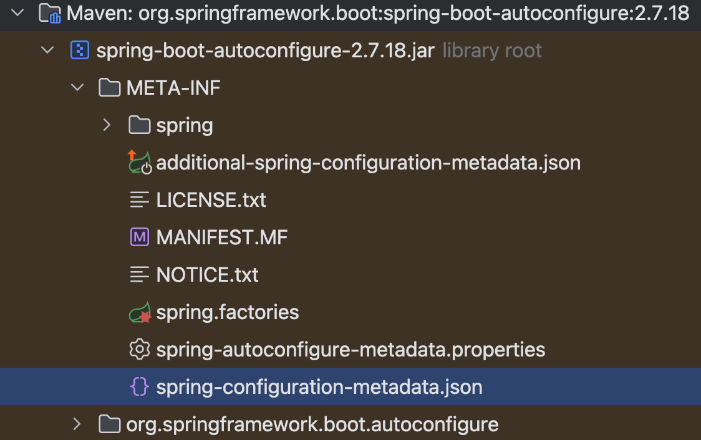
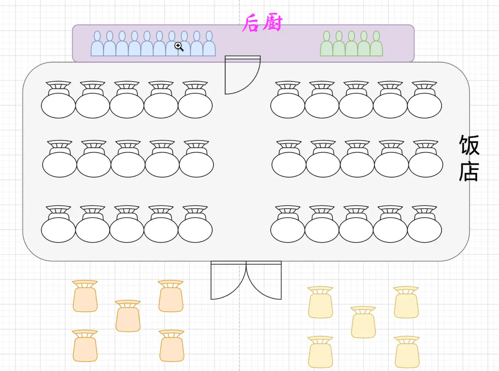
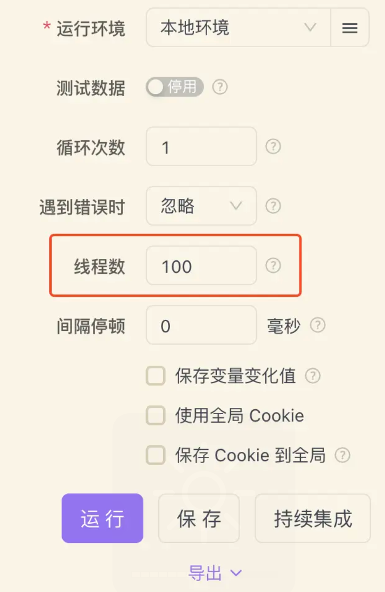
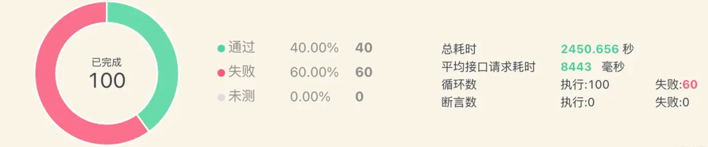
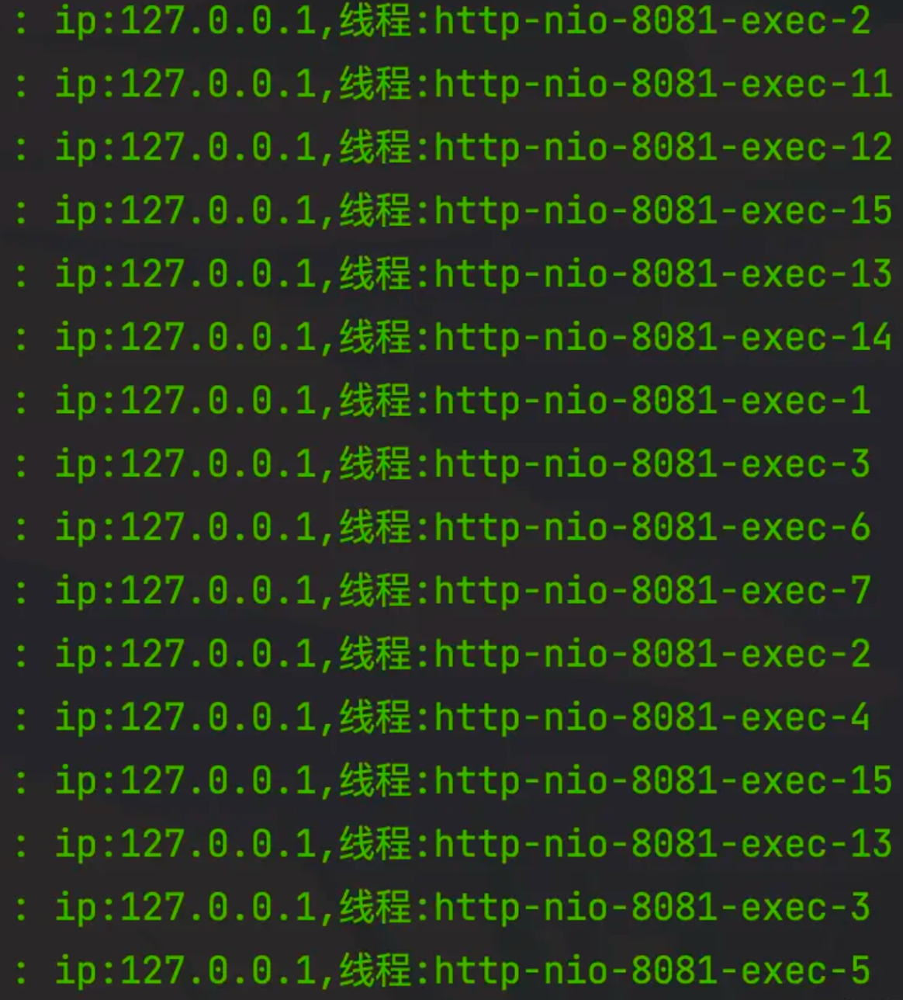
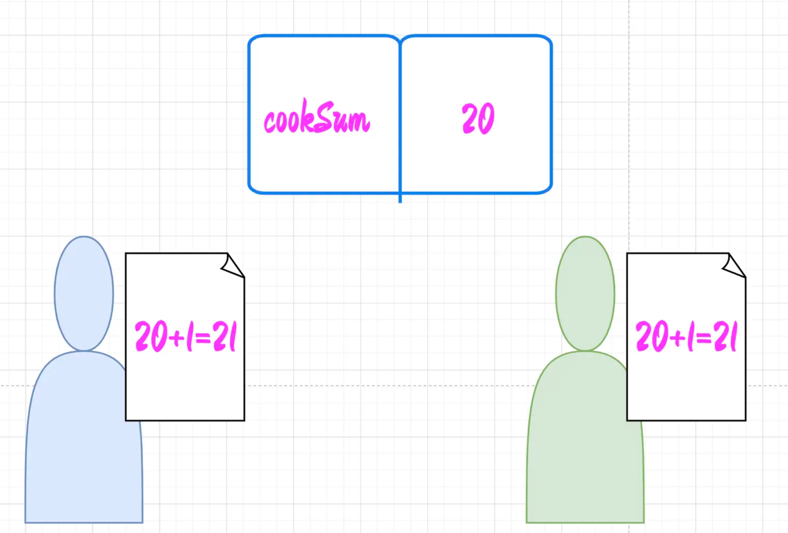
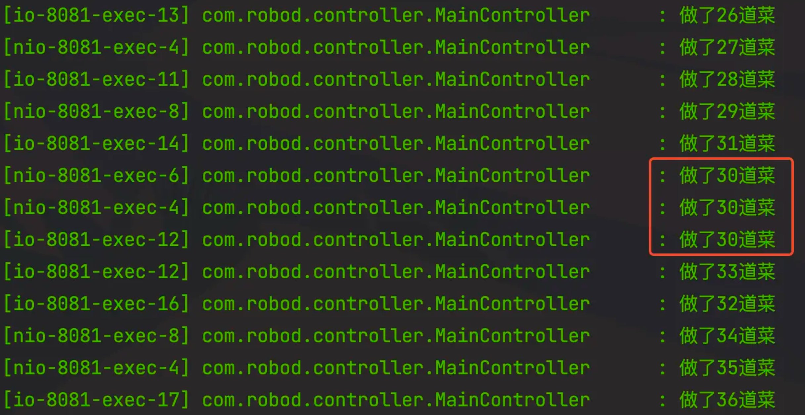

> - SpringBoot能同时处理多少请求:https://www.cnblogs.com/zhaojinhui/p/17563476.html
> - SpringBoot可以同时处理多少请求？https://juejin.cn/post/7203648441721126972

# SpringBoot 可以同时处理多少请求

## 1、内嵌Tomcat配置

SpringBoot默认的内嵌容器是Tomcat，也就是我们的程序实际上是运行在Tomcat里的。所以与其说SpringBoot可以处理多少请求，到不如说Tomcat可以处理多少请求。

关于Tomcat的默认配置，都在spring-configuration-metadata.json文件中，对应的配置类则是org.springframework.boot.autoconfigure.web.ServerProperties。



和处理请求数量相关的参数有四个：

```json
{
    "name": "server.tomcat.threads.max",
    "type": "java.lang.Integer",
    "description": "Maximum amount of worker threads.",
    "sourceType": "org.springframework.boot.autoconfigure.web.ServerProperties$Tomcat$Threads",
    "defaultValue": 200
},
{
    "name": "server.tomcat.threads.min-spare",
    "type": "java.lang.Integer",
    "description": "Minimum amount of worker threads.",
    "sourceType": "org.springframework.boot.autoconfigure.web.ServerProperties$Tomcat$Threads",
    "defaultValue": 10
},
{
    "name": "server.tomcat.max-connections",
    "type": "java.lang.Integer",
    "description": "Maximum number of connections that the server accepts and processes at any given time. Once the limit has been reached, the operating system may still accept connections based on the \"acceptCount\" property.",
    "sourceType": "org.springframework.boot.autoconfigure.web.ServerProperties$Tomcat",
    "defaultValue": 8192
},
{
    "name": "server.tomcat.accept-count",
    "type": "java.lang.Integer",
    "description": "Maximum queue length for incoming connection requests when all possible request processing threads are in use.",
    "sourceType": "org.springframework.boot.autoconfigure.web.ServerProperties$Tomcat",
    "defaultValue": 100
}
```

- **server.tomcat.threads.min-spare**：最少的工作线程数，默认大小是10。该参数相当于长期工，如果并发请求的数量达不到10，就会依次使用这几个线程去处理请求。
- **server.tomcat.threads.max**：最多的工作线程数，默认大小是200。该参数相当于临时工，如果并发请求的数量在10到200之间，就会使用这些临时工线程进行处理。
- **server.tomcat.max-connections**：最大连接数，默认大小是8192。表示Tomcat可以处理的最大请求数量，超过8192的请求就会被放入到等待队列。
- **server.tomcat.accept-count**：等待队列的长度，默认大小是100。

举个例子说明一下这几个参数之间的关系：



如果把Tomcat比作一家饭店的话，那么一个请求其实就相当于一位客人。min-spare就是厨师(长期工)；max是厨师总数(长期工+临时工)；max-connections就是饭店里的座位数量；accept-count是门口小板凳的数量。来的客人优先坐到饭店里面，然后厨师开始忙活，如果长期工可以干的完，就让长期工干，如果长期工干不完，就再让临时工干。图中画的厨师一共15人，饭店里有30个座位，也就是说，如果现在来了20个客人，那么就会有5个人先在饭店里等着。如果现在来了35个人，饭店里坐不下，就会让5个人先到门口坐一下。如果来了50个人，那么饭店座位+门口小板凳一共40个，所以就会有10人离开。

也就是说，SpringBoot同时所能处理的最大请求数量是`max-connections+accept-count`，超过该数量的请求直接就会被丢掉。

> **总结**：如果并发请求数量低于server.tomcat.threads.max，则会被立即处理，超过的部分会先进行等待，如果数量超过max-connections与accept-count之和，则多余的部分则会被直接丢弃。
>
> 所以抛开其他条件，Spring Boot可以同时处理为 8192+100 =。8292请求。


## 2、编写测试代码验证

**纸上得来终觉浅，绝知此事要躬行。**

上面只是理论结果，现在通过一个实际的小例子来演示一下到底是不是这样：

创建一个SpringBoot的项目，在application.yml里配置一下这几个参数，因为默认的数量太大，不好测试，所以配小一点：

```yaml
server:
  tomcat:
    threads:
      # 最少线程数，默认大小是10。该参数相当于长期工，如果并发请求的数量达不到10，就会依次使用这几个线程去处理请求。
      min-spare: 10
      # 最多线程数，默认大小是200。该参数相当于临时工，如果并发请求的数量在10到200之间，就会使用这些临时工线程进行处理。
      max: 15
    # 最大连接数，默认大小是8192。表示Tomcat可以处理的最大请求数量，超过8192的请求就会被放入到等待队列。
    max-connections: 30
    # 最大等待数，默认大小是100。
    accept-count: 10
```

再来写一个简单的接口：

```java
@GetMapping("/test")
public Response test1(HttpServletRequest request) throws Exception {
    log.info("ip:{},线程:{}", request.getRemoteAddr(), Thread.currentThread().getName());
    Thread.sleep(500);
    return Response.buildSuccess();
}
```

代码很简单，只是打印了一下线程名，然后休眠0.5秒，这样肯定会导致部分请求处理一次性处理不了而进入到等待队列。

然后我用Apifox创建了一个测试用例，去模拟100个请求：



观察一下测试结果：



从结果中可以看出，由于设置的 **max-connections+accept-count** 的和是40，所以有60个请求会被丢弃，这和我们的预期是相符的。由于最大线程是15，也就是有25个请求会先等待，等前15个处理完了再处理15个，最后在处理10个，也就是将40个请求分成了15,15,10这样三批进行处理。



再从控制台的打印日志可以看到，线程的最大编号是15，这也印证了前面的想法。

**总结一下**：如果并发请求数量低于**server.tomcat.threads.max**，则会被立即处理，超过的部分会先进行等待，如果数量超过max-connections与accept-count之和，则多余的部分则会被直接丢弃。


## 3、如何提升 Spring Boot 吞吐量？

1. 增加内嵌 Tomcat 的最大连接数
2. 异步执行（@Async 或 代码处理）
3. 默认 Tomcat 容器改为 Undertow 或者 Netty（结合 Spring WebFlux）
   - 默认 Tomcat 容器改为 Undertow（Jboss 下的服务器，Tomcat 吞吐量 5000，Undertow 吞吐量 8000）
4. 使用 BufferedWriter 进行缓冲
5. Deferred 方式实现异步调用
6. 异步调用可以使用 AsyncHandlerInterceptor 进行拦截


## 4、延伸：并发问题是如何产生的

到目前为止，就已经搞明白了SpringBoot可以同时处理多少请求的问题。但是在这里我还想基于上面的例子再延伸一下，就是为什么并发场景下会出现一些值和我们预期的不一样？

设想有以下场景：厨师们用一个账本记录一共做了多少道菜，每个厨师做完菜都记录一下，每次记录都是将账本上的数字先抄到草稿纸上，计算x+1等于多少，然后将计算的结果写回到账本上。



Spring容器中的Bean默认是单例的，也就是说，处理请求的Controller、Service实例就只有一份。在并发场景下，将cookSum定义为全局变量，是所有线程共享的，当一个线程读到了cookSum=20，然后计算，写回前另一个线程也读到是20，两个线程都加1后写回，最终cookSum就变成了21，但是实际上应该是22，因为加了两次。

```java
 private int cookSum = 0;
 
 @GetMapping("/test")
 public Response test1(HttpServletRequest request) throws Exception {
     // 做菜。。。。。。
     cookSum += 1;
     log.info("做了{}道菜", cookSum);
     Thread.sleep(500);
     return Response.buildSuccess();
 }
```



如果要避免这样的情况发生，就涉及到加锁的问题了，就不在这里讨论了。


## 5、如何处理并发问题？

通常我们说的**并发**：指的是多个线程操作相同的资源，如何保护线程安全，合理的使用资源。

> 对于一些用户请求，在某些情况下是可能重复发送的，如果是查询类操作并无大碍，但其中有些是涉及写入操作的，一旦重复了，可能会导致很严重的后果，例如交易的接口如果重复请求可能会重复下单。

**重复请求的场景有可能是：**

1. 黑客拦截了请求，重放
2. 前端/客户端因为某些原因请求重复发送了，或者用户在很短的时间内重复点击了。
3. 网关重发
4. 网络通信异常或者后端响应慢
   ...

**解决方案：**

1. 利用唯一请求编号去重（每次请求，服务端返回客户端一个唯一编号，客户端拿着这个唯一编号去请求）
2. 业务参数做一个摘要去重（用用户ID、请求URL、请求参数等算一个key，然后MD5（key）来作唯一参数）
3. 让前端来限制，点击之后，在一定时间内不能再次点击。
4. 请求去重工具类，Java实现


## 6、如何保证并发的安全？

**Controller默认是单例的，单例是不安全的，会导致属性重复使用。**

1. 不要在controller中定义成员变量。
2. 万一必须要定义一个非静态成员变量时候，则通过注解@Scope(“prototype”)，将其设置为多例模式。
3. 在Controller中使用ThreadLocal变量


## 7、如何处理高并发问题？

> 高并发就是通过严谨的设计来保证系统能够同时并行处理很多的请求。
> 也就是说系统能够在某一时间段内提供很多请求，但是不会影响系统的性能。

通常我们说的高并发：指的是系统运行过程中，短时间内遇到大量的操作请求的情况。如12306的抢票等，这时候，系统会执行大量的操作（数据库操作，资源请求等），如何处理高并发场景？

在提升系统性能方面我们一直关注的是系统的查询性能，通过数据库的分布式改造，各类缓存的原理和使用技巧。究其原因在于我们遇到的大部分场景都是读多写少，尤其是在一个系统的初级阶段。

**高并发(写)请求的场景，其中《秒杀抢购》就是最典型的场景。**

**提供以下两种解决方案：**

- 使用锁的方式，比如分布式锁，也可以利用redis本身操作原子性的特点
- 写入消息队列，在消息队列中做减库存的操作，做异步校验

> 在用户下单的时候，用了redis的原子性减库存，如果不支付，一般可以设置一个定时器，定时器时间一到，就把库存加上，同时定义订单失败。
>
> 比如1000件商品，系统生成1000个令牌，拿到令牌的用户可以进入消息队列，其他未拿到令牌的直接返回已抢完。

1、一般对于并发处理都需要加锁，否则会导致共享变量不可见问题，尽量将锁的力度变小。
2、如果确认不能或不想加锁，则做串行化处理，解决方案就是消息队列。


## 8、高并发量网站解决方案

1. 尽量使用缓存，包括用户缓存，信息缓存等，多花点内存来做缓存，可以大量减少与数据库的交互，提高性能。
2. 用jprofiler等工具找出性能瓶颈，减少额外的开销。
3. 优化数据库查询语句，减少直接使用hibernate等工具的直接生成语句（仅耗时较长的查询做优化）。
4. 优化数据库结构，多做索引，提高查询效率。
5. 统计的功能尽量做缓存，或按每天一统计或定时统计相关报表，避免需要时进行统计的功能。
6. 能使用静态页面的地方尽量使用，减少容器的解析（尽量将动态内容生成静态html来显示）。
7. 解决以上问题后，使用服务器集群来解决单台的瓶颈问题。


## 9、高并发的的瓶颈在哪里？

1. 可能是服务器网络带宽不够（可以增加网络带宽，DNS域名解析分发多台服务器。）
2. 可能web线程连接数不够（负载均衡，前置代理服务器nginx、apache等等）
3. 可能数据库连接查询上不去（数据库查询优化，读写分离，分表等等）

**如果有高访问，高并发的需求，就尽量别用 Java 来做。**：java不适合做这种方面的工作，它在web上的用途更多是用来做行业性软件开发，对讲求效率方面的网站性工作不太适合。如果非要用java做的话可以考虑以下几个思路：

1. 调优；
2. 采用集群模式布署；
3. 写好网站的程序；
4. 不要做实时性要求比较高的工作，降低对严谨性方面的要求。


