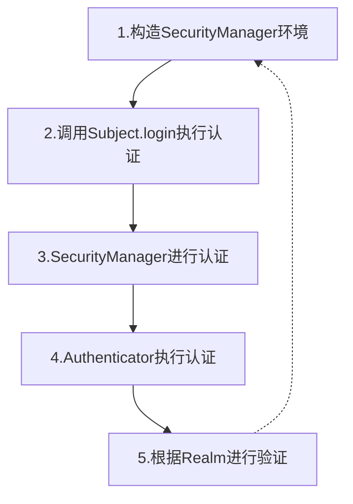
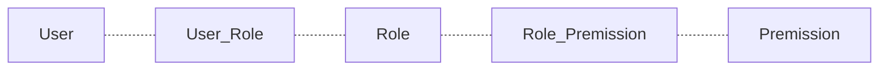

## 1、权限框架核心ACL和RBAC

### 第1集 权限框架之ACL和RBAC

**简介：介绍什么是ACL和RBAC**

* **ACL: Access Control List** 访问控制列表

  * 以前盛行的一种权限设计，它的核心在于用户直接和权限挂钩
  * 优点：简单易用，开发便捷
  * 缺点：用户和权限直接挂钩，导致在授予时的复杂性，比较分散，不便于管理
  * 例子：常见的文件系统权限设计, 直接给用户加权限

* **RBAC: Role Based Access Control** 

  * 基于角色的访问控制系统。权限与角色相关联，用户通过成为适当角色的成员而得到这些角色的权限
  * 优点：简化了用户与权限的管理，通过对用户进行分类，使得角色与权限关联起来
  * 缺点：开发对比ACL相对复杂
  * 例子：基于RBAC模型的权限验证框架与应用 Apache Shiro、spring Security

* BAT企业 ACL，一般是对报表系统，阿里的ODPS

  

* 总结：不能过于复杂，规则过多，维护性和性能会下降， 更多分类 ABAC、PBAC等


### 第2集 主流权限框架介绍和选择

**简介：介绍主流的权限框架 Apache Shiro、spring Security**

* 什么是 spring Security：官网基础介绍

  * 官网：<https://spring.io/projects/spring-security>

  ```
  Spring Security是一个能够为基于Spring的企业应用系统提供声明式的安全访问控制解决方案的安全框架。它提供了一组可以在Spring应用上下文中配置的Bean，充分利用了Spring IoC，DI（控制反转Inversion of Control ,DI:Dependency Injection 依赖注入）和AOP（面向切面编程）功能，为应用系统提供声明式的安全访问控制功能，减少了为企业系统安全控制编写大量重复代码的工作。
  
  一句话：Spring Security 的前身是 Acegi Security ，是 Spring 项目组中用来提供安全认证服务的框架
  ```

  

* 什么是 Apache Shiro：官网基础介绍

  * https://github.com/apache/shiro

    ```
    Apache Shiro是一个强大且易用的Java安全框架,执行身份验证、授权、密码和会话管理。使用Shiro的易于理解的API,您可以快速、轻松地获得任何应用程序,从最小的移动应用程序到最大的网络和企业应用程序。
    
    一句话：Shiro是一个强大易用的Java安全框架,提供了认证、授权、加密和会话管理等功能
    ```

    

* 两个优缺点，应该怎么选择

  * Apache Shiro比Spring Security , 前者使用更简单

  * Shiro 功能强大、 简单、灵活， 不跟任何的框架或者容器绑定，可以独立运行

  * Spring Security 对Spring 体系支持比较好，脱离Spring体系则很难开发

  * SpringSecutiry 支持Oauth鉴权 <https://spring.io/projects/spring-security-oauth>，Shiro需要自己实现

  * 等等.....

    **总结：两个框架没有谁超过谁，大体功能一致，新手一般先推荐Shiro，学习会容易点**


## 2、Apache Shiro基础概念

### 第1集 Shiro核心架构及四大模块

**简介：讲解Shiro架构图交互和四大核心模块 身份认证，授权，会话管理和加密**

* 直达Apache Shiro官网： http://shiro.apache.org/introduction.html
* 什么是身份认证
  * Authentication，身份证认证，一般就是登录
* 什么是授权
  * Authorization，给用户分配角色或者访问某些资源的权限
* 什么是会话管理
  * Session Management, 用户的会话管理员，多数情况下是web session
* 什么是加密
  * Cryptography, 数据加解密，比如密码加解密等


### 第2集 Shrio权限控制运行流程

**简介：讲解用户访问整合Shrio的系统，权限控制的运行流程和Shiro常见名称讲解**

* 直达官网 ：http://shiro.apache.org/architecture.html

* **Subject**：
  * 我们把用户或者程序称为主体（如用户，第三方服务，cron作业），主体去访问系统或者资源
* **SecurityManager**
  * 安全管理器，Subject的认证和授权都要在安全管理器下进行
* **Authenticator**
  - 认证器，主要负责Subject的认证
* **Realm**
  * 数据域，Shiro和安全数据的连接器，好比jdbc连接数据库； 通过realm获取认证授权相关信息
* **Authorizer**
  * 授权器，主要负责Subject的授权, 控制subject拥有的角色或者权限
* **Cryptography**
  * 加解密，Shiro的包含易于使用和理解的数据加解密方法，简化了很多复杂的api
* **Cache Manager**
  * 缓存管理器，比如认证或授权信息，通过缓存进行管理，提高性能


- 官网资料导航：http://shiro.apache.org/reference.html


## 3、Springboot2.x整合Apache Shiro

### 第1集 SpringBoot整合Shiro项目搭建

**简介：使用SpringBoot2.x整合Shiro权限认证**

* Maven3.5  + Jdk8 + Springboot 2.X + IDEA (Eclipse也可以)

* 创建SpringBoot项目

  * https://start.spring.io/

  ```xml
  <dependency>
      <groupId>org.springframework.boot</groupId>
      <artifactId>spring-boot-starter-web</artifactId>
  </dependency>
  <dependency>
      <groupId>mysql</groupId>
      <artifactId>mysql-connector-java</artifactId>
  </dependency>
  <dependency>
      <groupId>org.springframework.boot</groupId>
      <artifactId>spring-boot-starter-test</artifactId>
      <scope>test</scope>
  </dependency>
  
  <dependency>
      <groupId>com.alibaba</groupId>
      <artifactId>druid</artifactId>
      <version>1.1.6</version>
  </dependency>
  ```

  * 整合Shiro相关jar包

  ```xml
  <dependency>
      <groupId>org.apache.shiro</groupId>
      <artifactId>shiro-spring</artifactId>
      <version>1.4.0</version>
  </dependency>
  ```

- Shiro认证流程：




### 第2集 Shiro认证和授权流程实操上集

**简介：讲解Shrio的认证和授权实操上集**

认证：用户身份识别，俗称为用户“登录”

```java
import org.apache.shiro.SecurityUtils;
import org.apache.shiro.authc.UsernamePasswordToken;
import org.apache.shiro.mgt.DefaultSecurityManager;
import org.apache.shiro.realm.SimpleAccountRealm;
import org.apache.shiro.subject.Subject;
import org.junit.Before;
import org.junit.Test;

/**
 * 单元测试用例执行顺序
 * @BeforeClass -> @Before -> @Test -> @After -> @AfterClass;
 */
public class QuickStartTest3_2 {

    private SimpleAccountRealm accountRealm = new SimpleAccountRealm();
    private DefaultSecurityManager defaultSecurityManager = new DefaultSecurityManager();

    @Before
    public void init() {
        //初始化数据源
        accountRealm.addAccount("xdclass", "123");
        accountRealm.addAccount("jack", "456");
        //构建环境
        defaultSecurityManager.setRealm(accountRealm);
    }


    @Test
    public void testAuthentication() {

        SecurityUtils.setSecurityManager(defaultSecurityManager);
        //当前操作主体， application user
        Subject subject = SecurityUtils.getSubject();
        //用户输入的账号密码
        UsernamePasswordToken usernamePasswordToken =
                new UsernamePasswordToken("jack", "456");
        //用户登录
        subject.login(usernamePasswordToken);
        
        System.out.println("认证结果:"+subject.isAuthenticated());
    }
}
```


### 第3集 Shiro认证和授权流程实操下集

**简介:讲解Shiro的授权实操和常用Api 梳理下集**

```java
//是否有对应的角色
subject.hasRole("root")

//获取subject名
subject.getPrincipal()

//检查是否有对应的角色，无返回值，直接在SecurityManager里面进行判断
subject.checkRole("admin")

//检查是否有对应的角色
subject.hasRole("admin")

//退出登录
subject.logout();
```

```java
import org.apache.shiro.SecurityUtils;
import org.apache.shiro.authc.UsernamePasswordToken;
import org.apache.shiro.mgt.DefaultSecurityManager;
import org.apache.shiro.realm.SimpleAccountRealm;
import org.apache.shiro.subject.Subject;
import org.junit.Before;
import org.junit.Test;

/**
 * 单元测试用例执行顺序
 * @BeforeClass -> @Before -> @Test -> @After -> @AfterClass;
 */
public class QuickStartTest4_3 {

    private SimpleAccountRealm accountRealm = new SimpleAccountRealm();
    private DefaultSecurityManager defaultSecurityManager = new DefaultSecurityManager();

    @Before
    public void init() {
        //初始化数据源
        accountRealm.addAccount("xdclass", "123","root","admin");
        accountRealm.addAccount("jack", "456","user");
        //构建环境
        defaultSecurityManager.setRealm(accountRealm);
    }

    @Test
    public void testAuthentication() {

        SecurityUtils.setSecurityManager(defaultSecurityManager);
        //当前操作主体， application user
        Subject subject = SecurityUtils.getSubject();
        //用户输入的账号密码
        UsernamePasswordToken usernamePasswordToken =
                new UsernamePasswordToken("jack", "456");
        //用户登录
        subject.login(usernamePasswordToken);

        System.out.println(" 认证结果:"+subject.isAuthenticated());
        System.out.println(" 是否有对应的root角色:"+subject.hasRole("root"));
        System.out.println(" getPrincipal=" + subject.getPrincipal());
        subject.checkRole("user");
        subject.logout();//退出登录
        System.out.println("logout后认证结果:"+subject.isAuthenticated());

    }
}
```


## 4、详解Apache Shiro realm实战

### 第1集 Shiro安全数据来源之Realm

**简介：讲解shiro默认自带的realm和常见使用方法**

* Realm作用：Shiro 从 Realm 获取安全数据
* 默认自带的Realm：idae查看realm继承关系，有默认实现和自定义继承的realm
* 两个概念
  * **principal** : 主体的标示，可以有多个，但是需要具有唯一性，常见的有用户名，手机号，邮箱等
  * **credential**：凭证,  一般就是密码
  * 所以一般我们说 principal + credential   就账号 + 密码
* 开发中，往往是自定义realm , 即集成 AuthorizingRealm


### 第2集Shiro内置IniRealm权限验证api

**简介：讲解Shiro内置 ini realm实操**

```
# 格式 name=password,role1,role2,..roleN
[users]
# user 'root' with password 'secret' and the 'admin' role，
jack = 456, user
xdcalss = 123, root


# 格式 role=permission1,permission2...permissionN   也可以用通配符
# 下面配置user的权限为所有video:find,video:buy，如果需要配置video全部操作crud 则 user = video:*
[roles]
user = video:find,video:buy
# 'admin' role has all permissions, indicated by the wildcard '*'
admin = *
```

```java
import org.apache.shiro.SecurityUtils;
import org.apache.shiro.authc.UsernamePasswordToken;
import org.apache.shiro.config.IniSecurityManagerFactory;

import org.apache.shiro.mgt.SecurityManager;
import org.apache.shiro.subject.Subject;
import org.apache.shiro.util.Factory;
import org.junit.Test;


/**
 * 单元测试用例执行顺序
 * @BeforeClass -> @Before -> @Test -> @After -> @AfterClass;
 * Shiro内置IniRealm
 */
public class QuickStartTest4_2 {

    @Test
    public void testAuthentication() {

        //创建SecurityManager工厂，通过配置文件ini创建
        Factory<SecurityManager> factory = new IniSecurityManagerFactory("classpath:shiro.ini");
        SecurityManager securityManager = factory.getInstance();

        //将securityManager 设置到当前运行环境中
        SecurityUtils.setSecurityManager(securityManager);
        Subject subject = SecurityUtils.getSubject();

        //用户输入的账号密码
        UsernamePasswordToken usernamePasswordToken =
                new UsernamePasswordToken("jack", "456");
        //用户登录
        subject.login(usernamePasswordToken);

        System.out.println(" 认证结果:"+subject.isAuthenticated());
        System.out.println(" 是否有对应的user角色:"+subject.hasRole("user"));
        System.out.println(" getPrincipal=" + subject.getPrincipal());
        subject.checkRole("user");
        subject.checkPermission("video:find");
        System.out.println( "是否有video:find 权限："+ subject.isPermitted("video:find"));
        subject.logout();//退出登录
        System.out.println("logout后认证结果:"+subject.isAuthenticated());
    }

    @Test
    public void testAuthentication2() {

        //创建SecurityManager工厂，通过配置文件ini创建
        Factory<SecurityManager> factory = new IniSecurityManagerFactory("classpath:shiro.ini");
        SecurityManager securityManager = factory.getInstance();

        //将securityManager 设置到当前运行环境中
        SecurityUtils.setSecurityManager(securityManager);
        Subject subject = SecurityUtils.getSubject();

        //用户输入的账号密码
        UsernamePasswordToken usernamePasswordToken =
                new UsernamePasswordToken("xdclass", "123");
        //用户登录
        subject.login(usernamePasswordToken);

        System.out.println(" 认证结果:"+subject.isAuthenticated());
        System.out.println(" 是否有对应的admin角色:"+subject.hasRole("admin"));
        System.out.println(" getPrincipal=" + subject.getPrincipal());
        subject.checkPermission("video:find");
        System.out.println( "是否有video:find 权限："+ subject.isPermitted("video:find"));
        subject.logout();//退出登录
        System.out.println("logout后认证结果:"+subject.isAuthenticated());
    }
}
```


### 第3集 Shiro内置JdbcRealm实操

**简介：讲解Shiro内置 JdbcRealm实操**

- SQL脚本：

```sql
# ************************************************************
# Sequel Pro SQL dump
# Version 4541
#
# http://www.sequelpro.com/
# https://github.com/sequelpro/sequelpro
#
# Host: 120.76.62.13 (MySQL 5.7.17)
# Database: xdclass_shiro
# Generation Time: 2019-04-28 16:23:31 +0000
# ************************************************************


/*!40101 SET @OLD_CHARACTER_SET_CLIENT=@@CHARACTER_SET_CLIENT */;
/*!40101 SET @OLD_CHARACTER_SET_RESULTS=@@CHARACTER_SET_RESULTS */;
/*!40101 SET @OLD_COLLATION_CONNECTION=@@COLLATION_CONNECTION */;
/*!40101 SET NAMES utf8 */;
/*!40014 SET @OLD_FOREIGN_KEY_CHECKS=@@FOREIGN_KEY_CHECKS, FOREIGN_KEY_CHECKS=0 */;
/*!40101 SET @OLD_SQL_MODE=@@SQL_MODE, SQL_MODE='NO_AUTO_VALUE_ON_ZERO' */;
/*!40111 SET @OLD_SQL_NOTES=@@SQL_NOTES, SQL_NOTES=0 */;


# Dump of table roles_permissions
# ------------------------------------------------------------

DROP TABLE IF EXISTS `roles_permissions`;

CREATE TABLE `roles_permissions` (
  `id` bigint(20) NOT NULL AUTO_INCREMENT,
  `role_name` varchar(100) DEFAULT NULL,
  `permission` varchar(100) DEFAULT NULL,
  PRIMARY KEY (`id`),
  UNIQUE KEY `idx_roles_permissions` (`role_name`,`permission`)
) ENGINE=InnoDB DEFAULT CHARSET=utf8;

LOCK TABLES `roles_permissions` WRITE;
/*!40000 ALTER TABLE `roles_permissions` DISABLE KEYS */;

INSERT INTO `roles_permissions` (`id`, `role_name`, `permission`)
VALUES
	(4,'admin','video:*'),
	(3,'role1','video:buy'),
	(2,'role1','video:find'),
	(5,'role2','*'),
	(1,'root','*');

/*!40000 ALTER TABLE `roles_permissions` ENABLE KEYS */;
UNLOCK TABLES;


# Dump of table user_roles
# ------------------------------------------------------------

DROP TABLE IF EXISTS `user_roles`;

CREATE TABLE `user_roles` (
  `id` bigint(20) NOT NULL AUTO_INCREMENT,
  `username` varchar(100) DEFAULT NULL,
  `role_name` varchar(100) DEFAULT NULL,
  PRIMARY KEY (`id`),
  UNIQUE KEY `idx_user_roles` (`username`,`role_name`)
) ENGINE=InnoDB DEFAULT CHARSET=utf8;

LOCK TABLES `user_roles` WRITE;
/*!40000 ALTER TABLE `user_roles` DISABLE KEYS */;

INSERT INTO `user_roles` (`id`, `username`, `role_name`)
VALUES
	(1,'jack','role1'),
	(2,'jack','role2'),
	(4,'xdclass','admin'),
	(3,'xdclass','root');

/*!40000 ALTER TABLE `user_roles` ENABLE KEYS */;
UNLOCK TABLES;


# Dump of table users
# ------------------------------------------------------------

DROP TABLE IF EXISTS `users`;

CREATE TABLE `users` (
  `id` bigint(20) NOT NULL AUTO_INCREMENT,
  `username` varchar(100) DEFAULT NULL,
  `password` varchar(100) DEFAULT NULL,
  `password_salt` varchar(100) DEFAULT NULL,
  PRIMARY KEY (`id`),
  UNIQUE KEY `idx_users_username` (`username`)
) ENGINE=InnoDB DEFAULT CHARSET=utf8;

LOCK TABLES `users` WRITE;
/*!40000 ALTER TABLE `users` DISABLE KEYS */;

INSERT INTO `users` (`id`, `username`, `password`, `password_salt`)
VALUES
	(1,'jack','123',NULL),
	(2,'xdclass','456',NULL);

/*!40000 ALTER TABLE `users` ENABLE KEYS */;
UNLOCK TABLES;

/*!40111 SET SQL_NOTES=@OLD_SQL_NOTES */;
/*!40101 SET SQL_MODE=@OLD_SQL_MODE */;
/*!40014 SET FOREIGN_KEY_CHECKS=@OLD_FOREIGN_KEY_CHECKS */;
/*!40101 SET CHARACTER_SET_CLIENT=@OLD_CHARACTER_SET_CLIENT */;
/*!40101 SET CHARACTER_SET_RESULTS=@OLD_CHARACTER_SET_RESULTS */;
/*!40101 SET COLLATION_CONNECTION=@OLD_COLLATION_CONNECTION */;
```


* 方式一：jdbcrealm.ini

```
#注意 文件格式必须为ini，编码为ANSI

#声明Realm，指定realm类型
jdbcRealm=org.apache.shiro.realm.jdbc.JdbcRealm

#配置数据源
#dataSource=com.mchange.v2.c3p0.ComboPooledDataSource

dataSource=com.alibaba.druid.pool.DruidDataSource

# mysql-connector-java 5 用的驱动url是com.mysql.jdbc.Driver，mysql-connector-java6以后用的是com.mysql.cj.jdbc.Driver
dataSource.driverClassName=com.mysql.cj.jdbc.Driver

#避免安全警告
dataSource.url=jdbc:mysql://120.76.62.13:3306/xdclass_shiro?characterEncoding=UTF-8&serverTimezone=UTC&useSSL=false

dataSource.username=test

dataSource.password=Xdclasstest

#指定数据源
jdbcRealm.dataSource=$dataSource


#开启查找权限, 默认是false，不会去查找角色对应的权限，坑！！！！！
jdbcRealm.permissionsLookupEnabled=true


#指定SecurityManager的Realms实现，设置realms，可以有多个，用逗号隔开
securityManager.realms=$jdbcRealm
```

- 方式二：JdbcRealm类配置

```
 	DefaultSecurityManager securityManager = new DefaultSecurityManager();
    DruidDataSource ds = new DruidDataSource();
    ds.setDriverClassName("com.mysql.cj.jdbc.Driver");
    ds.setUrl("jdbc:mysql://120.76.62.13:3306/xdclass_shiro?characterEncoding=UTF-8&serverTimezone=UTC&useSSL=false");
    ds.setUsername("test");
    ds.setPassword("Xdclasstest");
```

- 案例：

```java
import com.alibaba.druid.pool.DruidDataSource;
import org.apache.shiro.SecurityUtils;
import org.apache.shiro.authc.UsernamePasswordToken;
import org.apache.shiro.config.IniSecurityManagerFactory;
import org.apache.shiro.mgt.DefaultSecurityManager;
import org.apache.shiro.mgt.SecurityManager;
import org.apache.shiro.realm.jdbc.JdbcRealm;
import org.apache.shiro.subject.Subject;
import org.apache.shiro.util.Factory;
import org.junit.Test;

/**
 * 单元测试用例执行顺序
 * @BeforeClass -> @Before -> @Test -> @After -> @AfterClass;
 * Shiro内置JdbcRealm
 */
public class QuickStartTest4_3 {

    @Test
    public void testAuthentication() {
        //方式一：配置文件读取

        //创建SecurityManager工厂，通过配置文件ini创建
        Factory<SecurityManager> factory = new IniSecurityManagerFactory("classpath:jdbcrealm.ini");
        SecurityManager securityManager = factory.getInstance();

        //将securityManager 设置到当前运行环境中
        SecurityUtils.setSecurityManager(securityManager);
        Subject subject = SecurityUtils.getSubject();

        //用户输入的账号密码
        UsernamePasswordToken usernamePasswordToken =
                new UsernamePasswordToken("jack", "123");
        //用户登录
        subject.login(usernamePasswordToken);

        //org.apache.shiro.realm.jdbc.JdbcRealm
        System.out.println(" 认证结果:"+subject.isAuthenticated());
        System.out.println(" 是否有对应的role1角色:"+subject.hasRole("role1"));
        System.out.println("是否有video:find权限:"+ subject.isPermitted("video:find"));
    }


    @Test
    public void test2(){
        //方式二：JdbcRealm类配置

        DefaultSecurityManager securityManager = new DefaultSecurityManager();

        DruidDataSource ds = new DruidDataSource();
        ds.setDriverClassName("com.mysql.cj.jdbc.Driver");
        ds.setUrl("jdbc:mysql://192.168.3.55:3306/xdclass_jdbcrealm?characterEncoding=UTF-8&serverTimezone=UTC&useSSL=false");
        ds.setUsername("root");
        ds.setPassword("password");


        JdbcRealm jdbcRealm = new JdbcRealm();
        jdbcRealm.setPermissionsLookupEnabled(true);
        jdbcRealm.setDataSource(ds);

        securityManager.setRealm(jdbcRealm);

        //将securityManager 设置到当前运行环境中
        SecurityUtils.setSecurityManager(securityManager);
        Subject subject = SecurityUtils.getSubject();

        //用户输入的账号密码
        UsernamePasswordToken usernamePasswordToken =
                new UsernamePasswordToken("jack", "123");
        //用户登录
        subject.login(usernamePasswordToken);

        System.out.println(" 认证结果:"+subject.isAuthenticated());
        System.out.println(" 是否有对应的role1角色:"+subject.hasRole("role1"));
        System.out.println("是否有video:find权限:"+ subject.isPermitted("video:find"));
        System.out.println("是否有任意权限:"+ subject.isPermitted("aaaa:xxxxxxxxx"));
    }
}
```


### 第4集 Shiro自定义Realm实战

**简介：讲解自定义Realm实战基础**

* 步骤：

  * 创建一个类 ，继承AuthorizingRealm->AuthenticatingRealm->CachingRealm->Realm
  * 重写授权方法：doGetAuthorizationInfo
  * 重写认证方法：doGetAuthenticationInfo 

* 方法：

  - 当用户登陆的时候会调用：doGetAuthenticationInfo
  - 进行权限校验的时候会调用：doGetAuthorizationInfo

* 对象介绍

  * UsernamePasswordToken ： 对应就是 shiro的token中有Principal和Credential

    * ```
      UsernamePasswordToken-》HostAuthenticationToken-》AuthenticationToken
      ```

  * SimpleAuthorizationInfo：代表用户角色权限信息

  * SimpleAuthenticationInfo ：代表该用户的认证信息


- 案例：自定义Realm：CustomRealm.java

```java
import org.apache.shiro.authc.AuthenticationException;
import org.apache.shiro.authc.AuthenticationInfo;
import org.apache.shiro.authc.AuthenticationToken;
import org.apache.shiro.authc.SimpleAuthenticationInfo;
import org.apache.shiro.authz.AuthorizationInfo;
import org.apache.shiro.authz.SimpleAuthorizationInfo;
import org.apache.shiro.realm.AuthorizingRealm;
import org.apache.shiro.subject.PrincipalCollection;

import java.util.HashMap;
import java.util.HashSet;
import java.util.Map;
import java.util.Set;

/**
 * 自定义realm
 */
public class CustomRealm extends AuthorizingRealm {

    //模拟数据
    //user
    private final Map<String,String> userInfoMap = new HashMap<>();
    {
        userInfoMap.put("jack","123");
        userInfoMap.put("xdclass","456");
    }

    //role -> permission
    private final Map<String,Set<String>> permissionMap = new HashMap<>();
    {
        Set<String> set1 = new HashSet<>();
        Set<String> set2 = new HashSet<>();

        set1.add("video:find");
        set1.add("video:buy");

        set2.add("video:add");
        set2.add("video:delete");

        permissionMap.put("jack",set1);
        permissionMap.put("xdclass",set2);
    }

    //user -> role
    private final Map<String,Set<String>> roleMap = new HashMap<>();
    {
        Set<String> set1 = new HashSet<>();
        Set<String> set2 = new HashSet<>();

        set1.add("role1");
        set1.add("role2");

        set2.add("root");

        roleMap.put("jack",set1);
        roleMap.put("xdclass",set2);
    }

    //进行权限校验的时候会调用
    @Override
    protected AuthorizationInfo doGetAuthorizationInfo(PrincipalCollection principals) {
        System.out.println("----------权限 doGetAuthorizationInfo----------");

        // 获取username
        String name = (String)principals.getPrimaryPrincipal();

        // 定义授权信息的返回数据
        SimpleAuthorizationInfo simpleAuthorizationInfo = new SimpleAuthorizationInfo();
        simpleAuthorizationInfo.setRoles(getPermissionsByNameFromDB(name));
        simpleAuthorizationInfo.setStringPermissions(getRolesByNameFromDB(name));

        return simpleAuthorizationInfo;
    }


    //当用户登陆的时候会调用
    @Override
    protected AuthenticationInfo doGetAuthenticationInfo(AuthenticationToken token) throws AuthenticationException {
        System.out.println("----------认证 doGetAuthenticationInfo----------");

        //从token获取身份信息，token代表用户输入的信息
        String name = (String)token.getPrincipal();
        //模拟从数据库中取密码
        String pwd = getPwdByUserNameFromDB(name);

        if( pwd == null || "".equals(pwd)){
            return null;
        }
        SimpleAuthenticationInfo simpleAuthenticationInfo = new SimpleAuthenticationInfo(name, pwd, this.getName());
        return simpleAuthenticationInfo;
    }

    /**
     * 模拟从数据库获取用户角色集合
     * @param name
     * @return
     */
    private Set<String> getRolesByNameFromDB(String name) {
        return roleMap.get(name);

    }

    /**
     *  模拟从数据库获取权限集合
     * @param name
     * @return
     */
    private Set<String> getPermissionsByNameFromDB(String name) {
        return permissionMap.get(name);
    }

    /**
     * 模拟从数据库获取用户密码
     * @param name
     * @return
     */
    private String getPwdByUserNameFromDB(String name) {
        return userInfoMap.get(name);
    }
}
```

```java
import org.apache.shiro.SecurityUtils;
import org.apache.shiro.authc.UsernamePasswordToken;
import org.apache.shiro.config.IniSecurityManagerFactory;
import org.apache.shiro.mgt.DefaultSecurityManager;
import org.apache.shiro.mgt.SecurityManager;
import org.apache.shiro.subject.Subject;
import org.apache.shiro.util.Factory;
import org.junit.Before;
import org.junit.Test;

/**
 * 单元测试用例执行顺序
 * @BeforeClass -> @Before -> @Test -> @After -> @AfterClass;
 * Shiro自定义Realm
 */
public class QuickStartTest4_4 {

    private CustomRealm customRealm = new CustomRealm();//自定义Reaml
    private DefaultSecurityManager defaultSecurityManager = new DefaultSecurityManager();

    @Before
    public void init(){
        //构建环境
        defaultSecurityManager.setRealm(customRealm);
        SecurityUtils.setSecurityManager(defaultSecurityManager);
    }

    @Test
    public void testAuthentication() {

        //获取当前操作的主体
        Subject subject = SecurityUtils.getSubject();
        //用户输入的账号密码
        UsernamePasswordToken usernamePasswordToken =
                new UsernamePasswordToken("jack", "123");
        //用户登录
        subject.login(usernamePasswordToken);

        //是否登录
        System.out.println(" 认证结果:"+subject.isAuthenticated());
        //拿到主体标示属性
        System.out.println(" getPrincipal=" + subject.getPrincipal());
        subject.checkRole("role1");
        System.out.println("是否有对应的角色:"+subject.hasRole("role1"));
        System.out.println("是否有对应的权限:"+subject.isPermitted("video:add"));
    }
}
```


### 第5集 Shiro源码解读认证授权流程

**简介：Shiro认证和授权流程的源码解读，和断点测试**

```
认证流程解读：subject.login(usernamePasswordToken);
	DelegatingSubject->login()
	DefaultSecurityManager->login()
	AuthenticatingSecurityManager->authenticate()
	AbstractAuthenticator->authenticate()
	ModularRealmAuthenticator->doAuthenticate()
	ModularRealmAuthenticator->doSingleRealmAuthentication()
	AuthenticatingRealm->getAuthenticationInfo()
	
	补充：有些同学找不到密码验证方法 AuthenticatingRealm-> assertCredentialsMatch()
```

```
授权流程解读：subject.checkRole("admin")

	DelegatingSubject->checkRole()
	AuthorizingSecurityManager->checkRole()
	ModularRealmAuthorizer->checkRole()
	AuthorizingRealm->hasRole()
	AuthorizingRealm->doGetAuthorizationInfo()
```


## 5、Shiro权限认证Web案例知识点讲解

### 第1集 Shiro内置的Filter过滤器讲解

**简介：讲解shiro内置的过滤器讲解**

* 核心过滤器类：**DefaultFilter**,  配置哪个路径对应哪个拦截器进行处理

```
anon -- org.apache.shiro.web.filter.authc.AnonymousFilter  
authc -- org.apache.shiro.web.filter.authc.FormAuthenticationFilter  
authcBasic -- org.apache.shiro.web.filter.authc.BasicHttpAuthenticationFilter  
perms -- org.apache.shiro.web.filter.authz.PermissionsAuthorizationFilter  
port -- org.apache.shiro.web.filter.authz.PortFilter  
rest -- org.apache.shiro.web.filter.authz.HttpMethodPermissionFilter  
roles -- org.apache.shiro.web.filter.authz.RolesAuthorizationFilter  
ssl -- org.apache.shiro.web.filter.authz.SslFilter  
user -- org.apache.shiro.web.filter.authc.UserFilter  
logout -- org.apache.shiro.web.filter.authc.LogoutFilter

anon:例子/admins/**=anon 
没有参数，表示可以匿名使用。

authc:例如/admins/user/**=authc
表示需要认证(登录)才能使用，没有参数   

roles：例子/admins/user/**=roles[admin]
参数可以写多个，多个时必须加上引号，并且参数之间用逗号分割，当有多个参数时，
例如admins/user/**=roles["admin,guest"],每个参数通过才算通过，相当于hasAllRoles()方法。   

perms：例子/admins/user/**=perms[user:add:*]
参数可以写多个，多个时必须加上引号，并且参数之间用逗号分割，例如/admins/user/**=perms["user:add:*,user:modify:*"]，当有多个参数时必须每个参数都通过才通过，想当于isPermitedAll()方法。   

rest：例子/admins/user/**=rest[user]
根据请求的方法，相当于/admins/user/**=perms[user:method] ,其中method为post，get，delete等。   

port：例子/admins/user/**=port[8081],
当请求的url的端口不是8081是跳转到schemal://serverName:8081?queryString,
其中schmal是协议http或https等，serverName是你访问的host,8081是url配置里port的端口，queryString是你访问的url里的？后面的参数。   

authcBasic：例如/admins/user/**=authcBasic没有参数表示httpBasic认证   
ssl:例子/admins/user/**=ssl没有参数，表示安全的url请求，协议为https   
user:例如/admins/user/**=user没有参数表示必须存在用户，当登入操作时不做检查 
```


* **authc**：需要认证登录才能访问
* **user**：用户拦截器，表示必须存在用户。
* **anon**：匿名拦截器，不需要登录即可访问的资源，匿名用户或游客，一般用于过滤静态资源。
* **roles**：
  - 角色授权拦截器，验证用户是或否拥有角色。
  - 参数可写多个，表示某些角色才能通过，多个参数时写 roles["admin,user"]，当有多个参数时必须每个参数都通过才算通过
* **perms**：
  - 权限授权拦截器，验证用户是否拥有权限
  - 参数可写多个，表示需要某些权限才能通过，多个参数时写 perms["user, admin"]，当有多个参数时必须每个参数都通过才算可以

* **authcBasic**：httpBasic 身份验证拦截器。

* **logout**：退出拦截器，执行后会直接跳转到`shiroFilterFactoryBean.setLoginUrl();` 设置的 url

* **port**：端口拦截器, 可通过的端口。

* **ssl**：ssl拦截器，只有请求协议是https才能通过。


### 第2集 Shiro的Filter配置路径讲解

**简介：讲解Filter配置路径**

* /admin/video、/user、/pub

* 路径通配符支持 ?、*、**，注意通配符匹配不 包括目录分隔符“/”

* `*`可以匹配所有，不加*可以进行前缀匹配，但多个冒号就需要多个 * 来匹配

```
URL权限采取第一次匹配优先的方式
? : 匹配一个字符，如 /user? , 匹配 /user3，但不匹配/user/;
* : 匹配零个或多个字符串，如 /add* ,匹配 /addtest，但不匹配 /user/1
** : 匹配路径中的零个或多个路径，如 /user/** 将匹 配 /user/xxx 或 /user/xxx/yyy

例子
/user/**=filter1
/user/add=filter2

请求 /user/add  命中的是filter1拦截器
```

- 性能问题：通配符比字符串匹配会复杂点，所以性能也会稍弱，推荐是使用字符串匹配方式


### 第3集  Shiro 数据安全之数据加解密

**简介: 讲解数据安全核心知识，介绍常见的处理办法，Shiro 里的 CredentialsMatcher使用**

- 为啥要加解密

  - 明文数据容易泄露，比如密码明文存储，万一泄露则会造成严重后果   

- 什么是散列算法

  - 一般叫hash，简单的说就是一种将任意长度的消息压缩到某一固定长度的消息摘要的函数，适合存储密码，比如MD5

- 什么是salt(盐)   667788——》aabbcc

  - 如果直接通过散列函数得到加密数据，容易被对应解密网站暴力破解，一般会在应用程序里面加特殊的自动进行处理，比如用户id，例子：加密数据 = MD5(明文密码+用户id),  破解难度会更大，也可以使用多重散列，比如多次md5

- Shiro里面 CredentialsMatcher（接口），用来验证密码是否正确，

  - ```
    源码：AuthenticatingRealm -> assertCredentialsMatch()
    ```

    ```
    一般会自定义验证规则
    	@Bean
        public HashedCredentialsMatcher hashedCredentialsMatcher(){
            HashedCredentialsMatcher hashedCredentialsMatcher = new 		HashedCredentialsMatcher();
            
            //散列算法，使用MD5算法;
            hashedCredentialsMatcher.setHashAlgorithmName("md5");
    
            //散列的次数，比如散列两次，相当于 md5(md5("xxx"));
            hashedCredentialsMatcher.setHashIterations(2);
            
            return hashedCredentialsMatcher;
        }
    ```

    


### 第4集 Shiro权限控制注解和编程方式

**简介：讲解权限角色控制 @RequiresRoles, @RequiresPermissions等注解的使用和编程式控制**

**方式一：配置文件的方式**

- 使用ShiroConfig（下一章节）


**方式二：注解方式**

* @RequiresRoles(value={"admin", "editor"}, logical= Logical.AND) 
  * 需要角色 admin 和 editor两个角色 AND表示两个同时成立
* @RequiresPermissions (value={"user:add", "user:del"}, logical= Logical.OR)
  * 需要权限 user:add 或 user:del权限其中一个，OR是或的意思。


- @RequiresAuthentication
  - 已经授过权，调用Subject.isAuthenticated()返回true
- @RequiresUser
  - 身份验证或者通过记 住我登录的


**方式三：编程方式**

```java
    Subject subject = SecurityUtils.getSubject(); 
    //基于角色判断
    if(subject.hasRole(“admin”)) {
        //有角色，有权限
    } else {
        //无角色，无权限

    }
    //或者权限判断
    if(subject.isPermitted("/user/add")){
        //有权限
    }else{
        //无权限
    }
```

* 常见API 

```java
subject.hasRole("xxx");
subject.isPermitted("xxx");
subject. isPermittedAll("xxxxx","yyyy");
subject.checkRole("xxx");  // 无返回值，可以认为内部使用断言的方式
```


### 第5集 Shiro 缓存模块讲解

**简介：讲解缓存的作用和Shiro的缓存模块**

* 什么是shiro缓存

  * shiro中提供了对认证信息和授权信息的缓存。
    * 默认是关闭认证信息缓存的，对于授权信息的缓存shiro默认开启的(因为授权的数据量大)

  

* AuthenticatingRealm 及 AuthorizingRealm 分别提供了对AuthenticationInfo 和 AuthorizationInfo 信息的缓存。


### 第6集 Shiro Session模块讲解

**简介：讲解Shiro Session模块作用和SessionManager**

* 什么是会话Session

  - 用户和程序直接的链接，程序可以根据session识别到哪个用户，和javaweb中的session类似

* 什么是会话管理器SessionManager

  - 会话管理器管理所有subject的所有操作，是shiro的核心组件

  - 核心方法：

  - ```
    //开启一个session
    Session start(SessionContext context);
    //指定Key获取session
    Session getSession(SessionKey key)
    ```

  - shiro中的会话管理器有多个实现

* SessionDao 会话存储/持久化

  * SessionDAO

    * AbstractSessionDAO
       		* CachingSessionDAO（存在缓存中）
       * EnterpriseCacheSessionDAO
       * MemorySessionDAO（存在内存中）

  * 核心方法

    ```
    //创建
    Serializable create(Session session);
    //获取
    Session readSession(Serializable sessionId) throws UnknownSessionException;
    //更新
    void update(Session session) 
    //删除，会话过期时会调用
    void delete(Session session);
    //获取活跃的session
    Collection<Session> getActiveSessions();
    ```

  * 会话存储有多个实现		

  

  附属资料：

  ```
   RememberMe
    1、 Cookie 写到客户端并 保存
    2、 通过调用subject.login()前，设置 token.setRememberMe(true);
    3、 关闭浏览器再重新打开;会发现浏览器还是记住你的
    4、 注意点：
      - subject.isAuthenticated() 表示用户进行了身份验证登录的，即Subject.login 进行了登录
      - subject.isRemembered() 表示用户是通过RememberMe登录的
      - subject.isAuthenticated()==true，则 subject.isRemembered()==false， 两个互斥
      - 总结：特殊页面或者API调用才需要authc进行验证拦截，该拦截器会判断用户是否是通过 		subject.login()登录，安全性更高，其他非核心接口或者页面则通过user拦截器处理即可
  
  ```


## 7、Shiro整合SpringBoot2.x案例实战

### 第1集 Shiro整合SpringBoot介绍

**简介：介绍Apache Shiro整合SpringBoot2.x综合实战和技术栈**

* 技术选型：
  * 前后端分离的权限检验
  * SpringBoot2.x
  * Mysql
  * Mybatis
  * Shiro
  * Redis
  * IDEA 
  * JDK8 


### 第2集 Shiro实战之Mysql数据库设计

**简介：设计案例实战数据库 用户-角色-权限 及关联表**

* 用户：User
* 角色：Role
* 权限：Premission



- SQL脚本

```sql
# ************************************************************
# Sequel Pro SQL dump
# Version 4541
#
# http://www.sequelpro.com/
# https://github.com/sequelpro/sequelpro
#
# Host: 120.76.62.13 (MySQL 5.7.17)
# Database: xdclass_shiro
# Generation Time: 2019-05-12 13:44:51 +0000
# ************************************************************


/*!40101 SET @OLD_CHARACTER_SET_CLIENT=@@CHARACTER_SET_CLIENT */;
/*!40101 SET @OLD_CHARACTER_SET_RESULTS=@@CHARACTER_SET_RESULTS */;
/*!40101 SET @OLD_COLLATION_CONNECTION=@@COLLATION_CONNECTION */;
/*!40101 SET NAMES utf8 */;
/*!40014 SET @OLD_FOREIGN_KEY_CHECKS=@@FOREIGN_KEY_CHECKS, FOREIGN_KEY_CHECKS=0 */;
/*!40101 SET @OLD_SQL_MODE=@@SQL_MODE, SQL_MODE='NO_AUTO_VALUE_ON_ZERO' */;
/*!40111 SET @OLD_SQL_NOTES=@@SQL_NOTES, SQL_NOTES=0 */;


# Dump of table permission
# ------------------------------------------------------------

DROP TABLE IF EXISTS `permission`;

CREATE TABLE `permission` (
  `id` int(11) unsigned NOT NULL AUTO_INCREMENT,
  `name` varchar(128) DEFAULT NULL COMMENT '名称',
  `url` varchar(128) DEFAULT NULL COMMENT '接口路径',
  PRIMARY KEY (`id`)
) ENGINE=InnoDB DEFAULT CHARSET=utf8;

LOCK TABLES `permission` WRITE;
/*!40000 ALTER TABLE `permission` DISABLE KEYS */;

INSERT INTO `permission` (`id`, `name`, `url`)
VALUES
	(1,'video_update','/api/video/update'),
	(2,'video_delete','/api/video/delete'),
	(3,'video_add','/api/video/add'),
	(4,'order_list','/api/order/list'),
	(5,'user_list','/api/user/list');

/*!40000 ALTER TABLE `permission` ENABLE KEYS */;
UNLOCK TABLES;


# Dump of table role
# ------------------------------------------------------------

DROP TABLE IF EXISTS `role`;

CREATE TABLE `role` (
  `id` int(11) unsigned NOT NULL AUTO_INCREMENT,
  `name` varchar(128) DEFAULT NULL COMMENT '名称',
  `description` varchar(64) DEFAULT NULL COMMENT '描述',
  PRIMARY KEY (`id`)
) ENGINE=InnoDB DEFAULT CHARSET=utf8;

LOCK TABLES `role` WRITE;
/*!40000 ALTER TABLE `role` DISABLE KEYS */;

INSERT INTO `role` (`id`, `name`, `description`)
VALUES
	(1,'admin','普通管理员'),
	(2,'root','超级管理员'),
	(3,'editor','审核人员');

/*!40000 ALTER TABLE `role` ENABLE KEYS */;
UNLOCK TABLES;


# Dump of table role_permission
# ------------------------------------------------------------

DROP TABLE IF EXISTS `role_permission`;

CREATE TABLE `role_permission` (
  `id` int(11) unsigned NOT NULL AUTO_INCREMENT,
  `role_id` int(11) DEFAULT NULL,
  `permission_id` int(11) DEFAULT NULL,
  PRIMARY KEY (`id`)
) ENGINE=InnoDB DEFAULT CHARSET=utf8;

LOCK TABLES `role_permission` WRITE;
/*!40000 ALTER TABLE `role_permission` DISABLE KEYS */;

INSERT INTO `role_permission` (`id`, `role_id`, `permission_id`)
VALUES
	(1,3,1),
	(2,3,2),
	(3,3,3),
	(4,2,1),
	(5,2,2),
	(6,2,3),
	(7,2,4);

/*!40000 ALTER TABLE `role_permission` ENABLE KEYS */;
UNLOCK TABLES;


# Dump of table user
# ------------------------------------------------------------

DROP TABLE IF EXISTS `user`;

CREATE TABLE `user` (
  `id` int(11) unsigned NOT NULL AUTO_INCREMENT,
  `username` varchar(128) DEFAULT NULL COMMENT '用户名',
  `password` varchar(256) DEFAULT NULL COMMENT '密码',
  `create_time` datetime DEFAULT NULL,
  `salt` varchar(128) DEFAULT NULL,
  PRIMARY KEY (`id`)
) ENGINE=InnoDB DEFAULT CHARSET=utf8;

LOCK TABLES `user` WRITE;
/*!40000 ALTER TABLE `user` DISABLE KEYS */;

INSERT INTO `user` (`id`, `username`, `password`, `create_time`, `salt`)
VALUES
	(1,'二当家小D','123456',NULL,NULL),
	(2,'大当家','123456789',NULL,NULL),
	(3,'jack','123',NULL,NULL);

/*!40000 ALTER TABLE `user` ENABLE KEYS */;
UNLOCK TABLES;


# Dump of table user_role
# ------------------------------------------------------------

DROP TABLE IF EXISTS `user_role`;

CREATE TABLE `user_role` (
  `id` int(11) unsigned NOT NULL AUTO_INCREMENT,
  `role_id` int(11) DEFAULT NULL,
  `user_id` int(11) DEFAULT NULL,
  `remarks` varchar(64) DEFAULT NULL,
  PRIMARY KEY (`id`)
) ENGINE=InnoDB DEFAULT CHARSET=utf8;

LOCK TABLES `user_role` WRITE;
/*!40000 ALTER TABLE `user_role` DISABLE KEYS */;

INSERT INTO `user_role` (`id`, `role_id`, `user_id`, `remarks`)
VALUES
	(1,3,1,'二当家小D是editor'),
	(2,1,3,'jack是admin'),
	(3,2,3,'jack是root'),
	(4,3,3,'jack是editor'),
	(5,1,2,'大当家是admin');

/*!40000 ALTER TABLE `user_role` ENABLE KEYS */;
UNLOCK TABLES;


/*!40111 SET SQL_NOTES=@OLD_SQL_NOTES */;
/*!40101 SET SQL_MODE=@OLD_SQL_MODE */;
/*!40014 SET FOREIGN_KEY_CHECKS=@OLD_FOREIGN_KEY_CHECKS */;
/*!40101 SET CHARACTER_SET_CLIENT=@OLD_CHARACTER_SET_CLIENT */;
/*!40101 SET CHARACTER_SET_RESULTS=@OLD_CHARACTER_SET_RESULTS */;
/*!40101 SET COLLATION_CONNECTION=@OLD_COLLATION_CONNECTION */;
```


### 第3集 SpringBoot2.x项目环境搭建

**简介：使用springboot+mybatis+shiro搭建项目基础框架**

* 官方下载  <https://start.spring.io/>

* 项目依赖：

  ```xml
  <parent>
      <groupId>org.springframework.boot</groupId>
      <artifactId>spring-boot-starter-parent</artifactId>
      <version>2.2.0.M2</version>
      <relativePath/> <!-- lookup parent from repository -->
  </parent>
  
  <dependencies>
      <dependency>
          <groupId>org.springframework.boot</groupId>
          <artifactId>spring-boot-starter-web</artifactId>
      </dependency>
  
      <dependency>
          <groupId>mysql</groupId>
          <artifactId>mysql-connector-java</artifactId>
      </dependency>
  
      <dependency>
          <groupId>org.mybatis.spring.boot</groupId>
          <artifactId>mybatis-spring-boot-starter</artifactId>
          <version>1.3.2</version>
      </dependency>
  
      <dependency>
          <groupId>org.springframework.boot</groupId>
          <artifactId>spring-boot-starter-test</artifactId>
          <scope>test</scope>
      </dependency>
  
      <!--阿里巴巴druid数据源-->
      <dependency>
          <groupId>com.alibaba</groupId>
          <artifactId>druid</artifactId>
          <version>1.1.6</version>
      </dependency>
  
      <!--spring整合shiro-->
      <dependency>
          <groupId>org.apache.shiro</groupId>
          <artifactId>shiro-spring</artifactId>
          <version>1.4.0</version>
      </dependency>
  
  </dependencies>
  
  <build>
      <plugins>
          <plugin>
              <groupId>org.springframework.boot</groupId>
              <artifactId>spring-boot-maven-plugin</artifactId>
          </plugin>
      </plugins>
  </build>
  
  <repositories>
      <repository>
          <id>spring-snapshots</id>
          <name>Spring Snapshots</name>
          <url>https://repo.spring.io/snapshot</url>
          <snapshots>
              <enabled>true</enabled>
          </snapshots>
      </repository>
      <repository>
          <id>spring-milestones</id>
          <name>Spring Milestones</name>
          <url>https://repo.spring.io/milestone</url>
      </repository>
  </repositories>
  <pluginRepositories>
      <pluginRepository>
          <id>spring-snapshots</id>
          <name>Spring Snapshots</name>
          <url>https://repo.spring.io/snapshot</url>
          <snapshots>
              <enabled>true</enabled>
          </snapshots>
      </pluginRepository>
      <pluginRepository>
          <id>spring-milestones</id>
          <name>Spring Milestones</name>
          <url>https://repo.spring.io/milestone</url>
      </pluginRepository>
  </pluginRepositories>
  ```


### 第4集 案例实战之权限接口开发

**简介：开发用户-角色-权限 相关Service和Dao层**

- 数据库配置

  ```properties
  #==============================数据库相关配置========================================
  spring.datasource.driver-class-name =com.mysql.cj.jdbc.Driver
  spring.datasource.url=jdbc:mysql://192.168.3.55:3306/xdclass_shiro?useUnicode=true&characterEncoding=utf-8&useSSL=false
  spring.datasource.username =root
  spring.datasource.password =password
  #使用阿里巴巴druid数据源，默认使用自带的
  #spring.datasource.type =com.alibaba.druid.pool.DruidDataSource
  #开启控制台打印sql
  mybatis.configuration.log-impl=org.apache.ibatis.logging.stdout.StdOutImpl
  
  # mybatis 下划线转驼峰配置,两者都可以
  #mybatis.configuration.mapUnderscoreToCamelCase=true
  mybatis.configuration.map-underscore-to-camel-case=true
  ```

- 新建Package：**config**、**controller**、**dao**、**domain**、**service**


- 新建domain包中的实体类：Permission.java、Role.java、RolePermission.java、User.java、UserRole.java

  - Permission.java

    ```java
    package net.xdclass.rbac_shiro.domain;
    public class Permission {
    
        private int id;
        private String name;
        private String url;
    	//get、set省略
    }
    ```

  - Role.java

    ```java
    package net.xdclass.rbac_shiro.domain;
    import java.util.List;
    /**
     * 角色
     */
    public class Role {
    
        private int id;
        private String name;
        private String description;
        private List<Permission> permissionList;
    	//get、set省略
    }
    ```

  - RolePermission.java

    ```java
    package net.xdclass.rbac_shiro.domain;
    /**
     * 角色权限
     */
    public class RolePermission {
    
        private int id;
        private int roleId;
        private int permissionId;
    	//get、set省略
    }
    ```

  - User.java

    ```java
    package net.xdclass.rbac_shiro.domain;
    import java.util.Date;
    import java.util.List;
    /**
     * 用户
     */
    public class User {
    
        private int id;
        private String username;
        private String password;
        private Date createTime;
        private String salt;
        /**
         * 角色集合
         */
        private List<Role> roleList;
    	//get、set省略
    }
    ```

  - UserRole.java

    ```java
    package net.xdclass.rbac_shiro.domain;
    public class UserRole {
    
        private int id;
        private int userId;
        private int roleId;
        //get、set省略
    }
    ```

    


### 第5集 案例实战之用户角色权限多对多关联查询SQL

**简介：开发用户-角色-权限 多对多关联查询SQL**

- 新建dao包中的mapper接口：**UserMapper.java**、**RoleMapper.java**、**PermissionMapper.java**

  - ==注意：在启动类中加：@MapperScan("net.xdclass.rbac_shiro.dao")==

  - **UserMapper.java**

    ```java
    package net.xdclass.rbac_shiro.dao;
    
    import net.xdclass.rbac_shiro.domain.User;
    import org.apache.ibatis.annotations.Param;
    import org.apache.ibatis.annotations.Select;
    
    public interface UserMapper {
    
        @Select("select * from user where username = #{username}")
        User findByUsername(@Param("username") String username);
    
    
        @Select("select * from user where id=#{userId}")
        User findById(@Param("userId") int id);
    
    
        @Select("select * from user where username = #{username} and password = #{pwd}")
        User findByUsernameAndPwd(@Param("username") String username, @Param("pwd") String pwd);
    
    }
    ```

    

  - **RoleMapper.java**

    ```java
    package net.xdclass.rbac_shiro.dao;
    
    import net.xdclass.rbac_shiro.domain.Role;
    import org.apache.ibatis.annotations.*;
    import org.apache.ibatis.mapping.FetchType;
    import java.util.List;
    
    public interface RoleMapper {
    
        @Select("select ur.role_id as id, " +
                "r.name as name, " +
                "r.description as description " +
                " from  user_role ur left join role r on ur.role_id = r.id " +
                "where  ur.user_id = #{userId}")
        @Results(
                value = {
                        @Result(id=true, property = "id",column = "id"),
                        @Result(property = "name",column = "name"),
                        @Result(property = "description",column = "description"),
                        @Result(property = "permissionList",column = "id",
                        many = @Many(select = "net.xdclass.rbac_shiro.dao.PermissionMapper.findPermissionListByRoleId", fetchType = FetchType.DEFAULT)
                        )
                }
        )
        List<Role> findRoleListByUserId(@Param("userId") int userId);
    
    }
    ```

    

  - **PermissionMapper.java**

    ```java
    package net.xdclass.rbac_shiro.dao;
    
    import net.xdclass.rbac_shiro.domain.Permission;
    import org.apache.ibatis.annotations.Param;
    import org.apache.ibatis.annotations.Select;
    import java.util.List;
    
    public interface PermissionMapper {
    
        @Select("select p.id as id, p.name as name, p.url as url " +
                "from  role_permission rp " +
                "left join permission p on rp.permission_id=p.id " +
                "where  rp.role_id= #{roleId} ")
        List<Permission> findPermissionListByRoleId(@Param("roleId") int roleId);
    
    }
    ```

    

- 新建service包中的业务接口和实现类：**UserService.java**、**UserServiceImpl.java**

  - **UserService.java**

    ```java
    package net.xdclass.rbac_shiro.service;
    import net.xdclass.rbac_shiro.domain.User;
    
    public interface UserService {
        /**
         * 获取全部用户信息，包括角色，权限
         * @param username
         * @return
         */
        User findAllUserInfoByUsername(String username);
        /**
         * 获取用户基本信息
         * @param userId
         * @return
         */
        User findSimpleUserInfoById(int userId);
        /**
         * 根据用户名查找用户信息
         * @param username
         * @return
         */
        User findSimpleUserInfoByUsername(String username);
    }
    ```

    

  - **UserServiceImpl.java**

    ```java
    package net.xdclass.rbac_shiro.service.impl;
    
    import net.xdclass.rbac_shiro.dao.RoleMapper;
    import net.xdclass.rbac_shiro.dao.UserMapper;
    import net.xdclass.rbac_shiro.domain.Role;
    import net.xdclass.rbac_shiro.domain.User;
    import net.xdclass.rbac_shiro.service.UserService;
    import org.springframework.beans.factory.annotation.Autowired;
    import org.springframework.stereotype.Service;
    import java.util.List;
    
    @Service
    public class UserServiceImpl implements UserService {
    
        @Autowired
        private RoleMapper roleMapper;
        @Autowired
        private UserMapper userMapper;
    
        @Override
        public User findAllUserInfoByUsername(String username) {
            User user = userMapper.findByUsername(username);
    
            //用户的角色集合
            List<Role> roleList =  roleMapper.findRoleListByUserId(user.getId());
    
    
            user.setRoleList(roleList);
    
            return user;
        }
        
        @Override
        public User findSimpleUserInfoById(int userId) {
            return userMapper.findById(userId);
        }
        
        @Override
        public User findSimpleUserInfoByUsername(String username) {
            return userMapper.findByUsername(username);
        }
    }
    ```

    

- 新建controller控制器：**PublicController.java**

  - **PublicController.java**

    ```java
    package net.xdclass.rbac_shiro.controller;
    
    import net.xdclass.rbac_shiro.service.UserService;
    import org.springframework.beans.factory.annotation.Autowired;
    import org.springframework.web.bind.annotation.RequestMapping;
    import org.springframework.web.bind.annotation.RequestParam;
    import org.springframework.web.bind.annotation.RestController;
    
    @RestController
    @RequestMapping("pub")
    public class PublicController {
    
        @Autowired
        private UserService userService;
    
        @RequestMapping("find_user_info")
        public Object findUserInfo(@RequestParam("username")String username){
            return userService.findAllUserInfoByUsername(username);
        }
    
    }
    ```


### 第6集 案例实战自定义CustomRealm

**简介：自定义CustomRealm开发实战**

```java
package net.xdclass.rbac_shiro.config;

import net.xdclass.rbac_shiro.domain.Permission;
import net.xdclass.rbac_shiro.domain.Role;
import net.xdclass.rbac_shiro.domain.User;
import net.xdclass.rbac_shiro.service.UserService;
import org.apache.ibatis.annotations.Param;
import org.apache.shiro.authc.AuthenticationException;
import org.apache.shiro.authc.AuthenticationInfo;
import org.apache.shiro.authc.AuthenticationToken;
import org.apache.shiro.authc.SimpleAuthenticationInfo;
import org.apache.shiro.authz.AuthorizationInfo;
import org.apache.shiro.authz.SimpleAuthorizationInfo;
import org.apache.shiro.realm.AuthorizingRealm;
import org.apache.shiro.subject.PrincipalCollection;
import org.springframework.beans.factory.annotation.Autowired;
import java.util.ArrayList;
import java.util.List;

/**
 * 自定义realm
 */
public class CustomRealm extends AuthorizingRealm {

    @Autowired
    private UserService userService;

    /**
     * 进行权限校验的时候回调用
     * @param principals
     * @return
     */
    @Override
    protected AuthorizationInfo doGetAuthorizationInfo(PrincipalCollection principals) {
        System.out.println("授权 doGetAuthorizationInfo");
        String username = (String)principals.getPrimaryPrincipal();
        User user = userService.findAllUserInfoByUsername(username);

        List<String> stringRoleList = new ArrayList<>();
        List<String> stringPermissionList = new ArrayList<>();


        List<Role> roleList = user.getRoleList();

        for(Role role : roleList){
            stringRoleList.add(role.getName());

            List<Permission> permissionList = role.getPermissionList();

            for(Permission p: permissionList){
                if(p!=null){
                    stringPermissionList.add(p.getName());
                }
            }

        }

        SimpleAuthorizationInfo simpleAuthorizationInfo = new SimpleAuthorizationInfo();
        simpleAuthorizationInfo.addRoles(stringRoleList);
        simpleAuthorizationInfo.addStringPermissions(stringPermissionList);

        return simpleAuthorizationInfo;
    }


    /**
     * 用户登录的时候会调用
     * @param token
     * @return
     * @throws AuthenticationException
     */
    @Override
    protected AuthenticationInfo doGetAuthenticationInfo(AuthenticationToken token) throws AuthenticationException {

        System.out.println("认证 doGetAuthenticationInfo");

        //从token获取用户信息，token代表用户输入
        String username = (String)token.getPrincipal();

        User user =  userService.findAllUserInfoByUsername(username);

        //取密码
        String pwd = user.getPassword();
        if(pwd == null || "".equals(pwd)){
            return null;
        }

        return new SimpleAuthenticationInfo(username, user.getPassword(), this.getClass().getName());
    }
}
```


### 第7集 项目实战之ShiroFilterFactoryBean配置实战

**简介：讲解ShiroFilterFactoryBean配置实战**

* 配置流程和思路
* shiroFilterFactoryBean-》
  * SecurityManager-》
    * CustomSessionManager
    * CustomRealm-》hashedCredentialsMatcher

* **SessionManager**
  * DefaultSessionManager： 默认实现，常用于javase
  * ServletContainerSessionManager:  web环境
  * DefaultWebSessionManager：常用于自定义实现


- **ShiroConfig.java**

```java
package net.xdclass.rbac_shiro.config;

import org.apache.shiro.authc.credential.HashedCredentialsMatcher;
import org.apache.shiro.mgt.SecurityManager;
import org.apache.shiro.session.mgt.SessionManager;
import org.apache.shiro.spring.web.ShiroFilterFactoryBean;
import org.apache.shiro.web.mgt.DefaultWebSecurityManager;
import org.springframework.context.annotation.Bean;
import org.springframework.context.annotation.Configuration;
import java.util.LinkedHashMap;
import java.util.Map;

@Configuration
public class ShiroConfig {

    @Bean
    public ShiroFilterFactoryBean shiroFilter(SecurityManager securityManager){

        System.out.println("执行 ShiroFilterFactoryBean.shiroFilter()");

        ShiroFilterFactoryBean shiroFilterFactoryBean = new ShiroFilterFactoryBean();
        //必须设置securityManager
        shiroFilterFactoryBean.setSecurityManager(securityManager);
        //需要登录的接口，如果访问某个接口，需要登录却没登录，则调用此接口(如果不是前后端分离，则跳转页面)
        shiroFilterFactoryBean.setLoginUrl("/pub/need_login");
        //登录成功，跳转url，如果前后端分离，则没这个调用
        shiroFilterFactoryBean.setSuccessUrl("/");
        //没有权限，未授权就会调用此方法， 先验证登录-》再验证是否有权限
        shiroFilterFactoryBean.setUnauthorizedUrl("/pub/not_permit");

        //拦截器路径，坑一，部分路径无法进行拦截，时有时无；因为同学使用的是hashmap, 无序的，应该改为LinkedHashMap
        Map<String, String> filterChainDefinitionMap = new LinkedHashMap<>();
        //退出过滤器
        filterChainDefinitionMap.put("/logout","logout");
        //匿名可以访问，也是就游客模式
        filterChainDefinitionMap.put("/pub/**","anon");
        //登录用户才可以访问
        filterChainDefinitionMap.put("/authc/**","authc");
        //管理员角色才可以访问
        filterChainDefinitionMap.put("/admin/**","roles[admin]");
        //有编辑权限才可以访问
        filterChainDefinitionMap.put("/video/update","perms[video_update]");

        //坑二: 过滤链是顺序执行，从上而下，一般讲/** 放到最下面
        //authc : url定义必须通过认证才可以访问
        //anon  : url可以匿名访问
        filterChainDefinitionMap.put("/**", "authc");
        shiroFilterFactoryBean.setFilterChainDefinitionMap(filterChainDefinitionMap);

        return shiroFilterFactoryBean;
    }

    @Bean
    public SecurityManager securityManager(){
        DefaultWebSecurityManager securityManager = new DefaultWebSecurityManager();

        //如果不是前后端分离，则不必设置下面的sessionManager
        securityManager.setSessionManager(sessionManager());
        //设置realm（推荐放到最后，不然某些情况会不生效）
        securityManager.setRealm(customRealm());
        return securityManager;
    }

    /**
     * 自定义realm
     * @return
     */
    @Bean
    public CustomRealm customRealm(){
        CustomRealm customRealm = new CustomRealm();

        customRealm.setCredentialsMatcher(hashedCredentialsMatcher());
        return customRealm;
    }

    /**
     * 密码加解密规则
     * @return
     */
    @Bean
    public HashedCredentialsMatcher hashedCredentialsMatcher(){
        HashedCredentialsMatcher credentialsMatcher = new HashedCredentialsMatcher();

        //设置散列算法：这里使用的MD5算法
        credentialsMatcher.setHashAlgorithmName("md5");
        //散列次数，好比散列2次，相当于md5(md5(xxxx))
        credentialsMatcher.setHashIterations(2);
        return credentialsMatcher;
    }

    /**
     * 自定义sessionManager
     * @return
     */
    @Bean
    public SessionManager sessionManager(){
        CustomSessionManager customSessionManager = new CustomSessionManager();

        //超时时间，默认 30分钟，会话超时；方法里面的单位是毫秒
        customSessionManager.setGlobalSessionTimeout(20000);
        return customSessionManager;
    }

}
```

- **CustomSessionManager.java**

```java
package net.xdclass.rbac_shiro.config;

import org.apache.shiro.web.session.mgt.DefaultWebSessionManager;

public class CustomSessionManager extends DefaultWebSessionManager {
    
}
```


### 第8集 前后端分离自定义SessionManager验证

**简介：讲解前后端分离情况下自定义SessionManager**

```java
package net.xdclass.rbac_shiro.config;

import org.apache.shiro.web.servlet.ShiroHttpServletRequest;
import org.apache.shiro.web.session.mgt.DefaultWebSessionManager;
import org.apache.shiro.web.util.WebUtils;
import javax.servlet.ServletRequest;
import javax.servlet.ServletResponse;
import java.io.Serializable;

public class CustomSessionManager extends DefaultWebSessionManager {

    private static final String AUTHORIZATION = "token";

    public CustomSessionManager(){
        super();
    }

    @Override
    protected Serializable getSessionId(ServletRequest request, ServletResponse response) {
        String sessionId = WebUtils.toHttp(request).getHeader(AUTHORIZATION);

        if(sessionId != null){
            request.setAttribute(ShiroHttpServletRequest.REFERENCED_SESSION_ID_SOURCE,
                    ShiroHttpServletRequest.COOKIE_SESSION_ID_SOURCE);
            request.setAttribute(ShiroHttpServletRequest.REFERENCED_SESSION_ID, sessionId);
            //automatically mark it valid here.  If it is invalid, the
            //onUnknownSession method below will be invoked and we'll remove the attribute at that time.
            request.setAttribute(ShiroHttpServletRequest.REFERENCED_SESSION_ID_IS_VALID, Boolean.TRUE);
            return sessionId;
        }else {
            return super.getSessionId(request,response);
        }
    }
}
```


### 第9集 API权限拦截验证实战

**简介： 讲解使用filterChainDefinitionMap控制api访问角色权限 **

```
localhost:8080/pub/login

localhost:8080/authc/video/play_record

localhost:8080/admin/video/order

localhost:8080/video/update
```

- JsonoData

```java
package net.xdclass.rbac_shiro.domain;

import java.io.Serializable;
/**
 * 功能描述：工具类
 */
public class JsonData implements Serializable {
	private static final long serialVersionUID = 1L;

	// 状态码 0 表示成功，1表示处理中，-1表示失败
	private Integer code; 
	private Object data; // 数据
	private String msg;// 描述

	public JsonData() {
	}

	public JsonData(Integer code, Object data, String msg) {
		this.code = code;
		this.data = data;
		this.msg = msg;
	}

	// 成功，传入数据
	public static JsonData buildSuccess() {
		return new JsonData(0, null, null);
	}

	// 成功，传入数据
	public static JsonData buildSuccess(Object data) {
		return new JsonData(0, data, null);
	}

	// 失败，传入描述信息
	public static JsonData buildError(String msg) {
		return new JsonData(-1, null, msg);
	}

	// 失败，传入描述信息,状态码
	public static JsonData buildError(String msg, Integer code) {
		return new JsonData(code, null, msg);
	}

	// 成功，传入数据,及描述信息
	public static JsonData buildSuccess(Object data, String msg) {
		return new JsonData(0, data, msg);
	}

	// 成功，传入数据,及状态码
	public static JsonData buildSuccess(Object data, int code) {
		return new JsonData(code, data, null);
	}

	public Integer getCode() {
		return code;
	}

	public void setCode(Integer code) {
		this.code = code;
	}

	public Object getData() {
		return data;
	}

	public void setData(Object data) {
		this.data = data;
	}

	public String getMsg() {
		return msg;
	}

	public void setMsg(String msg) {
		this.msg = msg;
	}

	@Override
	public String toString() {
		return "JsonData [code=" + code + ", data=" + data + ", msg=" + msg
				+ "]";
	}
}
```

- VO类：UserQuery.java

```java
package net.xdclass.rbac_shiro.domain;

public class UserQuery {
    private String name;
    private String pwd;
	//省略get、set
}
```


- 测试控制器：**AdminController.java、LogoutController.java、OrderController.java、PublicController.java、VideoController.java**

  - **AdminController.java**

    ```java
    package net.xdclass.rbac_shiro.controller;
    
    import net.xdclass.rbac_shiro.domain.JsonData;
    import org.springframework.web.bind.annotation.RequestMapping;
    import org.springframework.web.bind.annotation.RestController;
    import java.util.HashMap;
    import java.util.Map;
    
    @RestController
    @RequestMapping("admin")
    public class AdminController {
    
        @RequestMapping("/video/order")
        public JsonData findMyPlayRecord(){
            Map<String ,String> recordMap = new HashMap<>();
            recordMap.put("SpringBoot入门到高级实战","300元");
            recordMap.put("Cloud微服务入门到高级实战","877元");
            recordMap.put("分布式缓存Redis","990元");
            return JsonData.buildSuccess(recordMap);
        }
    }
    ```

    

  - **LogoutController.java**

    ```java
    package net.xdclass.rbac_shiro.controller;
    
    import net.xdclass.rbac_shiro.domain.JsonData;
    import org.apache.shiro.SecurityUtils;
    import org.apache.shiro.subject.Subject;
    import org.springframework.web.bind.annotation.RequestMapping;
    import org.springframework.web.bind.annotation.RestController;
    
    @RestController
    public class LogoutController {
    
        @RequestMapping("/logout")
        public JsonData findMyPlayRecord(){
            Subject subject = SecurityUtils.getSubject();
            if(subject.getPrincipals() != null ){ }
            SecurityUtils.getSubject().logout();
            return JsonData.buildSuccess("logout成功");
        }
    }
    ```

    

  - **OrderController.java**

    ```java
    package net.xdclass.rbac_shiro.controller;
    
    import net.xdclass.rbac_shiro.domain.JsonData;
    import org.springframework.web.bind.annotation.RequestMapping;
    import org.springframework.web.bind.annotation.RestController;
    import java.util.HashMap;
    import java.util.Map;
    
    @RestController
    @RequestMapping("authc")
    public class OrderController {
    
        @RequestMapping("/video/play_record")
        public JsonData findMyPlayRecord(){
            Map<String ,String> recordMap = new HashMap<>();
            recordMap.put("SpringBoot入门到高级实战","第8章第1集");
            recordMap.put("Cloud微服务入门到高级实战","第4章第10集");
            recordMap.put("分布式缓存Redis","第10章第3集");
            return JsonData.buildSuccess(recordMap);
        }
    }
    ```

    

  - **PublicController.java**

    ```java
    package net.xdclass.rbac_shiro.controller;
    
    import net.xdclass.rbac_shiro.domain.JsonData;
    import net.xdclass.rbac_shiro.domain.UserQuery;
    import org.apache.shiro.SecurityUtils;
    import org.apache.shiro.authc.UsernamePasswordToken;
    import org.apache.shiro.subject.Subject;
    import org.springframework.web.bind.annotation.PostMapping;
    import org.springframework.web.bind.annotation.RequestBody;
    import org.springframework.web.bind.annotation.RequestMapping;
    import org.springframework.web.bind.annotation.RestController;
    
    import javax.servlet.http.HttpServletRequest;
    import javax.servlet.http.HttpServletResponse;
    import java.util.ArrayList;
    import java.util.HashMap;
    import java.util.List;
    import java.util.Map;
    
    @RestController
    @RequestMapping("pub")
    public class PublicController {
    
    
        @RequestMapping("need_login")
        public JsonData needLogin(){
            return JsonData.buildSuccess("温馨提示：请使用对应的账号登录",-2);
        }
    
        @RequestMapping("not_permit")
        public JsonData notPermit(){
            return JsonData.buildSuccess("温馨提示：拒绝访问，没权限",-3);
        }
    
        @RequestMapping("index")
        public JsonData index(){
            List<String> videoList = new ArrayList<>();
            videoList.add("Mysql零基础入门到实战 数据库教程");
            videoList.add("Redis高并发高可用集群百万级秒杀实战");
            videoList.add("Zookeeper+Dubbo视频教程 微服务教程分布式教程");
            videoList.add("2019年新版本RocketMQ4.X教程消息队列教程");
            videoList.add("微服务SpringCloud+Docker入门到高级实战");
            return JsonData.buildSuccess(videoList);
        }
    
        /**
         * 登录接口
         * @param userQuery
         * @param request
         * @param response
         * @return
         */
        @PostMapping("login")
        public JsonData login(@RequestBody UserQuery userQuery, HttpServletRequest request, HttpServletResponse response){
    
            Subject subject = SecurityUtils.getSubject();
            Map<String,Object> info = new HashMap<>();
            try {
                UsernamePasswordToken usernamePasswordToken = new UsernamePasswordToken(userQuery.getName(), userQuery.getPwd());
                subject.login(usernamePasswordToken);
                info.put("msg","登录成功");
                info.put("session_id", subject.getSession().getId());
                return JsonData.buildSuccess(info);
            }catch (Exception e){
                e.printStackTrace();
                return JsonData.buildError("账号或者密码错误");
            }
        }
    }
    ```

    

  - **VideoController.java**

    ```java
    package net.xdclass.rbac_shiro.controller;
    
    import net.xdclass.rbac_shiro.domain.JsonData;
    import org.springframework.web.bind.annotation.RequestMapping;
    import org.springframework.web.bind.annotation.RestController;
    
    @RestController
    @RequestMapping("video")
    public class VideoController {
    
        @RequestMapping("/update")
        public JsonData updateVideo(){
            return JsonData.buildSuccess("video更新成功");
        }
    }
    ```

    


### 第10集 使用Shiro Logout和加密处理

**简介：Shiro logout常见错误思路和加密处理**

- Logout默认Shiro支持有，所有可以删除LogoutController控制器。
  - localhost:8080/logout?token=915625fb-19dd-4b85-b52e-a1f0fc32715d
  - 备注：token在Header中传输

- 加密处理（然后替换数据库中的明文密码）

```java
package net.xdclass.rbac_shiro;
import org.apache.shiro.crypto.hash.SimpleHash;
import org.junit.Test;

public class Md5Test {
    @Test
    public void testMD5(){
        String hashName = "md5";
        String pwd = "123";
        Object result = new SimpleHash(hashName, pwd, null, 2);
        System.out.println(result);
    }
}
```


## 8、权限控制综合案例实战进阶

### 第1集 自定义Shiro Filter过滤器

**简介：权限控制综合案例 自定义Shiro Filter过滤器**

* 背景知识：

  * /admin/order= roles["admin, root"] ，表示 /admin/order 这个接口需要用户同时具备 admin 与 root 角色才可访问,  相当于hasAllRoles() 这个判断方法

* 我们的需求：

  * 订单信息，可以由角色 普通管理员 admin 或者 超级管理员 root 查看

  * 只要用户具备其中一个角色即可

    

* 自定义Filter：

  ```java
  package net.xdclass.rbac_shiro.config;
  
  import org.apache.shiro.subject.Subject;
  import org.apache.shiro.util.CollectionUtils;
  import org.apache.shiro.web.filter.authz.AuthorizationFilter;
  import javax.servlet.ServletRequest;
  import javax.servlet.ServletResponse;
  import java.io.IOException;
  import java.util.Set;
  
  /**
   * 自定义filter
   */
  public class CustomRolesOrAuthorizationFilter extends AuthorizationFilter {
     
      @SuppressWarnings({"unchecked"})
      public boolean isAccessAllowed(ServletRequest request, ServletResponse response, Object mappedValue) throws IOException {
  
          Subject subject = getSubject(request, response);
  
          //获取当前访问路径所需要的角色集合
          String[] rolesArray = (String[]) mappedValue;
  
          //没有角色限制，可以直接访问
          if (rolesArray == null || rolesArray.length == 0) {
              //no roles specified, so nothing to check - allow access.
              return true;
          }
  
  
          Set<String> roles = CollectionUtils.asSet(rolesArray);
  
          //当前subject是roles 中的任意一个，则有权限访问
          for(String role : roles){
              if(subject.hasRole(role)){
                  return true;
              }
          }
  
          return false;
      }
  }
  ```

* FactoryBean配置

  ```
      Map<String, Filter> filtersMap = new LinkedHashMap<>();
      filtersMap.put("roleOrFilter",new CustomRolesOrAuthorizationFilter());
      filterChainDefinitionMap.put("/admin/**","roleOrFilter[admin,root]");
      shiroFilterFactoryBean.setFilters(filtersMap);
  
  ```

  ```java
  	@Bean
      public ShiroFilterFactoryBean shiroFilter(SecurityManager securityManager){
  
          System.out.println("执行 ShiroFilterFactoryBean.shiroFilter()");
          ShiroFilterFactoryBean shiroFilterFactoryBean = new ShiroFilterFactoryBean();
          //必须设置securityManager
          shiroFilterFactoryBean.setSecurityManager(securityManager);
          //需要登录的接口，如果访问某个接口，需要登录却没登录，则调用此接口(如果不是前后端分离，则跳转页面)
          shiroFilterFactoryBean.setLoginUrl("/pub/need_login");
  
          //登录成功，跳转url，如果前后端分离，则没这个调用
          shiroFilterFactoryBean.setSuccessUrl("/");
  
          //没有权限，未授权就会调用此方法， 先验证登录-》再验证是否有权限
          shiroFilterFactoryBean.setUnauthorizedUrl("/pub/not_permit");
  
  
          //设置自定义filter
          Map<String,Filter> filterMap = new LinkedHashMap<>();
          filterMap.put("roleOrFilter",new CustomRolesOrAuthorizationFilter());
          shiroFilterFactoryBean.setFilters(filterMap);
  
  
          //拦截器路径，坑一，部分路径无法进行拦截，时有时无；
          //因为同学使用的是hashmap, 无序的，应该改为LinkedHashMap
          Map<String, String> filterChainDefinitionMap = new LinkedHashMap<>();
  
          //退出过滤器
          filterChainDefinitionMap.put("/logout","logout");
          //匿名可以访问，也是就游客模式
          filterChainDefinitionMap.put("/pub/**","anon");
          //登录用户才可以访问
          filterChainDefinitionMap.put("/authc/**","authc");
          //管理员角色才可以访问
          filterChainDefinitionMap.put("/admin/**","roleOrFilter[admin,root]");
          //有编辑权限才可以访问
          filterChainDefinitionMap.put("/video/update","perms[video_update]");
  
  
          //坑二: 过滤链是顺序执行，从上而下，一般讲/** 放到最下面
          //authc : url定义必须通过认证才可以访问、anon  : url可以匿名访问
          filterChainDefinitionMap.put("/**", "authc");
          shiroFilterFactoryBean.setFilterChainDefinitionMap(filterChainDefinitionMap);
          return shiroFilterFactoryBean;
      }
  ```

  

* 配置不同的角色，验证自定义过滤器是否有效

  ```
  登录(post)
  localhost:8080/pub/login
  
  管理员查看后台信息(get)
  localhost:8080/admin/video/order
  ```

  


### 第2集 性能提升之Redis整合CacheManager

**简介：讲解使用Redis整合CacheManager**


* 使用原因？

  * 授权的时候每次都去查询数据库，对于频繁访问的接口，性能和响应速度比较慢，所以使用缓存

* 步骤

  * 加依赖

  ```xml
      <!-- shiro+redis缓存插件 -->
      <dependency>
          <groupId>org.crazycake</groupId>
          <artifactId>shiro-redis</artifactId>
          <version>3.1.0</version>
      </dependency>
  ```

  * 配置：bean

    ```java
     	//使用自定义的cacheManager
       //securityManager.setCacheManager(cacheManager());
            
    	@Bean
        public SecurityManager securityManager(){
            DefaultWebSecurityManager securityManager = 
                new DefaultWebSecurityManager();
            //如果不是前后端分离，则不必设置下面的sessionManager
            securityManager.setSessionManager(sessionManager());
            //使用自定义的cacheManager
            securityManager.setCacheManager(cacheManager());
            //设置realm（推荐放到最后，不然某些情况会不生效）
            securityManager.setRealm(customRealm());
            return securityManager;
        }
    
        /**
         * 配置redisManager
         *
         */
        public RedisManager getRedisManager(){
            RedisManager redisManager = new RedisManager();
            redisManager.setHost("localhost");
            redisManager.setPort(6379);
            return redisManager;
        }
    
        /**
         * 配置具体cache实现类
         * @return
         */
        public RedisCacheManager cacheManager(){
            RedisCacheManager redisCacheManager = new RedisCacheManager();
            redisCacheManager.setRedisManager(getRedisManager());
             //设置过期时间，单位是秒，20s,
            redisCacheManager.setExpire(20);
            return redisCacheManager;
        }
    ```

    

  * 安装redis （如何不会使用redis，则参考网上的博客文章）

    * 建议本地安装，默认是不能外网访问的，然后不是守护进程方式
    * <https://www.cnblogs.com/it-cen/p/4295984.html>

  * 原有的问题

    ```
    class java.lang.String must has getter for field: authCacheKey or id\nWe need a field to identify this Cache Object in Redis. So you need to defined an id field which you can get unique id to identify this principal. For example, if you use UserInfo as Principal class, the id field maybe userId, userName, email, etc. For example, getUserId(), getUserName(), getEmail(), etc.\nDefault value is authCacheKey or id, that means your principal object has a method called \"getAuthCacheKey()\" or \"getId()\""
    ```

    

  * 改造原有的逻辑，修改缓存的唯一key

    * ```
      自定义Realm：doGetAuthorizationInfo 方法
      原有：
      	String username = (String)principals.getPrimaryPrincipal();
      	User user = userService.findAllUserInfoByUsername(username);
      
      改为
      
      	User newUser = (User)principals.getPrimaryPrincipal();
          User user = userService.findAllUserInfoByUsername(newUser.getUsername());
      
      自定义Realm：doGetAuthenticationInfo方法
      原有：
      return new SimpleAuthenticationInfo(username, user.getPassword(), this.getClass().getName());
      
      改为
      return new SimpleAuthenticationInfo(user, user.getPassword(), this.getClass().getName());
      ```


### 第3集 性能提升之Redis整合SessionManager

**简介：讲解使用Redis整合SessionManager，管理Session会话**

* 为啥session也要持久化？

  * 重启应用，用户无感知，可以继续以原先的状态继续访问

* 怎么持久化？

  ```java
  	//配置session持久化
  	//customSessionManager.setSessionDAO(redisSessionDAO());
  	//自定义sessionManager
      @Bean
      public SessionManager sessionManager(){
          CustomSessionManager customSessionManager = new CustomSessionManager();
          //超时时间，默认 30分钟，会话超时；方法里面的单位是毫秒
          customSessionManager.setGlobalSessionTimeout(200000);
          //配置session持久化
          customSessionManager.setSessionDAO(redisSessionDAO());
          return customSessionManager;
      }
  
  	/**
       * 配置redisManager
       *
       */
      public RedisManager getRedisManager(){
          RedisManager redisManager = new RedisManager();
          redisManager.setHost("localhost");
          redisManager.setPort(6379);
          return redisManager;
      } 	
  
   	/**
       * 自定义session持久化
       * @return
       */
      public RedisSessionDAO redisSessionDAO(){
          RedisSessionDAO redisSessionDAO = new RedisSessionDAO();
          redisSessionDAO.setRedisManager(getRedisManager());
          return redisSessionDAO;
      }
  ```

  

  注意点：

  * **DO对象需要实现序列化接口  Serializable**

  * logout接口和以前一样调用，请求logout后会删除redis里面的对应的key,即删除对应的token


### 第4集 ShiroConfig常用bean类配置

**简介：讲解ShiroConfig常用bean 介绍**

* **LifecycleBeanPostProcessor**（必须配）

  * 作用：管理shiro一些bean的生命周期 即bean初始化 与 销毁

    ```java
        /**
         * 管理shiro一些bean的生命周期 即bean初始化 与销毁
         * @return
         */
        @Bean
        public LifecycleBeanPostProcessor lifecycleBeanPostProcessor() {
            return new LifecycleBeanPostProcessor();
        }
    ```

    

* **AuthorizationAttributeSourceAdvisor**

  * 作用：加入注解的使用，不加入这个AOP注解不生效(shiro的注解 例如 @RequiresGuest)

    ```java
        /**
         *  api controller 层面
         *  加入注解的使用，不加入这个AOP注解不生效(shiro的注解 例如 @RequiresGuest)
         *
         * @return
         */
        @Bean
        public AuthorizationAttributeSourceAdvisor authorizationAttributeSourceAdvisor() {
            AuthorizationAttributeSourceAdvisor authorizationAttributeSourceAdvisor = new AuthorizationAttributeSourceAdvisor();
            authorizationAttributeSourceAdvisor.setSecurityManager(securityManager());
            return authorizationAttributeSourceAdvisor;
        }
    ```

    

* **DefaultAdvisorAutoProxyCreator**

  * 作用: 用来扫描上下文寻找所有的Advistor(通知器), 将符合条件的Advisor应用到切入点的Bean中，需要在LifecycleBeanPostProcessor创建后才可以创建

    ```java
    /**
     *  用来扫描上下文寻找所有的Advistor(通知器),
     *  将符合条件的Advisor应用到切入点的Bean中，需要在LifecycleBeanPostProcessor创建后才可以创建
     * @return
     */
    @Bean
    @DependsOn("lifecycleBeanPostProcessor")
    public DefaultAdvisorAutoProxyCreator getDefaultAdvisorAutoProxyCreator(){
        DefaultAdvisorAutoProxyCreator defaultAdvisorAutoProxyCreator=
            new DefaultAdvisorAutoProxyCreator();
        defaultAdvisorAutoProxyCreator.setUsePrefix(true);
        return defaultAdvisorAutoProxyCreator;
    }
    ```

    


## 9、大话分布式应用的鉴权方式

### 第1集 单体应用到分布式应用下的鉴权方式介绍

**简介：介绍单体应用到分布式应用下的鉴权方式 **

电商项目：商品服务，支付服务，用户服务

* 分布式session
* UUID
* JWT：<https://www.cnblogs.com/cjsblog/p/9277677.html>
* Oauth2.0：<https://www.cnblogs.com/flashsun/p/7424071.html>


### 第2集 分布式应用鉴权方式之Shiro整合SpringBoot下自定义SessionId

**简介：基于原先项目，实现自定义sessionid**

* Shiro 默认的sessionid生成，类名：SessionIdGenerator
* 创建一个类，实现 SessionIdGenerator 接口的方法

```java
package net.xdclass.rbac_shiro.config;

import org.apache.shiro.session.Session;
import org.apache.shiro.session.mgt.eis.SessionIdGenerator;
import java.io.Serializable;
import java.util.UUID;

/**
 * 自定义sesionid生成
 */
public class CustomSessionIdGenerator implements SessionIdGenerator {
    @Override
    public Serializable generateId(Session session) {
        return "xdclass"+UUID.randomUUID().toString().replace("-","");
    }
}
```

- 然后配置到RedissSessionDAO之中：

```java
 	/**
     * 自定义session持久化
     * @return
     */
    public RedisSessionDAO redisSessionDAO(){
        RedisSessionDAO redisSessionDAO = new RedisSessionDAO();
        redisSessionDAO.setRedisManager(getRedisManager());
        //设置sessionid生成器
        redisSessionDAO.setSessionIdGenerator(new CustomSessionIdGenerator());
        return redisSessionDAO;
    }
```


* 没有100%可靠的算法，暴力破解，穷举
  * 限制时间内ip登录错误次数
  * 增加图形验证码，不能过于简单，常用的OCR可以识别验证码

* 建议：微服务里面，特别是对C端用户的应用，不要做过于复杂的权限校验，特别是影响性能这块