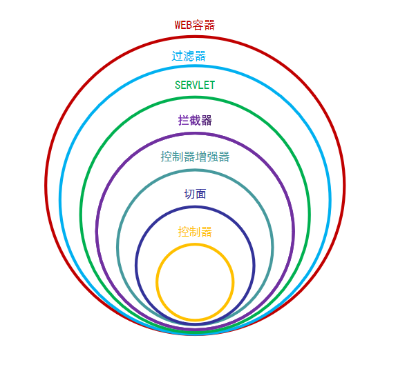
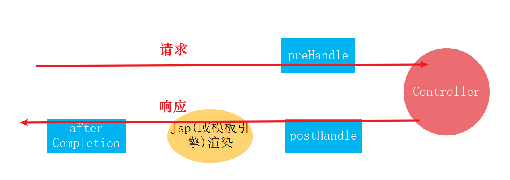
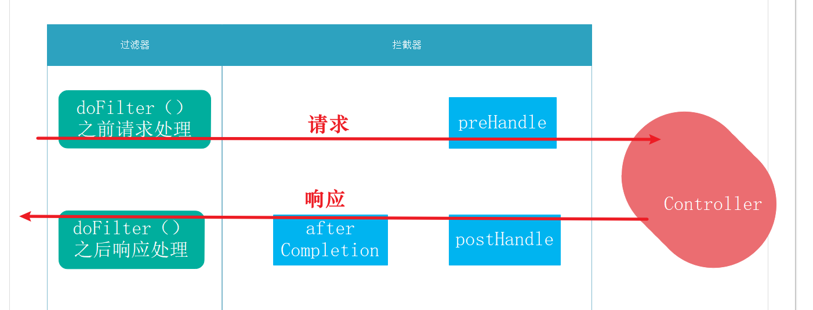

> - 彻底搞懂过滤器、拦截器、监听器、AOP，看这一篇就足够了：https://blog.csdn.net/xiaorui51/article/details/108753111
>
> - SpringBoot 过滤器、拦截器、监听器对比及使用场景：https://blog.csdn.net/qq_38020915/article/details/116431612
>

# 一、关系图




# 二、Servlet

## 1、定义概念

在Java程序员10年以前做Web开发的时候，所有的请求都是由Servlet来接受并响应的。每一个请求，就要写一个Servlet。这种方式很麻烦，大家就想能不能根据请求的路径以及参数不同，映射到不同的方法上去执行，这样就可以在一个Servlet类里面处理多个请求，每个请求就是一个方法。这个思想后来就逐渐发展为Structs、SpringMVC等框架。


## 2、使用场景

目前来看，Servlet使用的场景已经被springMVC封装架构全面覆盖，几乎没有什么需要使用原始Servlet进行开发的场景。但是不排除，老项目向SpringBoot项目迁移融合，需要支持Servlet的情况。


## 3、代码实现

下面我们就看一下，在SpringBoot里面如何实现Servlet

```java
// 标记为servlet，以便启动器扫描。
@WebServlet(name = "firstServlet", urlPatterns = "/firstServlet")
public class FirstServlet extends HttpServlet {
    @Override
    protected void doGet(HttpServletRequest req, HttpServletResponse resp) throws ServletException, IOException {
        resp.getWriter().append("firstServlet");
    }
}
```

然后在启动类加入@ServletComponentScan注解即可。

```java
@ServletComponentScan
@SpringBootApplication
public class XyzApplication {
    public static void main(String[] args) {
        SpringApplication.run(XyzApplication.class, args);
    }
}
```


# 三、过滤器

> - 滤器是在web应用启动的时候初始化一次, 在web应用停止的时候销毁
> - 可以对请求的URL进行过滤, 对敏感词过滤
> - 挡在拦截器的外层
> - 实现的是 javax.servlet.Filter 接口 ，是 Servlet 规范的一部分
> - 在请求进入容器后，但在进入servlet之前进行预处理，请求结束是在servlet处理完以后
> - 依赖Web容器
> - 会多次执行

## 1、Filter（Servlet）

### 1、定义概念

Servlet 过滤器是可用于 Servlet 编程的 Java 类，有以下目的：

- 在客户端的请求访问后端资源之前，拦截这些请求。
- 在服务器的响应发送回客户端之前，处理这些响应


### 2、使用场景

在实际的应用开发中，我们经常使用过滤器做以下的一些事情

- 基于一定的授权逻辑，对HTTP请求进行过滤，从而保证数据访问的安全。比如：判断请求的来源IP是否在系统黑名单中
- 对于一些经过加密的HTTP请求数据，进行统一解密，方便后端资源进行业务处理
- 或者我们社交应用经常需要的敏感词过滤，也可以使用过滤器，将触发敏感词的非法请求过滤掉

过滤器主要的特点在于：一是可以过滤所有请求，二是它能够改变请求的数据内容。


### 3、过滤器（Filter）生命周期

Filter 有三个阶段，分别是初始化，拦截和过滤，销毁。

- 初始化阶段：web 应用程序启动时，web 服务器将创建 Filter 的实例对象，并调用其 init 方法，完成对象的初始化功能，从而为后续的用户请求作好拦截的准备工作，filter 对象只会创建一次，init 方法也只会执行一次。通过 init 方法的参数，可获得代表当前 filter 配置信息的 FilterConfig 对象（永远只调用一次）

- 拦截和过滤阶段：只要请求资源的路径和拦截的路径相同，那么过滤器就会对请求进行过滤，这个阶段在服务器运行过程中会一直循环，不管第几次，都在调用doGet()，doPost() 方法之前。
- 销毁阶段：当服务器（Tomcat）关闭时，Web 容器调用 destroy 方法销毁 Filter。destroy 方法在 Filter 的生命周期中仅执行一次。在 destroy 方法中，可以释放过滤器使用的资源(永远只调用一次)；


### 4、FilterConfig 和 FilterChain 说明

FilterConfig 和 FilterChain 这2个对象是由服务器 (Tomcat) 在创建和调用 Filter 对象时所传入的，这2个对象十分有用，FilterConfig 对象可以读取我们配置的初始参数，FilterChain 可以实现多个 Filter 之间的连接。

1、FilterConfig

```java
public interface FilterConfig {
    String getFilterName(); // 获取 filter 的名称
    ServletContext getServletContext(); // 获取 ServletContext
    String getInitParameter(String var1); // 获取配置的初始参数的值
    Enumeration<String> getInitParameterNames(); // 获取配置的所有参数名称
}
```

2、FilterChain

```java
public interface FilterChain {
    void doFilter(ServletRequest var1, ServletResponse var2) throws IOException, ServletException;
}
```

我们查看源码，可以发现 FilterChain 就只有一个方法，其实这个方法就是用来对拦截进行放行的，如果有多个拦截器，那么就会继续调用下一个 Filter 进行拦截。doFilter 方法需要传入个参数，一个是 ServletRequest，一个是 ServletResponse 参数，这个直接传入进行。

Tomcat 在调用过滤器时，默认就会传入 Request 和 Response，这个参数封装了请求和响应，我们直接使用就行。ServletResquest 和 ServletResponse 可以直接强转成 HttpServletRequest 和 HttpServletResponse，然后使用相应的方法。


### 5、代码实现_注册方式一：利用 @WebFilter 注解配置

Servlet3.0 新增了注解 @WebFilter，原先实现过滤器需要在 web.xml 中进行配置，现在通过此注解，启动启动时会自动扫描自动注册。

| 属性名          | 类型             | 描述                                                         |
| --------------- | ---------------- | ------------------------------------------------------------ |
| filterName      | String           | 指定过滤器的name属性,（springbean也是用该名称），等价于< filter-name> |
| urlPatterns     | String[]         | 指定一组过滤器的URL匹配模式。等价于< url-pattern>            |
| value           | String[]         | 该属性等价于urlPatterns属性，但是两个不应该同时使用          |
| sevletNames     | String[]         | 指定过滤器将用于哪些servlet。取值是@WebServlet中的name属性的取值，或者是web.xml中< servlet-name> |
| dispatcherTypes | DispatcherType[] | 指定一组过滤器的转发模式。具体取值包括：ASYNC、ERROR、FORWARD、INCLUDE、REQUEST，默认REQUEST |
| initParams      | WebInitParam[]   | 指定一组过滤器初始化参数，等价于< init-param>                |
| asyncSupported  | boolean          | 声明过滤器是否支持异步操作模式，等价于< async-supported>标签 |
| description     | String           | 过滤器的描述信息，等价于< description>                       |
| displayName     | String           | 过滤器的显示名，通常配合工具使用，等价于< display-name>      |

```java
// 注册器名称为customFilter,拦截的url为所有
@Slf4j
@WebFilter(filterName="customFilter",urlPatterns={"/*"})
public class CustomFilter implements Filter{

    @Override
    public void init(FilterConfig filterConfig) throws ServletException {
        log.info("filter 初始化");
    }

    @Override
    public void doFilter(ServletRequest request, ServletResponse response, FilterChain chain)
        throws IOException, ServletException {
        log.info("customFilter 请求处理之前----doFilter方法之前过滤请求");
        // 对request、response进行一些预处理, 比如设置请求编码
        // request.setCharacterEncoding("UTF-8");
        // response.setCharacterEncoding("UTF-8");

        // 链路 直接传给下一个过滤器
        chain.doFilter(request, response);
        log.info("customFilter 请求处理之后----doFilter方法之后处理响应");
    }

    @Override
    public void destroy() {
        log.info("filter 销毁");
    }
}
```

然后在启动类加入@ServletComponentScan注解即可。

```java
@ServletComponentScan
@SpringBootApplication
public class XyzApplication {
    public static void main(String[] args) {
        SpringApplication.run(XyzApplication.class, args);
    }
}
```

使用这种方法当注册多个过滤器时，无法指定过滤器的先后执行顺序。原本使用web.xml配置过滤器时，是可指定执行顺序的，但使用@WebFilter时，没有这个配置属性的(需要配合@Order进行)，所以接下来介绍下通过FilterRegistrationBean进行过滤器的注册。

> 小技巧：通过过滤器的Java类名称，进行顺序的约定，比如LogFilter和AuthFilter，此时AuthFilter就会比LogFilter先执行，因为首字母A比L前面。


### 6、代码实现_注册方式二：FilterRegistrationBean 方式配置

FilterRegistrationBean 是 SpringBoot 提供的，此类提供 setOrder 方法，可以为 filter 设置排序值，让 Spring 在注册 Web filter 之前排序后再依次注册。首先要改写 filter, 其实就删掉 @WebFilter 注解即可，其他的都没有变化。然后的代码是 Filter 的注册代码

```java
@Configuration
public class FilterRegistration {
    @Bean
    public FilterRegistrationBean filterRegistrationBean() {
        FilterRegistrationBean registration = new FilterRegistrationBean();
        registration.setFilter(new CustomFilter()); // Filter可以new，也可以使用依赖注入Bean
        registration.setName("customFilter"); // 过滤器名称
        registration.addUrlPatterns("/*"); // 拦截路径
        registration.setOrder(10); // 设置优先级 ,数字越小，优先级越高
        return registration;
    }
}
```

注册多个时，就注册多个FilterRegistrationBean即可,启动后，效果和第一种是一样的。可以访问应用内的任意资源进行过滤器测试，因为过滤器是针对所有的请求和响应。可以输入Filter中的log信息。


### 7、Filter 执行顺序设置

> SptingBoot 过滤器 Filter 的使用方式：https://blog.csdn.net/JokerLJG/article/details/127634366


## 2、HttpServletRequestWrapper（Servlet）

### 1、产生背景

HttpServletRequest 不能对前端传来的参数进行修改，但实际场所像过滤XSS攻击，取认证token统一去除Token前缀等需要进行请求参数的处理，动态增加httpHeader参数，对特殊参数进行处理等操作，此时 **HttpServletRequestWrapper** 就应运而生了。HttpServletRequestWrapper：在请求到达之前对 request 进行修改


### 2、实现原理

HttpServletRequestWrapper 采用装饰者模式对 HttpServletRequest 进行包装，我们可以通过继承 HttpServletRequestWrapper 类去重写getParameterValues()，getParameter() 等方法，实际还是调用 HttpServletRequest 的相对应方法，但是可以对方法的结果进行改装。


### 3、代码实现1 处理 SprngBoot MVC 参数

1、新增 wrapper 类及 filter 类

```java
public class MyFilter implements Filter {
    @Override
    public void doFilter(ServletRequest request, 
                         ServletResponse response, 
                         FilterChain chain) throws IOException, ServletException {
        HttpServletRequest req = (HttpServletRequest) request;
        HttpServletResponse resp = (HttpServletResponse) response;
        chain.doFilter(new MyHttpServletRequestWrapper(req), resp);
    }
}

class MyHttpServletRequestWrapper extends HttpServletRequestWrapper {
    /**
     * @param request
     */
    public MyHttpServletRequestWrapper(HttpServletRequest request) {
        super(request);
    }

    // 只有直接调用request.getParameter()时才会触发, SpringBoot MVC正常接收参数只会进入getParameterValues()
    @Override
    public String getParameter(String name) {
        System.out.println("=============getParameter()=============");
        return super.getParameter(name);
    }
    
    // SpringBoot MVC 非@RequestBody参数都会进入此方法
    @Override
    public String[] getParameterValues(String name) {
        System.out.println("=============getParameterValues()=============");
        if (name.equals("token")){
            return new String[]{"======xxx======"};
        }
        String[] parameterValues = super.getParameterValues(name);
        return parameterValues;
    }
}
```

2、新增配置filter配置类注册filter

```java
@Configuration
public class FilterConfig {
    @Bean
    public FilterRegistrationBean MyFilterRegistration() {
        FilterRegistrationBean registration = new FilterRegistrationBean();
        registration.setDispatcherTypes(DispatcherType.REQUEST);
        registration.setFilter(new MyFilter());
        registration.addUrlPatterns("/*");
        registration.setName("MyFilter");
        registration.setOrder(FilterRegistrationBean.HIGHEST_PRECEDENCE);
        return registration;
    }
}
```

3、新建Controller

```java
@RestController
@RequestMapping("wrapper")
public class RequestWrapperController {
    @RequestMapping("testWrapper")
    public void testWrapper(String name, String token) {
        log.info("----------- name :{} -------------", name);
        log.info("----------- token :{} -------------", token);
    }
}
```

4、访问API（GET）：localhost:8080/wrapper/testWrapper?name=zhangsan

```
----------- name :zhangsan -------------
----------- token :======xxx====== -------------
```


### 4、代码实现2 解决流只能读取一次的问题

对于前端传来的 JSON 数据，我们在服务端基本上都是通过 IO 流来解析，如果是古老的 Servlet，那么我们直接解析 IO 流；如果是在 SpringMVC 中，我们往往通过 @RequestBody 注解来解析。如果通过 IO 流来解析参数，默认情况下，IO 流读一次就结束了，就没有了。而往往有些场景，需要我们多次读取参数。

```java
// 如果在过滤器中读取过一次request.getReader().readLine(),会导致controller获取不到参数报错: 
java.lang.IllegalStateException: getReader() has already been called for this request
```

1、创建 wrapper 类及 filter 类

```java
@Slf4j
public class MyFilter implements Filter {
    @Override
    public void doFilter(ServletRequest request, 
                         ServletResponse response, 
                         FilterChain chain) throws IOException, ServletException {
        HttpServletRequest req = (HttpServletRequest) request;
        HttpServletResponse resp = (HttpServletResponse) response;
        MyHttpServletRequestWrapper myRequest = new MyHttpServletRequestWrapper(req, resp);
        chain.doFilter(myRequest, resp);
        System.out.println("测试读取流: ");
        System.out.println(StreamUtils.copyToString(myRequest.getInputStream(), StandardCharsets.UTF_8));
    }
}

/**
 * 首先在构造的时候，就通过 IO 流将数据读取出来并存入到一个 byte 数组中，
 * 然后重写 getReader 和 getInputStream 方法，在这两个读取 IO 流的方法中，
 * 都从 byte 数组中返回 IO 流数据出来，这样就实现了反复读取了。
 * 接下来定义一个过滤器，让这个装饰后的 Request 生效
 */
class MyHttpServletRequestWrapper extends HttpServletRequestWrapper {
    private final byte[] requestBody;
    public MyHttpServletRequestWrapper(HttpServletRequest request,
                                       ServletResponse response) throws IOException {
        super(request);
        request.setCharacterEncoding("UTF-8");
        response.setCharacterEncoding("UTF-8");
        requestBody = StreamUtils.copyToByteArray(request.getInputStream());
    }

    @Override
    public ServletInputStream getInputStream() {
        final ByteArrayInputStream bais = new ByteArrayInputStream(requestBody);
        return new ServletInputStream() {
            @Override
            public int read() {
                return bais.read();
            }

            @Override
            public int available() {
                return requestBody.length;
            }

            @Override
            public boolean isFinished() {
                return false;
            }

            @Override
            public boolean isReady() {
                return false;
            }

            @Override
            public void setReadListener(ReadListener readListener) {
            }
        };
    }
    
    @Override
    public BufferedReader getReader() {
        return new BufferedReader(new InputStreamReader(getInputStream()));
    }
}
```

2、新增配置filter配置类注册filter

```java
@Configuration
public class FilterConfig {
    @Bean
    public FilterRegistrationBean MyFilterRegistration() {
        FilterRegistrationBean registration = new FilterRegistrationBean();
        registration.setDispatcherTypes(DispatcherType.REQUEST);
        registration.setFilter(new MyFilter());
        registration.addUrlPatterns("/*");
        registration.setName("MyFilter");
        registration.setOrder(FilterRegistrationBean.HIGHEST_PRECEDENCE);
        return registration;
    }
}
```

3、新建Controller测试

```java
@RestController
@RequestMapping("wrapper")
public class RequestWrapperController {
    @PostMapping("testWrapper")
    public void testWrapperPost(@RequestBody String str) {
        System.out.println(str);
    }
}
```

4、访问API（POST）：localhost:8080/wrapper/testWrapper，下面是request body参数

```json
{"name": "Sam"}
```

5、打印结果如下

```shell
{"name": "Sam"}
测试读取流: 
{"name": "Sam"}
```


### 5、代码实现3 动态添加RequestBody参数

在【代码实现 3】基础上进行修改：

1、创建 wrapper 类及 filter 类

```java
import com.fasterxml.jackson.databind.ObjectMapper;
import com.fasterxml.jackson.databind.node.ObjectNode;
import lombok.extern.slf4j.Slf4j;
import org.springframework.util.StreamUtils;

import javax.servlet.*;
import javax.servlet.http.HttpServletRequest;
import javax.servlet.http.HttpServletRequestWrapper;
import javax.servlet.http.HttpServletResponse;
import java.io.BufferedReader;
import java.io.ByteArrayInputStream;
import java.io.IOException;
import java.io.InputStreamReader;
import java.nio.charset.StandardCharsets;

@Slf4j
public class MyFilter implements Filter {
    @Override
    public void doFilter(ServletRequest request,
                         ServletResponse response,
                         FilterChain chain) throws IOException, ServletException {
        HttpServletRequest req = (HttpServletRequest) request;
        HttpServletResponse resp = (HttpServletResponse) response;
        MyHttpServletRequestWrapper myRequest = new MyHttpServletRequestWrapper(req, resp);
        chain.doFilter(myRequest, resp);
        // 增加和修改requestBody中的参数
        myRequest.setRequestBody("city", "GZ");
        System.out.println("测试读取流: " + StreamUtils.copyToString(myRequest.getInputStream(), StandardCharsets.UTF_8));
    }
}

/**
 * 首先在构造的时候，就通过 IO 流将数据读取出来并存入到一个 byte 数组中，
 * 然后重写 getReader 和 getInputStream 方法，在这两个读取 IO 流的方法中，
 * 都从 byte 数组中返回 IO 流数据出来，这样就实现了反复读取了。
 * 接下来定义一个过滤器，让这个装饰后的 Request 生效
 */
class MyHttpServletRequestWrapper extends HttpServletRequestWrapper {
    private byte[] requestBody;
    public MyHttpServletRequestWrapper(HttpServletRequest request,
                                       ServletResponse response) throws IOException {
        super(request);
        request.setCharacterEncoding("UTF-8");
        response.setCharacterEncoding("UTF-8");
        requestBody = StreamUtils.copyToByteArray(request.getInputStream());
    }

    @Override
    public ServletInputStream getInputStream() {
        final ByteArrayInputStream bais = new ByteArrayInputStream(requestBody);
        return new ServletInputStream() {
            @Override
            public int read() {
                return bais.read();
            }

            @Override
            public int available() {
                return requestBody.length;
            }

            @Override
            public boolean isFinished() {
                return false;
            }

            @Override
            public boolean isReady() {
                return false;
            }

            @Override
            public void setReadListener(ReadListener readListener) {
            }
        };
    }
    
    @Override
    public BufferedReader getReader() {
        return new BufferedReader(new InputStreamReader(getInputStream()));
    }

    /**
     * 获取请求体
     * @return 请求体
     */
    public void setRequestBody(String k, String v) throws IOException {
        ObjectMapper objectMapper = new ObjectMapper();
        ObjectNode objectNode = objectMapper.readValue(requestBody, ObjectNode.class);
        objectNode.put(k, v);
        objectNode.put("name", "Java");
        requestBody = objectMapper.writeValueAsBytes(objectNode);
    }
}
```

2、访问API（POST）：localhost:8080/wrapper/testWrapper，下面是request body参数

```json
{"name": "Sam"}
```

3、打印结果如下

```
{"name": "Sam"}
测试读取流: {"name":"Java","city":"GZ"}
```


### 6、代码实现4 实现动态添加请求头信息

1、创建 wrapper 类及 filter 类

```java
public class MyFilter implements Filter {
    @Override
    public void doFilter(ServletRequest request, ServletResponse response, FilterChain chain)
            throws IOException, ServletException {
        HttpServletRequest req = (HttpServletRequest) request;
        HttpServletResponse resp = (HttpServletResponse) response;
        HeaderMapRequestWrapper requestWrapper = new HeaderMapRequestWrapper(req);
        // 自定义逻辑增加header
        requestWrapper.addHeader("customHeader", "xxxxxx");
        chain.doFilter(requestWrapper, resp);
    }

    class HeaderMapRequestWrapper extends HttpServletRequestWrapper {
        private Map<String, String> headerMap = new HashMap<>();

        /**
         * construct a wrapper for this request
         */
        public HeaderMapRequestWrapper(HttpServletRequest request) {
            super(request);
        }

        /**
         * add a header with given name and value
         */
        public void addHeader(String name, String value) {
            headerMap.put(name, value);
        }

        @Override
        public String getHeader(String name) {
            String headerValue = super.getHeader(name);
            if (headerMap.containsKey(name)) {
                headerValue = headerMap.get(name);
            }
            return headerValue;
        }

        @Override
        public Enumeration<String> getHeaderNames() {
            List<String> names = Collections.list(super.getHeaderNames());
            for (String name : headerMap.keySet()) {
                names.add(name);
            }
            return Collections.enumeration(names);
        }

        @Override
        public Enumeration<String> getHeaders(String name) {
            List<String> values = Collections.list(super.getHeaders(name));
            if (headerMap.containsKey(name)) {
                //values = Arrays.asList(headerMap.get(name));
                values.add(headerMap.get(name));
            }
            return Collections.enumeration(values);
        }
    }
}
```

2、新增配置filter配置类注册filter

```java
@Configuration
public class FilterConfig {
    @Bean
    public FilterRegistrationBean MyFilterRegistration() {
        FilterRegistrationBean registration = new FilterRegistrationBean();
        registration.setDispatcherTypes(DispatcherType.REQUEST);
        registration.setFilter(new MyFilter());
        registration.addUrlPatterns("/*");
        registration.setName("MyFilter");
        registration.setOrder(FilterRegistrationBean.HIGHEST_PRECEDENCE);
        return registration;
    }
}
```

3、新建Controller测试

```java
@RestController
@RequestMapping("wrapper")
public class RequestWrapperController {
    @GetMapping("testWrapper")
    public void testWrapperHeader(@RequestHeader HttpHeaders headers) {
        System.out.println(headers.getFirst("customHeader"));
    }
}
```

4、访问API（GET）：localhost:8080/wrapper/testWrapper

```shell
xxxxxx
```


### 7、参考文献 & 鸣谢

> 1. HttpServletRequestWrapper 去除@RequestBody参数两端的空格：https://mp.weixin.qq.com/s/-72uNCI2nYbL9rwbigs-bQ
> 2. HttpServletRequestWrapper 解决流只能读取一次的问题：https://blog.csdn.net/qq_43437874/article/details/122102362
> 3. HttpServletRequestWrapper实现添加请求头：https://blog.csdn.net/weixin_43931625/article/details/104998427
> 4. ServletRequestWrapper、ServletResponseWrapper：https://mp.weixin.qq.com/s/Y2YrjqgI-MMF9d4TeXE-Eg


## 3、OncePerRequestFilter（SpringBoot）

### 1、简单介绍

OncePerRequestFilter 类是一个实现了 javax.servlet.Filter 原生接口的抽象类。OncePerRequestFilter 可以保证一次外部请求，只执行一次过滤方法，对于服务器内部之间的 forward 等请求，不会再次执行过滤方法。OncePerRequestFilter 又称单次过滤器。

在学习"OncePerRequestFilter"前，我们先看一下过滤器是什么？

1. 过滤器在WEB应用启动时初始化一次, 在WEB应用停止时销毁；
2. 可以对请求的URL进行过滤, 对敏感词过滤；
3. 过滤器将处理逻辑挡在拦截器的外面；
4. 过滤器实现的是 javax.servlet.Filter原生接口，过滤器是SERVLET 规范的一部分；
5. 过滤器在请求进入WEB容器后，到达SERVLET之前进行过滤器的逻辑处理；
6. 过滤器依赖WEB容器，也会被多次执行。
7. 过滤器的作用就是在业务逻辑执行前/后对请求和响应进行相应的处理，如果能配合HttpServletRequestWrapper和HttpServletResponseWrapper使用更加完美。


### 2、使用场景

OncePerRequestFilter 的主要目的是为了兼容不同的 WEB 容器，因为 Servlet 版本不同，执行的过程也不同，其实不是所有的容器一次请求只过滤一次。所以如果是在 SpringBoot 或者 Spring 项目中尽量使用 OncePerRequestFilter过滤器。


### 3、执行顺序

SpringBoot 中 OncePerRequestFilter 的执行顺序：

- 当定义了多个Filter时，OncePerRequestFilter总是在第一个Filter之后执行
- 多个OncePerRequestFilter之间也可以有@Order指定顺序
- 所有OncePerRequestFilter按顺序执行完毕之后，才执行第二个Filter
- OncePerRequestFilter也满足Filter队列的出队顺序


### 3、源码分析

```java
public abstract class OncePerRequestFilter extends GenericFilterBean {
    // ...
    public final void doFilter(ServletRequest request, ServletResponse response, FilterChain filterChain) throws ServletException, IOException {
        if (request instanceof HttpServletRequest && response instanceof HttpServletResponse) {
            HttpServletRequest httpRequest = (HttpServletRequest)request;
            HttpServletResponse httpResponse = (HttpServletResponse)response;

            // 获取是否执行过滤方法的一个属性KEY，作为是否执行过滤方法的一个标记
            String alreadyFilteredAttributeName = this.getAlreadyFilteredAttributeName();

            // 检测当前请求的属性中该标记的值是否为空，如果不为空则说明已执行过滤方法了
            boolean hasAlreadyFilteredAttribute = request.getAttribute(alreadyFilteredAttributeName) != null;
            if (!this.skipDispatch(httpRequest) && !this.shouldNotFilter(httpRequest)) {
                // 已执行
                if (hasAlreadyFilteredAttribute) {
                    if (DispatcherType.ERROR.equals(request.getDispatcherType())) {
                        this.doFilterNestedErrorDispatch(httpRequest, httpResponse, filterChain);
                        return;
                    }

                    filterChain.doFilter(request, response);
                } else {
                    // 未执行
                    request.setAttribute(alreadyFilteredAttributeName, Boolean.TRUE);

                    try {
                        // 这个抽象方法需要子类去实现具体的过滤逻辑
                        this.doFilterInternal(httpRequest, httpResponse, filterChain);
                    } finally {
                        // 执行完毕移除标记
                        request.removeAttribute(alreadyFilteredAttributeName);
                    }
                }
            } else {
                filterChain.doFilter(request, response);
            }

        } else {
            throw new ServletException("OncePerRequestFilter just supports HTTP requests");
        }
    }
    // ...
}
```


### 4、如何使用

```java
package com.xyz.filter;

import lombok.extern.slf4j.Slf4j;
import org.springframework.stereotype.Component;
import org.springframework.web.filter.OncePerRequestFilter;
import javax.servlet.FilterChain;
import javax.servlet.ServletException;
import javax.servlet.http.HttpServletRequest;
import javax.servlet.http.HttpServletResponse;
import java.io.IOException;
import java.io.PrintWriter;
import java.util.Arrays;

/**
 * 请求过滤器
 * OncePerRequestFilter:顾名思义，它能够确保在一次请求中只通过一次filter.
 *
 * 大家常识上都认为，一次请求本来就只filter一次，为什么还要由此特别限定呢，
 * 往往我们的常识和实际的实现并不真的一样，经过一番资料的查阅，此方法是为了兼容不同的web container，
 * 也就是说并不是所有的container都入我们期望的只过滤一次，servlet版本不同，执行过程也不同，
 * 因此，为了兼容各种不同运行环境和版本，默认自定义filter继承OncePerRequestFilter是一个比较稳妥的选择。
 */
@Slf4j
@Component
public class CustomFilter extends OncePerRequestFilter {
    /**
     * OncePerRequestFilter.doFilter方法中通过request.getAttribute判断当前过滤器是否已执行
     * 若未执行过，则调用doFilterInternal方法，交由其子类实现
     */
    @Override
    protected void doFilterInternal(HttpServletRequest httpServletRequest, HttpServletResponse httpServletResponse, FilterChain filterChain) throws ServletException, IOException {
        try {
            CustomRequestWrapper customRequestWrapper = new CustomRequestWrapper(httpServletRequest);
            filterChain.doFilter(customRequestWrapper, httpServletResponse);
            log.info("RequestFilter");
            log.info(Arrays.toString(customRequestWrapper.getParameterValues("name")));
        } catch (Exception exception) {
            httpServletResponse.setCharacterEncoding("utf-8");
            httpServletResponse.setContentType("application/json; charset=utf-8");
            PrintWriter writer = httpServletResponse.getWriter();
            writer.write(exception.toString());
        }
    }
}
```

```java
@Configuration
public class FilterRegistration {
    @Bean
    public FilterRegistrationBean<CustomFilter> registrationBean() {
        FilterRegistrationBean<CustomFilter> registrationBean = new FilterRegistrationBean<>();
        registrationBean.setFilter(new CustomFilter()); // 注入filter对象
        registrationBean.addUrlPatterns("/filter/*"); // 拦截路径
        registrationBean.setName("CustomFilter"); // 设置执行顺序,数字越低优先级越高
        registrationBean.setOrder(1); // 设置执行顺序,值越低优先级越高
        registrationBean.setDispatcherTypes(DispatcherType.REQUEST);
        return registrationBean;
    }
}
```

番外配置：SpringBoot官方推荐的重复执行的FILTER只执行一次的解决方案：

```java
@Configuration(proxyBeanMethods = false)
public class MyFilterConfiguration {
    @Bean
    public FilterRegistrationBean<MyFilter> registration(MyFilter filter) {
        FilterRegistrationBean<MyFilter> registration = new FilterRegistrationBean<>(filter);
        registration.setEnabled(false);
        return registration;
    }
}
```


## 4、DispatcherServlet（SpringMVC）

首先分析过滤器Filter的缺点：系统中各处理执行顺序为：过滤器 > 拦截器 > AOP。RequestBodyAdvice 增强器本质属于AOP，既然body的数据处理在最后，而采取过滤器这种方式又在最前边，对于我这种重度晚期强迫症患者是肯定不能忍的。

**扩展前置控制器DispatcherServlet（SpringMVC）**：这种方式最为推荐，它的执行顺序介于过滤器和拦截器之间，是最理想的方式。

1、自定义扩展前置控制器DispatcherServlet，重写doDispatch方法

```java
public class CustomDispatcherServlet extends DispatcherServlet {
    @Override
    protected void doDispatch(HttpServletRequest request, HttpServletResponse response) throws Exception {
        /**
         * 这里如果需要就加入逻辑，如果不需要则直接：super.doDispatch(request, response);
         */
        HeaderMapRequestWrapper requestWrapper = new HeaderMapRequestWrapper(request);
        // 自定义逻辑增加header
        requestWrapper.addHeader("customHeader", "xxxxxx");
        super.doDispatch(requestWrapper, response);
    }

    class HeaderMapRequestWrapper extends HttpServletRequestWrapper {
        private Map<String, String> headerMap = new HashMap<>();
        
        public HeaderMapRequestWrapper(HttpServletRequest request) {
            super(request);
        }
        
        public void addHeader(String name, String value) {
            headerMap.put(name, value);
        }

        @Override
        public String getHeader(String name) {
            String headerValue = super.getHeader(name);
            if (headerMap.containsKey(name)) {
                headerValue = headerMap.get(name);
            }
            return headerValue;
        }

        @Override
        public Enumeration<String> getHeaderNames() {
            List<String> names = Collections.list(super.getHeaderNames());
            for (String name : headerMap.keySet()) {
                names.add(name);
            }
            return Collections.enumeration(names);
        }

        @Override
        public Enumeration<String> getHeaders(String name) {
            List<String> values = Collections.list(super.getHeaders(name));
            if (headerMap.containsKey(name)) {
                //values = Arrays.asList(headerMap.get(name));
                values.add(headerMap.get(name));
            }
            return Collections.enumeration(values);
        }
    }
}
```

2、注册自定义扩展前置控制器DispatcherServlet

```java
@Configuration
public class CustomConfiguration {
    /**
     * 注册自定义DispatcherServlet配置
     * @Qualifier:Qualifier: 的意思是合格者，通过这个标识，表明了哪个实现类才是我们所需要的，
     * 添加@Qualifier注解，需要注意的是@Qualifier的参数名称为我们之前定义@Service注解的名称之一。
     * 当然也可以不加此注解，直接在@Bean指明需要实现的类:
     * @Bean(value = DispatcherServletAutoConfiguration.DEFAULT_DISPATCHER_SERVLET_BEAN_NAME)
     */
    @Bean
    @Qualifier(DispatcherServletAutoConfiguration.DEFAULT_DISPATCHER_SERVLET_BEAN_NAME)
    public DispatcherServlet dispatcherServlet() {
        return new CustomDispatcherServlet();
    }
}
```

3、新建Controller测试

```java
@RestController
@RequestMapping("wrapper")
public class RequestWrapperController {
    @GetMapping("testWrapper")
    public void testWrapperHeader(@RequestHeader HttpHeaders headers) {
        System.out.println(headers.getFirst("customHeader"));
    }
}
```

4、访问API（GET）：localhost:8080/wrapper/testWrapper

```shell
xxxxxx
```


# 四、拦截器

## 1、Interceptor拦截器简单介绍

在 Servlet 规范中并没有拦截器的概念，它是在Spring框架内衍生出来。

- 实现 org.springframework.web.servlet.HandlerInterceptor 接口，动态代理。拦截器应用场景, 性能分析, 权限检查, 日志记录
- Interceptor 是 Spring 组件，并由 Spring 容器管理，不依赖 Tomcat 等容器，可单独使用，不仅能应用在 Web 程序中，也可以用于Application、Swing等程序中
- 是在请求进入Servlet后，在进入Controller之前进行预处理的，Controller 中渲染了对应的视图之后请求结束



Spring中拦截器有三个方法：

- preHandle 表示被拦截的URL对应的控制层方法，执行前的自定义处理逻辑
- postHandle 表示被拦截的URL对应的控制层方法，执行后的自定义处理逻辑，此时还未将modelAndView进行页面渲染。
- afterCompletion 表示此时modelAndView已做页面渲染，执行拦截器的自定义处理。


## 2、拦截器与过滤器的核心区别

从请求处理的生命周期上看，拦截器Interceptor和过滤器filter的作用是类似的。过滤球能做的事情，拦截器几乎也都能做。

但是二者使用场景还是有一些区别的：

- 规范不同：Filter是在Servlet规范中定义的组件，在servlet容器内生效。而拦截器是Spring框架支持的，在Spring 上下文中生效。
- 拦截器可以获取并使用Spring IOC容器中的bean，但过滤器就不行。因为过滤器是Servlet的组件，而IOC容器的bean是Spring框架内使用，拦截器恰恰是Spring框架内衍生出来的。
- 拦截器可以访问Spring上下文值对象，如ModelAndView，过滤器不行。基于与上一点同样的原因。
- 过滤器在进入servlet容器之前处理请求，拦截器在servlet容器之内处理请求。过滤器比拦截器的粒度更大，比较适合系统级别的所有API的处理动作。比如：权限认证，Spring Security就大量的使用了过滤器。
- 拦截器相比于过滤器粒度更小，更适合分模块、分范围的统一业务逻辑处理。比如：分模块的、分业务的记录审计日志。（后面在日志的管理的那一章，我们会为介绍使用拦截器实现统一访问日志的记录）

比如：我们在 Filter 中使用注解@Autowired，注入某个Service，结果为null。因为过滤器无法使用Spring IOC容器Bean（当时这也不是绝对的，如果你在该 Filter 类上加一个@Component 注解，把 Filter 放进 Spring IOC 容器中，那么就可以注入Service使用了）


## 3、拦截器的实现

1、编写自定义拦截器类，此处我们用一个简单的例子让大家了解拦截器的生命周期。后面在日志的管理的那一章，我们会为介绍使用拦截器实现统一访问日志的记录的实战。

```java
import lombok.extern.slf4j.Slf4j;
import org.springframework.stereotype.Component;
import org.springframework.web.servlet.HandlerInterceptor;

import javax.servlet.http.HttpServletRequest;
import javax.servlet.http.HttpServletResponse;

@Slf4j
@Component
public class CustomHandlerInterceptor implements HandlerInterceptor {

    @Override
    public boolean preHandle(HttpServletRequest request, HttpServletResponse response, Object handler)
            throws Exception {
        log.info("preHandle:请求前调用");
        User user = (User) request.getSession().getAttribute("user");
        if (!ObjectUtils.isEmpty(user)) {
            return true;
        } else {
            // 不管是转发还是重定向，必须返回false。否则出现多次提交响应的错误
            redirect(request, response);
            return false;  // 返回 false 则请求中断
        }
        return true;
    }

    @Override
    public void postHandle(HttpServletRequest request, HttpServletResponse response,
                           Object handler, ModelAndView modelAndView) throws Exception {
        log.info("postHandle:请求后调用");
    }

    @Override
    public void afterCompletion(HttpServletRequest req, HttpServletResponse resp, Object handler, Exception ex)
            throws Exception {
        log.info("afterCompletion:请求调用完成后回调方法，即在视图渲染完成后回调");
    }

    /*
     * 对于请求是ajax请求重定向问题的处理方法
     * @param request
     * @param response
     *
     */
    public void redirect(HttpServletRequest request, HttpServletResponse response) throws IOException {

        if ("XMLHttpRequest".equals(request.getHeader("X-Requested-With"))) {// ajax
            // 获取当前请求的路径
            response.setHeader("Access-Control-Expose-Headers", "REDIRECT,CONTENT_PATH");
            // 告诉ajax我是重定向
            response.setHeader("REDIRECT", "REDIRECT");
            // 告诉ajax我重定向的路径
            StringBuffer url = request.getRequestURL();
            String contextPath = request.getContextPath();
            String path = url.replace(url.indexOf(contextPath) + contextPath.length(), url.length(), "/").toString();
            response.setHeader("CONTENT_PATH", path);
        } else {// http
            response.sendRedirect("/page/login");
        }

        response.getWriter().write(403);
        response.setStatus(HttpServletResponse.SC_FORBIDDEN);
    }
}
```

2、通过实现WebMvcConfigurer 接口完成拦截器的注册。（旧版本中是继承WebMvcConfigurerAdapter注册拦截器，不过已废弃）

```java
import org.springframework.context.annotation.Configuration;
import org.springframework.web.servlet.config.annotation.InterceptorRegistry;
import org.springframework.web.servlet.config.annotation.ResourceHandlerRegistry;
import org.springframework.web.servlet.config.annotation.ViewControllerRegistry;
import org.springframework.web.servlet.config.annotation.WebMvcConfigurer;
import javax.annotation.Resource;

@Configuration
public class MyWebMvcConfigurer implements WebMvcConfigurer {
    @Resource
    CustomHandlerInterceptor customHandlerInterceptor;

    /*
     * 拦截器依赖于Spring容器，此处拦截了所有，还可以对静态资源进行放行
     */
    @Override
    public void addInterceptors(InterceptorRegistry registry) {
        // 注册拦截器拦截规则, 多个拦截器时依次添加执行顺序按添加顺序
        registry.addInterceptor(customHandlerInterceptor).addPathPatterns("/*");
        // 多个拦截器时也可以通过Order手动设置控制，值越小越先执行
        registry.addInterceptor(customHandlerInterceptor).addPathPatterns("/v1").order(1);
        registry.addInterceptor(customHandlerInterceptor).addPathPatterns("/v2").order(2);
        // 此处拦截了所有，并且对静态资源进行放行
        registry.addInterceptor(customHandlerInterceptor)
                .addPathPatterns("/*")
                .excludePathPatterns("/user/login", "/static/**");
    }

    /*
     * 不要要写控制器即可完成页面跳转访问
     * @param registry
     */
    @Override
    public void addViewControllers(ViewControllerRegistry registry) {
        registry.addViewController("/v1").setViewName("v1");
        registry.addViewController("/v2").setViewName("v2");
    }

    /**
     * 自定义静态资源映射 SpringBoot 默认为我们提供了静态资源映射:
     *     classpath:/META-INF/resources
     *     classpath:/resources
     *     classpath:/static
     *     classpath:/public
     * 优先级：META-INF/resources > resources > static > public
     */
    @Override
    public void addResourceHandlers(ResourceHandlerRegistry registry) {
        registry.addResourceHandler("/static/**").addResourceLocations("classpath:/static/");
        registry.addResourceHandler("/static/**").addResourceLocations("file:E:/static/");
    }
}
```

3、我们在CustomHandlerInterceptor ，注入一个测试Service，结果是可以正确依赖注入并使用该Service的。


## 4、请求链路说明

随便请求一个API（因为我们配置的过滤器拦截器拦截所有请求），通过输出结果分析一下拦截器、过滤器中各接口函数的执行顺序。

```
CustomFilter  : customFilter 请求处理之前----doFilter方法之前过滤请求
CustomHandlerInterceptor  : preHandle:请求前调用
CustomHandlerInterceptor  : postHandle:请求后调用
CustomHandlerInterceptor  : afterCompletion:请求调用完成后回调方法，即在视图渲染完成后回调
CustomFilter  : customFilter 请求处理之后----doFilter方法之后处理响应
```

请求链路调用顺序图如下所示：




## 5、注意事项

1、静态资源问题

- SpringBoot2.x以后版本拦截器也会拦截静态资源，在配置拦截器是需要将姿态资源放行。

  ```java
  /*
   * 拦截器依赖于Spring容器，此处拦截了所有，需要对静态资源进行放行
   */
  @Override
  public void addInterceptors(InterceptorRegistry registry) {
      registry.addInterceptor(new PageInterceptor()).addPathPatterns("/**")
          .excludePathPatterns("/page/login", "/user/login","/page/ajax","/static/**");
  }
  ```

- SpringBoot2.x 自定义静态资源映射

  ```yaml
  spring:
    mvc:
      static-path-pattern: /static/**
  ```

- 默认目录：

  - classpath:/META-INF/resources
  - classpath:/resources
  - classpath:/static
  - classpath:/public
  - 优先级：META-INF/resources > resources > static > public


# 五、监听器

> 谈一谈 SpringBoot 怎么使用事件机制：https://www.codehome.vip/archives/springboot-sub-pub

## 1、监听器概述

什么事Web监听器？web监听器就是Servlet中特殊的类，他们能帮助开发者监听web中的特定事件，比如ServletContext、HttpSession、ServletRequest的创建和销毁；变量的创建、销毁和修改等。可以在某些动作前后增加处理，实现监控等等。web监听器的使用场景有很多，比如：

1. javax.servlet.ServletContextListener：监听Servlet上下文用来初始化一些数据
2. javax.servlet.http.HttpSessionListener：监听HttpSession用来获取当前在线的人数
3. javax.servlet.ServletRequestListener：监听客户端请求的ServletRequest对象来获取用户的访问信息

**1、事件监听的角色**

首先我们要理解事件监听中需要的几个角色：事件发布者 （即事件源）、事件监听者、事件本身

**2、事件监听的使用场景**

为了将技术问题简单化，为大家举一个简单的例子。比如居委会发布停水通知。居委会就是事件源、停水就是事件本身、该居委会的辖区居民就是事件监听者。大家看这个例子，有这样几个特点：

- 异步处理：居委会工作人员发布通知之后，就可以去忙别的工作了，不会原地等待所有居民的反馈。
- 解耦：居委会和居民之间是解耦的，互相不干扰对方的工作状态与生活状态。
- 不规律性：对于停水的事件发生频率是不规律的，触发规则相对随机。

当你在一个系统的业务需求中，满足上面的几个特点中的2点，就应该考虑使用事件监听机制实现业务需求。当然实现事件监听机制有很的方法，比如：

- 使用消息队列中间件的发布订阅模式
- JDK自带的java.util.EventListener
- Spring环境下的实现事件发布监听的方法（本次介绍）
- 等等...


## 2、监听ServletContext

监听 Servlet 上下文对象可以用来初始化数据，用于缓存。 比如：

- 比如用户在点击某个站点的首页时，一般都会展现出首页的一些信息，而这些信息基本上或者大部分时间都保持不变的，但是这些信息都是来自数据库。如果用户的每次点击，都要从数据库中去获取数据的话，用户量少还可以接受，如果用户量非常大的话，这对数据库也是一笔很大的开销。

- 针对这种首页数据，大部分都不常更新的话，我们完全可以把它们缓存起来，每次用户点击的时候，我们都直接从缓存中拿，这样既可以提高首页的访问速度，又可以降低服务器的压力。如果做的更加灵活一点，可以再加个定时器，定期的来更新这个首页缓存。


1、针对这个功能，来写一个 Demo，在实际中可以完全套用该代码，来实现自己项目中的相关逻辑。首先写一个 Service，模拟一下从数据库查询数据：

```java
@Data
@NoArgsConstructor
@AllArgsConstructor
public class User {
    private Integer uid;
    private String username;
    private String pwd;
}
```

```java
@Service
public class UserService {
    /**
     * 获取用户信息
     */
    public User getUser(){
        // 实际业务场景下，会从数据库中获取数据
        return new User(10001,"张三","123456");
    }
}
```

2、然后写一个监听器，实现 `ApplicationListener<ContextRefreshedEvent>` 接口，重写 onApplicationEvent 方法，将 ContextRefreshedEvent 对象传进去。如果我们想在加载或刷新应用上下文时，也重新刷新下我们预加载的资源，就可以通过监听 ContextRefreshedEvent 来做这样的事情。如下：

```java
@Component
public class MyListener implements ApplicationListener<ContextRefreshedEvent> {
    @Override
    public void onApplicationEvent(ContextRefreshedEvent contextRefreshedEvent) {
        // 首先获去application上下文
        ApplicationContext applicationContext = contextRefreshedEvent.getApplicationContext();
        // 获取对应的Service
        UserService userService = applicationContext.getBean(UserService.class);
        User user = userService.getUser();
        // 获取application的域对象，将查到的信息放到application域中
        ServletContext application = applicationContext.getBean(ServletContext.class);
        application.setAttribute("user", user);
    }
}
```

3、首先通过 contextRefreshedEvent 来获取 application 上下文，再通过 application 上下文来获取 UserService 这个 bean，项目中可以根据实际业务场景，也可以获取其他的 bean，然后再调用自己的业务代码获取相应的数据，最后存储到 application 域中，这样前端在请求相应数据的时候，我们就可以直接从 application 域中获取信息，减少数据库的压力。下面写一个 Controller 直接从 application 域中获取 user 信息来测试一下。

```java
@RestController
@RequestMapping("/listener")
public class UserController {
    @GetMapping("/user")
    public User getUser(HttpServletRequest request){
        ServletContext application = request.getServletContext();
        User user = (User) application.getAttribute("user");
        return user;
    }
}
```

启动项目，在浏览器中输入 `http://localhost:8080/listener/user` 测试一下即可，如果正常返回 user 信息，那么说明数据已经缓存成功。不过 application 这种是缓存在内存中，对内存会有消耗。


## 3、监听HTTP会话Session对象

1、监听器还有一个比较常用的地方就是用来监听 session 对象，来获取在线用户数量，现在有很多开发者都有自己的网站，监听 session 来获取当前在下用户数量是个很常见的使用场景，下面来介绍一下如何来使用。

```java
@Sl4j
@Component
public class MyHttpSessionListener implements HttpSessionListener {
    public Integer count = 0; // 记录用户在线的数量

    @Override
    public void sessionCreated(HttpSessionEvent httpSessionEvent) {
        log.info("=========新用户上线了========");
        count++;
        httpSessionEvent.getSession().getServletContext().setAttribute("count", count);
    }

    @Override
    public void sessionDestroyed(HttpSessionEvent httpSessionEvent) {
        log.info("==========用户下线了=========");
        count--;
        httpSessionEvent.getSession().getServletContext().setAttribute("count", count);
    }
}
```

2、上述监听器需要实现 HttpSessionListener 接口，然后重写 sessionCreated 和 sessionDestroyed 方法，在 sessionCreated 方法中传递一个 HttpSessionEvent 对象，然后将当前 session 中的用户数量加1，sessionDestroyed 方法刚好相反，不再赘述。然后我们写一个 Controller 来测试一下。

```java
@RestController
@RequestMapping("/listener")
public class HttpSessionListenerController {
    @GetMapping("/total")
    public String getTotalUser(HttpServletRequest request){
        Integer count = (Integer) request.getSession().getServletContext().getAttribute("count");
        return "当前在线人数："+count;
    }
}
```

3、该 Controller 中是直接获取当前 session 中的用户数量，启动服务器，在浏览器中输入 localhost:8080/listener/total 可以看到返回的结果是1，再打开一个浏览器，请求相同的地址可以看到 count 是 2 ，这没有问题。但是如果关闭一个浏览器再打开，理论上应该还是2，但是实际测试却是 3。原因是 session 销毁的方法没有执行（可以在后台控制台观察日志打印情况），当重新打开时，服务器找不到用户原来的 session，于是又重新创建了一个 session，那怎么解决该问题呢？我们可以将上面的 Controller 方法改造一下：

```java
@RestController
@RequestMapping("/listener")
public class HttpSessionListenerController {
    @GetMapping("/total")
    public String getTotalUser(HttpServletRequest request, HttpServletResponse response){
        Cookie cookie;
        try {
            cookie = new Cookie("JSESSIONID", URLEncoder.encode(request.getSession().getId(), "utf-8"));
            cookie.setMaxAge(2*24*60*60); // 设置Cookie有效期
            response.addCookie(cookie);
        } catch (UnsupportedEncodingException e) {
            e.printStackTrace();
        }
        Integer count = (Integer) request.getSession().getServletContext().getAttribute("count");
        return "当前在线人数："+count;
    }
}
```

可以看出，该处理逻辑是让服务器记得原来那个 session，即把原来的 sessionId 记录在浏览器中，下次再打开时，把这个 sessionId 传过去，这样服务器就不会重新再创建了。重启一下服务器，在浏览器中再次测试一下，即可避免上面的问题。


## 4、监听客户端请求ServletRequest对象

1、使用监听器获取用户的访问信息比较简单，实现 ServletRequestListener 接口即可，然后通过 request 对象获取一些信息。如下：

```java
@Sl4j
@Component
public class MyServletRequestListener implements ServletRequestListener {
    @Override
    public void requestInitialized(ServletRequestEvent servletRequestEvent) {
        HttpServletRequest httpServletRequest = (HttpServletRequest) servletRequestEvent.getServletContext();
        log.info("sessionId 为：", httpServletRequest.getRequestedSessionId());
        log.info("request url 为", httpServletRequest.getRequestURL());
        httpServletRequest.setAttribute("name", "张三");
    }

    @Override
    public void requestDestroyed(ServletRequestEvent servletRequestEvent) {
        log.info("request end");
        HttpServletRequest httpServletRequest = (HttpServletRequest) servletRequestEvent.getServletContext();
        log.info("request域中保存的name值为：", httpServletRequest.getAttribute("name"));
    }
}
```

2、新建 Controller 测试

```java
@RestController
@RequestMapping("/listener")
public class ServletRequestListenerController {
    @GetMapping("/request")
    public String getRequestInfo(HttpServletRequest httpServletRequest){
        System.out.println("requestListener中的初始化数据：" + httpServletRequest.getAttribute("name"));
        return "成功";
    }
}
```


## 5、SpringBoot中自定义监听事件

在实际项目中，我们往往需要自定义一些事件和监听器来满足业务场景，比如在微服务中会有这样的场景：微服务 A 在处理完某个逻辑之后，需要通知微服务 B 去处理另一个逻辑，或者微服务 A 处理完某个逻辑之后，需要将数据同步到微服务 B，这种场景非常普遍，这个时候，我们可以自定义事件以及监听器来监听，一旦监听到微服务 A 中的某事件发生，就去通知微服务 B 处理对应的逻辑。

自定义监听器的实现步骤：

1. 第一步：自定义事件。创建自定义事件类，继承 ApplicationEvent 对象

2. 第二步：自定义监听器。创建自定义监听器类监听自定义事件，需要实现ApplicationListener接口，重写onApplicationEvent方法

3. 第三步：设定事件触发类，使用 applicationContext.publishEvent(event) 手动触发监听事件


### 1、自定义事件

1、自定义事件需要继承 ApplicationEvent 对象，在事件中定义一个 User 对象来模拟数据，构造方法中将 User 对象传进来初始化

```java
// 自定义事件: 继承自ApplicationEvent抽象类，然后定义自己的构造器
public class MyEvent extends ApplicationEvent {
    // 模拟数据
    private User user;
    public MyEvent(Object source, User user) {
        super(source);
        this.user = user;
    }

    // 获取事件中用户信息
    public User getUser(){
        return user;
    }
}
```


### 2、自定义事件监听器

自定义一个监听器来监听上面定义的 MyEvent 事件，自定义监听器需要实现 ApplicationListener 接口。重写 `onApplicationEvent` 方法，将自定义的 MyEvent 事件传进来，因为该事件中，我们定义了 User 对象（该对象在实际中就是需要处理的数据，在下文来模拟），然后就可以使用该对象的信息了。

**SpringBoot 事件监听有四种方式（四种事件的实现方式监听是有序的。无论执行多少次都是这个顺序）**

1. 在ApplicationContext中添加监听器
2. 在application.yml中配置监听器
3. 使用@Component注解将监听器装载入Spring容器（推荐）
4. 通过@EventListener注解实现事件监听（推荐）

***

方式1：创建MyListener1类，然后在SpringBoot启动类中获取ConfigurableApplicationContext上下文，装载监听

```java
@Slf4j
public class MyListener1 implements ApplicationListener<MyEvent> {
    public void onApplicationEvent(MyEvent event) {
        log.info(String.format("%s监听到事件源：%s.", MyListener1.class.getName(), event.getSource()));
        log.info("用户名: {}", event.getUser().getUsername());
        log.info("密码: {}", event.getUser().getPwd());
    }
}
```

```java
@SpringBootApplication
public class BootLaunchApplication {
    public static void main(String[] args) {
        ConfigurableApplicationContext context = SpringApplication.run(BootLaunchApplication.class, args);
        // 装载监听
        context.addApplicationListener(new MyListener1());
    }
}
```

方式2：创建MyListener3类，然后在application.yml中配置监听

```java
@Slf4j
public class MyListener3 implements ApplicationListener<MyEvent> {
    public void onApplicationEvent(MyEvent event) {
        log.info(String.format("%s监听到事件源：%s.", MyListener3.class.getName(), event.getSource()));
        log.info("用户名: {}", event.getUser().getUsername());
        log.info("密码: {}", event.getUser().getPwd());
    }
}
```

```yaml
context:
  listener:
    classes: com.zimug.bootlaunch.customlistener.MyListener3
```

方式3（推荐）：创建MyListener2类，并使用@Component注解将该类装载入Spring容器中

```java
@Slf4j
@Component
public class MyListener2 implements ApplicationListener<MyEvent> {
    public void onApplicationEvent(MyEvent event) {
        log.info(String.format("%s监听到事件源：%s.", MyListener2.class.getName(), event.getSource()));
        log.info("用户名: {}", event.getUser().getUsername());
        log.info("密码: {}", event.getUser().getPwd());
    }
}
```

方式4（推荐）：创建MyListener4类，该类无需实现ApplicationListener接口，使用@EventListener装饰具体方法

```java
@Slf4j
@Component
public class MyListener4 {
    @EventListener
    public void listener(MyEvent event) {
        log.info(String.format("%s监听到事件源：%s.", MyListener4.class.getName(), event.getSource()));
        log.info("用户名: {}", event.getUser().getUsername());
        log.info("密码: {}", event.getUser().getPwd());
    }
}
```


### 3、监听手动发布的事件

1、定义好了事件和监听器之后，需要手动发布事件，这样监听器才能监听到，根据实际业务场景来触发，需要使用 applicationContext

```java
@RestController
@RequestMapping("/listener")
public class GetRequestInfo {
    @Resource
    private ApplicationContext applicationContext;
    @GetMapping("/publishEvent")
    public String publishEvent() {
        // 发布事件, new MyEvent("测试事件", new User(10001, "张三", "123456"));
        MyEvent myEvent = new MyEvent(this, new User(10001, "张三", "123456"));
        applicationContext.publishEvent(myEvent);
        return "success";
    }
}
```

2、访问API（GET）：localhost:8080/listener/publishEvent

```shell
com.example.jpa.config.MyListener4监听到事件源：com.example.jpa.controller.GetRequestInfo@58ef9f08.
用户名: 张三
密码: 123456
```


# 六、最佳实践

> 参考文献：
>
> - https://www.cnblogs.com/look-word/p/16568752.html
> - SpringBoot中过滤器@WebFilter的使用以及简单介绍限流算法:https://blog.csdn.net/qq_41114884/article/details/130615162

## 1、打印接口耗时_过滤器方式

这种方式简单点 但是可配置性不高。注意：一定得扫描到 Spring 容器中

1、创建一个类实现 filter 接口

```java
import org.slf4j.Logger;
import org.slf4j.LoggerFactory;
import org.springframework.stereotype.Component;
import javax.servlet.*;
import javax.servlet.http.HttpServletRequest;
import java.io.IOException;

/**
 * init:该方法是对filter对象进行初始化的方法，仅在容器初始化filter对象结束后被调用一次，参数FilterConfig可以获得filter的初始化参数；
 * doFilter:可以对request和response进行`<u>预处理</u>`。`其中FilterChain可以将处理后的`request和response对象传递到过滤链上的下一个资源。
 * destroy():该方法在容器销毁对象前被调用。
 **/
@Component
public class LogFilter implements Filter {
    private static final Logger LOG = LoggerFactory.getLogger(LogFilter.class);

    @Override
    public void doFilter(ServletRequest servletRequest, ServletResponse servletResponse, FilterChain filterChain) 
        throws IOException, ServletException {
        // 打印请求信息
        HttpServletRequest request = (HttpServletRequest) servletRequest;
        LOG.info("------------- LogFilter 开始 -------------");
        LOG.info("请求地址: {} {}", request.getRequestURL().toString(), request.getMethod());
        LOG.info("远程地址: {}", request.getRemoteAddr());

        long startTime = System.currentTimeMillis();
        filterChain.doFilter(servletRequest, servletResponse);
        LOG.info("------------- LogFilter 结束 耗时：{} ms -------------", System.currentTimeMillis() - startTime);
    }
}
```

2、新增配置filter配置类注册filter

```java
@Configuration
public class FilterConfig {
    @Bean
    public FilterRegistrationBean MyFilterRegistration() {
        FilterRegistrationBean registration = new FilterRegistrationBean();
        registration.setDispatcherTypes(DispatcherType.REQUEST);
        registration.setFilter(new LogFilter());
        registration.addUrlPatterns("/*");
        registration.setName("MyFilter");
        registration.setOrder(FilterRegistrationBean.HIGHEST_PRECEDENCE);
        return registration;
    }
}
```

3、测试结果

```java
```


## 2、打印接口耗时_拦截器方式

1、创建拦截器

```java
/**
 * 拦截器：Spring框架特有的，常用于登录校验，权限校验，请求日志打印 /login
 **/
@Component
public class LogInterceptor implements HandlerInterceptor {
    private static final Logger LOG = LoggerFactory.getLogger(LogInterceptor.class);

    @Override
    public boolean preHandle(HttpServletRequest request, 
                             HttpServletResponse response, 
                             Object handler) throws Exception {
        // 打印请求信息
        LOG.info("------------- LogInterceptor 开始 -------------");
        LOG.info("请求地址: {} {}", request.getRequestURL().toString(), request.getMethod());
        LOG.info("远程地址: {}", request.getRemoteAddr());

        long startTime = System.currentTimeMillis();
        request.setAttribute("requestStartTime", startTime);
        return true;
    }

    @Override
    public void postHandle(HttpServletRequest request, 
                           HttpServletResponse response, 
                           Object handler, 
                           ModelAndView modelAndView) throws Exception {
        long startTime = (Long) request.getAttribute("requestStartTime");
        LOG.info("------------- LogInterceptor 结束 耗时：{} ms -------------", System.currentTimeMillis() - startTime);
    }
}
```

2、注册拦截器

```java
@Configuration
public class SpringMvcConfig implements WebMvcConfigurer {

    @Resource
    private LogInterceptor logInterceptor;
    /**
     * 注册拦截器
     */
    @Override
    public void addInterceptors(InterceptorRegistry registry) {
        registry
                .addInterceptor(logInterceptor)
                .addPathPatterns("/**")         // 对那些接口拦截
                .excludePathPatterns("/login"); // 对哪些接机口放行
        WebMvcConfigurer.super.addInterceptors(registry);
    }
}
```


## 3、打印接口耗时_AOP的方式

> 实现思路：
>
> - 引入aop依赖
> - 自定义注解
> - 定义切面，采用环绕通知

1、引入依赖

```xml
<!--aop-->
<dependency>
    <groupId>org.springframework.boot</groupId>
    <artifactId>spring-boot-starter-aop</artifactId>
</dependency>
```

2、自定义注解 LogAnnotation

```java
/**
 * 日志注解
 * METHOD 方法上 type 类上
 */
@Target(ElementType.METHOD)
@Retention(RetentionPolicy.RUNTIME)
@Documented
public @interface LogAnnotation {

    /**
     * 模块
     */
    String module() default "";

    /**
     * 简单描述接口的作用
     */
    String operation() default "";
}
```

3、定义切面

```java
@Slf4j
@Aspect
@Component
public class LogAspect {

    /**
     * 切入点
     */
    @Pointcut("@annotation(look.word.reggie.common.aop.LogAnnotation)")
    public void logPointCut() {
    }

    /**
     * 环绕通知
     *
     * @param point 连接点
     */
    @Around("logPointCut()")
    public Object around(ProceedingJoinPoint point) throws Throwable {
        long beginTime = System.currentTimeMillis();
        //执行方法
        Object result = point.proceed();
        //执行时长(毫秒)
        long time = System.currentTimeMillis() - beginTime;
        //保存日志
        recordLog(point, time);
        return result;
    }

    private void recordLog(ProceedingJoinPoint joinPoint, long time) {
        MethodSignature signature = (MethodSignature) joinPoint.getSignature();
        // 获取当前方法
        Method method = signature.getMethod();
        LogAnnotation logAnnotation = method.getAnnotation(LogAnnotation.class);
        log.info("=====================log start================================");
        log.info("module:{}", logAnnotation.module());
        log.info("operation:{}", logAnnotation.operation());

        // 请求的方法名
        String className = joinPoint.getTarget().getClass().getName();
        String methodName = signature.getName();
        log.info("request method:{}", className + "." + methodName + "()");

        // 请求的参数
        Object[] args = joinPoint.getArgs();
        Stream<?> stream = ArrayUtils.isEmpty(args) ? Stream.empty() : Arrays.stream(args);
        List<Object> logArgs = stream
            .filter(arg -> (!(arg instanceof HttpServletRequest) && !(arg instanceof HttpServletResponse)))
            .collect(Collectors.toList());
        String params = JSON.toJSONString(logArgs);
        log.info("params:{}", params);

        //获取request 设置IP地址
        HttpServletRequest request = HttpContextUtils.getHttpServletRequest();
        log.info("ip:{}", IpUtils.getIpAddr(request));

        log.info("execute time : {} ms", time);
        log.info("=====================log end================================");
    }
}
```

4、功能测试

```java
```

