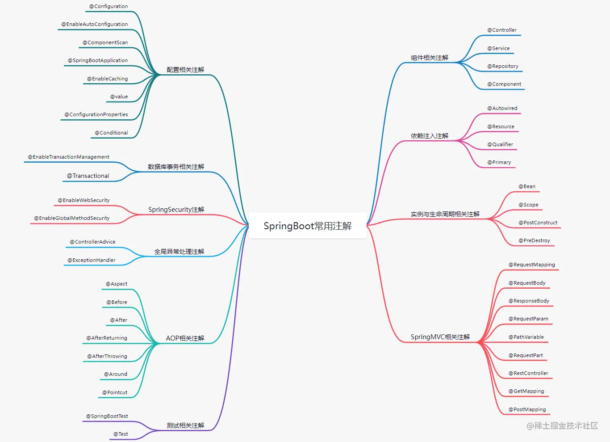

 

# SpringBoot 常用注解总结-1

1、常用注解概览
------

这里整理了一张SpringBoot常用注解的思维导图，本文主要讲解这些注解的用法。




2、组件相关注解
------

### @Controller

用于修饰MVC中`controller`层的组件，SpringBoot中的组件扫描功能会识别到该注解，并为修饰的类实例化对象，通常与`@RequestMapping`联用，当SpringMVC获取到请求时会转发到指定路径的方法进行处理。

```java
/**
 * @auther macrozheng
 * @description 后台用户管理Controller
 * @date 2018/4/26
 * @github https://github.com/macrozheng
 */
@Controller
@RequestMapping("/admin")
public class UmsAdminController {
    
}
```

### @Service

用于修饰`service`层的组件，`service`层组件专注于系统业务逻辑的处理，同样会被组件扫描并生成实例化对象。

```java
/**
 * @auther macrozheng
 * @description 后台用户管理Service实现类
 * @date 2018/4/26
 * @github https://github.com/macrozheng
 */
@Service
public class UmsAdminServiceImpl implements UmsAdminService {
    
}
```

### @Repository

用于修饰`dao`层的组件，`dao`层组件专注于系统数据的处理，例如数据库中的数据，同样会被组件扫描并生成实例化对象。

```java
/**
 * @auther macrozheng
 * @description 后台用户与角色关系管理自定义Dao
 * @date 2018/10/8
 * @github https://github.com/macrozheng
 */
@Repository
public interface UmsAdminRoleRelationDao {
    
}
```

### @Component

用于修饰SpringBoot中的组件，会被组件扫描并生成实例化对象。`@Controller`、`@Service`、`@Repository`都是特殊的组件注解。

```java
/**
 * @auther macrozheng
 * @description 取消订单消息的生产者组件
 * @date 2018/9/14
 * @github https://github.com/macrozheng
 */
@Component
public class CancelOrderSender {
    
}
```


3、依赖注入注解
------

### @Autowired

会根据对象的`类型`自动注入依赖对象，默认要求注入对象实例必须存在，可以配置`required=false`来注入不一定存在的对象。

```java
/**
 * @auther macrozheng
 * @description 后台用户管理Controller
 * @date 2018/4/26
 * @github https://github.com/macrozheng
 */
@Controller
@RequestMapping("/admin")
public class UmsAdminController {
    @Autowired
    private UmsAdminService adminService;
}
```

### @Resource

默认会根据对象的`名称`自动注入依赖对象，如果想要根据类型进行注入，可以设置属性为`type = UmsAdminService.class`。

```java
/**
 * @auther macrozheng
 * @description 后台用户管理Controller
 * @date 2018/4/26
 * @github https://github.com/macrozheng
 */
@Controller
@RequestMapping("/admin")
public class UmsAdminController {
    @Autowired
    @Resource(name = "umsAdminServiceImpl")
    private UmsAdminService adminService;
}
```

### @Qualifier

当同一个对象有多个实例可以注入时，使用`@Autowired`注解无法进行注入，这时可以使用`@Qualifier`注解指定实例的名称进行精确注入。

```java
/**
 * @auther macrozheng
 * @description 后台用户管理Controller
 * @date 2018/4/26
 * @github https://github.com/macrozheng
 */
@Controller
@RequestMapping("/admin")
public class UmsAdminController {
    @Autowired
    @Qualifier("umsAdminServiceImpl")
    private UmsAdminService adminService;
}
```


4、实例与生命周期相关注解
-----------

### @Bean

用于修饰方法，标识该方法会创建一个Bean实例，并交给Spring容器来管理。

```java
/**
 * @auther macrozheng
 * @description RestTemplate相关配置
 * @date 2018/4/26
 * @github https://github.com/macrozheng
 */
@Configuration
public class RestTemplateConfig {
    @Bean
    public RestTemplate restTemplate(){
        return new RestTemplate();
    }
}
```

### @Scope

用于声明一个Spring`Bean`实例的作用域，作用域的范围有以下几种：

*   singleton：单例模式，在Spring容器中该实例唯一，Spring默认的实例模式。
*   prototype：原型模式，每次使用实例都将重新创建。
*   request：在同一请求中使用相同的实例，不同请求重新创建。
*   session：在同一会话中使用相同的实例，不同会话重新创建。

```java
/**
 * @auther macrozheng
 * @description RestTemplate相关配置
 * @date 2018/4/26
 * @github https://github.com/macrozheng
 */
@Configuration
public class RestTemplateConfig {
    @Bean
    @Scope("singleton")
    public RestTemplate restTemplate(){
        return new RestTemplate();
    }
}
```

### @Primary

当同一个对象有多个实例时，优先选择该实例。

```java
/**
 * @auther macrozheng
 * @description Jackson相关配置，配置json不返回null的字段
 * @date 2018/8/2
 * @github https://github.com/macrozheng
 */
@Configuration
public class JacksonConfig {
    @Bean
    @Primary
    @ConditionalOnMissingBean(ObjectMapper.class)
    public ObjectMapper jacksonObjectMapper(Jackson2ObjectMapperBuilder builder) {
        ObjectMapper objectMapper = builder.createXmlMapper(false).build();
        objectMapper.setSerializationInclusion(JsonInclude.Include.NON_NULL);
        return objectMapper;
    }
}
```

### @PostConstruct、@PreDestroy

1. PostConstruct：用于修饰方法，当对象实例被创建并且依赖注入完成后执行，可用于对象实例的初始化操作。

2. @PreDestroy：用于修饰方法，当对象实例将被Spring容器移除时执行，可用于对象实例持有资源的释放。


```java
/**
 * @auther macrozheng
 * @description 动态权限数据源，用于获取动态权限规则
 * @date 2020/2/7
 * @github https://github.com/macrozheng
 */
public class DynamicSecurityMetadataSource implements FilterInvocationSecurityMetadataSource {

    private static Map<String, ConfigAttribute> configAttributeMap = null;
    @Autowired
    private DynamicSecurityService dynamicSecurityService;

    @PostConstruct
    public void loadDataSource() {
        configAttributeMap = dynamicSecurityService.loadDataSource();
    }

    @PostConstruct
    public void loadDataSource() {
        configAttributeMap = dynamicSecurityService.loadDataSource();
    }

    @PreDestroy
    public void clearDataSource() {
        configAttributeMap.clear();
        configAttributeMap = null;
    }
}
```


5、SpringMVC相关注解
-------------

### @RequestMapping

可用于将Web请求路径映射到处理类的方法上，当作用于类上时，可以统一类中所有方法的路由路径，当作用于方法上时，可单独指定方法的路由路径。

`method`属性可以指定请求的方式，如GET、POST、PUT、DELETE等。

### @RequestBody

表示方法的请求参数为JSON格式，从Body中传入，将自动绑定到方法参数对象中。

### @ResponseBody

表示方法将返回JSON格式的数据，会自动将返回的对象转化为JSON数据。

### @RequestParam

用于接收请求参数，可以是如下三种形式：

*   query param：GET请求拼接在地址里的参数。
*   form data：POST表单提交的参数。
*   multipart：文件上传请求的部分参数。

### @PathVariable

用于接收请求路径中的参数，常用于REST风格的API。

### @RequestPart

用于接收文件上传中的文件参数，通常是`multipart/form-data`形式传入的参数。

```java
/**
 * @auther macrozheng
 * @description MinIO对象存储管理Controller
 * @date 2019/12/25
 * @github https://github.com/macrozheng
 */
@Controller
@RequestMapping("/minio")
public class MinioController {

    @RequestMapping(value = "/upload", method = RequestMethod.POST)
    @ResponseBody
    public CommonResult upload(@RequestPart("file") MultipartFile file) {
            //省略文件上传操作...
            return CommonResult.success(minioUploadDto);
    }
}
```

### SpringMVC 如上注解示例

```java
/**
 * @auther macrozheng
 * @description 后台用户管理Controller
 * @date 2018/4/26
 * @github https://github.com/macrozheng
 */
@Controller
@RequestMapping("/admin")
public class UmsAdminController {

    @RequestMapping(value = "/register", method = RequestMethod.POST)
    @ResponseBody
    public CommonResult<UmsAdmin> register(@RequestBody UmsAdminParam umsAdminParam) {
        UmsAdmin umsAdmin = adminService.register(umsAdminParam);
        if (umsAdmin == null) {
            return CommonResult.failed();
        }
        return CommonResult.success(umsAdmin);
    }

    @RequestMapping(value = "/list", method = RequestMethod.GET)
    @ResponseBody
    public CommonResult<CommonPage<UmsAdmin>> list(
            @RequestParam(value = "keyword", required = false) String keyword,
            @RequestParam(value = "pageSize", defaultValue = "5") Integer pageSize,
            @RequestParam(value = "pageNum", defaultValue = "1") Integer pageNum) {
        List<UmsAdmin> adminList = adminService.list(keyword, pageSize, pageNum);
        return CommonResult.success(CommonPage.restPage(adminList));
    }

    @RequestMapping(value = "/{id}", method = RequestMethod.GET)
    @ResponseBody
    public CommonResult<UmsAdmin> getItem(@PathVariable Long id) {
        UmsAdmin admin = adminService.getItem(id);
        return CommonResult.success(admin);
    }
}
```

### @RestController

用于表示`controller`层的组件，与`@Controller`注解的不同在于，相当于在每个请求处理方法上都添加了`@ResponseBody`注解，这些方法都将返回JSON格式数据。

### @GetMapping

用于表示GET请求方法，等价于`@RequestMapping(method = RequestMethod.GET)`。

### @PostMapping

用于表示POST请求方法，等价于`@RequestMapping(method = RequestMethod.POST)`。

### REST 风格注解示例

```java
/**
 * @auther macrozheng
 * @description 后台用户管理Controller
 * @date 2018/4/26
 * @github https://github.com/macrozheng
 */
@RestController
@RequestMapping("/admin")
public class UmsAdminController {

    @PostMapping("/register")
    public CommonResult<UmsAdmin> register(@RequestBody UmsAdminParam umsAdminParam) {
        UmsAdmin umsAdmin = adminService.register(umsAdminParam);
        if (umsAdmin == null) {
            return CommonResult.failed();
        }
        return CommonResult.success(umsAdmin);
    }

    @GetMapping("/list")
    public CommonResult<CommonPage<UmsAdmin>> list(
            @RequestParam(value = "keyword", required = false) String keyword,
            @RequestParam(value = "pageSize", defaultValue = "5") Integer pageSize,
            @RequestParam(value = "pageNum", defaultValue = "1") Integer pageNum) {
        List<UmsAdmin> adminList = adminService.list(keyword, pageSize, pageNum);
        return CommonResult.success(CommonPage.restPage(adminList));
    }
}
```


6、配置相关注解
------

### @Configuration

用于声明一个Java形式的配置类，SpringBoot推荐使用Java配置，在该类中声明的Bean等配置将被SpringBoot的组件扫描功能扫描到。

```java
/**
 * @auther macrozheng
 * @description MyBatis相关配置
 * @date 2019/4/8
 * @github https://github.com/macrozheng
 */
@Configuration
@MapperScan({"com.macro.mall.mapper","com.macro.mall.dao"})
public class MyBatisConfig {
}
```

### @EnableAutoConfiguration

启用SpringBoot的自动化配置，会根据你在`pom.xml`添加的依赖和`application-dev.yml`中的配置自动创建你需要的配置。

```java
@Configuration
@EnableAutoConfiguration
public class AppConfig {
}
```

### @ComponentScan

启用SpringBoot的组件扫描功能，将自动装配和注入指定包下的Bean实例。

```java
@Configuration
@ComponentScan({"xyz.erupt","com.macro.mall.tiny"})
public class EruptConfig {
}
```

### @SpringBootApplication

用于表示SpringBoot应用中的启动类，相当于`@EnableAutoConfiguration`、`@EnableAutoConfiguration`和`@ComponentScan`三个注解的结合体。

```java
@SpringBootApplication
public class MallTinyApplication {
    public static void main(String[] args) {
        SpringApplication.run(MallTinyApplication.class, args);
    }
}
```

### @EnableCaching

当添加Spring Data Redis依赖之后，可用该注解开启Spring基于注解的缓存管理功能。

```java
/**
 * @auther macrozheng
 * @description Redis配置类
 * @date 2020/3/2
 * @github https://github.com/macrozheng
 */
@EnableCaching
@Configuration
public class RedisConfig extends BaseRedisConfig {

}
```

### @Value

用于注入在配置文件中配置好的属性，例如我们可以在`application.yml`配置如下属性：

```yaml
jwt:
  tokenHeader: Authorization #JWT存储的请求头
  secret: mall-admin-secret #JWT加解密使用的密钥
  expiration: 604800 #JWT的超期限时间(60*60*24*7)
  tokenHead: 'Bearer '  #JWT负载中拿到开头
```

然后在Java类中就可以使用`@Value`注入并进行使用了。

```java
public class JwtTokenUtil {
    @Value("${jwt.secret}")
    private String secret;
    @Value("${jwt.expiration}")
    private Long expiration;
    @Value("${jwt.tokenHead}")
    private String tokenHead;
}
```

### @ConfigurationProperties

用于批量注入外部配置，以对象的形式来导入指定前缀的配置，比如这里我们在`application.yml`中指定了`secure.ignored`为前缀的属性：

```yaml
secure:
  ignored:
    urls: #安全路径白名单
      - /swagger-ui/
      - /swagger-resources/**
      - /**/v2/api-docs
      - /**/*.html
      - /**/*.js
      - /**/*.css
      - /**/*.png
      - /**/*.map
      - /favicon.ico
      - /actuator/**
      - /druid/**
```

然后在Java类中定义一个`urls`属性就可以导入配置文件中的属性了。

```java
/**
 * @auther macrozheng
 * @description SpringSecurity白名单资源路径配置
 * @date 2018/11/5
 * @github https://github.com/macrozheng
 */
@Getter
@Setter
@Configuration
@ConfigurationProperties(prefix = "secure.ignored")
public class IgnoreUrlsConfig {
    private List<String> urls = new ArrayList<>();
}
```

### @Conditional

用于表示当某个条件满足时，该组件或Bean将被Spring容器创建，下面是几个常用的条件注解。

*   @ConditionalOnBean：当某个Bean存在时，配置生效。
*   @ConditionalOnMissingBean：当某个Bean不存在时，配置生效。
*   @ConditionalOnClass：当某个类在Classpath存在时，配置生效。
*   @ConditionalOnMissingClass：当某个类在Classpath不存在时，配置生效。

```java
/**
 * @auther macrozheng
 * @description Jackson相关配置，配置json不返回null的字段
 * @date 2018/8/2
 * @github https://github.com/macrozheng
 */
@Configuration
public class JacksonConfig {
    @Bean
    @Primary
    @ConditionalOnMissingBean(ObjectMapper.class)
    public ObjectMapper jacksonObjectMapper(Jackson2ObjectMapperBuilder builder) {
        ObjectMapper objectMapper = builder.createXmlMapper(false).build();
        objectMapper.setSerializationInclusion(JsonInclude.Include.NON_NULL);
        return objectMapper;
    }
}
```


7、数据库事务相关注解
---------

### @EnableTransactionManagement

启用Spring基于注解的事务管理功能，需要和`@Configuration`注解一起使用。

```java
/**
 * @auther macrozheng
 * @description MyBatis相关配置
 * @date 2019/4/8
 * @github https://github.com/macrozheng
 */
@Configuration
@EnableTransactionManagement
@MapperScan({"com.macro.mall.mapper","com.macro.mall.dao"})
public class MyBatisConfig {
}
```

### @Transactional

表示方法和类需要开启事务，当作用与类上时，类中所有方法均会开启事务，当作用于方法上时，方法开启事务，方法上的注解无法被子类所继承。

```java
/**
 * @auther macrozheng
 * @description 前台订单管理Service
 * @date 2018/8/30
 * @github https://github.com/macrozheng
 */
public interface OmsPortalOrderService {
    /**
     * 根据提交信息生成订单
     */
    @Transactional
    Map<String, Object> generateOrder(OrderParam orderParam);
}
```


8、SpringSecurity相关注解
------------------

### @EnableWebSecurity

启用SpringSecurity的Web功能。

### @EnableGlobalMethodSecurity

启用SpringSecurity基于方法的安全功能，当我们使用`@PreAuthorize`修饰接口方法时，需要有对应权限的用户才能访问。

### SpringSecurity 配置示例

```java
/**
 * @auther macrozheng
 * @description SpringSecurity配置
 * @date 2019/10/8
 * @github https://github.com/macrozheng
 */
@Configuration
@EnableWebSecurity
@EnableGlobalMethodSecurity(prePostEnabled = true)
public class SecurityConfig{
    
}
```


9、全局异常处理注解
--------

### @ControllerAdvice

常与`@ExceptionHandler`注解一起使用，用于捕获全局异常，能作用于所有controller中。

### @ExceptionHandler

修饰方法时，表示该方法为处理全局异常的方法。

### 全局异常处理示例

```java
/**
 * @auther macrozheng
 * @description 全局异常处理
 * @date 2020/2/27
 * @github https://github.com/macrozheng
 */
@ControllerAdvice
public class GlobalExceptionHandler {
    @ResponseBody
    @ExceptionHandler(value = ApiException.class)
    public CommonResult handle(ApiException e) {
        if (e.getErrorCode() != null) {
            return CommonResult.failed(e.getErrorCode());
        }
        return CommonResult.failed(e.getMessage());
    }
}
```


10、AOP相关注解
-------

### @Aspect

用于定义切面，切面是通知和切点的结合，定义了何时、何地应用通知功能。

### @Before

表示前置通知（Before），通知方法会在目标方法调用之前执行，通知描述了切面要完成的工作以及何时执行。

### @After

表示后置通知（After），通知方法会在目标方法返回或抛出异常后执行。

### @AfterReturning

表示返回通知（AfterReturning），通知方法会在目标方法返回后执行。

### @AfterThrowing

表示异常通知（AfterThrowing），通知方法会在目标方法返回后执行。

### @Around

表示环绕通知（Around），通知方法会将目标方法封装起来，在目标方法调用之前和之后执行自定义的行为。

### @Pointcut

定义切点表达式，定义了通知功能被应用的范围。

### @Order

用于定义组件的执行顺序，在AOP中指的是切面的执行顺序，value属性越低优先级越高。

### AOP 相关示例

```java
/**
 * @auther macrozheng
 * @description 统一日志处理切面
 * @date 2018/4/26
 * @github https://github.com/macrozheng
 */
@Aspect
@Component
@Order(1)
public class WebLogAspect {
    private static final Logger LOGGER = LoggerFactory.getLogger(WebLogAspect.class);

    @Pointcut("execution(public * com.macro.mall.tiny.controller.*.*(..))")
    public void webLog() {
    }

    @Before("webLog()")
    public void doBefore(JoinPoint joinPoint) throws Throwable {
    }

    @AfterReturning(value = "webLog()", returning = "ret")
    public void doAfterReturning(Object ret) throws Throwable {
    }

    @Around("webLog()")
    public Object doAround(ProceedingJoinPoint joinPoint) throws Throwable {
        WebLog webLog = new WebLog();
        //省略日志处理操作...
        Object result = joinPoint.proceed();
        LOGGER.info("{}", JSONUtil.parse(webLog));
        return result;
    }
}
```


11、测试相关注解
------

### @SpringBootTest

用于指定测试类启用Spring Boot Test功能，默认会提供Mock环境。

### @Test

指定方法为测试方法。

### 测试示例

```java
/**
 * @auther macrozheng
 * @description JUnit基本测试
 * @date 2022/10/11
 * @github https://github.com/macrozheng
 */
@SpringBootTest
public class FirstTest {
    @Test
    public void test() {
        int a=1;
        Assertions.assertEquals(1,a);
    }
}
```

# SpringBoot 常用注解总结-2

1、容器标记类注解
----------------------------------------------------------------------

### @Controller

用来创建对象存放到Spring容器中，一般用在Controller层

```java
import org.springframework.stereotype.Controller;

@Controller
public class GoodsController {
    // ...
}
```

### @Service

用来创建对象存放到Spring容器中,一般用在Service层

```java
import org.springframework.stereotype.Service;

@Service("serviceName")  // 给Bean取一个别名
public class GoodsService {
    // ...
}

```

### @Repository

用来创建对象存放到Spring容器中,一般用在Dao层

```java
import org.springframework.stereotype.Repository;

@Repository
public interface GoodsMapper {
    
    // ...
}
```

### @Component

> 用来创建对象存放到Spring容器中,一般用在工具类上

```java
@Component
public class IpUtil {
    
     // ...
}
```

### @RestController

相当于`@ResponseBody`和`@Controller`注解结合在一起使用

被修饰的类的所有方法都可以用流的方式把数据返回给前端

```java
@RestController /* @Controller + @ResponseBody*/
public class HospitalController {

    // 注入Service服务对象
    @Autowired
    private HospitalService hospitalService;

    @RequestMapping(value = "findAllHospital",method = RequestMethod.GET)
    public  List<Hospital> findAllHospital(){
        List<Hospital> hospitalList= hospitalService.findAllHospital();
        // 由于@RestController注解中包含了@ResponseBody注解,因此可以把数据直接返回给前端
        return hospitalList;
    }
}
```

### @Bean

@Bean是一个方法级别上的注解,用来将方法返回的对象添加到容器中

```java
@Bean("queryRunner")  // 为要添加到容器中的对象取别名
public QueryRunner createQueryRunner(DataSource dataSource){
    QueryRunner queryRunner = new QueryRunner(dataSource);
    return queryRunner;
}
```


2、注入类注解
--------------------------------------------------------------------

### @Autowired

将Spring容器中的对象注入.默认按照类型注入,如果类型有多个,则按照名称注入

```java
@Controller
public class CSPLoginController extends BaseController {

    // 自动注入
    @Autowired
    private SystemComService commonService;
}
```

### @Qualifier

必须与@Autowired结合使用,如果自动注入按照类型注入失败，则按照指定的名称注入

1、接口

```java
public interface UserDao {
    void print();
}
```

2、实现类实现接口，一个接口被两个实现类实现

```java
// 因为没有给要放入容器中的对象取别名,所以使用默认别名(第一个字母小写 => userDaoImpl)
@Repository
public class UserDaoImpl implements UserDao {

    @Override
    public void print() {
        System.out.println("UserDaoImpl的打印被执行了");
    }
}

@Repository
public class UserDaoImpl2 implements UserDao {

    @Override
    public void print() {
        System.out.println("UserDaoImpl2的打印被执行了");
    }
}
```

3、注入

```java
import org.springframework.beans.factory.annotation.Autowired;
import org.springframework.beans.factory.annotation.Qualifier;

@Service
public class UserServiceImpl implements UserService {

    // 因为UserDao这个接口被两个实现类给实现了,我们用@Qualifier来明确到底用哪个实现类
    // userDaoImpl为UserDaoImpl默认的容器名称,默认为第一个字母小写
    @Qualifier("userDaoImpl")
    // 因为@Autowired默认按照类型注入,而实现了UserDao接口的Bean有多个
    // 如果不配合@Qualifier使用的话,会报错
    @Autowired  
    private UserDao userDao;

    @Override
    public void print() {
        userDao.print();
    }
}
```


### @Resource

默认按照名称注入,没有名称没有找到,按照类型注入.其作用相当于@Qualifier和@Autowired的结合。此注解是由JDK提供的

```java
import javax.annotation.Resource;

@Service
public class UserServiceImpl implements UserService {

    // 参考@Qualifier的例子
    // 虽然UserDao接口被多个类实现,但是由于@Resource指定了Bean的名称,因此会注入成功
    @Resource(name = "userDaoImpl")
    private UserDao userDao;

    @Override
    public void print() {
        userDao.print();
    }
}
```

### @Primary

*   当一个接口被多个类给实现的情况下,给实现类添加此注解,默认就注入此实现类

*   此类作用于方法上

1、接口

```java
public interface Singer {
    String sing(String lyrics);
}
```

2、实现类

```java
import org.springframework.context.annotation.Primary;

@Component
public class MetalSinger implements Singer{

    @Override
    public String sing(String lyrics) {
        return "I am singing with DIO voice: " + lyrics;
    }
}

@Primary
@Component
public class OperaSinger implements Singer {
    @Override
    public String sing(String lyrics) {
        return "I am singing in Bocelli voice: " + lyrics;
    }
}
```

3、注入

```java
@Component
public class SingerService {

    // 虽然Singer接口被多个实现类所实现,但是因为其中OperaSinger实现类添加了@Primary注解
    // 因此此实现类对象会被优先注入
    @Autowired
    private Singer singer;

    @Qualifier("opreaSinger")
    public String sing(){
        return singer.sing("song lyrics");
    }
}
```

### @Import

> 参考资料：
>
> 1. [spring注解之@Import注解的三种使用方式](https://www.cnblogs.com/yichunguo/p/12122598.html)
> 2. [Spring中@Import注解的作用和使用](https://blog.csdn.net/panchao888888/article/details/82882279)
> 3. [Spring注解驱动开发第8讲——使用@Import注解给容器中快速导入一个组件](https://liayun.blog.csdn.net/article/details/110345608)
> 4. [@Import注解的作用](https://blog.csdn.net/mamamalululu00000000/article/details/86711079)

只能作用在类上,常用于将第三方包的对象放入Spring容器中

#### Class 数组的方式

1、新建一个普通的类

```java
public class TestA {

    public void fun(String str) {
        System.out.println(str);
    }

    public void printName() {
        System.out.println("类名 ：" + Thread.currentThread().getStackTrace()[1].getClassName());
    }
}
```

2、使用@Import注解将普通类导入到配置类中

```java
@Import({TestA.class})
@Configuration  // 为了让Spring扫描到这个类
public class ImportConfig {
    
}
```

3、测试

```java
@RunWith(SpringJUnit4ClassRunner.class)
@SpringBootTest(classes = ApplicationMain.class)
public class ImportAnnotionTest {

    // 虽然TestA原本只是一个普通类,但是通过@Import注解导入到配置类中,所在可以在此处注入
    @Autowired  
    private TestA testA;

    @Test
    public void TestA() {
        testA.printName();
    }
}
```


#### 实现接口 ImportSelector

1、新建普通类

```java
public class TestC {
    public void fun(String str) {
        System.out.println(str);
    }

    public void printName() {
        System.out.println("类名 ：" + Thread.currentThread().getStackTrace()[1].getClassName());
    }
}
```

2、新建一个类实现ImportSelector接口

```java
public class SelfImportSelector implements ImportSelector {
    
    @Override
    public String[] selectImports(AnnotationMetadata importingClassMetadata) {
        // 返回值是一个数组,数组内的元素是普通类的全限定类名
        // 不能返回null,否则会报空指针异常
        return new String[]{"com.test.importdemo.TestC"};
    }
}
```

3、配置文件类中导入接口的实现类

```java
@Import({SelfImportSelector.class})
@Configuration
public class ImportConfig {
    
}
```

4、测试

```java
@RunWith(SpringJUnit4ClassRunner.class)
@SpringBootTest(classes = ApplicationMain.class)
public class ImportAnnotionTest {

    @Autowired
    private TestC testC;

    @Test
    public void TestC() {
        testC.printName();
    }
}
```


#### 实现接口 ImportBeanDefinitionRegistrar

1、新建普通类

```java
public class TestD {
    public void fun(String str) {
        System.out.println(str);
    }

    public void printName() {
        System.out.println("类名 ：" + Thread.currentThread().getStackTrace()[1].getClassName());
    }
}
```

2、实现I mportBeanDefinitionRegistrar 接口

```java
public class SelfImportBeanDefinitionRegistrar implements ImportBeanDefinitionRegistrar {
    @Override
    public void registerBeanDefinitions(
        AnnotationMetadata importingClassMetadata, 
        BeanDefinitionRegistry registry)
    {
        RootBeanDefinition root = new RootBeanDefinition(TestD.class);
        registry.registerBeanDefinition("testD", root);
    }
}
```

3、配置文件类中导入接口的实现类

```java
@Import({SelfImportBeanDefinitionRegistrar.class})
@Configuration
public class ImportConfig {
    
}
```

4、测试

```java
@RunWith(SpringJUnit4ClassRunner.class)
@SpringBootTest(classes = ApplicationMain.class)
public class ImportAnnotionTest {

    @Autowired
    private TestC testD;

    @Test
    public void TestC() {
        testD.printName();
    }
}
```


3、配置文件类注解
----------------------------------------------------------------------

### @Configuration

声明当前类为配置类,此注解内部组合了@Component注解,可以将配置类注入到容器中

```java
import org.springframework.context.annotation.Configuration;

@Configuration
public class DbSourceConfig {
    
    @Value("${spring.test.url}")
    private String url;
}
```


### @Value

*   用在全局变量上,把外部的配置文件的配置信息注入到类的属性上
*   配合EL表达式,对配置文件读取到的数据进行处理
*   `${}`用于加载配置文件中的信息
*   `#{}`用于把内容赋值给属性
*   `${}`和`#{}`可以混合使用

1、配置文件 application.properties

```properties
spring.test.url=www.baidu.com
test.array1=aaa,bbb,ccc
```

2、一个Bean

```java
import org.springframework.beans.factory.annotation.Value;
import org.springframework.stereotype.Component;

// 将Item放入容器,并取别名
@Component("itemBean")
public class Item {

	@Value("99")
	private int qtyOnHand;
	
	public int getQtyOnHand() {
		return qtyOnHand;
	}

	public void setQtyOnHand(int qtyOnHand) {
		this.qtyOnHand = qtyOnHand;
	}
}
```

3、注入

```java
import org.springframework.context.annotation.Configuration;
import org.springframework.beans.factory.annotation.Value;

@Configuration
public class DbSourceConfig {
    
    // 最常见的使用方法,使用${}的方式从配置文件中读取配置信息注入到属性中
    @Value("${spring.test.url}")
    private String url;
    
    // 可以配合EL表达式使用,对从配置文件获取到的数据进行处理
    @Value("#{'${test.array1:}'.empty ? null : '${test.array1:}'.split(',')}")
    private List<String> testList1;
    
    // 调用random方法获取返回值
	@Value("#{T(java.lang.Math).random()}")
	private double ramdom;
    
    // 注入简单值,输出num为5
	@Value("#{5}")
	private Integer num;
    
    // 支持基本运算
    @Value("#{1 + 1}") 
	private double testAdd;  // 2
    
    // 支持比较运算符
    @Value("#{1 >= 1}")
    private boolean testGreaterThanOrEqual;  // true
    
    // 将容器中的Bean属性获取到,并进行处理
    @Value("#{itemBean.qtyOnHand < 100 ? true : false}")
	private boolean warning;  // true
}
```


### @ConfigurationProperties

> **参考资料**
>
> 1.  [@ConfigurationProperties 注解使用姿势，这一篇就够了](https://blog.csdn.net/yusimiao/article/details/97622666)
>
> 2.  [注解@ConfigurationProperties使用方法](https://www.cnblogs.com/tian874540961/p/12146467.html)
>
> 3.  [@ConfigurationProperties不生效,对比@Value](https://blog.csdn.net/qq_43054210/article/details/101126585)
>

通过指定一个前缀来将配置文件中的数据注入到配置类中的属性上

1、注意

*   需要有配置类的属性需要有set方法,否则无法绑定
*   如果没有使用@Component等容器注解将配置类注入到容器中,需要在使用配置类的地方使用`@EnableConfigurationProperties`注解来手动开启配置

2、配置文件

```properties
spring.datasource.url=jdbc:mysql://127.0.0.1:8888/test
spring.datasource.username=root
spring.datasource.password=root
spring.datasource.driver-class-name=com.mysql.jdbc.Driver
spring.datasource.type=com.alibaba.druid.pool.DruidDataSource
```

3、配置方法1

```java
import org.springframework.boot.context.properties.ConfigurationProperties;

@ConfigurationProperties(prefix = "spring.datasource")
@Component  // 将配置类注入到Spring容器中
public class DatasourcePro {

    private String url;
    private String username;
    private String password;
    // 配置文件中是driver-class-name,我们可以直接使用驼峰的形式
    private String driverClassName;
    private String type;

    // 此处省略了Get和Set方法,必须要有Set方法否则无法将配置文件中的数据绑定到配置类的属性中
}
```

2、配置方式2

```java
import org.springframework.boot.context.properties.ConfigurationProperties;

// 此处只有这一个注解,并没有@Component等容器注解
@ConfigurationProperties(prefix = "spring.datasource")
public class DatasourcePro {

    private String url;
    private String username;
    private String password;
    // 配置文件中是driver-class-name,我们可以直接使用驼峰的形式
    private String driverClassName;
    private String type;

    // 此处省略了Get和Set方法,必须要有Set方法否则无法将配置文件中的数据绑定到配置类的属性中
}
```

```java
import org.springframework.boot.context.properties.EnableConfigurationProperties;

@Component
// 通过此注解对DatasourcePro配置类实例化
@EnableConfigurationProperties(DatasourcePro.class)  
public class GetConfigMessage {

    @Autowired
    private DatasourcePro configInfo;
    
    // 使用configInfo对象来获取配置文件的信息
}
```


### Environment对象

1、配置文件

```properties
# 图片的后缀列表
spring.suffixList=jpeg,jpg,png,gif,bmp
```

2、使用Environment对象获取配置文件信息

```java
@Service
public class UploadService {

    // 注意,不能添加无参数的构造方法,否则无法从配置文件中读取配置

    // 注入配置文件对象类
    @Autowired
    private Environment env;

    private Boolean fileCheck() {
		
        // 通过Environment对象获取配置文件的信息
        String prop = env.getProperty("spring.suffixList");
        String[] split = prop.split(",");
        List<String> suffixList = Arrays.asList(split);
        
        // ...
    }
}
```


### @PropertySource

*   如果将所有的配置信息都写在一个配置文件中会让配置文件臃肿难以维护.

*   可以将一个文件拆分为多个,使用 @PropertySource 注解加载指定的配置文件.

1、存放在resources文件夹根目录下的jdbc.properties配置文件

```properties
jdbc.driver=com.mysql.jdbc.Driver
jdbc.url=jdbc:mysql://localhost:3306/spring_test
jdbc.user=root
jdbc.password=mysql
```

2、配置文件信息注入

```java
import org.springframework.context.annotation.Configuration;
import org.springframework.context.annotation.PropertySource;

// 将配置类放入Spring容器中
@Configuration 
@PropertySource("jdbc.properties")  // 引入外部的配置文件
public class JDBCConfiguration {

    // 把外部的配置文件的值给导入到对象中去
    @Value("${jdbc.url}")
    private String url;
    @Value("${jdbc.driver}")
    private String driverClass;
    @Value("${jdbc.user}")
    private String username;
    @Value("${jdbc.password}")
    private String password;
}
```


### @SpringBootConfiguration


4、URL处理类注解
-----------------------------------------------------------------------

### @RequestMapping

```java
@Controller
@RequestMapping("/test")  // 可以放在类上,也可以放在方法上,放在类上用来窄化路径
public class TestController {
	
    // 如果不指定方法的话,默认是Get方法
    @RequestMapping(value = "/hello", method = RequestMethod.POST)
    public String hello(){
        return "show";
    }
    
    @RequestMapping(
        value = "/test", 
        method = RequestMethod.POST,
        // 要求URL中必须有name和age>20这两个名称(*age>20只是一个名称,并不能真的约束age的值)
        // 要求URL中不能包含a这个名称
        params = {"name","age>20","!a"}
    )
    
    public String hello(){
        return "show";
    }
}
```


### @GetMapping

@GetMapping是一个组合注解，是@RequestMapping(method = RequestMethod.GET)的缩写

### @PostMapping

@PostMapping是一个组合注解，是@RequestMapping(method = RequestMethod.POST) 缩写。同理，还有@PutMapping、@DeleteMapping 等注解。


### @RequestParam

```java
import org.springframework.web.bind.annotation.RequestParam;

@RequestMapping(value = "/param2")
public String testParams(
    @RequestParam(
        value = "username", // 前端传入的值
        required = false, // 指定此参数不是必须要传的
        defaultValue = "rose" // 如果前端没有传值的话,用我们自己的默认值
    ) 
    // 由于前后端的命名方式不同,因此通过@RequestParam注解进行转化
    String name
){
    System.out.println(name);
    return "show";
}
```


### @PathVariable

常用于获取restful风格的请求路径中URL中的值

```java
// URL中的包含的id通过@PathVariable注解获取出来
@RequestMapping(value = "/operate/{id}",method = RequestMethod.GET)
public String findById(@PathVariable("id") Integer id){
    System.out.println("findById:" + id);
    return "show";
}
```


5、初始化类
-------------------------------------------------------------------

### @InitBinder

1、简介

@InitBinder作用于@Controller中的方法，表示为当前控制器注册一个属性编辑器，对WebDataBinder进行初始化,且只对当前的Controller有效。

2、执行时机

@InitBinder注解被解析的时机，是其所标注的方法，在该方法被请求执行之前。同时@InitBinder标注的方法是可以多次执行的，也就是说来一次请求就执行一次@InitBinder解析。

3、执行原理

当某个Controller上的第一次请求，由SpringMVC前端控制器匹配到该Controller之后，根据Controller的 class 类型来查找所有标注了@InitBinder注解的方法，并且存入RequestMappingHandlerAdapter里的 initBinderCache 缓存中。等下一次请求执行对应业务方法之前,会先走initBinderCache缓存,而不用再去解析@InitBinder。

4、应用场景（常用于数据绑定和数据转换）

- 场景1：使用系统默认的属性编辑器

  ```java
  @RequestMapping("/myInitBinder0954")
  @Controller
  public class MyInitBinderController {
  
  	// 注册将字符串转换为Date的属性编辑器，该编辑器仅仅对当前controller有效
  	@InitBinder
  	public void initBinderXXX(WebDataBinder binder) {
  		DateFormat df = new SimpleDateFormat("yyyy-MM-dd HH:mm:ss");
  		CustomDateEditor dateEditor = new CustomDateEditor(df, true);
  		binder.registerCustomEditor(Date.class, dateEditor);
  	}
      
      // 前端访问URL
  	// http://localhost:8080/myInitBinder0954/test?date=2020-09-03%2010:17:17
  	@RequestMapping(value = "/test", method = RequestMethod.GET)
  	@ResponseBody
  	public String testFormatData(Date date) {
          
          // 将URL中日期字符串转换为Date类型
  		Map<String, Object> map = new HashMap<>();
  		map.put("date", date);
  		return map.toString();
  	}
  }
  ```

- 场景2：使用自定义的属性编辑器

  ```java
  import java.beans.PropertyEditorSupport;
  
  public class StringToListPropertyEditor extends PropertyEditorSupport {
  
      @Override
      public void setAsText(String text) throws IllegalArgumentException {
          String[] resultArr = null;
          if (!StringUtils.isEmpty(text)) {
              // 将字符串以"_"进行分隔
              resultArr = text.split("_");
          }
          this.setValue(resultArr);
      }
  }
  ```

  ```java
  @RequestMapping("/myStringToList")
  @Controller
  public class StringToListController {
  
  	@InitBinder
  	public void myStringToListBinder(WebDataBinder dataBinder) {
  		dataBinder.registerCustomEditor(
              String[].class, 
              // 使用我们自定义的属性编辑器
              new StringToListPropertyEditor()
          );
  	}
  
  	@RequestMapping(value = "/test", method = RequestMethod.GET)
  	@ResponseBody
  	public String myStringToListTest(String[] strToListArr) {
          
  		String result = "_分割字符串转String[]不成功！";
  		if (strToListArr != null && strToListArr.length > 0) {
  			result = Arrays.asList(strToListArr).toString();
  		}
  		return result;
  	}
  }
  ```


### @PostConstruct

在需要初始化的方法上增加`@PostConstruct`注解，这样就有初始化的能力。

```java
import javax.annotation.PostConstruct;
import org.springframework.stereotype.Service;

@Service
public class AService {

    @PostConstruct
    public void init() {
        System.out.println("===初始化===");
    }
}
```


### @ModelAttribute

1、定义一个基础的控制类

```java
public class BaseController {
    
    protected HttpServletRequest request;
    protected HttpServletResponse response;
    protected HttpSession session;
	
    // 每一个继承了BaseController的子Controller都会先执行下面的方法
    @ModelAttribute
    public void setReqAndRes(HttpServletRequest request, HttpServletResponse response) {

        this.request = request;
        this.response = response;
        this.session = request.getSession();
    }
}
```

2、子类控制类

```java
import org.apache.commons.lang3.StringUtils;

@Controller
public class CmsPagePreviewController extends BaseController {

    @Autowired
    private PageService pageService;

    // 页面预览
    @RequestMapping(value="/cms/preview/{pageId}",method = RequestMethod.GET)
    public void preview(@PathVariable("pageId")String pageId){
        
        // response 是 父类BaseController 中封装的对象
        ServletOutputStream outputStream = response.getOutputStream();
        response.setHeader("Content-type","text/html;charset=utf-8");
    }
}
```

6、响应类注解
--------------------------------------------------------------------

### @RequestBody

@RequestBody主要用来接收前端传递给后端的json字符串中的数据的(请求体中的数据的),一般会用一个对象来封装数据

```java
@RequestMapping(value = "/dologin", method = RequestMethod.POST)
@ResponseBody
public void login(@RequestBody LoginUser userInfo) {
    // ...
}
```


### @ResponseBody

*   @ResponseBody的作用其实是将java对象转为json格式的数据。

*   @responseBody注解的作用是将controller的方法返回的对象通过适当的转换器转换为指定的格式之后，写入到response对象的body区，通常用来返回JSON数据或者是XML数据。

```java
@RequestMapping("/testResponseBody")
@ResponseBody
public List<User> testResponseBody(){
    
    List<User> userList = new ArrayList<>();
    // 新建一个对象放入数据
    User user = new User();
    user.setUsername("zhangsan");
    user.setSex("男");
    user.setId(2);
    
    // 新建一个对象放入数据
    User user1 = new User();
    user1.setUsername("zhangsan1");
    user1.setSex("女");
    user1.setId(1);
    
    userList.add(user);
    userList.add(user1);

    // 把封装好的数据传递给前端
    return userList;
}
```

7、Cookie和Session
-----------------------------------------------------------------------------

### Session

#### 1、注解的方式

*   若希望在多个请求之间共用数据,则可以在控制器类上标注一个 @SessionAttributes,配置需要在session中存放的数据范围,Spring MVC将存放在model中对应的数据暂存到HttpSession 中。

*   @SessionAttributes需要清除时,使用`SessionStatus.setComplete();`来清除。

注意：session.removeAttribute只清除@SessionAttributes的session，不会清除HttpSession的数据

@SessionAttributes

```java
import org.springframework.stereotype.Controller;
import org.springframework.ui.Model;
import org.springframework.ui.ModelMap;
import org.springframework.web.bind.annotation.*;
import org.springframework.web.bind.support.SessionStatus;

import java.util.Date;
import java.util.Map;

@Controller
@RequestMapping("/test")
// 用来向session中存放数据,在session中可以存储这两个变量名
@SessionAttributes({"username","password"})  
public class TestController {

    // 把用户名和密码存入到Session范围内
    @RequestMapping("/testPut")
    public void testPut(Model model){
        // 存放session对象的时候,用Model和ModelMap来存放对象都可以
        model.addAttribute("username","zhangsan");
        model.addAttribute("password","123456");
    }

    // 获取session范围内的对象
    @RequestMapping("/testGet")
    public void testGet(ModelMap modelMap){
        // 获取session对象的时候,要用modelMap来获取
        Object username = modelMap.get("username");
        System.out.println(username);  // zhangsan
        Object password = modelMap.get("password");
        System.out.println(password);  // 123456
    }

    // 清空session中的数据
    @RequestMapping("/testClear")
    public void testClear(SessionStatus sessionStatus){
        sessionStatus.setComplete();
    }
}
```

```java
@SessionAttributes("user")
public class UserController { 

    @ModelAttribute("user")
    publicUser getUser(){
        Useruser = new User();
        User.setUserId("1001");
        returnuser;
    }

    @RequestMapping("/handle71")
    public String handle71(@ModelAttribute("user") User user) { 
        user.setName("John");
        return “redirect:/user/handle71.html”;
    } 

    @RequestMapping(value= "/handle72") 
    public String handle72(ModelMapmodelMap, SessionStatus sessionStatus) { 
        User user = (User)modelMap.get("user");
        If(user != null){
            user.setName("jetty");
            sessionStatus.setComplete();

        }
        return "user/showUser"; 
    } 

    @RequestMapping("/tologout")
    public String tologout(HttpSession session, SessionStatus sessionStatus) {
        session.removeAttribute("user");
        session.removeAttribute("date");
        System.out.println("logout:" + session.getAttribute("user"));
        
        // 一定要通过这种方式清除@SessionAttributes中存放的数据
        sessionStatus.setComplete(); 
        
        return "redirect:/view/index";
    }
}
```

#### 2、HttpServletRequest的方式

```java
@Component
public class Test {

    @Autowired
    private HttpServletRequest request;

    @Autowired
    private HttpServletResponse response;

    @Override
    public void test() {

        // 获取session对象
        HttpSession session = request.getSession();

        // 将数据放入session
        session.setAttribute("shainNo", "XXX");
        session.setAttribute("shainMei", "XXX");

        // 从session中获取数据
        session.getAttribute("shainMei");
        
        // 从session中清除数据
        session.removeAttribute("shainMei");
    }
}
```


### Cookie

#### 1、注解的方式

@CookieValue用来获取Cookie中的值

```java
@RestController
public class HelloController {

    @RequestMapping("/hello2")
    public String hello2(HttpServletResponse response){
        
        // 自己新建一个cookie
        Cookie cookie = new Cookie("name","瓜田李下");
        response.addCookie(cookie);

        return "success2";
    }
	
    // 通过@CookieValue的方式获取cookie中的值
    @RequestMapping("/hello3")
    public String hello3(HttpServletRequest request,@CookieValue("name") String name){
        
        // 打印从通过@CookieValue注解从cookie中获取到的值
        System.out.println(name);  // 瓜田李下
		
        // 普通的方式获取cookie中的值
        Cookie[] cookies = request.getCookies();
        for (Cookie cookie : cookies){
            String value = cookie.getName() + "  " + cookie.getValue();
            System.out.println(value);  // name  瓜田李下
        }

        return "success3";
    }
}
```

#### 2、HttpServletResponse对象的方式

```java
@Component
public class Test {

    @Autowired
    private HttpServletRequest request;

    @Autowired
    private HttpServletResponse response;

    @Override
    public void test() {
       
        // Cooikesの格納値を設定する
        Cookie nameCookie = new Cookie("name", "zhangsan");
        Cookie pswCookie = new Cookie("pwd", "123");
		
        // 设置cookie的超时时间
        if ("XXX") {
            nameCookie.setMaxAge(0);
            pswCookie.setMaxAge(0);
            remberMeCookie.setMaxAge(0);
        } else {
            nameCookie.setMaxAge(7 * 24 * 60 * 60);
            pswCookie.setMaxAge(7 * 24 * 60 * 60);
        }
        
        // 将cookie添加到响应中
        response.addCookie(nameCookie);
        response.addCookie(pswCookie);
    }
}
```

Cookie的获取

```java
public static String getCookieValue(HttpServletRequest request, String name) {
    
    // 获取本次请求中所有的cookie
    Cookie[] cookies = request.getCookies();
    if (cookies != null) {
        for (Cookie cookie : cookies) {
            // 获取cookie的key
            String cookieName = cookie.getName();
            if (cookieName.equals(name)) {
                // 获取cookie的值
                return cookie.getValue();
            }
        }
    }
    return null;
}
```

8、事务注解
-------------------------------------------------------------------

> **参考资料**
>
> 1.  [【springboot】为何不使用@EnableTransactionManagement就能使用事务？](https://blog.csdn.net/qq_32370913/article/details/105924209)
>
> 2.  [Spring Boot的事务管理注解@EnableTransactionManagement的使用](https://blog.csdn.net/u010963948/article/details/79208328)
>

### @EnableTransactionManagement

为项目开启事务

```java
import org.springframework.boot.autoconfigure.SpringBootApplication;
import org.springframework.transaction.annotation.EnableTransactionManagement;

@SpringBootApplication
@EnableTransactionManagement  // 使用此注解为Spring Boot项目开启事务配置
public class SpringbootApplication {

    public static void main(String[] args) {
        try {
            SpringApplication.run(SpringbootApplication.class, args);
        } catch (Exception e) {
            e.printStackTrace();
        }
    }
}
```


### @Transactional

为方法开启事务

```java
import org.springframework.transaction.annotation.Transactional;

// 使用此注解为update方法开启事务
@Transactional(rollbackFor = Exception.class)
public int update(CSPMailAddresHenkoForm form, LoginUser user) {
	// ...
}

```

9、扫描类注解
--------------------------------------------------------------------

### @ComponentScan

@ComponentScan做的事情就是告诉Spring从哪里找到Bean

SpringbootApplication启动类会自动扫描与其同级别的目录下的类上是否标记了@Component,@Controller等注解.如果被标记则添加到容器中.如果启动类外层还有一层文件夹或者有些类不和启动类在同一个级别的文件下的话,就需要使用@ComponentScan注解,手动指定要扫描的包的位置

```java
import org.mybatis.spring.annotation.MapperScan;
import org.springframework.boot.SpringApplication;
import org.springframework.boot.autoconfigure.SpringBootApplication;
import org.springframework.context.annotation.ComponentScan;
import org.springframework.transaction.annotation.EnableTransactionManagement;

@SpringBootApplication
@EnableTransactionManagement
// 扫描该包下面的组件,配置了
@ComponentScan({"com.csp.common.security.springsecurity"})  
public class SpringbootApplication {
    
    public static void main(String[] args) {
        try {
            SpringApplication.run(SpringbootApplication.class, args);
        } catch (Exception e) {
            e.printStackTrace();
        }
    }
}
```


### @MapperScan

*   在SpringBoot启动类上面添加
*   指定要变成实现类的接口所在的包，然后包下面的所有接口在编译之后都会生成相应的实现类
*   省去了在每一个接口上手动添加@Mapper注解的麻烦

```java
import org.mybatis.spring.annotation.MapperScan;

@SpringBootApplication
@EnableTransactionManagement
@MapperScan({"com.csp.common.db.dao", "com.csp.business.dao"})
public class SpringbootApplication {
    public static void main(String[] args) {
         SpringApplication.run(SpringbootApplication.class, args);
    }
}
```

10、异常注解
-------------------------------------------------------------------

> 参考资料：[SpringMVC 中 @ControllerAdvice 注解的三种使用场景！](https://www.cnblogs.com/lenve/p/10748453.html)

### @ControllerAdvice

最常见的使用场景就是异常处理

```java
import org.springframework.web.bind.annotation.ControllerAdvice;
import org.springframework.web.bind.annotation.ExceptionHandler;
import org.springframework.web.bind.annotation.ResponseBody;

// 用来实现全局异常处理
@ControllerAdvice
public class GlobalExceptionHandler {

    // 此注解用来指明具体要处理的异常类型
    @ExceptionHandler(value = {Exception.class})
	@ResponseBody
    public void exceptionHandler(Exception exception) {
		
        // ...
    }
	
    // 此注解用来指明具体要处理的异常类型
    @ExceptionHandler(MethodArgumentNotValidException.class)
    @ResponseBody
    public void handleNotValidException(MethodArgumentNotValidException ex) {
    	
        // ...
    }
    
    @ExceptionHandler(BindException.class)
    @ResponseBody
    public void handleBindException(BindException ex) {
        
        // ...
    }
}
```


### @ExceptionHandler

> 此注解用来指明具体要处理的异常类型，具体使用例子参考@ControllerAdvice。


11、其他注解
------------------------------------------------------------------

### @Order

*   定义Spring IOC容器中Bean的执行顺序的优先级,而不是定义Bean的加载顺序,Bean的加载顺序不受@Order或Ordered接口的影响
*   可以和CommandLineRunner接口配合使用,通过@Order注解指定实现类的加载顺序
*   值越小,加载的优先级就越高

```java
@Order(value=3)
@Component
class ApplicationStartupRunnerOne implements CommandLineRunner {
    
    @Override
    public void run(String... args) throws Exception {
        
        System.out.println("ApplicationStartupRunnerOne run method Started !!");
    }
}
 
@Order(value=2)
@Component
class ApplicationStartupRunnerTwo implements CommandLineRunner {
 
    @Override
    public void run(String... args) throws Exception {
        
        System.out.println("ApplicationStartupRunnerTwo run method Started !!");
    }
}
```

```java
// 执行之后的打印顺序
ApplicationStartupRunnerTwo run method Started !!
ApplicationStartupRunnerOne run method Started !!
```


### @Lazy

> 参考资料：
>
> 1. @lazy注解处理循环注入问题：https://www.cnblogs.com/yangxiaohui227/p/10523025.html
> 2. Spring中的 @Lazy注解简析：https://blog.csdn.net/weixin_41888813/article/details/102947633

*   减少SpringIOC容器启动的加载时间，只有调用某个Bean的时候才会去初始化
*   可以用来解除循环依赖注入的问题


# 参考文献 & 鸣谢

1. 肝了一周总结的SpringBoot常用注解大全，一目了然！https://blog.csdn.net/BASK2312/article/details/128394257
2. SpringBoot 注解整理：https://blog.csdn.net/feyehong/article/details/116378767