# 一、事务传播的案例演示


## 1、事务的隔离级别介绍

Spring 框架提供了一种方便的方式来管理数据库事务，它支持多种事务隔离级别。事务隔离级别决定了事务在并发执行时的隔离程度，包括对其他事务的可见性和可能出现的并发问题。

以下是 Spring 框架支持的事务隔离级别及其详细说明：

- ISOLATION_DEFAULT（默认）：这是系统的默认隔离级别。根据具体数据库来定义，大多数数据库默认级别是可重复读。
- ISOLATION_READ_UNCOMMITTED（读未提交）：在这个级别，一个事务可以看到其他未提交事务的变动。这种级别可以导致脏读、不可重复读和幻读的问题。
- ISOLATION_READ_COMMITTED（读提交）：在这个级别，一个事务只能看到其他事务已经提交的变动。这种级别可以避免脏读问题，但可能会出现不可重复读和幻读的问题。
- ISOLATION_REPEATABLE_READ（可重复读）：在这个级别，同一事务中多次读取的数据是一致的。这种级别可以避免脏读和不可重复读的问题，但可能会出现幻读的问题。
- ISOLATION_SERIALIZABLE（可串行化）：这是最高的事务隔离级别。在这个级别，事务串行化顺序执行，可以避免脏读、不可重复读和幻读的问题。但是这种隔离级别效率低下，因为事务通常需要等待前一个事务完成，才能继续执行。

> Spring事务的默认隔离级别与数据库一致

在 Spring 中，可以通过以下方式设置事务的隔离级别：

```java
// 1. 声明式事务
@Transactional(isolation = Isolation.READ_COMMITTED)  
public void someMethod1() {

}

// 2.1 编程式事务 PlatformTransactionManager 接口
public void someMethod1() {
    DefaultTransactionDefinition definition = new DefaultTransactionDefinition();
    definition.setIsolationLevel(TransactionDefinition.ISOLATION_READ_COMMITTED);
    transactionManager.getTransaction(definition);
}

// 2.2 编程式事务 transactionTemplate 类
public void someMethod1() {
    transactionTemplate.setIsolationLevel(TransactionDefinition.ISOLATION_READ_COMMITTED);
}
```

在上述代码中，`@Transactional`注解指定了事务的隔离级别为`READ_COMMITTED`。注意，虽然可以使用其他隔离级别，但并不是所有数据库都支持所有的隔离级别。使用哪种隔离级别取决于你的具体需求和数据库的能力。

> MySQL 事务默认隔离级别：MySQ L的事务隔离级别默认是可重复读（REPEATABLE READ），这是大多数数据库系统的默认设置。这个隔离级别可以避免脏读和不可重复读的问题，但可能会出现幻读的问题。


2、事务的传播类型介绍
-------------------------------------------------------------------------

> 作者：[码拉松](https://blog.csdn.net/CSDN_WYL2016)、来源：https://blog.csdn.net/CSDN_WYL2016/article/details/122221146

我们首先从事务的传播类型开始说起，在Spring中事务传播指的是：一个事务方法调用了另一个事务方法，比如事务方法A在执行过程中又调用了事务方法B，那么对于事务方法B来说，应该如何如何运行？于是，针对这个问题，Spring就定义了七种数据传播类型，基本上就是罗列了所有可能遇到的场景，然后供使用者选择：

- **REQUIRED**：支持当前事务，如果当前不存在则新开启一个事务（默认配置）
- **SUPPORTS**：支持当前事务，如果当前不存在事务则以非事务方式执行
- **MANDATORY**：支持当前事务，如果当前不存在事务则抛出异常
- **REQUIRES_NEW**：创建一个新事务，如果当前已存在事务则挂起当前事务
- **NOT_SUPPORTED**：以非事务方式执行，如果当前已存在事务则挂起当前事务
- **NEVER**：以非事务方式执行，如果当前已存在事务则抛出异常
- **NESTED**：如果当前存在事务，则在嵌套事务中执行，否则开启一个新事务

场景分类：

| 事务传播类型  | 前一个方法存在事务           | 前一个方法不存在事务 | 当前一个方法存在事务时，是否与其是同一个事务 |
| ------------- | ---------------------------- | -------------------- | -------------------------------------------- |
| REQUIRED      | 使用前一个方法的事务         | 创建一个新的事务     | 是                                           |
| SUPPORTS      | 使用前一个方法的事务         | 按非事务方式执行     | 是                                           |
| MANDATORY     | 使用前一个方法的事务         | 抛出异常             | 是                                           |
| REQUIRES_NEW  | 创建一个新的事务             | 创建一个新的事务     | 否                                           |
| NOT_SUPPORTED | 以非事务方式执行             | 按非事务方式执行     | -                                            |
| NEVER         | 抛出异常                     | 按非事务方式执行     | -                                            |
| NESTED        | 嵌套方式使用前一个方法的事务 | 创建一个新的事务     | 是                                           |

Spring 事务默认传播行为：Spring 的事务传播行为默认是 PROPAGATION_REQUIRED，也就是如果当前存在一个事务，就加入该事务；如果当前没有事务，就新建一个事务。


3、案例演示数据说明
------------------------------------------------------------------------

初始化数据表

```sql
CREATE TABLE `t1` (
    `id` int(11) NOT NULL,
    `c` int(11) DEFAULT NULL,
    PRIMARY KEY (`id`),
    KEY `idx_c` (`c`)
) ENGINE=InnoDB DEFAULT CHARSET=utf8;

CREATE TABLE `t2` (
    `id` int(11) NOT NULL,
    `c` int(11) DEFAULT NULL,
    PRIMARY KEY (`id`),
    KEY `idx` (`c`)
) ENGINE=InnoDB DEFAULT CHARSET=utf8;
```
两条更新语句，分别对`t1`、`t2`两张表进行更新。

```xml
<update id="updateT1">
    update t1 set c = 2 where id = 1
</update>
<update id="updateT2">
    update t2 set c = 2 where id = 1
</update>
```


4、REQUIRED
------------------------------------------------------------------------

含义：支持当前事务，如果当前不存在则新开启一个事务（默认配置）。

下面这块代码逻辑为：当调用`T1Service`中的`func`方法时，除了要更新`t1`表数据之外，还会调用`t2Service`中的`func`方法，更新`t2`表，不过，在执行`t2Service`中的方法时会遇到异常。

```java
@Service
public class T1Service {

    @Resource
    private TestMapper testMapper;

    @Resource
    private T2Service t2Service;

    @Transactional
    public void func() {
        testMapper.updateT1();
        t2Service.func();
    }
}
```
```java
@Service
public class T2Service {

    @Resource
    private TestMapper testMapper;

    @Transactional
    public void func() {
        testMapper.updateT2();
        int i = 1 / 0;
    }
}
```

`@Transactional`默认的传播方式就是`REQUIRED`，所以当方法执行到`int i = 1 / 0`时，会抛出异常，此时`t1、t2`表中的数据都不会被修改，因为这两个方法使用的是同一个事务，所以只要有一个遇到异常，两个更新就都不会成功。


5、SUPPORTS
------------------------------------------------------------------------

含义：支持当前事务，如果当前不存在事务则以非事务方式执行。

`t2Service`的`func`方法现在没有事务了，`t2Service`的`func`方法配置上`@Transactional(propagation = Propagation.SUPPORTS)`，当执行`int i = 1 / 0`时，`t1、t2`两张表数据都不会回滚。但如果配置成`@Transactional(propagation = Propagation.REQUIRED)`，则`t2`表数据会被回滚。

```java
@Service
public class T1Service {

    @Resource
    private TestMapper testMapper;

    @Resource
    private T2Service t2Service;

    // 去掉事务 @Transactional
    public void func() {
        testMapper.updateT1();
        t2Service.func();
    }
}
```
```java
@Service
public class T2Service {

    @Resource
    private TestMapper testMapper;
   /**
    * 数据不会回滚，因为当前没有事务，SUPPORTS会以非事务方式执行
    * 如果配置成 @Transactional(propagation = Propagation.REQUIRED)，则事务会生效 
    */
    @Transactional(propagation = Propagation.SUPPORTS)
    public void func() {
        testMapper.updateT2();
        int i = 1 / 0;
    }
}
```


6、MANDATORY
-------------------------------------------------------------------------

含义：支持当前事务，如果当前不存在事务则抛出异常。

当`t1Service`没有事务时，把`t2Service`的`func`方法配置为`@Transactional(propagation = Propagation.MANDATORY)`

```java
// t1Service
public void func() {
    testMapper.updateT1();
    t2Service.func();
}

// t2Service
@Transactional(propagation = Propagation.MANDATORY)
public void func() {
    testMapper.updateT2();
    int i = 1 / 0;
}
```

异常信息

```java
org.springframework.transaction.IllegalTransactionStateException: No existing transaction found for transaction marked with propagation 'mandatory'
	at org.springframework.transaction.support.AbstractPlatformTransactionManager.getTransaction(AbstractPlatformTransactionManager.java:362) ~[spring-tx-5.3.14.jar:5.3.14]
	at org.springframework.transaction.interceptor.TransactionAspectSupport.createTransactionIfNecessary(TransactionAspectSupport.java:595) ~[spring-tx-5.3.14.jar:5.3.14]
	at org.springframework.transaction.interceptor.TransactionAspectSupport.invokeWithinTransaction(TransactionAspectSupport.java:382) ~[spring-tx-5.3.14.jar:5.3.14]
	at org.springframework.transaction.interceptor.TransactionInterceptor.invoke(TransactionInterceptor.java:119) ~[spring-tx-5.3.14.jar:5.3.14]
	at org.springframework.aop.framework.ReflectiveMethodInvocation.proceed(ReflectiveMethodInvocation.java:186) ~[spring-aop-5.3.14.jar:5.3.14]
	at org.springframework.aop.framework.CglibAopProxy$CglibMethodInvocation.proceed(CglibAopProxy.java:753) ~[spring-aop-5.3.14.jar:5.3.14]
	at org.springframework.aop.framework.CglibAopProxy$DynamicAdvisedInterceptor.intercept(CglibAopProxy.java:698) ~[spring-aop-5.3.14.jar:5.3.14]
```


7、REQUIRES_NEW
-----------------------------------------------------------------------------

含义：创建一个新事务，如果当前已存在事务则挂起当前事务。

`t2`的数据不会被更新，当没有事务时，`REQUIRES_NEW`会自己创建一个事务

```java
// t1Service
public void func() {
    testMapper.updateT1();
    t2Service.func();
}

// t2Service
@Transactional(propagation = Propagation.REQUIRES_NEW)
public void func() {
    testMapper.updateT2();
    int i = 1 / 0;
}
```

与REQUIRED有什么区别呢？现在把抛出异常的地方放到`t1Service`中

```java
// t1Service
@Transactional
public void func() {
    testMapper.updateT1();
    t2Service.func();
    int i = 1 / 0;
}

// t2Service
@Transactional(propagation = Propagation.REQUIRES_NEW)
public void func() {
    testMapper.updateT2();
}
```

此时执行后，`t2`的数据不会回滚，`t1`的数据会回滚，因为`t2`和`t1`不是一个事务。


8、NOT\_SUPPORTED
------------------------------------------------------------------------------

含义：以非事务方式执行，如果当前已存在事务则挂起当前事务。

`NOT_SUPPORTED`的效果就是无论异常是在`t1Service`还是`t2Service`都不会回滚`t2`的数据。

```java
// t1Service
@Transactional
public void func() {
    testMapper.updateT1();
    t2Service.func();
    int i = 1 / 0;
}

// t2Service
@Transactional(propagation = Propagation.NOT_SUPPORTED)
public void func() {
    testMapper.updateT2();
    int i = 1 / 0;
}
```


9、NEVER
---------------------------------------------------------------------

含义：以非事务方式执行，如果当前已存在事务则抛出异常。

很明显，如字面含义，如果存在事务，直接抛出异常

```java
// t1Service
@Transactional
public void func() {
    testMapper.updateT1();
    t2Service.func();
}

// t2Service
@Transactional(propagation = Propagation.NEVER)
public void func() {
    testMapper.updateT2();
}
```
```java
org.springframework.transaction.IllegalTransactionStateException: Existing transaction found for transaction marked with propagation 'never'
	at org.springframework.transaction.support.AbstractPlatformTransactionManager.handleExistingTransaction(AbstractPlatformTransactionManager.java:413) ~[spring-tx-5.3.14.jar:5.3.14]
	at org.springframework.transaction.support.AbstractPlatformTransactionManager.getTransaction(AbstractPlatformTransactionManager.java:352) ~[spring-tx-5.3.14.jar:5.3.14]
	at org.springframework.transaction.interceptor.TransactionAspectSupport.createTransactionIfNecessary(TransactionAspectSupport.java:595) ~[spring-tx-5.3.14.jar:5.3.14]
	at org.springframework.transaction.interceptor.TransactionAspectSupport.invokeWithinTransaction(TransactionAspectSupport.java:382) ~[spring-tx-5.3.14.jar:5.3.14]
	at org.springframework.transaction.interceptor.TransactionInterceptor.invoke(TransactionInterceptor.java:119) ~[spring-tx-5.3.14.jar:5.3.14]
	at org.springframework.aop.framework.ReflectiveMethodInvocation.proceed(ReflectiveMethodInvocation.java:186) ~[spring-aop-5.3.14.jar:5.3.14]
	at org.springframework.aop.framework.CglibAopProxy$CglibMethodInvocation.proceed(CglibAopProxy.java:753) ~[spring-aop-5.3.14.jar:5.3.14]
	at org.springframework.aop.framework.CglibAopProxy$DynamicAdvisedInterceptor.intercept(CglibAopProxy.java:698) ~[spring-aop-5.3.14.jar:5.3.14]
```

果把`t1Service`中的事务去掉，则不会抛出不支持事务的异常，同时`t2Service`自己抛出异常后，数据也是不会回滚的，完全是当做无事务处理。

```java
// t1Service
public void func() {
    testMapper.updateT1();
    t2Service.func();
}

// t2Service
@Transactional(propagation = Propagation.NEVER)
public void func() {
    testMapper.updateT2();
    int i = 1 / 0;
}
```


10、NESTED
----------------------------------------------------------------------

含义：如果当前存在事务，则在嵌套事务中执行，否则开启一个新事务。

NESTED应该是几种事务传播方式中最难理解的，如果不注意，NESTED和REQUIRED功能看起来则差不多，都可以理解为有事务则加入，没有则新启一个，但实际上NESTED比REQUIRED要更加灵活。

先来看第一个案例，在t1Service中调用t2Service时，对t2Service抛出的异常进行了捕获，并且自己也没有再抛出。

```java
// t1Service
@Transactional
public void func() {
    testMapper.updateT1();
    try {
        t2Service.func();
    } catch (Exception e) {
        e.printStackTrace();
    }
}

// t2Service
@Transactional(propagation = Propagation.REQUIRED)
public void func() {
    testMapper.updateT2();
    int i = 1 / 0;
}
```

当`t2Service`配置为REQUIRED时，`t1、t2`都进行了回滚，因为是同一个事务，当如果`t2Service`配置为NESTED就不一样了，此时`t1`则不会回滚。

```java
// t1Service
@Transactional
public void func() {
    testMapper.updateT1();
    try {
        t2Service.func();
    } catch (Exception e) {
        e.printStackTrace();
    }
}

// t2Service
@Transactional(propagation = Propagation.NESTED)
public void func() {
    testMapper.updateT2();
    int i = 1 / 0;
}
```


### NESTED 与 REQUIRES\_NEW的区别

现在有人可能觉得NESTED和REQUIRES\_NEW有点相似，但实际上要注意NESTED和REQUIRES\_NEW是很有大的区别的

现在我们分别给`t1Service`和`t2Service`加上一个`TransactionSynchronizationManager.getCurrentTransactionName()`输出看看效果

```java
// t1Service
@Transactional
public void func() {
    testMapper.updateT1();
    System.out.println(TransactionSynchronizationManager.getCurrentTransactionName());
    try {
        t2Service.func();
    } catch (Exception e) {
        e.printStackTrace();
    }
}
// t2Service
@Transactional(propagation = Propagation.REQUIRES_NEW)
public void func() {
    testMapper.updateT2();
    System.out.println(TransactionSynchronizationManager.getCurrentTransactionName());
    int i = 1 / 0;
}
```

输出结果

```java
com.demo.transaction.service.T1Service.func
com.demo.transaction.service.T2Service.func
```

把`REQUIRES\_NEW`替换为`NESTED`，可以看出使用`NESTED`后，实际上还是同一个事务。

```java
com.demo.transaction.service.T1Service.func
com.demo.transaction.service.T1Service.func
```

也就是说，使用`NESTED`时，虽然还是同一个事务，但却可以在多个方法中进行控制。


### NESTED 实现方式

这就是NESTED不同之处：两个方法同一个事务，居然没有一起回滚，这就叫嵌套事务，子事务回滚不会影响到主事务，实际上利用的是`savepoint`功能，就好像下面这样

```sql
-- 主事务
savepoint;
-- 执行主事务代码

-- 子事务
savepoint;

-- 执行子事务代码

-- 子事务提交
commit;

-- 执行主事务代码

-- 主事务提交
commit;
```

所以，如果是在主事务中抛出异常，那么子事务也会被回滚，就像下面这样：`t1`、`t2`都会回滚。

```java
// t1Service
@Transactional
public void func() {
    testMapper.updateT1();
    t2Service.func();
    int i = 1 / 0;
}
// t2Service
@Transactional(propagation = Propagation.NESTED)
public void func() {
    testMapper.updateT2();
}
```

 

# 二、事务开启的两种方式 

> - 作者：[tomorrow.hello](https://blog.csdn.net/myli92)、来源：事务开启的两种方式：https://blog.csdn.net/myli92/article/details/111658394
> - 作者：[zhaoyang10](https://zhaoyang10.blog.csdn.net/)、来源：SpringBoot 编程式事务：https://blog.csdn.net/fzy629442466/article/details/103458630

通过Spring来开启事务管理非常简单，默认支持两种方式，一种为**编程式事务**、一种为**声明式事务**，大多数人对声明式事务都比较熟悉，我们就先从它开始说起。


1、声明式事务
---------------------------------------------------------------------

开启声明式事务非常简单，直接通过`@Transactional`注解即可

```java
@Transactional
public void func() {
}
```

除了常规的支持自定义事务的隔离级别、传播属性之外，还可以设置事务的超时时间，回滚的异常类型。

```java
public @interface Transactional {

    @AliasFor("transactionManager")
    String value() default "";

    @AliasFor("value")
    String transactionManager() default "";

    String[] label() default {};

    Propagation propagation() default Propagation.REQUIRED;

    Isolation isolation() default Isolation.DEFAULT;

    int timeout() default TransactionDefinition.TIMEOUT_DEFAULT;

    String timeoutString() default "";

    boolean readOnly() default false;

    Class<? extends Throwable>[] rollbackFor() default {};

    String[] rollbackForClassName() default {};

    Class<? extends Throwable>[] noRollbackFor() default {};

    String[] noRollbackForClassName() default {};

}
```

***

1、在配置文件中或者启动类上启动事务：Spring 在配置类上加 @EnableTransactionManagement 注解就行（开启注解事务管理，等同于xml配置方式的 `<tx:annotation-driven />`）【注意如果是SpringBoot是无需加@EnableTransactionManagement 注解的，因为SpringBoot的自动配置机制】

2、在方法或者类上增加@Trasactional注解：@Transactional 注解是通过 AOP 方式实现的，默认捕获 RuntimeException 的异常并触发方法中所有数据库操作（增、删、改）回滚。如果自定义异常需要设置，@Transactional(rollbackOn = Exception.class)

注意：需要将异常异常信息抛出到上层框架，如果catch处理了的异常，不会被事物作为判断依据；如果异常被 catch 了，但是又在catch 中抛出了新的异常，那么事物会以这个新的异常作为是否进行回滚的判断依据。

使用声明式注解时，除了向外层抛出异常外，我们还可以主动设置事务需要回滚（需要在方法上增加@Trasactional）：

```java
// 手动设置事务回滚
TransactionAspectSupport.currentTransactionStatus().setRollbackOnly();
```

完整示例：

```java
@Transactional(rollbackOn = Exception.class)
public void tranDelNoAutoZJ(String name) {
    User deleteUer = userRepository.findOneByName(name);
    if (deleteUer != null) {
        userRepository.deleteById(deleteUer.getId());
    }
    if (deleteUer.getId() % 2 == 0) {
        // do...
    } else {
        TransactionAspectSupport.currentTransactionStatus().setRollbackOnly();
        // 主动设置事务需要回滚
    }
}
```


2、编程式事务
---------------------------------------------------------------------

声明式事务的最大问题就在于，粒度控制问题，声明式事务最细的粒度也是方法级别的，这很容易导致长事务问题的产生，所以我们一般使用编程式事务替代。

Spring 提供的`TransactionTemplate`、`PlatformTransactionManager`都支持编程式事务的实现。

`TransactionTemplate`是在原始的事务管理类上又封装了一次，调用其核心方法`execute`实现整个事务的管理。

```java
@Override
@Nullable
public <T> T execute(TransactionCallback<T> action) throws TransactionException {
    Assert.state(this.transactionManager != null, "No PlatformTransactionManager set");
    if (this.transactionManager instanceof CallbackPreferringPlatformTransactionManager) {
        return ((CallbackPreferringPlatformTransactionManager) this.transactionManager).execute(this, action);
    }
    else {
        TransactionStatus status = this.transactionManager.getTransaction(this);
        T result;
        try {
            result = action.doInTransaction(status);
        }
        catch (RuntimeException | Error ex) {
            // Transactional code threw application exception -> rollback
            rollbackOnException(status, ex);
            throw ex;
        }
        catch (Throwable ex) {
            // Transactional code threw unexpected exception -> rollback
            rollbackOnException(status, ex);
            throw new UndeclaredThrowableException(ex, "TransactionCallback threw undeclared checked exception");
        }
        this.transactionManager.commit(status);
        return result;
    }
}
```

`PlatformTransactionManager`则更灵活一点，就定义了三个关键方法，一看就明白了

```java
public interface PlatformTransactionManager extends TransactionManager {
    TransactionStatus getTransaction(@Nullable TransactionDefinition definition) throws TransactionException;
    void commit(TransactionStatus status) throws TransactionException;
    void rollback(TransactionStatus status) throws TransactionException;
}
```


### 1、TransactionTemplate 实现编程式事务

TransactionTemplate 是 Spring 提供的一个用于简化事务管理的类。它提供了一种声明式的事务管理方式，通过回调的方式执行事务代码，从而避免手动管理事务的繁琐操作。

**使用场景**：

- 需要在代码中手动管理事务但又希望简化事务管理逻辑。
- 在需要进行编程式事务管理的地方，TransactionTemplate 可以取代传统的 PlatformTransactionManager 和 TransactionStatus 的显式事务管理。

**使用步骤**：

- 创建 TransactionTemplate 实例：通过注入的 PlatformTransactionManager 创建 TransactionTemplate 对象。

- 配置事务属性：可以根据需要设置事务的传播行为、隔离级别、超时时间等属性。

- 执行事务代码：使用 TransactionTemplate.execute() 方法执行事务代码块。

  方法介绍：`transactionTemplate.execute`中入参为`TransactionCallback`或者`TransactionCallbackWithoutResult`，这是一个函数式接口，只定义了一个方法`doInTransaction` 或者`doInTransactionWithoutResult`。

**事务属性的配置**

- 在需要时，可以配置 TransactionTemplate 的属性：

- 首先需要初始化 TransactionTemplate，然后配置需要的各种属性。

  ```java
  // 注入TransactionTemplate  
  @Bean
  @ConditionalOnMissingBean
  public TransactionTemplate transactionTemplate() {
      // return new TransactionTemplate(this.dataSourceTransactionManager);
      return new TransactionTemplate();
  }
  
  // 或者
  @Autowired
  public void configureTransactionTemplate(PlatformTransactionManager transactionManager) {
      transactionTemplate = new TransactionTemplate(transactionManager);
      transactionTemplate.setPropagationBehavior(TransactionDefinition.PROPAGATION_REQUIRED);
      transactionTemplate.setIsolationLevel(TransactionDefinition.ISOLATION_SERIALIZABLE);
      transactionTemplate.setTimeout(30); // 超时时间30秒
  }
  ```

**总结**：

- TransactionTemplate 适用于需要手动控制事务，但又不想手动管理事务边界的场景。
- 它提供了编程式事务管理的便利性，同时确保事务的正确性和一致性。
- 与显式的事务管理相比，它减少了样板代码，并且更加符合声明式事务管理的风格。

1、借助带返回参数的 TransactionCallback 执行事务管理，带有返回值：

```java
@Resource
private TransactionTemplate transactionTemplate;

// 执行带有返回值<Object>的事务管理,自动执行回滚操作
public Object getObject(String str) {
    transactionTemplate.execute(new TransactionCallback<Object>() {
        @Override
        public Object doInTransaction(TransactionStatus transactionStatus) {
            //... 业务代码，出现异常会自动回滚
            testMapper.updateT1();
            t2Service.func();
            int i = 1 / 0;
            return new Object();
        }
    });
}

// 执行带有返回值<Object>的事务管理,手动执行回滚操作
public Object getObject(String str) {
    transactionTemplate.execute(new TransactionCallback<Object>() {
        @Override
        public Object doInTransaction(TransactionStatus transactionStatus) {
            try {
                //... 业务代码，出现异常会手动回滚
                return new Object();
            } catch (Exception e) {
                // 手动回滚
                transactionStatus.setRollbackOnly();
                return null;
            }
        }
    });
}
```

2、借助不带返回参数的 TransactionCallbackWithoutResult 执行事务管理，无返回值：

```java
@Resource
private TransactionTemplate transactionTemplate;

// 执行不带返回值的事务管理,自动执行回滚操作
public void func() {
    transactionTemplate.execute(new TransactionCallbackWithoutResult() {
        @Override
        protected void doInTransactionWithoutResult(TransactionStatus status) {
            testMapper.updateT1();
            t2Service.func();
            int i = 1 / 0;
        }
    });
}

// 执行不带返回值的事务管理,手动执行回滚操作
public void func() {
    transactionTemplate.execute(new TransactionCallbackWithoutResult() {
        @Override
        protected void doInTransactionWithoutResult(TransactionStatus status) {
            try {
                //... 业务代码，出现异常会手动回滚
                testMapper.updateT1();
                t2Service.func();
                int i = 1 / 0;
            } catch (Exception e) {
                // 手动回滚
                transactionStatus.setRollbackOnly();
            }
        }
    });
}
```

3、或者直接使用 Lambda 表达式也能替换上面的操作。【最好掌握，可能会比较常用到】

```java
@Resource
private TransactionTemplate transactionTemplate;

// 有返回值
public void transactionTemplateReturnTest() {
    transactionTemplate.execute((transactionStatus) -> {
        // 业务代码或异常
        return true;
    });
}

// 无返回值
public void transactionTemplateVoidTest() {
    transactionTemplate.executeWithoutResult((transactionStatus) -> {
        // 业务代码或异常
        return true;
    });
}
```


### 2、TransactionManager 实现编程式事务


这里使用Mybatis的事务管理器`DataSourceTransactionManager`简单走一下流程：

```java
// 这个是JDBC的事务管理器实现类，不同ORM使用不同，它的接口是PlatformTransactionManager
@Resource
DataSourceTransactionManager dataSourceTransactionManager;

// 手动开启事务
@Resource
TransactionStatus status = dataSourceTransactionManager.getTransaction(new DefaultTransactionDefinition());

// 手动提交事务
dataSourceTransactionManager.commit(status);

// 手动回滚事务 (最好是放在 catch 里面, 防止程序异常而事务一直卡在哪里未提交)
dataSourceTransactionManager.rollback(status);
```

DataSourceTransactionManager 的继承图：

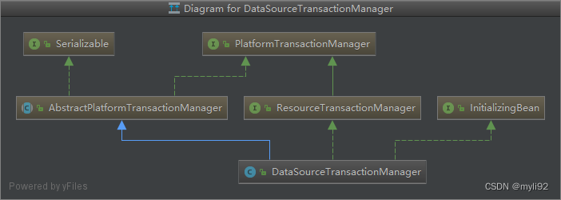

#### 0、TransactionDefinition 接口预介绍

TransactionDefinition 这个接口主要用来定义事务的传播行为、隔离级别、超时时间、是否只读等属性

```java
@Autowired
private PlatformTransactionManager transactionManager;

@Override
public String interfaceTest(Map<String, Object> map) {
    DefaultTransactionDefinition def = new DefaultTransactionDefinition();
    // 设置事务名称
    def.setName("test-Transactional");
    // 读写或只读事务、默认：读写
    def.setReadOnly(true);
    // 事务超时时间，默认：不超时 单位：秒
    def.setTimeout(10);
    /**
     * 设置事务的隔离级别
     *
     * 1、TransactionDefinition.ISOLATION_DEFAULT
     *    这是一个默认的隔离级别，默认使用数据库的隔离级别。
     * 2、TransactionDefinition.ISOLATION_READ_UNCOMMITTED
     *    这是事务最低的隔离界别，他允许别的事务可以看到这个事务未提交的数据。
     *    这种隔离级别可能会产生脏读，不可重复读和幻像读。
     * 3、TransactionDefinition.ISOLATION_READ_COMMITTED
     *    这个级别可以保证在数据提交以后才能被另个一个事务读取。
     *    这种隔离级别可以避免脏读，但是可能会出现不可重复读和幻读。
     * 4、TransactionDefinition.ISOLATION_REPEATABLE_READ
     *    这个级别可以禁止一个事务读取一个没有提交变化的行。
     *    这种隔离级别可以防止脏读和不可重复读，但是可能会出现幻读。
     * 5、TransactionDefinition.ISOLATION_SERIALIZABLE
     *    这种隔离级别可以防止脏读、不可重复读、幻读。
     *
     */
    def.setIsolationLevel(TransactionDefinition.ISOLATION_DEFAULT);
    /**
     * 设置事务的传播行为
     *
     * 1、TransactionDefinition.PROPAGATION_REQUIRED
     *    如果当前存在事务，则加入该事务，如果当前没有事务，则创建一个新的事务。默认值
     * 2、TransactionDefinition.PROPAGATION_REQUIRES_NEW
     *    创建一个新的事务，如果当前存在事务，则把当前的事务挂起。
     * 3、TransactionDefinition.PROPAGATION_SUPPORTS
     *    如果当前存在事务，则加入该事务，如果当前没有事务，则以非事务的方式继续运行。
     * 4、TransactionDefinition.PROPAGATION_NOT_SUPPORTED
     *    以非事务方式运行，如果当前存在事务，则把当前事务挂起。
     * 5、TransactionDefinition.PROPAGATION_NEVER
     *    以非事务方式运行，如果当前存在事务，则抛出异常。
     * 6、TransactionDefinition.PROPAGATION_MANDATORY
     *    如果当前存在事务、则加入该事务，如果当前没有事务，则抛出异常
     * 7、TransactionDefinition.PROPAGATION_NESTED
     *    如果当前存在事务，则创建一个事务作为当前事务的嵌套事务来运行。
     *    如果当前没有事务，则该取值等价于TransactionDefinition.PROPAGATION_REQUIRED。
     */
    def.setPropagationBehavior(TransactionDefinition.PROPAGATION_REQUIRED);
    TransactionStatus transactionStatus = transactionManager.getTransaction(def);
    try {
        //
        // 提交事务
        transactionManager.commit(transactionStatus);
    } catch (Exception e) {
        // 回滚事务
        transactionManager.rollback(transactionStatus);
    }
    return null;
}
```


#### 1、接口开启事务 PlatformTransactionManager

```java
/**
 * 事务管理器的接口
 */
@Autowired
private PlatformTransactionManager platformTransactionManager;

/**
 * 这个接口主要用来定义事务的传播行为、隔离级别、超时时间、是否只读等属性
 */
@Autowired
private TransactionDefinition transactionDefinition;

@Test
public void manualTransactionalTest() {
    TransactionStatus transactionStatus = platformTransactionManager.getTransaction(transactionDefinition);
    try {
        UserInfo userInfo = new UserInfo();
        iUserInfoService.insertData(userInfo);

        UserInfo userInfo1 = new UserInfo();
        iUserInfoService.insertData(userInfo1);
        platformTransactionManager.commit(transactionStatus);
    } catch (Exception exception) {
        platformTransactionManager.rollback(transactionStatus);
    }
}
```


#### 2、Spring/Mybatis 开启事务 DataSourceTransactionManager

DataSourceTransactionManager 它是 Spring 提供的一个事务管理器，用于管理基于 JDBC 的事务。

在 MyBatis 中，对应的 TransactionManager 是 DataSourceTransactionManager，与 Spring JDBC 相同。

```java
@Autowired
private DataSourceTransactionManager dataSourceTransactionManager;

public void tranDelNoAuto(String name) {
    DefaultTransactionDefinition defaultTransactionDefinition = new DefaultTransactionDefinition();
    TransactionStatus transactionStatus = dataSourceTransactionManager.getTransaction(defaultTransactionDefinition);
    User deleteUer = userRepository.findOneByName(name);
    if (deleteUer != null) {
        userRepository.deleteById(deleteUer.getId());
    }
    if (deleteUer.getId() % 2 == 0) {
        dataSourceTransactionManager.commit(transactionStatus);
    } else {
        dataSourceTransactionManager.rollback(transactionStatus);
    }
}
```


#### 3、JPA 开启事务 JpaTransactionManager

```java
@Autowired
private JpaTransactionManager jpaTransactionManager;

public void tranDelNoAuto(String userName) {
    DefaultTransactionDefinition defaultTransactionDefinition = new DefaultTransactionDefinition();
    TransactionStatus transactionStatus = jpaTransactionManager.getTransaction(defaultTransactionDefinition);
    User delteUser = iUserDao.findByUsername(userName);
    if (delteUser != null) {
        iUserDao.deleteById(delteUser.getUserid());
    }
    if (delteUser.getUserid() % 2 == 0) {
        jpaTransactionManager.commit(transactionStatus);
    } else {
        jpaTransactionManager.rollback(transactionStatus);
    }
}
```


#### 4、自定义事务工具类 TransactionManage

我们就基于这种方法来做一个工具类。这个工具类作用是接收一个Service层需要被事务包围的方法为参数，然后给调用端返回事务结果，供调用端根据结果做相应的处理。

```java
import lombok.extern.slf4j.Slf4j;
import org.springframework.beans.factory.annotation.Autowired;
import org.springframework.stereotype.Component;
import org.springframework.transaction.PlatformTransactionManager;
import org.springframework.transaction.TransactionStatus;
import org.springframework.transaction.support.DefaultTransactionDefinition;
import java.util.function.Consumer;

/**
 * 编程式事务工具类
 */
@Slf4j
@Component
public class TransactionUtil {
    @Autowired
    private PlatformTransactionManager transactionManager;

    public <T> boolean transactional(T entity, Consumer<T> consumer) {
        TransactionStatus status = transactionManager.getTransaction(new DefaultTransactionDefinition());
        try {
            consumer.accept(entity);
            transactionManager.commit(status);
            return true;
        } catch (Exception e) {
            transactionManager.rollback(status);
            log.error("编程式事务业务异常回滚", e);
            return false;
        }
    }
}
```

该类通过接收一个函数型参数，返回该函数的事务执行结果。由于我们仅仅是为了执行Service代码，并不需要改变代码的值，所有consumer.accept(null)即可。

```java
@Service
public class TestService {
    /**
     * 此处不需要事务，由TransactionUtil控制事务
     */
    public void doSome(Object entity) {
        // repository.save(entity);
        System.out.println("我是Service层" + entity);
    }
}

// Controller 中就可以使用
@RestController
public class TestController {
    @Autowired TestService testService;
    @Autowired TransactionUtil transactionUtil;

    @GetMapping("/test")
    public String test() {
        // 获取事务的执行结果
        boolean result = transactionUtil.transactional(new Object(), x -> testService.doSome(x));
        return "1";
    }
}
```

该工具是需要获取事务执行结果的封装。


# 三、事务应用的注意事项

> 作者：[码拉松](https://blog.csdn.net/CSDN_WYL2016)、来源：https://blog.csdn.net/CSDN_WYL2016/article/details/122254559

## 1、声明式事务的应用级别

在实际生产应用中是不建议在类似`Service`这样的`class`类上直接加上`@Transactional`注解的，因为这样会导致这个类中的所有方法在执行时都带上了事务，只要调用到数据库，就都会被进行事务管理，从而影响数据库和Web服务的QPS。这样原来根本就不需要事务的方法则多了一份负担。

又称：滥用@Transactional。由于声明式事务@Transactional的简单灵活，而经常导致被滥用的情况发生。

```java
@Service
@Transactional // 不要加在Service上
public class DemoService {
}
```


## 2、长事务、过早起开事务

简单来说，就是在整个方法的生命周期内，真正需要事务管理的方法可能只占用了`20%`的时间，而其他业务流程占用了`80%`的时间，但是由于事务是对整个方法生效，从而导致事务的整体执行时间与整个方法的执行时间一样。

```java
@Transactional
public void func() {
    // 两个select花费了2秒
    select1();
    select2();
    // 两个save只花费了200毫秒
    save1();
    save2();
}
```

解决方式也很简单，把长事务拆分为短事务即可

```java
public void func() {
    select1();
    select2();
    manager.save();
}

@Transactional
public void save() {
    save1();
    save2();
}
```

也可以直接使用编程式事务，编程式事务可以更灵活的控制事务的范围。

```java
@Resource
private TransactionTemplate transactionTemplate;

public void func() {
    transactionTemplate.execute(new TransactionCallbackWithoutResult() {
        @Override
        protected void doInTransactionWithoutResult(TransactionStatus status) {
            testMapper.updateT1();
            t2Service.func();
            int i = 1 / 0;
        }
    });
}
```


## 3、锁的粒度

要想开启事务，就要先持有锁，因此锁的范围就很重要，InnoDB之所以能够取代Myisam，不单单只是因为InnoDB支持事务，更重要的是因为它还支持行级锁，这在高并发的业务场景中，是非常关键的。

所以，我们平时在写代码时，一定要注意避免表级锁的产生。


## 4、数据库死锁

看到此类的异常，不用多想，基本上就是并发事务导致的，一个事务还未结束，另一个事务想再获取锁时就会遇到这个问题。

```java
Deadlock found when trying to get lock; try restarting transaction
```

解决的方式就前面提到的两点：

1. 避免长事务。
2. 缩小锁的粒度。


# 四、事务失效的八种场景

> 作者：[码拉松](https://blog.csdn.net/CSDN_WYL2016)、来源：https://blog.csdn.net/CSDN_WYL2016/article/details/122263796

本章主要针对事务失效的情况来分析，关于事务未生效的问题，也是我们在日常开发中经常会遇到的，总结一些会导致事务失效的场景，以免遇到类似的问题。

## 1、异常未抛出

被捕获的异常一定要抛出，否则是不会回滚的。

```java
// t1Service
@Transactional
public void func() {
    try {
        testMapper.updateT1();
        t2Service.func();
        int i = 1 / 0;
    } catch (Exception e) {
        // 异常捕获了，未抛出，导致异常事务不会回滚。
        e.printStackTrace();
    }
}

// t2Service
@Transactional
public void func() {
    testMapper.updateT2();
}
```


## 2、异常与rollback不匹配

`@Transactional`默认情况下，只会回滚`RuntimeException`和`Error`及其子类的异常，如果是受检异常或者其他业务类异常是不会回滚事务的。

```java
@Transactional
public void func() throws Exception {
    try {
        testMapper.updateT1();
        t2Service.func();
        int i = 1 / 0;
    } catch (Exception e) {
        // 默认情况下非运行时异常不会回滚
        throw new Exception();
    }
}
```

修改方式也很简单，`@Transactional`支持通过`rollbackFor`指定回滚异常类型，可以直接改成`rollbackFor = Exception.class`即可

```java
// 改成rollbackFor = Exception.class即可
@Transactional(rollbackFor = Exception.class)
public void func() throws Exception {
    try {
        testMapper.updateT1();
        t2Service.func();
        int i = 1 / 0;
    } catch (Exception e) {
        throw new Exception();
    }
}
```


## 3、方法内部直接调用

`func2`方法是由`func`调用，虽然`func2`方法上加了`@Transactional`注解，但事务不会生效，`testMapper.updateT2()`执行的方法并不会回滚。

```java
public void func() {
    testMapper.updateT1();
    func2(); // 重点在这里: 这里属于调用内部方法
}
@Transactional
public void func2() {
    testMapper.updateT2();
    int i = 1 / 0;
}
```

修改方式也很简单，通过注入的方式调用即可

```java
@Service
public class T1Service {

    @Resource
    private TestMapper testMapper;

    // 注入T1Service对象
    @Resource
    private T1Service t1Service;

    public void func() {
        testMapper.updateT1();
        // 通过注入的方式调用自身的方法
        t1Service.func2();
    }

    @Transactional
    public void func2() {
        testMapper.updateT2();
        int i = 1 / 0;
    }
}
```

> 注意：SpringBoot 2.6.0版本开始，默认禁止循环依赖，所以如果你使用的版本是2.6.0之后的，那么启动会遇到如下报错。

```java
As a last resort, it may be possible to break the cycle automatically by setting spring.main.allow-circular-references to true.
```

修改方式：在配置文件中把允许循环依赖打开即可。

```properties
spring.main.allow-circular-references=true
```

当然，你也可以直接使用`AopContext`的方式来调用：

```java
public void func() {
    testMapper.updateT1();
    T1Service t1Service = (T1Service) AopContext.currentProxy();
    t1Service.func2();
}
@Transactional
public void func2() {
    testMapper.updateT2();
    int i = 1 / 0;
}
```


## 4、在另一个线程中使用事务

`Spring`事务管理的方式就是通过`ThreadLocal`把数据库连接与当前线程绑定，如果新开启一个线程自然就不是一个数据库连接了，自然也就不是一个事务。

`t2Service.func()`方法操作的数据并不会被回滚。

```java
@Transactional
public void func() {
    testMapper.updateT1();
    new Thread(() -> t2Service.func()).start();
    int i = 1 / 0;
}
```


## 5、注解作用到private级别的方法上

当你写成如下这样时，`IDEA`直接会给出提示`Methods annotated with ‘@Transactional’ must be overridable` 原因很简单，`private`修饰的方式，`spring`无法为其生成代理。

```java
public void func() {
    t1Service.func2();
}

@Transactional
private void func2() {
    testMapper.updateT1();
    int i = 1 / 0;
}
```

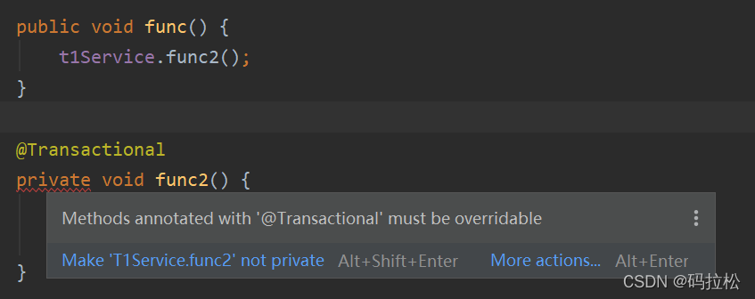


## 6、final 类型的方法

这个与`private`道理是一样的，都是影响了`Spring`生成代理对象，同样`IDEA`也会有相关提示。 

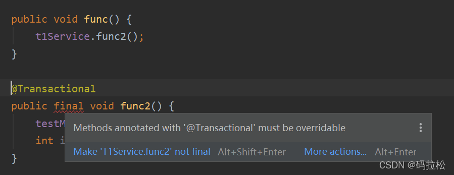


## 7、数据库存储引擎不支持事务

注意，如果你使用的是`MySQL`数据库，那么常用的存储引擎中只有`InnoDB`才支持事务，像`MyISAM`是不支持事务的，其他存储引擎都是针对特定场景下使用的，一般也不会用到，不做讨论。

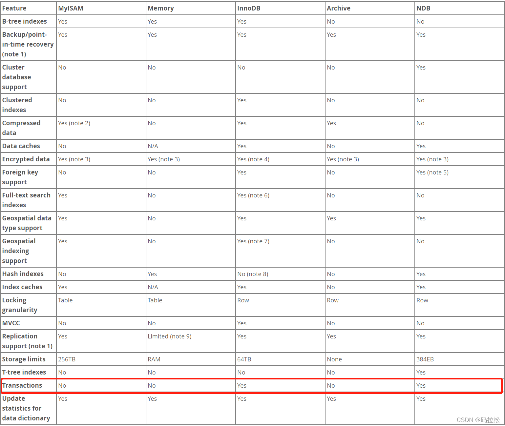


## 8、事务的传播类型

前面已经对事务的传播类型做过介绍了，有的传播类型会以非事务方式执行，有的传播则会新开启一个事务，这些都需要额外注意。

- **REQUIRED**：支持当前事务，如果当前不存在则新开启一个事务（默认配置）
- **SUPPORTS**：支持当前事务，如果当前不存在事务则以非事务方式执行
- **MANDATORY**：支持当前事务，如果当前不存在事务则抛出异常
- **REQUIRES_NEW**：创建一个新事务，如果当前已存在事务则挂起当前事务
- **NOT_SUPPORTED**：以非事务方式执行，如果当前已存在事务则挂起当前事务
- **NEVER**：以非事务方式执行，如果当前已存在事务则抛出异常
- **NESTED**：如果当前存在事务，则在嵌套事务中执行，否则开启一个新事务


# 五、事务管理器架构分析

> - 作者：[码拉松](https://blog.csdn.net/CSDN_WYL2016)、来源：https://blog.csdn.net/CSDN_WYL2016/article/details/122285286
> - 作者：[程序员古德](https://author.baidu.com/home?from=bjh_article&app_id=1742572817489016)、来源：一文带你掌握Spring事务核心：TransactionDefinition详解！
>   - https://baijiahao.baidu.com/s?id=1785219136558062233、
>   - https://blog.csdn.net/qusikao/article/details/134987576

在`Spring`中，我们可以直接使用`TransactionTemplate`或者`PlatformTransactionManager`来操作事务，`TransactionTemplate`封装了事务处理的核心流程，使用者只需把它注入到自己的上下文中，变可直接使用，而`PlatformTransactionManager`则是更底层的接口，我们可以直接通过它来控制事务，但它并不是主流的使用方式，一般还是建议优先使用`TransactionTemplate`或者直接声明式的`@Transaction`。

本次主要会对`Spring`事务的整体架构进行梳理，通过源码的分析，让使用者能够更清楚事务的内部实现原理。

1、接口与类的关系图
---------------------------------------------------------------------

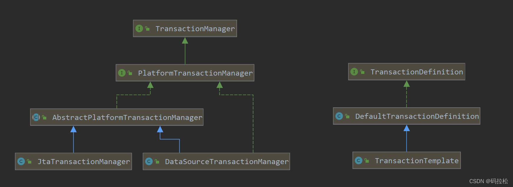


2、TransactionManager
----------------------------------------------------------------------------------

`TransactionManager`是一个标识接口

```java
public interface TransactionManager {
}
```


3、PlatformTransactionManager
------------------------------------------------------------------------------------------

`PlatformTransactionManager`接口继承了`TransactionManager`，定义了事务的核心方法，提交和回滚，正如前面提到的，可以直接使用它来控制事务，但并不建议这样做，正确的做法应该是继承`AbstractPlatformTransactionManager`类，典型的样例就是`JtaTransactionManager`和`DataSourceTransactionManager`。

```java
public interface PlatformTransactionManager extends TransactionManager {    
    TransactionStatus getTransaction(@Nullable TransactionDefinition definition) throws TransactionException;
    void commit(TransactionStatus status) throws TransactionException;
    void rollback(TransactionStatus status) throws TransactionException;
}
```


4、AbstractPlatformTransactionManager
--------------------------------------------------------------------------------------------------

这是一个典型的采用模板方法设计的抽象类，定义了关于事务的核心处理流程。可以看到几个关键的抽象方法，都交由子类去实现。 

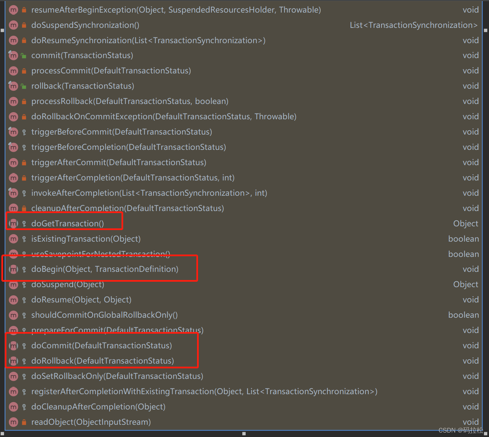

到了下面的具体的子类实现，只需要简单的执行就好了，比如：`DataSourceTransactionManager`类重写`doCommit`和`doRollback`方法只是简单的获取数据库连接后进行事务的提交或者回滚就好了。 

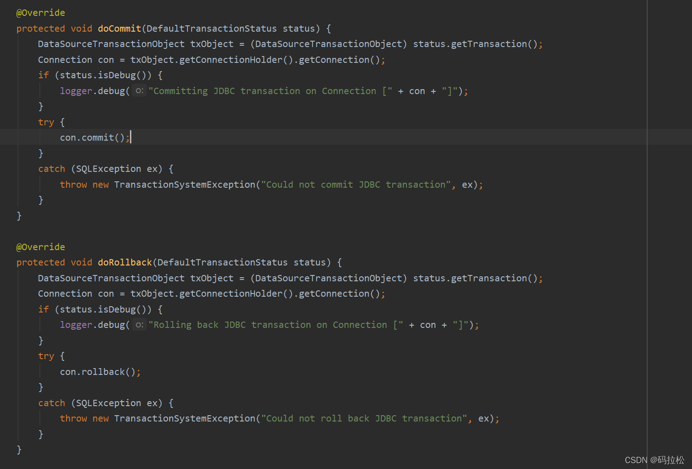


5、TransactionTemplate
-----------------------------------------------------------------------------------

通过分析`TransactionManager`链路下的一些类可以看出，主要就是定义了事务处理的关键方法和核心流程，那么具体执行事务的入口就要看`TransactionTemplate`了。

`TransactionTemplate`是具体执行事务的入口，`XXXTemplate`结尾的类，通常目的都是为了简化使用者处理的流程，这种命名方式也是`Spring`的习惯。

而`TransactionTemplate`中定义的入口方法就是`execute`。

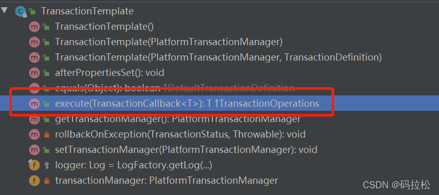

入参`TransactionCallback`也是一个标记性接口。

```java
@FunctionalInterface
public interface TransactionCallback<T> {
    @Nullable
    T doInTransaction(TransactionStatus status);
}
```

```java
@Override
@Nullable
public <T> T execute(TransactionCallback<T> action) throws TransactionException {
    // 方法执行需要先确保transactionManager对象不为空，还记得transactionManager吗？就是前面分析的定义了事务处理的关键方法和核心流程的类。
    Assert.state(this.transactionManager != null, "No PlatformTransactionManager set");
    if (this.transactionManager instanceof CallbackPreferringPlatformTransactionManager) {
        return ((CallbackPreferringPlatformTransactionManager) this.transactionManager).execute(this, action);
    }
    else {
        TransactionStatus status = this.transactionManager.getTransaction(this);
        T result;
        try {
            result = action.doInTransaction(status);
        }
        catch (RuntimeException | Error ex) {
            // Transactional code threw application exception -> rollback
            rollbackOnException(status, ex);
            throw ex;
        }
        catch (Throwable ex) {
            // Transactional code threw unexpected exception -> rollback
            rollbackOnException(status, ex);
            throw new UndeclaredThrowableException(ex, "TransactionCallback threw undeclared checked exception");
        }
        this.transactionManager.commit(status);
        return result;
    }
}
```

而`TransactionManager`会作为`TransactionTemplate`中的一个属性来使用。

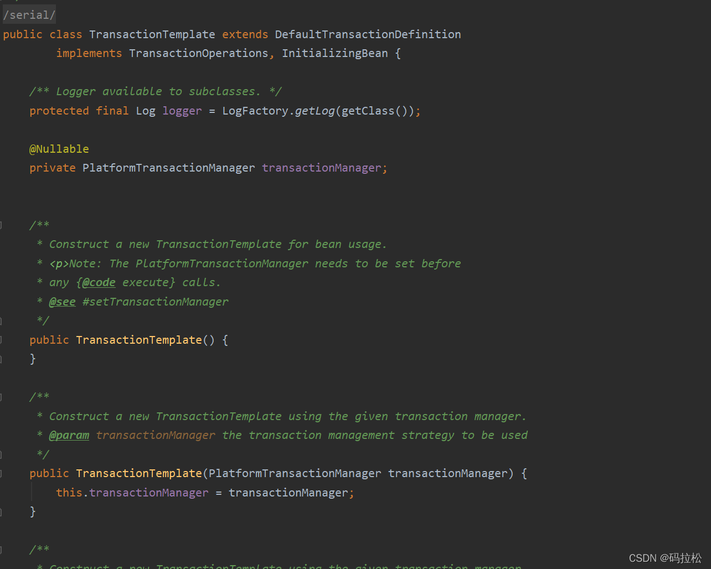

整个`execute`中几个关键的方法实际上都是在调用`TransactionManager`中提供的方法，`doInTransaction`则是执行业务代码的地方。

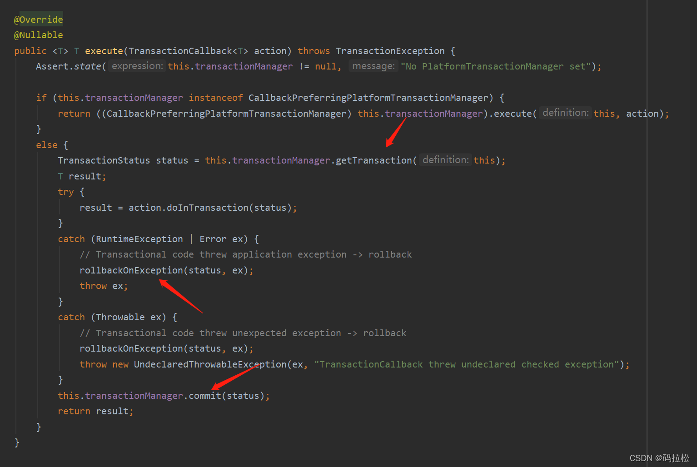

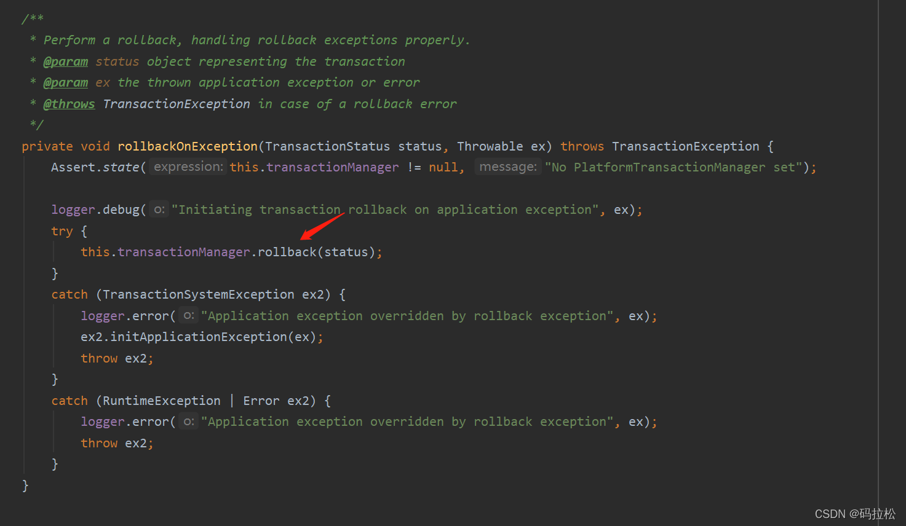


6、TransactionDefinition
-------------------------------------------------------------------------------------

`TransactionDefinition`是Spring框架中用于定义事务属性的核心接口，这个接口主要用来定义事务的传播行为、隔离级别、超时时间、是否只读等属性。

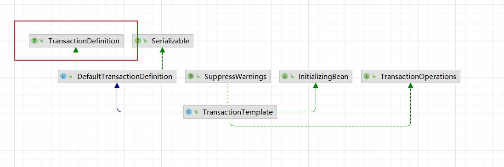

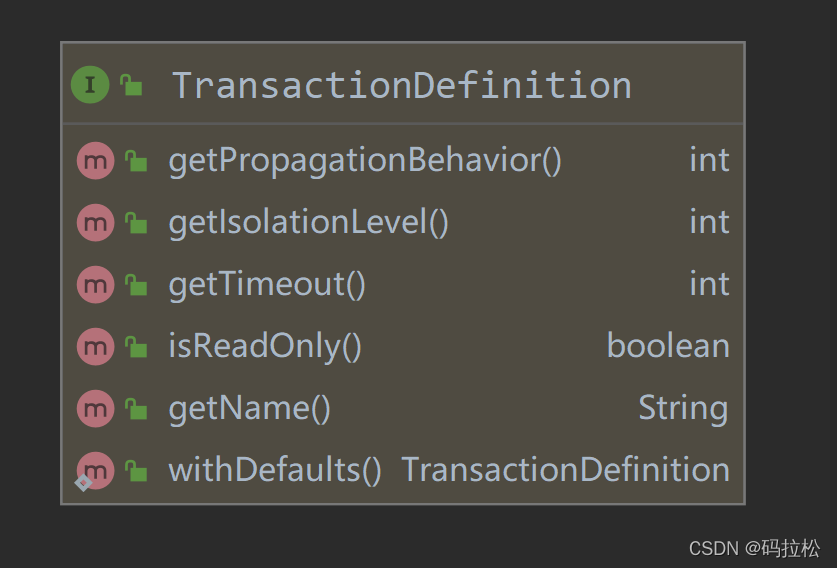

### 1、基本介绍

`TransactionDefinition` 接口的主要方法：

1. **getIsolationLevel()**: 返回事务的隔离级别。隔离级别定义了事务如何与其他事务隔离，以避免如脏读、不可重复读和幻读等问题。Spring 支持多种隔离级别，如 `ISOLATION_DEFAULT`、`ISOLATION_READ_UNCOMMITTED`、`ISOLATION_READ_COMMITTED`、`ISOLATION_REPEATABLE_READ` 和 `ISOLATION_SERIALIZABLE`。
2. **getPropagationBehavior()**: 返回事务的传播行为。传播行为决定了当一个事务方法被另一个事务方法调用时，应该如何传播事务。例如，是否应该启动新的事务、使用现有事务还是挂起现有事务等。Spring 支持如 `PROPAGATION_REQUIRED`、`PROPAGATION_REQUIRES_NEW`、`PROPAGATION_NESTED` 等多种传播行为。
3. **getTimeout()**: 返回事务的超时时间（以秒为单位）。如果一个事务运行的时间超过了这个指定的时间，那么它可能会被底层的事务管理系统自动回滚。
4. **isReadOnly()**: 返回事务是否为只读。一个只读事务意味着这个事务只读取数据但不修改数据。在某些情况下，数据库可以利用这个信息来优化性能。
5. **getName()**: 返回事务的名称。这是一个可选属性，可以为事务提供一个名称，以便于识别和调试。

如下一个简单的 `TransactionDefinition` 案例：

```java
@Transactional(isolation = Isolation.READ_COMMITTED, propagation = Propagation.REQUIRES_NEW)  
public void someTransactionalMethod() {  
    // ... business logic ...  
}
```

在上面的例子中，指定了事务的隔离级别为 `READ_COMMITTED` 和传播行为为 `REQUIRES_NEW`。总的来说，`TransactionDefinition` 接口为 Spring 提供了一种统一和灵活的方式来定义和配置事务的各种属性，使开发者能够根据不同的业务需求调整事务的行为。


### 2、场景介绍

#### 1）电商系统订单处理

在电商系统中，当用户下单时，通常需要在数据库中创建订单记录，同时更新库存和用户的付款状态，这个过程必须是事务性的，以确保数据的一致性。这场景具有以下特点：

1. 多个库表操作（创建订单、更新库存、更新付款状态）。
2. 需要确保所有操作都成功才提交事务。

在该场景中 `TransactionDefinition` 的伪配置如下：

- **传播行为**：`PROPAGATION_REQUIRED`，因为在一个事务上下文中执行所有操作是有意义的。
- **隔离级别**：`ISOLATION_READ_COMMITTED`，以避免脏读，同时允许一定程度的并发。
- **超时时间**：根据业务需要设定，比如30秒。


#### 2）银行转账系统

在银行转账系统中，从一个账户扣款并向另一个账户存款必须是一个原子操作，如果在扣款后因为某种原因存款失败，整个转账操作必须回滚。这场景具有以下特点：

1. 涉及两个账户的数据库操作
2. 需要确保转账操作的原子性

在该场景中 `TransactionDefinition` 的伪配置如下：

- **传播行为**：`PROPAGATION_REQUIRED`，确保转账操作的原子性。
- **隔离级别**：`ISOLATION_SERIALIZABLE`，因为金融系统通常需要最严格的隔离级别。
- **超时时间**：相对较长，比如60秒，因为金融交易可能涉及更多验证和处理时间。


#### 3）内容管理系统

在内容管理系统中，发布一篇文章可能包括在数据库中创建文章记录、更新作者统计信息、发送通知等操作，这些操作需要在一个事务中执行，以确保数据的一致性。。这场景具有以下特点：

1. 多个数据库和外部系统操作（如发送通知）
2. 需要确保所有操作都成功才提交事务

在该场景中 `TransactionDefinition` 的伪配置如下：

- **传播行为**：`PROPAGATION_REQUIRED`，以便在一个事务上下文中执行所有操作。
- **隔离级别**：`ISOLATION_READ_COMMITTED`，以平衡性能和一致性。
- **超时时间**：相对较短，比如10秒，因为内容管理系统通常对性能要求较高。


### 3、代码案例

假设，我们正在开发一个简单的银行转账系统，需要确保转账操作的原子性。在案例中我们将使用Spring框架的事务管理功能，并通过`TransactionDefinition`来定义事务属性，核心代码如下：

```java
import org.springframework.beans.factory.annotation.Autowired;  
import org.springframework.jdbc.core.JdbcTemplate;  
import org.springframework.transaction.PlatformTransactionManager;  
import org.springframework.transaction.TransactionDefinition;  
import org.springframework.transaction.TransactionStatus;  
import org.springframework.transaction.support.DefaultTransactionDefinition;  

public class BankService {  
  
    @Autowired  
    private PlatformTransactionManager transactionManager;  
  
    @Autowired  
    private JdbcTemplate jdbcTemplate;  
  
    public void transfer(String fromAccount, String toAccount, double amount) {  
        // 定义一个事务属性对象  
        TransactionDefinition transactionDefinition = new DefaultTransactionDefinition();  
        transactionDefinition.setPropagationBehavior(TransactionDefinition.PROPAGATION_REQUIRED);  
        transactionDefinition.setIsolationLevel(TransactionDefinition.ISOLATION_READ_COMMITTED);  
        transactionDefinition.setTimeout(10); // 设置超时时间为10秒  
        transactionDefinition.setReadOnly(false); // 事务不是只读的  
  
        // 获取事务状态对象  
        TransactionStatus transactionStatus = transactionManager.getTransaction(transactionDefinition);  
  
        try {  
            // 从源账户扣钱  
            jdbcTemplate.update("UPDATE account SET balance = balance - ? WHERE account_number = ?", amount, fromAccount);  
            // 向目标账户加钱  
            jdbcTemplate.update("UPDATE account SET balance = balance + ? WHERE account_number = ?", amount, toAccount);  
  
            // 提交事务  
            transactionManager.commit(transactionStatus);  
            System.out.println("转账成功！");  
        } catch (Exception e) {  
            // 回滚事务  
            transactionManager.rollback(transactionStatus);  
            System.out.println("转账失败！");  
            throw e; // 或者选择记录错误日志等其他处理方式  
        }  
    }  
}
```

在这个案例中，我们定义了一个`transfer`方法，用于执行转账操作。

在方法内部，我们首先创建了一个`DefaultTransactionDefinition`对象，并通过`setPropagationBehavior`、`setIsolationLevel`、`setTimeout`和`setReadOnly`方法配置了事务的属性，然后，我们通过`transactionManager.getTransaction`方法获取了一个`TransactionStatus`对象，该对象代表了当前事务的状态，在try-catch块中，我们执行了实际的数据库操作（扣钱和加钱），并在成功的情况下提交事务，失败的情况下回滚事务。

最后，我们根据事务的执行结果输出相应的提示信息。


### 4、源码解读

这里列出了`TransactionDefinition`核心方法以及变量，其中一些功能含义、功能重复的就以`... 其他XXX ...` 进行表示，如下：

```java
package org.springframework.transaction;  
import java.io.Serializable;  

/**  
 * 事务定义接口，用于定义事务的属性。  
 *  
 * @author Juergen Hoeller  
 * @since 16.03.2003  
 */  
public interface TransactionDefinition extends Serializable {  
  
    /**  
     * 支持当前事务，如果当前没有事务，则新建一个事务。  
     * 这是最常见的选择。  
     */  
    int PROPAGATION_REQUIRED = 0;  
  
    /**  
     * 使用默认的事务隔离级别。  
     * 实际的隔离级别由底层数据库决定。  
     */  
    int ISOLATION_DEFAULT = -1;  
  
    // ... 其他隔离级别常量 ...  
  
    /**  
     * 返回事务的传播行为。  
     * <p>事务的传播行为决定了当在一个事务方法中被另一个事务方法调用时，如何使用事务。  
     * 例如：{@code PROPAGATION_REQUIRED}表示当前方法必须在事务中运行。如果当前存在事务，则加入该事务；  
     * 如果当前没有事务，则新建一个事务。</p>  
     * @return 事务的传播行为常量，如{@code PROPAGATION_REQUIRED}等。  
     */  
    int getPropagationBehavior();  
  
    /**  
     * 返回事务的隔离级别。  
     * <p>事务的隔离级别决定了事务如何处理并发问题。不同的隔离级别会影响脏读、不可重复读和幻读等问题。</p>  
     * @return 事务的隔离级别常量，如{@code ISOLATION_READ_COMMITTED}等。  
     */  
    int getIsolationLevel();  
  
    /**  
     * 返回事务的超时时间（以秒为单位）。  
     * <p>如果事务在规定的时间内没有完成，则会被自动回滚。</p>  
     * @return 超时时间（秒），默认值为-1，表示永不超时。  
     */  
    int getTimeout();  
  
    /**  
     * 返回事务是否为只读。  
     * <p>只读事务不会修改数据，因此可以进行一些优化。</p>  
     * @return 如果事务为只读，则返回{@code true}；否则返回{@code false}。  
     */  
    boolean isReadOnly();  
  
    /**  
     * 返回事务的名称。  
     * <p>事务名称可以用于日志记录、监控和调试。</p>  
     * @return 事务的名称，如果没有设置则返回{@code null}。  
     */  
    String getName();  
}
```


### 5、核心总结

`TransactionDefinition`是`Spring`框架中用于定义事务属性的核心接口，为开发者提供了事务管理的标准化方式。通过它，我们可以设置事务的传播行为、隔离级别、超时时间和只读属性等，确保数据在并发场景中的一致性和完整性。在实际应用中，`TransactionDefinition`与其他`Spring`组件如`PlatformTransactionManager`结合使用，为数据库操作提供了原子性、一致性、隔离性和持久性的保障，是构建健壮、可维护企业级应用的关键。熟悉并正确使用`TransactionDefinition`，对于提高系统性能和数据安全性具有重要意义。


7、事务管理器总结
------------------------------------------------------------------

`Spring`为我们提供的`TransactionTemplate`类，定义了事务处理的基本流程，对外暴露一个`execute`方法，并通过传入一个标记性接口`TransactionCallback`来实现使用者的业务逻辑处理，大大简化了使用方式。

而`PlatformTransactionManager`则更加的灵活，它的目的主要是为了能够让使用者更加方便的在事务流程前后进行业务扩展，比如它的实现类有：`HibernateTransactionManager、JpaTransactionManager、JtaTransactionManager`，很明显就是针对不同的ORM框架而定制的。

所以定义`TransactionTemplate`是为了让事务使用更加方便，定义`PlatformTransactionManager`是为了让扩展更加的方便。


# 六、事务管理器源码分析 TransactionSynchronizationManager

> 作者：[码拉松](https://blog.csdn.net/CSDN_WYL2016)、来源：https://blog.csdn.net/CSDN_WYL2016/article/details/122391470

`TransactionSynchronizationManager`主要作用就是管理每个线程的资源和事务同步，包括资源绑定，激活事务同步等。

1、6个事务管理对象 ThreadLocal
-----------------------------------------------------------------------------

`TransactionSynchronizationManager`中定义了6个`ThreadLocal`对象，单从名称就能分析出来，他们分别负责维护：事务资源、事务同步，事务名称、事务只读状态、事务隔离级别以及当前事务是否活跃。

```java
private static final ThreadLocal<Map<Object, Object>> resources =
		new NamedThreadLocal<>("Transactional resources");
private static final ThreadLocal<Set<TransactionSynchronization>> synchronizations =
		new NamedThreadLocal<>("Transaction synchronizations");
private static final ThreadLocal<String> currentTransactionName =
		new NamedThreadLocal<>("Current transaction name");
private static final ThreadLocal<Boolean> currentTransactionReadOnly =
		new NamedThreadLocal<>("Current transaction read-only status");
private static final ThreadLocal<Integer> currentTransactionIsolationLevel =
		new NamedThreadLocal<>("Current transaction isolation level");
private static final ThreadLocal<Boolean> actualTransactionActive =
		new NamedThreadLocal<>("Actual transaction active");
```


2、事务资源
--------------------------------------------------------------------

对于事务资源，`TransactionSynchronizationManager`中负责提供资源获取、绑定、解绑等接口

### 1、获取资源

```java
/**
 * Retrieve a resource for the given key that is bound to the current thread.
 * @param key the key to check (usually the resource factory)
 * @return a value bound to the current thread (usually the active
 * resource object), or {@code null} if none
 * @see ResourceTransactionManager#getResourceFactory()
 */
@Nullable
public static Object getResource(Object key) {
	Object actualKey = TransactionSynchronizationUtils.unwrapResourceIfNecessary(key);
	return doGetResource(actualKey);
}

/**
 * Actually check the value of the resource that is bound for the given key.
 */
@Nullable
private static Object doGetResource(Object actualKey) {
	Map<Object, Object> map = resources.get();
	if (map == null) {
		return null;
	}
	Object value = map.get(actualKey);
	// Transparently remove ResourceHolder that was marked as void...
	if (value instanceof ResourceHolder && ((ResourceHolder) value).isVoid()) {
		map.remove(actualKey);
		// Remove entire ThreadLocal if empty...
		if (map.isEmpty()) {
			resources.remove();
		}
		value = null;
	}
	return value;
}
```


### 2、绑定资源

```java
public static void bindResource(Object key, Object value) throws IllegalStateException {
    Object actualKey = TransactionSynchronizationUtils.unwrapResourceIfNecessary(key);
    Assert.notNull(value, "Value must not be null");
    Map<Object, Object> map = resources.get();
    // set ThreadLocal Map if none found
    if (map == null) {
        map = new HashMap<>();
        resources.set(map);
    }
    Object oldValue = map.put(actualKey, value);
    // Transparently suppress a ResourceHolder that was marked as void...
    if (oldValue instanceof ResourceHolder && ((ResourceHolder) oldValue).isVoid()) {
        oldValue = null;
    }
    if (oldValue != null) {
        throw new IllegalStateException(
            "Already value [" + oldValue + "] for key [" + actualKey + "] bound to thread");
    }
}
```


### 3、解绑资源

```java
public static Object unbindResource(Object key) throws IllegalStateException {
    Object actualKey = TransactionSynchronizationUtils.unwrapResourceIfNecessary(key);
    Object value = doUnbindResource(actualKey);
    if (value == null) {
        throw new IllegalStateException("No value for key [" + actualKey + "] bound to thread");
    }
    return value;
}
```
```java
@Nullable
private static Object doUnbindResource(Object actualKey) {
    Map<Object, Object> map = resources.get();
    if (map == null) {
        return null;
    }
    Object value = map.remove(actualKey);
    // Remove entire ThreadLocal if empty...
    if (map.isEmpty()) {
        resources.remove();
    }
    // Transparently suppress a ResourceHolder that was marked as void...
    if (value instanceof ResourceHolder && ((ResourceHolder) value).isVoid()) {
        value = null;
    }
    return value;
}
```


3、事务同步
--------------------------------------------------------------------

对于事务同步，`TransactionSynchronizationManager`中负责提供：事务同步激活、事务同步注册、获取事务同步列表、判断当前事务同步是否为活跃的等。

### 1、事务同步激活

实际上就是给`synchronizations`放入一个`LinkedHashSet`

```java
public static void initSynchronization() throws IllegalStateException {
    if (isSynchronizationActive()) {
        throw new IllegalStateException("Cannot activate transaction synchronization - already active");
    }
    synchronizations.set(new LinkedHashSet<>());
}
```


### 2、事务同步注册

从当前线程中取出`set`集合，并为其添加一个`TransactionSynchronization`对象

```java
public static void registerSynchronization(TransactionSynchronization synchronization)
		throws IllegalStateException {
    Assert.notNull(synchronization, "TransactionSynchronization must not be null");
    Set<TransactionSynchronization> synchs = synchronizations.get();
    if (synchs == null) {
        throw new IllegalStateException("Transaction synchronization is not active");
    }
    synchs.add(synchronization);
}
```


### 3、获取事务同步列表

```java
public static List<TransactionSynchronization> getSynchronizations() throws IllegalStateException {
    Set<TransactionSynchronization> synchs = synchronizations.get();
    if (synchs == null) {
        throw new IllegalStateException("Transaction synchronization is not active");
    }
    // Return unmodifiable snapshot, to avoid ConcurrentModificationExceptions
    // while iterating and invoking synchronization callbacks that in turn
    // might register further synchronizations.
    if (synchs.isEmpty()) {
        return Collections.emptyList();
    }
    else {
        // Sort lazily here, not in registerSynchronization.
        List<TransactionSynchronization> sortedSynchs = new ArrayList<>(synchs);
        OrderComparator.sort(sortedSynchs);
        return Collections.unmodifiableList(sortedSynchs);
    }
}
```


### 4、判断当前事务是否为活跃

```java
public static boolean isSynchronizationActive() {
    return (synchronizations.get() != null);
}
```


4、currentTransactionReadOnly 与 currentTransactionIsolationLevel
---------------------------------------------------------------------------------------------------------------------------

这两个属性分别记录当前线程事务是否只读状态和其隔离级别

```java
public static void setCurrentTransactionReadOnly(boolean readOnly) {
    currentTransactionReadOnly.set(readOnly ? Boolean.TRUE : null);
}
```
```java
public static void setCurrentTransactionIsolationLevel(@Nullable Integer isolationLevel) {
	currentTransactionIsolationLevel.set(isolationLevel);
}
```


5、actualTransactionActive
---------------------------------------------------------------------------------------

`actualTransactionActive`用于记录当前线程是否有实际活动的事务，

```java
public static void setActualTransactionActive(boolean active) {
    actualTransactionActive.set(active ? Boolean.TRUE : null);
}
```

与`isSynchronizationActive`相比，线程可能存在活跃的事务，但如果当前线程的事务被挂起，那么就不是实际活跃的事务了，所以对于被挂起的线程调用`isSynchronizationActive`返回`true`，调用`isActualTransactionActive`则返回`false`

```java
public static boolean isActualTransactionActive() {
	return (actualTransactionActive.get() != null);
}
```


6、清除当前线程事务同步数据
------------------------------------------------------------------

最后，事务提交后，`TransactionSynchronizationManager`提供了清除当前线程事务同步数据的方法。

```java
public static void clear() {
    synchronizations.remove();
    currentTransactionName.remove();
    currentTransactionReadOnly.remove();
    currentTransactionIsolationLevel.remove();
    actualTransactionActive.remove();
}
```


# 七、事务创建的流程分析

> 作者：[码拉松](https://blog.csdn.net/CSDN_WYL2016)、来源：https://blog.csdn.net/CSDN_WYL2016/article/details/122445678

Spring中定义事务核心流程最关键的类就是`AbstractPlatformTransactionManager`，这是一个抽象类，通过模板方法的方式定义了Spring的标准事务处理流程，是其他具体事务管理平台实现的基础。本次主要针对事务创建的流程做分析。


1、getTransaction
------------------------------------------------------------------------------

`getTransaction`方法中，定义获取一个事务时的主干流程，包含获取事务、开启事务、设置事务的隔离级别、状态、只读属性、以及前面文章中提到过的`TransactionSynchronizationManager`类中六个`ThreadLocal`变量的设置。

```java
@Override
public final TransactionStatus getTransaction(@Nullable TransactionDefinition definition)
    throws TransactionException {
    // Use defaults if no transaction definition given.
    TransactionDefinition def = (definition != null ? definition : TransactionDefinition.withDefaults());
    // 获取事务，这是一个抽象方法，交由子类去实现，获取具体的事务对象，比如DataSourceTransactionObject、JpaTransactionObject等
    Object transaction = doGetTransaction();
    boolean debugEnabled = logger.isDebugEnabled();
    // 判断当前线程是否已经存在事务，如果存在则会根据事务传播属性来处理
    if (isExistingTransaction(transaction)) {
        // Existing transaction found -> check propagation behavior to find out how to behave.
        return handleExistingTransaction(def, transaction, debugEnabled);
    }
    // Check definition settings for new transaction.
    if (def.getTimeout() < TransactionDefinition.TIMEOUT_DEFAULT) {
        throw new InvalidTimeoutException("Invalid transaction timeout", def.getTimeout());
    }
    // 下面这些逻辑，可以看到针对一些特定的传播属性是如何处理的，比如对于PROPAGATION_MANDATORY，则当前不存在事务就抛出异常
    // No existing transaction found -> check propagation behavior to find out how to proceed.
    if (def.getPropagationBehavior() == TransactionDefinition.PROPAGATION_MANDATORY) {
        throw new IllegalTransactionStateException(
            "No existing transaction found for transaction marked with propagation 'mandatory'");
    }
    else if (def.getPropagationBehavior() == TransactionDefinition.PROPAGATION_REQUIRED ||
             def.getPropagationBehavior() == TransactionDefinition.PROPAGATION_REQUIRES_NEW ||
             def.getPropagationBehavior() == TransactionDefinition.PROPAGATION_NESTED) {
        SuspendedResourcesHolder suspendedResources = suspend(null);
        if (debugEnabled) {
            logger.debug("Creating new transaction with name [" + def.getName() + "]: " + def);
        }
        try {
            // 开始一个新的事务
            return startTransaction(def, transaction, debugEnabled, suspendedResources);
        }
        catch (RuntimeException | Error ex) {
            resume(null, suspendedResources);
            throw ex;
        }
    }
    else {
        // Create "empty" transaction: no actual transaction, but potentially synchronization.
        if (def.getIsolationLevel() != TransactionDefinition.ISOLATION_DEFAULT && logger.isWarnEnabled()) {
            logger.warn("Custom isolation level specified but no actual transaction initiated; " +
                        "isolation level will effectively be ignored: " + def);
        }
        boolean newSynchronization = (getTransactionSynchronization() == SYNCHRONIZATION_ALWAYS);
        // startTransaction方法中也会调用，主要就是保存TransactionSynchronizationManager的ThreadLocal属性
        return prepareTransactionStatus(def, null, true, newSynchronization, debugEnabled, null);
    }
}
```


2、startTransaction
--------------------------------------------------------------------------------

开启一个新的事务，核心业务逻辑也是由子类实现

```java
private TransactionStatus startTransaction(TransactionDefinition definition, 
                                           Object transaction,
                                           boolean debugEnabled, 
                                           @Nullable SuspendedResourcesHolder suspendedResources) {
    boolean newSynchronization = (getTransactionSynchronization() != SYNCHRONIZATION_NEVER);
    DefaultTransactionStatus status = newTransactionStatus(
            definition, transaction, true, newSynchronization, debugEnabled, suspendedResources);
    // 抽象方法，主要负责事务的创建工作，具体交由子类实现，比如DataSourceTransactionManager、JpaTransactionManager
    doBegin(transaction, definition);
    prepareSynchronization(status, definition);
    return status;
}
```


3、prepareSynchronization
--------------------------------------------------------------------------------------

```java
protected void prepareSynchronization(DefaultTransactionStatus status, TransactionDefinition definition) {
    if (status.isNewSynchronization()) {
        TransactionSynchronizationManager.setActualTransactionActive(status.hasTransaction());
        TransactionSynchronizationManager.setCurrentTransactionIsolationLevel(
                definition.getIsolationLevel() != TransactionDefinition.ISOLATION_DEFAULT ?
                    definition.getIsolationLevel() : null);
        TransactionSynchronizationManager.setCurrentTransactionReadOnly(definition.isReadOnly());
        TransactionSynchronizationManager.setCurrentTransactionName(definition.getName());
        TransactionSynchronizationManager.initSynchronization();
    }
}
```


4、TransactionStatus
---------------------------------------------------------------------------------

最后`getTransaction`方法就是返回一个`TransactionStatus`对象，`TransactionStatus`是一个接口，具体的实现类比如有：`DefaultTransactionStatus`，它主要用来保存事务处理时需要的基本信息，比如前面提到的事务对象。


5、handleExistingTransaction
-----------------------------------------------------------------------------------------

`handleExistingTransaction`方法可以帮你搞清在不同的事务传播属性下，是如何进行处理的

```java
private TransactionStatus handleExistingTransaction(
		TransactionDefinition definition, Object transaction, boolean debugEnabled)
		throws TransactionException {
	if (definition.getPropagationBehavior() == TransactionDefinition.PROPAGATION_NEVER) {
		throw new IllegalTransactionStateException(
				"Existing transaction found for transaction marked with propagation 'never'");
	}
	if (definition.getPropagationBehavior() == TransactionDefinition.PROPAGATION_NOT_SUPPORTED) {
		if (debugEnabled) {
			logger.debug("Suspending current transaction");
		}
		Object suspendedResources = suspend(transaction);
		boolean newSynchronization = (getTransactionSynchronization() == SYNCHRONIZATION_ALWAYS);
		return prepareTransactionStatus(
				definition, null, false, newSynchronization, debugEnabled, suspendedResources);
	}
	if (definition.getPropagationBehavior() == TransactionDefinition.PROPAGATION_REQUIRES_NEW) {
		if (debugEnabled) {
			logger.debug("Suspending current transaction, creating new transaction with name [" +
					definition.getName() + "]");
		}
		SuspendedResourcesHolder suspendedResources = suspend(transaction);
		try {
			return startTransaction(definition, transaction, debugEnabled, suspendedResources);
		}
		catch (RuntimeException | Error beginEx) {
			resumeAfterBeginException(transaction, suspendedResources, beginEx);
			throw beginEx;
		}
	}
	if (definition.getPropagationBehavior() == TransactionDefinition.PROPAGATION_NESTED) {
		if (!isNestedTransactionAllowed()) {
			throw new NestedTransactionNotSupportedException(
					"Transaction manager does not allow nested transactions by default - " +
					"specify 'nestedTransactionAllowed' property with value 'true'");
		}
		if (debugEnabled) {
			logger.debug("Creating nested transaction with name [" + definition.getName() + "]");
		}
		if (useSavepointForNestedTransaction()) {
			// Create savepoint within existing Spring-managed transaction,
			// through the SavepointManager API implemented by TransactionStatus.
			// Usually uses JDBC 3.0 savepoints. Never activates Spring synchronization.
			DefaultTransactionStatus status =
					prepareTransactionStatus(definition, transaction, false, false, debugEnabled, null);
			status.createAndHoldSavepoint();
			return status;
		}
		else {
			// Nested transaction through nested begin and commit/rollback calls.
			// Usually only for JTA: Spring synchronization might get activated here
			// in case of a pre-existing JTA transaction.
			return startTransaction(definition, transaction, debugEnabled, null);
		}
	}
	// Assumably PROPAGATION_SUPPORTS or PROPAGATION_REQUIRED.
	if (debugEnabled) {
		logger.debug("Participating in existing transaction");
	}
	if (isValidateExistingTransaction()) {
		if (definition.getIsolationLevel() != TransactionDefinition.ISOLATION_DEFAULT) {
			Integer currentIsolationLevel = TransactionSynchronizationManager.getCurrentTransactionIsolationLevel();
			if (currentIsolationLevel == null || currentIsolationLevel != definition.getIsolationLevel()) {
				Constants isoConstants = DefaultTransactionDefinition.constants;
				throw new IllegalTransactionStateException("Participating transaction with definition [" +
						definition + "] specifies isolation level which is incompatible with existing transaction: " +
						(currentIsolationLevel != null ?
								isoConstants.toCode(currentIsolationLevel, DefaultTransactionDefinition.PREFIX_ISOLATION) :
								"(unknown)"));
			}
		}
		if (!definition.isReadOnly()) {
			if (TransactionSynchronizationManager.isCurrentTransactionReadOnly()) {
				throw new IllegalTransactionStateException("Participating transaction with definition [" +
						definition + "] is not marked as read-only but existing transaction is");
			}
		}
	}
	boolean newSynchronization = (getTransactionSynchronization() != SYNCHRONIZATION_NEVER);
	return prepareTransactionStatus(definition, transaction, false, newSynchronization, debugEnabled, null);
}

```


6、suspend
-----------------------------------------------------------------------

挂起一个事务，实际上具体的挂起处理还是由具体的子类去完成，返回值`SuspendedResourcesHolder`也会作为`DefaultTransactionStatus`类的一个属性。

```java
@Nullable
protected final SuspendedResourcesHolder suspend(@Nullable Object transaction) throws TransactionException {
    if (TransactionSynchronizationManager.isSynchronizationActive()) {
        List<TransactionSynchronization> suspendedSynchronizations = doSuspendSynchronization();
        try {
            Object suspendedResources = null;
            if (transaction != null) {
                // 抽象方法，具体的挂起处理由子类实现
                suspendedResources = doSuspend(transaction);
            }
            // 重置ThreadLocal值
            String name = TransactionSynchronizationManager.getCurrentTransactionName();
            TransactionSynchronizationManager.setCurrentTransactionName(null);
            boolean readOnly = TransactionSynchronizationManager.isCurrentTransactionReadOnly();
            TransactionSynchronizationManager.setCurrentTransactionReadOnly(false);
            Integer isolationLevel = TransactionSynchronizationManager.getCurrentTransactionIsolationLevel();
            TransactionSynchronizationManager.setCurrentTransactionIsolationLevel(null);
            boolean wasActive = TransactionSynchronizationManager.isActualTransactionActive();
            TransactionSynchronizationManager.setActualTransactionActive(false);
            return new SuspendedResourcesHolder(
                suspendedResources, suspendedSynchronizations, name, readOnly, isolationLevel, wasActive);
        }
        catch (RuntimeException | Error ex) {
            // doSuspend failed - original transaction is still active...
            doResumeSynchronization(suspendedSynchronizations);
            throw ex;
        }
    }
    else if (transaction != null) {
        // Transaction active but no synchronization active.
        Object suspendedResources = doSuspend(transaction);
        return new SuspendedResourcesHolder(suspendedResources);
    }
    else {
        // Neither transaction nor synchronization active.
        return null;
    }
}
```


# 八、事务提交、回滚的流程分析

> 作者：[码拉松](https://blog.csdn.net/CSDN_WYL2016)、来源：https://blog.csdn.net/CSDN_WYL2016/article/details/122587692

Spring中定义事务核心流程最关键的类就是`AbstractPlatformTransactionManager`，这是一个抽象类，通过模板方法的方式定义了Spring的标准事务处理流程，是其他具体事务管理平台实现的基础。本次主要针对事务提交、回滚的流程做分析。


1、commit
----------------------------------------------------------------------

`commit`方法由`AbstractPlatformTransactionManager`提供，是事务的提交的入口方法，只是封装一层，核心逻辑还是在`processCommit`和`processRollback`方法中。

```java
@Override
public final void commit(TransactionStatus status) throws TransactionException {
	// 判断事务是否已经完成
	if (status.isCompleted()) {
		throw new IllegalTransactionStateException(
				"Transaction is already completed - do not call commit or rollback more than once per transaction");
	}
	DefaultTransactionStatus defStatus = (DefaultTransactionStatus) status;
	if (defStatus.isLocalRollbackOnly()) {
		if (defStatus.isDebug()) {
			logger.debug("Transactional code has requested rollback");
		}
		processRollback(defStatus, false);
		return;
	}
	if (!shouldCommitOnGlobalRollbackOnly() && defStatus.isGlobalRollbackOnly()) {
		if (defStatus.isDebug()) {
			logger.debug("Global transaction is marked as rollback-only but transactional code requested commit");
		}
		processRollback(defStatus, true);
		return;
	}
	processCommit(defStatus);
}
```


2、processCommit
-----------------------------------------------------------------------------

该方法执行了很多扩展方法，以及一些与事务传播类型有关的逻辑处理，最终的事务处理又由`doCommit`方法来实现。

```java
private void processCommit(DefaultTransactionStatus status) throws TransactionException {
    try {
        boolean beforeCompletionInvoked = false;
        try {
            boolean unexpectedRollback = false;
            // 这是一个空方法，主要是交由具体的事务处理器来实现
            prepareForCommit(status);
            // 下面两个方法都是Spring留出的扩展点，通过TransactionSynchronizationManager提供的registerSynchronization方法，
            // 可以注册TransactionSynchronization实例，从而调用TransactionSynchronization提供的相关方法
            triggerBeforeCommit(status);
            triggerBeforeCompletion(status);
            beforeCompletionInvoked = true;
            // 嵌套事务的处理分支
            if (status.hasSavepoint()) {
                if (status.isDebug()) {
                    logger.debug("Releasing transaction savepoint");
                }
                unexpectedRollback = status.isGlobalRollbackOnly();
                status.releaseHeldSavepoint();
            }
            // 大多数都是一个新的事务
            else if (status.isNewTransaction()) {
                if (status.isDebug()) {
                    logger.debug("Initiating transaction commit");
                }
                unexpectedRollback = status.isGlobalRollbackOnly();
                // 同样的具体交给事务处理器来完成【重点】
                doCommit(status);
            }
            else if (isFailEarlyOnGlobalRollbackOnly()) {
                unexpectedRollback = status.isGlobalRollbackOnly();
            }
            // Throw UnexpectedRollbackException if we have a global rollback-only
            // marker but still didn't get a corresponding exception from commit.
            if (unexpectedRollback) {
                throw new UnexpectedRollbackException(
                    "Transaction silently rolled back because it has been marked as rollback-only");
            }
        }
        catch (UnexpectedRollbackException ex) {
            // can only be caused by doCommit
            triggerAfterCompletion(status, TransactionSynchronization.STATUS_ROLLED_BACK);
            throw ex;
        }
        catch (TransactionException ex) {
            // can only be caused by doCommit
            if (isRollbackOnCommitFailure()) {
                doRollbackOnCommitException(status, ex);
            }
            else {
                triggerAfterCompletion(status, TransactionSynchronization.STATUS_UNKNOWN);
            }
            throw ex;
        }
        catch (RuntimeException | Error ex) {
            if (!beforeCompletionInvoked) {
                triggerBeforeCompletion(status);
            }
            doRollbackOnCommitException(status, ex);
            throw ex;
        }
        // Trigger afterCommit callbacks, with an exception thrown there
        // propagated to callers but the transaction still considered as committed.
        try {
            // triggerAfterCommit和triggerAfterCompletion，
            // 和前面的triggerBeforeCommit、triggerBeforeCompletion两个方法一样，都是Spring留下的扩展点
            triggerAfterCommit(status);
        }
        finally {
            triggerAfterCompletion(status, TransactionSynchronization.STATUS_COMMITTED);
        }
    }
    finally {
        cleanupAfterCompletion(status);
    }
}
```


3、doCommit
---------------------------------------------------------------------------------------------------------

方法执行到了这一步，实际上就是获取`Connection`，然后调用`commit`即可，这是`JDBC`的使用标准。【`DataSourceTransactionManager#doCommit()`】

```java
@Override
protected void doCommit(DefaultTransactionStatus status) {
    DataSourceTransactionObject txObject = (DataSourceTransactionObject) status.getTransaction();
    Connection con = txObject.getConnectionHolder().getConnection();
    if (status.isDebug()) {
        logger.debug("Committing JDBC transaction on Connection [" + con + "]");
    }
    try {
        con.commit();
    }
    catch (SQLException ex) {
        throw translateException("JDBC commit", ex);
    }
}
```


4、processRollback
-------------------------------------------------------------------------------

接下来是回滚，与事务的提交处理其实差不多，可以自行阅读。

```java
private void processRollback(DefaultTransactionStatus status, boolean unexpected) {
    try {
        boolean unexpectedRollback = unexpected;
        try {
            triggerBeforeCompletion(status);
            if (status.hasSavepoint()) {
                if (status.isDebug()) {
                    logger.debug("Rolling back transaction to savepoint");
                }
                status.rollbackToHeldSavepoint();
            }
            else if (status.isNewTransaction()) {
                if (status.isDebug()) {
                    logger.debug("Initiating transaction rollback");
                }
                doRollback(status);
            }
            else {
                // Participating in larger transaction
                if (status.hasTransaction()) {
                    if (status.isLocalRollbackOnly() || isGlobalRollbackOnParticipationFailure()) {
                        if (status.isDebug()) {
                            logger.debug(
                                "Participating transaction failed - marking existing transaction as rollback-only");
                        }
                        doSetRollbackOnly(status);
                    }
                    else {
                        if (status.isDebug()) {
                            logger.debug(
                                "Participating transaction failed - letting transaction originator decide on rollback");
                        }
                    }
                }
                else {
                    logger.debug("Should roll back transaction but cannot - no transaction available");
                }
                // Unexpected rollback only matters here if we're asked to fail early
                if (!isFailEarlyOnGlobalRollbackOnly()) {
                    unexpectedRollback = false;
                }
            }
        }
        catch (RuntimeException | Error ex) {
            triggerAfterCompletion(status, TransactionSynchronization.STATUS_UNKNOWN);
            throw ex;
        }
        triggerAfterCompletion(status, TransactionSynchronization.STATUS_ROLLED_BACK);
        // Raise UnexpectedRollbackException if we had a global rollback-only marker
        if (unexpectedRollback) {
            throw new UnexpectedRollbackException(
                "Transaction rolled back because it has been marked as rollback-only");
        }
    }
    finally {
        cleanupAfterCompletion(status);
    }
}
```


5、事务提交与回滚总结
------------------------------------------------------------------

processRollback 和 processCommit 两个方法的主线逻辑还是比较容易理解的，但是各种状态的处理还是比较复杂的，主要为了处理那些事务传播性的问题，主要由 TransactionStatus 的实现类来控制。

 

# 九、afterCommit 实现分析

> 作者：[码拉松](https://blog.csdn.net/CSDN_WYL2016)、来源：https://blog.csdn.net/CSDN_WYL2016/article/details/122634565

`beforeCommit、beforeCompletion、afterCommit、afterCompletion`是Spring为我们在事务提交前、后提供的扩展点，业务在实际使用时可以通过这几个方法在事务提交前、后实现一些额外的逻辑控制，尤其是有些需要在事务提交后才能处理的逻辑，利用`afterCommit`或者`afterCompletion`可以非常方便的实现，本文就来简单分析一下Spring是通过什么样的方式来预埋这几个方法的。


1、TransactionSynchronization
------------------------------------------------------------------------------------------

首先这几个方法是定义在`TransactionSynchronization`接口中的，并且定义的都是`default`方法，默认没有任何处理。

```java
public interface TransactionSynchronization extends Ordered, Flushable {
    default void beforeCommit(boolean readOnly) {
    }

    default void beforeCompletion() {
    }

    default void afterCommit() {
    }

    default void afterCompletion(int status) {
    }
}
```


2、afterCommit 方法分析
-------------------------------------------------------------------------------

这里以`afterCommit`方法为例，我们来简单分析一下实现逻辑，其他的3个实现方法大体一致。就不一一讲解分析了。


### 1、找到方法调用的入口

#### 1）TransactionTemplate

如果你使用的是编程式事务，那么`TransactionTemplate`类的`execute`方法则是整个事务执行的入口，由于我们只分析`afterCommit`的实现逻辑，所以我们直接看相关方法即可，在`exceute`中，就是`transactionManager.commit`方法。

```java
public <T> T execute(TransactionCallback<T> action) throws TransactionException {
    Assert.state(this.transactionManager != null, "No PlatformTransactionManager set");
    if (this.transactionManager instanceof CallbackPreferringPlatformTransactionManager) {
        return ((CallbackPreferringPlatformTransactionManager) this.transactionManager).execute(this, action);
    }
    else {
        TransactionStatus status = this.transactionManager.getTransaction(this);
        T result;
        try {
            result = action.doInTransaction(status);
        }
        catch (RuntimeException | Error ex) {
            // Transactional code threw application exception -> rollback
            rollbackOnException(status, ex);
            throw ex;
        }
        catch (Throwable ex) {
            // Transactional code threw unexpected exception -> rollback
            rollbackOnException(status, ex);
            throw new UndeclaredThrowableException(ex, "TransactionCallback threw undeclared checked exception");
        }
        // 当前面事务处理完成之后，直接调用事务提交的方法。
        this.transactionManager.commit(status);
        return result;
    }
}
```


#### 2）AbstractPlatformTransactionManager

如果是使用声明式事务，那么入口就是`commit`方法。

事务提交的方法由`AbstractPlatformTransactionManager`控制，逻辑也很明显，`processCommit`是真正的执行方法。

```java
@Override
public final void commit(TransactionStatus status) throws TransactionException {
    if (status.isCompleted()) {
        throw new IllegalTransactionStateException(
            "Transaction is already completed - do not call commit or rollback more than once per transaction");
    }
    DefaultTransactionStatus defStatus = (DefaultTransactionStatus) status;
    if (defStatus.isLocalRollbackOnly()) {
        if (defStatus.isDebug()) {
            logger.debug("Transactional code has requested rollback");
        }
        processRollback(defStatus, false);
        return;
    }
    if (!shouldCommitOnGlobalRollbackOnly() && defStatus.isGlobalRollbackOnly()) {
        if (defStatus.isDebug()) {
            logger.debug("Global transaction is marked as rollback-only but transactional code requested commit");
        }
        processRollback(defStatus, true);
        return;
    }
    processCommit(defStatus);
}

// processCommit方法定义了流程处理的主体结构，然后通过doCommit方法，让具体的事务管理器去实现。
private void processCommit(DefaultTransactionStatus status) throws TransactionException {
    try {
        boolean beforeCompletionInvoked = false;
        try {
            boolean unexpectedRollback = false;
            prepareForCommit(status);
            // 这两步就对应这beforeCommit、beforeCompletion的逻辑
            triggerBeforeCommit(status);
            triggerBeforeCompletion(status);
            beforeCompletionInvoked = true;
            if (status.hasSavepoint()) {
                if (status.isDebug()) {
                    logger.debug("Releasing transaction savepoint");
                }
                unexpectedRollback = status.isGlobalRollbackOnly();
                status.releaseHeldSavepoint();
            }
            else if (status.isNewTransaction()) {
                if (status.isDebug()) {
                    logger.debug("Initiating transaction commit");
                }
                unexpectedRollback = status.isGlobalRollbackOnly();
                // 真正执行事务提交的方法，交给了具体的事务处理器去执行
                doCommit(status);
            }
            else if (isFailEarlyOnGlobalRollbackOnly()) {
                unexpectedRollback = status.isGlobalRollbackOnly();
            }
            // Throw UnexpectedRollbackException if we have a global rollback-only
            // marker but still didn't get a corresponding exception from commit.
            if (unexpectedRollback) {
                throw new UnexpectedRollbackException(
                    "Transaction silently rolled back because it has been marked as rollback-only");
            }
        }
        catch (UnexpectedRollbackException ex) {
            // can only be caused by doCommit
            triggerAfterCompletion(status, TransactionSynchronization.STATUS_ROLLED_BACK);
            throw ex;
        }
        catch (TransactionException ex) {
            // can only be caused by doCommit
            if (isRollbackOnCommitFailure()) {
                doRollbackOnCommitException(status, ex);
            }
            else {
                triggerAfterCompletion(status, TransactionSynchronization.STATUS_UNKNOWN);
            }
            throw ex;
        }
        catch (RuntimeException | Error ex) {
            if (!beforeCompletionInvoked) {
                triggerBeforeCompletion(status);
            }
            doRollbackOnCommitException(status, ex);
            throw ex;
        }
        // Trigger afterCommit callbacks, with an exception thrown there
        // propagated to callers but the transaction still considered as committed.
        try {
            // 当事务提交成功之后，调用triggerAfterCommit方法，afterCommit逻辑入口也在这
            triggerAfterCommit(status);
        }
        finally {
            // afterCompletion的入口。
            triggerAfterCompletion(status, TransactionSynchronization.STATUS_COMMITTED);
        }
    }
    finally {
        cleanupAfterCompletion(status);
    }
}

// 调用TransactionSynchronizationUtils类的triggerAfterCommit方法
private void triggerAfterCommit(DefaultTransactionStatus status) {
    if (status.isNewSynchronization()) {
        TransactionSynchronizationUtils.triggerAfterCommit();
    }
}
```


#### 3）TransactionSynchronizationUtils

到了`TransactionSynchronizationUtils`之后，处理流程就很简单了，获取`TransactionSynchronization`集合，挨个遍历调用即可。

```java
public static void triggerAfterCommit() {
    invokeAfterCommit(TransactionSynchronizationManager.getSynchronizations());
}

public static void invokeAfterCommit(@Nullable List<TransactionSynchronization> synchronizations) {
    if (synchronizations != null) {
        for (TransactionSynchronization synchronization : synchronizations) {
            // 最终调用到afterCommit方法
            synchronization.afterCommit();
        }
    }
}
```

通过以上的流程分析可以看出，Spring就是简单的把执行`afterCommit`方法放在事务提交后调用。


### 2、获取TransactionSynchronization集合

根据前面的流程分析可能，`synchronizations`集合是通过调用`TransactionSynchronizationManager.getSynchronizations()`方法获取的。

```java
public static void triggerAfterCommit() {
    invokeAfterCommit(TransactionSynchronizationManager.getSynchronizations());
}
```

#### 1）getSynchronizations

```java
private static final ThreadLocal<Set<TransactionSynchronization>> synchronizations =
    new NamedThreadLocal<>("Transaction synchronizations");

public static List<TransactionSynchronization> getSynchronizations() throws IllegalStateException {
    // synchronizations是TransactionSynchronizationManager类中定义的一个ThreadLocal全局变量
    Set<TransactionSynchronization> synchs = synchronizations.get();
    // 如果为null，则抛出异常
    if (synchs == null) {
        throw new IllegalStateException("Transaction synchronization is not active");
    }
    // Return unmodifiable snapshot, to avoid ConcurrentModificationExceptions
    // while iterating and invoking synchronization callbacks that in turn
    // might register further synchronizations.
    // 为空，直接返回
    if (synchs.isEmpty()) {
        return Collections.emptyList();
    }
    else {
        // Sort lazily here, not in registerSynchronization.
        // 排序后，返回集合快照
        List<TransactionSynchronization> sortedSynchs = new ArrayList<>(synchs);
        OrderComparator.sort(sortedSynchs);
        return Collections.unmodifiableList(sortedSynchs);
    }
}
```


### 3、synchronizations 添加元素

很明显，现在问题又变成了`synchronizations`这个`ThreadLocal`全局变量是何时被赋值的？

首先在事务开始前，就会通过调用`initSynchronization`方法，先对其进行初始化，这个方法入口也很容易找到，就在`TransactionTemplate`的`execute`方法中，通过调用`this.transactionManager.getTransaction(this)`方法，完成初始化。

```java
public static void initSynchronization() throws IllegalStateException {
    if (isSynchronizationActive()) {
        throw new IllegalStateException("Cannot activate transaction synchronization - already active");
    }
    synchronizations.set(new LinkedHashSet<>());
}
```

`TransactionSynchronizationManager`还提供了`registerSynchronization`方法可以对其进行添加元素。

```java
public static void registerSynchronization(TransactionSynchronization synchronization)
    throws IllegalStateException {
    Assert.notNull(synchronization, "TransactionSynchronization must not be null");
    Set<TransactionSynchronization> synchs = synchronizations.get();
    if (synchs == null) {
        throw new IllegalStateException("Transaction synchronization is not active");
    }
    synchs.add(synchronization);
}
```


### 4、实际使用方式

所以，一般我们自定义的方法都是这样实现的，通过匿名类的方式，直接添加一个`TransactionSynchronization`类型的元素到`synchronizations`集合中

```java
TransactionSynchronizationManager.registerSynchronization(new TransactionSynchronization() {
    @Override
    public void afterCompletion(int status) {
        // 实现你的业务逻辑，在前面分析的invokeAfterCommit方法中，会调用到这里
    }
});
```


# 十、参考文献 & 鸣谢

- 作者：[码拉松](https://blog.csdn.net/CSDN_WYL2016)、来源：Spring事务合集：https://blog.csdn.net/csdn_wyl2016/category_11607107.html
- 作者：[码拉松](https://blog.csdn.net/CSDN_WYL2016)、来源：Spring事务最佳应用指南（包含：事务传播类型、事务失效场景、使用建议、事务源码分析）：https://blog.csdn.net/CSDN_WYL2016/article/details/134228745
- 作者：[tomorrow.hello](https://blog.csdn.net/myli92)、来源：事务开启的两种方式：https://blog.csdn.net/myli92/article/details/111658394
- 作者：[zhaoyang10](https://zhaoyang10.blog.csdn.net/)、来源：SpringBoot 编程式事务：https://blog.csdn.net/fzy629442466/article/details/103458630
- 作者：[程序员古德](https://author.baidu.com/home?from=bjh_article&app_id=1742572817489016)、来源：一文带你掌握Spring事务核心：TransactionDefinition详解！
  - https://baijiahao.baidu.com/s?id=1785219136558062233
  - https://blog.csdn.net/qusikao/article/details/134987576
- 作者：[Marvin-Fox](https://blog.csdn.net/fox_bert)、来源：Spring 声名式事务@Transactional注解详解：https://blog.csdn.net/fox_bert/article/details/99460057


