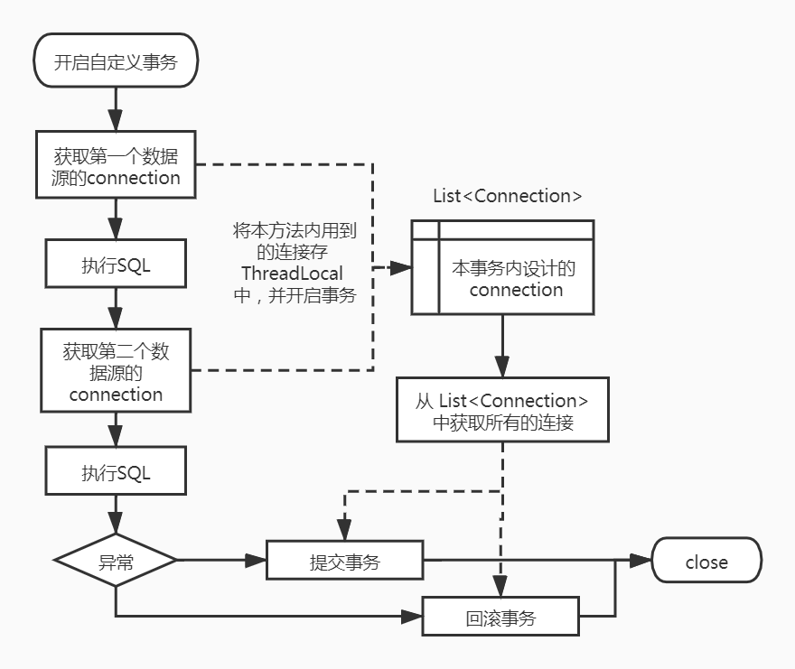

# SpringBoot 单机环境下动态多数据源的事务问题

> Java解决单机环境下多数据源的事务问题：https://www.cnblogs.com/fantongxue/p/16867228.html
>

SpringBoot 单机环境下的 @Transictional 可以保证事务，但多数据源的情况就无法使用了，这里简单实现一下多数据源的情况下如何保证事务。

## 一、事务实现方案及环境搭建

1、利用 ThreadLocal 将事务方法 内用到的 connection 缓存起来，当业务执行完毕，再统一 commit 或者 rollback；



2、pom.xml 文件如下

```xml
<?xml version="1.0" encoding="UTF-8"?>
<project xmlns="http://maven.apache.org/POM/4.0.0" xmlns:xsi="http://www.w3.org/2001/XMLSchema-instance"
         xsi:schemaLocation="http://maven.apache.org/POM/4.0.0 https://maven.apache.org/xsd/maven-4.0.0.xsd">
    <modelVersion>4.0.0</modelVersion>
    <parent>
        <groupId>org.springframework.boot</groupId>
        <artifactId>spring-boot-starter-parent</artifactId>
        <version>2.5.0</version>
        <relativePath/> <!-- lookup parent from repository -->
    </parent>
    <groupId>com.example</groupId>
    <artifactId>multi-database-transaction-static</artifactId>
    <version>0.0.1-SNAPSHOT</version>
    <name>MultiDatabaseTransaction</name>
    <description>MultiDatabaseTransaction</description>
    <properties>
        <java.version>11</java.version>
    </properties>
    <dependencies>
        <dependency>
            <groupId>org.springframework.boot</groupId>
            <artifactId>spring-boot-starter</artifactId>
        </dependency>

        <dependency>
            <groupId>org.springframework.boot</groupId>
            <artifactId>spring-boot-starter-web</artifactId>
        </dependency>

        <dependency>
            <groupId>org.springframework.boot</groupId>
            <artifactId>spring-boot-starter-aop</artifactId>
        </dependency>

        <dependency>
            <groupId>org.springframework.boot</groupId>
            <artifactId>spring-boot-starter-jdbc</artifactId>
        </dependency>

        <!-- https://mvnrepository.com/artifact/com.h2database/h2 -->
        <dependency>
            <groupId>com.h2database</groupId>
            <artifactId>h2</artifactId>
            <scope>runtime</scope>
        </dependency>

        <dependency>
            <groupId>org.projectlombok</groupId>
            <artifactId>lombok</artifactId>
            <optional>true</optional>
        </dependency>

        <dependency>
            <groupId>org.springframework.boot</groupId>
            <artifactId>spring-boot-starter-test</artifactId>
            <scope>test</scope>
        </dependency>
    </dependencies>

    <build>
        <plugins>
            <plugin>
                <groupId>org.springframework.boot</groupId>
                <artifactId>spring-boot-maven-plugin</artifactId>
            </plugin>
        </plugins>
    </build>

    <repositories>
        <repository>
            <id>nexus-aliyun</id>
            <name>nexus-aliyun</name>
            <url>http://maven.aliyun.com/nexus/content/groups/public/</url>
            <releases>
                <enabled>true</enabled>
            </releases>
            <snapshots>
                <enabled>false</enabled>
            </snapshots>
        </repository>
    </repositories>

    <pluginRepositories>
        <pluginRepository>
            <id>public</id>
            <name>aliyun nexus</name>
            <url>http://maven.aliyun.com/nexus/content/groups/public/</url>
            <releases>
                <enabled>true</enabled>
            </releases>
            <snapshots>
                <enabled>false</enabled>
            </snapshots>
        </pluginRepository>
    </pluginRepositories>
</project>
```


## 二、自定义开启事务注解

```java
package com.example.annotation;

import java.lang.annotation.*;

@Documented
@Retention(RetentionPolicy.RUNTIME)
@Target({ElementType.METHOD})
public @interface MultiDSTransaction {
}
```


## 三、YML 配置多数据源

```yaml
spring:
  datasource:
    datasource1:
      jdbc-url: jdbc:h2:mem:datasource1
      username: sa
      password: sa
      driverClassName: org.h2.Driver
    datasource2:
      jdbc-url: jdbc:h2:mem:datasource2
      username: sa
      password: sa
      driverClassName: org.h2.Driver
  h2:
    console:
      enabled: true
      path: /h2
      settings:
        web-allow-others: true
```


## 四、多数据源配置类

使用了 @Primary 注解后，作用是将该bean设置为主要注入bean，当注入相同类型的datasource的bean时就不会注入DataSourceConfig配置类中注入的两个bean了，只会注入这个，mybatis 在使用 DataSourceUtil.getDataSource 的时候获取的是这个自定义数据源，执行的是此自定义数据源的 getConnection 方法。jdbcTemplate、JPA 也是同理。

```java
package com.example.config;

import org.springframework.boot.context.properties.ConfigurationProperties;
import org.springframework.boot.jdbc.DataSourceBuilder;
import org.springframework.context.annotation.Bean;
import org.springframework.context.annotation.Configuration;
import org.springframework.context.annotation.Primary;
import javax.sql.DataSource;
import java.util.HashMap;
import java.util.Map;

/**
 * 注入两个数据源
 */
@Configuration
public class DataSourceConfig {

    @Bean
    @ConfigurationProperties(prefix = "spring.datasource.datasource1")
    public DataSource dataSource1(){
        return DataSourceBuilder.create().build();
    }

    @Bean
    @ConfigurationProperties(prefix = "spring.datasource.datasource2")
    public DataSource dataSource2(){
        return DataSourceBuilder.create().build();
    }

    @Primary
    @Bean
    public DynamicDataSource dynamicDataSource() {
        DynamicDataSource dynamicDataSource = new DynamicDataSource();
        Map<Object, Object> targetDataSources = new HashMap<>();
        targetDataSources.put("one", dataSource1());
        targetDataSources.put("two", dataSource2());
        // 设置默认数据源
        dynamicDataSource.setDefaultTargetDataSource(dataSource1());
        // 添加数据源集合
        dynamicDataSource.setTargetDataSources(targetDataSources);
        return dynamicDataSource;
    }
}
```


## 五、自定义数据源

在自定义数据源中注入上边那两个多数据源，维持多数据源执行事务期间用到的连接列表，在自定义数据源中添加事务相关业务，既在获取 连接的地方将 Connection 缓存到 ThreadLocal 中。

```java
package com.example.config;

import com.example.util.DataSourceContext;
import com.example.util.TransactionContext;
import org.springframework.jdbc.datasource.lookup.AbstractRoutingDataSource;
import javax.sql.DataSource;
import java.sql.Connection;
import java.sql.SQLException;
import java.util.ArrayList;
import java.util.HashMap;
import java.util.List;
import java.util.Map;

public class DynamicDataSource extends AbstractRoutingDataSource {
    /**
     * 添加一个DataSources Map，用来获取数据源集合
     */
    private Map<Object, Object> targetDataSources = new HashMap<>();
    public Map<Object, Object> getTargetDataSources() {
        return targetDataSources;
    }

    /**
     * 重写setTargetDataSources方法，为了可以让自己得到
     * @param targetDataSources
     */
    @Override
    public void setTargetDataSources(Map<Object, Object> targetDataSources) {
        this.targetDataSources.putAll(targetDataSources);
        super.setTargetDataSources(this.targetDataSources);
        super.afterPropertiesSet();// 必须添加该句，否则新添加数据源无法识别到
    }

    /**
     * 必须实现该接口。用来获取当前数据源
     */
    @Override
    protected Object determineCurrentLookupKey() {
        // 或者return null.细节看源码AbstractRoutingDataSource.determineTargetDataSource
        return DataSourceContext.getDataSource();
    }

    @Override
    public Connection getConnection() throws SQLException {
        // 获取当前数据源连接
        String currentDataSourceKey = DataSourceContext.getDataSource();
        DataSource currentDataSource = (DataSource) targetDataSources.get(currentDataSourceKey);
        Connection connection = currentDataSource.getConnection();

        // 获取自定义数据库连接
        CustomConnection customConnection = new CustomConnection(connection);
        if (TransactionContext.isOpenTran()) {
            customConnection.setAutoCommit(false);
            List<CustomConnection> customConnections = TransactionContext.MULTI_TRAN_CONNECTION.get();
            if (customConnections == null) {
                customConnections = new ArrayList<>();
            }
            customConnections.add(customConnection);
            TransactionContext.MULTI_TRAN_CONNECTION.set(customConnections);
        }
        return customConnection;
    }
}
```


## 六、重写 Connection 连接

```java
package com.example.config;

import com.example.util.TransactionContext;
import java.sql.*;
import java.util.Map;
import java.util.Properties;
import java.util.concurrent.Executor;

public class CustomConnection implements Connection {
    // 真实的连接
    private Connection connection;

    public CustomConnection(Connection connection) {
        this.connection = connection;
    }
    @Override
    public void commit() throws SQLException {
        // 如果没开启多数据源事务，则走 commit
        if (!TransactionContext.isOpenTran()) {
            connection.commit();
        }
    }

    @Override
    public void rollback() throws SQLException {
        connection.rollback();
    }

    public void commitMultiDbTran() throws SQLException {
        // 如果开启多数据源，则走 这里的 commit
        connection.commit();
    }
    @Override
    public void close() throws SQLException {
        // mybatis 执行完业务后，会触发 close() 操作，如果 connection 被提前 close 了，业务就会出错
        if (!TransactionContext.isOpenTran()) {
            connection.close();
        }
    }
    public void closeMultiDbTran() throws SQLException {
        // 如果开启多数据源事务，则走 这里的 close
        connection.close();
    }

    @Override
    public Statement createStatement() throws SQLException {
        return connection.createStatement();
    }

    @Override
    public PreparedStatement prepareStatement(String sql) throws SQLException {
        return connection.prepareStatement(sql);
    }

    @Override
    public CallableStatement prepareCall(String sql) throws SQLException {
        return connection.prepareCall(sql);
    }

    @Override
    public String nativeSQL(String sql) throws SQLException {
        return connection.nativeSQL(sql);
    }

    @Override
    public void setAutoCommit(boolean autoCommit) throws SQLException {
        connection.setAutoCommit(autoCommit);
    }

    @Override
    public boolean getAutoCommit() throws SQLException {
        return connection.getAutoCommit();
    }

    @Override
    public boolean isClosed() throws SQLException {
        return connection.isClosed();
    }

    @Override
    public DatabaseMetaData getMetaData() throws SQLException {
        return connection.getMetaData();
    }

    @Override
    public void setReadOnly(boolean readOnly) throws SQLException {
        connection.setReadOnly(readOnly);
    }

    @Override
    public boolean isReadOnly() throws SQLException {
        return connection.isReadOnly();
    }

    @Override
    public void setCatalog(String catalog) throws SQLException {
        connection.setCatalog(catalog);
    }

    @Override
    public String getCatalog() throws SQLException {
        return connection.getCatalog();
    }

    @Override
    public void setTransactionIsolation(int level) throws SQLException {
        connection.setTransactionIsolation(level);
    }

    @Override
    public int getTransactionIsolation() throws SQLException {
        return connection.getTransactionIsolation();
    }

    @Override
    public SQLWarning getWarnings() throws SQLException {
        return connection.getWarnings();
    }

    @Override
    public void clearWarnings() throws SQLException {
        connection.clearWarnings();
    }

    @Override
    public Statement createStatement(int resultSetType, int resultSetConcurrency) throws SQLException {
        return connection.createStatement(resultSetType,resultSetConcurrency);
    }

    @Override
    public PreparedStatement prepareStatement(String sql, int resultSetType, int resultSetConcurrency) throws SQLException {
        return connection.prepareStatement(sql,resultSetType,resultSetConcurrency);
    }

    @Override
    public CallableStatement prepareCall(String sql, int resultSetType, int resultSetConcurrency) throws SQLException {
        return connection.prepareCall(sql,resultSetType,resultSetConcurrency);
    }

    @Override
    public Map<String, Class<?>> getTypeMap() throws SQLException {
        return connection.getTypeMap();
    }

    @Override
    public void setTypeMap(Map<String, Class<?>> map) throws SQLException {
        connection.setTypeMap(map);
    }

    @Override
    public void setHoldability(int holdability) throws SQLException {
        connection.setHoldability(holdability);
    }

    @Override
    public int getHoldability() throws SQLException {
        return connection.getHoldability();
    }

    @Override
    public Savepoint setSavepoint() throws SQLException {
        return connection.setSavepoint();
    }

    @Override
    public Savepoint setSavepoint(String name) throws SQLException {
        return connection.setSavepoint(name);
    }

    @Override
    public void rollback(Savepoint savepoint) throws SQLException {
        connection.rollback(savepoint);
    }

    @Override
    public void releaseSavepoint(Savepoint savepoint) throws SQLException {
        connection.releaseSavepoint(savepoint);
    }

    @Override
    public Statement createStatement(int resultSetType, int resultSetConcurrency, int resultSetHoldability) throws SQLException {
        return connection.createStatement(resultSetType,resultSetConcurrency,resultSetHoldability);
    }

    @Override
    public PreparedStatement prepareStatement(String sql, int resultSetType, int resultSetConcurrency, int resultSetHoldability) throws SQLException {
        return connection.prepareStatement(sql,resultSetType,resultSetConcurrency,resultSetHoldability);
    }

    @Override
    public CallableStatement prepareCall(String sql, int resultSetType, int resultSetConcurrency, int resultSetHoldability) throws SQLException {
        return connection.prepareCall(sql,resultSetType,resultSetConcurrency,resultSetHoldability);
    }

    @Override
    public PreparedStatement prepareStatement(String sql, int autoGeneratedKeys) throws SQLException {
        return connection.prepareStatement(sql,autoGeneratedKeys);
    }

    @Override
    public PreparedStatement prepareStatement(String sql, int[] columnIndexes) throws SQLException {
        return connection.prepareStatement(sql,columnIndexes);
    }

    @Override
    public PreparedStatement prepareStatement(String sql, String[] columnNames) throws SQLException {
        return connection.prepareStatement(sql,columnNames);
    }

    @Override
    public Clob createClob() throws SQLException {
        return connection.createClob();
    }

    @Override
    public Blob createBlob() throws SQLException {
        return connection.createBlob();
    }

    @Override
    public NClob createNClob() throws SQLException {
        return connection.createNClob();
    }

    @Override
    public SQLXML createSQLXML() throws SQLException {
        return connection.createSQLXML();
    }

    @Override
    public boolean isValid(int timeout) throws SQLException {
        return connection.isValid(timeout);
    }

    @Override
    public void setClientInfo(String name, String value) throws SQLClientInfoException {
        connection.setClientInfo(name,value);
    }

    @Override
    public void setClientInfo(Properties properties) throws SQLClientInfoException {
        connection.setClientInfo(properties);
    }

    @Override
    public String getClientInfo(String name) throws SQLException {
        return connection.getClientInfo(name);
    }

    @Override
    public Properties getClientInfo() throws SQLException {
        return connection.getClientInfo();
    }

    @Override
    public Array createArrayOf(String typeName, Object[] elements) throws SQLException {
        return connection.createArrayOf(typeName,elements);
    }

    @Override
    public Struct createStruct(String typeName, Object[] attributes) throws SQLException {
        return connection.createStruct(typeName,attributes);
    }

    @Override
    public void setSchema(String schema) throws SQLException {
        connection.setSchema(schema);
    }

    @Override
    public String getSchema() throws SQLException {
        return connection.getSchema();
    }

    @Override
    public void abort(Executor executor) throws SQLException {
        connection.abort(executor);
    }

    @Override
    public void setNetworkTimeout(Executor executor, int milliseconds) throws SQLException {
        connection.setNetworkTimeout(executor,milliseconds);
    }

    @Override
    public int getNetworkTimeout() throws SQLException {
        return connection.getNetworkTimeout();
    }

    @Override
    public <T> T unwrap(Class<T> iface) throws SQLException {
        return connection.unwrap(iface);
    }

    @Override
    public boolean isWrapperFor(Class<?> iface) throws SQLException {
        return connection.isWrapperFor(iface);
    }
}
```


## 七、数据源管理 Context

```java
package com.example.util;

import lombok.extern.slf4j.Slf4j;

@Slf4j
public class DataSourceContext {
    /**
     * 动态数据源名称上下文
     */
    private static final ThreadLocal<String> contextLocal = ThreadLocal.withInitial(() -> "one");

    /**
     * 设置数据源
     */
    public static void setDataSource(String key) {
        contextLocal.set(key);
    }

    /**
     * 获取数据源
     *
     * @return
     */
    public static String getDataSource() {
        return contextLocal.get();
    }

    /**
     * 重置/释放数据源
     */
    public static void clearDataSource() {
        contextLocal.remove();
    }
}
```


## 八、事务管理 Context

```java
package com.example.util;

import com.example.config.CustomConnection;
import java.util.List;

public class TransactionContext {
    // 默认事务处于关闭状态
    private static final ThreadLocal<Boolean> TRAN_SWITCH_CONTEXT = ThreadLocal.withInitial(() -> false);
    /**
     * 多数据源 执行 事务期间用到的连接
     */
    public static final ThreadLocal<List<CustomConnection>> MULTI_TRAN_CONNECTION = new ThreadLocal<>();

    // 开启事务
    public static void openTran() {
        TRAN_SWITCH_CONTEXT.set(true);
    }
    // 关闭事务
    public static void closeTran() {
        TRAN_SWITCH_CONTEXT.set(false);
    }
    // 判断是否开启事务
    public static Boolean isOpenTran() {
        return TRAN_SWITCH_CONTEXT.get();
    }
}
```


## 九、写切面

利用 AOP 进行方法拦截，对使用了 多数据源 事务注解的方法，执行事务业务

```java
package com.example.aspect;

import com.example.config.CustomConnection;
import com.example.util.TransactionContext;
import org.aspectj.lang.ProceedingJoinPoint;
import org.aspectj.lang.annotation.Around;
import org.aspectj.lang.annotation.Aspect;
import org.aspectj.lang.annotation.Pointcut;
import org.springframework.context.annotation.Configuration;

@Aspect
@Configuration
public class MultiDSTransactionConfig {
    @Pointcut("@annotation(com.example.annotation.MultiDSTransaction)")
    public void transactPoint() {
    }

    @Around("transactPoint()")
    public Object multiTranAop(ProceedingJoinPoint joinPoint) throws Throwable {
        // 开启事务
        TransactionContext.openTran();
        try {
            // 执行业务
            Object proceed = joinPoint.proceed();
            // 提交事务 & 关闭连接
            for (CustomConnection connection : TransactionContext.MULTI_TRAN_CONNECTION.get()) {
                connection.commitMultiDbTran();
                connection.closeMultiDbTran();
            }
            return proceed;
        } catch (Throwable t) {
            for (CustomConnection connection : TransactionContext.MULTI_TRAN_CONNECTION.get()) {
                // 事务回滚
                connection.rollback();
                connection.closeMultiDbTran();
            }
            throw t;
        } finally {
            // 清空 事务 连接，关闭当前事务
            TransactionContext.MULTI_TRAN_CONNECTION.get().clear();
            TransactionContext.closeTran();
        }
    }
}
```


## 十、测试类

测试代码如下，当报错的之后，事务同时回滚，数据没插入成功，当未出现报错，数据则都插入成功

```java
package com.example.controller;

import com.example.annotation.MultiDSTransaction;
import com.example.util.DataSourceContext;
import org.springframework.beans.factory.annotation.Autowired;
import org.springframework.jdbc.core.JdbcTemplate;
import org.springframework.web.bind.annotation.RequestMapping;
import org.springframework.web.bind.annotation.RestController;

import javax.annotation.PostConstruct;
import java.util.stream.Stream;

@RestController
public class TestController {
    @Autowired
    private JdbcTemplate jdbcTemplate;

    @RequestMapping("test")
    @MultiDSTransaction
    public void test() {
        // 选择datasource1数据源
        DataSourceContext.setDataSource("one");
        int i = jdbcTemplate.update("INSERT INTO user (id, name, type) VALUES (1, 'meir', 'db_test_one')");

        // 模拟报错
        int k = 1 / 0;

        // 选择datasource2数据源
        DataSourceContext.setDataSource("two");
        int j = jdbcTemplate.update("INSERT INTO user (id, name, type) VALUES (1, 'sam', 'db_test_two')");

        System.out.println("over");
    }

    @PostConstruct
    public void init1() {
        Stream.of("one", "two").forEach(i -> initData(i));
    }

    private void initData(String str) {
        // 切换数据源
        DataSourceContext.setDataSource(str);
        // 初始化表和数据
        jdbcTemplate.execute("DROP TABLE IF EXISTS user");
        jdbcTemplate.execute("CREATE TABLE user ("
                + "id BIGINT NOT NULL,"
                + "name VARCHAR(50) DEFAULT NULL,"
                + "type VARCHAR(50) DEFAULT NULL,"
                + "PRIMARY KEY (id))");
        // 还原数据源
        DataSourceContext.clearDataSource();
    }
}
```


# SpringBoot 单机环境下静态多数据源的事务问题

## 一、事务实现方案

> Java解决单机环境下多数据源的事务问题：https://www.cnblogs.com/fantongxue/p/16867228.html

利用 ThreadLocal 将事务方法 内用到的 connection 缓存起来，当业务执行完毕，再统一 commit 或者 rollback；

2、pom.xml 文件如下

```xml
<?xml version="1.0" encoding="UTF-8"?>
<project xmlns="http://maven.apache.org/POM/4.0.0" xmlns:xsi="http://www.w3.org/2001/XMLSchema-instance"
         xsi:schemaLocation="http://maven.apache.org/POM/4.0.0 https://maven.apache.org/xsd/maven-4.0.0.xsd">
    <modelVersion>4.0.0</modelVersion>
    <parent>
        <groupId>org.springframework.boot</groupId>
        <artifactId>spring-boot-starter-parent</artifactId>
        <version>2.5.0</version>
        <relativePath/> <!-- lookup parent from repository -->
    </parent>
    <groupId>com.example</groupId>
    <artifactId>multi-database-transaction-static</artifactId>
    <version>0.0.1-SNAPSHOT</version>
    <name>MultiDatabaseTransaction</name>
    <description>MultiDatabaseTransaction</description>
    <properties>
        <java.version>11</java.version>
    </properties>
    <dependencies>
        <dependency>
            <groupId>org.springframework.boot</groupId>
            <artifactId>spring-boot-starter</artifactId>
        </dependency>

        <dependency>
            <groupId>org.springframework.boot</groupId>
            <artifactId>spring-boot-starter-web</artifactId>
        </dependency>

        <dependency>
            <groupId>org.springframework.boot</groupId>
            <artifactId>spring-boot-starter-aop</artifactId>
        </dependency>

        <dependency>
            <groupId>org.springframework.boot</groupId>
            <artifactId>spring-boot-starter-jdbc</artifactId>
        </dependency>

        <!-- https://mvnrepository.com/artifact/com.h2database/h2 -->
        <dependency>
            <groupId>com.h2database</groupId>
            <artifactId>h2</artifactId>
            <scope>runtime</scope>
        </dependency>

        <dependency>
            <groupId>org.projectlombok</groupId>
            <artifactId>lombok</artifactId>
            <optional>true</optional>
        </dependency>

        <dependency>
            <groupId>org.springframework.boot</groupId>
            <artifactId>spring-boot-starter-test</artifactId>
            <scope>test</scope>
        </dependency>
    </dependencies>

    <build>
        <plugins>
            <plugin>
                <groupId>org.springframework.boot</groupId>
                <artifactId>spring-boot-maven-plugin</artifactId>
            </plugin>
        </plugins>
    </build>

    <repositories>
        <repository>
            <id>nexus-aliyun</id>
            <name>nexus-aliyun</name>
            <url>http://maven.aliyun.com/nexus/content/groups/public/</url>
            <releases>
                <enabled>true</enabled>
            </releases>
            <snapshots>
                <enabled>false</enabled>
            </snapshots>
        </repository>
    </repositories>

    <pluginRepositories>
        <pluginRepository>
            <id>public</id>
            <name>aliyun nexus</name>
            <url>http://maven.aliyun.com/nexus/content/groups/public/</url>
            <releases>
                <enabled>true</enabled>
            </releases>
            <snapshots>
                <enabled>false</enabled>
            </snapshots>
        </pluginRepository>
    </pluginRepositories>
</project>
```


## 二、自定义开启事务注解

```java
package com.example.annotation;

import java.lang.annotation.*;

@Documented
@Retention(RetentionPolicy.RUNTIME)
@Target({ElementType.METHOD})
public @interface MultiDSTransaction {
}
```


## 三、YML 配置多数据源

```yaml
spring:
  datasource:
    datasource1:
      jdbc-url: jdbc:h2:mem:datasource1
      username: sa
      password: sa
      driverClassName: org.h2.Driver
    datasource2:
      jdbc-url: jdbc:h2:mem:datasource2
      username: sa
      password: sa
      driverClassName: org.h2.Driver
  h2:
    console:
      enabled: true
      path: /h2
      settings:
        web-allow-others: true
```


## 四、多数据源配置类

使用了 @Primary 注解后，作用是将该bean设置为主要注入bean，当注入相同类型的datasource的bean时就不会注入DataSourceConfig配置类中注入的两个bean了，只会注入这个，mybatis 在使用 DataSourceUtil.getDataSource 的时候获取的是这个自定义数据源，执行的是此自定义数据源的 getConnection 方法。jdbcTemplate、JPA 也是同理。

```java
package com.example.config;

import com.example.util.DataSourceContext;
import com.example.util.TransactionContext;
import org.springframework.beans.factory.InitializingBean;
import org.springframework.beans.factory.annotation.Autowired;
import org.springframework.context.annotation.Primary;
import org.springframework.stereotype.Component;

import javax.sql.DataSource;
import java.io.PrintWriter;
import java.sql.Connection;
import java.sql.SQLException;
import java.sql.SQLFeatureNotSupportedException;
import java.util.ArrayList;
import java.util.List;
import java.util.Map;
import java.util.logging.Logger;

/**
 * 管理多个数据源
 */
public class StaticDataSource implements DataSource {

    private Map<String, DataSource> dataSourceMap;

    public StaticDataSource(Map<String, DataSource> dataSourceMap) {
        this.dataSourceMap = dataSourceMap;
    }

    @Override
    public Connection getConnection() throws SQLException {
        Connection connection = dataSourceMap.get(DataSourceContext.getDataSource()).getConnection();
        CustomConnection customConnection = new CustomConnection(connection);
        if (TransactionContext.isOpenTran()) {
            customConnection.setAutoCommit(false);
            List<CustomConnection> customConnections = TransactionContext.MULTI_TRAN_CONNECTION.get();
            if (customConnections == null) {
                customConnections = new ArrayList<>();
            }
            customConnections.add(customConnection);
            TransactionContext.MULTI_TRAN_CONNECTION.set(customConnections);
        }
        return customConnection;
    }

    @Override
    public Connection getConnection(String username, String password) throws SQLException {
        return null;
    }

    @Override
    public <T> T unwrap(Class<T> iface) throws SQLException {
        return null;
    }

    @Override
    public boolean isWrapperFor(Class<?> iface) throws SQLException {
        return false;
    }

    @Override
    public PrintWriter getLogWriter() throws SQLException {
        return null;
    }

    @Override
    public void setLogWriter(PrintWriter out) throws SQLException {

    }

    @Override
    public void setLoginTimeout(int seconds) throws SQLException {

    }

    @Override
    public int getLoginTimeout() throws SQLException {
        return 0;
    }

    @Override
    public Logger getParentLogger() throws SQLFeatureNotSupportedException {
        return null;
    }
}
```


## 五、自定义数据源

在自定义数据源中注入上边那两个多数据源，维持多数据源执行事务期间用到的连接列表，在自定义数据源中添加事务相关业务，既在获取 连接的地方将 Connection 缓存到 ThreadLocal 中

```java
package com.example.config;

import com.example.util.DataSourceContext;
import com.example.util.TransactionContext;
import org.springframework.beans.factory.InitializingBean;
import org.springframework.beans.factory.annotation.Autowired;
import org.springframework.context.annotation.Primary;
import org.springframework.stereotype.Component;
import javax.sql.DataSource;
import java.io.PrintWriter;
import java.sql.Connection;
import java.sql.SQLException;
import java.sql.SQLFeatureNotSupportedException;
import java.util.ArrayList;
import java.util.List;
import java.util.Map;
import java.util.logging.Logger;

/**
 * 管理多个数据源
 */
public class StaticDataSource implements DataSource {

    private Map<String, DataSource> dataSourceMap;

    public StaticDataSource(Map<String, DataSource> dataSourceMap) {
        this.dataSourceMap = dataSourceMap;
    }

    @Override
    public Connection getConnection() throws SQLException {
        Connection connection = dataSourceMap.get(DataSourceContext.getDataSource()).getConnection();
        CustomConnection customConnection = new CustomConnection(connection);
        if (TransactionContext.isOpenTran()) {
            customConnection.setAutoCommit(false);
            List<CustomConnection> customConnections = TransactionContext.MULTI_TRAN_CONNECTION.get();
            if (customConnections == null) {
                customConnections = new ArrayList<>();
            }
            customConnections.add(customConnection);
            TransactionContext.MULTI_TRAN_CONNECTION.set(customConnections);
        }
        return customConnection;
    }

    @Override
    public Connection getConnection(String username, String password) throws SQLException {
        return null;
    }

    @Override
    public <T> T unwrap(Class<T> iface) throws SQLException {
        return null;
    }

    @Override
    public boolean isWrapperFor(Class<?> iface) throws SQLException {
        return false;
    }

    @Override
    public PrintWriter getLogWriter() throws SQLException {
        return null;
    }

    @Override
    public void setLogWriter(PrintWriter out) throws SQLException {

    }

    @Override
    public void setLoginTimeout(int seconds) throws SQLException {

    }

    @Override
    public int getLoginTimeout() throws SQLException {
        return 0;
    }

    @Override
    public Logger getParentLogger() throws SQLFeatureNotSupportedException {
        return null;
    }
}
```


## 六、重写 Connection 连接

```java
package com.example.config;

import com.example.util.TransactionContext;
import java.sql.*;
import java.util.Map;
import java.util.Properties;
import java.util.concurrent.Executor;

public class CustomConnection implements Connection {
    // 真实的连接
    private Connection connection;

    public CustomConnection(Connection connection) {
        this.connection = connection;
    }
    @Override
    public void commit() throws SQLException {
        // 如果没开启多数据源事务，则走 commit
        if (!TransactionContext.isOpenTran()) {
            connection.commit();
        }
    }

    @Override
    public void rollback() throws SQLException {
        connection.rollback();
    }

    public void commitMultiDbTran() throws SQLException {
        // 如果开启多数据源，则走 这里的 commit
        connection.commit();
    }
    @Override
    public void close() throws SQLException {
        // mybatis 执行完业务后，会触发 close() 操作，如果 connection 被提前 close 了，业务就会出错
        if (!TransactionContext.isOpenTran()) {
            connection.close();
        }
    }
    public void closeMultiDbTran() throws SQLException {
        // 如果开启多数据源事务，则走 这里的 close
        connection.close();
    }

    @Override
    public Statement createStatement() throws SQLException {
        return connection.createStatement();
    }

    @Override
    public PreparedStatement prepareStatement(String sql) throws SQLException {
        return connection.prepareStatement(sql);
    }

    @Override
    public CallableStatement prepareCall(String sql) throws SQLException {
        return connection.prepareCall(sql);
    }

    @Override
    public String nativeSQL(String sql) throws SQLException {
        return connection.nativeSQL(sql);
    }

    @Override
    public void setAutoCommit(boolean autoCommit) throws SQLException {
        connection.setAutoCommit(autoCommit);
    }

    @Override
    public boolean getAutoCommit() throws SQLException {
        return connection.getAutoCommit();
    }

    @Override
    public boolean isClosed() throws SQLException {
        return connection.isClosed();
    }

    @Override
    public DatabaseMetaData getMetaData() throws SQLException {
        return connection.getMetaData();
    }

    @Override
    public void setReadOnly(boolean readOnly) throws SQLException {
        connection.setReadOnly(readOnly);
    }

    @Override
    public boolean isReadOnly() throws SQLException {
        return connection.isReadOnly();
    }

    @Override
    public void setCatalog(String catalog) throws SQLException {
        connection.setCatalog(catalog);
    }

    @Override
    public String getCatalog() throws SQLException {
        return connection.getCatalog();
    }

    @Override
    public void setTransactionIsolation(int level) throws SQLException {
        connection.setTransactionIsolation(level);
    }

    @Override
    public int getTransactionIsolation() throws SQLException {
        return connection.getTransactionIsolation();
    }

    @Override
    public SQLWarning getWarnings() throws SQLException {
        return connection.getWarnings();
    }

    @Override
    public void clearWarnings() throws SQLException {
        connection.clearWarnings();
    }

    @Override
    public Statement createStatement(int resultSetType, int resultSetConcurrency) throws SQLException {
        return connection.createStatement(resultSetType,resultSetConcurrency);
    }

    @Override
    public PreparedStatement prepareStatement(String sql, int resultSetType, int resultSetConcurrency) throws SQLException {
        return connection.prepareStatement(sql,resultSetType,resultSetConcurrency);
    }

    @Override
    public CallableStatement prepareCall(String sql, int resultSetType, int resultSetConcurrency) throws SQLException {
        return connection.prepareCall(sql,resultSetType,resultSetConcurrency);
    }

    @Override
    public Map<String, Class<?>> getTypeMap() throws SQLException {
        return connection.getTypeMap();
    }

    @Override
    public void setTypeMap(Map<String, Class<?>> map) throws SQLException {
        connection.setTypeMap(map);
    }

    @Override
    public void setHoldability(int holdability) throws SQLException {
        connection.setHoldability(holdability);
    }

    @Override
    public int getHoldability() throws SQLException {
        return connection.getHoldability();
    }

    @Override
    public Savepoint setSavepoint() throws SQLException {
        return connection.setSavepoint();
    }

    @Override
    public Savepoint setSavepoint(String name) throws SQLException {
        return connection.setSavepoint(name);
    }

    @Override
    public void rollback(Savepoint savepoint) throws SQLException {
        connection.rollback(savepoint);
    }

    @Override
    public void releaseSavepoint(Savepoint savepoint) throws SQLException {
        connection.releaseSavepoint(savepoint);
    }

    @Override
    public Statement createStatement(int resultSetType, int resultSetConcurrency, int resultSetHoldability) throws SQLException {
        return connection.createStatement(resultSetType,resultSetConcurrency,resultSetHoldability);
    }

    @Override
    public PreparedStatement prepareStatement(String sql, int resultSetType, int resultSetConcurrency, int resultSetHoldability) throws SQLException {
        return connection.prepareStatement(sql,resultSetType,resultSetConcurrency,resultSetHoldability);
    }

    @Override
    public CallableStatement prepareCall(String sql, int resultSetType, int resultSetConcurrency, int resultSetHoldability) throws SQLException {
        return connection.prepareCall(sql,resultSetType,resultSetConcurrency,resultSetHoldability);
    }

    @Override
    public PreparedStatement prepareStatement(String sql, int autoGeneratedKeys) throws SQLException {
        return connection.prepareStatement(sql,autoGeneratedKeys);
    }

    @Override
    public PreparedStatement prepareStatement(String sql, int[] columnIndexes) throws SQLException {
        return connection.prepareStatement(sql,columnIndexes);
    }

    @Override
    public PreparedStatement prepareStatement(String sql, String[] columnNames) throws SQLException {
        return connection.prepareStatement(sql,columnNames);
    }

    @Override
    public Clob createClob() throws SQLException {
        return connection.createClob();
    }

    @Override
    public Blob createBlob() throws SQLException {
        return connection.createBlob();
    }

    @Override
    public NClob createNClob() throws SQLException {
        return connection.createNClob();
    }

    @Override
    public SQLXML createSQLXML() throws SQLException {
        return connection.createSQLXML();
    }

    @Override
    public boolean isValid(int timeout) throws SQLException {
        return connection.isValid(timeout);
    }

    @Override
    public void setClientInfo(String name, String value) throws SQLClientInfoException {
        connection.setClientInfo(name,value);
    }

    @Override
    public void setClientInfo(Properties properties) throws SQLClientInfoException {
        connection.setClientInfo(properties);
    }

    @Override
    public String getClientInfo(String name) throws SQLException {
        return connection.getClientInfo(name);
    }

    @Override
    public Properties getClientInfo() throws SQLException {
        return connection.getClientInfo();
    }

    @Override
    public Array createArrayOf(String typeName, Object[] elements) throws SQLException {
        return connection.createArrayOf(typeName,elements);
    }

    @Override
    public Struct createStruct(String typeName, Object[] attributes) throws SQLException {
        return connection.createStruct(typeName,attributes);
    }

    @Override
    public void setSchema(String schema) throws SQLException {
        connection.setSchema(schema);
    }

    @Override
    public String getSchema() throws SQLException {
        return connection.getSchema();
    }

    @Override
    public void abort(Executor executor) throws SQLException {
        connection.abort(executor);
    }

    @Override
    public void setNetworkTimeout(Executor executor, int milliseconds) throws SQLException {
        connection.setNetworkTimeout(executor,milliseconds);
    }

    @Override
    public int getNetworkTimeout() throws SQLException {
        return connection.getNetworkTimeout();
    }

    @Override
    public <T> T unwrap(Class<T> iface) throws SQLException {
        return connection.unwrap(iface);
    }

    @Override
    public boolean isWrapperFor(Class<?> iface) throws SQLException {
        return connection.isWrapperFor(iface);
    }
}
```


## 七、数据源管理 Context

```java
package com.example.util;

import lombok.extern.slf4j.Slf4j;

@Slf4j
public class DataSourceContext {
    /**
     * 动态数据源名称上下文
     */
    private static final ThreadLocal<String> contextLocal = ThreadLocal.withInitial(() -> "one");

    /**
     * 设置数据源
     */
    public static void setDataSource(String key) {
        contextLocal.set(key);
    }

    /**
     * 获取数据源
     *
     * @return
     */
    public static String getDataSource() {
        return contextLocal.get();
    }

    /**
     * 重置/释放数据源
     */
    public static void clearDataSource() {
        contextLocal.remove();
    }
}
```


## 八、事务管理 Context

```java
package com.example.util;

import com.example.config.CustomConnection;
import java.util.List;

public class TransactionContext {
    // 默认事务处于关闭状态
    private static final ThreadLocal<Boolean> TRAN_SWITCH_CONTEXT = ThreadLocal.withInitial(() -> false);
    /**
     * 多数据源 执行 事务期间用到的连接
     */
    public static final ThreadLocal<List<CustomConnection>> MULTI_TRAN_CONNECTION = new ThreadLocal<>();

    // 开启事务
    public static void openTran() {
        TRAN_SWITCH_CONTEXT.set(true);
    }
    // 关闭事务
    public static void closeTran() {
        TRAN_SWITCH_CONTEXT.set(false);
    }
    // 判断是否开启事务
    public static Boolean isOpenTran() {
        return TRAN_SWITCH_CONTEXT.get();
    }
}
```


## 九、写切面

利用 AOP 进行方法拦截，对使用了 多数据源 事务注解的方法，执行事务业务

```java
package com.example.aspect;

import com.example.config.CustomConnection;
import com.example.util.TransactionContext;
import org.aspectj.lang.ProceedingJoinPoint;
import org.aspectj.lang.annotation.Around;
import org.aspectj.lang.annotation.Aspect;
import org.aspectj.lang.annotation.Pointcut;
import org.springframework.context.annotation.Configuration;

@Aspect
@Configuration
public class MultiDSTransactionConfig {
    @Pointcut("@annotation(com.example.annotation.MultiDSTransaction)")
    public void transactPoint() {
    }

    @Around("transactPoint()")
    public Object multiTranAop(ProceedingJoinPoint joinPoint) throws Throwable {
        // 开启事务
        TransactionContext.openTran();
        try {
            // 执行业务
            Object proceed = joinPoint.proceed();
            // 提交事务 & 关闭连接
            for (CustomConnection connection : TransactionContext.MULTI_TRAN_CONNECTION.get()) {
                connection.commitMultiDbTran();
                connection.closeMultiDbTran();
            }
            return proceed;
        } catch (Throwable t) {
            for (CustomConnection connection : TransactionContext.MULTI_TRAN_CONNECTION.get()) {
                // 事务回滚
                connection.rollback();
                connection.closeMultiDbTran();
            }
            throw t;
        } finally {
            // 清空 事务 连接，关闭当前事务
            TransactionContext.MULTI_TRAN_CONNECTION.get().clear();
            TransactionContext.closeTran();
        }
    }
}
```


## 十、测试类

测试代码如下，当报错的之后，事务同时回滚，数据没插入成功，当未出现报错，数据则都插入成功

```java
package com.example.controller;

import com.example.annotation.MultiDSTransaction;
import com.example.util.DataSourceContext;
import org.springframework.beans.factory.annotation.Autowired;
import org.springframework.jdbc.core.JdbcTemplate;
import org.springframework.web.bind.annotation.RequestMapping;
import org.springframework.web.bind.annotation.RestController;

import javax.annotation.PostConstruct;
import java.util.stream.Stream;

@RestController
public class TestController {
    @Autowired
    private JdbcTemplate jdbcTemplate;

    @RequestMapping("test")
    @MultiDSTransaction
    public void test() {
        // 选择datasource1数据源
        DataSourceContext.setDataSource("one");
        int i = jdbcTemplate.update("INSERT INTO user (id, name, type) VALUES (1, 'meir', 'db_test_one')");

        // 模拟报错
        int k = 1 / 0;

        // 选择datasource2数据源
        DataSourceContext.setDataSource("two");
        int j = jdbcTemplate.update("INSERT INTO user (id, name, type) VALUES (1, 'sam', 'db_test_two')");

        System.out.println("over");
    }

    @PostConstruct
    public void init1() {
        Stream.of("one", "two").forEach(i -> initData(i));
    }

    private void initData(String str) {
        // 切换数据源
        DataSourceContext.setDataSource(str);
        // 初始化表和数据
        jdbcTemplate.execute("DROP TABLE IF EXISTS user");
        jdbcTemplate.execute("CREATE TABLE user ("
                + "id BIGINT NOT NULL,"
                + "name VARCHAR(50) DEFAULT NULL,"
                + "type VARCHAR(50) DEFAULT NULL,"
                + "PRIMARY KEY (id))");
        // 还原数据源
        DataSourceContext.clearDataSource();
    }
}
```


# SpringBoot JTA Atomikos 多数据源的分布式事务管理详解

## 1、分布式事务介绍

Atomikos 是一个易用、可靠、开放源码的事务管理器，它可以用于管理分布式事务，尤其在微服务架构中非常实用。它支持 JTA（Java Transaction API）规范，能够与各种 JTA 兼容的资源管理器（如数据库和消息队列）配合使用。

分布式事务：当一个业务操作需要修改多个资源（如多个数据库或消息队列）时，我们需要保证这些修改操作的原子性，即它们要么全部成功，要么全部失败。这就是分布式事务。

JTA：Java Transaction API（JTA）是Java平台的一个事务规范，定义了用户和事务管理器以及事务管理器和资源管理器之间的接口。Atomikos 作为一个事务管理器，就是遵循 JTA 规范的。

XA 协议：XA 协议是分布式事务的一个重要协议，它定义了全局事务 ID、分支事务 ID 等概念，以及如何协调分支事务的接口。Atomikos 支持 XA 协议。

Atomikos 还提供了自动恢复、故障转移等高级特性，以进一步提高分布式事务的可靠性。主要用于处理跨数据库事务；在 SpringBoot 的文档也推荐更多人使用 Atomikos。


## 2、Atomikos 参考文档

SpringBoot 提供了一个用于整合 Atomikos 的 starter，名为 **spring-boot-starter-jta-atomikos**。它是 SpringBoot 提供的一系列 “starter” 依赖之一。

在 SpringBoot 2.x 中，整合了这两个 JTA 的实现：

- Atomikos：可以通过引入spring-boot-starter-jta-atomikos依赖来使用
- Bitronix：可以通过引入spring-boot-starter-jta-bitronix依赖来使用

由于 Bitronix 自 SpringBoot 2.3.0 开始不推荐使用，所以在下面的动手环节中，我们将使用 Atomikos 作为例子来介绍JTA的使用。

SpringBoot 官方文档的 “Spring Boot Features” 部分有一个 “Working with JTA” 的小节，其中提到了如何使用 spring-boot-starter-jta-atomikos。

- 链接：https://docs.spring.io/spring-boot/docs/2.7.18/reference/htmlsingle/#boot-features-jta


## 3、Atomikos 组件介绍

Atomikos 是一个提供分布式事务管理的开源事务管理器。将它们结合使用，可以在 Spring Boot 应用程序中实现分布式事务的管理。

在 SpringBoot 中使用 Atomikos，通常需要进行以下步骤：

1. 引入 Atomikos 依赖：首先，在 Maven 或 Gradle 构建文件中添加 Atomikos 的依赖项。可以添加 atomikos-transactions-spring-boot-starter 依赖，它是 Atomikos 与 SpringBoot 集成的起点。
2. 配置数据源：在 SpringBoot 应用程序中，你需要配置多个数据源。可以使用 Spring Boot 的自动配置功能，根据配置文件或属性来配置数据源。你可以使用任何支持 Atomikos 的数据源，如 Atomikos 提供的 AtomikosDataSourceBean 或其他第三方数据源。
3. 配置 Atomikos 事务管理器：在 SpringBoot 应用程序中，你需要配置 Atomikos 事务管理器。可以通过在配置类中创建 JtaTransactionManager 实例，并将其与 Atomikos 的 UserTransactionManager 和 TransactionManager 关联起来。这样，Spring 将使用 Atomikos 事务管理器来管理分布式事务。
4. 配置 JTA 事务管理器：为了使 SpringBoot 应用程序能够使用 Atomikos 进行分布式事务管理，你需要配置 JTA 事务管理器。可以使用 Spring Boot 的自动配置功能，根据配置文件或属性来配置 JTA 事务管理器。
5. 在方法上添加 @Transactional 注解：在需要进行事务管理的方法上，添加 Spring 的 @Transactional 注解。这将告诉 Spring 在方法执行期间启动和提交事务，并回滚事务（如果发生异常）。

使用 SpringBoot + Atomikos 的原理如下：

- SpringBoot 提供了自动配置功能，可以根据配置文件或属性来自动配置数据源和事务管理器。

- Atomikos 是一个独立的事务管理器，它提供了 JTA（Java Transaction API）的实现，可以处理分布式事务。

- 在 Spring Boot 中，你配置了多个数据源，并使用 Atomikos 的数据源实现（如 AtomikosDataSourceBean）来实现分布式事务。

- 当你在方法上添加了 @Transactional 注解时，Spring Boot 会使用 Atomikos 的事务管理器来管理事务。

- 当方法执行时，事务管理器会协调各个数据源的事务，并在方法执行完成后根据事务的状态来提交或回滚事务。


总结来说，SpringBoot + Atomikos 的原理是利用 SpringBoot 的自动配置功能来配置多个数据源和事务管理器，并使用 Atomikos 的事务管理器实现分布式事务的管理。这样，你可以在 SpringBoot 应用程序中使用 @Transactional 注解来管理分布式事务。

最后需要确保你的数据库支持 XA 事务，否则无法使用 Atomikos。


## 4、JTA + AbstractRoutingDataSource 数据源切换失效

在使用 JTA、`AbstractRoutingDataSource` 和声明式事务时，数据源切换失效的问题通常与以下几个方面有关：

### 1、事务上下文的绑定
   - 当声明式事务（通过 `@Transactional` 注解）启动时，事务管理器会创建一个新的事务上下文，并根据路由策略选择并绑定一个具体的数据源。这个绑定一旦完成，整个事务周期内都将使用这个数据源，即使 `AbstractRoutingDataSource` 后续的路由策略改变，也不会影响已绑定的数据源。
   - 因为 JTA 事务管理器管理的是全局事务，所有参与的资源（即数据源）在事务启动时都必须确定。一旦事务上下文绑定到某个数据源，事务的整个生命周期内都将固定使用这个数据源，导致数据源切换失效。


### 2、JTA 全局事务的特性

   - JTA（Java Transaction API）负责管理分布式事务。它需要在事务启动时，将所有参与的资源（如不同的数据源）提前注册到事务中。由于 JTA 的全局事务特性，切换数据源必须在事务启动前完成。事务启动后，无法再改变绑定到事务上的资源。
   - 如果 `AbstractRoutingDataSource` 尝试在事务进行中切换数据源，新的数据源可能不会被 JTA 事务管理器识别或注册，从而导致事务管理失效，数据源切换无效。


### 3、声明式事务与路由策略的冲突

   - 声明式事务依赖于 Spring 的 `PlatformTransactionManager` 或 JTA 事务管理器来管理事务。事务管理器会在事务开始时根据路由策略选择一个数据源，并在事务执行期间固定使用该数据源。
   - `AbstractRoutingDataSource` 的路由策略通常基于当前线程的上下文信息（如请求的某些参数）动态选择数据源。如果在事务开始后路由策略改变，由于事务已经绑定到某个数据源，路由切换将无效。


### 4、解决方案

1. 在事务外部切换数据源
   - 如果可能，确保数据源的选择在事务开始前完成。你可以在业务逻辑中提前设置好路由策略，确保在事务启动时，`AbstractRoutingDataSource` 能正确选择并绑定数据源。
   - 将数据源的切换逻辑放在不使用事务管理的代码部分，这样可以避免因事务绑定导致的数据源切换问题。

2. 手动管理事务
   - 对于复杂的事务场景，可以考虑手动管理事务而不是依赖声明式事务。这允许你更精确地控制事务的启动和结束时机，确保在事务启动前完成数据源切换。
   - 可以使用 `TransactionTemplate` 或者直接使用 `JtaTransactionManager` 进行手动事务管理。

3. 使用独立的事务管理器
   - 考虑为每个数据源配置独立的事务管理器，而不是使用全局的 JTA 事务管理器。每个数据源使用自己的事务管理器，这样可以避免 JTA 全局事务的限制。
   - 这种方式更适合没有严格分布式事务需求的场景。

4. 使用 Seata 等分布式事务框架
   - 如果你确实需要在分布式系统中进行数据源切换和事务管理，可以考虑使用像 Seata 这样的分布式事务框架，它支持在微服务环境下的分布式事务，并且能够处理跨数据源的事务。

### 5、最终总结

在使用 JTA、AbstractRoutingDataSource 和声明式事务时，数据源切换失效通常是由于事务上下文绑定和 JTA 全局事务的限制所导致的。通过在事务外部进行数据源切换、手动管理事务或者使用独立的事务管理器，可以有效地避免这个问题。确保事务的管理和数据源的选择策略保持一致，是解决该问题的关键。

所以下面咱们的案例都是静态多数据源整合 jta-atomikos 实现多数据源分布式事务。


# SpringBoot 使用 JdbcTemplate + Atomikos 实现分布式事务

## 1、添加依赖

```xml
<?xml version="1.0" encoding="UTF-8"?>
<project xmlns="http://maven.apache.org/POM/4.0.0" xmlns:xsi="http://www.w3.org/2001/XMLSchema-instance"
         xsi:schemaLocation="http://maven.apache.org/POM/4.0.0 https://maven.apache.org/xsd/maven-4.0.0.xsd">
    <modelVersion>4.0.0</modelVersion>
    <parent>
        <groupId>org.springframework.boot</groupId>
        <artifactId>spring-boot-starter-parent</artifactId>
        <version>2.7.18</version>
        <relativePath/> <!-- lookup parent from repository -->
    </parent>
    <groupId>com.example</groupId>
    <artifactId>h2-jdbctemplate-multi-transaction</artifactId>
    <version>0.0.1-SNAPSHOT</version>
    <name>h2-jdbctemplate-multi-transaction</name>
    <description>Demo project for Spring Boot</description>
    <properties>
        <maven.compiler.source>11</maven.compiler.source>
        <maven.compiler.target>11</maven.compiler.target>
    </properties>
    <dependencies>
        <dependency>
            <groupId>org.springframework.boot</groupId>
            <artifactId>spring-boot-starter-jta-atomikos</artifactId>
        </dependency>
        <dependency>
            <groupId>org.springframework.boot</groupId>
            <artifactId>spring-boot-starter-data-jdbc</artifactId>
        </dependency>
        <dependency>
            <groupId>org.springframework.boot</groupId>
            <artifactId>spring-boot-starter-web</artifactId>
        </dependency>
        <!-- https://mvnrepository.com/artifact/com.h2database/h2 -->
        <dependency>
            <groupId>com.h2database</groupId>
            <artifactId>h2</artifactId>
            <scope>runtime</scope>
        </dependency>
        <dependency>
            <groupId>org.projectlombok</groupId>
            <artifactId>lombok</artifactId>
            <optional>true</optional>
        </dependency>
        <dependency>
            <groupId>org.springframework.boot</groupId>
            <artifactId>spring-boot-starter-aop</artifactId>
        </dependency>
        <dependency>
            <groupId>org.springframework.boot</groupId>
            <artifactId>spring-boot-starter-test</artifactId>
            <scope>test</scope>
        </dependency>
    </dependencies>

    <build>
        <plugins>
            <plugin>
                <groupId>org.springframework.boot</groupId>
                <artifactId>spring-boot-maven-plugin</artifactId>
            </plugin>
        </plugins>
    </build>

</project>
```


## 2、在 application.yml 中配置多个数据源

```yaml
server:
  port: 8090

#################### H2 数据库配置 ####################
# 文件数据库, jdbc:h2:file:./dbh2/dbc2m;AUTO_SERVER=TRUE
# 内存数据库，jdbc:h2:mem:master
spring:
  datasource1:
    unique-resource-name: datasource1
    xa-data-source-class-name: org.h2.jdbcx.JdbcDataSource
    xa-properties:
      url: jdbc:h2:mem:master
      user: sa
      password: sa
    exclusive-connection-mode: true
    min-pool-size: 3
    max-pool-size: 10
    max-lifetime: 20000
    borrow-connection-timeout: 10000
    test-query: SELECT 1 from dual # 由于采用HikariCP，用于检测数据库连接是否存活。
  datasource2:
    unique-resource-name: datasource2
    xa-data-source-class-name: org.h2.jdbcx.JdbcDataSource
    xa-properties:
      url: jdbc:h2:mem:slave
      user: sa
      password: sa
    exclusive-connection-mode: true
    min-pool-size: 3
    max-pool-size: 10
    max-lifetime: 20000
    borrow-connection-timeout: 10000
    test-query: SELECT 1 from dual # 由于采用HikariCP，用于检测数据库连接是否存活。

  #################### H2 Web Console设置 ####################
  ### enabled：程序开启时就会启动 H2 Web Console, 默认就是启动的
  ### path：配置访问地址为：/h2，访问 H2 Web Console，默认:/h2-console
  ### settings.web-allow-others：开启H2 Web Console远程访问，默认为false不开启只能在本机访问
  h2:
    console:
      enabled: true
      path: /h2
      settings:
        web-allow-others: true

## SQL打印以及事务的打印
logging:
  level:
    org.springframework.transaction: DEBUG
    org.springframework.jdbc.datasource.DataSourceTransactionManager: DEBUG
    org.springframework.jdbc.core.JdbcTemplate: DEBUG
    org.springframework.jdbc.datasource.DataSourceUtils: DEBUG
    org.springframework.jdbc.core.StatementCreatorUtils: TRACE
```


## 3、第一个数据源配置

```java
package com.example.config;

import org.springframework.beans.factory.annotation.Qualifier;
import org.springframework.boot.autoconfigure.EnableAutoConfiguration;
import org.springframework.boot.autoconfigure.jdbc.DataSourceAutoConfiguration;
import org.springframework.boot.context.properties.ConfigurationProperties;
import org.springframework.boot.jta.atomikos.AtomikosDataSourceBean;
import org.springframework.context.annotation.Bean;
import org.springframework.context.annotation.Configuration;
import org.springframework.context.annotation.DependsOn;
import org.springframework.context.annotation.Primary;
import org.springframework.jdbc.core.JdbcTemplate;
import org.springframework.jdbc.datasource.DataSourceTransactionManager;
import org.springframework.transaction.PlatformTransactionManager;

import javax.sql.DataSource;

/**
 * '@EnableAutoConfiguration' 就是去掉springboot默认自动配置数据源
 */
@DependsOn("transactionManager")
@Configuration
@EnableAutoConfiguration(exclude = {DataSourceAutoConfiguration.class})
public class JdbcTemplateDataSource1Config {

    @Primary
    @Bean
    @ConfigurationProperties(prefix = "spring.datasource1")
    public DataSource datasource1() {
        // 这里是关键，返回的是AtomikosDataSourceBean，所有的配置属性也都是注入到这个类里面
        return new AtomikosDataSourceBean();
    }

    /**
     * 初始化JdbcTemplate，这里必须显示配置。
     */
    @Bean
    public JdbcTemplate jdbcTemplate1(@Qualifier("datasource1") DataSource datasource1) {
        return new JdbcTemplate(datasource1);
    }

    /**
     * 事务管理
     */
    @Bean(name = "transactionManager1")
    public PlatformTransactionManager transactionManager1(@Qualifier("datasource1") DataSource datasource1) {
        return new DataSourceTransactionManager(datasource1);
    }
}
```

- 这里需要注意：数据源需要在 JTA transactionManager 创建后创建。


## 4、第二个数据源配置

```java
package com.example.config;

import org.springframework.beans.factory.annotation.Qualifier;
import org.springframework.boot.context.properties.ConfigurationProperties;
import org.springframework.boot.jta.atomikos.AtomikosDataSourceBean;
import org.springframework.context.annotation.Bean;
import org.springframework.context.annotation.Configuration;
import org.springframework.context.annotation.DependsOn;
import org.springframework.jdbc.core.JdbcTemplate;
import org.springframework.jdbc.datasource.DataSourceTransactionManager;
import org.springframework.transaction.PlatformTransactionManager;
import javax.sql.DataSource;

@DependsOn("transactionManager")
@Configuration
public class JdbcTemplateDataSource2Config {

    @Bean
    @ConfigurationProperties(prefix = "spring.datasource2")
    public DataSource datasource2() {
        return new AtomikosDataSourceBean();
    }

    /**
     * 初始化JdbcTemplate，这里必须显示配置。
     */
    @Bean
    public JdbcTemplate jdbcTemplate2(@Qualifier("datasource2") DataSource datasource2) {
        return new JdbcTemplate(datasource2);
    }

    /**
     * 事务管理
     */
    @Bean(name = "transactionManager2")
    public PlatformTransactionManager transactionManager2(@Qualifier("datasource2") DataSource datasource2) {
        return new DataSourceTransactionManager(datasource2);
    }

}
```

- 这里需要注意：数据源需要在 JTA transactionManager 创建后创建。


## 5、Atomikos 配置，创建 JTA 事务管理器

```java
package com.example.config;

import com.atomikos.icatch.jta.UserTransactionImp;
import com.atomikos.icatch.jta.UserTransactionManager;
import org.springframework.context.annotation.Bean;
import org.springframework.context.annotation.Configuration;
import org.springframework.context.annotation.DependsOn;
import org.springframework.transaction.PlatformTransactionManager;
import org.springframework.transaction.jta.JtaTransactionManager;

import javax.transaction.SystemException;
import javax.transaction.TransactionManager;
import javax.transaction.UserTransaction;

@Configuration
public class JtaTransactionManagerConfig {

    @Bean
    public UserTransaction userTransaction() throws SystemException {
        UserTransactionImp userTransactionImp = new UserTransactionImp();
        userTransactionImp.setTransactionTimeout(10000);
        return userTransactionImp;
    }

    @Bean(name = "atomikosTransactionManager")
    public TransactionManager atomikosTransactionManager() {
        UserTransactionManager userTransactionManager = new UserTransactionManager();
        userTransactionManager.setForceShutdown(false);
        return userTransactionManager;
    }

    @Bean(name = "transactionManager")
    @DependsOn({"userTransaction", "atomikosTransactionManager"})
    public PlatformTransactionManager transactionManager() throws SystemException {
        return new JtaTransactionManager(userTransaction(), atomikosTransactionManager());
    }
}
```


## 6、编写 Controller 多数据源正常和异常情况

```java
package com.example.controller;

import com.atomikos.jdbc.AtomikosDataSourceBean;
import lombok.extern.slf4j.Slf4j;
import org.springframework.jdbc.core.JdbcTemplate;
import org.springframework.transaction.annotation.Transactional;
import org.springframework.web.bind.annotation.RequestMapping;
import org.springframework.web.bind.annotation.RestController;

import javax.annotation.PostConstruct;
import javax.annotation.Resource;
import java.util.List;
import java.util.Map;
import java.util.stream.Stream;

@Slf4j
@RestController
public class TestController {

    @Resource(name = "jdbcTemplate1")
    JdbcTemplate jdbcTemplate1;
    @Resource(name = "jdbcTemplate2")
    JdbcTemplate jdbcTemplate2;

    /**
     * 给新增的数据源创建表和初始化数据
     */
    @PostConstruct
    public void init() {
        Stream.of(jdbcTemplate1, jdbcTemplate2).forEach(jdbcTemplate -> {
            jdbcTemplate.execute("DROP TABLE IF EXISTS USER_INFO");
            jdbcTemplate.execute("CREATE TABLE USER_INFO ("
                    + "id BIGINT NOT NULL,"
                    + "name VARCHAR(50) DEFAULT NULL,"
                    + "type VARCHAR(50) DEFAULT NULL,"
                    + "PRIMARY KEY (id))");
            String sql = "INSERT INTO USER_INFO (id, name, type) VALUES (?, ?, ?)";
            String resourceName = ((AtomikosDataSourceBean) jdbcTemplate.getDataSource()).getUniqueResourceName();
            jdbcTemplate.update(sql, 1, "Jone", resourceName);
            jdbcTemplate.update(sql, 2, "Tom", resourceName);
            jdbcTemplate.update(sql, 3, "Sandy", resourceName);
        });
    }

    @Transactional(transactionManager = "transactionManager")
    @RequestMapping("/test")
    public String testOk1() {
        jdbcTemplate1.execute("DELETE FROM USER_INFO WHERE id = 1");
        jdbcTemplate2.execute("DELETE FROM USER_INFO WHERE id = 1");
        return "delete success";
    }

    @Transactional(transactionManager = "transactionManager")
    @RequestMapping("/testError")
    public String testError() {
        jdbcTemplate1.execute("DELETE FROM USER_INFO WHERE id = 2");
        jdbcTemplate2.execute("DELETE FROM USER_INFO WHERE id = 2");
        int i = 1 / 0;
        return "delete success";
    }

    @RequestMapping("/db1")
    public List<Map<String, Object>> db1() {
        return jdbcTemplate1.queryForList("SELECT * FROM USER_INFO");
    }

    @RequestMapping("/db2")
    public List<Map<String, Object>> db2() {
        return jdbcTemplate2.queryForList("SELECT * FROM USER_INFO");
    }
}
```


## 7、测试多数据源正常情况

```bash
### 更新删除前先查询一次数据
curl -X GET "localhost:8090/db1"
[{"ID":1,"NAME":"Jone","TYPE":"datasource1"},{"ID":2,"NAME":"Tom","TYPE":"datasource1"},{"ID":3,"NAME":"Sandy","TYPE":"datasource1"}]
curl -X GET "localhost:8090/db2"
[{"ID":1,"NAME":"Jone","TYPE":"datasource2"},{"ID":2,"NAME":"Tom","TYPE":"datasource2"},{"ID":3,"NAME":"Sandy","TYPE":"datasource2"}]

### 执行删除操作
curl -X GET "localhost:8090/test"
delete success
### 控制台输出
2024-09-10 11:09:14.906 DEBUG 98251 --- [nio-8090-exec-4] o.s.t.jta.JtaTransactionManager          : Creating new transaction with name [com.example.controller.TestController.testOk1]: PROPAGATION_REQUIRED,ISOLATION_DEFAULT; 'transactionManager'
2024-09-10 11:09:14.935 DEBUG 98251 --- [nio-8090-exec-4] o.s.jdbc.core.JdbcTemplate               : Executing SQL statement [DELETE FROM USER_INFO WHERE id = 1]
2024-09-10 11:09:14.936 DEBUG 98251 --- [nio-8090-exec-4] o.s.jdbc.datasource.DataSourceUtils      : Fetching JDBC Connection from DataSource
2024-09-10 11:09:14.951 DEBUG 98251 --- [nio-8090-exec-4] o.s.jdbc.core.JdbcTemplate               : Executing SQL statement [DELETE FROM USER_INFO WHERE id = 1]
2024-09-10 11:09:14.951 DEBUG 98251 --- [nio-8090-exec-4] o.s.jdbc.datasource.DataSourceUtils      : Fetching JDBC Connection from DataSource
2024-09-10 11:09:14.953 DEBUG 98251 --- [nio-8090-exec-4] o.s.t.jta.JtaTransactionManager          : Initiating transaction commit

### 更新删除后再查询一次数据
curl -X GET "localhost:8090/db1"
[{"ID":2,"NAME":"Tom","TYPE":"datasource1"},{"ID":3,"NAME":"Sandy","TYPE":"datasource1"}]
curl -X GET "localhost:8090/db2"
[{"ID":2,"NAME":"Tom","TYPE":"datasource2"},{"ID":3,"NAME":"Sandy","TYPE":"datasource2"}]
```


## 8、测试多数据源异常情况

```bash
### 执行删除操作
curl -X GET "localhost:8090/testError"
{"timestamp":"2024-09-10T03:12:24.359+00:00","status":500,"error":"Internal Server Error","path":"/testError"}
### 控制台输出
2024-09-10 11:12:24.294 DEBUG 98251 --- [nio-8090-exec-7] o.s.t.jta.JtaTransactionManager          : Creating new transaction with name [com.example.controller.TestController.testError]: PROPAGATION_REQUIRED,ISOLATION_DEFAULT; 'transactionManager'
2024-09-10 11:12:24.303 DEBUG 98251 --- [nio-8090-exec-7] o.s.jdbc.core.JdbcTemplate               : Executing SQL statement [DELETE FROM USER_INFO WHERE id = 2]
2024-09-10 11:12:24.303 DEBUG 98251 --- [nio-8090-exec-7] o.s.jdbc.datasource.DataSourceUtils      : Fetching JDBC Connection from DataSource
2024-09-10 11:12:24.309 DEBUG 98251 --- [nio-8090-exec-7] o.s.jdbc.core.JdbcTemplate               : Executing SQL statement [DELETE FROM USER_INFO WHERE id = 2]
2024-09-10 11:12:24.310 DEBUG 98251 --- [nio-8090-exec-7] o.s.jdbc.datasource.DataSourceUtils      : Fetching JDBC Connection from DataSource
2024-09-10 11:12:24.317 DEBUG 98251 --- [nio-8090-exec-7] o.s.t.jta.JtaTransactionManager          : Initiating transaction rollback
2024-09-10 11:12:24.349 ERROR 98251 --- [nio-8090-exec-7] o.a.c.c.C.[.[.[/].[dispatcherServlet]    : Servlet.service() for servlet [dispatcherServlet] in context with path [] threw exception [Request processing failed; nested exception is java.lang.ArithmeticException: / by zero] with root cause

### 更新删除后再查询一次数据
curl -X GET "localhost:8090/db1"
[{"ID":2,"NAME":"Tom","TYPE":"datasource1"},{"ID":3,"NAME":"Sandy","TYPE":"datasource1"}]
curl -X GET "localhost:8090/db2"
[{"ID":2,"NAME":"Tom","TYPE":"datasource2"},{"ID":3,"NAME":"Sandy","TYPE":"datasource2"}]
```


# SpringBoot 使用 Mybatis + Atomikos 实现分布式事务

## 1、添加依赖

```xml
<?xml version="1.0" encoding="UTF-8"?>
<project xmlns="http://maven.apache.org/POM/4.0.0" xmlns:xsi="http://www.w3.org/2001/XMLSchema-instance"
         xsi:schemaLocation="http://maven.apache.org/POM/4.0.0 https://maven.apache.org/xsd/maven-4.0.0.xsd">
    <modelVersion>4.0.0</modelVersion>
    <parent>
        <groupId>org.springframework.boot</groupId>
        <artifactId>spring-boot-starter-parent</artifactId>
        <version>2.7.18</version>
        <relativePath/> <!-- lookup parent from repository -->
    </parent>
    <groupId>com.example</groupId>
    <artifactId>h2-mybaits-multi-transaction</artifactId>
    <version>0.0.1-SNAPSHOT</version>
    <name>h2-mybaits-multi-transaction</name>
    <description>Demo project for Spring Boot</description>

    <properties>
        <maven.compiler.source>11</maven.compiler.source>
        <maven.compiler.target>11</maven.compiler.target>
    </properties>

    <dependencies>
        <dependency>
            <groupId>org.springframework.boot</groupId>
            <artifactId>spring-boot-starter-jta-atomikos</artifactId>
        </dependency>
        <dependency>
            <groupId>org.springframework.boot</groupId>
            <artifactId>spring-boot-starter-web</artifactId>
        </dependency>
        <dependency>
            <groupId>org.mybatis.spring.boot</groupId>
            <artifactId>mybatis-spring-boot-starter</artifactId>
            <version>2.3.2</version>
        </dependency>
        <dependency>
            <groupId>org.projectlombok</groupId>
            <artifactId>lombok</artifactId>
            <optional>true</optional>
        </dependency>
        <dependency>
            <groupId>com.h2database</groupId>
            <artifactId>h2</artifactId>
            <scope>runtime</scope>
        </dependency>
        <dependency>
            <groupId>org.springframework.boot</groupId>
            <artifactId>spring-boot-starter-test</artifactId>
            <scope>test</scope>
        </dependency>
    </dependencies>

    <build>
        <plugins>
            <plugin>
                <groupId>org.springframework.boot</groupId>
                <artifactId>spring-boot-maven-plugin</artifactId>
            </plugin>
        </plugins>
    </build>

</project>
```


## 2、在 application.yml 中配置多个数据源

```yaml
server:
  port: 8090

#################### H2 数据库配置 ####################
# 文件数据库, jdbc:h2:file:./dbh2/dbc2m;AUTO_SERVER=TRUE
# 内存数据库，jdbc:h2:mem:master
spring:
  datasource1:
    unique-resource-name: datasource1
    xa-data-source-class-name: org.h2.jdbcx.JdbcDataSource
    xa-properties:
      url: jdbc:h2:mem:master
      user: sa
      password: sa
    exclusive-connection-mode: true
    min-pool-size: 3
    max-pool-size: 10
    max-lifetime: 20000
    borrow-connection-timeout: 10000
    test-query: SELECT 1 from dual # 由于采用HikariCP，用于检测数据库连接是否存活。
  datasource2:
    unique-resource-name: datasource2
    xa-data-source-class-name: org.h2.jdbcx.JdbcDataSource
    xa-properties:
      url: jdbc:h2:mem:slave
      user: sa
      password: sa
    exclusive-connection-mode: true
    min-pool-size: 3
    max-pool-size: 10
    max-lifetime: 20000
    borrow-connection-timeout: 10000
    test-query: SELECT 1 from dual # 由于采用HikariCP，用于检测数据库连接是否存活。

  #################### H2 Web Console设置 ####################
  ### enabled：程序开启时就会启动 H2 Web Console, 默认就是启动的
  ### path：配置访问地址为：/h2，访问 H2 Web Console，默认:/h2-console
  ### settings.web-allow-others：开启H2 Web Console远程访问，默认为false不开启只能在本机访问
  h2:
    console:
      enabled: true
      path: /h2
      settings:
        web-allow-others: true

### 开启控制台打印sql
mybatis:
  configuration:
    log-impl: org.apache.ibatis.logging.stdout.StdOutImpl
```


## 3、第一个数据源配置

```java
package com.example.config;

import org.apache.ibatis.logging.stdout.StdOutImpl;
import org.apache.ibatis.session.SqlSessionFactory;
import org.mybatis.spring.SqlSessionFactoryBean;
import org.mybatis.spring.SqlSessionTemplate;
import org.mybatis.spring.annotation.MapperScan;
import org.springframework.beans.factory.annotation.Qualifier;
import org.springframework.boot.autoconfigure.EnableAutoConfiguration;
import org.springframework.boot.autoconfigure.jdbc.DataSourceAutoConfiguration;
import org.springframework.boot.context.properties.ConfigurationProperties;
import org.springframework.boot.jta.atomikos.AtomikosDataSourceBean;
import org.springframework.context.annotation.Bean;
import org.springframework.context.annotation.Configuration;
import org.springframework.context.annotation.DependsOn;
import org.springframework.jdbc.datasource.DataSourceTransactionManager;
import org.springframework.transaction.PlatformTransactionManager;
import javax.sql.DataSource;

/**
 * @EnableAutoConfiguration 就是去掉springboot默认自动配置数据源
 */
@DependsOn("transactionManager")
@Configuration
@MapperScan(
        basePackages = "com.example.mapper.db1",
        sqlSessionFactoryRef = "sqlSessionFactory1",
        sqlSessionTemplateRef = "sqlSessionTemplate1")
@EnableAutoConfiguration(exclude = {DataSourceAutoConfiguration.class})
public class MybatisDataSource1Config {

    @Bean(name = "datasource1")
    @ConfigurationProperties(prefix = "spring.datasource1")
    public DataSource datasource1() {
        // 这里是关键，返回的是AtomikosDataSourceBean，所有的配置属性也都是注入到这个类里面
        return new AtomikosDataSourceBean();
    }

    /**
     * Spring-Mybatis 配置第一步：配置SqlSessionFactory
     */
    @Bean(name = "sqlSessionFactory1")
    public SqlSessionFactory sqlSessionFactory1(@Qualifier("datasource1") DataSource datasource1) throws Exception {
        SqlSessionFactoryBean bean = new SqlSessionFactoryBean();
        bean.setDataSource(datasource1); // 传入数据源
        // 指定扫描的xml文件所在位置，在配置文件里面配置，会报Invalid bound statement
        // bean.setMapperLocations(new PathMatchingResourcePatternResolver().getResources("classpath:mapper/*.xml"));
        org.apache.ibatis.session.Configuration configuration = new org.apache.ibatis.session.Configuration();
        configuration.setMapUnderscoreToCamelCase(true); // 开启驼峰转换
        configuration.setLogImpl(StdOutImpl.class); // 配置SQL日志
        bean.setConfiguration(configuration);
        return bean.getObject();
    }

    /**
     * Spring-Mybatis 配置第二步：配置SqlSessionTemplate
     */
    @Bean(name = "sqlSessionTemplate1")
    public SqlSessionTemplate sqlSessionTemplate1(@Qualifier("sqlSessionFactory1") SqlSessionFactory sqlSessionFactory1) {
        return new SqlSessionTemplate(sqlSessionFactory1);
    }

    /**
     * 事务管理
     * Spring-Mybatis 配置第三步：配置DataSourceTransactionManager
     */
    @Bean(name = "transactionManager1")
    public PlatformTransactionManager transactionManager1(@Qualifier("datasource1") DataSource datasource1) {
        return new DataSourceTransactionManager(datasource1);
    }
}
```

- 这里需要注意：数据源和 sqlSessionFactory 需要在 JTA transactionManager 创建后创建。


## 4、第二个数据源配置

```java
package com.example.config;

import org.apache.ibatis.logging.stdout.StdOutImpl;
import org.apache.ibatis.session.SqlSessionFactory;
import org.mybatis.spring.SqlSessionFactoryBean;
import org.mybatis.spring.SqlSessionTemplate;
import org.mybatis.spring.annotation.MapperScan;
import org.springframework.beans.factory.annotation.Qualifier;
import org.springframework.boot.context.properties.ConfigurationProperties;
import org.springframework.boot.jta.atomikos.AtomikosDataSourceBean;
import org.springframework.context.annotation.Bean;
import org.springframework.context.annotation.Configuration;
import org.springframework.context.annotation.DependsOn;
import org.springframework.jdbc.datasource.DataSourceTransactionManager;
import org.springframework.transaction.PlatformTransactionManager;

import javax.sql.DataSource;

@DependsOn("transactionManager")
@Configuration
@MapperScan(
        basePackages = "com.example.mapper.db2",
        sqlSessionFactoryRef = "sqlSessionFactory2",
        sqlSessionTemplateRef = "sqlSessionTemplate2")
public class MybatisDataSource2Config {

    @Bean(name = "datasource2")
    @ConfigurationProperties(prefix = "spring.datasource2")
    public DataSource datasource2() {
        // 这里是关键，返回的是AtomikosDataSourceBean，所有的配置属性也都是注入到这个类里面
        return new AtomikosDataSourceBean();
    }

    /**
     * Spring-Mybatis 配置第一步：配置SqlSessionFactory
     */
    @Bean(name = "sqlSessionFactory2")
    public SqlSessionFactory sqlSessionFactory2(@Qualifier("datasource2") DataSource datasource2) throws Exception {
        SqlSessionFactoryBean bean = new SqlSessionFactoryBean();
        bean.setDataSource(datasource2); // 传入数据源
        // 指定扫描的xml文件所在位置，在配置文件里面配置，会报Invalid bound statement
        // bean.setMapperLocations(new PathMatchingResourcePatternResolver().getResources("classpath:mapper/*.xml"));
        org.apache.ibatis.session.Configuration configuration = new org.apache.ibatis.session.Configuration();
        configuration.setMapUnderscoreToCamelCase(true); // 开启驼峰转换
        configuration.setLogImpl(StdOutImpl.class); // 配置SQL日志
        bean.setConfiguration(configuration);
        return bean.getObject();
    }

    /**
     * Spring-Mybatis 配置第二步：配置SqlSessionTemplate
     */
    @Bean(name = "sqlSessionTemplate2")
    public SqlSessionTemplate sqlSessionTemplate2(@Qualifier("sqlSessionFactory2") SqlSessionFactory sqlSessionFactory2) {
        return new SqlSessionTemplate(sqlSessionFactory2);
    }

    /**
     * 事务管理
     * Spring-Mybatis 配置第三步：配置DataSourceTransactionManager
     */
    @Bean(name = "transactionManager2")
    public PlatformTransactionManager transactionManager2(@Qualifier("datasource2") DataSource datasource2) {
        return new DataSourceTransactionManager(datasource2);
    }
}
```

- 这里需要注意：数据源和 sqlSessionFactory 需要在 JTA transactionManager 创建后创建。


## 5、Atomikos 配置，创建 JTA 事务管理器

```java
package com.example.config;

import com.atomikos.icatch.jta.UserTransactionImp;
import com.atomikos.icatch.jta.UserTransactionManager;
import org.springframework.context.annotation.Bean;
import org.springframework.context.annotation.Configuration;
import org.springframework.context.annotation.DependsOn;
import org.springframework.transaction.PlatformTransactionManager;
import org.springframework.transaction.jta.JtaTransactionManager;

import javax.transaction.SystemException;
import javax.transaction.TransactionManager;
import javax.transaction.UserTransaction;

@Configuration
public class JtaTransactionManagerConfig {

    @Bean
    public UserTransaction userTransaction() throws SystemException {
        UserTransactionImp userTransactionImp = new UserTransactionImp();
        userTransactionImp.setTransactionTimeout(10000);
        return userTransactionImp;
    }

    @Bean(name = "atomikosTransactionManager")
    public TransactionManager atomikosTransactionManager() {
        UserTransactionManager userTransactionManager = new UserTransactionManager();
        userTransactionManager.setForceShutdown(false);
        return userTransactionManager;
    }

    @Bean(name = "transactionManager")
    @DependsOn({"userTransaction", "atomikosTransactionManager"})
    public PlatformTransactionManager transactionManager() throws SystemException {
        return new JtaTransactionManager(userTransaction(), atomikosTransactionManager());
    }
}
```


## 6、编写数据库实体类以及 Mapper

1、数据库对应实体类 UserInfo

```java
package com.example.entity;
import lombok.Data;
import java.io.Serializable;

@Data
public class UserInfo implements Serializable {
    private Integer id;
    private String name;
    private String type;
}
```

2、数据源一对应的 Mapper 接口：UserMapper1

```java
package com.example.mapper.db1;

import com.example.entity.UserInfo;
import org.apache.ibatis.annotations.*;
import java.util.List;

public interface UserMapper1 {
    @Select("select * from USER_INFO")
    List<UserInfo> findAll();

    @Update("drop table if exists USER_INFO;")
    void dropUserExistTable();

    @Update("create TABLE USER_INFO (id BIGINT NOT NULL AUTO_INCREMENT,name VARCHAR(50) DEFAULT NULL,type VARCHAR(50) DEFAULT NULL,PRIMARY KEY (id))")
    void createUserTable();

    @Insert("insert into USER_INFO (id, name, type) values (1, 'Jone', #{type}),(2, 'Tom', #{type}),(3, 'Sandy', #{type});")
    int initTableData(@Param("type") String type);

    @Delete("delete from USER_INFO where id = #{id}")
    int deleteById(@Param("id") Integer id);
}
```

3、数据源二对应的 Mapper 接口：UserMapper2

```java
package com.example.mapper.db2;

import com.example.entity.UserInfo;
import org.apache.ibatis.annotations.*;
import java.util.List;

public interface UserMapper2 {
    @Select("select * from USER_INFO")
    List<UserInfo> findAll();

    @Update("drop table if exists USER_INFO;")
    void dropUserExistTable();

    @Update("create TABLE USER_INFO (id BIGINT NOT NULL AUTO_INCREMENT,name VARCHAR(50) DEFAULT NULL,type VARCHAR(50) DEFAULT NULL,PRIMARY KEY (id))")
    void createUserTable();

    @Insert("insert into USER_INFO (id, name, type) values (1, 'Jone', #{type}),(2, 'Tom', #{type}),(3, 'Sandy', #{type});")
    int initTableData(@Param("type") String type);

    @Delete("delete from USER_INFO where id = #{id}")
    int deleteById(@Param("id") Integer id);
}
```


## 7、编写 Controller 多数据源正常和异常情况

```java
package com.example.controller;

import com.example.entity.UserInfo;
import com.example.mapper.db1.UserMapper1;
import com.example.mapper.db2.UserMapper2;
import lombok.extern.slf4j.Slf4j;
import org.springframework.transaction.annotation.Transactional;
import org.springframework.web.bind.annotation.RequestMapping;
import org.springframework.web.bind.annotation.RestController;

import javax.annotation.PostConstruct;
import javax.annotation.Resource;
import java.util.List;

@Slf4j
@RestController
public class TestController {

    @Resource
    UserMapper1 userMapper1;
    @Resource
    UserMapper2 userMapper2;

    @PostConstruct
    public String initData() {
        userMapper1.dropUserExistTable();
        userMapper1.createUserTable();
        userMapper1.initTableData("datasource1");
        userMapper2.dropUserExistTable();
        userMapper2.createUserTable();
        userMapper2.initTableData("datasource2");
        return "init data success";
    }

    @Transactional(transactionManager = "transactionManager")
    @RequestMapping("/test")
    public String test() {
        userMapper1.deleteById(1);
        userMapper2.deleteById(1);
        return "delete success";
    }

    @Transactional(transactionManager = "transactionManager")
    @RequestMapping("/testError")
    public String testError() {
        userMapper1.deleteById(1);
        userMapper2.deleteById(1);
        int i = 1 / 0;
        return "delete success";
    }


    @RequestMapping("/db1")
    public List<UserInfo> db1() {
        return userMapper1.findAll();
    }

    @RequestMapping("/db2")
    public List<UserInfo> db2() {
        return userMapper2.findAll();
    }

}
```


## 8、测试多数据源正常情况

```bash
### 更新删除前先查询一次数据
curl -X GET "localhost:8090/db1"
[{"id":1,"name":"Jone","type":"datasource1"},{"id":2,"name":"Tom","type":"datasource1"},{"id":3,"name":"Sandy","type":"datasource1"}]
curl -X GET "localhost:8090/db2"
[{"id":1,"name":"Jone","type":"datasource2"},{"id":2,"name":"Tom","type":"datasource2"},{"id":3,"name":"Sandy","type":"datasource2"}]

### 执行删除操作
curl -X GET "localhost:8090/test"
delete success
### 控制台输出
Creating a new SqlSession
Registering transaction synchronization for SqlSession [org.apache.ibatis.session.defaults.DefaultSqlSession@6833f290]
JDBC Connection [conn2: url=jdbc:h2:mem:master user=SA] will be managed by Spring
==>  Preparing: delete from USER_INFO where id = ?
==> Parameters: 1(Integer)
<==    Updates: 1
Releasing transactional SqlSession [org.apache.ibatis.session.defaults.DefaultSqlSession@6833f290]
Creating a new SqlSession
Registering transaction synchronization for SqlSession [org.apache.ibatis.session.defaults.DefaultSqlSession@64914ab4]
JDBC Connection [conn9: url=jdbc:h2:mem:slave user=SA] will be managed by Spring
==>  Preparing: delete from USER_INFO where id = ?
==> Parameters: 1(Integer)
<==    Updates: 1
Releasing transactional SqlSession [org.apache.ibatis.session.defaults.DefaultSqlSession@64914ab4]
Transaction synchronization committing SqlSession [org.apache.ibatis.session.defaults.DefaultSqlSession@6833f290]
Transaction synchronization committing SqlSession [org.apache.ibatis.session.defaults.DefaultSqlSession@64914ab4]
Transaction synchronization deregistering SqlSession [org.apache.ibatis.session.defaults.DefaultSqlSession@6833f290]
Transaction synchronization closing SqlSession [org.apache.ibatis.session.defaults.DefaultSqlSession@6833f290]
Transaction synchronization deregistering SqlSession [org.apache.ibatis.session.defaults.DefaultSqlSession@64914ab4]
Transaction synchronization closing SqlSession [org.apache.ibatis.session.defaults.DefaultSqlSession@64914ab4]

### 更新删除后再查询一次数据
curl -X GET "localhost:8090/db1"
[{"id":2,"name":"Tom","type":"datasource1"},{"id":3,"name":"Sandy","type":"datasource1"}]
curl -X GET "localhost:8090/db2"
[{"id":2,"name":"Tom","type":"datasource2"},{"id":3,"name":"Sandy","type":"datasource2"}]
```


## 9、测试多数据源异常情况

```bash
### 执行删除操作
curl -X GET "localhost:8090/testError"
{"timestamp":"2024-09-10T03:29:24.635+00:00","status":500,"error":"Internal Server Error","path":"/testError"}
### 控制台输出
Creating a new SqlSession
Registering transaction synchronization for SqlSession [org.apache.ibatis.session.defaults.DefaultSqlSession@45135b31]
JDBC Connection [conn2: url=jdbc:h2:mem:master user=SA] will be managed by Spring
==>  Preparing: delete from USER_INFO where id = ?
==> Parameters: 1(Integer)
<==    Updates: 0
Releasing transactional SqlSession [org.apache.ibatis.session.defaults.DefaultSqlSession@45135b31]
Creating a new SqlSession
Registering transaction synchronization for SqlSession [org.apache.ibatis.session.defaults.DefaultSqlSession@253ca47e]
JDBC Connection [conn9: url=jdbc:h2:mem:slave user=SA] will be managed by Spring
==>  Preparing: delete from USER_INFO where id = ?
==> Parameters: 1(Integer)
<==    Updates: 0
Releasing transactional SqlSession [org.apache.ibatis.session.defaults.DefaultSqlSession@253ca47e]
Transaction synchronization deregistering SqlSession [org.apache.ibatis.session.defaults.DefaultSqlSession@45135b31]
Transaction synchronization closing SqlSession [org.apache.ibatis.session.defaults.DefaultSqlSession@45135b31]
Transaction synchronization deregistering SqlSession [org.apache.ibatis.session.defaults.DefaultSqlSession@253ca47e]
Transaction synchronization closing SqlSession [org.apache.ibatis.session.defaults.DefaultSqlSession@253ca47e]
2024-09-10 11:29:24.622 ERROR 99240 --- [nio-8090-exec-6] o.a.c.c.C.[.[.[/].[dispatcherServlet]    : Servlet.service() for servlet [dispatcherServlet] in context with path [] threw exception [Request processing failed; nested exception is java.lang.ArithmeticException: / by zero] with root cause

### 更新删除后再查询一次数据
curl -X GET "localhost:8090/db1"
[{"id":2,"name":"Tom","type":"datasource1"},{"id":3,"name":"Sandy","type":"datasource1"}]
curl -X GET "localhost:8090/db2"
[{"id":2,"name":"Tom","type":"datasource2"},{"id":3,"name":"Sandy","type":"datasource2"}]
```


# SpringBoot 使用 JPA + Atomikos 实现分布式事务

## 1、添加依赖

```xml
<?xml version="1.0" encoding="UTF-8"?>
<project xmlns="http://maven.apache.org/POM/4.0.0" xmlns:xsi="http://www.w3.org/2001/XMLSchema-instance"
         xsi:schemaLocation="http://maven.apache.org/POM/4.0.0 https://maven.apache.org/xsd/maven-4.0.0.xsd">
    <modelVersion>4.0.0</modelVersion>
    <parent>
        <groupId>org.springframework.boot</groupId>
        <artifactId>spring-boot-starter-parent</artifactId>
        <version>2.7.18</version>
        <relativePath/> <!-- lookup parent from repository -->
    </parent>
    <groupId>com.example</groupId>
    <artifactId>h2-jpa-multi-transaction</artifactId>
    <version>0.0.1-SNAPSHOT</version>
    <name>h2-jpa-multi-transaction</name>
    <description>Demo project for Spring Boot</description>
    <properties>
        <maven.compiler.source>11</maven.compiler.source>
        <maven.compiler.target>11</maven.compiler.target>
    </properties>
    <dependencies>
        <dependency>
            <groupId>org.springframework.boot</groupId>
            <artifactId>spring-boot-starter-jta-atomikos</artifactId>
        </dependency>
        <dependency>
            <groupId>org.springframework.boot</groupId>
            <artifactId>spring-boot-starter-data-jpa</artifactId>
        </dependency>
        <dependency>
            <groupId>org.springframework.boot</groupId>
            <artifactId>spring-boot-starter-web</artifactId>
        </dependency>
        <dependency>
            <groupId>org.springframework.boot</groupId>
            <artifactId>spring-boot-starter-test</artifactId>
            <scope>test</scope>
        </dependency>
        <dependency>
            <groupId>com.h2database</groupId>
            <artifactId>h2</artifactId>
            <scope>runtime</scope>
        </dependency>
        <dependency>
            <groupId>org.projectlombok</groupId>
            <artifactId>lombok</artifactId>
            <optional>true</optional>
        </dependency>
    </dependencies>

    <build>
        <plugins>
            <plugin>
                <groupId>org.springframework.boot</groupId>
                <artifactId>spring-boot-maven-plugin</artifactId>
            </plugin>
        </plugins>
    </build>

</project>
```


## 2、在 application.yml 中配置多个数据源

```yaml
server:
  port: 8090

#################### H2 数据库配置 ####################
# 文件数据库, jdbc:h2:file:./dbh2/dbc2m;AUTO_SERVER=TRUE
# 内存数据库，jdbc:h2:mem:master
spring:
  jta:
    enabled: true
    transaction-manager-id: atomikosTransactionManager
  datasource1:
    unique-resource-name: primaryDataSource
    xa-data-source-class-name: org.h2.jdbcx.JdbcDataSource
    xa-properties:
      url: jdbc:h2:mem:master
      user: sa
      password:
    exclusive-connection-mode: true
    min-pool-size: 3
    max-pool-size: 10
    max-lifetime: 20000
    borrow-connection-timeout: 10000
    test-query: SELECT 1 from dual # 由于采用HikariCP，用于检测数据库连接是否存活。
  datasource2:
    unique-resource-name: secondaryDataSource
    xa-data-source-class-name: org.h2.jdbcx.JdbcDataSource
    xa-properties:
      url: jdbc:h2:mem:slave
      user: sa
      password:
    exclusive-connection-mode: true
    min-pool-size: 3
    max-pool-size: 10
    max-lifetime: 20000
    borrow-connection-timeout: 10000
    test-query: SELECT 1 from dual # 由于采用HikariCP，用于检测数据库连接是否存活。

  #################### JPA 的配置 ####################
  # database-platform: 数据库方言的配置
  # hibernate.ddl-auto = none, 不启动 jpa 的自动通过实体类自动建表功能
  # show-sql = true 开启 SQL 打印功能
  # properties.hibernate.format_sql = true 开启SQL格式化功能
  jpa:
    database-platform: org.hibernate.dialect.H2Dialect
    hibernate:
      ddl-auto: create
    properties:
      # spring.jpa.properties.javax.persistence.transactionType
      # spring.jpa.properties.hibernate.transaction.jta.platform
      # 使用JPA 整合 JTA-Atomikos 分布式事务时必须配置这两个配置
      javax:
        persistence:
          transactionType: JTA
      hibernate:
        transaction:
          jta:
            platform: org.hibernate.engine.transaction.jta.platform.internal.AtomikosJtaPlatform # 处理事务的类
        format_sql: false
    show-sql: true
    open-in-view: false

  #################### H2 Web Console设置 ####################
  ### enabled：程序开启时就会启动 H2 Web Console, 默认就是启动的
  ### path：配置访问地址为：/h2，访问 H2 Web Console，默认:/h2-console
  ### settings.web-allow-others：开启H2 Web Console远程访问，默认为false不开启只能在本机访问
  h2:
    console:
      enabled: true
      path: /h2
      settings:
        web-allow-others: true

## 此配置是为了调试, 每个HTTP请求进来会打印 Open Hibernate 和 Open Session, 还有从当前线程中取出EntityManager ##
#################### 修改日志级别 ####################
logging:
  level:
    org.hibernate.engine.transaction.internal: trace
    org.springframework.orm.jpa.JpaTransactionManager: trace
    org.hibernate.internal: trace
```

注意：在使用 JPA 整合 JTA-Atomikos 时，必须要配置如下2个配置：

- spring.jpa.properties.javax.persistence.transactionType
- spring.jpa.properties.hibernate.transaction.jta.platform


## 3、第一个数据源配置

```java
package com.example.config;

import org.springframework.boot.autoconfigure.orm.jpa.HibernateProperties;
import org.springframework.boot.autoconfigure.orm.jpa.HibernateSettings;
import org.springframework.boot.autoconfigure.orm.jpa.JpaProperties;
import org.springframework.boot.context.properties.ConfigurationProperties;
import org.springframework.boot.jta.atomikos.AtomikosDataSourceBean;
import org.springframework.context.annotation.Bean;
import org.springframework.context.annotation.Configuration;
import org.springframework.context.annotation.DependsOn;
import org.springframework.context.annotation.Primary;
import org.springframework.data.jpa.repository.config.EnableJpaRepositories;
import org.springframework.orm.jpa.LocalContainerEntityManagerFactoryBean;
import org.springframework.orm.jpa.vendor.Database;
import org.springframework.orm.jpa.vendor.HibernateJpaVendorAdapter;

import javax.annotation.Resource;
import javax.sql.DataSource;
import java.util.Map;

@DependsOn("transactionManager")
@Configuration
@EnableJpaRepositories(
        basePackages = "com.example.repository.db1", // 扫描repository并注入到Spring容器
        entityManagerFactoryRef = "entityManagerFactoryBean1",
        transactionManagerRef = "transactionManager")
public class JpaAndDatasource1Config {

    @Resource
    HibernateProperties hibernateProperties;
    @Resource
    JpaProperties jpaProperties;

    @Primary
    @Bean(name = "datasource1", initMethod = "init", destroyMethod = "close")
    @ConfigurationProperties(prefix = "spring.datasource1")
    public DataSource datasource1() {
        return new AtomikosDataSourceBean();
    }

    @Primary
    @Bean(name = "entityManagerFactoryBean1")
    public LocalContainerEntityManagerFactoryBean entityManagerFactoryBean1() {
        // 设置JPA特性
        HibernateJpaVendorAdapter jpaVendorAdapter = new HibernateJpaVendorAdapter();
        jpaVendorAdapter.setShowSql(true); // 显示SQL
        jpaVendorAdapter.setGenerateDdl(true); // 自动生成/更新表
        jpaVendorAdapter.setDatabase(Database.H2); // 设置数据库类型

        // 设置JPAProperties + HibernateProperties 配置
        Map<String, Object> properties = hibernateProperties
                .determineHibernateProperties(jpaProperties.getProperties(), new HibernateSettings());
        LocalContainerEntityManagerFactoryBean entityManager = new LocalContainerEntityManagerFactoryBean();
        entityManager.setJtaDataSource(datasource1());
        entityManager.setJpaVendorAdapter(jpaVendorAdapter);
        // 这里要修改成主数据源的扫描包
        entityManager.setPackagesToScan("com.example.entity.db1");
        entityManager.setPersistenceUnitName("persistenceUnit1");
        entityManager.setJpaPropertyMap(properties);
        return entityManager;
    }
}
```

- 这里需要注意：数据源和 entityManagerFactoryBean 需要在 JTA transactionManager 创建后创建。


## 4、第二个数据源配置

```java
package com.example.config;

import org.springframework.boot.autoconfigure.orm.jpa.HibernateProperties;
import org.springframework.boot.autoconfigure.orm.jpa.HibernateSettings;
import org.springframework.boot.autoconfigure.orm.jpa.JpaProperties;
import org.springframework.boot.context.properties.ConfigurationProperties;
import org.springframework.boot.jta.atomikos.AtomikosDataSourceBean;
import org.springframework.boot.orm.jpa.EntityManagerFactoryBuilder;
import org.springframework.context.annotation.Bean;
import org.springframework.context.annotation.Configuration;
import org.springframework.context.annotation.DependsOn;
import org.springframework.data.jpa.repository.config.EnableJpaRepositories;
import org.springframework.orm.jpa.LocalContainerEntityManagerFactoryBean;
import org.springframework.orm.jpa.vendor.Database;
import org.springframework.orm.jpa.vendor.HibernateJpaVendorAdapter;

import javax.annotation.Resource;
import javax.sql.DataSource;
import java.util.Map;

@DependsOn("transactionManager")
@Configuration
@EnableJpaRepositories(
        basePackages = "com.example.repository.db2", // 扫描repository并注入到Spring容器
        entityManagerFactoryRef = "entityManagerFactoryBean2",
        transactionManagerRef = "transactionManager")
public class JpaAndDatasource2Config {

    @Resource
    HibernateProperties hibernateProperties;
    @Resource
    JpaProperties jpaProperties;

    @Bean(name = "datasource2", initMethod = "init", destroyMethod = "close")
    @ConfigurationProperties(prefix = "spring.datasource2")
    public DataSource datasource2() {
        return new AtomikosDataSourceBean();
    }

    @Bean(name = "entityManagerFactoryBean2")
    public LocalContainerEntityManagerFactoryBean entityManagerFactoryBean2(EntityManagerFactoryBuilder builder) {
        // 设置JPA特性
        HibernateJpaVendorAdapter jpaVendorAdapter = new HibernateJpaVendorAdapter();
        jpaVendorAdapter.setShowSql(true); // 显示SQL
        jpaVendorAdapter.setGenerateDdl(true); // 自动生成/更新表
        jpaVendorAdapter.setDatabase(Database.H2); // 设置数据库类型

        // 设置JPAProperties + HibernateProperties 配置
        Map<String, Object> properties = hibernateProperties
                .determineHibernateProperties(jpaProperties.getProperties(), new HibernateSettings());
        // 如下也可以放到 properties/yml 中配置
        properties.put("hibernate.transaction.jta.platform",
                "org.hibernate.engine.transaction.jta.platform.internal.AtomikosJtaPlatform");
        properties.put("javax.persistence.transactionType", "JTA");

        LocalContainerEntityManagerFactoryBean entityManagerFactoryBean = builder
                .dataSource(datasource2())
                .jta(true)
                .packages("com.example.entity.db2") // 扫描Entity的包
                .persistenceUnit("persistenceUnit2")
                .properties(properties)
                .build();
        entityManagerFactoryBean.setJpaVendorAdapter(jpaVendorAdapter);
        return entityManagerFactoryBean;
    }
}
```

- 这里需要注意：数据源和 entityManagerFactoryBean 需要在 JTA transactionManager 创建后创建。


## 5、Atomikos 配置，创建 JTA 事务管理器

```java
package com.example.config;

import com.atomikos.icatch.jta.UserTransactionImp;
import com.atomikos.icatch.jta.UserTransactionManager;
import org.springframework.context.annotation.Bean;
import org.springframework.context.annotation.Configuration;
import org.springframework.context.annotation.DependsOn;
import org.springframework.transaction.PlatformTransactionManager;
import org.springframework.transaction.jta.JtaTransactionManager;

import javax.transaction.SystemException;
import javax.transaction.TransactionManager;
import javax.transaction.UserTransaction;

/**
 * JTA-Atomikos 配置
 */
@Configuration
public class JtaAtomikosTransactionConfig {

    @Bean(name = "userTransaction")
    public UserTransaction userTransaction() throws SystemException {
        UserTransactionImp userTransactionImp = new UserTransactionImp();
        userTransactionImp.setTransactionTimeout(10000);
        return userTransactionImp;
    }

    @Bean(name = "atomikosTransactionManager", initMethod = "init", destroyMethod = "close")
    public TransactionManager atomikosTransactionManager() {
        UserTransactionManager userTransactionManager = new UserTransactionManager();
        userTransactionManager.setForceShutdown(false);
        return userTransactionManager;
    }

    @Bean(name = "transactionManager")
    @DependsOn({"userTransaction", "atomikosTransactionManager"})
    public PlatformTransactionManager transactionManager() throws SystemException {
        UserTransaction userTransaction = userTransaction();
        TransactionManager atomikosTransactionManager = atomikosTransactionManager();
        return new JtaTransactionManager(userTransaction, atomikosTransactionManager);
    }
}
```


## 6、编写 Entity 与 Repository

1、数据源一的 Entity

```java
package com.example.entity.db1;

import lombok.AllArgsConstructor;
import lombok.Data;
import lombok.NoArgsConstructor;

import javax.persistence.Entity;
import javax.persistence.Id;
import javax.persistence.Table;

@Data
@NoArgsConstructor
@AllArgsConstructor
@Entity
@Table(name = "USER_INFO")
public class UserInfo1 {
    @Id
    private Integer id;
    private String name;
    private String type;
}
```

2、数据源二的 Entity

```java
package com.example.entity.db2;

import lombok.AllArgsConstructor;
import lombok.Data;
import lombok.NoArgsConstructor;

import javax.persistence.Entity;
import javax.persistence.Id;
import javax.persistence.Table;

@Data
@NoArgsConstructor
@AllArgsConstructor
@Entity
@Table(name = "USER_INFO")
public class UserInfo2 {
    @Id
    private Integer id;
    private String name;
    private String type;
}
```

3、数据源一的 Repository

```java
package com.example.repository.db1;

import com.example.entity.db1.UserInfo1;
import org.springframework.data.jpa.repository.JpaRepository;
import org.springframework.data.jpa.repository.Modifying;
import org.springframework.data.jpa.repository.Query;
import org.springframework.data.repository.query.Param;
import org.springframework.transaction.annotation.Transactional;

public interface UserInfoRepository1 extends JpaRepository<UserInfo1, Integer> {
    @Modifying
    @Transactional
    @Query(value = "drop table if exists USER_INFO;",nativeQuery=true)
    void dropUserExistTable();

    @Modifying
    @Transactional
    @Query( value= "create TABLE USER_INFO (id BIGINT NOT NULL AUTO_INCREMENT,name VARCHAR(50) DEFAULT NULL,type VARCHAR(50) DEFAULT NULL,PRIMARY KEY (id))",nativeQuery=true)
    void createUserTable();

    @Modifying
    @Transactional
    @Query(value="insert into USER_INFO (id, name, type) values (1, 'Jone', :type),(2, 'Tom', :type),(3, 'Sandy', :type);",nativeQuery=true)
    int initTableData(@Param("type")String type);
}
```

4、数据源二的 Repository

```java
package com.example.repository.db2;

import com.example.entity.db2.UserInfo2;
import org.springframework.data.jpa.repository.JpaRepository;
import org.springframework.data.jpa.repository.Modifying;
import org.springframework.data.jpa.repository.Query;
import org.springframework.data.repository.query.Param;
import org.springframework.transaction.annotation.Transactional;

public interface UserInfoRepository2 extends JpaRepository<UserInfo2, Integer> {
    @Modifying
    @Transactional
    @Query(value = "drop table if exists USER_INFO;",nativeQuery=true)
    void dropUserExistTable();

    @Modifying
    @Transactional
    @Query( value= "create TABLE USER_INFO (id BIGINT NOT NULL AUTO_INCREMENT,name VARCHAR(50) DEFAULT NULL,type VARCHAR(50) DEFAULT NULL,PRIMARY KEY (id))",nativeQuery=true)
    void createUserTable();

    @Modifying
    @Transactional
    @Query(value="insert into USER_INFO (id, name, type) values (1, 'Jone', :type),(2, 'Tom', :type),(3, 'Sandy', :type);",nativeQuery=true)
    int initTableData(@Param("type")String type);
}
```


## 7、编写 Controller 多数据源正常和异常情况

```java
package com.example.controller;

import com.example.entity.db1.UserInfo1;
import com.example.entity.db2.UserInfo2;
import com.example.repository.db1.UserInfoRepository1;
import com.example.repository.db2.UserInfoRepository2;
import org.springframework.beans.factory.annotation.Autowired;
import org.springframework.transaction.annotation.Transactional;
import org.springframework.web.bind.annotation.RequestMapping;
import org.springframework.web.bind.annotation.RestController;
import java.util.List;

@RestController
public class TestController {

    @Autowired
    private UserInfoRepository1 userInfoRepository1;
    @Autowired
    private UserInfoRepository2 userInfoRepository2;

    @Transactional
    @RequestMapping("/test")
    public String test() {
        userInfoRepository1.save(new UserInfo1(1, "Sam", "dataSource1"));
        userInfoRepository2.save(new UserInfo2(1, "Meir", "dataSource2"));
        return "ok";
    }

    @Transactional
    @RequestMapping("/testError")
    public String testError() {
        userInfoRepository1.save(new UserInfo1(2, "Sam", "dataSource1"));
        userInfoRepository2.save(new UserInfo2(2, "Meir", "dataSource2"));
        int i = 1/0;
        return "ok";
    }

    @RequestMapping("/db1")
    public List<UserInfo1> master() {
        return userInfoRepository1.findAll();
    }

    @RequestMapping("/db2")
    public List<UserInfo2> slave() {
        return userInfoRepository2.findAll();
    }
}
```


## 8、测试多数据源正常情况

```bash
### 执行新增数据操作
curl -X GET "localhost:8090/test"
ok
### 控制台输出
2024-09-10 11:50:59.899  INFO 906 --- [nio-8090-exec-1] o.a.c.c.C.[Tomcat].[localhost].[/]       : Initializing Spring DispatcherServlet 'dispatcherServlet'
2024-09-10 11:50:59.901  INFO 906 --- [nio-8090-exec-1] o.s.web.servlet.DispatcherServlet        : Initializing Servlet 'dispatcherServlet'
2024-09-10 11:50:59.905  INFO 906 --- [nio-8090-exec-1] o.s.web.servlet.DispatcherServlet        : Completed initialization in 4 ms
2024-09-10 11:50:59.996 TRACE 906 --- [nio-8090-exec-1] .i.SessionFactoryImpl$SessionBuilderImpl : Opening Hibernate Session.  tenant=null
2024-09-10 11:50:59.999 TRACE 906 --- [nio-8090-exec-1] org.hibernate.internal.SessionImpl       : Opened Session [1d911323-5d78-4bd0-9935-ee3a72ad8ecb] at timestamp: 1725940259999
Hibernate: select userinfo1x0_.id as id1_0_0_, userinfo1x0_.name as name2_0_0_, userinfo1x0_.type as type3_0_0_ from user_info userinfo1x0_ where userinfo1x0_.id=?
2024-09-10 11:51:00.035 TRACE 906 --- [nio-8090-exec-1] .i.SessionFactoryImpl$SessionBuilderImpl : Opening Hibernate Session.  tenant=null
2024-09-10 11:51:00.036 TRACE 906 --- [nio-8090-exec-1] org.hibernate.internal.SessionImpl       : Opened Session [5d4df513-55db-4b2a-8a44-f707240e5ccd] at timestamp: 1725940260035
Hibernate: select userinfo2x0_.id as id1_0_0_, userinfo2x0_.name as name2_0_0_, userinfo2x0_.type as type3_0_0_ from user_info userinfo2x0_ where userinfo2x0_.id=?
2024-09-10 11:51:00.038 TRACE 906 --- [nio-8090-exec-1] org.hibernate.internal.SessionImpl       : Closing session [1d911323-5d78-4bd0-9935-ee3a72ad8ecb]
2024-09-10 11:51:00.039 TRACE 906 --- [nio-8090-exec-1] org.hibernate.internal.SessionImpl       : Closing session [5d4df513-55db-4b2a-8a44-f707240e5ccd]
2024-09-10 11:51:00.039 TRACE 906 --- [nio-8090-exec-1] org.hibernate.internal.SessionImpl       : SessionImpl#beforeTransactionCompletion()
2024-09-10 11:51:00.039 TRACE 906 --- [nio-8090-exec-1] org.hibernate.internal.SessionImpl       : Automatically flushing session
Hibernate: insert into user_info (name, type, id) values (?, ?, ?)
2024-09-10 11:51:00.047 DEBUG 906 --- [nio-8090-exec-1] o.h.e.t.internal.TransactionImpl         : TransactionImpl created on closed Session/EntityManager
2024-09-10 11:51:00.047 DEBUG 906 --- [nio-8090-exec-1] o.h.e.t.internal.TransactionImpl         : On TransactionImpl creation, JpaCompliance#isJpaTransactionComplianceEnabled == false
2024-09-10 11:51:00.047 TRACE 906 --- [nio-8090-exec-1] org.hibernate.internal.SessionImpl       : SessionImpl#beforeTransactionCompletion()
2024-09-10 11:51:00.047 TRACE 906 --- [nio-8090-exec-1] org.hibernate.internal.SessionImpl       : Automatically flushing session
Hibernate: insert into user_info (name, type, id) values (?, ?, ?)
2024-09-10 11:51:00.048 DEBUG 906 --- [nio-8090-exec-1] o.h.e.t.internal.TransactionImpl         : TransactionImpl created on closed Session/EntityManager
2024-09-10 11:51:00.048 DEBUG 906 --- [nio-8090-exec-1] o.h.e.t.internal.TransactionImpl         : On TransactionImpl creation, JpaCompliance#isJpaTransactionComplianceEnabled == false
2024-09-10 11:51:00.059 TRACE 906 --- [nio-8090-exec-1] org.hibernate.internal.SessionImpl       : SessionImpl#afterTransactionCompletion(successful=true, delayed=false)
2024-09-10 11:51:00.059 TRACE 906 --- [nio-8090-exec-1] org.hibernate.internal.SessionImpl       : Automatically closing session
2024-09-10 11:51:00.059 TRACE 906 --- [nio-8090-exec-1] org.hibernate.internal.SessionImpl       : Closing session [1d911323-5d78-4bd0-9935-ee3a72ad8ecb]
2024-09-10 11:51:00.060 TRACE 906 --- [nio-8090-exec-1] org.hibernate.internal.SessionImpl       : SessionImpl#afterTransactionCompletion(successful=true, delayed=false)
2024-09-10 11:51:00.060 TRACE 906 --- [nio-8090-exec-1] org.hibernate.internal.SessionImpl       : Automatically closing session
2024-09-10 11:51:00.060 TRACE 906 --- [nio-8090-exec-1] org.hibernate.internal.SessionImpl       : Closing session [5d4df513-55db-4b2a-8a44-f707240e5ccd]

### 查询新增的数据
curl -X GET "localhost:8090/db1"
[{"id":1,"name":"Sam","type":"dataSource1"}]
curl -X GET "localhost:8090/db2"
[{"id":1,"name":"Meir","type":"dataSource2"}]
```


## 9、测试多数据源异常情况

```bash
### 执行新增数据异常操作
curl -X GET "localhost:8090/testError"
{"timestamp":"2024-09-10T03:54:56.103+00:00","status":500,"error":"Internal Server Error","path":"/testError"}
### 控制台输出
2024-09-10 11:54:56.042 TRACE 906 --- [nio-8090-exec-8] .i.SessionFactoryImpl$SessionBuilderImpl : Opening Hibernate Session.  tenant=null
2024-09-10 11:54:56.043 TRACE 906 --- [nio-8090-exec-8] org.hibernate.internal.SessionImpl       : Opened Session [b708f76a-dcd9-4913-9707-8100e4da037c] at timestamp: 1725940496043
Hibernate: select userinfo1x0_.id as id1_0_0_, userinfo1x0_.name as name2_0_0_, userinfo1x0_.type as type3_0_0_ from user_info userinfo1x0_ where userinfo1x0_.id=?
2024-09-10 11:54:56.048 TRACE 906 --- [nio-8090-exec-8] .i.SessionFactoryImpl$SessionBuilderImpl : Opening Hibernate Session.  tenant=null
2024-09-10 11:54:56.048 TRACE 906 --- [nio-8090-exec-8] org.hibernate.internal.SessionImpl       : Opened Session [d6322714-5766-4b15-9e67-023e39baf276] at timestamp: 1725940496048
Hibernate: select userinfo2x0_.id as id1_0_0_, userinfo2x0_.name as name2_0_0_, userinfo2x0_.type as type3_0_0_ from user_info userinfo2x0_ where userinfo2x0_.id=?
2024-09-10 11:54:56.054 TRACE 906 --- [nio-8090-exec-8] org.hibernate.internal.SessionImpl       : Closing session [b708f76a-dcd9-4913-9707-8100e4da037c]
2024-09-10 11:54:56.055 TRACE 906 --- [nio-8090-exec-8] org.hibernate.internal.SessionImpl       : Closing session [d6322714-5766-4b15-9e67-023e39baf276]
2024-09-10 11:54:56.058 TRACE 906 --- [nio-8090-exec-8] org.hibernate.internal.SessionImpl       : SessionImpl#afterTransactionCompletion(successful=false, delayed=false)
2024-09-10 11:54:56.074 DEBUG 906 --- [nio-8090-exec-8] o.h.e.t.internal.TransactionImpl         : TransactionImpl created on closed Session/EntityManager
2024-09-10 11:54:56.074 DEBUG 906 --- [nio-8090-exec-8] o.h.e.t.internal.TransactionImpl         : On TransactionImpl creation, JpaCompliance#isJpaTransactionComplianceEnabled == false
2024-09-10 11:54:56.075 TRACE 906 --- [nio-8090-exec-8] org.hibernate.internal.SessionImpl       : Automatically closing session
2024-09-10 11:54:56.075 TRACE 906 --- [nio-8090-exec-8] org.hibernate.internal.SessionImpl       : Closing session [b708f76a-dcd9-4913-9707-8100e4da037c]
2024-09-10 11:54:56.075 TRACE 906 --- [nio-8090-exec-8] org.hibernate.internal.SessionImpl       : SessionImpl#afterTransactionCompletion(successful=false, delayed=false)
2024-09-10 11:54:56.075 DEBUG 906 --- [nio-8090-exec-8] o.h.e.t.internal.TransactionImpl         : TransactionImpl created on closed Session/EntityManager
2024-09-10 11:54:56.075 DEBUG 906 --- [nio-8090-exec-8] o.h.e.t.internal.TransactionImpl         : On TransactionImpl creation, JpaCompliance#isJpaTransactionComplianceEnabled == false
2024-09-10 11:54:56.075 TRACE 906 --- [nio-8090-exec-8] org.hibernate.internal.SessionImpl       : Automatically closing session
2024-09-10 11:54:56.075 TRACE 906 --- [nio-8090-exec-8] org.hibernate.internal.SessionImpl       : Closing session [d6322714-5766-4b15-9e67-023e39baf276]
2024-09-10 11:54:56.095 ERROR 906 --- [nio-8090-exec-8] o.a.c.c.C.[.[.[/].[dispatcherServlet]    : Servlet.service() for servlet [dispatcherServlet] in context with path [] threw exception [Request processing failed; nested exception is java.lang.ArithmeticException: / by zero] with root cause

### 查询数据, 看看是否有回滚
curl -X GET "localhost:8090/db1"
[{"id":1,"name":"Sam","type":"dataSource1"}]
curl -X GET "localhost:8090/db2"
[{"id":1,"name":"Meir","type":"dataSource2"}]
```


# 参考文献 & 鸣谢

- Spring Boot+Atomikos进行多数据源的分布式事务管理详解和实例：https://blog.csdn.net/wangshuai6707/article/details/132481113
- SpringBoot 整合 Atomikos：https://blog.51cto.com/amadeusliu/6065259
- SpringBoot2使用JTA组件实现基于JdbcTemplate多数据源事务管理(亲测好用)：https://www.cnblogs.com/pypua/p/16528031.html
- SpringBoot的多数据源以及事务解决方案(上篇)：https://www.cnblogs.com/hellobluecode/p/17946321
- SpringBoot的多数据源以及事务解决方案(下篇)：https://www.cnblogs.com/hellobluecode/p/17949897
