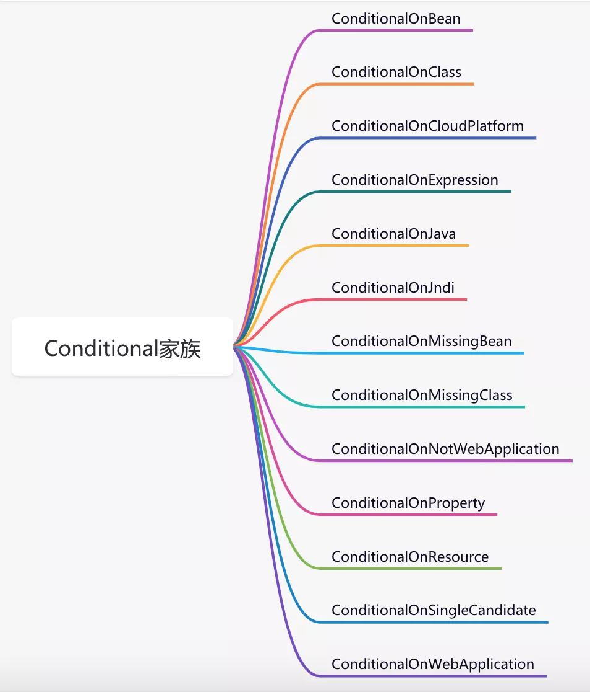
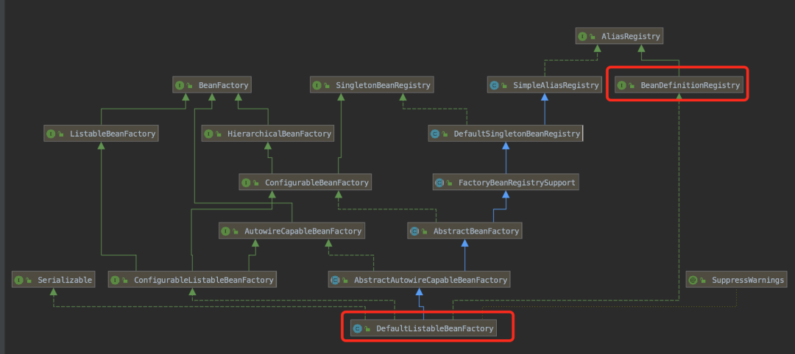
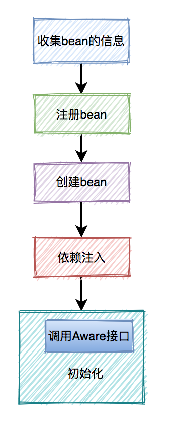

# Spring Bean 的12种定义方法

## 1、Spring Bean 前言 

在庞大的Java体系中，Spring有着举足轻重的地位，它给每位开发者带来了极大的便利和惊喜。我们都知道Spring是创建和管理Bean的工厂，它提供了多种定义Bean的方式，能够满足我们日常工作中的多种业务场景。

那么问题来了，你知道Spring中有哪些方式可以定义Bean？我估计很多人会说出以下三种：

1. 基于XML配置Bean
2. 使用@Component灯光派生注解
3. 使用@Configuration和@Bean

以上三种方式只是最基础常见的，实际上Spring的功能远比你想象中更强大。

首先我们先要创建好一个基础的Java模块，在POM文件中添加下面的依赖信息：

```xml
<dependency>
    <groupId>org.springframework</groupId>
    <artifactId>spring-context</artifactId>
    <version>5.3.9</version>
</dependency>
```

创建一个BookService接口，以及其四个实现类，定义方法分别输出不同的内容：

```java
public interface BookSerivce {
    void check();
}
```

```java
public class BookServiceImpl implements BookSerivce {
    @Override
    public void check() {
        System.out.println("book service ..");
    }
}
```


## 2.、XML 文件配置 Bean

我们先从XML配置Bean开始，它是Spring最早支持的方式。后来，随着SpringBoot越来越受欢迎，该方法目前已经用得很少了，但我建议我们还是有必要了解一下。

### 1、构造器

如果你之前有在bean.xml文件中配置过bean的经历，那么对如下的配置肯定不会陌生：

```xml
<?xml version="1.0" encoding="UTF-8"?>
<beans xmlns="http://www.springframework.org/schema/beans"
       xmlns:xsi="http://www.w3.org/2001/XMLSchema-instance"
       xsi:schemaLocation="http://www.springframework.org/schema/beans http://www.springframework.org/schema/beans/spring-beans.xsd">

    <!--xml方式声明自己开发的bean-->
    <bean id="personService" class="com.sue.cache.service.test7.PersonService"/>
    <bean class="com.itheima.bean.Cat"/>

    <!--xml方式声明第三方开发的bean-->
    <bean id="dataSource" class="com.alibaba.druid.pool.DruidDataSource"/>
    <bean class="com.alibaba.druid.pool.DruidDataSource"/>
</beans>
```

这种方式是以前使用最多的方式，它默认使用了无参构造器创建Bean。我们还可以使用有参的构造器，通过`<constructor-arg>`标签来完成配置。

```xml
<bean id="personService" class="com.sue.cache.service.test7.PersonService">
    <constructor-arg index="0" value="susan"></constructor-arg>
    <constructor-arg index="1" ref="baseInfo"></constructor-arg>
</bean>
```

- index：表示下标，从0开始。
- value：表示常量值或者变量
- ref：表示引用另一个bean


### 2、setter 方法

Spring还提供了另外一种思路：通过setter方法设置Bean所需参数，这种方式耦合性相对较低，比有参构造器使用更为广泛。

先定义Person实体，它里面包含：成员变量name和age，getter/setter方法：

```java
@Data
public class Person {
    private String name;
    private int age;
}
```

然后在bean.xml文件中配置bean时，加上`<property>`标签设置bean所需参数。

```xml
<bean id="person" class="com.sue.cache.service.test7.Person">
    <property name="name" value="susan"></constructor-arg>
    <property name="age" value="18"></constructor-arg>
</bean>
```


### 3、静态工厂

这种方式的关键是需要定义一个工厂类，它里面包含一个创建Bean的静态方法。例如：

```java
public class SusanBeanFactory {
    public static Person createPerson(String name, int age) {
        return new Person(name, age);
    }
}
```

接下来定义Person类，它里面包含：成员变量name和age，getter/setter方法，无参构造器和全参构造器：

```java
@Data
@NoArgsConstructor
@AllArgsConstructor
public class Person {
    private String name;
    private int age;
}
```

然后在bean.xml文件中配置bean时，通过`factory-method`参数指定静态工厂方法，同时通过`<constructor-arg>`设置相关参数。

```xml
<bean class="com.sue.cache.service.test7.SusanBeanFactory" factory-method="createPerson">
    <constructor-arg index="0" value="susan"></constructor-arg>
    <constructor-arg index="1" value="18"></constructor-arg>
</bean>
```


### 4、实例工厂方法

这种方式也需要定义一个工厂类，但里面包含非静态的创建bean的方法。

```java
public class SusanBeanFactory {
    public Person createPerson(String name, int age) {
        return new Person(name, age);
    }
}
```

Person 类跟上面一样，就不多说了。

然后bean.xml文件中配置bean时，需要先配置工厂bean。然后在配置实例bean时，通过`factory-bean`参数指定该工厂bean的引用。

```xml
<bean id="susanBeanFactory" class="com.sue.cache.service.test7.SusanBeanFactory"/>
<bean factory-bean="susanBeanFactory" factory-method="createPerson">
    <constructor-arg index="0" value="susan"></constructor-arg>
    <constructor-arg index="1" value="18"></constructor-arg>
</bean>
```


### 5、FactoryBean

上面的实例工厂方法每次都需要创建一个工厂类，不方面统一管理。我们可以使用 FactoryBean 接口。

```java
public class UserFactoryBean implements FactoryBean<User> {
    @Override
    public User getObject() throws Exception {
        return new User();
    }

    @Override
    public Class<?> getObjectType() {
        return User.class;
    }
}
```

在它的`getObject`方法中可以实现我们自己的逻辑创建对象，并且在`getObjectType`方法中我们可以定义对象的类型。

然后在bean.xml文件中配置bean时，只需像普通的bean一样配置即可。

```xml
<bean id="userFactoryBean" class="com.sue.async.service.UserFactoryBean"/>
```

> 注意：getBean("userFactoryBean");获取的是getObject方法中返回的对象。而getBean("&userFactoryBean");获取的才是真正的UserFactoryBean对象。

我们通过上面五种方式，在bean.xml文件中把Bean配置好之后，Spring 就会自动扫描和解析相应的标签，并且帮我们创建和实例化Bean，然后放入Spring容器中。

虽说基于XML文件的方式配置Bean，简单而且非常灵活，比较适合一些小项目。但如果遇到比较复杂的项目，则需要配置大量的Bean，而且Bean之间的关系错综复杂，这样久而久之会导致XML文件迅速膨胀，非常不利于Bean的管理。


### 6、获取Bean的方式

```java
public class App1 {
    public static void main(String[] args) {
        // applicationCOntext1.xml Spring的配置文件文件名
        ApplicationContext ctx = new ClassPathXmlApplicationContext("applicationCOntext1.xml");
        // 用id拿
		Object cat = ctx.getBean("cat");
		System.out.println(cat);
        // 用类型拿
		Dog dog = ctx.getBean(Dog.class);
		System.out.println(dog);
        // 拿到的所有bean的名称
        String[] names = ctx.getBeanDefinitionNames();
        for (String name : names) {
            System.out.println(name);
        }
    }
}
```


## 3、Component 注解 Bean

### 1、定义方式

为了解决Bean太多时，XML文件过大，从而导致膨胀不好维护的问题。在Spring2.5中开始支持：@Component、@Repository、@Service、@Controller 等注解定义Bean。如果你有看过这些注解的源码的话，就会惊奇得发现：其实后三种注解也是 @Component。

```java
@Target({ElementType.TYPE})
@Retention(RetentionPolicy.RUNTIME)
@Documented
@Component
public @interface Controller {}

@Target({ElementType.TYPE})
@Retention(RetentionPolicy.RUNTIME)
@Documented
@Component
public @interface Service {}

@Target({ElementType.TYPE})
@Retention(RetentionPolicy.RUNTIME)
@Documented
@Component
public @interface Repository {}
```

@Component 系列注解的出现，给我们带来了极大的便利。我们不需要像以前那样在bean.xml文件中配置bean了，现在只用在类上加Component、Repository、Service、Controller，这四种注解中的任意一种，就能轻松完成Bean的定义。

```java
@Service
public class PersonService {
    public String get() {
        return "data";
    }
}
```

其实，这四种注解在功能上没有特别的区别，不过在业界有个不成文的约定：

- Controller：一般用在控制层
- Service：一般用在业务层
- Repository：一般用在数据层
- Component：一般用在公共组件上

不过，需要特别注意的是，通过这种@Component扫描注解的方式定义Bean的前提是：**需要先配置扫描路径**。

目前常用的配置扫描路径的方式如下：

1. 在applicationContext.xml文件中使用`<context:component-scan>`标签。例如：

   ```xml
   <context:component-scan base-package="com.sue.cache" />
   ```

2. 在SpringBoot的启动类上加上`@ComponentScan`注解，例如：

   ```java
   @ComponentScan(basePackages = "com.sue.cache")
   @SpringBootApplication
   public class Application {
       public static void main(String[] args) {
           new SpringApplicationBuilder(Application.class).web(WebApplicationType.SERVLET).run(args);
       }
   }
   ```

3. 当然，如果你需要扫描的类跟SpringBoot的入口类，在同一级或者子级的包下面，无需指定scanBasePackages参数，Spring默认会从入口类的同一级或者子级的包去找。

   ```java
   @SpringBootApplication
   public class Application {
       public static void main(String[] args) {
           new SpringApplicationBuilder(Application.class).web(WebApplicationType.SERVLET).run(args);
       }
   }
   ```

此外，除了上述四种@Component注解之外，SpringBoot还增加了@RestController注解，它是一种特殊的@Controller注解，所以也是@Component注解。

@RestController还支持@ResponseBody注解的功能，即将接口响应数据的格式自动转换成JSON。

```java
@Target(ElementType.TYPE)
@Retention(RetentionPolicy.RUNTIME)
@Documented
@Controller
@ResponseBody
public @interface RestController {}
```

@Component系列注解目前是我们日常工作中最多的定义Bean的方式。


### 2、获取方式

1、如果使用applicationContext.xml配置文件开启扫描，使用如下方式获取：

```java
public class App2 {
    public static void main(String[] args) {
        // 定义扫描路劲的配置文件名
        ApplicationContext ctx = new ClassPathXmlApplicationContext("applicationCOntext1.xml");
        // 拿到的所有Bean的名称
        String[] names = ctx.getBeanDefinitionNames();
        for (String name : names) {
            System.out.println(name);
        }
    }
}
```

2、在类上使用@ComponentScan注解开启扫描的话，使用如下方式获取：

```java
public class App3 {
    public static void main(String[] args) {
        // 没有配置文件了 直接加载配置类
        ApplicationContext ctx = new AnnotationConfigApplicationContext(SpringConfig3.class);
        // 拿到的所有Bean的名称
        String[] names = ctx.getBeanDefinitionNames();
        for (String name : names) { 
            System.out.println(name);
        }
    }
}
```


## 4、JavaConfig 配置 Bean

@Component 系列注解虽说使用起来非常方便，但是Bean的创建过程完全交给Spring容器来完成，我们没办法自己控制。

Spring从3.0以后，开始支持JavaConfig的方式定义Bean。它可以看做Spring的配置文件，但并非真正的配置文件，我们需要通过编码Java代码的方式创建Bean。例如：

```java
@Configuration
public class MyConfiguration {
    @Bean
    public Person person() {
        return new Person();
    }
}
```

在JavaConfig类上加@Configuration注解，相当于配置了`<beans>`标签。而在方法上加@Bean注解，相当于配置了`<bean>`标签。

此外，SpringBoot还引入了一些列的@Conditional注解，用来控制Bean的创建。

```java
@Configuration
public class MyConfiguration {
    @ConditionalOnClass(Country.class)
    @Bean
    public Person person() {
        return new Person();
    }
}
```

@ConditionalOnClass注解的功能是当项目中存在Country类时，才实例化Person类。换句话说就是，如果项目中不存在Country类，就不实例化Person类。

这个功能非常有用，相当于一个开关控制着Person类，只有满足一定条件才能实例化。

Spring中使用比较多的Conditional还有：

- ConditionalOnBean
- ConditionalOnProperty
- ConditionalOnMissingClass
- ConditionalOnMissingBean
- ConditionalOnWebApplication

如果你对这些功能比较感兴趣，可以看看《[Spring中那些让你爱不释手的代码技巧（续集）](http://mp.weixin.qq.com/s?__biz=MzUxODkzNTQ3Nw==&mid=2247485964&idx=1&sn=6b228b315461498aa3e2ac241341f72a&chksm=f9800cd6cef785c07022577cec282c3f990e35d80ee5cb07219681ed4db71cddabb9fcbeabd2&scene=21#wechat_redirect)》，这是我之前写的一篇文章，里面做了更详细的介绍。

下面用一张图整体认识一下@Conditional家族:

有了这些功能，我们终于可以告别麻烦的xml时代了。


## 5、Import 注解配置 Bean

通过前面介绍的@Configuration和@Bean相结合的方式，我们可以通过代码定义Bean。但这种方式有一定的局限性，它只能创建该类中定义的Bean实例，不能创建其他类的Bean实例，如果我们想创建其他类的Bean实例该怎么办呢？这时可以使用**@Import**注解导入。


### 1、普通类

Spring4.2 之后 @Import 注解可以实例化普通类的Bean实例。例如：

1、先定义了Role类：

```java
@Data
public class Role {
    private Long id;
    private String name;
}
```

2、接下来使用@Import注解导入Role类：

```java
@Import(Role.class)
@Configuration
public class MyConfig {
}
```

3、然后在调用的地方通过@Autowired注解注入所需的Bean。

```java
@RequestMapping("/")
@RestController
public class TestController {

    @Autowired
    private Role role;

    @GetMapping("/test")
    public String test() {
        System.out.println(role);
        return "test";
    }
}
```

@Import实现了：没有在任何地方定义过Role的Bean，但Spring却能自动创建该类的Bean实例

@Import注解能定义单个类的Bean，也支持定义多个类的Bean。

```java
@Import({Role.class, User.class})
@Configuration
public class MyConfig {
}
```

甚至，不想写这种MyConfig类，直接在SpringBoot启动类上使用也可以。

```java
@Import({Role.class, User.class})
@SpringBootApplication
public class Application {
    public static void main(String[] args) {
        new SpringApplicationBuilder(Application.class).web(WebApplicationType.SERVLET).run(args);
    }
}
```

SpringBoot 的启动类一般都会加@SpringBootApplication注解，该注解上加了@SpringBootConfiguration注解，而@SpringBootConfiguration注解，上面又加了@Configuration注解所以，SpringBoot启动类本身带有@Configuration注解的功能。


### 2、Configuration 类

上面介绍了@Import注解导入普通类的方法，它同时也支持导入Configuration类。

1、先定义一个Configuration类：

```java
@Configuration
public class MyConfig2 {
    @Bean
    public User user() {
        return  new User();
    }

    @Bean
    public Role role() {
        return new Role();
    }
}
```

2、然后在另外一个Configuration类中引入前面的Configuration类：

```java
@Import({MyConfig2.class})
@Configuration
public class MyConfig {
}
```

这种方式，如果MyConfig2类已经在Spring指定的扫描目录或者子目录下，则MyConfig类会显得有点多余。因为MyConfig2类本身就是一个配置类，它里面就能定义Bean。

但如果MyConfig2类不在指定的Spring扫描目录或者子目录下，则通过MyConfig类的导入功能，也能把MyConfig2类识别成配置类。这就有点厉害了喔。


**3、其实下面还有更高端的玩法**。

Swagger作为一个优秀的文档生成框架，在Spring项目中越来越受欢迎。我们以Swagger2为例，介绍一下它是如何导入相关类的。

众所周知，我们引入Swagger相关jar包之后，只需要在SpringBoot的启动类上加上**@EnableSwagger2**注解，就能开启Swagger的功能。

其中**@EnableSwagger2**注解中导入了**Swagger2DocumentationConfiguration**类。

```java
@Retention(RetentionPolicy.RUNTIME)
@Target({ElementType.TYPE})
@Documented
@Import({Swagger2DocumentationConfiguration.class})
public @interface EnableSwagger2 {
}
```

Swagger2DocumentationConfiguration 该类是一个 Configuration 类，它又导入了另外两个类：

- SpringfoxWebMvcConfiguration
- SwaggerCommonConfiguration

```java
@Configuration
@Import({SwaggerCommonConfiguration.class, SpringfoxWebMvcConfiguration.class})
@ComponentScan(
    basePackages = {"springfox.documentation.swagger2.mappers"}
)
public class Swagger2DocumentationConfiguration {
    public Swagger2DocumentationConfiguration() {
    }

    @Bean
    public JacksonModuleRegistrar swagger2Module() {
        return new Swagger2JacksonModule();
    }
}
```

SpringfoxWebMvcConfiguration类又会导入新的Configuration类，并且通过@ComponentScan注解扫描了一些其他的路径。

```java
@Configuration
@ConditionalOnWebApplication(
    type = Type.SERVLET
)
@Conditional({OnServletBasedWebApplication.class})
@Order(Integer.MIN_VALUE)
public class SpringfoxWebMvcConfiguration {
    public SpringfoxWebMvcConfiguration() {
    }

    @Bean
    public static WebMvcObjectMapperConfigurer webMvcObjectMapperConfigurer() {
        return new WebMvcObjectMapperConfigurer();
    }
}
```

SwaggerCommonConfiguration同样也通过@ComponentScan注解扫描了一些额外的路径。

```java
@Configuration
@Import({ModelsConfiguration.class})
@ComponentScan(
    basePackages = {"springfox.documentation.spring.web.scanners", 
                    "springfox.documentation.spring.web.readers.operation", 
                    "springfox.documentation.spring.web.readers.parameter", 
                    "springfox.documentation.spring.web.plugins", 
                    "springfox.documentation.spring.web.paths"}
)
@EnablePluginRegistries({DocumentationPlugin.class, ApiListingBuilderPlugin.class, OperationBuilderPlugin.class, ParameterBuilderPlugin.class, ResponseBuilderPlugin.class, ExpandedParameterBuilderPlugin.class, OperationModelsProviderPlugin.class, DefaultsProviderPlugin.class, PathDecorator.class, ApiListingScannerPlugin.class, ModelNamesRegistryFactoryPlugin.class})
public class SpringfoxWebConfiguration {
    public SpringfoxWebConfiguration() {
    }

    @Bean
    public Defaults defaults() {
        return new Defaults();
    }

    @Bean
    public DocumentationCache resourceGroupCache() {
        return new DocumentationCache();
    }

    @Bean
    public JsonSerializer jsonSerializer(List<JacksonModuleRegistrar> moduleRegistrars) {
        return new JsonSerializer(moduleRegistrars);
    }

    @Bean
    public DescriptionResolver descriptionResolver(Environment environment) {
        return new DescriptionResolver(environment);
    }

    @Bean
    public HandlerMethodResolver methodResolver(TypeResolver resolver) {
        return new HandlerMethodResolver(resolver);
    }

    @Bean
    public PathProvider pathProvider() {
        return new DefaultPathProvider();
    }
}
```

如此一来，我们通过一个简单的**@EnableSwagger2**注解，就能轻松的导入Swagger所需的一系列Bean，并且拥有Swagger的功能。


### 3、ImportSelector

上面提到的 Configuration 类，它的功能非常强大。但怎么说呢，它不太适合加复杂的判断条件，根据某些条件定义这些 Bean，根据另外的条件定义那些 Bean。那么，这种需求该怎么实现呢？这时就可以使用`ImportSelector`接口了。

1、首先定义一个类实现`ImportSelector`接口：重写 selectImports 方法，在该方法中指定需要定义Bean的类名，注意要包含完整路径，而非相对路径。

```java
public class DataImportSelector implements ImportSelector {
    @Override
    public String[] selectImports(AnnotationMetadata metadata) {
        // 加载的是哪个Bean描述的就是哪个
        System.out.println("提示：" + metadata.getClassName()); 
        // 加载这个类的 配置文件有没有这个注解 输出布尔值
        System.out.println(metadata.hasAnnotation("org.springframework.context.annotation.Configuration"));
        // 拿到很多这个注解的值, 返回类型为 Map<String, Object>
 System.out.println(metadata.getAnnotationAttributes("org.springframework.context.annotation.ComponentScan")); 

        // 返回的是要注册Bean的全类名
        return new String[]{"com.sue.async.service.User", "com.sue.async.service.Role"};
    }
}
```

2、然后在MyConfig类上@Import导入这个类即可：

```java
@Import({DataImportSelector.class})
@Configuration
public class MyConfig {
}
```

朋友们是不是又发现了一个新大陆？

不过，这个注解还有更牛逼的用途。

@EnableAutoConfiguration注解中导入了AutoConfigurationImportSelector类，并且里面包含系统参数名称：spring.boot.enableautoconfiguration。AutoConfigurationImportSelector类实现了ImportSelector接口。

并且重写了selectImports方法，该方法会根据某些注解去找所有需要创建bean的类名，然后返回这些类名。其中在查找这些类名之前，先调用isEnabled方法，判断是否需要继续查找。

```java
@Target(ElementType.TYPE)
@Retention(RetentionPolicy.RUNTIME)
@Documented
@Inherited
@AutoConfigurationPackage
@Import(AutoConfigurationImportSelector.class)
public @interface EnableAutoConfiguration {}
```

```java
public class AutoConfigurationImportSelector implements DeferredImportSelector, BeanClassLoaderAware,
		ResourceLoaderAware, BeanFactoryAware, EnvironmentAware, Ordered {
	@Override
	public String[] selectImports(AnnotationMetadata annotationMetadata) {
		if (!isEnabled(annotationMetadata)) {
			return NO_IMPORTS;
		}
		AutoConfigurationEntry autoConfigurationEntry = getAutoConfigurationEntry(annotationMetadata);
		return StringUtils.toStringArray(autoConfigurationEntry.getConfigurations());
	}
}
```

该方法会根据ENABLED_OVERRIDE_PROPERTY的值来作为判断条件。

```java
protected boolean isEnabled(AnnotationMetadata metadata) {
    if (getClass() == AutoConfigurationImportSelector.class) {
        return getEnvironment().getProperty(EnableAutoConfiguration.ENABLED_OVERRIDE_PROPERTY, Boolean.class, true);
    }
    return true;
}
```

而这个值就是spring.boot.enableautoconfiguration。换句话说，这里能根据系统参数控制bean是否需要被实例化，优秀。

个人认为实现ImportSelector接口的好处主要有以下两点：

1. 把某个功能的相关类，可以放到一起，方面管理和维护。
2. 重写selectImports方法时，能够根据条件判断某些类是否需要被实例化，或者某个条件实例化这些Bean，其他的条件实例化那些Bean等。我们能够非常灵活的定制化Bean的实例化。


### 4、ImportBeanDefinitionRegistrar

我们通过上面的这种方式，确实能够非常灵活的自定义Bean。但它的自定义能力，还是有限的，它没法自定义Bean的名称和作用域等属性。有需求，就有解决方案。接下来，我们一起看看ImportBeanDefinitionRegistrar 接口的神奇之处。

先定义 CustomImportSelector 类实现 ImportBeanDefinitionRegistrar 接口：

```java
public class CustomImportSelector implements ImportBeanDefinitionRegistrar {
    @Override
    public void registerBeanDefinitions(AnnotationMetadata importingClassMetadata, 
                                        BeanDefinitionRegistry registry) {

        RootBeanDefinition roleBeanDefinition = new RootBeanDefinition(Role.class);
        registry.registerBeanDefinition("role", roleBeanDefinition);


        RootBeanDefinition userBeanDefinition = new RootBeanDefinition(User.class);
        userBeanDefinition.setScope(ConfigurableBeanFactory.SCOPE_PROTOTYPE);
        registry.registerBeanDefinition("user", userBeanDefinition);

        BeanDefinition beanDefinition = BeanDefinitionBuilder
            .rootBeanDefinition(BookServiceImpl.class)
            .getBeanDefinition();
        registry.registerBeanDefinition("bookService",beanDefinition);
    }
}
```

重写 registerBeanDefinitions 方法，在该方法中我们可以获取 BeanDefinitionRegistry 对象，通过它去注册 Bean。不过在注册 Bean之前，我们先要创建 BeanDefinition 对象，它里面可以自定义 Bean 的名称、作用域等很多参数。

然后在MyConfig类上导入上面的类：

```java
@Import({CustomImportSelector.class})
@Configuration
public class MyConfig {
}
```


## 6、PostProcessor 配置 Bean

### 1、BeanDefinitionRegistryPostProcessor

Spring 还提供了专门注册Bean的接口：BeanDefinitionRegistryPostProcessor。该接口的方法 postProcessBeanDefinitionRegistry 上有这样一段描述：

```java
public interface BeanDefinitionRegistryPostProcessor extends BeanFactoryPostProcessor {
	/**
	 * Modify the application context's internal bean definition registry after its
	 * standard initialization. All regular bean definitions will have been loaded,
	 * but no beans will have been instantiated yet. This allows for adding further
	 * bean definitions before the next post-processing phase kicks in.
	 * @param registry the bean definition registry used by the application context
	 * @throws org.springframework.beans.BeansException in case of errors
	 */
	void postProcessBeanDefinitionRegistry(BeanDefinitionRegistry registry) throws BeansException;
}
```

修改应用程序上下文的内部Bean定义注册表标准初始化。所有常规Bean定义都将被加载，但是还没有Bean被实例化。这允许进一步添加在下一个后处理阶段开始之前定义Bean。

如果用这个接口来定义Bean，我们要做的事情就变得非常简单了。只需定义一个类实现 BeanDefinitionRegistryPostProcessor 接口。

```java
@Component
public class MyRegistryPostProcessor implements BeanDefinitionRegistryPostProcessor {
    @Override
    public void postProcessBeanDefinitionRegistry(BeanDefinitionRegistry registry) throws BeansException {
        RootBeanDefinition roleBeanDefinition = new RootBeanDefinition(Role.class);
        registry.registerBeanDefinition("role", roleBeanDefinition);

        RootBeanDefinition userBeanDefinition = new RootBeanDefinition(User.class);
        userBeanDefinition.setScope(ConfigurableBeanFactory.SCOPE_PROTOTYPE);
        registry.registerBeanDefinition("user", userBeanDefinition);

        BeanDefinition beanDefinition = BeanDefinitionBuilder
            .rootBeanDefinition(BookServiceImpl.class)
            .getBeanDefinition();
        registry.registerBeanDefinition("bookService",beanDefinition);
    }

    @Override
    public void postProcessBeanFactory(ConfigurableListableBeanFactory beanFactory) throws BeansException {
    }
}
```

重写 postProcessBeanDefinitionRegistry 方法，在该方法中能够获取 BeanDefinitionRegistry 对象，它负责 Bean 的注册工作。


### 2、BeanFactoryPostProcessor

不过细心的朋友可能会发现，里面还多了一个 postProcessBeanFactory 方法，没有做任何实现。

这个方法其实是它的父接口：BeanFactoryPostProcessor 里的方法。

在应用程序上下文的标准 Bean 工厂之后修改其内部 Bean 工厂初始化。所有 Bean 定义都已加载，但没有 Bean 将被实例化。这允许重写或添加属性甚至可以初始化 Bean。

```JAVA
@Component
public class MyPostProcessor implements BeanFactoryPostProcessor {
    @Override
    public void postProcessBeanFactory(ConfigurableListableBeanFactory beanFactory) throws BeansException {
        DefaultListableBeanFactory registry = (DefaultListableBeanFactory)beanFactory;

        RootBeanDefinition roleBeanDefinition = new RootBeanDefinition(Role.class);
        registry.registerBeanDefinition("role", roleBeanDefinition);

        RootBeanDefinition userBeanDefinition = new RootBeanDefinition(User.class);
        userBeanDefinition.setScope(ConfigurableBeanFactory.SCOPE_PROTOTYPE);
        registry.registerBeanDefinition("user", userBeanDefinition);

        BeanDefinition beanDefinition = BeanDefinitionBuilder
            .rootBeanDefinition(BookServiceImpl.class)
            .getBeanDefinition();
        registry.registerBeanDefinition("bookService",beanDefinition);
    }
}
```

既然这两个接口都能注册 Bean，那么他们有什么区别？

- BeanDefinitionRegistryPostProcessor：更侧重于 Bean 的注册
- BeanFactoryPostProcessor：更侧重于对已经注册的 Bean 的属性进行修改，虽然也可以注册 Bean。

此时，有些朋友可能会问：既然拿到 BeanDefinitionRegistry 对象就能注册 Bean，那通过 BeanFactoryAware 的方式是不是也能注册 Bean 呢？

从下面这张图能够看出 DefaultListableBeanFactory 就实现了 BeanDefinitionRegistry 接口。



这样一来，我们如果能够获取 DefaultListableBeanFactory 对象的实例，然后调用它的注册方法，不就可以注册 Bean 了？

说时迟那时快，定义一个类实现 BeanFactoryAware 接口：

```java
@Component
public class BeanFactoryRegistry implements BeanFactoryAware {
    @Override
    public void setBeanFactory(BeanFactory beanFactory) throws BeansException {
        DefaultListableBeanFactory registry = (DefaultListableBeanFactory) beanFactory;
        RootBeanDefinition rootBeanDefinition = new RootBeanDefinition(User.class);
        registry.registerBeanDefinition("user", rootBeanDefinition);

        RootBeanDefinition userBeanDefinition = new RootBeanDefinition(User.class);
        userBeanDefinition.setScope(ConfigurableBeanFactory.SCOPE_PROTOTYPE);
        registry.registerBeanDefinition("user", userBeanDefinition);

        BeanDefinition beanDefinition = BeanDefinitionBuilder
            .rootBeanDefinition(BookServiceImpl.class)
            .getBeanDefinition();
        registry.registerBeanDefinition("bookService",beanDefinition);
    }
}
```

重写 setBeanFactory 方法，在该方法中能够获取 BeanFactory 对象，它能够强制转换成 DefaultListableBeanFactory 对象，然后通过该对象的实例注册 Bean。

当你满怀喜悦的运行项目时，发现竟然报错了：为什么会报错？

Spring中Bean的创建过程顺序大致如下：



BeanFactoryAware 接口是在 Bean 创建成功，并且完成依赖注入之后，在真正初始化之前才被调用的。在这个时候去注册 Bean 意义不大，因为这个接口是给我们获取 Bean 的，并不建议去注册 Bean，会引发很多问题。

> 此外，ApplicationContextRegistry 和 ApplicationListener 接口也有类似的问题，我们可以用他们获取 Bean，但不建议用它们注册 Bean。


# 参考文献 & 鸣谢

1. 作者：Java中文社群。链接：https://mp.weixin.qq.com/s/YN-yXfrYsaqK35JVmJbRcg
2. Springboot | bean的加载方式：https://blog.csdn.net/Siebert_Angers/article/details/128881934