> - **注意：有些用老版本 Spring Cloud的SR7 + JDK9， 这个在生产环境是绝对不给用的版本**
>
> - **理由：一定不能用JDK9版本，功能性版本官方只维护半年，目前Oracle官方早就不维护JDK9了，是否有漏洞或者BUG被黑客利用都不得而知，且不同版本各个组件兼容问题很多**
>
> - 技术栈和环境说明
>   - SpringBoot.2.3.3 + Mybatis+ SpringCloud Hoxton.SR8+ AlibabaCloud 2.2.1
>   - JDK8 + JDK11 + IDEA旗舰版 + Docker1.13 + 阿里云CentOS7.X
>

## 一、单机应用到分布式转换

### 1、传统单机-分布式架构演进

单机架构

- 优点： 易于测试 便于集成 小型项目友好
- 缺点： 开发速度慢 启动时间长 依赖庞大

分布式架构

- SOA（Service Oriented Architecture） ： 面向服务的架构 其中包含多个服务， 服务之间通过相互依赖最终提供一系列的功能, 一个服务 通常以独立的形式存在与操作系统进程中, 各个服务之间 通过网络调用。
- 微服务（Micro Service）：将一个大的单体应用进行细粒度的服务化拆分，每个拆分出来的服务各自独立打包部署，各个服务之间 通过网络调用。
- 优点
  - 易开发、理解和维护
  - 独立的部署和启动
- 缺点
  - 分布式系统 -》分布式事务问题
  - 需要管理多个服务 -》服务治理


### 2、微服务全家桶架构组成

> 微服务架构常见的核心组件

**常见组件**

- **服务发现注册**：调用和被调用方的信息维护

- **网关**：（路由转发 + 过滤器）
  - /api/v1/user/ 用户服务
  - /api/v1/video/ 视频服务
  - /api/v1/order/ 订单服务
- **配置中心**：管理配置，动态更新 application.properties && application.yml
- **链路追踪**
  - 分析调用链路耗时 
  - 例子：下单-》查询商品服务获取商品价格-》查询用户信息-》保存数据库
- **负载均衡器**：分发流量到多个节点，降低压力
- **熔断**：保护自己和被调用方


### 3、常见微服务架构

- **ServiceComb**

  - 华为内部的CSE(Cloud Service Engine)框架开源, 一个微服务的开源解决方案,社区相对于下面几个比较小
  - 文档不多，通信领域比较强

   

- **Dubbo**

  - Zookeeper + Dubbo + SpringBoot/SpringMVC

  - 官方地址：http://dubbo.apache.org/#!/?lang=zh-cn

  - 配套

    - 通信方式：rpc
    - 注册中心：zookeper、redis、nacos
    - 配置中心：diamond、nacos

     

- **SpringCloud**

  - 全家桶 + 轻松嵌入第三方组件（Netflix 奈飞）
  - 官网地址：https://spring.io/projects/spring-cloud
  - 配套
    - 通信方式：http、restful
    - 注册中心：eruka
    - 配置中心：config
    - 断路器：hystrix
    - 网关：zuul、gateway
    - 分布式追踪系统：sleuth+zipkin

   

- **Spring Alibaba Cloud**

  - 全家桶 + 阿里生态多个组件组合 + SpringCloud支持
  - 官网 https://spring.io/projects/spring-cloud-alibaba
  - 配套
    - 通信方式：http、restful
    - 注册中心：nacos
    - 配置中心：nacos
    - 断路器：sentinel
    - 网关：gateway
    - 分布式追踪系统：sleuth+zipkin

   


## 二、AlibabaCloud 介绍及使用


### 1、AlibabaCloud全家桶介绍

- 官网地址：https://spring.io/projects/spring-cloud-alibaba#overview
- Github地址：https://github.com/alibaba/spring-cloud-alibaba


- 为什么要选择AlibabaCloud，和SpringCloud的区别
  - SpringCloud 和 AlibabaCloud 组件存在很大交集，互相配合
  - SpringCloud 很多组件是基于第三方整合，目前多个已经不更新了，比如zuul、eureka、hystrix等
  - AlibabaCloud 提供一站式微服务解决方法，已经和SpringCloud进行了整合，组件互相支持


- AlibabaCloud全家桶介绍
  - https://github.com/alibaba/spring-cloud-alibaba
  - 服务注册发现：Nacos
  - 服务限流降级：Sentinel
  - 分布配置中心：Nacos
  - 服务网关：SpringCloud Gateway
  - 服务之间调用：Feign、Ribbon
  - 链路追踪：Sleuth+Zipkin


- 版本说明【注意文档】：官方经常改地址，如果地址失效后重新搜索找入口
  - Spring Framework 5 以上
  - SpringBoot 2.x 以上
  - AlibabaCloud 版本 2.2.x https://spring.io/projects/spring-cloud-alibaba#learn
  - SpirngCloud 版本 Hoxton https://spring.io/projects/spring-cloud
  - Spring Boot、SpringCloud 版本对应关系官网：https://start.spring.io/actuator/info

```json
{
	"bom-ranges": {
		"spring-cloud": {
			"Finchley.M2": "Spring Boot >=2.0.0.M3 and <2.0.0.M5",
			"Finchley.M3": "Spring Boot >=2.0.0.M5 and <=2.0.0.M5",
			"Finchley.M4": "Spring Boot >=2.0.0.M6 and <=2.0.0.M6",
			"Finchley.M5": "Spring Boot >=2.0.0.M7 and <=2.0.0.M7",
			"Finchley.M6": "Spring Boot >=2.0.0.RC1 and <=2.0.0.RC1",
			"Finchley.M7": "Spring Boot >=2.0.0.RC2 and <=2.0.0.RC2",
			"Finchley.M9": "Spring Boot >=2.0.0.RELEASE and <=2.0.0.RELEASE",
			"Finchley.RC1": "Spring Boot >=2.0.1.RELEASE and <2.0.2.RELEASE",
			"Finchley.RC2": "Spring Boot >=2.0.2.RELEASE and <2.0.3.RELEASE",
			"Finchley.SR4": "Spring Boot >=2.0.3.RELEASE and <2.0.999.BUILD-SNAPSHOT",
			"Finchley.BUILD-SNAPSHOT": "Spring Boot >=2.0.999.BUILD-SNAPSHOT and <2.1.0.M3",
			"Greenwich.M1": "Spring Boot >=2.1.0.M3 and <2.1.0.RELEASE",
			"Greenwich.SR6": "Spring Boot >=2.1.0.RELEASE and <2.1.999.BUILD-SNAPSHOT",
			"Greenwich.BUILD-SNAPSHOT": "Spring Boot >=2.1.999.BUILD-SNAPSHOT and <2.2.0.M4",
			"Hoxton.SR8": "Spring Boot >=2.2.0.M4 and <2.3.6.BUILD-SNAPSHOT",
			"Hoxton.BUILD-SNAPSHOT": "Spring Boot >=2.3.6.BUILD-SNAPSHOT and <2.4.0.M1",
			"2020.0.0-M3": "Spring Boot >=2.4.0.M1 and <=2.4.0.M1",
			"2020.0.0-M4": "Spring Boot >=2.4.0.M2 and <=2.4.0-M3",
			"2020.0.0-SNAPSHOT": "Spring Boot >=2.4.0-M4"
		},
		"spring-cloud-alibaba": {
			"2.2.1.RELEASE": "Spring Boot >=2.2.0.RELEASE and <2.3.0.M1"
		}
	}
}
```

| Release Train | Boot Version                     |
| :------------ | :------------------------------- |
| Hoxton        | 2.2.x, 2.3.x (Starting with SR5) |
| Greenwich     | 2.1.x                            |
| Finchley      | 2.0.x                            |
| Edgware       | 1.5.x                            |
| Dalston       | 1.5.x                            |

| Spring Cloud Version        | Spring Cloud Alibaba Version      | Spring Boot Version |
| --------------------------- | --------------------------------- | ------------------- |
| Spring Cloud Hoxton.SR3     | 2.2.1.RELEASE                     | 2.2.5.RELEASE       |
| Spring Cloud Hoxton.RELEASE | 2.2.0.RELEASE                     | 2.2.X.RELEASE       |
| Spring Cloud Greenwich      | 2.1.2.RELEASE                     | 2.1.X.RELEASE       |
| Spring Cloud Finchley       | 2.0.2.RELEASE                     | 2.0.X.RELEASE       |
| Spring Cloud Edgware        | 1.5.1.RELEASE(停止维护，建议升级) | 1.5.X.RELEASE       |


### 2、SpringCloud 版本介绍

常见的版本号及 Springcloud 的版本（版本名+版本号的结构）：

> 版本名

Spring Cloud使用的版本号是英文方式，而不是传统的数字版本，为什么呢。因为springcloud是微服务的解决方案，他会有很多子项目，每个子项目都维护这自己的版本号，为了避免冲突，就使用了伦敦地铁站的名字作为版本号。以首字母作为顺序，a,b,c,d....排列。

现有版本号：Angel、Brixton、Camden、Daston、Edgware、Finchley、GreenWich、Hoxton ...


> 版本号

实际上是版本名+版本号的结构，如Angel.SR6、Brixton.SR5，Hoxton.SR8，SR6和SR5就是版本号；

当一个版本的Spring Cloud项目的发布内容积累到临界点或者一个严重bug解决可用后，就会发布一个“service releases”版本，简称SRX版本，其中X是一个递增数字


**1、常见版本号说明**

举例：2.0.3 RELEASE

- 2：主版本号，当功能模块有较大更新或者整体架构发生变化时，主版本号会更新
- 0：次版本号。次版本表示只是局部的一些变动。
- 2：修改版本号。一般是bug的修改或者是小的变动
- RELEASE：希腊字母版本号。此版本号用户标注当前版本的软件处于哪个开发阶段


**2、希腊字母版本号**

- Base：设计阶段。只有相应的设计没有具体的功能实现。
- Alpha：软件的初级版本。基本功能已经实现，但存在较多的bug。
- Bate：相对于Alpha已经有了很大的进步，消除了严重的BUG，但还存在一些潜在的BUG，还需要不断测试。
- RELEASE：最终版本，没有太大的问题。


**3、SpringCloud的版本号**

- BUILD-XXX：开发版。开发团队内部使用，不是很稳定。（Hoxton.BUILD-SNAPSHOT）
- SNAPSHOT：快照版本，随时可能修改。（2020.0.0-SNAPSHOT）

- GA：General availability：通用稳定版本。并且已经很稳定了，功能齐全。（Hoxton.SR8 **GA**）
- RC：Release candidate：发布候选版本。功能较为齐全，相对稳定，问题应该相对少和次要，值得报告，bug将会修复。
- M（PRE）：Milestone build：里程碑版本。功能还不全，项目完成了一个计划，但是还是可能有问题的。
- SR：Service Release：正式发布版本。（Hoxton.SR8）


### 3、微服务设计和环境准备

> 在线教育环微服务模块划分和环境准备

- 在线教育模块划分
  - 视频服务（xdclass-video-service）
  - 订单服务（xdclass-order-service）
  - 用户服务（xdclass-user-service）

- 必备基础环境：JDK8以上版本 + Maven3.5(采用默认) + IDEA旗舰版 + Mysql5.7以上版本

- 操作系统：Linux Centos7 64位(虚拟机) 或者 Mac苹果系统
  - 虚拟机可以搜索博文
  - Windows有些软件会不兼容，且坑难排查
  - 学习期间务必关闭防火墙

 

### 4、数据库介绍和数据导入

> 在线教育数据库表介绍和导入

- 采用3个数据库，每个服务单独一个库

- 视频服务数据库（cloud_video） video表

```sql
CREATE TABLE `video` (
    `id` int(11) unsigned NOT NULL AUTO_INCREMENT,
    `title` varchar(524) DEFAULT NULL COMMENT '视频标题',
    `summary` varchar(1026) DEFAULT NULL COMMENT '概述',
    `cover_img` varchar(524) DEFAULT NULL COMMENT '封面图',
    `price` int(11) DEFAULT NULL COMMENT '价格,分',
    `create_time` datetime DEFAULT NULL COMMENT '创建时间',
    `point` double(11,2) DEFAULT '8.70' COMMENT '默认8.7，最高10分',
    PRIMARY KEY (`id`)
) ENGINE=InnoDB AUTO_INCREMENT=48 DEFAULT CHARSET=utf8;
```

 ```sql
INSERT INTO `video` (`id`, `title`, `summary`, `cover_img`, `price`, `create_time`, `point`)
VALUES
  (30, '互联网架构之JAVA虚拟机JVM零基础到高级实战', 'https://xdvideo-file.oss-cn-shenzhen.aliyuncs.com/video/2020/maven/%E8%AF%A6%E6%83%85%E5%9B%BE.png', 'https://xdvideo-file.oss-cn-shenzhen.aliyuncs.com/video/2020/maven/%E5%AE%98%E7%BD%91%E4%B8%BB%E5%9B%BE-mawen.png', 3980, '2021-06-24 22:14:00', 9.10),
  (40, '全新微信小程序零基础到项目实战', 'https://xdvideo-file.oss-cn-shenzhen.aliyuncs.com/video/2020/%E5%BE%AE%E4%BF%A1%E5%B0%8F%E7%A8%8B%E5%BA%8F/%E8%AF%A6%E6%83%85%E5%9B%BE.png', 'https://xdvideo-file.oss-cn-shenzhen.aliyuncs.com/video/2020/%E5%BE%AE%E4%BF%A1%E5%B0%8F%E7%A8%8B%E5%BA%8F/%E5%AE%98%E7%BD%91%E4%B8%BB%E5%9B%BE-%E5%B0%8F%E7%A8%8B%E5%BA%8F.png', 5980, '2021-01-18 22:14:00', 9.10),
  (41, '玩转搜索框架ElasticSearch7.x实战', 'https://xd-video-pc-img.oss-cn-beijing.aliyuncs.com/xdclass_pro/video/2019_backend/elasticsearch7_detail.jpeg', 'https://xd-video-pc-img.oss-cn-beijing.aliyuncs.com/xdclass_pro/video/2019_backend/elasticsearch7.png', 4880, '2021-01-10 22:14:00', 8.70),
  (45, 'Docker实战视频教程入门到高级dockerfile/compose-Harbor', 'https://xdvideo-file.oss-cn-shenzhen.aliyuncs.com/video/2020/Docker/%E8%AF%A6%E6%83%85%E5%9B%BE.jpeg', 'https://xdvideo-file.oss-cn-shenzhen.aliyuncs.com/video/2020/Docker/%E5%AE%98%E7%BD%91%E4%B8%BB%E5%9B%BE-docker.png', 5980, '2021-01-10 22:14:00', 9.30),
  (46, '新版javase零基础到高级教程小白自学编程', 'https://xdvideo-file.oss-cn-shenzhen.aliyuncs.com/video/2020/%E6%96%B0%E7%89%88javase/%E8%AF%A6%E6%83%85%E5%9B%BE.png', 'https://file.xdclass.net/video/2020/%E6%96%B0%E7%89%88javase/%E5%AE%98%E7%BD%91%E4%B8%BB%E5%9B%BE-javase.png', 3980, '2021-01-24 22:14:00', 8.80),
  (47, 'Nodejs教程零基础入门到项目实战前端视频教程', 'https://xdvideo-file.oss-cn-shenzhen.aliyuncs.com/video/2020/node/%E5%AE%98%E7%BD%91%E8%AF%A6%E6%83%85%E5%9B%BE-node.png', 'https://xdvideo-file.oss-cn-shenzhen.aliyuncs.com/video/2020/node/%E5%AE%98%E7%BD%91%E4%B8%BB%E5%9B%BE-node.png', 6980, '2021-01-24 22:14:00', 8.90);
 ```


- 用户服务数据库（cloud_user） user表

```sql
CREATE TABLE `user` (
    `id` int(11) unsigned NOT NULL AUTO_INCREMENT,
    `phone` varchar(32) DEFAULT NULL,
    `pwd` varchar(128) DEFAULT NULL,
    `sex` int(2) DEFAULT NULL,
    `img` varchar(128) DEFAULT NULL,
    `create_time` datetime DEFAULT NULL,
    `role` int(11) DEFAULT NULL COMMENT '1是普通用户，2是管理员',
    `username` varchar(128) DEFAULT NULL,
    `wechat` varchar(128) DEFAULT NULL,
    PRIMARY KEY (`id`)
) ENGINE=InnoDB AUTO_INCREMENT=5 DEFAULT CHARSET=utf8mb4;
```

 ```sql
INSERT INTO `user` (`id`, `phone`, `pwd`, `sex`, `img`, `create_time`, `role`, `username`, `wechat`)
VALUES
  (1, '123', '666', 1, 'xdclass.net', '2021-09-09 00:00:00', 1, 'jack', 'xdclass6'),
  (2, '2323432', '794666918', 1, 'wwwww', '2020-05-20 04:54:01', 1, '小滴Anna姐姐', 'xdclass-anna'),
  (3, '2323432', 'xdclass-lw', 1, 'wwwww', '2020-05-20 04:54:42', 1, '二当家小D', 'xdclass1'),
  (4, '2323432', '3232323', 1, 'wwwww', '2020-05-20 04:55:07', 1, '老王', 'xdclass-lw');
 ```


- 订单服务数据库（cloud_order）video_order表

```sql
CREATE TABLE `video_order` (
    `id` int(11) unsigned NOT NULL AUTO_INCREMENT,
    `out_trade_no` varchar(64) DEFAULT NULL COMMENT '订单唯一标识',
    `state` int(11) DEFAULT NULL COMMENT '0表示未支付，1表示已支付',
    `create_time` datetime DEFAULT NULL COMMENT '订单生成时间',
    `total_fee` int(11) DEFAULT NULL COMMENT '支付金额，单位分',
    `video_id` int(11) DEFAULT NULL COMMENT '视频主键',
    `video_title` varchar(256) DEFAULT NULL COMMENT '视频标题',
    `video_img` varchar(256) DEFAULT NULL COMMENT '视频图片',
    `user_id` int(12) DEFAULT NULL COMMENT '用户id',
    PRIMARY KEY (`id`)
) ENGINE=InnoDB AUTO_INCREMENT=42 DEFAULT CHARSET=utf8;
```

 

### 5、Maven 聚合工程创建

> 使用Maven && IDEA 聚合工程创建微服务架构

- maven聚合工程
  - xdclass-common（实体类）
  - xdclass-video-service（视频服务）
  - xdclass-user-service（用户服务）
  - xdclass-order-service（订单服务）


- 创建聚合工程
  - 记得删除聚合工程src目录
  - 修改pom.xml文件

 ```xml
<?xml version="1.0" encoding="UTF-8"?>
<project xmlns="http://maven.apache.org/POM/4.0.0"
         xmlns:xsi="http://www.w3.org/2001/XMLSchema-instance"
         xsi:schemaLocation="http://maven.apache.org/POM/4.0.0 http://maven.apache.org/xsd/maven-4.0.0.xsd">
    <modelVersion>4.0.0</modelVersion>

    <groupId>net.xdclass</groupId>
    <artifactId>xdclass-cloud</artifactId>
    <version>1.0-SNAPSHOT</version>
    <!-- 一般来说父级项目的packaging都为pom，packaging默认类型jar类型-->
    <packaging>pom</packaging>
    
    <properties>
        <java.version>1.8</java.version>
    </properties>

    <!--锁定版本-->
    <dependencyManagement>
        <dependencies>
            <!--https://mvnrepository.com/artifact/org.springframework.boot/spring-boot-dependencies/2.3.3.RELEASE-->
            <dependency>
                <groupId>org.springframework.boot</groupId>
                <artifactId>spring-boot-dependencies</artifactId>
                <version>2.3.3.RELEASE</version>
                <type>pom</type>
                <scope>import</scope>
            </dependency>

            <!--https://mvnrepository.com/artifact/org.springframework.cloud/spring-cloud-dependencies/Hoxton.SR8-->
            <dependency>
                <groupId>org.springframework.cloud</groupId>
                <artifactId>spring-cloud-dependencies</artifactId>
                <version>Hoxton.SR8</version>
                <type>pom</type>
                <scope>import</scope>
            </dependency>

            <!--https://mvnrepository.com/artifact/com.alibaba.cloud/spring-cloud-alibaba-dependencies/2.2.1.RELEASE-->
            <dependency>
                <groupId>com.alibaba.cloud</groupId>
                <artifactId>spring-cloud-alibaba-dependencies</artifactId>
                <version>2.2.1.RELEASE</version>
                <type>pom</type>
                <scope>import</scope>
            </dependency>

        </dependencies>
    </dependencyManagement>

    <build>
        <plugins>
            <plugin>
                <groupId>org.springframework.boot</groupId>
                <artifactId>spring-boot-maven-plugin</artifactId>
                <configuration>
                    <fork>true</fork>
                    <addResources>true</addResources>
                </configuration>
            </plugin>
        </plugins>
    </build>
</project>
 ```

- 创建4个子项目（创建好后父pom.xml会自动添加如下信息）：

```xml
<modules>
    <module>xdclass-common</module>
    <module>xdclass-video-service</module>
    <module>xdclass-user-service</module>
    <module>xdclass-order-service</module>
</modules>
```

- 添加子项目依赖（所有子pom.xml都添加，除了xdclass-common模块）

```xml
<dependencies>
    <dependency>
        <groupId>org.springframework.boot</groupId>
        <artifactId>spring-boot-starter-web</artifactId>
    </dependency>
    
    <dependency>
        <groupId>net.xdclass</groupId>
        <artifactId>xdclass-common</artifactId>
        <version>1.0-SNAPSHOT</version>
    </dependency>
</dependencies>
```

- 注意：有些包 maven下载慢，等待下载如果失败，删除本地仓库 spring 相关的包，重新执行：mvn clean install


### 6、引入Mybatis连接Mysql

> 微服务打通Mybatis连接Mysql数据库

- 在xdclass-common子模块创建common包实体类

```java
package net.xdclass.domain;

import lombok.Builder;
import lombok.Data;
import lombok.NoArgsConstructor;
import lombok.AllArgsConstructor;
import java.util.Date;

@Data
@Builder
@NoArgsConstructor
@AllArgsConstructor
public class User {
    private Integer id;
    private String name;
    private String pwd;
    private String headImg;
    private String phone;
    private Date createTime;
    private String wechat;
}

```

```java
package net.xdclass.domain;

import lombok.Builder;
import lombok.Data;
import lombok.NoArgsConstructor;
import lombok.AllArgsConstructor;
import java.util.Date;

@Data
@Builder
@NoArgsConstructor
@AllArgsConstructor
public class Video {
    private Integer id;
    private String title;
    private String summary;
    private String coverImg;
    private Integer  price;
    private Date createTime;
    private Double point;
}
```

```java
package net.xdclass.domain;

import lombok.Builder;
import lombok.Data;
import lombok.NoArgsConstructor;
import lombok.AllArgsConstructor;
import java.util.Date;

@Data
@Builder
@NoArgsConstructor
@AllArgsConstructor
public class VideoOrder {
    private Integer id;
    private String outTradeNo;
    private Integer state;
    private Date createTime;
    private  Integer totalFee;
    private Integer videoId;
    private String videoTitle;
    private String videoImg;
    private Integer userId;
}
```


- 聚合工程（父）pom.xml修改，引入mybatis 依赖【注意】

```xml
<properties>
    <java.version>1.8</java.version>
    <!-- 默认编译改为jdk1.8 -->
    <maven.compiler.source>1.8</maven.compiler.source>
    <maven.compiler.target>1.8</maven.compiler.target>
</properties>

 <!-- mybatis springboot -->
<dependency>
    <groupId>org.mybatis.spring.boot</groupId>
    <artifactId>mybatis-spring-boot-starter</artifactId>
    <version>2.1.2</version>
    <type>pom</type>
    <scope>import</scope>
</dependency>
```


- Mybatis依赖导入+数据库配置（子模块），添加和
  - xdclass-video-service（9000）
  - xdclass-user-service（7000）
  - xdclass-order-service（8000）

```xml
<!-- mybatis依赖 -->
<dependency>
    <groupId>org.mybatis.spring.boot</groupId>
    <artifactId>mybatis-spring-boot-starter</artifactId>
</dependency>

<!-- 数据库驱动 -->
<dependency>
    <groupId>mysql</groupId>
    <artifactId>mysql-connector-java</artifactId>
</dependency>
```


- 3个模块配置数据库连接 application.yml（记得修改 端口、应用名称、数据库名称）

xdclass-order-service 子模块

```yaml
server:
  port: 8000

spring:
  application:
    name: xdclass-order-service
  datasource:
    driver-class-name: com.mysql.cj.jdbc.Driver
    url: jdbc:mysql://127.0.0.1:3306/cloud_order?useUnicode=true&characterEncoding=utf-8&useSSL=false
    username: root
    password: password

# 控制台输出sql、下划线转驼峰
mybatis:
  configuration:
    log-impl: org.apache.ibatis.logging.stdout.StdOutImpl
    map-underscore-to-camel-case: true
```

xdclass-user-service 子模块

```yaml
server:
  port: 7000

spring:
  application:
    name: xdclass-user-service
  datasource:
    driver-class-name: com.mysql.cj.jdbc.Driver
    url: jdbc:mysql://127.0.0.1:3306/cloud_user?useUnicode=true&characterEncoding=utf-8&useSSL=false
    username: root
    password: password

# 控制台输出sql、下划线转驼峰
mybatis:
  configuration:
    log-impl: org.apache.ibatis.logging.stdout.StdOutImpl
    map-underscore-to-camel-case: true
```

xdclass-video-service 子模块

```yaml
server:
  port: 9000

spring:
  application:
    name: xdclass-video-service
  datasource:
    driver-class-name: com.mysql.cj.jdbc.Driver
    url: jdbc:mysql://127.0.0.1:3306/cloud_video?useUnicode=true&characterEncoding=utf-8&useSSL=false
    username: root
    password: password

# 控制台输出sql、下划线转驼峰
mybatis:
  configuration:
    log-impl: org.apache.ibatis.logging.stdout.StdOutImpl
    map-underscore-to-camel-case: true
```


- 在 xdclass-video-service 子模块测试配置是否正确，建立controller->service->mapper 开发

```
├─java
│  └─net
│      └─xdclass
│          │  VideoApplication.java
│          │
│          ├─controller
│          │      VideoController.java
│          │
│          ├─dao
│          │      VideoMapper.java
│          │
│          └─service
│              │  VideoService.java
│              │
│              └─impl
│                      VideoServiceImpl.java
│
└─resources
        application.yml
```


1、启动类：

```java
@SpringBootApplication
@MapperScan("net.xdclass.dao")
public class VideoApplication {

    public static void main(String [] args){
        SpringApplication.run(VideoApplication.class,args);
    }
}
```


2、mapper（dao）层

```java
@Repository
public interface VideoMapper {
    
    @Select("select * from video where id=#{videoId}")
    Video findById(@Param("videoId") int videoId);
}
```


3、service层

```java
public interface VideoService {
    Video findById(int videoId);
}
```

```java
@Service
public class VideoServiceImpl implements VideoService {
    
    @Autowired
    private VideoMapper videoMapper;

    @Override
    public Video findById(int videoId) {
        return videoMapper.findById(videoId);
    }
}
```


4、controller层

```java
@RestController
@RequestMapping("/api/v1/video")
public class VideoController {

    @Autowired
    private VideoService videoService;

    @RequestMapping("find_by_id")
    public Object findById(int videoId){
        return videoService.findById(videoId);
    }
}
```


5、测试访问：http://localhost:9000/api/v1/video/find_by_id?videoId=30

```json
{
	"id": 30,
	"title": "互联网架构之JAVA虚拟机JVM零基础到高级实战",
	"summary": "https://xdvideo-file.oss-cn-shenzhen.aliyuncs.com/video/2020/maven/%E8%AF%A6%E6%83%85%E5%9B%BE.png",
	"coverImg": "https://xdvideo-file.oss-cn-shenzhen.aliyuncs.com/video/2020/maven/%E5%AE%98%E7%BD%91%E4%B8%BB%E5%9B%BE-mawen.png",
	"price": 3980,
	"createTime": "2021-06-24T22:14:00.000+00:00",
	"point": 9.1
}
```


**注意：**

1、访问后报错：

```
com.mysql.cj.exceptions.InvalidConnectionAttributeException: The server time zone value异常解决方案
```

https://blog.csdn.net/syc000666/article/details/100580972


### 7、初探微服务之间的调用

- 服务直接怎么调用：

```
RPC:
  远程过程调用，像调用本地服务(方法)一样调用服务器的服务
  支持同步、异步调用
  客户端和服务器之间建立TCP连接，可以一次建立一个，也可以多个调用复用一次链接
  RPC数据包小
    protobuf
    thrift
  rpc：编解码，序列化，链接，丢包，协议
  
Rest(Http):
  http请求，支持多种协议和功能
  开发方便成本低
  http数据包大
  java开发：resttemplate或者httpclient
```


- 用户下单
  - 订单服务（order） -> 视频服务（video）


- xdclass-order-service 子模块

1、启动类

```java
package net.xdclass;

import org.springframework.boot.SpringApplication;
import org.springframework.boot.autoconfigure.SpringBootApplication;
import org.springframework.context.annotation.Bean;
import org.springframework.web.client.RestTemplate;

@SpringBootApplication
public class OrderApplication {

    public static void main(String [] args){
        SpringApplication.run(OrderApplication.class,args);
    }

    @Bean
    public RestTemplate getRestTemplate(){
        return new RestTemplate();
    }
}
```


2、controller层

```java
package net.xdclass.controller;

import net.xdclass.domain.Video;
import net.xdclass.domain.VideoOrder;
import org.springframework.beans.factory.annotation.Autowired;
import org.springframework.web.bind.annotation.RequestMapping;
import org.springframework.web.bind.annotation.RestController;
import org.springframework.web.client.RestTemplate;

import java.util.Date;

@RestController
@RequestMapping("/api/v1/video_order")
public class OrderController {
    @Autowired
    private RestTemplate restTemplate;

    @RequestMapping("/find_by_id")
    public Object findById(int videoId){
		String url = "http://localhost:9000/api/v1/video/find_by_id?videoId=" + videoId;
        Video video = restTemplate.getForObject(url, Video.class);

        VideoOrder videoOrder = new VideoOrder();
        videoOrder.setVideoId(video.getId());
        videoOrder.setVideoTitle(video.getTitle());
        videoOrder.setCreateTime(new Date());
        return videoOrder;
    }
}
```


3、测试访问：http://localhost:8000/api/v1/video_order/find_by_id?videoId=30

```json
{
	"id": null,
	"outTradeNo": null,
	"state": null,
	"createTime": "2020-11-10T14:54:54.803+00:00",
	"totalFee": null,
	"videoId": 40,
	"videoTitle": "全新微信小程序零基础到项目实战",
	"videoImg": null,
	"userId": null
}
```


- 存在的问题：
  - 服务之间的IP信息写死
  - 服务之间无法提供负载均衡
  - 多个服务直接关系调用维护复杂


## 三、服务注册发现之—Nacos

### 1、什么是微服务的注册中心

> 什么是注册中心和常见的注册中心有哪些？

- 微服务架构图讲解
- 什么是注册中心（服务治理）
  - 服务注册：服务提供者provider，启动的时候向注册中心上报自己的网络信息
    - 服务发现：服务消费者consumer,启动的时候向注册中心上报自己的网络信息，拉取provider的相关网络信息
  - 核心:服务管理,是有个服务注册表，心跳机制动态维护，服务实例在启动时注册到服务注册表，并在关闭时注销。

- 为什么要用
  - 微服务应用和机器越来越多，调用方需要知道接口的网络地址，如果靠配置文件的方式去控制网络地址，对于动态新增机器，维护带来很大问题

- 主流的注册中心：zookeeper、Eureka、consul、etcd、Nacos
  - AlibabaCloud 搭配最好的是Nacos，且服务的注册发现之外，还支持动态配置服务

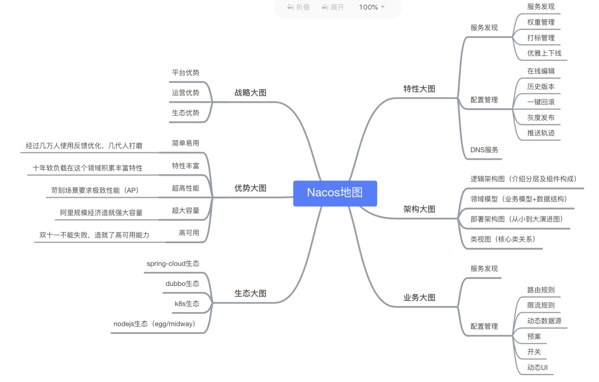


### 2、Nacos 安装

- 官网地址：https://nacos.io/zh-cn/
- 安装包地址：https://github.com/alibaba/nacos/releases
- Linux/Mac安装Nacos
  - 解压安装包：tar -xzvf nacos-server-$version.tar.gz
  - 进入bin目录：cd nacos/bin
  - 启动：sh startup.sh -m standalone
  - 访问：http://localhost:8848/nacos
  - 默认账号密码：nacos/nacos
- Windows（standalone代表着单机模式运行，非集群模式，默认集群模式）
  - 启动命令：cmd startup.cmd -m standalone
- docker安装：

```bash
# docker拉取镜像
$ docker pull nacos/nacos-server

# 单节点启动nacos
$ docker run -d --name xdclass-nacos -p 8848:8848 --env MODE=standalone nacos/nacos-server:latest
```


### 3、Nacos实现服务调用

**简介：项目集成Nacos实现服务直接的调用**

- 视频服务、订单服务、用户服务 集成 Nacos

  - 添加依赖

  ```xml
          <!--添加nacos客户端-->
          <dependency>
              <groupId>com.alibaba.cloud</groupId>
              <artifactId>spring-cloud-starter-alibaba-nacos-discovery</artifactId>
          </dependency>
  ```

  

  - 配置Nacos地址

  ```yaml
  server:
    port: 7000
    # port: 8000
    # port: 9000
  
  spring:
    application:
      name: xdclass-user-service
      # name: xdclass-order-service
      # name: xdclass-video-service
    cloud:
      nacos:
        discovery:
          server-addr: 127.0.0.1:8848
  ```

  

  - 启动类增加注解：

  ```java
  @EnableDiscoveryClient
  ```

  

- 服务之间的调用，改造之前的 订单服务（order） -> 视频服务（video）

```java
package net.xdclass.controller;

import net.xdclass.domain.Video;
import net.xdclass.domain.VideoOrder;
import org.springframework.beans.factory.annotation.Autowired;
import org.springframework.cloud.client.ServiceInstance;
import org.springframework.cloud.client.discovery.DiscoveryClient;
import org.springframework.web.bind.annotation.RequestMapping;
import org.springframework.web.bind.annotation.RestController;
import org.springframework.web.client.RestTemplate;

import java.util.Date;
import java.util.List;

@RestController
@RequestMapping("api/v1/video_order")
public class OrderController {

    @Autowired
    private RestTemplate restTemplate;
    @Autowired
    private DiscoveryClient discoveryClient;
    
    @RequestMapping("/find_by_id")
    public Object findById(int videoId){

        // 1、Rest 硬编码url 方式调用
        //String url = "http://localhost:9000/api/v1/video/find_by_id?videoId=" + videoId;
        //Video video = restTemplate.getForObject(url, Video.class);

        // 一种另类的用法，可以通过DiscoveryClient获取注册中心内服务的信息
        List<ServiceInstance> list = discoveryClient.getInstances("xdclass-video-service");
        ServiceInstance serviceInstance = list.get(0);
        String url = "http://"+ serviceInstance.getHost() + ":" +
                serviceInstance.getPort() + "/api/v1/video/find_by_id?videoId=" + videoId;
        Video video = restTemplate.getForObject(url, Video.class);

        VideoOrder videoOrder = new VideoOrder();
        videoOrder.setVideoId(video.getId());
        videoOrder.setVideoTitle(video.getTitle());
        videoOrder.setCreateTime(new Date());
        return videoOrder;

    }
}
```


### 4、负载均衡策略

> 什么负载均衡和常见的解决方案

- 什么是负载均衡（Load Balance）

  ```
  分布式系统中一个非常重要的概念，当访问的服务具有多个实例时，需要根据某种“均衡”的策略决定请求发往哪个节点，这就是所谓的负载均衡，原理是将数据流量分摊到多个服务器执行，减轻每台服务器的压力，从而提高了数据的吞吐量
  ```

  

- 软硬件角度负载均衡的种类

  - 通过硬件来进行解决，常见的硬件有NetScaler、F5、Radware和Array等商用的负载均衡器，但比较昂贵的
  - 通过软件来进行解决，常见的软件有LVS、Nginx等,它们是基于Linux系统并且开源的负载均衡策略

  

- 从端的角度负载均衡有两种

  - 服务端负载均衡（由服务端自己决定如何分发节点，一般Nginx）
  - 客户端负载均衡（由客户端自己决定请求那个节点）


- 常见的负载均衡策略（看组件的支持情况）
  - 节点轮询：每个请求按顺序分配到不同的后端服务器
  - weight 权重配置：weight和访问比率成正比，数字越大，分配得到的流量越高
  - 固定分发：根据请求按访问ip的hash结果分配，这样每个用户就可以固定访问一个后端服务器
  - 随机选择、最短响应时间 等等


### 5、Ribbon组件实现负载均衡

> AlibabaCloud 集成 Ribbon 实现负载均衡

- 什么是Ribbon：Ribbon是一个客户端负载均衡工具，通过Spring Cloud封装，可以轻松和AlibabaCloud整合
- 订单服务增加`@LoadBalanced`注解

```java
@Bean
@LoadBalanced
public RestTemplate restTemplate() {
  return new RestTemplate();
}
```

- 实际调用（可以只用用服务名称调用）

```java
package net.xdclass.controller;

import net.xdclass.domain.Video;
import net.xdclass.domain.VideoOrder;
import org.springframework.beans.factory.annotation.Autowired;
import org.springframework.cloud.client.ServiceInstance;
import org.springframework.cloud.client.discovery.DiscoveryClient;
import org.springframework.web.bind.annotation.RequestMapping;
import org.springframework.web.bind.annotation.RestController;
import org.springframework.web.client.RestTemplate;

import java.util.Date;
import java.util.List;

@RestController
@RequestMapping("api/v1/video_order")
public class OrderController {

    @Autowired
    private RestTemplate restTemplate;
    @Autowired
    private DiscoveryClient discoveryClient;

    @RequestMapping("/find_by_id")
    public Object findById(int videoId){
        // 1、Rest 硬编码url 方式调用，代码省略
        // 2、通过 DiscoveryClient 获取 所有某个服务的集群，代码省略
        
        // 3、加了@LoadBalanced后可以直接用 服务名称 替换uri即可
        String url = "http://xdclass-video-service/api/v1/video/find_by_id?videoId=" + videoId;
        Video video = restTemplate.getForObject(url, Video.class);

        VideoOrder videoOrder = new VideoOrder();
        videoOrder.setVideoId(video.getId());
        videoOrder.setVideoTitle(video.getTitle());
        videoOrder.setCreateTime(new Date());
        return videoOrder;
    }
}
```


- 测试访问：http://localhost:8000/api/v1/video_order/find_by_id?videoId=30

```json
{
	"id": null,
	"outTradeNo": null,
	"state": null,
	"createTime": "2020-11-12T15:25:03.136+00:00",
	"totalFee": null,
	"videoId": 30,
	"videoTitle": "互联网架构之JAVA虚拟机JVM零基础到高级实战",
	"videoImg": null,
	"userId": null
}
```


## 四、Ribbon+Feign 源码分析

### 1、Ribbon负载均衡源码实战

> Ribbon服务间调用负载均衡源码分析

- 源码分析思路：通过直接找入口
- 分析 @LoadBalanced （LoadBalancerClient接口）
  - 1）首先从注册中心获取provider的列表 
  - 2）通过一定的策略选择其中一个节点 
  - 3）再返回给restTemplate调用


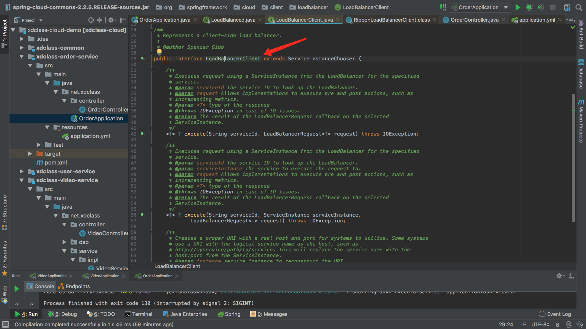


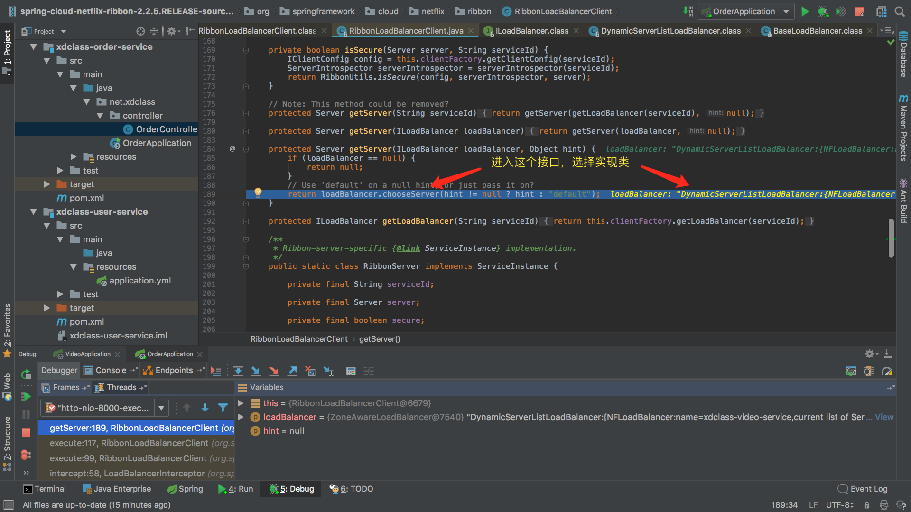

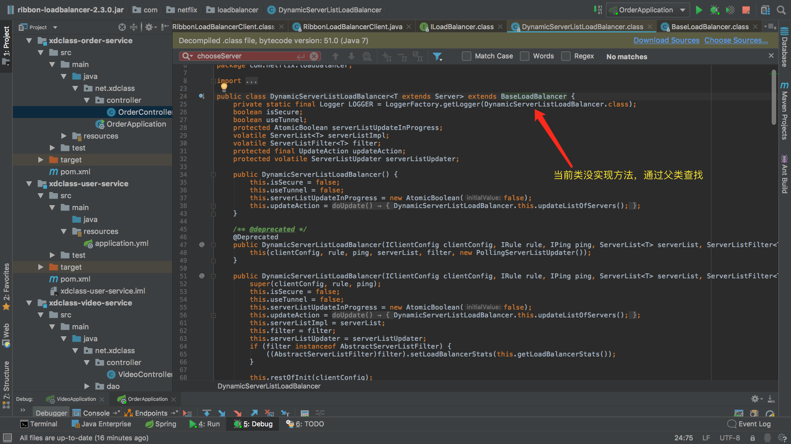

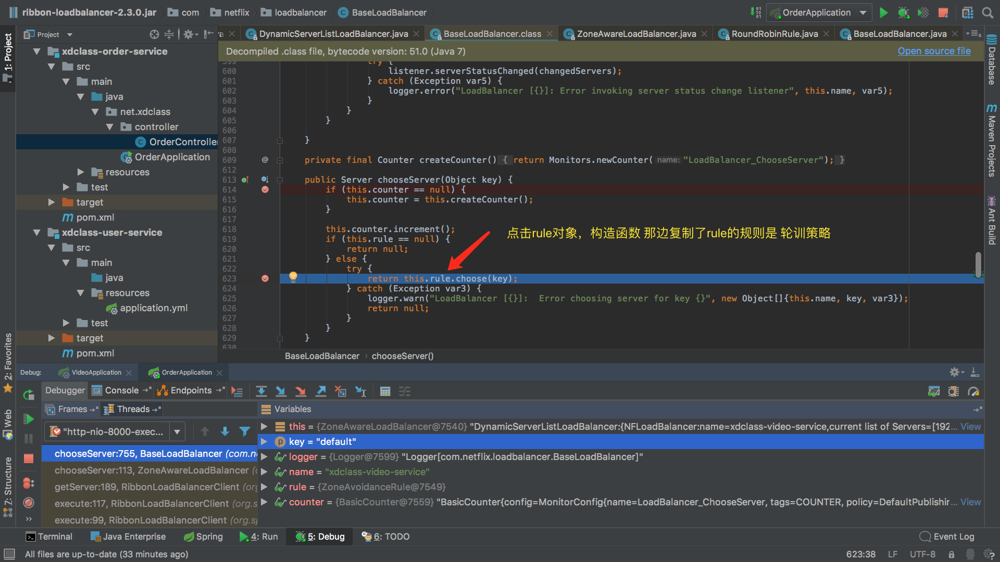


### 2、Ribbon负载均衡策略调整

> 自定义Ribbon负载均衡策略实战

- 源码分析知道ribbon支持多种负载均衡策略

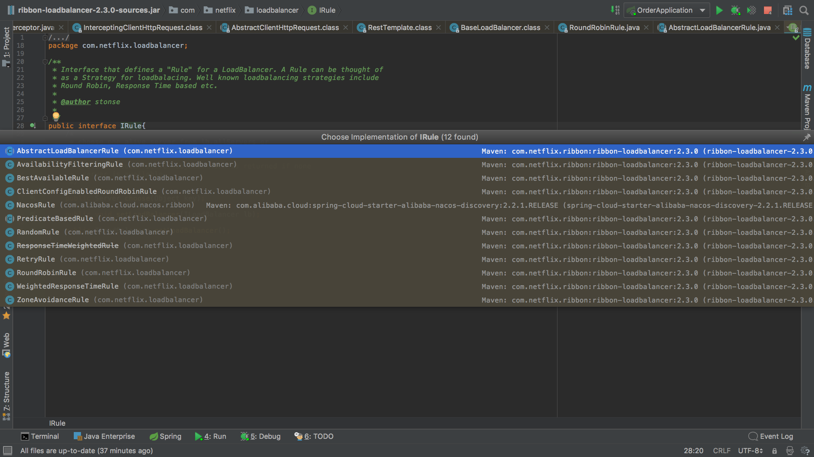

- Ribbon支持的负载均衡策略介绍

| 策略类                    | 命名               | 描述                                                         |
| ------------------------- | ------------------ | ------------------------------------------------------------ |
| RandomRule                | 随机策略           | 随机选择server                                               |
| RoundRobinRule            | 轮询策略           | 按照顺序选择server（默认）                                   |
| RetryRule                 | 重试策略           | 当选择server不成功，短期内尝试选择一个可用的server           |
| AvailabilityFilteringRule | 可用过滤策略       | 过滤掉一直失败并被标记为circuit tripped的server，过滤掉那些高并发链接的server（active connections超过配置的阈值） |
| WeightedResponseTimeRule  | 响应时间加权重策略 | 根据server的响应时间分配权重，以响应时间作为权重，响应时间越短的服务器被选中的概率越大，综合了各种因素，比如：网络，磁盘，io等，都直接影响响应时间 |
| ZoneAvoidanceRule         | 区域权重策略       | 综合判断server所在区域的性能，和server的可用性，轮询选择server |

- 负载均衡策略调整配置

```yaml
# 订单服务（xdclass-order-service）增加配置（增加配置名为需要调用负载均衡服务的名称）
# xdclass-video-service为服务名称，NFLoadBalancerRuleClassName为配置的策略类
xdclass-video-service:
  ribbon:
    NFLoadBalancerRuleClassName: com.netflix.loadbalancer.RandomRule
```

- 策略选择：
  -  1、如果每个机器配置一样，则建议不修改策略 (推荐) 
  - 2、如果部分机器配置强，则可以改为 WeightedResponseTimeRule


### 3、负载均衡组件Open-Feign

> **新**负载均衡组件feign介绍

- 原先ribbon代码存在的问题：不规范，风格不统一，维护性比较差

- 什么是Feign:

  ```
  SpringCloud提供的伪http客户端(本质还是用http)，封装了Http调用流程，更适合面向接口化
  让用Java接口注解的方式调用Http请求.
  
  不用像Ribbon中通过封装HTTP请求报文的方式调用 Feign默认集成了Ribbon
  ```

- 官方文档：https://spring.io/projects/spring-cloud-openfeign（版本 2.2.5）

- Nacos支持Feign，可以直接集成实现负载均衡的效果


### 4、集成Open-Feign远程调用

> 改造微服务 集成Feign实现远程方法调用

- Feign让方法调用更加解耦

- 使用feign步骤：（在 xdclass-oreder-service 订单服务中配置添加）

  - 加入依赖：

  ```xml
          <!--增加openfeign依赖-->
          <dependency>
              <groupId>org.springframework.cloud</groupId>
              <artifactId>spring-cloud-starter-openfeign</artifactId>
          </dependency>
  ```

  

  - 启动类配置注解

  ```java
  // 开启Feign支持
  @EnableFeignClients
  ```

  

  - 增加一个接口（service）：VideoService

  ```java
  package net.xdclass.service;
  
  import net.xdclass.domain.Video;
  import org.springframework.cloud.openfeign.FeignClient;
  import org.springframework.web.bind.annotation.GetMapping;
  import org.springframework.web.bind.annotation.RequestParam;
  
  // 订单服务增加接口，服务名称记得和nacos保持一样
  @FeignClient(value = "xdclass-video-service")
  public interface VideoService {
      // 该方法给被调视频服务的接口方法
      @GetMapping("/api/v1/video/find_by_id")
      Video findById(@RequestParam("videoId") int videoId);
  
  }
  ```

  

  - 修改订单服务controller代码

  ```java
  package net.xdclass.controller;
  
  import net.xdclass.domain.Video;
  import net.xdclass.domain.VideoOrder;
  import net.xdclass.service.VideoService;
  import org.springframework.beans.factory.annotation.Autowired;
  import org.springframework.cloud.client.ServiceInstance;
  import org.springframework.cloud.client.discovery.DiscoveryClient;
  import org.springframework.web.bind.annotation.RequestMapping;
  import org.springframework.web.bind.annotation.RestController;
  import org.springframework.web.client.RestTemplate;
  
  import java.util.Date;
  import java.util.List;
  
  @RestController
  @RequestMapping("api/v1/video_order")
  public class OrderController {
  
      @Autowired
      private RestTemplate restTemplate;
      @Autowired
      private DiscoveryClient discoveryClient;
      @Autowired
      private VideoService videoService;
  
      @RequestMapping("/find_by_id")
      public Object findById(int videoId){
  
          // 1、restTemplate 硬编码 url 方式调用
          // 2、通过 DiscoveryClient 获取 所有某个服务的集群
          // 3、直接用 服务名称 替换uri即可（Ribbon）
  
          // 4、使用 Fegin 方式调用
          Video video = videoService.findById(videoId);
  
          VideoOrder videoOrder = new VideoOrder();
          videoOrder.setVideoId(video.getId());
          videoOrder.setVideoTitle(video.getTitle());
          videoOrder.setCreateTime(new Date());
          return videoOrder;
      }
  }
  ```

  

  - 访问接口测试：http://localhost:8000/api/v1/video_order/find_by_id?videoId=30


- 增加POST方式提交：

```java
// 订单服务（xdclass-order-service） service 接口增加
@PostMapping(value = "/api/v1/video/save")
Video saveVideo(@RequestBody Video video);

// 视频服务（xdclass-video-service） controller 增加
@PostMapping("save")
public Object save(@RequestBody Video video){
    System.out.println(video.getTitle());
    return  video;
}
```


- 注意：
  - 路径 核对
  - Http方法必须对应
  - 使用服务提供方用@RequestBody，要使用@PostMapping

  

- **Ribbon 和 Feign 两个的区别和选择**
  
  - 选择 feign
  - Fegin默认集成了Ribbon
  - 写起来更加思路清晰和方便
  - 采用注解方式进行配置，配置熔断等方式方便


## 五、分布式架构理论【面试题】

### 1、微服务CAP理论

> 分布式应用核心CAP知识

- 可能会有疑惑，可以看多几遍

- CAP定理: 指的是在一个分布式系统中，Consistency（一致性）、 Availability（可用性）、Partition tolerance（分区容错性），三者不可同时获得

  - 一致性（C）：所有节点都可以访问到最新的数据
  - 可用性（A）：每个请求都是可以得到响应的，不管请求是成功还是失败
  - 分区容错性（P）：除了全部整体网络故障，其他故障都不能导致整个系统不可用

   

- CAP理论就是说在分布式存储系统中，最多只能实现上面的两点。而由于当前的网络硬件肯定会出现延迟丢包等问题，所以分区容忍性是我们必须需要实现的。所以我们只能在一致性和可用性之间进行权衡

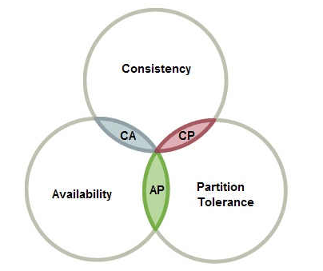

```
CA： 如果不要求P（不允许分区），则C（强一致性）和A（可用性）是可以保证的。但放弃P的同时也就意味着放弃了系统的扩展性，也就是分布式节点受限，没办法部署子节点，这是违背分布式系统设计的初衷的

CP: 如果不要求A（可用），每个请求都需要在服务器之间保持强一致，而P（分区）会导致同步时间无限延长(也就是等待数据同步完才能正常访问服务)，一旦发生网络故障或者消息丢失等情况，就要牺牲用户的体验，等待所有数据全部一致了之后再让用户访问系统

AP：要高可用并允许分区，则需放弃一致性。一旦分区发生，节点之间可能会失去联系，为了高可用，每个节点只能用本地数据提供服务，而这样会导致全局数据的不一致性
```


### 2、CAP下注册中心的选择

> 常见的分布式核心CAP理论介绍

- 常见注册中心：zookeeper、eureka、consul、nacos
- 那你应该怎么选择

|                 | **Nacos**                  | **Eureka** | **Consul**        | **Zookeeper** |
| :-------------- | :------------------------- | :--------- | :---------------- | :------------ |
| 一致性协议      | CP+AP                      | AP         | CP                | CP            |
| 健康检查        | TCP/HTTP/MYSQL/Client Beat | 心跳       | TCP/HTTP/gRPC/Cmd | Keep Alive    |
| 雪崩保护        | 有                         | 有         | 无                | 无            |
| 访问协议        | HTTP/DNS                   | HTTP       | HTTP/DNS          | TCP           |
| SpringCloud集成 | 支持                       | 支持       | 支持              | 支持          |

- Zookeeper：CP设计，保证了一致性，集群搭建的时候，某个节点失效，则会进行选举行的leader，或者半数以上节点不可用，则无法提供服务，因此可用性没法满足
- Eureka：AP原则，无主从节点，一个节点挂了，自动切换其他节点可以使用，去中心化

 

- **结论：**
  - 分布式系统中P，肯定要满足，所以只能在CA中二选一
  - 没有最好的选择，最好的选择是根据业务场景来进行架构设计
  - 如果要求一致性，则选择zookeeper/Nacos，如金融行业 CP
  - 如果要求可用性，则Eureka/Nacos，如电商系统 AP
  - CP ：适合支付、交易类，要求数据强一致性，宁可业务不可用，也不能出现脏数据
  - AP：互联网业务，比如信息流架构，不要求数据强一致，更想要服务可用

 


### 3、一致性和可用性的权衡结果 BASE理论

> 分布式CAP的权衡结果 BASE理论

- 什么是Base理论

```
CAP 中的一致性和可用性进行一个权衡的结果，核心思想就是：我们无法做到强一致，但每个应用都可以根据自身的业务特点，采用适当的方式来使系统达到最终一致性, 来自 ebay 的架构师提出
```

- Basically Available（基本可用）

  - 假设系统，出现了不可预知的故障，但还是能用, 可能会有性能或者功能上的影响

   

- Soft state（软状态）

  - 允许系统中的数据存在中间状态，并认为该状态不影响系统的整体可用性，即允许系统在多个不同节点的数据副本存在数据延时

   

- Eventually consistent（最终一致性）

  - 系统能够保证在没有其他新的更新操作的情况下，数据最终一定能够达到一致的状态，因此所有客户端对系统的数据访问最终都能够获取到最新的值

 


## 六、高并发下微服务存在的问题和解决方案


### 1、海量请求下的微服务架构存在的问题

> 高并发下的微服务存在的问题

- 高并发下存在的问题：微服务拆分多个系统，服务之间互相依赖，可能会由于**系统负载过高**，**突发流量**或者**网络等**各种异常情况 导致服务不可用。

- 核心思想—面向失败编程

  - 不要外界影响：比如单机房网络原因等
  - 不被（内部）请求拖垮：1.上游服务（比如网关入口）、2.下游服务（比如调用的其他微服务）


### 2、面向失败编程-微服务架构容错方案介绍

>  高并发下的微服务容错方案

- **限流：**令牌桶算法，漏桶算法（漏斗，不管流量多大，均匀的流入容器）

- **熔断：**保险丝，熔断服务，为了防止整个系统故障，包含当前和下游服务 下单服务 --》商品服务--》用户服务 --》（出现异常--》熔断风控服务）例如：上流调用下游服务时，下游服务出现问题，那么就可以启用熔断服务，暂时不调用该下游服务
- **降级：**抛弃一些非核心的接口和数据，返回兜底数据 旅行箱的例子：只带核心的物品，抛弃非核心的，等有条件的时候再去携带这些物品。 

- **隔离：**服务和资源互相隔离，比如网络资源，机器资源，线程资源等，不会因为某个服务的资源不足而抢占其他服务的资源


> **熔断和降级互相交集**

- 相同点：
  - 从可用性和可靠性触发，为了防止系统崩溃
  - 最终让用户体验到的是某些功能暂时不能用
- 不同点：
  - 服务熔断一般是下游服务故障导致的，而服务降级一般是从整体系统负荷考虑，由调用方控制


想进行微服务的容错，业界目前有 **Sentinel**、**Hystrix**，相对于AlibabaCloud而言，Sentinel是最好的搭配


### 3、新版分布式系统的流量防卫兵-Sentinel介绍

> 介绍什么是分布式系统的流量防卫兵Sentinel

- 官网：https://github.com/alibaba/Sentinel/wiki/介绍
- 什么是Sentinel：
  - 阿里巴巴开源的分布式系统流控工具
  - **以流量为切入点**，**从流量控制**、**熔断降级**、**系统负载保护**等多个维度保护服务的稳定性
  - 丰富的应用场景：**消息削峰填谷**、**集群流量控制**、**实时熔断下游不可用应用**等
  - 完备的实时监控：Sentinel 同时提供实时的监控功能
  - 提供开箱即用的与其它开源框架/库的整合模块，例如与 Spring Cloud、Dubbo、gRPC 的整合
- 使用版本：**Sentinel版本：2.2.1**
- 核心概念：
  - 资源：是 Sentinel 中的核心概念之一，可以是java程序中任何内容，可以是服务或者方法甚至代码，总结起来就是我们要保护的东西
  - 规则：定义怎样的方式保护资源，主要包括流控规则、熔断降级规则等


### 4、Sentinel控制台安装

> 微服务引入Sentinel 和 控制台搭建

- Sentinel 分为两个部分：

  - **核心库**（Java 客户端）不依赖任何框架/库，能够运行于所有 Java 运行时环境，同时对 Dubbo、Spring Cloud 等框架也有较好的支持。
  - **控制台**（Dashboard）基于 Spring Boot 开发，打包后可以直接运行，不需要额外的 Tomcat 等应用容器。

  


- Sentinel 控制台搭建（文档地址）：https://github.com/alibaba/Sentinel/wiki/控制台

- Sentinel 控制台包含如下功能：

  - 查看机器列表以及健康情况：收集 Sentinel 客户端发送的心跳包，用于判断机器是否在线。
  - 监控 (单机和集群聚合)通过 Sentinel 客户端暴露的监控 API，定期拉取并且聚合应用监控信息，最终可以实现秒级的实时监控。
  - 规则管理和推送：统一管理推送规则。
  - 鉴权：生产环境中鉴权非常重要。这里每个开发者需要根据自己的实际情况进行定制。

  > 注意：Sentinel 控制台目前仅支持单机部署

```bash
# windows/linux
java -Dserver.port=8080 -Dcsp.sentinel.dashboard.server=localhost:8080 -Dproject.name=sentinel-dashboard -jar sentinel-dashboard-1.8.0.jar

# 说明：
-Dserver.port=8080    指定Sentinel控制台端口
-Dcsp.sentinel.dashboard.server=localhost:8080    控制台的地址
-Dproject.name=sentinel-dashboard    指定Sentinel控制台程序的名称

# 启动 Sentinel 控制台需要 JDK 版本为 1.8 及以上版本.
# 访问地址：localhost:8080，默认用户名和密码：sentinel
```

docker安装：

```bash
# docker拉取镜像
$ docker pull bladex/sentinel-dashboard:latest

# 启动
$ docker run -d --name sentinel -p 8858:8858 bladex/sentinel-dashboard:latest
```


### 5、整合Sentinel限流配置

**简介：讲解AliababCloud微服务整合Sentinel限流配置实操**

- 微服务引入Sentinel依赖（订单、视频、用户服务都添加 sentinel 依赖）

```xml
        <!--添加sentinel依赖-->
        <dependency>
            <groupId>com.alibaba.cloud</groupId>
            <artifactId>spring-cloud-starter-alibaba-sentinel</artifactId>
        </dependency>
```


- 添加 Sentinel 配置（订单、视频、用户服务都加入，注意：port端口需要变动）

```yaml
# dashboard: 控制台地址和端口
# port: 9999本地启的端口，随机选个不能被占用的，与dashboard进行数据交互，会在应用对应的机器上启动一个 Http Server，该 Server 会与 Sentinel 控制台做交互, 若被占用,则开始+1一次扫描

spring:
  cloud:
    sentinel:
      transport:
        dashboard: 127.0.0.1:8080
        port: 9999
```

- 微服务注册上去后，由于Sentinel是懒加载模式，所以需要访问微服务后才会在控制台出现

- 限流配置实操

  - 控制台配置接口限流：

  

  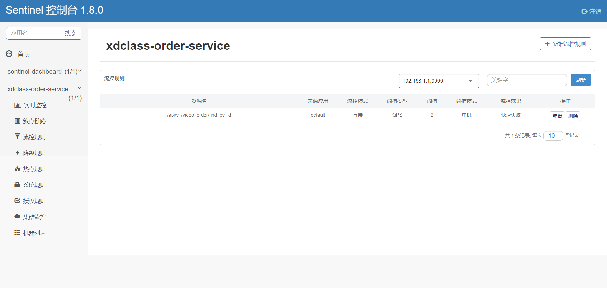

  - 浏览器刷新快一点测试：http://localhost:8000/api/v1/video_order/find_by_id?videoId=30

  


## 七、Sentinel 多种流控规则

### 1、Sentinel 流量控制功能

- 流量控制（flow control）

  - 原理是监控应用流量的 QPS 或并发线程数等指标，当达到指定的阈值时对流量进行控制，以避免被瞬时的流量高峰冲垮，从而保障应用的高可用性。

   

- 两种规则

  - 基于统计并发线程数的流量控制

  ```
  并发数控制用于保护业务线程池不被慢调用耗尽
  
  Sentinel 并发控制不负责创建和管理线程池，而是简单统计当前请求上下文的线程数目（正在执行的调用数目）
  
  如果超出阈值，新的请求会被立即拒绝，效果类似于信号量隔离
  ```

  - 基于统计QPS的流量控制：当 QPS 超过某个阈值的时候，则采取措施进行流量控制


 

- 控制面板介绍
  - 资源名：默认是请求路径，可自定义
  - 针对来源：对哪个微服务进行限流，默认是不区分来源，全部限流，这个是针对 区分上游服务进行限流, 比如 视频服务 被 订单服务、用户服务调用，就可以针对来源进行限流

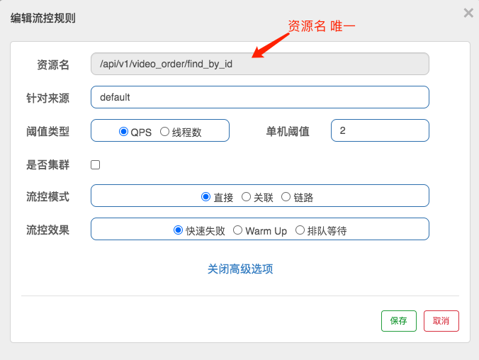


### 2、并发线程进行限流配置

> 基于并发线程进行限流配置实操

- 在订单服务（xdclass-order-service）中增加接口

```java
    @RequestMapping("list")
    public Object list(){
        // 睡眠可以模拟多线程访问
        try {
            TimeUnit.SECONDS.sleep(3);
        } catch (InterruptedException e) {
            e.printStackTrace();
        }
        Map<String,String> map  = new HashMap<>();
        map.put("title1","ALibabaCloud微服务专题");
        map.put("title2","小滴课堂面试专题第一季");
        return map;
    }
```

- 接口访问地址：http://localhost:8000/api/v1/video_order/list
- 3秒内连续访问2此接口（模拟2线程）：报错  Blocked by Sentinel (flow limiting)
- 基于统计并发线程数的流量控制

```
并发数控制用于保护业务线程池不被慢调用耗尽

Sentinel 并发控制不负责创建和管理线程池，而是简单统计当前请求上下文的线程数目（正在执行的调用数目）

如果超出阈值，新的请求会被立即拒绝，效果类似于信号量隔离。并发数控制通常在调用端进行配置
```

- **流控规则会下发到微服务，微服务如果重启，则流控规则会消失，可以持久化配置**
- 选择阈值类型 ”线程数“ ，配置是1
- 刷新浏览器


### 3、流控规则之流控效果

> 基于并发线程进行限流配置实操

- 流量控制的效果包括以下几种：

  - **直接拒绝**：默认的流量控制方式，当QPS超过任意规则的阈值后，新的请求就会被立即拒绝
  - **Warm Up**：冷启动/预热，如果系统在此之前长期处于空闲的状态，我们希望处理请求的数量是缓步的增多，经过预期的时间以后，到达系统处理请求个数的最大值

  

  - **匀速排队**：严格控制请求通过的间隔时间，也即是让请求以均匀的速度通过，对应的是漏桶算法，主要用于处理间隔性突发的流量，如消息队列，想象一下这样的场景，在某一秒有大量的请求到来，而接下来的几秒则处于空闲状态，我们希望系统能够在接下来的空闲期间逐渐处理这些请求，而不是在第一秒直接拒绝多余的请求

  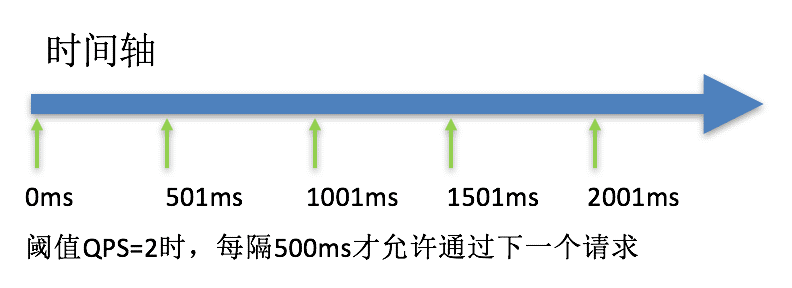
  - 注意（匀速排队）：
    - 匀速排队等待策略是 Leaky Bucket 算法结合虚拟队列等待机制实现的。
    - 匀速排队模式暂时不支持 QPS > 1000 的场景


- 流控文档：https://github.com/alibaba/Sentinel/wiki/流量控制#基于调用关系的限流


### 4、Sentinel 熔断降级规则

> 微服务高可用利器Sentinel熔断降级规

- 熔断降级（虽然是两个概念，基本都是互相配合）

  - 对调用链路中不稳定的资源进行熔断降级也是保障高可用的重要措施之一
  - 对不稳定的**弱依赖服务调用**进行熔断降级，暂时切断不稳定调用，避免局部不稳定因素导致整体的雪崩
  - 熔断降级作为保护自身的手段，通常在客户端（调用端）进行配置

   

- 什么是Sentinel降级规则：就是配置一定规则，然后满足之后就对服务进行熔断降级

  - 文档：https://github.com/alibaba/Sentinel/wiki/熔断降级

   

- Sentinel 熔断策略

  - 慢调用比例(响应时间): 选择以慢调用比例作为阈值，需要设置允许的慢调用 RT（即最大的响应时间），请求的响应时间大于该值则统计为慢调用
    - 比例阈值：修改后不生效-目前已经反馈给官方那边的bug
    - 熔断时长：超过时间后会尝试恢复
    - 最小请求数：熔断触发的最小请求数，请求数小于该值时即使异常比率超出阈值也不会熔断

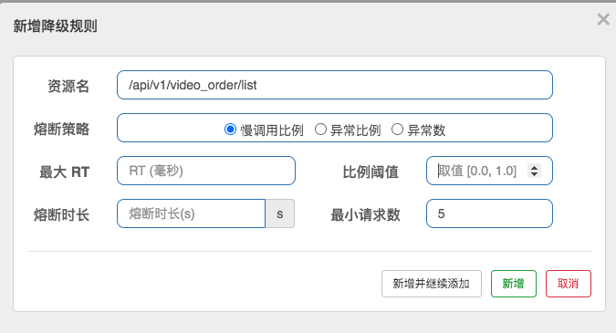


  - 异常数：当单位统计时长内的异常数目超过阈值之后会自动进行熔断
    - 熔断时长：超过时间后会尝试恢复
    - 最小请求数：熔断触发的最小请求数，请求数小于该值时即使异常比率超出阈值也不会熔断


### 5、Sentinel熔断和恢复

> 服务调用常见的熔断状态和恢复

- 服务熔断一般有三种状态（画图）
  - 熔断关闭（Closed）：服务没有故障时，熔断器所处的状态，对调用方的调用不做任何限制
  - 熔断开启（Open）：后续对该服务接口的调用不再经过网络，直接执行本地的fallback方法
  - 半熔断（Half-Open）：所谓半熔断就是尝试恢复服务调用，允许有限的流量调用该服务，并监控调用成功率


- 熔断恢复：
  - 经过熔断时长后熔断器会进入探测恢复状态（HALF-OPEN 状态）尝试恢复服务调用，允许有限的流量调用该服务，并监控调用成功率。
  - 如果成功率达到预期，则说明服务已恢复，进入熔断关闭状态；如果成功率仍旧很低，则重新进入熔断状态

   


### 6、Sentinel熔断实操

- 在订单服务（xdclass-order-service）中增加接口：

```java
    int temp = 0;
    @RequestMapping("exception")
    public Object exception(){
        temp++;
        if(temp % 3 == 0){
            throw  new RuntimeException();
        }
        Map<String,String> map  = new HashMap<>();
        map.put("title1","ALibabaCloud微服务专题");
        map.put("title2","小滴课堂面试专题第一季");
        return map;
    }
```

- 接口熔断配置：10个请求中有1个请求抛异常的话，熔断该请求10秒钟


- 熔断测试：http://localhost:8000/api/v1/video_order/exception


## 八、Sentinel+Open-Feign

### 1、AlibabaCloud版本升级-自定义降级异常不向下兼容的坑

**简介：讲解Sentinel自定义异常降级-新旧版本差异**

- 默认降级返回数据问题

  - 限流和熔断返回的数据有问题-
  - 微服务交互基本都是json格式，如果让自定义异常信息

- AlibabCloud版本升级，不兼容问题

  - v2.1.0到v2.2.0后，Sentinel里面依赖进行了改动，且不向下兼容

- 自定义降级返回数据

  - 【旧版】实现UrlBlockHandler并且重写blocked方法

  ```java
  @Component
  public class XdclassUrlBlockHandler implements UrlBlockHandler {
      @Override
      public void blocked(HttpServletRequest httpServletRequest, 
                          HttpServletResponse httpServletResponse, 
                          BlockException e) throws IOException {
         //降级业务处理
      }
  }
  ```

  - 【新版】实现BlockExceptionHandler并且重写handle方法

  ```java
  @Component
  public class XdclassUrlBlockHandler implements BlockExceptionHandler {
      @Override
      public void handle(HttpServletRequest httpServletRequest, 
                         HttpServletResponse httpServletResponse, 
                         BlockException e) throws Exception {
      //降级业务处理
      }
  }
  ```

  


### 2、Sentinel自定义降级

**简介：讲解新版Sentinel自定义异常数据开发实战**

- 异常种类

  ```java
  FlowException  //限流异常
  DegradeException  //降级异常
  ParamFlowException //参数限流异常
  SystemBlockException //系统负载异常
  AuthorityException //授权异常
  ```

- 【新版】实现BlockExceptionHandler并且重写handle方法

```java
@Component
public class XdclassUrlBlockHandler implements BlockExceptionHandler {
    @Override
    public void handle(HttpServletRequest httpServletRequest, 
                       HttpServletResponse httpServletResponse, 
                       BlockException e) throws IOException {
        Map<String,Object> backMap=new HashMap<>();
        if (e instanceof FlowException){
            backMap.put("code",-1);
            backMap.put("msg","限流-异常啦");
        }else if (e instanceof DegradeException){
            backMap.put("code",-2);
            backMap.put("msg","降级-异常啦");
        }else if (e instanceof ParamFlowException){
            backMap.put("code",-3);
            backMap.put("msg","热点-异常啦");
        }else if (e instanceof SystemBlockException){
            backMap.put("code",-4);
            backMap.put("msg","系统规则-异常啦");
        }else if (e instanceof AuthorityException){
            backMap.put("code",-5);
            backMap.put("msg","认证-异常啦");
        }

        // 设置返回json数据
        httpServletResponse.setStatus(200);
        httpServletResponse.setHeader("content-Type","application/json;charset=UTF-8");
        httpServletResponse.getWriter().write(JSON.toJSONString(backMap));
    }
}
```

 


### 3、Sentinel+OpenFeign配置


- 加入依赖

```xml
<dependency>
    <groupId>com.alibaba.cloud</groupId>
    <artifactId>spring-cloud-starter-alibaba-sentinel</artifactId>
</dependency>
```


- 开启Feign对Sentinel的支持

```yaml
feign:
  sentinel:
    enabled: true
```


- 创建容错类, 实现对应的服务接口, 记得加注解 @Service

```java
@Service
public class VideoServiceFallback implements VideoService {
    @Override
    public Video findById(int videoId) {
        Video video = new Video();
        video.setTitle("熔断降级数据");
        return video;
    }

    @Override
    public Video saveVideo(Video video) {
        return 0;//准备兜底数据
    }
}
```


- 配置feign容错类

```java
// 订单服务增加接口，服务名称记得和nacos保持一样
@FeignClient(value = "xdclass-video-service", fallback = VideoServiceFallback.class)
public interface VideoService {

    @GetMapping("/api/v1/video/find_by_id")
    Video findById(@RequestParam("videoId") int videoId);

    @PostMapping("/api/v1/video/save")
    Video saveVideo(@RequestBody Video video);
}
```


- 测试访问（关闭视频服务后测试）：http://localhost:8000/api/v1/video_order/find_by_id?videoId=30

```json
{
	"id": null,
	"outTradeNo": null,
	"state": null,
	"createTime": "2020-11-23T09:41:35.243+00:00",
	"totalFee": null,
	"videoId": null,
	"videoTitle": "熔断降级数据",
	"videoImg": null,
	"userId": null
}
```


## 九、JDK11 LTS长期支持版本

 

### 1、JDK各个版本常⻅问题讲解

- OpenJDK和OracleJDK版本区别
  - Open JDK是JDK的开放源码版本，以GPL协议的形式发布（General Public License）
  - Oracle JDK采⽤了商业实现
- LTS 是啥意思？
  - Long Term Support ⻓期⽀持的版本，如JDK8、JDK11都是属于LTS
  - JDK9 和 JDK10 这两个被称为“功能性的版本”不同, 两者均只提供半年的技术⽀持
  - 甲⻣⽂释出Java的政策，每6个⽉会有⼀个版本的释出，⻓期⽀持版本每三年发布⼀次，根据 后续的发布计划，下⼀个⻓期⽀持版 Java 17 将于2021年发布
- 8u20、11u20是啥意思？
  - 就是Java的补丁，⽐如JDK8的 8u20版本、8u60版本; java11的 11u20、11u40版本

 

### 2、Maven JDK11 配置

- 下载安装包
- IDEA配置：procject structure=》偏好设置=》编译版本
- maven项目配置

```xml
    <properties>
        <java.version>11</java.version>
        <maven.compiler.source>11</maven.compiler.source>
        <maven.compiler.target>11</maven.compiler.target>
    </properties>
```

- 版本选择：
  - 只要不是JDK8以下就行，
  - 也不建议用最新的，比如现在JDK14或者JDK17是吧
  - 涉及到中间件的升级，不排除有些版本是把老版本的代码删除了，就GG了


## 十、微服务核心组件之网关

### 1、什么是微服务的网关

**简介：介绍什么是微服务的网关和应用场景**

- 什么是网关

  - API Gateway，是系统的唯一对外的入口，介于客户端和服务器端之间的中间层，处理非业务功能 提供路由请求、鉴权、监控、缓存、限流等功能

  - 统一接入

    - 智能路由
    - AB测试、灰度测试
    - 负载均衡、容灾处理
    - 日志埋点（类似Nignx日志）

  - 流量监控

    - 限流处理
    - 服务降级

  - 安全防护

    - 鉴权处理
    - 监控
    - 机器网络隔离

     

- 主流的网关

  - zuul：是Netflix开源的微服务网关，和Eureka,Ribbon,Hystrix等组件配合使用，依赖组件比较多，性能教差
  - kong：由Mashape公司开源的，基于Nginx的API gateway
  - nginx+lua：是一个高性能的HTTP和反向代理服务器,lua是脚本语言，让Nginx执行Lua脚本，并且高并发、非阻塞的处理各种请求
  - springcloud gateway：Spring公司专门开发的网关，替代zuul

  > 注意：AlibabaCloud全家桶还没对应的网关，我们就用SpringCloud官方推荐的Gateway

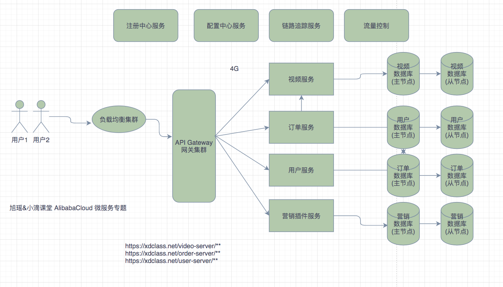


### 2、SpringCloud Gateway

- 官方文档：https://spring.io/projects/spring-cloud-gateway

- 什么是 SpringCloud Gateway
  - Spring官方出品，基于Spring5+Reactor技术开发的网关
  - 性能强劲基于Reactor+WebFlux、功能多样
  - 基于springboot2.x, 直接可以jar包方式运行


- IDEA 创建 Gateway 项目工程。

- 添加依赖

```xml
        <dependency>
            <groupId>org.springframework.cloud</groupId>
            <artifactId>spring-cloud-starter-gateway</artifactId>
        </dependency>
```

 

- 配置实战

```yaml
server:
  port: 8888
spring:
  application:
    name: api-gateway
  cloud:
    gateway:
      routes: #数组形式
        - id: order-service  #路由唯一标识
          uri: http://127.0.0.1:8000  #想要转发到的地址
          order: 1 #优先级，数字越小优先级越高
          predicates: #断言 配置哪个路径才转发
            - Path=/order-server/**
          filters: #过滤器，请求在传递过程中通过过滤器修改
            - StripPrefix=1  #去掉第一层前缀

# 访问路径 http://localhost:8888/order-server/api/v1/video_order/list
# 转发路径 http://localhost:8000/order-server/api/v1/video_order/list  
# 需要过滤器去掉前面第一层后实际转发到的是 http://localhost:8000/api/v1/video_order/list
```


### 3、Gateway整合Nacos

- 原先存在的问题：微服务地址写死、负载均衡没做到

- 添加Nacos服务治理配置

  - 网关添加naocs依赖

  ```xml
          <!--添加nacos客户端-->
          <dependency>
              <groupId>com.alibaba.cloud</groupId>
              <artifactId>spring-cloud-starter-alibaba-nacos-discovery</artifactId>
          </dependncy>
  ```

  - 启动类开启支持

  ```
  @EnableDiscoveryClient
  ```

  - 修改配置文件

  ```yaml
  server:
    port: 8888
  spring:
    application:
      name: api-gateway
    cloud:
      nacos:
        discovery:
          server-addr: 127.0.0.1:8848
  
      gateway:
        routes: #数组形式
          - id: order-service  #路由唯一标识
            #uri: http://127.0.0.1:8000  #想要转发到的地址
            uri: lb://xdclass-order-service  # 从nacos获取名称转发,lb是负载均衡轮训策略
  
            predicates: #断言 配置哪个路径才转发
              - Path=/order-server/**
            filters: #过滤器，请求在传递过程中通过过滤器修改
              - StripPrefix=1 #去掉第一层前缀
        discovery:
          locator:
            enabled: true  #开启网关拉取nacos的服务
            
  ## 访问路径 http://localhost:8888/order-server/api/v1/video_order/list
  ```

  

### 4、Gateway配置和交互流程

**简介：讲解SpringCloud Gateway架构流程**

- 网关的配置项回顾

  - 路由：是网关的基本单元，由ID、URI、一组Predicate、一组Filter组成，根据Predicate进行匹配转发

  ```
  route:
    - id：路由的ID
      uri：匹配路由的转发地址
      predicates：配置该路由的断言，通过PredicateDefinition类进行接收配置。
      order：路由的优先级，数字越小，优先级越高。
  ```

- 交互流程

  - 客户端向Spring Cloud Gateway发出请求
  - 如果网关处理程序映射确定请求与路由匹配，则将其发送到网关Web处理程序
  - 通过特定过滤器链运行，前置处理-后置处理


### 5、Gateway内置路由断言

**简介：讲解Gateway内置的路由断言**

- 什么是Gateway路由断言
  - Predicate 来源于Java8，接受输入参数，返回一个布尔值结果
  - Spring Cloud Gateway 中 Spring 利用 Predicate 的特性实现了各种路由匹配规则
  - 转发的判断条件，SpringCloud Gateway支持多种方式，常见如：Path、Query、Method、Header等
  - 支持多个`Predicate`请求的转发是必须满足所有的`Predicate`后才可以进行路由转发

 

- 内置路由断言介绍 `RoutePredicateFactory` 接口实现类：


- 参数编写规则 XXXRoutePredicateFactory，使用XXX作为参数配置, 例如下面：

```yaml
predicates:
  - Host=
  - Path=
  - Method=
  - Header=
  - Query=
  - Cookie=
```


### 6、Gateway实现接口定时下线

- 需求：接口需要在指定时间进行下线，过后不可以在被访问
  - 使用Before ,只要当前时间小于设定时间，路由才会匹配请求
  - 东8区的2020-09-11T01:01:01.000+08:00后，请求不可访问
  - 为了方便测试，修改时间即可

```yaml
spring:
  cloud:
    gateway:
      routes:
        - id: order-service
          uri: lb://xdclass-order-service
          predicates: #断言 配置哪个路径才转发
            - Before=2020-09-09T01:01:01.000+08:00
```


### 7、Gateway 全局过滤器

- 过滤器生命周期

  - PRE： 这种过滤器在请求被路由之前调用,一般用于鉴权、限流等
  - POST：这种过滤器在路由到微服务以后执行，一般用于修改响应结果，比如增加header信息、打点结果日志

   

- 网关过滤器分类

  - 局部过滤器GatewayFilter：应用在某个路由上,每个过滤器工厂都对应一个实现类，并且这些类的名称必须以 XXX开头，GatewayFilterFactory 结尾
  - 全局过滤器：作用全部路由上,

- 内置很多局部过滤器，顶级接口：`GatewayFilterFactory`


- 内置很多全局过滤器，顶级接口：`GlobalFilter`


- 自定义全局过滤器实现鉴权

```java
@Component
public class UserGlobalFilter implements GlobalFilter,Ordered {
    
    @Override
    public Mono<Void> filter(ServerWebExchange exchange, GatewayFilterChain chain) {
        // 从headerrs中获取token
        String token = exchange.getRequest().getHeaders().getFirst("token");
        System.out.println(token);
        
        // 伪代码实现token无效返回错误码
        if(StringUtils.isBlank(token)){
            exchange.getResponse().setStatusCode(HttpStatus.UNAUTHORIZED);
            return exchange.getResponse().setComplete();
        }

        // 继续往下执行
        return chain.filter(exchange);

    }

    //数字越小，优先级越高
    @Override
    public int getOrder() {
        return 0;
    }
}
```

- 路径 ：http://localhost:8888/order-server/api/v1/video_order/list?source=wechat
- 注意：网关不要加太多业务逻辑，否则会影响性能，务必记住


## 十一、Sleuth+Zipkin 链路追踪

 

### 1、SpringCloud Sleuth 介绍

> 微服务链路追踪系统的作用

- 抛两个常见的问题
  - 微服务调用链路出现了问题怎么快速排查？
  - 微服务调用链路耗时长怎么定位是哪个服务？
- 链路追踪系统：
  - leuth是Spring Cloud的组件之一，它为Spring Cloud实现了一种分布式追踪解决方案，兼容Zipkin，HTrace和其他基于日志的追踪系统，例如 ELK（Elasticsearch 、Logstash、 Kibana）。
- 核心：将一次请求分布式调用，使用GPS定位串起来，记录每个调用的耗时、性能等日志，并通过可视化工具展示出来

- 注意：AlibabaCloud全家桶还没对应的链路追踪系统，我们使用Sleuth和zipkin（内部使用的鹰眼）


- 什么是Sleuth（专门用于记录链路数据的开源组件）

  - 文档：https://spring.io/projects/spring-cloud-sleuth
  - 添加依赖：

  ```xml
   		<dependency>
              <groupId>org.springframework.cloud</groupId>
              <artifactId>spring-cloud-starter-sleuth</artifactId>
          </dependency>
  ```

  ```
  微服务启动后控制台会输出如下信息：
      [order-service,96f95a0dd81fe3ab,852ef4cfcdecabf3,false]
      
      第一个值：spring.application.name的值
      
      第二个值：96f95a0dd81fe3ab ，sleuth生成的一个ID，叫Trace ID，用来标识一条请求链路，一条请求链路中包含一个Trace ID，多个Span ID
      
      第三个值：852ef4cfcdecabf3、spanid 基本的工作单元，获取元数据，如发送一个http
      
      第四个值：false，是否要将该信息输出到zipkin服务中来收集和展示。
  ```

  


### 2、可视化链路组件 Zipkin

- 什么是zipkin

  - 官网：https://zipkin.io/
  - 大规模分布式系统的APM工具（Application Performance Management）,基于Google Dapper的基础实现，和sleuth结合可以提供可视化web界面分析调用链路耗时情况

- 同类产品

  - 鹰眼（EagleEye）
  - CAT
  - twitter开源zipkin，结合sleuth
  - Pinpoint，运用JavaAgent字节码增强技术
  - StackDriver Trace （Google）

  

- 安装使用：
```bash
# Linux或mac 安装和启动
curl -sSL https://zipkin.io/quickstart.sh | bash -s
java -jar zipkin.jar

# windows下载地址：https://dl.bintray.com/openzipkin/maven/io/zipkin/java/zipkin-server/
# windows 安装启动
java -jar zipkin-server-2.12.9-exec.jar

# docker 安装使用
docker pull openzipkin/zipkin:latest
docker run -d -p 9411:9411 --name zipkin openzipkin/zipkin
```


  - 访问入口：http://127.0.0.1:9411/zipkin/
  - zipkin组成：Collector、Storage、Restful API、Web UI组成

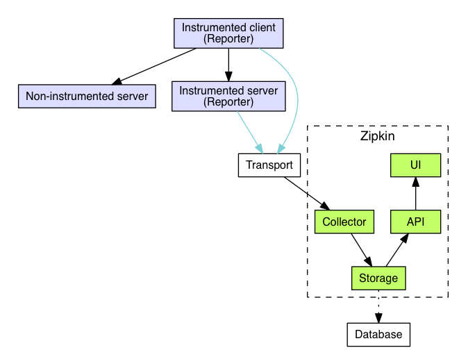


### 3、Sleuth+Zipkin 整合

> 使用Zipkin+Sleuth业务分析调用链路分析实战

- Sleuth收集跟踪信息通过http请求发送给 zipkin server
- zipkin server 进行跟踪信息的存储以及提供 Rest API 即可
- Zipkin UI 调用其API接口进行数据展示默认存储是内存，可也用mysql 或者elasticsearch等存储
- 微服务加入依赖：

```xml
<dependency>
    <groupId>org.springframework.cloud</groupId>
    <artifactId>spring-cloud-starter-zipkin</artifactId>
</dependency>
```

- 配置地址和采样百分比配置：

```yaml
spring:
  application:
    name: api-gateway
  zipkin:
    base-url: http://127.0.0.1:9411/ # zipkin地址
    discovery-client-enabled: false  # 不用开启服务发现

  sleuth:
    sampler:
      probability: 1.0 # 采样百分比
      
# 默认为0.1，即10%，这里配置1，是记录全部的sleuth信息，是为了收集到更多的数据（仅供测试用）。
# 在分布式系统中，过于频繁的采样会影响系统性能，所以这里配置需要采用一个合适的值。
```

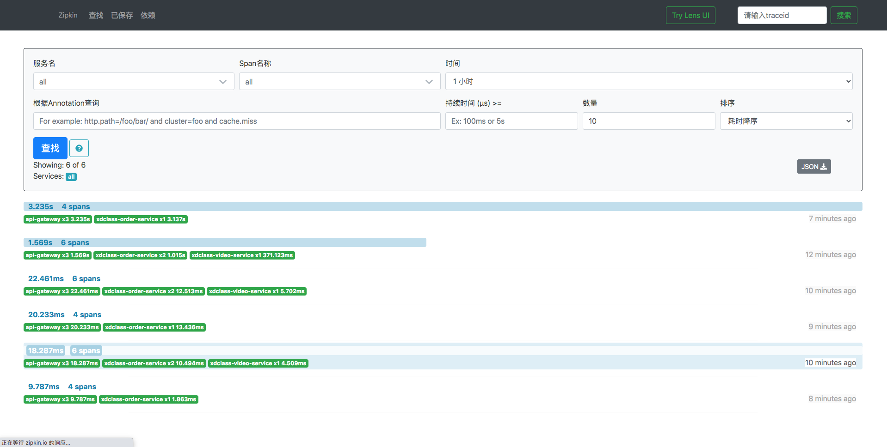

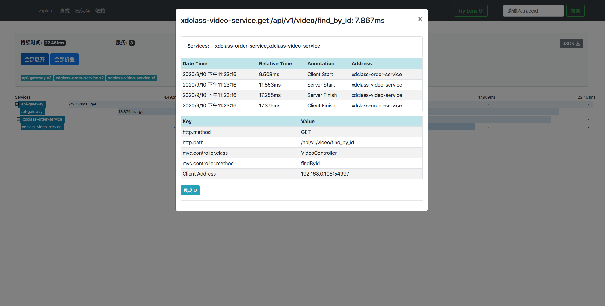


### 4、Zipkin 持久化配置

> 实战zipkin+sleuth链路追踪日志持久化

- 现存在的问题
  
  - 服务重启会导致链路追踪系统数据丢失
  
- 持久化配置：mysql或者elasticsearch
  - 创建数据库表SQL脚本（库名：zipkin_log）：
  
  ```sql
  CREATE TABLE IF NOT EXISTS zipkin_spans (
      `trace_id_high` BIGINT NOT NULL DEFAULT 0 COMMENT 'If non zero, this means the trace uses 128 bit traceIds instead of 64 bit',
      `trace_id` BIGINT NOT NULL,
      `id` BIGINT NOT NULL,
      `name` VARCHAR(255) NOT NULL,
      `remote_service_name` VARCHAR(255),
      `parent_id` BIGINT,
      `debug` BIT(1),
      `start_ts` BIGINT COMMENT 'Span.timestamp(): epoch micros used for endTs query and to implement TTL',
      `duration` BIGINT COMMENT 'Span.duration(): micros used for minDuration and maxDuration query',
      PRIMARY KEY (`trace_id_high`, `trace_id`, `id`)
  ) ENGINE=InnoDB ROW_FORMAT=COMPRESSED CHARACTER SET=utf8 COLLATE utf8_general_ci;
  
  ALTER TABLE zipkin_spans ADD INDEX(`trace_id_high`, `trace_id`) COMMENT 'for getTracesByIds';
  ALTER TABLE zipkin_spans ADD INDEX(`name`) COMMENT 'for getTraces and getSpanNames';
  ALTER TABLE zipkin_spans ADD INDEX(`remote_service_name`) COMMENT 'for getTraces and getRemoteServiceNames';
  ALTER TABLE zipkin_spans ADD INDEX(`start_ts`) COMMENT 'for getTraces ordering and range';
  
  CREATE TABLE IF NOT EXISTS zipkin_annotations (
      `trace_id_high` BIGINT NOT NULL DEFAULT 0 COMMENT 'If non zero, this means the trace uses 128 bit traceIds instead of 64 bit',
      `trace_id` BIGINT NOT NULL COMMENT 'coincides with zipkin_spans.trace_id',
      `span_id` BIGINT NOT NULL COMMENT 'coincides with zipkin_spans.id',
      `a_key` VARCHAR(255) NOT NULL COMMENT 'BinaryAnnotation.key or Annotation.value if type == -1',
      `a_value` BLOB COMMENT 'BinaryAnnotation.value(), which must be smaller than 64KB',
      `a_type` INT NOT NULL COMMENT 'BinaryAnnotation.type() or -1 if Annotation',
      `a_timestamp` BIGINT COMMENT 'Used to implement TTL; Annotation.timestamp or zipkin_spans.timestamp',
      `endpoint_ipv4` INT COMMENT 'Null when Binary/Annotation.endpoint is null',
      `endpoint_ipv6` BINARY(16) COMMENT 'Null when Binary/Annotation.endpoint is null, or no IPv6 address',
      `endpoint_port` SMALLINT COMMENT 'Null when Binary/Annotation.endpoint is null',
      `endpoint_service_name` VARCHAR(255) COMMENT 'Null when Binary/Annotation.endpoint is null'
  ) ENGINE=InnoDB ROW_FORMAT=COMPRESSED CHARACTER SET=utf8 COLLATE utf8_general_ci;
  
  ALTER TABLE zipkin_annotations ADD UNIQUE KEY(`trace_id_high`, `trace_id`, `span_id`, `a_key`, `a_timestamp`) COMMENT 'Ignore insert on duplicate';
  ALTER TABLE zipkin_annotations ADD INDEX(`trace_id_high`, `trace_id`, `span_id`) COMMENT 'for joining with zipkin_spans';
  ALTER TABLE zipkin_annotations ADD INDEX(`trace_id_high`, `trace_id`) COMMENT 'for getTraces/ByIds';
  ALTER TABLE zipkin_annotations ADD INDEX(`endpoint_service_name`) COMMENT 'for getTraces and getServiceNames';
  ALTER TABLE zipkin_annotations ADD INDEX(`a_type`) COMMENT 'for getTraces and autocomplete values';
  ALTER TABLE zipkin_annotations ADD INDEX(`a_key`) COMMENT 'for getTraces and autocomplete values';
  ALTER TABLE zipkin_annotations ADD INDEX(`trace_id`, `span_id`, `a_key`) COMMENT 'for dependencies job';
  
  CREATE TABLE IF NOT EXISTS zipkin_dependencies (
      `day` DATE NOT NULL,
      `parent` VARCHAR(255) NOT NULL,
      `child` VARCHAR(255) NOT NULL,
      `call_count` BIGINT,
      `error_count` BIGINT,
      PRIMARY KEY (`day`, `parent`, `child`)
  ) ENGINE=InnoDB ROW_FORMAT=COMPRESSED CHARACTER SET=utf8 COLLATE utf8_general_ci;
  ```
  
  - 启动命令：
  
  ```bash
  java -jar zipkin-server-2.12.9-exec.jar --STORAGE_TYPE=mysql --MYSQL_HOST=127.0.0.1 --MYSQL_TCP_PORT=3306 --MYSQL_DB=zipkin_log --MYSQL_USER=root --MYSQL_PASS=password
  ```
  
  


## 十二、分布式配置中心

 

### 1、分布式配置中心

> 什么是配置中心及使用前后的好处

- 现在微服务存在的问题
  - 配置文件增多，不好维护
  - 修改配置文件需要重新发布
- 什么是配置中心：统一管理配置, 快速切换各个环境的配置
- 相关产品：
  - 百度的disconf 地址：https://github.com/knightliao/disconf
  - 阿里的diamand 地址：https://github.com/takeseem/diamond
  - springcloud 的 configs-server：地址：http://cloud.spring.io/spring-cloud-config/
  - 阿里 Nacos：既可以当服务治理，又可以当配置中心，Nacos = Eureka + Config


### 2、配置中心-Nacos

- 官方文档：https://github.com/alibaba/spring-cloud-alibaba/wiki/Nacos-config

- Nacos配置中心面板

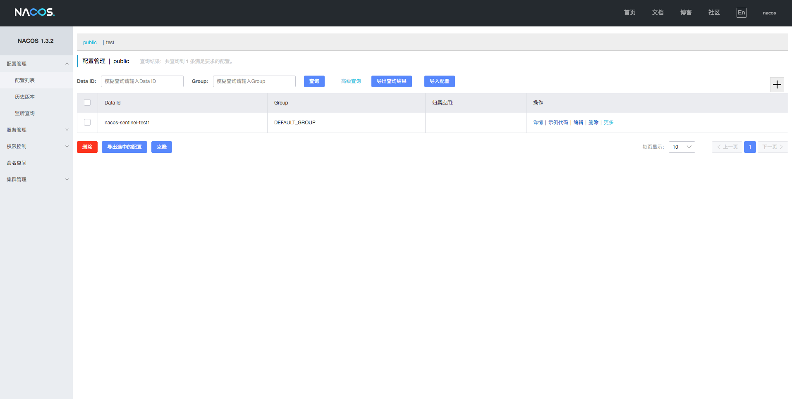

- 项目添加依赖：

```xml
        <dependency>
            <groupId>com.alibaba.cloud</groupId>
            <artifactId>spring-cloud-starter-alibaba-nacos-config</artifactId>
        </dependency>
```


### 3、Nacos 实战

- 配置文件优先级：

  - 需要新建 bootstrap.yml 作为配置文件，不能使用原先的 application.yml（使用也可以，注意优先级）
  - 配置读取优先级 bootstrap.yml > application.yml

- 配置实操

  - 订单服务迁移配置（xdclass-order-service）
  - 增加bootstrap.yml

  ```yaml
  spring:
    application:
      name: xdclass-order-service
    cloud:
      nacos:
        config:
          server-addr: 127.0.0.1:8848 # Nacos配置中心地址
          file-extension: yaml # 文件拓展格式
    profiles:
      active: dev
  ```

- 启动微服务服务验证：
  - 测试是否可以获取配置：http://127.0.0.1:8848/nacos/v1/cs/configs?dataId=xdclass-order-service-dev.yaml&group=DEFAULT_GROUP
  - 如果出现 config dta not exist 建议重启 nacos
  - 如果还是拉取不到配置：mvn clean package -U -》然后重启IDEA


- dataId 组成，在 Nacos Spring Cloud 中，dataId 的完整格式如下

```
${prefix}-${spring.profiles.active}.${file-extension}

prefix 默认为：spring.application.name 的值

spring.profiles.active 即为当前环境对应的 spring.profile.active 的值
spring.profiles.active 为空时，对应的连接符 - 也将不存在，dataId 的拼接格式变成 ${prefix}.${file-extension}

file-exetension 为配置内容的数据格式，可以通过配置项 spring.cloud.nacos.config.file-extension 来配置。目前只支持 properties 和 yaml 类型。
```


### 4、Nacos 配置动态刷新

- 在Nacos配置文件中增加配置：

```yaml
video:
  title: springboot
```

- 编写代码：

```java
@RefreshScope
public class OrderController {
    @Value("${video.title}")
    private String videoTitle;
}
```

- 然后多次尝试修改配置文件的值，并且访问接口测试。