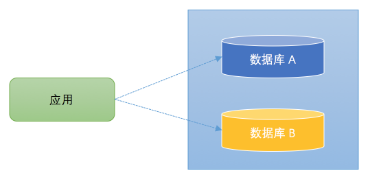
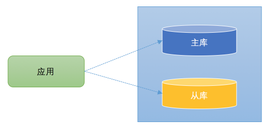
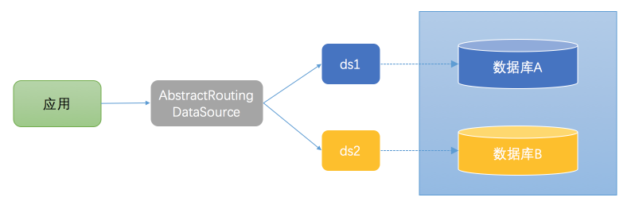
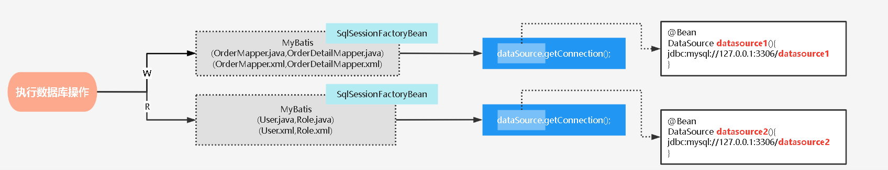

# 一、多数据源的典型使用场景

在实际开发中，经常可能遇到在一个应用中可能需要访问多个数据库的情况。以下是两种典型场景：

## 1、业务复杂（数据量大）

数据分布在不同的数据库中，数据库拆了， 应用没拆。 一个公司多个子项目，各用各的数据库，涉及数据共享…




## 2、读写分离（读多写少）

- 为了解决数据库的读性能瓶颈（读比写性能更高， 写锁会影响读阻塞，从而影响读的性能）。
- 很多数据库拥主从架构。也就是，一台主数据库服务器，是对外提供增删改业务的生产服务器；另一（多）台从数据库服务器，主要进行读的操作。
- 可以通过中间件(ShardingSphere、mycat、mysql-proxy 、TDDL …)，但是有一些规模较小的公司，没有专门的中间件团队搭建读写分离基础设施，因此需要业务开发人员自行实现读写分离。



这里的架构与上图类似。不同的是，在读写分离中，主库和从库的数据库是一致的(不考虑主从延迟)。数据更新操作（insert、update、delete）都是在主库上进行，主库将数据变更信息同步给从库。在查询时，可以在从库上进行，从而分担主库的压力。


## 3、解决方案

1、思路分析：

- 要想配置多个数据源，必须新增配置文件。（你不写配置，系统怎么知道）
- 要有地方能够配置多数据源。（读出配置，告诉系统）
- 要能够选择用什么数据源。（系统知道有哪些，但是要我们自己指定用哪个）

2、实现方式：

- 一种是静态数据源配置，配置好确定的数据源，想用哪个切换到哪个
- 另一种是动态数据源配置，我们可以运行时新增数据源以及切换数据源

3、事务分析：

1. 事务的使用必须要指明是哪个数据源的事务管理器，否则事务失效。 例如：@Transactional(value = "userTransactionManager")
2. 如果一个方法涉及多个数据源操作，此时无法做到同时回滚，尽量避免这种操作，这里涉及到分布式事务处理，可自行研究。


# 二、多数据源实现原理及方法

## 1、实现原理

对于大多数的java应用，都使用了spring框架，spring-jdbc模块提供AbstractRoutingDataSource，其内部可以包含了多个DataSource，然后在运行时来动态的访问哪个数据库。这种方式访问数据库的架构图如下所示：



应用直接操作的是 AbstractRoutingDataSource 的实现类，告诉 AbstractRoutingDataSource 访问哪个数据库，然后由 AbstractRoutingDataSource 从事先配置好的数据源（ds1、ds2）选择一个，来访问对应的数据库。

1. 当执行数据库持久化操作，只要集成了Spring就一定会通过DataSourceUtils获取Connection
2. 通过Spring注入的DataSource获取Connection即可执行数据库操作。所以思路就是：只需配置一个实现了DataSource的Bean, 然后根据业务动态提供Connection即可
3. 其实Spring已经提供一个DataSource实现类用于动态切换数据源——AbstractRoutingDataSource
4. 分析AbstractRoutingDataSource即可实现动态数据源切换。


## 2、通过AbstractRoutingDataSource实现动态数据源

通过这个类可以实现动态数据源切换。如下是这个类的成员变量：

```java
private Map<Object, Object> targetDataSources;
private Object defaultTargetDataSource;
private Map<Object, DataSource> resolvedDataSources;
```

- targetDataSources：保存了key和数据库连接的映射关系。
- defaultTargetDataSource：标识默认的连接。
- resolvedDataSources：这个数据结构是通过targetDataSources构建而来，存储结构也是数据库标识和数据源的映射关系。

而 AbstractRoutingDataSource 实现了 InitializingBean 接口，并实现了 afterPropertiesSet 方法。afterPropertiesSet 方法是初始化 bean 的时候执行，通常用作数据初始化。（resolvedDataSources 就是在这里赋值）

```java
@Override
public void afterPropertiesSet() {
    if (this.targetDataSources == null) {
        throw new IllegalArgumentException("Property 'targetDataSources' is required");
    } else {
        // 初始化resolvedDataSources
        this.resolvedDataSources = CollectionUtils.newHashMap(this.targetDataSources.size());
        // 循环targetDataSources，并添加到resolvedDataSources中
        this.targetDataSources.forEach((key, value) -> {
            Object lookupKey = this.resolveSpecifiedLookupKey(key);
            DataSource dataSource = this.resolveSpecifiedDataSource(value);
            this.resolvedDataSources.put(lookupKey, dataSource);
        });
        if (this.defaultTargetDataSource != null) {
            this.resolvedDefaultDataSource = this.resolveSpecifiedDataSource(this.defaultTargetDataSource);
        }
    }
}
```

- 所以，我们只需创建AbstractRoutingDataSource实现类DynamicDataSource然后初始化targetDataSources和key为数据源标识（可以是字符串、枚举、都行，因为标识是Object）、defaultTargetDataSource即可
- 后续当调用AbstractRoutingDataSource.getConnection 会接着调用提供的模板方法：determineTargetDataSource
- 通过determineTargetDataSource该方法返回的数据库标识从resolvedDataSources中拿到对应的数据源
- 所以，我们只需DynamicDataSource中实现determineTargetDataSource为其提供一个数据库标识

总结：在整个代码中我们只需做4件大事：

1. 定义AbstractRoutingDataSource实现类DynamicDataSource
2. 初始化时为targetDataSources设置不同数据源的DataSource和标识、及defaultTargetDataSource
3. 在determineTargetDataSource中提供对应的数据源标识即可
4. 切换数据源标识即可

**什么到这还不会？ 附上代码：**

（1）配置多数据源和 `AbstractRoutingDataSource`的自定义实现类：`DynamicDataSource`

**配置多数据：**

application.yml:

```yaml
spring:
  datasource:
    type: com.alibaba.druid.pool.DruidDataSource
    datasource1:
      url: jdbc:mysql://127.0.0.1:3306/datasource1?serverTimezone=UTC&useUnicode=true&characterEncoding=UTF8&useSSL=false
      username: root
      password: 123456
      initial-size: 1
      min-idle: 1
      max-active: 20
      test-on-borrow: true
      driver-class-name: com.mysql.cj.jdbc.Driver
    datasource2:
      url: jdbc:mysql://127.0.0.1:3306/datasource2?serverTimezone=UTC&useUnicode=true&characterEncoding=UTF8&useSSL=false
      username: root
      password: 123456
      initial-size: 1
      min-idle: 1
      max-active: 20
      test-on-borrow: true
      driver-class-name: com.mysql.cj.jdbc.Driver
```

DynamicDataSourceConfig.java:

```java
@Configuration
public class DynamicDataSourceConfig {

    @Bean
    @ConfigurationProperties("spring.datasource.datasource1")
    public DataSource firstDataSource(){
        return DruidDataSourceBuilder.create().build();
    }

    @Bean
    @ConfigurationProperties("spring.datasource.datasource2")
    public DataSource secondDataSource(){
        return DruidDataSourceBuilder.create().build();
    }

    @Bean
    @Primary
    public DynamicDataSource dataSource(DataSource firstDataSource, DataSource secondDataSource) {
        Map<Object, Object> targetDataSources = new HashMap<>(5);
        targetDataSources.put(DataSourceNames.FIRST, firstDataSource);
        targetDataSources.put(DataSourceNames.SECOND, secondDataSource);
        return new DynamicDataSource(firstDataSource, targetDataSources);
    }
}
```

DynamicDataSource.java:

```java
public class DynamicDataSource extends AbstractRoutingDataSource {

    /**
    * ThreadLocal 用于提供线程局部变量，在多线程环境可以保证各个线程里的变量独立于其它线程里的变量。
    * 也就是说 ThreadLocal 可以为每个线程创建一个【单独的变量副本】，相当于线程的 private static 类型变量。
    */
    private static final ThreadLocal<String> CONTEXT_HOLDER = new ThreadLocal<>();

    /**
    * 决定使用哪个数据源之前需要把多个数据源的信息以及默认数据源信息配置好
    *
    * @param defaultTargetDataSource 默认数据源
    * @param targetDataSources 目标数据源
    */
    public DynamicDataSource(DataSource defaultTargetDataSource, Map<Object, Object> targetDataSources) {
        super.setDefaultTargetDataSource(defaultTargetDataSource);
        super.setTargetDataSources(targetDataSources);
        super.afterPropertiesSet();
    }

    @Override
    protected Object determineCurrentLookupKey() {
        return getDataSource();
    }

    public static void setDataSource(String dataSource) {
        CONTEXT_HOLDER.set(dataSource);
    }

    public static String getDataSource() {
        return CONTEXT_HOLDER.get();
    }

    public static void clearDataSource() {
        CONTEXT_HOLDER.remove();
    }
}
```


## 3、多数据源切换方式

多数据源切换方式需要根据我们的具体需求进行选择：

1. AOP + 自定义注解
2. MyBatis插件

### 3.1、AOP + 自定义注解

用于不同业务的数据源： 一般利用AOP，结合自定义注解动态切换数据源

1、自定义注解

```java
@Target({ElementType.METHOD,ElementType.TYPE})
@Retention(RetentionPolicy.RUNTIME)
public @interface WR {
    String value() default "W";
}
```

2、切面类

```java
@Component
@Aspect
public class DynamicDataSourceAspect {
    // 前置通知
    @Before("within(com.tuling.dynamic.datasource.service.impl.*) && @annotation(wr)")
    public void before(JoinPoint joinPoint, WR wr){
        System.out.println(wr.value());
    }
}
```

3、使用注解

```java
@Service
public class FrendImplService implements FrendService {
    @Autowired
    FrendMapper frendMapper;

    @Override
    @WR("R") // 库2
    public List<Frend> list() {
        return frendMapper.list();
    }

    @Override
    @WR("W") // 库1
    public void save(Frend frend) {
        frendMapper.save(frend);
    }
}
```


### 3.2、MyBatis 插件

用于读写分离的数据源：如果是MyBatis可以结合插件实现读写分离动态切换数据源

```java
@Intercepts(
    {@Signature(type = Executor.class, method = "update", args = {MappedStatement.class, Object.class}),
     @Signature(type = Executor.class, method = "query", args = {MappedStatement.class, Object.class, RowBounds.class,ResultHandler.class})})
public class DynamicDataSourcePlugin implements Interceptor {

    @Override
    public Object intercept(Invocation invocation) throws Throwable {

        Object[] objects = invocation.getArgs();
        MappedStatement ms = (MappedStatement) objects[0];
        // 读方法
        if (ms.getSqlCommandType().equals(SqlCommandType.SELECT)) {
            DynamicDataSource.name.set("R");
        } else {
            // 写方法
            DynamicDataSource.name.set("W");
        }
        // 修改当前线程要选择的数据源的key
        return invocation.proceed();
    }

    @Override
    public Object plugin(Object target) {
        if (target instanceof Executor) {
            return Plugin.wrap(target, this);
        } else {
            return target;
        }
    }

    @Override
    public void setProperties(Properties properties) {

    }
}
```


## 4、Spring集成多个MyBatis框架实现多数据源



1、WDataSourceConfig.java:

```java
@MapperScan(basePackages = "com.tuling.dynamic.datasource.mapper.w", sqlSessionFactoryRef = "wSqlSessionFactory")
public class WDataSourceConfig {
    @Bean
    @Primary
    public SqlSessionFactory wSqlSessionFactory(@Qualifier("dataSource1") DataSource dataSource1) throws Exception {
        final SqlSessionFactoryBean sessionFactory = new SqlSessionFactoryBean();
        sessionFactory.setDataSource(dataSource1);
        sessionFactory.setMapperLocations(new PathMatchingResourcePatternResolver().getResources("classpath:mapper/w/*.xml"));
        /*主库设置sql控制台打印*/
        org.apache.ibatis.session.Configuration configuration = new org.apache.ibatis.session.Configuration();
        configuration.setLogImpl(StdOutImpl.class);
        sessionFactory.setConfiguration(configuration);
        return sessionFactory.getObject();
    }
}
```

2、RDataSourceConfig.java:

```java
@MapperScan(basePackages = "com.tuling.dynamic.datasource.mapper.r", sqlSessionFactoryRef = "rSqlSessionFactory")
public class RMyBatisConfig {
    @Bean
    public SqlSessionFactory rSqlSessionFactory(@Qualifier("dataSource2") DataSource dataSource2) throws Exception {
        final SqlSessionFactoryBean sessionFactory = new SqlSessionFactoryBean();
        sessionFactory.setDataSource(dataSource2);
        sessionFactory.setMapperLocations(new PathMatchingResourcePatternResolver().getResources("classpath:mapper/r/*.xml"));
        /*从库设置sql控制台打印*/
        org.apache.ibatis.session.Configuration configuration = new org.apache.ibatis.session.Configuration();
        configuration.setLogImpl(StdOutImpl.class);
        sessionFactory.setConfiguration(configuration);
        return sessionFactory.getObject();
    }
}
```


# 三、多数据源事务控制

在多数据源下，由于涉及到数据库的多个读写。一旦发生异常就可能会导致数据不一致的情况， 在这种情况希望使用事务进行回退。
Spring的声明式事务在一次请求线程中只能使用一个数据源进行控制。
但是是对于多源数据库：

1. 单一事务管理器(TransactionManager)无法切换数据源，需要配置多个TransactionManager。
2. @Transactionnal是无法管理多个数据源的。 如果想真正实现多源数据库事务控制，肯定是需要分布式事务。这里讲解多源数据库事务控制的一种变通方式。

```java
@Bean
public DataSourceTransactionManager transactionManager1(DynamicDataSource dataSource){
    DataSourceTransactionManager dataSourceTransactionManager = new DataSourceTransactionManager();
    dataSourceTransactionManager.setDataSource(dataSource);
    return dataSourceTransactionManager;
}

@Bean
public DataSourceTransactionManager transactionManager2(DynamicDataSource dataSource){
    DataSourceTransactionManager dataSourceTransactionManager = new DataSourceTransactionManager();
    dataSourceTransactionManager.setDataSource(dataSource);
    return dataSourceTransactionManager;
}
```


## 1、只使用主库 TransactionManger

使用主库事务管理器，也就是说事务中产生异常时，只能回滚主库数据。但是因为数据操作顺序是先主后从，所以分一下三种情况：

- （1）主库插入时异常，主库未插成功，这时候从库还没来及插入，主从数据是还是一致的
- （2）主库插入成功，从库插入时异常，这时候在主库事务管理器监测到事务中存在异常，将之前插入的主库数据插入，主从数据还是一致的
- （3）主库插入成功，从库插入成功，事务结束，主从数据一致

```java
@Override
@WR("W")
public void save(Frend frend) {
    frendMapper.save(frend);
    // int a=1/0; 1.主库插入时异常，主库未插成功，这时候从库还没来及插入，主从数据是还是一致的
}

@Override
@WR("R")
@Transactional(transactionManager = "transactionManager2",propagation= Propagation.REQUIRES_NEW)
public void saveRead(Frend frend) {
    frend.setName("xushu");
    frendMapper.save(frend);
    // int a=1/0; 2.主库插入成功，从库插入时异常，这时候在主库事务管理器监测到事务中存在异常，将之前插入的主库数据插入，主从数据还是一致的
}

@Override
@Transactional(transactionManager = "transactionManager1")
public void saveAll(Frend frend) {
    // 3. 无异常情况：主库插入成功，从库插入成功，事务结束，主从数据一致。
    FrendService self= (FrendService)AopContext.currentProxy();
    self.save(frend);
    self.saveRead(frend);
    // int a=1/0; 从库插入之后出现异常， 只能回滚主库数据 ，从库数据是无法回滚的 ， 数据将不一致
}
```

当然这只是理想情况，例外情况：

- （4）从库插入之后出现异常， 只能回滚主库数据 ，从库数据是无法回滚的 ， 数据将不一致
- （5）从库数据插入成功后，主库提交，这时候主库崩溃了，导致数据没插入，这时候从库数据也是无法回滚的。这种方式可以简单实现多源数据库的事务管理，但是无法处理上述情况。


## 2、一个方法开启两个事务

1、Spring 编程式事务 ：

```java
// 读‐‐ 写库
@Override
public void saveAll(Frend frend) {
    wtransactionTemplate.execute(wstatus ‐> {
        rtransactionTemplate.execute(rstatus ‐> {
            try{
                saveW(frend);
                saveR(frend);
                int a=1/0;
                return true;
            } catch (Exception e) {
                wstatus.setRollbackOnly();
                rstatus.setRollbackOnly();
                return false;
            }
        });
        return true;
    });
}
```

2、Spring 声明式事务：

```java
@Transactional(transactionManager = "wTransactionManager")
public void saveAll(Frend frend) throws Exception {
    FrendService frendService = (FrendService) AopContext.currentProxy();
    frendService.saveAllR(frend);
}

@Transactional(transactionManager = "rTransactionManager",propagation = Propagation.REQUIRES_NEW )
public void saveAllR(Frend frend) {
    saveW(frend);
    saveR(frend);
    int a = 1 / 0;
}
```


# 四、dynamic-datasource 多数源组件

两三个数据源、事务场景比较少，基于 SpringBoot 的多数据源组件，功能强悍，支持 Seata 分布式事务。

- 支持数据源分组，适用于多种场景纯粹多库 读写分离 一主多从 混合模式。
- 支持数据库敏感配置信息加密 ENC()。
- 支持每个数据库独立初始化表结构schema和数据库database。
- 支持无数据源启动，支持懒加载数据源（需要的时候再创建连接）。
- 支持自定义注解，需继承DS(3.2.0+)。
- 提供并简化对Druid，HikariCp，BeeCp，Dbcp2的快速集成。
- 提供对Mybatis­Plus，Quartz，ShardingJdbc，P6sy，Jndi等组件的集成方案。
- 提供自定义数据源来源方案（如全从数据库加载）。
- 提供项目启动后动态增加移除数据源方案。
- 提供Mybatis环境下的纯读写分离方案。
- 提供使用spel动态参数解析数据源方案。内置spel，session，header，支持自定义。
- 支持多层数据源嵌套切换 。（ServiceA >>> ServiceB >>> ServiceC）。
- 提供基于seata的分布式事务方案。
- 提供本地多数据源事务方案。 附：不能和原生spring事务混用。

**约定**

- 本框架只做切换数据源 这件核心的事情，并不限制你的具体操作，切换了数据源可以做任何CRUD。
- 配置文件所有以下划线 _ 分割的数据源 首部 即为组的名称，相同组名称的数据源会放在一个组下。
- 切换数据源可以是组名，也可以是具体数据源名称。组名则切换时采用负载均衡算法切换,默认是轮询的。
- 默认的数据源名称为 master ，你可以通过 spring.datasource.dynamic.primary 修改。
- 方法上的注解优先于类上注解。
- DS支持继承抽象类上的DS，暂不支持继承接口上的DS。

## 1、多数据源使用切换方法

1、引入dynamic­datasource­spring­boot­starter。

```xml
<dependency>
    <groupId>com.baomidou</groupId>
    <artifactId>dynamic‐datasource‐spring‐boot‐starter</artifactId>
    <version>${version}</version>
</dependency>
```

2、配置数据源

```yaml
spring:
  datasource:
    dynamic:
      #设置默认的数据源或者数据源组,默认值即为master
      primary: master
      #严格匹配数据源,默认false. true未匹配到指定数据源时抛异常,false使用默认数据源
      strict: false
      datasource:
        master:
          url: jdbc:mysql://xx.xx.xx.xx:3306/dynamic
          username: root
          password: 123456
          driver-class-name: com.mysql.jdbc.Driver  # 3.2.0开始支持SPI可省略此配置
        slave_1:
          url: jdbc:mysql://xx.xx.xx.xx:3307/dynamic
          username: root
          password: 123456
          driver-class-name: com.mysql.jdbc.Driver
          slave_2:
          url: ENC(xxxxx) # 内置加密,使用请查看详细文档
          username: ENC(xxxxx)
          password: ENC(xxxxx)
          driver‐class‐name: com.mysql.jdbc.Driver
          # ......省略
          # 以上会配置一个默认库master，一个组slave下有两个子库slave_1,slave_2
```

```yaml
# 多主多从 纯粹多库（记得设置primary） 混合配置
spring: spring: spring:
  datasource: datasource: datasource:
  dynamic: dynamic: dynamic:
  datasource: datasource: datasource:
  master_1: mysql: master:
  master_2: oracle: slave_1:
  slave_1: sqlserver: slave_2:
  slave_2: postgresql: oracle_1:
  slave_3: h2: oracle_2:
```

3、使用`@DS`切换数据源。

`@DS`可以注解在方法上或类上，同时存在就近原则方法上注解优先于类上注解。

| 注解          | 结果                                     |
| ------------- | ---------------------------------------- |
| 没有@DS       | 默认数据源                               |
| @DS(“dsName”) | dsName可以为组名也可以为具体某个库的名称 |

```java
@Service
@DS("slave")
public class UserServiceImpl implements UserService {

    @Autowired
    private JdbcTemplate jdbcTemplate;

    public List selectAll() {
        return jdbcTemplate.queryForList("select * from user");
    }

    @Override
    @DS("slave_1")
    public List selectByCondition() {
        return jdbcTemplate.queryForList("select * from user where age >10");
    }
}
```

4、本地事务：

注意：使用`@DSTransactional`即可， 不能和`Spring@Transactional`混用！

```java
//在最外层的方法添加 @DSTransactional，底下调用的各个类该切数据源就正常使用DS切换数据源即可。 就是这么简单。~
//如AService调用BService和CService的方法，A,B,C分别对应不同数据源。

public class AService {
    @DS("a")//如果a是默认数据源则不需要DS注解。
    @DSTransactional
    public void dosomething(){
        BService.dosomething();
        CService.dosomething();
    }
}

public class BService {
    @DS("b")
    public void dosomething(){
        // dosomething
    }
}

public class CService {
    @DS("c")
    public void dosomething(){
        // dosomething
    }
}
```

只要`@DSTransactional`注解下任一环节发生异常，则全局多数据源事务回滚。如果BC上也有`@DSTransactional`会有影响吗？答：没有影响的。

## 2、动态添加删除数据源

通过`DynamicRoutingDataSource `类即可，它就相当于我们之前自定义的那个`DynamicDataSource`。

```java
@RestController
@RequestMapping("/datasources")
@Api(tags = "添加删除数据源")
public class DataSourceController {
    @Autowired
    private DataSource dataSource;
    // private final DataSourceCreator dataSourceCreator; //3.3.1及以下版本使用这个通用
    @Autowired
    private DefaultDataSourceCreator dataSourceCreator;
    @Autowired
    private BasicDataSourceCreator basicDataSourceCreator;
    @Autowired
    private JndiDataSourceCreator jndiDataSourceCreator;
    @Autowired
    private DruidDataSourceCreator druidDataSourceCreator;
    @Autowired
    private HikariDataSourceCreator hikariDataSourceCreator;
    @Autowired
    private BeeCpDataSourceCreator beeCpDataSourceCreator;
    @Autowired
    private Dbcp2DataSourceCreator dbcp2DataSourceCreator;

    @GetMapping
    @ApiOperation("获取当前所有数据源")
    public Set<String> now() {
        DynamicRoutingDataSource ds = (DynamicRoutingDataSource) dataSource;
        return ds.getCurrentDataSources().keySet();
    }

    //通用数据源会根据maven中配置的连接池根据顺序依次选择。
    //默认的顺序为druid>hikaricp>beecp>dbcp>spring basic
    @PostMapping("/add")
    @ApiOperation("通用添加数据源（推荐）")
    public Set<String> add(@Validated @RequestBody DataSourceDTO dto) {
        DataSourceProperty dataSourceProperty = new DataSourceProperty();
        BeanUtils.copyProperties(dto, dataSourceProperty);
        DynamicRoutingDataSource ds = (DynamicRoutingDataSource) dataSource;
        DataSource dataSource = dataSourceCreator.createDataSource(dataSourceProperty);
        ds.addDataSource(dto.getPollName(), dataSource);
        return ds.getCurrentDataSources().keySet();
    }

    @PostMapping("/addBasic(强烈不推荐，除了用了马上移除)")
    @ApiOperation(value = "添加基础数据源", notes = "调用Springboot内置方法创建数据源，兼容1,2")
    public Set<String> addBasic(@Validated @RequestBody DataSourceDTO dto) {
        DataSourceProperty dataSourceProperty = new DataSourceProperty();
        BeanUtils.copyProperties(dto, dataSourceProperty);
        DynamicRoutingDataSource ds = (DynamicRoutingDataSource) dataSource;
        DataSource dataSource = basicDataSourceCreator.createDataSource(dataSourceProperty);
        ds.addDataSource(dto.getPollName(), dataSource);
        return ds.getCurrentDataSources().keySet();
    }

    @PostMapping("/addJndi")
    @ApiOperation("添加JNDI数据源")
    public Set<String> addJndi(String pollName, String jndiName) {
        DynamicRoutingDataSource ds = (DynamicRoutingDataSource) dataSource;
        DataSource dataSource = jndiDataSourceCreator.createDataSource(jndiName);
        ds.addDataSource(pollName, dataSource);
        return ds.getCurrentDataSources().keySet();
    }

    @PostMapping("/addDruid")
    @ApiOperation("基础Druid数据源")
    public Set<String> addDruid(@Validated @RequestBody DataSourceDTO dto) {
        DataSourceProperty dataSourceProperty = new DataSourceProperty();
        BeanUtils.copyProperties(dto, dataSourceProperty);
        dataSourceProperty.setLazy(true);
        DynamicRoutingDataSource ds = (DynamicRoutingDataSource) dataSource;
        DataSource dataSource = druidDataSourceCreator.createDataSource(dataSourceProperty);
        ds.addDataSource(dto.getPollName(), dataSource);
        return ds.getCurrentDataSources().keySet();
    }

    @PostMapping("/addHikariCP")
    @ApiOperation("基础HikariCP数据源")
    public Set<String> addHikariCP(@Validated @RequestBody DataSourceDTO dto) {
        DataSourceProperty dataSourceProperty = new DataSourceProperty();
        BeanUtils.copyProperties(dto, dataSourceProperty);
        dataSourceProperty.setLazy(true);//3.4.0版本以下如果有此属性，需手动设置，不然会空指针。
        DynamicRoutingDataSource ds = (DynamicRoutingDataSource) dataSource;
        DataSource dataSource = hikariDataSourceCreator.createDataSource(dataSourceProperty);
        ds.addDataSource(dto.getPollName(), dataSource);
        return ds.getCurrentDataSources().keySet();
    }

    @PostMapping("/addBeeCp")
    @ApiOperation("基础BeeCp数据源")
    public Set<String> addBeeCp(@Validated @RequestBody DataSourceDTO dto) {
        DataSourceProperty dataSourceProperty = new DataSourceProperty();
        BeanUtils.copyProperties(dto, dataSourceProperty);
        dataSourceProperty.setLazy(true);//3.4.0版本以下如果有此属性，需手动设置，不然会空指针。
        DynamicRoutingDataSource ds = (DynamicRoutingDataSource) dataSource;
        DataSource dataSource = beeCpDataSourceCreator.createDataSource(dataSourceProperty);
        ds.addDataSource(dto.getPollName(), dataSource);
        return ds.getCurrentDataSources().keySet();
    }

    @PostMapping("/addDbcp")
    @ApiOperation("基础Dbcp数据源")
    public Set<String> addDbcp(@Validated @RequestBody DataSourceDTO dto) {
        DataSourceProperty dataSourceProperty = new DataSourceProperty();
        BeanUtils.copyProperties(dto, dataSourceProperty);
        dataSourceProperty.setLazy(true);//3.4.0版本以下如果有此属性，需手动设置，不然会空指针。
        DynamicRoutingDataSource ds = (DynamicRoutingDataSource) dataSource;
        DataSource dataSource = dbcp2DataSourceCreator.createDataSource(dataSourceProperty);
        ds.addDataSource(dto.getPollName(), dataSource);
        return ds.getCurrentDataSources().keySet();
    }

    @DeleteMapping
    @ApiOperation("删除数据源")
    public String remove(String name) {
        DynamicRoutingDataSource ds = (DynamicRoutingDataSource) dataSource;
        ds.removeDataSource(name);
        return "删除成功";
    }
}
```

原理：

- （1）通过DynamicDataSourceAutoConfiguration自动配置类

- （2）配置了DynamicRoutingDataSource 它就相当于我们之前自定义的那个DynamicDataSource，用来动态提供数据源

- （3）配置DynamicDataSourceAnnotationAdvisor 就相当于之前自定义的一个切面类

- （4）设置DynamicDataSourceAnnotationInterceptor 当前advisor的拦截器，把它理解成之前环绕通知

- （5）当执行方法会调用DynamicDataSourceAnnotationInterceptor#invoke 来进行增强：

  ```java
  // 获取当前方法的DS注解的value值
  String dsKey = determineDatasourceKey(invocation);
  // 设置当当前数据源的标识TheardLocal中
  DynamicDataSourceContextHolder.push(dsKey);
  try {
      // 执行目标方法
      return invocation.proceed();
  } finally {
      DynamicDataSourceContextHolder.poll();
  }
  ```

- （6）在执行数据库操作时候， 就会调用`DataSource.getConnection`,此时的`DataSource`指的就是`DynamicRoutingDataSource`

- （7）然后执行模板方法

  ```java
  @Override
  public DataSource determineDataSource() {
      // 拿到之前切换的数据源标识
      String dsKey = DynamicDataSourceContextHolder.peek();
      // 通过该标识获取对应的数据源
      return getDataSource(dsKey);
  }
  ```


# 五、参考文献 & 鸣谢

1. 【Java多数据源实现教程】实现动态数据源、多数据源切换方式：https://wbq587.blog.csdn.net/article/details/127907963
2. Java多数据源教程，实现动态数据源、多数据源切换方式、Mybatis事务控制等等：https://www.bilibili.com/video/BV1er4y1e7h2
3. 关于SpringBoot的多数据源以及事务解决方案：https://blog.csdn.net/m0_73533108/article/details/126688445
4. SpringBoot多数据源事务解决方案：https://blog.csdn.net/u013407099/article/details/124526396