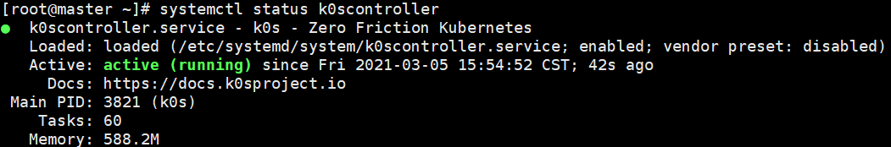

> 作者：阿拉平平；来源：https://mp.weixin.qq.com/s/qElDztRNw20YQn_4gu-8XA

相信 Kubernetes 以其复杂的架构，劝退了不少想要学习的新手。仅是搭建集群，学习成本就不低。我的建议是：与其将时间放在搭建上，不如将精力放到 K8s 本身，等熟悉各个功能了，再搭建集群去了解各个组件，这种学习方法可能更加高效。

今天和大家分享的一个开源的 K8s 发行版：k0s，只需将 k0s 的二进制文件复制到各个主机上，就可以快速搭 K8s 集群。

## 一、项目介绍

k0s 是一款简易、稳定且经过认证的 Kubernetes 发行版，它提供了构建 Kubernetes 集群所需的所有内容，集成了运行 K8s 所有必需的组件。


## 二、环境准备

k0s 支持单/多节点部署，这里仅介绍多节点部署，其它安装方法可以参考官方文官方文档。

我准备了两台 CentOS 7.8 的虚拟机，信息如下：

- master：192.168.128.131
- worker：192.168.128.132

需要说明的是，两台主机的防火墙和 SELinux 均已关闭。


## 三、下载安装

目前 k0s 的最新版本为 v0.11.0，可以通过脚本下载并安装：

```bash
$ curl -sSLf https://get.k0s.sh | sudo sh
```

安装完成后，验证下版本：

```bash
[root@master ~]# k0s version
v0.11.0
```

各主机下载完成后，就可以搭建集群了。


## 四、搭建集群

最新版本的 k0s 支持通过命令创建服务，只需在各个主机上建好各自的服务，直接启动即可。

### 1、master

在 master 主机上安装 controller 服务：

```bash
[root@master ~]# k0s install controller 
INFO[2021-03-05 15:54:29] no config file given, using defaults         
INFO[2021-03-05 15:54:29] creating user: etcd                          
INFO[2021-03-05 15:54:30] creating user: kube-apiserver                
INFO[2021-03-05 15:54:30] creating user: konnectivity-server           
INFO[2021-03-05 15:54:30] creating user: kube-scheduler                
INFO[2021-03-05 15:54:30] Installing k0s service
```

启动 controller 服务：

```bash
[root@master ~]# systemctl start k0scontroller
```

服务启动后，检查下运行状态：



服务运行正常，生成一个 token 文件供 worker 连接：

```bash
[root@master ~]# k0s token create --role=worker > token-file
```

将 token 文件复制到 worker 主机上：

```bash
[root@master ~]# scp token-file 192.168.128.132:/opt/k0s/
```

至此，master 节点部署完成，接下来登录 worker 节点。


### 2、worker

在 worker 主机上安装 worker 服务，并指定刚复制的 token 文件：

```bash
[root@worker ~]# k0s install worker --token-file /opt/k0s/token-file 
INFO[2021-03-05 16:19:41] Installing k0s service
```

启动服务并确保运行正常：

```bash
[root@worker ~]# systemctl start k0sworker
```

至此，所有的部署工作已完成。


### 3、使用示例

接下来，我准备创建一个 Deployment 来测试集群是否可用。在创建前，需要检查下当前集群的状态。

回到 master 节点，首先检查节点的状态。需要注意：如果节点没有加入或者处于 Not Ready，会导致 pod 一直处于 pending 状态：

```bash
[root@master ~]# k0s kubectl get nodes
NAME     STATUS   ROLES    AGE     VERSION
worker   Ready    <none>   8m32s   v1.20.4-k0s1
```

可以看到，worker 节点已加入并处于就绪状态，再检查下 kube-system 中 pod 的运行情况：

```bash
[root@master ~]# k0s kubectl get pods -n kube-system
NAME                                       READY   STATUS    RESTARTS   AGE
calico-kube-controllers-5f6546844f-9fjhp   1/1     Running   0          37m
calico-node-rnjnl                          1/1     Running   0          12m
coredns-5c98d7d4d8-xw6lw                   1/1     Running   0          38m
konnectivity-agent-xkcjh                   1/1     Running   0          10m
kube-proxy-hfcc9                           1/1     Running   0          12m
metrics-server-6fbcd86f7b-tc9kg            1/1     Running   0          37m
```

各 pod 均处于 Runing 状态，说明集群服务运行正常。接下来，试试通过 yaml 文件创建一个 nginx 应用。

```bash
[root@master ~]# cat nginx.yaml 
apiVersion: apps/v1
kind: Deployment
metadata:
  name: nginx-deployment
  labels:
    app: nginx
spec:
  replicas: 1
  selector:
    matchLabels:
      app: nginx
  template:
    metadata:
      labels:
        app: nginx
    spec:
      containers:
      - name: nginx
        image: nginx
        ports:
        - containerPort: 80
[root@master ~]# k0s kubectl create -f nginx.yaml 
deployment.apps/nginx-deployment created
```

查看 nginx 的运行情况，应用已启动，说明集群可用：

```bash
[root@master ~]# k0s kubectl get deploy
NAME               READY   UP-TO-DATE   AVAILABLE   AGE
nginx-deployment   1/1     1            1           46s
```


## 五、写在最后

官方将这个项目命名为 k0s，这可不是乱取的啊，显然是有备而来。k0s 中的 0 包含三层含义：

- 零摩擦：轻量并保留所有 K8s 的功能，尽可能降低安装和使用的复杂性。
- 零依赖：集成所有 K8s 组件，无需安装其它依赖。
- 零成本：二进制文件部署，适合非专业用户使用。

如文中演示，k0s 部署方便，使用简单，即使是没有经验的用户，在数分钟内也可以创建一套 Kubernetes 集群。

References

1. k0s：https://github.com/k0sproject/k0s
2. 官方文档：https://docs.k0sproject.io/latest/