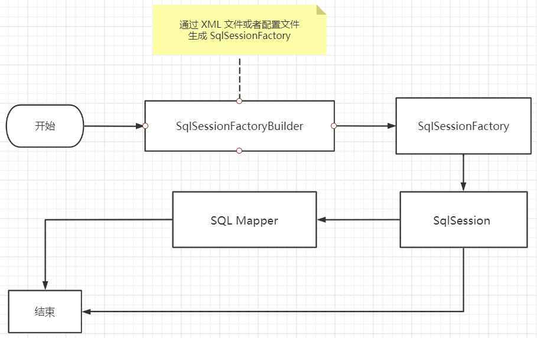
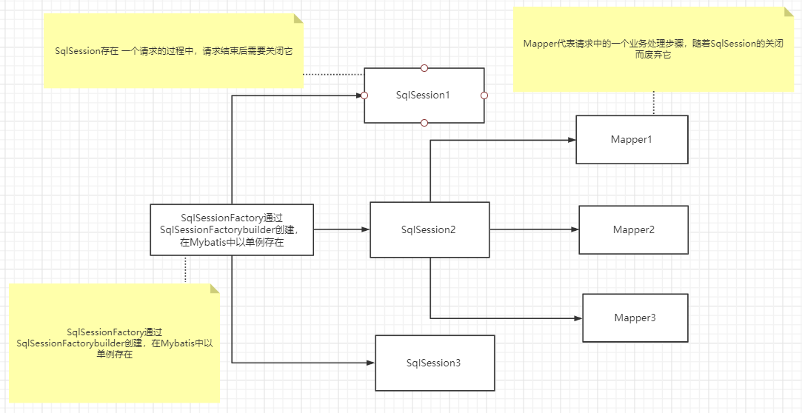
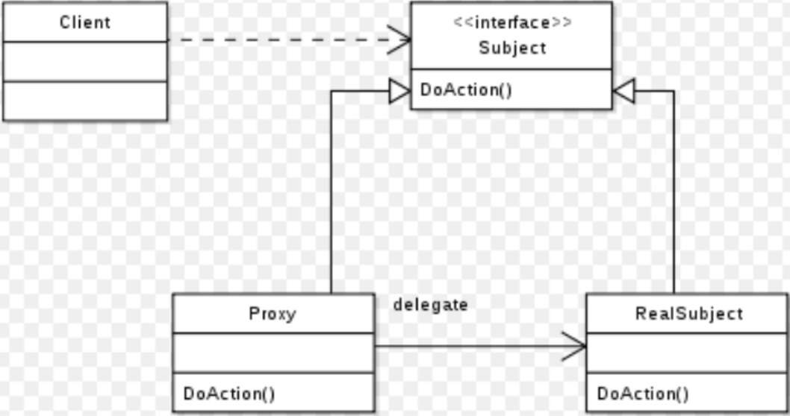
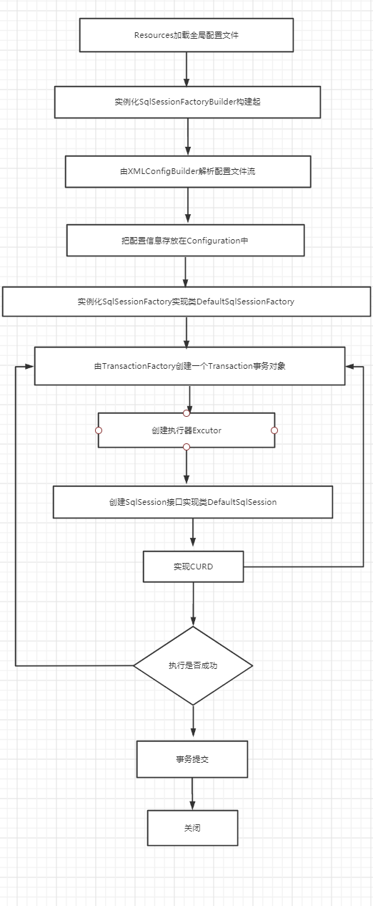
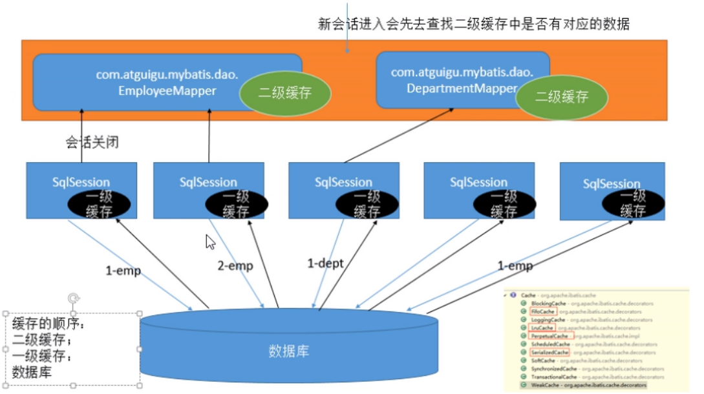

# 1、Mybatis 简介


## 1.1、什么是 MyBatis

1. MyBatis 是一款优秀的**持久层框架**
2. MyBatis 避免了几乎所有的 JDBC 代码和手动设置参数以及获取结果集的过程
3. MyBatis 可以使用简单的 XML 或 注解来配置和映射原生信息，将接口和 Java 的 实体类（Plain Old Java Objects，普通的 Java对象）映射成数据库中的记录
4. MyBatis 本是Apache的一个开源项目ibatis, 2010年这个项目由Apache迁移到了Google Code，并改名为MyBatis
5. 2013年11月迁移到 Github : https://github.com/mybatis/mybatis-3
6. Mybatis官方文档 : http://www.mybatis.org/mybatis-3/zh/index.html


## 1.2、持久化

持久化是将程序数据在持久状态和瞬时状态间转换的机制。

1. 即把数据（如内存中的对象）保存到可永久保存的存储设备中（如磁盘）。持久化的主要应用是将内存中的对象存储在数据库中，或者存储在磁盘文件中、XML数据文件中等等
2. JDBC就是一种持久化机制。文件IO也是一种持久化机制
3. 在生活中 : 将鲜肉冷藏，吃的时候再解冻的方法也是。将水果做成罐头的方法也是

为什么需要持久化服务呢？那是由于内存本身的缺陷引起的

1. 内存断电后数据会丢失，但有一些数据是不能丢失的，比如银行账号等，遗憾的是人们还无法保证内存永不掉电
2. 内存过于昂贵，与硬盘、光盘等外存相比，内存的价格要高2~3个数量级，而且维持成本也高，至少需要一直供电吧。所以即使对象不需要永久保存，也会因为内存的容量限制不能一直呆在内存中，需要持久化来缓存到外存


## 1.3、持久层

什么是持久层？

1. 完成持久化工作的代码块  ==》  Dao层 【Data Access Object，数据访问对象】
2. 大多数情况下特别是企业级应用，数据持久化往往也就意味着将内存中的数据保存到磁盘上加以固化，而持久化的实现过程则大多通过各种**关系数据库**来完成
3. 不过这里有一个字需要特别强调，也就是所谓的“层”。对于应用系统而言，数据持久功能大多是必不可少的组成部分。也就是说，我们的系统中，已经天然的具备了“持久层”概念？也许是，但也许实际情况并非如此。之所以要独立出一个“持久层”的概念,而不是“持久模块”，“持久单元”，也就意味着，我们的系统架构中，应该有一个相对独立的逻辑层面，专注于数据持久化逻辑的实现.
4. 与系统其他部分相对而言，这个层面应该具有一个较为清晰和严格的逻辑边界（说白了就是用来操作数据库存在的）


## 1.4、为什么需要 Mybatis

1. Mybatis 就是帮助程序猿将数据存入数据库中 , 和从数据库中取数据 .

2. 传统的JDBC操作 , 有很多重复代码.比如：数据取出时的封装 , 数据库建立连接等等..., 通过框架可以减少重复代码,提高开发效率

3. `MyBatis` 是一个半自动化的**ORM框架 (Object Relationship Mapping) -->对象关系映射**

4. 所有的事情，不用`Mybatis`依旧可以做到，只是用了它，所有实现会更加简单！**技术没有高低之分，只有使用这个技术的人有高低之别**

5. `MyBatis`的优点

6. - 简单易学：本身就很小且简单。没有任何第三方依赖，最简单安装只要两个jar文件+配置几个sql映射文件就可以了，易于学习，易于使用，通过文档和源代码，可以比较完全的掌握它的设计思路和实现。
  - 灵活：mybatis不会对应用程序或者数据库的现有设计强加任何影响。`sql`写在`xml`里，便于统一管理和优化。通过`sql`语句可以满足操作数据库的所有需求。
  - 解除`sql`与程序代码的耦合：通过提供`DAO`层，将业务逻辑和数据访问逻辑分离，使系统的设计更清晰，更易维护，更易单元测试。sql和代码的分离，提高了可维护性。
  - 提供xml标签，支持编写动态sql。
  - .......


# 2、MyBatis 入门

**思路流程：搭建环境-->导入Mybatis-->编写代码-->测试**

## 2.1、代码演示

1、搭建实验数据库

```sql
-- 建库
CREATE DATABASE `mybatis`;
USE `mybatis`;
DROP TABLE IF EXISTS `user`;
-- 建表
CREATE TABLE `user` (
    `id` int(20) NOT NULL,
    `name` varchar(30) DEFAULT NULL,
    `pwd` varchar(30) DEFAULT NULL,
    PRIMARY KEY (`id`)
) ENGINE=InnoDB DEFAULT CHARSET=utf8;
-- 插入测试数据
insert  into `user`(`id`,`name`,`pwd`) values 
(1,'小刘','123456'),(2,'张三','abcdef'),(3,'李四','987654');
```

2、导入`MyBatis`相关 jar 包（`Github`上或者官网上找）

```xml
<dependencies>
    <!--mybatis-->
    <!-- https://mvnrepository.com/artifact/org.mybatis/mybatis -->
    <dependency>
        <groupId>org.mybatis</groupId>
        <artifactId>mybatis</artifactId>
        <version>3.5.2</version>
    </dependency>
    <!--mysql驱动-->
    <dependency>
        <groupId>mysql</groupId>
        <artifactId>mysql-connector-java</artifactId>
        <version>5.1.47</version>
    </dependency>
    <!--junit-->
    <dependency>
        <groupId>junit</groupId>
        <artifactId>junit</artifactId>
        <version>4.12</version>
        <scope>test</scope>
    </dependency>
</dependencies>
```

3、编写`MyBatis`核心配置文件（帮助文档内有）：`mybatis-config.xml`

```xml
<?xml version="1.0" encoding="UTF-8" ?>
<!DOCTYPE configuration
        PUBLIC "-//mybatis.org//DTD Config 3.0//EN"
        "http://mybatis.org/dtd/mybatis-3-config.dtd">
<configuration>
    <environments default="development">
        <environment id="development">
            <transactionManager type="JDBC"/>
            <dataSource type="POOLED">
                <property name="driver" value="com.mysql.jdbc.Driver"/>
                <property name="url"
                          value="jdbc:mysql://192.168.3.55:3306/mybatis?useSSL=false&amp;useUnicode=true&amp;characterEncoding=utf8"/>
                <property name="username" value="root"/>
                <property name="password" value="password"/>
            </dataSource>
        </environment>
    </environments>
    <mappers>
        <mapper resource="dao/userMapper.xml"/>
    </mappers>
</configuration>
```

> 1. **configuration：核心配置文件**
> 2. **environments：配置环境组；default 设置默认的环境**
> 3. **environment：单个环境；id是环境名**
> 4. **transactionManager ：配置事务管理器**
> 5. **dataSource：配置数据库连接池**
> 6. **useSSL=true&useUnicode=true&characterEncoding=UFT-8：设置时区设置编码，复制就行**
> 7. **property：设置对应的 JDBC连接属性**
>
> 详细下面章节会介绍


4、编写`MyBatis`工具类（官方帮助文档内有）：`MybatisUtils.java`

- 从 `XML` 中构建 `SqlSessionFactory`（本次使用从XML构建）
- 不使用` XML` 构建 `SqlSessionFactory`（不常用，看官网）

```java
package utils;

import org.apache.ibatis.io.Resources;
import org.apache.ibatis.session.SqlSession;
import org.apache.ibatis.session.SqlSessionFactory;
import org.apache.ibatis.session.SqlSessionFactoryBuilder;
import java.io.IOException;
import java.io.InputStream;

public class MybatisUtils {

    private static SqlSessionFactory sqlSessionFactory;
    public static final String RESOURCE = "mybatis-config.xml";
    static {
        try {
            InputStream inputStream = Resources.getResourceAsStream(RESOURCE);
            sqlSessionFactory = new SqlSessionFactoryBuilder().build(inputStream);
        } catch (IOException e) {
            e.printStackTrace();
        }
    }

    /**
     * 获取SqlSession连接
     */
    public static SqlSession getSession() {
        return sqlSessionFactory.openSession();
    }

}
```

5、创建实体类：`User.java`

```java
package pojo;

public class User {
   private int id;  //id
   private String name;   //姓名
   private String pwd;   //密码
   
   // 省略：有参和无参构造，set/get/toString()
}
```

6、编写`Mapper`接口类：`UserMapper.java`

```java
package mapper;

import pojo.User;
import java.util.List;

public interface UserMapper {
    // 查询全部用户
    List<User> selectUser();
}
```

7、编写`Mapper.xml`配置文件：`src/java/resources/mapper/userMapper.xml`（`namespace` 十分重要，不能写错！）

```xml
<?xml version="1.0" encoding="UTF-8" ?>
<!DOCTYPE mapper
        PUBLIC "-//mybatis.org//DTD Mapper 3.0//EN"
        "http://mybatis.org/dtd/mybatis-3-mapper.dtd">

<!--namespace：对应dao接口的package，id：对应方法名-->
<mapper namespace="mapper.UserMapper">
    <!-- 查询全部用户 -->
    <select id="selectUser" resultType="pojo.User">
      select * from user
    </select>
</mapper>
```

8、编写测试类

```java
import mapper.UserMapper;
import org.apache.ibatis.session.SqlSession;
import org.junit.Test;
import pojo.User;
import utils.MybatisUtils;
import java.util.List;

public class MyTest {
    @Test
    public void selectUser() {
        // 方法一:
        try (SqlSession session = MybatisUtils.getSession()) {
            List<User> users = session.selectList("dao.UserMapper.selectUser");
            users.forEach(System.out::println);
        }

        // 方法二:
        try (SqlSession session = MybatisUtils.getSession()) {
            UserMapper mapper = session.getMapper(UserMapper.class);
            List<User> users = mapper.selectUser();
            users.forEach(System.out::println);
        }
    }
}
```

9、运行测试，成功的查询出来的我们的数据！

```
pojo.User{id=1, name='小刘', pwd='123456'}
pojo.User{id=2, name='张三', pwd='abcdef'}
pojo.User{id=3, name='李四', pwd='987654'}
pojo.User{id=1, name='小刘', pwd='123456'}
pojo.User{id=2, name='张三', pwd='abcdef'}
pojo.User{id=3, name='李四', pwd='987654'}
```


## 2.2、问题说明

**可能出现问题说明：Maven静态资源过滤问题**

- 如果`xml`文件配置`src/main/java`目录下一定需要配置该插件

```xml
<build>
	<resources>
       <resource>
           <directory>src/main/java</directory>
           <includes>
               <include>**/*.properties</include>
               <include>**/*.xml</include>
           </includes>
           <filtering>false</filtering>
       </resource>
       <resource>
           <directory>src/main/resources</directory>
           <includes>
               <include>**/*.properties</include>
               <include>**/*.xml</include>
           </includes>
           <filtering>false</filtering>
       </resource>
    </resources>
</build>
```


## 2.3、SqlSessionFactory 源码

```java
public interface SqlSessionFactory {
    SqlSession openSession(); // 获取SqlSession连接
    SqlSession openSession(boolean autoCommit); // 获取SqlSession连接，并且事务自动提交
    SqlSession openSession(Connection connection);
    SqlSession openSession(TransactionIsolationLevel level);
    SqlSession openSession(ExecutorType execType);
    SqlSession openSession(ExecutorType execType, boolean autoCommit);
    SqlSession openSession(ExecutorType execType, TransactionIsolationLevel level);
    SqlSession openSession(ExecutorType execType, Connection connection);
    Configuration getConfiguration();
}
```


## 2.4、Mybatis 流程分析

使用一个查询的示例来分析：

```java
public void getUserList() throws IOException {
    
    /**
     * 根据全局配置文件创建出一个SqlSessionFactory
     * SqlSessionFactory：是SqlSession工厂，负责创建SqlSession
     **/
    String resource = "mybatis-config.xml";
    InputStream inputStream = Resources.getResourceAsStream(resource);
    SqlSessionFactory sqlSessionFactory = new SqlSessionFactoryBuilder().build(inputStream);

    /**
     * 通过sqlSessionFactory.openSession()获取和数据库的一次会话
     * 底层就是getConnection拿到一条连接
     **/
    SqlSession sqlSession = sqlSessionFactory.openSession();

    /**
     * 使用SqlSession操作数据库，获取到Dao接口的实现，然后直接调用方法
     **/
    UserDao userDao = sqlSession.getMapper(UserDao.class);
    List<User> userList = userDao.getUserList();
    userList.forEach(System.out::println);
    
    // 每一次获取sqlSession相当于一条连接，资源宝贵，用完关闭
    sqlSession.close();
}
```

**流程分析：**

1. resource 就是获取你的全局配置文件（`mybatis-config.xml`）
2. 通过ibatis下的Resources资源中的getResourceAsStream方法把你的全局配置文件变成输入流inputStream
3. SqlSessionFactoryBuilder 是SqlSession工厂建造者，负责创建SqlSessionFactory , 通过该类下的build方法返回值是SqlSessionFactory 也就将我们的输入流变成 SqlSessionFactory
4. 拿到SqlSessionFactory 可以调用其openSession方法得到SqlSession
5. SqlSession : sql会话 , 相当于每一次与数据库连接时候的connection
6. 通过sqlSession的getMapper会获取到Dao接口的实现
7. 我们在UserDaoMapper.xml中已经通过namespace绑定了对应的接口
8. 所以我们可以通过获取的接口对象userDao直接调用我们在Mapper中写的方法
9. 每一次获取sqlSession相当于一条连接，资源宝贵，用完关闭


# 3、Mybatis 配置解析

> XML配置：https://mybatis.org/mybatis-3/zh/configuration.html

## 3.1、核心配置文件

- `mybatis-config.xml` 系统核心配置文件
- `MyBatis` 的配置文件包含了会深深影响 `MyBatis` 行为的设置和属性信息。
- 能配置的内容如下：

```xml
<!-- 注意元素节点的顺序！顺序不对会报错 -->
configuration（配置）
	properties（属性）
	settings（设置）
	typeAliases（类型别名）
	typeHandlers（类型处理器）
    objectFactory（对象工厂）
    plugins（插件）
    environments（环境配置）
    	environment（环境变量）
            transactionManager（事务管理器）
            dataSource（数据源）
	databaseIdProvider（数据库厂商标识）
	mappers（映射器）
```

​	我们可以阅读 `mybatis-config.xml` 上面的`dtd`的头文件！


## 3.2、属性（properties）

数据库这些属性都是可外部配置且可动态替换的，既可以在典型的 Java 属性文件中配置，亦可通过 properties 元素的子元素来传递。具体的官方文档

第一步：在资源目录下新建一个 `db.properties`

```properties
driver=com.mysql.jdbc.Driver
url=jdbc:mysql://localhost:3306/mybatis?useSSL=true&useUnicode=true&characterEncoding=utf8
username=root
password=123456
```

第二步 : 将文件导入`properties` 配置文件

```XML
<configuration>
    <!--导入properties文件-->
    <properties resource="db.properties"/>
    
    <environments default="development">
        <environment id="development">
            <transactionManager type="JDBC"/>
            <dataSource type="POOLED">
                <property name="driver" value="${driver}"/>
                <property name="url" value="${url}"/>
                <property name="username" value="${username}"/>
                <property name="password" value="${password}"/>
            </dataSource>
        </environment>
    </environments>
    <mappers>
        <mapper resource="mapper/UserMapper.xml"/>
    </mappers>
</configuration>
```

- properties标签有两个值
  - resource：从类路径下开始引用
  - url：引用磁盘路径或者网络路径的资源
- 在property标签中获取db.properties的属性是通过 ${名称}


## 3.3、设置（settings）

这是 MyBatis 中极为重要的调整设置，它们会改变 MyBatis 的运行时行为。 下表描述了设置中各项的意图、默认值等。

| 设置名                           | 描述                                                         | 有效值                                                       | 默认值                                                |
| :------------------------------- | :----------------------------------------------------------- | :----------------------------------------------------------- | :---------------------------------------------------- |
| cacheEnabled                     | 全局地开启或关闭配置文件中的所有映射器已经配置的任何缓存。   | true \| false                                                | true                                                  |
| lazyLoadingEnabled               | 延迟加载的全局开关。当开启时，所有关联对象都会延迟加载。 特定关联关系中可通过设置 `fetchType` 属性来覆盖该项的开关状态。 | true \| false                                                | false                                                 |
| aggressiveLazyLoading            | 当开启时，任何方法的调用都会加载该对象的所有属性。 否则，每个属性会按需加载（参考 `lazyLoadTriggerMethods`)。 | true \| false                                                | false （在 3.4.1 及之前的版本默认值为 true）          |
| multipleResultSetsEnabled        | 是否允许单一语句返回多结果集（需要驱动支持）。               | true \| false                                                | true                                                  |
| useColumnLabel                   | 使用列标签代替列名。不同的驱动在这方面会有不同的表现，具体可参考相关驱动文档或通过测试这两种不同的模式来观察所用驱动的结果。 | true \| false                                                | true                                                  |
| useGeneratedKeys                 | 允许 JDBC 支持自动生成主键，需要驱动支持。 如果设置为 true 则这个设置强制使用自动生成主键，尽管一些驱动不能支持但仍可正常工作（比如 Derby）。 | true \| false                                                | False                                                 |
| autoMappingBehavior              | 指定 MyBatis 应如何自动映射列到字段或属性。 NONE 表示取消自动映射；PARTIAL 只会自动映射没有定义嵌套结果集映射的结果集。 FULL 会自动映射任意复杂的结果集（无论是否嵌套）。 | NONE, PARTIAL, FULL                                          | PARTIAL                                               |
| autoMappingUnknownColumnBehavior | 指定发现自动映射目标未知列（或者未知属性类型）的行为。- NONE: 不做任何反应- WARNING: 输出提醒日志 ('org.apache.ibatis.session.AutoMappingUnknownColumnBehavior' 的日志等级必须设置为 WARN)- FAILING: 映射失败 (抛出 SqlSessionException) | NONE, WARNING, FAILING                                       | NONE                                                  |
| defaultExecutorType              | 配置默认的执行器。SIMPLE 就是普通的执行器；REUSE 执行器会重用预处理语句（prepared statements）； BATCH 执行器将重用语句并执行批量更新。 | SIMPLE REUSE BATCH                                           | SIMPLE                                                |
| defaultStatementTimeout          | 设置超时时间，它决定驱动等待数据库响应的秒数。               | 任意正整数                                                   | 未设置 (null)                                         |
| defaultFetchSize                 | 为驱动的结果集获取数量（fetchSize）设置一个提示值。此参数只可以在查询设置中被覆盖。 | 任意正整数                                                   | 未设置 (null)                                         |
| defaultResultSetType             | Specifies a scroll strategy when omit it per statement settings. (Since: 3.5.2) | FORWARD_ONLY \| SCROLL_SENSITIVE \| SCROLL_INSENSITIVE \| DEFAULT(same behavior with 'Not Set') | Not Set (null)                                        |
| safeRowBoundsEnabled             | 允许在嵌套语句中使用分页（RowBounds）。如果允许使用则设置为 false。 | true \| false                                                | False                                                 |
| safeResultHandlerEnabled         | 允许在嵌套语句中使用分页（ResultHandler）。如果允许使用则设置为 false。 | true \| false                                                | True                                                  |
| mapUnderscoreToCamelCase         | 是否开启自动驼峰命名规则（camel case）映射，即从经典数据库列名 A_COLUMN 到经典 Java 属性名 aColumn 的类似映射。 | true \| false                                                | False                                                 |
| localCacheScope                  | MyBatis 利用本地缓存机制（Local Cache）防止循环引用（circular references）和加速重复嵌套查询。 默认值为 SESSION，这种情况下会缓存一个会话中执行的所有查询。 若设置值为 STATEMENT，本地会话仅用在语句执行上，对相同 SqlSession 的不同调用将不会共享数据。 | SESSION \| STATEMENT                                         | SESSION                                               |
| jdbcTypeForNull                  | 当没有为参数提供特定的 JDBC 类型时，为空值指定 JDBC 类型。 某些驱动需要指定列的 JDBC 类型，多数情况直接用一般类型即可，比如 NULL、VARCHAR 或 OTHER。 | JdbcType 常量，常用值：NULL, VARCHAR 或 OTHER。              | OTHER                                                 |
| lazyLoadTriggerMethods           | 指定哪个对象的方法触发一次延迟加载。                         | 用逗号分隔的方法列表。                                       | equals,clone,hashCode,toString                        |
| defaultScriptingLanguage         | 指定动态 SQL 生成的默认语言。                                | 一个类型别名或完全限定类名。                                 | org.apache.ibatis.scripting.xmltags.XMLLanguageDriver |
| defaultEnumTypeHandler           | 指定 Enum 使用的默认 `TypeHandler` 。（新增于 3.4.5）        | 一个类型别名或完全限定类名。                                 | org.apache.ibatis.type.EnumTypeHandler                |
| callSettersOnNulls               | 指定当结果集中值为 null 的时候是否调用映射对象的 setter（map 对象时为 put）方法，这在依赖于 Map.keySet() 或 null 值初始化的时候比较有用。注意基本类型（int、boolean 等）是不能设置成 null 的。 | true \| false                                                | false                                                 |
| returnInstanceForEmptyRow        | 当返回行的所有列都是空时，MyBatis默认返回 `null`。 当开启这个设置时，MyBatis会返回一个空实例。 请注意，它也适用于嵌套的结果集 （如集合或关联）。（新增于 3.4.2） | true \| false                                                | false                                                 |
| logPrefix                        | 指定 MyBatis 增加到日志名称的前缀。                          | 任何字符串                                                   | 未设置                                                |
| logImpl                          | 指定 MyBatis 所用日志的具体实现，未指定时将自动查找。        | SLF4J \| LOG4J \| LOG4J2 \| JDK_LOGGING \| COMMONS_LOGGING \| STDOUT_LOGGING \| NO_LOGGING | 未设置                                                |
| proxyFactory                     | 指定 Mybatis 创建具有延迟加载能力的对象所用到的代理工具。    | CGLIB \| JAVASSIST                                           | JAVASSIST （MyBatis 3.3 以上）                        |
| vfsImpl                          | 指定 VFS 的实现                                              | 自定义 VFS 的实现的类全限定名，以逗号分隔。                  | 未设置                                                |
| useActualParamName               | 允许使用方法签名中的名称作为语句参数名称。 为了使用该特性，你的项目必须采用 Java 8 编译，并且加上 `-parameters` 选项。（新增于 3.4.1） | true \| false                                                | true                                                  |
| configurationFactory             | 指定一个提供 `Configuration` 实例的类。 这个被返回的 Configuration 实例用来加载被反序列化对象的延迟加载属性值。 这个类必须包含一个签名为`static Configuration getConfiguration()` 的方法。（新增于 3.2.3） |                                                              |                                                       |

```xml
<settings>
    <setting name="cacheEnabled" value="true"/>
    <setting name="lazyLoadingEnabled" value="true"/>
    <setting name="multipleResultSetsEnabled" value="true"/>
    <setting name="useColumnLabel" value="true"/>
    <setting name="useGeneratedKeys" value="false"/>
    <setting name="autoMappingBehavior" value="PARTIAL"/>
    <setting name="autoMappingUnknownColumnBehavior" value="WARNING"/>
    <setting name="defaultExecutorType" value="SIMPLE"/>
    <setting name="defaultStatementTimeout" value="25"/>
    <setting name="defaultFetchSize" value="100"/>
    <setting name="safeRowBoundsEnabled" value="false"/>
    <setting name="mapUnderscoreToCamelCase" value="false"/>
    <setting name="localCacheScope" value="SESSION"/>
    <setting name="jdbcTypeForNull" value="OTHER"/>
    <setting name="lazyLoadTriggerMethods" value="equals,clone,hashCode,toString"/>
    <setting name="logImpl" value="LOG4J"/>
</settings>

<!-- 全局参数 -->
<settings>
    <!-- 使全局的映射器启用或禁用缓存 -->
    <setting name="cacheEnabled" value="true"/>
    <!-- 全局启用或禁用延迟加载。当禁用时，所有关联对象都会即时加载 -->
    <setting name="lazyLoadingEnabled" value="true"/>
    <!-- 当启用时，有延迟加载属性的对象在被调用时将会完全加载任意属性。否则，每种属性将会按需要加载 -->
    <setting name="aggressiveLazyLoading" value="true"/>
    <!-- 是否允许单条sql 返回多个数据集  (取决于驱动的兼容性) default:true -->
    <setting name="multipleResultSetsEnabled" value="true"/>
    <!-- 是否可以使用列的别名 (取决于驱动的兼容性) default:true -->
    <setting name="useColumnLabel" value="true"/>
    <!-- 允许JDBC 生成主键。需要驱动器支持。如果设为true，这个设置将强制使用被生成的主键，有一些驱动器不兼容不过仍然可以执行。  default:false  -->
    <setting name="useGeneratedKeys" value="true"/>
    <!-- 指定 MyBatis 如何自动映射 数据基表的列 NONE：不隐射 PARTIAL:部分  FULL:全部  -->
    <setting name="autoMappingBehavior" value="PARTIAL"/>
    <!-- 这是默认的执行类型  （SIMPLE: 简单；REUSE: 执行器可能重复使用prepared statements语句；BATCH: 执行器可以重复执行语句和批量更新）  -->
    <!-- 对于批量更新操作缓存SQL以提高性能 BATCH,SIMPLE -->
    <setting name="defaultExecutorType" value="SIMPLE"/>
    <!-- 数据库超过25000秒仍未响应则超时 -->
    <setting name="defaultStatementTimeout" value="25000"/>
    <!-- 使用驼峰命名法转换字段。 -->
    <setting name="mapUnderscoreToCamelCase" value="true"/>
    <!-- 设置本地缓存范围 session:就会有数据的共享  statement:语句范围 (这样就不会有数据的共享 ) defalut:session -->
    <setting name="localCacheScope" value="SESSION"/>
    <!-- 设置但JDBC类型为空时,某些驱动程序 要指定值,default:OTHER，插入空值时不需要指定类型 -->
    <setting name="jdbcTypeForNull" value="NULL"/>
    <!-- 设置关联对象加载的形态，此处为按需加载字段(加载字段由SQL指 定)，不会加载关联表的所有字段，以提高性能 -->
    <setting name="aggressiveLazyLoading" value="false"/>
    <setting name="logImpl" value="org.apache.ibatis.logging.stdout.StdOutImpl"/>
</settings>
```

参考文档：https://mybatis.org/mybatis-3/zh/configuration.html#settings


## 3.4、类型别名（typeAliases）

> 默认别名

类型别名：为常用的类型（javaBean）起别名；

 别名的默认就是类名（不区分大小写）配置文件中就可以直接使用

```xml
<!--配置别名,注意顺序-->
<typeAliases>
    <typeAlias type="pojo.User"/>
</typeAliases>
```

```xml
<!--此时我们用resultType的时候就可以直接写类名了-->
<select id="getUserList" resultType="user">
    select * from user
</select>
```

> 指定别名

通过alias来设置别名，此时的resultType就需要写我们alias的值

```xml
<typeAliases>
    <typeAlias type="pojo.User" alias="user"/>
</typeAliases>
```

```xml
<!--引用别名-->
<select id="getUserList" resultType="user">
    select * from user
</select>
```

> 批量起别名

当我们的项目类越来越多的时候，可能会有成百个类，这时候我们就需要使用批量别名来设置。

```xml
<typeAliases>
    <package name="com.pojo"/>
</typeAliases>
```

通过package标签来选择那个包下的类使用别名，默认都是类名。

> 批量时单独别名

```java
@Alias("userdemo")
public class User {
	...
}
```

通过注解@Alias来设置单独的别名


## 3.5、类型处理器（typeHandlers）

- 无论是 `MyBatis` 在预处理语句（`PreparedStatement`）中设置一个参数时，还是从结果集中取出一个值时， 都会用类型处理器将获取的值以合适的方式转换成 `Java` 类型。
- 你可以重写类型处理器或创建你自己的类型处理器来处理不支持的或非标准的类型。【了解即可】
- [官方文档](https://mybatis.org/mybatis-3/zh/configuration.html#typeHandlers)


## 3.6、对象工厂（objectFactory）

- `MyBatis` 每次创建结果对象的新实例时，它都会使用一个对象工厂（`ObjectFactory`）实例来完成。
- 默认的对象工厂需要做的仅仅是实例化目标类，要么通过默认构造方法，要么在参数映射存在的时候通过有参构造方法来实例化。
- 如果想覆盖对象工厂的默认行为，则可以通过创建自己的对象工厂来实现。【了解即可】
- [官方文档](https://mybatis.org/mybatis-3/zh/configuration.html#objectFactory)


## 3.7、插件（plugins）

MyBatis 允许你在已映射语句执行过程中的某一点进行拦截调用。默认情况下，MyBatis 允许使用插件来拦截的方法调用包括：

- Executor (update, query, flushStatements, commit, rollback, getTransaction, close, isClosed)
- ParameterHandler (getParameterObject, setParameters)
- ResultSetHandler (handleResultSets, handleOutputParameters)
- StatementHandler (prepare, parameterize, batch, update, query)


## 3.8、环境配置（environments）

```xml
<environments default="development">
    <environment id="development">
        <transactionManager type="JDBC">
            <property name="..." value="..."/>
        </transactionManager>
        <dataSource type="POOLED">
            <property name="driver" value="${driver}"/>
            <property name="url" value="${url}"/>
            <property name="username" value="${username}"/>
            <property name="password" value="${password}"/>
        </dataSource>
    </environment>
</environments>
```

- 配置`MyBatis`的多套运行环境，将`SQL`映射到多个不同的数据库上，必须指定其中一个为默认运行环境（通过`default`指定）
- 每个 `environment` 元素定义的环境 ID（比如：id="development"）。
- 子元素节点：`transactionManager` - [ 事务管理器 ]


  ```xml
<transactionManager type="[ JDBC | MANAGED ]"/><!-- 语法 --> 
  ```

- 子元素节点：**数据源（dataSource）**

- - `dataSource` 元素使用标准的 `JDBC`数据源接口来配置` JDBC` 连接对象的资源。
  - 有三种内建的数据源类型(`type`)：**UNPOOLED、POOLED、JNDI**
    - `unpooled`：这个数据源的实现只是每次被请求时打开和关闭连接。
    - **`pooled`**：这种数据源的实现利用“池”的概念将 `JDBC` 连接对象组织起来 , 这是一种使得并发 `Web` 应用快速响应请求的流行处理方式。
    - `jndi`：这个数据源的实现是为了能在如 `Spring` 或应用服务器这类容器中使用，容器可以集中或在外部配置数据源，然后放置一个 `JNDI` 上下文的引用。
    - 数据源也有很多第三方的实现，比如`dbcp`，`c3p0`，`druid`等等....


## 3.9、映射器（mappers）

> mappers

- 映射器 : 定义映射SQL语句文件
- 既然 `MyBatis` 的行为其他元素已经配置完了，我们现在就要定义 SQL 映射语句了。但是首先我们需要告诉 `MyBatis` 到哪里去找到这些语句。`Java` 在自动查找这方面没有提供一个很好的方法，所以最佳的方式是告诉 `MyBatis` 到哪里去找映射文件
  - url：可以从磁盘或网络路径引用
  - resource：在类路径下找sql映射文件
  - class：直接引用接口的全类名，但是需要将xml和接口放在同包下，而且名字要相同
  - package 批量注册

> 引入资源方式

第一种方式：`mapper`标签，通过`resource`属性引入`classpath`路径的相对资源

```xml
<!-- 使用相对于类路径的资源引用 -->
<mappers>
  <mapper resource="org/mybatis/builder/AuthorMapper.xml"/>
</mappers>
```

第二种方式：`mapper`标签，通过`url`引入网络资源或者本地磁盘资源

```xml
<!-- 使用完全限定资源定位符（URL） -->
<mappers>
  <mapper url="file:///var/mappers/AuthorMapper.xml"/>
</mappers>
```

第三种方式：`mapper`标签，通过`class`属性指定`mapper`接口名称

```xml
<!-- 使用映射器接口实现类的完全限定类名 -->
<!-- 需要配置文件名称和接口名称一致，并且位于同一目录下 -->
<!-- 如mapper接口采用注解的方式，则无需映射文件 -->
<mappers>
  <mapper class="org.mybatis.builder.AuthorMapper"/>
</mappers>
```

第四种方式：`package`标签，通过`name`属性指定`mapper`接口所在的包名

```xml
<!-- 将包内的映射器接口实现全部注册为映射器 -->
<!-- 但是需要配置文件名称和接口名称一致，并且位于同一目录下 -->
<!-- 如mapper接口采用注解的方式，则无需映射文件 -->
<mappers>
     <package name="org.mybatis.builder"/>
</mappers>
```


## 3.10、Mapper映射文件（xml）

编写每一个方法都如何向数据库发送sql语句，如何执行等，相当于接口的实现类

> select元素的属性

```xml
<?xml version="1.0" encoding="UTF-8" ?>
<!DOCTYPE mapper
       PUBLIC "-//mybatis.org//DTD Mapper 3.0//EN"
       "http://mybatis.org/dtd/mybatis-3-mapper.dtd">
<mapper namespace="mapper.UserMapper">
    <!--select查询语句-->
    <select id="getUserList" resultType="com.jiang.pojo.User">
        select * from user
    </select>
</mapper>
```

- **namespace：名称空间，写接口的全类名（不包括.java）,相当于告诉MyBatis这个配置文件是实现那个接口的**
- **select对应的就是查询操作，update..都一样**
- **id是接口的方法名 相当于这个配置是对于某个方法的实现**
- **resultType : 指定方法运行后的返回值类型 ( 如果是查询操作必须指定 )**
- **#{属性名} : 代表取出传递过来的某个参数的值**

> Insert, Update, Delete 元素的属性

| 属性               | 描述                                                         |
| :----------------- | :----------------------------------------------------------- |
| `id`               | 命名空间中的唯一标识符，可被用来代表这条语句。               |
| `parameterType`    | 将要传入语句的参数的完全限定类名或别名。这个属性是可选的，因为 MyBatis 可以通过类型处理器推断出具体传入语句的参数，默认值为未设置（unset）。 |
| `parameterMap`     | 这是引用外部 parameterMap 的已经被废弃的方法。请使用内联参数映射和 parameterType 属性。 |
| `flushCache`       | 将其设置为 true 后，只要语句被调用，都会导致本地缓存和二级缓存被清空，默认值：true（对于 insert、update 和 delete 语句）。 |
| `timeout`          | 这个设置是在抛出异常之前，驱动程序等待数据库返回请求结果的秒数。默认值为未设置（unset）（依赖驱动）。 |
| `statementType`    | STATEMENT，PREPARED 或 CALLABLE 的一个。这会让 MyBatis 分别使用 Statement，PreparedStatement 或 CallableStatement，默认值：PREPARED。 |
| `useGeneratedKeys` | （仅对 insert 和 update 有用）这会令 MyBatis 使用 JDBC 的 getGeneratedKeys 方法来取出由数据库内部生成的主键（比如：像 MySQL 和 SQL Server 这样的关系数据库管理系统的自动递增字段），默认值：false。 |
| `keyProperty`      | （仅对 insert 和 update 有用）唯一标记一个属性，MyBatis 会通过 getGeneratedKeys 的返回值或者通过 insert 语句的 selectKey 子元素设置它的键值，默认值：未设置（`unset`）。如果希望得到多个生成的列，也可以是逗号分隔的属性名称列表。 |
| `keyColumn`        | （仅对 insert 和 update 有用）通过生成的键值设置表中的列名，这个设置仅在某些数据库（像 PostgreSQL）是必须的，当主键列不是表中的第一列的时候需要设置。如果希望使用多个生成的列，也可以设置为逗号分隔的属性名称列表。 |
| `databaseId`       | 如果配置了数据库厂商标识（databaseIdProvider），MyBatis 会加载所有的不带 databaseId 或匹配当前 databaseId 的语句；如果带或者不带的语句都有，则不带的会被忽略。 |


## 4.11、生命周期和作用域

理解我们目前已经讨论过的不同作用域和生命周期类是至关重要的，因为错误的使用会导致非常严重的并发问题。

我们可以先画一个流程图，分析一下`Mybatis`的执行过程！




**作用域理解**

- `SqlSessionFactoryBuilder` 的作用在于创建 `SqlSessionFactory`，创建成功后，`SqlSessionFactoryBuilder` 就失去了作用，所以它只能存在于创建 `SqlSessionFactory` 的方法中，而不要让其长期存在。因此 **SqlSessionFactoryBuilder 实例的最佳作用域是方法作用域**（也就是局部方法变量）。
- `SqlSessionFactory` 可以被认为是一个数据库连接池，它的作用是创建 `SqlSession` 接口对象。因为 `MyBatis` 的本质就是 `Java` 对数据库的操作，所以 `SqlSessionFactory` 的生命周期存在于整个 `MyBatis` 的应用之中，所以一旦创建了 `SqlSessionFactory`，就要长期保存它，直至不再使用 `MyBatis` 应用，所以可以认为 `SqlSessionFactory` 的生命周期就等同于 `MyBatis` 的应用周期。
- 由于 `SqlSessionFactory` 是一个对数据库的连接池，所以它占据着数据库的连接资源。如果创建多个 SqlSessionFactory，那么就存在多个数据库连接池，这样不利于对数据库资源的控制，也会导致数据库连接资源被消耗光，出现系统宕机等情况，所以尽量避免发生这样的情况。
- 因此在一般的应用中我们往往希望 SqlSessionFactory 作为一个单例，让它在应用中被共享。所以说 **SqlSessionFactory 的最佳作用域是应用作用域。**
- 如果说 `SqlSessionFactory` 相当于数据库连接池，那么 `SqlSession` 就相当于一个数据库连接（Connection 对象），你可以在一个事务里面执行多条 SQL，然后通过它的 commit、rollback 等方法，提交或者回滚事务。所以它应该存活在一个业务请求中，处理完整个请求后，应该关闭这条连接，让它归还给 SqlSessionFactory，否则数据库资源就很快被耗费精光，系统就会瘫痪，所以用 try...catch...finally... 语句来保证其正确关闭。
- **所以 SqlSession 的最佳的作用域是请求或方法作用域。**



>  **sqlSessionFactoryBuilder ,sqlSessionFactory, sqlSession, mapper关系**

1. `sqlSessionFactoryBuilder`：这个类可以被实例化和丢弃，一旦创建了`sqlSessionFactory`，就不在需要它了
2. `sqlSessionFactory`：一旦被创建在整个程序的运行期间都存在，可以想象为一个数据库连接池，有且只能有一个，可用单例模式来实现。
3. `sqlSession`：可以想象为一个数据库连接池中的一个连接，不是线程安全的，因此不能被共享，最佳作用域是放在方法被，用完之后需手动关闭，否则会占用资源。
4. `mapper`：相当于一个具体的业务，执行增删改查


# 4、XML CRUD 操作

## 4.1、CRUD 操作

1. 在`UserMapper.java`接口中添加对应的方法

```java
package mapper;
import pojo.User;
import java.util.List;
public interface UserMapper {
    // 根据id查询用户
    User selectUserById(int id);
    // 添加一个用户
    int addUser(User user);
    // 修改一个用户
    int updateUser(User user);
    // 根据id删除用户
    int deleteUser(int id);
}
```

2. 在`UserMapper.xml`中添加对应的语句

```xml
<!-- 根据id查询用户 -->
<select id="selectUserById" resultType="pojo.User">
	select * from user where id = #{id}
</select>

<!-- 添加一个用户 -->
<insert id="addUser" parameterType="pojo.User">
    insert into user (id,name,pwd) values (#{id},#{name},#{pwd})
</insert>

<!-- 修改一个用户 -->
<update id="updateUser" parameterType="pojo.User">
    update user set name=#{name},pwd=#{pwd} where id = #{id}
</update>

<!-- 根据id删除用户 -->
<delete id="deleteUser" parameterType="int">
    delete from user where id = #{id}
</delete>
```

3. 测试

```java
@Test
public void tsetSelectUserById() {
    SqlSession session = MybatisUtils.getSession();
    UserMapper mapper = session.getMapper(UserMapper.class);
    User user = mapper.selectUserById(1);
    System.out.println(user);
    session.close();
}

@Test
public void testAddUser() {
    SqlSession session = MybatisUtils.getSession();
    UserMapper mapper = session.getMapper(UserMapper.class);
    User user = new User(5,"王五","zxcvbn");
    int i = mapper.addUser(user);
    System.out.println(i);
    // 提交事务,重点!不写的话不会提交到数据库
    session.commit();
    session.close();
}

@Test
public void testUpdateUser() {
    SqlSession session = MybatisUtils.getSession();
    UserMapper mapper = session.getMapper(UserMapper.class);
    User user = mapper.selectUserById(1);
    user.setPwd("asdfgh");
    int i = mapper.updateUser(user);
    System.out.println(i);// 1
    // 提交事务,重点!不写的话不会提交到数据库
    session.commit(); 
    session.close();
}

@Test
public void testDeleteUser() {
    SqlSession session = MybatisUtils.getSession();
    UserMapper mapper = session.getMapper(UserMapper.class);
    int i = mapper.deleteUser(5);
    System.out.println(i);
    // 提交事务,重点!不写的话不会提交到数据库
    session.commit();
    session.close();
}
```

**注意点：增、删、改操作需要提交事务！**

**小结：**

- 所有的增删改操作都需要提交事务！
- 接口所有的普通参数，尽量都写上`@Param`参数，尤其是多个参数时，必须写上！
- 有时候根据业务的需求，可以考虑使用`map`传递参数！
- 为了规范操作，在SQL的配置文件中，我们尽量将`Parameter`参数和`resultType`都写上！


## 4.2、参数各种取值

1. 单个参数，\#{参数名}

```java
// 根据id查询用户
User selectUserById(int id);
```

```xml
<!-- 根据id查询用户 -->
<select id="selectUserById" resultType="pojo.User">
	select * from user where id = #{id}
</select>
```


2. 多个参数，`@Param`指定名称，接口方法的参数前加 `@Param`属性

```java
// 通过密码和名字查询用户：@Param方式
User selectUserByNP(@Param("username") String username,@Param("pwd") String pwd);
```

```xml
<!-- 通过密码和名字查询用户：@Param方式 -->
<select id="selectUserByNP1" resultType="pojo.User">
    select * from user where name = #{username} and pwd = #{pwd}
</select>
```


3. 多个参数，万能的Map

```java
// 通过密码和名字查询用户：Map方式
User selectUserByNP2(Map<String,Object> map);
```

```xml
<!-- 通过密码和名字查询用户：Map方式 -->
<select id="selectUserByNP2" parameterType="map" resultType="pojo.User">
	select * from user where name = #{username} and pwd = #{pwd}
</select>
```


4. 多个参数，传入POJO或者JavaBean

```java
// 通过密码和名字查询用户：Map方式
User selectUserByNP3(User user);
```

```xml
<!-- 通过密码和名字查询用户：Map方式 -->
<select id="selectUserByNP3" parameterType="pojo.User" resultType="pojo.User">
	select * from user where name = #{username} and pwd = #{pwd}
</select>
```

**总结**：`如果参数过多，我们可以考虑直接使用Map实现，如果参数比较少，直接传递参数即可`


## 4.3、模糊查询 like

> **思考题：模糊查询like语句该怎么写?**

第1种：在 Java 代码中添加 SQL 通配符

```xml
string wildcardname = “%smi%”;
list<name> names = mapper.selectlike(wildcardname);

<select id=”selectlike”>
	select * from foo where bar like #{value}
</select>
```

第2种：在 SQL 语句中拼接通配符，会引起SQL注入

```xml
string wildcardname = “smi”;
list<name> names = mapper.selectlike(wildcardname);

<select id=”selectlike”>
    select * from foo where bar like "%"#{value}"%"
</select>
```

第3种： 在 SQL 中字符串拼接（**推荐使用**）

```xml
string wildcardname = “smi”;
list<name> names = mapper.selectlike(wildcardname);

<select id=”selectlike”>
    SELECT * FROM tableName WHERE name LIKE CONCAT(CONCAT('%', #{text}), '%');
</select>
```


## 4.4、关于 @Param

`@Param`注解用于给方法参数起一个名字。以下是总结的使用原则：

- 在方法只接受一个参数的情况下，可以不使用`@Param`
- 在方法接受多个参数的情况下，建议一定要使用`@Param`注解给参数命名
- 如果参数是 `JavaBean` ， 则不能使用`@Param`
- 不使用`@Param`注解时，参数只能有一个，并且是`Javabean`


## 4.5、$ 与 # 的区别

- `#{}` 的作用主要是替换预编译语句`(PrepareStatement)`中的占位符? 【推荐使用】

  ```sql
  INSERT INTO user (name) VALUES (#{name});
  INSERT INTO user (name) VALUES (?);
  ```

- `${}` 的作用是直接进行字符串替换

  ```sql
  INSERT INTO user (name) VALUES ('${name}');
  INSERT INTO user (name) VALUES ('kuangshen');
  ```

**总结：**使用注解和配置文件协同开发，才是`MyBatis`的最佳实践！


## 4.6、CRUD 核心代码

1、UserMapper.java

```java
package mapper;
import org.apache.ibatis.annotations.Param;
import pojo.User;
import java.util.List;
import java.util.Map;

public interface UserMapper {
    // 查询全部用户
    List<User> selectUser();
    // 根据id查询用户
    User selectUserById(int id);
    // 通过密码和名字查询用户：@Param方式
    User selectUserByNP1(@Param("username") String username,@Param("pwd") String pwd);
    // 通过密码和名字查询用户：Map方式
    User selectUserByNP2(Map<String,Object> map);
    // 添加一个用户
    int addUser(User user);
    // 修改一个用户
    int updateUser(User user);
    // 根据id删除用户
    int deleteUser(int id);
}
```

2、userMapper.xml

```xml
<?xml version="1.0" encoding="UTF-8" ?>
<!DOCTYPE mapper
        PUBLIC "-//mybatis.org//DTD Mapper 3.0//EN"
        "http://mybatis.org/dtd/mybatis-3-mapper.dtd">
<!--namespace：对应dao接口的package，id：对应方法名-->
<mapper namespace="mapper.UserMapper">

    <!-- 查询全部用户 -->
    <select id="selectUser" resultType="pojo.User">
      select * from user
    </select>

    <!-- 根据id查询用户 -->
    <select id="selectUserById" resultType="pojo.User">
      select * from user where id = #{id}
    </select>

    <!-- 通过密码和名字查询用户：@Param方式 -->
    <select id="selectUserByNP1" resultType="pojo.User">
      select * from user where name = #{username} and pwd = #{pwd}
    </select>

    <!-- 通过密码和名字查询用户：Map方式 -->
    <select id="selectUserByNP2" parameterType="map" resultType="pojo.User">
	  select * from user where name = #{username} and pwd = #{pwd}
    </select>

    <!-- 添加一个用户 -->
    <insert id="addUser" parameterType="pojo.User">
        insert into user (id,name,pwd) values (#{id},#{name},#{pwd})
    </insert>

    <!-- 修改一个用户 -->
    <update id="updateUser" parameterType="pojo.User">
      update user set name=#{name},pwd=#{pwd} where id = #{id}
    </update>

    <!-- 根据id删除用户 -->
    <delete id="deleteUser" parameterType="int">
      delete from user where id = #{id}
    </delete>
</mapper>
```

3、Mytest.java

```java
import mapper.UserMapper;
import org.apache.ibatis.session.SqlSession;
import org.junit.Test;
import pojo.User;
import utils.MybatisUtils;
import java.util.HashMap;
import java.util.List;
import java.util.Map;

public class MyTest {
    @Test
    public void selectUser() {
        // 方法一:
        try (SqlSession session = MybatisUtils.getSession()) {
            List<User> users = session.selectList("dao.UserMapper.selectUser");
            users.forEach(System.out::println);
        }
        // 方法二:
        try (SqlSession session = MybatisUtils.getSession()) {
            UserMapper mapper = session.getMapper(UserMapper.class);
            List<User> users = mapper.selectUser();
            users.forEach(System.out::println);
        }

    }

    @Test
    public void tsetSelectUserById() {
        // 获取SqlSession连接
        SqlSession session = MybatisUtils.getSession();
        UserMapper mapper = session.getMapper(UserMapper.class);
        User user = mapper.selectUserById(1);
        System.out.println(user);
        session.close();
    }

    @Test
    public void tsetSelectUserByNP1() {
        SqlSession session = MybatisUtils.getSession();
        UserMapper mapper = session.getMapper(UserMapper.class);
        User user = mapper.selectUserByNP1("张三", "abcdef");
        System.out.println(user);
    }

    @Test
    public void tsetSelectUserByNP2() {
        SqlSession session = MybatisUtils.getSession();
        UserMapper mapper = session.getMapper(UserMapper.class);
        Map<String, Object> map = new HashMap<String, Object>();
        map.put("username","狂神");
        map.put("pwd","123456");
        User user = mapper.selectUserByNP2(map);
        System.out.println(user);
        session.close();
    }

    @Test
    public void testAddUser() {
        SqlSession session = MybatisUtils.getSession();
        UserMapper mapper = session.getMapper(UserMapper.class);
        User user = new User(5,"王五","zxcvbn");
        int i = mapper.addUser(user);
        System.out.println(i);
        // 提交事务,重点!不写的话不会提交到数据库
        session.commit();
        session.close();
    }

    @Test
    public void testUpdateUser() {
        SqlSession session = MybatisUtils.getSession();
        UserMapper mapper = session.getMapper(UserMapper.class);
        User user = mapper.selectUserById(1);
        user.setPwd("asdfgh");
        int i = mapper.updateUser(user);
        System.out.println(i);
        // 提交事务,重点!不写的话不会提交到数据库
        session.commit();
        session.close();
    }

    @Test
    public void testDeleteUser() {
        SqlSession session = MybatisUtils.getSession();
        UserMapper mapper = session.getMapper(UserMapper.class);
        int i = mapper.deleteUser(5);
        System.out.println(i);
        // 提交事务,重点!不写的话不会提交到数据库
        session.commit();
        session.close();
    }
}
```


# 5、ResultMap

## 5.1、查询字段为 null

**要解决的问题：属性名和字段名不一致**

1、查看之前的数据库的字段名

| user | field       |
| ---- | ----------- |
| id   | int(20)     |
| name | varchar(30) |
| pwd  | varchar(30) |

2、Java 中的实体类设计（**修改了密码字段的名称为 password**）

```java
package pojo;
public class User {
   private int id;
   private String name;
   private String password; // 密码字段和数据库字段不一样
   //构造、set/get、toString()
}
```

3、接口：UserMapper.java

```java
package mapper;
import pojo.User;
public interface UserMapper {
    // 根据id查询用户
    User selectUserById(int id);
}
```

4、mapper 映射文件：

```xml
<?xml version="1.0" encoding="UTF-8" ?>
<!DOCTYPE mapper
        PUBLIC "-//mybatis.org//DTD Mapper 3.0//EN"
        "http://mybatis.org/dtd/mybatis-3-mapper.dtd">
<mapper namespace="dao.UserMapper">
    <!-- 根据id查询用户 -->
    <select id="selectUserById" resultType="pojo.User">
      select * from user where id = #{id}
    </select>
</mapper>
```

5、测试

```java
@Test
public void testSelectUserById() {
   // 获取SqlSession连接
   SqlSession session = MybatisUtils.getSession();  
   UserMapper mapper = session.getMapper(UserMapper.class);
   User user = mapper.selectUserById(1);
   System.out.println(user);
   session.close();
}
```

**结果打印：**

```
User{id=1, name='狂神', password='null'}
```

- 查询出来发现 `password` 为空 . 说明出现了问题！

**分析：**

```
select * from user where id = #{id}
==》等于
select id,name,pwd from user where id = #{id}
```

- `mybatis`会根据这些查询的列名（会将列名转化为小写,数据库不区分大小写）, 去对应的实体类中查找相应列名的`set`方法设值 , 由于找不到`setPwd()` , 所以`password`返回`null` ; 【自动映射】


## 5.2、解决方案

方案一：为列名指定别名 , 别名和 JAVA 实体类的属性名一致

```xml
<select id="selectUserById" resultType="User">
    select id , name , pwd as password from user where id = #{id}
</select>
```

方案二：使用结果集映射 -> ResultMap【**推荐**】

```xml
<resultMap id="UserMap" type="User">
    <!-- id为主键 -->
    <id column="id" property="id"/>
    <!-- column是数据库表的列名 , property是对应实体类的属性名 -->
    <result column="name" property="name"/>
    <result column="pwd" property="password"/>
</resultMap>

<select id="selectUserById" resultMap="UserMap">
    select id , name , pwd from user where id = #{id}
</select>
```


## 5.3、ResultMap

> 1、自动映射

- `resultMap` 元素是 `MyBatis` 中最重要最强大的元素。它可以让你从 `90%` 的 JDBC `ResultSets` 数据提取代码中解放出来。
- 实际上，在为一些比如连接的复杂语句编写映射代码的时候，一份 `resultMap` 能够代替实现同等功能的长达数千行的代码。
- `ResultMap` 的设计思想是，对于简单的语句根本不需要配置显式的结果映射，而对于复杂一点的语句只需要描述它们的关系就行了。

你已经见过简单映射语句的示例了，但并没有显式指定 `resultMap`。比如：

```xml
<select id="selectUserById" resultType="map">
    select id, name, pwd from user where id = #{id}
</select>
```

上述语句只是简单地将所有的列映射到 `HashMap` 的键上，这由 `resultType` 属性指定。虽然在大部分情况下都够用，但是 `HashMap` 不是一个很好的模型。你的程序更可能会使用 `JavaBean` 或 `POJO`（`Plain Old Java Objects`，普通老式 `Java` 对象）作为模型。

`ResultMap` 最优秀的地方在于，虽然你已经对它相当了解了，但是根本就不需要显式地用到他们。


> 2、手动映射

1、编写`resultMap`，实现手动映射！返回值类型为`resultMap`

```xml
<resultMap id="UserMap" type="User">
   <!-- id为主键 -->
   <id column="id" property="id"/>
   <!-- column是数据库表的列名 , property是对应实体类的属性名 -->
   <result column="name" property="name"/>
   <result column="pwd" property="password"/>
</resultMap>

<!-- 返回值类型为 resultMap -->
<select id="selectUserById" resultMap="UserMap">
	select id , name , pwd from user where id = #{id}
</select>
```

数据库存在一对多，多对一的情况，我们之后会使用到一些高级的结果集映射:`association`，`collection`


# 6、分页的实现

## 6.1、日志工厂

思考：我们在测试SQL的时候，要是能够在控制台输出 SQL 的话，是不是就能够有更快的排错效率？

如果一个 数据库相关的操作出现了问题，我们可以根据输出的SQL语句快速排查问题。

对于以往的开发过程，我们会经常使用到`debug`模式来调节，跟踪我们的代码执行过程。但是现在使用`Mybatis`是基于接口，配置文件的源代码执行过程。因此，我们必须选择日志工具来作为我们开发，调节程序的工具。

`Mybatis`内置的日志工厂提供日志功能，具体的日志实现有以下几种工具：

- `SLF4J`
- `Apache Commons Logging`
- `Log4j2`
- `Log4j`
- `JDK logging`

具体选择哪个日志实现工具由`MyBatis`的内置日志工厂确定。它会使用最先找到的（按上文列举的顺序查找）。如果一个都未找到，日志功能就会被禁用。

**标准日志实现**

指定 `MyBatis` 应该使用哪个日志记录实现。如果此设置不存在，则会自动发现日志记录实现。

```xml
<!-- mybatis-config.xml -->
<configuration>
  <settings>
    ...
    <setting name="logImpl" value="STDOUT_LOGGING"/>
    ...
  </settings>
</configuration>

<!-- 可选的值有：
SLF4J | LOG4J | LOG4J2 | JDK_LOGGING | COMMONS_LOGGING | STDOUT_LOGGING | NO_LOGGING
-->
```

测试，可以看到控制台有大量的输出！我们可以通过这些输出来判断程序到底哪里出了`Bug`

```console
Opening JDBC Connection
Created connection 1885996206.
Setting autocommit to false on JDBC Connection [com.mysql.jdbc.JDBC4Connection@706a04ae]
==>  Preparing: select * from user where id = ? 
==> Parameters: 1(Integer)
<==    Columns: id, name, pwd
<==        Row: 1, 狂神, asdfgh
<==      Total: 1
```


## 6.2、Log4j 打印日志

**简介：**

- `Log4j`是`Apache`的一个开源项目
- 通过使用`Log4j`，我们可以控制日志信息输送的目的地：控制台，文本，GUI组件....
- 我们也可以控制每一条日志的输出格式；
- 通过定义每一条日志信息的级别，我们能够更加细致地控制日志的生成过程。最令人感兴趣的就是，这些可以通过一个配置文件来灵活地进行配置，而不需要修改应用的代码。

**使用步骤：**

1、导入`log4j`的包

```xml
<!--日志log4j-->
<dependency>
    <groupId>log4j</groupId>
    <artifactId>log4j</artifactId>
    <version>1.2.17</version>
</dependency>
```

2、配置文件编写：`log4j.properties`

```properties
# 将等级为DEBUG的日志信息输出到console和file这两个目的地,console和file的定义在下面的代码
log4j.rootLogger=DEBUG,console,file

# 控制台输出的相关设置
log4j.appender.console = org.apache.log4j.ConsoleAppender
log4j.appender.console.Target = System.out
log4j.appender.console.Threshold=DEBUG
log4j.appender.console.layout = org.apache.log4j.PatternLayout
log4j.appender.console.layout.ConversionPattern=[%c]-%m%n

# 文件输出的相关设置
log4j.appender.file = org.apache.log4j.RollingFileAppender
log4j.appender.file.File=./log/mybatis.log
log4j.appender.file.MaxFileSize=10mb
log4j.appender.file.Threshold=DEBUG
log4j.appender.file.layout=org.apache.log4j.PatternLayout
log4j.appender.file.layout.ConversionPattern=[%p][%d{yy-MM-dd}][%c]%m%n

# 日志输出级别
log4j.logger.org.mybatis=DEBUG
log4j.logger.java.sql=DEBUG
log4j.logger.java.sql.Statement=DEBUG
log4j.logger.java.sql.ResultSet=DEBUG
log4j.logger.java.sql.PreparedStatement=DEBUG
```

3、`setting`设置日志实现

```xml
<settings>
    <setting name="logImpl" value="LOG4J"/>
</settings>
```

4、在程序中使用`Log4j`进行输出！

```java
// 注意导包：org.apache.log4j.Logger
public static Logger logger = Logger.getLogger(MyTest.class);

@Test
public void selectUser() {
    logger.info("info：进入selectUser方法");
    logger.debug("debug：进入selectUser方法");
    logger.error("error: 进入selectUser方法");
    SqlSession session = MybatisUtils.getSession();
    UserMapper mapper = session.getMapper(UserMapper.class);
    List<User> users = mapper.selectUser();
    users.forEach(System.out::println);
    session.close();
}
```

5、测试，看控制台输出！

- 使用`Log4j` 输出日志
- 可以看到还生成了一个日志的文件 【需要修改`file`的日志级别】

6、参考配置：

- https://www.cnblogs.com/zhangguangxiang/p/12007924.html
- https://blog.csdn.net/eagleuniversityeye/article/details/80582140


## 6.3、limit 实现分页

**思考：为什么需要分页？**

在学习`mybatis`等持久层框架的时候，会经常对数据进行增删改查操作，使用最多的是对数据库进行查询操作，如果查询大量数据的时候，我们往往使用分页进行查询，也就是每次处理小部分数据，这样对数据库压力就在可控范围内。

**使用Limit实现分页**

```sql
-- 语法
SELECT * FROM table LIMIT stratIndex，pageSize
SELECT * FROM table LIMIT 5,10; // 检索记录行 6-15  

-- 为了检索从某一个偏移量到记录集的结束所有的记录行，可以指定第二个参数为 -1：   
SELECT * FROM table LIMIT 95,-1; // 检索记录行 96-last.  

-- 如果只给定一个参数，它表示返回最大的记录行数目：   
SELECT * FROM table LIMIT 5; // 检索前 5 个记录行  

-- 换句话说，LIMIT n 等价于 LIMIT 0,n。 
```

**测试步骤：**

1、修改`Mapper`文件

```xml
<select id="selectUser" parameterType="map" resultType="user">
    select * from user limit #{startIndex},#{pageSize}
</select>
```

2、`Mapper`接口，参数为`map`

```java
// 选择全部用户实现分页
List<User> selectUser(Map<String,Integer> map);
```

3、在测试类中传入参数测试

- 推断：**起始位置 = （当前页面 - 1 ） * 页面大小**

```java
// 分页查询 , 两个参数startIndex , pageSize
@Test
public void testSelectUser() {
    SqlSession session = MybatisUtils.getSession();
    UserMapper mapper = session.getMapper(UserMapper.class);

    int currentPage = 1;  // 第几页
    int pageSize = 2;  // 每页显示几个
    Map<String,Integer> map = new HashMap<String,Integer>();
    map.put("startIndex",(currentPage-1)*pageSize);
    map.put("pageSize",pageSize);

	List<User> users = mapper.selectUser(map);
	users.forEach(System.out::println);
    session.close();
}
```


## 6.4、RowBounds 分页

我们除了使用`Limit`在`SQL`层面实现分页，也可以使用`RowBounds`在Java代码层面实现分页，当然此种方式作为了解即可。我们来看下如何实现的！

**测试步骤：**

1、`mapper`接口

```java
// 选择全部用户RowBounds实现分页
List<User> getUserByRowBounds();
```

2、`mapper`文件

```xml
<select id="getUserByRowBounds" resultType="User">
	select * from user
</select>
```

3、测试类。**我们需要使用`RowBounds`类**

```java
@Test
public void testUserByRowBounds() {
    SqlSession session = MybatisUtils.getSession();

    int currentPage = 2;  // 第几页
    int pageSize = 2;  // 每页显示几个
    RowBounds rowBounds = new RowBounds((currentPage-1)*pageSize,pageSize);

    // 通过session.**方法进行传递 rowBounds，[此种方式现在已经不推荐使用了]
    List<User> users = session.
        selectList("dao.UserMapper.getUserByRowBounds", null, rowBounds);

    users.forEach(System.out::println);
    session.close();
}
```


## 6.5、PageHelper 插件

官方文档：https://pagehelper.github.io/

1、导入 `pagehelper` 分页插件依赖包

```xml
<!--分页插件--> 
<dependency>
     <groupId>com.github.pagehelper</groupId>
     <artifactId>pagehelper</artifactId>
     <version>5.1.2</version>
</dependency>
```

2、**mybatis单独使用PageHelper分页插件**，要在xml中配置如下代码（其他情况参考官网）：

```xml
<!--
plugins在配置文件中的位置必须符合要求，否则会报错，顺序如下：
    properties,settings,typeAliases,typeHandlers,objectFactory,
    objectWrapperFactory, plugins,environments,databaseIdProvider,mappers
-->
<!-- com.github.pagehelper为PageHelper类所在包名 -->
<plugins> 
    <!-- 使用下面的方式配置参数，推荐的两个项目中有所有的参数介绍 -->
    <plugin interceptor="com.github.pagehelper.PageInterceptor">
         <!-- 使用MySQL方言的分页 -->
        <property name="dialect" value="mysql"/>
    </plugin>
</plugins>
```

3、`mapper`接口

```java
// 选择全部用户Pagehelper实现分页
List<User> getUserByPagehelper();
```

4、`mapper`文件

```xml
<select id="getUserByPagehelper" resultType="pojo.User">
    select * from user
</select>
```

5、在代码中使用`Pagehelper`分页插件

```java
@Test
public void testUserByRowBounds() {
    SqlSession session = MybatisUtils.getSession();
    UserMapper mapper = session.getMapper(UserMapper.class);
    
    //第一种，Mapper接口方式的调用，推荐这种使用方式。
	PageHelper.startPage(1, 10);
	List<User> users1 = mapper.getUserByPagehelper();

    //第二种，Mapper接口方式的调用
    PageHelper.offsetPage(1, 10);
    List<User> users2 = mapper.getUserByPagehelper();

    users1.forEach(System.out::println);
    users2.forEach(System.out::println);
    session.close();
}
```


# 7、使用注解开发

## 7.1、简单注解开发

- **Mybatis最初配置信息是基于 XML ,映射语句(SQL)也是定义在 XML 中的。而到MyBatis 3提供了新的基于注解的配置。不幸的是，Java 注解的的表达力和灵活性十分有限。最强大的 MyBatis 映射并不能用注解来构建**
- `sql` 类型主要分成 :
  - `@select ()`
  - `@update ()`
  - `@Insert ()`
  - `@delete ()`

**注意：**利用注解开发就不需要`mapper.xml`映射文件了 .

1、我们在我们的接口中添加注解

```java
// 查询全部用户
@Select("select id,name,pwd password from user")
public List<User> getAllUser();
```

2、在`mybatis`的核心配置文件中注入

```xml
<!--使用class绑定接口-->
<mappers>
  <mapper class="com.kuang.mapper.UserMapper"/>
</mappers>
```

3、测试

```java
@Test
public void testGetAllUser() {
    SqlSession session = MybatisUtils.getSession();
    // 本质上利用了jvm的动态代理机制
    UserMapper mapper = session.getMapper(UserMapper.class);

    List<User> users = mapper.getAllUser();
	users.forEach(System.out::println);
    session.close();
}
```

4、利用`Debug`查看本质

5、本质上利用了`jvm`的动态代理机制



6、`Mybatis`详细的执行流程




## 7.2、简单注解 CRUD

改造`MybatisUtils`工具类的`getSession()` 方法，使用自动提交事务

```java
// 获取SqlSession连接并且自动提交事务
public static SqlSession getSession(){
    return getSession(true); // 事务自动提交
}

// 根据参数决定是否开启自动提交事务
public static SqlSession getSession(boolean flag){
    return sqlSessionFactory.openSession(flag);
}
```

【注意】确保实体类和数据库字段对应

> CRUD 操作示例：
>

1、编写接口方法注解

```java
// 根据id查询用户
@Select("select * from user where id = #{id}")
User selectUserById(@Param("id") int id);

// 添加一个用户
@Insert("insert into user (id,name,pwd) values (#{id},#{name},#{pwd})")
int addUser(User user);

// 修改一个用户
@Update("update user set name=#{name},pwd=#{pwd} where id = #{id}")
int updateUser(User user);

// 根据id删除用
@Delete("delete from user where id = #{id}")
int deleteUser(@Param("id")int id);
```

2、测试

```java
@Test
public void testSelectUserById() {
    SqlSession session = MybatisUtils.getSession();
    UserMapper mapper = session.getMapper(UserMapper.class);
    User user = mapper.selectUserById(1);
    System.out.println(user);
    session.close();
}

@Test
public void testAddUser() {
    SqlSession session = MybatisUtils.getSession();
    UserMapper mapper = session.getMapper(UserMapper.class);
    User user = new User(6, "Sam", "123456");
    mapper.addUser(user);
    session.close();
}

@Test
public void testUpdateUser() {
    SqlSession session = MybatisUtils.getSession();
    UserMapper mapper = session.getMapper(UserMapper.class);
    User user = new User(6, "Sam", "zxcvbn");
    mapper.updateUser(user);
    session.close();
}

@Test
public void testDeleteUser() {
    SqlSession session = MybatisUtils.getSession();
    UserMapper mapper = session.getMapper(UserMapper.class);
    mapper.deleteUser(6);
    session.close();
}
```

【注意点：增删改一定记得对事务的处理】


# 8、多对一的处理

多对一的理解：

- 多个学生对应一个老师
- 如果对于学生这边，就是一个多对一的现象，即从学生这边关联一个老师！


## 8.1、数据库设计

| student |             | tercher |             |
| ------- | ----------- | ------- | ----------- |
| id      | int(10)     | id      | int(10)     |
| name    | varchar(30) | name    | varchar(30) |
| tid     | int(10)     |         |             |

```sql
CREATE TABLE `teacher` (
    `id` INT(10) NOT NULL,
    `name` VARCHAR(30) DEFAULT NULL,
    PRIMARY KEY (`id`)
) ENGINE=INNODB DEFAULT CHARSET=utf8

INSERT INTO teacher(`id`, `name`) VALUES (1, '秦老师');

CREATE TABLE `student` (
    `id` INT(10) NOT NULL,
    `name` VARCHAR(30) DEFAULT NULL,
    `tid` INT(10) DEFAULT NULL,
    PRIMARY KEY (`id`),
    KEY `fktid` (`tid`),
    CONSTRAINT `fktid` FOREIGN KEY (`tid`) REFERENCES `teacher` (`id`)
) ENGINE=INNODB DEFAULT CHARSET=utf8

-- 插入测试数据
INSERT INTO `student` (`id`, `name`, `tid`) VALUES ('1', '小明', '1');
INSERT INTO `student` (`id`, `name`, `tid`) VALUES ('2', '小红', '1');
INSERT INTO `student` (`id`, `name`, `tid`) VALUES ('3', '小张', '1');
INSERT INTO `student` (`id`, `name`, `tid`) VALUES ('4', '小李', '1');
INSERT INTO `student` (`id`, `name`, `tid`) VALUES ('5', '小王', '1');
```


## 8.2、搭建测试环境

1、`IDEA`安装`Lombok`插件：Setting =》 Plugins =》 lombok安装

2、引入`Maven`依赖

```xml
<!-- https://mvnrepository.com/artifact/org.projectlombok/lombok -->
<dependency>
    <groupId>org.projectlombok</groupId>
    <artifactId>lombok</artifactId>
    <version>1.16.10</version>
</dependency>
```

3、在代码中增加注解

```java
// GET,SET,ToString，有参，无参构造
@Data 
public class Teacher {
   private int id;
   private String name;
}
```

```java
@Data
public class Student {
   private int id;
   private String name;
   // 多个学生可以是同一个老师，即多对一
   private Teacher teacher;
}
```

4、编写实体类对应的`Mapper`接口 【两个】

- **无论有没有需求，都应该写上，以备后来之需！**

```java
public interface StudentMapper {
}
```

```java
public interface TeacherMapper {
}
```

5、编写`Mapper`接口对应的 `mapper.xml` 配置文件 【两个】

- **无论有没有需求，都应该写上，以备后来之需！**

```xml
<?xml version="1.0" encoding="UTF-8" ?>
<!DOCTYPE mapper
       PUBLIC "-//mybatis.org//DTD Mapper 3.0//EN"
       "http://mybatis.org/dtd/mybatis-3-mapper.dtd">
<mapper namespace="mapper.StudentMapper">

</mapper>
```

```xml
<?xml version="1.0" encoding="UTF-8" ?>
<!DOCTYPE mapper
       PUBLIC "-//mybatis.org//DTD Mapper 3.0//EN"
       "http://mybatis.org/dtd/mybatis-3-mapper.dtd">
<mapper namespace="mapper.TeacherMapper">

</mapper>
```


## 8.3、按查询嵌套处理

1、给`StudentMapper.java`接口增加方法

```java
public interface StudentMapper {
    // 获取所有学生及对应老师的信息
	public List<Student> getStudents();
}
```

2、编写对应的`Mapper`文件

```xml
<?xml version="1.0" encoding="UTF-8" ?>
<!DOCTYPE mapper
       PUBLIC "-//mybatis.org//DTD Mapper 3.0//EN"
       "http://mybatis.org/dtd/mybatis-3-mapper.dtd">
<mapper namespace="com.kuang.mapper.StudentMapper">

    <!--
   需求：获取所有学生及对应老师的信息
   思路：
       1. 获取所有学生的信息
       2. 根据获取的学生信息的老师ID->获取该老师的信息
       3. 思考问题，这样学生的结果集中应该包含老师，该如何处理呢，数据库中我们一般使用关联查询？
           1. 做一个结果集映射：StudentTeacher
           2. StudentTeacher结果集的类型为 Student
           3. 学生中老师的属性为teacher，对应数据库中为tid。
              多个 [1,...）学生关联一个老师=> 一对一，一对多
           4. 查看官网找到：association – 一个复杂类型的关联；使用它来处理关联查询
   -->
    <select id="getStudents" resultMap="StudentTeacher">
        select * from student
    </select>
    <resultMap id="StudentTeacher" type="Student">
        <!--association关联属性 property属性名 javaType属性类型 column在多的一方的表中的列名-->
        <association property="teacher"  column="tid" javaType="Teacher" select="getTeacher"/>
    </resultMap>

    <!--
   这里传递过来的id，只有一个属性的时候，下面可以写任何值
   association中column多参数配置：
       column="{key=value,key=value}"
       其实就是键值对的形式，key是传给下个sql的取值名称，value是片段一中sql查询的字段名。
   -->
    <select id="getTeacher" resultType="teacher">
        select * from teacher where id = #{id}
    </select>

</mapper>
```

3、编写完毕去`Mybatis`配置文件中，注册`Mapper`！

4、注意点说明：

```xml
<resultMap id="StudentTeacher" type="Student">
    <!--association关联属性 property属性名 javaType属性类型 column在多的一方的表中的列名-->
    <association property="teacher"  column="{id=tid,name=tid}" javaType="Teacher" select="getTeacher"/>
</resultMap>
<!--
这里传递过来的id，只有一个属性的时候，下面可以写任何值
association中column多参数配置：
   column="{key=value,key=value}"
   其实就是键值对的形式，key是传给下个sql的取值名称，value是片段一中sql查询的字段名。
-->
<select id="getTeacher" resultType="teacher">
    select * from teacher where id = #{id} and name = #{name}
</select>
```

5、测试

```java
@Test
public void testGetStudents(){
    SqlSession session = MybatisUtils.getSession();
    StudentMapper mapper = session.getMapper(StudentMapper.class);

    List<Student> students = mapper.getStudents();

    for (Student student : students){
        System.out.println(
            "学生名:"+ student.getName()
            +"\t老师:"+student.getTeacher().getName());
    }
}
```


## 8.4、按结果嵌套处理

除了上面这种方式，还有其他思路吗？

我们还可以按照结果进行嵌套处理；

1、接口方法编写

```java
public List<Student> getStudents2();
```

2、编写对应的mapper文件

```xml
<!--
按查询结果嵌套处理
思路：
   1. 直接查询出结果，进行结果集的映射
-->
<select id="getStudents2" resultMap="StudentTeacher2" >
    select s.id sid, s.name sname , t.name tname
    from student s,teacher t
    where s.tid = t.id
</select>

<resultMap id="StudentTeacher2" type="Student">
    <id property="id" column="sid"/>
    <result property="name" column="sname"/>
    <!--关联对象property 关联对象在Student实体类中的属性-->
    <association property="teacher" javaType="Teacher">
        <result property="name" column="tname"/>
    </association>
</resultMap>
```

3、去`mybatis-config`文件中注入【此处应该处理过了】

4、测试

```java
@Test
public void testGetStudents2(){
    SqlSession session = MybatisUtils.getSession();
    StudentMapper mapper = session.getMapper(StudentMapper.class);

    List<Student> students = mapper.getStudents2();

    for (Student student : students){
        System.out.println(
            "学生名:"+ student.getName()
            +"\t老师:"+student.getTeacher().getName());
    }
}
```


## 8.5、小结

- 按照查询进行嵌套处理就像SQL中的子查询
- 按照结果进行嵌套处理就像SQL中的联表查询


# 9、一对多处理

一对多的理解：

- 一个老师拥有多个学生
- 如果对于老师这边，就是一个一对多的现象，即从一个老师下面拥有一群学生（集合）！


## 9.1、实体类的编写

```java
@Data
public class Student {
    private int id;
    private String name;
    private int tid;
}
```

```java
@Data 
public class Teacher {
    private int id;
    private String name;
    //一个老师多个学生
    private List<Student> students;
}
```


## 9.2、按结果嵌套处理

1、`TeacherMapper`接口编写方法

```java
// 获取指定老师，及老师下的所有学生
public Teacher getTeacher(int id);
```

2、编写接口对应的Mapper配置文件

```xml
<mapper namespace="com.kuang.mapper.TeacherMapper">

   <!--
   思路:
       1. 从学生表和老师表中查出学生id，学生姓名，老师姓名
       2. 对查询出来的操作做结果集映射
           1. 集合的话，使用collection！
               JavaType和ofType都是用来指定对象类型的
               JavaType是用来指定pojo中属性的类型
               ofType指定的是映射到list集合属性中pojo的类型。
   -->
    <select id="getTeacher" resultMap="TeacherStudent">
        select s.id sid, s.name sname , t.name tname, t.id tid
        from student s,teacher t
        where s.tid = t.id and t.id=#{id}
    </select>

    <resultMap id="TeacherStudent" type="Teacher">
        <result  property="name" column="tname"/>
        <collection property="students" ofType="Student">
            <result property="id" column="sid" />
            <result property="name" column="sname" />
            <result property="tid" column="tid" />
        </collection>
    </resultMap>
</mapper>
```

3、将`Mapper`文件注册到`MyBatis-config`文件中

```xml
<mappers>
    <mapper resource="mapper/TeacherMapper.xml"/>
</mappers>
```

4、测试

```java
@Test
public void testGetTeacher(){
    SqlSession session = MybatisUtils.getSession();
    TeacherMapper mapper = session.getMapper(TeacherMapper.class);
    Teacher teacher = mapper.getTeacher(1);
    System.out.println(teacher.getName());
    System.out.println(teacher.getStudents());
}
```


## 9.3、按查询嵌套处理

1、TeacherMapper接口编写方法

```java
public Teacher getTeacher2(int id);
```

2、编写接口对应的Mapper配置文件

```xml
<select id="getTeacher2" resultMap="TeacherStudent2">
    select * from teacher where id = #{id}
</select>
<resultMap id="TeacherStudent2" type="Teacher">
    <!--column是一对多的外键 , 写的是一的主键的列名-->
    <collection property="students" 
                javaType="ArrayList" 
                ofType="Student"
                column="id" 
                select="getStudentByTeacherId"/>
</resultMap>

<select id="getStudentByTeacherId" resultType="Student">
    select * from student where tid = #{id}
</select>
```

3、将`Mapper`文件注册到`MyBatis-config`文件中

4、测试

```java
@Test
public void testGetTeacher2(){
    SqlSession session = MybatisUtils.getSession();
    TeacherMapper mapper = session.getMapper(TeacherMapper.class);
    Teacher teacher = mapper.getTeacher2(1);
    System.out.println(teacher.getName());
    System.out.println(teacher.getStudents());
}
```


## 9.4、小结

1、关联-association

2、集合-collection

3、所以association是用于一对一和多对一，而collection是用于一对多的关系

4、JavaType和ofType都是用来指定对象类型的

- JavaType是用来指定pojo中属性的类型
- ofType指定的是映射到list集合属性中pojo的类型。

**注意说明：**

1、保证SQL的可读性，尽量通俗易懂

2、根据实际要求，尽量编写性能更高的SQL语句

3、注意属性名和字段不一致的问题

4、注意一对多和多对一 中：字段和属性对应的问题

5、尽量使用Log4j，通过日志来查看自己的错误


# 10、动态 SQL

## 10.1、介绍

​	什么是动态SQL：**动态SQL指的是根据不同的查询条件 , 生成不同的Sql语句.**

```
官网描述：
	MyBatis 的强大特性之一便是它的动态 SQL。如果你有使用 JDBC 或其它类似框架的经验，你就能体会到根据不同条件拼接 SQL 语句的痛苦。例如拼接时要确保不能忘记添加必要的空格，还要注意去掉列表最后一个列名的逗号。利用动态 SQL 这一特性可以彻底摆脱这种痛苦。
	虽然在以前使用动态 SQL 并非一件易事，但正是 MyBatis 提供了可以被用在任意 SQL 映射语句中的强大的动态 SQL 语言得以改进这种情形。
	动态 SQL 元素和 JSTL 或基于类似 XML 的文本处理器相似。在 MyBatis 之前的版本中，有很多元素需要花时间了解。MyBatis 3 大大精简了元素种类，现在只需学习原来一半的元素便可。MyBatis 采用功能强大的基于 OGNL 的表达式来淘汰其它大部分元素。

    -------------------------------
    - if
    - choose (when, otherwise)
    - trim (where, set)
    - foreach
    -------------------------------
```

​	我们之前写的 SQL 语句都比较简单，如果有比较复杂的业务，我们需要写复杂的 SQL 语句，往往需要拼接，而拼接 SQL ，稍微不注意，由于引号，空格等缺失可能都会导致错误。

​	那么怎么去解决这个问题呢？这就要使用 mybatis 动态SQL，通过 if, choose, when, otherwise, trim, where, set, foreach等标签，可组合成非常灵活的SQL语句，从而在提高 SQL 语句的准确性的同时，也大大提高了开发人员的效率。


## 10.2、搭建环境

**新建一个数据库表：blog**

| blog        |              |
| ----------- | ------------ |
| id          | varchar(50)  |
| title       | varchar(100) |
| author      | varchar(30)  |
| create_time | datetime     |
| views       | int(30)      |

```sql
CREATE TABLE `blog` (
    `id` varchar(50) NOT NULL COMMENT '博客id',
    `title` varchar(100) NOT NULL COMMENT '博客标题',
    `author` varchar(30) NOT NULL COMMENT '博客作者',
    `create_time` datetime NOT NULL COMMENT '创建时间',
    `views` int(30) NOT NULL COMMENT '浏览量'
) ENGINE=InnoDB DEFAULT CHARSET=utf8
```

1、创建`Mybatis`基础工程

2、`IDutil`工具类

```java
public class IDUtil {
    public static String genId(){
        return UUID.randomUUID().toString().replaceAll("-","");
    }
}
```

3、实体类编写  【注意set方法作用】

```java
import java.util.Date;
@Data 
public class Blog {
    private String id;
    private String title;
    private String author;
    private Date createTime;
    private int views;
}
```

4、编写`Mapper`接口及`xml`文件

```java
public interface BlogMapper {
}
```

```xml
<?xml version="1.0" encoding="UTF-8" ?>
<!DOCTYPE mapper
       PUBLIC "-//mybatis.org//DTD Mapper 3.0//EN"
       "http://mybatis.org/dtd/mybatis-3-mapper.dtd">
<mapper namespace="com.kuang.mapper.BlogMapper">

</mapper>
```

5、`mybatis`核心配置文件，下划线驼峰自动转换

```xml
<settings>
    <setting name="mapUnderscoreToCamelCase" value="true"/>
    <setting name="logImpl" value="STDOUT_LOGGING"/>
</settings>
<!--注册Mapper.xml-->
<mappers>
    <mapper resource="mapper/BlogMapper.xml"/>
</mappers>
```

6、插入初始数据

- 编写接口

```java
// 新增一个博客
int addBlog(Blog blog);
```

- SQL配置文件

```xml
<insert id="addBlog" parameterType="blog">
    insert into blog (id, title, author, create_time, views)
    values (#{id},#{title},#{author},#{createTime},#{views});
</insert>
```

- 初始化博客方法

```java
@Test
public void addInitBlog(){
    SqlSession session = MybatisUtils.getSession();
    BlogMapper mapper = session.getMapper(BlogMapper.class);

    Blog blog = new Blog();
    blog.setId(IDUtil.genId());
    blog.setTitle("Mybatis如此简单");
    blog.setAuthor("狂神说");
    blog.setCreateTime(new Date());
    blog.setViews(9999);

    mapper.addBlog(blog);

    blog.setId(IDUtil.genId());
    blog.setTitle("Java如此简单");
    mapper.addBlog(blog);

    blog.setId(IDUtil.genId());
    blog.setTitle("Spring如此简单");
    mapper.addBlog(blog);

    blog.setId(IDUtil.genId());
    blog.setTitle("微服务如此简单");
    mapper.addBlog(blog);

    session.close();
}
```


## 10.3、if 语句

**需求：根据作者名字和博客名字来查询博客！如果作者名字为空，那么只根据博客名字查询，反之，则根据作者名来查询**

1、编写接口类

```java
//需求1
List<Blog> queryBlogIf(Map map);
```

2、编写SQL语句

```xml
<!--需求1：
根据作者名字和博客名字来查询博客！
如果作者名字为空，那么只根据博客名字查询，反之，则根据作者名来查询
select * from blog where title = #{title} and author = #{author}
-->
<select id="queryBlogIf" parameterType="map" resultType="blog">
    select * from blog where
    <if test="title != null">
        title = #{title}
    </if>
    <if test="author != null">
        and author = #{author}
    </if>
</select>
```

3、测试

```java
@Test
public void testQueryBlogIf(){
    SqlSession session = MybatisUtils.getSession();
    BlogMapper mapper = session.getMapper(BlogMapper.class);

    HashMap<String, String> map = new HashMap<String, String>();
    map.put("title","Mybatis如此简单");
    map.put("author","狂神说");
    List<Blog> blogs = mapper.queryBlogIf(map);

    System.out.println(blogs);

    session.close();
}
```

​	这样写我们可以看到，如果 author 等于 null，那么查询语句为 select * from user where title=#{title},但是如果title为空呢？那么查询语句为 select * from user where and author=#{author}，这是错误的 SQL 语句，如何解决呢？请看下面的 where 语句！


## 10.4、where 语句

修改上面的SQL语句；

```xml
<select id="queryBlogIf" parameterType="map" resultType="blog">
    select * from blog
    <where>
        <if test="title != null">
            title = #{title}
        </if>
        <if test="author != null">
            and author = #{author}
        </if>
    </where>
</select>
```

这个“where”标签会知道如果它包含的标签中有返回值的话，它就插入一个‘where’。此外，如果标签返回的内容是以AND 或OR 开头的，则它会剔除掉。


## 10.5、set 语句

同理，上面的对于查询 SQL 语句包含 where 关键字，如果在进行更新操作的时候，含有 set 关键词，我们怎么处理呢？

1、编写接口方法

```java
int updateBlog(Map map);
```

2、`SQL`配置文件

```xml
<!--注意set是用的逗号隔开-->
<update id="updateBlog" parameterType="map">
    update blog
        <set>
            <if test="title != null">
                title = #{title},
            </if>
            <if test="author != null">
                author = #{author}
            </if>
        </set>
    where id = #{id};
</update>
```

3、测试

```java
@Test
public void testUpdateBlog(){
    SqlSession session = MybatisUtils.getSession();
    BlogMapper mapper = session.getMapper(BlogMapper.class);

    HashMap<String, String> map = new HashMap<String, String>();
    map.put("title","动态SQL");
    map.put("author","秦疆");
    map.put("id","9d6a763f5e1347cebda43e2a32687a77");
    mapper.updateBlog(map);

    session.close();
}
```


## 10.6、choose 语句

​		有时候，我们不想用到所有的查询条件，只想选择其中的一个，查询条件有一个满足即可，使用 choose 标签可以解决此类问题，类似于 Java 的 switch 语句

1、编写接口方法

```
List<Blog> queryBlogChoose(Map map);
```

2、sql配置文件

```xml
<select id="queryBlogChoose" parameterType="map" resultType="blog">
    select * from blog
        <where>
            <choose>
                <when test="title != null">
                    title = #{title}
                </when>
                <when test="author != null">
                    and author = #{author}
                </when>
                <otherwise>
                    and views = #{views}
                </otherwise>
            </choose>
        </where>
</select>
```

3、测试类

```java
@Test
public void testQueryBlogChoose(){
    SqlSession session = MybatisUtils.getSession();
    BlogMapper mapper = session.getMapper(BlogMapper.class);

    HashMap<String, Object> map = new HashMap<String, Object>();
    map.put("title","Java如此简单");
    map.put("author","狂神说");
    map.put("views",9999);
    List<Blog> blogs = mapper.queryBlogChoose(map);

    System.out.println(blogs);
    session.close();
}
```


## 10.7、trim 语句

​	trim标记是一个格式化的标记，可以完成set或者是where标记的功能

1、用 trim 改写 if+where 语句

```xml
<select id="selectUserByUsernameAndSex" resultType="user" parameterType="pojo.User">
    <!-- 
	select * from user
	<where>
        <if test="username != null">
           username=#{username}
        </if>
        <if test="username != null">
           and sex=#{sex}
        </if>
    </where>  
	-->
    select * from user
    <trim prefix="where" prefixOverrides="and | or">
        <if test="username != null">
            and username=#{username}
        </if>
        <if test="sex != null">
            and sex=#{sex}
        </if>
    </trim>
</select>
```

2、、用 trim 改写 if+set 语句

```xml
<!-- 根据 id 更新 user 表的数据 -->
<update id="updateUserById" parameterType="pojo.User">
    <!-- 
	update user u
    <set>
		<if test="username != null and username != ''">
			u.username = #{username},
		</if>
		<if test="sex != null and sex != ''">
			u.sex = #{sex}
		</if>
    </set> 
	-->
    update user u
    <trim prefix="set" suffixOverrides=",">
        <if test="username != null and username != ''">
            u.username = #{username},
        </if>
        <if test="sex != null and sex != ''">
            u.sex = #{sex},
        </if>
    </trim>

    where id=#{id}
</update>
```

- **suffix**：后缀　　

- **suffixoverride**：去掉最后一个逗号（也可以是其他的标记，就像是上面前缀中的and一样）


## 10.8、sql 片段

​		有时候可能某个 sql 语句我们用的特别多，为了增加代码的重用性，简化代码，我们需要将这些代码抽取出来，然后使用时直接调用。比如：假如我们需要经常根据用户名和性别来进行联合查询，那么我们就把这个代码抽取出来。

```xml
<!-- 提取SQL片段 -->
<sql id="if-title-author">
    <if test="title != null">
        title = #{title}
    </if>
    <if test="author != null">
        and author = #{author}
    </if>
</sql>

<!-- 引用SQL片段 -->
<select id="queryBlogIf" parameterType="map" resultType="blog">
    select * from blog
    <where>
        <!-- 引用 sql 片段，如果refid 指定的不在本文件中，那么需要在前面加上 namespace -->
        <include refid="if-title-author"></include>
        <!-- 在这里还可以引用其他的 sql 片段 -->
    </where>
</select>
```

注意：

1. 最好基于 单表来定义 sql 片段，提高片段的可重用性
2. 在 sql 片段中不要包括 where


## 10.8、foreach 语句

需求：我们需要查询 blog 表中 id 分别为1,2,3的博客信息

1、编写接口

```java
List<Blog> queryBlogForeach1(Map<String,Object> map);
List<Blog> queryBlogForeach2(List<String> map);
```

2、编写SQL语句

```xml
<select id="queryBlogForeach1" parameterType="map" resultType="blog">
    select * from blog
    <where>
        <!--
       collection:指定输入对象中的集合属性
       item:每次遍历生成的对象
       open:开始遍历时的拼接字符串
       close:结束时拼接的字符串
       separator:遍历对象之间需要拼接的字符串
       select * from blog where 1=1 and (id=1 or id=2 or id=3)
      -->
        <foreach collection="ids"  item="id" open="and (" close=")" separator="or">
            id=#{id}
        </foreach>
    </where>
</select>

<select id="queryBlogForeach2" parameterType="list" resultType="blog">
    select * from blog
    <where>
        <!--
            collection:指定输入对象中的集合属性
            index=""  遍历时候的索引
            item:每次遍历生成的对象
            open:开始遍历时的拼接字符串
            close:结束时拼接的字符串
            separator:遍历对象之间需要拼接的字符串
            select * from blog where 1=1 and id in (1,2,3)
          -->
        <foreach collection="ids" item="id" open="and id in (" close=") " separator=",">
            #{id}
        </foreach>
    </where>
</select>
```

3、测试

```java
@Test
public void testQueryBlogForeac1h(){
    SqlSession session = MybatisUtils.getSession();
    BlogMapper mapper = session.getMapper(BlogMapper.class);

    HashMap map = new HashMap();
    List<Integer> ids = new ArrayList<Integer>();
    ids.add(1);
    ids.add(2);
    ids.add(3);
    map.put("ids",ids);

    List<Blog> blogs = mapper.queryBlogForeach1(map);
    System.out.println(blogs);
    session.close();
}

@Test
public void testQueryBlogForeach2(){
    SqlSession session = MybatisUtils.getSession();
    BlogMapper mapper = session.getMapper(BlogMapper.class);

    List<String> ids = new ArrayList<Integer>();
    ids.add("1");
    ids.add("2");
    ids.add("3");

    List<Blog> blogs = mapper.queryBlogForeach2(ids);
    System.out.println(blogs);
    session.close();
}
```


**小结**：其实动态 sql 语句的编写往往就是一个拼接的问题，为了保证拼接准确，我们最好首先要写原生的 sql 语句出来，然后在通过 mybatis 动态sql 对照着改，防止出错。多在实践中使用才是熟练掌握它的技巧。


# 11、缓存

## 11.1、简介

1、什么是缓存 [`Cache`]？

- 存在内存中的临时数据。
- 将用户经常查询的数据放在缓存（内存）中，用户去查询数据就不用从磁盘上(关系型数据库数据文件)查询，从缓存中查询，从而提高查询效率，解决了高并发系统的性能问题。

2、为什么使用缓存？

- 减少和数据库的交互次数，减少系统开销，提高系统效率。

3、什么样的数据能使用缓存？

- 经常查询并且不经常改变的数据。


## 11.2、Mybatis缓存

- `MyBatis`包含一个非常强大的查询缓存特性，它可以非常方便地定制和配置缓存。缓存可以极大的提升查询效率。

- `MyBatis`系统中默认定义了两级缓存：**一级缓存**和**二级缓存**

- - 默认情况下，只有一级缓存开启。（`SqlSession`级别的缓存，也称为本地缓存）
  - 二级缓存需要手动开启和配置，他是基于`namespace`级别的缓存。
  - 为了提高扩展性，`MyBatis`定义了缓存接口`Cache`。我们可以通过实现`Cache`接口来自定义二级缓存


## 11.3、一级缓存

一级缓存也叫本地缓存：

- 与数据库同一次会话期间查询到的数据会放在本地缓存中。
- 以后如果需要获取相同的数据，直接从缓存中拿，没必须再去查询数据库；

> 测试

1、在`mybatis`中加入日志，方便测试结果

2、编写接口方法

```java
// 根据id查询用户
User queryUserById(@Param("id") int id);
```

3、接口对应的Mapper文件

```xml
<select id="queryUserById" resultType="user">
    select * from user where id = #{id}
</select>
```

4、测试

```java
@Test
public void testQueryUserById(){
    SqlSession session = MybatisUtils.getSession();
    UserMapper mapper = session.getMapper(UserMapper.class);

    User user = mapper.queryUserById(1);
    System.out.println(user);
    User user2 = mapper.queryUserById(1);
    System.out.println(user2);
    System.out.println(user==user2);

    session.close();
}
```

5、结果分析

- `SQL`语句只查询了一次
- 第一次结果，没有进行数据库查询


> 一级缓存失效的四种情况

一级缓存是`SqlSession`级别的缓存，是一直开启的，我们关闭不了它；

一级缓存失效情况：没有使用到当前的一级缓存，效果就是，还需要再向数据库中发起一次查询请求！

1、`sqlSession`不同

```java
@Test
public void testQueryUserById(){
    SqlSession session = MybatisUtils.getSession();
    SqlSession session2 = MybatisUtils.getSession();
    UserMapper mapper = session.getMapper(UserMapper.class);
    UserMapper mapper2 = session2.getMapper(UserMapper.class);

    User user = mapper.queryUserById(1);
    System.out.println(user);
    User user2 = mapper2.queryUserById(1);
    System.out.println(user2);
    System.out.println(user==user2);

    session.close();
    session2.close();
}
```

观察结果：发现发送了两条SQL语句！

结论：**每个sqlSession中的缓存相互独立**

2、`sqlSession`相同，查询条件不同

```java
@Test
public void testQueryUserById(){
    SqlSession session = MybatisUtils.getSession();
    UserMapper mapper = session.getMapper(UserMapper.class);
    UserMapper mapper2 = session.getMapper(UserMapper.class);

    User user = mapper.queryUserById(1);
    System.out.println(user);
    User user2 = mapper2.queryUserById(2);
    System.out.println(user2);
    System.out.println(user==user2);

    session.close();
}
```

观察结果：发现发送了两条SQL语句！很正常的理解

结论：**当前缓存中，不存在这个数据**

3、`sqlSession`相同，两次查询之间执行了增删改操作！

增加方法

```java
//修改用户
int updateUser(Map map);
```

编写SQL

```xml
<update id="updateUser" parameterType="map">
    update user set name = #{name} where id = #{id}
</update>
```

测试

```java
@Test
public void testQueryUserById(){
    SqlSession session = MybatisUtils.getSession();
    UserMapper mapper = session.getMapper(UserMapper.class);

    User user = mapper.queryUserById(1);
    System.out.println(user);

    HashMap map = new HashMap();
    map.put("name","kuangshen");
    map.put("id",4);
    mapper.updateUser(map);

    User user2 = mapper.queryUserById(1);
    System.out.println(user2);

    System.out.println(user==user2);

    session.close();
}
```

观察结果：查询在中间执行了增删改操作后，重新执行了

结论：**因为增删改操作可能会对当前数据产生影响**

4、`sqlSession`相同，手动清除一级缓存

```java
@Test
public void testQueryUserById(){
    SqlSession session = MybatisUtils.getSession();
    UserMapper mapper = session.getMapper(UserMapper.class);

    User user = mapper.queryUserById(1);
    System.out.println(user);

    session.clearCache();//手动清除缓存

    User user2 = mapper.queryUserById(1);
    System.out.println(user2);

    System.out.println(user==user2);

    session.close();
}
```

一级缓存就是一个map


## 11.4、二级缓存

1、开启全局缓存 【`mybatis-config.xml`】

```xml
<setting name="cacheEnabled" value="true"/>
```

2、去每个`mapper.xml`中配置使用二级缓存，这个配置非常简单；【xxxMapper.xml】

```xml
<cache/>

官方示例=====>查看官方文档
<cache
 eviction="FIFO"
 flushInterval="60000"
 size="512"
 readOnly="true"/>
<!--
 这个更高级的配置创建了一个 FIFO 缓存，每隔 60 秒刷新，最多可以存储结果对象或列表的 512 个引用，而且返回的对象被认为是只读的，因此对它们进行修改可能会在不同线程中的调用者产生冲突。
-->
```

3、代码测试

- 所有的实体类先实现序列化接口
- 测试代码

```java
@Test
public void testQueryUserById(){
    SqlSession session = MybatisUtils.getSession();
    SqlSession session2 = MybatisUtils.getSession();

    UserMapper mapper = session.getMapper(UserMapper.class);
    UserMapper mapper2 = session2.getMapper(UserMapper.class);

    User user = mapper.queryUserById(1);
    System.out.println(user);
    session.close();

    User user2 = mapper2.queryUserById(1);
    System.out.println(user2);
    System.out.println(user==user2);

    session2.close();
}
```

> 结论

- 只要开启了二级缓存，我们在同一个`Mapper`中的查询，可以在二级缓存中拿到数据
- 查出的数据都会被默认先放在一级缓存中
- 只有会话提交或者关闭以后，一级缓存中的数据才会转到二级缓存中


## 11.5、缓存原理



## 11.6、EhCache

第三方缓存实现—`EhCache:` 查看百度百科

`Ehcache`是一种广泛使用的`java`分布式缓存，用于通用缓存；

要在应用程序中使用`Ehcache`，需要引入依赖的`jar`包

```xml
<!-- https://mvnrepository.com/artifact/org.mybatis.caches/mybatis-ehcache -->
<dependency>
    <groupId>org.mybatis.caches</groupId>
    <artifactId>mybatis-ehcache</artifactId>
    <version>1.1.0</version>
</dependency>
```

在`mapper.xml`中使用对应的缓存即可

```xml
<mapper namespace = “org.acme.FooMapper” > 
    <cache type = “org.mybatis.caches.ehcache.EhcacheCache” /> 
</mapper>
```

编写`ehcache.xml`文件，如果在加载时未找到`/ehcache.xml`资源或出现问题，则将使用默认配置。

```xml
<?xml version="1.0" encoding="UTF-8"?>
<ehcache xmlns:xsi="http://www.w3.org/2001/XMLSchema-instance"
        xsi:noNamespaceSchemaLocation="http://ehcache.org/ehcache.xsd"
        updateCheck="false">
   <!--
      diskStore：为缓存路径，ehcache分为内存和磁盘两级，此属性定义磁盘的缓存位置。参数解释如下：
      - user.home – 用户主目录
      - user.dir – 用户当前工作目录
      - java.io.tmpdir – 默认临时文件路径
      - 或自定义一个本地磁盘路径例如：/home、./tmpdir/Tmp_EhCache
    -->
   <!-- 磁盘缓存位置 --> 
   <diskStore path="./tmpdir/Tmp_EhCache"/>
   
   <defaultCache
           eternal="false"
           maxElementsInMemory="10000"
           overflowToDisk="false"
           diskPersistent="false"
           timeToIdleSeconds="1800"
           timeToLiveSeconds="259200"
           memoryStoreEvictionPolicy="LRU"/>

   <cache
           name="cloud_user"
           eternal="false"
           maxElementsInMemory="5000"
           overflowToDisk="false"
           diskPersistent="false"
           timeToIdleSeconds="1800"
           timeToLiveSeconds="1800"
           memoryStoreEvictionPolicy="LRU"/>
   <!--
      defaultCache：默认缓存策略，当ehcache找不到定义的缓存时，则使用这个缓存策略。只能定义一个。
    -->
   <!--
     name:缓存名称。
     maxElementsInMemory:缓存最大数目
     maxElementsOnDisk：硬盘最大缓存个数。
     eternal:对象是否永久有效，一但设置了，timeout将不起作用。
     overflowToDisk:是否保存到磁盘，当系统当机时
     timeToIdleSeconds:设置对象在失效前的允许闲置时间（单位：秒）。仅当eternal=false对象不是永久有效时使用，可选属性，默认值是0，也就是可闲置时间无穷大。
     timeToLiveSeconds:设置对象在失效前允许存活时间（单位：秒）。最大时间介于创建时间和失效时间之间。仅当eternal=false对象不是永久有效时使用，默认是0.，也就是对象存活时间无穷大。
     diskPersistent：是否缓存虚拟机重启期数据 Whether the disk store persists between restarts of the Virtual Machine. The default value is false.
     diskSpoolBufferSizeMB：这个参数设置DiskStore（磁盘缓存）的缓存区大小。默认是30MB。每个Cache都应该有自己的一个缓冲区。
     diskExpiryThreadIntervalSeconds：磁盘失效线程运行时间间隔，默认是120秒。
     memoryStoreEvictionPolicy：当达到maxElementsInMemory限制时，Ehcache将会根据指定的策略去清理内存。默认策略是LRU（最近最少使用）。你可以设置为FIFO（先进先出）或是LFU（较少使用）。
     clearOnFlush：内存数量最大时是否清除。
     memoryStoreEvictionPolicy:可选策略有：LRU（最近最少使用，默认策略）、FIFO（先进先出）、LFU（最少访问次数）。
     FIFO，first in first out，这个是大家最熟的，先进先出。
     LFU， Less Frequently Used，就是上面例子中使用的策略，直白一点就是讲一直以来最少被使用的。如上面所讲，缓存的元素有一个hit属性，hit值最小的将会被清出缓存。
     LRU，Least Recently Used，最近最少使用的，缓存的元素有一个时间戳，当缓存容量满了，而又需要腾出地方来缓存新的元素的时候，那么现有缓存元素中时间戳离当前时间最远的元素将被清出缓存。
  -->

</ehcache>
```


# 12、参考资料 & 鸣谢

1. Mr.Yan（tag）：http://www.yanhongzhi.com/cate/Mybatis

2. SpringBoot+Mybatis XML配置文件详解（有系列）：https://blog.csdn.net/stopping5/article/details/108629820

3. MyBatis基础用法--插件开发：https://blog.csdn.net/pengjunlee/article/details/78175871

4. MyBatis自定义拦截器插件：https://blog.csdn.net/x763795151/article/details/87886492

5. Mybatis学习笔记 - 01~04：https://blog.csdn.net/a1092882580/article/details/104086181

6. MyBatis源码分析-SQL语句执行的完整流程：https://blog.csdn.net/weixin_33729196/article/details/86352032

7. MyBatis 的执行流程：https://mp.weixin.qq.com/s/UqgXw0qOW1H1-Dqh5NtueA

   


# SpringBoot 整合 Mybatis

> 1. Mybatis极简配置：https://mp.weixin.qq.com/s/SmxFvQTFc-wqCWizMpNiRQ
> 2. springboot2.x基础教程：集成mybatis最佳实践：https://mp.weixin.qq.com/s/x2NEB-3XalUwA2S-RjrZDw
> 3. Spring Boot整合MyBatis(保姆级教程)：https://mp.weixin.qq.com/s/6Oihr6F05lHu1YJMKjNsiA

在启动主类上配置 `@MapperScan` 或者直接在 Mapper 类上增加注解 `@Mapper` ，两种方法起到的结果是一样的。不过建议选择在启动主类上配置 `@MapperScan` ，不然在每个 Mapper 类上加注解也麻烦，还容易漏加。
