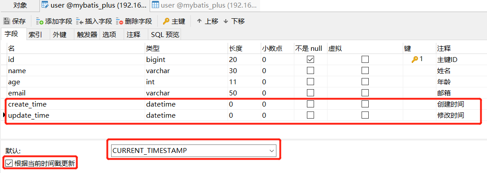
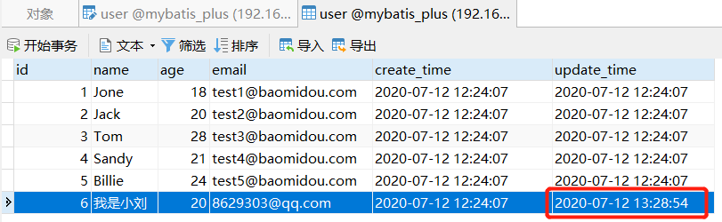
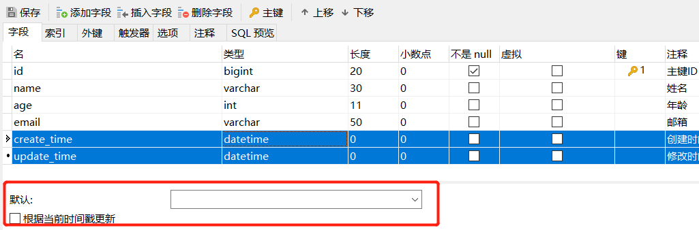
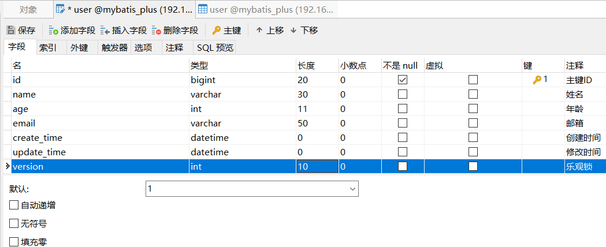
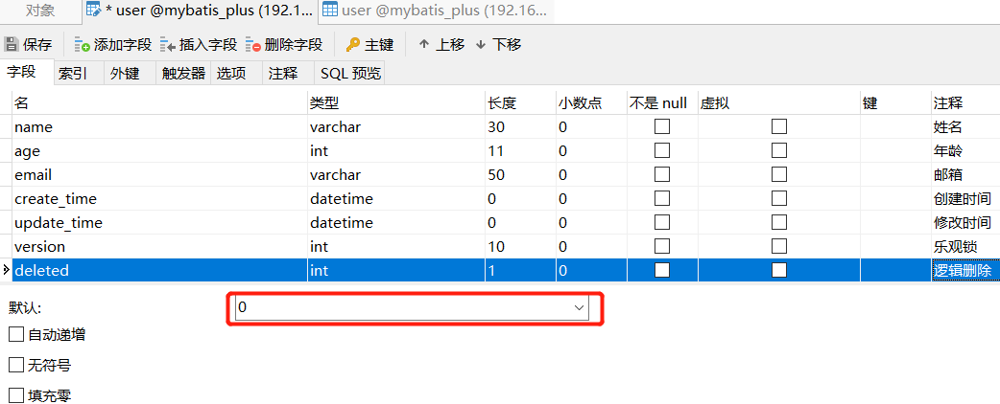

## MyBatisPlus概述

> 简介

[MyBatis-Plus](https://github.com/baomidou/mybatis-plus)（简称 MP）是一个 [MyBatis](http://www.mybatis.org/mybatis-3/) 的增强工具，在 MyBatis 的基础上只做增强不做改变，为简化开发、提高效率而生。

类似的有：**[tk-mapper](https://github.com/abel533/Mapper/wiki)**、**MyBatisPlus**、**SpringDataJPA**

- MyBatis-Plus官网：https://mp.baomidou.com/、https://mybatis.plus/
- Gitee码云：https://gitee.com/baomidou/mybatis-plus

> 特性

- **无侵入**：只做增强不做改变，引入它不会对现有工程产生影响，如丝般顺滑
- **损耗小**：启动即会自动注入基本 CURD，性能基本无损耗，直接面向对象操作
- **强大的 CRUD 操作**：内置通用 Mapper、通用 Service，仅仅通过少量配置即可实现单表大部分 CRUD 操作，更有强大的条件构造器，满足各类使用需求
- **支持 Lambda 形式调用**：通过 Lambda 表达式，方便的编写各类查询条件，无需再担心字段写错
- **支持主键自动生成**：支持多达 4 种主键策略（内含分布式唯一 ID 生成器 - Sequence），可自由配置，完美解决主键问题
- **支持 ActiveRecord 模式**：支持 ActiveRecord 形式调用，实体类只需继承 Model 类即可进行强大的 CRUD 操作
- **支持自定义全局通用操作**：支持全局通用方法注入（ Write once, use anywhere ）
- **内置代码生成器**：采用代码或者 Maven 插件可快速生成 Mapper 、 Model 、 Service 、 Controller 层代码，支持模板引擎，更有超多自定义配置等您来使用
- **内置分页插件**：基于 MyBatis 物理分页，开发者无需关心具体操作，配置好插件之后，写分页等同于普通 List 查询
- **分页插件支持多种数据库**：支持 MySQL、MariaDB、Oracle、DB2、H2、HSQL、SQLite、Postgre、SQLServer 等多种数据库
- **内置性能分析插件**：可输出 Sql 语句以及其执行时间，建议开发测试时启用该功能，能快速揪出慢查询
- **内置全局拦截插件**：提供全表 delete 、 update 操作智能分析阻断，也可自定义拦截规则，预防误操作


## 快速入门

> 快速入门：https://mp.baomidou.com/guide/quick-start.html#
>
> **MyBatis-Plus Samples（官方案例） **https://gitee.com/baomidou/mybatis-plus-samples

1、创建数据库：mybatis_plus 、然后创建user表 

```sql
-- 建库
CREATE DATABASE `mybatis_plus` default character set = 'utf8';
USE `mybatis_plus`;

-- 建表
DROP TABLE IF EXISTS user;
CREATE TABLE user
(
	id BIGINT(20) NOT NULL COMMENT '主键ID',
	name VARCHAR(30) NULL DEFAULT NULL COMMENT '姓名',
	age INT(11) NULL DEFAULT NULL COMMENT '年龄',
	email VARCHAR(50) NULL DEFAULT NULL COMMENT '邮箱',
	PRIMARY KEY (id)
);

-- 真实开发中，version（乐观锁）、deleted（逻辑删除）、gmt_create、gmt_modified
-- 插入数据
DELETE FROM user;
INSERT INTO user (id, name, age, email) VALUES
(1, 'Jone', 18, 'test1@baomidou.com'),
(2, 'Jack', 20, 'test2@baomidou.com'),
(3, 'Tom', 28, 'test3@baomidou.com'),
(4, 'Sandy', 21, 'test4@baomidou.com'),
(5, 'Billie', 24, 'test5@baomidou.com');
```


2、创建SpringBoot项目，添加依赖

```xml
<!-- springboot依赖 -->
<parent>
    <groupId>org.springframework.boot</groupId>
    <artifactId>spring-boot-starter-parent</artifactId>
    <version>2.3.1.RELEASE</version>
    <relativePath/>
</parent>

<dependencies>
    <!-- 数据库驱动 --> 
    <dependency> 
        <groupId>mysql</groupId> 
        <artifactId>mysql-connector-java</artifactId> 
    </dependency>
    <!-- lombok -->
    <dependency>
        <groupId>org.projectlombok</groupId>
        <artifactId>lombok</artifactId>
        <optional>true</optional>
    </dependency>
    <!-- mybatis-plus 是自己开发，并非官方的！ -->
    <dependency>
        <groupId>com.baomidou</groupId>
        <artifactId>mybatis-plus-boot-starter</artifactId>
        <version>3.3.2</version>
    </dependency>
    <!-- spring test -->
    <dependency>
        <groupId>org.springframework.boot</groupId>
        <artifactId>spring-boot-starter-test</artifactId>
        <scope>test</scope>
    </dependency>
</dependencies>
```

**说明：**不要同时导入 mybatis 和 mybatis-plus！版本的差异！mybatis-plus 依赖包含了mybatis


3、数据库连接配置！跟mybatis配置相同

```properties
# mysql 5 驱动不同 com.mysql.jdbc.Driver
# mysql 8 驱动不同 com.mysql.cj.jdbc.Driver、需要增加时区的配置（高版本兼容低版本）
# serverTimezone=GMT%2B8或者&serverTimezone=GMT%2B8
#############################数据库相关配置#############################
spring.datasource.username=root
spring.datasource.password=password
spring.datasource.driver-class-name=com.mysql.cj.jdbc.Driver
spring.datasource.url=jdbc:mysql://localhost:3306/mybatis_plus?useSSL=false&useUnicode=true&characterEncoding=utf-8&serverTimezone=GMT%2B8
```

**~~4、传统方式pojo-dao（连接mybatis，配置mapper.xml文件）-service-controller~~**

4、使用了`mybatis-plus`之后

- 编写实体类 `User.java`(pojo)

```java
@Data 
@AllArgsConstructor 
@NoArgsConstructor 
public class User { 
    private Long id; 
    private String name;
    private Integer age;
    private String email;
}
```

- 编写Mapper类 `UserMapper.java`

```java
package com.example.mybsyidplus.mapper;
import com.baomidou.mybatisplus.core.mapper.BaseMapper;
import com.example.mybsyidplus.model.User;

/**
 * 在对应的Mapper上面继承基本的类 BaseMapper<T>
 * 所有的CRUD操作都已经编写完成了,你不需要像以前的配置一大堆文件了！
 */
public interface UserMapper extends BaseMapper<User> {
}
```

- 在 Spring Boot 启动类中添加 `@MapperScan` 注解，扫描 Mapper 文件夹：

```java
@SpringBootApplication
@MapperScan("com.example")
public class MybatisPlusApplication {
    public static void main(String[] args) {
        SpringApplication.run(MybatisPlusApplication.class, args);
    }
}
```

- 测试类中测试

```java
@SpringBootTest
public class MybatisPlusApplicationTests {
    @Autowired
    private UserMapper userMapper;

    @Test
    public void testSelect() {
        System.out.println(("----- selectAll method test ------"));
        List<User> userList = userMapper.selectList(null);
        userList.forEach(System.out::println);
    }
}
```

- 输出

```
----- selectAll method test ------
2021-02-11 17:25:09.295  INFO 14788 --- [           main] com.zaxxer.hikari.HikariDataSource       : HikariPool-1 - Starting...
2021-02-11 17:25:09.482  INFO 14788 --- [           main] com.zaxxer.hikari.HikariDataSource       : HikariPool-1 - Start completed.
User(id=1, name=Jone, age=18, email=test1@baomidou.com)
User(id=2, name=Jack, age=20, email=test2@baomidou.com)
User(id=3, name=Tom, age=28, email=test3@baomidou.com)
User(id=4, name=Sandy, age=21, email=test4@baomidou.com)
User(id=5, name=Billie, age=24, email=test5@baomidou.com)
```


## 配置日志

- 配置日志方便后面查看

```properties
# 配置日志
mybatis-plus.configuration.log-impl=org.apache.ibatis.logging.stdout.StdOutImpl
```

```
----- selectAll method test ------
Creating a new SqlSession
SqlSession [org.apache.ibatis.session.defaults.DefaultSqlSession@26a262d6] was not registered for synchronization because synchronization is not active
2021-02-11 17:28:11.582  INFO 1900 --- [           main] com.zaxxer.hikari.HikariDataSource       : HikariPool-1 - Starting...
2021-02-11 17:28:11.778  INFO 1900 --- [           main] com.zaxxer.hikari.HikariDataSource       : HikariPool-1 - Start completed.
JDBC Connection [HikariProxyConnection@2005762793 wrapping com.mysql.cj.jdbc.ConnectionImpl@408e96d9] will not be managed by Spring
==>  Preparing: SELECT id,name,age,email FROM user
==> Parameters: 
<==    Columns: id, name, age, email
<==        Row: 1, Jone, 18, test1@baomidou.com
<==        Row: 2, Jack, 20, test2@baomidou.com
<==        Row: 3, Tom, 28, test3@baomidou.com
<==        Row: 4, Sandy, 21, test4@baomidou.com
<==        Row: 5, Billie, 24, test5@baomidou.com
<==      Total: 5
Closing non transactional SqlSession [org.apache.ibatis.session.defaults.DefaultSqlSession@26a262d6]
User(id=1, name=Jone, age=18, email=test1@baomidou.com)
User(id=2, name=Jack, age=20, email=test2@baomidou.com)
User(id=3, name=Tom, age=28, email=test3@baomidou.com)
User(id=4, name=Sandy, age=21, email=test4@baomidou.com)
User(id=5, name=Billie, age=24, email=test5@baomidou.com)
```


## 配置文件详解

application.yml：注意：config-location和configuration不能同时出现，需要注释配置文件里的相关配置

```yaml
mybatis-plus:
  # 如果是放在src/main/java目录下 classpath:/com/yourpackage/*/mapper/*Mapper.xml
  # 如果是放在resource目录 classpath:/mapper/*Mapper.xml
  mapper-locations: classpath:/mapper/*Mapper.xml
  # 实体扫描，多个package用逗号或者分号分隔
  typeAliasesPackage: com.yourpackage.*.entity
  global-config:
    # 主键类型  0:"数据库ID自增", 1:"用户输入ID",2:"全局唯一ID (数字类型唯一ID)", 3:"全局唯一ID UUID";
    id-type: 3
    #字段策略 0:"忽略判断",1:"非 NULL 判断"),2:"非空判断"
    field-strategy: 2
    #驼峰下划线转换
    db-column-underline: true
    # mp2.3+ 全局表前缀 mp_
    #table-prefix: mp_
    # 刷新mapper 调试神器
    # refresh-mapper: true
    # 数据库大写下划线转换
    # capital-mode: true
    # Sequence序列接口实现类配置
    key-generator: com.baomidou.mybatisplus.incrementer.OracleKeyGenerator
    # 逻辑删除配置（下面3个配置）
    logic-delete-value: 1
    logic-not-delete-value: 0
    sql-injector: com.baomidou.mybatisplus.mapper.LogicSqlInjector
    # 自定义填充策略接口实现
    meta-object-handler: com.baomidou.springboot.MyMetaObjectHandler
  configuration:
    # 配置返回数据库(column下划线命名&&返回java实体是驼峰命名)，自动匹配无需as（没开启这个，SQL需要写as： select user_id as userId） 
    map-underscore-to-camel-case: true
    cache-enabled: false
    #配置JdbcTypeForNull, oracle数据库必须配置
    jdbc-type-for-null: 'null' 
  # configuration与config-location不能同时出现
  config-location: classpath:mybatis-config.xml
```


## 实体类常用注解

```
@TableName：用于定义表名

@TableId：用于定义表的主键。如下时属性
    value：用于定义主键字段名
    type：用于定义主键类型（主键策略 IdType）如下是主键类型：
        IdType.AUTO          主键自增，系统分配，不需要手动输入
        IdType.NONE          未设置主键
        IdType.INPUT         需要自己输入 主键值
        IdType.ASSIGN_ID     系统分配 ID，用于数值型数据（Long，对应 mysql 中 BIGINT 类型）
        IdType.ASSIGN_UUID   系统分配 UUID，用于字符串型数据（String，对应 mysql 中 varchar(32) 类型）

@TableField 用于定义表的非主键字段。属性如下
    value 用于定义非主键字段名,用于别名匹配，假如java对象属性和数据库属性不一样
    exist 用于指明是否为数据表的字段， 
        true  表示是，默认值为是
        false 表示不是，假如某个java属性在数据库没对应的字段则要标记为faslse
    fill 用于指定字段填充策略（FieldFill，用的不多）字段填充策略：一般用于填充 创建时间、修改时间等字段
        FieldFill.DEFAULT         默认不填充
        FieldFill.INSERT          插入时填充
        FieldFill.UPDATE          更新时填充
        FieldFill.INSERT_UPDATE   插入、更新时填充
```


## 主键生成策略

> 分布式系统唯一id生成：https://www.cnblogs.com/haoxinyue/p/5208136.html

**雪花算法：**

```
snowflflake 是 Twitter 开源的分布式ID生成算法，结果是一个long型的ID。
其核心思想是：使用41bit作为毫秒数，10bit作为机器的ID（5个bit是数据中心，5个bit的机器ID），
12bit作为毫秒内的流水号（意味着每个节点在每毫秒可以产生 4096 个 ID），最后还有一个符号位，永远是0。可以保证几乎全球唯一！
```

- 设置主键自增
  1. 实体类字段上：`@TableId(type = IdType.AUTO)`
  2. **数据库主键字段**一定要设置为**自动递增**
- 主键策略详解：

```java
public enum IdType {
    AUTO(0),// 数据库id自增
    NONE(1),// 未设置主键，默认
    INPUT(2),// 手动输入
    ASSIGN_ID(3),//分配ID(主键类型为Number(Long和Integer)
    ASSIGN_UUID(4),//分配UUID,主键类型为String(since 3.3.0)
    @Deprecated
    ID_WORKER(3),// 默认的全局唯一id，废弃
    @Deprecated
    ID_WORKER_STR(3),//ID_WORKER_STR 字符串表示法，废弃
    @Deprecated
    UUID(4);// 全局唯一id uuid，废弃
}
```

|        值         |                             描述                             |
| :---------------: | :----------------------------------------------------------: |
|       AUTO        |                         数据库ID自增                         |
|       NONE        | 无状态,该类型为未设置主键类型(注解里等于跟随全局,全局里约等于 INPUT) |
|       INPUT       |                    insert前自行set主键值                     |
|     ASSIGN_ID     | 分配ID(主键类型为Number(Long和Integer)或String)(since 3.3.0),使用接口`IdentifierGenerator`的方法`nextId`(默认实现类为`DefaultIdentifierGenerator`雪花算法) |
|    ASSIGN_UUID    | 分配UUID,主键类型为String(since 3.3.0),使用接口`IdentifierGenerator`的方法`nextUUID`(默认default方法) |
|   ~~ID_WORKER~~   |     分布式全局唯一ID 长整型类型(please use `ASSIGN_ID`)      |
|     ~~UUID~~      |           32位UUID字符串(please use `ASSIGN_UUID`)           |
| ~~ID_WORKER_STR~~ |     分布式全局唯一ID 字符串类型(please use `ASSIGN_ID`)      |


## 插入操作

```java
    /**
     * 测试插入单挑数据，通用mapper没有批量插入
     */
    @Test
    public void testInsert(){
        User user = new User();
        user.setName("Sam");
        user.setAge(3);
        user.setEmail("8629303@qq.com");
        // 帮我们自动生成id
        int result = userMapper.insert(user);
        // 受影响的行数
        System.out.println(result);
        // 发现id会自动回填
        System.out.println(user);

        // 插入第二条数据
        userMapper.insert(new User(6L, "胖子", 18, "123456@qq.com"));
    }
```

```
Creating a new SqlSession
SqlSession [org.apache.ibatis.session.defaults.DefaultSqlSession@77134e08] was not registered for synchronization because synchronization is not active
2021-02-11 18:49:03.734  INFO 860 --- [           main] com.zaxxer.hikari.HikariDataSource       : HikariPool-1 - Starting...
2021-02-11 18:49:03.926  INFO 860 --- [           main] com.zaxxer.hikari.HikariDataSource       : HikariPool-1 - Start completed.
JDBC Connection [HikariProxyConnection@747004588 wrapping com.mysql.cj.jdbc.ConnectionImpl@260ff5b7] will not be managed by Spring
==>  Preparing: INSERT INTO user ( id, name, age, email ) VALUES ( ?, ?, ?, ? )
==> Parameters: 1359816715181613057(Long), Sam(String), 3(Integer), 8629303@qq.com(String)
<==    Updates: 1
Closing non transactional SqlSession [org.apache.ibatis.session.defaults.DefaultSqlSession@77134e08]
1
User(id=1359816715181613057, name=Sam, age=3, email=8629303@qq.com)
Creating a new SqlSession
SqlSession [org.apache.ibatis.session.defaults.DefaultSqlSession@12d1f1d4] was not registered for synchronization because synchronization is not active
JDBC Connection [HikariProxyConnection@1979325411 wrapping com.mysql.cj.jdbc.ConnectionImpl@260ff5b7] will not be managed by Spring
==>  Preparing: INSERT INTO user ( id, name, age, email ) VALUES ( ?, ?, ?, ? )
==> Parameters: 6(Long), 胖子(String), 18(Integer), 123456@qq.com(String)
<==    Updates: 1
Closing non transactional SqlSession [org.apache.ibatis.session.defaults.DefaultSqlSession@12d1f1d4]
```

**数据库插入的id的默认值为：全局的唯一id**


## 更新操作

```java
    /**
     * 根据id更新数据
     */
    @Test
    public void testUpdate(){
        User user = new User();
        // 通过条件自动拼接动态sql
        user.setId(6L);
        user.setName("我是小刘");
        user.setAge(18);
        // 注意：updateById 但是参数是一个 对象！
        int i = userMapper.updateById(user);
        System.out.println(i);
    }

    /**
     * 根据Wrapper更新：有两种方式
     * 1.使用 QueryWrapper 更新
     * 2.使用 UpdateWrapper 更新
     */
    @Test
    public void testUpdateW(){
        User user = new User();
        user.setAge(88);
        // 方式一：queryWrapper更新操作,空字段不会更新
        userMapper.update(user, new QueryWrapper<User>().eq("id", 1));
        // 方式二：updateWrapper更新操作
        userMapper.update(user, new UpdateWrapper<User>().eq("id", 2));
    }
```

```
==>  Preparing: UPDATE user SET name=?, age=? WHERE id=? 
==> Parameters: 我是小刘(String), 18(Integer), 6(Long)
<==    Updates: 1
```

```
.....
==>  Preparing: UPDATE user SET age=? WHERE (id = ?)
==> Parameters: 88(Integer), 1(Integer)
<==    Updates: 1
.....
==>  Preparing: UPDATE user SET age=? WHERE (id = ?)
==> Parameters: 88(Integer), 2(Integer)
<==    Updates: 1
```


## 删除操作

> 根据 id 删除记录

```java
    // 根据id试删除 
    @Test 
    public void testDeleteById(){ 
        userMapper.deleteById(6L); 
    }

    // 通过ids 批量删除 
    @Test 
    public void testDeleteBatchId(){ 
        userMapper.deleteBatchIds(1L,2L); 
    }

    // 通用删除操作 deleteByMap  map要写列名条件 不能是实体属性名
    @Test 
    public void testDeleteMap(){ 
        HashMap<String, Object> map = new HashMap<>(); 
        map.put("name","我是小刘"); 
        userMapper.deleteByMap(map);
    }
```

```
.....
==>  Preparing: DELETE FROM user WHERE id=?
==> Parameters: 6(Long)
<==    Updates: 1
```

```
==>  Preparing: DELETE FROM user WHERE id IN ( ? , ? )
==> Parameters: 1(Long), 2(Long)
<==    Updates: 2
```

```
==>  Preparing: DELETE FROM user WHERE name = ?
==> Parameters: 我是小刘(String)
<==    Updates: 0
```


## 查询操作

查询API：selectById、selectBatchIds、selectOne、selectCount、selectList...等等

```java
    /**
     * 根据id单个数据查询
     */
    @Test
    public void testSelectById(){
        User user = userMapper.selectById(1L);
        System.out.println(user);
    }

    /**
     * 根据ids多数据查询
     */
    @Test
    public void testSelectBatchIds(){
        List<User> users = userMapper.selectBatchIds(Arrays.asList(1, 2, 3));
        users.forEach(System.out::println);
    }

    /**
     * 按条件查询之一：使用map操作
     */
    @Test
    public void testSelectByMap(){
        // 自定义要查询
        HashMap<String, Object> map = new HashMap<>();
        map.put("name","Jack");
        map.put("age",3);
        userMapper.selectByMap(map).forEach(System.out::println);
    }

    /**
     * 按条件查询之二：根据条件QueryWrapper查询
     */
    @Test
    public void testSelectQueryWrapper(){
        // 传入查询对象QueryWrapper，没有可以为null，返回List，查询初所有的数据
        userMapper.selectList(null).forEach(System.out::println);
        // 查询数据总条数
        System.out.println(userMapper.selectCount(null));
        // 传入查询对象QueryWrapper，没有可以为null，返回单个对象，也就是查询数据的第一条
        // 注意：mybatis-plus的selectOne方法查询到多条数据会报错
        System.out.println(userMapper.selectOne(null));
    }
```


## 分页插件

> MybatisPlus内置了分页插件的使用

1、**旧版**拦截器组件配置

```java
@Configuration
public class MybatisPlusPageConfig {
    /**
     * 旧版分页查询插件，3.4.0版本后已经废弃。
     * 如果使用3.4.0之前就是使用该插件。
     * 3.4.0以后版本使用 MybatisPlusInterceptor中增加PaginationInnerInterceptor() 插件
     */
    //@Bean
    public PaginationInterceptor paginationInterceptor() {
        return new PaginationInterceptor();
    }
    
    /**
     * 新的分页插件（3.4.0以后使用）新旧版本只能配置其一
     */
    @Bean
    public MybatisPlusInterceptor mybatisPlusInterceptor() {
        MybatisPlusInterceptor interceptor = new MybatisPlusInterceptor();
        interceptor.addInnerInterceptor(new PaginationInnerInterceptor(DbType.MYSQL));
        return interceptor;
    }
}
```

2、**旧版**分页插件测试

```java
    /***
     * 测试旧版分页插件
     */
    @Test
    public void testPage(){
        // 参数一：当前页，参数二：页面大小
        Page<User> page = new Page<>(2,3);
        userMapper.selectPage(page,null);
        page.getRecords().forEach(System.out::println);
        System.out.println(page.getTotal());
    }

    /***
     * 测试新版分页插件
     */
    @Test
    public void testPage() {
        //第1页，每页2条
        Page<User> page = new Page<>(1, 2);
        IPage<User> userIPage = userMapper.selectPage(page, new QueryWrapper<User>().eq("name","Sam"));
        System.out.println("总条数"+userIPage.getTotal());
        System.out.println("总页数"+userIPage.getPages());
        //获取当前数据
        System.out.println(userIPage.getRecords().toString());
    }
```

```
....测试的是新版分页插件的日志
==>  Preparing: SELECT COUNT(*) FROM user WHERE (name = ?)
==> Parameters: Sam(String)
<==    Columns: COUNT(*)
<==        Row: 3
<==      Total: 1
==>  Preparing: SELECT id,name,age,email FROM user WHERE (name = ?) LIMIT ?
==> Parameters: Sam(String), 2(Long)
<==    Columns: id, name, age, email
<==        Row: 1359815734616248321, Sam, 3, 8629303@qq.com
<==        Row: 1359815843768766465, Sam, 3, 8629303@qq.com
<==      Total: 2
Closing non transactional SqlSession [org.apache.ibatis.session.defaults.DefaultSqlSession@557eb543]
总条数3
总页数2
[User(id=1359815734616248321, name=Sam, age=3, email=8629303@qq.com), User(id=1359815843768766465, name=Sam, age=3, email=8629303@qq.com)]
```


## 条件构造器

> 文档：https://mp.baomidou.com/guide/wrapper.html#abstractwrapper

**Wrapper**：一些复杂的sql就可以使用它来替代！

**Wrapper**：抽象类下面主要有两个实现类：**QueryWrapper**（查询）和 **UpdateWrapper**（更新）

**QueryWrapper**介绍

- 可以封装sql对象，包括where条件，order by排序，select哪些字段等等
- 查询包装类，可以封装多数查询条件，泛型指定返回的实体类


核心API

- eq 等于
- ne 不等于
- gt 大于
- ge 大于等于
- lt 小于
- le 小于等于
- or 拼接
- between 两个值中间
- notBetween 不在两个值中间
- like 模糊匹配
- notLike 不模糊匹配
- likeLeft 左匹配
- likeRight 右边匹配
- isNull 字段为空
- in in查询
- orderByAsc 升序
- orderByDesc 降序
- groupBy 分组
- having 分组条件查询

1、测试一：

```java
    @Test
    void contextLoads() {
        // 查询name不为空的用户，并且邮箱不为空的用户，年龄大于等于12
        QueryWrapper<User> wrapper = new QueryWrapper<>();
        wrapper
            .isNotNull("name")
            .isNotNull("email")
            .ge("age",12);// age >= 18
        // 可以与map查询对比
        userMapper.selectList(wrapper).forEach(System.out::println);
    }
```

2、条件查询：eq

```java
    @Test 
    void test2(){ 
        // 查询名字 Jack
        QueryWrapper<User> wrapper = new QueryWrapper<>();
        wrapper.eq("name","Jack"); // name = 'Jack'
        // 查询一个数据，出现多个结果使用List或Map,selectOne查询出超过一条数据会报错
        User user = userMapper.selectOne(wrapper); 
        System.out.println(user); 
    }
```

3、区间查询：between

```java
    @Test 
    void test3(){ 
        // 查询年龄在 20 ~ 30 岁之间的用户 
        QueryWrapper<User> wrapper = new QueryWrapper<>(); 
        wrapper.between("age",20,30); // 区间 age between 20 and 30
        Integer count = userMapper.selectCount(wrapper);// 查询结果数 
        System.out.println(count); 
    }
```

4、模糊查询：notLike、likeRight

```java
    @Test 
    void test4(){ 
        QueryWrapper<User> wrapper = new QueryWrapper<>(); 
        // 左和右 t% 
        wrapper 
            .notLike("name","e") // not like
            .likeRight("email","t"); 
        List<Map<String, Object>> maps = userMapper.selectMaps(wrapper); 
        maps.forEach(System.out::println); 
    }
```

5、in查询 ：

```java
    @Test 
    void test5(){ 
        QueryWrapper<User> wrapper = new QueryWrapper<>(); 
        // id 在子查询中查出来 
        //  ==》id in (select id from table where id < 3)
        wrapper.inSql("id","select id from user where id<3"); 
        List<Object> objects = userMapper.selectObjs(wrapper); 
        objects.forEach(System.out::println); 
    }
```

6、排序：orderByAsc

```java
    // 排序
    @Test 
    void test6(){ 
        QueryWrapper<User> wrapper = new QueryWrapper<>(); 
        // 通过id进行排序 
        wrapper.orderByAsc("id"); 
        List<User> users = userMapper.selectList(wrapper); 
        users.forEach(System.out::println); 
    }
```


## 指定select字段查询

**面试题：**select * 和 select 指定字段的区别

- 网络IO问题

  ```
  select * 会查出所有的字段，有些是不需要的，当应用程序和服务器不在同一个局域网时，字段过多会影响网络传输的性能
  ```

- 索引问题

  ```
  在指定字段有索引的情况下，mysql是可以不用读data，直接使用index里面的值就返回结果的。
  但是一旦用了select *，就会有其他列需要从磁盘中读取才会返回结果，这样就造成了额外的性能开销
  ```

**MybatisPlus**指定查询字段

```java
    /**
     * select查询指定字段名
     */
    @Test
    public void testSelectCustomFieldName(){
        System.out.println(userMapper.selectList(new QueryWrapper<User>().select("id", "name")));
    }
```

```
==>  Preparing: SELECT id,name FROM user
==> Parameters: 
<==    Columns: id, name
<==        Row: 3, Tom
<==        Row: 4, Sandy
<==        Row: 5, Billie
<==        Row: 6, 胖子
<==        Row: 1359815734616248321, Sam
<==        Row: 1359815843768766465, Sam
<==        Row: 1359816715181613057, Sam
<==      Total: 7
Closing non transactional SqlSession [org.apache.ibatis.session.defaults.DefaultSqlSession@7c84195]
[User(id=3, name=Tom, age=null, email=null), User(id=4, name=Sandy, age=null, email=null), User(id=5, name=Billie, age=null, email=null), User(id=6, name=胖子, age=null, email=null), User(id=1359815734616248321, name=Sam, age=null, email=null), User(id=1359815843768766465, name=Sam, age=null, email=null), User(id=1359816715181613057, name=Sam, age=null, email=null)]
```


## 自定义XML-SQL脚本

一般情况下，简单的查询方式咱们可以直接使用MybatisPlus自带的接口实现，不过要实现多表关联、复杂查询、动态查询的话，咱们还是得使用xml形式更加方便。

- 新建xml（可以跟UserMapper.java放在同一package下，也可以放在resources下）

```xml
<?xml version="1.0" encoding="UTF-8"?>
<!DOCTYPE mapper PUBLIC "-//mybatis.org//DTD Mapper 3.0//EN" "http://mybatis.org/dtd/mybatis-3-mapper.dtd">
<!--这个名称空间是Mapper接口的路径，记得修改-->
<mapper namespace="com.example.mybsyidplus.mapper.UserMapper">
    <!-- 查询全部用户 -->
    <select id="selectUser" resultType="com.example.mybsyidplus.model.User">
        select * from user
    </select>
</mapper>
```

- 新建对应得mapper接口

```
/**
 * 在对应的Mapper上面继承基本的类 BaseMapper<T>
 * 所有的CRUD操作都已经编写完成了,你不需要像以前的配置一大堆文件了！
 */
public interface UserMapper extends BaseMapper<User> {
    List<User> selectUser();
}
```

- 配置文件告诉mapper.xml路径（如果采用默认路径可以不配）

```properties
# 配置plus打印sql日志
mybatis-plus.configuration.log-impl=org.apache.ibatis.logging.stdout.StdOutImpl
# 默认配置路径，如果放在src/main/java目录下就配置为：classpath:com/**/*Mapper.xml
mybatis-plus.mapper-locations=classpath*:/mapper/*Mapper.xml
# mybatis-plus.mapper-locations=classpath:com/**/*Mapper.xml
```

- 测试代码

```java
    /**
     * 自定义xml-sql语句
     */
    @Test
    public void testSelectXmlSql(){
        System.out.println(userMapper.selectUser());
    }
```

- 备注说明：如果`xml`文件配置`src/main/java`目录下一定需要在pom.xml中配置该插件

```xml
    <build>
        <resources>
            <resource>
                <directory>src/main/java</directory>
                <includes>
                    <include>**/*.xml</include>
                </includes>
            </resource>
            <resource>
                <directory>src/main/resources</directory>
            </resource>
        </resources>
    <build>  
```


## 自动填充

创建时间、修改时间！这些个操作一遍都是自动化完成的，我们不希望手动更新！

阿里巴巴开发手册：所有的数据库表：gmt_create、gmt_modifified几乎所有的表都要配置上！而且需要自动化！

> 方式一：数据库级别（工作中不允许你修改数据库，所以基本上不会使用此方式）

1、在表中新增字段 create_time, update_time（默认CURRENT_TIMESTAMP）



2、再次测试插入方法，我们需要先把实体类同步！

```java
private Date createTime; 
private Date updateTime;
```

3、再次更新查看结果即可




> **方式二：代码级别（一般用这种方式）**

1、删除数据库的默认值、更新操作！



2、实体类字段属性上需要增加注解

```java
// 字段添加填充内容 
@TableField(fill = FieldFill.INSERT) 
private Date createTime; 

// 字段插入、更新时填充
@TableField(fill = FieldFill.INSERT_UPDATE) 
private Date updateTime; 
```

```java
public enum FieldFill {
    DEFAULT,		// 默认不处理
    INSERT, 		// 插入填充字段
    UPDATE, 		// 更新填充字段
    INSERT_UPDATE	// 插入和更新填充字段
}
```

3、编写处理器来处理这个注解即可！

```java
@Slf4j
@Component
public class MyMetaObjectHandler implements MetaObjectHandler {

    // 插入时的填充策略
    @Override
    public void insertFill(MetaObject metaObject) {
        log.info("start insert fill ....");
        // 起始版本 3.3.0(推荐使用)
        this.strictInsertFill(metaObject, "createTime", Date.class, new Date());
        this.strictInsertFill(metaObject, "updateTime", Date.class, new Date()); 
        
        // 也可以使用(3.3.0 该方法有bug请升级到之后的版本如`3.3.1.8-SNAPSHOT`)
        // this.fillStrategy(metaObject, "createTime", new Date());
        // this.fillStrategy(metaObject, "updateTime", new Date());
    }

    // 更新时的填充策略
    @Override
    public void updateFill(MetaObject metaObject) {
        log.info("start update fill ....");
        // 起始版本 3.3.0(推荐使用)
        this.strictUpdateFill(metaObject, "updateTime", Date.class, new Date());
       
        // 也可以使用(3.3.0 该方法有bug请升级到之后的版本如`3.3.1.8-SNAPSHOT`)
        // this.fillStrategy(metaObject, "updateTime", new Date());
    }
}
```

4、测试插入

5、测试更新、观察时间即可！


## 乐观锁

> 乐观锁：故名思意十分乐观，它总是认为不会出现问题，无论干什么不去上锁！如果出现了问题，再次更新值测试
>
> 悲观锁：故名思意十分悲观，它总是认为总是出现问题，无论干什么都会上锁！再去操作

乐观锁（机制）实现方式：

- 取出记录时，获取当前version

- 更新时，带上这个version

- 执行更新时， set version = newVersion where version = oldVersion

- 如果version不对，就更新失败

乐观锁示例：先查询，获得版本号 version = 1 

```sql
-- A
update user set name = "liusx", version = version + 1 where id = 2 and version = 1 

-- B 线程抢先完成，这个时候 version = 2，会导致 A 修改失败！ 
update user set name = "liusx", version = version + 1 where id = 2 and version = 1
```


> 测试一下Mybatis_Plus的乐观锁插件

1、给数据库中增加version字段！



2、我们实体类加对应的字段

```java
// 乐观锁Version注解
@Version 
private Integer version;
```

3、注册组件

```java
@EnableTransactionManagement // 开启事务
@Configuration
public class MybatisPlusPageConfig {
    /**
     * 旧版乐观锁插件注册，3.4.0版本后已经废弃
     * 如果使用3.4.0之前就是使用该插件。
     * 3.4.0以后版本使用 MybatisPlusInterceptor中增加OptimisticLockerInnerInterceptor() 插件
     */ 
    @Bean
    public OptimisticLockerInterceptor optimisticLockerInterceptor() {
        return new OptimisticLockerInterceptor();
    }

    /**
     * 新的分页插件和乐观锁插件（3.4.0以后使用）
     */
    @Bean
    public MybatisPlusInterceptor mybatisPlusInterceptor() {
        MybatisPlusInterceptor interceptor = new MybatisPlusInterceptor();
        // 分页插件
        interceptor.addInnerInterceptor(new PaginationInnerInterceptor(DbType.MYSQL));
        // 乐观锁插件
        interceptor.addInnerInterceptor(new OptimisticLockerInnerInterceptor());
        return interceptor;
    }
}
```

4、测试一下！

```java
    // 测试乐观锁成功！
    @Test
    public void testOptimisticLocker(){
        // 1、查询用户信息
        User user = userMapper.selectById(6L);
        // 2、修改用户信息
        user.setName("liusx");
        user.setEmail("110@qq.com");
        // 3、执行更新操作
        userMapper.updateById(user);
    }

    // 测试乐观锁失败！多线程下
    @Test
    public void testOptimisticLocker2(){
        // 线程 1
        User user = userMapper.selectById(6L);
        user.setName("liusx111");
        user.setEmail("8629303@qq.com");

        // 模拟另外一个线程执行了插队操作
        User user2 = userMapper.selectById(6L);
        user2.setName("liusx222");
        user2.setEmail("8629303@qq.com");
        userMapper.updateById(user2);
        // 自旋锁来多次尝试提交！
        userMapper.updateById(user); // 如果没有乐观锁就会覆盖插队线程的值！
    }
```

- testOptimisticLocker()输出

```
==>  Preparing: UPDATE user SET name=?, age=?, email=?, create_time=?, update_time=?, version=? WHERE id=? AND version=? 
==> Parameters: liusx(String), 21(Integer), 110@qq.com(String), 2020-07-12 12:24:07.0(Timestamp), 2020-07-12 13:40:40.0(Timestamp), 2(Integer), 6(Long), 1(Integer)
<==    Updates: 1
```

- testOptimisticLocker2()输出

```
==>  Preparing: UPDATE user SET name=?, age=?, email=?, create_time=?, update_time=?, version=? WHERE id=? AND version=? 
==> Parameters: liusx222(String), 21(Integer), 8629303@qq.com(String), 2020-07-12 12:24:07.0(Timestamp), 2020-07-12 13:40:40.0(Timestamp), 3(Integer), 6(Long), 2(Integer)
<==    Updates: 1
Closing non transactional SqlSession [org.apache.ibatis.session.defaults.DefaultSqlSession@5ac6c4f2]
Creating a new SqlSession
SqlSession [org.apache.ibatis.session.defaults.DefaultSqlSession@2e53b094] was not registered for synchronization because synchronization is not active
JDBC Connection [HikariProxyConnection@972720850 wrapping com.mysql.cj.jdbc.ConnectionImpl@61d34b4] will not be managed by Spring
==>  Preparing: UPDATE user SET name=?, age=?, email=?, create_time=?, update_time=?, version=? WHERE id=? AND version=? 
==> Parameters: liusx111(String), 21(Integer), 8629303@qq.com(String), 2020-07-12 12:24:07.0(Timestamp), 2020-07-12 13:40:40.0(Timestamp), 3(Integer), 6(Long), 2(Integer)
<==    Updates: 0
```

- **注意：**
  - 乐观锁数据类型支持int、integer、long、timestamp
  - 仅支持updateById和update方法


## 逻辑删除

> 物理删除 ：从数据库中直接移除 
>
> 逻辑删除 ：在数据库中没有被移除，而是通过一个变量来让他失效！deleted = 0 => deleted = 1

管理员可以查看被删除的记录！防止数据的丢失，类似于回收站！

测试一下：

1、在数据表中增加一个 deleted 字段



2、配置（实体类增加属性配置@TableLogic 或者 在配置文件增加指定）

```properties
# 配置逻辑删除
# 全局逻辑删除的实体字段名(since 3.3.0,配置后可以忽略不配置步骤3的注解)
# mybatis-plus.global-config.db-config.logic-delete-field=deleted
mybatis-plus.global-config.db-config.logic-delete-value=1
mybatis-plus.global-config.db-config.logic-not-delete-value=0
```

3、实体类中增加属性

```java
//逻辑删除配置
@TableLogic
private Integer deleted; 
```

4、测试一下删除，发现走的是更新而不是删除

```java
// 根据id试删除
@Test 
public void testDeleteById(){ 
    userMapper.deleteById(6L); 
}
```
```
==>  Preparing: UPDATE user SET deleted=1 WHERE id=? AND deleted=0 
==> Parameters: 6(Long)
<==    Updates: 1
```


##  ActiveRecord模式

1、实体类继承Model

```java
@Data
@AllArgsConstructor
@NoArgsConstructor
public class User extends Model<User> {
    @TableId(type = IdType.AUTO)
    private Long id;
    private String name;
    private Integer age;
    private String email;
    @TableField(fill = FieldFill.INSERT)
    private Date createTime;
    @TableField(fill = FieldFill.INSERT_UPDATE)
    private Date updateTime;
    @Version //乐观锁Version注解
    private Integer version;
    private Integer deleted;

    @Override
    protected Serializable pkVal() {
        /**
         * AR 模式这个必须有，否则 xxById 的方法都将失效！
         * 另外 UserMapper 也必须 AR 依赖该层注入，有可无 XML
         */
        return id;
    }
}
```

2、测试用例

```java
    // 查找
    @Test
    public void testSelectById() {
        User user = new User();
        user.setId(4L);
        User u = user.selectById(); // 在这个位置直接执行selectById
        System.out.println("user1 = " + u);
    }

    // 新增操作
    @Test
    public void testInsert() {
        User u = new User();
        u.setName("无道");
        u.setAge(100);
        u.setEmail("8629303@qq.com");
        boolean insert = u.insert();
        System.out.println("insert = " + insert);
    }

    // 更新操作
    @Test
    public void testUpdate() {
        User u = new User();
        u.setId(5L);
        u.setAge(22);
        boolean b = u.updateById();
        System.out.println("b = " + b);
    }

    // 删除操作
    @Test
    public void testDelete() {
        User u = new User();
        u.setId(6L);
        boolean b = u.deleteById();
        System.out.println("b = " + b);
    }

    // 根据条件查询
    @Test
    public void testSelectCondition() {
        QueryWrapper<User> wrapper = new QueryWrapper<>();
        wrapper.ge("age", 30);
        User u = new User();
        List<User> users = u.selectList(wrapper);
        System.out.println("users = " + users);
    }
```

**不可以删除UserMapper接口，因为底层还是使用到了接口。**


## 代码自动生成器

**AutoGenerator**是`MyBatis-Plus`的代码生成器，通过AutoGenerator可以快速生成 Entity、Mapper、Mapper XML、Service、Controller 等各个模块的代码，极大的提升了开发效率

> https://mp.baomidou.com/guide/generator.html

```java
package com.liusx;

import com.baomidou.mybatisplus.annotation.DbType;
import com.baomidou.mybatisplus.annotation.FieldFill;
import com.baomidou.mybatisplus.annotation.IdType;
import com.baomidou.mybatisplus.core.exceptions.MybatisPlusException;
import com.baomidou.mybatisplus.generator.AutoGenerator;
import com.baomidou.mybatisplus.generator.config.DataSourceConfig;
import com.baomidou.mybatisplus.generator.config.GlobalConfig;
import com.baomidou.mybatisplus.generator.config.PackageConfig;
import com.baomidou.mybatisplus.generator.config.StrategyConfig;
import com.baomidou.mybatisplus.generator.config.po.TableFill;
import com.baomidou.mybatisplus.generator.config.rules.DateType;
import com.baomidou.mybatisplus.generator.config.rules.NamingStrategy;
import org.apache.commons.lang3.StringUtils;

import java.util.ArrayList;
import java.util.Scanner;

// 代码自动生成器
public class CodeGenerator {

    private static final String URL = "jdbc:mysql://192.168.3.55:3306/mybatis_plus? useSSL=false&useUnicode=true&characterEncoding=utf-8&serverTimezone=GMT%2B8";
    private static final String DRIVERNAME = "com.mysql.cj.jdbc.Driver";
    private static final String USERNAME = "root";
    private static final String PASSWORD = "password";
    private static final String MODULE = "/mybatis_plus"; // module名称

    public static void main(String[] args) { 
        // 需要构建一个 代码自动生成器 对象 
        AutoGenerator mpg = new AutoGenerator();

        // 配置策略 
        // 1、全局配置 
        GlobalConfig gc = new GlobalConfig(); 
        String projectPath = System.getProperty("user.dir");
        gc.setOutputDir(projectPath + MODULE + "/src/main/java");
        gc.setAuthor("liusx"); // 代码开发人员
        gc.setOpen(true); // 是否打开输出目录
        gc.setFileOverride(true); // 是否覆盖
        gc.setServiceName("%sService"); // 去Service的I前缀 
        gc.setIdType(IdType.AUTO); // 指定生成的主键的ID类型
        gc.setDateType(DateType.ONLY_DATE); 
        gc.setSwagger2(false);  // 实体属性 Swagger2 注解
        mpg.setGlobalConfig(gc); 

        //2、设置数据源 
        DataSourceConfig dsc = new DataSourceConfig(); 
        dsc.setUrl(URL);
        dsc.setDriverName(DRIVERNAME);
        dsc.setUsername(USERNAME);
        dsc.setPassword(PASSWORD);
        dsc.setDbType(DbType.MYSQL); 
        mpg.setDataSource(dsc); 

        // 3、包的配置
        PackageConfig pc = new PackageConfig();
        //pc.setModuleName("generator"); // 父包模块名
        pc.setModuleName(scanner("模块名")); // 父包模块名
        pc.setParent("com.liusx"); // 父包名。如果为空，将下面子包名必须写全部，否则就只需写子包名
        pc.setController("controller");
        pc.setService("service");
        pc.setServiceImpl("service"); // service.impl 默认包名
        pc.setMapper("mapper");
        pc.setXml("mapper");
        pc.setEntity("entity");
        mpg.setPackageInfo(pc);

        //4、策略配置 
        StrategyConfig strategy = new StrategyConfig();
        strategy.setNaming(NamingStrategy.underline_to_camel); // 数据库表映射到实体的命名策略,当前驼峰
        strategy.setColumnNaming(NamingStrategy.underline_to_camel); // 数据库表字段映射到实体的命名策略
        strategy.setEntityLombokModel(true); // 自动lombok
        strategy.setRestControllerStyle(true); // 生成 @RestController控制器
        strategy.setControllerMappingHyphenStyle(true); // ip:8080/helloId ==>ip:8080/hello_id
        strategy.setLogicDeleteFieldName("deleted"); // 逻辑删除属性名称
        // 自动填充配置
        TableFill gmtCreate = new TableFill("gmt_create", FieldFill.INSERT); 
        TableFill gmtModified = new TableFill("gmt_modified", FieldFill.INSERT_UPDATE); 
        ArrayList<TableFill> tableFills = new ArrayList<>(); 
        tableFills.add(gmtCreate); 
        tableFills.add(gmtModified); 
        strategy.setTableFillList(tableFills); 
        // 乐观锁 
        strategy.setVersionFieldName("version");
        // 设置要映射的表名
        //strategy.setInclude("user");
        strategy.setInclude(scanner("表名，多个英文逗号分割").split(","));
        mpg.setStrategy(strategy);
        mpg.execute(); //执行 
    }

    /**
     * <p>
     * 读取控制台内容
     * </p>
     */
    public static String scanner(String tip) {
        Scanner scanner = new Scanner(System.in);
        StringBuilder help = new StringBuilder();
        help.append("请输入" + tip + "：");
        System.out.println(help.toString());
        if (scanner.hasNext()) {
            String ipt = scanner.next();
            if (StringUtils.isNotEmpty(ipt)) {
                return ipt;
            }
        }
        throw new MybatisPlusException("请输入正确的" + tip + "！");
    }
}
```


## SQL性能分析插件

> 该功能依赖 p6spy 组件，完美的输出打印 SQL 及执行时长 3.1.0 以上版本

1、p6spy 依赖引入

```xml
<!-- p6spy性能分析插件-->
<dependency>
    <groupId>p6spy</groupId>
    <artifactId>p6spy</artifactId>
    <version>3.8.5</version>
</dependency>
```

2、修改yml/properties配置文件：

```properties
#spring.datasource.url=jdbc:mysql://192.168.3.55:3306/mybatis_plus?useSSL=false&useUnicode=true&characterEncoding=utf-8&serverTimezone=GMT%2B8
#spring.datasource.driver-class-name=com.mysql.cj.jdbc.Driver

# sql分析插件需要切换url及驱动具体看mybatis-plus官网
spring.datasource.url=jdbc:p6spy:mysql://192.168.3.55:3306/mybatis_plus?useSSL=false&useUnicode=true&characterEncoding=utf-8&serverTimezone=GMT%2B8
spring.datasource.driver-class-name=com.p6spy.engine.spy.P6SpyDriver
```

3、导入spy.properties 配置到resources目录下：

```properties
modulelist=com.baomidou.mybatisplus.extension.p6spy.MybatisPlusLogFactory,com.p6spy.engine.outage.P6OutageFactory
# 自定义日志打印
logMessageFormat=com.baomidou.mybatisplus.extension.p6spy.P6SpyLogger
# 日志输出到控制台
appender=com.baomidou.mybatisplus.extension.p6spy.StdoutLogger
# 使用日志系统记录 sql
# appender=com.p6spy.engine.spy.appender.Slf4JLogger
# 设置 p6spy driver 代理
deregisterdrivers=true
# 取消JDBC URL前缀
useprefix=true
# 配置记录 Log 例外,可去掉的结果集有error,info,batch,debug,statement,commit,rollback,result,resultset.
excludecategories=info,debug,result,commit,resultset
# 日期格式
dateformat=yyyy-MM-dd HH:mm:ss
# 实际驱动可多个
#driverlist=org.h2.Driver
# 是否开启慢SQL记录
outagedetection=true
# 慢SQL记录标准 2 秒
outagedetectioninterval=1

# 输出到文件中，需要把上面配置输出到控制台的配置注释掉
logfile=log.log
```

4、然后随便找个测试类测试

```
下面是性能分析插件打印的：
==> Parameters: 
 Consume Time：10 ms 2020-07-12 18:39:41
 Execute SQL：SELECT id,name,age,email,create_time,update_time,version,deleted FROM user WHERE deleted=0 AND (id IN (select id from user where id<3))
```

**发现该方法的SQL执行了10ms毫秒**

> 注意！
>
> - driver-class-name 为 p6spy 提供的驱动类
> - url 前缀为 jdbc:p6spy 跟着冒号为对应数据库连接地址
> - 打印出sql为null,在excludecategories增加commit
> - 批量操作不打印sql,去除excludecategories中的batch
> - 批量操作打印重复的问题请使用MybatisPlusLogFactory (3.2.1新增）
> - 该插件有性能损耗，不建议生产环境使用