## RabbitMQ介绍

### 1.1.引言

> 你是否遇到过两个（多个）系统间需要通过定时任务来同步某些数据？你是否在为异构系统的不同进程间相互调用、通讯的问题而苦恼、挣扎？消息服务让你可以很轻松地解决这些问题。
> 消息服务擅长于解决多系统、异构系统间的数据交换（消息通知/通讯）问题，你也可以把它用于系统间服务的相互调用（RPC）。
>
> 模块之间的耦合度高，导致一个模块宕机后，全部功能不能用了，并且同步通信成本高，用户体验差。

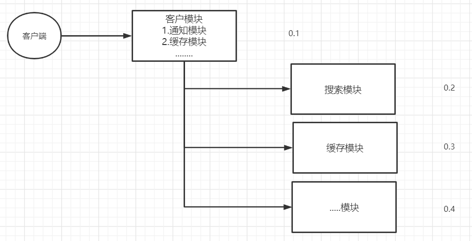


### 1.2.RabbitMQ介绍

> 市面上比较火爆的几款MQ：
>
> ActiveMQ、RocketMQ、Kafka、RabbitMQ
>
> - 语言的支持：ActiveMQ、RocketMQ只支持Java语言，Kafka、RabbitMQ支持多种语言。
> - 效率方面：ActiveMQ、RocketMQ、Kafka效率都是毫秒级别，RabbitMQ是微秒级别的。
> - 消息丢失，消息重复问题：RabbitMQ针对消息的持久化，和重复问题都有比较成熟的解决方案。
> - 学习成本：RabbitMQ非常简单。
>
> RabbitMQ是由Rabbit公司去研发和维护的,最终是在Pivotal。
>
> RabbitMQ严格的遵循AMQP协议，高级消息队列协议，帮助我们在进程之间传递异步消息。


## RabbitMQ安装

### Windows安装

> 1.安装`Erlang`=》2.安装`RabbitMQ`=》3.激活`RabbitMQ's Management Plugin`可视化插件
>
> RabbitMQ是采用Erlang语言开发的，所以系统环境必须提供Erlang环境
>
> Erlang和RabbitMQ版本的按照比较: https://www.rabbitmq.com/which-erlang.html

**1、安装Erlang**

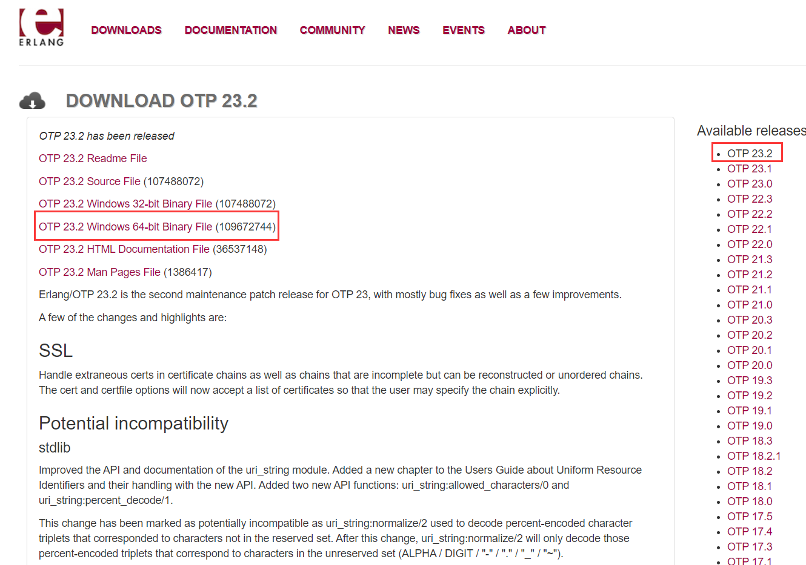

- 下载地址：https://www.erlang.org/downloads，选择`OTP 23.2 Windows 64-bit Binary File`
- 运行`otp_win64_23.2.exe`，安装Erlang（默认next 和 install 即可）
- 设置环境变量：
  - ERLANG_HOME：D:\xx\erl-23.2（erlang安装路径）
  - Path追加：;%ERLANG_HOME%\bin
  - 打开CMD输入`erl`, 提示版本信息: `Eshell V11.1.4 (abort with ^G)`, 说明安装成功


**2、安装RabbitMQ**

- 下载地址: https://www.rabbitmq.com/install-windows.html，选择`rabbitmq-server-3.8.14.exe`
- 历史版本下载地址：https://github.com/rabbitmq/rabbitmq-server/releases
- 运行`rabbitmq-server-3.8.14.exe`，安装RabbitMQ
- 设置环境变量：
  - RABBITMQ_SERVER：D:\rabbitmq\rabbitmq-server-3.8.14（安装路径）
  - Path追加：;%RABBITMQ_SERVER%\sbin
  - 命令行输入：rabbitmqctl status， 出现如下信息说明安装成功并且启动

```cmd
D:\Environment\RabbitMQ Server\rabbitmq_server-3.8.14\sbin>rabbitmqctl status
Status of node rabbit@LAPTOP-671C76TJ ...
Runtime

OS PID: 7916
OS: Windows
Uptime (seconds): 2291
Is under maintenance?: false
RabbitMQ version: 3.8.14
Node name: rabbit@LAPTOP-671C76TJ
Erlang configuration: Erlang/OTP 23 [erts-11.1.4] [source] [64-bit] [smp:8:8] [ds:8:8:10] [async-threads:1]
Erlang processes: 473 used, 1048576 limit
Scheduler run queue: 1
Cluster heartbeat timeout (net_ticktime): 60

Plugins

Enabled plugin file: c:/Users/lenovo/AppData/Roaming/RabbitMQ/enabled_plugins
Enabled plugins:

 * rabbitmq_management
 * amqp_client
 * rabbitmq_web_dispatch
 * cowboy
 * cowlib
 * rabbitmq_management_agent

Data directory

Node data directory: c:/Users/lenovo/AppData/Roaming/RabbitMQ/db/rabbit@LAPTOP-671C76TJ-mnesia
Raft data directory: c:/Users/lenovo/AppData/Roaming/RabbitMQ/db/rabbit@LAPTOP-671C76TJ-mnesia/quorum/rabbit@LAPTOP-671C76TJ

Config files

 * c:/Users/lenovo/AppData/Roaming/RabbitMQ/advanced.config

Log file(s)

 * c:/Users/lenovo/AppData/Roaming/RabbitMQ/log/rabbit@LAPTOP-671C76TJ.log
 * c:/Users/lenovo/AppData/Roaming/RabbitMQ/log/rabbit@LAPTOP-671C76TJ_upgrade.log

Alarms

(none)

Memory

Total memory used: 0.1347 gb
Calculation strategy: rss
Memory high watermark setting: 0.4 of available memory, computed to: 6.8184 gb

allocated_unused: 0.0386 gb (28.69 %)
code: 0.0328 gb (24.35 %)
other_proc: 0.0319 gb (23.69 %)
other_system: 0.0162 gb (12.05 %)
plugins: 0.0059 gb (4.38 %)
other_ets: 0.0036 gb (2.65 %)
reserved_unallocated: 0.0031 gb (2.34 %)
atom: 0.0015 gb (1.08 %)
binary: 0.0004 gb (0.33 %)
metrics: 0.0002 gb (0.17 %)
mgmt_db: 0.0002 gb (0.13 %)
mnesia: 0.0001 gb (0.07 %)
quorum_ets: 0.0 gb (0.04 %)
msg_index: 0.0 gb (0.02 %)
connection_other: 0.0 gb (0.0 %)
connection_channels: 0.0 gb (0.0 %)
connection_readers: 0.0 gb (0.0 %)
connection_writers: 0.0 gb (0.0 %)
queue_procs: 0.0 gb (0.0 %)
queue_slave_procs: 0.0 gb (0.0 %)
quorum_queue_procs: 0.0 gb (0.0 %)

File Descriptors

Total: 2, limit: 65439
Sockets: 0, limit: 58893

Free Disk Space

Low free disk space watermark: 0.05 gb
Free disk space: 93.5777 gb

Totals

Connection count: 0
Queue count: 0
Virtual host count: 1

Listeners

Interface: [::], port: 25672, protocol: clustering, purpose: inter-node and CLI tool communication
Interface: [::], port: 5672, protocol: amqp, purpose: AMQP 0-9-1 and AMQP 1.0
Interface: 0.0.0.0, port: 5672, protocol: amqp, purpose: AMQP 0-9-1 and AMQP 1.0
Interface: [::], port: 15672, protocol: http, purpose: HTTP API
Interface: 0.0.0.0, port: 15672, protocol: http, purpose: HTTP API
```

- 此时访问http://localhost:15672/，发现无法访问，因为还未激活管理插件


**3、激活RabbitMQ's Management Plugin可视化插件**

- 进入RabbitMQ安装的/sbin目录下输入安装命令：rabbitmq-plugins enable rabbitmq_management
- 出现如下信息表示成功（可以通过查看所有插件查看是否成功：**rabbitmq-plugins list**）

```cmd
D:\Environment\RabbitMQ Server\rabbitmq_server-3.8.14\sbin>rabbitmq-plugins enable rabbitmq_management
Enabling plugins on node rabbit@LAPTOP-671C76TJ:
rabbitmq_management
The following plugins have been configured:
  rabbitmq_management
  rabbitmq_management_agent
  rabbitmq_web_dispatch
Applying plugin configuration to rabbit@LAPTOP-671C76TJ...
The following plugins have been enabled:
  rabbitmq_management
  rabbitmq_management_agent
  rabbitmq_web_dispatch

started 3 plugins.
```

- 浏览器访问：http://localhost:15672/，账号密码：guest/guest。到此windows安装RabbitMQ已全部完成


4、如上是通过*.exe方式安装的，所以自动帮我们安装好了服务启动和服务暂时删除等


5、如何是通过*.zip文件安装的话需要手动安装RabbitMQ服务

1、以应用方式启动（如何没有install安装成windows服务）

- 前台启动：rabbitmq-server
- 后台启动：rabbitmq-server -detached


2、**Rabbitmq服务的启动和关闭：**（以服务方式启动）

- 启动服务：rabbitmq-service start
- 重启服务：rabbitmq-service restart
- 停止服务：rabbitmq-service stop
- 安装服务：rabbitmq-service install
- 删除服务：rabbitmq-service remove
- 使服务有效：rabbitmq-service enable 
- 使服务无效：rabbitmq-service disable
- 查看帮助：rabbitmq-service help

> 当rabbitmq-service install之后默认服务是enable的，如果这时设置服务为disable的话，rabbitmq-service start就会报错。
>
> 当rabbitmq-service start正常启动服务之后，使用disable是没有效果的


**Rabbitmq插件的启用和关闭**

- 查看插件列表：rabbitmq-plugins list（标记为E*或e*的已经启用的插件，没标记的为未启用插件）

- 启动某个插件：rabbitmq-plugins enable plugin-name

- 关闭某个插件：rabbitmq-plugins disable plugin-name

> 例如：rabbitmq_management，该插件为rabbitmq提供一个基于web管理界面，可以很方便的在浏览器中管理rabbitmq，登录地址默认为：localhost:15672，用户名和密码都为guest。
>
> 安装：rabbitmq-plugins enable/disable rabbitmq_management 


**Rabbitmq一个重要的管理平台rabbitmqctl：**

它提供了各种对rabbitmq进行管理的各种命令，这里列举一些比较常用的

```shell
# 启动应用（在Erlang VM运行的情况下启动RabbitMQ应用）：
rabbitmqctl start_app
# 关闭应用：
rabbitmqctl stop_app
# 查看节点状态
rabbitmqctl status

# 列出所有queue：
rabbitmqctl list_queues
# 列出指定queue的信息：
rabbitmqctl list_queues [the queue name] messages_ready messages_unacknowledged
# 列出所有exchange：
rabbitmqctl list_exchanges
# 列出所有binding：
rabbitmqctl list_bindings

# 查看用户列表：
rabbitmqctl list_users
# 创建用户：
rabbitmqctl add_user [username] [password]
rabbitmqctl add_user user_admin password
# 删除用户：
rabbitmqctl delete_user [username]
rabbitmqctl delete_user user_admin
# 修改密码：
rabbitmqctl change_password [username] [newpassword]
rabbitmqctl change_password user_admin 123456

# 使用命令给rabbit设置tag：none、management、policymaker、monitoring、administrator
rabbitmqctl set_user_tag username [tag1] [tag2] ...
rabbitmqctl set_user_tag user_admin administrator

# 列出虚拟主机上的所有权限:
rabbitmqctl list_permissions -p [vhostpath]
rabbitmqctl list_permissions -p /test

# 查看用户权限：
rabbitmqctl list_user_permissions [username]
rabbitmqctl list_user_permissions user_admin

# 设置用户权限：
rabbitmqctl set_permissions -p vhostpath username ".*" ".*" ".*"
rabbitmqctl set_permissions -p / user_admin ".*" ".*" ".*"

# 清除用户权限：
rabbitmqctl clear_permissions -p vhostpath username
rabbitmqctl clear_permissions -p / user_admin

# 列出所以虚拟主机:
rabbitmqctl list_vhosts

# 创建虚拟主机:
rabbitmqctl add_vhost [vhostpath]
rabbitmqctl add_vhost /test

# 删除虚拟主机:
rabbitmqctl delete_vhost [vhostpath]
rabbitmqctl delete_vhost /test

# 移除所有数据，要在 rabbitmqctl stop_app 之后使用:
rabbitmqctl reset
```


```
2、用户角色分类
用户角色可分为五类，超级管理员, 监控者, 策略制定者, 普通管理者以及其他。
(1) 超级管理员(administrator)
可登陆管理控制台(启用management plugin的情况下)，可查看所有的信息，并且可以对用户，策略(policy)进行操作。
(2) 监控者(monitoring)
可登陆管理控制台(启用management plugin的情况下)，同时可以查看rabbitmq节点的相关信息(进程数，内存使用情况，磁盘使用情况等)
(3) 策略制定者(policymaker)
可登陆管理控制台(启用management plugin的情况下), 同时可以对policy进行管理。但无法查看节点的相关信息
(4) 普通管理者(management)
仅可登陆管理控制台(启用management plugin的情况下)，无法看到节点信息，也无法对策略进行管理。
(5) 其他
无法登陆管理控制台，通常就是普通的生产者和消费者。

3、用户权限
用户权限指的是用户对exchange，queue的操作权限，包括配置权限，读写权限。配置权限会影响到exchange，queue的声明和删除。读写权限影响到从queue里取消息，向exchange发送消息以及queue和exchange的绑定(bind)操作。
例如： 将queue绑定到某exchange上，需要具有queue的可写权限，以及exchange的可读权限；向exchange发送消息需要具有exchange的可写权限；从queue里取数据需要具有queue的可读权限。详细请参考官方文档中"How permissions work"部分。

(1) 设置用户权限
rabbitmqctl set_permissions -p VHostPath User ConfP WriteP ReadP
(2) 查看(指定hostpath)所有用户的权限信息
rabbitmqctl list_permissions [-p VHostPath]
(3) 查看指定用户的权限信息
rabbitmqctl list_user_permissions User
(4) 清除用户的权限信息
rabbitmqctl clear_permissions [-p VHostPath] User
```


> 有5个tag可供选择，分别是：administrator ，monitoring，policymaker，management和none 有兴趣的同学可以到[这里](http://www.rabbitmq.com/management.html)了解各个tag的含义，其实这里的tag代表的是权限，administrator是最高权限，none表示不能访问，这里administrator和none的组合，权限应该是向高看齐，忽略none，用的是administrator的权限。我们用rabbit1/rabbit1 登录rabbitmq_management。

rabbitMQ启动成功后浏览器访问localhost:55672  默认账号：guest  密码：guest


### Docker安装

```yml
version: "3.1"
services: 
  rabbitmq: 
    image: daocloud.io/library/rabbitmq:management
    restart: always
    container_name: rabbitmq
    ports: 
      - 5672:5672
      - 15672:15672
    volumes: 
      - ./data:/var/lib/rabbitmq
```

```shell
# 创建目录
$ mkdir -p /usr/local/docker-compose/rabbitmq
# 编写docker-compose.yml文件
$ vi /usr/local/docker-compose/rabbitmq/docker-compose.yml
# 后台启动
$ docker-compose up -d
# rabbitmq web端默认关闭的，手动开启
$ docker exec -it rabbitmq rabbitmq-plugins enable rabbitmq_management
# 或者
$ docker-compose exec rabbitmq rabbitmq-plugins enable rabbitmq_management
```


## RabbitMQ架构

### 3.1.官方的简单架构图

> - Publisher - 生产者：发布消息到 RabbitMQ中的 Exchange
> - Consumer - 消费者：监听 RabbitMQ中的 Queue中的消息
> - Exchange - 交换机：和生产者建立连接并接收生产者的消息
> - Queue - 队列：Exchange会将消息分发到指定的 Queue, Queue和消费者进行交互
> - Routes - 路由：交换机以什么样的策略将消息发布到 Queue

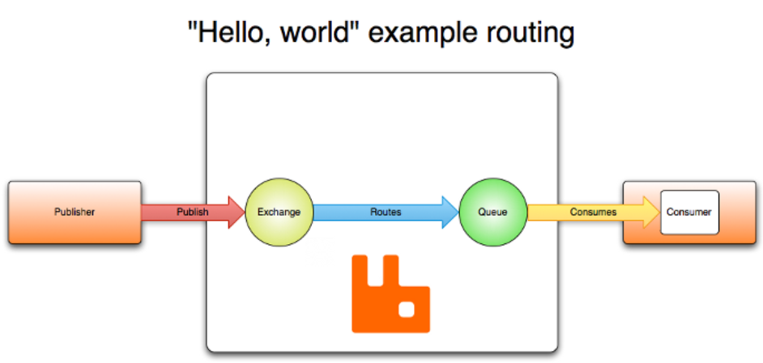


### 3.2.RabbitMQ完整架构图


### 3.3.图形界面创建User和VHost

1.创建User：账号/密码为 test/test

2.创建Virtual Host：/test

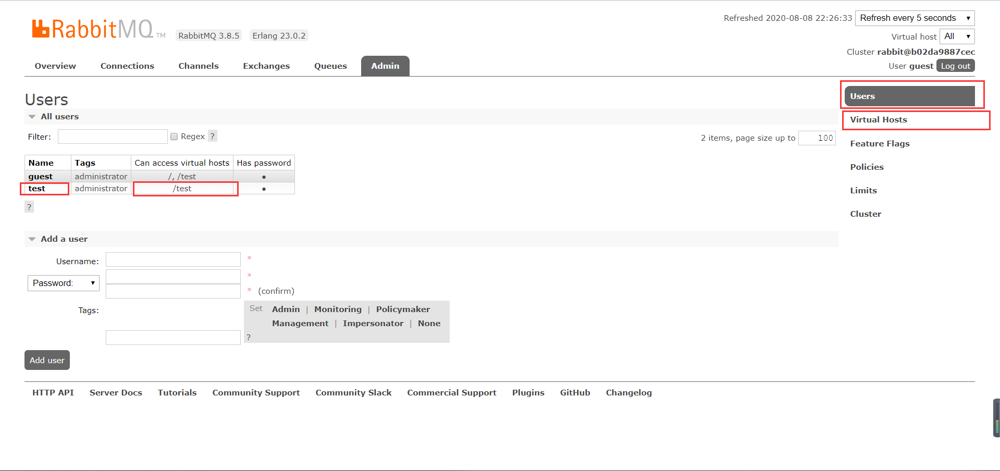


## RabbitMQ的使用

### 4.1.RabbitMQ的通讯方式

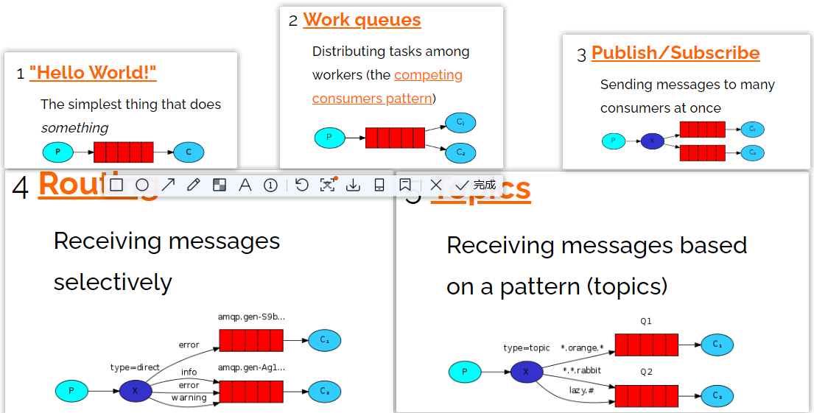


### 4.2.Java连接RabbitMQ

1.创建maven项目

2.导入依赖

```xml
<dependencies>
    <dependency>
        <groupId>com.rabbitmq</groupId>
        <artifactId>amqp-client</artifactId>
        <version>5.6.0</version>
    </dependency>
    <dependency>
        <groupId>junit</groupId>
        <artifactId>junit</artifactId>
        <version>4.12</version>
    </dependency>
</dependencies>
```

3.创建工具类连接RabbitMQ

```java
package com.liusx.config;

import com.rabbitmq.client.Connection;
import com.rabbitmq.client.ConnectionFactory;
import org.junit.Test;

import java.io.IOException;

public class RabbitMQClient {
    public static Connection getConnection(){
        ConnectionFactory connectionFactory = new ConnectionFactory();
        connectionFactory.setHost("192.168.3.54");
        connectionFactory.setPort(5672);
        connectionFactory.setUsername("test");
        connectionFactory.setPassword("test");
        connectionFactory.setVirtualHost("/test");

        Connection connection = null;
        try {
            connection = connectionFactory.newConnection();
        } catch (Exception e) {
            e.printStackTrace();
        }
        return connection;
    }

    @Test
    public void getConnectionTest() throws IOException {
        Connection connection = RabbitMQClient.getConnection();
        //connection.close();
    }
}
```

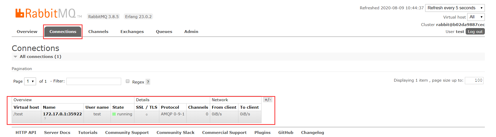


### 4.3.Hello-World

> 一个生产者，一个默认的交换机，一个队列，一个消费者

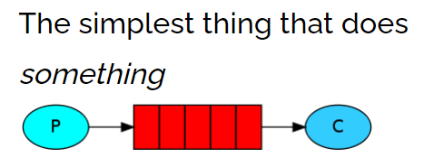

> 创建生产者，创建一个channel，发布消息到exchange，指定路由规则

```java
package com.liusx.com.liusx.helloworld;
import com.liusx.config.RabbitMQClient;
import com.rabbitmq.client.Channel;
import com.rabbitmq.client.Connection;
import org.junit.Test;

public class Publisher {

    @Test
    public void publish() throws Exception {
        //1. 获取Connection
        Connection connection = RabbitMQClient.getConnection();

        //2. 创建Channel
        Channel channel = connection.createChannel();

        //3. 发布消息到exchange，同时指定路由的规则
        String msg = "Hello-World！";
        // 参数1：指定exchange，使用""。
        // 参数2：指定路由的规则，使用具体的队列名称。
        // 参数3：指定传递的消息所携带的properties，使用null。
        // 参数4：指定发布的具体消息，byte[]类型
        channel.basicPublish("","HelloWorld",null,msg.getBytes());
        // Ps：exchange是不会帮你将消息持久化到本地的，Queue才会帮你持久化消息。
        System.out.println("生产者发布消息成功！");
        //4. 释放资源
        channel.close();
        connection.close();
    }
}
```

> 创建消费者，创建一个channel，创建一个队列，并且去消费当前队列

```java
package com.liusx.com.liusx.helloworld;
import com.liusx.config.RabbitMQClient;
import com.rabbitmq.client.*;
import org.junit.Test;
import java.io.IOException;

public class Consumer {
    @Test
    public void consume() throws Exception {
        //1. 获取连接对象
        Connection connection = RabbitMQClient.getConnection();

        //2. 创建channel
        Channel channel = connection.createChannel();

        //3. 声明队列-HelloWorld
        //参数1：queue - 指定队列的名称
        //参数2：durable - 当前队列是否需要持久化（true）
        //参数3：exclusive - 是否排外（conn.close() - 当前队列会被自动删除，当前队列只能被一个消费者消费）
        //参数4：autoDelete - 如果这个队列没有消费者在消费，队列自动删除
        //参数5：arguments - 指定当前队列的其他信息
        channel.queueDeclare("HelloWorld",true,false,false,null);

        //4. 开启监听Queue
        DefaultConsumer consume = new DefaultConsumer(channel){
            @Override
            public void handleDelivery(String consumerTag, Envelope envelope, AMQP.BasicProperties properties, byte[] body) throws IOException {
                System.out.println("接收到信息："+new String(body,"UTF-8"));
            }
        };

        //5. 消费
        //参数1：queue - 指定消费哪个队列
        //参数2：autoAck - 指定是否自动ACK （true，接收到消息后，会立即告诉RabbitMQ）
        //参数3：consumer - 指定消费回调
        channel.basicConsume("HelloWorld",false,consume);

        System.out.println("消费者开始监听队列！");
        // 让程序停止，好接收消费
        System.in.read();

        //5. 释放资源
        channel.close();
        connection.close();
    }
}
```


### 4.4.Work

> 一个生产者，一个默认的交换机，一个队列，两个消费者

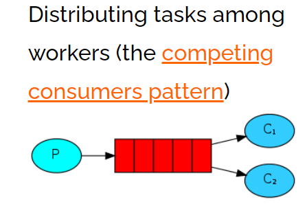

> 只需要在消费端，添加Qos能力以及更改为手动ack即可让消费者，根据自己的能力去消费指定的消息，而不是默认情况下由RabbitMQ平均分配，生产者不变，正常发布消息默认的exchange，并指定routing
>
> 消费者指定Qoa和手动ack

> 修改生产者代码，循环发送消息

```java
package com.liusx.work;
import com.liusx.config.RabbitMQClient;
import com.rabbitmq.client.Channel;
import com.rabbitmq.client.Connection;
import org.junit.Test;

public class Publisher {

    @Test
    public void publish() throws Exception {
        //1. 获取Connection
        Connection connection = RabbitMQClient.getConnection();

        //2. 创建Channel
        Channel channel = connection.createChannel();

        //3. 发布消息到exchange，同时指定路由的规则
        for (int i = 0; i < 10 ; i++) {
            String msg = "Hello-World！" + i;
            channel.basicPublish("","Work",null,msg.getBytes());
        }

        System.out.println("生产者发布消息成功！");
        //4. 释放资源
        channel.close();
        connection.close();
    }

}

```

> 创建2个消费者：Qoa和休眠可以修改消费者不以平均消费消息

```java
package com.liusx.work;

import com.liusx.config.RabbitMQClient;
import com.rabbitmq.client.*;
import org.junit.Test;
import java.io.IOException;

public class Consumer1 {
    @Test
    public void consume() throws Exception {
        //1. 获取连接对象
        Connection connection = RabbitMQClient.getConnection();

        //2. 创建channel
        Channel channel = connection.createChannel();

        //3. 声明队列-HelloWorld
        channel.queueDeclare("Work",true,false,false,null);

        //3.5 指定当前消费者，一次消费多少个消息
        channel.basicQos(1);

        //4. 开启监听Queue
        DefaultConsumer consumer = new DefaultConsumer(channel){
            @Override
            public void handleDelivery(String consumerTag, Envelope envelope, AMQP.BasicProperties properties, byte[] body) throws IOException {
                try {
                    //Thread.sleep(100);
                } catch (Exception e) {
                    e.printStackTrace();
                }
                System.out.println("消费者1号接收到消息：" + new String(body,"UTF-8"));

                // 手动ack
                //参数2：是否批量操作
                channel.basicAck(envelope.getDeliveryTag(),false);
            }
        };

        channel.basicConsume("Work",false,consumer);

        System.out.println("开始消费消息。。。。");
        System.in.read();
        //5. 释放资源
        channel.close();
        connection.close();
    }

}
```

```java
package com.liusx.work;
import com.liusx.config.RabbitMQClient;
import com.rabbitmq.client.*;
import org.junit.Test;

import java.io.IOException;

public class Consumer2 {
    @Test
    public void consume() throws Exception {
        //1. 获取连接对象
        Connection connection = RabbitMQClient.getConnection();

        //2. 创建channel
        Channel channel = connection.createChannel();

        //3. 声明队列-HelloWorld
        channel.queueDeclare("Work",true,false,false,null);

        //3.5 指定当前消费者，一次消费多少个消息
        channel.basicQos(2);

        //4. 开启监听Queue
        DefaultConsumer consumer = new DefaultConsumer(channel){
            @Override
            public void handleDelivery(String consumerTag, Envelope envelope, AMQP.BasicProperties properties, byte[] body) throws IOException {
                try {
                    //Thread.sleep(200);
                } catch (Exception e) {
                    e.printStackTrace();
                }
                System.out.println("消费者2号接收到消息：" + new String(body,"UTF-8"));
                // 手动ack
                channel.basicAck(envelope.getDeliveryTag(),false);
            }
        };

        channel.basicConsume("Work",false,consumer);

        System.out.println("开始消费消息。。。。");
        // System.in.read();


        System.in.read();
        //5. 释放资源
        channel.close();
        connection.close();
    }

}
```


### 4.5.Public/Subscribe

> 一个生产者，一个交换机，两个队列，两个消费者

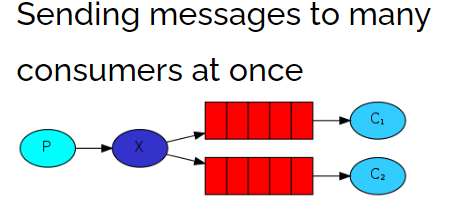

> 声明一个Fanout类型的exchange，并且将exchange和queue绑定一起，绑定的方式就是直接绑定

> 让生产者创建一个exchange并且指定类型，和一个或多个队列绑定到一起

```java
package com.liusx.pubsub;
import com.liusx.config.RabbitMQClient;
import com.rabbitmq.client.BuiltinExchangeType;
import com.rabbitmq.client.Channel;
import com.rabbitmq.client.Connection;
import org.junit.Test;

public class Publisher {

    @Test
    public void publish() throws Exception {
        //1. 获取Connection
        Connection connection = RabbitMQClient.getConnection();

        //2. 创建Channel
        Channel channel = connection.createChannel();

        //3. 创建exchange - 绑定某一个队列
        //参数1： exchange的名称
        //参数2： 指定exchange的类型：FANOUT-pubsub、DIRECT-Routing、TOPIC-Topics
        channel.exchangeDeclare("pubsub-exchange", BuiltinExchangeType.FANOUT);
        channel.queueBind("pubsub-queue1","pubsub-exchange","");
        channel.queueBind("pubsub-queue2","pubsub-exchange","");

        //4. 发布消息到exchange，同时指定路由的规则
        for (int i = 0; i < 10 ; i++) {
            String msg = "Hello-World！" + i;
            channel.basicPublish("pubsub-exchange","",null,msg.getBytes());
        }

        System.out.println("生产者发布消息成功！");
        //5. 释放资源
        channel.close();
        connection.close();
    }
}
```

> 消费这还是与上一节一样，修改队列名称即可

```java
//3. 声明队列-HelloWorld
channel.queueDeclare("pubsub-queue1",true,false,false,null);
//4. 开启监听Queue，然后消费
channel.basicConsume("pubsub-queue1",false,consumer);
--------------
//3. 声明队列-HelloWorld
channel.queueDeclare("pubsub-queue2",true,false,false,null);
//4. 开启监听Queue，然后消费
channel.basicConsume("pubsub-queue2",false,consumer);
```


### 4.6.Routing

> 一个生产者，一个交换机，两个队列，两个消费者

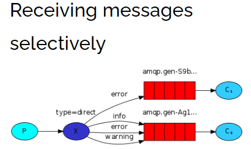

> 生产者在创建DIRECT类型的exchange后，根据RoutingKey去绑定相应的队列，并且在发送消息时，指定消息的具体RoutingKey即可。

```java
package com.qf.routing;
import com.qf.config.RabbitMQClient;
import com.rabbitmq.client.BuiltinExchangeType;
import com.rabbitmq.client.Channel;
import com.rabbitmq.client.Connection;
import org.junit.Test;

public class Publisher {

    @Test
    public void publish() throws Exception {
        //1. 获取Connection
        Connection connection = RabbitMQClient.getConnection();

        //2. 创建Channel
        Channel channel = connection.createChannel();

        //3. 创建exchange, routing-queue-error,routing-queue-info,
        channel.exchangeDeclare("routing-exchange", BuiltinExchangeType.DIRECT);
        channel.queueBind("routing-queue-error","routing-exchange","ERROR");
        channel.queueBind("routing-queue-info","routing-exchange","INFO");

        //3. 发布消息到exchange，同时指定路由的规则
        channel.basicPublish("routing-exchange","ERROR",null,"ERROR".getBytes());
        channel.basicPublish("routing-exchange","INFO",null,"INFO1".getBytes());
        channel.basicPublish("routing-exchange","INFO",null,"INFO2".getBytes());
        channel.basicPublish("routing-exchange","INFO",null,"INFO3".getBytes());

        System.out.println("生产者发布消息成功！");
        //4. 释放资源
        channel.close();
        connection.close();
    }
}
```

> 消费这还是与上一节一样，修改队列名称即可

```java
//3. 声明队列-HelloWorld
channel.queueDeclare("routing-queue-error",true,false,false,null);
//4. 开启监听Queue，然后消费
channel.basicConsume("routing-queue-error",false,consumer);
--------------
//3. 声明队列-HelloWorld
channel.queueDeclare("routing-queue-info",true,false,false,null);
//4. 开启监听Queue，然后消费
channel.basicConsume("routing-queue-info",false,consumer);
```


### 4.7.Topic

> 一个生产者，一个交换机，两个队列，两个消费者

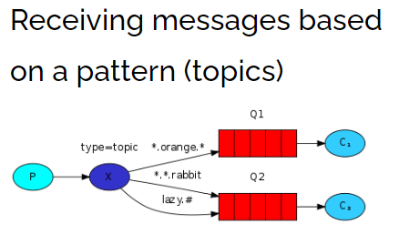

> 生产者创建Topic的exchange并且绑定到队列中，这次绑定可以通过\*和#关键字，对指定RoutingKey内容，编写时注意格式 xxx.xxx.xxx 去别写。\* -》代表xxx，# -》代表多个xxx.xxx，在发送消息时，指定具体的RoutingKey到底时什么

```java
package com.liusx.topic;
import com.liusx.config.RabbitMQClient;
import com.rabbitmq.client.BuiltinExchangeType;
import com.rabbitmq.client.Channel;
import com.rabbitmq.client.Connection;
import org.junit.Test;

public class Publisher {

    @Test
    public void publish() throws Exception {
        //1. 获取Connection
        Connection connection = RabbitMQClient.getConnection();

        //2. 创建Channel
        Channel channel = connection.createChannel();

        // 创建exchange绑定队列      topic-queue-1   topic-queue-2
        // 动物的信息 <speed>.<color>.<what>
        // *.red.*              -> *占位符
        // fast.#               -> #通配符
        // *.*.rabbit
        channel.exchangeDeclare("topic-exchange", BuiltinExchangeType.TOPIC);
        channel.queueBind("topic-queue-1","topic-exchange","*.red.*");
        channel.queueBind("topic-queue-2","topic-exchange","fast.#");
        channel.queueBind("topic-queue-2","topic-exchange","*.*.rabbit");

        //3. 发布消息到exchange，同时指定路由的规则
        channel.basicPublish("topic-exchange","fast.red.monkey",null,"红快猴子".getBytes());
        channel.basicPublish("topic-exchange","slow.black.dog",null,"黑漫狗".getBytes());
        channel.basicPublish("topic-exchange","fast.white.cat",null,"快白猫".getBytes());

        System.out.println("生产者发布消息成功！");
        //4. 释放资源
        channel.close();
        connection.close();
    }

}
```

> 消费这还是与上一节一样，修改队列名称即可

```java
//3. 声明队列-HelloWorld
channel.queueDeclare("topic-queue-1",true,false,false,null);
//4. 开启监听Queue，然后消费
channel.basicConsume("topic-queue-1",false,consumer);
--------------
//3. 声明队列-HelloWorld
channel.queueDeclare("topic-queue-2",true,false,false,null);
//4. 开启监听Queue，然后消费
channel.basicConsume("topic-queue-2",false,consumer);
```


## RabbitMQ整合SpringBoot

### 5.1.SpringBoot整合RabbitMQ

1.创建SpringBoot工程

2.导入依赖

```xml
<dependency>
    <groupId>org.springframework.boot</groupId>
    <artifactId>spring-boot-starter-amqp</artifactId>
</dependency>
```

3.编写配置文件

```yml
spring:
  rabbitmq:
    host: 192.168.3.54
    port: 5672
    username: test
    password: test
    virtual-host: /test
```

4.声明exchange、queue，编写配置类RabbitMQConfig.java

```java
package com.example.sprinbootrabbitmq.config;

import org.springframework.amqp.core.Binding;
import org.springframework.amqp.core.BindingBuilder;
import org.springframework.amqp.core.Queue;
import org.springframework.amqp.core.TopicExchange;
import org.springframework.context.annotation.Bean;
import org.springframework.context.annotation.Configuration;

@Configuration
public class RabbitMQConfig {
    //1. 创建exchange - topic
    //参数1：数据持久化
    //参数2：读取后数据自动删除
    @Bean
    public TopicExchange getTopicExchange(){
        return new TopicExchange("boot-topic-exchange", true, false);
    }

    //2. 创建queue
    //参数1：queue - 指定队列的名称
    //参数2：durable - 当前队列是否需要持久化（true）
    //参数3：exclusive - 是否排外（conn.close() - 当前队列会被自动删除，当前队列只能被一个消费者消费）
    //参数4：autoDelete - 如果这个队列没有消费者在消费，队列自动删除
    //参数5：arguments - 指定当前队列的其他信息
    @Bean
    public Queue getQueue(){
        return new Queue("boot-queue", true, false, false, null);
    }

    //3. 绑定在一起
    @Bean
    public Binding getBinding(TopicExchange topicExchange, Queue queue){
        return BindingBuilder.bind(queue).to(topicExchange).with("*.red.*");
    }
}

```

5.发布消息到RabbitMQ

```java
package com.example.sprinbootrabbitmq;

import org.junit.jupiter.api.Test;
import org.springframework.amqp.rabbit.core.RabbitTemplate;
import org.springframework.beans.factory.annotation.Autowired;
import org.springframework.boot.test.context.SpringBootTest;
import java.io.IOException;
import java.util.UUID;

@SpringBootTest
class SprinbootRabbitmqApplicationTests {

    @Autowired
    private RabbitTemplate rabbitTemplate;

    @Test
    void contextLoads() throws IOException {
        rabbitTemplate.convertAndSend("boot-topic-exchange","slow.red.dog","红色大狼狗！！",null);
        System.in.read();
    }
}

```

6.创建消费者监听消息

```java
package com.example.sprinbootrabbitmq.listen;
import org.springframework.amqp.rabbit.annotation.RabbitListener;
import org.springframework.stereotype.Component;
import java.io.IOException;

@Component
public class Consumer {

    @RabbitListener(queues = "boot-queue")
    public void getMessage(Object message) throws IOException {
        System.out.println("接收到消息；"+message);
    }
   
}
```


### 5.2.手动Ack

1.增加配置文件配置

```yml
spring:
  rabbitmq:
    listener:
      simple:
        # auto：自动，manual：手动，none：不配置
        acknowledge-mode: manual
```

2.手动 Ack 消费者代码

```java
package com.example.sprinbootrabbitmq.listen;
import com.rabbitmq.client.Channel;
import org.springframework.amqp.core.Message;
import org.springframework.amqp.rabbit.annotation.RabbitListener;
import org.springframework.stereotype.Component;
import java.io.IOException;

@Component
public class Consumer {

    @RabbitListener(queues = "boot-queue")
    public void getMessage(String msg, Channel channel, Message message) throws IOException {
        System.out.println("接收到消息；"+msg);
        int i = 1/0;
        channel.basicAck(message.getMessageProperties().getDeliveryTag(),false);
    }

}
```


## RabbitMQ其他操作

### 6.1.消息的可靠性

#### 6.1.1.Confirm

> RabbitMQ的事务：事务可以保证消息100%传递，可以通过事务的回滚去记录日志，后面定时再次发送当前消息。事务的操作，效率太低，加了事务操作后，比平时的操作效率至少要慢100倍。
>
> RabbitMQ除了事务，还提供了 Confirm的确认机制，这个效率比事务高很多。

1.普通Confirm方式

```java
package com.liusx.confirm;
import com.liusx.config.RabbitMQClient;
import com.rabbitmq.client.Channel;
import com.rabbitmq.client.Connection;
import org.junit.Test;

public class Publisher {
    @Test
    public void publish() throws Exception {
        //1. 获取Connection
        Connection connection = RabbitMQClient.getConnection();
        //2. 创建Channel
        Channel channel = connection.createChannel();

        //3.1 开启confirm
        channel.confirmSelect();
        //3.2 发送消息
        channel.basicPublish("","HelloWorld",null,"Hello-World".getBytes());
        if(channel.waitForConfirms()){
            System.out.println("生产者发布消息成功！");
        }else {
            System.out.println("生产者发布消息失败！");
        }
        //4. 释放资源
        channel.close();
        connection.close();
    }
}
```


2.批量Confirm方式

```java
//3.1 开启confirm
channel.confirmSelect();
//3.2 批量发送消息
for (int i = 0; i < 1000; i++) {
    channel.basicPublish("","HelloWorld",null,("Hello-World"+i).getBytes());
}
//3.3 确定批量操作是否成功
// 当你发送的全部消息，有一个失败时，就直接全部失败 并抛出IOException
channel.waitForConfirmsOrDie();
```


3.异步Confirm方式

```java
//3.1 开启confirm
channel.confirmSelect();
//3.2 批量发送消息
for (int i = 0; i < 1000; i++) {
    channel.basicPublish("","HelloWorld",null,("Hello-World"+i).getBytes());
}

//3.3 开启异步回调
channel.addConfirmListener(new ConfirmListener() {
    @Override
    public void handleAck(long deliveryTag, boolean multiple) throws IOException {
        System.out.println("消息发送成功，标识：" + deliveryTag + ",是否是批量" + multiple);
    }
    @Override
    public void handleNack(long deliveryTag, boolean multiple) throws IOException {
        System.out.println("消息发送失败，标识：" + deliveryTag + ",是否是批量" + multiple);
    }
});
```


#### 6.1.2.Return

> Confirm只能保证消息到达 exchange，无法保证消息可以被 exchange分发到指定 queue。
>而且 exchange是不能持久化消息的，queue是可以持久化消息。
> 采用 Return机制来监听消息是否从 exchange送到了指定的 queue中


> 开启Return机制，并在发送消息时，指定mandatory为true

```java
@Test
public void publishReturn() throws Exception {
    //1. 获取Connection
    Connection connection = RabbitMQClient.getConnection();
    //2. 创建Channel
    Channel channel = connection.createChannel();


    // 开启return机制
    channel.addReturnListener(new ReturnListener() {
        @Override
        public void handleReturn(int replyCode, String replyText, String exchange, String routingKey, AMQP.BasicProperties properties, byte[] body) throws IOException {
            // 当消息没有送达到queue时，才会执行。
            System.out.println(new String(body,"UTF-8") + "没有送达到Queue中！！");
        }
    });

    //3.1 开启confirm
    channel.confirmSelect();
    //3.2 发送消息
    // 参数3：开启return
    channel.basicPublish("","XXX",true,null,"Hello-World".getBytes());
    if(channel.waitForConfirms()){
        System.out.println("生产者发布消息到exchange成功！");
    }else {
        System.out.println("生产者发布消息exchange失败！");
    }

    //4. 释放资源
    channel.close();
    connection.close();
}
```

输出：

```console
Hello-World没有送达到Queue中！！
生产者发布消息到exchange成功！
```


#### 6.2.3.SringBoot实现

1.编写配置文件

```yml
spring:
  rabbitmq:
    publisher-confirm-type: simple
    publisher-returns: true
```

2.编写代码

```java
package com.example.sprinbootrabbitmq.config;
import org.springframework.amqp.core.Message;
import org.springframework.amqp.rabbit.connection.CorrelationData;
import org.springframework.amqp.rabbit.core.RabbitTemplate;
import org.springframework.beans.factory.annotation.Autowired;
import org.springframework.stereotype.Component;
import javax.annotation.PostConstruct;

@Component
public class PublisherConfirmAndReturnConfig implements RabbitTemplate.ConfirmCallback ,RabbitTemplate.ReturnCallback {

    @Autowired
    private RabbitTemplate rabbitTemplate;

    @PostConstruct  // init-method
    public void initMethod(){
        rabbitTemplate.setConfirmCallback(this);
        rabbitTemplate.setReturnCallback(this);
    }

    @Override
    public void confirm(CorrelationData correlationData, boolean ack, String cause) {
        if(ack){
            System.out.println("消息已经送达到Exchange");
        }else{
            System.out.println("消息没有送达到Exchange");
        }
    }

    @Override
    public void returnedMessage(Message message, int replyCode, String replyText, String exchange, String routingKey) {
        System.out.println("消息没有送达到Queue");
    }
}
```


### 6.2.消息重复消费-Java版

> 重复消费消息，会对非幂等操作造成问题
>
> 重复消费消息的原因是，消费者没有给RabbitMQ一个Ack


> 为了解决消息重复消费的问题，可以采用 Redis，在消费者消费消息之前，现将消息的j放到 Redis中，
>
> id-0（正在执行业务）
>
> id-1（执行业务成功）
>
> 如果ack失败，在RabbitMQ将消息交给其他的消费者时，先执行 setnx，如果key已经存在，获取他的值，如果是0，当前消费者就什么都不做，如果是1，直接ack。
>
> 极端情况：第一个消费者在执行业务时,出现了死锁，在setnx的基础上，再给key设置一个生存时间。

先增加依赖

```xml
<dependency>
    <groupId>redis.clients</groupId>
    <artifactId>jedis</artifactId>
    <version>2.9.0</version>
</dependency>
```


> 生产者，发送消息时，指定messageId

```java
package com.liusx.repeat;
import com.liusx.config.RabbitMQClient;
import com.rabbitmq.client.AMQP;
import com.rabbitmq.client.Channel;
import com.rabbitmq.client.Connection;
import org.junit.Test;
import java.util.UUID;

public class Pulisher {
    @Test
    public void publish() throws Exception {
        //1. 获取Connection
        Connection connection = RabbitMQClient.getConnection();
        //2. 创建Channel
        Channel channel = connection.createChannel();

        //3. 发送消息（顺便生成消息ID发送过去）
        AMQP.BasicProperties properties = new AMQP.BasicProperties().builder()
                .deliveryMode(1)    // 指定消息是否需要持久化：1 - 需要持久化  2 - 不需要持久化
                .messageId(UUID.randomUUID().toString())
                .build();
        String msg = "Hello-World";
        channel.basicPublish("","HelloWorld",true,properties,msg.getBytes());
    }
}
```


> 消费者，在消费消息时，根据具体业务逻辑去操作redis

```java
package com.liusx.repeat;
import com.liusx.config.RabbitMQClient;
import com.rabbitmq.client.*;
import org.junit.Test;
import redis.clients.jedis.Jedis;

import java.io.IOException;

public class Consumer {
    @Test
    public void consume() throws Exception {
        //1. 获取连接对象
        Connection connection = RabbitMQClient.getConnection();
        //2. 创建channel
        Channel channel = connection.createChannel();

        //3. 声明队列-HelloWorld
        channel.queueDeclare("HelloWorld",true,false,false,null);
        //4. 开启监听Queue
        DefaultConsumer consume = new DefaultConsumer(channel){
            @Override
            public void handleDelivery(String consumerTag, Envelope envelope, AMQP.BasicProperties properties, byte[] body) throws IOException {
                Jedis jedis = new Jedis("192.168.3.54",6379);
                String messageId = properties.getMessageId();
                //1. setnx到Redis中，默认指定value-0
                String result = jedis.set(messageId, "0", "NX", "EX", 10);
                if(result != null && result.equalsIgnoreCase("OK")) {
                    System.out.println("接收到消息：" + new String(body, "UTF-8"));
                    //2. 消费成功，set messageId 1
                    jedis.set(messageId,"1");
                    channel.basicAck(envelope.getDeliveryTag(),false);
                }else {
                    //3. 如果1中的setnx失败，获取key对应的value，如果是0，return，如果是1
                    String s = jedis.get(messageId);
                    if("1".equalsIgnoreCase(s)){
                        channel.basicAck(envelope.getDeliveryTag(),false);
                    }
                }
            }
        };
        //参数：queue - 指定消费哪个队列、autoAck - 指定是否自动ACK、consumer - 指定消费回调
        channel.basicConsume("HelloWorld",false,consume);

        System.out.println("消费者开始监听队列！");
        System.in.read();

        //5. 释放资源
        channel.close();
        connection.close();
    }

}
```


### 6.3.消息重复消费-SpringBoot

1.导入依赖

```xml
<dependency>
    <groupId>org.springframework.boot</groupId>
    <artifactId>spring-boot-starter-data-redis</artifactId>
</dependency>
```


2.编写配置文件

```yml
spring: 
  redis: 
    host: 192.168.3.54
    port: 6379
```


3.修改生产者

```java
package com.example.sprinbootrabbitmq;

import org.junit.jupiter.api.Test;
import org.springframework.amqp.rabbit.connection.CorrelationData;
import org.springframework.amqp.rabbit.core.RabbitTemplate;
import org.springframework.beans.factory.annotation.Autowired;
import org.springframework.boot.test.context.SpringBootTest;
import java.io.IOException;
import java.util.UUID;

@SpringBootTest
class SprinbootRabbitmqApplicationTests {

    @Autowired
    private RabbitTemplate rabbitTemplate;

    @Test
    void contextLoads() throws IOException {
        CorrelationData messageId = new CorrelationData(UUID.randomUUID().toString());
        rabbitTemplate.convertAndSend("boot-topic-exchange","slow.red.dog","红色大狼狗！！",messageId);
        System.in.read();
    }
}
```


4.修改消费者

```java
package com.example.sprinbootrabbitmq.listen;
import com.rabbitmq.client.Channel;
import org.springframework.amqp.core.Message;
import org.springframework.amqp.rabbit.annotation.RabbitListener;
import org.springframework.beans.factory.annotation.Autowired;
import org.springframework.data.redis.core.StringRedisTemplate;
import org.springframework.stereotype.Component;
import java.io.IOException;
import java.util.concurrent.TimeUnit;

@Component
public class Consumer {

    @Autowired
    private StringRedisTemplate redisTemplate;


    @RabbitListener(queues = "boot-queue")
    public void getMessage(String msg, Channel channel, Message message) throws IOException {
        //0. 获取MessageId
        String messageId = message.getMessageProperties().getHeader("spring_returned_message_correlation");
        //1. 设置key到Redis
        if(redisTemplate.opsForValue().setIfAbsent(messageId,"0",10, TimeUnit.SECONDS)) {
            //2. 消费消息
            System.out.println("接收到消息：" + msg);

            //3. 设置key的value为1
            redisTemplate.opsForValue().set(messageId,"1",10,TimeUnit.SECONDS);
            //4.  手动ack
            channel.basicAck(message.getMessageProperties().getDeliveryTag(),false);
        }else {
            //5. 获取Redis中的value即可 如果是1，手动ack
            if("1".equalsIgnoreCase(redisTemplate.opsForValue().get(messageId))){
                channel.basicAck(message.getMessageProperties().getDeliveryTag(),false);
            }
        }
    }

}
```

