# Redis 介绍与安装

## 1、Nosql 概述

NoSQL：Not Only SQL（不仅仅是 SQL）泛指非关系型的数据库

1、NoSQL 的特点：

- 方便扩展（数据之间没有关系，很好扩展）
- 大数据量高性能（Redis一秒写8万次，读取 11 万次，NoSQL 的缓存记录级，是一种细粒度的缓存，性能会比较高）
- 数据类型是多样型的（不需要事先设计数据库，随取随用）
- NoSql可以作为关系型数据库的良好补充，但是**不能替代关系型数据库**

2、传统 RDBMS 和 NoSQL的比较：

|   RDBMS（关系型数据库）    |         NoSQL（非关系型数据库）          |
| :------------------------: | :--------------------------------------: |
|         结构化组织         |               不仅仅是数据               |
|            SQL             |            没有固定的查询语言            |
| 数据和关系都存在单独的表中 | 键值对存储，列存储，文档存储，图形数据库 |
|  操作语言，数据库定义语言  |                最终一致性                |
|        严格的一致性        |       CAP 定理和 BASE （异地多活）       |
|         基础的事务         |         高性能，高可用，高可扩展         |
|            ....            |                   ....                   |

3、NoSQL 应用场景：

- 大数据时代的3V：主要是描述问题的：**海量Volume、多样Variety、实时Velocity**
- 大数据时代的3高：主要是对程序的要求：**高并发、高可扩、高性能**
- 实际项目：NoSQL+ RDBMS 配合使用

***

NoSQL 的四大分类：

1、键值对（key-value）存储数据库：

- 相关产品：**Redis**、Tokyo Cabinet/Tyrant、Voldemort、Berkeley DB 等
- 典型应用：内存缓存，主要用于处理大量数据的高访问负载
- 数据模型：一系列键值对
- 优势：快速查询
- 劣势：存储的数据缺少结构化

2、文档型数据库（bson 和 json 一样）：

- 相关产品：**MongoDB**、ConthDB

- 典型应用：web应用（与key-value类似，value是结构化的）

- 数据模型：一系列键值对

- 优势：数据结构要求不严格

- 劣势：数据结构要求不严格

  > **MongoDB：MongoDB 是一个基于**分布式文件储存**的数据库，使用 C++编写，主要用来处理大量的文档。**MongoDB 是一个**介于关系型数据库和非关系型数据中间的产品**！MongoDB 是非关系型数据中功能最丰富，最像关系型数据库

3、列存储数据库：

- 相关产品：**Hbase**、Riak、Cassandra
- 典型应用：分布式的文件系统
- 数据模型：以列簇式存储，将同一列数据存在一起
- 优势：查找速度快，可扩展性强，更容易进行分布式扩展
- 劣势：功能相对局限

4、图关系数据库：

- 相关数据库：Neo4J、InfoGrid、Infinite、Graph
- 典型应用：社交网络
- 数据模型：图结构
- 优势：利用图结构先关算法
- 劣势：需要对整个图做计算才能得出结果，不容易做分布式的集群方案。

- 备注：他不是存图形，放的是关系，比如：朋友圈社交网络，广告推荐


## 2、Redis 概述

1、官网文档及下载地址：

- Redis 官网： https://redis.io/
- Redis 官网下载地址：http://download.redis.io/releases/

2、非官方文档地址：

- Redis 中文网： http://www.redis.cn/、https://www.redis.net.cn/
- Redis 命令参考：http://redisdoc.com/
- 在线测试：http://try.redis.io/ 
- 使用文档：http://doc.redisfans.com/

3、Redis （Remote Dictionary Server）：即远程字典服务，是一个开源的使用 ANSI C语言编写、支持网络、可基于内存亦可持久刷的日志型、key-value 数据库，并提供多种语言的 API。免费和开源！是当下最热门的NoSQL 技术之一，也被人们称之为机构化数据库

4、Redis 的特征：多样化的数据类型、持久化、集群、事务

5、Redis 的作用：

- 内存存储、持久化（RDB 和 AOF）
- 效率高，可以用于高速缓存
- 发布订阅系统
- 地图信息分析
- 计数器、计时器（比如浏览量）

6、Redis 应用场景：

- 内存数据库（登录信息、购物车信息、用户浏览记录等）
- 缓存服务器（商品数据、广告数据等等）（最多使用）
- 解决分布式集群架构中的 Session 分离问题（Session共享）
- 任务队列（秒杀、抢购、12306等等）
- 支持发布订阅的消息模式
- 应用排行榜
- 网站访问统计
- 数据过期处理（可以精确到毫秒）


## 3、Redis wins 安装

1、下载安装包：https://github.com/tporadowski/redis/releases

2、下载完毕得到压缩包解压：[Redis-x64-5.0.9.zip](https://github.com/tporadowski/redis/releases/download/v5.0.9/Redis-x64-5.0.9.zip)

3、启动Redis：双击 redis-server.exe 运行服务

```shell
[24304] 29 Aug 11:32:40.572 # oO0OoO0OoO0Oo Redis is starting oO0OoO0OoO0Oo
[24304] 29 Aug 11:32:40.572 # Redis version=5.0.9, bits=64, commit=9414ab9b, modified=0, pid=24304, just started
[24304] 29 Aug 11:32:40.575 # Warning: no config file specified, using the default config. In order to specify a config file use d:\environment\redis\redis-x64-5.0.9\redis-server.exe /path/to/redis.conf
                _._
           _.-``__ ''-._
      _.-``    `.  `_.  ''-._           Redis 5.0.9 (9414ab9b/0) 64 bit
  .-`` .-```.  ```\/    _.,_ ''-._
 (    '      ,       .-`  | `,    )     Running in standalone mode
 |`-._`-...-` __...-.``-._|'` _.-'|     Port: 6379
 |    `-._   `._    /     _.-'    |     PID: 24304
  `-._    `-._  `-./  _.-'    _.-'
 |`-._`-._    `-.__.-'    _.-'_.-'|
 |    `-._`-._        _.-'_.-'    |           http://redis.io
  `-._    `-._`-.__.-'_.-'    _.-'
 |`-._`-._    `-.__.-'    _.-'_.-'|
 |    `-._`-._        _.-'_.-'    |
  `-._    `-._`-.__.-'_.-'    _.-'
      `-._    `-.__.-'    _.-'
          `-._        _.-'
              `-.__.-'

[24304] 29 Aug 11:32:40.581 # Server initialized
[24304] 29 Aug 11:32:40.581 * Ready to accept connections
```

4、使用Redis客户端连接：点击 redis-cli.exe，输入ping，出现如图PONG结果即连接成功

```shell
127.0.0.1:6379> ping
PONG
127.0.0.1:6379>
```

5、常用的redis服务命令

- 安装服务：redis-server --service-install redis.windows-service.conf --loglevel verbose

- 卸载服务：redis-server --service-uninstall
- 开启服务：redis-server --service-start
- 停止服务：redis-server --service-stop
- ~~重命名服务：redis-server --service-name rename~~

```shell
# 安装服务：
# redis.windows-service.conf 为启动的配置文件
# --loglevel verbose表示记录日志等级
redis-server --service-install redis.windows-service.conf --loglevel verbose
redis-server --service-install --service-name Redis6 redis.windows-service.conf --loglevel verbose

# 开启服务：
redis-server --service-start
redis-server --service-start --service-name Redis6
# 停止服务：
redis-server --service-stop
redis-server --service-stop --service-name Redis6
# 卸载服务：
redis-server --service-uninstall
redis-server --service-uninstall --service-name Redis6

# 以下将会安装并启动三个不同的Redis实例作服务：
redis-server –service-install --service-name redisService1 --port 10001
redis-server –service-install --service-name redisService2 --port 10002
redis-server –service-install --service-name redisService3 --port 10003

redis-server –service-start --service-name redisService1
redis-server –service-start --service-name redisService2
redis-server –service-start --service-name redisService3
```


## 4、Redis linux 安装

1、下载安装包并将压缩包上传到服务器：[redis 6.0.6.tar.gz](http://download.redis.io/releases/redis-6.0.6.tar.gz)

2、解压Redis安装包：自己的程序一般放在`/opt`目录下

```shell
# 下载redis-6.0.6.tar.gz安装包
wget -P /opt http://download.redis.io/releases/redis-6.0.6.tar.gz
# 解压Redis压缩包
tar -zxvf /opt/redis-6.0.6.tar.gz
###### 或者执行下面命令 #######
tar -zxvf redis-6.0.6.tar.gz -C /opt/
```

3、进入Redis目录：查看解压后的文件，可以看到Redis的配置文件`redis.conf`

```shell
[root@CentOS7 redis-6.0.6]# cd /opt/redis-6.0.6
[root@CentOS7 redis-6.0.6]# ls
00-RELEASENOTES  COPYING  Makefile   redis.conf       runtest-moduleapi  src     utils
BUGS             deps     MANIFESTO  runtest          runtest-sentinel   tests
CONTRIBUTING     INSTALL  README.md  runtest-cluster  sentinel.conf      TLS.md
```

4、基本的环境安装（需要进入redis目录）

- Redis6.0以下版本安装

  ```bash
  #########################  Redis6.0以下版本  ###############################
  # 增加环境支持
  [root@CentOS7 redis-6.0.6]# yum install gcc-c++ 
  # 编译并安装
  [root@CentOS7 redis-6.0.6]# make && make install
  ```

- Redis6.0以上版本安装

  ```bash
  #########################  Redis6.0以上版本  ###############################
  ############# 安装编译redis6需要升级gcc，默认自带的gcc版本比较老 ##############
  # 安装 gcc
  [root@CentOS7 redis-6.0.6]# yum install -y gcc-c++ autoconf automake
  
  # centos7 默认的 gcc 默认是4.8.5,版本小于 5.3 无法编译，需要先安装gcc新版才能编译
  [root@CentOS7 redis-6.0.6]# gcc -v
  ....
  gcc version 4.8.5 20150623 (Red Hat 4.8.5-44) (GCC)
  
  # 升级新版gcc，配置永久生效
  [root@CentOS7 redis-6.0.6]# yum -y install centos-release-scl
  [root@CentOS7 redis-6.0.6]# yum -y install devtoolset-9-gcc devtoolset-9-gcc-c++ devtoolset-9-binutils
  
  # 让新版gcc环境变量临时生效，2者执行一个即可
  [root@CentOS7 redis-6.0.6]# scl enable devtoolset-9 bash
  # 让新版gcc环境变量永久生效，2者执行一个即可
  [root@CentOS7 redis-6.0.6]# echo "source /opt/rh/devtoolset-9/enable" >>/etc/profile
  [root@CentOS7 redis-6.0.6]# gcc -v
  ....
  gcc version 9.3.1 20200408 (Red Hat 9.3.1-2) (GCC)
  
  # 编译并安装redis，make install 默认PREFIX是：/usr/local
  [root@CentOS7 redis-6.0.6]# make && make install
  # 编译并安装到指定目录
  [root@CentOS7 redis-6.0.6]# mkdir -p /usr/local/redis
  [root@CentOS7 redis-6.0.6]# make && make PREFIX=/usr/local/redis install
  ```

5、进入 Redis 安装路径（如果没有指定 PREFIX 的话默认命令路径是`/usr/local/bin`）

```shell
[root@CentOS7 bin]# ll /usr/local/redis/bin
-rwxr-xr-x 1 root root  4739840 Aug 29 12:15 redis-benchmark                   # 性能测试的工具        
-rwxr-xr-x 1 root root  9653568 Aug 29 12:15 redis-check-aof                   # aof文件进行检查的工具
-rwxr-xr-x 1 root root  9653568 Aug 29 12:15 redis-check-rdb                   # rdb文件进行检查的工具
-rwxr-xr-x 1 root root  5059032 Aug 29 12:15 redis-cli                         # 进入redis命令客户端
lrwxrwxrwx 1 root root       12 Aug 29 12:15 redis-sentinel -> redis-server    # 启动哨兵监控服务
-rwxr-xr-x 1 root root  9653568 Aug 29 12:15 redis-server                      # 启动redis服务
```

6、启动 Redis 服务

```shell
[root@CentOS7 bin]# ./redis-server 
6965:C 20 Aug 2021 12:06:31.892 # oO0OoO0OoO0Oo Redis is starting oO0OoO0OoO0Oo
6965:C 20 Aug 2021 12:06:31.892 # Redis version=6.0.6, bits=64, commit=00000000, modified=0, pid=6965, just started
6965:C 20 Aug 2021 12:06:31.892 # Warning: no config file specified, using the default config. In order to specify a config file use ./redis-server /path/to/redis.conf
                _._                                                  
           _.-``__ ''-._                                             
      _.-``    `.  `_.  ''-._           Redis 6.0.6 (00000000/0) 64 bit
  .-`` .-```.  ```\/    _.,_ ''-._                                   
 (    '      ,       .-`  | `,    )     Running in standalone mode
 |`-._`-...-` __...-.``-._|'` _.-'|     Port: 6379
 |    `-._   `._    /     _.-'    |     PID: 6965
  `-._    `-._  `-./  _.-'    _.-'                                   
 |`-._`-._    `-.__.-'    _.-'_.-'|                                  
 |    `-._`-._        _.-'_.-'    |           http://redis.io        
  `-._    `-._`-.__.-'_.-'    _.-'                                   
 |`-._`-._    `-.__.-'    _.-'_.-'|                                  
 |    `-._`-._        _.-'_.-'    |                                  
  `-._    `-._`-.__.-'_.-'    _.-'                                   
      `-._    `-.__.-'    _.-'                                       
          `-._        _.-'                                           
              `-.__.-'                                               

6965:M 20 Aug 2021 12:06:31.893 # WARNING: The TCP backlog setting of 511 cannot be enforced because /proc/sys/net/core/somaxconn is set to the lower value of 128.
6965:M 20 Aug 2021 12:06:31.893 # Server initialized
6965:M 20 Aug 2021 12:06:31.893 # WARNING overcommit_memory is set to 0! Background save may fail under low memory condition. To fix this issue add 'vm.overcommit_memory = 1' to /etc/sysctl.conf and then reboot or run the command 'sysctl vm.overcommit_memory=1' for this to take effect.
6965:M 20 Aug 2021 12:06:31.893 # WARNING you have Transparent Huge Pages (THP) support enabled in your kernel. This will create latency and memory usage issues with Redis. To fix this issue run the command 'echo never > /sys/kernel/mm/transparent_hugepage/enabled' as root, and add it to your /etc/rc.local in order to retain the setting after a reboot. Redis must be restarted after THP is disabled.
6965:M 20 Aug 2021 12:06:31.894 * Ready to accept connections
```


## 5、Redis linux  卸载

```shell
# 1.停止redis服务器
[root@CentOS7 ~]# /opt/redis-6.0.6/src/redis-cli shutdown

# 2.删除make的时候生成的几个redisXXX的文件，如果install有指定PREFIX则换成指定目录即可
[root@CentOS7 ~]# rm -rf /usr/local/bin/redis*

# 3.顺便也删除掉解压后的文件目录和所有文件
[root@CentOS7 ~]# rm -rf /opt/redis-6.0.6
```


## 6、Redis 配置文件

Redis 默认配置文件路径为：./redis-6.0.6/redis.conf，我们可以直接修改它或将它拷贝到其他位置，然后指定配置文件路径启动服务

1、必须要知道的Redis配置

| 配置项                                    | 描述                                                 |
| ----------------------------------------- | ---------------------------------------------------- |
| protected-mode yes（保护模式，默认yes）   | yes：需配置bind ip或设密码，no：外部网络可以直接访问 |
| daemonize yes                             | 配置Redis是否为后台运行，默认 no                     |
| bind 127.0.0.1（绑定指定ip访问）          | 0.0.0.0是不限制，配置多个 ip 用空格隔开              |
| port 6379                                 | Redis 运行端口，默认 6379                            |
| requirepass password                      | 密码配置，默认没配置                                 |
| dir /usr/local/redis/data                 | 保存缓存数据文件目录（父目录必须存在）               |
| dbfilename xxxx                           | 配置 Redis 持久化文件名称                            |
| logfile "/usr/local/redis/logs/redis.log" | 设置日志保存目录（父目录必须存在）                   |
| pidfile /usr/local/redis/redis_6379.pid   | 设置进程保存路径（父目录必须存在）                   |
| databases16                               | 该Redis支持的数据库个数（0~15）                      |

2、创建目录：日志（log）、数据（data）、配置文件（conf）

```shell
[root@CentOS7 redis]# mkdir -p /usr/local/redis/{conf,log,data}
[root@CentOS7 redis]# ll
total 16
drwxr-xr-x 2 root root 4096 Aug 20 12:15 bin
drwxr-xr-x 2 root root 4096 Aug 20 12:33 conf
drwxr-xr-x 2 root root 4096 Aug 20 12:33 data
drwxr-xr-x 2 root root 4096 Aug 20 12:33 log
```

3、创建自定义配置文件 （使用自带的也行）

```shell
bind 0.0.0.0                               # 任何ip可以访问
daemonize yes                              # 守护进程，后台启动
requirepass 123456                         # 密码
dir /usr/local/redis/data                  # 持久化文件存储路径
dbfilename redis.rdb                       # 持久化文件名称
logfile "/usr/local/redis/log/redis.log"   # 日志文件
pidfile /usr/local/redis/redis_6379.pid    # 进程保存路径
########################################分割线,无注释版########################################
bind 0.0.0.0
daemonize yes
requirepass 123456
dir /usr/local/redis/data
dbfilename redis.rdb
logfile "/usr/local/redis/log/redis.log"
pidfile /usr/local/redis/redis_6379.pid
```

4、后台启动Redis服务（因为使用指定配置文件启动，而配置文件中设置了守护进程后台启动）：

```shell
[root@CentOS7 ~]# /usr/local/redis/bin/redis-server /usr/local/redis/conf/redis.conf
```

5、使用Redis客户端连接测试

```shell
[root@CentOS7 bin]# /usr/local/redis/bin/redis-cli
127.0.0.1:6379> ping
PONG
127.0.0.1:6379> set name test
OK
127.0.0.1:6379> get name
"test"
127.0.0.1:6379> keys *
1) "name"
```

6、新开一个窗口，查看 Redis 进程：

```shell
[root@CentOS7 ~]# ps -ef|grep redis
root     19890     1  0 13:00 ?        00:00:00 /usr/local/redis/bin/redis-server 0.0.0.0:6379
root     20167  1470  0 13:05 pts/0    00:00:00 /usr/local/redis/bin/redis-cli
root     20173 20078  0 13:05 pts/1    00:00:00 grep --color=auto redis
```

7、关闭和退出Redis服务：

```shell
#################### 方式一关闭Redis ################
127.0.0.1:6379> shutdown		# 关闭Redis 
not connected> exit				# 退出
[root@CentOS7 bin]# ps -ef|grep redis
root      8330  3437  0 08:49 pts/1    00:00:00 grep --color=auto redis

#################### 方式二关闭Redis ################
[root@CentOS7 bin]# ./redis-cli shutdown

#################### 方式三关闭Redis ################
[root@CentOS7 bin]# ps -ef|grep redis
[root@CentOS7 bin]# kill -9 PID
```


## 7、Redis 常用命令

| 描述                          | 命令                                                         |
| ----------------------------- | ------------------------------------------------------------ |
| 指定配置文件启动Redis服务进程 | /usr/local/redis/bin/redis-server /usr/local/redis/conf/redis.conf |
| 关闭Redis服务进程             | /usr/local/redis/bin/redis-cli shutdown                      |
| 连接本机Redis数据库           | /usr/local/redis/bin/redis-cli                               |
| 连接远程Redis数据库           | /usr/local/redis/bin/redis-cli -h 127.0.0.1 -p 6379          |
| 进行端口查询Redis进程是否启动 | netstat -tunlp \|grep 6379                                   |
| 干掉所有的Redis服务           | killall redis-server                                         |
| Redis性能测试工具             | /usr/local/bin/redis-benchmark -n 10000-d 50 -c 2000         |


## 8、Redis 简单操作

Redis 默认有 16 个数据库，默认使用的是第 0 个（配置文件中默认配置）

- 切换数据库：select index
- 查看数据库大小：dbsize
- 查看数据库中所有key：keys *
- 清除当前数据库：flushdb

- 清除所有数据库：flushall

```shell
[root@liusx bin]# redis-cli -p 6379
127.0.0.1:6379> ping               # 测试是否连接成功
PONG
127.0.0.1:6379> select 3           # 切换数据库
OK
127.0.0.1:6379[3]> dbsize          # 查看数据库大小（key的个数）
(integer) 0
127.0.0.1:6379[3]> set name sam    # 设置key-value
OK
127.0.0.1:6379[3]> dbsize          # 查询key个个数
(integer) 1
127.0.0.1:6379[3]> keys *          # 查询所有key
1) "name"
127.0.0.1:6379[3]> flushdb         # 清空当前数据库的所有数据
OK
127.0.0.1:6379> flushall           # 清空所有数据库的数控 
OK
127.0.0.1:6379> keys *
(empty list or set)
```


## 9、参考资料 & 鸣谢

- 最新版Redis安装配置教程（Wins+Linux）【CSDN：Baret-H】https://blog.csdn.net/qq_45173404/article/details/107715530
- （Redis）：Redis 通用指令：https://blog.csdn.net/baidu_41388533/article/details/108926086
- Redis6.x 在Windows上面编译安装的过程：https://mp.weixin.qq.com/s/TCUaNWCCUDhpeG7oigHsnw
- Windows编译安装新版Redis：https://mp.weixin.qq.com/s/if7YgScZmHjZkfDn2bMxzw

# Redis 五种基本数据类型

> 中文网可查看命令： http://www.redis.cn/commands.html

## 1、Key（键操作命令）

| 命令                                 | 描述                                                   |
| ------------------------------------ | ------------------------------------------------------ |
| del key [key...]                     | 删除指定数据，不存在key将被忽略                        |
| exists key                           | 判断 key 是否存在                                      |
| expire key seconds                   | 设置 key 的过期时间，单位秒                            |
| expireat key timestamp               | 同 expire，但是是 Unix 时间戳，单位秒                  |
| pexpire key milliseconds             | 设置 key 的过期时间，单位毫秒                          |
| pexpireat key milliseconds-timestamp | 同 pexpire，但是是 Unix 时间戳，单位毫秒               |
| keys pattern                         | 查询所有符合 pattern 的 key                            |
| rename key newkey                    | 将key改名newkey，当key和newkey相同或key不存在会报错    |
| randomkey                            | 从当前数据库随机返回且不删除一个key                    |
| ttl key                              | 查看当前 key 的剩余过期时间，单位秒                    |
| pttl key                             | 查看当前 key 的剩余过期时间，单位毫秒                  |
| persist key                          | 切换key从时效性转换为永久性                            |
| type key                             | 查看当前 key 的类型                                    |
| sort key                             | 对所有key（list）排序                                  |
| move key db                          | 数据移动到另一个db（条件：当前db有key，给定db没有key） |
| dump key                             | 序列化key的值                                          |
| help @generic                        | 帮助文档：key通用操作                                  |

### 1、正则匹配查询键

正则匹配查询key、判断key是否存在

```shell
# 查询所有key
127.0.0.1:6379> keys *
1) "k3"
2) "k2"
3) "name"
4) "k1"

# 正则匹配查询
127.0.0.1:6379> keys k*
1) "k3"
2) "k2"
3) "k1"

# 判断name是否存在
127.0.0.1:6379> exists name
(integer) 1
```

查询匹配规则

```shell
keys * 查询所有
keys it* 查询所有以it开头
keys *heima 查询所有以heima结尾
keys ??heima 查询所有前面两个字符任意，后面以heima结尾
keys user:? 查询所有以user:开头，最后一个字符任意
keys u[st]er:1 查询所有以u开头，以er:1结尾，中间包含一个字母， s或t
```

### 2、设置查询取消键过期时间

为key设置过期时间、查询key过期时间、取消key的过期时间

```shell
127.0.0.1:6379> expire name 60
(integer) 1
127.0.0.1:6379> ttl name
(integer) 57
127.0.0.1:6379> ttl name
(integer) 54
127.0.0.1:6379> persist name
(integer) 1
127.0.0.1:6379> ttl name
(integer) -1
```

### 3、查看key的类型

```shell
127.0.0.1:6379> set age 18
OK
127.0.0.1:6379> set name xm
OK
127.0.0.1:6379> type name
string
127.0.0.1:6379> type age
string
```

### 4、为指定key改名、删除指定key

```shell
127.0.0.1:6379> rename age age:1
OK
127.0.0.1:6379> keys *
1) "age:1"
2) "k3"
3) "k2"
4) "k1"
5) "name"
127.0.0.1:6379> keys age:1
1) "age:1"
127.0.0.1:6379> del age:1
(integer) 1
127.0.0.1:6379> keys age:1
(empty array)
```

### 5、随机弹出一个key且不删除它

```shell
127.0.0.1:6379> randomkey
"k3"
127.0.0.1:6379> randomkey
"name"
127.0.0.1:6379> randomkey
"k3"
```

### 6、序列化key的值

```shell
127.0.0.1:6379> dump name
"\x00\x02xm\t\x00i\xf6\xcb\xafy\x0b\\\xb7"
```


## 2、String（字符串）

### 1、String 类型介绍

String类型是Redis中最为基础的数据存储类型，字符串键值结构(key value)，它在Redis中是二进制安全的，这便意味着该类型可以接受任何格式的数据，如JPEG图像数据或Json对象描述信息等，在Redis中字符串类型的Value最多可以容纳的数据长度是512M。一般建议一个key-value的大小为100k。

### 2、命令和示例

| 命令                             | 描述                                                         |
| -------------------------------- | ------------------------------------------------------------ |
| SET key value                    | 设置指定 key 的值                                            |
| GET key                          | 获取指定 key 的值                                            |
| MSET key value [key value ...]   | 同时设置给定 key-value 对                                    |
| MGET key1 [key2..]               | 获取所有给定 key 的值，要么一起成功，要么都失败              |
| SETNX key value                  | 只有在 key 不存在时设置 key 的值（仅当不存在时赋值）         |
| MSETNX key value [key value ...] | 同时设置一个或多个 key-value 对，当且仅当所有给定 key 都不存在 |
| SETEX key seconds value          | 将 key 的过期时间设为 seconds (以秒为单位)                   |
| PSETEX key milliseconds value    | 这个命令和 SETEX 命令相似，但它以毫秒为单位设置 key 的生存时间 |
| GETSET key value                 | 将给定 key 的值设为 value ，并返回 key 的旧值(old value)     |
| GETRANGE key start end           | 返回 key 中字符串值的子字符                                  |
| SETRANGE key offset value        | 用 value 参数覆写给定 key 所储存的字符串值，从偏移量 offset 开始 |
| APPEND key value                 | 若 key 存在并是字符串，APPEND 命令会将 value 追加 旧 value 后面 |
| STRLEN key                       | 返回 key 所储存的字符串值的长度                              |
| INCR key                         | 将 key 中储存的数字值增 1                                    |
| INCRBY key increment             | 将 key 所储存的值加上给定的增量值（increment）               |
| INCRBYFLOAT key increment        | 将 key 所储存的值加上给定的浮点增量值（increment）           |
| DECR key                         | 将 key 中储存的数字值减 1                                    |
| DECRBY key decrement             | key 所储存的值减去给定的减量值（decrement）                  |

> 赋值、取值操作

```shell
127.0.0.1:6379> set name Sam                       # 赋值
OK
127.0.0.1:6379> get name                           # 取值
"Sam"
127.0.0.1:6379> mset age 18 sex 1                  # 批量赋值
OK
127.0.0.1:6379> mget age sex                       # 批量取值
1) "18"
2) "1"
127.0.0.1:6379> setnx name mier                    # 仅当不存在时赋值
(integer) 0
127.0.0.1:6379> get name                           # 若存在则无法赋值
"Sam"
127.0.0.1:6379> msetnx name sam address guangzhou  # msetnx 是一个原子性的操作，要么一起成功，要么都失败
(integer) 0
127.0.0.1:6379> get address
(nil)
127.0.0.1:6379> getset namex sam		          # 取值并赋值，如果不存在值，则返回 nil
(nil)
127.0.0.1:6379> getset name nick                   # 取值并赋值，如果存在值，则先返回旧值，再设置新值
"Sam"
127.0.0.1:6379> get name
"nick"
```

> 设置过期时间

- 查看当前剩余有效时间：ttl key
  - 如果该内容已经消失则返回  -2
  - 如果没有消失返回剩余的时间
  - 如果没有设置过期时间获取取消了过期时间，那么返回 -1
- 取消 key 的有效时间（在有效期内）：persist key


```shell
127.0.0.1:6379> setex ttlKey 30 "hello"	     # 设置 30 秒后过期
OK
127.0.0.1:6379> ttl ttlKey                   # 剩余过期时间
(integer) 25
127.0.0.1:6379> ttl ttlKey			        # 剩余过期时间
(integer) 20
127.0.0.1:6379> ttl ttlKey                   # 返回 -2 代表已经过期
(integer) -2
127.0.0.1:6379> psetex ttlkey 10000 hello    # 设置 10 秒后过期
OK
127.0.0.1:6379> ttl ttlkey
(integer) 3
```

> 字符串截取和追加操作

```shell
127.0.0.1:6379> getrange name 0 2            # 截取字符串返回，没有修改实际值
"nic"
127.0.0.1:6379> setrange name 1 oo           # 替换字符，从下标1开始替换oo 2个字符
(integer) 4
127.0.0.1:6379> get name
"nook"
127.0.0.1:6379> append name xxx              # 追加字符，返回新字符长度
(integer) 7
127.0.0.1:6379> get name
"nookxxx"
```

> 自增、自减

```shell
127.0.0.1:6379> set views 0
OK
127.0.0.1:6379> get views
"0"
127.0.0.1:6379> incr views		     # 自增 1
(integer) 1
127.0.0.1:6379> get views
"1"
127.0.0.1:6379> decr views           # 自减 1
(integer) 0
127.0.0.1:6379> decr views
(integer) -1
127.0.0.1:6379> get views
"-1"
127.0.0.1:6379> incrby views 10		 # 设置步长、自增 10 
(integer) 9
127.0.0.1:6379> decrby views 5       # 设置步长、自减 5
(integer) 4
```


### 3、String 的使用场景

- 分布式服务的验证码
- 计数器，发号器
- 订单重复提交令牌（也可以限制登录次数）
- 热点商品卡片（序列化Json对象存储）
- 分布式锁
- 可以当自增主键，具有原子性


### 4、注意事项

- 表示运行结果是否成功
  - (integer) 0： false 失败
  - (integer) 1： true 成功、或者 1个
  - (integer) 3： 3个
  - (nil)：等同于null，数据未获取到
- Value 最大值为 512M
- Value 数值计算最大范围（ Java中的long的最大值）：9223372036854775807
- key 名设定约定一般可以使用2种：
  - 表名:主键名:主键值。例：`order:id:8239303`=》储存一个json字符串
  - 表名:主键名:主键值:字段名。例：`order:id:8629303:name` =》储存一个对象的一个字段值

​       


## 3、Hash（哈希）

### 1、Hash 类型介绍

Hash也是K-V形式的，但是value是一个map，Hash特别适合用于存储对象，类似与Java的Map<String,Map<String,Object>>


### 2、命令和示例

| 命令                                           | 描述                                                |
| ---------------------------------------------- | --------------------------------------------------- |
| HSET key field value                           | 将哈希表 key 中的字段 field 的值设为 value          |
| HGET key field                                 | 获取存储在哈希表中指定字段的值                      |
| HMSET key field1 value1 [field2 value2]        | 同时将多个 field-value (域-值)对设置到哈希表 key 中 |
| HMGET key field1 [field2]                      | 获取所有给定字段的值                                |
| HKEYS key                                      | 获取所有哈希表中的字段                              |
| HVALS key                                      | 获取哈希表中所有值                                  |
| HGETALL key                                    | 获取在哈希表中指定 key 的所有字段和值               |
| HLEN key                                       | 获取哈希表中字段的数量                              |
| HEXISTS key field                              | 查看哈希表 key 中，指定的字段是否存在               |
| HSETNX key field value                         | 只有在字段 field 不存在时，设置哈希表字段的值       |
| HINCRBY key field increment                    | 为哈希表 key 中指定字段的整数值加上增量 increment   |
| HINCRBYFLOAT key field increment               | 为哈希表 key 中指定字段的浮点数值加上增量 increment |
| HSCAN key cursor [MATCH pattern] [COUNT count] | 迭代哈希表中的键值对                                |
| HDEL key field1 [field2]                       | 删除一个或多个哈希表字段                            |

> 赋值、取值、只获取字段名或字段值、判断字段是否存在、获取所有字段、获取字段数量

```shell
127.0.0.1:6379> hset myhash field xxx                      # set 1个 key-value
(integer) 1
127.0.0.1:6379> hget myhash field                          # 获取myhash 1个字段值
"xxx"
127.0.0.1:6379> hmset myhash field1 hello field2 world     # set 多个 key-value
OK
127.0.0.1:6379> hmget myhash field field1 field2           # 获取myhash多个字段值
1) "xxx"
2) "hello"
3) "world"
127.0.0.1:6379> hkeys myhash                               # 获取全部myhash中所有字段key
1) "field"
2) "field1"
3) "field2"
127.0.0.1:6379> hvals myhash                               # 获取全部myhash中所有val
1) "xxx"
2) "hello"
3) "world"
127.0.0.1:6379> hgetall myhash                             # 获取mybash中全部的数据
1) "field"
2) "xxx"
3) "field1"
4) "hello"
5) "field2"
6) "world"
127.0.0.1:6379> hlen myhash                                # 获取myhass中字段的数量   
(integer) 3
127.0.0.1:6379> hexists myhash field                       # 查看myhash指定的字段是否存在
(integer) 1
127.0.0.1:6379> hexists myhash field4                      # 查看myhash指定的字段是否存在
(integer) 0
127.0.0.1:6379>
127.0.0.1:6379> hsetnx myhash field nihao                  # myhash中field不存在才可以设值
(integer) 0
```

> hash 数字自增操作

```shell
127.0.0.1:6379> hset myhash field3 5		
(integer) 1
127.0.0.1:6379> hincrby myhash field3 1		    # 指定增量
(integer) 6
127.0.0.1:6379> hincrby myhash field3 -1        # 自减
(integer) 5
```

> 删除指定字段 field：

```shell
127.0.0.1:6379> hdel myhash field1		# 删除指定的key，对应的value也就没有了
(integer) 1
127.0.0.1:6379> hgetall myhash
1) "field"
2) "xxx"
3) "field2"
4) "world"
127.0.0.1:6379> 
```


### 3、hash 使用场景

- 购物车
- 双11商品抢购
- 用户个人信息
- 商品详情

> 1、购物车


解决方案

1. 以客户id作为key，每位客户创建一个hash存储结构存储对应的购物车信息
2. 将商品编号作为field，购买数量作为value进行存储
3. 添加商品：追加全新的field与value
4. 浏览：遍历hash
5. 更改数量：自增/自减，设置value值
6. 删除商品：删除field
7. 清空：删除key

> 2、双11商品抢购

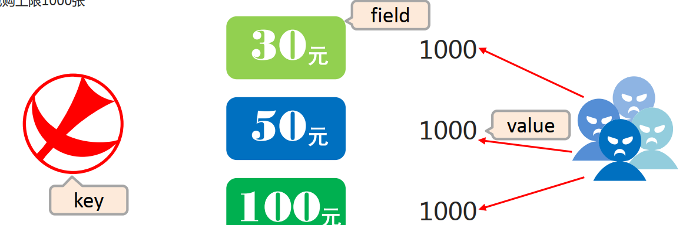

解决方案：

1. 以商家id作为key
2. 将参与抢购的商品id作为field
3. 将参与抢购的商品数量作为对应的value
4. 抢购时使用降值的方式控制产品数量


### 4、hash 类型数据操作的注意事项

- hash 类型下的value只能存储字符串，不允许存储其他数据类型，不存在嵌套现象。如果数据未获取到，对应的值为（ nil）hash 类型数据操作的注意事项
- 每个 hash 可以存储 2的32次方- 1个键值对（40多亿）
- hash 类型十分贴近对象的数据存储形式，并且可以灵活添加删除对象属性。但hash设计初衷不是为了存储大量对象而设计的，切记不可滥用，更不可以将hash 作为对象列表使用
- hgetall 操作可以获取全部属性，如果内部field过多，遍历整体数据效率就很会低，有可能成为数据访问瓶颈 


## 4、List（列表）

### 1、List  列表介绍

字符串列表，按照插入顺序排序。双向链表，插入删除时间复杂度O(1)快,查找为O(n)慢。你可以添加一个元素到列表的头部（左边）或者尾部（右边），它的底层实际上是个链表。list列表有两个特点：有序和可以重复。


### 2、命令和示例

| 命令                                  | 描述                                                         |
| ------------------------------------- | ------------------------------------------------------------ |
| LPUSH key value1 [value2]             | 将一个或多个值插入到列表头部                                 |
| RPUSH key value1 [value2]             | 将一个或多个值插入到列表尾部                                 |
| LPOP key                              | 移出并获取返回列表的第一个元素                               |
| RPOP key                              | 移除并获取返回列表的最后一个元素                             |
| LRANGE key start stop                 | 获取列表指定范围内的元素，索引从0开始，-1代表最后一个元素    |
| LINDEX key index                      | 通过索引获取列表中的元素                                     |
| LLEN key                              | 获取列表长度                                                 |
| LSET key index value                  | 通过索引设置（修改）列表元素的值                             |
| LREM key count value                  | 移除列表元素。count>0：从左开始删，count<0：从右开始删，count=0，删除所有value |
| LINSERT key BEFORE\|AFTER pivot value | 在列表的（只会在第一个）指定元素前或者后插入元素             |
| LTRIM key start stop                  | 对列表进行修剪（trim）保留指定 key 的值范围内的数据          |
| RPOPLPUSH source destination          | 移除并返回列表最后一个元素，并将该元素添加到另一个列表       |
| LPUSHX key value                      | 将一个值插入到已存在的列表头部                               |
| RPUSHX key value                      | 为已存在的列表添加值                                         |
| BLPOP key1 [key2] timeout             | 移除并获取列表第一个元素， 列表为空会阻塞列表直到等待超时或发现可弹出元素为止 |
| BRPOP key1 [key2] timeout             | 移除并获取列表最后一个元素， 列表为空会阻塞列表直到等待超时或发现可弹出元素为止 |
| BRPOPLPUSH source destination timeout | 移除并返回列表最后1个值，并将该值添加到另1个列表，列表为空会阻塞直到等待超时或发现可弹出元素为止 |

在 Redis 中可以把 list 用作栈、队列、阻塞队列。

> 向列表两端添加元素、查看列表

```shell
127.0.0.1:6379> lpush list 1			    # 向列表左边（头部）添加元素
(integer) 1
127.0.0.1:6379> lpush list 2
(integer) 2
127.0.0.1:6379> lpush list 3 
(integer) 3
127.0.0.1:6379> lrange list 0 -1			# 查看全部元素
1) "3"
2) "2"
3) "1"
127.0.0.1:6379> lrange list 0 1				# 通过区间获取值
1) "3"
2) "2"
127.0.0.1:6379> rpush list 0			    # 向列表右边（尾部）添加元素
(integer) 4
127.0.0.1:6379> lrange list 0 -1
1) "3"
2) "2"
3) "1"
4) "0"
```

> 从列表两端弹出元素弹出 pop

```shell
127.0.0.1:6379> lrange list 0 -1      # 查看list全部元素
1) "!"
2) "world"
3) "world"
4) "hello"
127.0.0.1:6379> lpop list		     # 移除list左边（头部）第一个元素
"!"
127.0.0.1:6379> lrange list 0 -1
1) "world"
2) "world"
3) "hello"
127.0.0.1:6379> rpop list			# 移除list右边（尾部）第一个元素
"hello"
127.0.0.1:6379> lrange list 0 -1     # 查看list全部元素
1) "world"
2) "world"
```

> 获取/设置指定索引的元素值：lindex：获取指定索引的元素值。lset：将列表中指定下标的值替换为其他值。

```shell
127.0.0.1:6379> lrange list 0 -1
1) "hjk"
2) "world"
3) "world"
127.0.0.1:6379> lindex list 1		    # 通过下标获取list中的某一个值
"world"
127.0.0.1:6379> lindex list 0
"hjk"
127.0.0.1:6379> exists list		        # 判断这个列表是否存在
(integer) 0
127.0.0.1:6379> lset list 0 item		# 如果list不存在的话，更新会报错
(error) ERR no such key
127.0.0.1:6379> lpush list value1
(integer) 1
127.0.0.1:6379> lrange list 0 0 
1) "value1"
127.0.0.1:6379> lset list 0 item		# 如果list存在并且下标也存在，更新当前下标的值
OK
127.0.0.1:6379> lset list 1 other		# 如果list存在当时下标不存在的话，更新会报错
(error) ERR index out of range
127.0.0.1:6379> 
```

> 向列表中插入元素：linsert（将某个 value 插入到列表中某个元素的前面 或者 后面）

```shell
127.0.0.1:6379> lrange mylist 0 -1
1) "hello1"
2) "hello2"
127.0.0.1:6379> linsert mylist before "hello2" hello
(integer) 3
127.0.0.1:6379> lrange mylist 0 -1
1) "hello1"
2) "hello"
3) "hello2"
127.0.0.1:6379> linsert mylist after "hello2" hello
(integer) 4
127.0.0.1:6379> lrange mylist 0 -1
1) "hello1"
2) "hello"
3) "hello2"
4) "hello"
```

> 获取列表中元素的个数，llen 查询长度

```shell
127.0.0.1:6379> llen list
(integer) 3
```

> 删除列表中指定个数的值：当 count>0：从左开始删，count<0：从右开始删，count=0，删除所有value

```shell
127.0.0.1:6379> lrange list 0 -1
1) "hjk"
2) "world"
3) "world"
127.0.0.1:6379> lrem list 1 world		# 移除list集合中指定个数的value，精确匹配
(integer) 1
127.0.0.1:6379> lrange list 0 -1
1) "hjk"
2) "world"
127.0.0.1:6379> lpush list hjk
(integer) 3
127.0.0.1:6379> lrange list 0 -1
1) "hjk"
2) "hjk"
3) "world"
127.0.0.1:6379> lrem list 2 hjk
(integer) 2
127.0.0.1:6379> lrange list 0 -1
1) "world"
127.0.0.1:6379> 
```

> trim 截断：

```shell
127.0.0.1:6379> lrange mylist 0 -1
1) "hello1"
2) "hello2"
3) "hello3"
4) "hello4"
127.0.0.1:6379> ltrim mylist 1 2 # 通过下标截取指定长度，这个list已经被破坏了，截断之后只剩下截断后的元素
OK
127.0.0.1:6379> lrange mylist 0 -1
1) "hello2"
2) "hello3"
127.0.0.1:6379> 
```

> rpoplpush ：移除列表的最后一个元素，将他移动到新的列表中

```shell
127.0.0.1:6379> lrange mylist 0 -1
1) "hello1"
2) "hello2"
3) "hello3"
127.0.0.1:6379> rpoplpush mylist myotherlist		# 移除列表的最后一个元素，将他移动到新的列表中。
"hello3"
127.0.0.1:6379> lrange mylist 0 -1		            # 查看原来的列表
1) "hello1"
2) "hello2"
127.0.0.1:6379> lrange myotherlist 0 -1		        # 查看目标列表中，确实存在该值
1) "hello3"
```


### 3、列表应用场景

- 简单队列
- 最新评论列表、微博中个人用户的关注列表需要按照用户的关注顺序进行展示，粉丝列表需要将最近关注的粉丝列在前面
- 微信朋友圈点赞，要求按照点赞顺序显示点赞好友信息。如果取消点赞，移除对应好友信息（rpush：点赞。lrem：取消）
- 非实时排行榜：定时计算榜单，如手机日销榜单


### 4、注意事项

- 存储的都是string字符串类型，一个列表最多可以包含 232 - 1 个元素 （4294967295, 每个列表不超过40亿个元素）
- 支持分页操作，高并发项目中，第一页数据都是来源list，第二页和更多信息则是通过数据库加载
- list具有索引的概念，但是操作数据时通常以队列的形式进行入队出队操作，或以栈的形式进行入栈出栈操作
- 获取全部数据操作结束索引设置为 -1
- list 实际上是一个链表，前后都可以插入，在两边插入或者改动值，效率最高。
- 如果key不存在，创建新的链表，如果移除了所有的值，空链表，也代表不存在


## 5、Set （集合）

### 1、Set 集合介绍

Set 集合是 String 类型的无序集合。相对于 list 列表，Set 集合也有两个特点：无序、不可重复。


### 2、命令和示例

| 命令                                           | 描述                                           |
| ---------------------------------------------- | ---------------------------------------------- |
| SADD key member1 [member2]                     | 向集合添加一个或多个元素                       |
| SREM key member1 [member2]                     | 移除集合中一个或多个元素                       |
| SMEMBERS key                                   | 返回集合中的所有成员                           |
| SPOP key                                       | 移除并获取集合中的一个随机元素                 |
| SRANDMEMBER key [count]                        | 获取集合中一个或多个随机元素                   |
| SISMEMBER key member                           | 判断 member 元素是否是集合 key 的成员          |
| SCARD key                                      | 获取集合的成员数                               |
| SDIFF key1 [key2]                              | 返回给定集合的差集，属于key1且不属于key2的元素 |
| SINTER key1 [key2]                             | 返回给定集合的交集，既属于key1又属于key2的元素 |
| SUNION key1 [key2]                             | 返回给定集合的并集，key1和key2集合合并         |
| SDIFFSTORE destination key1 [key2]             | 返回给定所有集合的差集并存储在 destination 中  |
| SINTERSTORE destination key1 [key2]            | 返回给定所有集合的交集并存储在 destination 中  |
| SUNIONSTORE destination key1 [key2]            | 所有给定集合的并集存储在 destination 集合中    |
| SMOVE source destination member                | 将 member 从 source 集合移到 destination 集合  |
| SSCAN key cursor [MATCH pattern] [COUNT count] | 迭代集合中的元素                               |

> 添加和删除集合元素、获取集合中的所有元素

```shell
127.0.0.1:6379> sadd myset "hello1" "hello2" "hello3"      # 向集合中添加元素
(integer) 3
127.0.0.1:6379> sadd myset "hello1" "hello2" "hello3"      # 向集合中添加重复元素
(integer) 0
127.0.0.1:6379> smembers myset                             # 查看指定Set的所有值
1) "hello3"
2) "hello1"
3) "hello2"
127.0.0.1:6379> srem myset hello3                          # 移除集合中的hello3元素
(integer) 1
127.0.0.1:6379> smembers myset                             # 查看指定Set的所有值
1) "hello2"
2) "hello1"
```

> 判断元素是否在集合中、获取集合中的元素个数

```shell
127.0.0.1:6379> sadd myset "hello1" "hello2" "hello3"      # 向集合中添加元素
(integer) 3
127.0.0.1:6379> sismember myset hello1                     # 判断某一个值是不是在set中
(integer) 1
127.0.0.1:6379> sismember myset hellox	                   # 判断某一个值是不是在set中
(integer) 0
127.0.0.1:6379> scard myset				                  # 获取集合中的个数
(integer) 3
```

> 从集合中随机弹出或者或获取元素 

```shell
127.0.0.1:6379> sadd myset "hello1" "hello2" "hello3"    # 向集合中添加元素
(integer) 3
127.0.0.1:6379> srandmember myset                        # 随机抽取一个元素
"hello2"
127.0.0.1:6379> srandmember myset                        # 随机抽取一个元素
"hello3"
127.0.0.1:6379> srandmember myset 2                      # 随机抽取指定个数的元素
1) "hello1"
2) "hello2"
127.0.0.1:6379> spop myset      		                # 随机删除并获取该元素
1) "hello2"
127.0.0.1:6379> smembers myset                           # 查看指定Set的所有值
1) "hello3"
2) "hello1"
```

> 集合的差集运算 A-B：SDIFF ：返回集合差集。SDIFFSTOR ：返回差集并放入另一个集合

```shell
127.0.0.1:6379> sadd setA 1 2 3 4 5 6                    # 初始化集合A
(integer) 6
127.0.0.1:6379> sadd setB 4 5 6 7 8 9                    # 初始化集合B
(integer) 6
127.0.0.1:6379> sdiff setA setB                          # 查询集合A和B的差集
1) "1"
2) "2"
3) "3"
127.0.0.1:6379> sdiffstore setAB setA setB               # 查询集合A和B的差集并存入另一个集合
(integer) 3
127.0.0.1:6379> smembers setAB
1) "1"
2) "2"
3) "3"
```

> 集合的交集运算 A ∩ B：SINTER：返回集合交集。SINTERSTORE：返回交集并放入另一个集合

```shell
127.0.0.1:6379> sadd setA 1 2 3 4 5 6                    # 初始化集合A
(integer) 6
127.0.0.1:6379> sadd setB 4 5 6 7 8 9                    # 初始化集合B
(integer) 6
127.0.0.1:6379> sinter setA setB                         # 查询集合A和B的交集
1) "4"
2) "5"
3) "6"
127.0.0.1:6379> sinterstore setAB setA setB              # 查询集合A和B的交集并存入另一个集合
(integer) 3
127.0.0.1:6379> smembers setAB
1) "4"
2) "5"
3) "6"
```

> 集合的并集运算 A∪B：SUNION：返回集合并集。SUNIONSTORE：返回并集并放入另一个集合

```shell
127.0.0.1:6379> sadd setA 1 2 3 4 5 6                    # 初始化集合A
(integer) 6
127.0.0.1:6379> sadd setB 4 5 6 7 8 9                    # 初始化集合B
(integer) 6
127.0.0.1:6379> sunion setA setB                         # 查询集合A和B的并集
1) "1"
2) "2"
3) "3"
4) "4"
5) "5"
6) "6"
7) "7"
8) "8"
9) "9"
127.0.0.1:6379> sunionstore setAB setA setB              # 查询集合A和B的并集并存入另一个集合
(integer) 9
127.0.0.1:6379> smembers setAB
1) "1"
2) "2"
3) "3"
4) "4"
5) "5"
6) "6"
7) "7"
8) "8"
9) "9"
```


### 3、应用场景

- 数据去重
- 社交应用关注、粉丝、共同好友
- 统计网站的PV、UV、IP
- 大数据里面的用户画像标签集合


### 4、注意事项

- 集合是通过哈希表实现的
- 添加已经存在于集合的成员元素将被忽略


## 6、Sorted Set（有序集合）

### 1、Sorted Set 有序集合介绍

Sorted Set是字符串的集合，不允许重复的成员出现在一个Set中。Sorted Set是有序集合，在Sorted Set内部的每一个元素，都有一个score与value关联。Sort Set的有序性就是通过score保证的。Sorted Set属于Set，具有Set的全部特性，同时Sorted Set拥有Set的额外的一个特性Sort。尽管Set的value不允许重复，但是score却是允许重复的。

在Set中增加、删除、更新元素是一个资源消耗非常小的操作。因为Sorted Set是有序的，所以即使访问Set的中部的元素，依然具有很高的效率。这是Redis的优势，其他数据库中想要实现这一点，比较困难。


### 2、命令和示例

| 命令                                              | 描述                                                     |
| ------------------------------------------------- | -------------------------------------------------------- |
| ZADD key score1 member1 [score2 member2]          | 向有序集合添加一个或多个成员，或者更新已存在成员的分数   |
| ZREM key member [member...]                       | 移除有序集合中的一个或多个成员                           |
| ZRANGE key start stop [WITHSCORES]                | 通过索引返回有序集合指定区间内的成员（分数从低到高）     |
| ZREVRANGE key start stop [WITHSCORES]             | 通过索引返回有序集中指定区间内的成员（分数从高到低）     |
| ZRANK key member                                  | 返回有序集合中指定成员的排名索引（分数从低到高）         |
| ZREVRANK key member                               | 返回有序集合中指定成员的排名索引（分数从高到低）         |
| ZSCORE key member                                 | 返回集合中指定成员的分数值                               |
| ZCARD key                                         | 获取有序集合的成员个数                                   |
| ZCOUNT key min max                                | 计算在有序集合中指定区间分数的成员个数                   |
| ZLEXCOUNT key min max                             | 在有序集合中计算指定字典区间内成员数量                   |
| ZINCRBY key increment member                      | 有序集合中对指定成员的分数加上增量 increment             |
| ZRANGEBYSCORE key min max [WITHSCORES] [LIMIT]    | 返回有序集合指定分数区间内的成员，分数从低到高排序       |
| ZREVRANGEBYSCORE key max min [WITHSCORES] [LIMIT] | 返回有序集中指定分数区间内的成员，分数从高到低排序       |
| ZREMRANGEBYRANK key start stop                    | 移除有序集合中给定的排名区间的所有成员                   |
| ZREMRANGEBYSCORE key min max                      | 移除有序集合中给定的分数区间的所有成员                   |
| **下面命令为不常用的，了解即可。**                |                                                          |
| ZREMRANGEBYLEX key min max                        | 移除有序集合中给定的字典区间的所有成员                   |
| ZINTERSTORE destination numkeys key [key...]      | 计算给定的一个或多个有序集的交集，并存储在新的集合key 中 |
| ZUNIONSTORE destination numkeys key [key ...]     | 计算给定的一个或多个有序集的并集，并存储在新的集合key 中 |
| ZRANGEBYLEX key min max [LIMIT offset count]      | 计算有序集合中指定成员之间的成员数量                     |
| ZREVRANGEBYLEX key min max [LIMIT offset count]   | 计算有序集合中指定成员之间的成员数量，倒序返回           |
| ZSCAN key cursor [MATCH pattern] [COUNT count]    | 迭代有序集合中的元素（包括元素成员和元素分值）           |

> 增加和删除有序集合元素、正序和倒序查询集合成员和分数、正序和倒序获取指定成员的排名（索引）

```shell
127.0.0.1:6379> zadd myzset 30 xhong 20 xming 50 xzhang 10 xli      # 初始化有序集合
(integer) 4
127.0.0.1:6379> zrange myzset 0 -1                                  # 正序排序后显示有序集合成员
1) "xli"
2) "xming"
3) "xhong"
4) "xzhang"
127.0.0.1:6379> zrange myzset 0 -1 withscores                       # 正序排序后显示有序集合成员和分数
1) "xli"
2) "10"
3) "xming"
4) "20"
5) "xhong"
6) "30"
7) "xzhang"
8) "50"
127.0.0.1:6379> zrank myzset xhong                                  # 正序排序后查询指定成员排名（索引从0开始）
(integer) 2
127.0.0.1:6379> zrevrange myzset 0 -1                               # 倒序排序后显示有序集合成员
1) "xzhang"
2) "xhong"
3) "xming"
4) "xli"
127.0.0.1:6379> zrevrange myzset 0 -1 withscores                    # 倒序排序后显示有序集合成员和分数
1) "xzhang"
2) "50"
3) "xhong"
4) "30"
5) "xming"
6) "20"
7) "xli"
8) "10"
127.0.0.1:6379> zrevrank myzset xhong                               # 倒序排序后查询指定成员排名（索引从0开始）
(integer) 1
127.0.0.1:6379> zrem myzset xli                                     # 删除有序集合指定成员xli
(integer) 1
```

> 获取指定成员分数、获取集合的成员个数、获取集合中指定区间分数的成员数

```shell
127.0.0.1:6379> zadd myzset 30 xhong 20 xming 50 xzhang 10 xli      # 初始化有序集合
(integer) 4
127.0.0.1:6379> ZSCORE myzset xli                                   # 获取集合中成员xli的分数
"10"
127.0.0.1:6379> zcard myzset                                        # 获取有序集合的成员数
(integer) 4
127.0.0.1:6379> zcount myzset 20 30                                 # 获取集合中指定区间分数的成员个数
(integer) 2
```

> 给某个元素增加分数：ZINCRBY key increment member

```shell
127.0.0.1:6379> zincrby myzset 1 D        # 给成员D分数加1
"91"
127.0.0.1:6379> zincrby myzset 2 D        # 给成员D分数加2
"93"
```

> 按正序（分数从低到高）或者倒序（分数从高到低）返回集合指定分数区间内的成员和分数

```shell
127.0.0.1:6379> zadd myzset 30 xhong 20 xming 50 xzhang 10 xli      # 初始化有序集合
(integer) 4
127.0.0.1:6379> zrangebyscore myzset -inf +inf                      # 正序显示最低分到最高分间的成员。min和max可以是-inf和+inf
1) "xli"
2) "xming"
3) "xhong"
4) "xzhang"
127.0.0.1:6379> zrangebyscore myzset -inf +inf withscores           # 正序显示最低分到最高分间的成员
1) "xli"
2) "10"
3) "xming"
4) "20"
5) "xhong"
6) "30"
7) "xzhang"
8) "50"
127.0.0.1:6379> zrangebyscore myzset 15 35                          # 正序显示分数为15到35之间的成员
1) "xming"
2) "xhong"
127.0.0.1:6379> zrangebyscore myzset 15 35 withscores               # 正序显示分数为15到35之间的成员和分数
1) "xming"
2) "20"
3) "xhong"
4) "30"
127.0.0.1:6379> zrangebyscore myzset -inf 35 withscores             # 正序显示分数为小于35分的成员和分数
1) "xli"
2) "10"
3) "xming"
4) "20"
5) "xhong"
6) "30"
127.0.0.1:6379> zrevrangebyscore myzset +inf -inf                   # 倒序显示最高分到最低分间的成员。min和max可以是-inf和+inf
1) "xzhang"
2) "xhong"
3) "xming"
4) "xli"
127.0.0.1:6379> zrevrangebyscore myzset +inf -inf withscores        # 倒序序显示最高分到最低分间的成员和分数
1) "xzhang"
2) "50"
3) "xhong"
4) "30"
5) "xming"
6) "20"
7) "xli"
8) "10"
127.0.0.1:6379> zrevrangebyscore myzset 35 15                       # 倒序显示分数为35到15之间的成员
1) "xhong"
2) "xming"
127.0.0.1:6379> zrevrangebyscore myzset 35 15 withscores            # 倒序显示分数为35到15之间的成员和分数
1) "xhong"
2) "30"
3) "xming"
4) "20"
```

> 按照排名范围删除元素、按照分数范围删除元素

```shell
127.0.0.1:6379> zadd myzset 30 xhong 20 xming 50 xzhang 10 xli      # 初始化有序集合
127.0.0.1:6379> zrange myzset 0 -1                                  # 先查询有序集合
1) "xli"
2) "xming"
3) "xhong"
4) "xzhang"
127.0.0.1:6379> zremrangebyrank myzset 0 2                          # 按照正序排名删除前3名
(integer) 3
127.0.0.1:6379> zrange myzset 0 -1                                  # 查询结果
1) "xzhang"


127.0.0.1:6379> zadd myzset 30 xhong 20 xming 50 xzhang 10 xli      # 初始化有序集合
127.0.0.1:6379> zrange myzset 0 -1 withscores                       # 先查询有序集合
1) "xli"
2) "10"
3) "xming"
4) "20"
5) "xhong"
6) "30"
7) "xzhang"
8) "50"
127.0.0.1:6379> zremrangebyscore myzset 20 30                       # 按照正序排名删除20分到30分的数据
(integer) 2
127.0.0.1:6379> zrange myzset 0 -1 withscores                       # 查询结果        
1) "xli"
2) "10"
3) "xzhang"
4) "50"
```


### 3、应用场景

- 实时排行榜：商品热销榜、体育类应用热门球队、积分榜、各类资源网站TOP10
- 优先级任务、队列
- 朋友圈文章点赞-取消，逻辑：用户只能点赞或取消。统计一篇文章被点赞了多少次，可以直接取里面有多少个成员
- 网站会定期开启投票、讨论，限时进行，逾期作废。如何有效管理此类过期信息


### 4、注意事项

- 底层使用到了Ziplist压缩列表和“跳跃表”两种存储结构
- score 保存的数据存储空间是64位，如果是整数范围是-9007199254740992~9007199254740992
- score 保存的数据也可以是一个双精度的double值，基于双精度浮点数的特征，可能会丢失精度，使用时候要慎重
- sorted_set 底层存储还是基于 set 结构的，因此数据不能重复，如果重复添加相同的数据，score 值将被反复覆盖，保留最后一次修改的结果

# Redis 三种特殊数据类型

> 中文网可查看命令： http://www.redis.cn/commands.html

## 1、Geospatial

- Redis 中文网站文档： https://www.redis.net.cn/order/3687.html

- 经纬度数据模拟网站： http://www.jsons.cn/lngcode/

Redis 在 3.2 推出 Geo 类型，该功能可以推算出地理位置信息，两地之间的距离。


### 1、geoadd

geoadd 添加地理位置

规则：两极无法直接添加，一般会下载城市数据，直接通过 Java 程序一次性导入。

有效的经度从 -180 度到 180 度。有效的纬度从 -85.05112878 度到 85.05112878 度。当坐标位置超出指定范围时，该命令将会返回一个错误。

```bash
127.0.0.1:6379> geoadd china:city 39.90 116.40 beijin 
(error) ERR invalid longitude,latitude pair 39.900000,116.400000
```

添加一些模拟数据：

```bash
127.0.0.1:6379> geoadd china:city 116.40 39.90 beijing
(integer) 1
127.0.0.1:6379> geoadd china:city 121.47 31.23 shanghai
(integer) 1
127.0.0.1:6379> geoadd china:city 106.50 29.53 chongqing 114.05 22.52 shengzhen
(integer) 2
127.0.0.1:6379> geoadd china:city 120.16 30.24 hangzhou 108.96 34.26 xian
(integer) 2
127.0.0.1:6379> 
```


### 2、geopos

geopos 获得当前定位坐标值

```bash
127.0.0.1:6379> geopos china:city beijing		# 获得指定城市的经纬度
1) 1) "116.39999896287918091"
   2) "39.90000009167092543"
127.0.0.1:6379> geopos china:city shanghai
1) 1) "121.47000163793563843"
   2) "31.22999903975783553"
127.0.0.1:6379> 
```


### 3、geodist

geodist 获取两个位置之间的距离

单位：

- **m** 表示单位为米
- **km** 表示单位为千米
- **mi** 表示单位为英里
- **ft** 表示单位为英尺

如果用户没有显式地指定单位参数， 那么 GEODIST 默认使用米作为单位。

```bash
127.0.0.1:6379> geodist china:city beijing shanghai km	# 查看北京和上海直接的直线距离
"1067.3788"
127.0.0.1:6379> geodist china:city beijing chongqing km	# 查看北京和重庆直接的直线距离
"1464.0708"
127.0.0.1:6379> 
```


### 4、geohash

简单说：Geohash可以获取元素的经纬度编码字符串，它是Base32编码。 可以使用这个编码值去：http://geohash.org/${hash}中进行直接定位，它是Geohash的标准编码值。

该命令将返回11个字符的Geohash字符串，所以没有精度Geohash，损失相比，使用内部52位表示。返回的geohashes具有以下特性：

1. 他们可以缩短从右边的字符。它将失去精度，但仍将指向同一地区。
2. 它可以在`geohash.org`网站使用，网址 `http://geohash.org/<geohash-string>`。查询例子：http://geohash.org/sqdtr74hyu0
3. 与类似的前缀字符串是附近，但相反的是不正确的，这是可能的，用不同的前缀字符串附近

返回值：一个数组， 数组的每个项都是一个 geohash 。 命令返回的 geohash 的位置与用户给定的位置元素的位置一一对应

```bash
redis> GEOADD Sicily 13.361389 38.115556 "Palermo" 15.087269 37.502669 "Catania"
(integer) 2
redis> GEOHASH Sicily Palermo Catania
1) "sqc8b49rny0"
2) "sqdtr74hyu0"
redis> 
```


### 5、georedius

georedius 以给定的经纬度为中心，找出某一半径内的元素

获得所有附近的人的地址，定位！通过半径来查询！

获得指定数量的人，200。所有数据应该都录入：china:city ，才会让结果更加请求！

```bash
# 以110, 30 这个点为中心，寻找方圆 1000km 的城市
127.0.0.1:6379> georadius china:city 110 30 1000 km 	
1) "chongqing"
2) "xian"
3) "shengzhen"
4) "hangzhou"
127.0.0.1:6379> georadius china:city 110 30 500 km 
1) "chongqing"
2) "xian"
127.0.0.1:6379> georadius china:city 110 30 500 km withcoord	#  显示他人的定位信息
1) 1) "chongqing"
   2) 1) "106.49999767541885376"
      2) "29.52999957900659211"
2) 1) "xian"
   2) 1) "108.96000176668167114"
      2) "34.25999964418929977"
127.0.0.1:6379> 
127.0.0.1:6379> georadius china:city 110 30 500 km withdist #  显示到中心点的距离
1) 1) "chongqing"
   2) "341.9374"
2) 1) "xian"
   2) "483.8340"
127.0.0.1:6379> georadius china:city 110 30 500 km withdist withcoord count 1  # 指定数量
1) 1) "chongqing"
   2) "341.9374"
   3) 1) "106.49999767541885376"
      2) "29.52999957900659211"
127.0.0.1:6379> georadius china:city 110 30 500 km withdist withcoord count 2
1) 1) "chongqing"
   2) "341.9374"
   3) 1) "106.49999767541885376"
      2) "29.52999957900659211"
2) 1) "xian"
   2) "483.8340"
   3) 1) "108.96000176668167114"
      2) "34.25999964418929977"
127.0.0.1:6379> 
```


### 6、georadiusbymember

GEORADIUSBYMEMBER 找出位于指定元素周围的其他元素

```bash
# 找出位于指定元素周围的其他元素！
127.0.0.1:6379> georadiusbymember china:city shanghai 1000 km
1) "hangzhou"
2) "shanghai"
127.0.0.1:6379> GEORADIUSBYMEMBER china:city shanghai 400 km 
1) "hangzhou" 
2) "shanghai"
```

geo 底层实现原理其实就是 zset ，可以使用 zset 命令操作 geo

```bash
127.0.0.1:6379> zrange china:city 0 -1		# 查看地图中全部的元素
1) "chongqing"
2) "xian"
3) "shengzhen"
4) "hangzhou"
5) "shanghai"
6) "beijing"
127.0.0.1:6379> zrem china:city beijing		# 删除一个指定元素
(integer) 1
127.0.0.1:6379> zrange china:city 0 -1
1) "chongqing"
2) "xian"
3) "shengzhen"
4) "hangzhou"
5) "shanghai"
```


## 2、Hyperloglog

> 思考一个常见的业务问题：
>
> 如果你负责开发维护一个大型的网站，有一天老板找产品经理要网站每个网页每天的 UV 数据，然后让你来开发这个统计模块，你会如何实现？如果统计 PV 那非常好办，给每个网页一个独立的 Redis 计数器就可以了，这个计数器的 key 后缀加上当天的日期。这样来一个请求，incrby 一次，最终就可以统计出所有的 PV 数据。
>
> 但是 UV 不一样，它要去重，同一个用户一天之内的多次访问请求只能计数一次。这就要求每一个网页请求都需要带上用户的 ID，无论是登陆用户还是未登陆用户都需要一个唯一ID 来标识。你也许已经想到了一个简单的方案，那就是为每一个页面一个独立的 set 集合来存储所有当天访问过此页面的用户 ID。当一个请求过来时，我们使用 sadd 将用户 ID 塞进去就可以了。通过 scard 可以取出这个集合的大小，这个数字就是这个页面的 UV 数据。没错，这是一个非常简单的方案。
>
> 但是，如果你的页面访问量非常大，比如一个爆款页面几千万的 UV，你需要一个很大的 set 集合来统计，这就非常浪费空间。如果这样的页面很多，那所需要的存储空间是惊人的。为这样一个去重功能就耗费这样多的存储空间，值得么？其实老板需要的数据又不需要太精确，105w 和 106w 这两个数字对于老板们来说并没有多大区别，So，有没有更好的解决方案呢？
>
> Redis 提供了 HyperLogLog 数据结构就是用来解决这种统计问题的。HyperLogLog 提供不精确的去重计数方案，虽然不精确但是也不是非常不精确，标准误差是 0.81%，这样的精确度已经可以满足上面的 UV 统计需求了。HyperLogLog 数据结构是 Redis 的高级数据结构，它非常有用，但是令人感到意外的是，使用过它的人非常少。
>
> 1、PV（Page View：访问量）具体是指网站的是页面浏览量或者点击量。用户每次对网站的访问均被记录，用户对同一页面的多次访问，访问量累计。
> 2、UV（Unique visitor：独立访客）是指通过互联网访问、浏览这个网页的自然人。访问的一个电脑客户端为一个访客，一天内同一个访客仅被计算一次。

Hyperloglog 介绍和说明：

- Redis 2.8.9 版本更新了 Hyperloglog 数据结构
- Hyperloglog 用于进行基数统计，不是集合不保存数据，只记录数量而不是具体数据（基数：数学上集合的元素个数，是不能重复的）
- hyperloglog 的优点是占用内存小，并且是固定的。存储 2^64 个不同元素的基数，只需要 12 KB 的空间。但是也可能有 0.81% 的错误率
- 核心是基数估算算法，最终数值存在一定误差，基数估计的结果是一个带有 0.81% 标准错误的近似值
- 耗空间极小，每个 hyperloglog key占用了12K的内存用于标记基数
- pfadd 命令不是一次性分配12K内存使用，会随着基数的增加内存逐渐增大
- pfmerge 命令合并后占用的存储空间为12K，无论合并之前数据量多少

这个数据结构常用于统计网站的 UV。传统的方式是使用 set 保存用户的ID，然后统计 set 中元素的数量作为判断标准。但是这种方式保存了大量的用户 ID，ID 一般比较长，占空间，还很麻烦。我们的目的是计数，不是保存数据，所以这样做有弊端。但是如果使用 hyperloglog 就比较合适了。

| 命令                                     | 描述     |
| ---------------------------------------- | -------- |
| pfadd key element [element...]           | 添加数据 |
| pfcount key [key...]                     | 统计数据 |
| pfmerge destkey sourcekey [sourcekey...] | 合并数据 |

```shell
127.0.0.1:6379> pfadd mykey1 0 1 2 3 4 5 6 7 8 9      # 创建第一组元素
(integer) 1
127.0.0.1:6379> PFCOUNT mykey1                        # 统计 mykey 基数
(integer) 10
127.0.0.1:6379> PFADD mykey2 7 8 9 10 11 12 13        # 创建第二组元素
(integer) 1
127.0.0.1:6379> PFCOUNT mykey2                        # 统计 mykey2 基数
(integer) 7
127.0.0.1:6379> PFMERGE mykey3 mykey1 mykey2          # 合并两组 mykey1 mykey2 => mykey3
OK
127.0.0.1:6379> PFCOUNT mykey3                        # 统计 mykey3 基数
(integer) 15
```

注意事项：

HyperLogLog 这个数据结构不是免费的，不是说使用这个数据结构要花钱，它需要占据一定 12k 的存储空间，所以它不适合统计单个用户相关的数据。如果你的用户上亿，可以算算，这个空间成本是非常惊人的。但是相比 set 存储方案，HyperLogLog 所使用的空间那真是可以使用千斤对比四两来形容了。

不过你也不必过于当心，因为 Redis 对 HyperLogLog 的存储进行了优化，在计数比较小时，它的存储空间采用稀疏矩阵存储，空间占用很小，仅仅在计数慢慢变大，稀疏矩阵占用空间渐渐超过了阈值时才会一次性转变成稠密矩阵，才会占用 12k 的空间。

pf 的内存占用为什么是 12k ？

算法中使用了 1024 个桶进行独立计数，不过在 Redis 的 HyperLogLog实现中用到的是 16384 个桶，也就是 2^14，每个桶的 maxbits 需要 6 个 bits 来存储，最大可以表示 maxbits=63，于是总共占用内存就是 2^14 * 6 / 8 = 12k 字节。


## 3、Bitmap 位图

| 命令                     | 描述                                                     |
| ------------------------ | -------------------------------------------------------- |
| GETBIT key offset        | 对 key 所储存的字符串值，获取指定偏移量上的位(bit)       |
| SETBIT key offset value  | 对 key 所储存的字符串值，设置或清除指定偏移量上的位(bit) |
| BITCOUNT key [start end] | 统计字符串被设置为1的 bit 数                             |

bitmap 就是通过最小的单位bit来进行0或者1的设置，表示某个元素对应的值或者状态。一个bit的值只能是0或1；也就是说一个bit能存储的最多信息是2。bitmap 常用于统计用户信息比如活跃粉丝和不活跃粉丝、登录和未登录、是否打卡等。

1、这里使用一周打卡的案例说明其用法：

```bash
127.0.0.1:6379> setbit sign 0 1		# 周一打卡了
(integer) 0
127.0.0.1:6379> setbit sign 1 0		# 周二未打卡
(integer) 0
127.0.0.1:6379> setbit sign 2 0		# 周三未打卡
(integer) 0
127.0.0.1:6379> setbit sign 3 1     # 周四打卡了
(integer) 0
127.0.0.1:6379> setbit sign 4 1     # 周五打卡了
(integer) 0
127.0.0.1:6379> setbit sign 5 1     # 周六打卡了
(integer) 0
127.0.0.1:6379> setbit sign 6 0     # 周日未打卡
(integer) 0
```

2、查看某一天是否打卡：

```bash
127.0.0.1:6379> GETBIT sign 3
(integer) 1
127.0.0.1:6379> GETBIT sign 6
(integer) 0
```

3、统计：统计打卡的天数

```bash
127.0.0.1:6379> BITCOUNT sign
(integer) 4
```


# Redis 操作命令大全

## 1、Redis 命令行参数大全

### 1、服务器启动参数（redis-server）

| 选项          | 说明                                                 |
| :------------ | :--------------------------------------------------- |
| -v、--version | 查Redis看版本号                                      |
| -             | 从stdin中读取配置                                    |
| --port        | 指定Redis服务监听的端口                              |
| -a            | 指定密码                                             |
| --sentinel    | 设置哨兵系统启动                                     |
| /path         | 选择指定的配置文件启动                               |
| --test-memory | 检测当前操作系统能否稳定地分配指定容量的内存给 Redis |
| --slaveof     | 将当前Redis设置为从库,为他设置主库地址               |
| --masterauth  | 如果主库设置了主从密码, 从库需要用该参数指定主从密码 |
| --loglevel    | 设置日志等级                                         |

```shell
[root@CentOS7 ~]# /usr/local/redis/bin/redis-server --help
Usage: ./redis-server [/path/to/redis.conf] [options]
       ./redis-server - (read config from stdin)
       ./redis-server -v or --version
       ./redis-server -h or --help
       ./redis-server --test-memory <megabytes>

Examples:
       ./redis-server (run the server with default conf)
       ./redis-server /etc/redis/6379.conf
       ./redis-server --port 7777
       ./redis-server --port 7777 --replicaof 127.0.0.1 8888
       ./redis-server /etc/myredis.conf --loglevel verbose

Sentinel mode:
       ./redis-server /etc/sentinel.conf --sentinel

```


### 2、客户端连接选项（redis-cli）

- 命令方式：`redis-cli -h {host} -p {port} {command}`，直接得到命令的返回结果,显示在屏幕上
- 交互式命令行方式：`redis-cli -h {host} -p {port}`，进入交互式命令行

| 选项                | 说明                                                         |
| :------------------ | :----------------------------------------------------------- |
| -h                  | 指定Redis server地址                                         |
| -p                  | 指定Redis server端口号                                       |
| -s                  | 指定服务器套接字(覆盖主机名和端口)。                         |
| -a                  | 指定密码                                                     |
| -u                  | url格式的地址                                                |
| -r                  | 将命令重复执行N次                                            |
| -i                  | 每隔N秒执行一次命令，必须与-r一起使用。                      |
| -n                  | 选择库号                                                     |
| -x                  | 代表从标准输入读取数据作为该命令的最后一个参数。             |
| -d                  | 原始格式中的多块分隔符(默认值: )。                           |
| -c                  | 连接cluster集群结点时用的，此选项可防止moved和ask异常。      |
| --user              | 指定登录的用户名，Redis6 ACL 更新的                          |
| --pass              | 指定登录密码，Redis6 ACL 更新的                              |
| --csv               | 将数据导出为CSV格式的文件                                    |
| --scan              | 获取服务器所有的键                                           |
| --pattern           | 指定scan获取的key的pattern,正则表达式用于scan命令后过滤.     |
| --slave             | 当前客户端模拟成当前redis节点的从节点，可用来获取指定redis节点的更新操作 |
| --rdb               | 导出rdb文件，保存导到指定的位置                              |
| --pipe              | 将命令封装成redis通信协议定义的数据格式，批量发送给redis执行。 |
| --pipe-timeout      | 设置管道超时时间                                             |
| --bigkeys           | 统计bigkey的分布，使用scan命令对redis的键进行采样，从中找到内存占用比较大的键 |
| --hotkeys           | 找出server中热点key                                          |
| --stat              | 实时获取redis的统计信息。istat和info相比可以看到一些增加的数据,如:每秒请求数 |
| --raw               | 显示格式化的效果                                             |
| --no-raw            | 要求返回原始格式                                             |
| --eval              | 用于执行lua脚本                                              |
| --latency           | 持续采样服务器延迟                                           |
| --latency-history   | 持续采样服务器延迟并每隔(15秒)输出一个记录; 可以使用-i 更改间隔时间 |
| --latency-dist      | 使用彩色终端显示一系列延时特征                               |
| --intrinsic-latency | 固有延迟,由于操作系统或虚拟机/容器带来的延迟,需要在redis-server的本器上进行测量. |
| --ldb               | 与--eval一起使用可以启用Redis Lua调试器                      |
| --ldb-sync-mode     | 比如--ldb，但是使用了同步Lua调试器, 此模式将阻塞服务器并更改脚本 |
| --lru-test          |                                                              |


### 3、redis-cli stat 参数说明

| 选项        | 说明                                                         |
| ----------- | ------------------------------------------------------------ |
| keys        | server中key的数量                                            |
| mem         | 键值对的总内存量                                             |
| clients     | 当前连接的总clients数量                                      |
| blocked     | 正在等待执行阻塞命令（BLPOP、BRPOP、BRPOPLPUSH 等等）的客户端数量 |
| requests    | 服务器请求总次数 (+1) 截止上次请求增加次数                   |
| connections | 服务器连接次数                                               |


### 4、redis-cli --help 查看

```shell
[root@CentOS7 ~]# /usr/local/redis/bin/redis-cli --help
redis-cli 6.0.6

Usage: redis-cli [OPTIONS] [cmd [arg [arg ...]]]
  -h <hostname>      Server hostname (default: 127.0.0.1).
  -p <port>          Server port (default: 6379).
  -s <socket>        Server socket (overrides hostname and port).
  -a <password>      Password to use when connecting to the server.
                     You can also use the REDISCLI_AUTH environment
                     variable to pass this password more safely
                     (if both are used, this argument takes predecence).
  --user <username>  Used to send ACL style 'AUTH username pass'. Needs -a.
  --pass <password>  Alias of -a for consistency with the new --user option.
  --askpass          Force user to input password with mask from STDIN.
                     If this argument is used, '-a' and REDISCLI_AUTH
                     environment variable will be ignored.
  -u <uri>           Server URI.
  -r <repeat>        Execute specified command N times.
  -i <interval>      When -r is used, waits <interval> seconds per command.
                     It is possible to specify sub-second times like -i 0.1.
  -n <db>            Database number.
  -3                 Start session in RESP3 protocol mode.
  -x                 Read last argument from STDIN.
  -d <delimiter>     Multi-bulk delimiter in for raw formatting (default: \n).
  -c                 Enable cluster mode (follow -ASK and -MOVED redirections).
  --raw              Use raw formatting for replies (default when STDOUT is
                     not a tty).
  --no-raw           Force formatted output even when STDOUT is not a tty.
  --csv              Output in CSV format.
  --stat             Print rolling stats about server: mem, clients, ...
  --latency          Enter a special mode continuously sampling latency.
                     If you use this mode in an interactive session it runs
                     forever displaying real-time stats. Otherwise if --raw or
                     --csv is specified, or if you redirect the output to a non
                     TTY, it samples the latency for 1 second (you can use
                     -i to change the interval), then produces a single output
                     and exits.
  --latency-history  Like --latency but tracking latency changes over time.
                     Default time interval is 15 sec. Change it using -i.
  --latency-dist     Shows latency as a spectrum, requires xterm 256 colors.
                     Default time interval is 1 sec. Change it using -i.
  --lru-test <keys>  Simulate a cache workload with an 80-20 distribution.
  --replica          Simulate a replica showing commands received from the master.
  --rdb <filename>   Transfer an RDB dump from remote server to local file.
  --pipe             Transfer raw Redis protocol from stdin to server.
  --pipe-timeout <n> In --pipe mode, abort with error if after sending all data.
                     no reply is received within <n> seconds.
                     Default timeout: 30. Use 0 to wait forever.
  --bigkeys          Sample Redis keys looking for keys with many elements (complexity).
  --memkeys          Sample Redis keys looking for keys consuming a lot of memory.
  --memkeys-samples <n> Sample Redis keys looking for keys consuming a lot of memory.
                     And define number of key elements to sample
  --hotkeys          Sample Redis keys looking for hot keys.
                     only works when maxmemory-policy is *lfu.
  --scan             List all keys using the SCAN command.
  --pattern <pat>    Useful with --scan to specify a SCAN pattern.
  --intrinsic-latency <sec> Run a test to measure intrinsic system latency.
                     The test will run for the specified amount of seconds.
  --eval <file>      Send an EVAL command using the Lua script at <file>.
  --ldb              Used with --eval enable the Redis Lua debugger.
  --ldb-sync-mode    Like --ldb but uses the synchronous Lua debugger, in
                     this mode the server is blocked and script changes are
                     not rolled back from the server memory.
  --cluster <command> [args...] [opts...]
                     Cluster Manager command and arguments (see below).
  --verbose          Verbose mode.
  --no-auth-warning  Don't show warning message when using password on command
                     line interface.
  --help             Output this help and exit.
  --version          Output version and exit.

Cluster Manager Commands:
  Use --cluster help to list all available cluster manager commands.

Examples:
  cat /etc/passwd | redis-cli -x set mypasswd
  redis-cli get mypasswd
  redis-cli -r 100 lpush mylist x
  redis-cli -r 100 -i 1 info | grep used_memory_human:
  redis-cli --eval myscript.lua key1 key2 , arg1 arg2 arg3
  redis-cli --scan --pattern '*:12345*'

  (Note: when using --eval the comma separates KEYS[] from ARGV[] items)

When no command is given, redis-cli starts in interactive mode.
Type "help" in interactive mode for information on available commands
and settings.
```


## 2、Redis 系统相关命令

| 命令                                        | 描述                                                         |
| ------------------------------------------- | ------------------------------------------------------------ |
| ping                                        | 如果连接成功返回PONG，连接失败返回错误信息                   |
| auth password                               | 使用auth命令验证密码是否正确                                 |
| dbsize                                      | 统计当前库下key的数量                                        |
| select index                                | 数据库之间进行切换                                           |
| flushdb                                     | 清除当前库全数据                                             |
| flushall                                    | 清除所有库全数据                                             |
| shutdown [SAVE \| NOSAVE]                   | 停止所有客户端                                               |
| info [section]                              | 查看服务器信息，section 参数代表查看执行选项                 |
| config get patten                           | 查看配置信息                                                 |
| config set parameter value                  | 修改当前配置信息无需重启，当重启会失效                       |
| config resetstat                            | 重置 info 命令中的某些统计数据，例 Keyspace hits/misses      |
| config rewrite                              | 对启动Redis时指定的redis.conf文件进行改写                    |
| time                                        | 获取当前时间                                                 |
| debug object key                            | 获取 key 的调试信息，当key不存在时返回错误信息。             |
| debug segfault                              | 执行1个非法的内存访问让 Redis 崩溃，仅开发时用于 BUG 调试，执行后需要重启服务 |
| save                                        | 同步地将redis中的数据持久化到磁盘                            |
| bgsave                                      | 异步将redis中的数据持久化到磁盘                              |
| bgrewriteaof                                | 执行一个异步的AOF(append only file)文件重写                  |
| lastsave                                    | 查看上次持久化到磁盘的时间（以UNIX时间戳格式展示）           |
| quit                                        | 关闭连接                                                     |
| command                                     | 返回所有的Redis命令的详细信息，以数组形式展示                |
| command count                               | 查看当前Redis中命令的数量                                    |
| command info command-name [command-name...] | 查看当前Redis中指定的命令的详细信息                          |
| client kill ip:port                         | 关闭地址为ip:port的客户端（命令执行完毕之后才会关闭客户端）  |
| client list                                 | 以可读的格式，返回所有连接到服务器的客户端信息和统计数据     |
| slaveof                                     | 将当前服务器转变为指定服务器的从属服务器(slave server)       |
| role                                        | 返回主从实例所属的角色                                       |
| monitor                                     | 监听redis服务器接收到的所有命令，调试用                      |
| lolwut                                      | 返回一副随机图像以及当前redis的版本信息（无意义）            |

1、进入命令行模式

```shell
# 使用密码连接
redis-cli -a password_value
 
# raw 避免中文显示乱码
redis-cli -a password_value --raw

# 指定用户名密码登录,redis6新增ACL，后面会单开一个文章关于ACL
redis-cli --user default -a 123456 --raw
```

2、验证密码是否正确：auth password，校验连接状态：ping

```shell
[root@CentOS7 ~]# /usr/local/redis/bin/redis-cli 
127.0.0.1:6379> ping                                 # 如果连接成功返回PONG，连接失败返回错误信息
(error) NOAUTH Authentication required.  
127.0.0.1:6379> auth xxxx                            # 使用错误密码连接
(error) WRONGPASS invalid username-password pair
127.0.0.1:6379> auth 123456                          # 使用正确密码连接
OK
127.0.0.1:6379> ping
PONG
```

3、查看当前数据库大小、切换数据库、清空当前数据库或者所有数据库

```shell
127.0.0.1:6379> dbsize           # 查看当前数据key数量
(integer) 4
127.0.0.1:6379> select 2         # 切换到2数据库
OK
127.0.0.1:6379[2]> flushdb       # 清空2数据库
OK
127.0.0.1:6379[2]> flushall      # 清空所有数据库
OK
```

4、获取当前服务器时间：time，返回列表： 第一个字符串是当前时间(以UNIX时间戳格式表示)，第二个字符串是当前这一秒钟已经逝去的微秒数

```shell
127.0.0.1:6379> time
1) "1630030832"       # 第一个值为 unix timestamp 粒度到秒
2) "844339"           # 第二个返回值为该秒上当前的微秒数
```

5、DEBUG 调试命令：

- debug object key：获取 key 的调试信息，当 key 不存在时返回错误信息
- debug segfault：命令执行一个非法的内存访问从而让 Redis 崩溃，仅用于开发时 BUG 调试，执行后需要重启服务

```shell
127.0.0.1:6379> debug object key                   # 不存在key则返回错误
(error) ERR no such key
127.0.0.1:6379> debug object name                  # 返回name的相关信息
Value at:0x7fa17124b7b8 refcount:1 encoding:embstr serializedlength:3 lru:2571002 lru_seconds_idle:71391

127.0.0.1:6379> debug segfault                     # 非法命令使Redis崩溃，需要重启Redis
Could not connect to Redis at 127.0.0.1:6379: Connection refused
not connected> 
```

6、数据持久化：save、bgsave：同步、异步将redis数据持久化到磁盘。bgrewriteaof：异步重写AOF文件（后续会细讲）

```shell
127.0.0.1:6379> save
OK
127.0.0.1:6379> bgsave
Background saving started
127.0.0.1:6379> bgrewriteaof
Background append only file rewriting started
127.0.0.1:6379> 
```

7、查看上次RDB持久化时间：lastsave

```shell
127.0.0.1:6379> lastsave
(integer) 1630031218
```

8、查看当前Redis中所有可用命令：

1. command：返回所有的Redis命令的详细信息，以数组形式展示
2. command count：查看当前Redis中命令的数量
3. command  info command-name [command-name ...]：查看当前Redis中指定的命令的详细信息

```shell
127.0.0.1:6379> command              # 查询所有命令详情
# ....返回太长，只显示尾部。上面省略
205) 1) "debug"
     2) (integer) -2
     3) 1) admin
        2) noscript
        3) loading
        4) stale
     4) (integer) 0
     5) (integer) 0
     6) (integer) 0
     7) 1) @admin
        2) @slow
        3) @dangerous
127.0.0.1:6379> command count        # 查询命令的数量
(integer) 205
127.0.0.1:6379> command info auth    # 查询指定命令详情
1) 1) "auth"
   2) (integer) -2
   3) 1) noscript
      2) loading
      3) stale
      4) skip_monitor
      5) skip_slowlog
      6) fast
      7) no_auth
   4) (integer) 0
   5) (integer) 0
   6) (integer) 0
   7) 1) @fast
      2) @connection
```


## 3、Redis Info 系统命令

Redis Info 命令以一种易于理解和阅读的格式，返回关于 Redis 服务器的各种信息和统计数值，通过可选的参数 section ，可以只返回某一部分的信息（可以一次性获取所有的信息，也可以按块获取信息）：

```shell
Server:                                              # 有关redis服务器的常规信息
  redis_mode:standalone                              # 运行模式，单机或者集群
  multiplexing_api:epoll                             # redis所使用的事件处理机制
  run_id:3abd26c33dfd059e87a0279defc4c96c13962ede    # redis服务器的随机标识符(用于sentinel和集群)
  config_file:/usr/local/redis/conf/redis.conf       # 配置文件路径

Clients:                                             # 客户端连接部分
  connected_clients:10                               # 已连接客户端的数量(不包括通过slave连接的客户端)
  
Memory:                                              # 内存消耗相关信息
  used_memory:874152                                 # 使用内存，以字节（byte）B为单位
  used_memory_human:853.66K                          # 以人类可读的格式返回 Redis 分配的内存总量
  used_memory_rss:2834432                            # 系统给redis分配的内存即常驻内存，和top 、 ps 等命令的输出一致
  used_memory_rss_human:2.70M                        # 以人类可读格式返回系统redis分配的常驻内存top、ps等命令的输出一致
  used_memory_peak:934040                            # 内存使用的峰值大小
  used_memory_peak_human:912.15K                     # 以人类可读的格式返回 Redis 的内存消耗峰值
  total_system_memory:1039048704                     # 操作系统的总内存 ，以字节（byte）为单位
  total_system_memory_human:990.91M                  # 以人类可读的格式返回操作系统的总内存
  used_memory_lua:37888                              # lua引擎使用的内存
  used_memory_lua_human:37.00K                       # 以人类可读的格式返回lua引擎使用的内存
  maxmemory:0                                        # 最大内存的配置值，0是不限制
  maxmemory_human:0B                                 # 以人类可读的格式
  maxmemory_policy:noeviction                        # 达到最大内存配置值后的策略
  
Persistence:                                         # RDB和AOF相关信息
  rdb_bgsave_in_progress:0                           # 标识rdb save是否进行中
  rdb_last_bgsave_status:ok                          # 上次的save操作状态
  rdb_last_bgsave_status:ok                          # 上次的save操作状态
  rdb_last_bgsave_time_sec:-1                        # 上次rdb save操作使用的时间(单位s)
  rdb_current_bgsave_time_sec:-1                     # 如果rdb save操作正在进行，则是所使用的时间
  aof_enabled:1                                      # 是否开启aof，默认没开启
  aof_rewrite_in_progress:0                          # 标识aof的rewrite操作是否在进行中
  aof_last_rewrite_time_sec:-1                       # 上次rewrite操作使用的时间(单位s)
  aof_current_rewrite_time_sec:-1                    # 如果rewrite操作正在进行，则记录所使用的时间
  aof_last_bgrewrite_status:ok                       # 上次rewrite操作的状态
  aof_current_size:0                                 # aof当前大小


Stats:                                               # 一般统计
  evicted_keys:0                                     # 因为内存大小限制，而被驱逐出去的键的个数


Replication：                                        # 主从同步信息
  role:master                                        # 角色
  connected_slaves:1                                 # 连接的从库数
  master_sync_in_progress:0                          # 标识主redis正在同步到从redis


CPU：                                                # CPU消耗统计
  used_cpu_sys:1.004241
  used_cpu_user:1.304583
  used_cpu_sys_children:0.000000
  used_cpu_user_children:0.000000

Cluster:                                             # 集群部分
  cluster_enabled:0                                  # 实例是否启用集群模式

Keyspace:                                            # 数据库相关统计
  db0:keys=4,expires=0,avg_ttl=0                     # db0的key的数量,带有生存期的key的数,平均存活时间
```

- persistence : RDB 和 AOF 的相关信息
- stats : 一般统计信息
- replication : 主/从复制信息
- cpu : CPU 计算量统计信息
- commandstats : Redis 命令统计信息
- cluster : Redis 集群信息
- keyspace : 数据库相关的统计信息

1、查看全部信息：执行：info

```shell
127.0.0.1:6379> info
# Server
redis_version:6.0.6
redis_git_sha1:00000000
redis_git_dirty:0
redis_build_id:93007b2b698019d1
redis_mode:standalone
os:Linux 3.10.0-1127.19.1.el7.x86_64 x86_64
arch_bits:64
multiplexing_api:epoll
atomicvar_api:atomic-builtin
gcc_version:9.3.1
process_id:1687
run_id:765c451cf9a59c732cb3646f86f159a6240033d2
tcp_port:6379
uptime_in_seconds:1746
uptime_in_days:0
hz:10
configured_hz:10
lru_clock:2223250
executable:/usr/local/redis/bin/redis-server
config_file:/usr/local/redis/conf/redis.conf

# Clients
connected_clients:1
client_recent_max_input_buffer:2
client_recent_max_output_buffer:0
blocked_clients:0
tracking_clients:0
clients_in_timeout_table:0

# Memory
used_memory:865696
used_memory_human:845.41K
used_memory_rss:2584576
used_memory_rss_human:2.46M
used_memory_peak:865696
used_memory_peak_human:845.41K
used_memory_peak_perc:100.18%
used_memory_overhead:819162
used_memory_startup:801992
used_memory_dataset:46534
used_memory_dataset_perc:73.05%
allocator_allocated:967488
allocator_active:1228800
allocator_resident:3592192
total_system_memory:3823165440
total_system_memory_human:3.56G
used_memory_lua:37888
used_memory_lua_human:37.00K
used_memory_scripts:0
used_memory_scripts_human:0B
number_of_cached_scripts:0
maxmemory:0
maxmemory_human:0B
maxmemory_policy:noeviction
allocator_frag_ratio:1.27
allocator_frag_bytes:261312
allocator_rss_ratio:2.92
allocator_rss_bytes:2363392
rss_overhead_ratio:0.72
rss_overhead_bytes:-1007616
mem_fragmentation_ratio:3.14
mem_fragmentation_bytes:1761376
mem_not_counted_for_evict:0
mem_replication_backlog:0
mem_clients_slaves:0
mem_clients_normal:16986
mem_aof_buffer:0
mem_allocator:jemalloc-5.1.0
active_defrag_running:0
lazyfree_pending_objects:0

# Persistence
loading:0
rdb_changes_since_last_save:0
rdb_bgsave_in_progress:0
rdb_last_save_time:1629611456
rdb_last_bgsave_status:ok
rdb_last_bgsave_time_sec:-1
rdb_current_bgsave_time_sec:-1
rdb_last_cow_size:0
aof_enabled:1
aof_rewrite_in_progress:0
aof_rewrite_scheduled:0
aof_last_rewrite_time_sec:-1
aof_current_rewrite_time_sec:-1
aof_last_bgrewrite_status:ok
aof_last_write_status:ok
aof_last_cow_size:0
module_fork_in_progress:0
module_fork_last_cow_size:0
aof_current_size:118
aof_base_size:118
aof_pending_rewrite:0
aof_buffer_length:0
aof_rewrite_buffer_length:0
aof_pending_bio_fsync:0
aof_delayed_fsync:0

# Stats
total_connections_received:1
total_commands_processed:2
instantaneous_ops_per_sec:0
total_net_input_bytes:73
total_net_output_bytes:18641
instantaneous_input_kbps:0.00
instantaneous_output_kbps:0.00
rejected_connections:0
sync_full:0
sync_partial_ok:0
sync_partial_err:0
expired_keys:0
expired_stale_perc:0.00
expired_time_cap_reached_count:0
expire_cycle_cpu_milliseconds:32
evicted_keys:0
keyspace_hits:0
keyspace_misses:0
pubsub_channels:0
pubsub_patterns:0
latest_fork_usec:0
migrate_cached_sockets:0
slave_expires_tracked_keys:0
active_defrag_hits:0
active_defrag_misses:0
active_defrag_key_hits:0
active_defrag_key_misses:0
tracking_total_keys:0
tracking_total_items:0
tracking_total_prefixes:0
unexpected_error_replies:0

# Replication
role:master
connected_slaves:0
master_replid:94ccef8237ed7322980cce77f8bb07181049db6a
master_replid2:0000000000000000000000000000000000000000
master_repl_offset:0
second_repl_offset:-1
repl_backlog_active:0
repl_backlog_size:1048576
repl_backlog_first_byte_offset:0
repl_backlog_histlen:0

# CPU
used_cpu_sys:1.004241
used_cpu_user:1.304583
used_cpu_sys_children:0.000000
used_cpu_user_children:0.000000

# Modules

# Cluster
cluster_enabled:0

# Keyspace
db0:keys=3,expires=0,avg_ttl=0
```

2、当然也可以获取单个的信息（交互式info命令使用）

```shell
127.0.0.1:6379> info replication
# Replication
role:master
connected_slaves:0
master_replid:94ccef8237ed7322980cce77f8bb07181049db6a
master_replid2:0000000000000000000000000000000000000000
master_repl_offset:0
second_repl_offset:-1
repl_backlog_active:0
repl_backlog_size:1048576
repl_backlog_first_byte_offset:0
repl_backlog_histlen:0
```

3、查询 Redis 每秒执行多少次指令（终端info命令使用）

```shell
[root@CentOS7 bin]# ./redis-cli info stats | grep ops
instantaneous_ops_per_sec:12
```

以上，表示 ops 是 12，也就是所有客户端每秒会发送 12 条指令到服务器执行。极限情况下，Redis 可以每秒执行 10w 次指令，CPU 几乎完全榨干。如果 qps 过高，可以考虑通过 monitor 指令快速观察一下究竟是哪些 key 访问比较频繁，从而在相应的业务上进行优化，以减少 IO 次数。monitor 指令会瞬间吐出来巨量的指令文本，所以一般在执行 monitor 后立即 ctrl+c 中断输出

```shell
[root@CentOS7 bin]# ./redis-cli monitor
OK
^C
[1]+  Stopped                 redis-cli monitor
```

4、Redis 连接了多少客户端 ？这个信息在 Clients 块里，可以通过 info clients 看到

```shell
[root@CentOS7 bin]# ./redis-cli info clients
# Clients
connected_clients:1
client_recent_max_input_buffer:2
client_recent_max_output_buffer:0
blocked_clients:0
tracking_clients:0
clients_in_timeout_table:0
```

这个信息也是比较有用的，通过观察这个数量可以确定是否存在意料之外的连接。如果发现这个数量不对劲，接着就可以使用 client list 指令列出所有的客户端链接地址来确定源头

关于客户端的数量还有个重要的参数需要观察，那就是 rejected_connections，它表示因为超出最大连接数限制而被拒绝的客户端连接次数，如果这个数字很大，意味着服务器的最大连接数设置的过低需要调整 maxclients 参数

```shell
[root@CentOS7 bin]# ./redis-cli info stats | grep reject
rejected_connections:0
```

5、Redis 内存占用多大？这个信息在 Memory 块里，可以通过 info memory 看到。

```shell
[root@CentOS7 bin]# ./redis-cli info memory | grep used | grep human
used_memory_human:843.95K
used_memory_rss_human:2.67M
used_memory_peak_human:845.41K
used_memory_lua_human:37.00K
used_memory_scripts_human:0B
```

如果单个 Redis 内存占用过大，并且在业务上没有太多压缩的空间的话，可以考虑集群化了。

6、复制积压缓冲区多大？这个信息在 Replication 块里，可以通过 info replication 看到。

```shell
[root@CentOS7 bin]# ./redis-cli info replication | grep backlog
repl_backlog_active:0
repl_backlog_size:1048576
repl_backlog_first_byte_offset:0
repl_backlog_histlen:0
```

复制积压缓冲区大小非常重要，它严重影响到主从复制的效率。当从库因为网络原因临时断开了主库的复制，然后网络恢复了，又重新连上的时候，这段断开的时间内发生在 master 上的修改操作指令都会放在积压缓冲区中，这样从库可以通过积压缓冲区恢复中断的主从同步过程。

积压缓冲区是环形的，后来的指令会覆盖掉前面的内容。如果从库断开的时间过长，或者缓冲区的大小设置的太小，都会导致从库无法快速恢复中断的主从同步过程，因为中间的修改指令被覆盖掉了。这时候从库就会进行全量同步模式，非常耗费 CPU 和网络资源。如果有多个从库复制，积压缓冲区是共享的，它不会因为从库过多而线性增长。如果实例的修改指令请求很频繁，那就把积压缓冲区调大一些，几十个 M 大小差不多了，如果很闲，那就设置为几个 M。

```shell
[root@CentOS7 bin]# ./redis-cli info stats | grep sync
sync_full:0
sync_partial_ok:0
sync_partial_err:0
```

通过查看 sync_partial_err 变量的次数来决定是否需要扩大积压缓冲区，它表示主从半同步复制失败的次数。


## 4、Redis Config 系统命令

Config 命令介绍（配置文件中都有默认值）

| 命令                       | 描述                                                    |
| -------------------------- | ------------------------------------------------------- |
| config get patten          | 查看配置信息                                            |
| config set parameter value | 修改当前配置信息无需重启，当重启会失效                  |
| config rewrite             | 对启动Redis时指定的redis.conf文件进行改写               |
| config resetstat           | 重置 info 命令中的某些统计数据，例 Keyspace hits/misses |

1、常用配置（其他配置key名可以去默认配置文件 redis.conf 中查找获取）

```shell
daemonize           # 后端运行
bind                # ip绑定
timeout             # 客户端连接时的超时时间，单位为秒。当客户端在这段时间内没有发出任何指令，那么关闭该连接
databases           # 设置数据库的个数，可以使用 SELECT 命令来切换数据库。默认使用的数据库是 0
save                # 设置 Redis 进行rdb持久化数据库镜像的频率。
rdbcompression      # 在进行镜像备份时，是否进行压缩
slaveof             # 设置该数据库为其他数据库的从数据库
masterauth          # 当主数据库连接需要密码验证时，在这里配
maxclients          # 限制同时连接的客户数量,当连接数超过这个值时,redis 将不再接收其他连接请求,返回error
maxmemory           # 设置 redis 能够使用的最大内存，
 - 防止所用内存超过服务器物理内存， maxmemory 限制的是Redis实际使用的内存量， 也就是used_memory统计项对应的内存
 - 由于内存碎片率的存在， 实际消耗的内存可能会比maxmemory设置的更大， 实际使用时要小心这部分内存溢出
 - 默认无限使用服务器内存， 为防止极端情况下导致系统内存耗尽， 建议所有的Redis进程都要配置maxmemory
 - 在64bit系统下，maxmemory设置为0表示不限制Redis内存使用，在32bit系统下，maxmemory不能超过3GB
 - 注意：Redis 在占用的内存超过指定的 maxmemory 之后，通过 maxmemory_policy 确定 Redis 是否释放内存以及如何释放内存
```

2、查看配置信息(默认的)：config get patten

```shell
127.0.0.1:6379> config get maxclients
1) "maxclients"
2) "10000"

127.0.0.1:6379> config get maxclients
1) "maxclients"
2) "10000"
127.0.0.1:6379> config get max*
1) "maxmemory-policy"
2) "noeviction"
3) "maxmemory-samples"
4) "5"
5) "maxclients"
6) "10000"
7) "maxmemory"
8) "0"
```

3、修改当前配置信息：config set parameter value

Config Set 命令可以动态地调整 Redis 服务器的配置（configuration）而无须重启，但此时配置文件中仍是修改前的配置，可搭配 config rewrite 命令一起使用：

```shell
127.0.0.1:6379> config get maxclients
1) "maxclients"
2) "10000"
127.0.0.1:6379> config set maxclients 1
OK
```

4、重写配置文件：config rewrite

Config rewrite 命令对启动 Redis 服务器时所指定的 redis.conf 配置文件进行改写。与config set不同，set 之后会将配置信息修改而无需重启服务，但此时redis.conf配置文件里记录的参数仍是set之前的值，如果将redis服务重启后会读取conf文件中的配置，这时候读到的还是set之前的配置，因此我们可以在set配置之后使用rewrite命令将当前的配置回写至配置文件内，这样就能不停机修改配置信息了，因此config set和config rewrite是配合使用的：

```shell
127.0.0.1:6379> config get maxclients                                        # 查询maxclients配置
1) "maxclients"
2) "10000"
127.0.0.1:6379> config set maxclients 1                                      # 修改maxclients配置
OK
127.0.0.1:6379> quit
[root@CentOS7 ~]# cat /usr/local/redis/conf/redis.conf |grep maxclients      # 查询配置文件中maxclients
maxclients 10000                                                             # 如果自定义配置文件没配maxclients就不会显示
[root@CentOS7 ~]# /usr/local/redis/bin/redis-cli -a 123456                   # 重新用客户端登录
Warning: Using a password with '-a' or '-u' option on the command line interface may not be safe.
127.0.0.1:6379> config rewrite                                               # 将当前配置重写会当前配置文件
OK
127.0.0.1:6379> quit
[root@CentOS7 ~]# cat /usr/local/redis/conf/redis.conf |grep maxclients      # 退出查看配置文件，发现配置写进了配置文件
maxclients 1
```

5、重置统计信息：config resetstat。使用该命令重置 INFO 命令中的某些统计数据，包括：

- Keyspace hits (键空间命中次数)
- Keyspace misses (键空间不命中次数)
- Number of commands processed (执行命令的次数)
- Number of connections received (连接服务器的次数)
- Number of expired keys (过期key的数量)
- Number of rejected connections (被拒绝的连接数量)
- Latest fork(2) time(最后执行 fork(2) 的时间)
- The aof_delayed_fsync counter(aof_delayed_fsync 计数器的值)

```shell
127.0.0.1:6379> config resetstat
OK
```


## 5、Redis 授权访问系统命令

1、Redis 访问密码设置（可以设置 Redis 的密码，默认是没有密码的）密码配置方式有多种：

- 在 redis.conf 配置文件配置密码

```shell
requirepass <password>
```

- 客户端命令行设置和获取密码

```shell
config get requirepass
config set requirepass <password>
```

- 启动服务器时设置密码

```shell
redis-server -a <password>
```

2、Redis 客户端密码访问两种方式：

- 方式一：进入命令行模式

```shell
redis-cli -a <password>                           # 使用密码连接
redis-cli -a <password> --raw                     # raw 避免中文显示乱码
redis-cli --user <username> -a <password> --raw   # 指定用户名密码登录,redis6新增ACL
```

```shell
# 方式一：redis-cli 带参数-a登录，系统提示不建议这种方式登录
[root@CentOS7 ~]# /usr/local/redis/bin/redis-cli -a 123456
Warning: Using a password with '-a' or '-u' option on the command line interface may not be safe.
```

- 方式二：进入客户端模式

```shell
auth <password>              # 等价于 auth default <password>
auth <username> <password>   # Redis AUTH 命令也在 Redis 6.0 中进行了扩展，现在支持两个参数的访问
```

```shell
# 方式二：进入redis后，使用auth
# [root@CentOS7 ~]# /usr/local/redis/bin/redis-cli
127.0.0.1:6379> ping
(error) NOAUTH Authentication required.  
127.0.0.1:6379> auth 123456
OK
127.0.0.1:6379> ping
PONG
```

PS：slave 主从访问 master 的密码配置（在redis.conf中配置）：

```shell
masterauth <password>
```


## 6、Redis 危险命令禁用或重命名

安全禁用或者重命名危险命令：

```bash
rename-command CONFIG ""
```

对 Redis 稍微有点使用经验的人都知道线上是不能执行 keys * 命令的，虽然其模糊匹配功能使用方便也很强大，在小数据量情况下使用没什么问题，但数据量大会导致 Redis 锁住及 CPU 飙升，在生产环境建议禁用或者重命名！

1. Redis还有哪些危险命令：keys、flushdb、flushall、config（客户端可修改 Redis 配置）
2. 怎么禁用或重命名危险命令？在 redis.conf 中添加 rename-command 配置即可达到安全目的

```shell
# 1.禁用命令：
rename-command KEYS     ""
rename-command FLUSHALL ""
rename-command FLUSHDB  ""
rename-command CONFIG   ""

# 2.重命名命令：XX 可以定义新命令名称，或者用随机字符代替
rename-command KEYS     "XXXXXXXXXXXX"
rename-command FLUSHALL "XXXXXXXXXXXX"
rename-command FLUSHDB  "XXXXXXXXXXXX"
rename-command CONFIG   "XXXXXXXXXXXX"
```


# Redis 配置文件详解

默认配置文件名：redis.conf

## 1、容器单位

```shell
# Redis configuration file example.
#
# Note that in order to read the configuration file, Redis must be
# started with the file path as first argument:
#
# ./redis-server /path/to/redis.conf

# Note on units: when memory size is needed, it is possible to specify
# it in the usual form of 1k 5GB 4M and so forth:
#
# 1k => 1000 bytes
# 1kb => 1024 bytes
# 1m => 1000000 bytes
# 1mb => 1024*1024 bytes
# 1g => 1000000000 bytes
# 1gb => 1024*1024*1024 bytes
#
# units are case insensitive so 1GB 1Gb 1gB are all the same.
```

这里没什么好说的，需要注意的是后面需要使用内存大小时，可以指定单位，通常是以 k,gb,m的形式出现，并且**单位不区分大小写**。


## 2、INCLUDES 文件包含

```shell
################################## INCLUDES ###################################

# Include one or more other config files here.  This is useful if you
# have a standard template that goes to all Redis servers but also need
# to customize a few per-server settings.  Include files can include
# other files, so use this wisely.
#
# Notice option "include" won't be rewritten by command "CONFIG REWRITE"
# from admin or Redis Sentinel. Since Redis always uses the last processed
# line as value of a configuration directive, you'd better put includes
# at the beginning of this file to avoid overwriting config change at runtime.
#
# If instead you are interested in using includes to override configuration
# options, it is better to use include as the last line.
#
# include /path/to/local.conf
# include /path/to/other.conf
```

配置文件可以将多个配置文件合起来使用。好比 Spring、Improt， include


## 3、NETWORK 网络

```shell
bind 127.0.0.1	     # 绑定的 IP
protected-mode no    # 保护模式
port 6379            # 端口设置
```


## 4、GENERAL 通用

```shell
daemonize yes                      # 以守护进程的方式运行，默认是 no ，我们需要自己开启为 yes
pidfile /var/run/redis_6379.pid	   # 如果是后台启动，我们需要指定一个pid 文件

# 日志级别
# Specify the server verbosity level.
# This can be one of:
# debug (a lot of information, useful for development/testing)
# verbose (many rarely useful info, but not a mess like the debug level)
# notice (moderately verbose, what you want in production probably)
# warning (only very important / critical messages are logged)
loglevel notice                    # 日志级别
logfile ""                         # 日志文件的位置
databases 16                       # 数据库的数量，默认是 16
always-show-logo yes               # 是否总是显示 LOGO
```


## 5、SNAPSHOTTING 快照

```shell
################################ SNAPSHOTTING  ################################
#
# Save the DB on disk:
#
#   save <seconds> <changes>
#
#   Will save the DB if both the given number of seconds and the given
#   number of write operations against the DB occurred.
#
#   In the example below the behaviour will be to save:
#   after 900 sec (15 min) if at least 1 key changed
#   after 300 sec (5 min) if at least 10 keys changed
#   after 60 sec if at least 10000 keys changed
#
#   Note: you can disable saving completely by commenting out all "save" lines.
#
#   It is also possible to remove all the previously configured save
#   points by adding a save directive with a single empty string argument
#   like in the following example:
#
#   save ""
save 900 1     # 如果 900s 内，至少有 1     个 key 进行了修改，进行持久化操作
save 300 10    # 如果 300s 内，至少有 10    个 key 进行了修改，进行持久化操作
save 60 10000  # 如果 60s  内，至少有 10000 个 key 进行了修改，进行持久化操作

stop-writes-on-bgsave-error yes    # 如果持久化出错，是否还要继续工作
rdbcompression yes                 # 是否压缩 rdb 文件，需要消耗一些 cpu 资源
rdbchecksum yes                    # 保存 rdb 文件的时候，进行错误的检查校验
dbfilename dump.rdb                # 数据库的文件名
rdb-del-sync-files no              # 在没有持久性的情况下删除复制中使用的RDB文件，通常情况下保持默认即可
dir ./                             # rdb 文件保存的目录
```

持久化，在规定的时间内，执行了多少次操作则会持久化到文件。Redis 是内存数据库，如果没有持久化，那么数据断电即失。


## 6、REPLICATION 同步

```shell
################################# REPLICATION（主从复制配置） #################################

# 如果当前服务器为slave，那么这里配置的就是master的ip和端口，如：192.168.1.2 6379
# replicaof <masterip> <masterport>

# 如果当前服务器为slave，那么这里配置的就是master的访问密码
# masterauth <master-password>

# 如果当前服务器为slave，那么这里配置的就是master的用户名
# masteruser <username>

# 当slave失去与master的连接，或正在拷贝中，如果为yes，slave会响应客户端的请求，
# 数据可能不同步甚至没有数据，如果为no，slave会返回错误"SYNC with master in progress"
replica-serve-stale-data yes

# 如果当前服务器为slave，这里配置slave是否只读，默认为yes，如果为no的话，就是可读可写。
replica-read-only yes

# 新的从站和重连后不能继续备份的从站，需要做所谓的“完全备份”，即将一个RDB文件从主站传送到从站。
# 这个传送有以下两种方式：
# 硬盘备份：redis主站创建一个新的进程，用于把RDB文件写到硬盘上。过一会儿，其父进程递增地将文件传送给从站。
# 无硬盘备份：redis主站创建一个新的进程，子进程直接把RDB文件写到从站的套接字，不需要用到硬盘。
# 在硬盘备份的情况下，主站的子进程生成RDB文件。一旦生成，多个从站可以立即排成队列使用主站的RDB文件。
# 在无硬盘备份的情况下，一次RDB传送开始，新的从站到达后，需要等待现在的传送结束，才能开启新的传送。
# 如果使用无硬盘备份，主站会在开始传送之间等待一段时间（可配置，以秒为单位），希望等待多个子站到达后并行传送。
# 在硬盘低速而网络高速（高带宽）情况下，无硬盘备份更好。
repl-diskless-sync no

# 无盘复制延时开始秒数，默认是5秒，意思是当PSYNC触发的时候，master延时多少秒开始向master传送数据流，
# 以便等待更多的slave连接可以同时传送数据流，因为一旦PSYNC开始后，如果有新的slave连接master，只能等待
# 下次PSYNC。可以配置为0取消等待，立即开始。
repl-diskless-sync-delay 5

# 是否使用无磁盘加载，有三项：
# disabled：不要使用无磁盘加载，先将rdb文件存储到磁盘
# on-empty-db：只有在完全安全的情况下才使用无磁盘加载
# swapdb：解析时在RAM中保留当前db内容的副本，直接从套接字获取数据。
# repl-diskless-load disabled

# 这里指定slave定期向master进行心跳检测的周期，默认10秒
# repl-ping-replica-period 10

# 对master进行心跳检测超时时间，默认60秒
# repl-timeout 60

# 在slave和master同步后（发送psync/sync），后续的同步是否设置成TCP_NODELAY . 假如设置成yes，
# 则redis会合并小的TCP包从而节省带宽，但会增加同步延迟（40ms），造成master与slave数据不一致
# 假如设置成no，则redis master会立即发送同步数据，没有延迟。
repl-disable-tcp-nodelay no

# 设置主从复制backlog容量大小。这个 backlog 是一个用来在 slaves 被断开连接时存放slave数据的buffer，
# 所以当一个 slave 想要重新连接，通常不希望全部重新同步，只是部分同步就够了，仅仅传递 slave 在断
# 开连接时丢失的这部分数据。这个值越大，salve 可以断开连接的时间就越长。
# repl-backlog-size 1mb

# 配置当master和slave失去联系多少秒之后，清空backlog释放空间。当配置成0时，表示永远不清空。
# repl-backlog-ttl 3600

# 当 master 不能正常工作的时候，Redis Sentinel 会从 slaves 中选出一个新的 master，这个值越小，就越会被优先选中，
# 但是如果是0，那是意味着这个slave不可能被选中。 默认优先级为100。
replica-priority 100

# 假如主redis发现有超过M个从redis的连接延时大于N秒，那么主redis就停止接受外来的写请求。这是
# 因为从redis一般会每秒钟都向主redis发出PING，而主redis会记录每一个从redis最近一次发来PING的
# 时间点，所以主redis能够了解每一个从redis的运行情况。上面这个例子表示，假如有大于等于3个从
# redis的连接延迟大于10秒，那么主redis就不再接受外部的写请求。上述两个配置中有一个被置为0，
# 则这个特性将被关闭。默认情况下min-replicas-to-write为0，而min-replicas-max-lag为10。
# min-replicas-to-write 3
# min-replicas-max-lag 10


# 常用于端口转发或NAT场景下，对Master暴露真实IP和端口信息。
# replica-announce-ip 5.5.5.5
# replica-announce-port 1234
```


## 7、SECURITY 安全

```shell
################################## SECURITY ###################################

# Require clients to issue AUTH <PASSWORD> before processing any other
# commands.  This might be useful in environments in which you do not trust
# others with access to the host running redis-server.
#
# This should stay commented out for backward compatibility and because most
# people do not need auth (e.g. they run their own servers).
#
# Warning: since Redis is pretty fast an outside user can try up to
# 150k passwords per second against a good box. This means that you should
# use a very strong password otherwise it will be very easy to break.
#
# requirepass foobared

# Command renaming.
#
# It is possible to change the name of dangerous commands in a shared
# environment. For instance the CONFIG command may be renamed into something
# hard to guess so that it will still be available for internal-use tools
# but not available for general clients.
#
# Example:
#
# rename-command CONFIG b840fc02d524045429941cc15f59e41cb7be6c52
#
# It is also possible to completely kill a command by renaming it into
# an empty string:
#
# rename-command CONFIG ""
#
# Please note that changing the name of commands that are logged into the
# AOF file or transmitted to slaves may cause problems.
```

可以发现里面主要有2个配置：

1. requirepass foobared：访问密码设置
2. rename-command CONFIG ""：安全禁用或者重命名危险命令


## 8、CLIENTS 限制

```shell
################################### CLIENTS ####################################

# Set the max number of connected clients at the same time. By default
# this limit is set to 10000 clients, however if the Redis server is not
# able to configure the process file limit to allow for the specified limit
# the max number of allowed clients is set to the current file limit
# minus 32 (as Redis reserves a few file descriptors for internal uses).
#
# Once the limit is reached Redis will close all the new connections sending
# an error 'max number of clients reached'.
#
# maxclients 10000		# 设置能链接上 redis 的最大客户端数量
# maxmemory <bytes>		# redis 设置最大的内存容量
 maxmemory-policy noeviction  # 内存达到上限之后的处理策略
    - noeviction：当内存使用达到阈值的时候，所有引起申请内存的命令会报错。
    - allkeys-lru：在所有键中采用lru算法删除键，直到腾出足够内存为止。
    - volatile-lru：在设置了过期时间的键中采用lru算法删除键，直到腾出足够内存为止。
    - allkeys-random：在所有键中采用随机删除键，直到腾出足够内存为止。
    - volatile-random：在设置了过期时间的键中随机删除键，直到腾出足够内存为止。
    - volatile-ttl：在设置了过期时间的键空间中，具有更早过期时间的key优先移除。
```

内存淘汰策略设置，如果键超过了设置的最大内存，可以设置淘汰策略


## 9、AOF 模式配置

```shell
appendonly no  	                     # 默认是不开启 AOF 模式的，默认使用 rdb 方式持久化，大部分情况下，rdb 完全够用
appendfilename "appendonly.aof"		 # 持久化的文件的名字
appendfsync everysec  				# 每秒执行一次 sync 可能会丢失这 1s 的数据。默认
# appendfsync always  				# 每次修改都会 sync 消耗性能
# appendfsync no      				# 不执行 sync 这个时候操作系统自己同步数据，速度最快。
```

持久化AOF配置：APPEND ONLY 模式 


## 10、完整的配置文件

```shell
########################################## 常规 ##########################################

daemonize no
# Redis默认是不作为守护进程来运行的。你可以把这个设置为"yes"让它作为守护进程来运行。
# 注意，当作为守护进程的时候，Redis会把进程ID写到 /var/run/redis.pid

pidfile /var/run/redis.pid
# 当以守护进程方式运行的时候，Redis会把进程ID默认写到 /var/run/redis.pid。你可以在这里修改路径。

port 6379
# 接受连接的特定端口，默认是6379。
# 如果端口设置为0，Redis就不会监听TCP套接字。

bind 127.0.0.1
# 如果你想的话，你可以绑定单一接口；如果这里没单独设置，那么所有接口的连接都会被监听。

unixsocket /tmp/redis.sock
# unix指定监听socket,指定用来监听连接的unxi套接字的路径。这个没有默认值，所以如果你不指定的话，Redis就不会通过unix套接字来监听。

unixsocketperm 755
#当指定监听为socket时，可以指定其权限为755

timeout 0
#一个客户端空闲多少秒后关闭连接。(0代表禁用，永不关闭)

loglevel verbose
# 设置服务器调试等级。
# 可能值：
# debug （很多信息，对开发/测试有用）
# verbose （很多精简的有用信息，但是不像debug等级那么多）
# notice （适量的信息，基本上是你生产环境中需要的程度）
# warning （只有很重要/严重的信息会记录下来）

logfile stdout
# 指明日志文件名。也可以使用"stdout"来强制让Redis把日志信息写到标准输出上。
# 注意：如果Redis以守护进程方式运行，而你设置日志显示到标准输出的话，那么日志会发送到 /dev/null

syslog-enabled no
# 要使用系统日志记录器很简单，只要设置 "syslog-enabled" 为 "yes" 就可以了。
# 然后根据需要设置其他一些syslog参数就可以了。

syslog-ident redis
# 指明syslog身份

syslog-facility local0
# 指明syslog的设备。必须是一个用户或者是 LOCAL0 ~ LOCAL7 之一

databases 16
# 设置数据库个数。默认数据库是 DB 0，你可以通过SELECT <dbid> WHERE dbid（0～'databases' - 1）来为每个连接使用不同的数据库。


########################################## 快照 ##########################################

save 900 1
save 300 10
save 60 10000
# 把数据库存到磁盘上:
# save <seconds> <changes>
# 会在指定秒数和数据变化次数之后把数据库写到磁盘上。
#
# 下面的例子将会进行把数据写入磁盘的操作:
# 900秒（15分钟）之后，且至少1次变更
# 300秒（5分钟）之后，且至少10次变更
# 60秒之后，且至少10000次变更
#
# 注意：你要想不写磁盘的话就把所有 "save" 设置注释掉就行了。

rdbcompression yes

# 当导出到 .rdb 数据库时是否用LZF压缩字符串对象。
# 默认设置为 "yes"，所以几乎总是生效的。
# 如果你想节省CPU的话你可以把这个设置为 "no"，但是如果你有可压缩的key的话，那数据文件就会更大了。

dbfilename dump.rdb
# 数据库的文件名

dir ./
# 工作目录
# 数据库会写到这个目录下，文件名就是上面的 "dbfilename" 的值。
# 累加文件也放这里。
# 注意你这里指定的必须是目录，不是文件名。


########################################## 同步 ##########################################

slaveof <masterip> <masterport>
# 主从同步。通过 slaveof 配置来实现Redis实例的备份。
# 注意，这里是本地从远端复制数据。也就是说，本地可以有不同的数据库文件、绑定不同的IP、监听不同的端口。

masterauth <master-password>
# 如果master设置了密码（通过下面的 "requirepass" 选项来配置），那么slave在开始同步之前必须进行身份验证，否则它的同步请求会被拒绝。

slave-serve-stale-data yes
# 当一个slave失去和master的连接，或者同步正在进行中，slave的行为有两种可能：
#
# 1) 如果 slave-serve-stale-data 设置为 "yes" (默认值)，slave会继续响应客户端请求，可能是正常数据，也可能是还没获得值的空数据。
# 2) 如果 slave-serve-stale-data 设置为 "no"，slave会回复"正在从master同步（SYNC with master in progress）"来处理各种请求，除了 INFO 和 SLAVEOF 命令。

repl-ping-slave-period 10
# slave根据指定的时间间隔向服务器发送ping请求。
# 时间间隔可以通过 repl_ping_slave_period 来设置。
# 默认10。

repl-timeout 60
# 下面的选项设置了大块数据I/O、向master请求数据和ping响应的过期时间。
# 默认值60秒。
# 一个很重要的事情是：确保这个值比 repl-ping-slave-period 大，否则master和slave之间的传输过期时间比预想的要短。


########################################## 安全 ##########################################

requirepass foobared
# 要求客户端在处理任何命令时都要验证身份和密码。
# 这在你信不过来访者时很有用。
# 为了向后兼容的话，这段应该注释掉。而且大多数人不需要身份验证（例如：它们运行在自己的服务器上。）
# 警告：因为Redis太快了，所以居心不良的人可以每秒尝试150k的密码来试图破解密码。
# 这意味着你需要一个高强度的密码，否则破解太容易了。

rename-command CONFIG ""
# 命令重命名
# 在共享环境下，可以为危险命令改变名字。比如，你可以为 CONFIG 改个其他不太容易猜到的名字，这样你自己仍然可以使用，而别人却没法做坏事了。
# 例如:
# rename-command CONFIG b840fc02d524045429941cc15f59e41cb7be6c52
# 甚至也可以通过给命令赋值一个空字符串来完全禁用这条命令：


################################### 限制 ####################################

maxclients 128
# 设置最多同时连接客户端数量。
# 默认没有限制，这个关系到Redis进程能够打开的文件描述符数量。
# 特殊值"0"表示没有限制。
# 一旦达到这个限制，Redis会关闭所有新连接并发送错误"达到最大用户数上限（max number of clients reached）"

maxmemory <bytes>
# 不要用比设置的上限更多的内存。一旦内存使用达到上限，Redis会根据选定的回收策略（参见：maxmemmory-policy）删除key。
# 如果因为删除策略问题Redis无法删除key，或者策略设置为 "noeviction"，Redis会回复需要更多内存的错误信息给命令。
# 例如，SET,LPUSH等等。但是会继续合理响应只读命令，比如：GET。
# 在使用Redis作为LRU缓存，或者为实例设置了硬性内存限制的时候（使用 "noeviction" 策略）的时候，这个选项还是满有用的。
# 警告：当一堆slave连上达到内存上限的实例的时候，响应slave需要的输出缓存所需内存不计算在使用内存当中。
# 这样当请求一个删除掉的key的时候就不会触发网络问题／重新同步的事件，然后slave就会收到一堆删除指令，直到数据库空了为止。
# 简而言之，如果你有slave连上一个master的话，那建议你把master内存限制设小点儿，确保有足够的系统内存用作输出缓存。
# （如果策略设置为"noeviction"的话就不无所谓了）

maxmemory-policy volatile-lru
# 内存策略：如果达到内存限制了，Redis如何删除key。你可以在下面五个策略里面选：
#
# volatile-lru -> 根据LRU算法生成的过期时间来删除。
# allkeys-lru -> 根据LRU算法删除任何key。
# volatile-random -> 根据过期设置来随机删除key。
# allkeys->random -> 无差别随机删。
# volatile-ttl -> 根据最近过期时间来删除（辅以TTL）
# noeviction -> 谁也不删，直接在写操作时返回错误。
#
# 注意：对所有策略来说，如果Redis找不到合适的可以删除的key都会在写操作时返回一个错误。
#
# 这里涉及的命令：set setnx setex append
# incr decr rpush lpush rpushx lpushx linsert lset rpoplpush sadd
# sinter sinterstore sunion sunionstore sdiff sdiffstore zadd zincrby
# zunionstore zinterstore hset hsetnx hmset hincrby incrby decrby
# getset mset msetnx exec sort
#
# 默认值如下：

maxmemory-samples 3
# LRU和最小TTL算法的实现都不是很精确，但是很接近（为了省内存），所以你可以用样例做测试。
# 例如：默认Redis会检查三个key然后取最旧的那个，你可以通过下面的配置项来设置样本的个数。


############################## 纯累加模式 ###############################

appendonly no
# 默认情况下，Redis是异步的把数据导出到磁盘上。这种情况下，当Redis挂掉的时候，最新的数据就丢了。
# 如果不希望丢掉任何一条数据的话就该用纯累加模式：一旦开启这个模式，Redis会把每次写入的数据在接收后都写入 appendonly.aof 文件。
# 每次启动时Redis都会把这个文件的数据读入内存里。
#
# 注意，异步导出的数据库文件和纯累加文件可以并存（你得把上面所有"save"设置都注释掉，关掉导出机制）。
# 如果纯累加模式开启了，那么Redis会在启动时载入日志文件而忽略导出的 dump.rdb 文件。
#
# 重要：查看 BGREWRITEAOF 来了解当累加日志文件太大了之后，怎么在后台重新处理这个日志文件。

appendfilename appendonly.aof
# 纯累加文件名字（默认："appendonly.aof"）

appendfsync always
appendfsync everysec
appendfsync no
# fsync() 请求操作系统马上把数据写到磁盘上，不要再等了。
# 有些操作系统会真的把数据马上刷到磁盘上；有些则要磨蹭一下，但是会尽快去做。
# Redis支持三种不同的模式：
# no：不要立刻刷，只有在操作系统需要刷的时候再刷。比较快。
# always：每次写操作都立刻写入到aof文件。慢，但是最安全。
# everysec：每秒写一次。折衷方案。
# 默认的 "everysec" 通常来说能在速度和数据安全性之间取得比较好的平衡。
# 如果你真的理解了这个意味着什么，那么设置"no"可以获得更好的性能表现（如果丢数据的话，则只能拿到一个不是很新的快照）；
# 或者相反的，你选择 "always" 来牺牲速度确保数据安全、完整。
# 如果拿不准，就用 "everysec"


no-appendfsync-on-rewrite no
# 如果AOF的同步策略设置成 "always" 或者 "everysec"，那么后台的存储进程（后台存储或写入AOF日志）会产生很多磁盘I/O开销。
# 某些Linux的配置下会使Redis因为 fsync() 而阻塞很久。
# 注意，目前对这个情况还没有完美修正，甚至不同线程的 fsync() 会阻塞我们的 write(2) 请求。
#
# 为了缓解这个问题，可以用下面这个选项。它可以在 BGSAVE 或 BGREWRITEAOF 处理时阻止 fsync()。
#
# 这就意味着如果有子进程在进行保存操作，那么Redis就处于"不可同步"的状态。
# 这实际上是说，在最差的情况下可能会丢掉30秒钟的日志数据。（默认Linux设定）
#
# 如果你有延迟的问题那就把这个设为 "yes"，否则就保持 "no"，这是保存持久数据的最安全的方式。

auto-aof-rewrite-percentage 100
auto-aof-rewrite-min-size 64mb
# 自动重写AOF文件
# 如果AOF日志文件大到指定百分比，Redis能够通过 BGREWRITEAOF 自动重写AOF日志文件。
#
# 工作原理：Redis记住上次重写时AOF日志的大小（或者重启后没有写操作的话，那就直接用此时的AOF文件），
# 基准尺寸和当前尺寸做比较。如果当前尺寸超过指定比例，就会触发重写操作。
#
# 你还需要指定被重写日志的最小尺寸，这样避免了达到约定百分比但尺寸仍然很小的情况还要重写。
# 指定百分比为0会禁用AOF自动重写特性。


################################## 慢查询日志 ###################################

slowlog-log-slower-than 10000
# Redis慢查询日志可以记录超过指定时间的查询。运行时间不包括各种I/O时间。
# 例如：连接客户端，发送响应数据等。只计算命令运行的实际时间（这是唯一一种命令运行线程阻塞而无法同时为其他请求服务的场景）
#
# 你可以为慢查询日志配置两个参数：一个是超标时间，单位为微妙，记录超过个时间的命令。
# 另一个是慢查询日志长度。当一个新的命令被写进日志的时候，最老的那个记录会被删掉。
#
# 下面的时间单位是微秒，所以1000000就是1秒。注意，负数时间会禁用慢查询日志，而0则会强制记录所有命令。

slowlog-max-len 128
# 这个长度没有限制。只要有足够的内存就行。你可以通过 SLOWLOG RESET 来释放内存。（译者注：日志居然是在内存里的Orz）


################################ 虚拟内存 ###############################


### 警告！虚拟内存在Redis 2.4是反对的。
### 非常不鼓励使用虚拟内存！！

vm-enabled no
vm-enabled yes
# 虚拟内存可以使Redis在内存不够的情况下仍然可以将所有数据序列保存在内存里。
# 为了做到这一点，高频key会调到内存里，而低频key会转到交换文件里，就像操作系统使用内存页一样。
#
# 要使用虚拟内存，只要把 "vm-enabled" 设置为 "yes"，并根据需要设置下面三个虚拟内存参数就可以了。

 

 

vm-swap-file /tmp/redis.swap
# 这是交换文件的路径。估计你猜到了，交换文件不能在多个Redis实例之间共享，所以确保每个Redis实例使用一个独立交换文件。
# 最好的保存交换文件（被随机访问）的介质是固态硬盘（SSD）。
# *** 警告 *** 如果你使用共享主机，那么默认的交换文件放到 /tmp 下是不安全的。
# 创建一个Redis用户可写的目录，并配置Redis在这里创建交换文件。

vm-max-memory 0
# "vm-max-memory" 配置虚拟内存可用的最大内存容量。
# 如果交换文件还有空间的话，所有超标部分都会放到交换文件里。
#
# "vm-max-memory" 设置为0表示系统会用掉所有可用内存。
# 这默认值不咋地，只是把你能用的内存全用掉了，留点余量会更好。
# 例如，设置为剩余内存的60%-80%

 

vm-page-size 32
# Redis交换文件是分成多个数据页的。
# 一个可存储对象可以被保存在多个连续页里，但是一个数据页无法被多个对象共享。
# 所以，如果你的数据页太大，那么小对象就会浪费掉很多空间。
# 如果数据页太小，那用于存储的交换空间就会更少（假定你设置相同的数据页数量）
#
# 如果你使用很多小对象，建议分页尺寸为64或32个字节。
# 如果你使用很多大对象，那就用大一些的尺寸。
# 如果不确定，那就用默认值 :)

vm-pages 134217728
# 交换文件里数据页总数。
# 根据内存中分页表（已用/未用的数据页分布情况），磁盘上每8个数据页会消耗内存里1个字节。
#
# 交换区容量 = vm-page-size * vm-pages
#
# 根据默认的32字节的数据页尺寸和134217728的数据页数来算，Redis的数据页文件会占4GB，而内存里的分页表会消耗16MB内存。
#
# 为你的应验程序设置最小且够用的数字比较好，下面这个默认值在大多数情况下都是偏大的。

vm-max-threads 4
# 同时可运行的虚拟内存I/O线程数。
# 这些线程可以完成从交换文件进行数据读写的操作，也可以处理数据在内存与磁盘间的交互和编码/解码处理。
# 多一些线程可以一定程度上提高处理效率，虽然I/O操作本身依赖于物理设备的限制，不会因为更多的线程而提高单次读写操作的效率。
#
# 特殊值0会关闭线程级I/O，并会开启阻塞虚拟内存机制。


############################### 高级配置 ###############################

hash-max-zipmap-entries 512
hash-max-zipmap-value 64
# 当有大量数据时，适合用哈希编码（需要更多的内存），元素数量上限不能超过给定限制。
# 你可以通过下面的选项来设定这些限制：

list-max-ziplist-entries 512
list-max-ziplist-value 64
# 与哈希相类似，数据元素较少的情况下，可以用另一种方式来编码从而节省大量空间。
# 这种方式只有在符合下面限制的时候才可以用：

set-max-intset-entries 512
# 还有这样一种特殊编码的情况：数据全是64位无符号整型数字构成的字符串。
# 下面这个配置项就是用来限制这种情况下使用这种编码的最大上限的。

zset-max-ziplist-entries 128
zset-max-ziplist-value 64
# 与第一、第二种情况相似，有序序列也可以用一种特别的编码方式来处理，可节省大量空间。
# 这种编码只适合长度和元素都符合下面限制的有序序列：

activerehashing yes
# 哈希刷新，每100个CPU毫秒会拿出1个毫秒来刷新Redis的主哈希表（顶级键值映射表）。
# redis所用的哈希表实现（见dict.c）采用延迟哈希刷新机制：你对一个哈希表操作越多，哈希刷新操作就越频繁；
# 反之，如果服务器非常不活跃那么也就是用点内存保存哈希表而已。
#
# 默认是每秒钟进行10次哈希表刷新，用来刷新字典，然后尽快释放内存。
#
# 建议：
# 如果你对延迟比较在意的话就用 "activerehashing no"，每个请求延迟2毫秒不太好嘛。
# 如果你不太在意延迟而希望尽快释放内存的话就设置 "activerehashing yes"。

client-output-buffer-limit normal 0 0 0
client-output-buffer-limit slave 256mb 64mb 60
client-output-buffer-limit pubsub 32mb 8mb 60
# 客户端输出缓存限制强迫断开读取速度比较慢的客户端
# 有三种类型的限制
# normal -> 正常的客户端包括监控客户端
# slave -> 从客户端
# pubsub -> 客户端至少订阅了一个频道或者模式
# 客户端输出缓存限制语法如下（时间单位：秒）
# client-output-buffer-limit <类别> <强制限制> <软性限制> <软性时间>
# 达到强制限制缓存大小，立刻断开链接。
# 达到软性限制，仍然会有软性时间大小的链接时间
# 默认正常客户端无限制，只有请求后，异步客户端数据请求速度快于它能读取数据的速度
# 订阅模式和主从客户端又默认限制，因为它们都接受推送。
# 强制限制和软性限制都可以设置为0来禁用这个特性

hz 10
# 设置Redis后台任务执行频率，比如清除过期键任务。
# 设置范围为1到500，默认为10.越大CPU消耗越大，延迟越小。
# 建议不要超过100

aof-rewrite-incremental-fsync yes
# 当子进程重写AOF文件，以下选项开启时，AOF文件会每产生32M数据同步一次。
# 这有助于更快写入文件到磁盘避免延迟


################################## 包含 ###################################

include /path/to/local.conf
include /path/to/other.conf
# 包含一个或多个其他配置文件。
# 这在你有标准配置模板但是每个redis服务器又需要个性设置的时候很有用。
# 包含文件特性允许你引人其他配置文件，所以好好利用吧。
```


## 11、参考文献 & 鸣谢

- Redis配置文件详解（Redis版本：6.0.5）：https://www.cnblogs.com/lhrogerluo/p/13332777.html

# Redis 性能测试与监控

## 1、Redis 性能测试

1、redis-benchmark 是官网自带的压力测试工具

| 序号 | 选项      | 描述                                       | 默认值    |
| :--- | :-------- | :----------------------------------------- | :-------- |
| 1    | **-h**    | 指定服务器主机名                           | 127.0.0.1 |
| 2    | **-p**    | 指定服务器端口                             | 6379      |
| 3    | **-s**    | 指定服务器 socket                          |           |
| 4    | **-c**    | 指定并发连接数                             | 50        |
| 5    | **-n**    | 指定请求数                                 | 10000     |
| 6    | **-d**    | 以字节的形式指定 SET/GET 值的数据大小      | 2         |
| 7    | **-k**    | 1=keep alive 0=reconnect                   | 1         |
| 8    | **-r**    | SET/GET/INCR 使用随机 key, SADD 使用随机值 |           |
| 9    | **-P**    | 通过管道传输 请求                          | 1         |
| 10   | **-q**    | 强制退出 redis。仅显示 query/sec 值        |           |
| 11   | **--csv** | 以 CSV 格式输出                            |           |
| 12   | **-l**    | 生成循环，永久执行测试                     |           |
| 13   | **-t**    | 仅运行以逗号分隔的测试命令列表。           |           |
| 14   | **-I**    | Idle 模式。仅打开 N 个 idle 连接并等待。   |           |

2、同时执行 1000 个请求来检测性能：

```shell
$ redis-benchmark -n 1000 -q
PING_INLINE: 50000.00 requests per second
PING_BULK: 34482.76 requests per second
SET: 33333.34 requests per second
GET: 30303.03 requests per second
INCR: 30303.03 requests per second
LPUSH: 19607.84 requests per second
RPUSH: 35714.29 requests per second
LPOP: 34482.76 requests per second
RPOP: 33333.34 requests per second
SADD: 32258.06 requests per second
HSET: 29411.76 requests per second
SPOP: 27777.78 requests per second
LPUSH (needed to benchmark LRANGE): 23809.52 requests per second
LRANGE_100 (first 100 elements): 20833.33 requests per second
LRANGE_300 (first 300 elements): 12345.68 requests per second
LRANGE_500 (first 450 elements): 9803.92 requests per second
LRANGE_600 (first 600 elements): 7518.80 requests per second
MSET (10 keys): 20833.33 requests per second
```

3、测试 100 个并发连接，100000 个请求

```shell
# 
$ redis-benchmark -h localhost -p 6379 -c 100 -n 100000
====== SET ======
  100000 requests completed in 1.97 seconds         # 对10万个请求进行写入测试
  100 parallel clients                              # 100 个并发客户端 
  3 bytes payload                                   # 每次写入 3 个字节
  keep alive: 1                                     # 只有一台服务器来处理这些请求，即单机性能

19.56% <= 1 milliseconds
98.70% <= 2 milliseconds
99.82% <= 3 milliseconds
99.85% <= 9 milliseconds
99.94% <= 10 milliseconds
99.95% <= 126 milliseconds
99.96% <= 127 milliseconds
100.00% <= 127 milliseconds	                        # 所有请求在127 毫秒处理完成
50761.42 requests per second                        # 每秒处理 50761.42 个请求
```


## 2、Redis monitor 调试

有时候我们需要知道客户端对Redis服务端做了那些命令操作。我们可以试用monitor命令来查看。

1、开启一个客户端，执行monitor命令开始监控

```shell
[root@CentOS7 ~]# /usr/local/redis/bin/redis-cli 
127.0.0.1:6379> AUTH 123456
OK
# 输入 monitor 返回OK后就进入了客户端监控状态
127.0.0.1:6379> monitor
OK

```

2、重新开启另一个窗口客户端进入

```shell
[root@CentOS7 ~]# /usr/local/redis/bin/redis-cli 
127.0.0.1:6379> AUTH 123456
OK
```

3、观察上面监控状态的 monitor

```shell
127.0.0.1:6379> monitor
OK
1629951329.430553 [0 127.0.0.1:48492] "set" "name" "123"
1629951608.078671 [0 127.0.0.1:48492] "get" "name"

```


## 3、Redis  slowlog 慢查询

和很多关系型数据库一样， Redis 也提供了慢查询日志记录，Redis 会把命令执行时间超过 slowlog-log-slower-than 的都记录在 Reids 内部的一个列表（list）中，该列表的长度最大为 slowlog-max-len 。**需要注意的是，慢查询记录的只是命令的执行时间，不包括网络传输和排队时间**

Redis 的 slowlog 是 Redis 用于记录记录慢查询执行时间的日志系统。由于 slowlog 只保存在内存中，因此 slowlog 的效率很高，完全不用担心会影响到 Redis 的性能。slowlog 是 Redis 从 2.2.12 版本引入的一条命令。


### 1、慢查询的相关设置

| 配置名                    | 含义                         | 默认值  | 可选值 |
| ------------------------- | ---------------------------- | ------- | ------ |
| slowlog-log-slower-than   | 慢查询被记录的阈值(单位微秒) | 10000   | 整数   |
| slowlog-max-len           | 最多记录慢查询的条数         | 128     | 整数   |
| latency-monitor-threshold | Redis服务内存延迟监控        | 0(关闭) | 整数   |

当前使用config set命令动态修改，也可以在配置文件中配置

```shell
config set slowlog-log-slower-than 6000   # 设置慢查询的时间下线，单位：微妙
config set slowlog-max-len 25             # 设置慢查询命令对应的日志显示长度，单位：命令数
config rewrite                            # 写入配置文件
```

showlog-max-len：它决定slowlog最多能保存多少条日志， slowlog本身是一个FIFO队列，当队列大小超过slowlog-max-len时，最旧的一条日志将被删除，而最新的一条日志加入到slowlog

1. 保存在内存内
2. 先进先出队列
3. 固定长度，慢查询长度
4. 默认值为 128

showlog-log-slower-than：它决定要对执行时间大于多少微秒的查询进行记录

1. 慢查询阈值（单位为微秒），默认值为10000
2. showlog-log-slower-than = 0：表示将所有命令记录为慢查询
3. showlog-log-slower-than < 0：表示不会将任何命令记录为慢查询


### 2、慢查询的相关命令

| 命令          | 描述                         |
| ------------- | ---------------------------- |
| showlog get n | 获取慢查询日志（队列）       |
| showlog len   | 获取慢查询日志（队列）条目数 |
| showlog reset | 重置慢查询日志               |

（1）获取慢查询日志

```bash
# 获取慢查询日志: 参数n可以指定条数.也可以不指定,不指定就是获取全部
# 命令：slowlog get [n] 
IP:6379> slowlog get 
1） 1) (integer) 1 
    2) (integer) 1513709400 
    3) (integer) 11 
    4) 1) "slowlog" 
       2) "get" 
2) 1) (integer) 0 
   2) (integer) 1513709398   
   3) (integer) 4 
   4) 1) "config" 
      2) "set"  
      3) "slowlog-log-slower-than" 
      4) "2" 

1）表示日志唯一标识符uid 
2）命令执行时系统的时间戳 
3）命令执行的时长，以微妙来计算 
4）命令和命令的参数
```

（2）获取慢查询日志列表当前长度

```bash
# 获取慢查询日志列表当前的长度 
# 命令：slowlog len
IP:6379> slowlog len 
(integer) 2 
```

（3）慢查询日志重置

```bash
# 慢查询日志重置 
# 命令：slowlog reset
# 实际是对慢查询日志列表做清理操作.
127.0.0.1:6379> slowlog len 
(integer) 6 
127.0.0.1:6379> slowlog reset 
OK
127.0.0.1:6379> slowlog len
(integer) 1 
# 为什么还有1个，因为阈值设的比较小，slowlog reset就属于慢查询。
```


### 3、慢查询运维经验

- showlog-max-len不要设置过大，默认为10ms，通常设置为1ms，实际中是根据QPS进行设置即可
- showlog-log-slower-than不要设置过小，通常设置1000左右
- 理解命令的生命周期
- 定期持久化慢查询


## 4、Redis 的监控指标

> Redis都有哪些监控指标,看完你就懂了!【CSDN】https://blog.csdn.net/xishining/article/details/120857634

**监控指标**

- 性能指标：Performance
- 内存指标: Memory
- 基本活动指标：Basic activity
- 持久性指标: Persistence
- 错误指标：Error

1、性能该指标：Performance

| Name                      | Description              |
| ------------------------- | ------------------------ |
| latency                   | Redis 响应一个请求的时间 |
| instantaneous_ops_per_sec | 平均每秒处理请求总数     |
| hit rate（calculated）    | 缓存命中率（计算出来的） |

2、内存指标：Memory

| Name                    | Description                                    |
| ----------------------- | ---------------------------------------------- |
| userd_memory            | 已使用内存                                     |
| mem_fragmentation_ratio | 内存碎片率                                     |
| evicted_keys            | 由于最大内存限制被移除key的数量                |
| blocked_clients         | 由于BLPOP、BRPOP，BRPOPLPUUSH 而被阻塞的客户端 |

3、基本活动指标：Basic activity

| Name                        | Description                |
| --------------------------- | -------------------------- |
| connected_clients           | 客户端连接数               |
| connected_slaves            | Slave数量                  |
| mastser_last_io_seconds_ago | 最近一次主从交互之后的秒数 |
| keyspace                    | 数据库中的Key值总数和      |

4、持久性指标：Persistence

| Name                        | Description                        |
| --------------------------- | ---------------------------------- |
| rdb_last_save_time          | 最后一次持久化保存到磁盘的时间戳   |
| rdb_changes_since_last_save | 自最后一次持久化以来数据库的更改数 |

5、错误指标：Error

| Name                           | Description                           |
| ------------------------------ | ------------------------------------- |
| rejected_connections           | 由于达到maxclient限制而被拒绝的连接数 |
| keyspace_misses                | Key值查找失败（没有命中）次数         |
| master_link_down_since_seconds | 主从断开的持续时间（单位秒）          |


## 5、Redis 的监控方式

### 1、监控方式

工具（需要安装）

1. Cloud Insight Redis（强大全面监控Redis工具）
2. Prometheus（实时可视化监控，可适配各种中间件）
3. zabbix（强大的运维监控系统）
4. redis-stat（图形化监控）
5. redis-faina（性能分析工具）
6. redislive（redis依赖_Redis的可视化监控工具Redislive简单使用教程）

命令（Redis为我们提供的命令，无需安装）

- redis-benchmark

- redis-cli

  - monitor（调试模式）

  - showlog（慢日志查询）

    - get：获取慢查询日志
    - len：获取慢查询日志条目数
    - reset：重置慢查询日志
    - 相关配置：

    ```shell
    slowlog-log-slower-than 1000  # 设置慢查询的时间下线，单位：微秒
    slowlog-max-len 100           # 设置慢查询命令对应的日志显示长度，单位：命令数
    ```

  - info（可以一次性获取所有的信息，也可以按块获取信息）

    - server:服务器运行的环境参数
    - clients:客户端相关信息
    - memory：服务器运行内存统计数据
    - persistence：持久化信息
    - stats：通用统计数据
    - Replication：主从复制相关信息
    - CPU：CPU使用情况
    - cluster：集群信息
    - Keypass：键值对统计数量信息

终端info命令使用

```shell
./redis-cli info 按块获取信息 | grep 需要过滤的参数
./redis-cli info stats | grep ops
```

交互式info命令使用

```shell
#./redis-cli
> info server
```

下面主要讲解使用info命令来监控Redis的各种指标，redis-benchmark、monitor、showlog可以参考上面的文章。


### 2、性能监控

```shell
redis-cli info | grep ops # 每秒操作数
instantaneous_ops_per_sec:12
```

以上，表示 ops 是 12，也就是所有客户端每秒会发送 12 条指令到服务器执行。极限情况下，Redis 可以每秒执行 10w 次指令，CPU 几乎完全榨干。如果 qps 过高，可以考虑通过 monitor 指令快速观察一下究竟是哪些 key 访问比较频繁，从而在相应的业务上进行优化，以减少 IO 次数。monitor 指令会瞬间吐出来巨量的指令文本，所以一般在执行 monitor 后立即 ctrl+c 中断输出

```shell
[root@CentOS7 bin]# ./redis-cli monitor
OK
^C
[1]+  Stopped                 redis-cli monitor
```


### 3、内存监控

```shell
[root@CentOS7 redis-6.0.6 src]# ./redis-cli info | grep used | grep human
used_memory_human:2.99M        # 内存分配器从操作系统分配的内存总量
used_memory_rss_human:8.04M    # 操作系统看到的内存占用，top命令看到的内存
used_memory_peak_human:7.77M   # redis内存消耗的峰值
used_memory_lua_human:37.00K   # lua脚本引擎占用的内存大小
```

由于BLPOP、BRPOP、or BRPOPLPUSH而备阻塞的客户端

```shell
[root@CentOS7 redis-6.0.6 src]# ./redis-cli info | grep blocked_clients
blocked_clients:0
```

由于最大内存限制被移除的key的数量

```shell
[root@CentOS7 redis-6.0.6 src]# ./redis-cli info | grep evicted_keys
evicted_keys:0  #
```

内存碎片率

```shell
[root@CentOS7 redis-6.0.6 src]# ./redis-cli info | grep mem_fragmentation_ratio
mem_fragmentation_ratio:2.74
```

已使用内存

```shell
[root@CentOS7 redis-6.0.6 src]# ./redis-cli info | grep used_memory:
used_memory:3133624
```


### 4、基本活动指标

Redis连接了多少客户端 通过观察其数量可以确认是否存在意料之外的连接。如果发现数量不对劲，就可以使用lcient list指令列出所有的客户端链接地址来确定源头。

```shell
[root@CentOS7 redis-6.0.6 src]# ./redis-cli info | grep connected_clients
connected_clients:1
[root@CentOS7 redis-6.0.6 src]# ./redis-cli info | grep connected
connected_clients:1   # 客户端连接数量
connected_slaves:1    # slave连接数量
```


### 5、持久性指标

```shell
[root@CentOS7 redis-6.0.6 src]# ./redis-cli info | grep rdb_last_save_time
rdb_last_save_time:1591876204 # 最后一次持久化保存磁盘的时间戳
[root@CentOS7 redis-6.0.6 src]# ./redis-cli info | grep rdb_changes_since_last_save
rdb_changes_since_last_save:0 # 自最后一次持久化以来数据库的更改数
```


### 6、错误指标

由于超出最大连接数限制而被拒绝的客户端连接次数，如果这个数字很大，则意味着服务器的最大连接数设置得过低，需要调整maxclients

```shell
[root@CentOS7 redis-6.0.6 src]# ./redis-cli info | grep connected_clients
connected_clients:1
```

key值查找失败（没有命中）次数，出现多次可能是被黑科攻击

```shell
[root@CentOS7 redis-6.0.6 src]# ./redis-cli info | grep keyspace
keyspace_misses:0
```

主从断开的持续时间（以秒为单位)

```shell
[root@CentOS7 redis-6.0.6 src]# ./redis-cli info | grep rdb_changes_since_last_save
rdb_changes_since_last_save:0
```

复制积压缓冲区如果设置得太小，会导致里面的指令被覆盖掉找不到偏移量，从而触发全量同步

```shell
[root@CentOS7 redis-6.0.6 src]# ./redis-cli info | grep backlog_size
repl_backlog_size:1048576
```

通过查看sync_partial_err变量的次数来决定是否需要扩大积压缓冲区，它表示主从半同步复制失败的次数

```shell
[root@CentOS7 redis-6.0.6 src]# ./redis-cli info | grep sync_partial_err
sync_partial_err:1
```


## 6、Redis 该如何监控

> D炸天的Redis，该如何监控？【博客园】https://www.cnblogs.com/lianhaifeng/p/14456678.html

本文重点讲述Redis的哪些metrics需要重要监控（篇幅有限，不能涵盖所有），以及我们如何获取这些metrics数据。从而确保对我们应用至关重要的Redis是否健康运行，以及当出现问题时能及时通知我们。

### 1、吞吐量

吞吐量包括Redis实例历史总吞吐量，以及每秒钟的吞吐量。可以通过命令info stats中的几个得到我们要监控的吞吐量：

```makefile
127.0.0.1:6379> info stats
total_commands_processed:2255    # 从Rdis上一次启动以来总计处理的命令数
instantaneous_ops_per_sec:12     # 当前Redis实例的OPS
total_net_input_bytes:34312      # 网络总入量
total_net_output_bytes:78215     # 网络总出量
instantaneous_input_kbps:1.20    # 每秒输入量，单位是kb/s
instantaneous_output_kbps:2.62   # 每秒输出量，单位是kb/s
```


### 2、内存利用率

Redis高性能保障的一个重要资源就是足够的内存。Used memory表示Redis已经分配的总内存大小。我们可以通过info memory命令获取所有内存利用了相关数据，其结果如下：

```makefile
127.0.0.1:6379> info memory
# Memory
used_memory:1007888
used_memory_human:984.27K
used_memory_rss:581632
used_memory_rss_human:568.00K
used_memory_peak:1026064
used_memory_peak_human:1002.02K
total_system_memory:8589934592
total_system_memory_human:8.00G
used_memory_lua:37888
used_memory_lua_human:37.00K
maxmemory:0
maxmemory_human:0B
maxmemory_policy:noeviction
mem_fragmentation_ratio:0.58
mem_allocator:libc
```

需要注意的是，如果我们没有配置maxmemory（可以通过config get/set maxmemory查询并在不重启Redis实例的前提下设置），那么Redis可能会耗尽服务器所有可用内存，从而可能导致swap甚至被系统kill掉。

所以建议方案是配置maxmemory，并且配置maxmemory-policy（不要是默认的noviction）。即使这样还不够，因为如果并发比较大的话，缓存逐除策略可能会忙不过来，从而依然会有无法操作Redis的错误。所以强烈建议：在配置maxmemory-policy和maxmemory双策略的前提下，对used_memory进行监控，建议是maxmemory的90%。例如maxmemory为10G，那么当used_memory达到9G的时候，进行相关预警，从而准备扩容。


### 3、缓存命中率

缓存命中率表示缓存的使用效率，很明显，它通过公式：HitRate = keyspace_hits / (keyspace_hits + keyspace_misses) 计算得到。在info stats中恰好有这些数据：

```makefile
keyspace_hits:17
keyspace_misses:1
```

缓存命中率建议不需要低于90%，越高越好。这个命中率越低，表示越多对缓存中没有的KEY进行了访问。可能是这些KEY已经过期、已经被删除、已经被evict、或者压根儿不存在的KEY非法访问等原因。

缓存命中率越低，或导致越多的请求穿透Redis从MySQL（或者其他速度远比Redis慢的存储服务）获取数据，从而导致越多的请求有更大的延迟，导致API耗时增加，影响用户体验。

如果是内存不足，那么需要扩容。例如info stats中的evicted_keys不为0，或者used_memory达到了内存上限。如果是用法问题，那么需要优化代码。


### 4、客户端连接数

这个值可以通过info clients中的字段connected_clients获取，它会受到操作系统ulimit和redis的maxclients配置的限制。如果Rdis客户端中报出获取不到连接数的错误（异常信息：ERR max number of clients reached），需要排查这两个地方是否限制了客户端连接数。当然，也可能还有其他其他原因，比如客户端BUG导致连接没有释放等。


### 5、慢日志

Redis和其他关系型数据库一样，也有命令执行的慢日志。慢日志收集的阈值可通过config set slowlog-log-slower-than配置，单位是微妙。默认是10000微秒，即10ms，笔者认为这个默认值设置的太大，建议将其调整到1ms。因为这个慢日志统计的时间只是命令执行的时间，不包括客户端到服务端的时间，以及命令在服务端队列中的等待时间。以Rdis的性能来说，正常的执行时间一般在10微秒级别（单实例OPS可以达到10W）。所以，设置slowlog-log-slower-than为1000，即1毫秒已经绰绰有余：

```bash
redis> slowlog get 
1) 1) (integer) 21          # Unique ID
   2) (integer) 1439419285  # Unix timestamp
   3) (integer) 19125       # Execution time in microseconds
   4) 1) "keys"             # Command
... ...
```

另外，可以通过命令slowlog reset清理掉所有保存的慢日志。

说明：Redis4.0或者更高的版本多了两个额外的字段：客户端IP端口以及客户端名称。客户端名称可以通过命令：client setname 进行自定义设置。


### 6、延迟监控

任何环境都会存在延迟，关键是看延迟是否在我们能接受的范围内。一些影响会比较大的高延迟，可能会有很多的原因，例如：网络原因、计算密集型命令、时间复杂度为O(n)的命令、系统内存不够发生SWAP等。

Redis提供了非常多的工具来定位这些延迟问题。

- slowlog：即慢日志，前面已经有详细的说明，这是非常重要的监控项。Redis是单线程处理命令，所以如果有执行时间比较长的命令，就会导致其他命令阻塞

- latency monitor：latency monitoring是从Redis2.8.13开始引入的新特性，用来帮组定位延迟问题，它能够记录Redis产生延迟问题的可能原因。需要通过如下命令来开启这个特性，当然，也可以在redis.conf中配置：

  ```shell
  config set latency-monitor-threshold ms
  ```

  接下来可以通过如下命令检查是否开启成功：

  ```shell
  redis> latency latest
  1) 1) "command"             # Event name
     2) (integer) 1539479413  # Unix timestamp
     3) (integer) 381         # Latency of latest event
     4) (integer) 6802        # All time maximum latency
  
  # 还可以查看引起延迟的历史命令：
  redis> latency history command
  
  # 延迟诊断
  redis> latency doctor
  ```

- intrinsic latency：Redis服务内部延迟。通过执行命令：./redis-cli --intrinsic-latency sec得到延迟统计数据，它的结果可以用来衡量Redis服务内部延迟时间。这个命令的总运行时间由最后一个参数sec决定。通过这个命令，我们能判定搭建的Redis服务性能是否正常。命令使用参考：

  ```shell
  afeideMBP:redis-3.2.11 litian$ src/redis-cli --intrinsic-latency 5
  Max latency so far: 1 microseconds.
  Max latency so far: 4 microseconds.
  Max latency so far: 11 microseconds.
  Max latency so far: 17 microseconds.
  Max latency so far: 115 microseconds.
  Max latency so far: 648 microseconds.
  
  99087235 total runs (avg latency: 0.0505 microseconds / 50.46 nanoseconds per run).
  Worst run took 12842x longer than the average latency.
  ```

- network latency：前面使用--intrinsic-latency可以检查Redis内部延迟情况，但是因为Redis是远程缓存服务，命令执行时从客户端到服务端的时间延迟并没有得到统计。而且相比起内部延迟，Redis客户端到服务端的网络延迟影响更大，不确定因素也更多，比如网络抖动等。Redis也提供了相关命令来统计网络延迟情况，这个命令的本质就是通过ping你的Redis服务端来衡量响应时间。使用方法如下：

  ```shell
  afeideMBP:redis-3.2.11 litian$ src/redis-cli  --latency -h 127.0.1.168 -p 6379
  min: 0, max: 1, avg: 0.18 (174 samples)
  ```

  注意：这个命令会一直运行下去，除非你主动终止它


### 7、cachecloud

通过上文我们可知，大部分的metrics都可以通过info命令得到，毫不夸张的说，info命令是窥探Redis最好的方法。所以，要监控要Redis，我们一定要熟悉info结果中每个字段的含义，然后结合自己的业务有针对性的定制化最适合我们业务的监控方案。但是info命令只是一个单机版的命令，而一般我们的生产环境是redis集群。那么我们需要一个专业的监控服务来将整个redis集群的metric聚合起来方便我们查看，笔者在这里强烈推荐cachecloud。GIthub地址为：https://github.com/sohutv/cachecloud，用过的都说好

# Redis 事务和发布订阅模式

## 1、Redis 事务介绍

1. Redis 单条命令是保证原子性的，但是事务不保证原子性
2. Redis 事务的本质：一组命令的集合！一个事务中的所有命令都会被序列化，在事务执行过程中，会按照顺序执行
3. 一次性、顺序性、排他性的执行一组命令
4. Redis 事务没有隔离级别的概念
5. 所有的命令在事务中，并没有直接被执行，只有发起执行命令的时候才会执行（exec）
6. Redis 不支持回滚的操作

Redis 事务的命令（Redis 的事务是通过：MULTI、EXEC、DISCARD、WATCH 这四个命令来完成）

| 命令         | 描述                                                        |
| ------------ | ----------------------------------------------------------- |
| multi        | 开启事务                                                    |
| command-name | 正常执行命令                                                |
| exec         | 执行事务                                                    |
| discard      | 撤销事务（回滚）                                            |
| watch        | 将给定的键设置为受监控的状态（该命令可以实现redis的乐观锁） |
| unwwatch     | 清除所有先前为一个事务监控的键                              |


## 2、正常执行事务

```bash
127.0.0.1:6379> multi          # 开启事务
OK
127.0.0.1:6379> set k1 v1      # 正常执行命令
QUEUED
127.0.0.1:6379> set k2 v2      # 正常执行命令
QUEUED
127.0.0.1:6379> get k2         # 正常执行命令
QUEUED
127.0.0.1:6379> set k3 v3      # 正常执行命令
QUEUED
127.0.0.1:6379> exec           # 执行事务
1) OK
2) OK
3) "v2"
4) OK
```


## 3、放弃事务回滚

1、命令正确执行，手动回滚放弃事务

```bash
127.0.0.1:6379> multi		# 开启事务
OK
127.0.0.1:6379> set m1 n1   # 正常执行命令
QUEUED
127.0.0.1:6379> set m2 n2   # 正常执行命令
QUEUED
127.0.0.1:6379> DISCARD	    # 放弃事务回滚
OK
127.0.0.1:6379> get m1      # 事务队列中命令都不会被执行
(nil)
```

2、编译型异常（语法错误，成功触发回滚）：只要有一个命令有错，事务中所有的命令都不会被执行

```bash
127.0.0.1:6379> multi            # 开启事务
OK
127.0.0.1:6379> set k1 v1        # 正常执行命令
QUEUED
127.0.0.1:6379> set k2 v2        # 正常执行命令
QUEUED
127.0.0.1:6379> setget k3 v3     # 错误命令执行（由于一个错误命令会导致整个事务都无法成功提交）
(error) ERR unknown command `setget`, with args beginning with: `k3`, `v3`, 
127.0.0.1:6379> set k4 v4        # 正常执行命令
QUEUED
127.0.0.1:6379> exec             # 执行事务报错
(error) EXECABORT Transaction discarded because of previous errors.
127.0.0.1:6379> get k4           # 所有的命令都不会被执行
(nil)
```

3、运行时异常（执行错误，不会触发回滚）：如果事务中某条命令执行结果报错，其他命令是可以正常执行的，错误命令抛出异常

```bash
127.0.0.1:6379> set k1 "v1"                                 # 正常执行命令
OK
127.0.0.1:6379> multi                                       # 开启事务
OK
127.0.0.1:6379> incr k1                                     # 会执行失败
QUEUED
127.0.0.1:6379> set k2 v2                                   # 正常执行命令
QUEUED
127.0.0.1:6379> set k3 v3                                   # 正常执行命令
QUEUED
127.0.0.1:6379> get k3                                      # 正常执行命令
QUEUED
127.0.0.1:6379> exec                                        # 执行事务报错
1) (error) ERR value is not an integer or out of range      # 第一条命令执行失败，其余的正常执行
2) OK
3) OK
4) "v3"
127.0.0.1:6379> get k2                                      # 获取事务中正确执行的命令
"v2"
```


## 4、监视 Watch（乐观锁）

乐观锁和悲观锁介绍：

1. 悲观锁：很悲观，认为什么时候都会出问题，无论什么都会加锁。影响效率，实际情况一般会使用乐观锁
2. 乐观锁：很乐观，认为什么时候都不会出现问题，所以不上锁。更新数据的时候回判断一下，在此期间是否修改过监视的数据，也就是获取 version

首先要了解 Redis 事务中 watch 的作用，watch 命令可以监控一个或多个键，一旦其中有一个键被修改（或删除），之后的事务就不会执行。监控一直持续到exec 命令（事务中的命令是在 exec 之后才执行的，所以在 multi 命令后可以修改 watch 监控的键值）。假设我们通过 watch 命令在事务执行之前监控了多个keys，倘若在 watch 之后有任何 key 的值发生了变化，exec 命令执行的事务都将被放弃，同时返回 Null multi-bulk 应答以通知调用者事务执行失败。

PS注意：1.不能在事务中开启 watch。2.watch 持续到 exec 命令完成之后就失效了

| 命令                  | 描述                                                         |
| --------------------- | ------------------------------------------------------------ |
| watch key1 [key2 ...] | 对 key 添加监视锁，在执行exec前如果key发生了变化，终止事务执行 |
| unwatch               | 取消对所有 key 的监视                                        |

1、Redis 监视测试，正常测试：

```bash
127.0.0.1:6379> set k1 100        # 给k1设置初始值100
OK
127.0.0.1:6379> set k2 0          # 给k2设置初始值0
OK
127.0.0.1:6379> watch k1          # 监听k1的值
OK
127.0.0.1:6379> multi             # 开启事务
OK
127.0.0.1:6379> decrby k1 20      # 修改k1的值
QUEUED
127.0.0.1:6379> incrby k2 20      # 修改k2的值
QUEUED
127.0.0.1:6379> exec              # 提交事务，执行期间，k1 没有变动，这个时候就能执行成功了
1) (integer) 80
2) (integer) 20
```

2、测试多线程修改值，使用 watch 可以当做 Redis 的乐观锁操作

A 线程：

```bash
127.0.0.1:6379> set k1 100        # 给k1设置初始值100
OK
127.0.0.1:6379> set k2 0          # 给k2设置初始值0
OK
127.0.0.1:6379> watch k1          # 监听k1的值
OK
127.0.0.1:6379> multi             # 开启事务
OK
127.0.0.1:6379> decrby k1 20      # 修改k1的值
QUEUED
127.0.0.1:6379> incrby k2 20      # 修改k2的值
QUEUED
127.0.0.1:6379> exec              # 提交事务，执行期间，另外一个线程 B 中修改 k1 的值，下面就是执行失败。
(nil)
```

B 线程：

```bash
[root@liusx bin]# redis-cli -p 6379
127.0.0.1:6379> set k1 30
OK
```

A 线程如果修改失败，获取最新的值就好

```bash
# 继续接着上面A线程执行
127.0.0.1:6379> unwatch               # 事务执行失败，先解锁
OK
127.0.0.1:6379> watch k1              # 获取最新的值，再次监视。相当于 MySQL 中的 select version
OK
127.0.0.1:6379> multi                 # 开启事务
OK
127.0.0.1:6379> decrby k1 20          # 修改数据
QUEUED
127.0.0.1:6379> incrby k2 20          # 修改数据
QUEUED
127.0.0.1:6379> exec                  # 提交事务，执行的时候会对比监视的值，如果发生变化会执行失败。
1) (integer) 80
2) (integer) 50
```

> PS：如果B线程修改的是 k2 的值，那么提交事务是不会报错，因为watch只监控了 k1


## 5、Redis 发布订阅模式

### 1、发布订阅模式简介

Redis 发布订阅（pub/sub）是一种**消息通信模式**：发送者发（pub）送消息，订阅者(sub)接收消息。

Redis 客户端可以订阅任意数量的频道。订阅 / 发布消息图：第一个：消息发送者， 第二个：频道（队列），第三个：消息订阅者！

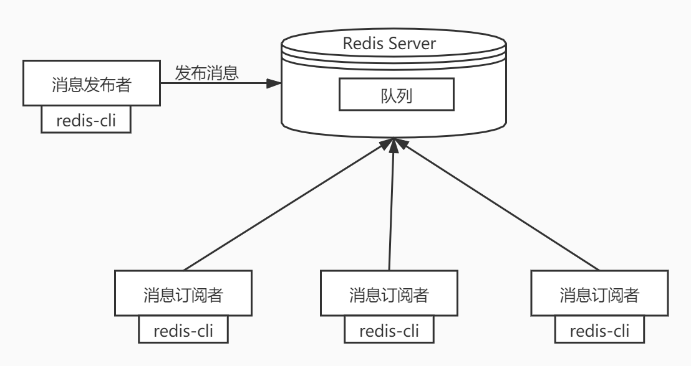

下图展示了频道 channel1，已经订阅这个频道的三个客户端。

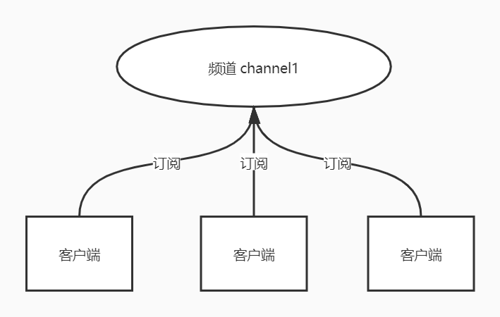

当有新消息通过 publish 命令发送给频道 channel1 时，这个消息就会被发送给订阅它的三个客户端。


### 2、操作命令

这些命令被广泛应用于构建即时通讯应用、比如网络聊天室和实时广播、实时提醒等。

| 命令                                         | 描述                             |
| :------------------------------------------- | :------------------------------- |
| PSUBSCRIBE pattern pattern ...               | 订阅一个或多个符合给定模式的频道 |
| PUBSUB subcommand [argument [argument ...\]] | 查看订阅与发布系统状态           |
| PUBLISH channel message                      | 将信息发送到指定的频道           |
| PUNSUBSCRIBE [pattern [pattern ...]          | 退订所有给定模式的频道           |
| SUBSCRIBE channel channel ...                | 订阅给定的一个或多个频道的信息   |
| UNSUBSCRIBE [channel [channel ...]]          | 指退订给定的频道                 |


### 3、测试案例

以下实例演示了发布订阅是如何工作的。在我们实例中我们创建了订阅频道名为 **redisChat**:

```bash
redis 127.0.0.1:6379> SUBSCRIBE redisChat		# 订阅一个频道：redisChat

Reading messages... (press Ctrl-C to quit)
1) "subscribe"
2) "redisChat"
3) (integer) 1
# 等待读取推送的信息
```

现在，我们先重新开启个 redis 客户端，然后在同一个频道 redisChat 发布两次消息，订阅者就能接收到消息。

```bash
redis 127.0.0.1:6379> PUBLISH redisChat "Redis is a great caching technique"

(integer) 1

redis 127.0.0.1:6379> PUBLISH redisChat "Learn redis by runoob.com"

(integer) 1

# 订阅者的客户端会显示如下消息
1) "message"
2) "redisChat"
3) "Redis is a great caching technique"
1) "message"
2) "redisChat"
3) "Learn redis by runoob.com"
```


### 4、实现原理

Redis 是使用 C语言 实现的，通过分析 Redis 源码里的 public.c 文件，了解发布和订阅机制的底层实现，借此加深对 Redis 的理解。Redis 通过 public 、subscribe 和 psubscribe 等命令实现发布和订阅功能。

微信：

通过 subscribe 命令订阅某频道后，redis=server 里面维护了一个字典，字典的键就是一个个频道！而字典的值则是一个链表，链表保存了所有订阅这个 channel 的客户端。subscribe 命令的关键，就是讲客户端添加到给定 channel 的订阅链中。

通过 publish 命令向订阅者发送消息，redis-server 会使用给定的频道作为键，在它所维护的channel 字典中查找记录了订阅这个频道的所有客户端的链表，遍历这个链表，将消息发布给所有的订阅者。


### 5、使用场景

1. 实时消息系统
2. 实时聊天
3. 订阅、关注系统都可以

PS注意：稍微复杂的场景更多的使用消息中间件 MQ


# Redis 键过期事件监听

Redis 从2.8.0版本后，推出了Keyspace Notifications特性。Keyspace Notifications 此特性允许客户端可以以订阅/发布(Sub/Pub)模式，接收那些对数据库中的键和值有影响的操作事件。

Redis 目前的订阅与发布功能采取的是发送即忘（fire and forget）策略，如果程序需要可靠事件通知，那么目前的键空间通知可能不适合：当订阅事件的客户端断线时，它会丢失所有在断线期间分发给它的事件。并不能确保消息送达。

## 1、开启键事件通知配置

1、在配置文件redis.conf中设置

```shell
notify-keyspace-events EX               # EX代表 expire 和 evicted 过期和驱逐 的时间监听
```

2、或者通过config set命令临时配置

```shell
config set notify-keyspace-events Ex    # EX代表 expire 和 evicted 过期和驱逐 的时间监听
config rewrite                          # 将配置写入配置文件中
```

3、在官网下载的是默认的配置。上面我加了一个配置`notify-keyspace-events Ex` 。关于Ex下表中有解释

| 属性 | 说明                                             |
| ---- | ------------------------------------------------ |
| K    | 键空间通知，所有通知keyspace@ 为前缀，追对key    |
| E    | 键事件通知，所有通知已keyspace@为前缀，追对event |
| g    | DEL、EXPIRE、RENAME等类型无关的通用命令通知      |
| $    | 字符串命令通知                                   |
| l    | 列表命令通知                                     |
| s    | 集合命令通知                                     |
| h    | 哈希命令通知                                     |
| z    | zset命令通知                                     |
| x    | 过期事件通知，每当key过期就会触发                |
| e    | 驱逐事件，每当有键因为maxmemory策略被清楚是触发  |
| A    | g$lshzxe总称                                     |


## 2、通过命令监听测试

1、开启客户端1 redis-cli，然后注册监听器，等待过期键的通知。注册监听器命令：`SUBSCRIBE __keyevent@*__:expired`

```shell
127.0.0.1:6379> PSUBSCRIBE __keyevent@*__:expired
Reading messages... (press Ctrl-C to quit)
1) "psubscribe"
2) "__keyevent@*__:expired"
3) (integer) 1
```

> 其中expired就是我们注册类型 ， @ 后面的* 表示DB。这里我们监听所有数据库的key过期事件。

2、开启客户端2，在客户端2设置10s过期的key

```shell
127.0.0.1:6379> setex username 10 sam
OK
127.0.0.1:6379> ttl username
(integer) 3
```

3、查看客户端1收到过期键的通知

```shell
127.0.0.1:6379> PSUBSCRIBE __keyevent@*__:expired
Reading messages... (press Ctrl-C to quit)
1) "psubscribe"
2) "__keyevent@*__:expired"
3) (integer) 1
1) "pmessage"
2) "__keyevent@*__:expired"
3) "__keyevent@0__:expired"
4) "username"
```


## 3、事件类型

对于每个修改数据库的操作，键空间通知都会发送两种不同类型的事件消息：keyspace 和 keyevent。以 keyspace 为前缀的频道被称为键空间通知（key-space nnotification），而以 keyevent 为前缀的频道则被称为键事件通知（key-event notification）

事件是用  keyspace@DB:KeyPattern 或者 keyevent@DB:OpsType 的格式来发布消息的：

- keyspace@：表示键空间通知，对key的监控
- keyevent@：表示键事件通知，对key的事件进行监听
- DB：表示在第几个数据库（*代表所有数据库）
- KeyPattern：表示需要监控的键模式（可以用通配符,如: `key*:*`）
- OpsType：表示操作类型，就是对key的时什么事件进行监听（例如：过期事件expired、删除事件del）

因此，如果想要订阅特殊的Key上的事件，应该是订阅 keyspace

- 例如：对0号数据库的键 myKey 执行 DEL 命令时，系统将分发两条消息，相当于执行以下两个 PUBLISH 命令：

  ```shell
  publish __keyspace@0__:sampleKey del
  publish __keyevent@0__:del sampleKey
  # 订阅第一个频道 __keyspace@0__:mykey 可以接收0号数据库中所有修改键mykey的事件
  # 而订阅第二个频道 __keyspace@0__:del 则可以接收0号数据库中所有执行 del 命令的键
  PSUBSCRIBE __keyspace@*__:user*
  ```

比如我们想监听 DB0 的 key 删除事件。我们可以这么注册：`PSUBSCRIBE __keyevent@0__:del`

- 在客户端1中监听key的删除事件

  ```shell
  127.0.0.1:6379> PSUBSCRIBE __keyevent@0__:del
  Reading messages... (press Ctrl-C to quit)
  1) "psubscribe"
  2) "__keyevent@0__:del"
  3) (integer) 1
  ```

- 在客户端2中执行发送命令删除消息

  ```shell
  127.0.0.1:6379> publish __keyevent@0__:del sampleKey
  (integer) 1
  ```

- 在客户端1中监听到消息

  ```shell
  127.0.0.1:6379> PSUBSCRIBE __keyevent@*__:del
  Reading messages... (press Ctrl-C to quit)
  1) "psubscribe"
  2) "__keyevent@*__:del"
  3) (integer) 1
  1) "pmessage"
  2) "__keyevent@*__:del"
  3) "__keyevent@0__:del"
  4) "sampleKey"
  ```

比如我们想监听 DB0 所有修改键 user 的事件。我们可以这么注册：`PSUBSCRIBE __keyspace@*__:user*`

- 客户端1开始监听

  ```shell
  127.0.0.1:6379> PSUBSCRIBE __keyspace@*__:user*
  Reading messages... (press Ctrl-C to quit)
  1) "psubscribe"
  2) "__keyspace@*__:user*"
  3) (integer) 1
  ```

- 客户端2开始发送消息

  ```shell
  127.0.0.1:6379> publish __keyspace@0__:user1 del
  (integer) 1
  ```

- 在客户端1中监听到消息

  ```shell
  127.0.0.1:6379> PSUBSCRIBE __keyspace@*__:user*
  Reading messages... (press Ctrl-C to quit)
  1) "psubscribe"
  2) "__keyspace@*__:user*"
  3) (integer) 1
  1) "pmessage"
  2) "__keyspace@*__:user*"
  3) "__keyspace@0__:user1"
  4) "del"
  ```


# Redis Lua && Pipeline 脚本

## 1、Redis Lua 脚本

Redis2.6之后新增的功能，我们可以在redis中通过lua脚本操作redis。与事务不同的是事务是将多个命令添加到一个执行的集合，执行的时候仍然是多个命令，会受到其他客户端的影响，而脚本会将多个命令和操作当成一个命令在redis中执行，也就是说该脚本在执行的过程中，不会被任何其他脚本或命令打断干扰。正是因此这种原子性，lua脚本才可以代替multi和exec的事务功能。同时也是因此，在lua脚本中不宜进行过大的开销操作，避免影响后续的其他请求的正常执行。

使用lua脚本的好处：

- lua脚本是作为一个整体执行的，所以中间不会被其他命令插入
- 可以把多条命令一次性打包，所以可以有效减少网络开销
- lua脚本可以常驻在redis内存中，所以在使用的时候,可以直接拿来复用，也减少了代码量

Redis 脚本使用eval命令执行lua脚本，其中numkeys表示lua script里有多少个key参数，redis脚本根据该数字从后面的key和arg中取前n个作为key参数，之后的都作为arg参数：

```shell
# numkeys 是key的个数，后边接着写key1 key2...  val1 val2...
eval script numkeys key [key ...] arg [arg ...]
```

示例1：记录IP登录次数（利用hash记录所有登录的IP次数）

```shell
# key参数的数量必须和numkey一致，使用key或者argv可以实现一样的效果。如下面：
# 第一个命令里用了三个key，代表后面的三个参数分别对应脚本里的key1 key2 key3.
# 第二个命令里用了一个key，代表了后面第一个参数对应脚本里的key1，后面第二和第三个参数对应脚本里的argv1和argv2
eval "return redis.call('hincrby', KEYS[1], KEYS[2], KEYS[3])" 3 h_host host_192.168.145.1 1
 
eval "return redis.call('hincrby', KEYS[1], ARGV[1], ARGV[2])" 1 h_host host_192.168.145.1 1
```

```shell
127.0.0.1:6379> eval "return redis.call('hincrby', KEYS[1], KEYS[2], KEYS[3])" 3 h_host host_192.168.145.1 1
(integer) 1
127.0.0.1:6379> eval "return redis.call('hincrby', KEYS[1], KEYS[2], KEYS[3])" 3 h_host host_192.168.145.1 1
(integer) 2
127.0.0.1:6379>
127.0.0.1:6379> eval "return redis.call('hincrby', KEYS[1], ARGV[1], ARGV[2])" 1 h_host host_192.168.145.1 1
(integer) 3
127.0.0.1:6379>
127.0.0.1:6379> eval "return redis.call('hincrby', KEYS[1], ARGV[1], ARGV[2])" 1 h_host host_192.168.145.1 1
(integer) 4
127.0.0.1:6379>
127.0.0.1:6379> eval "return redis.call('hincrby', KEYS[1], ARGV[1], ARGV[2])" 1 h_host host_127.0.0.1 1
(integer) 1
127.0.0.1:6379> hgetall h_host
1) "host_192.168.145.1"
2) "4"
3) "host_127.0.0.1"
4) "1"
```

示例2：当10秒内请求3次后拒绝访问

```shell
# 1.给访问ip的key递增，
# 2.判断该访问次数若为首次登录则设置过期时间10秒，
# 3.若不是首次登录则判断是否大于3次，若大于则返回0，否则返回1。
eval "local request_times = redis.call('incr',KEYS[1]);if request_times == 1 then redis.call('expire',KEYS[1], ARGV[1]) end;if request_times > tonumber(ARGV[2]) then return 0 end return 1;" 1 test_127.0.0.1 10 3
```

```shell
127.0.0.1:6379> eval "local request_times = redis.call('incr',KEYS[1]);if request_times == 1 then redis.call('expire',KEYS[1], ARGV[1]) end;if request_times > tonumber(ARGV[2]) then return 0 end return 1;" 1 test_127.0.0.1 10 3
(integer) 1
127.0.0.1:6379> eval "local request_times = redis.call('incr',KEYS[1]);if request_times == 1 then redis.call('expire',KEYS[1], ARGV[1]) end;if request_times > tonumber(ARGV[2]) then return 0 end return 1;" 1 test_127.0.0.1 10 3
(integer) 1
127.0.0.1:6379> eval "local request_times = redis.call('incr',KEYS[1]);if request_times == 1 then redis.call('expire',KEYS[1], ARGV[1]) end;if request_times > tonumber(ARGV[2]) then return 0 end return 1;" 1 test_127.0.0.1 10 3
(integer) 1
127.0.0.1:6379> eval "local request_times = redis.call('incr',KEYS[1]);if request_times == 1 then redis.call('expire',KEYS[1], ARGV[1]) end;if request_times > tonumber(ARGV[2]) then return 0 end return 1;" 1 test_127.0.0.1 10 3
(integer) 0
127.0.0.1:6379> get test_127.0.0.1
"4"
127.0.0.1:6379> ttl test_127.0.0.1
(integer) 3
127.0.0.1:6379> ttl test_127.0.0.1
(integer) -2
```

示例3：Lua 脚本缓存

```shell
# eval 执行脚本并缓存
eval script numkeys key [key ...] arg [arg ...]
 
# load 缓存lua脚本
SCRIPT LOAD script
 
# 使用缓存的脚本sha码调用脚本
EVALSHA sha1 numkeys key [key ...] arg [arg ...] 
 
# 使用sha码判断脚本是否已缓存
SCRIPT EXISTS sha1 [sha1 ...]
 
# 清空所有缓存的脚本
SCRIPT FLUSH
 
# 杀死当前正在执行的所有lua脚本
SCRIPT KILL
```


## 2、Redis Pipeline 脚本

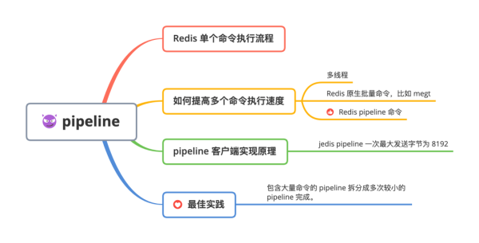

1、什么是Pipeline（流水线或管道）

```
####### 一次网络命令通信模型 #######
|——————|   传输命令    |——————|
|      |   ------>    |      |
|client|              |client|
|      |   返回结果    |      |
|——————|   <------    |——————|
1次命令 = 1次网络时间 + 1次命令时间


####### 批量网络命令通信模型 #######
|——————|   传输命令1   |——————|
|      |   ------->   |      |
|      |   返回结果1   |      |
|      |   <-------   |      |
|      |   传输命令2   |      |
|      |   ------->   |      |
|      |   返回结果2   |      |
|      |   <-------   |      |
|client|              |client|
|      |   ........   |      |
|      |   传输命令n   |      |
|      |   ------->   |      |
|      |   返回结果n   |      |
|——————|   <-------   |——————|
n次时间 = n次网络时间 + n次命令时间

####### 一次网络命令通信模型 #######
|——————|   命令1命令2..命令n    |——————|
|      |   -------------->     |      |
|client|                       |client|
|      |   结果1结果2..结果n    |      |
|——————|   <--------------     |——————|
1次Pipeline（n条命令） = 1次网络时间 + n次命令时间
```


2、n个命令和pipeline操作对比

| 命令   | n个命令操作       | pipeline          |
| ------ | ----------------- | ----------------- |
| 时间   | n次网络 + n次命令 | 1次网络 + n次命令 |
| 数据量 | 1条命令           | n条命令           |


3、注意点：Redis的命令时间是微秒级别的。Pipeline每次条数主要控制的是网络时间。

4、客户端实现

- 非 Pipeline 写法

  ```java
  public class NoPipelineDemo {
      public static void main(String[] args) {
          JedisPoolConfig jedisPoolConfig = new JedisPoolConfig();
          jedisPoolConfig.setMaxTotal(10);
          jedisPoolConfig.setMaxWaitMillis(1000);
          JedisPool jedisPool = new JedisPool(jedisPoolConfig, "127.0.0.1", 6379);
  
          Jedis jedis = null;
          try {
              jedis = jedisPool.getResource();
              long start = System.currentTimeMillis();
              for (int i = 0; i < 10000; i++) {
                  jedis.hset("hashKey" + i, "field" + i, "value" + i);
              }
              long end = System.currentTimeMillis();
              System.out.println("花费时间:" + (end - start) + "毫秒");
          } catch (Exception e) {
              e.printStackTrace();
          } finally {
              if (jedis != null) {
                  jedis.close();
              }
          }
      }
  }
  ```

- Pipeline 写法

  ```java
  public class PipelineDemo {
      public static void main(String[] args) {
          JedisPoolConfig jedisPoolConfig = new JedisPoolConfig();
          jedisPoolConfig.setMaxTotal(10);
          jedisPoolConfig.setMaxWaitMillis(1000);
          JedisPool jedisPool = new JedisPool(jedisPoolConfig, "127.0.0.1", 6379);
  
          Jedis jedis = null;
          try {
              jedis = jedisPool.getResource();
              long start = System.currentTimeMillis();
              // i为网络传输次数
              for (int i = 0; i < 100; i++) {
                  Pipeline pipeline = jedis.pipelined();
                  for (int j = i * 100; j < (i + 1) * 100; j++) {
                      pipeline.hset("hashKey:" + j, "field" + j, "value" + j);
                  }
              }
              long end = System.currentTimeMillis();
              System.out.println("花费时间:" + (end - start) + "毫秒");
          } catch (Exception e) {
              e.printStackTrace();
          } finally {
              if (jedis != null) {
                  jedis.close();
              }
          }
      }
  }
  ```

5、M操作与 Pipeline 操作的区别

- 原生M操作（原子操作）：其他操作 其他操作 M操作 其他操作 =》  Redis服务器
- Pipeline 操作（非原子操作）：其他操作 Pipeline操作 其他操作 Pipeline操作 其他操作 =》  Redis服务器

6、使用建议：

- 注意每次pipeline携带的数据量
- Pipeline每次只能作用在一个Redis节点上
- M操作与Pipeline区别


# Redis 数据持久化（面试重点）

## 1、Redis 持久化概述

1、持久化的作用：Redis 是一个内存数据库，如果没有配置持久化重启后数据就全丢失，因此开启 Redis 的持久化功能，将数据保存到磁盘上，当 Redis 重启后可以从磁盘中恢复数据。

2、两种持久化的方式

- RDB（Redis DataBase）属于全量数据备份，备份的是数据：快照（如Mysql的Dump）：某时某点数据的一个备
- AOF（Append Only File）增量持久化备份，备份的是指令：写日志（如Mysql的Binlog）：数据库做了任何数据的更新，都记录在日志当中

3、使用方式：可以单独使用 RDB（默认开启） 或者 AOF，只需在配置文件配置即可。同时应用RDB和AOF：同时配置这两种方式即可


## 2、RDB（Redis DataBase）

> RDB持久化方式是指在指定时间间隔内将内存中的数据集快照写入磁盘，也就是Snapshot快照，它恢复时是将快照文件直接读到内存中，Redis 会单独创建（fork）一个子进程来进行持久化，会先将数据写入到一个临时文件中，等到持久化过程结束，再用这个临时文件替换上次持久化好的文件，整个过程中，主进程是不进行任何 IO 操作的，这就确保了极高的性能，如果需要进行大规模数据的恢复，且对于数据恢复的完整性不是非常敏感，那 RDB 方式要比 AOF 方式更加的高效，RDB的缺点是最后一次的数据可能会丢失。

### 1、什么是 RDB

1. 在指定的时间间隔内，将内存中的数据集快照写入磁盘，也就是 Snapshot 快照，它恢复时是将快照文件直接读取到内存里的
2. RDB 是默认的持久化方式，默认的文件名为 dump.rdb（也可以通过配置文件修改）
3. RDB文件还是一个复制媒介，可以使用RDB实现主从复制


### 2、RDB 触发的机制

1. save：会阻塞当前Redis服务器，执行save命令期间，Redis不能处理其他命令，直到RDB过程完成为止
2. bgsave：fork 创建子进程，RDB持久化过程由子进程负责，会在后台异步进行快照操作，快照同时还可以响应客户端请求
3. 自动生成：配置文件来完成，配置触发 RDB 持久化条件，例如： "save m n"。表示m秒内数据集存在n次修改时，自动触发 bgsave
4. 主从架构：从服务器同步数据的时候，会发送 sync 执行同步操作，master 主服务器就会执行 bgsave
5. 执行 flushall 命令，清空数据库所有数据，意义不大（可以忽略）
6. 执行 shutdown 命令，保证服务器正常关闭且不丢失任何数据，意义也不大（可以忽略）


### 3、RDB 默认配置介绍

打开Redis安装包默认的 redis.conf 文件，找到 Snapshot 部分

```shell
################################ 快照  #################################  
#  
# Save the DB on disk:保存数据库到磁盘  
#  
#   save <秒> <更新>  
#  
#   如果指定的秒数和数据库写操作次数都满足了就将数据库保存。  
#  
#   下面是保存操作的实例：  
#   900秒（15分钟）内至少1个key值改变（则进行数据库保存--持久化）  
#   300秒（5分钟）内至少10个key值改变（则进行数据库保存--持久化）  
#   60秒（1分钟）内至少10000个key值改变（则进行数据库保存--持久化）  
#  
#   注释：注释掉“save”这一行配置项就可以让保存数据库功能失效。  
#  
#   你也可以通过增加一个只有一个空字符串的配置项（如下面的实例）来去掉前面的“save”配置。  
#  
#   save ""  
  
save 900 1  
save 300 10  
save 60 10000  
  
#在默认情况下，如果RDB快照持久化操作被激活（至少一个条件被激活）并且持久化操作失败，Redis则会停止接受更新操作。  
#这样会让用户了解到数据没有被正确的存储到磁盘上。否则没人会注意到这个问题，可能会造成灾难。  
#  
#如果后台存储（持久化）操作进程再次工作，Redis会自动允许更新操作。  
#  
#然而，如果你已经恰当的配置了对Redis服务器的监视和备份，你也许想关掉这项功能。  
#如此一来即使后台保存操作出错,redis也仍然可以继续像平常一样工作。  
stop-writes-on-bgsave-error yes  
  
#是否在导出.rdb数据库文件的时候采用LZF压缩字符串和对象？  
#默认情况下总是设置成‘yes’， 他看起来是一把双刃剑。  
#如果你想在存储的子进程中节省一些CPU就设置成'no'，  
#但是这样如果你的kye/value是可压缩的，你的到处数据接就会很大。  
rdbcompression yes  
  
#从版本RDB版本5开始，一个CRC64的校验就被放在了文件末尾。  
#这会让格式更加耐攻击，但是当存储或者加载rbd文件的时候会有一个10%左右的性能下降，  
#所以，为了达到性能的最大化，你可以关掉这个配置项。  
#  
#没有校验的RDB文件会有一个0校验位，来告诉加载代码跳过校验检查。  
rdbchecksum yes  
  
# 导出数据库的文件名称  
dbfilename dump.rdb  
  
# 工作目录  
#  
# 导出的数据库会被写入这个目录，文件名就是上面'dbfilename'配置项指定的文件名。  
#   
# 只增的文件也会在这个目录创建（这句话没看明白）  
#   
# 注意你一定要在这个配置一个工作目录，而不是文件名称。  
dir ./
```


### 4、RDB 持久化操作步骤

1、手动执行 RDB 备份

> save 方式

- 执行方式：客户端执行 save 命令，Redis 将创建一个rdb文件
- 同步：如果数据量较大，会阻塞 Redis 执行其它命令
- 文件策略：如果存在老的rdb文件，将会用新文件替换老文件
- 时间复杂度：save命令的时间复杂度为O(n)

```shell
127.0.0.1:6379> set name sam
OK
127.0.0.1:6379> save
OK
```

```shell
# 查看持久化文件存储路径
[root@CentOS7 ~]# ll /usr/local/redis/data/
total 4
-rw-r--r-- 1 root root 107 Aug 21 23:14 redis.rdb
```

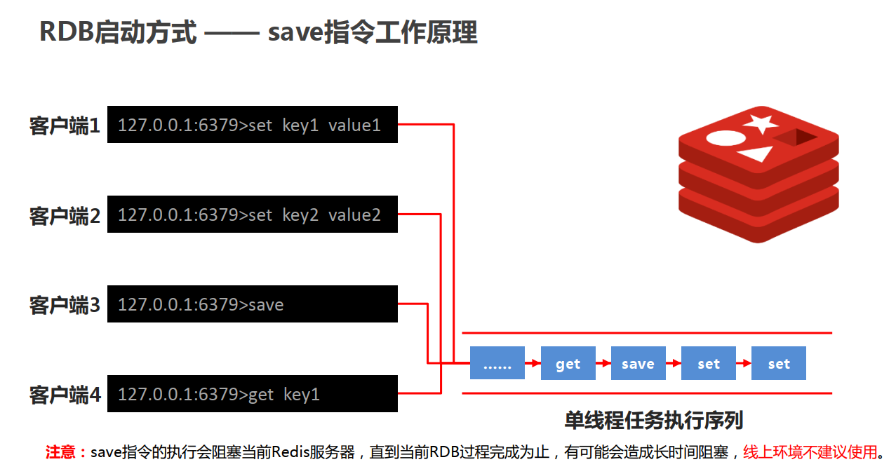

---

> bgsave 方式

- 执行方式：客户端执行 bgsave 命令
- 异步：Redis 使用 Linux 的 fork() 函数生成一个Redis的子进程，由子进程去创建 RDB 文件，完成后自动结束。阻塞只发生在fork阶段，一般时间很短。基本上Redis 内部所有的 RDB 操作都采用 bgsave 命令
- 文件策略：如果存在老的rdb文件，将会用新文件替换老文件
- 时间复杂度：bgsave 命令的时间复杂度为O(n)

```shell
# 首先先删除 RDB 持久化文件
[root@CentOS7 ~]# rm -rf /usr/local/redis/data/redis.rdb 
[root@CentOS7 ~]# ll /usr/local/redis/data/
total 0
```

```shell
127.0.0.1:6379> set name sam
OK
127.0.0.1:6379> bgsave
Background saving started
```

```shell
# 再次查看持久化文件存储路径
[root@CentOS7 ~]# ll /usr/local/redis/data/
total 4
-rw-r--r-- 1 root root 107 Aug 21 23:17 redis.rdb

# 也可以查看日志文件
[root@CentOS7 ~]# tailf -n 10000 /usr/local/redis/log/redis.log
24034:M 21 Aug 2021 23:28:55.900 * Background saving started by pid 24170
24170:C 21 Aug 2021 23:28:55.903 * DB saved on disk
24170:C 21 Aug 2021 23:28:55.903 * RDB: 4 MB of memory used by copy-on-write
24034:M 21 Aug 2021 23:28:56.001 * Background saving terminated with success
```

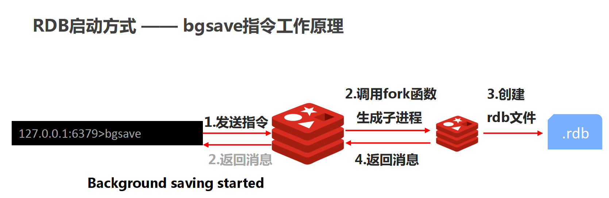

---

> save 和 bgsave 对比

| 方式           | save             | bgsave                   |
| -------------- | ---------------- | ------------------------ |
| IO读写         | 同步             | 异步                     |
| 阻塞客户端命令 | 会               | 会（阻塞发生在fork阶段） |
| 复杂度         | O(n)             | O(n)                     |
| 优点           | 不会消耗额外内存 | 不阻塞客户端命令         |
| 缺点           | 阻塞客户端命令   | 需要fork，消耗内存资源   |

注意： bgsave命令是针对save阻塞问题做的优化。 Redis内部所有涉及到RDB操作都采用bgsave的方式， save命令可以放弃使用。 

---

2、自动执行 RDB 备份

> 配置 redis.conf 文件自动触发

1、修改自定义 Redis 配置文件

```shell
################## RDB快照配置 ##################
# 持久化策略, 60秒内有个3个key改动，执行快照
save 60 3

# 持久化文件存储路径
dir /usr/local/redis/data

# 持久化文件名称
dbfilename redis.rdb

# 导出rdb数据库文件压缩字符串和对象，会浪费CPU但是节省空间，默认:yes
rdbcompression yes

# 导入时是否检查
rdbchecksum yes
```

2、修改配置文件后需要重启服务

```shell
[root@CentOS7 ~]# /usr/local/redis/bin/redis-cli shutdown
[root@CentOS7 ~]# /usr/local/redis/bin/redis-server /usr/local/redis/conf/redis.conf
```

3、先删除 RDB 持久化文件

```shell
[root@CentOS7 ~]# rm -rf /usr/local/redis/data/redis.rdb && ll /usr/local/redis/data/
total 0
```

4、开始测试

```shell
# 60秒内连续做了三次key的修改
127.0.0.1:6379> set k1 v1
OK
127.0.0.1:6379> set k2 v2
OK
127.0.0.1:6379> set k3 v3
OK
```

5、再次查看持久化文件存储路径

```shell
[root@CentOS7 ~]# ll /usr/local/redis/data/
total 4
-rw-r--r-- 1 root root 134 Aug 21 23:28 redis.rdb

# 也可以查看日志文件
[root@CentOS7 ~]# tailf -n 10000 /usr/local/redis/log/redis.log
24034:M 22 Aug 2021 09:50:58.157 * 3 changes in 60 seconds. Saving...
24034:M 22 Aug 2021 09:50:58.158 * Background saving started by pid 22278
22278:C 22 Aug 2021 09:50:58.161 * DB saved on disk
22278:C 22 Aug 2021 09:50:58.161 * RDB: 2 MB of memory used by copy-on-write
24034:M 22 Aug 2021 09:50:58.259 * Background saving terminated with success
```


- 备注：Linux 内存分配策略（内存小的情况下可以配置）

```shell
0 表示内核将检查是否有足够的可用内存供应用进程使用；如果有足够的可用内存，内存申请允许；否则，内存申请失败，并把错误返回给应用进程
1 表示内核允许分配所有的物理内存，而不管当前的内存状态如何。
2 表示内核允许分配超过所有物理内存和交换空间总和的内存

# 解决方式
# 1.临时配置，重启就失效
echo 1 > /proc/sys/vm/overcommit_memory

# 2.持久化配置，修改sysctl.conf内的 vm.overcommit_memory=1
vim /etc/sysctl.conf
# 修改sysctl.conf后，需要执行 sysctl -p 以使生效。
sysctl -p

# 3.持久化快速配置（将所有内存交由应用程序管理）
echo "vm.overcommit_memory=1" >> /etc/sysctl.conf && /sbin/sysctl -p
```

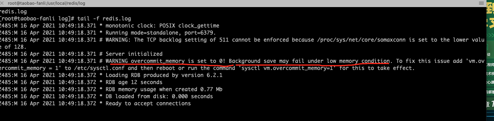


### 5、RDB  的优缺点

优点：

- RDB文件紧凑，全量备份，适合用于进行大规模备份和灾难恢复
- 在恢复大数据集时的速度比 AOF 的恢复速度要快
- 生成的是一个紧凑压缩的二进制文件

缺点：

- 数据的完整性和一致性不高，在快照持久化期间修改的数据不会被保存，可能丢失数据
- 每次快照是一次全量备份，fork 进程的时候会占用一定的内存空间。将数据写入到一个临时文件（此时内存中的数据是原来的两倍）最后再将临时文件替换之前的备份文件

------

> 如何恢复 rdb 文件 和 查看 rdb 文件位置

1、只需要将 rdb 文件放在 Redis 启动目录就可以，Redis 启动的时候会自动检查 dump.rdb ，恢复其中的数据；

2、查看存放 rdb 文件的位置，在客户端中使用如下命令。

```bash
127.0.0.1:6379> config get dir
1) "dir"
2) "/usr/local/bin"
```


## 3、AOF（Append Only File）

> AOF(append only file)持久化：以独立日志的方式记录每次写命令，重启时再重新执行AOF文件中命令达到恢复数据的目的。与RDB相比可以简单描述为改记录数据为记录数据产生的过程。AOF的主要作用是解决了数据持久化的实时性，目前已经是Redis持久化的主流方式。

### 1、AOF 持久化介绍

- append only file，追加文件的方式，文件容易被人读懂
- 以独立日志的方式记录每次写命令， 重启时再重新执行AOF文件中的命令达到恢复数据的目的
- 写入过程宕机，也不影响之前的数据，可以通过 redis-check-aof 检查修复问题


### 2、AOF 核心原理

- Redis 每次写入命令会追加到 aof_buf（缓冲区）
- AOF 缓冲区根据对应的策略向硬盘做同步操作
- 高频 AOF 会带来影响，特别是每次刷盘

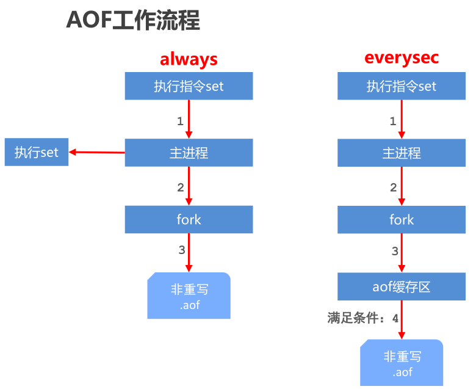


### 3、AOF 三种同步策略

- appendfsync always：每次有数据修改发生时都会写入AOF文件，消耗性能多
- appendfsync everysec：每秒钟同步一次，该策略为AOF的缺省策略
- appendfsync no：不主从同步，由操作系统自动调度刷磁盘，性能是最好的，但是最不安全

| 命令 | always                              | everysec       | no     |
| ---- | ----------------------------------- | -------------- | ------ |
| 优点 | 不丢失数据                          | 每秒一次 fsync | 不用管 |
| 缺点 | IO开销较大，一般的sata盘只有几百TPS | 丢1秒数据      | 不可控 |


### 4、AOF 配置实战操作

- appendonly yes，默认不开启
- AOF文件名 通过 appendfilename 配置设置，默认文件名是appendonly.aof
- 存储路径同 RDB持久化方式一致，使用 dir 配置

1、修改配置文件

```shell
################## 如下为RDB持久化配置 ##################
# 先关闭 RDB 策略
save ""
# RDB持久化文件名称
dbfilename redis.rdb
# 对rdb数据进行校验，耗费CPU资源，默认为yes
rdbchecksum yes
# 导出rdb数据库文件压缩字符串和对象，会浪费CPU但是节省空间，默认:yes
rdbcompression yes

# 持久化文件存储路径（这个配置RDB与AOP公用）
dir /usr/local/redis/data

################## 如下为AOF持久化配置 ##################
# 开启 AOP 持久化，默认为no
appendonly yes
# AOF持久化文件名称
appendfilename "appendonly.aof"
# 每秒钟同步一次，默认方式
appendfsync everysec
```

2、修改配置文件后需要重启服务

```shell
[root@CentOS7 ~]# /usr/local/redis/bin/redis-cli shutdown
[root@CentOS7 ~]# /usr/local/redis/bin/redis-server /usr/local/redis/conf/redis.conf
```

3、重启后可以看到 AOF 文件（`appendonly.aof`），但是文件是空的

```shell
[root@CentOS7 ~]# ll /usr/local/redis/data/
total 4
-rw-r--r-- 1 root root   0 Aug 22 10:51 appendonly.aof
# 查看appendonly.aof文件发现为空
[root@CentOS7 ~]# cat /usr/local/redis/data/appendonly.aof 
[root@CentOS7 ~]# 
```

4、使用客户端添加一些数据再次查看

```shell
127.0.0.1:6379> mset k1 v1 k2 v2 k3 v3
OK

# 写完数据后再次查看，里面多了很多内容
[root@CentOS7 ~]# cat /usr/local/redis/data/appendonly.aof 
*2
$6
SELECT
$1
0
*3
$3
set
$2
k1
$2
v1
*7
$4
mset
$2
k1
$2
v1
$2
k2
$2
v2
$2
k3
$2
v3
```

5、自动修复 AOF文件：

- 如果手动修改AOF 文件，可能导致 Redis 服务不能启动。比如这里我手动在 AOF 文件的最后一行随便添加一些命令：

```shell
[root@CentOS7 ~]# echo "11111" >> /usr/local/redis/data/appendonly.aof
[root@CentOS7 ~]# cat /usr/local/redis/data/appendonly.aof 
.....省略
$2
k3
$2
v3
11111
```

- 然后重启服务，并查看日志。可以发现启动失败并要求我们修复 appendonly.aof 文件

```shell
[root@CentOS7 ~]# /usr/local/redis/bin/redis-cli shutdown
[root@CentOS7 ~]# /usr/local/redis/bin/redis-server /usr/local/redis/conf/redis.conf

# 查看日志
[root@CentOS7 ~]# tailf -n 10000 /usr/local/redis/log/redis.log
25800:C 22 Aug 2021 11:02:16.731 # oO0OoO0OoO0Oo Redis is starting oO0OoO0OoO0Oo
25800:C 22 Aug 2021 11:02:16.731 # Redis version=6.0.6, bits=64, commit=00000000, modified=0, pid=25800, just started
25800:C 22 Aug 2021 11:02:16.731 # Configuration loaded
25801:M 22 Aug 2021 11:02:16.733 * Running mode=standalone, port=6379.
25801:M 22 Aug 2021 11:02:16.734 # WARNING: The TCP backlog setting of 511 cannot be enforced because /proc/sys/net/core/somaxconn is set to the lower value of 128.
25801:M 22 Aug 2021 11:02:16.734 # Server initialized
25801:M 22 Aug 2021 11:02:16.734 # WARNING overcommit_memory is set to 0! Background save may fail under low memory condition. To fix this issue add 'vm.overcommit_memory = 1' to /etc/sysctl.conf and then reboot or run the command 'sysctl vm.overcommit_memory=1' for this to take effect.
25801:M 22 Aug 2021 11:02:16.734 # WARNING you have Transparent Huge Pages (THP) support enabled in your kernel. This will create latency and memory usage issues with Redis. To fix this issue run the command 'echo never > /sys/kernel/mm/transparent_hugepage/enabled' as root, and add it to your /etc/rc.local in order to retain the setting after a reboot. Redis must be restarted after THP is disabled.
25801:M 22 Aug 2021 11:02:16.734 # Bad file format reading the append only file: make a backup of your AOF file, then use ./redis-check-aof --fix <filename>
```

- 如果这个 AOF 文件有错位，客户端就不能链接了，需要修复 AOF 文件。Redis 提供了工具 `redis-check-aof --fix`

```shell
[root@CentOS7 ~]# /usr/local/redis/bin/redis-check-aof --fix /usr/local/redis/data/appendonly.aof 
0x              72: Expected prefix '*', got: '1'
AOF analyzed: size=120, ok_up_to=114, diff=6
This will shrink the AOF from 120 bytes, with 6 bytes, to 114 bytes
Continue? [y/N]: y
Successfully truncated AOF
```

- 重启服务，再次尝试链接成功

```shell
[root@CentOS7 ~]# /usr/local/redis/bin/redis-server /usr/local/redis/conf/redis.conf
[root@CentOS7 ~]# /usr/local/redis/bin/redis-cli 
127.0.0.1:6379> keys *
1) "k3"
2) "k2"
3) "k1"
```

**注意**：正常情况下，Redis 重启服务时候会自动读取配置路径下的 appendonly.aof  文件。但在实际开发中，可能因为某些原因导致 appendonly.aof 文件格式异常，从而导致数据还原失败，可以通过命令进行修复：`redis-check-aof --fix appendonly.aof`  。**AOF的优先级高于RDB**。


## 4、AOF 重新机制（Rewrite） 

### 1、AOF  重写介绍

- AOF文件会越来越大，需要定期对AOF文件进行重写达到压缩
- 旧的AOF文件含有无效命令会被忽略，保留最新的数据命令
- 多条写命令可以合并为一个
- AOF重写降低了文件占用空间
- 更小的AOF文件可以更快地被Redis加载

AOF 重写作用

- 降低磁盘占用量，提高磁盘利用率
- 提高持久化效率，降低持久化写时间，提高IO性能 
- 降低数据恢复用时，提高数据恢复效率


### 2、AOF 重写触发机制

- 手动触发：直接在客户端执行命令即可：bgrewriteaof
- 自动触发：配置如下参数
  - auto-aof-rewrite-min-size：表示运行AOF重写时文件最小体积，默认 为64MB。
  - auto-aof-rewrite-percentage：代表当前AOF文件空间和上一次重写后AOF文件空间（aof_base_size）的比值

---

> AOF 自动重写触发机制原理：

| 配置名                      | 含义                              |
| --------------------------- | --------------------------------- |
| auto-aof-rewrite-min-size   | AOF文件重写需要的尺寸             |
| auto-aof-rewrite-percentage | AOF文件增长率                     |
| **统计名**                  | **含义**                          |
| aof_current_size            | AOF当前尺寸(单位字节)             |
| aof_base_size               | AOF上次启动和重写的尺寸(单位字节) |

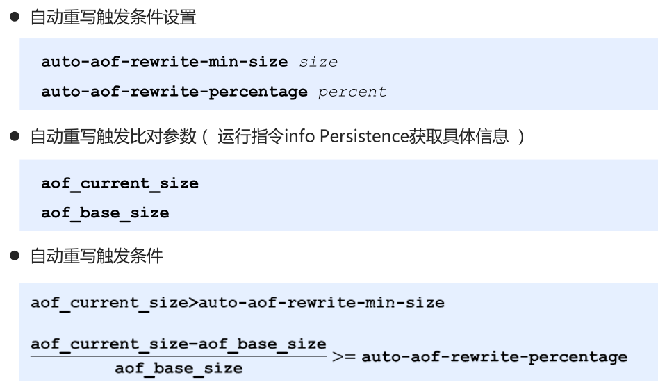

自动重写触发条件设置（如下为默认配置，可以自行修改）

```shell
auto-aof-rewrite-percentage 100
auto-aof-rewrite-min-size 64mb
```

运行指令`info persistence`，查看：aof_current_size、aof_base_size 的大小。

```shell
127.0.0.1:6379> info persistence
# Persistence
...# 省略
aof_current_size:118
aof_base_size:118
...# 省略
```

自动触发条件：同时满足如下配置才能够触发AOF重写策略。

```shell
aof_current_size > auto-aof-rewrite-min-size
aof_current_size-aof_base_size/aof_base_size > auto-aof-rewrite-percentage
```

触发机制：当AOF文件大小是上次rewrite后大小的一倍且文件大于64M时触发。这里的“一倍”和“64M” 可以通过配置文件修改。


### 3、AOF 重写流程

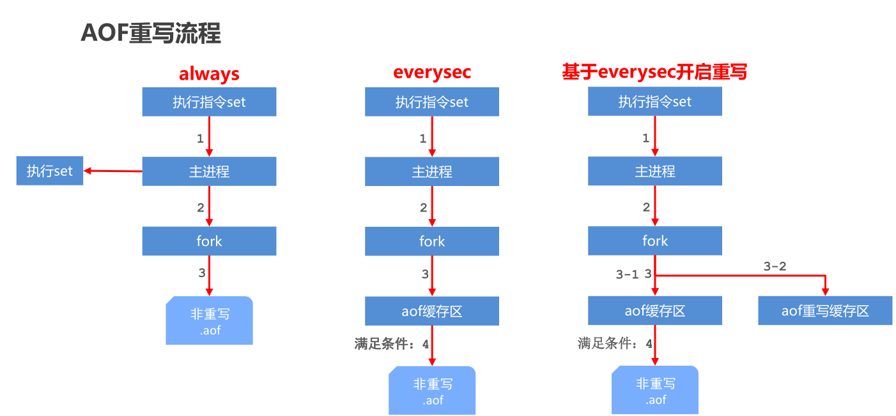

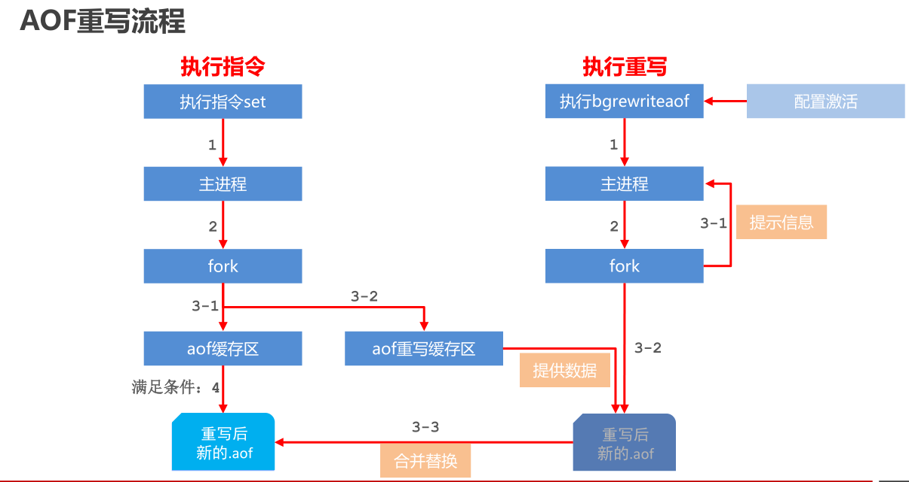


### 4、AOF 重写实战

> 手动触发

1、首先用客户端写入重复的命令设置

```shell
127.0.0.1:6379> mset k1 v1 k1 v1 k1 v1 k2 v2 k2 v2 k2 v2
OK
```

2、查看appendonly.aof 文件内容和 文件大小

```shell
# 1.查看appendonly.aof文件内容
[root@CentOS7 ~]# cat /usr/local/redis/data/appendonly.aof 
# ...太长了，省略了上部分数据
v2
$2
k2
$2
v2

# 2.查看文件大小
[root@CentOS7 ~]# ll /usr/local/redis/data/appendonly.aof 
-rw-r--r-- 1 root root 248 Aug 22 11:15 /usr/local/redis/data/appendonly.aof
```

3、执行AOF手动重写命令：

```shell
127.0.0.1:6379> bgrewriteaof
Background append only file rewriting started
```

4、再次查看 文件内容和文件大小

```shell
# 1.查看appendonly.aof文件内容，可以发现全部被压缩了，实际上是按照RDB的方式压缩成二进制方式
[root@CentOS7 ~]# vim /usr/local/redis/data/appendonly.aof
REDIS0009ú      redis-ver^E6.0.6ú
redis-bitsÀ@ú^EctimeÂ^XÂ!aú^Hused-memÂÈ4^M^@ú^Laof-preambleÀ^Aþ^@û^C^@^@^Bk3^Bv3^@^Bk2^Bv2^@^Bk1^Bv1ÿu^T^\^B@¼^Nú

# 2.查看文件大小
[root@CentOS7 ~]# ll /usr/local/redis/data/appendonly.aof 
-rw-r--r-- 1 root root 118 Aug 22 11:18 /usr/local/redis/data/appendonly.aof
```

---

> 自动触发配置

```shell
# 是否开启AOF(默认是no)
appendonly yes

# AOF文件名称
appendfilename "appendonly.aof"

# AOF同步策略，默认
appendfsync everysec

# aof重写期间是否同步（进行命令追加操作）
# yes表示在日志重写时，不进行命令追加操作，而只是将其放在缓冲区里，避免与命令的追加造成DISK IO上的冲突。no表示在日志重写时，命令追加操作照常进行
no-appendfsync-on-rewrite no

# 重写触发配置
# AOF文件增长率(默认为100%)
auto-aof-rewrite-percentage 100
# AOF文件重写所需的尺寸(Redis6默认为64MB)
auto-aof-rewrite-min-size 64mb

# 加载aof出错如何处理，yes（默认）：如果aof尾部文件出问题，写log记录并继续执行。no：表示提示写入等待修复后写入
aof-load-truncated yes 
```

1. 第一步：修改配置文件，开启AOF持久化配置
2. 第二步：重启Redis服务，并进入Redis 自带的客户端中
3. 第三步：保存值，然后模拟数据丢失，关闭Redis服务
4. 第四步：重启服务，发现数据恢复了
5. 第五步：修改appendonly.aof，模拟文件异常情况
6. 第六步：重启 Redis 服务失败。这同时也说明了，RDB和AOF可以同时存在，且优先加载AOF文件
7. 第七步：校验 appendonly.aof 文件。重启Redis 服务后正常


## 5、AOF 和 RDB 如何选择

Redis 提供了不同的持久性选项：

- RDB持久化：以指定的时间间隔执行数据集的时间点快照
- AOF持久化：记录服务器接收的每个写入操作，将在服务器启动时再次读取，重建原始数据集。使用与Redis协议本身相同的格式以仅追加方式记录命令，当文件太大时，Redis能够重写


**RDB 和 AOF 对比**

| 持久化方式 | RDB    | AOF          |
| ---------- | ------ | ------------ |
| 启动优先级 | 低     | 高           |
| 体积       | 小     | 大           |
| 恢复速度   | 快     | 慢           |
| 数据安全性 | 丢数据 | 根据策略决定 |


### 1、RDB 的优缺点

优点：

1. RDB最大限度地提高了Redis的性能，父进程不需要参与磁盘I/O
2. RDB文件紧凑，全量备份，适合用于进行备份和灾难恢复
3. 在恢复大数据集时的速度比 AOF 的恢复速度要快
4. 生成的是一个紧凑压缩的二进制文件

缺点：

1. 如果您需要在Redis停止工作时（例如断电后）将数据丢失的可能性降至最低，则RDB并不好
2. RDB经常需要fork才能使用子进程持久存储在磁盘上。如果数据集很大，Fork可能会非常耗时


### 2、AOF的优缺点

优点：

1. 数据的完整性和一致性更高，数据更加安全
2. 当 Redis AOF 文件太大时，Redis 能够在后台自动重写 AOF
3. AOF以易于理解和解析的格式，一个接一个地包含所有操作的日志

缺点：相对于数据文件来说， AOF 远远大于 RDB ，修复的速度和效率也比 RDB 慢。所以 Redis 默认的配置就是 RDB 持久化


### 3、如何选择持久化模式

- 只做缓存，如果你只希望你的数据在服务器运行的时候存在，你也可以不使用任何持久化
- 如果可以承受数分钟以内的数据丢失，那么可以只使用RDB持久化。
- 并不推荐只使用AOF持久化：因为定时生成RDB非常便于进行数据库备份，并且RDB恢复数据集的速度也要比AOF恢复的速度要快
- 集群中可以关闭AOF持久化，靠集群的备份方式保证可用性
- 自己制定策略定期检查Redis的情况，然后可以手动触发备份、重写数据
- 采用集群和主从同步
- 如果对数据的安全性要求非常高的话，应该同时使用两种持久化功能。RDB和AOF可以同时存在，且优先加载AOF文件
  - 在这种情况下，当 Redis 重启的时候会优先加载AOF 文件来恢复原始的数据，因为在通常情况下，AOF 文件保存的数据集要比 RDB 文件保存的数据集要完整。
  - RDB 的数据不实时，同步使用两者时服务器重启也只会找 AOF 文件。那要不要只使用 AOF 呢？作者建议不要，因为 RDB 更适合用于备份数据库（AOF 在不断变化不好备份），快速重启，而且不会有 AOF 可能潜在的 BUG，留着作为一个万一的手段。
- 性能建议
  - 因为 RDB 文件只用作后备用途，建议只在 Slave 上持久化 RDB 文件，而且只要 15 分钟备份一次就够了，只保留save 900 1 这条规则。
  - 如果 Enable AOF ，好处是在最恶劣情况下也只会丢失不超过两秒的数据，启动脚本较简单只 load 自己的 AOF 文件就可以了，代价是一是带来了持续的IO，而是 AOF rewrite 的最后将rewrite 过程中产生的新数据写到新文件造成的阻塞几乎是不可避免的。只要硬盘许可，应该尽量减少 AOF rewrite 的频率，AOF 重写的基础大小默认值是 64M 太小了，可以设置到 5G 以上，默认值超过原大小 100% 大小重写可以改到适当的数值。
  - 如果不 Enable AOF ，仅靠 Master-Slave Repllcation 实现高可用也可以，能省掉一大笔 IO ，也减少了 rewrite 时带来的系统波动。代价是如果 Master/Slave 同时宕掉，会丢失十几分钟的数据，启动脚本也要比较两个 Master/Slave 中的 RDB 文件，载入较新的那个，微博就是这种架构。

 


### 4、使用持久化混合模式

Redis4.0 后开始的 rewrite 支持 **混合模式**

- 就是 RDB 和AOF 同时使用
- 直接将rdb持久化的方式来操作将二进制内容覆盖到aof文件中,rdb是二进制，所以很小
- 有写入的话还是继续 append 追加到文件原始命令，等下次文件过大的时候再次 rewrite
- 默认是开启状态
- 好处：混合持久化结合了RDB和AOF持久化的优点，采取了RDB的文件小易于灾难恢复。同时结合AOF增量的数据以AOF方式保存了，数据更少的丢失
- 坏处：前部分是RDB格式，是二进制，所以阅读性较差
- 数据恢复：先看是否存在AOF文件，若存在则先恢复AOF文件，若AOF不存在，才会查找RDB是否存在（AOF比RDB全，且AOF文件也rewrite成RDB二进制格式）


# Redis 过期删除策略和内存淘汰策略

> 参考：
>
> 1. CSDN（Felix-Yuan）：https://blog.csdn.net/yuanlong122716/article/details/104420880
> 2. CSDN（王义凯）https://blog.csdn.net/wsdc0521/article/details/106997623
> 3. 博客园（天宇轩-王）：[Redis的逐出算法](https://www.cnblogs.com/dalianpai/p/12617045.html)、[过期策略](https://www.cnblogs.com/dalianpai/p/12616952.html)

在介绍这篇文章之前，我们先来看如下几个问题：

如何设置 Redis 键的过期时间？

设置完一个键的过期时间后，到了这个时间，这个键还能获取到么？假如获取不到那这个键还占据着内存吗？

如何设置Redis的内存大小？当内存满了之后，Redis有哪些内存淘汰策略？我们又该如何选择？


## 1、设置移除键过期时间

Redis提供了四个命令来设置过期时间（生存时间）

1. EXPIRE key ttl：表示将键 key 的生存时间设置为 ttl 秒
2. PEXPIRE key ttl ：表示将键 key 的生存时间设置为 ttl 毫秒
3. EXPIREAT key timestamp：表示将键 key 的生存时间设置为 timestamp 所指定的秒数时间戳
4. PEXPIREAT key timestamp：表示将键 key 的生存时间设置为 timestamp 所指定的毫秒数时间戳

PS：在Redis内部实现中，前面三个设置过期时间的命令最后都会转换成最后一个PEXPIREAT 命令来完成

移除过期时间和查看过期时间命令：

1. 移除键的过期时间：PERSIST key：表示将key的过期时间移除
2. TTL / PTTL key：以秒或毫秒的单位返回键 key 的剩余生存时间


## 2、过期键的三种删除策略

通常删除某个键（key）有如下三种方式进行处理：

1、定时删除

1. 含义：在设置键的过期时间的同时，创建一个定时器，让定时器在键的过期时间来临时，立即执行对键的删除操作。
2. 优点：对内存最友好的。可以及时释放键所占用的内存。
3. 缺点：对 CPU 不友好。特别在过期键比较多的情况下，删除过期键会占用相当一部分 CPU 时间。同时在内存不紧张，CPU 紧张的情况下，将 CPU 用在删除和当前任务不想关的过期键上，无疑会对服务器响应时间和吞吐量造成影响（所以基本没人用）
4. 删除流程：
   1. Redis 每10 秒进行一次过期扫描
   2. 随机取20个设置了过期策略的key
   3. 检查20个key中过期时间中已过期的key并删除
   4. 如果有超过 25% 的 key 已过期则重复第一步
   5. 这种循环随机操作会持续到过期 key 可能仅占全部 key 的 25% 以下时，并且为了保证不会出现循环过多的情况，默认扫描时间不会超过 25ms

---

2、惰性删除

1. 含义：放任键过期不管，当每次从键空间中读写键时，都会检查取得的键是否过期。如果过期就删除，否则就返回该键
2. 优点：对 CPU 最友好，我们只会在使用该键时才会进行过期检查，对于很多用不到的键不用浪费时间进行过期检查
3. 缺点：对内存不友好，键过期了，但因为一直没有被访问到，所以一直保留着，内存永远不会释放，会造成内存泄漏
4. 删除流程：
   1. 在进行get或setnx等操作时，先检查key是否过期
   2. 若过期，删除key，然后执行相应操作
   3. 若没过期，直接执行相应操作

---

3、定期删除

1. 含义：每隔一段时间，随机检查设置了过期的键并删除已过期的键（删多少过期键及检查多少数据库，则由算法决定）
2. 优点：
   - 通过限制删除操作的时长和频率，来减少删除操作对 CPU 时间的占用。—处理"定时删除"的缺点。
   - 定期删除过期键，有效释放过期键占用的内存。—处理"惰性删除"的缺点
3. 缺点：
   - 在内存友好方面，不如"定时删除"
   - 在CPU时间友好方面，不如"惰性删除"
   - 难以确定删除操作执行的时长（每次删除执行多长时间）和频率（每隔多长时间做一次删除）
4. 删除流程：
   1. 遍历每个数据库（就是redis.conf中配置的"database"数量，默认为16）
   2. 检查当前库中的指定个数个key（默认是每个库检查20个key，注意相当于该循环执行20次，循环体时下边的描述）
   3. 如果当前库中没有一个key设置了过期时间，直接执行下一个库的遍历
   4. 随机获取一个设置了过期时间的key，检查该key是否过期，如果过期，删除key
   5. 判断定期删除操作是否已经达到指定时长，若已经达到，直接退出定期删除。

---

4、结论： 

- 定时删除和定期删除为主动删除：Redis 会定期主动淘汰一批已过去的键
- 惰性删除为被动删除：用到的时候才会去检验key是不是已过期，过期就删除，否则就


## 3、Redis 采用的过期策略

Redis 服务器使用键过期策略：惰性删除 + 定期删除（通过配合使用，服务器可以很好的平衡 CPU 和内存）

其中惰性删除为 Redis 服务器内置策略，而定期删除可以通过以下方式设置：

1. 配置 redis.conf 的 hz 选项，默认为10 （即 1 秒执行 10 次，值越大说明刷新频率越快，对 Redis 性能损耗也越大）
2. 配置 redis.conf 的 maxmemory-samples 选项，默认为5（随机抽取检测数据的个数）
3. 配置 redis.conf 的 maxmemory 最大值，当已用内存超过 maxmemory 时，就会触发主动清理策略（内存淘汰策略）

```shell
# 设置Redis后台任务执行频率，比如清除过期键任务。
# 设置范围为1到500，默认为10.即 1 秒执行 10 次，也就是每隔 100ms 执行一次
# 越大CPU消耗越大，延迟越小，建议不要超过100
hz 10

# LRU和最小TTL算法的实现都不是很精确，但是很接近（为了省内存），所以你可以用样例做测试
# 例如：默认Redis会检查三个key然后取最旧的那个，你可以通过下面的配置项来设置样本的个数
maxmemory-samples 5

################ 这部分配置可以理解为内存淘汰策略内容 ################
maxmemory <bytes>                  # 设置Redis最大可用内存，默认0，也就是无限制
maxmemory-policy noeviction        # 设置内存淘汰方式，默认noeviction，不做清理
```

讨论出现的问题：

1. 如果定期删除漏掉了很多过期键，然后你也没及时去查，也就没走惰性删除，此时会怎么样？
2. 如果大量过期键堆积在内存里，导致 Redis 内存块耗尽了，这时候就需要走内存淘汰机制


## 4、Redis 内存缓存淘汰策略

> 淘汰策略背景

1. 当 Redis 内存超出物理内存限制时，内存的数据会开始和磁盘产生频繁的交换(swap)，会导致 Redis 的性能急剧下降或不可用
2. 为了限制最大使用内存，Redis 提供了配置参数 maxmemory 来限制内存超出期望大小
3. 当实际内存超出 maxmemory 时，Redis 也提供了八种策略（maxmemory-policy）清除内存中的键来释放内存空间

> 八种内存淘汰策略概述

1. volatile-lru（least recently used）：最近最少使用算法，从设置过期时间的键中选择空转时间最长的键值对清除掉
2. volatile-lfu（least frequently used）：最近最不经常使用算法，从设置过期时间的键中选择某段时间内使用频次最小的键值对清除
3. volatile-random：从设置了过期时间的键中，随机选择键进行清除
4. volatile-ttl：从设置了过期时间的键中选择过期时间最早的键值对清除 (删除即将过期的）
5. allkeys-lru：最近最少使用算法，从所有的键中选择空转时间最长的键值对清除
6. allkeys-lfu：最近最不经常使用算法，从所有的键中选择某段时间之内使用频次最少的键值对清除
7. allkeys-random：所有的键中，随机选择键进行删除
8. noeviction：不做任何的清理工作，在redis的内存超过限制之后，所有的写入操作都会返回错误；但是读操作都能正常的进行

> 淘汰策略设置

1、redis.conf 配置文件方式配置

```shell
################ 这部分配置可以理解为内存淘汰策略内容 ################
# 设置Redis最大可用内存，默认0，也就是无限制
maxmemory <bytes>
# 下面的写法均合法
maxmemory 1024000
maxmemory 1GB
maxmemory 1G
maxmemory 1024KB
maxmemory 1024K
maxmemory 1024MB

# 设置内存淘汰方式，默认noeviction不做清理
maxmemory-policy noeviction        
```

2、config 命令行方式配置

```shell
################ 设置Redis最大可用内存 ################
127.0.0.1:6379> config get maxmemory
1) "maxmemory"
2) "0"
127.0.0.1:6379> config set maxmemory 1GB
OK
127.0.0.1:6379> config get maxmemory
1) "maxmemory"
2) "1073741824"

################ 设置内存淘汰方式 ################
127.0.0.1:6379> config get maxmemory-policy
1) "maxmemory-policy"
2) "noeviction"
127.0.0.1:6379> config set maxmemory-policy volatile-random
OK
127.0.0.1:6379> config get maxmemory-policy
1) "maxmemory-policy"
2) "volatile-random"
```

PS：config 配置的时候需要注意：下划线“\_”的key需要用中横线“-”（info 内查询的 key 名是带“\_”）

```shell
127.0.0.1:6379> config set maxmemory_policy volatile-lru
(error) ERR Unsupported CONFIG parameter: maxmemory_policy
127.0.0.1:6379> config set maxmemory-policy volatile-lru
OK
```


## 5、LRU &LFU 算法

> 在缓存的内存淘汰策略中有 FIFO、LRU、LFU 三种，其中 LRU 和 LFU 是R edis 在使用的

**FIFO**是最简单的淘汰策略，遵循着**先进先出**的原则，这里简单提一下。

> LRU算法【最近最久未使用】

LRU（Least Recently Used）表示最近最少使用，该算法根据数据的历史访问记录来进行淘汰数据，其核心思想是“如果数据最近被访问过，那么将来被访问的几率也更高”。LRU算法的常见实现方式为链表：新数据放在链表头部 ，链表中的数据被访问就移动到链头，链表满的时候从链表尾部移出数据。

因为标准LRU算法需要消耗大量的内存，所以 Redis 使用的是近似LRU算法：为每个key新增一个3字节（24bit）的内存空间用于存储 KEY 的最后一次访问的时间戳，然后随机采样5个key（可以修改参数maxmemory-samples配置），淘汰访问时间最早的key，直到Redis占用内存小于maxmemory为止。因此当采样key的数量与Redis库中key的数量越接近，淘汰的规则就越接近LRU算法。但官方推荐5个就足够了，最多不超过10个，越大就越消耗CPU的资源。

在Redis 3.0以后增加了LRU淘汰池，进一步提高了与标准LRU算法效果的相似度。淘汰池即维护的一个数组，数组大小等于抽样数量 maxmemory_samples，在每一次淘汰时，新随机抽取的key和淘汰池中的key进行合并，然后淘汰掉最旧的key，将剩余较旧的前面5个key放入淘汰池中待下一次循环使用。假如maxmemory_samples=5，随机抽取5个元素，淘汰池中还有5个元素，相当于变相的maxmemory_samples=10了，所以进一步提高了与LRU算法的相似度.

示例：利用LinkedHashMap手写一个LRU算法的简单实现

```java
package com.example.springbootredis;

import java.util.LinkedHashMap;
import java.util.Map;

public class LRU {
    public static void main(String[] args) {

        // 定义最大容量为 10
        final int maxSize = 10;

        // 参数boolean accessOrder含义:false-按照插入顺序排序；true-按照访问顺序排序。
        Map<Integer, Integer> map = new LinkedHashMap<Integer, Integer>(0, 0.75f, true) {
            // LinkedHashMap加入新元素时会自动调用该方法，若返回true，则会删除链表尾部的元素
            @Override
            protected boolean removeEldestEntry(Map.Entry<Integer, Integer> eldest) {
                return size() > maxSize;
            }
        };

        // 先往map中加入10个元素(定义的最大容量为10)
        for (int i = 1; i <= 10; i++) {
            map.put(i, i);
        }

        // 访问一下第6个元素,看看是否会排到链表的头部
        map.get(6);
        System.out.println("发现第6个元素排到了链表的头部：");
        System.out.println(map.toString());

        // 再加数据
        map.put(11, 11);
        System.out.println("删除链表尾部的元素，再将新的元素添加至链表头部 ：");
        System.out.println(map.toString());
    }
}
```

执行结果：

```
发现第6个元素排到了链表的头部：
{1=1, 2=2, 3=3, 4=4, 5=5, 7=7, 8=8, 9=9, 10=10, 6=6}
删除链表尾部的元素，再将新的元素添加至链表头部 ：
{2=2, 3=3, 4=4, 5=5, 7=7, 8=8, 9=9, 10=10, 6=6, 11=11}
```


LRU 缺点：但在LRU算法下，如果一个热点数据最近很少访问，而非热点数据近期访问了，就会误把热点数据淘汰而留下了非热点数据，因此在Redis4.x中新增了LFU算法。

> LFU算法【最近最少使用】

LFU（Least Frequently Used）表示最不经常使用，它是根据数据的历史访问频率来淘汰数据，其核心思想是“如果数据过去被访问多次，那么将来被访问的频率也更高”。LFU算法反映了一个key的热度情况，不会因LRU算法的偶尔一次被访问被误认为是热点数据。

LFU算法的常见实现方式为链表：新数据放在链表尾部 ，链表中的数据按照被访问次数降序排列，访问次数相同的按最近访问时间降序排列，链表满的时候从链表尾部移出数据。

在 Redis LFU算法中，为每个key维护了一个计数器，每次key被访问的时候，计数器增大，计数器越大，则认为访问越频繁。但其实这样会有问题：

1. 因为访问频率是动态变化的，前段时间频繁访问的key，之后也可能很少再访问（如微博热搜）。为了解决这个问题，Redis记录了每个key最后一次被访问的时间，随着时间的推移，如果某个key再没有被访问过，计数器的值也会逐渐降低。
2. 新生key问题，对于新加入缓存的key，因为还没有被访问过，计数器的值如果为0，就算这个key是热点key，因为计数器值太小，也会被淘汰机制淘汰掉。为了解决这个问题，Redis会为新生key的计数器设置一个初始值。

上面说过在 Redis LRU 算法中，会给每个key维护一个大小为24bit的属性字段，代表最后一次被访问的时间戳。在LFU中也维护了这个24bit的字段，不过被分成了16 bits与8 bits两部分：

```shell
+--------------------+------------+
+      16 bits       |   8 bits   |
+--------------------+------------+
+   Last decr time   |    LOG_C   |
+--------------------+------------+
```

其中高16 bits 用来记录计数器的上次缩减时间，时间戳，单位精确到分钟。低8 bits用来记录计数器的当前数值。

PS：在 redis.conf 配置文件中还有2个属性可以调整 LFU 算法的执行参数：lfu-log-factor、lfu-decay-time。其中 lfu-log-factor 用来调整计数器 counter 的增长速度，lfu-log-factor 越大，counter  增长的越慢。lfu-decay-time 是一个以分钟为单位的数值，用来调整 counter 的缩减速度。

LFU 参考文献：https://mp.weixin.qq.com/s/6peWTv1-EnGDOuGlJZz7Pg


## 6、其他场景过期键的处理

1、快照生成RDB文件时：过期的键不会被保存在 RDB 文件中

2、服务重启载入RDB文件时：

1. Master 载入RDB 时，文件中的未过期的键会被正常载入，过期键则会被忽略
2. Slave 载入RDB 时，文件中的所有键都会被载入，当主从同步时，再和 Master 保持一致

3、AOF 文件写入时：

1. 因为 AOF 保存的是执行过的 Redis命令，所以如果 Redis 还没有执行 DEL，AOF 文件中也不会保存 DEL 操作，
2. 当过期 KEY 被删除时，DEL 命令也会被同步到 AOF 文件中去。

4、AOF 重写文件时：执行 BGREWRITEAOF 时 ，过期的 KEY 不会被记录到 AOF 文件中

5、主从同步时：

1. Master 删除 过期 KEY 之后，会向所有 Slave 服务器发送一个 DEL命令，Slave 收到通知之后，会删除这些 KEY
2. Slave 在读取过期键时，不会做判断删除操作，而是继续返回该键对应的值，只有当 Master 发送 DEL 通知，Slave才会删除过期键
3. 这是统一、中心化的键删除策略，保证主从服务器的数据一致性。


# Redis 集群—主从复制（读写分离）

## 1、主从复制的概念

主从复制，是指将一台 Redis 服务器的数据，复制到其他的 Redis 服务器。前者称之为主节点（master/leader），后者称之为从节点（slave/flower）；数据的复制都是单向的，只能从主节点到从节点。Master 以写为主，Slave 以读为主。

默认情况下，每台 Redis 服务器都是主节点。且一个主节点可以有多个从节点或者没有从节点，但是一个从节点只能有一个主节点。一般主节点负责接收写请求，从节点负责接收读请求，从而实现读写分离。


## 2、主从复制的作用

1. 数据冗余：主从复制实现了数据的热备份，是持久化的之外的一种数据冗余方式
2. 故障恢复：当主节点出现问题时，可以由从节点提供服务，实现快速的故障恢复。实际也是一种服务的冗余
3. 负载均衡：在主从复制的基础上，配合读写分离，可以由主节点提供写服务，由从节点提供读服务，分担服务器负载；尤其是在写少读多的场景下，通过多个节点分担读负载，可以大大提高 Redis 服务器的并发量
4. 读写分离：主库写、从库读，读写分离不仅可以提高服务器的负载能力，同时可根据需求的变化，改变从库的数量
5. 高可用的基石（集群）：除了上述作用以外，主从复制还是哨兵模式和集群能够实施的基础

---

一般来说，要将 Redis 运用于工程项目中，只使用一台 Redis 是不可能的（可能会宕机），原因如下：

1. 从结构上：单个 Redis 服务器会发生单点故障，并且一台服务器需要处理所有的请求负载，压力很大
2. 从容量上：单个 Redis 服务器内存容量有限，就算一台 Redis 服务器内存容量为 265G， 也不能将所有的内存用作 Redis 存储内存，一般来说，**单台 Redis 最大使用内存不应该超过 20G**。

```
处理写请求                  处理读请求         处理读请求
                                        |---> Slave1-1
              |-----------> Slave1 ---->|---> Slave1-2
              |                         |---> Slave1-3
Master------->|-----------> Slave2
              |
              |-----------> Slave3
```

主从复制的几个特点：

1. 主机可以写，从机不能写只能读。主机中的所有信息和数据都会保存在从机中。如果从机尝试进行写操作就会报错
2. 如果主机断开了，从机依然连接到主机，可以进行读操作，但是还是没有写操作。这个时候，主机如果恢复了，从机依然可以直接从主机同步信息
3. 使用命令行配置的主从机，如果从机重启了，就会变回主机。如果再通过命令变回从机的话，立马就可以从主机中获取值。这是复制原理决定的


## 3、主从复制实现方式

> 主从复制有如下三种方式可以实现，默认情况下，每台 Redis 服务器都是主节点，我们一般情况下，只配置从机就好（slave 连接 master）

### 方式一：启动服务器参数

```shell
redis-server -slaveof <masterip> <masterport>
```

```shell
# 登录 Slave 服务器执行如下命令即可：
/usr/local/redis/bin/redis-server -slaveof 127.0.0.1 6380
```


### 方式二：客户端发送命令

```shell
# 1.设置自己为从节点（找masterip当自己的老大）
slaveof <masterip> <masterport>

# 2.取消成为任何服务器的从服务器，注意：slave断开连接后，不会删除已有数据，只是不再接受master发送的数据
slaveof no one

# 3.从服务器只读(推荐配置)
config set slave-read-only yes

# 4.查看节点主从属性(role的值)
info replication
```

> 这种方式必须使用redis-cli进入客户端执行，而且当 Redis 重启后配置会失效
>
> PS：`slaveof` 命令是异步的，不会阻塞。同时，从服务器现有的数据会先被清空，然后才会同步主服务器的数据。Slave断开连接后，不会删除已有数据，只是不再接受Master发送的数据


### 方式三：服务器配置文件

真实的主从配置应该是在配置文件中配置，这样才是永久的。使用命令是暂时的。

我们用 Redis 配置文件来配置一个一主二从。主机：6380、从机：6381 、6382

1、首先拷贝 3 个 Redis 配置文件

```shell
[root@CentOS7 redis]# cd /usr/local/redis/conf/
[root@CentOS7 conf]# cp redis.conf redis_master_6380.conf
[root@CentOS7 conf]# cp redis.conf redis_salve_6381.conf
[root@CentOS7 conf]# cp redis.conf redis_salve_6382.conf
[root@CentOS7 conf]# ll
total 16
-rw-r--r-- 1 root root 722 Aug 22 10:51 redis.conf
-rw-r--r-- 1 root root 722 Aug 24 14:01 redis-master-6380.conf
-rw-r--r-- 1 root root 722 Aug 24 14:01 redis-salve-6381.conf
-rw-r--r-- 1 root root 722 Aug 24 14:01 redis-salve-6382.conf
```

2、分别修改3个配置文件的对应内容：`redis_master_6380.conf`、`redis_salve_6381.conf`、`redis_salve_6382.conf`。
主要修改：port 端口、pid 名称、log 文件名称、dbfilename 名称（如果有AOF配置也需要修改AOF文件名称）

```shell
bind 0.0.0.0                                          # 任何ip可以访问
daemonize yes                                         # 守护进程，后台启动
dir /usr/local/redis/data                             # 持久化文件存储路径
                                                      # 主从配置主要修改如下4配置
port 6380                                             # 端口号
dbfilename dump_master_6380.rdb                       # 持久化文件名称
logfile "/usr/local/redis/log/redis_master_6380.log"  # 日志文件
pidfile /usr/local/redis/redis_master_6380.pid        # 进程保存路径
########################################分割线,无注释版########################################
bind 0.0.0.0
daemonize yes
dir /usr/local/redis/data
port 6380
dbfilename dump_master_6380.rdb
logfile "/usr/local/redis/log/redis_master_6380.log"
pidfile /usr/local/redis/redis_master_6380.pid
```

```shell
bind 0.0.0.0                                          # 任何ip可以访问
daemonize yes                                         # 守护进程，后台启动
dir /usr/local/redis/data                             # 持久化文件存储路径
                                                      # 主从配置主要修改如下4配置
port 6381                                             # 端口号
dbfilename dump_salve_6380.rdb                        # 持久化文件名称
logfile "/usr/local/redis/log/redis_salve_6381.log"   # 日志文件
pidfile /usr/local/redis/redis_salve_6381.pid         # 进程保存路径
                                                      # 主从关键配置(下面2个配置只需要在从节点配置即可)
slaveof 127.0.0.1 6380                                # slaveof 主节点地址 主节点端口
slave-read-only yes                                   # 从服务器只读(推荐配置)
########################################分割线,无注释版########################################
bind 0.0.0.0
daemonize yes
dir /usr/local/redis/data
port 6381
dbfilename dump_salve_6380.rdb
logfile "/usr/local/redis/log/redis_salve_6381.log"
pidfile /usr/local/redis/redis_salve_6381.pid
slaveof 127.0.0.1 6380
slave-read-only yes
```

```shell
bind 0.0.0.0                                          # 任何ip可以访问
daemonize yes                                         # 守护进程，后台启动
dir /usr/local/redis/data                             # 持久化文件存储路径
# 主从配置主要修改如下4配置
port 6382                                             # 端口号
dbfilename dump_salve_6382.rdb                       # 持久化文件名称
logfile "/usr/local/redis/log/redis_salve_6382.log"  # 日志文件
pidfile /usr/local/redis/redis_salve_6382.pid        # 进程保存路径
# 主从关键配置(下面2个配置只需要在从节点配置即可)
slaveof 127.0.0.1 6380                                # slaveof 主节点地址 主节点端口
slave-read-only yes                                   # 从服务器只读(推荐配置)
########################################分割线,无注释版########################################
bind 0.0.0.0
daemonize yes
dir /usr/local/redis/data
port 6382
dbfilename dump_salve_6382.rdb
logfile "/usr/local/redis/log/redis_salve_6382.log"
pidfile /usr/local/redis/redis_salve_6382.pid
slaveof 127.0.0.1 6380
slave-read-only yes
```

3、分别启动三个 Redis 服务（必须指定配置文件启动），可以通过进程信息查询

```shell
# 启动 Redis master
[root@CentOS7 conf]# /usr/local/redis/bin/redis-server /usr/local/redis/conf/redis_master_6380.conf
# 启动 Redis salve1
[root@CentOS7 conf]# /usr/local/redis/bin/redis-server /usr/local/redis/conf/redis_salve_6381.conf
# 启动 Redis salve2
[root@CentOS7 conf]# /usr/local/redis/bin/redis-server /usr/local/redis/conf/redis_salve_6382.conf
[root@CentOS7 ~]# ps -ef|grep redis
root     15420     1  0 14:33 ?        00:00:31 /usr/local/redis/bin/redis-server 0.0.0.0:6380
root     15538     1  0 14:35 ?        00:00:25 /usr/local/redis/bin/redis-server 0.0.0.0:6381
root     15641     1  0 14:37 ?        00:00:25 /usr/local/redis/bin/redis-server 0.0.0.0:6382
root      1010 24829  0 20:39 pts/3    00:00:00 grep --color=auto redis
```

4、分别开启三个窗口进入Redis 查看集群信息

```shell
[root@CentOS7 conf]# /usr/local/redis/bin/redis-cli -p 6380
127.0.0.1:6380> info replication                                       # 查看当前库的信息
# Replication
role:master                                                            # 角色，当前是master
connected_slaves:2                                                     # 主节点下有两个从节点（0代表没有从库）
slave0:ip=127.0.0.1,port=6381,state=online,offset=22973,lag=1          # slave 的信息
slave1:ip=127.0.0.1,port=6382,state=online,offset=22973,lag=1
master_replid:42625f8339499dc17f95e4f6e1a9d523379f4154
master_replid2:0000000000000000000000000000000000000000
master_repl_offset:22973
second_repl_offset:-1
repl_backlog_active:1
repl_backlog_size:1048576
repl_backlog_first_byte_offset:1
repl_backlog_histlen:22973
```

```shell
[root@CentOS7 ~]# /usr/local/redis/bin/redis-cli -p 6381
127.0.0.1:6381> info replication
# Replication
role:slave
master_host:127.0.0.1
master_port:6380
master_link_status:up
master_last_io_seconds_ago:2
master_sync_in_progress:0
slave_repl_offset:23029
slave_priority:100
slave_read_only:1
connected_slaves:0
master_replid:42625f8339499dc17f95e4f6e1a9d523379f4154
master_replid2:0000000000000000000000000000000000000000
master_repl_offset:23029
second_repl_offset:-1
repl_backlog_active:1
repl_backlog_size:1048576
repl_backlog_first_byte_offset:1
repl_backlog_histlen:23029
```

```shell
[root@CentOS7 ~]# /usr/local/redis/bin/redis-cli -p 6382
127.0.0.1:6382> info replication
# Replication
role:slave
master_host:127.0.0.1
master_port:6380
master_link_status:up
master_last_io_seconds_ago:4
master_sync_in_progress:0
slave_repl_offset:23057
slave_priority:100
slave_read_only:1
connected_slaves:0
master_replid:42625f8339499dc17f95e4f6e1a9d523379f4154
master_replid2:0000000000000000000000000000000000000000
master_repl_offset:23057
second_repl_offset:-1
repl_backlog_active:1
repl_backlog_size:1048576
repl_backlog_first_byte_offset:169
repl_backlog_histlen:22889
```

5、主服务器测试写入和读取操作

```shell
127.0.0.1:6380> set name sam
OK
127.0.0.1:6380> get name
"sam"
```

6、从服务器测试读取和写入操作（从服务器由于配置了只读操作，所以写入会报错）

```shell
127.0.0.1:6381> get name
"sam"
127.0.0.1:6381> set name sam
(error) READONLY You can't write against a read only replica. 
```

> PS：如果Master服务器配置了密码（redis.conf 中的 requirepass xxx），从机需要配置连接主机的密码（redis.conf 中的 masterauth xxx）


## 5、主从复制工作流程

主从复制过程大体可以分为3个阶段：

1. 连接建立阶段（即准备阶段）
2. 数据同步阶段
3. 命令传播阶段

### 阶段一：建立连接阶段

流程：建立slave到master的连接，使master能够识别slave， 并保存slave端口号

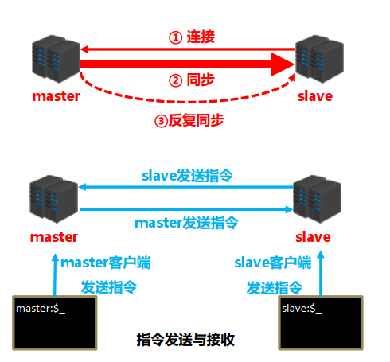

PS：slave断开连接后，不会删除已有数据，只是不再接受master发送的数据


### 阶段二：数据同步阶段

Slave 初次连接 Master 时，复制 Master 中的所有数据到 Slave，将 Slave 的数据库状态更新成 Master 当前的数据库状态。

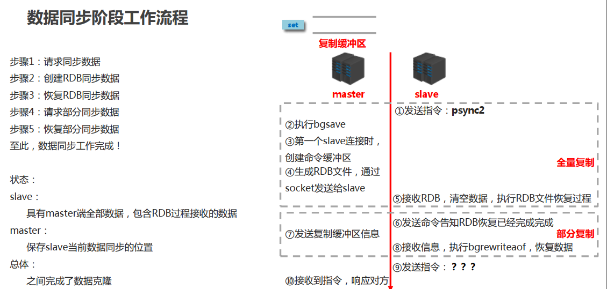

 **数据同步阶段master说明：**

1.  如果master数据量巨大，数据同步阶段应避开流量高峰期，避免造成master阻塞，影响业务正常执行
2.  复制缓冲区大小设定不合理，会导致数据溢出。如进行全量复制周期太长，进行部分复制时发现数据已经存在丢失的情况，必须进行第二次全量复制，致使slave陷入死循环状态 【repl-backlog-size 1mb 】
3.  master单机内存占用主机内存的比例不应过大，建议使用50%-70%的内存，留下30%-50%的内存用于执行bgsave命令和创建复制缓冲区

**数据同步阶段slave说明：**

1. 为避免slave进行全量复制、部分复制时服务器响应阻塞或数据不同步，建议关闭此期间的对外服务 【slave-serve-stale-data yes|no 】
2. 数据同步阶段， master发送给slave信息可以理解master是slave的一个客户端，主动向slave发送命令
3. 多个slave同时对master请求数据同步， master发送的RDB文件增多， 会对带宽造成巨大冲击， 如果master带宽不足， 因此数据同步需要根据业务需求， 适量错峰
4. slave过多时， 建议调整拓扑结构，由一主多从结构变为树状结构， 中间的节点既是master，也是slave。注意使用树状结构时，由于层级深度，导致深度越高的slave与最顶层master间数据同步延迟较大， 数据一致性变差， 应谨慎选择


### 阶段三：命令传播阶段

- 当 Master 数据库状态被修改后，导致主从服务器数据库状态不一致，此时需要让主从数据同步到一致的状态，同步的动作称为命令传播
- Master 将接收到的数据变更命令发送给 Slave， Slave 接收命令后执行命令

**注：如果命令传播阶段出现了断网现象**

1. 网络闪断闪连         可以忽略
2. 短时间网络中断     部分复制
3. 长时间网络中断     全量复制

**部分复制的三个核心要素：**

1. 服务器的运行 id（run id）
2. 主服务器的复制积压缓冲区
3. 主从服务器的复制偏移量

**服务器运行ID（ runid）**

- 概念：服务器运行ID是每一台服务器每次运行的身份识别码，一台服务器多次运行可以生成多个运行id
- 组成：运行id由40位字符组成，是一个随机的十六进制字符

```shell
[root@CentOS7 bin]# redis-cli -p 6379 info server | grep run_id
run_id:765c451cf9a59c732cb3646f86f159a6240033d2
```

**复制缓冲区（积压缓冲区）：**

- 概念：复制缓冲区，又名复制积压缓冲区，是一个先进先出（ FIFO）的队列， 用于存储服务器执行过的命令， 每次传播命令， Master 都会将传播的命令记录下来， 并存储在复制缓冲区。
  复制缓冲区默认数据存储空间大小是1M，由于存储空间大小是固定的，当入队元素的数量大于队列长度时，最先入队的元素会被弹出，而新元素会被放入队列
- 由来：每台服务器启动时，如果开启有AOF 或者 被连接成为Master节点， 即创建复制缓冲区
- 作用：用于保存Master收到的所有指令（仅影响数据变更的指令，例如：set， select）
- 数据来源：当 Master 接收到主客户端的指令时，除了将指令执行，还会将该指令存储到缓冲区中

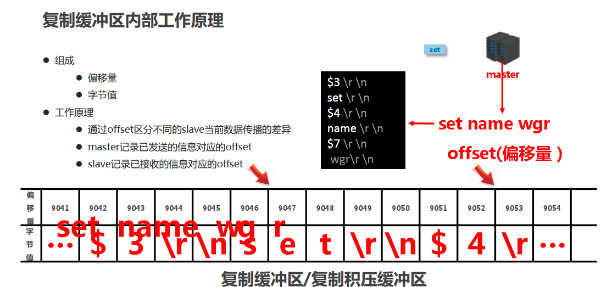


**主从服务器复制偏移量（offset）：**

- 概念：一个数字，描述复制缓冲区中的指令字节位置
- 分类：
  1. Master 复制偏移量：记录发送给所有slave的指令字节对应的位置（多个）
  2. Slave   复制偏移量：记录slave接收master发送过来的指令字节对应的位置（一个）
- 数据来源：
  1. Master 端：发送一次记录一次
  2. Slave   端：接收一次记录一次
- 作用：同步信息，比对master与slave的差异，当slave断线后，恢复数据使用

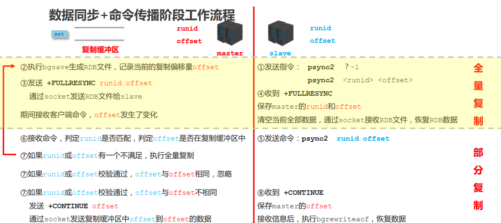


### 命令传播阶段：心跳机制

进入命令传播阶段候， master与slave间需要进行信息交换，使用心跳机制进行维护，实现双方连接保持在线

**Master 心跳：**

- 指令：PING
- 周期：由 repl-ping-slave-period 决定，默认10 秒
- 作用：判断 Slave 是否在线
- 查询：INFO replication 获取 Slave 最后一次连接时间间隔， lag项维持在0或1视为正常

**Slave 心跳任务：**

- 指令：REPLCONF ACK {offset}
- 周期：1 秒
- 作用1：汇报 Slave 自己的复制偏移量，获取最新的数据变更指令
- 作用2：判断 Master 是否在线

**心跳阶段注意事项：**

1. 当 Slave 多数掉线，或延迟过高时，Master 为保证数据稳定性，将拒绝所有信息同步操作（Master方配置）

   ```shell
   # slave 数量少于2个，或者所有 slave 的延迟大于等于10秒时，强制关闭master写功能，停止数据同步
   min-slaves-to-write 2
   min-slaves-max-lag 8
   ```

2. Slave 数量由 Slave 发送 REPLCONF ACK 命令做确认

3. Slave 延迟由 Slave 发送 REPLCONF ACK 命令做确认


### 主从复制工作流程（完整图）

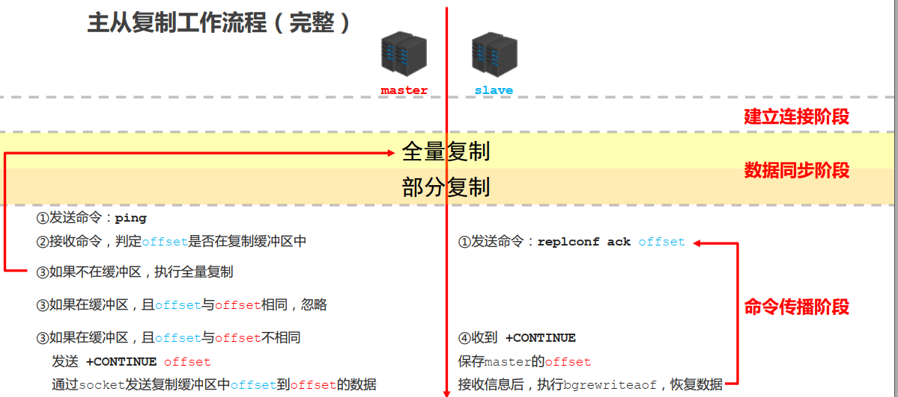


## 6、主从复制的原理

主从复制分两种：

1. 主从刚连接时：进行全量同步（每次重新连接master时都会进行一次全量同步）
2. 全同步结束后：进行增量同步

Slave第一次或者重连到Master会发送一个`SYNC`的命令，Master收到`SYNC`的时候，会做两件事：

1. 执行 bgsave（RDB 的快照文件）
2. Master 会把新收到的修改命令存入到缓冲区

---

全量复制概述：

把一个存储了很多数据的主节点（master）数据全部同步给一个从节点（slave），在同步的过程中 master 写入的新数据也需要同步过来，这样才可以达到完整同步的效果。全量复制可以完成上述功能，首先将当前的RDB文件同步给 slave，写入命令单独记录，当RDB文件加载完后，通过偏移量的对比将这期间产生的新数据命令同步给slave。

全量复制同步流程：

1. 首次同步时 slave 不知道 master 的 runid 和偏移量，slave 将发送：psync ? -1 来同步数据（psync是同步命令，可实现全量和部分复制的功能，这里有两个参数runid和offset，?表示runid，-1表示offset）
2. master将执行一个全量复制，同时返回自己的runid和offset给slave
3. slave保存master的基本信息
4. master执行bgsave命令做一个RDB的生成，在生成RDB和RDB传输过程中写入的新命令将被推入repl_back_buffer(复制缓冲区)
5. master将RDB文件传给 slave
6. master将repl_back_buffer(复制缓冲区)传给slave
7. slave清除旧的数据
8. slave根据RDB文件和repl_back_buffer(复制缓冲区)加载新的数据

---

增量复制概述：

全量复制除了上述的开销以外还存在一个问题，假如说master和slave之间的网络发生了抖动，那么一段时间内这些数据就会丢失，这段时间内master更新的数据slave是不知道的，最简单的方法是再做一次全量复制来拉取最新的数据。这样将大大消耗设备的性能，所以2.8版以后Redis提供了部分复制的功能。

增量复制同步流程：

1. 因为网络抖动导致master和slave断开连接
2. master写命令时会向repl_back_buffer(复制缓冲区)写一份
3. 网络抖动结束，slave再次成功连上master
4. slave向master发送pysnc {offset} {runid}命令，把自己当前的offset(偏移量)和runid传给master
5. 当slave传输的offset在master的buffer(buffer默认大小是1MB)的范围内，master返回contiune
6. master返回buffer中的数据给slave

---

主从复制特点：

- 主从复制对于 Redis 主从服务器来说是非阻塞的，所以同步数据期间都可以正常处理外界请求
- 一个主 Redis 可以含有多个从 Redis，每个从 Redis 可以接收来自其他从 Redis 服务器的连接
- 从节点不会让 Key 过期，而是主节点的 Key过 期删除后，成为 DEL 命令传输到从节点进行删除（从节点可以开启 sync 看日志）


---

加速复制：

- 完全重新同步需要在磁盘上创建一个 RDB 文件，然后加载这个文件以便为从服务器发送数据
- 在比较低速的磁盘，这种操作会给主服务器带来较大的压力
- 新版支持无磁盘的复制，子进程直接将RDB通过网络发送给从服务器，不使用磁盘作为中间存储
- 开启无磁盘的复制（加速复制）：repl-diskless-sync yes （默认是no）

---

主从断开重连：

- 如果遭遇连接断开，重新连接之后可以从中断处继续进行复制，而不必重新同步
- 2.8 版本后，部分重新同步这个新特性内部使用`PSYNC`命令，旧的实现中使用`SYNC`命令

**缺点：没有办法对master进行动态选举**


# Redis 集群—哨兵模式（主从切换）

## 1、哨兵模式概述（Sentinel）

主从模式若主服务器宕机后，需要手动把一台从服务器切换为主服务器，人工干预费事费力，还会造成一段时间内服务不可用。这不是一种推荐的方式，更多的时候我们优先考虑的的是哨兵模式。Redis 从 2.8 开始正式提供了 Sentinel（哨兵）架构来解决这问题。哨兵模式能够后台监控主机是否故障，如果出现故障了会根据投票数自动将从库转换为主库（自动选举老大）

哨兵（sentinel）虽然有一个单独的可执行文件 redis-sentinel，但实际上它只是一个运行在特殊模式下的 Redis 服务器，你可以在启动一个普通 Redis 服务器时通过给定 --sentinel 选项来启动哨兵（sentinel），哨兵（sentinel）的一些设计思路和zookeeper非常类似，是一个独立的进程，独立运行。

原理：哨兵通过发送命令给多个节点，等待 Redis 服务器响应，从而监控运行的多个 Redis 实例的运行情况。当哨兵监测到 master 宕机，会自动将 slave 切换成master，通过通知其他的从服务器，修改配置文件切换主机。


1、哨兵模式作用

1. 监控（Monitoring）：Sentinel 会不断地检查你的主服务器和从服务器是否运作正常
2. 提醒（Notification）：当被监控的某个 Redis 服务器出现问题时， Sentinel 可以通过 API 向管理员或者其他应用程序发送通知
3. 自动故障迁移（Automatic failover）：当监控到主节点宕机后，断开与宕机主节点连接的所有从节点，然后在从节点中选取一个作为主节点，将其他的从节点连接到这个最新的主节点。最后通知客户端最新的服务器地址


2、Sentinel（哨兵）进程的工作方式

1. 每个Sentinel（哨兵）进程以每秒钟一次的频率向整个集群中的Master主服务器，Slave从服务器以及其他Sentinel（哨兵）进程发送一个 PING 命令
2. 如果一个实例（Instance）距离最后一次有效回复 PING 命令的时间超过 down-after-milliseconds 选项所指定的值， 则这个实例会被 Sentinel（哨兵）进程标记为主观下线（SDOWN）
3. 如果一个Master主服务器被标记为主观下线（SDOWN），则正在监视这个Master主服务器的所有 Sentinel（哨兵）进程要以每秒一次的频率确认Master主服务器的确进入了主观下线状态。
4. 当有足够数量的 Sentinel（哨兵）进程（大于等于配置文件指定的值）在指定的时间范围内确认Master主服务器进入了主观下线状态（SDOWN）， 则Master主服务器会被标记为客观下线（ODOWN）
5. 在一般情况下， 每个 Sentinel（哨兵）进程会以每 10 秒一次的频率向集群中的所有Master主服务器、Slave从服务器发送 INFO 命令
6. 当Master主服务器被 Sentinel（哨兵）进程标记为客观下线（ODOWN）时，Sentinel（哨兵）进程向下线的 Master主服务器的所有 Slave从服务器发送 INFO 命令的频率会从 10 秒一次改为每秒一次
7. 若没有足够数量的 Sentinel（哨兵）进程同意 Master 主服务器下线， Master 主服务器的客观下线状态就会被移除。若 Master 主服务器重新向 Sentinel（哨兵）进程发送 PING 命令返回有效回复，Master 主服务器的主观下线状态就会被移除


3、哨兵模式问题：一个哨兵进程对 Redis 服务器进行监控，可能会出现问题，一般是使用多个哨兵进行监控，各个哨兵之间还会进行监控，形成多哨兵模式，哨兵节点最少3台且为单数。这个与其他分布式框架zookeeper类似，如果是双数在选举的时候就会出现平票的情况，所以必须是三台及以上单数

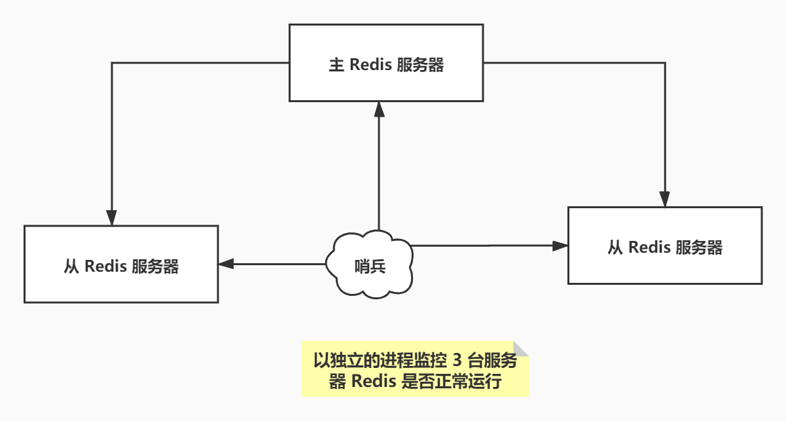

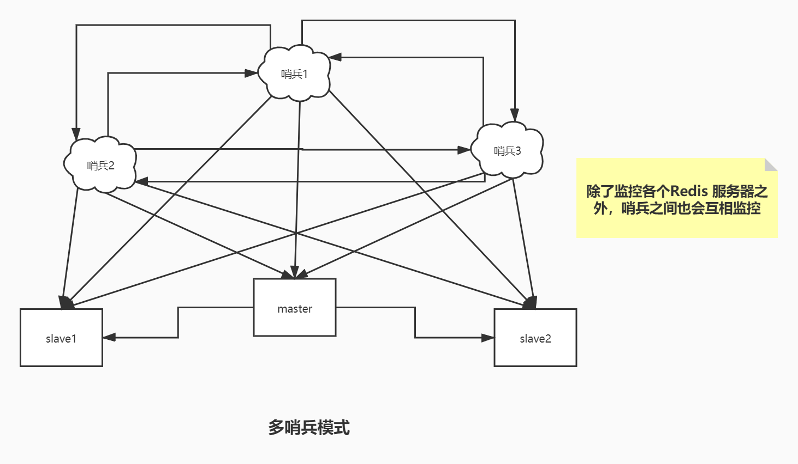


## 2、哨兵模式搭建（1主2从3哨兵）

在 Redis 源码中找到 sentinel.conf 配置文件，我们把多余的注释全部去掉查看一下，共有如下这些默认配置：

```shell
# 端口，默认26379
port 26379
 
# 是否后台启动
daemonize no
 
# 运行时PID文件
pidfile /var/run/redis-sentinel.pid
 
# 日志文件（绝对路径）
logfile ""
 
# 数据目录（必须存在，如果不存在需要提前创建）
dir /tmp
 
# 由于Redis服务默认没有配置密码，所以默认没有配置该选项
# sentinel auth-pass mymaster MySUPER--secret-0123passw0rd
 
# 监控的节点名字可以自定义，后边的2代表的：如果有俩个哨兵判断这个主节点挂了那这个主节点就挂了，通常设置为哨兵个数一半加1
sentinel monitor mymaster 127.0.0.1 6379 2
 
# 哨兵连接主节点多长时间没有响应就代表主节点挂了，单位毫秒。默认30000毫秒，30秒。
sentinel down-after-milliseconds mymaster 30000
 
# 在故障转移时，最多有多少从节点对新的主节点进行同步。这个值越小完成故障转移的时间就越长，这个值越大就意味着越多的从节点因为同步数据而暂时阻塞不可用
sentinel parallel-syncs mymaster 1
 
# 在进行同步的过程中，多长时间完成算有效，单位是毫秒，默认值是180000毫秒，3分钟。
sentinel failover-timeout mymaster 180000
 
# 禁止使用SENTINEL SET设置notification-script和client-reconfig-script
sentinel deny-scripts-reconfig yes
```

在`/usr/local/redis/conf/`目录下创建3个文件：sentinel-1.conf、sentinel-2.conf、sentinel-3.conf

```shell
port 26380
daemonize yes
pidfile "/var/run/redis-sentinel-1.pid"
logfile "/var/log/redis/sentinel_26380.log"
dir "/tmp"
sentinel monitor mymaster 127.0.0.1 6380 2
sentinel down-after-milliseconds mymaster 5000
sentinel failover-timeout mymaster 30000
```

```shell
port 26381
daemonize yes
pidfile "/var/run/redis-sentinel-2.pid"
logfile "/var/log/redis/sentinel_26381.log"
dir "/tmp"
sentinel monitor mymaster 127.0.0.1 6380 2
sentinel down-after-milliseconds mymaster 5000
sentinel failover-timeout mymaster 30000
```

```shell
port 26382
daemonize yes
pidfile "/var/run/redis-sentinel-3.pid"
logfile "/var/log/redis/sentinel_26382.log"
dir "/tmp"
sentinel monitor mymaster 127.0.0.1 6380 2
sentinel down-after-milliseconds mymaster 5000
sentinel failover-timeout mymaster 30000
```

> PS注意（Sentinel 节点配置注意事项）：
>
> 1. Sentinel 节点配置尽可能一致，这样在判断节点故障时会更加准确
> 2. Sentinel 节点也需要配置 dir、loglevel之类，所以需要提前创建好父目录，不过所幸Sentinel节点不存储数据，如果需要修改配置，重新启动即可
> 3. Sentinel 节点只支持如下命令：ping、sentinel、subscribe、unsubscribe、 psubscribe、punsubscribe、publish、info、role、client、shutdown
> 4. Sentinel 节点支持的命令有限，例如config命令是不支持的

启动哨兵集群（一般情况现启动：Redis 主从，再启动 Sentinel）：

```shell
# 首先创建log的父目录
[root@CentOS7 bin]# mkdir /var/log/redis
# 首先进入redis bin 目录下
[root@CentOS7 ~]# cd /usr/local/redis/bin/

# 方式1：用redis-server命令带--sentinel参数启动
./redis-server /usr/local/redis/conf/sentinel-1.conf --sentinel
./redis-server /usr/local/redis/conf/sentinel-2.conf --sentinel
./redis-server /usr/local/redis/conf/sentinel-3.conf --sentinel

# 方式2：直接使用
./redis-sentinel /usr/local/redis/conf/sentinel-1.conf
./redis-sentinel /usr/local/redis/conf/sentinel-2.conf
./redis-sentinel /usr/local/redis/conf/sentinel-3.conf
```

查看 Redis 和 Sentinel 运行状态：

```shell
[root@CentOS7 bin]# ps -ef|grep redis
root      8130     1  0 21:05 ?        00:00:00 ./redis-sentinel *:26380 [sentinel]
root      8140     1  0 21:05 ?        00:00:00 ./redis-sentinel *:26381 [sentinel]
root      8225     1  0 21:06 ?        00:00:00 ./redis-sentinel *:26382 [sentinel]
root      8238  7147  0 21:07 pts/0    00:00:00 grep --color=auto redis
root     15420     1  0 Aug24 ?        00:02:38 /usr/local/redis/bin/redis-server 0.0.0.0:6380
root     15538     1  0 Aug24 ?        00:02:11 /usr/local/redis/bin/redis-server 0.0.0.0:6381
root     15641     1  0 Aug24 ?        00:02:11 /usr/local/redis/bin/redis-server 0.0.0.0:6382
```

查看 Sentinel 服务器信息：

```shell
[root@CentOS7 bin]# /usr/local/redis/bin/redis-cli -p 26380 info Sentinel
# Sentinel
sentinel_masters:1
sentinel_tilt:0
sentinel_running_scripts:0
sentinel_scripts_queue_length:0
sentinel_simulate_failure_flags:0
master0:name=mymaster,status=ok,address=127.0.0.1:6380,slaves=2,sentinels=3

[root@CentOS7 bin]# /usr/local/redis/bin/redis-cli -p 26381 info Sentinel
# Sentinel
sentinel_masters:1
sentinel_tilt:0
sentinel_running_scripts:0
sentinel_scripts_queue_length:0
sentinel_simulate_failure_flags:0
master0:name=mymaster,status=ok,address=127.0.0.1:6380,slaves=2,sentinels=3

[root@CentOS7 bin]# /usr/local/redis/bin/redis-cli -p 26382 info Sentinel
# Sentinel
sentinel_masters:1
sentinel_tilt:0
sentinel_running_scripts:0
sentinel_scripts_queue_length:0
sentinel_simulate_failure_flags:0
master0:name=mymaster,status=ok,address=127.0.0.1:6380,slaves=2,sentinels=3
```


## 3、主从自动切换操作（Down Master）

现在关闭 Master 主服务器：

```shell
127.0.0.1:6380> info replication
# Replication
role:master
connected_slaves:2
slave0:ip=127.0.0.1,port=6381,state=online,offset=9497302,lag=1
slave1:ip=127.0.0.1,port=6382,state=online,offset=9497302,lag=1
master_replid:42625f8339499dc17f95e4f6e1a9d523379f4154
master_replid2:0000000000000000000000000000000000000000
master_repl_offset:9497302
second_repl_offset:-1
repl_backlog_active:1
repl_backlog_size:1048576
repl_backlog_first_byte_offset:8448727
repl_backlog_histlen:1048576
127.0.0.1:6380> SHUTDOWN
not connected>
```

查看 Sentinel 的日志变动：（验证方式一）

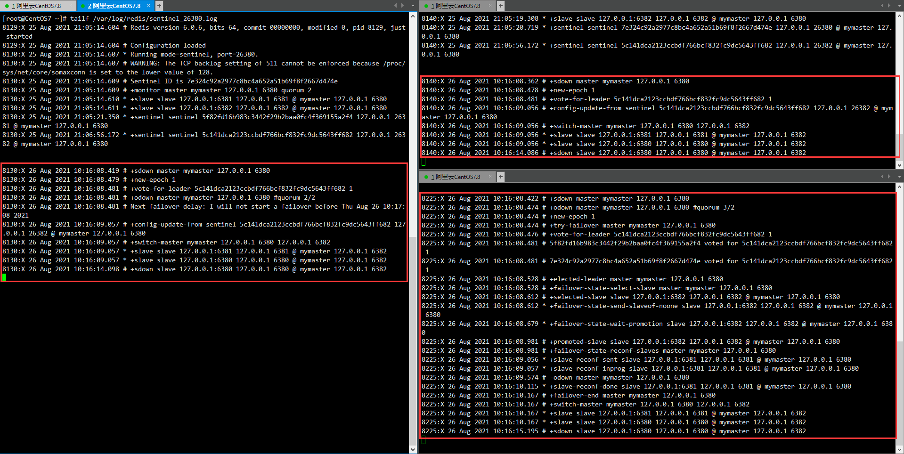

然后登录之前的 slave 服务查看，可以发现现在 6382 服务变成了主服务器（验证方式二）

```shell
# 查看 redis 6381 服务
[root@CentOS7 ~]# /usr/local/redis/bin/redis-cli -p 6381 info replication
# Replication
role:slave
master_host:127.0.0.1
master_port:6382
master_link_status:up
master_last_io_seconds_ago:1
master_sync_in_progress:0
slave_repl_offset:9616269
slave_priority:100
slave_read_only:1
connected_slaves:0
master_replid:6f03979e39e8b27a562d4bb7a2e75a1df7ece56a
master_replid2:42625f8339499dc17f95e4f6e1a9d523379f4154
master_repl_offset:9616269
second_repl_offset:9501188
repl_backlog_active:1
repl_backlog_size:1048576
repl_backlog_first_byte_offset:8567694
repl_backlog_histlen:1048576

# 查看 redis 6382 服务
[root@CentOS7 ~]# /usr/local/redis/bin/redis-cli -p 6382 info replication
# Replication
role:master
connected_slaves:1
slave0:ip=127.0.0.1,port=6381,state=online,offset=9619356,lag=1
master_replid:6f03979e39e8b27a562d4bb7a2e75a1df7ece56a
master_replid2:42625f8339499dc17f95e4f6e1a9d523379f4154
master_repl_offset:9619489
second_repl_offset:9501188
repl_backlog_active:1
repl_backlog_size:1048576
repl_backlog_first_byte_offset:8570914
repl_backlog_histlen:1048576
```

查看先启动 6380 服务，之前的 Master 服务，现在的 Slave 服务，可以发现重启后，配置文件被重写了（验证方式三）

```shell
[root@CentOS7 ~]# /usr/local/redis/bin/redis-server /usr/local/redis/conf/redis_master_6380.conf 
[root@CentOS7 ~]# cat /usr/local/redis/conf/redis_master_6380.conf 
bind 0.0.0.0
daemonize yes
dir "/usr/local/redis/data"
port 6380
dbfilename "dump_master_6380.rdb"
logfile "/usr/local/redis/log/redis_master_6380.log"
pidfile "/usr/local/redis/redis_master_6380.pid"
# Generated by CONFIG REWRITE
user default on nopass ~* +@all
replicaof 127.0.0.1 6382
```


## 4、哨兵的实现原理

假设主服务器宕机了，哨兵1先检测到这个结果，系统并不会马上进行 failover【故障转移】过程，仅仅是哨兵 1 主观认为主服务器不可用，这个现象称之为**主观下线**。当后面的哨兵也检测到主服务器不可用，并且数量达到一定值时，那么哨兵之间就会进行一次投票，投票的结果由一个哨兵发起，进行 failover 【故障转移】。切换成功后，就会通过发布订阅模式，让各个哨兵把自己监控的从服务器实现切换主机，这个过程称之为**客观下线**。

---

**三个定时任务：**

1. 每10秒每个 sentinel 对master 和 slave 执行info 命令，该命令第一个是用来发现slave节点，第二个是确定主从关系
2. 每2秒每个 sentinel 通过 master 节点的 channel（\_sentinel\_:hello）交换信息（pub/sub）：用来交互对节点的看法（主观和客观下线）及自身信息
3. 每1秒每个 sentinel 对其他 sentinel 和 redis 执行 ping 命令，用于心跳检测，作为节点存活的判断依据.

---

**主观下线和客观下线介绍：**

主观下线（Subjectively Down，简称：SDOWN）（偏见）：指单个 Sentinel 实例对服务器做出的下线判断，一个服务器没有在 down-after-milliseconds 选项所指定的时间内， 对向它发送 PING 命令的 Sentinel 返回一个有效回复（valid reply）， 那么 Sentinel 就会将这个服务器标记为**主观下线**。

客观下线（Objectively Down，简称：ODOWN）（共识）：指多个 Sentinel 实例在对同一个服务器做出 SDOWN 判断， 并且通过 SENTINEL is-master-down-by-addr 命令互相交流之后， 得出的服务器下线判断，客观下线条件只适用于 master 主服务器

仲裁（Qurum）：

1. Sentinel 在给定的时间范围内，从其他 Sentinel 那里接收到了【足够数量】的主服务器下线报告， 那么 Sentinel 就会将主服务器的状态从主观下线改变为客观下线
2. 这个【足够数量】就是配置文件里面的值，一般是Sentinel个数的一半加1，比如3个Sentinel则就设置为2
3. down-after-milliseconds 是一个哨兵在超过规定时间依旧没有得到响应后，会自己认为主机不可用
4. 当拥有认为主观下线的哨兵达到sentinel monitor所配置的数量时，就会发起一次投票，进行failover【故障转移】

---

**故障转移：**

故障转移是由 sentinel 领导者节点来完成的（只需要一个sentinel节点），关于 sentinel 领导者节点的选取也是每个 sentinel 向其他 sentinel 节点发送我要成为领导者的命令，超过半数 sentinel 节点同意，并且也大于 quorum ，那么他将成为领导者，如果有多个 sentinel 都成为了领导者，则会过段时间在进行选举.

sentinel 领导者节点选举出来后，会通过如下几步进行故障转移：

一、从 slave 节点中选出一个合适的节点Slave作为新的 Master 节点，这里的合适包括如下几点：

1. 选择 slave-priority（slave节点优先级）最高的slave节点，如果存在则返回，不存在则继续下一步判断
2. 选择复制偏移量最大的 slave 节点（复制的最完整），如果存在则返回，不存在则继续
3. 选择 runid 最小的 slave 节点（启动最早的节点）

二、对上面选出来的 slave 节点执行 slaveof no one 命令让其成为新的 master 节点.

三、向剩余的 slave 节点发送命令，让他们成为新 master 节点的 slave 节点，复制规则和前面设置的 parallel-syncs 参数有关

四、更新原来 master 节点配置为 slave 节点，并保持对其进行关注，一旦这个节点重新恢复正常后，会命令它去复制新的 master 节点信息（注意：原来的master节点恢复后是作为slave的角色)

PS：可以从 sentinel 日志中出现的几个消息来进行查看故障转移：

1. **+switch-master**：表示切换主节点（从节点晋升为主节点）
2. .**+sdown**：主观下线
3. **+odown**：客观下线
4. **+convert-to-slave**：切换从节（原主节点降为从节点）

---

1、哨兵模式的优点

- 哨兵集群，基于主从复制模式，所有的主从配置优点，它全有
- 主从可以切换，故障可以转移，系统的可用性就会更好
- 哨兵模式就是主从模式的升级，手动到自动，更加健壮。

2、哨兵模式的缺点

- Redis 不方便在线扩容，集群达到一定的上限，在线扩容就会十分麻烦
- 实现哨兵模式的配置其实也很麻烦，里面有甚多的配置项


## 5、哨兵模式的配置

> Redis及其Sentinel配置项详细说明：https://blog.csdn.net/a1282379904/article/details/52335051

完整的哨兵模式配置文件 sentinel.conf

```bash
# Example sentinel.conf

# 哨兵sentinel实例运行的端口 默认26379
port 26379
 
# 哨兵sentinel的工作目录
dir /tmp
 
# 哨兵sentinel监控的redis主节点的 ip port 
# master-name  可以自己命名的主节点名字 只能由字母A-z、数字0-9 、这三个字符".-_"组成。
# quorum 当这些quorum个数sentinel哨兵认为master主节点失联 那么这时 客观上认为主节点失联了
# sentinel monitor <master-name> <ip> <redis-port> <quorum>
sentinel monitor mymaster 127.0.0.1 6379 1
 
# 当在Redis实例中开启了requirepass foobared 授权密码 这样所有连接Redis实例的客户端都要提供密码
# 设置哨兵sentinel 连接主从的密码 注意必须为主从设置一样的验证密码
# sentinel auth-pass <master-name> <password>
# 由于Redis服务默认没有配置密码，所以默认没有配置该选项
# sentinel auth-pass mymaster MySUPER--secret-0123passw0rd

# 指定多少毫秒之后 主节点没有应答哨兵sentinel 此时 哨兵主观上认为主节点下线 默认30秒
# sentinel down-after-milliseconds <master-name> <milliseconds>
sentinel down-after-milliseconds mymaster 30000

# 这个配置项指定了在发生failover主备切换时最多可以有多少个slave同时对新的master进行 同步，
# 这个数字越小，完成failover所需的时间就越长，
# 但是如果这个数字越大，就意味着越多的slave因为replication而不可用。
# 可以通过将这个值设为 1 来保证每次只有一个slave处于不能处理命令请求的状态。
# sentinel parallel-syncs <master-name> <numslaves>
sentinel parallel-syncs mymaster 1

# 故障转移的超时时间 failover-timeout 可以用在以下这些方面： 
# 1. 同一个sentinel对同一个master两次failover之间的间隔时间。
# 2. 当一个slave从一个错误的master那里同步数据开始计算时间。直到slave被纠正为向正确的master那里同步数据时。
# 3.当想要取消一个正在进行的failover所需要的时间。  
# 4.当进行failover时，配置所有slaves指向新的master所需的最大时间 。不过，即使过了这个超时，slaves依然会被正确配置为指向master，但是就不按parallel-syncs所配置的规则来了
# 默认三分钟
# sentinel failover-timeout <master-name> <milliseconds>
sentinel failover-timeout mymaster 180000

# SCRIPTS EXECUTION

# 配置当某一事件发生时所需要执行的脚本，可以通过脚本来通知管理员，例如当系统运行不正常时发邮件通知相关人员。
# 对于脚本的运行结果有以下规则：
# 若脚本执行后返回1，那么该脚本稍后将会被再次执行，重复次数目前默认为10
# 若脚本执行后返回2，或者比2更高的一个返回值，脚本将不会重复执行。
# 如果脚本在执行过程中由于收到系统中断信号被终止了，则同返回值为1时的行为相同。
#一个脚本的最大执行时间为60s，如果超过这个时间，脚本将会被一个SIGKILL信号终止，之后重新执行。

# 通知型脚本:当sentinel有任何警告级别的事件发生时（比如说redis实例的主观失效和客观失效等等），将会去调用这个脚本，
# 这时这个脚本应该通过邮件，SMS等方式去通知系统管理员关于系统不正常运行的信息。调用该脚本时，将传给脚本两个参数，
# 一个是事件的类型，
# 一个是事件的描述。
# 如果sentinel.conf配置文件中配置了这个脚本路径，那么必须保证这个脚本存在于这个路径，并且是可执行的，否则sentinel无法正常启动成功。
# 通知脚本
# sentinel notification-script <master-name> <script-path>
# sentinel notification-script mymaster /var/redis/notify.sh

# CLIENTS RECONFIGURATION SCRIPT
# 客户端重新配置主节点参数脚本
# 当一个master由于failover而发生改变时，这个脚本将会被调用，通知相关的客户端关于master地址已经发生改变的信息。
# 以下参数将会在调用脚本时传给脚本:
# <master-name> <role> <state> <from-ip> <from-port> <to-ip> <to-port>
# 目前<state>总是“failover”,
# <role>是“leader”或者“observer”中的一个。 
# 参数 from-ip, from-port, to-ip, to-port是用来和旧的master和新的master(即旧的slave)通信的
# 这个脚本应该是通用的，能被多次调用，不是针对性的。
# sentinel client-reconfig-script <master-name> <script-path>
# sentinel client-reconfig-script mymaster /var/redis/reconfig.sh

# SECURITY
#
# By default SENTINEL SET will not be able to change the notification-script
# and client-reconfig-script at runtime. This avoids a trivial security issue
# where clients can set the script to anything and trigger a failover in order
# to get the program executed.
# 禁止使用 SENTINEL SET 设置 notification-script 和 client-reconfig-script 脚本
sentinel deny-scripts-reconfig yes
```


# Redis 集群—Cluster（高可用集群与分片）

## 1、Cluster 介绍及作用

### 1、Redis 集群的介绍

Redis 的哨兵模式虽然已经可以实现高可用，读写分离 ，但是存在几个方面的不足：

- 哨兵模式下每台Redis服务器都存储相同的数据，很浪费内存空间；数据量太大，主从同步时严重影响了master性能
- 哨兵模式是中心化的集群实现方案，每个从机和主机的耦合度很高，master宕机到salve选举master恢复期间服务不可用
- 哨兵模式始终只有一个Redis主机来接收和处理写请求，写操作还是受单机瓶颈影响，没有实现真正的分布式架构

Redis在3.0上加入了Cluster集群模式，实现了Redis的分布式存储，也就是说每台Redis节点上存储不同的数据。Cluster模式为了解决单机Redis容量有限的问题，将数据按一定的规则分配到多台机器，内存&QPS不受限于单机，可受益于分布式集群高扩展性。

Redis Cluster是一种服务器Sharding技术（分片和路由都是在服务端实现），采用多主多从，每一个分区都是由一个Redis主机和多个从机组成，片区和片区之间是相互平行的。Redis Cluster集群采用了P2P的模式，完全去中心化。

官方推荐：集群部署至少要 3 台以上的master节点，最好使用 3 主 3 从六个节点的模式。Redis Cluster集群具有如下几个特点：

- 集群完全去中心化，采用多主多从；所有的Redis节点彼此互联(PING-PONG机制)，内部使用二进制协议优化传输速度和带宽
- 客户端与 Redis 节点直连，不需要中间代理层。客户端不需要连接集群所有节点，连接集群中任何一个可用节点即可
- 每一个分区都是由一个Redis主机和多个从机组成，分片和分片之间是相互平行的
- 每一个master节点负责维护一部分槽，以及槽所映射的键值数据；集群中每个节点都有全量的槽信息，通过槽每个node都知道具体数据存储到哪个node上

Redis Cluster主要是针对海量数据 + 高并发 + 高可用的场景，海量数据，如果你的数据量很大，那么建议就用Redis Cluster，数据量不是很大时，使用Sentinel就够了。Redis Cluster的性能和高可用性均优于哨兵模式。

Redis Cluster采用虚拟哈希槽分区而非一致性Hash算法，预先分配一些卡槽，所有的键根据哈希函数映射到这些槽内，每一个分区内的master节点负责维护一部分槽以及槽所映射的键值数据。


### 2、Redis 分区及作用

Redis3.0之后，Redis 官方提供了完整的集群解决方案。方案采用去中心化的方式，包括：sharding（分区）、replication（复制）、failover（故障转移）。称为Redis Cluster。Redis5.0前采用redis-trib进行集群的创建和管理，需要Ruby支持。Redis5.0可以直接使用Redis-cli进行集群的创建和管理.

Redis Cluster集群的作用有下面几点：

- **数据分区**：突破单机的存储限制，将数据分散到多个不同的节点存储
- **负载均衡**：每个主节点都可以处理读写请求，提高了并发能力
- **高可用**：集群有着和哨兵模式类似的故障转移能力，提升集群的稳定性


## 2、Cluster 的工作原理

### 1、节点

一个集群是由多个节点组成，组成该集群的Redis服务中，一个Redis服务表示一个节点。

### 2、初始化

初始化阶段：客户端通知 » 握手 » 槽指派 » 初始化完成

- 客户端通知：各个redis开启集群功能后，会成为一个独立的节点，客户端通过向某一节点发送 cluster meet 目标地址 目标端口 命令，让源节点(节点1)将目标节点纳入自己的集群中
- 握手：源节点接收到cluster meet后准备与目标节点进行套接字连接(握手)，源节点先向目标节点发送meet消息,目标节点接收到后，返回PONE消息表示接收到了源节点的meet命令，此时源节点再对目标节点发送PING消息，目标节点接收到后握手完成，之后源节点会通过Gossip协议通知集群中的其他节点与目标节点握手，最后目标节点加入集群
- 槽指派：节点加入集群后，需要将16384个槽分配给每个节点，每个槽都会用来存储客户端写入的键以及对应的值。这样就把一份完整的数据切割给不同的节点管理了，容量最小的节点不再会是整个集群存储量的瓶颈
- 初始化完成：所有的槽都分配完成后，初始化完成

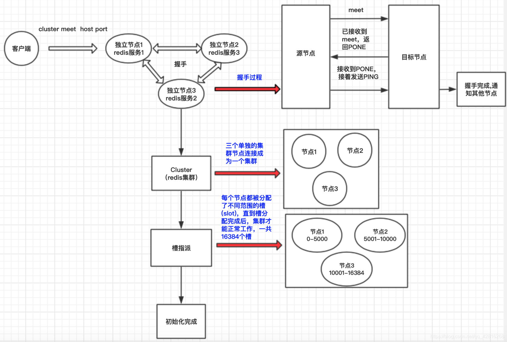

### 3、处理命令（Hash一致性算法）

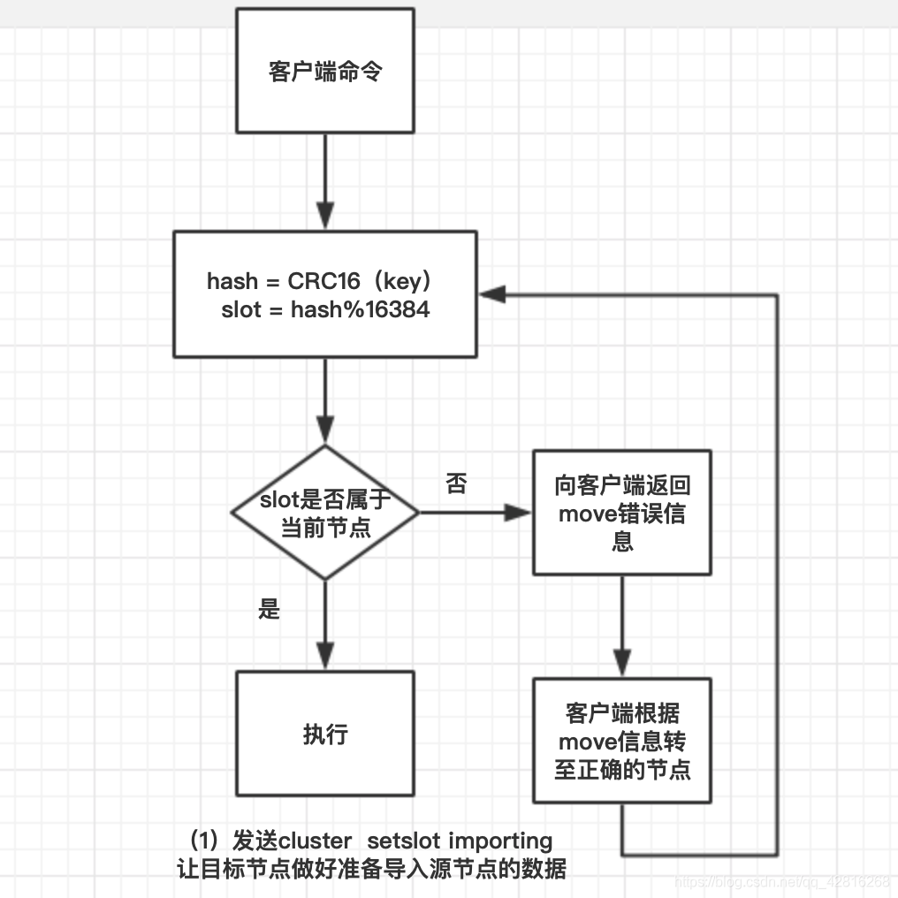

当客户端向某个节点发送命令时，该节点会先将该key用CRC16算法求hash，然后再对其求模，得到的值就是槽点，该节点根据计算出来的槽点判断是否属于自己管理的槽点，若属于则执行该命令，若不属于查询该槽属于哪个节点管理，查询到地址后便向客户端返回正确的节点信息，客户端再对这个正确节点发送同样的命令。


### 4、重新分片

如果中途想要加入新的节点，槽该怎么分配，请参考下图及解释：

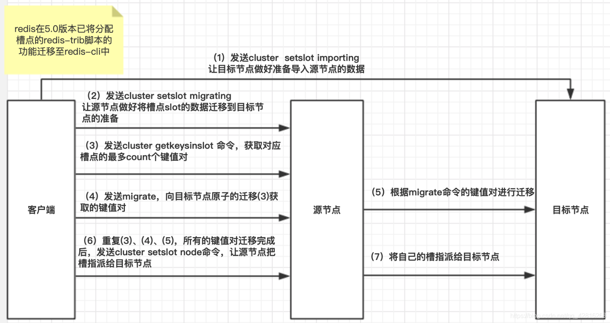

1. 发送cluster setslot importing让目标节点做好准备导入源节点槽点的数据
2. 发送cluster setslot migrating让源节点做好将槽点slot的数据迁移到目标节点的准备
3. 发送cluster getkeysinslot 命令，获取源节点对应槽点的最多count个键值对
4. 发送migrate，向目标节点原子的迁移步骤(3)获取的键值对
5. 根据migrate命令的键值对进行迁移
6. 重复(3)、(4)、(5)，所有的键值对迁移完成后，发送cluster setslot node命令，让源节点把槽指派给目标节点 
7. 将自己的槽指派给目标节点
8. 步骤1-7是一个槽点流程，如果要迁移多个槽则对每个槽重复步骤1-7即可

***

整个过程并不需要下线Redis服务，它可以边迁移，边处理客户端的命令，具体流程如下：

**一、迁移过程中，对源节点发送命令**

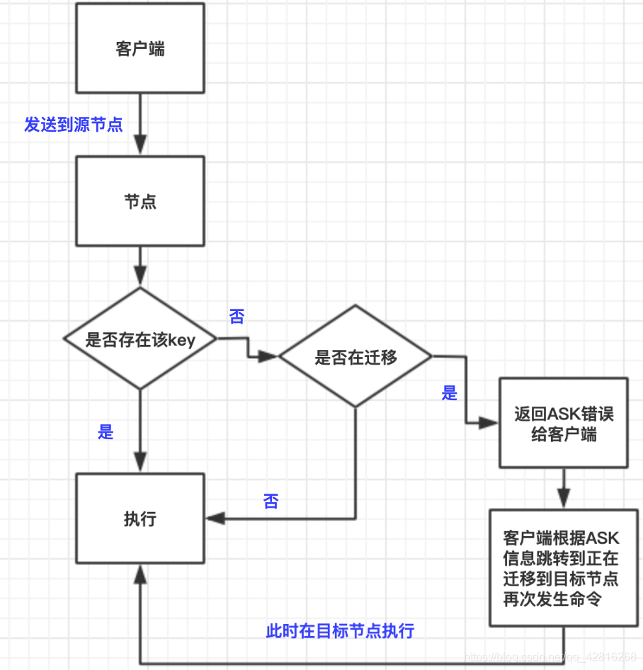

1. 客户端命令发送到源节点（设定该命令正好就属于该源节点管理的槽点）
2. 源节点首先判断该key是否存在自己的数据库中
3. 若存在则执行，若不存在则会去判断是否在进行迁移(在迁移时redis会记录一个状态，表示正在迁移中)
4. 若正在迁移则表示可能该key-value已经迁移到目标节点中了，此时向客户端返回ACK信息，客户端收到该信息后会根据该信息提供的目标节点地址进行转向，对该目标节点再次发送命令

**二、迁移过程中对目标节点发送命令**

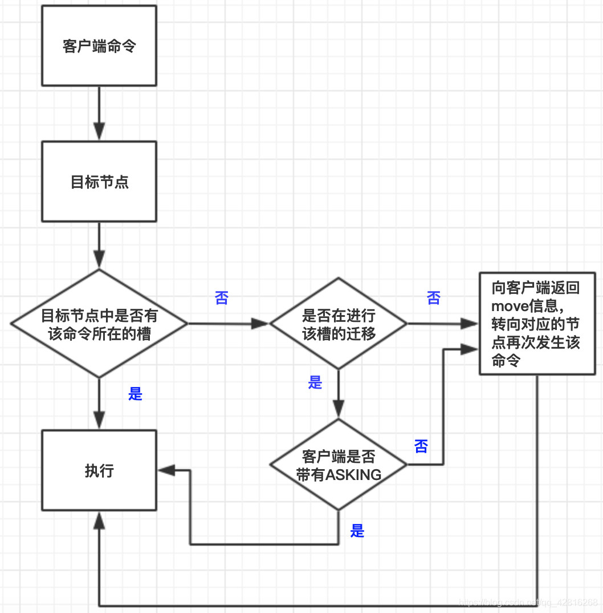

1. 目标节点首先会判断该命令所在的槽是否属于自己，如果存在则执行，如果不存在则判断是否正在进行对该命令所在槽的迁移
2. 如果没有在进行迁移则返回move信息给客户端，客户端转向至对应的节点再次发送该命令。如果在进行迁移，则说明该命令操作的键值对已经迁移过来了只是槽点还没指派过来，接着判断客户端发送这个命令时是否带有ASKING标识
3. 若有ASKING标识符则执行该命令，若没有则返回move信息给客户端，进行转向。（ASKING标识符是一次性的，每次命令结束后该标识符就会消失，客户端需要重新标识符）


### 5、复制和故障转移

一、复制：和最开始介绍的主从复制一样，从数据库会复制主数据库的数据库（槽还是指派给的主数据库）

二、故障转移：

1. 故障检测：
   - 疑似下线（PFALL）：集群中每个节点会定期向其他节点发送PING消息，若超过规定时间没有返回PONG，则发送PING消息的节点就会判定接收PING消息的节点为疑似下线。然后该发送者会向其他节点公开仪式下线服务器的信息
   - 下线（FALL）：集群中其他节点接收到疑似下线的信息后，各个节点也会判断该节点是否疑似下线，如果判断为疑似下线的节点数超过一半，则第一个判断为疑似下线的节点会向集群广播该节点下线
2. 故障转移：该下线主节点的从节点接收到自己的主节点下线的通知后， 会在从节点中根据Raft算法选举出新的主节点。然后选举出来的从节点执行slaveof no one命令升级为新主节点，新主节点会撤销旧主节点被指派的槽点并将这些槽点指派给自己。指派完成后向其他节点发送PONG消息，表示自己已经成为了新主节点，转移完成。旧主节点恢复后会成为新主节点的从节点


## 3、Cluster 集群搭建

### 1、集群环境准备

1、准备服务器（3主3从）

RedisCluster的选举机制和主从备份的实现，Redis要求至少三主三从共6个节点才能组成集群。准备6个redis.conf配置文件，名称路径自定义。测试环境可一台物理机器上启动6个Redis节点，但生产环境至少要准备2～3台物理机

| ID   | IP + Host      | 从节点 | 类型 | 配置文件名      |
| :--- | :------------- | :----- | :--- | --------------- |
| A    | 127.0.0.1:7001 | AA     | 主   | redis-7001.conf |
| B    | 127.0.0.1:7002 | BB     | 主   | redis-7002.conf |
| C    | 127.0.0.1:7003 | CC     | 主   | redis-7003.conf |
| AA   | 127.0.0.1:7004 | /      | 从   | redis-7004.conf |
| BB   | 127.0.0.1:7005 | /      | 从   | redis-7005.conf |
| CC   | 127.0.0.1:7006 | /      | 从   | redis-7006.conf |

2、Redis 配置修改

redis.config 配置支持集群，需要修改部分配置项，所有节点（不分主从）修改都是一致的，修改配置完成后启动对应的所有节点即可，和启动普通单例没有区别

| 配置项                    | 说明                                                         |
| ------------------------- | ------------------------------------------------------------ |
| bind                      | 绑定指定ip访问，0.0.0.0是不限制，配置多个 ip 用空格隔开      |
| port                      | 指定端口，默认值：6379                                       |
| daemonize                 | redis 是否后台运行，默认值：no                               |
| pidfile                   | daemonize方式运行时，pid可以通过pidfile指定： /var/run/redis_6379.pid |
| appendonly                | 指定是否在每次更新操作后进行日志记录，默认不开启，即aof模式备份数据 |
| include                   | 指定包含其它的配置文件                                       |
| requirepass               | 对集群设置密码                                               |
| masterauth                | 如果设置，requirepass和masterauth都需要设置，并且每个节点的密码要一致 |
| cluster-enabled           | 开启集群，cluster-enabled yes                                |
| cluster-config-file       | 集群的配置文件，首次启动会自动生成，命名修改： nodes-{port}.conf |
| cluster-node-timeout      | 请求超时 默认15秒，可自行设置                                |
| cluster-announce-ip       | 集群节点的ip，当前节点的ip（对外的ip）                       |
| cluster-announce-port     | 集群节点映射端口（对外端口）                                 |
| cluster-announce-bus-port | 集群节点总线端口,节点之间互相通信，常规端口+1万（集群桥接端口） |

> cluster-config-file：每个节点在运行过程中，会维护一份集群配置文件。当集群信息发生变化时（如增减节点），集群内所有节点会将最新信息更新到该配置文件。节点重启后，会重新读取该配置文件，获取集群信息，可以方便的重新加入到集群中。
> 也就是说，当 Redis 节点以集群模式启动时，会首先寻找是否有集群配置文件。如果有则使用文件中的配置启动；如果没有，则初始化配置并将配置保存到文件中。**集群配置文件由 Redis 节点维护，不需要人工修改**。

如下只是简单配置，redis-7002.conf ~ redis-7006.conf，只需要复制redis-7001.conf并且修改port以及cluster-config-file即可

```shell
# redis-7001.conf
port 7001
daemonize yes
protected-mode no
cluster-enabled yes
cluster-config-file nodes_7001.conf
cluster-node-timeout 10000 
```

3、正常启动6个节点（与启动普通单例没区别）

```shell
./redis-server ../conf/redis-7001.conf
./redis-server ../conf/redis-7002.conf
./redis-server ../conf/redis-7003.conf
./redis-server ../conf/redis-7004.conf
./redis-server ../conf/redis-7005.conf
./redis-server ../conf/redis-7006.conf
```


### 2、创建与登录集群

> 注意：Redis-5.0.0版本开始才支持“–cluster”，redis-cli --cluster 为 redis-5.0.0/src 下的 redis-cli ，老版本不支持.
>
> redis-cli --cluster代替了之前的redis-trib.rb，我们无需安装Ruby环境即可直接使用它附带的所有功能：创建集群、增删节点、槽迁移、完整性检查、数据重平衡等等。

1、创建Redis集群命令（在其中任意一个节点执行即可）

redis-cli 的参数说明：

- create：表示创建一个redis集群
- --cluster：构建集群全部节点信息
- --cluster-replicas：1主从节点的比例，1表示1主1从的方式

```shell
[root@localhost bin]# ./redis-cli --cluster create 127.0.0.1:7001 127.0.0.1:7002 127.0.0.1:7003 127.0.0.1:7004 127.0.0.1:7005 127.0.0.1:7006 --cluster-replicas 1
```

```shell
# 本人在windows环境搭建集群测试
C:\1.work\Enviroment\REDIS\Redis-x64-5.0.14.1>redis-cli.exe --cluster create 127.0.0.1:7001 127.0.0.1:7002 127.0.0.1:7003 127.0.0.1:7004 127.0.0.1:7005 127.0.0.1:7006 --cluster-replicas 1
>>> Performing hash slots allocation on 6 nodes...
Master[0] -> Slots 0 - 5460
Master[1] -> Slots 5461 - 10922
Master[2] -> Slots 10923 - 16383
Adding replica 127.0.0.1:7005 to 127.0.0.1:7001
Adding replica 127.0.0.1:7006 to 127.0.0.1:7002
Adding replica 127.0.0.1:7004 to 127.0.0.1:7003
>>> Trying to optimize slaves allocation for anti-affinity
[WARNING] Some slaves are in the same host as their master
M: d8adf4226579915bbd0c810bdbdae3a5387e2095 127.0.0.1:7001
   slots:[0-5460] (5461 slots) master
M: bd92cc04f8034d633edb775606dcad01e096c694 127.0.0.1:7002
   slots:[5461-10922] (5462 slots) master
M: 690192f9db48567ecf8ca7303ec5f7de7bfe22d9 127.0.0.1:7003
   slots:[10923-16383] (5461 slots) master
S: 988c51d653bd40be3990ad9354ad5ef0cc830af0 127.0.0.1:7004
   replicates 690192f9db48567ecf8ca7303ec5f7de7bfe22d9
S: 2098a68365f1ad137d6f9856cf51151cd014f6eb 127.0.0.1:7005
   replicates d8adf4226579915bbd0c810bdbdae3a5387e2095
S: 976461ad2747296f88306fd530145f19c7ad9a86 127.0.0.1:7006
   replicates bd92cc04f8034d633edb775606dcad01e096c694
Can I set the above configuration? (type 'yes' to accept): yes
>>> Nodes configuration updated
>>> Assign a different config epoch to each node
>>> Sending CLUSTER MEET messages to join the cluster
Waiting for the cluster to join
..
>>> Performing Cluster Check (using node 127.0.0.1:7001)
M: d8adf4226579915bbd0c810bdbdae3a5387e2095 127.0.0.1:7001
   slots:[0-5460] (5461 slots) master
   1 additional replica(s)
M: bd92cc04f8034d633edb775606dcad01e096c694 127.0.0.1:7002
   slots:[5461-10922] (5462 slots) master
   1 additional replica(s)
S: 976461ad2747296f88306fd530145f19c7ad9a86 127.0.0.1:7006
   slots: (0 slots) slave
   replicates bd92cc04f8034d633edb775606dcad01e096c694
S: 2098a68365f1ad137d6f9856cf51151cd014f6eb 127.0.0.1:7005
   slots: (0 slots) slave
   replicates d8adf4226579915bbd0c810bdbdae3a5387e2095
M: 690192f9db48567ecf8ca7303ec5f7de7bfe22d9 127.0.0.1:7003
   slots:[10923-16383] (5461 slots) master
   1 additional replica(s)
S: 988c51d653bd40be3990ad9354ad5ef0cc830af0 127.0.0.1:7004
   slots: (0 slots) slave
   replicates 690192f9db48567ecf8ca7303ec5f7de7bfe22d9
[OK] All nodes agree about slots configuration.
>>> Check for open slots...
>>> Check slots coverage...
[OK] All 16384 slots covered.
```

> 注意点：
>
> 1. Can I set the above configuration? (type 'yes' to accept): yes（中间的一些询问输入 yes 即可）
> 2. 创建时Redis里不要有数据。如果有数据请先删除清空
> 3. 如果配置项 cluster-enabled 的值不为 yes，则执行时会报错“[ERR] Node 127.0.0.1:7001 is not configured as a cluster node.”。这个时候需改为yes，然后重启 redis-server 进程，之后才可以重新执行 redis-cli 创建集群
>
> 到这里 Redis cluster 集群就创建完毕了。我们可以登录查看集群信息。

2、登录集群（-c 表示以集群模式连接登录。注意：-c 不等于 --cluster）

```shell
[root@localhost bin]# ./redis-cli -c -h 127.0.0.1 -p 7001
```

```shell
C:\1.work\Enviroment\REDIS\Redis-x64-5.0.14.1>redis-cli.exe -c -h 127.0.0.1 -p 7001
127.0.0.1:7001>
```


### 3、集群信息查看

1、检查状态信息（其中一个节点执行即可）

```shell
[root@localhost bin]# ./redis-cli -a 123456 --cluster check 127.0.0.1:7001
```

```shell
C:\1.work\Enviroment\REDIS\Redis-x64-5.0.14.1>redis-cli.exe --cluster check 127.0.0.1:7001
127.0.0.1:7001 (d8adf422...) -> 0 keys | 5461 slots | 1 slaves.
127.0.0.1:7002 (bd92cc04...) -> 0 keys | 5462 slots | 1 slaves.
127.0.0.1:7003 (690192f9...) -> 0 keys | 5461 slots | 1 slaves.
[OK] 0 keys in 3 masters.
0.00 keys per slot on average.
>>> Performing Cluster Check (using node 127.0.0.1:7001)
M: d8adf4226579915bbd0c810bdbdae3a5387e2095 127.0.0.1:7001
   slots:[0-5460] (5461 slots) master
   1 additional replica(s)
M: bd92cc04f8034d633edb775606dcad01e096c694 127.0.0.1:7002
   slots:[5461-10922] (5462 slots) master
   1 additional replica(s)
S: 976461ad2747296f88306fd530145f19c7ad9a86 127.0.0.1:7006
   slots: (0 slots) slave
   replicates bd92cc04f8034d633edb775606dcad01e096c694
S: 2098a68365f1ad137d6f9856cf51151cd014f6eb 127.0.0.1:7005
   slots: (0 slots) slave
   replicates d8adf4226579915bbd0c810bdbdae3a5387e2095
M: 690192f9db48567ecf8ca7303ec5f7de7bfe22d9 127.0.0.1:7003
   slots:[10923-16383] (5461 slots) master
   1 additional replica(s)
S: 988c51d653bd40be3990ad9354ad5ef0cc830af0 127.0.0.1:7004
   slots: (0 slots) slave
   replicates 690192f9db48567ecf8ca7303ec5f7de7bfe22d9
[OK] All nodes agree about slots configuration.
>>> Check for open slots...
>>> Check slots coverage...
[OK] All 16384 slots covered.
```

2、查看集群信息：cluster info（需要先登录集群，任意节点都可以）

```shell
127.0.0.1:7001> cluster info
cluster_state:ok
cluster_slots_assigned:16384
cluster_slots_ok:16384
cluster_slots_pfail:0
cluster_slots_fail:0
cluster_known_nodes:6
cluster_size:3
cluster_current_epoch:6
cluster_my_epoch:1
cluster_stats_messages_ping_sent:2452
cluster_stats_messages_pong_sent:2528
cluster_stats_messages_sent:4980
cluster_stats_messages_ping_received:2523
cluster_stats_messages_pong_received:2452
cluster_stats_messages_meet_received:5
cluster_stats_messages_received:4980
127.0.0.1:7001>
```

3、查看集群节点信息：cluster nodes（需要先登录集群，任意节点都可以）

```shell
127.0.0.1:7001> cluster nodes
d8adf4226579915bbd0c810bdbdae3a5387e2095 127.0.0.1:7001@17001 myself,master - 0 1652864107000 1 connected 0-5460
bd92cc04f8034d633edb775606dcad01e096c694 127.0.0.1:7002@17002 master - 0 1652864108000 2 connected 5461-10922
690192f9db48567ecf8ca7303ec5f7de7bfe22d9 127.0.0.1:7003@17003 master - 0 1652864107000 3 connected 10923-16383
988c51d653bd40be3990ad9354ad5ef0cc830af0 127.0.0.1:7004@17004 slave 690192f9db48567ecf8ca7303ec5f7de7bfe22d9 0 1652864109000 4 connected
2098a68365f1ad137d6f9856cf51151cd014f6eb 127.0.0.1:7005@17005 slave d8adf4226579915bbd0c810bdbdae3a5387e2095 0 1652864108953 5 connected
976461ad2747296f88306fd530145f19c7ad9a86 127.0.0.1:7006@17006 slave bd92cc04f8034d633edb775606dcad01e096c694 0 1652864109988 6 connected
127.0.0.1:7001>
```

4、查看集群主节点信息（包含槽位、从节点数量、服务地址和端口）

```shell
C:\1.work\Enviroment\REDIS\Redis-x64-5.0.14.1>redis-cli --cluster info 127.0.0.1:7001
127.0.0.1:7001 (d8adf422...) -> 0 keys | 5461 slots | 1 slaves.
127.0.0.1:7002 (bd92cc04...) -> 0 keys | 5462 slots | 1 slaves.
127.0.0.1:7003 (690192f9...) -> 0 keys | 5460 slots | 1 slaves.
```


## 4、Cluster 添加节点

添加方式有两种：

- 方式1：使用redis-cli命令及参数直接增加主从节点即可，添加时需要指定集群中任一可用的节点
- 方式2：登录集群中任一可用节点，然后把指定节点加入集群。
- 注意：这两种方式需要分配**槽位**，并需要手动设置**从节点**

### 1、启动新增的节点

启动新的Redis节点，先创建7007节点 和 7008节点（无数据），参考上面7001~7006节点以单机版配置和启动好。

- 新建配置文件：redis-7007.conf、redis-7008.conf

  ```shell
  # redis-7007.conf
  port 7007
  daemonize yes
  protected-mode no
  cluster-enabled yes
  cluster-config-file nodes_7007.conf
  cluster-node-timeout 10000
  
  # redis-7007.conf
  port 7008
  daemonize yes
  protected-mode no
  cluster-enabled yes
  cluster-config-file nodes_7008.conf
  cluster-node-timeout 10000
  ```

- 启动7007、7008两个Redis服务

  ```shell
  ./redis-server ../conf/redis-7007.conf
  ./redis-server ../conf/redis-7008.conf
  ```

- 登录 7007 和 6380 服务，查看集群节点信息，可以发现该集群只有 6379 一个 master

  ```shell
  C:\1.work\Enviroment\REDIS\Redis-x64-5.0.14.1>redis-cli.exe -p 7007
  127.0.0.1:7007> cluster nodes
  a692a1f6acf82b7d82cbbfe646f178d7b84a1dac :7007@17007 myself,master - 0 0 0 connected
  127.0.0.1:7007> exit
  
  C:\1.work\Enviroment\REDIS\Redis-x64-5.0.14.1>redis-cli.exe -p 7008
  127.0.0.1:7008> cluster nodes
  8136d1b4f35bad7fd03dcacb4b3f1375c5967366 :7008@17008 myself,master - 0 0 0 connected
  127.0.0.1:7008>
  ```

- 接下来需要将这两个节点加入到集群中


### 2、方式1添加主节点（master）

1、任意连接一台集群中的节点，比如我们连接 127.0.0.1:7001，然后使用`cluster meet`将 7007 和 7008 添加到集群中

- 首先登录 127.0.0.1:7001 查看集群节点信息

  ```shell
  C:\1.work\Enviroment\REDIS\Redis-x64-5.0.14.1>redis-cli.exe -p 7001
  127.0.0.1:7001> cluster nodes
  2098a68365f1ad137d6f9856cf51151cd014f6eb 127.0.0.1:7005@17005 master - 0 1652947612874 8 connected 0-5460
  bd92cc04f8034d633edb775606dcad01e096c694 127.0.0.1:7002@17002 master - 0 1652947615060 2 connected 5461-10922
  690192f9db48567ecf8ca7303ec5f7de7bfe22d9 127.0.0.1:7003@17003 master - 0 1652947612000 3 connected 10923-16383
  988c51d653bd40be3990ad9354ad5ef0cc830af0 127.0.0.1:7004@17004 slave 690192f9db48567ecf8ca7303ec5f7de7bfe22d9 0 1652947614000 4 connected
  976461ad2747296f88306fd530145f19c7ad9a86 127.0.0.1:7006@17006 slave bd92cc04f8034d633edb775606dcad01e096c694 0 1652947613000 6 connected
  d8adf4226579915bbd0c810bdbdae3a5387e2095 127.0.0.1:7001@17001 myself,slave 2098a68365f1ad137d6f9856cf51151cd014f6eb 0 1652947612000 1 connected
  127.0.0.1:7001>
  127.0.0.1:7001> cluster info
  cluster_state:ok
  cluster_slots_assigned:16384
  cluster_slots_ok:16384
  cluster_slots_pfail:0
  cluster_slots_fail:0
  cluster_known_nodes:6    # 6个节点
  cluster_size:3
  cluster_current_epoch:8
  cluster_my_epoch:8
  cluster_stats_messages_ping_sent:52
  cluster_stats_messages_pong_sent:54
  cluster_stats_messages_sent:106
  cluster_stats_messages_ping_received:54
  cluster_stats_messages_pong_received:53
  cluster_stats_messages_auth-req_received:1
  cluster_stats_messages_received:108
  ```

- 使用 cluster meet 命令将 7007 和 7008 添加到集群中，并查看添加后的集群节点

  ```shell
  127.0.0.1:7001> cluster meet 127.0.0.1 7007
  ```

  ```shell
  127.0.0.1:7001> cluster meet 127.0.0.1 7007     # 将节点(127.0.0.1:7007)加入到集群
  OK
  127.0.0.1:7001> cluster meet 127.0.0.1 7008     # 将节点(127.0.0.1:7008)加入到集群
  OK
  127.0.0.1:7001> cluster nodes
  a692a1f6acf82b7d82cbbfe646f178d7b84a1dac 127.0.0.1:7007@17007 master - 0 1652947819949 0 connected
  8136d1b4f35bad7fd03dcacb4b3f1375c5967366 127.0.0.1:7008@17008 master - 0 1652947817000 9 connected
  2098a68365f1ad137d6f9856cf51151cd014f6eb 127.0.0.1:7005@17005 master - 0 1652947819000 8 connected 0-5460
  bd92cc04f8034d633edb775606dcad01e096c694 127.0.0.1:7002@17002 master - 0 1652947819003 2 connected 5461-10922
  690192f9db48567ecf8ca7303ec5f7de7bfe22d9 127.0.0.1:7003@17003 master - 0 1652947818903 3 connected 10923-16383
  988c51d653bd40be3990ad9354ad5ef0cc830af0 127.0.0.1:7004@17004 slave 690192f9db48567ecf8ca7303ec5f7de7bfe22d9 0 1652947817000 4 connected
  976461ad2747296f88306fd530145f19c7ad9a86 127.0.0.1:7006@17006 slave bd92cc04f8034d633edb775606dcad01e096c694 0 1652947817855 6 connected
  d8adf4226579915bbd0c810bdbdae3a5387e2095 127.0.0.1:7001@17001 myself,slave 2098a68365f1ad137d6f9856cf51151cd014f6eb 0 1652947817000 1 connected
  127.0.0.1:7001>
  127.0.0.1:7001> cluster info
  cluster_state:ok
  cluster_slots_assigned:16384
  cluster_slots_ok:16384
  cluster_slots_pfail:0
  cluster_slots_fail:0
  cluster_known_nodes:8    # 8个节点
  cluster_size:3
  cluster_current_epoch:9
  cluster_my_epoch:8
  cluster_stats_messages_ping_sent:1214
  cluster_stats_messages_pong_sent:1213
  cluster_stats_messages_meet_sent:2
  cluster_stats_messages_sent:2429
  cluster_stats_messages_ping_received:1213
  cluster_stats_messages_pong_received:1217
  cluster_stats_messages_auth-req_received:1
  cluster_stats_messages_received:2431
  ```

  > 查看集群节点，可以发现，7007 和 7008 已经添加到集群中了，此时这两个新添加的都是 master 节点，并且槽位数都是 0


### 3、为节点分配槽位（slots）

- 分配槽位：给新加入的两个节点分配槽位，并且修改其他master节点的槽位

  ```shell
  # ip:port : 为连接的集群,连接集群中任意一个可用结点都行
  [root@localhost bin]# ./redis-cli --cluster reshard ip:port
  ```

  ```shell
  C:\1.work\Enviroment\REDIS\Redis-x64-5.0.14.1>redis-cli --cluster reshard 127.0.0.1:7007
  >>> Performing Cluster Check (using node 127.0.0.1:7007)
  M: a692a1f6acf82b7d82cbbfe646f178d7b84a1dac 127.0.0.1:7007
     slots: (0 slots) master
  M: 2098a68365f1ad137d6f9856cf51151cd014f6eb 127.0.0.1:7005
     slots:[0-5460] (5461 slots) master
     1 additional replica(s)
  S: 988c51d653bd40be3990ad9354ad5ef0cc830af0 127.0.0.1:7004
     slots: (0 slots) slave
     replicates 690192f9db48567ecf8ca7303ec5f7de7bfe22d9
  M: 8136d1b4f35bad7fd03dcacb4b3f1375c5967366 127.0.0.1:7008
     slots: (0 slots) master
  S: d8adf4226579915bbd0c810bdbdae3a5387e2095 127.0.0.1:7001
     slots: (0 slots) slave
     replicates 2098a68365f1ad137d6f9856cf51151cd014f6eb
  S: 976461ad2747296f88306fd530145f19c7ad9a86 127.0.0.1:7006
     slots: (0 slots) slave
     replicates bd92cc04f8034d633edb775606dcad01e096c694
  M: bd92cc04f8034d633edb775606dcad01e096c694 127.0.0.1:7002
     slots:[5461-10922] (5462 slots) master
     1 additional replica(s)
  M: 690192f9db48567ecf8ca7303ec5f7de7bfe22d9 127.0.0.1:7003
     slots:[10923-16383] (5461 slots) master
     1 additional replica(s)
  [OK] All nodes agree about slots configuration.
  >>> Check for open slots...
  >>> Check slots coverage...
  [OK] All 16384 slots covered.
  # 1.输入要分配的槽数量, 输入：3000，表示要给目标节点分配3000个槽
  How many slots do you want to move (from 1 to 16384)? 4096
  # 2.输入接收槽的结点id, 可以通过
  What is the receiving node ID? a692a1f6acf82b7d82cbbfe646f178d7b84a1dac
  Please enter all the source node IDs.
    Type 'all' to use all the nodes as source nodes for the hash slots.
    Type 'done' once you entered all the source nodes IDs.
  # 3.输入源结点id, 可以是all全部节点分配给当前节点槽位,也可以指定某一个节点ID
  Source node #1: all
      Moving slot 1363 from 2098a68365f1ad137d6f9856cf51151cd014f6eb
      Moving slot 1364 from 2098a68365f1ad137d6f9856cf51151cd014f6eb
      .... # 省略中间输出
  # 4.输入yes开始移动槽到目标节点id
  Do you want to proceed with the proposed reshard plan (yes/no)? yes
  Moving slot 5461 from 127.0.0.1:7002 to 127.0.0.1:7007:
  Moving slot 5462 from 127.0.0.1:7002 to 127.0.0.1:7007:
  .... # 省略中间输出
  ```

- 接下来需要输入的内容：

  1. 算出来每个 master 的槽数：4096（原本三个 master，加一个变四个 maste，16384/4=4096）
  2. 填写接收槽位的节点 ID：36efcd23eecc5c4238711c4e680026fea1a71e6d
  3. 填写槽位来源节点 Source node 为 all，表示从其他所有 master 节点迁移槽位
  4. 填写yes开始迁移槽到目标节点

- 查看分配槽位的结果

  ```shell
  C:\1.work\Enviroment\REDIS\Redis-x64-5.0.14.1>redis-cli -p 7001 cluster nodes
  a692a1f6acf82b7d82cbbfe646f178d7b84a1dac 127.0.0.1:7007@17007 master - 0 1652951634333 10 connected 0-1364 5461-6826 10923-12287
  2098a68365f1ad137d6f9856cf51151cd014f6eb 127.0.0.1:7005@17005 master - 0 1652951633000 8 connected 1365-5460
  bd92cc04f8034d633edb775606dcad01e096c694 127.0.0.1:7002@17002 master - 0 1652951633000 2 connected 6827-10922
  690192f9db48567ecf8ca7303ec5f7de7bfe22d9 127.0.0.1:7003@17003 master - 0 1652951633283 3 connected 12288-16383
  8136d1b4f35bad7fd03dcacb4b3f1375c5967366 127.0.0.1:7008@17008 master - 0 1652951632222 9 connected
  988c51d653bd40be3990ad9354ad5ef0cc830af0 127.0.0.1:7004@17004 slave 690192f9db48567ecf8ca7303ec5f7de7bfe22d9 0 1652951632000 4 connected
  976461ad2747296f88306fd530145f19c7ad9a86 127.0.0.1:7006@17006 slave bd92cc04f8034d633edb775606dcad01e096c694 0 1652951631000 6 connected
  d8adf4226579915bbd0c810bdbdae3a5387e2095 127.0.0.1:7001@17001 myself,slave 2098a68365f1ad137d6f9856cf51151cd014f6eb 0 1652951631000 1 connected
  ```

- 到这就成功添加了一个 master 节点（7007）并分配了相应的槽位。此时 7008 还是一个没有槽位的 master 节点。


### 4、方式1设置从节点（slave）

将 7008 设置为 7007 的从节点，登录 7008：使用`cluster replicate + 主节点ID`，就能指定当前节点为目标节点的从节点：

```shell
C:\1.work\Enviroment\REDIS\Redis-x64-5.0.14.1>redis-cli -p 7008
127.0.0.1:7008> cluster replicate a692a1f6acf82b7d82cbbfe646f178d7b84a1dac
OK
127.0.0.1:7008>
127.0.0.1:7008> cluster nodes  # 查看集群节点信息,可以发现 7008 由 master 变成了 slave
a692a1f6acf82b7d82cbbfe646f178d7b84a1dac 127.0.0.1:7007@17007 master - 0 1652954622000 10 connected 0-1364 5461-6826 10923-12287
690192f9db48567ecf8ca7303ec5f7de7bfe22d9 127.0.0.1:7003@17003 master - 0 1652954622000 3 connected 12288-16383
2098a68365f1ad137d6f9856cf51151cd014f6eb 127.0.0.1:7005@17005 master - 0 1652954624122 8 connected 1365-5460
bd92cc04f8034d633edb775606dcad01e096c694 127.0.0.1:7002@17002 master - 0 1652954623062 2 connected 6827-10922
988c51d653bd40be3990ad9354ad5ef0cc830af0 127.0.0.1:7004@17004 slave 690192f9db48567ecf8ca7303ec5f7de7bfe22d9 0 1652954623000 3 connected
8136d1b4f35bad7fd03dcacb4b3f1375c5967366 127.0.0.1:7008@17008 myself,slave a692a1f6acf82b7d82cbbfe646f178d7b84a1dac 0 1652954622000 9 connected
976461ad2747296f88306fd530145f19c7ad9a86 127.0.0.1:7006@17006 slave bd92cc04f8034d633edb775606dcad01e096c694 0 1652954622004 2 connected
d8adf4226579915bbd0c810bdbdae3a5387e2095 127.0.0.1:7001@17001 slave 2098a68365f1ad137d6f9856cf51151cd014f6eb 0 1652954622000 8 connected
127.0.0.1:7008>
```

到此就将新增 Redis 服务 7007 和 7008 成功添加到已有的Redis Cluster中。目前集群共有4台服务，共8个Redis服务，4主4从。


### 5、方式2添加主从节点（add-node）

上述使用的是在连接Redis客户端内部执行添加集群命令，这里使用的是交互式命令行：`redis-cli --cluster add-node`

1、添加主节点

- 主节点添加的命令详解：

  ```shell
  # new-node-id:port    : 为需要添加新的节点,默认为master节点
  # old-node-id:port    : 为集群中任一可用的节点,可以是主节点或从节点
  ./redis-cli --cluster add-node new-node-id:port old-node-id:port
  # 示例
  [root@localhost bin]# ./redis-cli --cluster add-node 127.0.0.1:7007 127.0.0.1:7001
  ```

- 为集群中添加7007服务为主节点（127.0.0.1:7001表示集群中任意一存在的节点，表示的是用它连接）

  ```shell
  C:\1.work\Enviroment\REDIS\Redis-x64-5.0.14.1>redis-cli --cluster add-node 127.0.0.1:7007 127.0.0.1:7001
  >>> Adding node 127.0.0.1:7007 to cluster 127.0.0.1:7001
  >>> Performing Cluster Check (using node 127.0.0.1:7001)
  S: d8adf4226579915bbd0c810bdbdae3a5387e2095 127.0.0.1:7001
     slots: (0 slots) slave
     replicates 2098a68365f1ad137d6f9856cf51151cd014f6eb
  M: bd92cc04f8034d633edb775606dcad01e096c694 127.0.0.1:7002
     slots:[6826-12287] (5462 slots) master
     1 additional replica(s)
  S: 988c51d653bd40be3990ad9354ad5ef0cc830af0 127.0.0.1:7004
     slots: (0 slots) slave
     replicates 690192f9db48567ecf8ca7303ec5f7de7bfe22d9
  M: 2098a68365f1ad137d6f9856cf51151cd014f6eb 127.0.0.1:7005
     slots:[1365-6825] (5461 slots) master
     1 additional replica(s)
  S: 976461ad2747296f88306fd530145f19c7ad9a86 127.0.0.1:7006
     slots: (0 slots) slave
     replicates bd92cc04f8034d633edb775606dcad01e096c694
  M: 690192f9db48567ecf8ca7303ec5f7de7bfe22d9 127.0.0.1:7003
     slots:[0-1364],[12288-16383] (5461 slots) master
     1 additional replica(s)
  [OK] All nodes agree about slots configuration.
  >>> Check for open slots...
  >>> Check slots coverage...
  [OK] All 16384 slots covered.
  >>> Send CLUSTER MEET to node 127.0.0.1:7007 to make it join the cluster.
  [OK] New node added correctly.
  ```

- 查看添加后的集群信息

  ```shell
  # 查看集群节点详细信息
  C:\1.work\Enviroment\REDIS\Redis-x64-5.0.14.1>redis-cli -p 7001 cluster nodes
  bd92cc04f8034d633edb775606dcad01e096c694 127.0.0.1:7002@17002 master - 0 1653027849013 11 connected 6826-12287
  fd1a01142b563ebf8b422525382af3f4a82903dd 127.0.0.1:7007@17007 master - 0 1653027850070 0 connected
  988c51d653bd40be3990ad9354ad5ef0cc830af0 127.0.0.1:7004@17004 slave 690192f9db48567ecf8ca7303ec5f7de7bfe22d9 0 1653027849000 12 connected
  2098a68365f1ad137d6f9856cf51151cd014f6eb 127.0.0.1:7005@17005 master - 0 1653027846000 13 connected 1365-6825
  976461ad2747296f88306fd530145f19c7ad9a86 127.0.0.1:7006@17006 slave bd92cc04f8034d633edb775606dcad01e096c694 0 1653027847000 11 connected
  d8adf4226579915bbd0c810bdbdae3a5387e2095 127.0.0.1:7001@17001 myself,slave 2098a68365f1ad137d6f9856cf51151cd014f6eb 0 1653027848000 1 connected
  690192f9db48567ecf8ca7303ec5f7de7bfe22d9 127.0.0.1:7003@17003 master - 0 1653027847000 12 connected 0-1364 12288-16383
  
  # 查看集群节点简单信息
  C:\1.work\Enviroment\REDIS\Redis-x64-5.0.14.1>redis-cli --cluster info 127.0.0.1:7001
  127.0.0.1:7002 (bd92cc04...) -> 0 keys | 5462 slots | 1 slaves.
  127.0.0.1:7007 (fd1a0114...) -> 0 keys | 0 slots | 0 slaves.
  127.0.0.1:7005 (2098a683...) -> 0 keys | 5461 slots | 1 slaves.
  127.0.0.1:7003 (690192f9...) -> 0 keys | 5461 slots | 1 slaves.
  [OK] 0 keys in 4 masters.
  0.00 keys per slot on average.
  ```

  > 可以发现已经为集群中添加了一个master节点，不过slots与从节点都为0

2、添加从节点

- 从节点添加的命令详解：

  ```shell
  # new-node-id:port    : 为需要添加新的节点,默认为master节点
  # old-node-id:port    : 为集群中任一可用的节点,可以是主节点或从节点
  # --cluster-slave     : 表示当前新添加的节点为slave节点,这种方法随机为新节点指定一个master
  # --cluster-master-id : 如果想明确指定master,则需要添加该参数并带上master节点的ID
  ./redis-cli --cluster add-node new-node-id:port old-node-id:port --cluster-slave --cluster-master-id 主节点id
  
  # 示例1: 添加新的从节点为7007,这种方法随机为7007指定一个master节点
  [root@localhost bin]# ./redis-cli --cluster add-node 127.0.0.1:7008 127.0.0.1:7001 --cluster-slave
  # 示例2: 添加新的从节点为7007,这种方法为7007指定一个确认的master节点(这里指定7007为7008的主节点)
  [root@localhost bin]# ./redis-cli --cluster add-node 127.0.0.1:7008 127.0.0.1:7001 --cluster-slave --cluster-master-id fd1a01142b563ebf8b422525382af3f4a82903dd
  ```

- 为集群中添加7008服务为从节点，并指定7007为7008的主节点

  ```shell
  # 查看集群节点详细信息
  C:\1.work\Enviroment\REDIS\Redis-x64-5.0.14.1>redis-cli --cluster add-node 127.0.0.1:7008 127.0.0.1:7001 --cluster-slave --cluster-master-id fd1a01142b563ebf8b422525382af3f4a82903dd
  >>> Adding node 127.0.0.1:7008 to cluster 127.0.0.1:7001
  >>> Performing Cluster Check (using node 127.0.0.1:7001)
  S: d8adf4226579915bbd0c810bdbdae3a5387e2095 127.0.0.1:7001
     slots: (0 slots) slave
     replicates 2098a68365f1ad137d6f9856cf51151cd014f6eb
  M: bd92cc04f8034d633edb775606dcad01e096c694 127.0.0.1:7002
     slots:[6826-12287] (5462 slots) master
     1 additional replica(s)
  M: fd1a01142b563ebf8b422525382af3f4a82903dd 127.0.0.1:7007
     slots: (0 slots) master
  S: 988c51d653bd40be3990ad9354ad5ef0cc830af0 127.0.0.1:7004
     slots: (0 slots) slave
     replicates 690192f9db48567ecf8ca7303ec5f7de7bfe22d9
  M: 2098a68365f1ad137d6f9856cf51151cd014f6eb 127.0.0.1:7005
     slots:[1365-6825] (5461 slots) master
     1 additional replica(s)
  S: 976461ad2747296f88306fd530145f19c7ad9a86 127.0.0.1:7006
     slots: (0 slots) slave
     replicates bd92cc04f8034d633edb775606dcad01e096c694
  M: 690192f9db48567ecf8ca7303ec5f7de7bfe22d9 127.0.0.1:7003
     slots:[0-1364],[12288-16383] (5461 slots) master
     1 additional replica(s)
  [OK] All nodes agree about slots configuration.
  >>> Check for open slots...
  >>> Check slots coverage...
  [OK] All 16384 slots covered.
  >>> Send CLUSTER MEET to node 127.0.0.1:7008 to make it join the cluster.
  Waiting for the cluster to join
  
  >>> Configure node as replica of 127.0.0.1:7007.
  [OK] New node added correctly.
  ```

- 查看添加后的集群信息

  ```shell
  C:\1.work\Enviroment\REDIS\Redis-x64-5.0.14.1>redis-cli -p 7001 cluster nodes
  13b68efc312390054bc9ce7a9e0a79200122803d 127.0.0.1:7008@17008 slave fd1a01142b563ebf8b422525382af3f4a82903dd 0 1653028573234 0 connected
  bd92cc04f8034d633edb775606dcad01e096c694 127.0.0.1:7002@17002 master - 0 1653028572000 11 connected 6826-12287
  fd1a01142b563ebf8b422525382af3f4a82903dd 127.0.0.1:7007@17007 master - 0 1653028571111 0 connected
  988c51d653bd40be3990ad9354ad5ef0cc830af0 127.0.0.1:7004@17004 slave 690192f9db48567ecf8ca7303ec5f7de7bfe22d9 0 1653028572175 12 connected
  2098a68365f1ad137d6f9856cf51151cd014f6eb 127.0.0.1:7005@17005 master - 0 1653028574058 13 connected 1365-6825
  976461ad2747296f88306fd530145f19c7ad9a86 127.0.0.1:7006@17006 slave bd92cc04f8034d633edb775606dcad01e096c694 0 1653028571000 11 connected
  d8adf4226579915bbd0c810bdbdae3a5387e2095 127.0.0.1:7001@17001 myself,slave 2098a68365f1ad137d6f9856cf51151cd014f6eb 0 1653028571000 1 connected
  690192f9db48567ecf8ca7303ec5f7de7bfe22d9 127.0.0.1:7003@17003 master - 0 1653028574268 12 connected 0-1364 12288-16383
  
  # 查看集群节点简单信息
  C:\1.work\Enviroment\REDIS\Redis-x64-5.0.14.1>redis-cli --cluster info 127.0.0.1:7001
  127.0.0.1:7002 (bd92cc04...) -> 0 keys | 5462 slots | 1 slaves.
  127.0.0.1:7007 (fd1a0114...) -> 0 keys | 0 slots | 1 slaves.
  127.0.0.1:7005 (2098a683...) -> 0 keys | 5461 slots | 1 slaves.
  127.0.0.1:7003 (690192f9...) -> 0 keys | 5461 slots | 1 slaves.
  [OK] 0 keys in 4 masters.
  0.00 keys per slot on average.
  ```

- 这里再多测试一次为7008指定一个随机的master节点（需要移除7008从节点）

  ```shell
  # 1. 首先移除7008从节点(移除后会停止当前节点,所以为了接下来的测试需要重启7008,重启前需要先删除nodes_7008.conf)
  C:\1.work\Enviroment\REDIS\Redis-x64-5.0.14.1>redis-cli --cluster del-node 127.0.0.1:7008 13b68efc312390054bc9ce7a9e0a79200122803d
  >>> Removing node 13b68efc312390054bc9ce7a9e0a79200122803d from cluster 127.0.0.1:7008
  >>> Sending CLUSTER FORGET messages to the cluster...
  >>> SHUTDOWN the node.
  
  # 这里省略了删除nodes_7008.conf配置文件,并重启7008服务的步骤
  # 2.
  C:\1.work\Enviroment\REDIS\Redis-x64-5.0.14.1>redis-cli --cluster add-node 127.0.0.1:7008 127.0.0.1:7001 --cluster-slave
  >>> Adding node 127.0.0.1:7008 to cluster 127.0.0.1:7001
  >>> Performing Cluster Check (using node 127.0.0.1:7001)
  S: d8adf4226579915bbd0c810bdbdae3a5387e2095 127.0.0.1:7001
     slots: (0 slots) slave
     replicates 2098a68365f1ad137d6f9856cf51151cd014f6eb
  M: bd92cc04f8034d633edb775606dcad01e096c694 127.0.0.1:7002
     slots:[6826-12287] (5462 slots) master
     1 additional replica(s)
  M: fd1a01142b563ebf8b422525382af3f4a82903dd 127.0.0.1:7007
     slots: (0 slots) master
  S: 988c51d653bd40be3990ad9354ad5ef0cc830af0 127.0.0.1:7004
     slots: (0 slots) slave
     replicates 690192f9db48567ecf8ca7303ec5f7de7bfe22d9
  M: 2098a68365f1ad137d6f9856cf51151cd014f6eb 127.0.0.1:7005
     slots:[1365-6825] (5461 slots) master
     1 additional replica(s)
  S: 976461ad2747296f88306fd530145f19c7ad9a86 127.0.0.1:7006
     slots: (0 slots) slave
     replicates bd92cc04f8034d633edb775606dcad01e096c694
  M: 690192f9db48567ecf8ca7303ec5f7de7bfe22d9 127.0.0.1:7003
     slots:[0-1364],[12288-16383] (5461 slots) master
     1 additional replica(s)
  [OK] All nodes agree about slots configuration.
  >>> Check for open slots...
  >>> Check slots coverage...
  [OK] All 16384 slots covered.
  Automatically selected master 127.0.0.1:7007
  >>> Send CLUSTER MEET to node 127.0.0.1:7008 to make it join the cluster.
  Waiting for the cluster to join
  
  >>> Configure node as replica of 127.0.0.1:7007.
  [OK] New node added correctly.
  ```

- 查看添加后的集群信息，通过结果可以发现随机为7008指定的master节点还是为7007

  ```shell
  C:\1.work\Enviroment\REDIS\Redis-x64-5.0.14.1>redis-cli -p 7001 cluster nodes
  bd92cc04f8034d633edb775606dcad01e096c694 127.0.0.1:7002@17002 master - 0 1653029303565 11 connected 6826-12287
  b25693d2d2ae53ca1c9f14f344025d8049982136 127.0.0.1:7008@17008 slave fd1a01142b563ebf8b422525382af3f4a82903dd 0 1653029304632 0 connected
  fd1a01142b563ebf8b422525382af3f4a82903dd 127.0.0.1:7007@17007 master - 0 1653029304085 0 connected
  988c51d653bd40be3990ad9354ad5ef0cc830af0 127.0.0.1:7004@17004 slave 690192f9db48567ecf8ca7303ec5f7de7bfe22d9 0 1653029301000 12 connected
  2098a68365f1ad137d6f9856cf51151cd014f6eb 127.0.0.1:7005@17005 master - 0 1653029302000 13 connected 1365-6825
  976461ad2747296f88306fd530145f19c7ad9a86 127.0.0.1:7006@17006 slave bd92cc04f8034d633edb775606dcad01e096c694 0 1653029303000 11 connected
  d8adf4226579915bbd0c810bdbdae3a5387e2095 127.0.0.1:7001@17001 myself,slave 2098a68365f1ad137d6f9856cf51151cd014f6eb 0 1653029302000 1 connected
  690192f9db48567ecf8ca7303ec5f7de7bfe22d9 127.0.0.1:7003@17003 master - 0 1653029302000 12 connected 0-1364 12288-16383
  
  C:\1.work\Enviroment\REDIS\Redis-x64-5.0.14.1>redis-cli --cluster info 127.0.0.1:7001
  127.0.0.1:7002 (bd92cc04...) -> 0 keys | 5462 slots | 1 slaves.
  127.0.0.1:7007 (fd1a0114...) -> 0 keys | 0 slots | 1 slaves.
  127.0.0.1:7005 (2098a683...) -> 0 keys | 5461 slots | 1 slaves.
  127.0.0.1:7003 (690192f9...) -> 0 keys | 5461 slots | 1 slaves.
  [OK] 0 keys in 4 masters.
  0.00 keys per slot on average.
  ```

- 到此为止，集群节点添加已经完成。可以发现新添加的主节点slots依旧为0，这时可以参考上面的为节点分配槽位数来分配slots


### 6、添加节点注意事项

1、如果原来该结点在集群中的配置信息已经生成到cluster-config-file指定的配置文件中（如果cluster-config-file没有指定则默认为nodes.conf），这时可能会报错：

```shell
[ERR] Node XXXXXX is not empty. Either the node already knows other nodes (checkwith CLUSTER NODES) or contains some key in database 0
```

解决方法是删除生成的配置文件nodes.conf，删除后再执行./redis-cli --cluster add-node 指令


2、不管使用哪一种集群节点添加方式，都需要为主分配**槽位**，并需要手动设置**从节点**。默认slots是0


## 5、Cluster 删除节点

目前集群由7001 ~ 7008 共八个Redis实例构成，现在需要删除一组Redis集群，也就是要从集群中删除一主一从两个Redis服务。这里需要特别注意的是：删除一个主从节点，需要先删除从节点，才能继续删除主节点。

如下命令为集群节点删除的命令（主从删除都是同样的命令）：

```shell
# ip:<port>   : 为集群中任意一个非待删除节点
# node-id     : 为待删除节点的ID,如果待删是master节点,则在删除之前需要将该master负责的slots先全部迁到其它master
[root@localhost bin]# ./redis-cli --cluster del-node ip:<port> <node-id>
```


### 1、删除从节点（7008-slave）

1、执行如下命令删除指定从节点：可以发现 7008 从节点已经被删除，并且 7008 Redis 服务也被停止

```shell
C:\1.work\Enviroment\REDIS\Redis-x64-5.0.14.1>redis-cli --cluster del-node 127.0.0.1:7008 8136d1b4f35bad7fd03dcacb4b3f1375c5967366
>>> Removing node 8136d1b4f35bad7fd03dcacb4b3f1375c5967366 from cluster 127.0.0.1:7008
>>> Sending CLUSTER FORGET messages to the cluster...
>>> SHUTDOWN the node.

# 再次查看集群状态，如下所示，7008这个slave节点已经移除，并且该节点的redis服务也已被停止
C:\1.work\Enviroment\REDIS\Redis-x64-5.0.14.1>redis-cli -p 7001 cluster nodes
bd92cc04f8034d633edb775606dcad01e096c694 127.0.0.1:7002@17002 master - 0 1652958290000 2 connected 6827-10922
a692a1f6acf82b7d82cbbfe646f178d7b84a1dac 127.0.0.1:7007@17007 master - 0 1652958289348 10 connected 0-1364 5461-6826 10923-12287
988c51d653bd40be3990ad9354ad5ef0cc830af0 127.0.0.1:7004@17004 slave 690192f9db48567ecf8ca7303ec5f7de7bfe22d9 0 1652958291400 4 connected
2098a68365f1ad137d6f9856cf51151cd014f6eb 127.0.0.1:7005@17005 master - 0 1652958292136 8 connected 1365-5460
976461ad2747296f88306fd530145f19c7ad9a86 127.0.0.1:7006@17006 slave bd92cc04f8034d633edb775606dcad01e096c694 0 1652958290369 6 connected
d8adf4226579915bbd0c810bdbdae3a5387e2095 127.0.0.1:7001@17001 myself,slave 2098a68365f1ad137d6f9856cf51151cd014f6eb 0 1652958288000 1 connected
690192f9db48567ecf8ca7303ec5f7de7bfe22d9 127.0.0.1:7003@17003 master - 0 1652958290269 3 connected 12288-16383
```


### 2、删除主节点（7007-master）

最后删除7007节点比删除7008节点麻烦一点，因为7007节点管理一部分slots，在删除它之前，需要将slots分配给其他可用的master节点上，否则就会出现数据丢失问题（目前只能把master的数据迁移到一个节点上，暂时做不了平均分配功能），执行命令如下：

- 首先查看删除主节点前集群节点的信息（主要观察 7007 节点信息）：

  ```shell
  C:\1.work\Enviroment\REDIS\Redis-x64-5.0.14.1>redis-cli -p 7001 cluster nodes
  bd92cc04f8034d633edb775606dcad01e096c694 127.0.0.1:7002@17002 master - 0 1652958290000 2 connected 6827-10922
  a692a1f6acf82b7d82cbbfe646f178d7b84a1dac 127.0.0.1:7007@17007 master - 0 1652958289348 10 connected 0-1364 5461-6826 10923-12287
  988c51d653bd40be3990ad9354ad5ef0cc830af0 127.0.0.1:7004@17004 slave 690192f9db48567ecf8ca7303ec5f7de7bfe22d9 0 1652958291400 4 connected
  2098a68365f1ad137d6f9856cf51151cd014f6eb 127.0.0.1:7005@17005 master - 0 1652958292136 8 connected 1365-5460
  976461ad2747296f88306fd530145f19c7ad9a86 127.0.0.1:7006@17006 slave bd92cc04f8034d633edb775606dcad01e096c694 0 1652958290369 6 connected
  d8adf4226579915bbd0c810bdbdae3a5387e2095 127.0.0.1:7001@17001 myself,slave 2098a68365f1ad137d6f9856cf51151cd014f6eb 0 1652958288000 1 connected
  690192f9db48567ecf8ca7303ec5f7de7bfe22d9 127.0.0.1:7003@17003 master - 0 1652958290269 3 connected 12288-16383
  ```

- 开始把 7007 中的槽位分配给其他 master 节点，这里我们把 7007 的 slots 分配给 7002 master 节点。

  ```shell
  C:\1.work\Enviroment\REDIS\Redis-x64-5.0.14.1>redis-cli --cluster reshard 127.0.0.1:7007
  >>> Performing Cluster Check (using node 127.0.0.1:7007)
  M: a692a1f6acf82b7d82cbbfe646f178d7b84a1dac 127.0.0.1:7007
     slots:[0-1364],[5461-6826],[10923-12287] (4096 slots) master
  M: 2098a68365f1ad137d6f9856cf51151cd014f6eb 127.0.0.1:7005
     slots:[1365-5460] (4096 slots) master
     1 additional replica(s)
  S: 988c51d653bd40be3990ad9354ad5ef0cc830af0 127.0.0.1:7004
     slots: (0 slots) slave
     replicates 690192f9db48567ecf8ca7303ec5f7de7bfe22d9
  S: d8adf4226579915bbd0c810bdbdae3a5387e2095 127.0.0.1:7001
     slots: (0 slots) slave
     replicates 2098a68365f1ad137d6f9856cf51151cd014f6eb
  S: 976461ad2747296f88306fd530145f19c7ad9a86 127.0.0.1:7006
     slots: (0 slots) slave
     replicates bd92cc04f8034d633edb775606dcad01e096c694
  M: bd92cc04f8034d633edb775606dcad01e096c694 127.0.0.1:7002
     slots:[6827-10922] (4096 slots) master
     1 additional replica(s)
  M: 690192f9db48567ecf8ca7303ec5f7de7bfe22d9 127.0.0.1:7003
     slots:[12288-16383] (4096 slots) master
     1 additional replica(s)
  [OK] All nodes agree about slots configuration.
  >>> Check for open slots...
  >>> Check slots coverage...
  [OK] All 16384 slots covered.
  How many slots do you want to move (from 1 to 16384)? 4096
  What is the receiving node ID? bd92cc04f8034d633edb775606dcad01e096c694
  Please enter all the source node IDs.
    Type 'all' to use all the nodes as source nodes for the hash slots.
    Type 'done' once you entered all the source nodes IDs.
  Source node #1: a692a1f6acf82b7d82cbbfe646f178d7b84a1dac
  Source node #2: done
  # ...
  Do you want to proceed with the proposed reshard plan (yes/no)? yes
  # ...
  ```

- 执行命令和交互流程详解：

  ```shell
  # 重新分配 7007上的slots
  ./redis-cli --cluster reshard 127.0.0.1:7007
  ##################### 如下是交互流程 #####################
  # 1. 需要分配的槽位值
  How many slots do you want to move (from 1 to 16384)? 4096
  # 2.接收slots的节点ID（这里是7002的主节点ID）
  What is the receiving node ID? ec0001bd4282f790017d1e68259c67f2d7037a3c
  # 3. 这里是需要数据源,也就是我们的7007节点ID,然后在#2 输入done 开始生成迁移计划.
  Please enter all the source node IDs.
    Type 'all' to use all the nodes as source nodes for the hash slots.
    Type 'done' once you entered all the source nodes IDs.
  Source node #1: a692a1f6acf82b7d82cbbfe646f178d7b84a1dac
  Source node #2: done
  # 4. 输入yes开始正式迁移
  4. Do you want to proceed with the proposed reshard plan (yes/no)? yes
  ```

- 如上命令成功后，查看集群节点信息：可以发现 7007 主节点的 slots 已经没有了，并且 7002 主节点 slots 增加了 4096

  ```shell
  C:\1.work\Enviroment\REDIS\Redis-x64-5.0.14.1>redis-cli -p 7001 cluster nodes
  bd92cc04f8034d633edb775606dcad01e096c694 127.0.0.1:7002@17002 master - 0 1652975744000 11 connected 0-1364 5461-12287
  a692a1f6acf82b7d82cbbfe646f178d7b84a1dac 127.0.0.1:7007@17007 master - 0 1652975746074 10 connected
  988c51d653bd40be3990ad9354ad5ef0cc830af0 127.0.0.1:7004@17004 slave 690192f9db48567ecf8ca7303ec5f7de7bfe22d9 0 1652975746180 4 connected
  2098a68365f1ad137d6f9856cf51151cd014f6eb 127.0.0.1:7005@17005 master - 0 1652975746000 8 connected 1365-5460
  976461ad2747296f88306fd530145f19c7ad9a86 127.0.0.1:7006@17006 slave bd92cc04f8034d633edb775606dcad01e096c694 0 1652975747228 11 connected
  d8adf4226579915bbd0c810bdbdae3a5387e2095 127.0.0.1:7001@17001 myself,slave 2098a68365f1ad137d6f9856cf51151cd014f6eb 0 1652975743000 1 connected
  690192f9db48567ecf8ca7303ec5f7de7bfe22d9 127.0.0.1:7003@17003 master - 0 1652975745000 3 connected 12288-16383
  ```

- 最后我们直接使用 del-node 命令删除7007主节点即可

  ```shell
  C:\1.work\Enviroment\REDIS\Redis-x64-5.0.14.1>redis-cli --cluster del-node 127.0.0.1:7007 a692a1f6acf82b7d82cbbfe646f178d7b84a1dac
  >>> Removing node a692a1f6acf82b7d82cbbfe646f178d7b84a1dac from cluster 127.0.0.1:7007
  >>> Sending CLUSTER FORGET messages to the cluster...
  >>> SHUTDOWN the node.
  
  # 删除成功后查看集群节点信息,可以发现7007主节点已被删除
  C:\1.work\Enviroment\REDIS\Redis-x64-5.0.14.1>redis-cli -p 7001 cluster nodes
  bd92cc04f8034d633edb775606dcad01e096c694 127.0.0.1:7002@17002 master - 0 1652976004544 11 connected 0-1364 5461-12287
  988c51d653bd40be3990ad9354ad5ef0cc830af0 127.0.0.1:7004@17004 slave 690192f9db48567ecf8ca7303ec5f7de7bfe22d9 0 1652976003501 4 connected
  2098a68365f1ad137d6f9856cf51151cd014f6eb 127.0.0.1:7005@17005 master - 0 1652976002000 8 connected 1365-5460
  976461ad2747296f88306fd530145f19c7ad9a86 127.0.0.1:7006@17006 slave bd92cc04f8034d633edb775606dcad01e096c694 0 1652976000049 11 connected
  d8adf4226579915bbd0c810bdbdae3a5387e2095 127.0.0.1:7001@17001 myself,slave 2098a68365f1ad137d6f9856cf51151cd014f6eb 0 1652976002000 1 connected
  690192f9db48567ecf8ca7303ec5f7de7bfe22d9 127.0.0.1:7003@17003 master - 0 1652976002454 3 connected 12288-16383
  ```

- **注意事项**：如果删除已经占有hash槽的结点会失败，会报如下错误：

  ```shell
  [ERR] Node 127.0.0.1:7007 is not empty! Reshard data away and try again.
  ```


### 3、重新均匀分配主节点槽位

由于之前的添加和删除主从节点，并且分配槽位后。导致现在的槽位值分配不均匀，看着不爽，想重新分配。操作如下：

1、首先查看集群中主节点的槽位信息

```shell
C:\1.work\Enviroment\REDIS\Redis-x64-5.0.14.1>redis-cli --cluster info 127.0.0.1:7001
127.0.0.1:7002 (bd92cc04...) -> 0 keys | 8192 slots | 1 slaves.
127.0.0.1:7005 (2098a683...) -> 0 keys | 4096 slots | 1 slaves.
127.0.0.1:7003 (690192f9...) -> 0 keys | 4096 slots | 1 slaves.
```

2、将 7002 中的槽位数分配 1365 给 7003 与 7005，这里先操作分配给 7003 主节点

```shell
C:\1.work\Enviroment\REDIS\Redis-x64-5.0.14.1>redis-cli --cluster reshard 127.0.0.1:7001
>>> Performing Cluster Check (using node 127.0.0.1:7001)
# 1. 需要分配的槽位值,这里需要自己计算,我们分配的是1365
How many slots do you want to move (from 1 to 16384)? 1365
# 2.接收槽位的节点ID（这里是7003的主节点ID）
What is the receiving node ID? 690192f9db48567ecf8ca7303ec5f7de7bfe22d9
# 3. 这里是需要数据源,也就是我们的7002节点ID,然后在#2 输入done 开始生成迁移计划
Please enter all the source node IDs.
  Type 'all' to use all the nodes as source nodes for the hash slots.
  Type 'done' once you entered all the source nodes IDs.
Source node #1: bd92cc04f8034d633edb775606dcad01e096c694
Source node #2: done
# 4. 输出yes开始迁移
Do you want to proceed with the proposed reshard plan (yes/no)? yes
```

3、分配槽位数后查看集群信息，可以发现已经有一部分变化

```shell
C:\1.work\Enviroment\REDIS\Redis-x64-5.0.14.1>redis-cli --cluster info 127.0.0.1:7001
127.0.0.1:7002 (bd92cc04...) -> 0 keys | 6827 slots | 1 slaves.
127.0.0.1:7005 (2098a683...) -> 0 keys | 4096 slots | 1 slaves.
127.0.0.1:7003 (690192f9...) -> 0 keys | 5461 slots | 1 slaves.
```

4、重复上面的步骤，将 7002 中槽位数分配给 7003 主节点

```shell
C:\1.work\Enviroment\REDIS\Redis-x64-5.0.14.1>redis-cli --cluster reshard 127.0.0.1:7001
>>> Performing Cluster Check (using node 127.0.0.1:7001)
# 1. 需要分配的槽位值,这里需要自己计算,我们分配的是1365
How many slots do you want to move (from 1 to 16384)? 1365
# 2.接收槽位的节点ID（这里是7005的主节点ID）
What is the receiving node ID? 2098a68365f1ad137d6f9856cf51151cd014f6eb
# 3. 这里是需要数据源,也就是我们的7002节点ID,然后在#2 输入done 开始生成迁移计划
Please enter all the source node IDs.
  Type 'all' to use all the nodes as source nodes for the hash slots.
  Type 'done' once you entered all the source nodes IDs.
Source node #1: bd92cc04f8034d633edb775606dcad01e096c694
Source node #2: done
# 4. 输出yes开始迁移
Do you want to proceed with the proposed reshard plan (yes/no)? yes
```

5、最后查看集群信息，可以看到槽位已经很均匀了

```shell
C:\1.work\Enviroment\REDIS\Redis-x64-5.0.14.1>redis-cli --cluster info 127.0.0.1:7001
127.0.0.1:7002 (bd92cc04...) -> 0 keys | 5462 slots | 1 slaves.
127.0.0.1:7005 (2098a683...) -> 0 keys | 5461 slots | 1 slaves.
127.0.0.1:7003 (690192f9...) -> 0 keys | 5461 slots | 1 slaves.
```

> 其实类似这种需要删除一个节点，并新增一个节点的需求。完全可以直接在新节点分配槽位的时候直接将要删除的节点的槽位迁移过来即可，没必要这么复杂的。


## 6、Cluster 集群限制

1、由于Redis集群中数据分布在不同的节点上，因此有些功能会受限：

1. db库：单机的Redis默认有16个db数据库，但在集群模式下只有一个db0
2. 复制结构：上面的复制结构有树状结构，但在集群模式下只允许单层复制结构
3. 事务/lua脚本：仅允许操作的key在同一个节点上才可以在集群下使用事务或lua脚本（使用Hash Tag可以解决）
4. key的批量操作：如mget,mset操作，只有当操作的key都在同一个节点上才可以执行（使用Hash Tag可以解决）
5. keys/flushall：只会在该节点之上进行操作，不会对集群的其他节点进行操作

2、Hash Tag 方式：

1. 由于key被分布在不同的节点之上，因此无法跨节点做事务或lua脚本操作，但我们可以使用hash tag方式解决。
2. hash tag：当key包含{}的时候，不会对整个key做hash，只会对{}包含的部分做hash然后分配槽slot；因此我们可以让不同的key在同一个槽内，这样就可以解决key的批量操作和事务及lua脚本的限制了；
3. 但由于hash tag会将不同的key分配在相同的slot中，如果使用不当，会造成数据分布不均的情况，需要注意

> Redis Cluster Hash Tag 问题可以自行Search，用到再学习，现在了解即可


## 7、参考文献 & 鸣谢

- 浅谈redis主从、哨兵、集群,从部署到了解基本原理：https://blog.csdn.net/qq_42816268/article/details/117806231
- Redis-Cluster集群搭建：https://blog.csdn.net/liucy007/article/details/121227295
- Redis Cluster 集群增加和删除节点：https://blog.csdn.net/wb1046329430/article/details/119347684

# Redis6 新特性—IO多线程

什么是IO多线程：既然上面说单线程那么好，为什么Redis6.0又要引入多线性呢？

Redis 抽象了一套 AE 事件模型，将 IO 事件和时间事件融入一起，同时借助多路复用机制(linux上用epoll) 的回调特性，使得 IO 读写都是非阻塞的，实现高性能的网络处理能力。加上 Redis 基于内存的数据处理，这就是 “单线程，但却高性能” 的核心原因。但 IO 数据的读写依然是阻塞的，这也是 Redis 目前的主要性能瓶颈之一，特别是在数据吞吐量特别大的时候。

> 与 Memcached 从 IO 处理到数据访问多线程的实现模式有些差异。Redis 的IO多线程只是用来处理网络数据的读写和协议解析，执行命令仍然是单线程。之所以这么设计是不想 Redis 因为多线程而变得复杂，需要去控制 key、lua、事务，LPUSH/LPOP 等等的并发问题。

开启IO多线程，默认情况下，Redis多线程是禁用的，我们可以在配置文件选择开启：vim redis.conf

```shell
io-threads-do-reads yes           # 开启IO多线程，默认式关闭的
io-threads 4                      # 配置线程数量，如果设为1就是主线程模式
```

> 官方建议：至少4核的机器才开启IO多线程，并且除非真的遇到了性能瓶颈，否则不建议开启此配置 ，且配置的线程数少于机器总线程数，如果有4核建议开启2，3个线程，如果有8核建议开6线程。 线程并不是越多越好，多于8个线程意义不大。
>
> 开启多线程后，是否会存在线程并发安全问题？：不会有安全问题，Redis 的多线程部分只是用来处理网络数据的读写和协议解析，执行命令仍然是单线程顺序执行。


性能对比：

**测试命令：** 

使用redis-benchmark命令进行压测，这里模拟在4核4线程的机器上分别测试3线程和单线程在100W请求，数据大小在128b，512b，1024b，200个客户端，执行SET和GET的QPS性能对比

```shell
# 三线程
./redis-benchmark -h localhost -p 6380 --user default -a wyk123456 -t set,get -n 1000000 -r 1000000 --threads 3 -d 128  -c 200 -q
./redis-benchmark -h localhost -p 6380 --user default -a wyk123456 -t set,get -n 1000000 -r 1000000 --threads 3 -d 512  -c 200 -q
./redis-benchmark -h localhost -p 6380 --user default -a wyk123456 -t set,get -n 1000000 -r 1000000 --threads 3 -d 1024 -c 200 -q
 
# 单线程
./redis-benchmark -h localhost -p 6381 --user default -a wyk123456 -t set,get -n 1000000 -r 1000000 -d 128  -c 200 -q
./redis-benchmark -h localhost -p 6381 --user default -a wyk123456 -t set,get -n 1000000 -r 1000000 -d 512  -c 200 -q
./redis-benchmark -h localhost -p 6381 --user default -a wyk123456 -t set,get -n 1000000 -r 1000000 -d 1024 -c 200 -q
```

结果：3线程比单线程的QPS提升有120%~140%，


# Redis6 新特性—ACL安全策略（用户权限管理）

文档：https://redis.io/topics/acl

## 1、ACL 介绍

Redis6 之前式没有用户的概念，Redis6 引入了 ACL（Access Control List），可以给每个用户分配不同的权限来控制权限。

1. 通过限制对命令和密钥的访问来提高安全性，以使不受信任的客户端无法访问（访问安全）
2. 提高操作安全性，以防止由于软件错误或人为错误而导致进程或人员访问 Redis，从而损坏数据或配置（操作安全）

为了保证 Redis 向下兼容，Redis 6.0 中定义了一个默认的 “default” 用户，该用户拥有操作 Redis 的所有权限。也就是说，每个连接都能够调用每个命令并访问每个 KEY。同样，使用 requirepass 设置访问密码的方式与旧版本也保持一致，只不过 Redis 6.0 的这个密码仅对用户 “default” 有效。

```shell
# Redis AUTH 命令也在 Redis 6.0 中进行了扩展，现在支持两个参数的访问
AUTO <username> <password>
```

```shell
# 当按照旧版本的方式访问时（在不输入用户名时，默认使用 default 用户，做到向下兼容）
AUTO <password>   等价于   AUTO default <password>
```

我们可以在配置文件中或者命令行中设置ACL，如果使用配置config文件的话需要重启服务，使用配置aclfile文件或者命令行授权的话无需重启Redis服务但需要及时将权限持久化到磁盘，否则下次重启的时候无法恢复该权限。 


## 2、配置文件模式

配置ACL的方式有两种，一种是在config文件中直接配置，另一种是在外部aclfile中配置。配置的命令是一样的，但是两种方式只能选择其中一种，我们之前使用requirepass给default用户设置密码 默认就是使用config的方式，执行config rewrite重写配置后会自动在config文件最下面新增一行记录配置default的密码和权限：

### redis.conf 文件模式

使用redis.conf文件配置default和其他用户的ACL权限：

```shell
# 首先可以查看默认配置文件中外部aclfile默认是注释不开启的
[root@CentOS7 ~]# cat /opt/redis-6.0.6/redis.conf | grep aclfile
# aclfile /etc/redis/users.acl

# 查看redis.conf配置文件可以发现默认文件中是没有acl default配置的
[root@CentOS7 ~]# cat /usr/local/redis/conf/redis.conf | grep "user default"
[root@CentOS7 ~]# cat /usr/local/redis/conf/redis.conf | grep "requirepass"
requirepass 123456

# 执行config rewrite 重写配置
[root@CentOS7 ~]# /usr/local/redis/bin/redis-cli -a 123456 config rewrite
Warning: Using a password with '-a' or '-u' option on the command line interface may not be safe.
OK
# 可以发现自动在config文件最下面新增一行记录配置default的密码和权限
[root@CentOS7 ~]# cat /usr/local/redis/conf/redis.conf | grep "user default"
user default on #8d969eef6ecad3c29a3a629280e686cf0c3f5d5a86aff3ca12020c923adc6c92 ~* +@all
```

因此我们可以直接在config配置文件中使用上面default用户ACL这行DSL命令设置用户权限，或者我们也可以配置外部aclfile配置权限。配置aclfile需要先将config中配置的DSL注释或删除，因为Redis不允许两种ACL管理方式同时使用，否则在启动redis的时候会报下面的错误：

```shell
# Configuring Redis with users defined in redis.conf and at the same setting an ACL file path is invalid. This setup is very likely to lead to configuration errors and security holes, please define either an ACL file or declare users directly in your redis.conf, but not both.
```


### 外部ACLFIL文件模式

使用外部aclfile文件配置Default和其他用户的ACL权限：

1、注释redis.conf中所有已授权的ACL命令（还有default用户的密码），如：

```shell
# user default on #8d969eef6ecad3c29a3a629280e686cf0c3f5d5a86aff3ca12020c923adc6c92 ~* +@all
# requirepass 123456      # 注释default用户的密码，因为开启aclfile之后，requirepass的密码就失效了
```

2、在 redis.conf 中配置 aclfile 路径，然后创建该文件，否则重启 redis 服务会报错找不到该文件

```shell
# 先创建文件
touch /etc/redis/users.acl
# 然后在 redis.conf 文件中配置下面这一行配置
aclfile /etc/redis/users.acl
```

3、在外部aclfile文件中添加DSL命令配置用户ACL权限

```shell
# users.acl，【使用方式在下文】
user default on #8d969eef6ecad3c29a3a629280e686cf0c3f5d5a86aff3ca12020c923adc6c92 ~* +@all
```

4、重启 redis 服务或使用 aclfile load 命令加载权限

```shell
systemctl restart redis        # 方式1：重启redis服务
127.0.0.1:6379> aclfile load   # 方式2：重新加载权限    
```

**PS：开启 aclfile 之后不再推荐在 redis.conf 文件中通过 requirepass 配置 default 的密码，因为它不再生效，同时开启 aclfile 之后也不能使用：redis-cli -a xxx登陆，必须使用：redis-cli --user xxx  --pass yyy 来登陆**


### 对比conf和aclfile模式

在redis.conf和aclfile模式中配置DSL 官方更推荐使用aclfile，因为如果在redis,conf中配置了权限之后需要重启redis服务才能将配置的权限加载至redis服务中来，但如果使用aclfile模式，可以调用acl load命令将aclfile中配置的ACL权限热加载进环境中，类似于Mysql中的flush privileges。

|               | redis.conf         | users.acl    |
| :------------ | :----------------- | ------------ |
| 配置方式      | DSL                | DSL          |
| 加载ACL配置   | 重启Redis服务      | ACL LOAD命令 |
| 持久化ACL配置 | CONFIG REWRITE命令 | ACL SAVE命令 |


## 3、命令行模式

上面可以看到，我们在配置文件中配置的ACL权限，需要执行ACL LOAD或者重启Redis服务才能生效，事实上我们可以直接在命令行下配置ACL，在命令行模式下配置的权限无需重启服务即可生效。我们也可以在命令行模式下配置ACL并将其持久化到aclfile或者config文件中(这取决于配置文件中选择的是config模式还是外部aclfile模式)，一旦将权限持久化到aclfile或cofig文件中，下次重启就会自动加载该权限，如果忘记持久化，一旦服务宕机或重启，该权限就会丢失。

```shell
config rewrite    # 如果使用config模式，将ACL权限持久化到redis.conf文件中使用下面的命令：
acl save          # 如果使用aclfile模式，将ACL权限持久化到users.acl文件中使用下面的命令：
```


## 4、ACL 配置规则


ACL是使用DSL（Domain specific language，领域专用语言）定义的，该DSL描述了用户能够执行的操作。该规则始终从上到下，从左到右应用，因为规则的顺序对于理解用户的实际权限很重要。ACL规则可以在redis.conf文件以及users.acl文件中配置DSL，也可以在命令行中通过ACL命令配置。

```shell
user default on #8d969eef6ecad3c29a3a629280e686cf0c3f5d5a86aff3ca12020c923adc6c92 ~* +@all
```

| 参 数   | 说明                                                         |
| ------- | ------------------------------------------------------------ |
| user    | 用户                                                         |
| default | 表示默认用户名，或则自己定义的用户名                         |
| on      | 表示是否启用该用户，默认为off（禁用）                        |
| #...    | 表示用户密码，nopass表示不需要密码                           |
| ~*      | 表示可以访问的Key（正则匹配）                                |
| +@      | 表示用户的权限，“+”表示授权权限，有权限操作或访问，“-”表示还是没有权限； @为权限分类，可以通过 `ACL CAT` 查询支持的分类。+@all 表示所有权限，nocommands 表示不给与任何命令的操作权限 |


### 启动或禁用用户

```shell
on    # 启用。可以使用该用户进行身份认证
off   # 禁用。不能使用该用户进行身份认证，但已通过身份认证的连接仍然可以使用。
```


### 启用或禁用命令

```shell
+<command>             # 将 <command> 命令添加到用户可调用的命令列表中
-<command>             # 从可调用的命令列表中移除 <command> 命令
+@<category>           # 允许用户调用 <category> 分类中的所有命令（可通过 ACL CAT 命令查看完成分类列表）
-@<category>           # 禁止用户调用 <category> 分类中的所有命令
+<command>|subcommand  # 允许使用原本禁用的特定类别下的特定子命令
+@all                  # 允许调用所有命令，与使用 allcommands 效果相同。包括当前存在的命令以及将来通过模块加载的命令
-@all                  # 禁止调用所有命令
```


### 允许或禁止访问某些 KEY

```shell
~<pattern>  # 添加符合条件的模式。如：~* 允许所有 KEY， ~* 与 allkeys 效果相同 
resetkeys   # 使用当前模式覆盖所有允许的模式。如： ~foo:* ~bar:*  resetkeys ~objects:* ，最终客户端只允许访问匹配 ~object:* 模式的 KEY
```


### 为用户配置有效密码

```shell
><password> # 将密码添加到用户有效密码列表中。如：>123 会把123添加到用户的密码列表中。该操作会清除用户nopass标记。每个用户可由拥有多个有效密码
<<password> # 将密码从用户有效密码列表中移除。列表中不存在改密码时，会报错。
#<hash>     # 将此 SHA-256 哈希值添加到用户的有效密码列表中。该哈希值将与 ACL 用户输入的密码的哈希值进行比较。这将允许用户将此哈希值存储在 acl 配置文件中，而不是存储明文密码。仅接受 SHA-256 哈希值，因为密码的哈希必须由 64 个字符长度的小写的十六进制字符组成。
!<hash>     # 从有效密码列表中删除该哈希值。（适用于不知道哈希值指定的密码但又想从用户中删除密码的情况）
nopass      # 删除用户所有密码，并标记为不需要密码。如果对 default 用户使用，则每个新的连接都将立即通过 default 用户进行连接，无需AUTH访问
resetpass   # 清除用户可用密码列表的数据，并清除 nopass 状态。之后该用户如果没有设置密码则不能登录，直到该用户设置了密码或设置成nopass状态
reset       # 重置用户到初始状态。该命令会执行以下操作：resetpass，resetkeys，off，-@ all。
```

未使用 nopass 标记且没有有效密码列表的用户，实际上是无法使用的。因为无法以该用户的身份登录。


## 5、ACL 常用命令

### ACL HELP

使用下面的命令查看help文档：

```shell
127.0.0.1:6379> acl help
 1) ACL <subcommand> arg arg ... arg. Subcommands are:
 2) LOAD                             -- Reload users from the ACL file.
 3) SAVE                             -- Save the current config to the ACL file.
 4) LIST                             -- Show user details in config file format.
 5) USERS                            -- List all the registered usernames.
 6) SETUSER <username> [attribs ...] -- Create or modify a user.
 7) GETUSER <username>               -- Get the user details.
 8) DELUSER <username> [...]         -- Delete a list of users.
 9) CAT                              -- List available categories.
10) CAT <category>                   -- List commands inside category.
11) GENPASS [<bits>]                 -- Generate a secure user password.
12) WHOAMI                           -- Return the current connection username.
13) LOG [<count> | RESET]            -- Show the ACL log entries.
```


### ACL LIST

我们可以使用ACL LIST命令来查看当前活动的ACL，默认情况下，有一个 *default* 用户：

```shell
# 没设置密码的状态
127.0.0.1:6379> acl list
1) "user default on nopass ~* +@all"
```

```shell
# 设置了密码的状态
127.0.0.1:6379> acl list
1) "user default on #8d969eef6ecad3c29a3a629280e686cf0c3f5d5a86aff3ca12020c923adc6c92 ~* +@all"
```

其中 user 为关键词，default 为用户名，后面的内容为 ACL 规则描述，on 表示活跃的，nopass 表示无密码， ~* 表示所有key，+@all 表示所有命令。所以上面的命令表示活跃用户 default 无密码且可以访问所有命令以及所有数据。


### ACL USERS

```shell
# 返回所有用户名
127.0.0.1:6379> acl users
1) "default"
```


### ACL WHOAMI

```shell
# 返回当前登录的用户名
127.0.0.1:6379> acl whoami
"default"
```


### ACL CAT

查看命令类别，用于授权：

```shell
ACL CAT                # 显示所有的命令类别 
ACL CAT <category>     # 显示所有指定类别下的所有命令
```

```shell
# 显示所有的命令类别 
127.0.0.1:6379> acl cat
 1) "keyspace"
 2) "read"
 3) "write"
 4) "set"
 5) "sortedset"
 6) "list"
 7) "hash"
 8) "string"
 9) "bitmap"
10) "hyperloglog"
11) "geo"
12) "stream"
13) "pubsub"
14) "admin"
15) "fast"
16) "slow"
17) "blocking"
18) "dangerous"
19) "connection"
20) "transaction"
21) "scripting"
```

```shell
# 以 dangerous 为例，查看该类别包含的所有命令：
127.0.0.1:6379> ACL CAT dangerous
 1) "bgsave"
 2) "module"
 3) "replconf"
 4) "info"
 5) "role"
 6) "debug"
 7) "slaveof"
 8) "keys"
 9) "flushdb"
10) "bgrewriteaof"
11) "lastsave"
12) "acl"
13) "psync"
14) "client"
15) "latency"
16) "save"
17) "migrate"
18) "pfselftest"
19) "swapdb"
20) "restore-asking"
21) "sync"
22) "shutdown"
23) "monitor"
24) "slowlog"
25) "pfdebug"
26) "flushall"
27) "sort"
28) "config"
29) "replicaof"
30) "cluster"
31) "restore"
```


### ACL SETUSER

使用下面的命令创建或修改用户属性，**username区分大小写**：

```shell
################### <username> 用户名区分大小写 ###################

# 若用户不存在则按默认规则创建用户，若存在则修改用户属性
SETUSER <username> [attribs ...]

# 用户不存在，则按默认规则创建用户。用户存在，则该命令不执行任何操作。
ACL SETUSER <username>

# 用户不存在，则按默认规则创建用户，并增加 <rules> 。用户存在则在原有规则上增加 <rules>。
ACL SETUSER <username> <rules>
```

默认规则下新增的用户处于非活跃状态，且没有密码，同时也没有任何命令和key的权限： 

```shell
# 新增lsx用户
127.0.0.1:6379> acl setuser lsx
OK
# 可以查看活跃状态为off，并且没有密码
127.0.0.1:6379> acl list
1) "user default on #8d969eef6ecad3c29a3a629280e686cf0c3f5d5a86aff3ca12020c923adc6c92 ~* +@all"
2) "user lsx off -@all"
```

我们创建的 lsx 用户默认规则为：1）处于关闭状态，2）无法执行任何命令，3）没有匹配的访问 KEY 的模式，3）没有有效的密码

我们为其配置一些 ACL 规则（**新增用户/修改用户**的权限）

```shell
# 修改lsx用户为on活跃状态，设置密码为password，允许对所有user开头的key使用get和set命令
127.0.0.1:6379> acl setuser lsx on >password ~user:* +get +set
OK
# 新增wm用户为on活跃状态，设置密码为password，允许对所有user和order开头的key使用get和set命令
127.0.0.1:6379> acl setuser wm on >password ~user:* ~order:* +get +set
OK
127.0.0.1:6379> acl list
1) "user default on #8d969eef6ecad3c29a3a629280e686cf0c3f5d5a86aff3ca12020c923adc6c92 ~* +@all"
2) "user lsx on #5e884898da28047151d0e56f8dc6292773603d0d6aabbdd62a11ef721d1542d8 ~user:* -@all +set +get"
3) "user wm on #5e884898da28047151d0e56f8dc6292773603d0d6aabbdd62a11ef721d1542d8 ~user:* ~order:* -@all +set +get"
# 登录lsx账户
127.0.0.1:6379> AUTH lsx password
OK
# 尝试给非user开头的key设置，发现没有权限
127.0.0.1:6379> set k1 v1
(error) NOPERM this user has no permissions to access one of the keys used as arguments
# 只能给user开头的key使用set和get命令
127.0.0.1:6379> set user:k1 v1
OK
127.0.0.1:6379> get user:k1
"v1"
```


### ACL GETUSER

同 ACL LIST 作用类似。ACL GETUSER 用来获取指定用户的 ACL 状态信息。使用下面的命令查看用户的ACL权限：

```shell
ACL GETUSER <username>     # 查看用户的ACL权限
```

```shell
127.0.0.1:6379> acl getuser default
1) "flags"              # 标记数组（启用、可操作所有 KEY、可执行所有命令、无密码）
2) 1) "on"              # 活跃
   2) "allkeys"         # 可操作的key
   3) "allcommands"     # 可执行的命令
3) "passwords"          # 密码列表
4) 1) "8d969eef6ecad3c29a3a629280e686cf0c3f5d5a86aff3ca12020c923adc6c92"
5) "commands"
6) "+@all"
7) "keys"
8) 1) "*"

127.0.0.1:6379> acl getuser lsx
1) "flags"             # 标记数组（启用、可操作所有 KEY、可执行所有命令、无密码）
2) 1) "on"             # 活跃
3) "passwords"         # 密码列表
4) 1) "5e884898da28047151d0e56f8dc6292773603d0d6aabbdd62a11ef721d1542d8"
5) "commands"
6) "-@all +set +get"   # 可调用的命令
7) "keys"              # 可访问的key的patten
8) 1) "user:*"
```


### ACL DELUSER

```shell
acl deluser <username>    # 删除指定的用户
```

```shell
# 查询所有用户名
127.0.0.1:6379> acl users
1) "default"
2) "lsx"
3) "wm"
# 删除wm用户
127.0.0.1:6379> acl deluser wm
(integer) 1
127.0.0.1:6379> acl users
1) "default"
2) "lsx"
```


### ACL SAVE

> PS：前提 Redis 配置中启用了 aclfile 选项

将当前所有的 ACL 存入 aclfile，覆盖 aclfile 内容，我们可以使用acl save命令将当前服务器中的ACL权限持久化到aclfile中，如果没持久化就关闭redis服务，那些ACL权限就会丢失，因此我们每次授权之后一定要记得ACL SAVE将ACL权限持久化到aclfile中：

```shell
acl save         # 将acl权限持久化到磁盘的aclfile中
config rewrite   # 如果使用redis.conf配置ACL，则使用config rewrite命令将ACL持久化到redis.conf中
```


### ACL LOAD

> PS：前提 Redis 配置中启用了 aclfile 选项

我们也可以直接在aclfile中修改或新增ACL权限，修改之后不会立刻生效，我们可以在redis命令行中执行acl load将该aclfile中的权限加载至redis服务中：

注意：如果文件中有一行或多行无效，则不会加载任何内容，继续使用现有内存中的规则。必须每行都有效才会成功加载。

```shell
acl load     # 将aclfile中的权限加载至redis服务中
```


### ACL GENPASS

该命令默认创建一个 256 bit 的 32 字节的伪随机字符串，并将其转换为 64 字节的字母+数字的字符串。如有有参数，则使用指定的位数长度（随机返回sha256密码，我们可以直接使用该密文配置ACL密码）

```shell
# 随机返回一个256bit的32字节的伪随机字符串，并将其转换为64字节的字母+数字组合字符串
127.0.0.1:6379> acl genpass
"5cade1752bb0eae1a0a53bec04e30344f48ca3dcce971ac9ac5daf13d3b0ce96"
# 可指定位数返回
127.0.0.1:6379> acl genpass 32
"1d8d7f11"
127.0.0.1:6379> acl genpass 64
"aa59e6614055926f"
```


### ACL LOG

查看ACL安全事件日志：`ACL LOG <RESET>`

该命令记录的 ACL 安全事件：1）无法通过 AUTH 身份验证的，2）违背当前 ACL 规则，执行命令被拒绝，3）访问当前 ACL 规则中不允许的键，被拒绝访问

```shell
127.0.0.1:6379> acl log
1)  1) "count"
    2) (integer) 1
    3) "reason"
    4) "command"
    5) "context"
    6) "toplevel"
    7) "object"
    8) "acl"
    9) "username"
   10) "lsx"
   11) "age-seconds"
   12) "1652.7660000000001"
   13) "client-info"
   14) "id=9 addr=127.0.0.1:55958 fd=8 name= age=13412 idle=0 flags=N db=0 sub=0 psub=0 multi=-1 qbuf=39 qbuf-free=32729 obl=0 oll=0 omem=0 events=r cmd=acl user=lsx"
2)  1) "count"
    2) (integer) 1
    3) "reason"
    4) "key"
    5) "context"
    6) "toplevel"
    7) "object"
    8) "k1"
    9) "username"
   10) "lsx"
   11) "age-seconds"
   12) "1972.73"
   13) "client-info"
   14) "id=9 addr=127.0.0.1:55958 fd=8 name= age=13092 idle=0 flags=N db=0 sub=0 psub=0 multi=-1 qbuf=29 qbuf-free=32739 obl=0 oll=0 omem=0 events=r cmd=set user=lsx"
127.0.0.1:6379> 
```

使用 RESET 命令清空 LOG

```shell
127.0.0.1:6379> ACL LOG RESET
OK
127.0.0.1:6379> ACL LOG
(empty array)
127.0.0.1:6379>
```

# Redis6 新特性—Client Side Caching

文档：https://redis.io/topics/client-side-caching、RESP3：http://antirez.com/news/125

> 参考：https://blog.csdn.net/wsdc0521/article/details/106766096

## 客户端缓存（Client Side Caching）

客户端缓存是一种用于创建高性能服务的技术，在此技术下，应用程序端将数据库中的数据缓存在应用端的内存中，当应用程序访问数据时直接从本机内存中读取，而无需连接数据库端，减少了网络IO，提升了应用程序的响应速度，同时也减少了数据库端的压力。

类似浏览器缓存和前端的-Expires、Last-Modified、Etag缓存控制。

没有客户端缓存：客户端应用端先查询Redis服务端端，如果没有Redis缓存则到源数据库端查询，如果有则直接从Redis端查询数据，更新数据时直接更新MySQL端并同步至Redis内

有客户端缓存： 应用端先查询本地缓存如Guava、Caffeine，若没有本地缓存则访问Redis缓存，如果Redis缓存中也没有则查询源数据库

客户端缓存的优点：

1. 降低了客户端的数据延迟，提升客户端的响应速度；
2. 数据库端接收的查询减少，降低了数据库端的压力，因此在相同的数据集下可以使用更少的节点提供服务；

客户端缓存的问题：

为了实现客户端缓存，我们面临这样的问题，当进程中缓存了数据，而数据库端数据发生变更，该如何通知到进程，避免客户端显示失效的数据呢？ 在Redis中可以使用上篇介绍过的发布订阅机制，向客户端发布数据失效的通知，但该模式下即使某些客户端中没有包含过期数据也会向所有客户端发送无效的消息，非常影响数据库的性能。

在之前的版本中，客户端缓存采用缓存槽（caching slot）的方式记录每个客户端内的key是否发生变化以及时同步，最新版中已弃用该方式，而是采用记录key的名称或前缀。 


## RESP3 是什么？

RESP 全称：REdisSerializationProtocol，是 Redis 服务端与客户端之间通信的协议。在 Reds6 之前的版本，使用的是RESP2协议，数据都是以字符串数组的形式返回给客户端，不管是 list 还是 sorted set。因此客户端需要自行去根据类型进行解析，这样会增加了客户端实现的复杂性。

为了照顾老用户，Redis6在兼容 RESP2 的基础上，开始支持 RESP3，但未来会全面切换到RESP3之上。今天的客户端缓存在基于RESP3才能有更好的实现，可以在同一个连接中运行数据的查询和接收失效消息。而目前在RESP2上实现的客户端缓存，需要两个客户端连接以转发重定向的形式实现，。

在 Redis 6 中我们可以使用HELLO命令在RESP2和RESP3协议之间进行切换：

```shell
HELLO 2   # 使用RESP2协议
HELLO 3   # 使用RESP3协议
```

Redis6 默认情况下也是 RESP2，使用HELLO命令修改为RESP3测试

```shell
127.0.0.1:6379> hset hmap name lsx age 18 address guangzhou
(integer) 3
# RESP2 协议查询
127.0.0.1:6379> hgetall hmap
1) "name"
2) "lsx"
3) "age"
4) "18"
5) "address"
6) "guangzhou"
127.0.0.1:6379> hello 3
1# "server" => "redis"
2# "version" => "6.0.6"
3# "proto" => (integer) 3
4# "id" => (integer) 11
5# "mode" => "standalone"
6# "role" => "master"
7# "modules" => (empty array)
# RESP3 协议查询
127.0.0.1:6379> hgetall hmap
1# "name" => "lsx"
2# "age" => "18"
3# "address" => "guangzhou"
```


## 客户端缓存的实现方式

Redis 客户端缓存被称为 Tracking，在 RESP3 协议下，有两种模式：

1. 默认模式：服务器记录客户端访问了哪些key，当其中的key发生变更时给客户端发送失效信息，消耗服务器端内存

2. 广播模式：客户端订阅访问过的key的前缀，当符合模式的key发生变更就会被通知（即使变更的key没有被客户端缓存），服务器端不记录客户端访问的key，因此不会消耗服务器端的内存

默认模式：

- Server 端全局唯一的表（**Invalidation Table**）记录每个Client访问的Key，当发生变更时，向client推送数据过期消息
- 优点：只对Client发送其访问过的被修改的数据
- 缺点：Server端需要额外存储较大的数据量

广播模式：

- 客户端订阅key前缀的广播，服务端记录key前缀与client的对应关系。当相匹配的key发生变化时通知client
- 优点：服务端记录信息比较少
- 缺点：client会收到自己未访问过的key的失效通知


## 默认模式

上面提到我们可以使用HELLO命令切换RESP3协议，在此协议下我们使用tracking命令开启track追踪，此时服务端会记录客户端在连接的生命周期内的只读的key，当客户端开启track追踪后，key的数据会被缓存在客户端内存中：

```shell
HELLO 3                    # 开启RESP3协议
client tracking on         # 开启tracking 客户端缓存
client tracking off        # 关闭tracking 客户端缓存
```

为了演示失效消息的通知，这里使用telnet测试客户端缓存，然后在另一个redis-cli对key做操作：

```shell
# 使用telnet连接客户端
telnet wykd 6379
 
# auth命令登录服务器(如果没有密码可以忽略)
auth default wyk123456
 
# 开启RESP3
hello 3
 
# 开启客户端缓存 tracking
client tracking on
 
# 查询一个key 同时该key会被缓存
get name
 
# 在另一个redis客户端中 修改/删除/过期/淘汰 该key
set name new_values
 
# 在telnet窗口会收到key失效的消息如下：
get name   # 客户端缓存key
$3
wyk
 
>2         # 失效消息
$10
invalidate
*1
$4
name
 
# 关闭客户端缓存 tracking，关闭后不会再收到key的失效消息
client tracking off
```

1. 当开启了tracking后，客户端缓存的key如果在别处被修改为与原值一样，也会收到失效消息
2. 当客户端缓存失效后，该key再被修改时，客户端不会再收到消息，也就是再查询该key之后 才会在客户端缓存key的值
3. 当客户端缓存的key因**过期策略**或**内存淘汰策略**被驱逐时，服务端也会发送失效消息给开启了tracking的客户端
4. 当开启了tracking的客户端获取的key不存在时，如果在另一个客户端新增/修改了该key，那个tracking的客户端也会收到失效消息，可见如果key不存在也会在客户端缓存中缓存空值，这种结果因人而异，个人认为这样不太好，一是客户端会徒增大量的无用缓存，二是服务端的失效表会维护更多的key->clientID的映射关系。


## 广播模式

同样，在广播模式下也需要开启RESP3协议，这里我们仍然使用刚才的telnet会话进行演示。

使用下面的命令开启广播模式的客户端缓存，上面提到广播模式下服务端维护一个前缀表，记录key的前缀和客户端id的映射关系，因此我们也可以在客户端指定需要接收失效消息的key前缀：

```shell
# telnet访问redis客户端(略)
hello 3                                # 开启RESP3
client tracking on bcast               # 开启广播模式的客户端缓存tracking，默认会收到所有的key的失效信息
client tracking on bcast prefix wyk    # 开启广播模式的客户端缓存tracking，只接受指定前缀'wyk'的key的失效信息
```

广播模式下，只要符合客户端设置的key前缀的key发生新增、修改、删除、过期、淘汰等动作，即使该key没有被该客户端缓存，也会收到key的失效消息


# Redis6 新特性—集群代理（Cluster Proxy）

> https://www.cnblogs.com/wy123/p/12829673.html
>
> https://blog.csdn.net/qq_34944535/article/details/106803453

# Redis 缓存穿透击穿和雪崩

> 服务的高可用问题

Redis 缓存的使用，极大的提升了应用程序的性能和效率，特别是数据查询方面。但同时，它也带了一些问题。其中，最要害的是问题，就是数据一致性的问题，从严格意义上讲，这个问题无解。如果对数据的一致性要求很高，那么久不能使用缓存。

另外一些典型的问题就是，缓存穿透、缓存雪崩缓存击穿，目前，是业界也都有比较流行的解决方案。这是 Redis 目前的瓶颈之一，Redis6.0 引入的 “多线程” 机制就是对于该瓶颈的优化。核心思路是，将主线程的 IO 读写任务拆分出来给一组独立的线程执行，使得多个 socket 的读写可以并行化。


## 1、缓存穿透（查不到数据）

### 1、什么是缓存穿透

缓存穿透的概念简单，用户想要查询一个数据，发现 Redis 内存数据库没有，也就是缓存没有命中。于是向持久层数据库查询。发现也没有，于是本次查询失败。当用户很多的时候，缓存都没有命中，于是都去请求了持久层数据库。这给持久层数据库造成很大的压力，这时候就相当于出现了缓存穿透。

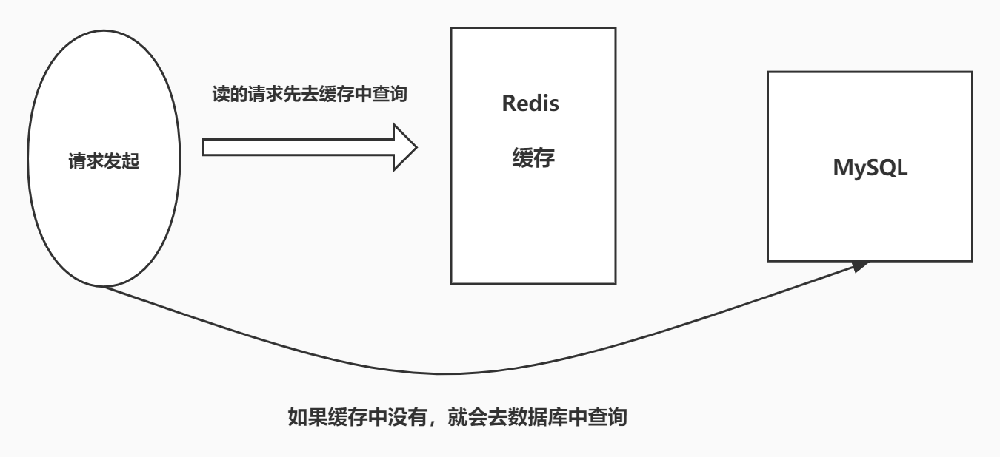


### 2、解决方案：

1、布隆过滤器：布隆过滤器是一种数据结构，对所有可能查询的参数以 hash 形式存储，在控制层先进行校验，不符合则丢弃，从而避免了对底层存储系统的查询压力。

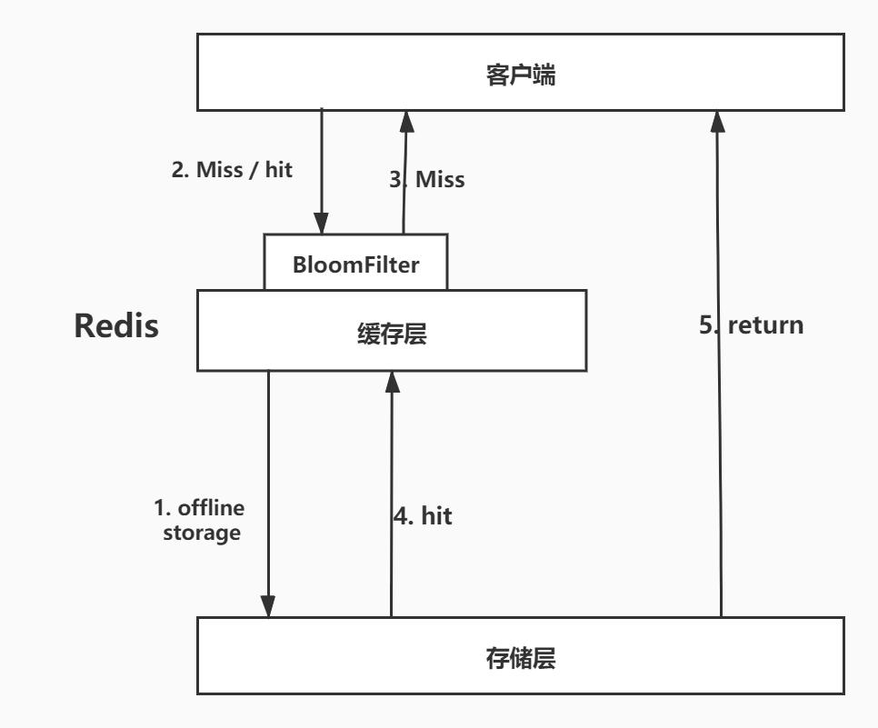

2、缓存空对象：当存储层不命中后，即使返回的空对象也将其缓存起来，同步会同步一个过期时间，之后再访问这个数据将会从存储中获取，保护了后端数据源

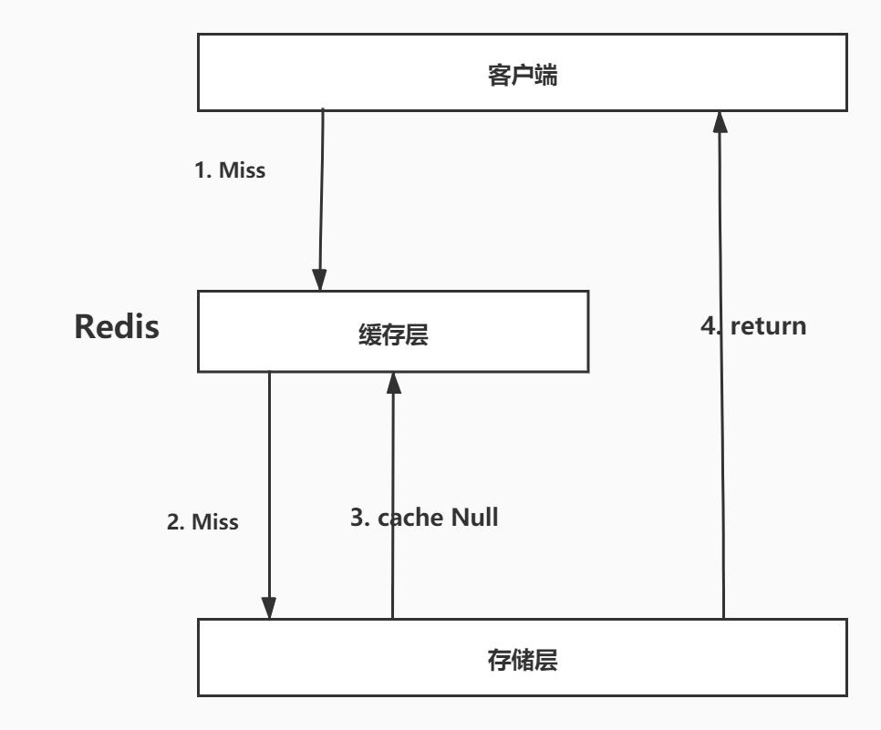

但是这种方法会存在两个问题：

1. 如果控制能够被缓存起来，这就意味着缓存需要更多的空间存储，因为这当中可能会有很多的空值的键
2. 即使对空值设置了过期时间，还是会存在缓存层和存储层的数据会有一段时间窗口的不一致，这对于需要保持一致性的业务会有影响


## 2、缓存击穿（请求量过多、缓存过期）

### 1、什么是缓存击穿

**缓存击穿（请求量过多、缓存过期）**：

这里需要注意和缓存穿透的区别。缓存击穿，是指一个 key 非常热点，在不停的扛着大并发，大并发集中对这一个点进行访问，当这个 key 在失效的瞬间，持续的大并发就穿破缓存，直接请求数据库，就像在一个屏障上凿开了一个洞。

当某个 key 在过期的瞬间，有大量的请求并发访问，这类数据一般是热点数据，由于缓存过期，会同时访问数据库来查询最新的数据，并回写缓存，会导致数据库瞬间压力过大。


### 2、解决方案

1、设置热点数据永不过期：从缓存层来看，没有设置过期时间，所以不会出现热点 key 过期后产生的问题。

2、加互斥锁：分布式锁：使用分布式锁，保证对于每个 key 同时只有一个线程去查询后端服务，其他线程没有获得分布式锁的权限，因此只需要等待即可。这种方式将高并发的压力转移到了分布式锁，因对分布式锁的考验很大。

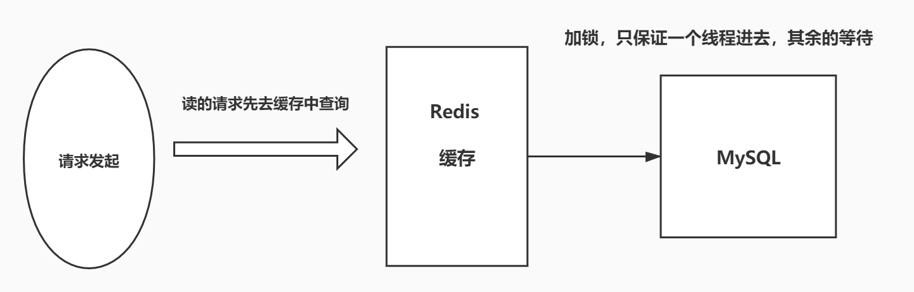


## 3、缓存雪崩（缓存集中过期失效）

### 1、什么是缓存雪崩

缓存雪崩，是指在某一个时间段，缓存集中过期失效。

产生雪崩的原因之一，比如马上就要双十二零点，，很快就会有一波抢购，这波商品时间比较集中的放在了缓存，假设缓存一个小时。那么到了凌晨一点钟的时候，这批商品的缓存就都会过期了。而对这批商品的访问查询，都落到数据库上，对于数据库而言，就会产生周期性的压力波峰。于是所有的请求都会到达存储层，存储层的调用量会暴增，造成存储层也回掉的情况。

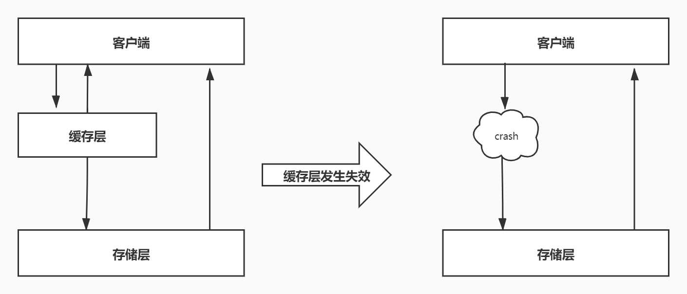

其实集中时期，倒不是非常致命，比较致命的缓存雪崩，是缓存服务器某个节点宕机或者断网。因为自然形成 的缓存雪崩，一定是某个时间段中创建缓存，这个时候也是可以顶住压力的。无非就是对数据库产生周期性的压力而已。而缓存服务节点的宕机，对于数据库服务器的压力是不可预的，很有可能瞬间就把数据库压垮。


### 2、解决方案

1、搭建集群高可用：这个思想的含义是，既然Redis有可能挂掉，那我多增设几台，这样一台挂掉之后其他的还可以继续工作，其实就是搭建的集群。

2、限流降级：这个解决方案的思想是，在缓存失效后，通过加锁或者队列来控制数据库写缓存的线程数量。比如对某个 key 只允许一个线程查询数据和写缓存，其他线程等待。

3、数据预热：数据预热的含义是在正式部署之前，把可能的数据线预先访问一遍，这样部分可能大量访问的数据就会加载到缓存。在即将发生大并发访问前手动触发加载缓存不同的key，设置不同的过期时间，让缓存失效的时间点尽量均匀。

4、加锁排队：mutex互斥锁解决，Redis的SETNX去set一个mutex key，当操作返回成功时，再进行加载数据库的操作并回设缓存，否则，就重试整个get缓存的方法

5、定时更新缓存策略：实效性要求不高的缓存，容器启动初始化加载，采用定时任务更新或移除缓存

6、设置不同的过期时间，让缓存失效的时间点尽量均匀

7、双层缓存策略：C1为原始缓存，C2为拷贝缓存，C1失效时，可以访问C2，C1缓存失效时间设置为短期，C2设置为长期


# Redis 常见面试题

## 1、什么是 Redis？有什么特点？

Redis 是一款开源，高性能的 key-value 的非关系型数据库。Redis 特点：

1. 支持持久化，可以将内存中的数据持久化到磁盘，重启可以再次从磁盘中加载使用
2. 支持多种数据结构
3. 支持数据的备份：主从模式的备份
4. 高性能，读速度达 11 万次/秒，写速度达到 8.1 万次/秒
5. 支持事务


## 2、说说 Redis 的数据类型

一共 8 种数据类型：

- 5 种基本数据类型：String、Hash、List、Set、Zset
- 3 种特殊类型：geospatial、hyperloglog、bitmap


## 3、Redis 和 Memcache 的区别？

1. Memcache 数据都存储在内存中，断电即失，数据不能超过内存大小；而 Redis 的数据可以持久化到硬盘
2. Memcache 只支持简单的字符串，Redis 有丰富的数据结构
3. 底层实现方式不一样，Redis 自行构建了 VM 机制，速度更快


## 4、Redis 是单进程单线程的？

Redis 将数据放在内存中，单线程执行最高，多线程执行反而需要进行 CPU 上下文切换，这是个耗时操作，单线程效率最高。

> Redis单线程快（面试）

Redis 是很快的，官方表示，Redis 是基于内存操作，CPU 不是 Redis 的性能瓶颈，Redis 的性能瓶颈是机器的内存和网络带宽。既然可以单线程来实现，就使用单线程。

Redis 是 C 语言写的，官方提供的数据为 100000+ 的 QPS ，完全不比同样是使用 key-value 的Memecache 差。

**Redis 为什么单线程还这么快呢？**

- 误区1：高性能的服务器一定是多线性的？

- 误区2：多线程一定比单线程的效率高？

**要了解在执行：效率上 CPU > 内存 > 硬盘**

核心：Redis 是将所有的数据全部放在内存中的，所有说使用单线程去操作执行效率就是最高的，多线程在执行过程中需要进行 CPU 的上下文切换，这个是耗时操作。对于内存系统来说，如果没有上下文切换效率就是最高的，多次读写都是在一个 CPU 上的，在内存情况下，这个就是最佳方案。

Redis 采用网络IO多路复用技术R来保证在多连接的时候， 系统的高吞吐量。 [参考文章](https://zhuanlan.zhihu.com/p/52600663)


## 5、Redis 为什么不支持回滚

1. 大多数事务失败是因为**语法错误或者类型错误**，这两种错误，再开发阶段都是可以避免的
2. Redis为了**性能方面**就忽略了事务回滚


## 6、说说 Redis的持久化

Redis 提供了两种持久化机制：RDB 和 AOF

RDB 持久化机制指的是，用数据集快照的方式记录 Redis 数据库的所有键值对，在某个时间点写入一个临时文件，持久化结束后，用这个临时文件替换上次持久化的文件，达到数据恢复的目的。

优点：

1. 只有一个文件 dump.rdb 方便持久化；
2. 容灾性好，一个文件可以保存到安全的磁盘；
3. 性能最大化，Redis 会单独创建（fork）一个子进程进行持久化，主进程不进行任何 IO 操作，保证了性能；
4. 在数据较多时，比 AOF 的启动效率高。

缺点：最后一次持久化的数据可能会丢失。

---

AOF 持久化，是以独立日志的方式记录每次写命令，并在 Redis 重启时重新执行 AOF 文件中的命令以达到恢复数据的目的。AOF 主要解决数据持久化的实时性。
优点：

1. 数据安全，配置 appendfsync 属性，可以选择不同的同步策略；
2. 自动修复功能， redis-check-aof工具可以解决数据一致性问题；

缺点：

1. AOF 文件比 RDB 文件大，且恢复速度慢；
2. 数据多时，效率低于 RDB。


## 7、Redis 的主从复制

主从复制值的是将一台 Redis 服务器的数据复制其他 Redis 服务器，前者称之为主节点，后者称之为从节点。

主从复制的作用：

1. 数据冗余：主从复制实现了数据的热备份；
2. 故障修复：当主节点出现故障后，从节点还可以提供服务，实现快速的故障修复。
3. 负载均衡：在主从复制的基础上，配合读写分离，可以由主节点提供写操作，从节点提供读操作，实现负载均衡，提高并发量；
4. 高可用的基石：主从复制是哨兵模式的基础。

复制原理：从节点启动成功连接到主节点后，会发送一个 sync 的同步命令。主节点接收到命令之后，启动后台的存盘进程，收集所有修改数据库的命令，在后台执行完毕后将整个数据文件传送到从节点，完成一次完全同步。

全量复制：从节点在接收到了数据文件后，将其存盘文件加载都内存中；

增量复制：主节点继续将新收集到修改命令传递给从节点，完成同步。


## 8、说说哨兵模式

哨兵模式是为了解决手动切换主节点的问题。Redis 提供了哨兵的命令，哨兵是一个**独立的进程**。哨兵能够后台监控主节点是否故障，如果故障需要将从节点选举为主节点。

其原理是哨兵通过发送命令，等待 Redis 服务器的响应，从而监控多个 Redis 节点。

当只有一个哨兵时，还是可能会出现问题的，比如哨兵自己挂掉。为此，可以使用多哨兵模式，多个哨兵之间相互监控。当主节点宕机了，哨兵1先检测到这个结果，系统并不会马上进行 failover 【故障转移】的过程。仅仅是哨兵1认为主节点不可用的现象称之为**主观下线**。当其余的哨兵也检测到主节点不可用之后，哨兵之间会进行一次投票选举从节点中的一个作为新的主节点，这个过程称之为**客观下线**。

哨兵模式的优点：

1. 基于主从复制，高可用；
2. 主从可以切换，进行故障转移，系统可用性好；
3. 哨兵模式是主从模式的升级版，手动到自动，更加健壮。

哨兵模式的缺点：

1. 不方便在线扩容；
2. 实现哨兵模式需要很多的配置。


## 9、缓存穿透、击穿、雪崩

> 缓存穿透：

概念：用户需要查询一个数据，缓存中没有，也就是没有命中，于是向数据库中发起请求，发现也没有。当用户很多的时候，缓存都没有命中，于是都去请求数据库，这给数据库造成很大的压力。

解决方案：

1. 布隆过滤器：是一种数据结构，对所有可能查询的参数以 hash 方式存储，先在控制层进行校验，不符合则丢弃，避免了过多访问数据库。
2. 缓存空对象：当存储层没有命中时，即使返回空对象也将其缓存起来（意味着更多的空间存储，即使设置过期时间，缓存和数据库还是有段时间数据不一致）


> 缓存击穿：

概念：当一个 key 非常热点时，在不断扛高并发，集中对这个热点数据进行访问，当这个 key 失效的瞬间，请求直接到达数据库，给数据库瞬间的高压力。

**解决方案**：

1. 设置热点数据永不过期
2. 加分布式锁：保证每个 key 同时只有一个线程去查询后端服务。


> 缓存雪崩：

概念：某个时间段，缓存集中失效

解决方案：

1. 增加 Redis 集群的数量
2. 限流降级：在缓存失效后，通过加锁和队列来控制数据库写缓存的线程数量
3. 数据预热：正式部署之前，将数据预先访问一遍，让缓存失效的时间尽量均匀


## 10、Redis 缓存如何保持一致性

读数据的时候首先去 Redis 中读取，没有读到再去 MySQL 中读取，读取都数据更新到 Redis 中作为下一次的缓存。

写数据的时候会产生数据不一致的问题。无论是先写入 Redis 再写入 MySQL 中，还是先写入 MySQL 再写入 Redis 中，这两步操作**都不能保证原子性**，所以会出现 Redis 和 MySQL 中数据不一致的问题。

**无论采取何种方式都不能保证强一致性**，如果对 Redis 中的数据设置了**过期时间，能够保证最终一致性**，对架构的优化只能降低发生的概率，不能从根本上避免不一致性。

1. 更新缓存的两种方式：删除失效缓存、更新缓存
2. 更新缓存和数据库有两种顺序：先数据库后缓存、先缓存后数据库
3. 两两组合，分为四种更新策略。


## 11、Redis 的使用场景

1. 会话缓存：如 单点登录，使用 Redis 模拟 session，SSO 系统生成一个 token，将用户信息存到 Redis 中，并设置过期时间；
2. 全页缓存
3. 作为消息队列平台
4. 排行榜和计数器
5. 发布/订阅：比如聊天系统
6. 热点数据：比如ES中搜索的热词


# Redis  批量删除键

## 1、xargs 命令讲解

xargs 可以将管道或标准输入（stdin）数据转换成命令行参数，也能够从文件的输出中读取数据。xargs是一个强有力的命令，它能够捕获一个命令的输出，然后传递给另外一个命令。

```shell
# 解释：就是用keys k:* 查询出所有匹配的key，通过xargs命令将前面查询出来的key作为后面redis的del命令的输入，这样就可以实现redis批量删除键了
./redis-cli -h 127.0.0.1 -p 6379 keys "k:*" | xargs ./redis-cli -h 127.0.0.1 -p 6379 del
```


## 2、keys + xargs 删除

1、连接Redis初始化数据

```shell
# 1.连接Redis初始数据
127.0.0.1:6379> mset k:1 1 k:2 2 k:3 3 k:4 4
OK
# 2.使用keys命令查看数据
127.0.0.1:6379> keys k:*
1) "k:1"
2) "k:4"
3) "k:3"
4) "k:2"
# 3.退出Redis的客户端
127.0.0.1:6379> quit
```

2、使用keys+xargs批量删除（执行命令后4条记录全部删除）

```shell
[root@CentOS7 bin]# ./redis-cli -a 123456 keys "k:*" | xargs ./redis-cli -a 123456 del
(integer) 4
```

```shell
# 简洁版
[root@CentOS7 bin]# ./redis-cli -a 123456 mset k:1 1 k:2 2 k:3 3 k:4 4
[root@CentOS7 bin]# ./redis-cli -a 123456 keys k:*
[root@CentOS7 bin]# ./redis-cli -a 123456 keys "k:*" | xargs ./redis-cli -a 123456 del
```

3、注意事项：Redis 是单线程架构，如果 Redis 包含了大量的键，执行 keys 命令可能会造成 Redis 阻塞，所以一般建议不要在生产环境下使用 keys 命令。如果非要遍历键删除的话，可以在以下三种情况使用：

1. 在一个不对外提供服务的 Redis 从节点上执行，这样不会阻塞到客户端的请求，但是会影响到主从复制
2. 如果确认键值总数确实比较少，可以执行该命令
3. 使用 scan 命令渐进式的遍历所有键，可以有效防止阻塞


## 3、scan + xargs 删除

1、连接Redis初始化数据

```shell
# 1.连接Redis初始数据
127.0.0.1:6379> mset k:1 1 k:2 2 k:3 3 k:4 4
OK
# 2.使用keys命令查看数据
127.0.0.1:6379> keys k:*
1) "k:1"
2) "k:4"
3) "k:3"
4) "k:2"
# 3.退出Redis的客户端
127.0.0.1:6379> quit
```

2、使用scan+xargs批量删除（执行命令后4条记录全部删除）

```shell
[root@CentOS7 bin]# ./redis-cli -a 123456 --scan --pattern 'k:*' | xargs ./redis-cli -a 123456 del
(integer) 4
```

```shell
# 简洁版
[root@CentOS7 bin]# ./redis-cli -a 123456 mset k:1 1 k:2 2 k:3 3 k:4 4
[root@CentOS7 bin]# ./redis-cli -a 123456 keys k:*
[root@CentOS7 bin]# ./redis-cli -a 123456 --scan --pattern 'k:*' | xargs ./redis-cli -a 123456 del
```


# 参考资料 & 鸣谢

***

1. Redis系列6.0.3版【CSDN：王义凯】https://blog.csdn.net/wsdc0521/category_9887941.html
2. Redis Tag【博客园：天宇轩-王】https://www.cnblogs.com/dalianpai/category/1605657.html
3. Redis 客户端大全【博客园：咏吟】https://www.cnblogs.com/wuyongyin/tag/NoSQL
4. Redis & Redisson 实战示例【CSDN：瓜田李下】https://blog.csdn.net/weixin_43931625/category_9397188.html
5. 进击Redis【CSDN：AnAnDawn】：https://blog.csdn.net/qq_34090008/category_10643273.html
6. Redis Tag【CSDN：緈諨の約錠】：https://blog.csdn.net/smilehappiness/category_10081896.html

***


