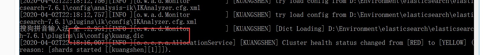

## ElasticSearch概述

Elaticsearch，简称为es， es是一个开源**的高扩展的分布式全文检索引擎**，它可以近乎**实时的存储、检索数据**；本身扩展性很好，可以扩展到上百台服务器，处理PB级别（大数据时代）的数据。es也使用Java开发并使用Lucene作为其核心来实现所有索引和搜索的功能，但是它的目的是通过简单的**RESTful API**来隐藏Lucene的复杂性，从而让全文搜索变得简单。

据国际权威的数据库产品评测机构DB Engines的统计，在2016年1月，ElasticSearch已超过Solr等，成为排名第一的搜索引擎类应用。


**谁在使用：**

1、维基百科，类似百度百科，全文检索，高亮，搜索推荐/2 （权重，百度！）

2、The Guardian（国外新闻网站），类似搜狐新闻，用户行为日志（点击，浏览，收藏，评论）+社交网络数据（对某某新闻的相关看法），数据分析，给到每篇新闻文章的作者，让他知道他的文章的公众反馈（好，坏，热门，垃圾，鄙视，崇拜）

3、Stack Overflflow（国外的程序异常讨论论坛），IT问题，程序的报错，提交上去，有人会跟你讨论和回答，全文检索，搜索相关问题和答案，程序报错了，就会将报错信息粘贴到里面去，搜索有没有对应

的答案

4、GitHub（开源代码管理），搜索上千亿行代码

5、电商网站，检索商品

6、日志数据分析，logstash采集日志，ES进行复杂的数据分析，ELK技术，**Elasticsearch+logEstash+kibana**

7、商品价格监控网站，用户设定某商品的价格阈值，当低于该阈值的时候，发送通知消息给用户，比如说订阅牙膏的监控，如果高露洁牙膏的家庭套装低于50块钱，就通知我，我就去买。

8、BI系统，商业智能，Business Intelligence。比如说有个大型商场集团，BI，分析一下某某区域最近3年的用户消费金额的趋势以及用户群体的组成构成，产出相关的数张报表，**区，最近3年，每年消费金额呈现100%的增长，而且用户群体85%是高级白领，开一个新商场。ES执行数据分析和挖掘，Kibana进行数据可视化

9、国内：站内搜索（电商，招聘，门户，等等），IT系统搜索（OA，CRM，ERP，等等），数据分析（ES热门的一个使用场景）


## ES和Solr的差别

### Elasticsearch简介

Elasticsearch是一个实时分布式搜索和分析引擎。它让你以前所未有的速度处理大数据成为可能。

它用于**全文搜索**、**结构化搜索**、**分析**以及将这三者混合使用：

维基百科使用Elasticsearch提供全文搜索并高亮关键字，以及输入实时搜索(search-asyou-type)和搜索纠错(did-you-mean)等搜索建议功能。

英国卫报使用Elasticsearch结合用户日志和社交网络数据提供给他们的编辑以实时的反馈，以便及时了解公众对新发表的文章的回应。

StackOverflflow结合全文搜索与地理位置查询，以及more-like-this功能来找到相关的问题和答案。

Github使用Elasticsearch检索1300亿行的代码。

但是Elasticsearch不仅用于大型企业，它还让像DataDog以及Klout这样的创业公司将最初的想法变成可扩展的解决方案。

Elasticsearch可以在你的笔记本上运行，也可以在数以百计的服务器上处理PB级别的数据 。

Elasticsearch是一个基于Apache Lucene(TM)的开源搜索引擎。无论在开源还是专有领域，Lucene可以被认为是迄今为止最先进、性能最好的、功能最全的搜索引擎库。

但是，Lucene只是一个库。想要使用它，你必须使用Java来作为开发语言并将其直接集成到你的应用中，更糟糕的是，Lucene非常复杂，你需要深入了解检索的相关知识来理解它是如何工作的。

Elasticsearch也使用Java开发并使用Lucene作为其核心来实现所有索引和搜索的功能，但是它的目的是通过简单的RESTful API来隐藏Lucene的复杂性，从而让全文搜索变得简单。


### Solr简介

Solr 是Apache下的一个顶级开源项目，采用Java开发，它是基于Lucene的全文搜索服务器。Solr提供了比Lucene更为丰富的查询语言，同时实现了可配置、可扩展，并对索引、搜索性能进行了优化

Solr可以独立运行，运行在Jetty、Tomcat等这些Servlet容器中，Solr 索引的实现方法很简单，**用 POST方法向 Solr 服务器发送一个描述 Field 及其内容的 XML 文档，Solr根据xml文档添加、删除、更新索引**。Solr 搜索只需要发送 HTTP GET 请求，然后对 Solr 返回Xml、json等格式的查询结果进行解析，组织页面布局。Solr不提供构建UI的功能，Solr提供了一个管理界面，通过管理界面可以查询Solr的配置和运行情况。

solr是基于lucene开发企业级搜索服务器，实际上就是封装了lucene。

Solr是一个独立的企业级搜索应用服务器，它对外提供类似于Web-service的API接口。用户可以通过http请求，向搜索引擎服务器提交一定格式的文件，生成索引；也可以通过提出查找请求，并得到返回结果。


### Lucene简介

Lucene是apache软件基金会4 jakarta项目组的一个子项目，是一个开放源代码的全文检索引擎工具包，但它不是一个完整的全文检索引擎，而是一个全文检索引擎的架构，提供了完整的查询引擎和索引引擎，部分文本分析引擎（英文与德文两种西方语言）。Lucene的目的是为软件开发人员提供一个简单易用的工具包，以方便的在目标系统中实现全文检索的功能，或者是以此为基础建立起完整的全文检索引擎。Lucene是一套用于全文检索和搜寻的开源程式库，由Apache软件基金会支持和提供。Lucene提供了一个简单却强大的应用程式接口，能够做全文索引和搜寻。**在Java开发环境里Lucene是一个成熟的免费开源工具。就其本身而言，Lucene是当前以及最近几年最受欢迎的免费Java信息检索程序库**。人们经常提到信息检索程序库，虽然与搜索引擎有关，但不应该将信息检索程序库与搜索引擎相混淆。

Lucene是一个全文检索引擎的架构。那什么是全文搜索引擎？

全文搜索引擎是名副其实的搜索引擎，国外具代表性的有Google、Fast/AllTheWeb、AltaVista、Inktomi、Teoma、WiseNut等，国内著名的有百度（Baidu）。它们都是通过从互联网上提取的各个网站的信息（以网页文字为主）而建立的数据库中，检索与用户查询条件匹配的相关记录，然后按一定的排列顺序将结果返回给用户，因此他们是真正的搜索引擎。

从搜索结果来源的角度，全文搜索引擎又可细分为两种，一种是拥有自己的检索程序（Indexer），俗称“蜘蛛”（Spider）程序或“机器人”（Robot）程序，并自建网页数据库，搜索结果直接从自身的数据库中调用，如上面提到的7家引擎；另一种则是租用其他引擎的数据库，并按自定的格式排列搜索结果，如Lycos引擎。


### ES和Solr比较

1、es基本是开箱即用（解压就可以用 ! ），非常简单。Solr安装略微复杂一丢丢！

2、Solr 利用 Zookeeper 进行分布式管理，而 Elasticsearch 自身带有分布式协调管理功能。

3、Solr 支持更多格式的数据，比如JSON、XML、CSV，而 Elasticsearch 仅支持json文件格式。

4、Solr 官方提供的功能更多，而 Elasticsearch 本身更注重于核心功能，高级功能多有第三方插件提 供，例如图形化界面需要kibana友好支撑~!

5、Solr 查询快，但更新索引时慢（即插入删除慢），用于电商等查询多的应用；

- ES建立索引快（即查询慢），即实时性查询快，用于facebook新浪等搜索。
- Solr 是传统搜索应用的有力解决方案，但 Elasticsearch 更适用于新兴的实时搜索应用。

6、Solr比较成熟，有一个更大，更成熟的用户、开发和贡献者社区，而 Elasticsearch相对开发维护者较少，更新太快，学习使用成本较高。（趋势！）


## ElasticSearch安装

声明：JDK1.8 ，最低要求！ ElasticSearch 客户端，界面工具！

Java开发，ElasticSearch 的版本和我们之后对应的 Java 的核心jar包！ 版本对应！JDK 环境是正常！

### 1.ElasticSearch安装

> 下载

官网：https://www.elastic.co/

下载：https://www.elastic.co/cn/downloads/elasticsearch

学习的话 Window 和 Linux 都可以学习！我们这里现在Window下学习！

ELK 三剑客，解压即用！（web项目！前端环境！）


> window 下安装！

1、解压就可以使用了！


2、熟悉目录！

```
bin 启动文件
config 配置文件
    log4j2 日志配置文件
    jvm.options java 虚拟机相关的配置
    elasticsearch.yml elasticsearch 的配置文件！ 默认 9200 端口！ 跨域！
lib 相关jar包
logs 日志！
modules 功能模块
plugins 插件
```

3、启动，访问9200；


4、访问测试！


### 2.head安装

> 安装可视化界面 es head的插件

1、下载地址：https://github.com/mobz/elasticsearch-head/

2、启动

```
npm install 
npm run start 
```

3、连接测试发现，存在跨域问题：配置es目录下**elasticsearch.yml**文件，追加：

```
http.cors.enabled: true 
http.cors.allow-origin: "*"
```

4、重启es服务器，然后再次连接


**初学：就把es当做一个数据库！ （可以建立索引（库），文档（库中的数据！）） 这个head我们就把它当做数据展示工具！我们后面所有的查询，Kibana！**


### 3.Kibana安装

> 安装Kibana

Kibana是一个针对Elasticsearch的开源分析及可视化平台，用来搜索、查看交互存储在Elasticsearch索引中的数据。使用Kibana，可以通过各种图表进行高级数据分析及展示。Kibana让海量数据更容易理解。它操作简单，基于浏览器的用户界面可以快速创建仪表板（dashboard）实时显示Elasticsearch查询动态。设置Kibana非常简单。无需编码或者额外的基础架构，几分钟内就可以完成Kibana安装并启动Elasticsearch索引监测。

官网：https://www.elastic.co/cn/kibana

Kibana 版本要和 Es 一致！


1、解压后端的目录


2、启动


3、访问测试


4、开发工具！ （Post、curl、head、谷歌浏览器插件测试！）


我们之后的所有操作都在这里进行编写！很多学习大数据的人，Hadoop！ 

5、汉化！自己修改kibana中config目录内kibana.yml配置即可！ zh-CN！


> 了解 ELK

ELK是Elasticsearch、Logstash、Kibana三大开源框架首字母大写简称。市面上也被成为Elastic Stack。其中Elasticsearch是一个基于Lucene、分布式、通过Restful方式进行交互的近实时搜索平台框架。像类似百度、谷歌这种大数据全文搜索引擎的场景都可以使用Elasticsearch作为底层支持框架，可见Elasticsearch提供的搜索能力确实强大,市面上很多时候我们简称Elasticsearch为es。Logstash是ELK的中央数据流引擎，用于从不同目标（文件/数据存储/MQ）收集的不同格式数据，经过过滤后支持输出到不同目的地（文件/MQ/redis/elasticsearch/kafka等）。Kibana可以将elasticsearch的数据通过友好的页面展示出来，提供实时分析的功能。

市面上很多开发只要提到ELK能够一致说出它是一个日志分析架构技术栈总称，但实际上ELK不仅仅适用于日志分析，它还可以支持其它任何数据分析和收集的场景，日志分析和收集只是更具有代表性。并非唯一性。


## ES核心概念 

1、索引

2、字段类型（mapping） 

3、文档（documents）

**集群，节点，索引，类型，文档，分片，映射是什么？**

> elasticsearch是面向文档，关系行数据库 和 elasticsearch 客观的对比！一切都是JSON

| Relational DB    | Elasticsearch |
| ---------------- | ------------- |
| 数据库(database) | 索引(indices) |
| 表(tables)       | types         |
| 行(rows)         | documents     |
| 字段(columns)    | fields        |

elasticsearch(集群)中可以包含多个索引(数据库)，每个索引中可以包含多个类型(表)，每个类型下又包含多 个文档(行)，每个文档中又包含多个字段(列)

**物理设计：**

elasticsearch 在后台把每个索引划分成多个分片，每分分片可以在集群中的不同服务器间迁移 一个人就是一个集群！默认的集群名称就是 elaticsearh

**逻辑设计：**

一个索引类型中，包含多个文档，比如说文档1，文档2。 当我们索引一篇文档时，可以通过这样的一各 顺序找到 它: 索引 ▷ 类型 ▷ 文档ID ，通过这个组合我们就能索引到某个具体的文档。 注意:ID不必是整 数，实际上它是个字 符串。


> 文档

就是我们的一条条数据

```
user 
1 zhangsan 18 
2 kuangshen 3
```

之前说elasticsearch是面向文档的，那么就意味着索引和搜索数据的最小单位是文档，elasticsearch中，文档有几个 重要属性 :

- 自我包含，一篇文档同时包含字段和对应的值，也就是同时包含 key:value！
- 可以是层次型的，一个文档中包含自文档，复杂的逻辑实体就是这么来的！ {就是一个json对象！ fastjson进行自动转换！}
- 灵活的结构，文档不依赖预先定义的模式，我们知道关系型数据库中，要提前定义字段才能使用， 在elasticsearch中，对于字段是非常灵活的，有时候，我们可以忽略该字段，或者动态的添加一个 新的字段


尽管我们可以随意的新增或者忽略某个字段，但是，每个字段的类型非常重要，比如一个年龄字段类 型，可以是字符 串也可以是整型。因为elasticsearch会保存字段和类型之间的映射及其他的设置。这种 映射具体到每个映射的每种类型，这也是为什么在elasticsearch中，类型有时候也称为映射类型 。


> 类型

类型是文档的逻辑容器，就像关系型数据库一样，表格是行的容器。 类型中对于字段的定义称为映射，比如 name 映 射为字符串类型。 我们说文档是无模式的，它们不需要拥有映射中所定义的所有字段，比如新增一个字段，那么elasticsearch是怎么做的呢?elasticsearch会自动的将新字段加入映射，但是这个字段的不确定它是什么类型，elasticsearch就开始猜，如果这个值是18，那么elasticsearch会认为它是整形。 但是elasticsearch也可能猜不对， 所以最安全的方式就是提前定义好所需要的映射，这点跟关系型数据库殊途同归了，先定义好字段，然后再使用，别 整什么幺蛾子。


> 就是数据库！

索引是映射类型的容器，elasticsearch中的索引是一个非常大的文档集合。索引存储了映射类型的字段和其他设置。 然后它们被存储到了各个分片上了。 我们来研究下分片是如何工作的。

**物理设计 ：节点和分片 如何工作**

个集群至少有一个节点，而一个节点就是一个elasricsearch进程，节点可以有多个索引默认的，如果你创建索引，那么索引将会有个5个分片 ( primary shard ,又称主分片 ) 构成的，每一个主分片会有一个 副本 ( replica shard ,又称复制分片 )


上图是一个有3个节点的集群，可以看到主分片和对应的复制分片都不会在同一个节点内，这样有利于某个节点挂掉 了，数据也不至于丢失。 实际上，一个分片是一个Lucene索引，一个包含倒排索引的文件目录，倒排索引的结构使 得elasticsearch在不扫描全部文档的情况下，就能告诉你哪些文档包含特定的关键字。 不过，等等，倒排索引是什 么鬼?


> 倒排索引

elasticsearch使用的是一种称为倒排索引的结构，采用Lucene倒排索作为底层。这种结构适用于快速的全文搜索， 一个索引由文档中所有不重复的列表构成，对于每一个词，都有一个包含它的文档列表。 例如，现在有两个文档， 每个文档包含如下内容：

```
Study every day, good good up to forever # 文档1包含的内容
To forever, study every day, good good up # 文档2包含的内容
```

为了创建倒排索引，我们首先要将每个文档拆分成独立的词(或称为词条或者tokens)，然后创建一个包含所有不重 复的词条的排序列表，然后列出每个词条出现在哪个文档：

| term   | doc_1 | doc_2 |
| ------ | ----- | ----- |
| Study  | √     | ×     |
| To     | x     | x     |
| every  | √     | √     |
| foreve | √     | √     |
| day    | ×     | √     |
| study  | √     | √     |
| good   | √     | √     |
| every  | √     | √     |
| to     | √     | ×     |
| up     | √     | √     |

现在，我们试图搜索 to forever，只需要查看包含每个词条的文档 score 

| term    | doc_1 | doc_2 |
| ------- | ----- | ----- |
| to      | √     | ×     |
| forever | √     | √     |
| total   | 2     | 1     |


两个文档都匹配，但是第一个文档比第二个匹配程度更高。如果没有别的条件，现在，这两个包含关键字的文档都将返回。

再来看一个示例，比如我们通过博客标签来搜索博客文章。那么倒排索引列表就是这样的一个结构 :


如果要搜索含有 python 标签的文章，那相对于查找所有原始数据而言，查找倒排索引后的数据将会快的多。只需要 查看标签这一栏，然后获取相关的文章ID即可。完全过滤掉无关的所有数据，提高效率！

elasticsearch的索引和Lucene的索引对比：

在elasticsearch中， 索引 （库）这个词被频繁使用，这就是术语的使用。 在elasticsearch中，索引被 分为多个分片，每份 分片是一个Lucene的索引。所以一个elasticsearch索引是由多个Lucene索引组成 的。别问为什么，谁让elasticsearch使用Lucene作为底层呢! 如无特指，说起索引都是指elasticsearch 的索引。


## IK分词器插件

> 什么是IK分词器？

分词：即把一段中文或者别的划分成一个个的关键字，我们在搜索时候会把自己的信息进行分词，会把数据库中或者索引库中的数据进行分词，然后进行一个匹配操作，默认的中文分词是将每个字看成一个词，比如 “我爱狂神” 会被分为"我","爱","狂","神"，这显然是不符合要求的，所以我们需要安装中文分词器ik来解决这个问题。

如果要使用中文，建议使用ik分词器！

IK提供了两个分词算法：ik_smart 和 ik_max_word，其中 ik_smart 为最少切分，ik_max_word为最细粒度划分！一会我们测试！

> 安装

1、https://github.com/medcl/elasticsearch-analysis-ik

2、下载完毕之后，放入到我们的elasticsearch 插件即可！


3、重启观察ES，可以看到ik分词器被加载了！


4、elasticsearch-plugin list可以通过这个命令来查看加载进来的插件


5、使用kibana测试！


> 查看不同的分词效果

- 其中 ik_smart 为最少切分：


- ik_max_word为最细粒度划分！穷尽词库的可能！字典！


```json
GET  _analyze
{
  "analyzer": "ik_smart",
  "text": "中国共产党"
}

GET  _analyze
{
  "analyzer": "ik_max_word",
  "text": "中国共产党"
}
```


> 我们输入 超级喜欢狂神说Java


发现问题：狂神说被拆开了！

这种自己需要的词，需要自己加到我们的分词器的字典中！


> ik 分词器增加自己的配置！


重启es，看细节！



再次测试一下狂神说，看下效果！


**以后的话，我们需要自己配置 分词就在自己定义的dic文件中进行配置即可！**

**备注：安装插件错误**

```
Plugin [analysis-pinyin] was built for Elasticsearch version 7.6.1 but versin 7.6.2 is running

解决办法

进入 plugin的descriptor.properties

修改 elasticsearch.version为你自己的版本
```


## Rest风格说明

一种软件架构风格，而不是标准，只是提供了一组设计原则和约束条件。它主要用于客户端和服务器交 互类的软件。基于这个风格设计的软件可以更简洁，更有层次，更易于实现缓存等机制。

基本Rest命令说明：

| method  | url地址                                         | 描述                   |
| ------- | ----------------------------------------------- | ---------------------- |
| PUT     | localhost:9200/索引名称/类型名称/文档id         | 创建文档（指定文档id） |
| POST    | localhost:9200/索引名称/类型名称                | 创建文档（随机文档id） |
| _update | localhost:9200/索引名称/类型名称/文档id/_update | 修改文档               |
| DELETE  | localhost:9200/索引名称/类型名称/文档id         | 删除文档               |
| GET     | localhost:9200/索引名称/类型名称/文档id         | 查询文档通过文档id     |
| POST    | localhost:9200/索引名称/类型名称/_search        | 查询所有数据           |


## 索引的基本操作

> 1、创建一个索引

```
PUT /索引名/~类型名~/文档id
{请求体}
```


```
PUT /test1/type1/1
{
  "name":"狂神说",
   "age": 3
}
```


2、完成了自动增加了索引！数据也成功的添加了，这就是我说大家在初期可以把它当做数据库学习的原因！


3、那么 name 这个字段用不用指定类型呢。毕竟我们关系型数据库 是需要指定类型的啊 !

**字符串类型**

[text](https://www.elastic.co/guide/en/elasticsearch/reference/current/text.html) 、 [keyword](https://www.elastic.co/guide/en/elasticsearch/reference/current/keyword.html)

**数值类型**

[long, integer, short, byte, double, float, half_float, scaled_float](https://www.elastic.co/guide/en/elasticsearch/reference/current/number.html)

**日期类型**

[date](https://www.elastic.co/guide/en/elasticsearch/reference/current/date.html)

**te布尔值类型**

[boolean](https://www.elastic.co/guide/en/elasticsearch/reference/current/boolean.html)

**二进制类型**

[binary](https://www.elastic.co/guide/en/elasticsearch/reference/current/binary.html) 等等…


4、指定字段的类型


```json
PUT  /test2
{
  "mappings":{
    "properties" :{
      "name":{
        "type" : "text"
      },
      "age":{
        "type":"long"
      },
      "birthday":{
        "type":"date"
      }
    }
  }
}
```


5、获得这个规则！ 可以通过 GET 请求获取具体的信息！


```
GET  test2
```


6、查看默认的信息


**如果自己的文档字段没有指定，那么es 就会给我们默认配置字段类型！**

```
PUT  /test3/_doc/1
{
  "name":"liusx",
  "age": 13,
  "birth" : "1994-04-08"
}
GET test3
```


> 虚心学习，这个世界上大佬很多！

扩展： 通过命令 elasticsearch 索引情况！ 通过get _cat/ 可以获得es的当前的很多信息！


```
GET  _cat/health

GET  _cat/indices?v
```


> 修改 提交还是使用PUT 即可！ 然后覆盖！最新办法！

- 曾经的方法：


- 现在的方法：


```json
PUT  /test3/_doc/1
{
  "name":"liusx123",
  "age": 13,
  "birth" : "1994-04-08"
}


POST  /test3/_doc/1/_update
{
  "doc":{
    "name":"法外狂徒张三"
  }
}
```


> 删除索引！

通过DELETE 命令实现删除、 根据你的请求来判断是删除索引还是删除文档记录！

使用RESTFUL 风格是我们ES推荐大家使用的！

```
DELETE test1

DELETE test1/type1/1
```


## 文档的基本操作（重点）

> 基本操作

1、添加数据

```
PUT /kuangshen/user/1
{
    "name": "狂神说",
    "age": 23,
    "desc": "一顿操作猛如虎，一看工资2500",
    "tags": ["技术宅","温暖","直男"]
}
```


2、获取数据 GET


```
GET /kuangshen/user/1
```


3、更新数据 PUT


```json
- 必须对应的值分别都需要传值，不然会被覆盖
PUT /kuangshen/user/3
{
    "name": "李四233",
    "age": 33,
    "desc": "mmp，不不知道如何形容",
    "tags": ["靓女","旅游","唱歌"]
}
```


4、Post _update , 推荐使用这种更新方式！


```json
POST  kuangshen/user/3/_update
{
  "doc":{
    "name":"狂神说java"
  }
}
```


5、简单地搜索！

```
GET kuangshen/user/1
```


6、（**_search**）简单的条件查询，可以根据默认的映射规则，产生基本的查询


```json
GET kuangshen/user/_search?q=name:狂神说java
```


> 复杂操作搜索 select ( 排序，分页，高亮，模糊查询，精准查询！)


输出结果，不想要那么多！


我们之后使用Java操作es ，所有的方法和对象就是这里面的 key！

```json
GET kuangshen/user/_search
{
  "query":{
    "match":{
      "name":"狂神说"
    }
  }
}


GET kuangshen/user/_search
{
  "query":{
    "match":{
      "name":"狂神说"
    }
  },
   "_source":["name","age"]
}
```


> 排序！


```json
GET kuangshen/user/_search
{
  "query":{
    "match":{
      "name":"狂神"
    }
  };
  "sort": [
     {
       "FIELD": {
         "order": "desc或者asc"
       }
     }
   ]
}
```


> 分页查询！


数据下标还是从0开始的，和学的所有数据结构是一样的！——/search/{current}/{pagesize}

```json
GET kuangshen/user/_search
{
  "query":{
    "match":{
      "name":"狂神"
    }
  };
  "sort": [
     {
       "FIELD": {
         "order": "desc或者asc"
       }
     }
   ],
   "from": 0,
   "size": 1
}
```


> 布尔值查询

1、must （and），所有的条件都要符合 where id = 1 and name = xxx


```json
GET kuangshen/user/_search
{
  "query": {
    "bool": {
      "must": [
        {
          "match": {
            "name": "狂神说"
          }
        },
        {
          "match": {
            "age": "30"
          }
        }
      ]
    }
  }
}
```


2、should（or），所有的条件都要符合 where id = 1 or name = xxx


```json
GET kuangshen/user/_search
{
  "query": {
    "bool": {
      "should": [
        {
          "match": {
            "name": "狂神说"
          }
        },
        {
          "match": {
            "age": "23"
          }
        }
      ]
    }
  }
}
```


3、must_not（not）


```json
GET kuangshen/user/_search
{
  "query": {
    "bool": {
      "should": [
        {
          "must_not": {
            "age": "3"
          }
        }
      ]
    }
  }
}
```


4、过滤器 fifilter


- gt 大于

- gte 大于等于
- lt 小于
- lte 小于等于


```json
GET kuangshen/user/_search
{
  "query": {
    "bool": {
      "must": [
        {
          "must_not": {
            "name": "狂神"
          }
        }
      ],
      "filter": [
        {
          "range": {
            "age": {
              "gte": 10,
              "lte": 30
            }
          }
        }
      ]
    }
  }
}
```


> 匹配多个条件！


```json
GET kuangshen/user/_search
{
  "query": {
    "match": {
      "tags": "男 暖"
    }
  }
}
```


> 精确查询！

**关于分词：**

- term ：直接查询精确的（term 查询是直接通过倒排索引指定的词条进程精确查找的！）
- match：会使用分词器解析！（先分析文档，然后在通过分析的文档进行查询！）

**两个类型** **text keyword**


> 多个值匹配精确查询


> 高亮查询！

- 普通高亮：


- 自定义高亮：


```json
GET kuangshen/user/_search
{
  "query": {
    "match": {
      "name":"狂神说" 
    }
  },
  "highlight": {
    "fields": {
      "name":{}
    }
  }
}


GET kuangshen/user/_search
{
  "query": {
    "match": {
      "name":"狂神说" 
    }
  },
  "highlight": {
    "pre_tags": "<p class='key' style='color:red' >",
    "post_tags": "</p>", 
    "fields": {
      "name":{}
    }
  }
}
```


**这些其实MySQL 也可以做，只是MySQL 效率比较低！**

- 匹配
- 按照条件匹配
- 精确匹配
- 区间范围匹配
- 匹配字段过滤
- 多条件查询
- 高亮查询


## SpringBoot整合ES

[学习文档](https://www.elastic.co/guide/index.html)

[API地址](https://www.elastic.co/guide/en/elasticsearch/client/java-rest/current/java-rest-high.html)


1、找到原生的依赖

```xml
<dependency>
    <groupId>org.elasticsearch.client</groupId>
    <artifactId>elasticsearch-rest-high-level-client</artifactId>
    <version>7.6.2</version>
</dependency>
```

```xml
<?xml version="1.0" encoding="UTF-8"?>
<project xmlns="http://maven.apache.org/POM/4.0.0" xmlns:xsi="http://www.w3.org/2001/XMLSchema-instance"
         xsi:schemaLocation="http://maven.apache.org/POM/4.0.0 https://maven.apache.org/xsd/maven-4.0.0.xsd">
    <modelVersion>4.0.0</modelVersion>
    <parent>
        <groupId>org.springframework.boot</groupId>
        <artifactId>spring-boot-starter-parent</artifactId>
        <version>2.2.5.RELEASE</version>
        <relativePath/> <!-- lookup parent from repository -->
    </parent>
    <groupId>com.kuang</groupId>
    <artifactId>kuangshen-es-api</artifactId>
    <version>0.0.1-SNAPSHOT</version>
    <name>kuangshen-es-api</name>
    <description>Demo project for Spring Boot</description>

    <properties>
        <java.version>1.8</java.version>
        <!-- 自定义es 版本依赖，保证和本地一直 -->
        <elasticsearch.version>7.6.1</elasticsearch.version>
    </properties>

    <dependencies>
        <!--导入fastjson依赖-->
        <dependency>
            <groupId>com.alibaba</groupId>
            <artifactId>fastjson</artifactId>
            <version>1.2.62</version>
        </dependency>
        <!--导入elasticsearch依赖包-->
        <dependency>
            <groupId>org.springframework.boot</groupId>
            <artifactId>spring-boot-starter-data-elasticsearch</artifactId>
        </dependency>
        <dependency>
            <groupId>org.springframework.boot</groupId>
            <artifactId>spring-boot-starter-web</artifactId>
        </dependency>

        <dependency>
            <groupId>org.springframework.boot</groupId>
            <artifactId>spring-boot-devtools</artifactId>
            <scope>runtime</scope>
            <optional>true</optional>
        </dependency>
        <dependency>
            <groupId>org.springframework.boot</groupId>
            <artifactId>spring-boot-configuration-processor</artifactId>
            <optional>true</optional>
        </dependency>
        <dependency>
            <groupId>org.projectlombok</groupId>
            <artifactId>lombok</artifactId>
            <optional>true</optional>
        </dependency>
        <dependency>
            <groupId>org.springframework.boot</groupId>
            <artifactId>spring-boot-starter-test</artifactId>
            <scope>test</scope>
            <exclusions>
                <exclusion>
                    <groupId>org.junit.vintage</groupId>
                    <artifactId>junit-vintage-engine</artifactId>
                </exclusion>
            </exclusions>
        </dependency>
    </dependencies>

    <build>
        <plugins>
            <plugin>
                <groupId>org.springframework.boot</groupId>
                <artifactId>spring-boot-maven-plugin</artifactId>
            </plugin>
        </plugins>
    </build>

</project>
```


2、找对象

```java
RestHighLevelClient client = new RestHighLevelClient(
        RestClient.builder(
                new HttpHost("localhost", 9200, "http"),
                new HttpHost("localhost", 9201, "http")));


client.close();
```


3、分析这个类中的方法即可！

> 配置基本的项目

**问题：一定要保证 我们的导入的依赖和我们的es 版本一致**


源码中提供对象！


虽然这里导入3个类，静态内部类，核心类就一个！

```java
class RestClientConfigurations {
    @Configuration(proxyBeanMethods = false)
    static class RestClientBuilderConfiguration {
        // RestClientBuilder
        @Bean
        @ConditionalOnMissingBean
        RestClientBuilder elasticsearchRestClientBuilder(RestClientProperties
                                                                 properties,
                                                         ObjectProvider<RestClientBuilderCustomizer> builderCustomizers) {
            HttpHost[] hosts =
                    properties.getUris().stream().map(HttpHost::create).toArray(HttpHost[]::new);
            RestClientBuilder builder = RestClient.builder(hosts);
            PropertyMapper map = PropertyMapper.get();
            map.from(properties::getUsername).whenHasText().to((username) -> {
                CredentialsProvider credentialsProvider = new
                        BasicCredentialsProvider();
                Credentials credentials = new
                        UsernamePasswordCredentials(properties.getUsername(),
                        properties.getPassword());
                credentialsProvider.setCredentials(AuthScope.ANY, credentials);
                builder.setHttpClientConfigCallback(
                        (httpClientBuilder) ->
                                httpClientBuilder.setDefaultCredentialsProvider(credentialsProvider));
            });
            builder.setRequestConfigCallback((requestConfigBuilder) -> {
                map.from(properties::getConnectionTimeout).whenNonNull().asInt(Duration::toMill
                        is)
                        .to(requestConfigBuilder::setConnectTimeout);
                map.from(properties::getReadTimeout).whenNonNull().asInt(Duration::toMillis)
                        .to(requestConfigBuilder::setSocketTimeout);
                return requestConfigBuilder;
            });
            builderCustomizers.orderedStream().forEach((customizer) ->
                    customizer.customize(builder));
            return builder;
        }
    }
    @Configuration(proxyBeanMethods = false)
    @ConditionalOnClass(RestHighLevelClient.class)
    static class RestHighLevelClientConfiguration {
        // RestHighLevelClient 高级客户端，也是我们这里要讲，后面项目会用到的客户端
        @Bean
        @ConditionalOnMissingBean
        RestHighLevelClient elasticsearchRestHighLevelClient(RestClientBuilder
                                                                     restClientBuilder) {
            return new RestHighLevelClient(restClientBuilder);
        }
        @Bean
        @ConditionalOnMissingBean
        RestClient elasticsearchRestClient(RestClientBuilder builder,
                                           ObjectProvider<RestHighLevelClient> restHighLevelClient) {
            RestHighLevelClient client = restHighLevelClient.getIfUnique();
            if (client != null) {
                return client.getLowLevelClient();
            }
            return builder.build();
        }
    }
    @Configuration(proxyBeanMethods = false)
    static class RestClientFallbackConfiguration {
        // RestClient 普通的客户端！
        @Bean
        @ConditionalOnMissingBean
        RestClient elasticsearchRestClient(RestClientBuilder builder) {
            return builder.build();
        }
    }
}
```


> 具体的Api测试！

- 1、创建索引
- 2、判断索引是否存在
- 3、删除索引
- 4、创建文档
- 5、crud文档

```java
package com.kuang;

import com.alibaba.fastjson.JSON;
import com.kuang.pojo.User;
import org.elasticsearch.action.admin.indices.delete.DeleteIndexRequest;
import org.elasticsearch.action.bulk.BulkRequest;
import org.elasticsearch.action.bulk.BulkResponse;
import org.elasticsearch.action.delete.DeleteRequest;
import org.elasticsearch.action.delete.DeleteResponse;
import org.elasticsearch.action.get.GetRequest;
import org.elasticsearch.action.get.GetResponse;
import org.elasticsearch.action.index.IndexRequest;
import org.elasticsearch.action.index.IndexResponse;
import org.elasticsearch.action.search.SearchRequest;
import org.elasticsearch.action.search.SearchResponse;
import org.elasticsearch.action.support.master.AcknowledgedResponse;
import org.elasticsearch.action.update.UpdateRequest;
import org.elasticsearch.action.update.UpdateResponse;
import org.elasticsearch.client.RequestOptions;
import org.elasticsearch.client.RestHighLevelClient;
import org.elasticsearch.client.indices.CreateIndexRequest;
import org.elasticsearch.client.indices.CreateIndexResponse;
import org.elasticsearch.client.indices.GetIndexRequest;
import org.elasticsearch.common.unit.TimeValue;
import org.elasticsearch.common.xcontent.XContentType;
import org.elasticsearch.index.query.QueryBuilders;
import org.elasticsearch.index.query.TermQueryBuilder;
import org.elasticsearch.search.SearchHit;
import org.elasticsearch.search.builder.SearchSourceBuilder;
import org.elasticsearch.search.fetch.subphase.FetchSourceContext;
import org.junit.jupiter.api.Test;
import org.springframework.beans.factory.annotation.Autowired;
import org.springframework.beans.factory.annotation.Qualifier;
import org.springframework.boot.test.context.SpringBootTest;

import java.io.IOException;
import java.util.ArrayList;
import java.util.concurrent.TimeUnit;

/**
 * 狂神讲解 es7.6.x 高级客户端测试 API
 */
@SpringBootTest
public class KuangshenEsApplicationTests {

    @Autowired
    @Qualifier("restHighLevelClient")
    private RestHighLevelClient client;

    /**
     * 测试索引的创建 Request PUT kuang_index
     */
    @Test
    void testCreateIndex() throws IOException {
        //1、创建索引请求
        CreateIndexRequest request = new CreateIndexRequest("kuang_index");
        // 2、客户端执行请求 IndicesClient,请求后获得响应
        CreateIndexResponse createIndexResponse =
                client.indices().create(request, RequestOptions.DEFAULT);
        System.out.println(createIndexResponse);
    }

    /**
     * 测试获取索引,判断其是否存在
     */
    @Test
    void testExistIndex() throws IOException {
        GetIndexRequest request = new GetIndexRequest("kuang_index2");
        boolean exists = client.indices().exists(request, RequestOptions.DEFAULT);
        System.out.println(exists);
    }

    /**
     * 测试删除索引
     */
    @Test
    void testDeleteIndex() throws IOException {
        DeleteIndexRequest request = new DeleteIndexRequest("kuang_index");
        // 删除
        AcknowledgedResponse delete = client.indices().delete(request, RequestOptions.DEFAULT);
        System.out.println(delete.isAcknowledged());
    }

    /**
     * 测试添加文档
     */
    @Test
    void testAddDocument() throws IOException {
        //创建对象
        User user = new User("狂神说", 3);
        //创建请求
        IndexRequest request = new IndexRequest("kuang_index");

        // 规则 put /kuang_index/_doc/1
        request.id("1");
        request.timeout(TimeValue.timeValueSeconds(1));
        request.timeout("1s");

        // 将我们的数据放入请求 json
        request.source(JSON.toJSONString(user), XContentType.JSON);

        // 客户端发送请求 , 获取响应的结果
        IndexResponse indexResponse = client.index(request, RequestOptions.DEFAULT);
        System.out.println(indexResponse.toString());
        //对应我们命令返回的状态
        System.out.println(indexResponse.status());
    }

    /**
     * 获取文档，判断是否存在 get /index/doc/1
     */
    @Test
    void testIsExists() throws IOException {
        GetRequest getRequest = new GetRequest("kuang_index", "1");
        // 不获取返回的 _source 的上下文了
        getRequest.fetchSourceContext(new FetchSourceContext(false));
        getRequest.storedFields("_none_");

        boolean exists = client.exists(getRequest, RequestOptions.DEFAULT);
        System.out.println(exists);
    }

    /**
     * 获得文档的信息
     */
    @Test
    void testGetDocument() throws IOException {
        GetRequest getRequest = new GetRequest("kuang_index", "1");
        GetResponse getResponse = client.get(getRequest, RequestOptions.DEFAULT);
        System.out.println(getResponse.getSourceAsString());//打印文档的内容
        System.out.println(getResponse);//返回的全部内容和命令式一样的
    }

    /**
     * 更新文档的信息
     */
    @Test
    void testUpdateRequest() throws IOException {
        UpdateRequest updateRequest = new UpdateRequest("kuang_index", "1");
        updateRequest.timeout("1s");

        User user = new User("狂神说Java",18);
        updateRequest.doc(JSON.toJSONString(user), XContentType.JSON);

        UpdateResponse updateResponse = client.update(updateRequest, RequestOptions.DEFAULT);
        System.out.println(updateResponse.status());
    }

    /**
     * 删除文档记录
     */
    @Test
    void testDeleteRequest() throws IOException {
        DeleteRequest request = new DeleteRequest("kuang_index", "1");
        request.timeout("1s");

        DeleteResponse deleteResponse = client.delete(request, RequestOptions.DEFAULT);
        System.out.println(deleteResponse.status());
    }

    /**
     * 特殊的，真的项目一般都会批量插入数据！
     */
    @Test
    void testBulkRequest() throws IOException {
        BulkRequest bulkRequest = new BulkRequest();
        bulkRequest.timeout("10s");

        ArrayList<User> userList = new ArrayList<>();
        userList.add(new User("kuangshen1",3));
        userList.add(new User("kuangshen2",3));
        userList.add(new User("kuangshen3",3));
        userList.add(new User("qinjiang1",3));
        userList.add(new User("qinjiang1",3));
        userList.add(new User("qinjiang1",3));

        // 批处理请求
        for (int i = 0; i < userList.size(); i++) {
            // 批量更新和批量删除，就在这里修改对应的请求就可以了
            IndexRequest indexRequest =
                    new IndexRequest("kuang_index")
                            .id((i + 1) + "")
                            .source(JSON.toJSONString(userList.get(i)), XContentType.JSON);
            bulkRequest.add(indexRequest);

            BulkResponse bulkResponse = client.bulk(bulkRequest, RequestOptions.DEFAULT);
            System.out.println(bulkResponse.hasFailures());
        }
    }

    /**
     *  查询
     *  SearchRequest 搜索请求
     *  SearchSourceBuilder 条件构造
     *  HighlightBuilder 构建高亮
     *  TermQueryBuilder 精确查询
     *  MatchAllQueryBuilder
     *  xxx QueryBuilder 对应我们刚才看到的命令！
     */
    @Test
    void testSearch() throws IOException {
        SearchRequest searchRequest = new SearchRequest("kuang_index");
        // 构建搜索条件
        SearchSourceBuilder sourceBuilder = new SearchSourceBuilder();
        sourceBuilder.highlighter();
        // 查询条件，我们可以使用 QueryBuilders 工具来实现
        // QueryBuilders.termQuery 精确
        // QueryBuilders.matchAllQuery() 匹配所有
        TermQueryBuilder termQueryBuilder = QueryBuilders.termQuery("name", "qinjiang1");
        //MatchAllQueryBuilder matchAllQueryBuilder = QueryBuilders.matchAllQuery();
        sourceBuilder.query(termQueryBuilder);
        sourceBuilder.timeout(new TimeValue(60, TimeUnit.SECONDS));

        searchRequest.source(sourceBuilder);

        SearchResponse searchResponse = client.search(searchRequest, RequestOptions.DEFAULT);
        System.out.println(JSON.toJSONString(searchResponse.getHits()));
        System.out.println("=================================");
        for (SearchHit documentFields : searchResponse.getHits().getHits()) {
            System.out.println(documentFields.getSourceAsMap());
        }
    }
}
```


## 爬虫实战

> 数据问题？数据库获取，消息队列中获取中，都可以成为数据源，爬虫！

爬取数据：（获取请求返回的页面信息，筛选出我们想要的数据就可以了！）

```java
package com.kuang.utils;

import com.kuang.pojo.Content;
import org.jsoup.Jsoup;
import org.jsoup.nodes.Document;
import org.jsoup.nodes.Element;
import org.jsoup.select.Elements;

import java.io.IOException;
import java.net.URL;
import java.util.ArrayList;
import java.util.List;

public class HtmlParseUtil {
    public static void main(String[] args) throws IOException {
        new HtmlParseUtil().parseJD("java编程思想").forEach(System.out::println);
    }

    /**
     *  爬虫工具类
     */
    public List<Content> parseJD(String keywords) throws IOException {
        /**
         * 1.获取请求 https://search.jd.com/Search?keyword=java
         * 2.解析网页。（Jsoup返回Document就是浏览器Document对象）
         * 3.所有在js中可以使用的方法，这里都能用!
         * 4.获取所有的li元素
         */
        String url = "https://search.jd.com/Search?keyword="+keywords+"&enc=utf-8";
        Document document = Jsoup.parse(new URL(url), 30000);
        Element element = document.getElementById("J_goodsList");
        Elements elements = element.getElementsByTag("li");

        ArrayList<Content> goodsList = new ArrayList<>();

        //获取元素中的内容，这里的el 就是每一个li标签了
        for (Element el : elements) {
            // 关于这种图片特别多的网站，所有的图片都是延迟加载的
            // source-data-lazy-img
            String img = el.getElementsByTag("img").eq(0).attr("source-data-lazy-img");
            String price = el.getElementsByClass("p-price").eq(0).text();
            String title = el.getElementsByClass("p-name").eq(0).text();

            Content content = new Content();
            content.setTitle(title);
            content.setPrice(price);
            content.setImg(img);
            goodsList.add(content);
        }
        return goodsList;
    }
}
```

```java
package com.kuang.pojo;

import lombok.AllArgsConstructor;
import lombok.Data;
import lombok.NoArgsConstructor;
@Data
@NoArgsConstructor
@AllArgsConstructor
public class Content {
    private String title;
    private String img;
    private String price;
    // 可以自己添加属性
}
```


## ES API 使用指南（全）

Elasticsearch API 使用指南（全）：https://www.cnblogs.com/ghl1024/p/12080054.html