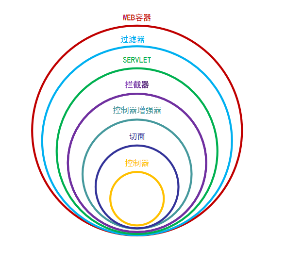
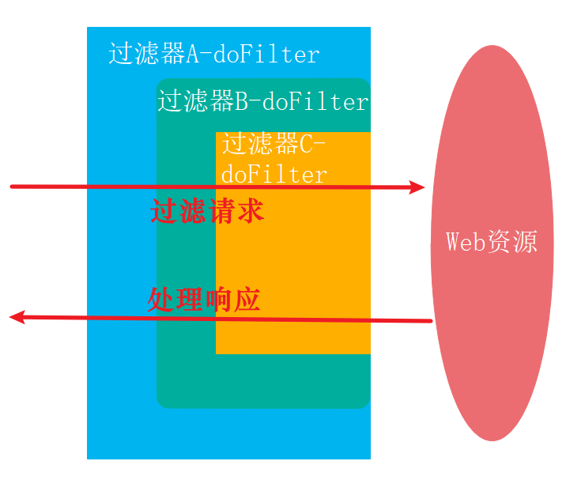
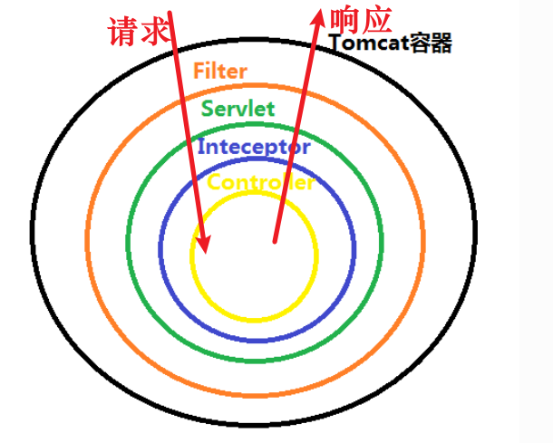
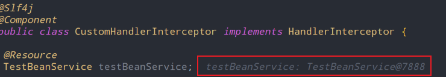

> 彻底搞懂过滤器、拦截器、监听器、AOP，看这一篇就足够了：https://blog.csdn.net/xiaorui51/article/details/108753111
>
> SpringBoot 过滤器、拦截器、监听器对比及使用场景：https://blog.csdn.net/qq_38020915/article/details/116431612
>
> ServletRequestWrapper、ServletResponseWrapper：https://mp.weixin.qq.com/s/Y2YrjqgI-MMF9d4TeXE-Eg

# 一、关系图理解





# 二、Servlet

## 1、定义概念

在Java程序员10年以前做Web开发的时候，所有的请求都是由Servlet来接受并响应的。每一个请求，就要写一个Servlet。这种方式很麻烦，大家就想能不能根据请求的路径以及参数不同，映射到不同的方法上去执行，这样就可以在一个Servlet类里面处理多个请求，每个请求就是一个方法。这个思想后来就逐渐发展为Structs、SpringMVC等框架。


## 2、使用场景

目前来看，Servlet使用的场景已经被springMVC封装架构全面覆盖，几乎没有什么需要使用原始Servlet进行开发的场景。但是不排除，老项目向SpringBoot项目迁移融合，需要支持Servlet的情况。


## 3、代码实现

下面我们就看一下，在SpringBoot里面如何实现Servlet

```java
// 标记为servlet，以便启动器扫描。
@WebServlet(name = "firstServlet", urlPatterns = "/firstServlet")
public class FirstServlet extends HttpServlet {
    @Override
    protected void doGet(HttpServletRequest req, HttpServletResponse resp) throws ServletException, IOException {
        resp.getWriter().append("firstServlet");
    }
}
```

然后在启动类加入@ServletComponentScan注解即可。

```java
@ServletComponentScan
@SpringBootApplication
public class XyzApplication {
    public static void main(String[] args) {
        SpringApplication.run(XyzApplication.class, args);
    }
}
```


# 三、过滤器

> - 滤器是在web应用启动的时候初始化一次, 在web应用停止的时候销毁
> - 可以对请求的URL进行过滤, 对敏感词过滤
> - 挡在拦截器的外层
> - 实现的是 javax.servlet.Filter 接口 ，是 Servlet 规范的一部分
> - 在请求进入容器后，但在进入servlet之前进行预处理，请求结束是在servlet处理完以后
> - 依赖Web容器
> - 会多次执行

## 1、Filter（Servlet）

### 1、定义概念

Servlet 过滤器是可用于 Servlet 编程的 Java 类，有以下目的：

- 在客户端的请求访问后端资源之前，拦截这些请求。
- 在服务器的响应发送回客户端之前，处理这些响应




### 2、使用场景

在实际的应用开发中，我们经常使用过滤器做以下的一些事情

- 基于一定的授权逻辑，对HTTP请求进行过滤，从而保证数据访问的安全。比如：判断请求的来源IP是否在系统黑名单中
- 对于一些经过加密的HTTP请求数据，进行统一解密，方便后端资源进行业务处理
- 或者我们社交应用经常需要的敏感词过滤，也可以使用过滤器，将触发敏感词的非法请求过滤掉

过滤器主要的特点在于：一是可以过滤所有请求，二是它能够改变请求的数据内容。


### 3、代码实现

**1、实现及注册方式一：利用WebFilter注解配置**

Servlet3.0新增了注解@WebFilter，原先实现过滤器需要在web.xml中进行配置，现在通过此注解，启动启动时会自动扫描自动注册

```java
// 注册器名称为customFilter,拦截的url为所有
@Slf4j
@WebFilter(filterName="customFilter",urlPatterns={"/*"})
public class CustomFilter implements Filter{

    @Override
    public void init(FilterConfig filterConfig) throws ServletException {
        log.info("filter 初始化");
    }

    @Override
    public void doFilter(ServletRequest request, ServletResponse response, FilterChain chain)
        throws IOException, ServletException {
        log.info("customFilter 请求处理之前----doFilter方法之前过滤请求");
        // 对request、response进行一些预处理, 比如设置请求编码
        // request.setCharacterEncoding("UTF-8");
        // response.setCharacterEncoding("UTF-8");

        // 链路 直接传给下一个过滤器
        chain.doFilter(request, response);
        log.info("customFilter 请求处理之后----doFilter方法之后处理响应");
    }

    @Override
    public void destroy() {
        log.info("filter 销毁");
    }
}
```

然后在启动类加入@ServletComponentScan注解即可。

```java
@ServletComponentScan
@SpringBootApplication
public class XyzApplication {
    public static void main(String[] args) {
        SpringApplication.run(XyzApplication.class, args);
    }
}
```

使用这种方法当注册多个过滤器时，无法指定过滤器的先后执行顺序。原本使用web.xml配置过滤器时，是可指定执行顺序的，但使用@WebFilter时，没有这个配置属性的(需要配合@Order进行)，所以接下来介绍下通过FilterRegistrationBean进行过滤器的注册。

> 小技巧：通过过滤器的Java类名称，进行顺序的约定，比如LogFilter和AuthFilter，此时AuthFilter就会比LogFilter先执行，因为首字母A比L前面。


**2、注册方式二：FilterRegistrationBean方式**

FilterRegistrationBean是SpringBoot提供的，此类提供setOrder方法，可以为filter设置排序值，让Spring在注册Web filter之前排序后再依次注册。首先要改写filter, 其实就删掉@webFilter注解即可，其他的都没有变化。然后的代码是Filter的注册代码

```java
@Configuration
public class FilterRegistration {
    @Bean
    public FilterRegistrationBean filterRegistrationBean() {
        FilterRegistrationBean registration = new FilterRegistrationBean();
        // Filter可以new，也可以使用依赖注入Bean
        registration.setFilter(new CustomFilter());
        // 过滤器名称
        registration.setName("customFilter");
        // 拦截路径
        registration.addUrlPatterns("/*");
        // 设置顺序
        registration.setOrder(10);
        return registration;
    }
}
```

注册多个时，就注册多个FilterRegistrationBean即可,启动后，效果和第一种是一样的。可以访问应用内的任意资源进行过滤器测试，因为过滤器是针对所有的请求和响应。可以输入Filter中的log信息。


## 2、HttpServletRequestWrapper（Servlet）

> HttpServletRequestWrapper：在请求到达之前对 request 进行修改

### 1、产生背景

HttpServletRequest 不能对前端传来的参数进行修改，但实际场所像过滤[xss](https://so.csdn.net/so/search?q=xss&spm=1001.2101.3001.7020)攻击，取认证token统一去除token前缀等需要进行请求参数的处理。此时 **HttpServletRequestWrapper** 就应运而生了。


### 2、实现原理

HttpServletRequestWrapper 采用装饰者模式对 HttpServletRequest 进行包装，我们可以通过继承 HttpServletRequestWrapper 类去重写getParameterValues()，getParamete() r等方法，实际还是调用 HttpServletRequest 的相对应方法，但是可以对方法的结果进行改装。


### 3、代码实现

1、新增wrapper类

```java
@Slf4j
public class MyHttpServletRequestWrapper extends HttpServletRequestWrapper {
    /**
     * @param request
     */
    public MyHttpServletRequestWrapper(HttpServletRequest request) {
        super(request);
    }

    // 此方法永远都没有进来,查看源码没有发现谁在调用,可能时Spring重写后只使用了getParameterValues
    @Override
    public String getParameter(String name) {
        // 可以对请求参数进行过滤
        return super.getParameter(name);
    }
    
    @Override
    public String[] getParameterValues(String name) {
        if (name.equals("token")){
            return new String[]{"dasdasfagasgasgasa--asdas="};
        }
        String[] parameterValues = super.getParameterValues(name);
        return parameterValues;
    }
}
```

2、新增 filter类传递MyHttpServletRequestWrapper

```java
@Slf4j
public class MyFilter implements Filter {
    @Override
    public void doFilter(ServletRequest request, ServletResponse response, FilterChain chain)
        throws IOException, ServletException {
        HttpServletRequest req = (HttpServletRequest) request;
        HttpServletResponse resp = (HttpServletResponse) response;
        MyHttpServletRequestWrapper xssRequest = new MyHttpServletRequestWrapper(req);
        chain.doFilter(xssRequest, resp);
    }
}
```

3、新增配置filter配置类注册filter

```java
@Configuration
public class FilterConfig {
    @Bean
    public FilterRegistrationBean MyFilterRegistration() {
        FilterRegistrationBean registration = new FilterRegistrationBean();
        registration.setDispatcherTypes(DispatcherType.REQUEST);
        registration.setFilter(new MyFilter());
        registration.addUrlPatterns("/*");
        registration.setName("MyFilter");
        registration.setOrder(FilterRegistrationBean.HIGHEST_PRECEDENCE);
        return registration;
    }
}
```

4、新建Controller

```java
@Slf4j
@RestController
@RequestMapping("wrapper")
public class RequestWrapperController {
    @RequestMapping("testWrapper")
    public void testWrapper(String name, String token) {
        log.info("-----------name :{} ,-------------", name);
        log.info("-----------token :{} ,-------------", token);
    }
}
```

5、访问API：localhost:8080/wrapper/testWrapper?name=zhangsan

```
-----------name :zhangsan ,-------------
-----------token :dasdasfagasgasgasa--asdas= ,-------------
```


## 2、OncePerRequestFilter（SpringBoot）

### 1、简单介绍

OncePerRequestFilter类是一个实现了javax.servlet.Filter原生接口的抽象类。OncePerRequestFilter可以保证一次外部请求，只执行一次过滤方法，对于服务器内部之间的forward等请求，不会再次执行过滤方法。OncePerRequestFilter 又称单次过滤器。

在学习"OncePerRequestFilter"前，我们先看一下过滤器是什么？

1. 过滤器在WEB应用启动时初始化一次, 在WEB应用停止时销毁；
2. 可以对请求的URL进行过滤, 对敏感词过滤；
3. 过滤器将处理逻辑挡在拦截器的外面；
4. 过滤器实现的是 javax.servlet.Filter原生接口，过滤器是SERVLET 规范的一部分；
5. 过滤器在请求进入WEB容器后，到达SERVLET之前进行过滤器的逻辑处理；
6. 过滤器依赖WEB容器，也会被多次执行。
7. 过滤器的作用就是在业务逻辑执行前/后对请求和响应进行相应的处理，如果能配合HttpServletRequestWrapper和HttpServletResponseWrapper使用更加完美。


### 2、使用场景

OncePerRequestFilter的主要目的是为了兼容不同的WEB容器，因为Servlet版本不同，执行的过程也不同，其实不是所有的容器一次请求只过滤一次


### 3、源码分析

```java
public abstract class OncePerRequestFilter extends GenericFilterBean {
    // ...
    public final void doFilter(ServletRequest request, ServletResponse response, FilterChain filterChain) throws ServletException, IOException {
        if (request instanceof HttpServletRequest && response instanceof HttpServletResponse) {
            HttpServletRequest httpRequest = (HttpServletRequest)request;
            HttpServletResponse httpResponse = (HttpServletResponse)response;

            // 获取是否执行过滤方法的一个属性KEY，作为是否执行过滤方法的一个标记
            String alreadyFilteredAttributeName = this.getAlreadyFilteredAttributeName();

            // 检测当前请求的属性中该标记的值是否为空，如果不为空则说明已执行过滤方法了
            boolean hasAlreadyFilteredAttribute = request.getAttribute(alreadyFilteredAttributeName) != null;
            if (!this.skipDispatch(httpRequest) && !this.shouldNotFilter(httpRequest)) {
                // 已执行
                if (hasAlreadyFilteredAttribute) {
                    if (DispatcherType.ERROR.equals(request.getDispatcherType())) {
                        this.doFilterNestedErrorDispatch(httpRequest, httpResponse, filterChain);
                        return;
                    }

                    filterChain.doFilter(request, response);
                } else {
                    // 未执行
                    request.setAttribute(alreadyFilteredAttributeName, Boolean.TRUE);

                    try {
                        // 这个抽象方法需要子类去实现具体的过滤逻辑
                        this.doFilterInternal(httpRequest, httpResponse, filterChain);
                    } finally {
                        // 执行完毕移除标记
                        request.removeAttribute(alreadyFilteredAttributeName);
                    }
                }
            } else {
                filterChain.doFilter(request, response);
            }

        } else {
            throw new ServletException("OncePerRequestFilter just supports HTTP requests");
        }
    }
    // ...
}
```

### 4、如何使用

```java
package com.xyz.filter;

import lombok.extern.slf4j.Slf4j;
import org.springframework.stereotype.Component;
import org.springframework.web.filter.OncePerRequestFilter;
import javax.servlet.FilterChain;
import javax.servlet.ServletException;
import javax.servlet.http.HttpServletRequest;
import javax.servlet.http.HttpServletResponse;
import java.io.IOException;
import java.io.PrintWriter;
import java.util.Arrays;

/**
 * 请求过滤器
 * OncePerRequestFilter:顾名思义，它能够确保在一次请求中只通过一次filter.
 *
 * 大家常识上都认为，一次请求本来就只filter一次，为什么还要由此特别限定呢，
 * 往往我们的常识和实际的实现并不真的一样，经过一番资料的查阅，此方法是为了兼容不同的web container，
 * 也就是说并不是所有的container都入我们期望的只过滤一次，servlet版本不同，执行过程也不同，
 * 因此，为了兼容各种不同运行环境和版本，默认自定义filter继承OncePerRequestFilter是一个比较稳妥的选择。
 */
@Slf4j
@Component
public class CustomFilter extends OncePerRequestFilter {
    /**
     * OncePerRequestFilter.doFilter方法中通过request.getAttribute判断当前过滤器是否已执行
     * 若未执行过，则调用doFilterInternal方法，交由其子类实现
     */
    @Override
    protected void doFilterInternal(HttpServletRequest httpServletRequest, HttpServletResponse httpServletResponse, FilterChain filterChain) throws ServletException, IOException {
        try {
            CustomRequestWrapper customRequestWrapper = new CustomRequestWrapper(httpServletRequest);
            filterChain.doFilter(customRequestWrapper, httpServletResponse);
            log.info("RequestFilter");
            log.info(Arrays.toString(customRequestWrapper.getParameterValues("name")));
        } catch (Exception exception) {
            httpServletResponse.setCharacterEncoding("utf-8");
            httpServletResponse.setContentType("application/json; charset=utf-8");
            PrintWriter writer = httpServletResponse.getWriter();
            writer.write(exception.toString());
        }
    }
}
```

```java
@Configuration
public class FilterRegistration {
    @Bean
    public FilterRegistrationBean<CustomFilter> registrationBean() {
        FilterRegistrationBean<CustomFilter> registrationBean = new FilterRegistrationBean<>();
        registrationBean.setFilter(new CustomFilter()); // 注入filter对象
        registrationBean.addUrlPatterns("/filter/*"); // 拦截路径
        registrationBean.setName("CustomFilter"); // 设置执行顺序,数字越低优先级越高
        registrationBean.setOrder(1); // 设置执行顺序,值越低优先级越高
        registrationBean.setDispatcherTypes(DispatcherType.REQUEST);
        return registrationBean;
    }
}
```

番外配置：SpringBoot官方推荐的重复执行的FILTER只执行一次的解决方案：

```java
@Configuration(proxyBeanMethods = false)
public class MyFilterConfiguration {
    @Bean
    public FilterRegistrationBean<MyFilter> registration(MyFilter filter) {
        FilterRegistrationBean<MyFilter> registration = new FilterRegistrationBean<>(filter);
        registration.setEnabled(false);
        return registration;
    }
}
```


# 四、拦截器

> - 实现 org.springframework.web.servlet.HandlerInterceptor 接口，动态代理
> - 拦截器应用场景, 性能分析, 权限检查, 日志记录
> - 是一个Spring组件，并由Spring容器管理，并不
> - 不依赖Tomcat等容器，是可以单独使用的。不仅能应用在web程序中，也可以用于Application、Swing等程序中
> - 是在请求进入servlet后，在进入Controller之前进行预处理的，Controller 中渲染了对应的视图之后请求结束

## 1、Interceptor拦截器简单介绍

在 Servlet 规范中并没有拦截器的概念，它是在Spring框架内衍生出来。


Spring中拦截器有三个方法：

- preHandle 表示被拦截的URL对应的控制层方法，执行前的自定义处理逻辑
- postHandle 表示被拦截的URL对应的控制层方法，执行后的自定义处理逻辑，此时还未将modelAndView进行页面渲染。
- afterCompletion 表示此时modelAndView已做页面渲染，执行拦截器的自定义处理。


## 2、拦截器与过滤器的核心区别

从请求处理的生命周期上看，拦截器Interceptor和过滤器filter的作用是类似的。过滤球能做的事情，拦截器几乎也都能做。



但是二者使用场景还是有一些区别的：

- 规范不同：Filter是在Servlet规范中定义的组件，在servlet容器内生效。而拦截器是Spring框架支持的，在Spring 上下文中生效。
- 拦截器可以获取并使用Spring IOC容器中的bean，但过滤器就不行。因为过滤器是Servlet的组件，而IOC容器的bean是Spring框架内使用，拦截器恰恰是Spring框架内衍生出来的。
- 拦截器可以访问Spring上下文值对象，如ModelAndView，过滤器不行。基于与上一点同样的原因。
- 过滤器在进入servlet容器之前处理请求，拦截器在servlet容器之内处理请求。过滤器比拦截器的粒度更大，比较适合系统级别的所有API的处理动作。比如：权限认证，Spring Security就大量的使用了过滤器。
- 拦截器相比于过滤器粒度更小，更适合分模块、分范围的统一业务逻辑处理。比如：分模块的、分业务的记录审计日志。（后面在日志的管理的那一章，我们会为介绍使用拦截器实现统一访问日志的记录）

比如说：我们在Filter中使用注解，注入一个测试service，结果为null。因为过滤器无法使用Spring IOC容器bean。


## 3、拦截器的实现

编写自定义拦截器类，此处我们用一个简单的例子让大家了解拦截器的生命周期。后面在日志的管理的那一章，我们会为介绍使用拦截器实现统一访问日志的记录的实战。

```java
import lombok.extern.slf4j.Slf4j;
import org.springframework.stereotype.Component;
import org.springframework.web.servlet.HandlerInterceptor;
import javax.servlet.http.HttpServletRequest;
import javax.servlet.http.HttpServletResponse;

@Slf4j
@Component
public class CustomHandlerInterceptor implements HandlerInterceptor {

    @Override
    public boolean preHandle(HttpServletRequest request, HttpServletResponse response, Object handler)
        throws Exception {
        log.info("preHandle:请求前调用");
        // 返回 false 则请求中断
        return true;
    }

    @Override
    public void postHandle(HttpServletRequest request, HttpServletResponse response, Object handler,
                           ModelAndView modelAndView) throws Exception {
        log.info("postHandle:请求后调用");

    }

    @Override
    public void afterCompletion(HttpServletRequest req, HttpServletResponse resp, Object handler, Exception ex)
        throws Exception {
        log.info("afterCompletion:请求调用完成后回调方法，即在视图渲染完成后回调");
    }
}
```

通过继承WebMvcConfigurerAdapter注册拦截器。笔者在写作完成后，发现WebMvcConfigurerAdapter类已经被废弃，请实现WebMvcConfigurer接口完成拦截器的注册。

```java
@Configuration
public class MyWebMvcConfigurer implements WebMvcConfigurer {
    // 已废弃：public class MyWebMvcConfigurer extends WebMvcConfigurerAdapter{
    @Resource
    CustomHandlerInterceptor customHandlerInterceptor;
    
    @Override
    public void addInterceptors(InterceptorRegistry registry) {
        //注册拦截器 拦截规则
        //多个拦截器时 以此添加 执行顺序按添加顺序
        registry.addInterceptor(customHandlerInterceptor).addPathPatterns("/*");
    }
}
```

如果我们在CustomHandlerInterceptor ，注入一个测试service，结果是可以正确依赖注入并使用该Service的。




## 4、请求链路说明

随便请求一个系统内的API（因为我们配置的过滤器拦截器拦截所有请求），通过输出结果分析一下拦截器、过滤器中各接口函数的执行顺序。

```
CustomFilter  : customFilter 请求处理之前----doFilter方法之前过滤请求
CustomHandlerInterceptor  : preHandle:请求前调用
CustomHandlerInterceptor  : postHandle:请求后调用
CustomHandlerInterceptor  : afterCompletion:请求调用完成后回调方法，即在视图渲染完成后回调
CustomFilter  : customFilter 请求处理之后----doFilter方法之后处理响应
```

请求链路调用顺序图如下所示：


# 五、监听器

> - 实现 javax.servlet.ServletRequestListener, javax.servlet.http.HttpSessionListener, javax.servlet.ServletContextListener 等等接口
> - 主要用来监听对象的创建与销毁的发生, 比如 session 的创建销毁, request 的创建销毁, ServletContext 创建销毁


## 1、事件监听介绍

**1、事件监听的角色**

首先我们要理解事件监听中需要的几个角色

- 事件发布者 （即事件源）
- 事件监听者
- 事件本身

**2、事件监听的使用场景**

为了将技术问题简单化，为大家举一个简单的例子。比如居委会发布停水通知。居委会就是事件源、停水就是事件本身、该居委会的辖区居民就是事件监听者。大家看这个例子，有这样几个特点：

- 异步处理：居委会工作人员发布通知之后，就可以去忙别的工作了，不会原地等待所有居民的反馈。
- 解耦：居委会和居民之间是解耦的，互相不干扰对方的工作状态与生活状态。
- 不规律性：对于停水的事件发生频率是不规律的，触发规则相对随机。

笔者当你在一个系统的业务需求中，满足上面的几个特点中的2点，就应该考虑使用事件监听机制实现业务需求。当然实现事件监听机制有很的方法，比如：

- 使用消息队列中间件的发布订阅模式
- JDK自带的java.util.EventListener
- 本节为大家介绍的是：Spring环境下的实现事件发布监听的方法
- 等等


## 2、代码具体实现

### 1、自定义事件

继承自ApplicationEvent抽象类，然后定义自己的构造器。

```java
@SuppressWarnings("serial")
public class MyEvent extends ApplicationEvent {
    public MyEvent(Object source) {
        super(source);
    }
}
```

### 2、自定义事件监听器

**SpringBoot进行事件监听有四种方式**

1.写代码向ApplicationContext中添加监听器
2.使用Component注解将监听器装载入spring容器
3.在application.properties中配置监听器
4.通过@EventListener注解实现事件监听

### 方式1.

首先创建MyListener1类

```
@Slf4j
public class MyListener1 implements ApplicationListener<MyEvent> {
    public void onApplicationEvent(MyEvent event) {
        log.info(String.format("%s监听到事件源：%s.", MyListener1.class.getName(), event.getSource()));
    }
}
```

然后在springboot应用启动类中获取ConfigurableApplicationContext上下文，装载监听

```
@SpringBootApplication
public class BootLaunchApplication {

    public static void main(String[] args) {
        ConfigurableApplicationContext context = SpringApplication.run(BootLaunchApplication.class, args);
        //装载监听
        context.addApplicationListener(new MyListener1());
    }
}
```

### 方式2（推荐）.

创建MyListener2类，并使用@Component注解将该类装载入spring容器中

```
@Component
@Slf4j
public class MyListener2 implements ApplicationListener<MyEvent> {

    public void onApplicationEvent(MyEvent event) {
        log.info(String.format("%s监听到事件源：%s.", MyListener2.class.getName(), event.getSource()));
    }

}
```

### 方式3.

首先创建MyListener3类

```
@Slf4j
public class MyListener3 implements ApplicationListener<MyEvent> {
    public void onApplicationEvent(MyEvent event) {
        log.info(String.format("%s监听到事件源：%s.", MyListener3.class.getName(), event.getSource()));
    }
}
```

然后在application.properties中配置监听

```
context:
  listener:
    classes: com.zimug.bootlaunch.customlistener.MyListener3
```

### 方式4（推荐）.

创建MyListener4类，该类无需实现ApplicationListener接口，使用@EventListener装饰具体方法

```
@Slf4j
@Component
public class MyListener4 {
    @EventListener
    public void listener(MyEvent event) {
        log.info(String.format("%s监听到事件源：%s.", MyListener4.class.getName(), event.getSource()));
    }
}
```

## 3、测试监听事件的发布

有了applicationContext，想在哪发布事件就在哪发布事件

```
@RunWith(SpringRunner.class)
@SpringBootTest
public class CustomListenerTest {

    @Resource private
    ApplicationContext applicationContext;

    @Test
    public void testEvent(){
        applicationContext.publishEvent(new MyEvent("测试事件."));
    }
}
```

启动后，日志打印如下。（下面截图是在启动类发布事件后的截图，在单元测试里面监听器1监听不到，执行顺序问题）：


由日志打印可以看出，SpringBoot四种事件的实现方式监听是有序的。无论执行多少次都是这个顺序。


