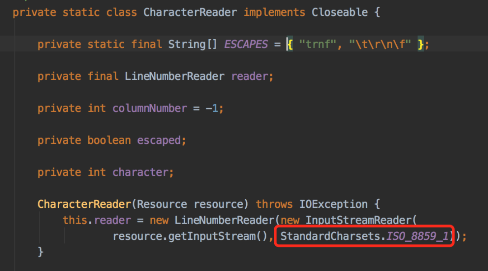
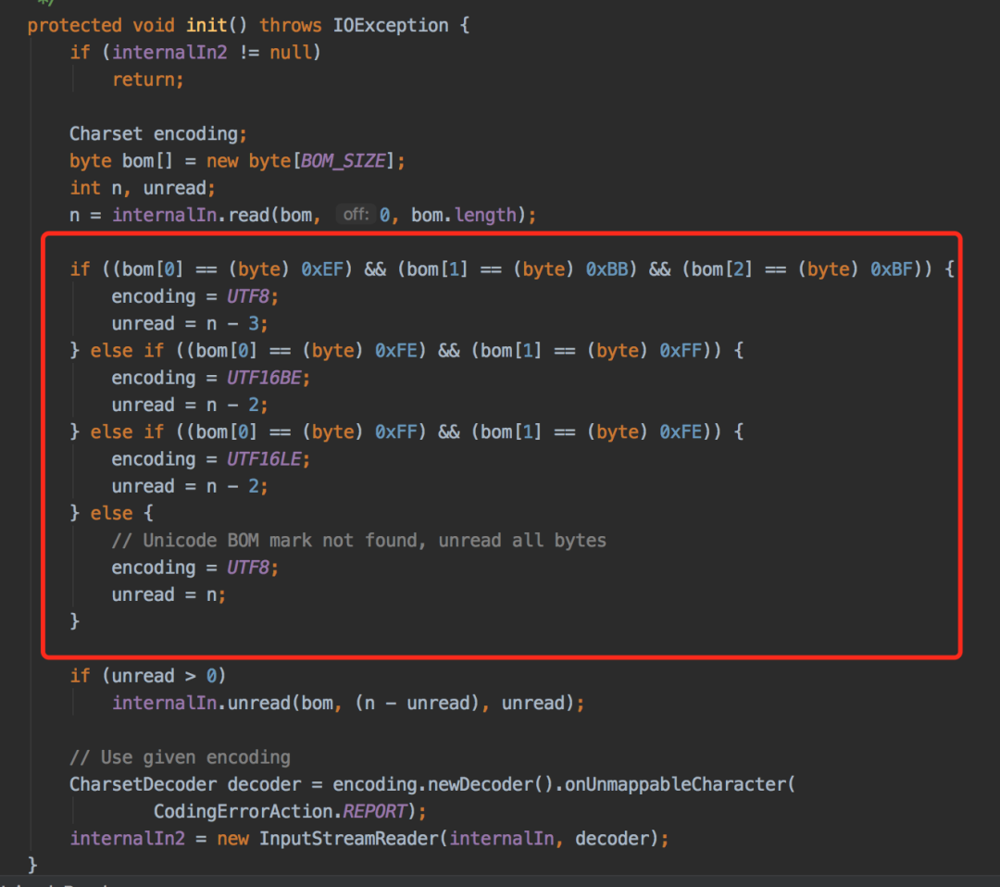
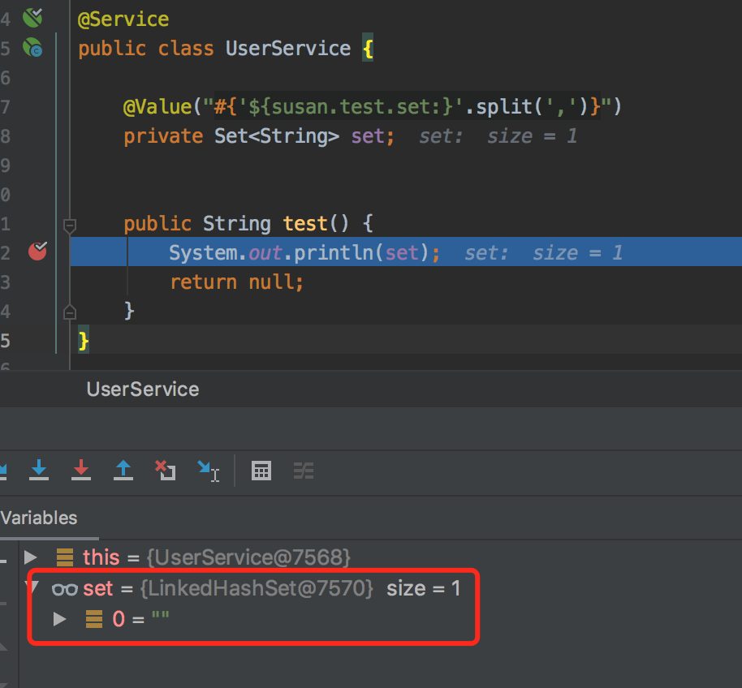
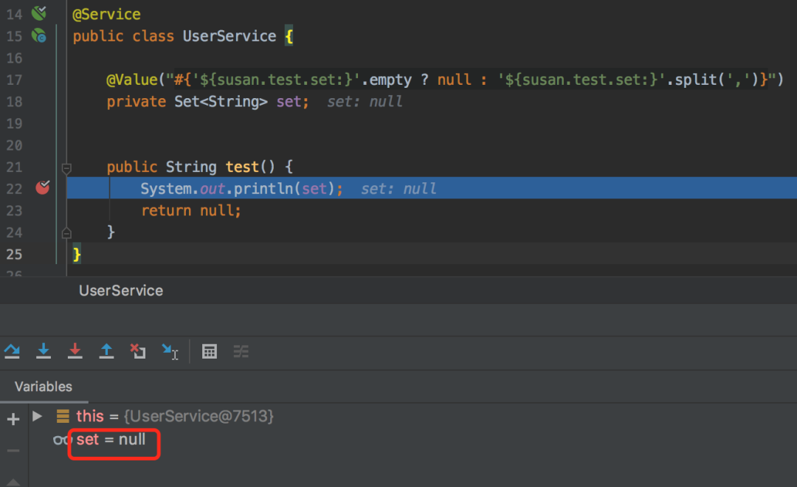

> 作者：码农小胖哥
>
> 链接：https://mp.weixin.qq.com/s/MqthQ803CpzLdLmNXrKmEQ

## 一、@Value前言

对于从事java开发工作的小伙伴来说，spring框架肯定再熟悉不过了。spring给开发者提供了非常丰富的api，今天咱们重点聊聊`@Value`注解，因为它是一个非常有用，但极其容易被忽视的注解，绝大多数人可能只用过它的一部分功能，这是一件非常遗憾的事情。

所以今天有必要和大家一起，重新认识一下@Value。

## 二、查看代码示例

假如在UserService类中，需要注入系统属性到userName变量中。通常情况下，我们会写出如下的代码：

```java
@Service
public class UserService {

    @Value("${susan.test.userName}")
    private String userName;

    public String test() {
        System.out.println(userName);
        return userName;
    }
}
```

通过@Value注解指定系统属性的名称**susan.test.userName**，该名称需要使用`${}`包起来。

这样Spring就会自动的帮我们把对应的系统属性值，注入到userName变量中。

不过，上面功能的重点是要在applicationContext.properties文件（简称：配置文件）中配置同名的系统属性：

```properties
# 张三
susan.test.userName=\u5f20\u4e09
```

那么，名称真的必须完全相同吗？


## 三、关于属性名

这时候，有些朋友可能会说：在@ConfigurationProperties配置类中，定义的参数名可以跟配置文件中的系统属性名不同。比如，在配置类MyConfig类中定义的参数名是userName：

```java
@Configuration
@ConfigurationProperties(prefix = "susan.test")
@Data
public class MyConfig {
    private String userName;
}
```

而配置文件中配置的系统属性名是：

```properties
susan.test.user-name=\u5f20\u4e09
```

类中用的**userName**，而配置文件中用的user-name，不一样。但测试之后，发现该功能能够正常运行。

配置文件中的系统属性名用 **驼峰标识** 或 **小写字母加中划线的组合**，Spring都能找到配置类中的属性名userName进行赋值。由此可见，配置文件中的系统属性名，可以跟配置类中的属性名不一样。不过，有个前提，前缀susan.test必须相同。

那么，@Value注解中定义的系统属性名也可以不一样吗？

答案：不能。如果不一样，启动项目时会直接报错。

此外，如果只在@Value注解中指定了系统属性名，但实际在配置文件中没有配置它，也会报跟上面一样的错。

所以，**@Value注解中指定的系统属性名，必须跟配置文件中的相同。**


## 四、乱码问题

不知道细心的小伙伴们有没有发现，我配置的属性值：`张三`，其实是`转义`过的。

```properties
susan.test.userName=\u5f20\u4e09
```

为什么要做这个转义？假如在配置文件中配置中文的张三：

```properties
susan.test.userName=张三
```

最后获取数据时，你会发现userName竟然出现了乱码：

> å¼ ä¸‰

what？为什么会出现乱码？

答：在SpringBoot的**CharacterReader**类中，默认的编码格式是**ISO-8859-1**，该类负责`.properties`文件中系统属性的读取。如果系统属性包含中文字符，就会出现乱码。



那么，如何解决乱码问题呢？

目前主要有如下三种方案：

1. 手动将ISO-8859-1格式的属性值，转换成UTF-8格式。
2. 设置encoding参数，不过这个只对@PropertySource注解有用。
3. 将中文字符用unicode编码转义。

显然@Value不支持encoding参数，所以方案2不行。

假如使用方案1，具体实现代码如下：

```java
@Service
public class UserService {

    @Value(value = "${susan.test.userName}")
    private String userName;

    public String test() {
        String userName1 = new String(userName.getBytes(StandardCharsets.ISO_8859_1), StandardCharsets.UTF_8);
        System.out.println();
        return userName1;
    }
}
```

确实可以解决乱码问题。但如果项目中包含大量中文系统属性值，每次都需要加这样一段特殊转换代码。出现大量重复代码，有没有觉得有点恶心？

那么，如何解决代码重复问题呢？

答：将属性值的中文内容转换成unicode。类似于这样的：

```properties
susan.test.userName=\u5f20\u4e09
```

这种方式同样能解决乱码问题，不会出现恶心的重复代码。但需要做一点额外的转换工作，不过这个转换非常容易，因为有现成的在线转换工具。

> 推荐使用这个工具转换：http://www.jsons.cn/unicode/

在这里顺便告诉你一个小秘密：如果你使用的是`.yml`或`.yaml`格式的配置文件，并不会出现中文乱码问题。

这又是为什么？

因为`.yml`或`.yaml`格式的配置文件，最终会使用**UnicodeReader**类进行解析，它的init方法中，首先读取BOM文件头信息，如果头信息中有UTF8、UTF16BE、UTF16LE，就采用对应的编码，如果没有，则采用默认UTF8编码。



> 需要注意的是：乱码问题一般出现在本地环境，因为本地直接读取的.properties配置文件。在dev、test、生产等环境，如果从zookeeper、apollo、nacos等配置中心中获取系统参数值，走的是另外的逻辑，并不会出现乱码问题。


## 五、默认值

有时候，默认值是我们非常头疼的问题。

为什么这样说呢？因为很多时候使用Java的默认值，并不能满足我们的日常工作需求。

比如有这样一个需求：如果配置了系统属性，userName就用配置的属性值。如果没有配置，则userName用默认值susan。

有些朋友可能认为可以这样做：

```java
@Value(value = "${susan.test.userName}")
private String userName = "susan";
```

在定义参数时直接给个默认值，但如果仔细想想这招是行不通的的。因为设置userName默认值的时机，比@Value注解依赖注入属性值要早，也就是说userName初始化好了默认值，后面还是会被覆盖。

那么，到底该如何设置默认值呢？

答：使用`:`。

例如：

```java
@Value(value = "${susan.test.userName:susan}")
private String userName;
```

在需要设置默认值的系统属性名后，加`:`符号。紧接着，在`:`右边设置默认值。

建议大家平时在使用@Value时，尽量都设置一个默认值。如果不需要默认值，宁可设置一个空。比如：

```java
@Value(value = "${susan.test.userName:}")
private String userName;
```

为什么这么说？

假如有这种场景：在business层中包含了UserService类，business层被api服务和job服务都引用了。但UserService类中@Value的userName只在api服务中有用，在job服务中根本用不到该属性。

对于job服务来说，如果不在.properties文件中配置同名的系统属性，则服务启动时就会报错。

这个坑，我之前踩过多次。所以，建议大家，使用@Value注解时，最好给参数设置一个默认值，以防止出现类似的问题。


## 六、静态变量

前面我们已经见识过，如何使用@Value注解，给类的**成员变量**注入**系统属性值**。

那么**静态变量**可以自动注入系统属性值不？我们一起看看，假如将上面的userName定义成static的：

```java
@Value("${susan.test.userName}")
private static String userName;
```

程序可以正常启动，但是获取到userName的值却是null。由此可见，被static修饰的变量通过@Value会注入失败。

作为好奇宝宝的你，此时肯定想问：如何才能给静态变量注入系统属性值呢？

答：这就需要使用如下的骚代码了：

```java
@Service
public class UserService {

    private static String userName;

    @Value("${susan.test.userName}")
    public void setUserName(String userName) {
        UserService.userName = userName;
    }

    public String test() {
        return userName;
    }
}
```

提供一个静态参数的setter方法，在该方法上使用@Value注入属性值，并且同时在该方法中给静态变量赋值。

有些细心的朋友可能会发现，@Value注解在这里竟然使用在setUserName方法上了，也就是对应的setter方法，而不是在变量上。

有趣，有趣，这种用法有点高端喔。

不过，通常情况下，我们一般会在pojo实体类上，使用lombok的@Data、@Setter、@Getter等注解，在编译时动态增加setter或getter方法，所以@Value用在方法上的场景其实不多。


## 七、变量类型

上面的内容，都是用的字符串类型的变量进行举例的。其实，@Value注解还支持其他多种类型的系统属性值的注入。

### 1、基本类型

众所周知，在Java中的基本数据类型有4类8种，然我们一起回顾一下：

- 整型：byte、short、int、long
- 浮点型：float、double
- 布尔型：boolean
- 字符型：char

相对应地提供了8种包装类：

- 整型：Byte、Short、Integer、Long
- 浮点型：Float、Double
- 布尔型：Boolean
- 字符型：Character

@Value注解对这8中基本类型和相应的包装类，有非常良好的支持，例如：

```java
@Value("${susan.test.a:1}")
private byte a;

@Value("${susan.test.b:100}")
private short b;

@Value("${susan.test.c:3000}")
private int c;

@Value("${susan.test.d:4000000}")
private long d;

@Value("${susan.test.e:5.2}")
private float e;

@Value("${susan.test.f:6.1}")
private double f;

@Value("${susan.test.g:false}")
private boolean g;

@Value("${susan.test.h:h}")
private char h;

@Value("${susan.test.a:1}")
private byte a1;

@Value("${susan.test.b:100}")
private Short b1;

@Value("${susan.test.c:3000}")
private Integer c1;

@Value("${susan.test.d:4000000}")
private Long d1;

@Value("${susan.test.e:5.2}")
private Float e1;

@Value("${susan.test.f:6.1}")
private Double f1;

@Value("${susan.test.g:false}")
private Boolean g1;

@Value("${susan.test.h:h}")
private Character h1;
```

有了这些常用的数据类型，我们在定义变量类型时，可以非常愉快的玩耍了，不用做额外的转换。


### 2、数组类型

但只用上面的基本类型是不够的，特别是很多需要批量处理数据的场景中。这时候可以使用**数组**，它在日常开发中使用的频率很高。

我们在定义数组时可以这样写：

```java
@Value("${susan.test.array:1,2,3,4,5}")
private int[] array;
```

Spring 默认使用逗号分隔参数值。

如果用空格分隔，例如：

```java
@Value("${susan.test.array:1 2 3 4 5}")
private int[] array;
```

spring会自动把空格去掉，导致数据中只有一个值：12345，注意千万别搞错了。

顺便说一下，定义数组的时候，里面还是有挺多门道的。比如上面列子中，我的数据是：1,2,3,4,5。

如果我们把数组定义成：short、int、long、char、string类型，Spring是可以正常注入属性值的。

但如果把数组定义成：float、double类型，启动项目时就会直接报错。


小伙伴们，下巴惊掉了没？

按理说，1,2,3,4,5用float、double是能够表示的呀，为什么会报错？

如果使用int的包装类，比如：

```java
@Value("${susan.test.array:1,2,3,4,5}")
private Integer[] array;
```

启动项目时同样会报上面的异常。

此外，定义数组时一定要注意属性值的类型，必须完全一致才可以，如果出现下面这种情况：

```java
@Value("${susan.test.array:1.0,abc,3,4,5}")
private int[] array;
```

属性值中包含了1.0和abc，显然都无法将该字符串转换成int。


### 3、集合类

有了基本类型和数组，的确让我们更加方便了。但对数据的处理，只用数组这一种数据结构是远远不够的，下面给大家介绍一下其他的常用数据结构。

#### 1、List

List是数组的变种，它的长度是可变的，而数组的长度是固定的。

我们看看List是如何注入属性值的：

```java
@Value("${susan.test.list}")
private List<String> list;
```

最关键的是看配置文件：

```properties
susan.test.list[0]=10
susan.test.list[1]=11
susan.test.list[2]=12
susan.test.list[3]=13
```

当你满怀希望的启动项目，准备使用这个功能的时候，却发现竟然报错了。


看来@Value不支持这种直接的List注入。那么，如何解决这个问题呢？

有人说用@ConfigurationProperties。需要定义一个MyConfig类：

```java
@Data
@Configuration
@ConfigurationProperties(prefix = "susan.test")
public class MyConfig {
    private List<String> list;
}
```

然后在调用的地方这样写：

```java
@Service
public class UserService {

    @Autowired
    private MyConfig myConfig;

    public String test() {
        System.out.println(myConfig.getList());
        return null;
    }
}
```

这种方法确实能够完成List注入。但是，只能说明@ConfigurationProperties注解的强大，跟@Value有半毛钱的关系？

答：没有。

那么，问题来了，用@Value如何实现这个功能呢？

答：使用Spring的EL表达式。

List的定义改成：

```java
@Value("#{'${susan.test.list}'.split(',')}")
private List<String> list;
```

使用`#`号加大括号的EL表达式。

然后配置文件改成：

```properties
susan.test.list=10,11,12,13
```

跟定义数组时的配置文件一样。


#### 2、Set

Set也是一种保存数据的集合，它比较特殊，里面保存的数据不会重复。

我们可以这样定义Set：

```java
@Value("#{'${susan.test.set}'.split(',')}")
private Set<String> set;
```

配置文件是这样的：

```properties
susan.test.set=10,11,12,13
```

Set跟List的用法极为相似。但为了证明本节的独特之处，我打算说点新鲜的内容。

如何给List或者Set设置默认值空呢？

有些朋友可能会说：这还不简单，直接在@Value的$表达式后面加个:号不就行了。

具体代码如下：

```java
@Value("#{'${susan.test.set:}'.split(',')}")
private Set<String> set;
```

结果却跟想象中不太一样：Set集合怎么不是空的，而是包含了一个空字符串的集合？

好吧，那我在:号后加null，总可以了吧？Set集合也不是空的，而是包含了一个"null"字符串的集合。

这也不行，那也不行，该如何是好？

答：使用EL表达式的`empty`方法。

具体代码如下：

```java
@Value("#{'${susan.test.set:}'.empty ? null : '${susan.test.set:}'.split(',')}")
private Set<String> set;
```

运行之后，结果对了：

其实List也有类似的问题，也能使用该方法解决问题。

> 在这里温馨的提醒一下，该判断的表达式比较复杂，自己手写非常容易写错，建议复制粘贴之后根据实际需求改改。


#### 3、Map

还有一种比较常用的集合是map，它支持key/value键值对的形式保存数据，并且不会出现相同key的数据。

我们可以这样定义Map：

```java
@Value("#{${susan.test.map}}")
private Map<String, String> map;
```

配置文件是这样的：

```properties
susan.test.map={"name":"苏三", "age":"18"}
```

这种用法跟上面稍微有一点区别。

设置默认值的代码如下：

```java
@Value("#{'${susan.test.map:}'.empty ? null : '${susan.test.map:}'}")
private Map<String, String> map;
```


## 八、EL高端玩法

前面我们已经见识过spring EL表达式的用法了，在设置空的默认值时特别有用。

其实，empty方法只是它很普通的用法，还有更高端的用法，不信我们一起看看。

### 1、注入bean

以前我们注入bean，一般都是用的@Autowired或者@Resource注解。例如：

```java
@Service
public class RoleService {
    public String getRoleName() {
        return "管理员";
    }
}

@Service
public class UserService {

    @Autowired
    private RoleService roleService;

    public String test() {
        System.out.println(roleService.getRoleName());
        return null;
    }
}
```

但我要告诉你的是@Value注解也可以注入bean，它是这么做的：

```java
@Value("#{roleService}")
private RoleService roleService;
```

通过这种方式，可以注入id为roleService的bean。


### 2、bean的变量和方法

通过EL表达式，@Value注解已经可以注入bean了。既然能够拿到bean实例，接下来，可以再进一步。

在RoleService类中定义了：成员变量、常量、方法、静态方法。

```java
@Service
public class RoleService {
    public static final int DEFAULT_AGE = 18;
    public int id = 1000;

    public String getRoleName() {
        return "管理员";
    }

    public static int getParentId() {
        return 2000;
    }
}
```

在调用的地方这样写：

```java
@Service
public class UserService {

    @Value("#{roleService.DEFAULT_AGE}")
    private int myAge;

    @Value("#{roleService.id}")
    private int id;

    @Value("#{roleService.getRoleName()}")
    private String myRoleName;

    @Value("#{roleService.getParentId()}")
    private String myParentId;

    public String test() {
        System.out.println(myAge);
        System.out.println(id);
        System.out.println(myRoleName);
        System.out.println(myParentId);
        return null;
    }
}
```

在UserService类中通过@Value可以注入：成员变量、常量、方法、静态方法获取到的值，到相应的成员变量中。

一下子有没有豁然开朗的感觉，有了这些，我们可以通过@Value注解，实现更多的功能了，不仅仅限于注入系统属性。


### 3、静态类

前面的内容都是基于bean的，但有时我们需要调用静态类，比如：Math、xxxUtil等静态工具类的方法，该怎么办呢？

答：用T加括号。

示例1：

```java
@Value("#{T(java.io.File).separator}")
private String path;
```

可以注入系统的路径分隔符到path中。

示例2：

```java
@Value("#{T(java.lang.Math).random()}")
private double randomValue;
```

可以注入一个随机数到randomValue中。


### 4、逻辑运算

通过上面介绍的内容，我们可以获取到绝大多数类的变量和方法的值了。但有了这些值，还不够，我们能不能在EL表达式中加点逻辑？

拼接字符串：

```java
@Value("#{roleService.roleName + '' + roleService.DEFAULT_AGE}")
private String value;
```

逻辑判断：

```java
@Value("#{roleService.DEFAULT_AGE > 16 and roleService.roleName.equals('苏三')}")
private String operation;
```

三目运算：

```java
@Value("#{roleService.DEFAULT_AGE > 16 ? roleService.roleName: '苏三' }")
private String realRoleName;
```

还有很多很多功能，我就不一一列举了。

EL表达式实在太强大了，对这方面如果感兴趣的小伙伴可以找我私聊。


## 九、${}和#{}的区别

上面巴拉巴拉说了这么多@Value的牛逼用法，归根揭底就是`${}`和`#{}`的用法。

下面重点说说${}和#{}的区别，这可能是很多小伙伴比较关心的话题。

### 1、${}

主要用于获取配置文件中的系统属性值。例如：

```java
@Value(value = "${susan.test.userName:susan}")
private String userName;
```

通过`:`可以设置默认值。如果在配置文件中找不到susan.test.userName的配置，则注入时用默认值。

如果在配置文件中找不到susan.test.userName的配置，也没有设置默认值，则启动项目时会报错。

### 2、#{}

主要用于通过spring的EL表达式，获取bean的属性，或者调用bean的某个方法。还有调用类的静态常量和静态方法。

```java
@Value("#{roleService.DEFAULT_AGE}")
private int myAge;

@Value("#{roleService.id}")
private int id;

@Value("#{roleService.getRoleName()}")
private String myRoleName;

@Value("#{T(java.lang.Math).random()}")
private double randomValue;
```

如果是调用类的静态方法，则需要加T(包名 + 方法名称)。例如：T(java.lang.Math)
