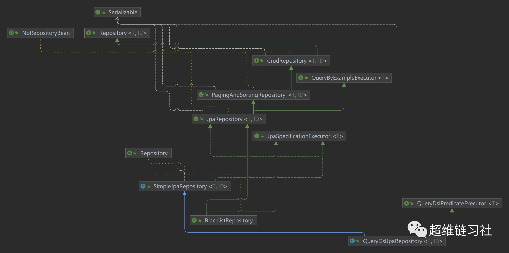
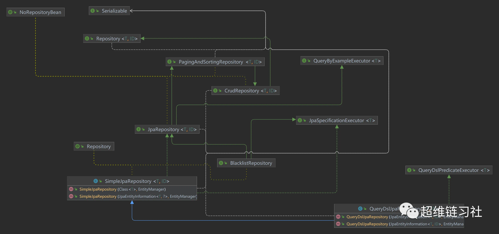
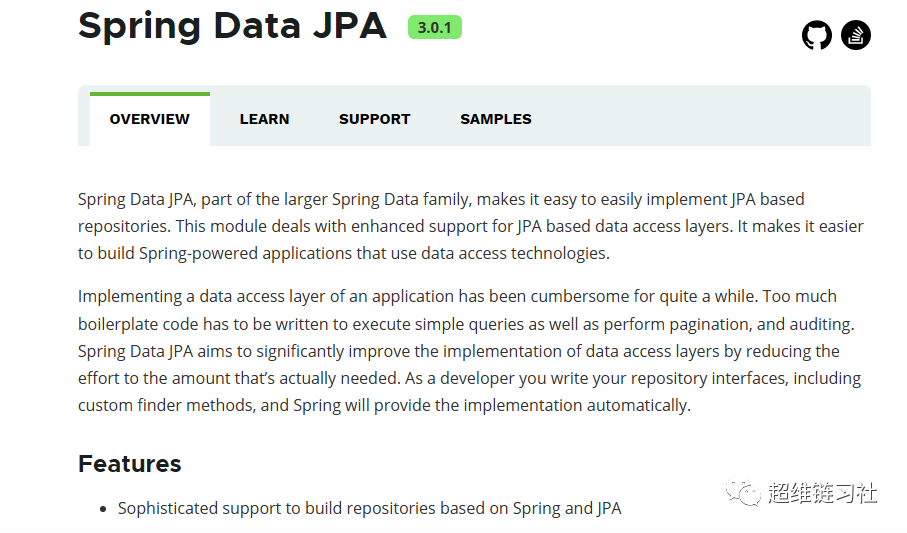
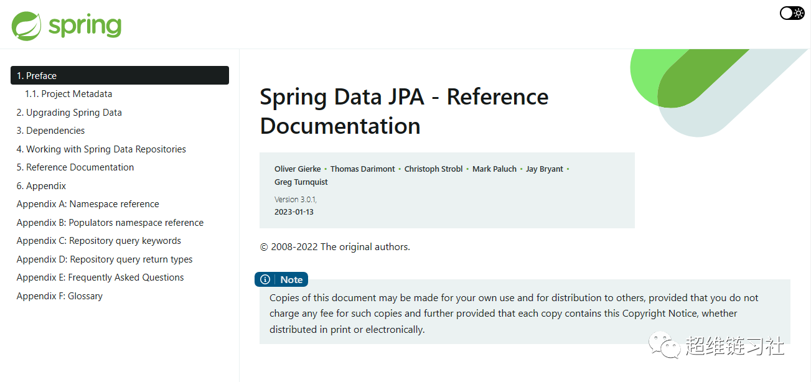
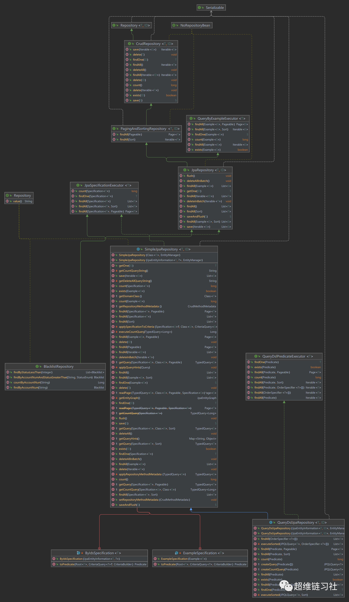

# SpringData JPA 类图及使用方法整理

> SpringBoot JPA 类图及使用方法整理：https://mp.weixin.qq.com/s/2obZwnXpsHZQOqM-OR9nIQ

## 一、JPARepository 类关系图



```java
// 继承 分页排序 查询接口 PagingAndSortingRepository<T, ID>, QueryByExampleExecutor<T> 
@NoRepositoryBean
public interface JpaRepository<T, ID extends Serializable> extends PagingAndSortingRepository<T, ID>, QueryByExampleExecutor<T> {
    List<T> findAll(); //查询所有

    List<T> findAll(Sort var1); //排序查询

    List<T> findAll(Iterable<ID> var1); //遍历查询

    <S extends T> List<S> save(Iterable<S> var1);

    void flush(); //刷新

    <S extends T> S saveAndFlush(S var1); //保存刷新

    void deleteInBatch(Iterable<T> var1);  //批量删除

    void deleteAllInBatch(); //批量删除

    T getOne(ID var1); //id 查询

    <S extends T> List<S> findAll(Example<S> var1);// 条件查询

    <S extends T> List<S> findAll(Example<S> var1, Sort var2); // 条件查询
}
```


## 二、JPARepository 类方法图


## 三、SimpleJpaRepository 构造函数



```java
public class SimpleJpaRepository<T, ID extends Serializable> implements JpaRepository<T, ID>, JpaSpecificationExecutor<T> {
    private static final String ID_MUST_NOT_BE_NULL = "The given id must not be null!";
    private final JpaEntityInformation<T, ?> entityInformation; // 实体类信息
    private final EntityManager em;  // 实体管理
    private final PersistenceProvider provider; // 持久化服务
    private CrudMethodMetadata metadata;

    // 构造函数中必须需要 JpaEntityInformation  和 JpaEntityInformation 
    public SimpleJpaRepository(JpaEntityInformation<T, ?> entityInformation, EntityManager entityManager) {
        Assert.notNull(entityInformation, "JpaEntityInformation must not be null!");
        Assert.notNull(entityManager, "EntityManager must not be null!");
        this.entityInformation = entityInformation;
        this.em = entityManager;
        this.provider = PersistenceProvider.fromEntityManager(entityManager);
    }

    // JpaEntityInformationSupport 中获取  EntityInformation
    public SimpleJpaRepository(Class<T> domainClass, EntityManager em) {
        this(JpaEntityInformationSupport.getEntityInformation(domainClass, em), em);
    }

```


## 四、官方网站



Spring Data JPA是更大的Spring Data家族的一部分，可以轻松实现基于JPA的存储库。本模块处理对基于 JPA 的数据访问层的增强支持。它使构建使用数据访问技术的 Spring 驱动的应用程序变得更加容易。

在相当长的一段时间内，实现应用程序的数据访问层一直很麻烦。必须编写太多样板代码来执行简单的查询以及执行分页和审核。Spring Data JPA旨在通过将工作量减少到实际需要的数量来改进数据访问层的实现。作为开发人员，您编写存储库接口，包括自定义查找器方法，Spring 将自动提供实现。

**1、特征**

- 为基于 Spring 和 JPA 构建存储库提供完善的支持
- 支持Querydsl谓词，因此类型安全的 JPA 查询
- 域类的透明审核
- 分页支持、动态查询执行、集成自定义数据访问代码的能力
- 在引导时验证带注释的查询`@Query`
- 支持基于 XML 的实体映射
- 通过引入基于 JavaConfig 的存储库配置。`@EnableJpaRepositories`

**2、参考文档**：https://docs.spring.io/spring-data/jpa/docs/current/reference/html/




## **五、使用方法**

### 1、依赖关系

由于各个 Spring 数据模块的开始日期不同，因此它们中的大多数都带有不同的主要和次要版本号。找到兼容版本的最简单方法是依靠我们随附的与定义的兼容版本一起提供的春季数据发布列车 BOM。在 Maven 项目中，您将在 POM 的部分中声明此依赖项，如下所示：

例 1.使用弹簧数据发布列车物料清单

```xml
<dependencyManagement>
    <dependencies>
        <dependency>
            <groupId>org.springframework.data</groupId>
            <artifactId>spring-data-bom</artifactId>
            <version>2022.0.1</version>
            <scope>import</scope>
            <type>pom</type>
        </dependency>
    </dependencies>
</dependencyManagement>
```

当前发布列车版本为 。火车版本使用带有图案的犊牛。GA 版本和服务版本遵循版本名称，所有其他版本遵循以下模式：，其中可以是以下之一：`2022.0.1 YYYY.MINOR.MICRO ${calver}${calver}-${modifier} modifier`

- SNAPSHOT：当前快照
- M1、 等：里程碑`M2`
- RC1、 等：发布候选版本`RC2`

您可以在我们的 Spring 数据示例存储库中找到使用 BOM 的工作示例。有了这个，你可以声明你想要使用的 Spring 数据模块，在块中没有版本，如下所示：`<dependencies />`

例 2.声明对 Spring 数据模块的依赖关系

```xml
<dependencies>
    <dependency>
        <groupId>org.springframework.data</groupId>
        <artifactId>spring-data-jpa</artifactId>
    </dependency>
</dependencies>
```


### 2、使用 Spring 数据存储库

Spring 数据存储库抽象的目标是显著减少为各种持久性存储实现数据访问层所需的样板代码量。

> *Spring 数据存储库文档和您的模块*
>
> 本章解释了 Spring 数据存储库的核心概念和接口。本章中的信息来自 Spring 数据共享模块。它使用 Jakarta 持久性 API （JPA） 模块的配置和代码示例。如果要使用 XML 配置，则应调整 XML 命名空间声明和要扩展的类型，以使用的特定模块的等效项。“命名空间参考”涵盖了XML配置，所有支持存储库API的Spring Data模块都支持XML配置。“存储库查询关键字”涵盖了存储库抽象通常支持的查询方法关键字。有关模块特定功能的详细信息，请参阅本文档有关该模块的章节。

#### 1、核心概念

Spring 数据存储库抽象中的中心接口是 。它采用要管理的域类以及域类的 ID 类型作为类型参数。此接口主要充当标记接口，用于捕获要使用的类型，并帮助您发现扩展此接口的接口。CrudRepository 和 ListCrudRepository 接口为正在管理的实体类提供了复杂的 CRUD 功能。Repository

例 3. 接口 CrudRepository

```java
public interface CrudRepository<T, ID> extends Repository<T, ID> {
    <S extends T> S save(S entity);      
    Optional<T> findById(ID primaryKey); 
    Iterable<T> findAll();               
    long count();                        
    void delete(T entity);               
    boolean existsById(ID primaryKey);   
    // … more functionality omitted.
}
```

| 方法名     | 描述                             |
| ---------- | -------------------------------- |
| save       | 保存给定的实体。                 |
| findById   | 返回给定 ID 标识的实体。         |
| findAll    | 返回所有实体。                   |
| count      | 返回实体数。                     |
| delete     | 删除给定实体。                   |
| existsById | 指示具有给定 ID 的实体是否存在。 |

ListCrudRepository 提供等效的方法，但它们返回的方法返回 List< CrudRepository> Iterable

> 我们还提供特定于持久性技术的抽象，例如 或 . 这些接口扩展并公开了基础持久性技术的功能，以及相当通用的持久性技术无关的接口，例如 。JpaRepository、MongoRepository、PagingAndSortingRepository

除了 之外，还有一个 PagingAndSortingRepository 抽象，它添加了其他方法来简化对实体的分页访问：CrudRepository

例 4. 接口 PagingAndSortingRepository

```java
public interface PagingAndSortingRepository<T, ID>  {
    Iterable<T> findAll(Sort sort);
    Page<T> findAll(Pageable pageable);
}
```

- 要访问页面大小为 20 的第二页，您可以执行以下操作：User

  ```java
  PagingAndSortingRepository<User, Long> repository =  ;// … get access to a bean
  Page<User> users = repository.findAll(PageRequest.of(1, 20));
  ```

除了查询方法之外，还可以对计数查询和删除查询进行查询派生。以下列表显示了派生计数查询的接口定义：

例 5.派生计数查询

```java
interface UserRepository extends CrudRepository<User, Long> {
    long countByLastname(String lastname);
}
```

以下清单显示了派生删除查询的接口定义：

例 6.派生删除查询

```java
interface UserRepository extends CrudRepository<User, Long> {
    long deleteByLastname(String lastname);
    List<User> removeByLastname(String lastname);
}
```


#### 2、查询方法

标准 CRUD 功能存储库通常对基础数据存储具有查询。使用 Spring Data，声明这些查询变成了一个四步过程：

1. 声明扩展存储库或其子接口之一的接口，并将其键入应处理的域类和 ID 类型，如以下示例所示：

   ```java
   interface PersonRepository extends Repository<Person, Long> { … }
   ```

2. 在接口上声明查询方法。

   ```java
   interface PersonRepository extends Repository<Person, Long> {
       List<Person> findByLastname(String lastname);
   }
   ```

3. 设置 Spring 以使用 JavaConfig 或 XML 配置为这些接口创建代理实例。

   ```java
   @EnableJpaRepositories
   class Config { … }
   ```

   此示例中使用 JPA 命名空间。如果将存储库抽象用于任何其他存储，则需要将其更改为存储模块的相应命名空间声明。换句话说，您应该交换以支持例如.`jpa``mongodb`

   请注意，JavaConfig 变体不会显式配置包，因为缺省情况下使用带注释的类的包。要自定义要扫描的包，请使用特定于数据存储的存储库的 -注释的属性之一。`basePackage…``@EnableJpaRepositories`

4. 注入存储库实例并使用它，如以下示例所示：

   ```java
   class SomeClient {
       private final PersonRepository repository;
       SomeClient(PersonRepository repository) {
           this.repository = repository;
       }
       void doSomething() {
           List<Person> persons = repository.findByLastname("Matthews");
       }
   }
   ```


## 六、JPARepository全景图

