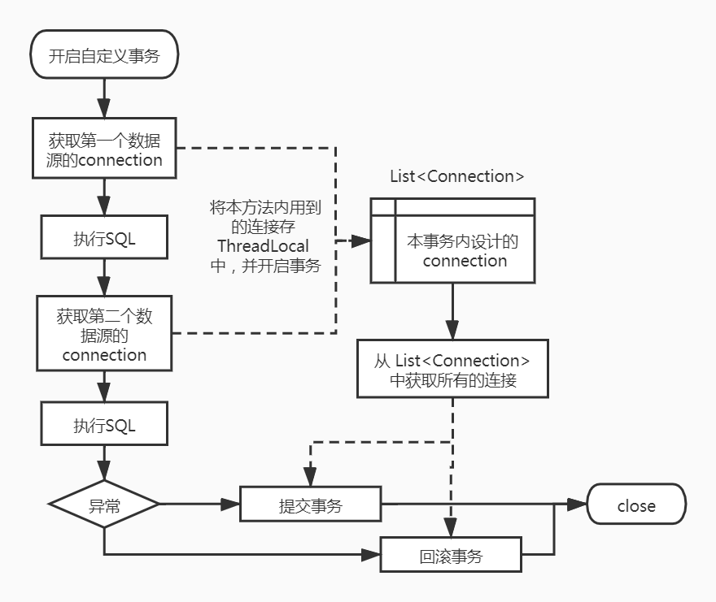

# SpringBoot 单机环境下动态多数据源的事务问题

SpringBoot 单机环境下的 @Transictional 可以保证事务，但多数据源的情况就无法使用了，这里简单实现一下多数据源的情况下如何保证事务。

## 一、事务实现方案及环境搭建

1、利用 ThreadLocal 将事务方法 内用到的 connection 缓存起来，当业务执行完毕，再统一 commit 或者 rollback；



2、pom.xml 文件如下

```xml
<?xml version="1.0" encoding="UTF-8"?>
<project xmlns="http://maven.apache.org/POM/4.0.0" xmlns:xsi="http://www.w3.org/2001/XMLSchema-instance"
         xsi:schemaLocation="http://maven.apache.org/POM/4.0.0 https://maven.apache.org/xsd/maven-4.0.0.xsd">
    <modelVersion>4.0.0</modelVersion>
    <parent>
        <groupId>org.springframework.boot</groupId>
        <artifactId>spring-boot-starter-parent</artifactId>
        <version>2.5.0</version>
        <relativePath/> <!-- lookup parent from repository -->
    </parent>
    <groupId>com.example</groupId>
    <artifactId>multi-database-transaction-static</artifactId>
    <version>0.0.1-SNAPSHOT</version>
    <name>MultiDatabaseTransaction</name>
    <description>MultiDatabaseTransaction</description>
    <properties>
        <java.version>11</java.version>
    </properties>
    <dependencies>
        <dependency>
            <groupId>org.springframework.boot</groupId>
            <artifactId>spring-boot-starter</artifactId>
        </dependency>

        <dependency>
            <groupId>org.springframework.boot</groupId>
            <artifactId>spring-boot-starter-web</artifactId>
        </dependency>

        <dependency>
            <groupId>org.springframework.boot</groupId>
            <artifactId>spring-boot-starter-aop</artifactId>
        </dependency>

        <dependency>
            <groupId>org.springframework.boot</groupId>
            <artifactId>spring-boot-starter-jdbc</artifactId>
        </dependency>

        <!-- https://mvnrepository.com/artifact/com.h2database/h2 -->
        <dependency>
            <groupId>com.h2database</groupId>
            <artifactId>h2</artifactId>
            <scope>runtime</scope>
        </dependency>

        <dependency>
            <groupId>org.projectlombok</groupId>
            <artifactId>lombok</artifactId>
            <optional>true</optional>
        </dependency>

        <dependency>
            <groupId>org.springframework.boot</groupId>
            <artifactId>spring-boot-starter-test</artifactId>
            <scope>test</scope>
        </dependency>
    </dependencies>

    <build>
        <plugins>
            <plugin>
                <groupId>org.springframework.boot</groupId>
                <artifactId>spring-boot-maven-plugin</artifactId>
            </plugin>
        </plugins>
    </build>

    <repositories>
        <repository>
            <id>nexus-aliyun</id>
            <name>nexus-aliyun</name>
            <url>http://maven.aliyun.com/nexus/content/groups/public/</url>
            <releases>
                <enabled>true</enabled>
            </releases>
            <snapshots>
                <enabled>false</enabled>
            </snapshots>
        </repository>
    </repositories>

    <pluginRepositories>
        <pluginRepository>
            <id>public</id>
            <name>aliyun nexus</name>
            <url>http://maven.aliyun.com/nexus/content/groups/public/</url>
            <releases>
                <enabled>true</enabled>
            </releases>
            <snapshots>
                <enabled>false</enabled>
            </snapshots>
        </pluginRepository>
    </pluginRepositories>
</project>
```


## 二、自定义开启事务注解

```java
package com.example.annotation;

import java.lang.annotation.*;

@Documented
@Retention(RetentionPolicy.RUNTIME)
@Target({ElementType.METHOD})
public @interface MultiDSTransaction {
}
```


## 三、YML 配置多数据源

```yaml
spring:
  datasource:
    datasource1:
      jdbc-url: jdbc:h2:mem:datasource1
      username: sa
      password: sa
      driverClassName: org.h2.Driver
    datasource2:
      jdbc-url: jdbc:h2:mem:datasource2
      username: sa
      password: sa
      driverClassName: org.h2.Driver
  h2:
    console:
      enabled: true
      path: /h2
      settings:
        web-allow-others: true
```


## 四、多数据源配置类

使用了 @Primary 注解后，作用是将该bean设置为主要注入bean，当注入相同类型的datasource的bean时就不会注入DataSourceConfig配置类中注入的两个bean了，只会注入这个，mybatis 在使用 DataSourceUtil.getDataSource 的时候获取的是这个自定义数据源，执行的是此自定义数据源的 getConnection 方法。jdbcTemplate、JPA 也是同理。

```java
package com.example.config;

import org.springframework.boot.context.properties.ConfigurationProperties;
import org.springframework.boot.jdbc.DataSourceBuilder;
import org.springframework.context.annotation.Bean;
import org.springframework.context.annotation.Configuration;
import org.springframework.context.annotation.Primary;
import javax.sql.DataSource;
import java.util.HashMap;
import java.util.Map;

/**
 * 注入两个数据源
 */
@Configuration
public class DataSourceConfig {

    @Bean
    @ConfigurationProperties(prefix = "spring.datasource.datasource1")
    public DataSource dataSource1(){
        return DataSourceBuilder.create().build();
    }

    @Bean
    @ConfigurationProperties(prefix = "spring.datasource.datasource2")
    public DataSource dataSource2(){
        return DataSourceBuilder.create().build();
    }

    @Primary
    @Bean
    public DynamicDataSource dynamicDataSource() {
        DynamicDataSource dynamicDataSource = new DynamicDataSource();
        Map<Object, Object> targetDataSources = new HashMap<>();
        targetDataSources.put("one", dataSource1());
        targetDataSources.put("two", dataSource2());
        // 设置默认数据源
        dynamicDataSource.setDefaultTargetDataSource(dataSource1());
        // 添加数据源集合
        dynamicDataSource.setTargetDataSources(targetDataSources);
        return dynamicDataSource;
    }
}
```


## 五、自定义数据源

在自定义数据源中注入上边那两个多数据源，维持多数据源执行事务期间用到的连接列表，在自定义数据源中添加事务相关业务，既在获取 连接的地方将 Connection 缓存到 ThreadLocal 中。

```java
package com.example.config;

import com.example.util.DataSourceContext;
import com.example.util.TransactionContext;
import org.springframework.jdbc.datasource.lookup.AbstractRoutingDataSource;
import javax.sql.DataSource;
import java.sql.Connection;
import java.sql.SQLException;
import java.util.ArrayList;
import java.util.HashMap;
import java.util.List;
import java.util.Map;

public class DynamicDataSource extends AbstractRoutingDataSource {
    /**
     * 添加一个DataSources Map，用来获取数据源集合
     */
    private Map<Object, Object> targetDataSources = new HashMap<>();
    public Map<Object, Object> getTargetDataSources() {
        return targetDataSources;
    }

    /**
     * 重写setTargetDataSources方法，为了可以让自己得到
     * @param targetDataSources
     */
    @Override
    public void setTargetDataSources(Map<Object, Object> targetDataSources) {
        this.targetDataSources.putAll(targetDataSources);
        super.setTargetDataSources(this.targetDataSources);
        super.afterPropertiesSet();// 必须添加该句，否则新添加数据源无法识别到
    }

    /**
     * 必须实现该接口。用来获取当前数据源
     */
    @Override
    protected Object determineCurrentLookupKey() {
        // 或者return null.细节看源码AbstractRoutingDataSource.determineTargetDataSource
        return DataSourceContext.getDataSource();
    }

    @Override
    public Connection getConnection() throws SQLException {
        // 获取当前数据源连接
        String currentDataSourceKey = DataSourceContext.getDataSource();
        DataSource currentDataSource = (DataSource) targetDataSources.get(currentDataSourceKey);
        Connection connection = currentDataSource.getConnection();

        // 获取自定义数据库连接
        CustomConnection customConnection = new CustomConnection(connection);
        if (TransactionContext.isOpenTran()) {
            customConnection.setAutoCommit(false);
            List<CustomConnection> customConnections = TransactionContext.MULTI_TRAN_CONNECTION.get();
            if (customConnections == null) {
                customConnections = new ArrayList<>();
            }
            customConnections.add(customConnection);
            TransactionContext.MULTI_TRAN_CONNECTION.set(customConnections);
        }
        return customConnection;
    }
}
```


## 六、重写 Connection 连接

```java
package com.example.config;

import com.example.util.TransactionContext;
import java.sql.*;
import java.util.Map;
import java.util.Properties;
import java.util.concurrent.Executor;

public class CustomConnection implements Connection {
    // 真实的连接
    private Connection connection;

    public CustomConnection(Connection connection) {
        this.connection = connection;
    }
    @Override
    public void commit() throws SQLException {
        // 如果没开启多数据源事务，则走 commit
        if (!TransactionContext.isOpenTran()) {
            connection.commit();
        }
    }

    @Override
    public void rollback() throws SQLException {
        connection.rollback();
    }

    public void commitMultiDbTran() throws SQLException {
        // 如果开启多数据源，则走 这里的 commit
        connection.commit();
    }
    @Override
    public void close() throws SQLException {
        // mybatis 执行完业务后，会触发 close() 操作，如果 connection 被提前 close 了，业务就会出错
        if (!TransactionContext.isOpenTran()) {
            connection.close();
        }
    }
    public void closeMultiDbTran() throws SQLException {
        // 如果开启多数据源事务，则走 这里的 close
        connection.close();
    }

    @Override
    public Statement createStatement() throws SQLException {
        return connection.createStatement();
    }

    @Override
    public PreparedStatement prepareStatement(String sql) throws SQLException {
        return connection.prepareStatement(sql);
    }

    @Override
    public CallableStatement prepareCall(String sql) throws SQLException {
        return connection.prepareCall(sql);
    }

    @Override
    public String nativeSQL(String sql) throws SQLException {
        return connection.nativeSQL(sql);
    }

    @Override
    public void setAutoCommit(boolean autoCommit) throws SQLException {
        connection.setAutoCommit(autoCommit);
    }

    @Override
    public boolean getAutoCommit() throws SQLException {
        return connection.getAutoCommit();
    }

    @Override
    public boolean isClosed() throws SQLException {
        return connection.isClosed();
    }

    @Override
    public DatabaseMetaData getMetaData() throws SQLException {
        return connection.getMetaData();
    }

    @Override
    public void setReadOnly(boolean readOnly) throws SQLException {
        connection.setReadOnly(readOnly);
    }

    @Override
    public boolean isReadOnly() throws SQLException {
        return connection.isReadOnly();
    }

    @Override
    public void setCatalog(String catalog) throws SQLException {
        connection.setCatalog(catalog);
    }

    @Override
    public String getCatalog() throws SQLException {
        return connection.getCatalog();
    }

    @Override
    public void setTransactionIsolation(int level) throws SQLException {
        connection.setTransactionIsolation(level);
    }

    @Override
    public int getTransactionIsolation() throws SQLException {
        return connection.getTransactionIsolation();
    }

    @Override
    public SQLWarning getWarnings() throws SQLException {
        return connection.getWarnings();
    }

    @Override
    public void clearWarnings() throws SQLException {
        connection.clearWarnings();
    }

    @Override
    public Statement createStatement(int resultSetType, int resultSetConcurrency) throws SQLException {
        return connection.createStatement(resultSetType,resultSetConcurrency);
    }

    @Override
    public PreparedStatement prepareStatement(String sql, int resultSetType, int resultSetConcurrency) throws SQLException {
        return connection.prepareStatement(sql,resultSetType,resultSetConcurrency);
    }

    @Override
    public CallableStatement prepareCall(String sql, int resultSetType, int resultSetConcurrency) throws SQLException {
        return connection.prepareCall(sql,resultSetType,resultSetConcurrency);
    }

    @Override
    public Map<String, Class<?>> getTypeMap() throws SQLException {
        return connection.getTypeMap();
    }

    @Override
    public void setTypeMap(Map<String, Class<?>> map) throws SQLException {
        connection.setTypeMap(map);
    }

    @Override
    public void setHoldability(int holdability) throws SQLException {
        connection.setHoldability(holdability);
    }

    @Override
    public int getHoldability() throws SQLException {
        return connection.getHoldability();
    }

    @Override
    public Savepoint setSavepoint() throws SQLException {
        return connection.setSavepoint();
    }

    @Override
    public Savepoint setSavepoint(String name) throws SQLException {
        return connection.setSavepoint(name);
    }

    @Override
    public void rollback(Savepoint savepoint) throws SQLException {
        connection.rollback(savepoint);
    }

    @Override
    public void releaseSavepoint(Savepoint savepoint) throws SQLException {
        connection.releaseSavepoint(savepoint);
    }

    @Override
    public Statement createStatement(int resultSetType, int resultSetConcurrency, int resultSetHoldability) throws SQLException {
        return connection.createStatement(resultSetType,resultSetConcurrency,resultSetHoldability);
    }

    @Override
    public PreparedStatement prepareStatement(String sql, int resultSetType, int resultSetConcurrency, int resultSetHoldability) throws SQLException {
        return connection.prepareStatement(sql,resultSetType,resultSetConcurrency,resultSetHoldability);
    }

    @Override
    public CallableStatement prepareCall(String sql, int resultSetType, int resultSetConcurrency, int resultSetHoldability) throws SQLException {
        return connection.prepareCall(sql,resultSetType,resultSetConcurrency,resultSetHoldability);
    }

    @Override
    public PreparedStatement prepareStatement(String sql, int autoGeneratedKeys) throws SQLException {
        return connection.prepareStatement(sql,autoGeneratedKeys);
    }

    @Override
    public PreparedStatement prepareStatement(String sql, int[] columnIndexes) throws SQLException {
        return connection.prepareStatement(sql,columnIndexes);
    }

    @Override
    public PreparedStatement prepareStatement(String sql, String[] columnNames) throws SQLException {
        return connection.prepareStatement(sql,columnNames);
    }

    @Override
    public Clob createClob() throws SQLException {
        return connection.createClob();
    }

    @Override
    public Blob createBlob() throws SQLException {
        return connection.createBlob();
    }

    @Override
    public NClob createNClob() throws SQLException {
        return connection.createNClob();
    }

    @Override
    public SQLXML createSQLXML() throws SQLException {
        return connection.createSQLXML();
    }

    @Override
    public boolean isValid(int timeout) throws SQLException {
        return connection.isValid(timeout);
    }

    @Override
    public void setClientInfo(String name, String value) throws SQLClientInfoException {
        connection.setClientInfo(name,value);
    }

    @Override
    public void setClientInfo(Properties properties) throws SQLClientInfoException {
        connection.setClientInfo(properties);
    }

    @Override
    public String getClientInfo(String name) throws SQLException {
        return connection.getClientInfo(name);
    }

    @Override
    public Properties getClientInfo() throws SQLException {
        return connection.getClientInfo();
    }

    @Override
    public Array createArrayOf(String typeName, Object[] elements) throws SQLException {
        return connection.createArrayOf(typeName,elements);
    }

    @Override
    public Struct createStruct(String typeName, Object[] attributes) throws SQLException {
        return connection.createStruct(typeName,attributes);
    }

    @Override
    public void setSchema(String schema) throws SQLException {
        connection.setSchema(schema);
    }

    @Override
    public String getSchema() throws SQLException {
        return connection.getSchema();
    }

    @Override
    public void abort(Executor executor) throws SQLException {
        connection.abort(executor);
    }

    @Override
    public void setNetworkTimeout(Executor executor, int milliseconds) throws SQLException {
        connection.setNetworkTimeout(executor,milliseconds);
    }

    @Override
    public int getNetworkTimeout() throws SQLException {
        return connection.getNetworkTimeout();
    }

    @Override
    public <T> T unwrap(Class<T> iface) throws SQLException {
        return connection.unwrap(iface);
    }

    @Override
    public boolean isWrapperFor(Class<?> iface) throws SQLException {
        return connection.isWrapperFor(iface);
    }
}
```


## 七、数据源管理 Context

```java
package com.example.util;

import lombok.extern.slf4j.Slf4j;

@Slf4j
public class DataSourceContext {
    /**
     * 动态数据源名称上下文
     */
    private static final ThreadLocal<String> contextLocal = ThreadLocal.withInitial(() -> "one");

    /**
     * 设置数据源
     */
    public static void setDataSource(String key) {
        contextLocal.set(key);
    }

    /**
     * 获取数据源
     *
     * @return
     */
    public static String getDataSource() {
        return contextLocal.get();
    }

    /**
     * 重置/释放数据源
     */
    public static void clearDataSource() {
        contextLocal.remove();
    }
}
```


## 八、事务管理 Context

```java
package com.example.util;

import com.example.config.CustomConnection;
import java.util.List;

public class TransactionContext {
    // 默认事务处于关闭状态
    private static final ThreadLocal<Boolean> TRAN_SWITCH_CONTEXT = ThreadLocal.withInitial(() -> false);
    /**
     * 多数据源 执行 事务期间用到的连接
     */
    public static final ThreadLocal<List<CustomConnection>> MULTI_TRAN_CONNECTION = new ThreadLocal<>();

    // 开启事务
    public static void openTran() {
        TRAN_SWITCH_CONTEXT.set(true);
    }
    // 关闭事务
    public static void closeTran() {
        TRAN_SWITCH_CONTEXT.set(false);
    }
    // 判断是否开启事务
    public static Boolean isOpenTran() {
        return TRAN_SWITCH_CONTEXT.get();
    }
}
```


## 九、写切面

利用 AOP 进行方法拦截，对使用了 多数据源 事务注解的方法，执行事务业务

```java
package com.example.aspect;

import com.example.config.CustomConnection;
import com.example.util.TransactionContext;
import org.aspectj.lang.ProceedingJoinPoint;
import org.aspectj.lang.annotation.Around;
import org.aspectj.lang.annotation.Aspect;
import org.aspectj.lang.annotation.Pointcut;
import org.springframework.context.annotation.Configuration;

@Aspect
@Configuration
public class MultiDSTransactionConfig {
    @Pointcut("@annotation(com.example.annotation.MultiDSTransaction)")
    public void transactPoint() {
    }

    @Around("transactPoint()")
    public Object multiTranAop(ProceedingJoinPoint joinPoint) throws Throwable {
        // 开启事务
        TransactionContext.openTran();
        try {
            // 执行业务
            Object proceed = joinPoint.proceed();
            // 提交事务 & 关闭连接
            for (CustomConnection connection : TransactionContext.MULTI_TRAN_CONNECTION.get()) {
                connection.commitMultiDbTran();
                connection.closeMultiDbTran();
            }
            return proceed;
        } catch (Throwable t) {
            for (CustomConnection connection : TransactionContext.MULTI_TRAN_CONNECTION.get()) {
                // 事务回滚
                connection.rollback();
                connection.closeMultiDbTran();
            }
            throw t;
        } finally {
            // 清空 事务 连接，关闭当前事务
            TransactionContext.MULTI_TRAN_CONNECTION.get().clear();
            TransactionContext.closeTran();
        }
    }
}
```


## 十、测试类

测试代码如下，当报错的之后，事务同时回滚，数据没插入成功，当未出现报错，数据则都插入成功

```java
package com.example.controller;

import com.example.annotation.MultiDSTransaction;
import com.example.util.DataSourceContext;
import org.springframework.beans.factory.annotation.Autowired;
import org.springframework.jdbc.core.JdbcTemplate;
import org.springframework.web.bind.annotation.RequestMapping;
import org.springframework.web.bind.annotation.RestController;

import javax.annotation.PostConstruct;
import java.util.stream.Stream;

@RestController
public class TestController {
    @Autowired
    private JdbcTemplate jdbcTemplate;

    @RequestMapping("test")
    @MultiDSTransaction
    public void test() {
        // 选择datasource1数据源
        DataSourceContext.setDataSource("one");
        int i = jdbcTemplate.update("INSERT INTO user (id, name, type) VALUES (1, 'meir', 'db_test_one')");

        // 模拟报错
        int k = 1 / 0;

        // 选择datasource2数据源
        DataSourceContext.setDataSource("two");
        int j = jdbcTemplate.update("INSERT INTO user (id, name, type) VALUES (1, 'sam', 'db_test_two')");

        System.out.println("over");
    }

    @PostConstruct
    public void init1() {
        Stream.of("one", "two").forEach(i -> initData(i));
    }

    private void initData(String str) {
        // 切换数据源
        DataSourceContext.setDataSource(str);
        // 初始化表和数据
        jdbcTemplate.execute("DROP TABLE IF EXISTS user");
        jdbcTemplate.execute("CREATE TABLE user ("
                + "id BIGINT NOT NULL,"
                + "name VARCHAR(50) DEFAULT NULL,"
                + "type VARCHAR(50) DEFAULT NULL,"
                + "PRIMARY KEY (id))");
        // 还原数据源
        DataSourceContext.clearDataSource();
    }
}
```


# SpringBoot 单机环境下静态多数据源的事务问题

## 一、事务实现方案

利用 ThreadLocal 将事务方法 内用到的 connection 缓存起来，当业务执行完毕，再统一 commit 或者 rollback；

2、pom.xml 文件如下

```xml
<?xml version="1.0" encoding="UTF-8"?>
<project xmlns="http://maven.apache.org/POM/4.0.0" xmlns:xsi="http://www.w3.org/2001/XMLSchema-instance"
         xsi:schemaLocation="http://maven.apache.org/POM/4.0.0 https://maven.apache.org/xsd/maven-4.0.0.xsd">
    <modelVersion>4.0.0</modelVersion>
    <parent>
        <groupId>org.springframework.boot</groupId>
        <artifactId>spring-boot-starter-parent</artifactId>
        <version>2.5.0</version>
        <relativePath/> <!-- lookup parent from repository -->
    </parent>
    <groupId>com.example</groupId>
    <artifactId>multi-database-transaction-static</artifactId>
    <version>0.0.1-SNAPSHOT</version>
    <name>MultiDatabaseTransaction</name>
    <description>MultiDatabaseTransaction</description>
    <properties>
        <java.version>11</java.version>
    </properties>
    <dependencies>
        <dependency>
            <groupId>org.springframework.boot</groupId>
            <artifactId>spring-boot-starter</artifactId>
        </dependency>

        <dependency>
            <groupId>org.springframework.boot</groupId>
            <artifactId>spring-boot-starter-web</artifactId>
        </dependency>

        <dependency>
            <groupId>org.springframework.boot</groupId>
            <artifactId>spring-boot-starter-aop</artifactId>
        </dependency>

        <dependency>
            <groupId>org.springframework.boot</groupId>
            <artifactId>spring-boot-starter-jdbc</artifactId>
        </dependency>

        <!-- https://mvnrepository.com/artifact/com.h2database/h2 -->
        <dependency>
            <groupId>com.h2database</groupId>
            <artifactId>h2</artifactId>
            <scope>runtime</scope>
        </dependency>

        <dependency>
            <groupId>org.projectlombok</groupId>
            <artifactId>lombok</artifactId>
            <optional>true</optional>
        </dependency>

        <dependency>
            <groupId>org.springframework.boot</groupId>
            <artifactId>spring-boot-starter-test</artifactId>
            <scope>test</scope>
        </dependency>
    </dependencies>

    <build>
        <plugins>
            <plugin>
                <groupId>org.springframework.boot</groupId>
                <artifactId>spring-boot-maven-plugin</artifactId>
            </plugin>
        </plugins>
    </build>

    <repositories>
        <repository>
            <id>nexus-aliyun</id>
            <name>nexus-aliyun</name>
            <url>http://maven.aliyun.com/nexus/content/groups/public/</url>
            <releases>
                <enabled>true</enabled>
            </releases>
            <snapshots>
                <enabled>false</enabled>
            </snapshots>
        </repository>
    </repositories>

    <pluginRepositories>
        <pluginRepository>
            <id>public</id>
            <name>aliyun nexus</name>
            <url>http://maven.aliyun.com/nexus/content/groups/public/</url>
            <releases>
                <enabled>true</enabled>
            </releases>
            <snapshots>
                <enabled>false</enabled>
            </snapshots>
        </pluginRepository>
    </pluginRepositories>
</project>
```


## 二、自定义开启事务注解

```java
package com.example.annotation;

import java.lang.annotation.*;

@Documented
@Retention(RetentionPolicy.RUNTIME)
@Target({ElementType.METHOD})
public @interface MultiDSTransaction {
}
```


## 三、YML 配置多数据源

```yaml
spring:
  datasource:
    datasource1:
      jdbc-url: jdbc:h2:mem:datasource1
      username: sa
      password: sa
      driverClassName: org.h2.Driver
    datasource2:
      jdbc-url: jdbc:h2:mem:datasource2
      username: sa
      password: sa
      driverClassName: org.h2.Driver
  h2:
    console:
      enabled: true
      path: /h2
      settings:
        web-allow-others: true
```


## 四、多数据源配置类

使用了 @Primary 注解后，作用是将该bean设置为主要注入bean，当注入相同类型的datasource的bean时就不会注入DataSourceConfig配置类中注入的两个bean了，只会注入这个，mybatis 在使用 DataSourceUtil.getDataSource 的时候获取的是这个自定义数据源，执行的是此自定义数据源的 getConnection 方法。jdbcTemplate、JPA 也是同理。

```java
package com.example.config;

import com.example.util.DataSourceContext;
import com.example.util.TransactionContext;
import org.springframework.beans.factory.InitializingBean;
import org.springframework.beans.factory.annotation.Autowired;
import org.springframework.context.annotation.Primary;
import org.springframework.stereotype.Component;

import javax.sql.DataSource;
import java.io.PrintWriter;
import java.sql.Connection;
import java.sql.SQLException;
import java.sql.SQLFeatureNotSupportedException;
import java.util.ArrayList;
import java.util.List;
import java.util.Map;
import java.util.logging.Logger;

/**
 * 管理多个数据源
 */
public class StaticDataSource implements DataSource {

    private Map<String, DataSource> dataSourceMap;

    public StaticDataSource(Map<String, DataSource> dataSourceMap) {
        this.dataSourceMap = dataSourceMap;
    }

    @Override
    public Connection getConnection() throws SQLException {
        Connection connection = dataSourceMap.get(DataSourceContext.getDataSource()).getConnection();
        CustomConnection customConnection = new CustomConnection(connection);
        if (TransactionContext.isOpenTran()) {
            customConnection.setAutoCommit(false);
            List<CustomConnection> customConnections = TransactionContext.MULTI_TRAN_CONNECTION.get();
            if (customConnections == null) {
                customConnections = new ArrayList<>();
            }
            customConnections.add(customConnection);
            TransactionContext.MULTI_TRAN_CONNECTION.set(customConnections);
        }
        return customConnection;
    }

    @Override
    public Connection getConnection(String username, String password) throws SQLException {
        return null;
    }

    @Override
    public <T> T unwrap(Class<T> iface) throws SQLException {
        return null;
    }

    @Override
    public boolean isWrapperFor(Class<?> iface) throws SQLException {
        return false;
    }

    @Override
    public PrintWriter getLogWriter() throws SQLException {
        return null;
    }

    @Override
    public void setLogWriter(PrintWriter out) throws SQLException {

    }

    @Override
    public void setLoginTimeout(int seconds) throws SQLException {

    }

    @Override
    public int getLoginTimeout() throws SQLException {
        return 0;
    }

    @Override
    public Logger getParentLogger() throws SQLFeatureNotSupportedException {
        return null;
    }
}
```


## 五、自定义数据源

在自定义数据源中注入上边那两个多数据源，维持多数据源执行事务期间用到的连接列表，在自定义数据源中添加事务相关业务，既在获取 连接的地方将 Connection 缓存到 ThreadLocal 中

```java
package com.example.config;

import com.example.util.DataSourceContext;
import com.example.util.TransactionContext;
import org.springframework.beans.factory.InitializingBean;
import org.springframework.beans.factory.annotation.Autowired;
import org.springframework.context.annotation.Primary;
import org.springframework.stereotype.Component;
import javax.sql.DataSource;
import java.io.PrintWriter;
import java.sql.Connection;
import java.sql.SQLException;
import java.sql.SQLFeatureNotSupportedException;
import java.util.ArrayList;
import java.util.List;
import java.util.Map;
import java.util.logging.Logger;

/**
 * 管理多个数据源
 */
public class StaticDataSource implements DataSource {

    private Map<String, DataSource> dataSourceMap;

    public StaticDataSource(Map<String, DataSource> dataSourceMap) {
        this.dataSourceMap = dataSourceMap;
    }

    @Override
    public Connection getConnection() throws SQLException {
        Connection connection = dataSourceMap.get(DataSourceContext.getDataSource()).getConnection();
        CustomConnection customConnection = new CustomConnection(connection);
        if (TransactionContext.isOpenTran()) {
            customConnection.setAutoCommit(false);
            List<CustomConnection> customConnections = TransactionContext.MULTI_TRAN_CONNECTION.get();
            if (customConnections == null) {
                customConnections = new ArrayList<>();
            }
            customConnections.add(customConnection);
            TransactionContext.MULTI_TRAN_CONNECTION.set(customConnections);
        }
        return customConnection;
    }

    @Override
    public Connection getConnection(String username, String password) throws SQLException {
        return null;
    }

    @Override
    public <T> T unwrap(Class<T> iface) throws SQLException {
        return null;
    }

    @Override
    public boolean isWrapperFor(Class<?> iface) throws SQLException {
        return false;
    }

    @Override
    public PrintWriter getLogWriter() throws SQLException {
        return null;
    }

    @Override
    public void setLogWriter(PrintWriter out) throws SQLException {

    }

    @Override
    public void setLoginTimeout(int seconds) throws SQLException {

    }

    @Override
    public int getLoginTimeout() throws SQLException {
        return 0;
    }

    @Override
    public Logger getParentLogger() throws SQLFeatureNotSupportedException {
        return null;
    }
}
```


## 六、重写 Connection 连接

```java
package com.example.config;

import com.example.util.TransactionContext;
import java.sql.*;
import java.util.Map;
import java.util.Properties;
import java.util.concurrent.Executor;

public class CustomConnection implements Connection {
    // 真实的连接
    private Connection connection;

    public CustomConnection(Connection connection) {
        this.connection = connection;
    }
    @Override
    public void commit() throws SQLException {
        // 如果没开启多数据源事务，则走 commit
        if (!TransactionContext.isOpenTran()) {
            connection.commit();
        }
    }

    @Override
    public void rollback() throws SQLException {
        connection.rollback();
    }

    public void commitMultiDbTran() throws SQLException {
        // 如果开启多数据源，则走 这里的 commit
        connection.commit();
    }
    @Override
    public void close() throws SQLException {
        // mybatis 执行完业务后，会触发 close() 操作，如果 connection 被提前 close 了，业务就会出错
        if (!TransactionContext.isOpenTran()) {
            connection.close();
        }
    }
    public void closeMultiDbTran() throws SQLException {
        // 如果开启多数据源事务，则走 这里的 close
        connection.close();
    }

    @Override
    public Statement createStatement() throws SQLException {
        return connection.createStatement();
    }

    @Override
    public PreparedStatement prepareStatement(String sql) throws SQLException {
        return connection.prepareStatement(sql);
    }

    @Override
    public CallableStatement prepareCall(String sql) throws SQLException {
        return connection.prepareCall(sql);
    }

    @Override
    public String nativeSQL(String sql) throws SQLException {
        return connection.nativeSQL(sql);
    }

    @Override
    public void setAutoCommit(boolean autoCommit) throws SQLException {
        connection.setAutoCommit(autoCommit);
    }

    @Override
    public boolean getAutoCommit() throws SQLException {
        return connection.getAutoCommit();
    }

    @Override
    public boolean isClosed() throws SQLException {
        return connection.isClosed();
    }

    @Override
    public DatabaseMetaData getMetaData() throws SQLException {
        return connection.getMetaData();
    }

    @Override
    public void setReadOnly(boolean readOnly) throws SQLException {
        connection.setReadOnly(readOnly);
    }

    @Override
    public boolean isReadOnly() throws SQLException {
        return connection.isReadOnly();
    }

    @Override
    public void setCatalog(String catalog) throws SQLException {
        connection.setCatalog(catalog);
    }

    @Override
    public String getCatalog() throws SQLException {
        return connection.getCatalog();
    }

    @Override
    public void setTransactionIsolation(int level) throws SQLException {
        connection.setTransactionIsolation(level);
    }

    @Override
    public int getTransactionIsolation() throws SQLException {
        return connection.getTransactionIsolation();
    }

    @Override
    public SQLWarning getWarnings() throws SQLException {
        return connection.getWarnings();
    }

    @Override
    public void clearWarnings() throws SQLException {
        connection.clearWarnings();
    }

    @Override
    public Statement createStatement(int resultSetType, int resultSetConcurrency) throws SQLException {
        return connection.createStatement(resultSetType,resultSetConcurrency);
    }

    @Override
    public PreparedStatement prepareStatement(String sql, int resultSetType, int resultSetConcurrency) throws SQLException {
        return connection.prepareStatement(sql,resultSetType,resultSetConcurrency);
    }

    @Override
    public CallableStatement prepareCall(String sql, int resultSetType, int resultSetConcurrency) throws SQLException {
        return connection.prepareCall(sql,resultSetType,resultSetConcurrency);
    }

    @Override
    public Map<String, Class<?>> getTypeMap() throws SQLException {
        return connection.getTypeMap();
    }

    @Override
    public void setTypeMap(Map<String, Class<?>> map) throws SQLException {
        connection.setTypeMap(map);
    }

    @Override
    public void setHoldability(int holdability) throws SQLException {
        connection.setHoldability(holdability);
    }

    @Override
    public int getHoldability() throws SQLException {
        return connection.getHoldability();
    }

    @Override
    public Savepoint setSavepoint() throws SQLException {
        return connection.setSavepoint();
    }

    @Override
    public Savepoint setSavepoint(String name) throws SQLException {
        return connection.setSavepoint(name);
    }

    @Override
    public void rollback(Savepoint savepoint) throws SQLException {
        connection.rollback(savepoint);
    }

    @Override
    public void releaseSavepoint(Savepoint savepoint) throws SQLException {
        connection.releaseSavepoint(savepoint);
    }

    @Override
    public Statement createStatement(int resultSetType, int resultSetConcurrency, int resultSetHoldability) throws SQLException {
        return connection.createStatement(resultSetType,resultSetConcurrency,resultSetHoldability);
    }

    @Override
    public PreparedStatement prepareStatement(String sql, int resultSetType, int resultSetConcurrency, int resultSetHoldability) throws SQLException {
        return connection.prepareStatement(sql,resultSetType,resultSetConcurrency,resultSetHoldability);
    }

    @Override
    public CallableStatement prepareCall(String sql, int resultSetType, int resultSetConcurrency, int resultSetHoldability) throws SQLException {
        return connection.prepareCall(sql,resultSetType,resultSetConcurrency,resultSetHoldability);
    }

    @Override
    public PreparedStatement prepareStatement(String sql, int autoGeneratedKeys) throws SQLException {
        return connection.prepareStatement(sql,autoGeneratedKeys);
    }

    @Override
    public PreparedStatement prepareStatement(String sql, int[] columnIndexes) throws SQLException {
        return connection.prepareStatement(sql,columnIndexes);
    }

    @Override
    public PreparedStatement prepareStatement(String sql, String[] columnNames) throws SQLException {
        return connection.prepareStatement(sql,columnNames);
    }

    @Override
    public Clob createClob() throws SQLException {
        return connection.createClob();
    }

    @Override
    public Blob createBlob() throws SQLException {
        return connection.createBlob();
    }

    @Override
    public NClob createNClob() throws SQLException {
        return connection.createNClob();
    }

    @Override
    public SQLXML createSQLXML() throws SQLException {
        return connection.createSQLXML();
    }

    @Override
    public boolean isValid(int timeout) throws SQLException {
        return connection.isValid(timeout);
    }

    @Override
    public void setClientInfo(String name, String value) throws SQLClientInfoException {
        connection.setClientInfo(name,value);
    }

    @Override
    public void setClientInfo(Properties properties) throws SQLClientInfoException {
        connection.setClientInfo(properties);
    }

    @Override
    public String getClientInfo(String name) throws SQLException {
        return connection.getClientInfo(name);
    }

    @Override
    public Properties getClientInfo() throws SQLException {
        return connection.getClientInfo();
    }

    @Override
    public Array createArrayOf(String typeName, Object[] elements) throws SQLException {
        return connection.createArrayOf(typeName,elements);
    }

    @Override
    public Struct createStruct(String typeName, Object[] attributes) throws SQLException {
        return connection.createStruct(typeName,attributes);
    }

    @Override
    public void setSchema(String schema) throws SQLException {
        connection.setSchema(schema);
    }

    @Override
    public String getSchema() throws SQLException {
        return connection.getSchema();
    }

    @Override
    public void abort(Executor executor) throws SQLException {
        connection.abort(executor);
    }

    @Override
    public void setNetworkTimeout(Executor executor, int milliseconds) throws SQLException {
        connection.setNetworkTimeout(executor,milliseconds);
    }

    @Override
    public int getNetworkTimeout() throws SQLException {
        return connection.getNetworkTimeout();
    }

    @Override
    public <T> T unwrap(Class<T> iface) throws SQLException {
        return connection.unwrap(iface);
    }

    @Override
    public boolean isWrapperFor(Class<?> iface) throws SQLException {
        return connection.isWrapperFor(iface);
    }
}
```


## 七、数据源管理 Context

```java
package com.example.util;

import lombok.extern.slf4j.Slf4j;

@Slf4j
public class DataSourceContext {
    /**
     * 动态数据源名称上下文
     */
    private static final ThreadLocal<String> contextLocal = ThreadLocal.withInitial(() -> "one");

    /**
     * 设置数据源
     */
    public static void setDataSource(String key) {
        contextLocal.set(key);
    }

    /**
     * 获取数据源
     *
     * @return
     */
    public static String getDataSource() {
        return contextLocal.get();
    }

    /**
     * 重置/释放数据源
     */
    public static void clearDataSource() {
        contextLocal.remove();
    }
}
```


## 八、事务管理 Context

```java
package com.example.util;

import com.example.config.CustomConnection;
import java.util.List;

public class TransactionContext {
    // 默认事务处于关闭状态
    private static final ThreadLocal<Boolean> TRAN_SWITCH_CONTEXT = ThreadLocal.withInitial(() -> false);
    /**
     * 多数据源 执行 事务期间用到的连接
     */
    public static final ThreadLocal<List<CustomConnection>> MULTI_TRAN_CONNECTION = new ThreadLocal<>();

    // 开启事务
    public static void openTran() {
        TRAN_SWITCH_CONTEXT.set(true);
    }
    // 关闭事务
    public static void closeTran() {
        TRAN_SWITCH_CONTEXT.set(false);
    }
    // 判断是否开启事务
    public static Boolean isOpenTran() {
        return TRAN_SWITCH_CONTEXT.get();
    }
}
```


## 九、写切面

利用 AOP 进行方法拦截，对使用了 多数据源 事务注解的方法，执行事务业务

```java
package com.example.aspect;

import com.example.config.CustomConnection;
import com.example.util.TransactionContext;
import org.aspectj.lang.ProceedingJoinPoint;
import org.aspectj.lang.annotation.Around;
import org.aspectj.lang.annotation.Aspect;
import org.aspectj.lang.annotation.Pointcut;
import org.springframework.context.annotation.Configuration;

@Aspect
@Configuration
public class MultiDSTransactionConfig {
    @Pointcut("@annotation(com.example.annotation.MultiDSTransaction)")
    public void transactPoint() {
    }

    @Around("transactPoint()")
    public Object multiTranAop(ProceedingJoinPoint joinPoint) throws Throwable {
        // 开启事务
        TransactionContext.openTran();
        try {
            // 执行业务
            Object proceed = joinPoint.proceed();
            // 提交事务 & 关闭连接
            for (CustomConnection connection : TransactionContext.MULTI_TRAN_CONNECTION.get()) {
                connection.commitMultiDbTran();
                connection.closeMultiDbTran();
            }
            return proceed;
        } catch (Throwable t) {
            for (CustomConnection connection : TransactionContext.MULTI_TRAN_CONNECTION.get()) {
                // 事务回滚
                connection.rollback();
                connection.closeMultiDbTran();
            }
            throw t;
        } finally {
            // 清空 事务 连接，关闭当前事务
            TransactionContext.MULTI_TRAN_CONNECTION.get().clear();
            TransactionContext.closeTran();
        }
    }
}
```


## 十、测试类

测试代码如下，当报错的之后，事务同时回滚，数据没插入成功，当未出现报错，数据则都插入成功

```java
package com.example.controller;

import com.example.annotation.MultiDSTransaction;
import com.example.util.DataSourceContext;
import org.springframework.beans.factory.annotation.Autowired;
import org.springframework.jdbc.core.JdbcTemplate;
import org.springframework.web.bind.annotation.RequestMapping;
import org.springframework.web.bind.annotation.RestController;

import javax.annotation.PostConstruct;
import java.util.stream.Stream;

@RestController
public class TestController {
    @Autowired
    private JdbcTemplate jdbcTemplate;

    @RequestMapping("test")
    @MultiDSTransaction
    public void test() {
        // 选择datasource1数据源
        DataSourceContext.setDataSource("one");
        int i = jdbcTemplate.update("INSERT INTO user (id, name, type) VALUES (1, 'meir', 'db_test_one')");

        // 模拟报错
        int k = 1 / 0;

        // 选择datasource2数据源
        DataSourceContext.setDataSource("two");
        int j = jdbcTemplate.update("INSERT INTO user (id, name, type) VALUES (1, 'sam', 'db_test_two')");

        System.out.println("over");
    }

    @PostConstruct
    public void init1() {
        Stream.of("one", "two").forEach(i -> initData(i));
    }

    private void initData(String str) {
        // 切换数据源
        DataSourceContext.setDataSource(str);
        // 初始化表和数据
        jdbcTemplate.execute("DROP TABLE IF EXISTS user");
        jdbcTemplate.execute("CREATE TABLE user ("
                + "id BIGINT NOT NULL,"
                + "name VARCHAR(50) DEFAULT NULL,"
                + "type VARCHAR(50) DEFAULT NULL,"
                + "PRIMARY KEY (id))");
        // 还原数据源
        DataSourceContext.clearDataSource();
    }
}
```


# 参考文献 & 鸣谢

1. Java解决单机环境下多数据源的事务问题：https://www.cnblogs.com/fantongxue/p/16867228.html