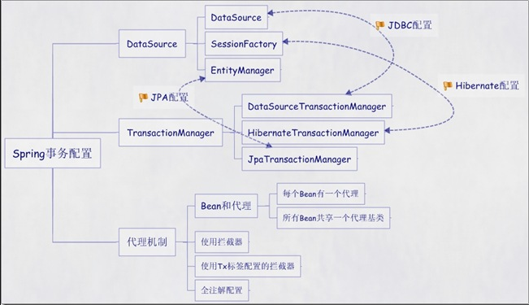

> 1. 事务开启的两种方式：https://blog.csdn.net/myli92/article/details/111658394
> 2. SpringBoot 编程式事务：https://blog.csdn.net/fzy629442466/article/details/103458630

# Spring 事务开启的两种方式

## 1、Trasactional 自动提交【注解事务】

1、方法上增加@Trasactional注解：@Transactional 注解是通过 AOP 方式实现的，默认捕获 RuntimeException 的异常并触发方法中所有数据库操作（增、删、改）回滚。如果自定义异常需要设置，@Transactional(rollbackOn = Exception.class)

2、在配置文件中或者启动类上开始事务：SpringBoot 在启动类上加 @EnableTransactionManagement 注解就行(开启注解事务管理，等同于xml配置方式的 `<tx:annotation-driven />`)

注：需要将异常异常信息抛出到上层框架，如果catch处理了的异常，不会被事物作为判断依据；如果异常被 catch 了，但是又在catch 中抛出了新的异常，那么事物会以这个新的异常作为是否进行回滚的判断依据。

使用声明式注解时，除了向外层抛出异常外，我们还可以主动设置事务需要回滚（需要在方法上增加@Trasactional）：

```java
TransactionAspectSupport.currentTransactionStatus().setRollbackOnly();
```

3、完整示例：

```java
@Transactional(rollbackOn = Exception.class)
public void tranDelNoAutoZJ(String name) {
    User deleteUer = userRepository.findOneByName(name);
    if (deleteUer != null) {
        userRepository.deleteById(deleteUer.getId());
    }
    if (deleteUer.getId() % 2 == 0) {
        // do...
    } else {
        TransactionAspectSupport.currentTransactionStatus().setRollbackOnly();
        // 主动设置事务需要回滚
    }
}
```


## 2、TransactionManage 手动事务【编程事务】



```java
// 这个是JDBC的事务管理器实现类，不同ORM使用不同，它的接口是PlatformTransactionManager
@Autowired 
DataSourceTransactionManager dataSourceTransactionManager;

// 手动开启事务
@Autowired 
TransactionDefinition transactionDefinition; 
TransactionStatus transactionStatus = dataSourceTransactionManager.getTransaction(transactionDefinition);

// 手动提交事务
dataSourceTransactionManager.commit(transactionStatus);

// 手动回滚事务 (最好是放在 catch 里面, 防止程序异常而事务一直卡在哪里未提交)
dataSourceTransactionManager.rollback(transactionStatus);
```

DataSourceTransactionManager 的继承图：


### 1、基于接口开启事务

```java
/**
 * 事务管理器的接口
 */
@Autowired
private PlatformTransactionManager platformTransactionManager;

/**
 * 接口
 */
@Autowired
private TransactionDefinition transactionDefinition;

@Test
public void manualTransactionalTest() {
    TransactionStatus transactionStatus = platformTransactionManager.getTransaction(transactionDefinition);
    try {
        UserInfo userInfo = new UserInfo();
        iUserInfoService.insertData(userInfo);

        UserInfo userInfo1 = new UserInfo();
        iUserInfoService.insertData(userInfo1);
        platformTransactionManager.commit(transactionStatus);
    } catch (Exception exception) {
        platformTransactionManager.rollback(transactionStatus);
    }
}
```


### 2、Mybatis 开启事务

```java
@Autowired
DataSourceTransactionManager dataSourceTransactionManager;

public void tranDelNoAuto(String name) {
    DefaultTransactionDefinition defaultTransactionDefinition = new DefaultTransactionDefinition();
    TransactionStatus transactionStatus = dataSourceTransactionManager.getTransaction(defaultTransactionDefinition);
    User deleteUer = userRepository.findOneByName(name);
    if (deleteUer != null) {
        userRepository.deleteById(deleteUer.getId());
    }
    if (deleteUer.getId() % 2 == 0) {
        dataSourceTransactionManager.commit(transactionStatus);
    } else {
        dataSourceTransactionManager.rollback(transactionStatus);
    }
}
```


### 3、JPA 开启事务

```java
@Autowired
JpaTransactionManager jpaTransactionManager;

public void tranDelNoAuto(String userName) {
    DefaultTransactionDefinition defaultTransactionDefinition = new DefaultTransactionDefinition();
    TransactionStatus transactionStatus = jpaTransactionManager.getTransaction(defaultTransactionDefinition);
    User delteUser = iUserDao.findByUsername(userName);
    if (delteUser != null) {
        iUserDao.deleteById(delteUser.getUserid());
    }
    if (delteUser.getUserid() % 2 == 0) {
        jpaTransactionManager.commit(transactionStatus);
    } else {
        jpaTransactionManager.rollback(transactionStatus);
    }
}
```


### 4、TransactionManage 工具类

我们就基于这种方法来做一个工具类。这个工具类作用是接收一个Service层需要被事务包围的方法为参数，然后给调用端返回事务结果，供调用端根据结果做相应的处理。

```java
import lombok.extern.slf4j.Slf4j;
import org.springframework.beans.factory.annotation.Autowired;
import org.springframework.stereotype.Component;
import org.springframework.transaction.PlatformTransactionManager;
import org.springframework.transaction.TransactionStatus;
import org.springframework.transaction.support.DefaultTransactionDefinition;
import java.util.function.Consumer;

/**
 * 编程式事务工具类
 */
@Slf4j
@Component
public class TransactionUtil {
    @Autowired
    private PlatformTransactionManager transactionManager;

    public <T> boolean transactional(T entity, Consumer<T> consumer) {
        TransactionStatus status = transactionManager.getTransaction(new DefaultTransactionDefinition());
        try {
            consumer.accept(entity);
            transactionManager.commit(status);
            return true;
        } catch (Exception e) {
            transactionManager.rollback(status);
            log.error("编程式事务业务异常回滚", e);
            return false;
        }
    }
}
```

该类通过接收一个函数型参数，返回该函数的事务执行结果。由于我们仅仅是为了执行Service代码，并不需要改变代码的值，所有consumer.accept(null)即可。

```java
@Service
public class TestService {

    /**
     * 此处不需要事务，由TransactionUtil控制事务
     */
    public void doSome(Object entity) {
        // repository.save(entity);
        System.out.println("我是Service层" + entity);
    }
}

```

Controller 中就可以使用

```java
@RestController
public class TestController {
    @Autowired TestService testService;
    @Autowired TransactionUtil transactionUtil;

    @GetMapping("/test")
    public String test() {
        // 获取事务的执行结果
        boolean result = transactionUtil.transactional(new Object(), x -> testService.doSome(x));
        return "1";
    }
}
```

该工具是需要获取事务执行结果的封装。


## 3、TransactionTemplate 手动事务【编程事务】

```java
// 注入TransactionTemplate  
@Bean
@ConditionalOnMissingBean
public TransactionTemplate transactionTemplate() {
    return new TransactionTemplate();
    // return new TransactionTemplate(this.dataSourceTransactionManager);
}
```

```java
@Autowired
private TransactionTemplate transactionTemplate;

@Test
public void transactionTemplateTest() {
    transactionTemplate.execute((transactionStatus) -> {

        UserInfo userInfo = new UserInfo();
        iUserInfoService.insertData(userInfo);

        UserInfo userInfo1 = new UserInfo();     
        iUserInfoService.insertData(userInfo1);
        return true;
    });
}
```

**如下是有返回值与无返回值示例：**

1、借助 TransactionCallback 执行事务管理，带有返回值：

```java
public Object getObject(String str) {
    /*
     * 执行带有返回值<Object>的事务管理
     */
    transactionTemplate.execute(new TransactionCallback<Object>() {
        @Override
        public Object doInTransaction(TransactionStatus transactionStatus) {
            try {
                    //... 业务代码
                    return new Object();
            } catch (Exception e) {
                // 回滚
                transactionStatus.setRollbackOnly();
                return null;
            }
        }
    });
}
```

2、借助 TransactionCallbackWithoutResult 执行事务管理，无返回值：

```java
public void update(String str) {
    /*
     * 执行无返回值的事务管理
     */
    transactionTemplate.execute(new TransactionCallbackWithoutResult() {
        @Override
        protected void doInTransactionWithoutResult(TransactionStatus transactionStatus) {
            try {
                // ... 业务代码
            } catch (Exception e){
                // 回滚
                transactionStatus.setRollbackOnly();
            }
        }
    });
}
```

