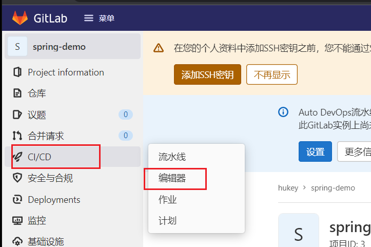

> - gitlab+runner持续集成springboot项目 之 shell模式【2】：https://www.cnblogs.com/hukey/p/17172188.html
> - https://blog.csdn.net/zyy247796143/article/details/123842374
> - https://zhuanlan.zhihu.com/p/570074925

# 一、GitLab Ci/CD 介绍

## 1、什么是 CI/CD

软件开发的持续方法基于自动执行脚本，以最大程度地减少在开发应用程序时引入错误的机会。从开发新代码到部署新代码，他们几乎不需要人工干预，甚至根本不需要干预。

它涉及到在每次小的迭代中就不断地构建、测试和部署代码更改，从而减少了基于已经存在bug或失败的先前版本开发新代码的机会。

**Continuous Integration（持续集成）**

假设一个应用程序，其代码存储在GitLab的Git仓库中。开发人员每天都要多次推送代码更改。对于每次向仓库的推送，你都可以创建一组脚本来自动构建和测试你的应用程序，从而减少了向应用程序引入错误的机会。这种做法称为持续集成，对于提交给应用程序（甚至是开发分支）的每项更改，它都会自动连续进行构建和测试，以确保所引入的更改通过你为应用程序建立的所有测试，准则和代码合规性标准。

**Continuous Delivery（持续交付）**

持续交付是超越持续集成的更进一步的操作。应用程序不仅会在推送到代码库的每次代码更改时进行构建和测试，而且，尽管部署是手动触发的，但作为一个附加步骤，它也可以连续部署。此方法可确保自动检查代码，但需要人工干预才能从策略上手动触发以必输此次变更。

**Continuous Deployment（持续部署）**

与持续交付类似，但不同之处在于，你无需将其手动部署，而是将其设置为自动部署。完全不需要人工干预即可部署你的应用程序。

本文采用 GitLab 自身的 CI/CD 通过提交 SpringBoot 项目代码来实现自动打包并启动。


## 2、GitLab CI/CD 是如何工作

为了使用 GitLab CI/CD，你需要一个托管在 GitLab 上的应用程序代码库，并且在根目录中的 **.gitlab-ci.yml** 文件中指定构建、测试和部署的脚本。

在这个文件中，你可以定义要运行的脚本，定义包含的依赖项，选择要按顺序运行的命令和要并行运行的命令，定义要在何处部署应用程序，以及指定是否 要自动运行脚本或手动触发脚本。

为了可视化处理过程，假设添加到配置文件中的所有脚本与在计算机的终端上运行的命令相同。

**一旦将 .gitlab-ci.yml 添加到仓库中，GitLab 将检测到该文件，并使用名为 GitLab Runner 的工具运行你的脚本。该工具的操作与终端类似。这些脚本被分组到 jobs，它们共同组成一个 Pipeline。**

一个最简单的 .gitlab-ci.yml 文件可能是这样的：

```yaml
before_script: 
  - apt-get install rubygems ruby-dev -y 

run-test: 
  script: 
    - ruby --version 6
```

before_script 属性将在运行任何内容之前为你的应用安装依赖，一个名为 run-test 的 Job（作业）将打印当前系统的 Ruby 版本。二者共同构成了在每次推送到仓库的任何分支时都会被触发的Pipeline（管道）。

**总结：**

通过上面的介绍，运行 CI/CD 需要两个东西：

- .gitlab-ci.yml 文件，提交到源码仓库中
- gitlab-runner 工具，安装到部署服务器上


## 3、主机环境

| IP              | 用途               | CPU  | 内存 | 系统      |
| --------------- | ------------------ | ---- | ---- | --------- |
| 192.168.199.101 | gitlab服务器       | 4    | 8G   | CentOS7.9 |
| 192.168.199.102 | java程序部署服务器 | 4    | 8G   | CentOS7.9 |


# 二、安装 GitLab

> 请参考上一篇文章安装 GitLab

# 三、安装注册 GitLab-runner

注意：通过以下yum方式安装的gitlab-runner 由于版本较低，在流水线 deploy工作时，可能无法显示日志信息，造成无法排查问题。

## 1、yum 安装 run

```bash
curl -L https://packages.gitlab.com/install/repositories/runner/gitlab-ci-multi-runner/script.rpm.sh | sudo bash
yum install gitlab-ci-multi-runner
```

注意：yum方式安装的 runner是通过 gitlab-runner用户进行管理的，会发生一些权限的问题，请自行配置解决。ner【弃用】


## 2、二进制包安装 runner【推荐】


图文中已经非常清楚详细的介绍了最新版 runner 的安装步骤：

```bash
mv gitlab-runner-linux-amd64  /usr/local/bin/gitlab-runner
chmod +x /usr/local/bin/gitlab-runner
mkdir -p/data/gitlab-runner
# 注意：我这里使用/data/gitlab-runner 作为工作目录，root用户作为 gitlab-runner执行的用户，使用root用户可以避免很多权限问题，同时危险系数也很高。
gitlab-runner install --working-directory /data/gitlab-runner --user root

# 启动服务
systemctl status gitlab-runner.service
systemctl start  gitlab-runner.service
```


## 3、注册 GitLab-runner

### 1、查看 GitLab 注册信息


### 2、注册 GitLab-runner

1、运行 `gitlab-runner register` 命令进行注册

```bash
gitlab-runner register
```

2、输入GitLab的 url地址，也就是上面截图第2部分

```bash
Please enter the gitlab-ci coordinator URL (e.g. https://gitlab.com/):
http://192.168.199.101
```

3、输入注册的 token，截图第3部分

```bash
Please enter the gitlab-ci token for this runner:
zaGx3-KVBSD4V1qT5CC1
```

4、输入对这个Runner的表述（同时也是这个Runner的名字），可以在GitLab page上修改它

```bash
Please enter the gitlab-ci description for this runner:
[localhost.localdomain]: test_runner
```

5、输入Runner的tag，同样可以在gitlab page 上修改它

```bash
Please enter the gitlab-ci tags for this runner (comma separated):
test
```

6、输入Runner的executor

```bash
Please enter the executor: virtualbox, docker, ssh, shell, docker+machine, docker-ssh+machine, kubernetes, docker-ssh, parallels:
shell
```

7、注册完成后，会出现如下提示：

```bash
Runner registered successfully. Feel free to start it, but if it's running already the config should be automatically reloaded!
```

8、注册完成后，会生成 `/etc/gitlab-runner/config.toml` 文件，该文件是Runner的配置文件：

内容如下：

```toml
concurrent = 1
check_interval = 0

[[runners]]
  name = "test_runner"
  url = "http://192.168.199.101"
  token = "GnkK-BZrctBjURQFd4Ax"
  executor = "shell"
  [runners.cache]
```

9、在 GitLab 上查看刚添加 gitlab-runner 的信息


至此 runner 就添加完成。

执行 `gitlab-runner list` 可查看到保存在配置文件中的所有运行程序

```bash
root@localhost(192.168.199.102)~>gitlab-runner list
Listing configured runners                          ConfigFile=/etc/gitlab-runner/config.toml
test_runner                                         Executor=shell Token=GnkK-BZrctBjURQFd4Ax URL=http://192.168.199.101
```


### 3、GitLab-runner 常用命令

```bash
gitlab-runner register    # 默认交互模式下使用，非交互模式添加 --non-interactive
gitlab-runner list        # 此命令列出了保存在配置文件中的所有运行程序
gitlab-runner verify      # 此命令检查注册的runner是否可以连接，但不验证GitLab服务是否正在使用runner。 --delete 删除
gitlab-runner unregister  # 该命令使用GitLab取消已注册的runner。

# 使用令牌注销
gitlab-runner unregister --url http://gitlab.example.com/ --token t0k3n

# 使用名称注销（同名删除第一个）
gitlab-runner unregister --name test-runner

# 注销所有
gitlab-runner unregister --all-runners
```


# 四、配置 Shell 模式

本次运行 `SpringBoot` 项目。

## 1、安装 JDK 和 Maven

```bash
tar xf jdk-8u202-linux-x64.tar.gz
cd jdk1.8.0_202/
source install.sh jdk
```

```bash
tar xf apache-maven-3.6.1-bin.tar.gz
cd apache-maven-3.6.1
source install.sh mvn
```


## 2、创建项目

创建一个空白项目


## 3、克隆项目

1、安装 GIT

```bash
yum localinstall git-2.39.1-1.WANdisco.x86_64.rpm -y
```

2、克隆项目

点击克隆，将新建的项目拉到服务器上。


在192.168.199.102服务器上执行：

```bash
root@localhost(192.168.199.102)~>git clone http://192.168.199.101/hukey/spring-demo.git
Cloning into 'spring-demo'...
Username for 'http://192.168.199.101': hukey
Password for 'http://hukey@192.168.199.101':
remote: Enumerating objects: 3, done.
remote: Counting objects: 100% (3/3), done.
remote: Total 3 (delta 0), reused 0 (delta 0), pack-reused 0
Receiving objects: 100% (3/3), done.
```


## 4、将代码上传到 GitLab仓库

```bash
unzip SpringBootDemo-master.zip
cp -a SpringBootDemo-master/* spring-demo/
cd spring-demo
git add .
git commit -m 'add files.'
git push origin main

Username for 'http://192.168.199.101': hukey
Password for 'http://hukey@192.168.199.101':
Enumerating objects: 29, done.
Counting objects: 100% (29/29), done.
Delta compression using up to 2 threads
Compressing objects: 100% (17/17), done.
Writing objects: 100% (27/27), 8.19 KiB | 838.00 KiB/s, done.
Total 27 (delta 0), reused 0 (delta 0), pack-reused 0
To http://192.168.199.101/hukey/spring-demo.git
   5ea8876..0d7e72f  main -> main
```


## 5、添加配置文件




.gitlab-ci.yaml 内容如下：

```yaml
stages:          # List of stages for jobs, and their order of execution
  - build
  - deploy

build:       # This job runs in the build stage, which runs first.
  stage: build
  tags:
    - test
  script:
    - mvn -N io.takari:maven:0.7.7:wrapper
    - chmod +x mvnw
    - ./mvnw package
    - chmod +x target/*.jar
  artifacts:
    paths:
      - target/*.jar

production:      # This job runs in the deploy stage.
  stage: deploy  # It only runs when *both* jobs in the test stage complete successfully.
  tags:
    - test
  script:
    - jps -v | awk '/spring-boot-demo/{print "kill -9",$1}' | sh -
    - nohup java -jar target/*.jar > log.file 2>&1 &
  only:
    - main
```


## 6、构建 CI/CD

当做完上一步，点击 **提交更改** 时，gitlab 就已经开始触发 **流水线** 了，可以点击流水线查看：


因为是第一次构建，会下载很多项目所需依赖包。


## 7、mvnw 构建

本项目采用 `mvnw` 构建，是为了保证版本与本地开发环境一致。而在使用 `mvnw` 构建时，发现依赖包下载地址为：`https://repo.maven.apache.org` ，外网地址很慢很慢，因此需要修改如下文件：

```bash
cd ~
vim .m2/wrapper/dists/apache-maven-3.6.3-bin/3j391n2rd0vgi416u9ldio1h2h/apache-maven-3.6.3/conf/settings.xml
```

```xml
...
<mirrors>
    <mirror>
        <id>aliyunmaven</id>
        <mirrorOf>*</mirrorOf>
        <name>阿里云公共仓库</name>
        <url>https://maven.aliyun.com/repository/public</url>
    </mirror>
    <mirror>
        <id>aliyunmaven</id>
        <mirrorOf>*</mirrorOf>
        <name>阿里云谷歌仓库</name>
        <url>https://maven.aliyun.com/repository/google</url>
    </mirror>
    <mirror>
        <id>aliyunmaven</id>
        <mirrorOf>*</mirrorOf>
        <name>阿里云阿帕奇仓库</name>
        <url>https://maven.aliyun.com/repository/apache-snapshots</url>
    </mirror>
    <mirror>
        <id>aliyunmaven</id>
        <mirrorOf>*</mirrorOf>
        <name>阿里云spring仓库</name>
        <url>https://maven.aliyun.com/repository/spring</url>
    </mirror>
    <mirror>
        <id>aliyunmaven</id>
        <mirrorOf>*</mirrorOf>
        <name>阿里云spring插件仓库</name>
        <url>https://maven.aliyun.com/repository/spring-plugin</url>
    </mirror>
    <mirror>
        <id>aliyunmaven</id>
        <mirrorOf>*</mirrorOf>
        <name>阿里云grails-core</name>
        <url>https://maven.aliyun.com/repository/grails-core</url>
    </mirror>
    <mirror>
        <id>aliyunmaven</id>
        <mirrorOf>*</mirrorOf>
        <name>阿里云gradle-plugin</name>
        <url>https://maven.aliyun.com/repository/gradle-plugin</url>
    </mirror>
    <mirror>
        <id>aliyunmaven</id>
        <mirrorOf>*</mirrorOf>
        <name>阿里云mapr-public</name>
        <url>https://maven.aliyun.com/repository/mapr-public</url>
    </mirror>
</mirrors>
...
```

修改完成后，在 GitLab **流水线**取消当前任务，然后点击**编辑器** 重新 **提交更改** 再次触发 流水线构建：

**注意：如果这里操作后，流水线作业提示：作业挂起中，等待进入队列**

```bash
# 使用root用户重新启动 gitlab-runner
gitlab-runner stop
gitlab-runner start
```


点击 **build** 查看日志：


两步走都成功以后，登录到 192.168.199.102上，检测程序端口是否开启成功。

```bash
lsof -i :8080
COMMAND   PID          USER   FD   TYPE DEVICE SIZE/OFF NODE NAME
java    19008 gitlab-runner    7u  IPv6  53046      0t0  TCP *:webcache (LISTEN)
```

浏览器访问：


到此，本地shell命令构建并启动成功。


# 五、实战部署 SpringBoot 项目

提前准备一个SpringBoot的Demo项目，按照生产环境的方式进行部署。GitLab 和 runner 的安装方式同上面一致。

## 1、安装配置 gitlab-runner

```bash
mv gitlab-runner-linux-amd64  /usr/local/bin/gitlab-runner
chmod +x /usr/local/bin/gitlab-runner
mkdir -p/data/gitlab-runner
# 注意：我这里使用/data/gitlab-runner 作为工作目录，root用户作为 gitlab-runner执行的用户，使用root用户可以避免很多权限问题，同时危险系数也很高
gitlab-runner install --working-directory /data/gitlab-runner --user root

# 启动服务
systemctl status gitlab-runner.service
systemctl start  gitlab-runner.service
```


## 2、CI/CD 配置文件

.gitlab-ci.yml 文件

```yaml
stages:          # List of stages for jobs, and their order of execution
  - build
  - deploy

build:           # This job runs in the build stage, which runs first.
  stage: build
  tags:
    - shell
  script:
    - mvn clean package -Dmaven.test.skip=true
  artifacts:
    paths:
      - target

production:      # This job runs in the deploy stage.
  stage: deploy  # It only runs when *both* jobs in the test stage complete successfully.
  tags:
    - shell
  script:
    - jps -v | awk '/system-monitoring/{print "kill -9",$1}' | sh -
    - mkdir -p /data/app
    - if [ -d /data/app/system-monitoring-1.0 ]; then mv /data/app/system-monitoring-1.0 /data/app/system-monitoring-1.0-$(date "+%F_%H-%M-%S"); fi
    - tar xf target/system-monitoring-1.0-release.tar.gz -C /data/app/
    - chmod -R 0775 /data/app/system-monitoring-1.0
    - cd /data/app/system-monitoring-1.0
    - nohup java -jar lib/system-monitoring-1.0.jar --spring.config.location=config/application.yml > log.file 2>&1 &
  only:
    - main
```

这是我写的一个简单示例：

分为两个步骤执行：

1. build 部分打包生成jar包
2. 主要关注下 `script` 部分：
   - `jps -v | awk '/system-monitoring/{print "kill -9",$1}' | sh -` 首先关闭服务；
   - `mv /data/app/system-monitoring-1.0 /data/app/system-monitoring-1.0-$(date "+%F_%H-%M-%S")` 将原有服务进行更名备份
   - `mkdir -p /data/app` 确认目录是否创建，没有则创建
   - `tar xf target/system-monitoring-1.0-release.tar.gz -C /data/app/` 将程序包解压到该目录
   - `cd /data/app/system-monitoring-1.0` 进入该目录下
   - `nohup java -jar lib/system-monitoring-1.0.jar --spring.config.location=config/application.yml > log.file 2>&1 &` 执行启动
3. 关键字说明
   - tags ：gitlab-runner 注册时输入的标签，这里只有满足 tag=test 的runner才会执行
   - artifacts：会将path指定的文件或目录进行打包，并在该步骤build 完成后，可以通过gitlab页面进行直接下载操作
   - only：确认支持的分支，这里指定为main分支