> 容器中gitlab的安装及备份与恢复【1】：https://www.cnblogs.com/hukey/p/17148065.html

# 一、GitLab 前言

目前公司的代码仓库是运行在一台物理服务器上，该服务器信息如下：

```bash
服务器型号：Inspur NF5270M3
CPU：Intel(R) Xeon(R) Silver 4210 CPU @ 2.20GHz x 2
MEM: 128G
磁盘: 4块 2TB SATA
阵列类型：2块为一组作为 RAID-1，第一组RAID-1做操作系统，第二组RAID-1做数据存储并挂载到 /opt 目录

gitlab版本：14.2.3

#/root/check_disk.sh
Firmware state: Online, Spun Up
Firmware state: Online, Spun Up
Firmware state: Online, Spun Up
Firmware state: Online, Spun Up

目前都为 online的状态。
检测时间：2023-02-22 17:37:41
```

考虑到代码库的重要性，经过讨论确定备份策略如下：

- 每周进行一次全备并刻录到光盘存储；
- 定期检查代码服务器磁盘状态

可能当初为了方便，直接使用 docker 启动的 gitlab

```bash
docker ps -a
CONTAINER ID   IMAGE                     COMMAND             CREATED         STATUS                 PORTS                                   NAMES
c18a6274a299   gitlab/gitlab-ce:latest   "/assets/wrapper"   17 months ago   Up 7 weeks (healthy)   0.0.0.0:2222->22/tcp ...   gitlab
```


# 二、安装 GitLab

注意：请在测试环境操作确认后，再去生产环境操作！！！

```bash
测试主机：
192.168.199.101 - 备份
192.168.199.102 - 恢复
```

## 1、容器启动 GitLab

容器启动 gitlab 命令，

```bash
docker run -d \
  --name gitlab \
  --hostname gitlab \
  --restart always \
  -p 443:443 -p 80:80 -p 2002:22 \
  -v /opt/gitlab/config:/etc/gitlab \
  -v /opt/gitlab/data:/var/opt/gitlab \
  -v /opt/gitlab/logs:/var/log/gitlab \
  -e GITLAB_SKIP_UNMIGRATED_DATA_CHECK=true \
  gitlab/gitlab-ce:latest
```

根据主机资源配置，启动时间可能会有差异。

**本次 GitLab 的版本为：14.2.3**，查看GitLab版本如下：

```bash
docker exec -it gitlab cat /opt/gitlab/embedded/service/gitlab-rails/VERSION
14.2.3
```


## 2、修改 GitLab 配置

注意：修改配置需要在容器内进行操作。

```bash
# 进入容器内
docker exec -it gitlab bash

# 修改 gitlab.rb
vi /etc/gitlab/gitlab.rb
...
# 加入如下配置

# gitlab访问地址，可以写域名。如果端口不写的话默认为80端口
external_url 'http://192.168.199.101'
# ssh主机ip，这里会体现在项目使用ssh克隆
gitlab_rails['gitlab_ssh_host'] = '192.168.199.101'
# ssh主机端口，这里会体现在项目使用ssh克隆
gitlab_rails['gitlab_shell_ssh_port'] = 2002
...

# 让配置生效
gitlab-ctl reconfigure
```


## 3、页面登录 GitLab

完成上面操作后，等几分钟通过浏览器访问：

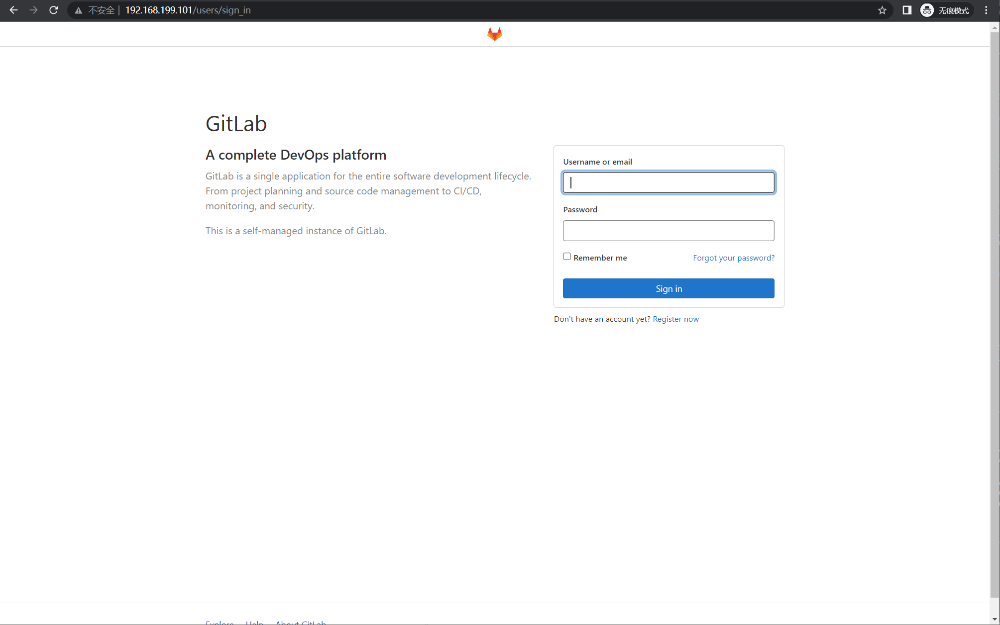

```
用户名：root 
密码：通过容器内该文件获取 cat /etc/gitlab/initial_root_password
```


## 4、创建其他用户

登录 root用户 点击 菜单 -> 管理员 -> 用户 -> 新建用户

创建两个用户：

- hukey - 管理员
- xiaofei - 普通用户

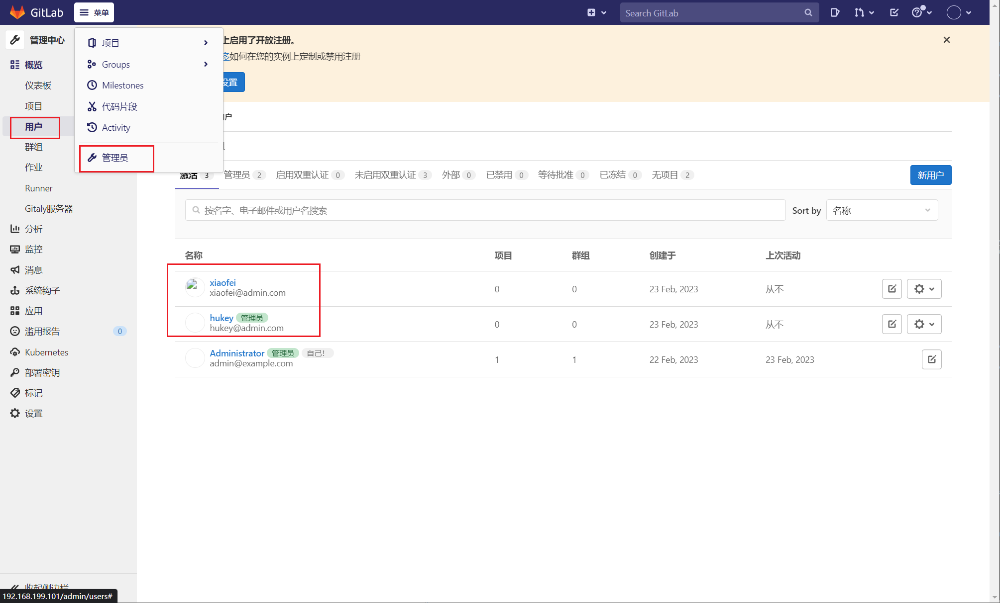

使用管理员 **hukey** 登录，首次登录会修改要求修改密码

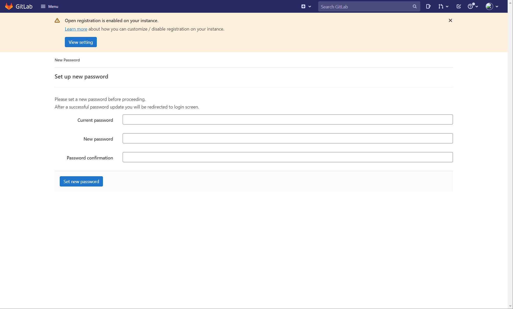


## 5、创建测试项目

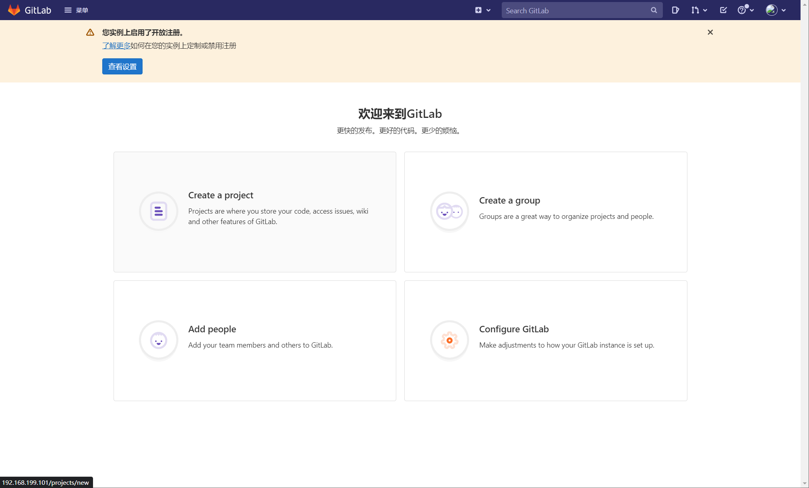

创建空白项目：

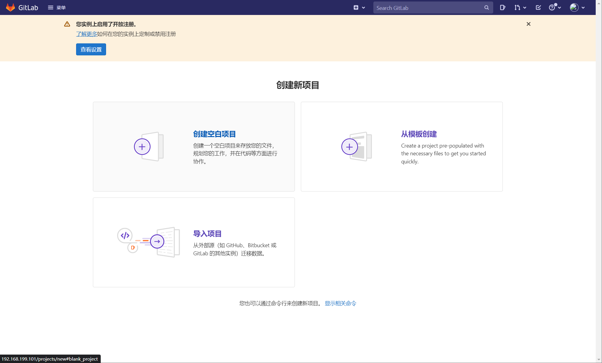

填写项目名称和描述，点击 **新建项目**

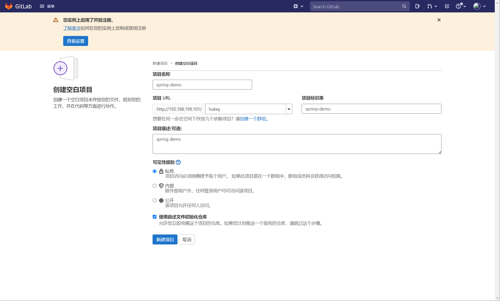


## 6、客户端克隆项目

```bash
客户端主机IP: 192.168.199.103
```

项目创建完成后， 点击http克隆：

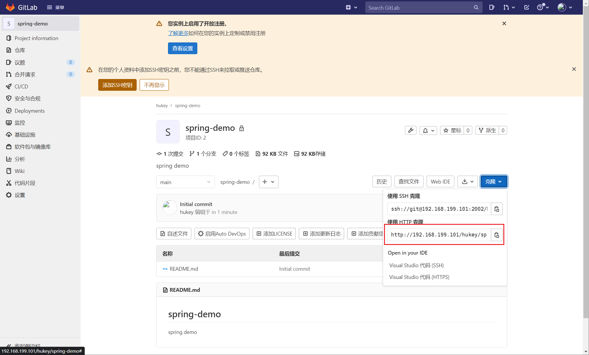

在客户端主机上执行：

```bash
git clone http://192.168.199.101/hukey/spring-demo.git
用户名：hukey
密码：[gitlab hukey用户的登录密码]
```

登录成功后开始同步项目到本地：

```bash
root@localhost(192.168.199.103)~/spring-demo>ls -a
./  ../  .git/  README.md
```


## 7、创建测试项目

将准备好的代码文件拷贝到项目目录，这里是做实验，代码文件随意写几个即可。

```bash
root@localhost(192.168.199.103)~>cp -a SpringBootDemo-master/* spring-demo/

# 提交git到服务器代码仓库
cd spring-demo/
git add .
git commit -m 'add files'
git push origin main
[用户名：hukey]
[密码：hukey登录密码]
```

提交成功后，在浏览器刷新项目：

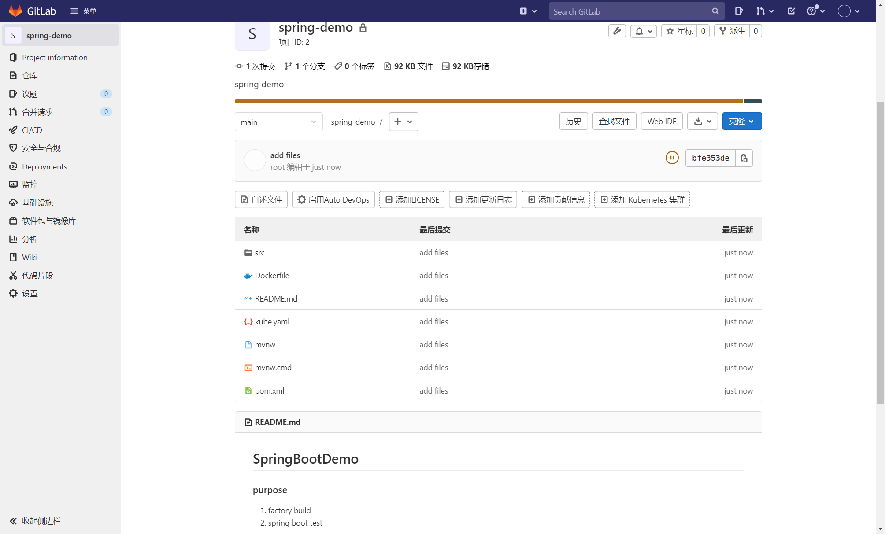

代码已经同步到服务器gitlab仓库了。为了真实性，为 spring-demo项目添加一个开发者。

点击成员

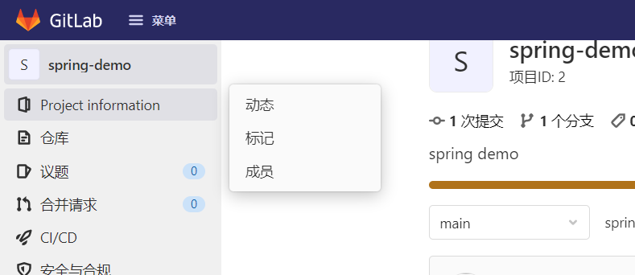

邀请成员 -> gitlab成员选择 -> 角色选择【开发者】-> 点击邀请

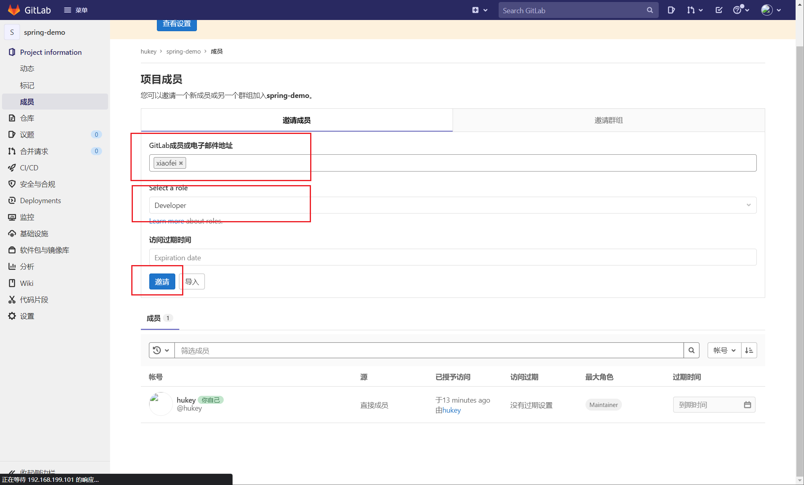

切换到开发者用户。开发者登录后可直接查看spring-demo项目

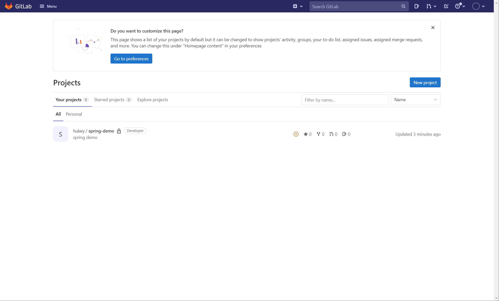

将项目克隆到本地，随意添加点文件并提交

```bash
git clone http://192.168.199.101/hukey/spring-demo.git
cd spring-demo/
#创建新的分支
git checkout -b dev
#随意拷贝一个文件
cp -a /etc/fstab ./
git config --global user.name "xiaofei"
git add .
git commit -m 'add fstab'
#提交新的分支
git push origin dev
```

刷新项目，可以看到多了一个dev分支，该分支多了一个fstab文件

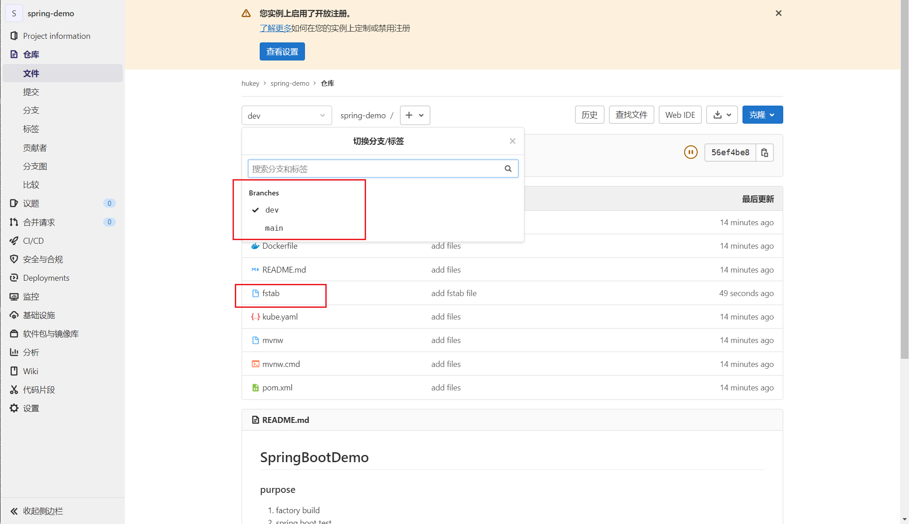

提交也产生了记录

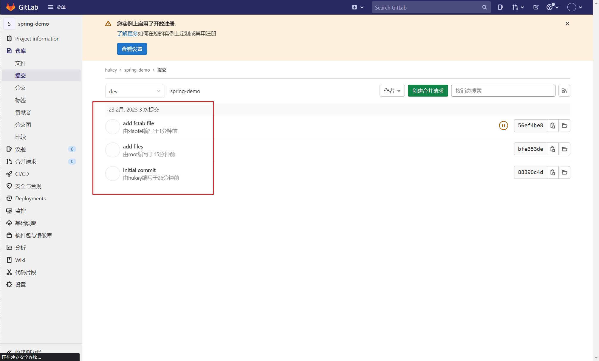

以上，都是为备份恢复提供前提。通过模拟真实使用场景。


# 三、备份 GitLab

```bash
docker exec gitlab gitlab-rake gitlab:backup:create
...
Warning: Your gitlab.rb and gitlab-secrets.json files contain sensitive data
and are not included in this backup. You will need these files to restore a backup.
Please back them up manually.

Backup task is done.
```

注意：上述告警信息表示 gitlab.rb 和 gitlab-secrets.json 未备份，如果 gitlab.rb 修改较多，则自行备份。我这里使用的默认配置，则不用备份了。

备份完成后，备份文件目录：

```bash
# 注意文件名是通过时间设定的
/var/opt/gitlab/backups/1677123555_2023_02_23_14.2.3_gitlab_backup.tar
```

将备份文件拷贝到本地：

```bash
docker cp gitlab:/var/opt/gitlab/backups/1677123555_2023_02_23_14.2.3_gitlab_backup.tar ./gitlab/backup/
```


# 四、恢复 GitLab

## 1、搭建 GitLab 服务

> 搭建如上安装教程即可

## 2、拷贝备份文件至容器内

```bash
# 将备份文件拷贝到容器中对应的目录下
docker cp 1677123555_2023_02_23_14.2.3_gitlab_backup.tar gitlab:/var/opt/gitlab/backups/
# 注意：这里需要修改文件权限，否则会报没有权限执行
docker exec -it gitlab bash
chown -R git:git /var/opt/gitlab/backups/1677123555_2023_02_23_14.2.3_gitlab_backup.tar
```


## 3、关闭容器内相关数据连接服务

**注意：恢复备份文件前，先停止容器内相关数据连接服务：**

```bash
gitlab-ctl stop puma
gitlab-ctl stop sidekiq
```


## 4、还原备份文件

```bash
gitlab-rake gitlab:backup:restore
...
Do you want to continue (yes/no)? yes
...
Restoring PostgreSQL database gitlabhq_production ... ERROR:  must be owner of extension pg_trgm
ERROR:  must be owner of extension btree_gist
ERROR:  must be owner of extension btree_gist
ERROR:  must be owner of extension pg_trgm
```

注意：出现如上的报错处理方案如下：

```bash
1. 修改postgresql配置
vi /var/opt/gitlab/postgresql/data/postgresql.conf
# 如下修改：
listen_addresses = '*'

vi /var/opt/gitlab/postgresql/data/pg_hba.conf
# 最后添加：
local   all         all                               trust
host    all         all                               127.0.0.1/32 trust


2. 重启gitlab服务
gitlab-ctl restart

3. 修改gitlab账号为超级用户
su - gitlab-psql
/opt/gitlab/embedded/bin/psql -h 127.0.0.1 gitlabhq_production
ALTER USER gitlab WITH SUPERUSER;
\q
exit
```

经过上面的修改后，报错解决，再次执行还原备份文件：

```bash
gitlab-rake gitlab:backup:restore
...
Restore task is done.
```

还原备份文件成功。


## 5、验证恢复备份

使用管理员 hukey 登录后，查看项目没有问题。

- main分支完整
- dev分支多一个fstab文件
- 提交信息里三条记录

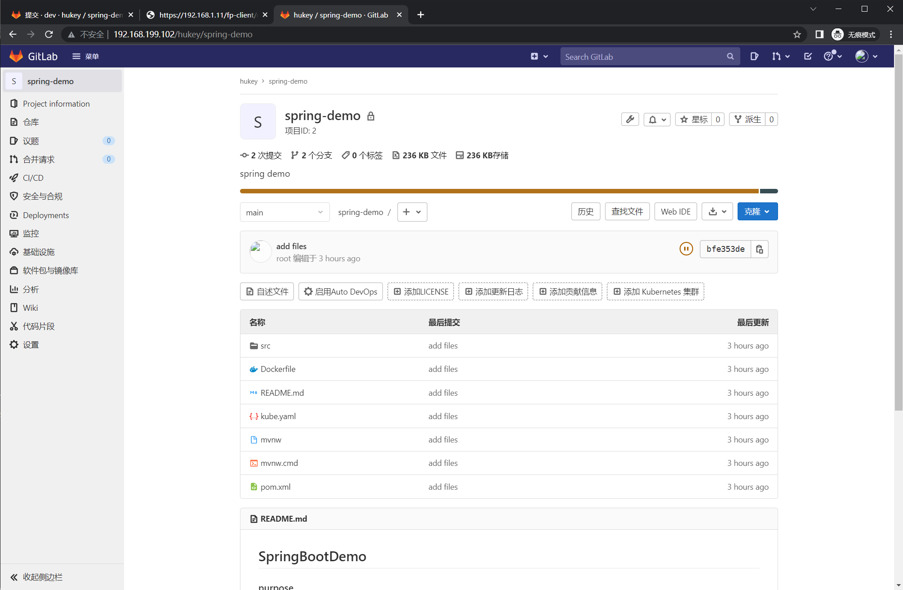

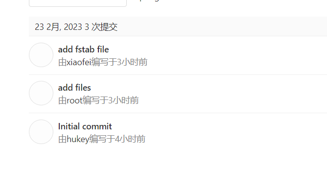

综上，实验演示了GitLab备份的完整性和恢复的完整性。