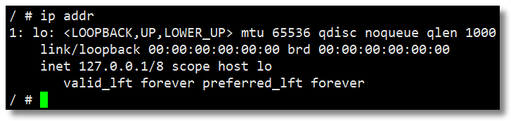
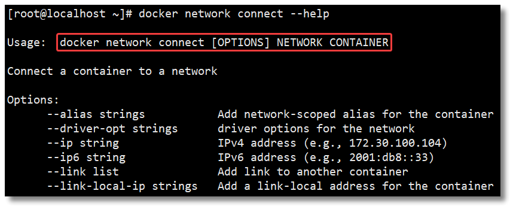
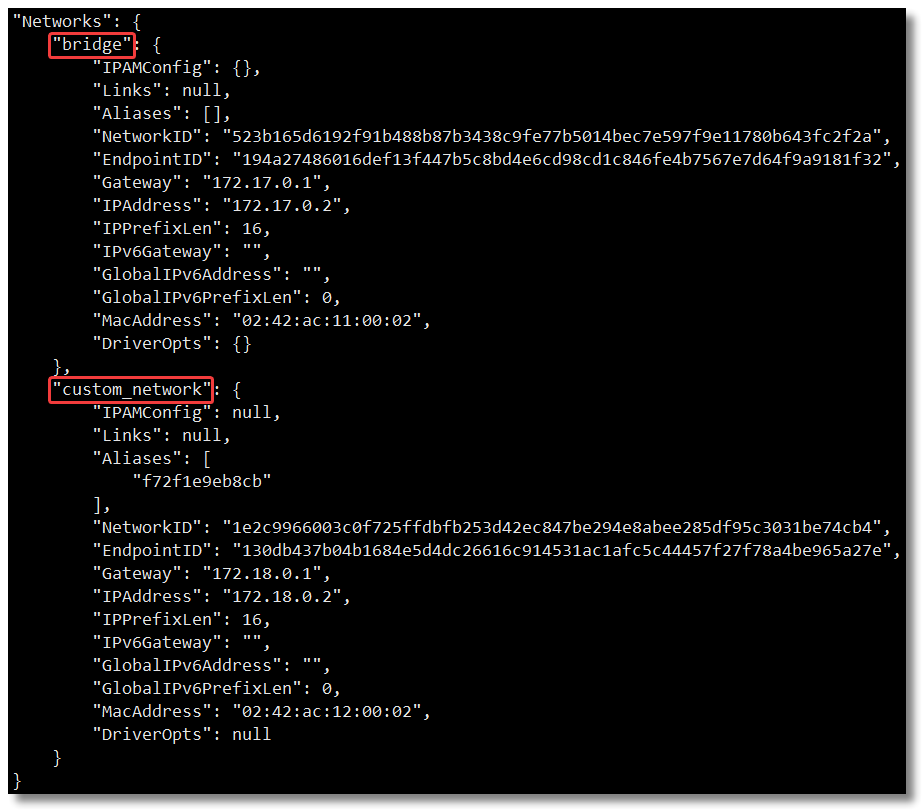
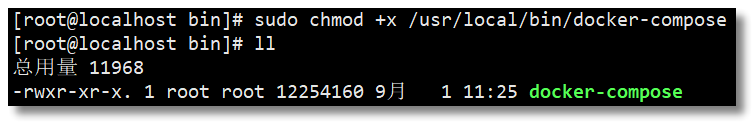

> 本文笔记来源于：哈喽沃德先生
>
> 1. 博客地址：https://www.mrhelloworld.com/categories/docker/
> 2. 视频地址：https://www.bilibili.com/video/BV17Z4y1F7dD

# Docker 的前世今生

## 1、虚拟化

**「要解释清楚 Docker，首先要解释清楚容器（Container）的概念」**。要解释容器的话，就需要从操作系统说起。操作系统太底层，细说的话一两本书都说不清楚。这里就一句话来总结一下：操作系统（Operating System，简称OS）是管理计算机硬件与软件资源的计算机程序，并且为软件运行提供通用服务的系统软件。

随着硬件的性能提升，软件种类的丰富，有两种情况变得很常见：

1. 硬件性能过剩——很多计算机的硬件配置，往往会有大量时间处于硬件资源闲置的状态。例如一般家用电脑，已经是四核、六核的配置了，除了3A游戏、视频制作、3D渲染、高性能计算等特殊应用外，通常有 90% 以上时间 CPU 是闲置的；
2. 软件冲突——因为业务需要，两个或者多个软件之间冲突，或者需要同一个软件的不同版本。例如早几年做 Web 前端的，要测试网页在不同版本的 IE 上是否能正常显示，然而 Windows 只能装一个版本的 IE。


为了解决软件冲突，只能配置多台计算机，或者很麻烦的在同一台电脑上安装多个操作系统。显然这两个方案都有其缺点：多台计算机成本太高，多操作系统的安装、切换都很麻烦。在硬件性能过剩的时候，**「硬件虚拟化」**的普及就很自然而然的提出来了。

所谓硬件虚拟化，就是某个特殊的软件，仿真出一台或者多台计算机的各种硬件，用户可以在这一台虚拟机上安装、运行操作系统（一般叫来宾操作系统，Guest OS）和各种应用，并且把 Guest OS 和上面应用软件对硬件资源的访问转发到底层的硬件上来实现。

对于 Guest OS 和上面的应用程序来说，这台虚拟机和普通物理计算机是完全一样没有任何区别的——除了性能可能差一点。全球第一人气的 VMware Workstation 就是这么一个软件，Oracle 的 VirtualBox 以及 Microsoft 的 Virtual PC 都是。这类软件英语有一个专用的单词是 Hypervisor（虚拟机管理程序）。


### 1.1、虚拟机的优点

1. 可以把资源分配到不同的虚拟机，达到硬件资源的最大化利用；
2. 相比直接在物理机上部署应用，虚拟机更容易扩展应用；
3. 云服务：通过虚拟机虚拟出不同的物理资源，可以快速搭建云服务。

> 虚拟化技术主要用来解决高性能的物理硬件产能过剩和老旧的硬件硬件产品产能过低的重组重用，透明化底层物理硬件，从而最大化的利用物理硬件。


### 1.2、虚拟机的缺点

虚拟机的缺点在于 Guest OS 通常会占用不少硬件资源。例如 Windows 安装 VMware 并开机 Guest OS，不运行任何应用的情况下，就需要占用 2 ~ 3G 内存，20 ~ 30G 硬盘空间。而且为了应用系统运行的性能，往往还要给每台虚拟机留出更多的内存容量。虽然不少 Hypervisor 支持动态内存，但基本上都会降低虚拟机的性能。在这样的资源占用情况下，少量的虚拟机还是可以接受的，如果同时运行十多台或数十台虚拟机，硬件资源的浪费就会成倍递增。通常来说，其中相当大一部分甚至全部 Guest OS 都是相同的。

能不能所有应用使用同一个操作系统减少硬件资源的浪费，但是又能避免包括运行库在内的软件冲突呢？**「操作系统层虚拟化——容器」**概念的提出，就是为了解决这个问题。Docker 就是一个容器的标准化实现。


## 2、容器化

容器技术已经发展了很长一段时间了，例如：LXC，BSD Jails，Solaris Zones…


容器化就是应用程序级别的虚拟化技术。容器提供了将应用程序的代码、运行时、系统工具、系统库和配置打包到一个实例中的标准方法。容器共享一个内核（操作系统），它安装在硬件上。


容器和虚拟机相比，容器有以下优点：

1. 启动迅速：没有虚拟机硬件的初始化，没有 Guest OS 的启动过程，可以节约很多启动时间，这就是容器的“开箱即用”；
2. 占用资源少：没有运行 Guest OS 所需的内存开销，无需为虚拟机预留运行内存，无需安装、运行 App 不需要的运行库/操作系统服务，内存占用、存储空间占用都小的多。相同配置的服务器，如果运行虚拟机能运行十多台的，通常可以运行上百个容器毫无压力——当然前提是单个容器应用本身不会消耗太多资源。

　　

## 3、Docker 历史

2010 年，几个搞 IT 的年轻人，在美国旧金山成立了一家名叫 `dotCloud` 的公司。dotCloud 的平台即服务（Platform-as-a-Service, PaaS）提供商。底层技术上，dotCloud 平台利用了 Linux 的 LXC 容器技术。

[](Docker&Docker-Compose实战-哈喽沃德.assets/image-20241025145538298.png)

为了方便创建和管理这些容器，dotCloud 基于 Google 公司推出的 Go 语言开发了一套内部工具，之后被命名为 `Docker`。Docker 就是这样诞生的。

> 　　LXC 是 Docker 的底层基石，但是在 Docker 0.9 版本的时候，Docker 见异思迁了，引入了基于 Go 语言构建的 Libcontainer 的 execution driver。有了 Libcontainer 这个项目，Docker 不再需要依赖于 Linux 部件（LXC，libvirt，systemd-nspawn…）就可以处理 namespaces、control groups、capabilities、apparmor profiles、network interfaces。这下，LXC 沦为可选项。
>
> [](Docker&Docker-Compose实战-哈喽沃德.assets/image-20241025145538299.png)
>
> 在 Docker 1.8 中 LXC 被 deprecated，在 Docker 1.10，LXC 彻底出局。Docker 推出 Libcontainer 自己集成了 Linux 内核中的很多特性，作为一个独特、稳定且不受制于 Linux 的 Library，独立的时代终于到来了。


如同 Docker 的 Logo 一样，Docker 的思想来源于集装箱。集装箱解决了什么问题？在一艘大船上，可以把货物规整的摆放起来，并且各种各样的货物被集装箱标准化，集装箱与集装箱之间互不影响。那么就不需要专门运送水果的船和专门运送化学用品的船了。只要这些货物封装在不同的集装箱里，就可以用一艘大船把它们都运走。

Docker 技术诞生之后，并没有引起行业的关注。而 dotCloud 公司，作为一家小型创业企业，在激烈的竞争之下，也步履维艰。

正当他们快要坚持不下去的时候，脑子里蹦出了“开源”的想法。什么是“开源”？开源，就是开放源代码。也就是将原来内部保密的程序源代码开放给所有人，然后让大家一起参与进来，贡献代码和意见。

有的软件一开始就是开源的。也有的软件，是混不下去，创造者又不想放弃，所以选择开源。自己养不活，就吃“百家饭”嘛。2013 年 3 月，dotCloud 公司的创始人之一，Docker 之父，28 岁的 **「Solomon Hykes」** 正式决定，将 Docker 项目开源。

[](Docker&Docker-Compose实战-哈喽沃德.assets/image-20241025145538301.png)

不开则已，一开惊人。越来越多的 IT 工程师发现了 Docker 的优点，然后蜂拥而至，加入 Docker 开源社区。Docker 的人气迅速攀升，速度之快，令人瞠目结舌。

开源当月， Docker 0.1 版本发布。此后的每一个月， Docker 都会发布一个版本。到 2014 年 6 月 9 日， Docker 1.0 版本正式发布。

此时的 Docker，已经成为行业里人气最火爆的开源技术，没有之一。甚至像 Google、微软、Amazon、 VMware 这样的巨头们都对它青睐有加，表示将全力支持。

Docker 火了之后， dotCloud 公司干脆把公司名字也改成了 Docker Inc. 。

　　

## 4、为什么选择 Docker

**「更高效的利用系统资源」**

由于容器不需要进行硬件虚拟以及运行完整操作系统等额外开销，Docker 对系统资源的利用率更高。无论是应用执行速度、内存损耗或者文件存储速度，都要比传统虚拟机技术更高效。因此，相比虚拟机技术，一个相同配置的主机，往往可以运行更多数量的应用。

**「更快速的启动时间」**

传统的虚拟机技术启动应用服务往往需要数分钟，而 Docker 容器应用，由于直接运行于宿主内核，无需启动完整的操作系统，因此可以做到秒级、甚至毫秒级的启动时间。大大的节约了开发、测试、部署的时间。

**「一致的运行环境」**

开发过程中一个常见的问题是环境一致性问题。由于开发环境、测试环境、生产环境不一致，导致有些 bug 并未在开发过程中被发现。而 Docker 的镜像提供了除内核外完整的运行时环境，确保了应用运行环境一致性，从而不会再出现「这段代码在我机器上没问题啊」 这类问题。

**「持续交付和部署」**

对开发和运维（DevOps）人员来说，最希望的就是一次创建或配置，可以在任意地方正常运行。

使用 Docker 可以通过定制应用镜像来实现持续集成、持续交付、部署。开发人员可以通过 Dockerfile 来进行镜像构建，并结合持续集成（Continuous Integration）系统进行集成测试，而运维人员则可以直接在生产环境中快速部署该镜像，甚至结合持续部署（Continuous Delivery/Deployment）系统进行自动部署。

而且使用 Dockerfile 使镜像构建透明化，不仅仅开发团队可以理解应用运行环境，也方便运维团队理解应用运行所需条件，帮助更好的在生产环境中部署该镜像。

**「更轻松的迁移」**

由于 Docker 确保了执行环境的一致性，使得应用的迁移更加容易。Docker 可以在很多平台上运行，无论是物理机、虚拟机、公有云、私有云，甚至是笔记本，其运行结果是一致的。因此用户可以很轻易的将在一个平台上运行的应用，迁移到另一个平台上，而不用担心运行环境的变化导致应用无法正常运行的情况。

**「更轻松的维护和扩展」**

Docker 使用的分层存储以及镜像的技术，使得应用重复部分的复用更为容易，也使得应用的维护更新更加简单，基于基础镜像进一步扩展镜像也变得非常简单。此外，Docker 团队同各个开源项目团队一起维护了一大批高质量的 官方镜像，既可以直接在生产环境使用，又可以作为基础进一步定制，大大的降低了应用服务的镜像制作成本。


## 5、容器与虚拟机的比较

下面的图片比较了 Docker 和传统虚拟化方式的不同之处，可见容器是在操作系统层面上实现虚拟化，直接复用本地主机的操作系统，而传统方式则是在硬件层面实现。


与传统的虚拟机相比，Docker 优势体现为启动速度快、占用体积小。


> 至此 Docker 概念性相关内容就介绍到这里，下文我们聊聊 Docker 架构及其工作原理。

　

# Docker 架构及工作原理

通过下图可以得知，`Docker` 在运行时分为 `Docker 引擎（服务端守护进程）` 和 `客户端工具`，我们日常使用各种 `docker 命令`，其实就是在使用 `客户端工具` 与 `Docker 引擎` 进行交互。


## 1、Client 客户端

Docker 是一个客户端-服务器（C/S）架构程序。Docker 客户端只需要向 Docker 服务器或者守护进程发出请求，服务器或者守护进程将完成所有工作并返回结果。Docker 提供了一个命令行工具 Docker 以及一整套 RESTful API。你可以在同一台宿主机上运行 Docker 守护进程和客户端，也可以从本地的 Docker 客户端连接到运行在另一台宿主机上的远程 Docker 守护进程。

　　

## 2、Host 主机（Docker 引擎）

一个物理或者虚拟的机器用于执行 Docker 守护进程和容器。

　　

## 3、Image 镜像

什么是 Docker 镜像？简单的理解，Docker 镜像就是一个 Linux 的文件系统（Root FileSystem），这个文件系统里面包含可以运行在 Linux 内核的程序以及相应的数据。

通过镜像启动一个容器，一个镜像就是一个可执行的包，其中包括运行应用程序所需要的所有内容：包含代码，运行时间，库，环境变量和配置文件等。

Docker 把 App 文件打包成为一个镜像，并且采用类似多次快照的存储技术，可以实现：

- 多个 App 可以共用相同的底层镜像（初始的操作系统镜像）
- App 运行时的 IO 操作和镜像文件隔离
- 通过挂载包含不同配置/数据文件的目录或者卷（Volume），单个 App 镜像可以用来运行无数个不同业务的容器

　　

## 4、Container 容器

镜像（Image）和容器（Container）的关系，就像是面向对象程序设计中的类和实例一样，镜像是静态的定义，容器是镜像运行时的实体。容器可以被创建、启动、停止、删除、暂停等。

| Docker | 面向对象 |
| ------ | -------- |
| 镜像   | 类       |
| 容器   | 对象     |


## 5、镜像分层　

Docker 支持通过扩展现有镜像，创建新的镜像。实际上，Docker Hub 中 99% 的镜像都是通过在 base 镜像中安装和配置需要的软件构建出来的。


从上图可以看到，新镜像是从 base 镜像一层一层叠加生成的。每安装一个软件，就在现有镜像的基础上增加一层。

镜像分层最大的一个好处就是共享资源。比如说有多个镜像都从相同的 base 镜像构建而来，那么 Docker Host 只需在磁盘上保存一份 base 镜像；同时内存中也只需加载一份 base 镜像，就可以为所有容器服务了。而且镜像的每一层都可以被共享。

如果多个容器共享一份基础镜像，当某个容器修改了基础镜像的内容，比如 /etc 下的文件，这时其他容器的 /etc 是不会被修改的，修改只会被限制在单个容器内。这就是容器 **「Copy-on-Write」** 特性。


### 5.1、可写的容器层

当容器启动时，一个新的可写层被加载到镜像的顶部。这一层通常被称作“容器层”，“容器层”之下的都叫“镜像层”。


所有对容器的改动 - 无论添加、删除、还是修改文件都只会发生在容器层中。只有**「容器层是可写的，容器层下面的所有镜像层都是只读的」**。

镜像层数量可能会很多，所有镜像层会联合在一起组成一个统一的文件系统。如果不同层中有一个相同路径的文件，比如 /a，上层的 /a 会覆盖下层的 /a，也就是说用户只能访问到上层中的文件 /a。在容器层中，用户看到的是一个叠加之后的文件系统。

| 文件操作 | 说明                                                         |
| -------- | ------------------------------------------------------------ |
| 添加文件 | 在容器中创建文件时，新文件被添加到容器层中。                 |
| 读取文件 | 在容器中读取某个文件时，Docker 会从上往下依次在各镜像层中查找此文件。一旦找到，立即将其复制到容器层，然后打开并读入内存。 |
| 修改文件 | 在容器中修改已存在的文件时，Docker 会从上往下依次在各镜像层中查找此文件。一旦找到，立即将其复制到容器层，然后修改之。 |
| 删除文件 | 在容器中删除文件时，Docker 也是从上往下依次在镜像层中查找此文件。找到后，会在容器层中**「记录下此删除操作」**。（只是记录删除操作） |

只有当需要修改时才复制一份数据，这种特性被称作 Copy-on-Write。可见，容器层保存的是镜像变化的部分，不会对镜像本身进行任何修改。

> 总结下来就是：容器层记录对镜像的修改，所有镜像层都是只读的，不会被容器修改，所以镜像可以被多个容器共享。


## 6、Volume 数据卷

实际上我们的容器就好像是一个简易版的操作系统，只不过系统中只安装了我们的程序运行所需要的环境，前边说到我们的容器是可以删除的，那如果删除了，容器中的程序产生的需要持久化的数据怎么办呢？容器运行的时候我们可以进容器去查看，容器一旦删除就什么都没有了。

所以数据卷就是来解决这个问题的，是用来将数据持久化到我们宿主机上，与容器间实现数据共享，简单的说就是将宿主机的目录映射到容器中的目录，应用程序在容器中的目录读写数据会同步到宿主机上，这样容器产生的数据就可以持久化了，比如我们的数据库容器，就可以把数据存储到我们宿主机上的真实磁盘中。


## 7、Registry 注册中心

Docker 用 Registry 来保存用户构建的镜像。Registry 分为公共和私有两种。Docker 公司运营公共的 Registry 叫做 Docker Hub。用户可以在 Docker Hub 注册账号，分享并保存自己的镜像。

Docker 公司提供了公共的镜像仓库 [https://hub.docker.com](https://hub.docker.com/)（Docker 称之为 Repository）提供了庞大的镜像集合供使用。

一个 Docker Registry 中可以包含多个仓库（Repository）；每个仓库可以包含多个标签（Tag）；每个标签对应一个镜像。

通常，一个仓库会包含同一个软件不同版本的镜像，而标签对应该软件的各个版本。我们可以通过 **「<仓库名>:<标签>」** 的格式来指定具体是这个软件哪个版本的镜像。如果不给出标签，将以 **「latest」** 作为默认标签。


## 8、总结


Docker 官网写着这样一句话：**「Build and Ship any Application Anywhere」**，再结合刚才我们所理解的内容，总结下来就是：**「一次构建，到处运行。」**

此外，Docker 公司提供了公共的镜像仓库 [https://hub.docker.com](https://hub.docker.com/)（Docker 称之为 Repository），GitHub connect，自动构建镜像，大大简化了应用分发、部署、升级流程。加上 Docker 可以非常方便的建立各种自定义的镜像文件，这些都是 Docker 成为最流行的容器技术的重要因素。

通过以上这些技术的组合，最后的结果就是：绝大部分应用，开发者都可以通过 docker build 创建镜像，通过 docker push 上传镜像，用户通过 docker pull 下载镜像，使用 docker run 运行容器应用。用户不再需要去关心如何搭建环境，如何安装，如何解决不同发行版的库冲突——而且通常不会消耗更多的硬件资源，不会明显降低性能。

> 从下文开始，我们就进入 Docker 实操部分，先从 Docker 的安装及配置镜像加速讲起，然后再学习一些镜像和容器最常用的命令。


# Docker 安装及配置镜像加速

## 1、Docker 版本

随着 Docker 的飞速发展，企业级功能的上线，更好的服务意味着需要支付一定的费用，目前 Docker 被分为两个版本：

- community-edition 社区版
- enterprise-edition 企业版

Docker 企业版（EE）专为企业开发和 IT 团队设计，可在大规模生产中构建，运送和运行关键业务应用程序。Docker EE 集成，认证和支持，为企业提供业界最安全的容器平台，实现所有应用程序的现代化。作为一个以应用为中心的平台，Docker EE 旨在加速和保护整个软件供应链，从开发到在任何基础设施上运行的生产。

我们学习 Docker 使用 CE 社区版即可。


## 2、基于 CentOS 安装 Docker 引擎


Docker 支持 Mac Windows Linux，本文使用 Linux 环境教大家如何基于 CentOS 安装 Docker 及配置镜像加速。

官方文档：https://docs.docker.com/


### 2.1、系统要求

官网提示如果要安装 Docker Engine，您需要一个 CentOS 7 以及以上的稳定版本。


### 2.2、卸载旧版本

较旧的 Docker 版本为 `docker` 或 `docker-engine`。 如果已安装这些程序，请卸载它们以及相关的依赖项。

```bash
sudo yum remove docker \
  docker-client \
  docker-client-latest \
  docker-common \
  docker-latest \
  docker-latest-logrotate \
  docker-logrotate \
  docker-engine
```

> Docker 镜像、容器、数据卷和网络数据都保存在 `/var/lib/docker/`。新的 Docker 引擎包现在为 `Docker-CE`


### 2.3、设置 yum 源

安装 `yum-utils` 软件包（提供了 `yum-config-manager` 程序）并设置稳定的 yum 源方便下载 Docker Engine。

```bash
# 安装 yum-utils
sudo yum install -y yum-utils
# 设置 yum 源为阿里云方便下载 Docker Engine
sudo yum-config-manager --add-repo http://mirrors.aliyun.com/docker-ce/linux/centos/docker-ce.repo
```

　　

### 2.4、Docker 安装

安装最新版本的 Docker Engine 和容器。

```bash
sudo yum install docker-ce docker-ce-cli containerd.io
```


> 安装过程中如果提示您接受 GPG 密钥，请验证指纹是否与 060A 61C5 1B55 8A7F 742B 77AA C52F EB6B 621E 9F35 匹配，如果是，请接受。

　　

### 2.5、Docker 的启动与停止

```bash
# 启动 docker
sudo systemctl start docker
# 停止 docker
sudo systemctl stop docker
# 重启 docker
sudo systemctl restart docker
# 设置开机启动
sudo systemctl enable docker
# 查看 docker 状态
sudo systemctl status docker
# 查看 docker 内容器的运行状态
sudo docker stats
# 查看 docker 概要信息
sudo docker info
# 查看 docker 帮助文档
sudo docker --help
```

　　

### 2.6、安装校验

```bash
[root@localhost ~]# docker -v
Docker version 19.03.12, build 48a66213fe
[root@localhost ~]# docker version
Client: Docker Engine - Community
 Version:           19.03.12
 API version:       1.40
 Go version:        go1.13.10
 Git commit:        48a66213fe
 Built:             Mon Jun 22 15:46:54 2020
 OS/Arch:           linux/amd64
 Experimental:      false

Server: Docker Engine - Community
 Engine:
  Version:          19.03.12
  API version:      1.40 (minimum version 1.12)
  Go version:       go1.13.10
  Git commit:       48a66213fe
  Built:            Mon Jun 22 15:45:28 2020
  OS/Arch:          linux/amd64
  Experimental:     false
 containerd:
  Version:          1.2.13
  GitCommit:        7ad184331fa3e55e52b890ea95e65ba581ae3429
 runc:
  Version:          1.0.0-rc10
  GitCommit:        dc9208a3303feef5b3839f4323d9beb36df0a9dd
 docker-init:
  Version:          0.18.0
  GitCommit:        fec3683
```

　　

## 3、配置镜像加速

Docker 从 Docker Hub 拉取镜像，因为是从国外获取，所以速度较慢，会出现以下情况：

```bash
[root@localhost ~]# docker run hello-world
Unable to find image 'hello-world:latest' locally
docker: Error response from daemon: Get https://registry-1.docker.io/v2/library/hello-world/manifests/latest: net/http: TLS handshake timeout.
See 'docker run --help'.
```

可以通过配置国内镜像源的方式，从国内获取镜像，提高拉取速度。这里介绍中国科学技术大学（LUG@USTC）的开源镜像：[https://docker.mirrors.ustc.edu.cn](https://docker.mirrors.ustc.edu.cn/) 和网易的开源镜像：[http://hub-mirror.c.163.com](http://hub-mirror.c.163.com/)

USTC 是老牌的 Linux 镜像服务提供者了，USTC 的 Docker 镜像加速服务速度很快。USTC 和网易的优势之一就是不需要注册，属于真正的公共服务。（也可以使用阿里等其他服务商的镜像加速服务）


编辑文件 `daemon.json`

```bash
vi /etc/docker/daemon.json 
```

在文件中输入以下内容并保存：

```json
{
  "registry-mirrors": ["http://hub-mirror.c.163.com", "https://docker.mirrors.ustc.edu.cn"]
}
```

重新加载配置信息及重启 Docker 服务

```bash
# 重新加载某个服务的配置文件
sudo systemctl daemon-reload
# 重新启动 docker
sudo systemctl restart docker
```


## 4、hello-world

通过运行 `hello-world` 镜像来验证 `Docker Engine` 是否已正确安装。

```bash
[root@localhost ~]# docker run hello-world
Unable to find image 'hello-world:latest' locally # 本地找不到 hello-world 镜像
latest: Pulling from library/hello-world # 拉取最新版本的 hello-world 镜像
0e03bdcc26d7: Pull complete 
Digest: sha256:49a1c8800c94df04e9658809b006fd8a686cab8028d33cfba2cc049724254202
Status: Downloaded newer image for hello-world:latest

# 看到此消息表示您已正常安装。
Hello from Docker!
This message shows that your installation appears to be working correctly.

To generate this message, Docker took the following steps:
 1. The Docker client contacted the Docker daemon.
 2. The Docker daemon pulled the "hello-world" image from the Docker Hub.
    (amd64)
 3. The Docker daemon created a new container from that image which runs the
    executable that produces the output you are currently reading.
 4. The Docker daemon streamed that output to the Docker client, which sent it
    to your terminal.

To try something more ambitious, you can run an Ubuntu container with:
 $ docker run -it ubuntu bash

Share images, automate workflows, and more with a free Docker ID:
 https://hub.docker.com/

For more examples and ideas, visit:
 https://docs.docker.com/get-started/
```

`docker run hello-world` 命令执行流程图如下。


> 通过以上步骤大家已完成 Docker 安装的所有工作，接下来通过学习镜像命令和容器命令更加熟悉 Docker 的使用。


# Docker 常用的镜像和容器命令

本文列出了 Docker 使用过程中最常用的镜像命令和容器命令，以及教大家如何操作容器数据卷，实现容器数据的备份。熟练练习这些命令以后，再来一些简单的应用部署练习，大家就可以学习 Docker 的镜像构建、备份恢复迁移、镜像仓库、网络、集群等等更多的内容。


## 1、镜像相关命令

官方文档：https://docs.docker.com/reference/

### 1.1、查看镜像

```bash
[root@localhost ~]# docker images
REPOSITORY          TAG                 IMAGE ID            CREATED             SIZE
hello-world         latest              bf756fb1ae65        7 months ago        13.3kB
```

- `REPOSITORY`：镜像在仓库中的名称，本文中以后都简称镜像名称
- `TAG`：镜像标签
- `IMAGE ID`：镜像 ID
- `CREATED`：镜像的创建日期（不是获取该镜像的日期）
- `SIZE`：镜像大小

这些镜像都是存储在 Docker 宿主机的 `/var/lib/docker` 目录下。


### 1.2、搜索镜像

如果你需要从网络中查找需要的镜像，可以通过以下命令搜索。

```bash
docker search 镜像名称
```


- `NAME`：镜像名称
- `DESCRIPTION`：镜像描述
- `STARS`：用户评价，反映一个镜像的受欢迎程度
- `OFFICIAL`：是否为官方构建
- `AUTOMATED`：自动构建，表示该镜像由 Docker Hub 自动构建流程创建的。


### 1.3、拉取镜像

拉取镜像就是从中央仓库下载镜像到本地。

```bash
docker pull 镜像名称
```

假如我要拉取 centos 镜像到本地，如果不声明 tag 镜像标签信息则默认拉取 latest 版本，也可以通过：https://hub.docker.com/ 搜索该镜像，查看支持的 tag 信息。


通过查看 tag 信息，如果我们要下载 centos7 的镜像。

```bash
docker pull centos:7
```


### 1.4、删除镜像

按镜像 ID 删除镜像。

```bash
# 删除单个镜像
docker rmi 镜像ID
# 删除多个镜像
docker rmi 镜像ID 镜像ID 镜像ID
```

`docker images -q` 可以查询到所有镜像的 ID，通过组合命令可以实现删除所有镜像的操作。

```bash
docker rmi `docker images -q`
```

> 注意：如果通过某个镜像创建了容器，则该镜像无法删除。解决办法：先删除镜像中的容器，再删除该镜像。


## 2、容器相关命令

### 2.1、查看容器

查看正在运行的容器。

```bash
[root@localhost ~]# docker ps
CONTAINER ID        IMAGE        COMMAND        CREATED        STATUS        PORTS        NAMES
```

- `CONTAINER ID`：容器 ID
- `IMAGE`：所属镜像
- `COMMAND`：
- `CREATED`：创建时间
- `STATUS`：容器状态
- `PORTS`：端口
- `NAMES`：容器名称

查看停止的容器。

```bash　　
docker ps -f status=exited
```

查看所有容器（包括运行和停止）。

```bash
docker ps -a
```

查看最后一次运行的容器。

```bash
docker ps -l
```

列出最近创建的 n 个容器。

```bash
docker ps -n 5
```


### 2.2、创建与启动容器

```bash
docker run [OPTIONS] IMAGE [COMMAND] [ARG...]
```

- `-i`：表示运行容器；
- `-t`：表示容器启动后会进入其命令行。加入这两个参数后，容器创建就能登录进去。即分配一个伪终端；
- `--name`：为创建的容器命名；
- `-v`：表示目录映射关系（前者是宿主机目录，后者是映射到宿主机上的目录），可以使用多个 -v 做多个目录或文件映射。注意：最好做目录映射，在宿主机上做修改，然后共享到容器上；
- `-d`：在 run 后面加上 -d 参数，则会创建一个守护式容器在后台运行（这样创建容器后不会自动登录容器，如果只加 -i -t 两个参数，创建容器后就会自动进容器里）；
- `-p`：表示端口映射，前者是宿主机端口，后者是容器内的映射端口。可以使用多个 -p 做多个端口映射。
- `-P`：随机使用宿主机的可用端口与容器内暴露的端口映射。


#### 2.2.1、创建并进入容器

下面这行命令的意思就是通过镜像 AA 创建一个容器 BB，运行容器并进入容器的 `/bin/bash`

```bash
docker run -it --name 容器名称 镜像名称:标签 /bin/bash
```

> 注意：Docker 容器运行必须有一个前台进程， 如果没有前台进程执行，容器认为是空闲状态，就会自动退出。

退出当前容器

```bash
exit
```


#### 2.2.2、守护式方式创建容器

```bash
docker run -di --name 容器名称 镜像名称:标签
```

登录守护式容器方式

```bash
docker exec -it 容器名称|容器ID /bin/bash
```


### 2.3、停止与启动容器

```bash
# 停止容器
docker stop 容器名称|容器ID
# 启动容器
docker start 容器名称|容器ID
```


### 2.4、文件拷贝

如果我们需要将文件拷贝到容器内可以使用 cp 命令。

```bash
docker cp 需要拷贝的文件或目录 容器名称:容器目录
```

也可以将文件从容器内拷贝出来。

```bash
docker cp 容器名称:容器目录 需要拷贝的文件或目录
```


### 2.5、目录挂载（容器数据卷操作）

我们可以在创建容器的时候，将宿主机的目录与容器内的目录进行映射，这样我们就可以通过修改宿主机某个目录的文件从而去影响容器，而且这个操作是双向绑定的，也就是说容器内的操作也会影响到宿主机，实现备份功能。

但是容器被删除的时候，宿主机的内容并不会被删除。如果多个容器挂载同一个目录，其中一个容器被删除，其他容器的内容也不会受到影响。

> 容器与宿主机之间的数据卷属于引用的关系，数据卷是从外界挂载到容器内部中的，所以可以脱离容器的生命周期而独立存在，正是由于数据卷的生命周期并不等同于容器的生命周期，在容器退出或者删除以后，数据卷仍然不会受到影响，数据卷的生命周期会一直持续到没有容器使用它为止。

创建容器添加 `-v` 参数，格式为`宿主机目录:容器目录`，例如：

```bash
docker run -di -v /mydata/docker_centos/data:/usr/local/data --name centos7-01 centos:7
# 多目录挂载
docker run -di -v /宿主机目录:/容器目录 -v /宿主机目录2:/容器目录2 镜像名
```

> 目录挂载操作可能会出现权限不足的提示。这是因为 CentOS7 中的安全模块 SELinux 把权限禁掉了，在 docker run 时通过 `--privileged=true` 给该容器加权限来解决挂载的目录没有权限的问题。


#### 2.5.1、匿名挂载

匿名挂载只需要写容器目录即可，容器外对应的目录会在 `/var/lib/docker/volume` 中生成。

```bash
# 匿名挂载
docker run -di -v /usr/local/data --name centos7-02 centos:7
# 查看 volume 数据卷信息
docker volume ls
```


#### 2.5.2、具名挂载

具名挂载就是给数据卷起了个名字，容器外对应的目录会在 `/var/lib/docker/volume` 中生成。

```bash
# 匿名挂载
docker run -di -v docker_centos_data:/usr/local/data --name centos7-03 centos:7
# 查看 volume 数据卷信息
docker volume ls
```


#### 2.5.3、指定目录挂载

一开始给大家讲解的方式就属于指定目录挂载，这种方式的挂载不会在 `/var/lib/docker/volume` 目录生成内容。

```bash
docker run -di -v /mydata/docker_centos/data:/usr/local/data --name centos7-01 centos:7
# 多目录挂载
docker run -di -v /宿主机目录:/容器目录 -v /宿主机目录2:/容器目录2 镜像名
```


#### 2.5.4、查看目录挂载关系

通过 `docker volume inspect 数据卷名称` 可以查看该数据卷对应宿主机的目录地址。

```bash
[root@localhost ~]# docker volume inspect docker_centos_data
[
    {
        "CreatedAt": "2020-08-13T20:19:51+08:00",
        "Driver": "local",
        "Labels": null,
        "Mountpoint": "/var/lib/docker/volumes/docker_centos_data/_data",
        "Name": "docker_centos_data",
        "Options": null,
        "Scope": "local"
    }
]
```

通过 `docker inspect 容器ID或名称` ，在返回的 JSON 节点中找到 `Mounts`，可以查看详细的数据挂载信息。


#### 2.5.5、只读&读写设置

```bash
# 只读。只能通过修改宿主机内容实现对容器的数据管理。
docker run -it -v /宿主机目录:/容器目录:ro 镜像名
# 读写，默认。宿主机和容器可以双向操作数据。
docker run -it -v /宿主机目录:/容器目录:rw 镜像名
```


#### 2.5.6、volumes-from（继承）

```bash
# 容器 centos7-01 指定目录挂载
docker run -di -v /mydata/docker_centos/data:/usr/local/data --name centos7-01 centos:7
# 容器 centos7-04 和 centos7-05 相当于继承 centos7-01 容器的挂载目录
docker run -di --volumes-from centos7-01:ro --name centos7-04 centos:7
docker run -di --volumes-from centos7-01:rw --name centos7-05 centos:7
```


### 2.6、查看容器 IP 地址

我们可以通过以下命令查看容器的元信息。

```bash
docker inspect 容器名称|容器ID
```

也可以直接执行下面的命令直接输出 IP 地址。

```bash
docker inspect --format='{{.NetworkSettings.IPAddress}}' 容器名称|容器ID
```


### 2.7、删除容器

```bash
# 删除指定容器
docker rm 容器名称|容器ID
# 删除多个容器
docker rm 容器名称|容器ID 容器名称|容器ID
```

> 常用命令的练习就到这里，下文我们来一些简单的应用部署练习，加强 Docker 命令的使用。


# Docker 之常见应用的部署

本文教大家如何将常见的应用使用 Docker 进行部署，巩固大家 Docker 命令的学习，下文教大家如何构建属于我们自己的 Docker 镜像。

## 1、Tomcat

```bash
# 拉取镜像
docker pull tomcat
# 创建容器
docker run -di --name tomcat -p 8080:8080 tomcat
# 进入容器
docker exec -it tomcat /bin/bash
```

查看 `webapps` 目录下是否有 `ROOT` 项目，我们熟悉的 Tomcat 猫页面一般就在这个项目中。


如上图所示，该目录下空空如也，其实 Tomcat 在比较新的版本中将默认的 `ROOT` 项目放在了 `webapps.dist` 中，如果你真想访问 http://192.168.10.10:8080/ 看到 Tomcat 猫，将其复制至 `webapps` 即可。


访问：http://192.168.10.10:8080/ 即可看到熟悉的面孔。


## 2、Nginx

```bash
# 拉取镜像
docker pull nginx
# 创建 Nginx 容器
docker run -di --name nginx -p 80:80 nginx
```

将容器内的配置文件拷贝到指定目录（请先提前创建好目录）

```bash
# 创建目录
mkdir -p /mydata/docker_nginx
# 将容器内的配置文件拷贝到指定目录
docker cp nginx:/etc/nginx /mydata/docker_nginx/
```

重命名宿主机 `/mydata/docker_nginx/nginx` 为 `/mydata/docker_nginx/conf`

```bash
mv /mydata/docker_nginx/nginx/ /mydata/docker_nginx/conf
```

终止并删除容器（目录挂载操作只能在创建容器时设置）

```bash
docker stop nginx
docker rm nginx
```

创建 Nginx 容器，并将容器中的 `/etc/nginx` 目录和宿主机的 `/mydata/docker_nginx/conf` 目录进行挂载。

```bash
docker run -di --name nginx -p 80:80 -v /mydata/docker_nginx/conf:/etc/nginx nginx
```

访问宿主机：[http://192.168.10.10:80/](http://192.168.10.10/) 结果如下：


## 3、MySQL

```bash
# 拉取镜像
docker pull mysql:8.0.21
# 创建容器
docker run -di --name mysql8 -p 3306:3306 -v /mydata/docker_mysql/conf:/etc/mysql/conf.d -v /mydata/docker_mysql/data:/var/lib/mysql -e MYSQL_ROOT_PASSWORD=1234 mysql:8.0.21
```

- `-p`：代表端口映射，格式为 宿主机映射端口:容器运行端口。
- `-e`：代表添加环境变量 `MYSQL_ROOT_PASSWORD` 是 root 用户的登陆密码。

连接容器中的 MySQL 时，只需要连接宿主机的 IP + 指定的映射端口即可。


也可以进入容器并使用 MySQL 命令打开客户端。

```bash
# 进入容器
docker exec -it mysql8 /bin/bash
# 使用 MySQL 命令打开客户端
mysql -uroot -p1234 --default-character-set=utf8
```


## 4、Redis

```bash
# 拉取镜像
docker pull redis
# 创建容器
docker run -di --name redis -p 6379:6379 redis
```

连接容器中的 Redis 时，只需要连接宿主机的 IP + 指定的映射端口即可。


## 5、MongoDB

```bash
# 拉取镜像
docker pull mongo
# 创建容器
docker run -di --name mongo -p 27017:27017 mongo
```

连接容器中的 MongoDB 时，只需要连接宿主机的 IP + 指定的映射端口即可。


## 6、Elasticsearch

```bash
# 拉取镜像
docker pull elasticsearch:7.8.1
# 创建容器，为了方便演示，修改 ES 启动占用内存大小。
docker run -e ES_JAVA_OPTS="-Xms256m -Xmx512m" -e "discovery.type=single-node" -di --name es -p 9200:9200 -p 9300:9300 -p 5601:5601 -v /mydata/docker_es/plugins:/usr/share/elasticsearch/plugins elasticsearch:7.8.1
```

安装中文分词器。

```bash
# 进入容器
docker exec -it es /bin/bash
# 安装中文分词器
elasticsearch-plugin install https://github.com/medcl/elasticsearch-analysis-ik/releases/download/v7.8.1/elasticsearch-analysis-ik-7.8.1.zip
# 重启 es
docker restart es
```

访问：http://192.168.10.10:9200/ 结果如下：


### 6.1、安装 head 插件

```bash
# 拉取镜像
docker pull mobz/elasticsearch-head:5
# 创建容器
docker run -di --name es-head -p 9100:9100 mobz/elasticsearch-head:5
```

在浏览器中打开 elasticsearch-head 页面，填入 Elasticsearch 地址。


这里会出现跨域拒绝访问的问题，进入 elasticsearch 容器内部，修改配置文件 `elasticsearch.yml`。

```bash
# 进入容器
docker exec -it 容器ID或名称 /bin/bash
# 修改配置文件
vi config/elasticsearch.yml
```

在 `elasticsearch.yml` 中添加如下内容。

```bash
# 跨域请求配置（为了让类似 head 的第三方插件可以请求 es）
http.cors.enabled: true
http.cors.allow-origin: "*"
```

重启容器。

```bash
docker restart es
```


## 7、Solr

```bash
# 拉取镜像
docker pull solr
# 创建容器
docker run -di --name=solr -p 8983:8983 solr
```

访问：http://192.168.10.10:8983/solr/#/ 结果如下：


## 8、RabbitMQ

```bash
# 拉取镜像
docker pull rabbitmq
# 创建容器
docker run -di --name rabbitmq -p 4369:4369 -p 5671:5671 -p 5672:5672 -p 15671:15671 -p 15672:15672 -p 25672:25672 rabbitmq
```

进入容器并开启管理功能。

```bash
# 进入容器
docker exec -it rabbitmq /bin/bash
# 开启 RabbitMQ 管理功能
rabbitmq-plugins enable rabbitmq_management
```

访问：http://192.168.10.10:15672/ 使用 `guest` 登录账号密码，结果如下：


> 应用部署的练习就到这里，接下来该学习学习如何构建属于我们自己的 Docker 镜像啦。


# Docker 镜像构建之 docker commit

我们可以通过公共仓库拉取镜像使用，但是，有些时候公共仓库拉取的镜像并不符合我们的需求。尽管已经从繁琐的部署工作中解放出来，但是实际开发时，我们可能希望镜像包含整个项目的完整环境，在其他机器上拉取打包完整的镜像，直接运行即可。

Docker 支持自己构建镜像，还支持将自己构建的镜像上传至公共仓库，镜像构建可以通过以下两种方式来实现：

- `docker commit`：从容器创建一个新的镜像；
- `docker build`：配合 Dockerfile 文件创建镜像。

下面我们先通过 `docker commit` 来实现镜像的构建。

目标：我们通过基础镜像 `centos:7`，在该镜像中安装 jdk 和 tomcat 以后将其制作为一个新的镜像 `mycentos:7`。


## 1、创建容器

```bash
# 拉取镜像
docker pull centos:7
# 创建容器
docker run -di --name centos7 centos:7
```


## 2、拷贝资源

```bash
# 将宿主机的 jdk 和 tomcat 拷贝至容器
docker cp jdk-11.0.6_linux-x64_bin.tar.gz centos7:/root
docker cp apache-tomcat-9.0.37.tar.gz centos7:/root
```


## 3、安装资源

```bash
# 进入容器
docker exec -it centos7 /bin/bash
#----------------------以下操作都在容器内部执行----------------------#
# 切换至 /root 目录
cd root/
# 创建 java 和 tomcat 目录
mkdir -p /usr/local/java /usr/local/tomcat
# 将 jdk 和 tomcat 解压至容器 /usr/local/java 和 /usr/local/tomcat 目录中
tar -zxvf jdk-11.0.6_linux-x64_bin.tar.gz -C /usr/local/java/
tar -zxvf apache-tomcat-9.0.37.tar.gz -C /usr/local/tomcat/
# 配置 jdk 环境变量
vi /etc/profile
# 在环境变量文件中添加以下内容
export JAVA_HOME=/usr/local/java/jdk-11.0.6/
export PATH=$PATH:$JAVA_HOME/bin
# 重新加载环境变量文件
source /etc/profile
# 测试环境变量是否配置成功
[root@f7787f6fcbb6 ~]# java -version
java version "11.0.6" 2020-01-14 LTS
Java(TM) SE Runtime Environment 18.9 (build 11.0.6+8-LTS)
Java HotSpot(TM) 64-Bit Server VM 18.9 (build 11.0.6+8-LTS, mixed mode)
# 删除容器内 jdk 和 tomcat
rm jdk-11.0.6_linux-x64_bin.tar.gz apache-tomcat-9.0.37.tar.gz -rf
```


## 4、构建镜像

```bash
docker commit [OPTIONS] CONTAINER [REPOSITORY[:TAG]]
docker commit -a="mrhelloworld" -m="jdk11 and tomcat9" centos7 mycentos:7
```

- `-a`：提交的镜像作者；
- `-c`：使用 Dockerfile 指令来创建镜像；
- `-m`：提交时的说明文字；
- `-p`：在 commit 时，将容器暂停。


## 5、使用构建的镜像创建容器

```bash
# 创建容器
docker run -di --name mycentos7 -p 8080:8080 mycentos:7
# 进入容器
docker exec -it mycentos7 /bin/bash
# 重新加载配置文件
source /etc/profile
# 测试 java 环境变量
[root@dcae87df010b /]# java -version
java version "11.0.6" 2020-01-14 LTS
Java(TM) SE Runtime Environment 18.9 (build 11.0.6+8-LTS)
Java HotSpot(TM) 64-Bit Server VM 18.9 (build 11.0.6+8-LTS, mixed mode)
# 启动 tomcat
/usr/local/tomcat/apache-tomcat-9.0.37/bin/startup.sh
# 访问 http://192.168.10.10:8080/ 看到页面说明环境 OK!
```


> 基于 `docker commit` 的方式构建镜像大家已经学会了，接下来该学习如何使用 `docker build` 并配合 `Dockerfile` 文件构建镜像。再学习一下 Docker 镜像的备份恢复迁移就更好了。


# Docker 镜像构建之 Dockerfile

在 Docker 中构建镜像最常用的方式，就是使用 `Dockerfile`。Dockerfile 是一个用来构建镜像的文本文件，文本内容包含了一条条构建镜像所需的指令和说明。官方文档：https://docs.docker.com/engine/reference/builder/


## 1、Dockerfile 常用指令

### FROM

语法：`FROM <image>:<tag>`

指明构建的新镜像是来自于哪个基础镜像，如果没有选择 tag，那么默认值为 latest。

```shell
FROM centos:7
```

> 如果不以任何镜像为基础，那么写法为：FROM scratch。官方说明：scratch 镜像是一个空镜像，可以用于构建 busybox 等超小镜像，可以说是真正的从零开始构建属于自己的镜像。busybox是一个软件工具箱，里边集成了linux中几百个常用的linux命令以及工具。大小只有1.2M，适合用来测试用。


### ~~MAINTAINER~~(deprecated)

语法：`MAINTAINER <name>`

指明镜像维护者及其联系方式（一般是邮箱地址）。官方说明已过时，推荐使用 LABEL。

```shell
MAINTAINER mrhelloworld <mrhelloworld@126.com>
```


### LABEL

语法：`LABEL <key>=<value> <key>=<value> <key>=<value> ...`

功能是为镜像指定标签。也可以使用 LABEL 来指定镜像作者。

```shell
LABEL maintainer="mrhelloworld.com"
```


### RUN

语法：`RUN <command>`

构建镜像时运行的 Shell 命令，比如构建的新镜像中我们想在 /usr/local 目录下创建一个 java 目录。

```shell
RUN mkdir -p /usr/local/java
```


### ADD

语法：`ADD <src>... <dest>`

拷贝文件或目录到镜像中。src 可以是一个本地文件或者是一个本地压缩文件，压缩文件会自动解压。还可以是一个 url，如果把 src 写成一个 url，那么 ADD 就类似于 wget 命令，然后自动下载和解压。

```shell
ADD jdk-11.0.6_linux-x64_bin.tar.gz /usr/local/java
```


### COPY

语法：`COPY <src>... <dest>`

拷贝文件或目录到镜像中。用法同 ADD，只是不支持自动下载和解压。

```shell
COPY jdk-11.0.6_linux-x64_bin.tar.gz /usr/local/java
```


### EXPOSE

语法：`EXPOSE <port> [<port>/<protocol>...]`

暴露容器运行时的监听端口给外部，可以指定端口是监听 TCP 还是 UDP，如果未指定协议，则默认为 TCP。

```shell
EXPOSE 80 443 8080/tcp
```

> 如果想使得容器与宿主机的端口有映射关系，必须在容器启动的时候加上 -P 参数。


### ENV

语法：`ENV <key> <value>` 添加单个，`ENV <key>=<value> ...` 添加多个。

设置容器内环境变量。

```shell
ENV JAVA_HOME /usr/local/java/jdk-11.0.6/
```


### CMD

语法：

- `CMD ["executable","param1","param2"]`，比如：`CMD ["/usr/local/tomcat/bin/catalina.sh", "start"]`
- `CMD ["param1","param2"]`，比如：`CMD [ "echo", "$JAVA_HOME" ]`
- `CMD command param1 param2`，比如：`CMD echo $JAVA_HOME`

启动容器时执行的 Shell 命令。在 Dockerfile 中只能有一条 CMD 指令。如果设置了多条 CMD，只有最后一条 CMD 会生效。

```shell
CMD ehco $JAVA_HOME
```

> 如果创建容器的时候指定了命令，则 CMD 命令会被替代。假如镜像叫 `centos:7`，创建容器时命令是：`docker run -it --name centos7 centos:7 echo "helloworld"` 或者 `docker run -it --name centos7 centos:7 /bin/bash`，就不会输出 `$JAVA_HOME` 的环境变量信息了，因为 CMD 命令被 `echo "helloworld"`、`/bin/bash` 覆盖了。


### ENTRYPOINT

语法：

- `ENTRYPOINT ["executable", "param1", "param2"]`，比如：`ENTRYPOINT ["/usr/local/tomcat/bin/catalina.sh", "start"]`
- `ENTRYPOINT command param1 param2`，比如：`ENTRYPOINT ehco $JAVA_HOME`

启动容器时执行的 Shell 命令，同 CMD 类似，不会被 docker run 命令行指定的参数所覆盖。在 Dockerfile 中只能有一条 ENTRYPOINT 指令。如果设置了多条 ENTRYPOINT，只有最后一条 ENTRYPOINT 会生效。

```shell
ENTRYPOINT ehco $JAVA_HOME
```

> - 如果在 Dockerfile 中同时写了 ENTRYPOINT 和 CMD，并且 CMD 指令不是一个完整的可执行命令，那么 CMD 指定的内容将会作为 ENTRYPOINT 的参数；
> - 如果在 Dockerfile 中同时写了 ENTRYPOINT 和 CMD，并且 CMD 是一个完整的指令，那么它们两个会互相覆盖，谁在最后谁生效


### WORKDIR

语法：`WORKDIR /path/to/workdir`

为 RUN、CMD、ENTRYPOINT 以及 COPY 和 AND 设置工作目录。

```shell
WORKDIR /usr/local
```


### VOLUME

指定容器挂载点到宿主机自动生成的目录或其他容器。一般的使用场景为需要持久化存储数据时。

```shell
# 容器的 /var/lib/mysql 目录会在运行时自动挂载为匿名卷，匿名卷在宿主机的 /var/lib/docker/volumes 目录下
VOLUME ["/var/lib/mysql"]
```

> 一般不会在 Dockerfile 中用到，更常见的还是在 docker run 的时候通过 -v 指定数据卷。


## 2、构建镜像

Dockerfile 文件编写好以后，真正构建镜像时需要通过 `docker build` 命令。

`docker build` 命令用于使用 `Dockerfile` 创建镜像。

```bash
# 使用当前目录的 Dockerfile 创建镜像
docker build -t mycentos:7 .
# 通过 -f Dockerfile 文件的位置创建镜像
docker build -f /usr/local/dockerfile/Dockerfile -t mycentos:7 .
```

- `-f`：指定要使用的 Dockerfile 路径；
- `--tag, -t`：镜像的名字及标签，可以在一次构建中为一个镜像设置多个标签。


### 2.1、关于 . 的理解

我们在使用 `docker build` 命令去构建镜像时，往往会看到命令最后会有一个 `.` 号。它究竟是什么意思呢？

很多人以为是用来指定 `Dockerfile` 文件所在的位置的，但其实 `-f` 参数才是用来指定 `Dockerfile` 的路径的，那么 `.` 号究竟是用来做什么的呢？

`Docker` 在运行时分为 `Docker 引擎（服务端守护进程）` 和 `客户端工具`，我们日常使用各种 `docker 命令`，其实就是在使用 `客户端工具` 与 `Docker 引擎` 进行交互。

当我们使用 `docker build` 命令来构建镜像时，这个构建过程其实是在 `Docker 引擎` 中完成的，而不是在本机环境。如果在 `Dockerfile` 中使用了一些 `ADD` 等指令来操作文件，如何让 `Docker 引擎` 获取到这些文件呢？

这里就有了一个 `镜像构建上下文` 的概念，当构建的时候，由用户指定构建镜像时的上下文路径，而 `docker build` 会将这个路径下所有的文件都打包上传给 `Docker 引擎`，引擎内将这些内容展开后，就能获取到上下文中的文件了。


举个栗子：我的宿主机 jdk 文件在 /root 目录下，Dockerfile 文件在 /usr/local/dockerfile 目录下，文件内容如下：

```shell
ADD jdk-11.0.6_linux-x64_bin.tar.gz /usr/local/java
```

那么构建镜像时的命令就该这样写：

```bash
docker build -f /usr/local/dockerfile/Dockerfile -t mycentos:7 /root
```

再举个栗子：我的宿主机 jdk 文件和 Dockerfile 文件都在 /usr/local/dockerfile 目录下，文件内容如下：

```shell
ADD jdk-11.0.6_linux-x64_bin.tar.gz /usr/local/java
```

那么构建镜像时的命令则这样写：

```bash
docker build -f /usr/local/dockerfile/Dockerfile -t mycentos:7 .
```


## 3、Dockerfile 实践

接下来我们通过基础镜像 `centos:7`，在该镜像中安装 jdk 和 tomcat 以后将其制作为一个新的镜像 `mycentos:7`。

```bash
# 创建目录
mkdir -p /usr/local/dockerfile
# 编写 Dockerfile 文件
vi Dockerfile
```

Dockerfile 文件内容如下：

```shell
# 指明构建的新镜像是来自于 centos:7 基础镜像
FROM centos:7
# 通过镜像标签声明了作者信息
LABEL maintainer="mrhelloworld.com"
# 设置工作目录
WORKDIR /usr/local
# 新镜像构建成功以后创建指定目录
RUN mkdir -p /usr/local/java /usr/local/tomcat
# 拷贝文件到镜像中并解压
ADD jdk-11.0.6_linux-x64_bin.tar.gz /usr/local/java
ADD apache-tomcat-9.0.37.tar.gz /usr/local/tomcat
# 暴露容器运行时的 8080 监听端口给外部
EXPOSE 8080
# 设置容器内 JAVA_HOME 环境变量
ENV JAVA_HOME /usr/local/java/jdk-11.0.6/
ENV PATH $PATH:$JAVA_HOME/bin
# 启动容器时启动 tomcat
CMD ["/usr/local/tomcat/apache-tomcat-9.0.37/bin/catalina.sh", "run"]
```

构建镜像

```bash
[root@localhost ~]# docker build -f /usr/local/dockerfile/Dockerfile -t mycentos:7 /root/
Sending build context to Docker daemon  191.4MB
Step 1/10 : FROM centos:7
 ---> 7e6257c9f8d8
Step 2/10 : LABEL maintainer="mrhelloworld.com"
 ---> Running in 3f18aa4f3fb2
Removing intermediate container 3f18aa4f3fb2
 ---> 7364f68ca4ab
Step 3/10 : WORKDIR /usr/local
 ---> Running in d9889152cfc4
Removing intermediate container d9889152cfc4
 ---> d05bd2e09fa4
Step 4/10 : RUN mkdir -p /usr/local/java /usr/local/tomcat
 ---> Running in 3bcd6ef78350
Removing intermediate container 3bcd6ef78350
 ---> 4832abf9d769
Step 5/10 : ADD jdk-11.0.6_linux-x64_bin.tar.gz /usr/local/java
 ---> e61474bf7a76
Step 6/10 : ADD apache-tomcat-9.0.37.tar.gz /usr/local/tomcat
 ---> 7110cdff7438
Step 7/10 : EXPOSE 8080
 ---> Running in a4731c1cf77d
Removing intermediate container a4731c1cf77d
 ---> f893cefee00c
Step 8/10 : ENV JAVA_HOME /usr/local/java/jdk-11.0.6/
 ---> Running in f0cb08f390db
Removing intermediate container f0cb08f390db
 ---> ff9f6acf6844
Step 9/10 : ENV PATH $PATH:$JAVA_HOME/bin
 ---> Running in eae88cf841d0
Removing intermediate container eae88cf841d0
 ---> 4b9226a23b10
Step 10/10 : CMD ["/usr/local/tomcat/apache-tomcat-9.0.37/bin/catalina.sh", "run"]
 ---> Running in ccf481045906
Removing intermediate container ccf481045906
 ---> 9ef76a16441b
Successfully built 9ef76a16441b
Successfully tagged mycentos:7
```


## 4、镜像构建历史

```bash
docker history 镜像名称:标签|ID 
docker history mycentos:7
```


## 5、使用构建的镜像创建容器

```bash
# 创建容器
docker run -di --name mycentos7 -p 8080:8080 mycentos:7
# 进入容器
docker exec -it mycentos7 /bin/bash
# 测试 java 环境变量
[root@dcae87df010b /]# java -version
java version "11.0.6" 2020-01-14 LTS
Java(TM) SE Runtime Environment 18.9 (build 11.0.6+8-LTS)
Java HotSpot(TM) 64-Bit Server VM 18.9 (build 11.0.6+8-LTS, mixed mode)
# 访问 http://192.168.10.10:8080/ 看到页面说明环境 OK!
```


> 太棒了，Dockerfile 构建镜像的方式你也学会了，再接再厉学习一下 Docker 镜像的备份恢复迁移，go ~


# Docker 镜像的备份恢复迁移

在大家已经学会了如何构建镜像以后，为了备份该镜像，我们有以下几个选择：

1. 我们可以将指定镜像保存成 tar 归档文件，需要使用时将 tar 包恢复为镜像即可；
2. 登录 DockerHub 注册中心，将镜像推送至 DockerHub 仓库方便使用；
3. 搭建私有镜像仓库，将镜像推送至私有镜像仓库方便使用。

接下来我们通过 tar 归档文件的方式实现镜像的备份恢复迁移。


## 1、镜像备份

使用 `docker save` 将指定镜像保存成 tar 归档文件。

```shell
docker save [OPTIONS] IMAGE [IMAGE...]
docker save -o /root/mycentos7.tar mycentos:7
```

- `-o`：镜像打包后的归档文件输出的目录。


## 2、镜像恢复

使用 `docker load` 导入 docker save 命令导出的镜像归档文件。

```bash
docker load [OPTIONS]
docker load -i mycentos7.tar
```

- `--input, -i`：指定导入的文件；
- `--quiet, -q`：精简输出信息。


## 3、镜像迁移

镜像迁移同时涉及到了上面两个操作，备份和恢复。

我们可以将任何一个 Docker 镜像从一台机器迁移到另一台机器。在迁移过程中，首先我们要把容器构建为 Docker 镜像。然后，该 Docker 镜像被作为 tar 包文件保存到本地。此时只需要拷贝或移动该镜像到我们想要的机器上，恢复该镜像并运行容器即可。

> 除了以上这种方式之外，我们还可以使用镜像仓库实现镜像的备份恢复迁移，接下来我们就学习一下如何使用 DockerHub 的镜像仓库。


# DockerHub 镜像仓库的使用

之前我们使用的镜像都是从 DockerHub 公共仓库拉取的，我们也学习了如何制作自己的镜像，但是通过 tar 包的方式实现镜像的备份恢复迁移对于团队协作开发并不是特别友好，我们也可以将镜像推送至 DockerHub 仓库方便使用。

温馨提示：如果构建的镜像内携带了项目数据，建议还是使用私有仓库比较好。

## 1、注册账号

官网：https://hub.docker.com/


## 2、登录账号

通过 `docker login` 命令输入账号密码登录 DockerHub


## 3、推送镜像至仓库

为了方便测试，我们将 `hello-world` 镜像拉取至本地，然后再上传至 DockerHub 仓库中。

先给镜像设置标签 `docker tag local-image:tagname new-repo:tagname`

再将镜像推送至仓库 `docker push new-repo:tagname`

```bash
docker tag hello-world:latest mrhelloworld/test-hello-world:1.0.0
docker push mrhelloworld/test-hello-world:1.0.0
```


## 4、查看仓库


## 5、拉取镜像

通过 `docker pull mrhelloworld/test-hello-world:1.0.0` 测试镜像是否可以拉取。


## 6、退出账号

通过 `docker logout` 命令退出 DockerHub。

```bash
[root@localhost ~]# docker logout
Removing login credentials for https://index.docker.io/v1/
```

> DockerHub 镜像仓库的使用就学到这里，考虑到网络的原因，从 DockerHub 下载和上传镜像速度可能会比较慢，而且生产上使用的 Docker 镜像可能包含我们的代码、配置信息等，不想被外部人员获取，只允许内网的开发人员下载。怎么解决呢？可以通过搭建私有镜像仓库实现，下文我们就一起学习如何搭建 Docker 私有镜像仓库。


# Docker 私有镜像仓库的搭建及认证

　DockerHub 为我们提供了很多官方镜像和个人上传的镜像，我们可以下载机构或个人提供的镜像，也可以上传我们自己的本地镜像，但缺点是：

- 由于网络的原因，从 DockerHub 下载和上传镜像速度可能会比较慢；
- 在生产上使用的 Docker 镜像可能包含我们的代码、配置信息等，不想被外部人员获取，只允许内网的开发人员下载。

　　

　　为了解决以上问题，Docker 官方提供了一个叫做 `registry` 的镜像用于搭建本地私有仓库使用。在内部网络搭建的 Docker 私有仓库可以使内网人员下载、上传都非常快速，不受外网带宽等因素的影响，同时不在内网的人员也无法下载我们的镜像，并且私有仓库也支持配置仓库认证功能。接下来详细讲解 `registry` 私有仓库的搭建过程。

　　

## 1、拉取私有仓库镜像

1、拉取私有仓库镜像。

```bash
docker pull registry
```


## 2、修改配置

修改 daemon.json 文件。

```bash
vi /etc/docker/daemon.json
```

添加以下内容，用于让 Docker 信任私有仓库地址，保存退出。

```json
{
    "insecure-registries": ["192.168.10.10:5000"] // 增加私有仓库的地址和端口
}
```


重新加载配置信息及重启 Docker 服务。

```bash
# 重新加载某个服务的配置文件
sudo systemctl daemon-reload
# 重新启动 docker
sudo systemctl restart docker
```


## 3、创建私有仓库容器

创建私有仓库容器。

```bash
docker run -di --name registry -p 5000:5000 -v /mydata/docker_registry:/var/lib/registry registry
```

- `-d`：后台运行容器；
- `--name`：为创建的容器命名；
- `-p`：表示端口映射，前者是宿主机端口，后者是容器内的映射端口。可以使用多个 -p 做多个端口映射；
- `-v`：将容器内 `/var/lib/registry` 目录下的数据挂载至宿主机 `/mydata/docker_registry` 目录下；

打开浏览器输入：http://192.168.10.10:5000/v2/_catalog，看到 `{"repositories":[]}` 表示私有仓库搭建成功。


## 4、推送镜像至私有仓库

先给镜像设置标签 `docker tag local-image:tagname new-repo:tagname`；

再将镜像推送至私有仓库 `docker push new-repo:tagname`。

```bash
docker tag hello-world:latest 192.168.10.10:5000/test-hello-world:1.0.0 
docker push 192.168.10.10:5000/test-hello-world:1.0.0
```


打开浏览器输入：http://192.168.10.10:5000/v2/_catalog 可以看到私有仓库中已上传的镜像。


由于我们做了目录挂载，因此可以在宿主机 `/mydata/docker_registry/docker/registry/v2/repositories` 目录下查看。


## 5、配置私有仓库认证

私有仓库已经搭建好了，要确保私有仓库的安全性，还需要一个安全认证证书，防止发生意想不到的事情。所以需要在搭建私有仓库的 Docker 主机上先生成自签名证书。

创建证书存储目录。

```bash
mkdir -p /usr/local/registry/certs
```

生成自签名证书命令。

```bash
openssl req -newkey rsa:2048 -nodes -sha256 -keyout /usr/local/registry/certs/domain.key -x509 -days 365 -out /usr/local/registry/certs/domain.crt
```

- `openssl req`：创建证书签名请求等功能；
- `-newkey`：创建 CSR 证书签名文件和 RSA 私钥文件；
- `rsa:2048`：指定创建的 RSA 私钥长度为 2048；
- `-nodes`：对私钥不进行加密；
- `-sha256`：使用 SHA256 算法；
- `-keyout`：创建的私钥文件名称及位置；
- `-x509`：自签发证书格式；
- `-days`：证书有效期；
- `-out`：指定 CSR 输出文件名称及位置；


### 5.1、生成自签名证书

通过 openssl 先生成自签名证书，运行命令以后需要填写一些证书信息，里面最关键的部分是：`Common Name (eg, your name or your server's hostname) []:192.168.10.10`，这里填写的是私有仓库的地址。

```bash
[root@localhost ~]# openssl req -newkey rsa:2048 -nodes -sha256 -keyout /usr/local/registry/certs/domain.key -x509 -days 365 -out /usr/local/registry/certs/domain.crt
Generating a 2048 bit RSA private key
.......................+++
.........................+++
writing new private key to '/usr/local/registry/certs/domain.key'
-----
You are about to be asked to enter information that will be incorporated
into your certificate request.
What you are about to enter is what is called a Distinguished Name or a DN.
There are quite a few fields but you can leave some blank
For some fields there will be a default value,
If you enter '.', the field will be left blank.
-----
Country Name (2 letter code) [XX]:CN
State or Province Name (full name) []:SH
Locality Name (eg, city) [Default City]:SH
Organization Name (eg, company) [Default Company Ltd]:mrhelloworld
Organizational Unit Name (eg, section) []:mrhelloworld
Common Name (eg, your name or your server's hostname) []:192.168.10.10
Email Address []:mrhelloworld@126.com
```


### 5.2、生成鉴权密码文件

```bash
# 创建存储鉴权密码文件目录
mkdir -p /usr/local/registry/auth
# 如果没有 htpasswd 功能需要安装 httpd
yum install -y httpd
# 创建用户和密码，-c创建文件，-b使用命令行中的密码，而不是提示输入密码，-B强制bcrypt加密密码（非常安全）
# 第一次生成时使用-c参数创建用户及密码文件，下次再生成时无需使用-c参数会追加至文件
htpasswd -cbB /usr/local/registry/auth/htpasswd root 1234
```

> htpasswd 是 apache http 的基本认证文件，使用 htpasswd 命令可以生成用户及密码文件。


### 5.3、创建私有仓库容器

```bash
docker run -di --name registry -p 5000:5000 \
   -v /mydata/docker_registry:/var/lib/registry \
   -v /usr/local/registry/certs:/certs \
   -v /usr/local/registry/auth:/auth \
   -e "REGISTRY_AUTH=htpasswd" \
   -e "REGISTRY_AUTH_HTPASSWD_REALM=Registry Realm" \
   -e REGISTRY_AUTH_HTPASSWD_PATH=/auth/htpasswd \
   -e REGISTRY_HTTP_TLS_CERTIFICATE=/certs/domain.crt \
   -e REGISTRY_HTTP_TLS_KEY=/certs/domain.key \
   registry
```


### 5.4、推送镜像至私有仓库失败

先给镜像设置标签 `docker tag local-image:tagname new-repo:tagname`；

再将镜像推送至私有仓库 `docker push new-repo:tagname`。

如果直接 push 镜像肯定会失败，并且出现 `no basic auth credentials` 的错误，这是因为我们没有进行登录认证。

```bash
docker tag hello-world:latest 192.168.10.10:5000/test-hello-world:1.0.0
docker push 192.168.10.10:5000/test-hello-world:1.0.0
```

[](Docker&Docker-Compose实战-哈喽沃德.assets/image-20241025145538343.png)


### 5.5、登录账号

通过 `docker login` 命令输入账号密码登录私有仓库。


### 5.6、推送镜像至私有仓库成功

再次 push 镜像，发现已经可以推送成功了。


### 5.7、退出账号

通过 `docker logout` 命令退出账号。

```bash
[root@localhost ~]# docker logout 192.168.10.10:5000
Removing login credentials for 192.168.10.10:5000
```

> 私有镜像仓库的搭建还可以通过 Harbor 实现，Harbor 是由 VMware 公司开源的企业级的 Docker Registry 管理项目，它包括权限管理(RBAC)、LDAP、日志审核、管理界面、自我注册、镜像复制和中文支持等功能。后期我也会和大家分享关于 Harbor 的使用，下文我们先来学习 Docker 网络相关的内容，解决一下容器网络通信的问题。


# Docker 网络模式详解及容器间网络通信

当项目大规模使用 Docker 时，容器通信的问题也就产生了。要解决容器通信问题，必须先了解很多关于网络的知识。Docker 作为目前最火的轻量级容器技术，有很多令人称道的功能，如 Docker 的镜像管理。然而，Docker 同样有着很多不完善的地方，网络方面就是 Docker 比较薄弱的部分。因此，我们有必要深入了解 Docker 的网络知识，以满足更高的网络需求。


## 1、默认网络

安装 Docker 以后，会默认创建三种网络，可以通过 `docker network ls` 查看。

```bash
[root@localhost ~]# docker network ls
NETWORK ID          NAME                DRIVER              SCOPE
688d1970f72e        bridge              bridge              local
885da101da7d        host                host                local
f4f1b3cf1b7f        none                null                local
```

在学习 Docker 网络之前，我们有必要先来了解一下这几种网络模式都是什么意思。

| 网络模式  | 简介                                                         |
| --------- | ------------------------------------------------------------ |
| bridge    | 为每一个容器分配、设置 IP 等，并将容器连接到一个 `docker0` 虚拟网桥，默认为该模式。 |
| host      | 容器将不会虚拟出自己的网卡，配置自己的 IP 等，而是使用宿主机的 IP 和端口。 |
| none      | 容器有独立的 Network namespace，但并没有对其进行任何网络设置，如分配 veth pair 和网桥连接，IP 等。 |
| container | 新创建的容器不会创建自己的网卡和配置自己的 IP，而是和一个指定的容器共享 IP、端口范围等。 |


### 1.1、bridge 网络模式

在该模式中，Docker 守护进程创建了一个虚拟以太网桥 `docker0`，新建的容器会自动桥接到这个接口，附加在其上的任何网卡之间都能自动转发数据包。

默认情况下，守护进程会创建一对对等虚拟设备接口 `veth pair`，将其中一个接口设置为容器的 `eth0` 接口（容器的网卡），另一个接口放置在宿主机的命名空间中，以类似 `vethxxx` 这样的名字命名，从而将宿主机上的所有容器都连接到这个内部网络上。

比如我运行一个基于 `busybox` 镜像构建的容器 `bbox01`，查看 `ip addr`：

> busybox 被称为嵌入式 Linux 的瑞士军刀，整合了很多小的 unix 下的通用功能到一个小的可执行文件中。


然后宿主机通过 `ip addr` 查看信息如下：


通过以上的比较可以发现，证实了之前所说的：守护进程会创建一对对等虚拟设备接口 `veth pair`，将其中一个接口设置为容器的 `eth0` 接口（容器的网卡），另一个接口放置在宿主机的命名空间中，以类似 `vethxxx` 这样的名字命名。

同时，守护进程还会从网桥 `docker0` 的私有地址空间中分配一个 IP 地址和子网给该容器，并设置 docker0 的 IP 地址为容器的默认网关。也可以安装 `yum install -y bridge-utils` 以后，通过 `brctl show` 命令查看网桥信息。


对于每个容器的 IP 地址和 Gateway 信息，我们可以通过 `docker inspect 容器名称|ID` 进行查看，在 `NetworkSettings` 节点中可以看到详细信息。


我们可以通过 `docker network inspect bridge` 查看所有 `bridge` 网络模式下的容器，在 `Containers` 节点中可以看到容器名称。

[](Docker&Docker-Compose实战-哈喽沃德.assets/image-20241025145538350.png)

> 关于 `bridge` 网络模式的使用，只需要在创建容器时通过参数 `--net bridge` 或者 `--network bridge` 指定即可，当然这也是创建容器默认使用的网络模式，也就是说这个参数是可以省略的。


Bridge 桥接模式的实现步骤主要如下：

- Docker Daemon 利用 veth pair 技术，在宿主机上创建一对对等虚拟网络接口设备，假设为 veth0 和 veth1。而 veth pair 技术的特性可以保证无论哪一个 veth 接收到网络报文，都会将报文传输给另一方。
- Docker Daemon 将 veth0 附加到 Docker Daemon 创建的 docker0 网桥上。保证宿主机的网络报文可以发往 veth0；
- Docker Daemon 将 veth1 添加到 Docker Container 所属的 namespace 下，并被改名为 eth0。如此一来，宿主机的网络报文若发往 veth0，则立即会被 Container 的 eth0 接收，实现宿主机到 Docker Container 网络的联通性；同时，也保证 Docker Container 单独使用 eth0，实现容器网络环境的隔离性。


### 1.2、host 网络模式

- host 网络模式需要在创建容器时通过参数 `--net host` 或者 `--network host` 指定；
- 采用 host 网络模式的 Docker Container，可以直接使用宿主机的 IP 地址与外界进行通信，若宿主机的 eth0 是一个公有 IP，那么容器也拥有这个公有 IP。同时容器内服务的端口也可以使用宿主机的端口，无需额外进行 NAT 转换；
- host 网络模式可以让容器共享宿主机网络栈，这样的好处是外部主机与容器直接通信，但是容器的网络缺少隔离性。


比如我基于 `host` 网络模式创建了一个基于 `busybox` 镜像构建的容器 `bbox02`，查看 `ip addr`：


然后宿主机通过 `ip addr` 查看信息如下：


对，你没有看错，返回信息一模一样，我也可以肯定我没有截错图，不信接着往下看。我们可以通过 `docker network inspect host` 查看所有 `host` 网络模式下的容器，在 `Containers` 节点中可以看到容器名称。


### 1.3、none 网络模式

- none 网络模式是指禁用网络功能，只有 lo 接口 local 的简写，代表 127.0.0.1，即 localhost 本地环回接口。在创建容器时通过参数 `--net none` 或者 `--network none` 指定；
- none 网络模式即不为 Docker Container 创建任何的网络环境，容器内部就只能使用 loopback 网络设备，不会再有其他的网络资源。可以说 none 模式为 Docke Container 做了极少的网络设定，但是俗话说得好“少即是多”，在没有网络配置的情况下，作为 Docker 开发者，才能在这基础做其他无限多可能的网络定制开发。这也恰巧体现了 Docker 设计理念的开放。

比如我基于 `none` 网络模式创建了一个基于 `busybox` 镜像构建的容器 `bbox03`，查看 `ip addr`：


我们可以通过 `docker network inspect none` 查看所有 `none` 网络模式下的容器，在 `Containers` 节点中可以看到容器名称。


### 1.4、container 网络模式

- Container 网络模式是 Docker 中一种较为特别的网络的模式。在创建容器时通过参数 `--net container:已运行的容器名称|ID` 或者 `--network container:已运行的容器名称|ID` 指定；
- 处于这个模式下的 Docker 容器会共享一个网络栈，这样两个容器之间可以使用 localhost 高效快速通信。


**Container 网络模式即新创建的容器不会创建自己的网卡，配置自己的 IP，而是和一个指定的容器共享 IP、端口范围等**。同样两个容器除了网络方面相同之外，其他的如文件系统、进程列表等还是隔离的。

比如我基于容器 `bbox01` 创建了 `container` 网络模式的容器 `bbox04`，查看 `ip addr`：


容器 `bbox01` 的 `ip addr` 信息如下：


宿主机的 `ip addr` 信息如下：


通过以上测试可以发现，Docker 守护进程只创建了一对对等虚拟设备接口用于连接 bbox01 容器和宿主机，而 bbox04 容器则直接使用了 bbox01 容器的网卡信息。

这个时候如果将 bbox01 容器停止，会发现 bbox04 容器就只剩下 lo 接口了。



然后 bbox01 容器重启以后，bbox04 容器也重启一下，就又可以获取到网卡信息了。


### ~~1.5、link 模式~~

`docker run --link` 可以用来连接两个容器，使得源容器（被链接的容器）和接收容器（主动去链接的容器）之间可以互相通信，并且接收容器可以获取源容器的一些数据，如源容器的环境变量。

这种方式**官方已不推荐使用**，并且在未来版本可能会被移除，所以这里不作为重点讲解，感兴趣可自行了解。

官网警告信息：https://docs.docker.com/network/links/


## 2、自定义网络

虽然 Docker 提供的默认网络使用比较简单，但是为了保证各容器中应用的安全性，在实际开发中更推荐使用自定义的网络进行容器管理，以及启用容器名称到 IP 地址的自动 DNS 解析。

> 从 Docker 1.10 版本开始，docker daemon 实现了一个内嵌的 DNS server，使容器可以直接通过容器名称进行通信。方法很简单，只要在创建容器时使用 `--name` 为容器命名即可。
>
> 但是使用 Docker DNS 有个限制：**只能在 user-defined 网络中使用**。也就是说，默认的 bridge 网络是无法使用 DNS 的，所以我们就需要自定义网络。

### 2.1、创建网络

通过 `docker network create` 命令可以创建自定义网络模式，命令提示如下：


进一步查看 `docker network create` 命令使用详情，发现可以通过 `--driver` 指定网络模式且默认是 `bridge` 网络模式，提示如下：


创建一个基于 `bridge` 网络模式的自定义网络模式 `custom_network`，完整命令如下：

```bash
docker network create custom_network
```

通过 `docker network ls` 查看网络模式：

```bash
[root@localhost ~]# docker network ls
NETWORK ID          NAME                DRIVER              SCOPE
b3634bbd8943        bridge              bridge              local
062082493d3a        custom_network      bridge              local
885da101da7d        host                host                local
f4f1b3cf1b7f        none                null                local
```

通过自定义网络模式 `custom_network` 创建容器：

```bash
docker run -di --name bbox05 --net custom_network busybox
```

通过 `docker inspect 容器名称|ID` 查看容器的网络信息，在 `NetworkSettings` 节点中可以看到详细信息。


### 2.2、连接网络

通过 `docker network connect 网络名称 容器名称` 为容器连接新的网络模式。



```bash
docker network connect bridge bbox05
```

通过 `docker inspect 容器名称|ID` 再次查看容器的网络信息，多增加了默认的 `bridge`。




### 2.3、断开网络

通过 `docker network disconnect 网络名称 容器名称` 命令断开网络。

```bash
docker network disconnect custom_network bbox05
```

通过 `docker inspect 容器名称|ID` 再次查看容器的网络信息，发现只剩下默认的 `bridge`。


### 2.4、移除网络

可以通过 `docker network rm 网络名称` 命令移除自定义网络模式，网络模式移除成功会返回网络模式名称。

```bash
docker network rm custom_network
```

> 注意：如果通过某个自定义网络模式创建了容器，则该网络模式无法删除。


## 3、容器间网络通信

接下来我们通过所学的知识实现容器间的网络通信。首先明确一点，容器之间要互相通信，必须要有属于同一个网络的网卡。

我们先创建两个基于默认的 `bridge` 网络模式的容器。

```bash
docker run -di --name default_bbox01 busybox
docker run -di --name default_bbox02 busybox　　
```

通过 `docker network inspect bridge` 查看两容器的具体 IP 信息。


然后测试两容器间是否可以进行网络通信。


经过测试，从结果得知两个属于同一个网络的容器是可以进行网络通信的，但是 IP 地址可能是不固定的，有被更改的情况发生，那容器内所有通信的 IP 地址也需要进行更改，能否使用容器名称进行网络通信？继续测试。


经过测试，从结果得知使用容器进行网络通信是不行的，那怎么实现这个功能呢？

从 Docker 1.10 版本开始，docker daemon 实现了一个内嵌的 DNS server，使容器可以直接通过容器名称通信。方法很简单，只要在创建容器时使用 `--name` 为容器命名即可。

但是使用 Docker DNS 有个限制：**只能在 user-defined 网络中使用**。也就是说，默认的 bridge 网络是无法使用 DNS 的，所以我们就需要自定义网络。

我们先基于 `bridge` 网络模式创建自定义网络 `custom_network`，然后创建两个基于自定义网络模式的容器。

```bash
docker run -di --name custom_bbox01 --net custom_network busybox
docker run -di --name custom_bbox02 --net custom_network busybox
```

通过 `docker network inspect custom_network` 查看两容器的具体 IP 信息。


然后测试两容器间是否可以进行网络通信，分别使用具体 IP 和容器名称进行网络通信。


经过测试，从结果得知两个属于同一个自定义网络的容器是可以进行网络通信的，并且可以使用容器名称进行网络通信。

那如果此时我希望 `bridge` 网络下的容器可以和 `custom_network` 网络下的容器进行网络又该如何操作？其实答案也非常简单：让 `bridge` 网络下的容器连接至新的 `custom_network` 网络即可。

```bash
docker network connect custom_network default_bbox01
```


> 学完容器网络通信，大家就可以练习使用多个容器完成常见应用集群的部署了。后面就该学习 Docker 进阶部分的内容 Docker Compose 和 Docker Swarm。


# Docker 搭建 Redis Cluster 集群环境

使用 Docker 搭建 Redis Cluster，最重要的环节就是容器通信的问题，这一块我们在之前的文章中已经给大家解决了《[Docker 网络模式详解及容器间网络通信](https://mrhelloworld.com/docker11/)》，本篇文章主要练习使用多个容器完成 Redis Cluster 集群环境的搭建，顺便为学习 Docker Compose 铺铺路。俗话说没有对比就没有伤害，通过对比才能感受到 Docker Compose 的好处 😄。

关于 Redis Cluster 集群更多的内容请阅读《[最通俗易懂的 Redis 架构模式详解](https://mrhelloworld.com/redis-architecture/)》。

按照 Redis 官网：https://redis.io/topics/cluster-tutorial 的提示，为了使 Docker 与 Redis Cluster 兼容，您需要使用 Docker 的 `host` 网络模式。

`host` 网络模式需要在创建容器时通过参数 `--net host` 或者 `--network host` 指定，`host` 网络模式可以让**容器共享宿主机网络栈**，容器将不会虚拟出自己的网卡，配置自己的 IP 等，而是使用宿主机的 IP 和端口。


　　

## 1、环境

为了让环境更加真实，本文使用**多机**环境：

- `192.168.10.10`
- `192.168.10.11`

每台机器所使用的基础设施环境如下：

- `CentOS 7.8.2003`
- `Docker version 19.03.12`


## 2、搭建

整体搭建步骤主要分为以下几步：

- 下载 Redis 镜像（其实这步可以省略，因为创建容器时，如果本地镜像不存在，就会去远程拉取）；
- 编写 Redis 配置文件；
- 创建 Redis 容器；
- 创建 Redis Cluster 集群。


### 2.1、编写 Redis 配置文件

#### 2.1.1、创建目录及文件

分别在 `192.168.10.10` 和 `192.168.10.11` 两台机器上执行以下操作。

```bash
# 创建目录
mkdir -p /usr/local/docker-redis/redis-cluster
# 切换至指定目录
cd /usr/local/docker-redis/redis-cluster/
# 编写 redis-cluster.tmpl 文件
vi redis-cluster.tmpl
```


#### 2.1.2、编写配置文件

`192.168.10.10` 机器的 `redis-cluster.tmpl` 文件内容如下：

```shell
port ${PORT}
requirepass 1234
masterauth 1234
protected-mode no
daemonize no
appendonly yes
cluster-enabled yes
cluster-config-file nodes.conf
cluster-node-timeout 15000
cluster-announce-ip 192.168.10.10
cluster-announce-port ${PORT}
cluster-announce-bus-port 1${PORT}
```

`192.168.10.11` 机bash器的 `redis-cluster.tmpl` 文件内容如下：

```shell
port ${PORT}
requirepass 1234
masterauth 1234
protected-mode no
daemonize no
appendonly yes
cluster-enabled yes
cluster-config-file nodes.conf
cluster-node-timeout 15000
cluster-announce-ip 192.168.10.11
cluster-announce-port ${PORT}
cluster-announce-bus-port 1${PORT}
```

- `port`：节点端口；
- `requirepass`：添加访问认证；
- `masterauth`：如果主节点开启了访问认证，从节点访问主节点需要认证；
- `protected-mode`：保护模式，默认值 yes，即开启。开启保护模式以后，需配置 `bind ip` 或者设置访问密码；关闭保护模式，外部网络可以直接访问；
- `daemonize`：是否以守护线程的方式启动（后台启动），默认 no；
- `appendonly`：是否开启 AOF 持久化模式，默认 no；
- `cluster-enabled`：是否开启集群模式，默认 no；
- `cluster-config-file`：集群节点信息文件；
- `cluster-node-timeout`：集群节点连接超时时间；
- `cluster-announce-ip`：集群节点 IP，填写宿主机的 IP；
- `cluster-announce-port`：集群节点映射端口；
- `cluster-announce-bus-port`：集群节点总线端口。

> 每个 Redis 集群节点都需要打开**两个 TCP 连接**。一个用于为客户端提供服务的正常 Redis TCP 端口，例如 6379。还有一个基于 6379 端口加 10000 的端口，比如 16379。
>
> 第二个端口用于集群总线，这是一个使用二进制协议的节点到节点通信通道。节点使用集群总线进行故障检测、配置更新、故障转移授权等等。客户端永远不要尝试与集群总线端口通信，与正常的 Redis 命令端口通信即可，但是请确保防火墙中的这两个端口都已经打开，否则 Redis 集群节点将无法通信。

在 `192.168.10.10` 机器的 `redis-cluster` 目录下执行以下命令：

```shell
for port in `seq 6371 6373`; do \
  mkdir -p ${port}/conf \
  && PORT=${port} envsubst < redis-cluster.tmpl > ${port}/conf/redis.conf \
  && mkdir -p ${port}/data;\
done
```

在 `192.168.10.11` 机器的 `redis-cluster` 目录下执行以下命令：

```shell
for port in `seq 6374 6376`; do \
  mkdir -p ${port}/conf \
  && PORT=${port} envsubst < redis-cluster.tmpl > ${port}/conf/redis.conf \
  && mkdir -p ${port}/data;\
done
```

> 上面两段 shell for 语句，意思就是循环创建 6371 ~ 6376 相关的目录及文件。

在 `192.168.10.10` 机器执行查看命令结果如下，如果没有 `tree` 命令先安装 `yum install -y tree`。


在 `192.168.10.11` 机器执行查看命令结果如下。


以下内容为每个节点的配置文件详细信息。

　　

### 2.2、创建 Redis 容器

将宿主机的 `6371 ~ 6376` 之间的端口与 6 个 Redis 容器映射，并将宿主机的目录与容器内的目录进行映射（目录挂载）。记得指定网络模式，使用 `host` 网络模式。

在 `192.168.10.10` 机器执行以下命令：

```shell
for port in $(seq 6371 6373); do \
  docker run -di --restart always --name redis-${port} --net host \
  -v /usr/local/docker-redis/redis-cluster/${port}/conf/redis.conf:/usr/local/etc/redis/redis.conf \
  -v /usr/local/docker-redis/redis-cluster/${port}/data:/data \
  redis redis-server /usr/local/etc/redis/redis.conf; \
done
```

在 `192.168.10.11` 机器执行以下命令：

```bash　　
for port in $(seq 6374 6376); do \
  docker run -di --restart always --name redis-${port} --net host \
  -v /usr/local/docker-redis/redis-cluster/${port}/conf/redis.conf:/usr/local/etc/redis/redis.conf \
  -v /usr/local/docker-redis/redis-cluster/${port}/data:/data \
  redis redis-server /usr/local/etc/redis/redis.conf; \
done
```

在 `192.168.10.10` 机器执行 `docker ps -n 3` 查看容器是否创建成功。


在 `192.168.10.11` 机器执行 `docker ps -n 3` 查看容器是否创建成功。


### 2.3、创建 Redis Cluster 集群

随便进入一个容器节点，并进入 `/usr/local/bin/` 目录：

```shell
# 进入容器
docker exec -it redis-6371 bash
# 切换至指定目录
cd /usr/local/bin/
```

接下来我们就可以通过以下命令实现 Redis Cluster 集群的创建。

```bash　　
redis-cli -a 1234 --cluster create 192.168.10.10:6371 192.168.10.10:6372 192.168.10.10:6373 192.168.10.11:6374 192.168.10.11:6375 192.168.10.11:6376 --cluster-replicas 1
```

出现选择提示信息，输入 **yes**，结果如下所示：


集群创建成功如下：


以下内容是创建集群时返回的详细信息，也就是上两幅图中的所有内容。

```bash
root@localhost:/usr/local/bin# redis-cli -a 1234 --cluster create 192.168.10.10:6371 192.168.10.10:6372 192.168.10.10:6373 192.168.10.11:6374 192.168.10.11:6375 192.168.10.11:6376 --cluster-replicas 1
Warning: Using a password with '-a' or '-u' option on the command line interface may not be safe.
>>> Performing hash slots allocation on 6 nodes...
Master[0] -> Slots 0 - 5460
Master[1] -> Slots 5461 - 10922
Master[2] -> Slots 10923 - 16383
Adding replica 192.168.10.11:6376 to 192.168.10.10:6371
Adding replica 192.168.10.10:6373 to 192.168.10.11:6374
Adding replica 192.168.10.11:6375 to 192.168.10.10:6372
M: 299cf79ddafc83dced27f628f1f82dac483fbc4e 192.168.10.10:6371
   slots:[0-5460] (5461 slots) master
M: ac805b90b6e20e26dc4268454bb2855beea6cc19 192.168.10.10:6372
   slots:[10923-16383] (5461 slots) master
S: db35494fcc5db0c88d27da7885c817e6cdcc9373 192.168.10.10:6373
   replicates 7013270480d37eeab79b9cd0272e934d4548136a
M: 7013270480d37eeab79b9cd0272e934d4548136a 192.168.10.11:6374
   slots:[5461-10922] (5462 slots) master
S: 8435e1b0d51f2690c5f94f9a5682a4ac34e94326 192.168.10.11:6375
   replicates ac805b90b6e20e26dc4268454bb2855beea6cc19
S: 7b13c16fa6fe8e13cdc0b4846b87edffed55c62e 192.168.10.11:6376
   replicates 299cf79ddafc83dced27f628f1f82dac483fbc4e
Can I set the above configuration? (type 'yes' to accept): yes
>>> Nodes configuration updated
>>> Assign a different config epoch to each node
>>> Sending CLUSTER MEET messages to join the cluster
Waiting for the cluster to join
.
>>> Performing Cluster Check (using node 192.168.10.10:6371)
M: 299cf79ddafc83dced27f628f1f82dac483fbc4e 192.168.10.10:6371
   slots:[0-5460] (5461 slots) master
   1 additional replica(s)
S: 8435e1b0d51f2690c5f94f9a5682a4ac34e94326 192.168.10.11:6375
   slots: (0 slots) slave
   replicates ac805b90b6e20e26dc4268454bb2855beea6cc19
S: db35494fcc5db0c88d27da7885c817e6cdcc9373 192.168.10.10:6373
   slots: (0 slots) slave
   replicates 7013270480d37eeab79b9cd0272e934d4548136a
S: 7b13c16fa6fe8e13cdc0b4846b87edffed55c62e 192.168.10.11:6376
   slots: (0 slots) slave
   replicates 299cf79ddafc83dced27f628f1f82dac483fbc4e
M: 7013270480d37eeab79b9cd0272e934d4548136a 192.168.10.11:6374
   slots:[5461-10922] (5462 slots) master
   1 additional replica(s)
M: ac805b90b6e20e26dc4268454bb2855beea6cc19 192.168.10.10:6372
   slots:[10923-16383] (5461 slots) master
   1 additional replica(s)
[OK] All nodes agree about slots configuration.
>>> Check for open slots...
>>> Check slots coverage...
[OK] All 16384 slots covered.　　
```

至此一个高可用的 Redis Cluster 集群搭建完成，如下图所示，该集群中包含 6 个 Redis 节点，3 主 3 从。三个主节点会分配槽，处理客户端的命令请求，而从节点可用在主节点故障后，顶替主节点。


## 3、查看集群状态

我们先进入容器，然后通过一些集群常用的命令查看一下集群的状态。

```bash
# 进入容器
docker exec -it redis-6371 bash
# 切换至指定目录
cd /usr/local/bin/
```


### 3.1、检查集群状态

```bash
redis-cli -a 1234 --cluster check 192.168.10.11:6375
```


### 3.2、查看集群信息和节点信息

```bash
# 连接至集群某个节点
redis-cli -c -a 1234 -h 192.168.10.11 -p 6376
# 查看集群信息
cluster info
# 查看集群结点信息
cluster nodes
```


### 3.3、SET/GET

在 6371 节点中执行写入和读取，命令如下：

```bash
# 进入容器并连接至集群某个节点
docker exec -it redis-6371 /usr/local/bin/redis-cli -c -a 1234 -h 192.168.10.10 -p 6371
# 写入数据
set name mrhelloworld
set aaa 111
set bbb 222
# 读取数据
get name
get aaa
get bbb
```


别着急，让我来解释一下上图中的操作过程：

- 首先进入容器并连接至集群某个节点；
- 然后执行**第一个** set 命令 `set name mrhelloworld`，`name` 键根据哈希函数运算以后得到的值为 `[5798]`。当前集群环境的槽分配情况为：`[0-5460] 6371节点`，`[5461-10922] 6374节点`，`[10923-16383] 6372节点`，所以该键的存储就被分配到了 **6374** 节点上；
- 再来看**第二个** set 命令 `set aaa`，这里大家可能会有一些疑问，为什么看不到 `aaa` 键根据哈希函数运算以后得到的值？因为刚才重定向至 **6374** 节点插入了数据，此时如果还有数据插入，正好键根据哈希函数运算以后得到的值也还在该节点的范围内，那么直接插入数据即可；
- 接着是**第三个** set 命令 `set bbb`，`bbb` 键根据哈希函数运算以后得到的值为 `[5287]`，所以该键的存储就被分配到了 **6371** 节点上；
- 然后是读取操作，**第四个**命令 `get name`，`name` 键根据哈希函数运算以后得到的值为 `[5798]`，被重定向至 **6374** 节点读取；
- **第五个**命令 `get aaa`，`aaa` 键根据哈希函数运算以后得到的值也在 **6374** 节点，直接读取；
- **第六个**命令 `get bbb`，`bbb` 键根据哈希函数运算以后得到的值为 `[5287]`，被重定向至 **6371** 节点读取。

通过以上操作我们得知 `name` 键的存储被分配到了 6374 节点，如果直接连接 6374 节点并获取该值会怎么样？没错，不需要重定向节点，因为数据就在该节点，所以直接读取返回。


　　

## 4、客户端连接

最后来一波客户端连接操作，随便哪个节点，看看可否通过外部访问 Redis Cluster 集群。


至此使用多机环境多个容器搭建 Redis Cluster 集群环境就到这里，其实整体搭建过程不算特别麻烦，因为：

- 创建 Redis 集群需要用到 Ruby，否则就得自己关联节点构建集群，自己分配槽；
- 如果使用 Ruby 构建 Redis 集群，就需要安装 Ruby 环境；
- 而 Redis 从 5 版本开始可以直接使用 `redis-cli` 命令创建集群了，就省去了很多麻烦事；
- 我们还使用了 shell for 循环语句简化了构建过程，否则那些语句一条条执行也够你闹心的。

综上所述，有没有更简单的办法呢？当然有了，不然我在这跟你卖什么关子。

Docker Compose 就可以解决这个问题。后面我们先学习一下什么是 Docker Compose，然后使用 Docker Compose 再来搭建一遍 Redis Cluster 集群环境，感受感受这前后的区别。


# Docker 容器编排利器 Docker Compose

## 1、Compose 简介

通过前面几篇文章的学习，我们可以通过 Dockerfile 文件让用户很方便的定义一个单独的应用容器。然而，在日常工作中，经常会碰到需要多个容器相互配合来完成某项任务的情况，例如之前我给大家讲过的《[Docker 搭建 Redis Cluster 集群](https://mrhelloworld.com/docker12/)》，或者开发一个 Web 应用，除了 Web 服务容器本身，还需要数据库服务容器、缓存容器，甚至还包括负载均衡容器等等。

Docker Compose 恰好满足了这样的需求，它是用于**定义和运行多容器 Docker 应用程序**的工具。通过 Compose，您可以使用 `YAML` 文件来配置应用程序所需要的服务。然后使用一个命令，就可以通过 `YAML` 配置文件创建并启动所有服务。

Docker Compose 项目是 Docker 官方的开源项目，来源于之前的 Fig 项目，使用 Python 语言编写。负责实现对 Docker 容器集群的快速编排。项目地址为：https://github.com/docker/compose/releases

Docker Compose 使用的三个步骤为：

1. 使用 `Dockerfile` 文件定义应用程序的环境；
2. 使用 `docker-compose.yml` 文件定义构成应用程序的服务，这样它们可以在隔离环境中一起运行；
3. 最后，执行 `docker-compose up` 命令来创建并启动所有服务。


## 2、Compose 安装

### 2.1、下载

官方文档：https://docs.docker.com/compose/install/

您可以在 macOS，Windows 和 Linux 上运行 Compose。本文演示基于 Linux 环境的安装。我们可以使用 `curl` 命令从 Github 下载它的二进制文件来使用，运行以下命令下载 Docker Compose 的当前稳定版本。或者从网页下载后上传至服务器指定目录 `/usr/local/bin` 也行。

```bash
sudo curl -L "https://github.com/docker/compose/releases/download/1.26.2/docker-compose-$(uname -s)-$(uname -m)" -o /usr/local/bin/docker-compose
```

因为 Docker Compose 存放在 GitHub，可能不太稳定。你也可以通过执行下面的命令，高速安装 Compose。该加速通道由 `DaoCloud` 提供：http://get.daocloud.io/#install-compose

```bash
sudo curl -L https://get.daocloud.io/docker/compose/releases/download/1.26.2/docker-compose-`uname -s`-`uname -m> /usr/local/bin/docker-compose
```

您可以通过修改 URL 中的版本，自定义您所需要的版本文件。


### 2.2、授权

安装完成以后，查看指定目录，发现该文件没有可执行权限，进行授权操作。


```bash
# 将可执行权限应用于该二进制文件
sudo chmod +x /usr/local/bin/docker-compose
```




### 2.3、测试

```bash
docker-compose --version
```


### 2.4、卸载

卸载 Compose 非常简单，直接删除二进制文件即可。

```bash
sudo rm /usr/local/bin/docker-compose
```

　　

## 3、docker-compose.yml 文件详解

### 3.1、概念

官方文档：https://docs.docker.com/compose/compose-file/

Docker Compose 允许用户通过 `docker-compose.yml` 文件（YAML 格式）来定义一组相关联的容器为一个工程`（project）`。一个工程包含多个服务`（service）`，每个服务中定义了创建容器时所需的镜像、参数、依赖等。

> 工程名若无特殊指定，即为 `docker-compose.yml` 文件所在目录的名称。

Docker Compose 模板文件我们需要关注的顶级配置有 `version`、`services`、`networks`、`volumes` 几个部分，除 `version` 外，其他几个顶级配置下还有很多下级配置，后面也会详细给大家介绍，先来看看这几个顶级配置都什么意思：

- `version`：描述 Compose 文件的版本信息，当前最新版本为 `3.8`，对应的 Docker 版本为 `19.03.0+`；
- `services`：定义服务，可以多个，每个服务中定义了创建容器时所需的镜像、参数、依赖等；
- `networkds`：定义网络，可以多个，根据 DNS server 让相同网络中的容器可以直接通过容器名称进行通信；
- `volumes`：数据卷，用于实现目录挂载。


### 3.2、案例

在配置文件中，所有的容器通过 `services` 来定义，然后使用 `docker-compose` 脚本来启动，停止和重启容器，非常适合多个容器组合使用进行开发的场景。我们先从一个简单的 Compose 案例学起。

编写 `docker-compose.yml` 文件。

```bash
# 创建目录
mkdir -p /usr/local/docker-nginx
# 切换至指定目录
cd /usr/local/docker-nginx/
# 编写 docker-compose.yml 文件 
vi docker-compose.yml
```

在文件中添加以下内容：

```yaml
# 描述 Compose 文件的版本信息
version: "3.8"

# 定义服务，可以多个
services:
  nginx: # 服务名称
    image: nginx # 创建容器时所需的镜像
    container_name: mynginx # 容器名称，默认为"工程名称_服务条目名称_序号"
    ports: # 宿主机与容器的端口映射关系
      - "80:80" # 左边宿主机端口:右边容器端口
    networks: # 配置容器连接的网络，引用顶级 networks 下的条目
      - nginx-net

# 定义网络，可以多个。如果不声明，默认会创建一个网络名称为"工程名称_default"的 bridge 网络
networks:
  nginx-net: # 一个具体网络的条目名称
    name: nginx-net # 网络名称，默认为"工程名称_网络条目名称"
    driver: bridge # 网络模式，默认为 bridge
```

使用 `docker-compose up` 创建并启动所有服务。这个简单的案例中就只有一个 Nginx 后续我们会来一些复杂的练习：

```bash
# 前台启动
docker-compose up
# 后台启动
docker-compose up -d
```


浏览器访问：http://192.168.10.10/ 结果如下：


使用 `docker-compose down` 可以停止并删除容器、网络。


### 3.3、version

描述 Compose 文件的版本信息，当前最新版本为 `3.8`，对应的 Docker 版本为 `19.03.0+`。关于每个版本的详细信息请参考：https://docs.docker.com/compose/compose-file/compose-versioning/

以下为 Compose 文件的版本信息所对应的 Docker 版本。

| Compose file format | Docker Engine release |
| ------------------- | --------------------- |
| 3.8                 | 19.03.0+              |
| 3.7                 | 18.06.0+              |
| 3.6                 | 18.02.0+              |
| 3.5                 | 17.12.0+              |
| 3.4                 | 17.09.0+              |
| 3.3                 | 17.06.0+              |
| 3.2                 | 17.04.0+              |
| 3.1                 | 1.13.1+               |
| 3.0                 | 1.13.0+               |
| 2.4                 | 17.12.0+              |
| 2.3                 | 17.06.0+              |
| 2.2                 | 1.13.0+               |
| 2.1                 | 1.12.0+               |
| 2.0                 | 1.10.0+               |
| 1.0                 | 1.9.1.+               |


### 3.4、services

刚才我们提到 `docker-compose.yml` 文件中包含很多下级配置项，下面带大家把一些常用的配置项详细了解一下，先从顶级配置 `services` 开始。

`services` 用来定义服务，可以多个，每个服务中定义了创建容器时所需的镜像、参数、依赖等，就像将命令行参数传递给 `docker run` 一样。同样，网络和数据卷的定义也是一样的。

比如，之前我们通过 `docker run` 命令构建一个 MySQL 应用容器的命令如下：

```bash
docker run -di --name mysql8 -p 3306:3306 -v /mydata/docker_mysql/conf:/etc/mysql/conf.d -v /mydata/docker_mysql/data:/var/lib/mysql -e MYSQL_ROOT_PASSWORD=1234 mysql:8
```

使用 `docker-compose.yml` 以后则可以这样定义：

```yaml
# 描述 Compose 文件的版本信息
version: "3.8"

# 定义服务，可以多个
services:
  mysql: # 服务名称
    image: mysql:8 # 创建容器时所需的镜像
    container_name: mysql8 # 容器名称，默认为"工程名称_服务条目名称_序号"
    ports: # 宿主机与容器的端口映射关系
      - "3306:3306" # 左边宿主机端口:右边容器端口
    environment: # 创建容器时所需的环境变量
      MYSQL_ROOT_PASSWORD: 1234
    volumes:
      - "/mydata/docker_mysql/conf:/etc/mysql/conf.d"
      - "/mydata/docker_mysql/data:/var/lib/mysql"
```

然后通过 `dokcer-compose` 相关命令即可完成容器的创建，停止或删除等一系列操作。


#### image

指定创建容器时所需的**镜像名称标签**或者**镜像 ID**。如果镜像在本地不存在，会去远程拉取。

```yaml
services:
  web:
    image: hello-world
```


#### build

除了可以基于指定的镜像构建容器，还可以基于 `Dockerfile` 文件构建，在使用 `up` 命令时会执行构建任务。

通过 `build` 配置项可以指定 `Dockerfile` 所在文件夹的路径。Compose 将会利用 `Dockerfile` 自动构建镜像，然后使用镜像启动服务容器。

`build` 配置项可以使用绝对路径，也可以使用相对路径。

```shell
# 绝对路径，在该路径下基于名称为 Dockerfile 的文件构建镜像
/usr/local/docker-centos
# 相对路径，相对当前 docker-compose.yml 文件所在目录，基于名称为 Dockerfile 的文件构建镜像
.
```

接下来我们来个稍微复杂点的练习，通过基础镜像 `centos:7`，在该镜像中安装 jdk 和 tomcat 以后将其制作为一个新的镜像 `mycentos:7`。

创建目录并编写 `Dockerfile` 文件。

```shell
# 创建目录
mkdir -p /usr/local/docker-centos
# 切换至指定目录
cd /usr/local/docker-centos/
# 编写 Dockerfile 文件
vi Dockerfile
```

`Dockerfile` 文件内容如下：

```shell
# 指明构建的新镜像是来自于 centos:7 基础镜像
FROM centos:7
# 通过镜像标签声明了作者信息
LABEL maintainer="mrhelloworld.com"
# 设置工作目录
WORKDIR /usr/local
# 新镜像构建成功以后创建指定目录
RUN mkdir -p /usr/local/java && mkdir -p /usr/local/tomcat
# 拷贝文件到镜像中并解压
ADD jdk-11.0.6_linux-x64_bin.tar.gz /usr/local/java
ADD apache-tomcat-9.0.37.tar.gz /usr/local/tomcat
# 暴露容器运行时的 8080 监听端口给外部
EXPOSE 8080
# 设置容器内 JAVA_HOME 环境变量
ENV JAVA_HOME /usr/local/java/jdk-11.0.6/
ENV PATH $PATH:$JAVA_HOME/bin
# 启动容器时启动 tomcat 并查看 tomcat 日志信息
CMD ["/usr/local/tomcat/apache-tomcat-9.0.37/bin/catalina.sh", "run"]
```

将所需的资源包 `jdk` 和 `tomcat` 上传至 Dockerfile 同一目录。

[](Docker&Docker-Compose实战-哈喽沃德.assets/image-20241025145538398.png)

创建目录并编写 `docker-compose.yml` 文件。

```yaml
# 描述 Compose 文件的版本信息
version: "3.8"

# 定义服务，可以多个
services:
  mycentos: # 服务名称
    build: . # 相对当前 docker-compose.yml 文件所在目录，基于名称为 Dockerfile-alternate 的文件构建镜像
    container_name: mycentos7 # 容器名称，默认为"工程名称_服务条目名称_序号"
    ports: # 宿主机与容器的端口映射关系
      - "8080:8080" # 左边宿主机端口:右边容器端口
```

然后通过 `dokcer-compose` 相关命令即可完成容器的创建，停止或删除等一系列操作。


##### context

该选项可以是 Dockerfile 文件的绝对/相对路径，也可以是远程 Git 仓库的 URL，当提供的值是相对路径时，相对当前 docker-compose.yml 文件所在目录。

```yaml
build:
  context: . # 相对当前 docker-compose.yml 文件所在目录，基于名称为 Dockerfile 的文件构建镜像
```


##### dockerfile

一般情况下，默认都基于文件名叫 Dockerfile 的文件构建镜像，当然也可以是自定义的文件名，使用 `dockerfile` 声明，不过这个选项只能声明文件名，文件所在路径还是要通过 centext 来声明。

```yaml
build:
  context: . # 相对当前 docker-compose.yml 文件所在目录
  dockerfile: Dockerfile-alternate # 基于名称为 Dockerfile-alternate 的文件构建镜像　　
```


#### container_name

Compose 创建的容器默认生成的名称格式为：`工程名称_服务条目名称_序号`。如果要使用自定义名称，使用 `container_name` 声明。

```yaml
services:
  mycentos:
    build: .
    container_name: mycentos7 # 容器名称，默认为"工程名称_服务条目名称_序号"
```

> 因为 Docker 容器名称必须是唯一的，所以如果指定了自定义名称，就不能将服务扩展至多个容器。这样做可能会导致错误。

　　

##### 关于序号

序号是干什么用的呢，看下面这个列子你就懂了，`docker-compose.yml` 文件内容如下：

```yaml
# 描述 Compose 文件的版本信息
version: "3.8"

# 定义服务，可以多个
services:
  helloworld: # 服务名称
    image: hello-world
```

然后通过 `--scale` 指定 `helloworld` 服务一次性启动 3 个。

```shell
docker-compose up -d --scale helloworld=3　　
```

通过下图可以看到有 3 个容器被创建，容器名称最后的**序号**是从 1 开始累加的，这就是序号的作用。所以如果指定了自定义名称，就不能将服务扩展至多个容器。

[](Docker&Docker-Compose实战-哈喽沃德.assets/image-20241025145538399.png)


#### depends_on

使用 Compose 最大的好处就是敲最少的命令做更多的事情，但一般项目容器启动的顺序是有要求的，如果直接从上到下启动容器，必然会因为容器依赖问题而启动失败。例如在没有启动数据库容器的情况下启动了 Web 应用容器，应用容器会因为找不到数据库而退出。`depends_on` 就是用来解决容器依赖、启动先后问题的配置项。

```yaml
version: "3.8"

services:
  web:
    build: .
    depends_on:
      - db
      - redis
  redis:
    image: redis
  db:
    image: mysql
```

上述 YAML 文件定义的容器会先启动 db 和 redis 两个服务，最后才启动 web 服务。


#### ports

容器对外暴露的端口，格式：`左边宿主机端口:右边容器端口`。

```yaml
ports:
  - "80:80"
  - "8080:8080"
```


#### expose

容器暴露的端口不映射到宿主机，只允许能被连接的服务访问。

```yaml
expose:
  - "80"
  - "8080"
```


#### restart

容器重启策略，简单的理解就是 Docker 重启以后容器要不要一起启动：

- `no`：默认的重启策略，在任何情况下都不会重启容器；
- `on-failure`：容器非正常退出时，比如退出状态为`非0`(异常退出)，才会重启容器；
- `always`：容器总是重新启动，即使容器被手动停止了，当 Docker 重启时容器也还是会一起启动；
- `unless-stopped`：容器总是重新启动，除非容器被停止（手动或其他方式），那么 Docker 重启时容器则不会启动。

```yaml
services:
  nginx:
    image: nginx
    container_name: mynginx
    ports:
      - "80:80"
    restart: always
```


#### environment

添加环境变量。可以使用数组也可以使用字典。布尔相关的值（true、false、yes、no）都需要用引号括起来，以确保 YML 解析器不会将它们转换为真或假。

```yaml
environment:
  RACK_ENV: development
  SHOW: 'true'
  SESSION_SECRET:
```

或者以下格式：

```yaml
environment:
  - RACK_ENV=development
  - SHOW=true
  - SESSION_SECRET
```


#### env_file

从文件中获取环境变量，可以指定一个或多个文件，其优先级低于 environment 指定的环境变量。

```yaml
env_file:
  - /opt/runtime_opts.env # 绝对路径
  - ./common.env # 相对路径，相对当前 docker-compose.yml 文件所在目录
  - ./apps/web.env # 相对路径，相对当前 docker-compose.yml 文件所在目录
```

> 注意：env 文件中的每一行需采用 `键=值` 格式。以 `#` 开头的行会被视为注释并被忽略。空行也会被忽略。


#### command

覆盖容器启动后默认执行的命令。

```yaml
command: echo "helloworld"
```

该命令也可以是一个列表。

```yaml
command: ["echo", "helloworld"]
```


#### volumes

数据卷，用于实现目录挂载，支持**指定目录挂载**、**匿名挂载**、**具名挂载**。

- 指定目录挂载的格式为：`左边宿主机目录:右边容器目录`，或者`左边宿主机目录:右边容器目录:读写权限`；
- 匿名挂载格式为：`容器目录即可`，或者`容器目录即可:读写权限`；
- 具名挂载格式为：`数据卷条目名称:容器目录`，或者`数据卷条目名称:容器目录:读写权限`。

> 关于**匿名挂载/具名挂载**更多的内容请阅读《[Docker 最常用的镜像命令和容器命令](https://mrhelloworld.com/docker4/)》文章中**容器相关命令**部分的**目录挂载**（容器数据卷操作）的内容。

```yaml
# 描述 Compose 文件的版本信息
version: "3.8"

# 定义服务，可以多个
services:
  mysql: # 服务名称
    image: mysql:8 # 创建容器时所需的镜像
    container_name: mysql8 # 容器名称，默认为"工程名称_服务条目名称_序号"
    ports: # 宿主机与容器的端口映射关系
      - "3306:3306" # 左边宿主机端口:右边容器端口
    environment: # 创建容器时所需的环境变量
      MYSQL_ROOT_PASSWORD: 1234
    volumes:
      # 绝对路径
      - "/mydata/docker_mysql/data:/var/lib/mysql"
      # 相对路径，相对当前 docker-compose.yml 文件所在目录
      - "./conf:/etc/mysql/conf.d"
      # 匿名挂载，匿名挂载只需要写容器目录即可，容器外对应的目录会在 /var/lib/docker/volume 中生成
      - "/var/lib/mysql"
      # 具名挂载，就是给数据卷起了个名字，容器外对应的目录会在 /var/lib/docker/volume 中生成
      - "mysql-data-volume:/var/lib/mysql"

# 定义数据卷，可以多个
volumes:
  mysql-data-volume: # 一个具体数据卷的条目名称
    name: mysql-data-volume # 数据卷名称，默认为"工程名称_数据卷条目名称"
```


#### network_mode

设置网络模式，类似 `docker run` 时添加的参数 `--net host` 或者 `--network host` 的用法。

```yaml
network_mode: "bridge"
network_mode: "host"
network_mode: "none"
network_mode: "service:[service name]"
network_mode: "container:[container name/id]"
```


#### networks

配置容器连接的网络，引用顶级 networks 下的条目。

```yaml
# 定义服务，可以多个
services:
  nginx: # 服务名称
    networks: # 配置容器连接的网络，引用顶级 networks 下的条目
      - nginx-net # 一个具体网络的条目名称

# 定义网络，可以多个。如果不声明，默认会创建一个网络名称为"工程名称_default"的 bridge 网络
networks:
  nginx-net: # 一个具体网络的条目名称
    name: nginx-net # 网络名称，默认为"工程名称_网络条目名称"
    driver: bridge # 网络模式，默认为 bridge
```


##### aliases

网络上此服务的别名。同一网络上的其他容器可以使用服务名或此别名连接到服务容器。同一服务在不同的网络上可以具有不同的别名。

```yaml
# 定义服务，可以多个
services:
  nginx: # 服务名称
    networks: # 配置容器连接的网络，引用顶级 networks 下的条目
      nginx-net: # 一个具体网络的条目名称
        aliases: # 服务别名，可以多个
          - nginx1 # 同一网络上的其他容器可以使用服务名或此别名连接到服务容器

# 定义网络，可以多个。如果不声明，默认会创建一个网络名称为"工程名称_default"的 bridge 网络
networks:
  nginx-net: # 一个具体网络的条目名称
    name: nginx-net # 网络名称，默认为"工程名称_网络条目名称"
    driver: bridge # 网络模式，默认为 bridge
```


### 3.5、volumes

通过顶级配置 `services` 的学习，大家应该已经明白顶级配置 `volumes` 是干嘛的了，这里再详细把配置的不同方式讲解一下。

以下方式的数据卷声明创建卷时会使用默认的名称：`"工程名称_数据卷条目名称"`。

```yaml
# 描述 Compose 文件的版本信息
version: "3.8"

# 定义服务，可以多个
services:
  mysql:
    image: mysql:8
    container_name: mysql8
    ports:
      - "3306:3306"
    environment
      MYSQL_ROOT_PASSWORD: 1234
    volumes:
      # 具名挂载，就是给数据卷起了个名字，容器外对应的目录会在 /var/lib/docker/volume 中生成
      - "mysql-data-volume:/var/lib/mysql"

# 定义数据卷，可以多个
volumes:
  mysql-data-volume: # 一个具体数据卷的条目名称
```


以下方式的数据卷声明创建卷时会使用自定义的名称。

```yaml
# 描述 Compose 文件的版本信息
version: "3.8"

# 定义服务，可以多个
services:
  mysql:
    image: mysql:8
    container_name: mysql8
    ports:
      - "3306:3306"
    environment
      MYSQL_ROOT_PASSWORD: 1234
    volumes:
      # 具名挂载，就是给数据卷起了个名字，容器外对应的目录会在 /var/lib/docker/volume 中生成
      - "mysql-data-volume:/var/lib/mysql"

# 定义数据卷，可以多个
volumes:
  mysql-data-volume: # 一个具体数据卷的条目名称
    name: mysql-data-volume # 数据卷名称，默认为"工程名称_数据卷条目名称"
```


### 3.6、networks

通过顶级配置 `services` 的讲解，大家其实已经明白顶级配置 `volumes` 是干嘛的了，这里再详细把配置的不同方式讲解一下。

如果不声明网络，每个工程默认会创建一个网络名称为`"工程名称_default"`的 `bridge` 网络。

```yaml
# 描述 Compose 文件的版本信息
version: "3.8"

# 定义服务，可以多个
services:
  nginx:
    image: nginx
    container_name: mynginx
    ports:
      - "80:80"

# 定义网络，可以多个。如果不声明，默认会创建一个网络名称为"工程名称_default"的 bridge 网络
#networks:
```


以下方式的网络声明创建网络时会使用默认的名称：`"工程名称_网络条目名称"`，网络模式默认为 `bridge`。

```yaml
# 描述 Compose 文件的版本信息
version: "3.8"

# 定义服务，可以多个
services:
  nginx:
    image: nginx
    container_name: mynginx
    ports:
      - "80:80"
    networks: # 配置容器连接的网络，引用顶级 networks 下的条目
      nginx-net:

# 定义网络，可以多个
networks:
  nginx-net: # 一个具体网络的条目名称
```

[](Docker&Docker-Compose实战-哈喽沃德.assets/image-20241025145538403.png)

以下方式的网络声明创建网络时会使用自定义的名称，还可以通过 `driver` 选择网络模式，默认为 `bridge`。

```yaml
# 描述 Compose 文件的版本信息
version: "3.8"

# 定义服务，可以多个
services:
  nginx:
    image: nginx
    container_name: mynginx
    ports:
      - "80:80"
    networks: # 配置容器连接的网络，引用顶级 networks 下的条目
      nginx-net:

# 定义网络，可以多个
networks:
  nginx-net: # 一个具体网络的条目名称
    name: nginx-net # 网络名称，默认为"工程名称_网络条目名称"
    driver: bridge # 网络模式，默认为 bridge
```


## 4、Compose 常用命令

官方文档：https://docs.docker.com/compose/reference/overview/

为了更熟练的使用 Compose，以下常用命令大家多多练习，方可熟能生巧。

```shell
docker-compose [-f <arg>...] [options] [COMMAND] [ARGS...]
```

部分命令选项如下：

- `-f，--file`：指定使用的 Compose 模板文件，默认为 `docker-compose.yml`，可以多次指定，指定多个 yml；
- `-p, --project-name`：指定工程名称，默认使用 `docker-compose.yml` 文件所在目录的名称；
- `-v`：打印版本并退出；
- `--log-level`：定义日志等级（DEBUG, INFO, WARNING, ERROR, CRITICAL）


### help

`docker-compose -help` 查看帮助。

```shell
[root@localhost ~]# docker-compose -help
Define and run multi-container applications with Docker.

Usage:
  docker-compose [-f <arg>...] [options] [COMMAND] [ARGS...]
  docker-compose -h|--help

Options:
  -f, --file FILE             Specify an alternate compose file
                              (default: docker-compose.yml)
  -p, --project-name NAME     Specify an alternate project name
                              (default: directory name)
  -c, --context NAME          Specify a context name
  --verbose                   Show more output
  --log-level LEVEL           Set log level (DEBUG, INFO, WARNING, ERROR, CRITICAL)
  --no-ansi                   Do not print ANSI control characters
  -v, --version               Print version and exit
  -H, --host HOST             Daemon socket to connect to

  --tls                       Use TLS; implied by --tlsverify
  --tlscacert CA_PATH         Trust certs signed only by this CA
  --tlscert CLIENT_CERT_PATH  Path to TLS certificate file
  --tlskey TLS_KEY_PATH       Path to TLS key file
  --tlsverify                 Use TLS and verify the remote
  --skip-hostname-check       Don't check the daemon's hostname against the
                              name specified in the client certificate
  --project-directory PATH    Specify an alternate working directory
                              (default: the path of the Compose file)
  --compatibility             If set, Compose will attempt to convert keys
                              in v3 files to their non-Swarm equivalent
  --env-file PATH             Specify an alternate environment file

Commands:
  build              Build or rebuild services
  config             Validate and view the Compose file
  create             Create services
  down               Stop and remove containers, networks, images, and volumes
  events             Receive real time events from containers
  exec               Execute a command in a running container
  help               Get help on a command
  images             List images
  kill               Kill containers
  logs               View output from containers
  pause              Pause services
  port               Print the public port for a port binding
  ps                 List containers
  pull               Pull service images
  push               Push service images
  restart            Restart services
  rm                 Remove stopped containers
  run                Run a one-off command
  scale              Set number of containers for a service
  start              Start services
  stop               Stop services
  top                Display the running processes
  unpause            Unpause services
  up                 Create and start containers
  version            Show the Docker-Compose version information
```


### config

`docker-compose config -q` 验证 `docker-compose.yml` 文件。当配置正确时，不输出任何内容，当配置错误时，输出错误信息。


### pull

`docker-compose pull` 拉取服务依赖的镜像。

```shell
# 拉取工程中所有服务依赖的镜像
docker-compose pull
# 拉取工程中 nginx 服务依赖的镜像
docker-compose pull nginx
# 拉取镜像过程中不打印拉取进度信息
docker-compose pull -q
```


### up

`docker-compose up` 创建并启动所有服务的容器。指定多个 yml 加 `-f` 选项。以守护进程模式运行加 `-d` 选项。

```shell
# 前台启动
docker-compose up
# 后台启动
docker-compose up -d
# -f 指定使用的 Compose 模板文件，默认为 docker-compose.yml，可以多次指定，指定多个 yml
docker-compose -f docker-compose.yml up -d 
```


### logs

`docker-compose logs` 查看服务容器的输出日志。默认情况下，docker-compose 将对不同的服务输出使用不同的颜色来区分。可以通过 `--no-color` 来关闭颜色。

```shell
# 输出日志，不同的服务输出使用不同的颜色来区分
docker-compose logs
# 跟踪日志输出
docker-compose logs -f
# 关闭颜色
docker-compose logs --no-color
```


### ps

`docker-compose ps` 列出工程中所有服务的容器。

```shell
# 列出工程中所有服务的容器
docker-compose ps
# 列出工程中指定服务的容器
docker-compose ps nginx
```


### run

`docker-compose run` 在指定服务容器上执行一个命令。

```shell
# 在工程中指定服务的容器上执行 echo "helloworld"
docker-compose run nginx echo "helloworld"
```


### exec

`docker-compose exec` 进入服务容器。

```shell
# 进入工程中指定服务的容器
docker-compose exec nginx bash
# 当一个服务拥有多个容器时，可通过 --index 参数进入到该服务下的任何容器
docker-compose exec --index=1 nginx bash
```


### pause

`docker-compose pause` 暂停服务容器。

```shell
# 暂停工程中所有服务的容器
docker-compose pause
# 暂停工程中指定服务的容器
docker-compose pause nginx
```


### unpause

`docker-compose unpause` 恢复服务容器。

```shell
# 恢复工程中所有服务的容器
docker-compose unpause
# 恢复工程中指定服务的容器
docker-compose unpause nginx
```


### restart

`docker-compose restart` 重启服务容器。

```shell
# 重启工程中所有服务的容器
docker-compose restart
# 重启工程中指定服务的容器
docker-compose restart nginx
```


### start

`docker-compose start` 启动服务容器。

```shell
# 启动工程中所有服务的容器
docker-compose start
# 启动工程中指定服务的容器
docker-compose start nginx
```


### stop

`docker-compose stop` 停止服务容器。

```shell
# 停止工程中所有服务的容器
docker-compose stop
# 停止工程中指定服务的容器
docker-compose stop nginx
```


### kill

`docker-compose kill` 通过发送 `SIGKILL` 信号停止指定服务的容器。

```shell
# 通过发送 SIGKILL 信号停止工程中指定服务的容器
docker-compose kill nginx
```


### rm

`docker-compose rm` 删除服务（停止状态）容器。

```shell
# 删除所有（停止状态）服务的容器
docker-compose rm
# 先停止所有服务的容器，再删除所有服务的容器
docker-compose rm -s
# 不询问是否删除，直接删除
docker-compose rm -f
# 删除服务容器挂载的数据卷
docker-compose rm -v
# 删除工程中指定服务的容器
docker-compose rm -sv nginx
```


### down

停止并删除所有服务的容器、网络、镜像、数据卷。

```shell
# 停止并删除工程中所有服务的容器、网络
docker-compose stop
# 停止并删除工程中所有服务的容器、网络、镜像
docker-compose down --rmi all
# 停止并删除工程中所有服务的容器、网络、数据卷
docker-compose down -v
```


### ~~create~~

`docker-compose create` 为服务创建容器，已不推荐使用。推荐使用 `docker-compose up` 来实现该功能。


### ~~scale~~

`docker-compose scale` 设置指定服务运行的容器个数，已不推荐使用。


推荐使用 `--scale service=num` 的参数来设置数量。

```shell
# 通过 --scale 指定 helloworld 服务一次性启动 3 个
docker-compose up -d --scale helloworld=3
```


### images

`docker-compose images` 打印服务容器所对应的镜像。

```shell
# 打印所有服务的容器所对应的镜像
docker-compose images
# 打印指定服务的容器所对应的镜像
docker-compose images nginx
```


### port

`docker-compose port` 打印指定服务容器的某个端口所映射的宿主机端口。

```shell
[root@localhost docker-nginx]# docker-compose port nginx 80
0.0.0.0:80
```


### top

`docker-compose top` 显示正在运行的进程。

```shell
# 显示工程中所有服务的容器正在运行的进程
docker-compose top
# 显示工程中指定服务的容器正在运行的进程
docker-compose top nginx
```


## 5、Docker-Compose总结

Docker Compose 的整体使用步骤还是比较简单的，三个步骤为：

1. 使用 `Dockerfile` 文件定义应用程序的环境；
2. 使用 `docker-compose.yml` 文件定义构成应用程序的服务，这样它们可以在隔离环境中一起运行；
3. 最后，执行 `docker-compose up` 命令来创建并启动所有服务。

虽然 **docker-compose.yml 文件详解**和**Compose 常用命令**这两大块的内容比较多，但是如果要快速入门使用 `Compose`，其实只需要了解其中部分内容即可。后期大家可在项目生产环境中根据自身情况再进一步深入学习即可。

接下来我们使用 Docker Compose 搭建一遍 Redis Cluster 集群环境，感受感受与之前的区别。


## 6、参考资料 & 鸣谢

- https://docs.docker.com/compose/install/
- http://get.daocloud.io/#install-compose
- https://docs.docker.com/compose/
- https://docs.docker.com/compose/compose-file/
- https://docs.docker.com/compose/reference/overview/


# Docker Compose 搭建 Redis Cluster 集群环境

在前文《[Docker 搭建 Redis Cluster 集群环境](https://mrhelloworld.com/docker12/)》中我已经教过大家如何搭建了，本文使用 Docker Compose 再带大家搭建一遍，其目的主要是为了让大家感受 Docker Compose 所带来的便捷之处。

按照 Redis 官网：https://redis.io/topics/cluster-tutorial 的提示，为了使 Docker 与 Redis Cluster 兼容，您需要使用 Docker 的 `host` 网络模式。

`host` 网络模式需要在创建容器时通过参数 `--net host` 或者 `--network host` 指定，`host` 网络模式可以让**容器共享宿主机网络栈**，容器将不会虚拟出自己的网卡，配置自己的 IP 等，而是使用宿主机的 IP 和端口。

关于 Docker 网络模式更多的内容请阅读《[Docker 网络模式详解及容器间网络通信](https://mrhelloworld.com/docker11/)》。


　　

## 1、环境

为了让环境更加真实，本文使用**多机**环境：

- `192.168.10.10`
- `192.168.10.11`

每台机器所使用的基础设施环境如下：

- `CentOS 7.8.2003`
- `Docker version 19.03.12`


　　

## 2、搭建

整体搭建步骤主要分为以下几步：

- 下载 Redis 镜像（其实这步可以省略，因为创建容器时，如果本地镜像不存在，就会去远程拉取）；
- 编写 Redis 配置文件；
- 编写 Docker Compose 模板文件；
- 创建并启动所有服务容器；
- 创建 Redis Cluster 集群。

　　

### 2.1、编写 Redis 配置文件

#### 2.1.1、创建目录及文件

分别在 `192.168.10.10` 和 `192.168.10.11` 两台机器上执行以下操作。

```shell
# 创建目录
mkdir -p /usr/local/docker-redis/redis-cluster
# 切换至指定目录
cd /usr/local/docker-redis/redis-cluster/
# 编写 redis-cluster.tmpl 文件
vi redis-cluster.tmpl
```


#### 2.2.2、编写配置文件

`192.168.10.10` 机器的 `redis-cluster.tmpl` 文件内容如下：

```shell
port ${PORT}
requirepass 1234
masterauth 1234
protected-mode no
daemonize no
appendonly yes
cluster-enabled yes
cluster-config-file nodes.conf
cluster-node-timeout 15000
cluster-announce-ip 192.168.10.10
cluster-announce-port ${PORT}
cluster-announce-bus-port 1${PORT}
```

`192.168.10.11` 机器的 `redis-cluster.tmpl` 文件内容如下：

```shell
port ${PORT}
requirepass 1234
masterauth 1234
protected-mode no
daemonize no
appendonly yes
cluster-enabled yes
cluster-config-file nodes.conf
cluster-node-timeout 15000
cluster-announce-ip 192.168.10.11
cluster-announce-port ${PORT}
cluster-announce-bus-port 1${PORT}
```

- `port`：节点端口；
- `requirepass`：添加访问认证；
- `masterauth`：如果主节点开启了访问认证，从节点访问主节点需要认证；
- `protected-mode`：保护模式，默认值 yes，即开启。开启保护模式以后，需配置 `bind ip` 或者设置访问密码；关闭保护模式，外部网络可以直接访问；
- `daemonize`：是否以守护线程的方式启动（后台启动），默认 no；
- `appendonly`：是否开启 AOF 持久化模式，默认 no；
- `cluster-enabled`：是否开启集群模式，默认 no；
- `cluster-config-file`：集群节点信息文件；
- `cluster-node-timeout`：集群节点连接超时时间；
- `cluster-announce-ip`：集群节点 IP，填写宿主机的 IP；
- `cluster-announce-port`：集群节点映射端口；
- `cluster-announce-bus-port`：集群节点总线端口。

> 每个 Redis 集群节点都需要打开**两个 TCP 连接**。一个用于为客户端提供服务的正常 Redis TCP 端口，例如 6379。还有一个基于 6379 端口加 10000 的端口，比如 16379。
>
> 第二个端口用于集群总线，这是一个使用二进制协议的节点到节点通信通道。节点使用集群总线进行故障检测、配置更新、故障转移授权等等。客户端永远不要尝试与集群总线端口通信，与正常的 Redis 命令端口通信即可，但是请确保防火墙中的这两个端口都已经打开，否则 Redis 集群节点将无法通信。

在 `192.168.10.10` 机器的 `redis-cluster` 目录下执行以下命令：

```shell
for port in `seq 6371 6373`; do \
  mkdir -p ${port}/conf \
  && PORT=${port} envsubst < redis-cluster.tmpl > ${port}/conf/redis.conf \
  && mkdir -p ${port}/data;\
done
```

在 `192.168.10.11` 机器的 `redis-cluster` 目录下执行以下命令：

```shell
for port in `seq 6374 6376`; do \
  mkdir -p ${port}/conf \
  && PORT=${port} envsubst < redis-cluster.tmpl > ${port}/conf/redis.conf \
  && mkdir -p ${port}/data;\
done
```

> 上面两段 shell for 语句，意思就是循环创建 6371 ~ 6376 相关的目录及文件。

在 `192.168.10.10` 机器执行查看命令结果如下，如果没有 `tree` 命令先安装 `yum install -y tree`。


在 `192.168.10.11` 机器执行查看命令结果如下。


以下内容为每个节点的配置文件详细信息。

```shell
============================== 192.168.10.10 ==============================
[root@localhost redis-cluster]# cat /usr/local/docker-redis/redis-cluster/637{1..3}/conf/redis.conf
port 6371
requirepass 1234
masterauth 1234
protected-mode no
daemonize no
appendonly yes
cluster-enabled yes
cluster-config-file nodes.conf
cluster-node-timeout 15000
cluster-announce-ip 192.168.10.10
cluster-announce-port 6371
cluster-announce-bus-port 16371

port 6372
requirepass 1234
masterauth 1234
protected-mode no
daemonize no
appendonly yes
cluster-enabled yes
cluster-config-file nodes.conf
cluster-node-timeout 15000
cluster-announce-ip 192.168.10.10
cluster-announce-port 6372
cluster-announce-bus-port 16372

port 6373
requirepass 1234
masterauth 1234
protected-mode no
daemonize no
appendonly yes
cluster-enabled yes
cluster-config-file nodes.conf
cluster-node-timeout 15000
cluster-announce-ip 192.168.10.10
cluster-announce-port 6373
cluster-announce-bus-port 16373
============================== 192.168.10.10 ==============================

============================== 192.168.10.11 ==============================
[root@localhost redis-cluster]# cat /usr/local/docker-redis/redis-cluster/637{4..6}/conf/redis.conf
port 6374
requirepass 1234
masterauth 1234
protected-mode no
daemonize no
appendonly yes
cluster-enabled yes
cluster-config-file nodes.conf
cluster-node-timeout 15000
cluster-announce-ip 192.168.10.11
cluster-announce-port 6374
cluster-announce-bus-port 16374

port 6375
requirepass 1234
masterauth 1234
protected-mode no
daemonize no
appendonly yes
cluster-enabled yes
cluster-config-file nodes.conf
cluster-node-timeout 15000
cluster-announce-ip 192.168.10.11
cluster-announce-port 6375
cluster-announce-bus-port 16375

port 6376
requirepass 1234
masterauth 1234
protected-mode no
daemonize no
appendonly yes
cluster-enabled yes
cluster-config-file nodes.conf
cluster-node-timeout 15000
cluster-announce-ip 192.168.10.11
cluster-announce-port 6376
cluster-announce-bus-port 16376
============================== 192.168.10.11 ==============================
```


### 2.2、编写 Docker Compose 模板文件

在 `192.168.10.10` 机器的 `/usr/local/docker-redis` 目录下创建 `docker-compose.yml` 文件并编辑。

```yaml
# 描述 Compose 文件的版本信息
version: "3.8"

# 定义服务，可以多个
services:
  redis-6371: # 服务名称
    image: redis # 创建容器时所需的镜像
    container_name: redis-6371 # 容器名称
    restart: always # 容器总是重新启动
    network_mode: "host" # host 网络模式
    volumes: # 数据卷，目录挂载
      - /usr/local/docker-redis/redis-cluster/6371/conf/redis.conf:/usr/local/etc/redis/redis.conf
      - /usr/local/docker-redis/redis-cluster/6371/data:/data
    command: redis-server /usr/local/etc/redis/redis.conf # 覆盖容器启动后默认执行的命令

  redis-6372:
    image: redis
    container_name: redis-6372
    network_mode: "host"
    volumes:
      - /usr/local/docker-redis/redis-cluster/6372/conf/redis.conf:/usr/local/etc/redis/redis.conf
      - /usr/local/docker-redis/redis-cluster/6372/data:/data
    command: redis-server /usr/local/etc/redis/redis.conf

  redis-6373:
    image: redis
    container_name: redis-6373
    network_mode: "host"
    volumes:
      - /usr/local/docker-redis/redis-cluster/6373/conf/redis.conf:/usr/local/etc/redis/redis.conf
      - /usr/local/docker-redis/redis-cluster/6373/data:/data
    command: redis-server /usr/local/etc/redis/redis.conf
```

在 `192.168.10.11` 机器的 `/usr/local/docker-redis` 目录下创建 `docker-compose.yml` 文件并编辑。

```yaml
# 描述 Compose 文件的版本信息
version: "3.8"

# 定义服务，可以多个
services:
  redis-6374: # 服务名称
    image: redis # 创建容器时所需的镜像
    container_name: redis-6374 # 容器名称
    restart: always # 容器总是重新启动
    network_mode: "host" # host 网络模式
    volumes: # 数据卷，目录挂载
      - /usr/local/docker-redis/redis-cluster/6374/conf/redis.conf:/usr/local/etc/redis/redis.conf
      - /usr/local/docker-redis/redis-cluster/6374/data:/data
    command: redis-server /usr/local/etc/redis/redis.conf # 覆盖容器启动后默认执行的命令

  redis-6375:
    image: redis
    container_name: redis-6375
    network_mode: "host"
    volumes:
      - /usr/local/docker-redis/redis-cluster/6375/conf/redis.conf:/usr/local/etc/redis/redis.conf
      - /usr/local/docker-redis/redis-cluster/6375/data:/data
    command: redis-server /usr/local/etc/redis/redis.conf

  redis-6376:
    image: redis
    container_name: redis-6376
    network_mode: "host"
    volumes:
      - /usr/local/docker-redis/redis-cluster/6376/conf/redis.conf:/usr/local/etc/redis/redis.conf
      - /usr/local/docker-redis/redis-cluster/6376/data:/data
    command: redis-server /usr/local/etc/redis/redis.conf
```


### 2.3、创建并启动所有服务容器

分别在 `192.168.10.10` 和 `192.168.10.11` 机器的 `/usr/local/docker-redis` 目录下执行以下命令：

```shell
docker-compose up -d
```


### 2.4、创建 Redis Cluster 集群

请先确保你的两台机器可以互相通信，然后随便进入一个容器节点，并进入 `/usr/local/bin/` 目录：

```shell
# 进入容器
docker exec -it redis-6371 bash
# 切换至指定目录
cd /usr/local/bin/
```

接下来我们就可以通过以下命令实现 Redis Cluster 集群的创建。

```shell
redis-cli -a 1234 --cluster create 192.168.10.10:6371 192.168.10.10:6372 192.168.10.10:6373 192.168.10.11:6374 192.168.10.11:6375 192.168.10.11:6376 --cluster-replicas 1
```

出现选择提示信息，输入 **yes**，结果如下所示：


集群创建成功如下：


以下内容是创建集群时返回的详细信息，也就是上两幅图中的所有内容。

```shell
root@localhost:/usr/local/bin# redis-cli -a 1234 --cluster create 192.168.10.10:6371 192.168.10.10:6372 192.168.10.10:6373 192.168.10.11:6374 192.168.10.11:6375 192.168.10.11:6376 --cluster-replicas 1
Warning: Using a password with '-a' or '-u' option on the command line interface may not be safe.
>>> Performing hash slots allocation on 6 nodes...
Master[0] -> Slots 0 - 5460
Master[1] -> Slots 5461 - 10922
Master[2] -> Slots 10923 - 16383
Adding replica 192.168.10.11:6376 to 192.168.10.10:6371
Adding replica 192.168.10.10:6373 to 192.168.10.11:6374
Adding replica 192.168.10.11:6375 to 192.168.10.10:6372
M: 04444afa3ca66de6af4a182984c79d4d140293d7 192.168.10.10:6371
   slots:[0-5460] (5461 slots) master
M: fb76ada83a70ea8d367f22f8a6436d427f12022c 192.168.10.10:6372
   slots:[10923-16383] (5461 slots) master
S: 20f6913a4b08afe3b4092a4f6c70fddd9506f2fa 192.168.10.10:6373
   replicates c130120ffbd7c4e442ac9fc9870e977dc801cb54
M: c130120ffbd7c4e442ac9fc9870e977dc801cb54 192.168.10.11:6374
   slots:[5461-10922] (5462 slots) master
S: d4d5f7fd94fcd2239e82e481f0529380b288ff51 192.168.10.11:6375
   replicates fb76ada83a70ea8d367f22f8a6436d427f12022c
S: e08b8f629e2dfa474a836910634052d83c77d06a 192.168.10.11:6376
   replicates 04444afa3ca66de6af4a182984c79d4d140293d7
Can I set the above configuration? (type 'yes' to accept): yes
>>> Nodes configuration updated
>>> Assign a different config epoch to each node
>>> Sending CLUSTER MEET messages to join the cluster
Waiting for the cluster to join
.
>>> Performing Cluster Check (using node 192.168.10.10:6371)
M: 04444afa3ca66de6af4a182984c79d4d140293d7 192.168.10.10:6371
   slots:[0-5460] (5461 slots) master
   1 additional replica(s)
S: 20f6913a4b08afe3b4092a4f6c70fddd9506f2fa 192.168.10.10:6373
   slots: (0 slots) slave
   replicates c130120ffbd7c4e442ac9fc9870e977dc801cb54
S: d4d5f7fd94fcd2239e82e481f0529380b288ff51 192.168.10.11:6375
   slots: (0 slots) slave
   replicates fb76ada83a70ea8d367f22f8a6436d427f12022c
M: fb76ada83a70ea8d367f22f8a6436d427f12022c 192.168.10.10:6372
   slots:[10923-16383] (5461 slots) master
   1 additional replica(s)
M: c130120ffbd7c4e442ac9fc9870e977dc801cb54 192.168.10.11:6374
   slots:[5461-10922] (5462 slots) master
   1 additional replica(s)
S: e08b8f629e2dfa474a836910634052d83c77d06a 192.168.10.11:6376
   slots: (0 slots) slave
   replicates 04444afa3ca66de6af4a182984c79d4d140293d7
[OK] All nodes agree about slots configuration.
>>> Check for open slots...
>>> Check slots coverage...
[OK] All 16384 slots covered.
```

至此一个高可用的 Redis Cluster 集群搭建完成，如下图所示，该集群中包含 6 个 Redis 节点，3 主 3 从。三个主节点会分配槽，处理客户端的命令请求，而从节点可用在主节点故障后，顶替主节点。


## 3、查看集群状态

我们先进入容器，然后通过一些集群常用的命令查看一下集群的状态。

```bash
# 进入容器
docker exec -it redis-6371 bash
# 切换至指定目录
cd /usr/local/bin/
```


### 3.1、检查集群状态

```bash
redis-cli -a 1234 --cluster check 192.168.10.11:6375
```


### 3.2、查看集群信息和节点信息

```bash
# 连接至集群某个节点
redis-cli -c -a 1234 -h 192.168.10.11 -p 6376
# 查看集群信息
cluster info
# 查看集群结点信息
cluster nodes
```


### 3.3、SET/GET

在 6371 节点中执行写入和读取，命令如下：

```bash
# 进入容器并连接至集群某个节点
docker exec -it redis-6371 /usr/local/bin/redis-cli -c -a 1234 -h 192.168.10.10 -p 6371
# 写入数据
set name mrhelloworld
set aaa 111
set bbb 222
# 读取数据
get name
get aaa
get bbb
```


别着急，让我来解释一下上图中的操作过程：

- 首先进入容器并连接至集群某个节点；
- 然后执行**第一个** set 命令 `set name mrhelloworld`，`name` 键根据哈希函数运算以后得到的值为 `[5798]`。当前集群环境的槽分配情况为：`[0-5460] 6371节点`，`[5461-10922] 6374节点`，`[10923-16383] 6372节点`，所以该键的存储就被分配到了 **6374** 节点上；
- 再来看**第二个** set 命令 `set aaa`，这里大家可能会有一些疑问，为什么看不到 `aaa` 键根据哈希函数运算以后得到的值？因为刚才重定向至 **6374** 节点插入了数据，此时如果还有数据插入，正好键根据哈希函数运算以后得到的值也还在该节点的范围内，那么直接插入数据即可；
- 接着是**第三个** set 命令 `set bbb`，`bbb` 键根据哈希函数运算以后得到的值为 `[5287]`，所以该键的存储就被分配到了 **6371** 节点上；
- 然后是读取操作，**第四个**命令 `get name`，`name` 键根据哈希函数运算以后得到的值为 `[5798]`，被重定向至 **6374** 节点读取；
- **第五个**命令 `get aaa`，`aaa` 键根据哈希函数运算以后得到的值也在 **6374** 节点，直接读取；
- **第六个**命令 `get bbb`，`bbb` 键根据哈希函数运算以后得到的值为 `[5287]`，被重定向至 **6371** 节点读取。

通过以上操作我们得知 `name` 键的存储被分配到了 6374 节点，如果直接连接 6374 节点并获取该值会怎么样？没错，不需要重定向节点，因为数据就在该节点，所以直接读取返回。


## 4、客户端连接

最后来一波客户端连接操作，随便哪个节点，看看可否通过外部访问 Redis Cluster 集群。


至此使用多机环境基于 Docker Compose 搭建 Redis Cluster 就到这里。虽然整体搭建过程感觉比起之前并没有简化太多。但是，如果我们想要停止并删除 Redis Cluster 集群环境，之前的方式就需要一个个去操作，而 Docker Compose 只需要一个 `docker-compose down` 命令的操作即可。Docker Compose 的学习及使用就到这里，下文开始我们学习 Docker Swarm 的相关内容。


# Docker Swarm 集群管理利器核心概念扫盲


## 1、Swarm 简介

Docker Swarm 是 Docker 官方推出的容器集群管理工具，基于 Go 语言实现。代码开源在：https://github.com/docker/swarm 使用它可以将多个 Docker 主机封装为单个大型的虚拟 Docker 主机，快速打造一套容器云平台。

Docker Swarm 是生产环境中运行 Docker 应用程序最简单的方法。作为容器集群管理器，Swarm 最大的优势之一就是 100% 支持标准的 Docker API。各种基于标准 API 的工具比如 Compose、docker-py、各种管理软件，甚至 Docker 本身等都可以很容易的与 Swarm 进行集成。大大方便了用户将原先基于单节点的系统移植到 Swarm 上，同时 Swarm 内置了对 Docker 网络插件的支持，用户可以很容易地部署跨主机的容器集群服务。

Docker Swarm 和 Docker Compose 一样，都是 Docker 官方容器编排工具，但不同的是，**Docker Compose** 是一个在**单个服务器或主机上创建多个容器的工具**，而 **Docker Swarm** 则可以在**多个服务器或主机上创建容器集群服务**，对于微服务的部署，显然 Docker Swarm 会更加适合。


## 2、Swarm 核心概念

### 2.1、Swarm


Docker Engine 1.12 引入了 Swarm 模式，一个 Swarm 由多个 Docker 主机组成，它们以 Swarm 集群模式运行。Swarm 集群由 **Manager 节点**（管理者角色，管理成员和委托任务）和 **Worker 节点**（工作者角色，运行 Swarm 服务）组成。这些 Docker 主机有些是 Manager 节点，有些是 Worker 节点，或者同时扮演这两种角色。

Swarm 创建服务时，需要指定要使用的镜像、在运行的容器中执行的命令、定义其副本的数量、可用的网络和数据卷、将服务公开给外部的端口等等。与独立容器相比，群集服务的主要优势之一是，你可以修改服务的配置，包括它所连接的网络和数据卷等，而不需要手动重启服务。还有就是，如果一个 Worker Node 不可用了，Docker 会调度不可用 Node 的 Task 任务到其他 Nodes 上。


### 2.2、Nodes　　

Swarm 集群由 **Manager 节点**（管理者角色，管理成员和委托任务）和 **Worker 节点**（工作者角色，运行 Swarm 服务）组成。一个节点就是 Swarm 集群中的一个实例，也就是一个 Docker 主机。你可以运行一个或多个节点在单台物理机或云服务器上，但是生产环境上，典型的部署方式是：Docker 节点交叉分布式部署在多台物理机或云主机上。节点名称默认为机器的 hostname。

- **Manager**：负责整个集群的管理工作包括集群配置、服务管理、容器编排等所有跟集群有关的工作，它会选举出一个 leader 来指挥编排任务；
- **Worker**：工作节点接收和执行从管理节点分派的任务（Tasks）运行在相应的服务（Services）上。


### 2.3、Services and Tasks

**服务**（Service）是一个抽象的概念，是对要在管理节点或工作节点上执行的**任务的定义**。它是集群系统的中心结构，是用户与集群交互的主要根源。Swarm 创建服务时，可以为服务定义以下信息：

- 服务名称；
- 使用哪个镜像来创建容器；
- 要运行多少个副本；
- 服务的容器要连接到哪个网络上；
- 要映射哪些端口。


**任务**（Task）包括**一个 Docker 容器**和**在容器中运行的命令**。任务是一个集群的最小单元，任务与容器是一对一的关系。管理节点根据服务规模中设置的副本数量将任务分配给工作节点。一旦任务被分配到一个节点，便无法移动到另一个节点。它只能在分配的节点上运行或失败。


### 2.4、Replicated and global services

Swarm 不只是提供了优秀的高可用性，同时也提供了节点的**弹性扩容和缩容**的功能。可以通过以下两种类型的 Services 部署实现：

- **Replicated Services**：当服务需要动态扩缩容时，只需通过 `scale` 参数或者 `--replicas n` 参数指定运行相同任务的数量，即可复制出新的副本，将一系列复制任务分发至各节点当中，这种操作便称之为**副本服务**（Replicate）。
- **Global Services**：我们也可以通过 `--mode global` 参数将服务分发至全部节点之上，这种操作我们称之为**全局服务**（Global）。在每个节点上运行一个相同的任务，不需要预先指定任务的数量，每增加一个节点到 Swarm 中，协调器就会创建一个任务，然后调度器把任务分配给新节点。

下图用黄色表示拥有三个副本服务 Replicated Service，用灰色表示拥有一个全局服务 Global Service。


## 3、Swarm 工作流程


Swarm Manager：

1. API：接受命令并创建 service 对象（创建对象）
2. orchestrator：为 service 对象创建的 task 进行编排工作（服务编排）
3. allocater：为各个 task 分配 IP 地址（分配 IP）
4. dispatcher：将 task 分发到 nodes（分发任务）
5. scheduler：安排一个 worker 节点运行 task（运行任务）

Worker Node：

1. worker：连接到调度器，检查分配的 task（检查任务）
2. executor：执行分配给 worker 节点的 task（执行任务）


## 4、Overlay 网络

关于 Docker 的网络我们在《Docker 网络模式详解及容器间网络通信》中已经给大家详细讲解过。不过，Docker Swarm 集群模式下却默认使用的是 Overlay 网络（覆盖网络），这里简单介绍一下什么是 Overlay 网络。

Overlay 网络其实并不是一门新技术，它是指构建在另一个网络上的计算机网络，这是一种网络虚拟化技术的形式，近年来云计算虚拟化技术的演进促进了网络虚拟化技术的应用。所以 Overlay 网络就是建立在另一个计算机网络之上的虚拟网络，它是不能独立出现的，Overlay 底层依赖的网络就是 Underlay 网络。

Underlay 网络是专门用来承载用户 IP 流量的基础架构层，它与 Overlay 网络之间的关系有点类似物理机和虚拟机。Underlay 网络和物理机都是真正存在的实体，它们分别对应着真实存在的网络设备和计算设备，而 Overlay 网络和虚拟机都是依托在下层实体的基础之上，使用软件虚拟出来的层级。


在 Docker 版本 1.12 以后 **Swarm 模式原生已支持覆盖网络**（Overlay Network），只要是这个覆盖网络内的容器，不管在不在同一个宿主机上都能相互通信，即跨主机通信。不同覆盖网络内的容器之间是相互隔离的（相互 ping 不通）。

Overlay 网络是目前主流的容器跨节点数据传输和路由方案。当然，容器在跨主机进行通信的时候，除了可以使用 overlay 网络模式进行通信之外，还可以使用 host 网络模式，直接使用物理机的 IP 地址就可以进行通信。


## 5、参考资料 & 鸣谢

- https://docs.docker.com/engine/swarm/
- https://docs.docker.com/engine/swarm/key-concepts/
- https://docs.docker.com/engine/swarm/swarm-tutorial/
- https://docs.docker.com/engine/swarm/how-swarm-mode-works/nodes/
- https://docs.docker.com/engine/swarm/how-swarm-mode-works/services/

最后我要说的是，如果只是从使用的角度出发，Docker Swarm 很快就可以上手。所谓知其然知其所以然，概念性的东西该懂还得懂，一些细节的部分比如网络我们到时候再另开文章细说。

下文带大家从零开始，搭建 Docker Swarm 集群环境，并通过 Swarm 实现服务的弹性部署。


# Docker Swarm 集群环境搭建及弹性服务部署

上一篇文章《[Docker Swarm 集群管理利器核心概念扫盲](https://mrhelloworld.com/docker15/)》中我们把 Swarm 重要的概念性知识给大家讲解了一波，理论完事就该实战了，这篇文章带大家从零开始，搭建 Docker Swarm 集群环境，并通过 Swarm 实现服务的弹性部署，滚动更新服务及回滚服务等功能。

## 1、集群搭建

### 1.1、环境准备


- 五台安装了 Docker 的 CentOS 机器，版本为：`CentOS 7.8.2003`
- Docker Engine 1.12+（最低要求 1.12，本文使用 19.03.12）
- 防火墙开启以下端口或者关闭防火墙：
  - TCP 端口 2377，用于集群管理通信；
  - TCP 和 UDP 端口 7946，用于节点之间通信；
  - UDP 端口 4789，用于覆盖网络。


### 1.2、机器分布

| 角色    | IP             | HOSTNAME | Docker 版本 |
| ------- | -------------- | -------- | ----------- |
| Manager | 192.168.10.101 | manager1 | 19.03.12    |
| Manager | 192.168.10.102 | manager2 | 19.03.12    |
| Manager | 192.168.10.103 | manager3 | 19.03.12    |
| Worker  | 192.168.10.10  | worker1  | 19.03.12    |
| Worker  | 192.168.10.11  | worker2  | 19.03.12    |

- 可以通过 `hostname 主机名` 修改机器的主机名（立即生效，重启后失效）；
- 或者 `hostnamectl set-hostname 主机名` 修改机器的主机名（立即生效，重启也生效）；
- 或者 `vi /etc/hosts` 编辑 hosts 文件，如下所示， 给 127.0.0.1 添加主机名（重启生效）。

```shell
127.0.0.1   localhost localhost.localdomain localhost4 localhost4.localdomain4 manager1
::1         localhost localhost.localdomain localhost6 localhost6.localdomain6
```


### 1.3、创建集群

在任意节点下通过 `docker swarm init` 命令创建一个新的 Swarm 集群并加入，且该节点会默认成为 Manager 节点。根据我们预先定义的角色，在 101 ~ 103 的任意一台机器上运行该命令即可。

通常，第一个加入集群的管理节点将成为 `Leader`，后来加入的管理节点都是 `Reachable`。当前的 Leader 如果挂掉，所有的 Reachable 将重新选举一个新的 Leader。

```shell
[root@localhost ~]# docker swarm init --advertise-addr 192.168.10.101
Swarm initialized: current node (clumstpieg0qzzxt1caeazg8g) is now a manager.

To add a worker to this swarm, run the following command:

    docker swarm join --token SWMTKN-1-5ob7jlej85qsygxubqypjuftiwruvew8e2cr4u3iuo4thxyrhg-3hbf2u3i1iagurdprl3n3yra1 192.168.10.101:2377

To add a manager to this swarm, run 'docker swarm join-token manager' and follow the instructions.
```


### 1.4、加入集群

Docker 中内置的集群模式自带了公钥基础设施(PKI)系统，使得安全部署容器变得简单。集群中的节点使用传输层安全协议(TLS)对集群中其他节点的通信进行身份验证、授权和加密。

默认情况下，通过 `docker swarm init` 命令创建一个新的 Swarm 集群时，Manager 节点会生成新的根证书颁发机构（CA）和密钥对，用于保护与加入群集的其他节点之间的通信安全。

Manager 节点会生成两个令牌，供其他节点加入集群时使用：一个 Worker 令牌，一个 Manager 令牌。每个令牌都包括根 CA 证书的摘要和随机生成的密钥。当节点加入群集时，加入的节点使用摘要来验证来自远程管理节点的根 CA 证书。远程管理节点使用密钥来确保加入的节点是批准的节点。


#### 1.4.1、Manager

若要向该集群添加 Manager 节点，管理节点先运行 `docker swarm join-token manager` 命令查看管理节点的令牌信息。

```shell
docker swarm join-token manager
```


然后在其他节点上运行 `docker swarm join` 并携带令牌参数加入 Swarm 集群，该节点角色为 Manager。


#### 1.4.2、Worker

通过创建集群时返回的结果可以得知，要向这个集群添加一个 Worker 节点，运行下图中的命令即可。或者管理节点先运行 `docker swarm join-token worker` 命令查看工作节点的令牌信息。


然后在其他节点上运行 `docker swarm join` 并携带令牌参数加入 Swarm 集群，该节点角色为 Worker。


### 1.5、查看集群信息

在任意 Manager 节点中运行 `docker info` 可以查看当前集群的信息。


### 1.6、查看集群节点

在任意 Manager 节点中运行 `docker node ls` 可以查看当前集群节点信息。

```bash
docker node ls
```

[](Docker&Docker-Compose实战-哈喽沃德.assets/image-20241025145538444.png)

> `*` 代表当前节点，现在的环境为 3 个管理节点构成 1 主 2 从，以及 2 个工作节点。

节点 `MANAGER STATUS` 说明：表示节点是属于 Manager 还是 Worker，没有值则属于 Worker 节点。

- `Leader`：该节点是管理节点中的主节点，负责该集群的集群管理和编排决策；
- `Reachable`：该节点是管理节点中的从节点，如果 Leader 节点不可用，该节点有资格被选为新的 Leader；
- `Unavailable`：该管理节点已不能与其他管理节点通信。如果管理节点不可用，应该将新的管理节点加入群集，或者将工作节点升级为管理节点。

节点 `AVAILABILITY` 说明：表示调度程序是否可以将任务分配给该节点。

- `Active`：调度程序可以将任务分配给该节点；
- `Pause`：调度程序不会将新任务分配给该节点，但现有任务仍可以运行；
- `Drain`：调度程序不会将新任务分配给该节点，并且会关闭该节点所有现有任务，并将它们调度在可用的节点上。


### 1.7、删除节点

#### 1.7.1、Manager

删除节点之前需要先将该节点的 `AVAILABILITY` 改为 `Drain`。其目的是为了将该节点的服务迁移到其他可用节点上，确保服务正常。最好检查一下容器迁移情况，确保这一步已经处理完成再继续往下。

```bash
docker node update --availability drain 节点名称|节点ID
```

然后，将该 Manager 节点进行降级处理，降级为 Worker 节点。

```bash　　
docker node demote 节点名称|节点ID
```

然后，在已经降级为 Worker 的节点中运行以下命令，离开集群。

```bash
docker swarm leave
```

最后，在管理节点中对刚才离开的节点进行删除。

```bash
docker node rm 节点名称|节点ID
```


#### 1.7.2、Worker

删除节点之前需要先将该节点的 `AVAILABILITY` 改为 `Drain`。其目的是为了将该节点的服务迁移到其他可用节点上，确保服务正常。最好检查一下容器迁移情况，确保这一步已经处理完成再继续往下。

```bash
docker node update --availability drain 节点名称|节点ID
```

然后，在准备删除的 Worker 节点中运行以下命令，离开集群。

```bash
docker swarm leave
```

最后，在管理节点中对刚才离开的节点进行删除。

```bash
docker node rm 节点名称|节点ID
```


## 2、服务部署

> 注意：跟集群管理有关的任何操作，都是在 Manager 节点上操作的。

### 2.1、创建服务

下面这个案例，使用 nginx 镜像创建了一个名为 mynginx 的服务，该服务会被随机指派给一个工作节点运行。

```bash
docker service create --replicas 1 --name mynginx -p 80:80 nginx
```


- `docker service create`：创建服务；
- `--replicas`：指定一个服务有几个实例运行；
- `--name`：服务名称。


### 2.2、查看服务

可以通过 `docker service ls` 查看运行的服务。

```bash
[root@manager1 ~]# docker service ls
ID                NAME           MODE              REPLICAS        IMAGE              PORTS
hepx06k5ik5n      mynginx        replicated        1/1             nginx:latest       *:80->80/tcp
```

可以通过 `docker service inspect 服务名称|服务ID` 查看服务的详细信息。

```bash
[root@manager1 ~]# docker service inspect mynginx
[
    {
        "ID": "k0dbjg1zzy3l3g71kdwa56ect",
        "Version": {
            "Index": 127
        },
        "CreatedAt": "2020-09-16T10:05:55.627974095Z",
        "UpdatedAt": "2020-09-16T10:05:55.629507771Z",
        "Spec": {
            "Name": "mynginx",
            "Labels": {},
            "TaskTemplate": {
                "ContainerSpec": {
                    "Image": "nginx:latest@sha256:c628b67d21744fce822d22fdcc0389f6bd763daac23a6b77147d0712ea7102d0",
                    "Init": false,
                    "StopGracePeriod": 10000000000,
                    "DNSConfig": {},
                    "Isolation": "default"
                },
                "Resources": {
                    "Limits": {},
                    "Reservations": {}
                },
                "RestartPolicy": {
                    "Condition": "any",
                    "Delay": 5000000000,
                    "MaxAttempts": 0
                },
                "Placement": {
                    "Platforms": [
                        {
                            "Architecture": "amd64",
                            "OS": "linux"
                        },
                        {
                            "OS": "linux"
                        },
                        {
                            "OS": "linux"
                        },
                        {
                            "Architecture": "arm64",
                            "OS": "linux"
                        },
                        {
                            "Architecture": "386",
                            "OS": "linux"
                        },
                        {
                            "Architecture": "mips64le",
                            "OS": "linux"
                        },
                        {
                            "Architecture": "ppc64le",
                            "OS": "linux"
                        },
                        {
                            "Architecture": "s390x",
                            "OS": "linux"
                        }
                    ]
                },
                "ForceUpdate": 0,
                "Runtime": "container"
            },
            "Mode": {
                "Replicated": {
                    "Replicas": 1
                }
            },
            "UpdateConfig": {
                "Parallelism": 1,
                "FailureAction": "pause",
                "Monitor": 5000000000,
                "MaxFailureRatio": 0,
                "Order": "stop-first"
            },
            "RollbackConfig": {
                "Parallelism": 1,
                "FailureAction": "pause",
                "Monitor": 5000000000,
                "MaxFailureRatio": 0,
                "Order": "stop-first"
            },
            "EndpointSpec": {
                "Mode": "vip",
                "Ports": [
                    {
                        "Protocol": "tcp",
                        "TargetPort": 80,
                        "PublishedPort": 80,
                        "PublishMode": "ingress"
                    }
                ]
            }
        },
        "Endpoint": {
            "Spec": {
                "Mode": "vip",
                "Ports": [
                    {
                        "Protocol": "tcp",
                        "TargetPort": 80,
                        "PublishedPort": 80,
                        "PublishMode": "ingress"
                    }
                ]
            },
            "Ports": [
                {
                    "Protocol": "tcp",
                    "TargetPort": 80,
                    "PublishedPort": 80,
                    "PublishMode": "ingress"
                }
            ],
            "VirtualIPs": [
                {
                    "NetworkID": "st2xiy7pjzap093wz4w4u6nbs",
                    "Addr": "10.0.0.15/24"
                }
            ]
        }
    }
]
```

可以通过 `docker service ps 服务名称|服务ID` 查看服务运行在哪些节点上。


在对应的任务节点上运行 `docker ps` 可以查看该服务对应容器的相关信息。


### 2.3、调用服务

接下来我们测试一下服务是否能被正常访问，并且该集群下任意节点的 IP 地址都要能访问到该服务才行。

测试结果：5 台机器均可正常访问到该服务。


### 2.4、弹性服务

将 service 部署到集群以后，可以通过命令弹性扩缩容 service 中的容器数量。在 service 中运行的容器被称为 task（任务）。

通过 `docker service scale 服务名称|服务ID=n` 可以将 service 运行的任务扩缩容为 n 个。

通过 `docker service update --replicas n 服务名称|服务ID` 也可以达到扩缩容的效果。

将 mynginx service 运行的任务扩展为 5 个：

```bash
[root@manager1 ~]# docker service scale mynginx=5
mynginx scaled to 5
overall progress: 5 out of 5 tasks 
1/5: running   [==================================================>] 
2/5: running   [==================================================>] 
3/5: running   [==================================================>] 
4/5: running   [==================================================>] 
5/5: running   [==================================================>] 
verify: Service converged
```

通过 `docker service ps 服务名称|服务ID` 查看服务运行在哪些节点上。


我们再来一波缩容的操作，命令如下：

```bash
[root@manager1 ~]# docker service update --replicas 3 mynginx
mynginx
overall progress: 3 out of 3 tasks 
1/3: running   [==================================================>] 
2/3: running   [==================================================>] 
3/3: running   [==================================================>] 
verify: Service converged
```

通过 `docker service ps 服务名称|服务ID` 查看服务运行在哪些节点上。


在 Swarm 集群模式下真正意义实现了所谓的**弹性服务**，动态扩缩容一行命令搞定，简单、便捷、强大。


### 2.5、删除服务

通过 `docker service rm 服务名称|服务ID` 即可删除服务。

```bash
[root@manager1 ~]# docker service rm mynginx
mynginx
[root@manager1 ~]# docker service ls
ID                NAME              MODE              REPLICAS          IMAGE             PORTS
```


## 3、滚动更新及回滚

以下案例将演示 Redis 版本如何滚动升级至更高版本再回滚至上一次的操作。

首先，创建 5 个 Redis 服务副本，版本为 5，详细命令如下：

```bash
# 创建 5 个副本，每次更新 2 个，更新间隔 10s，20% 任务失败继续执行，超出 20% 执行回滚，每次回滚 2 个
docker service create --replicas 5 --name redis \
--update-delay 10s \
--update-parallelism 2 \
--update-failure-action continue \
--rollback-monitor 20s \
--rollback-parallelism 2 \
--rollback-max-failure-ratio 0.2 \
redis:5
```

- `--update-delay`：定义滚动更新的时间间隔；
- `--update-parallelism`：定义并行更新的副本数量，默认为 1；
- `--update-failure-action`：定义容器启动失败之后所执行的动作；
- `--rollback-monitor`：定义回滚的监控时间；
- `--rollback-parallelism`：定义并行回滚的副本数量；
- `--rollback-max-failure-ratio`：任务失败回滚比率，超过该比率执行回滚操作，0.2 表示 20%。

然后通过以下命令实现服务的滚动更新。

```bash
docker service update --image redis:6 redis
```


回滚服务，只能回滚到上一次操作的状态，并不能连续回滚到指定操作。

```bash
docker service update --rollback redis
```


## 4、常用命令总结

### 1、docker swarm

| 命令                            | 说明                 |
| ------------------------------- | -------------------- |
| docker swarm init               | 初始化集群           |
| docker swarm join-token worker  | 查看工作节点的 token |
| docker swarm join-token manager | 查看管理节点的 token |
| docker swarm join               | 加入集群             |


### 2、docker node

| 命令                                 | 说明                               |
| ------------------------------------ | ---------------------------------- |
| docker node ls                       | 查看集群所有节点                   |
| docker node ps                       | 查看当前节点所有任务               |
| docker node rm 节点名称\|节点ID      | 删除节点（`-f`强制删除）           |
| docker node inspect 节点名称\|节点ID | 查看节点详情                       |
| docker node demote 节点名称\|节点ID  | 节点降级，由管理节点降级为工作节点 |
| docker node promote 节点名称\|节点ID | 节点升级，由工作节点升级为管理节点 |
| docker node update 节点名称\|节点ID  | 更新节点                           |


### 3、docker service

| 命令                                    | 说明                     |
| --------------------------------------- | ------------------------ |
| docker service create                   | 创建服务                 |
| docker service ls                       | 查看所有服务             |
| docker service inspect 服务名称\|服务ID | 查看服务详情             |
| docker service logs 服务名称\|服务ID    | 查看服务日志             |
| docker service rm 服务名称\|服务ID      | 删除服务（`-f`强制删除） |
| docker service scale 服务名称\|服务ID=n | 设置服务数量             |
| docker service update 服务名称\|服务ID  | 更新服务                 |


## 5、参考资料 & 鸣谢

- https://docs.docker.com/engine/swarm/swarm-tutorial/
- https://docs.docker.com/engine/swarm/swarm-mode/
- https://docs.docker.com/engine/swarm/how-swarm-mode-works/pki/
- https://docs.docker.com/engine/swarm/join-nodes/
- https://docs.docker.com/engine/swarm/swarm-tutorial/rolling-update/


# Spring Boot 多样化构建 Docker 镜像


## 1、前言

随着微服务概念的持续演进，容器化技术的火爆，对于广大基于 Java 语言开发的程序员而言，将开发好的项目快速构建为 Docker 镜像推送至服务器也成为了一项必会的技能。

伴随着技术的不断更新，基于 Spring Boot 构建 Docker 镜像的方式也是五花八门，大致分为以下几种：

- `Cloud Native Buildpacks`（Spring Boot 2.3+ 版本开始支持）
- `Google` 的 `jib-maven-plugin`
- `fabric8` 和 `spotify` 的 `docker-maven-plugin`

下面我们一起学习如何通过这几种方式把 Spring Boot 应用构建成 Docker 镜像。


## 2、Spring Boot 项目

先准备一个简单的基于 Maven 的 Spring Boot 项目，方便实践。

### 1、pom.xml

继承 `spring-boot-starter-parent`，引入 Spring Boot 父类依赖。添加 `spring-boot-starter-web` 依赖。

```xml
<parent>
    <groupId>org.springframework.boot</groupId>
    <artifactId>spring-boot-starter-parent</artifactId>
    <version>2.4.0</version>
</parent>

<dependencies>
    <dependency>
        <groupId>org.springframework.boot</groupId>
        <artifactId>spring-boot-starter-web</artifactId>
    </dependency>
</dependencies>
```


### 2、配置文件

配置文件无需添加任何内容，基于约定优于配置，使用默认配置即可。


### 3、启动类

```java
@SpringBootApplication
public class SpringBootDockerApplication {
    public static void main(String[] args) {
        SpringApplication.run(SpringBootDockerApplication.class, args);
    }
}　　
```


### 3、控制层

```java
@RestController
public class DockerController {
    @RequestMapping("/")
    public String index() {
        return "Hello Spring Boot Docker!";
    }
}
```


### 4、启动访问

启动项目，浏览器访问：`http://localhost:8080/`，页面返回：`Hello Spring Boot Docker!`，说明项目OK，准备工作已完成。

　　

## 3、Docker 安装

关于 Docker 的环境准备请参考：[Docker 安装及配置镜像加速](https://mrhelloworld.com/docker3/)。


## 4、Cloud Native Buildpacks

### 4.1、简介

正所谓哪里有需求，哪里就有市场，传统的方式使用 Spring Boot 构建 Docker 镜像需要我们自己去维护 Dockerfile。

而从 Spring Boot 2.3 版本开始，借助 [Buildpacks](https://buildpacks.io/) 的支持，无需 Dockerfile 即可将任何 Spring Boot 2.3 及更高版本的应用程序进行容器化。Spring Boot 2.4 版本开始又进行了进一步优化：[官网文档](https://docs.spring.io/spring-boot/docs/2.4.0/maven-plugin/reference/htmlsingle/#build-image)。


### 4.2、说明

Spring Boot 可以快速将 Java 应用程序构建为 Docker 镜像推送至指定远程仓库：

- DockerHub 官方公共仓库（DockerHub 官方公共仓库国内访问速度堪忧，不推荐）
- 阿里云镜像仓库（需要在阿里云登录账号自行创建仓库）
- 自建私有镜像仓库（本文演示方案）私有镜像仓库搭建请参考：[Docker 私有镜像仓库的搭建及认证](https://mrhelloworld.com/docker10/)


### 4.3、使用

pom.xml完整配置如下：

```xml
<build>
    <plugins>
        <plugin>
            <groupId>org.springframework.boot</groupId>
            <artifactId>spring-boot-maven-plugin</artifactId>
            <configuration>
                <!-- 分层配置 -->
                <layers>
                    <enabled>true</enabled>
                </layers>
                <!-- Docker 配置 -->
                <docker>
                    <!-- 推送至 Docker 服务器，配置远程 Docker 守护进程 url -->
                    <host>http://192.168.10.10:2375</host>
                    <!-- 是否启用 TLS 校验 -->
                    <tlsVerify>false</tlsVerify>
                    <!-- 开启 TLS 校验需要设置证书地址 -->
                    <!--<certPath>/home/user/.minikube/certs</certPath>-->

                    <!-- 推送至指定镜像仓库（公共仓库、阿里云仓库、私有仓库等） -->
                    <publishRegistry>
                        <username>用户名</username>
                        <password>密码</password>
                        <url>仓库地址</url>
                    </publishRegistry>
                </docker>
                <!-- 镜像配置 -->
                <image>
                    <!-- 镜像名:版本号 -->
                    <name>${project.artifactId}:${project.version}</name>
                    <!-- 执行完 build 自动 push -->
                    <publish>true</publish>
                </image>
            </configuration>
        </plugin>
    </plugins>
</build>
```

执行以下命令进行镜像构建和推送：

```bash
mvn spring-boot:build-image -Dmaven.test.skip=true
```


### 4.4、网络问题

构建过程中需要从 github 下载相关的依赖，这个过程大概率会失败。建议通过配置代理或者使用国外 ECS 来解决。

```shell
[INFO] Building image 'docker.io/library/spring-boot-docker:1.0-SNAPSHOT'
[INFO]
[INFO]  > Pulling builder image 'docker.io/paketobuildpacks/builder:base' 100%
[INFO]  > Pulled builder image 'paketobuildpacks/builder@sha256:c9141bd56f3e837a9d618c9e6748b8d5ab0783728a4924bbca41c7e8f
b21fca5'
[INFO]  > Pulling run image 'docker.io/paketobuildpacks/run:base-cnb' 100%
[INFO]  > Pulled run image 'paketobuildpacks/run@sha256:79bd9986ae32d62e8339e602b61ca6288df8434d5e2972bed5d7644d6b8ed0d0'

[INFO]  > Executing lifecycle version v0.10.1
[INFO]  > Using build cache volume 'pack-cache-7e973e39396c.build'
[INFO]
[INFO]  > Running creator
[INFO]     [creator]     ===> DETECTING
[INFO]     [creator]     5 of 18 buildpacks participating
[INFO]     [creator]     paketo-buildpacks/ca-certificates   1.0.1
[INFO]     [creator]     paketo-buildpacks/bellsoft-liberica 6.0.0
[INFO]     [creator]     paketo-buildpacks/executable-jar    3.1.3
[INFO]     [creator]     paketo-buildpacks/dist-zip          2.2.2
[INFO]     [creator]     paketo-buildpacks/spring-boot       3.5.0
[INFO]     [creator]     ===> ANALYZING
[INFO]     [creator]     Previous image with name "docker.io/library/spring-boot-docker:1.0-SNAPSHOT" not found
[INFO]     [creator]     ===> RESTORING
[INFO]     [creator]     ===> BUILDING
[INFO]     [creator]
[INFO]     [creator]     Paketo CA Certificates Buildpack 1.0.1
[INFO]     [creator]       https://github.com/paketo-buildpacks/ca-certificates
[INFO]     [creator]       Launch Helper: Contributing to layer
[INFO]     [creator]         Creating /layers/paketo-buildpacks_ca-certificates/helper/exec.d/ca-certificates-helper
[INFO]     [creator]         Writing profile.d/helper
[INFO]     [creator]
[INFO]     [creator]     Paketo BellSoft Liberica Buildpack 6.0.0
[INFO]     [creator]       https://github.com/paketo-buildpacks/bellsoft-liberica
[INFO]     [creator]       Build Configuration:
[INFO]     [creator]         $BP_JVM_VERSION              8.*             the Java version
[INFO]     [creator]       Launch Configuration:
[INFO]     [creator]         $BPL_JVM_HEAD_ROOM           0               the headroom in memory calculation
[INFO]     [creator]         $BPL_JVM_LOADED_CLASS_COUNT  35% of classes  the number of loaded classes in memory calculat
ion
[INFO]     [creator]         $BPL_JVM_THREAD_COUNT        250             the number of threads in memory calculation
[INFO]     [creator]         $JAVA_TOOL_OPTIONS                           the JVM launch flags
[INFO]     [creator]       BellSoft Liberica JRE 8.0.275: Contributing to layer
[INFO]     [creator]         Downloading from https://github.com/bell-sw/Liberica/releases/download/8u275+1/bellsoft-jre8
u275+1-linux-amd64.tar.gz
[INFO]     [creator]     read tcp 172.17.0.3:36802->185.199.108.154:443: read: connection reset by peer
[INFO]     [creator]     ERROR: failed to build: exit status 1
[INFO] ------------------------------------------------------------------------
[INFO] BUILD FAILURE
[INFO] ------------------------------------------------------------------------
```


## 5、 jib-maven-plugin

### 1、简介

[Jib](https://github.com/GoogleContainerTools/jib) 是 Google 开发的可以直接构建 Java 应用程序的 Docker 和 OCI 镜像的类库，以 Maven 和 Gradle 插件形式提供。

通过 Jib，Java 开发者可以使用他们熟悉的 Java 工具来构建容器。Jib 是一个快速而简单的容器镜像构建工具，它负责处理将应用程序打包到容器镜像中所需的所有步骤。它不需要你编写 Dockerfile 或安装 Docker，而且可以直接集成到 Maven 和 Gradle 中 —— 只需将插件添加到构建中，就可以立即将 Java 应用程序容器化。

Spring Boot 项目添加 `jib-maven-plugin` 插件。

```xml
<dependency>
    <groupId>com.google.cloud.tools</groupId>
    <artifactId>jib-maven-plugin</artifactId>
    <version>2.8.0</version>
</dependency>
```


### 2、说明

Jib 可以快速将 Java 应用程序构建为 Docker 镜像推送至指定远程仓库：

- DockerHub 官方公共仓库（DockerHub 官方公共仓库国内访问速度堪忧，不推荐）
- 阿里云镜像仓库（需要在阿里云登录账号自行创建仓库）
- 自建私有镜像仓库（本文演示方案）私有镜像仓库搭建请参考：[Docker 私有镜像仓库的搭建及认证](https://mrhelloworld.com/docker10/)


### 3、使用

完整配置如下：

```xml
<build>
    <plugins>
        <plugin>
            <groupId>com.google.cloud.tools</groupId>
            <artifactId>jib-maven-plugin</artifactId>
            <version>2.8.0</version>
            <configuration>
                <!-- 拉取所需的基础镜像 -->
                <from>
                    <!-- 默认从官方公共仓库拉取镜像，速度较慢 -->
                    <image>openjdk:alpine</image>
                    <!-- 从指定仓库拉取镜像提速（需提前将镜像 push 至仓库） -->
                    <!--<image>192.168.10.10:5000/openjdk:alpine</image>-->
                    <!-- 连接仓库的账号密码，默认官方公共仓库可以不用配置 -->
                    <!-- <auth> -->
                        <!-- <username>my_username</username> -->
                        <!-- <password>my_password</password> -->
                    <!-- </auth> -->
                </from>
                <!-- push 到哪个镜像仓库（公共仓库、阿里云仓库、私有自建仓库等） -->
                <to>
                    <!-- 使用 DockerHub 的官方公共仓库：仓库地址/用户名/镜像名 -->
                    <!--<image>registry.hub.docker.com/mrhelloworld/${project.name}</image>-->
                    <!-- 使用自建的私有仓库：仓库地址/镜像名 -->
                    <image>192.168.10.10:5000/${project.artifactId}</image>
                    <!-- 镜像版本号 -->
                    <tags>
                        <tag>${project.version}</tag>
                    </tags>
                    <!-- 连接仓库的账号密码 -->
                    <auth>
                        <username>用户名</username>
                        <password>密码</password>
                    </auth>
                </to>
                <!-- 使 jib 插件支持 http 协议连接镜像仓库(安全起见，默认是关闭的) -->
                <allowInsecureRegistries>true</allowInsecureRegistries>
                <container>
                    <!-- 启动类 -->
                    <mainClass>org.example.SpringBootDockerApplication</mainClass>
                </container>
            </configuration>
        </plugin>
    </plugins>
</build>
```

> **添加认证信息的两种方式：**
>
> **方法一：配置`maven settings.xml`文件（推荐）**
>
> ```xml
> <pluginGroups>
>     <!-- pluginGroup | Specifies a further group identifier to use for plugin
>          lookup. <pluginGroup>com.your.plugins</pluginGroup> -->
>     <pluginGroup>com.google.cloud.tools</pluginGroup>
> </pluginGroups>
> <!--对应容器仓库权限的账号密码-->
> <servers>
>     <server>
>         <id>registry.cn-hangzhou.aliyuncs.com</id>
>         <username>xxx</username>
>         <password>xxx</password>
>     </server>
>     <server>
>         <id>docker-hub</id>
>         <username>xxx</username>
>         <password>xxx</password>
>     </server>
> </servers>
> ```
>
> 然后在 pom.xml 里使用：
>
> ```xml
> <configuration>
>     <to>
>         <image>your-dockerhub-username/myapp:latest</image> 
>         <credHelper>docker-hub</credHelper>
>     </to>
> </configuration>
> ```
>
> **方法二：在pom.xml中添加认证信息（不推荐）**
>
> ```xml
> <!-- 拉取所需的基础镜像 -->
> <from>
>     <image>192.168.10.10:5000/openjdk:alpine</image>
>     <auth>
>         <username>my_username</username>
>         <password>my_password</password>
>     </auth>
> </from>
> <!-- push 到哪个镜像仓库（公共仓库、阿里云仓库、私有自建仓库等） -->
> <to>
>     <image>192.168.10.10:5000/${project.artifactId}</image>
>     <tags>
>         <tag>0.01</tag>
>     </tags>
>     <auth>
>         <username>my_username</username>
>         <password>my_password</password>
>     </auth>
> </to>
> ```
>
> **方式三：命令行参数（推荐）**
>
> ```xml
> <!-- 拉取所需的基础镜像 -->
> <from>
>     <image>192.168.10.10:5000/openjdk:alpine</image>
>     <auth>
>         <username>my_username</username>
>         <password>my_password</password>
>     </auth>
> </from>
> <!-- push 到哪个镜像仓库（公共仓库、阿里云仓库、私有自建仓库等） -->
> <to>
>     <image>your-dockerhub-username/myapp:latest</image> 
>     <auth>
>         <username>${docker.username}</username>
>         <password>${docker.password}</password>
>     </auth>
>     <tags>
>         <tag>0.01</tag>
>     </tags>
> </to>
> ```
>
> ```bash
> mvn compile jib:build -Ddocker.username=your-dockerhub-username -Ddocker.password=your-dockerhub-password
> ```

执行以下命令进行镜像构建和推送：

```shell
mvn compile jib:build -Dmaven.test.skip=true
# 把镜像直接构建到本地docker中（本地得有docker环境）：mvn compile jib:dockerBuild
```

推送成功效果如下：

[](Docker&Docker-Compose实战-哈喽沃德.assets/image-20241025145538455.png)

[](Docker&Docker-Compose实战-哈喽沃德.assets/image-20241025145538456.png)

运行命令启动容器：

```bash
docker run -di --name spring-boot-docker -p 8080:8080 192.168.10.10:5000/spring-boot-docker:1.0-SNAPSHOT
```

浏览器访问：`http://192.168.10.10:8080/`，页面返回：`Hello Spring Boot Docker!`，表示一切 OK。


## 6、docker-maven-plugin

使用这种方式就需要我们自己维护 Dockerfile 了，这也是之前传统的构建方式，分为两个版本：

- [fabric8](https://fabric8.io/)：开源的集成开发平台，为基于 Kubernetes、Docker 和 Jenkins 的微服务提供持续发布
- [spotify](https://www.spotify.com/int)：Spotify（声田）一个正版流媒体音乐服务平台内部团队开发的插件


### 6.1、fabric8

#### 6.1.1、准备工作

**Docker 暴露 2375 端口**

```shell
# 修改配置文件
vim /lib/systemd/system/docker.service
# 注释原有的 ExecStart 添加以下内容
ExecStart=/usr/bin/dockerd -H fd:// -H tcp://0.0.0.0:2375
# 重新加载配置
systemctl daemon-reload
# 重启 Dcoker
systemctl restart docker
```

**启动 Docker registry 私有仓库**

私有镜像仓库搭建请参考：[Docker 私有镜像仓库的搭建及认证](https://mrhelloworld.com/docker10/)

搭建成功以后，打开浏览器输入：http://192.168.10.104:5000/v2/_catalog 看到 `{"repositories":[]}` 表示私有仓库搭建成功。


#### 6.1.2、pom.xml

添加 `spring-boot-maven-plugin` 打包插件和 `docker-maven-plugin` 构建镜像插件。

```xml
<build>
    <plugins>
        <!-- spring-boot-maven-plugin -->
        <plugin>
            <groupId>org.springframework.boot</groupId>
            <artifactId>spring-boot-maven-plugin</artifactId>
        </plugin>
        <!-- fabric8 的 docker-maven-plugin -->
        <plugin>
            <groupId>io.fabric8</groupId>
            <artifactId>docker-maven-plugin</artifactId>
            <version>0.34.1</version>
            <!-- 全局配置 -->
            <configuration>
                <!-- 配置远程 Docker 守护进程 url -->
                <dockerHost>http://192.168.10.10:2375</dockerHost>
                <!-- 镜像相关配置，支持多镜像 -->
                <images>
                    <!-- 单个镜像配置 -->
                    <image>
                        <!-- 镜像名:版本号 -->
                        <name>${project.artifactId}:${project.version}</name>
                        <!--
                            镜像仓库（公共仓库、阿里云仓库、私有自建仓库）配置，用于推送/拉取镜像
                            如果不想推送至镜像仓库则无需配置
                        -->
                        <registry>192.168.10.10:5000</registry>
                        <!-- 镜像 build 相关配置 -->
                        <build>
                            <!-- 使用 Dockerfile 文件，默认地址是 src/main/docker -->
                            <dockerFile>Dockerfile</dockerFile>
                            <!-- 或者指定地址例如：从项目根路径开始找 项目名/docker -->
                            <!--<dockerFile>${project.basedir}/docker/Dockerfile</dockerFile>-->
                            <!--
                                配置构建镜像时所需要的资源
                                配置项说明：http://maven.fabric8.io/#build-assembly-descriptor
                            -->
                            <assembly>
                                <descriptorRef>artifact</descriptorRef>
                            </assembly>
                        </build>
                    </image>
                </images>
                <!-- 认证配置，用于镜像仓库认证 -->
                <!--
                <authConfig>
                    <username>用户名</username>
                    <password>密码</password>
                </authConfig>
                -->
            </configuration>
        </plugin>
    </plugins>
</build>
```


#### 6.1.3、Dockerfile

在项目 `src/main/docker` 目录下添加 `Dockerfile` 文件，添加以下内容。

```shell
# 基础镜像
FROM openjdk:alpine
# 作者信息
LABEL maintainer="mrhelloworld.com"
# 容器开放端口
EXPOSE 8080
# 将 target/docker/镜像名/版本号/build/maven 目录的 jar 包拷贝到 docker 中，并重命名为 xxx.jar
ADD maven/spring-boot-docker-1.0-SNAPSHOT.jar spring-boot-docker.jar
# 容器启动执行命令
ENTRYPOINT ["java", "-jar", "spring-boot-docker.jar"]
```


#### 6.1.4、打包并推送

执行以下命令进行镜像构建并推送至 Docker 服务：

```bash
mvn clean package docker:build -Dmaven.test.skip=true
```

执行以下命令进行镜像构建并推送至仓库（默认推送公共仓库，除非配置了阿里云仓库或者私有自建仓库）：

```bash
mvn clean package docker:build docker:push -Dmaven.test.skip=true
```

推送至 Docker 服务如下：

[](Docker&Docker-Compose实战-哈喽沃德.assets/image-20241025145538457.png)

推送至私有镜像仓库如下：


运行命令启动容器：

```bash
# 直接通过推送至 Docker 的镜像启动容器
docker run -di --name spring-boot-docker -p 8080:8080 spring-boot-docker:1.0-SNAPSHOT
# 通过私有镜像仓库启动容器
docker run -di --name spring-boot-docker -p 8080:8080 192.168.10.10:5000/spring-boot-docker:1.0-SNAPSHOT
```

浏览器访问：`http://192.168.10.10:8080/`，页面返回：`Hello Spring Boot Docker!`，表示一切 OK。


### 6.2、spotify

#### 6.2.1、准备工作

**Docker 暴露 2375 端口**

```bash
# 修改配置文件
vim /lib/systemd/system/docker.service
# 注释原有的 ExecStart 添加以下内容
ExecStart=/usr/bin/dockerd -H fd:// -H tcp://0.0.0.0:2375
# 重新加载配置
systemctl daemon-reload
# 重启 Dcoker
systemctl restart docker
```

**启动 Docker registry 私有仓库**

私有镜像仓库搭建请参考：[Docker 私有镜像仓库的搭建及认证](https://mrhelloworld.com/docker10/)

搭建成功以后，打开浏览器输入：http://192.168.10.104:5000/v2/_catalog 看到 `{"repositories":[]}` 表示私有仓库搭建成功。


#### 6.2.2、pom.xml

添加 `spring-boot-maven-plugin` 打包插件和 `docker-maven-plugin` 构建镜像插件。

```xml
<build>
    <plugins>
        <!-- spring-boot-maven-plugin -->
        <plugin>
            <groupId>org.springframework.boot</groupId>
            <artifactId>spring-boot-maven-plugin</artifactId>
        </plugin>
        <!-- spotify 的 docker-maven-plugin -->
        <plugin>
            <groupId>com.spotify</groupId>
            <artifactId>docker-maven-plugin</artifactId>
            <version>1.2.2</version>
            <!-- 全局配置 -->
            <configuration>
                <!-- 配置远程 Docker 守护进程 url -->
                <dockerHost>http://192.168.10.10:2375</dockerHost>
                <!-- Dockerfile 文件路径 -->
                <dockerDirectory>${project.basedir}/src/main/docker</dockerDirectory>
                <!-- 覆盖相同标签镜像 -->
                <forceTags>true</forceTags>
                <!--
                    镜像仓库（公共仓库、阿里云仓库、私有自建仓库等）配置
                    需要在 Maven 的 settings.xml 文件中 servers 节点下
                    配置 serverId 对应的服务相关信息
                -->
                <serverId>registry</serverId>
                <!-- 仓库地址/镜像名:版本号 -->
                <imageName>192.168.10.10:5000/${project.artifactId}:${project.version}</imageName>
                <!-- 配置构建镜像时所需要的资源 -->
                <resources>
                    <resource>
                        <!-- 指定要复制的目录路径，pom.xml 文件所在的当前目录 -->
                        <targetPath>/</targetPath>
                        <!-- 指定要复制的根目录，这里是 target 目录 -->
                        <directory>${project.build.directory}</directory>
                        <!-- 指定需要拷贝的文件，这里指最后生成的 jar 包 -->
                        <include>${project.build.finalName}.jar</include>
                    </resource>
                </resources>
            </configuration>
        </plugin>
    </plugins>
</build>
```

如果添加了其他仓库，对应的服务相关信息在 Maven 的 settings.xml 文件中 servers 节点下添加以下代码。

```xml
<server>
    <id>registry</id>
    <username>用户名</username>
    <password>密码</password>
    <configuration>
        <email>邮箱地址</email>
    </configuration>
</server>
```


#### 6.2.3、Dockerfile

在项目 `src/main/docker` 目录下添加 `Dockerfile` 文件，添加以下内容。

```shell
# 基础镜像
FROM openjdk:alpine
# 作者信息
LABEL maintainer="mrhelloworld.com"
# 容器开放端口
EXPOSE 8080
# 将 target/docker 目录（打包以后 Dockerfile 和 jar 包在同一目录下）的 jar 包拷贝到 docker 中，并重命名为 xxx.jar
ADD spring-boot-docker-1.0-SNAPSHOT.jar spring-boot-docker.jar
# 容器启动执行命令
ENTRYPOINT ["java", "-jar", "spring-boot-docker.jar"]
```


#### 6.2.4、打包并推送

执行以下命令进行镜像构建并推送至 Docker 服务：

```bash
mvn clean package docker:build -Dmaven.test.skip=true
```

执行以下命令进行镜像构建并推送至仓库（默认推送公共仓库，除非配置了阿里云仓库或者私有自建仓库）：

```bash
mvn clean package docker:build docker:push -Dmaven.test.skip=true
```

推送至 Docker 服务如下：


推送至私有镜像仓库如下：


运行命令启动容器：

```bash
docker run -di --name spring-boot-docker -p 8080:8080 192.168.10.10:5000/spring-boot-docker:1.0-SNAPSHOT
```

浏览器访问：`http://192.168.10.10:8080/`，页面返回：`Hello Spring Boot Docker!`，表示一切 OK。


#### 6.2.5、dockerfile-maven-plugin

除此之外，`spotify` 还提供了 `dockerfile-maven-plugin` 插件，感兴趣的同学请自行学习。

该插件要求必须提供 Dockerfile 文件，而且必须放在项目根目录下，即与 pom.xml 文件同级。且不需要像 docker-maven-plugin 插件那样指定 Dockerfile 文件存放路径的 dockerDirectory 参数。还可以在 Dockerfile 中以 target 开头的相对路径来引用 maven 构建的资源，其他方面则大同小异都差不多。

至此 Spring Boot 多样化构建 Docker 镜像所有的知识点就讲解结束了。


## 7、dockerfile-maven-plugin（spotify）

1、在pom中引入dockerfile-maven-plugin依赖

```xml
<build>
    <finalName>${project.name}</finalName>
    <plugins>
        <plugin>
            <groupId>org.springframework.boot</groupId>
            <artifactId>spring-boot-maven-plugin</artifactId>
        </plugin>
        <!--dockerfile-maven-plugin插件-->
        <plugin>
            <groupId>com.spotify</groupId>
            <artifactId>dockerfile-maven-plugin</artifactId>
            <version>1.4.13</version>
            <executions>
                <execution>
                    <id>default</id>
                    <goals>
                        <goal>build</goal>
                        <goal>push</goal>
                    </goals>
                </execution>
            </executions>
            <configuration>
                <username>repoUserName</username>
                <password>repoPassword</password>
                <repository>192.168.0.125:5000/${project.artifactId}</repository>
                <tag>${project.version}</tag>
                <buildArgs>
                    <JAR_FILE>target/${project.build.finalName}.jar</JAR_FILE>
                </buildArgs>
            </configuration>
        </plugin>
    </plugins>
</build>
```

2、在pom.xml同一级新建Dockerfile文件

```shell
FROM openjdk:8-jdk-alpine
ARG JAR_FILE
COPY ${JAR_FILE} app.jar
EXPOSE 8080
ENTRYPOINT ["java","-jar","/app.jar"]
```

3、构建镜像build project image

```shell
mvn clean package
```

4、启动镜像

```shell
docker run -p 8080:8080 --name imo-datasource -d imo-datasource:1.0-SNAPSHOT
```

