# Docker 基础入门

## 1、Windows 安装 Docker

安装教程：https://vuepress.mirror.docker-practice.com/install/

Docker for Win10 安装包下载地址：https://store.docker.com/editions/community/docker-ce-desktop-windows

国内镜像加速：

1. Docker中国区：https://registry.docker-cn.com/
2. 网易：http://hub-mirror.c.163.com/ 


## 2、Centos 7 安装 Docker

1、如何在Linux环境下安装Docker

| 安装环境 | 安装条件                                          | Docker 版本                            |
| -------- | ------------------------------------------------- | -------------------------------------- |
| Centos 7 | Docker官方要求至少CentOS内核3.8以上，建议3.10以上 | Docker EE 企业版本、Docker CE 社区版本 |

2、环境查看

```shell
# 系统内核是 3.10 以上的
[root@localhost ~]# uname -r
3.10.0-957.el7.x86_64

[root@localhost ~]# cat /etc/os-release 
NAME="CentOS Linux"
VERSION="7 (Core)"
ID="centos"
ID_LIKE="rhel fedora"
VERSION_ID="7"
PRETTY_NAME="CentOS Linux 7 (Core)"
ANSI_COLOR="0;31"
CPE_NAME="cpe:/o:centos:centos:7"
HOME_URL="https://www.centos.org/"
BUG_REPORT_URL="https://bugs.centos.org/"

CENTOS_MANTISBT_PROJECT="CentOS-7"
CENTOS_MANTISBT_PROJECT_VERSION="7"
REDHAT_SUPPORT_PRODUCT="centos"
REDHAT_SUPPORT_PRODUCT_VERSION="7"
```

3、民间安装版本

```shell
# 准备工作
# 关闭防火墙（新手建议关闭，熟练Linux可以忽略）
systemctl stop firewalld.service
# 将SELINUX的值改成disabled
vi /etc/selinux/confifig 或者 vi /etc/sysconfig/selinux
# 关闭SeLinux，临时关闭和永久关闭
setenforce 0
sed -i 's/SELINUX=.*/SELINUX=disabled/g' /etc/sysconfig/selinux

# 下载阿里云docker社区版 yum源：
# 方式一：
yum -y install wget
wget -P /etc/yum.repos.d/ http://mirrors.aliyun.com/docker-ce/linux/centos/docker-ce.repo
# 方式二：
yum-config-manager --add-repo http://mirrors.aliyun.com/docker-ce/linux/centos/docker-ce.repo

# 正式开始安装Docker
# 1.查看Docker安装包：
yum list | grep docker
# 2.安装Docker CE 社区版本：
yum install -y docker-ce.x86_64
# 3.更新xfsprogs（可更可不更）：
yum -y update xfsprogs
# 4.启动docker：
systemctl start docker
# 5.设置开机启动：
systemctl enable docker
# 6.查看版本：
docker version
# 7.查看详细信息：
docker info
# 8.Docker内万能详情命令查询：inspect
docker inspect 镜像名/镜像id/容器名/容器id/网络名/网络id/数据卷名/卷id...
# 帮助命令
docker 命令 --help
```

4、官网安装版本：

```shell
# 0.1、关闭防火墙和SeLinux
systemctl stop firewalld && systemctl disable firewalld
setenforce 0
sed -i 's/SELINUX=.*/SELINUX=disabled/g' /etc/sysconfig/selinux
# 0.2、禁用swap交换分区
swapoff -a && sed -i 's/SELINUX=.*/SELINUX=disabled/g' /etc/sysconfig/selinux

# 1、Docker要求CentOS系统的内核版本高于3.10，安装前提条件先验证你的CentOS版本是否支持Docker，查看你当前的内核版本
sudo uname -r

# 2、使用root权限登录CentOS。确保yum包更新到最新
sudo yum update -y

# 3、卸载旧版本(如果安装过旧版本的话)
sudo yum remove docker \
                  docker-client \
                  docker-client-latest \
                  docker-common \
                  docker-latest \
                  docker-latest-logrotate \
                  docker-logrotate \
                  docker-engine

# 4、安装需要的软件包， yum-util提供yum-config-manager功能，另外两个是devicemapper驱动依赖的
sudo yum install -y yum-utils device-mapper-persistent-data lvm2

# 5、设置yum源
# 国外默认的镜像
sudo yum-config-manager --add-repo https://download.docker.com/linux/centos/docker-ce.rep
# 阿里云镜像加速
sudo yum-config-manager --add-repo https://mirrors.aliyun.com/docker-ce/linux/centos/docker-ce.repo

# 6、安装docker，由于repo中默认只开启stable仓库，故这里安装的是最新稳定版17.12.0
sudo yum install -y docker-ce docker-ce-cli containerd.io

============================================================================
# 可以查看所有仓库中所有docker版本，并选择特定版本安装
yum list docker-ce --showduplicates | sort -r
Installed Packages
docker-ce.x86_64            3:19.03.9-3.el7                 docker-ce-stable 
docker-ce.x86_64            3:19.03.8-3.el7                 docker-ce-stable 
docker-ce.x86_64            3:19.03.7-3.el7                 docker-ce-stable

# 选择版本下载
sudo yum install docker-ce-<VERSION_STRING> docker-ce-cli-<VERSION_STRING> containerd.io 
sudo yum -y install docker-ce-19.03.9 docker-ce-cli-19.03.9 containerd.io
============================================================================

# 启动docker并设置开机启动：
sudo systemctl start docker && systemctl enable docker

# 查看版本、查看详细信息：
sudo docker version
sudo docker info
```

5、官网卸载版本

```shell
# 1、查询安装过的包
yum list installed | grep docker

# 2、删除安装的软件包
sudo yum -y remove docker-ce docker-ce-cli containerd.io

# 3、删除镜像/容器等
rm -rf /var/lib/docker
```


## 3、Docker 阿里云镜像加速

阿里云镜像加速器配置地址：https://cr.console.aliyun.com/cn-shenzhen/instances/mirrors

```shell
# 1.配置步骤：
vi /etc/docker/daemon.json

# 2.写入一下内容到文件中
{
  "registry-mirrors": ["https://a32yzw3z.mirror.aliyuncs.com"]
}

# 3.重启：
sudo systemctl daemon-reload && systemctl restart docker
```

等价于：

```shell
# 1.新建目录 && 2.增加配置文件
sudo mkdir -p /etc/docker
sudo tee /etc/docker/daemon.json <<-'EOF'
{
  "registry-mirrors": ["https://a32yzw3z.mirror.aliyuncs.com"]
}
EOF
# 3.刷新配置和重启服务
sudo systemctl daemon-reload && sudo systemctl restart docker
```


## 4、Docker 镜像基本操作

```shell
# 搜索镜像：
$ docker search centos

# 搜索镜像并过滤是官方的： 
$ docker search --filter "is-official=true" centos
# 搜索镜像并过滤大于多少颗星星的：
$ docker search --filter stars=10 centos

# 下载centos7镜像：
$ docker pull centos:7

# 查看本地镜像：
$ docker images
$ docker image ls

# 本地镜像的删除：
$ docker rmi -f centos:7

# 修改本地镜像名字（小写）相当于拷贝一个改一个名字：
$ docker tag centos:7 mycentos:1

# 保存镜像为文件：
$ docker save -o /home/centos7 centos:7
$ docker save --output /home/centos7 centos:7

# 通过文件导入镜像：
$ docker load -i /srv/ubuntu-cs.latest
$ docker load --input /srv/ubuntu-cs.latest

# 查看容器详细信息
$ docker image inspect 容器名称/容器ID

# 查看镜像变更历史：history
$ docker history 镜像ID
$ docker history 80b97bbc4a6c

# 查看帮助docker image帮助文档
[root@VM_0_14_centos ~]# docker image --help 

  build       Build an image from a Dockerfile
  history     Show the history of an image
  import      Import the contents from a tarball to create a filesystem image
  inspect     Display detailed information on one or more images
  load        Load an image from a tar archive or STDIN
  ls          List images
  prune       Remove unused images
  pull        Pull an image or a repository from a registry
  push        Push an image or a repository to a registry
  rm          Remove one or more images
  save        Save one or more images to a tar archive (streamed to STDOUT by default)
  tag         Create a tag TARGET_IMAGE that refers to SOURCE_IMAGE
```


## 6、Docker 容器基本操作

Docker容器的创建，查看，停止，重启等命令操作

```shell
# 创建容器（构建容器）
-i ：表示以交互模式运行容器（让容器的标准输入保持打开）
-d：表示后台运行容器，并返回容器ID
-t：为容器重新分配一个伪输入终端
-p：表示端口映射：-p 8080:8080，前者是宿主机端口，后者是容器内的映射端口。可以使用多个 -p 做多个端口映射
-P：随机指定端口
--name：为容器指定名称
$ docker run -itd --name=mycentos centos:7

# 查看本地正在运行的容器：
$ docker ps
$ docker container ls 
# 查看本地所有的容器：
$ docker ps -a
$ docker container ls -a

# 停止容器：
$ docker stop 容器id / 容器名称
# 一次性停止所有容器：
$ docker stop $(docker ps -qa)
$ docker stop $(docker ps -q -a)
# 启动容器：
$ docker start 容器id / 容器名称
# 重启容器：
$ docker restart 容器id / 容器名称

# 删除容器：
$ docker rm 容器id / 容器名称
# 强制删除容器：
$ docker rm -f 容器id / 容器名称
# 删除所有容器：
$ docker rm $(docker ps -a -q)

# 查看容器详细信息：
$ docker inspect 容器id / 容器名称

# 保存容器： 
$ docker export 容器id / 容器名称 -o /home/test-export.tar 
# 载入容器(导入后会编程镜像，需要重新启动)： 
$ docker import /home/test-export.tar text:v1

# 进入容器：
$ docker exec -it 容器id /bin/bash
$ docker exec -it 容器id bash # 我一般用这个

# 启动并且进入容器（重要），
# 注意：在使用/bin/bash 进入容器时，不要加-d，需要加-it。
$ docker run -it --name=mycentos centos:7 /bin/bash

# 退出容器命令：
ctrl+d 退出容器且关闭, docker ps 查看无
ctrl+p+q 退出容器但不关闭（后台运行）, docker ps 查看有

# run命令--rm选项详解：
# --rm选项不能与-d同时使用（或者说同时使用没有意义）即只能自动清理foreground容器，不能自动清理detached容器
# --rm选项也会清理容器的匿名data volumes，所以执行docker run --rm，等价于容器退出后执行docker rm -v
docker run --rm centos:7
docker run --rm=true centos:7
```


## 7、Docker 常用命令总结

**查看日志**	docker logs

```shell
# 现在容器没有日志
docker logs -f -t --tail 10 容器
# 自己编写一段shell脚本
docker run -d centos /bin/bash -c "while true;do echo kuangshen;sleep 1;done"

[root@localhost docker]# docker ps
CONTAINER ID        IMAGE    .....          
d97e8c1883af        centos	 .....


-t				# 加入时间戳
-f 				# 跟随最新的日志打
--tail number	# 要显示日志条数
$ docker logs [参数] 容器id/名称
$ docker logs -tf d97e8c1883af
```

**查看容器中的进程**	docker ps

```shell
# 命令 docker top 容器id
[root@localhost docker]# docker top d97e8c1883af
UID			PID		 PPID        C		STIME		TTY		TIME              
root       15626     15611       0      20:07        ?     00:00:00            
root       16176    15626        0      20:13        ?     00:00:00 
```

**查看镜像/容器/网络/数据卷/的元数据**	inspect

```shell
$ docker inspect 镜像名/镜像id/容器名/容器id/网络名/网络id/数据卷名/卷id...
或者
$ docker image inspect 镜像名/镜像id
$ docker container inspect 容器名/容器id
$ docker volume inspect 网络名/网络id
$ docker network inspect 数据卷名/卷id
```

**进入当前正在运行的容器**

```shell
# 我们通常容器都是使用后台方式运行的，需要进入容器，修改一些配置

# 命令
# 方式一：
docker exec -it 容器id/名称 bash
docker exec -it 容器id/名称 /bin/bash

# 方式二：
docker attach 容器id/名称

# 区别：
# docker exec	进入容器后开启一个新的终端，可以在里面操作（常用）
# docker attach	进入容器正在执行的终端，不会启动新的进程
```

**创建新的容器并运行**：docker run。可参考：https://blog.csdn.net/luolianxi/article/details/107169954

```bash
Usage: docker run [OPTIONS] IMAGE [COMMAND] [ARG...]
  -d, --detach=false         指定容器运行于前台还是后台，默认为false     
  -i, --interactive=false   打开STDIN，用于控制台交互    
  -t, --tty=false            分配tty设备，该可以支持终端登录，默认为false    
  -u, --user=""              指定容器的用户    
  -a, --attach=[]            登录容器（必须是以docker run -d启动的容器）  
  -w, --workdir=""           指定容器的工作目录   
  -c, --cpu-shares=0        设置容器CPU权重，在CPU共享场景使用    
  -e, --env=[]               指定环境变量，容器中可以使用该环境变量    
  -m, --memory=""            指定容器的内存上限    
  -P, --publish-all=false    指定容器暴露的端口    
  -p, --publish=[]           指定容器暴露的端口   
  -h, --hostname=""          指定容器的主机名    
  -v, --volume=[]            给容器挂载存储卷，挂载到容器的某个目录    
  --volumes-from=[]          给容器挂载其他容器上的卷，挂载到容器的某个目录  
  --cap-add=[]               添加权限，权限清单详见：http://linux.die.net/man/7/capabilities    
  --cap-drop=[]              删除权限，权限清单详见：http://linux.die.net/man/7/capabilities    
  --cidfile=""               运行容器后，在指定文件中写入容器PID值，一种典型的监控系统用法    
  --cpuset=""                设置容器可以使用哪些CPU，此参数可以用来容器独占CPU    
  --device=[]                添加主机设备给容器，相当于设备直通    
  --dns=[]                   指定容器的dns服务器    
  --dns-search=[]            指定容器的dns搜索域名，写入到容器的/etc/resolv.conf文件    
  --entrypoint=""            覆盖image的入口点    
  --env-file=[]              指定环境变量文件，文件格式为每行一个环境变量    
  --expose=[]                指定容器暴露的端口，即修改镜像的暴露端口    
  --link=[]                  指定容器间的关联，使用其他容器的IP、env等信息    
  --lxc-conf=[]              指定容器的配置文件，只有在指定--exec-driver=lxc时使用    
  --name=""                  指定容器名字，后续可以通过名字进行容器管理，links特性需要使用名字    
  --net="bridge"             容器网络设置:  
                                bridge 使用docker daemon指定的网桥       
                                host    //容器使用主机的网络    
                                container:NAME_or_ID  >//使用其他容器的网路，共享IP和PORT等网络资源    
                                none 容器使用自己的网络（类似--net=bridge），但是不进行配置   
  --privileged=false         指定容器是否为特权容器，特权容器拥有所有的capabilities    
  --restart="no"             指定容器停止后的重启策略:  
                                no：容器退出时不重启    
                                on-failure：容器故障退出（返回值非零）时重启   
                                always：容器退出时总是重启    
  --rm=false                 指定容器停止后自动删除容器(不支持以docker run -d启动的容器)    
  --sig-proxy=true           设置由代理接受并处理信号，但是SIGCHLD、SIGSTOP和SIGKILL不能被
```

**命令小结**

```shell
attach      # 当前shell下 attach连接指定运行的镜像
build       # 通过Dockerfile定制镜像
commit      # 提交当前容器为新的镜像
cp          # 拷贝文件
create      # 创建一个新的容器
diff        # 查看docker容器的变化
events      # 从服务获取容器实时时间
exec        # 在运行中的容器上运行命令
export      # 导出容器文件系统作为一个tar归档文件[对应import]
history     # 展示一个镜像形成历史
images      # 列出系统当前的镜像
import      # 从tar包中导入内容创建一个文件系统镜像
info        # 显示全系统信息
inspect     # 查看容器详细信息
kill        # kill指定docker容器
load        # 从一个tar包或标准输入中加载一个镜像[对应save]
login       # 登录Docker远程仓库
logout      # 退出Docker远程仓库
logs        # 查看容器的日志
pause       # 暂停一个或多个容器中的所有进程
port        # 列出端口映射或容器的特定映射
ps          # 列出容器（正在运行的）
pull        # 从repository下载镜像image 
push        # 上传镜像到远程仓库
rename      # 给容器重命名
restart     # 重启一个容器
rm          # 删除一个或者多个容器
rmi         # 删除一个或者多个镜像
run         # 启动运行一个容器
save        # 将一个或多个镜像保存到tar存档（默认情况下流式传输到STDOUT）
search      # 在Docker Hub中搜索镜像
start       # 启动一个或多个已停止的容器
stats       # 显示实时的容器资源使用情况统计流
stop        # 停止一个或多个运行中的容器
tag         # 创建一个引用了SOURCE_IMAGE的标签TARGET_IMAGE（意思就是拷贝一个镜像给他该一个tag名称）
top         # 显示容器的运行过程
unpause     # 取消暂停一个或多个容器中的所有进程
update      # 更新一个或多个容器的配置
version     # 显示Docker版本信息
wait        # 阻塞直到一个或多个容器停止，然后打印其退出代码
```


## 8、Docker 容器挂载同步和复制

> 容器与宿主机之间文件复制与挂载

容器与宿主机之间文件复制：

```shell
# 从宿主机复制到容器：
docker cp 宿主机本地路径 容器名字/ID：容器路径
docker cp /root/123.txt mycentos:/home/
# 从容器复制到宿主机：
docker cp 容器名字/ID：容器路径 宿主机本地路径
docker cp mycentos:/home/456.txt /root
```

容器数据卷挂载分为3种形式：

1. 匿名挂载：-v 容器路径（匿名挂载只需要写容器目录即可，在容器外 /var/lib/docker/volumes/随机数/_data 随机生成文件夹 ）
2. 具名挂载：-v 卷名:容器路径（具名挂载就是给数据卷起了个名字，容器外对应的目录会在 /var/lib/docker/volumes/卷名/_data 生成文件夹）
3. 指定路径挂载：-v 宿主机路径:容器路径（容器内和容器外的目录不存在都会自动创建）

```shell
# 1.匿名挂载
docker run -d -v 容器路径 
docker run -d -v /etc/nginx nginx

# 2.具名挂载
docker run -d -v 卷名:容器路径 nginx 
docker run -d -v juming-nginx:/etc/nginx nginx 

# 3.指定路径挂载(容器与宿主机目录不存在都会自动创建)
docker run -it -v 主机目录:容器目录
docker run -it -v /tmp/volumeFile/:/volumeFile centos:7

# 查看具名数据卷和匿名数据卷
docker volume ls
DRIVER              VOLUME NAME
local               4f20fd270e17181eaa646de0cb2a1e121...
local               juming

# 查看某个数据卷
docker volume inspect 卷名/匿名卷ID
其实等价于
docker inspect 卷名/匿名卷ID

docker volume inspect juming-nginx 
[
    {
        "CreatedAt": "2020-05-25T02:01:18+08:00",
        "Driver": "local",
        "Labels": null,
        "Mountpoint": "/var/lib/docker/volumes/juming-nginx/_data",
        "Name": "juming-nginx",
        "Options": null,
        "Scope": "local"
    }
]

# 查看一下卷挂载路径
docker inspect 容器id / 容器名称
docker inspect kuangshen/centos:1.0
docker inspect 1da06549f6a6
[
...........
        "Mounts": [
            {
                "Type": "volume",
                "Name": "cc69b9945870ef5b9191b197667bd52eaec9f8742c9bf036a411ca579b47575e",
                "Source": "/var/lib/docker/volumes/cc69b9945870ef5b9191b197667bd52eaec9f8742c9bf036a411ca579b47575e/_data",
                "Destination": "volume01",
                "Driver": "local",
                "Mode": "",
                "RW": true,
                "Propagation": ""
            },
            {
                "Type": "volume",
                "Name": "86bb36e012b13c33853fa1a917f4494e30d196a4eddf70f128c0e558d808f3be",
                "Source": "/var/lib/docker/volumes/86bb36e012b13c33853fa1a917f4494e30d196a4eddf70f128c0e558d808f3be/_data",
                "Destination": "volume02",
                "Driver": "local",
                "Mode": "",
                "RW": true,
                "Propagation": ""
            }
        ]
]
```

**拓展：ro rw读写权限设置**

```shell
# 通过 -v 容器内路径:ro/rw 改变读写权限
ro	readonly	# 只读，只要看到ro就说明这个路径只能通过宿主机来操作，容器内部是无法操作！
rw	readwrite	# 可读可写，默认

# 只读。只能通过修改宿主机内容实现对容器的数据管理。
docker run -it -v /宿主机目录:/容器目录:ro 镜像名
# 读写，默认。宿主机和容器可以双向操作数据。
docker run -it -v /宿主机目录:/容器目录:rw 镜像名

# 一旦设置了这个权限，容器对我们挂载出来的内容就有限定了！
docker run -d -P --name nginx01 -v juming-nginx:/etc/nginx:ro nginx
docker run -d -P --name nginx02 -v juming-nginx:/etc/nginx:rw nginx
```

**各容器中数据卷同步**

```shell
# 前提：该容器必须挂载目录（无论具名匿名还是直接路径挂载都行）
# 首先启动docker01容器
docker run -it --name docker01 -v /volumedir centos:7
# 启动docker02，并且挂载上docker01容器
# 强调：--volumes-from 挂载的容器必须的先挂载目录
docker run -it --name docker02 --volumes-from docker01 centos:7

# 备注：
# 这样docker01和docker02中的volumedir目录中的数据就同步了，自行测试。
# 如果在启动一个docker03继续挂载docker01，那么三个容器目录都是同步共享的了
# 如果在启动一个docker03继续挂载docker02，同样三个容器目录都是同步共享的了
# 删除docker01容器，查看docker02和docker03中的文件依旧存在
```


## 9、Docker system 命令详解

1、查看 docker system 帮助命令

```shell
[root@worker1 ~]# docker system --help 

Usage:	docker system COMMAND

Manage Docker

Commands:
  df          Show docker disk usage
  events      Get real time events from the server
  info        Display system-wide information
  prune       Remove unused data

Run 'docker system COMMAND --help' for more information on a command.
```

2、查看 docker 空间使用情况

```shell
[root@worker1 ~]# docker system df
TYPE                TOTAL               ACTIVE              SIZE                RECLAIMABLE
Images              3                   0                   319.9MB             319.9MB (100%)
Containers          0                   0                   0B                  0B
Local Volumes       1                   0                   156.5kB             156.5kB (100%)
Build Cache         0                   0                   0B                  0B
```

3、查看实时事件（例如容器创建，删除等均会实时显示）

```shell
[root@worker1 ~]# docker system events

```

4、查看docker系统信息（同docker info）

```shell
[root@worker1 ~]# docker system info
```

5、docker清理（清理停止的容器，没用容器使用的网络，镜像，缓存）

```shell
[root@CentOS7 ~]# docker system prune --help 

Usage:	docker system prune [OPTIONS]

Remove unused data

Options:
  -a, --all             Remove all unused images not just dangling ones
      --filter filter   Provide filter values (e.g. 'label=<key>=<value>')
  -f, --force           Do not prompt for confirmation
      --volumes         Prune volumes

```

```shell
# 清理磁盘，删除关闭的容器、无用的数据卷和网络，以及dangling镜像(即无tag的镜像)
[root@worker1 ~]# docker system prune
WARNING! This will remove:
  - all stopped containers
  - all networks not used by at least one container
  - all dangling images
  - all dangling build cache

Are you sure you want to continue? [y/N] y
Total reclaimed space: 0B

#  清理得更加彻底，可以将没有容器使用Docker镜像都删掉
[root@worker1 ~]# docker system prune -a
```


## 10、Docker 清除所有镜像容器与卷

### 1、Docker 删除镜像、容器和数据卷

```shell
# 停止容器
docker stop $(docker ps -qa)

# 删除容器
docker rm $(docker ps -qa)

# 删除镜像
docker image rm $(docker image ls -qa)

# 删除数据卷
docker volume rm $(docker volume ls -q)

# 删除 network
docker network rm $(docker network ls -q)

# 删除 artisan 镜像创建的所有容器
docker rm $(docker ps -a |grep artisan | awk ‘{print $1}’)

# 按过滤条件’status=exited’，批量删除container
docker rm $(docker container ls -f ‘status=exited’ -aq)

# 最直接并全面清理的的就是以下命令
docker stop $(docker ps -qa) && docker system prune --all --force --volumns
```


### 2、Docker 清理none镜像 Prune命令

> none镜像的产生和困惑、我们偶尔会看到 none镜像(虚悬镜像)，那是因为
>
> 1. 构建镜像过程中因为脚本错误导致很多镜像构建终止，产生很多none标签的版本
> 2. 手动构建镜像的时候没有进行提交，遗留来的垃圾镜像
> 3. 这些镜像占据较大的存储空间，需要删除

```shell
[root@worker1 ~]# docker images -a
REPOSITORY          TAG                 IMAGE ID            CREATED             SIZE
<none>              <none>              867c2dc0031b        12 hours ago        465MB
mysql               8.0.16              d72169616e20        4 days ago          443MB
tomcat              latest              5a069ba3df4d        2 weeks ago         465MB
```

1、如何清理none对象

Docker 采用保守的方法来清理未使用的对象（通常称为“垃圾回收”），例如镜像、容器、卷和网络：除非明确要求 Docker 这样做，否则通常不会删除这些对象。这可能会导致 Docker 使用额外的磁盘空间。对于每种类型的对象，Docker 都提供了一条 prune 命令。另外可以使用 docker system prune 一次清理多种类型的对象。

2、修剪镜像

清理none镜像（虚悬镜像）：docker image prune，默认情况下，该命令只会清理虚无镜像（没被标记且没被其它任何镜像引用的镜像）

```shell
$ docker image prune
WARNING! This will remove all dangling images.
Are you sure you want to continue? [y/N] y
Total reclaimed space: 0B
```

清理无容器使用的镜像：docker image prune -a，默认情况下，系统会提示是否继续。要绕过提示，请使用 -f 或 --force 标志。

```shell
# 可以使用 --filter 标志使用过滤表达式来限制修剪哪些镜像。例如:只考虑 24 小时前创建的镜像：
docker image prune -a --filter "until=24h"
```

3、修剪容器

停止容器后不会自动删除这个容器，除非在启动容器的时候指定了 –rm 标志。使用 docker ps -a 命令查看 Docker 主机上包含停止的容器在内的所有容器。你可能会对存在这么多容器感到惊讶，尤其是在开发环境。停止状态的容器的可写层仍然占用磁盘空间。要清理掉这些，可以使用 docker container prune 命令：

```shell
# 默认情况下，系统会提示是否继续。要绕过提示，请使用 -f 或 --force 标志。
# 默认情况下，所有停止状态的容器会被删除。可以使用 --filter 标志来限制范围。
$ docker container prune

WARNING! This will remove all stopped containers.
Are you sure you want to continue? [y/N] y
```

4、修剪卷

卷可以被一个或多个容器使用，并占用 Docker 主机上的空间。卷永远不会被自动删除，因为这么做会破坏数据。

```shell
$ docker volume prune

WARNING! This will remove all volumes not used by at least one container.
Are you sure you want to continue? [y/N] y
```

5、修剪网络

Docker 网络不会占用太多磁盘空间，但是它们会创建 iptables 规则，桥接网络设备和路由表条目。要清理这些东西，可以使用 docker network prune 来清理没有被容器未使用的网络。

```shell
$ docker network prune
```

6、修剪一切

```shell
# 同时修剪卷
$ docker system prune --volumes

WARNING! This will remove:
        - all stopped containers
        - all networks not used by at least one container
        - all volumes not used by at least one container
        - all dangling images
        - all build cache
Are you sure you want to continue? [y/N] y
```


# Docker 自定义镜像

## 1、Docker 自定义镜像介绍

Docker目前镜像的制作有俩种方法：

1. 基于Docker Commit 制作镜像
2. 基于Dockerfile制作镜像，Dockerfile方式为主流的制作镜像方式


## 2、Commit 构建自定义镜像

容器的修改以及保存操作

```shell
# 启动并进入容器：
docker run -it centos:7 /bin/bash
# 在/home 路径下创建commitdir文件夹：
mkdir /home/commitdir
# 安装ifconfig命令：
yum -y install net-tools
# 重启容器，查看容器的commitdir文件夹还在不在：
docker restart 67862569d4f7
# 删除容器，再重新启动一个容器进入查看有没有commitdir文件夹：
docker rm 67862569d4f7 && docker run -it --name centos1 centos:7 bash

# 可以发现容器删除之后，之前的操作都没有了.
# 现在我们想保留之前容器中的操作，那么可以把该容器也提交保存为一个镜像。

# 构建镜像语法：
docker commit [OPTIONS] CONTAINER [REPOSITORY[:TAG]]
docker commit 容器名称/id 新镜像名称:tag
docker commit centos1 mycentos:7
# -a：标注作者
# -m：说明注释
# -c：使用 Dockerfile 指令来创建镜像
# -p：在 commit 时，将容器暂停
docker commit -a "lsx" -m "mkdir /home/commitdir" centos1 mycentos:7

# 查看镜像详细信息：
$ docker inspect mycentos:7
# 启动并进入容器：
$ docker run -itd mycentos:7 /bin/bash
```


## 3、DockerFile 构建镜像实战

### 3.1、DockerFile命令详解

> Dockerfile常用的指令：http://www.szliwen.com/?p=998
>

| 指令           | 描述                                                         |
| :------------- | :----------------------------------------------------------- |
| **FROM**       | 基础镜像，一切从这里开始构建，基于哪个镜像                   |
| **MAINTAINER** | 注明作者， 姓名+邮箱                                         |
| **COPY**       | 复制文件进入镜像（只能用相对路径，不能用绝对路径）           |
| **ADD**        | 复制文件进入镜像并解压（假如文件是.tar.gz文件会解压）        |
| **WORKDIR**    | 指定工作目录，如路径不存在会自动创建。后面可以通过$ 取值使用 |
| **ENV**        | 设置环境变量。后面可以通过 $ 取值进行使用                    |
| **RUN**        | 在构建镜像的时候执行，作用于镜像层面                         |
| **CMD**        | 指定这个容器启动的时候要运行的命令，只有最后一个会生效。<br />可被替代。可被docker run 提供的参数覆盖 |
| **ENTRYPOINT** | 配置容器启动后执行的命令，并且不可被 docker run 提供的参数覆盖<br />每个Dockerfile中只能有一个 ENTRYPOINT，当指定多个 ENTRYPOINT 时，只有最后一个生效 |
| **ARG**        | ARG和ENV效果类似，都是用来设置观景变量的。<br />唯一 不同的是dockerfile中的ARG编译好后是不会出现在打开的容器内的。 |
| **VOLUME**     | 挂载的目录                                                   |
| **USER**       | 为RUN,CMD,ENTRYPOINT执行命令指定运行用户例如：USER www镜像构建完成后，通过docker run运行容器时，可以通过-u参数来覆盖所指定的用户 |
| **EXPOSE**     | 暴漏端口（只是把暴露端口出去，最后映射端口还是需要启动容器指定） |


### 3.2、DockerFIle构建镜像

1、DockerFile快速入门

```shell
$ cd /home
$ vi dockerfile

# this is a dockerfile 
FROM centos:7 
MAINTAINER LSX 123456@qq.com 
RUN echo "正在构建镜像！！！" 
WORKDIR /home/dockerfileDIR 
COPY 123.txt /home/dockerfileDIR
RUN yum install -y net-tools
```

2、执行DockerFile文件

```shell
# 语法：docker build [OPTIONS] PATH | URL | -
# 命令：docker build -f 文件路径 -t 镜像名:[tag] .
$ docker build -t mycentos:v2 .
$ docker build -f /home/dockerfile -t mycentos:v2 .
$ docker images
```

3、RUN、CMD 及 ENTRYPOINT 命令的区别：

- RUN、CMD、ENTRYPOINT 单条命令执行对比

```shell
===========================================
# 第一种：RUN、CMD、ENTRYPOINT 单条命令执行对比
===========================================
FROM centos:7 
RUN echo "images building!" 
CMD ["echo","container","starting..."] 
ENTRYPOINT ["echo","container","starting ！！！"] 

# 执行构建
$ docker build -t mycentos:v1 .
Sending build context to Docker daemon  3.072kB
Step 1/4 : FROM centos:7
7: Pulling from library/centos
524b0c1e57f8: Pull complete 
Digest: sha256:e9ce0b76f29f942502facd849f3e468232492b259b9d9f076f71b392293f1582
Status: Downloaded newer image for centos:7
 ---> b5b4d78bc90c
Step 2/4 : RUN echo "images building!"
 ---> Running in 2f64230f73e3
images building!
Removing intermediate container 2f64230f73e3
 ---> 9d2fb8c68089
Step 3/4 : CMD ["echo","container","starting..."]
 ---> Running in 5c034ca0edd8
Removing intermediate container 5c034ca0edd8
 ---> a147e245432a
Step 4/4 : ENTRYPOINT ["echo","container","starting ！！！"]
 ---> Running in e68e2adff612
Removing intermediate container e68e2adff612
 ---> 90c69ac9cd81
Successfully built 90c69ac9cd81
Successfully tagged mycentos:v1

# 启动容器
$ docker run mycentos:v1
container starting ！！！ echo container starting...


## 结论
# 1、构建的时候只会执行 RUN
# 2、在启动容器的时候才会执行 CMD、ENTRYPOINT
```

- RUN、CMD、ENTRYPOINT 多条执行对比

```shell
======================================
# 第二个 RUN、CMD、ENTRYPOINT 多条执行对比
======================================
FROM centos:7 
RUN echo "images building1!" 
RUN echo "images building2!" 
CMD ["echo","container1","starting..."] 
CMD ["echo","container2","starting..."] 
ENTRYPOINT ["echo","container1","starting ！！！"] 
ENTRYPOINT ["echo","container2","starting ！！！"] 

# 执行构建
$ docker build -t mycentos:v2 .
Sending build context to Docker daemon  3.072kB
Step 1/7 : FROM centos:7
 ---> b5b4d78bc90c
Step 2/7 : RUN echo "images building1!"
 ---> Running in df4a71aa2294
images building1!
Removing intermediate container df4a71aa2294
 ---> 5cd5fa848fcc
Step 3/7 : RUN echo "images building2!"
 ---> Running in 866f13acff03
images building2!
.............
Successfully built 80392cab445b
Successfully tagged mycentos:v2

# 启动容器,查看输出
$ docker run mycentos:v2
container2 starting ！！！ echo container2 starting...

## 结论
# 1、构建的时候只会执行RUN，并且RUN有多条命令会依次执行
# 2、在启动容器的时候才会执行CMD、ENTRYPOINT，并且只会执行自己命令的最后一条。
```

- CMD、ENTRYPOINT 命令对比

```shell
=================================
# 第三个 CMD、ENTRYPOINT 执行对比
=================================
FROM centos:7 
CMD ["-ef"] 
ENTRYPOINT ["ps"]

# 执行构建
$ docker build -t mycentos:v3 .
# 容器启动后会自动执行ps -ef
$ docker run mycentos:v3
UID        PID  PPID  C STIME TTY          TIME CMD
root         1     0  1 15:46 ?        00:00:00 ps -ef
# 容器启动追加参数后会自动执行ps aux
$ docker run mycentos:v3 aux
USER       PID %CPU %MEM    VSZ   RSS TTY      STAT START   TIME COMMAND
root         1  0.0  0.0  49632  1540 ?        Rs   15:54   0:00 ps aux

## 结论：
# 1.CMD与ENTRYPOINT执行顺序，ENTRYPOINT永远执行在CMD之前
# 2.CMD参数是可以在容器启动时追加bash命令覆盖，而ENTRYPOINT不会
```

4、DockerFile文件示例

```shell
# This dockerfile demo for project build to docker images
# VERSION 2
# Author: Liusx
# Command format: Instruction [arguments / command] …
# 2018/10/10- firstversion: xiao
# 2018/10/11- chanege the tomcat version

# 第一行必须指定基础容器，建议使用aipln类型的小容器
FROM tomcat:8

# 维护者信息(可选)
MAINTAINER liusx liusx@qq.com

# LABEL (可选) qq.com标签信息(自定义信息,多标签放一行)
LABEL app.maintainer=xiaojianjun
LABEL app.version="1.0" app.host='bestxiao.cn' description="这个app产品构建"

# ENV  (可选)环境变量(指定一个环境变量，会被后续 RUN 指令使用，并在容器运行时保持 
ENV JAVA_HOME /opt/java_jdk/bin
ENV PG_VERSION 9.3.4
ENV PATH /usr/local/postgres-$PG_MAJOR/bin:$PATH

# USER (可选) 指定运行容器时的用户名或 UID，后续的 RUN 也会使用指定用户,前面的RUN 不受影响
# RUN groupadd -r postgres && useradd -r -g postgres postgres 
USER postgres

# WORKDIT 后续的 RUN、CMD、ENTRYPOINT 指令配置容器内的工作目录
WORKDIR /path/to/workdir

# ADD/COPY 将外部文件copy到容器中。区别是ADD可以使用URL，还可以是tar
# COPY只能使用dockerfile所在目录
# ADD <src> <dest>
# COPY <src> <dest>
COPY target/tomcat-release.war /usr/local/tomcat/webapps/

# RUN 镜像的操作指令
# RUN <command> [“executable”, “param1”, “param2”]。
RUN echo “deb http://archive.ubuntu.com/ubuntu/ raring main universe” >> /etc/apt/sources.list
RUN apt-get update && apt-get install -y nginx
RUN mkdir /opt/deploy/
RUN echo “\ndaemon off;” >> /etc/nginx/nginx.conf

# EXPOSE 容器启动后需要暴露的端口
EXPOSE 22 80 8443 8080

# VOLUME 本地或其他容器挂载的挂载点，一般用来存放数据库和需要保持的数据等。
#VOLUME ["/data"]
VOLUME ["/data/postgres", "/other/path/"]


# ENTRYPOINT  容器启动后执行命令，不会被docker run提供的参数覆盖，只能有一个ENTRYPOINT,
# 多个ENTRYPOINT，以最后一个为准
#ENTRYPOINT [“executable”, “param1”, “param2”]
#ENTRYPOINT command param param2
ENTRYPOINT echo "helloDocker"  

# 容器启动时执行指令,每个 Dockerfile 只能有一条 CMD 命令
#CMD [“executable”, “param1”, “param2”] 使用 exec 执行，推荐方式。
#CMD command param1 param2 在 /bin/sh 中执行，提供给需要交互的应用。
#CMD [“param1”, “param2”] 提供给 ENTRYPOINT 的默认参数。
CMD /usr/sbin/nginx


# ONBUILD 配置当所创建的镜像作为其他新创建镜像的基础镜像时，所执行的操作指令。例如，Dockerfile 使用如下的内容创建了镜像 image-A。-- 很少使用

# ONBUILD ADD . /app/src
# ONBUILD RUN /usr/local/bin/python-build –dir /app/src
```


### 3.3、DockerFile构建Java

1、下载安装JDK和Tomcat安装包：

```shell
JDK官网下载地址：jdk-8u211-linux-x64.tar.gz
https://www.oracle.com/java/technologies/javase/javase8u211-later-archive-downloads.html

# apache-tomcat-8.5.35.tar.gz下载：
$ wget -P /home https://mirror.bit.edu.cn/apache/tomcat/tomcat-8/v8.5.57/bin/apache-tomcat-8.5.57.tar.gz
```

2、本地宿主机配置jdk：**vi /etc/profile**

```shell
export JAVA_HOME=/usr/local/jdk
export JRE_HOME=$JAVA_HOME/jre
export CLASSPATH=$JAVA_HOME/lib:$JRE_HOME/lib:$CLASSPATH 
export PATH=$JAVA_HOME/bin:$JRE_HOME/bin:$PATH
```

- 生效配置**source /etc/profile**
- 检验版本：**java -version**
- **编写dockerfile：**

```shell
FROM centos:7
# 复制并解压JDK文件，然后移动到指定目录
ADD jdk-8u211-linux-x64.tar.gz /usr/local 
RUN mv /usr/local/jdk1.8.0_211 /usr/local/jdk
# 配置JDK环境变量
ENV JAVA_HOME=/usr/local/jdk 
ENV JRE_HOME=$JAVA_HOME/jre 
ENV CLASSPATH=$JAVA_HOME/lib:$JRE_HOME/lib:$CLASSPATH 
ENV PATH=$JAVA_HOME/bin:$JRE_HOME/bin:$PATH
# 复制并解压tomcat文件，然后移动到指定目录
ADD apache-tomcat-8.5.57.tar.gz /usr/local 
RUN mv /usr/local/apache-tomcat-8.5.57 /usr/local/tomcat
# 暴露出需要的端口，暴露的端口可以在容器启动时映射出去
EXPOSE 8080
# 执行命令启动tomcat
ENTRYPOINT ["/usr/local/tomcat/bin/catalina.sh","run"]
```

3、构建dockerfile并启动容器

```shell
docker build -t mycentos:jdk .
docker run -itd -p 80:8080 -v /root/test/ROOT:/usr/local/tomcat/webapps/ROOT mycentos:jdk /bin/bash
```


### 3.4、DockerFile构建Nginx

1、下载Nginx安装包

```shell
# 下载redis
$ wget -P /home http://nginx.org/download/nginx-1.16.0.tar.gz
```

2、编写Dockerfile文件

```shell
FROM centos:7
# 拷贝并解压nginx文件
ADD nginx-1.16.0.tar.gz /usr/local
# 拷贝nginx安装的shell脚本
COPY nginx_install.sh /usr/local 
# 执行shell脚本安装nginx
RUN sh /usr/local/nginx_install.sh 
EXPOSE 80
```

3、安装Nginx的shell脚本

```shell
#!/bin/bash 
yum install -y gcc gcc-c++ make pcre pcre-devel zlib zlib-devel 
cd /usr/local/nginx-1.16.0 
./configure --prefix=/usr/local/nginx && make && make install
```

4、制作启动Nginx镜像

```shell
# 构建Nginx镜像
docker build -t mycentos:nginx .

# 该方式启动容器后，当退出容器后nginx也会关闭
docker run -itd -p 80:80 mycentos:nginx /usr/local/nginx/sbin/nginx -g

# 使用前台方式永久运行
docker run -itd -p 80:80 mycentos:nginx /usr/local/nginx/sbin/nginx -g "daemon off;"
```

5、Nginx镜像启动注意：

- 容器里nginx是以daemon方式启动，退出容器时 nginx 也会随着停止：**/usr/local/nginx/sbin/nginx**
- 使用前台方式永久运行：**/usr/local/nginx/sbin/nginx -g "daemon off;"**


### 3.5.、DockerFile构建Redis

1、下载Redis安装包：

```shell
# 下载redis
$ wget -P /home http://download.redis.io/releases/redis-4.0.9.tar.gz
```

2、编写redis编译安装shell脚本**redis_install.sh**

```shell
#!/bin/bash 
yum install -y gcc gcc-c++ make openssl openssl-devel 
cd /home/redis-4.0.9 
make && make PREFIX=/usr/local/redis install 
mkdir -p /usr/local/redis/conf/ 
cp /home/redis-4.0.9/redis.conf /usr/local/redis/conf/ 
sed -i '69s/127.0.0.1/0.0.0.0/' /usr/local/redis/conf/redis.conf 
sed -i '88s/protected-mode yes/protected-mode no/' /usr/local/redis/conf/redis.conf
```

3、编写**Dockerfile**

```shell
FROM centos:7
ADD redis-4.0.9.tar.gz /home
COPY redis_install.sh /home
RUN sh /home/redis_install.sh
ENTRYPOINT /usr/local/redis/bin/redis-server /usr/local/redis/conf/redis.conf
```

4、测试Redis：

```shell
# 制作镜像
$ docker build -t mycentos:redis .

# 启动容器,6380是宿主机端口，6379是容器的端口
$ docker run -itd -p 6380:6379 mycentos:redis   

# 进入容器
$ docker exec -it 9b402baeaba7 /bin/bash

# 宿主机连接redis验证
$ /usr/local/redis/bin/redis-cli -p 6380
127.0.0.1:6380> set name lsx
OK
127.0.0.1:6380> get name 
"lsx" 
127.0.0.1:6380>
```


### 3.6、DockerFile构建MySQL

首先准备初始化SQL文件—init.sql：

```sql
-- 建库 
create database `db_student`; 
SET character_set_client = utf8; 
use db_student; 

-- 建表 
drop table if exists `user`; 
CREATE TABLE user ( 
    id tinyint(5) zerofill auto_increment not null comment '学生学号', 
    name varchar(20) default null comment '学生姓名', 
    age tinyint default null comment '学生年龄', 
    class varchar(20) default null comment '学生班级', 
    sex char(5) not null comment '学生性别', 
    unique key (id) 
)engine=innodb charset=utf8; 

-- 插入数据 
insert into user values('1','小明','15','初三','男'); 
insert into user values('2','小红','13','初二','女'); 
insert into user values('3','小东','14','初一','男');
insert into user values('4','小西','12','初二','男');
```

---

Dockerfile快速部署MySQL数据库并初始化

方式一：Docker run（考：https://hub.docker.com/_/mysql）

```shell
# 下载mysql5.7的镜像：
docker pull mysql:5.7

# 启动命令：
docker run --name mysql-5.7 -p 3307:3306 -e MYSQL_ROOT_PASSWORD=password -d mysql:5.7

# 进入容器命令：
docker exec -it 4336ae28fbfa env LANG=C.UTF-8 /bin/bash
```

方式二：Dockerfile

```shell
FROM mysql:5.7 
WORKDIR /docker-entrypoint-initdb.d 
ENV LANG=C.UTF-8
# 只能用ADD，不能用COPY。用ADD命令会执行init.sql，用COPY是不用执行init.sql
ADD init.sql .
```

构建并启动容器：

```shell
# 构建镜像
docker build -t my-mysql:5.7 .

# 启动容器：
docker run --name some-mysql -p 3307:3306 -e MYSQL_ROOT_PASSWORD=abc123456 -d my-mysql:5.7

# 进入容器：
docker exec -it 4336ae28fbfa /bin/bash
```


# Docker 网络模式

## 1、Docker 网络模式介绍

默认的三种网络模式：

1. bridge：桥接模式（默认）
2. host：主机模式
3. none：无网络模式

```shell
$ docker network ls
NETWORK ID          NAME                DRIVER              SCOPE
556415881e39        bridge              bridge              local
52b4ea8557e8        host                host                local
97afac35cd87        none                null                local
```


## 2、Docker0 网络模式

### 2.1、Docker桥接网络模式（bridge）

1. 桥接模式是docker的默认网络设置，当Docker服务启动时，会在主机上创建一个名为docker0的虚拟网桥，并选择一个和宿主机不同的IP地址和子网分配给docker0网桥
2. 我们每启动一个docker容器，docker就会给docker容器分配一个ip，我们只要按照了docker，就会有一个docker0桥接模式，使用的技术是veth-pair技术
3. 桥接拓扑图：

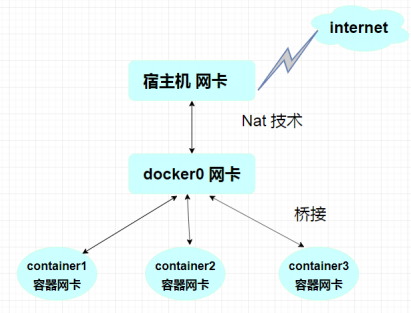

```shell
# 安装工具（宿主机）：查看网络模式详情
yum install -y net-tools
yum install -y bridge-utils
route -n
Kernel IP routing table
Destination     Gateway         Genmask         Flags Metric Ref    Use Iface
0.0.0.0         172.18.0.1      0.0.0.0         UG    0      0        0 eth0
172.18.0.0      0.0.0.0         255.255.0.0     U     0      0        0 eth0

$ brctl show
bridge name		bridge id			STP enabled			interfaces
docker0			8000.024251f1889c	no					veth3185551
													  vethff4dcf7
       												   vethf35dc45
```

```shell
# 我们直接启动的命令 --net bridge,而这个就是我们得docker0
# bridge就是docker0
$ docker run -d -P --name tomcat01 tomcat
等价于 => 
$ docker run -d -P --name tomcat01 --network bridge tomcat

# 备注：
# 默认bridge启动的容器可以用ip与宿主机连通（ping通）
# 也可以和同类bridge网络模式的容器用ip连通（ping通）
# 当时不可以用容器名称来ping通。如果想通过容器名连通，那么必须使用--link或自定义网络模式
```


### 2.2、Docker主机网络模式（host）

host 模式：该模式下容器是不会拥有自己的ip地址，而是使用宿主机的ip地址和端口。

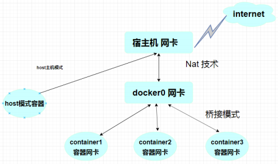

```shell
# 启动nginx容器命令并防火墙放开80端口
# --net=host，该参数为指定host模式，不需要指定端口：

docker run -itd --net=host centos:nginx /usr/local/nginx/sbin/nginx -g "daemon off;"
firewall-cmd --zone=public --add-port=80/tcp --permanent
firewall-cmd --reload
```


### 2.3、Docker关闭网络模式（none）

none模式：关闭模式（无法连外网）

```shell
docker run -itd --net=none centos:7
```


## 3、Link 实现单向通信（不推荐）

> **思考一个场景：我们编写了一个微服务，database url=ip: 项目不重启，ip换了，我们希望可以处理这个问题，可以通过名字来进行访问容器**？
>
> 主要解决方案以下两种：
>
> - Link单项通信
> - 自定义网络模式

基于link单向通信介绍

```shell
# 启动mysql数据库容器：
docker run --name mydb -e MYSQL_ROOT_PASSWORD=password -d mysql:5.7

# 启动Tomcat应用容器并link到mysql数据库（模拟两个Tomcat）：
docker run -itd --name tomcat1 --link mydb tomcat:7
docker run -itd --name tomcat2 --link mydb tomcat:7

# 测试tomcat1 和 tomcat2容器 ping mydb容器，是可以ping通
docker exec -it tomcat1 ping mydb 
PING mydb (172.18.0.3) 56(84) bytes of data.
64 bytes from mydb (172.18.0.3): icmp_seq=1 ttl=64 time=0.062 ms

docker exec -it tomcat2 ping mydb
PING mydb (172.18.0.3) 56(84) bytes of data.
64 bytes from mydb (172.18.0.3): icmp_seq=1 ttl=64 time=0.064 ms

# 反过来mydb容器 ping tomcat1和tomcat2 无法ping通


# 注意：mydb 这个容器一定要存在！
# 官方版的mysql 5.7 需要安装工具才有ping命令（mysql不是基于centos镜像构建的）：
apt-get update && apt-get install iputils-ping
```

**结论：**

```shell
# 结论
1.进入tomcat1或tomcat2容器 ping => mysql容器（可ping通）
2.反过来mysql容器 ping 容器 tomcat1或tomcat2（无法ping通）
3.–-link xxx：本质就是在自己的hosts配置中添加映射
4.这种方式已经不推荐使用了，可以使用自定义网络
```


## 4、Docker 自定义网络模式

```shell
docker network --help
connect     -- 将容器连接（添加）到网络，对应disconnect
create      -- 创建一个新网络，名称由自己取
disconnect  -- 将容器移除网络，对应connect
inspect     -- 显示网络上的详细信息
ls          -- 列出用户创建的所有网络
prune       -- 删除所有未使用的网络
rm          -- 删除一个或多个网络
```

> 查看所有的docker网络

```shell
$ docker network ls
NETWORK ID          NAME                DRIVER              SCOPE
556415881e39        bridge              bridge              local
52b4ea8557e8        host                host                local
97afac35cd87        none                null                local
```

```shell
# 创建一个新的网桥：
#  -d,--driver：创建的自定义网络的模式，不输入默认创建也是bridge模式
#  --subnet 192.168.0.0/16：为网络确定ip范围
#  --gateway 192.168.0.1：确定网关
$ docker network create -d bridge mynet

#############
### 方式一 ###
#############
# 启动tomcat01和tomcat02，并加入mynet网络中。
docker run -itd --name tomcat01 --network mynet tomcat:7
docker run -itd --name tomcat02 --network mynet tomcat:7
# 最后分别进入俩个容器中进行验证：(成功ping通)
docker exec -it tomcat01 ping tomcat02
docker exec -it tomcat02 ping tomcat01
# 把容器移除网桥：
docker network disconnect mynet tomcat01 tomcat02

#############
### 方式二 ###
#############
# 启动tomcat03和tomcat04容器：
docker run -itd --name tomcat03 tomcat:7
docker run -itd --name tomcat04 tomcat:7
# 把tomcat03和tomcat04容器加入mynet网桥：
docker network connect mynet tomcat03
docker network connect mynet tomcat04
# 最后分别进入俩个容器中进行验证：(成功ping通)
docker exec -it tomcat01 ping tomcat02
docker exec -it tomcat02 ping tomcat01
# 把容器移除网桥：
docker network disconnect mynet tomcat03 tomcat04
```

```shell
# 假如现在有2个自定义网络；myredis、mydb
# myredis：有 myredis01 容器和 myredis02 容器.
# 	 mydb：有 mysql01 容器和 mysql02 容器.
# 现在想要 myredis01 能与 mysql01 和 mysql02 容器连通。
# 可以把   myredis01 加入 mydb网络中即可：
docker network connect mydb myredis01
```


## 5、Docker 容器特权模式

```shell
# 启动并进入一个普通的容器：
docker run -it --name mycentos centos:7 /bin/bash
# 安装网络工具：
yum -y install net-tools
# 查看路由执行：
route -n
# 删除网关（失败）：
route del default gw 172.17.0.1
# 启动拥有特权模式的容器：
# --privileged=true
docker run -it --privileged=true --name mycentos1 centos:7 /bin/bash
# 删除网关：
route del default gw 172.17.0.1

# 备注：特权模式用的比较少
```


# Docker 镜像仓库

## 1、Docker 镜像仓库的介绍

介绍一般公司中Docker仓库的使用 

1. 什么是镜像仓库？：存放着很多镜像的仓库 
2. 为什么要使用镜像仓库？ ：1、起到备份作用，2.方便其他机器下载使用 
3. 镜像仓库的种类？我们可以大致分为两大类： 
   1. 公共镜像仓库：
      - 官方的：https://hub.docker.com/，基于各个软件开发或者有软件提供商开发的
      - 非官方：其他组织或者公司开发的镜像，供大家免费使用。比如阿里云
   2. 私有镜像仓库：公司自己搭建的，用于存放公司内部的镜像，自己管理，不提供给外部使用，避免了商业项目暴露出去的风险

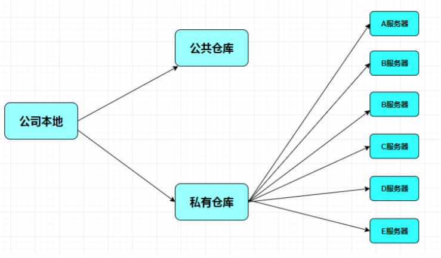


## 2、DockerHub 镜像仓库的使用

1、注册账号：官网：https://hub.docker.com/

2、登录账号：通过 `docker login` 命令输入账号密码登录 DockerHub

```shell
[root@CentOS7 tmp]# docker login -u lsx8629303
Password: 
WARNING! Your password will be stored unencrypted in /root/.docker/config.json.
Configure a credential helper to remove this warning. See
https://docs.docker.com/engine/reference/commandline/login/#credentials-store

Login Succeeded
```

3、推送镜像至仓库

```shell
# 先给镜像设置标签（前缀必须要使用username/开头）
[root@CentOS7 ~]# docker tag busybox:latest lsx8629303/busybox:custom
# 再将镜像推送至仓库
[root@CentOS7 ~]# docker push lsx8629303/busybox:custom
The push refers to repository [docker.io/lsx8629303/busybox]
01fd6df81c8e: Pushed 
custom: digest: sha256:62ffc2ed7554e4c6d360bce40bbcf196573dd27c4ce080641a2c59867e732dee size: 527

# 将自己创建的docker镜像push到dockerhub上去，结果出现错误：denied: requested access to the resource is denied
# 原因分析：在build自己的镜像的时候添加tag时必须在前面加上自己的dockerhub的username
```

4、登录DockerHub官网查看镜像

5、拉取镜像，通过 `docker pull lsx8629303/busybox:custom` 测试镜像是否可以拉取

```shell
[root@CentOS7 ~]# docker pull lsx8629303/busybox:custom
custom: Pulling from lsx8629303/busybox
Digest: sha256:62ffc2ed7554e4c6d360bce40bbcf196573dd27c4ce080641a2c59867e732dee
Status: Image is up to date for lsx8629303/busybox:custom
docker.io/lsx8629303/busybox:custom
```

6、通过 `docker logout` 命令退出 DockerHub

```bash
[root@CentOS7 ~]# docker logout
Removing login credentials for https://index.docker.io/v1/
```

> DockerHub 镜像仓库的使用就学到这里，考虑到网络的原因，从 DockerHub 下载和上传镜像速度可能会比较慢，而且生产上使用的 Docker 镜像可能包含我们的代码、配置信息等，不想被外部人员获取，只允许内网的开发人员下载。怎么解决呢？可以通过搭建私有镜像仓库实现，下文我们就一起学习如何搭建 Docker 私有镜像仓库。


## 3、阿里云镜像仓库的搭建与使用

阿里云镜像仓库申请地址： https://cr.console.aliyun.com/cn-shanghai/instances/repositories

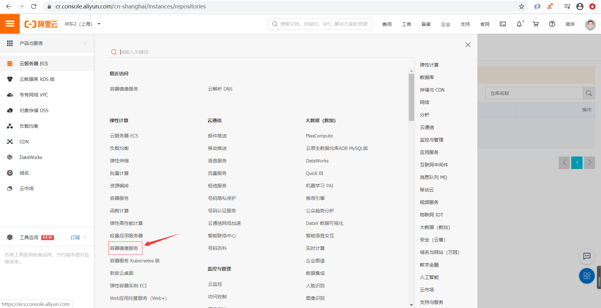

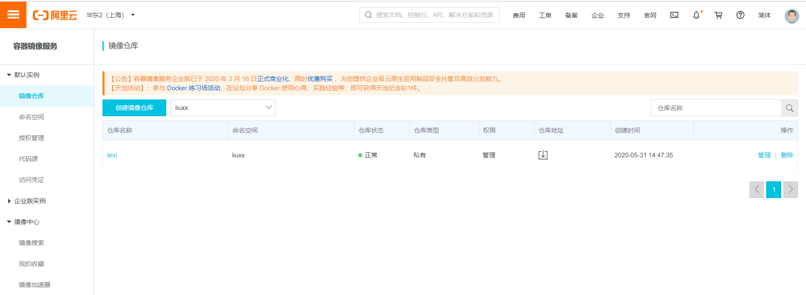

进入阿里云自己创建镜像仓库（创建镜像仓库时会让你创建命名空间，按步骤走就可以了，点击管理按钮有教程指南）：

登录与推送操作步骤： 

```shell
# 1.登录阿里云Docker Registry
$ sudo docker login --username=xxx registry.cn-shanghai.aliyuncs.com

# 2.将镜像推送到Registry
$ sudo docker login --username=xxx registry.cn-shanghai.aliyuncs.com
$ sudo docker tag [ImageId] registry.cn-shanghai.aliyuncs.com/liuxx/test:[镜像版本号]
$ sudo docker push registry.cn-shanghai.aliyuncs.com/liuxx/test:[镜像版本号]

# 3.从Registry中拉取镜像
$ sudo docker pull registry.cn-shanghai.aliyuncs.com/liuxx/test:[镜像版本号]
```


## 4、Docker-Registry 搭建和使用

Docker 官方提供了一个叫做registry的镜像用于搭建本地私有仓库使用。在内部网络搭建的Docker私有仓库可以使内网人员下载、上传都非常快速，不受外网带宽等因素的影响，同时不在内网的人员也无法下载我们的镜像，并且私有仓库也支持配置仓库认证功能。接下来详细讲解registry私有仓库的搭建过程。

### 4.1、私有仓库不认证搭建

1、拉取私有仓库镜像

```shell
docker pull registry
```

2、修改配置，修改 daemon.json 文件，增加私有仓库的地址和端口

```shell
vi /etc/docker/daemon.json
{
  "registry-mirrors": ["https://a32yzw3z.mirror.aliyuncs.com"],
  "insecure-registries": ["172.25.211.62:5000"] // 增加私有仓库的地址和端口
}
```

3、重新加载配置信息及重启 Docker 服务

```shell
sudo systemctl daemon-reload && systemctl restart docker
```

4、创建私有仓库容器。

```bash
# --name：为创建的容器命名
# -d：后台运行容器
# -p：表示端口映射，前者是宿主机端口，后者是容器内的映射端口。可以使用多个 -p 做多个端口映射；
# -v：将容器内 `/var/lib/registry` 目录下的数据挂载至宿主机 `/mydata/docker_registry` 目录下；
docker run -id --name registry -p 5000:5000 -v /mydata/docker_registry:/var/lib/registry registry
```

5、打开浏览器输入：http://172.25.211.62:5000/v2/_catalog，看到 `{"repositories":[]}` 表示私有仓库搭建成功。如下是命令行查看

```shell
[root@CentOS7 ~]# curl http://172.25.211.62:5000/v2/_catalog
{"repositories":[]}
```

6、推送镜像至私有仓库

```shell
# 先给镜像设置标签（前缀必须要使用username/ 或者仓库地址/ 开头）
[root@CentOS7 ~]# docker tag busybox:latest 172.25.211.62:5000/busybox:custom
# 再将镜像推送至仓库
[root@CentOS7 ~]# docker push 172.25.211.62:5000/busybox:custom
The push refers to repository [172.25.211.62:5000/busybox]
01fd6df81c8e: Pushed 
custom: digest: sha256:62ffc2ed7554e4c6d360bce40bbcf196573dd27c4ce080641a2c59867e732dee size: 527
```

7、打开浏览器输入：http://172.25.211.62:5000/v2/_catalog 可以看到私有仓库中已上传的镜像。如下是命令行查看

```shell
[root@CentOS7 ~]# curl http://172.25.211.62:5000/v2/_catalog
{"repositories":["busybox"]}

# 由于我们做了目录挂载，因此可以在宿主机 /mydata/docker_registry/docker/registry/v2/repositories 目录下查看
[root@CentOS7 ~]# ls /mydata/docker_registry/docker/registry/v2/repositories
busybox
```


### 4.2、配置私有仓库认证

配置私有仓库认证，私有仓库已经搭建好了，要确保私有仓库的安全性，还需要一个安全认证证书，防止发生意想不到的事情。所以需要在搭建私有仓库的 Docker 主机上先生成自签名证书。

1、创建证书存储目录并且生成证书

```shell
# 创建证书存储目录
mkdir -p /usr/local/registry/certs

# 生成自签名证书命令
openssl req -newkey rsa:2048 -nodes -sha256 -keyout /usr/local/registry/certs/domain.key -x509 -days 365 -out /usr/local/registry/certs/domain.crt
```

- openssl req：创建证书签名请求等功能
- -newkey：创建 CSR 证书签名文件和 RSA 私钥文件
- rsa:2048：指定创建的 RSA 私钥长度为 2048
- -nodes：对私钥不进行加密
- -sha256：使用 SHA256 算法
- -keyout：创建的私钥文件名称及位置
- -x509：自签发证书格式
- -days：证书有效期
- -out：指定 CSR 输出文件名称及位置


2、生成自签名证书

通过 openssl 先生成自签名证书，运行命令以后需要填写一些证书信息，里面最关键的部分是：`Common Name (eg, your name or your server's hostname) []:172.25.211.62`，这里填写的是私有仓库的地址。

```shell
[root@localhost ~]# openssl req -newkey rsa:2048 -nodes -sha256 -keyout /usr/local/registry/certs/domain.key -x509 -days 365 -out /usr/local/registry/certs/domain.crt
Generating a 2048 bit RSA private key
.......................+++
.........................+++
writing new private key to '/usr/local/registry/certs/domain.key'
-----
You are about to be asked to enter information that will be incorporated
into your certificate request.
What you are about to enter is what is called a Distinguished Name or a DN.
There are quite a few fields but you can leave some blank
For some fields there will be a default value,
If you enter '.', the field will be left blank.
-----
Country Name (2 letter code) [XX]:CN
State or Province Name (full name) []:SH
Locality Name (eg, city) [Default City]:SH
Organization Name (eg, company) [Default Company Ltd]:lsx
Organizational Unit Name (eg, section) []:lsx
Common Name (eg, your name or your server's hostname) []:172.25.211.62
Email Address []:8629303@qq.com
```

3、生成鉴权密码文件

```shell
# 创建存储鉴权密码文件目录
mkdir -p /usr/local/registry/auth
# 如果没有 htpasswd 功能需要安装 httpd
yum install -y httpd
# 创建用户和密码，-c创建文件，-b使用命令行中的密码，而不是提示输入密码，-B强制bcrypt加密密码（非常安全）
# 第一次生成时使用-c参数创建用户及密码文件，下次再生成时无需使用-c参数会追加至文件
htpasswd -cbB /usr/local/registry/auth/htpasswd root 1234
```

> htpasswd 是 apache http 的基本认证文件，使用 htpasswd 命令可以生成用户及密码文件。

4、创建私有仓库容器

```shell
docker run -id --name registry -p 5000:5000 \
   -v /mydata/docker_registry:/var/lib/registry \
   -v /usr/local/registry/certs:/certs \
   -v /usr/local/registry/auth:/auth \
   -e "REGISTRY_AUTH=htpasswd" \
   -e "REGISTRY_AUTH_HTPASSWD_REALM=Registry Realm" \
   -e REGISTRY_AUTH_HTPASSWD_PATH=/auth/htpasswd \
   -e REGISTRY_HTTP_TLS_CERTIFICATE=/certs/domain.crt \
   -e REGISTRY_HTTP_TLS_KEY=/certs/domain.key \
   registry
```

5、推送镜像至私有仓库失败，先给镜像设置标签，再推送至私有仓库，如果未登录认证push会出现`no basic auth credentials` 的错误

```shell
docker tag busybox:latest 172.25.211.62:5000/busybox:custom
docker push 172.25.211.62:5000/busybox:custom

# 若没登录的话push会报错
[root@CentOS7 ~]# docker push 172.25.211.62:5000/busybox:custom
The push refers to repository [172.25.211.62:5000/busybox]
01fd6df81c8e: Preparing 
no basic auth credentials
```

6、登录账号并推送镜像至私有仓库

```shell
[root@CentOS7 ~]# docker login 172.25.211.62:5000
Username: root
Password: 1234
WARNING! Your password will be stored unencrypted in /root/.docker/config.json.
Configure a credential helper to remove this warning. See
https://docs.docker.com/engine/reference/commandline/login/#credentials-store

Login Succeeded
```

7、退出账号

```shell
[root@CentOS7 ~]# docker logout 172.25.211.62:5000
Removing login credentials for 172.25.211.62:5000
```

> 私有镜像仓库的搭建还可以通过 Harbor 实现，Harbor 是由 VMware 公司开源的企业级的 Docker Registry 管理项目，它包括权限管理(RBAC)、LDAP、日志审核、管理界面、自我注册、镜像复制和中文支持等功能。


## 3、Harbor 私服仓库搭建与使用

Harbor 是 VMware 在中国的团体开发的。Harbor，是一个英文单词，意思是港湾，Harbor真是一个用于存储Docker镜像的企业级Registry服务。Registry是Docker官方的一个私有仓库镜像，可以将本地的镜像打标签进行标记然后push到以Registry起的容器的私有仓库中。去也可以根据自己的需求，使用Dockerfile生成自己的镜像，并推到私有仓库中，这样可以大大提高拉取镜像的效率。

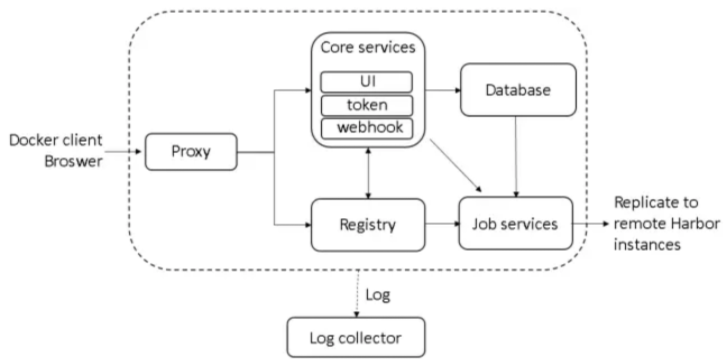

Harbor核心组件解释：

| **组件**                       | **说明**                                                     | **实现**                                               |
| ------------------------------ | ------------------------------------------------------------ | ------------------------------------------------------ |
| Proxy                          | 用于转发用户的请求到registry/ui/token service的反向代理      | nginx：使用nginx官方镜像进行配置                       |
| Registry                       | 镜像的push/pull命令实施功能                                  | registry：使用registry官方镜像                         |
| Database                       | 保存项目/角色/复制策略等信息到数据库中                       | harbor-db：Mariadb的官方镜像用于保存harbor的数据库信息 |
| Core Service：UI/token/webhook | 用户进行镜像操作的界面实现，通过webhook的机制保证镜像状态的变化harbor能够即使了解以便进行日志更新等操作，而项目用户角色则通过token的进行镜像的push/pull等操作 | harbor-ui等                                            |
| job service                    | 镜像复制，可以在harbor实例之间进行镜像的复制或者同步等操作   | harbor-jobservice                                      |
| Log collector                  | 负责收集各个镜像的日志信息进行统一管理                       | harbor-log：缺省安装下日志的保存场所为/var/log/harbor  |

使用Harbor构建自己的镜像仓库，安装前确保前置条件是否满足：需要安装docker、docker-compose、openssl 及 python2.7 以上版本

Harbor各版本GitHub下载地址：https://github.com/goharbor/harbor/releases

- 离线版本安装：offline（本次使用离线下载）
- 在线版本安装：online
- 安装教程：https://www.cnblogs.com/zhzhlong/p/12898834.html、https://www.cnblogs.com/pangguoping/p/7650014.html

> 离线安装Harbor仓库

```shell
# 1、安装openssl工具
yum -y install openssl

# 2、下载安装包，由于国外下载特别慢，已经以前准备好，上传对应安装包并解压： 
wget https://github.com/goharbor/harbor/releases/download/v1.10.10/harbor-offline-installer-v1.10.10.tgz
tar -xzvf /root/harbor-offline-installer-v1.10.10.tgz -C /home/
cd /home/harbor/

# 修改配置：
vim harbor.yml
    # 修改主机名和密码，并且注释掉 https 有关的配置
    hostname: 192.168.0.151 # 修改主机名（注意空格）
	harbor_admin_password: password # 修改密码（注意空格）

# 执行脚本（生成docker-compose.yml文件）：
sh prepare
# 执行安装命令（启动docker-compose）：
sh install.sh
=======================================
# 部署harbor时，执行./install.sh，提示ERROR:root:Error: The protocol is https but attribute ssl_cert is not set
# 通过报错可以看出https协议有问题，harbor.yml把文件内的 (# https related config) 部分都注释即可
=======================================

# 执行命令docker-compose查看harbor是否允许
docker-compose ps
# 访问Harbor，访问地址为为本机地址，端口为80，用户名admin/password
# 关闭、启动
docker-compose down
docker-compose up -d
```

> 配置与使用Harbor仓库

```shell
$ docker login --username admin 192.168.3.151
Password: 
Error response from daemon: Get https://192.168.3.54/v2/: dial tcp 192.168.3.54:443: connect: connection refused
```

- Docker配置使用自建仓库 
  - 默认Docker只允许访问https仓库 
  - 如果要访问http仓库需要自己配置

- 配置允许访问http仓库（追加记得加逗号）：

```shell
$ vi /etc/docker/daemon.json
{
  "registry-mirrors": ["https://a32yzw3z.mirror.aliyuncs.com"],
  "insecure-registries":["http://192.168.3.151"]
}
```

```shell
# 重启docker服务：
$ systemctl restart docker.service 
# 启动docker-compose(重启docker务必记得要重启docker-compose)：
$ docker-compose up -d
# 登录Harbor网页创建项目名.见下图

# 登录Harbor：
$ docker login --username=admin 192.168.3.54 
# 改名打tag：
$ docker tag SOURCE_IMAGE[:TAG] 192.168.3.54/test/IMAGE[:TAG]
$ docker tag mysql:5.7 192.168.3.54/test/mysql:5.7 
# 推送镜像：
$ docker push 192.168.3.54/test/IMAGE[:TAG]
$ docker push 192.168.3.54/test/mysql:5.7 
# 下载镜像：
$ docker pull 192.168.0.151/xdclass/mysql:5.7 

# 备注：docker login 后有一个登录凭证（可删除，下次需要密码）建议从安全角度出发，每次登录后进行删除）
$ rm /root/.docker/config.json 
# 提示中有告诉我们密码存在/root/.docker/config.json 文件中
$ docker login --username=admin 192.168.3.54 
Password: 
WARNING! Your password will be stored unencrypted in /root/.docker/config.json.
Configure a credential helper to remove this warning. See
https://docs.docker.com/engine/reference/commandline/login/#credentials-store
```

网页上创建项目名：

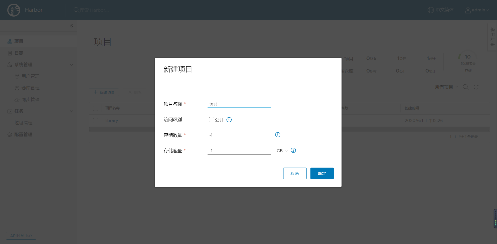

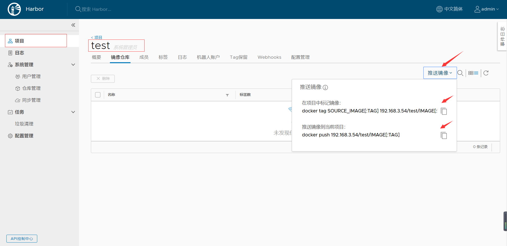


# Docker-Compose 容器编排

## 1、Docker-Compose 安装

Docker-Compose 是一个用于定义和运行多容器 Docker 的应用程序工具，可以帮助我们可以轻松、高效的管理容器

Docker-Compose 的两种安装方式

- **方式一**：curl方法（二进制文件直接安装）

```shell
sudo curl -L "https://github.com/docker/compose/releases/download/1.26.2/docker-compose-$(uname -s)-$(uname -m)" -o /usr/local/bin/docker-compose

# 上面下载比较慢，如果下载失败就用此命令，阿里镜像
sudo curl -L https://get.daocloud.io/docker/compose/releases/download/1.26.2/docker-compose-`uname -s`-`uname -m` > /usr/local/bin/docker-compose

# 授权
sudo chmod +x /usr/local/bin/docker-compose

# 查看版本
docker-compose --version
```

- **方式二**：pip方法

```shell
# 1.安装pip工具
# yum install -y epel-release python-pip
$ yum install -y epel-release
$ yum install -y python-pip

# 确认版本,更新pip --一般情况可以省略该步骤,如不成功会提示更新
$ pip --version
$ pip install --upgrade pip

# 2.安装docker-compose,-i 是镜像加速的
$ pip install docker-compose==1.24.1 -i https://pypi.tuna.tsinghua.edu.cn/simple
		
# 3.查看docker-compose版本：
$ docker-compose version

# 卸载docker-compose命令
$ pip uninstall docker-compose
```

- 安装pip报错解决：

```bash
[root@localhost yum.repos.d]# yum install python-pip -y
已加载插件：fastestmirror

One of the configured repositories failed (未知),
and yum doesn't have enough cached data to continue. At this point the only
safe thing yum can do is fail. There are a few ways to work "fix" this:

1. Contact the upstream for the repository and get them to fix the problem.

2. Reconfigure the baseurl/etc. for the repository, to point to a working
	upstream. This is most often useful if you are using a newer
	distribution release than is supported by the repository (and the
	packages for the previous distribution release still work).

3. Disable the repository, so yum won't use it by default. Yum will then
	just ignore the repository until you permanently enable it again or use
	--enablerepo for temporary usage:

		yum-config-manager --disable <repoid>

4. Configure the failing repository to be skipped, if it is unavailable.
	Note that yum will try to contact the repo. when it runs most commands,
	so will have to try and fail each time (and thus. yum will be be much
	slower). If it is a very temporary problem though, this is often a nice
	compromise:

		yum-config-manager --save --setopt=<repoid>.skip_if_unavailable=true

	Cannot retrieve metalink for repository: epel/x86_64. Please verify its path and
try again
```

解决报错：

```bash
# 修改配置文件，对【epel】中注释掉metalink ，取消注释 baseurl
vi /etc/yum.repos.d/epel.repo
```

Docker-Compose 的2种卸载方式

```bash
# curl方式安装的话
sudo rm /usr/local/bin/docker-compose

# pip方式方式安装的话
pip uninstall docker-compose
```

Docker-Compose 命令补齐方法：

```bash
# 下载最新版本
sudo curl -L https://raw.githubusercontent.com/docker/compose/$(docker-compose version --short)/contrib/completion/bash/docker-compose > /etc/bash_completion.d/docker-compose

# 下载指定版本
sudo curl -L https://raw.githubusercontent.com/docker/compose/1.26.2/contrib/completion/bash/docker-compose -o /etc/bash_completion.d/docker-compose

# 刷新配置
source /etc/bash_completion.d/docker-compose
```

- 安装Compose命令补全工具遇到的错误

```bash
[root@docker ~]# curl -L https://raw.githubusercontent.com/docker/compose/$(docker-compose version --short)/contrib/completion/bash/docker-compose > /etc/bash_completion.d/docker-compose
  % Total    % Received % Xferd  Average Speed   Time    Time     Time  Current
                                 Dload  Upload   Total   Spent    Left  Speed
  0     0    0     0    0     0      0      0 --:--:-- --:--:-- --:--:--     0curl: (7) Failed to connect to ::: Cannot assign requested address
```

原因分析：

- 地址https://raw.githubusercontent.com无法访问

解决办法：

- 直接找到这个文件在github上的地址，然后手动复制粘贴下来
- docker-compose—GitH地址：https://github.com/docker/compose
- 命令补齐文件地址：https://github.com/docker/compose/blob/master/contrib/completion/bash/docker-compose

具体步骤：把文件的内容给添加进去，然后关闭终端，重新打开一个终端，就生效可以使用了

```bash
vim /etc/bash_completion.d/docker-compose
```


## 2、Docker-Compose 快速上手

```shell
# 编写一个最最简单的yml也可以是yaml：
$ mkdir -p /home/docker-compose/test
$ cd /home/docker-compose/test
$ vi docker-compose.yml

# 编辑保存以下内容
version: '3' 
services: 
  redis: #服务名称
    image: redis
    
# 然后保存文件（格式一定要注意，该空格要空格，冒号后面必须有空格）
```

**docker-compose操作容器（一定要进入配置文件目录）**

```shell
常用选项：
--verbose：输出更多的调试信息
--version：查看compose的版本
-f --file FILE：使用特定的compose模板文件，默认为docker-compose.yml。
-p --project-name NAME 指定项目名称，默认使用目录名称。

==================================================================================
docker-compose up                             前台启动容器
docker-compose up -d                          后台启动容器
docker-compose -f docker-compose.yml up       指定yml文件启动,-f 指定yml文件
docker-compose down                           停止并删除容器
docker-compose down --volumes                 停止并删除容器并删除volume
docker-compose ps                             查看容器运行情况
docker-compose ps -a                          查看容器所有情况

docker-compose start                          启动容器，如想执行单个容器追加容器名称即可
docker-compose stop                           停止容器，如想执行单个容器追加容器名称即可(这种停止容器不会删除容器)
docker-compose restart                        重启容器，如想执行单个容器追加容器名称即可
docker-compose pause                          暂停容器，如想执行单个容器追加容器名称即可
docker-compose unpause                        恢复容器，如想执行单个容器追加容器名称即可
docker-compose rm nginx                       删除容器（删除前必须关闭nginx容器）

docker-compose images                         查看镜像
docker-compose exec {service_name} {bash}     进入某个容器
docker-compose exec redis bash                进入redis容器
docker-compose logs -tf nginx                 查看nginx的实时日志
docker-compose build nginx                    构建镜像       
docker-compose build --no-cache nginx         不带缓存的构建。

docker-compose config -q                      验证yml文件配置，配置正确不输出任何内容，配置错误，输出错误信息
docker-compose events --json nginx            以json的形式输出nginx的docker日志
==================================================================================
```

- **docker-compose中YAML常用的字段：**

```shell
build
  dockerfile             指定dockerfile文件名             
  context                构建镜像上下文路径
  args:                  args是一些提供的参数  
    - buildno=1          
    - user=someuser 
image                    指定镜像
command                  执行命令，覆盖默认命令
container_name           指定容器名称，由于容器名称是唯一的，如果指定自定义名称，则无法scale
deploy                  指定部署和运行服务相关配置，只能在Swarm模式使用
environment             添加环境变量
networks                加入网络，引用顶级networks下条目
ports                   暴漏端口，与-p相同，但端口不能低于60
volumes                 挂载宿主机路径或命名卷在顶级volumes定义卷名称
restart                 重启策略，默认no，always|on-failurel|unless-stopped
hostname                容器主机名
depends_on              依赖某个或多个容器
  - mysql               依赖的容器名称，mysql容器最先启动
  - redis               依赖的容器名称，redis容器其次启动，最后启动本身的容器
```

**注意：**操作docker-compose**一定要在配置文件**docker-compose.yml**文件路径下操作**


## 3、Docker-Compose 核心技能

**docker-compose.yml**：由三大部分组成：

- version：yml版本
- services：docker容器服务。里面可以多个docker容器
- networks：网络模式

最关键是services和networks两个部分。

**compose**设置网络模式、**compose**使用端口映射、**compose**设置文件共享、**compose**管理多个容器

```shell
$ mkdir -p /home/docker-compose/test1
$ cd /home/docker-compose/test1
$ vi docker-compose.yml
```

```yml
version: '3' # yml的版本，不是compose的版本
services: 
  nginx:                 	# 服务名称，用户自定义
    image: mycentos:nginx   # 可以是本地的的image，如果本地没有回去Docker Hub上下载
    network_mode: "host"    # compose设置网络模式
    volumes:                # compose设置文件共享
    - /home:/usr/local/nginx/html 
    - /var/logs/nginx/logs:/usr/local/nginx/logs 
    command: /usr/local/nginx/sbin/nginx -g "daemon off;" 

  redis: 
    image: mycentos:redis   # 可以是本地的的image，如果本地没有回去Docker Hub上下载
    ports:                  # compose使用端口映射
    - "6380:6379"
```

```shell
# 后台启动容器：
$ docker-compose up -d
# 查看容器运行情况：
$ docker-compose ps
```


## 4、Docker-Compose 搭建博客

Compose快速搭建个人博客wordpress。官网：[**https://docs.docker.com/compose/wordpress/**](

```shell
$ mkdir -p /home/docker-compose/wordperss
$ cd /home/docker-compose/wordperss
$ vi docker-compose.yml
```

```yml
version: '3.3'

services:
   db:
     image: mysql:5.7
     volumes:
       - db_data:/var/lib/mysql
     restart: always
     environment:
       MYSQL_ROOT_PASSWORD: somewordpress
       MYSQL_DATABASE: wordpress
       MYSQL_USER: wordpress
       MYSQL_PASSWORD: wordpress

   wordpress:
     depends_on:
       - db
     image: wordpress:latest
     ports:
       - "8000:80"
     restart: always
     environment:
       WORDPRESS_DB_HOST: db:3306
       WORDPRESS_DB_USER: wordpress
       WORDPRESS_DB_PASSWORD: wordpress
       WORDPRESS_DB_NAME: wordpress
volumes:
    db_data: {}
```

```shell
# 启动wordpress：
$ docker-compose up -d
# 打开浏览器访问：IP:8000
# 在浏览器进行安装配置
# 将删除容器和默认网络，但会保留WordPress数据库： 
$ docker-compose down
# 将删除容器，默认删除网络和WordPress数据库： 
$ docker-compose down --volumes
```


## 5、Docker-Compose 详细分析

分析上节docker-compose.yml

```shell
version: '3.3'

services:
   db:
     image: mysql:5.7	#docker run -itd mysql:5.7
     volumes:
       - db_data:/var/lib/mysql	#采用的是卷标的形式挂载（注意：- db_data是参数，可以变，自 定义，必须与下面对应）
     restart: always	#自动重启，保证服务在线
     environment:
       MYSQL_ROOT_PASSWORD: somewordpress	#指定环境变量 docker -itd -e MYSQL_ROOT_PASSWORD= somewordpress
       MYSQL_DATABASE: wordpress
       MYSQL_USER: wordpress
       MYSQL_PASSWORD: wordpress

   wordpress:
     depends_on:
       - db	# - db 是参数，合起来的意思是只有当上面的mysql数据库安装成功后，这个wordpress才可 以被安装，还有一个功能，就是docker --link 将上面的mysql数据库，与这个wordpress应用连起来
     image: wordpress:latest
     ports:
       - "8000:80"
     restart: always
     environment:
       WORDPRESS_DB_HOST: db:3306
       WORDPRESS_DB_USER: wordpress
       WORDPRESS_DB_PASSWORD: wordpress
       WORDPRESS_DB_NAME: wordpress
volumes:
    db_data: {}
```

- **docker-compose**中有两种方式可以设置volumes
  - 使用具体路径直接挂载到本地，特点就是直观
  - 使用卷标的形式，特点就是简洁，但是不知道数据到底在本地的什么位置。需要通过卷标查看
- **docker volume ls** 
- **docker volume inspect wordpress_db_data**


# Docker Swarm 集群管理器

请参考本人转载哈喽沃德先生的博客：https://www.mrhelloworld.com/categories/docker/

## 1、Swarm 是什么

Docker Swarm 是 Docker 官方推出的容器集群管理工具，基于 Go 语言开发。代码开源在：https://github.com/docker/swarm，使用它可以将多个 Docker 主机封装为单个大型的虚拟 Docker 主机，快速打造一套容器云平台。

Docker Swarm 是生产环境中运行 Docker 应用程序最简单的方法。作为容器集群管理器，Swarm 最大的优势之一就是 100% 支持标准的 Docker API。各种基于标准 API 的工具比如 Compose、docker-py、各种管理软件，甚至 Docker 本身等都可以很容易的与 Swarm 进行集成。大大方便了用户将原先基于单节点的系统移植到 Swarm 上，同时 Swarm 内置了对 Docker 网络插件的支持，用户可以很容易地部署跨主机的容器集群服务。

Docker Swarm 和 Docker Compose 一样，都是 Docker 官方容器编排项目，但不同的是，Docker Compose 是一个在单个服务器或主机上创建多个容器的工具，而 Docker Swarm 则可以在多个服务器或主机上创建容器集群服务，对于微服务的部署，显然 Docker Swarm 会更加适合。

从 Docker 1.12.0 版本开始，Docker Swarm 已经包含在 Docker 引擎中（Docker Swarm），并且已经内置了服务发现工具，我们就不需要像之前一样，再配置 Etcd 或者 Consul 来进行服务发现配置了。Docker Swarm是 Docker 官方三剑客项目之一。


## 2、Swarm 核心概念

### 2.1、Swarm

Docker Engine 1.12 引入了 Swarm 模式，一个 Swarm 由多个 Docker 主机组成，它们以 Swarm 集群模式运行。Swarm 集群由 Manager 节点（管理者角色，管理成员和委托任务）和 Worker 节点（工作者角色，运行 Swarm 服务）组成。这些 Docker 主机有些是 Manager 节点，有些是 Worker 节点，或者同时扮演这两种角色。

Swarm 创建服务时，需要指定要使用的镜像、在运行的容器中执行的命令、定义其副本的数量、可用的网络和数据卷、将服务公开给外部的端口等等。与独立容器相比，群集服务的主要优势之一是，你可以修改服务的配置，包括它所连接的网络和数据卷等，而不需要手动重启服务。还有就是，如果一个 Worker Node 不可用了，Docker 会调度不可用 Node 的 Task 任务到其他 Nodes 上。


### 2.2、Nodes

Swarm 集群由 Manager 节点（管理者角色，管理成员和委托任务）和 Worker 节点（工作者角色，运行 Swarm 服务）组成。一个节点就是 Swarm 集群中的一个实例，也就是一个 Docker 主机。你可以运行一个或多个节点在单台物理机或云服务器上，但是生产环境上，典型的部署方式是：Docker 节点交叉分布式部署在多台物理机或云主机上。节点名称默认为机器的 hostname。

- **Manager**：负责整个集群的管理工作包括集群配置、服务管理、容器编排等所有跟集群有关的工作，它会选举出一个 leader 来指挥编排任务；
- **Worker**：工作节点接收和执行从管理节点分派的任务（Tasks）运行在相应的服务（Services）上。


### 2.3、Services

Service（服务）是一个抽象的概念，是对要在管理节点或工作节点上执行的**任务的定义**。它是集群系统的中心结构，是用户与集群交互的主要根源。Swarm 创建服务时，可以为服务定义以下信息：

- 服务名称
- 使用哪个镜像来创建容器
- 要运行多少个副本
- 服务的容器要连接到哪个网络上
- 要映射哪些端口

[](https://www.mrhelloworld.com/resources/articles/docker/services-diagram.png)


### 2.4、Tasks

Task（任务）包括一个 Docker 容器和在容器中运行的命令。任务是一个集群的最小单元，任务与容器是一对一的关系。管理节点根据服务规模中设置的副本数量将任务分配给工作节点。一旦任务被分配到一个节点，便无法移动到另一个节点。它只能在分配的节点上运行或失败。


### 2.5、Replicated and Global Services

Swarm 不只是提供了优秀的高可用性，同时也提供了节点的**弹性扩容和缩容**的功能。可以通过以下两种类型的 Services 部署实现：

- **Replicated Services**：当服务需要动态扩缩容时，只需通过 `scale` 参数或者 `--replicas n` 参数指定运行相同任务的数量，即可复制出新的副本，将一系列复制任务分发至各节点当中，这种操作便称之为**副本服务**（Replicate）
- **Global Services**：我们也可以通过 `--mode global` 参数将服务分发至全部节点之上，这种操作我们称之为**全局服务**（Global）。在每个节点上运行一个相同的任务，不需要预先指定任务的数量，每增加一个节点到 Swarm 中，协调器就会创建一个任务，然后调度器把任务分配给新节点

下图用黄色表示拥有三个副本服务 Replicated Service，用灰色表示拥有一个全局服务 Global Service。

[](https://www.mrhelloworld.com/resources/articles/docker/replicated-vs-global.png)


## 3、Swarm 工作流程

[](https://www.mrhelloworld.com/resources/articles/docker/service-lifecycle.png)

Swarm Manager：

1. API：接受命令并创建 service 对象（创建对象）
2. orchestrator：为 service 对象创建的 task 进行编排工作（服务编排）
3. allocater：为各个 task 分配 IP 地址（分配 IP）
4. dispatcher：将 task 分发到 nodes（分发任务）
5. scheduler：安排一个 worker 节点运行 task（运行任务）

Worker Node：

1. worker：连接到调度器，检查分配的 task（检查任务）
2. executor：执行分配给 worker 节点的 task（执行任务）


## 4、Overlay 网络简介

与 Docker 网络不同，Docker Swarm 集群模式下却默认使用的是 Overlay 网络（覆盖网络），这里简单介绍一下什么是 Overlay 网络。

Overlay 网络其实并不是一门新技术，它是指构建在另一个网络上的计算机网络，这是一种网络虚拟化技术的形式，近年来云计算虚拟化技术的演进促进了网络虚拟化技术的应用。所以 Overlay 网络就是建立在另一个计算机网络之上的虚拟网络，它是不能独立出现的，Overlay 底层依赖的网络就是 Underlay 网络。

Underlay 网络是专门用来承载用户 IP 流量的基础架构层，它与 Overlay 网络之间的关系有点类似物理机和虚拟机。Underlay 网络和物理机都是真正存在的实体，它们分别对应着真实存在的网络设备和计算设备，而 Overlay 网络和虚拟机都是依托在下层实体的基础之上，使用软件虚拟出来的层级。


在 Docker 版本 1.12 以后 **Swarm 模式原生已支持覆盖网络**（Overlay Network），只要是这个覆盖网络内的容器，不管在不在同一个宿主机上都能相互通信，即跨主机通信。不同覆盖网络内的容器之间是相互隔离的（相互 ping 不通）。

Overlay 网络是目前主流的容器跨节点数据传输和路由方案。当然，容器在跨主机进行通信的时候，除了可以使用 overlay 网络模式进行通信之外，还可以使用 host 网络模式，直接使用物理机的 IP 地址就可以进行通信。


## 4、Swarm 集群搭建

生产环境docker swarm集群manager最少建议还是3台，最多7台，如果只有一台的manager，如果它宕机了，下面的所有的worker节点都无法正常工作。不过由于环境限制，这里演示只用3-4台服务器测试。

### 4.1、环境准备

- 五台安装了 Docker 的 CentOS 机器，版本为：CentOS 7.6
- Docker Engine 1.12+（最低要求 1.12，本文使用 19.03.12）
- 防火墙开启以下端口或者关闭防火墙（测试建议直接关闭防火墙）：
  - TCP 端口 2377，用于集群管理通信
  - TCP 和 UDP 端口 7946，用于节点之间通信
  - UDP 端口 4789，用于覆盖网络

| 角色    | IP            | HOSTNAME | Docker 版本 |
| ------- | ------------- | -------- | ----------- |
| Manager | 192.168.3.101 | manager1 | 19.03.12    |
| Manager | 192.168.3.102 | manager2 | 19.03.12    |
| Manager | 192.168.3.103 | manager3 | 19.03.12    |
| Worker  | 192.168.3.10  | worker1  | 19.03.12    |
| Worker  | 192.168.3.11  | worker2  | 19.03.12    |

- 可以通过 `hostname 主机名` 修改机器的主机名（立即生效，重启后失效）；
- 或者 `hostnamectl set-hostname 主机名` 修改机器的主机名（立即生效，重启也生效）；
- 或者 `vi /etc/hosts` 编辑 hosts 文件，如下所示， 给 127.0.0.1 添加主机名（重启生效）。


### 4.2、创建集群

1、创建集群前先查看 docker swarm 与 docker swarm init 帮助文档

```shell
[root@localhost ~]# docker swarm --help

Usage:  docker swarm COMMAND

Manage Swarm

Commands:
  ca          Display and rotate the root CA
  init        Initialize a swarm
  join        Join a swarm as a node and/or manager
  join-token  Manage join tokens
  leave       Leave the swarm
  unlock      Unlock swarm
  unlock-key  Manage the unlock key
  update      Update the swarm

Run 'docker swarm COMMAND --help' for more information on a command.
```

docker swarm --help 详解：

| 参数         | 说明                        |
| ------------ | --------------------------- |
| `ca`         | 显示根CA                    |
| `init`       | 初始化集群                  |
| `join`       | 作为节点和/或管理者加入集群 |
| `join-token` | 管理联接令牌                |
| `leave`      | 离开集群                    |
| `unlock`     | 解锁swarm                   |
| `unlock-key` | 管理解锁钥匙                |
| `update`     | 更新swarm集群               |


2、初始化Swarm集群

在任意节点下使用 `docker swarm init` 命令创建一个新的 Swarm 集群并加入，且该节点会默认成为 Manager 节点。根据我们预先定义的角色，在 101 ~ 103 的任意一台机器上运行该命令即可。通常，第一个加入集群的管理节点将成为 `Leader`，后来加入的管理节点都是 `Reachable`。当前的 Leader 如果挂掉，所有的 Reachable 将重新选举一个新的 Leader。

```shell
[root@manager1 ~]# docker swarm init --advertise-addr 192.168.3.101
Swarm initialized: current node (clumstpieg0qzzxt1caeazg8g) is now a manager.

To add a worker to this swarm, run the following command:

    docker swarm join --token SWMTKN-1-5ob7jlej85qsygxubqypjuftiwruvew8e2cr4u3iuo4thxyrhg-3hbf2u3i1iagurdprl3n3yra1 192.168.10.101:2377

To add a manager to this swarm, run 'docker swarm join-token manager' and follow the instructions.
```


### 4.3、Manager 加入集群

若要向该集群添加Manager节点，管理节点先运行`docker swarm join-token manager`命令查看管理节点的令牌信息（manager1:192.168.3.101上执行）

```shell
[root@manager1 ~]# docker swarm join-token manager
To add a manager to this swarm, run the following command:

    docker swarm join --token SWMTKN-1-052n8lzu6tqwlz9osydt5ttcr268i4fxqpbgyps49nmvmh4ym6-5n9bpvj1v64wb9cvg7l2fitaj 192.168.3.101:2377
```

将上面输出的`docker swarm join` 并携带令牌参数信息的命令复制，然后分别在192.168.3.102和192.168.3.103节点上执行加入Swarm集群

```shell
[root@manager2 ~]# docker swarm join --token SWMTKN-1-052n8lzu6tqwlz9osydt5ttcr268i4fxqpbgyps49nmvmh4ym6-5n9bpvj1v64wb9cvg7l2fitaj 192.168.3.101:2377
This node joined a swarm as a manager.
```

```shell
[root@manager3 ~]# docker swarm join --token SWMTKN-1-052n8lzu6tqwlz9osydt5ttcr268i4fxqpbgyps49nmvmh4ym6-5n9bpvj1v64wb9cvg7l2fitaj 192.168.3.101:2377
This node joined a swarm as a manager.
```


### 4.4、Worker 加入集群

通过创建集群时返回的结果可以得知，要向这个集群添加一个 Worker 节点，运行下图中的命令即可。或者管理节点先运行 `docker swarm join-token worker` 命令查看工作节点的令牌信息。

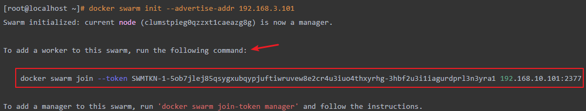

```shell
[root@localhost ~]# docker swarm join-token worker
To add a worker to this swarm, run the following command:

    docker swarm join --token SWMTKN-1-052n8lzu6tqwlz9osydt5ttcr268i4fxqpbgyps49nmvmh4ym6-50iq7p13l75w9oken3xqgqpnr 192.168.3.101:2377
```

增加worker节点：将上述查询到的命令复制拷贝到 worker1:192.168.3.10、worker2:192.168.3.11 上执行即可

```shell
[root@worker1 ~]# docker swarm join --token SWMTKN-1-052n8lzu6tqwlz9osydt5ttcr268i4fxqpbgyps49nmvmh4ym6-50iq7p13l75w9oken3xqgqpnr 192.168.3.101:2377
This node joined a swarm as a worker.
```

```shell
[root@worker2 ~]# docker swarm join --token SWMTKN-1-052n8lzu6tqwlz9osydt5ttcr268i4fxqpbgyps49nmvmh4ym6-50iq7p13l75w9oken3xqgqpnr 192.168.3.101:2377
This node joined a swarm as a worker.
```


### 4.5、查看集群节点

在任意 Manager 节点中可以查看当前集群节点信息，运行`docker node ls`命令即可：

```shell
[root@manager3 ~]# docker node ls
ID                            HOSTNAME    STATUS    AVAILABILITY   MANAGER STATUS   ENGINE VERSION
p1cfiyfyxgkhupjj03tvq40ph     manager1    Ready     Active         Leader           19.03.9
fhpe4p0m4gb47pxh48kf9psp8     manager2    Ready     Active         Reachable        19.03.9
wsqaq4isrzhlgphnnaqxucy6r *   manager3    Ready     Active         Reachable        19.03.9
xlgi99te9cchyz9n3ydkycf6k     worker1     Ready     Active                          19.03.9
xlgi99te9cchyz9n3ydkycf6k     worker2     Ready     Active                          19.03.9
```

> `*` 代表当前节点，现在的环境为 3 个管理节点构成 1 主 2 从，以及 2 个工作节点。

节点 MANAGER STATUS 说明：表示节点是属于 Manager 还是 Worker，没有值则属于 Worker 节点。

- Leader：该节点是管理节点中的主节点，负责该集群的集群管理和编排决策；
- Reachable：该节点是管理节点中的从节点，如果 Leader 节点不可用，该节点有资格被选为新的 Leader；
- Unavailable：该管理节点已不能与其他管理节点通信。如果管理节点不可用，应该将新的管理节点加入群集，或者将工作节点升级为管理节点。

节点 AVAILABILITY 说明：表示调度程序是否可以将任务分配给该节点。

- Active：调度程序可以将任务分配给该节点
- Pause：调度程序不会将新任务分配给该节点，但现有任务仍可以运行
- Drain：调度程序不会将新任务分配给该节点，并且会关闭该节点所有现有任务，并将它们调度在可用的节点上


### 4.6、查看集群信息

在任意Manager节点中运行 `docker info` 查看当前集群的信息

```shell
[root@manager1 ~]# docker info
Client:
 Debug Mode: false

Server:
 Containers: 0
  Running: 0
  Paused: 0
  Stopped: 0
 Images: 0
 Server Version: 19.03.9
 Storage Driver: overlay2
  Backing Filesystem: extfs
  Supports d_type: true
  Native Overlay Diff: true
 Logging Driver: json-file
 Cgroup Driver: cgroupfs
 Plugins:
  Volume: local
  Network: bridge host ipvlan macvlan null overlay
  Log: awslogs fluentd gcplogs gelf journald json-file local logentries splunk syslog
 Swarm: active
  NodeID: c436tke4h47x7ttyk545e2nl5
  Is Manager: true
  ClusterID: 9lpy6owfgtqsawh7kxbz7wl88
  Managers: 3
  Nodes: 5
# .....
```

可以发现：Swarm: active、Managers: 3、Nodes: 5。表示Swarm开启，Managers3个节点，一共有5个节点。


### 4.7、集群高可用测试

此时验证一下集群环境的高可用，将manager3:192.168.3.103环境上的Docker服务停掉，模拟节点挂了

```shell
[root@manager3 ~]# systemctl stop docker
Warning: Stopping docker.service, but it can still be activated by:
  docker.socket
```

再次回到manager1:192.168.3.101节点上查看节点状态，如下。集群整体状态仍然OK

```shell
[root@manager1 ~]# docker node ls
ID                            HOSTNAME    STATUS    AVAILABILITY   MANAGER STATUS   ENGINE VERSION
p1cfiyfyxgkhupjj03tvq40ph *   manager1    Ready     Active         Leader           19.03.9
fhpe4p0m4gb47pxh48kf9psp8     manager2    Ready     Active         Reachable        19.03.9
wsqaq4isrzhlgphnnaqxucy6r     manager3    Down      Active         Unreachable      19.03.9
xlgi99te9cchyz9n3ydkycf6k     worker1     Ready     Active                          19.03.9
xlgi99te9cchyz9n3ydkycf6k     worker2     Ready     Active                          19.03.9
```

**PS注意**：Manager节点的个数必须大于等于3时才具有高可用特性，即当manager节点个数大于等于3的时候，挂掉一个节点集群是仍然能正常工作


### 4.8、Manager 节点删除

删除节点之前需要先将该节点的 AVAILABILITY 改为 Drain。其目的是为了将该节点的服务迁移到其他可用节点上，确保服务正常。最好检查一下容器迁移情况，确保这一步已经处理完成再继续往下。

```bash
docker node update --availability drain 节点名称|节点ID
```

然后，将该 Manager 节点进行降级处理，降级为 Worker 节点。

```bash　　
docker node demote 节点名称|节点ID
```

然后，在已经降级为 Worker 的节点中运行以下命令，离开集群。

```bash
docker swarm leave
```

最后，在管理节点中对刚才离开的节点进行删除。

```bash
docker node rm 节点名称|节点ID
```


### 4.8、Worker 节点删除

删除节点之前需要先将该节点的 AVAILABILITY 改为 Drain。其目的是为了将该节点的服务迁移到其他可用节点上，确保服务正常。最好检查一下容器迁移情况，确保这一步已经处理完成再继续往下。

```bash
docker node update --availability drain 节点名称|节点ID
```

然后，在准备删除的 Worker 节点中运行以下命令，离开集群。

```bash
docker swarm leave
```

最后，在管理节点中对刚才离开的节点进行删除。

```bash
docker node rm 节点名称|节点ID
```


## 5、Swarm 服务部署

在上述环境基础上，有3个manager节点（192.168.3.101、192.168.3.102,192.168.3.103）和2个worker节点（192.168.3.10、192.168.3.11）


### 5.1、创建服务

在一个manager1（192.168.3.101）集群节点上创建一个Nginx集群服务（名为：mynginx）设置副本数为1，该服务会被随机指派给一个工作节点运行。

```shell
[root@manager1 ~]# docker service create --name mynginx -p 80:80 --replicas 1 nginx
hepx06k5ik5nsf1zcii23djul
overall progress: 1 out of 1 tasks
1/1: running   [==================================================>]
verify: Service converged
```

- docker service create：创建服务
- --replicas：指定一个服务有几个实例运行


### 5.2、调用服务

接下来我们测试一下服务是否能被正常访问，并且该集群下任意节点的 IP 地址都要能访问到该服务才行。

1. 使用浏览器测试结果：5 台机器均可正常访问到该服务
2. 在命令行中执行curl IP，5 台机器都能返回正常

可以看到虽然我们只部署了一个实例，不过访问任意一个节点的机器的 IP 都能访问到服务。


### 5.3、查看服务

可以通过 `docker service ls` 查看运行的服务。

```bash
[root@manager1 ~]# docker service ls
ID                NAME           MODE              REPLICAS        IMAGE              PORTS
hepx06k5ik5n      mynginx        replicated        1/1             nginx:latest       *:80->80/tcp
```

可以通过 `docker service inspect --pretty 服务名称|服务ID` 查看服务的详细信息。--pretty: 指定返回为简约格式，否则将以JSON格式返回

```shell
[root@manager1 ~]# docker service inspect --pretty  mynginx

ID:		m9elxsfxjewpkbuk2ioeeo6zd
Name:		mynginx
Service Mode:	Replicated
 Replicas:	1
Placement:
UpdateConfig:
 Parallelism:	1
 On failure:	pause
 Monitoring Period: 5s
 Max failure ratio: 0
 Update order:      stop-first
RollbackConfig:
 Parallelism:	1
 On failure:	pause
 Monitoring Period: 5s
 Max failure ratio: 0
 Rollback order:    stop-first
ContainerSpec:
 Image:		nginx:latest@sha256:0d17b565c37bcbd895e9d92315a05c1c3c9a29f762b011a10c54a66cd53c9b31
 Init:		false
Resources:
Endpoint Mode:	vip
Ports:
 PublishedPort = 80
  Protocol = tcp
  TargetPort = 80
  PublishMode = ingress 
```

可以通过 `docker service ps 服务名称|服务ID` 查看服务运行在哪些节点上。

```shell
[root@manager1 ~]# docker service ps mynginx
ID             NAME        IMAGE          NODE        DESIRED STATE   CURRENT STATE                 ERROR         PORTS
klnjkdtqggra   mynginx.1   nginx:latest   manager1    Running         Running about a minute ago
```

在对应的任务节点上运行 `docker ps` 可以查看该服务对应容器的相关信息。

```shell
[root@manager1 ~]# docker ps
CONTAINER ID   IMAGE          COMMAND                  CREATED         STATUS         PORTS     NAMES
c01d7f019abd   nginx:latest   "/docker-entrypoint.…"   4 minutes ago   Up 4 minutes   80/tcp    mynginx.1.k3zo9jubllvv95muy3l4gydf3
```


### 5.3、弹性服务

将 service 部署到集群后，可以通过命令弹性扩缩容 service 中的容器数量。在 service 中运行的容器被称为 task（任务），如下2种操作方式：

1. 通过 `docker service scale 服务名称|服务ID=n` 可以将 service 运行的任务扩缩容为 n 个
2. 通过 `docker service update --replicas n 服务名称|服务ID` 也可以达到扩缩容的效果

将 mynginx service 运行的任务扩展为 5 个：

```bash
[root@manager1 ~]# docker service scale mynginx=5
mynginx scaled to 5
overall progress: 5 out of 5 tasks 
1/5: running   [==================================================>] 
2/5: running   [==================================================>] 
3/5: running   [==================================================>] 
4/5: running   [==================================================>] 
5/5: running   [==================================================>] 
verify: Service converged
```

通过 `docker service ps 服务名称|服务ID` 查看服务运行在哪些节点上

```shell
[root@manager1 ~]# docker service ps mynginx
ID             NAME        IMAGE          NODE        DESIRED STATE   CURRENT STATE                 ERROR         PORTS
klnjkdtqggra   mynginx.1   nginx:latest   manager1    Running         Running 5 minutes ago
fansfjsndjfn   mynginx.2   nginx:latest   worker2     Running         Running 3 minutes ago
rjiwfisanffj   mynginx.3   nginx:latest   worker1     Running         Running 3 minutes ago
iygsjgtusjgg   mynginx.4   nginx:latest   manager3    Running         Running 2 minutes ago
jfjirtngnndg   mynginx.5   nginx:latest   manager1    Running         Running 1 minutes ago
```

再次测试缩容操作，运行任务修改成3个，命令如下：

```bash
[root@manager1 ~]# docker service update --replicas 3 mynginx
mynginx
overall progress: 3 out of 3 tasks 
1/3: running   [==================================================>] 
2/3: running   [==================================================>] 
3/3: running   [==================================================>] 
verify: Service converged
```

通过 `docker service ps 服务名称|服务ID` 查看服务运行在哪些节点上。

```shell
[root@manager1 ~]# docker service ps mynginx
ID             NAME        IMAGE          NODE        DESIRED STATE   CURRENT STATE                 ERROR         PORTS
klnjkdtqggra   mynginx.1   nginx:latest   manager1    Running         Running 5 minutes ago
fansfjsndjfn   mynginx.2   nginx:latest   worker2     Running         Running 3 minutes ago
rjiwfisanffj   mynginx.3   nginx:latest   worker1     Running         Running 3 minutes ago
```

在 Swarm 集群模式下真正意义实现了所谓的**弹性服务**，动态扩缩容一行命令搞定，简单、便捷、强大。


### 5.4、删除服务

通过 `docker service rm 服务名称|服务ID` 即可删除服务。

```shell
[root@manager1 ~]# docker service rm mynginx
mynginx
[root@manager1 ~]# docker service ls
ID                NAME              MODE              REPLICAS          IMAGE             PORTS
```


## 6、滚动更新及回滚

滚动更新又可以称为：平滑升级 或者 轮询更新。以下案例将演示 Redis 版本如何滚动升级至更高版本再回滚至上一次的操作。

首先，创建 5 个 Redis 服务副本，版本为 5，详细命令如下：

```bash
# 创建5个副本，每次更新2个，更新间隔10s，20%任务失败继续执行，超出20%执行回滚，每次回滚2个
docker service create --replicas 5 --name redis \
--update-delay 10s \
--update-parallelism 2 \
--update-failure-action continue \
--rollback-monitor 20s \
--rollback-parallelism 2 \
--rollback-max-failure-ratio 0.2 \
redis:5
```

- --update-delay：定义滚动更新的时间间隔
- --update-parallelism：定义并行更新的副本数量，默认为 1
- --update-failure-action：定义容器启动失败之后所执行的动作
- --rollback-monitor：定义回滚的监控时间
- --rollback-parallelism：定义并行回滚的副本数量
- --rollback-max-failure-ratio：任务失败回滚比率，超过该比率执行回滚操作，0.2 表示 20%

然后通过以下命令实现服务的滚动更新。

```bash
# 用redis:6镜像开始轮询更新正在运行的名为redis的容器服务
[root@manager1 ~]# docker service update --image redis:6 redis
```

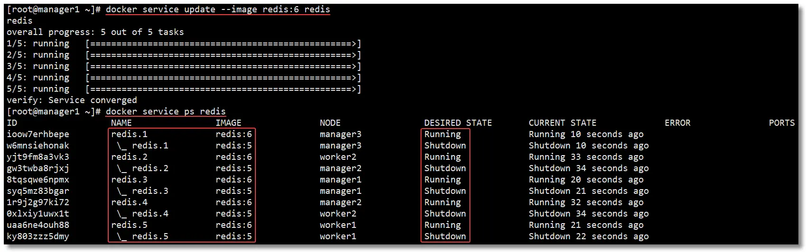

如果在创建服务时没有指定更新策略，也可以在更新服务的时候指定。

```shell
# 每次更新2个服务，每隔1分钟继续更新
[root@manager1 ~]docker service update --image redis:6 redis --update-parallelism 2 --update-delay 1m redis
```

回滚服务操作。PS：只能回滚到上一次操作的状态，并不能连续回滚到指定操作。

```bash
[root@manager1 ~]# docker service update --rollback redis
```

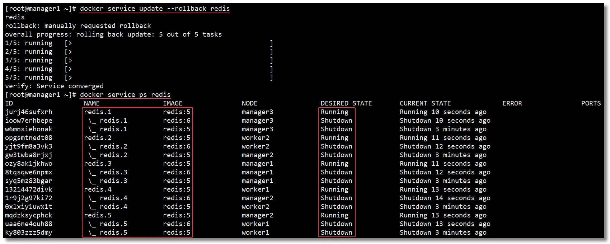


## 7、Swarm 常用命令

### 1、docker swarm

| 命令                            | 说明                 |
| ------------------------------- | -------------------- |
| docker swarm init               | 初始化集群           |
| docker swarm join-token worker  | 查看工作节点的 token |
| docker swarm join-token manager | 查看管理节点的 token |
| docker swarm join               | 加入集群             |


### 2、docker node

| 命令                                 | 说明                               |
| ------------------------------------ | ---------------------------------- |
| docker node ls                       | 查看集群所有节点                   |
| docker node ps                       | 查看当前节点所有任务               |
| docker node rm 节点名称\|节点ID      | 删除节点（`-f`强制删除）           |
| docker node inspect 节点名称\|节点ID | 查看节点详情                       |
| docker node demote 节点名称\|节点ID  | 节点降级，由管理节点降级为工作节点 |
| docker node promote 节点名称\|节点ID | 节点升级，由工作节点升级为管理节点 |
| docker node update 节点名称\|节点ID  | 更新节点                           |


### 3、docker service

| 命令                                    | 说明                     |
| --------------------------------------- | ------------------------ |
| docker service create                   | 创建服务                 |
| docker service ls                       | 查看所有服务             |
| docker service inspect 服务名称\|服务ID | 查看服务详情             |
| docker service logs 服务名称\|服务ID    | 查看服务日志             |
| docker service rm 服务名称\|服务ID      | 删除服务（`-f`强制删除） |
| docker service scale 服务名称\|服务ID=n | 设置服务数量             |
| docker service update 服务名称\|服务ID  | 更新服务                 |


## 8、参考资料 & 鸣谢

- https://docs.docker.com/engine/swarm/
- https://docs.docker.com/engine/swarm/key-concepts/
- https://docs.docker.com/engine/swarm/swarm-tutorial/
- https://docs.docker.com/engine/swarm/how-swarm-mode-works/nodes/
- https://docs.docker.com/engine/swarm/how-swarm-mode-works/services/

- https://docs.docker.com/engine/swarm/swarm-tutorial/
- https://docs.docker.com/engine/swarm/swarm-mode/
- https://docs.docker.com/engine/swarm/how-swarm-mode-works/pki/
- https://docs.docker.com/engine/swarm/join-nodes/
- https://docs.docker.com/engine/swarm/swarm-tutorial/rolling-update/


# Dokcer 三大基础镜像对比

大多数情况下，我们构建容器镜像时选择的基础镜像无外乎是 busybox、alpine 和 google/distroless 这几种，这几个基础镜像在云原生的世界很吃香，被广泛应用于各个应用的容器化。

那么问题来了，为什么这几个基础镜像如此受欢迎呢？我们先来看下这几个基础镜像的大小：

```shell
[root@CentOS7 ~]# docker pull alpine
[root@CentOS7 ~]# docker pull busybox
[root@CentOS7 ~]# docker pull kubeimages/distroless-static
[root@CentOS7 ~]# docker images
REPOSITORY                     TAG                 IMAGE ID            CREATED             SIZE
busybox                        latest              beae173ccac6        2 weeks ago         1.24MB
alpine                         latest              c059bfaa849c        7 weeks ago         5.59MB
kubeimages/distroless-static   latest              27320647c936        52 years ago        2.36MB
```

可以看到这些镜像的体积都非常小，几乎可以忽略不计。


## 1、Busybox

先启动 Busybox 容器进去一探究竟：

```bash
[root@CentOS7 ~]# docker run --rm -it busybox
/ # ls /bin
[                  dnsdomainname      id                 mkfs.minix         rev                tee
[[                 dos2unix           ifconfig           mkfs.vfat          rm                 telnet
acpid              dpkg               ifdown             mknod              rmdir              telnetd
add-shell          dpkg-deb           ifenslave          mkpasswd           rmmod              test
addgroup           du                 ifplugd            mkswap             route              tftp
adduser            dumpkmap           ifup               mktemp             rpm                tftpd
adjtimex           dumpleases         inetd              modinfo            rpm2cpio           time
ar                 echo               init               modprobe           rtcwake            timeout
arch               ed                 insmod             more               run-init           top
arp                egrep              install            mount              run-parts          touch
arping             eject              ionice             mountpoint         runlevel           tr
ascii              env                iostat             mpstat             runsv              traceroute
ash                envdir             ip                 mt                 runsvdir           traceroute6
awk                envuidgid          ipaddr             mv                 rx                 true
.... # 后面的命令就省略了
```

这个镜像的大小只有 1.24MB，缺容纳了这么多 GNU 命令，麻雀虽小五脏俱全啊，这到底是怎么做到的？

事实上这一切都要归功于 Multi-Call binary。什么是 Multi-Call binary 呢？

顾名思义，Multi-Call binary 就是多重调用二进制文件，是一个用C语言编写的程序，它允许多次调用来执行二进制文件。它包含了很多函数，每个执行独特动作的函数都可以通过一个名字来调用，这个名字同时也是 Multi-Call binary 的一个符号链接。Multi-Call binary 最好的应用范例便是 Busybox。

Busybox 里面的函数可以通过两种方式来调用：busybox ls、ls

Busybox 命令操作示例2：

```shell
[root@CentOS7 ~]# docker run --rm -it busybox
/ # busybox ls
bin   dev   etc   home  proc  root  sys   tmp   usr   var
/ # ls
bin   dev   etc   home  proc  root  sys   tmp   usr   var
/ # ls -lh bin/
total 442M   
-rwxr-xr-x  401 root     root        1.1M Dec 29 21:12 [
-rwxr-xr-x  401 root     root        1.1M Dec 29 21:12 [[
-rwxr-xr-x  401 root     root        1.1M Dec 29 21:12 acpid
-rwxr-xr-x  401 root     root        1.1M Dec 29 21:12 add-shell
-rwxr-xr-x  401 root     root        1.1M Dec 29 21:12 addgroup
-rwxr-xr-x  401 root     root        1.1M Dec 29 21:12 adduser
-rwxr-xr-x  401 root     root        1.1M Dec 29 21:12 adjtimex
-rwxr-xr-x  401 root     root        1.1M Dec 29 21:12 ar
-rwxr-xr-x  401 root     root        1.1M Dec 29 21:12 arch
-rwxr-xr-x  401 root     root        1.1M Dec 29 21:12 arp
-rwxr-xr-x  401 root     root        1.1M Dec 29 21:12 arping
-rwxr-xr-x  401 root     root        1.1M Dec 29 21:12 ascii
-rwxr-xr-x  401 root     root        1.1M Dec 29 21:12 ash
-rwxr-xr-x  401 root     root        1.1M Dec 29 21:12 awk
```

很明显，这些不是我们所熟知的 GNU 二进制文件，因为所有的二进制文件都具有相同的属性，比如大小、日期等。这些都不是独立的二进制文件，而是 Multi-Call binary 每个调用函数的别名。这个 Multi-Call binary 就叫 Busybox。

遗憾的是，这些 Busybox 命令并不完全等同于 GNU 命令，某些命令的某些参数是无法执行的，相当于阉割版。


## 2、Alpine

了解完 Busybox，我们再来看看 Alpine 是怎么做的。

```shell
[root@CentOS7 ~]# docker run --rm -it alpine
/ # ls -lh bin/
total 808K   
lrwxrwxrwx    1 root     root          12 Nov 24 09:20 arch -> /bin/busybox
lrwxrwxrwx    1 root     root          12 Nov 24 09:20 ash -> /bin/busybox
lrwxrwxrwx    1 root     root          12 Nov 24 09:20 base64 -> /bin/busybox
lrwxrwxrwx    1 root     root          12 Nov 24 09:20 bbconfig -> /bin/busybox
-rwxr-xr-x    1 root     root      805.6K Nov 23 00:57 busybox
lrwxrwxrwx    1 root     root          12 Nov 24 09:20 cat -> /bin/busybox
lrwxrwxrwx    1 root     root          12 Nov 24 09:20 chgrp -> /bin/busybox
lrwxrwxrwx    1 root     root          12 Nov 24 09:20 chmod -> /bin/busybox
lrwxrwxrwx    1 root     root          12 Nov 24 09:20 chown -> /bin/busybox
lrwxrwxrwx    1 root     root          12 Nov 24 09:20 cp -> /bin/busybox
lrwxrwxrwx    1 root     root          12 Nov 24 09:20 date -> /bin/busybox
lrwxrwxrwx    1 root     root          12 Nov 24 09:20 dd -> /bin/busybox
lrwxrwxrwx    1 root     root          12 Nov 24 09:20 df -> /bin/busybox
lrwxrwxrwx    1 root     root          12 Nov 24 09:20 dmesg -> /bin/busybox
lrwxrwxrwx    1 root     root          12 Nov 24 09:20 dnsdomainname -> /bin/busybox
lrwxrwxrwx    1 root     root          12 Nov 24 09:20 dumpkmap -> /bin/busybox
lrwxrwxrwx    1 root     root          12 Nov 24 09:20 echo -> /bin/busybox
```

巧了，Alpine 的二进制文件竟然是指向 busybox 二进制文件的，这就很明显了，Alpine 镜像的底层使用了 busybox 二进制文件。除此之外，Alpine 还包含了 `apk` 包管理器和一些额外的可执行文件，所以 Alpine 镜像的体积才会比 Busybox 大。


## 3、Distroless

`Distroless` 就不用说了，它来自 Google[1]。该镜像几乎就是空的，只包含应用程序及其运行时所需的依赖，不包含软件包管理器、shell 和其他 GNU 二进制文件，当然还包含一些时区配置和部分 ca-certificates。

```shell
[root@CentOS7 ~]# docker run --rm -it kubeimages/distroless-static
docker: Error response from daemon: No command specified.
See 'docker run --help'.
[root@CentOS7 ~]# docker run --rm -it kubeimages/distroless-static bash
docker: Error response from daemon: OCI runtime create failed: container_linux.go:380: starting container process caused: exec: "bash": executable file not found in $PATH: unknown.
```

可以看到这个镜像中既没有 `shell` 也没有 `bash`，为了一探究竟，可以先把镜像保存为 tar 包，然后把 `rootfs` 解压出来：

```shell
[root@CentOS7 ~]# mkdir image
[root@CentOS7 ~]# tar xvf distroless.tar.gz -C image/
16679402dc206c982b5552ab8de7d898547100e5468be29d4f67d393c0eadfdb.tar
e0851a4aa13657fc8dcd01e0e5e08cb817123ccb82e2c604b34f9ec9c1755e3f.json
2e18de03719583329b7fa8374130e57cc7cddf2b5a487fe4a4988622ca60575c/layer.tar
2e18de03719583329b7fa8374130e57cc7cddf2b5a487fe4a4988622ca60575c/VERSION
2e18de03719583329b7fa8374130e57cc7cddf2b5a487fe4a4988622ca60575c/json
manifest.json
repositories
 
[root@CentOS7 ~]# cd image
[root@CentOS7 ~]# ls -lh
total 3.0M
-r--r--r--. 1 root root 3.0M Jan  1  1970 16679402dc206c982b5552ab8de7d898547100e5468be29d4f67d393c0eadfdb.tar
drwxr-xr-x. 2 root root   50 Sep  3 17:42 2e18de03719583329b7fa8374130e57cc7cddf2b5a487fe4a4988622ca60575c
-r--r--r--. 1 root root  462 Jan  1  1970 e0851a4aa13657fc8dcd01e0e5e08cb817123ccb82e2c604b34f9ec9c1755e3f.json
-r--r--r--. 1 root root  213 Jan  1  1970 manifest.json
-r--r--r--. 1 root root  106 Jan  1  1970 repositories
 
[root@CentOS7 ~]# mkdir rootfs
[root@CentOS7 ~]# tar xf 16679402dc206c982b5552ab8de7d898547100e5468be29d4f67d393c0eadfdb.tar -C rootfs

[root@CentOS7 ~]# tree rootfs
rootfs
├── bin
├── boot
├── dev
├── etc
│   ├── debian_version
│   ├── default
│   ├── dpkg
│   │   └── origins
│   │       └── debian
│   ├── group
│   ├── host.conf
│   ├── issue
│   ├── issue.net
│   ├── nsswitch.conf
│   ├── os-release
│   ├── passwd
│   ├── profile.d
│   ├── protocols
│   ├── rpc
│   ├── services
│   ├── skel
│   ├── ssl
│   │   └── certs
│   │       └── ca-certificates.crt
│   └── update-motd.d
│       └── 10-uname
├── home
│   └── nonroot
├── lib
├── proc
├── root
├── run
├── sbin
├── sys
├── tmp
├── usr
│   ├── bin
│   ├── games
│   ├── include
│   ├── lib
│   │   └── os-release
│   ├── sbin
│   │   └── tzconfig
│   ├── share
│   │   ├── base-files
│   │   │   ├── dot.bashrc
│   │   │   ├── dot.profile
│   │   │   ├── dot.profile.md5sums
│   │   │   ├── info.dir
│   │   │   ├── motd
│   │   │   ├── profile
│   │   │   ├── profile.md5sums
│   │   │   └── staff-group-for-usr-local
...
...
```

该镜像只有一层，大小为 3MB，也没有二进制文件，只有一些证书文件和目录。如果向下滚动，还能看到许可证和时区配置。看来 Distroless 采取的是非常极端的手段，直接把不需要的二进制文件全部抛弃了，只留下一个空镜像和部分必需品。

总结：由此看来，这几个基础镜像如此受欢迎的主要原因就是体积小。镜像越小，漏洞就越少，可攻击面也会大幅减少，而且很容易维护。所以大家构建镜像时尽量选择这些镜像作为基础镜像。


# Docker 疑难杂症解决方案

## 1、Docker命令Tab无法自动补全

一、安装bash-complete

```shell
yum install -y bash-completion
```


二、刷新文件

```shell
source /usr/share/bash-completion/completions/docker
source /usr/share/bash-completion/bash_completion
# 或者
source /usr/share/bash-completion/completions/docker && source /usr/share/bash-completion/bash_completion
```


## 2、Docker安装后client和server的版本不一致

> 参考：https://blog.csdn.net/zjs975584714/article/details/104221293/


## 3、报错WARNING: IPv4 forwarding...

> 解决报错WARNING: IPv4 forwarding is disabled. Networking will not work.

1、报错：

```bash
[root@localhost /]# docker run -it ubuntu /bin/bash
*WARNING: IPv4 forwarding is disabled. Networking will not work.*
```

2、解决方式：

第一步：在宿主机上执行echo "net.ipv4.ip_forward=1" >>/usr/lib/sysctl.d/00-system.conf

```bash
[root@localhost /]# echo "net.ipv4.ip_forward=1" >>/usr/lib/sysctl.d/00-system.conf
[root@localhost /]# tail -2 /usr/lib/sysctl.d/00-system.conf
net.bridge.bridge-nf-call-arptables = 0
net.ipv4.ip_forward=1
```

第二步：重启network和docker服务

```bash
[root@localhost /]# systemctl restart network && systemctl restart docker
```

第三步：验证是否成功

```bash
[root@localhost /]# docker run -it ubuntu /bin/bash
```


# Docker 快速安装各种组件

## 1、MySQL 安装

- 借力 Docker ，三分钟搞定 MySQL 主从复制！https://mp.weixin.qq.com/s/YUsggkcLkjry4pp9JL9CgQ
- 用 Docker 构建 MySQL 主从环境：https://mp.weixin.qq.com/s/dstbQl2SNuNhFIdb4dyHsQ


## 2、Redis 安装

还在用单机版？教你用Docker+Redis搭建主从复制多实例：https://mp.weixin.qq.com/s/MsPyR5Nfnp3feVw73b02DA

# 参考资料 & 鸣谢

1. Docker Tag：https://www.cnblogs.com/Mercury-linux/tag/docker/
2. CSDN（东方雨倾）docker-compose模板文件常用指令：https://blog.csdn.net/u012534326/article/details/105886840
3. Harbor1.9 部署并配置https：https://www.cnblogs.com/ghl1024/p/12318641.html
4. 泽火测试学院(原名飞天小子)：https://www.cnblogs.com/zhuochong/category/1310443.html
5. docker安装常见软件：https://blog.csdn.net/wenge1477/article/details/103828680
6. 博客园（程序员自由之路）磁盘空间爆满：https://www.cnblogs.com/54chensongxia/p/15138314.html
6. [Docker命令详解（build篇）](https://www.cnblogs.com/yfalcon/p/9044183.html)、[Docker命令详解（run篇）](https://www.cnblogs.com/yfalcon/p/9044246.html)