> 作者：大江小浪；来源：https://mp.weixin.qq.com/s/mBkO3-UUis_0Sxpk2MoM4A
>
> 作者：AutoMan/Auto技术汇；来源：https://mp.weixin.qq.com/s/CBeOtN6kL2P4TU40DD3aSQ

# 一、Virtualbox网络设置

Virtualbox 是我最常用的虚拟机管理软件，虽然自从 docker 出来之后虚拟机的使用频率变得越来越少（因为太占用资源了，docker 能够更轻量的在本地构建所需要的环境，想要了解 docker 可以参考我的介绍文章 Docker入门介绍），但有些时候还不得不用虚拟机，例如想要测试不同发行版本的特性和一些配置的场景。

通常情况下，利用 Virtualbox 创建的虚拟机我都会分配两块网卡，一块用 host-only 模式用于虚拟机之间的通信，另外一块用NAT模式提供连接外网的能力。在我们的生产环境中，也使用了分配两个IP地址的形式（网卡是4块，做了双网卡绑定提供高可用保证）。

这就涉及到 Virtuabox 提供的网络设置能力的知识点，本文就总结下 Virtualbox 提供的网络能力。

> 本文基于 Virtualbox 6.1.18。

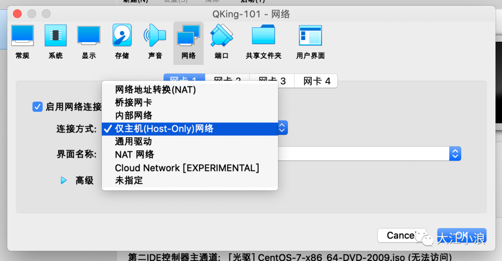

## 1、网络地址转换（NAT）/ NAT网络

> NAT的英文全称是 Network Address Translation ，中文意思是网络地址转换，是一个IETF标准，允许一个整体机构以一个公用IP出现在Internet上。顾名思义，就是一种把内部私有网络地址翻译成合法网络地址的技术。更多的NAT的介绍超出了本文的范畴，大家可以自己看看参考资料中的网址来进一步了解。

Virtualbox中提供的两个选项「网络地址转换（NAT）」和「NAT网络」实际上都是NAT方式，区别在于第一种使用的Virtualbox内已经建好的NAT网络，其网段为10.0.2.0/24，该网络不允许用户管理。

NAT网络是用户自己创建的网络，通过主机网络管理器可以创建自己的NAT网络，并指定地址范围。Virtualbox默认会将192.168.56.1设置为网关。

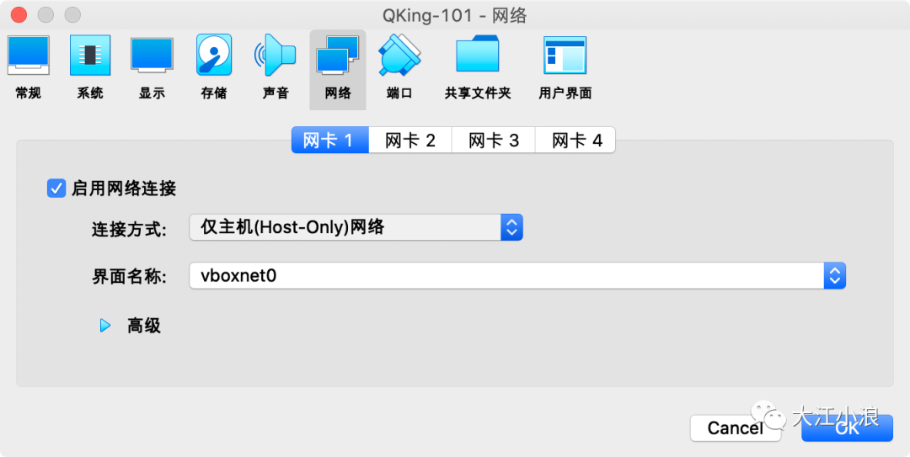

## 2、仅主机（Host-Only）网络

Host-only模式是指虚拟机的网卡只有宿主机可以访问，在搭建只需要内部通信的网络环境时，可以选择这种模式。可以在全局配置中设置Host-only可以分配的地址范围。

## 3、桥接网卡

从字面上看就容易理解，这种模式不会创建用户自己的网络，这种方式共享宿主机的网络，具备与宿主机一样的网络连通性。但因此也带来对网络的访问控制能力比较弱，个人觉得仅适用于需求比较简单的场景。

## 4、内部网络

VirtualBox的内部网络，本质上是提供一个构建网络所需要的基础设置（并没有创建网络），功能上相当于提供了一个干净的交换机，不与宿主机的网络栈交互，不用宿主机中的某个服务进程提供DHCP服务，内部网络上的流量，在宿主机中是不可见的，只有连接其上的虚拟机才可见。如果需要额外的网络功能，可通过配置连接其上的虚拟机来提供。

## 5、通用驱动

这是平时很少使用的模式，共享相同的通用网络接口，允许用户选择能被VirtualBox包含或者分布在一个扩展包里的驱动。个人理解适用于需要自己写网络驱动的场景。

# 二、搞懂虚拟机VirtualBox网络配置

> VirtualBox是开源的虚拟机软件，这里重点讲一下它的的网络配置。

一般虚拟机都会提供了三种网络工作模式，分别是：

- Bridged（桥接模式）
- NAT（网络地址转换模式）
- Host-Only（仅主机模式）

这三种网络模式有什么区别，会在哪种情况下使用？我们来详细分析一下。

## 1、Bridged（桥接模式）

桥接模式就是将主机的网卡，与虚拟机虚拟的网卡利用虚拟网桥进行通信。

- 类似于把物理主机虚拟为一个交换机，所有桥接设置的虚拟机连接到这个交换机的一个接口上，物理主机也同样插在这个交换机当中，所以所有桥接下的网卡与网卡都是交换模式的，相互可以访问而不干扰。
- 虚拟机ip地址需要与主机在同一个网段，如果需要联网，则网关与DNS需要与主机网卡一致。

其网络结构如下图所示：

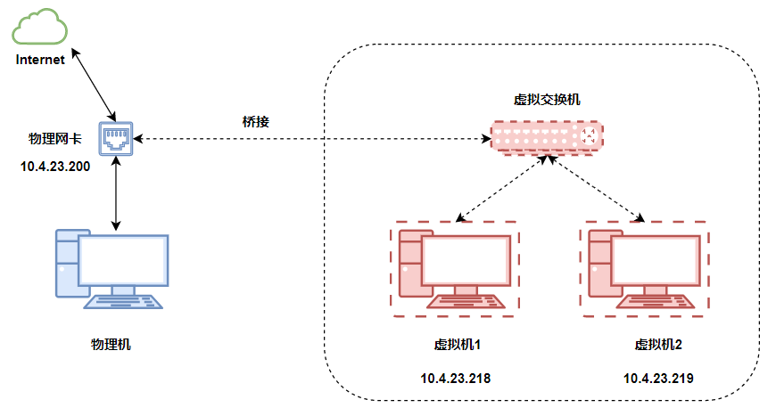

VirtualBox虚拟机会默认安装Bridged网卡和Host-Only网卡：

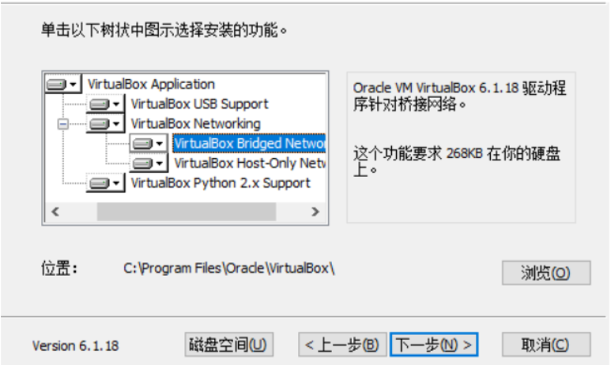

在虚拟机里选择要桥接的物理网卡，这里选择的是Intel wi-fi这个物理网卡：

因为启用了【网卡1】，虚拟机会给Ubuntu系统配置一块虚拟网卡【enp03】，这里我们设置Ubuntu虚拟网卡和桥接的Windows物理网卡在同一个网段，这样就可以实现互通了；

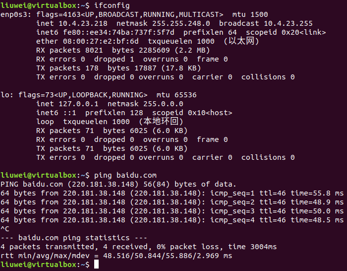

因为windows的wifi网卡地址是：10.4.23.200，所以设置虚拟机的enp0s3网卡地址为：10.4.23.218；这样两个系统现在都在真实的网络上，且可以正常上网。

小结：

- 桥接模式：物理机和虚拟机在网络上是一样的，虚拟系统相当于在此网络下的一个独立系统，需要分配网络的一个独立IP。
- 连接时指定的桥接到哪个物理网卡，相当于要把虚拟系统接到那个网段的交换机上。

## 2、NAT（地址转换模式）

NAT模式下，虚拟机访问网络的所有数据都是由主机提供的，虚拟机并不真实的存在于网络上，主机和网络中的任何机器是不能查看和访问这个虚拟机的。

其网络结构如下图所示：

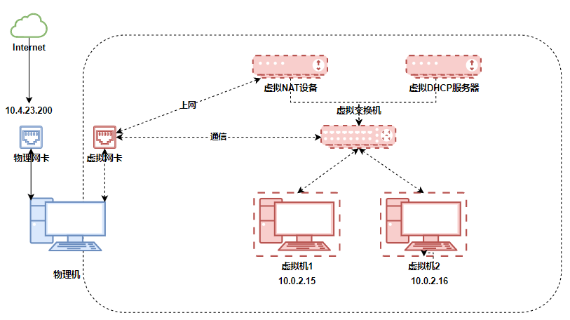

NAT模式借助虚拟NAT设备和虚拟DHCP服务器，使得虚拟机可以联网。

- DHCP用于动态分配虚拟机的IP地址。
- 物理机下的虚拟网卡，在VMware下是VMnet8网卡，在VirtualBox下不可见。

另外，在连接上：

- 虚拟机可以通过网络访问主机
- 主机无法通过网络访问虚拟机，如：telnet 是连不到虚拟机中的。

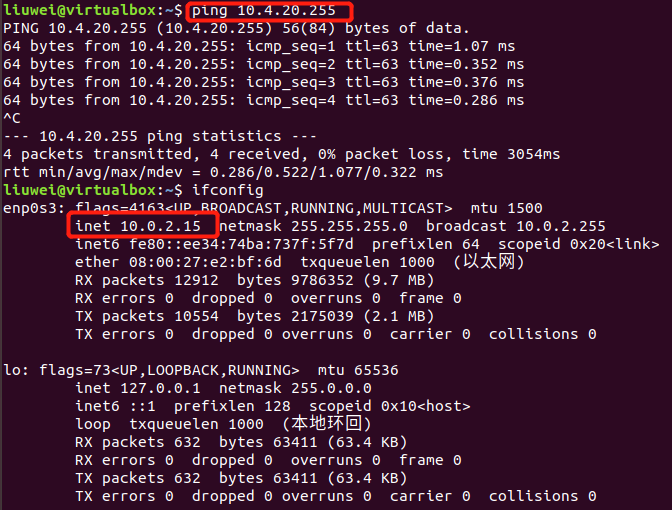

**小结**：

这种虚拟系统都是隐藏在物理机后面的机器，在网络上是看不见的，地址由DHCP负责分配，上网由NAT设备负责。

这种网络连接实现有些系统不需要暴露在网络节点上又需要上网的这种需求，这也是最简单的一种虚拟机使用方式。

## 3、Host-Only（仅主机模式）

Host-Only听名字就是只和主机建立关系。这种模式是将虚拟机与外网隔开，使得虚拟机成为一个独立的系统，只与主机相互通讯。

它的网络结构是在NAT网络的基础上，去除虚拟NAT设备让它不能上网，如下图所示：

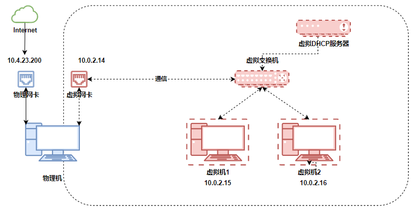

在虚拟机安装完后，windows下就会多出来一个Host-Only网卡，这个虚拟网卡就是用来实现通信用的。

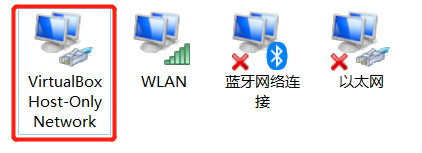

在选择Host-Only模式时，需要选择一块Host-Only网卡用于和虚拟机进行通信使用：

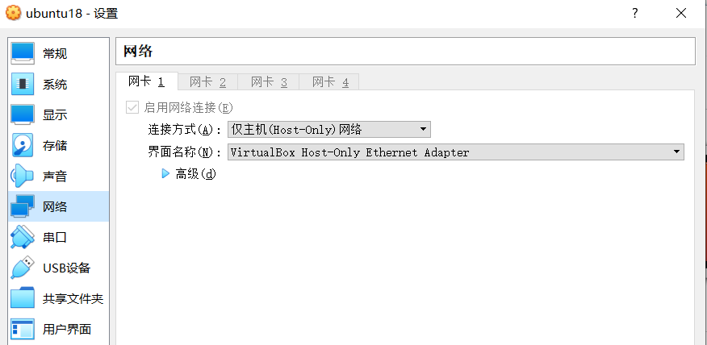

同时设置虚拟机的IP地址和Host-Only的网卡地址要在同一个网段：

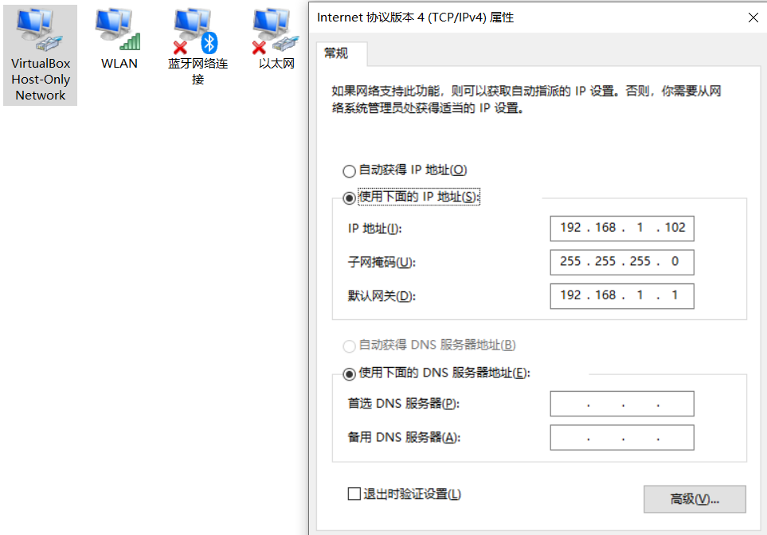

相互ping都是通的，这也实现了物理机和虚拟机互通的功能。

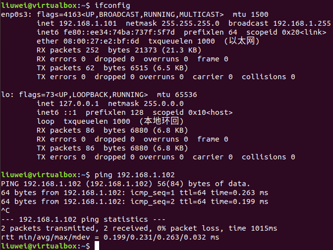

## 4、三种模式总结

- 桥接模式：实现虚拟机在真实的网络上；
- NAT模式：实现虚拟机隐藏在物理机之后，能上网，但不能访问物理机；
- Host-Only模式：实现虚拟机隐藏在物理机之后，不能上网，但可以访问物理机；

上面只是介绍选用一个网络模式的情况，在实际使用中，我们还可以同时使用两种及以上的网络模式，比如：NAT + Host-Only，这样可以实现虚拟机上网和物理机通信两种能力。

以上就是VirtualBox最常用的网络配置，希望对你有用。