一、版本控制概述
==========================

1、什么是版本控制
-----------

版本控制（Revision Control）是一种在开发的过程中用于管理我们对文件、目录或工程等内容的修改历史，方便查看更改历史记录，备份以便恢复以前的版本的软件工程技术。

*   实现跨区域多人协同开发
*   追踪和记载一个或者多个文件的历史记录
*   组织和保护你的源代码和文档
*   统计工作量
*   并行开发、提高开发效率
*   跟踪记录整个软件的开发过程
*   减轻开发人员的负担，节省时间，同时降低人为错误

简单说就是用于管理多人协同开发项目的技术。

没有进行版本控制或者版本控制本身缺乏正确的流程管理，在软件开发过程中将会引入很多问题，如软件代码的一致性、软件内容的冗余、软件过程的事物性、软件开发过程中的并发性、软件源代码的安全性，以及软件的整合等问题。

```bash
lsx@PC MINGW64 ~/Desktop/Git-Tech
$ ls -l
total 84
-rw-r--r-- 1 lsx 197609 9216 Jul 15 23:48 版本1.0.0.doc
-rw-r--r-- 1 lsx 197609 9216 Jul 15 23:48 版本1.0.1.doc
-rw-r--r-- 1 lsx 197609 9216 Jul 15 23:48 版本1.1.0.doc
-rw-r--r-- 1 lsx 197609 9216 Jul 15 23:48 版本1.2.0.doc
-rw-r--r-- 1 lsx 197609 9216 Jul 15 23:48 版本1.2.1.doc
-rw-r--r-- 1 lsx 197609 9216 Jul 15 23:48 版本1.3.0.doc
-rw-r--r-- 1 lsx 197609 9216 Jul 15 23:48 版本1.4.0.doc
```


2、版本控制常用术语
--------

**1、仓库（Repository）：** 受版本控制的所有文件修订历史的共享数据库

**2、工作空间（Workspace)** ：本地硬盘或Unix 用户帐户上编辑的文件副本

**3、工作树/区（Working tree）** ：工作区中包含了仓库的工作文件。您可以修改的内容和提交更改作为新的提交到仓库。

**4、暂存区（Staging area）** ：暂存区是工作区用来提交更改（commit）前可以暂存工作区的变化。

**5、索引（Index）** ：索引是暂存区的另一种术语。

**6、签入（Checkin）** ：将新版本复制回仓库

**7、签出（Checkout）** ：从仓库中将文件的最新修订版本复制到工作空间

**8、提交（Commit）** ：对各自文件的工作副本做了更改，并将这些更改提交到仓库

**9、冲突（Conflict）** ：多人对同一文件的工作副本进行更改，并将这些更改提交到仓库

**10、合并（Merge）** ：将某分支上的更改联接到此主干或同为主干的另一个分支

**11、分支（Branch）** ：从主线上分离开的副本，默认分支叫master

**12、锁（Lock）** ：获得修改文件的专有权限。

**13、头（HEAD）**：头是一个象征性的参考，最常用以指向当前选择的分支。

**14、修订（Revision）**：表示代码的一个版本状态。Git通过用SHA1 hash算法表示的ID来标识不同的版本。

**15、标记（Tags）** ：标记指的是某个分支某个特定时间点的状态。通过标记，可以很方便的切换到标记时的状态。


3、常见的版本控制器
------------

主流的版本控制器有如下这些：Git、SVN（Subversion）、CVS（Concurrent Versions System）、VSS（Micorosoft Visual SourceSafe）、TFS（Team Foundation Server）、Visual Studio Online

版本控制产品非常的多（Perforce、Rational ClearCase、RCS（GNU Revision Control System）、Serena Dimention、SVK、BitKeeper、Monotone、Bazaar、Mercurial、SourceGear Vault），现在影响力最大且使用最广泛的是 Git 与 SVN。


4、版本控制分类
----------

### 1、本地版本控制

记录文件每次的更新，可以对每个版本做一个快照，或是记录补丁文件，适合个人用，如 RCS。


### 2、集中版本控制

所有的版本数据都保存在服务器上，协同开发者从服务器上同步更新或上传自己的修改。


所有的版本数据都存在服务器上，用户的本地只有自己以前所同步的版本，如果不连网的话，用户就看不到历史版本，也无法切换版本验证问题，或在不同分支工作。而且，所有数据都保存在单一的服务器上，有很大的风险这个服务器会损坏，这样就会丢失所有的数据，当然可以定期备份。代表产品：SVN、CVS、VSS


### 3、分布式版本控制

所有版本信息仓库全部同步到本地的每个用户，这样就可以在本地查看所有版本历史，可以离线在本地提交，只需在连网时 push 到相应的服务器或其他用户那里。由于每个用户那里保存的都是所有的版本数据，只要有一个用户的设备没有问题就可以恢复所有的数据，但这增加了本地存储空间的占用。代表产品：Git


5、Git 与 SVN 最主要区别
----------------

SVN 是集中式版本控制系统，版本库是集中放在中央服务器的，而工作的时候，用的都是自己的电脑，所以首先要从中央服务器得到最新的版本，然后工作，完成工作后，需要把自己做完的活推送到中央服务器。集中式版本控制系统是必须联网才能工作，对网络带宽要求较高。

Git 是分布式版本控制系统，没有中央服务器，每个人的电脑就是一个完整的版本库，工作的时候不需要联网了，因为版本都在自己电脑上。协同的方法是这样的：比如说自己在电脑上改了文件 A，其他人也在电脑上改了文件 A，这时，你们两之间只需把各自的修改推送给对方，就可以互相看到对方的修改了。


二、Git 安装配置
==========

1、Git 介绍
----------

Git 是目前世界上最先进的分布式版本控制系统。Git 是免费、开源的最初 Git 是为辅助 Linux 内核开发的，来替代 BitKeeper。

**作者**：Linux 和 Git 之父李纳斯·托沃兹（Linus Benedic Torvalds）1969、芬兰

**优点：**

*   适合分布式开发，强调个体。
*   公共服务器压力和数据量都不会太大。
*   速度快、灵活。
*   任意两个开发者之间可以很容易的解决冲突。
*   离线工作。

**缺点：**

*   模式上比 SVN 更加复杂。
*   不符合常规思维。
*   代码保密性差，一旦开发者把整个库克隆下来就可以完全公开所有代码和版本信息。

**官网**： https://git-scm.com/

**源码：** https://github.com/git/git/


2、Git 安装
-------------

### 1、Windows 下载 Git

打开 [Git 官网](https://git-scm.com/)，下载对应操作系统的版本【点击 Download for macOS 或者 Download for Windows】=》选择版本：[Git-2.45.2-64-bit.exe](https://github.com/git-for-windows/git/releases/download/v2.45.2.windows.1/Git-2.45.2-64-bit.exe)。


### 2、Windows 安装 Git

双击看到的第一个界面如下图：

#### 01、使用许可声明

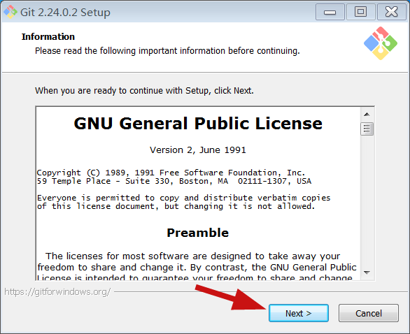

点击“Next”进入下图页面：


#### 02、选择安装路径

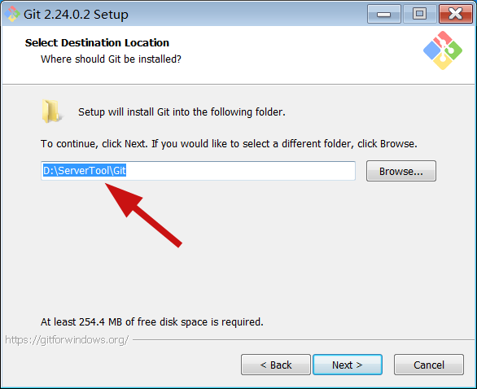

在输入框内输入想要安装到的本机路径，也就是实际文件夹位置，或点击“Browse...”选择已经存在的文件夹，然后点击“Next”按钮继续，进入下图界面：


#### 03、选择安装组件

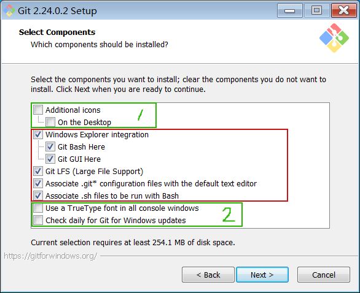

上图红框内的选项是默认勾选的，建议不要动。绿色框1是决定是否在桌面创建快捷方式的。绿色框2是决定在所有控制台窗口中使用TrueType字体和是否每天检查Git是否有Windows更新的。这些根据自己需要选择。点击“Next”按钮进入下图界面：


#### 04、选择开始菜单页

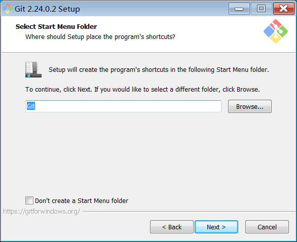

这个界面是创建开始菜单中的名称，不需要修改，直接点“Next”按钮继续到下图的界面：


#### 05、选择Git文件默认的编辑器

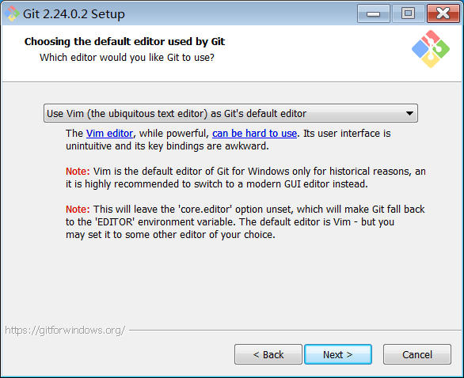

这个页面是在选择Git文件默认的编辑器，很少用到，所以默认Vim即可，直接点“Next”按钮继续到下图的界面：


#### 06、调整您的PATH环境

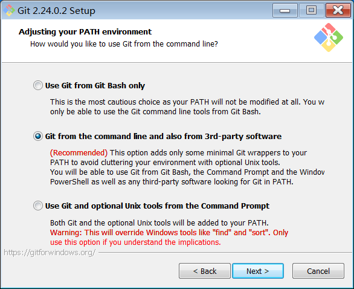

这个界面是调整您的PATH环境。

- 第一种配置是“仅从Git Bash使用Git”。这是最安全的选择，因为您的PATH根本不会被修改。您只能使用 Git Bash 的 Git 命令行工具。但是这将不能通过第三方软件使用。
- 第二种配置是“从命令行以及第三方软件进行Git”。该选项被认为是安全的，因为它仅向PATH添加了一些最小的Git包装器，以避免使用可选的Unix工具造成环境混乱。
  您将能够从Git Bash，命令提示符和Windows PowerShell以及在PATH中寻找Git的任何第三方软件中使用Git。这也是推荐的选项。
- 第三种配置是“从命令提示符使用Git和可选的Unix工具”。警告：这将覆盖Windows工具，如 “ find 和 sort ”。只有在了解其含义后才使用此选项。

我选择推荐的选项第二种配置，点击“Next”按钮继续到下图的界面：


#### 07、选择HTTPS后端传输


这个界面是选择HTTPS后端传输。

- 第一个选项是“使用 OpenSSL 库”。服务器证书将使用ca-bundle.crt文件进行验证。这也是我们常用的选项。
- 第二个选项是“使用本地 Windows 安全通道库”。服务器证书将使用Windows证书存储验证。此选项还允许您使用公司的内部根CA证书，例如通过Active Directory Domain Services 。

我使用默认选项第一项，点击“Next”按钮继续到下图的界面：


#### 08、配置行尾符号转换

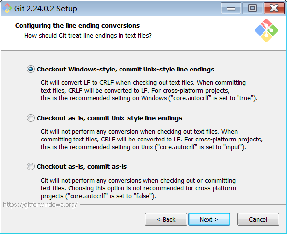

这个界面是配置行尾符号转换。

- 第一个选项是“签出Windows风格，提交Unix风格的行尾”。签出文本文件时，Git会将LF转换为CRLF。提交文本文件时，CRLF将转换为LF。对于跨平台项目，这是Windows上的推荐设置（“ core.autocrlf”设置为“ true”）
- 第二个选项是“按原样签出，提交Unix样式的行尾”。签出文本文件时，Git不会执行任何转换。 提交文本文件时，CRLF将转换为LF。对于跨平台项目，这是Unix上的建议设置（“ core.autocrlf”设置为“ input”）
- 第三种选项是“按原样签出，按原样提交”。当签出或提交文本文件时，Git不会执行任何转换。不建议跨平台项目选择此选项（“ core.autocrlf”设置为“ false”）

我选择第一种选项，点击“Next”按钮继续到下图的界面：


#### 09、配置终端模拟器与Git Bash

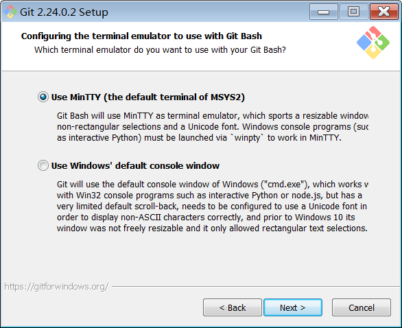

这个界面是配置终端模拟器以与Git Bash一起使用。

- 第一个选项是“使用MinTTY（MSYS2的默认终端）”。Git Bash将使用MinTTY作为终端模拟器，该模拟器具有可调整大小的窗口，非矩形选择和Unicode字体。Windows控制台程序（例如交互式Python）必须通过“ winpty”启动才能在MinTTY中运行。
- 第二个选项是“使用Windows的默认控制台窗口”。Git将使用Windows的默认控制台窗口（“cmd.exe”），该窗口可以与Win32控制台程序（如交互式Python或node.js）一起使用，但默认的回滚非常有限，需要配置为使用unicode 字体以正确显示非ASCII字符，并且在Windows 10之前，其窗口不能自由调整大小，并且只允许矩形文本选择。

我选择默认的第一种选项，点击“Next”按钮继续到下图的界面：


#### 10、配置配置额外的选项

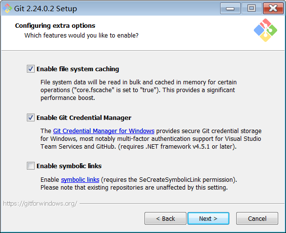

这个界面是配置配置额外的选项。

- 第一个选项是“启用文件系统缓存”。文件系统数据将被批量读取并缓存在内存中用于某些操作（“core.fscache”设置为“true”）。 这提供了显著的性能提升。
- 第二个选项是“启用Git凭证管理器”。Windows的Git凭证管理器为Windows提供安全的Git凭证存储，最显着的是对Visual Studio Team Services和GitHub的多因素身份验证支持。 （需要.NET Framework v4.5.1或更高版本）。
- 第三个选项是“启用符号链接”。启用符号链接（需要SeCreateSymbolicLink权限）。请注意，现有存储库不受此设置的影响。

我勾选默认的第一、第二选项，点击“Next”按钮继续到下图的界面：


#### 11、配置实验选项

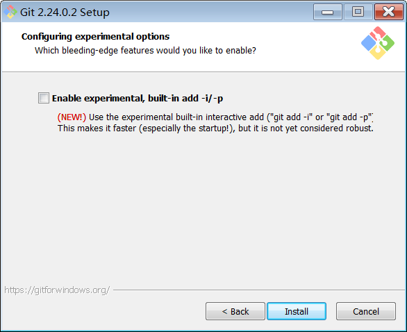

这个界面是配置实验选项。

- 启用实验性的内置添加 -i / -p。（新！）使用实验性的内置交互式add（“ git add -i”或“ git add -p”）。这使其速度更快（尤其是启动！），但尚未被认为是可靠的。

默认不勾选，直接点击“Next”按钮继续到下图的安装进度界面：


#### 12、安装进度指示

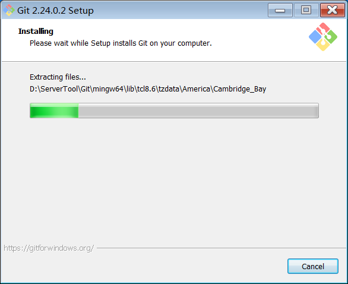

安装进度结束之后，会出现下图的完成Git安装向导界面：


#### 13、安装完成

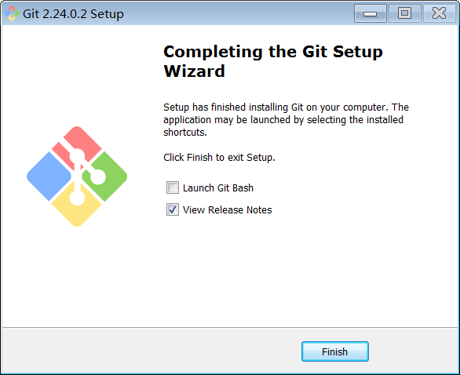

在这个界面，可以勾选是否启动启动Git Bash和是否查看发行说明，然后点“Finish”按钮退出安装界面。


#### 14、启动测试

到此，Git的安装完成，可以在开始菜单中看到Git的三个启动图标（Git Bash、Git CMD(Deprecated)、Git GUI）。

1、Git Bash，是 Git 配套的一个控制台，点击打开如下图：


2、Git CMD（Deprecated），是通过 CMD 使用 Git（不推荐使用），点击打开如下图：

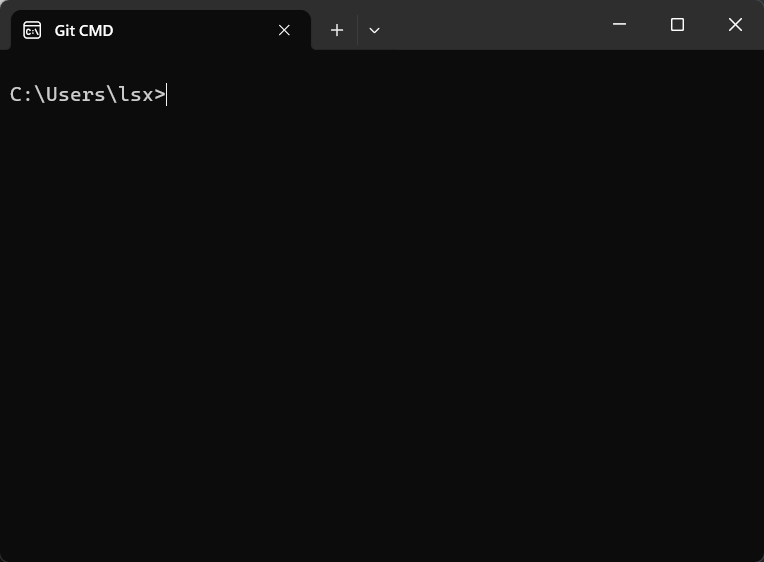

3、Git GUI，是 Git 的可视化操作工具，点击打开如下图：

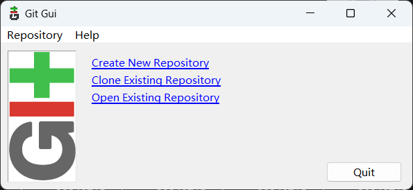

关于 Git 的安装过程就介绍到这里。


### 3、Windows 启动 Git

安装成功后在开始菜单中会有Git项，菜单下有3个程序：Git Bash、Git CMD、Git GUI。

1、**Git Bash：**Unix 与 Linux 风格的命令行，使用最多，推荐最多【与 DOS 风格的命令有些区别，不习惯可以选择 Git CMD】


**2、Git CMD：**Windows 风格的命令行

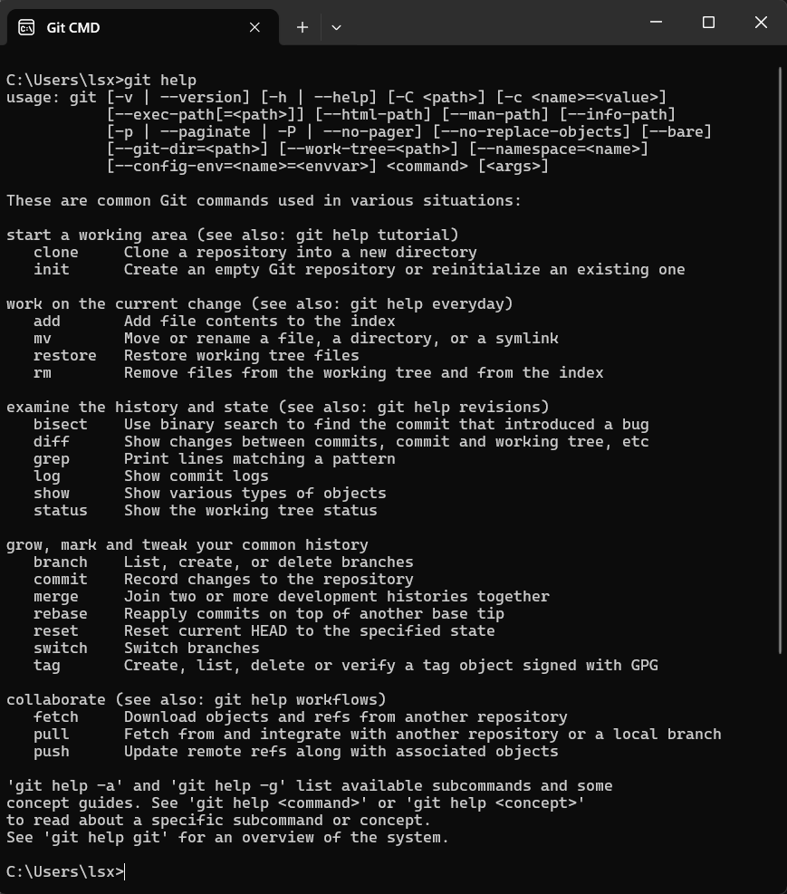

3、**Git GUI**：图形界面的 Git，不建议初学者使用，尽量先熟悉常用命令


### 4、Linux 与 MacOS 下载安装 Git

Linux 安装 Git：sudo apt-get install git 命令行就可以安装了。

MacOS 安装 Git：

- 方式一： [https://git-scm.com/download/mac](https://git-scm.com/download/mac)，下载双击.pkg安装

- 方式二：执行 brew install git 命令行即可安装。

  ```bash
  lsx@MacBook-Air ~ % brew install git
  .....
  lsx@MacBook-Air ~ % git version
  git version 2.45.2
  ```


### 5、Bash 基本操作命令

~就是 home 路径【不管是Windows、Linux 或 MacOS 系统】

进入 Bash 默认位置，注意标题栏


1、cd : 改变目录。cd ~ 回 Home（当前用户所在目录）

```bash
lsx@PC MINGW64 ~
$ cd c:

lsx@PC MINGW64 /c
$ cd ~

lsx@PC MINGW64 ~
$ cd Desktop/Git-Tech/
```


2）、cd . . 回退到上一个目录，直接cd进入默认目录

```bash
lsx@PC MINGW64 ~/Desktop/Git-Tech
$ cd ..

lsx@PC MINGW64 ~/Desktop
$
```

3）、pwd : 显示当前所在的目录路径。

```bash
lsx@PC MINGW64 ~/Desktop
$ pwd
/c/Users/lsx/Desktop
```

4）、ls(ll): 都是列出当前目录中的所有文件，只不过ll(两个ll)列出的内容更为详细。

```bash
lsx@PC MINGW64 ~/Desktop
$ cd Git-Tech/

lsx@PC MINGW64 ~/Desktop/Git-Tech
$ ll
total 84
-rw-r--r-- 1 lsx 197609 9216 Jul 15 23:48 版本1.0.0.doc
-rw-r--r-- 1 lsx 197609 9216 Jul 15 23:48 版本1.0.1.doc
-rw-r--r-- 1 lsx 197609 9216 Jul 15 23:48 版本1.1.0.doc
-rw-r--r-- 1 lsx 197609 9216 Jul 15 23:48 版本1.2.0.doc
-rw-r--r-- 1 lsx 197609 9216 Jul 15 23:48 版本1.2.1.doc
-rw-r--r-- 1 lsx 197609 9216 Jul 15 23:48 版本1.3.0.doc
-rw-r--r-- 1 lsx 197609 9216 Jul 15 23:48 版本1.4.0.doc
```

5）、touch : 新建一个文件 如 touch index.js 就会在当前目录下新建一个 index.js 文件。

```bash
lsx@PC MINGW64 ~/Desktop/Git-Tech
$ touch index.js

lsx@PC MINGW64 ~/Desktop/Git-Tech
$ ll
total 84
-rw-r--r-- 1 lsx 197609    0 Jul 16 10:16 index.js
-rw-r--r-- 1 lsx 197609 9216 Jul 15 23:48 版本1.0.0.doc
-rw-r--r-- 1 lsx 197609 9216 Jul 15 23:48 版本1.0.1.doc
-rw-r--r-- 1 lsx 197609 9216 Jul 15 23:48 版本1.1.0.doc
-rw-r--r-- 1 lsx 197609 9216 Jul 15 23:48 版本1.2.0.doc
-rw-r--r-- 1 lsx 197609 9216 Jul 15 23:48 版本1.2.1.doc
-rw-r--r-- 1 lsx 197609 9216 Jul 15 23:48 版本1.3.0.doc
-rw-r--r-- 1 lsx 197609 9216 Jul 15 23:48 版本1.4.0.doc
```

6）、rm: 删除一个文件, rm index.js 就会把index.js文件删除。

```bash
lsx@PC MINGW64 ~/Desktop/Git-Tech
$ rm index.js

lsx@PC MINGW64 ~/Desktop/Git-Tech
$ ll
total 84
-rw-r--r-- 1 lsx 197609 9216 Jul 15 23:48 版本1.0.0.doc
-rw-r--r-- 1 lsx 197609 9216 Jul 15 23:48 版本1.0.1.doc
-rw-r--r-- 1 lsx 197609 9216 Jul 15 23:48 版本1.1.0.doc
-rw-r--r-- 1 lsx 197609 9216 Jul 15 23:48 版本1.2.0.doc
-rw-r--r-- 1 lsx 197609 9216 Jul 15 23:48 版本1.2.1.doc
-rw-r--r-- 1 lsx 197609 9216 Jul 15 23:48 版本1.3.0.doc
-rw-r--r-- 1 lsx 197609 9216 Jul 15 23:48 版本1.4.0.doc
```

7）、mkdir: 新建一个目录,就是新建一个文件夹。

```bash
lsx@PC MINGW64 ~/Desktop/Git-Tech
$ mkdir d-1

lsx@PC MINGW64 ~/Desktop/Git-Tech
$ ll
total 84
drwxr-xr-x 1 lsx 197609    0 Jul 16 10:18 d-1/
-rw-r--r-- 1 lsx 197609 9216 Jul 15 23:48 版本1.0.0.doc
-rw-r--r-- 1 lsx 197609 9216 Jul 15 23:48 版本1.0.1.doc
-rw-r--r-- 1 lsx 197609 9216 Jul 15 23:48 版本1.1.0.doc
-rw-r--r-- 1 lsx 197609 9216 Jul 15 23:48 版本1.2.0.doc
-rw-r--r-- 1 lsx 197609 9216 Jul 15 23:48 版本1.2.1.doc
-rw-r--r-- 1 lsx 197609 9216 Jul 15 23:48 版本1.3.0.doc
-rw-r--r-- 1 lsx 197609 9216 Jul 15 23:48 版本1.4.0.doc
```

8）、rm -r : 删除一个文件夹, rm -r src 删除src目录， 好像不能用通配符。

```bash
lsx@PC MINGW64 ~/Desktop/Git-Tech
$ rm -r d-1/

lsx@PC MINGW64 ~/Desktop/Git-Tech
$ ll
total 84
-rw-r--r-- 1 lsx 197609 9216 Jul 15 23:48 版本1.0.0.doc
-rw-r--r-- 1 lsx 197609 9216 Jul 15 23:48 版本1.0.1.doc
-rw-r--r-- 1 lsx 197609 9216 Jul 15 23:48 版本1.1.0.doc
-rw-r--r-- 1 lsx 197609 9216 Jul 15 23:48 版本1.2.0.doc
-rw-r--r-- 1 lsx 197609 9216 Jul 15 23:48 版本1.2.1.doc
-rw-r--r-- 1 lsx 197609 9216 Jul 15 23:48 版本1.3.0.doc
-rw-r--r-- 1 lsx 197609 9216 Jul 15 23:48 版本1.4.0.doc
```

9）、mv 移动文件, mv index.html src index.html 是我们要移动的文件, src 是目标文件夹,当然, 这样写,必须保证文件和目标文件夹在同一目录下。

10）、reset: 重新初始化终端/清屏。

11）、clear: 清屏。

12）、history: 查看命令历史。

13）、help: 帮助。

14）、exit: 退出。

15）、#表示注释

16）、echo: 输出与注释【在MacOS系统中 注释内容会被打印出来】

```bash
lsx@PC MINGW64 ~/Desktop/Git-Tech
$ echo Hello git # 注释
Hello git
```

17）、创建文件

```bash
# 小于号：命令默认从键盘获得的输入，改成从文件，或者其它打开文件以及设备输入
# >> 是追加内容
# > 是覆盖原有内容
$ echo Hello Git > f1.txt
$ echo Hello Github >> f1.txt
```

 18、显示文件内容 cat

```bash
$ cat f1.txt
Hello Git
Hello Github
```


3、Git 配置
----------------------

### 1、Git 查看配置项

使用 git config -l 可以查看现在的Git环境详细配置

```bash
lsx@PC MINGW64 ~/Desktop/Git-Tech
$ git config -l
diff.astextplain.textconv=astextplain
filter.lfs.clean=git-lfs clean -- %f
filter.lfs.smudge=git-lfs smudge -- %f
filter.lfs.process=git-lfs filter-process
filter.lfs.required=true
http.sslbackend=openssl
http.sslcainfo=C:/Program Files (x86)/Git/mingw64/etc/ssl/certs/ca-bundle.crt
core.autocrlf=true
core.fscache=true
core.symlinks=false
pull.rebase=false
credential.helper=manager
credential.https://dev.azure.com.usehttppath=true
init.defaultbranch=master
user.name=Sam Liu
user.email=8629303@qq.com
difftool.sourcetree.cmd=''
mergetool.sourcetree.cmd=''
mergetool.sourcetree.trustexitcode=true
https.sslverify=false
core.autocrlf=true
http.sslverify=false
http.proxy=http://127.0.0.1:7890
```

查看不同级别的配置文件：

```bash
# 查看系统config
git config --system -l
git config --system --list

# 查看当前用户（global）配置
git config --global -l
git config --global --list

# 查看当前仓库配置信息
git config --local -l
git config --local --list
```


### 2、Git 配置文件分类

在 Windows / MacOS 系统中，Git 在 $HOME 目录中查找 .gitconfig 文件。

**Git 相关的配置文件有三个：**

1.  /etc/gitconfig：包含了适用于系统所有用户和所有项目的值。(Win：C:\\Program Files\\Git\etc\\gitconfig) \--system 系统级

2. ~/.gitconfig：只适用于当前登录用户的配置。(Win：~\.gitconfig)  \--global 全局【又称用户级别】

3. 位于git项目目录中的.git/config：适用于特定git项目的配置。 --local当前项目

注意：对于同一配置项，三个配置文件的优先级是1<2<3

Git 的配置文件在控制台中使用 git config 命令用来修改配置，Git 配置级别有3种，分别存在不同的配置文件中：

1. 仓库级别（当前仓库有效） local 〖优先级最高〗
2. 用户级别（当前用户有效） global〖优先级次之〗
3. 系统级别（系统全局有效） system〖优先级最低〗

这里可以直接编辑配置文件，通过命令设置后会响应到这里。

```bash
git config --local -e     # 编辑仓库级别配置文件
git config --global -e    # 编辑用户级别配置文件
git config --system -e    # 编辑系统级别配置文件
```


### 3、设置用户名与邮箱【必须】

当你安装Git后首先要做的事情是设置你的用户名称和e-mail地址。这是非常重要的，因为每次Git提交都会使用该信息。它被永远的嵌入到了你的提交中：

```bash
$ git config --global user.name "test"         # 名称
$ git config --global user.email test@qq.com   # 邮箱
```

只需要做一次这个设置，如果你传递了\--global 选项，因为 Git 将总是会使用该信息来处理你在系统中所做的一切操作。如果你希望在一个特定的项目中使用不同的名称或邮箱地址，你可以在该项目中运行该命令而不要\--global选项。 总之--global为全局配置，不加为某个项目的特定配置。

```bash
lsx@PC MINGW64 ~/Desktop/Git-Tech
$ git config --global user.name "test"

lsx@PC MINGW64 ~/Desktop/Git-Tech
$ git config --global user.email test@qq.com

lsx@PC MINGW64 ~/Desktop/Git-Tech
$ git config --global --get-regexp user.*
user.name test
user.email test@qq.com
```


### 4、添加或删除配置项

1、添加配置项 

```bash
# [--local|--global|--system]  # 可选的，对应本地，全局，系统不同级别的设置
# section.key                  # 区域下的键
# value                        # 对应的值
git config [--local|--global|--system] section.key value
```

例如我们要在student区域下添加一个名称为height值为198的配置项，执行结果如下：

```bash
lsx@PC MINGW64 ~
$ git config --system student.height 198

lsx@PC MINGW64 ~
$ git config --system --get-regexp student
student.height 198
```

2、删除配置项 

```bash
git config [--local|--global|--system] --unset section.key
```

将系统级的height配置项移除

```bash
lsx@PC MINGW64 ~
$ git config --system --unset student.height

lsx@PC MINGW64 ~
$ git config --system --get-regexp student

```


### 5、更多配置项

```bash
git config --global color.ui true    # 打开所有的默认终端着色
git config --global alias.ci commit  # 别名 ci 是commit的别名
[alias]  
co = checkout  
ci = commit  
st = status  
pl = pull  
ps = push  
dt = difftool  
l = log --stat  
cp = cherry-pick  
ca = commit -a  
b = branch 

git config user.name            # 获得用户名
git config core.filemode false  # 忽略修改权限的文件  
user.name             # 用户名
user.email            # 邮箱
core.editor           # 文本编辑器  
core.paper "less -N"  # 配置显示方式
merge.tool            # 差异分析工具 
color.diff true       # diff颜色配置  
alias.co checkout     # 设置别名
```

所有config命令参数

```bash
语法: git config [<options>]        
        
文件位置        
    --global               # use global config file 使用全局配置文件
    --system               # use system config file 使用系统配置文件
    --local                # use repository config file    使用存储库配置文件
    -f, --file <file>      # use given config file    使用给定的配置文件
    --blob <blob-id>       # read config from given blob object    从给定的对象中读取配置
        
动作        
    --get                  # get value: name [value-regex]    获得值：[值]名[正则表达式]
    --get-all              # get all values: key [value-regex]    获得所有值：[值]名[正则表达式]
    --get-regexp           # get values for regexp: name-regex [value-regex]    得到的值根据正则
    --get-urlmatch         # get value specific for the URL: section[.var] URL    为URL获取特定的值
    --replace-all          # replace all matching variables: name value [value_regex]    替换所有匹配的变量:名称值[ value_regex ]
    --add                  # add a new variable: name value    添加一个新变量：name值
    --unset                # remove a variable: name [value-regex]    删除一个变量名[值]：正则表达式
    --unset-all            # remove all matches: name [value-regex]    删除所有匹配的正则表达式：名称[值]
    --rename-section       # rename section: old-name new-name    重命名部分：旧名称 新名称
    --remove-section       # remove a section: name    删除部分：名称
    -l, --list             # list all    列出所有
    -e, --edit             # open an editor    打开一个编辑器
    --get-color            # find the color configured: slot [default]    找到配置的颜色：插槽[默认]
    --get-colorbool        # find the color setting: slot [stdout-is-tty]    发现颜色设置：槽[ stdout是TTY ]
        
类型        
    --bool                 # value is "true" or "false"    值是“真”或“假”。
    --int                  # value is decimal number    值是十进制数。
    --bool-or-int          # value is --bool or --int    值--布尔或int
    --path                 # value is a path (file or directory name)    值是路径（文件或目录名）
        
其它        
    -z, --null             # terminate values with NUL byte    终止值与null字节
    --name-only            # show variable names only    只显示变量名
    --includes             # respect include directives on lookup    尊重包括查找指令
    --show-origin          # show origin of config (file, standard input, blob, command line)    显示配置（文件、标准输入、数据块、命令行）的来源
```


### 6、基本配置项详解

1、首先要做的事情就是设置你的名字和邮箱地址：

```bash
$ git config --global user.name "username"
$ git config --global user.email email@example.com
```

2、core.editor     默认情况下，git 会调用你通过环境变量 $VISUAL 或 $EDITOR 设置的文本编辑器， 如果没有设置，默认则会调用 vi 来创建和编辑你的提交以及标签信息。 你可以用 core.editor 选项来修改默认的编辑器：

```bash
# 设置了此代码后，现在，无论你定义了什么终端编辑器，Git 都会调用 Emacs 编辑信息
$ git config --global core.editor emacs
```

3、core.autocrlf 是否自动将换行符转换为操作系统标准的换行符（CRLF、LF 或 CR），或者在提交时从文件内容中删除这些换行符

> 当 core.autocrlf 设置为 true 时，Git 会做以下事情：
>
> 1. 当检出代码（即从 Git 仓库中取出文件到工作区）时，Git 会将文本文件的换行符转换为当前操作系统的标准换行符。
> 2. 当提交文件时，Git 会自动删除这些文件的换行符，将它们转换为LF（Unix风格）。
>
> 这种设置的主要目的是确保跨平台的兼容性。因为不同的操作系统使用不同的换行符标准（Windows使用CRLF，而Unix和Linux使用LF），通过自动转换，可以确保在任何平台上都可以正常检出和提交代码。但是，这种设置也有一些潜在的问题。例如，如果你在本地修改了文件并尝试提交，由于自动转换可能会导致你的修改丢失。为了避免这种情况，一些开发者会设置 core.autocrlf 为 false，这样 Git 就不会自动转换换行符。
>

4、core.fscache 它允许你控制文件系统缓存的行为，它可以缓存文件和目录的元数据，以便在多次访问相同的文件或目录时提高性能

> 当 core.fscache 设置为 true 时，Git 将使用文件系统缓存来存储文件和目录的元数据。这可以加速对文件和目录的访问，特别是在多次访问相同的文件或目录时。
>
> 默认情况下，Git 会自动启用文件系统缓存，但你可以通过设置 core.fscache 为 false 来禁用它。禁用文件系统缓存可能会稍微降低文件操作的速度，但在某些情况下，它可以提供更好的性能。

5、core.whitespace 设置或获取用于检测和报告空白错误的规则

> 当你设置 core.whitespace 选项时，你可以指定一个或多个规则来检查空白问题。Git 提供了几个预定义的规则，如 trailing-space、space-before-tab、tab-in-indent 等。你可以通过将规则名称作为参数传递给 core.whitespace 来启用这些规则。还可以使用 git diff --check 命令来手动检查当前工作区的空白问题。通过命令设置：
>
> ```bash
> git config core.whitespace trailing-space space-before-tab
> ```
>
> - trailing-space：这个选项会查找每行结尾的空格，并将其视为错误。
> - space-before-tab：这个选项会查找每行开头的制表符前的空格字符，并将其视为错误。
> - tab-in-indent：这个选项会查找行的初始缩进部分中的制表符，并将其视为错误。

6、core.excludesfile：用于指定一个排除文件，其中包含要忽略的文件和目录的规则。这个配置选项允许用户自定义忽略文件和目录的规则，以便更好地管理仓库中的文件

> 要设置 core.excludesfile，可以使用 git config 命令。例如，要将排除文件设置为 ~/.gitignore，可以运行以下命令：
>
> ```bash
> git config --global core.excludesfile '~/.gitignore'
> ```
>
> 这将设置一个全局的排除文件，其中包含要忽略的文件和目录的规则。这些规则将应用于所有的仓库。
>
> 除了全局设置外，也可以为单个仓库设置 core.excludesfile。例如，要在当前仓库中设置排除文件为 .gitignore 文件，可以运行以下命令：
>
> ```bash
> git config core.excludesfile '.gitignore'
> ```
>
> 这将设置当前仓库的排除文件为 .gitignore 文件。在这个文件中，可以定义要忽略的文件和目录的规则。
>
> 使用 core.excludesfile 可以帮助用户更好地管理仓库中的文件，避免将不需要的文件提交到版本控制中。通过自定义忽略规则，用户可以确保只有重要的文件被跟踪和提交，从而提高代码管理和协作的效率。

7、core.fscache：用于启用或禁用文件系统缓存

> 如果设置为 true，core.fscache 将启用文件系统缓存。这将使用缓存来存储 Git 对象和数据的副本，以便更快地访问这些对象和数据。启用文件系统缓存可以提高克隆仓库、检出分支和执行其他一些操作的速度。
>
> 如果设置为 false，core.fscache 将禁用文件系统缓存。这将禁用缓存机制，并可能导致某些操作的速度变慢。
>
> 要启用或禁用文件系统缓存，可以使用以下命令：
>
> ```bash
> # 设置为 true 将启用文件系统缓存，设置为 false 将禁用文件系统缓存
> git config --global core.fscache true
> ```

8、alias：常用的命令创建自定义的简短命令

> 例如，要将 git status 命令的别名设置为 s，可以运行以下命令：
>
> ```bash
> git config --global alias.s 'status'
> ```
>
> 这将创建一个全局别名 s，等同于 git status 命令。现在，在终端中输入 git s 将执行 git status 命令。
>
> 要查看已设置的别名列表，可以使用以下命令：
>
> ```bash
> git config --list | grep alias

9、color：控制Git是否使用颜色输出，以及颜色的设置方式

> 1、color.ui: 这个变量控制默认的颜色输出。将其设置为 true 将启用默认的颜色输出，设置为 false 将禁用颜色输出。
>
> ```bash
> git config --global color.ui true
> ```
>
> 2、color.branch: 这个变量控制分支相关的颜色输出。将其设置为 true 将启用分支相关的颜色输出，设置为 false 将禁用颜色输出。
>
> ```bash
> git config --global color.branch true
> ```
>
> 3、color.diff: 这个变量控制差异比较时的颜色输出。将其设置为 true 将启用差异比较时的颜色输出，设置为 false 将禁用颜色输出。
>
> ```bash
> git config --global color.diff true
> ```
>
> 4、color.interactive: 这个变量控制交互式命令的颜色输出。将其设置为 true 将启用交互式命令的颜色输出，设置为 false 将禁用颜色输出。
>
> ```bash
> git config --global color.interactive true
> ```
>
> 5、color.: 对于其他特定的 Git 命令，例如 color.status、color.grep 等，也可以设置相应的变量来控制它们的颜色输出。
>
> ```bash
> git config --global color.status true
> git config --global color.grep true
> ```
>
> 通过设置这些配置选项，你可以根据自己的偏好来启用或禁用 Git 中的颜色输出。如果你想完全禁用所有颜色输出，只需将 color.ui 设置为 false 即可。如果你想为特定命令启用颜色输出，只需相应地设置该命令的配置选项即可。

10、diff.tool：设置或获取用于显示差异的工具（如 vimdiff、diffuse 等）

> 默认情况下，Git 使用 diff 命令来显示差异。但是，你可以通过设置 diff.tool 选项来指定其他工具
>
> ```bash
> git config --global diff.tool vimdiff
> ```
>
> Vimdiff：
>
> 1. 打开终端。
> 2. 输入 git config --global diff.tool vimdiff 命令来设置 Vimdiff 为默认的差异查看工具。
> 3. 输入 git difftool 命令来使用 Vimdiff 查看文件之间的差异。
>
> KDiff3：
>
> 1. 打开终端。
> 2. 输入 git config --global merge.tool kdiff3 命令来设置 KDiff3 为默认的合并工具。
> 3. 在需要进行合并操作时，输入 git mergetool 命令，KDiff3 将自动启动并显示文件之间的差异。
>
> Meld：
>
> 1. 打开终端。
> 2. 输入 git config --global merge.tool meld 命令来设置 Meld 为默认的合并工具。
> 3. 在需要进行合并操作时，输入 git mergetool 命令，Meld 将自动启动并显示文件之间的差异。
> 4. 需要注意的是，为了使用这些工具，需要先安装它们，并将它们的可执行文件路径添加到系统的环境变量中。这样 Git 才能成功启动这些工具。

11、diff.algorithm：设置或获取用于计算差异的算法（如 myers、 patience 等）

> 默认情况下，Git 使用 myers 算法来计算差异。该算法在大多数情况下都能提供较好的性能和准确性，但有时可能会产生较大的差异输出。
>
> 如果你希望使用其他算法来计算差异，可以通过设置 diff.algorithm 选项来实现：
>
> ```bash
> git config --global diff.algorithm patience
> ```
>
> 1. Myers 算法：这是 Git 默认的 Diff 算法，由 Eugene W. Myers 在 1986 年发表。Myers 算法通过完全相同的行来实现匹配，但可能会有大量的空行和括号影响结果。
> 2. Patience 算法：这是 Myers 算法的改进，通过“少量的独特的行”做锚定，来更合适的标记代码段的移动。
> 3. Histogram 算法：这是 Patience 算法的改进，通过“少量的独特的行”做锚定，来更合适的标记代码段的移动。
>
> 需要注意的是，算法的选择可能会影响计算差异的速度和输出的差异大小。因此，在选择算法时，需要根据实际情况进行权衡和测试，以找到最适合当前工作流程的算法。

12、merge.tool：设置或获取用于合并的工具（如 vimdiff、kdiff3 等）

> 当你在进行合并操作时，如果发生冲突，Git 会自动启动指定的工具来帮助你解决冲突。
>
> ```bash
> git config --global merge.tool kdiff3
> ```
>
> 1. kdiff3：KDiff3 是一个可视化的合并工具，它支持三种合并方式：自动合并、交互式合并和手动合并。在自动合并方式中，KDiff3 会尝试自动解决冲突，并在解决冲突后自动保存文件。在交互式合并方式中，KDiff3 会显示冲突的文件，并允许你手动选择要保留的代码行。在手动合并方式中，你需要手动编辑冲突文件，并删除冲突标记。
> 2. meld：Meld 也是一个可视化的合并工具，它支持两种合并方式：自动合并和手动合并。在自动合并方式中，Meld 会尝试自动解决冲突，并在解决冲突后自动保存文件。在手动合并方式中，Meld 会显示冲突的文件，并允许你手动编辑冲突区域。
> 3. vimdiff：Vimdiff 是 Vim 文本编辑器的合并模式。它支持两种合并方式：自动合并和手动合并。在自动合并方式中，Vimdiff 会尝试自动解决冲突，并在解决冲突后自动保存文件。在手动合并方式中，Vimdiff 会显示冲突的文件，并允许你手动编辑冲突区域。
>
> kdiff3、meld 和 vimdiff 都支持自动合并和手动合并两种方式，但具体实现和界面有所不同。你可以根据自己的偏好选择适合你的合并工具。

13、merge.conflictstyle：设置或获取冲突解决中使用的冲突样式（如 diff3、merge 等）

> merge：这是默认值，使用标准的冲突分界符（<<<<<<<, =======, >>>>>>>）对冲突内容进行标识。其中，两个文字块分别是本地的修改和他人的修改。
> diff3：在这种风格下，冲突文件中会出现三个文字块，分别表示本地更改版本、共同的原始版本和他人的更改版本。在 ======= 标记之前，还会添加 ||||||| 标记和原始文本。


三、Git 理论基础
=========

1、工作区域
--------

Git 本地有三个工作区域：工作目录（Working Directory）、暂存区（Stage/Index）、资源库（Repository 或 Git Directory）。如果在加上远程的 Git 仓库（Remote Directory）就可以分为四个工作区域。文件在这四个区域之间的转换关系如下：


*   Workspace：工作区，就是你平时存放项目代码的地方
*   Index / Stage：暂存区，用于临时存放你的改动，事实上它只是一个文件，保存即将提交到文件列表信息
*   Repository：仓库区（或本地仓库），就是安全存放数据的位置，这里面有你提交到所有版本的数据。其中HEAD指向最新放入仓库的版本
*   Remote：远程仓库，托管代码的服务器，可以简单的认为是你项目组中的一台电脑用于远程数据交换

本地的三个区域确切的说应该是Git仓库中HEAD指向的版本


*   Directory：使用Git管理的一个目录，也就是一个仓库，包含我们的工作空间和Git的管理空间。
*   WorkSpace：需要通过Git进行版本控制的目录和文件，这些目录和文件组成了工作空间。
*   .git：存放Git管理信息的目录，初始化仓库的时候自动创建。
*   Index/Stage：暂存区，或者叫待提交更新区，在提交进入repo之前，我们可以把所有的更新放在暂存区。
*   Local Repo：本地仓库，一个存放在本地的版本库；HEAD会只是当前的开发分支（branch）。
*   Stash：隐藏，是一个工作状态保存栈，用于保存/恢复WorkSpace中的临时状态。


2、工作流程
--------

Git 的工作流程一般是这样的：

1. 在工作目录中添加、修改文件；

2. 将需要进行版本管理的文件放入暂存区域；

3. 将暂存区域的文件提交到Git仓库。

因此，Git 管理的文件有三种状态：已修改（modified）、已暂存（staged）、已提交（committed）。


3、图解教程
--------

个人认为Git的原理相比别的版本控制器还是复杂一些的，有一份图解教程比较直观：

1. [图解教程英文原版](https://github.com/MarkLodato/visual-git-guide)
2. [图解教程中文版](https://marklodato.github.io/visual-git-guide/index-zh-cn.html)


四、Git 操作实践
=======

1、GIT 常用指令
---------------

工作目录（WorkSpace）一般就是你希望 Git 帮助你管理的文件夹，可以是你项目的目录，也可以是一个空目录，建议不要有中文。

日常使用只要记住下图6个命令：


2、GIT 初始化仓库
-----------

创建本地仓库的方法有两种：一种是创建全新的仓库，另一种是克隆远程仓库。

### 1、创建全新仓库

1、场景一：项目以存在的文件时创建该项目的本地版本库。需要用GIT管理的项目的根目录执行：

```bash
# 在当前目录新建一个Git代码库，或者可以理解初始化一个已经存在的项目
$ git init
```

```bash
lsx@PC MINGW64 ~/Desktop/Git-Tech
$ mkdir project-1

lsx@PC MINGW64 ~/Desktop/Git-Tech
$ cd project-1/

lsx@PC MINGW64 ~/Desktop/Git-Tech/project-1
$ git init
Initialized empty Git repository in C:/Users/lsx/Desktop/Git-Tech/project-1/.git/

lsx@PC MINGW64 ~/Desktop/Git-Tech/project-1 (master)
$ ll -a
total 8
drwxr-xr-x 1 lsx 197609 0 Jul 16 11:54 ./
drwxr-xr-x 1 lsx 197609 0 Jul 16 11:54 ../
drwxr-xr-x 1 lsx 197609 0 Jul 16 11:54 .git/

lsx@PC MINGW64 ~/Desktop/Git-Tech/project-1 (master)
$ 
```

> 执行后可以看到，仅仅在项目目录多出了一个.git目录，关于版本等的所有信息都在这个目录里面。
>

2、场景二：创建一个空的本地版本库。使用如下命令，可以把创建目录与仓库一起完成：

```bash
# 新建一个目录，将其初始化为Git代码库
$ git init [project-name]
```

```bash
lsx@PC MINGW64 ~/Desktop/Git-Tech/project-1 (master)
$ cd ..

lsx@PC MINGW64 ~/Desktop/Git-Tech
$ git init project-2
Initialized empty Git repository in C:/Users/lsx/Desktop/Git-Tech/project-2/.git/

lsx@PC MINGW64 ~/Desktop/Git-Tech
$ cd project-2

lsx@PC MINGW64 ~/Desktop/Git-Tech/project-2 (master)
$
```


### 2、克隆远程仓库

场景三：从远程仓库 GitHub 克隆到本地。

另一种方式是克隆远程目录，由于是将远程服务器上的仓库完全镜像一份至本地，而不是取某一个特定版本，所以用clone而不是checkout，语法格式如下：

```bash
# 克隆一个项目和它的整个代码历史(版本信息)
$ git clone [url]
# 克隆一个项目并切换到一个新创建的分支
$ git clone [url] -b [branch-name]
```

```bash
lsx@PC MINGW64 ~/Desktop/Git-Tech/project-2 (master)
$ cd ..

lsx@PC MINGW64 ~/Desktop/Git-Tech
$ git clone https://github.com/github/docs.git
Cloning into 'docs'...
remote: Enumerating objects: 687551, done.
remote: Counting objects: 100% (1397/1397), done.
remote: Compressing objects: 100% (837/837), done.
remote: Total 687551 (delta 685), reused 1189 (delta 540), pack-reused 686154
Receiving objects: 100% (687551/687551), 1.87 GiB | 10.43 MiB/s, done.
Resolving deltas: 100% (446168/446168), done.
Updating files: 100% (9516/9516), done.

lsx@PC MINGW64 ~/Desktop/Git-Tech
$ ll
total 8
drwxr-xr-x 1 lsx 197609 0 Jul 16 12:04 docs/
drwxr-xr-x 1 lsx 197609 0 Jul 16 11:54 project-1/
drwxr-xr-x 1 lsx 197609 0 Jul 16 11:56 project-2/

lsx@PC MINGW64 ~/Desktop/Git-Tech
$ cd docs/

lsx@PC MINGW64 ~/Desktop/Git-Tech/docs (main)
$
```


3、GIT 文件操作
-----------

版本控制就是对文件的版本控制，要对文件进行修改、提交等操作，首先要知道文件当前在什么状态，不然可能会提交了现在还不想提交的文件，或者要提交的文件没提交上。GIT 不关心文件两个版本之间的具体差别，而是关心文件的整体是否有改变，若文件被改变，在添加提交时就生成文件新版本的快照，而判断文件整体是否改变的方法就是用SHA-1算法计算文件的校验和。

### 1、文件四种状态


*   Untracked：未跟踪, 此文件在文件夹中, 但并没有加入到git库, 不参与版本控制. 通过`git add` 状态变为`Staged`.
    
*   Unmodify：文件已经入库, 未修改, 即版本库中的文件快照内容与文件夹中完全一致. 这种类型的文件有两种去处, 如果它被修改, 而变为`Modified`. 如果使用`git rm`移出版本库, 则成为`Untracked`文件
    
*   Modified：文件已修改, 仅仅是修改, 并没有进行其他的操作. 这个文件也有两个去处, 通过`git add`可进入暂存`staged`状态, 使用`git checkout` 则丢弃修改过, 返回到`unmodify`状态, 这个`git checkout`即从库中取出文件, 覆盖当前修改
    
*   Staged：暂存状态. 执行`git commit`则将修改同步到库中, 这时库中的文件和本地文件又变为一致, 文件为`Unmodify`状态. 执行`git reset HEAD filename`取消暂存, 文件状态为`Modified`


### 2、查看文件状态

上面说文件有4种状态，通过如下命令可以查看到文件的状态：

```bash
# 查看所有文件状态
git status

# 查看指定文件状态
git status [filename]
```


结果：index.js 文件的状态为 untracked（未跟踪），提示通过 git add 可以暂存

GIT 在这一点做得很好，在输出每个文件状态的同时还说明了怎么操作，像上图就有怎么暂存、怎么跟踪文件、怎么取消暂存的说明。


### 3、添加文件【add】


工作区（Working Directory）：就是你在电脑里能看到的目录。

版本库（Repository）：工作区有一个隐藏目录`.git`，这个不算工作区，而是Git的版本库。

Git 的版本库里存了很多东西，其中最重要的就是称为 stage（或者叫 index）的暂存区，还有 Git 为我们自动创建的第一个分支`master`，以及指向`master`的一个指针叫`HEAD`。

将 untracked 状态的文件添加到暂存区，语法格式如下：

```bash
# 添加指定文件到暂存区
$ git add [file1] [file2] ...

# 添加指定目录到暂存区，包括子目录
$ git add [dir]

# 添加当前目录的所有文件到暂存区
$ git add .
```

1、新建文件，查看文件状态

```bash
lsx@PC MINGW64 ~/Desktop/Git-Tech/project-1 (master)
$ echo "hello foo" > foo.js && echo "hello boo" > boo.js && echo "hello coo" > coo.js

lsx@PC MINGW64 ~/Desktop/Git-Tech/project-1 (master)
$ ll -a
total 11
drwxr-xr-x 1 lsx 197609  0 Jul 17 14:32 ./
drwxr-xr-x 1 lsx 197609  0 Jul 17 14:13 ../
drwxr-xr-x 1 lsx 197609  0 Jul 17 14:13 .git/
-rw-r--r-- 1 lsx 197609 10 Jul 17 14:32 boo.js
-rw-r--r-- 1 lsx 197609 10 Jul 17 14:32 coo.js
-rw-r--r-- 1 lsx 197609 10 Jul 17 14:32 foo.js

lsx@PC MINGW64 ~/Desktop/Git-Tech/project-1 (master)
$ git status
On branch master

No commits yet

Untracked files:
  (use "git add <file>..." to include in what will be committed)
        boo.js
        coo.js
        foo.js

nothing added to commit but untracked files present (use "git add" to track)
```

2、添加单个文件及添加所有文件到暂存库

```bash
lsx@PC MINGW64 ~/Desktop/Git-Tech/project-1 (master)
$ git add foo.js
warning: in the working copy of 'foo.js', LF will be replaced by CRLF the next time Git touches it

lsx@PC MINGW64 ~/Desktop/Git-Tech/project-1 (master)
$ git status
On branch master

No commits yet

Changes to be committed:
  (use "git rm --cached <file>..." to unstage)
        new file:   foo.js

Untracked files:
  (use "git add <file>..." to include in what will be committed)
        boo.js
        coo.js


lsx@PC MINGW64 ~/Desktop/Git-Tech/project-1 (master)
$ git add .
warning: in the working copy of 'boo.js', LF will be replaced by CRLF the next time Git touches it
warning: in the working copy of 'coo.js', LF will be replaced by CRLF the next time Git touches it

lsx@PC MINGW64 ~/Desktop/Git-Tech/project-1 (master)
$ git status
On branch master

No commits yet

Changes to be committed:
  (use "git rm --cached <file>..." to unstage)
        new file:   boo.js
        new file:   coo.js
        new file:   foo.js
```


### 4、提交文件【commit】

#### 1、正常提交

通过 add 只是将文件或目录添加到了 index 暂存区，使用 commit 可以实现将暂存区的文件提交到本地仓库。

```bash
# 将暂存区所有内容提交到版本库, 进入 vi 命令界面输入提交信息
$ git commit

# 将某些已被跟踪的文件提交到版本库（包含工作区和版本库）, 进入 vi 命令界面输入提交信息
$ git commit [file1] [file2] [...]

# 提交暂存区到仓库区，无需进入 vi 命令界面输入提交信息
$ git commit -m [message]

# 提交暂存区的指定文件到仓库区
$ git commit [file1] [file2] ... -m [message]

# 提交工作区自上次commit之后的变化，直接到仓库区，跳过了add, 对新文件无效
$ git commit -a
$ git commit -am [message]

# 提交时显示所有diff信息
$ git commit -v
```

1、提交执行文件及提交所有文件到本地版本库中

```bash
lsx@PC MINGW64 ~/Desktop/Git-Tech/project-1 (master)
$ git status
On branch master

No commits yet

Changes to be committed:
  (use "git rm --cached <file>..." to unstage)
        new file:   boo.js
        new file:   coo.js
        new file:   foo.js


lsx@PC MINGW64 ~/Desktop/Git-Tech/project-1 (master)
$ git commit boo.js coo.js -m "commit boo and coo.js files"
warning: in the working copy of 'boo.js', LF will be replaced by CRLF the next time Git touches it
warning: in the working copy of 'coo.js', LF will be replaced by CRLF the next time Git touches it
[master (root-commit) 1818cfb] commit boo and coo.js files
 2 files changed, 2 insertions(+)
 create mode 100644 boo.js
 create mode 100644 coo.js

lsx@PC MINGW64 ~/Desktop/Git-Tech/project-1 (master)
$ git status
On branch master
Changes to be committed:
  (use "git restore --staged <file>..." to unstage)
        new file:   foo.js


lsx@PC MINGW64 ~/Desktop/Git-Tech/project-1 (master)
$ git commit -m 'commit all files'
[master fd254da] commit all files
 1 file changed, 1 insertion(+)
 create mode 100644 foo.js

lsx@PC MINGW64 ~/Desktop/Git-Tech/project-1 (master)
$ git status
On branch master
nothing to commit, working tree clean
```

2、修改工作区文件，直接提交到版本库，相当于 add & commit 同时执行

```bash
lsx@PC MINGW64 ~/Desktop/Git-Tech/project-1 (master)
$ echo "add messages to boo.js" >> boo.js

lsx@PC MINGW64 ~/Desktop/Git-Tech/project-1 (master)
$ git status
On branch master
Changes not staged for commit:
  (use "git add <file>..." to update what will be committed)
  (use "git restore <file>..." to discard changes in working directory)
        modified:   boo.js

no changes added to commit (use "git add" and/or "git commit -a")

lsx@PC MINGW64 ~/Desktop/Git-Tech/project-1 (master)
$ git commit -am 'update boo.js and commit'
warning: in the working copy of 'boo.js', LF will be replaced by CRLF the next time Git touches it
[master 4b6c7c3] update boo.js and commit
 1 file changed, 1 insertion(+)

lsx@PC MINGW64 ~/Desktop/Git-Tech/project-1 (master)
$ git status
On branch master
nothing to commit, working tree clean
```


#### 2、修订提交

如果我们提交过后发现有个文件改错了，或者只是想修改提交说明，这时可以对相应文件做出修改，将修改过的文件通过"git add"添加到暂存区，然后执行以下命令：

```bash
# 修订提交，进入 vi 编辑模式，最上方就是提交时填写的备注信息
git commit --amend

# 使用一次新的commit，替代上一次提交. 如果代码没有任何新变化，则用来改写上一次commit的提交信息
$ git commit --amend -m [message]

# 重做上一次commit，并包括指定文件的新变化
$ git commit --amend [file1] [file2] ... -m [message]
```

1、只修改上一次commit的提交信息，需要保证暂存区与版本库内容时一致的

```bash
lsx@PC MINGW64 ~/Desktop/Git-Tech/project-1 (master)
$ git log --oneline
4b6c7c3 (HEAD -> master) update boo.js and commit
fd254da commit all files
1818cfb commit boo and coo.js files

lsx@PC MINGW64 ~/Desktop/Git-Tech/project-1 (master)
$ git commit --amend -m "change boo.js"
[master 52f133f] change boo.js
 Date: Wed Jul 17 14:46:06 2024 +0800
 1 file changed, 1 insertion(+)

lsx@PC MINGW64 ~/Desktop/Git-Tech/project-1 (master)
$ git log --oneline
52f133f (HEAD -> master) change boo.js
fd254da commit all files
1818cfb commit boo and coo.js files

lsx@PC MINGW64 ~/Desktop/Git-Tech/project-1 (master)
$ git status
On branch master
nothing to commit, working tree clean
```

2、重做上一次commit，并包括指定文件的新变化

```bash
lsx@PC MINGW64 ~/Desktop/Git-Tech/project-1 (master)
$ echo "add messages to coo.js" >> coo.js

lsx@PC MINGW64 ~/Desktop/Git-Tech/project-1 (master)
$ echo "add messages to foo.js" >> foo.js

lsx@PC MINGW64 ~/Desktop/Git-Tech/project-1 (master)
$ git log --oneline
52f133f (HEAD -> master) change boo.js
fd254da commit all files
1818cfb commit boo and coo.js files

lsx@PC MINGW64 ~/Desktop/Git-Tech/project-1 (master)
$ git commit --amend coo.js foo.js -m "change all files"
warning: in the working copy of 'coo.js', LF will be replaced by CRLF the next time Git touches it
warning: in the working copy of 'foo.js', LF will be replaced by CRLF the next time Git touches it
warning: in the working copy of 'coo.js', LF will be replaced by CRLF the next time Git touches it
warning: in the working copy of 'foo.js', LF will be replaced by CRLF the next time Git touches it
[master 52fac7b] change all files
 Date: Wed Jul 17 14:46:06 2024 +0800
 3 files changed, 3 insertions(+)

lsx@PC MINGW64 ~/Desktop/Git-Tech/project-1 (master)
$ git log --oneline
52fac7b (HEAD -> master) change all files
fd254da commit all files
1818cfb commit boo and coo.js files
```


#### 3、撤销提交

```bash

```

 要通过git log查看提交日志，也可直接指定提交编号或序号。


### 5、移除文件

```bash
# 如果文件还是未跟踪状态，直接删除文件就可了，bash 中使用 rm 可以删除文件
rm [file1] [file2]

# 从暂存区和工作区中删除文件【物理文件也会删除】使用git reset HEAD file...同样可以实现该功能
git rm [file1] [file2] ...

# 如果删除之前修改过并且已经放到暂存区域，强行从暂存区和工作区中删除修改后的文件
git rm -f [file1] [file2] ...

# 从暂存区中删除文件，但该文件会保留在工作区
git rm --cached [file]

# 递归删除，在删除文件夹的时候, 使用参数-r表示循环删除文件夹中的内容，-f表示强制清除。
git rm -r *

# 移除所有未跟踪文件。一般会加上参数-df，-d表示包含目录，-f表示强制清除。
git clean [options] 

# 把a.txt改名为b.txt
git mv a.txt b.txt
```

1、从暂存区中删除文件，但该文件会保留在工作区。

```bash
$ git status
On branch master

No commits yet

Changes to be committed:
  (use "git rm --cached <file>..." to unstage)
        new file:   boo.js
        new file:   coo.js
        new file:   foo.js

lsx@PC MINGW64 ~/Desktop/Git-Tech/project-1 (master)
$ git rm --cached foo.js
rm 'foo.js'

lsx@PC MINGW64 ~/Desktop/Git-Tech/project-1 (master)
$ git status
On branch master

No commits yet

Changes to be committed:
  (use "git rm --cached <file>..." to unstage)
        new file:   boo.js
        new file:   coo.js

Untracked files:
  (use "git add <file>..." to include in what will be committed)
        foo.js
```

2、从暂存区和工作区中删除文件【物理文件也会删除】

```bash
lsx@PC MINGW64 ~/Desktop/Git-Tech/project-1 (master)
$ touch 1.txt 2.txt 3.txt && git add .

lsx@PC MINGW64 ~/Desktop/Git-Tech/project-1 (master)
$ git status
On branch master
Changes to be committed:
  (use "git restore --staged <file>..." to unstage)
        new file:   1.txt
        new file:   2.txt
        new file:   3.txt


lsx@PC MINGW64 ~/Desktop/Git-Tech/project-1 (master)
$ git rm -f 1.txt 2.txt 3.txt
rm '1.txt'
rm '2.txt'
rm '3.txt'

lsx@PC MINGW64 ~/Desktop/Git-Tech/project-1 (master)
$ git status
On branch master
nothing to commit, working tree clean
```

> 通过重写目录树移除add文件：
>
> ```bash
> # 如果已经用add命令把文件加入暂存区了，就先需要从暂存区中撤销
> git reset HEAD -- <file>...
> ```
>
> 当执行 “git reset HEAD” 命令时，暂存区的目录树会被重写，被 master 分支指向的目录树所替换，但是工作区不受影响。
>
> 操作示例：把 fboo.js 文件从暂存区撤回工作区
>
> ```bash
> lsx@PC MINGW64 ~/Desktop/Git-Tech/project-1 (master)
> $ git status
> On branch master
> 
> No commits yet
> 
> Changes to be committed:
>   (use "git rm --cached <file>..." to unstage)
>         new file:   boo.js
>         new file:   coo.js
> 
> Untracked files:
>   (use "git add <file>..." to include in what will be committed)
>         foo.js
> 
> lsx@PC MINGW64 ~/Desktop/Git-Tech/project-1 (master)
> $ git reset HEAD -- boo.js
> 
> lsx@PC MINGW64 ~/Desktop/Git-Tech/project-1 (master)
> $ git status
> On branch master
> 
> No commits yet
> 
> Changes to be committed:
>   (use "git rm --cached <file>..." to unstage)
>         new file:   coo.js
> 
> Untracked files:
>   (use "git add <file>..." to include in what will be committed)
>         boo.js
>         foo.js
> ```

3、移除所有未跟踪文件【未add过的文件】

```bash
lsx@PC MINGW64 ~/Desktop/Git-Tech/project-1 (master)
$ touch 1.txt 2.txt 3.txt & git add 1.txt
[1] 4385
[1]+  Done                    touch 1.txt 2.txt 3.txt

lsx@PC MINGW64 ~/Desktop/Git-Tech/project-1 (master)
$ git status
On branch master
Changes to be committed:
  (use "git restore --staged <file>..." to unstage)
        new file:   1.txt

Untracked files:
  (use "git add <file>..." to include in what will be committed)
        2.txt
        3.txt


lsx@PC MINGW64 ~/Desktop/Git-Tech/project-1 (master)
$ git clean -f
Removing 2.txt
Removing 3.txt

lsx@PC MINGW64 ~/Desktop/Git-Tech/project-1 (master)
$ git status
On branch master
Changes to be committed:
  (use "git restore --staged <file>..." to unstage)
        new file:   1.txt
```

4、总结：

- 当执行提交操作`git commit`时，暂存区的目录树写到版本库（对象库）中，master 分支会做相应的更新。即 master 指向的目录树就是提交时暂存区的目录树。

- 当执行`git reset HEAD` 命令时，暂存区的目录树会被重写，被 master 分支指向的目录树所替换，但是工作区不受影响。

- 当执行`git rm –cached <file>`命令时，会直接从暂存区删除文件，工作区则不做出改变。

- 当执行`git checkout .` 或者`git checkout — <file>`命令时，会用暂存区全部或指定的文件替换工作区的文件。这个操作很危险，会清除工作区中未添加到暂存区的改动。

- 当执行`git checkout HEAD .`或者`git checkout HEAD <file>`命令时，会用 HEAD 指向的 master 分支中的全部或者部分文件替换暂存区和以及工作区中的文件。这个命令也是极具危险性的，因为不但会清除工作区中未提交的改动，也会清除暂存区中未提交的改动。


### 6、签出【checkout】

如果仓库中存在文件 1.txt，在工作区中对 1.txt 修改了，如果想撤销可以使用 checkout，签出覆盖。

检出命令 git checkout 是 git 最常用的命令之一，同时也是一个很危险的命令，因为这条命令会重写工作区。

语法如下：【`<commit>`是可选项，如果省略则相当于从暂存区（index）进行检出】

```bash
# 用法一
git checkout [-q] [<commit>] [--] <paths>...
# 用法二
git checkout [<branch>]
# 用法三
git checkout [-m] [[-b]--orphan] <new_branch>] [<start_point>]
```

```bash
# 核查汇总显示工作区、暂存区与HEAD的差异。
$ git checkout
# 同上
$ git checkout HEAD

# 检出branch_name分支，又叫切换分支。要完成三个步骤，更新HEAD以指向branch_name分支，以及用branch_name指向的树更新暂存区和工作区。
$ git checkout branch_name
# 表示以当前分支的当前状态创建新分支并切换到新分支 -b 表示创建新分支
$ git checkout -b branch_name
# 表示以当前分支的commitID提交节点创建新的分支并切换到新分支。此时工作区的内容和切换分之前commitID提交节点的内容一样
$ git checkout -b branch_name commit_id
# 是以指定的提交节点创建了一个临时性分支，此临时性分支可用于做实验性修改
$ git checkout commit_id

# 注意 git checkout 命令后的参数为一个点（“.”）。这条命令最危险！会取消所有本地的修改（相对于暂存区）。
# 相当于用暂存区的所有文件直接覆盖本地文件，不给用户任何确认的机会！
$ git checkout -- . 
$ git checkout .
# 当没有提交版本号时，将工作区的指定文件的内容恢复到暂存区的状态
$ git checkout -- file_name
# 当有提交版本号时，表示将工作区和暂存区的文件都恢复到版本库指定提交版本的指定文件的状态【此时HEAD指针不变】
$ git checkout commit_id -- file_name
# 用branch所指向的filename替换暂存区和工作区中的文件【此时HEAD指针不变】
$ git checkout branch -- file_name
```


### 7、撤销更新

```bash
# --mixed: 此为默认方式，将撤回的代码，存放到工作区。同时会保留本地未提交的内容。
# --soft: 不更新工作目录和暂存区。回退到某个版本 。将撤回的代码，存放到暂存区。同时会保留本地未提交的内容
# --hard: 更新工作目录和暂存区以匹配指定的提交，并且会丢弃所有工作目录中的更新
# <commit>: 指定将 HEAD 重置到的目标提交的哈希值或引用。
git reset [--soft | --mixed | --hard] [<commit>]
```

```bash
# 重置 HEAD 到上一次提交，更新工作目录以匹配暂存区
git reset --mixed HEAD^
git reset HEAD^
# 重置 HEAD 到上一次提交，不更改工作目录和暂存区
git reset --soft HEAD^
# 重置 HEAD 到上一次提交，并且丢弃所有工作目录的更改
git reset --hard HEAD^
# 重置当前分支到一个指定的提交
git reset --hard <commit-hash>
# 将某个文件回退到上一次提交的状态
git reset HEAD <file>
# 用来撤销最后一次git add files，也就是撤销commit
git reset -- files 

# 此为默认方式，将撤回的代码，存放到工作区。同时会保留本地未提交的内容。
# 此为默认方式，清空暂存区，将回退的变更和暂存区的内容都放入到工作区
git reset [commitId]
git reset [commitId] --mixed 
# 这是最弱的回滚方式，只改变commit信息，不影响暂存区和工作区
# 不改变工作区和暂存区，将被回退的提交放入暂存区
git reset [commitId] --sort
# 这种方式则能回滚工作区和暂存区。
# 清空被回退的提交、暂存区和工作区
git reset [commitId] --hard
# 保留本地的变更，清理被回退的提交记录
git reset [commitId] --keep
```

> 请注意，使用 `git reset --hard` 时要非常小心，因为它会丢弃所有工作目录中的更改，并且无法恢复。

```bash
# 撤销上一次的提交，原理就是放弃工作区和index的改动，同时HEAD指针指向前一个commit对象
git reset --hard HEAD~1
git reset --hard HEAD{0}
# 撤销提交，这条命令会把指定的提交的所有修改回滚，并同时生成一个新的提交。
git revert <commit-id>
```

1、git reset [commitId] --mixed：

- 撤销本地仓库的提交退回到工作区（被撤销的文件为未跟踪的状态，需要执行git add）
- 其次再就是把暂存区已经修过的文件回退到工作区（文件内容没变，相当于撤销了git add操作）

```bash
lsx@PC MINGW64 ~/Desktop/Git-Tech/project-1 (master)
$ rm -rf .* * && git init && \
touch 1.txt 2.txt 3.txt && \
git add . && \
git commit 1.txt -m '第1此提交' && \
git commit 2.txt -m "第2次提交" && \
git commit 3.txt -m "第3次提交" && \
echo "11111" >> 1.txt && \
echo "22222" >> 2.txt && \
touch 4.txt && \
git add 1.txt
Initialized empty Git repository in C:/Users/lsx/Desktop/Git-Tech/project-1/.git/
[master (root-commit) d695aab] 第1此提交
 1 file changed, 0 insertions(+), 0 deletions(-)
 create mode 100644 1.txt
[master 81acec7] 第2次提交
 1 file changed, 0 insertions(+), 0 deletions(-)
 create mode 100644 2.txt
[master 85168fb] 第3次提交
 1 file changed, 0 insertions(+), 0 deletions(-)
 create mode 100644 3.txt
warning: in the working copy of '1.txt', LF will be replaced by CRLF the next time Git touches it

lsx@PC MINGW64 ~/Desktop/Git-Tech/project-1 (master)
$ git status
On branch master
Changes to be committed:
  (use "git restore --staged <file>..." to unstage)
        modified:   1.txt

Changes not staged for commit:
  (use "git add <file>..." to update what will be committed)
  (use "git restore <file>..." to discard changes in working directory)
        modified:   2.txt

Untracked files:
  (use "git add <file>..." to include in what will be committed)
        4.txt


lsx@PC MINGW64 ~/Desktop/Git-Tech/project-1 (master)
$ git reset HEAD^^ --mixed
Unstaged changes after reset:
M       1.txt

lsx@PC MINGW64 ~/Desktop/Git-Tech/project-1 (master)
$ git status
On branch master
Changes not staged for commit:
  (use "git add <file>..." to update what will be committed)
  (use "git restore <file>..." to discard changes in working directory)
        modified:   1.txt

Untracked files:
  (use "git add <file>..." to include in what will be committed)
        2.txt
        3.txt
        4.txt

no changes added to commit (use "git add" and/or "git commit -a")
```

2、git reset [commitId] --sort：撤销本地仓库的提交退回到暂存区，工作区与暂存区其他文件的改动不受影响。

```bash
lsx@PC MINGW64 ~/Desktop/Git-Tech/project-1 (master)
$ rm -rf .* * && git init && \
touch 1.txt 2.txt 3.txt && \
git add . && \
git commit 1.txt -m '第1此提交' && \
git commit 2.txt -m "第2次提交" && \
git commit 3.txt -m "第3次提交" && \
echo "11111" >> 1.txt && \
echo "22222" >> 2.txt && \
touch 4.txt && \
git add 1.txt
Initialized empty Git repository in C:/Users/lsx/Desktop/Git-Tech/project-1/.git/
[master (root-commit) d695aab] 第1此提交
 1 file changed, 0 insertions(+), 0 deletions(-)
 create mode 100644 1.txt
[master 81acec7] 第2次提交
 1 file changed, 0 insertions(+), 0 deletions(-)
 create mode 100644 2.txt
[master 85168fb] 第3次提交
 1 file changed, 0 insertions(+), 0 deletions(-)
 create mode 100644 3.txt
warning: in the working copy of '1.txt', LF will be replaced by CRLF the next time Git touches it

lsx@PC MINGW64 ~/Desktop/Git-Tech/project-1 (master)
$ git status
On branch master
Changes to be committed:
  (use "git restore --staged <file>..." to unstage)
        modified:   1.txt

Changes not staged for commit:
  (use "git add <file>..." to update what will be committed)
  (use "git restore <file>..." to discard changes in working directory)
        modified:   2.txt

Untracked files:
  (use "git add <file>..." to include in what will be committed)
        4.txt


lsx@PC MINGW64 ~/Desktop/Git-Tech/project-1 (master)
$ git reset HEAD^^ --soft

lsx@PC MINGW64 ~/Desktop/Git-Tech/project-1 (master)
$ git status
On branch master
Changes to be committed:
  (use "git restore --staged <file>..." to unstage)
        modified:   1.txt
        new file:   2.txt
        new file:   3.txt

Changes not staged for commit:
  (use "git add <file>..." to update what will be committed)
  (use "git restore <file>..." to discard changes in working directory)
        modified:   2.txt

Untracked files:
  (use "git add <file>..." to include in what will be committed)
        4.txt
```

3、git reset [commitId] --hard：使用时要非常小心，因为它会丢弃所有工作目录中的更改，并且无法恢复。

```bash
lsx@PC MINGW64 ~/Desktop/Git-Tech/project-1 (master)
$ rm -rf .* * && git init && \
touch 1.txt 2.txt 3.txt && \
git add . && \
git commit 1.txt -m '第1此提交' && \
git commit 2.txt -m "第2次提交" && \
git commit 3.txt -m "第3次提交" && \
echo "11111" >> 1.txt && \
echo "22222" >> 2.txt && \
touch 4.txt && \
git add 1.txt
Initialized empty Git repository in C:/Users/lsx/Desktop/Git-Tech/project-1/.git/
[master (root-commit) 7babcfd] 第1此提交
 1 file changed, 0 insertions(+), 0 deletions(-)
 create mode 100644 1.txt
[master 0ac6752] 第2次提交
 1 file changed, 0 insertions(+), 0 deletions(-)
 create mode 100644 2.txt
[master e235bb2] 第3次提交
 1 file changed, 0 insertions(+), 0 deletions(-)
 create mode 100644 3.txt
warning: in the working copy of '1.txt', LF will be replaced by CRLF the next time Git touches it

lsx@PC MINGW64 ~/Desktop/Git-Tech/project-1 (master)
$ git status
On branch master
Changes to be committed:
  (use "git restore --staged <file>..." to unstage)
        modified:   1.txt

Changes not staged for commit:
  (use "git add <file>..." to update what will be committed)
  (use "git restore <file>..." to discard changes in working directory)
        modified:   2.txt

Untracked files:
  (use "git add <file>..." to include in what will be committed)
        4.txt


lsx@PC MINGW64 ~/Desktop/Git-Tech/project-1 (master)
$ git reset HEAD^^ --hard
HEAD is now at 7babcfd 第1此提交

lsx@PC MINGW64 ~/Desktop/Git-Tech/project-1 (master)
$ git status
On branch master
Untracked files:
  (use "git add <file>..." to include in what will be committed)
        4.txt

nothing added to commit but untracked files present (use "git add" to track)
```

4、git reset [commitId] --keep：首先将本地仓库中提交的文件丢弃，其次将缓存区中被重置的内容回退工作区中。

```bash
lsx@PC MINGW64 ~/Desktop/Git-Tech/project-1 (master)
$ rm -rf .* * && git init
Initialized empty Git repository in C:/Users/lsx/Desktop/Git-Tech/project-1/.git/

lsx@PC MINGW64 ~/Desktop/Git-Tech/project-1 (master)
$ touch 1.txt 2.txt 3.txt && \
git add . && \
git commit 1.txt -m '第1此提交' && \
git commit 2.txt -m "第2次提交" && \
git commit 3.txt -m "第3次提交" && \
echo "11111" >> 1.txt && \
echo "22222" >> 2.txt && \
touch 4.txt && \
git add 1.txt
bash:  : command not found
bash:  : command not found
[master (root-commit) 7e75ae4] 第1此提交
 1 file changed, 0 insertions(+), 0 deletions(-)
 create mode 100644 1.txt
bash:  : command not found
[master 0fdc48b] 第2次提交
 1 file changed, 0 insertions(+), 0 deletions(-)
 create mode 100644 2.txt
bash:  : command not found
[master 44b74ac] 第3次提交
 1 file changed, 0 insertions(+), 0 deletions(-)
 create mode 100644 3.txt
bash:  : command not found
bash:  : command not found
bash:  : command not found
bash:  : command not found
warning: in the working copy of '1.txt', LF will be replaced by CRLF the next time Git touches it

lsx@PC MINGW64 ~/Desktop/Git-Tech/project-1 (master)
$ git status
On branch master
Changes to be committed:
  (use "git restore --staged <file>..." to unstage)
        modified:   1.txt

Changes not staged for commit:
  (use "git add <file>..." to update what will be committed)
  (use "git restore <file>..." to discard changes in working directory)
        modified:   2.txt

Untracked files:
  (use "git add <file>..." to include in what will be committed)
        4.txt


lsx@PC MINGW64 ~/Desktop/Git-Tech/project-1 (master)
$ git reset HEAD^ --keep

lsx@PC MINGW64 ~/Desktop/Git-Tech/project-1 (master)
$ git status
On branch master
Changes not staged for commit:
  (use "git add <file>..." to update what will be committed)
  (use "git restore <file>..." to discard changes in working directory)
        modified:   1.txt
        modified:   2.txt

Untracked files:
  (use "git add <file>..." to include in what will be committed)
        4.txt

no changes added to commit (use "git add" and/or "git commit -a")
```

```bash
lsx@PC MINGW64 ~/Desktop/Git-Tech/project-1 (master)
$ rm -rf .* * && git init && \
touch 1.txt 2.txt 3.txt && \
git add . && \
git commit 1.txt -m '第1此提交' && \
git commit 2.txt -m "第2次提交" && \
git commit 3.txt -m "第3次提交" && \
echo "11111" >> 1.txt && \
echo "22222" >> 2.txt && \
touch 4.txt && \
git add 1.txt
Initialized empty Git repository in C:/Users/lsx/Desktop/Git-Tech/project-1/.git/
[master (root-commit) 1983490] 第1此提交
 1 file changed, 0 insertions(+), 0 deletions(-)
 create mode 100644 1.txt
[master 6761155] 第2次提交
 1 file changed, 0 insertions(+), 0 deletions(-)
 create mode 100644 2.txt
[master 527fefd] 第3次提交
 1 file changed, 0 insertions(+), 0 deletions(-)
 create mode 100644 3.txt
warning: in the working copy of '1.txt', LF will be replaced by CRLF the next time Git touches it

lsx@PC MINGW64 ~/Desktop/Git-Tech/project-1 (master)
$ git status
On branch master
Changes to be committed:
  (use "git restore --staged <file>..." to unstage)
        modified:   1.txt

Changes not staged for commit:
  (use "git add <file>..." to update what will be committed)
  (use "git restore <file>..." to discard changes in working directory)
        modified:   2.txt

Untracked files:
  (use "git add <file>..." to include in what will be committed)
        4.txt

lsx@PC MINGW64 ~/Desktop/Git-Tech/project-1 (master)
$ git reset HEAD^^ --keep
error: Entry '2.txt' not uptodate. Cannot merge.
fatal: Could not reset index file to revision 'HEAD^^'.
# 这个错误是因为reset的提交包含了2.txt，然而2.txt在工作区中修改了(不管修改后是在工作区还是暂存区)
# 所以Git不允许合并操作继续进行，因为这可能会导致工作目录中的文件冲突和数据丢失。
# 所以这里我们需要先撤销2.xtx的修改
lsx@PC MINGW64 ~/Desktop/Git-Tech/project-1 (master)
$ git restore 2.txt

lsx@PC MINGW64 ~/Desktop/Git-Tech/project-1 (master)
$ git status
On branch master
Changes to be committed:
  (use "git restore --staged <file>..." to unstage)
        modified:   1.txt

Untracked files:
  (use "git add <file>..." to include in what will be committed)
        4.txt


lsx@PC MINGW64 ~/Desktop/Git-Tech/project-1 (master)
$ git reset HEAD^^ --keep

lsx@PC MINGW64 ~/Desktop/Git-Tech/project-1 (master)
$ git status
On branch master
Changes not staged for commit:
  (use "git add <file>..." to update what will be committed)
  (use "git restore <file>..." to discard changes in working directory)
        modified:   1.txt

Untracked files:
  (use "git add <file>..." to include in what will be committed)
        4.txt

no changes added to commit (use "git add" and/or "git commit -a")
```

总结：

- Mixed： 保留工作区但清空暂存区。
- Soft： 保留所有更改并撤销提交。
- Hard： 彻底丢弃本地更改，恢复到指定提交状态。
- Keep： 保留提交内容但清空未提交的本地更改。

注意： 默认情况下，不带任何选项的 git reset 等同于 git reset --mixed。


#### 1、撤销暂存区更新

使用"git add"把更新提交到了暂存区。这时"git status"的输出中提示我们可以通过`git reset HEAD <file>...`把暂存区的更新移出到WorkSpace中

操作示例：f6已经提交，工作区修改，暂存区修改，撤销


#### 2、撤销本地仓库更新

使用git log查看提交日志


撤销提交有两种方式：使用HEAD指针、使用commit id

在Git中，有一个HEAD指针指向当前分支中最新的提交。当前版本，我们使用"HEAD^"，那么再钱一个版本可以使用"HEAD^^"，如果想回退到更早的提交，可以使用"HEAD~n"。（也就是，HEAD^=HEAD~1，HEAD^^=HEAD~2）

```bash
git reset --hard HEAD^
git reset --hard HEAD~1
git reset --59cf9334cf957535cb328f22a1579b84db0911e5
```

示例：回退到添加f6

回退前：


回退后：

 

现在又想恢复被撤销的提交可用"git reflog"查看仓库中所有的分支的所有更新记录，包括已经撤销的更新，撤销方法与前面一样。

```bash
git reset --hard HEAD@{7}
git reset --hard e0e79d7
```


### 8、查看文件修改后的差异

git diff 命令用于显示WorkSpace中的文件和暂存区文件的差异

用"git status"只能查看对哪些文件做了改动，如果要看改动了什么，可以用：

```bash
# 查看文件修改后的差异
git diff [files]
# 比较暂存区的文件与之前已经提交过的文件
git diff --cached
# 比较repo与工作空间中的文件差异
git diff HEAD~n
```

```bash
lsx@PC MINGW64 ~/Desktop/Git-Tech/project-1 (master)
$ echo "hello txt" > hello.txt && git add .
warning: in the working copy of 'hello.txt', LF will be replaced by CRLF the next time Git touches it

# 修改工作区的文件
lsx@PC MINGW64 ~/Desktop/Git-Tech/project-1 (master)
$ echo "hello git" > hello.txt

lsx@PC MINGW64 ~/Desktop/Git-Tech/project-1 (master)
$ git diff
warning: in the working copy of 'hello.txt', LF will be replaced by CRLF the next time Git touches it
diff --git a/hello.txt b/hello.txt
index 324b9a6..8d0e412 100644
--- a/hello.txt
+++ b/hello.txt
@@ -1 +1 @@
-hello txt
+hello git
```

>  ---a表示修改之前的文件，+++b表示修改后的文件

2、对比最近一次commit与暂存区的文件【比较暂存区的文件与之前已经提交过的文件】

```bash
lsx@PC MINGW64 ~/Desktop/Git-Tech/project-1 (master)
$ git commit hello.txt -m 'commit hello.txt'
warning: in the working copy of 'hello.txt', LF will be replaced by CRLF the next time Git touches it
warning: in the working copy of 'hello.txt', LF will be replaced by CRLF the next time Git touches it
[master (root-commit) cae14c7] commit hello.txt
 1 file changed, 1 insertion(+)
 create mode 100644 hello.txt

lsx@PC MINGW64 ~/Desktop/Git-Tech/project-1 (master)
$ echo "hello java" > hello.txt

lsx@PC MINGW64 ~/Desktop/Git-Tech/project-1 (master)
$ git add hello.txt
warning: in the working copy of 'hello.txt', LF will be replaced by CRLF the next time Git touches it

lsx@PC MINGW64 ~/Desktop/Git-Tech/project-1 (master)
$ git diff --cached
diff --git a/hello.txt b/hello.txt
index 8d0e412..a158e71 100644
--- a/hello.txt
+++ b/hello.txt
@@ -1 +1 @@
-hello git
+hello java
```

3、也可以把 WorkSpace 中的状态和 repo 中的状态进行 diff，命令如下:git diff HEAD{1}


### 9、忽略文件

有些时候我们不想把某些文件纳入版本控制中，比如数据库文件，临时文件，设计文件等

在主目录下建立".gitignore"文件，此文件有如下规则：

1.  忽略文件中的空行或以井号（#）开始的行将会被忽略。
2.  可以使用Linux通配符。例如：星号（\*）代表任意多个字符，问号（？）代表一个字符，方括号（\[abc\]）代表可选字符范围，大括号（{string1,string2,...}）代表可选的字符串等。
3.  如果名称的最前面有一个感叹号（!），表示例外规则，将不被忽略。
4.  如果名称的最前面是一个路径分隔符（/），表示要忽略的文件在此目录下，而子目录中的文件不忽略。
5.  如果名称的最后面是一个路径分隔符（/），表示要忽略的是此目录下该名称的子目录，而非文件（默认文件或目录都忽略）。

```bash
### 为注释 ###
*.txt      # 忽略所有 .txt结尾的文件
!lib.txt   # 但lib.txt除外
/temp      # 仅忽略项目根目录下的TODO文件,不包括其它目录temp
build/     # 忽略build/目录下的所有文件
doc/*.txt  # 会忽略 doc/notes.txt 但不包括 doc/server/arch.txt
```

[更多规则请点这里](http://www.cnblogs.com/kevingrace/p/5690241.html)

1、创建一个.gitignore文件忽视所有的日志文件

```bash
lsx@PC MINGW64 ~/Desktop/Git-Tech/project-1 (master)
$ echo "*.log" > .gitignore

lsx@PC MINGW64 ~/Desktop/Git-Tech/project-1 (master)
$ touch f1.log f2.log f3.txt

lsx@PC MINGW64 ~/Desktop/Git-Tech/project-1 (master)
$ git add .
warning: in the working copy of '.gitignore', LF will be replaced by CRLF the next time Git touches it

lsx@PC MINGW64 ~/Desktop/Git-Tech/project-1 (master)
$ git status
On branch master
Changes to be committed:
  (use "git restore --staged <file>..." to unstage)
        new file:   .gitignore
        new file:   f3.txt
```

从上图中可以看出2个日志文件并没有添加到暂存区，直接被忽视了。

针对各种语言与项目的Git忽视文件： https://github.com/kaedei/gitignore   https://github.com/github/gitignore

2、通用的Java忽视文件：

```bash
# Compiled class file
*.class

# Log file
*.log

# BlueJ files
*.ctxt

# Mobile Tools for Java (J2ME)
.mtj.tmp/

# Package Files #
*.jar
*.war
*.ear
*.zip
*.tar.gz
*.rar

# virtual machine crash logs, see http://www.java.com/en/download/help/error_hotspot.xml
hs_err_pid*
```

3、通用的 Java + IDE 忽视文件【推荐使用】

```bash
HELP.md
target/
!.mvn/wrapper/maven-wrapper.jar
!**/src/main/**/target/
!**/src/test/**/target/

### STS ###
.apt_generated
.classpath
.factorypath
.project
.settings
.springBeans
.sts4-cache

### IntelliJ IDEA ###
.idea
*.iws
*.iml
*.ipr

### NetBeans ###
/nbproject/private/
/nbbuild/
/dist/
/nbdist/
/.nb-gradle/
build/
!**/src/main/**/build/
!**/src/test/**/build/

### VS Code ###
.vscode/
```


### 10、日志与历史

查看提交日志可以使用git log指令，语法格式如下：

```bash
# 查看提交日志
git log [<options>] [<revision-range>] [[--] <path>…]
```

- "git log --graph"以图形化的方式显示提交历史的关系，这就可以方便地查看提交历史的分支信息，当然是控制台用字符画出来的图形。

- "git log --oneline" 以最简洁的格式返回日志。

- "git log -1"则表示显示1行。
- "git reflog"：**查看所有分支日志**，会记录这个仓库中所有的分支的所有更新记录，包括已经撤销的更新。

```bash
$ git log
commit 7f355e66ddb2c1e918c679f63e6c9e1b0e8f362e (HEAD -> master)
Author: test <test@qq.com>
Date:   Tue Jul 16 17:59:10 2024 +0800

    commit amend - 1

commit 0927a37c70974b4ded9b9a07b6bad7375c77497c
Author: test <test@qq.com>
Date:   Tue Jul 16 17:26:19 2024 +0800

    commit

commit cae14c7fa0030db893625f7c346bbcb74b3d694b
Author: test <test@qq.com>
Date:   Tue Jul 16 17:04:01 2024 +0800

    commit hello.txt

lsx@PC MINGW64 ~/Desktop/Git-Tech/project-1 (master)
$ git log --oneline
7f355e6 (HEAD -> master) commit amend - 1
0927a37 commit
cae14c7 commit hello.txt

lsx@PC MINGW64 ~/Desktop/Git-Tech/project-1 (master)
$ git reflog
7f355e6 (HEAD -> master) HEAD@{0}: commit (amend): commit amend - 1
53822b0 HEAD@{1}: commit (amend): override
9e155e7 HEAD@{2}: commit (amend): delete all file
1ad3715 HEAD@{3}: commit (amend): delete all file
2b5fe9b HEAD@{4}: commit: delete all file
0927a37 HEAD@{5}: checkout: moving from cae14c7fa0030db893625f7c346bbcb74b3d694b to master
cae14c7 HEAD@{6}: checkout: moving from master to cae14c7
0927a37 HEAD@{7}: commit: commit
cae14c7 HEAD@{8}: commit (initial): commit hello.txt
```


### 11、查看文件列表

使用 git ls-files 指令可以查看指定状态的文件列表，格式如下：

```bash
# 查看指定状态的文件语法
git ls-files [-z] [-t] [-v] (--[cached|deleted|others|ignored|stage|unmerged|killed|modified])* (-[c|d|o|i|s|u|k|m])*

# 默认查看所有缓存的文件
git ls-files
# 查看未被跟踪的文件
git ls-files -o
# 查看被修改的问题文件
git ls-files --modified
# 查看缓存区中的文件详细
git ls-files -s
```

```bash
lsx@PC MINGW64 ~/Desktop/Git-Tech/project-1 (master)
$ echo "hello json" >> f5.json && git add .
warning: in the working copy of 'f5.json', LF will be replaced by CRLF the next time Git touches it

lsx@PC MINGW64 ~/Desktop/Git-Tech/project-1 (master)
$ git ls-files
.gitignore
f3.txt
f4.json
f5.json

lsx@PC MINGW64 ~/Desktop/Git-Tech/project-1 (master)
$ git ls-files -o
f1.log
f2.log

lsx@PC MINGW64 ~/Desktop/Git-Tech/project-1 (master)
$ git ls-files --modified

lsx@PC MINGW64 ~/Desktop/Git-Tech/project-1 (master)
$ git ls-files -s
100644 397b4a7624e35fa60563a9c03b1213d93f7b6546 0       .gitignore
100644 e69de29bb2d1d6434b8b29ae775ad8c2e48c5391 0       f3.txt
100644 e69de29bb2d1d6434b8b29ae775ad8c2e48c5391 0       f4.json
100644 33a7f922fc2f56466b9a8c3fe6cfb83993773a3f 0       f5.json
```


### 12、文件操作小结


Git 很强大，很灵活，这是毋庸置疑的。但也正因为它的强大造成了它的复杂，因此会有很多奇奇怪怪的问题出现，多用就好了。


4、GIT 分支管理
---------

分支在 GIT 中相对较难。分支就是科幻电影里面的平行宇宙，当你正在电脑前努力学习 Git 的时候，另一个你正在另一个平行宇宙里努力学习 SVN。

如果两个平行宇宙互不干扰，那对现在的你也没啥影响。不过，在某个时间点，两个平行宇宙合并了，结果，你既学会了 Git 又学会了 SVN！


分支在实际中有什么用呢？假设你准备开发一个新功能，但是需要两周才能完成，第一周你写了50%的代码，如果立刻提交，由于代码还没写完，不完整的代码库会导致别人不能干活了。如果等代码全部写完再一次提交，又存在丢失每天进度的巨大风险。

现在有了分支，就不用怕了。你创建了一个属于你自己的分支，别人看不到，还继续在原来的分支上正常工作，而你在自己的分支上干活，想提交就提交，直到开发完毕后，再一次性合并到原来的分支上，这样，既安全，又不影响别人工作。

Git 分支的速度非常快。

截止到目前，只有一条时间线，在 Git 里，这个分支叫主分支，即 master 分支。HEAD 严格来说不是指向提交，而是指向 master，master 才是指向提交的，所以，HEAD 指向的就是当前分支。


Git 分支中常用指令：

```bash
# 列出所有本地分支
$ git branch

# 列出所有远程分支
$ git branch -r

# 列出所有本地分支和远程分支
$ git branch -a

# 新建一个分支，但依然停留在当前分支
$ git branch [branch-name]

# 新建一个分支，并切换到该分支
$ git checkout -b [branch]

# 新建一个分支，指向指定commit
$ git branch [branch] [commit]

# 新建一个分支，与指定的远程分支建立追踪关系
$ git branch --track [branch] [remote-branch]

# 切换到指定分支，并更新工作区
$ git checkout [branch-name]

# 切换到上一个分支
$ git checkout -

# 建立追踪关系，在现有分支与指定的远程分支之间
$ git branch --set-upstream [branch] [remote-branch]

# 合并指定分支到当前分支
$ git merge [branch]

# 选择一个commit，合并进当前分支
$ git cherry-pick [commit]

# 删除分支
$ git branch -d [branch-name]

# 删除分支，强制删除
$ git branch -D [branch-name]

# 删除远程分支
$ git push origin --delete [branch-name]
$ git branch -dr [remote/branch]
```


### 1、新建分支与切换分支

每次提交，Git 都把它们串成一条时间线，这条时间线就是一个分支。截止到目前，只有一条时间线，在Git里，这个分支叫主分支，即master分支。HEAD严格来说不是指向提交，而是指向master，master才是指向提交的，所以，HEAD指向的就是当前分支。  
一开始的时候，master分支是一条线，Git用master指向最新的提交，再用HEAD指向master，就能确定当前分支，以及当前分支的提交点：  


每次提交，master分支都会向前移动一步，这样，随着你不断提交，master分支的线也越来越长：


默认分支是这样的，master是主分支


1）、新建一个分支，但依然停留在当前分支，使用：$ git branch \[branch-name\]


切换分支到dev1后的结果：


[关于分支廖雪峰解释的比较清楚，我们引用一下](https://www.liaoxuefeng.com/wiki/0013739516305929606dd18361248578c67b8067c8c017b000/001375840038939c291467cc7c747b1810aab2fb8863508000)。

当我们创建新的分支，例如`dev`时，Git新建了一个指针叫`dev`，指向`master`相同的提交，再把`HEAD`指向`dev`，就表示当前分支在`dev`上：


你看，Git创建一个分支很快，因为除了增加一个`dev`指针，改改`HEAD`的指向，工作区的文件都没有任何变化！

不过，从现在开始，对工作区的修改和提交就是针对`dev`分支了，比如新提交一次后，`dev`指针往前移动一步，而`master`指针不变：


假如我们在`dev`上的工作完成了，就可以把`dev`合并到`master`上。Git怎么合并呢？最简单的方法，就是直接把`master`指向`dev`的当前提交，就完成了合并：


所以Git合并分支也很快！就改改指针，工作区内容也不变！

合并完分支后，甚至可以删除`dev`分支。删除`dev`分支就是把`dev`指针给删掉，删掉后，我们就剩下了一条`master`分支：


动画演示：


2）、切换分支，git branch <name>，如果name为-则为上一个分支


切换为上一个分支


3）、新建一个分支，并切换到该分支，$ git checkout -b \[branch\]


4）、新建一个分支，指向指定commit使用命令：$ git branch \[branch\] \[commit\]

 

上面创建了dev3分支且指向了master中首次提交的位置，切换到dev3查看日志如下：


master上本来有两个提交记录的，此时的dev3指向的是第1次提交的位置


 5）、新建一个分支，与指定的远程分支建立追踪关系使用命令：$ git branch --track \[branch\] \[remote-branch\]


### 2、查看分支

1）、列出所有本地分支使用$ git branch


2）、列表所有远程分支使用$ git branch -r


3)、列出所有本地分支和远程分支使用$ git branch -a


### 3、分支合并

合并指定分支到当前分支使用指令$ git merge \[branch\]

这里的合并分支就是对分支的指针操作，我们先创建一个分支再合并到主分支：


这里的file11.txt主分支与dev6的内容现在是不同的，因为在dev6中已被修改过，我们可以使用指令查看：


现在我们将dev6合并到主分支中去，从下图中可以看出dev6中有一次提交，而master并没有


合并后在master上查看file11.txt文件内容与dev6上的内容就一样了，合并后dev6中多出的提交在master也拥有了。


### 4、解决冲突

如果同一个文件在合并分支时都被修改了则会引起冲突，如下所示：

提交前两个分支的状态


在dev6分支中同样修改file11.txt


dev6与master分支中file11.txt文件都被修改且提交了，现在合并分支


提示冲突，现在我们看看file11.txt在master分支中的状态


Git用<<<<<<<，\=======，\>>>>>>>标记出不同分支的内容，其中<<<HEAD是指主分支修改的内容，\>>>>>dev6 是指dev6上修改的内容

解决的办法是我们可以修改冲突文件后重新提交，请注意当前的状态产master | MERGING：


重新提交后冲突解决：


手动解决完冲突后就可以把此文件添 加到索引(index)中去，用git commit命令来提交，就像平时修改了一个文件 一样。

用_git log --graph_命令可以看到分支合并图。


**分支策略**

master主分支应该非常稳定，用来发布新版本，一般情况下不允许在上面工作，工作一般情况下在新建的dev分支上工作，工作完后，比如上要发布，或者说dev分支代码稳定后可以合并到主分支master上来。

### 5、删除分支

删除本地分支可以使用命令：$ git branch -d \[branch-name\]，-D（大写）强制删除


删除远程分支可以使用如下指令：

```
$ git push origin --delete \[branch-name\]  
 
$ git branch \-dr \[remote/branch\]
```

\-d表示删除分支。分支必须完全合并在其上游分支，或者在HEAD上没有设置上游

\-r表示远程的意思remotes，如果-dr则表示删除远程分支


5、Git GUI 操作
--------------

通过命令行可以深刻的理解 Git，Git GUI 或 IDE 插件却可以更加直观操作 Git，常用的 Git GUI 有如下这些：

### 1、GitHub for Desktop

全球开发人员交友俱乐部提供的强大工具，功能完善，使用方便。对于使用GitHub的开发人员来说是非常便捷的工具。


GitHub for Desktop不带三方合并工具，你必须自己手动解决冲突才可以。

- 免费 
- 同时支持 Windows 和 Mac：对于需要经常在不同的操作系统间切换的开发人员来说非常方便。 
- 漂亮的界面：作为每天盯着看的工具，颜值是非常重要的 
- 支持Pull Request：直接从客户端提交PR，很方便 
- Timeline 支持：直接在时间线上显示每次提交的时间点和大小 
- 支持git LFS：存储大文件更加节省空间和高效 
- 不支持三方合并：需要借助第三方工具才行


### 2、SourceTree

SourceTree 是老牌的 Git GUI 管理工具了，也号称是最好用的 Git GUI 工具。强大，功能丰富，基本操作和高级操作都设计得非常流畅，适合初学者上手，支持Git Flow。


- 免费
- 功能强大：无论你是新手还是重度用户，SourceTree 都会让你觉得很顺手。对于非常重度用户，Source Tree还支持自定义脚本的执行。 
- 同时支持 Windows 和 Mac 操作系统 
- 同时支持 Git 和 Mercurial 两种 VCS 
- 内置GitHub, BitBucket 和 Stash 的支持：直接绑定帐号即可操作远程repo


### 3、TortoiseGit

小乌龟，SVN 的超广泛使用也使得这个超好用的Svn客户端成了几乎每个开发人员的桌面必备软件。小乌龟只提供 Windows 版本，提供中文版支持的。


- 免费
- 只支持Windows操作系统：与文件管理器的良好集成
- 中文界面
- 与TortoiseSVN一脉相承的操作体验


### 4、Git Gui 工具

安装 Git 时会集成安装 Gui 工具，在 Git 菜单下可以找到，特点是：免费、简单、不需要额外安装。


6、IDE 集成的 Git 客户端
----------------

对于使用 IDE 进行开发的程序员来说，可以不离开常用的IDE就直接操作源代码管理系统是最好的选择，以下是我对几个常见的 IDE 集成的 Git 客户端：

### 1、Eclipse – Egit

作为 Java 集成开发环境的代表，Eclipse 内置了 egit 这个插件来提供 Git 的集成支持。实话实说，这个插件的功能非常丰富，无论是普通的 clone, commit, pull/push操作；还是复杂一些的git flow都有支持。


### 2、VS Code – GitLens & Git History

VS Code 里面的Git支持已经相当的完善，不过图形化界面差了点效果，可以使用 GitLens & Git History 插件弥补。


### 3、IntelliJ IDEA - 自带强大的 Git 插件


7、帮助与代码统计
-----------

### 1、帮助文档

完整的安装了 Git 后有一个官方帮助，这是最权威的资料，方法如下：

比如我们要查看git commit的使用【本方法只适用Windows系统，MacOS不适用】


执行时会打开对应的Git帮助文档，其实就在本地，当然您也可以去官网在线搜索，地址是： [https://git-scm.com/docs](https://git-scm.com/docs)。


### 2、信息查看与统计命令

```bash
# 统计某人的代码提交量，包括增加，删除：
git log --author="$(git config --get user.name)" --pretty=tformat: --numstat | gawk '{ add += $1 ; subs += $2 ; loc += $1 - $2 } END { printf 
"added lines: %s removed lines : %s total lines: %s\n",add,subs,loc }' -

# 仓库提交者排名前 5（如果看全部，去掉 head 管道即可）：
git log --pretty='%aN' | sort | uniq -c | sort -k1 -n -r | head -n 5

# 仓库提交者（邮箱）排名前 5：这个统计可能不会太准，因为很多人有不同的邮箱，但会使用相同的名字
git log --pretty=format:%ae | gawk -- '{ ++c[$0]; } END { for(cc in c) printf "%5d %s\n",c[cc],cc; }' | sort -u -n -r | head -n 5 

# 贡献者统计：
git log --pretty='%aN' | sort -u | wc -l

# 提交数统计：
git log --oneline | wc -l 

# 显示有变更的文件
$ git status

# 显示当前分支的版本历史
$ git log

# 显示commit历史，以及每次commit发生变更的文件
$ git log --stat

# 搜索提交历史，根据关键词
$ git log -S [keyword]

# 显示某个commit之后的所有变动，每个commit占据一行
$ git log [tag] HEAD --pretty=format:%s

# 显示某个commit之后的所有变动，其"提交说明"必须符合搜索条件
$ git log [tag] HEAD --grep feature

# 显示某个文件的版本历史，包括文件改名
$ git log --follow [file]
$ git whatchanged [file]

# 显示指定文件相关的每一次diff
$ git log -p [file]

# 显示过去5次提交
$ git log -5 --pretty --oneline

# 查看提交次数
$ git log --oneline --author="xxx" | wc -l

# 统计某人在一段时间内的代码数量
$ git log --author="wolf"  --since='2023-10-01' --until='2023-11-01'  --pretty=tformat: --numstat | gawk '{ add += $1 ; subs += $2 ; loc += $1 - $2 } END { printf "added:%s removed:%s total: %s\n",add,subs,loc }'

# 统计某个时间段内提所有人的交次数，按正序排列
$ git log --since='2023-12-01' --until='2023-12-27' | grep "^Author: " | awk '{print $2}' | sort | uniq -c | sort -k1,1nr

# 显示所有提交过的用户，按提交次数排序
$ git shortlog -sn

# 显示指定文件是什么人在什么时间修改过
$ git blame [file]

# 显示暂存区和工作区的差异
$ git diff

# 显示暂存区和上一个commit的差异
$ git diff --cached [file]

# 显示工作区与当前分支最新commit之间的差异
$ git diff HEAD

# 显示两次提交之间的差异
$ git diff [first-branch]...[second-branch]

# 显示今天你写了多少行代码
$ git diff --shortstat "@{0 day ago}"

# 显示某次提交的元数据和内容变化
$ git show [commit]

# 显示某次提交发生变化的文件
$ git show --name-only [commit]

# 显示某次提交时，某个文件的内容
$ git show [commit]:[filename]

# 显示当前分支的最近几次提交
$ git reflog
```

示例：


五、Git 远程仓库
======

Git 是分布式版本控制系统，同一个 Git 仓库，可以分布到不同的机器上，但开发参与者必须在同一个网络中，且必须有一个项目的原始版本，通常的办法是让一台电脑充当服务器的角色，每天24小时开机，其他每个人都从这个“服务器”仓库克隆一份到自己的电脑上，并且各自把各自的提交推送到服务器仓库里，也从服务器仓库中拉取别人的提交。完全可以自己搭建一台运行Git的服务器但现在更适合的做法是使用免费的托管平台。

同时相较于传统的代码都是管理到本机或者内网。 一旦本机或者内网机器出问题，代码可能会丢失，使用远端代码仓库将永远存在一个备份。同时也免去了搭建本地代码版本控制服务的繁琐。 云计算时代 Git 以其强大的分支和克隆功能，更加方便了开发者远程协作。


1、托管平台
--------

Git 代码托管平台，首先推荐的是 GitHub，好多好的开源项目都来自 GitHub，但是 GitHub 只能新建公开的 Git 仓库，私有仓库要收费，有时候访问比较卡，如果你做的是一个开源项目，可以首选 GitHub。下面推荐几个比较好的Git代码托管平台：

### 1、GitHub

关于 GItHub 相信大家都有耳闻，我就不详细介绍了。GitHub地址： https://github.com/，其首页如图：

### 2、Gitlab

对于有些人，提到GitHub就会自然的想到Gitlab,Gitlab支持无限的公有项目和私有项目。Gitlab地址： https://about.gitlab.com/，其首页截图如图：

### 3、Bitbucket

Bitbucket**免费支持5个开发成员的团队创建无限私有代码托管库**。Bitbucket 地址：https://bitbucket.org/，其首页截图如图：


### 4、开源中国码云

开源中国一个账号最多可以创建1000个项目，包含公有和私有，开源中国代码托管地址：http://git.oschina.net/，https://gitee.com/，其首页如图：


### 5、腾讯云 Coding

谈到腾讯云，首先必须提的是速度快，功能与码云相似，一个账号最多可以创建1000个项目（5个私有），也支持任务的创建等。地址： [https://coding.net/](https://coding.net/)：

我个人比较推荐 腾讯云Coding.net、GItHub。

当然还有许多，如CSDN，百度，阿里等，欢迎大家比较后推荐。

选择国外的主机请考虑网速，选择国内的主机请考虑稳定与安全性。


2、申请帐号与设置
-----------

因为coding.net免费，可以创建私有项目，且速度不错，这里我们以coding.net为托管平台完成远程仓库的帐号申请与操作。

### 5.2.1、申请帐号

1）、打开 [https://coding.net/](https://coding.net/)，点击右上角的注册按钮：


 2)、填写好注册信息通过邮箱或手机验证后注册就成功了。登录到个人首页。


如果是QQ邮箱请注意激活邮件可能会被当着垃圾邮件，到垃圾箱中可以找到。


### 5.2.2、创建项目

登录成功后，点击左侧菜单项目，点击加号新建项目，这里创建的是一个公开项目，没有Readme.md、许可证与忽视文件，原因是如果你本地已经有一个项目了，想提交到远程仓库而新创建的3个文件本地没有，当然有办法但初学避免麻烦这里我就不添加这三个文件了，输入相关信息后点击创建就成功了。


### 5.2.3、提交源代码到远程仓库


从上图可以看出创建地址有两种：

https 类型的：https://git.coding.net/zhangguoGit/project7.git

SSH类型的：git@git.coding.net:zhangguoGit/project7.git

#### HTTPS（推荐轻量级用户使用）

使用加密的网页访问通道读写仓库，使用用户名及密码进行鉴权。 避免重复输入密码，查看 [怎样在每次 Push 时不用重复输入密码](https://coding.net/help/faq/git/git.html#push-)？

> 提示：Git 用户名为 Coding 的账户邮箱或者个性后缀，密码为 Coding 的账户密码。  
> 注意：HTTPS 方式 push 大文件可能引发错误，查看  [Push 出错怎么办](https://coding.net/help/faq/git/git.html)？

#### SSH（推荐资深用户或经常推送大型文件用户使用）

SSH全称(Secure SHell)是一种网络协议，顾名思义就是非常安全的shell，主要用于计算机间加密传输。  
使用加密通道读写仓库，无单次上传限制，需先设置 [“账户 SSH 公钥”](https://coding.net/help/doc/git/ssh-key.html#ssh-)，完成配对验证。

导入仓库可以将已存在的Git项目或SVN项目直接导入。

在命令行创建项目：

```
#1、创建目录
mkdir project7

#2、进入目录
cd project7

#3、初始化目录为git项目
git init

#4、创建md文件追加内容# project7(一级标题)
echo "\# project7" >> README.md

#5、添加说明文件到暂存区
git add README.md

#6、提交到本地仓库并写日志
git commit -m "first commit"

#7、添加远程主机，主机名为origin 地址为https://git.coding.net/zhangguoGit/project7.git
git remote add origin https://git.coding.net/zhangguoGit/project7.git

#8、本地的master分支推送到origin主机，同时指定origin为默认主机，后面就可以不加任何参数使用git push了，-u 参数指定一个默认主机
git push -u origin master
```

如果创建已经创建则只需要第7步与第8步就好了。

### 5.2.4、Markdown文件（.md文件）

Markdown 是一种轻量级标记语言,它允许人们“使用易读易写的纯文本格式编写文档,然后转换成有效的XHTML(或者HTML)文档。

Markdown 语法的目标是：成为一种适用于网络的书写语言。

#### 1.标题

`# 一级标题`  
`## 二级标题`  
`### 三级标题`  
`#### 四级标题`  
`##### 五级标题`  
`###### 六级标题`

####### 七级标题

效果：


#### 2.列表

分为有序列表和无序列表。

**有序列表**

`1. 1`  
`2. 2`  
`3. 3`

**无序列表**

`* 1`  
`* 2`  
`* 3`

#### 3.引用

`> 这是引用`

#### 4.图片和链接

两者格式区别在于“ ! ”。

``

`[链接描述](链接地址)`

#### 5.粗体和斜体

`**这是粗体**`

`*这是斜体*`

#### 6.表格

`| Tables | Are | Cool |`  
`| ------------ |:------------:| -----:|`  
`| col 3 is | right-aligned| $1600 |`  
`| col 2 is | centered | $12 |`  
`| zebra stripes| are neat | &1 |`

#### 7.代码框

`用``这个把代码包裹起来`

#### 8.分割线

输入`***`即可。

示例：


```
大标题      
\===================================    
  大标题一般显示工程名,类似html的\\<h1\\><br />     
  你只要在标题下面跟上\=====即可     
    
       
中标题     
\-----------------------------------     
  中标题一般显示重点项,类似html的\\<h2\\><br />     
  你只要在标题下面输入\------即可     
#       
### 小标题     
  小标题类似html的\\<h3\\><br />     
  小标题的格式如下 #\## 小标题<br />     
  注意#和标题字符中间要有空格     
    
### 注意!!!下面所有语法的提示我都先用小标题提醒了!!!      
    
### 单行文本框     
    这是一个单行的文本框,只要两个Tab再输入文字即可     
             
#\## 多行文本框       
    这是一个有多行的文本框     
    你可以写入代码等,每行文字只要输入两个Tab再输入文字即可     
    这里你可以输入一段代码     
    
#\## 比如我们可以在多行文本框里输入一段代码,来一个Java版本的HelloWorld吧     
public class HelloWorld {     
    
/\*\*     
\* @param args     
\*/     
public static void main(String\[\] args) {     
   \`\`\`System.out.println("HelloWorld!"); \`\`\`     
   }     
}    
#\## 链接     
1.\[点击这里你可以链接到www.baidu.com\](http://www.baidu.com)<br />     
2.\[点击这里我你可以链接到我的博客\](<a target=\_blank href="http://www.cnblogs.com/best"\>http://www.cnblogs.com/best</a>)<br />     
    
###只是显示图片     
!\[github\](https://pic.cnblogs.com/avatar/63651/20170217085118.png"github") 
    
#\## 文字被些字符包围     
> 文字被些字符包围     
\>     
> 只要再文字前面加上>空格即可     
\>     
> 如果你要换行的话,新起一行,输入>空格即可,后面不接文字     
\> 但> 只能放在行首才有效     
    
#\## 文字被些字符包围,多重包围     
> 文字被些字符包围开始     
\>     
> > 只要再文字前面加上>空格即可     
\>     
>  > > 如果你要换行的话,新起一行,输入>空格即可,后面不接文字     
\>     
> > > > 但> 只能放在行首才有效     
    
#\## 特殊字符处理     
有一些特殊字符如<,#等,只要在特殊字符前面加上转义字符\\即可<br />     
你想换行的话其实可以直接用html标签\\<br /\\>    
```

View Code

对应的HTML:


```
<h1\>大标题      </h1\>

<p\>大标题一般显示工程名,类似html的\\<h1\\\><br /> <br\>
  你只要在标题下面跟上=====即可     </p\>

<h2\>中标题     </h2\>

<p\>中标题一般显示重点项,类似html的\\<h2\\\><br /> <br\>
  你只要在标题下面输入------即可     </p\>

<h1\> </h1\>

<h3\>小标题</h3\>

<p\>小标题类似html的\\<h3\\\><br /> <br\>
  小标题的格式如下 ### 小标题<br /> <br\>
  注意#和标题字符中间要有空格     </p\>

<h3\>注意!!!下面所有语法的提示我都先用小标题提醒了!!!</h3\>

<h3\>单行文本框</h3\>

<pre\><code\>这是一个单行的文本框,只要两个Tab再输入文字即可     
</code\></pre\>

<h3\>多行文本框</h3\>

<pre\><code\>这是一个有多行的文本框     
你可以写入代码等,每行文字只要输入两个Tab再输入文字即可     
这里你可以输入一段代码     
</code\></pre\>

<h3\>比如我们可以在多行文本框里输入一段代码,来一个Java版本的HelloWorld吧</h3\>

<p\>public class HelloWorld {     </p\>

<p\>/\*\* <br\>
\* @param args <br\>
\*/ <br\>
public static void main(String\[\] args) { <br\>
   <code\>System.out.println("HelloWorld!");</code\> <br\>
   } <br\>
}    </p\>

<h3\>链接</h3\>

<p\>1.<a href\="http://www.baidu.com"\>点击这里你可以链接到www.baidu.com</a\><br /> <br\>
2.\[点击这里我你可以链接到我的博客\](<a target\=\_blank href\="http://www.cnblogs.com/best"\>http://www.cnblogs.com/best</a\>)<br />     </p\>

<h3\>只是显示图片</h3\>

<p\> </p\>

<h3\>文字被些字符包围</h3\>

<blockquote\>
  <p\>文字被些字符包围     </p\>
  
  <p\>只要再文字前面加上>空格即可     </p\>
  
  <p\>如果你要换行的话,新起一行,输入>空格即可,后面不接文字 <br\>
  但> 只能放在行首才有效     </p\>
</blockquote\>

<h3\>文字被些字符包围,多重包围</h3\>

<blockquote\>
  <p\>文字被些字符包围开始     </p\>
  
  <blockquote\>
    <p\>只要再文字前面加上>空格即可     </p\>
    
    <blockquote\>
      <p\>如果你要换行的话,新起一行,输入>空格即可,后面不接文字     </p\>
      
      <blockquote\>
        <p\>但> 只能放在行首才有效     </p\>
      </blockquote\>
    </blockquote\>
  </blockquote\>
</blockquote\>

<h3\>特殊字符处理</h3\>

<p\>有一些特殊字符如&lt;,#等,只要在特殊字符前面加上转义字符\\即可<br /> <br\>
你想换行的话其实可以直接用html标签\\<br /\\\>    </p\>
```

View Code

结果：


[在线实时预览](http://tool.oschina.net/markdown/)工具


3、远程仓库操作
----------

申请到了 Git 远程仓库的帐号并创建了一个空的远程仓库现在我们就可以结合本地的仓库与远程仓库一起协同工作了，模拟多人协同开发，这里我们全部使用命令完成。

### 5.3.1、常用操作指令

```
# 下载远程仓库的所有变动
$ git fetch \[remote\]

# 显示所有远程仓库
$ git remote -v

# 显示某个远程仓库的信息
$ git remote show \[remote\]

# 增加一个新的远程仓库，并命名
$ git remote add \[shortname\] \[url\]

# 取回远程仓库的变化，并与本地分支合并
$ git pull \[remote\] \[branch\]

# 上传本地指定分支到远程仓库
$ git push \[remote\] \[branch\]

# 强行推送当前分支到远程仓库，即使有冲突
$ git push \[remote\] --force

# 推送所有分支到远程仓库
$ git push \[remote\] --all
#简单查看远程---所有仓库
git remote  （只能查看远程仓库的名字）  
#查看单个仓库
git  remote show \[remote-branch-name\]

#新建远程仓库
git remote add \[branchname\]  \[url\]

#修改远程仓库
git remote rename \[oldname\] \[newname\]

#删除远程仓库
git remote rm \[remote-name\]

#获取远程仓库数据
git fetch \[remote-name\] (获取仓库所有更新，但不自动合并当前分支)
git pull (获取仓库所有更新，并自动合并到当前分支)

#上传数据，如git push origin master
git push \[remote-name\] \[branch\]
```


### 2、git clone 克隆

远程操作的第一步，通常是从远程主机克隆一个版本库，这时就要用到`git clone`命令。

```bash
$ git clone <版本库的网址>
```

比如，克隆一个上课示例的版本库。

```bash
$ git clone https://github.com/zhangguo5/AngularJS04\_BookStore.git
```

该命令会在本地主机生成一个目录，与远程主机的版本库同名。如果要指定不同的目录名，可以将目录名作为`git clone`命令的第二个参数。

```
$ git clone <版本库的网址> <本地目录名>
```

`git clone`支持多种协议，除了HTTP(s)以外，还支持SSH、Git、本地文件协议等，下面是一些例子。

```
$ git clone http\[s\]://example.com/path/to/repo.git/
$ git clone ssh://example.com/path/to/repo.git/
$ git clone git://example.com/path/to/repo.git/
$ git clone /opt/git/project.git 
$ git clone file:///opt/git/project.git
$ git clone ftp\[s\]://example.com/path/to/repo.git/
$ git clone rsync://example.com/path/to/repo.git/
```

SSH协议还有另一种写法。

```
$ git clone \[user@\]example.com:path/to/repo.git/
```

通常来说，Git协议下载速度最快，SSH协议用于需要用户认证的场合。各种协议优劣的详细讨论请参考 [官方文档](http://git-scm.com/book/en/Git-on-the-Server-The-Protocols)。

示例：


结果：


### 5.3.3、git remote

为了便于管理，Git要求每个远程主机都必须指定一个主机名。`git remote`命令就用于管理主机名。

不带选项的时候，`git remote`命令列出所有远程主机。

```
$ git remote  

```

 

使用`-v`选项，可以参看远程主机的网址。

```
$ git remote -v  

```

 

上面命令表示，当前只有一台远程主机，叫做origin，以及它的网址。

克隆版本库的时候，所使用的远程主机自动被Git命名为`origin`。如果想用其他的主机名，需要用`git clone`命令的`-o`选项指定。

```
$ git clone -o WeUI https://github.com/Tencent/weui.git
$ git remote
```

 

上面命令表示，克隆的时候，指定远程主机叫做WeUI。

`git remote show`命令加上主机名，可以查看该主机的详细信息。

```
$ git remote show <主机名>
```

 

`git remote add`命令用于添加远程主机。

```
$ git remote add <主机名> <网址>
```

 

`git remote rm`命令用于删除远程主机。

```
$ git remote rm <主机名>
```

 

`git remote rename`命令用于远程主机的改名。

```
$ git remote rename <原主机名> <新主机名>
```

 

### 5.3.4、git fetch

一旦远程主机的版本库有了更新（Git术语叫做commit），需要将这些更新取回本地，这时就要用到`git fetch`命令。

```
$ git fetch <远程主机名>
```

 

上面命令将某个远程主机的更新，全部取回本地。

`git fetch`命令通常用来查看其他人的进程，因为它取回的代码对你本地的开发代码没有影响。

默认情况下，`git fetch`取回所有分支（branch）的更新。如果只想取回特定分支的更新，可以指定分支名。

```
$ git fetch <远程主机名> <分支名>
```

 

比如，取回`origin`主机的`master`分支。

```
$ git fetch origin master
```

所取回的更新，在本地主机上要用"远程主机名/分支名"的形式读取。比如`origin`主机的`master`，就要用`origin/master`读取。

`git branch`命令的`-r`选项，可以用来查看远程分支，`-a`选项查看所有分支。

```
$ git branch -r
origin/master

$ git branch \-a
\* master
  remotes/origin/master
```

上面命令表示，本地主机的当前分支是`master`，远程分支是`origin/master`。

取回远程主机的更新以后，可以在它的基础上，使用`git checkout`命令创建一个新的分支。

```
$ git checkout -b newBrach origin/master
```

上面命令表示，在`origin/master`的基础上，创建一个新分支。

此外，也可以使用`git merge`命令或者`git rebase`命令，在本地分支上合并远程分支。

```
$ git merge origin/master
# 或者
$ git rebase origin/master
```

上面命令表示在当前分支上，合并`origin/master`。

### 5.3.5、git pull

`git pull`命令的作用是，取回远程主机某个分支的更新，再与本地的指定分支合并。它的完整格式稍稍有点复杂。

```
$ git pull <远程主机名> <远程分支名>:<本地分支名>
```

比如，取回`origin`主机的`next`分支，与本地的`master`分支合并，需要写成下面这样。

```
$ git pull origin next:master
```


如果远程分支是与当前分支合并，则冒号后面的部分可以省略。

```
$ git pull origin next
```

上面命令表示，取回`origin/next`分支，再与当前分支合并。实质上，这等同于先做`git fetch`，再做`git merge`。

```
$ git fetch origin
$ git merge origin/next
```

在某些场合，Git会自动在本地分支与远程分支之间，建立一种追踪关系（tracking）。比如，在`git clone`的时候，所有本地分支默认与远程主机的同名分支，建立追踪关系，也就是说，本地的`master`分支自动"追踪"`origin/master`分支。

Git也允许手动建立追踪关系。

```
git branch --set-upstream master origin/next
```

上面命令指定`master`分支追踪`origin/next`分支。

如果当前分支与远程分支存在追踪关系，`git pull`就可以省略远程分支名。

```
$ git pull origin
```

上面命令表示，本地的当前分支自动与对应的`origin`主机"追踪分支"（remote-tracking branch）进行合并。

如果当前分支只有一个追踪分支，连远程主机名都可以省略。

```
$ git pull
```

上面命令表示，当前分支自动与唯一一个追踪分支进行合并。

如果合并需要采用rebase模式，可以使用`--rebase`选项。

```
$ git pull --rebase <远程主机名> <远程分支名>:<本地分支名>
```

如果远程主机删除了某个分支，默认情况下，`git pull` 不会在拉取远程分支的时候，删除对应的本地分支。这是为了防止，由于其他人操作了远程主机，导致`git pull`不知不觉删除了本地分支。

但是，你可以改变这个行为，加上参数 `-p` 就会在本地删除远程已经删除的分支。

```
$ git pull -p
# 等同于下面的命令
$ git fetch --prune origin 
$ git fetch \-p
```

### 5.3.6、git push

`git push`命令用于将本地分支的更新，推送到远程主机。它的格式与`git pull`命令相仿。

```
$ git push <远程主机名> <本地分支名>:<远程分支名>
```

注意，分支推送顺序的写法是<来源地>:<目的地>，所以`git pull`是<远程分支>:<本地分支>，而`git push`是<本地分支>:<远程分支>。

如果省略远程分支名，则表示将本地分支推送与之存在"追踪关系"的远程分支（通常两者同名），如果该远程分支不存在，则会被新建。

```
$ git push origin master
```

 

上面命令表示，将本地的`master`分支推送到`origin`主机的`master`分支。如果后者不存在，则会被新建。

如果省略本地分支名，则表示删除指定的远程分支，因为这等同于推送一个空的本地分支到远程分支。

```
$ git push origin :master
# 等同于
$ git push origin --delete master
```

 

上面命令表示删除`origin`主机的`master`分支。

如果当前分支与远程分支之间存在追踪关系，则本地分支和远程分支都可以省略。

```
$ git push origin
```

上面命令表示，将当前分支推送到`origin`主机的对应分支。


如果是新建分支第一次push，会提示：  
　　fatal: The current branch dev1 has no upstream branch.  
　　To push the current branch and set the remote as upstream, use  
　　git push --set-upstream origin dev1  
　　输入这行命令，然后输入用户名和密码，就push成功了。

　　以后的push就只需要输入git push origin

原因是：

```
#因为在git的全局配置中，有一个push.default属性，其决定了git push操作的默认行为。在Git 2.0之前，这个属性的默认被设为'matching'，2.0之后则被更改为了'simple'。

#我们可以通过git version确定当前的git版本（如果小于2.0，更新是个更好的选择），通过git config --global push.default 'option'改变push.default的默认行为（或者也可直接编辑~/.gitconfig文件）。

push.default 有以下几个可选值：
nothing, current, upstream, simple, matching

其用途分别为：
nothing \- push操作无效，除非显式指定远程分支，例如git push origin develop（我觉得。。。可以给那些不愿学git的同事配上此项）。
current \- push当前分支到远程同名分支，如果远程同名分支不存在则自动创建同名分支。
upstream \- push当前分支到它的upstream分支上（这一项其实用于经常从本地分支push/pull到同一远程仓库的情景，这种模式叫做central workflow）。
simple \- simple和upstream是相似的，只有一点不同，simple必须保证本地分支和它的远程
upstream分支同名，否则会拒绝push操作。
matching \- push所有本地和远程两端都存在的同名分支。  
因此如果我们使用了git2.0之前的版本，push.default = matching，git push后则会推送当前分支代码到远程分支，而2.0之后，push.default = simple，如果没有指定当前分支的upstream分支，就会收到上文的fatal提示。
```

如果当前分支只有一个追踪分支，那么主机名都可以省略。

```
$ git push
```

如果当前分支与多个主机存在追踪关系，则可以使用`-u`选项指定一个默认主机，这样后面就可以不加任何参数使用`git push`。

```
$ git push -u origin master
```

上面命令将本地的`master`分支推送到`origin`主机，同时指定`origin`为默认主机，后面就可以不加任何参数使用`git push`了。

不带任何参数的`git push`，默认只推送当前分支，这叫做simple方式。此外，还有一种matching方式，会推送所有有对应的远程分支的本地分支。Git 2.0版本之前，默认采用matching方法，现在改为默认采用simple方式。如果要修改这个设置，可以采用`git config`命令。

```
$ git config --global push.default matching
# 或者
$ git config --global push.default simple
```

还有一种情况，就是不管是否存在对应的远程分支，将本地的所有分支都推送到远程主机，这时需要使用`--all`选项。

```
$ git push --all origin
```

上面命令表示，将所有本地分支都推送到`origin`主机。

如果远程主机的版本比本地版本更新，推送时Git会报错，要求先在本地做`git pull`合并差异，然后再推送到远程主机。这时，如果你一定要推送，可以使用`--force`选项。

```
$ git push --force origin 
```

上面命令使用`--force`选项，结果导致远程主机上更新的版本被覆盖。除非你很确定要这样做，否则应该尽量避免使用`--force`选项。

最后，`git push`不会推送标签（tag），除非使用`--tags`选项。

```
$ git push origin --tags
```

4、在命令行中同步本地仓库示例
-----------------

假定我们创建好了一个远程仓库地址为：https://coding.net/u/zhangguo5/p/project7/git，现在我们在本地创建一个项目并同步到远程仓库中。

1）、创建文件添加到暂存区


2）、提交到本地仓库


3）、提交到远程仓库

添加远程主机地址：


推送文件：


结果：


说明：这里我使用的是SSH方式提交的，所有并没有让我输入用户名与密码，如果你使用https方式提交则要配置用户名与邮箱，还要输入密码。

5、IDEA中Git的使用
---------------

工作中多人使用版本控制软件协作开发，常见的应用场景归纳如下：

假设小组中有两个人，组长盖茨，组员艾伦

场景一：盖茨创建项目并提交到远程Git仓库

场景二：艾伦从远程Git仓库上获取项目源码

场景三：艾伦修改了部分源码，提交到远程仓库

场景四：盖茨从远程仓库获取艾伦的提交

场景五：艾伦接受了一个新功能的任务，创建了一个分支并在分支上开发

场景六：艾伦把分支提交到远程Git仓库

场景七：盖茨获取艾伦提交的分支

场景八：盖茨把分支合并到主干

下面来看以上各场景在IDEA中对应的操作。

### 场景一：盖茨创建项目并提交到远程Git仓库

在IDEA中配置Git


测试环境是否正常


创建好项目，这里创建了一个Maven项目，结构如下，当然可以是任意项目：


选择VCS - > Enable Version Control Integration，允许将项目集成到版本控制器中


选择版本控制器类型


完成后当前项目就变成一个Git项目，是工作空间


点击OK后创建完成本地仓库，注意，这里仅仅是本地的。下面把项目源码添加到本地仓库。

下图是Git与提交有关的三个命令对应的操作，Add命令是把文件从IDE的工作目录添加到本地仓库的stage区，Commit命令把stage区的暂存文件提交到当前分支的仓库，并清空stage区。Push命令把本地仓库的提交同步到远程仓库。


IDEA中对操作做了一定的简化，Commit和Push可以在一步中完成。

具体操作，在项目上点击右键，选择Git菜单，如果使用Add则将文件从工作空间提交到暂存库，Commit Directory则是同时完成提交到暂存与本地仓库。


 选择要提交的文件，填写消息


将本地仓库的内容提交到远程仓库


 定义远程地址的别名

 

 输入名称与URL


 点击push将本地仓库的内容推送到远程服务器

 

 提示Push Successful就成功了


 提交后的远程库

 

### 场景二：艾伦从远程Git仓库上获取项目源码

即克隆项目，操作如下：


输入盖茨Push时填写的远程仓库地址


填写仓库地址、要克隆到的父目录与项目目录

接下来按向导操作，即可把项目从远程仓艾伦隆到本地仓库和IDE工作区。

当提示签出成功点击打开就可以看到项目了


下载到本地的文件


其它方法


### 场景三：艾伦修改了部分源码，提交到远程仓库

这个操作和首次提交的流程基本一致，分别是 Add -> Commit -> Push。请参考场景一  

 添加一个类，并提交


提交到本地仓库


提交到远程仓库


### 场景四：盖茨从远程仓库获取艾伦的提交

获取更新有两个命令：Fetch和Pull，Fetch是从远程仓库下载文件到本地的origin/master，然后可以手动对比修改决定是否合并到本地的master库。Pull则是直接下载并合并。如果各成员在工作中都执行修改前先更新的规范，则可以直接使用Pull方式以简化操作。


选择分支


### 场景五：艾伦接受了一个新功能的任务，创建了一个分支并在分支上开发

建分支也是一个常用的操作，例如临时修改bug、开发不确定是否加入的功能等，都可以创建一个分支，再等待合适的时机合并到主干。

创建流程如下：


选择New Branch并输入一个分支的名称


创建完成后注意IDEA的右下角，如下图，Git: dev表示已经自动切换到dev分支，当前工作在这个分支上。

点击后弹出一个小窗口，在Local Branches中有其他可用的本地分支选项，点击后选择Checkout即可切换当前工作的分支(见场景7操作切换其他分支)。

如下图，点击Checkout


注意，这里创建的分支仅仅在本地仓库，如果想让组长盖茨获取到这个分支，还需要提交到远程仓库。

### 场景六：艾伦把分支提交到远程Git仓库

切换到新建的分支，使用Push功能


提交到远程


艾伦将新开发的功能提交到远程


提交到远程


### 场景七：盖茨获取艾伦提交的分支

使用Pull功能打开更新窗口，点击Remote栏后面的刷新按钮，会在Branches to merge栏中刷新出新的分支。这里并不想做合并，所以不要选中任何分支，直接点击Pull按钮完成操作。

 

更新后，再点击右下角，可以看到在Remote Branches区已经有了新的分支，点击后在弹出的子菜单中选择Checkout as new local branch，在本地仓库中创建该分支。完成后在Local Branches区也会出现该分支的选项，可以按上面的方法，点击后选择Checkout切换。

切换远程分支：


切换本地分支：


### 场景八：盖茨把分支合并到主干

新功能开发完成，体验很好，项目组决定把该功能合并到主干上。

切换到master分支，选择Merge Changes


选择要合并的分支，点击Merge完成


七、资源与资料下载
=========

*   权威Git书籍  [ProGit（中文版）](http://git.oschina.net/progit/)
*   Git 官网： [http://git-scm.com](http://git-scm.com/)
*   GIt手册： [http://git-scm.com/docs](http://git-scm.com/docs)
*   网友整理的Git@osc教程，请 [点击这里](http://git.oschina.net/oschina/git-osc/wikis/%E5%B8%AE%E5%8A%A9#%E7%BB%A7%E7%BB%AD%E9%98%85%E8%AF%BB)；
*   一份很好的 Git 入门教程，请 [点击这里](http://www.liaoxuefeng.com/wiki/0013739516305929606dd18361248578c67b8067c8c017b000/001373962845513aefd77a99f4145f0a2c7a7ca057e7570000)；
*   [Git图解教程](http://www.cnblogs.com/yaozhongxiao/p/3811130.html)

资料链接: [https://pan.baidu.com/s/1c20DVOW](https://pan.baidu.com/s/1c20DVOW)  密码: p9ri

[Git教程下载\_王亮（大神）](https://pan.baidu.com/s/1qYlw2YS)

示例1：


```
Administrator@PC201501031108 MINGW64 ~
$ cd e:

Administrator@PC201501031108 MINGW64 /e
$ mkdir gitDemo

Administrator@PC201501031108 MINGW64 /e
$ cd gitDemo

Administrator@PC201501031108 MINGW64 /e/gitDemo
$ git init #初始化仓库
Initialized empty Git repository in E:/gitDemo/.git/

Administrator@PC201501031108 MINGW64 /e/gitDemo (master)
$ echo Hello
Hello

Administrator@PC201501031108 MINGW64 /e/gitDemo (master)
$ echo file1
file1

Administrator@PC201501031108 MINGW64 /e/gitDemo (master)
$ echo file1 >file1.txt

Administrator@PC201501031108 MINGW64 /e/gitDemo (master)
$ cat file1.txt
file1

Administrator@PC201501031108 MINGW64 /e/gitDemo (master)
$ git status
On branch master

Initial commit

Untracked files:
  (use "git add <file>..." to include in what will be committed

        file1.txt

nothing added to commit but untracked files present (use "git a

Administrator@PC201501031108 MINGW64 /e/gitDemo (master)
$ git add .
warning: LF will be replaced by CRLF in file1.txt.
The file will have its original line endings in your working directory.

Administrator@PC201501031108 MINGW64 /e/gitDemo (master)
$ git status
On branch master

Initial commit

Changes to be committed:
  (use "git rm --cached <file>..." to unstage)

        new file:   file1.txt


Administrator@PC201501031108 MINGW64 /e/gitDemo (master)
$ git commit -m 提交文件file1.txt
\[master (root-commit) 3f95f8b\] 提交文件file1.txt
 1 file changed, 1 insertion(+)
 create mode 100644 file1.txt

Administrator@PC201501031108 MINGW64 /e/gitDemo (master)
$ git status
On branch master
nothing to commit, working tree clean

Administrator@PC201501031108 MINGW64 /e/gitDemo (master)
$
```

View Code

示例2：


```
On branch master

Initial commit

Changes to be committed:
  (use "git rm --cached <file>..." to unstage)

        new file:   file1.txt


Administrator@PC201501031108 MINGW64 /e/gitDemo (master)
$ git commit -m 提交文件file1.txt
\[master (root\-commit) 3f95f8b\] 提交文件file1.txt
 1 file changed, 1 insertion(+)
 create mode 100644 file1.txt

Administrator@PC201501031108 MINGW64 /e/gitDemo (master)
$ git status
On branch master
nothing to commit, working tree clean

Administrator@PC201501031108 MINGW64 /e/gitDemo (master)
$ clear

Administrator@PC201501031108 MINGW64 /e/gitDemo (master)
$ cat file1.txt
file1

Administrator@PC201501031108 MINGW64 /e/gitDemo (master)
$ echo file1\_1 >> file1.txt

Administrator@PC201501031108 MINGW64 /e/gitDemo (master)
$ cat file1.txt
file1
file1\_1

Administrator@PC201501031108 MINGW64 /e/gitDemo (master)
$ git status
On branch master
Changes not staged for commit:
  (use "git add <file>..." to update what will be committed)
  (use "git checkout -- <file>..." to discard changes in working directory)

        modified:   file1.txt

no changes added to commit (use "git add" and/or "git commit -a")

Administrator@PC201501031108 MINGW64 /e/gitDemo (master)
$ git add file1.txt
warning: LF will be replaced by CRLF in file1.txt.
The file will have its original line endings in your working directory.

Administrator@PC201501031108 MINGW64 /e/gitDemo (master)
$ git status
On branch master
Changes to be committed:
  (use "git reset HEAD <file>..." to unstage)

        modified:   file1.txt


Administrator@PC201501031108 MINGW64 /e/gitDemo (master)
$ git commit -m 修改了file1.txt
\[master 69ac343\] 修改了file1.txt
 1 file changed, 1 insertion(+)

Administrator@PC201501031108 MINGW64 /e/gitDemo (master)
$ git status
On branch master
nothing to commit, working tree clean

Administrator@PC201501031108 MINGW64 /e/gitDemo (master)
$ echo file1\_2 >> file1.txt

Administrator@PC201501031108 MINGW64 /e/gitDemo (master)
$ cat file1.txt
file1
file1\_1
file1\_2

Administrator@PC201501031108 MINGW64 /e/gitDemo (master)
$ git status
On branch master
Changes not staged for commit:
  (use "git add <file>..." to update what will be committed)
  (use "git checkout -- <file>..." to discard changes in working directory)

        modified:   file1.txt

no changes added to commit (use "git add" and/or "git commit -a")

Administrator@PC201501031108 MINGW64 /e/gitDemo (master)
$ git checkout -- file1.txt

Administrator@PC201501031108 MINGW64 /e/gitDemo (master)
$ git status
On branch master
nothing to commit, working tree clean

Administrator@PC201501031108 MINGW64 /e/gitDemo (master)
$ cat file1.txt
file1
file1\_1

Administrator@PC201501031108 MINGW64 /e/gitDemo (master)
$ rm file1.txt

Administrator@PC201501031108 MINGW64 /e/gitDemo (master)
$ ll
total 0

Administrator@PC201501031108 MINGW64 /e/gitDemo (master)
$ ll
total 0

Administrator@PC201501031108 MINGW64 /e/gitDemo (master)
$ git status
On branch master
Changes not staged for commit:
  (use "git add/rm <file>..." to update what will be committed)
  (use "git checkout -- <file>..." to discard changes in working directory)

        deleted:    file1.txt

no changes added to commit (use "git add" and/or "git commit -a")

Administrator@PC201501031108 MINGW64 /e/gitDemo (master)
$ git add /rm
fatal: C:/Program Files/Git/rm: 'C:/Program Files/Git/rm' is outside repository

Administrator@PC201501031108 MINGW64 /e/gitDemo (master)
$ git add
Nothing specified, nothing added.
Maybe you wanted to say 'git add .'?

Administrator@PC201501031108 MINGW64 /e/gitDemo (master)
$ git add  .

Administrator@PC201501031108 MINGW64 /e/gitDemo (master)
$ git status
On branch master
Changes to be committed:
  (use "git reset HEAD <file>..." to unstage)

        deleted:    file1.txt


Administrator@PC201501031108 MINGW64 /e/gitDemo (master)
$ git commit -m 删除文件file1.txt
\[master f41e819\] 删除文件file1.txt
 1 file changed, 2 deletions(-)
 delete mode 100644 file1.txt

Administrator@PC201501031108 MINGW64 /e/gitDemo (master)
$ git status
On branch master
nothing to commit, working tree clean

Administrator@PC201501031108 MINGW64 /e/gitDemo (master)
$ git log
commit f41e819f45c8871908202f666e920a9326684c75
Author: zhangguoGit <2676656856@qq.com>
Date:   Fri Nov 10 15:17:57 2017 +0800

    删除文件file1.txt

commit 69ac343c49795927291d9bb668ee26bc76ed0eb0
Author: zhangguoGit <2676656856@qq.com>
Date:   Fri Nov 10 15:14:22 2017 +0800

    修改了file1.txt

commit 3f95f8bc24b4dfd5bc6b44f50bdea686d05de993
Author: zhangguoGit <2676656856@qq.com>
Date:   Fri Nov 10 14:56:31 2017 +0800

    提交文件file1.txt

Administrator@PC201501031108 MINGW64 /e/gitDemo (master)
$ echo file2.txt > file2.txt

Administrator@PC201501031108 MINGW64 /e/gitDemo (master)
$ cat file2.txt
file2.txt

Administrator@PC201501031108 MINGW64 /e/gitDemo (master)
$ git add .
warning: LF will be replaced by CRLF in file2.txt.
The file will have its original line endings in your working directory.

Administrator@PC201501031108 MINGW64 /e/gitDemo (master)
$ git commit -m 添加了文件file2.txt
\[master 4cc7d2a\] 添加了文件file2.txt
 1 file changed, 1 insertion(+)
 create mode 100644 file2.txt

Administrator@PC201501031108 MINGW64 /e/gitDemo (master)
$ git status
On branch master
nothing to commit, working tree clean

Administrator@PC201501031108 MINGW64 /e/gitDemo (master)
$ rm file2.txt

Administrator@PC201501031108 MINGW64 /e/gitDemo (master)
$ git status
On branch master
Changes not staged for commit:
  (use "git add/rm <file>..." to update what will be committed)
  (use "git checkout -- <file>..." to discard changes in working directory)

        deleted:    file2.txt

no changes added to commit (use "git add" and/or "git commit -a")

Administrator@PC201501031108 MINGW64 /e/gitDemo (master)
$ git checkout --file2.txt
error: unknown option \`file2.txt'
usage: git checkout \[<options\>\] <branch>
   or: git checkout \[<options\>\] \[<branch>\] -- <file>...

    \-q, --quiet           suppress progress reporting
    \-b <branch>           create and checkout a new branch
    \-B <branch>           create/reset and checkout a branch
    \-l                    create reflog for new branch
    \--detach              detach HEAD at named commit
    \-t, --track           set upstream info for new branch
    \--orphan <new-branch>
                          new unparented branch
    \-2, --ours            checkout our version for unmerged files
    \-3, --theirs          checkout their version for unmerged files
    \-f, --force           force checkout (throw away local modifications)
    \-m, --merge           perform a 3-way merge with the new branch
    \--overwrite-ignore    update ignored files (default)
    \--conflict <style>    conflict style (merge or diff3)
    \-p, --patch           select hunks interactively
    \--ignore-skip-worktree-bits
                          do not limit pathspecs to sparse entries only
    \--ignore-other-worktrees
                          do not check if another worktree is holding the given ref
    \--progress            force progress reporting


Administrator@PC201501031108 MINGW64 /e/gitDemo (master)
$ git checkout -- file2.txt

Administrator@PC201501031108 MINGW64 /e/gitDemo (master)
$ git status
On branch master
Changes not staged for commit:
  (use "git add <file>..." to update what will be committed)
  (use "git checkout -- <file>..." to discard changes in working directory)

        modified:   file2.txt

no changes added to commit (use "git add" and/or "git commit -a")

Administrator@PC201501031108 MINGW64 /e/gitDemo (master)
$ git commit -m 修改了file2.txt
On branch master
Changes not staged for commit:
        modified:   file2.txt

no changes added to commit

Administrator@PC201501031108 MINGW64 /e/gitDemo (master)
$ git add .

Administrator@PC201501031108 MINGW64 /e/gitDemo (master)
$ git commit -m 修改了file2.txt
\[master c7690b8\] 修改了file2.txt
 1 file changed, 11 insertions(+)

Administrator@PC201501031108 MINGW64 /e/gitDemo (master)
$ git status
On branch master
nothing to commit, working tree clean

Administrator@PC201501031108 MINGW64 /e/gitDemo (master)
$ echo '#我的一个git项目' >> README.md
Administrator@PC201501031108 MINGW64 /e/gitDemo (master)
$ git add .
warning: LF will be replaced by CRLF in README.md.
The file will have its original line endings in your working directory.

Administrator@PC201501031108 MINGW64 /e/gitDemo (master)
$ git commit -m 添加readme
\[master 30b30aa\] 添加readme
 1 file changed, 1 insertion(+)
 create mode 100644 README.md

Administrator@PC201501031108 MINGW64 /e/gitDemo (master)
$ git status
On branch master
nothing to commit, working tree clean

Administrator@PC201501031108 MINGW64 /e/gitDemo (master)
$ git remote add origin https://git.coding.net/zhangguo5/gitDemo.git

Administrator@PC201501031108 MINGW64 /e/gitDemo (master)
$ git remote
origin

Administrator@PC201501031108 MINGW64 /e/gitDemo (master)
$ git push -u origin master
Counting objects: 17, done.
Delta compression using up to 4 threads.
Compressing objects: 100% (8/8), done.
Writing objects: 100% (17/17), 1.55 KiB | 0 bytes/s, done.
Total 17 (delta 0), reused 0 (delta 0)
To https://git.coding.net/zhangguo5/gitDemo.git
 \* \[new branch\]      master -> master
Branch master set up to track remote branch master from origin.

Administrator@PC201501031108 MINGW64 /e/gitDemo (master)
$ e:
bash: e:: command not found

Administrator@PC201501031108 MINGW64 /e/gitDemo
$ cd ..

Administrator@PC201501031108 MINGW64 /e
$ git clone https://git.coding.net/zhangguo5/gitDemo.git
Cloning into 'gitDemo'...
remote: Counting objects: 17, done.
remote: Compressing objects: 100% (8/8), done.
remote: Total 17 (delta 0), reused 0 (delta 0)
Unpacking objects: 100% (17/17), done.

Administrator@PC201501031108 MINGW64 /e
$
```

View Code

示例3：


```
  503  clear
  504  git --version
  505  git config
  506  git config --global --list
  507  cd e:
  508  cd gitdemo
  509  cd..
  510  cd ..
  511  cd gitDemo
  512  mkdir project1
  513  rd project1
  514  rm project1
  515  rm --help
  516  rm project1 -r
  517  mkdir project1
  518  cd project1
  519  echo Hello f1.txt
  520  echo Hello > f1.txt
  521  echo Hello Git > f1.txt
  522  echo Hello Git >> f1.txt
  523  cat f1.txt
  524  echo Hello Git >> f1.txt
  525  echo Hello Git >> f1.txt
  526  cat f1.txt
  527  rm f1.txt -f
  528  clear
  529  git init #初始化仓库
  530  cd..
  531  cd ..
  532  git init project2
  533  cd project2
  534  echo Hello Git > f1.txt
  535  cat f1.txt
  536  clear
  537  git status
  538  git add -h
  539  cls
  540  reset
  541  git add f1.txt
  542  git status
  543  git rm --cached f1.txt
  544  git status
  545  echo Hello Git >> f2.txt
  546  ls
  547  git add .
  548  git status
  549  git commit f1.txt -m 添加了f1.txt文件到本地仓库
  550  git status
  551  git commit . -m 添加f2.txt与其它所有文件到本地仓库
  552  echo f3.txt > f3.txt
  553  echo f4.txt > f4.txt
  554  git status
  555  git add .
  556  git commit . -m 添加所有文件(f3,f4)
  557  git commit . -m 添加所有文件f3,f4
  558  git status
  559  echo #Git上课示例 >> README.md
  560  echo 临时文件 > temp.psd
  561  echo .psd > .gitignore
  562  git status
  563  git add .
  564  git commit -m 初始化仓库
  565  git status
  566  git remote add origin https://git.coding.net/zhangguo5/project2.git
  567  git remote
  568  git push -u origin master
  569  echo \*.psd > .gitignore
  570  cat .gitignore
  571  echo \*.psd
  572  echo "\*.psd" > .gitignore
  573  cat .gitignore
  574  git status
  575  git commit -m 修改了gitignore
  576  git status
  577  git commit -a -m 修改了gitignore
  578  git status
  579  git push -u origin master
  580  echo a.psd > a.psd
  581  echo b.txt > b.txt
  582  git commit -a -m 添加了b.txt与a.psd
  583  git commit -a -m 添加了b.txt与a.psd
  584  git add .
  585  git commit -a -m 添加了b.txt与a.psd
  586  git status
  587  git push -u origin master
  588  echo o "#git上课示例" > README.md
  589  git add .
  590  git commit -a -m 添加了README.md
  591  git push -u origin master
  592  echo "#git上课示例" > README.md
  593  git add .
  594  echo "#git上课示例" > README.md
  595  git commit -a -m 添加了README.md
  596  git push -u origin master
  597  git history
  598  history

mkdir project2 #创建目录
cd project2  #进入目录
git init  #初始化创建
echo "\# project2" >> README.md  #新增一个说明文件
git add README.md
git commit \-m "first commit"
git remote add origin https://git.coding.net/zhangguo5/project2.git
git push -u origin master
```

View Code

[项目验收标准](https://files.cnblogs.com/files/best/%E4%B8%AA%E4%BA%BA%E9%A1%B9%E7%9B%AE%E4%B8%8E%E5%9B%A2%E9%98%9F%E9%A1%B9%E7%9B%AE%E9%AA%8C%E6%94%B6%E6%A0%87%E5%87%86.zip)

 
